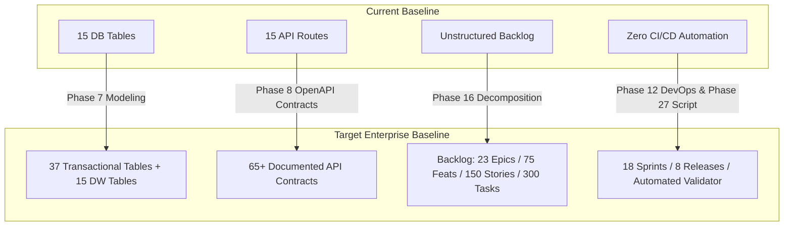

# ⚖️ Existing vs Target State Architectural Analysis
## Namma Clinic Digital Health & Operations Platform
**Document Code:** PB-GAP-02 | **Status:** Approved Baseline | **Date:** September 2026

---

### 1. Comparative Architecture Matrix

| Architectural Dimension | Existing Baseline State | Target Production Architecture | Gap Analysis & Remediation |
| :--- | :--- | :--- | :--- |
| **System Scale & Scope** | Informal pilot proposal for 20 clinics | 183+ Namma Clinics across 8 BBMP/GBA zones; ~4.7M annual visits | Scale multiplier of 9.15x. Requires multi-tier caching, read-replicas, and horizontal scaling. |
| **Application Layer** | Unimplemented conceptual Node/React architecture | Modular Monolith (TypeScript / Next.js / Node 20 LTS) with clean hexagonal domain isolation | Need strict package boundaries, domain interfaces, and DTO validation layers before implementation. |
| **Database Entities** | 15 tables in single schema | 37 Transactional Tables + 7 Star Schema Fact Tables + 8 Dimensions | 30 additional tables required across geographic master, inventory ledger, indents, and grievances. |
| **API Endpoints** | 15 basic REST routes in OpenAPI YAML | 65+ REST endpoints across 22 operational domains | Missing endpoints for indents, batch stock tracking, emergency exceptions, and audit streaming. |
| **Offline Operations** | High-level Service Worker / IndexedDB concept | Production Offline-First Sync Engine with CRDT conflict resolution, offline PIN, and tamper-evident local storage | Full offline state machine, local schema migrations, and sync queue retry architecture required. |
| **Security & RBAC** | Basic JWT and 6 conceptual roles | Fine-grained RBAC with 12 roles, 48 permissions, WebAuthn MFA, and DPDP Act 2023 compliance | Formal permission catalog, session invalidation, and data pseudonymization pipelines required. |
| **Analytics & OLAP** | 6 KPI queries defined in markdown | Star Schema DW with daily Debezium CDC / ELT pipelines, 25 KPI definitions, and zonal dashboards | Dedicated analytical read-store, dimensional modeling, and refresh pipelines required. |
| **AI / Decision Support** | Brief mention of predictive analytics | 3 Decision-Support Models (Stockout, Fever Anomaly, NCD Recall) with strict human-in-the-loop guardrails | Zero autonomous diagnosis policy, explicit physician override logging, and drift monitoring. |
| **Interoperability** | Basic ABHA verification endpoint | Full ABDM M1 (ABHA creation), M2 (HIP), M3 (HIU) with FHIR R4 bundles and eHospital referral bridge | Complete FHIR resource mapping, consent manager webhooks, and retry queues required. |
| **DevOps & Environments**| Conceptual AWS deployment plan | 6-Tier Environment Strategy (Local, Dev, Test, Staging, Pilot, Prod) with Terraform IaC and GitHub Actions CI/CD | Full pipeline definitions, secrets management (HashiCorp Vault/AWS KMS), and DR runbooks required. |

---

### 2. Domain-by-Domain Delta Evaluation

