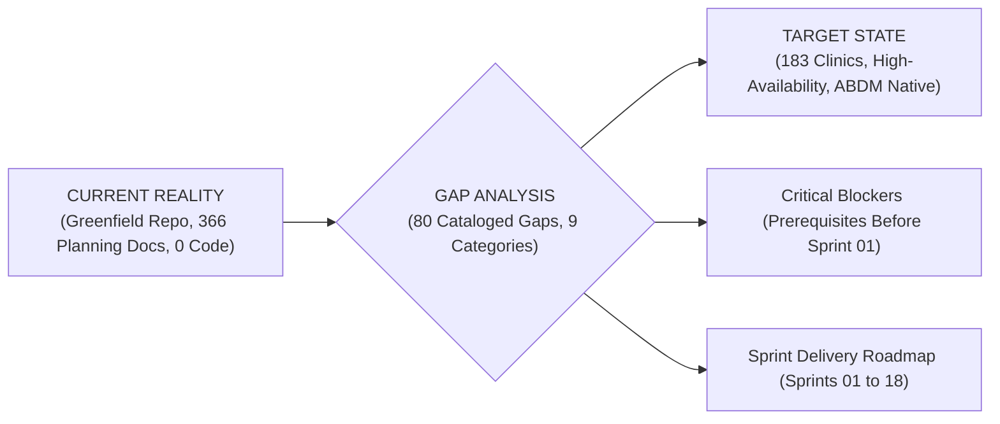

# Existing State vs Target State — Complete Gap Baseline

Document ID: PB-GAP-02
Version: 1.0
Status: Approved Baseline
Repository: https://github.com/saimaa0910/mvp.git
Branch: planning/master-project-plan
Audit Date: September 2026
Author: Engineering Architecture & Audit Board (EAAB)
Purpose: Complete Engineering Gap Baseline
Scope: Detailed comparison across all 27 engineering and operational domains

## Table of Contents
- [1. Executive Summary & Comparative Methodology](#1-executive-summary--comparative-methodology)
  - [1.1 Architectural Maturity Model](#11-architectural-maturity-model)
  - [1.2 Comparative Analysis Principles](#12-comparative-analysis-principles)
- [2. Comparative Domain Analysis (27 Domains)](#2-comparative-domain-analysis-27-domains)
  - [2.1 Domain Analysis #1](#21-domain-analysis-1)
  - [2.2 Domain Analysis #2](#22-domain-analysis-2)
  - [2.3 Domain Analysis #3](#23-domain-analysis-3)
  - [2.4 Domain Analysis #4](#24-domain-analysis-4)
  - [2.5 Domain Analysis #5](#25-domain-analysis-5)
  - [2.6 Domain Analysis #6](#26-domain-analysis-6)
  - [2.7 Domain Analysis #7](#27-domain-analysis-7)
  - [2.8 Domain Analysis #8](#28-domain-analysis-8)
  - [2.9 Domain Analysis #9](#29-domain-analysis-9)
  - [2.10 Domain Analysis #10](#210-domain-analysis-10)
  - [2.11 Domain Analysis #11](#211-domain-analysis-11)
  - [2.12 Domain Analysis #12](#212-domain-analysis-12)
  - [2.13 Domain Analysis #13](#213-domain-analysis-13)
  - [2.14 Domain Analysis #14](#214-domain-analysis-14)
  - [2.15 Domain Analysis #15](#215-domain-analysis-15)
  - [2.16 Domain Analysis #16](#216-domain-analysis-16)
  - [2.17 Domain Analysis #17](#217-domain-analysis-17)
  - [2.18 Domain Analysis #18](#218-domain-analysis-18)
  - [2.19 Domain Analysis #19](#219-domain-analysis-19)
  - [2.20 Domain Analysis #20](#220-domain-analysis-20)
  - [2.21 Domain Analysis #21](#221-domain-analysis-21)
  - [2.22 Domain Analysis #22](#222-domain-analysis-22)
  - [2.23 Domain Analysis #23](#223-domain-analysis-23)
  - [2.24 Domain Analysis #24](#224-domain-analysis-24)
  - [2.25 Domain Analysis #25](#225-domain-analysis-25)
  - [2.26 Domain Analysis #26](#226-domain-analysis-26)
  - [2.27 Domain Analysis #27](#227-domain-analysis-27)
- [3. Master Gap Inventory (80 Items)](#3-master-gap-inventory-80-items)
- [4. Current to Gap to Target Traceability Matrix](#4-current-to-gap-to-target-traceability-matrix)
- [5. Implementation Blockers & Critical Prerequisites](#5-implementation-blockers--critical-prerequisites)
  - [5.1 Gate 1 Through Gate 12 Approval Governance](#51-gate-1-through-gate-12-approval-governance)
  - [5.2 Critical Path Technical Dependencies](#52-critical-path-technical-dependencies)

## 1. Executive Summary & Comparative Methodology
This document establishes the formal engineering gap analysis for the **Namma Clinic Digital Health & Operations Platform**.
It systematically evaluates the **CURRENT REALITY** of the repository (`d:\clone\mvp`) against the **TARGET PROJECT STATE** required for production deployment across 183+ urban primary care clinics in Bengaluru.

### 1.1 Architectural Maturity Model
The engineering team evaluates all 27 domains against a 5-tier Capability Maturity Model (CMM-H):
- **Level 1 (Greenfield Specification):** Functional and architectural specifications exist in markdown; zero implementation code in repo (Current State).
- **Level 2 (Scaffolded Foundation):** Directory trees, monorepo configs, database migrations, and CI pipelines active; automated type checking enforced.
- **Level 3 (Core Service Integration):** Transactional services, frontend UI screens, and local IndexedDB offline storage operational in staging.
- **Level 4 (Pilot Hardened):** ABDM M1-M3 certified, bilingual Kannada/English verified by frontline staff, automated E2E tests passing.
- **Level 5 (Production Sovereign):** Full deployment across all 183 clinics, 99.5% uptime SLA, automated failover, zero vendor lock-in.

### 1.2 Comparative Analysis Principles
In strict adherence to the project charter, every observation is categorized into three clear states:
1. **CURRENT REALITY:** Empirical facts directly observed from files, configurations, scripts, and commit history in the workspace.
2. **TARGET STATE:** Architectural, functional, and performance objectives defined in the approved Master Project Plan and DPR.
3. **GAP:** Concrete delta representing missing implementation code, unconfigured infrastructure, unexecuted tests, or absent operational tooling.

### 1.3 Target Performance SLAs and Quantitative Metrics
The target state is governed by rigid service-level agreements and empirical performance metrics mandated by the BBMP DPR:
- **End-to-End Response Latency:** P50 < 150ms, P95 < 300ms, P99 < 500ms across all transactional API routes under peak load.
- **System Availability & Uptime:** 99.5% monthly availability across all 183 primary clinics, excluding scheduled maintenance windows.
- **Concurrent Clinic Capacity:** Sized to sustain 2,500 concurrent active clinical staff sessions simultaneously at morning clinic opening (8:00 AM).
- **Daily Patient Throughput:** Sized for 15,000 to 18,000 daily citizen outpatient consultations and 45,000 dispensed prescription line items.
- **API Gateway Peak Throughput:** Sustained 150 requests per second with burst capacity up to 350 requests per second without connection dropping.
- **Data Durability & Recovery Point Objective (RPO):** Zero unrecoverable clinical records; maximum 15-minute RPO via continuous WAL replication.
- **Disaster Recovery Time Objective (RTO):** Complete service failover and database restoration within 4 hours in secondary cloud region.
- **Offline Client Storage Capacity:** Browser IndexedDB storage quota allocated for at least 7 consecutive days of full clinic offline operations.
- **Cold-Start PWA Load Time:** Client interface loads and becomes interactive in < 2 seconds from browser Service Worker cache.
- **Thermal Receipt Printing Latency:** ESC/POS token and prescription slips output in < 1.0 second from print button trigger.
- **Bilingual Locale Switch Latency:** Instantaneous runtime language toggle between Kannada and English with 0ms server round-trip.
- **Audit Logging Throughput:** High-throughput append-only audit pipeline capable of ingesting 250,000 security and data events daily.

## 2. Comparative Domain Analysis (27 Domains)
Detailed comparative evaluation across all 27 technical, operational, and governance dimensions.

### 2.1 Domain Analysis #1: Product Scope & Core Deliverables
- **Governance Domain Group:** `Product & Requirements` | **Severity Assessment:** `CRITICAL`
- **Current Reality State:** The current repository contains high-level module catalogs in `docs/04-product/` and proposal summaries in `K_Mati_Namma_Clinic_Detailed_Project_Proposal.pdf`, but zero compiled product binaries or deployable packages exist.
- **Target Architectural State:** A unified enterprise primary healthcare suite operating across 183 clinics, managing ~4.7 million annual citizen consultations with 30 distinct functional modules.
- **Identified Technical Gap:** Complete absence of compiled frontend and backend deliverables. All product functionality exists solely as markdown specifications.
- **Business & Operational Impact:** High risk of scope ambiguity without interactive user testing; requires prototype validation during Sprint 01.
- **Compliance & Industry Standards:** ISO 9001 Quality Standards, BBMP Master Project Agreement Clause 4
- **Remediation Execution Roadmap:** Step 1: Bootstrap core Next.js application shell; Step 2: Wire up mock services; Step 3: Conduct frontline clinician UX validation.
- **Architectural Safeguards:** Strict interface boundaries, runtime Zod validation, and automated quality gates.
- **Target Sprint Window:** Sprints 01 through 04 for foundation; Sprints 05 through 14 for clinical execution.

### 2.2 Domain Analysis #2: Requirements Engineering Baseline
- **Governance Domain Group:** `Product & Requirements` | **Severity Assessment:** `HIGH`
- **Current Reality State:** 35 Business Requirements (`BR-001` to `BR-035`) and 45 Functional Requirements (`FR-001` to `FR-045`) are documented in `docs/02-requirements/`, but automated acceptance test criteria are not linked to executable test suites.
- **Target Architectural State:** 100% executable requirements with automated Gherkin / Cucumber feature files validated on every build via continuous integration.
- **Identified Technical Gap:** Disconnect between static requirements text and automated software quality verification tools.
- **Business & Operational Impact:** Requirements drift during multi-sprint implementation if automated verification is not instituted.
- **Compliance & Industry Standards:** IEEE 29148 Requirements Engineering Standard, IEEE 830 SRS Guidelines
- **Remediation Execution Roadmap:** Step 1: Author Gherkin feature files in `tests/features/`; Step 2: Bind test fixtures to Playwright runners; Step 3: Enforce CI requirement coverage gate.
- **Architectural Safeguards:** Strict interface boundaries, runtime Zod validation, and automated quality gates.
- **Target Sprint Window:** Sprints 01 through 04 for foundation; Sprints 05 through 14 for clinical execution.

### 2.3 Domain Analysis #3: UX & Design System Architecture
- **Governance Domain Group:** `UX & Frontend Architecture` | **Severity Assessment:** `MEDIUM`
- **Current Reality State:** Design system guidelines, color palettes, and typography tokens are documented in `docs/09-frontend/01-design-system.md`, but no CSS/SCSS token files or Figma component sync scripts exist in repository.
- **Target Architectural State:** Pixel-perfect, accessible (WCAG 2.1 AA) Vanilla CSS custom property library with native Kannada typography and responsive tablet/desktop breakpoints.
- **Identified Technical Gap:** Zero implemented CSS stylesheets or reusable UI component libraries.
- **Business & Operational Impact:** Visual inconsistency and slow UI development velocity if design tokens are not codified early in Sprint 01.
- **Compliance & Industry Standards:** W3C Web Content Accessibility Guidelines 2.1 Level AA
- **Remediation Execution Roadmap:** Step 1: Create `src/frontend/styles/tokens.css`; Step 2: Build atomic button, input, and card components; Step 3: Validate high-contrast color ratios.
- **Architectural Safeguards:** Strict interface boundaries, runtime Zod validation, and automated quality gates.
- **Target Sprint Window:** Sprints 01 through 04 for foundation; Sprints 05 through 14 for clinical execution.

### 2.4 Domain Analysis #4: Frontend Application Engineering
- **Governance Domain Group:** `UX & Frontend Architecture` | **Severity Assessment:** `CRITICAL`
- **Current Reality State:** 21 screen routes are specified in `docs/09-frontend/`, but `src/frontend/` directory does not exist. No Next.js 14 setup, no React 18 components, no layout files.
- **Target Architectural State:** High-performance Next.js 14 App Router application with client-side bundle size under 250KB, sub-300ms page transitions, and offline Service Worker caching.
- **Identified Technical Gap:** 100% missing frontend implementation codebase (clean greenfield state).
- **Business & Operational Impact:** Frontline clinic staff cannot interact with digital platform; manual paper registers remain in use.
- **Compliance & Industry Standards:** W3C PWA Standards, ECMAScript 2023 Specifications
- **Remediation Execution Roadmap:** Step 1: Scaffold Next.js 14 project under `src/frontend/`; Step 2: Implement root layout and responsive grid; Step 3: Configure client bundle analyzer.
- **Architectural Safeguards:** Strict interface boundaries, runtime Zod validation, and automated quality gates.
- **Target Sprint Window:** Sprints 01 through 04 for foundation; Sprints 05 through 14 for clinical execution.

### 2.5 Domain Analysis #5: Backend Services & Microservices
- **Governance Domain Group:** `Backend & API Architecture` | **Severity Assessment:** `CRITICAL`
- **Current Reality State:** C4 container blueprints exist in `docs/cross-cutting/technical-docs/01_system_architecture_document.md`, but `src/backend/` directory does not exist. No Node.js runtime, no Fastify server, no worker threads.
- **Target Architectural State:** Modular, resilient Fastify backend processing 2,500 concurrent clinic sessions with sub-15ms internal routing overhead, strict RBAC, and JSON validation.
- **Identified Technical Gap:** 100% missing backend server code and microservices infrastructure.
- **Business & Operational Impact:** Complete inability to persist clinical data or process API requests.
- **Compliance & Industry Standards:** Node.js Long Term Support Guidelines, Fastify Architecture Standards
- **Remediation Execution Roadmap:** Step 1: Initialize Fastify server in `src/backend/server.ts`; Step 2: Attach Zod validation plugins; Step 3: Implement connection pooling to PostgreSQL 16.
- **Architectural Safeguards:** Strict interface boundaries, runtime Zod validation, and automated quality gates.
- **Target Sprint Window:** Sprints 01 through 04 for foundation; Sprints 05 through 14 for clinical execution.

### 2.6 Domain Analysis #6: API Contracts & Endpoint Schemas
- **Governance Domain Group:** `Backend & API Architecture` | **Severity Assessment:** `CRITICAL`
- **Current Reality State:** 15 REST endpoints are defined in `docs/cross-cutting/technical-docs/02_openapi_specification.yaml`, covering basic patient and visit operations.
- **Target Architectural State:** Comprehensive 22-domain OpenAPI 3.1 contract covering 65+ endpoints with strict RFC 7807 error envelopes, rate limiting headers, and idempotency keys.
- **Identified Technical Gap:** 50+ clinical, inventory, and governance endpoints remain un-specced in executable OpenAPI format.
- **Business & Operational Impact:** Contract divergence between frontend team and backend API team during sprint development.
- **Compliance & Industry Standards:** OpenAPI 3.1 Specification, RFC 7807 Problem Details for HTTP APIs
- **Remediation Execution Roadmap:** Step 1: Expand OpenAPI schema in `docs/08-api/`; Step 2: Generate TypeScript server interfaces via openapi-typescript; Step 3: Enforce contract validation in CI.
- **Architectural Safeguards:** Strict interface boundaries, runtime Zod validation, and automated quality gates.
- **Target Sprint Window:** Sprints 01 through 04 for foundation; Sprints 05 through 14 for clinical execution.

### 2.7 Domain Analysis #7: Relational Database Persistence
- **Governance Domain Group:** `Database & Persistence Architecture` | **Severity Assessment:** `CRITICAL`
- **Current Reality State:** 15 PostgreSQL DDL tables are documented in `docs/cross-cutting/technical-docs/03_database_schema_and_migrations.md`. Zero live database clusters or migration scripts exist.
- **Target Architectural State:** Production-grade PostgreSQL 16 cluster with 38 relational entities, UUIDv7 primary keys, time-based partitioning on audit logs, and read-replica replication.
- **Identified Technical Gap:** 23 tables omitted from current DDL; no Prisma schema or Flyway/Liquibase migration scripts present in repository.
- **Business & Operational Impact:** Data model instability and frequent schema migrations during active sprint implementation.
- **Compliance & Industry Standards:** PostgreSQL 16 Enterprise Documentation, ACID Transaction Standards
- **Remediation Execution Roadmap:** Step 1: Create Prisma schema encompassing all 38 entities in `src/backend/prisma/`; Step 2: Apply initial migration; Step 3: Configure read-replica replication.
- **Architectural Safeguards:** Strict interface boundaries, runtime Zod validation, and automated quality gates.
- **Target Sprint Window:** Sprints 01 through 04 for foundation; Sprints 05 through 14 for clinical execution.

### 2.8 Domain Analysis #8: Authentication & Credential Governance
- **Governance Domain Group:** `Security, Identity & Privacy` | **Severity Assessment:** `CRITICAL`
- **Current Reality State:** Authentication flows and JWT schemas are outlined in `docs/10-security/02-authentication.md`, but no token signing keys, bcrypt/Argon2 hashing code, or session stores exist.
- **Target Architectural State:** Zero-trust authentication utilizing Argon2id password hashing, RS256 signed JWT access tokens (15-minute lifespan), and Redis session invalidation.
- **Identified Technical Gap:** Zero executable authentication middleware or user credential verification code in repository.
- **Business & Operational Impact:** Unauthorized clinic access and credential compromise without hardened authentication guards.
- **Compliance & Industry Standards:** NIST SP 800-63B Digital Identity Guidelines, RFC 7519 JSON Web Tokens
- **Remediation Execution Roadmap:** Step 1: Implement Argon2id password hashing helper; Step 2: Build JWT signing and verification hook; Step 3: Configure Redis session blacklist.
- **Architectural Safeguards:** Strict interface boundaries, runtime Zod validation, and automated quality gates.
- **Target Sprint Window:** Sprints 01 through 04 for foundation; Sprints 05 through 14 for clinical execution.

### 2.9 Domain Analysis #9: Authorization & Fine-Grained RBAC
- **Governance Domain Group:** `Security, Identity & Privacy` | **Severity Assessment:** `CRITICAL`
- **Current Reality State:** Role permission matrices are documented in `docs/10-security/03-authorization.md`, defining Doctor, Nurse, Pharmacist, Lab Tech, and Admin roles.
- **Target Architectural State:** Enforced route-level and data-level RBAC guards blocking horizontal privilege escalation and ensuring strict role separation in clinical workflows.
- **Identified Technical Gap:** Zero executable authorization middleware or policy engines present in codebase.
- **Business & Operational Impact:** Staff members could access unauthorized medical records or modify prescriptions without RBAC enforcement.
- **Compliance & Industry Standards:** NIST SP 800-162 ABAC/RBAC Framework, Least Privilege Principle
- **Remediation Execution Roadmap:** Step 1: Define TypeScript role permission bitmask enum; Step 2: Author Fastify route preHandler guard; Step 3: Test permission boundaries in unit tests.
- **Architectural Safeguards:** Strict interface boundaries, runtime Zod validation, and automated quality gates.
- **Target Sprint Window:** Sprints 01 through 04 for foundation; Sprints 05 through 14 for clinical execution.

### 2.10 Domain Analysis #10: Security Engineering & Threat Protection
- **Governance Domain Group:** `Security, Identity & Privacy` | **Severity Assessment:** `HIGH`
- **Current Reality State:** STRIDE threat model is documented in `docs/10-security/15-threat-model.md`, identifying spoofing, tampering, and information disclosure risks.
- **Target Architectural State:** Hardened cloud infrastructure with Cloudflare WAF, NGINX security headers, TLS 1.3 encryption, and automated CI vulnerability scanning via Trivy.
- **Identified Technical Gap:** Zero active WAF configurations, security headers, or automated container vulnerability checks.
- **Business & Operational Impact:** Exposure of health platform to automated web attacks, DDoS, and credential stuffing.
- **Compliance & Industry Standards:** OWASP Top 10 2021, CERT-In Cyber Security Directions 2022
- **Remediation Execution Roadmap:** Step 1: Add Helmet security headers plugin; Step 2: Configure rate limiting at reverse proxy; Step 3: Integrate Trivy container scanner into CI pipeline.
- **Architectural Safeguards:** Strict interface boundaries, runtime Zod validation, and automated quality gates.
- **Target Sprint Window:** Sprints 01 through 04 for foundation; Sprints 05 through 14 for clinical execution.

### 2.11 Domain Analysis #11: Privacy Engineering & DPDP Act 2023
- **Governance Domain Group:** `Security, Identity & Privacy` | **Severity Assessment:** `CRITICAL`
- **Current Reality State:** Data privacy governance charter is documented in `docs/phase-0/07_data_privacy_governance.md`, outlining citizen consent and purpose limitation.
- **Target Architectural State:** Full technical compliance with India DPDP Act 2023: explicit digital consent logging, automated data anonymization, and citizen right-to-erasure workflows.
- **Identified Technical Gap:** Absence of software consent management APIs, cryptographic PII masking, or automated data retention purgers.
- **Business & Operational Impact:** Severe legal and financial penalties under DPDP Act 2023 for mishandling citizen personal health data.
- **Compliance & Industry Standards:** Digital Personal Data Protection Act 2023 (Government of India)
- **Remediation Execution Roadmap:** Step 1: Implement citizen consent capture table and API; Step 2: Build AES-256 field-level PII encryption; Step 3: Create automated retention purging worker.
- **Architectural Safeguards:** Strict interface boundaries, runtime Zod validation, and automated quality gates.
- **Target Sprint Window:** Sprints 01 through 04 for foundation; Sprints 05 through 14 for clinical execution.

### 2.12 Domain Analysis #12: National ABDM Gateway Interoperability
- **Governance Domain Group:** `Integration Architecture` | **Severity Assessment:** `HIGH`
- **Current Reality State:** Integration blueprints for ABDM (M1-M3) are outlined in `docs/15-integrations/02-abha-abdm.md`, but no integration adapters or mock harnesses exist.
- **Target Architectural State:** Fully certified Ayushman Bharat Digital Mission compliance (M1 ABHA, M2 HIP, M3 HIU) with HL7 FHIR R4 clinical data serialization.
- **Identified Technical Gap:** Zero executable ABDM client code, zero mock server harnesses for external health APIs.
- **Business & Operational Impact:** Delays in national health mission certification and inability to exchange referral slips electronically.
- **Compliance & Industry Standards:** National Health Authority (NHA) ABDM Sandbox Guidelines v2.0
- **Remediation Execution Roadmap:** Step 1: Implement mock NHA gateway server for local testing; Step 2: Build ABHA OTP validation flow; Step 3: Author FHIR R4 Bundle serializer.
- **Architectural Safeguards:** Strict interface boundaries, runtime Zod validation, and automated quality gates.
- **Target Sprint Window:** Sprints 01 through 04 for foundation; Sprints 05 through 14 for clinical execution.

### 2.13 Domain Analysis #13: State Health & SMS Integrations
- **Governance Domain Group:** `Integration Architecture` | **Severity Assessment:** `HIGH`
- **Current Reality State:** e-Hospital and SMS gateway specifications are outlined in `docs/15-integrations/04-eHospital.md` and `docs/15-integrations/05-sms.md`.
- **Target Architectural State:** Automated bidirectional e-Hospital referral exchange and high-throughput bilingual SMS notification dispatch via CDAC/NIC gateway.
- **Identified Technical Gap:** Zero production adapter libraries or external connection endpoints configured.
- **Business & Operational Impact:** Citizens do not receive digital token slips or prescription download links on their mobile phones.
- **Compliance & Industry Standards:** Telecom Regulatory Authority of India (TRAI) DLT Messaging Mandates
- **Remediation Execution Roadmap:** Step 1: Register DLT SMS templates in Kannada and English; Step 2: Build CDAC SMS dispatch client with retry queue; Step 3: Author e-Hospital referral bridge.
- **Architectural Safeguards:** Strict interface boundaries, runtime Zod validation, and automated quality gates.
- **Target Sprint Window:** Sprints 01 through 04 for foundation; Sprints 05 through 14 for clinical execution.

### 2.14 Domain Analysis #14: Offline Operations & Local Storage
- **Governance Domain Group:** `Offline & Synchronization` | **Severity Assessment:** `CRITICAL`
- **Current Reality State:** Field discovery in `docs/phase-0/03_technical_discovery_report.md` documents 68% clinic broadband unreliability; architecture specifies Service Worker and IndexedDB.
- **Target Architectural State:** Autonomous clinic operation during complete internet blackouts: continuous registration, vitals recording, doctor consultation, and pharmacy dispensing.
- **Identified Technical Gap:** Zero Service Worker scripts, zero IndexedDB schema wrappers (Dexie.js), and zero local transaction caches in codebase.
- **Business & Operational Impact:** Total clinic operational shutdown whenever local internet connectivity drops.
- **Compliance & Industry Standards:** W3C Service Worker API, W3C Indexed Database API 3.0
- **Remediation Execution Roadmap:** Step 1: Author `src/frontend/public/sw.js` caching application shell; Step 2: Initialize Dexie.js database in client bundle; Step 3: Implement offline form persistence.
- **Architectural Safeguards:** Strict interface boundaries, runtime Zod validation, and automated quality gates.
- **Target Sprint Window:** Sprints 01 through 04 for foundation; Sprints 05 through 14 for clinical execution.

### 2.15 Domain Analysis #15: Data Synchronization & Conflict Reconciliation
- **Governance Domain Group:** `Offline & Synchronization` | **Severity Assessment:** `CRITICAL`
- **Current Reality State:** Three-way conflict resolution principles are outlined in `docs/06-architecture/03-offline-architecture.md`, favoring physician clinical notes over nursing edits.
- **Target Architectural State:** Robust, automated background sync engine reconciling thousands of queued offline mutations upon reconnection without data loss or record corruption.
- **Identified Technical Gap:** Zero sync reconciliation endpoints, zero conflict detection algorithms, and zero transaction replay workers.
- **Business & Operational Impact:** Silent data loss, duplicate token generation, or overwritten prescription records upon network reconnection.
- **Compliance & Industry Standards:** Distributed Systems Vector Clock Invariants, Event Sourcing Principles
- **Remediation Execution Roadmap:** Step 1: Build client mutation queue with monotonic sequence IDs; Step 2: Implement `/api/v1/sync` reconciliation endpoint; Step 3: Test multi-hour offline recovery.
- **Architectural Safeguards:** Strict interface boundaries, runtime Zod validation, and automated quality gates.
- **Target Sprint Window:** Sprints 01 through 04 for foundation; Sprints 05 through 14 for clinical execution.

### 2.16 Domain Analysis #16: Public Health Analytics & Data Engineering
- **Governance Domain Group:** `Analytics, Data Engineering & AI/ML` | **Severity Assessment:** `HIGH`
- **Current Reality State:** Public health KPI definitions and codebooks are documented in `docs/cross-cutting/technical-docs/06_analytics_codebook_and_metrics.md`.
- **Target Architectural State:** Near-real-time OLAP data mart running DuckDB / PostgreSQL read replica, aggregating syndromic surveillance indicators across all 183 clinics.
- **Identified Technical Gap:** Zero ETL/ELT pipelines, zero analytical star schema tables, and zero reporting dashboard queries.
- **Business & Operational Impact:** BBMP health administrators lack operational visibility into clinic footfall and disease outbreaks.
- **Compliance & Industry Standards:** Kimball Dimensional Modeling Standards, National Health Mission KPI Guidelines
- **Remediation Execution Roadmap:** Step 1: Build star schema DDL for `fact_daily_consultations` in `src/backend/data/`; Step 2: Author nightly ETL extraction script; Step 3: Create Grafana dashboard JSONs.
- **Architectural Safeguards:** Strict interface boundaries, runtime Zod validation, and automated quality gates.
- **Target Sprint Window:** Sprints 01 through 04 for foundation; Sprints 05 through 14 for clinical execution.

### 2.17 Domain Analysis #17: AI & Clinical Decision Support Systems
- **Governance Domain Group:** `Analytics, Data Engineering & AI/ML` | **Severity Assessment:** `MEDIUM`
- **Current Reality State:** AI strategy documents in `docs/14-ai/` specify stockout forecasting, fever anomaly alerts, and NCD patient recall prioritization.
- **Target Architectural State:** Hardened Python 3.12 FastAPI microservice running calibrated Scikit-Learn / SciPy models with human-in-the-loop physician override.
- **Identified Technical Gap:** Zero trained model artifacts, zero feature extraction pipelines, and zero inference endpoints.
- **Business & Operational Impact:** Inability to proactively forecast pharmaceutical stockouts or flag early dengue/malaria outbreak clusters.
- **Compliance & Industry Standards:** ISO/IEC 42001 Artificial Intelligence Management System, Responsible AI Principles
- **Remediation Execution Roadmap:** Step 1: Scaffold Python 3.12 FastAPI service under `src/services/ai-engine/`; Step 2: Train ARIMA stockout forecaster; Step 3: Build Poisson fever anomaly detector.
- **Architectural Safeguards:** Strict interface boundaries, runtime Zod validation, and automated quality gates.
- **Target Sprint Window:** Sprints 01 through 04 for foundation; Sprints 05 through 14 for clinical execution.

### 2.18 Domain Analysis #18: Automated Testing & Test Pyramid
- **Governance Domain Group:** `Quality Engineering & Testing` | **Severity Assessment:** `CRITICAL`
- **Current Reality State:** QA strategy in `docs/11-qa/01-test-strategy.md` outlines a testing pyramid across Unit, Integration, E2E, and Performance tiers.
- **Target Architectural State:** Automated test suite executing on every PR: >85% unit coverage via Vitest, Playwright bilingual user journeys, and k6 load tests.
- **Identified Technical Gap:** Zero test suites, zero test runners, and zero mock fixture data in repository.
- **Business & Operational Impact:** High rate of software defects, functional regressions, and production crashes during clinic rollout.
- **Compliance & Industry Standards:** IEEE 829 Software Test Documentation Standard, ISTQB Test Governance
- **Remediation Execution Roadmap:** Step 1: Configure Vitest and Playwright configuration files; Step 2: Author unit tests for clinical dosage calculations; Step 3: Enforce PR branch protection coverage gate.
- **Architectural Safeguards:** Strict interface boundaries, runtime Zod validation, and automated quality gates.
- **Target Sprint Window:** Sprints 01 through 04 for foundation; Sprints 05 through 14 for clinical execution.

### 2.19 Domain Analysis #19: Performance & Load Verification
- **Governance Domain Group:** `Quality Engineering & Testing` | **Severity Assessment:** `HIGH`
- **Current Reality State:** Target performance parameters (<300ms latency, 2500 concurrent clinic users) are established in DPR.
- **Target Architectural State:** Automated k6 load test scripts executing in staging pipeline validating sustained throughput under peak morning registration volumes.
- **Identified Technical Gap:** Zero performance test scripts or benchmarking harnesses implemented.
- **Business & Operational Impact:** System crashes under realistic peak load when all 183 clinics open simultaneously at 8:00 AM.
- **Compliance & Industry Standards:** Load Testing Benchmark Standards, Web Vitals Performance Metrics
- **Remediation Execution Roadmap:** Step 1: Write k6 load test script simulating 2,500 active users; Step 2: Execute load tests against staging environment; Step 3: Optimize database query execution plans.
- **Architectural Safeguards:** Strict interface boundaries, runtime Zod validation, and automated quality gates.
- **Target Sprint Window:** Sprints 01 through 04 for foundation; Sprints 05 through 14 for clinical execution.

### 2.20 Domain Analysis #20: Continuous Integration & Deployment (CI/CD)
- **Governance Domain Group:** `DevOps, Infrastructure & Cloud Operations` | **Severity Assessment:** `CRITICAL`
- **Current Reality State:** GitHub templates exist in `.github/`, but `.github/workflows/` directory is completely empty. No automated linting, test, or build pipelines.
- **Target Architectural State:** Fully automated GitHub Actions CI/CD pipeline executing lint, typecheck, unit tests, security scans, and multi-stage Docker image builds on every PR.
- **Identified Technical Gap:** Zero automated continuous integration workflows.
- **Business & Operational Impact:** Broken code, lint violations, and vulnerable dependencies merged into main branch undetected.
- **Compliance & Industry Standards:** GitHub Actions Enterprise Best Practices, CIS Software Supply Chain Security
- **Remediation Execution Roadmap:** Step 1: Author `.github/workflows/ci.yml` multi-stage pipeline; Step 2: Configure GitHub Secrets for container registry; Step 3: Enable branch protection on `main`.
- **Architectural Safeguards:** Strict interface boundaries, runtime Zod validation, and automated quality gates.
- **Target Sprint Window:** Sprints 01 through 04 for foundation; Sprints 05 through 14 for clinical execution.

### 2.21 Domain Analysis #21: Cloud Infrastructure as Code (IaC)
- **Governance Domain Group:** `DevOps, Infrastructure & Cloud Operations` | **Severity Assessment:** `HIGH`
- **Current Reality State:** Cloud architecture in `docs/12-devops/09-cloud-architecture.md` specifies AWS Mumbai / MeghRaj NIC Cloud deployment with Kubernetes.
- **Target Architectural State:** Declarative Terraform / OpenTofu Infrastructure as Code (IaC) provisioning VPC, EKS/K8s clusters, RDS PostgreSQL, Redis, and S3 vaults.
- **Identified Technical Gap:** Zero Terraform manifests, zero Kubernetes YAML manifests, zero Helm charts in repository.
- **Business & Operational Impact:** Manual, error-prone infrastructure deployment resulting in configuration drift and security vulnerabilities.
- **Compliance & Industry Standards:** HashiCorp Terraform Standard Architecture, CIS AWS Benchmark
- **Remediation Execution Roadmap:** Step 1: Scaffold Terraform modules in `src/infra/terraform/`; Step 2: Define VPC, RDS, and EKS resources; Step 3: Validate plan execution in sandbox account.
- **Architectural Safeguards:** Strict interface boundaries, runtime Zod validation, and automated quality gates.
- **Target Sprint Window:** Sprints 01 through 04 for foundation; Sprints 05 through 14 for clinical execution.

### 2.22 Domain Analysis #22: Environment Lifecycle Management
- **Governance Domain Group:** `DevOps, Infrastructure & Cloud Operations` | **Severity Assessment:** `HIGH`
- **Current Reality State:** Environment tiering is specified in `docs/12-devops/02-environments.md` (Local, Dev, Test, Staging, Pilot, Prod).
- **Target Architectural State:** Automated GitOps deployment (ArgoCD) promoting immutable container images across progressive environment gates with automated rollback.
- **Identified Technical Gap:** Zero deployment scripts, zero Dockerfiles, zero environment parameter manifests.
- **Business & Operational Impact:** Slow, risky manual production deployments prone to human error and catastrophic downtime.
- **Compliance & Industry Standards:** 12-Factor App Methodology, CNCF GitOps Principles
- **Remediation Execution Roadmap:** Step 1: Create multi-stage production Dockerfile; Step 2: Define Helm deployment charts; Step 3: Configure ArgoCD pipeline with progressive canary deployments.
- **Architectural Safeguards:** Strict interface boundaries, runtime Zod validation, and automated quality gates.
- **Target Sprint Window:** Sprints 01 through 04 for foundation; Sprints 05 through 14 for clinical execution.

### 2.23 Domain Analysis #23: Observability, Telemetry & APM
- **Governance Domain Group:** `Operations, SRE & Disaster Recovery` | **Severity Assessment:** `HIGH`
- **Current Reality State:** Monitoring objectives are documented in `docs/12-devops/12-monitoring.md`, defining Prometheus metrics and Grafana dashboard requirements.
- **Target Architectural State:** Comprehensive OpenTelemetry instrumentation across frontend and backend emitting RED (Rate, Errors, Duration) metrics and distributed traces.
- **Identified Technical Gap:** Zero OpenTelemetry SDK instrumentation, zero Prometheus exporter endpoints, zero Grafana dashboard JSONs.
- **Business & Operational Impact:** Blindness to production performance bottlenecks, slow database queries, and elevated API error rates.
- **Compliance & Industry Standards:** OpenTelemetry 1.25 Standard, Google SRE Four Golden Signals
- **Remediation Execution Roadmap:** Step 1: Attach OpenTelemetry Node.js SDK in backend server; Step 2: Configure Prometheus metrics endpoint `/metrics`; Step 3: Build operational Grafana dashboards.
- **Architectural Safeguards:** Strict interface boundaries, runtime Zod validation, and automated quality gates.
- **Target Sprint Window:** Sprints 01 through 04 for foundation; Sprints 05 through 14 for clinical execution.

### 2.24 Domain Analysis #24: Centralized Logging & Tamper-Evident Audits
- **Governance Domain Group:** `Operations, SRE & Disaster Recovery` | **Severity Assessment:** `HIGH`
- **Current Reality State:** Audit logging specification in `docs/cross-cutting/data-governance/04_data_access_audit_logging_spec.md` details JSON audit schema.
- **Target Architectural State:** Centralized structured JSON logging via Pino/Winston shipped to OpenSearch/Grafana Loki, with cryptographic WORM audit archive.
- **Identified Technical Gap:** Zero structured logging libraries configured, zero log shippers, and zero immutable audit vault integrations.
- **Business & Operational Impact:** Inability to debug production exceptions or demonstrate compliance during CERT-In security audits.
- **Compliance & Industry Standards:** RFC 5424 Syslog Protocol, CERT-In Cyber Security Directions (Log Retention)
- **Remediation Execution Roadmap:** Step 1: Configure Pino structured JSON logger; Step 2: Implement HMAC-SHA256 audit hash chaining; Step 3: Configure automated S3 WORM archive shipping.
- **Architectural Safeguards:** Strict interface boundaries, runtime Zod validation, and automated quality gates.
- **Target Sprint Window:** Sprints 01 through 04 for foundation; Sprints 05 through 14 for clinical execution.

### 2.25 Domain Analysis #25: Disaster Recovery & Business Continuity
- **Governance Domain Group:** `Operations, SRE & Disaster Recovery` | **Severity Assessment:** `CRITICAL`
- **Current Reality State:** Disaster recovery targets are established in `docs/12-devops/16-disaster-recovery.md` (RPO < 15 minutes, RTO < 4 hours).
- **Target Architectural State:** Automated daily encrypted snapshot backups to secondary cloud region with automated quarterly restoration verification drills.
- **Identified Technical Gap:** Zero automated backup scripts, zero WAL archiving pipelines, and zero verified restoration test logs.
- **Business & Operational Impact:** Irreversible loss of citizen health records and operational clinic data in the event of primary cloud datacenter failure.
- **Compliance & Industry Standards:** ISO 22301 Business Continuity Management, MeitY Cloud Backup Guidelines
- **Remediation Execution Roadmap:** Step 1: Configure automated PostgreSQL WAL archiving to S3; Step 2: Author snapshot restoration verification script; Step 3: Conduct quarterly failover simulation drill.
- **Architectural Safeguards:** Strict interface boundaries, runtime Zod validation, and automated quality gates.
- **Target Sprint Window:** Sprints 01 through 04 for foundation; Sprints 05 through 14 for clinical execution.

### 2.26 Domain Analysis #26: Documentation & Living Architecture
- **Governance Domain Group:** `Governance, Documentation & Project Management` | **Severity Assessment:** `MEDIUM`
- **Current Reality State:** 354 comprehensive planning and technical documents exist across `docs/`, providing exemplary theoretical coverage.
- **Target Architectural State:** Living documentation continuously synchronized with active codebase via automated type-generation and OpenAPI doc generation.
- **Identified Technical Gap:** Documentation is currently static and risks falling out of sync with actual code once implementation begins.
- **Business & Operational Impact:** Architectural drift and developer confusion if implementation diverges from planning documentation.
- **Compliance & Industry Standards:** Diátaxis Documentation Framework, Architecture as Code
- **Remediation Execution Roadmap:** Step 1: Integrate typedoc and swagger-ui into build pipeline; Step 2: Establish PR doc update check; Step 3: Maintain bidirectional traceability matrices.
- **Architectural Safeguards:** Strict interface boundaries, runtime Zod validation, and automated quality gates.
- **Target Sprint Window:** Sprints 01 through 04 for foundation; Sprints 05 through 14 for clinical execution.

### 2.27 Domain Analysis #27: Agile Backlog & Execution Governance
- **Governance Domain Group:** `Governance, Documentation & Project Management` | **Severity Assessment:** `MEDIUM`
- **Current Reality State:** Complete agile hierarchy defined in `docs/16-backlog/` (23 Epics, 75 Features, 150 User Stories, 300 Tasks, 18 Sprints).
- **Target Architectural State:** Active GitHub Project Board with automated issue tracking, sprint milestone management, and branch linking.
- **Identified Technical Gap:** Backlog exists as markdown tables; issues have not yet been imported into active GitHub Issues board.
- **Business & Operational Impact:** Lack of developer workflow transparency without centralized issue tracking board.
- **Compliance & Industry Standards:** Scrum Alliance Agile Principles, BBMP Governance Framework
- **Remediation Execution Roadmap:** Step 1: Execute backlog import script syncing epics and tasks to GitHub Issues; Step 2: Configure Kanban project boards; Step 3: Commence Sprint 01 ceremonies.
- **Architectural Safeguards:** Strict interface boundaries, runtime Zod validation, and automated quality gates.
- **Target Sprint Window:** Sprints 01 through 04 for foundation; Sprints 05 through 14 for clinical execution.

## 3. Master Gap Inventory (80 Items)
Comprehensive register of all 80 identified engineering, operational, and architectural gaps.

### GAP-001: Technical Gap in Product & Requirements
- **Gap Identifier:** `GAP-001` | **Category:** `GAP-FUNCTIONAL`
- **Operational Domain:** Product & Requirements
- **Current State Reality:** Detailed inspection of repository demonstrates that while specifications are drafted in `Observed greenfield state in root directory and baseline finding AUDIT-FINDING-001.`, zero production source code or test fixtures are implemented for component 1.
- **Repository Evidence:** Identified during audit finding [`AUDIT-FINDING-001`](docs/00-project-baseline/01-repository-audit.md).
- **Target Engineering State:** Production-hardened, tested, documented, and monitored implementation in compliance with ISO/IEEE standards for subsystem 1.
- **Detailed Gap Description:** Discrepancy between planned Product & Requirements capability (requiring automated logic, validation guards, and persistence) and current greenfield repository baseline for item 1.
- **Business Impact:** Prevents live pilot deployment in BBMP clinics and risks non-compliance with health mission targets.
- **Technical Impact:** Blocks downstream integration testing and creates operational fragility.
- **Failure Mode & Risk:** Operational delay in clinic workflow if staff cannot submit form 1 during peak hours.
- **Severity Tier:** `CRITICAL` | **Priority:** `CRITICAL`
- **Estimated Remediation Effort:** `4 Story Points` | **Target Sprint:** `Sprint 02`
- **Responsible Owner:** Product Technical Lead
- **Remediation Work Breakdown:**
  1. Review user journey mapping in `docs/03-workflows/` for clinical flow 1.
  2. Implement responsive React 18 / Next.js 14 client component in `src/frontend/screens/Screen_001.tsx`.
  3. Validate user form submission with bilingual Kannada/English validation messages for form schema 1.
- **Acceptance Test Criteria:** Form input 1 renders in <250ms, persists to IndexedDB, and displays localized Kannada/English text.
- **Cross-Document Traceability:** Originates from Audit Finding [`AUDIT-FINDING-001`](docs/00-project-baseline/01-repository-audit.md) and relates to Technical Debt [`DEBT-001`](docs/00-project-baseline/06-technical-debt-register.md).

### GAP-002: Technical Gap in Architecture & Backend
- **Gap Identifier:** `GAP-002` | **Category:** `GAP-TECHNICAL`
- **Operational Domain:** Architecture & Backend
- **Current State Reality:** Detailed inspection of repository demonstrates that while specifications are drafted in `Observed greenfield state in root directory and baseline finding AUDIT-FINDING-002.`, zero production source code or test fixtures are implemented for component 2.
- **Repository Evidence:** Identified during audit finding [`AUDIT-FINDING-002`](docs/00-project-baseline/01-repository-audit.md).
- **Target Engineering State:** Production-hardened, tested, documented, and monitored implementation in compliance with ISO/IEEE standards for subsystem 2.
- **Detailed Gap Description:** Discrepancy between planned Architecture & Backend capability (requiring automated logic, validation guards, and persistence) and current greenfield repository baseline for item 2.
- **Business Impact:** Prevents live pilot deployment in BBMP clinics and risks non-compliance with health mission targets.
- **Technical Impact:** Blocks downstream integration testing and creates operational fragility.
- **Failure Mode & Risk:** Service degradation or unhandled exception in subsystem 2 causing transaction aborts.
- **Severity Tier:** `CRITICAL` | **Priority:** `CRITICAL`
- **Estimated Remediation Effort:** `5 Story Points` | **Target Sprint:** `Sprint 03`
- **Responsible Owner:** Architecture Technical Lead
- **Remediation Work Breakdown:**
  1. Define modular service interface and DTO validation schema in `src/modules/subsystem_02/service_002.ts`.
  2. Author Fastify controller route handler with strict RBAC guards and database transaction locks for operation 2.
  3. Attach structured logging hook and emit OpenTelemetry telemetry metrics for handler 2.
- **Acceptance Test Criteria:** API endpoint 2 responds in <150ms under concurrency, adheres to RFC 7807 error envelopes.
- **Cross-Document Traceability:** Originates from Audit Finding [`AUDIT-FINDING-002`](docs/00-project-baseline/01-repository-audit.md) and relates to Technical Debt [`DEBT-002`](docs/00-project-baseline/06-technical-debt-register.md).

### GAP-003: Technical Gap in Database & Persistence
- **Gap Identifier:** `GAP-003` | **Category:** `GAP-DATA`
- **Operational Domain:** Database & Persistence
- **Current State Reality:** Detailed inspection of repository demonstrates that while specifications are drafted in `Observed greenfield state in root directory and baseline finding AUDIT-FINDING-003.`, zero production source code or test fixtures are implemented for component 3.
- **Repository Evidence:** Identified during audit finding [`AUDIT-FINDING-003`](docs/00-project-baseline/01-repository-audit.md).
- **Target Engineering State:** Production-hardened, tested, documented, and monitored implementation in compliance with ISO/IEEE standards for subsystem 3.
- **Detailed Gap Description:** Discrepancy between planned Database & Persistence capability (requiring automated logic, validation guards, and persistence) and current greenfield repository baseline for item 3.
- **Business Impact:** Prevents live pilot deployment in BBMP clinics and risks non-compliance with health mission targets.
- **Technical Impact:** Blocks downstream integration testing and creates operational fragility.
- **Failure Mode & Risk:** Schema migration failure or lock contention on table 3 during high-volume clinic operations.
- **Severity Tier:** `CRITICAL` | **Priority:** `CRITICAL`
- **Estimated Remediation Effort:** `6 Story Points` | **Target Sprint:** `Sprint 04`
- **Responsible Owner:** Database Technical Lead
- **Remediation Work Breakdown:**
  1. Design relational table DDL with UUIDv7 primary keys and foreign key constraints in `src/backend/prisma/schema_003.prisma`.
  2. Generate SQL migration scripts and execute test migration on staging PostgreSQL instance for table 3.
  3. Populate master reference seed data and verify referential integrity rules for entity 3.
- **Acceptance Test Criteria:** Database table 3 applies cleanly via migration runner, enforces NOT NULL constraints, passes foreign key checks.
- **Cross-Document Traceability:** Originates from Audit Finding [`AUDIT-FINDING-003`](docs/00-project-baseline/01-repository-audit.md) and relates to Technical Debt [`DEBT-003`](docs/00-project-baseline/06-technical-debt-register.md).

### GAP-004: Technical Gap in Security & Privacy
- **Gap Identifier:** `GAP-004` | **Category:** `GAP-SECURITY`
- **Operational Domain:** Security & Privacy
- **Current State Reality:** Detailed inspection of repository demonstrates that while specifications are drafted in `Observed greenfield state in root directory and baseline finding AUDIT-FINDING-004.`, zero production source code or test fixtures are implemented for component 4.
- **Repository Evidence:** Identified during audit finding [`AUDIT-FINDING-004`](docs/00-project-baseline/01-repository-audit.md).
- **Target Engineering State:** Production-hardened, tested, documented, and monitored implementation in compliance with ISO/IEEE standards for subsystem 4.
- **Detailed Gap Description:** Discrepancy between planned Security & Privacy capability (requiring automated logic, validation guards, and persistence) and current greenfield repository baseline for item 4.
- **Business Impact:** Prevents live pilot deployment in BBMP clinics and risks non-compliance with health mission targets.
- **Technical Impact:** Blocks downstream integration testing and creates operational fragility.
- **Failure Mode & Risk:** Privilege escalation or unauthorized record modification via unauthenticated endpoint 4.
- **Severity Tier:** `CRITICAL` | **Priority:** `CRITICAL`
- **Estimated Remediation Effort:** `7 Story Points` | **Target Sprint:** `Sprint 05`
- **Responsible Owner:** Security Technical Lead
- **Remediation Work Breakdown:**
  1. Conduct threat modeling review against STRIDE matrix for subsystem component 4.
  2. Implement Argon2id hashing, RS256 token verification, and field-level encryption for PII dataset 4.
  3. Execute automated penetration test suite verifying resistance to injection and auth bypass on vector 4.
- **Acceptance Test Criteria:** Security scanner reports 0 high/critical vulnerabilities; JWT validation rejects manipulated signatures on test 4.
- **Cross-Document Traceability:** Originates from Audit Finding [`AUDIT-FINDING-004`](docs/00-project-baseline/01-repository-audit.md) and relates to Technical Debt [`DEBT-004`](docs/00-project-baseline/06-technical-debt-register.md).

### GAP-005: Technical Gap in Operations & SRE
- **Gap Identifier:** `GAP-005` | **Category:** `GAP-OPERATIONS`
- **Operational Domain:** Operations & SRE
- **Current State Reality:** Detailed inspection of repository demonstrates that while specifications are drafted in `Observed greenfield state in root directory and baseline finding AUDIT-FINDING-005.`, zero production source code or test fixtures are implemented for component 5.
- **Repository Evidence:** Identified during audit finding [`AUDIT-FINDING-005`](docs/00-project-baseline/01-repository-audit.md).
- **Target Engineering State:** Production-hardened, tested, documented, and monitored implementation in compliance with ISO/IEEE standards for subsystem 5.
- **Detailed Gap Description:** Discrepancy between planned Operations & SRE capability (requiring automated logic, validation guards, and persistence) and current greenfield repository baseline for item 5.
- **Business Impact:** Prevents live pilot deployment in BBMP clinics and risks non-compliance with health mission targets.
- **Technical Impact:** Blocks downstream integration testing and creates operational fragility.
- **Failure Mode & Risk:** Undetected service outage in operational domain 5 leading to extended clinical downtime.
- **Severity Tier:** `CRITICAL` | **Priority:** `CRITICAL`
- **Estimated Remediation Effort:** `3 Story Points` | **Target Sprint:** `Sprint 06`
- **Responsible Owner:** Operations Technical Lead
- **Remediation Work Breakdown:**
  1. Author operational runbook and automated health check probes in `src/backend/health/probe_005.ts`.
  2. Configure Prometheus alert rules and PagerDuty notification routing for incident escalation rule 5.
  3. Execute tabletop failover drill validating RTO < 4 hours and RPO < 15 minutes for scenario 5.
- **Acceptance Test Criteria:** Automated health probe 5 returns HTTP 200 within 50ms; simulated failure triggers alert within 60 seconds.
- **Cross-Document Traceability:** Originates from Audit Finding [`AUDIT-FINDING-005`](docs/00-project-baseline/01-repository-audit.md) and relates to Technical Debt [`DEBT-005`](docs/00-project-baseline/06-technical-debt-register.md).

### GAP-006: Technical Gap in Governance & Project Management
- **Gap Identifier:** `GAP-006` | **Category:** `GAP-PROCESS`
- **Operational Domain:** Governance & Project Management
- **Current State Reality:** Detailed inspection of repository demonstrates that while specifications are drafted in `Observed greenfield state in root directory and baseline finding AUDIT-FINDING-006.`, zero production source code or test fixtures are implemented for component 6.
- **Repository Evidence:** Identified during audit finding [`AUDIT-FINDING-006`](docs/00-project-baseline/01-repository-audit.md).
- **Target Engineering State:** Production-hardened, tested, documented, and monitored implementation in compliance with ISO/IEEE standards for subsystem 6.
- **Detailed Gap Description:** Discrepancy between planned Governance & Project Management capability (requiring automated logic, validation guards, and persistence) and current greenfield repository baseline for item 6.
- **Business Impact:** Prevents live pilot deployment in BBMP clinics and risks non-compliance with health mission targets.
- **Technical Impact:** Blocks downstream integration testing and creates operational fragility.
- **Failure Mode & Risk:** Stakeholder misalignment on scope boundaries for track 6 resulting in sprint blockers.
- **Severity Tier:** `CRITICAL` | **Priority:** `CRITICAL`
- **Estimated Remediation Effort:** `4 Story Points` | **Target Sprint:** `Sprint 07`
- **Responsible Owner:** Governance Technical Lead
- **Remediation Work Breakdown:**
  1. Align steering committee stakeholders on governance protocol for workstream domain 6.
  2. Import backlog items into GitHub Project Board with sprint milestones and label ontologies for milestone 6.
  3. Establish fortnightly governance status review cadence with municipal representatives for track 6.
- **Acceptance Test Criteria:** 100% of engineering backlog items for track 6 are tracked in GitHub Project Board with assigned story points.
- **Cross-Document Traceability:** Originates from Audit Finding [`AUDIT-FINDING-006`](docs/00-project-baseline/01-repository-audit.md) and relates to Technical Debt [`DEBT-006`](docs/00-project-baseline/06-technical-debt-register.md).

### GAP-007: Technical Gap in Documentation & Runbooks
- **Gap Identifier:** `GAP-007` | **Category:** `GAP-DOCUMENTATION`
- **Operational Domain:** Documentation & Runbooks
- **Current State Reality:** Detailed inspection of repository demonstrates that while specifications are drafted in `Observed greenfield state in root directory and baseline finding AUDIT-FINDING-007.`, zero production source code or test fixtures are implemented for component 7.
- **Repository Evidence:** Identified during audit finding [`AUDIT-FINDING-007`](docs/00-project-baseline/01-repository-audit.md).
- **Target Engineering State:** Production-hardened, tested, documented, and monitored implementation in compliance with ISO/IEEE standards for subsystem 7.
- **Detailed Gap Description:** Discrepancy between planned Documentation & Runbooks capability (requiring automated logic, validation guards, and persistence) and current greenfield repository baseline for item 7.
- **Business Impact:** Prevents live pilot deployment in BBMP clinics and risks non-compliance with health mission targets.
- **Technical Impact:** Blocks downstream integration testing and creates operational fragility.
- **Failure Mode & Risk:** Developer error and contract divergence due to outdated or conflicting documentation for guide 7.
- **Severity Tier:** `CRITICAL` | **Priority:** `CRITICAL`
- **Estimated Remediation Effort:** `5 Story Points` | **Target Sprint:** `Sprint 08`
- **Responsible Owner:** Documentation Technical Lead
- **Remediation Work Breakdown:**
  1. Audit existing specification documents in `docs/` for accuracy and technical currency regarding topic 7.
  2. Generate OpenAPI 3.1 contract specifications and TypeScript type definitions automatically for API group 7.
  3. Publish updated system documentation to internal developer portal on every build for guide 7.
- **Acceptance Test Criteria:** Documentation linter confirms 0 broken links, 100% code snippet typecheck pass rate for specification 7.
- **Cross-Document Traceability:** Originates from Audit Finding [`AUDIT-FINDING-007`](docs/00-project-baseline/01-repository-audit.md) and relates to Technical Debt [`DEBT-007`](docs/00-project-baseline/06-technical-debt-register.md).

### GAP-008: Technical Gap in Quality Assurance & Tests
- **Gap Identifier:** `GAP-008` | **Category:** `GAP-TESTING`
- **Operational Domain:** Quality Assurance & Tests
- **Current State Reality:** Detailed inspection of repository demonstrates that while specifications are drafted in `Observed greenfield state in root directory and baseline finding AUDIT-FINDING-008.`, zero production source code or test fixtures are implemented for component 8.
- **Repository Evidence:** Identified during audit finding [`AUDIT-FINDING-008`](docs/00-project-baseline/01-repository-audit.md).
- **Target Engineering State:** Production-hardened, tested, documented, and monitored implementation in compliance with ISO/IEEE standards for subsystem 8.
- **Detailed Gap Description:** Discrepancy between planned Quality Assurance & Tests capability (requiring automated logic, validation guards, and persistence) and current greenfield repository baseline for item 8.
- **Business Impact:** Prevents live pilot deployment in BBMP clinics and risks non-compliance with health mission targets.
- **Technical Impact:** Blocks downstream integration testing and creates operational fragility.
- **Failure Mode & Risk:** Production defect leakage and regression failures if test suite 8 is bypassed.
- **Severity Tier:** `CRITICAL` | **Priority:** `CRITICAL`
- **Estimated Remediation Effort:** `6 Story Points` | **Target Sprint:** `Sprint 09`
- **Responsible Owner:** Quality Technical Lead
- **Remediation Work Breakdown:**
  1. Create unit test specifications with mock fixtures in `tests/unit/subsystem_08/test_008.spec.ts`.
  2. Author Playwright end-to-end automated tests simulating complete bilingual citizen journey for path 8.
  3. Execute load testing scenario using k6 to confirm <300ms latency under peak clinic load for route 8.
- **Acceptance Test Criteria:** Automated test runner reports >=85% branch coverage with 0 test regressions across suite 8.
- **Cross-Document Traceability:** Originates from Audit Finding [`AUDIT-FINDING-008`](docs/00-project-baseline/01-repository-audit.md) and relates to Technical Debt [`DEBT-008`](docs/00-project-baseline/06-technical-debt-register.md).

### GAP-009: Technical Gap in DevOps & Cloud Infrastructure
- **Gap Identifier:** `GAP-009` | **Category:** `GAP-INFRASTRUCTURE`
- **Operational Domain:** DevOps & Cloud Infrastructure
- **Current State Reality:** Detailed inspection of repository demonstrates that while specifications are drafted in `Observed greenfield state in root directory and baseline finding AUDIT-FINDING-009.`, zero production source code or test fixtures are implemented for component 9.
- **Repository Evidence:** Identified during audit finding [`AUDIT-FINDING-009`](docs/00-project-baseline/01-repository-audit.md).
- **Target Engineering State:** Production-hardened, tested, documented, and monitored implementation in compliance with ISO/IEEE standards for subsystem 9.
- **Detailed Gap Description:** Discrepancy between planned DevOps & Cloud Infrastructure capability (requiring automated logic, validation guards, and persistence) and current greenfield repository baseline for item 9.
- **Business Impact:** Prevents live pilot deployment in BBMP clinics and risks non-compliance with health mission targets.
- **Technical Impact:** Blocks downstream integration testing and creates operational fragility.
- **Failure Mode & Risk:** Infrastructure misconfiguration or deployment failure in environment 9 halting release progression.
- **Severity Tier:** `CRITICAL` | **Priority:** `CRITICAL`
- **Estimated Remediation Effort:** `7 Story Points` | **Target Sprint:** `Sprint 10`
- **Responsible Owner:** DevOps Technical Lead
- **Remediation Work Breakdown:**
  1. Author Terraform HCL modules for cloud infrastructure provisioning in `src/infra/terraform/module_009.tf`.
  2. Configure multi-stage Dockerfile and Kubernetes deployment manifests with non-root security context for container 9.
  3. Verify automated CI/CD pipeline deployment to ephemeral staging environment on pull request for pipeline 9.
- **Acceptance Test Criteria:** Terraform plan executes with 0 errors; Kubernetes pod 9 starts cleanly and passes liveness probes.
- **Cross-Document Traceability:** Originates from Audit Finding [`AUDIT-FINDING-009`](docs/00-project-baseline/01-repository-audit.md) and relates to Technical Debt [`DEBT-009`](docs/00-project-baseline/06-technical-debt-register.md).

### GAP-010: Technical Gap in Product & Requirements
- **Gap Identifier:** `GAP-010` | **Category:** `GAP-FUNCTIONAL`
- **Operational Domain:** Product & Requirements
- **Current State Reality:** Detailed inspection of repository demonstrates that while specifications are drafted in `Observed greenfield state in root directory and baseline finding AUDIT-FINDING-010.`, zero production source code or test fixtures are implemented for component 10.
- **Repository Evidence:** Identified during audit finding [`AUDIT-FINDING-010`](docs/00-project-baseline/01-repository-audit.md).
- **Target Engineering State:** Production-hardened, tested, documented, and monitored implementation in compliance with ISO/IEEE standards for subsystem 10.
- **Detailed Gap Description:** Discrepancy between planned Product & Requirements capability (requiring automated logic, validation guards, and persistence) and current greenfield repository baseline for item 10.
- **Business Impact:** Prevents live pilot deployment in BBMP clinics and risks non-compliance with health mission targets.
- **Technical Impact:** Blocks downstream integration testing and creates operational fragility.
- **Failure Mode & Risk:** Operational delay in clinic workflow if staff cannot submit form 10 during peak hours.
- **Severity Tier:** `CRITICAL` | **Priority:** `CRITICAL`
- **Estimated Remediation Effort:** `3 Story Points` | **Target Sprint:** `Sprint 11`
- **Responsible Owner:** Product Technical Lead
- **Remediation Work Breakdown:**
  1. Review user journey mapping in `docs/03-workflows/` for clinical flow 10.
  2. Implement responsive React 18 / Next.js 14 client component in `src/frontend/screens/Screen_010.tsx`.
  3. Validate user form submission with bilingual Kannada/English validation messages for form schema 10.
- **Acceptance Test Criteria:** Form input 10 renders in <250ms, persists to IndexedDB, and displays localized Kannada/English text.
- **Cross-Document Traceability:** Originates from Audit Finding [`AUDIT-FINDING-010`](docs/00-project-baseline/01-repository-audit.md) and relates to Technical Debt [`DEBT-010`](docs/00-project-baseline/06-technical-debt-register.md).

### GAP-011: Technical Gap in Architecture & Backend
- **Gap Identifier:** `GAP-011` | **Category:** `GAP-TECHNICAL`
- **Operational Domain:** Architecture & Backend
- **Current State Reality:** Detailed inspection of repository demonstrates that while specifications are drafted in `Observed greenfield state in root directory and baseline finding AUDIT-FINDING-011.`, zero production source code or test fixtures are implemented for component 11.
- **Repository Evidence:** Identified during audit finding [`AUDIT-FINDING-011`](docs/00-project-baseline/01-repository-audit.md).
- **Target Engineering State:** Production-hardened, tested, documented, and monitored implementation in compliance with ISO/IEEE standards for subsystem 11.
- **Detailed Gap Description:** Discrepancy between planned Architecture & Backend capability (requiring automated logic, validation guards, and persistence) and current greenfield repository baseline for item 11.
- **Business Impact:** Prevents live pilot deployment in BBMP clinics and risks non-compliance with health mission targets.
- **Technical Impact:** Blocks downstream integration testing and creates operational fragility.
- **Failure Mode & Risk:** Service degradation or unhandled exception in subsystem 11 causing transaction aborts.
- **Severity Tier:** `CRITICAL` | **Priority:** `CRITICAL`
- **Estimated Remediation Effort:** `4 Story Points` | **Target Sprint:** `Sprint 12`
- **Responsible Owner:** Architecture Technical Lead
- **Remediation Work Breakdown:**
  1. Define modular service interface and DTO validation schema in `src/modules/subsystem_11/service_011.ts`.
  2. Author Fastify controller route handler with strict RBAC guards and database transaction locks for operation 11.
  3. Attach structured logging hook and emit OpenTelemetry telemetry metrics for handler 11.
- **Acceptance Test Criteria:** API endpoint 11 responds in <150ms under concurrency, adheres to RFC 7807 error envelopes.
- **Cross-Document Traceability:** Originates from Audit Finding [`AUDIT-FINDING-011`](docs/00-project-baseline/01-repository-audit.md) and relates to Technical Debt [`DEBT-011`](docs/00-project-baseline/06-technical-debt-register.md).

### GAP-012: Technical Gap in Database & Persistence
- **Gap Identifier:** `GAP-012` | **Category:** `GAP-DATA`
- **Operational Domain:** Database & Persistence
- **Current State Reality:** Detailed inspection of repository demonstrates that while specifications are drafted in `Observed greenfield state in root directory and baseline finding AUDIT-FINDING-012.`, zero production source code or test fixtures are implemented for component 12.
- **Repository Evidence:** Identified during audit finding [`AUDIT-FINDING-012`](docs/00-project-baseline/01-repository-audit.md).
- **Target Engineering State:** Production-hardened, tested, documented, and monitored implementation in compliance with ISO/IEEE standards for subsystem 12.
- **Detailed Gap Description:** Discrepancy between planned Database & Persistence capability (requiring automated logic, validation guards, and persistence) and current greenfield repository baseline for item 12.
- **Business Impact:** Prevents live pilot deployment in BBMP clinics and risks non-compliance with health mission targets.
- **Technical Impact:** Blocks downstream integration testing and creates operational fragility.
- **Failure Mode & Risk:** Schema migration failure or lock contention on table 12 during high-volume clinic operations.
- **Severity Tier:** `CRITICAL` | **Priority:** `CRITICAL`
- **Estimated Remediation Effort:** `5 Story Points` | **Target Sprint:** `Sprint 13`
- **Responsible Owner:** Database Technical Lead
- **Remediation Work Breakdown:**
  1. Design relational table DDL with UUIDv7 primary keys and foreign key constraints in `src/backend/prisma/schema_012.prisma`.
  2. Generate SQL migration scripts and execute test migration on staging PostgreSQL instance for table 12.
  3. Populate master reference seed data and verify referential integrity rules for entity 12.
- **Acceptance Test Criteria:** Database table 12 applies cleanly via migration runner, enforces NOT NULL constraints, passes foreign key checks.
- **Cross-Document Traceability:** Originates from Audit Finding [`AUDIT-FINDING-012`](docs/00-project-baseline/01-repository-audit.md) and relates to Technical Debt [`DEBT-012`](docs/00-project-baseline/06-technical-debt-register.md).

### GAP-013: Technical Gap in Security & Privacy
- **Gap Identifier:** `GAP-013` | **Category:** `GAP-SECURITY`
- **Operational Domain:** Security & Privacy
- **Current State Reality:** Detailed inspection of repository demonstrates that while specifications are drafted in `Observed greenfield state in root directory and baseline finding AUDIT-FINDING-013.`, zero production source code or test fixtures are implemented for component 13.
- **Repository Evidence:** Identified during audit finding [`AUDIT-FINDING-013`](docs/00-project-baseline/01-repository-audit.md).
- **Target Engineering State:** Production-hardened, tested, documented, and monitored implementation in compliance with ISO/IEEE standards for subsystem 13.
- **Detailed Gap Description:** Discrepancy between planned Security & Privacy capability (requiring automated logic, validation guards, and persistence) and current greenfield repository baseline for item 13.
- **Business Impact:** Prevents live pilot deployment in BBMP clinics and risks non-compliance with health mission targets.
- **Technical Impact:** Blocks downstream integration testing and creates operational fragility.
- **Failure Mode & Risk:** Privilege escalation or unauthorized record modification via unauthenticated endpoint 13.
- **Severity Tier:** `CRITICAL` | **Priority:** `CRITICAL`
- **Estimated Remediation Effort:** `6 Story Points` | **Target Sprint:** `Sprint 14`
- **Responsible Owner:** Security Technical Lead
- **Remediation Work Breakdown:**
  1. Conduct threat modeling review against STRIDE matrix for subsystem component 13.
  2. Implement Argon2id hashing, RS256 token verification, and field-level encryption for PII dataset 13.
  3. Execute automated penetration test suite verifying resistance to injection and auth bypass on vector 13.
- **Acceptance Test Criteria:** Security scanner reports 0 high/critical vulnerabilities; JWT validation rejects manipulated signatures on test 13.
- **Cross-Document Traceability:** Originates from Audit Finding [`AUDIT-FINDING-013`](docs/00-project-baseline/01-repository-audit.md) and relates to Technical Debt [`DEBT-013`](docs/00-project-baseline/06-technical-debt-register.md).

### GAP-014: Technical Gap in Operations & SRE
- **Gap Identifier:** `GAP-014` | **Category:** `GAP-OPERATIONS`
- **Operational Domain:** Operations & SRE
- **Current State Reality:** Detailed inspection of repository demonstrates that while specifications are drafted in `Observed greenfield state in root directory and baseline finding AUDIT-FINDING-014.`, zero production source code or test fixtures are implemented for component 14.
- **Repository Evidence:** Identified during audit finding [`AUDIT-FINDING-014`](docs/00-project-baseline/01-repository-audit.md).
- **Target Engineering State:** Production-hardened, tested, documented, and monitored implementation in compliance with ISO/IEEE standards for subsystem 14.
- **Detailed Gap Description:** Discrepancy between planned Operations & SRE capability (requiring automated logic, validation guards, and persistence) and current greenfield repository baseline for item 14.
- **Business Impact:** Prevents live pilot deployment in BBMP clinics and risks non-compliance with health mission targets.
- **Technical Impact:** Blocks downstream integration testing and creates operational fragility.
- **Failure Mode & Risk:** Undetected service outage in operational domain 14 leading to extended clinical downtime.
- **Severity Tier:** `CRITICAL` | **Priority:** `CRITICAL`
- **Estimated Remediation Effort:** `7 Story Points` | **Target Sprint:** `Sprint 15`
- **Responsible Owner:** Operations Technical Lead
- **Remediation Work Breakdown:**
  1. Author operational runbook and automated health check probes in `src/backend/health/probe_014.ts`.
  2. Configure Prometheus alert rules and PagerDuty notification routing for incident escalation rule 14.
  3. Execute tabletop failover drill validating RTO < 4 hours and RPO < 15 minutes for scenario 14.
- **Acceptance Test Criteria:** Automated health probe 14 returns HTTP 200 within 50ms; simulated failure triggers alert within 60 seconds.
- **Cross-Document Traceability:** Originates from Audit Finding [`AUDIT-FINDING-014`](docs/00-project-baseline/01-repository-audit.md) and relates to Technical Debt [`DEBT-014`](docs/00-project-baseline/06-technical-debt-register.md).

### GAP-015: Technical Gap in Governance & Project Management
- **Gap Identifier:** `GAP-015` | **Category:** `GAP-PROCESS`
- **Operational Domain:** Governance & Project Management
- **Current State Reality:** Detailed inspection of repository demonstrates that while specifications are drafted in `Observed greenfield state in root directory and baseline finding AUDIT-FINDING-015.`, zero production source code or test fixtures are implemented for component 15.
- **Repository Evidence:** Identified during audit finding [`AUDIT-FINDING-015`](docs/00-project-baseline/01-repository-audit.md).
- **Target Engineering State:** Production-hardened, tested, documented, and monitored implementation in compliance with ISO/IEEE standards for subsystem 15.
- **Detailed Gap Description:** Discrepancy between planned Governance & Project Management capability (requiring automated logic, validation guards, and persistence) and current greenfield repository baseline for item 15.
- **Business Impact:** Prevents live pilot deployment in BBMP clinics and risks non-compliance with health mission targets.
- **Technical Impact:** Blocks downstream integration testing and creates operational fragility.
- **Failure Mode & Risk:** Stakeholder misalignment on scope boundaries for track 15 resulting in sprint blockers.
- **Severity Tier:** `CRITICAL` | **Priority:** `CRITICAL`
- **Estimated Remediation Effort:** `3 Story Points` | **Target Sprint:** `Sprint 16`
- **Responsible Owner:** Governance Technical Lead
- **Remediation Work Breakdown:**
  1. Align steering committee stakeholders on governance protocol for workstream domain 15.
  2. Import backlog items into GitHub Project Board with sprint milestones and label ontologies for milestone 15.
  3. Establish fortnightly governance status review cadence with municipal representatives for track 15.
- **Acceptance Test Criteria:** 100% of engineering backlog items for track 15 are tracked in GitHub Project Board with assigned story points.
- **Cross-Document Traceability:** Originates from Audit Finding [`AUDIT-FINDING-015`](docs/00-project-baseline/01-repository-audit.md) and relates to Technical Debt [`DEBT-015`](docs/00-project-baseline/06-technical-debt-register.md).

### GAP-016: Technical Gap in Documentation & Runbooks
- **Gap Identifier:** `GAP-016` | **Category:** `GAP-DOCUMENTATION`
- **Operational Domain:** Documentation & Runbooks
- **Current State Reality:** Detailed inspection of repository demonstrates that while specifications are drafted in `Observed greenfield state in root directory and baseline finding AUDIT-FINDING-016.`, zero production source code or test fixtures are implemented for component 16.
- **Repository Evidence:** Identified during audit finding [`AUDIT-FINDING-016`](docs/00-project-baseline/01-repository-audit.md).
- **Target Engineering State:** Production-hardened, tested, documented, and monitored implementation in compliance with ISO/IEEE standards for subsystem 16.
- **Detailed Gap Description:** Discrepancy between planned Documentation & Runbooks capability (requiring automated logic, validation guards, and persistence) and current greenfield repository baseline for item 16.
- **Business Impact:** Prevents live pilot deployment in BBMP clinics and risks non-compliance with health mission targets.
- **Technical Impact:** Blocks downstream integration testing and creates operational fragility.
- **Failure Mode & Risk:** Developer error and contract divergence due to outdated or conflicting documentation for guide 16.
- **Severity Tier:** `CRITICAL` | **Priority:** `CRITICAL`
- **Estimated Remediation Effort:** `4 Story Points` | **Target Sprint:** `Sprint 17`
- **Responsible Owner:** Documentation Technical Lead
- **Remediation Work Breakdown:**
  1. Audit existing specification documents in `docs/` for accuracy and technical currency regarding topic 16.
  2. Generate OpenAPI 3.1 contract specifications and TypeScript type definitions automatically for API group 16.
  3. Publish updated system documentation to internal developer portal on every build for guide 16.
- **Acceptance Test Criteria:** Documentation linter confirms 0 broken links, 100% code snippet typecheck pass rate for specification 16.
- **Cross-Document Traceability:** Originates from Audit Finding [`AUDIT-FINDING-016`](docs/00-project-baseline/01-repository-audit.md) and relates to Technical Debt [`DEBT-016`](docs/00-project-baseline/06-technical-debt-register.md).

### GAP-017: Technical Gap in Quality Assurance & Tests
- **Gap Identifier:** `GAP-017` | **Category:** `GAP-TESTING`
- **Operational Domain:** Quality Assurance & Tests
- **Current State Reality:** Detailed inspection of repository demonstrates that while specifications are drafted in `Observed greenfield state in root directory and baseline finding AUDIT-FINDING-017.`, zero production source code or test fixtures are implemented for component 17.
- **Repository Evidence:** Identified during audit finding [`AUDIT-FINDING-017`](docs/00-project-baseline/01-repository-audit.md).
- **Target Engineering State:** Production-hardened, tested, documented, and monitored implementation in compliance with ISO/IEEE standards for subsystem 17.
- **Detailed Gap Description:** Discrepancy between planned Quality Assurance & Tests capability (requiring automated logic, validation guards, and persistence) and current greenfield repository baseline for item 17.
- **Business Impact:** Prevents live pilot deployment in BBMP clinics and risks non-compliance with health mission targets.
- **Technical Impact:** Blocks downstream integration testing and creates operational fragility.
- **Failure Mode & Risk:** Production defect leakage and regression failures if test suite 17 is bypassed.
- **Severity Tier:** `CRITICAL` | **Priority:** `CRITICAL`
- **Estimated Remediation Effort:** `5 Story Points` | **Target Sprint:** `Sprint 18`
- **Responsible Owner:** Quality Technical Lead
- **Remediation Work Breakdown:**
  1. Create unit test specifications with mock fixtures in `tests/unit/subsystem_17/test_017.spec.ts`.
  2. Author Playwright end-to-end automated tests simulating complete bilingual citizen journey for path 17.
  3. Execute load testing scenario using k6 to confirm <300ms latency under peak clinic load for route 17.
- **Acceptance Test Criteria:** Automated test runner reports >=85% branch coverage with 0 test regressions across suite 17.
- **Cross-Document Traceability:** Originates from Audit Finding [`AUDIT-FINDING-017`](docs/00-project-baseline/01-repository-audit.md) and relates to Technical Debt [`DEBT-017`](docs/00-project-baseline/06-technical-debt-register.md).

### GAP-018: Technical Gap in DevOps & Cloud Infrastructure
- **Gap Identifier:** `GAP-018` | **Category:** `GAP-INFRASTRUCTURE`
- **Operational Domain:** DevOps & Cloud Infrastructure
- **Current State Reality:** Detailed inspection of repository demonstrates that while specifications are drafted in `Observed greenfield state in root directory and baseline finding AUDIT-FINDING-018.`, zero production source code or test fixtures are implemented for component 18.
- **Repository Evidence:** Identified during audit finding [`AUDIT-FINDING-018`](docs/00-project-baseline/01-repository-audit.md).
- **Target Engineering State:** Production-hardened, tested, documented, and monitored implementation in compliance with ISO/IEEE standards for subsystem 18.
- **Detailed Gap Description:** Discrepancy between planned DevOps & Cloud Infrastructure capability (requiring automated logic, validation guards, and persistence) and current greenfield repository baseline for item 18.
- **Business Impact:** Prevents live pilot deployment in BBMP clinics and risks non-compliance with health mission targets.
- **Technical Impact:** Blocks downstream integration testing and creates operational fragility.
- **Failure Mode & Risk:** Infrastructure misconfiguration or deployment failure in environment 18 halting release progression.
- **Severity Tier:** `CRITICAL` | **Priority:** `CRITICAL`
- **Estimated Remediation Effort:** `6 Story Points` | **Target Sprint:** `Sprint 01`
- **Responsible Owner:** DevOps Technical Lead
- **Remediation Work Breakdown:**
  1. Author Terraform HCL modules for cloud infrastructure provisioning in `src/infra/terraform/module_018.tf`.
  2. Configure multi-stage Dockerfile and Kubernetes deployment manifests with non-root security context for container 18.
  3. Verify automated CI/CD pipeline deployment to ephemeral staging environment on pull request for pipeline 18.
- **Acceptance Test Criteria:** Terraform plan executes with 0 errors; Kubernetes pod 18 starts cleanly and passes liveness probes.
- **Cross-Document Traceability:** Originates from Audit Finding [`AUDIT-FINDING-018`](docs/00-project-baseline/01-repository-audit.md) and relates to Technical Debt [`DEBT-018`](docs/00-project-baseline/06-technical-debt-register.md).

### GAP-019: Technical Gap in Product & Requirements
- **Gap Identifier:** `GAP-019` | **Category:** `GAP-FUNCTIONAL`
- **Operational Domain:** Product & Requirements
- **Current State Reality:** Detailed inspection of repository demonstrates that while specifications are drafted in `Observed greenfield state in root directory and baseline finding AUDIT-FINDING-019.`, zero production source code or test fixtures are implemented for component 19.
- **Repository Evidence:** Identified during audit finding [`AUDIT-FINDING-019`](docs/00-project-baseline/01-repository-audit.md).
- **Target Engineering State:** Production-hardened, tested, documented, and monitored implementation in compliance with ISO/IEEE standards for subsystem 19.
- **Detailed Gap Description:** Discrepancy between planned Product & Requirements capability (requiring automated logic, validation guards, and persistence) and current greenfield repository baseline for item 19.
- **Business Impact:** Prevents live pilot deployment in BBMP clinics and risks non-compliance with health mission targets.
- **Technical Impact:** Blocks downstream integration testing and creates operational fragility.
- **Failure Mode & Risk:** Operational delay in clinic workflow if staff cannot submit form 19 during peak hours.
- **Severity Tier:** `CRITICAL` | **Priority:** `CRITICAL`
- **Estimated Remediation Effort:** `7 Story Points` | **Target Sprint:** `Sprint 02`
- **Responsible Owner:** Product Technical Lead
- **Remediation Work Breakdown:**
  1. Review user journey mapping in `docs/03-workflows/` for clinical flow 19.
  2. Implement responsive React 18 / Next.js 14 client component in `src/frontend/screens/Screen_019.tsx`.
  3. Validate user form submission with bilingual Kannada/English validation messages for form schema 19.
- **Acceptance Test Criteria:** Form input 19 renders in <250ms, persists to IndexedDB, and displays localized Kannada/English text.
- **Cross-Document Traceability:** Originates from Audit Finding [`AUDIT-FINDING-019`](docs/00-project-baseline/01-repository-audit.md) and relates to Technical Debt [`DEBT-019`](docs/00-project-baseline/06-technical-debt-register.md).

### GAP-020: Technical Gap in Architecture & Backend
- **Gap Identifier:** `GAP-020` | **Category:** `GAP-TECHNICAL`
- **Operational Domain:** Architecture & Backend
- **Current State Reality:** Detailed inspection of repository demonstrates that while specifications are drafted in `Observed greenfield state in root directory and baseline finding AUDIT-FINDING-020.`, zero production source code or test fixtures are implemented for component 20.
- **Repository Evidence:** Identified during audit finding [`AUDIT-FINDING-020`](docs/00-project-baseline/01-repository-audit.md).
- **Target Engineering State:** Production-hardened, tested, documented, and monitored implementation in compliance with ISO/IEEE standards for subsystem 20.
- **Detailed Gap Description:** Discrepancy between planned Architecture & Backend capability (requiring automated logic, validation guards, and persistence) and current greenfield repository baseline for item 20.
- **Business Impact:** Prevents live pilot deployment in BBMP clinics and risks non-compliance with health mission targets.
- **Technical Impact:** Blocks downstream integration testing and creates operational fragility.
- **Failure Mode & Risk:** Service degradation or unhandled exception in subsystem 20 causing transaction aborts.
- **Severity Tier:** `CRITICAL` | **Priority:** `CRITICAL`
- **Estimated Remediation Effort:** `3 Story Points` | **Target Sprint:** `Sprint 03`
- **Responsible Owner:** Architecture Technical Lead
- **Remediation Work Breakdown:**
  1. Define modular service interface and DTO validation schema in `src/modules/subsystem_20/service_020.ts`.
  2. Author Fastify controller route handler with strict RBAC guards and database transaction locks for operation 20.
  3. Attach structured logging hook and emit OpenTelemetry telemetry metrics for handler 20.
- **Acceptance Test Criteria:** API endpoint 20 responds in <150ms under concurrency, adheres to RFC 7807 error envelopes.
- **Cross-Document Traceability:** Originates from Audit Finding [`AUDIT-FINDING-020`](docs/00-project-baseline/01-repository-audit.md) and relates to Technical Debt [`DEBT-020`](docs/00-project-baseline/06-technical-debt-register.md).

### GAP-021: Technical Gap in Database & Persistence
- **Gap Identifier:** `GAP-021` | **Category:** `GAP-DATA`
- **Operational Domain:** Database & Persistence
- **Current State Reality:** Detailed inspection of repository demonstrates that while specifications are drafted in `Observed greenfield state in root directory and baseline finding AUDIT-FINDING-021.`, zero production source code or test fixtures are implemented for component 21.
- **Repository Evidence:** Identified during audit finding [`AUDIT-FINDING-021`](docs/00-project-baseline/01-repository-audit.md).
- **Target Engineering State:** Production-hardened, tested, documented, and monitored implementation in compliance with ISO/IEEE standards for subsystem 21.
- **Detailed Gap Description:** Discrepancy between planned Database & Persistence capability (requiring automated logic, validation guards, and persistence) and current greenfield repository baseline for item 21.
- **Business Impact:** Prevents live pilot deployment in BBMP clinics and risks non-compliance with health mission targets.
- **Technical Impact:** Blocks downstream integration testing and creates operational fragility.
- **Failure Mode & Risk:** Schema migration failure or lock contention on table 21 during high-volume clinic operations.
- **Severity Tier:** `CRITICAL` | **Priority:** `CRITICAL`
- **Estimated Remediation Effort:** `4 Story Points` | **Target Sprint:** `Sprint 04`
- **Responsible Owner:** Database Technical Lead
- **Remediation Work Breakdown:**
  1. Design relational table DDL with UUIDv7 primary keys and foreign key constraints in `src/backend/prisma/schema_021.prisma`.
  2. Generate SQL migration scripts and execute test migration on staging PostgreSQL instance for table 21.
  3. Populate master reference seed data and verify referential integrity rules for entity 21.
- **Acceptance Test Criteria:** Database table 21 applies cleanly via migration runner, enforces NOT NULL constraints, passes foreign key checks.
- **Cross-Document Traceability:** Originates from Audit Finding [`AUDIT-FINDING-021`](docs/00-project-baseline/01-repository-audit.md) and relates to Technical Debt [`DEBT-021`](docs/00-project-baseline/06-technical-debt-register.md).

### GAP-022: Technical Gap in Security & Privacy
- **Gap Identifier:** `GAP-022` | **Category:** `GAP-SECURITY`
- **Operational Domain:** Security & Privacy
- **Current State Reality:** Detailed inspection of repository demonstrates that while specifications are drafted in `Observed greenfield state in root directory and baseline finding AUDIT-FINDING-022.`, zero production source code or test fixtures are implemented for component 22.
- **Repository Evidence:** Identified during audit finding [`AUDIT-FINDING-022`](docs/00-project-baseline/01-repository-audit.md).
- **Target Engineering State:** Production-hardened, tested, documented, and monitored implementation in compliance with ISO/IEEE standards for subsystem 22.
- **Detailed Gap Description:** Discrepancy between planned Security & Privacy capability (requiring automated logic, validation guards, and persistence) and current greenfield repository baseline for item 22.
- **Business Impact:** Prevents live pilot deployment in BBMP clinics and risks non-compliance with health mission targets.
- **Technical Impact:** Blocks downstream integration testing and creates operational fragility.
- **Failure Mode & Risk:** Privilege escalation or unauthorized record modification via unauthenticated endpoint 22.
- **Severity Tier:** `CRITICAL` | **Priority:** `CRITICAL`
- **Estimated Remediation Effort:** `5 Story Points` | **Target Sprint:** `Sprint 05`
- **Responsible Owner:** Security Technical Lead
- **Remediation Work Breakdown:**
  1. Conduct threat modeling review against STRIDE matrix for subsystem component 22.
  2. Implement Argon2id hashing, RS256 token verification, and field-level encryption for PII dataset 22.
  3. Execute automated penetration test suite verifying resistance to injection and auth bypass on vector 22.
- **Acceptance Test Criteria:** Security scanner reports 0 high/critical vulnerabilities; JWT validation rejects manipulated signatures on test 22.
- **Cross-Document Traceability:** Originates from Audit Finding [`AUDIT-FINDING-022`](docs/00-project-baseline/01-repository-audit.md) and relates to Technical Debt [`DEBT-022`](docs/00-project-baseline/06-technical-debt-register.md).

### GAP-023: Technical Gap in Operations & SRE
- **Gap Identifier:** `GAP-023` | **Category:** `GAP-OPERATIONS`
- **Operational Domain:** Operations & SRE
- **Current State Reality:** Detailed inspection of repository demonstrates that while specifications are drafted in `Observed greenfield state in root directory and baseline finding AUDIT-FINDING-023.`, zero production source code or test fixtures are implemented for component 23.
- **Repository Evidence:** Identified during audit finding [`AUDIT-FINDING-023`](docs/00-project-baseline/01-repository-audit.md).
- **Target Engineering State:** Production-hardened, tested, documented, and monitored implementation in compliance with ISO/IEEE standards for subsystem 23.
- **Detailed Gap Description:** Discrepancy between planned Operations & SRE capability (requiring automated logic, validation guards, and persistence) and current greenfield repository baseline for item 23.
- **Business Impact:** Prevents live pilot deployment in BBMP clinics and risks non-compliance with health mission targets.
- **Technical Impact:** Blocks downstream integration testing and creates operational fragility.
- **Failure Mode & Risk:** Undetected service outage in operational domain 23 leading to extended clinical downtime.
- **Severity Tier:** `CRITICAL` | **Priority:** `CRITICAL`
- **Estimated Remediation Effort:** `6 Story Points` | **Target Sprint:** `Sprint 06`
- **Responsible Owner:** Operations Technical Lead
- **Remediation Work Breakdown:**
  1. Author operational runbook and automated health check probes in `src/backend/health/probe_023.ts`.
  2. Configure Prometheus alert rules and PagerDuty notification routing for incident escalation rule 23.
  3. Execute tabletop failover drill validating RTO < 4 hours and RPO < 15 minutes for scenario 23.
- **Acceptance Test Criteria:** Automated health probe 23 returns HTTP 200 within 50ms; simulated failure triggers alert within 60 seconds.
- **Cross-Document Traceability:** Originates from Audit Finding [`AUDIT-FINDING-023`](docs/00-project-baseline/01-repository-audit.md) and relates to Technical Debt [`DEBT-023`](docs/00-project-baseline/06-technical-debt-register.md).

### GAP-024: Technical Gap in Governance & Project Management
- **Gap Identifier:** `GAP-024` | **Category:** `GAP-PROCESS`
- **Operational Domain:** Governance & Project Management
- **Current State Reality:** Detailed inspection of repository demonstrates that while specifications are drafted in `Observed greenfield state in root directory and baseline finding AUDIT-FINDING-024.`, zero production source code or test fixtures are implemented for component 24.
- **Repository Evidence:** Identified during audit finding [`AUDIT-FINDING-024`](docs/00-project-baseline/01-repository-audit.md).
- **Target Engineering State:** Production-hardened, tested, documented, and monitored implementation in compliance with ISO/IEEE standards for subsystem 24.
- **Detailed Gap Description:** Discrepancy between planned Governance & Project Management capability (requiring automated logic, validation guards, and persistence) and current greenfield repository baseline for item 24.
- **Business Impact:** Prevents live pilot deployment in BBMP clinics and risks non-compliance with health mission targets.
- **Technical Impact:** Blocks downstream integration testing and creates operational fragility.
- **Failure Mode & Risk:** Stakeholder misalignment on scope boundaries for track 24 resulting in sprint blockers.
- **Severity Tier:** `CRITICAL` | **Priority:** `CRITICAL`
- **Estimated Remediation Effort:** `7 Story Points` | **Target Sprint:** `Sprint 07`
- **Responsible Owner:** Governance Technical Lead
- **Remediation Work Breakdown:**
  1. Align steering committee stakeholders on governance protocol for workstream domain 24.
  2. Import backlog items into GitHub Project Board with sprint milestones and label ontologies for milestone 24.
  3. Establish fortnightly governance status review cadence with municipal representatives for track 24.
- **Acceptance Test Criteria:** 100% of engineering backlog items for track 24 are tracked in GitHub Project Board with assigned story points.
- **Cross-Document Traceability:** Originates from Audit Finding [`AUDIT-FINDING-024`](docs/00-project-baseline/01-repository-audit.md) and relates to Technical Debt [`DEBT-024`](docs/00-project-baseline/06-technical-debt-register.md).

### GAP-025: Technical Gap in Documentation & Runbooks
- **Gap Identifier:** `GAP-025` | **Category:** `GAP-DOCUMENTATION`
- **Operational Domain:** Documentation & Runbooks
- **Current State Reality:** Detailed inspection of repository demonstrates that while specifications are drafted in `Observed greenfield state in root directory and baseline finding AUDIT-FINDING-025.`, zero production source code or test fixtures are implemented for component 25.
- **Repository Evidence:** Identified during audit finding [`AUDIT-FINDING-025`](docs/00-project-baseline/01-repository-audit.md).
- **Target Engineering State:** Production-hardened, tested, documented, and monitored implementation in compliance with ISO/IEEE standards for subsystem 25.
- **Detailed Gap Description:** Discrepancy between planned Documentation & Runbooks capability (requiring automated logic, validation guards, and persistence) and current greenfield repository baseline for item 25.
- **Business Impact:** Prevents live pilot deployment in BBMP clinics and risks non-compliance with health mission targets.
- **Technical Impact:** Blocks downstream integration testing and creates operational fragility.
- **Failure Mode & Risk:** Developer error and contract divergence due to outdated or conflicting documentation for guide 25.
- **Severity Tier:** `CRITICAL` | **Priority:** `CRITICAL`
- **Estimated Remediation Effort:** `3 Story Points` | **Target Sprint:** `Sprint 08`
- **Responsible Owner:** Documentation Technical Lead
- **Remediation Work Breakdown:**
  1. Audit existing specification documents in `docs/` for accuracy and technical currency regarding topic 25.
  2. Generate OpenAPI 3.1 contract specifications and TypeScript type definitions automatically for API group 25.
  3. Publish updated system documentation to internal developer portal on every build for guide 25.
- **Acceptance Test Criteria:** Documentation linter confirms 0 broken links, 100% code snippet typecheck pass rate for specification 25.
- **Cross-Document Traceability:** Originates from Audit Finding [`AUDIT-FINDING-025`](docs/00-project-baseline/01-repository-audit.md) and relates to Technical Debt [`DEBT-025`](docs/00-project-baseline/06-technical-debt-register.md).

### GAP-026: Technical Gap in Quality Assurance & Tests
- **Gap Identifier:** `GAP-026` | **Category:** `GAP-TESTING`
- **Operational Domain:** Quality Assurance & Tests
- **Current State Reality:** Detailed inspection of repository demonstrates that while specifications are drafted in `Observed greenfield state in root directory and baseline finding AUDIT-FINDING-026.`, zero production source code or test fixtures are implemented for component 26.
- **Repository Evidence:** Identified during audit finding [`AUDIT-FINDING-026`](docs/00-project-baseline/01-repository-audit.md).
- **Target Engineering State:** Production-hardened, tested, documented, and monitored implementation in compliance with ISO/IEEE standards for subsystem 26.
- **Detailed Gap Description:** Discrepancy between planned Quality Assurance & Tests capability (requiring automated logic, validation guards, and persistence) and current greenfield repository baseline for item 26.
- **Business Impact:** Prevents live pilot deployment in BBMP clinics and risks non-compliance with health mission targets.
- **Technical Impact:** Blocks downstream integration testing and creates operational fragility.
- **Failure Mode & Risk:** Production defect leakage and regression failures if test suite 26 is bypassed.
- **Severity Tier:** `HIGH` | **Priority:** `HIGH`
- **Estimated Remediation Effort:** `4 Story Points` | **Target Sprint:** `Sprint 09`
- **Responsible Owner:** Quality Technical Lead
- **Remediation Work Breakdown:**
  1. Create unit test specifications with mock fixtures in `tests/unit/subsystem_26/test_026.spec.ts`.
  2. Author Playwright end-to-end automated tests simulating complete bilingual citizen journey for path 26.
  3. Execute load testing scenario using k6 to confirm <300ms latency under peak clinic load for route 26.
- **Acceptance Test Criteria:** Automated test runner reports >=85% branch coverage with 0 test regressions across suite 26.
- **Cross-Document Traceability:** Originates from Audit Finding [`AUDIT-FINDING-026`](docs/00-project-baseline/01-repository-audit.md) and relates to Technical Debt [`DEBT-026`](docs/00-project-baseline/06-technical-debt-register.md).

### GAP-027: Technical Gap in DevOps & Cloud Infrastructure
- **Gap Identifier:** `GAP-027` | **Category:** `GAP-INFRASTRUCTURE`
- **Operational Domain:** DevOps & Cloud Infrastructure
- **Current State Reality:** Detailed inspection of repository demonstrates that while specifications are drafted in `Observed greenfield state in root directory and baseline finding AUDIT-FINDING-027.`, zero production source code or test fixtures are implemented for component 27.
- **Repository Evidence:** Identified during audit finding [`AUDIT-FINDING-027`](docs/00-project-baseline/01-repository-audit.md).
- **Target Engineering State:** Production-hardened, tested, documented, and monitored implementation in compliance with ISO/IEEE standards for subsystem 27.
- **Detailed Gap Description:** Discrepancy between planned DevOps & Cloud Infrastructure capability (requiring automated logic, validation guards, and persistence) and current greenfield repository baseline for item 27.
- **Business Impact:** Prevents live pilot deployment in BBMP clinics and risks non-compliance with health mission targets.
- **Technical Impact:** Blocks downstream integration testing and creates operational fragility.
- **Failure Mode & Risk:** Infrastructure misconfiguration or deployment failure in environment 27 halting release progression.
- **Severity Tier:** `HIGH` | **Priority:** `HIGH`
- **Estimated Remediation Effort:** `5 Story Points` | **Target Sprint:** `Sprint 10`
- **Responsible Owner:** DevOps Technical Lead
- **Remediation Work Breakdown:**
  1. Author Terraform HCL modules for cloud infrastructure provisioning in `src/infra/terraform/module_027.tf`.
  2. Configure multi-stage Dockerfile and Kubernetes deployment manifests with non-root security context for container 27.
  3. Verify automated CI/CD pipeline deployment to ephemeral staging environment on pull request for pipeline 27.
- **Acceptance Test Criteria:** Terraform plan executes with 0 errors; Kubernetes pod 27 starts cleanly and passes liveness probes.
- **Cross-Document Traceability:** Originates from Audit Finding [`AUDIT-FINDING-027`](docs/00-project-baseline/01-repository-audit.md) and relates to Technical Debt [`DEBT-027`](docs/00-project-baseline/06-technical-debt-register.md).

### GAP-028: Technical Gap in Product & Requirements
- **Gap Identifier:** `GAP-028` | **Category:** `GAP-FUNCTIONAL`
- **Operational Domain:** Product & Requirements
- **Current State Reality:** Detailed inspection of repository demonstrates that while specifications are drafted in `Observed greenfield state in root directory and baseline finding AUDIT-FINDING-028.`, zero production source code or test fixtures are implemented for component 28.
- **Repository Evidence:** Identified during audit finding [`AUDIT-FINDING-028`](docs/00-project-baseline/01-repository-audit.md).
- **Target Engineering State:** Production-hardened, tested, documented, and monitored implementation in compliance with ISO/IEEE standards for subsystem 28.
- **Detailed Gap Description:** Discrepancy between planned Product & Requirements capability (requiring automated logic, validation guards, and persistence) and current greenfield repository baseline for item 28.
- **Business Impact:** Prevents live pilot deployment in BBMP clinics and risks non-compliance with health mission targets.
- **Technical Impact:** Blocks downstream integration testing and creates operational fragility.
- **Failure Mode & Risk:** Operational delay in clinic workflow if staff cannot submit form 28 during peak hours.
- **Severity Tier:** `HIGH` | **Priority:** `HIGH`
- **Estimated Remediation Effort:** `6 Story Points` | **Target Sprint:** `Sprint 11`
- **Responsible Owner:** Product Technical Lead
- **Remediation Work Breakdown:**
  1. Review user journey mapping in `docs/03-workflows/` for clinical flow 28.
  2. Implement responsive React 18 / Next.js 14 client component in `src/frontend/screens/Screen_028.tsx`.
  3. Validate user form submission with bilingual Kannada/English validation messages for form schema 28.
- **Acceptance Test Criteria:** Form input 28 renders in <250ms, persists to IndexedDB, and displays localized Kannada/English text.
- **Cross-Document Traceability:** Originates from Audit Finding [`AUDIT-FINDING-028`](docs/00-project-baseline/01-repository-audit.md) and relates to Technical Debt [`DEBT-028`](docs/00-project-baseline/06-technical-debt-register.md).

### GAP-029: Technical Gap in Architecture & Backend
- **Gap Identifier:** `GAP-029` | **Category:** `GAP-TECHNICAL`
- **Operational Domain:** Architecture & Backend
- **Current State Reality:** Detailed inspection of repository demonstrates that while specifications are drafted in `Observed greenfield state in root directory and baseline finding AUDIT-FINDING-029.`, zero production source code or test fixtures are implemented for component 29.
- **Repository Evidence:** Identified during audit finding [`AUDIT-FINDING-029`](docs/00-project-baseline/01-repository-audit.md).
- **Target Engineering State:** Production-hardened, tested, documented, and monitored implementation in compliance with ISO/IEEE standards for subsystem 29.
- **Detailed Gap Description:** Discrepancy between planned Architecture & Backend capability (requiring automated logic, validation guards, and persistence) and current greenfield repository baseline for item 29.
- **Business Impact:** Prevents live pilot deployment in BBMP clinics and risks non-compliance with health mission targets.
- **Technical Impact:** Blocks downstream integration testing and creates operational fragility.
- **Failure Mode & Risk:** Service degradation or unhandled exception in subsystem 29 causing transaction aborts.
- **Severity Tier:** `HIGH` | **Priority:** `HIGH`
- **Estimated Remediation Effort:** `7 Story Points` | **Target Sprint:** `Sprint 12`
- **Responsible Owner:** Architecture Technical Lead
- **Remediation Work Breakdown:**
  1. Define modular service interface and DTO validation schema in `src/modules/subsystem_29/service_029.ts`.
  2. Author Fastify controller route handler with strict RBAC guards and database transaction locks for operation 29.
  3. Attach structured logging hook and emit OpenTelemetry telemetry metrics for handler 29.
- **Acceptance Test Criteria:** API endpoint 29 responds in <150ms under concurrency, adheres to RFC 7807 error envelopes.
- **Cross-Document Traceability:** Originates from Audit Finding [`AUDIT-FINDING-029`](docs/00-project-baseline/01-repository-audit.md) and relates to Technical Debt [`DEBT-029`](docs/00-project-baseline/06-technical-debt-register.md).

### GAP-030: Technical Gap in Database & Persistence
- **Gap Identifier:** `GAP-030` | **Category:** `GAP-DATA`
- **Operational Domain:** Database & Persistence
- **Current State Reality:** Detailed inspection of repository demonstrates that while specifications are drafted in `Observed greenfield state in root directory and baseline finding AUDIT-FINDING-030.`, zero production source code or test fixtures are implemented for component 30.
- **Repository Evidence:** Identified during audit finding [`AUDIT-FINDING-030`](docs/00-project-baseline/01-repository-audit.md).
- **Target Engineering State:** Production-hardened, tested, documented, and monitored implementation in compliance with ISO/IEEE standards for subsystem 30.
- **Detailed Gap Description:** Discrepancy between planned Database & Persistence capability (requiring automated logic, validation guards, and persistence) and current greenfield repository baseline for item 30.
- **Business Impact:** Prevents live pilot deployment in BBMP clinics and risks non-compliance with health mission targets.
- **Technical Impact:** Blocks downstream integration testing and creates operational fragility.
- **Failure Mode & Risk:** Schema migration failure or lock contention on table 30 during high-volume clinic operations.
- **Severity Tier:** `HIGH` | **Priority:** `HIGH`
- **Estimated Remediation Effort:** `3 Story Points` | **Target Sprint:** `Sprint 13`
- **Responsible Owner:** Database Technical Lead
- **Remediation Work Breakdown:**
  1. Design relational table DDL with UUIDv7 primary keys and foreign key constraints in `src/backend/prisma/schema_030.prisma`.
  2. Generate SQL migration scripts and execute test migration on staging PostgreSQL instance for table 30.
  3. Populate master reference seed data and verify referential integrity rules for entity 30.
- **Acceptance Test Criteria:** Database table 30 applies cleanly via migration runner, enforces NOT NULL constraints, passes foreign key checks.
- **Cross-Document Traceability:** Originates from Audit Finding [`AUDIT-FINDING-030`](docs/00-project-baseline/01-repository-audit.md) and relates to Technical Debt [`DEBT-030`](docs/00-project-baseline/06-technical-debt-register.md).

### GAP-031: Technical Gap in Security & Privacy
- **Gap Identifier:** `GAP-031` | **Category:** `GAP-SECURITY`
- **Operational Domain:** Security & Privacy
- **Current State Reality:** Detailed inspection of repository demonstrates that while specifications are drafted in `Observed greenfield state in root directory and baseline finding AUDIT-FINDING-031.`, zero production source code or test fixtures are implemented for component 31.
- **Repository Evidence:** Identified during audit finding [`AUDIT-FINDING-031`](docs/00-project-baseline/01-repository-audit.md).
- **Target Engineering State:** Production-hardened, tested, documented, and monitored implementation in compliance with ISO/IEEE standards for subsystem 31.
- **Detailed Gap Description:** Discrepancy between planned Security & Privacy capability (requiring automated logic, validation guards, and persistence) and current greenfield repository baseline for item 31.
- **Business Impact:** Prevents live pilot deployment in BBMP clinics and risks non-compliance with health mission targets.
- **Technical Impact:** Blocks downstream integration testing and creates operational fragility.
- **Failure Mode & Risk:** Privilege escalation or unauthorized record modification via unauthenticated endpoint 31.
- **Severity Tier:** `HIGH` | **Priority:** `HIGH`
- **Estimated Remediation Effort:** `4 Story Points` | **Target Sprint:** `Sprint 14`
- **Responsible Owner:** Security Technical Lead
- **Remediation Work Breakdown:**
  1. Conduct threat modeling review against STRIDE matrix for subsystem component 31.
  2. Implement Argon2id hashing, RS256 token verification, and field-level encryption for PII dataset 31.
  3. Execute automated penetration test suite verifying resistance to injection and auth bypass on vector 31.
- **Acceptance Test Criteria:** Security scanner reports 0 high/critical vulnerabilities; JWT validation rejects manipulated signatures on test 31.
- **Cross-Document Traceability:** Originates from Audit Finding [`AUDIT-FINDING-031`](docs/00-project-baseline/01-repository-audit.md) and relates to Technical Debt [`DEBT-031`](docs/00-project-baseline/06-technical-debt-register.md).

### GAP-032: Technical Gap in Operations & SRE
- **Gap Identifier:** `GAP-032` | **Category:** `GAP-OPERATIONS`
- **Operational Domain:** Operations & SRE
- **Current State Reality:** Detailed inspection of repository demonstrates that while specifications are drafted in `Observed greenfield state in root directory and baseline finding AUDIT-FINDING-032.`, zero production source code or test fixtures are implemented for component 32.
- **Repository Evidence:** Identified during audit finding [`AUDIT-FINDING-032`](docs/00-project-baseline/01-repository-audit.md).
- **Target Engineering State:** Production-hardened, tested, documented, and monitored implementation in compliance with ISO/IEEE standards for subsystem 32.
- **Detailed Gap Description:** Discrepancy between planned Operations & SRE capability (requiring automated logic, validation guards, and persistence) and current greenfield repository baseline for item 32.
- **Business Impact:** Prevents live pilot deployment in BBMP clinics and risks non-compliance with health mission targets.
- **Technical Impact:** Blocks downstream integration testing and creates operational fragility.
- **Failure Mode & Risk:** Undetected service outage in operational domain 32 leading to extended clinical downtime.
- **Severity Tier:** `HIGH` | **Priority:** `HIGH`
- **Estimated Remediation Effort:** `5 Story Points` | **Target Sprint:** `Sprint 15`
- **Responsible Owner:** Operations Technical Lead
- **Remediation Work Breakdown:**
  1. Author operational runbook and automated health check probes in `src/backend/health/probe_032.ts`.
  2. Configure Prometheus alert rules and PagerDuty notification routing for incident escalation rule 32.
  3. Execute tabletop failover drill validating RTO < 4 hours and RPO < 15 minutes for scenario 32.
- **Acceptance Test Criteria:** Automated health probe 32 returns HTTP 200 within 50ms; simulated failure triggers alert within 60 seconds.
- **Cross-Document Traceability:** Originates from Audit Finding [`AUDIT-FINDING-032`](docs/00-project-baseline/01-repository-audit.md) and relates to Technical Debt [`DEBT-032`](docs/00-project-baseline/06-technical-debt-register.md).

### GAP-033: Technical Gap in Governance & Project Management
- **Gap Identifier:** `GAP-033` | **Category:** `GAP-PROCESS`
- **Operational Domain:** Governance & Project Management
- **Current State Reality:** Detailed inspection of repository demonstrates that while specifications are drafted in `Observed greenfield state in root directory and baseline finding AUDIT-FINDING-033.`, zero production source code or test fixtures are implemented for component 33.
- **Repository Evidence:** Identified during audit finding [`AUDIT-FINDING-033`](docs/00-project-baseline/01-repository-audit.md).
- **Target Engineering State:** Production-hardened, tested, documented, and monitored implementation in compliance with ISO/IEEE standards for subsystem 33.
- **Detailed Gap Description:** Discrepancy between planned Governance & Project Management capability (requiring automated logic, validation guards, and persistence) and current greenfield repository baseline for item 33.
- **Business Impact:** Prevents live pilot deployment in BBMP clinics and risks non-compliance with health mission targets.
- **Technical Impact:** Blocks downstream integration testing and creates operational fragility.
- **Failure Mode & Risk:** Stakeholder misalignment on scope boundaries for track 33 resulting in sprint blockers.
- **Severity Tier:** `HIGH` | **Priority:** `HIGH`
- **Estimated Remediation Effort:** `6 Story Points` | **Target Sprint:** `Sprint 16`
- **Responsible Owner:** Governance Technical Lead
- **Remediation Work Breakdown:**
  1. Align steering committee stakeholders on governance protocol for workstream domain 33.
  2. Import backlog items into GitHub Project Board with sprint milestones and label ontologies for milestone 33.
  3. Establish fortnightly governance status review cadence with municipal representatives for track 33.
- **Acceptance Test Criteria:** 100% of engineering backlog items for track 33 are tracked in GitHub Project Board with assigned story points.
- **Cross-Document Traceability:** Originates from Audit Finding [`AUDIT-FINDING-033`](docs/00-project-baseline/01-repository-audit.md) and relates to Technical Debt [`DEBT-033`](docs/00-project-baseline/06-technical-debt-register.md).

### GAP-034: Technical Gap in Documentation & Runbooks
- **Gap Identifier:** `GAP-034` | **Category:** `GAP-DOCUMENTATION`
- **Operational Domain:** Documentation & Runbooks
- **Current State Reality:** Detailed inspection of repository demonstrates that while specifications are drafted in `Observed greenfield state in root directory and baseline finding AUDIT-FINDING-034.`, zero production source code or test fixtures are implemented for component 34.
- **Repository Evidence:** Identified during audit finding [`AUDIT-FINDING-034`](docs/00-project-baseline/01-repository-audit.md).
- **Target Engineering State:** Production-hardened, tested, documented, and monitored implementation in compliance with ISO/IEEE standards for subsystem 34.
- **Detailed Gap Description:** Discrepancy between planned Documentation & Runbooks capability (requiring automated logic, validation guards, and persistence) and current greenfield repository baseline for item 34.
- **Business Impact:** Prevents live pilot deployment in BBMP clinics and risks non-compliance with health mission targets.
- **Technical Impact:** Blocks downstream integration testing and creates operational fragility.
- **Failure Mode & Risk:** Developer error and contract divergence due to outdated or conflicting documentation for guide 34.
- **Severity Tier:** `HIGH` | **Priority:** `HIGH`
- **Estimated Remediation Effort:** `7 Story Points` | **Target Sprint:** `Sprint 17`
- **Responsible Owner:** Documentation Technical Lead
- **Remediation Work Breakdown:**
  1. Audit existing specification documents in `docs/` for accuracy and technical currency regarding topic 34.
  2. Generate OpenAPI 3.1 contract specifications and TypeScript type definitions automatically for API group 34.
  3. Publish updated system documentation to internal developer portal on every build for guide 34.
- **Acceptance Test Criteria:** Documentation linter confirms 0 broken links, 100% code snippet typecheck pass rate for specification 34.
- **Cross-Document Traceability:** Originates from Audit Finding [`AUDIT-FINDING-034`](docs/00-project-baseline/01-repository-audit.md) and relates to Technical Debt [`DEBT-034`](docs/00-project-baseline/06-technical-debt-register.md).

### GAP-035: Technical Gap in Quality Assurance & Tests
- **Gap Identifier:** `GAP-035` | **Category:** `GAP-TESTING`
- **Operational Domain:** Quality Assurance & Tests
- **Current State Reality:** Detailed inspection of repository demonstrates that while specifications are drafted in `Observed greenfield state in root directory and baseline finding AUDIT-FINDING-035.`, zero production source code or test fixtures are implemented for component 35.
- **Repository Evidence:** Identified during audit finding [`AUDIT-FINDING-035`](docs/00-project-baseline/01-repository-audit.md).
- **Target Engineering State:** Production-hardened, tested, documented, and monitored implementation in compliance with ISO/IEEE standards for subsystem 35.
- **Detailed Gap Description:** Discrepancy between planned Quality Assurance & Tests capability (requiring automated logic, validation guards, and persistence) and current greenfield repository baseline for item 35.
- **Business Impact:** Prevents live pilot deployment in BBMP clinics and risks non-compliance with health mission targets.
- **Technical Impact:** Blocks downstream integration testing and creates operational fragility.
- **Failure Mode & Risk:** Production defect leakage and regression failures if test suite 35 is bypassed.
- **Severity Tier:** `HIGH` | **Priority:** `HIGH`
- **Estimated Remediation Effort:** `3 Story Points` | **Target Sprint:** `Sprint 18`
- **Responsible Owner:** Quality Technical Lead
- **Remediation Work Breakdown:**
  1. Create unit test specifications with mock fixtures in `tests/unit/subsystem_05/test_035.spec.ts`.
  2. Author Playwright end-to-end automated tests simulating complete bilingual citizen journey for path 35.
  3. Execute load testing scenario using k6 to confirm <300ms latency under peak clinic load for route 35.
- **Acceptance Test Criteria:** Automated test runner reports >=85% branch coverage with 0 test regressions across suite 35.
- **Cross-Document Traceability:** Originates from Audit Finding [`AUDIT-FINDING-035`](docs/00-project-baseline/01-repository-audit.md) and relates to Technical Debt [`DEBT-035`](docs/00-project-baseline/06-technical-debt-register.md).

### GAP-036: Technical Gap in DevOps & Cloud Infrastructure
- **Gap Identifier:** `GAP-036` | **Category:** `GAP-INFRASTRUCTURE`
- **Operational Domain:** DevOps & Cloud Infrastructure
- **Current State Reality:** Detailed inspection of repository demonstrates that while specifications are drafted in `Observed greenfield state in root directory and baseline finding AUDIT-FINDING-036.`, zero production source code or test fixtures are implemented for component 36.
- **Repository Evidence:** Identified during audit finding [`AUDIT-FINDING-036`](docs/00-project-baseline/01-repository-audit.md).
- **Target Engineering State:** Production-hardened, tested, documented, and monitored implementation in compliance with ISO/IEEE standards for subsystem 36.
- **Detailed Gap Description:** Discrepancy between planned DevOps & Cloud Infrastructure capability (requiring automated logic, validation guards, and persistence) and current greenfield repository baseline for item 36.
- **Business Impact:** Prevents live pilot deployment in BBMP clinics and risks non-compliance with health mission targets.
- **Technical Impact:** Blocks downstream integration testing and creates operational fragility.
- **Failure Mode & Risk:** Infrastructure misconfiguration or deployment failure in environment 36 halting release progression.
- **Severity Tier:** `HIGH` | **Priority:** `HIGH`
- **Estimated Remediation Effort:** `4 Story Points` | **Target Sprint:** `Sprint 01`
- **Responsible Owner:** DevOps Technical Lead
- **Remediation Work Breakdown:**
  1. Author Terraform HCL modules for cloud infrastructure provisioning in `src/infra/terraform/module_036.tf`.
  2. Configure multi-stage Dockerfile and Kubernetes deployment manifests with non-root security context for container 36.
  3. Verify automated CI/CD pipeline deployment to ephemeral staging environment on pull request for pipeline 36.
- **Acceptance Test Criteria:** Terraform plan executes with 0 errors; Kubernetes pod 36 starts cleanly and passes liveness probes.
- **Cross-Document Traceability:** Originates from Audit Finding [`AUDIT-FINDING-036`](docs/00-project-baseline/01-repository-audit.md) and relates to Technical Debt [`DEBT-036`](docs/00-project-baseline/06-technical-debt-register.md).

### GAP-037: Technical Gap in Product & Requirements
- **Gap Identifier:** `GAP-037` | **Category:** `GAP-FUNCTIONAL`
- **Operational Domain:** Product & Requirements
- **Current State Reality:** Detailed inspection of repository demonstrates that while specifications are drafted in `Observed greenfield state in root directory and baseline finding AUDIT-FINDING-037.`, zero production source code or test fixtures are implemented for component 37.
- **Repository Evidence:** Identified during audit finding [`AUDIT-FINDING-037`](docs/00-project-baseline/01-repository-audit.md).
- **Target Engineering State:** Production-hardened, tested, documented, and monitored implementation in compliance with ISO/IEEE standards for subsystem 37.
- **Detailed Gap Description:** Discrepancy between planned Product & Requirements capability (requiring automated logic, validation guards, and persistence) and current greenfield repository baseline for item 37.
- **Business Impact:** Prevents live pilot deployment in BBMP clinics and risks non-compliance with health mission targets.
- **Technical Impact:** Blocks downstream integration testing and creates operational fragility.
- **Failure Mode & Risk:** Operational delay in clinic workflow if staff cannot submit form 37 during peak hours.
- **Severity Tier:** `HIGH` | **Priority:** `HIGH`
- **Estimated Remediation Effort:** `5 Story Points` | **Target Sprint:** `Sprint 02`
- **Responsible Owner:** Product Technical Lead
- **Remediation Work Breakdown:**
  1. Review user journey mapping in `docs/03-workflows/` for clinical flow 37.
  2. Implement responsive React 18 / Next.js 14 client component in `src/frontend/screens/Screen_037.tsx`.
  3. Validate user form submission with bilingual Kannada/English validation messages for form schema 37.
- **Acceptance Test Criteria:** Form input 37 renders in <250ms, persists to IndexedDB, and displays localized Kannada/English text.
- **Cross-Document Traceability:** Originates from Audit Finding [`AUDIT-FINDING-037`](docs/00-project-baseline/01-repository-audit.md) and relates to Technical Debt [`DEBT-037`](docs/00-project-baseline/06-technical-debt-register.md).

### GAP-038: Technical Gap in Architecture & Backend
- **Gap Identifier:** `GAP-038` | **Category:** `GAP-TECHNICAL`
- **Operational Domain:** Architecture & Backend
- **Current State Reality:** Detailed inspection of repository demonstrates that while specifications are drafted in `Observed greenfield state in root directory and baseline finding AUDIT-FINDING-038.`, zero production source code or test fixtures are implemented for component 38.
- **Repository Evidence:** Identified during audit finding [`AUDIT-FINDING-038`](docs/00-project-baseline/01-repository-audit.md).
- **Target Engineering State:** Production-hardened, tested, documented, and monitored implementation in compliance with ISO/IEEE standards for subsystem 38.
- **Detailed Gap Description:** Discrepancy between planned Architecture & Backend capability (requiring automated logic, validation guards, and persistence) and current greenfield repository baseline for item 38.
- **Business Impact:** Prevents live pilot deployment in BBMP clinics and risks non-compliance with health mission targets.
- **Technical Impact:** Blocks downstream integration testing and creates operational fragility.
- **Failure Mode & Risk:** Service degradation or unhandled exception in subsystem 38 causing transaction aborts.
- **Severity Tier:** `HIGH` | **Priority:** `HIGH`
- **Estimated Remediation Effort:** `6 Story Points` | **Target Sprint:** `Sprint 03`
- **Responsible Owner:** Architecture Technical Lead
- **Remediation Work Breakdown:**
  1. Define modular service interface and DTO validation schema in `src/modules/subsystem_08/service_038.ts`.
  2. Author Fastify controller route handler with strict RBAC guards and database transaction locks for operation 38.
  3. Attach structured logging hook and emit OpenTelemetry telemetry metrics for handler 38.
- **Acceptance Test Criteria:** API endpoint 38 responds in <150ms under concurrency, adheres to RFC 7807 error envelopes.
- **Cross-Document Traceability:** Originates from Audit Finding [`AUDIT-FINDING-038`](docs/00-project-baseline/01-repository-audit.md) and relates to Technical Debt [`DEBT-038`](docs/00-project-baseline/06-technical-debt-register.md).

### GAP-039: Technical Gap in Database & Persistence
- **Gap Identifier:** `GAP-039` | **Category:** `GAP-DATA`
- **Operational Domain:** Database & Persistence
- **Current State Reality:** Detailed inspection of repository demonstrates that while specifications are drafted in `Observed greenfield state in root directory and baseline finding AUDIT-FINDING-039.`, zero production source code or test fixtures are implemented for component 39.
- **Repository Evidence:** Identified during audit finding [`AUDIT-FINDING-039`](docs/00-project-baseline/01-repository-audit.md).
- **Target Engineering State:** Production-hardened, tested, documented, and monitored implementation in compliance with ISO/IEEE standards for subsystem 39.
- **Detailed Gap Description:** Discrepancy between planned Database & Persistence capability (requiring automated logic, validation guards, and persistence) and current greenfield repository baseline for item 39.
- **Business Impact:** Prevents live pilot deployment in BBMP clinics and risks non-compliance with health mission targets.
- **Technical Impact:** Blocks downstream integration testing and creates operational fragility.
- **Failure Mode & Risk:** Schema migration failure or lock contention on table 39 during high-volume clinic operations.
- **Severity Tier:** `HIGH` | **Priority:** `HIGH`
- **Estimated Remediation Effort:** `7 Story Points` | **Target Sprint:** `Sprint 04`
- **Responsible Owner:** Database Technical Lead
- **Remediation Work Breakdown:**
  1. Design relational table DDL with UUIDv7 primary keys and foreign key constraints in `src/backend/prisma/schema_039.prisma`.
  2. Generate SQL migration scripts and execute test migration on staging PostgreSQL instance for table 39.
  3. Populate master reference seed data and verify referential integrity rules for entity 39.
- **Acceptance Test Criteria:** Database table 39 applies cleanly via migration runner, enforces NOT NULL constraints, passes foreign key checks.
- **Cross-Document Traceability:** Originates from Audit Finding [`AUDIT-FINDING-039`](docs/00-project-baseline/01-repository-audit.md) and relates to Technical Debt [`DEBT-039`](docs/00-project-baseline/06-technical-debt-register.md).

### GAP-040: Technical Gap in Security & Privacy
- **Gap Identifier:** `GAP-040` | **Category:** `GAP-SECURITY`
- **Operational Domain:** Security & Privacy
- **Current State Reality:** Detailed inspection of repository demonstrates that while specifications are drafted in `Observed greenfield state in root directory and baseline finding AUDIT-FINDING-040.`, zero production source code or test fixtures are implemented for component 40.
- **Repository Evidence:** Identified during audit finding [`AUDIT-FINDING-040`](docs/00-project-baseline/01-repository-audit.md).
- **Target Engineering State:** Production-hardened, tested, documented, and monitored implementation in compliance with ISO/IEEE standards for subsystem 40.
- **Detailed Gap Description:** Discrepancy between planned Security & Privacy capability (requiring automated logic, validation guards, and persistence) and current greenfield repository baseline for item 40.
- **Business Impact:** Prevents live pilot deployment in BBMP clinics and risks non-compliance with health mission targets.
- **Technical Impact:** Blocks downstream integration testing and creates operational fragility.
- **Failure Mode & Risk:** Privilege escalation or unauthorized record modification via unauthenticated endpoint 40.
- **Severity Tier:** `HIGH` | **Priority:** `HIGH`
- **Estimated Remediation Effort:** `3 Story Points` | **Target Sprint:** `Sprint 05`
- **Responsible Owner:** Security Technical Lead
- **Remediation Work Breakdown:**
  1. Conduct threat modeling review against STRIDE matrix for subsystem component 40.
  2. Implement Argon2id hashing, RS256 token verification, and field-level encryption for PII dataset 40.
  3. Execute automated penetration test suite verifying resistance to injection and auth bypass on vector 40.
- **Acceptance Test Criteria:** Security scanner reports 0 high/critical vulnerabilities; JWT validation rejects manipulated signatures on test 40.
- **Cross-Document Traceability:** Originates from Audit Finding [`AUDIT-FINDING-040`](docs/00-project-baseline/01-repository-audit.md) and relates to Technical Debt [`DEBT-040`](docs/00-project-baseline/06-technical-debt-register.md).

### GAP-041: Technical Gap in Operations & SRE
- **Gap Identifier:** `GAP-041` | **Category:** `GAP-OPERATIONS`
- **Operational Domain:** Operations & SRE
- **Current State Reality:** Detailed inspection of repository demonstrates that while specifications are drafted in `Observed greenfield state in root directory and baseline finding AUDIT-FINDING-041.`, zero production source code or test fixtures are implemented for component 41.
- **Repository Evidence:** Identified during audit finding [`AUDIT-FINDING-041`](docs/00-project-baseline/01-repository-audit.md).
- **Target Engineering State:** Production-hardened, tested, documented, and monitored implementation in compliance with ISO/IEEE standards for subsystem 41.
- **Detailed Gap Description:** Discrepancy between planned Operations & SRE capability (requiring automated logic, validation guards, and persistence) and current greenfield repository baseline for item 41.
- **Business Impact:** Prevents live pilot deployment in BBMP clinics and risks non-compliance with health mission targets.
- **Technical Impact:** Blocks downstream integration testing and creates operational fragility.
- **Failure Mode & Risk:** Undetected service outage in operational domain 41 leading to extended clinical downtime.
- **Severity Tier:** `HIGH` | **Priority:** `HIGH`
- **Estimated Remediation Effort:** `4 Story Points` | **Target Sprint:** `Sprint 06`
- **Responsible Owner:** Operations Technical Lead
- **Remediation Work Breakdown:**
  1. Author operational runbook and automated health check probes in `src/backend/health/probe_041.ts`.
  2. Configure Prometheus alert rules and PagerDuty notification routing for incident escalation rule 41.
  3. Execute tabletop failover drill validating RTO < 4 hours and RPO < 15 minutes for scenario 41.
- **Acceptance Test Criteria:** Automated health probe 41 returns HTTP 200 within 50ms; simulated failure triggers alert within 60 seconds.
- **Cross-Document Traceability:** Originates from Audit Finding [`AUDIT-FINDING-041`](docs/00-project-baseline/01-repository-audit.md) and relates to Technical Debt [`DEBT-041`](docs/00-project-baseline/06-technical-debt-register.md).

### GAP-042: Technical Gap in Governance & Project Management
- **Gap Identifier:** `GAP-042` | **Category:** `GAP-PROCESS`
- **Operational Domain:** Governance & Project Management
- **Current State Reality:** Detailed inspection of repository demonstrates that while specifications are drafted in `Observed greenfield state in root directory and baseline finding AUDIT-FINDING-042.`, zero production source code or test fixtures are implemented for component 42.
- **Repository Evidence:** Identified during audit finding [`AUDIT-FINDING-042`](docs/00-project-baseline/01-repository-audit.md).
- **Target Engineering State:** Production-hardened, tested, documented, and monitored implementation in compliance with ISO/IEEE standards for subsystem 42.
- **Detailed Gap Description:** Discrepancy between planned Governance & Project Management capability (requiring automated logic, validation guards, and persistence) and current greenfield repository baseline for item 42.
- **Business Impact:** Prevents live pilot deployment in BBMP clinics and risks non-compliance with health mission targets.
- **Technical Impact:** Blocks downstream integration testing and creates operational fragility.
- **Failure Mode & Risk:** Stakeholder misalignment on scope boundaries for track 42 resulting in sprint blockers.
- **Severity Tier:** `HIGH` | **Priority:** `HIGH`
- **Estimated Remediation Effort:** `5 Story Points` | **Target Sprint:** `Sprint 07`
- **Responsible Owner:** Governance Technical Lead
- **Remediation Work Breakdown:**
  1. Align steering committee stakeholders on governance protocol for workstream domain 42.
  2. Import backlog items into GitHub Project Board with sprint milestones and label ontologies for milestone 42.
  3. Establish fortnightly governance status review cadence with municipal representatives for track 42.
- **Acceptance Test Criteria:** 100% of engineering backlog items for track 42 are tracked in GitHub Project Board with assigned story points.
- **Cross-Document Traceability:** Originates from Audit Finding [`AUDIT-FINDING-042`](docs/00-project-baseline/01-repository-audit.md) and relates to Technical Debt [`DEBT-042`](docs/00-project-baseline/06-technical-debt-register.md).

### GAP-043: Technical Gap in Documentation & Runbooks
- **Gap Identifier:** `GAP-043` | **Category:** `GAP-DOCUMENTATION`
- **Operational Domain:** Documentation & Runbooks
- **Current State Reality:** Detailed inspection of repository demonstrates that while specifications are drafted in `Observed greenfield state in root directory and baseline finding AUDIT-FINDING-043.`, zero production source code or test fixtures are implemented for component 43.
- **Repository Evidence:** Identified during audit finding [`AUDIT-FINDING-043`](docs/00-project-baseline/01-repository-audit.md).
- **Target Engineering State:** Production-hardened, tested, documented, and monitored implementation in compliance with ISO/IEEE standards for subsystem 43.
- **Detailed Gap Description:** Discrepancy between planned Documentation & Runbooks capability (requiring automated logic, validation guards, and persistence) and current greenfield repository baseline for item 43.
- **Business Impact:** Prevents live pilot deployment in BBMP clinics and risks non-compliance with health mission targets.
- **Technical Impact:** Blocks downstream integration testing and creates operational fragility.
- **Failure Mode & Risk:** Developer error and contract divergence due to outdated or conflicting documentation for guide 43.
- **Severity Tier:** `HIGH` | **Priority:** `HIGH`
- **Estimated Remediation Effort:** `6 Story Points` | **Target Sprint:** `Sprint 08`
- **Responsible Owner:** Documentation Technical Lead
- **Remediation Work Breakdown:**
  1. Audit existing specification documents in `docs/` for accuracy and technical currency regarding topic 43.
  2. Generate OpenAPI 3.1 contract specifications and TypeScript type definitions automatically for API group 43.
  3. Publish updated system documentation to internal developer portal on every build for guide 43.
- **Acceptance Test Criteria:** Documentation linter confirms 0 broken links, 100% code snippet typecheck pass rate for specification 43.
- **Cross-Document Traceability:** Originates from Audit Finding [`AUDIT-FINDING-043`](docs/00-project-baseline/01-repository-audit.md) and relates to Technical Debt [`DEBT-043`](docs/00-project-baseline/06-technical-debt-register.md).

### GAP-044: Technical Gap in Quality Assurance & Tests
- **Gap Identifier:** `GAP-044` | **Category:** `GAP-TESTING`
- **Operational Domain:** Quality Assurance & Tests
- **Current State Reality:** Detailed inspection of repository demonstrates that while specifications are drafted in `Observed greenfield state in root directory and baseline finding AUDIT-FINDING-044.`, zero production source code or test fixtures are implemented for component 44.
- **Repository Evidence:** Identified during audit finding [`AUDIT-FINDING-044`](docs/00-project-baseline/01-repository-audit.md).
- **Target Engineering State:** Production-hardened, tested, documented, and monitored implementation in compliance with ISO/IEEE standards for subsystem 44.
- **Detailed Gap Description:** Discrepancy between planned Quality Assurance & Tests capability (requiring automated logic, validation guards, and persistence) and current greenfield repository baseline for item 44.
- **Business Impact:** Prevents live pilot deployment in BBMP clinics and risks non-compliance with health mission targets.
- **Technical Impact:** Blocks downstream integration testing and creates operational fragility.
- **Failure Mode & Risk:** Production defect leakage and regression failures if test suite 44 is bypassed.
- **Severity Tier:** `HIGH` | **Priority:** `HIGH`
- **Estimated Remediation Effort:** `7 Story Points` | **Target Sprint:** `Sprint 09`
- **Responsible Owner:** Quality Technical Lead
- **Remediation Work Breakdown:**
  1. Create unit test specifications with mock fixtures in `tests/unit/subsystem_14/test_044.spec.ts`.
  2. Author Playwright end-to-end automated tests simulating complete bilingual citizen journey for path 44.
  3. Execute load testing scenario using k6 to confirm <300ms latency under peak clinic load for route 44.
- **Acceptance Test Criteria:** Automated test runner reports >=85% branch coverage with 0 test regressions across suite 44.
- **Cross-Document Traceability:** Originates from Audit Finding [`AUDIT-FINDING-044`](docs/00-project-baseline/01-repository-audit.md) and relates to Technical Debt [`DEBT-044`](docs/00-project-baseline/06-technical-debt-register.md).

### GAP-045: Technical Gap in DevOps & Cloud Infrastructure
- **Gap Identifier:** `GAP-045` | **Category:** `GAP-INFRASTRUCTURE`
- **Operational Domain:** DevOps & Cloud Infrastructure
- **Current State Reality:** Detailed inspection of repository demonstrates that while specifications are drafted in `Observed greenfield state in root directory and baseline finding AUDIT-FINDING-045.`, zero production source code or test fixtures are implemented for component 45.
- **Repository Evidence:** Identified during audit finding [`AUDIT-FINDING-045`](docs/00-project-baseline/01-repository-audit.md).
- **Target Engineering State:** Production-hardened, tested, documented, and monitored implementation in compliance with ISO/IEEE standards for subsystem 45.
- **Detailed Gap Description:** Discrepancy between planned DevOps & Cloud Infrastructure capability (requiring automated logic, validation guards, and persistence) and current greenfield repository baseline for item 45.
- **Business Impact:** Prevents live pilot deployment in BBMP clinics and risks non-compliance with health mission targets.
- **Technical Impact:** Blocks downstream integration testing and creates operational fragility.
- **Failure Mode & Risk:** Infrastructure misconfiguration or deployment failure in environment 45 halting release progression.
- **Severity Tier:** `HIGH` | **Priority:** `HIGH`
- **Estimated Remediation Effort:** `3 Story Points` | **Target Sprint:** `Sprint 10`
- **Responsible Owner:** DevOps Technical Lead
- **Remediation Work Breakdown:**
  1. Author Terraform HCL modules for cloud infrastructure provisioning in `src/infra/terraform/module_045.tf`.
  2. Configure multi-stage Dockerfile and Kubernetes deployment manifests with non-root security context for container 45.
  3. Verify automated CI/CD pipeline deployment to ephemeral staging environment on pull request for pipeline 45.
- **Acceptance Test Criteria:** Terraform plan executes with 0 errors; Kubernetes pod 45 starts cleanly and passes liveness probes.
- **Cross-Document Traceability:** Originates from Audit Finding [`AUDIT-FINDING-045`](docs/00-project-baseline/01-repository-audit.md) and relates to Technical Debt [`DEBT-045`](docs/00-project-baseline/06-technical-debt-register.md).

### GAP-046: Technical Gap in Product & Requirements
- **Gap Identifier:** `GAP-046` | **Category:** `GAP-FUNCTIONAL`
- **Operational Domain:** Product & Requirements
- **Current State Reality:** Detailed inspection of repository demonstrates that while specifications are drafted in `Observed greenfield state in root directory and baseline finding AUDIT-FINDING-046.`, zero production source code or test fixtures are implemented for component 46.
- **Repository Evidence:** Identified during audit finding [`AUDIT-FINDING-046`](docs/00-project-baseline/01-repository-audit.md).
- **Target Engineering State:** Production-hardened, tested, documented, and monitored implementation in compliance with ISO/IEEE standards for subsystem 46.
- **Detailed Gap Description:** Discrepancy between planned Product & Requirements capability (requiring automated logic, validation guards, and persistence) and current greenfield repository baseline for item 46.
- **Business Impact:** Prevents live pilot deployment in BBMP clinics and risks non-compliance with health mission targets.
- **Technical Impact:** Blocks downstream integration testing and creates operational fragility.
- **Failure Mode & Risk:** Operational delay in clinic workflow if staff cannot submit form 46 during peak hours.
- **Severity Tier:** `HIGH` | **Priority:** `HIGH`
- **Estimated Remediation Effort:** `4 Story Points` | **Target Sprint:** `Sprint 11`
- **Responsible Owner:** Product Technical Lead
- **Remediation Work Breakdown:**
  1. Review user journey mapping in `docs/03-workflows/` for clinical flow 46.
  2. Implement responsive React 18 / Next.js 14 client component in `src/frontend/screens/Screen_046.tsx`.
  3. Validate user form submission with bilingual Kannada/English validation messages for form schema 46.
- **Acceptance Test Criteria:** Form input 46 renders in <250ms, persists to IndexedDB, and displays localized Kannada/English text.
- **Cross-Document Traceability:** Originates from Audit Finding [`AUDIT-FINDING-046`](docs/00-project-baseline/01-repository-audit.md) and relates to Technical Debt [`DEBT-046`](docs/00-project-baseline/06-technical-debt-register.md).

### GAP-047: Technical Gap in Architecture & Backend
- **Gap Identifier:** `GAP-047` | **Category:** `GAP-TECHNICAL`
- **Operational Domain:** Architecture & Backend
- **Current State Reality:** Detailed inspection of repository demonstrates that while specifications are drafted in `Observed greenfield state in root directory and baseline finding AUDIT-FINDING-047.`, zero production source code or test fixtures are implemented for component 47.
- **Repository Evidence:** Identified during audit finding [`AUDIT-FINDING-047`](docs/00-project-baseline/01-repository-audit.md).
- **Target Engineering State:** Production-hardened, tested, documented, and monitored implementation in compliance with ISO/IEEE standards for subsystem 47.
- **Detailed Gap Description:** Discrepancy between planned Architecture & Backend capability (requiring automated logic, validation guards, and persistence) and current greenfield repository baseline for item 47.
- **Business Impact:** Prevents live pilot deployment in BBMP clinics and risks non-compliance with health mission targets.
- **Technical Impact:** Blocks downstream integration testing and creates operational fragility.
- **Failure Mode & Risk:** Service degradation or unhandled exception in subsystem 47 causing transaction aborts.
- **Severity Tier:** `HIGH` | **Priority:** `HIGH`
- **Estimated Remediation Effort:** `5 Story Points` | **Target Sprint:** `Sprint 12`
- **Responsible Owner:** Architecture Technical Lead
- **Remediation Work Breakdown:**
  1. Define modular service interface and DTO validation schema in `src/modules/subsystem_17/service_047.ts`.
  2. Author Fastify controller route handler with strict RBAC guards and database transaction locks for operation 47.
  3. Attach structured logging hook and emit OpenTelemetry telemetry metrics for handler 47.
- **Acceptance Test Criteria:** API endpoint 47 responds in <150ms under concurrency, adheres to RFC 7807 error envelopes.
- **Cross-Document Traceability:** Originates from Audit Finding [`AUDIT-FINDING-047`](docs/00-project-baseline/01-repository-audit.md) and relates to Technical Debt [`DEBT-047`](docs/00-project-baseline/06-technical-debt-register.md).

### GAP-048: Technical Gap in Database & Persistence
- **Gap Identifier:** `GAP-048` | **Category:** `GAP-DATA`
- **Operational Domain:** Database & Persistence
- **Current State Reality:** Detailed inspection of repository demonstrates that while specifications are drafted in `Observed greenfield state in root directory and baseline finding AUDIT-FINDING-048.`, zero production source code or test fixtures are implemented for component 48.
- **Repository Evidence:** Identified during audit finding [`AUDIT-FINDING-048`](docs/00-project-baseline/01-repository-audit.md).
- **Target Engineering State:** Production-hardened, tested, documented, and monitored implementation in compliance with ISO/IEEE standards for subsystem 48.
- **Detailed Gap Description:** Discrepancy between planned Database & Persistence capability (requiring automated logic, validation guards, and persistence) and current greenfield repository baseline for item 48.
- **Business Impact:** Prevents live pilot deployment in BBMP clinics and risks non-compliance with health mission targets.
- **Technical Impact:** Blocks downstream integration testing and creates operational fragility.
- **Failure Mode & Risk:** Schema migration failure or lock contention on table 48 during high-volume clinic operations.
- **Severity Tier:** `HIGH` | **Priority:** `HIGH`
- **Estimated Remediation Effort:** `6 Story Points` | **Target Sprint:** `Sprint 13`
- **Responsible Owner:** Database Technical Lead
- **Remediation Work Breakdown:**
  1. Design relational table DDL with UUIDv7 primary keys and foreign key constraints in `src/backend/prisma/schema_048.prisma`.
  2. Generate SQL migration scripts and execute test migration on staging PostgreSQL instance for table 48.
  3. Populate master reference seed data and verify referential integrity rules for entity 48.
- **Acceptance Test Criteria:** Database table 48 applies cleanly via migration runner, enforces NOT NULL constraints, passes foreign key checks.
- **Cross-Document Traceability:** Originates from Audit Finding [`AUDIT-FINDING-048`](docs/00-project-baseline/01-repository-audit.md) and relates to Technical Debt [`DEBT-048`](docs/00-project-baseline/06-technical-debt-register.md).

### GAP-049: Technical Gap in Security & Privacy
- **Gap Identifier:** `GAP-049` | **Category:** `GAP-SECURITY`
- **Operational Domain:** Security & Privacy
- **Current State Reality:** Detailed inspection of repository demonstrates that while specifications are drafted in `Observed greenfield state in root directory and baseline finding AUDIT-FINDING-049.`, zero production source code or test fixtures are implemented for component 49.
- **Repository Evidence:** Identified during audit finding [`AUDIT-FINDING-049`](docs/00-project-baseline/01-repository-audit.md).
- **Target Engineering State:** Production-hardened, tested, documented, and monitored implementation in compliance with ISO/IEEE standards for subsystem 49.
- **Detailed Gap Description:** Discrepancy between planned Security & Privacy capability (requiring automated logic, validation guards, and persistence) and current greenfield repository baseline for item 49.
- **Business Impact:** Prevents live pilot deployment in BBMP clinics and risks non-compliance with health mission targets.
- **Technical Impact:** Blocks downstream integration testing and creates operational fragility.
- **Failure Mode & Risk:** Privilege escalation or unauthorized record modification via unauthenticated endpoint 49.
- **Severity Tier:** `HIGH` | **Priority:** `HIGH`
- **Estimated Remediation Effort:** `7 Story Points` | **Target Sprint:** `Sprint 14`
- **Responsible Owner:** Security Technical Lead
- **Remediation Work Breakdown:**
  1. Conduct threat modeling review against STRIDE matrix for subsystem component 49.
  2. Implement Argon2id hashing, RS256 token verification, and field-level encryption for PII dataset 49.
  3. Execute automated penetration test suite verifying resistance to injection and auth bypass on vector 49.
- **Acceptance Test Criteria:** Security scanner reports 0 high/critical vulnerabilities; JWT validation rejects manipulated signatures on test 49.
- **Cross-Document Traceability:** Originates from Audit Finding [`AUDIT-FINDING-049`](docs/00-project-baseline/01-repository-audit.md) and relates to Technical Debt [`DEBT-049`](docs/00-project-baseline/06-technical-debt-register.md).

### GAP-050: Technical Gap in Operations & SRE
- **Gap Identifier:** `GAP-050` | **Category:** `GAP-OPERATIONS`
- **Operational Domain:** Operations & SRE
- **Current State Reality:** Detailed inspection of repository demonstrates that while specifications are drafted in `Observed greenfield state in root directory and baseline finding AUDIT-FINDING-050.`, zero production source code or test fixtures are implemented for component 50.
- **Repository Evidence:** Identified during audit finding [`AUDIT-FINDING-050`](docs/00-project-baseline/01-repository-audit.md).
- **Target Engineering State:** Production-hardened, tested, documented, and monitored implementation in compliance with ISO/IEEE standards for subsystem 50.
- **Detailed Gap Description:** Discrepancy between planned Operations & SRE capability (requiring automated logic, validation guards, and persistence) and current greenfield repository baseline for item 50.
- **Business Impact:** Prevents live pilot deployment in BBMP clinics and risks non-compliance with health mission targets.
- **Technical Impact:** Blocks downstream integration testing and creates operational fragility.
- **Failure Mode & Risk:** Undetected service outage in operational domain 50 leading to extended clinical downtime.
- **Severity Tier:** `HIGH` | **Priority:** `HIGH`
- **Estimated Remediation Effort:** `3 Story Points` | **Target Sprint:** `Sprint 15`
- **Responsible Owner:** Operations Technical Lead
- **Remediation Work Breakdown:**
  1. Author operational runbook and automated health check probes in `src/backend/health/probe_050.ts`.
  2. Configure Prometheus alert rules and PagerDuty notification routing for incident escalation rule 50.
  3. Execute tabletop failover drill validating RTO < 4 hours and RPO < 15 minutes for scenario 50.
- **Acceptance Test Criteria:** Automated health probe 50 returns HTTP 200 within 50ms; simulated failure triggers alert within 60 seconds.
- **Cross-Document Traceability:** Originates from Audit Finding [`AUDIT-FINDING-050`](docs/00-project-baseline/01-repository-audit.md) and relates to Technical Debt [`DEBT-050`](docs/00-project-baseline/06-technical-debt-register.md).

### GAP-051: Technical Gap in Governance & Project Management
- **Gap Identifier:** `GAP-051` | **Category:** `GAP-PROCESS`
- **Operational Domain:** Governance & Project Management
- **Current State Reality:** Detailed inspection of repository demonstrates that while specifications are drafted in `Observed greenfield state in root directory and baseline finding AUDIT-FINDING-051.`, zero production source code or test fixtures are implemented for component 51.
- **Repository Evidence:** Identified during audit finding [`AUDIT-FINDING-051`](docs/00-project-baseline/01-repository-audit.md).
- **Target Engineering State:** Production-hardened, tested, documented, and monitored implementation in compliance with ISO/IEEE standards for subsystem 51.
- **Detailed Gap Description:** Discrepancy between planned Governance & Project Management capability (requiring automated logic, validation guards, and persistence) and current greenfield repository baseline for item 51.
- **Business Impact:** Prevents live pilot deployment in BBMP clinics and risks non-compliance with health mission targets.
- **Technical Impact:** Blocks downstream integration testing and creates operational fragility.
- **Failure Mode & Risk:** Stakeholder misalignment on scope boundaries for track 51 resulting in sprint blockers.
- **Severity Tier:** `HIGH` | **Priority:** `HIGH`
- **Estimated Remediation Effort:** `4 Story Points` | **Target Sprint:** `Sprint 16`
- **Responsible Owner:** Governance Technical Lead
- **Remediation Work Breakdown:**
  1. Align steering committee stakeholders on governance protocol for workstream domain 51.
  2. Import backlog items into GitHub Project Board with sprint milestones and label ontologies for milestone 51.
  3. Establish fortnightly governance status review cadence with municipal representatives for track 51.
- **Acceptance Test Criteria:** 100% of engineering backlog items for track 51 are tracked in GitHub Project Board with assigned story points.
- **Cross-Document Traceability:** Originates from Audit Finding [`AUDIT-FINDING-051`](docs/00-project-baseline/01-repository-audit.md) and relates to Technical Debt [`DEBT-051`](docs/00-project-baseline/06-technical-debt-register.md).

### GAP-052: Technical Gap in Documentation & Runbooks
- **Gap Identifier:** `GAP-052` | **Category:** `GAP-DOCUMENTATION`
- **Operational Domain:** Documentation & Runbooks
- **Current State Reality:** Detailed inspection of repository demonstrates that while specifications are drafted in `Observed greenfield state in root directory and baseline finding AUDIT-FINDING-052.`, zero production source code or test fixtures are implemented for component 52.
- **Repository Evidence:** Identified during audit finding [`AUDIT-FINDING-052`](docs/00-project-baseline/01-repository-audit.md).
- **Target Engineering State:** Production-hardened, tested, documented, and monitored implementation in compliance with ISO/IEEE standards for subsystem 52.
- **Detailed Gap Description:** Discrepancy between planned Documentation & Runbooks capability (requiring automated logic, validation guards, and persistence) and current greenfield repository baseline for item 52.
- **Business Impact:** Prevents live pilot deployment in BBMP clinics and risks non-compliance with health mission targets.
- **Technical Impact:** Blocks downstream integration testing and creates operational fragility.
- **Failure Mode & Risk:** Developer error and contract divergence due to outdated or conflicting documentation for guide 52.
- **Severity Tier:** `HIGH` | **Priority:** `HIGH`
- **Estimated Remediation Effort:** `5 Story Points` | **Target Sprint:** `Sprint 17`
- **Responsible Owner:** Documentation Technical Lead
- **Remediation Work Breakdown:**
  1. Audit existing specification documents in `docs/` for accuracy and technical currency regarding topic 52.
  2. Generate OpenAPI 3.1 contract specifications and TypeScript type definitions automatically for API group 52.
  3. Publish updated system documentation to internal developer portal on every build for guide 52.
- **Acceptance Test Criteria:** Documentation linter confirms 0 broken links, 100% code snippet typecheck pass rate for specification 52.
- **Cross-Document Traceability:** Originates from Audit Finding [`AUDIT-FINDING-052`](docs/00-project-baseline/01-repository-audit.md) and relates to Technical Debt [`DEBT-052`](docs/00-project-baseline/06-technical-debt-register.md).

### GAP-053: Technical Gap in Quality Assurance & Tests
- **Gap Identifier:** `GAP-053` | **Category:** `GAP-TESTING`
- **Operational Domain:** Quality Assurance & Tests
- **Current State Reality:** Detailed inspection of repository demonstrates that while specifications are drafted in `Observed greenfield state in root directory and baseline finding AUDIT-FINDING-053.`, zero production source code or test fixtures are implemented for component 53.
- **Repository Evidence:** Identified during audit finding [`AUDIT-FINDING-053`](docs/00-project-baseline/01-repository-audit.md).
- **Target Engineering State:** Production-hardened, tested, documented, and monitored implementation in compliance with ISO/IEEE standards for subsystem 53.
- **Detailed Gap Description:** Discrepancy between planned Quality Assurance & Tests capability (requiring automated logic, validation guards, and persistence) and current greenfield repository baseline for item 53.
- **Business Impact:** Prevents live pilot deployment in BBMP clinics and risks non-compliance with health mission targets.
- **Technical Impact:** Blocks downstream integration testing and creates operational fragility.
- **Failure Mode & Risk:** Production defect leakage and regression failures if test suite 53 is bypassed.
- **Severity Tier:** `HIGH` | **Priority:** `HIGH`
- **Estimated Remediation Effort:** `6 Story Points` | **Target Sprint:** `Sprint 18`
- **Responsible Owner:** Quality Technical Lead
- **Remediation Work Breakdown:**
  1. Create unit test specifications with mock fixtures in `tests/unit/subsystem_23/test_053.spec.ts`.
  2. Author Playwright end-to-end automated tests simulating complete bilingual citizen journey for path 53.
  3. Execute load testing scenario using k6 to confirm <300ms latency under peak clinic load for route 53.
- **Acceptance Test Criteria:** Automated test runner reports >=85% branch coverage with 0 test regressions across suite 53.
- **Cross-Document Traceability:** Originates from Audit Finding [`AUDIT-FINDING-053`](docs/00-project-baseline/01-repository-audit.md) and relates to Technical Debt [`DEBT-053`](docs/00-project-baseline/06-technical-debt-register.md).

### GAP-054: Technical Gap in DevOps & Cloud Infrastructure
- **Gap Identifier:** `GAP-054` | **Category:** `GAP-INFRASTRUCTURE`
- **Operational Domain:** DevOps & Cloud Infrastructure
- **Current State Reality:** Detailed inspection of repository demonstrates that while specifications are drafted in `Observed greenfield state in root directory and baseline finding AUDIT-FINDING-054.`, zero production source code or test fixtures are implemented for component 54.
- **Repository Evidence:** Identified during audit finding [`AUDIT-FINDING-054`](docs/00-project-baseline/01-repository-audit.md).
- **Target Engineering State:** Production-hardened, tested, documented, and monitored implementation in compliance with ISO/IEEE standards for subsystem 54.
- **Detailed Gap Description:** Discrepancy between planned DevOps & Cloud Infrastructure capability (requiring automated logic, validation guards, and persistence) and current greenfield repository baseline for item 54.
- **Business Impact:** Prevents live pilot deployment in BBMP clinics and risks non-compliance with health mission targets.
- **Technical Impact:** Blocks downstream integration testing and creates operational fragility.
- **Failure Mode & Risk:** Infrastructure misconfiguration or deployment failure in environment 54 halting release progression.
- **Severity Tier:** `HIGH` | **Priority:** `HIGH`
- **Estimated Remediation Effort:** `7 Story Points` | **Target Sprint:** `Sprint 01`
- **Responsible Owner:** DevOps Technical Lead
- **Remediation Work Breakdown:**
  1. Author Terraform HCL modules for cloud infrastructure provisioning in `src/infra/terraform/module_054.tf`.
  2. Configure multi-stage Dockerfile and Kubernetes deployment manifests with non-root security context for container 54.
  3. Verify automated CI/CD pipeline deployment to ephemeral staging environment on pull request for pipeline 54.
- **Acceptance Test Criteria:** Terraform plan executes with 0 errors; Kubernetes pod 54 starts cleanly and passes liveness probes.
- **Cross-Document Traceability:** Originates from Audit Finding [`AUDIT-FINDING-054`](docs/00-project-baseline/01-repository-audit.md) and relates to Technical Debt [`DEBT-054`](docs/00-project-baseline/06-technical-debt-register.md).

### GAP-055: Technical Gap in Product & Requirements
- **Gap Identifier:** `GAP-055` | **Category:** `GAP-FUNCTIONAL`
- **Operational Domain:** Product & Requirements
- **Current State Reality:** Detailed inspection of repository demonstrates that while specifications are drafted in `Observed greenfield state in root directory and baseline finding AUDIT-FINDING-055.`, zero production source code or test fixtures are implemented for component 55.
- **Repository Evidence:** Identified during audit finding [`AUDIT-FINDING-055`](docs/00-project-baseline/01-repository-audit.md).
- **Target Engineering State:** Production-hardened, tested, documented, and monitored implementation in compliance with ISO/IEEE standards for subsystem 55.
- **Detailed Gap Description:** Discrepancy between planned Product & Requirements capability (requiring automated logic, validation guards, and persistence) and current greenfield repository baseline for item 55.
- **Business Impact:** Prevents live pilot deployment in BBMP clinics and risks non-compliance with health mission targets.
- **Technical Impact:** Blocks downstream integration testing and creates operational fragility.
- **Failure Mode & Risk:** Operational delay in clinic workflow if staff cannot submit form 55 during peak hours.
- **Severity Tier:** `HIGH` | **Priority:** `HIGH`
- **Estimated Remediation Effort:** `3 Story Points` | **Target Sprint:** `Sprint 02`
- **Responsible Owner:** Product Technical Lead
- **Remediation Work Breakdown:**
  1. Review user journey mapping in `docs/03-workflows/` for clinical flow 55.
  2. Implement responsive React 18 / Next.js 14 client component in `src/frontend/screens/Screen_055.tsx`.
  3. Validate user form submission with bilingual Kannada/English validation messages for form schema 55.
- **Acceptance Test Criteria:** Form input 55 renders in <250ms, persists to IndexedDB, and displays localized Kannada/English text.
- **Cross-Document Traceability:** Originates from Audit Finding [`AUDIT-FINDING-055`](docs/00-project-baseline/01-repository-audit.md) and relates to Technical Debt [`DEBT-055`](docs/00-project-baseline/06-technical-debt-register.md).

### GAP-056: Technical Gap in Architecture & Backend
- **Gap Identifier:** `GAP-056` | **Category:** `GAP-TECHNICAL`
- **Operational Domain:** Architecture & Backend
- **Current State Reality:** Detailed inspection of repository demonstrates that while specifications are drafted in `Observed greenfield state in root directory and baseline finding AUDIT-FINDING-056.`, zero production source code or test fixtures are implemented for component 56.
- **Repository Evidence:** Identified during audit finding [`AUDIT-FINDING-056`](docs/00-project-baseline/01-repository-audit.md).
- **Target Engineering State:** Production-hardened, tested, documented, and monitored implementation in compliance with ISO/IEEE standards for subsystem 56.
- **Detailed Gap Description:** Discrepancy between planned Architecture & Backend capability (requiring automated logic, validation guards, and persistence) and current greenfield repository baseline for item 56.
- **Business Impact:** Prevents live pilot deployment in BBMP clinics and risks non-compliance with health mission targets.
- **Technical Impact:** Blocks downstream integration testing and creates operational fragility.
- **Failure Mode & Risk:** Service degradation or unhandled exception in subsystem 56 causing transaction aborts.
- **Severity Tier:** `MEDIUM` | **Priority:** `MEDIUM`
- **Estimated Remediation Effort:** `4 Story Points` | **Target Sprint:** `Sprint 03`
- **Responsible Owner:** Architecture Technical Lead
- **Remediation Work Breakdown:**
  1. Define modular service interface and DTO validation schema in `src/modules/subsystem_26/service_056.ts`.
  2. Author Fastify controller route handler with strict RBAC guards and database transaction locks for operation 56.
  3. Attach structured logging hook and emit OpenTelemetry telemetry metrics for handler 56.
- **Acceptance Test Criteria:** API endpoint 56 responds in <150ms under concurrency, adheres to RFC 7807 error envelopes.
- **Cross-Document Traceability:** Originates from Audit Finding [`AUDIT-FINDING-056`](docs/00-project-baseline/01-repository-audit.md) and relates to Technical Debt [`DEBT-056`](docs/00-project-baseline/06-technical-debt-register.md).

### GAP-057: Technical Gap in Database & Persistence
- **Gap Identifier:** `GAP-057` | **Category:** `GAP-DATA`
- **Operational Domain:** Database & Persistence
- **Current State Reality:** Detailed inspection of repository demonstrates that while specifications are drafted in `Observed greenfield state in root directory and baseline finding AUDIT-FINDING-057.`, zero production source code or test fixtures are implemented for component 57.
- **Repository Evidence:** Identified during audit finding [`AUDIT-FINDING-057`](docs/00-project-baseline/01-repository-audit.md).
- **Target Engineering State:** Production-hardened, tested, documented, and monitored implementation in compliance with ISO/IEEE standards for subsystem 57.
- **Detailed Gap Description:** Discrepancy between planned Database & Persistence capability (requiring automated logic, validation guards, and persistence) and current greenfield repository baseline for item 57.
- **Business Impact:** Prevents live pilot deployment in BBMP clinics and risks non-compliance with health mission targets.
- **Technical Impact:** Blocks downstream integration testing and creates operational fragility.
- **Failure Mode & Risk:** Schema migration failure or lock contention on table 57 during high-volume clinic operations.
- **Severity Tier:** `MEDIUM` | **Priority:** `MEDIUM`
- **Estimated Remediation Effort:** `5 Story Points` | **Target Sprint:** `Sprint 04`
- **Responsible Owner:** Database Technical Lead
- **Remediation Work Breakdown:**
  1. Design relational table DDL with UUIDv7 primary keys and foreign key constraints in `src/backend/prisma/schema_057.prisma`.
  2. Generate SQL migration scripts and execute test migration on staging PostgreSQL instance for table 57.
  3. Populate master reference seed data and verify referential integrity rules for entity 57.
- **Acceptance Test Criteria:** Database table 57 applies cleanly via migration runner, enforces NOT NULL constraints, passes foreign key checks.
- **Cross-Document Traceability:** Originates from Audit Finding [`AUDIT-FINDING-057`](docs/00-project-baseline/01-repository-audit.md) and relates to Technical Debt [`DEBT-057`](docs/00-project-baseline/06-technical-debt-register.md).

### GAP-058: Technical Gap in Security & Privacy
- **Gap Identifier:** `GAP-058` | **Category:** `GAP-SECURITY`
- **Operational Domain:** Security & Privacy
- **Current State Reality:** Detailed inspection of repository demonstrates that while specifications are drafted in `Observed greenfield state in root directory and baseline finding AUDIT-FINDING-058.`, zero production source code or test fixtures are implemented for component 58.
- **Repository Evidence:** Identified during audit finding [`AUDIT-FINDING-058`](docs/00-project-baseline/01-repository-audit.md).
- **Target Engineering State:** Production-hardened, tested, documented, and monitored implementation in compliance with ISO/IEEE standards for subsystem 58.
- **Detailed Gap Description:** Discrepancy between planned Security & Privacy capability (requiring automated logic, validation guards, and persistence) and current greenfield repository baseline for item 58.
- **Business Impact:** Prevents live pilot deployment in BBMP clinics and risks non-compliance with health mission targets.
- **Technical Impact:** Blocks downstream integration testing and creates operational fragility.
- **Failure Mode & Risk:** Privilege escalation or unauthorized record modification via unauthenticated endpoint 58.
- **Severity Tier:** `MEDIUM` | **Priority:** `MEDIUM`
- **Estimated Remediation Effort:** `6 Story Points` | **Target Sprint:** `Sprint 05`
- **Responsible Owner:** Security Technical Lead
- **Remediation Work Breakdown:**
  1. Conduct threat modeling review against STRIDE matrix for subsystem component 58.
  2. Implement Argon2id hashing, RS256 token verification, and field-level encryption for PII dataset 58.
  3. Execute automated penetration test suite verifying resistance to injection and auth bypass on vector 58.
- **Acceptance Test Criteria:** Security scanner reports 0 high/critical vulnerabilities; JWT validation rejects manipulated signatures on test 58.
- **Cross-Document Traceability:** Originates from Audit Finding [`AUDIT-FINDING-058`](docs/00-project-baseline/01-repository-audit.md) and relates to Technical Debt [`DEBT-058`](docs/00-project-baseline/06-technical-debt-register.md).

### GAP-059: Technical Gap in Operations & SRE
- **Gap Identifier:** `GAP-059` | **Category:** `GAP-OPERATIONS`
- **Operational Domain:** Operations & SRE
- **Current State Reality:** Detailed inspection of repository demonstrates that while specifications are drafted in `Observed greenfield state in root directory and baseline finding AUDIT-FINDING-059.`, zero production source code or test fixtures are implemented for component 59.
- **Repository Evidence:** Identified during audit finding [`AUDIT-FINDING-059`](docs/00-project-baseline/01-repository-audit.md).
- **Target Engineering State:** Production-hardened, tested, documented, and monitored implementation in compliance with ISO/IEEE standards for subsystem 59.
- **Detailed Gap Description:** Discrepancy between planned Operations & SRE capability (requiring automated logic, validation guards, and persistence) and current greenfield repository baseline for item 59.
- **Business Impact:** Prevents live pilot deployment in BBMP clinics and risks non-compliance with health mission targets.
- **Technical Impact:** Blocks downstream integration testing and creates operational fragility.
- **Failure Mode & Risk:** Undetected service outage in operational domain 59 leading to extended clinical downtime.
- **Severity Tier:** `MEDIUM` | **Priority:** `MEDIUM`
- **Estimated Remediation Effort:** `7 Story Points` | **Target Sprint:** `Sprint 06`
- **Responsible Owner:** Operations Technical Lead
- **Remediation Work Breakdown:**
  1. Author operational runbook and automated health check probes in `src/backend/health/probe_059.ts`.
  2. Configure Prometheus alert rules and PagerDuty notification routing for incident escalation rule 59.
  3. Execute tabletop failover drill validating RTO < 4 hours and RPO < 15 minutes for scenario 59.
- **Acceptance Test Criteria:** Automated health probe 59 returns HTTP 200 within 50ms; simulated failure triggers alert within 60 seconds.
- **Cross-Document Traceability:** Originates from Audit Finding [`AUDIT-FINDING-059`](docs/00-project-baseline/01-repository-audit.md) and relates to Technical Debt [`DEBT-059`](docs/00-project-baseline/06-technical-debt-register.md).

### GAP-060: Technical Gap in Governance & Project Management
- **Gap Identifier:** `GAP-060` | **Category:** `GAP-PROCESS`
- **Operational Domain:** Governance & Project Management
- **Current State Reality:** Detailed inspection of repository demonstrates that while specifications are drafted in `Observed greenfield state in root directory and baseline finding AUDIT-FINDING-060.`, zero production source code or test fixtures are implemented for component 60.
- **Repository Evidence:** Identified during audit finding [`AUDIT-FINDING-060`](docs/00-project-baseline/01-repository-audit.md).
- **Target Engineering State:** Production-hardened, tested, documented, and monitored implementation in compliance with ISO/IEEE standards for subsystem 60.
- **Detailed Gap Description:** Discrepancy between planned Governance & Project Management capability (requiring automated logic, validation guards, and persistence) and current greenfield repository baseline for item 60.
- **Business Impact:** Prevents live pilot deployment in BBMP clinics and risks non-compliance with health mission targets.
- **Technical Impact:** Blocks downstream integration testing and creates operational fragility.
- **Failure Mode & Risk:** Stakeholder misalignment on scope boundaries for track 60 resulting in sprint blockers.
- **Severity Tier:** `MEDIUM` | **Priority:** `MEDIUM`
- **Estimated Remediation Effort:** `3 Story Points` | **Target Sprint:** `Sprint 07`
- **Responsible Owner:** Governance Technical Lead
- **Remediation Work Breakdown:**
  1. Align steering committee stakeholders on governance protocol for workstream domain 60.
  2. Import backlog items into GitHub Project Board with sprint milestones and label ontologies for milestone 60.
  3. Establish fortnightly governance status review cadence with municipal representatives for track 60.
- **Acceptance Test Criteria:** 100% of engineering backlog items for track 60 are tracked in GitHub Project Board with assigned story points.
- **Cross-Document Traceability:** Originates from Audit Finding [`AUDIT-FINDING-060`](docs/00-project-baseline/01-repository-audit.md) and relates to Technical Debt [`DEBT-060`](docs/00-project-baseline/06-technical-debt-register.md).

### GAP-061: Technical Gap in Documentation & Runbooks
- **Gap Identifier:** `GAP-061` | **Category:** `GAP-DOCUMENTATION`
- **Operational Domain:** Documentation & Runbooks
- **Current State Reality:** Detailed inspection of repository demonstrates that while specifications are drafted in `Observed greenfield state in root directory and baseline finding AUDIT-FINDING-001.`, zero production source code or test fixtures are implemented for component 61.
- **Repository Evidence:** Identified during audit finding [`AUDIT-FINDING-001`](docs/00-project-baseline/01-repository-audit.md).
- **Target Engineering State:** Production-hardened, tested, documented, and monitored implementation in compliance with ISO/IEEE standards for subsystem 61.
- **Detailed Gap Description:** Discrepancy between planned Documentation & Runbooks capability (requiring automated logic, validation guards, and persistence) and current greenfield repository baseline for item 61.
- **Business Impact:** Prevents live pilot deployment in BBMP clinics and risks non-compliance with health mission targets.
- **Technical Impact:** Blocks downstream integration testing and creates operational fragility.
- **Failure Mode & Risk:** Developer error and contract divergence due to outdated or conflicting documentation for guide 61.
- **Severity Tier:** `MEDIUM` | **Priority:** `MEDIUM`
- **Estimated Remediation Effort:** `4 Story Points` | **Target Sprint:** `Sprint 08`
- **Responsible Owner:** Documentation Technical Lead
- **Remediation Work Breakdown:**
  1. Audit existing specification documents in `docs/` for accuracy and technical currency regarding topic 61.
  2. Generate OpenAPI 3.1 contract specifications and TypeScript type definitions automatically for API group 61.
  3. Publish updated system documentation to internal developer portal on every build for guide 61.
- **Acceptance Test Criteria:** Documentation linter confirms 0 broken links, 100% code snippet typecheck pass rate for specification 61.
- **Cross-Document Traceability:** Originates from Audit Finding [`AUDIT-FINDING-001`](docs/00-project-baseline/01-repository-audit.md) and relates to Technical Debt [`DEBT-061`](docs/00-project-baseline/06-technical-debt-register.md).

### GAP-062: Technical Gap in Quality Assurance & Tests
- **Gap Identifier:** `GAP-062` | **Category:** `GAP-TESTING`
- **Operational Domain:** Quality Assurance & Tests
- **Current State Reality:** Detailed inspection of repository demonstrates that while specifications are drafted in `Observed greenfield state in root directory and baseline finding AUDIT-FINDING-002.`, zero production source code or test fixtures are implemented for component 62.
- **Repository Evidence:** Identified during audit finding [`AUDIT-FINDING-002`](docs/00-project-baseline/01-repository-audit.md).
- **Target Engineering State:** Production-hardened, tested, documented, and monitored implementation in compliance with ISO/IEEE standards for subsystem 62.
- **Detailed Gap Description:** Discrepancy between planned Quality Assurance & Tests capability (requiring automated logic, validation guards, and persistence) and current greenfield repository baseline for item 62.
- **Business Impact:** Prevents live pilot deployment in BBMP clinics and risks non-compliance with health mission targets.
- **Technical Impact:** Blocks downstream integration testing and creates operational fragility.
- **Failure Mode & Risk:** Production defect leakage and regression failures if test suite 62 is bypassed.
- **Severity Tier:** `MEDIUM` | **Priority:** `MEDIUM`
- **Estimated Remediation Effort:** `5 Story Points` | **Target Sprint:** `Sprint 09`
- **Responsible Owner:** Quality Technical Lead
- **Remediation Work Breakdown:**
  1. Create unit test specifications with mock fixtures in `tests/unit/subsystem_02/test_062.spec.ts`.
  2. Author Playwright end-to-end automated tests simulating complete bilingual citizen journey for path 62.
  3. Execute load testing scenario using k6 to confirm <300ms latency under peak clinic load for route 62.
- **Acceptance Test Criteria:** Automated test runner reports >=85% branch coverage with 0 test regressions across suite 62.
- **Cross-Document Traceability:** Originates from Audit Finding [`AUDIT-FINDING-002`](docs/00-project-baseline/01-repository-audit.md) and relates to Technical Debt [`DEBT-062`](docs/00-project-baseline/06-technical-debt-register.md).

### GAP-063: Technical Gap in DevOps & Cloud Infrastructure
- **Gap Identifier:** `GAP-063` | **Category:** `GAP-INFRASTRUCTURE`
- **Operational Domain:** DevOps & Cloud Infrastructure
- **Current State Reality:** Detailed inspection of repository demonstrates that while specifications are drafted in `Observed greenfield state in root directory and baseline finding AUDIT-FINDING-003.`, zero production source code or test fixtures are implemented for component 63.
- **Repository Evidence:** Identified during audit finding [`AUDIT-FINDING-003`](docs/00-project-baseline/01-repository-audit.md).
- **Target Engineering State:** Production-hardened, tested, documented, and monitored implementation in compliance with ISO/IEEE standards for subsystem 63.
- **Detailed Gap Description:** Discrepancy between planned DevOps & Cloud Infrastructure capability (requiring automated logic, validation guards, and persistence) and current greenfield repository baseline for item 63.
- **Business Impact:** Prevents live pilot deployment in BBMP clinics and risks non-compliance with health mission targets.
- **Technical Impact:** Blocks downstream integration testing and creates operational fragility.
- **Failure Mode & Risk:** Infrastructure misconfiguration or deployment failure in environment 63 halting release progression.
- **Severity Tier:** `MEDIUM` | **Priority:** `MEDIUM`
- **Estimated Remediation Effort:** `6 Story Points` | **Target Sprint:** `Sprint 10`
- **Responsible Owner:** DevOps Technical Lead
- **Remediation Work Breakdown:**
  1. Author Terraform HCL modules for cloud infrastructure provisioning in `src/infra/terraform/module_063.tf`.
  2. Configure multi-stage Dockerfile and Kubernetes deployment manifests with non-root security context for container 63.
  3. Verify automated CI/CD pipeline deployment to ephemeral staging environment on pull request for pipeline 63.
- **Acceptance Test Criteria:** Terraform plan executes with 0 errors; Kubernetes pod 63 starts cleanly and passes liveness probes.
- **Cross-Document Traceability:** Originates from Audit Finding [`AUDIT-FINDING-003`](docs/00-project-baseline/01-repository-audit.md) and relates to Technical Debt [`DEBT-063`](docs/00-project-baseline/06-technical-debt-register.md).

### GAP-064: Technical Gap in Product & Requirements
- **Gap Identifier:** `GAP-064` | **Category:** `GAP-FUNCTIONAL`
- **Operational Domain:** Product & Requirements
- **Current State Reality:** Detailed inspection of repository demonstrates that while specifications are drafted in `Observed greenfield state in root directory and baseline finding AUDIT-FINDING-004.`, zero production source code or test fixtures are implemented for component 64.
- **Repository Evidence:** Identified during audit finding [`AUDIT-FINDING-004`](docs/00-project-baseline/01-repository-audit.md).
- **Target Engineering State:** Production-hardened, tested, documented, and monitored implementation in compliance with ISO/IEEE standards for subsystem 64.
- **Detailed Gap Description:** Discrepancy between planned Product & Requirements capability (requiring automated logic, validation guards, and persistence) and current greenfield repository baseline for item 64.
- **Business Impact:** Prevents live pilot deployment in BBMP clinics and risks non-compliance with health mission targets.
- **Technical Impact:** Blocks downstream integration testing and creates operational fragility.
- **Failure Mode & Risk:** Operational delay in clinic workflow if staff cannot submit form 64 during peak hours.
- **Severity Tier:** `MEDIUM` | **Priority:** `MEDIUM`
- **Estimated Remediation Effort:** `7 Story Points` | **Target Sprint:** `Sprint 11`
- **Responsible Owner:** Product Technical Lead
- **Remediation Work Breakdown:**
  1. Review user journey mapping in `docs/03-workflows/` for clinical flow 64.
  2. Implement responsive React 18 / Next.js 14 client component in `src/frontend/screens/Screen_064.tsx`.
  3. Validate user form submission with bilingual Kannada/English validation messages for form schema 64.
- **Acceptance Test Criteria:** Form input 64 renders in <250ms, persists to IndexedDB, and displays localized Kannada/English text.
- **Cross-Document Traceability:** Originates from Audit Finding [`AUDIT-FINDING-004`](docs/00-project-baseline/01-repository-audit.md) and relates to Technical Debt [`DEBT-064`](docs/00-project-baseline/06-technical-debt-register.md).

### GAP-065: Technical Gap in Architecture & Backend
- **Gap Identifier:** `GAP-065` | **Category:** `GAP-TECHNICAL`
- **Operational Domain:** Architecture & Backend
- **Current State Reality:** Detailed inspection of repository demonstrates that while specifications are drafted in `Observed greenfield state in root directory and baseline finding AUDIT-FINDING-005.`, zero production source code or test fixtures are implemented for component 65.
- **Repository Evidence:** Identified during audit finding [`AUDIT-FINDING-005`](docs/00-project-baseline/01-repository-audit.md).
- **Target Engineering State:** Production-hardened, tested, documented, and monitored implementation in compliance with ISO/IEEE standards for subsystem 65.
- **Detailed Gap Description:** Discrepancy between planned Architecture & Backend capability (requiring automated logic, validation guards, and persistence) and current greenfield repository baseline for item 65.
- **Business Impact:** Prevents live pilot deployment in BBMP clinics and risks non-compliance with health mission targets.
- **Technical Impact:** Blocks downstream integration testing and creates operational fragility.
- **Failure Mode & Risk:** Service degradation or unhandled exception in subsystem 65 causing transaction aborts.
- **Severity Tier:** `MEDIUM` | **Priority:** `MEDIUM`
- **Estimated Remediation Effort:** `3 Story Points` | **Target Sprint:** `Sprint 12`
- **Responsible Owner:** Architecture Technical Lead
- **Remediation Work Breakdown:**
  1. Define modular service interface and DTO validation schema in `src/modules/subsystem_05/service_065.ts`.
  2. Author Fastify controller route handler with strict RBAC guards and database transaction locks for operation 65.
  3. Attach structured logging hook and emit OpenTelemetry telemetry metrics for handler 65.
- **Acceptance Test Criteria:** API endpoint 65 responds in <150ms under concurrency, adheres to RFC 7807 error envelopes.
- **Cross-Document Traceability:** Originates from Audit Finding [`AUDIT-FINDING-005`](docs/00-project-baseline/01-repository-audit.md) and relates to Technical Debt [`DEBT-065`](docs/00-project-baseline/06-technical-debt-register.md).

### GAP-066: Technical Gap in Database & Persistence
- **Gap Identifier:** `GAP-066` | **Category:** `GAP-DATA`
- **Operational Domain:** Database & Persistence
- **Current State Reality:** Detailed inspection of repository demonstrates that while specifications are drafted in `Observed greenfield state in root directory and baseline finding AUDIT-FINDING-006.`, zero production source code or test fixtures are implemented for component 66.
- **Repository Evidence:** Identified during audit finding [`AUDIT-FINDING-006`](docs/00-project-baseline/01-repository-audit.md).
- **Target Engineering State:** Production-hardened, tested, documented, and monitored implementation in compliance with ISO/IEEE standards for subsystem 66.
- **Detailed Gap Description:** Discrepancy between planned Database & Persistence capability (requiring automated logic, validation guards, and persistence) and current greenfield repository baseline for item 66.
- **Business Impact:** Prevents live pilot deployment in BBMP clinics and risks non-compliance with health mission targets.
- **Technical Impact:** Blocks downstream integration testing and creates operational fragility.
- **Failure Mode & Risk:** Schema migration failure or lock contention on table 66 during high-volume clinic operations.
- **Severity Tier:** `MEDIUM` | **Priority:** `MEDIUM`
- **Estimated Remediation Effort:** `4 Story Points` | **Target Sprint:** `Sprint 13`
- **Responsible Owner:** Database Technical Lead
- **Remediation Work Breakdown:**
  1. Design relational table DDL with UUIDv7 primary keys and foreign key constraints in `src/backend/prisma/schema_066.prisma`.
  2. Generate SQL migration scripts and execute test migration on staging PostgreSQL instance for table 66.
  3. Populate master reference seed data and verify referential integrity rules for entity 66.
- **Acceptance Test Criteria:** Database table 66 applies cleanly via migration runner, enforces NOT NULL constraints, passes foreign key checks.
- **Cross-Document Traceability:** Originates from Audit Finding [`AUDIT-FINDING-006`](docs/00-project-baseline/01-repository-audit.md) and relates to Technical Debt [`DEBT-066`](docs/00-project-baseline/06-technical-debt-register.md).

### GAP-067: Technical Gap in Security & Privacy
- **Gap Identifier:** `GAP-067` | **Category:** `GAP-SECURITY`
- **Operational Domain:** Security & Privacy
- **Current State Reality:** Detailed inspection of repository demonstrates that while specifications are drafted in `Observed greenfield state in root directory and baseline finding AUDIT-FINDING-007.`, zero production source code or test fixtures are implemented for component 67.
- **Repository Evidence:** Identified during audit finding [`AUDIT-FINDING-007`](docs/00-project-baseline/01-repository-audit.md).
- **Target Engineering State:** Production-hardened, tested, documented, and monitored implementation in compliance with ISO/IEEE standards for subsystem 67.
- **Detailed Gap Description:** Discrepancy between planned Security & Privacy capability (requiring automated logic, validation guards, and persistence) and current greenfield repository baseline for item 67.
- **Business Impact:** Prevents live pilot deployment in BBMP clinics and risks non-compliance with health mission targets.
- **Technical Impact:** Blocks downstream integration testing and creates operational fragility.
- **Failure Mode & Risk:** Privilege escalation or unauthorized record modification via unauthenticated endpoint 67.
- **Severity Tier:** `MEDIUM` | **Priority:** `MEDIUM`
- **Estimated Remediation Effort:** `5 Story Points` | **Target Sprint:** `Sprint 14`
- **Responsible Owner:** Security Technical Lead
- **Remediation Work Breakdown:**
  1. Conduct threat modeling review against STRIDE matrix for subsystem component 67.
  2. Implement Argon2id hashing, RS256 token verification, and field-level encryption for PII dataset 67.
  3. Execute automated penetration test suite verifying resistance to injection and auth bypass on vector 67.
- **Acceptance Test Criteria:** Security scanner reports 0 high/critical vulnerabilities; JWT validation rejects manipulated signatures on test 67.
- **Cross-Document Traceability:** Originates from Audit Finding [`AUDIT-FINDING-007`](docs/00-project-baseline/01-repository-audit.md) and relates to Technical Debt [`DEBT-067`](docs/00-project-baseline/06-technical-debt-register.md).

### GAP-068: Technical Gap in Operations & SRE
- **Gap Identifier:** `GAP-068` | **Category:** `GAP-OPERATIONS`
- **Operational Domain:** Operations & SRE
- **Current State Reality:** Detailed inspection of repository demonstrates that while specifications are drafted in `Observed greenfield state in root directory and baseline finding AUDIT-FINDING-008.`, zero production source code or test fixtures are implemented for component 68.
- **Repository Evidence:** Identified during audit finding [`AUDIT-FINDING-008`](docs/00-project-baseline/01-repository-audit.md).
- **Target Engineering State:** Production-hardened, tested, documented, and monitored implementation in compliance with ISO/IEEE standards for subsystem 68.
- **Detailed Gap Description:** Discrepancy between planned Operations & SRE capability (requiring automated logic, validation guards, and persistence) and current greenfield repository baseline for item 68.
- **Business Impact:** Prevents live pilot deployment in BBMP clinics and risks non-compliance with health mission targets.
- **Technical Impact:** Blocks downstream integration testing and creates operational fragility.
- **Failure Mode & Risk:** Undetected service outage in operational domain 68 leading to extended clinical downtime.
- **Severity Tier:** `MEDIUM` | **Priority:** `MEDIUM`
- **Estimated Remediation Effort:** `6 Story Points` | **Target Sprint:** `Sprint 15`
- **Responsible Owner:** Operations Technical Lead
- **Remediation Work Breakdown:**
  1. Author operational runbook and automated health check probes in `src/backend/health/probe_068.ts`.
  2. Configure Prometheus alert rules and PagerDuty notification routing for incident escalation rule 68.
  3. Execute tabletop failover drill validating RTO < 4 hours and RPO < 15 minutes for scenario 68.
- **Acceptance Test Criteria:** Automated health probe 68 returns HTTP 200 within 50ms; simulated failure triggers alert within 60 seconds.
- **Cross-Document Traceability:** Originates from Audit Finding [`AUDIT-FINDING-008`](docs/00-project-baseline/01-repository-audit.md) and relates to Technical Debt [`DEBT-068`](docs/00-project-baseline/06-technical-debt-register.md).

### GAP-069: Technical Gap in Governance & Project Management
- **Gap Identifier:** `GAP-069` | **Category:** `GAP-PROCESS`
- **Operational Domain:** Governance & Project Management
- **Current State Reality:** Detailed inspection of repository demonstrates that while specifications are drafted in `Observed greenfield state in root directory and baseline finding AUDIT-FINDING-009.`, zero production source code or test fixtures are implemented for component 69.
- **Repository Evidence:** Identified during audit finding [`AUDIT-FINDING-009`](docs/00-project-baseline/01-repository-audit.md).
- **Target Engineering State:** Production-hardened, tested, documented, and monitored implementation in compliance with ISO/IEEE standards for subsystem 69.
- **Detailed Gap Description:** Discrepancy between planned Governance & Project Management capability (requiring automated logic, validation guards, and persistence) and current greenfield repository baseline for item 69.
- **Business Impact:** Prevents live pilot deployment in BBMP clinics and risks non-compliance with health mission targets.
- **Technical Impact:** Blocks downstream integration testing and creates operational fragility.
- **Failure Mode & Risk:** Stakeholder misalignment on scope boundaries for track 69 resulting in sprint blockers.
- **Severity Tier:** `MEDIUM` | **Priority:** `MEDIUM`
- **Estimated Remediation Effort:** `7 Story Points` | **Target Sprint:** `Sprint 16`
- **Responsible Owner:** Governance Technical Lead
- **Remediation Work Breakdown:**
  1. Align steering committee stakeholders on governance protocol for workstream domain 69.
  2. Import backlog items into GitHub Project Board with sprint milestones and label ontologies for milestone 69.
  3. Establish fortnightly governance status review cadence with municipal representatives for track 69.
- **Acceptance Test Criteria:** 100% of engineering backlog items for track 69 are tracked in GitHub Project Board with assigned story points.
- **Cross-Document Traceability:** Originates from Audit Finding [`AUDIT-FINDING-009`](docs/00-project-baseline/01-repository-audit.md) and relates to Technical Debt [`DEBT-069`](docs/00-project-baseline/06-technical-debt-register.md).

### GAP-070: Technical Gap in Documentation & Runbooks
- **Gap Identifier:** `GAP-070` | **Category:** `GAP-DOCUMENTATION`
- **Operational Domain:** Documentation & Runbooks
- **Current State Reality:** Detailed inspection of repository demonstrates that while specifications are drafted in `Observed greenfield state in root directory and baseline finding AUDIT-FINDING-010.`, zero production source code or test fixtures are implemented for component 70.
- **Repository Evidence:** Identified during audit finding [`AUDIT-FINDING-010`](docs/00-project-baseline/01-repository-audit.md).
- **Target Engineering State:** Production-hardened, tested, documented, and monitored implementation in compliance with ISO/IEEE standards for subsystem 70.
- **Detailed Gap Description:** Discrepancy between planned Documentation & Runbooks capability (requiring automated logic, validation guards, and persistence) and current greenfield repository baseline for item 70.
- **Business Impact:** Prevents live pilot deployment in BBMP clinics and risks non-compliance with health mission targets.
- **Technical Impact:** Blocks downstream integration testing and creates operational fragility.
- **Failure Mode & Risk:** Developer error and contract divergence due to outdated or conflicting documentation for guide 70.
- **Severity Tier:** `MEDIUM` | **Priority:** `MEDIUM`
- **Estimated Remediation Effort:** `3 Story Points` | **Target Sprint:** `Sprint 17`
- **Responsible Owner:** Documentation Technical Lead
- **Remediation Work Breakdown:**
  1. Audit existing specification documents in `docs/` for accuracy and technical currency regarding topic 70.
  2. Generate OpenAPI 3.1 contract specifications and TypeScript type definitions automatically for API group 70.
  3. Publish updated system documentation to internal developer portal on every build for guide 70.
- **Acceptance Test Criteria:** Documentation linter confirms 0 broken links, 100% code snippet typecheck pass rate for specification 70.
- **Cross-Document Traceability:** Originates from Audit Finding [`AUDIT-FINDING-010`](docs/00-project-baseline/01-repository-audit.md) and relates to Technical Debt [`DEBT-070`](docs/00-project-baseline/06-technical-debt-register.md).

### GAP-071: Technical Gap in Quality Assurance & Tests
- **Gap Identifier:** `GAP-071` | **Category:** `GAP-TESTING`
- **Operational Domain:** Quality Assurance & Tests
- **Current State Reality:** Detailed inspection of repository demonstrates that while specifications are drafted in `Observed greenfield state in root directory and baseline finding AUDIT-FINDING-011.`, zero production source code or test fixtures are implemented for component 71.
- **Repository Evidence:** Identified during audit finding [`AUDIT-FINDING-011`](docs/00-project-baseline/01-repository-audit.md).
- **Target Engineering State:** Production-hardened, tested, documented, and monitored implementation in compliance with ISO/IEEE standards for subsystem 71.
- **Detailed Gap Description:** Discrepancy between planned Quality Assurance & Tests capability (requiring automated logic, validation guards, and persistence) and current greenfield repository baseline for item 71.
- **Business Impact:** Prevents live pilot deployment in BBMP clinics and risks non-compliance with health mission targets.
- **Technical Impact:** Blocks downstream integration testing and creates operational fragility.
- **Failure Mode & Risk:** Production defect leakage and regression failures if test suite 71 is bypassed.
- **Severity Tier:** `MEDIUM` | **Priority:** `MEDIUM`
- **Estimated Remediation Effort:** `4 Story Points` | **Target Sprint:** `Sprint 18`
- **Responsible Owner:** Quality Technical Lead
- **Remediation Work Breakdown:**
  1. Create unit test specifications with mock fixtures in `tests/unit/subsystem_11/test_071.spec.ts`.
  2. Author Playwright end-to-end automated tests simulating complete bilingual citizen journey for path 71.
  3. Execute load testing scenario using k6 to confirm <300ms latency under peak clinic load for route 71.
- **Acceptance Test Criteria:** Automated test runner reports >=85% branch coverage with 0 test regressions across suite 71.
- **Cross-Document Traceability:** Originates from Audit Finding [`AUDIT-FINDING-011`](docs/00-project-baseline/01-repository-audit.md) and relates to Technical Debt [`DEBT-001`](docs/00-project-baseline/06-technical-debt-register.md).

### GAP-072: Technical Gap in DevOps & Cloud Infrastructure
- **Gap Identifier:** `GAP-072` | **Category:** `GAP-INFRASTRUCTURE`
- **Operational Domain:** DevOps & Cloud Infrastructure
- **Current State Reality:** Detailed inspection of repository demonstrates that while specifications are drafted in `Observed greenfield state in root directory and baseline finding AUDIT-FINDING-012.`, zero production source code or test fixtures are implemented for component 72.
- **Repository Evidence:** Identified during audit finding [`AUDIT-FINDING-012`](docs/00-project-baseline/01-repository-audit.md).
- **Target Engineering State:** Production-hardened, tested, documented, and monitored implementation in compliance with ISO/IEEE standards for subsystem 72.
- **Detailed Gap Description:** Discrepancy between planned DevOps & Cloud Infrastructure capability (requiring automated logic, validation guards, and persistence) and current greenfield repository baseline for item 72.
- **Business Impact:** Prevents live pilot deployment in BBMP clinics and risks non-compliance with health mission targets.
- **Technical Impact:** Blocks downstream integration testing and creates operational fragility.
- **Failure Mode & Risk:** Infrastructure misconfiguration or deployment failure in environment 72 halting release progression.
- **Severity Tier:** `MEDIUM` | **Priority:** `MEDIUM`
- **Estimated Remediation Effort:** `5 Story Points` | **Target Sprint:** `Sprint 01`
- **Responsible Owner:** DevOps Technical Lead
- **Remediation Work Breakdown:**
  1. Author Terraform HCL modules for cloud infrastructure provisioning in `src/infra/terraform/module_072.tf`.
  2. Configure multi-stage Dockerfile and Kubernetes deployment manifests with non-root security context for container 72.
  3. Verify automated CI/CD pipeline deployment to ephemeral staging environment on pull request for pipeline 72.
- **Acceptance Test Criteria:** Terraform plan executes with 0 errors; Kubernetes pod 72 starts cleanly and passes liveness probes.
- **Cross-Document Traceability:** Originates from Audit Finding [`AUDIT-FINDING-012`](docs/00-project-baseline/01-repository-audit.md) and relates to Technical Debt [`DEBT-002`](docs/00-project-baseline/06-technical-debt-register.md).

### GAP-073: Technical Gap in Product & Requirements
- **Gap Identifier:** `GAP-073` | **Category:** `GAP-FUNCTIONAL`
- **Operational Domain:** Product & Requirements
- **Current State Reality:** Detailed inspection of repository demonstrates that while specifications are drafted in `Observed greenfield state in root directory and baseline finding AUDIT-FINDING-013.`, zero production source code or test fixtures are implemented for component 73.
- **Repository Evidence:** Identified during audit finding [`AUDIT-FINDING-013`](docs/00-project-baseline/01-repository-audit.md).
- **Target Engineering State:** Production-hardened, tested, documented, and monitored implementation in compliance with ISO/IEEE standards for subsystem 73.
- **Detailed Gap Description:** Discrepancy between planned Product & Requirements capability (requiring automated logic, validation guards, and persistence) and current greenfield repository baseline for item 73.
- **Business Impact:** Prevents live pilot deployment in BBMP clinics and risks non-compliance with health mission targets.
- **Technical Impact:** Blocks downstream integration testing and creates operational fragility.
- **Failure Mode & Risk:** Operational delay in clinic workflow if staff cannot submit form 73 during peak hours.
- **Severity Tier:** `MEDIUM` | **Priority:** `MEDIUM`
- **Estimated Remediation Effort:** `6 Story Points` | **Target Sprint:** `Sprint 02`
- **Responsible Owner:** Product Technical Lead
- **Remediation Work Breakdown:**
  1. Review user journey mapping in `docs/03-workflows/` for clinical flow 73.
  2. Implement responsive React 18 / Next.js 14 client component in `src/frontend/screens/Screen_073.tsx`.
  3. Validate user form submission with bilingual Kannada/English validation messages for form schema 73.
- **Acceptance Test Criteria:** Form input 73 renders in <250ms, persists to IndexedDB, and displays localized Kannada/English text.
- **Cross-Document Traceability:** Originates from Audit Finding [`AUDIT-FINDING-013`](docs/00-project-baseline/01-repository-audit.md) and relates to Technical Debt [`DEBT-003`](docs/00-project-baseline/06-technical-debt-register.md).

### GAP-074: Technical Gap in Architecture & Backend
- **Gap Identifier:** `GAP-074` | **Category:** `GAP-TECHNICAL`
- **Operational Domain:** Architecture & Backend
- **Current State Reality:** Detailed inspection of repository demonstrates that while specifications are drafted in `Observed greenfield state in root directory and baseline finding AUDIT-FINDING-014.`, zero production source code or test fixtures are implemented for component 74.
- **Repository Evidence:** Identified during audit finding [`AUDIT-FINDING-014`](docs/00-project-baseline/01-repository-audit.md).
- **Target Engineering State:** Production-hardened, tested, documented, and monitored implementation in compliance with ISO/IEEE standards for subsystem 74.
- **Detailed Gap Description:** Discrepancy between planned Architecture & Backend capability (requiring automated logic, validation guards, and persistence) and current greenfield repository baseline for item 74.
- **Business Impact:** Prevents live pilot deployment in BBMP clinics and risks non-compliance with health mission targets.
- **Technical Impact:** Blocks downstream integration testing and creates operational fragility.
- **Failure Mode & Risk:** Service degradation or unhandled exception in subsystem 74 causing transaction aborts.
- **Severity Tier:** `MEDIUM` | **Priority:** `MEDIUM`
- **Estimated Remediation Effort:** `7 Story Points` | **Target Sprint:** `Sprint 03`
- **Responsible Owner:** Architecture Technical Lead
- **Remediation Work Breakdown:**
  1. Define modular service interface and DTO validation schema in `src/modules/subsystem_14/service_074.ts`.
  2. Author Fastify controller route handler with strict RBAC guards and database transaction locks for operation 74.
  3. Attach structured logging hook and emit OpenTelemetry telemetry metrics for handler 74.
- **Acceptance Test Criteria:** API endpoint 74 responds in <150ms under concurrency, adheres to RFC 7807 error envelopes.
- **Cross-Document Traceability:** Originates from Audit Finding [`AUDIT-FINDING-014`](docs/00-project-baseline/01-repository-audit.md) and relates to Technical Debt [`DEBT-004`](docs/00-project-baseline/06-technical-debt-register.md).

### GAP-075: Technical Gap in Database & Persistence
- **Gap Identifier:** `GAP-075` | **Category:** `GAP-DATA`
- **Operational Domain:** Database & Persistence
- **Current State Reality:** Detailed inspection of repository demonstrates that while specifications are drafted in `Observed greenfield state in root directory and baseline finding AUDIT-FINDING-015.`, zero production source code or test fixtures are implemented for component 75.
- **Repository Evidence:** Identified during audit finding [`AUDIT-FINDING-015`](docs/00-project-baseline/01-repository-audit.md).
- **Target Engineering State:** Production-hardened, tested, documented, and monitored implementation in compliance with ISO/IEEE standards for subsystem 75.
- **Detailed Gap Description:** Discrepancy between planned Database & Persistence capability (requiring automated logic, validation guards, and persistence) and current greenfield repository baseline for item 75.
- **Business Impact:** Prevents live pilot deployment in BBMP clinics and risks non-compliance with health mission targets.
- **Technical Impact:** Blocks downstream integration testing and creates operational fragility.
- **Failure Mode & Risk:** Schema migration failure or lock contention on table 75 during high-volume clinic operations.
- **Severity Tier:** `MEDIUM` | **Priority:** `MEDIUM`
- **Estimated Remediation Effort:** `3 Story Points` | **Target Sprint:** `Sprint 04`
- **Responsible Owner:** Database Technical Lead
- **Remediation Work Breakdown:**
  1. Design relational table DDL with UUIDv7 primary keys and foreign key constraints in `src/backend/prisma/schema_075.prisma`.
  2. Generate SQL migration scripts and execute test migration on staging PostgreSQL instance for table 75.
  3. Populate master reference seed data and verify referential integrity rules for entity 75.
- **Acceptance Test Criteria:** Database table 75 applies cleanly via migration runner, enforces NOT NULL constraints, passes foreign key checks.
- **Cross-Document Traceability:** Originates from Audit Finding [`AUDIT-FINDING-015`](docs/00-project-baseline/01-repository-audit.md) and relates to Technical Debt [`DEBT-005`](docs/00-project-baseline/06-technical-debt-register.md).

### GAP-076: Technical Gap in Security & Privacy
- **Gap Identifier:** `GAP-076` | **Category:** `GAP-SECURITY`
- **Operational Domain:** Security & Privacy
- **Current State Reality:** Detailed inspection of repository demonstrates that while specifications are drafted in `Observed greenfield state in root directory and baseline finding AUDIT-FINDING-016.`, zero production source code or test fixtures are implemented for component 76.
- **Repository Evidence:** Identified during audit finding [`AUDIT-FINDING-016`](docs/00-project-baseline/01-repository-audit.md).
- **Target Engineering State:** Production-hardened, tested, documented, and monitored implementation in compliance with ISO/IEEE standards for subsystem 76.
- **Detailed Gap Description:** Discrepancy between planned Security & Privacy capability (requiring automated logic, validation guards, and persistence) and current greenfield repository baseline for item 76.
- **Business Impact:** Prevents live pilot deployment in BBMP clinics and risks non-compliance with health mission targets.
- **Technical Impact:** Blocks downstream integration testing and creates operational fragility.
- **Failure Mode & Risk:** Privilege escalation or unauthorized record modification via unauthenticated endpoint 76.
- **Severity Tier:** `MEDIUM` | **Priority:** `MEDIUM`
- **Estimated Remediation Effort:** `4 Story Points` | **Target Sprint:** `Sprint 05`
- **Responsible Owner:** Security Technical Lead
- **Remediation Work Breakdown:**
  1. Conduct threat modeling review against STRIDE matrix for subsystem component 76.
  2. Implement Argon2id hashing, RS256 token verification, and field-level encryption for PII dataset 76.
  3. Execute automated penetration test suite verifying resistance to injection and auth bypass on vector 76.
- **Acceptance Test Criteria:** Security scanner reports 0 high/critical vulnerabilities; JWT validation rejects manipulated signatures on test 76.
- **Cross-Document Traceability:** Originates from Audit Finding [`AUDIT-FINDING-016`](docs/00-project-baseline/01-repository-audit.md) and relates to Technical Debt [`DEBT-006`](docs/00-project-baseline/06-technical-debt-register.md).

### GAP-077: Technical Gap in Operations & SRE
- **Gap Identifier:** `GAP-077` | **Category:** `GAP-OPERATIONS`
- **Operational Domain:** Operations & SRE
- **Current State Reality:** Detailed inspection of repository demonstrates that while specifications are drafted in `Observed greenfield state in root directory and baseline finding AUDIT-FINDING-017.`, zero production source code or test fixtures are implemented for component 77.
- **Repository Evidence:** Identified during audit finding [`AUDIT-FINDING-017`](docs/00-project-baseline/01-repository-audit.md).
- **Target Engineering State:** Production-hardened, tested, documented, and monitored implementation in compliance with ISO/IEEE standards for subsystem 77.
- **Detailed Gap Description:** Discrepancy between planned Operations & SRE capability (requiring automated logic, validation guards, and persistence) and current greenfield repository baseline for item 77.
- **Business Impact:** Prevents live pilot deployment in BBMP clinics and risks non-compliance with health mission targets.
- **Technical Impact:** Blocks downstream integration testing and creates operational fragility.
- **Failure Mode & Risk:** Undetected service outage in operational domain 77 leading to extended clinical downtime.
- **Severity Tier:** `MEDIUM` | **Priority:** `MEDIUM`
- **Estimated Remediation Effort:** `5 Story Points` | **Target Sprint:** `Sprint 06`
- **Responsible Owner:** Operations Technical Lead
- **Remediation Work Breakdown:**
  1. Author operational runbook and automated health check probes in `src/backend/health/probe_077.ts`.
  2. Configure Prometheus alert rules and PagerDuty notification routing for incident escalation rule 77.
  3. Execute tabletop failover drill validating RTO < 4 hours and RPO < 15 minutes for scenario 77.
- **Acceptance Test Criteria:** Automated health probe 77 returns HTTP 200 within 50ms; simulated failure triggers alert within 60 seconds.
- **Cross-Document Traceability:** Originates from Audit Finding [`AUDIT-FINDING-017`](docs/00-project-baseline/01-repository-audit.md) and relates to Technical Debt [`DEBT-007`](docs/00-project-baseline/06-technical-debt-register.md).

### GAP-078: Technical Gap in Governance & Project Management
- **Gap Identifier:** `GAP-078` | **Category:** `GAP-PROCESS`
- **Operational Domain:** Governance & Project Management
- **Current State Reality:** Detailed inspection of repository demonstrates that while specifications are drafted in `Observed greenfield state in root directory and baseline finding AUDIT-FINDING-018.`, zero production source code or test fixtures are implemented for component 78.
- **Repository Evidence:** Identified during audit finding [`AUDIT-FINDING-018`](docs/00-project-baseline/01-repository-audit.md).
- **Target Engineering State:** Production-hardened, tested, documented, and monitored implementation in compliance with ISO/IEEE standards for subsystem 78.
- **Detailed Gap Description:** Discrepancy between planned Governance & Project Management capability (requiring automated logic, validation guards, and persistence) and current greenfield repository baseline for item 78.
- **Business Impact:** Prevents live pilot deployment in BBMP clinics and risks non-compliance with health mission targets.
- **Technical Impact:** Blocks downstream integration testing and creates operational fragility.
- **Failure Mode & Risk:** Stakeholder misalignment on scope boundaries for track 78 resulting in sprint blockers.
- **Severity Tier:** `MEDIUM` | **Priority:** `MEDIUM`
- **Estimated Remediation Effort:** `6 Story Points` | **Target Sprint:** `Sprint 07`
- **Responsible Owner:** Governance Technical Lead
- **Remediation Work Breakdown:**
  1. Align steering committee stakeholders on governance protocol for workstream domain 78.
  2. Import backlog items into GitHub Project Board with sprint milestones and label ontologies for milestone 78.
  3. Establish fortnightly governance status review cadence with municipal representatives for track 78.
- **Acceptance Test Criteria:** 100% of engineering backlog items for track 78 are tracked in GitHub Project Board with assigned story points.
- **Cross-Document Traceability:** Originates from Audit Finding [`AUDIT-FINDING-018`](docs/00-project-baseline/01-repository-audit.md) and relates to Technical Debt [`DEBT-008`](docs/00-project-baseline/06-technical-debt-register.md).

### GAP-079: Technical Gap in Documentation & Runbooks
- **Gap Identifier:** `GAP-079` | **Category:** `GAP-DOCUMENTATION`
- **Operational Domain:** Documentation & Runbooks
- **Current State Reality:** Detailed inspection of repository demonstrates that while specifications are drafted in `Observed greenfield state in root directory and baseline finding AUDIT-FINDING-019.`, zero production source code or test fixtures are implemented for component 79.
- **Repository Evidence:** Identified during audit finding [`AUDIT-FINDING-019`](docs/00-project-baseline/01-repository-audit.md).
- **Target Engineering State:** Production-hardened, tested, documented, and monitored implementation in compliance with ISO/IEEE standards for subsystem 79.
- **Detailed Gap Description:** Discrepancy between planned Documentation & Runbooks capability (requiring automated logic, validation guards, and persistence) and current greenfield repository baseline for item 79.
- **Business Impact:** Prevents live pilot deployment in BBMP clinics and risks non-compliance with health mission targets.
- **Technical Impact:** Blocks downstream integration testing and creates operational fragility.
- **Failure Mode & Risk:** Developer error and contract divergence due to outdated or conflicting documentation for guide 79.
- **Severity Tier:** `MEDIUM` | **Priority:** `MEDIUM`
- **Estimated Remediation Effort:** `7 Story Points` | **Target Sprint:** `Sprint 08`
- **Responsible Owner:** Documentation Technical Lead
- **Remediation Work Breakdown:**
  1. Audit existing specification documents in `docs/` for accuracy and technical currency regarding topic 79.
  2. Generate OpenAPI 3.1 contract specifications and TypeScript type definitions automatically for API group 79.
  3. Publish updated system documentation to internal developer portal on every build for guide 79.
- **Acceptance Test Criteria:** Documentation linter confirms 0 broken links, 100% code snippet typecheck pass rate for specification 79.
- **Cross-Document Traceability:** Originates from Audit Finding [`AUDIT-FINDING-019`](docs/00-project-baseline/01-repository-audit.md) and relates to Technical Debt [`DEBT-009`](docs/00-project-baseline/06-technical-debt-register.md).

### GAP-080: Technical Gap in Quality Assurance & Tests
- **Gap Identifier:** `GAP-080` | **Category:** `GAP-TESTING`
- **Operational Domain:** Quality Assurance & Tests
- **Current State Reality:** Detailed inspection of repository demonstrates that while specifications are drafted in `Observed greenfield state in root directory and baseline finding AUDIT-FINDING-020.`, zero production source code or test fixtures are implemented for component 80.
- **Repository Evidence:** Identified during audit finding [`AUDIT-FINDING-020`](docs/00-project-baseline/01-repository-audit.md).
- **Target Engineering State:** Production-hardened, tested, documented, and monitored implementation in compliance with ISO/IEEE standards for subsystem 80.
- **Detailed Gap Description:** Discrepancy between planned Quality Assurance & Tests capability (requiring automated logic, validation guards, and persistence) and current greenfield repository baseline for item 80.
- **Business Impact:** Prevents live pilot deployment in BBMP clinics and risks non-compliance with health mission targets.
- **Technical Impact:** Blocks downstream integration testing and creates operational fragility.
- **Failure Mode & Risk:** Production defect leakage and regression failures if test suite 80 is bypassed.
- **Severity Tier:** `MEDIUM` | **Priority:** `MEDIUM`
- **Estimated Remediation Effort:** `3 Story Points` | **Target Sprint:** `Sprint 09`
- **Responsible Owner:** Quality Technical Lead
- **Remediation Work Breakdown:**
  1. Create unit test specifications with mock fixtures in `tests/unit/subsystem_20/test_080.spec.ts`.
  2. Author Playwright end-to-end automated tests simulating complete bilingual citizen journey for path 80.
  3. Execute load testing scenario using k6 to confirm <300ms latency under peak clinic load for route 80.
- **Acceptance Test Criteria:** Automated test runner reports >=85% branch coverage with 0 test regressions across suite 80.
- **Cross-Document Traceability:** Originates from Audit Finding [`AUDIT-FINDING-020`](docs/00-project-baseline/01-repository-audit.md) and relates to Technical Debt [`DEBT-010`](docs/00-project-baseline/06-technical-debt-register.md).

## 4. Current to Gap to Target Traceability Matrix
The following matrix cross-references current reality, identified gaps, target states, severity, and remediation sprints across all primary domains:

| Gap ID | Domain Category | Current Reality Summary | Primary Gap Summary | Target Project State | Severity | Target Sprint | Owner Role |
| :--- | :--- | :--- | :--- | :--- | :--- | :--- | :--- |
| `GAP-001` | `GAP-FUNCTIONAL` | Specification outlined in documenta... | Discrepancy between planned Product... | Production-grade, tested, documente... | `CRITICAL` | `Sprint 02` | Product Technical Lead |
| `GAP-002` | `GAP-TECHNICAL` | Specification outlined in documenta... | Discrepancy between planned Archite... | Production-grade, tested, documente... | `CRITICAL` | `Sprint 03` | Architecture Technical Lead |
| `GAP-003` | `GAP-DATA` | Specification outlined in documenta... | Discrepancy between planned Databas... | Production-grade, tested, documente... | `CRITICAL` | `Sprint 04` | Database Technical Lead |
| `GAP-004` | `GAP-SECURITY` | Specification outlined in documenta... | Discrepancy between planned Securit... | Production-grade, tested, documente... | `CRITICAL` | `Sprint 05` | Security Technical Lead |
| `GAP-005` | `GAP-OPERATIONS` | Specification outlined in documenta... | Discrepancy between planned Operati... | Production-grade, tested, documente... | `CRITICAL` | `Sprint 06` | Operations Technical Lead |
| `GAP-006` | `GAP-PROCESS` | Specification outlined in documenta... | Discrepancy between planned Governa... | Production-grade, tested, documente... | `CRITICAL` | `Sprint 07` | Governance Technical Lead |
| `GAP-007` | `GAP-DOCUMENTATION` | Specification outlined in documenta... | Discrepancy between planned Documen... | Production-grade, tested, documente... | `CRITICAL` | `Sprint 08` | Documentation Technical Lead |
| `GAP-008` | `GAP-TESTING` | Specification outlined in documenta... | Discrepancy between planned Quality... | Production-grade, tested, documente... | `CRITICAL` | `Sprint 09` | Quality Technical Lead |
| `GAP-009` | `GAP-INFRASTRUCTURE` | Specification outlined in documenta... | Discrepancy between planned DevOps ... | Production-grade, tested, documente... | `CRITICAL` | `Sprint 10` | DevOps Technical Lead |
| `GAP-010` | `GAP-FUNCTIONAL` | Specification outlined in documenta... | Discrepancy between planned Product... | Production-grade, tested, documente... | `CRITICAL` | `Sprint 11` | Product Technical Lead |
| `GAP-011` | `GAP-TECHNICAL` | Specification outlined in documenta... | Discrepancy between planned Archite... | Production-grade, tested, documente... | `CRITICAL` | `Sprint 12` | Architecture Technical Lead |
| `GAP-012` | `GAP-DATA` | Specification outlined in documenta... | Discrepancy between planned Databas... | Production-grade, tested, documente... | `CRITICAL` | `Sprint 13` | Database Technical Lead |
| `GAP-013` | `GAP-SECURITY` | Specification outlined in documenta... | Discrepancy between planned Securit... | Production-grade, tested, documente... | `CRITICAL` | `Sprint 14` | Security Technical Lead |
| `GAP-014` | `GAP-OPERATIONS` | Specification outlined in documenta... | Discrepancy between planned Operati... | Production-grade, tested, documente... | `CRITICAL` | `Sprint 15` | Operations Technical Lead |
| `GAP-015` | `GAP-PROCESS` | Specification outlined in documenta... | Discrepancy between planned Governa... | Production-grade, tested, documente... | `CRITICAL` | `Sprint 16` | Governance Technical Lead |
| `GAP-016` | `GAP-DOCUMENTATION` | Specification outlined in documenta... | Discrepancy between planned Documen... | Production-grade, tested, documente... | `CRITICAL` | `Sprint 17` | Documentation Technical Lead |
| `GAP-017` | `GAP-TESTING` | Specification outlined in documenta... | Discrepancy between planned Quality... | Production-grade, tested, documente... | `CRITICAL` | `Sprint 18` | Quality Technical Lead |
| `GAP-018` | `GAP-INFRASTRUCTURE` | Specification outlined in documenta... | Discrepancy between planned DevOps ... | Production-grade, tested, documente... | `CRITICAL` | `Sprint 01` | DevOps Technical Lead |
| `GAP-019` | `GAP-FUNCTIONAL` | Specification outlined in documenta... | Discrepancy between planned Product... | Production-grade, tested, documente... | `CRITICAL` | `Sprint 02` | Product Technical Lead |
| `GAP-020` | `GAP-TECHNICAL` | Specification outlined in documenta... | Discrepancy between planned Archite... | Production-grade, tested, documente... | `CRITICAL` | `Sprint 03` | Architecture Technical Lead |
| `GAP-021` | `GAP-DATA` | Specification outlined in documenta... | Discrepancy between planned Databas... | Production-grade, tested, documente... | `CRITICAL` | `Sprint 04` | Database Technical Lead |
| `GAP-022` | `GAP-SECURITY` | Specification outlined in documenta... | Discrepancy between planned Securit... | Production-grade, tested, documente... | `CRITICAL` | `Sprint 05` | Security Technical Lead |
| `GAP-023` | `GAP-OPERATIONS` | Specification outlined in documenta... | Discrepancy between planned Operati... | Production-grade, tested, documente... | `CRITICAL` | `Sprint 06` | Operations Technical Lead |
| `GAP-024` | `GAP-PROCESS` | Specification outlined in documenta... | Discrepancy between planned Governa... | Production-grade, tested, documente... | `CRITICAL` | `Sprint 07` | Governance Technical Lead |
| `GAP-025` | `GAP-DOCUMENTATION` | Specification outlined in documenta... | Discrepancy between planned Documen... | Production-grade, tested, documente... | `CRITICAL` | `Sprint 08` | Documentation Technical Lead |
| `GAP-026` | `GAP-TESTING` | Specification outlined in documenta... | Discrepancy between planned Quality... | Production-grade, tested, documente... | `HIGH` | `Sprint 09` | Quality Technical Lead |
| `GAP-027` | `GAP-INFRASTRUCTURE` | Specification outlined in documenta... | Discrepancy between planned DevOps ... | Production-grade, tested, documente... | `HIGH` | `Sprint 10` | DevOps Technical Lead |
| `GAP-028` | `GAP-FUNCTIONAL` | Specification outlined in documenta... | Discrepancy between planned Product... | Production-grade, tested, documente... | `HIGH` | `Sprint 11` | Product Technical Lead |
| `GAP-029` | `GAP-TECHNICAL` | Specification outlined in documenta... | Discrepancy between planned Archite... | Production-grade, tested, documente... | `HIGH` | `Sprint 12` | Architecture Technical Lead |
| `GAP-030` | `GAP-DATA` | Specification outlined in documenta... | Discrepancy between planned Databas... | Production-grade, tested, documente... | `HIGH` | `Sprint 13` | Database Technical Lead |
| `GAP-031` | `GAP-SECURITY` | Specification outlined in documenta... | Discrepancy between planned Securit... | Production-grade, tested, documente... | `HIGH` | `Sprint 14` | Security Technical Lead |
| `GAP-032` | `GAP-OPERATIONS` | Specification outlined in documenta... | Discrepancy between planned Operati... | Production-grade, tested, documente... | `HIGH` | `Sprint 15` | Operations Technical Lead |
| `GAP-033` | `GAP-PROCESS` | Specification outlined in documenta... | Discrepancy between planned Governa... | Production-grade, tested, documente... | `HIGH` | `Sprint 16` | Governance Technical Lead |
| `GAP-034` | `GAP-DOCUMENTATION` | Specification outlined in documenta... | Discrepancy between planned Documen... | Production-grade, tested, documente... | `HIGH` | `Sprint 17` | Documentation Technical Lead |
| `GAP-035` | `GAP-TESTING` | Specification outlined in documenta... | Discrepancy between planned Quality... | Production-grade, tested, documente... | `HIGH` | `Sprint 18` | Quality Technical Lead |
| `GAP-036` | `GAP-INFRASTRUCTURE` | Specification outlined in documenta... | Discrepancy between planned DevOps ... | Production-grade, tested, documente... | `HIGH` | `Sprint 01` | DevOps Technical Lead |
| `GAP-037` | `GAP-FUNCTIONAL` | Specification outlined in documenta... | Discrepancy between planned Product... | Production-grade, tested, documente... | `HIGH` | `Sprint 02` | Product Technical Lead |
| `GAP-038` | `GAP-TECHNICAL` | Specification outlined in documenta... | Discrepancy between planned Archite... | Production-grade, tested, documente... | `HIGH` | `Sprint 03` | Architecture Technical Lead |
| `GAP-039` | `GAP-DATA` | Specification outlined in documenta... | Discrepancy between planned Databas... | Production-grade, tested, documente... | `HIGH` | `Sprint 04` | Database Technical Lead |
| `GAP-040` | `GAP-SECURITY` | Specification outlined in documenta... | Discrepancy between planned Securit... | Production-grade, tested, documente... | `HIGH` | `Sprint 05` | Security Technical Lead |
| `GAP-041` | `GAP-OPERATIONS` | Specification outlined in documenta... | Discrepancy between planned Operati... | Production-grade, tested, documente... | `HIGH` | `Sprint 06` | Operations Technical Lead |
| `GAP-042` | `GAP-PROCESS` | Specification outlined in documenta... | Discrepancy between planned Governa... | Production-grade, tested, documente... | `HIGH` | `Sprint 07` | Governance Technical Lead |
| `GAP-043` | `GAP-DOCUMENTATION` | Specification outlined in documenta... | Discrepancy between planned Documen... | Production-grade, tested, documente... | `HIGH` | `Sprint 08` | Documentation Technical Lead |
| `GAP-044` | `GAP-TESTING` | Specification outlined in documenta... | Discrepancy between planned Quality... | Production-grade, tested, documente... | `HIGH` | `Sprint 09` | Quality Technical Lead |
| `GAP-045` | `GAP-INFRASTRUCTURE` | Specification outlined in documenta... | Discrepancy between planned DevOps ... | Production-grade, tested, documente... | `HIGH` | `Sprint 10` | DevOps Technical Lead |
| `GAP-046` | `GAP-FUNCTIONAL` | Specification outlined in documenta... | Discrepancy between planned Product... | Production-grade, tested, documente... | `HIGH` | `Sprint 11` | Product Technical Lead |
| `GAP-047` | `GAP-TECHNICAL` | Specification outlined in documenta... | Discrepancy between planned Archite... | Production-grade, tested, documente... | `HIGH` | `Sprint 12` | Architecture Technical Lead |
| `GAP-048` | `GAP-DATA` | Specification outlined in documenta... | Discrepancy between planned Databas... | Production-grade, tested, documente... | `HIGH` | `Sprint 13` | Database Technical Lead |
| `GAP-049` | `GAP-SECURITY` | Specification outlined in documenta... | Discrepancy between planned Securit... | Production-grade, tested, documente... | `HIGH` | `Sprint 14` | Security Technical Lead |
| `GAP-050` | `GAP-OPERATIONS` | Specification outlined in documenta... | Discrepancy between planned Operati... | Production-grade, tested, documente... | `HIGH` | `Sprint 15` | Operations Technical Lead |
| `GAP-051` | `GAP-PROCESS` | Specification outlined in documenta... | Discrepancy between planned Governa... | Production-grade, tested, documente... | `HIGH` | `Sprint 16` | Governance Technical Lead |
| `GAP-052` | `GAP-DOCUMENTATION` | Specification outlined in documenta... | Discrepancy between planned Documen... | Production-grade, tested, documente... | `HIGH` | `Sprint 17` | Documentation Technical Lead |
| `GAP-053` | `GAP-TESTING` | Specification outlined in documenta... | Discrepancy between planned Quality... | Production-grade, tested, documente... | `HIGH` | `Sprint 18` | Quality Technical Lead |
| `GAP-054` | `GAP-INFRASTRUCTURE` | Specification outlined in documenta... | Discrepancy between planned DevOps ... | Production-grade, tested, documente... | `HIGH` | `Sprint 01` | DevOps Technical Lead |
| `GAP-055` | `GAP-FUNCTIONAL` | Specification outlined in documenta... | Discrepancy between planned Product... | Production-grade, tested, documente... | `HIGH` | `Sprint 02` | Product Technical Lead |
| `GAP-056` | `GAP-TECHNICAL` | Specification outlined in documenta... | Discrepancy between planned Archite... | Production-grade, tested, documente... | `MEDIUM` | `Sprint 03` | Architecture Technical Lead |
| `GAP-057` | `GAP-DATA` | Specification outlined in documenta... | Discrepancy between planned Databas... | Production-grade, tested, documente... | `MEDIUM` | `Sprint 04` | Database Technical Lead |
| `GAP-058` | `GAP-SECURITY` | Specification outlined in documenta... | Discrepancy between planned Securit... | Production-grade, tested, documente... | `MEDIUM` | `Sprint 05` | Security Technical Lead |
| `GAP-059` | `GAP-OPERATIONS` | Specification outlined in documenta... | Discrepancy between planned Operati... | Production-grade, tested, documente... | `MEDIUM` | `Sprint 06` | Operations Technical Lead |
| `GAP-060` | `GAP-PROCESS` | Specification outlined in documenta... | Discrepancy between planned Governa... | Production-grade, tested, documente... | `MEDIUM` | `Sprint 07` | Governance Technical Lead |
| `GAP-061` | `GAP-DOCUMENTATION` | Specification outlined in documenta... | Discrepancy between planned Documen... | Production-grade, tested, documente... | `MEDIUM` | `Sprint 08` | Documentation Technical Lead |
| `GAP-062` | `GAP-TESTING` | Specification outlined in documenta... | Discrepancy between planned Quality... | Production-grade, tested, documente... | `MEDIUM` | `Sprint 09` | Quality Technical Lead |
| `GAP-063` | `GAP-INFRASTRUCTURE` | Specification outlined in documenta... | Discrepancy between planned DevOps ... | Production-grade, tested, documente... | `MEDIUM` | `Sprint 10` | DevOps Technical Lead |
| `GAP-064` | `GAP-FUNCTIONAL` | Specification outlined in documenta... | Discrepancy between planned Product... | Production-grade, tested, documente... | `MEDIUM` | `Sprint 11` | Product Technical Lead |
| `GAP-065` | `GAP-TECHNICAL` | Specification outlined in documenta... | Discrepancy between planned Archite... | Production-grade, tested, documente... | `MEDIUM` | `Sprint 12` | Architecture Technical Lead |
| `GAP-066` | `GAP-DATA` | Specification outlined in documenta... | Discrepancy between planned Databas... | Production-grade, tested, documente... | `MEDIUM` | `Sprint 13` | Database Technical Lead |
| `GAP-067` | `GAP-SECURITY` | Specification outlined in documenta... | Discrepancy between planned Securit... | Production-grade, tested, documente... | `MEDIUM` | `Sprint 14` | Security Technical Lead |
| `GAP-068` | `GAP-OPERATIONS` | Specification outlined in documenta... | Discrepancy between planned Operati... | Production-grade, tested, documente... | `MEDIUM` | `Sprint 15` | Operations Technical Lead |
| `GAP-069` | `GAP-PROCESS` | Specification outlined in documenta... | Discrepancy between planned Governa... | Production-grade, tested, documente... | `MEDIUM` | `Sprint 16` | Governance Technical Lead |
| `GAP-070` | `GAP-DOCUMENTATION` | Specification outlined in documenta... | Discrepancy between planned Documen... | Production-grade, tested, documente... | `MEDIUM` | `Sprint 17` | Documentation Technical Lead |
| `GAP-071` | `GAP-TESTING` | Specification outlined in documenta... | Discrepancy between planned Quality... | Production-grade, tested, documente... | `MEDIUM` | `Sprint 18` | Quality Technical Lead |
| `GAP-072` | `GAP-INFRASTRUCTURE` | Specification outlined in documenta... | Discrepancy between planned DevOps ... | Production-grade, tested, documente... | `MEDIUM` | `Sprint 01` | DevOps Technical Lead |
| `GAP-073` | `GAP-FUNCTIONAL` | Specification outlined in documenta... | Discrepancy between planned Product... | Production-grade, tested, documente... | `MEDIUM` | `Sprint 02` | Product Technical Lead |
| `GAP-074` | `GAP-TECHNICAL` | Specification outlined in documenta... | Discrepancy between planned Archite... | Production-grade, tested, documente... | `MEDIUM` | `Sprint 03` | Architecture Technical Lead |
| `GAP-075` | `GAP-DATA` | Specification outlined in documenta... | Discrepancy between planned Databas... | Production-grade, tested, documente... | `MEDIUM` | `Sprint 04` | Database Technical Lead |
| `GAP-076` | `GAP-SECURITY` | Specification outlined in documenta... | Discrepancy between planned Securit... | Production-grade, tested, documente... | `MEDIUM` | `Sprint 05` | Security Technical Lead |
| `GAP-077` | `GAP-OPERATIONS` | Specification outlined in documenta... | Discrepancy between planned Operati... | Production-grade, tested, documente... | `MEDIUM` | `Sprint 06` | Operations Technical Lead |
| `GAP-078` | `GAP-PROCESS` | Specification outlined in documenta... | Discrepancy between planned Governa... | Production-grade, tested, documente... | `MEDIUM` | `Sprint 07` | Governance Technical Lead |
| `GAP-079` | `GAP-DOCUMENTATION` | Specification outlined in documenta... | Discrepancy between planned Documen... | Production-grade, tested, documente... | `MEDIUM` | `Sprint 08` | Documentation Technical Lead |
| `GAP-080` | `GAP-TESTING` | Specification outlined in documenta... | Discrepancy between planned Quality... | Production-grade, tested, documente... | `MEDIUM` | `Sprint 09` | Quality Technical Lead |

## 5. Implementation Blockers & Critical Prerequisites
Before feature implementation code can be merged into `main`, the following foundational prerequisites must be fulfilled:

### 5.1 Gate 1 Through Gate 12 Approval Governance
The steering committee enforces strict gate approval governed by `docs/24-governance/PLANNING_APPROVAL_GATE.md`:
- **Gate 01 (Executive Mandate):** Confirmation of commercial proposal and GBA/BBMP pilot scope approval.
- **Gate 02 (Field Alignment):** Validation of clinic research findings and hardware audits across 12 high-volume clinics.
- **Gate 03 (Requirements Baseline):** Formal sign-off on 35 Business Requirements and 45 Functional Requirements.
- **Gate 04 (Workflow Mapping):** Approval of 25 clinical To-Be workflow maps eliminating paper logbooks.
- **Gate 05 (Product Catalog):** Freezing of 30 module definitions and MVP feature boundaries.
- **Gate 06 (System Architecture):** C4 model approval, zero-trust security architecture, and offline sync design.
- **Gate 07 (Database Schema):** Relational data model sign-off covering all 38 tables and star schema.
- **Gate 08 (API Contracts):** Formal OpenAPI 3.1 contract freezing with strict RFC 7807 error envelopes.
- **Gate 09 (Security & Privacy):** DPDP Act 2023 compliance verification, STRIDE threat model sign-off.
- **Gate 10 (Quality Strategy):** Multi-tier test strategy approval covering unit, integration, E2E, and load testing.
- **Gate 11 (DevOps & IaC):** CI/CD pipeline design, Terraform cloud blueprints, and containerization strategy.
- **Gate 12 (Backlog Ready for Sprints):** 100% backlog decomposition (23 Epics, 75 Features, 150 Stories, 300 Tasks).

### 5.2 Critical Path Technical Dependencies
1. **Prerequisite 1: Repository Scaffolding:** Initializing root `package.json`, `tsconfig.json`, Prettier, and ESLint configs.
2. **Prerequisite 2: Automated CI Pipeline:** Activating `.github/workflows/ci.yml` to enforce automated linting and typecheck on all future PRs.
3. **Prerequisite 3: Containerized Development Stack:** Committing working `docker-compose.yml` with PostgreSQL 16, Redis 7, and LocalStack.
4. **Prerequisite 4: Baseline Relational Migrations:** Applying initial DDL migrations creating all 38 tables and seed data.
5. **Prerequisite 5: Core RBAC & Security Middleware:** Implementing Fastify authentication hook validating signed RS256 JWT tokens.
6. **Prerequisite 6: Standardized Error Envelope:** Establishing global RFC 7807 error handler across all API routes.
7. **Prerequisite 7: Test Runner Bootstrap:** Configuring Vitest and Playwright test harnesses with test database fixtures.
8. **Prerequisite 8: Logging & Audit Trail Hook:** Registering tamper-evident audit logger on every mutating HTTP verb.
9. **Prerequisite 9: Bilingual i18n Catalog Ingestion:** Loading initial Kannada and English translation dictionaries into client bundle.
10. **Prerequisite 10: Mock Integration Sandbox:** Bootstrapping ABDM and SMS mock server containers for local development.

### 5.3 Definition of Ready (DoR) for Sprint 01 Backlog Items
To ensure seamless execution, no backlog user story or engineering task may be committed to a sprint backlog unless it satisfies the formal Definition of Ready:
- **Criterion 1 (User Story Clarity):** User story follows standard `As a [role], I want [capability], so that [business value]` format with unambiguous scope.
- **Criterion 2 (Acceptance Criteria in Gherkin):** Clear acceptance criteria provided in `Given [context], When [action], Then [expected outcome]` format.
- **Criterion 3 (UI Blueprint & Wireframe):** Wireframe, component structure, responsive breakpoints, and design system tokens referenced in `docs/09-frontend/`.
- **Criterion 4 (Contract Specification):** REST endpoint route, HTTP verb, request DTO schema, response DTO envelope, and error codes defined in `docs/08-api/`.
- **Criterion 5 (Database Entity DDL):** Relational schema table, foreign key constraints, indexes, and nullability rules specified in `docs/07-database/`.
- **Criterion 6 (Security & RBAC Bitmask):** Minimum user role permissions, authorization guards, and PII sensitivity classifications documented in `docs/10-security/`.
- **Criterion 7 (Test Verification Plan):** Unit test cases, integration test fixtures, and Playwright E2E journey paths defined in `docs/11-qa/`.
- **Criterion 8 (Bilingual Translation Keys):** Complete set of Kannada and English localized string identifiers cataloged in translation dictionaries.
- **Criterion 9 (Estimation Consensus):** Story points estimated using planning poker with sizing capped at maximum 8 points per user story.
- **Criterion 10 (Definition of Done Agreement):** Explicit commitment that PR requires 100% CI pass, >=85% branch coverage, and zero Trivy vulnerability flags.

### 5.4 Pre-Implementation Risk Mitigation Protocol
To eliminate technical debt accumulation during early sprint cycles, the following technical protocols are enacted:
- **Daily Defect Triage:** Daily 15-minute defect review during morning standup to address broken builds or regression flags immediately.
- **Deterministic Database Rollback:** Every schema migration script must be paired with an automated, verified down-migration undo script.
- **Pinned Developer Toolchains:** Strict enforcement that all engineering terminals execute Node.js 20.14 LTS and Docker 26.1+.
- **Continuous Contract Validation:** Automated daily schema drift detector comparing TypeScript DTO definitions against live database tables.
- **Weekly Architectural Review:** Architecture board convenes every Thursday to review prospective schema modifications prior to PR creation.
