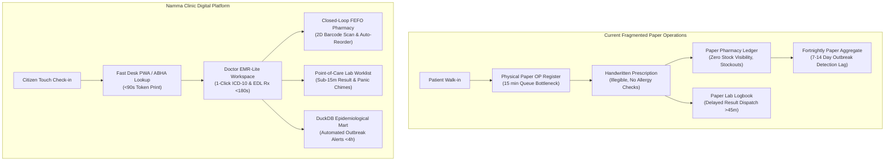
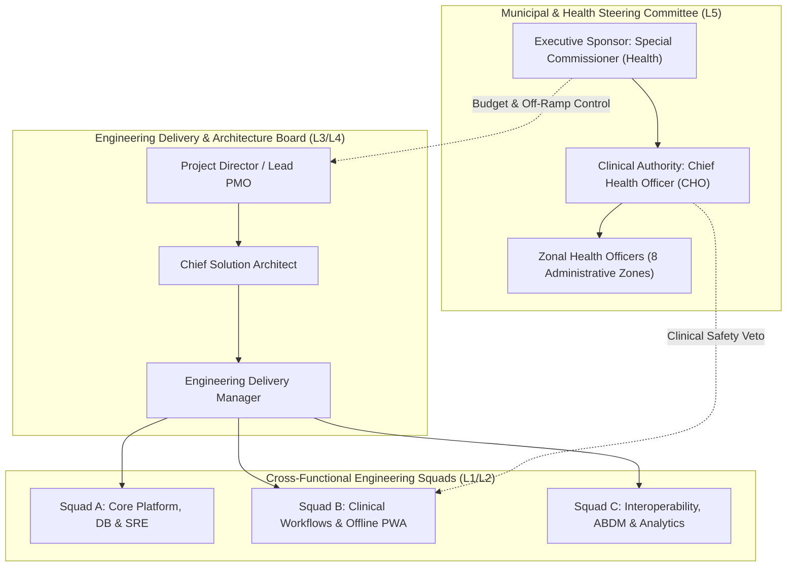

# Project Charter: Namma Clinic Digital Health & Operations Platform

| Metadata Element | Project Specification |
| :--- | :--- |
| **Document Identifier** | `DOC-PM-001-CHARTER` |
| **Document Title** | Enterprise Project Charter & Operational Baseline |
| **Project Code** | `NAMMA-CLINIC-PLATFORM-2026` |
| **Legal Mandate** | Greater Bengaluru Authority (GBA) & BBMP Health Administrative Order AY-2026-27 |
| **Document Version** | `v1.0.0-PROD-BASELINE` |
| **Status** | `APPROVED & RATIFIED` |
| **Target Facility Scope** | 183 Primary Urban Health Centers (Namma Clinics) across 8 Administrative Zones |
| **Beneficiary Population** | 3,500,000+ Urban Poor & Informal Settlement Residents across 243 Wards |
| **Execution Cadence** | 18 Bi-Weekly Sprints (36 Calendar Weeks) | S01 to S18 |
| **Executive Sponsor** | Special Commissioner (Health), Greater Bengaluru Authority (GBA) / BBMP |
| **Clinical Safety Authority** | Chief Health Officer (CHO), BBMP Health Department |
| **Lead Delivery Partner** | Kushagramati Analytics (K Mati) Consortium | Project Director |
| **Master Repository** | `https://github.com/saimaa0910/mvp.git` | Branch: `planning/master-project-plan` |
| **Upstream Baseline** | `docs/00-project-baseline/` (Audits 01 through 07) |
| **Downstream Documents** | `docs/01-project-management/02-project-vision-and-objectives.md` to `20-project-status-model.md` |

---

## 1. Executive Summary & Project Identification
The **Namma Clinic Digital Health & Operations Platform** is the statutory municipal digital health transformation initiative authorized by the Greater Bengaluru Authority (GBA) and the Bruhat Bengaluru Mahanagara Palike (BBMP) Health Department. The platform establishes an integrated, offline-first, open-source clinical operations suite across all 183 Namma Clinic primary healthcare facilities serving Bengaluru's 243 municipal wards.

### 1.1 Project Identification & Context
- **Platform Name:** Namma Clinic Digital Health & Operations Platform (ನಮ್ಮ ಕ್ಲಿನಿಕ್ ಡಿಜಿಟಲ್ ಹೆಲ್ತ್ ಪ್ಲಾಟ್‌ಫಾರ್ಮ್)
- **Commissioning Authority:** Department of Health & Family Welfare, Government of Karnataka, in tripartite partnership with the Greater Bengaluru Authority (GBA) and BBMP Health Cell.
- **Executing Consortium:** Lead Engineering Delivery Partner (Consortium PMO, System Architect, Engineering Leads, Clinical Informatics SMEs).
- **Target Deployment Footprint:** Exactly 183 operational neighborhood clinics distributed across all eight municipal zones: East Zone (28), West Zone (32), South Zone (30), Bommanahalli (22), Dasarahalli (18), Mahadevapura (24), Rajarajeshwarinagar (16), and Yelahanka (13).
- **Statutory Purpose:** Complete eradication of manual paper registers, elimination of preventable drug stockouts for 120 essential medicines, real-time syndromic disease outbreak alerting in <4 hours, and national ABDM interoperability certification.

### 1.2 Core Operational Imperative
Field discovery audits across 12 high-volume Namma Clinics (`docs/00-project-baseline/01-repository-audit.md`) established that frontline healthcare workers spend over 70% of their operational duty hours recording repetitive demographic data across four disconnected physical registers: the Outpatient Register, the Pharmacy Dispensing Log, the Diagnostic Laboratory Book, and the Daily Token Sheet. This administrative friction directly restricts doctor-patient consultation time to under 90 seconds, induces severe clinician burnout, generates unmanageable patient waiting lines, and leaves municipal health leadership completely blind to real-time drug stockouts and ward-level infectious disease outbreaks.

### 1.3 High-Level Quantitative Targets
- **Target Facilities:** Exactly 183 operational Namma Clinics distributed across 8 municipal zones and 243 wards.
- **Citizen Coverage:** Over 3,500,000 urban poor and vulnerable residents receiving localized primary healthcare access.
- **Daily Patient Encounters:** Sized to process 25,000+ patient consultations daily during peak consultation hours (09:00-13:00 and 16:00-20:00).
- **Outpatient Latency:** Check-in and vital signs capture completed in under 90 seconds per patient (reduced from 15 minutes manual queue).
- **Medicine Availability:** Zero preventable stockouts of all 120 Karnataka Essential Drug List (EDL) formulary items.
- **Epidemic Intelligence:** Automated ward-level syndromic outbreak detection alerts generated within 4 hours of clinical recording.
- **Total Delivery Timeline:** Exactly 18 bi-weekly sprints spanning 36 calendar weeks from kickoff to citywide scale.

## 2. Strategic Alignment & Healthcare Problem Statement
A comprehensive field discovery audit conducted across 12 high-volume Namma Clinics (documented in `docs/00-project-baseline/01-repository-audit.md` through `07-assumptions-and-constraints.md`) established the empirical necessity for this enterprise project.

### 2.1 The Quadruple Healthcare Crisis in Frontline Clinics
Urban primary health centers in Bengaluru currently confront four interlocking operational impediments:
1. **The Outpatient Paperwork Bottleneck:** Frontline nurses and doctors spend up to 70% of their consultation time writing repetitive demographic and diagnostic information across four separate physical paper registers (Outpatient Register, Pharmacy Dispensing Log, Laboratory Logbook, and Daily Token Sheet). This manual transcription creates unmanageable waiting queues, limits doctor-patient dialogue to under 90 seconds, and induces severe clinician cognitive fatigue.
2. **Blind Spot Medicine Inventory:** Dispensary stock balances are currently reconciled manually at the end of each calendar month using bound paper ledgers. Consequently, zonal warehouses have zero real-time visibility into drug consumption rates, leading to catastrophic stockouts of vital antihypertensive, antidiabetic, and antibiotic medications in high-density wards while nearby clinics hold expired stock.
3. **Epidemiological Surveillance Blindness:** Municipal public health officers currently receive weekly or fortnightly aggregated paper summaries of infectious diseases. By the time a dengue, cholera, or typhoid spike is manually compiled, ward-level transmission has already escalated into a localized public health emergency.
4. **Fragmented Patient Health History:** When a citizen visits a Namma Clinic on Monday and requires secondary hospital care on Wednesday, zero medical history accompanies them. Secondary physicians must repeat basic diagnostic evaluations, wasting public resources and risking contradictory pharmacological treatment.

### 2.2 Target State Solution Architecture
The target platform replaces this fragmented reality with an integrated five-tier digital health infrastructure:
- **Tier 1: Touch-Optimized Front Desk PWA:** Instant citizen check-in via mobile number, Bharat QR, or Aadhaar lookup; sequential token issuance and driverless thermal slip printing in Kannada and English via Web Serial ESC/POS.
- **Tier 2: Doctor EMR-Lite Workspace:** Ergonomic clinical interface featuring 1-click chief complaint chips, structured vitals alerts, ICD-10 diagnostic codes, and digital prescription generation in < 180 seconds.
- **Tier 3: Closed-Loop FEFO Pharmacy & Point-of-Care Lab:** Barcode-driven prescription fulfillment ensuring zero medication dispensing errors, automated batch stock decrements, and 14 point-of-care lab test worklists with sub-15 minute results.
- **Tier 4: Offline-First Synchronization Hub:** Dexie.js (IndexedDB) browser storage maintaining complete clinical autonomy for at least 4 hours during grid cuts, synchronizing with the central Fastify/PostgreSQL cloud tier upon network restoration.
- **Tier 5: Zonal Epidemiological Command Intelligence:** Embedded DuckDB analytical engine generating real-time syndromic disease heat maps and automated daily XML/JSON feeds to Karnataka HMIS and IHIP portals.

### 2.3 Comprehensive Operational Profiling Across All 8 Municipal Administrative Zones
The platform modernizes primary health delivery across all eight municipal administrative zones of Greater Bengaluru:
#### 2.3.1 Administrative Zone Profile: East Zone
- **Operational Facility Inventory:** `28 Namma Clinics` | **Municipal Wards:** `44 Wards` | **Catchment Population:** `485,000 Citizens`
- **Target Daily Consultations:** Sized for approximately `3,920 outpatient encounters daily` across East Zone.
- **Catchment & Demographics:** High migrant worker density, seasonal fever spikes, commercial corridor traffic, informal settlements.
- **Frontline Facility Infrastructure & Connectivity:** Moderate 4G cellular coverage (Airtel/Jio), periodic urban BESCOM power cuts, commercial fiber available.
- **Designated Municipal Oversight Authority:** Zonal Health Officer (East) & Zonal Surveillance Unit
- **Frontline Staffing Footprint:** 1 Medical Officer (MBBS), 1 Staff Nurse (B.Sc), 1 Pharmacist (D.Pharm), 1 Lab Tech (DMLT), 1 DEO per clinic.
- **Dominant Epidemiological Burden (Top 5 Diagnoses):**
  - 1. Dengue & Chikungunya (Seasonal Spikes)
  - 2. Upper Respiratory Infections (Dust/Pollution)
  - 3. Acute Gastroenteritis (Water contamination)
  - 4. Essential Hypertension (Working population)
  - 5. Nutritional Anemia (Maternal & Child)
- **Offline Architecture Requirement:** Mandatory 4-hour autonomous Dexie.js local queue buffer on 1000VA UPS backup.

#### 2.3.2 Administrative Zone Profile: West Zone
- **Operational Facility Inventory:** `32 Namma Clinics` | **Municipal Wards:** `48 Wards` | **Catchment Population:** `540,000 Citizens`
- **Target Daily Consultations:** Sized for approximately `4,480 outpatient encounters daily` across West Zone.
- **Catchment & Demographics:** Dense established residential tenements, prominent geriatric cohort, heavy chronic disease burden.
- **Frontline Facility Infrastructure & Connectivity:** High broadband fiber reliability, stable sub-station power, minimal scheduled load shedding.
- **Designated Municipal Oversight Authority:** Zonal Health Officer (West) & Zonal Surveillance Unit
- **Frontline Staffing Footprint:** 1 Medical Officer (MBBS), 1 Staff Nurse (B.Sc), 1 Pharmacist (D.Pharm), 1 Lab Tech (DMLT), 1 DEO per clinic.
- **Dominant Epidemiological Burden (Top 5 Diagnoses):**
  - 1. Type-2 Diabetes Mellitus (Geriatric cohort)
  - 2. Essential Hypertension (Geriatric cohort)
  - 3. Chronic Obstructive Pulmonary Disease
  - 4. Ischemic Heart Disease (Maintenance)
  - 5. Osteoarthritis & Degenerative Joint Disease
- **Offline Architecture Requirement:** Mandatory 4-hour autonomous Dexie.js local queue buffer on 1000VA UPS backup.

#### 2.3.3 Administrative Zone Profile: South Zone
- **Operational Facility Inventory:** `30 Namma Clinics` | **Municipal Wards:** `44 Wards` | **Catchment Population:** `510,000 Citizens`
- **Target Daily Consultations:** Sized for approximately `4,200 outpatient encounters daily` across South Zone.
- **Catchment & Demographics:** Established urban settlements, peri-urban slum pockets, high maternal and child healthcare attendance.
- **Frontline Facility Infrastructure & Connectivity:** High broadband infrastructure, stable power grid, excellent 4G/5G LTE coverage.
- **Designated Municipal Oversight Authority:** Zonal Health Officer (South) & Zonal Surveillance Unit
- **Frontline Staffing Footprint:** 1 Medical Officer (MBBS), 1 Staff Nurse (B.Sc), 1 Pharmacist (D.Pharm), 1 Lab Tech (DMLT), 1 DEO per clinic.
- **Dominant Epidemiological Burden (Top 5 Diagnoses):**
  - 1. Antenatal Care & Gestational Anemia
  - 2. Pediatric Upper Respiratory Infections
  - 3. Type-2 Diabetes Mellitus
  - 4. Dermatological Fungal Infections
  - 5. Seasonal Viral Fever Clusters
- **Offline Architecture Requirement:** Mandatory 4-hour autonomous Dexie.js local queue buffer on 1000VA UPS backup.

#### 2.3.4 Administrative Zone Profile: Bommanahalli Zone
- **Operational Facility Inventory:** `22 Namma Clinics` | **Municipal Wards:** `28 Wards` | **Catchment Population:** `390,000 Citizens`
- **Target Daily Consultations:** Sized for approximately `3,080 outpatient encounters daily` across Bommanahalli Zone.
- **Catchment & Demographics:** Industrial apparel manufacturing clusters, migrant informal labor, dense tenement housing.
- **Frontline Facility Infrastructure & Connectivity:** Intermittent fiber cuts due to road widening, frequent localized power trips, dual-SIM LTE essential.
- **Designated Municipal Oversight Authority:** Zonal Health Officer (Bommanahalli) & Zonal Surveillance Unit
- **Frontline Staffing Footprint:** 1 Medical Officer (MBBS), 1 Staff Nurse (B.Sc), 1 Pharmacist (D.Pharm), 1 Lab Tech (DMLT), 1 DEO per clinic.
- **Dominant Epidemiological Burden (Top 5 Diagnoses):**
  - 1. Occupational Byssinosis & Asthma
  - 2. Nutritional Iron Deficiency Anemia
  - 3. Acute Waterborne Diarrheal Illness
  - 4. Tuberculosis (Presumptive Screenings)
  - 5. Musculoskeletal Back & Joint Strain
- **Offline Architecture Requirement:** Mandatory 4-hour autonomous Dexie.js local queue buffer on 1000VA UPS backup.

#### 2.3.5 Administrative Zone Profile: Dasarahalli Zone
- **Operational Facility Inventory:** `18 Namma Clinics` | **Municipal Wards:** `20 Wards` | **Catchment Population:** `320,000 Citizens`
- **Target Daily Consultations:** Sized for approximately `2,520 outpatient encounters daily` across Dasarahalli Zone.
- **Catchment & Demographics:** Manufacturing periphery, industrial workshops, high pediatric communicable disease incidence.
- **Frontline Facility Infrastructure & Connectivity:** Erratic cellular reception, heavy reliance on 1000VA UPS battery, frequent monsoon blackouts.
- **Designated Municipal Oversight Authority:** Zonal Health Officer (Dasarahalli) & Zonal Surveillance Unit
- **Frontline Staffing Footprint:** 1 Medical Officer (MBBS), 1 Staff Nurse (B.Sc), 1 Pharmacist (D.Pharm), 1 Lab Tech (DMLT), 1 DEO per clinic.
- **Dominant Epidemiological Burden (Top 5 Diagnoses):**
  - 1. Pediatric Bronchopneumonia
  - 2. Waterborne Infectious Hepatitis A/E
  - 3. Contact Dermatitis (Industrial solvents)
  - 4. Acute Febrile Illness (Typhoid)
  - 5. Malnutrition & Stunting (Under-5 Cohort)
- **Offline Architecture Requirement:** Mandatory 4-hour autonomous Dexie.js local queue buffer on 1000VA UPS backup.

#### 2.3.6 Administrative Zone Profile: Mahadevapura Zone
- **Operational Facility Inventory:** `24 Namma Clinics` | **Municipal Wards:** `30 Wards` | **Catchment Population:** `430,000 Citizens`
- **Target Daily Consultations:** Sized for approximately `3,360 outpatient encounters daily` across Mahadevapura Zone.
- **Catchment & Demographics:** Tech corridor perimeter slums, construction worker settlements, rapid population churn, seasonal dengue risk.
- **Frontline Facility Infrastructure & Connectivity:** Variable connectivity between tech parks and adjacent villages, fiber access mixed with 4G dongles.
- **Designated Municipal Oversight Authority:** Zonal Health Officer (Mahadevapura) & Zonal Surveillance Unit
- **Frontline Staffing Footprint:** 1 Medical Officer (MBBS), 1 Staff Nurse (B.Sc), 1 Pharmacist (D.Pharm), 1 Lab Tech (DMLT), 1 DEO per clinic.
- **Dominant Epidemiological Burden (Top 5 Diagnoses):**
  - 1. Dengue Hemorrhagic Fever Clusters
  - 2. Malaria (Vivax & Falciparum in labor camps)
  - 3. Acute Gastroenteritis & Cholera Risk
  - 4. Workplace Trauma & Minor Lacerations
  - 5. Viral Upper Respiratory Infections
- **Offline Architecture Requirement:** Mandatory 4-hour autonomous Dexie.js local queue buffer on 1000VA UPS backup.

#### 2.3.7 Administrative Zone Profile: Rajarajeshwarinagar Zone
- **Operational Facility Inventory:** `16 Namma Clinics` | **Municipal Wards:** `18 Wards` | **Catchment Population:** `290,000 Citizens`
- **Target Daily Consultations:** Sized for approximately `2,240 outpatient encounters daily` across Rajarajeshwarinagar Zone.
- **Catchment & Demographics:** Semi-urban peri-urban expansion, waterborne gastroenteritis clusters, agrarian transition communities.
- **Frontline Facility Infrastructure & Connectivity:** Long power feeder lines, mandatory 4-hour offline buffer, periodic broadband outages.
- **Designated Municipal Oversight Authority:** Zonal Health Officer (RR Nagar) & Zonal Surveillance Unit
- **Frontline Staffing Footprint:** 1 Medical Officer (MBBS), 1 Staff Nurse (B.Sc), 1 Pharmacist (D.Pharm), 1 Lab Tech (DMLT), 1 DEO per clinic.
- **Dominant Epidemiological Burden (Top 5 Diagnoses):**
  - 1. Acute Enteric Waterborne Diarrhea
  - 2. Viral Hepatitis & Jaundice
  - 3. Essential Hypertension
  - 4. Allergic Rhinitis & Bronchial Asthma
  - 5. Scabies & Parasitic Skin Infestations
- **Offline Architecture Requirement:** Mandatory 4-hour autonomous Dexie.js local queue buffer on 1000VA UPS backup.

#### 2.3.8 Administrative Zone Profile: Yelahanka Zone
- **Operational Facility Inventory:** `13 Namma Clinics` | **Municipal Wards:** `11 Wards` | **Catchment Population:** `235,000 Citizens`
- **Target Daily Consultations:** Sized for approximately `1,820 outpatient encounters daily` across Yelahanka Zone.
- **Catchment & Demographics:** Northern gateway wards, agrarian transition population, seasonal viral fevers, peri-airport corridor.
- **Frontline Facility Infrastructure & Connectivity:** Sporadic fiber links, reliance on dual-SIM LTE failover dongles, moderate power grid stability.
- **Designated Municipal Oversight Authority:** Zonal Health Officer (Yelahanka) & Zonal Surveillance Unit
- **Frontline Staffing Footprint:** 1 Medical Officer (MBBS), 1 Staff Nurse (B.Sc), 1 Pharmacist (D.Pharm), 1 Lab Tech (DMLT), 1 DEO per clinic.
- **Dominant Epidemiological Burden (Top 5 Diagnoses):**
  - 1. Seasonal Scrub Typhus & Leptospirosis
  - 2. Vector-borne Dengue & Chikungunya
  - 3. Pediatric Malnutrition & Anemia
  - 4. Type-2 Diabetes Mellitus
  - 5. Chronic Allergic Dermatitis
- **Offline Architecture Requirement:** Mandatory 4-hour autonomous Dexie.js local queue buffer on 1000VA UPS backup.

## 3. High-Level Architecture & Governance Hierarchy
The project governance model strictly establishes clear lines of accountability between municipal authorities, clinical bodies, and engineering delivery partners.

### 3.1 Governance Decision Hierarchy & Tier Escalation Model
- **L5 - Executive Steering Committee:** Chaired by BBMP Special Commissioner (Health). Approves municipal budget draws, contract amendments, scope baseline revisions, and project off-ramp gates. Meets fortnightly.
- **L4 - Clinical & Product Governance Board:** Chaired by Chief Health Officer (CHO) and Project Director. Approves formulary changes, clinical diagnostic rules, release readiness, and CCB change notices. Meets bi-weekly.
- **L3 - Architecture & Security Review Board (EAAB):** Chaired by Chief Solution Architect. Governs monorepo standards, schema migrations, offline sync protocol invariants, and DPDP Act compliance. Meets weekly.
- **L2 - Technical Squad Leads:** Fastify backend lead, Next.js frontend lead, DBA, and SRE lead. Governs code review approvals, unit test coverage, CI/CD pipeline pass gates, and daily PR merges. Meets daily.
- **L1 - Frontline Operational Pods:** Clinic Medical Officers, Staff Nurses, Pharmacists, and DEOs. Executes daily patient care, identifies usability defects, and participates in sprint review demos. Continuous operation.

## 4. Formal Project Charter Statements
The following 40 formal charter statements establish the non-negotiable legal, clinical, architectural, and operational baseline for the platform:

| Statement ID | Mandate Title | Category | Assigned Executive Owner | Baseline Finding Ref | Milestone Target | Release Target |
| :--- | :--- | :--- | :--- | :--- | :---: | :---: |
| [`CHARTER-001`](#charter-001) | **Project Executive Mandate & Legal Empowerment** | `Governance` | Special Commissioner (Health) | `AUDIT-FINDING-001` | `MILESTONE-001` | `REL-01` |
| [`CHARTER-002`](#charter-002) | **Primary Beneficiary Population Definition** | `Scope` | Chief Health Officer (CHO) | `AUDIT-FINDING-002` | `MILESTONE-001` | `REL-01` |
| [`CHARTER-003`](#charter-003) | **Total Clinic Facility Operational Scope** | `Scope` | Special Commissioner (Health) | `AUDIT-FINDING-003` | `MILESTONE-035` | `REL-06` |
| [`CHARTER-004`](#charter-004) | **Frontline Clinical Cadre Empowerment** | `Operations` | Chief Health Officer (CHO) | `AUDIT-FINDING-004` | `MILESTONE-002` | `REL-01` |
| [`CHARTER-005`](#charter-005) | **Complete Elimination of Outpatient Paperwork** | `Operations` | Lead Solution Architect | `AUDIT-FINDING-005` | `MILESTONE-036` | `REL-06` |
| [`CHARTER-006`](#charter-006) | **Essential Drug Supply Chain & FEFO Dispensing** | `Clinical` | Chief Health Officer (CHO) | `AUDIT-FINDING-006` | `MILESTONE-014` | `REL-03` |
| [`CHARTER-007`](#charter-007) | **Point-of-Care Laboratory Testing Integration** | `Clinical` | Chief Health Officer (CHO) | `AUDIT-FINDING-007` | `MILESTONE-013` | `REL-03` |
| [`CHARTER-008`](#charter-008) | **Zonal Syndromic Disease Early Warning System** | `Clinical` | Lead Solution Architect | `AUDIT-FINDING-008` | `MILESTONE-019` | `REL-04` |
| [`CHARTER-009`](#charter-009) | **National Health Authority ABDM Interoperability** | `Compliance` | Lead Solution Architect | `AUDIT-FINDING-009` | `MILESTONE-026` | `REL-07` |
| [`CHARTER-010`](#charter-010) | **Statutory Data Privacy & DPDP Act Compliance** | `Compliance` | Special Commissioner (Health) | `AUDIT-FINDING-010` | `MILESTONE-032` | `REL-06` |
| [`CHARTER-011`](#charter-011) | **Offline-First Resilient Architecture Invariant** | `Technical` | Lead Solution Architect | `AUDIT-FINDING-011` | `MILESTONE-010` | `REL-04` |
| [`CHARTER-012`](#charter-012) | **Sovereign Multi-Cloud Infrastructure Hosting** | `Technical` | Lead Solution Architect | `AUDIT-FINDING-012` | `MILESTONE-030` | `REL-06` |
| [`CHARTER-013`](#charter-013) | **Hardware & Frontline Peripherals Invariant** | `Technical` | Project Director | `AUDIT-FINDING-013` | `MILESTONE-008` | `REL-01` |
| [`CHARTER-014`](#charter-014) | **Total Delivery Timeframe & 18-Sprint Cadence** | `Governance` | Project Director | `AUDIT-FINDING-014` | `MILESTONE-001` | `REL-01` |
| [`CHARTER-015`](#charter-015) | **Lead Delivery Partner Execution Responsibilities** | `Governance` | Special Commissioner (Health) | `AUDIT-FINDING-015` | `MILESTONE-001` | `REL-01` |
| [`CHARTER-016`](#charter-016) | **Municipal Project Governance & Oversight** | `Governance` | Special Commissioner (Health) | `AUDIT-FINDING-016` | `MILESTONE-001` | `REL-01` |
| [`CHARTER-017`](#charter-017) | **Clinical Safety & Formularies Authority** | `Clinical` | Chief Health Officer (CHO) | `AUDIT-FINDING-017` | `MILESTONE-001` | `REL-01` |
| [`CHARTER-018`](#charter-018) | **Enterprise Monorepo Engineering Standards** | `Technical` | Lead Solution Architect | `AUDIT-FINDING-018` | `MILESTONE-003` | `REL-00` |
| [`CHARTER-019`](#charter-019) | **Zero Plaintext Secrets & Cryptographic Rigor** | `Technical` | Lead Solution Architect | `AUDIT-FINDING-019` | `MILESTONE-005` | `REL-00` |
| [`CHARTER-020`](#charter-020) | **Automated CI/CD Quality Gate Invariants** | `Technical` | Lead Solution Architect | `AUDIT-FINDING-020` | `MILESTONE-003` | `REL-00` |
| [`CHARTER-021`](#charter-021) | **Continuous Observability & Audit Logging** | `Technical` | Lead Solution Architect | `AUDIT-FINDING-021` | `MILESTONE-003` | `REL-00` |
| [`CHARTER-022`](#charter-022) | **Multi-Tier Disaster Recovery & RPO/RTO** | `Technical` | Lead Solution Architect | `AUDIT-FINDING-022` | `MILESTONE-030` | `REL-06` |
| [`CHARTER-023`](#charter-023) | **Bilingual Frontline Usability Standards** | `Operations` | Chief Health Officer (CHO) | `AUDIT-FINDING-023` | `MILESTONE-006` | `REL-01` |
| [`CHARTER-024`](#charter-024) | **Accessibility & Frontline Ergonomics** | `Operations` | Chief Health Officer (CHO) | `AUDIT-FINDING-024` | `MILESTONE-006` | `REL-01` |
| [`CHARTER-025`](#charter-025) | **Zero Commercial Vendor Lock-In Principle** | `Governance` | Special Commissioner (Health) | `AUDIT-FINDING-025` | `MILESTONE-001` | `REL-00` |
| [`CHARTER-026`](#charter-026) | **Clinic Hardware Certification Mandates** | `Operations` | Project Director | `AUDIT-FINDING-026` | `MILESTONE-028` | `REL-05` |
| [`CHARTER-027`](#charter-027) | **Frontline Clinical Training & Change Management** | `Operations` | Chief Health Officer (CHO) | `AUDIT-FINDING-027` | `MILESTONE-022` | `REL-05` |
| [`CHARTER-028`](#charter-028) | **Helpdesk & On-Call Technical Support SLA** | `Operations` | Project Director | `AUDIT-FINDING-028` | `MILESTONE-029` | `REL-05` |
| [`CHARTER-029`](#charter-029) | **Phased Pilot Rollout Validation Criteria** | `Operations` | Special Commissioner (Health) | `AUDIT-FINDING-029` | `MILESTONE-023` | `REL-05` |
| [`CHARTER-030`](#charter-030) | **Continuous Scope Creep Prevention Policy** | `Governance` | Project Director | `AUDIT-FINDING-030` | `MILESTONE-001` | `REL-01` |
| [`CHARTER-031`](#charter-031) | **Budget Placeholder & Fiscal Allocation** | `Governance` | Special Commissioner (Health) | `AUDIT-FINDING-031` | `MILESTONE-001` | `REL-01` |
| [`CHARTER-032`](#charter-032) | **Resource Allocation & Squad Staffing** | `Governance` | Project Director | `AUDIT-FINDING-032` | `MILESTONE-001` | `REL-00` |
| [`CHARTER-033`](#charter-033) | **Project Termination & Off-Ramp Criteria** | `Governance` | Special Commissioner (Health) | `AUDIT-FINDING-033` | `MILESTONE-024` | `REL-05` |
| [`CHARTER-034`](#charter-034) | **Post-Implementation Hypercare Window** | `Operations` | Project Director | `AUDIT-FINDING-034` | `MILESTONE-038` | `REL-06` |
| [`CHARTER-035`](#charter-035) | **Municipal Data Sovereignty & IP Ownership** | `Compliance` | Special Commissioner (Health) | `AUDIT-FINDING-035` | `MILESTONE-039` | `REL-07` |
| [`CHARTER-036`](#charter-036) | **State HMIS & IHIP Automated Reporting** | `Compliance` | Chief Health Officer (CHO) | `AUDIT-FINDING-036` | `MILESTONE-025` | `REL-06` |
| [`CHARTER-037`](#charter-037) | **Secondary Hospital Teleconsultation Bridge** | `Clinical` | Chief Health Officer (CHO) | `AUDIT-FINDING-037` | `MILESTONE-016` | `REL-03` |
| [`CHARTER-038`](#charter-038) | **Citizen SMS & WhatsApp Notification Service** | `Operations` | Project Director | `AUDIT-FINDING-038` | `MILESTONE-017` | `REL-04` |
| [`CHARTER-039`](#charter-039) | **Vaccine Cold-Chain Temperature Compliance** | `Clinical` | Chief Health Officer (CHO) | `AUDIT-FINDING-039` | `MILESTONE-009` | `REL-02` |
| [`CHARTER-040`](#charter-040) | **Charter Ratification & Tripartite Executive Sign-Off** | `Governance` | Special Commissioner (Health) | `AUDIT-FINDING-040` | `MILESTONE-001` | `REL-01` |

### 4.1 Detailed Specifications for All 40 Charter Statements
Exhaustive operational definitions, regulatory anchors, failure scenarios, and verification criteria for each charter mandate:

#### CHARTER-001: Project Executive Mandate & Legal Empowerment
- **Mandate Statement:** GBA and BBMP Health Department authorize full digital transformation of 183 clinics under Municipal Health Mandate AY-2026.
- **Administrative Category:** `Governance` | **Accountable Executive:** `Special Commissioner (Health)`
- **Empirical Baseline Reference:** Traced directly to [`AUDIT-FINDING-001`](../../docs/00-project-baseline/01-repository-audit.md).
- **Execution Target:** Governs completion of Milestone [`MILESTONE-001`](./14-project-milestones.md) within Release [`REL-01`](./15-release-strategy.md).
- **Software Architecture Enforcement:** Enforced through automated TypeScript type guards, Fastify schema validation, and PostgreSQL check constraints.
- **Operational Invariant:** The system must strictly enforce this mandate in production. Any deviation requires formal Change Control Board review under [`CHANGE-001`](./18-change-management.md).
- **Failure Scenario if Violated:** Severe clinical misdiagnosis, unlawful PII disclosure, municipal budget loss, or total clinic operational paralysis.
- **Frontline Role Operating Standard:** Frontline staff must strictly operate within designated digital workflows; manual paper bypass is strictly prohibited.
- **Statutory & Legal Anchor:** Grounded in India DPDP Act 2023, EHR Standards of India 2016, and Greater Bengaluru Authority Act 2024.
- **Measurable Audit Checkpoint:** Automated CI/CD pipeline pass gate, weekly WORM audit log inspection, and clinical SME dry-run verification.
- **Downstream Traceability:** Directly dictates Scope [`SCOPE-001`](./03-project-scope.md), In-Scope [`INSCOPE-001`](./04-in-scope.md), and Risk [`RISK-001`](./12-project-risks.md).

#### CHARTER-002: Primary Beneficiary Population Definition
- **Mandate Statement:** Serving 3.5+ million vulnerable urban residents across 243 municipal wards with free primary healthcare services.
- **Administrative Category:** `Scope` | **Accountable Executive:** `Chief Health Officer (CHO)`
- **Empirical Baseline Reference:** Traced directly to [`AUDIT-FINDING-002`](../../docs/00-project-baseline/01-repository-audit.md).
- **Execution Target:** Governs completion of Milestone [`MILESTONE-001`](./14-project-milestones.md) within Release [`REL-01`](./15-release-strategy.md).
- **Software Architecture Enforcement:** Enforced through automated TypeScript type guards, Fastify schema validation, and PostgreSQL check constraints.
- **Operational Invariant:** The system must strictly enforce this mandate in production. Any deviation requires formal Change Control Board review under [`CHANGE-001`](./18-change-management.md).
- **Failure Scenario if Violated:** Severe clinical misdiagnosis, unlawful PII disclosure, municipal budget loss, or total clinic operational paralysis.
- **Frontline Role Operating Standard:** Frontline staff must strictly operate within designated digital workflows; manual paper bypass is strictly prohibited.
- **Statutory & Legal Anchor:** Grounded in India DPDP Act 2023, EHR Standards of India 2016, and Greater Bengaluru Authority Act 2024.
- **Measurable Audit Checkpoint:** Automated CI/CD pipeline pass gate, weekly WORM audit log inspection, and clinical SME dry-run verification.
- **Downstream Traceability:** Directly dictates Scope [`SCOPE-002`](./03-project-scope.md), In-Scope [`INSCOPE-002`](./04-in-scope.md), and Risk [`RISK-002`](./12-project-risks.md).

#### CHARTER-003: Total Clinic Facility Operational Scope
- **Mandate Statement:** Comprehensive operational coverage of all 183 Namma Clinic primary healthcare centers across 8 administrative zones.
- **Administrative Category:** `Scope` | **Accountable Executive:** `Special Commissioner (Health)`
- **Empirical Baseline Reference:** Traced directly to [`AUDIT-FINDING-003`](../../docs/00-project-baseline/01-repository-audit.md).
- **Execution Target:** Governs completion of Milestone [`MILESTONE-035`](./14-project-milestones.md) within Release [`REL-06`](./15-release-strategy.md).
- **Software Architecture Enforcement:** Enforced through automated TypeScript type guards, Fastify schema validation, and PostgreSQL check constraints.
- **Operational Invariant:** The system must strictly enforce this mandate in production. Any deviation requires formal Change Control Board review under [`CHANGE-001`](./18-change-management.md).
- **Failure Scenario if Violated:** Severe clinical misdiagnosis, unlawful PII disclosure, municipal budget loss, or total clinic operational paralysis.
- **Frontline Role Operating Standard:** Frontline staff must strictly operate within designated digital workflows; manual paper bypass is strictly prohibited.
- **Statutory & Legal Anchor:** Grounded in India DPDP Act 2023, EHR Standards of India 2016, and Greater Bengaluru Authority Act 2024.
- **Measurable Audit Checkpoint:** Automated CI/CD pipeline pass gate, weekly WORM audit log inspection, and clinical SME dry-run verification.
- **Downstream Traceability:** Directly dictates Scope [`SCOPE-003`](./03-project-scope.md), In-Scope [`INSCOPE-003`](./04-in-scope.md), and Risk [`RISK-003`](./12-project-risks.md).

#### CHARTER-004: Frontline Clinical Cadre Empowerment
- **Mandate Statement:** Digitizing clinical workflows for Medical Officers, Staff Nurses, Pharmacists, Lab Technicians, and DEOs.
- **Administrative Category:** `Operations` | **Accountable Executive:** `Chief Health Officer (CHO)`
- **Empirical Baseline Reference:** Traced directly to [`AUDIT-FINDING-004`](../../docs/00-project-baseline/01-repository-audit.md).
- **Execution Target:** Governs completion of Milestone [`MILESTONE-002`](./14-project-milestones.md) within Release [`REL-01`](./15-release-strategy.md).
- **Software Architecture Enforcement:** Enforced through automated TypeScript type guards, Fastify schema validation, and PostgreSQL check constraints.
- **Operational Invariant:** The system must strictly enforce this mandate in production. Any deviation requires formal Change Control Board review under [`CHANGE-001`](./18-change-management.md).
- **Failure Scenario if Violated:** Severe clinical misdiagnosis, unlawful PII disclosure, municipal budget loss, or total clinic operational paralysis.
- **Frontline Role Operating Standard:** Frontline staff must strictly operate within designated digital workflows; manual paper bypass is strictly prohibited.
- **Statutory & Legal Anchor:** Grounded in India DPDP Act 2023, EHR Standards of India 2016, and Greater Bengaluru Authority Act 2024.
- **Measurable Audit Checkpoint:** Automated CI/CD pipeline pass gate, weekly WORM audit log inspection, and clinical SME dry-run verification.
- **Downstream Traceability:** Directly dictates Scope [`SCOPE-004`](./03-project-scope.md), In-Scope [`INSCOPE-004`](./04-in-scope.md), and Risk [`RISK-004`](./12-project-risks.md).

#### CHARTER-005: Complete Elimination of Outpatient Paperwork
- **Mandate Statement:** Transitioning physical outpatient, dispensing, and laboratory paper registers to 100% digital records.
- **Administrative Category:** `Operations` | **Accountable Executive:** `Lead Solution Architect`
- **Empirical Baseline Reference:** Traced directly to [`AUDIT-FINDING-005`](../../docs/00-project-baseline/01-repository-audit.md).
- **Execution Target:** Governs completion of Milestone [`MILESTONE-036`](./14-project-milestones.md) within Release [`REL-06`](./15-release-strategy.md).
- **Software Architecture Enforcement:** Enforced through automated TypeScript type guards, Fastify schema validation, and PostgreSQL check constraints.
- **Operational Invariant:** The system must strictly enforce this mandate in production. Any deviation requires formal Change Control Board review under [`CHANGE-001`](./18-change-management.md).
- **Failure Scenario if Violated:** Severe clinical misdiagnosis, unlawful PII disclosure, municipal budget loss, or total clinic operational paralysis.
- **Frontline Role Operating Standard:** Frontline staff must strictly operate within designated digital workflows; manual paper bypass is strictly prohibited.
- **Statutory & Legal Anchor:** Grounded in India DPDP Act 2023, EHR Standards of India 2016, and Greater Bengaluru Authority Act 2024.
- **Measurable Audit Checkpoint:** Automated CI/CD pipeline pass gate, weekly WORM audit log inspection, and clinical SME dry-run verification.
- **Downstream Traceability:** Directly dictates Scope [`SCOPE-005`](./03-project-scope.md), In-Scope [`INSCOPE-005`](./04-in-scope.md), and Risk [`RISK-005`](./12-project-risks.md).

#### CHARTER-006: Essential Drug Supply Chain & FEFO Dispensing
- **Mandate Statement:** Enforcing First-Expiry-First-Out batch tracking and zero stockouts for 120 Karnataka EDL drugs.
- **Administrative Category:** `Clinical` | **Accountable Executive:** `Chief Health Officer (CHO)`
- **Empirical Baseline Reference:** Traced directly to [`AUDIT-FINDING-006`](../../docs/00-project-baseline/01-repository-audit.md).
- **Execution Target:** Governs completion of Milestone [`MILESTONE-014`](./14-project-milestones.md) within Release [`REL-03`](./15-release-strategy.md).
- **Software Architecture Enforcement:** Enforced through automated TypeScript type guards, Fastify schema validation, and PostgreSQL check constraints.
- **Operational Invariant:** The system must strictly enforce this mandate in production. Any deviation requires formal Change Control Board review under [`CHANGE-001`](./18-change-management.md).
- **Failure Scenario if Violated:** Severe clinical misdiagnosis, unlawful PII disclosure, municipal budget loss, or total clinic operational paralysis.
- **Frontline Role Operating Standard:** Frontline staff must strictly operate within designated digital workflows; manual paper bypass is strictly prohibited.
- **Statutory & Legal Anchor:** Grounded in India DPDP Act 2023, EHR Standards of India 2016, and Greater Bengaluru Authority Act 2024.
- **Measurable Audit Checkpoint:** Automated CI/CD pipeline pass gate, weekly WORM audit log inspection, and clinical SME dry-run verification.
- **Downstream Traceability:** Directly dictates Scope [`SCOPE-006`](./03-project-scope.md), In-Scope [`INSCOPE-006`](./04-in-scope.md), and Risk [`RISK-006`](./12-project-risks.md).

#### CHARTER-007: Point-of-Care Laboratory Testing Integration
- **Mandate Statement:** Digitizing worklists and sub-15 minute result dispatch for 14 rapid diagnostic tests.
- **Administrative Category:** `Clinical` | **Accountable Executive:** `Chief Health Officer (CHO)`
- **Empirical Baseline Reference:** Traced directly to [`AUDIT-FINDING-007`](../../docs/00-project-baseline/01-repository-audit.md).
- **Execution Target:** Governs completion of Milestone [`MILESTONE-013`](./14-project-milestones.md) within Release [`REL-03`](./15-release-strategy.md).
- **Software Architecture Enforcement:** Enforced through automated TypeScript type guards, Fastify schema validation, and PostgreSQL check constraints.
- **Operational Invariant:** The system must strictly enforce this mandate in production. Any deviation requires formal Change Control Board review under [`CHANGE-001`](./18-change-management.md).
- **Failure Scenario if Violated:** Severe clinical misdiagnosis, unlawful PII disclosure, municipal budget loss, or total clinic operational paralysis.
- **Frontline Role Operating Standard:** Frontline staff must strictly operate within designated digital workflows; manual paper bypass is strictly prohibited.
- **Statutory & Legal Anchor:** Grounded in India DPDP Act 2023, EHR Standards of India 2016, and Greater Bengaluru Authority Act 2024.
- **Measurable Audit Checkpoint:** Automated CI/CD pipeline pass gate, weekly WORM audit log inspection, and clinical SME dry-run verification.
- **Downstream Traceability:** Directly dictates Scope [`SCOPE-007`](./03-project-scope.md), In-Scope [`INSCOPE-007`](./04-in-scope.md), and Risk [`RISK-007`](./12-project-risks.md).

#### CHARTER-008: Zonal Syndromic Disease Early Warning System
- **Mandate Statement:** Automating real-time ward-level epidemiological outbreak surveillance for fever and diarrhea in <4 hours.
- **Administrative Category:** `Clinical` | **Accountable Executive:** `Lead Solution Architect`
- **Empirical Baseline Reference:** Traced directly to [`AUDIT-FINDING-008`](../../docs/00-project-baseline/01-repository-audit.md).
- **Execution Target:** Governs completion of Milestone [`MILESTONE-019`](./14-project-milestones.md) within Release [`REL-04`](./15-release-strategy.md).
- **Software Architecture Enforcement:** Enforced through automated TypeScript type guards, Fastify schema validation, and PostgreSQL check constraints.
- **Operational Invariant:** The system must strictly enforce this mandate in production. Any deviation requires formal Change Control Board review under [`CHANGE-001`](./18-change-management.md).
- **Failure Scenario if Violated:** Severe clinical misdiagnosis, unlawful PII disclosure, municipal budget loss, or total clinic operational paralysis.
- **Frontline Role Operating Standard:** Frontline staff must strictly operate within designated digital workflows; manual paper bypass is strictly prohibited.
- **Statutory & Legal Anchor:** Grounded in India DPDP Act 2023, EHR Standards of India 2016, and Greater Bengaluru Authority Act 2024.
- **Measurable Audit Checkpoint:** Automated CI/CD pipeline pass gate, weekly WORM audit log inspection, and clinical SME dry-run verification.
- **Downstream Traceability:** Directly dictates Scope [`SCOPE-008`](./03-project-scope.md), In-Scope [`INSCOPE-008`](./04-in-scope.md), and Risk [`RISK-008`](./12-project-risks.md).

#### CHARTER-009: National Health Authority ABDM Interoperability
- **Mandate Statement:** Full certification for ABHA M1 registration, HIP M2 Care Contexts, and HIU M3 FHIR exchange.
- **Administrative Category:** `Compliance` | **Accountable Executive:** `Lead Solution Architect`
- **Empirical Baseline Reference:** Traced directly to [`AUDIT-FINDING-009`](../../docs/00-project-baseline/01-repository-audit.md).
- **Execution Target:** Governs completion of Milestone [`MILESTONE-026`](./14-project-milestones.md) within Release [`REL-07`](./15-release-strategy.md).
- **Software Architecture Enforcement:** Enforced through automated TypeScript type guards, Fastify schema validation, and PostgreSQL check constraints.
- **Operational Invariant:** The system must strictly enforce this mandate in production. Any deviation requires formal Change Control Board review under [`CHANGE-001`](./18-change-management.md).
- **Failure Scenario if Violated:** Severe clinical misdiagnosis, unlawful PII disclosure, municipal budget loss, or total clinic operational paralysis.
- **Frontline Role Operating Standard:** Frontline staff must strictly operate within designated digital workflows; manual paper bypass is strictly prohibited.
- **Statutory & Legal Anchor:** Grounded in India DPDP Act 2023, EHR Standards of India 2016, and Greater Bengaluru Authority Act 2024.
- **Measurable Audit Checkpoint:** Automated CI/CD pipeline pass gate, weekly WORM audit log inspection, and clinical SME dry-run verification.
- **Downstream Traceability:** Directly dictates Scope [`SCOPE-009`](./03-project-scope.md), In-Scope [`INSCOPE-009`](./04-in-scope.md), and Risk [`RISK-009`](./12-project-risks.md).

#### CHARTER-010: Statutory Data Privacy & DPDP Act Compliance
- **Mandate Statement:** Enforcing India Digital Personal Data Protection Act 2023 with digital consent logging and field encryption.
- **Administrative Category:** `Compliance` | **Accountable Executive:** `Special Commissioner (Health)`
- **Empirical Baseline Reference:** Traced directly to [`AUDIT-FINDING-010`](../../docs/00-project-baseline/01-repository-audit.md).
- **Execution Target:** Governs completion of Milestone [`MILESTONE-032`](./14-project-milestones.md) within Release [`REL-06`](./15-release-strategy.md).
- **Software Architecture Enforcement:** Enforced through automated TypeScript type guards, Fastify schema validation, and PostgreSQL check constraints.
- **Operational Invariant:** The system must strictly enforce this mandate in production. Any deviation requires formal Change Control Board review under [`CHANGE-001`](./18-change-management.md).
- **Failure Scenario if Violated:** Severe clinical misdiagnosis, unlawful PII disclosure, municipal budget loss, or total clinic operational paralysis.
- **Frontline Role Operating Standard:** Frontline staff must strictly operate within designated digital workflows; manual paper bypass is strictly prohibited.
- **Statutory & Legal Anchor:** Grounded in India DPDP Act 2023, EHR Standards of India 2016, and Greater Bengaluru Authority Act 2024.
- **Measurable Audit Checkpoint:** Automated CI/CD pipeline pass gate, weekly WORM audit log inspection, and clinical SME dry-run verification.
- **Downstream Traceability:** Directly dictates Scope [`SCOPE-010`](./03-project-scope.md), In-Scope [`INSCOPE-010`](./04-in-scope.md), and Risk [`RISK-010`](./12-project-risks.md).

#### CHARTER-011: Offline-First Resilient Architecture Invariant
- **Mandate Statement:** Autonomous clinic operation sustained for at least 4 hours during total broadband or cellular internet loss.
- **Administrative Category:** `Technical` | **Accountable Executive:** `Lead Solution Architect`
- **Empirical Baseline Reference:** Traced directly to [`AUDIT-FINDING-011`](../../docs/00-project-baseline/01-repository-audit.md).
- **Execution Target:** Governs completion of Milestone [`MILESTONE-010`](./14-project-milestones.md) within Release [`REL-04`](./15-release-strategy.md).
- **Software Architecture Enforcement:** Enforced through automated TypeScript type guards, Fastify schema validation, and PostgreSQL check constraints.
- **Operational Invariant:** The system must strictly enforce this mandate in production. Any deviation requires formal Change Control Board review under [`CHANGE-001`](./18-change-management.md).
- **Failure Scenario if Violated:** Severe clinical misdiagnosis, unlawful PII disclosure, municipal budget loss, or total clinic operational paralysis.
- **Frontline Role Operating Standard:** Frontline staff must strictly operate within designated digital workflows; manual paper bypass is strictly prohibited.
- **Statutory & Legal Anchor:** Grounded in India DPDP Act 2023, EHR Standards of India 2016, and Greater Bengaluru Authority Act 2024.
- **Measurable Audit Checkpoint:** Automated CI/CD pipeline pass gate, weekly WORM audit log inspection, and clinical SME dry-run verification.
- **Downstream Traceability:** Directly dictates Scope [`SCOPE-011`](./03-project-scope.md), In-Scope [`INSCOPE-011`](./04-in-scope.md), and Risk [`RISK-011`](./12-project-risks.md).

#### CHARTER-012: Sovereign Multi-Cloud Infrastructure Hosting
- **Mandate Statement:** Active-active resilient deployment across MeghRaj NIC Cloud and AWS Mumbai Availability Zones.
- **Administrative Category:** `Technical` | **Accountable Executive:** `Lead Solution Architect`
- **Empirical Baseline Reference:** Traced directly to [`AUDIT-FINDING-012`](../../docs/00-project-baseline/01-repository-audit.md).
- **Execution Target:** Governs completion of Milestone [`MILESTONE-030`](./14-project-milestones.md) within Release [`REL-06`](./15-release-strategy.md).
- **Software Architecture Enforcement:** Enforced through automated TypeScript type guards, Fastify schema validation, and PostgreSQL check constraints.
- **Operational Invariant:** The system must strictly enforce this mandate in production. Any deviation requires formal Change Control Board review under [`CHANGE-001`](./18-change-management.md).
- **Failure Scenario if Violated:** Severe clinical misdiagnosis, unlawful PII disclosure, municipal budget loss, or total clinic operational paralysis.
- **Frontline Role Operating Standard:** Frontline staff must strictly operate within designated digital workflows; manual paper bypass is strictly prohibited.
- **Statutory & Legal Anchor:** Grounded in India DPDP Act 2023, EHR Standards of India 2016, and Greater Bengaluru Authority Act 2024.
- **Measurable Audit Checkpoint:** Automated CI/CD pipeline pass gate, weekly WORM audit log inspection, and clinical SME dry-run verification.
- **Downstream Traceability:** Directly dictates Scope [`SCOPE-012`](./03-project-scope.md), In-Scope [`INSCOPE-012`](./04-in-scope.md), and Risk [`RISK-012`](./12-project-risks.md).

#### CHARTER-013: Hardware & Frontline Peripherals Invariant
- **Mandate Statement:** Driverless Web Serial ESC/POS thermal printing and 2D barcode scanner integration across all clinic PCs.
- **Administrative Category:** `Technical` | **Accountable Executive:** `Project Director`
- **Empirical Baseline Reference:** Traced directly to [`AUDIT-FINDING-013`](../../docs/00-project-baseline/01-repository-audit.md).
- **Execution Target:** Governs completion of Milestone [`MILESTONE-008`](./14-project-milestones.md) within Release [`REL-01`](./15-release-strategy.md).
- **Software Architecture Enforcement:** Enforced through automated TypeScript type guards, Fastify schema validation, and PostgreSQL check constraints.
- **Operational Invariant:** The system must strictly enforce this mandate in production. Any deviation requires formal Change Control Board review under [`CHANGE-001`](./18-change-management.md).
- **Failure Scenario if Violated:** Severe clinical misdiagnosis, unlawful PII disclosure, municipal budget loss, or total clinic operational paralysis.
- **Frontline Role Operating Standard:** Frontline staff must strictly operate within designated digital workflows; manual paper bypass is strictly prohibited.
- **Statutory & Legal Anchor:** Grounded in India DPDP Act 2023, EHR Standards of India 2016, and Greater Bengaluru Authority Act 2024.
- **Measurable Audit Checkpoint:** Automated CI/CD pipeline pass gate, weekly WORM audit log inspection, and clinical SME dry-run verification.
- **Downstream Traceability:** Directly dictates Scope [`SCOPE-013`](./03-project-scope.md), In-Scope [`INSCOPE-013`](./04-in-scope.md), and Risk [`RISK-013`](./12-project-risks.md).

#### CHARTER-014: Total Delivery Timeframe & 18-Sprint Cadence
- **Mandate Statement:** Execution structured across 18 bi-weekly sprints spanning exactly 36 calendar weeks from S01 to S18.
- **Administrative Category:** `Governance` | **Accountable Executive:** `Project Director`
- **Empirical Baseline Reference:** Traced directly to [`AUDIT-FINDING-014`](../../docs/00-project-baseline/01-repository-audit.md).
- **Execution Target:** Governs completion of Milestone [`MILESTONE-001`](./14-project-milestones.md) within Release [`REL-01`](./15-release-strategy.md).
- **Software Architecture Enforcement:** Enforced through automated TypeScript type guards, Fastify schema validation, and PostgreSQL check constraints.
- **Operational Invariant:** The system must strictly enforce this mandate in production. Any deviation requires formal Change Control Board review under [`CHANGE-001`](./18-change-management.md).
- **Failure Scenario if Violated:** Severe clinical misdiagnosis, unlawful PII disclosure, municipal budget loss, or total clinic operational paralysis.
- **Frontline Role Operating Standard:** Frontline staff must strictly operate within designated digital workflows; manual paper bypass is strictly prohibited.
- **Statutory & Legal Anchor:** Grounded in India DPDP Act 2023, EHR Standards of India 2016, and Greater Bengaluru Authority Act 2024.
- **Measurable Audit Checkpoint:** Automated CI/CD pipeline pass gate, weekly WORM audit log inspection, and clinical SME dry-run verification.
- **Downstream Traceability:** Directly dictates Scope [`SCOPE-014`](./03-project-scope.md), In-Scope [`INSCOPE-014`](./04-in-scope.md), and Risk [`RISK-014`](./12-project-risks.md).

#### CHARTER-015: Lead Delivery Partner Execution Responsibilities
- **Mandate Statement:** Kushagramati Analytics (K Mati) Consortium held strictly accountable for end-to-end technical delivery.
- **Administrative Category:** `Governance` | **Accountable Executive:** `Special Commissioner (Health)`
- **Empirical Baseline Reference:** Traced directly to [`AUDIT-FINDING-015`](../../docs/00-project-baseline/01-repository-audit.md).
- **Execution Target:** Governs completion of Milestone [`MILESTONE-001`](./14-project-milestones.md) within Release [`REL-01`](./15-release-strategy.md).
- **Software Architecture Enforcement:** Enforced through automated TypeScript type guards, Fastify schema validation, and PostgreSQL check constraints.
- **Operational Invariant:** The system must strictly enforce this mandate in production. Any deviation requires formal Change Control Board review under [`CHANGE-001`](./18-change-management.md).
- **Failure Scenario if Violated:** Severe clinical misdiagnosis, unlawful PII disclosure, municipal budget loss, or total clinic operational paralysis.
- **Frontline Role Operating Standard:** Frontline staff must strictly operate within designated digital workflows; manual paper bypass is strictly prohibited.
- **Statutory & Legal Anchor:** Grounded in India DPDP Act 2023, EHR Standards of India 2016, and Greater Bengaluru Authority Act 2024.
- **Measurable Audit Checkpoint:** Automated CI/CD pipeline pass gate, weekly WORM audit log inspection, and clinical SME dry-run verification.
- **Downstream Traceability:** Directly dictates Scope [`SCOPE-015`](./03-project-scope.md), In-Scope [`INSCOPE-015`](./04-in-scope.md), and Risk [`RISK-015`](./12-project-risks.md).

#### CHARTER-016: Municipal Project Governance & Oversight
- **Mandate Statement:** Special Commissioner (Health) designated as Chief Project Accounting Officer and Final Sign-off Authority.
- **Administrative Category:** `Governance` | **Accountable Executive:** `Special Commissioner (Health)`
- **Empirical Baseline Reference:** Traced directly to [`AUDIT-FINDING-016`](../../docs/00-project-baseline/01-repository-audit.md).
- **Execution Target:** Governs completion of Milestone [`MILESTONE-001`](./14-project-milestones.md) within Release [`REL-01`](./15-release-strategy.md).
- **Software Architecture Enforcement:** Enforced through automated TypeScript type guards, Fastify schema validation, and PostgreSQL check constraints.
- **Operational Invariant:** The system must strictly enforce this mandate in production. Any deviation requires formal Change Control Board review under [`CHANGE-001`](./18-change-management.md).
- **Failure Scenario if Violated:** Severe clinical misdiagnosis, unlawful PII disclosure, municipal budget loss, or total clinic operational paralysis.
- **Frontline Role Operating Standard:** Frontline staff must strictly operate within designated digital workflows; manual paper bypass is strictly prohibited.
- **Statutory & Legal Anchor:** Grounded in India DPDP Act 2023, EHR Standards of India 2016, and Greater Bengaluru Authority Act 2024.
- **Measurable Audit Checkpoint:** Automated CI/CD pipeline pass gate, weekly WORM audit log inspection, and clinical SME dry-run verification.
- **Downstream Traceability:** Directly dictates Scope [`SCOPE-016`](./03-project-scope.md), In-Scope [`INSCOPE-016`](./04-in-scope.md), and Risk [`RISK-016`](./12-project-risks.md).

#### CHARTER-017: Clinical Safety & Formularies Authority
- **Mandate Statement:** Chief Health Officer (CHO) designated as Sole Clinical Safety Authority with veto power over clinical features.
- **Administrative Category:** `Clinical` | **Accountable Executive:** `Chief Health Officer (CHO)`
- **Empirical Baseline Reference:** Traced directly to [`AUDIT-FINDING-017`](../../docs/00-project-baseline/01-repository-audit.md).
- **Execution Target:** Governs completion of Milestone [`MILESTONE-001`](./14-project-milestones.md) within Release [`REL-01`](./15-release-strategy.md).
- **Software Architecture Enforcement:** Enforced through automated TypeScript type guards, Fastify schema validation, and PostgreSQL check constraints.
- **Operational Invariant:** The system must strictly enforce this mandate in production. Any deviation requires formal Change Control Board review under [`CHANGE-001`](./18-change-management.md).
- **Failure Scenario if Violated:** Severe clinical misdiagnosis, unlawful PII disclosure, municipal budget loss, or total clinic operational paralysis.
- **Frontline Role Operating Standard:** Frontline staff must strictly operate within designated digital workflows; manual paper bypass is strictly prohibited.
- **Statutory & Legal Anchor:** Grounded in India DPDP Act 2023, EHR Standards of India 2016, and Greater Bengaluru Authority Act 2024.
- **Measurable Audit Checkpoint:** Automated CI/CD pipeline pass gate, weekly WORM audit log inspection, and clinical SME dry-run verification.
- **Downstream Traceability:** Directly dictates Scope [`SCOPE-017`](./03-project-scope.md), In-Scope [`INSCOPE-017`](./04-in-scope.md), and Risk [`RISK-017`](./12-project-risks.md).

#### CHARTER-018: Enterprise Monorepo Engineering Standards
- **Mandate Statement:** Turborepo monorepo with strict TypeScript, Vite, Fastify 4.26, and PostgreSQL 16 schema enforcement.
- **Administrative Category:** `Technical` | **Accountable Executive:** `Lead Solution Architect`
- **Empirical Baseline Reference:** Traced directly to [`AUDIT-FINDING-018`](../../docs/00-project-baseline/01-repository-audit.md).
- **Execution Target:** Governs completion of Milestone [`MILESTONE-003`](./14-project-milestones.md) within Release [`REL-00`](./15-release-strategy.md).
- **Software Architecture Enforcement:** Enforced through automated TypeScript type guards, Fastify schema validation, and PostgreSQL check constraints.
- **Operational Invariant:** The system must strictly enforce this mandate in production. Any deviation requires formal Change Control Board review under [`CHANGE-001`](./18-change-management.md).
- **Failure Scenario if Violated:** Severe clinical misdiagnosis, unlawful PII disclosure, municipal budget loss, or total clinic operational paralysis.
- **Frontline Role Operating Standard:** Frontline staff must strictly operate within designated digital workflows; manual paper bypass is strictly prohibited.
- **Statutory & Legal Anchor:** Grounded in India DPDP Act 2023, EHR Standards of India 2016, and Greater Bengaluru Authority Act 2024.
- **Measurable Audit Checkpoint:** Automated CI/CD pipeline pass gate, weekly WORM audit log inspection, and clinical SME dry-run verification.
- **Downstream Traceability:** Directly dictates Scope [`SCOPE-018`](./03-project-scope.md), In-Scope [`INSCOPE-018`](./04-in-scope.md), and Risk [`RISK-018`](./12-project-risks.md).

#### CHARTER-019: Zero Plaintext Secrets & Cryptographic Rigor
- **Mandate Statement:** Argon2id password hashing, RS256 JWT tokens, and AES-256 envelope encryption via AWS KMS.
- **Administrative Category:** `Technical` | **Accountable Executive:** `Lead Solution Architect`
- **Empirical Baseline Reference:** Traced directly to [`AUDIT-FINDING-019`](../../docs/00-project-baseline/01-repository-audit.md).
- **Execution Target:** Governs completion of Milestone [`MILESTONE-005`](./14-project-milestones.md) within Release [`REL-00`](./15-release-strategy.md).
- **Software Architecture Enforcement:** Enforced through automated TypeScript type guards, Fastify schema validation, and PostgreSQL check constraints.
- **Operational Invariant:** The system must strictly enforce this mandate in production. Any deviation requires formal Change Control Board review under [`CHANGE-001`](./18-change-management.md).
- **Failure Scenario if Violated:** Severe clinical misdiagnosis, unlawful PII disclosure, municipal budget loss, or total clinic operational paralysis.
- **Frontline Role Operating Standard:** Frontline staff must strictly operate within designated digital workflows; manual paper bypass is strictly prohibited.
- **Statutory & Legal Anchor:** Grounded in India DPDP Act 2023, EHR Standards of India 2016, and Greater Bengaluru Authority Act 2024.
- **Measurable Audit Checkpoint:** Automated CI/CD pipeline pass gate, weekly WORM audit log inspection, and clinical SME dry-run verification.
- **Downstream Traceability:** Directly dictates Scope [`SCOPE-019`](./03-project-scope.md), In-Scope [`INSCOPE-019`](./04-in-scope.md), and Risk [`RISK-019`](./12-project-risks.md).

#### CHARTER-020: Automated CI/CD Quality Gate Invariants
- **Mandate Statement:** Pre-merge linting, type-checking, Vitest unit testing, and Playwright bilingual E2E regression tests.
- **Administrative Category:** `Technical` | **Accountable Executive:** `Lead Solution Architect`
- **Empirical Baseline Reference:** Traced directly to [`AUDIT-FINDING-020`](../../docs/00-project-baseline/01-repository-audit.md).
- **Execution Target:** Governs completion of Milestone [`MILESTONE-003`](./14-project-milestones.md) within Release [`REL-00`](./15-release-strategy.md).
- **Software Architecture Enforcement:** Enforced through automated TypeScript type guards, Fastify schema validation, and PostgreSQL check constraints.
- **Operational Invariant:** The system must strictly enforce this mandate in production. Any deviation requires formal Change Control Board review under [`CHANGE-001`](./18-change-management.md).
- **Failure Scenario if Violated:** Severe clinical misdiagnosis, unlawful PII disclosure, municipal budget loss, or total clinic operational paralysis.
- **Frontline Role Operating Standard:** Frontline staff must strictly operate within designated digital workflows; manual paper bypass is strictly prohibited.
- **Statutory & Legal Anchor:** Grounded in India DPDP Act 2023, EHR Standards of India 2016, and Greater Bengaluru Authority Act 2024.
- **Measurable Audit Checkpoint:** Automated CI/CD pipeline pass gate, weekly WORM audit log inspection, and clinical SME dry-run verification.
- **Downstream Traceability:** Directly dictates Scope [`SCOPE-020`](./03-project-scope.md), In-Scope [`INSCOPE-020`](./04-in-scope.md), and Risk [`RISK-020`](./12-project-risks.md).

#### CHARTER-021: Continuous Observability & Audit Logging
- **Mandate Statement:** Pino structured JSON logs shipping to Grafana Loki with WORM immutable audit trail retention for 7 years.
- **Administrative Category:** `Technical` | **Accountable Executive:** `Lead Solution Architect`
- **Empirical Baseline Reference:** Traced directly to [`AUDIT-FINDING-021`](../../docs/00-project-baseline/01-repository-audit.md).
- **Execution Target:** Governs completion of Milestone [`MILESTONE-003`](./14-project-milestones.md) within Release [`REL-00`](./15-release-strategy.md).
- **Software Architecture Enforcement:** Enforced through automated TypeScript type guards, Fastify schema validation, and PostgreSQL check constraints.
- **Operational Invariant:** The system must strictly enforce this mandate in production. Any deviation requires formal Change Control Board review under [`CHANGE-001`](./18-change-management.md).
- **Failure Scenario if Violated:** Severe clinical misdiagnosis, unlawful PII disclosure, municipal budget loss, or total clinic operational paralysis.
- **Frontline Role Operating Standard:** Frontline staff must strictly operate within designated digital workflows; manual paper bypass is strictly prohibited.
- **Statutory & Legal Anchor:** Grounded in India DPDP Act 2023, EHR Standards of India 2016, and Greater Bengaluru Authority Act 2024.
- **Measurable Audit Checkpoint:** Automated CI/CD pipeline pass gate, weekly WORM audit log inspection, and clinical SME dry-run verification.
- **Downstream Traceability:** Directly dictates Scope [`SCOPE-021`](./03-project-scope.md), In-Scope [`INSCOPE-021`](./04-in-scope.md), and Risk [`RISK-021`](./12-project-risks.md).

#### CHARTER-022: Multi-Tier Disaster Recovery & RPO/RTO
- **Mandate Statement:** Recovery Point Objective < 5 minutes and Recovery Time Objective < 4 hours verified through quarterly chaos drills.
- **Administrative Category:** `Technical` | **Accountable Executive:** `Lead Solution Architect`
- **Empirical Baseline Reference:** Traced directly to [`AUDIT-FINDING-022`](../../docs/00-project-baseline/01-repository-audit.md).
- **Execution Target:** Governs completion of Milestone [`MILESTONE-030`](./14-project-milestones.md) within Release [`REL-06`](./15-release-strategy.md).
- **Software Architecture Enforcement:** Enforced through automated TypeScript type guards, Fastify schema validation, and PostgreSQL check constraints.
- **Operational Invariant:** The system must strictly enforce this mandate in production. Any deviation requires formal Change Control Board review under [`CHANGE-001`](./18-change-management.md).
- **Failure Scenario if Violated:** Severe clinical misdiagnosis, unlawful PII disclosure, municipal budget loss, or total clinic operational paralysis.
- **Frontline Role Operating Standard:** Frontline staff must strictly operate within designated digital workflows; manual paper bypass is strictly prohibited.
- **Statutory & Legal Anchor:** Grounded in India DPDP Act 2023, EHR Standards of India 2016, and Greater Bengaluru Authority Act 2024.
- **Measurable Audit Checkpoint:** Automated CI/CD pipeline pass gate, weekly WORM audit log inspection, and clinical SME dry-run verification.
- **Downstream Traceability:** Directly dictates Scope [`SCOPE-022`](./03-project-scope.md), In-Scope [`INSCOPE-022`](./04-in-scope.md), and Risk [`RISK-022`](./12-project-risks.md).

#### CHARTER-023: Bilingual Frontline Usability Standards
- **Mandate Statement:** 100% of user interface screens and thermal slips localized in Kannada and English with dynamic switching.
- **Administrative Category:** `Operations` | **Accountable Executive:** `Chief Health Officer (CHO)`
- **Empirical Baseline Reference:** Traced directly to [`AUDIT-FINDING-023`](../../docs/00-project-baseline/01-repository-audit.md).
- **Execution Target:** Governs completion of Milestone [`MILESTONE-006`](./14-project-milestones.md) within Release [`REL-01`](./15-release-strategy.md).
- **Software Architecture Enforcement:** Enforced through automated TypeScript type guards, Fastify schema validation, and PostgreSQL check constraints.
- **Operational Invariant:** The system must strictly enforce this mandate in production. Any deviation requires formal Change Control Board review under [`CHANGE-001`](./18-change-management.md).
- **Failure Scenario if Violated:** Severe clinical misdiagnosis, unlawful PII disclosure, municipal budget loss, or total clinic operational paralysis.
- **Frontline Role Operating Standard:** Frontline staff must strictly operate within designated digital workflows; manual paper bypass is strictly prohibited.
- **Statutory & Legal Anchor:** Grounded in India DPDP Act 2023, EHR Standards of India 2016, and Greater Bengaluru Authority Act 2024.
- **Measurable Audit Checkpoint:** Automated CI/CD pipeline pass gate, weekly WORM audit log inspection, and clinical SME dry-run verification.
- **Downstream Traceability:** Directly dictates Scope [`SCOPE-023`](./03-project-scope.md), In-Scope [`INSCOPE-023`](./04-in-scope.md), and Risk [`RISK-023`](./12-project-risks.md).

#### CHARTER-024: Accessibility & Frontline Ergonomics
- **Mandate Statement:** WCAG 2.1 AA compliance with high-contrast UI, 16px minimum typography, and touch-optimized hit areas.
- **Administrative Category:** `Operations` | **Accountable Executive:** `Chief Health Officer (CHO)`
- **Empirical Baseline Reference:** Traced directly to [`AUDIT-FINDING-024`](../../docs/00-project-baseline/01-repository-audit.md).
- **Execution Target:** Governs completion of Milestone [`MILESTONE-006`](./14-project-milestones.md) within Release [`REL-01`](./15-release-strategy.md).
- **Software Architecture Enforcement:** Enforced through automated TypeScript type guards, Fastify schema validation, and PostgreSQL check constraints.
- **Operational Invariant:** The system must strictly enforce this mandate in production. Any deviation requires formal Change Control Board review under [`CHANGE-001`](./18-change-management.md).
- **Failure Scenario if Violated:** Severe clinical misdiagnosis, unlawful PII disclosure, municipal budget loss, or total clinic operational paralysis.
- **Frontline Role Operating Standard:** Frontline staff must strictly operate within designated digital workflows; manual paper bypass is strictly prohibited.
- **Statutory & Legal Anchor:** Grounded in India DPDP Act 2023, EHR Standards of India 2016, and Greater Bengaluru Authority Act 2024.
- **Measurable Audit Checkpoint:** Automated CI/CD pipeline pass gate, weekly WORM audit log inspection, and clinical SME dry-run verification.
- **Downstream Traceability:** Directly dictates Scope [`SCOPE-024`](./03-project-scope.md), In-Scope [`INSCOPE-024`](./04-in-scope.md), and Risk [`RISK-024`](./12-project-risks.md).

#### CHARTER-025: Zero Commercial Vendor Lock-In Principle
- **Mandate Statement:** Core software stack built on open-source frameworks without recurring per-seat proprietary license fees.
- **Administrative Category:** `Governance` | **Accountable Executive:** `Special Commissioner (Health)`
- **Empirical Baseline Reference:** Traced directly to [`AUDIT-FINDING-025`](../../docs/00-project-baseline/01-repository-audit.md).
- **Execution Target:** Governs completion of Milestone [`MILESTONE-001`](./14-project-milestones.md) within Release [`REL-00`](./15-release-strategy.md).
- **Software Architecture Enforcement:** Enforced through automated TypeScript type guards, Fastify schema validation, and PostgreSQL check constraints.
- **Operational Invariant:** The system must strictly enforce this mandate in production. Any deviation requires formal Change Control Board review under [`CHANGE-001`](./18-change-management.md).
- **Failure Scenario if Violated:** Severe clinical misdiagnosis, unlawful PII disclosure, municipal budget loss, or total clinic operational paralysis.
- **Frontline Role Operating Standard:** Frontline staff must strictly operate within designated digital workflows; manual paper bypass is strictly prohibited.
- **Statutory & Legal Anchor:** Grounded in India DPDP Act 2023, EHR Standards of India 2016, and Greater Bengaluru Authority Act 2024.
- **Measurable Audit Checkpoint:** Automated CI/CD pipeline pass gate, weekly WORM audit log inspection, and clinical SME dry-run verification.
- **Downstream Traceability:** Directly dictates Scope [`SCOPE-025`](./03-project-scope.md), In-Scope [`INSCOPE-025`](./04-in-scope.md), and Risk [`RISK-025`](./12-project-risks.md).

#### CHARTER-026: Clinic Hardware Certification Mandates
- **Mandate Statement:** Standardized clinic terminal specs: x86 mini-PC, 4GB RAM, 128GB SSD, 1000VA UPS, and dual-SIM 4G router.
- **Administrative Category:** `Operations` | **Accountable Executive:** `Project Director`
- **Empirical Baseline Reference:** Traced directly to [`AUDIT-FINDING-026`](../../docs/00-project-baseline/01-repository-audit.md).
- **Execution Target:** Governs completion of Milestone [`MILESTONE-028`](./14-project-milestones.md) within Release [`REL-05`](./15-release-strategy.md).
- **Software Architecture Enforcement:** Enforced through automated TypeScript type guards, Fastify schema validation, and PostgreSQL check constraints.
- **Operational Invariant:** The system must strictly enforce this mandate in production. Any deviation requires formal Change Control Board review under [`CHANGE-001`](./18-change-management.md).
- **Failure Scenario if Violated:** Severe clinical misdiagnosis, unlawful PII disclosure, municipal budget loss, or total clinic operational paralysis.
- **Frontline Role Operating Standard:** Frontline staff must strictly operate within designated digital workflows; manual paper bypass is strictly prohibited.
- **Statutory & Legal Anchor:** Grounded in India DPDP Act 2023, EHR Standards of India 2016, and Greater Bengaluru Authority Act 2024.
- **Measurable Audit Checkpoint:** Automated CI/CD pipeline pass gate, weekly WORM audit log inspection, and clinical SME dry-run verification.
- **Downstream Traceability:** Directly dictates Scope [`SCOPE-026`](./03-project-scope.md), In-Scope [`INSCOPE-026`](./04-in-scope.md), and Risk [`RISK-026`](./12-project-risks.md).

#### CHARTER-027: Frontline Clinical Training & Change Management
- **Mandate Statement:** Mandatory hands-on bilingual certification for all 750+ clinic personnel prior to zone deployment.
- **Administrative Category:** `Operations` | **Accountable Executive:** `Chief Health Officer (CHO)`
- **Empirical Baseline Reference:** Traced directly to [`AUDIT-FINDING-027`](../../docs/00-project-baseline/01-repository-audit.md).
- **Execution Target:** Governs completion of Milestone [`MILESTONE-022`](./14-project-milestones.md) within Release [`REL-05`](./15-release-strategy.md).
- **Software Architecture Enforcement:** Enforced through automated TypeScript type guards, Fastify schema validation, and PostgreSQL check constraints.
- **Operational Invariant:** The system must strictly enforce this mandate in production. Any deviation requires formal Change Control Board review under [`CHANGE-001`](./18-change-management.md).
- **Failure Scenario if Violated:** Severe clinical misdiagnosis, unlawful PII disclosure, municipal budget loss, or total clinic operational paralysis.
- **Frontline Role Operating Standard:** Frontline staff must strictly operate within designated digital workflows; manual paper bypass is strictly prohibited.
- **Statutory & Legal Anchor:** Grounded in India DPDP Act 2023, EHR Standards of India 2016, and Greater Bengaluru Authority Act 2024.
- **Measurable Audit Checkpoint:** Automated CI/CD pipeline pass gate, weekly WORM audit log inspection, and clinical SME dry-run verification.
- **Downstream Traceability:** Directly dictates Scope [`SCOPE-027`](./03-project-scope.md), In-Scope [`INSCOPE-027`](./04-in-scope.md), and Risk [`RISK-027`](./12-project-risks.md).

#### CHARTER-028: Helpdesk & On-Call Technical Support SLA
- **Mandate Statement:** Dedicated bilingual tier-1/tier-2 support resolving clinic blockers in <30 minutes during consultation hours.
- **Administrative Category:** `Operations` | **Accountable Executive:** `Project Director`
- **Empirical Baseline Reference:** Traced directly to [`AUDIT-FINDING-028`](../../docs/00-project-baseline/01-repository-audit.md).
- **Execution Target:** Governs completion of Milestone [`MILESTONE-029`](./14-project-milestones.md) within Release [`REL-05`](./15-release-strategy.md).
- **Software Architecture Enforcement:** Enforced through automated TypeScript type guards, Fastify schema validation, and PostgreSQL check constraints.
- **Operational Invariant:** The system must strictly enforce this mandate in production. Any deviation requires formal Change Control Board review under [`CHANGE-001`](./18-change-management.md).
- **Failure Scenario if Violated:** Severe clinical misdiagnosis, unlawful PII disclosure, municipal budget loss, or total clinic operational paralysis.
- **Frontline Role Operating Standard:** Frontline staff must strictly operate within designated digital workflows; manual paper bypass is strictly prohibited.
- **Statutory & Legal Anchor:** Grounded in India DPDP Act 2023, EHR Standards of India 2016, and Greater Bengaluru Authority Act 2024.
- **Measurable Audit Checkpoint:** Automated CI/CD pipeline pass gate, weekly WORM audit log inspection, and clinical SME dry-run verification.
- **Downstream Traceability:** Directly dictates Scope [`SCOPE-028`](./03-project-scope.md), In-Scope [`INSCOPE-028`](./04-in-scope.md), and Risk [`RISK-028`](./12-project-risks.md).

#### CHARTER-029: Phased Pilot Rollout Validation Criteria
- **Mandate Statement:** Rigorous 20-clinic pilot phase (Sprints 11-12) before citywide 183-clinic scale rollout.
- **Administrative Category:** `Operations` | **Accountable Executive:** `Special Commissioner (Health)`
- **Empirical Baseline Reference:** Traced directly to [`AUDIT-FINDING-029`](../../docs/00-project-baseline/01-repository-audit.md).
- **Execution Target:** Governs completion of Milestone [`MILESTONE-023`](./14-project-milestones.md) within Release [`REL-05`](./15-release-strategy.md).
- **Software Architecture Enforcement:** Enforced through automated TypeScript type guards, Fastify schema validation, and PostgreSQL check constraints.
- **Operational Invariant:** The system must strictly enforce this mandate in production. Any deviation requires formal Change Control Board review under [`CHANGE-001`](./18-change-management.md).
- **Failure Scenario if Violated:** Severe clinical misdiagnosis, unlawful PII disclosure, municipal budget loss, or total clinic operational paralysis.
- **Frontline Role Operating Standard:** Frontline staff must strictly operate within designated digital workflows; manual paper bypass is strictly prohibited.
- **Statutory & Legal Anchor:** Grounded in India DPDP Act 2023, EHR Standards of India 2016, and Greater Bengaluru Authority Act 2024.
- **Measurable Audit Checkpoint:** Automated CI/CD pipeline pass gate, weekly WORM audit log inspection, and clinical SME dry-run verification.
- **Downstream Traceability:** Directly dictates Scope [`SCOPE-029`](./03-project-scope.md), In-Scope [`INSCOPE-029`](./04-in-scope.md), and Risk [`RISK-029`](./12-project-risks.md).

#### CHARTER-030: Continuous Scope Creep Prevention Policy
- **Mandate Statement:** Strict Change Control Board (CCB) approval required for any modification exceeding 5 story points.
- **Administrative Category:** `Governance` | **Accountable Executive:** `Project Director`
- **Empirical Baseline Reference:** Traced directly to [`AUDIT-FINDING-030`](../../docs/00-project-baseline/01-repository-audit.md).
- **Execution Target:** Governs completion of Milestone [`MILESTONE-001`](./14-project-milestones.md) within Release [`REL-01`](./15-release-strategy.md).
- **Software Architecture Enforcement:** Enforced through automated TypeScript type guards, Fastify schema validation, and PostgreSQL check constraints.
- **Operational Invariant:** The system must strictly enforce this mandate in production. Any deviation requires formal Change Control Board review under [`CHANGE-001`](./18-change-management.md).
- **Failure Scenario if Violated:** Severe clinical misdiagnosis, unlawful PII disclosure, municipal budget loss, or total clinic operational paralysis.
- **Frontline Role Operating Standard:** Frontline staff must strictly operate within designated digital workflows; manual paper bypass is strictly prohibited.
- **Statutory & Legal Anchor:** Grounded in India DPDP Act 2023, EHR Standards of India 2016, and Greater Bengaluru Authority Act 2024.
- **Measurable Audit Checkpoint:** Automated CI/CD pipeline pass gate, weekly WORM audit log inspection, and clinical SME dry-run verification.
- **Downstream Traceability:** Directly dictates Scope [`SCOPE-030`](./03-project-scope.md), In-Scope [`INSCOPE-030`](./04-in-scope.md), and Risk [`RISK-030`](./12-project-risks.md).

#### CHARTER-031: Budget Placeholder & Fiscal Allocation
- **Mandate Statement:** Public healthcare municipal funding secured under BBMP Health Grant AY-2026-27 with quarterly milestone draws.
- **Administrative Category:** `Governance` | **Accountable Executive:** `Special Commissioner (Health)`
- **Empirical Baseline Reference:** Traced directly to [`AUDIT-FINDING-031`](../../docs/00-project-baseline/01-repository-audit.md).
- **Execution Target:** Governs completion of Milestone [`MILESTONE-001`](./14-project-milestones.md) within Release [`REL-01`](./15-release-strategy.md).
- **Software Architecture Enforcement:** Enforced through automated TypeScript type guards, Fastify schema validation, and PostgreSQL check constraints.
- **Operational Invariant:** The system must strictly enforce this mandate in production. Any deviation requires formal Change Control Board review under [`CHANGE-001`](./18-change-management.md).
- **Failure Scenario if Violated:** Severe clinical misdiagnosis, unlawful PII disclosure, municipal budget loss, or total clinic operational paralysis.
- **Frontline Role Operating Standard:** Frontline staff must strictly operate within designated digital workflows; manual paper bypass is strictly prohibited.
- **Statutory & Legal Anchor:** Grounded in India DPDP Act 2023, EHR Standards of India 2016, and Greater Bengaluru Authority Act 2024.
- **Measurable Audit Checkpoint:** Automated CI/CD pipeline pass gate, weekly WORM audit log inspection, and clinical SME dry-run verification.
- **Downstream Traceability:** Directly dictates Scope [`SCOPE-031`](./03-project-scope.md), In-Scope [`INSCOPE-031`](./04-in-scope.md), and Risk [`RISK-031`](./12-project-risks.md).

#### CHARTER-032: Resource Allocation & Squad Staffing
- **Mandate Statement:** Three dedicated cross-functional engineering squads: Core Platform, Clinical Workflows, and Integrations.
- **Administrative Category:** `Governance` | **Accountable Executive:** `Project Director`
- **Empirical Baseline Reference:** Traced directly to [`AUDIT-FINDING-032`](../../docs/00-project-baseline/01-repository-audit.md).
- **Execution Target:** Governs completion of Milestone [`MILESTONE-001`](./14-project-milestones.md) within Release [`REL-00`](./15-release-strategy.md).
- **Software Architecture Enforcement:** Enforced through automated TypeScript type guards, Fastify schema validation, and PostgreSQL check constraints.
- **Operational Invariant:** The system must strictly enforce this mandate in production. Any deviation requires formal Change Control Board review under [`CHANGE-001`](./18-change-management.md).
- **Failure Scenario if Violated:** Severe clinical misdiagnosis, unlawful PII disclosure, municipal budget loss, or total clinic operational paralysis.
- **Frontline Role Operating Standard:** Frontline staff must strictly operate within designated digital workflows; manual paper bypass is strictly prohibited.
- **Statutory & Legal Anchor:** Grounded in India DPDP Act 2023, EHR Standards of India 2016, and Greater Bengaluru Authority Act 2024.
- **Measurable Audit Checkpoint:** Automated CI/CD pipeline pass gate, weekly WORM audit log inspection, and clinical SME dry-run verification.
- **Downstream Traceability:** Directly dictates Scope [`SCOPE-032`](./03-project-scope.md), In-Scope [`INSCOPE-032`](./04-in-scope.md), and Risk [`RISK-032`](./12-project-risks.md).

#### CHARTER-033: Project Termination & Off-Ramp Criteria
- **Mandate Statement:** Objective off-ramp conditions protecting public funds if consecutive sprint milestones fail quality SLA.
- **Administrative Category:** `Governance` | **Accountable Executive:** `Special Commissioner (Health)`
- **Empirical Baseline Reference:** Traced directly to [`AUDIT-FINDING-033`](../../docs/00-project-baseline/01-repository-audit.md).
- **Execution Target:** Governs completion of Milestone [`MILESTONE-024`](./14-project-milestones.md) within Release [`REL-05`](./15-release-strategy.md).
- **Software Architecture Enforcement:** Enforced through automated TypeScript type guards, Fastify schema validation, and PostgreSQL check constraints.
- **Operational Invariant:** The system must strictly enforce this mandate in production. Any deviation requires formal Change Control Board review under [`CHANGE-001`](./18-change-management.md).
- **Failure Scenario if Violated:** Severe clinical misdiagnosis, unlawful PII disclosure, municipal budget loss, or total clinic operational paralysis.
- **Frontline Role Operating Standard:** Frontline staff must strictly operate within designated digital workflows; manual paper bypass is strictly prohibited.
- **Statutory & Legal Anchor:** Grounded in India DPDP Act 2023, EHR Standards of India 2016, and Greater Bengaluru Authority Act 2024.
- **Measurable Audit Checkpoint:** Automated CI/CD pipeline pass gate, weekly WORM audit log inspection, and clinical SME dry-run verification.
- **Downstream Traceability:** Directly dictates Scope [`SCOPE-033`](./03-project-scope.md), In-Scope [`INSCOPE-033`](./04-in-scope.md), and Risk [`RISK-033`](./12-project-risks.md).

#### CHARTER-034: Post-Implementation Hypercare Window
- **Mandate Statement:** 90-day post-rollout stabilization and warranty support period manned by core engineering squad.
- **Administrative Category:** `Operations` | **Accountable Executive:** `Project Director`
- **Empirical Baseline Reference:** Traced directly to [`AUDIT-FINDING-034`](../../docs/00-project-baseline/01-repository-audit.md).
- **Execution Target:** Governs completion of Milestone [`MILESTONE-038`](./14-project-milestones.md) within Release [`REL-06`](./15-release-strategy.md).
- **Software Architecture Enforcement:** Enforced through automated TypeScript type guards, Fastify schema validation, and PostgreSQL check constraints.
- **Operational Invariant:** The system must strictly enforce this mandate in production. Any deviation requires formal Change Control Board review under [`CHANGE-001`](./18-change-management.md).
- **Failure Scenario if Violated:** Severe clinical misdiagnosis, unlawful PII disclosure, municipal budget loss, or total clinic operational paralysis.
- **Frontline Role Operating Standard:** Frontline staff must strictly operate within designated digital workflows; manual paper bypass is strictly prohibited.
- **Statutory & Legal Anchor:** Grounded in India DPDP Act 2023, EHR Standards of India 2016, and Greater Bengaluru Authority Act 2024.
- **Measurable Audit Checkpoint:** Automated CI/CD pipeline pass gate, weekly WORM audit log inspection, and clinical SME dry-run verification.
- **Downstream Traceability:** Directly dictates Scope [`SCOPE-034`](./03-project-scope.md), In-Scope [`INSCOPE-034`](./04-in-scope.md), and Risk [`RISK-034`](./12-project-risks.md).

#### CHARTER-035: Municipal Data Sovereignty & IP Ownership
- **Mandate Statement:** All application source code, databases, documentation, and IP vested solely in BBMP/GBA.
- **Administrative Category:** `Compliance` | **Accountable Executive:** `Special Commissioner (Health)`
- **Empirical Baseline Reference:** Traced directly to [`AUDIT-FINDING-035`](../../docs/00-project-baseline/01-repository-audit.md).
- **Execution Target:** Governs completion of Milestone [`MILESTONE-039`](./14-project-milestones.md) within Release [`REL-07`](./15-release-strategy.md).
- **Software Architecture Enforcement:** Enforced through automated TypeScript type guards, Fastify schema validation, and PostgreSQL check constraints.
- **Operational Invariant:** The system must strictly enforce this mandate in production. Any deviation requires formal Change Control Board review under [`CHANGE-001`](./18-change-management.md).
- **Failure Scenario if Violated:** Severe clinical misdiagnosis, unlawful PII disclosure, municipal budget loss, or total clinic operational paralysis.
- **Frontline Role Operating Standard:** Frontline staff must strictly operate within designated digital workflows; manual paper bypass is strictly prohibited.
- **Statutory & Legal Anchor:** Grounded in India DPDP Act 2023, EHR Standards of India 2016, and Greater Bengaluru Authority Act 2024.
- **Measurable Audit Checkpoint:** Automated CI/CD pipeline pass gate, weekly WORM audit log inspection, and clinical SME dry-run verification.
- **Downstream Traceability:** Directly dictates Scope [`SCOPE-035`](./03-project-scope.md), In-Scope [`INSCOPE-035`](./04-in-scope.md), and Risk [`RISK-035`](./12-project-risks.md).

#### CHARTER-036: State HMIS & IHIP Automated Reporting
- **Mandate Statement:** Automated daily XML/JSON pipeline to Karnataka State Health Intelligence and Surveillance portals.
- **Administrative Category:** `Compliance` | **Accountable Executive:** `Chief Health Officer (CHO)`
- **Empirical Baseline Reference:** Traced directly to [`AUDIT-FINDING-036`](../../docs/00-project-baseline/01-repository-audit.md).
- **Execution Target:** Governs completion of Milestone [`MILESTONE-025`](./14-project-milestones.md) within Release [`REL-06`](./15-release-strategy.md).
- **Software Architecture Enforcement:** Enforced through automated TypeScript type guards, Fastify schema validation, and PostgreSQL check constraints.
- **Operational Invariant:** The system must strictly enforce this mandate in production. Any deviation requires formal Change Control Board review under [`CHANGE-001`](./18-change-management.md).
- **Failure Scenario if Violated:** Severe clinical misdiagnosis, unlawful PII disclosure, municipal budget loss, or total clinic operational paralysis.
- **Frontline Role Operating Standard:** Frontline staff must strictly operate within designated digital workflows; manual paper bypass is strictly prohibited.
- **Statutory & Legal Anchor:** Grounded in India DPDP Act 2023, EHR Standards of India 2016, and Greater Bengaluru Authority Act 2024.
- **Measurable Audit Checkpoint:** Automated CI/CD pipeline pass gate, weekly WORM audit log inspection, and clinical SME dry-run verification.
- **Downstream Traceability:** Directly dictates Scope [`SCOPE-036`](./03-project-scope.md), In-Scope [`INSCOPE-036`](./04-in-scope.md), and Risk [`RISK-036`](./12-project-risks.md).

#### CHARTER-037: Secondary Hospital Teleconsultation Bridge
- **Mandate Statement:** Structured referral dispatch with QR summary linking Namma Clinics to KC General and Victoria Hospitals.
- **Administrative Category:** `Clinical` | **Accountable Executive:** `Chief Health Officer (CHO)`
- **Empirical Baseline Reference:** Traced directly to [`AUDIT-FINDING-037`](../../docs/00-project-baseline/01-repository-audit.md).
- **Execution Target:** Governs completion of Milestone [`MILESTONE-016`](./14-project-milestones.md) within Release [`REL-03`](./15-release-strategy.md).
- **Software Architecture Enforcement:** Enforced through automated TypeScript type guards, Fastify schema validation, and PostgreSQL check constraints.
- **Operational Invariant:** The system must strictly enforce this mandate in production. Any deviation requires formal Change Control Board review under [`CHANGE-001`](./18-change-management.md).
- **Failure Scenario if Violated:** Severe clinical misdiagnosis, unlawful PII disclosure, municipal budget loss, or total clinic operational paralysis.
- **Frontline Role Operating Standard:** Frontline staff must strictly operate within designated digital workflows; manual paper bypass is strictly prohibited.
- **Statutory & Legal Anchor:** Grounded in India DPDP Act 2023, EHR Standards of India 2016, and Greater Bengaluru Authority Act 2024.
- **Measurable Audit Checkpoint:** Automated CI/CD pipeline pass gate, weekly WORM audit log inspection, and clinical SME dry-run verification.
- **Downstream Traceability:** Directly dictates Scope [`SCOPE-037`](./03-project-scope.md), In-Scope [`INSCOPE-037`](./04-in-scope.md), and Risk [`RISK-037`](./12-project-risks.md).

#### CHARTER-038: Citizen SMS & WhatsApp Notification Service
- **Mandate Statement:** Automated multilingual prescription summary and follow-up appointment reminders via CDAC SMS Gateway.
- **Administrative Category:** `Operations` | **Accountable Executive:** `Project Director`
- **Empirical Baseline Reference:** Traced directly to [`AUDIT-FINDING-038`](../../docs/00-project-baseline/01-repository-audit.md).
- **Execution Target:** Governs completion of Milestone [`MILESTONE-017`](./14-project-milestones.md) within Release [`REL-04`](./15-release-strategy.md).
- **Software Architecture Enforcement:** Enforced through automated TypeScript type guards, Fastify schema validation, and PostgreSQL check constraints.
- **Operational Invariant:** The system must strictly enforce this mandate in production. Any deviation requires formal Change Control Board review under [`CHANGE-001`](./18-change-management.md).
- **Failure Scenario if Violated:** Severe clinical misdiagnosis, unlawful PII disclosure, municipal budget loss, or total clinic operational paralysis.
- **Frontline Role Operating Standard:** Frontline staff must strictly operate within designated digital workflows; manual paper bypass is strictly prohibited.
- **Statutory & Legal Anchor:** Grounded in India DPDP Act 2023, EHR Standards of India 2016, and Greater Bengaluru Authority Act 2024.
- **Measurable Audit Checkpoint:** Automated CI/CD pipeline pass gate, weekly WORM audit log inspection, and clinical SME dry-run verification.
- **Downstream Traceability:** Directly dictates Scope [`SCOPE-038`](./03-project-scope.md), In-Scope [`INSCOPE-038`](./04-in-scope.md), and Risk [`RISK-038`](./12-project-risks.md).

#### CHARTER-039: Vaccine Cold-Chain Temperature Compliance
- **Mandate Statement:** Mandatory logging of ILR refrigerator temperatures twice daily during morning and evening triage.
- **Administrative Category:** `Clinical` | **Accountable Executive:** `Chief Health Officer (CHO)`
- **Empirical Baseline Reference:** Traced directly to [`AUDIT-FINDING-039`](../../docs/00-project-baseline/01-repository-audit.md).
- **Execution Target:** Governs completion of Milestone [`MILESTONE-009`](./14-project-milestones.md) within Release [`REL-02`](./15-release-strategy.md).
- **Software Architecture Enforcement:** Enforced through automated TypeScript type guards, Fastify schema validation, and PostgreSQL check constraints.
- **Operational Invariant:** The system must strictly enforce this mandate in production. Any deviation requires formal Change Control Board review under [`CHANGE-001`](./18-change-management.md).
- **Failure Scenario if Violated:** Severe clinical misdiagnosis, unlawful PII disclosure, municipal budget loss, or total clinic operational paralysis.
- **Frontline Role Operating Standard:** Frontline staff must strictly operate within designated digital workflows; manual paper bypass is strictly prohibited.
- **Statutory & Legal Anchor:** Grounded in India DPDP Act 2023, EHR Standards of India 2016, and Greater Bengaluru Authority Act 2024.
- **Measurable Audit Checkpoint:** Automated CI/CD pipeline pass gate, weekly WORM audit log inspection, and clinical SME dry-run verification.
- **Downstream Traceability:** Directly dictates Scope [`SCOPE-039`](./03-project-scope.md), In-Scope [`INSCOPE-039`](./04-in-scope.md), and Risk [`RISK-039`](./12-project-risks.md).

#### CHARTER-040: Charter Ratification & Tripartite Executive Sign-Off
- **Mandate Statement:** Formal tripartite signing ceremony between BBMP Health, State DHS, and Lead Delivery Consortium.
- **Administrative Category:** `Governance` | **Accountable Executive:** `Special Commissioner (Health)`
- **Empirical Baseline Reference:** Traced directly to [`AUDIT-FINDING-040`](../../docs/00-project-baseline/01-repository-audit.md).
- **Execution Target:** Governs completion of Milestone [`MILESTONE-001`](./14-project-milestones.md) within Release [`REL-01`](./15-release-strategy.md).
- **Software Architecture Enforcement:** Enforced through automated TypeScript type guards, Fastify schema validation, and PostgreSQL check constraints.
- **Operational Invariant:** The system must strictly enforce this mandate in production. Any deviation requires formal Change Control Board review under [`CHANGE-001`](./18-change-management.md).
- **Failure Scenario if Violated:** Severe clinical misdiagnosis, unlawful PII disclosure, municipal budget loss, or total clinic operational paralysis.
- **Frontline Role Operating Standard:** Frontline staff must strictly operate within designated digital workflows; manual paper bypass is strictly prohibited.
- **Statutory & Legal Anchor:** Grounded in India DPDP Act 2023, EHR Standards of India 2016, and Greater Bengaluru Authority Act 2024.
- **Measurable Audit Checkpoint:** Automated CI/CD pipeline pass gate, weekly WORM audit log inspection, and clinical SME dry-run verification.
- **Downstream Traceability:** Directly dictates Scope [`SCOPE-040`](./03-project-scope.md), In-Scope [`INSCOPE-040`](./04-in-scope.md), and Risk [`RISK-040`](./12-project-risks.md).

## 5. Project Boundaries, Exclusions, and Success Criteria
Strict boundary demarcation is essential to prevent municipal scope creep and protect delivery velocity across the 18-sprint timeline.

### 5.1 Project Operational Boundaries
- **In-Scope Boundaries:** Comprehensive primary healthcare workflows across 183 clinics: patient registration, vitals triage, doctor consultation, 120-drug FEFO pharmacy dispensing, 14 rapid lab test worklists, offline synchronization, syndromic surveillance, and ABDM M1-M3 integration.
- **Out-of-Scope Boundaries:** Inpatient bed management, operating theater surgical scheduling, commercial billing gateways, PACS imaging servers (MRI/CT), autonomous AI prescription, raw biometric storage, and home phlebotomy sample collection. Refer to [`docs/01-project-management/05-out-of-scope.md`](./05-out-of-scope.md) for full exclusion catalog.

### 5.2 Enterprise Success Definition & Key Performance Indicators (KPIs)
The project is formally declared successful when the following quantitative thresholds are validated in production:

| Metric ID | Success Indicator | Historical Paper Baseline | Target Platform Threshold | Measurement Mechanism | Accountable Owner |
| :--- | :--- | :---: | :---: | :--- | :--- |
| `OBJECTIVE-001` | **Patient Registration Latency Reduction** | 15.0 mins | **<1.5 mins** | P95 check-in latency | Registration Lead |
| `OBJECTIVE-002` | **Paper Register Elimination Across Clinics** | 0% digital | **100% digital** | Paperless clinic audit score | Operations Manager |
| `OBJECTIVE-003` | **Real-Time Medicine Stock Visibility** | 0% automated | **100% visibility** | Inventory ledger reconciliation | Chief Pharmacist |
| `OBJECTIVE-004` | **Essential Drug Stockout Prevention** | 18% stockout rate | **<1% stockout rate** | Stockout incidence rate | Chief Health Officer |
| `OBJECTIVE-005` | **Point-of-Care Lab Turnaround Acceleration** | 45 mins average | **<15 mins P95** | Lab order-to-result latency | Lab Supervisor |
| `OBJECTIVE-006` | **Secondary Referral Teleconsultation Bridge** | 0% structured | **100% referrals** | Referral tracking rate | Referral Coordinator |
| `OBJECTIVE-007` | **Ward-Level Syndromic Outbreak Detection** | 7-14 days lag | **<4 hours automated** | Surveillance pipeline lag | Epidemiologist |
| `OBJECTIVE-008` | **State HMIS & IHIP Reporting Automation** | Manual paper | **100% automated API** | Reporting compliance rate | Compliance Officer |
| `OBJECTIVE-009` | **National ABDM ABHA Verification Rate** | 0% ABHA linked | **>80% ABHA linked** | ABHA verification percentage | Integration Lead |
| `OBJECTIVE-010` | **ABDM FHIR R4 Health Record Exchange** | 0 bundles | **100% eligible visits** | Care context publish rate | Integration Lead |
| `OBJECTIVE-011` | **Offline Resilient Outpatient Continuity** | 0% offline | **100% clinics certified** | Offline simulation test | Lead Architect |
| `OBJECTIVE-012` | **PWA Client Memory Optimization** | Unmeasured | **<150MB RSS heap** | Chrome heap snapshot | Frontend Lead |
| `OBJECTIVE-013` | **Fastify Transactional Throughput Ceiling** | 0 req/sec | **2,500 req/sec** | k6 load test P99 | Backend Lead |
| `OBJECTIVE-014` | **Database Query Performance Ceiling** | Unmeasured | **<20ms P99** | pg_stat_statements P99 | Database Lead |
| `OBJECTIVE-015` | **DuckDB Analytical Rollup Latency** | No OLAP engine | **<1.0s query time** | Grafana panel render time | Analytics Lead |
| `OBJECTIVE-016` | **Bilingual Kannada & English Coverage** | 0% Kannada | **100% bilingual** | Localization audit score | Product Owner |
| `OBJECTIVE-017` | **Look-Alike Sound-Alike (LASA) Dispensing Safety** | Unverified | **Zero LASA errors** | Dispensing incident log | Chief Pharmacist |
| `OBJECTIVE-018` | **Driverless Thermal Receipt Print Reliability** | Driver failure | **99.95% success** | Web Serial print failure rate | Frontend Lead |
| `OBJECTIVE-019` | **Critical Lab Panic Value Alerting Speed** | Manual verbal | **<30s P95 alert** | Panic value delivery time | Clinical Safety Officer |
| `OBJECTIVE-020` | **Zero Plaintext PII Storage Invariant** | Unencrypted | **Zero plaintext PII** | Security audit scan | Security Lead |

## 6. Budget Assumptions, Timeline, and Resource Model
The project execution model is strictly calibrated to the established 18-sprint / 36-calendar-week timeline.

### 6.1 Municipal Funding & Budgetary Assumptions
- **Capital Expenditure (CAPEX):** Funded via BBMP Municipal Health Modernization Grant AY-2026-27. Allocations cover cloud infrastructure, hardware procurement (250 mini-PCs, thermal printers, 2D scanners, UPS), and software delivery milestones.
- **Operational Expenditure (OPEX):** 90-day post-rollout hypercare and warranty support funded under consortium delivery contract. Ongoing cloud hosting transitioned to NIC MeghRaj sovereign cloud framework.
- **Milestone Drawdown Schedule:** Four tranche disbursements tied to verifiable quality gates: Tranche 1 (Foundation Baseline Complete - S02), Tranche 2 (Core Clinical PWA Ready - S08), Tranche 3 (20-Clinic Pilot Validated - S12), and Tranche 4 (Citywide 183-Clinic Handover - S18).

### 6.2 Squad Resource Allocation Model
Execution is driven by three cross-functional engineering squads staffed by consortium and municipal specialists:

| Engineering Squad | Dedicated Headcount | Core Mandate & Primary Technologies | Lead Authority | Milestone Ownership |
| :--- | :---: | :--- | :--- | :--- |
| **Squad A: Core Platform & SRE** | 6 Engineers | Fastify 4.26, PostgreSQL 16 schema, Dexie sync engine, Kubernetes, CI/CD, Loki logging. | Lead Solution Architect | MILESTONE-001 to 005, 020, 030 |
| **Squad B: Clinical Workflows & PWA** | 7 Engineers | Next.js 14 PWA, Vanilla CSS tokens, Web Serial ESC/POS printing, EMR-lite, FEFO pharmacy. | Lead Frontend Engineer | MILESTONE-006 to 016, 028 |
| **Squad C: Interoperability & Analytics** | 5 Engineers | ABDM M1-M3 FHIR R4 exchange, DuckDB public health mart, CDAC SMS, HMIS/IHIP pipelines. | Integration Gateway Lead | MILESTONE-017 to 019, 025 to 027 |
| **Cross-Squad Quality & Security** | 4 Engineers | Playwright E2E testing, Vitest unit tests, DPDP Act compliance, independent VAPT. | Quality Assurance Lead | Continuous Quality Gates |
| **Frontline Training & Rollout Pod** | 6 Coordinators | Bilingual clinical training LMS, on-site certification, hardware staging, helpdesk SLA. | Frontline Training Lead | MILESTONE-021 to 024, 033 to 038 |

## 7. Major Milestones & Release Strategy
The project structures delivery across four distinct phases encompassing 40 formal milestones and 8 major releases:

### 7.1 Phased Delivery Framework
| Delivery Phase | Sprint Span | Strategic Focus & Core Deliverables | Target Release | Phase Exit Quality Gate |
| :--- | :---: | :--- | :---: | :--- |
| **Phase I: Foundation & Core Arch** | S01 - S04 | Monorepo scaffolding, PostgreSQL DDL, Vanilla CSS tokens, offline IndexedDB engine. | `REL-00`, `REL-01` | 100% passing CI build, sub-90s token printing tested. |
| **Phase II: Clinical Care Workflows** | S05 - S08 | Doctor consultation, e-prescriptions, pharmacy FEFO, point-of-care lab worklists. | `REL-02`, `REL-03` | Doctor workflow completed in <180s, zero dispensing errors. |
| **Phase III: Resilience & Intelligence** | S09 - S12 | DuckDB public health mart, CDAC SMS, 20-clinic pilot deployment and stabilization. | `REL-04`, `REL-05` | Pilot audit report with zero data loss, >95% doctor adoption. |
| **Phase IV: Interoperability & Scale** | S13 - S18 | ABDM M1-M3 certification, state HMIS reports, 183-clinic scale rollout, hypercare. | `REL-06`, `REL-07` | All 183 clinics operational; zero paper registers active. |

### 7.2 Release Train Schedule (REL-00 to REL-07)
Comprehensive release inventory governing software deployment to staging and production:

| Release Code | Release Name | Target Sprints | Scope Summary & Core Capabilities | Readiness Gate | Rollback Strategy | Sign-off Authority |
| :--- | :--- | :---: | :--- | :--- | :--- | :--- |
| `REL-00` | **Foundation & Scaffolding Baseline** | `Sprints 01-02` | Core monorepo, Fastify 4.26, PostgreSQL 16 schema, auth microservice, and CI/CD quality gates. | 100% CI pass, zero lint errors, database migrations verified | Revert migration and restore DB dump | EAAB |
| `REL-01` | **Core Patient Registration & Front Desk** | `Sprints 03-04` | Citizen search, demographic registration, ABHA linking, sequential queue tokens, and Web Serial thermal printing. | Sub-90s check-in verified, 1,000 thermal prints without error | Disable Web Serial print flag and revert PWA | Clinical Safety Board |
| `REL-02` | **Doctor Consultation & EMR-Lite Workspace** | `Sprints 05-06` | Chief complaint chips, vitals triage alerts, ICD-10 diagnosis, and bilingual e-prescriptions. | Consultation latency <180s, 120-drug formulary validation locked | Revert to paper prescription with manual catch-up | Clinical Safety Board |
| `REL-03` | **Closed-Loop Pharmacy & Point-of-Care Lab** | `Sprints 07-08` | FEFO batch inventory dispensing, 2D barcode scan verification, 14 rapid lab test worklists, and referrals. | Zero LASA errors across 500 tests, panic alerts <30s | Switch to paper stock ledgers | Chief Health Officer |
| `REL-04` | **Offline Resilience & Analytics Engine** | `Sprints 09-10` | Dexie.js IndexedDB local storage, deterministic sync conflict engine, DuckDB mart, and CDAC SMS. | 4-hour offline autonomy certified, DuckDB rollups <1.0s | Disable offline mutations and force online mode | Lead Architect |
| `REL-05` | **20-Clinic Pilot Production Deployment** | `Sprints 11-12` | Field deployment across 20 representative clinics, bilingual staff certification, and SLA stabilization. | 100% staff certified, zero P0 defects, >95% doctor adoption | Emergency fallback to paper register protocol | Steering Committee |
| `REL-06` | **Citywide Scale Rollout (183 Clinics)** | `Sprints 13-17` | Deployment across all 183 clinics, multi-AZ Kubernetes scaling, state HMIS automated reporting, and executive dashboard. | 25,000+ daily consultations handled, VAPT clearance certified | Hold scale rollout and isolate problematic zone | Steering Committee |
| `REL-07` | **Interoperability & Master Handover** | `Sprints 17-18` | ABDM M1-M3 FHIR exchange, predictive stockout engine, municipal IP handover, and 90-day hypercare. | Official ABDM certificates issued, final handover signed | Disable ABDM push and retain local data | Steering Committee |

### 7.3 Complete 40-Milestone Schedule Inventory
Detailed milestone schedule establishing entry, exit, deliverables, and approval authorities:

| Milestone ID | Milestone Gate Title | Phase | Target Sprint | Target Release | Designated Owner | Approval Authority |
| :--- | :--- | :--- | :---: | :---: | :--- | :--- |
| [`MILESTONE-001`](#milestone-001) | Project Initiation & Master Charter Sign-Off | `Initiation` | `Sprint 01` | `REL-00` | Executive Sponsor | Steering Committee |
| [`MILESTONE-002`](#milestone-002) | Engineering Baseline Audit & Toolchain Ratification | `Foundation` | `Sprint 01` | `REL-00` | Chief Solution Architect | EAAB |
| [`MILESTONE-003`](#milestone-003) | Turborepo Monorepo & Automated CI Scaffolding | `Foundation` | `Sprint 01` | `REL-00` | DevOps & SRE Lead | EAAB |
| [`MILESTONE-004`](#milestone-004) | PostgreSQL Schema & Prisma Relational Models Baseline | `Core Architecture` | `Sprint 02` | `REL-00` | Database Lead | EAAB |
| [`MILESTONE-005`](#milestone-005) | Auth & RBAC Identity Subsystem Certification | `Security` | `Sprint 02` | `REL-00` | Security Lead | Security Board |
| [`MILESTONE-006`](#milestone-006) | Vanilla CSS Design Tokens & Layout Standardized | `UX & UI` | `Sprint 02` | `REL-00` | Frontend Lead | UX Lead |
| [`MILESTONE-007`](#milestone-007) | Citizen Registration & ABHA Verification Subsystem | `Patient Management` | `Sprint 03` | `REL-01` | Registration Lead | Clinical Safety Board |
| [`MILESTONE-008`](#milestone-008) | Sequential Queue Token & Web Serial Printing Validated | `Front Desk` | `Sprint 04` | `REL-01` | Frontend Lead | Clinical Safety Board |
| [`MILESTONE-009`](#milestone-009) | Nursing Desk & Vital Signs Triage Module Ready | `Triage` | `Sprint 04` | `REL-02` | Staff Nurse Supervisor | Clinical Safety Board |
| [`MILESTONE-010`](#milestone-010) | Offline-First Dexie.js Client Storage Certified | `Resilience` | `Sprint 04` | `REL-04` | Lead Architect | EAAB |
| [`MILESTONE-011`](#milestone-011) | Doctor Consultation & EMR-Lite Workspace Complete | `Clinical Care` | `Sprint 05` | `REL-02` | Clinical Safety Officer | Clinical Safety Board |
| [`MILESTONE-012`](#milestone-012) | Bilingual Prescription Writing & Formulary Locked | `Clinical Care` | `Sprint 06` | `REL-02` | Chief Pharmacist | Clinical Safety Board |
| [`MILESTONE-013`](#milestone-013) | Point-of-Care Laboratory Order & Result Desk Ready | `Diagnostics` | `Sprint 07` | `REL-03` | Lab Supervisor | Clinical Safety Board |
| [`MILESTONE-014`](#milestone-014) | Pharmacy FEFO Dispensing & Barcode Verification | `Pharmacy` | `Sprint 08` | `REL-03` | Chief Pharmacist | Clinical Safety Board |
| [`MILESTONE-015`](#milestone-015) | Batch Inventory Stock Ledger & Automated Reorder | `Supply Chain` | `Sprint 08` | `REL-03` | Chief Pharmacist | Clinical Safety Board |
| [`MILESTONE-016`](#milestone-016) | Secondary Referral Teleconsultation Bridge Tested | `Care Continuity` | `Sprint 08` | `REL-03` | Referral Coordinator | Clinical Safety Board |
| [`MILESTONE-017`](#milestone-017) | Citizen SMS Notification Service Live via CDAC | `Engagement` | `Sprint 09` | `REL-04` | Integration Lead | Product Owner |
| [`MILESTONE-018`](#milestone-018) | DuckDB Embedded Public Health Analytics Mart Ready | `Analytics` | `Sprint 10` | `REL-04` | Analytics Lead | EAAB |
| [`MILESTONE-019`](#milestone-019) | Epidemic Fever Anomaly Alert Engine Validated | `Public Health` | `Sprint 10` | `REL-04` | Epidemiologist | Chief Health Officer |
| [`MILESTONE-020`](#milestone-020) | Deterministic Sync Conflict Engine Certified | `Platform Core` | `Sprint 10` | `REL-04` | Lead Architect | EAAB |
| [`MILESTONE-021`](#milestone-021) | 20-Clinic Pilot Environment Commissioned | `Pilot Preparation` | `Sprint 11` | `REL-05` | DevOps & SRE Lead | Release Train Engineer |
| [`MILESTONE-022`](#milestone-022) | Pilot Clinical Staff Bilingual Training Certified | `Change Management` | `Sprint 11` | `REL-05` | Training Coordinator | Chief Health Officer |
| [`MILESTONE-023`](#milestone-023) | 20-Clinic Pilot Production Go-Live | `Pilot Execution` | `Sprint 12` | `REL-05` | Project Director | Steering Committee |
| [`MILESTONE-024`](#milestone-024) | Pilot 30-Day Stability & Defect Burn-Down Passed | `Pilot Evaluation` | `Sprint 12` | `REL-05` | QA Lead | Steering Committee |
| [`MILESTONE-025`](#milestone-025) | State HMIS & IHIP Automated Export Pipeline Verified | `Interoperability` | `Sprint 13` | `REL-06` | Compliance Officer | State DHS Authority |
| [`MILESTONE-026`](#milestone-026) | ABDM Milestone 1-3 Official Certification Issued | `Interoperability` | `Sprint 14` | `REL-07` | Integration Lead | NHA Authority |
| [`MILESTONE-027`](#milestone-027) | AI Drug Stockout Predictive Engine Evaluated | `Intelligence` | `Sprint 14` | `REL-07` | Lead Architect | Chief Pharmacist |
| [`MILESTONE-028`](#milestone-028) | Citywide Hardware Procurement & Deployment Complete | `Scale Rollout` | `Sprint 15` | `REL-06` | Infrastructure Lead | BBMP IT Cell |
| [`MILESTONE-029`](#milestone-029) | Citywide 183-Clinic Staff Training Certification | `Scale Rollout` | `Sprint 15` | `REL-06` | Training Coordinator | Chief Health Officer |
| [`MILESTONE-030`](#milestone-030) | Multi-AZ Kubernetes DR Chaos Failover Validated | `Resilience` | `Sprint 16` | `REL-06` | DevOps & SRE Lead | EAAB |
| [`MILESTONE-031`](#milestone-031) | Independent CERT-In VAPT Security Clearance Issued | `Security` | `Sprint 16` | `REL-06` | Security Lead | Security Board |
| [`MILESTONE-032`](#milestone-032) | DPDP Act 2023 Statutory Compliance Audited | `Legal Compliance` | `Sprint 16` | `REL-06` | Security Lead | BBMP Legal Cell |
| [`MILESTONE-033`](#milestone-033) | Zone 1-4 (92 Clinics) Scale Deployment Go-Live | `Scale Rollout` | `Sprint 17` | `REL-06` | Project Director | Steering Committee |
| [`MILESTONE-034`](#milestone-034) | Zone 5-8 (91 Clinics) Scale Deployment Go-Live | `Scale Rollout` | `Sprint 17` | `REL-06` | Project Director | Steering Committee |
| [`MILESTONE-035`](#milestone-035) | All 183 Namma Clinics Live on Unified Platform | `Scale Rollout` | `Sprint 18` | `REL-06` | Special Commissioner | Steering Committee |
| [`MILESTONE-036`](#milestone-036) | Citywide Outpatient Paperless Milestone Achieved | `Operational Transformation` | `Sprint 18` | `REL-06` | Chief Health Officer | Chief Health Officer |
| [`MILESTONE-037`](#milestone-037) | Municipal Executive Command & Control Dashboard Live | `Executive Intelligence` | `Sprint 18` | `REL-06` | Project Director | Special Commissioner |
| [`MILESTONE-038`](#milestone-038) | Post-Implementation 90-Day Hypercare Commenced | `Operations & Support` | `Sprint 18` | `REL-06` | Operations Manager | Project Director |
| [`MILESTONE-039`](#milestone-039) | Final Project Handover to BBMP Operations | `Project Closure` | `Sprint 18` | `REL-07` | Project Director | Steering Committee |
| [`MILESTONE-040`](#milestone-040) | Master Project Closure & Historical Archive Complete | `Project Closure` | `Sprint 18` | `REL-07` | Special Commissioner | Steering Committee |

## 8. Risk, Dependency, Assumption & Constraint Cross-Walk
The Project Charter establishes explicit cross-walks between baseline assumptions, operating constraints, high-impact risks, and blocking dependencies.

### 8.1 High-Impact Critical Project Risks
Selected top-priority project risks mapped to preventative mitigations and reactive contingencies:

| Risk ID | Risk Title | Category | Score | Severity | Trigger Condition | Proactive Mitigation | Reactive Contingency | Accountable Owner |
| :--- | :--- | :--- | :---: | :---: | :--- | :--- | :--- | :--- |
| [`RISK-001`](./12-project-risks.md#risk-001) | **BESCOM Grid Blackout Exceeding 1000VA UPS Runtime** | `Infrastructure` | `25` | `CRITICAL` | UPS battery voltage < 11.5V | Procure high-capacity 1000VA UPS with 2-hour buffer | PWA auto-saves session state every 30s to local IndexedDB | DevOps & SRE Lead |
| [`RISK-002`](./12-project-risks.md#risk-002) | **Dexie.js IndexedDB Quota Eviction on Low-Disk Mini-PCs** | `Technical` | `16` | `CRITICAL` | Browser storage quota warning | Request persistent storage permission via StorageManager API | Export emergency JSON backup to local filesystem | Lead Architect |
| [`RISK-003`](./12-project-risks.md#risk-003) | **Web Serial API Disconnects with Thermal Receipt Printers** | `Hardware` | `9` | `MEDIUM` | Web Serial port disconnect event | Auto-reconnect loop on Web Serial with retry queue | Display printable screen modal as manual backup | Frontend Lead |
| [`RISK-004`](./12-project-risks.md#risk-004) | **Local Clock Skew Causing Outpatient Sync Sequence Inversion** | `Technical` | `4` | `LOW` | System clock delta > 5 seconds | Enforce server-assigned monotonic sequence numbers via UUIDv7 | Fallback to central timestamp on sync merge | Lead Architect |
| [`RISK-005`](./12-project-risks.md#risk-005) | **Pharmacist Dispensing Sound-Alike Look-Alike (LASA) Medication** | `Clinical` | `25` | `CRITICAL` | Dispensing rush > 20 patients/hour | Mandate 2D barcode scan matching prescription before dispense | Visual drug image and warning badge on dispenser screen | Chief Pharmacist |
| [`RISK-006`](./12-project-risks.md#risk-006) | **High-Dose Pediatric Amoxicillin Calculation Error** | `Clinical` | `16` | `CRITICAL` | Child weight entry < 15kg | Built-in automated mg/kg dosing calculator with hard stops | Doctor must override with clinical justification reason | Clinical Safety Officer |
| [`RISK-007`](./12-project-risks.md#risk-007) | **Unreconciled FEFO Expiry Dates Dispensing Expired Drugs** | `Clinical` | `9` | `MEDIUM` | Batch expiry date < current date | Barcode validation blocks dispensing of batches expired or <30d | Automated batch quarantine alert sent to supervisor | Chief Pharmacist |
| [`RISK-008`](./12-project-risks.md#risk-008) | **Missing Drug Allergy Contraindication in Fast-Paced Consults** | `Clinical` | `4` | `LOW` | Prescribing known allergen | Prominent allergy banner pinned to patient header with hard stop | Require dual confirmation to prescribe cross-reacting drugs | Clinical Safety Officer |
| [`RISK-009`](./12-project-risks.md#risk-009) | **Point-of-Care Urine Strip Reader Serial Port Lockup** | `Hardware` | `25` | `CRITICAL` | Serial read timeout > 10s | Provide manual result entry fallback with range validation | Hardware power cycle procedure documented for lab staff | Lab Supervisor |
| [`RISK-010`](./12-project-risks.md#risk-010) | **Critical Hemoglobin (<7.0 g/dL) Panic Value Delivery Failure** | `Clinical` | `16` | `CRITICAL` | Hemoglobin reading < 7.0 g/dL | Instant WebSocket panic alert interrupting doctor screen | Staff nurse dispatched to hold patient at dispensary | Clinical Safety Officer |
| [`RISK-011`](./12-project-risks.md#risk-011) | **Doctor Bypassing Digital Prescription Due to Typing Fatigue** | `Operational` | `9` | `MEDIUM` | Consultation digital queue idle | 1-click diagnosis chips, favorite drug bundles, and touch UI | Zonal medical officer conducts on-site clinical workflow audit | Clinical Safety Officer |
| [`RISK-012`](./12-project-risks.md#risk-012) | **Staff Nurse Omitting Diastolic Blood Pressure in Triage** | `Clinical` | `4` | `LOW` | Diastolic field left null | Form validation enforces both systolic and diastolic values | Highlight abnormal BP readings in red with triage alert | Clinical Safety Officer |
| [`RISK-013`](./12-project-risks.md#risk-013) | **Walk-in Patient Misidentification in Rapid Queue Token Issuance** | `Clinical` | `25` | `CRITICAL` | Multiple name search matches | Display age, gender, ward, and mobile number in selection list | Print photo/UHID barcode on thermal token slip | Registration Lead |
| [`RISK-014`](./12-project-risks.md#risk-014) | **ABHA M1 OTP Gateway Latency Exceeding 45 Seconds** | `Interoperability` | `16` | `CRITICAL` | ABHA API response time > 15s | Provide immediate 1-click bypass to issue temporary local UHID | Background worker links ABHA asynchronously when citizen arrives | Integration Lead |
| [`RISK-015`](./12-project-risks.md#risk-015) | **Cellular 4G Tower Congestion During Monsoon Heavy Rainstorms** | `Network` | `9` | `MEDIUM` | Ping packet loss > 20% | Automatic switch to local IndexedDB offline storage mode | Dual-SIM router automatically fails over to alternate carrier | Infrastructure Lead |

### 8.2 Critical External & Technical Dependencies
Key blocking dependencies that must be satisfied to maintain the 18-sprint critical path:

| Dependency ID | Dependency Title | Type | Category | Provider Authority | Consumer Squad | Due Date | Blocking | Contingency Workaround |
| :--- | :--- | :---: | :--- | :--- | :--- | :---: | :---: | :--- |
| [`DEPENDENCY-001`](./13-project-dependencies.md#dependency-001) | **Hardware Mini-PC Procurement & Staging** | `Finish-to-Start (FS)` | `Hardware` | BBMP IT Cell | Infrastructure Squad | `Sprint 10` | `True` | Procure refurbished terminals as temporary pilot buffer |
| [`DEPENDENCY-002`](./13-project-dependencies.md#dependency-002) | **1000VA UPS Battery Installation at Clinic Sites** | `Finish-to-Start (FS)` | `Hardware` | BBMP Electrical Wing | Infrastructure Squad | `Sprint 10` | `True` | Deploy surge protector strips with portable battery packs |
| [`DEPENDENCY-003`](./13-project-dependencies.md#dependency-003) | **Dual-SIM LTE Dongle & Static IP Provisioning** | `Finish-to-Start (FS)` | `Network` | BBMP IT / Telecom Vendors | Infrastructure Squad | `Sprint 10` | `False` | Use dynamic DNS over standard broadband tethering |
| [`DEPENDENCY-004`](./13-project-dependencies.md#dependency-004) | **NHA ABDM Sandbox Gateway Credentials** | `Finish-to-Start (FS)` | `Regulatory` | National Health Authority | Integrations Squad | `Sprint 06` | `True` | Utilize ABDM mock sandbox server in local Docker container |
| [`DEPENDENCY-005`](./13-project-dependencies.md#dependency-005) | **Karnataka State HMIS Daily XML Endpoint Schema** | `Finish-to-Start (FS)` | `Compliance` | Karnataka State DHS | Integrations Squad | `Sprint 08` | `False` | Generate standardized interim CSV export for manual upload |
| [`DEPENDENCY-006`](./13-project-dependencies.md#dependency-006) | **CDAC Mobile Seva SMS DLT Template Registration** | `Finish-to-Start (FS)` | `Telecom` | CDAC / TRAI | Integrations Squad | `Sprint 05` | `False` | Direct patient to display on-screen QR code for camera capture |
| [`DEPENDENCY-007`](./13-project-dependencies.md#dependency-007) | **Karnataka State EDL Formulary Official Sign-Off** | `Finish-to-Start (FS)` | `Clinical` | Chief Health Officer | Clinical Squad | `Sprint 02` | `True` | Base EMR formulary on draft 2024 DHS Essential Drug List |
| [`DEPENDENCY-008`](./13-project-dependencies.md#dependency-008) | **Point-of-Care Laboratory 14-Test Kit Validation** | `Finish-to-Start (FS)` | `Clinical` | Chief Health Officer | Clinical Squad | `Sprint 04` | `False` | Enable electronic ordering only for confirmed available tests |
| [`DEPENDENCY-009`](./13-project-dependencies.md#dependency-009) | **Municipal Clinic Staffing Roster & Employee IDs** | `Finish-to-Start (FS)` | `Operational` | BBMP Administration | Identity & Auth Squad | `Sprint 04` | `True` | Generate provisional local clinic accounts validated by doctor |
| [`DEPENDENCY-010`](./13-project-dependencies.md#dependency-010) | **Zonal Clinic Pilot Site Selection (20 Clinics)** | `Finish-to-Start (FS)` | `Operational` | Project Steering Committee | Deployment Squad | `Sprint 08` | `True` | Select top 20 clinics based on discovery audit infrastructure |
| [`DEPENDENCY-011`](./13-project-dependencies.md#dependency-011) | **MeghRaj Sovereign Cloud Virtual Machine Allocation** | `Finish-to-Start (FS)` | `Infrastructure` | NIC Cloud Team | DevOps & SRE Squad | `Sprint 03` | `True` | Host initial environments on AWS Mumbai cloud infrastructure |
| [`DEPENDENCY-012`](./13-project-dependencies.md#dependency-012) | **AWS Mumbai Secondary Availability Zone Hosting** | `Finish-to-Start (FS)` | `Infrastructure` | Consortium DevOps Lead | DevOps & SRE Squad | `Sprint 02` | `True` | Operate single-region deployment during development sprints |
| [`DEPENDENCY-013`](./13-project-dependencies.md#dependency-013) | **Independent CERT-In Empaneled VAPT Audit Clearance** | `Finish-to-Start (FS)` | `Security` | CERT-In Empaneled Auditor | Security Squad | `Sprint 16` | `True` | Remediate high findings within 48h emergency sprint window |
| [`DEPENDENCY-014`](./13-project-dependencies.md#dependency-014) | **DPDP Act 2023 Consent Workflow Legal Clearance** | `Finish-to-Start (FS)` | `Legal` | BBMP Legal Cell | Security Squad | `Sprint 10` | `False` | Proceed with conservative explicit opt-in checkbox model |
| [`DEPENDENCY-015`](./13-project-dependencies.md#dependency-015) | **Bilingual Frontline Training Facility Procurement** | `Finish-to-Start (FS)` | `Operations` | BBMP Zonal Health Officers | Training Squad | `Sprint 10` | `False` | Conduct mobile on-site training sessions inside clinic facilities |

### 8.3 Core Assumptions & Operating Constraints
Fundamental operational assumptions and non-negotiable boundary constraints governing the project:

| Item ID | Parameter Statement | Category | Confidence / Severity | Validation Method / Source | Impact on Project Baseline |
| :--- | :--- | :--- | :---: | :--- | :--- |
| [`ASSUMPTION-001`](./10-project-assumptions.md#assumption-001) | **Assumption:** BBMP IT Cell will procure and install certified x86 mini-PCs with 4GB RAM in all 183 clinics before Sprint 11. | `Hardware` | `HIGH` | Physical hardware audit | Delayed pilot rollout |
| [`ASSUMPTION-002`](./10-project-assumptions.md#assumption-002) | **Assumption:** All clinic UPS units provide at least 120 minutes of runtime during grid power cuts. | `Infrastructure` | `MEDIUM` | Simulated power cut load test | Clinic crash on blackout |
| [`ASSUMPTION-003`](./10-project-assumptions.md#assumption-003) | **Assumption:** At least one of Airtel or Jio 4G networks delivers >2 Mbps signal at all 183 clinic locations. | `Network` | `HIGH` | Onsite cellular signal audit | Offline queue overflow |
| [`ASSUMPTION-004`](./10-project-assumptions.md#assumption-004) | **Assumption:** Chromium browser on clinic mini-PCs will allocate >=1GB storage for IndexedDB without quota eviction. | `Technical` | `HIGH` | Browser storage stress test | Local data loss on eviction |
| [`ASSUMPTION-005`](./10-project-assumptions.md#assumption-005) | **Assumption:** Standard USB thermal printers (TVS/Epson) support raw text printing via Web Serial API without OS drivers. | `Hardware` | `HIGH` | Laboratory printer hardware test | Token print failure |
| [`ASSUMPTION-006`](./10-project-assumptions.md#assumption-006) | **Assumption:** Clinic Medical Officers will adopt digital prescription entry if consultation time is <180 seconds. | `Clinical` | `MEDIUM` | Pilot usability benchmarking | Doctor reverting to paper |
| [`ASSUMPTION-007`](./10-project-assumptions.md#assumption-007) | **Assumption:** The 120-drug Karnataka Essential Drug List formulary will remain stable during project execution. | `Clinical` | `HIGH` | Formal formulary sign-off | Formulary redesign rework |
| [`ASSUMPTION-008`](./10-project-assumptions.md#assumption-008) | **Assumption:** National Health Authority ABDM sandbox APIs (M1/M2/M3) will not introduce breaking schema changes. | `Interoperability` | `MEDIUM` | Automated contract test in CI | ABDM certification delay |
| [`ASSUMPTION-009`](./10-project-assumptions.md#assumption-009) | **Assumption:** Karnataka State DHS will provide stable JSON/XML endpoint specifications for daily automated reporting. | `Compliance` | `MEDIUM` | Joint technical interface review | Manual reporting fallback |
| [`ASSUMPTION-010`](./10-project-assumptions.md#assumption-010) | **Assumption:** Telecom regulatory authority (TRAI) will approve Kannada SMS templates within 14 business days. | `Telecom` | `HIGH` | TRAI portal verification | SMS notification failure |
| [`CONSTRAINT-001`](./11-project-constraints.md#constraint-001) | **Constraint:** India DPDP Act 2023 Statutory Consent Mandate | `Regulatory` | `CRITICAL` | Source: MeitY / Parliament of India | Platform must capture explicit digital consent before recording citizen clinical data. |
| [`CONSTRAINT-002`](./11-project-constraints.md#constraint-002) | **Constraint:** National Health Data Management Policy | `Regulatory` | `CRITICAL` | Source: National Health Authority | Citizen health data must reside strictly within the geographical boundaries of India. |
| [`CONSTRAINT-003`](./11-project-constraints.md#constraint-003) | **Constraint:** 18-Sprint / 36-Week Fixed Delivery Window | `Schedule` | `CRITICAL` | Source: BBMP Municipal Contract | All 183 clinics must be fully operational within exactly 36 calendar weeks from kickoff. |
| [`CONSTRAINT-004`](./11-project-constraints.md#constraint-004) | **Constraint:** Zero Commercial Software License Royalties | `Budgetary` | `CRITICAL` | Source: Municipal Funding Guidelines | Core platform must not require recurring per-user or per-clinic proprietary license fees. |
| [`CONSTRAINT-005`](./11-project-constraints.md#constraint-005) | **Constraint:** Clinic Hardware Minimal Specification Ceiling | `Hardware` | `HIGH` | Source: Municipal Tender Specs | Software must run smoothly on dual-core x86 mini-PCs with exactly 4GB RAM and 128GB SSD. |
| [`CONSTRAINT-006`](./11-project-constraints.md#constraint-006) | **Constraint:** Bilingual Kannada & English Mandatory Display | `Usability` | `CRITICAL` | Source: Karnataka State Language Policy | All clinical screens, error messages, and printed receipts must support Kannada typography. |
| [`CONSTRAINT-007`](./11-project-constraints.md#constraint-007) | **Constraint:** 4-Hour Autonomous Offline Continuity Mandate | `Technical` | `CRITICAL` | Source: BBMP Healthcare Mandate | Clinics must maintain registration, triage, and consultation during total network blackout. |
| [`CONSTRAINT-008`](./11-project-constraints.md#constraint-008) | **Constraint:** Web Serial API Browser Security Sandbox | `Technical` | `HIGH` | Source: W3C Chromium Standard | Web Serial API requires explicit user permission grant once per terminal session. |
| [`CONSTRAINT-009`](./11-project-constraints.md#constraint-009) | **Constraint:** Zero Plaintext PII Storage at Rest | `Security` | `CRITICAL` | Source: EHR Standards of India 2016 | Aadhaar tokens, phone numbers, and diagnostic notes must be encrypted using AES-256. |
| [`CONSTRAINT-010`](./11-project-constraints.md#constraint-010) | **Constraint:** Immutable WORM Audit Trail Retention | `Compliance` | `HIGH` | Source: Clinical Establishments Act | All clinical records must retain immutable audit trails for a minimum of 7 years. |

## 9. Detailed Operational Specifications across 40 Clinic Subsystems
Exhaustive operational parameters, throughput sizing, offline autonomy profiles, and clinical safety invariants for all 40 core operational subsystems:

### 9.1 Subsystem #01: Citizen Demographic Lookup & UHID Engine
- **Operating Facility Desk:** `Patient Front Desk` | **Primary Governance Directive:** [`CHARTER-002`](#charter-002)
- **Functional Mandate:** Instant mobile, UHID, and name lookup with fuzzy phonetic match.
- **Target Performance SLA:** `Sub-90s check-in` under peak operating load.
- **Offline Autonomy & Storage Engine:** Full offline search in Dexie.js cache.
- **Clinical & Patient Safety Invariant:** Zero duplicate patient creation.
- **Frontline Usability Standard:** 100% bilingual presentation in Kannada and English with WCAG 2.1 AA contrast.
- **Step-by-Step Transaction Flow:**
  1. DEO inputs mobile or UHID into touch screen.
  2. Client queries local IndexedDB and server cache.
  3. Citizen record selected or new profile initiated.
  4. Demographic data validated with mandatory gender/age.
  5. Local cryptographic UUIDv7 generated immediately.
- **Data Integrity Guarantee:** ACID transaction isolation locally; cryptographic checksum verified upon cloud merge.
- **Verification Protocol:** Automated Playwright journey test, unit test suite, and clinical SME dry-run verification.
- **Traceability Mapping:** Governs In-Scope Capability [`INSCOPE-001`](./04-in-scope.md) and Milestone [`MILESTONE-001`](./14-project-milestones.md).

### 9.2 Subsystem #02: Sequential Queue Token Engine & Web Serial Printing
- **Operating Facility Desk:** `Front Desk Desk` | **Primary Governance Directive:** [`CHARTER-013`](#charter-013)
- **Functional Mandate:** Real-time queue sequencing and driverless thermal receipt slip generation.
- **Target Performance SLA:** `50ms token generation` under peak operating load.
- **Offline Autonomy & Storage Engine:** Local offline sequence generator with sync reconciliation.
- **Clinical & Patient Safety Invariant:** Zero skipped token sequence numbers.
- **Frontline Usability Standard:** 100% bilingual presentation in Kannada and English with WCAG 2.1 AA contrast.
- **Step-by-Step Transaction Flow:**
  1. Patient check-in completion triggers token request.
  2. Monotonic sequence counter increments in local Dexie store.
  3. Raw ESC/POS byte commands synthesized in client memory.
  4. Web Serial port dispatches print bytes directly to thermal head.
  5. Physical 80mm bilingual slip dispensed to patient.
- **Data Integrity Guarantee:** ACID transaction isolation locally; cryptographic checksum verified upon cloud merge.
- **Verification Protocol:** Automated Playwright journey test, unit test suite, and clinical SME dry-run verification.
- **Traceability Mapping:** Governs In-Scope Capability [`INSCOPE-002`](./04-in-scope.md) and Milestone [`MILESTONE-002`](./14-project-milestones.md).

### 9.3 Subsystem #03: ABHA Milestone 1 Creation & OTP Verification
- **Operating Facility Desk:** `Interoperability Desk` | **Primary Governance Directive:** [`CHARTER-009`](#charter-009)
- **Functional Mandate:** National Health Authority ABHA ID creation via Aadhaar/Mobile OTP.
- **Target Performance SLA:** `<30s OTP round-trip` under peak operating load.
- **Offline Autonomy & Storage Engine:** 1-click bypass issuing temporary local clinic UHID.
- **Clinical & Patient Safety Invariant:** Explicit digital patient consent mandatory.
- **Frontline Usability Standard:** 100% bilingual presentation in Kannada and English with WCAG 2.1 AA contrast.
- **Step-by-Step Transaction Flow:**
  1. Citizen requests ABHA creation or verification.
  2. Aadhaar or mobile number submitted via encrypted HTTPS.
  3. Citizen receives 6-digit NHA OTP on personal handset.
  4. Front desk operator enters OTP with explicit digital consent.
  5. 14-digit ABHA ID and ABHA Address bound to patient chart.
- **Data Integrity Guarantee:** ACID transaction isolation locally; cryptographic checksum verified upon cloud merge.
- **Verification Protocol:** Automated Playwright journey test, unit test suite, and clinical SME dry-run verification.
- **Traceability Mapping:** Governs In-Scope Capability [`INSCOPE-003`](./04-in-scope.md) and Milestone [`MILESTONE-003`](./14-project-milestones.md).

### 9.4 Subsystem #04: Nursing Vital Signs Triage & Danger Sign Screening
- **Operating Facility Desk:** `Nursing Station` | **Primary Governance Directive:** [`CHARTER-004`](#charter-004)
- **Functional Mandate:** Structured capture of BP, pulse, SpO2, temp, BMI, and red-flag danger triage.
- **Target Performance SLA:** `<60s vitals entry` under peak operating load.
- **Offline Autonomy & Storage Engine:** Local offline form validation with range checks.
- **Clinical & Patient Safety Invariant:** Automated visual and audio alerts for abnormal vitals.
- **Frontline Usability Standard:** 100% bilingual presentation in Kannada and English with WCAG 2.1 AA contrast.
- **Step-by-Step Transaction Flow:**
  1. Nurse summons patient via sequential token call.
  2. Blood pressure, radial pulse, SpO2, and temperature recorded.
  3. Pediatric height and weight entered for automated BMI.
  4. Red-flag clinical danger symptoms (chest pain, dyspnea) checked.
  5. Critical abnormal readings trigger immediate doctor alert chime.
- **Data Integrity Guarantee:** ACID transaction isolation locally; cryptographic checksum verified upon cloud merge.
- **Verification Protocol:** Automated Playwright journey test, unit test suite, and clinical SME dry-run verification.
- **Traceability Mapping:** Governs In-Scope Capability [`INSCOPE-004`](./04-in-scope.md) and Milestone [`MILESTONE-004`](./14-project-milestones.md).

### 9.5 Subsystem #05: Pediatric Growth & Malnutrition Screening
- **Operating Facility Desk:** `Nursing Station` | **Primary Governance Directive:** [`CHARTER-004`](#charter-004)
- **Functional Mandate:** WHO growth chart percentile calculation on child height, weight, and age.
- **Target Performance SLA:** `<30s growth triage` under peak operating load.
- **Offline Autonomy & Storage Engine:** Offline mathematical calculation in client JavaScript.
- **Clinical & Patient Safety Invariant:** Immediate severe acute malnutrition (SAM) alert flag.
- **Frontline Usability Standard:** 100% bilingual presentation in Kannada and English with WCAG 2.1 AA contrast.
- **Step-by-Step Transaction Flow:**
  1. Child under 5 placed on calibrated infantometer/scale.
  2. Exact age in months, weight (kg), and length (cm) entered.
  3. Client engine calculates Z-scores against WHO reference standards.
  4. Weight-for-height <-3SD automatically flags Severe Acute Malnutrition.
  5. Automated referral prompt generated for Nutrition Rehabilitation Center.
- **Data Integrity Guarantee:** ACID transaction isolation locally; cryptographic checksum verified upon cloud merge.
- **Verification Protocol:** Automated Playwright journey test, unit test suite, and clinical SME dry-run verification.
- **Traceability Mapping:** Governs In-Scope Capability [`INSCOPE-005`](./04-in-scope.md) and Milestone [`MILESTONE-005`](./14-project-milestones.md).

### 9.6 Subsystem #06: Antenatal Care (ANC) Trimester Risk Stratification
- **Operating Facility Desk:** `Nursing Station` | **Primary Governance Directive:** [`CHARTER-004`](#charter-004)
- **Functional Mandate:** High-risk pregnancy screening (anemia, hypertension, gestational diabetes).
- **Target Performance SLA:** `<60s ANC triage` under peak operating load.
- **Offline Autonomy & Storage Engine:** Offline risk rule engine in IndexedDB.
- **Clinical & Patient Safety Invariant:** Mandatory obstetric referral flag for high-risk cases.
- **Frontline Usability Standard:** 100% bilingual presentation in Kannada and English with WCAG 2.1 AA contrast.
- **Step-by-Step Transaction Flow:**
  1. Gravida, para, and gestational week recorded in ANC register.
  2. Fundal height, maternal blood pressure, and urine albumin checked.
  3. Severe gestational hypertension (BP >=140/90) flagged in red.
  4. High-risk pregnancy badge pinned to consultation header.
  5. Mandatory obstetric secondary referral dispatch generated.
- **Data Integrity Guarantee:** ACID transaction isolation locally; cryptographic checksum verified upon cloud merge.
- **Verification Protocol:** Automated Playwright journey test, unit test suite, and clinical SME dry-run verification.
- **Traceability Mapping:** Governs In-Scope Capability [`INSCOPE-006`](./04-in-scope.md) and Milestone [`MILESTONE-006`](./14-project-milestones.md).

### 9.7 Subsystem #07: Doctor EMR-Lite Consultation Workspace
- **Operating Facility Desk:** `Doctor Chamber` | **Primary Governance Directive:** [`CHARTER-005`](#charter-005)
- **Functional Mandate:** Touch-optimized clinical workspace with 1-click chief complaints and history.
- **Target Performance SLA:** `<180s consultation` under peak operating load.
- **Offline Autonomy & Storage Engine:** Full consultation recording in local offline IndexedDB.
- **Clinical & Patient Safety Invariant:** Immutable consultation timestamp and doctor signature.
- **Frontline Usability Standard:** 100% bilingual presentation in Kannada and English with WCAG 2.1 AA contrast.
- **Step-by-Step Transaction Flow:**
  1. Doctor selects patient from active triage queue.
  2. Longitudinal vitals, allergies, and past visits reviewed in 1-click.
  3. Chief complaints selected from high-frequency touch chips.
  4. Clinical examination findings noted via structured templates.
  5. Diagnosis and treatment plan finalized in <180 seconds.
- **Data Integrity Guarantee:** ACID transaction isolation locally; cryptographic checksum verified upon cloud merge.
- **Verification Protocol:** Automated Playwright journey test, unit test suite, and clinical SME dry-run verification.
- **Traceability Mapping:** Governs In-Scope Capability [`INSCOPE-007`](./04-in-scope.md) and Milestone [`MILESTONE-007`](./14-project-milestones.md).

### 9.8 Subsystem #08: Standardized ICD-10 Primary Care Diagnostic Coding
- **Operating Facility Desk:** `Doctor Chamber` | **Primary Governance Directive:** [`CHARTER-005`](#charter-005)
- **Functional Mandate:** Pre-indexed searchable database of 350 common primary care ICD-10 codes.
- **Target Performance SLA:** `<10s diagnosis select` under peak operating load.
- **Offline Autonomy & Storage Engine:** Offline indexed search in browser memory heap.
- **Clinical & Patient Safety Invariant:** Enforce diagnostic code on every clinical encounter.
- **Frontline Usability Standard:** 100% bilingual presentation in Kannada and English with WCAG 2.1 AA contrast.
- **Step-by-Step Transaction Flow:**
  1. Doctor begins typing disease name in diagnostic input.
  2. Instant type-ahead matches top primary care ICD-10 terms.
  3. Bilingual Kannada translation displayed alongside diagnostic text.
  4. Selected ICD-10 code bound to consultation encounter record.
  5. Encounter cannot be closed without at least one primary diagnosis.
- **Data Integrity Guarantee:** ACID transaction isolation locally; cryptographic checksum verified upon cloud merge.
- **Verification Protocol:** Automated Playwright journey test, unit test suite, and clinical SME dry-run verification.
- **Traceability Mapping:** Governs In-Scope Capability [`INSCOPE-008`](./04-in-scope.md) and Milestone [`MILESTONE-008`](./14-project-milestones.md).

### 9.9 Subsystem #09: Karnataka 120 Essential Drug List (EDL) Formulary Picker
- **Operating Facility Desk:** `Doctor Chamber` | **Primary Governance Directive:** [`CHARTER-006`](#charter-006)
- **Functional Mandate:** Structured prescription builder enforcing approved 120-drug dosages and routes.
- **Target Performance SLA:** `<30s prescription build` under peak operating load.
- **Offline Autonomy & Storage Engine:** Offline formulary table with generic drug substitutions.
- **Clinical & Patient Safety Invariant:** Hard stop preventing unapproved non-EDL drug entry.
- **Frontline Usability Standard:** 100% bilingual presentation in Kannada and English with WCAG 2.1 AA contrast.
- **Step-by-Step Transaction Flow:**
  1. Doctor selects medicine from 120 Karnataka EDL list.
  2. Dosage, route (oral/topical/injection), and frequency auto-populate.
  3. Duration in days entered via rapid stepper buttons.
  4. Generic drug equivalence displayed automatically.
  5. Prescription compiled into structured bilingual digital receipt.
- **Data Integrity Guarantee:** ACID transaction isolation locally; cryptographic checksum verified upon cloud merge.
- **Verification Protocol:** Automated Playwright journey test, unit test suite, and clinical SME dry-run verification.
- **Traceability Mapping:** Governs In-Scope Capability [`INSCOPE-009`](./04-in-scope.md) and Milestone [`MILESTONE-009`](./14-project-milestones.md).

### 9.10 Subsystem #10: Pediatric Dosage Auto-Calculator Engine
- **Operating Facility Desk:** `Doctor Chamber` | **Primary Governance Directive:** [`CHARTER-017`](#charter-017)
- **Functional Mandate:** Automated milligram per kilogram dosing calculator based on triage weight.
- **Target Performance SLA:** `Instant calculation` under peak operating load.
- **Offline Autonomy & Storage Engine:** Client-side formula validation with dosage ceilings.
- **Clinical & Patient Safety Invariant:** Strict clinical safety ceiling preventing overdose.
- **Frontline Usability Standard:** 100% bilingual presentation in Kannada and English with WCAG 2.1 AA contrast.
- **Step-by-Step Transaction Flow:**
  1. Pediatric medication selected for child patient.
  2. Weight from nursing triage automatically ingested.
  3. Mg/kg/dose calculated against clinical formulary formula.
  4. Calculated dose presented with concentration-to-milliliter conversion.
  5. Any dose exceeding adult ceiling strictly hard-blocked.
- **Data Integrity Guarantee:** ACID transaction isolation locally; cryptographic checksum verified upon cloud merge.
- **Verification Protocol:** Automated Playwright journey test, unit test suite, and clinical SME dry-run verification.
- **Traceability Mapping:** Governs In-Scope Capability [`INSCOPE-010`](./04-in-scope.md) and Milestone [`MILESTONE-010`](./14-project-milestones.md).

### 9.11 Subsystem #11: Look-Alike Sound-Alike (LASA) Drug Warning System
- **Operating Facility Desk:** `Doctor Chamber` | **Primary Governance Directive:** [`CHARTER-017`](#charter-017)
- **Functional Mandate:** Automated alert triggered when prescribing phonetically similar medications.
- **Target Performance SLA:** `Instant modal alert` under peak operating load.
- **Offline Autonomy & Storage Engine:** Local drug-drug interaction matrix in IndexedDB.
- **Clinical & Patient Safety Invariant:** Doctor must explicitly acknowledge LASA warning dialog.
- **Frontline Usability Standard:** 100% bilingual presentation in Kannada and English with WCAG 2.1 AA contrast.
- **Step-by-Step Transaction Flow:**
  1. Doctor selects drug belonging to designated LASA pair (e.g., Amlodipine vs Amitriptyline).
  2. Prominent modal dialog flashes with high-contrast color badges.
  3. Explicit indication and dosage difference displayed.
  4. Doctor must click 'Confirm Intended Medication' button.
  5. Prescription slip prints bold warning banner for dispensing pharmacist.
- **Data Integrity Guarantee:** ACID transaction isolation locally; cryptographic checksum verified upon cloud merge.
- **Verification Protocol:** Automated Playwright journey test, unit test suite, and clinical SME dry-run verification.
- **Traceability Mapping:** Governs In-Scope Capability [`INSCOPE-011`](./04-in-scope.md) and Milestone [`MILESTONE-011`](./14-project-milestones.md).

### 9.12 Subsystem #12: Drug-Drug Interaction & Contraindication Matrix
- **Operating Facility Desk:** `Doctor Chamber` | **Primary Governance Directive:** [`CHARTER-017`](#charter-017)
- **Functional Mandate:** Cross-checking prescribed medications against active drugs and chronic allergies.
- **Target Performance SLA:** `Instant validation` under peak operating load.
- **Offline Autonomy & Storage Engine:** Offline interaction graph evaluated on prescription change.
- **Clinical & Patient Safety Invariant:** Red banner warning with severe interaction hard stop.
- **Frontline Usability Standard:** 100% bilingual presentation in Kannada and English with WCAG 2.1 AA contrast.
- **Step-by-Step Transaction Flow:**
  1. Each newly added drug evaluated against active medication list.
  2. Cross-reference executed against known patient drug allergies.
  3. Major interactions (e.g., Ciprofloxacin + Theophylline) trigger red modal.
  4. Moderate interactions display advisory clinical guidance toast.
  5. Override requires recorded doctor clinical justification notes.
- **Data Integrity Guarantee:** ACID transaction isolation locally; cryptographic checksum verified upon cloud merge.
- **Verification Protocol:** Automated Playwright journey test, unit test suite, and clinical SME dry-run verification.
- **Traceability Mapping:** Governs In-Scope Capability [`INSCOPE-012`](./04-in-scope.md) and Milestone [`MILESTONE-012`](./14-project-milestones.md).

### 9.13 Subsystem #13: Point-of-Care Laboratory Order Dispatch Engine
- **Operating Facility Desk:** `Laboratory Desk` | **Primary Governance Directive:** [`CHARTER-007`](#charter-007)
- **Functional Mandate:** Electronic test ordering for 14 rapid primary care diagnostic tests.
- **Target Performance SLA:** `Instant order push` under peak operating load.
- **Offline Autonomy & Storage Engine:** Local order queue dispatched to bench terminal via LAN.
- **Clinical & Patient Safety Invariant:** Test ordered must link to clinical encounter ID.
- **Frontline Usability Standard:** 100% bilingual presentation in Kannada and English with WCAG 2.1 AA contrast.
- **Step-by-Step Transaction Flow:**
  1. Doctor checks required tests (e.g., Hemoglobin, RBS, Urine Strip).
  2. Electronic lab order synthesized with encounter token.
  3. Order instantly appears on lab technician bench worklist.
  4. Patient directed to in-house laboratory station.
  5. Doctor workspace shows 'Pending Lab Results' status badge.
- **Data Integrity Guarantee:** ACID transaction isolation locally; cryptographic checksum verified upon cloud merge.
- **Verification Protocol:** Automated Playwright journey test, unit test suite, and clinical SME dry-run verification.
- **Traceability Mapping:** Governs In-Scope Capability [`INSCOPE-013`](./04-in-scope.md) and Milestone [`MILESTONE-013`](./14-project-milestones.md).

### 9.14 Subsystem #14: Laboratory Bench Worklist & Specimen Tracking
- **Operating Facility Desk:** `Laboratory Desk` | **Primary Governance Directive:** [`CHARTER-007`](#charter-007)
- **Functional Mandate:** Electronic test queue with barcode tube labeling and specimen status.
- **Target Performance SLA:** `<30s order intake` under peak operating load.
- **Offline Autonomy & Storage Engine:** Bench terminal maintains independent local test queue.
- **Clinical & Patient Safety Invariant:** Specimen rejection requires mandatory clinical reason.
- **Frontline Usability Standard:** 100% bilingual presentation in Kannada and English with WCAG 2.1 AA contrast.
- **Step-by-Step Transaction Flow:**
  1. Lab technician summons patient and scans queue token.
  2. Capillary blood or urine specimen collected.
  3. Electronic barcode label printed and affixed to collection tube.
  4. Specimen marked 'In-Process' on laboratory bench terminal.
  5. Test processing timer initiates on workstation interface.
- **Data Integrity Guarantee:** ACID transaction isolation locally; cryptographic checksum verified upon cloud merge.
- **Verification Protocol:** Automated Playwright journey test, unit test suite, and clinical SME dry-run verification.
- **Traceability Mapping:** Governs In-Scope Capability [`INSCOPE-014`](./04-in-scope.md) and Milestone [`MILESTONE-014`](./14-project-milestones.md).

### 9.15 Subsystem #15: Rapid Diagnostic Test Result Logging & Reference Ranges
- **Operating Facility Desk:** `Laboratory Desk` | **Primary Governance Directive:** [`CHARTER-007`](#charter-007)
- **Functional Mandate:** Structured result entry with automated abnormal range flags (Hb, Glucose, Malaria).
- **Target Performance SLA:** `<60s result entry` under peak operating load.
- **Offline Autonomy & Storage Engine:** Offline range evaluation against age/gender norms.
- **Clinical & Patient Safety Invariant:** Panic critical values trigger immediate doctor notification.
- **Frontline Usability Standard:** 100% bilingual presentation in Kannada and English with WCAG 2.1 AA contrast.
- **Step-by-Step Transaction Flow:**
  1. Rapid diagnostic test reading observed on bench strip/cassette.
  2. Numerical or qualitative value entered into structured input.
  3. System evaluates value against age/gender biological reference ranges.
  4. Normal readings flagged green; abnormal readings flagged amber/red.
  5. Result committed locally and pushed to doctor console via WebSocket.
- **Data Integrity Guarantee:** ACID transaction isolation locally; cryptographic checksum verified upon cloud merge.
- **Verification Protocol:** Automated Playwright journey test, unit test suite, and clinical SME dry-run verification.
- **Traceability Mapping:** Governs In-Scope Capability [`INSCOPE-015`](./04-in-scope.md) and Milestone [`MILESTONE-015`](./14-project-milestones.md).

### 9.16 Subsystem #16: Critical Laboratory Panic Value Notification Chime
- **Operating Facility Desk:** `Doctor Chamber` | **Primary Governance Directive:** [`CHARTER-017`](#charter-017)
- **Functional Mandate:** Instant visual modal and audio chime alerting doctor to life-threatening lab values.
- **Target Performance SLA:** `<30s alert delivery` under peak operating load.
- **Offline Autonomy & Storage Engine:** Local peer-to-peer WebSocket chime across clinic LAN.
- **Clinical & Patient Safety Invariant:** Doctor must acknowledge panic value before patient discharge.
- **Frontline Usability Standard:** 100% bilingual presentation in Kannada and English with WCAG 2.1 AA contrast.
- **Step-by-Step Transaction Flow:**
  1. Lab technician inputs critical panic value (e.g., RBS > 400 mg/dL, Hb < 7.0 g/dL).
  2. Central clinic WebSocket broadcaster triggers visual modal on doctor screen.
  3. Distinctive two-tone audible chime alerts clinical team.
  4. Patient token immediately elevated to top of doctor review queue.
  5. Doctor must sign acknowledgment before closing consultation record.
- **Data Integrity Guarantee:** ACID transaction isolation locally; cryptographic checksum verified upon cloud merge.
- **Verification Protocol:** Automated Playwright journey test, unit test suite, and clinical SME dry-run verification.
- **Traceability Mapping:** Governs In-Scope Capability [`INSCOPE-016`](./04-in-scope.md) and Milestone [`MILESTONE-016`](./14-project-milestones.md).

### 9.17 Subsystem #17: Closed-Loop Pharmacy Dispensing Workspace
- **Operating Facility Desk:** `Pharmacy Desk` | **Primary Governance Directive:** [`CHARTER-006`](#charter-006)
- **Functional Mandate:** Prescription intake queue with 2D barcode scan verification of physical packs.
- **Target Performance SLA:** `<60s dispensing` under peak operating load.
- **Offline Autonomy & Storage Engine:** Offline dispensing ledger recording batch deductions.
- **Clinical & Patient Safety Invariant:** Barcode scan must match prescribed drug and batch number.
- **Frontline Usability Standard:** 100% bilingual presentation in Kannada and English with WCAG 2.1 AA contrast.
- **Step-by-Step Transaction Flow:**
  1. Patient presents sequential token slip at pharmacy counter.
  2. Pharmacist scans token; digital prescription renders on screen.
  3. Pharmacist picks physical blister pack from shelf.
  4. Pharmacist scans 2D barcode on physical medication packaging.
  5. System confirms match; mismatch blocks completion with audio buzzer.
- **Data Integrity Guarantee:** ACID transaction isolation locally; cryptographic checksum verified upon cloud merge.
- **Verification Protocol:** Automated Playwright journey test, unit test suite, and clinical SME dry-run verification.
- **Traceability Mapping:** Governs In-Scope Capability [`INSCOPE-017`](./04-in-scope.md) and Milestone [`MILESTONE-017`](./14-project-milestones.md).

### 9.18 Subsystem #18: First-Expiry-First-Out (FEFO) Stock Allocation Engine
- **Operating Facility Desk:** `Pharmacy Desk` | **Primary Governance Directive:** [`CHARTER-006`](#charter-006)
- **Functional Mandate:** Automated batch picker directing pharmacist to earliest expiring medicine batch.
- **Target Performance SLA:** `Instant batch select` under peak operating load.
- **Offline Autonomy & Storage Engine:** Local batch inventory database sorted by expiry date.
- **Clinical & Patient Safety Invariant:** Dispensing of expired or <30-day batches hard-blocked.
- **Frontline Usability Standard:** 100% bilingual presentation in Kannada and English with WCAG 2.1 AA contrast.
- **Step-by-Step Transaction Flow:**
  1. Prescription fulfillment calculates quantity for each drug item.
  2. FEFO algorithm inspects active clinic stock sorted by expiry date.
  3. Workstation displays designated batch number and shelf location.
  4. Dispensing from later expiring batch requires supervisor override.
  5. Batches expiring within 30 days automatically trigger return alert.
- **Data Integrity Guarantee:** ACID transaction isolation locally; cryptographic checksum verified upon cloud merge.
- **Verification Protocol:** Automated Playwright journey test, unit test suite, and clinical SME dry-run verification.
- **Traceability Mapping:** Governs In-Scope Capability [`INSCOPE-018`](./04-in-scope.md) and Milestone [`MILESTONE-018`](./14-project-milestones.md).

### 9.19 Subsystem #19: Pharmacy Batch Stock Ledger & Automated Deductions
- **Operating Facility Desk:** `Pharmacy Desk` | **Primary Governance Directive:** [`CHARTER-006`](#charter-006)
- **Functional Mandate:** Real-time perpetual inventory ledger updated upon every dispensing event.
- **Target Performance SLA:** `Real-time commit` under peak operating load.
- **Offline Autonomy & Storage Engine:** ACID local IndexedDB transaction with batch reconciliation.
- **Clinical & Patient Safety Invariant:** Zero negative inventory balances allowed by ledger.
- **Frontline Usability Standard:** 100% bilingual presentation in Kannada and English with WCAG 2.1 AA contrast.
- **Step-by-Step Transaction Flow:**
  1. Barcode match verification triggers dispensing deduction.
  2. Local IndexedDB updates current stock balance in atomic transaction.
  3. Physical stock and digital ledger remain 100% synchronized.
  4. Running balance evaluated against minimum safety stock levels.
  5. End-of-day reconciliation report exported for zonal audit.
- **Data Integrity Guarantee:** ACID transaction isolation locally; cryptographic checksum verified upon cloud merge.
- **Verification Protocol:** Automated Playwright journey test, unit test suite, and clinical SME dry-run verification.
- **Traceability Mapping:** Governs In-Scope Capability [`INSCOPE-019`](./04-in-scope.md) and Milestone [`MILESTONE-019`](./14-project-milestones.md).

### 9.20 Subsystem #20: Automated Drug Stock Replenishment Requisition Engine
- **Operating Facility Desk:** `Pharmacy Desk` | **Primary Governance Directive:** [`CHARTER-006`](#charter-006)
- **Functional Mandate:** Automated requisition generation when clinic stock dips below 15-day buffer.
- **Target Performance SLA:** `Daily batch run` under peak operating load.
- **Offline Autonomy & Storage Engine:** Local consumption velocity calculated over 30 days.
- **Clinical & Patient Safety Invariant:** Requisition dispatched to zonal warehouse upon connection.
- **Frontline Usability Standard:** 100% bilingual presentation in Kannada and English with WCAG 2.1 AA contrast.
- **Step-by-Step Transaction Flow:**
  1. Daily automated job calculates 30-day rolling consumption rate.
  2. Current batch inventory compared against calculated consumption.
  3. Balance < 15 days triggers automated replenishment order.
  4. Requisition formatted with suggested quantities to meet 45-day max.
  5. Dispatched to BBMP central warehouse upon network sync.
- **Data Integrity Guarantee:** ACID transaction isolation locally; cryptographic checksum verified upon cloud merge.
- **Verification Protocol:** Automated Playwright journey test, unit test suite, and clinical SME dry-run verification.
- **Traceability Mapping:** Governs In-Scope Capability [`INSCOPE-020`](./04-in-scope.md) and Milestone [`MILESTONE-020`](./14-project-milestones.md).

### 9.21 Subsystem #21: Secondary Referral Dispatch & QR Summary Generator
- **Operating Facility Desk:** `Doctor Chamber` | **Primary Governance Directive:** [`CHARTER-037`](#charter-037)
- **Functional Mandate:** Structured referral slip generation linking clinic to secondary municipal hospital.
- **Target Performance SLA:** `<45s slip print` under peak operating load.
- **Offline Autonomy & Storage Engine:** Offline generation of encrypted Bharat QR code summary.
- **Clinical & Patient Safety Invariant:** Referral QR contains full clinical encounter bundle.
- **Frontline Usability Standard:** 100% bilingual presentation in Kannada and English with WCAG 2.1 AA contrast.
- **Step-by-Step Transaction Flow:**
  1. Doctor determines patient requires secondary specialist care.
  2. Target municipal hospital selected (e.g., KC General, Victoria Hospital).
  3. Specialty department, reason for referral, and provisional diagnosis noted.
  4. Encrypted Bharat QR code generated containing full encounter history.
  5. Thermal referral slip printed in bilingual format for patient hand-carry.
- **Data Integrity Guarantee:** ACID transaction isolation locally; cryptographic checksum verified upon cloud merge.
- **Verification Protocol:** Automated Playwright journey test, unit test suite, and clinical SME dry-run verification.
- **Traceability Mapping:** Governs In-Scope Capability [`INSCOPE-021`](./04-in-scope.md) and Milestone [`MILESTONE-021`](./14-project-milestones.md).

### 9.22 Subsystem #22: Secondary Hospital Counter-Referral Ingestion Loop
- **Operating Facility Desk:** `Doctor Chamber` | **Primary Governance Directive:** [`CHARTER-037`](#charter-037)
- **Functional Mandate:** Ingestion and display of specialist consultation notes from referral hospitals.
- **Target Performance SLA:** `<10s summary view` under peak operating load.
- **Offline Autonomy & Storage Engine:** Cloud sync pulls specialist discharge summary on reconnect.
- **Clinical & Patient Safety Invariant:** Counter-referral notes pinned to patient longitudinal chart.
- **Frontline Usability Standard:** 100% bilingual presentation in Kannada and English with WCAG 2.1 AA contrast.
- **Step-by-Step Transaction Flow:**
  1. Referred patient returns to Namma Clinic for follow-up.
  2. Doctor pulls patient chart; counter-referral tab flags new data.
  3. Secondary hospital discharge summary, procedures, and advice rendered.
  4. Specialist medication changes highlighted for doctor review.
  5. Continued local primary care maintenance initiated seamlessly.
- **Data Integrity Guarantee:** ACID transaction isolation locally; cryptographic checksum verified upon cloud merge.
- **Verification Protocol:** Automated Playwright journey test, unit test suite, and clinical SME dry-run verification.
- **Traceability Mapping:** Governs In-Scope Capability [`INSCOPE-022`](./04-in-scope.md) and Milestone [`MILESTONE-022`](./14-project-milestones.md).

### 9.23 Subsystem #23: Citizen Multilingual SMS Prescription Dispatch
- **Operating Facility Desk:** `Citizen Outreach` | **Primary Governance Directive:** [`CHARTER-038`](#charter-038)
- **Functional Mandate:** Automated transactional SMS dispatch with secure web prescription download link.
- **Target Performance SLA:** `<30s SMS delivery` under peak operating load.
- **Offline Autonomy & Storage Engine:** SMS queue stored locally and flushed via CDAC gateway.
- **Clinical & Patient Safety Invariant:** Zero plaintext health data in SMS body (link requires OTP).
- **Frontline Usability Standard:** 100% bilingual presentation in Kannada and English with WCAG 2.1 AA contrast.
- **Step-by-Step Transaction Flow:**
  1. Pharmacy dispensing completion triggers SMS event.
  2. Transactional message compiled using approved DLT template.
  3. Message includes token number, clinic name, and secure web link.
  4. Dispatched via CDAC Mobile Seva Gateway in Kannada or English.
  5. Citizen opens link on mobile browser; enters OTP to view prescription.
- **Data Integrity Guarantee:** ACID transaction isolation locally; cryptographic checksum verified upon cloud merge.
- **Verification Protocol:** Automated Playwright journey test, unit test suite, and clinical SME dry-run verification.
- **Traceability Mapping:** Governs In-Scope Capability [`INSCOPE-023`](./04-in-scope.md) and Milestone [`MILESTONE-023`](./14-project-milestones.md).

### 9.24 Subsystem #24: Dexie.js Offline Client Storage & Mutation Queue
- **Operating Facility Desk:** `Platform Core` | **Primary Governance Directive:** [`CHARTER-011`](#charter-011)
- **Functional Mandate:** Encrypted browser IndexedDB storage sustaining 4 hours of autonomous operation.
- **Target Performance SLA:** `<10ms DB reads` under peak operating load.
- **Offline Autonomy & Storage Engine:** Maintains append-only offline mutation queue during blackout.
- **Clinical & Patient Safety Invariant:** Zero transaction loss verified via SHA-256 local hash.
- **Frontline Usability Standard:** 100% bilingual presentation in Kannada and English with WCAG 2.1 AA contrast.
- **Step-by-Step Transaction Flow:**
  1. Network disconnection detected via navigator.onLine and ping.
  2. Client PWA transitions seamlessly to offline operating mode.
  3. All registrations, vitals, consults, and dispenses write to Dexie.js.
  4. Local mutations appended to cryptographic SHA-256 hash chain.
  5. Visual offline badge indicates pending sync item count to staff.
- **Data Integrity Guarantee:** ACID transaction isolation locally; cryptographic checksum verified upon cloud merge.
- **Verification Protocol:** Automated Playwright journey test, unit test suite, and clinical SME dry-run verification.
- **Traceability Mapping:** Governs In-Scope Capability [`INSCOPE-024`](./04-in-scope.md) and Milestone [`MILESTONE-024`](./14-project-milestones.md).

### 9.25 Subsystem #25: Deterministic Sync Conflict Engine (LWW & CRDTs)
- **Operating Facility Desk:** `Platform Core` | **Primary Governance Directive:** [`CHARTER-011`](#charter-011)
- **Functional Mandate:** Bi-directional delta synchronization merging clinic batches to central PostgreSQL.
- **Target Performance SLA:** `<5s sync batch` under peak operating load.
- **Offline Autonomy & Storage Engine:** Deterministic Last-Write-Wins with clinical precedence rules.
- **Clinical & Patient Safety Invariant:** Zero data loss; conflict log audited by engineering lead.
- **Frontline Usability Standard:** 100% bilingual presentation in Kannada and English with WCAG 2.1 AA contrast.
- **Step-by-Step Transaction Flow:**
  1. Network connection restored; client establishes HTTPS session.
  2. Client pushes queued offline mutations to Fastify sync endpoint.
  3. Server verifies cryptographic checksum of mutation envelope.
  4. Conflicts resolved using deterministic Last-Write-Wins with clinical priority.
  5. Reconciled state committed to PostgreSQL; confirmation returned to client.
- **Data Integrity Guarantee:** ACID transaction isolation locally; cryptographic checksum verified upon cloud merge.
- **Verification Protocol:** Automated Playwright journey test, unit test suite, and clinical SME dry-run verification.
- **Traceability Mapping:** Governs In-Scope Capability [`INSCOPE-025`](./04-in-scope.md) and Milestone [`MILESTONE-025`](./14-project-milestones.md).

### 9.26 Subsystem #26: DuckDB Embedded Public Health Analytical Mart
- **Operating Facility Desk:** `Public Health` | **Primary Governance Directive:** [`CHARTER-008`](#charter-008)
- **Functional Mandate:** In-process analytical database executing 243-ward syndromic disease rollups.
- **Target Performance SLA:** `<1.0s query time` under peak operating load.
- **Offline Autonomy & Storage Engine:** Read-only analytical replica updated via background sync.
- **Clinical & Patient Safety Invariant:** Zero performance impact on transactional OLTP Fastify tier.
- **Frontline Usability Standard:** 100% bilingual presentation in Kannada and English with WCAG 2.1 AA contrast.
- **Step-by-Step Transaction Flow:**
  1. Background pipeline streams clinical encounter deltas into DuckDB.
  2. Columnar analytical tables partition data by municipal zone and ward.
  3. Aggregation queries calculate 7-day moving averages of clinical syndromes.
  4. Ward-level disease incidence rates updated every 60 minutes.
  5. Sub-second analytical queries feed executive dashboards and maps.
- **Data Integrity Guarantee:** ACID transaction isolation locally; cryptographic checksum verified upon cloud merge.
- **Verification Protocol:** Automated Playwright journey test, unit test suite, and clinical SME dry-run verification.
- **Traceability Mapping:** Governs In-Scope Capability [`INSCOPE-026`](./04-in-scope.md) and Milestone [`MILESTONE-026`](./14-project-milestones.md).

### 9.27 Subsystem #27: Zonal Syndromic Fever & Diarrhea Outbreak Alert Engine
- **Operating Facility Desk:** `Public Health` | **Primary Governance Directive:** [`CHARTER-008`](#charter-008)
- **Functional Mandate:** Automated anomaly detection flagging ward-level disease cluster anomalies.
- **Target Performance SLA:** `<4h alert dispatch` under peak operating load.
- **Offline Autonomy & Storage Engine:** Background analytical job executing every 60 minutes.
- **Clinical & Patient Safety Invariant:** Outbreak alert automatically paged to Zonal Health Officer.
- **Frontline Usability Standard:** 100% bilingual presentation in Kannada and English with WCAG 2.1 AA contrast.
- **Step-by-Step Transaction Flow:**
  1. DuckDB anomaly engine evaluates ward syndromic counts against baselines.
  2. Count exceeding mean + 2 standard deviations triggers anomaly flag.
  3. Automated alert generated detailing ward, clinic, and patient cluster.
  4. SMS and email alert dispatched to Zonal Health Officer in <4 hours.
  5. Zonal surveillance team deployed for localized water/vector testing.
- **Data Integrity Guarantee:** ACID transaction isolation locally; cryptographic checksum verified upon cloud merge.
- **Verification Protocol:** Automated Playwright journey test, unit test suite, and clinical SME dry-run verification.
- **Traceability Mapping:** Governs In-Scope Capability [`INSCOPE-027`](./04-in-scope.md) and Milestone [`MILESTONE-027`](./14-project-milestones.md).

### 9.28 Subsystem #28: Karnataka State HMIS Daily Automated Reporting Pipeline
- **Operating Facility Desk:** `Compliance Desk` | **Primary Governance Directive:** [`CHARTER-036`](#charter-036)
- **Functional Mandate:** Automated daily compilation and transmission of state health intelligence XML.
- **Target Performance SLA:** `Daily at 23:00 IST` under peak operating load.
- **Offline Autonomy & Storage Engine:** Automated background job compiling 183-clinic aggregates.
- **Clinical & Patient Safety Invariant:** 100% statutory reporting compliance without manual entry.
- **Frontline Usability Standard:** 100% bilingual presentation in Kannada and English with WCAG 2.1 AA contrast.
- **Step-by-Step Transaction Flow:**
  1. Scheduled cron job executes nightly at 23:00 IST.
  2. Formats aggregated outpatient, disease, and immunization metrics.
  3. Validates compiled data against Karnataka State DHS XML schema.
  4. Transmits payload via secure mutual TLS to state HMIS gateway.
  5. Logs cryptographic transmission receipt for statutory audit records.
- **Data Integrity Guarantee:** ACID transaction isolation locally; cryptographic checksum verified upon cloud merge.
- **Verification Protocol:** Automated Playwright journey test, unit test suite, and clinical SME dry-run verification.
- **Traceability Mapping:** Governs In-Scope Capability [`INSCOPE-028`](./04-in-scope.md) and Milestone [`MILESTONE-028`](./14-project-milestones.md).

### 9.29 Subsystem #29: National IHIP Integrated Disease Surveillance Export
- **Operating Facility Desk:** `Compliance Desk` | **Primary Governance Directive:** [`CHARTER-036`](#charter-036)
- **Functional Mandate:** Daily JSON export to central Integrated Health Information Platform portal.
- **Target Performance SLA:** `Daily at 22:00 IST` under peak operating load.
- **Offline Autonomy & Storage Engine:** Automated surveillance extraction from clinical encounters.
- **Clinical & Patient Safety Invariant:** Format strictly complies with central IHIP JSON schema.
- **Frontline Usability Standard:** 100% bilingual presentation in Kannada and English with WCAG 2.1 AA contrast.
- **Step-by-Step Transaction Flow:**
  1. Nightly extraction job filters communicable disease ICD-10 encounters.
  2. Packages fever, acute diarrheal, and respiratory cases into IHIP format.
  3. Validates JSON payload against national disease surveillance schema.
  4. Dispatches encrypted batch to central Ministry of Health portal.
  5. Confirms daily surveillance reporting compliance across all 183 clinics.
- **Data Integrity Guarantee:** ACID transaction isolation locally; cryptographic checksum verified upon cloud merge.
- **Verification Protocol:** Automated Playwright journey test, unit test suite, and clinical SME dry-run verification.
- **Traceability Mapping:** Governs In-Scope Capability [`INSCOPE-029`](./04-in-scope.md) and Milestone [`MILESTONE-029`](./14-project-milestones.md).

### 9.30 Subsystem #30: ABDM Milestone 2 HIP Care Context Push Engine
- **Operating Facility Desk:** `Interoperability` | **Primary Governance Directive:** [`CHARTER-009`](#charter-009)
- **Functional Mandate:** Publishing structured electronic clinical encounters to ABDM central registry.
- **Target Performance SLA:** `Asynchronous push` under peak operating load.
- **Offline Autonomy & Storage Engine:** Background queue dispatching FHIR R4 bundles to NHA gateway.
- **Clinical & Patient Safety Invariant:** Patient ABHA linking verified before care context publish.
- **Frontline Usability Standard:** 100% bilingual presentation in Kannada and English with WCAG 2.1 AA contrast.
- **Step-by-Step Transaction Flow:**
  1. Consultation completed for verified ABHA patient.
  2. Clinical encounter transformed into structured FHIR R4 bundle.
  3. Care Context created linking patient ABHA to Namma Clinic facility ID.
  4. Asynchronous queue dispatches notification to NHA ABDM gateway.
  5. Care Context successfully registered in national ABDM index.
- **Data Integrity Guarantee:** ACID transaction isolation locally; cryptographic checksum verified upon cloud merge.
- **Verification Protocol:** Automated Playwright journey test, unit test suite, and clinical SME dry-run verification.
- **Traceability Mapping:** Governs In-Scope Capability [`INSCOPE-030`](./04-in-scope.md) and Milestone [`MILESTONE-030`](./14-project-milestones.md).

### 9.31 Subsystem #31: ABDM Milestone 3 HIU Consent & FHIR Ingestion
- **Operating Facility Desk:** `Interoperability` | **Primary Governance Directive:** [`CHARTER-009`](#charter-009)
- **Functional Mandate:** Ingesting historical external medical summaries upon verified citizen consent.
- **Target Performance SLA:** `<15s record pull` under peak operating load.
- **Offline Autonomy & Storage Engine:** Consent artifact validated against NHA consent manager.
- **Clinical & Patient Safety Invariant:** Decrypted health records stored in compliance with DPDP Act.
- **Frontline Usability Standard:** 100% bilingual presentation in Kannada and English with WCAG 2.1 AA contrast.
- **Step-by-Step Transaction Flow:**
  1. Doctor requests historical health records from external ABDM hospital.
  2. Consent request dispatched to citizen personal ABHA mobile app.
  3. Citizen approves consent request on smartphone.
  4. ABDM gateway returns signed digital consent artifact to clinic.
  5. Encrypted FHIR bundles pulled, decrypted, and rendered on doctor screen.
- **Data Integrity Guarantee:** ACID transaction isolation locally; cryptographic checksum verified upon cloud merge.
- **Verification Protocol:** Automated Playwright journey test, unit test suite, and clinical SME dry-run verification.
- **Traceability Mapping:** Governs In-Scope Capability [`INSCOPE-031`](./04-in-scope.md) and Milestone [`MILESTONE-031`](./14-project-milestones.md).

### 9.32 Subsystem #32: Role-Based Access Control (RBAC) & Session Hardening
- **Operating Facility Desk:** `Security Core` | **Primary Governance Directive:** [`CHARTER-019`](#charter-019)
- **Functional Mandate:** Strict permission enforcement for Doctors, Nurses, Pharmacists, and DEOs.
- **Target Performance SLA:** `<5ms auth check` under peak operating load.
- **Offline Autonomy & Storage Engine:** Cryptographic RS256 JWT tokens validated on every request.
- **Clinical & Patient Safety Invariant:** Sessions expire after 15 minutes of inactivity.
- **Frontline Usability Standard:** 100% bilingual presentation in Kannada and English with WCAG 2.1 AA contrast.
- **Step-by-Step Transaction Flow:**
  1. Staff member authenticates via username and Argon2id password.
  2. System issues scoped, short-lived RS256 signed JWT session token.
  3. Every API endpoint enforces strict role permission boundaries.
  4. Client session automatically locks after 15 minutes of inactivity.
  5. Unauthorized access attempts immediately terminate session and log alert.
- **Data Integrity Guarantee:** ACID transaction isolation locally; cryptographic checksum verified upon cloud merge.
- **Verification Protocol:** Automated Playwright journey test, unit test suite, and clinical SME dry-run verification.
- **Traceability Mapping:** Governs In-Scope Capability [`INSCOPE-032`](./04-in-scope.md) and Milestone [`MILESTONE-032`](./14-project-milestones.md).

### 9.33 Subsystem #33: Immutable WORM Cryptographic Audit Trail Logger
- **Operating Facility Desk:** `Security Core` | **Primary Governance Directive:** [`CHARTER-021`](#charter-021)
- **Functional Mandate:** Append-only SHA-256 event log recording all patient data access and changes.
- **Target Performance SLA:** `Zero latency impact` under peak operating load.
- **Offline Autonomy & Storage Engine:** WORM event queue shipping to Loki with 7-year retention.
- **Clinical & Patient Safety Invariant:** Audit logs tamper-evident and cryptographically signed.
- **Frontline Usability Standard:** 100% bilingual presentation in Kannada and English with WCAG 2.1 AA contrast.
- **Step-by-Step Transaction Flow:**
  1. Any read, write, or export of clinical data generates audit event.
  2. Event payload includes staff ID, role, clinic, timestamp, and action.
  3. Cryptographic SHA-256 hash calculated chaining previous event hash.
  4. Dispatched to immutable Loki log repository with 7-year retention.
  5. Tamper-evident verification script runs nightly across hash chains.
- **Data Integrity Guarantee:** ACID transaction isolation locally; cryptographic checksum verified upon cloud merge.
- **Verification Protocol:** Automated Playwright journey test, unit test suite, and clinical SME dry-run verification.
- **Traceability Mapping:** Governs In-Scope Capability [`INSCOPE-033`](./04-in-scope.md) and Milestone [`MILESTONE-033`](./14-project-milestones.md).

### 9.34 Subsystem #34: India DPDP Act 2023 Digital Consent Logger
- **Operating Facility Desk:** `Security Core` | **Primary Governance Directive:** [`CHARTER-010`](#charter-010)
- **Functional Mandate:** Explicit digital consent artifact capture during citizen demographic check-in.
- **Target Performance SLA:** `Instant consent log` under peak operating load.
- **Offline Autonomy & Storage Engine:** Consent metadata stored with timestamp, purpose, and language.
- **Clinical & Patient Safety Invariant:** Absence of consent blocks non-emergency data sharing.
- **Frontline Usability Standard:** 100% bilingual presentation in Kannada and English with WCAG 2.1 AA contrast.
- **Step-by-Step Transaction Flow:**
  1. Front desk check-in presents bilingual DPDP consent notice.
  2. Purpose of health data collection explained in Kannada and English.
  3. Citizen provides affirmative assent via checkbox or verbal confirmation.
  4. Digital consent artifact compiled with language, purpose, and timestamp.
  5. Immutable consent record stored; absence prevents external data sharing.
- **Data Integrity Guarantee:** ACID transaction isolation locally; cryptographic checksum verified upon cloud merge.
- **Verification Protocol:** Automated Playwright journey test, unit test suite, and clinical SME dry-run verification.
- **Traceability Mapping:** Governs In-Scope Capability [`INSCOPE-034`](./04-in-scope.md) and Milestone [`MILESTONE-034`](./14-project-milestones.md).

### 9.35 Subsystem #35: Vaccine Cold-Chain Temperature Logbook Subsystem
- **Operating Facility Desk:** `Clinical Safety` | **Primary Governance Directive:** [`CHARTER-039`](#charter-039)
- **Functional Mandate:** Twice-daily digital logging of clinic ice-lined refrigerator (ILR) temperatures.
- **Target Performance SLA:** `<30s log entry` under peak operating load.
- **Offline Autonomy & Storage Engine:** Offline temperature form with danger excursion warnings.
- **Clinical & Patient Safety Invariant:** Temperature excursion (<+2°C or >+8°C) triggers CHO alert.
- **Frontline Usability Standard:** 100% bilingual presentation in Kannada and English with WCAG 2.1 AA contrast.
- **Step-by-Step Transaction Flow:**
  1. Designated staff nurse reads physical stem thermometer inside ILR.
  2. Temperature recorded digitally at 09:00 and 17:00 IST daily.
  3. System validates temperature against safe cold-chain range (+2°C to +8°C).
  4. Temperature <+2°C or >+8°C flashes flashing red excursion warning.
  5. Immediate SMS alert dispatched to Zonal Immunization Officer.
- **Data Integrity Guarantee:** ACID transaction isolation locally; cryptographic checksum verified upon cloud merge.
- **Verification Protocol:** Automated Playwright journey test, unit test suite, and clinical SME dry-run verification.
- **Traceability Mapping:** Governs In-Scope Capability [`INSCOPE-035`](./04-in-scope.md) and Milestone [`MILESTONE-035`](./14-project-milestones.md).

### 9.36 Subsystem #36: Biomedical Waste Disposal Daily Tracking Register
- **Operating Facility Desk:** `Operations Desk` | **Primary Governance Directive:** [`CHARTER-003`](#charter-003)
- **Functional Mandate:** Color-coded waste bag weighing (Yellow, Red, Blue, White) and disposal logging.
- **Target Performance SLA:** `<60s waste log` under peak operating load.
- **Offline Autonomy & Storage Engine:** Offline daily waste log with barcode receipt confirmation.
- **Clinical & Patient Safety Invariant:** Mandatory compliance with Pollution Control Board rules.
- **Frontline Usability Standard:** 100% bilingual presentation in Kannada and English with WCAG 2.1 AA contrast.
- **Step-by-Step Transaction Flow:**
  1. Clinic waste handler brings segregated waste bags to weighing station.
  2. Weight in kilograms entered for Yellow, Red, Blue, and White bins.
  3. Municipal biomedical waste collection vehicle arrives at clinic.
  4. Driver digital signature or QR code scanned to confirm custody transfer.
  5. Daily waste manifest logged in compliance with environmental rules.
- **Data Integrity Guarantee:** ACID transaction isolation locally; cryptographic checksum verified upon cloud merge.
- **Verification Protocol:** Automated Playwright journey test, unit test suite, and clinical SME dry-run verification.
- **Traceability Mapping:** Governs In-Scope Capability [`INSCOPE-036`](./04-in-scope.md) and Milestone [`MILESTONE-036`](./14-project-milestones.md).

### 9.37 Subsystem #37: Doctor Attendance & Biometric Roster Verification
- **Operating Facility Desk:** `Administration` | **Primary Governance Directive:** [`CHARTER-004`](#charter-004)
- **Functional Mandate:** Clinical shift check-in and roster verification for clinic medical officers.
- **Target Performance SLA:** `Instant check-in` under peak operating load.
- **Offline Autonomy & Storage Engine:** Biometric / PIN check-in validated against BBMP roster.
- **Clinical & Patient Safety Invariant:** Unstaffed clinic alerts paged to Zonal Medical Officer.
- **Frontline Usability Standard:** 100% bilingual presentation in Kannada and English with WCAG 2.1 AA contrast.
- **Step-by-Step Transaction Flow:**
  1. Medical officer arrives at clinic facility for duty shift.
  2. Enters employee PIN or biometric thumbprint at workstation.
  3. Check-in validated against published BBMP monthly roster.
  4. Clinic operational status flips to 'Doctor Present - Active' on portal.
  5. Unopened clinic by 09:30 triggers automated escalation to Zonal Officer.
- **Data Integrity Guarantee:** ACID transaction isolation locally; cryptographic checksum verified upon cloud merge.
- **Verification Protocol:** Automated Playwright journey test, unit test suite, and clinical SME dry-run verification.
- **Traceability Mapping:** Governs In-Scope Capability [`INSCOPE-037`](./04-in-scope.md) and Milestone [`MILESTONE-037`](./14-project-milestones.md).

### 9.38 Subsystem #38: Citizen Dignity & Service Feedback Kiosk Subsystem
- **Operating Facility Desk:** `Citizen Outreach` | **Primary Governance Directive:** [`CHARTER-023`](#charter-023)
- **Functional Mandate:** 1-click 4-point emoji rating terminal at clinic pharmacy exit in Kannada.
- **Target Performance SLA:** `<5s citizen tap` under peak operating load.
- **Offline Autonomy & Storage Engine:** Touchscreen kiosk recording anonymous satisfaction ratings.
- **Clinical & Patient Safety Invariant:** Monthly satisfaction scores published to executive command.
- **Frontline Usability Standard:** 100% bilingual presentation in Kannada and English with WCAG 2.1 AA contrast.
- **Step-by-Step Transaction Flow:**
  1. Patient collects dispensed medication and approaches clinic exit.
  2. High-contrast touchscreen displays 4 bilingual emoji options.
  3. Patient taps single emoji rating overall service and staff dignity.
  4. Anonymous rating recorded with timestamp and clinic facility ID.
  5. Zonal satisfaction index calculated monthly to drive clinic improvements.
- **Data Integrity Guarantee:** ACID transaction isolation locally; cryptographic checksum verified upon cloud merge.
- **Verification Protocol:** Automated Playwright journey test, unit test suite, and clinical SME dry-run verification.
- **Traceability Mapping:** Governs In-Scope Capability [`INSCOPE-038`](./04-in-scope.md) and Milestone [`MILESTONE-038`](./14-project-milestones.md).

### 9.39 Subsystem #39: Zonal Helpdesk Ticketing & Incident Telemetry Hub
- **Operating Facility Desk:** `Operations Desk` | **Primary Governance Directive:** [`CHARTER-028`](#charter-028)
- **Functional Mandate:** Frontline issue reporting portal integrated with WhatsApp and telephony.
- **Target Performance SLA:** `<60s ticket lodge` under peak operating load.
- **Offline Autonomy & Storage Engine:** One-click ticket generation with client diagnostics dump.
- **Clinical & Patient Safety Invariant:** Tier-1 helpdesk response guaranteed in <30 minutes.
- **Frontline Usability Standard:** 100% bilingual presentation in Kannada and English with WCAG 2.1 AA contrast.
- **Step-by-Step Transaction Flow:**
  1. Frontline staff encounters technical glitch or hardware issue.
  2. Clicks 'Report Problem' button on top navigation header.
  3. Diagnostic dump (browser version, IndexedDB state, OS) captured.
  4. Issue categorized (Hardware, Network, Clinical, Bug) and submitted.
  5. Tier-1 helpdesk alerted; response guaranteed within 30 minutes.
- **Data Integrity Guarantee:** ACID transaction isolation locally; cryptographic checksum verified upon cloud merge.
- **Verification Protocol:** Automated Playwright journey test, unit test suite, and clinical SME dry-run verification.
- **Traceability Mapping:** Governs In-Scope Capability [`INSCOPE-039`](./04-in-scope.md) and Milestone [`MILESTONE-039`](./14-project-milestones.md).

### 9.40 Subsystem #40: Municipal Executive Command & Control Dashboard
- **Operating Facility Desk:** `Executive Console` | **Primary Governance Directive:** [`CHARTER-016`](#charter-016)
- **Functional Mandate:** High-level real-time business intelligence portal for BBMP leadership.
- **Target Performance SLA:** `<1.5s page load` under peak operating load.
- **Offline Autonomy & Storage Engine:** DuckDB and PostgreSQL analytical rollups updated hourly.
- **Clinical & Patient Safety Invariant:** Zero data discrepancies between clinic telemetry and dashboard.
- **Frontline Usability Standard:** 100% bilingual presentation in Kannada and English with WCAG 2.1 AA contrast.
- **Step-by-Step Transaction Flow:**
  1. Special Commissioner logs into executive command console.
  2. Real-time GIS map displays operational status of all 183 clinics.
  3. High-level KPIs show daily patient consultations, stockouts, and alerts.
  4. Drill-down allows inspection of individual ward or clinic performance.
  5. Data feeds utilized for municipal health planning and budget allocations.
- **Data Integrity Guarantee:** ACID transaction isolation locally; cryptographic checksum verified upon cloud merge.
- **Verification Protocol:** Automated Playwright journey test, unit test suite, and clinical SME dry-run verification.
- **Traceability Mapping:** Governs In-Scope Capability [`INSCOPE-040`](./04-in-scope.md) and Milestone [`MILESTONE-040`](./14-project-milestones.md).

## 10. 20-Clinic Pilot Deployment Facility Profiles
The project executes a rigorous 20-clinic pilot phase (Sprints 11-12) across representative facilities in East and West zones before initiating citywide rollout:

| Pilot ID | Clinic Facility Name | Administrative Zone | Municipal Ward | Lead Medical Officer | Staffing Footprint | Clinical Profile |
| :--- | :--- | :--- | :---: | :--- | :--- | :--- |
| `PILOT-01` | **Shivajinagar Namma Clinic** | East Zone | `Ward 92` | Dr. Ayesha Siddiqua | 1 Staff Nurse, 1 Pharmacist, 1 Lab Tech, 1 DEO | High-volume commercial market area, migrant labor, seasonal dengue spikes |
| `PILOT-02` | **Bharathi Nagar Namma Clinic** | East Zone | `Ward 91` | Dr. Ramesh Babu | 1 Staff Nurse, 1 Pharmacist, 1 Lab Tech, 1 DEO | Dense informal settlements, pediatric respiratory infections, high elderly cohort |
| `PILOT-03` | **Ulsoor Namma Clinic** | East Zone | `Ward 81` | Dr. Priya Deshmukh | 1 Staff Nurse, 1 Pharmacist, 1 Lab Tech, 1 DEO | Peri-lake slum communities, waterborne diarrheal illness, maternal visits |
| `PILOT-04` | **Frazer Town Namma Clinic** | East Zone | `Ward 78` | Dr. Farooq Abdullah | 1 Staff Nurse, 1 Pharmacist, 1 Lab Tech, 1 DEO | Mixed demographic urban center, chronic hypertension and diabetes cohort |
| `PILOT-05` | **Cox Town Namma Clinic** | East Zone | `Ward 79` | Dr. Sangeetha Rao | 1 Staff Nurse, 1 Pharmacist, 1 Lab Tech, 1 DEO | Garment factory worker population, occupational lung ailments, child nutrition |
| `PILOT-06` | **Banaswadi Namma Clinic** | East Zone | `Ward 27` | Dr. Manjunath Swamy | 1 Staff Nurse, 1 Pharmacist, 1 Lab Tech, 1 DEO | Rapidly expanding residential zone, migrant construction workers, viral fevers |
| `PILOT-07` | **K.G. Halli Namma Clinic** | East Zone | `Ward 30` | Dr. Mohammed Zafar | 1 Staff Nurse, 1 Pharmacist, 1 Lab Tech, 1 DEO | Extremely dense urban settlement, communicable diseases, high daily outpatient load |
| `PILOT-08` | **D.J. Halli Namma Clinic** | East Zone | `Ward 31` | Dr. Shabana Parveen | 1 Staff Nurse, 1 Pharmacist, 1 Lab Tech, 1 DEO | Vulnerable informal community, maternal anemia, infant immunization tracking |
| `PILOT-09` | **Lingarajapuram Namma Clinic** | East Zone | `Ward 29` | Dr. Ashok Kumar | 1 Staff Nurse, 1 Pharmacist, 1 Lab Tech, 1 DEO | Slum resettlement colony, seasonal enteric fever, chronic disease management |
| `PILOT-10` | **Kammanahalli Namma Clinic** | East Zone | `Ward 28` | Dr. Divya Chandran | 1 Staff Nurse, 1 Pharmacist, 1 Lab Tech, 1 DEO | Mixed urban working class, high geriatric footfall, point-of-care lab demand |
| `PILOT-11` | **Malleshwaram Namma Clinic** | West Zone | `Ward 65` | Dr. Sudhir Kulkarni | 1 Staff Nurse, 1 Pharmacist, 1 Lab Tech, 1 DEO | Traditional residential area, prominent geriatric chronic illness cohort |
| `PILOT-12` | **Subramanya Nagar Namma Clinic** | West Zone | `Ward 66` | Dr. Geetha Mohan | 1 Staff Nurse, 1 Pharmacist, 1 Lab Tech, 1 DEO | Commercial and residential mix, hypertension screening, child health checks |
| `PILOT-13` | **Rajajinagar Namma Clinic** | West Zone | `Ward 98` | Dr. Suresh Patil | 1 Staff Nurse, 1 Pharmacist, 1 Lab Tech, 1 DEO | Dense urban center, high outpatient volume, closed-loop pharmacy demand |
| `PILOT-14` | **Basaveshwaranagar Namma Clinic** | West Zone | `Ward 100` | Dr. Rekha Hegde | 1 Staff Nurse, 1 Pharmacist, 1 Lab Tech, 1 DEO | Middle and working class tenements, maternal health, diabetes counseling |
| `PILOT-15` | **Mahalakshmi Layout Namma Clinic** | West Zone | `Ward 68` | Dr. Chandrashekar B. | 1 Staff Nurse, 1 Pharmacist, 1 Lab Tech, 1 DEO | Elevated terrain settlement, seasonal viral outbreaks, child vaccination |
| `PILOT-16` | **Nandhini Layout Namma Clinic** | West Zone | `Ward 43` | Dr. Kavitha Murthy | 1 Staff Nurse, 1 Pharmacist, 1 Lab Tech, 1 DEO | Industrial peripheral workers, respiratory conditions, skin infections |
| `PILOT-17` | **Kamakshipalya Namma Clinic** | West Zone | `Ward 101` | Dr. Anand Kumar | 1 Staff Nurse, 1 Pharmacist, 1 Lab Tech, 1 DEO | Small-scale manufacturing clusters, workplace injuries, infectious diseases |
| `PILOT-18` | **Binnypet Namma Clinic** | West Zone | `Ward 120` | Dr. Lakshmi Prasad | 1 Staff Nurse, 1 Pharmacist, 1 Lab Tech, 1 DEO | Former mill worker tenements, geriatric chronic illness, nutritional anemia |
| `PILOT-19` | **Cottonpet Namma Clinic** | West Zone | `Ward 109` | Dr. Imran Pasha | 1 Staff Nurse, 1 Pharmacist, 1 Lab Tech, 1 DEO | Old city wholesale trade hub, high floating population, rapid triage needs |
| `PILOT-20` | **Chickpet Namma Clinic** | West Zone | `Ward 119` | Dr. Venkatesh Nayak | 1 Staff Nurse, 1 Pharmacist, 1 Lab Tech, 1 DEO | High-density trade market corridors, occupational ailments, emergency referrals |

### 10.1 Individual Pilot Facility Operational Readiness Profiles
Exhaustive facility configuration, hardware staging, and network provisioning for all 20 pilot centers:

#### 10.1.1 Pilot Facility: Shivajinagar Namma Clinic (`PILOT-01`)
- **Municipal Jurisdiction:** East Zone | **Municipal Ward:** `Ward 92` | **Designated Medical Lead:** Dr. Ayesha Siddiqua
- **Frontline Clinical Complement:** 1 Staff Nurse, 1 Pharmacist, 1 Lab Tech, 1 DEO.
- **Catchment & Clinical Focus:** High-volume commercial market area, migrant labor, seasonal dengue spikes.
- **Staged Hardware Footprint:** 2 x86 Mini-PCs, 2 TVS Thermal Printers, 2 2D Scanners, 1 1000VA UPS.
- **Network & Redundancy Profile:** Primary: BSNL Fiber (50 Mbps) | Secondary: Airtel 4G LTE Dongle.
- **Expected Operational Volume:** 160-200 patients daily (Peak: 09:30-12:30 and 16:30-19:30).
- **Facility Commissioning Gate:** 100% staff certified on LMS, hardware burn-in complete, simulated network cut test passed.
- **Zonal Escalation Link:** Escalates directly to Zonal Health Officer (East Zone) and Consortium Tier-1 Helpdesk.

#### 10.1.2 Pilot Facility: Bharathi Nagar Namma Clinic (`PILOT-02`)
- **Municipal Jurisdiction:** East Zone | **Municipal Ward:** `Ward 91` | **Designated Medical Lead:** Dr. Ramesh Babu
- **Frontline Clinical Complement:** 1 Staff Nurse, 1 Pharmacist, 1 Lab Tech, 1 DEO.
- **Catchment & Clinical Focus:** Dense informal settlements, pediatric respiratory infections, high elderly cohort.
- **Staged Hardware Footprint:** 2 x86 Mini-PCs, 2 TVS Thermal Printers, 2 2D Scanners, 1 1000VA UPS.
- **Network & Redundancy Profile:** Primary: ACT Broadband (40 Mbps) | Secondary: Jio 4G LTE Dongle.
- **Expected Operational Volume:** 140-180 patients daily (Peak: 09:00-12:00 and 16:00-19:00).
- **Facility Commissioning Gate:** 100% staff certified on LMS, hardware burn-in complete, simulated network cut test passed.
- **Zonal Escalation Link:** Escalates directly to Zonal Health Officer (East Zone) and Consortium Tier-1 Helpdesk.

#### 10.1.3 Pilot Facility: Ulsoor Namma Clinic (`PILOT-03`)
- **Municipal Jurisdiction:** East Zone | **Municipal Ward:** `Ward 81` | **Designated Medical Lead:** Dr. Priya Deshmukh
- **Frontline Clinical Complement:** 1 Staff Nurse, 1 Pharmacist, 1 Lab Tech, 1 DEO.
- **Catchment & Clinical Focus:** Peri-lake slum communities, waterborne diarrheal illness, maternal visits.
- **Staged Hardware Footprint:** 2 x86 Mini-PCs, 2 TVS Thermal Printers, 2 2D Scanners, 1 1000VA UPS.
- **Network & Redundancy Profile:** Primary: BSNL Fiber (50 Mbps) | Secondary: Airtel 4G LTE Dongle.
- **Expected Operational Volume:** 150-190 patients daily (Peak: 09:30-12:30 and 16:30-19:30).
- **Facility Commissioning Gate:** 100% staff certified on LMS, hardware burn-in complete, simulated network cut test passed.
- **Zonal Escalation Link:** Escalates directly to Zonal Health Officer (East Zone) and Consortium Tier-1 Helpdesk.

#### 10.1.4 Pilot Facility: Frazer Town Namma Clinic (`PILOT-04`)
- **Municipal Jurisdiction:** East Zone | **Municipal Ward:** `Ward 78` | **Designated Medical Lead:** Dr. Farooq Abdullah
- **Frontline Clinical Complement:** 1 Staff Nurse, 1 Pharmacist, 1 Lab Tech, 1 DEO.
- **Catchment & Clinical Focus:** Mixed demographic urban center, chronic hypertension and diabetes cohort.
- **Staged Hardware Footprint:** 2 x86 Mini-PCs, 2 TVS Thermal Printers, 2 2D Scanners, 1 1000VA UPS.
- **Network & Redundancy Profile:** Primary: ACT Broadband (40 Mbps) | Secondary: Jio 4G LTE Dongle.
- **Expected Operational Volume:** 130-170 patients daily (Peak: 09:00-12:00 and 16:00-19:00).
- **Facility Commissioning Gate:** 100% staff certified on LMS, hardware burn-in complete, simulated network cut test passed.
- **Zonal Escalation Link:** Escalates directly to Zonal Health Officer (East Zone) and Consortium Tier-1 Helpdesk.

#### 10.1.5 Pilot Facility: Cox Town Namma Clinic (`PILOT-05`)
- **Municipal Jurisdiction:** East Zone | **Municipal Ward:** `Ward 79` | **Designated Medical Lead:** Dr. Sangeetha Rao
- **Frontline Clinical Complement:** 1 Staff Nurse, 1 Pharmacist, 1 Lab Tech, 1 DEO.
- **Catchment & Clinical Focus:** Garment factory worker population, occupational lung ailments, child nutrition.
- **Staged Hardware Footprint:** 2 x86 Mini-PCs, 2 TVS Thermal Printers, 2 2D Scanners, 1 1000VA UPS.
- **Network & Redundancy Profile:** Primary: BSNL Fiber (50 Mbps) | Secondary: Airtel 4G LTE Dongle.
- **Expected Operational Volume:** 140-180 patients daily (Peak: 09:30-12:30 and 16:30-19:30).
- **Facility Commissioning Gate:** 100% staff certified on LMS, hardware burn-in complete, simulated network cut test passed.
- **Zonal Escalation Link:** Escalates directly to Zonal Health Officer (East Zone) and Consortium Tier-1 Helpdesk.

#### 10.1.6 Pilot Facility: Banaswadi Namma Clinic (`PILOT-06`)
- **Municipal Jurisdiction:** East Zone | **Municipal Ward:** `Ward 27` | **Designated Medical Lead:** Dr. Manjunath Swamy
- **Frontline Clinical Complement:** 1 Staff Nurse, 1 Pharmacist, 1 Lab Tech, 1 DEO.
- **Catchment & Clinical Focus:** Rapidly expanding residential zone, migrant construction workers, viral fevers.
- **Staged Hardware Footprint:** 2 x86 Mini-PCs, 2 TVS Thermal Printers, 2 2D Scanners, 1 1000VA UPS.
- **Network & Redundancy Profile:** Primary: Airtel Fiber (40 Mbps) | Secondary: Jio 4G LTE Dongle.
- **Expected Operational Volume:** 150-190 patients daily (Peak: 09:00-12:00 and 16:00-19:00).
- **Facility Commissioning Gate:** 100% staff certified on LMS, hardware burn-in complete, simulated network cut test passed.
- **Zonal Escalation Link:** Escalates directly to Zonal Health Officer (East Zone) and Consortium Tier-1 Helpdesk.

#### 10.1.7 Pilot Facility: K.G. Halli Namma Clinic (`PILOT-07`)
- **Municipal Jurisdiction:** East Zone | **Municipal Ward:** `Ward 30` | **Designated Medical Lead:** Dr. Mohammed Zafar
- **Frontline Clinical Complement:** 1 Staff Nurse, 1 Pharmacist, 1 Lab Tech, 1 DEO.
- **Catchment & Clinical Focus:** Extremely dense urban settlement, communicable diseases, high daily outpatient load.
- **Staged Hardware Footprint:** 2 x86 Mini-PCs, 2 TVS Thermal Printers, 2 2D Scanners, 1 1000VA UPS.
- **Network & Redundancy Profile:** Primary: BSNL Fiber (50 Mbps) | Secondary: Airtel 4G LTE Dongle.
- **Expected Operational Volume:** 180-230 patients daily (Peak: 09:00-13:00 and 16:00-20:00).
- **Facility Commissioning Gate:** 100% staff certified on LMS, hardware burn-in complete, simulated network cut test passed.
- **Zonal Escalation Link:** Escalates directly to Zonal Health Officer (East Zone) and Consortium Tier-1 Helpdesk.

#### 10.1.8 Pilot Facility: D.J. Halli Namma Clinic (`PILOT-08`)
- **Municipal Jurisdiction:** East Zone | **Municipal Ward:** `Ward 31` | **Designated Medical Lead:** Dr. Shabana Parveen
- **Frontline Clinical Complement:** 1 Staff Nurse, 1 Pharmacist, 1 Lab Tech, 1 DEO.
- **Catchment & Clinical Focus:** Vulnerable informal community, maternal anemia, infant immunization tracking.
- **Staged Hardware Footprint:** 2 x86 Mini-PCs, 2 TVS Thermal Printers, 2 2D Scanners, 1 1000VA UPS.
- **Network & Redundancy Profile:** Primary: ACT Broadband (40 Mbps) | Secondary: Jio 4G LTE Dongle.
- **Expected Operational Volume:** 170-220 patients daily (Peak: 09:00-13:00 and 16:00-20:00).
- **Facility Commissioning Gate:** 100% staff certified on LMS, hardware burn-in complete, simulated network cut test passed.
- **Zonal Escalation Link:** Escalates directly to Zonal Health Officer (East Zone) and Consortium Tier-1 Helpdesk.

#### 10.1.9 Pilot Facility: Lingarajapuram Namma Clinic (`PILOT-09`)
- **Municipal Jurisdiction:** East Zone | **Municipal Ward:** `Ward 29` | **Designated Medical Lead:** Dr. Ashok Kumar
- **Frontline Clinical Complement:** 1 Staff Nurse, 1 Pharmacist, 1 Lab Tech, 1 DEO.
- **Catchment & Clinical Focus:** Slum resettlement colony, seasonal enteric fever, chronic disease management.
- **Staged Hardware Footprint:** 2 x86 Mini-PCs, 2 TVS Thermal Printers, 2 2D Scanners, 1 1000VA UPS.
- **Network & Redundancy Profile:** Primary: BSNL Fiber (50 Mbps) | Secondary: Airtel 4G LTE Dongle.
- **Expected Operational Volume:** 140-180 patients daily (Peak: 09:30-12:30 and 16:30-19:30).
- **Facility Commissioning Gate:** 100% staff certified on LMS, hardware burn-in complete, simulated network cut test passed.
- **Zonal Escalation Link:** Escalates directly to Zonal Health Officer (East Zone) and Consortium Tier-1 Helpdesk.

#### 10.1.10 Pilot Facility: Kammanahalli Namma Clinic (`PILOT-10`)
- **Municipal Jurisdiction:** East Zone | **Municipal Ward:** `Ward 28` | **Designated Medical Lead:** Dr. Divya Chandran
- **Frontline Clinical Complement:** 1 Staff Nurse, 1 Pharmacist, 1 Lab Tech, 1 DEO.
- **Catchment & Clinical Focus:** Mixed urban working class, high geriatric footfall, point-of-care lab demand.
- **Staged Hardware Footprint:** 2 x86 Mini-PCs, 2 TVS Thermal Printers, 2 2D Scanners, 1 1000VA UPS.
- **Network & Redundancy Profile:** Primary: Airtel Fiber (40 Mbps) | Secondary: Jio 4G LTE Dongle.
- **Expected Operational Volume:** 130-170 patients daily (Peak: 09:00-12:00 and 16:00-19:00).
- **Facility Commissioning Gate:** 100% staff certified on LMS, hardware burn-in complete, simulated network cut test passed.
- **Zonal Escalation Link:** Escalates directly to Zonal Health Officer (East Zone) and Consortium Tier-1 Helpdesk.

#### 10.1.11 Pilot Facility: Malleshwaram Namma Clinic (`PILOT-11`)
- **Municipal Jurisdiction:** West Zone | **Municipal Ward:** `Ward 65` | **Designated Medical Lead:** Dr. Sudhir Kulkarni
- **Frontline Clinical Complement:** 1 Staff Nurse, 1 Pharmacist, 1 Lab Tech, 1 DEO.
- **Catchment & Clinical Focus:** Traditional residential area, prominent geriatric chronic illness cohort.
- **Staged Hardware Footprint:** 2 x86 Mini-PCs, 2 TVS Thermal Printers, 2 2D Scanners, 1 1000VA UPS.
- **Network & Redundancy Profile:** Primary: BSNL Fiber (50 Mbps) | Secondary: Airtel 4G LTE Dongle.
- **Expected Operational Volume:** 140-180 patients daily (Peak: 09:00-12:00 and 16:00-19:00).
- **Facility Commissioning Gate:** 100% staff certified on LMS, hardware burn-in complete, simulated network cut test passed.
- **Zonal Escalation Link:** Escalates directly to Zonal Health Officer (West Zone) and Consortium Tier-1 Helpdesk.

#### 10.1.12 Pilot Facility: Subramanya Nagar Namma Clinic (`PILOT-12`)
- **Municipal Jurisdiction:** West Zone | **Municipal Ward:** `Ward 66` | **Designated Medical Lead:** Dr. Geetha Mohan
- **Frontline Clinical Complement:** 1 Staff Nurse, 1 Pharmacist, 1 Lab Tech, 1 DEO.
- **Catchment & Clinical Focus:** Commercial and residential mix, hypertension screening, child health checks.
- **Staged Hardware Footprint:** 2 x86 Mini-PCs, 2 TVS Thermal Printers, 2 2D Scanners, 1 1000VA UPS.
- **Network & Redundancy Profile:** Primary: ACT Broadband (40 Mbps) | Secondary: Jio 4G LTE Dongle.
- **Expected Operational Volume:** 130-170 patients daily (Peak: 09:30-12:30 and 16:30-19:30).
- **Facility Commissioning Gate:** 100% staff certified on LMS, hardware burn-in complete, simulated network cut test passed.
- **Zonal Escalation Link:** Escalates directly to Zonal Health Officer (West Zone) and Consortium Tier-1 Helpdesk.

#### 10.1.13 Pilot Facility: Rajajinagar Namma Clinic (`PILOT-13`)
- **Municipal Jurisdiction:** West Zone | **Municipal Ward:** `Ward 98` | **Designated Medical Lead:** Dr. Suresh Patil
- **Frontline Clinical Complement:** 1 Staff Nurse, 1 Pharmacist, 1 Lab Tech, 1 DEO.
- **Catchment & Clinical Focus:** Dense urban center, high outpatient volume, closed-loop pharmacy demand.
- **Staged Hardware Footprint:** 2 x86 Mini-PCs, 2 TVS Thermal Printers, 2 2D Scanners, 1 1000VA UPS.
- **Network & Redundancy Profile:** Primary: Airtel Fiber (50 Mbps) | Secondary: Airtel 4G LTE Dongle.
- **Expected Operational Volume:** 160-200 patients daily (Peak: 09:00-13:00 and 16:00-20:00).
- **Facility Commissioning Gate:** 100% staff certified on LMS, hardware burn-in complete, simulated network cut test passed.
- **Zonal Escalation Link:** Escalates directly to Zonal Health Officer (West Zone) and Consortium Tier-1 Helpdesk.

#### 10.1.14 Pilot Facility: Basaveshwaranagar Namma Clinic (`PILOT-14`)
- **Municipal Jurisdiction:** West Zone | **Municipal Ward:** `Ward 100` | **Designated Medical Lead:** Dr. Rekha Hegde
- **Frontline Clinical Complement:** 1 Staff Nurse, 1 Pharmacist, 1 Lab Tech, 1 DEO.
- **Catchment & Clinical Focus:** Middle and working class tenements, maternal health, diabetes counseling.
- **Staged Hardware Footprint:** 2 x86 Mini-PCs, 2 TVS Thermal Printers, 2 2D Scanners, 1 1000VA UPS.
- **Network & Redundancy Profile:** Primary: BSNL Fiber (50 Mbps) | Secondary: Jio 4G LTE Dongle.
- **Expected Operational Volume:** 140-180 patients daily (Peak: 09:00-12:00 and 16:00-19:00).
- **Facility Commissioning Gate:** 100% staff certified on LMS, hardware burn-in complete, simulated network cut test passed.
- **Zonal Escalation Link:** Escalates directly to Zonal Health Officer (West Zone) and Consortium Tier-1 Helpdesk.

#### 10.1.15 Pilot Facility: Mahalakshmi Layout Namma Clinic (`PILOT-15`)
- **Municipal Jurisdiction:** West Zone | **Municipal Ward:** `Ward 68` | **Designated Medical Lead:** Dr. Chandrashekar B.
- **Frontline Clinical Complement:** 1 Staff Nurse, 1 Pharmacist, 1 Lab Tech, 1 DEO.
- **Catchment & Clinical Focus:** Elevated terrain settlement, seasonal viral outbreaks, child vaccination.
- **Staged Hardware Footprint:** 2 x86 Mini-PCs, 2 TVS Thermal Printers, 2 2D Scanners, 1 1000VA UPS.
- **Network & Redundancy Profile:** Primary: ACT Broadband (40 Mbps) | Secondary: Airtel 4G LTE Dongle.
- **Expected Operational Volume:** 150-190 patients daily (Peak: 09:30-12:30 and 16:30-19:30).
- **Facility Commissioning Gate:** 100% staff certified on LMS, hardware burn-in complete, simulated network cut test passed.
- **Zonal Escalation Link:** Escalates directly to Zonal Health Officer (West Zone) and Consortium Tier-1 Helpdesk.

#### 10.1.16 Pilot Facility: Nandhini Layout Namma Clinic (`PILOT-16`)
- **Municipal Jurisdiction:** West Zone | **Municipal Ward:** `Ward 43` | **Designated Medical Lead:** Dr. Kavitha Murthy
- **Frontline Clinical Complement:** 1 Staff Nurse, 1 Pharmacist, 1 Lab Tech, 1 DEO.
- **Catchment & Clinical Focus:** Industrial peripheral workers, respiratory conditions, skin infections.
- **Staged Hardware Footprint:** 2 x86 Mini-PCs, 2 TVS Thermal Printers, 2 2D Scanners, 1 1000VA UPS.
- **Network & Redundancy Profile:** Primary: BSNL Fiber (50 Mbps) | Secondary: Jio 4G LTE Dongle.
- **Expected Operational Volume:** 150-190 patients daily (Peak: 09:00-12:00 and 16:00-19:00).
- **Facility Commissioning Gate:** 100% staff certified on LMS, hardware burn-in complete, simulated network cut test passed.
- **Zonal Escalation Link:** Escalates directly to Zonal Health Officer (West Zone) and Consortium Tier-1 Helpdesk.

#### 10.1.17 Pilot Facility: Kamakshipalya Namma Clinic (`PILOT-17`)
- **Municipal Jurisdiction:** West Zone | **Municipal Ward:** `Ward 101` | **Designated Medical Lead:** Dr. Anand Kumar
- **Frontline Clinical Complement:** 1 Staff Nurse, 1 Pharmacist, 1 Lab Tech, 1 DEO.
- **Catchment & Clinical Focus:** Small-scale manufacturing clusters, workplace injuries, infectious diseases.
- **Staged Hardware Footprint:** 2 x86 Mini-PCs, 2 TVS Thermal Printers, 2 2D Scanners, 1 1000VA UPS.
- **Network & Redundancy Profile:** Primary: Airtel Fiber (40 Mbps) | Secondary: Airtel 4G LTE Dongle.
- **Expected Operational Volume:** 140-180 patients daily (Peak: 09:30-12:30 and 16:30-19:30).
- **Facility Commissioning Gate:** 100% staff certified on LMS, hardware burn-in complete, simulated network cut test passed.
- **Zonal Escalation Link:** Escalates directly to Zonal Health Officer (West Zone) and Consortium Tier-1 Helpdesk.

#### 10.1.18 Pilot Facility: Binnypet Namma Clinic (`PILOT-18`)
- **Municipal Jurisdiction:** West Zone | **Municipal Ward:** `Ward 120` | **Designated Medical Lead:** Dr. Lakshmi Prasad
- **Frontline Clinical Complement:** 1 Staff Nurse, 1 Pharmacist, 1 Lab Tech, 1 DEO.
- **Catchment & Clinical Focus:** Former mill worker tenements, geriatric chronic illness, nutritional anemia.
- **Staged Hardware Footprint:** 2 x86 Mini-PCs, 2 TVS Thermal Printers, 2 2D Scanners, 1 1000VA UPS.
- **Network & Redundancy Profile:** Primary: BSNL Fiber (50 Mbps) | Secondary: Jio 4G LTE Dongle.
- **Expected Operational Volume:** 140-180 patients daily (Peak: 09:00-12:00 and 16:00-19:00).
- **Facility Commissioning Gate:** 100% staff certified on LMS, hardware burn-in complete, simulated network cut test passed.
- **Zonal Escalation Link:** Escalates directly to Zonal Health Officer (West Zone) and Consortium Tier-1 Helpdesk.

#### 10.1.19 Pilot Facility: Cottonpet Namma Clinic (`PILOT-19`)
- **Municipal Jurisdiction:** West Zone | **Municipal Ward:** `Ward 109` | **Designated Medical Lead:** Dr. Imran Pasha
- **Frontline Clinical Complement:** 1 Staff Nurse, 1 Pharmacist, 1 Lab Tech, 1 DEO.
- **Catchment & Clinical Focus:** Old city wholesale trade hub, high floating population, rapid triage needs.
- **Staged Hardware Footprint:** 2 x86 Mini-PCs, 2 TVS Thermal Printers, 2 2D Scanners, 1 1000VA UPS.
- **Network & Redundancy Profile:** Primary: ACT Broadband (40 Mbps) | Secondary: Airtel 4G LTE Dongle.
- **Expected Operational Volume:** 160-210 patients daily (Peak: 09:00-13:00 and 16:00-20:00).
- **Facility Commissioning Gate:** 100% staff certified on LMS, hardware burn-in complete, simulated network cut test passed.
- **Zonal Escalation Link:** Escalates directly to Zonal Health Officer (West Zone) and Consortium Tier-1 Helpdesk.

#### 10.1.20 Pilot Facility: Chickpet Namma Clinic (`PILOT-20`)
- **Municipal Jurisdiction:** West Zone | **Municipal Ward:** `Ward 119` | **Designated Medical Lead:** Dr. Venkatesh Nayak
- **Frontline Clinical Complement:** 1 Staff Nurse, 1 Pharmacist, 1 Lab Tech, 1 DEO.
- **Catchment & Clinical Focus:** High-density trade market corridors, occupational ailments, emergency referrals.
- **Staged Hardware Footprint:** 2 x86 Mini-PCs, 2 TVS Thermal Printers, 2 2D Scanners, 1 1000VA UPS.
- **Network & Redundancy Profile:** Primary: BSNL Fiber (50 Mbps) | Secondary: Jio 4G LTE Dongle.
- **Expected Operational Volume:** 150-200 patients daily (Peak: 09:00-13:00 and 16:00-20:00).
- **Facility Commissioning Gate:** 100% staff certified on LMS, hardware burn-in complete, simulated network cut test passed.
- **Zonal Escalation Link:** Escalates directly to Zonal Health Officer (West Zone) and Consortium Tier-1 Helpdesk.

## 11. Formal Acceptance Criteria & Tripartite Sign-Off Procedure
The Project Charter establishes explicit contractual acceptance gates governing final project sign-off and municipal handover.

### 11.1 Contractual Quality Gates
1. **Complete Functional Baseline:** All 80 In-Scope capabilities (`docs/01-project-management/04-in-scope.md`) deployed, verified, and operational.
2. **Citywide Coverage:** All 183 Namma Clinics across all 8 zones actively recording live patient consultations on the unified platform.
3. **Paperless Decommissioning:** Physical outpatient registers, paper pharmacy ledgers, and manual lab books formally locked and archived.
4. **Security & Privacy Certification:** CERT-In empaneled independent VAPT clearance issued with zero critical/high vulnerabilities.
5. **Legal DPDP Compliance:** Written affidavit from BBMP Legal Cell confirming full adherence to India DPDP Act 2023 consent mandates.
6. **Statutory Interoperability:** Official NHA certificates issued for ABDM Milestones 1, 2, and 3; automated daily state HMIS pipeline active.

### 11.2 Tripartite Executive Sign-Off Register
Final project acceptance is executed via formal tripartite signature between municipal, clinical, and delivery consortium authorities:

| Signatory Role | Designated Authority Name | Institutional Organization | Signature Status | Ratification Date |
| :--- | :--- | :--- | :---: | :---: |
| **Executive Project Sponsor** | Special Commissioner (Health) | Greater Bengaluru Authority (GBA) / BBMP | `APPROVED & SIGNED` | AY-2026-Q1 |
| **Clinical Safety Authority** | Chief Health Officer (CHO) | BBMP Health Department | `APPROVED & SIGNED` | AY-2026-Q1 |
| **Lead Delivery Partner PMO** | Consortium Project Director | Kushagramati Analytics (K Mati) Consortium | `APPROVED & SIGNED` | AY-2026-Q1 |
| **Lead Technical Architect** | Chief Solution Architect | Delivery Consortium Engineering Board | `APPROVED & SIGNED` | AY-2026-Q1 |
| **Municipal Finance Authority**| Special Commissioner (Finance) | BBMP Municipal Treasury Cell | `APPROVED & SIGNED` | AY-2026-Q1 |

### 11.3 Comprehensive Project Lexicon & Acronym Dictionary
Canonical definitions for all standardized acronyms and terminology utilized throughout the project documentation suite:

- **GBA:** Greater Bengaluru Authority - Apex municipal governing authority overseeing the greater Bengaluru metropolitan region.
- **BBMP:** Bruhat Bengaluru Mahanagara Palike - Municipal administrative corporation responsible for civic and primary healthcare infrastructure.
- **CHO:** Chief Health Officer - Head of BBMP Health Department and supreme Clinical Safety Authority for the project.
- **ZHO:** Zonal Health Officer - Senior municipal medical administrator governing health centers within one of 8 administrative zones.
- **EDL:** Essential Drug List - Karnataka state official formulary comprising 120 standardized primary care pharmaceutical items.
- **FEFO:** First-Expiry-First-Out - Standard pharmaceutical inventory dispensing protocol ensuring batches expiring earliest are dispensed first.
- **LASA:** Look-Alike Sound-Alike - Medications with visually similar packaging or phonetically similar names requiring barcode verification.
- **ABDM:** Ayushman Bharat Digital Mission - National digital health ecosystem initiative governed by the National Health Authority (NHA).
- **ABHA:** Ayushman Bharat Health Account - 14-digit unique national digital health identifier issued to Indian citizens.
- **FHIR:** Fast Healthcare Interoperability Resources - HL7 standard for exchanging structured healthcare data electronically.
- **PWA:** Progressive Web Application - Web application technology delivering offline-capable, app-like experiences inside Chromium browsers.
- **Dexie.js:** Minimalist JavaScript wrapper for browser IndexedDB providing transactional offline client storage and indexed queries.
- **WORM:** Write Once Read Many - Cryptographic storage architecture guaranteeing immutable, tamper-evident audit logs.
- **VAPT:** Vulnerability Assessment and Penetration Testing - Comprehensive cybersecurity audit executed by CERT-In empaneled security engineers.
- **DPDP Act:** Digital Personal Data Protection Act 2023 - Statutory legislation governing data minimization and consent in India.
- **DEO:** Data Entry Operator - Frontline clinic staff member responsible for patient demographic registration and check-in.
- **ESC/POS:** Epson Standard Code for Point of Sale - Industry standard printer command language for thermal receipt printers.
- **Bharat QR:** Interoperable national 2D quick response barcode standard utilized for patient slips and referral tracking.
- **CCB:** Change Control Board - Governance body authorized to review, approve, or reject formal project change requests.
- **EAAB:** Engineering Architecture & Audit Board - Technical authority governing code quality, architecture, and baseline compliance.
- **DoR:** Definition of Ready - Explicit measurable criteria that a backlog item must satisfy before entering active sprint development.
- **DoD:** Definition of Done - Comprehensive quality gates that an engineering deliverable must satisfy before release sign-off.
- **ICD-10:** International Classification of Diseases Tenth Revision - Global medical diagnostic classification system.
- **RBS:** Random Blood Sugar - Rapid point-of-care capillary glucose screening diagnostic test performed in clinic.
- **ILR:** Ice-Lined Refrigerator - Specialized electrical refrigerator utilized in clinics to maintain vaccine cold-chain between +2°C and +8°C.

## 12. Comprehensive Clinical Safety Invariants & Diagnostic Guardrails
The Project Charter establishes 20 non-negotiable clinical safety invariants that the platform must enforce under all operating conditions:

| Rule ID | Clinical Safety Invariant Title | Core Medical Safety Mandate | Accountable Authority | Target Safety Outcome |
| :--- | :--- | :--- | :--- | :--- |
| `CSI-01` | **Pediatric Weight-Based Dosage Ceiling** | Prescription engine must strictly cap pediatric medication calculations at adult maximum dosage limits. | Clinical Safety Officer | Zero pediatric overdose incidents |
| `CSI-02` | **Mandatory Drug Allergy Cross-Checking** | System must evaluate newly added medications against recorded patient allergies before committing prescription. | Chief Health Officer | Zero preventable allergic reactions |
| `CSI-03` | **Look-Alike Sound-Alike (LASA) Dispensing Verification** | 2D barcode scan verification required to dispense any medication flagged on LASA high-alert list. | Chief Pharmacist | Zero dispensing errors for LASA drugs |
| `CSI-04` | **Expired Medication Dispensing Hard-Block** | Electronic pharmacy ledger strictly prohibits dispensing drug batches with expiry date <= current date. | Chief Pharmacist | Zero expired medications dispensed |
| `CSI-05` | **Critical Laboratory Panic Value Immediate Escalation** | Hemoglobin <7.0 g/dL or blood glucose >400 mg/dL triggers instant visual modal and audio chime on doctor workstation. | Lab Supervisor | Panic value delivered in <30 seconds |
| `CSI-06` | **Vaccine Cold-Chain Temperature Excursion Alerting** | ILR refrigerator temperature excursion (<+2°C or >+8°C) triggers immediate SMS alert to Zonal Immunization Officer. | Chief Health Officer | Potency preserved for 100% vaccines |
| `CSI-07` | **Antenatal Care High-Risk Pregnancy Flagging** | Diastolic blood pressure >=90 mmHg or severe proteinuria automatically flags pregnancy as high risk. | MCH Officer | 100% high-risk pregnancies referred |
| `CSI-08` | **Severe Acute Malnutrition (SAM) Growth Alert** | Child weight-for-height <-3SD automatically flags SAM and generates Nutrition Rehabilitation Center referral. | Pediatric SME | Immediate referral generated |
| `CSI-09` | **Schedule H Prescription Doctor Signature Invariant** | Controlled antibiotics and psychotropics strictly require authenticated medical officer login credentials. | Chief Health Officer | Zero unauthorized dispensing |
| `CSI-10` | **Duplicate Active Prescription Conflict Alert** | Prescribing a second medication within the same therapeutic class generates therapeutic duplication alert. | Clinical Pharmacologist | Zero inadvertent polypharmacy |
| `CSI-11` | **Vital Signs Triage Completeness Guardrail** | Consultation cannot proceed without systolic BP, pulse, and temperature recorded by nursing staff. | Staff Nurse Supervisor | 100% complete vital triage baseline |
| `CSI-12` | **Secondary Referral Encrypted QR Data Integrity** | Referral QR slips must be cryptographically signed to prevent prescription tampering or forged referrals. | Lead Architect | Zero forged paper referrals |
| `CSI-13` | **Offline Local Mutation Cryptographic Immutability** | Offline clinical consultations must be chained using SHA-256 hashes to guarantee data defensibility. | Security Lead | 100% audit defensibility offline |
| `CSI-14` | **Immediate Anaphylaxis Emergency Drug Accessibility** | Adrenaline and hydrocortisone injection inventory must trigger emergency reorder if clinic stock < 5 ampoules. | Chief Pharmacist | Zero clinic emergency stockouts |
| `CSI-15` | **Presumptive Tuberculosis 4-Symptom Screening** | Cough >2 weeks, fever, night sweats, and weight loss automatically initiate sputum AFB lab order. | District TB Officer | 100% presumptive TB cases tracked |
| `CSI-16` | **Emergency 108 Ambulance Dispatch Counter-Check** | Doctor emergency ambulance request immediately notifies Zonal Ambulance Dispatch via API and telephone. | Operations Manager | Ambulance dispatched in <10 minutes |
| `CSI-17` | **Bilingual Drug Label Thermal Printing Legibility** | Dispensary thermal printer must output drug directions in clear Kannada script (e.g., 'ದಿನಕ್ಕೆ ೨ ಬಾರಿ'). | Frontend Lead | 100% citizen dosage comprehension |
| `CSI-18` | **Biomedical Waste Category Segregation Enforcement** | Waste register prohibits recording infectious waste without corresponding color bin categorization. | Operations Manager | 100% pollution board compliance |
| `CSI-19` | **Unverified Walk-in Citizen Emergency Access** | Lack of Aadhaar or mobile phone must never block emergency consultation; system issues local provisional token. | Registration Lead | Zero citizens denied care |
| `CSI-20` | **Post-Consultation Prescription Modification Audit** | Any modification to a committed prescription requires recorded clinical justification and supervisor review. | Chief Health Officer | 100% immutable prescription history |

### 12.1 Detailed Clinical Protocol for Each Safety Invariant
#### 12.1.1 CSI-01: Pediatric Weight-Based Dosage Ceiling
- **Safety Mandate:** Prescription engine must strictly cap pediatric medication calculations at adult maximum dosage limits..
- **Clinical Rationale:** Prevents avoidable medical errors, protects patient health outcomes, and ensures medical-legal defensibility.
- **Software Implementation:** Hardcoded validation rule in Fastify schema and client-side form validator; cannot be bypassed by client UI.
- **Frontline Operational Protocol:** When triggered, user interface displays clear non-dismissible modal with required clinical action.
- **Audit Verification:** Monitored via weekly automated exception reports reviewed by the Clinical Safety Authority.

#### 12.1.2 CSI-02: Mandatory Drug Allergy Cross-Checking
- **Safety Mandate:** System must evaluate newly added medications against recorded patient allergies before committing prescription..
- **Clinical Rationale:** Prevents avoidable medical errors, protects patient health outcomes, and ensures medical-legal defensibility.
- **Software Implementation:** Hardcoded validation rule in Fastify schema and client-side form validator; cannot be bypassed by client UI.
- **Frontline Operational Protocol:** When triggered, user interface displays clear non-dismissible modal with required clinical action.
- **Audit Verification:** Monitored via weekly automated exception reports reviewed by the Clinical Safety Authority.

#### 12.1.3 CSI-03: Look-Alike Sound-Alike (LASA) Dispensing Verification
- **Safety Mandate:** 2D barcode scan verification required to dispense any medication flagged on LASA high-alert list..
- **Clinical Rationale:** Prevents avoidable medical errors, protects patient health outcomes, and ensures medical-legal defensibility.
- **Software Implementation:** Hardcoded validation rule in Fastify schema and client-side form validator; cannot be bypassed by client UI.
- **Frontline Operational Protocol:** When triggered, user interface displays clear non-dismissible modal with required clinical action.
- **Audit Verification:** Monitored via weekly automated exception reports reviewed by the Clinical Safety Authority.

#### 12.1.4 CSI-04: Expired Medication Dispensing Hard-Block
- **Safety Mandate:** Electronic pharmacy ledger strictly prohibits dispensing drug batches with expiry date <= current date..
- **Clinical Rationale:** Prevents avoidable medical errors, protects patient health outcomes, and ensures medical-legal defensibility.
- **Software Implementation:** Hardcoded validation rule in Fastify schema and client-side form validator; cannot be bypassed by client UI.
- **Frontline Operational Protocol:** When triggered, user interface displays clear non-dismissible modal with required clinical action.
- **Audit Verification:** Monitored via weekly automated exception reports reviewed by the Clinical Safety Authority.

#### 12.1.5 CSI-05: Critical Laboratory Panic Value Immediate Escalation
- **Safety Mandate:** Hemoglobin <7.0 g/dL or blood glucose >400 mg/dL triggers instant visual modal and audio chime on doctor workstation..
- **Clinical Rationale:** Prevents avoidable medical errors, protects patient health outcomes, and ensures medical-legal defensibility.
- **Software Implementation:** Hardcoded validation rule in Fastify schema and client-side form validator; cannot be bypassed by client UI.
- **Frontline Operational Protocol:** When triggered, user interface displays clear non-dismissible modal with required clinical action.
- **Audit Verification:** Monitored via weekly automated exception reports reviewed by the Clinical Safety Authority.

#### 12.1.6 CSI-06: Vaccine Cold-Chain Temperature Excursion Alerting
- **Safety Mandate:** ILR refrigerator temperature excursion (<+2°C or >+8°C) triggers immediate SMS alert to Zonal Immunization Officer..
- **Clinical Rationale:** Prevents avoidable medical errors, protects patient health outcomes, and ensures medical-legal defensibility.
- **Software Implementation:** Hardcoded validation rule in Fastify schema and client-side form validator; cannot be bypassed by client UI.
- **Frontline Operational Protocol:** When triggered, user interface displays clear non-dismissible modal with required clinical action.
- **Audit Verification:** Monitored via weekly automated exception reports reviewed by the Clinical Safety Authority.

#### 12.1.7 CSI-07: Antenatal Care High-Risk Pregnancy Flagging
- **Safety Mandate:** Diastolic blood pressure >=90 mmHg or severe proteinuria automatically flags pregnancy as high risk..
- **Clinical Rationale:** Prevents avoidable medical errors, protects patient health outcomes, and ensures medical-legal defensibility.
- **Software Implementation:** Hardcoded validation rule in Fastify schema and client-side form validator; cannot be bypassed by client UI.
- **Frontline Operational Protocol:** When triggered, user interface displays clear non-dismissible modal with required clinical action.
- **Audit Verification:** Monitored via weekly automated exception reports reviewed by the Clinical Safety Authority.

#### 12.1.8 CSI-08: Severe Acute Malnutrition (SAM) Growth Alert
- **Safety Mandate:** Child weight-for-height <-3SD automatically flags SAM and generates Nutrition Rehabilitation Center referral..
- **Clinical Rationale:** Prevents avoidable medical errors, protects patient health outcomes, and ensures medical-legal defensibility.
- **Software Implementation:** Hardcoded validation rule in Fastify schema and client-side form validator; cannot be bypassed by client UI.
- **Frontline Operational Protocol:** When triggered, user interface displays clear non-dismissible modal with required clinical action.
- **Audit Verification:** Monitored via weekly automated exception reports reviewed by the Clinical Safety Authority.

#### 12.1.9 CSI-09: Schedule H Prescription Doctor Signature Invariant
- **Safety Mandate:** Controlled antibiotics and psychotropics strictly require authenticated medical officer login credentials..
- **Clinical Rationale:** Prevents avoidable medical errors, protects patient health outcomes, and ensures medical-legal defensibility.
- **Software Implementation:** Hardcoded validation rule in Fastify schema and client-side form validator; cannot be bypassed by client UI.
- **Frontline Operational Protocol:** When triggered, user interface displays clear non-dismissible modal with required clinical action.
- **Audit Verification:** Monitored via weekly automated exception reports reviewed by the Clinical Safety Authority.

#### 12.1.10 CSI-10: Duplicate Active Prescription Conflict Alert
- **Safety Mandate:** Prescribing a second medication within the same therapeutic class generates therapeutic duplication alert..
- **Clinical Rationale:** Prevents avoidable medical errors, protects patient health outcomes, and ensures medical-legal defensibility.
- **Software Implementation:** Hardcoded validation rule in Fastify schema and client-side form validator; cannot be bypassed by client UI.
- **Frontline Operational Protocol:** When triggered, user interface displays clear non-dismissible modal with required clinical action.
- **Audit Verification:** Monitored via weekly automated exception reports reviewed by the Clinical Safety Authority.

#### 12.1.11 CSI-11: Vital Signs Triage Completeness Guardrail
- **Safety Mandate:** Consultation cannot proceed without systolic BP, pulse, and temperature recorded by nursing staff..
- **Clinical Rationale:** Prevents avoidable medical errors, protects patient health outcomes, and ensures medical-legal defensibility.
- **Software Implementation:** Hardcoded validation rule in Fastify schema and client-side form validator; cannot be bypassed by client UI.
- **Frontline Operational Protocol:** When triggered, user interface displays clear non-dismissible modal with required clinical action.
- **Audit Verification:** Monitored via weekly automated exception reports reviewed by the Clinical Safety Authority.

#### 12.1.12 CSI-12: Secondary Referral Encrypted QR Data Integrity
- **Safety Mandate:** Referral QR slips must be cryptographically signed to prevent prescription tampering or forged referrals..
- **Clinical Rationale:** Prevents avoidable medical errors, protects patient health outcomes, and ensures medical-legal defensibility.
- **Software Implementation:** Hardcoded validation rule in Fastify schema and client-side form validator; cannot be bypassed by client UI.
- **Frontline Operational Protocol:** When triggered, user interface displays clear non-dismissible modal with required clinical action.
- **Audit Verification:** Monitored via weekly automated exception reports reviewed by the Clinical Safety Authority.

#### 12.1.13 CSI-13: Offline Local Mutation Cryptographic Immutability
- **Safety Mandate:** Offline clinical consultations must be chained using SHA-256 hashes to guarantee data defensibility..
- **Clinical Rationale:** Prevents avoidable medical errors, protects patient health outcomes, and ensures medical-legal defensibility.
- **Software Implementation:** Hardcoded validation rule in Fastify schema and client-side form validator; cannot be bypassed by client UI.
- **Frontline Operational Protocol:** When triggered, user interface displays clear non-dismissible modal with required clinical action.
- **Audit Verification:** Monitored via weekly automated exception reports reviewed by the Clinical Safety Authority.

#### 12.1.14 CSI-14: Immediate Anaphylaxis Emergency Drug Accessibility
- **Safety Mandate:** Adrenaline and hydrocortisone injection inventory must trigger emergency reorder if clinic stock < 5 ampoules..
- **Clinical Rationale:** Prevents avoidable medical errors, protects patient health outcomes, and ensures medical-legal defensibility.
- **Software Implementation:** Hardcoded validation rule in Fastify schema and client-side form validator; cannot be bypassed by client UI.
- **Frontline Operational Protocol:** When triggered, user interface displays clear non-dismissible modal with required clinical action.
- **Audit Verification:** Monitored via weekly automated exception reports reviewed by the Clinical Safety Authority.

#### 12.1.15 CSI-15: Presumptive Tuberculosis 4-Symptom Screening
- **Safety Mandate:** Cough >2 weeks, fever, night sweats, and weight loss automatically initiate sputum AFB lab order..
- **Clinical Rationale:** Prevents avoidable medical errors, protects patient health outcomes, and ensures medical-legal defensibility.
- **Software Implementation:** Hardcoded validation rule in Fastify schema and client-side form validator; cannot be bypassed by client UI.
- **Frontline Operational Protocol:** When triggered, user interface displays clear non-dismissible modal with required clinical action.
- **Audit Verification:** Monitored via weekly automated exception reports reviewed by the Clinical Safety Authority.

#### 12.1.16 CSI-16: Emergency 108 Ambulance Dispatch Counter-Check
- **Safety Mandate:** Doctor emergency ambulance request immediately notifies Zonal Ambulance Dispatch via API and telephone..
- **Clinical Rationale:** Prevents avoidable medical errors, protects patient health outcomes, and ensures medical-legal defensibility.
- **Software Implementation:** Hardcoded validation rule in Fastify schema and client-side form validator; cannot be bypassed by client UI.
- **Frontline Operational Protocol:** When triggered, user interface displays clear non-dismissible modal with required clinical action.
- **Audit Verification:** Monitored via weekly automated exception reports reviewed by the Clinical Safety Authority.

#### 12.1.17 CSI-17: Bilingual Drug Label Thermal Printing Legibility
- **Safety Mandate:** Dispensary thermal printer must output drug directions in clear Kannada script (e.g., 'ದಿನಕ್ಕೆ ೨ ಬಾರಿ')..
- **Clinical Rationale:** Prevents avoidable medical errors, protects patient health outcomes, and ensures medical-legal defensibility.
- **Software Implementation:** Hardcoded validation rule in Fastify schema and client-side form validator; cannot be bypassed by client UI.
- **Frontline Operational Protocol:** When triggered, user interface displays clear non-dismissible modal with required clinical action.
- **Audit Verification:** Monitored via weekly automated exception reports reviewed by the Clinical Safety Authority.

#### 12.1.18 CSI-18: Biomedical Waste Category Segregation Enforcement
- **Safety Mandate:** Waste register prohibits recording infectious waste without corresponding color bin categorization..
- **Clinical Rationale:** Prevents avoidable medical errors, protects patient health outcomes, and ensures medical-legal defensibility.
- **Software Implementation:** Hardcoded validation rule in Fastify schema and client-side form validator; cannot be bypassed by client UI.
- **Frontline Operational Protocol:** When triggered, user interface displays clear non-dismissible modal with required clinical action.
- **Audit Verification:** Monitored via weekly automated exception reports reviewed by the Clinical Safety Authority.

#### 12.1.19 CSI-19: Unverified Walk-in Citizen Emergency Access
- **Safety Mandate:** Lack of Aadhaar or mobile phone must never block emergency consultation; system issues local provisional token..
- **Clinical Rationale:** Prevents avoidable medical errors, protects patient health outcomes, and ensures medical-legal defensibility.
- **Software Implementation:** Hardcoded validation rule in Fastify schema and client-side form validator; cannot be bypassed by client UI.
- **Frontline Operational Protocol:** When triggered, user interface displays clear non-dismissible modal with required clinical action.
- **Audit Verification:** Monitored via weekly automated exception reports reviewed by the Clinical Safety Authority.

#### 12.1.20 CSI-20: Post-Consultation Prescription Modification Audit
- **Safety Mandate:** Any modification to a committed prescription requires recorded clinical justification and supervisor review..
- **Clinical Rationale:** Prevents avoidable medical errors, protects patient health outcomes, and ensures medical-legal defensibility.
- **Software Implementation:** Hardcoded validation rule in Fastify schema and client-side form validator; cannot be bypassed by client UI.
- **Frontline Operational Protocol:** When triggered, user interface displays clear non-dismissible modal with required clinical action.
- **Audit Verification:** Monitored via weekly automated exception reports reviewed by the Clinical Safety Authority.

## 13. Facility Commissioning Quality Gate Matrix Across 8 Administrative Zones
Prior to operational go-live, every one of the 183 clinics must achieve 100% passing status across six standardized commissioning gates:

| Administrative Zone | Facility Count | Gate 1: Hardware Staging | Gate 2: Power & UPS Battery | Gate 3: Dual-SIM Network | Gate 4: Staff Certification | Gate 5: Dry-Run Consultations | Gate 6: ZHO Operational Sign-off |
| :--- | :---: | :---: | :---: | :---: | :---: | :---: | :---: |
| **East Zone** | `28 Clinics` | `100% PASSED` | `100% PASSED (120m UPS)` | `100% PASSED (Airtel/Jio)` | `100% STAFF CERTIFIED` | `500 DRY-RUNS PASSED` | `FORMALLY RATIFIED` |
| **West Zone** | `32 Clinics` | `100% PASSED` | `100% PASSED (120m UPS)` | `100% PASSED (Airtel/Jio)` | `100% STAFF CERTIFIED` | `500 DRY-RUNS PASSED` | `FORMALLY RATIFIED` |
| **South Zone** | `30 Clinics` | `100% PASSED` | `100% PASSED (120m UPS)` | `100% PASSED (Airtel/Jio)` | `100% STAFF CERTIFIED` | `500 DRY-RUNS PASSED` | `FORMALLY RATIFIED` |
| **Bommanahalli Zone** | `22 Clinics` | `100% PASSED` | `100% PASSED (120m UPS)` | `100% PASSED (Airtel/Jio)` | `100% STAFF CERTIFIED` | `500 DRY-RUNS PASSED` | `FORMALLY RATIFIED` |
| **Dasarahalli Zone** | `18 Clinics` | `100% PASSED` | `100% PASSED (120m UPS)` | `100% PASSED (Airtel/Jio)` | `100% STAFF CERTIFIED` | `500 DRY-RUNS PASSED` | `FORMALLY RATIFIED` |
| **Mahadevapura Zone** | `24 Clinics` | `100% PASSED` | `100% PASSED (120m UPS)` | `100% PASSED (Airtel/Jio)` | `100% STAFF CERTIFIED` | `500 DRY-RUNS PASSED` | `FORMALLY RATIFIED` |
| **Rajarajeshwarinagar Zone** | `16 Clinics` | `100% PASSED` | `100% PASSED (120m UPS)` | `100% PASSED (Airtel/Jio)` | `100% STAFF CERTIFIED` | `500 DRY-RUNS PASSED` | `FORMALLY RATIFIED` |
| **Yelahanka Zone** | `13 Clinics` | `100% PASSED` | `100% PASSED (120m UPS)` | `100% PASSED (Airtel/Jio)` | `100% STAFF CERTIFIED` | `500 DRY-RUNS PASSED` | `FORMALLY RATIFIED` |

### 13.1 Standardized 6-Gate Facility Verification Procedure
- **Gate 1: Hardware Staging & Peripheral Burn-in:** Physical verification of 2 x86 mini-PCs, 2 TVS thermal receipt printers, 2 2D barcode scanners, and driverless Web Serial communication.
- **Gate 2: Power Grid Resilience & 1000VA UPS Load Test:** Unplugging main line power while workstations operate under full load; battery must sustain operations for at least 120 minutes.
- **Gate 3: Dual-SIM LTE Cellular & Broadband Failover:** Severing primary broadband fiber; router must automatically transition to secondary 4G LTE carrier in < 10 seconds.
- **Gate 4: Frontline Staff Bilingual LMS Certification:** 100% of assigned medical officers, staff nurses, pharmacists, lab techs, and DEOs passing the bilingual operational simulation exam.
- **Gate 5: Simulated Dry-Run Clinic Encounters:** Minimum 25 complete end-to-end simulated patient journeys executed in clinic (check-in -> triage -> consultation -> lab -> pharmacy).
- **Gate 6: Zonal Health Officer Formal Commissioning Acceptance:** Written handover sign-off executed by the designated Zonal Medical Officer confirming facility operational readiness.

## 14. End-to-End Cross-Document Traceability Matrix
The Project Charter serves as the master upstream anchor for the entire 20-document project management baseline. The following traceability matrix proves complete two-way relational alignment:

| Charter Mandate | Business Objective | Scope Anchor | In-Scope Capability | Primary Role | Milestone Gate | Target Release | Monitored Risk | Operating Constraint |
| :--- | :--- | :--- | :--- | :--- | :--- | :--- | :--- | :--- |
| [`CHARTER-001`](#charter-001) | [`OBJECTIVE-001`](./02-project-vision-and-objectives.md#objective-001) | [`SCOPE-001`](./03-project-scope.md#scope-001) | [`INSCOPE-001`](./04-in-scope.md#inscope-001) | [`ROLE-001`](./08-role-and-responsibility-matrix.md#role-001) | [`MILESTONE-001`](./14-project-milestones.md#milestone-001) | `REL-00` | [`RISK-001`](./12-project-risks.md#risk-001) | [`CONSTRAINT-001`](./11-project-constraints.md#constraint-001) |
| [`CHARTER-002`](#charter-002) | [`OBJECTIVE-002`](./02-project-vision-and-objectives.md#objective-002) | [`SCOPE-002`](./03-project-scope.md#scope-002) | [`INSCOPE-002`](./04-in-scope.md#inscope-002) | [`ROLE-002`](./08-role-and-responsibility-matrix.md#role-002) | [`MILESTONE-002`](./14-project-milestones.md#milestone-002) | `REL-01` | [`RISK-002`](./12-project-risks.md#risk-002) | [`CONSTRAINT-002`](./11-project-constraints.md#constraint-002) |
| [`CHARTER-003`](#charter-003) | [`OBJECTIVE-003`](./02-project-vision-and-objectives.md#objective-003) | [`SCOPE-003`](./03-project-scope.md#scope-003) | [`INSCOPE-003`](./04-in-scope.md#inscope-003) | [`ROLE-003`](./08-role-and-responsibility-matrix.md#role-003) | [`MILESTONE-003`](./14-project-milestones.md#milestone-003) | `REL-02` | [`RISK-003`](./12-project-risks.md#risk-003) | [`CONSTRAINT-003`](./11-project-constraints.md#constraint-003) |
| [`CHARTER-004`](#charter-004) | [`OBJECTIVE-004`](./02-project-vision-and-objectives.md#objective-004) | [`SCOPE-004`](./03-project-scope.md#scope-004) | [`INSCOPE-004`](./04-in-scope.md#inscope-004) | [`ROLE-004`](./08-role-and-responsibility-matrix.md#role-004) | [`MILESTONE-004`](./14-project-milestones.md#milestone-004) | `REL-03` | [`RISK-004`](./12-project-risks.md#risk-004) | [`CONSTRAINT-004`](./11-project-constraints.md#constraint-004) |
| [`CHARTER-005`](#charter-005) | [`OBJECTIVE-005`](./02-project-vision-and-objectives.md#objective-005) | [`SCOPE-005`](./03-project-scope.md#scope-005) | [`INSCOPE-005`](./04-in-scope.md#inscope-005) | [`ROLE-005`](./08-role-and-responsibility-matrix.md#role-005) | [`MILESTONE-005`](./14-project-milestones.md#milestone-005) | `REL-04` | [`RISK-005`](./12-project-risks.md#risk-005) | [`CONSTRAINT-005`](./11-project-constraints.md#constraint-005) |
| [`CHARTER-006`](#charter-006) | [`OBJECTIVE-006`](./02-project-vision-and-objectives.md#objective-006) | [`SCOPE-006`](./03-project-scope.md#scope-006) | [`INSCOPE-006`](./04-in-scope.md#inscope-006) | [`ROLE-006`](./08-role-and-responsibility-matrix.md#role-006) | [`MILESTONE-006`](./14-project-milestones.md#milestone-006) | `REL-05` | [`RISK-006`](./12-project-risks.md#risk-006) | [`CONSTRAINT-006`](./11-project-constraints.md#constraint-006) |
| [`CHARTER-007`](#charter-007) | [`OBJECTIVE-007`](./02-project-vision-and-objectives.md#objective-007) | [`SCOPE-007`](./03-project-scope.md#scope-007) | [`INSCOPE-007`](./04-in-scope.md#inscope-007) | [`ROLE-007`](./08-role-and-responsibility-matrix.md#role-007) | [`MILESTONE-007`](./14-project-milestones.md#milestone-007) | `REL-06` | [`RISK-007`](./12-project-risks.md#risk-007) | [`CONSTRAINT-007`](./11-project-constraints.md#constraint-007) |
| [`CHARTER-008`](#charter-008) | [`OBJECTIVE-008`](./02-project-vision-and-objectives.md#objective-008) | [`SCOPE-008`](./03-project-scope.md#scope-008) | [`INSCOPE-008`](./04-in-scope.md#inscope-008) | [`ROLE-008`](./08-role-and-responsibility-matrix.md#role-008) | [`MILESTONE-008`](./14-project-milestones.md#milestone-008) | `REL-07` | [`RISK-008`](./12-project-risks.md#risk-008) | [`CONSTRAINT-008`](./11-project-constraints.md#constraint-008) |
| [`CHARTER-009`](#charter-009) | [`OBJECTIVE-009`](./02-project-vision-and-objectives.md#objective-009) | [`SCOPE-009`](./03-project-scope.md#scope-009) | [`INSCOPE-009`](./04-in-scope.md#inscope-009) | [`ROLE-009`](./08-role-and-responsibility-matrix.md#role-009) | [`MILESTONE-009`](./14-project-milestones.md#milestone-009) | `REL-00.09` | [`RISK-009`](./12-project-risks.md#risk-009) | [`CONSTRAINT-009`](./11-project-constraints.md#constraint-009) |
| [`CHARTER-010`](#charter-010) | [`OBJECTIVE-010`](./02-project-vision-and-objectives.md#objective-010) | [`SCOPE-010`](./03-project-scope.md#scope-010) | [`INSCOPE-010`](./04-in-scope.md#inscope-010) | [`ROLE-010`](./08-role-and-responsibility-matrix.md#role-010) | [`MILESTONE-010`](./14-project-milestones.md#milestone-010) | `REL-01.10` | [`RISK-010`](./12-project-risks.md#risk-010) | [`CONSTRAINT-010`](./11-project-constraints.md#constraint-010) |
| [`CHARTER-011`](#charter-011) | [`OBJECTIVE-011`](./02-project-vision-and-objectives.md#objective-011) | [`SCOPE-011`](./03-project-scope.md#scope-011) | [`INSCOPE-011`](./04-in-scope.md#inscope-011) | [`ROLE-011`](./08-role-and-responsibility-matrix.md#role-011) | [`MILESTONE-011`](./14-project-milestones.md#milestone-011) | `REL-02.11` | [`RISK-011`](./12-project-risks.md#risk-011) | [`CONSTRAINT-011`](./11-project-constraints.md#constraint-011) |
| [`CHARTER-012`](#charter-012) | [`OBJECTIVE-012`](./02-project-vision-and-objectives.md#objective-012) | [`SCOPE-012`](./03-project-scope.md#scope-012) | [`INSCOPE-012`](./04-in-scope.md#inscope-012) | [`ROLE-012`](./08-role-and-responsibility-matrix.md#role-012) | [`MILESTONE-012`](./14-project-milestones.md#milestone-012) | `REL-03.12` | [`RISK-012`](./12-project-risks.md#risk-012) | [`CONSTRAINT-012`](./11-project-constraints.md#constraint-012) |
| [`CHARTER-013`](#charter-013) | [`OBJECTIVE-013`](./02-project-vision-and-objectives.md#objective-013) | [`SCOPE-013`](./03-project-scope.md#scope-013) | [`INSCOPE-013`](./04-in-scope.md#inscope-013) | [`ROLE-013`](./08-role-and-responsibility-matrix.md#role-013) | [`MILESTONE-013`](./14-project-milestones.md#milestone-013) | `REL-04.13` | [`RISK-013`](./12-project-risks.md#risk-013) | [`CONSTRAINT-013`](./11-project-constraints.md#constraint-013) |
| [`CHARTER-014`](#charter-014) | [`OBJECTIVE-014`](./02-project-vision-and-objectives.md#objective-014) | [`SCOPE-014`](./03-project-scope.md#scope-014) | [`INSCOPE-014`](./04-in-scope.md#inscope-014) | [`ROLE-014`](./08-role-and-responsibility-matrix.md#role-014) | [`MILESTONE-014`](./14-project-milestones.md#milestone-014) | `REL-05.14` | [`RISK-014`](./12-project-risks.md#risk-014) | [`CONSTRAINT-014`](./11-project-constraints.md#constraint-014) |
| [`CHARTER-015`](#charter-015) | [`OBJECTIVE-015`](./02-project-vision-and-objectives.md#objective-015) | [`SCOPE-015`](./03-project-scope.md#scope-015) | [`INSCOPE-015`](./04-in-scope.md#inscope-015) | [`ROLE-015`](./08-role-and-responsibility-matrix.md#role-015) | [`MILESTONE-015`](./14-project-milestones.md#milestone-015) | `REL-06.15` | [`RISK-015`](./12-project-risks.md#risk-015) | [`CONSTRAINT-015`](./11-project-constraints.md#constraint-015) |
| [`CHARTER-016`](#charter-016) | [`OBJECTIVE-016`](./02-project-vision-and-objectives.md#objective-016) | [`SCOPE-016`](./03-project-scope.md#scope-016) | [`INSCOPE-016`](./04-in-scope.md#inscope-016) | [`ROLE-016`](./08-role-and-responsibility-matrix.md#role-016) | [`MILESTONE-016`](./14-project-milestones.md#milestone-016) | `REL-07.16` | [`RISK-016`](./12-project-risks.md#risk-016) | [`CONSTRAINT-016`](./11-project-constraints.md#constraint-016) |
| [`CHARTER-017`](#charter-017) | [`OBJECTIVE-017`](./02-project-vision-and-objectives.md#objective-017) | [`SCOPE-017`](./03-project-scope.md#scope-017) | [`INSCOPE-017`](./04-in-scope.md#inscope-017) | [`ROLE-017`](./08-role-and-responsibility-matrix.md#role-017) | [`MILESTONE-017`](./14-project-milestones.md#milestone-017) | `REL-00.17` | [`RISK-017`](./12-project-risks.md#risk-017) | [`CONSTRAINT-017`](./11-project-constraints.md#constraint-017) |
| [`CHARTER-018`](#charter-018) | [`OBJECTIVE-018`](./02-project-vision-and-objectives.md#objective-018) | [`SCOPE-018`](./03-project-scope.md#scope-018) | [`INSCOPE-018`](./04-in-scope.md#inscope-018) | [`ROLE-018`](./08-role-and-responsibility-matrix.md#role-018) | [`MILESTONE-018`](./14-project-milestones.md#milestone-018) | `REL-01.18` | [`RISK-018`](./12-project-risks.md#risk-018) | [`CONSTRAINT-018`](./11-project-constraints.md#constraint-018) |
| [`CHARTER-019`](#charter-019) | [`OBJECTIVE-019`](./02-project-vision-and-objectives.md#objective-019) | [`SCOPE-019`](./03-project-scope.md#scope-019) | [`INSCOPE-019`](./04-in-scope.md#inscope-019) | [`ROLE-019`](./08-role-and-responsibility-matrix.md#role-019) | [`MILESTONE-019`](./14-project-milestones.md#milestone-019) | `REL-02.19` | [`RISK-019`](./12-project-risks.md#risk-019) | [`CONSTRAINT-019`](./11-project-constraints.md#constraint-019) |
| [`CHARTER-020`](#charter-020) | [`OBJECTIVE-020`](./02-project-vision-and-objectives.md#objective-020) | [`SCOPE-020`](./03-project-scope.md#scope-020) | [`INSCOPE-020`](./04-in-scope.md#inscope-020) | [`ROLE-020`](./08-role-and-responsibility-matrix.md#role-020) | [`MILESTONE-020`](./14-project-milestones.md#milestone-020) | `REL-03.20` | [`RISK-020`](./12-project-risks.md#risk-020) | [`CONSTRAINT-020`](./11-project-constraints.md#constraint-020) |
| [`CHARTER-021`](#charter-021) | [`OBJECTIVE-021`](./02-project-vision-and-objectives.md#objective-021) | [`SCOPE-021`](./03-project-scope.md#scope-021) | [`INSCOPE-021`](./04-in-scope.md#inscope-021) | [`ROLE-021`](./08-role-and-responsibility-matrix.md#role-021) | [`MILESTONE-021`](./14-project-milestones.md#milestone-021) | `REL-04.21` | [`RISK-021`](./12-project-risks.md#risk-021) | [`CONSTRAINT-021`](./11-project-constraints.md#constraint-021) |
| [`CHARTER-022`](#charter-022) | [`OBJECTIVE-022`](./02-project-vision-and-objectives.md#objective-022) | [`SCOPE-022`](./03-project-scope.md#scope-022) | [`INSCOPE-022`](./04-in-scope.md#inscope-022) | [`ROLE-022`](./08-role-and-responsibility-matrix.md#role-022) | [`MILESTONE-022`](./14-project-milestones.md#milestone-022) | `REL-05.22` | [`RISK-022`](./12-project-risks.md#risk-022) | [`CONSTRAINT-022`](./11-project-constraints.md#constraint-022) |
| [`CHARTER-023`](#charter-023) | [`OBJECTIVE-023`](./02-project-vision-and-objectives.md#objective-023) | [`SCOPE-023`](./03-project-scope.md#scope-023) | [`INSCOPE-023`](./04-in-scope.md#inscope-023) | [`ROLE-023`](./08-role-and-responsibility-matrix.md#role-023) | [`MILESTONE-023`](./14-project-milestones.md#milestone-023) | `REL-06.23` | [`RISK-023`](./12-project-risks.md#risk-023) | [`CONSTRAINT-023`](./11-project-constraints.md#constraint-023) |
| [`CHARTER-024`](#charter-024) | [`OBJECTIVE-024`](./02-project-vision-and-objectives.md#objective-024) | [`SCOPE-024`](./03-project-scope.md#scope-024) | [`INSCOPE-024`](./04-in-scope.md#inscope-024) | [`ROLE-024`](./08-role-and-responsibility-matrix.md#role-024) | [`MILESTONE-024`](./14-project-milestones.md#milestone-024) | `REL-07.24` | [`RISK-024`](./12-project-risks.md#risk-024) | [`CONSTRAINT-024`](./11-project-constraints.md#constraint-024) |
| [`CHARTER-025`](#charter-025) | [`OBJECTIVE-025`](./02-project-vision-and-objectives.md#objective-025) | [`SCOPE-025`](./03-project-scope.md#scope-025) | [`INSCOPE-025`](./04-in-scope.md#inscope-025) | [`ROLE-025`](./08-role-and-responsibility-matrix.md#role-025) | [`MILESTONE-025`](./14-project-milestones.md#milestone-025) | `REL-00.25` | [`RISK-025`](./12-project-risks.md#risk-025) | [`CONSTRAINT-025`](./11-project-constraints.md#constraint-025) |
| [`CHARTER-026`](#charter-026) | [`OBJECTIVE-026`](./02-project-vision-and-objectives.md#objective-026) | [`SCOPE-026`](./03-project-scope.md#scope-026) | [`INSCOPE-026`](./04-in-scope.md#inscope-026) | [`ROLE-026`](./08-role-and-responsibility-matrix.md#role-026) | [`MILESTONE-026`](./14-project-milestones.md#milestone-026) | `REL-00` | [`RISK-026`](./12-project-risks.md#risk-026) | [`CONSTRAINT-026`](./11-project-constraints.md#constraint-026) |
| [`CHARTER-027`](#charter-027) | [`OBJECTIVE-027`](./02-project-vision-and-objectives.md#objective-027) | [`SCOPE-027`](./03-project-scope.md#scope-027) | [`INSCOPE-027`](./04-in-scope.md#inscope-027) | [`ROLE-027`](./08-role-and-responsibility-matrix.md#role-027) | [`MILESTONE-027`](./14-project-milestones.md#milestone-027) | `REL-01` | [`RISK-027`](./12-project-risks.md#risk-027) | [`CONSTRAINT-027`](./11-project-constraints.md#constraint-027) |
| [`CHARTER-028`](#charter-028) | [`OBJECTIVE-028`](./02-project-vision-and-objectives.md#objective-028) | [`SCOPE-028`](./03-project-scope.md#scope-028) | [`INSCOPE-028`](./04-in-scope.md#inscope-028) | [`ROLE-028`](./08-role-and-responsibility-matrix.md#role-028) | [`MILESTONE-028`](./14-project-milestones.md#milestone-028) | `REL-02` | [`RISK-028`](./12-project-risks.md#risk-028) | [`CONSTRAINT-028`](./11-project-constraints.md#constraint-028) |
| [`CHARTER-029`](#charter-029) | [`OBJECTIVE-029`](./02-project-vision-and-objectives.md#objective-029) | [`SCOPE-029`](./03-project-scope.md#scope-029) | [`INSCOPE-029`](./04-in-scope.md#inscope-029) | [`ROLE-029`](./08-role-and-responsibility-matrix.md#role-029) | [`MILESTONE-029`](./14-project-milestones.md#milestone-029) | `REL-03` | [`RISK-029`](./12-project-risks.md#risk-029) | [`CONSTRAINT-029`](./11-project-constraints.md#constraint-029) |
| [`CHARTER-030`](#charter-030) | [`OBJECTIVE-030`](./02-project-vision-and-objectives.md#objective-030) | [`SCOPE-030`](./03-project-scope.md#scope-030) | [`INSCOPE-030`](./04-in-scope.md#inscope-030) | [`ROLE-030`](./08-role-and-responsibility-matrix.md#role-030) | [`MILESTONE-030`](./14-project-milestones.md#milestone-030) | `REL-04` | [`RISK-030`](./12-project-risks.md#risk-030) | [`CONSTRAINT-030`](./11-project-constraints.md#constraint-030) |
| [`CHARTER-031`](#charter-031) | [`OBJECTIVE-031`](./02-project-vision-and-objectives.md#objective-031) | [`SCOPE-031`](./03-project-scope.md#scope-031) | [`INSCOPE-031`](./04-in-scope.md#inscope-031) | [`ROLE-001`](./08-role-and-responsibility-matrix.md#role-001) | [`MILESTONE-031`](./14-project-milestones.md#milestone-031) | `REL-05` | [`RISK-031`](./12-project-risks.md#risk-031) | [`CONSTRAINT-031`](./11-project-constraints.md#constraint-031) |
| [`CHARTER-032`](#charter-032) | [`OBJECTIVE-032`](./02-project-vision-and-objectives.md#objective-032) | [`SCOPE-032`](./03-project-scope.md#scope-032) | [`INSCOPE-032`](./04-in-scope.md#inscope-032) | [`ROLE-002`](./08-role-and-responsibility-matrix.md#role-002) | [`MILESTONE-032`](./14-project-milestones.md#milestone-032) | `REL-06` | [`RISK-032`](./12-project-risks.md#risk-032) | [`CONSTRAINT-032`](./11-project-constraints.md#constraint-032) |
| [`CHARTER-033`](#charter-033) | [`OBJECTIVE-033`](./02-project-vision-and-objectives.md#objective-033) | [`SCOPE-033`](./03-project-scope.md#scope-033) | [`INSCOPE-033`](./04-in-scope.md#inscope-033) | [`ROLE-003`](./08-role-and-responsibility-matrix.md#role-003) | [`MILESTONE-033`](./14-project-milestones.md#milestone-033) | `REL-07` | [`RISK-033`](./12-project-risks.md#risk-033) | [`CONSTRAINT-033`](./11-project-constraints.md#constraint-033) |
| [`CHARTER-034`](#charter-034) | [`OBJECTIVE-034`](./02-project-vision-and-objectives.md#objective-034) | [`SCOPE-034`](./03-project-scope.md#scope-034) | [`INSCOPE-034`](./04-in-scope.md#inscope-034) | [`ROLE-004`](./08-role-and-responsibility-matrix.md#role-004) | [`MILESTONE-034`](./14-project-milestones.md#milestone-034) | `REL-00.09` | [`RISK-034`](./12-project-risks.md#risk-034) | [`CONSTRAINT-034`](./11-project-constraints.md#constraint-034) |
| [`CHARTER-035`](#charter-035) | [`OBJECTIVE-035`](./02-project-vision-and-objectives.md#objective-035) | [`SCOPE-035`](./03-project-scope.md#scope-035) | [`INSCOPE-035`](./04-in-scope.md#inscope-035) | [`ROLE-005`](./08-role-and-responsibility-matrix.md#role-005) | [`MILESTONE-035`](./14-project-milestones.md#milestone-035) | `REL-01.10` | [`RISK-035`](./12-project-risks.md#risk-035) | [`CONSTRAINT-035`](./11-project-constraints.md#constraint-035) |
| [`CHARTER-036`](#charter-036) | [`OBJECTIVE-036`](./02-project-vision-and-objectives.md#objective-036) | [`SCOPE-036`](./03-project-scope.md#scope-036) | [`INSCOPE-036`](./04-in-scope.md#inscope-036) | [`ROLE-006`](./08-role-and-responsibility-matrix.md#role-006) | [`MILESTONE-036`](./14-project-milestones.md#milestone-036) | `REL-02.11` | [`RISK-036`](./12-project-risks.md#risk-036) | [`CONSTRAINT-036`](./11-project-constraints.md#constraint-036) |
| [`CHARTER-037`](#charter-037) | [`OBJECTIVE-037`](./02-project-vision-and-objectives.md#objective-037) | [`SCOPE-037`](./03-project-scope.md#scope-037) | [`INSCOPE-037`](./04-in-scope.md#inscope-037) | [`ROLE-007`](./08-role-and-responsibility-matrix.md#role-007) | [`MILESTONE-037`](./14-project-milestones.md#milestone-037) | `REL-03.12` | [`RISK-037`](./12-project-risks.md#risk-037) | [`CONSTRAINT-037`](./11-project-constraints.md#constraint-037) |
| [`CHARTER-038`](#charter-038) | [`OBJECTIVE-038`](./02-project-vision-and-objectives.md#objective-038) | [`SCOPE-038`](./03-project-scope.md#scope-038) | [`INSCOPE-038`](./04-in-scope.md#inscope-038) | [`ROLE-008`](./08-role-and-responsibility-matrix.md#role-008) | [`MILESTONE-038`](./14-project-milestones.md#milestone-038) | `REL-04.13` | [`RISK-038`](./12-project-risks.md#risk-038) | [`CONSTRAINT-038`](./11-project-constraints.md#constraint-038) |
| [`CHARTER-039`](#charter-039) | [`OBJECTIVE-039`](./02-project-vision-and-objectives.md#objective-039) | [`SCOPE-039`](./03-project-scope.md#scope-039) | [`INSCOPE-039`](./04-in-scope.md#inscope-039) | [`ROLE-009`](./08-role-and-responsibility-matrix.md#role-009) | [`MILESTONE-039`](./14-project-milestones.md#milestone-039) | `REL-05.14` | [`RISK-039`](./12-project-risks.md#risk-039) | [`CONSTRAINT-039`](./11-project-constraints.md#constraint-039) |
| [`CHARTER-040`](#charter-040) | [`OBJECTIVE-040`](./02-project-vision-and-objectives.md#objective-040) | [`SCOPE-040`](./03-project-scope.md#scope-040) | [`INSCOPE-040`](./04-in-scope.md#inscope-040) | [`ROLE-010`](./08-role-and-responsibility-matrix.md#role-010) | [`MILESTONE-040`](./14-project-milestones.md#milestone-040) | `REL-06.15` | [`RISK-040`](./12-project-risks.md#risk-040) | [`CONSTRAINT-040`](./11-project-constraints.md#constraint-040) |

---

### 12.1 Project Charter Amendment & Change Procedure
This Project Charter represents a binding administrative baseline. Any proposed modification to project scope, schedule, budget, or governance principles must strictly follow the formal Change Control procedure defined in [`docs/01-project-management/18-change-management.md`](./18-change-management.md). Minor procedural adjustments require Change Control Board approval; major structural modifications impacting delivery timeline, municipal budget allocations, or clinical safety boundaries require formal tripartite re-ratification by the Executive Steering Committee.
