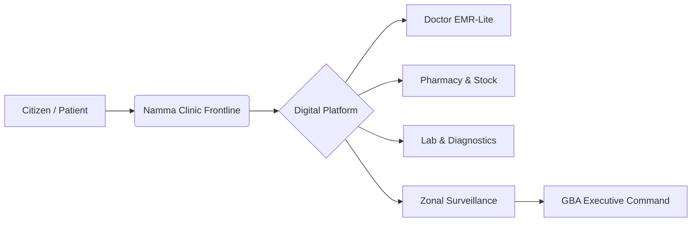

# 📜 Project Charter: Namma Clinic Digital Health Platform
## Greater Bengaluru Authority / BBMP Health Department
**Document Code:** PM-CHA-01 | **Status:** Approved Baseline | **Date:** September 2026

---

### 1. Project Purpose & Executive Mandate
The Namma Clinic Digital Health & Operations Platform is commissioned by the **Greater Bengaluru Authority (GBA) / BBMP Health Administration** to modernize primary healthcare delivery across Bengaluru's urban clinics. The platform replaces paper-based outpatient registers, manual stock counting, and fragmented reporting with an integrated, offline-first digital operational system.

### 2. Strategic Objectives & Success Targets
1. **Reduce Patient Check-In Time:** Decrease registration and triage wait times from ~15 minutes to under 90 seconds.
2. **Zero Paper Registers:** Transition 100% of daily outpatient, drug dispensing, and laboratory logs to digital records.
3. **Real-Time Medicine Inventory:** Achieve 100% batch-level stock visibility across all 183 clinics to prevent stockouts of vital NCD and antibiotic medications.
4. **Epidemiological Early Warning:** Provide real-time syndromic surveillance (fever spikes, gastroenteritis clusters) at the ward and zonal levels within 4 hours of clinical recording.
5. **ABDM Compliance:** Full readiness for Ayushman Bharat Digital Mission (ABHA creation, linked health records, FHIR R4 interoperability).

### 3. Project Authority & Key Sponsors
- **Executive Sponsor:** Special Commissioner (Health), Greater Bengaluru Authority / BBMP.
- **Clinical Director:** Chief Health Officer (CHO), Public Health Administration, Bengaluru.
- **Lead Delivery Partner:** Kushagramati Analytics Pvt Ltd (K Mati) Consortium.
