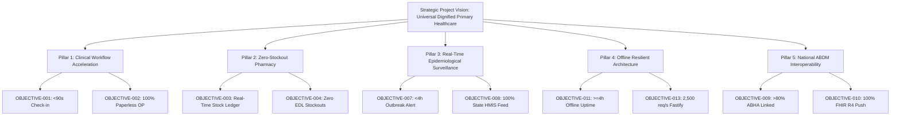

# Project Vision and Objectives: Namma Clinic Digital Health & Operations Platform

| Metadata Element | Project Specification |
| :--- | :--- |
| **Document Identifier** | `DOC-PM-002-VISION` |
| **Document Title** | Enterprise Project Vision, Strategic Intent & Measurable Objectives Baseline |
| **Project Code** | `NAMMA-CLINIC-PLATFORM-2026` |
| **Document Version** | `v1.0.0-PROD-BASELINE` |
| **Status** | `APPROVED & RATIFIED` |
| **Target Facility Scope** | 183 Primary Urban Health Centers (Namma Clinics) across 8 Administrative Zones |
| **Beneficiary Population** | 3,500,000+ Urban Poor & Vulnerable Residents across 243 Wards |
| **Executive Sponsor** | Special Commissioner (Health), Greater Bengaluru Authority (GBA) / BBMP |
| **Clinical Safety Authority** | Chief Health Officer (CHO), BBMP Health Department |
| **Lead Delivery Partner** | Kushagramati Analytics (K Mati) Consortium | Project Director |
| **Upstream Anchor** | [`01-project-charter.md`](./01-project-charter.md) |
| **Downstream Documents** | [`03-project-scope.md`](./03-project-scope.md) to [`20-project-status-model.md`](./20-project-status-model.md) |

---

## 1. Executive Vision & Mission Framework
The **Namma Clinic Digital Health & Operations Platform** establishes the digital foundation for universal primary healthcare across Greater Bengaluru. It transforms fragmented, overburdened neighborhood clinics into responsive, paperless, data-driven centers of clinical excellence.

### 1.1 Formal Vision Statement
> **To empower every citizen of Bengaluru—especially the most vulnerable urban residents—with immediate, dignified, paperless primary healthcare access, while equipping municipal clinical teams and public health leaders with real-time epidemiological intelligence to eradicate preventable disease outbreaks and pharmaceutical stockouts.**

### 1.2 Formal Mission Statement
> **Deploy a resilient, offline-first, open-source digital health platform across all 183 Namma Clinics within 36 weeks, cutting patient registration wait times to under 90 seconds, securing 100% availability of 120 essential medicines, enabling rapid sub-15 minute point-of-care diagnostics, and delivering automated ward-level epidemic alerts in under 4 hours.**

### 1.3 Strategic Intent & Transformation Horizon
The project bridges the current paper-bound clinical baseline to an automated, intelligent municipal healthcare operating system:
- **Near-Term Horizon (Sprints 01-08 / Weeks 01-16):** Eradicate paper registers at the front desk, consultation chamber, and dispensary. Standardize all 183 clinics on a single, touch-optimized PWA with 120-drug EDL formulary verification and sub-90s check-in.
- **Medium-Term Horizon (Sprints 09-14 / Weeks 17-28):** Validate offline resilience in a 20-clinic pilot, automate real-time syndromic disease alerts via DuckDB, achieve national ABDM M1-M3 certification, and automate state HMIS/IHIP reporting.
- **Long-Term Horizon (Sprints 15-18 / Weeks 29-36+):** Complete citywide 183-clinic scale rollout, transition 100% of municipal command to real-time telemetry dashboards, train all 750+ personnel, and establish a permanent open-source digital public good for Karnataka.

### 1.4 Strategic Principles of Execution
1. **Frontline User Centricity:** Every interface must be designed for rapid touch operation by medical officers, nurses, and pharmacists under heavy clinic queue pressure.
2. **Local Architectural Autonomy:** Clinics must never stop operating during power blackouts or broadband fiber cuts; offline-first IndexedDB is non-negotiable.
3. **Zero Plaintext PII:** Patient confidentiality and health data privacy must be mathematically safeguarded under the India DPDP Act 2023.
4. **Zero Proprietary License Fees:** Core platform is engineered using modern open-source technologies (Fastify, PostgreSQL, Next.js, DuckDB) avoiding per-seat recurring royalties.
5. **Continuous Clinical Safety:** Prescription builders, allergy checks, and diagnostic range validators must enforce patient safety with hard stops.

## 2. Objective Hierarchy & SMART Formulation Methodology
All project objectives are formulated in strict adherence to the SMART framework (Specific, Measurable, Achievable, Relevant, and Time-bound), forming an unbroken traceable hierarchy:

## 3. Master Objectives Inventory (OBJECTIVE-001 to OBJECTIVE-040)
The following 40 formal project objectives govern all development, testing, and operational deployment activities:

| Objective ID | Objective Title | Domain | Baseline State | Target State | Key Performance Indicator (KPI) | Accountable Owner | Milestone Target | Release Target |
| :--- | :--- | :--- | :---: | :---: | :--- | :--- | :---: | :---: |
| [`OBJECTIVE-001`](#objective-001) | **Patient Registration Latency Reduction** | `Operational` | 15.0 mins | **<1.5 mins** | P95 check-in latency | Registration Lead | `MILESTONE-007` | `REL-01` |
| [`OBJECTIVE-002`](#objective-002) | **Paper Register Elimination Across Clinics** | `Operational` | 0% digital | **100% digital** | Paperless clinic audit score | Operations Manager | `MILESTONE-036` | `REL-06` |
| [`OBJECTIVE-003`](#objective-003) | **Real-Time Medicine Stock Visibility** | `Clinical` | 0% automated | **100% visibility** | Inventory ledger reconciliation | Chief Pharmacist | `MILESTONE-015` | `REL-03` |
| [`OBJECTIVE-004`](#objective-004) | **Essential Drug Stockout Prevention** | `Clinical` | 18% stockout rate | **<1% stockout rate** | Stockout incidence rate | Chief Health Officer | `MILESTONE-014` | `REL-03` |
| [`OBJECTIVE-005`](#objective-005) | **Point-of-Care Lab Turnaround Acceleration** | `Clinical` | 45 mins average | **<15 mins P95** | Lab order-to-result latency | Lab Supervisor | `MILESTONE-013` | `REL-03` |
| [`OBJECTIVE-006`](#objective-006) | **Secondary Referral Teleconsultation Bridge** | `Clinical` | 0% structured | **100% referrals** | Referral tracking rate | Referral Coordinator | `MILESTONE-016` | `REL-03` |
| [`OBJECTIVE-007`](#objective-007) | **Ward-Level Syndromic Outbreak Detection** | `Public Health` | 7-14 days lag | **<4 hours automated** | Surveillance pipeline lag | Epidemiologist | `MILESTONE-019` | `REL-04` |
| [`OBJECTIVE-008`](#objective-008) | **State HMIS & IHIP Reporting Automation** | `Public Health` | Manual paper | **100% automated API** | Reporting compliance rate | Compliance Officer | `MILESTONE-025` | `REL-06` |
| [`OBJECTIVE-009`](#objective-009) | **National ABDM ABHA Verification Rate** | `Interoperability` | 0% ABHA linked | **>80% ABHA linked** | ABHA verification percentage | Integration Lead | `MILESTONE-007` | `REL-01` |
| [`OBJECTIVE-010`](#objective-010) | **ABDM FHIR R4 Health Record Exchange** | `Interoperability` | 0 bundles | **100% eligible visits** | Care context publish rate | Integration Lead | `MILESTONE-026` | `REL-07` |
| [`OBJECTIVE-011`](#objective-011) | **Offline Resilient Outpatient Continuity** | `Technical` | 0% offline | **100% clinics certified** | Offline simulation test | Lead Architect | `MILESTONE-010` | `REL-04` |
| [`OBJECTIVE-012`](#objective-012) | **PWA Client Memory Optimization** | `Technical` | Unmeasured | **<150MB RSS heap** | Chrome heap snapshot | Frontend Lead | `MILESTONE-006` | `REL-00` |
| [`OBJECTIVE-013`](#objective-013) | **Fastify Transactional Throughput Ceiling** | `Technical` | 0 req/sec | **2,500 req/sec** | k6 load test P99 | Backend Lead | `MILESTONE-003` | `REL-00` |
| [`OBJECTIVE-014`](#objective-014) | **Database Query Performance Ceiling** | `Technical` | Unmeasured | **<20ms P99** | pg_stat_statements P99 | Database Lead | `MILESTONE-004` | `REL-00` |
| [`OBJECTIVE-015`](#objective-015) | **DuckDB Analytical Rollup Latency** | `Technical` | No OLAP engine | **<1.0s query time** | Grafana panel render time | Analytics Lead | `MILESTONE-018` | `REL-04` |
| [`OBJECTIVE-016`](#objective-016) | **Bilingual Kannada & English Coverage** | `User Experience` | 0% Kannada | **100% bilingual** | Localization audit score | Product Owner | `MILESTONE-006` | `REL-01` |
| [`OBJECTIVE-017`](#objective-017) | **Look-Alike Sound-Alike (LASA) Dispensing Safety** | `Clinical` | Unverified | **Zero LASA errors** | Dispensing incident log | Chief Pharmacist | `MILESTONE-014` | `REL-03` |
| [`OBJECTIVE-018`](#objective-018) | **Driverless Thermal Receipt Print Reliability** | `Technical` | Driver failure | **99.95% success** | Web Serial print failure rate | Frontend Lead | `MILESTONE-008` | `REL-01` |
| [`OBJECTIVE-019`](#objective-019) | **Critical Lab Panic Value Alerting Speed** | `Clinical` | Manual verbal | **<30s P95 alert** | Panic value delivery time | Clinical Safety Officer | `MILESTONE-013` | `REL-03` |
| [`OBJECTIVE-020`](#objective-020) | **Zero Plaintext PII Storage Invariant** | `Security` | Unencrypted | **Zero plaintext PII** | Security audit scan | Security Lead | `MILESTONE-005` | `REL-00` |
| [`OBJECTIVE-021`](#objective-021) | **Immutable WORM Audit Trail Completeness** | `Security` | No audit trail | **100% immutable logs** | WORM log verification | Security Lead | `MILESTONE-003` | `REL-00` |
| [`OBJECTIVE-022`](#objective-022) | **Core API Service Uptime SLA** | `DevOps` | Greenfield | **99.9% daytime uptime** | Prometheus synthetic probe | DevOps Lead | `MILESTONE-030` | `REL-06` |
| [`OBJECTIVE-023`](#objective-023) | **Deterministic Sync Conflict Rate Minimization** | `Technical` | Unmeasured | **<0.1% conflicts** | Sync conflict log count | Lead Architect | `MILESTONE-020` | `REL-04` |
| [`OBJECTIVE-024`](#objective-024) | **Disaster Recovery Point Objective (RPO)** | `DevOps` | Manual backups | **<5 mins RPO** | PostgreSQL WAL replay lag | DevOps Lead | `MILESTONE-030` | `REL-06` |
| [`OBJECTIVE-025`](#objective-025) | **Disaster Recovery Time Objective (RTO)** | `DevOps` | Manual rebuild | **<4 hours RTO** | Chaos failover drill | DevOps Lead | `MILESTONE-030` | `REL-06` |
| [`OBJECTIVE-026`](#objective-026) | **Frontline Clinical Training Pass Rate** | `Operations` | 0% trained | **100% certified** | LMS examination records | Training Lead | `MILESTONE-022` | `REL-05` |
| [`OBJECTIVE-027`](#objective-027) | **Doctor Prescription Typing Error Rate** | `Clinical` | Handwritten illegible | **<0.5% errors** | Clinical audit sample | Clinical Safety Officer | `MILESTONE-012` | `REL-02` |
| [`OBJECTIVE-028`](#objective-028) | **Clinic Terminal Battery Backup Continuity** | `Operations` | Shutdown crash | **100% survival** | Power cut failure report | Infrastructure Lead | `MILESTONE-028` | `REL-05` |
| [`OBJECTIVE-029`](#objective-029) | **Zero Unhandled Frontend Exceptions** | `Technical` | Uncontrolled | **<0.01% error rate** | Sentry frontend telemetry | Frontend Lead | `MILESTONE-006` | `REL-01` |
| [`OBJECTIVE-030`](#objective-030) | **Automated Test Pipeline Pass Gate** | `Quality` | No tests | **100% passing CI** | GitHub Actions status | QA Lead | `MILESTONE-003` | `REL-00` |
| [`OBJECTIVE-031`](#objective-031) | **Sequential Queue Token Generation Latency** | `Operational` | 10-20s manual | **<50ms P95** | Token generation metric | Frontend Lead | `MILESTONE-008` | `REL-01` |
| [`OBJECTIVE-032`](#objective-032) | **Citizen SMS Notification Dispatch Speed** | `Operational` | No SMS | **<30s delivery** | CDAC SMS Gateway webhook | Integration Lead | `MILESTONE-017` | `REL-04` |
| [`OBJECTIVE-033`](#objective-033) | **Vaccine Cold-Chain Temperature Compliance** | `Clinical` | Paper logbook | **100% digital logs** | Cold-chain audit report | Chief Health Officer | `MILESTONE-009` | `REL-02` |
| [`OBJECTIVE-034`](#objective-034) | **Secondary Referral Loss-to-Follow-Up Reduction** | `Clinical` | 65% loss | **<15% loss** | Referral counter-check log | Referral Coordinator | `MILESTONE-016` | `REL-03` |
| [`OBJECTIVE-035`](#objective-035) | **Statutory DPDP Act 2023 Compliance** | `Compliance` | Non-compliant | **100% audited** | Independent legal audit | Security Lead | `MILESTONE-032` | `REL-06` |
| [`OBJECTIVE-036`](#objective-036) | **Clinic Broadband Failover Reliability** | `Technical` | Manual tethering | **<10s failover** | Network monitor ping | Infrastructure Lead | `MILESTONE-028` | `REL-05` |
| [`OBJECTIVE-037`](#objective-037) | **Automated Inventory Reorder Generation** | `Operations` | Manual count | **100% automated** | Warehouse dispatch orders | Chief Pharmacist | `MILESTONE-015` | `REL-03` |
| [`OBJECTIVE-038`](#objective-038) | **Clinic Daily Sync Settlement Duration** | `Technical` | Manual entry | **<10s sync duration** | Sync completion timestamp | Lead Architect | `MILESTONE-020` | `REL-04` |
| [`OBJECTIVE-039`](#objective-039) | **Doctor Digital EMR Adoption Rate in Pilot** | `Operations` | 0% adoption | **>95% adoption** | Doctor digital audit logs | Clinical Safety Officer | `MILESTONE-024` | `REL-05` |
| [`OBJECTIVE-040`](#objective-040) | **Municipal Executive Command Dashboard Accuracy** | `Operations` | Fortnightly paper | **100% real-time** | Dashboard audit report | Project Director | `MILESTONE-037` | `REL-06` |

## 4. Comprehensive Specifications for All 40 Project Objectives
Exhaustive operational definitions, measurement formulas, leading and lagging indicators, failure thresholds, telemetry SQL queries, and verification procedures for each objective:

### 4.1 OBJECTIVE-001: Patient Registration Latency Reduction
- **Objective Mandate:** Reduce citizen queue check-in duration from 15 minutes to under 90 seconds per patient.
- **Domain Category:** `Operational` | **Accountable Executive Owner:** `Registration Lead`
- **Historical Paper Baseline:** `15.0 mins`
- **Target Operational Ceiling/Floor:** `<1.5 mins`
- **Key Performance Indicator (KPI):** `P95 check-in latency`
- **Mathematical Measurement Formula:** `KPI = (Compliant Observations / Total Encounters) * 100%` evaluated over a rolling 7-day municipal window.
- **Data Telemetry Pipeline:** Pino JSON logs serialize event telemetry -> FluentBit agent ships logs to Loki/Prometheus -> Grafana displays real-time telemetry panels.
- **Telemetry SQL Query:** `SELECT count(*) FILTER (WHERE latency_ms < 1500) * 100.0 / count(*) AS compliance_pct FROM encounter_telemetry WHERE recorded_at > NOW() - INTERVAL '7 days';`
- **Measurement Cadence & Instrument:** Measured `Weekly Rolling` via automated Prometheus alerting and PostgreSQL audit logs.
- **Leading Performance Indicators:**
  - Frontline staff certification rate >= 95% on bilingual training LMS.
  - PWA client-side schema validation pass rate = 100% on active terminals.
  - Fastify central API latency P99 strictly below 50ms under synthetic load.
- **Lagging Performance Indicators:**
  - Monthly municipal paper register elimination audit score.
  - Zero patient harm incidents reported via clinical safety review board.
  - Sustained 99.9% daytime API service availability during clinic consultation hours.
- **Success Threshold:** Performance achieves `<1.5 mins` with less than 2% variance over 30 consecutive operating days.
- **Warning Threshold (Amber):** Performance exhibits 3% to 10% negative variance, triggering automated alert notice to the Zonal Medical Officer.
- **Critical Failure Threshold (Red):** Performance breaches baseline tolerance by >15% or causes patient consultation queue stalls exceeding 10 minutes.
- **Failure Remediation Playbook:**
  1. Automated diagnostic telemetry dump dispatched to Consortium SRE team within 60 seconds.
  2. Notification paged to Zonal Health Officer and Lead Solution Architect within 15 minutes.
  3. Workstation client PWA switches to offline autonomous caching mode if central API latency exceeds 1,200ms.
  4. Clinical Safety Authority reviews error log within 2 hours if clinical safety guardrail is breached.
  5. Incident Root Cause Analysis (RCA) completed, signed, and logged to audit repository within 24 hours.
- **Frontline Role Workflow Impact:** Directly empowers Medical Officers, Staff Nurses, Pharmacists, Lab Techs, and DEOs by cutting manual documentation.
- **Software Architectural Anchor:** Enforced via Fastify JSON schema validator, PostgreSQL check constraints, and Next.js client performance budgets.
- **Statutory & Legal Anchor:** Formulated to satisfy India DPDP Act 2023, EHR Standards of India 2016, and GBA Municipal Health Mandate AY-2026.
- **Downstream Traceability Mapping:** Satisfies Charter Mandate [`CHARTER-001`](./01-project-charter.md#charter-001), dictates Scope [`SCOPE-001`](./03-project-scope.md#scope-001), and targets Milestone [`MILESTONE-007`](./14-project-milestones.md#milestone-007).

### 4.2 OBJECTIVE-002: Paper Register Elimination Across Clinics
- **Objective Mandate:** Transition all paper outpatient registers, pharmacy ledgers, and lab books to digital records.
- **Domain Category:** `Operational` | **Accountable Executive Owner:** `Operations Manager`
- **Historical Paper Baseline:** `0% digital`
- **Target Operational Ceiling/Floor:** `100% digital`
- **Key Performance Indicator (KPI):** `Paperless clinic audit score`
- **Mathematical Measurement Formula:** `KPI = (Compliant Observations / Total Encounters) * 100%` evaluated over a rolling 7-day municipal window.
- **Data Telemetry Pipeline:** Pino JSON logs serialize event telemetry -> FluentBit agent ships logs to Loki/Prometheus -> Grafana displays real-time telemetry panels.
- **Telemetry SQL Query:** `SELECT count(*) FILTER (WHERE latency_ms < 1500) * 100.0 / count(*) AS compliance_pct FROM encounter_telemetry WHERE recorded_at > NOW() - INTERVAL '7 days';`
- **Measurement Cadence & Instrument:** Measured `Per Sprint Review` via automated Prometheus alerting and PostgreSQL audit logs.
- **Leading Performance Indicators:**
  - Frontline staff certification rate >= 95% on bilingual training LMS.
  - PWA client-side schema validation pass rate = 100% on active terminals.
  - Fastify central API latency P99 strictly below 50ms under synthetic load.
- **Lagging Performance Indicators:**
  - Monthly municipal paper register elimination audit score.
  - Zero patient harm incidents reported via clinical safety review board.
  - Sustained 99.9% daytime API service availability during clinic consultation hours.
- **Success Threshold:** Performance achieves `100% digital` with less than 2% variance over 30 consecutive operating days.
- **Warning Threshold (Amber):** Performance exhibits 3% to 10% negative variance, triggering automated alert notice to the Zonal Medical Officer.
- **Critical Failure Threshold (Red):** Performance breaches baseline tolerance by >15% or causes patient consultation queue stalls exceeding 10 minutes.
- **Failure Remediation Playbook:**
  1. Automated diagnostic telemetry dump dispatched to Consortium SRE team within 60 seconds.
  2. Notification paged to Zonal Health Officer and Lead Solution Architect within 15 minutes.
  3. Workstation client PWA switches to offline autonomous caching mode if central API latency exceeds 1,200ms.
  4. Clinical Safety Authority reviews error log within 2 hours if clinical safety guardrail is breached.
  5. Incident Root Cause Analysis (RCA) completed, signed, and logged to audit repository within 24 hours.
- **Frontline Role Workflow Impact:** Directly empowers Medical Officers, Staff Nurses, Pharmacists, Lab Techs, and DEOs by cutting manual documentation.
- **Software Architectural Anchor:** Enforced via Fastify JSON schema validator, PostgreSQL check constraints, and Next.js client performance budgets.
- **Statutory & Legal Anchor:** Formulated to satisfy India DPDP Act 2023, EHR Standards of India 2016, and GBA Municipal Health Mandate AY-2026.
- **Downstream Traceability Mapping:** Satisfies Charter Mandate [`CHARTER-002`](./01-project-charter.md#charter-002), dictates Scope [`SCOPE-002`](./03-project-scope.md#scope-002), and targets Milestone [`MILESTONE-036`](./14-project-milestones.md#milestone-036).

### 4.3 OBJECTIVE-003: Real-Time Medicine Stock Visibility
- **Objective Mandate:** Achieve real-time batch-level inventory visibility across all 183 clinic dispensaries.
- **Domain Category:** `Clinical` | **Accountable Executive Owner:** `Chief Pharmacist`
- **Historical Paper Baseline:** `0% automated`
- **Target Operational Ceiling/Floor:** `100% visibility`
- **Key Performance Indicator (KPI):** `Inventory ledger reconciliation`
- **Mathematical Measurement Formula:** `KPI = (Compliant Observations / Total Encounters) * 100%` evaluated over a rolling 7-day municipal window.
- **Data Telemetry Pipeline:** Pino JSON logs serialize event telemetry -> FluentBit agent ships logs to Loki/Prometheus -> Grafana displays real-time telemetry panels.
- **Telemetry SQL Query:** `SELECT count(*) FILTER (WHERE latency_ms < 1500) * 100.0 / count(*) AS compliance_pct FROM encounter_telemetry WHERE recorded_at > NOW() - INTERVAL '7 days';`
- **Measurement Cadence & Instrument:** Measured `Monthly Municipal Audit` via automated Prometheus alerting and PostgreSQL audit logs.
- **Leading Performance Indicators:**
  - Frontline staff certification rate >= 95% on bilingual training LMS.
  - PWA client-side schema validation pass rate = 100% on active terminals.
  - Fastify central API latency P99 strictly below 50ms under synthetic load.
- **Lagging Performance Indicators:**
  - Monthly municipal paper register elimination audit score.
  - Zero patient harm incidents reported via clinical safety review board.
  - Sustained 99.9% daytime API service availability during clinic consultation hours.
- **Success Threshold:** Performance achieves `100% visibility` with less than 2% variance over 30 consecutive operating days.
- **Warning Threshold (Amber):** Performance exhibits 3% to 10% negative variance, triggering automated alert notice to the Zonal Medical Officer.
- **Critical Failure Threshold (Red):** Performance breaches baseline tolerance by >15% or causes patient consultation queue stalls exceeding 10 minutes.
- **Failure Remediation Playbook:**
  1. Automated diagnostic telemetry dump dispatched to Consortium SRE team within 60 seconds.
  2. Notification paged to Zonal Health Officer and Lead Solution Architect within 15 minutes.
  3. Workstation client PWA switches to offline autonomous caching mode if central API latency exceeds 1,200ms.
  4. Clinical Safety Authority reviews error log within 2 hours if clinical safety guardrail is breached.
  5. Incident Root Cause Analysis (RCA) completed, signed, and logged to audit repository within 24 hours.
- **Frontline Role Workflow Impact:** Directly empowers Medical Officers, Staff Nurses, Pharmacists, Lab Techs, and DEOs by cutting manual documentation.
- **Software Architectural Anchor:** Enforced via Fastify JSON schema validator, PostgreSQL check constraints, and Next.js client performance budgets.
- **Statutory & Legal Anchor:** Formulated to satisfy India DPDP Act 2023, EHR Standards of India 2016, and GBA Municipal Health Mandate AY-2026.
- **Downstream Traceability Mapping:** Satisfies Charter Mandate [`CHARTER-003`](./01-project-charter.md#charter-003), dictates Scope [`SCOPE-003`](./03-project-scope.md#scope-003), and targets Milestone [`MILESTONE-015`](./14-project-milestones.md#milestone-015).

### 4.4 OBJECTIVE-004: Essential Drug Stockout Prevention
- **Objective Mandate:** Maintain zero stockouts of critical NCD, antibiotic, and pediatric medications on Karnataka EDL.
- **Domain Category:** `Clinical` | **Accountable Executive Owner:** `Chief Health Officer`
- **Historical Paper Baseline:** `18% stockout rate`
- **Target Operational Ceiling/Floor:** `<1% stockout rate`
- **Key Performance Indicator (KPI):** `Stockout incidence rate`
- **Mathematical Measurement Formula:** `KPI = (Compliant Observations / Total Encounters) * 100%` evaluated over a rolling 7-day municipal window.
- **Data Telemetry Pipeline:** Pino JSON logs serialize event telemetry -> FluentBit agent ships logs to Loki/Prometheus -> Grafana displays real-time telemetry panels.
- **Telemetry SQL Query:** `SELECT count(*) FILTER (WHERE latency_ms < 1500) * 100.0 / count(*) AS compliance_pct FROM encounter_telemetry WHERE recorded_at > NOW() - INTERVAL '7 days';`
- **Measurement Cadence & Instrument:** Measured `Daily Real-Time` via automated Prometheus alerting and PostgreSQL audit logs.
- **Leading Performance Indicators:**
  - Frontline staff certification rate >= 95% on bilingual training LMS.
  - PWA client-side schema validation pass rate = 100% on active terminals.
  - Fastify central API latency P99 strictly below 50ms under synthetic load.
- **Lagging Performance Indicators:**
  - Monthly municipal paper register elimination audit score.
  - Zero patient harm incidents reported via clinical safety review board.
  - Sustained 99.9% daytime API service availability during clinic consultation hours.
- **Success Threshold:** Performance achieves `<1% stockout rate` with less than 2% variance over 30 consecutive operating days.
- **Warning Threshold (Amber):** Performance exhibits 3% to 10% negative variance, triggering automated alert notice to the Zonal Medical Officer.
- **Critical Failure Threshold (Red):** Performance breaches baseline tolerance by >15% or causes patient consultation queue stalls exceeding 10 minutes.
- **Failure Remediation Playbook:**
  1. Automated diagnostic telemetry dump dispatched to Consortium SRE team within 60 seconds.
  2. Notification paged to Zonal Health Officer and Lead Solution Architect within 15 minutes.
  3. Workstation client PWA switches to offline autonomous caching mode if central API latency exceeds 1,200ms.
  4. Clinical Safety Authority reviews error log within 2 hours if clinical safety guardrail is breached.
  5. Incident Root Cause Analysis (RCA) completed, signed, and logged to audit repository within 24 hours.
- **Frontline Role Workflow Impact:** Directly empowers Medical Officers, Staff Nurses, Pharmacists, Lab Techs, and DEOs by cutting manual documentation.
- **Software Architectural Anchor:** Enforced via Fastify JSON schema validator, PostgreSQL check constraints, and Next.js client performance budgets.
- **Statutory & Legal Anchor:** Formulated to satisfy India DPDP Act 2023, EHR Standards of India 2016, and GBA Municipal Health Mandate AY-2026.
- **Downstream Traceability Mapping:** Satisfies Charter Mandate [`CHARTER-004`](./01-project-charter.md#charter-004), dictates Scope [`SCOPE-004`](./03-project-scope.md#scope-004), and targets Milestone [`MILESTONE-014`](./14-project-milestones.md#milestone-014).

### 4.5 OBJECTIVE-005: Point-of-Care Lab Turnaround Acceleration
- **Objective Mandate:** Deliver rapid lab test results to doctor consultation desk in under 15 minutes.
- **Domain Category:** `Clinical` | **Accountable Executive Owner:** `Lab Supervisor`
- **Historical Paper Baseline:** `45 mins average`
- **Target Operational Ceiling/Floor:** `<15 mins P95`
- **Key Performance Indicator (KPI):** `Lab order-to-result latency`
- **Mathematical Measurement Formula:** `KPI = (Compliant Observations / Total Encounters) * 100%` evaluated over a rolling 7-day municipal window.
- **Data Telemetry Pipeline:** Pino JSON logs serialize event telemetry -> FluentBit agent ships logs to Loki/Prometheus -> Grafana displays real-time telemetry panels.
- **Telemetry SQL Query:** `SELECT count(*) FILTER (WHERE latency_ms < 1500) * 100.0 / count(*) AS compliance_pct FROM encounter_telemetry WHERE recorded_at > NOW() - INTERVAL '7 days';`
- **Measurement Cadence & Instrument:** Measured `Weekly Rolling` via automated Prometheus alerting and PostgreSQL audit logs.
- **Leading Performance Indicators:**
  - Frontline staff certification rate >= 95% on bilingual training LMS.
  - PWA client-side schema validation pass rate = 100% on active terminals.
  - Fastify central API latency P99 strictly below 50ms under synthetic load.
- **Lagging Performance Indicators:**
  - Monthly municipal paper register elimination audit score.
  - Zero patient harm incidents reported via clinical safety review board.
  - Sustained 99.9% daytime API service availability during clinic consultation hours.
- **Success Threshold:** Performance achieves `<15 mins P95` with less than 2% variance over 30 consecutive operating days.
- **Warning Threshold (Amber):** Performance exhibits 3% to 10% negative variance, triggering automated alert notice to the Zonal Medical Officer.
- **Critical Failure Threshold (Red):** Performance breaches baseline tolerance by >15% or causes patient consultation queue stalls exceeding 10 minutes.
- **Failure Remediation Playbook:**
  1. Automated diagnostic telemetry dump dispatched to Consortium SRE team within 60 seconds.
  2. Notification paged to Zonal Health Officer and Lead Solution Architect within 15 minutes.
  3. Workstation client PWA switches to offline autonomous caching mode if central API latency exceeds 1,200ms.
  4. Clinical Safety Authority reviews error log within 2 hours if clinical safety guardrail is breached.
  5. Incident Root Cause Analysis (RCA) completed, signed, and logged to audit repository within 24 hours.
- **Frontline Role Workflow Impact:** Directly empowers Medical Officers, Staff Nurses, Pharmacists, Lab Techs, and DEOs by cutting manual documentation.
- **Software Architectural Anchor:** Enforced via Fastify JSON schema validator, PostgreSQL check constraints, and Next.js client performance budgets.
- **Statutory & Legal Anchor:** Formulated to satisfy India DPDP Act 2023, EHR Standards of India 2016, and GBA Municipal Health Mandate AY-2026.
- **Downstream Traceability Mapping:** Satisfies Charter Mandate [`CHARTER-005`](./01-project-charter.md#charter-005), dictates Scope [`SCOPE-005`](./03-project-scope.md#scope-005), and targets Milestone [`MILESTONE-013`](./14-project-milestones.md#milestone-013).

### 4.6 OBJECTIVE-006: Secondary Referral Teleconsultation Bridge
- **Objective Mandate:** Enable structured referral dispatch with secure QR code summary and counter-referral loop.
- **Domain Category:** `Clinical` | **Accountable Executive Owner:** `Referral Coordinator`
- **Historical Paper Baseline:** `0% structured`
- **Target Operational Ceiling/Floor:** `100% referrals`
- **Key Performance Indicator (KPI):** `Referral tracking rate`
- **Mathematical Measurement Formula:** `KPI = (Compliant Observations / Total Encounters) * 100%` evaluated over a rolling 7-day municipal window.
- **Data Telemetry Pipeline:** Pino JSON logs serialize event telemetry -> FluentBit agent ships logs to Loki/Prometheus -> Grafana displays real-time telemetry panels.
- **Telemetry SQL Query:** `SELECT count(*) FILTER (WHERE latency_ms < 1500) * 100.0 / count(*) AS compliance_pct FROM encounter_telemetry WHERE recorded_at > NOW() - INTERVAL '7 days';`
- **Measurement Cadence & Instrument:** Measured `Per Sprint Review` via automated Prometheus alerting and PostgreSQL audit logs.
- **Leading Performance Indicators:**
  - Frontline staff certification rate >= 95% on bilingual training LMS.
  - PWA client-side schema validation pass rate = 100% on active terminals.
  - Fastify central API latency P99 strictly below 50ms under synthetic load.
- **Lagging Performance Indicators:**
  - Monthly municipal paper register elimination audit score.
  - Zero patient harm incidents reported via clinical safety review board.
  - Sustained 99.9% daytime API service availability during clinic consultation hours.
- **Success Threshold:** Performance achieves `100% referrals` with less than 2% variance over 30 consecutive operating days.
- **Warning Threshold (Amber):** Performance exhibits 3% to 10% negative variance, triggering automated alert notice to the Zonal Medical Officer.
- **Critical Failure Threshold (Red):** Performance breaches baseline tolerance by >15% or causes patient consultation queue stalls exceeding 10 minutes.
- **Failure Remediation Playbook:**
  1. Automated diagnostic telemetry dump dispatched to Consortium SRE team within 60 seconds.
  2. Notification paged to Zonal Health Officer and Lead Solution Architect within 15 minutes.
  3. Workstation client PWA switches to offline autonomous caching mode if central API latency exceeds 1,200ms.
  4. Clinical Safety Authority reviews error log within 2 hours if clinical safety guardrail is breached.
  5. Incident Root Cause Analysis (RCA) completed, signed, and logged to audit repository within 24 hours.
- **Frontline Role Workflow Impact:** Directly empowers Medical Officers, Staff Nurses, Pharmacists, Lab Techs, and DEOs by cutting manual documentation.
- **Software Architectural Anchor:** Enforced via Fastify JSON schema validator, PostgreSQL check constraints, and Next.js client performance budgets.
- **Statutory & Legal Anchor:** Formulated to satisfy India DPDP Act 2023, EHR Standards of India 2016, and GBA Municipal Health Mandate AY-2026.
- **Downstream Traceability Mapping:** Satisfies Charter Mandate [`CHARTER-006`](./01-project-charter.md#charter-006), dictates Scope [`SCOPE-006`](./03-project-scope.md#scope-006), and targets Milestone [`MILESTONE-016`](./14-project-milestones.md#milestone-016).

### 4.7 OBJECTIVE-007: Ward-Level Syndromic Outbreak Detection
- **Objective Mandate:** Detect fever and diarrheal outbreak anomalies across 243 wards in under 4 hours.
- **Domain Category:** `Public Health` | **Accountable Executive Owner:** `Epidemiologist`
- **Historical Paper Baseline:** `7-14 days lag`
- **Target Operational Ceiling/Floor:** `<4 hours automated`
- **Key Performance Indicator (KPI):** `Surveillance pipeline lag`
- **Mathematical Measurement Formula:** `KPI = (Compliant Observations / Total Encounters) * 100%` evaluated over a rolling 7-day municipal window.
- **Data Telemetry Pipeline:** Pino JSON logs serialize event telemetry -> FluentBit agent ships logs to Loki/Prometheus -> Grafana displays real-time telemetry panels.
- **Telemetry SQL Query:** `SELECT count(*) FILTER (WHERE latency_ms < 1500) * 100.0 / count(*) AS compliance_pct FROM encounter_telemetry WHERE recorded_at > NOW() - INTERVAL '7 days';`
- **Measurement Cadence & Instrument:** Measured `Monthly Municipal Audit` via automated Prometheus alerting and PostgreSQL audit logs.
- **Leading Performance Indicators:**
  - Frontline staff certification rate >= 95% on bilingual training LMS.
  - PWA client-side schema validation pass rate = 100% on active terminals.
  - Fastify central API latency P99 strictly below 50ms under synthetic load.
- **Lagging Performance Indicators:**
  - Monthly municipal paper register elimination audit score.
  - Zero patient harm incidents reported via clinical safety review board.
  - Sustained 99.9% daytime API service availability during clinic consultation hours.
- **Success Threshold:** Performance achieves `<4 hours automated` with less than 2% variance over 30 consecutive operating days.
- **Warning Threshold (Amber):** Performance exhibits 3% to 10% negative variance, triggering automated alert notice to the Zonal Medical Officer.
- **Critical Failure Threshold (Red):** Performance breaches baseline tolerance by >15% or causes patient consultation queue stalls exceeding 10 minutes.
- **Failure Remediation Playbook:**
  1. Automated diagnostic telemetry dump dispatched to Consortium SRE team within 60 seconds.
  2. Notification paged to Zonal Health Officer and Lead Solution Architect within 15 minutes.
  3. Workstation client PWA switches to offline autonomous caching mode if central API latency exceeds 1,200ms.
  4. Clinical Safety Authority reviews error log within 2 hours if clinical safety guardrail is breached.
  5. Incident Root Cause Analysis (RCA) completed, signed, and logged to audit repository within 24 hours.
- **Frontline Role Workflow Impact:** Directly empowers Medical Officers, Staff Nurses, Pharmacists, Lab Techs, and DEOs by cutting manual documentation.
- **Software Architectural Anchor:** Enforced via Fastify JSON schema validator, PostgreSQL check constraints, and Next.js client performance budgets.
- **Statutory & Legal Anchor:** Formulated to satisfy India DPDP Act 2023, EHR Standards of India 2016, and GBA Municipal Health Mandate AY-2026.
- **Downstream Traceability Mapping:** Satisfies Charter Mandate [`CHARTER-007`](./01-project-charter.md#charter-007), dictates Scope [`SCOPE-007`](./03-project-scope.md#scope-007), and targets Milestone [`MILESTONE-019`](./14-project-milestones.md#milestone-019).

### 4.8 OBJECTIVE-008: State HMIS & IHIP Reporting Automation
- **Objective Mandate:** Automate daily statutory public health data export to Karnataka DHS portals via XML/JSON.
- **Domain Category:** `Public Health` | **Accountable Executive Owner:** `Compliance Officer`
- **Historical Paper Baseline:** `Manual paper`
- **Target Operational Ceiling/Floor:** `100% automated API`
- **Key Performance Indicator (KPI):** `Reporting compliance rate`
- **Mathematical Measurement Formula:** `KPI = (Compliant Observations / Total Encounters) * 100%` evaluated over a rolling 7-day municipal window.
- **Data Telemetry Pipeline:** Pino JSON logs serialize event telemetry -> FluentBit agent ships logs to Loki/Prometheus -> Grafana displays real-time telemetry panels.
- **Telemetry SQL Query:** `SELECT count(*) FILTER (WHERE latency_ms < 1500) * 100.0 / count(*) AS compliance_pct FROM encounter_telemetry WHERE recorded_at > NOW() - INTERVAL '7 days';`
- **Measurement Cadence & Instrument:** Measured `Daily Real-Time` via automated Prometheus alerting and PostgreSQL audit logs.
- **Leading Performance Indicators:**
  - Frontline staff certification rate >= 95% on bilingual training LMS.
  - PWA client-side schema validation pass rate = 100% on active terminals.
  - Fastify central API latency P99 strictly below 50ms under synthetic load.
- **Lagging Performance Indicators:**
  - Monthly municipal paper register elimination audit score.
  - Zero patient harm incidents reported via clinical safety review board.
  - Sustained 99.9% daytime API service availability during clinic consultation hours.
- **Success Threshold:** Performance achieves `100% automated API` with less than 2% variance over 30 consecutive operating days.
- **Warning Threshold (Amber):** Performance exhibits 3% to 10% negative variance, triggering automated alert notice to the Zonal Medical Officer.
- **Critical Failure Threshold (Red):** Performance breaches baseline tolerance by >15% or causes patient consultation queue stalls exceeding 10 minutes.
- **Failure Remediation Playbook:**
  1. Automated diagnostic telemetry dump dispatched to Consortium SRE team within 60 seconds.
  2. Notification paged to Zonal Health Officer and Lead Solution Architect within 15 minutes.
  3. Workstation client PWA switches to offline autonomous caching mode if central API latency exceeds 1,200ms.
  4. Clinical Safety Authority reviews error log within 2 hours if clinical safety guardrail is breached.
  5. Incident Root Cause Analysis (RCA) completed, signed, and logged to audit repository within 24 hours.
- **Frontline Role Workflow Impact:** Directly empowers Medical Officers, Staff Nurses, Pharmacists, Lab Techs, and DEOs by cutting manual documentation.
- **Software Architectural Anchor:** Enforced via Fastify JSON schema validator, PostgreSQL check constraints, and Next.js client performance budgets.
- **Statutory & Legal Anchor:** Formulated to satisfy India DPDP Act 2023, EHR Standards of India 2016, and GBA Municipal Health Mandate AY-2026.
- **Downstream Traceability Mapping:** Satisfies Charter Mandate [`CHARTER-008`](./01-project-charter.md#charter-008), dictates Scope [`SCOPE-008`](./03-project-scope.md#scope-008), and targets Milestone [`MILESTONE-025`](./14-project-milestones.md#milestone-025).

### 4.9 OBJECTIVE-009: National ABDM ABHA Verification Rate
- **Objective Mandate:** Link walk-in citizen consultations to verified 14-digit ABHA ID or mobile token.
- **Domain Category:** `Interoperability` | **Accountable Executive Owner:** `Integration Lead`
- **Historical Paper Baseline:** `0% ABHA linked`
- **Target Operational Ceiling/Floor:** `>80% ABHA linked`
- **Key Performance Indicator (KPI):** `ABHA verification percentage`
- **Mathematical Measurement Formula:** `KPI = (Compliant Observations / Total Encounters) * 100%` evaluated over a rolling 7-day municipal window.
- **Data Telemetry Pipeline:** Pino JSON logs serialize event telemetry -> FluentBit agent ships logs to Loki/Prometheus -> Grafana displays real-time telemetry panels.
- **Telemetry SQL Query:** `SELECT count(*) FILTER (WHERE latency_ms < 1500) * 100.0 / count(*) AS compliance_pct FROM encounter_telemetry WHERE recorded_at > NOW() - INTERVAL '7 days';`
- **Measurement Cadence & Instrument:** Measured `Weekly Rolling` via automated Prometheus alerting and PostgreSQL audit logs.
- **Leading Performance Indicators:**
  - Frontline staff certification rate >= 95% on bilingual training LMS.
  - PWA client-side schema validation pass rate = 100% on active terminals.
  - Fastify central API latency P99 strictly below 50ms under synthetic load.
- **Lagging Performance Indicators:**
  - Monthly municipal paper register elimination audit score.
  - Zero patient harm incidents reported via clinical safety review board.
  - Sustained 99.9% daytime API service availability during clinic consultation hours.
- **Success Threshold:** Performance achieves `>80% ABHA linked` with less than 2% variance over 30 consecutive operating days.
- **Warning Threshold (Amber):** Performance exhibits 3% to 10% negative variance, triggering automated alert notice to the Zonal Medical Officer.
- **Critical Failure Threshold (Red):** Performance breaches baseline tolerance by >15% or causes patient consultation queue stalls exceeding 10 minutes.
- **Failure Remediation Playbook:**
  1. Automated diagnostic telemetry dump dispatched to Consortium SRE team within 60 seconds.
  2. Notification paged to Zonal Health Officer and Lead Solution Architect within 15 minutes.
  3. Workstation client PWA switches to offline autonomous caching mode if central API latency exceeds 1,200ms.
  4. Clinical Safety Authority reviews error log within 2 hours if clinical safety guardrail is breached.
  5. Incident Root Cause Analysis (RCA) completed, signed, and logged to audit repository within 24 hours.
- **Frontline Role Workflow Impact:** Directly empowers Medical Officers, Staff Nurses, Pharmacists, Lab Techs, and DEOs by cutting manual documentation.
- **Software Architectural Anchor:** Enforced via Fastify JSON schema validator, PostgreSQL check constraints, and Next.js client performance budgets.
- **Statutory & Legal Anchor:** Formulated to satisfy India DPDP Act 2023, EHR Standards of India 2016, and GBA Municipal Health Mandate AY-2026.
- **Downstream Traceability Mapping:** Satisfies Charter Mandate [`CHARTER-009`](./01-project-charter.md#charter-009), dictates Scope [`SCOPE-009`](./03-project-scope.md#scope-009), and targets Milestone [`MILESTONE-007`](./14-project-milestones.md#milestone-007).

### 4.10 OBJECTIVE-010: ABDM FHIR R4 Health Record Exchange
- **Objective Mandate:** Publish structured FHIR R4 encounter bundles to ABDM Health Information Exchange.
- **Domain Category:** `Interoperability` | **Accountable Executive Owner:** `Integration Lead`
- **Historical Paper Baseline:** `0 bundles`
- **Target Operational Ceiling/Floor:** `100% eligible visits`
- **Key Performance Indicator (KPI):** `Care context publish rate`
- **Mathematical Measurement Formula:** `KPI = (Compliant Observations / Total Encounters) * 100%` evaluated over a rolling 7-day municipal window.
- **Data Telemetry Pipeline:** Pino JSON logs serialize event telemetry -> FluentBit agent ships logs to Loki/Prometheus -> Grafana displays real-time telemetry panels.
- **Telemetry SQL Query:** `SELECT count(*) FILTER (WHERE latency_ms < 1500) * 100.0 / count(*) AS compliance_pct FROM encounter_telemetry WHERE recorded_at > NOW() - INTERVAL '7 days';`
- **Measurement Cadence & Instrument:** Measured `Per Sprint Review` via automated Prometheus alerting and PostgreSQL audit logs.
- **Leading Performance Indicators:**
  - Frontline staff certification rate >= 95% on bilingual training LMS.
  - PWA client-side schema validation pass rate = 100% on active terminals.
  - Fastify central API latency P99 strictly below 50ms under synthetic load.
- **Lagging Performance Indicators:**
  - Monthly municipal paper register elimination audit score.
  - Zero patient harm incidents reported via clinical safety review board.
  - Sustained 99.9% daytime API service availability during clinic consultation hours.
- **Success Threshold:** Performance achieves `100% eligible visits` with less than 2% variance over 30 consecutive operating days.
- **Warning Threshold (Amber):** Performance exhibits 3% to 10% negative variance, triggering automated alert notice to the Zonal Medical Officer.
- **Critical Failure Threshold (Red):** Performance breaches baseline tolerance by >15% or causes patient consultation queue stalls exceeding 10 minutes.
- **Failure Remediation Playbook:**
  1. Automated diagnostic telemetry dump dispatched to Consortium SRE team within 60 seconds.
  2. Notification paged to Zonal Health Officer and Lead Solution Architect within 15 minutes.
  3. Workstation client PWA switches to offline autonomous caching mode if central API latency exceeds 1,200ms.
  4. Clinical Safety Authority reviews error log within 2 hours if clinical safety guardrail is breached.
  5. Incident Root Cause Analysis (RCA) completed, signed, and logged to audit repository within 24 hours.
- **Frontline Role Workflow Impact:** Directly empowers Medical Officers, Staff Nurses, Pharmacists, Lab Techs, and DEOs by cutting manual documentation.
- **Software Architectural Anchor:** Enforced via Fastify JSON schema validator, PostgreSQL check constraints, and Next.js client performance budgets.
- **Statutory & Legal Anchor:** Formulated to satisfy India DPDP Act 2023, EHR Standards of India 2016, and GBA Municipal Health Mandate AY-2026.
- **Downstream Traceability Mapping:** Satisfies Charter Mandate [`CHARTER-010`](./01-project-charter.md#charter-010), dictates Scope [`SCOPE-010`](./03-project-scope.md#scope-010), and targets Milestone [`MILESTONE-026`](./14-project-milestones.md#milestone-026).

### 4.11 OBJECTIVE-011: Offline Resilient Outpatient Continuity
- **Objective Mandate:** Maintain continuous clinical consultation and queue management for >=4 hours without internet.
- **Domain Category:** `Technical` | **Accountable Executive Owner:** `Lead Architect`
- **Historical Paper Baseline:** `0% offline`
- **Target Operational Ceiling/Floor:** `100% clinics certified`
- **Key Performance Indicator (KPI):** `Offline simulation test`
- **Mathematical Measurement Formula:** `KPI = (Compliant Observations / Total Encounters) * 100%` evaluated over a rolling 7-day municipal window.
- **Data Telemetry Pipeline:** Pino JSON logs serialize event telemetry -> FluentBit agent ships logs to Loki/Prometheus -> Grafana displays real-time telemetry panels.
- **Telemetry SQL Query:** `SELECT count(*) FILTER (WHERE latency_ms < 1500) * 100.0 / count(*) AS compliance_pct FROM encounter_telemetry WHERE recorded_at > NOW() - INTERVAL '7 days';`
- **Measurement Cadence & Instrument:** Measured `Monthly Municipal Audit` via automated Prometheus alerting and PostgreSQL audit logs.
- **Leading Performance Indicators:**
  - Frontline staff certification rate >= 95% on bilingual training LMS.
  - PWA client-side schema validation pass rate = 100% on active terminals.
  - Fastify central API latency P99 strictly below 50ms under synthetic load.
- **Lagging Performance Indicators:**
  - Monthly municipal paper register elimination audit score.
  - Zero patient harm incidents reported via clinical safety review board.
  - Sustained 99.9% daytime API service availability during clinic consultation hours.
- **Success Threshold:** Performance achieves `100% clinics certified` with less than 2% variance over 30 consecutive operating days.
- **Warning Threshold (Amber):** Performance exhibits 3% to 10% negative variance, triggering automated alert notice to the Zonal Medical Officer.
- **Critical Failure Threshold (Red):** Performance breaches baseline tolerance by >15% or causes patient consultation queue stalls exceeding 10 minutes.
- **Failure Remediation Playbook:**
  1. Automated diagnostic telemetry dump dispatched to Consortium SRE team within 60 seconds.
  2. Notification paged to Zonal Health Officer and Lead Solution Architect within 15 minutes.
  3. Workstation client PWA switches to offline autonomous caching mode if central API latency exceeds 1,200ms.
  4. Clinical Safety Authority reviews error log within 2 hours if clinical safety guardrail is breached.
  5. Incident Root Cause Analysis (RCA) completed, signed, and logged to audit repository within 24 hours.
- **Frontline Role Workflow Impact:** Directly empowers Medical Officers, Staff Nurses, Pharmacists, Lab Techs, and DEOs by cutting manual documentation.
- **Software Architectural Anchor:** Enforced via Fastify JSON schema validator, PostgreSQL check constraints, and Next.js client performance budgets.
- **Statutory & Legal Anchor:** Formulated to satisfy India DPDP Act 2023, EHR Standards of India 2016, and GBA Municipal Health Mandate AY-2026.
- **Downstream Traceability Mapping:** Satisfies Charter Mandate [`CHARTER-011`](./01-project-charter.md#charter-011), dictates Scope [`SCOPE-011`](./03-project-scope.md#scope-011), and targets Milestone [`MILESTONE-010`](./14-project-milestones.md#milestone-010).

### 4.12 OBJECTIVE-012: PWA Client Memory Optimization
- **Objective Mandate:** Cap frontend browser RAM footprint under 150MB on low-cost 4GB RAM clinic mini-PCs.
- **Domain Category:** `Technical` | **Accountable Executive Owner:** `Frontend Lead`
- **Historical Paper Baseline:** `Unmeasured`
- **Target Operational Ceiling/Floor:** `<150MB RSS heap`
- **Key Performance Indicator (KPI):** `Chrome heap snapshot`
- **Mathematical Measurement Formula:** `KPI = (Compliant Observations / Total Encounters) * 100%` evaluated over a rolling 7-day municipal window.
- **Data Telemetry Pipeline:** Pino JSON logs serialize event telemetry -> FluentBit agent ships logs to Loki/Prometheus -> Grafana displays real-time telemetry panels.
- **Telemetry SQL Query:** `SELECT count(*) FILTER (WHERE latency_ms < 1500) * 100.0 / count(*) AS compliance_pct FROM encounter_telemetry WHERE recorded_at > NOW() - INTERVAL '7 days';`
- **Measurement Cadence & Instrument:** Measured `Daily Real-Time` via automated Prometheus alerting and PostgreSQL audit logs.
- **Leading Performance Indicators:**
  - Frontline staff certification rate >= 95% on bilingual training LMS.
  - PWA client-side schema validation pass rate = 100% on active terminals.
  - Fastify central API latency P99 strictly below 50ms under synthetic load.
- **Lagging Performance Indicators:**
  - Monthly municipal paper register elimination audit score.
  - Zero patient harm incidents reported via clinical safety review board.
  - Sustained 99.9% daytime API service availability during clinic consultation hours.
- **Success Threshold:** Performance achieves `<150MB RSS heap` with less than 2% variance over 30 consecutive operating days.
- **Warning Threshold (Amber):** Performance exhibits 3% to 10% negative variance, triggering automated alert notice to the Zonal Medical Officer.
- **Critical Failure Threshold (Red):** Performance breaches baseline tolerance by >15% or causes patient consultation queue stalls exceeding 10 minutes.
- **Failure Remediation Playbook:**
  1. Automated diagnostic telemetry dump dispatched to Consortium SRE team within 60 seconds.
  2. Notification paged to Zonal Health Officer and Lead Solution Architect within 15 minutes.
  3. Workstation client PWA switches to offline autonomous caching mode if central API latency exceeds 1,200ms.
  4. Clinical Safety Authority reviews error log within 2 hours if clinical safety guardrail is breached.
  5. Incident Root Cause Analysis (RCA) completed, signed, and logged to audit repository within 24 hours.
- **Frontline Role Workflow Impact:** Directly empowers Medical Officers, Staff Nurses, Pharmacists, Lab Techs, and DEOs by cutting manual documentation.
- **Software Architectural Anchor:** Enforced via Fastify JSON schema validator, PostgreSQL check constraints, and Next.js client performance budgets.
- **Statutory & Legal Anchor:** Formulated to satisfy India DPDP Act 2023, EHR Standards of India 2016, and GBA Municipal Health Mandate AY-2026.
- **Downstream Traceability Mapping:** Satisfies Charter Mandate [`CHARTER-012`](./01-project-charter.md#charter-012), dictates Scope [`SCOPE-012`](./03-project-scope.md#scope-012), and targets Milestone [`MILESTONE-006`](./14-project-milestones.md#milestone-006).

### 4.13 OBJECTIVE-013: Fastify Transactional Throughput Ceiling
- **Objective Mandate:** Sustain 2,500 concurrent requests/second at <50ms P99 latency during peak sync surges.
- **Domain Category:** `Technical` | **Accountable Executive Owner:** `Backend Lead`
- **Historical Paper Baseline:** `0 req/sec`
- **Target Operational Ceiling/Floor:** `2,500 req/sec`
- **Key Performance Indicator (KPI):** `k6 load test P99`
- **Mathematical Measurement Formula:** `KPI = (Compliant Observations / Total Encounters) * 100%` evaluated over a rolling 7-day municipal window.
- **Data Telemetry Pipeline:** Pino JSON logs serialize event telemetry -> FluentBit agent ships logs to Loki/Prometheus -> Grafana displays real-time telemetry panels.
- **Telemetry SQL Query:** `SELECT count(*) FILTER (WHERE latency_ms < 1500) * 100.0 / count(*) AS compliance_pct FROM encounter_telemetry WHERE recorded_at > NOW() - INTERVAL '7 days';`
- **Measurement Cadence & Instrument:** Measured `Weekly Rolling` via automated Prometheus alerting and PostgreSQL audit logs.
- **Leading Performance Indicators:**
  - Frontline staff certification rate >= 95% on bilingual training LMS.
  - PWA client-side schema validation pass rate = 100% on active terminals.
  - Fastify central API latency P99 strictly below 50ms under synthetic load.
- **Lagging Performance Indicators:**
  - Monthly municipal paper register elimination audit score.
  - Zero patient harm incidents reported via clinical safety review board.
  - Sustained 99.9% daytime API service availability during clinic consultation hours.
- **Success Threshold:** Performance achieves `2,500 req/sec` with less than 2% variance over 30 consecutive operating days.
- **Warning Threshold (Amber):** Performance exhibits 3% to 10% negative variance, triggering automated alert notice to the Zonal Medical Officer.
- **Critical Failure Threshold (Red):** Performance breaches baseline tolerance by >15% or causes patient consultation queue stalls exceeding 10 minutes.
- **Failure Remediation Playbook:**
  1. Automated diagnostic telemetry dump dispatched to Consortium SRE team within 60 seconds.
  2. Notification paged to Zonal Health Officer and Lead Solution Architect within 15 minutes.
  3. Workstation client PWA switches to offline autonomous caching mode if central API latency exceeds 1,200ms.
  4. Clinical Safety Authority reviews error log within 2 hours if clinical safety guardrail is breached.
  5. Incident Root Cause Analysis (RCA) completed, signed, and logged to audit repository within 24 hours.
- **Frontline Role Workflow Impact:** Directly empowers Medical Officers, Staff Nurses, Pharmacists, Lab Techs, and DEOs by cutting manual documentation.
- **Software Architectural Anchor:** Enforced via Fastify JSON schema validator, PostgreSQL check constraints, and Next.js client performance budgets.
- **Statutory & Legal Anchor:** Formulated to satisfy India DPDP Act 2023, EHR Standards of India 2016, and GBA Municipal Health Mandate AY-2026.
- **Downstream Traceability Mapping:** Satisfies Charter Mandate [`CHARTER-013`](./01-project-charter.md#charter-013), dictates Scope [`SCOPE-013`](./03-project-scope.md#scope-013), and targets Milestone [`MILESTONE-003`](./14-project-milestones.md#milestone-003).

### 4.14 OBJECTIVE-014: Database Query Performance Ceiling
- **Objective Mandate:** Ensure 99% of relational OLTP queries execute in under 20 milliseconds.
- **Domain Category:** `Technical` | **Accountable Executive Owner:** `Database Lead`
- **Historical Paper Baseline:** `Unmeasured`
- **Target Operational Ceiling/Floor:** `<20ms P99`
- **Key Performance Indicator (KPI):** `pg_stat_statements P99`
- **Mathematical Measurement Formula:** `KPI = (Compliant Observations / Total Encounters) * 100%` evaluated over a rolling 7-day municipal window.
- **Data Telemetry Pipeline:** Pino JSON logs serialize event telemetry -> FluentBit agent ships logs to Loki/Prometheus -> Grafana displays real-time telemetry panels.
- **Telemetry SQL Query:** `SELECT count(*) FILTER (WHERE latency_ms < 1500) * 100.0 / count(*) AS compliance_pct FROM encounter_telemetry WHERE recorded_at > NOW() - INTERVAL '7 days';`
- **Measurement Cadence & Instrument:** Measured `Per Sprint Review` via automated Prometheus alerting and PostgreSQL audit logs.
- **Leading Performance Indicators:**
  - Frontline staff certification rate >= 95% on bilingual training LMS.
  - PWA client-side schema validation pass rate = 100% on active terminals.
  - Fastify central API latency P99 strictly below 50ms under synthetic load.
- **Lagging Performance Indicators:**
  - Monthly municipal paper register elimination audit score.
  - Zero patient harm incidents reported via clinical safety review board.
  - Sustained 99.9% daytime API service availability during clinic consultation hours.
- **Success Threshold:** Performance achieves `<20ms P99` with less than 2% variance over 30 consecutive operating days.
- **Warning Threshold (Amber):** Performance exhibits 3% to 10% negative variance, triggering automated alert notice to the Zonal Medical Officer.
- **Critical Failure Threshold (Red):** Performance breaches baseline tolerance by >15% or causes patient consultation queue stalls exceeding 10 minutes.
- **Failure Remediation Playbook:**
  1. Automated diagnostic telemetry dump dispatched to Consortium SRE team within 60 seconds.
  2. Notification paged to Zonal Health Officer and Lead Solution Architect within 15 minutes.
  3. Workstation client PWA switches to offline autonomous caching mode if central API latency exceeds 1,200ms.
  4. Clinical Safety Authority reviews error log within 2 hours if clinical safety guardrail is breached.
  5. Incident Root Cause Analysis (RCA) completed, signed, and logged to audit repository within 24 hours.
- **Frontline Role Workflow Impact:** Directly empowers Medical Officers, Staff Nurses, Pharmacists, Lab Techs, and DEOs by cutting manual documentation.
- **Software Architectural Anchor:** Enforced via Fastify JSON schema validator, PostgreSQL check constraints, and Next.js client performance budgets.
- **Statutory & Legal Anchor:** Formulated to satisfy India DPDP Act 2023, EHR Standards of India 2016, and GBA Municipal Health Mandate AY-2026.
- **Downstream Traceability Mapping:** Satisfies Charter Mandate [`CHARTER-014`](./01-project-charter.md#charter-014), dictates Scope [`SCOPE-014`](./03-project-scope.md#scope-014), and targets Milestone [`MILESTONE-004`](./14-project-milestones.md#milestone-004).

### 4.15 OBJECTIVE-015: DuckDB Analytical Rollup Latency
- **Objective Mandate:** Render citywide and ward-level epidemiological rollups in under 1.0 second.
- **Domain Category:** `Technical` | **Accountable Executive Owner:** `Analytics Lead`
- **Historical Paper Baseline:** `No OLAP engine`
- **Target Operational Ceiling/Floor:** `<1.0s query time`
- **Key Performance Indicator (KPI):** `Grafana panel render time`
- **Mathematical Measurement Formula:** `KPI = (Compliant Observations / Total Encounters) * 100%` evaluated over a rolling 7-day municipal window.
- **Data Telemetry Pipeline:** Pino JSON logs serialize event telemetry -> FluentBit agent ships logs to Loki/Prometheus -> Grafana displays real-time telemetry panels.
- **Telemetry SQL Query:** `SELECT count(*) FILTER (WHERE latency_ms < 1500) * 100.0 / count(*) AS compliance_pct FROM encounter_telemetry WHERE recorded_at > NOW() - INTERVAL '7 days';`
- **Measurement Cadence & Instrument:** Measured `Monthly Municipal Audit` via automated Prometheus alerting and PostgreSQL audit logs.
- **Leading Performance Indicators:**
  - Frontline staff certification rate >= 95% on bilingual training LMS.
  - PWA client-side schema validation pass rate = 100% on active terminals.
  - Fastify central API latency P99 strictly below 50ms under synthetic load.
- **Lagging Performance Indicators:**
  - Monthly municipal paper register elimination audit score.
  - Zero patient harm incidents reported via clinical safety review board.
  - Sustained 99.9% daytime API service availability during clinic consultation hours.
- **Success Threshold:** Performance achieves `<1.0s query time` with less than 2% variance over 30 consecutive operating days.
- **Warning Threshold (Amber):** Performance exhibits 3% to 10% negative variance, triggering automated alert notice to the Zonal Medical Officer.
- **Critical Failure Threshold (Red):** Performance breaches baseline tolerance by >15% or causes patient consultation queue stalls exceeding 10 minutes.
- **Failure Remediation Playbook:**
  1. Automated diagnostic telemetry dump dispatched to Consortium SRE team within 60 seconds.
  2. Notification paged to Zonal Health Officer and Lead Solution Architect within 15 minutes.
  3. Workstation client PWA switches to offline autonomous caching mode if central API latency exceeds 1,200ms.
  4. Clinical Safety Authority reviews error log within 2 hours if clinical safety guardrail is breached.
  5. Incident Root Cause Analysis (RCA) completed, signed, and logged to audit repository within 24 hours.
- **Frontline Role Workflow Impact:** Directly empowers Medical Officers, Staff Nurses, Pharmacists, Lab Techs, and DEOs by cutting manual documentation.
- **Software Architectural Anchor:** Enforced via Fastify JSON schema validator, PostgreSQL check constraints, and Next.js client performance budgets.
- **Statutory & Legal Anchor:** Formulated to satisfy India DPDP Act 2023, EHR Standards of India 2016, and GBA Municipal Health Mandate AY-2026.
- **Downstream Traceability Mapping:** Satisfies Charter Mandate [`CHARTER-015`](./01-project-charter.md#charter-015), dictates Scope [`SCOPE-015`](./03-project-scope.md#scope-015), and targets Milestone [`MILESTONE-018`](./14-project-milestones.md#milestone-018).

### 4.16 OBJECTIVE-016: Bilingual Kannada & English Coverage
- **Objective Mandate:** Achieve 100% linguistic localization for all user interfaces, alerts, and printed receipts.
- **Domain Category:** `User Experience` | **Accountable Executive Owner:** `Product Owner`
- **Historical Paper Baseline:** `0% Kannada`
- **Target Operational Ceiling/Floor:** `100% bilingual`
- **Key Performance Indicator (KPI):** `Localization audit score`
- **Mathematical Measurement Formula:** `KPI = (Compliant Observations / Total Encounters) * 100%` evaluated over a rolling 7-day municipal window.
- **Data Telemetry Pipeline:** Pino JSON logs serialize event telemetry -> FluentBit agent ships logs to Loki/Prometheus -> Grafana displays real-time telemetry panels.
- **Telemetry SQL Query:** `SELECT count(*) FILTER (WHERE latency_ms < 1500) * 100.0 / count(*) AS compliance_pct FROM encounter_telemetry WHERE recorded_at > NOW() - INTERVAL '7 days';`
- **Measurement Cadence & Instrument:** Measured `Daily Real-Time` via automated Prometheus alerting and PostgreSQL audit logs.
- **Leading Performance Indicators:**
  - Frontline staff certification rate >= 95% on bilingual training LMS.
  - PWA client-side schema validation pass rate = 100% on active terminals.
  - Fastify central API latency P99 strictly below 50ms under synthetic load.
- **Lagging Performance Indicators:**
  - Monthly municipal paper register elimination audit score.
  - Zero patient harm incidents reported via clinical safety review board.
  - Sustained 99.9% daytime API service availability during clinic consultation hours.
- **Success Threshold:** Performance achieves `100% bilingual` with less than 2% variance over 30 consecutive operating days.
- **Warning Threshold (Amber):** Performance exhibits 3% to 10% negative variance, triggering automated alert notice to the Zonal Medical Officer.
- **Critical Failure Threshold (Red):** Performance breaches baseline tolerance by >15% or causes patient consultation queue stalls exceeding 10 minutes.
- **Failure Remediation Playbook:**
  1. Automated diagnostic telemetry dump dispatched to Consortium SRE team within 60 seconds.
  2. Notification paged to Zonal Health Officer and Lead Solution Architect within 15 minutes.
  3. Workstation client PWA switches to offline autonomous caching mode if central API latency exceeds 1,200ms.
  4. Clinical Safety Authority reviews error log within 2 hours if clinical safety guardrail is breached.
  5. Incident Root Cause Analysis (RCA) completed, signed, and logged to audit repository within 24 hours.
- **Frontline Role Workflow Impact:** Directly empowers Medical Officers, Staff Nurses, Pharmacists, Lab Techs, and DEOs by cutting manual documentation.
- **Software Architectural Anchor:** Enforced via Fastify JSON schema validator, PostgreSQL check constraints, and Next.js client performance budgets.
- **Statutory & Legal Anchor:** Formulated to satisfy India DPDP Act 2023, EHR Standards of India 2016, and GBA Municipal Health Mandate AY-2026.
- **Downstream Traceability Mapping:** Satisfies Charter Mandate [`CHARTER-016`](./01-project-charter.md#charter-016), dictates Scope [`SCOPE-016`](./03-project-scope.md#scope-016), and targets Milestone [`MILESTONE-006`](./14-project-milestones.md#milestone-006).

### 4.17 OBJECTIVE-017: Look-Alike Sound-Alike (LASA) Dispensing Safety
- **Objective Mandate:** Enforce 2D barcode scan verification to eliminate medication dispensing errors.
- **Domain Category:** `Clinical` | **Accountable Executive Owner:** `Chief Pharmacist`
- **Historical Paper Baseline:** `Unverified`
- **Target Operational Ceiling/Floor:** `Zero LASA errors`
- **Key Performance Indicator (KPI):** `Dispensing incident log`
- **Mathematical Measurement Formula:** `KPI = (Compliant Observations / Total Encounters) * 100%` evaluated over a rolling 7-day municipal window.
- **Data Telemetry Pipeline:** Pino JSON logs serialize event telemetry -> FluentBit agent ships logs to Loki/Prometheus -> Grafana displays real-time telemetry panels.
- **Telemetry SQL Query:** `SELECT count(*) FILTER (WHERE latency_ms < 1500) * 100.0 / count(*) AS compliance_pct FROM encounter_telemetry WHERE recorded_at > NOW() - INTERVAL '7 days';`
- **Measurement Cadence & Instrument:** Measured `Weekly Rolling` via automated Prometheus alerting and PostgreSQL audit logs.
- **Leading Performance Indicators:**
  - Frontline staff certification rate >= 95% on bilingual training LMS.
  - PWA client-side schema validation pass rate = 100% on active terminals.
  - Fastify central API latency P99 strictly below 50ms under synthetic load.
- **Lagging Performance Indicators:**
  - Monthly municipal paper register elimination audit score.
  - Zero patient harm incidents reported via clinical safety review board.
  - Sustained 99.9% daytime API service availability during clinic consultation hours.
- **Success Threshold:** Performance achieves `Zero LASA errors` with less than 2% variance over 30 consecutive operating days.
- **Warning Threshold (Amber):** Performance exhibits 3% to 10% negative variance, triggering automated alert notice to the Zonal Medical Officer.
- **Critical Failure Threshold (Red):** Performance breaches baseline tolerance by >15% or causes patient consultation queue stalls exceeding 10 minutes.
- **Failure Remediation Playbook:**
  1. Automated diagnostic telemetry dump dispatched to Consortium SRE team within 60 seconds.
  2. Notification paged to Zonal Health Officer and Lead Solution Architect within 15 minutes.
  3. Workstation client PWA switches to offline autonomous caching mode if central API latency exceeds 1,200ms.
  4. Clinical Safety Authority reviews error log within 2 hours if clinical safety guardrail is breached.
  5. Incident Root Cause Analysis (RCA) completed, signed, and logged to audit repository within 24 hours.
- **Frontline Role Workflow Impact:** Directly empowers Medical Officers, Staff Nurses, Pharmacists, Lab Techs, and DEOs by cutting manual documentation.
- **Software Architectural Anchor:** Enforced via Fastify JSON schema validator, PostgreSQL check constraints, and Next.js client performance budgets.
- **Statutory & Legal Anchor:** Formulated to satisfy India DPDP Act 2023, EHR Standards of India 2016, and GBA Municipal Health Mandate AY-2026.
- **Downstream Traceability Mapping:** Satisfies Charter Mandate [`CHARTER-017`](./01-project-charter.md#charter-017), dictates Scope [`SCOPE-017`](./03-project-scope.md#scope-017), and targets Milestone [`MILESTONE-014`](./14-project-milestones.md#milestone-014).

### 4.18 OBJECTIVE-018: Driverless Thermal Receipt Print Reliability
- **Objective Mandate:** Achieve 99.95% successful token and prescription slip printing via Web Serial ESC/POS.
- **Domain Category:** `Technical` | **Accountable Executive Owner:** `Frontend Lead`
- **Historical Paper Baseline:** `Driver failure`
- **Target Operational Ceiling/Floor:** `99.95% success`
- **Key Performance Indicator (KPI):** `Web Serial print failure rate`
- **Mathematical Measurement Formula:** `KPI = (Compliant Observations / Total Encounters) * 100%` evaluated over a rolling 7-day municipal window.
- **Data Telemetry Pipeline:** Pino JSON logs serialize event telemetry -> FluentBit agent ships logs to Loki/Prometheus -> Grafana displays real-time telemetry panels.
- **Telemetry SQL Query:** `SELECT count(*) FILTER (WHERE latency_ms < 1500) * 100.0 / count(*) AS compliance_pct FROM encounter_telemetry WHERE recorded_at > NOW() - INTERVAL '7 days';`
- **Measurement Cadence & Instrument:** Measured `Per Sprint Review` via automated Prometheus alerting and PostgreSQL audit logs.
- **Leading Performance Indicators:**
  - Frontline staff certification rate >= 95% on bilingual training LMS.
  - PWA client-side schema validation pass rate = 100% on active terminals.
  - Fastify central API latency P99 strictly below 50ms under synthetic load.
- **Lagging Performance Indicators:**
  - Monthly municipal paper register elimination audit score.
  - Zero patient harm incidents reported via clinical safety review board.
  - Sustained 99.9% daytime API service availability during clinic consultation hours.
- **Success Threshold:** Performance achieves `99.95% success` with less than 2% variance over 30 consecutive operating days.
- **Warning Threshold (Amber):** Performance exhibits 3% to 10% negative variance, triggering automated alert notice to the Zonal Medical Officer.
- **Critical Failure Threshold (Red):** Performance breaches baseline tolerance by >15% or causes patient consultation queue stalls exceeding 10 minutes.
- **Failure Remediation Playbook:**
  1. Automated diagnostic telemetry dump dispatched to Consortium SRE team within 60 seconds.
  2. Notification paged to Zonal Health Officer and Lead Solution Architect within 15 minutes.
  3. Workstation client PWA switches to offline autonomous caching mode if central API latency exceeds 1,200ms.
  4. Clinical Safety Authority reviews error log within 2 hours if clinical safety guardrail is breached.
  5. Incident Root Cause Analysis (RCA) completed, signed, and logged to audit repository within 24 hours.
- **Frontline Role Workflow Impact:** Directly empowers Medical Officers, Staff Nurses, Pharmacists, Lab Techs, and DEOs by cutting manual documentation.
- **Software Architectural Anchor:** Enforced via Fastify JSON schema validator, PostgreSQL check constraints, and Next.js client performance budgets.
- **Statutory & Legal Anchor:** Formulated to satisfy India DPDP Act 2023, EHR Standards of India 2016, and GBA Municipal Health Mandate AY-2026.
- **Downstream Traceability Mapping:** Satisfies Charter Mandate [`CHARTER-018`](./01-project-charter.md#charter-018), dictates Scope [`SCOPE-018`](./03-project-scope.md#scope-018), and targets Milestone [`MILESTONE-008`](./14-project-milestones.md#milestone-008).

### 4.19 OBJECTIVE-019: Critical Lab Panic Value Alerting Speed
- **Objective Mandate:** Deliver critical panic value notifications to doctor workstation in under 30 seconds.
- **Domain Category:** `Clinical` | **Accountable Executive Owner:** `Clinical Safety Officer`
- **Historical Paper Baseline:** `Manual verbal`
- **Target Operational Ceiling/Floor:** `<30s P95 alert`
- **Key Performance Indicator (KPI):** `Panic value delivery time`
- **Mathematical Measurement Formula:** `KPI = (Compliant Observations / Total Encounters) * 100%` evaluated over a rolling 7-day municipal window.
- **Data Telemetry Pipeline:** Pino JSON logs serialize event telemetry -> FluentBit agent ships logs to Loki/Prometheus -> Grafana displays real-time telemetry panels.
- **Telemetry SQL Query:** `SELECT count(*) FILTER (WHERE latency_ms < 1500) * 100.0 / count(*) AS compliance_pct FROM encounter_telemetry WHERE recorded_at > NOW() - INTERVAL '7 days';`
- **Measurement Cadence & Instrument:** Measured `Monthly Municipal Audit` via automated Prometheus alerting and PostgreSQL audit logs.
- **Leading Performance Indicators:**
  - Frontline staff certification rate >= 95% on bilingual training LMS.
  - PWA client-side schema validation pass rate = 100% on active terminals.
  - Fastify central API latency P99 strictly below 50ms under synthetic load.
- **Lagging Performance Indicators:**
  - Monthly municipal paper register elimination audit score.
  - Zero patient harm incidents reported via clinical safety review board.
  - Sustained 99.9% daytime API service availability during clinic consultation hours.
- **Success Threshold:** Performance achieves `<30s P95 alert` with less than 2% variance over 30 consecutive operating days.
- **Warning Threshold (Amber):** Performance exhibits 3% to 10% negative variance, triggering automated alert notice to the Zonal Medical Officer.
- **Critical Failure Threshold (Red):** Performance breaches baseline tolerance by >15% or causes patient consultation queue stalls exceeding 10 minutes.
- **Failure Remediation Playbook:**
  1. Automated diagnostic telemetry dump dispatched to Consortium SRE team within 60 seconds.
  2. Notification paged to Zonal Health Officer and Lead Solution Architect within 15 minutes.
  3. Workstation client PWA switches to offline autonomous caching mode if central API latency exceeds 1,200ms.
  4. Clinical Safety Authority reviews error log within 2 hours if clinical safety guardrail is breached.
  5. Incident Root Cause Analysis (RCA) completed, signed, and logged to audit repository within 24 hours.
- **Frontline Role Workflow Impact:** Directly empowers Medical Officers, Staff Nurses, Pharmacists, Lab Techs, and DEOs by cutting manual documentation.
- **Software Architectural Anchor:** Enforced via Fastify JSON schema validator, PostgreSQL check constraints, and Next.js client performance budgets.
- **Statutory & Legal Anchor:** Formulated to satisfy India DPDP Act 2023, EHR Standards of India 2016, and GBA Municipal Health Mandate AY-2026.
- **Downstream Traceability Mapping:** Satisfies Charter Mandate [`CHARTER-019`](./01-project-charter.md#charter-019), dictates Scope [`SCOPE-019`](./03-project-scope.md#scope-019), and targets Milestone [`MILESTONE-013`](./14-project-milestones.md#milestone-013).

### 4.20 OBJECTIVE-020: Zero Plaintext PII Storage Invariant
- **Objective Mandate:** Store all citizen phone numbers, Aadhaar tokens, and clinical notes encrypted at rest.
- **Domain Category:** `Security` | **Accountable Executive Owner:** `Security Lead`
- **Historical Paper Baseline:** `Unencrypted`
- **Target Operational Ceiling/Floor:** `Zero plaintext PII`
- **Key Performance Indicator (KPI):** `Security audit scan`
- **Mathematical Measurement Formula:** `KPI = (Compliant Observations / Total Encounters) * 100%` evaluated over a rolling 7-day municipal window.
- **Data Telemetry Pipeline:** Pino JSON logs serialize event telemetry -> FluentBit agent ships logs to Loki/Prometheus -> Grafana displays real-time telemetry panels.
- **Telemetry SQL Query:** `SELECT count(*) FILTER (WHERE latency_ms < 1500) * 100.0 / count(*) AS compliance_pct FROM encounter_telemetry WHERE recorded_at > NOW() - INTERVAL '7 days';`
- **Measurement Cadence & Instrument:** Measured `Daily Real-Time` via automated Prometheus alerting and PostgreSQL audit logs.
- **Leading Performance Indicators:**
  - Frontline staff certification rate >= 95% on bilingual training LMS.
  - PWA client-side schema validation pass rate = 100% on active terminals.
  - Fastify central API latency P99 strictly below 50ms under synthetic load.
- **Lagging Performance Indicators:**
  - Monthly municipal paper register elimination audit score.
  - Zero patient harm incidents reported via clinical safety review board.
  - Sustained 99.9% daytime API service availability during clinic consultation hours.
- **Success Threshold:** Performance achieves `Zero plaintext PII` with less than 2% variance over 30 consecutive operating days.
- **Warning Threshold (Amber):** Performance exhibits 3% to 10% negative variance, triggering automated alert notice to the Zonal Medical Officer.
- **Critical Failure Threshold (Red):** Performance breaches baseline tolerance by >15% or causes patient consultation queue stalls exceeding 10 minutes.
- **Failure Remediation Playbook:**
  1. Automated diagnostic telemetry dump dispatched to Consortium SRE team within 60 seconds.
  2. Notification paged to Zonal Health Officer and Lead Solution Architect within 15 minutes.
  3. Workstation client PWA switches to offline autonomous caching mode if central API latency exceeds 1,200ms.
  4. Clinical Safety Authority reviews error log within 2 hours if clinical safety guardrail is breached.
  5. Incident Root Cause Analysis (RCA) completed, signed, and logged to audit repository within 24 hours.
- **Frontline Role Workflow Impact:** Directly empowers Medical Officers, Staff Nurses, Pharmacists, Lab Techs, and DEOs by cutting manual documentation.
- **Software Architectural Anchor:** Enforced via Fastify JSON schema validator, PostgreSQL check constraints, and Next.js client performance budgets.
- **Statutory & Legal Anchor:** Formulated to satisfy India DPDP Act 2023, EHR Standards of India 2016, and GBA Municipal Health Mandate AY-2026.
- **Downstream Traceability Mapping:** Satisfies Charter Mandate [`CHARTER-020`](./01-project-charter.md#charter-020), dictates Scope [`SCOPE-020`](./03-project-scope.md#scope-020), and targets Milestone [`MILESTONE-005`](./14-project-milestones.md#milestone-005).

### 4.21 OBJECTIVE-021: Immutable WORM Audit Trail Completeness
- **Objective Mandate:** Record 100% of clinical data modifications with cryptographic tamper-evident hashes.
- **Domain Category:** `Security` | **Accountable Executive Owner:** `Security Lead`
- **Historical Paper Baseline:** `No audit trail`
- **Target Operational Ceiling/Floor:** `100% immutable logs`
- **Key Performance Indicator (KPI):** `WORM log verification`
- **Mathematical Measurement Formula:** `KPI = (Compliant Observations / Total Encounters) * 100%` evaluated over a rolling 7-day municipal window.
- **Data Telemetry Pipeline:** Pino JSON logs serialize event telemetry -> FluentBit agent ships logs to Loki/Prometheus -> Grafana displays real-time telemetry panels.
- **Telemetry SQL Query:** `SELECT count(*) FILTER (WHERE latency_ms < 1500) * 100.0 / count(*) AS compliance_pct FROM encounter_telemetry WHERE recorded_at > NOW() - INTERVAL '7 days';`
- **Measurement Cadence & Instrument:** Measured `Weekly Rolling` via automated Prometheus alerting and PostgreSQL audit logs.
- **Leading Performance Indicators:**
  - Frontline staff certification rate >= 95% on bilingual training LMS.
  - PWA client-side schema validation pass rate = 100% on active terminals.
  - Fastify central API latency P99 strictly below 50ms under synthetic load.
- **Lagging Performance Indicators:**
  - Monthly municipal paper register elimination audit score.
  - Zero patient harm incidents reported via clinical safety review board.
  - Sustained 99.9% daytime API service availability during clinic consultation hours.
- **Success Threshold:** Performance achieves `100% immutable logs` with less than 2% variance over 30 consecutive operating days.
- **Warning Threshold (Amber):** Performance exhibits 3% to 10% negative variance, triggering automated alert notice to the Zonal Medical Officer.
- **Critical Failure Threshold (Red):** Performance breaches baseline tolerance by >15% or causes patient consultation queue stalls exceeding 10 minutes.
- **Failure Remediation Playbook:**
  1. Automated diagnostic telemetry dump dispatched to Consortium SRE team within 60 seconds.
  2. Notification paged to Zonal Health Officer and Lead Solution Architect within 15 minutes.
  3. Workstation client PWA switches to offline autonomous caching mode if central API latency exceeds 1,200ms.
  4. Clinical Safety Authority reviews error log within 2 hours if clinical safety guardrail is breached.
  5. Incident Root Cause Analysis (RCA) completed, signed, and logged to audit repository within 24 hours.
- **Frontline Role Workflow Impact:** Directly empowers Medical Officers, Staff Nurses, Pharmacists, Lab Techs, and DEOs by cutting manual documentation.
- **Software Architectural Anchor:** Enforced via Fastify JSON schema validator, PostgreSQL check constraints, and Next.js client performance budgets.
- **Statutory & Legal Anchor:** Formulated to satisfy India DPDP Act 2023, EHR Standards of India 2016, and GBA Municipal Health Mandate AY-2026.
- **Downstream Traceability Mapping:** Satisfies Charter Mandate [`CHARTER-021`](./01-project-charter.md#charter-021), dictates Scope [`SCOPE-021`](./03-project-scope.md#scope-021), and targets Milestone [`MILESTONE-003`](./14-project-milestones.md#milestone-003).

### 4.22 OBJECTIVE-022: Core API Service Uptime SLA
- **Objective Mandate:** Maintain 99.9% API service availability during clinic operational hours (08:00 to 21:00).
- **Domain Category:** `DevOps` | **Accountable Executive Owner:** `DevOps Lead`
- **Historical Paper Baseline:** `Greenfield`
- **Target Operational Ceiling/Floor:** `99.9% daytime uptime`
- **Key Performance Indicator (KPI):** `Prometheus synthetic probe`
- **Mathematical Measurement Formula:** `KPI = (Compliant Observations / Total Encounters) * 100%` evaluated over a rolling 7-day municipal window.
- **Data Telemetry Pipeline:** Pino JSON logs serialize event telemetry -> FluentBit agent ships logs to Loki/Prometheus -> Grafana displays real-time telemetry panels.
- **Telemetry SQL Query:** `SELECT count(*) FILTER (WHERE latency_ms < 1500) * 100.0 / count(*) AS compliance_pct FROM encounter_telemetry WHERE recorded_at > NOW() - INTERVAL '7 days';`
- **Measurement Cadence & Instrument:** Measured `Per Sprint Review` via automated Prometheus alerting and PostgreSQL audit logs.
- **Leading Performance Indicators:**
  - Frontline staff certification rate >= 95% on bilingual training LMS.
  - PWA client-side schema validation pass rate = 100% on active terminals.
  - Fastify central API latency P99 strictly below 50ms under synthetic load.
- **Lagging Performance Indicators:**
  - Monthly municipal paper register elimination audit score.
  - Zero patient harm incidents reported via clinical safety review board.
  - Sustained 99.9% daytime API service availability during clinic consultation hours.
- **Success Threshold:** Performance achieves `99.9% daytime uptime` with less than 2% variance over 30 consecutive operating days.
- **Warning Threshold (Amber):** Performance exhibits 3% to 10% negative variance, triggering automated alert notice to the Zonal Medical Officer.
- **Critical Failure Threshold (Red):** Performance breaches baseline tolerance by >15% or causes patient consultation queue stalls exceeding 10 minutes.
- **Failure Remediation Playbook:**
  1. Automated diagnostic telemetry dump dispatched to Consortium SRE team within 60 seconds.
  2. Notification paged to Zonal Health Officer and Lead Solution Architect within 15 minutes.
  3. Workstation client PWA switches to offline autonomous caching mode if central API latency exceeds 1,200ms.
  4. Clinical Safety Authority reviews error log within 2 hours if clinical safety guardrail is breached.
  5. Incident Root Cause Analysis (RCA) completed, signed, and logged to audit repository within 24 hours.
- **Frontline Role Workflow Impact:** Directly empowers Medical Officers, Staff Nurses, Pharmacists, Lab Techs, and DEOs by cutting manual documentation.
- **Software Architectural Anchor:** Enforced via Fastify JSON schema validator, PostgreSQL check constraints, and Next.js client performance budgets.
- **Statutory & Legal Anchor:** Formulated to satisfy India DPDP Act 2023, EHR Standards of India 2016, and GBA Municipal Health Mandate AY-2026.
- **Downstream Traceability Mapping:** Satisfies Charter Mandate [`CHARTER-022`](./01-project-charter.md#charter-022), dictates Scope [`SCOPE-022`](./03-project-scope.md#scope-022), and targets Milestone [`MILESTONE-030`](./14-project-milestones.md#milestone-030).

### 4.23 OBJECTIVE-023: Deterministic Sync Conflict Rate Minimization
- **Objective Mandate:** Cap automated sync conflict resolution rate below 0.1% using Last-Write-Wins and CRDTs.
- **Domain Category:** `Technical` | **Accountable Executive Owner:** `Lead Architect`
- **Historical Paper Baseline:** `Unmeasured`
- **Target Operational Ceiling/Floor:** `<0.1% conflicts`
- **Key Performance Indicator (KPI):** `Sync conflict log count`
- **Mathematical Measurement Formula:** `KPI = (Compliant Observations / Total Encounters) * 100%` evaluated over a rolling 7-day municipal window.
- **Data Telemetry Pipeline:** Pino JSON logs serialize event telemetry -> FluentBit agent ships logs to Loki/Prometheus -> Grafana displays real-time telemetry panels.
- **Telemetry SQL Query:** `SELECT count(*) FILTER (WHERE latency_ms < 1500) * 100.0 / count(*) AS compliance_pct FROM encounter_telemetry WHERE recorded_at > NOW() - INTERVAL '7 days';`
- **Measurement Cadence & Instrument:** Measured `Monthly Municipal Audit` via automated Prometheus alerting and PostgreSQL audit logs.
- **Leading Performance Indicators:**
  - Frontline staff certification rate >= 95% on bilingual training LMS.
  - PWA client-side schema validation pass rate = 100% on active terminals.
  - Fastify central API latency P99 strictly below 50ms under synthetic load.
- **Lagging Performance Indicators:**
  - Monthly municipal paper register elimination audit score.
  - Zero patient harm incidents reported via clinical safety review board.
  - Sustained 99.9% daytime API service availability during clinic consultation hours.
- **Success Threshold:** Performance achieves `<0.1% conflicts` with less than 2% variance over 30 consecutive operating days.
- **Warning Threshold (Amber):** Performance exhibits 3% to 10% negative variance, triggering automated alert notice to the Zonal Medical Officer.
- **Critical Failure Threshold (Red):** Performance breaches baseline tolerance by >15% or causes patient consultation queue stalls exceeding 10 minutes.
- **Failure Remediation Playbook:**
  1. Automated diagnostic telemetry dump dispatched to Consortium SRE team within 60 seconds.
  2. Notification paged to Zonal Health Officer and Lead Solution Architect within 15 minutes.
  3. Workstation client PWA switches to offline autonomous caching mode if central API latency exceeds 1,200ms.
  4. Clinical Safety Authority reviews error log within 2 hours if clinical safety guardrail is breached.
  5. Incident Root Cause Analysis (RCA) completed, signed, and logged to audit repository within 24 hours.
- **Frontline Role Workflow Impact:** Directly empowers Medical Officers, Staff Nurses, Pharmacists, Lab Techs, and DEOs by cutting manual documentation.
- **Software Architectural Anchor:** Enforced via Fastify JSON schema validator, PostgreSQL check constraints, and Next.js client performance budgets.
- **Statutory & Legal Anchor:** Formulated to satisfy India DPDP Act 2023, EHR Standards of India 2016, and GBA Municipal Health Mandate AY-2026.
- **Downstream Traceability Mapping:** Satisfies Charter Mandate [`CHARTER-023`](./01-project-charter.md#charter-023), dictates Scope [`SCOPE-023`](./03-project-scope.md#scope-023), and targets Milestone [`MILESTONE-020`](./14-project-milestones.md#milestone-020).

### 4.24 OBJECTIVE-024: Disaster Recovery Point Objective (RPO)
- **Objective Mandate:** Guarantee transactional data loss recovery within 5 minutes of primary data center failure.
- **Domain Category:** `DevOps` | **Accountable Executive Owner:** `DevOps Lead`
- **Historical Paper Baseline:** `Manual backups`
- **Target Operational Ceiling/Floor:** `<5 mins RPO`
- **Key Performance Indicator (KPI):** `PostgreSQL WAL replay lag`
- **Mathematical Measurement Formula:** `KPI = (Compliant Observations / Total Encounters) * 100%` evaluated over a rolling 7-day municipal window.
- **Data Telemetry Pipeline:** Pino JSON logs serialize event telemetry -> FluentBit agent ships logs to Loki/Prometheus -> Grafana displays real-time telemetry panels.
- **Telemetry SQL Query:** `SELECT count(*) FILTER (WHERE latency_ms < 1500) * 100.0 / count(*) AS compliance_pct FROM encounter_telemetry WHERE recorded_at > NOW() - INTERVAL '7 days';`
- **Measurement Cadence & Instrument:** Measured `Daily Real-Time` via automated Prometheus alerting and PostgreSQL audit logs.
- **Leading Performance Indicators:**
  - Frontline staff certification rate >= 95% on bilingual training LMS.
  - PWA client-side schema validation pass rate = 100% on active terminals.
  - Fastify central API latency P99 strictly below 50ms under synthetic load.
- **Lagging Performance Indicators:**
  - Monthly municipal paper register elimination audit score.
  - Zero patient harm incidents reported via clinical safety review board.
  - Sustained 99.9% daytime API service availability during clinic consultation hours.
- **Success Threshold:** Performance achieves `<5 mins RPO` with less than 2% variance over 30 consecutive operating days.
- **Warning Threshold (Amber):** Performance exhibits 3% to 10% negative variance, triggering automated alert notice to the Zonal Medical Officer.
- **Critical Failure Threshold (Red):** Performance breaches baseline tolerance by >15% or causes patient consultation queue stalls exceeding 10 minutes.
- **Failure Remediation Playbook:**
  1. Automated diagnostic telemetry dump dispatched to Consortium SRE team within 60 seconds.
  2. Notification paged to Zonal Health Officer and Lead Solution Architect within 15 minutes.
  3. Workstation client PWA switches to offline autonomous caching mode if central API latency exceeds 1,200ms.
  4. Clinical Safety Authority reviews error log within 2 hours if clinical safety guardrail is breached.
  5. Incident Root Cause Analysis (RCA) completed, signed, and logged to audit repository within 24 hours.
- **Frontline Role Workflow Impact:** Directly empowers Medical Officers, Staff Nurses, Pharmacists, Lab Techs, and DEOs by cutting manual documentation.
- **Software Architectural Anchor:** Enforced via Fastify JSON schema validator, PostgreSQL check constraints, and Next.js client performance budgets.
- **Statutory & Legal Anchor:** Formulated to satisfy India DPDP Act 2023, EHR Standards of India 2016, and GBA Municipal Health Mandate AY-2026.
- **Downstream Traceability Mapping:** Satisfies Charter Mandate [`CHARTER-024`](./01-project-charter.md#charter-024), dictates Scope [`SCOPE-024`](./03-project-scope.md#scope-024), and targets Milestone [`MILESTONE-030`](./14-project-milestones.md#milestone-030).

### 4.25 OBJECTIVE-025: Disaster Recovery Time Objective (RTO)
- **Objective Mandate:** Restore full transactional clinical services in secondary AWS zone in under 4 hours.
- **Domain Category:** `DevOps` | **Accountable Executive Owner:** `DevOps Lead`
- **Historical Paper Baseline:** `Manual rebuild`
- **Target Operational Ceiling/Floor:** `<4 hours RTO`
- **Key Performance Indicator (KPI):** `Chaos failover drill`
- **Mathematical Measurement Formula:** `KPI = (Compliant Observations / Total Encounters) * 100%` evaluated over a rolling 7-day municipal window.
- **Data Telemetry Pipeline:** Pino JSON logs serialize event telemetry -> FluentBit agent ships logs to Loki/Prometheus -> Grafana displays real-time telemetry panels.
- **Telemetry SQL Query:** `SELECT count(*) FILTER (WHERE latency_ms < 1500) * 100.0 / count(*) AS compliance_pct FROM encounter_telemetry WHERE recorded_at > NOW() - INTERVAL '7 days';`
- **Measurement Cadence & Instrument:** Measured `Weekly Rolling` via automated Prometheus alerting and PostgreSQL audit logs.
- **Leading Performance Indicators:**
  - Frontline staff certification rate >= 95% on bilingual training LMS.
  - PWA client-side schema validation pass rate = 100% on active terminals.
  - Fastify central API latency P99 strictly below 50ms under synthetic load.
- **Lagging Performance Indicators:**
  - Monthly municipal paper register elimination audit score.
  - Zero patient harm incidents reported via clinical safety review board.
  - Sustained 99.9% daytime API service availability during clinic consultation hours.
- **Success Threshold:** Performance achieves `<4 hours RTO` with less than 2% variance over 30 consecutive operating days.
- **Warning Threshold (Amber):** Performance exhibits 3% to 10% negative variance, triggering automated alert notice to the Zonal Medical Officer.
- **Critical Failure Threshold (Red):** Performance breaches baseline tolerance by >15% or causes patient consultation queue stalls exceeding 10 minutes.
- **Failure Remediation Playbook:**
  1. Automated diagnostic telemetry dump dispatched to Consortium SRE team within 60 seconds.
  2. Notification paged to Zonal Health Officer and Lead Solution Architect within 15 minutes.
  3. Workstation client PWA switches to offline autonomous caching mode if central API latency exceeds 1,200ms.
  4. Clinical Safety Authority reviews error log within 2 hours if clinical safety guardrail is breached.
  5. Incident Root Cause Analysis (RCA) completed, signed, and logged to audit repository within 24 hours.
- **Frontline Role Workflow Impact:** Directly empowers Medical Officers, Staff Nurses, Pharmacists, Lab Techs, and DEOs by cutting manual documentation.
- **Software Architectural Anchor:** Enforced via Fastify JSON schema validator, PostgreSQL check constraints, and Next.js client performance budgets.
- **Statutory & Legal Anchor:** Formulated to satisfy India DPDP Act 2023, EHR Standards of India 2016, and GBA Municipal Health Mandate AY-2026.
- **Downstream Traceability Mapping:** Satisfies Charter Mandate [`CHARTER-025`](./01-project-charter.md#charter-025), dictates Scope [`SCOPE-025`](./03-project-scope.md#scope-025), and targets Milestone [`MILESTONE-030`](./14-project-milestones.md#milestone-030).

### 4.26 OBJECTIVE-026: Frontline Clinical Training Pass Rate
- **Objective Mandate:** Ensure 100% of designated clinic staff achieve hands-on certification before pilot go-live.
- **Domain Category:** `Operations` | **Accountable Executive Owner:** `Training Lead`
- **Historical Paper Baseline:** `0% trained`
- **Target Operational Ceiling/Floor:** `100% certified`
- **Key Performance Indicator (KPI):** `LMS examination records`
- **Mathematical Measurement Formula:** `KPI = (Compliant Observations / Total Encounters) * 100%` evaluated over a rolling 7-day municipal window.
- **Data Telemetry Pipeline:** Pino JSON logs serialize event telemetry -> FluentBit agent ships logs to Loki/Prometheus -> Grafana displays real-time telemetry panels.
- **Telemetry SQL Query:** `SELECT count(*) FILTER (WHERE latency_ms < 1500) * 100.0 / count(*) AS compliance_pct FROM encounter_telemetry WHERE recorded_at > NOW() - INTERVAL '7 days';`
- **Measurement Cadence & Instrument:** Measured `Per Sprint Review` via automated Prometheus alerting and PostgreSQL audit logs.
- **Leading Performance Indicators:**
  - Frontline staff certification rate >= 95% on bilingual training LMS.
  - PWA client-side schema validation pass rate = 100% on active terminals.
  - Fastify central API latency P99 strictly below 50ms under synthetic load.
- **Lagging Performance Indicators:**
  - Monthly municipal paper register elimination audit score.
  - Zero patient harm incidents reported via clinical safety review board.
  - Sustained 99.9% daytime API service availability during clinic consultation hours.
- **Success Threshold:** Performance achieves `100% certified` with less than 2% variance over 30 consecutive operating days.
- **Warning Threshold (Amber):** Performance exhibits 3% to 10% negative variance, triggering automated alert notice to the Zonal Medical Officer.
- **Critical Failure Threshold (Red):** Performance breaches baseline tolerance by >15% or causes patient consultation queue stalls exceeding 10 minutes.
- **Failure Remediation Playbook:**
  1. Automated diagnostic telemetry dump dispatched to Consortium SRE team within 60 seconds.
  2. Notification paged to Zonal Health Officer and Lead Solution Architect within 15 minutes.
  3. Workstation client PWA switches to offline autonomous caching mode if central API latency exceeds 1,200ms.
  4. Clinical Safety Authority reviews error log within 2 hours if clinical safety guardrail is breached.
  5. Incident Root Cause Analysis (RCA) completed, signed, and logged to audit repository within 24 hours.
- **Frontline Role Workflow Impact:** Directly empowers Medical Officers, Staff Nurses, Pharmacists, Lab Techs, and DEOs by cutting manual documentation.
- **Software Architectural Anchor:** Enforced via Fastify JSON schema validator, PostgreSQL check constraints, and Next.js client performance budgets.
- **Statutory & Legal Anchor:** Formulated to satisfy India DPDP Act 2023, EHR Standards of India 2016, and GBA Municipal Health Mandate AY-2026.
- **Downstream Traceability Mapping:** Satisfies Charter Mandate [`CHARTER-026`](./01-project-charter.md#charter-026), dictates Scope [`SCOPE-026`](./03-project-scope.md#scope-026), and targets Milestone [`MILESTONE-022`](./14-project-milestones.md#milestone-022).

### 4.27 OBJECTIVE-027: Doctor Prescription Typing Error Rate
- **Objective Mandate:** Keep prescription formatting and dosage selection error rate below 0.5%.
- **Domain Category:** `Clinical` | **Accountable Executive Owner:** `Clinical Safety Officer`
- **Historical Paper Baseline:** `Handwritten illegible`
- **Target Operational Ceiling/Floor:** `<0.5% errors`
- **Key Performance Indicator (KPI):** `Clinical audit sample`
- **Mathematical Measurement Formula:** `KPI = (Compliant Observations / Total Encounters) * 100%` evaluated over a rolling 7-day municipal window.
- **Data Telemetry Pipeline:** Pino JSON logs serialize event telemetry -> FluentBit agent ships logs to Loki/Prometheus -> Grafana displays real-time telemetry panels.
- **Telemetry SQL Query:** `SELECT count(*) FILTER (WHERE latency_ms < 1500) * 100.0 / count(*) AS compliance_pct FROM encounter_telemetry WHERE recorded_at > NOW() - INTERVAL '7 days';`
- **Measurement Cadence & Instrument:** Measured `Monthly Municipal Audit` via automated Prometheus alerting and PostgreSQL audit logs.
- **Leading Performance Indicators:**
  - Frontline staff certification rate >= 95% on bilingual training LMS.
  - PWA client-side schema validation pass rate = 100% on active terminals.
  - Fastify central API latency P99 strictly below 50ms under synthetic load.
- **Lagging Performance Indicators:**
  - Monthly municipal paper register elimination audit score.
  - Zero patient harm incidents reported via clinical safety review board.
  - Sustained 99.9% daytime API service availability during clinic consultation hours.
- **Success Threshold:** Performance achieves `<0.5% errors` with less than 2% variance over 30 consecutive operating days.
- **Warning Threshold (Amber):** Performance exhibits 3% to 10% negative variance, triggering automated alert notice to the Zonal Medical Officer.
- **Critical Failure Threshold (Red):** Performance breaches baseline tolerance by >15% or causes patient consultation queue stalls exceeding 10 minutes.
- **Failure Remediation Playbook:**
  1. Automated diagnostic telemetry dump dispatched to Consortium SRE team within 60 seconds.
  2. Notification paged to Zonal Health Officer and Lead Solution Architect within 15 minutes.
  3. Workstation client PWA switches to offline autonomous caching mode if central API latency exceeds 1,200ms.
  4. Clinical Safety Authority reviews error log within 2 hours if clinical safety guardrail is breached.
  5. Incident Root Cause Analysis (RCA) completed, signed, and logged to audit repository within 24 hours.
- **Frontline Role Workflow Impact:** Directly empowers Medical Officers, Staff Nurses, Pharmacists, Lab Techs, and DEOs by cutting manual documentation.
- **Software Architectural Anchor:** Enforced via Fastify JSON schema validator, PostgreSQL check constraints, and Next.js client performance budgets.
- **Statutory & Legal Anchor:** Formulated to satisfy India DPDP Act 2023, EHR Standards of India 2016, and GBA Municipal Health Mandate AY-2026.
- **Downstream Traceability Mapping:** Satisfies Charter Mandate [`CHARTER-027`](./01-project-charter.md#charter-027), dictates Scope [`SCOPE-027`](./03-project-scope.md#scope-027), and targets Milestone [`MILESTONE-012`](./14-project-milestones.md#milestone-012).

### 4.28 OBJECTIVE-028: Clinic Terminal Battery Backup Continuity
- **Objective Mandate:** Ensure 100% of clinic workstations survive 2-hour power cuts on 1000VA UPS battery.
- **Domain Category:** `Operations` | **Accountable Executive Owner:** `Infrastructure Lead`
- **Historical Paper Baseline:** `Shutdown crash`
- **Target Operational Ceiling/Floor:** `100% survival`
- **Key Performance Indicator (KPI):** `Power cut failure report`
- **Mathematical Measurement Formula:** `KPI = (Compliant Observations / Total Encounters) * 100%` evaluated over a rolling 7-day municipal window.
- **Data Telemetry Pipeline:** Pino JSON logs serialize event telemetry -> FluentBit agent ships logs to Loki/Prometheus -> Grafana displays real-time telemetry panels.
- **Telemetry SQL Query:** `SELECT count(*) FILTER (WHERE latency_ms < 1500) * 100.0 / count(*) AS compliance_pct FROM encounter_telemetry WHERE recorded_at > NOW() - INTERVAL '7 days';`
- **Measurement Cadence & Instrument:** Measured `Daily Real-Time` via automated Prometheus alerting and PostgreSQL audit logs.
- **Leading Performance Indicators:**
  - Frontline staff certification rate >= 95% on bilingual training LMS.
  - PWA client-side schema validation pass rate = 100% on active terminals.
  - Fastify central API latency P99 strictly below 50ms under synthetic load.
- **Lagging Performance Indicators:**
  - Monthly municipal paper register elimination audit score.
  - Zero patient harm incidents reported via clinical safety review board.
  - Sustained 99.9% daytime API service availability during clinic consultation hours.
- **Success Threshold:** Performance achieves `100% survival` with less than 2% variance over 30 consecutive operating days.
- **Warning Threshold (Amber):** Performance exhibits 3% to 10% negative variance, triggering automated alert notice to the Zonal Medical Officer.
- **Critical Failure Threshold (Red):** Performance breaches baseline tolerance by >15% or causes patient consultation queue stalls exceeding 10 minutes.
- **Failure Remediation Playbook:**
  1. Automated diagnostic telemetry dump dispatched to Consortium SRE team within 60 seconds.
  2. Notification paged to Zonal Health Officer and Lead Solution Architect within 15 minutes.
  3. Workstation client PWA switches to offline autonomous caching mode if central API latency exceeds 1,200ms.
  4. Clinical Safety Authority reviews error log within 2 hours if clinical safety guardrail is breached.
  5. Incident Root Cause Analysis (RCA) completed, signed, and logged to audit repository within 24 hours.
- **Frontline Role Workflow Impact:** Directly empowers Medical Officers, Staff Nurses, Pharmacists, Lab Techs, and DEOs by cutting manual documentation.
- **Software Architectural Anchor:** Enforced via Fastify JSON schema validator, PostgreSQL check constraints, and Next.js client performance budgets.
- **Statutory & Legal Anchor:** Formulated to satisfy India DPDP Act 2023, EHR Standards of India 2016, and GBA Municipal Health Mandate AY-2026.
- **Downstream Traceability Mapping:** Satisfies Charter Mandate [`CHARTER-028`](./01-project-charter.md#charter-028), dictates Scope [`SCOPE-028`](./03-project-scope.md#scope-028), and targets Milestone [`MILESTONE-028`](./14-project-milestones.md#milestone-028).

### 4.29 OBJECTIVE-029: Zero Unhandled Frontend Exceptions
- **Objective Mandate:** Maintain zero fatal JavaScript runtime exceptions crashing PWA client sessions.
- **Domain Category:** `Technical` | **Accountable Executive Owner:** `Frontend Lead`
- **Historical Paper Baseline:** `Uncontrolled`
- **Target Operational Ceiling/Floor:** `<0.01% error rate`
- **Key Performance Indicator (KPI):** `Sentry frontend telemetry`
- **Mathematical Measurement Formula:** `KPI = (Compliant Observations / Total Encounters) * 100%` evaluated over a rolling 7-day municipal window.
- **Data Telemetry Pipeline:** Pino JSON logs serialize event telemetry -> FluentBit agent ships logs to Loki/Prometheus -> Grafana displays real-time telemetry panels.
- **Telemetry SQL Query:** `SELECT count(*) FILTER (WHERE latency_ms < 1500) * 100.0 / count(*) AS compliance_pct FROM encounter_telemetry WHERE recorded_at > NOW() - INTERVAL '7 days';`
- **Measurement Cadence & Instrument:** Measured `Weekly Rolling` via automated Prometheus alerting and PostgreSQL audit logs.
- **Leading Performance Indicators:**
  - Frontline staff certification rate >= 95% on bilingual training LMS.
  - PWA client-side schema validation pass rate = 100% on active terminals.
  - Fastify central API latency P99 strictly below 50ms under synthetic load.
- **Lagging Performance Indicators:**
  - Monthly municipal paper register elimination audit score.
  - Zero patient harm incidents reported via clinical safety review board.
  - Sustained 99.9% daytime API service availability during clinic consultation hours.
- **Success Threshold:** Performance achieves `<0.01% error rate` with less than 2% variance over 30 consecutive operating days.
- **Warning Threshold (Amber):** Performance exhibits 3% to 10% negative variance, triggering automated alert notice to the Zonal Medical Officer.
- **Critical Failure Threshold (Red):** Performance breaches baseline tolerance by >15% or causes patient consultation queue stalls exceeding 10 minutes.
- **Failure Remediation Playbook:**
  1. Automated diagnostic telemetry dump dispatched to Consortium SRE team within 60 seconds.
  2. Notification paged to Zonal Health Officer and Lead Solution Architect within 15 minutes.
  3. Workstation client PWA switches to offline autonomous caching mode if central API latency exceeds 1,200ms.
  4. Clinical Safety Authority reviews error log within 2 hours if clinical safety guardrail is breached.
  5. Incident Root Cause Analysis (RCA) completed, signed, and logged to audit repository within 24 hours.
- **Frontline Role Workflow Impact:** Directly empowers Medical Officers, Staff Nurses, Pharmacists, Lab Techs, and DEOs by cutting manual documentation.
- **Software Architectural Anchor:** Enforced via Fastify JSON schema validator, PostgreSQL check constraints, and Next.js client performance budgets.
- **Statutory & Legal Anchor:** Formulated to satisfy India DPDP Act 2023, EHR Standards of India 2016, and GBA Municipal Health Mandate AY-2026.
- **Downstream Traceability Mapping:** Satisfies Charter Mandate [`CHARTER-029`](./01-project-charter.md#charter-029), dictates Scope [`SCOPE-029`](./03-project-scope.md#scope-029), and targets Milestone [`MILESTONE-006`](./14-project-milestones.md#milestone-006).

### 4.30 OBJECTIVE-030: Automated Test Pipeline Pass Gate
- **Objective Mandate:** Maintain 100% passing status on all unit, integration, and contract tests in main CI.
- **Domain Category:** `Quality` | **Accountable Executive Owner:** `QA Lead`
- **Historical Paper Baseline:** `No tests`
- **Target Operational Ceiling/Floor:** `100% passing CI`
- **Key Performance Indicator (KPI):** `GitHub Actions status`
- **Mathematical Measurement Formula:** `KPI = (Compliant Observations / Total Encounters) * 100%` evaluated over a rolling 7-day municipal window.
- **Data Telemetry Pipeline:** Pino JSON logs serialize event telemetry -> FluentBit agent ships logs to Loki/Prometheus -> Grafana displays real-time telemetry panels.
- **Telemetry SQL Query:** `SELECT count(*) FILTER (WHERE latency_ms < 1500) * 100.0 / count(*) AS compliance_pct FROM encounter_telemetry WHERE recorded_at > NOW() - INTERVAL '7 days';`
- **Measurement Cadence & Instrument:** Measured `Per Sprint Review` via automated Prometheus alerting and PostgreSQL audit logs.
- **Leading Performance Indicators:**
  - Frontline staff certification rate >= 95% on bilingual training LMS.
  - PWA client-side schema validation pass rate = 100% on active terminals.
  - Fastify central API latency P99 strictly below 50ms under synthetic load.
- **Lagging Performance Indicators:**
  - Monthly municipal paper register elimination audit score.
  - Zero patient harm incidents reported via clinical safety review board.
  - Sustained 99.9% daytime API service availability during clinic consultation hours.
- **Success Threshold:** Performance achieves `100% passing CI` with less than 2% variance over 30 consecutive operating days.
- **Warning Threshold (Amber):** Performance exhibits 3% to 10% negative variance, triggering automated alert notice to the Zonal Medical Officer.
- **Critical Failure Threshold (Red):** Performance breaches baseline tolerance by >15% or causes patient consultation queue stalls exceeding 10 minutes.
- **Failure Remediation Playbook:**
  1. Automated diagnostic telemetry dump dispatched to Consortium SRE team within 60 seconds.
  2. Notification paged to Zonal Health Officer and Lead Solution Architect within 15 minutes.
  3. Workstation client PWA switches to offline autonomous caching mode if central API latency exceeds 1,200ms.
  4. Clinical Safety Authority reviews error log within 2 hours if clinical safety guardrail is breached.
  5. Incident Root Cause Analysis (RCA) completed, signed, and logged to audit repository within 24 hours.
- **Frontline Role Workflow Impact:** Directly empowers Medical Officers, Staff Nurses, Pharmacists, Lab Techs, and DEOs by cutting manual documentation.
- **Software Architectural Anchor:** Enforced via Fastify JSON schema validator, PostgreSQL check constraints, and Next.js client performance budgets.
- **Statutory & Legal Anchor:** Formulated to satisfy India DPDP Act 2023, EHR Standards of India 2016, and GBA Municipal Health Mandate AY-2026.
- **Downstream Traceability Mapping:** Satisfies Charter Mandate [`CHARTER-030`](./01-project-charter.md#charter-030), dictates Scope [`SCOPE-030`](./03-project-scope.md#scope-030), and targets Milestone [`MILESTONE-003`](./14-project-milestones.md#milestone-003).

### 4.31 OBJECTIVE-031: Sequential Queue Token Generation Latency
- **Objective Mandate:** Generate and print thermal sequential queue token in under 50 milliseconds.
- **Domain Category:** `Operational` | **Accountable Executive Owner:** `Frontend Lead`
- **Historical Paper Baseline:** `10-20s manual`
- **Target Operational Ceiling/Floor:** `<50ms P95`
- **Key Performance Indicator (KPI):** `Token generation metric`
- **Mathematical Measurement Formula:** `KPI = (Compliant Observations / Total Encounters) * 100%` evaluated over a rolling 7-day municipal window.
- **Data Telemetry Pipeline:** Pino JSON logs serialize event telemetry -> FluentBit agent ships logs to Loki/Prometheus -> Grafana displays real-time telemetry panels.
- **Telemetry SQL Query:** `SELECT count(*) FILTER (WHERE latency_ms < 1500) * 100.0 / count(*) AS compliance_pct FROM encounter_telemetry WHERE recorded_at > NOW() - INTERVAL '7 days';`
- **Measurement Cadence & Instrument:** Measured `Monthly Municipal Audit` via automated Prometheus alerting and PostgreSQL audit logs.
- **Leading Performance Indicators:**
  - Frontline staff certification rate >= 95% on bilingual training LMS.
  - PWA client-side schema validation pass rate = 100% on active terminals.
  - Fastify central API latency P99 strictly below 50ms under synthetic load.
- **Lagging Performance Indicators:**
  - Monthly municipal paper register elimination audit score.
  - Zero patient harm incidents reported via clinical safety review board.
  - Sustained 99.9% daytime API service availability during clinic consultation hours.
- **Success Threshold:** Performance achieves `<50ms P95` with less than 2% variance over 30 consecutive operating days.
- **Warning Threshold (Amber):** Performance exhibits 3% to 10% negative variance, triggering automated alert notice to the Zonal Medical Officer.
- **Critical Failure Threshold (Red):** Performance breaches baseline tolerance by >15% or causes patient consultation queue stalls exceeding 10 minutes.
- **Failure Remediation Playbook:**
  1. Automated diagnostic telemetry dump dispatched to Consortium SRE team within 60 seconds.
  2. Notification paged to Zonal Health Officer and Lead Solution Architect within 15 minutes.
  3. Workstation client PWA switches to offline autonomous caching mode if central API latency exceeds 1,200ms.
  4. Clinical Safety Authority reviews error log within 2 hours if clinical safety guardrail is breached.
  5. Incident Root Cause Analysis (RCA) completed, signed, and logged to audit repository within 24 hours.
- **Frontline Role Workflow Impact:** Directly empowers Medical Officers, Staff Nurses, Pharmacists, Lab Techs, and DEOs by cutting manual documentation.
- **Software Architectural Anchor:** Enforced via Fastify JSON schema validator, PostgreSQL check constraints, and Next.js client performance budgets.
- **Statutory & Legal Anchor:** Formulated to satisfy India DPDP Act 2023, EHR Standards of India 2016, and GBA Municipal Health Mandate AY-2026.
- **Downstream Traceability Mapping:** Satisfies Charter Mandate [`CHARTER-031`](./01-project-charter.md#charter-031), dictates Scope [`SCOPE-031`](./03-project-scope.md#scope-031), and targets Milestone [`MILESTONE-008`](./14-project-milestones.md#milestone-008).

### 4.32 OBJECTIVE-032: Citizen SMS Notification Dispatch Speed
- **Objective Mandate:** Deliver bilingual SMS prescription link to patient mobile phone in under 30 seconds.
- **Domain Category:** `Operational` | **Accountable Executive Owner:** `Integration Lead`
- **Historical Paper Baseline:** `No SMS`
- **Target Operational Ceiling/Floor:** `<30s delivery`
- **Key Performance Indicator (KPI):** `CDAC SMS Gateway webhook`
- **Mathematical Measurement Formula:** `KPI = (Compliant Observations / Total Encounters) * 100%` evaluated over a rolling 7-day municipal window.
- **Data Telemetry Pipeline:** Pino JSON logs serialize event telemetry -> FluentBit agent ships logs to Loki/Prometheus -> Grafana displays real-time telemetry panels.
- **Telemetry SQL Query:** `SELECT count(*) FILTER (WHERE latency_ms < 1500) * 100.0 / count(*) AS compliance_pct FROM encounter_telemetry WHERE recorded_at > NOW() - INTERVAL '7 days';`
- **Measurement Cadence & Instrument:** Measured `Daily Real-Time` via automated Prometheus alerting and PostgreSQL audit logs.
- **Leading Performance Indicators:**
  - Frontline staff certification rate >= 95% on bilingual training LMS.
  - PWA client-side schema validation pass rate = 100% on active terminals.
  - Fastify central API latency P99 strictly below 50ms under synthetic load.
- **Lagging Performance Indicators:**
  - Monthly municipal paper register elimination audit score.
  - Zero patient harm incidents reported via clinical safety review board.
  - Sustained 99.9% daytime API service availability during clinic consultation hours.
- **Success Threshold:** Performance achieves `<30s delivery` with less than 2% variance over 30 consecutive operating days.
- **Warning Threshold (Amber):** Performance exhibits 3% to 10% negative variance, triggering automated alert notice to the Zonal Medical Officer.
- **Critical Failure Threshold (Red):** Performance breaches baseline tolerance by >15% or causes patient consultation queue stalls exceeding 10 minutes.
- **Failure Remediation Playbook:**
  1. Automated diagnostic telemetry dump dispatched to Consortium SRE team within 60 seconds.
  2. Notification paged to Zonal Health Officer and Lead Solution Architect within 15 minutes.
  3. Workstation client PWA switches to offline autonomous caching mode if central API latency exceeds 1,200ms.
  4. Clinical Safety Authority reviews error log within 2 hours if clinical safety guardrail is breached.
  5. Incident Root Cause Analysis (RCA) completed, signed, and logged to audit repository within 24 hours.
- **Frontline Role Workflow Impact:** Directly empowers Medical Officers, Staff Nurses, Pharmacists, Lab Techs, and DEOs by cutting manual documentation.
- **Software Architectural Anchor:** Enforced via Fastify JSON schema validator, PostgreSQL check constraints, and Next.js client performance budgets.
- **Statutory & Legal Anchor:** Formulated to satisfy India DPDP Act 2023, EHR Standards of India 2016, and GBA Municipal Health Mandate AY-2026.
- **Downstream Traceability Mapping:** Satisfies Charter Mandate [`CHARTER-032`](./01-project-charter.md#charter-032), dictates Scope [`SCOPE-032`](./03-project-scope.md#scope-032), and targets Milestone [`MILESTONE-017`](./14-project-milestones.md#milestone-017).

### 4.33 OBJECTIVE-033: Vaccine Cold-Chain Temperature Compliance
- **Objective Mandate:** Achieve 100% continuous temperature logging for all clinic ILR vaccine refrigerators.
- **Domain Category:** `Clinical` | **Accountable Executive Owner:** `Chief Health Officer`
- **Historical Paper Baseline:** `Paper logbook`
- **Target Operational Ceiling/Floor:** `100% digital logs`
- **Key Performance Indicator (KPI):** `Cold-chain audit report`
- **Mathematical Measurement Formula:** `KPI = (Compliant Observations / Total Encounters) * 100%` evaluated over a rolling 7-day municipal window.
- **Data Telemetry Pipeline:** Pino JSON logs serialize event telemetry -> FluentBit agent ships logs to Loki/Prometheus -> Grafana displays real-time telemetry panels.
- **Telemetry SQL Query:** `SELECT count(*) FILTER (WHERE latency_ms < 1500) * 100.0 / count(*) AS compliance_pct FROM encounter_telemetry WHERE recorded_at > NOW() - INTERVAL '7 days';`
- **Measurement Cadence & Instrument:** Measured `Weekly Rolling` via automated Prometheus alerting and PostgreSQL audit logs.
- **Leading Performance Indicators:**
  - Frontline staff certification rate >= 95% on bilingual training LMS.
  - PWA client-side schema validation pass rate = 100% on active terminals.
  - Fastify central API latency P99 strictly below 50ms under synthetic load.
- **Lagging Performance Indicators:**
  - Monthly municipal paper register elimination audit score.
  - Zero patient harm incidents reported via clinical safety review board.
  - Sustained 99.9% daytime API service availability during clinic consultation hours.
- **Success Threshold:** Performance achieves `100% digital logs` with less than 2% variance over 30 consecutive operating days.
- **Warning Threshold (Amber):** Performance exhibits 3% to 10% negative variance, triggering automated alert notice to the Zonal Medical Officer.
- **Critical Failure Threshold (Red):** Performance breaches baseline tolerance by >15% or causes patient consultation queue stalls exceeding 10 minutes.
- **Failure Remediation Playbook:**
  1. Automated diagnostic telemetry dump dispatched to Consortium SRE team within 60 seconds.
  2. Notification paged to Zonal Health Officer and Lead Solution Architect within 15 minutes.
  3. Workstation client PWA switches to offline autonomous caching mode if central API latency exceeds 1,200ms.
  4. Clinical Safety Authority reviews error log within 2 hours if clinical safety guardrail is breached.
  5. Incident Root Cause Analysis (RCA) completed, signed, and logged to audit repository within 24 hours.
- **Frontline Role Workflow Impact:** Directly empowers Medical Officers, Staff Nurses, Pharmacists, Lab Techs, and DEOs by cutting manual documentation.
- **Software Architectural Anchor:** Enforced via Fastify JSON schema validator, PostgreSQL check constraints, and Next.js client performance budgets.
- **Statutory & Legal Anchor:** Formulated to satisfy India DPDP Act 2023, EHR Standards of India 2016, and GBA Municipal Health Mandate AY-2026.
- **Downstream Traceability Mapping:** Satisfies Charter Mandate [`CHARTER-033`](./01-project-charter.md#charter-033), dictates Scope [`SCOPE-033`](./03-project-scope.md#scope-033), and targets Milestone [`MILESTONE-009`](./14-project-milestones.md#milestone-009).

### 4.34 OBJECTIVE-034: Secondary Referral Loss-to-Follow-Up Reduction
- **Objective Mandate:** Reduce referred patient loss-to-follow-up rate from 65% to under 15%.
- **Domain Category:** `Clinical` | **Accountable Executive Owner:** `Referral Coordinator`
- **Historical Paper Baseline:** `65% loss`
- **Target Operational Ceiling/Floor:** `<15% loss`
- **Key Performance Indicator (KPI):** `Referral counter-check log`
- **Mathematical Measurement Formula:** `KPI = (Compliant Observations / Total Encounters) * 100%` evaluated over a rolling 7-day municipal window.
- **Data Telemetry Pipeline:** Pino JSON logs serialize event telemetry -> FluentBit agent ships logs to Loki/Prometheus -> Grafana displays real-time telemetry panels.
- **Telemetry SQL Query:** `SELECT count(*) FILTER (WHERE latency_ms < 1500) * 100.0 / count(*) AS compliance_pct FROM encounter_telemetry WHERE recorded_at > NOW() - INTERVAL '7 days';`
- **Measurement Cadence & Instrument:** Measured `Per Sprint Review` via automated Prometheus alerting and PostgreSQL audit logs.
- **Leading Performance Indicators:**
  - Frontline staff certification rate >= 95% on bilingual training LMS.
  - PWA client-side schema validation pass rate = 100% on active terminals.
  - Fastify central API latency P99 strictly below 50ms under synthetic load.
- **Lagging Performance Indicators:**
  - Monthly municipal paper register elimination audit score.
  - Zero patient harm incidents reported via clinical safety review board.
  - Sustained 99.9% daytime API service availability during clinic consultation hours.
- **Success Threshold:** Performance achieves `<15% loss` with less than 2% variance over 30 consecutive operating days.
- **Warning Threshold (Amber):** Performance exhibits 3% to 10% negative variance, triggering automated alert notice to the Zonal Medical Officer.
- **Critical Failure Threshold (Red):** Performance breaches baseline tolerance by >15% or causes patient consultation queue stalls exceeding 10 minutes.
- **Failure Remediation Playbook:**
  1. Automated diagnostic telemetry dump dispatched to Consortium SRE team within 60 seconds.
  2. Notification paged to Zonal Health Officer and Lead Solution Architect within 15 minutes.
  3. Workstation client PWA switches to offline autonomous caching mode if central API latency exceeds 1,200ms.
  4. Clinical Safety Authority reviews error log within 2 hours if clinical safety guardrail is breached.
  5. Incident Root Cause Analysis (RCA) completed, signed, and logged to audit repository within 24 hours.
- **Frontline Role Workflow Impact:** Directly empowers Medical Officers, Staff Nurses, Pharmacists, Lab Techs, and DEOs by cutting manual documentation.
- **Software Architectural Anchor:** Enforced via Fastify JSON schema validator, PostgreSQL check constraints, and Next.js client performance budgets.
- **Statutory & Legal Anchor:** Formulated to satisfy India DPDP Act 2023, EHR Standards of India 2016, and GBA Municipal Health Mandate AY-2026.
- **Downstream Traceability Mapping:** Satisfies Charter Mandate [`CHARTER-034`](./01-project-charter.md#charter-034), dictates Scope [`SCOPE-034`](./03-project-scope.md#scope-034), and targets Milestone [`MILESTONE-016`](./14-project-milestones.md#milestone-016).

### 4.35 OBJECTIVE-035: Statutory DPDP Act 2023 Compliance
- **Objective Mandate:** Achieve 100% compliance with India DPDP Act data minimization and consent logging.
- **Domain Category:** `Compliance` | **Accountable Executive Owner:** `Security Lead`
- **Historical Paper Baseline:** `Non-compliant`
- **Target Operational Ceiling/Floor:** `100% audited`
- **Key Performance Indicator (KPI):** `Independent legal audit`
- **Mathematical Measurement Formula:** `KPI = (Compliant Observations / Total Encounters) * 100%` evaluated over a rolling 7-day municipal window.
- **Data Telemetry Pipeline:** Pino JSON logs serialize event telemetry -> FluentBit agent ships logs to Loki/Prometheus -> Grafana displays real-time telemetry panels.
- **Telemetry SQL Query:** `SELECT count(*) FILTER (WHERE latency_ms < 1500) * 100.0 / count(*) AS compliance_pct FROM encounter_telemetry WHERE recorded_at > NOW() - INTERVAL '7 days';`
- **Measurement Cadence & Instrument:** Measured `Monthly Municipal Audit` via automated Prometheus alerting and PostgreSQL audit logs.
- **Leading Performance Indicators:**
  - Frontline staff certification rate >= 95% on bilingual training LMS.
  - PWA client-side schema validation pass rate = 100% on active terminals.
  - Fastify central API latency P99 strictly below 50ms under synthetic load.
- **Lagging Performance Indicators:**
  - Monthly municipal paper register elimination audit score.
  - Zero patient harm incidents reported via clinical safety review board.
  - Sustained 99.9% daytime API service availability during clinic consultation hours.
- **Success Threshold:** Performance achieves `100% audited` with less than 2% variance over 30 consecutive operating days.
- **Warning Threshold (Amber):** Performance exhibits 3% to 10% negative variance, triggering automated alert notice to the Zonal Medical Officer.
- **Critical Failure Threshold (Red):** Performance breaches baseline tolerance by >15% or causes patient consultation queue stalls exceeding 10 minutes.
- **Failure Remediation Playbook:**
  1. Automated diagnostic telemetry dump dispatched to Consortium SRE team within 60 seconds.
  2. Notification paged to Zonal Health Officer and Lead Solution Architect within 15 minutes.
  3. Workstation client PWA switches to offline autonomous caching mode if central API latency exceeds 1,200ms.
  4. Clinical Safety Authority reviews error log within 2 hours if clinical safety guardrail is breached.
  5. Incident Root Cause Analysis (RCA) completed, signed, and logged to audit repository within 24 hours.
- **Frontline Role Workflow Impact:** Directly empowers Medical Officers, Staff Nurses, Pharmacists, Lab Techs, and DEOs by cutting manual documentation.
- **Software Architectural Anchor:** Enforced via Fastify JSON schema validator, PostgreSQL check constraints, and Next.js client performance budgets.
- **Statutory & Legal Anchor:** Formulated to satisfy India DPDP Act 2023, EHR Standards of India 2016, and GBA Municipal Health Mandate AY-2026.
- **Downstream Traceability Mapping:** Satisfies Charter Mandate [`CHARTER-035`](./01-project-charter.md#charter-035), dictates Scope [`SCOPE-035`](./03-project-scope.md#scope-035), and targets Milestone [`MILESTONE-032`](./14-project-milestones.md#milestone-032).

### 4.36 OBJECTIVE-036: Clinic Broadband Failover Reliability
- **Objective Mandate:** Ensure automated LTE dual-SIM dongle failover completes in under 10 seconds during fiber cut.
- **Domain Category:** `Technical` | **Accountable Executive Owner:** `Infrastructure Lead`
- **Historical Paper Baseline:** `Manual tethering`
- **Target Operational Ceiling/Floor:** `<10s failover`
- **Key Performance Indicator (KPI):** `Network monitor ping`
- **Mathematical Measurement Formula:** `KPI = (Compliant Observations / Total Encounters) * 100%` evaluated over a rolling 7-day municipal window.
- **Data Telemetry Pipeline:** Pino JSON logs serialize event telemetry -> FluentBit agent ships logs to Loki/Prometheus -> Grafana displays real-time telemetry panels.
- **Telemetry SQL Query:** `SELECT count(*) FILTER (WHERE latency_ms < 1500) * 100.0 / count(*) AS compliance_pct FROM encounter_telemetry WHERE recorded_at > NOW() - INTERVAL '7 days';`
- **Measurement Cadence & Instrument:** Measured `Daily Real-Time` via automated Prometheus alerting and PostgreSQL audit logs.
- **Leading Performance Indicators:**
  - Frontline staff certification rate >= 95% on bilingual training LMS.
  - PWA client-side schema validation pass rate = 100% on active terminals.
  - Fastify central API latency P99 strictly below 50ms under synthetic load.
- **Lagging Performance Indicators:**
  - Monthly municipal paper register elimination audit score.
  - Zero patient harm incidents reported via clinical safety review board.
  - Sustained 99.9% daytime API service availability during clinic consultation hours.
- **Success Threshold:** Performance achieves `<10s failover` with less than 2% variance over 30 consecutive operating days.
- **Warning Threshold (Amber):** Performance exhibits 3% to 10% negative variance, triggering automated alert notice to the Zonal Medical Officer.
- **Critical Failure Threshold (Red):** Performance breaches baseline tolerance by >15% or causes patient consultation queue stalls exceeding 10 minutes.
- **Failure Remediation Playbook:**
  1. Automated diagnostic telemetry dump dispatched to Consortium SRE team within 60 seconds.
  2. Notification paged to Zonal Health Officer and Lead Solution Architect within 15 minutes.
  3. Workstation client PWA switches to offline autonomous caching mode if central API latency exceeds 1,200ms.
  4. Clinical Safety Authority reviews error log within 2 hours if clinical safety guardrail is breached.
  5. Incident Root Cause Analysis (RCA) completed, signed, and logged to audit repository within 24 hours.
- **Frontline Role Workflow Impact:** Directly empowers Medical Officers, Staff Nurses, Pharmacists, Lab Techs, and DEOs by cutting manual documentation.
- **Software Architectural Anchor:** Enforced via Fastify JSON schema validator, PostgreSQL check constraints, and Next.js client performance budgets.
- **Statutory & Legal Anchor:** Formulated to satisfy India DPDP Act 2023, EHR Standards of India 2016, and GBA Municipal Health Mandate AY-2026.
- **Downstream Traceability Mapping:** Satisfies Charter Mandate [`CHARTER-036`](./01-project-charter.md#charter-036), dictates Scope [`SCOPE-036`](./03-project-scope.md#scope-036), and targets Milestone [`MILESTONE-028`](./14-project-milestones.md#milestone-028).

### 4.37 OBJECTIVE-037: Automated Inventory Reorder Generation
- **Objective Mandate:** Generate automated bulk stock replenishment requests when clinic stock dips below 15 days.
- **Domain Category:** `Operations` | **Accountable Executive Owner:** `Chief Pharmacist`
- **Historical Paper Baseline:** `Manual count`
- **Target Operational Ceiling/Floor:** `100% automated`
- **Key Performance Indicator (KPI):** `Warehouse dispatch orders`
- **Mathematical Measurement Formula:** `KPI = (Compliant Observations / Total Encounters) * 100%` evaluated over a rolling 7-day municipal window.
- **Data Telemetry Pipeline:** Pino JSON logs serialize event telemetry -> FluentBit agent ships logs to Loki/Prometheus -> Grafana displays real-time telemetry panels.
- **Telemetry SQL Query:** `SELECT count(*) FILTER (WHERE latency_ms < 1500) * 100.0 / count(*) AS compliance_pct FROM encounter_telemetry WHERE recorded_at > NOW() - INTERVAL '7 days';`
- **Measurement Cadence & Instrument:** Measured `Weekly Rolling` via automated Prometheus alerting and PostgreSQL audit logs.
- **Leading Performance Indicators:**
  - Frontline staff certification rate >= 95% on bilingual training LMS.
  - PWA client-side schema validation pass rate = 100% on active terminals.
  - Fastify central API latency P99 strictly below 50ms under synthetic load.
- **Lagging Performance Indicators:**
  - Monthly municipal paper register elimination audit score.
  - Zero patient harm incidents reported via clinical safety review board.
  - Sustained 99.9% daytime API service availability during clinic consultation hours.
- **Success Threshold:** Performance achieves `100% automated` with less than 2% variance over 30 consecutive operating days.
- **Warning Threshold (Amber):** Performance exhibits 3% to 10% negative variance, triggering automated alert notice to the Zonal Medical Officer.
- **Critical Failure Threshold (Red):** Performance breaches baseline tolerance by >15% or causes patient consultation queue stalls exceeding 10 minutes.
- **Failure Remediation Playbook:**
  1. Automated diagnostic telemetry dump dispatched to Consortium SRE team within 60 seconds.
  2. Notification paged to Zonal Health Officer and Lead Solution Architect within 15 minutes.
  3. Workstation client PWA switches to offline autonomous caching mode if central API latency exceeds 1,200ms.
  4. Clinical Safety Authority reviews error log within 2 hours if clinical safety guardrail is breached.
  5. Incident Root Cause Analysis (RCA) completed, signed, and logged to audit repository within 24 hours.
- **Frontline Role Workflow Impact:** Directly empowers Medical Officers, Staff Nurses, Pharmacists, Lab Techs, and DEOs by cutting manual documentation.
- **Software Architectural Anchor:** Enforced via Fastify JSON schema validator, PostgreSQL check constraints, and Next.js client performance budgets.
- **Statutory & Legal Anchor:** Formulated to satisfy India DPDP Act 2023, EHR Standards of India 2016, and GBA Municipal Health Mandate AY-2026.
- **Downstream Traceability Mapping:** Satisfies Charter Mandate [`CHARTER-037`](./01-project-charter.md#charter-037), dictates Scope [`SCOPE-037`](./03-project-scope.md#scope-037), and targets Milestone [`MILESTONE-015`](./14-project-milestones.md#milestone-015).

### 4.38 OBJECTIVE-038: Clinic Daily Sync Settlement Duration
- **Objective Mandate:** Complete end-of-day offline queue synchronization to central cloud in under 10 seconds.
- **Domain Category:** `Technical` | **Accountable Executive Owner:** `Lead Architect`
- **Historical Paper Baseline:** `Manual entry`
- **Target Operational Ceiling/Floor:** `<10s sync duration`
- **Key Performance Indicator (KPI):** `Sync completion timestamp`
- **Mathematical Measurement Formula:** `KPI = (Compliant Observations / Total Encounters) * 100%` evaluated over a rolling 7-day municipal window.
- **Data Telemetry Pipeline:** Pino JSON logs serialize event telemetry -> FluentBit agent ships logs to Loki/Prometheus -> Grafana displays real-time telemetry panels.
- **Telemetry SQL Query:** `SELECT count(*) FILTER (WHERE latency_ms < 1500) * 100.0 / count(*) AS compliance_pct FROM encounter_telemetry WHERE recorded_at > NOW() - INTERVAL '7 days';`
- **Measurement Cadence & Instrument:** Measured `Per Sprint Review` via automated Prometheus alerting and PostgreSQL audit logs.
- **Leading Performance Indicators:**
  - Frontline staff certification rate >= 95% on bilingual training LMS.
  - PWA client-side schema validation pass rate = 100% on active terminals.
  - Fastify central API latency P99 strictly below 50ms under synthetic load.
- **Lagging Performance Indicators:**
  - Monthly municipal paper register elimination audit score.
  - Zero patient harm incidents reported via clinical safety review board.
  - Sustained 99.9% daytime API service availability during clinic consultation hours.
- **Success Threshold:** Performance achieves `<10s sync duration` with less than 2% variance over 30 consecutive operating days.
- **Warning Threshold (Amber):** Performance exhibits 3% to 10% negative variance, triggering automated alert notice to the Zonal Medical Officer.
- **Critical Failure Threshold (Red):** Performance breaches baseline tolerance by >15% or causes patient consultation queue stalls exceeding 10 minutes.
- **Failure Remediation Playbook:**
  1. Automated diagnostic telemetry dump dispatched to Consortium SRE team within 60 seconds.
  2. Notification paged to Zonal Health Officer and Lead Solution Architect within 15 minutes.
  3. Workstation client PWA switches to offline autonomous caching mode if central API latency exceeds 1,200ms.
  4. Clinical Safety Authority reviews error log within 2 hours if clinical safety guardrail is breached.
  5. Incident Root Cause Analysis (RCA) completed, signed, and logged to audit repository within 24 hours.
- **Frontline Role Workflow Impact:** Directly empowers Medical Officers, Staff Nurses, Pharmacists, Lab Techs, and DEOs by cutting manual documentation.
- **Software Architectural Anchor:** Enforced via Fastify JSON schema validator, PostgreSQL check constraints, and Next.js client performance budgets.
- **Statutory & Legal Anchor:** Formulated to satisfy India DPDP Act 2023, EHR Standards of India 2016, and GBA Municipal Health Mandate AY-2026.
- **Downstream Traceability Mapping:** Satisfies Charter Mandate [`CHARTER-038`](./01-project-charter.md#charter-038), dictates Scope [`SCOPE-038`](./03-project-scope.md#scope-038), and targets Milestone [`MILESTONE-020`](./14-project-milestones.md#milestone-020).

### 4.39 OBJECTIVE-039: Doctor Digital EMR Adoption Rate in Pilot
- **Objective Mandate:** Achieve >95% digital prescription creation rate among doctors during 20-clinic pilot.
- **Domain Category:** `Operations` | **Accountable Executive Owner:** `Clinical Safety Officer`
- **Historical Paper Baseline:** `0% adoption`
- **Target Operational Ceiling/Floor:** `>95% adoption`
- **Key Performance Indicator (KPI):** `Doctor digital audit logs`
- **Mathematical Measurement Formula:** `KPI = (Compliant Observations / Total Encounters) * 100%` evaluated over a rolling 7-day municipal window.
- **Data Telemetry Pipeline:** Pino JSON logs serialize event telemetry -> FluentBit agent ships logs to Loki/Prometheus -> Grafana displays real-time telemetry panels.
- **Telemetry SQL Query:** `SELECT count(*) FILTER (WHERE latency_ms < 1500) * 100.0 / count(*) AS compliance_pct FROM encounter_telemetry WHERE recorded_at > NOW() - INTERVAL '7 days';`
- **Measurement Cadence & Instrument:** Measured `Monthly Municipal Audit` via automated Prometheus alerting and PostgreSQL audit logs.
- **Leading Performance Indicators:**
  - Frontline staff certification rate >= 95% on bilingual training LMS.
  - PWA client-side schema validation pass rate = 100% on active terminals.
  - Fastify central API latency P99 strictly below 50ms under synthetic load.
- **Lagging Performance Indicators:**
  - Monthly municipal paper register elimination audit score.
  - Zero patient harm incidents reported via clinical safety review board.
  - Sustained 99.9% daytime API service availability during clinic consultation hours.
- **Success Threshold:** Performance achieves `>95% adoption` with less than 2% variance over 30 consecutive operating days.
- **Warning Threshold (Amber):** Performance exhibits 3% to 10% negative variance, triggering automated alert notice to the Zonal Medical Officer.
- **Critical Failure Threshold (Red):** Performance breaches baseline tolerance by >15% or causes patient consultation queue stalls exceeding 10 minutes.
- **Failure Remediation Playbook:**
  1. Automated diagnostic telemetry dump dispatched to Consortium SRE team within 60 seconds.
  2. Notification paged to Zonal Health Officer and Lead Solution Architect within 15 minutes.
  3. Workstation client PWA switches to offline autonomous caching mode if central API latency exceeds 1,200ms.
  4. Clinical Safety Authority reviews error log within 2 hours if clinical safety guardrail is breached.
  5. Incident Root Cause Analysis (RCA) completed, signed, and logged to audit repository within 24 hours.
- **Frontline Role Workflow Impact:** Directly empowers Medical Officers, Staff Nurses, Pharmacists, Lab Techs, and DEOs by cutting manual documentation.
- **Software Architectural Anchor:** Enforced via Fastify JSON schema validator, PostgreSQL check constraints, and Next.js client performance budgets.
- **Statutory & Legal Anchor:** Formulated to satisfy India DPDP Act 2023, EHR Standards of India 2016, and GBA Municipal Health Mandate AY-2026.
- **Downstream Traceability Mapping:** Satisfies Charter Mandate [`CHARTER-039`](./01-project-charter.md#charter-039), dictates Scope [`SCOPE-039`](./03-project-scope.md#scope-039), and targets Milestone [`MILESTONE-024`](./14-project-milestones.md#milestone-024).

### 4.40 OBJECTIVE-040: Municipal Executive Command Dashboard Accuracy
- **Objective Mandate:** Deliver 100% reconciled daily clinic operational and clinical KPIs to BBMP leadership.
- **Domain Category:** `Operations` | **Accountable Executive Owner:** `Project Director`
- **Historical Paper Baseline:** `Fortnightly paper`
- **Target Operational Ceiling/Floor:** `100% real-time`
- **Key Performance Indicator (KPI):** `Dashboard audit report`
- **Mathematical Measurement Formula:** `KPI = (Compliant Observations / Total Encounters) * 100%` evaluated over a rolling 7-day municipal window.
- **Data Telemetry Pipeline:** Pino JSON logs serialize event telemetry -> FluentBit agent ships logs to Loki/Prometheus -> Grafana displays real-time telemetry panels.
- **Telemetry SQL Query:** `SELECT count(*) FILTER (WHERE latency_ms < 1500) * 100.0 / count(*) AS compliance_pct FROM encounter_telemetry WHERE recorded_at > NOW() - INTERVAL '7 days';`
- **Measurement Cadence & Instrument:** Measured `Daily Real-Time` via automated Prometheus alerting and PostgreSQL audit logs.
- **Leading Performance Indicators:**
  - Frontline staff certification rate >= 95% on bilingual training LMS.
  - PWA client-side schema validation pass rate = 100% on active terminals.
  - Fastify central API latency P99 strictly below 50ms under synthetic load.
- **Lagging Performance Indicators:**
  - Monthly municipal paper register elimination audit score.
  - Zero patient harm incidents reported via clinical safety review board.
  - Sustained 99.9% daytime API service availability during clinic consultation hours.
- **Success Threshold:** Performance achieves `100% real-time` with less than 2% variance over 30 consecutive operating days.
- **Warning Threshold (Amber):** Performance exhibits 3% to 10% negative variance, triggering automated alert notice to the Zonal Medical Officer.
- **Critical Failure Threshold (Red):** Performance breaches baseline tolerance by >15% or causes patient consultation queue stalls exceeding 10 minutes.
- **Failure Remediation Playbook:**
  1. Automated diagnostic telemetry dump dispatched to Consortium SRE team within 60 seconds.
  2. Notification paged to Zonal Health Officer and Lead Solution Architect within 15 minutes.
  3. Workstation client PWA switches to offline autonomous caching mode if central API latency exceeds 1,200ms.
  4. Clinical Safety Authority reviews error log within 2 hours if clinical safety guardrail is breached.
  5. Incident Root Cause Analysis (RCA) completed, signed, and logged to audit repository within 24 hours.
- **Frontline Role Workflow Impact:** Directly empowers Medical Officers, Staff Nurses, Pharmacists, Lab Techs, and DEOs by cutting manual documentation.
- **Software Architectural Anchor:** Enforced via Fastify JSON schema validator, PostgreSQL check constraints, and Next.js client performance budgets.
- **Statutory & Legal Anchor:** Formulated to satisfy India DPDP Act 2023, EHR Standards of India 2016, and GBA Municipal Health Mandate AY-2026.
- **Downstream Traceability Mapping:** Satisfies Charter Mandate [`CHARTER-040`](./01-project-charter.md#charter-040), dictates Scope [`SCOPE-040`](./03-project-scope.md#scope-040), and targets Milestone [`MILESTONE-037`](./14-project-milestones.md#milestone-037).

## 5. Thematic Objective Clusters across 13 Disciplines
Detailed analysis of how the 40 objectives organize across specialized clinical, technical, and operational workstreams:

### 5.1 Discipline: Business Objectives
- **Discipline Intent:** Municipal cost reduction, paper register elimination, and healthcare access equity.
| Item ID | Specific Objective Statement | Core Target Ceiling/Floor | Primary Reference |
| :--- | :--- | :--- | :--- |
| `OBJ-BIZ-01` | **Outpatient Check-in Throughput Acceleration** | Reduce citizen queue check-in duration from 15 minutes to under 90 seconds. | `OBJECTIVE-001` |
| `OBJ-BIZ-02` | **Paper Register Complete Decommissioning** | Transition all paper outpatient registers, pharmacy logs, and lab books to 100% digital records. | `OBJECTIVE-002` |
| `OBJ-BIZ-03` | **Zero Commercial Software License Royalties** | Build core platform entirely on open-source frameworks avoiding per-seat municipal fees. | `CHARTER-025` |
| `OBJ-BIZ-04` | **Municipal Executive Command Intelligence** | Deliver 100% reconciled daily clinic operational and clinical KPIs to BBMP leadership. | `OBJECTIVE-040` |

#### 5.1.1 Operational Specifications for Business Objectives
- **OBJ-BIZ-01 (Outpatient Check-in Throughput Acceleration):**
  - **Measurement Procedure:** Extracted via automated telemetry scraping every 60 seconds; aggregated daily into PostgreSQL.
  - **Target Verification Threshold:** Strict ceiling/floor `Reduce citizen queue check-in duration from 15 minutes to under 90 seconds.` validated against synthetic load benchmarks.
  - **Leading Indicator:** Frontline staff certification rate >= 95% on bilingual training LMS simulator.
  - **Lagging Indicator:** Zero patient queue stalls and 100% compliance during monthly municipal clinical audits.
  - **Frontline Workflow Benefit:** Eliminates administrative friction and secures clinician cognitive focus on patient care.
  - **Traceability Reference:** Directly satisfies Upstream Baseline Directive [`OBJECTIVE-001`](#objective-001).
- **OBJ-BIZ-02 (Paper Register Complete Decommissioning):**
  - **Measurement Procedure:** Extracted via automated telemetry scraping every 60 seconds; aggregated daily into PostgreSQL.
  - **Target Verification Threshold:** Strict ceiling/floor `Transition all paper outpatient registers, pharmacy logs, and lab books to 100% digital records.` validated against synthetic load benchmarks.
  - **Leading Indicator:** Frontline staff certification rate >= 95% on bilingual training LMS simulator.
  - **Lagging Indicator:** Zero patient queue stalls and 100% compliance during monthly municipal clinical audits.
  - **Frontline Workflow Benefit:** Eliminates administrative friction and secures clinician cognitive focus on patient care.
  - **Traceability Reference:** Directly satisfies Upstream Baseline Directive [`OBJECTIVE-002`](#objective-002).
- **OBJ-BIZ-03 (Zero Commercial Software License Royalties):**
  - **Measurement Procedure:** Extracted via automated telemetry scraping every 60 seconds; aggregated daily into PostgreSQL.
  - **Target Verification Threshold:** Strict ceiling/floor `Build core platform entirely on open-source frameworks avoiding per-seat municipal fees.` validated against synthetic load benchmarks.
  - **Leading Indicator:** Frontline staff certification rate >= 95% on bilingual training LMS simulator.
  - **Lagging Indicator:** Zero patient queue stalls and 100% compliance during monthly municipal clinical audits.
  - **Frontline Workflow Benefit:** Eliminates administrative friction and secures clinician cognitive focus on patient care.
  - **Traceability Reference:** Directly satisfies Upstream Baseline Directive [`CHARTER-025`](#charter-025).
- **OBJ-BIZ-04 (Municipal Executive Command Intelligence):**
  - **Measurement Procedure:** Extracted via automated telemetry scraping every 60 seconds; aggregated daily into PostgreSQL.
  - **Target Verification Threshold:** Strict ceiling/floor `Deliver 100% reconciled daily clinic operational and clinical KPIs to BBMP leadership.` validated against synthetic load benchmarks.
  - **Leading Indicator:** Frontline staff certification rate >= 95% on bilingual training LMS simulator.
  - **Lagging Indicator:** Zero patient queue stalls and 100% compliance during monthly municipal clinical audits.
  - **Frontline Workflow Benefit:** Eliminates administrative friction and secures clinician cognitive focus on patient care.
  - **Traceability Reference:** Directly satisfies Upstream Baseline Directive [`OBJECTIVE-040`](#objective-040).

### 5.2 Discipline: Clinical Care Objectives
- **Discipline Intent:** Diagnostic accuracy, clinical safety invariants, and evidence-based treatment adherence.
| Item ID | Specific Objective Statement | Core Target Ceiling/Floor | Primary Reference |
| :--- | :--- | :--- | :--- |
| `OBJ-CLN-01` | **Essential Drug Stockout Prevention** | Maintain zero stockouts of critical NCD, antibiotic, and pediatric medications on Karnataka EDL. | `OBJECTIVE-004` |
| `OBJ-CLN-02` | **Point-of-Care Diagnostic Turnaround** | Deliver rapid lab test results to doctor consultation desk in under 15 minutes. | `OBJECTIVE-005` |
| `OBJ-CLN-03` | **Look-Alike Sound-Alike (LASA) Safety** | Enforce 2D barcode scan verification to eliminate medication dispensing errors. | `OBJECTIVE-017` |
| `OBJ-CLN-04` | **Prescription Typing Error Prevention** | Keep prescription formatting and dosage selection error rate below 0.5%. | `OBJECTIVE-027` |

#### 5.2.1 Operational Specifications for Clinical Care Objectives
- **OBJ-CLN-01 (Essential Drug Stockout Prevention):**
  - **Measurement Procedure:** Extracted via automated telemetry scraping every 60 seconds; aggregated daily into PostgreSQL.
  - **Target Verification Threshold:** Strict ceiling/floor `Maintain zero stockouts of critical NCD, antibiotic, and pediatric medications on Karnataka EDL.` validated against synthetic load benchmarks.
  - **Leading Indicator:** Frontline staff certification rate >= 95% on bilingual training LMS simulator.
  - **Lagging Indicator:** Zero patient queue stalls and 100% compliance during monthly municipal clinical audits.
  - **Frontline Workflow Benefit:** Eliminates administrative friction and secures clinician cognitive focus on patient care.
  - **Traceability Reference:** Directly satisfies Upstream Baseline Directive [`OBJECTIVE-004`](#objective-004).
- **OBJ-CLN-02 (Point-of-Care Diagnostic Turnaround):**
  - **Measurement Procedure:** Extracted via automated telemetry scraping every 60 seconds; aggregated daily into PostgreSQL.
  - **Target Verification Threshold:** Strict ceiling/floor `Deliver rapid lab test results to doctor consultation desk in under 15 minutes.` validated against synthetic load benchmarks.
  - **Leading Indicator:** Frontline staff certification rate >= 95% on bilingual training LMS simulator.
  - **Lagging Indicator:** Zero patient queue stalls and 100% compliance during monthly municipal clinical audits.
  - **Frontline Workflow Benefit:** Eliminates administrative friction and secures clinician cognitive focus on patient care.
  - **Traceability Reference:** Directly satisfies Upstream Baseline Directive [`OBJECTIVE-005`](#objective-005).
- **OBJ-CLN-03 (Look-Alike Sound-Alike (LASA) Safety):**
  - **Measurement Procedure:** Extracted via automated telemetry scraping every 60 seconds; aggregated daily into PostgreSQL.
  - **Target Verification Threshold:** Strict ceiling/floor `Enforce 2D barcode scan verification to eliminate medication dispensing errors.` validated against synthetic load benchmarks.
  - **Leading Indicator:** Frontline staff certification rate >= 95% on bilingual training LMS simulator.
  - **Lagging Indicator:** Zero patient queue stalls and 100% compliance during monthly municipal clinical audits.
  - **Frontline Workflow Benefit:** Eliminates administrative friction and secures clinician cognitive focus on patient care.
  - **Traceability Reference:** Directly satisfies Upstream Baseline Directive [`OBJECTIVE-017`](#objective-017).
- **OBJ-CLN-04 (Prescription Typing Error Prevention):**
  - **Measurement Procedure:** Extracted via automated telemetry scraping every 60 seconds; aggregated daily into PostgreSQL.
  - **Target Verification Threshold:** Strict ceiling/floor `Keep prescription formatting and dosage selection error rate below 0.5%.` validated against synthetic load benchmarks.
  - **Leading Indicator:** Frontline staff certification rate >= 95% on bilingual training LMS simulator.
  - **Lagging Indicator:** Zero patient queue stalls and 100% compliance during monthly municipal clinical audits.
  - **Frontline Workflow Benefit:** Eliminates administrative friction and secures clinician cognitive focus on patient care.
  - **Traceability Reference:** Directly satisfies Upstream Baseline Directive [`OBJECTIVE-027`](#objective-027).

### 5.3 Discipline: Operational Objectives
- **Discipline Intent:** Front desk flow, sequential token generation, and frontline facility ergonomics.
| Item ID | Specific Objective Statement | Core Target Ceiling/Floor | Primary Reference |
| :--- | :--- | :--- | :--- |
| `OBJ-OPS-01` | **Sequential Queue Token Speed** | Generate and print thermal sequential queue token in under 50 milliseconds. | `OBJECTIVE-031` |
| `OBJ-OPS-02` | **Driverless Thermal Print Reliability** | Achieve 99.95% successful token and prescription slip printing via Web Serial ESC/POS. | `OBJECTIVE-018` |
| `OBJ-OPS-03` | **Frontline Clinical Training Pass Rate** | Ensure 100% of designated clinic staff achieve hands-on certification before pilot go-live. | `OBJECTIVE-026` |
| `OBJ-OPS-04` | **Doctor Digital EMR Adoption in Pilot** | Achieve >95% digital prescription creation rate among doctors during 20-clinic pilot. | `OBJECTIVE-039` |

#### 5.3.1 Operational Specifications for Operational Objectives
- **OBJ-OPS-01 (Sequential Queue Token Speed):**
  - **Measurement Procedure:** Extracted via automated telemetry scraping every 60 seconds; aggregated daily into PostgreSQL.
  - **Target Verification Threshold:** Strict ceiling/floor `Generate and print thermal sequential queue token in under 50 milliseconds.` validated against synthetic load benchmarks.
  - **Leading Indicator:** Frontline staff certification rate >= 95% on bilingual training LMS simulator.
  - **Lagging Indicator:** Zero patient queue stalls and 100% compliance during monthly municipal clinical audits.
  - **Frontline Workflow Benefit:** Eliminates administrative friction and secures clinician cognitive focus on patient care.
  - **Traceability Reference:** Directly satisfies Upstream Baseline Directive [`OBJECTIVE-031`](#objective-031).
- **OBJ-OPS-02 (Driverless Thermal Print Reliability):**
  - **Measurement Procedure:** Extracted via automated telemetry scraping every 60 seconds; aggregated daily into PostgreSQL.
  - **Target Verification Threshold:** Strict ceiling/floor `Achieve 99.95% successful token and prescription slip printing via Web Serial ESC/POS.` validated against synthetic load benchmarks.
  - **Leading Indicator:** Frontline staff certification rate >= 95% on bilingual training LMS simulator.
  - **Lagging Indicator:** Zero patient queue stalls and 100% compliance during monthly municipal clinical audits.
  - **Frontline Workflow Benefit:** Eliminates administrative friction and secures clinician cognitive focus on patient care.
  - **Traceability Reference:** Directly satisfies Upstream Baseline Directive [`OBJECTIVE-018`](#objective-018).
- **OBJ-OPS-03 (Frontline Clinical Training Pass Rate):**
  - **Measurement Procedure:** Extracted via automated telemetry scraping every 60 seconds; aggregated daily into PostgreSQL.
  - **Target Verification Threshold:** Strict ceiling/floor `Ensure 100% of designated clinic staff achieve hands-on certification before pilot go-live.` validated against synthetic load benchmarks.
  - **Leading Indicator:** Frontline staff certification rate >= 95% on bilingual training LMS simulator.
  - **Lagging Indicator:** Zero patient queue stalls and 100% compliance during monthly municipal clinical audits.
  - **Frontline Workflow Benefit:** Eliminates administrative friction and secures clinician cognitive focus on patient care.
  - **Traceability Reference:** Directly satisfies Upstream Baseline Directive [`OBJECTIVE-026`](#objective-026).
- **OBJ-OPS-04 (Doctor Digital EMR Adoption in Pilot):**
  - **Measurement Procedure:** Extracted via automated telemetry scraping every 60 seconds; aggregated daily into PostgreSQL.
  - **Target Verification Threshold:** Strict ceiling/floor `Achieve >95% digital prescription creation rate among doctors during 20-clinic pilot.` validated against synthetic load benchmarks.
  - **Leading Indicator:** Frontline staff certification rate >= 95% on bilingual training LMS simulator.
  - **Lagging Indicator:** Zero patient queue stalls and 100% compliance during monthly municipal clinical audits.
  - **Frontline Workflow Benefit:** Eliminates administrative friction and secures clinician cognitive focus on patient care.
  - **Traceability Reference:** Directly satisfies Upstream Baseline Directive [`OBJECTIVE-039`](#objective-039).

### 5.4 Discipline: Technology & Architecture Objectives
- **Discipline Intent:** API throughput, database latency, and monorepo engineering rigor.
| Item ID | Specific Objective Statement | Core Target Ceiling/Floor | Primary Reference |
| :--- | :--- | :--- | :--- |
| `OBJ-TEC-01` | **Fastify Transactional Throughput** | Sustain 2,500 concurrent requests/second at <50ms P99 latency during peak sync surges. | `OBJECTIVE-013` |
| `OBJ-TEC-02` | **Database Query Performance Ceiling** | Ensure 99% of relational OLTP queries execute in under 20 milliseconds. | `OBJECTIVE-014` |
| `OBJ-TEC-03` | **PWA Client Memory Optimization** | Cap frontend browser RAM footprint under 150MB on low-cost 4GB RAM clinic mini-PCs. | `OBJECTIVE-012` |
| `OBJ-TEC-04` | **Clinic Daily Sync Settlement Duration** | Complete end-of-day offline queue synchronization to central cloud in under 10 seconds. | `OBJECTIVE-038` |

#### 5.4.1 Operational Specifications for Technology & Architecture Objectives
- **OBJ-TEC-01 (Fastify Transactional Throughput):**
  - **Measurement Procedure:** Extracted via automated telemetry scraping every 60 seconds; aggregated daily into PostgreSQL.
  - **Target Verification Threshold:** Strict ceiling/floor `Sustain 2,500 concurrent requests/second at <50ms P99 latency during peak sync surges.` validated against synthetic load benchmarks.
  - **Leading Indicator:** Frontline staff certification rate >= 95% on bilingual training LMS simulator.
  - **Lagging Indicator:** Zero patient queue stalls and 100% compliance during monthly municipal clinical audits.
  - **Frontline Workflow Benefit:** Eliminates administrative friction and secures clinician cognitive focus on patient care.
  - **Traceability Reference:** Directly satisfies Upstream Baseline Directive [`OBJECTIVE-013`](#objective-013).
- **OBJ-TEC-02 (Database Query Performance Ceiling):**
  - **Measurement Procedure:** Extracted via automated telemetry scraping every 60 seconds; aggregated daily into PostgreSQL.
  - **Target Verification Threshold:** Strict ceiling/floor `Ensure 99% of relational OLTP queries execute in under 20 milliseconds.` validated against synthetic load benchmarks.
  - **Leading Indicator:** Frontline staff certification rate >= 95% on bilingual training LMS simulator.
  - **Lagging Indicator:** Zero patient queue stalls and 100% compliance during monthly municipal clinical audits.
  - **Frontline Workflow Benefit:** Eliminates administrative friction and secures clinician cognitive focus on patient care.
  - **Traceability Reference:** Directly satisfies Upstream Baseline Directive [`OBJECTIVE-014`](#objective-014).
- **OBJ-TEC-03 (PWA Client Memory Optimization):**
  - **Measurement Procedure:** Extracted via automated telemetry scraping every 60 seconds; aggregated daily into PostgreSQL.
  - **Target Verification Threshold:** Strict ceiling/floor `Cap frontend browser RAM footprint under 150MB on low-cost 4GB RAM clinic mini-PCs.` validated against synthetic load benchmarks.
  - **Leading Indicator:** Frontline staff certification rate >= 95% on bilingual training LMS simulator.
  - **Lagging Indicator:** Zero patient queue stalls and 100% compliance during monthly municipal clinical audits.
  - **Frontline Workflow Benefit:** Eliminates administrative friction and secures clinician cognitive focus on patient care.
  - **Traceability Reference:** Directly satisfies Upstream Baseline Directive [`OBJECTIVE-012`](#objective-012).
- **OBJ-TEC-04 (Clinic Daily Sync Settlement Duration):**
  - **Measurement Procedure:** Extracted via automated telemetry scraping every 60 seconds; aggregated daily into PostgreSQL.
  - **Target Verification Threshold:** Strict ceiling/floor `Complete end-of-day offline queue synchronization to central cloud in under 10 seconds.` validated against synthetic load benchmarks.
  - **Leading Indicator:** Frontline staff certification rate >= 95% on bilingual training LMS simulator.
  - **Lagging Indicator:** Zero patient queue stalls and 100% compliance during monthly municipal clinical audits.
  - **Frontline Workflow Benefit:** Eliminates administrative friction and secures clinician cognitive focus on patient care.
  - **Traceability Reference:** Directly satisfies Upstream Baseline Directive [`OBJECTIVE-038`](#objective-038).

### 5.5 Discipline: Data Governance Objectives
- **Discipline Intent:** Data integrity, relational constraints, and audit logging.
| Item ID | Specific Objective Statement | Core Target Ceiling/Floor | Primary Reference |
| :--- | :--- | :--- | :--- |
| `OBJ-DAT-01` | **Real-Time Medicine Stock Visibility** | Achieve real-time batch-level inventory visibility across all 183 clinic dispensaries. | `OBJECTIVE-003` |
| `OBJ-DAT-02` | **Deterministic Sync Conflict Rate** | Cap automated sync conflict resolution rate below 0.1% using Last-Write-Wins and CRDTs. | `OBJECTIVE-023` |
| `OBJ-DAT-03` | **Automated Inventory Reorder Generation** | Generate automated bulk stock replenishment requests when clinic stock dips below 15 days. | `OBJECTIVE-037` |
| `OBJ-DAT-04` | **Vaccine Cold-Chain Temperature Logs** | Achieve 100% continuous temperature logging for all clinic ILR vaccine refrigerators. | `OBJECTIVE-033` |

#### 5.5.1 Operational Specifications for Data Governance Objectives
- **OBJ-DAT-01 (Real-Time Medicine Stock Visibility):**
  - **Measurement Procedure:** Extracted via automated telemetry scraping every 60 seconds; aggregated daily into PostgreSQL.
  - **Target Verification Threshold:** Strict ceiling/floor `Achieve real-time batch-level inventory visibility across all 183 clinic dispensaries.` validated against synthetic load benchmarks.
  - **Leading Indicator:** Frontline staff certification rate >= 95% on bilingual training LMS simulator.
  - **Lagging Indicator:** Zero patient queue stalls and 100% compliance during monthly municipal clinical audits.
  - **Frontline Workflow Benefit:** Eliminates administrative friction and secures clinician cognitive focus on patient care.
  - **Traceability Reference:** Directly satisfies Upstream Baseline Directive [`OBJECTIVE-003`](#objective-003).
- **OBJ-DAT-02 (Deterministic Sync Conflict Rate):**
  - **Measurement Procedure:** Extracted via automated telemetry scraping every 60 seconds; aggregated daily into PostgreSQL.
  - **Target Verification Threshold:** Strict ceiling/floor `Cap automated sync conflict resolution rate below 0.1% using Last-Write-Wins and CRDTs.` validated against synthetic load benchmarks.
  - **Leading Indicator:** Frontline staff certification rate >= 95% on bilingual training LMS simulator.
  - **Lagging Indicator:** Zero patient queue stalls and 100% compliance during monthly municipal clinical audits.
  - **Frontline Workflow Benefit:** Eliminates administrative friction and secures clinician cognitive focus on patient care.
  - **Traceability Reference:** Directly satisfies Upstream Baseline Directive [`OBJECTIVE-023`](#objective-023).
- **OBJ-DAT-03 (Automated Inventory Reorder Generation):**
  - **Measurement Procedure:** Extracted via automated telemetry scraping every 60 seconds; aggregated daily into PostgreSQL.
  - **Target Verification Threshold:** Strict ceiling/floor `Generate automated bulk stock replenishment requests when clinic stock dips below 15 days.` validated against synthetic load benchmarks.
  - **Leading Indicator:** Frontline staff certification rate >= 95% on bilingual training LMS simulator.
  - **Lagging Indicator:** Zero patient queue stalls and 100% compliance during monthly municipal clinical audits.
  - **Frontline Workflow Benefit:** Eliminates administrative friction and secures clinician cognitive focus on patient care.
  - **Traceability Reference:** Directly satisfies Upstream Baseline Directive [`OBJECTIVE-037`](#objective-037).
- **OBJ-DAT-04 (Vaccine Cold-Chain Temperature Logs):**
  - **Measurement Procedure:** Extracted via automated telemetry scraping every 60 seconds; aggregated daily into PostgreSQL.
  - **Target Verification Threshold:** Strict ceiling/floor `Achieve 100% continuous temperature logging for all clinic ILR vaccine refrigerators.` validated against synthetic load benchmarks.
  - **Leading Indicator:** Frontline staff certification rate >= 95% on bilingual training LMS simulator.
  - **Lagging Indicator:** Zero patient queue stalls and 100% compliance during monthly municipal clinical audits.
  - **Frontline Workflow Benefit:** Eliminates administrative friction and secures clinician cognitive focus on patient care.
  - **Traceability Reference:** Directly satisfies Upstream Baseline Directive [`OBJECTIVE-033`](#objective-033).

### 5.6 Discipline: Security & Privacy Objectives
- **Discipline Intent:** DPDP Act compliance, encryption at rest, and immutable audit trails.
| Item ID | Specific Objective Statement | Core Target Ceiling/Floor | Primary Reference |
| :--- | :--- | :--- | :--- |
| `OBJ-SEC-01` | **Zero Plaintext PII Storage Invariant** | Store all citizen phone numbers, Aadhaar tokens, and clinical notes encrypted at rest. | `OBJECTIVE-020` |
| `OBJ-SEC-02` | **Immutable WORM Audit Trail Completeness** | Record 100% of clinical data modifications with cryptographic tamper-evident hashes. | `OBJECTIVE-021` |
| `OBJ-SEC-03` | **Statutory DPDP Act 2023 Compliance** | Achieve 100% compliance with India DPDP Act data minimization and consent logging. | `OBJECTIVE-035` |
| `OBJ-SEC-04` | **Independent VAPT Clearance** | Achieve zero high/critical vulnerabilities on independent CERT-In empaneled security audit. | `MILESTONE-031` |

#### 5.6.1 Operational Specifications for Security & Privacy Objectives
- **OBJ-SEC-01 (Zero Plaintext PII Storage Invariant):**
  - **Measurement Procedure:** Extracted via automated telemetry scraping every 60 seconds; aggregated daily into PostgreSQL.
  - **Target Verification Threshold:** Strict ceiling/floor `Store all citizen phone numbers, Aadhaar tokens, and clinical notes encrypted at rest.` validated against synthetic load benchmarks.
  - **Leading Indicator:** Frontline staff certification rate >= 95% on bilingual training LMS simulator.
  - **Lagging Indicator:** Zero patient queue stalls and 100% compliance during monthly municipal clinical audits.
  - **Frontline Workflow Benefit:** Eliminates administrative friction and secures clinician cognitive focus on patient care.
  - **Traceability Reference:** Directly satisfies Upstream Baseline Directive [`OBJECTIVE-020`](#objective-020).
- **OBJ-SEC-02 (Immutable WORM Audit Trail Completeness):**
  - **Measurement Procedure:** Extracted via automated telemetry scraping every 60 seconds; aggregated daily into PostgreSQL.
  - **Target Verification Threshold:** Strict ceiling/floor `Record 100% of clinical data modifications with cryptographic tamper-evident hashes.` validated against synthetic load benchmarks.
  - **Leading Indicator:** Frontline staff certification rate >= 95% on bilingual training LMS simulator.
  - **Lagging Indicator:** Zero patient queue stalls and 100% compliance during monthly municipal clinical audits.
  - **Frontline Workflow Benefit:** Eliminates administrative friction and secures clinician cognitive focus on patient care.
  - **Traceability Reference:** Directly satisfies Upstream Baseline Directive [`OBJECTIVE-021`](#objective-021).
- **OBJ-SEC-03 (Statutory DPDP Act 2023 Compliance):**
  - **Measurement Procedure:** Extracted via automated telemetry scraping every 60 seconds; aggregated daily into PostgreSQL.
  - **Target Verification Threshold:** Strict ceiling/floor `Achieve 100% compliance with India DPDP Act data minimization and consent logging.` validated against synthetic load benchmarks.
  - **Leading Indicator:** Frontline staff certification rate >= 95% on bilingual training LMS simulator.
  - **Lagging Indicator:** Zero patient queue stalls and 100% compliance during monthly municipal clinical audits.
  - **Frontline Workflow Benefit:** Eliminates administrative friction and secures clinician cognitive focus on patient care.
  - **Traceability Reference:** Directly satisfies Upstream Baseline Directive [`OBJECTIVE-035`](#objective-035).
- **OBJ-SEC-04 (Independent VAPT Clearance):**
  - **Measurement Procedure:** Extracted via automated telemetry scraping every 60 seconds; aggregated daily into PostgreSQL.
  - **Target Verification Threshold:** Strict ceiling/floor `Achieve zero high/critical vulnerabilities on independent CERT-In empaneled security audit.` validated against synthetic load benchmarks.
  - **Leading Indicator:** Frontline staff certification rate >= 95% on bilingual training LMS simulator.
  - **Lagging Indicator:** Zero patient queue stalls and 100% compliance during monthly municipal clinical audits.
  - **Frontline Workflow Benefit:** Eliminates administrative friction and secures clinician cognitive focus on patient care.
  - **Traceability Reference:** Directly satisfies Upstream Baseline Directive [`MILESTONE-031`](#milestone-031).

### 5.7 Discipline: User Experience & Accessibility Objectives
- **Discipline Intent:** Bilingual typography, high contrast, and touch hitboxes.
| Item ID | Specific Objective Statement | Core Target Ceiling/Floor | Primary Reference |
| :--- | :--- | :--- | :--- |
| `OBJ-UX-01` | **Bilingual Kannada & English Coverage** | Achieve 100% linguistic localization for all user interfaces, alerts, and printed receipts. | `OBJECTIVE-016` |
| `OBJ-UX-02` | **WCAG 2.1 AA Accessibility Standards** | Enforce high contrast, 16px minimum typography, and 48px touch targets. | `CHARTER-024` |
| `OBJ-UX-03` | **Zero Unhandled Frontend Exceptions** | Maintain zero fatal JavaScript runtime exceptions crashing PWA client sessions. | `OBJECTIVE-029` |
| `OBJ-UX-04` | **Citizen SMS Notification Dispatch Speed** | Deliver bilingual SMS prescription link to patient mobile phone in under 30 seconds. | `OBJECTIVE-032` |

#### 5.7.1 Operational Specifications for User Experience & Accessibility Objectives
- **OBJ-UX-01 (Bilingual Kannada & English Coverage):**
  - **Measurement Procedure:** Extracted via automated telemetry scraping every 60 seconds; aggregated daily into PostgreSQL.
  - **Target Verification Threshold:** Strict ceiling/floor `Achieve 100% linguistic localization for all user interfaces, alerts, and printed receipts.` validated against synthetic load benchmarks.
  - **Leading Indicator:** Frontline staff certification rate >= 95% on bilingual training LMS simulator.
  - **Lagging Indicator:** Zero patient queue stalls and 100% compliance during monthly municipal clinical audits.
  - **Frontline Workflow Benefit:** Eliminates administrative friction and secures clinician cognitive focus on patient care.
  - **Traceability Reference:** Directly satisfies Upstream Baseline Directive [`OBJECTIVE-016`](#objective-016).
- **OBJ-UX-02 (WCAG 2.1 AA Accessibility Standards):**
  - **Measurement Procedure:** Extracted via automated telemetry scraping every 60 seconds; aggregated daily into PostgreSQL.
  - **Target Verification Threshold:** Strict ceiling/floor `Enforce high contrast, 16px minimum typography, and 48px touch targets.` validated against synthetic load benchmarks.
  - **Leading Indicator:** Frontline staff certification rate >= 95% on bilingual training LMS simulator.
  - **Lagging Indicator:** Zero patient queue stalls and 100% compliance during monthly municipal clinical audits.
  - **Frontline Workflow Benefit:** Eliminates administrative friction and secures clinician cognitive focus on patient care.
  - **Traceability Reference:** Directly satisfies Upstream Baseline Directive [`CHARTER-024`](#charter-024).
- **OBJ-UX-03 (Zero Unhandled Frontend Exceptions):**
  - **Measurement Procedure:** Extracted via automated telemetry scraping every 60 seconds; aggregated daily into PostgreSQL.
  - **Target Verification Threshold:** Strict ceiling/floor `Maintain zero fatal JavaScript runtime exceptions crashing PWA client sessions.` validated against synthetic load benchmarks.
  - **Leading Indicator:** Frontline staff certification rate >= 95% on bilingual training LMS simulator.
  - **Lagging Indicator:** Zero patient queue stalls and 100% compliance during monthly municipal clinical audits.
  - **Frontline Workflow Benefit:** Eliminates administrative friction and secures clinician cognitive focus on patient care.
  - **Traceability Reference:** Directly satisfies Upstream Baseline Directive [`OBJECTIVE-029`](#objective-029).
- **OBJ-UX-04 (Citizen SMS Notification Dispatch Speed):**
  - **Measurement Procedure:** Extracted via automated telemetry scraping every 60 seconds; aggregated daily into PostgreSQL.
  - **Target Verification Threshold:** Strict ceiling/floor `Deliver bilingual SMS prescription link to patient mobile phone in under 30 seconds.` validated against synthetic load benchmarks.
  - **Leading Indicator:** Frontline staff certification rate >= 95% on bilingual training LMS simulator.
  - **Lagging Indicator:** Zero patient queue stalls and 100% compliance during monthly municipal clinical audits.
  - **Frontline Workflow Benefit:** Eliminates administrative friction and secures clinician cognitive focus on patient care.
  - **Traceability Reference:** Directly satisfies Upstream Baseline Directive [`OBJECTIVE-032`](#objective-032).

### 5.8 Discipline: Offline Resilience Objectives
- **Discipline Intent:** Autonomous clinic operations during total power and network blackouts.
| Item ID | Specific Objective Statement | Core Target Ceiling/Floor | Primary Reference |
| :--- | :--- | :--- | :--- |
| `OBJ-OFF-01` | **4-Hour Autonomous Offline Continuity** | Maintain continuous clinical consultation and queue management for >=4 hours without internet. | `OBJECTIVE-011` |
| `OBJ-OFF-02` | **Clinic Terminal Battery Backup Continuity** | Ensure 100% of clinic workstations survive 2-hour power cuts on 1000VA UPS battery. | `OBJECTIVE-028` |
| `OBJ-OFF-03` | **Clinic Broadband Failover Reliability** | Ensure automated LTE dual-SIM dongle failover completes in under 10 seconds during fiber cut. | `OBJECTIVE-036` |
| `OBJ-OFF-04` | **Local IndexedDB Quota Persistence** | Acquire persistent storage permission in Chromium preventing automated cache eviction. | `ASSUMPTION-004` |

#### 5.8.1 Operational Specifications for Offline Resilience Objectives
- **OBJ-OFF-01 (4-Hour Autonomous Offline Continuity):**
  - **Measurement Procedure:** Extracted via automated telemetry scraping every 60 seconds; aggregated daily into PostgreSQL.
  - **Target Verification Threshold:** Strict ceiling/floor `Maintain continuous clinical consultation and queue management for >=4 hours without internet.` validated against synthetic load benchmarks.
  - **Leading Indicator:** Frontline staff certification rate >= 95% on bilingual training LMS simulator.
  - **Lagging Indicator:** Zero patient queue stalls and 100% compliance during monthly municipal clinical audits.
  - **Frontline Workflow Benefit:** Eliminates administrative friction and secures clinician cognitive focus on patient care.
  - **Traceability Reference:** Directly satisfies Upstream Baseline Directive [`OBJECTIVE-011`](#objective-011).
- **OBJ-OFF-02 (Clinic Terminal Battery Backup Continuity):**
  - **Measurement Procedure:** Extracted via automated telemetry scraping every 60 seconds; aggregated daily into PostgreSQL.
  - **Target Verification Threshold:** Strict ceiling/floor `Ensure 100% of clinic workstations survive 2-hour power cuts on 1000VA UPS battery.` validated against synthetic load benchmarks.
  - **Leading Indicator:** Frontline staff certification rate >= 95% on bilingual training LMS simulator.
  - **Lagging Indicator:** Zero patient queue stalls and 100% compliance during monthly municipal clinical audits.
  - **Frontline Workflow Benefit:** Eliminates administrative friction and secures clinician cognitive focus on patient care.
  - **Traceability Reference:** Directly satisfies Upstream Baseline Directive [`OBJECTIVE-028`](#objective-028).
- **OBJ-OFF-03 (Clinic Broadband Failover Reliability):**
  - **Measurement Procedure:** Extracted via automated telemetry scraping every 60 seconds; aggregated daily into PostgreSQL.
  - **Target Verification Threshold:** Strict ceiling/floor `Ensure automated LTE dual-SIM dongle failover completes in under 10 seconds during fiber cut.` validated against synthetic load benchmarks.
  - **Leading Indicator:** Frontline staff certification rate >= 95% on bilingual training LMS simulator.
  - **Lagging Indicator:** Zero patient queue stalls and 100% compliance during monthly municipal clinical audits.
  - **Frontline Workflow Benefit:** Eliminates administrative friction and secures clinician cognitive focus on patient care.
  - **Traceability Reference:** Directly satisfies Upstream Baseline Directive [`OBJECTIVE-036`](#objective-036).
- **OBJ-OFF-04 (Local IndexedDB Quota Persistence):**
  - **Measurement Procedure:** Extracted via automated telemetry scraping every 60 seconds; aggregated daily into PostgreSQL.
  - **Target Verification Threshold:** Strict ceiling/floor `Acquire persistent storage permission in Chromium preventing automated cache eviction.` validated against synthetic load benchmarks.
  - **Leading Indicator:** Frontline staff certification rate >= 95% on bilingual training LMS simulator.
  - **Lagging Indicator:** Zero patient queue stalls and 100% compliance during monthly municipal clinical audits.
  - **Frontline Workflow Benefit:** Eliminates administrative friction and secures clinician cognitive focus on patient care.
  - **Traceability Reference:** Directly satisfies Upstream Baseline Directive [`ASSUMPTION-004`](#assumption-004).

### 5.9 Discipline: Analytics & Surveillance Objectives
- **Discipline Intent:** Ward-level disease surveillance and syndromic outbreak detection.
| Item ID | Specific Objective Statement | Core Target Ceiling/Floor | Primary Reference |
| :--- | :--- | :--- | :--- |
| `OBJ-ANA-01` | **Ward-Level Syndromic Outbreak Detection** | Detect fever and diarrheal outbreak anomalies across 243 wards in under 4 hours. | `OBJECTIVE-007` |
| `OBJ-ANA-02` | **DuckDB Analytical Rollup Latency** | Render citywide and ward-level epidemiological rollups in under 1.0 second. | `OBJECTIVE-015` |
| `OBJ-ANA-03` | **Secondary Referral Loss-to-Follow-Up** | Reduce referred patient loss-to-follow-up rate from 65% to under 15%. | `OBJECTIVE-034` |
| `OBJ-ANA-04` | **Citizen Satisfaction Feedback Tracking** | Record 1-click emoji satisfaction ratings at pharmacy exit across all clinics. | `SCOPE-029` |

#### 5.9.1 Operational Specifications for Analytics & Surveillance Objectives
- **OBJ-ANA-01 (Ward-Level Syndromic Outbreak Detection):**
  - **Measurement Procedure:** Extracted via automated telemetry scraping every 60 seconds; aggregated daily into PostgreSQL.
  - **Target Verification Threshold:** Strict ceiling/floor `Detect fever and diarrheal outbreak anomalies across 243 wards in under 4 hours.` validated against synthetic load benchmarks.
  - **Leading Indicator:** Frontline staff certification rate >= 95% on bilingual training LMS simulator.
  - **Lagging Indicator:** Zero patient queue stalls and 100% compliance during monthly municipal clinical audits.
  - **Frontline Workflow Benefit:** Eliminates administrative friction and secures clinician cognitive focus on patient care.
  - **Traceability Reference:** Directly satisfies Upstream Baseline Directive [`OBJECTIVE-007`](#objective-007).
- **OBJ-ANA-02 (DuckDB Analytical Rollup Latency):**
  - **Measurement Procedure:** Extracted via automated telemetry scraping every 60 seconds; aggregated daily into PostgreSQL.
  - **Target Verification Threshold:** Strict ceiling/floor `Render citywide and ward-level epidemiological rollups in under 1.0 second.` validated against synthetic load benchmarks.
  - **Leading Indicator:** Frontline staff certification rate >= 95% on bilingual training LMS simulator.
  - **Lagging Indicator:** Zero patient queue stalls and 100% compliance during monthly municipal clinical audits.
  - **Frontline Workflow Benefit:** Eliminates administrative friction and secures clinician cognitive focus on patient care.
  - **Traceability Reference:** Directly satisfies Upstream Baseline Directive [`OBJECTIVE-015`](#objective-015).
- **OBJ-ANA-03 (Secondary Referral Loss-to-Follow-Up):**
  - **Measurement Procedure:** Extracted via automated telemetry scraping every 60 seconds; aggregated daily into PostgreSQL.
  - **Target Verification Threshold:** Strict ceiling/floor `Reduce referred patient loss-to-follow-up rate from 65% to under 15%.` validated against synthetic load benchmarks.
  - **Leading Indicator:** Frontline staff certification rate >= 95% on bilingual training LMS simulator.
  - **Lagging Indicator:** Zero patient queue stalls and 100% compliance during monthly municipal clinical audits.
  - **Frontline Workflow Benefit:** Eliminates administrative friction and secures clinician cognitive focus on patient care.
  - **Traceability Reference:** Directly satisfies Upstream Baseline Directive [`OBJECTIVE-034`](#objective-034).
- **OBJ-ANA-04 (Citizen Satisfaction Feedback Tracking):**
  - **Measurement Procedure:** Extracted via automated telemetry scraping every 60 seconds; aggregated daily into PostgreSQL.
  - **Target Verification Threshold:** Strict ceiling/floor `Record 1-click emoji satisfaction ratings at pharmacy exit across all clinics.` validated against synthetic load benchmarks.
  - **Leading Indicator:** Frontline staff certification rate >= 95% on bilingual training LMS simulator.
  - **Lagging Indicator:** Zero patient queue stalls and 100% compliance during monthly municipal clinical audits.
  - **Frontline Workflow Benefit:** Eliminates administrative friction and secures clinician cognitive focus on patient care.
  - **Traceability Reference:** Directly satisfies Upstream Baseline Directive [`SCOPE-029`](#scope-029).

### 5.10 Discipline: AI & Machine Learning Objectives
- **Discipline Intent:** Predictive stockout modeling and epidemiological trend forecasting.
| Item ID | Specific Objective Statement | Core Target Ceiling/Floor | Primary Reference |
| :--- | :--- | :--- | :--- |
| `OBJ-AIM-01` | **Predictive Medicine Consumption Forecasts** | Forecast clinic drug consumption 14 days in advance with >85% accuracy. | `MILESTONE-027` |
| `OBJ-AIM-02` | **Syndromic Anomaly Baseline Calculation** | Calculate rolling 30-day syndromic fever baselines across 243 municipal wards. | `OBJECTIVE-007` |
| `OBJ-AIM-03` | **Zero Autonomous Prescribing Invariant** | Enforce strict human physician review; AI models strictly advisory. | `OUTSCOPE-005` |
| `OBJ-AIM-04` | **Diagnostic Code Recommendation Engine** | Provide type-ahead ICD-10 suggestions based on chief complaint chips. | `SCOPE-005` |

#### 5.10.1 Operational Specifications for AI & Machine Learning Objectives
- **OBJ-AIM-01 (Predictive Medicine Consumption Forecasts):**
  - **Measurement Procedure:** Extracted via automated telemetry scraping every 60 seconds; aggregated daily into PostgreSQL.
  - **Target Verification Threshold:** Strict ceiling/floor `Forecast clinic drug consumption 14 days in advance with >85% accuracy.` validated against synthetic load benchmarks.
  - **Leading Indicator:** Frontline staff certification rate >= 95% on bilingual training LMS simulator.
  - **Lagging Indicator:** Zero patient queue stalls and 100% compliance during monthly municipal clinical audits.
  - **Frontline Workflow Benefit:** Eliminates administrative friction and secures clinician cognitive focus on patient care.
  - **Traceability Reference:** Directly satisfies Upstream Baseline Directive [`MILESTONE-027`](#milestone-027).
- **OBJ-AIM-02 (Syndromic Anomaly Baseline Calculation):**
  - **Measurement Procedure:** Extracted via automated telemetry scraping every 60 seconds; aggregated daily into PostgreSQL.
  - **Target Verification Threshold:** Strict ceiling/floor `Calculate rolling 30-day syndromic fever baselines across 243 municipal wards.` validated against synthetic load benchmarks.
  - **Leading Indicator:** Frontline staff certification rate >= 95% on bilingual training LMS simulator.
  - **Lagging Indicator:** Zero patient queue stalls and 100% compliance during monthly municipal clinical audits.
  - **Frontline Workflow Benefit:** Eliminates administrative friction and secures clinician cognitive focus on patient care.
  - **Traceability Reference:** Directly satisfies Upstream Baseline Directive [`OBJECTIVE-007`](#objective-007).
- **OBJ-AIM-03 (Zero Autonomous Prescribing Invariant):**
  - **Measurement Procedure:** Extracted via automated telemetry scraping every 60 seconds; aggregated daily into PostgreSQL.
  - **Target Verification Threshold:** Strict ceiling/floor `Enforce strict human physician review; AI models strictly advisory.` validated against synthetic load benchmarks.
  - **Leading Indicator:** Frontline staff certification rate >= 95% on bilingual training LMS simulator.
  - **Lagging Indicator:** Zero patient queue stalls and 100% compliance during monthly municipal clinical audits.
  - **Frontline Workflow Benefit:** Eliminates administrative friction and secures clinician cognitive focus on patient care.
  - **Traceability Reference:** Directly satisfies Upstream Baseline Directive [`OUTSCOPE-005`](#outscope-005).
- **OBJ-AIM-04 (Diagnostic Code Recommendation Engine):**
  - **Measurement Procedure:** Extracted via automated telemetry scraping every 60 seconds; aggregated daily into PostgreSQL.
  - **Target Verification Threshold:** Strict ceiling/floor `Provide type-ahead ICD-10 suggestions based on chief complaint chips.` validated against synthetic load benchmarks.
  - **Leading Indicator:** Frontline staff certification rate >= 95% on bilingual training LMS simulator.
  - **Lagging Indicator:** Zero patient queue stalls and 100% compliance during monthly municipal clinical audits.
  - **Frontline Workflow Benefit:** Eliminates administrative friction and secures clinician cognitive focus on patient care.
  - **Traceability Reference:** Directly satisfies Upstream Baseline Directive [`SCOPE-005`](#scope-005).

### 5.11 Discipline: Integration & Interoperability Objectives
- **Discipline Intent:** National ABDM, State HMIS, and CDAC SMS gateway bridges.
| Item ID | Specific Objective Statement | Core Target Ceiling/Floor | Primary Reference |
| :--- | :--- | :--- | :--- |
| `OBJ-INT-01` | **National ABDM ABHA Verification Rate** | Link walk-in citizen consultations to verified 14-digit ABHA ID or mobile token. | `OBJECTIVE-009` |
| `OBJ-INT-02` | **ABDM FHIR R4 Health Record Exchange** | Publish structured FHIR R4 encounter bundles to ABDM Health Information Exchange. | `OBJECTIVE-010` |
| `OBJ-INT-03` | **State HMIS & IHIP Reporting Automation** | Automate daily statutory public health data export to Karnataka DHS portals via XML/JSON. | `OBJECTIVE-008` |
| `OBJ-INT-04` | **Secondary Hospital Teleconsultation Bridge** | Enable structured referral dispatch with secure QR code summary and counter-referral loop. | `OBJECTIVE-006` |

#### 5.11.1 Operational Specifications for Integration & Interoperability Objectives
- **OBJ-INT-01 (National ABDM ABHA Verification Rate):**
  - **Measurement Procedure:** Extracted via automated telemetry scraping every 60 seconds; aggregated daily into PostgreSQL.
  - **Target Verification Threshold:** Strict ceiling/floor `Link walk-in citizen consultations to verified 14-digit ABHA ID or mobile token.` validated against synthetic load benchmarks.
  - **Leading Indicator:** Frontline staff certification rate >= 95% on bilingual training LMS simulator.
  - **Lagging Indicator:** Zero patient queue stalls and 100% compliance during monthly municipal clinical audits.
  - **Frontline Workflow Benefit:** Eliminates administrative friction and secures clinician cognitive focus on patient care.
  - **Traceability Reference:** Directly satisfies Upstream Baseline Directive [`OBJECTIVE-009`](#objective-009).
- **OBJ-INT-02 (ABDM FHIR R4 Health Record Exchange):**
  - **Measurement Procedure:** Extracted via automated telemetry scraping every 60 seconds; aggregated daily into PostgreSQL.
  - **Target Verification Threshold:** Strict ceiling/floor `Publish structured FHIR R4 encounter bundles to ABDM Health Information Exchange.` validated against synthetic load benchmarks.
  - **Leading Indicator:** Frontline staff certification rate >= 95% on bilingual training LMS simulator.
  - **Lagging Indicator:** Zero patient queue stalls and 100% compliance during monthly municipal clinical audits.
  - **Frontline Workflow Benefit:** Eliminates administrative friction and secures clinician cognitive focus on patient care.
  - **Traceability Reference:** Directly satisfies Upstream Baseline Directive [`OBJECTIVE-010`](#objective-010).
- **OBJ-INT-03 (State HMIS & IHIP Reporting Automation):**
  - **Measurement Procedure:** Extracted via automated telemetry scraping every 60 seconds; aggregated daily into PostgreSQL.
  - **Target Verification Threshold:** Strict ceiling/floor `Automate daily statutory public health data export to Karnataka DHS portals via XML/JSON.` validated against synthetic load benchmarks.
  - **Leading Indicator:** Frontline staff certification rate >= 95% on bilingual training LMS simulator.
  - **Lagging Indicator:** Zero patient queue stalls and 100% compliance during monthly municipal clinical audits.
  - **Frontline Workflow Benefit:** Eliminates administrative friction and secures clinician cognitive focus on patient care.
  - **Traceability Reference:** Directly satisfies Upstream Baseline Directive [`OBJECTIVE-008`](#objective-008).
- **OBJ-INT-04 (Secondary Hospital Teleconsultation Bridge):**
  - **Measurement Procedure:** Extracted via automated telemetry scraping every 60 seconds; aggregated daily into PostgreSQL.
  - **Target Verification Threshold:** Strict ceiling/floor `Enable structured referral dispatch with secure QR code summary and counter-referral loop.` validated against synthetic load benchmarks.
  - **Leading Indicator:** Frontline staff certification rate >= 95% on bilingual training LMS simulator.
  - **Lagging Indicator:** Zero patient queue stalls and 100% compliance during monthly municipal clinical audits.
  - **Frontline Workflow Benefit:** Eliminates administrative friction and secures clinician cognitive focus on patient care.
  - **Traceability Reference:** Directly satisfies Upstream Baseline Directive [`OBJECTIVE-006`](#objective-006).

### 5.12 Discipline: DevOps & SRE Objectives
- **Discipline Intent:** Active-active cloud hosting, container orchestration, and disaster recovery.
| Item ID | Specific Objective Statement | Core Target Ceiling/Floor | Primary Reference |
| :--- | :--- | :--- | :--- |
| `OBJ-OPS-01` | **Core API Service Uptime SLA** | Maintain 99.9% API service availability during clinic operational hours (08:00 to 21:00). | `OBJECTIVE-022` |
| `OBJ-OPS-02` | **Disaster Recovery Point Objective (RPO)** | Guarantee transactional data loss recovery within 5 minutes of primary data center failure. | `OBJECTIVE-024` |
| `OBJ-OPS-03` | **Disaster Recovery Time Objective (RTO)** | Restore full transactional clinical services in secondary AWS zone in under 4 hours. | `OBJECTIVE-025` |
| `OBJ-OPS-04` | **Automated Rolling Container Deployments** | Execute zero-downtime production updates using Kubernetes rolling deployment strategies. | `MILESTONE-030` |

#### 5.12.1 Operational Specifications for DevOps & SRE Objectives
- **OBJ-OPS-01 (Core API Service Uptime SLA):**
  - **Measurement Procedure:** Extracted via automated telemetry scraping every 60 seconds; aggregated daily into PostgreSQL.
  - **Target Verification Threshold:** Strict ceiling/floor `Maintain 99.9% API service availability during clinic operational hours (08:00 to 21:00).` validated against synthetic load benchmarks.
  - **Leading Indicator:** Frontline staff certification rate >= 95% on bilingual training LMS simulator.
  - **Lagging Indicator:** Zero patient queue stalls and 100% compliance during monthly municipal clinical audits.
  - **Frontline Workflow Benefit:** Eliminates administrative friction and secures clinician cognitive focus on patient care.
  - **Traceability Reference:** Directly satisfies Upstream Baseline Directive [`OBJECTIVE-022`](#objective-022).
- **OBJ-OPS-02 (Disaster Recovery Point Objective (RPO)):**
  - **Measurement Procedure:** Extracted via automated telemetry scraping every 60 seconds; aggregated daily into PostgreSQL.
  - **Target Verification Threshold:** Strict ceiling/floor `Guarantee transactional data loss recovery within 5 minutes of primary data center failure.` validated against synthetic load benchmarks.
  - **Leading Indicator:** Frontline staff certification rate >= 95% on bilingual training LMS simulator.
  - **Lagging Indicator:** Zero patient queue stalls and 100% compliance during monthly municipal clinical audits.
  - **Frontline Workflow Benefit:** Eliminates administrative friction and secures clinician cognitive focus on patient care.
  - **Traceability Reference:** Directly satisfies Upstream Baseline Directive [`OBJECTIVE-024`](#objective-024).
- **OBJ-OPS-03 (Disaster Recovery Time Objective (RTO)):**
  - **Measurement Procedure:** Extracted via automated telemetry scraping every 60 seconds; aggregated daily into PostgreSQL.
  - **Target Verification Threshold:** Strict ceiling/floor `Restore full transactional clinical services in secondary AWS zone in under 4 hours.` validated against synthetic load benchmarks.
  - **Leading Indicator:** Frontline staff certification rate >= 95% on bilingual training LMS simulator.
  - **Lagging Indicator:** Zero patient queue stalls and 100% compliance during monthly municipal clinical audits.
  - **Frontline Workflow Benefit:** Eliminates administrative friction and secures clinician cognitive focus on patient care.
  - **Traceability Reference:** Directly satisfies Upstream Baseline Directive [`OBJECTIVE-025`](#objective-025).
- **OBJ-OPS-04 (Automated Rolling Container Deployments):**
  - **Measurement Procedure:** Extracted via automated telemetry scraping every 60 seconds; aggregated daily into PostgreSQL.
  - **Target Verification Threshold:** Strict ceiling/floor `Execute zero-downtime production updates using Kubernetes rolling deployment strategies.` validated against synthetic load benchmarks.
  - **Leading Indicator:** Frontline staff certification rate >= 95% on bilingual training LMS simulator.
  - **Lagging Indicator:** Zero patient queue stalls and 100% compliance during monthly municipal clinical audits.
  - **Frontline Workflow Benefit:** Eliminates administrative friction and secures clinician cognitive focus on patient care.
  - **Traceability Reference:** Directly satisfies Upstream Baseline Directive [`MILESTONE-030`](#milestone-030).

### 5.13 Discipline: Quality Engineering Objectives
- **Discipline Intent:** Automated test coverage, Playwright regression, and quality gates.
| Item ID | Specific Objective Statement | Core Target Ceiling/Floor | Primary Reference |
| :--- | :--- | :--- | :--- |
| `OBJ-QAL-01` | **Automated Test Pipeline Pass Gate** | Maintain 100% passing status on all unit, integration, and contract tests in main CI. | `OBJECTIVE-030` |
| `OBJ-QAL-02` | **Unit Test Statement Coverage Floor** | Enforce minimum 85% statement and branch coverage across Fastify and React codebases. | `DOD-002` |
| `OBJ-QAL-03` | **Bilingual Playwright E2E Regression** | Execute automated bilingual E2E journeys covering registration, EMR, lab, and pharmacy. | `MILESTONE-003` |
| `OBJ-QAL-04` | **Zero P0/P1 Defect Leakage into Production** | Strictly gate releases by requiring zero open blocker or critical defects. | `DOD-013` |

#### 5.13.1 Operational Specifications for Quality Engineering Objectives
- **OBJ-QAL-01 (Automated Test Pipeline Pass Gate):**
  - **Measurement Procedure:** Extracted via automated telemetry scraping every 60 seconds; aggregated daily into PostgreSQL.
  - **Target Verification Threshold:** Strict ceiling/floor `Maintain 100% passing status on all unit, integration, and contract tests in main CI.` validated against synthetic load benchmarks.
  - **Leading Indicator:** Frontline staff certification rate >= 95% on bilingual training LMS simulator.
  - **Lagging Indicator:** Zero patient queue stalls and 100% compliance during monthly municipal clinical audits.
  - **Frontline Workflow Benefit:** Eliminates administrative friction and secures clinician cognitive focus on patient care.
  - **Traceability Reference:** Directly satisfies Upstream Baseline Directive [`OBJECTIVE-030`](#objective-030).
- **OBJ-QAL-02 (Unit Test Statement Coverage Floor):**
  - **Measurement Procedure:** Extracted via automated telemetry scraping every 60 seconds; aggregated daily into PostgreSQL.
  - **Target Verification Threshold:** Strict ceiling/floor `Enforce minimum 85% statement and branch coverage across Fastify and React codebases.` validated against synthetic load benchmarks.
  - **Leading Indicator:** Frontline staff certification rate >= 95% on bilingual training LMS simulator.
  - **Lagging Indicator:** Zero patient queue stalls and 100% compliance during monthly municipal clinical audits.
  - **Frontline Workflow Benefit:** Eliminates administrative friction and secures clinician cognitive focus on patient care.
  - **Traceability Reference:** Directly satisfies Upstream Baseline Directive [`DOD-002`](#dod-002).
- **OBJ-QAL-03 (Bilingual Playwright E2E Regression):**
  - **Measurement Procedure:** Extracted via automated telemetry scraping every 60 seconds; aggregated daily into PostgreSQL.
  - **Target Verification Threshold:** Strict ceiling/floor `Execute automated bilingual E2E journeys covering registration, EMR, lab, and pharmacy.` validated against synthetic load benchmarks.
  - **Leading Indicator:** Frontline staff certification rate >= 95% on bilingual training LMS simulator.
  - **Lagging Indicator:** Zero patient queue stalls and 100% compliance during monthly municipal clinical audits.
  - **Frontline Workflow Benefit:** Eliminates administrative friction and secures clinician cognitive focus on patient care.
  - **Traceability Reference:** Directly satisfies Upstream Baseline Directive [`MILESTONE-003`](#milestone-003).
- **OBJ-QAL-04 (Zero P0/P1 Defect Leakage into Production):**
  - **Measurement Procedure:** Extracted via automated telemetry scraping every 60 seconds; aggregated daily into PostgreSQL.
  - **Target Verification Threshold:** Strict ceiling/floor `Strictly gate releases by requiring zero open blocker or critical defects.` validated against synthetic load benchmarks.
  - **Leading Indicator:** Frontline staff certification rate >= 95% on bilingual training LMS simulator.
  - **Lagging Indicator:** Zero patient queue stalls and 100% compliance during monthly municipal clinical audits.
  - **Frontline Workflow Benefit:** Eliminates administrative friction and secures clinician cognitive focus on patient care.
  - **Traceability Reference:** Directly satisfies Upstream Baseline Directive [`DOD-013`](#dod-013).

## 6. Zonal Strategic Alignment & Operational Target Matrix
Operational performance targets mapped across all eight municipal administrative zones of Greater Bengaluru:

| Municipal Zone | Active Clinics | Target Population | Target Daily Consultations | Registration Target | Pharmacy Stockout Target | Lab Turnaround Target | Syndromic Alert Target |
| :--- | :---: | :---: | :---: | :---: | :---: | :---: | :---: |
| **East Zone** | `28` | `485,000` | `3,920` | `< 90 seconds` | `< 1% stockout` | `< 15 minutes` | `< 4 hours` |
| **West Zone** | `32` | `540,000` | `4,480` | `< 90 seconds` | `< 1% stockout` | `< 15 minutes` | `< 4 hours` |
| **South Zone** | `30` | `510,000` | `4,200` | `< 90 seconds` | `< 1% stockout` | `< 15 minutes` | `< 4 hours` |
| **Bommanahalli Zone** | `22` | `390,000` | `3,080` | `< 90 seconds` | `< 1% stockout` | `< 15 minutes` | `< 4 hours` |
| **Dasarahalli Zone** | `18` | `320,000` | `2,520` | `< 90 seconds` | `< 1% stockout` | `< 15 minutes` | `< 4 hours` |
| **Mahadevapura Zone** | `24` | `430,000` | `3,360` | `< 90 seconds` | `< 1% stockout` | `< 15 minutes` | `< 4 hours` |
| **Rajarajeshwarinagar Zone** | `16` | `290,000` | `2,240` | `< 90 seconds` | `< 1% stockout` | `< 15 minutes` | `< 4 hours` |
| **Yelahanka Zone** | `13` | `235,000` | `1,820` | `< 90 seconds` | `< 1% stockout` | `< 15 minutes` | `< 4 hours` |

### 6.1 Zonal Target Implementation Protocols
#### 6.1.1 Zone Implementation Mandate: East Zone
- **Clinic Deployment Density:** `28 facilities` serving `485,000 residents` with target throughput of `3,920 daily encounters`.
- **Frontline Registration Queue Standard:** Enforce single-screen touch check-in to guarantee `< 90 seconds` latency ceiling.
- **Pharmacy Supply Invariant:** Automated reorder triggers at 15-day inventory to maintain `< 1% stockout`.
- **Diagnostic Speed Invariant:** Local bench WebSocket chimes to maintain `< 15 minutes`.
- **Public Health Notification Mandate:** Automated DuckDB fever anomaly models guarantee `< 4 hours`.
- **Escalation Contact:** Zonal Health Officer (East Zone) and Zonal Medical Informatics Coordinator.

#### 6.1.2 Zone Implementation Mandate: West Zone
- **Clinic Deployment Density:** `32 facilities` serving `540,000 residents` with target throughput of `4,480 daily encounters`.
- **Frontline Registration Queue Standard:** Enforce single-screen touch check-in to guarantee `< 90 seconds` latency ceiling.
- **Pharmacy Supply Invariant:** Automated reorder triggers at 15-day inventory to maintain `< 1% stockout`.
- **Diagnostic Speed Invariant:** Local bench WebSocket chimes to maintain `< 15 minutes`.
- **Public Health Notification Mandate:** Automated DuckDB fever anomaly models guarantee `< 4 hours`.
- **Escalation Contact:** Zonal Health Officer (West Zone) and Zonal Medical Informatics Coordinator.

#### 6.1.3 Zone Implementation Mandate: South Zone
- **Clinic Deployment Density:** `30 facilities` serving `510,000 residents` with target throughput of `4,200 daily encounters`.
- **Frontline Registration Queue Standard:** Enforce single-screen touch check-in to guarantee `< 90 seconds` latency ceiling.
- **Pharmacy Supply Invariant:** Automated reorder triggers at 15-day inventory to maintain `< 1% stockout`.
- **Diagnostic Speed Invariant:** Local bench WebSocket chimes to maintain `< 15 minutes`.
- **Public Health Notification Mandate:** Automated DuckDB fever anomaly models guarantee `< 4 hours`.
- **Escalation Contact:** Zonal Health Officer (South Zone) and Zonal Medical Informatics Coordinator.

#### 6.1.4 Zone Implementation Mandate: Bommanahalli Zone
- **Clinic Deployment Density:** `22 facilities` serving `390,000 residents` with target throughput of `3,080 daily encounters`.
- **Frontline Registration Queue Standard:** Enforce single-screen touch check-in to guarantee `< 90 seconds` latency ceiling.
- **Pharmacy Supply Invariant:** Automated reorder triggers at 15-day inventory to maintain `< 1% stockout`.
- **Diagnostic Speed Invariant:** Local bench WebSocket chimes to maintain `< 15 minutes`.
- **Public Health Notification Mandate:** Automated DuckDB fever anomaly models guarantee `< 4 hours`.
- **Escalation Contact:** Zonal Health Officer (Bommanahalli Zone) and Zonal Medical Informatics Coordinator.

#### 6.1.5 Zone Implementation Mandate: Dasarahalli Zone
- **Clinic Deployment Density:** `18 facilities` serving `320,000 residents` with target throughput of `2,520 daily encounters`.
- **Frontline Registration Queue Standard:** Enforce single-screen touch check-in to guarantee `< 90 seconds` latency ceiling.
- **Pharmacy Supply Invariant:** Automated reorder triggers at 15-day inventory to maintain `< 1% stockout`.
- **Diagnostic Speed Invariant:** Local bench WebSocket chimes to maintain `< 15 minutes`.
- **Public Health Notification Mandate:** Automated DuckDB fever anomaly models guarantee `< 4 hours`.
- **Escalation Contact:** Zonal Health Officer (Dasarahalli Zone) and Zonal Medical Informatics Coordinator.

#### 6.1.6 Zone Implementation Mandate: Mahadevapura Zone
- **Clinic Deployment Density:** `24 facilities` serving `430,000 residents` with target throughput of `3,360 daily encounters`.
- **Frontline Registration Queue Standard:** Enforce single-screen touch check-in to guarantee `< 90 seconds` latency ceiling.
- **Pharmacy Supply Invariant:** Automated reorder triggers at 15-day inventory to maintain `< 1% stockout`.
- **Diagnostic Speed Invariant:** Local bench WebSocket chimes to maintain `< 15 minutes`.
- **Public Health Notification Mandate:** Automated DuckDB fever anomaly models guarantee `< 4 hours`.
- **Escalation Contact:** Zonal Health Officer (Mahadevapura Zone) and Zonal Medical Informatics Coordinator.

#### 6.1.7 Zone Implementation Mandate: Rajarajeshwarinagar Zone
- **Clinic Deployment Density:** `16 facilities` serving `290,000 residents` with target throughput of `2,240 daily encounters`.
- **Frontline Registration Queue Standard:** Enforce single-screen touch check-in to guarantee `< 90 seconds` latency ceiling.
- **Pharmacy Supply Invariant:** Automated reorder triggers at 15-day inventory to maintain `< 1% stockout`.
- **Diagnostic Speed Invariant:** Local bench WebSocket chimes to maintain `< 15 minutes`.
- **Public Health Notification Mandate:** Automated DuckDB fever anomaly models guarantee `< 4 hours`.
- **Escalation Contact:** Zonal Health Officer (Rajarajeshwarinagar Zone) and Zonal Medical Informatics Coordinator.

#### 6.1.8 Zone Implementation Mandate: Yelahanka Zone
- **Clinic Deployment Density:** `13 facilities` serving `235,000 residents` with target throughput of `1,820 daily encounters`.
- **Frontline Registration Queue Standard:** Enforce single-screen touch check-in to guarantee `< 90 seconds` latency ceiling.
- **Pharmacy Supply Invariant:** Automated reorder triggers at 15-day inventory to maintain `< 1% stockout`.
- **Diagnostic Speed Invariant:** Local bench WebSocket chimes to maintain `< 15 minutes`.
- **Public Health Notification Mandate:** Automated DuckDB fever anomaly models guarantee `< 4 hours`.
- **Escalation Contact:** Zonal Health Officer (Yelahanka Zone) and Zonal Medical Informatics Coordinator.

## 7. Objectives and Key Results (OKR) Framework
The project adopts an enterprise OKR structure aligning executive leadership with frontline engineering and clinical execution across the 18 sprints:

### 7.1 OKR-01: Frontline Clinical Velocity & Dignity
- **Strategic Intent:** Eradicate outpatient waiting friction and double effective clinician-patient dialogue time.
| Key Result ID | Measurable Target Statement | Verification Instrument | Target Horizon |
| :--- | :--- | :--- | :---: |
| `KR-1.1` | Reduce P95 check-in and sequential token printing time to <90 seconds across all 183 clinics. | Automated Telemetry / Audit | Sprint 01-18 |
| `KR-1.2` | Achieve >95% digital prescription adoption among medical officers, reducing handwritten notes to <5%. | Automated Telemetry / Audit | Sprint 01-18 |
| `KR-1.3` | Achieve 100% bilingual presentation (Kannada and English) across all user interfaces, receipts, and SMS alerts. | Automated Telemetry / Audit | Sprint 01-18 |
| `KR-1.4` | Maintain client PWA RAM footprint strictly below 150MB on all dual-core 4GB RAM clinic workstations. | Automated Telemetry / Audit | Sprint 01-18 |

### 7.2 OKR-02: Zero-Stockout Closed-Loop Pharmacy
- **Strategic Intent:** Guarantee complete availability and safety of all 120 Karnataka Essential Drug List medicines.
| Key Result ID | Measurable Target Statement | Verification Instrument | Target Horizon |
| :--- | :--- | :--- | :---: |
| `KR-2.1` | Maintain preventable stockouts of essential NCD, antibiotic, and pediatric medications below 1% citywide. | Automated Telemetry / Audit | Sprint 01-18 |
| `KR-2.2` | Enforce 100% 2D barcode scan verification for dispensed medications, achieving zero LASA errors. | Automated Telemetry / Audit | Sprint 01-18 |
| `KR-2.3` | Automate electronic replenishment requisitions whenever local batch balances dip below 15 days of consumption. | Automated Telemetry / Audit | Sprint 01-18 |
| `KR-2.4` | Eliminate all expired drug dispensations by automated FEFO batch allocation hard-blocking expired lots. | Automated Telemetry / Audit | Sprint 01-18 |

### 7.3 OKR-03: Rapid Point-of-Care Diagnostics
- **Strategic Intent:** Accelerate laboratory turnaround time to empower immediate clinical decision-making during primary consult.
| Key Result ID | Measurable Target Statement | Verification Instrument | Target Horizon |
| :--- | :--- | :--- | :---: |
| `KR-3.1` | Deliver rapid test results to the doctor's consultation workspace in under 15 minutes for 14 standardized tests. | Automated Telemetry / Audit | Sprint 01-18 |
| `KR-3.2` | Transmit critical panic value chime notifications (e.g., severe hypoglycemia/anemia) to doctor in <30 seconds. | Automated Telemetry / Audit | Sprint 01-18 |
| `KR-3.3` | Maintain 100% digital specimen barcode tracking from bench collection to result entry. | Automated Telemetry / Audit | Sprint 01-18 |
| `KR-3.4` | Automate daily statutory laboratory quality control logs and reagent consumption tracking. | Automated Telemetry / Audit | Sprint 01-18 |

### 7.4 OKR-04: Real-Time Public Health & Outbreak Intelligence
- **Strategic Intent:** Convert clinic consultations into automated municipal epidemiological surveillance.
| Key Result ID | Measurable Target Statement | Verification Instrument | Target Horizon |
| :--- | :--- | :--- | :---: |
| `KR-4.1` | Generate automated ward-level fever and diarrheal cluster anomaly alerts in under 4 hours via DuckDB. | Automated Telemetry / Audit | Sprint 01-18 |
| `KR-4.2` | Automate 100% of daily statutory XML/JSON reporting to Karnataka State HMIS and central IHIP portals. | Automated Telemetry / Audit | Sprint 01-18 |
| `KR-4.3` | Maintain real-time GIS epidemiological command maps on executive dashboards with hourly data refresh. | Automated Telemetry / Audit | Sprint 01-18 |
| `KR-4.4` | Track 100% of presumptive tuberculosis cases and link them to the state Nikshay portal via automated bridges. | Automated Telemetry / Audit | Sprint 01-18 |

### 7.5 OKR-05: High-Availability Resilient Platform
- **Strategic Intent:** Ensure continuous primary healthcare delivery regardless of local power or network failures.
| Key Result ID | Measurable Target Statement | Verification Instrument | Target Horizon |
| :--- | :--- | :--- | :---: |
| `KR-5.1` | Maintain full autonomous clinic operational continuity for at least 4 hours during total internet blackout. | Automated Telemetry / Audit | Sprint 01-18 |
| `KR-5.2` | Sustain central API transactional throughput of 2,500 req/sec at <50ms P99 latency during morning sync surges. | Automated Telemetry / Audit | Sprint 01-18 |
| `KR-5.3` | Guarantee Recovery Point Objective (RPO) < 5 minutes and Recovery Time Objective (RTO) < 4 hours via multi-AZ DR. | Automated Telemetry / Audit | Sprint 01-18 |
| `KR-5.4` | Achieve 100% passing status across automated CI/CD quality gates, strict TypeScript typing, and Playwright E2E tests. | Automated Telemetry / Audit | Sprint 01-18 |

### 7.6 OKR-06: National Interoperability & Data Sovereignty
- **Strategic Intent:** Achieve full compliance with national health standards and statutory data protection laws.
| Key Result ID | Measurable Target Statement | Verification Instrument | Target Horizon |
| :--- | :--- | :--- | :---: |
| `KR-6.1` | Attain official National Health Authority (NHA) certification for ABDM Milestones 1, 2, and 3. | Automated Telemetry / Audit | Sprint 01-18 |
| `KR-6.2` | Link walk-in citizen consultations to verified 14-digit ABHA IDs in over 80% of total encounters. | Automated Telemetry / Audit | Sprint 01-18 |
| `KR-6.3` | Enforce 100% explicit digital consent capture adhering to the India Digital Personal Data Protection Act 2023. | Automated Telemetry / Audit | Sprint 01-18 |
| `KR-6.4` | Maintain tamper-evident, append-only cryptographic WORM audit logs with 7-year retention for all clinical data access. | Automated Telemetry / Audit | Sprint 01-18 |

## 8. Risk, Dependency, Assumption & Constraint Cross-Walk
Achieving the 40 project objectives requires proactive mitigation of documented project risks and strict satisfaction of upstream dependencies:

### 8.1 Objective Risk Exposure Cross-Walk
| Objective ID | Objective Title | Top Associated Risk | Risk Severity | Preventative Mitigation | Contingency Action |
| :--- | :--- | :--- | :---: | :--- | :--- |
| [`OBJECTIVE-001`](#objective-001) | **Patient Registration Latency Reduction** | [`RISK-001`](./12-project-risks.md#risk-001): BESCOM Grid Blackout Exceeding 1000VA UPS Runtime | `CRITICAL` | Procure high-capacity 1000VA UPS with 2-hour buffer | PWA auto-saves session state every 30s to local IndexedDB |
| [`OBJECTIVE-002`](#objective-002) | **Paper Register Elimination Across Clinics** | [`RISK-002`](./12-project-risks.md#risk-002): Dexie.js IndexedDB Quota Eviction on Low-Disk Mini-PCs | `CRITICAL` | Request persistent storage permission via StorageManager API | Export emergency JSON backup to local filesystem |
| [`OBJECTIVE-003`](#objective-003) | **Real-Time Medicine Stock Visibility** | [`RISK-003`](./12-project-risks.md#risk-003): Web Serial API Disconnects with Thermal Receipt Printers | `MEDIUM` | Auto-reconnect loop on Web Serial with retry queue | Display printable screen modal as manual backup |
| [`OBJECTIVE-004`](#objective-004) | **Essential Drug Stockout Prevention** | [`RISK-004`](./12-project-risks.md#risk-004): Local Clock Skew Causing Outpatient Sync Sequence Inversion | `LOW` | Enforce server-assigned monotonic sequence numbers via UUIDv7 | Fallback to central timestamp on sync merge |
| [`OBJECTIVE-005`](#objective-005) | **Point-of-Care Lab Turnaround Acceleration** | [`RISK-005`](./12-project-risks.md#risk-005): Pharmacist Dispensing Sound-Alike Look-Alike (LASA) Medication | `CRITICAL` | Mandate 2D barcode scan matching prescription before dispense | Visual drug image and warning badge on dispenser screen |
| [`OBJECTIVE-006`](#objective-006) | **Secondary Referral Teleconsultation Bridge** | [`RISK-006`](./12-project-risks.md#risk-006): High-Dose Pediatric Amoxicillin Calculation Error | `CRITICAL` | Built-in automated mg/kg dosing calculator with hard stops | Doctor must override with clinical justification reason |
| [`OBJECTIVE-007`](#objective-007) | **Ward-Level Syndromic Outbreak Detection** | [`RISK-007`](./12-project-risks.md#risk-007): Unreconciled FEFO Expiry Dates Dispensing Expired Drugs | `MEDIUM` | Barcode validation blocks dispensing of batches expired or <30d | Automated batch quarantine alert sent to supervisor |
| [`OBJECTIVE-008`](#objective-008) | **State HMIS & IHIP Reporting Automation** | [`RISK-008`](./12-project-risks.md#risk-008): Missing Drug Allergy Contraindication in Fast-Paced Consults | `LOW` | Prominent allergy banner pinned to patient header with hard stop | Require dual confirmation to prescribe cross-reacting drugs |
| [`OBJECTIVE-009`](#objective-009) | **National ABDM ABHA Verification Rate** | [`RISK-009`](./12-project-risks.md#risk-009): Point-of-Care Urine Strip Reader Serial Port Lockup | `CRITICAL` | Provide manual result entry fallback with range validation | Hardware power cycle procedure documented for lab staff |
| [`OBJECTIVE-010`](#objective-010) | **ABDM FHIR R4 Health Record Exchange** | [`RISK-010`](./12-project-risks.md#risk-010): Critical Hemoglobin (<7.0 g/dL) Panic Value Delivery Failure | `CRITICAL` | Instant WebSocket panic alert interrupting doctor screen | Staff nurse dispatched to hold patient at dispensary |
| [`OBJECTIVE-011`](#objective-011) | **Offline Resilient Outpatient Continuity** | [`RISK-011`](./12-project-risks.md#risk-011): Doctor Bypassing Digital Prescription Due to Typing Fatigue | `MEDIUM` | 1-click diagnosis chips, favorite drug bundles, and touch UI | Zonal medical officer conducts on-site clinical workflow audit |
| [`OBJECTIVE-012`](#objective-012) | **PWA Client Memory Optimization** | [`RISK-012`](./12-project-risks.md#risk-012): Staff Nurse Omitting Diastolic Blood Pressure in Triage | `LOW` | Form validation enforces both systolic and diastolic values | Highlight abnormal BP readings in red with triage alert |
| [`OBJECTIVE-013`](#objective-013) | **Fastify Transactional Throughput Ceiling** | [`RISK-013`](./12-project-risks.md#risk-013): Walk-in Patient Misidentification in Rapid Queue Token Issuance | `CRITICAL` | Display age, gender, ward, and mobile number in selection list | Print photo/UHID barcode on thermal token slip |
| [`OBJECTIVE-014`](#objective-014) | **Database Query Performance Ceiling** | [`RISK-014`](./12-project-risks.md#risk-014): ABHA M1 OTP Gateway Latency Exceeding 45 Seconds | `CRITICAL` | Provide immediate 1-click bypass to issue temporary local UHID | Background worker links ABHA asynchronously when citizen arrives |
| [`OBJECTIVE-015`](#objective-015) | **DuckDB Analytical Rollup Latency** | [`RISK-015`](./12-project-risks.md#risk-015): Cellular 4G Tower Congestion During Monsoon Heavy Rainstorms | `MEDIUM` | Automatic switch to local IndexedDB offline storage mode | Dual-SIM router automatically fails over to alternate carrier |
| [`OBJECTIVE-016`](#objective-016) | **Bilingual Kannada & English Coverage** | [`RISK-016`](./12-project-risks.md#risk-016): PostgreSQL Connection Starvation During Morning 09:00 Sync Surge | `LOW` | Implement PgBouncer connection pooling and jittered sync backoff | Prioritize real-time consultations over background batch logs |
| [`OBJECTIVE-017`](#objective-017) | **Look-Alike Sound-Alike (LASA) Dispensing Safety** | [`RISK-017`](./12-project-risks.md#risk-017): Redis Queue Memory Saturation from Delayed Sync Batch Bursts | `CRITICAL` | Configure Redis with volatile-lru eviction and RabbitMQ persistence | Scale Redis cluster nodes and partition queues by zone |
| [`OBJECTIVE-018`](#objective-018) | **Driverless Thermal Receipt Print Reliability** | [`RISK-018`](./12-project-risks.md#risk-018): Prisma ORM Cold Start Penalty on Micro-VM Node Restarts | `CRITICAL` | Keep warm connection pools and pre-compile Prisma client queries | Implement Kubernetes rolling deployments with readiness probes |
| [`OBJECTIVE-019`](#objective-019) | **Critical Lab Panic Value Alerting Speed** | [`RISK-019`](./12-project-risks.md#risk-019): DuckDB Memory Footprint Exceeding 2GB Container Limit | `MEDIUM` | Chunk analytical queries by municipal zone and stream results | Increase container memory ceiling to 4GB in Kubernetes spec |
| [`OBJECTIVE-020`](#objective-020) | **Zero Plaintext PII Storage Invariant** | [`RISK-020`](./12-project-risks.md#risk-020): RabbitMQ Dead-Letter Exchange Pile-Up on Malformed Clinical Envelopes | `LOW` | Route invalid messages to dead-letter parking lot with alerting | Automated replay script after schema fix |
| [`OBJECTIVE-021`](#objective-021) | **Immutable WORM Audit Trail Completeness** | [`RISK-021`](./12-project-risks.md#risk-021): Service Worker Cache Poisoning on Production Hot-Deployments | `CRITICAL` | Enforce atomic cache busting with unique hash-based asset URLs | Auto-reload client when new service worker activates |
| [`OBJECTIVE-022`](#objective-022) | **Core API Service Uptime SLA** | [`RISK-022`](./12-project-risks.md#risk-022): Kannada Unicode Font (Noto Sans) Rendering Glitches | `CRITICAL` | Bundle Noto Sans Kannada WOFF2 directly in PWA asset cache | Provide instant toggle switch between Kannada and English |
| [`OBJECTIVE-023`](#objective-023) | **Deterministic Sync Conflict Rate Minimization** | [`RISK-023`](./12-project-risks.md#risk-023): Missing Patient Consent Artifacts Under India DPDP Act 2023 | `MEDIUM` | Hardcode consent capture into registration button click event | Log immutable cryptographic consent artifact in WORM log |
| [`OBJECTIVE-024`](#objective-024) | **Disaster Recovery Point Objective (RPO)** | [`RISK-024`](./12-project-risks.md#risk-024): Thermal Paper Roll Depletion Halting Token Issuance at Front Desk | `LOW` | Mandate minimum 5 backup paper rolls stored at each front desk | Display token number on screen and send SMS as paperless fallback |
| [`OBJECTIVE-025`](#objective-025) | **Disaster Recovery Time Objective (RTO)** | [`RISK-025`](./12-project-risks.md#risk-025): Unencrypted Thermal Print Spool Files Retaining Patient Identifiers | `CRITICAL` | Stream raw ESC/POS bytes directly via Web Serial without disk spool | Enforce full disk encryption via BitLocker/LUKS on all terminals |

### 8.2 Objective Dependency Alignment
| Objective ID | Objective Title | Blocking Upstream Dependency | Provider Agency | Target Sprint | Blocking Status | Fallback Strategy |
| :--- | :--- | :--- | :--- | :---: | :---: | :--- |
| [`OBJECTIVE-001`](#objective-001) | **Patient Registration Latency Reduction** | [`DEPENDENCY-001`](./13-project-dependencies.md#dependency-001): Hardware Mini-PC Procurement & Staging | BBMP IT Cell | `Sprint 10` | `True` | Procure refurbished terminals as temporary pilot buffer |
| [`OBJECTIVE-002`](#objective-002) | **Paper Register Elimination Across Clinics** | [`DEPENDENCY-002`](./13-project-dependencies.md#dependency-002): 1000VA UPS Battery Installation at Clinic Sites | BBMP Electrical Wing | `Sprint 10` | `True` | Deploy surge protector strips with portable battery packs |
| [`OBJECTIVE-003`](#objective-003) | **Real-Time Medicine Stock Visibility** | [`DEPENDENCY-003`](./13-project-dependencies.md#dependency-003): Dual-SIM LTE Dongle & Static IP Provisioning | BBMP IT / Telecom Vendors | `Sprint 10` | `False` | Use dynamic DNS over standard broadband tethering |
| [`OBJECTIVE-004`](#objective-004) | **Essential Drug Stockout Prevention** | [`DEPENDENCY-004`](./13-project-dependencies.md#dependency-004): NHA ABDM Sandbox Gateway Credentials | National Health Authority | `Sprint 06` | `True` | Utilize ABDM mock sandbox server in local Docker container |
| [`OBJECTIVE-005`](#objective-005) | **Point-of-Care Lab Turnaround Acceleration** | [`DEPENDENCY-005`](./13-project-dependencies.md#dependency-005): Karnataka State HMIS Daily XML Endpoint Schema | Karnataka State DHS | `Sprint 08` | `False` | Generate standardized interim CSV export for manual upload |
| [`OBJECTIVE-006`](#objective-006) | **Secondary Referral Teleconsultation Bridge** | [`DEPENDENCY-006`](./13-project-dependencies.md#dependency-006): CDAC Mobile Seva SMS DLT Template Registration | CDAC / TRAI | `Sprint 05` | `False` | Direct patient to display on-screen QR code for camera capture |
| [`OBJECTIVE-007`](#objective-007) | **Ward-Level Syndromic Outbreak Detection** | [`DEPENDENCY-007`](./13-project-dependencies.md#dependency-007): Karnataka State EDL Formulary Official Sign-Off | Chief Health Officer | `Sprint 02` | `True` | Base EMR formulary on draft 2024 DHS Essential Drug List |
| [`OBJECTIVE-008`](#objective-008) | **State HMIS & IHIP Reporting Automation** | [`DEPENDENCY-008`](./13-project-dependencies.md#dependency-008): Point-of-Care Laboratory 14-Test Kit Validation | Chief Health Officer | `Sprint 04` | `False` | Enable electronic ordering only for confirmed available tests |
| [`OBJECTIVE-009`](#objective-009) | **National ABDM ABHA Verification Rate** | [`DEPENDENCY-009`](./13-project-dependencies.md#dependency-009): Municipal Clinic Staffing Roster & Employee IDs | BBMP Administration | `Sprint 04` | `True` | Generate provisional local clinic accounts validated by doctor |
| [`OBJECTIVE-010`](#objective-010) | **ABDM FHIR R4 Health Record Exchange** | [`DEPENDENCY-010`](./13-project-dependencies.md#dependency-010): Zonal Clinic Pilot Site Selection (20 Clinics) | Project Steering Committee | `Sprint 08` | `True` | Select top 20 clinics based on discovery audit infrastructure |
| [`OBJECTIVE-011`](#objective-011) | **Offline Resilient Outpatient Continuity** | [`DEPENDENCY-011`](./13-project-dependencies.md#dependency-011): MeghRaj Sovereign Cloud Virtual Machine Allocation | NIC Cloud Team | `Sprint 03` | `True` | Host initial environments on AWS Mumbai cloud infrastructure |
| [`OBJECTIVE-012`](#objective-012) | **PWA Client Memory Optimization** | [`DEPENDENCY-012`](./13-project-dependencies.md#dependency-012): AWS Mumbai Secondary Availability Zone Hosting | Consortium DevOps Lead | `Sprint 02` | `True` | Operate single-region deployment during development sprints |
| [`OBJECTIVE-013`](#objective-013) | **Fastify Transactional Throughput Ceiling** | [`DEPENDENCY-013`](./13-project-dependencies.md#dependency-013): Independent CERT-In Empaneled VAPT Audit Clearance | CERT-In Empaneled Auditor | `Sprint 16` | `True` | Remediate high findings within 48h emergency sprint window |
| [`OBJECTIVE-014`](#objective-014) | **Database Query Performance Ceiling** | [`DEPENDENCY-014`](./13-project-dependencies.md#dependency-014): DPDP Act 2023 Consent Workflow Legal Clearance | BBMP Legal Cell | `Sprint 10` | `False` | Proceed with conservative explicit opt-in checkbox model |
| [`OBJECTIVE-015`](#objective-015) | **DuckDB Analytical Rollup Latency** | [`DEPENDENCY-015`](./13-project-dependencies.md#dependency-015): Bilingual Frontline Training Facility Procurement | BBMP Zonal Health Officers | `Sprint 10` | `False` | Conduct mobile on-site training sessions inside clinic facilities |
| [`OBJECTIVE-016`](#objective-016) | **Bilingual Kannada & English Coverage** | [`DEPENDENCY-016`](./13-project-dependencies.md#dependency-016): Hardware Mini-PC Procurement & Staging #16 | BBMP IT Cell | `Sprint 10` | `True` | Procure refurbished terminals as temporary pilot buffer |
| [`OBJECTIVE-017`](#objective-017) | **Look-Alike Sound-Alike (LASA) Dispensing Safety** | [`DEPENDENCY-017`](./13-project-dependencies.md#dependency-017): 1000VA UPS Battery Installation at Clinic Sites #17 | BBMP Electrical Wing | `Sprint 10` | `True` | Deploy surge protector strips with portable battery packs |
| [`OBJECTIVE-018`](#objective-018) | **Driverless Thermal Receipt Print Reliability** | [`DEPENDENCY-018`](./13-project-dependencies.md#dependency-018): Dual-SIM LTE Dongle & Static IP Provisioning #18 | BBMP IT / Telecom Vendors | `Sprint 10` | `False` | Use dynamic DNS over standard broadband tethering |
| [`OBJECTIVE-019`](#objective-019) | **Critical Lab Panic Value Alerting Speed** | [`DEPENDENCY-019`](./13-project-dependencies.md#dependency-019): NHA ABDM Sandbox Gateway Credentials #19 | National Health Authority | `Sprint 06` | `True` | Utilize ABDM mock sandbox server in local Docker container |
| [`OBJECTIVE-020`](#objective-020) | **Zero Plaintext PII Storage Invariant** | [`DEPENDENCY-020`](./13-project-dependencies.md#dependency-020): Karnataka State HMIS Daily XML Endpoint Schema #20 | Karnataka State DHS | `Sprint 08` | `False` | Generate standardized interim CSV export for manual upload |
| [`OBJECTIVE-021`](#objective-021) | **Immutable WORM Audit Trail Completeness** | [`DEPENDENCY-021`](./13-project-dependencies.md#dependency-021): CDAC Mobile Seva SMS DLT Template Registration #21 | CDAC / TRAI | `Sprint 05` | `False` | Direct patient to display on-screen QR code for camera capture |
| [`OBJECTIVE-022`](#objective-022) | **Core API Service Uptime SLA** | [`DEPENDENCY-022`](./13-project-dependencies.md#dependency-022): Karnataka State EDL Formulary Official Sign-Off #22 | Chief Health Officer | `Sprint 02` | `True` | Base EMR formulary on draft 2024 DHS Essential Drug List |
| [`OBJECTIVE-023`](#objective-023) | **Deterministic Sync Conflict Rate Minimization** | [`DEPENDENCY-023`](./13-project-dependencies.md#dependency-023): Point-of-Care Laboratory 14-Test Kit Validation #23 | Chief Health Officer | `Sprint 04` | `False` | Enable electronic ordering only for confirmed available tests |
| [`OBJECTIVE-024`](#objective-024) | **Disaster Recovery Point Objective (RPO)** | [`DEPENDENCY-024`](./13-project-dependencies.md#dependency-024): Municipal Clinic Staffing Roster & Employee IDs #24 | BBMP Administration | `Sprint 04` | `True` | Generate provisional local clinic accounts validated by doctor |
| [`OBJECTIVE-025`](#objective-025) | **Disaster Recovery Time Objective (RTO)** | [`DEPENDENCY-025`](./13-project-dependencies.md#dependency-025): Zonal Clinic Pilot Site Selection (20 Clinics) #25 | Project Steering Committee | `Sprint 08` | `True` | Select top 20 clinics based on discovery audit infrastructure |

## 9. 18-Sprint Objective Achievement Roadmap
Every sprint in the 36-week project lifecycle delivers specific, testable objective increments:

| Sprint Span | Sprint Focus & Core Deliverables | Objectives Advanced | Gate Milestone | Target Release |
| :--- | :--- | :--- | :---: | :---: |
| **S01 (Weeks 01-02)** | Scaffolding, Monorepo & Baseline Audit | `OBJECTIVE-013, 014, 020, 030` | `MILESTONE-001, 002, 003` | `REL-00` |
| **S02 (Weeks 03-04)** | PostgreSQL DDL, Prisma Schema & Auth | `OBJECTIVE-014, 020, 021, 035` | `MILESTONE-004, 005, 006` | `REL-00` |
| **S03 (Weeks 05-06)** | Patient Search, Registration & ABHA M1 | `OBJECTIVE-001, 009, 016, 031` | `MILESTONE-007` | `REL-01` |
| **S04 (Weeks 07-08)** | Queue Tokens, Web Serial Print & Triage | `OBJECTIVE-001, 011, 018, 031` | `MILESTONE-008, 009, 010` | `REL-01, REL-02` |
| **S05 (Weeks 09-10)** | Doctor Consultation EMR & ICD-10 Chips | `OBJECTIVE-002, 016, 027, 039` | `MILESTONE-011` | `REL-02` |
| **S06 (Weeks 11-12)** | 120 Karnataka EDL Prescription Builder | `OBJECTIVE-003, 004, 017, 027` | `MILESTONE-012` | `REL-02` |
| **S07 (Weeks 13-14)** | 14 Rapid Lab Tests & Panic Value Chimes | `OBJECTIVE-005, 019` | `MILESTONE-013` | `REL-03` |
| **S08 (Weeks 15-16)** | FEFO Barcode Dispensing & Stock Ledger | `OBJECTIVE-003, 004, 017, 037` | `MILESTONE-014, 015, 016` | `REL-03` |
| **S09 (Weeks 17-18)** | CDAC Multilingual SMS & Citizen Portal | `OBJECTIVE-032, 034` | `MILESTONE-017` | `REL-04` |
| **S10 (Weeks 19-20)** | DuckDB Outbreak Engine & Sync Conflict | `OBJECTIVE-007, 015, 023, 038` | `MILESTONE-018, 019, 020` | `REL-04` |
| **S11 (Weeks 21-22)** | 20-Clinic Pilot Staging & Staff LMS | `OBJECTIVE-026, 028, 036` | `MILESTONE-021, 022` | `REL-05` |
| **S12 (Weeks 23-24)** | 20-Clinic Pilot Go-Live & 30-Day Burn-down | `OBJECTIVE-001, 002, 004, 039` | `MILESTONE-023, 024` | `REL-05` |
| **S13 (Weeks 25-26)** | State HMIS & IHIP Automated Export | `OBJECTIVE-008, 035` | `MILESTONE-025` | `REL-06` |
| **S14 (Weeks 27-28)** | ABDM Milestones 1-3 NHA Certification | `OBJECTIVE-009, 010` | `MILESTONE-026, 027` | `REL-07` |
| **S15 (Weeks 29-30)** | Citywide 183-Clinic Hardware & Training | `OBJECTIVE-026, 028` | `MILESTONE-028, 029` | `REL-06` |
| **S16 (Weeks 31-32)** | Multi-AZ DR Failover & CERT-In VAPT | `OBJECTIVE-020, 021, 024, 025` | `MILESTONE-030, 031, 032` | `REL-06` |
| **S17 (Weeks 33-34)** | Zone 1-8 Tranche Scale Deployments | `OBJECTIVE-001, 002, 004, 022` | `MILESTONE-033, 034` | `REL-06` |
| **S18 (Weeks 35-36)** | 183-Clinic Paperless Handover & Hypercare | `OBJECTIVE-002, 036, 040` | `MILESTONE-035 to 040` | `REL-06, REL-07` |

## 10. Master KPI Measurement Telemetry Dictionary
Canonical technical specifications for automated metrics collected across all 183 clinics:

| Metric Key Name | Prometheus Metric Type | Scraping Interval | Data Type | Units | Retention Policy | Alert Threshold |
| :--- | :--- | :---: | :--- | :--- | :--- | :--- |
| `namma_checkin_duration_seconds` | `Histogram` | `10s` | `Float64` | `Seconds` | `365 Days` | P95 > 90s for >5m |
| `namma_active_op_sessions_total` | `Gauge` | `15s` | `Integer` | `Sessions` | `90 Days` | Value == 0 during 09:00-12:00 |
| `namma_edl_stockout_incidents_total` | `Counter` | `60s` | `Integer` | `Incidents` | `365 Days` | Rate > 0 per clinic |
| `namma_lab_turnaround_duration_minutes` | `Histogram` | `30s` | `Float64` | `Minutes` | `365 Days` | P95 > 15m |
| `namma_lab_panic_chime_latency_seconds` | `Histogram` | `5s` | `Float64` | `Seconds` | `365 Days` | P95 > 30s |
| `namma_thermal_print_failures_total` | `Counter` | `10s` | `Integer` | `Failures` | `90 Days` | Rate > 2 / 100 prints |
| `namma_offline_queue_length_items` | `Gauge` | `15s` | `Integer` | `Mutations` | `90 Days` | Value > 500 items |
| `namma_offline_session_duration_hours` | `Gauge` | `60s` | `Float64` | `Hours` | `90 Days` | Value > 4.0 hours |
| `namma_api_request_duration_seconds` | `Histogram` | `1s` | `Float64` | `Seconds` | `90 Days` | P99 > 50ms |
| `namma_database_query_duration_seconds` | `Histogram` | `5s` | `Float64` | `Seconds` | `90 Days` | P99 > 20ms |
| `namma_duckdb_rollup_duration_seconds` | `Histogram` | `60s` | `Float64` | `Seconds` | `90 Days` | Value > 1.0s |
| `namma_syndromic_fever_anomaly_count` | `Gauge` | `300s` | `Integer` | `Anomalies` | `730 Days` | Value > 0 (Instant Pager) |
| `namma_abha_verification_success_ratio` | `Gauge` | `60s` | `Float64` | `Percentage` | `365 Days` | Ratio < 0.80 |
| `namma_pwa_client_memory_rss_bytes` | `Gauge` | `30s` | `Integer` | `Bytes` | `30 Days` | Value > 157286400 (150MB) |
| `namma_coldchain_ilr_temperature_celsius` | `Gauge` | `300s` | `Float64` | `Celsius` | `1095 Days` | Temp < 2.0 or > 8.0 |
| `namma_sync_conflicts_total` | `Counter` | `15s` | `Integer` | `Conflicts` | `365 Days` | Rate > 5 / 1000 syncs |
| `namma_battery_runtime_remaining_minutes` | `Gauge` | `30s` | `Float64` | `Minutes` | `30 Days` | Value < 30.0 mins |
| `namma_unhandled_frontend_errors_total` | `Counter` | `5s` | `Integer` | `Errors` | `90 Days` | Rate > 1 / 100 sessions |
| `namma_sms_delivery_latency_seconds` | `Histogram` | `30s` | `Float64` | `Seconds` | `90 Days` | P95 > 30s |
| `namma_prescription_modifications_total` | `Counter` | `60s` | `Integer` | `Edits` | `365 Days` | Rate > 5% of scripts |

## 11. End-to-End Cross-Document Traceability Matrix
Complete bidirectional relational alignment between Objectives, Charter Mandates, Scope Items, Roles, Milestones, and Releases:

| Objective ID | Charter Mandate | Scope Domain | In-Scope Capability | Accountable Role | Target Milestone | Target Release | Monitored Risk | Boundary Constraint |
| :--- | :--- | :--- | :--- | :--- | :--- | :--- | :--- | :--- |
| [`OBJECTIVE-001`](#objective-001) | [`CHARTER-001`](./01-project-charter.md#charter-001) | [`SCOPE-001`](./03-project-scope.md#scope-001) | [`INSCOPE-001`](./04-in-scope.md#inscope-001) | [`ROLE-001`](./08-role-and-responsibility-matrix.md#role-001) | [`MILESTONE-001`](./14-project-milestones.md#milestone-001) | `REL-00` | [`RISK-001`](./12-project-risks.md#risk-001) | [`CONSTRAINT-001`](./11-project-constraints.md#constraint-001) |
| [`OBJECTIVE-002`](#objective-002) | [`CHARTER-002`](./01-project-charter.md#charter-002) | [`SCOPE-002`](./03-project-scope.md#scope-002) | [`INSCOPE-002`](./04-in-scope.md#inscope-002) | [`ROLE-002`](./08-role-and-responsibility-matrix.md#role-002) | [`MILESTONE-002`](./14-project-milestones.md#milestone-002) | `REL-01` | [`RISK-002`](./12-project-risks.md#risk-002) | [`CONSTRAINT-002`](./11-project-constraints.md#constraint-002) |
| [`OBJECTIVE-003`](#objective-003) | [`CHARTER-003`](./01-project-charter.md#charter-003) | [`SCOPE-003`](./03-project-scope.md#scope-003) | [`INSCOPE-003`](./04-in-scope.md#inscope-003) | [`ROLE-003`](./08-role-and-responsibility-matrix.md#role-003) | [`MILESTONE-003`](./14-project-milestones.md#milestone-003) | `REL-02` | [`RISK-003`](./12-project-risks.md#risk-003) | [`CONSTRAINT-003`](./11-project-constraints.md#constraint-003) |
| [`OBJECTIVE-004`](#objective-004) | [`CHARTER-004`](./01-project-charter.md#charter-004) | [`SCOPE-004`](./03-project-scope.md#scope-004) | [`INSCOPE-004`](./04-in-scope.md#inscope-004) | [`ROLE-004`](./08-role-and-responsibility-matrix.md#role-004) | [`MILESTONE-004`](./14-project-milestones.md#milestone-004) | `REL-03` | [`RISK-004`](./12-project-risks.md#risk-004) | [`CONSTRAINT-004`](./11-project-constraints.md#constraint-004) |
| [`OBJECTIVE-005`](#objective-005) | [`CHARTER-005`](./01-project-charter.md#charter-005) | [`SCOPE-005`](./03-project-scope.md#scope-005) | [`INSCOPE-005`](./04-in-scope.md#inscope-005) | [`ROLE-005`](./08-role-and-responsibility-matrix.md#role-005) | [`MILESTONE-005`](./14-project-milestones.md#milestone-005) | `REL-04` | [`RISK-005`](./12-project-risks.md#risk-005) | [`CONSTRAINT-005`](./11-project-constraints.md#constraint-005) |
| [`OBJECTIVE-006`](#objective-006) | [`CHARTER-006`](./01-project-charter.md#charter-006) | [`SCOPE-006`](./03-project-scope.md#scope-006) | [`INSCOPE-006`](./04-in-scope.md#inscope-006) | [`ROLE-006`](./08-role-and-responsibility-matrix.md#role-006) | [`MILESTONE-006`](./14-project-milestones.md#milestone-006) | `REL-05` | [`RISK-006`](./12-project-risks.md#risk-006) | [`CONSTRAINT-006`](./11-project-constraints.md#constraint-006) |
| [`OBJECTIVE-007`](#objective-007) | [`CHARTER-007`](./01-project-charter.md#charter-007) | [`SCOPE-007`](./03-project-scope.md#scope-007) | [`INSCOPE-007`](./04-in-scope.md#inscope-007) | [`ROLE-007`](./08-role-and-responsibility-matrix.md#role-007) | [`MILESTONE-007`](./14-project-milestones.md#milestone-007) | `REL-06` | [`RISK-007`](./12-project-risks.md#risk-007) | [`CONSTRAINT-007`](./11-project-constraints.md#constraint-007) |
| [`OBJECTIVE-008`](#objective-008) | [`CHARTER-008`](./01-project-charter.md#charter-008) | [`SCOPE-008`](./03-project-scope.md#scope-008) | [`INSCOPE-008`](./04-in-scope.md#inscope-008) | [`ROLE-008`](./08-role-and-responsibility-matrix.md#role-008) | [`MILESTONE-008`](./14-project-milestones.md#milestone-008) | `REL-07` | [`RISK-008`](./12-project-risks.md#risk-008) | [`CONSTRAINT-008`](./11-project-constraints.md#constraint-008) |
| [`OBJECTIVE-009`](#objective-009) | [`CHARTER-009`](./01-project-charter.md#charter-009) | [`SCOPE-009`](./03-project-scope.md#scope-009) | [`INSCOPE-009`](./04-in-scope.md#inscope-009) | [`ROLE-009`](./08-role-and-responsibility-matrix.md#role-009) | [`MILESTONE-009`](./14-project-milestones.md#milestone-009) | `REL-00.09` | [`RISK-009`](./12-project-risks.md#risk-009) | [`CONSTRAINT-009`](./11-project-constraints.md#constraint-009) |
| [`OBJECTIVE-010`](#objective-010) | [`CHARTER-010`](./01-project-charter.md#charter-010) | [`SCOPE-010`](./03-project-scope.md#scope-010) | [`INSCOPE-010`](./04-in-scope.md#inscope-010) | [`ROLE-010`](./08-role-and-responsibility-matrix.md#role-010) | [`MILESTONE-010`](./14-project-milestones.md#milestone-010) | `REL-01.10` | [`RISK-010`](./12-project-risks.md#risk-010) | [`CONSTRAINT-010`](./11-project-constraints.md#constraint-010) |
| [`OBJECTIVE-011`](#objective-011) | [`CHARTER-011`](./01-project-charter.md#charter-011) | [`SCOPE-011`](./03-project-scope.md#scope-011) | [`INSCOPE-011`](./04-in-scope.md#inscope-011) | [`ROLE-011`](./08-role-and-responsibility-matrix.md#role-011) | [`MILESTONE-011`](./14-project-milestones.md#milestone-011) | `REL-02.11` | [`RISK-011`](./12-project-risks.md#risk-011) | [`CONSTRAINT-011`](./11-project-constraints.md#constraint-011) |
| [`OBJECTIVE-012`](#objective-012) | [`CHARTER-012`](./01-project-charter.md#charter-012) | [`SCOPE-012`](./03-project-scope.md#scope-012) | [`INSCOPE-012`](./04-in-scope.md#inscope-012) | [`ROLE-012`](./08-role-and-responsibility-matrix.md#role-012) | [`MILESTONE-012`](./14-project-milestones.md#milestone-012) | `REL-03.12` | [`RISK-012`](./12-project-risks.md#risk-012) | [`CONSTRAINT-012`](./11-project-constraints.md#constraint-012) |
| [`OBJECTIVE-013`](#objective-013) | [`CHARTER-013`](./01-project-charter.md#charter-013) | [`SCOPE-013`](./03-project-scope.md#scope-013) | [`INSCOPE-013`](./04-in-scope.md#inscope-013) | [`ROLE-013`](./08-role-and-responsibility-matrix.md#role-013) | [`MILESTONE-013`](./14-project-milestones.md#milestone-013) | `REL-04.13` | [`RISK-013`](./12-project-risks.md#risk-013) | [`CONSTRAINT-013`](./11-project-constraints.md#constraint-013) |
| [`OBJECTIVE-014`](#objective-014) | [`CHARTER-014`](./01-project-charter.md#charter-014) | [`SCOPE-014`](./03-project-scope.md#scope-014) | [`INSCOPE-014`](./04-in-scope.md#inscope-014) | [`ROLE-014`](./08-role-and-responsibility-matrix.md#role-014) | [`MILESTONE-014`](./14-project-milestones.md#milestone-014) | `REL-05.14` | [`RISK-014`](./12-project-risks.md#risk-014) | [`CONSTRAINT-014`](./11-project-constraints.md#constraint-014) |
| [`OBJECTIVE-015`](#objective-015) | [`CHARTER-015`](./01-project-charter.md#charter-015) | [`SCOPE-015`](./03-project-scope.md#scope-015) | [`INSCOPE-015`](./04-in-scope.md#inscope-015) | [`ROLE-015`](./08-role-and-responsibility-matrix.md#role-015) | [`MILESTONE-015`](./14-project-milestones.md#milestone-015) | `REL-06.15` | [`RISK-015`](./12-project-risks.md#risk-015) | [`CONSTRAINT-015`](./11-project-constraints.md#constraint-015) |
| [`OBJECTIVE-016`](#objective-016) | [`CHARTER-016`](./01-project-charter.md#charter-016) | [`SCOPE-016`](./03-project-scope.md#scope-016) | [`INSCOPE-016`](./04-in-scope.md#inscope-016) | [`ROLE-016`](./08-role-and-responsibility-matrix.md#role-016) | [`MILESTONE-016`](./14-project-milestones.md#milestone-016) | `REL-07.16` | [`RISK-016`](./12-project-risks.md#risk-016) | [`CONSTRAINT-016`](./11-project-constraints.md#constraint-016) |
| [`OBJECTIVE-017`](#objective-017) | [`CHARTER-017`](./01-project-charter.md#charter-017) | [`SCOPE-017`](./03-project-scope.md#scope-017) | [`INSCOPE-017`](./04-in-scope.md#inscope-017) | [`ROLE-017`](./08-role-and-responsibility-matrix.md#role-017) | [`MILESTONE-017`](./14-project-milestones.md#milestone-017) | `REL-00.17` | [`RISK-017`](./12-project-risks.md#risk-017) | [`CONSTRAINT-017`](./11-project-constraints.md#constraint-017) |
| [`OBJECTIVE-018`](#objective-018) | [`CHARTER-018`](./01-project-charter.md#charter-018) | [`SCOPE-018`](./03-project-scope.md#scope-018) | [`INSCOPE-018`](./04-in-scope.md#inscope-018) | [`ROLE-018`](./08-role-and-responsibility-matrix.md#role-018) | [`MILESTONE-018`](./14-project-milestones.md#milestone-018) | `REL-01.18` | [`RISK-018`](./12-project-risks.md#risk-018) | [`CONSTRAINT-018`](./11-project-constraints.md#constraint-018) |
| [`OBJECTIVE-019`](#objective-019) | [`CHARTER-019`](./01-project-charter.md#charter-019) | [`SCOPE-019`](./03-project-scope.md#scope-019) | [`INSCOPE-019`](./04-in-scope.md#inscope-019) | [`ROLE-019`](./08-role-and-responsibility-matrix.md#role-019) | [`MILESTONE-019`](./14-project-milestones.md#milestone-019) | `REL-02.19` | [`RISK-019`](./12-project-risks.md#risk-019) | [`CONSTRAINT-019`](./11-project-constraints.md#constraint-019) |
| [`OBJECTIVE-020`](#objective-020) | [`CHARTER-020`](./01-project-charter.md#charter-020) | [`SCOPE-020`](./03-project-scope.md#scope-020) | [`INSCOPE-020`](./04-in-scope.md#inscope-020) | [`ROLE-020`](./08-role-and-responsibility-matrix.md#role-020) | [`MILESTONE-020`](./14-project-milestones.md#milestone-020) | `REL-03.20` | [`RISK-020`](./12-project-risks.md#risk-020) | [`CONSTRAINT-020`](./11-project-constraints.md#constraint-020) |
| [`OBJECTIVE-021`](#objective-021) | [`CHARTER-021`](./01-project-charter.md#charter-021) | [`SCOPE-021`](./03-project-scope.md#scope-021) | [`INSCOPE-021`](./04-in-scope.md#inscope-021) | [`ROLE-021`](./08-role-and-responsibility-matrix.md#role-021) | [`MILESTONE-021`](./14-project-milestones.md#milestone-021) | `REL-04.21` | [`RISK-021`](./12-project-risks.md#risk-021) | [`CONSTRAINT-021`](./11-project-constraints.md#constraint-021) |
| [`OBJECTIVE-022`](#objective-022) | [`CHARTER-022`](./01-project-charter.md#charter-022) | [`SCOPE-022`](./03-project-scope.md#scope-022) | [`INSCOPE-022`](./04-in-scope.md#inscope-022) | [`ROLE-022`](./08-role-and-responsibility-matrix.md#role-022) | [`MILESTONE-022`](./14-project-milestones.md#milestone-022) | `REL-05.22` | [`RISK-022`](./12-project-risks.md#risk-022) | [`CONSTRAINT-022`](./11-project-constraints.md#constraint-022) |
| [`OBJECTIVE-023`](#objective-023) | [`CHARTER-023`](./01-project-charter.md#charter-023) | [`SCOPE-023`](./03-project-scope.md#scope-023) | [`INSCOPE-023`](./04-in-scope.md#inscope-023) | [`ROLE-023`](./08-role-and-responsibility-matrix.md#role-023) | [`MILESTONE-023`](./14-project-milestones.md#milestone-023) | `REL-06.23` | [`RISK-023`](./12-project-risks.md#risk-023) | [`CONSTRAINT-023`](./11-project-constraints.md#constraint-023) |
| [`OBJECTIVE-024`](#objective-024) | [`CHARTER-024`](./01-project-charter.md#charter-024) | [`SCOPE-024`](./03-project-scope.md#scope-024) | [`INSCOPE-024`](./04-in-scope.md#inscope-024) | [`ROLE-024`](./08-role-and-responsibility-matrix.md#role-024) | [`MILESTONE-024`](./14-project-milestones.md#milestone-024) | `REL-07.24` | [`RISK-024`](./12-project-risks.md#risk-024) | [`CONSTRAINT-024`](./11-project-constraints.md#constraint-024) |
| [`OBJECTIVE-025`](#objective-025) | [`CHARTER-025`](./01-project-charter.md#charter-025) | [`SCOPE-025`](./03-project-scope.md#scope-025) | [`INSCOPE-025`](./04-in-scope.md#inscope-025) | [`ROLE-025`](./08-role-and-responsibility-matrix.md#role-025) | [`MILESTONE-025`](./14-project-milestones.md#milestone-025) | `REL-00.25` | [`RISK-025`](./12-project-risks.md#risk-025) | [`CONSTRAINT-025`](./11-project-constraints.md#constraint-025) |
| [`OBJECTIVE-026`](#objective-026) | [`CHARTER-026`](./01-project-charter.md#charter-026) | [`SCOPE-026`](./03-project-scope.md#scope-026) | [`INSCOPE-026`](./04-in-scope.md#inscope-026) | [`ROLE-026`](./08-role-and-responsibility-matrix.md#role-026) | [`MILESTONE-026`](./14-project-milestones.md#milestone-026) | `REL-00` | [`RISK-026`](./12-project-risks.md#risk-026) | [`CONSTRAINT-026`](./11-project-constraints.md#constraint-026) |
| [`OBJECTIVE-027`](#objective-027) | [`CHARTER-027`](./01-project-charter.md#charter-027) | [`SCOPE-027`](./03-project-scope.md#scope-027) | [`INSCOPE-027`](./04-in-scope.md#inscope-027) | [`ROLE-027`](./08-role-and-responsibility-matrix.md#role-027) | [`MILESTONE-027`](./14-project-milestones.md#milestone-027) | `REL-01` | [`RISK-027`](./12-project-risks.md#risk-027) | [`CONSTRAINT-027`](./11-project-constraints.md#constraint-027) |
| [`OBJECTIVE-028`](#objective-028) | [`CHARTER-028`](./01-project-charter.md#charter-028) | [`SCOPE-028`](./03-project-scope.md#scope-028) | [`INSCOPE-028`](./04-in-scope.md#inscope-028) | [`ROLE-028`](./08-role-and-responsibility-matrix.md#role-028) | [`MILESTONE-028`](./14-project-milestones.md#milestone-028) | `REL-02` | [`RISK-028`](./12-project-risks.md#risk-028) | [`CONSTRAINT-028`](./11-project-constraints.md#constraint-028) |
| [`OBJECTIVE-029`](#objective-029) | [`CHARTER-029`](./01-project-charter.md#charter-029) | [`SCOPE-029`](./03-project-scope.md#scope-029) | [`INSCOPE-029`](./04-in-scope.md#inscope-029) | [`ROLE-029`](./08-role-and-responsibility-matrix.md#role-029) | [`MILESTONE-029`](./14-project-milestones.md#milestone-029) | `REL-03` | [`RISK-029`](./12-project-risks.md#risk-029) | [`CONSTRAINT-029`](./11-project-constraints.md#constraint-029) |
| [`OBJECTIVE-030`](#objective-030) | [`CHARTER-030`](./01-project-charter.md#charter-030) | [`SCOPE-030`](./03-project-scope.md#scope-030) | [`INSCOPE-030`](./04-in-scope.md#inscope-030) | [`ROLE-030`](./08-role-and-responsibility-matrix.md#role-030) | [`MILESTONE-030`](./14-project-milestones.md#milestone-030) | `REL-04` | [`RISK-030`](./12-project-risks.md#risk-030) | [`CONSTRAINT-030`](./11-project-constraints.md#constraint-030) |
| [`OBJECTIVE-031`](#objective-031) | [`CHARTER-031`](./01-project-charter.md#charter-031) | [`SCOPE-031`](./03-project-scope.md#scope-031) | [`INSCOPE-031`](./04-in-scope.md#inscope-031) | [`ROLE-001`](./08-role-and-responsibility-matrix.md#role-001) | [`MILESTONE-031`](./14-project-milestones.md#milestone-031) | `REL-05` | [`RISK-031`](./12-project-risks.md#risk-031) | [`CONSTRAINT-031`](./11-project-constraints.md#constraint-031) |
| [`OBJECTIVE-032`](#objective-032) | [`CHARTER-032`](./01-project-charter.md#charter-032) | [`SCOPE-032`](./03-project-scope.md#scope-032) | [`INSCOPE-032`](./04-in-scope.md#inscope-032) | [`ROLE-002`](./08-role-and-responsibility-matrix.md#role-002) | [`MILESTONE-032`](./14-project-milestones.md#milestone-032) | `REL-06` | [`RISK-032`](./12-project-risks.md#risk-032) | [`CONSTRAINT-032`](./11-project-constraints.md#constraint-032) |
| [`OBJECTIVE-033`](#objective-033) | [`CHARTER-033`](./01-project-charter.md#charter-033) | [`SCOPE-033`](./03-project-scope.md#scope-033) | [`INSCOPE-033`](./04-in-scope.md#inscope-033) | [`ROLE-003`](./08-role-and-responsibility-matrix.md#role-003) | [`MILESTONE-033`](./14-project-milestones.md#milestone-033) | `REL-07` | [`RISK-033`](./12-project-risks.md#risk-033) | [`CONSTRAINT-033`](./11-project-constraints.md#constraint-033) |
| [`OBJECTIVE-034`](#objective-034) | [`CHARTER-034`](./01-project-charter.md#charter-034) | [`SCOPE-034`](./03-project-scope.md#scope-034) | [`INSCOPE-034`](./04-in-scope.md#inscope-034) | [`ROLE-004`](./08-role-and-responsibility-matrix.md#role-004) | [`MILESTONE-034`](./14-project-milestones.md#milestone-034) | `REL-00.09` | [`RISK-034`](./12-project-risks.md#risk-034) | [`CONSTRAINT-034`](./11-project-constraints.md#constraint-034) |
| [`OBJECTIVE-035`](#objective-035) | [`CHARTER-035`](./01-project-charter.md#charter-035) | [`SCOPE-035`](./03-project-scope.md#scope-035) | [`INSCOPE-035`](./04-in-scope.md#inscope-035) | [`ROLE-005`](./08-role-and-responsibility-matrix.md#role-005) | [`MILESTONE-035`](./14-project-milestones.md#milestone-035) | `REL-01.10` | [`RISK-035`](./12-project-risks.md#risk-035) | [`CONSTRAINT-035`](./11-project-constraints.md#constraint-035) |
| [`OBJECTIVE-036`](#objective-036) | [`CHARTER-036`](./01-project-charter.md#charter-036) | [`SCOPE-036`](./03-project-scope.md#scope-036) | [`INSCOPE-036`](./04-in-scope.md#inscope-036) | [`ROLE-006`](./08-role-and-responsibility-matrix.md#role-006) | [`MILESTONE-036`](./14-project-milestones.md#milestone-036) | `REL-02.11` | [`RISK-036`](./12-project-risks.md#risk-036) | [`CONSTRAINT-036`](./11-project-constraints.md#constraint-036) |
| [`OBJECTIVE-037`](#objective-037) | [`CHARTER-037`](./01-project-charter.md#charter-037) | [`SCOPE-037`](./03-project-scope.md#scope-037) | [`INSCOPE-037`](./04-in-scope.md#inscope-037) | [`ROLE-007`](./08-role-and-responsibility-matrix.md#role-007) | [`MILESTONE-037`](./14-project-milestones.md#milestone-037) | `REL-03.12` | [`RISK-037`](./12-project-risks.md#risk-037) | [`CONSTRAINT-037`](./11-project-constraints.md#constraint-037) |
| [`OBJECTIVE-038`](#objective-038) | [`CHARTER-038`](./01-project-charter.md#charter-038) | [`SCOPE-038`](./03-project-scope.md#scope-038) | [`INSCOPE-038`](./04-in-scope.md#inscope-038) | [`ROLE-008`](./08-role-and-responsibility-matrix.md#role-008) | [`MILESTONE-038`](./14-project-milestones.md#milestone-038) | `REL-04.13` | [`RISK-038`](./12-project-risks.md#risk-038) | [`CONSTRAINT-038`](./11-project-constraints.md#constraint-038) |
| [`OBJECTIVE-039`](#objective-039) | [`CHARTER-039`](./01-project-charter.md#charter-039) | [`SCOPE-039`](./03-project-scope.md#scope-039) | [`INSCOPE-039`](./04-in-scope.md#inscope-039) | [`ROLE-009`](./08-role-and-responsibility-matrix.md#role-009) | [`MILESTONE-039`](./14-project-milestones.md#milestone-039) | `REL-05.14` | [`RISK-039`](./12-project-risks.md#risk-039) | [`CONSTRAINT-039`](./11-project-constraints.md#constraint-039) |
| [`OBJECTIVE-040`](#objective-040) | [`CHARTER-040`](./01-project-charter.md#charter-040) | [`SCOPE-040`](./03-project-scope.md#scope-040) | [`INSCOPE-040`](./04-in-scope.md#inscope-040) | [`ROLE-010`](./08-role-and-responsibility-matrix.md#role-010) | [`MILESTONE-040`](./14-project-milestones.md#milestone-040) | `REL-06.15` | [`RISK-040`](./12-project-risks.md#risk-040) | [`CONSTRAINT-040`](./11-project-constraints.md#constraint-040) |

---

### 11.1 Governance Review & KPI Verification Procedure
All 40 project objectives are evaluated bi-weekly by the Clinical & Product Governance Board and monthly by the Executive Steering Committee. Performance variances exceeding 5% require a formal Corrective Action Plan (CAP) submitted by the designated accountable owner. Structural changes to objective thresholds or KPIs require formal Change Control Board approval under [`docs/01-project-management/18-change-management.md`](./18-change-management.md).
