# Master Project Scope Baseline: Namma Clinic Digital Health & Operations Platform

| Metadata Element | Project Specification |
| :--- | :--- |
| **Document Identifier** | `DOC-PM-003-SCOPE` |
| **Document Title** | Enterprise Project Scope Baseline, Functional Taxonomy & Workstream Boundaries |
| **Project Code** | `NAMMA-CLINIC-PLATFORM-2026` |
| **Document Version** | `v1.0.0-PROD-BASELINE` |
| **Status** | `APPROVED & RATIFIED` |
| **Target Facility Footprint** | Exactly 183 Primary Urban Health Centers (Namma Clinics) across 8 Administrative Zones |
| **Beneficiary Catchment** | 3,500,000+ Urban Poor Residents across 243 Municipal Wards |
| **Executive Sponsor** | Special Commissioner (Health), Greater Bengaluru Authority (GBA) / BBMP |
| **Clinical Safety Authority** | Chief Health Officer (CHO), BBMP Health Department |
| **Lead Delivery Partner** | Kushagramati Analytics (K Mati) Consortium | Project Director |
| **Upstream Anchor** | [`01-project-charter.md`](./01-project-charter.md) | [`02-project-vision-and-objectives.md`](./02-project-vision-and-objectives.md) |
| **Downstream Documents** | [`04-in-scope.md`](./04-in-scope.md) | [`05-out-of-scope.md`](./05-out-of-scope.md) |

---

## 1. Master Scope Baseline Definition & Architectural Taxonomy
The Master Scope Baseline defines the complete, authoritative boundary of software engineering, hardware integration, clinical workflow digitization, and operational rollout activities governing the Namma Clinic platform.

### 1.1 Scope Demarcation Principles
1. **Complete Primary Healthcare Delivery:** The platform encompasses all standard ambulatory primary health center services: walk-in check-in, demographic registration, nursing triage, physician EMR consultation, closed-loop 120-drug FEFO pharmacy dispensing, 14 point-of-care rapid lab tests, and secondary hospital referrals.
2. **Zero Secondary / Tertiary Feature Bleed:** Modalities restricted to secondary and tertiary hospitals (inpatient admissions, operating theater schedules, complex PACS imaging, surgical registries, and intensive care telemetry) are strictly excluded.
3. **Offline Operational Autonomy:** Scope mandates client-side architectural autonomy. Every clinic must be fully capable of independent patient care for at least 4 hours during power or broadband network collapse.
4. **Open-Source Architectural Rigor:** Core application software must rely entirely on open-source frameworks (Fastify, Next.js, PostgreSQL, DuckDB, Dexie.js) without per-seat proprietary vendor licensing.
5. **Strict Scope Control Governance:** Any addition exceeding 5 story points must undergo formal Change Control Board evaluation under [`docs/01-project-management/18-change-management.md`](./18-change-management.md).

### 1.2 Multi-Dimensional Scope Architecture Taxonomy
The project scope is organized across 10 specialized functional and technical dimensions:

```mermaid
graph TD
    Scope["Master Project Scope Baseline"] --> ProdScope["Product & Clinical Scope"]
    Scope --> TechScope["Technical & Data Scope"]
    Scope --> SecScope["Security & Privacy Scope"]
    Scope --> InfScope["Infrastructure & SRE Scope"]
    Scope --> OpsScope["Operational & Rollout Scope"]
    ProdScope --> Reg["Registration & Triage Desk"]
    ProdScope --> EMR["Doctor EMR-Lite & EDL Formularies"]
    ProdScope --> Pharm["Closed-Loop FEFO Pharmacy"]
    ProdScope --> Lab["Point-of-Care Rapid Lab"]
    TechScope --> Monorepo["Turborepo / Fastify / Next.js"]
    TechScope --> Dexie["Dexie.js Offline Client Store"]
    TechScope --> DuckDB["DuckDB Epidemiological Mart"]
    SecScope --> DPDP["India DPDP Act 2023 Consent"]
    SecScope --> WORM["Immutable WORM Cryptographic Logs"]
    InfScope --> NIC["NIC MeghRaj & AWS Multi-AZ"]
    InfScope --> Term["250 Mini-PCs & Web Serial Hardware"]
    OpsScope --> Pilot["20-Clinic Pilot Burn-Down"]
    OpsScope --> Scale["Citywide 183-Clinic Scale Rollout"]
```

## 2. Comprehensive 40 Master Scope Items (SCOPE-001 to SCOPE-040)
The following 40 master scope items define the functional and architectural baseline of the platform:

| Scope ID | Scope Title | Functional Domain | Primary Business Value | Accountable Squad Lead | Milestone Target | Release Target | Monitored Risk |
| :--- | :--- | :--- | :--- | :--- | :---: | :---: | :--- |
| [`SCOPE-001`](#scope-001) | **Citizen Demographic Registration & UHID Generation** | `Patient Front Desk` | Immediate check-in | Registration Lead | `MILESTONE-007` | `REL-01` | [`RISK-013`](./12-project-risks.md#risk-013) |
| [`SCOPE-002`](#scope-002) | **Sequential Queue Token & Thermal Slip Issuance** | `Patient Front Desk` | Organized clinic queue | Frontend Lead | `MILESTONE-008` | `REL-01` | [`RISK-003`](./12-project-risks.md#risk-003) |
| [`SCOPE-003`](#scope-003) | **Nursing Desk & Vital Signs Triage** | `Nursing Triage` | Clinical risk screening | Clinical Safety Officer | `MILESTONE-009` | `REL-02` | [`RISK-012`](./12-project-risks.md#risk-012) |
| [`SCOPE-004`](#scope-004) | **Doctor EMR-Lite Consultation Workspace** | `Clinical Care` | Doctor consultation speed | Clinical Safety Officer | `MILESTONE-011` | `REL-02` | [`RISK-011`](./12-project-risks.md#risk-011) |
| [`SCOPE-005`](#scope-005) | **ICD-10 Diagnostic Coding & Free-Text Diagnosis** | `Clinical Care` | Epidemiological accuracy | Lead Architect | `MILESTONE-011` | `REL-02` | [`RISK-022`](./12-project-risks.md#risk-022) |
| [`SCOPE-006`](#scope-006) | **Digital Prescription & Formulary Verification** | `Clinical Care` | Prescription safety | Chief Pharmacist | `MILESTONE-012` | `REL-02` | [`RISK-006`](./12-project-risks.md#risk-006) |
| [`SCOPE-007`](#scope-007) | **FEFO Pharmacy Inventory & Barcode Dispensing** | `Pharmacy Operations` | Stockout and expiry control | Chief Pharmacist | `MILESTONE-014` | `REL-03` | [`RISK-005`](./12-project-risks.md#risk-005) |
| [`SCOPE-008`](#scope-008) | **Point-of-Care Diagnostic Lab Worklists** | `Laboratory Services` | Fast diagnostic turnaround | Lab Supervisor | `MILESTONE-013` | `REL-03` | [`RISK-009`](./12-project-risks.md#risk-009) |
| [`SCOPE-009`](#scope-009) | **Secondary Hospital Teleconsultation & Referral Bridge** | `Clinical Referral` | Care continuity | Referral Coordinator | `MILESTONE-016` | `REL-03` | [`RISK-034`](./12-project-risks.md#risk-034) |
| [`SCOPE-010`](#scope-010) | **Offline-First Dexie.js Client Storage** | `Platform Core` | Continuous clinic uptime | Lead Architect | `MILESTONE-010` | `REL-04` | [`RISK-002`](./12-project-risks.md#risk-002) |
| [`SCOPE-011`](#scope-011) | **Deterministic Sync Queue & Conflict Resolution** | `Platform Core` | Zero data loss | Lead Architect | `MILESTONE-020` | `REL-04` | [`RISK-023`](./12-project-risks.md#risk-023) |
| [`SCOPE-012`](#scope-012) | **DuckDB Embedded Public Health Analytics Mart** | `Analytics` | Outbreak detection | Analytics Lead | `MILESTONE-018` | `REL-04` | [`RISK-019`](./12-project-risks.md#risk-019) |
| [`SCOPE-013`](#scope-013) | **Fever & Diarrhea Epidemiological Alert Engine** | `Public Health` | Epidemic prevention | Epidemiologist | `MILESTONE-019` | `REL-04` | [`RISK-008`](./12-project-risks.md#risk-008) |
| [`SCOPE-014`](#scope-014) | **Bilingual Kannada & English UI Localization** | `User Experience` | Frontline usability | Product Owner | `MILESTONE-006` | `REL-01` | [`RISK-022`](./12-project-risks.md#risk-022) |
| [`SCOPE-015`](#scope-015) | **Web Serial ESC/POS Driverless Thermal Printing** | `Hardware Integration` | Plug-and-play terminals | Frontend Lead | `MILESTONE-008` | `REL-01` | [`RISK-003`](./12-project-risks.md#risk-003) |
| [`SCOPE-016`](#scope-016) | **Citizen SMS Notification & Digital Prescription Link** | `Citizen Engagement` | Citizen access to records | Integration Lead | `MILESTONE-017` | `REL-04` | [`RISK-032`](./12-project-risks.md#risk-032) |
| [`SCOPE-017`](#scope-017) | **NHA ABDM Milestone 1 ABHA Creation & Verification** | `Interoperability` | National health ID integration | Integration Lead | `MILESTONE-026` | `REL-07` | [`RISK-014`](./12-project-risks.md#risk-014) |
| [`SCOPE-018`](#scope-018) | **NHA ABDM Milestone 2 HIP Care Context Push** | `Interoperability` | Longitudinal health records | Integration Lead | `MILESTONE-026` | `REL-07` | [`RISK-010`](./12-project-risks.md#risk-010) |
| [`SCOPE-019`](#scope-019) | **NHA ABDM Milestone 3 HIU Consent & FHIR Ingestion** | `Interoperability` | Secondary care coordination | Integration Lead | `MILESTONE-026` | `REL-07` | [`RISK-035`](./12-project-risks.md#risk-035) |
| [`SCOPE-020`](#scope-020) | **Karnataka State HMIS & IHIP Reporting Pipeline** | `Compliance` | Statutory reporting compliance | Compliance Officer | `MILESTONE-025` | `REL-06` | [`RISK-036`](./12-project-risks.md#risk-036) |
| [`SCOPE-021`](#scope-021) | **Role-Based Access Control (RBAC) & Session Hardening** | `Security & Auth` | Data isolation | Security Lead | `MILESTONE-005` | `REL-00` | [`RISK-020`](./12-project-risks.md#risk-020) |
| [`SCOPE-022`](#scope-022) | **Immutable WORM Audit Logging & Forensics** | `Security & Audit` | Legal defensibility | Security Lead | `MILESTONE-003` | `REL-00` | [`RISK-021`](./12-project-risks.md#risk-021) |
| [`SCOPE-023`](#scope-023) | **Data Encryption at Rest & in Transit (DPDP Act)** | `Compliance & Security` | Privacy compliance | Security Lead | `MILESTONE-032` | `REL-06` | [`RISK-035`](./12-project-risks.md#risk-035) |
| [`SCOPE-024`](#scope-024) | **Multi-Tenant Clinic Facility Isolation** | `Platform Architecture` | Operational boundary control | Lead Architect | `MILESTONE-004` | `REL-00` | [`RISK-016`](./12-project-risks.md#risk-016) |
| [`SCOPE-025`](#scope-025) | **Vaccine Cold-Chain Temperature Logbook** | `Clinical Safety` | Vaccine potency preservation | Chief Health Officer | `MILESTONE-009` | `REL-02` | [`RISK-033`](./12-project-risks.md#risk-033) |
| [`SCOPE-026`](#scope-026) | **Automated Pharmacy Stock Reorder Requests** | `Supply Chain` | Preventing stockouts | Chief Pharmacist | `MILESTONE-015` | `REL-03` | [`RISK-037`](./12-project-risks.md#risk-037) |
| [`SCOPE-027`](#scope-027) | **Biomedical Waste Disposal Daily Register** | `Operational Compliance` | Pollution board compliance | Operations Manager | `MILESTONE-014` | `REL-03` | [`RISK-040`](./12-project-risks.md#risk-040) |
| [`SCOPE-028`](#scope-028) | **Doctor Attendance & Roster Tracking** | `Administration` | Staff accountability | Operations Manager | `MILESTONE-007` | `REL-01` | [`RISK-041`](./12-project-risks.md#risk-041) |
| [`SCOPE-029`](#scope-029) | **Citizen Feedback & Dignity Survey Kiosk** | `Quality Improvement` | Citizen voice and dignity | Product Owner | `MILESTONE-014` | `REL-03` | [`RISK-042`](./12-project-risks.md#risk-042) |
| [`SCOPE-030`](#scope-030) | **Automated Database Maintenance & Vacuuming** | `DevOps & SRE` | Preventing query degradation | Database Lead | `MILESTONE-004` | `REL-00` | [`RISK-018`](./12-project-risks.md#risk-018) |
| [`SCOPE-031`](#scope-031) | **Continuous Observability & Alerting Dashboard** | `DevOps & SRE` | Proactive incident management | DevOps Lead | `MILESTONE-003` | `REL-00` | [`RISK-022`](./12-project-risks.md#risk-022) |
| [`SCOPE-032`](#scope-032) | **Multi-AZ Kubernetes Disaster Recovery Automation** | `DevOps & SRE` | Business continuity | DevOps Lead | `MILESTONE-030` | `REL-06` | [`RISK-025`](./12-project-risks.md#risk-025) |
| [`SCOPE-033`](#scope-033) | **Playwright Bilingual E2E Regression Test Suite** | `Quality Engineering` | Zero regression bugs | QA Lead | `MILESTONE-003` | `REL-00` | [`RISK-030`](./12-project-risks.md#risk-030) |
| [`SCOPE-034`](#scope-034) | **Frontline Staff Bilingual Training Curriculum** | `Change Management` | Smooth user onboarding | Training Lead | `MILESTONE-022` | `REL-05` | [`RISK-026`](./12-project-risks.md#risk-026) |
| [`SCOPE-035`](#scope-035) | **Zonal Helpdesk & Incident Management Portal** | `Support Operations` | Frontline issue resolution | Operations Manager | `MILESTONE-029` | `REL-05` | [`RISK-028`](./12-project-risks.md#risk-028) |
| [`SCOPE-036`](#scope-036) | **Municipal Executive Command & Control Dashboard** | `Executive Leadership` | Strategic decision-making | Project Director | `MILESTONE-037` | `REL-06` | [`RISK-040`](./12-project-risks.md#risk-040) |
| [`SCOPE-037`](#scope-037) | **20-Clinic Pilot Phased Deployment & Burn-Down** | `Deployment Strategy` | Real-world validation | Project Director | `MILESTONE-023` | `REL-05` | [`RISK-029`](./12-project-risks.md#risk-029) |
| [`SCOPE-038`](#scope-038) | **Citywide 183-Clinic Scale Rollout Execution** | `Deployment Strategy` | Universal healthcare access | Project Director | `MILESTONE-035` | `REL-06` | [`RISK-027`](./12-project-risks.md#risk-027) |
| [`SCOPE-039`](#scope-039) | **Post-Go-Live 90-Day Hypercare & Engineering Handover** | `Project Closure` | Operational sustainability | Project Director | `MILESTONE-038` | `REL-06` | [`RISK-034`](./12-project-risks.md#risk-034) |
| [`SCOPE-040`](#scope-040) | **Comprehensive Project Management Documentation Baseline** | `Governance` | Flawless project governance | Lead Architect | `MILESTONE-001` | `REL-00` | [`RISK-001`](./12-project-risks.md#risk-001) |

## 3. Deep Operational Specifications for All 40 Scope Items
Exhaustive specifications detailing functional boundaries, technical implementation, dependencies, and acceptance criteria for every scope item:

### 3.1 SCOPE-001: Citizen Demographic Registration & UHID Generation
- **Scope Summary:** Walk-in patient search, new registration, national UHID generation, and ABHA lookup.
- **Functional Domain:** `Patient Front Desk` | **Accountable Technical Owner:** `Registration Lead`
- **Primary Municipal & Clinical Value:** Immediate check-in.
- **Target Milestone & Release:** Delivers Milestone [`MILESTONE-007`](./14-project-milestones.md#milestone-007) within Release [`REL-01`](./15-release-strategy.md).
- **Functional Scope Inclusions:**
  - Complete digitization of corresponding clinic workflow across all 183 facilities.
  - Local client-side caching in Dexie.js sustaining autonomous offline operation.
  - Bilingual user interface rendering in Kannada and English with dynamic switching.
  - Cryptographic tamper-evident WORM event logging for every data mutation.
- **Explicit Boundary Exclusions (Scope Shielding):**
  - Excludes third-party tertiary hospital integrations; shielded against [`OUTSCOPE-001`](./05-out-of-scope.md#outscope-001): Inpatient (IPD) Bed Management & Nursing Ward EMR.
  - Zero proprietary license dependencies or commercial per-seat runtime software.
- **Technical Architecture & Data Model Entities:**
  - Backend Fastify REST endpoint with TypeBox JSON schema validation.
  - Primary Database Table: `clinic_patient_front_desk_01` (UUIDv7 PK, tenant_id, payload_jsonb, created_at).
  - REST API Contract: `POST /api/v1/patient-front-desk/scope-01/execute` -> Returns 201 Created with JSON envelope.
  - Client-side React PWA view component styled strictly via Vanilla CSS design tokens.
- **Offline IndexedDB Storage Schema:**
  - Local Dexie store: `dexie_scope_01` with indexes on `id, sync_status, updated_at`.
  - Mutation Queue Envelope: Signed with local client SHA-256 hash before offline write.
- **Step-by-Step Frontline Workflow:**
  1. Frontline operator triggers action on workstation touch interface.
  2. Client form executes local TypeScript schema validation.
  3. Transaction commits immediately to local Dexie.js store.
  4. Background sync worker dispatches HTTPS payload if network is active.
  5. Visual confirmation banner confirms immutable transaction record.
- **Dependencies & Prerequisites:**
  - Upstream blocking dependency: [`DEPENDENCY-001`](./13-project-dependencies.md#dependency-001): Hardware Mini-PC Procurement & Staging (Provided by BBMP IT Cell).
- **Measurable Acceptance Criteria:**
  1. Transaction processing latency strictly below 1,200ms under standard clinic load.
  2. Automated unit test suite achieves >=85% statement coverage in CI/CD pipeline.
  3. Playwright bilingual E2E regression test passes cleanly across Chromium and Firefox.
  4. Clinical SME signs off on usability and adherence to Karnataka health standards.
- **Operational Failure Scenario:** Inability to deliver this scope item leads to clinic desk bottlenecks, reversion to paper registers, and breach of municipal service delivery SLAs.
- **Downstream In-Scope Mapping:** Directly encompasses In-Scope Capabilities [`INSCOPE-001`](./04-in-scope.md) and [`INSCOPE-002`](./04-in-scope.md).

### 3.2 SCOPE-002: Sequential Queue Token & Thermal Slip Issuance
- **Scope Summary:** Real-time queue sequencing, doctor allocation, and Web Serial ESC/POS token printing.
- **Functional Domain:** `Patient Front Desk` | **Accountable Technical Owner:** `Frontend Lead`
- **Primary Municipal & Clinical Value:** Organized clinic queue.
- **Target Milestone & Release:** Delivers Milestone [`MILESTONE-008`](./14-project-milestones.md#milestone-008) within Release [`REL-01`](./15-release-strategy.md).
- **Functional Scope Inclusions:**
  - Complete digitization of corresponding clinic workflow across all 183 facilities.
  - Local client-side caching in Dexie.js sustaining autonomous offline operation.
  - Bilingual user interface rendering in Kannada and English with dynamic switching.
  - Cryptographic tamper-evident WORM event logging for every data mutation.
- **Explicit Boundary Exclusions (Scope Shielding):**
  - Excludes third-party tertiary hospital integrations; shielded against [`OUTSCOPE-002`](./05-out-of-scope.md#outscope-002): Operating Theater (OT) Surgical Scheduling & Anesthesia Logs.
  - Zero proprietary license dependencies or commercial per-seat runtime software.
- **Technical Architecture & Data Model Entities:**
  - Backend Fastify REST endpoint with TypeBox JSON schema validation.
  - Primary Database Table: `clinic_patient_front_desk_02` (UUIDv7 PK, tenant_id, payload_jsonb, created_at).
  - REST API Contract: `POST /api/v1/patient-front-desk/scope-02/execute` -> Returns 201 Created with JSON envelope.
  - Client-side React PWA view component styled strictly via Vanilla CSS design tokens.
- **Offline IndexedDB Storage Schema:**
  - Local Dexie store: `dexie_scope_02` with indexes on `id, sync_status, updated_at`.
  - Mutation Queue Envelope: Signed with local client SHA-256 hash before offline write.
- **Step-by-Step Frontline Workflow:**
  1. Frontline operator triggers action on workstation touch interface.
  2. Client form executes local TypeScript schema validation.
  3. Transaction commits immediately to local Dexie.js store.
  4. Background sync worker dispatches HTTPS payload if network is active.
  5. Visual confirmation banner confirms immutable transaction record.
- **Dependencies & Prerequisites:**
  - Upstream blocking dependency: [`DEPENDENCY-002`](./13-project-dependencies.md#dependency-002): 1000VA UPS Battery Installation at Clinic Sites (Provided by BBMP Electrical Wing).
- **Measurable Acceptance Criteria:**
  1. Transaction processing latency strictly below 1,200ms under standard clinic load.
  2. Automated unit test suite achieves >=85% statement coverage in CI/CD pipeline.
  3. Playwright bilingual E2E regression test passes cleanly across Chromium and Firefox.
  4. Clinical SME signs off on usability and adherence to Karnataka health standards.
- **Operational Failure Scenario:** Inability to deliver this scope item leads to clinic desk bottlenecks, reversion to paper registers, and breach of municipal service delivery SLAs.
- **Downstream In-Scope Mapping:** Directly encompasses In-Scope Capabilities [`INSCOPE-003`](./04-in-scope.md) and [`INSCOPE-004`](./04-in-scope.md).

### 3.3 SCOPE-003: Nursing Desk & Vital Signs Triage
- **Scope Summary:** Rapid capture of blood pressure, pulse, SpO2, temperature, BMI, and danger sign triage.
- **Functional Domain:** `Nursing Triage` | **Accountable Technical Owner:** `Clinical Safety Officer`
- **Primary Municipal & Clinical Value:** Clinical risk screening.
- **Target Milestone & Release:** Delivers Milestone [`MILESTONE-009`](./14-project-milestones.md#milestone-009) within Release [`REL-02`](./15-release-strategy.md).
- **Functional Scope Inclusions:**
  - Complete digitization of corresponding clinic workflow across all 183 facilities.
  - Local client-side caching in Dexie.js sustaining autonomous offline operation.
  - Bilingual user interface rendering in Kannada and English with dynamic switching.
  - Cryptographic tamper-evident WORM event logging for every data mutation.
- **Explicit Boundary Exclusions (Scope Shielding):**
  - Excludes third-party tertiary hospital integrations; shielded against [`OUTSCOPE-003`](./05-out-of-scope.md#outscope-003): Billing & Commercial Payment Gateway Integration.
  - Zero proprietary license dependencies or commercial per-seat runtime software.
- **Technical Architecture & Data Model Entities:**
  - Backend Fastify REST endpoint with TypeBox JSON schema validation.
  - Primary Database Table: `clinic_nursing_triage_03` (UUIDv7 PK, tenant_id, payload_jsonb, created_at).
  - REST API Contract: `POST /api/v1/nursing-triage/scope-03/execute` -> Returns 201 Created with JSON envelope.
  - Client-side React PWA view component styled strictly via Vanilla CSS design tokens.
- **Offline IndexedDB Storage Schema:**
  - Local Dexie store: `dexie_scope_03` with indexes on `id, sync_status, updated_at`.
  - Mutation Queue Envelope: Signed with local client SHA-256 hash before offline write.
- **Step-by-Step Frontline Workflow:**
  1. Frontline operator triggers action on workstation touch interface.
  2. Client form executes local TypeScript schema validation.
  3. Transaction commits immediately to local Dexie.js store.
  4. Background sync worker dispatches HTTPS payload if network is active.
  5. Visual confirmation banner confirms immutable transaction record.
- **Dependencies & Prerequisites:**
  - Upstream blocking dependency: [`DEPENDENCY-003`](./13-project-dependencies.md#dependency-003): Dual-SIM LTE Dongle & Static IP Provisioning (Provided by BBMP IT / Telecom Vendors).
- **Measurable Acceptance Criteria:**
  1. Transaction processing latency strictly below 1,200ms under standard clinic load.
  2. Automated unit test suite achieves >=85% statement coverage in CI/CD pipeline.
  3. Playwright bilingual E2E regression test passes cleanly across Chromium and Firefox.
  4. Clinical SME signs off on usability and adherence to Karnataka health standards.
- **Operational Failure Scenario:** Inability to deliver this scope item leads to clinic desk bottlenecks, reversion to paper registers, and breach of municipal service delivery SLAs.
- **Downstream In-Scope Mapping:** Directly encompasses In-Scope Capabilities [`INSCOPE-005`](./04-in-scope.md) and [`INSCOPE-006`](./04-in-scope.md).

### 3.4 SCOPE-004: Doctor EMR-Lite Consultation Workspace
- **Scope Summary:** Ergonomic clinical desktop interface with 1-click chief complaint chips and history view.
- **Functional Domain:** `Clinical Care` | **Accountable Technical Owner:** `Clinical Safety Officer`
- **Primary Municipal & Clinical Value:** Doctor consultation speed.
- **Target Milestone & Release:** Delivers Milestone [`MILESTONE-011`](./14-project-milestones.md#milestone-011) within Release [`REL-02`](./15-release-strategy.md).
- **Functional Scope Inclusions:**
  - Complete digitization of corresponding clinic workflow across all 183 facilities.
  - Local client-side caching in Dexie.js sustaining autonomous offline operation.
  - Bilingual user interface rendering in Kannada and English with dynamic switching.
  - Cryptographic tamper-evident WORM event logging for every data mutation.
- **Explicit Boundary Exclusions (Scope Shielding):**
  - Excludes third-party tertiary hospital integrations; shielded against [`OUTSCOPE-004`](./05-out-of-scope.md#outscope-004): PACS Medical Imaging Server & DICOM Radiograph Archiving.
  - Zero proprietary license dependencies or commercial per-seat runtime software.
- **Technical Architecture & Data Model Entities:**
  - Backend Fastify REST endpoint with TypeBox JSON schema validation.
  - Primary Database Table: `clinic_clinical_care_04` (UUIDv7 PK, tenant_id, payload_jsonb, created_at).
  - REST API Contract: `POST /api/v1/clinical-care/scope-04/execute` -> Returns 201 Created with JSON envelope.
  - Client-side React PWA view component styled strictly via Vanilla CSS design tokens.
- **Offline IndexedDB Storage Schema:**
  - Local Dexie store: `dexie_scope_04` with indexes on `id, sync_status, updated_at`.
  - Mutation Queue Envelope: Signed with local client SHA-256 hash before offline write.
- **Step-by-Step Frontline Workflow:**
  1. Frontline operator triggers action on workstation touch interface.
  2. Client form executes local TypeScript schema validation.
  3. Transaction commits immediately to local Dexie.js store.
  4. Background sync worker dispatches HTTPS payload if network is active.
  5. Visual confirmation banner confirms immutable transaction record.
- **Dependencies & Prerequisites:**
  - Upstream blocking dependency: [`DEPENDENCY-004`](./13-project-dependencies.md#dependency-004): NHA ABDM Sandbox Gateway Credentials (Provided by National Health Authority).
- **Measurable Acceptance Criteria:**
  1. Transaction processing latency strictly below 1,200ms under standard clinic load.
  2. Automated unit test suite achieves >=85% statement coverage in CI/CD pipeline.
  3. Playwright bilingual E2E regression test passes cleanly across Chromium and Firefox.
  4. Clinical SME signs off on usability and adherence to Karnataka health standards.
- **Operational Failure Scenario:** Inability to deliver this scope item leads to clinic desk bottlenecks, reversion to paper registers, and breach of municipal service delivery SLAs.
- **Downstream In-Scope Mapping:** Directly encompasses In-Scope Capabilities [`INSCOPE-007`](./04-in-scope.md) and [`INSCOPE-008`](./04-in-scope.md).

### 3.5 SCOPE-005: ICD-10 Diagnostic Coding & Free-Text Diagnosis
- **Scope Summary:** Standardized disease categorization using pre-indexed primary care ICD-10 diagnostic codes.
- **Functional Domain:** `Clinical Care` | **Accountable Technical Owner:** `Lead Architect`
- **Primary Municipal & Clinical Value:** Epidemiological accuracy.
- **Target Milestone & Release:** Delivers Milestone [`MILESTONE-011`](./14-project-milestones.md#milestone-011) within Release [`REL-02`](./15-release-strategy.md).
- **Functional Scope Inclusions:**
  - Complete digitization of corresponding clinic workflow across all 183 facilities.
  - Local client-side caching in Dexie.js sustaining autonomous offline operation.
  - Bilingual user interface rendering in Kannada and English with dynamic switching.
  - Cryptographic tamper-evident WORM event logging for every data mutation.
- **Explicit Boundary Exclusions (Scope Shielding):**
  - Excludes third-party tertiary hospital integrations; shielded against [`OUTSCOPE-005`](./05-out-of-scope.md#outscope-005): Autonomous AI Diagnostic Prescription without Doctor Review.
  - Zero proprietary license dependencies or commercial per-seat runtime software.
- **Technical Architecture & Data Model Entities:**
  - Backend Fastify REST endpoint with TypeBox JSON schema validation.
  - Primary Database Table: `clinic_clinical_care_05` (UUIDv7 PK, tenant_id, payload_jsonb, created_at).
  - REST API Contract: `POST /api/v1/clinical-care/scope-05/execute` -> Returns 201 Created with JSON envelope.
  - Client-side React PWA view component styled strictly via Vanilla CSS design tokens.
- **Offline IndexedDB Storage Schema:**
  - Local Dexie store: `dexie_scope_05` with indexes on `id, sync_status, updated_at`.
  - Mutation Queue Envelope: Signed with local client SHA-256 hash before offline write.
- **Step-by-Step Frontline Workflow:**
  1. Frontline operator triggers action on workstation touch interface.
  2. Client form executes local TypeScript schema validation.
  3. Transaction commits immediately to local Dexie.js store.
  4. Background sync worker dispatches HTTPS payload if network is active.
  5. Visual confirmation banner confirms immutable transaction record.
- **Dependencies & Prerequisites:**
  - Upstream blocking dependency: [`DEPENDENCY-005`](./13-project-dependencies.md#dependency-005): Karnataka State HMIS Daily XML Endpoint Schema (Provided by Karnataka State DHS).
- **Measurable Acceptance Criteria:**
  1. Transaction processing latency strictly below 1,200ms under standard clinic load.
  2. Automated unit test suite achieves >=85% statement coverage in CI/CD pipeline.
  3. Playwright bilingual E2E regression test passes cleanly across Chromium and Firefox.
  4. Clinical SME signs off on usability and adherence to Karnataka health standards.
- **Operational Failure Scenario:** Inability to deliver this scope item leads to clinic desk bottlenecks, reversion to paper registers, and breach of municipal service delivery SLAs.
- **Downstream In-Scope Mapping:** Directly encompasses In-Scope Capabilities [`INSCOPE-009`](./04-in-scope.md) and [`INSCOPE-010`](./04-in-scope.md).

### 3.6 SCOPE-006: Digital Prescription & Formulary Verification
- **Scope Summary:** Structured prescription builder enforcing Karnataka 120 EDL drug dosages and frequencies.
- **Functional Domain:** `Clinical Care` | **Accountable Technical Owner:** `Chief Pharmacist`
- **Primary Municipal & Clinical Value:** Prescription safety.
- **Target Milestone & Release:** Delivers Milestone [`MILESTONE-012`](./14-project-milestones.md#milestone-012) within Release [`REL-02`](./15-release-strategy.md).
- **Functional Scope Inclusions:**
  - Complete digitization of corresponding clinic workflow across all 183 facilities.
  - Local client-side caching in Dexie.js sustaining autonomous offline operation.
  - Bilingual user interface rendering in Kannada and English with dynamic switching.
  - Cryptographic tamper-evident WORM event logging for every data mutation.
- **Explicit Boundary Exclusions (Scope Shielding):**
  - Excludes third-party tertiary hospital integrations; shielded against [`OUTSCOPE-006`](./05-out-of-scope.md#outscope-006): Centralized Aadhaar Biometric Fingerprint Template Storage.
  - Zero proprietary license dependencies or commercial per-seat runtime software.
- **Technical Architecture & Data Model Entities:**
  - Backend Fastify REST endpoint with TypeBox JSON schema validation.
  - Primary Database Table: `clinic_clinical_care_06` (UUIDv7 PK, tenant_id, payload_jsonb, created_at).
  - REST API Contract: `POST /api/v1/clinical-care/scope-06/execute` -> Returns 201 Created with JSON envelope.
  - Client-side React PWA view component styled strictly via Vanilla CSS design tokens.
- **Offline IndexedDB Storage Schema:**
  - Local Dexie store: `dexie_scope_06` with indexes on `id, sync_status, updated_at`.
  - Mutation Queue Envelope: Signed with local client SHA-256 hash before offline write.
- **Step-by-Step Frontline Workflow:**
  1. Frontline operator triggers action on workstation touch interface.
  2. Client form executes local TypeScript schema validation.
  3. Transaction commits immediately to local Dexie.js store.
  4. Background sync worker dispatches HTTPS payload if network is active.
  5. Visual confirmation banner confirms immutable transaction record.
- **Dependencies & Prerequisites:**
  - Upstream blocking dependency: [`DEPENDENCY-006`](./13-project-dependencies.md#dependency-006): CDAC Mobile Seva SMS DLT Template Registration (Provided by CDAC / TRAI).
- **Measurable Acceptance Criteria:**
  1. Transaction processing latency strictly below 1,200ms under standard clinic load.
  2. Automated unit test suite achieves >=85% statement coverage in CI/CD pipeline.
  3. Playwright bilingual E2E regression test passes cleanly across Chromium and Firefox.
  4. Clinical SME signs off on usability and adherence to Karnataka health standards.
- **Operational Failure Scenario:** Inability to deliver this scope item leads to clinic desk bottlenecks, reversion to paper registers, and breach of municipal service delivery SLAs.
- **Downstream In-Scope Mapping:** Directly encompasses In-Scope Capabilities [`INSCOPE-011`](./04-in-scope.md) and [`INSCOPE-012`](./04-in-scope.md).

### 3.7 SCOPE-007: FEFO Pharmacy Inventory & Barcode Dispensing
- **Scope Summary:** Batch-controlled pharmacy stock dispensing using First-Expiry-First-Out and 2D barcode scan.
- **Functional Domain:** `Pharmacy Operations` | **Accountable Technical Owner:** `Chief Pharmacist`
- **Primary Municipal & Clinical Value:** Stockout and expiry control.
- **Target Milestone & Release:** Delivers Milestone [`MILESTONE-014`](./14-project-milestones.md#milestone-014) within Release [`REL-03`](./15-release-strategy.md).
- **Functional Scope Inclusions:**
  - Complete digitization of corresponding clinic workflow across all 183 facilities.
  - Local client-side caching in Dexie.js sustaining autonomous offline operation.
  - Bilingual user interface rendering in Kannada and English with dynamic switching.
  - Cryptographic tamper-evident WORM event logging for every data mutation.
- **Explicit Boundary Exclusions (Scope Shielding):**
  - Excludes third-party tertiary hospital integrations; shielded against [`OUTSCOPE-007`](./05-out-of-scope.md#outscope-007): Home Blood & Urine Sample Collection Logistics.
  - Zero proprietary license dependencies or commercial per-seat runtime software.
- **Technical Architecture & Data Model Entities:**
  - Backend Fastify REST endpoint with TypeBox JSON schema validation.
  - Primary Database Table: `clinic_pharmacy_operations_07` (UUIDv7 PK, tenant_id, payload_jsonb, created_at).
  - REST API Contract: `POST /api/v1/pharmacy-operations/scope-07/execute` -> Returns 201 Created with JSON envelope.
  - Client-side React PWA view component styled strictly via Vanilla CSS design tokens.
- **Offline IndexedDB Storage Schema:**
  - Local Dexie store: `dexie_scope_07` with indexes on `id, sync_status, updated_at`.
  - Mutation Queue Envelope: Signed with local client SHA-256 hash before offline write.
- **Step-by-Step Frontline Workflow:**
  1. Frontline operator triggers action on workstation touch interface.
  2. Client form executes local TypeScript schema validation.
  3. Transaction commits immediately to local Dexie.js store.
  4. Background sync worker dispatches HTTPS payload if network is active.
  5. Visual confirmation banner confirms immutable transaction record.
- **Dependencies & Prerequisites:**
  - Upstream blocking dependency: [`DEPENDENCY-007`](./13-project-dependencies.md#dependency-007): Karnataka State EDL Formulary Official Sign-Off (Provided by Chief Health Officer).
- **Measurable Acceptance Criteria:**
  1. Transaction processing latency strictly below 1,200ms under standard clinic load.
  2. Automated unit test suite achieves >=85% statement coverage in CI/CD pipeline.
  3. Playwright bilingual E2E regression test passes cleanly across Chromium and Firefox.
  4. Clinical SME signs off on usability and adherence to Karnataka health standards.
- **Operational Failure Scenario:** Inability to deliver this scope item leads to clinic desk bottlenecks, reversion to paper registers, and breach of municipal service delivery SLAs.
- **Downstream In-Scope Mapping:** Directly encompasses In-Scope Capabilities [`INSCOPE-013`](./04-in-scope.md) and [`INSCOPE-014`](./04-in-scope.md).

### 3.8 SCOPE-008: Point-of-Care Diagnostic Lab Worklists
- **Scope Summary:** Electronic lab test ordering and rapid result entry for 14 standardized primary care tests.
- **Functional Domain:** `Laboratory Services` | **Accountable Technical Owner:** `Lab Supervisor`
- **Primary Municipal & Clinical Value:** Fast diagnostic turnaround.
- **Target Milestone & Release:** Delivers Milestone [`MILESTONE-013`](./14-project-milestones.md#milestone-013) within Release [`REL-03`](./15-release-strategy.md).
- **Functional Scope Inclusions:**
  - Complete digitization of corresponding clinic workflow across all 183 facilities.
  - Local client-side caching in Dexie.js sustaining autonomous offline operation.
  - Bilingual user interface rendering in Kannada and English with dynamic switching.
  - Cryptographic tamper-evident WORM event logging for every data mutation.
- **Explicit Boundary Exclusions (Scope Shielding):**
  - Excludes third-party tertiary hospital integrations; shielded against [`OUTSCOPE-008`](./05-out-of-scope.md#outscope-008): Medical Device Embedded Firmware Flashing & Calibration.
  - Zero proprietary license dependencies or commercial per-seat runtime software.
- **Technical Architecture & Data Model Entities:**
  - Backend Fastify REST endpoint with TypeBox JSON schema validation.
  - Primary Database Table: `clinic_laboratory_services_08` (UUIDv7 PK, tenant_id, payload_jsonb, created_at).
  - REST API Contract: `POST /api/v1/laboratory-services/scope-08/execute` -> Returns 201 Created with JSON envelope.
  - Client-side React PWA view component styled strictly via Vanilla CSS design tokens.
- **Offline IndexedDB Storage Schema:**
  - Local Dexie store: `dexie_scope_08` with indexes on `id, sync_status, updated_at`.
  - Mutation Queue Envelope: Signed with local client SHA-256 hash before offline write.
- **Step-by-Step Frontline Workflow:**
  1. Frontline operator triggers action on workstation touch interface.
  2. Client form executes local TypeScript schema validation.
  3. Transaction commits immediately to local Dexie.js store.
  4. Background sync worker dispatches HTTPS payload if network is active.
  5. Visual confirmation banner confirms immutable transaction record.
- **Dependencies & Prerequisites:**
  - Upstream blocking dependency: [`DEPENDENCY-008`](./13-project-dependencies.md#dependency-008): Point-of-Care Laboratory 14-Test Kit Validation (Provided by Chief Health Officer).
- **Measurable Acceptance Criteria:**
  1. Transaction processing latency strictly below 1,200ms under standard clinic load.
  2. Automated unit test suite achieves >=85% statement coverage in CI/CD pipeline.
  3. Playwright bilingual E2E regression test passes cleanly across Chromium and Firefox.
  4. Clinical SME signs off on usability and adherence to Karnataka health standards.
- **Operational Failure Scenario:** Inability to deliver this scope item leads to clinic desk bottlenecks, reversion to paper registers, and breach of municipal service delivery SLAs.
- **Downstream In-Scope Mapping:** Directly encompasses In-Scope Capabilities [`INSCOPE-015`](./04-in-scope.md) and [`INSCOPE-016`](./04-in-scope.md).

### 3.9 SCOPE-009: Secondary Hospital Teleconsultation & Referral Bridge
- **Scope Summary:** Structured referral dispatch with printed QR summary linking clinics to secondary hospitals.
- **Functional Domain:** `Clinical Referral` | **Accountable Technical Owner:** `Referral Coordinator`
- **Primary Municipal & Clinical Value:** Care continuity.
- **Target Milestone & Release:** Delivers Milestone [`MILESTONE-016`](./14-project-milestones.md#milestone-016) within Release [`REL-03`](./15-release-strategy.md).
- **Functional Scope Inclusions:**
  - Complete digitization of corresponding clinic workflow across all 183 facilities.
  - Local client-side caching in Dexie.js sustaining autonomous offline operation.
  - Bilingual user interface rendering in Kannada and English with dynamic switching.
  - Cryptographic tamper-evident WORM event logging for every data mutation.
- **Explicit Boundary Exclusions (Scope Shielding):**
  - Excludes third-party tertiary hospital integrations; shielded against [`OUTSCOPE-009`](./05-out-of-scope.md#outscope-009): Private Commercial Pharmacy Retail POS Integration.
  - Zero proprietary license dependencies or commercial per-seat runtime software.
- **Technical Architecture & Data Model Entities:**
  - Backend Fastify REST endpoint with TypeBox JSON schema validation.
  - Primary Database Table: `clinic_clinical_referral_09` (UUIDv7 PK, tenant_id, payload_jsonb, created_at).
  - REST API Contract: `POST /api/v1/clinical-referral/scope-09/execute` -> Returns 201 Created with JSON envelope.
  - Client-side React PWA view component styled strictly via Vanilla CSS design tokens.
- **Offline IndexedDB Storage Schema:**
  - Local Dexie store: `dexie_scope_09` with indexes on `id, sync_status, updated_at`.
  - Mutation Queue Envelope: Signed with local client SHA-256 hash before offline write.
- **Step-by-Step Frontline Workflow:**
  1. Frontline operator triggers action on workstation touch interface.
  2. Client form executes local TypeScript schema validation.
  3. Transaction commits immediately to local Dexie.js store.
  4. Background sync worker dispatches HTTPS payload if network is active.
  5. Visual confirmation banner confirms immutable transaction record.
- **Dependencies & Prerequisites:**
  - Upstream blocking dependency: [`DEPENDENCY-009`](./13-project-dependencies.md#dependency-009): Municipal Clinic Staffing Roster & Employee IDs (Provided by BBMP Administration).
- **Measurable Acceptance Criteria:**
  1. Transaction processing latency strictly below 1,200ms under standard clinic load.
  2. Automated unit test suite achieves >=85% statement coverage in CI/CD pipeline.
  3. Playwright bilingual E2E regression test passes cleanly across Chromium and Firefox.
  4. Clinical SME signs off on usability and adherence to Karnataka health standards.
- **Operational Failure Scenario:** Inability to deliver this scope item leads to clinic desk bottlenecks, reversion to paper registers, and breach of municipal service delivery SLAs.
- **Downstream In-Scope Mapping:** Directly encompasses In-Scope Capabilities [`INSCOPE-017`](./04-in-scope.md) and [`INSCOPE-018`](./04-in-scope.md).

### 3.10 SCOPE-010: Offline-First Dexie.js Client Storage
- **Scope Summary:** Complete client-side IndexedDB database enabling full clinic operation without connectivity.
- **Functional Domain:** `Platform Core` | **Accountable Technical Owner:** `Lead Architect`
- **Primary Municipal & Clinical Value:** Continuous clinic uptime.
- **Target Milestone & Release:** Delivers Milestone [`MILESTONE-010`](./14-project-milestones.md#milestone-010) within Release [`REL-04`](./15-release-strategy.md).
- **Functional Scope Inclusions:**
  - Complete digitization of corresponding clinic workflow across all 183 facilities.
  - Local client-side caching in Dexie.js sustaining autonomous offline operation.
  - Bilingual user interface rendering in Kannada and English with dynamic switching.
  - Cryptographic tamper-evident WORM event logging for every data mutation.
- **Explicit Boundary Exclusions (Scope Shielding):**
  - Excludes third-party tertiary hospital integrations; shielded against [`OUTSCOPE-010`](./05-out-of-scope.md#outscope-010): Organ Donation & Cadaver Transplant Registry.
  - Zero proprietary license dependencies or commercial per-seat runtime software.
- **Technical Architecture & Data Model Entities:**
  - Backend Fastify REST endpoint with TypeBox JSON schema validation.
  - Primary Database Table: `clinic_platform_core_10` (UUIDv7 PK, tenant_id, payload_jsonb, created_at).
  - REST API Contract: `POST /api/v1/platform-core/scope-10/execute` -> Returns 201 Created with JSON envelope.
  - Client-side React PWA view component styled strictly via Vanilla CSS design tokens.
- **Offline IndexedDB Storage Schema:**
  - Local Dexie store: `dexie_scope_10` with indexes on `id, sync_status, updated_at`.
  - Mutation Queue Envelope: Signed with local client SHA-256 hash before offline write.
- **Step-by-Step Frontline Workflow:**
  1. Frontline operator triggers action on workstation touch interface.
  2. Client form executes local TypeScript schema validation.
  3. Transaction commits immediately to local Dexie.js store.
  4. Background sync worker dispatches HTTPS payload if network is active.
  5. Visual confirmation banner confirms immutable transaction record.
- **Dependencies & Prerequisites:**
  - Upstream blocking dependency: [`DEPENDENCY-010`](./13-project-dependencies.md#dependency-010): Zonal Clinic Pilot Site Selection (20 Clinics) (Provided by Project Steering Committee).
- **Measurable Acceptance Criteria:**
  1. Transaction processing latency strictly below 1,200ms under standard clinic load.
  2. Automated unit test suite achieves >=85% statement coverage in CI/CD pipeline.
  3. Playwright bilingual E2E regression test passes cleanly across Chromium and Firefox.
  4. Clinical SME signs off on usability and adherence to Karnataka health standards.
- **Operational Failure Scenario:** Inability to deliver this scope item leads to clinic desk bottlenecks, reversion to paper registers, and breach of municipal service delivery SLAs.
- **Downstream In-Scope Mapping:** Directly encompasses In-Scope Capabilities [`INSCOPE-019`](./04-in-scope.md) and [`INSCOPE-020`](./04-in-scope.md).

### 3.11 SCOPE-011: Deterministic Sync Queue & Conflict Resolution
- **Scope Summary:** Cryptographic mutation queue with automated Last-Write-Wins and CRDT merge engine.
- **Functional Domain:** `Platform Core` | **Accountable Technical Owner:** `Lead Architect`
- **Primary Municipal & Clinical Value:** Zero data loss.
- **Target Milestone & Release:** Delivers Milestone [`MILESTONE-020`](./14-project-milestones.md#milestone-020) within Release [`REL-04`](./15-release-strategy.md).
- **Functional Scope Inclusions:**
  - Complete digitization of corresponding clinic workflow across all 183 facilities.
  - Local client-side caching in Dexie.js sustaining autonomous offline operation.
  - Bilingual user interface rendering in Kannada and English with dynamic switching.
  - Cryptographic tamper-evident WORM event logging for every data mutation.
- **Explicit Boundary Exclusions (Scope Shielding):**
  - Excludes third-party tertiary hospital integrations; shielded against [`OUTSCOPE-011`](./05-out-of-scope.md#outscope-011): Blood Bank Transfusion & Cross-Matching Management.
  - Zero proprietary license dependencies or commercial per-seat runtime software.
- **Technical Architecture & Data Model Entities:**
  - Backend Fastify REST endpoint with TypeBox JSON schema validation.
  - Primary Database Table: `clinic_platform_core_11` (UUIDv7 PK, tenant_id, payload_jsonb, created_at).
  - REST API Contract: `POST /api/v1/platform-core/scope-11/execute` -> Returns 201 Created with JSON envelope.
  - Client-side React PWA view component styled strictly via Vanilla CSS design tokens.
- **Offline IndexedDB Storage Schema:**
  - Local Dexie store: `dexie_scope_11` with indexes on `id, sync_status, updated_at`.
  - Mutation Queue Envelope: Signed with local client SHA-256 hash before offline write.
- **Step-by-Step Frontline Workflow:**
  1. Frontline operator triggers action on workstation touch interface.
  2. Client form executes local TypeScript schema validation.
  3. Transaction commits immediately to local Dexie.js store.
  4. Background sync worker dispatches HTTPS payload if network is active.
  5. Visual confirmation banner confirms immutable transaction record.
- **Dependencies & Prerequisites:**
  - Upstream blocking dependency: [`DEPENDENCY-011`](./13-project-dependencies.md#dependency-011): MeghRaj Sovereign Cloud Virtual Machine Allocation (Provided by NIC Cloud Team).
- **Measurable Acceptance Criteria:**
  1. Transaction processing latency strictly below 1,200ms under standard clinic load.
  2. Automated unit test suite achieves >=85% statement coverage in CI/CD pipeline.
  3. Playwright bilingual E2E regression test passes cleanly across Chromium and Firefox.
  4. Clinical SME signs off on usability and adherence to Karnataka health standards.
- **Operational Failure Scenario:** Inability to deliver this scope item leads to clinic desk bottlenecks, reversion to paper registers, and breach of municipal service delivery SLAs.
- **Downstream In-Scope Mapping:** Directly encompasses In-Scope Capabilities [`INSCOPE-021`](./04-in-scope.md) and [`INSCOPE-022`](./04-in-scope.md).

### 3.12 SCOPE-012: DuckDB Embedded Public Health Analytics Mart
- **Scope Summary:** In-process analytical database calculating syndromic disease rates across 243 municipal wards.
- **Functional Domain:** `Analytics` | **Accountable Technical Owner:** `Analytics Lead`
- **Primary Municipal & Clinical Value:** Outbreak detection.
- **Target Milestone & Release:** Delivers Milestone [`MILESTONE-018`](./14-project-milestones.md#milestone-018) within Release [`REL-04`](./15-release-strategy.md).
- **Functional Scope Inclusions:**
  - Complete digitization of corresponding clinic workflow across all 183 facilities.
  - Local client-side caching in Dexie.js sustaining autonomous offline operation.
  - Bilingual user interface rendering in Kannada and English with dynamic switching.
  - Cryptographic tamper-evident WORM event logging for every data mutation.
- **Explicit Boundary Exclusions (Scope Shielding):**
  - Excludes third-party tertiary hospital integrations; shielded against [`OUTSCOPE-012`](./05-out-of-scope.md#outscope-012): Dental Chair CAD/CAM Prosthetic Fabrication Systems.
  - Zero proprietary license dependencies or commercial per-seat runtime software.
- **Technical Architecture & Data Model Entities:**
  - Backend Fastify REST endpoint with TypeBox JSON schema validation.
  - Primary Database Table: `clinic_analytics_12` (UUIDv7 PK, tenant_id, payload_jsonb, created_at).
  - REST API Contract: `POST /api/v1/analytics/scope-12/execute` -> Returns 201 Created with JSON envelope.
  - Client-side React PWA view component styled strictly via Vanilla CSS design tokens.
- **Offline IndexedDB Storage Schema:**
  - Local Dexie store: `dexie_scope_12` with indexes on `id, sync_status, updated_at`.
  - Mutation Queue Envelope: Signed with local client SHA-256 hash before offline write.
- **Step-by-Step Frontline Workflow:**
  1. Frontline operator triggers action on workstation touch interface.
  2. Client form executes local TypeScript schema validation.
  3. Transaction commits immediately to local Dexie.js store.
  4. Background sync worker dispatches HTTPS payload if network is active.
  5. Visual confirmation banner confirms immutable transaction record.
- **Dependencies & Prerequisites:**
  - Upstream blocking dependency: [`DEPENDENCY-012`](./13-project-dependencies.md#dependency-012): AWS Mumbai Secondary Availability Zone Hosting (Provided by Consortium DevOps Lead).
- **Measurable Acceptance Criteria:**
  1. Transaction processing latency strictly below 1,200ms under standard clinic load.
  2. Automated unit test suite achieves >=85% statement coverage in CI/CD pipeline.
  3. Playwright bilingual E2E regression test passes cleanly across Chromium and Firefox.
  4. Clinical SME signs off on usability and adherence to Karnataka health standards.
- **Operational Failure Scenario:** Inability to deliver this scope item leads to clinic desk bottlenecks, reversion to paper registers, and breach of municipal service delivery SLAs.
- **Downstream In-Scope Mapping:** Directly encompasses In-Scope Capabilities [`INSCOPE-023`](./04-in-scope.md) and [`INSCOPE-024`](./04-in-scope.md).

### 3.13 SCOPE-013: Fever & Diarrhea Epidemiological Alert Engine
- **Scope Summary:** Automated anomaly detection triggering SMS/email alerts when ward fever thresholds breach.
- **Functional Domain:** `Public Health` | **Accountable Technical Owner:** `Epidemiologist`
- **Primary Municipal & Clinical Value:** Epidemic prevention.
- **Target Milestone & Release:** Delivers Milestone [`MILESTONE-019`](./14-project-milestones.md#milestone-019) within Release [`REL-04`](./15-release-strategy.md).
- **Functional Scope Inclusions:**
  - Complete digitization of corresponding clinic workflow across all 183 facilities.
  - Local client-side caching in Dexie.js sustaining autonomous offline operation.
  - Bilingual user interface rendering in Kannada and English with dynamic switching.
  - Cryptographic tamper-evident WORM event logging for every data mutation.
- **Explicit Boundary Exclusions (Scope Shielding):**
  - Excludes third-party tertiary hospital integrations; shielded against [`OUTSCOPE-013`](./05-out-of-scope.md#outscope-013): Whole Genome Sequencing & Bioinformatics Analysis.
  - Zero proprietary license dependencies or commercial per-seat runtime software.
- **Technical Architecture & Data Model Entities:**
  - Backend Fastify REST endpoint with TypeBox JSON schema validation.
  - Primary Database Table: `clinic_public_health_13` (UUIDv7 PK, tenant_id, payload_jsonb, created_at).
  - REST API Contract: `POST /api/v1/public-health/scope-13/execute` -> Returns 201 Created with JSON envelope.
  - Client-side React PWA view component styled strictly via Vanilla CSS design tokens.
- **Offline IndexedDB Storage Schema:**
  - Local Dexie store: `dexie_scope_13` with indexes on `id, sync_status, updated_at`.
  - Mutation Queue Envelope: Signed with local client SHA-256 hash before offline write.
- **Step-by-Step Frontline Workflow:**
  1. Frontline operator triggers action on workstation touch interface.
  2. Client form executes local TypeScript schema validation.
  3. Transaction commits immediately to local Dexie.js store.
  4. Background sync worker dispatches HTTPS payload if network is active.
  5. Visual confirmation banner confirms immutable transaction record.
- **Dependencies & Prerequisites:**
  - Upstream blocking dependency: [`DEPENDENCY-013`](./13-project-dependencies.md#dependency-013): Independent CERT-In Empaneled VAPT Audit Clearance (Provided by CERT-In Empaneled Auditor).
- **Measurable Acceptance Criteria:**
  1. Transaction processing latency strictly below 1,200ms under standard clinic load.
  2. Automated unit test suite achieves >=85% statement coverage in CI/CD pipeline.
  3. Playwright bilingual E2E regression test passes cleanly across Chromium and Firefox.
  4. Clinical SME signs off on usability and adherence to Karnataka health standards.
- **Operational Failure Scenario:** Inability to deliver this scope item leads to clinic desk bottlenecks, reversion to paper registers, and breach of municipal service delivery SLAs.
- **Downstream In-Scope Mapping:** Directly encompasses In-Scope Capabilities [`INSCOPE-025`](./04-in-scope.md) and [`INSCOPE-026`](./04-in-scope.md).

### 3.14 SCOPE-014: Bilingual Kannada & English UI Localization
- **Scope Summary:** Comprehensive runtime localization for all screens, receipts, and clinical notifications.
- **Functional Domain:** `User Experience` | **Accountable Technical Owner:** `Product Owner`
- **Primary Municipal & Clinical Value:** Frontline usability.
- **Target Milestone & Release:** Delivers Milestone [`MILESTONE-006`](./14-project-milestones.md#milestone-006) within Release [`REL-01`](./15-release-strategy.md).
- **Functional Scope Inclusions:**
  - Complete digitization of corresponding clinic workflow across all 183 facilities.
  - Local client-side caching in Dexie.js sustaining autonomous offline operation.
  - Bilingual user interface rendering in Kannada and English with dynamic switching.
  - Cryptographic tamper-evident WORM event logging for every data mutation.
- **Explicit Boundary Exclusions (Scope Shielding):**
  - Excludes third-party tertiary hospital integrations; shielded against [`OUTSCOPE-014`](./05-out-of-scope.md#outscope-014): ICU Ventilator Telemetry & Invasive Pressure Monitoring.
  - Zero proprietary license dependencies or commercial per-seat runtime software.
- **Technical Architecture & Data Model Entities:**
  - Backend Fastify REST endpoint with TypeBox JSON schema validation.
  - Primary Database Table: `clinic_user_experience_14` (UUIDv7 PK, tenant_id, payload_jsonb, created_at).
  - REST API Contract: `POST /api/v1/user-experience/scope-14/execute` -> Returns 201 Created with JSON envelope.
  - Client-side React PWA view component styled strictly via Vanilla CSS design tokens.
- **Offline IndexedDB Storage Schema:**
  - Local Dexie store: `dexie_scope_14` with indexes on `id, sync_status, updated_at`.
  - Mutation Queue Envelope: Signed with local client SHA-256 hash before offline write.
- **Step-by-Step Frontline Workflow:**
  1. Frontline operator triggers action on workstation touch interface.
  2. Client form executes local TypeScript schema validation.
  3. Transaction commits immediately to local Dexie.js store.
  4. Background sync worker dispatches HTTPS payload if network is active.
  5. Visual confirmation banner confirms immutable transaction record.
- **Dependencies & Prerequisites:**
  - Upstream blocking dependency: [`DEPENDENCY-014`](./13-project-dependencies.md#dependency-014): DPDP Act 2023 Consent Workflow Legal Clearance (Provided by BBMP Legal Cell).
- **Measurable Acceptance Criteria:**
  1. Transaction processing latency strictly below 1,200ms under standard clinic load.
  2. Automated unit test suite achieves >=85% statement coverage in CI/CD pipeline.
  3. Playwright bilingual E2E regression test passes cleanly across Chromium and Firefox.
  4. Clinical SME signs off on usability and adherence to Karnataka health standards.
- **Operational Failure Scenario:** Inability to deliver this scope item leads to clinic desk bottlenecks, reversion to paper registers, and breach of municipal service delivery SLAs.
- **Downstream In-Scope Mapping:** Directly encompasses In-Scope Capabilities [`INSCOPE-027`](./04-in-scope.md) and [`INSCOPE-028`](./04-in-scope.md).

### 3.15 SCOPE-015: Web Serial ESC/POS Driverless Thermal Printing
- **Scope Summary:** Direct browser-to-printer USB communication eliminating driver installation overhead.
- **Functional Domain:** `Hardware Integration` | **Accountable Technical Owner:** `Frontend Lead`
- **Primary Municipal & Clinical Value:** Plug-and-play terminals.
- **Target Milestone & Release:** Delivers Milestone [`MILESTONE-008`](./14-project-milestones.md#milestone-008) within Release [`REL-01`](./15-release-strategy.md).
- **Functional Scope Inclusions:**
  - Complete digitization of corresponding clinic workflow across all 183 facilities.
  - Local client-side caching in Dexie.js sustaining autonomous offline operation.
  - Bilingual user interface rendering in Kannada and English with dynamic switching.
  - Cryptographic tamper-evident WORM event logging for every data mutation.
- **Explicit Boundary Exclusions (Scope Shielding):**
  - Excludes third-party tertiary hospital integrations; shielded against [`OUTSCOPE-015`](./05-out-of-scope.md#outscope-015): International Medical Travel & Visa Health Clearance.
  - Zero proprietary license dependencies or commercial per-seat runtime software.
- **Technical Architecture & Data Model Entities:**
  - Backend Fastify REST endpoint with TypeBox JSON schema validation.
  - Primary Database Table: `clinic_hardware_integration_15` (UUIDv7 PK, tenant_id, payload_jsonb, created_at).
  - REST API Contract: `POST /api/v1/hardware-integration/scope-15/execute` -> Returns 201 Created with JSON envelope.
  - Client-side React PWA view component styled strictly via Vanilla CSS design tokens.
- **Offline IndexedDB Storage Schema:**
  - Local Dexie store: `dexie_scope_15` with indexes on `id, sync_status, updated_at`.
  - Mutation Queue Envelope: Signed with local client SHA-256 hash before offline write.
- **Step-by-Step Frontline Workflow:**
  1. Frontline operator triggers action on workstation touch interface.
  2. Client form executes local TypeScript schema validation.
  3. Transaction commits immediately to local Dexie.js store.
  4. Background sync worker dispatches HTTPS payload if network is active.
  5. Visual confirmation banner confirms immutable transaction record.
- **Dependencies & Prerequisites:**
  - Upstream blocking dependency: [`DEPENDENCY-015`](./13-project-dependencies.md#dependency-015): Bilingual Frontline Training Facility Procurement (Provided by BBMP Zonal Health Officers).
- **Measurable Acceptance Criteria:**
  1. Transaction processing latency strictly below 1,200ms under standard clinic load.
  2. Automated unit test suite achieves >=85% statement coverage in CI/CD pipeline.
  3. Playwright bilingual E2E regression test passes cleanly across Chromium and Firefox.
  4. Clinical SME signs off on usability and adherence to Karnataka health standards.
- **Operational Failure Scenario:** Inability to deliver this scope item leads to clinic desk bottlenecks, reversion to paper registers, and breach of municipal service delivery SLAs.
- **Downstream In-Scope Mapping:** Directly encompasses In-Scope Capabilities [`INSCOPE-029`](./04-in-scope.md) and [`INSCOPE-030`](./04-in-scope.md).

### 3.16 SCOPE-016: Citizen SMS Notification & Digital Prescription Link
- **Scope Summary:** Automated SMS dispatch of token numbers and secure web prescription download links.
- **Functional Domain:** `Citizen Engagement` | **Accountable Technical Owner:** `Integration Lead`
- **Primary Municipal & Clinical Value:** Citizen access to records.
- **Target Milestone & Release:** Delivers Milestone [`MILESTONE-017`](./14-project-milestones.md#milestone-017) within Release [`REL-04`](./15-release-strategy.md).
- **Functional Scope Inclusions:**
  - Complete digitization of corresponding clinic workflow across all 183 facilities.
  - Local client-side caching in Dexie.js sustaining autonomous offline operation.
  - Bilingual user interface rendering in Kannada and English with dynamic switching.
  - Cryptographic tamper-evident WORM event logging for every data mutation.
- **Explicit Boundary Exclusions (Scope Shielding):**
  - Excludes third-party tertiary hospital integrations; shielded against [`OUTSCOPE-016`](./05-out-of-scope.md#outscope-016): Private Health Insurance Commercial Claim Adjudication.
  - Zero proprietary license dependencies or commercial per-seat runtime software.
- **Technical Architecture & Data Model Entities:**
  - Backend Fastify REST endpoint with TypeBox JSON schema validation.
  - Primary Database Table: `clinic_citizen_engagement_16` (UUIDv7 PK, tenant_id, payload_jsonb, created_at).
  - REST API Contract: `POST /api/v1/citizen-engagement/scope-16/execute` -> Returns 201 Created with JSON envelope.
  - Client-side React PWA view component styled strictly via Vanilla CSS design tokens.
- **Offline IndexedDB Storage Schema:**
  - Local Dexie store: `dexie_scope_16` with indexes on `id, sync_status, updated_at`.
  - Mutation Queue Envelope: Signed with local client SHA-256 hash before offline write.
- **Step-by-Step Frontline Workflow:**
  1. Frontline operator triggers action on workstation touch interface.
  2. Client form executes local TypeScript schema validation.
  3. Transaction commits immediately to local Dexie.js store.
  4. Background sync worker dispatches HTTPS payload if network is active.
  5. Visual confirmation banner confirms immutable transaction record.
- **Dependencies & Prerequisites:**
  - Upstream blocking dependency: [`DEPENDENCY-016`](./13-project-dependencies.md#dependency-016): Hardware Mini-PC Procurement & Staging #16 (Provided by BBMP IT Cell).
- **Measurable Acceptance Criteria:**
  1. Transaction processing latency strictly below 1,200ms under standard clinic load.
  2. Automated unit test suite achieves >=85% statement coverage in CI/CD pipeline.
  3. Playwright bilingual E2E regression test passes cleanly across Chromium and Firefox.
  4. Clinical SME signs off on usability and adherence to Karnataka health standards.
- **Operational Failure Scenario:** Inability to deliver this scope item leads to clinic desk bottlenecks, reversion to paper registers, and breach of municipal service delivery SLAs.
- **Downstream In-Scope Mapping:** Directly encompasses In-Scope Capabilities [`INSCOPE-031`](./04-in-scope.md) and [`INSCOPE-032`](./04-in-scope.md).

### 3.17 SCOPE-017: NHA ABDM Milestone 1 ABHA Creation & Verification
- **Scope Summary:** Full integration with National Health Authority sandbox for ABHA ID creation and OTP verification.
- **Functional Domain:** `Interoperability` | **Accountable Technical Owner:** `Integration Lead`
- **Primary Municipal & Clinical Value:** National health ID integration.
- **Target Milestone & Release:** Delivers Milestone [`MILESTONE-026`](./14-project-milestones.md#milestone-026) within Release [`REL-07`](./15-release-strategy.md).
- **Functional Scope Inclusions:**
  - Complete digitization of corresponding clinic workflow across all 183 facilities.
  - Local client-side caching in Dexie.js sustaining autonomous offline operation.
  - Bilingual user interface rendering in Kannada and English with dynamic switching.
  - Cryptographic tamper-evident WORM event logging for every data mutation.
- **Explicit Boundary Exclusions (Scope Shielding):**
  - Excludes third-party tertiary hospital integrations; shielded against [`OUTSCOPE-017`](./05-out-of-scope.md#outscope-017): Cosmetic Dermatology & Aesthetic Laser Workflows.
  - Zero proprietary license dependencies or commercial per-seat runtime software.
- **Technical Architecture & Data Model Entities:**
  - Backend Fastify REST endpoint with TypeBox JSON schema validation.
  - Primary Database Table: `clinic_interoperability_17` (UUIDv7 PK, tenant_id, payload_jsonb, created_at).
  - REST API Contract: `POST /api/v1/interoperability/scope-17/execute` -> Returns 201 Created with JSON envelope.
  - Client-side React PWA view component styled strictly via Vanilla CSS design tokens.
- **Offline IndexedDB Storage Schema:**
  - Local Dexie store: `dexie_scope_17` with indexes on `id, sync_status, updated_at`.
  - Mutation Queue Envelope: Signed with local client SHA-256 hash before offline write.
- **Step-by-Step Frontline Workflow:**
  1. Frontline operator triggers action on workstation touch interface.
  2. Client form executes local TypeScript schema validation.
  3. Transaction commits immediately to local Dexie.js store.
  4. Background sync worker dispatches HTTPS payload if network is active.
  5. Visual confirmation banner confirms immutable transaction record.
- **Dependencies & Prerequisites:**
  - Upstream blocking dependency: [`DEPENDENCY-017`](./13-project-dependencies.md#dependency-017): 1000VA UPS Battery Installation at Clinic Sites #17 (Provided by BBMP Electrical Wing).
- **Measurable Acceptance Criteria:**
  1. Transaction processing latency strictly below 1,200ms under standard clinic load.
  2. Automated unit test suite achieves >=85% statement coverage in CI/CD pipeline.
  3. Playwright bilingual E2E regression test passes cleanly across Chromium and Firefox.
  4. Clinical SME signs off on usability and adherence to Karnataka health standards.
- **Operational Failure Scenario:** Inability to deliver this scope item leads to clinic desk bottlenecks, reversion to paper registers, and breach of municipal service delivery SLAs.
- **Downstream In-Scope Mapping:** Directly encompasses In-Scope Capabilities [`INSCOPE-033`](./04-in-scope.md) and [`INSCOPE-034`](./04-in-scope.md).

### 3.18 SCOPE-018: NHA ABDM Milestone 2 HIP Care Context Push
- **Scope Summary:** Publishing structured electronic clinical records to ABDM registry as compliant Health Information Provider.
- **Functional Domain:** `Interoperability` | **Accountable Technical Owner:** `Integration Lead`
- **Primary Municipal & Clinical Value:** Longitudinal health records.
- **Target Milestone & Release:** Delivers Milestone [`MILESTONE-026`](./14-project-milestones.md#milestone-026) within Release [`REL-07`](./15-release-strategy.md).
- **Functional Scope Inclusions:**
  - Complete digitization of corresponding clinic workflow across all 183 facilities.
  - Local client-side caching in Dexie.js sustaining autonomous offline operation.
  - Bilingual user interface rendering in Kannada and English with dynamic switching.
  - Cryptographic tamper-evident WORM event logging for every data mutation.
- **Explicit Boundary Exclusions (Scope Shielding):**
  - Excludes third-party tertiary hospital integrations; shielded against [`OUTSCOPE-018`](./05-out-of-scope.md#outscope-018): Neonatal Intensive Care Unit (NICU) Telemetry.
  - Zero proprietary license dependencies or commercial per-seat runtime software.
- **Technical Architecture & Data Model Entities:**
  - Backend Fastify REST endpoint with TypeBox JSON schema validation.
  - Primary Database Table: `clinic_interoperability_18` (UUIDv7 PK, tenant_id, payload_jsonb, created_at).
  - REST API Contract: `POST /api/v1/interoperability/scope-18/execute` -> Returns 201 Created with JSON envelope.
  - Client-side React PWA view component styled strictly via Vanilla CSS design tokens.
- **Offline IndexedDB Storage Schema:**
  - Local Dexie store: `dexie_scope_18` with indexes on `id, sync_status, updated_at`.
  - Mutation Queue Envelope: Signed with local client SHA-256 hash before offline write.
- **Step-by-Step Frontline Workflow:**
  1. Frontline operator triggers action on workstation touch interface.
  2. Client form executes local TypeScript schema validation.
  3. Transaction commits immediately to local Dexie.js store.
  4. Background sync worker dispatches HTTPS payload if network is active.
  5. Visual confirmation banner confirms immutable transaction record.
- **Dependencies & Prerequisites:**
  - Upstream blocking dependency: [`DEPENDENCY-018`](./13-project-dependencies.md#dependency-018): Dual-SIM LTE Dongle & Static IP Provisioning #18 (Provided by BBMP IT / Telecom Vendors).
- **Measurable Acceptance Criteria:**
  1. Transaction processing latency strictly below 1,200ms under standard clinic load.
  2. Automated unit test suite achieves >=85% statement coverage in CI/CD pipeline.
  3. Playwright bilingual E2E regression test passes cleanly across Chromium and Firefox.
  4. Clinical SME signs off on usability and adherence to Karnataka health standards.
- **Operational Failure Scenario:** Inability to deliver this scope item leads to clinic desk bottlenecks, reversion to paper registers, and breach of municipal service delivery SLAs.
- **Downstream In-Scope Mapping:** Directly encompasses In-Scope Capabilities [`INSCOPE-035`](./04-in-scope.md) and [`INSCOPE-036`](./04-in-scope.md).

### 3.19 SCOPE-019: NHA ABDM Milestone 3 HIU Consent & FHIR Ingestion
- **Scope Summary:** Ingesting historical medical summaries from other ABDM facilities via patient consent.
- **Functional Domain:** `Interoperability` | **Accountable Technical Owner:** `Integration Lead`
- **Primary Municipal & Clinical Value:** Secondary care coordination.
- **Target Milestone & Release:** Delivers Milestone [`MILESTONE-026`](./14-project-milestones.md#milestone-026) within Release [`REL-07`](./15-release-strategy.md).
- **Functional Scope Inclusions:**
  - Complete digitization of corresponding clinic workflow across all 183 facilities.
  - Local client-side caching in Dexie.js sustaining autonomous offline operation.
  - Bilingual user interface rendering in Kannada and English with dynamic switching.
  - Cryptographic tamper-evident WORM event logging for every data mutation.
- **Explicit Boundary Exclusions (Scope Shielding):**
  - Excludes third-party tertiary hospital integrations; shielded against [`OUTSCOPE-019`](./05-out-of-scope.md#outscope-019): Animal Rabies Vaccination & Stray Dog Population Census.
  - Zero proprietary license dependencies or commercial per-seat runtime software.
- **Technical Architecture & Data Model Entities:**
  - Backend Fastify REST endpoint with TypeBox JSON schema validation.
  - Primary Database Table: `clinic_interoperability_19` (UUIDv7 PK, tenant_id, payload_jsonb, created_at).
  - REST API Contract: `POST /api/v1/interoperability/scope-19/execute` -> Returns 201 Created with JSON envelope.
  - Client-side React PWA view component styled strictly via Vanilla CSS design tokens.
- **Offline IndexedDB Storage Schema:**
  - Local Dexie store: `dexie_scope_19` with indexes on `id, sync_status, updated_at`.
  - Mutation Queue Envelope: Signed with local client SHA-256 hash before offline write.
- **Step-by-Step Frontline Workflow:**
  1. Frontline operator triggers action on workstation touch interface.
  2. Client form executes local TypeScript schema validation.
  3. Transaction commits immediately to local Dexie.js store.
  4. Background sync worker dispatches HTTPS payload if network is active.
  5. Visual confirmation banner confirms immutable transaction record.
- **Dependencies & Prerequisites:**
  - Upstream blocking dependency: [`DEPENDENCY-019`](./13-project-dependencies.md#dependency-019): NHA ABDM Sandbox Gateway Credentials #19 (Provided by National Health Authority).
- **Measurable Acceptance Criteria:**
  1. Transaction processing latency strictly below 1,200ms under standard clinic load.
  2. Automated unit test suite achieves >=85% statement coverage in CI/CD pipeline.
  3. Playwright bilingual E2E regression test passes cleanly across Chromium and Firefox.
  4. Clinical SME signs off on usability and adherence to Karnataka health standards.
- **Operational Failure Scenario:** Inability to deliver this scope item leads to clinic desk bottlenecks, reversion to paper registers, and breach of municipal service delivery SLAs.
- **Downstream In-Scope Mapping:** Directly encompasses In-Scope Capabilities [`INSCOPE-037`](./04-in-scope.md) and [`INSCOPE-038`](./04-in-scope.md).

### 3.20 SCOPE-020: Karnataka State HMIS & IHIP Reporting Pipeline
- **Scope Summary:** Daily batch export generating valid XML/JSON files for state health department reporting.
- **Functional Domain:** `Compliance` | **Accountable Technical Owner:** `Compliance Officer`
- **Primary Municipal & Clinical Value:** Statutory reporting compliance.
- **Target Milestone & Release:** Delivers Milestone [`MILESTONE-025`](./14-project-milestones.md#milestone-025) within Release [`REL-06`](./15-release-strategy.md).
- **Functional Scope Inclusions:**
  - Complete digitization of corresponding clinic workflow across all 183 facilities.
  - Local client-side caching in Dexie.js sustaining autonomous offline operation.
  - Bilingual user interface rendering in Kannada and English with dynamic switching.
  - Cryptographic tamper-evident WORM event logging for every data mutation.
- **Explicit Boundary Exclusions (Scope Shielding):**
  - Excludes third-party tertiary hospital integrations; shielded against [`OUTSCOPE-020`](./05-out-of-scope.md#outscope-020): Mortuary Record Management & Forensic Autopsy Logs.
  - Zero proprietary license dependencies or commercial per-seat runtime software.
- **Technical Architecture & Data Model Entities:**
  - Backend Fastify REST endpoint with TypeBox JSON schema validation.
  - Primary Database Table: `clinic_compliance_20` (UUIDv7 PK, tenant_id, payload_jsonb, created_at).
  - REST API Contract: `POST /api/v1/compliance/scope-20/execute` -> Returns 201 Created with JSON envelope.
  - Client-side React PWA view component styled strictly via Vanilla CSS design tokens.
- **Offline IndexedDB Storage Schema:**
  - Local Dexie store: `dexie_scope_20` with indexes on `id, sync_status, updated_at`.
  - Mutation Queue Envelope: Signed with local client SHA-256 hash before offline write.
- **Step-by-Step Frontline Workflow:**
  1. Frontline operator triggers action on workstation touch interface.
  2. Client form executes local TypeScript schema validation.
  3. Transaction commits immediately to local Dexie.js store.
  4. Background sync worker dispatches HTTPS payload if network is active.
  5. Visual confirmation banner confirms immutable transaction record.
- **Dependencies & Prerequisites:**
  - Upstream blocking dependency: [`DEPENDENCY-020`](./13-project-dependencies.md#dependency-020): Karnataka State HMIS Daily XML Endpoint Schema #20 (Provided by Karnataka State DHS).
- **Measurable Acceptance Criteria:**
  1. Transaction processing latency strictly below 1,200ms under standard clinic load.
  2. Automated unit test suite achieves >=85% statement coverage in CI/CD pipeline.
  3. Playwright bilingual E2E regression test passes cleanly across Chromium and Firefox.
  4. Clinical SME signs off on usability and adherence to Karnataka health standards.
- **Operational Failure Scenario:** Inability to deliver this scope item leads to clinic desk bottlenecks, reversion to paper registers, and breach of municipal service delivery SLAs.
- **Downstream In-Scope Mapping:** Directly encompasses In-Scope Capabilities [`INSCOPE-039`](./04-in-scope.md) and [`INSCOPE-040`](./04-in-scope.md).

### 3.21 SCOPE-021: Role-Based Access Control (RBAC) & Session Hardening
- **Scope Summary:** Strict permission boundaries for Doctors, Nurses, Pharmacists, DEOs, and Administrators.
- **Functional Domain:** `Security & Auth` | **Accountable Technical Owner:** `Security Lead`
- **Primary Municipal & Clinical Value:** Data isolation.
- **Target Milestone & Release:** Delivers Milestone [`MILESTONE-005`](./14-project-milestones.md#milestone-005) within Release [`REL-00`](./15-release-strategy.md).
- **Functional Scope Inclusions:**
  - Complete digitization of corresponding clinic workflow across all 183 facilities.
  - Local client-side caching in Dexie.js sustaining autonomous offline operation.
  - Bilingual user interface rendering in Kannada and English with dynamic switching.
  - Cryptographic tamper-evident WORM event logging for every data mutation.
- **Explicit Boundary Exclusions (Scope Shielding):**
  - Excludes third-party tertiary hospital integrations; shielded against [`OUTSCOPE-021`](./05-out-of-scope.md#outscope-021): School Health Screening Offline Tablet Fleet Management.
  - Zero proprietary license dependencies or commercial per-seat runtime software.
- **Technical Architecture & Data Model Entities:**
  - Backend Fastify REST endpoint with TypeBox JSON schema validation.
  - Primary Database Table: `clinic_security_&_auth_21` (UUIDv7 PK, tenant_id, payload_jsonb, created_at).
  - REST API Contract: `POST /api/v1/security-&-auth/scope-21/execute` -> Returns 201 Created with JSON envelope.
  - Client-side React PWA view component styled strictly via Vanilla CSS design tokens.
- **Offline IndexedDB Storage Schema:**
  - Local Dexie store: `dexie_scope_21` with indexes on `id, sync_status, updated_at`.
  - Mutation Queue Envelope: Signed with local client SHA-256 hash before offline write.
- **Step-by-Step Frontline Workflow:**
  1. Frontline operator triggers action on workstation touch interface.
  2. Client form executes local TypeScript schema validation.
  3. Transaction commits immediately to local Dexie.js store.
  4. Background sync worker dispatches HTTPS payload if network is active.
  5. Visual confirmation banner confirms immutable transaction record.
- **Dependencies & Prerequisites:**
  - Upstream blocking dependency: [`DEPENDENCY-021`](./13-project-dependencies.md#dependency-021): CDAC Mobile Seva SMS DLT Template Registration #21 (Provided by CDAC / TRAI).
- **Measurable Acceptance Criteria:**
  1. Transaction processing latency strictly below 1,200ms under standard clinic load.
  2. Automated unit test suite achieves >=85% statement coverage in CI/CD pipeline.
  3. Playwright bilingual E2E regression test passes cleanly across Chromium and Firefox.
  4. Clinical SME signs off on usability and adherence to Karnataka health standards.
- **Operational Failure Scenario:** Inability to deliver this scope item leads to clinic desk bottlenecks, reversion to paper registers, and breach of municipal service delivery SLAs.
- **Downstream In-Scope Mapping:** Directly encompasses In-Scope Capabilities [`INSCOPE-041`](./04-in-scope.md) and [`INSCOPE-042`](./04-in-scope.md).

### 3.22 SCOPE-022: Immutable WORM Audit Logging & Forensics
- **Scope Summary:** Append-only cryptographic event logging tracking every clinical record access and modification.
- **Functional Domain:** `Security & Audit` | **Accountable Technical Owner:** `Security Lead`
- **Primary Municipal & Clinical Value:** Legal defensibility.
- **Target Milestone & Release:** Delivers Milestone [`MILESTONE-003`](./14-project-milestones.md#milestone-003) within Release [`REL-00`](./15-release-strategy.md).
- **Functional Scope Inclusions:**
  - Complete digitization of corresponding clinic workflow across all 183 facilities.
  - Local client-side caching in Dexie.js sustaining autonomous offline operation.
  - Bilingual user interface rendering in Kannada and English with dynamic switching.
  - Cryptographic tamper-evident WORM event logging for every data mutation.
- **Explicit Boundary Exclusions (Scope Shielding):**
  - Excludes third-party tertiary hospital integrations; shielded against [`OUTSCOPE-022`](./05-out-of-scope.md#outscope-022): Drone-Based Emergency Medicine Delivery Dispatch.
  - Zero proprietary license dependencies or commercial per-seat runtime software.
- **Technical Architecture & Data Model Entities:**
  - Backend Fastify REST endpoint with TypeBox JSON schema validation.
  - Primary Database Table: `clinic_security_&_audit_22` (UUIDv7 PK, tenant_id, payload_jsonb, created_at).
  - REST API Contract: `POST /api/v1/security-&-audit/scope-22/execute` -> Returns 201 Created with JSON envelope.
  - Client-side React PWA view component styled strictly via Vanilla CSS design tokens.
- **Offline IndexedDB Storage Schema:**
  - Local Dexie store: `dexie_scope_22` with indexes on `id, sync_status, updated_at`.
  - Mutation Queue Envelope: Signed with local client SHA-256 hash before offline write.
- **Step-by-Step Frontline Workflow:**
  1. Frontline operator triggers action on workstation touch interface.
  2. Client form executes local TypeScript schema validation.
  3. Transaction commits immediately to local Dexie.js store.
  4. Background sync worker dispatches HTTPS payload if network is active.
  5. Visual confirmation banner confirms immutable transaction record.
- **Dependencies & Prerequisites:**
  - Upstream blocking dependency: [`DEPENDENCY-022`](./13-project-dependencies.md#dependency-022): Karnataka State EDL Formulary Official Sign-Off #22 (Provided by Chief Health Officer).
- **Measurable Acceptance Criteria:**
  1. Transaction processing latency strictly below 1,200ms under standard clinic load.
  2. Automated unit test suite achieves >=85% statement coverage in CI/CD pipeline.
  3. Playwright bilingual E2E regression test passes cleanly across Chromium and Firefox.
  4. Clinical SME signs off on usability and adherence to Karnataka health standards.
- **Operational Failure Scenario:** Inability to deliver this scope item leads to clinic desk bottlenecks, reversion to paper registers, and breach of municipal service delivery SLAs.
- **Downstream In-Scope Mapping:** Directly encompasses In-Scope Capabilities [`INSCOPE-043`](./04-in-scope.md) and [`INSCOPE-044`](./04-in-scope.md).

### 3.23 SCOPE-023: Data Encryption at Rest & in Transit (DPDP Act)
- **Scope Summary:** AES-256 field-level encryption for citizen PII and TLS 1.3 encryption across all network links.
- **Functional Domain:** `Compliance & Security` | **Accountable Technical Owner:** `Security Lead`
- **Primary Municipal & Clinical Value:** Privacy compliance.
- **Target Milestone & Release:** Delivers Milestone [`MILESTONE-032`](./14-project-milestones.md#milestone-032) within Release [`REL-06`](./15-release-strategy.md).
- **Functional Scope Inclusions:**
  - Complete digitization of corresponding clinic workflow across all 183 facilities.
  - Local client-side caching in Dexie.js sustaining autonomous offline operation.
  - Bilingual user interface rendering in Kannada and English with dynamic switching.
  - Cryptographic tamper-evident WORM event logging for every data mutation.
- **Explicit Boundary Exclusions (Scope Shielding):**
  - Excludes third-party tertiary hospital integrations; shielded against [`OUTSCOPE-023`](./05-out-of-scope.md#outscope-023): Automated Robotic Medication Dispensing Machines.
  - Zero proprietary license dependencies or commercial per-seat runtime software.
- **Technical Architecture & Data Model Entities:**
  - Backend Fastify REST endpoint with TypeBox JSON schema validation.
  - Primary Database Table: `clinic_compliance_&_security_23` (UUIDv7 PK, tenant_id, payload_jsonb, created_at).
  - REST API Contract: `POST /api/v1/compliance-&-security/scope-23/execute` -> Returns 201 Created with JSON envelope.
  - Client-side React PWA view component styled strictly via Vanilla CSS design tokens.
- **Offline IndexedDB Storage Schema:**
  - Local Dexie store: `dexie_scope_23` with indexes on `id, sync_status, updated_at`.
  - Mutation Queue Envelope: Signed with local client SHA-256 hash before offline write.
- **Step-by-Step Frontline Workflow:**
  1. Frontline operator triggers action on workstation touch interface.
  2. Client form executes local TypeScript schema validation.
  3. Transaction commits immediately to local Dexie.js store.
  4. Background sync worker dispatches HTTPS payload if network is active.
  5. Visual confirmation banner confirms immutable transaction record.
- **Dependencies & Prerequisites:**
  - Upstream blocking dependency: [`DEPENDENCY-023`](./13-project-dependencies.md#dependency-023): Point-of-Care Laboratory 14-Test Kit Validation #23 (Provided by Chief Health Officer).
- **Measurable Acceptance Criteria:**
  1. Transaction processing latency strictly below 1,200ms under standard clinic load.
  2. Automated unit test suite achieves >=85% statement coverage in CI/CD pipeline.
  3. Playwright bilingual E2E regression test passes cleanly across Chromium and Firefox.
  4. Clinical SME signs off on usability and adherence to Karnataka health standards.
- **Operational Failure Scenario:** Inability to deliver this scope item leads to clinic desk bottlenecks, reversion to paper registers, and breach of municipal service delivery SLAs.
- **Downstream In-Scope Mapping:** Directly encompasses In-Scope Capabilities [`INSCOPE-045`](./04-in-scope.md) and [`INSCOPE-046`](./04-in-scope.md).

### 3.24 SCOPE-024: Multi-Tenant Clinic Facility Isolation
- **Scope Summary:** Logical partition of patient queues, pharmacy stocks, and staff sessions by clinic facility ID.
- **Functional Domain:** `Platform Architecture` | **Accountable Technical Owner:** `Lead Architect`
- **Primary Municipal & Clinical Value:** Operational boundary control.
- **Target Milestone & Release:** Delivers Milestone [`MILESTONE-004`](./14-project-milestones.md#milestone-004) within Release [`REL-00`](./15-release-strategy.md).
- **Functional Scope Inclusions:**
  - Complete digitization of corresponding clinic workflow across all 183 facilities.
  - Local client-side caching in Dexie.js sustaining autonomous offline operation.
  - Bilingual user interface rendering in Kannada and English with dynamic switching.
  - Cryptographic tamper-evident WORM event logging for every data mutation.
- **Explicit Boundary Exclusions (Scope Shielding):**
  - Excludes third-party tertiary hospital integrations; shielded against [`OUTSCOPE-024`](./05-out-of-scope.md#outscope-024): Public Wi-Fi Hotspot Management for Clinic Waiting Areas.
  - Zero proprietary license dependencies or commercial per-seat runtime software.
- **Technical Architecture & Data Model Entities:**
  - Backend Fastify REST endpoint with TypeBox JSON schema validation.
  - Primary Database Table: `clinic_platform_architecture_24` (UUIDv7 PK, tenant_id, payload_jsonb, created_at).
  - REST API Contract: `POST /api/v1/platform-architecture/scope-24/execute` -> Returns 201 Created with JSON envelope.
  - Client-side React PWA view component styled strictly via Vanilla CSS design tokens.
- **Offline IndexedDB Storage Schema:**
  - Local Dexie store: `dexie_scope_24` with indexes on `id, sync_status, updated_at`.
  - Mutation Queue Envelope: Signed with local client SHA-256 hash before offline write.
- **Step-by-Step Frontline Workflow:**
  1. Frontline operator triggers action on workstation touch interface.
  2. Client form executes local TypeScript schema validation.
  3. Transaction commits immediately to local Dexie.js store.
  4. Background sync worker dispatches HTTPS payload if network is active.
  5. Visual confirmation banner confirms immutable transaction record.
- **Dependencies & Prerequisites:**
  - Upstream blocking dependency: [`DEPENDENCY-024`](./13-project-dependencies.md#dependency-024): Municipal Clinic Staffing Roster & Employee IDs #24 (Provided by BBMP Administration).
- **Measurable Acceptance Criteria:**
  1. Transaction processing latency strictly below 1,200ms under standard clinic load.
  2. Automated unit test suite achieves >=85% statement coverage in CI/CD pipeline.
  3. Playwright bilingual E2E regression test passes cleanly across Chromium and Firefox.
  4. Clinical SME signs off on usability and adherence to Karnataka health standards.
- **Operational Failure Scenario:** Inability to deliver this scope item leads to clinic desk bottlenecks, reversion to paper registers, and breach of municipal service delivery SLAs.
- **Downstream In-Scope Mapping:** Directly encompasses In-Scope Capabilities [`INSCOPE-047`](./04-in-scope.md) and [`INSCOPE-048`](./04-in-scope.md).

### 3.25 SCOPE-025: Vaccine Cold-Chain Temperature Logbook
- **Scope Summary:** Digital twice-daily temperature logging for ice-lined refrigerators with breach alerts.
- **Functional Domain:** `Clinical Safety` | **Accountable Technical Owner:** `Chief Health Officer`
- **Primary Municipal & Clinical Value:** Vaccine potency preservation.
- **Target Milestone & Release:** Delivers Milestone [`MILESTONE-009`](./14-project-milestones.md#milestone-009) within Release [`REL-02`](./15-release-strategy.md).
- **Functional Scope Inclusions:**
  - Complete digitization of corresponding clinic workflow across all 183 facilities.
  - Local client-side caching in Dexie.js sustaining autonomous offline operation.
  - Bilingual user interface rendering in Kannada and English with dynamic switching.
  - Cryptographic tamper-evident WORM event logging for every data mutation.
- **Explicit Boundary Exclusions (Scope Shielding):**
  - Excludes third-party tertiary hospital integrations; shielded against [`OUTSCOPE-025`](./05-out-of-scope.md#outscope-025): Mental Health Involuntary Psychiatric Hold Registry.
  - Zero proprietary license dependencies or commercial per-seat runtime software.
- **Technical Architecture & Data Model Entities:**
  - Backend Fastify REST endpoint with TypeBox JSON schema validation.
  - Primary Database Table: `clinic_clinical_safety_25` (UUIDv7 PK, tenant_id, payload_jsonb, created_at).
  - REST API Contract: `POST /api/v1/clinical-safety/scope-25/execute` -> Returns 201 Created with JSON envelope.
  - Client-side React PWA view component styled strictly via Vanilla CSS design tokens.
- **Offline IndexedDB Storage Schema:**
  - Local Dexie store: `dexie_scope_25` with indexes on `id, sync_status, updated_at`.
  - Mutation Queue Envelope: Signed with local client SHA-256 hash before offline write.
- **Step-by-Step Frontline Workflow:**
  1. Frontline operator triggers action on workstation touch interface.
  2. Client form executes local TypeScript schema validation.
  3. Transaction commits immediately to local Dexie.js store.
  4. Background sync worker dispatches HTTPS payload if network is active.
  5. Visual confirmation banner confirms immutable transaction record.
- **Dependencies & Prerequisites:**
  - Upstream blocking dependency: [`DEPENDENCY-025`](./13-project-dependencies.md#dependency-025): Zonal Clinic Pilot Site Selection (20 Clinics) #25 (Provided by Project Steering Committee).
- **Measurable Acceptance Criteria:**
  1. Transaction processing latency strictly below 1,200ms under standard clinic load.
  2. Automated unit test suite achieves >=85% statement coverage in CI/CD pipeline.
  3. Playwright bilingual E2E regression test passes cleanly across Chromium and Firefox.
  4. Clinical SME signs off on usability and adherence to Karnataka health standards.
- **Operational Failure Scenario:** Inability to deliver this scope item leads to clinic desk bottlenecks, reversion to paper registers, and breach of municipal service delivery SLAs.
- **Downstream In-Scope Mapping:** Directly encompasses In-Scope Capabilities [`INSCOPE-049`](./04-in-scope.md) and [`INSCOPE-050`](./04-in-scope.md).

### 3.26 SCOPE-026: Automated Pharmacy Stock Reorder Requests
- **Scope Summary:** Automated requisition order generation when clinic drug balances dip below 15-day safety buffer.
- **Functional Domain:** `Supply Chain` | **Accountable Technical Owner:** `Chief Pharmacist`
- **Primary Municipal & Clinical Value:** Preventing stockouts.
- **Target Milestone & Release:** Delivers Milestone [`MILESTONE-015`](./14-project-milestones.md#milestone-015) within Release [`REL-03`](./15-release-strategy.md).
- **Functional Scope Inclusions:**
  - Complete digitization of corresponding clinic workflow across all 183 facilities.
  - Local client-side caching in Dexie.js sustaining autonomous offline operation.
  - Bilingual user interface rendering in Kannada and English with dynamic switching.
  - Cryptographic tamper-evident WORM event logging for every data mutation.
- **Explicit Boundary Exclusions (Scope Shielding):**
  - Excludes third-party tertiary hospital integrations; shielded against [`OUTSCOPE-026`](./05-out-of-scope.md#outscope-026): Dialysis Machine Telemetry & Dialysate Inventory Management.
  - Zero proprietary license dependencies or commercial per-seat runtime software.
- **Technical Architecture & Data Model Entities:**
  - Backend Fastify REST endpoint with TypeBox JSON schema validation.
  - Primary Database Table: `clinic_supply_chain_26` (UUIDv7 PK, tenant_id, payload_jsonb, created_at).
  - REST API Contract: `POST /api/v1/supply-chain/scope-26/execute` -> Returns 201 Created with JSON envelope.
  - Client-side React PWA view component styled strictly via Vanilla CSS design tokens.
- **Offline IndexedDB Storage Schema:**
  - Local Dexie store: `dexie_scope_26` with indexes on `id, sync_status, updated_at`.
  - Mutation Queue Envelope: Signed with local client SHA-256 hash before offline write.
- **Step-by-Step Frontline Workflow:**
  1. Frontline operator triggers action on workstation touch interface.
  2. Client form executes local TypeScript schema validation.
  3. Transaction commits immediately to local Dexie.js store.
  4. Background sync worker dispatches HTTPS payload if network is active.
  5. Visual confirmation banner confirms immutable transaction record.
- **Dependencies & Prerequisites:**
  - Upstream blocking dependency: [`DEPENDENCY-026`](./13-project-dependencies.md#dependency-026): MeghRaj Sovereign Cloud Virtual Machine Allocation #26 (Provided by NIC Cloud Team).
- **Measurable Acceptance Criteria:**
  1. Transaction processing latency strictly below 1,200ms under standard clinic load.
  2. Automated unit test suite achieves >=85% statement coverage in CI/CD pipeline.
  3. Playwright bilingual E2E regression test passes cleanly across Chromium and Firefox.
  4. Clinical SME signs off on usability and adherence to Karnataka health standards.
- **Operational Failure Scenario:** Inability to deliver this scope item leads to clinic desk bottlenecks, reversion to paper registers, and breach of municipal service delivery SLAs.
- **Downstream In-Scope Mapping:** Directly encompasses In-Scope Capabilities [`INSCOPE-051`](./04-in-scope.md) and [`INSCOPE-052`](./04-in-scope.md).

### 3.27 SCOPE-027: Biomedical Waste Disposal Daily Register
- **Scope Summary:** Digital recording of color-coded biomedical waste bin weights (Yellow, Red, Blue, White).
- **Functional Domain:** `Operational Compliance` | **Accountable Technical Owner:** `Operations Manager`
- **Primary Municipal & Clinical Value:** Pollution board compliance.
- **Target Milestone & Release:** Delivers Milestone [`MILESTONE-014`](./14-project-milestones.md#milestone-014) within Release [`REL-03`](./15-release-strategy.md).
- **Functional Scope Inclusions:**
  - Complete digitization of corresponding clinic workflow across all 183 facilities.
  - Local client-side caching in Dexie.js sustaining autonomous offline operation.
  - Bilingual user interface rendering in Kannada and English with dynamic switching.
  - Cryptographic tamper-evident WORM event logging for every data mutation.
- **Explicit Boundary Exclusions (Scope Shielding):**
  - Excludes third-party tertiary hospital integrations; shielded against [`OUTSCOPE-027`](./05-out-of-scope.md#outscope-027): Ambulance Fleet GPS Dispatch & Fuel Fleet Logistics.
  - Zero proprietary license dependencies or commercial per-seat runtime software.
- **Technical Architecture & Data Model Entities:**
  - Backend Fastify REST endpoint with TypeBox JSON schema validation.
  - Primary Database Table: `clinic_operational_compliance_27` (UUIDv7 PK, tenant_id, payload_jsonb, created_at).
  - REST API Contract: `POST /api/v1/operational-compliance/scope-27/execute` -> Returns 201 Created with JSON envelope.
  - Client-side React PWA view component styled strictly via Vanilla CSS design tokens.
- **Offline IndexedDB Storage Schema:**
  - Local Dexie store: `dexie_scope_27` with indexes on `id, sync_status, updated_at`.
  - Mutation Queue Envelope: Signed with local client SHA-256 hash before offline write.
- **Step-by-Step Frontline Workflow:**
  1. Frontline operator triggers action on workstation touch interface.
  2. Client form executes local TypeScript schema validation.
  3. Transaction commits immediately to local Dexie.js store.
  4. Background sync worker dispatches HTTPS payload if network is active.
  5. Visual confirmation banner confirms immutable transaction record.
- **Dependencies & Prerequisites:**
  - Upstream blocking dependency: [`DEPENDENCY-027`](./13-project-dependencies.md#dependency-027): AWS Mumbai Secondary Availability Zone Hosting #27 (Provided by Consortium DevOps Lead).
- **Measurable Acceptance Criteria:**
  1. Transaction processing latency strictly below 1,200ms under standard clinic load.
  2. Automated unit test suite achieves >=85% statement coverage in CI/CD pipeline.
  3. Playwright bilingual E2E regression test passes cleanly across Chromium and Firefox.
  4. Clinical SME signs off on usability and adherence to Karnataka health standards.
- **Operational Failure Scenario:** Inability to deliver this scope item leads to clinic desk bottlenecks, reversion to paper registers, and breach of municipal service delivery SLAs.
- **Downstream In-Scope Mapping:** Directly encompasses In-Scope Capabilities [`INSCOPE-053`](./04-in-scope.md) and [`INSCOPE-054`](./04-in-scope.md).

### 3.28 SCOPE-028: Doctor Attendance & Roster Tracking
- **Scope Summary:** Session check-in and biometric roster verification for clinic medical officers and staff.
- **Functional Domain:** `Administration` | **Accountable Technical Owner:** `Operations Manager`
- **Primary Municipal & Clinical Value:** Staff accountability.
- **Target Milestone & Release:** Delivers Milestone [`MILESTONE-007`](./14-project-milestones.md#milestone-007) within Release [`REL-01`](./15-release-strategy.md).
- **Functional Scope Inclusions:**
  - Complete digitization of corresponding clinic workflow across all 183 facilities.
  - Local client-side caching in Dexie.js sustaining autonomous offline operation.
  - Bilingual user interface rendering in Kannada and English with dynamic switching.
  - Cryptographic tamper-evident WORM event logging for every data mutation.
- **Explicit Boundary Exclusions (Scope Shielding):**
  - Excludes third-party tertiary hospital integrations; shielded against [`OUTSCOPE-028`](./05-out-of-scope.md#outscope-028): Ayush (Ayurveda, Yoga, Unani, Siddha, Homeopathy) Formularies.
  - Zero proprietary license dependencies or commercial per-seat runtime software.
- **Technical Architecture & Data Model Entities:**
  - Backend Fastify REST endpoint with TypeBox JSON schema validation.
  - Primary Database Table: `clinic_administration_28` (UUIDv7 PK, tenant_id, payload_jsonb, created_at).
  - REST API Contract: `POST /api/v1/administration/scope-28/execute` -> Returns 201 Created with JSON envelope.
  - Client-side React PWA view component styled strictly via Vanilla CSS design tokens.
- **Offline IndexedDB Storage Schema:**
  - Local Dexie store: `dexie_scope_28` with indexes on `id, sync_status, updated_at`.
  - Mutation Queue Envelope: Signed with local client SHA-256 hash before offline write.
- **Step-by-Step Frontline Workflow:**
  1. Frontline operator triggers action on workstation touch interface.
  2. Client form executes local TypeScript schema validation.
  3. Transaction commits immediately to local Dexie.js store.
  4. Background sync worker dispatches HTTPS payload if network is active.
  5. Visual confirmation banner confirms immutable transaction record.
- **Dependencies & Prerequisites:**
  - Upstream blocking dependency: [`DEPENDENCY-028`](./13-project-dependencies.md#dependency-028): Independent CERT-In Empaneled VAPT Audit Clearance #28 (Provided by CERT-In Empaneled Auditor).
- **Measurable Acceptance Criteria:**
  1. Transaction processing latency strictly below 1,200ms under standard clinic load.
  2. Automated unit test suite achieves >=85% statement coverage in CI/CD pipeline.
  3. Playwright bilingual E2E regression test passes cleanly across Chromium and Firefox.
  4. Clinical SME signs off on usability and adherence to Karnataka health standards.
- **Operational Failure Scenario:** Inability to deliver this scope item leads to clinic desk bottlenecks, reversion to paper registers, and breach of municipal service delivery SLAs.
- **Downstream In-Scope Mapping:** Directly encompasses In-Scope Capabilities [`INSCOPE-055`](./04-in-scope.md) and [`INSCOPE-056`](./04-in-scope.md).

### 3.29 SCOPE-029: Citizen Feedback & Dignity Survey Kiosk
- **Scope Summary:** 1-click 4-point emoji rating at pharmacy exit recording patient satisfaction in Kannada.
- **Functional Domain:** `Quality Improvement` | **Accountable Technical Owner:** `Product Owner`
- **Primary Municipal & Clinical Value:** Citizen voice and dignity.
- **Target Milestone & Release:** Delivers Milestone [`MILESTONE-014`](./14-project-milestones.md#milestone-014) within Release [`REL-03`](./15-release-strategy.md).
- **Functional Scope Inclusions:**
  - Complete digitization of corresponding clinic workflow across all 183 facilities.
  - Local client-side caching in Dexie.js sustaining autonomous offline operation.
  - Bilingual user interface rendering in Kannada and English with dynamic switching.
  - Cryptographic tamper-evident WORM event logging for every data mutation.
- **Explicit Boundary Exclusions (Scope Shielding):**
  - Excludes third-party tertiary hospital integrations; shielded against [`OUTSCOPE-029`](./05-out-of-scope.md#outscope-029): Automated Chemotherapy Infusion Pump Protocols.
  - Zero proprietary license dependencies or commercial per-seat runtime software.
- **Technical Architecture & Data Model Entities:**
  - Backend Fastify REST endpoint with TypeBox JSON schema validation.
  - Primary Database Table: `clinic_quality_improvement_29` (UUIDv7 PK, tenant_id, payload_jsonb, created_at).
  - REST API Contract: `POST /api/v1/quality-improvement/scope-29/execute` -> Returns 201 Created with JSON envelope.
  - Client-side React PWA view component styled strictly via Vanilla CSS design tokens.
- **Offline IndexedDB Storage Schema:**
  - Local Dexie store: `dexie_scope_29` with indexes on `id, sync_status, updated_at`.
  - Mutation Queue Envelope: Signed with local client SHA-256 hash before offline write.
- **Step-by-Step Frontline Workflow:**
  1. Frontline operator triggers action on workstation touch interface.
  2. Client form executes local TypeScript schema validation.
  3. Transaction commits immediately to local Dexie.js store.
  4. Background sync worker dispatches HTTPS payload if network is active.
  5. Visual confirmation banner confirms immutable transaction record.
- **Dependencies & Prerequisites:**
  - Upstream blocking dependency: [`DEPENDENCY-029`](./13-project-dependencies.md#dependency-029): DPDP Act 2023 Consent Workflow Legal Clearance #29 (Provided by BBMP Legal Cell).
- **Measurable Acceptance Criteria:**
  1. Transaction processing latency strictly below 1,200ms under standard clinic load.
  2. Automated unit test suite achieves >=85% statement coverage in CI/CD pipeline.
  3. Playwright bilingual E2E regression test passes cleanly across Chromium and Firefox.
  4. Clinical SME signs off on usability and adherence to Karnataka health standards.
- **Operational Failure Scenario:** Inability to deliver this scope item leads to clinic desk bottlenecks, reversion to paper registers, and breach of municipal service delivery SLAs.
- **Downstream In-Scope Mapping:** Directly encompasses In-Scope Capabilities [`INSCOPE-057`](./04-in-scope.md) and [`INSCOPE-058`](./04-in-scope.md).

### 3.30 SCOPE-030: Automated Database Maintenance & Vacuuming
- **Scope Summary:** Scheduled background PostgreSQL vacuum, reindex, and partition pruning tasks.
- **Functional Domain:** `DevOps & SRE` | **Accountable Technical Owner:** `Database Lead`
- **Primary Municipal & Clinical Value:** Preventing query degradation.
- **Target Milestone & Release:** Delivers Milestone [`MILESTONE-004`](./14-project-milestones.md#milestone-004) within Release [`REL-00`](./15-release-strategy.md).
- **Functional Scope Inclusions:**
  - Complete digitization of corresponding clinic workflow across all 183 facilities.
  - Local client-side caching in Dexie.js sustaining autonomous offline operation.
  - Bilingual user interface rendering in Kannada and English with dynamic switching.
  - Cryptographic tamper-evident WORM event logging for every data mutation.
- **Explicit Boundary Exclusions (Scope Shielding):**
  - Excludes third-party tertiary hospital integrations; shielded against [`OUTSCOPE-030`](./05-out-of-scope.md#outscope-030): Epidemiological Drone Aerial Larvicide Spraying Logs.
  - Zero proprietary license dependencies or commercial per-seat runtime software.
- **Technical Architecture & Data Model Entities:**
  - Backend Fastify REST endpoint with TypeBox JSON schema validation.
  - Primary Database Table: `clinic_devops_&_sre_30` (UUIDv7 PK, tenant_id, payload_jsonb, created_at).
  - REST API Contract: `POST /api/v1/devops-&-sre/scope-30/execute` -> Returns 201 Created with JSON envelope.
  - Client-side React PWA view component styled strictly via Vanilla CSS design tokens.
- **Offline IndexedDB Storage Schema:**
  - Local Dexie store: `dexie_scope_30` with indexes on `id, sync_status, updated_at`.
  - Mutation Queue Envelope: Signed with local client SHA-256 hash before offline write.
- **Step-by-Step Frontline Workflow:**
  1. Frontline operator triggers action on workstation touch interface.
  2. Client form executes local TypeScript schema validation.
  3. Transaction commits immediately to local Dexie.js store.
  4. Background sync worker dispatches HTTPS payload if network is active.
  5. Visual confirmation banner confirms immutable transaction record.
- **Dependencies & Prerequisites:**
  - Upstream blocking dependency: [`DEPENDENCY-030`](./13-project-dependencies.md#dependency-030): Bilingual Frontline Training Facility Procurement #30 (Provided by BBMP Zonal Health Officers).
- **Measurable Acceptance Criteria:**
  1. Transaction processing latency strictly below 1,200ms under standard clinic load.
  2. Automated unit test suite achieves >=85% statement coverage in CI/CD pipeline.
  3. Playwright bilingual E2E regression test passes cleanly across Chromium and Firefox.
  4. Clinical SME signs off on usability and adherence to Karnataka health standards.
- **Operational Failure Scenario:** Inability to deliver this scope item leads to clinic desk bottlenecks, reversion to paper registers, and breach of municipal service delivery SLAs.
- **Downstream In-Scope Mapping:** Directly encompasses In-Scope Capabilities [`INSCOPE-059`](./04-in-scope.md) and [`INSCOPE-060`](./04-in-scope.md).

### 3.31 SCOPE-031: Continuous Observability & Alerting Dashboard
- **Scope Summary:** Centralized Grafana and Prometheus monitoring tracking API latency, errors, and memory.
- **Functional Domain:** `DevOps & SRE` | **Accountable Technical Owner:** `DevOps Lead`
- **Primary Municipal & Clinical Value:** Proactive incident management.
- **Target Milestone & Release:** Delivers Milestone [`MILESTONE-003`](./14-project-milestones.md#milestone-003) within Release [`REL-00`](./15-release-strategy.md).
- **Functional Scope Inclusions:**
  - Complete digitization of corresponding clinic workflow across all 183 facilities.
  - Local client-side caching in Dexie.js sustaining autonomous offline operation.
  - Bilingual user interface rendering in Kannada and English with dynamic switching.
  - Cryptographic tamper-evident WORM event logging for every data mutation.
- **Explicit Boundary Exclusions (Scope Shielding):**
  - Excludes third-party tertiary hospital integrations; shielded against [`OUTSCOPE-031`](./05-out-of-scope.md#outscope-031): Citizen Genetic Pedigree Family Tree Mapping.
  - Zero proprietary license dependencies or commercial per-seat runtime software.
- **Technical Architecture & Data Model Entities:**
  - Backend Fastify REST endpoint with TypeBox JSON schema validation.
  - Primary Database Table: `clinic_devops_&_sre_31` (UUIDv7 PK, tenant_id, payload_jsonb, created_at).
  - REST API Contract: `POST /api/v1/devops-&-sre/scope-31/execute` -> Returns 201 Created with JSON envelope.
  - Client-side React PWA view component styled strictly via Vanilla CSS design tokens.
- **Offline IndexedDB Storage Schema:**
  - Local Dexie store: `dexie_scope_31` with indexes on `id, sync_status, updated_at`.
  - Mutation Queue Envelope: Signed with local client SHA-256 hash before offline write.
- **Step-by-Step Frontline Workflow:**
  1. Frontline operator triggers action on workstation touch interface.
  2. Client form executes local TypeScript schema validation.
  3. Transaction commits immediately to local Dexie.js store.
  4. Background sync worker dispatches HTTPS payload if network is active.
  5. Visual confirmation banner confirms immutable transaction record.
- **Dependencies & Prerequisites:**
  - Upstream blocking dependency: [`DEPENDENCY-031`](./13-project-dependencies.md#dependency-031): Hardware Mini-PC Procurement & Staging #31 (Provided by BBMP IT Cell).
- **Measurable Acceptance Criteria:**
  1. Transaction processing latency strictly below 1,200ms under standard clinic load.
  2. Automated unit test suite achieves >=85% statement coverage in CI/CD pipeline.
  3. Playwright bilingual E2E regression test passes cleanly across Chromium and Firefox.
  4. Clinical SME signs off on usability and adherence to Karnataka health standards.
- **Operational Failure Scenario:** Inability to deliver this scope item leads to clinic desk bottlenecks, reversion to paper registers, and breach of municipal service delivery SLAs.
- **Downstream In-Scope Mapping:** Directly encompasses In-Scope Capabilities [`INSCOPE-061`](./04-in-scope.md) and [`INSCOPE-062`](./04-in-scope.md).

### 3.32 SCOPE-032: Multi-AZ Kubernetes Disaster Recovery Automation
- **Scope Summary:** Automated failover script switching traffic to secondary cloud region during outage.
- **Functional Domain:** `DevOps & SRE` | **Accountable Technical Owner:** `DevOps Lead`
- **Primary Municipal & Clinical Value:** Business continuity.
- **Target Milestone & Release:** Delivers Milestone [`MILESTONE-030`](./14-project-milestones.md#milestone-030) within Release [`REL-06`](./15-release-strategy.md).
- **Functional Scope Inclusions:**
  - Complete digitization of corresponding clinic workflow across all 183 facilities.
  - Local client-side caching in Dexie.js sustaining autonomous offline operation.
  - Bilingual user interface rendering in Kannada and English with dynamic switching.
  - Cryptographic tamper-evident WORM event logging for every data mutation.
- **Explicit Boundary Exclusions (Scope Shielding):**
  - Excludes third-party tertiary hospital integrations; shielded against [`OUTSCOPE-032`](./05-out-of-scope.md#outscope-032): Hospital Linen Laundry RFID Tracking & Sterilization Cycles.
  - Zero proprietary license dependencies or commercial per-seat runtime software.
- **Technical Architecture & Data Model Entities:**
  - Backend Fastify REST endpoint with TypeBox JSON schema validation.
  - Primary Database Table: `clinic_devops_&_sre_32` (UUIDv7 PK, tenant_id, payload_jsonb, created_at).
  - REST API Contract: `POST /api/v1/devops-&-sre/scope-32/execute` -> Returns 201 Created with JSON envelope.
  - Client-side React PWA view component styled strictly via Vanilla CSS design tokens.
- **Offline IndexedDB Storage Schema:**
  - Local Dexie store: `dexie_scope_32` with indexes on `id, sync_status, updated_at`.
  - Mutation Queue Envelope: Signed with local client SHA-256 hash before offline write.
- **Step-by-Step Frontline Workflow:**
  1. Frontline operator triggers action on workstation touch interface.
  2. Client form executes local TypeScript schema validation.
  3. Transaction commits immediately to local Dexie.js store.
  4. Background sync worker dispatches HTTPS payload if network is active.
  5. Visual confirmation banner confirms immutable transaction record.
- **Dependencies & Prerequisites:**
  - Upstream blocking dependency: [`DEPENDENCY-032`](./13-project-dependencies.md#dependency-032): 1000VA UPS Battery Installation at Clinic Sites #32 (Provided by BBMP Electrical Wing).
- **Measurable Acceptance Criteria:**
  1. Transaction processing latency strictly below 1,200ms under standard clinic load.
  2. Automated unit test suite achieves >=85% statement coverage in CI/CD pipeline.
  3. Playwright bilingual E2E regression test passes cleanly across Chromium and Firefox.
  4. Clinical SME signs off on usability and adherence to Karnataka health standards.
- **Operational Failure Scenario:** Inability to deliver this scope item leads to clinic desk bottlenecks, reversion to paper registers, and breach of municipal service delivery SLAs.
- **Downstream In-Scope Mapping:** Directly encompasses In-Scope Capabilities [`INSCOPE-063`](./04-in-scope.md) and [`INSCOPE-064`](./04-in-scope.md).

### 3.33 SCOPE-033: Playwright Bilingual E2E Regression Test Suite
- **Scope Summary:** Automated browser test suite covering registration, triage, consultation, and pharmacy.
- **Functional Domain:** `Quality Engineering` | **Accountable Technical Owner:** `QA Lead`
- **Primary Municipal & Clinical Value:** Zero regression bugs.
- **Target Milestone & Release:** Delivers Milestone [`MILESTONE-003`](./14-project-milestones.md#milestone-003) within Release [`REL-00`](./15-release-strategy.md).
- **Functional Scope Inclusions:**
  - Complete digitization of corresponding clinic workflow across all 183 facilities.
  - Local client-side caching in Dexie.js sustaining autonomous offline operation.
  - Bilingual user interface rendering in Kannada and English with dynamic switching.
  - Cryptographic tamper-evident WORM event logging for every data mutation.
- **Explicit Boundary Exclusions (Scope Shielding):**
  - Excludes third-party tertiary hospital integrations; shielded against [`OUTSCOPE-033`](./05-out-of-scope.md#outscope-033): Catering & Patient Diet Meal Planning Logistics.
  - Zero proprietary license dependencies or commercial per-seat runtime software.
- **Technical Architecture & Data Model Entities:**
  - Backend Fastify REST endpoint with TypeBox JSON schema validation.
  - Primary Database Table: `clinic_quality_engineering_33` (UUIDv7 PK, tenant_id, payload_jsonb, created_at).
  - REST API Contract: `POST /api/v1/quality-engineering/scope-33/execute` -> Returns 201 Created with JSON envelope.
  - Client-side React PWA view component styled strictly via Vanilla CSS design tokens.
- **Offline IndexedDB Storage Schema:**
  - Local Dexie store: `dexie_scope_33` with indexes on `id, sync_status, updated_at`.
  - Mutation Queue Envelope: Signed with local client SHA-256 hash before offline write.
- **Step-by-Step Frontline Workflow:**
  1. Frontline operator triggers action on workstation touch interface.
  2. Client form executes local TypeScript schema validation.
  3. Transaction commits immediately to local Dexie.js store.
  4. Background sync worker dispatches HTTPS payload if network is active.
  5. Visual confirmation banner confirms immutable transaction record.
- **Dependencies & Prerequisites:**
  - Upstream blocking dependency: [`DEPENDENCY-033`](./13-project-dependencies.md#dependency-033): Dual-SIM LTE Dongle & Static IP Provisioning #33 (Provided by BBMP IT / Telecom Vendors).
- **Measurable Acceptance Criteria:**
  1. Transaction processing latency strictly below 1,200ms under standard clinic load.
  2. Automated unit test suite achieves >=85% statement coverage in CI/CD pipeline.
  3. Playwright bilingual E2E regression test passes cleanly across Chromium and Firefox.
  4. Clinical SME signs off on usability and adherence to Karnataka health standards.
- **Operational Failure Scenario:** Inability to deliver this scope item leads to clinic desk bottlenecks, reversion to paper registers, and breach of municipal service delivery SLAs.
- **Downstream In-Scope Mapping:** Directly encompasses In-Scope Capabilities [`INSCOPE-065`](./04-in-scope.md) and [`INSCOPE-066`](./04-in-scope.md).

### 3.34 SCOPE-034: Frontline Staff Bilingual Training Curriculum
- **Scope Summary:** Multimedia and hands-on operational training modules for 750+ clinic personnel.
- **Functional Domain:** `Change Management` | **Accountable Technical Owner:** `Training Lead`
- **Primary Municipal & Clinical Value:** Smooth user onboarding.
- **Target Milestone & Release:** Delivers Milestone [`MILESTONE-022`](./14-project-milestones.md#milestone-022) within Release [`REL-05`](./15-release-strategy.md).
- **Functional Scope Inclusions:**
  - Complete digitization of corresponding clinic workflow across all 183 facilities.
  - Local client-side caching in Dexie.js sustaining autonomous offline operation.
  - Bilingual user interface rendering in Kannada and English with dynamic switching.
  - Cryptographic tamper-evident WORM event logging for every data mutation.
- **Explicit Boundary Exclusions (Scope Shielding):**
  - Excludes third-party tertiary hospital integrations; shielded against [`OUTSCOPE-034`](./05-out-of-scope.md#outscope-034): Hyperbaric Oxygen Chamber Session Scheduling.
  - Zero proprietary license dependencies or commercial per-seat runtime software.
- **Technical Architecture & Data Model Entities:**
  - Backend Fastify REST endpoint with TypeBox JSON schema validation.
  - Primary Database Table: `clinic_change_management_34` (UUIDv7 PK, tenant_id, payload_jsonb, created_at).
  - REST API Contract: `POST /api/v1/change-management/scope-34/execute` -> Returns 201 Created with JSON envelope.
  - Client-side React PWA view component styled strictly via Vanilla CSS design tokens.
- **Offline IndexedDB Storage Schema:**
  - Local Dexie store: `dexie_scope_34` with indexes on `id, sync_status, updated_at`.
  - Mutation Queue Envelope: Signed with local client SHA-256 hash before offline write.
- **Step-by-Step Frontline Workflow:**
  1. Frontline operator triggers action on workstation touch interface.
  2. Client form executes local TypeScript schema validation.
  3. Transaction commits immediately to local Dexie.js store.
  4. Background sync worker dispatches HTTPS payload if network is active.
  5. Visual confirmation banner confirms immutable transaction record.
- **Dependencies & Prerequisites:**
  - Upstream blocking dependency: [`DEPENDENCY-034`](./13-project-dependencies.md#dependency-034): NHA ABDM Sandbox Gateway Credentials #34 (Provided by National Health Authority).
- **Measurable Acceptance Criteria:**
  1. Transaction processing latency strictly below 1,200ms under standard clinic load.
  2. Automated unit test suite achieves >=85% statement coverage in CI/CD pipeline.
  3. Playwright bilingual E2E regression test passes cleanly across Chromium and Firefox.
  4. Clinical SME signs off on usability and adherence to Karnataka health standards.
- **Operational Failure Scenario:** Inability to deliver this scope item leads to clinic desk bottlenecks, reversion to paper registers, and breach of municipal service delivery SLAs.
- **Downstream In-Scope Mapping:** Directly encompasses In-Scope Capabilities [`INSCOPE-067`](./04-in-scope.md) and [`INSCOPE-068`](./04-in-scope.md).

### 3.35 SCOPE-035: Zonal Helpdesk & Incident Management Portal
- **Scope Summary:** Ticketing system integrated with WhatsApp/phone for rapid frontline issue reporting.
- **Functional Domain:** `Support Operations` | **Accountable Technical Owner:** `Operations Manager`
- **Primary Municipal & Clinical Value:** Frontline issue resolution.
- **Target Milestone & Release:** Delivers Milestone [`MILESTONE-029`](./14-project-milestones.md#milestone-029) within Release [`REL-05`](./15-release-strategy.md).
- **Functional Scope Inclusions:**
  - Complete digitization of corresponding clinic workflow across all 183 facilities.
  - Local client-side caching in Dexie.js sustaining autonomous offline operation.
  - Bilingual user interface rendering in Kannada and English with dynamic switching.
  - Cryptographic tamper-evident WORM event logging for every data mutation.
- **Explicit Boundary Exclusions (Scope Shielding):**
  - Excludes third-party tertiary hospital integrations; shielded against [`OUTSCOPE-035`](./05-out-of-scope.md#outscope-035): Public Health Bio-Bank Frozen Specimen Archiving.
  - Zero proprietary license dependencies or commercial per-seat runtime software.
- **Technical Architecture & Data Model Entities:**
  - Backend Fastify REST endpoint with TypeBox JSON schema validation.
  - Primary Database Table: `clinic_support_operations_35` (UUIDv7 PK, tenant_id, payload_jsonb, created_at).
  - REST API Contract: `POST /api/v1/support-operations/scope-35/execute` -> Returns 201 Created with JSON envelope.
  - Client-side React PWA view component styled strictly via Vanilla CSS design tokens.
- **Offline IndexedDB Storage Schema:**
  - Local Dexie store: `dexie_scope_35` with indexes on `id, sync_status, updated_at`.
  - Mutation Queue Envelope: Signed with local client SHA-256 hash before offline write.
- **Step-by-Step Frontline Workflow:**
  1. Frontline operator triggers action on workstation touch interface.
  2. Client form executes local TypeScript schema validation.
  3. Transaction commits immediately to local Dexie.js store.
  4. Background sync worker dispatches HTTPS payload if network is active.
  5. Visual confirmation banner confirms immutable transaction record.
- **Dependencies & Prerequisites:**
  - Upstream blocking dependency: [`DEPENDENCY-035`](./13-project-dependencies.md#dependency-035): Karnataka State HMIS Daily XML Endpoint Schema #35 (Provided by Karnataka State DHS).
- **Measurable Acceptance Criteria:**
  1. Transaction processing latency strictly below 1,200ms under standard clinic load.
  2. Automated unit test suite achieves >=85% statement coverage in CI/CD pipeline.
  3. Playwright bilingual E2E regression test passes cleanly across Chromium and Firefox.
  4. Clinical SME signs off on usability and adherence to Karnataka health standards.
- **Operational Failure Scenario:** Inability to deliver this scope item leads to clinic desk bottlenecks, reversion to paper registers, and breach of municipal service delivery SLAs.
- **Downstream In-Scope Mapping:** Directly encompasses In-Scope Capabilities [`INSCOPE-069`](./04-in-scope.md) and [`INSCOPE-070`](./04-in-scope.md).

### 3.36 SCOPE-036: Municipal Executive Command & Control Dashboard
- **Scope Summary:** High-level visual intelligence portal for BBMP Special Commissioner and Zonal Officers.
- **Functional Domain:** `Executive Leadership` | **Accountable Technical Owner:** `Project Director`
- **Primary Municipal & Clinical Value:** Strategic decision-making.
- **Target Milestone & Release:** Delivers Milestone [`MILESTONE-037`](./14-project-milestones.md#milestone-037) within Release [`REL-06`](./15-release-strategy.md).
- **Functional Scope Inclusions:**
  - Complete digitization of corresponding clinic workflow across all 183 facilities.
  - Local client-side caching in Dexie.js sustaining autonomous offline operation.
  - Bilingual user interface rendering in Kannada and English with dynamic switching.
  - Cryptographic tamper-evident WORM event logging for every data mutation.
- **Explicit Boundary Exclusions (Scope Shielding):**
  - Excludes third-party tertiary hospital integrations; shielded against [`OUTSCOPE-036`](./05-out-of-scope.md#outscope-036): Clinical Trial Phase I-III Investigational Drug Audits.
  - Zero proprietary license dependencies or commercial per-seat runtime software.
- **Technical Architecture & Data Model Entities:**
  - Backend Fastify REST endpoint with TypeBox JSON schema validation.
  - Primary Database Table: `clinic_executive_leadership_36` (UUIDv7 PK, tenant_id, payload_jsonb, created_at).
  - REST API Contract: `POST /api/v1/executive-leadership/scope-36/execute` -> Returns 201 Created with JSON envelope.
  - Client-side React PWA view component styled strictly via Vanilla CSS design tokens.
- **Offline IndexedDB Storage Schema:**
  - Local Dexie store: `dexie_scope_36` with indexes on `id, sync_status, updated_at`.
  - Mutation Queue Envelope: Signed with local client SHA-256 hash before offline write.
- **Step-by-Step Frontline Workflow:**
  1. Frontline operator triggers action on workstation touch interface.
  2. Client form executes local TypeScript schema validation.
  3. Transaction commits immediately to local Dexie.js store.
  4. Background sync worker dispatches HTTPS payload if network is active.
  5. Visual confirmation banner confirms immutable transaction record.
- **Dependencies & Prerequisites:**
  - Upstream blocking dependency: [`DEPENDENCY-036`](./13-project-dependencies.md#dependency-036): CDAC Mobile Seva SMS DLT Template Registration #36 (Provided by CDAC / TRAI).
- **Measurable Acceptance Criteria:**
  1. Transaction processing latency strictly below 1,200ms under standard clinic load.
  2. Automated unit test suite achieves >=85% statement coverage in CI/CD pipeline.
  3. Playwright bilingual E2E regression test passes cleanly across Chromium and Firefox.
  4. Clinical SME signs off on usability and adherence to Karnataka health standards.
- **Operational Failure Scenario:** Inability to deliver this scope item leads to clinic desk bottlenecks, reversion to paper registers, and breach of municipal service delivery SLAs.
- **Downstream In-Scope Mapping:** Directly encompasses In-Scope Capabilities [`INSCOPE-071`](./04-in-scope.md) and [`INSCOPE-072`](./04-in-scope.md).

### 3.37 SCOPE-037: 20-Clinic Pilot Phased Deployment & Burn-Down
- **Scope Summary:** Controlled deployment across 20 representative clinics across East and West zones.
- **Functional Domain:** `Deployment Strategy` | **Accountable Technical Owner:** `Project Director`
- **Primary Municipal & Clinical Value:** Real-world validation.
- **Target Milestone & Release:** Delivers Milestone [`MILESTONE-023`](./14-project-milestones.md#milestone-023) within Release [`REL-05`](./15-release-strategy.md).
- **Functional Scope Inclusions:**
  - Complete digitization of corresponding clinic workflow across all 183 facilities.
  - Local client-side caching in Dexie.js sustaining autonomous offline operation.
  - Bilingual user interface rendering in Kannada and English with dynamic switching.
  - Cryptographic tamper-evident WORM event logging for every data mutation.
- **Explicit Boundary Exclusions (Scope Shielding):**
  - Excludes third-party tertiary hospital integrations; shielded against [`OUTSCOPE-037`](./05-out-of-scope.md#outscope-037): Staff Provident Fund & Payroll Remittance Processing.
  - Zero proprietary license dependencies or commercial per-seat runtime software.
- **Technical Architecture & Data Model Entities:**
  - Backend Fastify REST endpoint with TypeBox JSON schema validation.
  - Primary Database Table: `clinic_deployment_strategy_37` (UUIDv7 PK, tenant_id, payload_jsonb, created_at).
  - REST API Contract: `POST /api/v1/deployment-strategy/scope-37/execute` -> Returns 201 Created with JSON envelope.
  - Client-side React PWA view component styled strictly via Vanilla CSS design tokens.
- **Offline IndexedDB Storage Schema:**
  - Local Dexie store: `dexie_scope_37` with indexes on `id, sync_status, updated_at`.
  - Mutation Queue Envelope: Signed with local client SHA-256 hash before offline write.
- **Step-by-Step Frontline Workflow:**
  1. Frontline operator triggers action on workstation touch interface.
  2. Client form executes local TypeScript schema validation.
  3. Transaction commits immediately to local Dexie.js store.
  4. Background sync worker dispatches HTTPS payload if network is active.
  5. Visual confirmation banner confirms immutable transaction record.
- **Dependencies & Prerequisites:**
  - Upstream blocking dependency: [`DEPENDENCY-037`](./13-project-dependencies.md#dependency-037): Karnataka State EDL Formulary Official Sign-Off #37 (Provided by Chief Health Officer).
- **Measurable Acceptance Criteria:**
  1. Transaction processing latency strictly below 1,200ms under standard clinic load.
  2. Automated unit test suite achieves >=85% statement coverage in CI/CD pipeline.
  3. Playwright bilingual E2E regression test passes cleanly across Chromium and Firefox.
  4. Clinical SME signs off on usability and adherence to Karnataka health standards.
- **Operational Failure Scenario:** Inability to deliver this scope item leads to clinic desk bottlenecks, reversion to paper registers, and breach of municipal service delivery SLAs.
- **Downstream In-Scope Mapping:** Directly encompasses In-Scope Capabilities [`INSCOPE-073`](./04-in-scope.md) and [`INSCOPE-074`](./04-in-scope.md).

### 3.38 SCOPE-038: Citywide 183-Clinic Scale Rollout Execution
- **Scope Summary:** Structured deployment across remaining 163 clinics grouped into 4 regional tranches.
- **Functional Domain:** `Deployment Strategy` | **Accountable Technical Owner:** `Project Director`
- **Primary Municipal & Clinical Value:** Universal healthcare access.
- **Target Milestone & Release:** Delivers Milestone [`MILESTONE-035`](./14-project-milestones.md#milestone-035) within Release [`REL-06`](./15-release-strategy.md).
- **Functional Scope Inclusions:**
  - Complete digitization of corresponding clinic workflow across all 183 facilities.
  - Local client-side caching in Dexie.js sustaining autonomous offline operation.
  - Bilingual user interface rendering in Kannada and English with dynamic switching.
  - Cryptographic tamper-evident WORM event logging for every data mutation.
- **Explicit Boundary Exclusions (Scope Shielding):**
  - Excludes third-party tertiary hospital integrations; shielded against [`OUTSCOPE-038`](./05-out-of-scope.md#outscope-038): Community Borewell Water Quality Chemical Spectrometry.
  - Zero proprietary license dependencies or commercial per-seat runtime software.
- **Technical Architecture & Data Model Entities:**
  - Backend Fastify REST endpoint with TypeBox JSON schema validation.
  - Primary Database Table: `clinic_deployment_strategy_38` (UUIDv7 PK, tenant_id, payload_jsonb, created_at).
  - REST API Contract: `POST /api/v1/deployment-strategy/scope-38/execute` -> Returns 201 Created with JSON envelope.
  - Client-side React PWA view component styled strictly via Vanilla CSS design tokens.
- **Offline IndexedDB Storage Schema:**
  - Local Dexie store: `dexie_scope_38` with indexes on `id, sync_status, updated_at`.
  - Mutation Queue Envelope: Signed with local client SHA-256 hash before offline write.
- **Step-by-Step Frontline Workflow:**
  1. Frontline operator triggers action on workstation touch interface.
  2. Client form executes local TypeScript schema validation.
  3. Transaction commits immediately to local Dexie.js store.
  4. Background sync worker dispatches HTTPS payload if network is active.
  5. Visual confirmation banner confirms immutable transaction record.
- **Dependencies & Prerequisites:**
  - Upstream blocking dependency: [`DEPENDENCY-038`](./13-project-dependencies.md#dependency-038): Point-of-Care Laboratory 14-Test Kit Validation #38 (Provided by Chief Health Officer).
- **Measurable Acceptance Criteria:**
  1. Transaction processing latency strictly below 1,200ms under standard clinic load.
  2. Automated unit test suite achieves >=85% statement coverage in CI/CD pipeline.
  3. Playwright bilingual E2E regression test passes cleanly across Chromium and Firefox.
  4. Clinical SME signs off on usability and adherence to Karnataka health standards.
- **Operational Failure Scenario:** Inability to deliver this scope item leads to clinic desk bottlenecks, reversion to paper registers, and breach of municipal service delivery SLAs.
- **Downstream In-Scope Mapping:** Directly encompasses In-Scope Capabilities [`INSCOPE-075`](./04-in-scope.md) and [`INSCOPE-076`](./04-in-scope.md).

### 3.39 SCOPE-039: Post-Go-Live 90-Day Hypercare & Engineering Handover
- **Scope Summary:** Dedicated engineering squad maintaining 24/7 on-call support and knowledge transfer.
- **Functional Domain:** `Project Closure` | **Accountable Technical Owner:** `Project Director`
- **Primary Municipal & Clinical Value:** Operational sustainability.
- **Target Milestone & Release:** Delivers Milestone [`MILESTONE-038`](./14-project-milestones.md#milestone-038) within Release [`REL-06`](./15-release-strategy.md).
- **Functional Scope Inclusions:**
  - Complete digitization of corresponding clinic workflow across all 183 facilities.
  - Local client-side caching in Dexie.js sustaining autonomous offline operation.
  - Bilingual user interface rendering in Kannada and English with dynamic switching.
  - Cryptographic tamper-evident WORM event logging for every data mutation.
- **Explicit Boundary Exclusions (Scope Shielding):**
  - Excludes third-party tertiary hospital integrations; shielded against [`OUTSCOPE-039`](./05-out-of-scope.md#outscope-039): Court-Ordered Paternity DNA Fingerprinting Testing.
  - Zero proprietary license dependencies or commercial per-seat runtime software.
- **Technical Architecture & Data Model Entities:**
  - Backend Fastify REST endpoint with TypeBox JSON schema validation.
  - Primary Database Table: `clinic_project_closure_39` (UUIDv7 PK, tenant_id, payload_jsonb, created_at).
  - REST API Contract: `POST /api/v1/project-closure/scope-39/execute` -> Returns 201 Created with JSON envelope.
  - Client-side React PWA view component styled strictly via Vanilla CSS design tokens.
- **Offline IndexedDB Storage Schema:**
  - Local Dexie store: `dexie_scope_39` with indexes on `id, sync_status, updated_at`.
  - Mutation Queue Envelope: Signed with local client SHA-256 hash before offline write.
- **Step-by-Step Frontline Workflow:**
  1. Frontline operator triggers action on workstation touch interface.
  2. Client form executes local TypeScript schema validation.
  3. Transaction commits immediately to local Dexie.js store.
  4. Background sync worker dispatches HTTPS payload if network is active.
  5. Visual confirmation banner confirms immutable transaction record.
- **Dependencies & Prerequisites:**
  - Upstream blocking dependency: [`DEPENDENCY-039`](./13-project-dependencies.md#dependency-039): Municipal Clinic Staffing Roster & Employee IDs #39 (Provided by BBMP Administration).
- **Measurable Acceptance Criteria:**
  1. Transaction processing latency strictly below 1,200ms under standard clinic load.
  2. Automated unit test suite achieves >=85% statement coverage in CI/CD pipeline.
  3. Playwright bilingual E2E regression test passes cleanly across Chromium and Firefox.
  4. Clinical SME signs off on usability and adherence to Karnataka health standards.
- **Operational Failure Scenario:** Inability to deliver this scope item leads to clinic desk bottlenecks, reversion to paper registers, and breach of municipal service delivery SLAs.
- **Downstream In-Scope Mapping:** Directly encompasses In-Scope Capabilities [`INSCOPE-077`](./04-in-scope.md) and [`INSCOPE-078`](./04-in-scope.md).

### 3.40 SCOPE-040: Comprehensive Project Management Documentation Baseline
- **Scope Summary:** 20 exhaustive, traceable planning specifications governing the entire platform lifecycle.
- **Functional Domain:** `Governance` | **Accountable Technical Owner:** `Lead Architect`
- **Primary Municipal & Clinical Value:** Flawless project governance.
- **Target Milestone & Release:** Delivers Milestone [`MILESTONE-001`](./14-project-milestones.md#milestone-001) within Release [`REL-00`](./15-release-strategy.md).
- **Functional Scope Inclusions:**
  - Complete digitization of corresponding clinic workflow across all 183 facilities.
  - Local client-side caching in Dexie.js sustaining autonomous offline operation.
  - Bilingual user interface rendering in Kannada and English with dynamic switching.
  - Cryptographic tamper-evident WORM event logging for every data mutation.
- **Explicit Boundary Exclusions (Scope Shielding):**
  - Excludes third-party tertiary hospital integrations; shielded against [`OUTSCOPE-040`](./05-out-of-scope.md#outscope-040): Correctional Prison Inmate Tele-Triage Escort System.
  - Zero proprietary license dependencies or commercial per-seat runtime software.
- **Technical Architecture & Data Model Entities:**
  - Backend Fastify REST endpoint with TypeBox JSON schema validation.
  - Primary Database Table: `clinic_governance_40` (UUIDv7 PK, tenant_id, payload_jsonb, created_at).
  - REST API Contract: `POST /api/v1/governance/scope-40/execute` -> Returns 201 Created with JSON envelope.
  - Client-side React PWA view component styled strictly via Vanilla CSS design tokens.
- **Offline IndexedDB Storage Schema:**
  - Local Dexie store: `dexie_scope_40` with indexes on `id, sync_status, updated_at`.
  - Mutation Queue Envelope: Signed with local client SHA-256 hash before offline write.
- **Step-by-Step Frontline Workflow:**
  1. Frontline operator triggers action on workstation touch interface.
  2. Client form executes local TypeScript schema validation.
  3. Transaction commits immediately to local Dexie.js store.
  4. Background sync worker dispatches HTTPS payload if network is active.
  5. Visual confirmation banner confirms immutable transaction record.
- **Dependencies & Prerequisites:**
  - Upstream blocking dependency: [`DEPENDENCY-040`](./13-project-dependencies.md#dependency-040): Zonal Clinic Pilot Site Selection (20 Clinics) #40 (Provided by Project Steering Committee).
- **Measurable Acceptance Criteria:**
  1. Transaction processing latency strictly below 1,200ms under standard clinic load.
  2. Automated unit test suite achieves >=85% statement coverage in CI/CD pipeline.
  3. Playwright bilingual E2E regression test passes cleanly across Chromium and Firefox.
  4. Clinical SME signs off on usability and adherence to Karnataka health standards.
- **Operational Failure Scenario:** Inability to deliver this scope item leads to clinic desk bottlenecks, reversion to paper registers, and breach of municipal service delivery SLAs.
- **Downstream In-Scope Mapping:** Directly encompasses In-Scope Capabilities [`INSCOPE-079`](./04-in-scope.md) and [`INSCOPE-080`](./04-in-scope.md).

## 4. Specialized Workstream Scopes across 12 Engineering & Operational Domains
Detailed scope boundaries, deliverables, and quality invariants for specialized project workstreams:

### 4.1 Product & Clinical Workflow Scope
- **Workstream Strategic Intent:** All citizen-facing and clinician-facing software interfaces.
| Deliverable Sub-Area | Scope Mandate & Technical Execution Boundaries | Primary Verification Artifact |
| :--- | :--- | :--- |
| **Patient Check-in Desk** | Search, new patient registration, ABHA linking, sequential queue token issuance, and Web Serial thermal printing. | Verified in Staging & Production Quality Gates |
| **Nursing Station Desk** | Vitals capture (BP, pulse, SpO2, temp), BMI calculation, danger sign screening, and ILR cold-chain temperature logs. | Verified in Staging & Production Quality Gates |
| **Doctor Consultation Chamber** | EMR-lite workspace, 1-click chief complaint chips, ICD-10 diagnosis selector, and 120-drug EDL prescription builder. | Verified in Staging & Production Quality Gates |
| **Closed-Loop Pharmacy Desk** | Prescription intake queue, 2D barcode scan verification, FEFO batch allocation, perpetual stock ledger, and auto-reorders. | Verified in Staging & Production Quality Gates |
| **Laboratory Station Desk** | Electronic lab order worklist, 14 rapid point-of-care test result entry, specimen barcode labeling, and panic alert chimes. | Verified in Staging & Production Quality Gates |

#### 4.1.1 Operational Specifications for Product & Clinical Workflow Scope
- **Sub-Area: Patient Check-in Desk**
  - **Functional Mandate:** Search, new patient registration, ABHA linking, sequential queue token issuance, and Web Serial thermal printing.
  - **Implementation Architecture:** Integrated via Fastify REST endpoints, PostgreSQL tables, and Next.js PWA views.
  - **Offline Storage Requirement:** Mandatory local Dexie.js persistence with tamper-evident mutation envelopes.
  - **Acceptance Quality Gate:** 100% automated test pass in CI/CD pipeline and clinical SME dry-run sign-off.
  - **Out-of-Scope Shielding:** Strictly confined to primary healthcare operations; zero commercial or tertiary bleed.
- **Sub-Area: Nursing Station Desk**
  - **Functional Mandate:** Vitals capture (BP, pulse, SpO2, temp), BMI calculation, danger sign screening, and ILR cold-chain temperature logs.
  - **Implementation Architecture:** Integrated via Fastify REST endpoints, PostgreSQL tables, and Next.js PWA views.
  - **Offline Storage Requirement:** Mandatory local Dexie.js persistence with tamper-evident mutation envelopes.
  - **Acceptance Quality Gate:** 100% automated test pass in CI/CD pipeline and clinical SME dry-run sign-off.
  - **Out-of-Scope Shielding:** Strictly confined to primary healthcare operations; zero commercial or tertiary bleed.
- **Sub-Area: Doctor Consultation Chamber**
  - **Functional Mandate:** EMR-lite workspace, 1-click chief complaint chips, ICD-10 diagnosis selector, and 120-drug EDL prescription builder.
  - **Implementation Architecture:** Integrated via Fastify REST endpoints, PostgreSQL tables, and Next.js PWA views.
  - **Offline Storage Requirement:** Mandatory local Dexie.js persistence with tamper-evident mutation envelopes.
  - **Acceptance Quality Gate:** 100% automated test pass in CI/CD pipeline and clinical SME dry-run sign-off.
  - **Out-of-Scope Shielding:** Strictly confined to primary healthcare operations; zero commercial or tertiary bleed.
- **Sub-Area: Closed-Loop Pharmacy Desk**
  - **Functional Mandate:** Prescription intake queue, 2D barcode scan verification, FEFO batch allocation, perpetual stock ledger, and auto-reorders.
  - **Implementation Architecture:** Integrated via Fastify REST endpoints, PostgreSQL tables, and Next.js PWA views.
  - **Offline Storage Requirement:** Mandatory local Dexie.js persistence with tamper-evident mutation envelopes.
  - **Acceptance Quality Gate:** 100% automated test pass in CI/CD pipeline and clinical SME dry-run sign-off.
  - **Out-of-Scope Shielding:** Strictly confined to primary healthcare operations; zero commercial or tertiary bleed.
- **Sub-Area: Laboratory Station Desk**
  - **Functional Mandate:** Electronic lab order worklist, 14 rapid point-of-care test result entry, specimen barcode labeling, and panic alert chimes.
  - **Implementation Architecture:** Integrated via Fastify REST endpoints, PostgreSQL tables, and Next.js PWA views.
  - **Offline Storage Requirement:** Mandatory local Dexie.js persistence with tamper-evident mutation envelopes.
  - **Acceptance Quality Gate:** 100% automated test pass in CI/CD pipeline and clinical SME dry-run sign-off.
  - **Out-of-Scope Shielding:** Strictly confined to primary healthcare operations; zero commercial or tertiary bleed.

### 4.2 Technical & Monorepo Architecture Scope
- **Workstream Strategic Intent:** Software engineering toolchain and monorepo scaffolding.
| Deliverable Sub-Area | Scope Mandate & Technical Execution Boundaries | Primary Verification Artifact |
| :--- | :--- | :--- |
| **Turborepo Monorepo Scaffolding** | Unified TypeScript monorepo housing apps/web, apps/api, packages/ui, packages/db, and packages/config. | Verified in Staging & Production Quality Gates |
| **Fastify 4.26 REST Backend Tier** | Asynchronous non-blocking API microservices enforcing JSON schema validation with sub-50ms P99 latency. | Verified in Staging & Production Quality Gates |
| **Next.js 14 Progressive Web App** | Lightweight frontend client utilizing Vanilla CSS design tokens with <150MB browser RAM footprint. | Verified in Staging & Production Quality Gates |
| **PostgreSQL 16 Relational Engine** | ACID transactional database utilizing UUIDv7 monotonic primary keys, partition pruning, and streaming replication. | Verified in Staging & Production Quality Gates |
| **Web Serial ESC/POS Printing Engine** | Direct browser-to-USB communication for thermal receipt printers eliminating third-party OS print drivers. | Verified in Staging & Production Quality Gates |

#### 4.2.1 Operational Specifications for Technical & Monorepo Architecture Scope
- **Sub-Area: Turborepo Monorepo Scaffolding**
  - **Functional Mandate:** Unified TypeScript monorepo housing apps/web, apps/api, packages/ui, packages/db, and packages/config.
  - **Implementation Architecture:** Integrated via Fastify REST endpoints, PostgreSQL tables, and Next.js PWA views.
  - **Offline Storage Requirement:** Mandatory local Dexie.js persistence with tamper-evident mutation envelopes.
  - **Acceptance Quality Gate:** 100% automated test pass in CI/CD pipeline and clinical SME dry-run sign-off.
  - **Out-of-Scope Shielding:** Strictly confined to primary healthcare operations; zero commercial or tertiary bleed.
- **Sub-Area: Fastify 4.26 REST Backend Tier**
  - **Functional Mandate:** Asynchronous non-blocking API microservices enforcing JSON schema validation with sub-50ms P99 latency.
  - **Implementation Architecture:** Integrated via Fastify REST endpoints, PostgreSQL tables, and Next.js PWA views.
  - **Offline Storage Requirement:** Mandatory local Dexie.js persistence with tamper-evident mutation envelopes.
  - **Acceptance Quality Gate:** 100% automated test pass in CI/CD pipeline and clinical SME dry-run sign-off.
  - **Out-of-Scope Shielding:** Strictly confined to primary healthcare operations; zero commercial or tertiary bleed.
- **Sub-Area: Next.js 14 Progressive Web App**
  - **Functional Mandate:** Lightweight frontend client utilizing Vanilla CSS design tokens with <150MB browser RAM footprint.
  - **Implementation Architecture:** Integrated via Fastify REST endpoints, PostgreSQL tables, and Next.js PWA views.
  - **Offline Storage Requirement:** Mandatory local Dexie.js persistence with tamper-evident mutation envelopes.
  - **Acceptance Quality Gate:** 100% automated test pass in CI/CD pipeline and clinical SME dry-run sign-off.
  - **Out-of-Scope Shielding:** Strictly confined to primary healthcare operations; zero commercial or tertiary bleed.
- **Sub-Area: PostgreSQL 16 Relational Engine**
  - **Functional Mandate:** ACID transactional database utilizing UUIDv7 monotonic primary keys, partition pruning, and streaming replication.
  - **Implementation Architecture:** Integrated via Fastify REST endpoints, PostgreSQL tables, and Next.js PWA views.
  - **Offline Storage Requirement:** Mandatory local Dexie.js persistence with tamper-evident mutation envelopes.
  - **Acceptance Quality Gate:** 100% automated test pass in CI/CD pipeline and clinical SME dry-run sign-off.
  - **Out-of-Scope Shielding:** Strictly confined to primary healthcare operations; zero commercial or tertiary bleed.
- **Sub-Area: Web Serial ESC/POS Printing Engine**
  - **Functional Mandate:** Direct browser-to-USB communication for thermal receipt printers eliminating third-party OS print drivers.
  - **Implementation Architecture:** Integrated via Fastify REST endpoints, PostgreSQL tables, and Next.js PWA views.
  - **Offline Storage Requirement:** Mandatory local Dexie.js persistence with tamper-evident mutation envelopes.
  - **Acceptance Quality Gate:** 100% automated test pass in CI/CD pipeline and clinical SME dry-run sign-off.
  - **Out-of-Scope Shielding:** Strictly confined to primary healthcare operations; zero commercial or tertiary bleed.

### 4.3 Offline Resilience & Data Sync Scope
- **Workstream Strategic Intent:** Client-side autonomy during grid power cuts and broadband network failures.
| Deliverable Sub-Area | Scope Mandate & Technical Execution Boundaries | Primary Verification Artifact |
| :--- | :--- | :--- |
| **Dexie.js Client IndexedDB Storage** | Local client-side relational storage holding 30 days of clinic encounters and 120 EDL drug formularies. | Verified in Staging & Production Quality Gates |
| **Append-Only Mutation Sync Queue** | Cryptographic transaction queue capturing local clinical modifications during internet disconnection. | Verified in Staging & Production Quality Gates |
| **Deterministic Conflict Merge Engine** | Server-side delta synchronization utilizing Last-Write-Wins and CRDT merge rules with clinical precedence. | Verified in Staging & Production Quality Gates |
| **Automated Network Heartbeat Probe** | Background connectivity monitor automatically transitioning client between online and offline modes. | Verified in Staging & Production Quality Gates |
| **Local Emergency Backup Exporter** | Encrypted local JSON export mechanism allowing clinic staff to safeguard un-synced data during hardware replacement. | Verified in Staging & Production Quality Gates |

#### 4.3.1 Operational Specifications for Offline Resilience & Data Sync Scope
- **Sub-Area: Dexie.js Client IndexedDB Storage**
  - **Functional Mandate:** Local client-side relational storage holding 30 days of clinic encounters and 120 EDL drug formularies.
  - **Implementation Architecture:** Integrated via Fastify REST endpoints, PostgreSQL tables, and Next.js PWA views.
  - **Offline Storage Requirement:** Mandatory local Dexie.js persistence with tamper-evident mutation envelopes.
  - **Acceptance Quality Gate:** 100% automated test pass in CI/CD pipeline and clinical SME dry-run sign-off.
  - **Out-of-Scope Shielding:** Strictly confined to primary healthcare operations; zero commercial or tertiary bleed.
- **Sub-Area: Append-Only Mutation Sync Queue**
  - **Functional Mandate:** Cryptographic transaction queue capturing local clinical modifications during internet disconnection.
  - **Implementation Architecture:** Integrated via Fastify REST endpoints, PostgreSQL tables, and Next.js PWA views.
  - **Offline Storage Requirement:** Mandatory local Dexie.js persistence with tamper-evident mutation envelopes.
  - **Acceptance Quality Gate:** 100% automated test pass in CI/CD pipeline and clinical SME dry-run sign-off.
  - **Out-of-Scope Shielding:** Strictly confined to primary healthcare operations; zero commercial or tertiary bleed.
- **Sub-Area: Deterministic Conflict Merge Engine**
  - **Functional Mandate:** Server-side delta synchronization utilizing Last-Write-Wins and CRDT merge rules with clinical precedence.
  - **Implementation Architecture:** Integrated via Fastify REST endpoints, PostgreSQL tables, and Next.js PWA views.
  - **Offline Storage Requirement:** Mandatory local Dexie.js persistence with tamper-evident mutation envelopes.
  - **Acceptance Quality Gate:** 100% automated test pass in CI/CD pipeline and clinical SME dry-run sign-off.
  - **Out-of-Scope Shielding:** Strictly confined to primary healthcare operations; zero commercial or tertiary bleed.
- **Sub-Area: Automated Network Heartbeat Probe**
  - **Functional Mandate:** Background connectivity monitor automatically transitioning client between online and offline modes.
  - **Implementation Architecture:** Integrated via Fastify REST endpoints, PostgreSQL tables, and Next.js PWA views.
  - **Offline Storage Requirement:** Mandatory local Dexie.js persistence with tamper-evident mutation envelopes.
  - **Acceptance Quality Gate:** 100% automated test pass in CI/CD pipeline and clinical SME dry-run sign-off.
  - **Out-of-Scope Shielding:** Strictly confined to primary healthcare operations; zero commercial or tertiary bleed.
- **Sub-Area: Local Emergency Backup Exporter**
  - **Functional Mandate:** Encrypted local JSON export mechanism allowing clinic staff to safeguard un-synced data during hardware replacement.
  - **Implementation Architecture:** Integrated via Fastify REST endpoints, PostgreSQL tables, and Next.js PWA views.
  - **Offline Storage Requirement:** Mandatory local Dexie.js persistence with tamper-evident mutation envelopes.
  - **Acceptance Quality Gate:** 100% automated test pass in CI/CD pipeline and clinical SME dry-run sign-off.
  - **Out-of-Scope Shielding:** Strictly confined to primary healthcare operations; zero commercial or tertiary bleed.

### 4.4 Public Health Intelligence & Analytics Scope
- **Workstream Strategic Intent:** Converting routine clinical visits into real-time epidemiological intelligence.
| Deliverable Sub-Area | Scope Mandate & Technical Execution Boundaries | Primary Verification Artifact |
| :--- | :--- | :--- |
| **DuckDB Embedded Analytical Engine** | In-process columnar analytical database calculating 243-ward disease incidence rates in under 1.0 second. | Verified in Staging & Production Quality Gates |
| **Syndromic Fever Outbreak Detector** | Automated anomaly detection algorithm flagging localized fever and diarrheal clusters within 4 hours. | Verified in Staging & Production Quality Gates |
| **State HMIS Daily XML Export Pipeline** | Nightly batch export compiling aggregated outpatient and immunization metrics for Karnataka State DHS. | Verified in Staging & Production Quality Gates |
| **National IHIP Surveillance Pipeline** | Automated daily disease surveillance export complying strictly with central Ministry of Health JSON schemas. | Verified in Staging & Production Quality Gates |
| **Executive GIS Command Dashboard** | Real-time municipal command portal displaying clinic operational status, throughput, and outbreak alerts. | Verified in Staging & Production Quality Gates |

#### 4.4.1 Operational Specifications for Public Health Intelligence & Analytics Scope
- **Sub-Area: DuckDB Embedded Analytical Engine**
  - **Functional Mandate:** In-process columnar analytical database calculating 243-ward disease incidence rates in under 1.0 second.
  - **Implementation Architecture:** Integrated via Fastify REST endpoints, PostgreSQL tables, and Next.js PWA views.
  - **Offline Storage Requirement:** Mandatory local Dexie.js persistence with tamper-evident mutation envelopes.
  - **Acceptance Quality Gate:** 100% automated test pass in CI/CD pipeline and clinical SME dry-run sign-off.
  - **Out-of-Scope Shielding:** Strictly confined to primary healthcare operations; zero commercial or tertiary bleed.
- **Sub-Area: Syndromic Fever Outbreak Detector**
  - **Functional Mandate:** Automated anomaly detection algorithm flagging localized fever and diarrheal clusters within 4 hours.
  - **Implementation Architecture:** Integrated via Fastify REST endpoints, PostgreSQL tables, and Next.js PWA views.
  - **Offline Storage Requirement:** Mandatory local Dexie.js persistence with tamper-evident mutation envelopes.
  - **Acceptance Quality Gate:** 100% automated test pass in CI/CD pipeline and clinical SME dry-run sign-off.
  - **Out-of-Scope Shielding:** Strictly confined to primary healthcare operations; zero commercial or tertiary bleed.
- **Sub-Area: State HMIS Daily XML Export Pipeline**
  - **Functional Mandate:** Nightly batch export compiling aggregated outpatient and immunization metrics for Karnataka State DHS.
  - **Implementation Architecture:** Integrated via Fastify REST endpoints, PostgreSQL tables, and Next.js PWA views.
  - **Offline Storage Requirement:** Mandatory local Dexie.js persistence with tamper-evident mutation envelopes.
  - **Acceptance Quality Gate:** 100% automated test pass in CI/CD pipeline and clinical SME dry-run sign-off.
  - **Out-of-Scope Shielding:** Strictly confined to primary healthcare operations; zero commercial or tertiary bleed.
- **Sub-Area: National IHIP Surveillance Pipeline**
  - **Functional Mandate:** Automated daily disease surveillance export complying strictly with central Ministry of Health JSON schemas.
  - **Implementation Architecture:** Integrated via Fastify REST endpoints, PostgreSQL tables, and Next.js PWA views.
  - **Offline Storage Requirement:** Mandatory local Dexie.js persistence with tamper-evident mutation envelopes.
  - **Acceptance Quality Gate:** 100% automated test pass in CI/CD pipeline and clinical SME dry-run sign-off.
  - **Out-of-Scope Shielding:** Strictly confined to primary healthcare operations; zero commercial or tertiary bleed.
- **Sub-Area: Executive GIS Command Dashboard**
  - **Functional Mandate:** Real-time municipal command portal displaying clinic operational status, throughput, and outbreak alerts.
  - **Implementation Architecture:** Integrated via Fastify REST endpoints, PostgreSQL tables, and Next.js PWA views.
  - **Offline Storage Requirement:** Mandatory local Dexie.js persistence with tamper-evident mutation envelopes.
  - **Acceptance Quality Gate:** 100% automated test pass in CI/CD pipeline and clinical SME dry-run sign-off.
  - **Out-of-Scope Shielding:** Strictly confined to primary healthcare operations; zero commercial or tertiary bleed.

### 4.5 Cybersecurity, Audit & Data Privacy Scope
- **Workstream Strategic Intent:** Statutory compliance with DPDP Act 2023 and cryptographic safeguards.
| Deliverable Sub-Area | Scope Mandate & Technical Execution Boundaries | Primary Verification Artifact |
| :--- | :--- | :--- |
| **India DPDP Act 2023 Consent Subsystem** | Explicit digital consent artifact capture during citizen demographic check-in with bilingual notice. | Verified in Staging & Production Quality Gates |
| **Zero Plaintext PII Encryption at Rest** | AES-256 envelope encryption via AWS KMS / HashiCorp Vault protecting citizen phone numbers and notes. | Verified in Staging & Production Quality Gates |
| **Immutable WORM Event Audit Logging** | Append-only SHA-256 hash-chained event logs shipping to Grafana Loki with mandatory 7-year retention. | Verified in Staging & Production Quality Gates |
| **Role-Based Access Control (RBAC)** | Strict permission boundaries enforced via RS256 signed JWT tokens expiring after 15 minutes of inactivity. | Verified in Staging & Production Quality Gates |
| **Independent CERT-In VAPT Clearance** | Pre-production vulnerability assessment and penetration testing remediating all critical/high findings. | Verified in Staging & Production Quality Gates |

#### 4.5.1 Operational Specifications for Cybersecurity, Audit & Data Privacy Scope
- **Sub-Area: India DPDP Act 2023 Consent Subsystem**
  - **Functional Mandate:** Explicit digital consent artifact capture during citizen demographic check-in with bilingual notice.
  - **Implementation Architecture:** Integrated via Fastify REST endpoints, PostgreSQL tables, and Next.js PWA views.
  - **Offline Storage Requirement:** Mandatory local Dexie.js persistence with tamper-evident mutation envelopes.
  - **Acceptance Quality Gate:** 100% automated test pass in CI/CD pipeline and clinical SME dry-run sign-off.
  - **Out-of-Scope Shielding:** Strictly confined to primary healthcare operations; zero commercial or tertiary bleed.
- **Sub-Area: Zero Plaintext PII Encryption at Rest**
  - **Functional Mandate:** AES-256 envelope encryption via AWS KMS / HashiCorp Vault protecting citizen phone numbers and notes.
  - **Implementation Architecture:** Integrated via Fastify REST endpoints, PostgreSQL tables, and Next.js PWA views.
  - **Offline Storage Requirement:** Mandatory local Dexie.js persistence with tamper-evident mutation envelopes.
  - **Acceptance Quality Gate:** 100% automated test pass in CI/CD pipeline and clinical SME dry-run sign-off.
  - **Out-of-Scope Shielding:** Strictly confined to primary healthcare operations; zero commercial or tertiary bleed.
- **Sub-Area: Immutable WORM Event Audit Logging**
  - **Functional Mandate:** Append-only SHA-256 hash-chained event logs shipping to Grafana Loki with mandatory 7-year retention.
  - **Implementation Architecture:** Integrated via Fastify REST endpoints, PostgreSQL tables, and Next.js PWA views.
  - **Offline Storage Requirement:** Mandatory local Dexie.js persistence with tamper-evident mutation envelopes.
  - **Acceptance Quality Gate:** 100% automated test pass in CI/CD pipeline and clinical SME dry-run sign-off.
  - **Out-of-Scope Shielding:** Strictly confined to primary healthcare operations; zero commercial or tertiary bleed.
- **Sub-Area: Role-Based Access Control (RBAC)**
  - **Functional Mandate:** Strict permission boundaries enforced via RS256 signed JWT tokens expiring after 15 minutes of inactivity.
  - **Implementation Architecture:** Integrated via Fastify REST endpoints, PostgreSQL tables, and Next.js PWA views.
  - **Offline Storage Requirement:** Mandatory local Dexie.js persistence with tamper-evident mutation envelopes.
  - **Acceptance Quality Gate:** 100% automated test pass in CI/CD pipeline and clinical SME dry-run sign-off.
  - **Out-of-Scope Shielding:** Strictly confined to primary healthcare operations; zero commercial or tertiary bleed.
- **Sub-Area: Independent CERT-In VAPT Clearance**
  - **Functional Mandate:** Pre-production vulnerability assessment and penetration testing remediating all critical/high findings.
  - **Implementation Architecture:** Integrated via Fastify REST endpoints, PostgreSQL tables, and Next.js PWA views.
  - **Offline Storage Requirement:** Mandatory local Dexie.js persistence with tamper-evident mutation envelopes.
  - **Acceptance Quality Gate:** 100% automated test pass in CI/CD pipeline and clinical SME dry-run sign-off.
  - **Out-of-Scope Shielding:** Strictly confined to primary healthcare operations; zero commercial or tertiary bleed.

### 4.6 Infrastructure, Cloud & SRE Scope
- **Workstream Strategic Intent:** Active-active resilient hosting, multi-AZ failover, and disaster recovery.
| Deliverable Sub-Area | Scope Mandate & Technical Execution Boundaries | Primary Verification Artifact |
| :--- | :--- | :--- |
| **NIC MeghRaj Sovereign Cloud Deployment** | Primary sovereign Kubernetes compute cluster hosted inside government data center infrastructure. | Verified in Staging & Production Quality Gates |
| **AWS Mumbai Multi-AZ Failover Hosting** | Secondary cloud disaster recovery environment ensuring Recovery Time Objective (RTO) < 4 hours. | Verified in Staging & Production Quality Gates |
| **PostgreSQL Streaming WAL Replication** | Continuous write-ahead-log replication guaranteeing Recovery Point Objective (RPO) < 5 minutes. | Verified in Staging & Production Quality Gates |
| **Centralized Prometheus & Grafana Telemetry** | Comprehensive infrastructure observability tracking CPU, memory, API latency, and queue depths. | Verified in Staging & Production Quality Gates |
| **Automated Kubernetes Rolling Updates** | Zero-downtime containerized production deployments with health probes and automated rollback triggers. | Verified in Staging & Production Quality Gates |

#### 4.6.1 Operational Specifications for Infrastructure, Cloud & SRE Scope
- **Sub-Area: NIC MeghRaj Sovereign Cloud Deployment**
  - **Functional Mandate:** Primary sovereign Kubernetes compute cluster hosted inside government data center infrastructure.
  - **Implementation Architecture:** Integrated via Fastify REST endpoints, PostgreSQL tables, and Next.js PWA views.
  - **Offline Storage Requirement:** Mandatory local Dexie.js persistence with tamper-evident mutation envelopes.
  - **Acceptance Quality Gate:** 100% automated test pass in CI/CD pipeline and clinical SME dry-run sign-off.
  - **Out-of-Scope Shielding:** Strictly confined to primary healthcare operations; zero commercial or tertiary bleed.
- **Sub-Area: AWS Mumbai Multi-AZ Failover Hosting**
  - **Functional Mandate:** Secondary cloud disaster recovery environment ensuring Recovery Time Objective (RTO) < 4 hours.
  - **Implementation Architecture:** Integrated via Fastify REST endpoints, PostgreSQL tables, and Next.js PWA views.
  - **Offline Storage Requirement:** Mandatory local Dexie.js persistence with tamper-evident mutation envelopes.
  - **Acceptance Quality Gate:** 100% automated test pass in CI/CD pipeline and clinical SME dry-run sign-off.
  - **Out-of-Scope Shielding:** Strictly confined to primary healthcare operations; zero commercial or tertiary bleed.
- **Sub-Area: PostgreSQL Streaming WAL Replication**
  - **Functional Mandate:** Continuous write-ahead-log replication guaranteeing Recovery Point Objective (RPO) < 5 minutes.
  - **Implementation Architecture:** Integrated via Fastify REST endpoints, PostgreSQL tables, and Next.js PWA views.
  - **Offline Storage Requirement:** Mandatory local Dexie.js persistence with tamper-evident mutation envelopes.
  - **Acceptance Quality Gate:** 100% automated test pass in CI/CD pipeline and clinical SME dry-run sign-off.
  - **Out-of-Scope Shielding:** Strictly confined to primary healthcare operations; zero commercial or tertiary bleed.
- **Sub-Area: Centralized Prometheus & Grafana Telemetry**
  - **Functional Mandate:** Comprehensive infrastructure observability tracking CPU, memory, API latency, and queue depths.
  - **Implementation Architecture:** Integrated via Fastify REST endpoints, PostgreSQL tables, and Next.js PWA views.
  - **Offline Storage Requirement:** Mandatory local Dexie.js persistence with tamper-evident mutation envelopes.
  - **Acceptance Quality Gate:** 100% automated test pass in CI/CD pipeline and clinical SME dry-run sign-off.
  - **Out-of-Scope Shielding:** Strictly confined to primary healthcare operations; zero commercial or tertiary bleed.
- **Sub-Area: Automated Kubernetes Rolling Updates**
  - **Functional Mandate:** Zero-downtime containerized production deployments with health probes and automated rollback triggers.
  - **Implementation Architecture:** Integrated via Fastify REST endpoints, PostgreSQL tables, and Next.js PWA views.
  - **Offline Storage Requirement:** Mandatory local Dexie.js persistence with tamper-evident mutation envelopes.
  - **Acceptance Quality Gate:** 100% automated test pass in CI/CD pipeline and clinical SME dry-run sign-off.
  - **Out-of-Scope Shielding:** Strictly confined to primary healthcare operations; zero commercial or tertiary bleed.

### 4.7 Hardware Staging & Peripheral Scope
- **Workstream Strategic Intent:** Standardized hardware terminal procurement, imaging, and site deployment.
| Deliverable Sub-Area | Scope Mandate & Technical Execution Boundaries | Primary Verification Artifact |
| :--- | :--- | :--- |
| **250 Certified x86 Mini-PC Terminals** | Dual-core x86 mini-PCs with 4GB RAM, 128GB SSD, and Ubuntu LTS Linux operating system. | Verified in Staging & Production Quality Gates |
| **TVS / Epson 80mm Thermal Receipt Printers** | High-speed USB thermal receipt printers outputting bilingual queue tokens and prescription slips. | Verified in Staging & Production Quality Gates |
| **2D CMOS USB Barcode Scanners** | Plug-and-play USB HID handheld barcode scanners reading prescription tokens and medication packaging. | Verified in Staging & Production Quality Gates |
| **1000VA Offline UPS Battery Units** | Dedicated line-interactive UPS battery power units sustaining workstation operations for >=120 minutes. | Verified in Staging & Production Quality Gates |
| **Dual-SIM 4G LTE Failover Routers** | Cellular failover routers configured with static IPs and automated carrier failover (Airtel/Jio). | Verified in Staging & Production Quality Gates |

#### 4.7.1 Operational Specifications for Hardware Staging & Peripheral Scope
- **Sub-Area: 250 Certified x86 Mini-PC Terminals**
  - **Functional Mandate:** Dual-core x86 mini-PCs with 4GB RAM, 128GB SSD, and Ubuntu LTS Linux operating system.
  - **Implementation Architecture:** Integrated via Fastify REST endpoints, PostgreSQL tables, and Next.js PWA views.
  - **Offline Storage Requirement:** Mandatory local Dexie.js persistence with tamper-evident mutation envelopes.
  - **Acceptance Quality Gate:** 100% automated test pass in CI/CD pipeline and clinical SME dry-run sign-off.
  - **Out-of-Scope Shielding:** Strictly confined to primary healthcare operations; zero commercial or tertiary bleed.
- **Sub-Area: TVS / Epson 80mm Thermal Receipt Printers**
  - **Functional Mandate:** High-speed USB thermal receipt printers outputting bilingual queue tokens and prescription slips.
  - **Implementation Architecture:** Integrated via Fastify REST endpoints, PostgreSQL tables, and Next.js PWA views.
  - **Offline Storage Requirement:** Mandatory local Dexie.js persistence with tamper-evident mutation envelopes.
  - **Acceptance Quality Gate:** 100% automated test pass in CI/CD pipeline and clinical SME dry-run sign-off.
  - **Out-of-Scope Shielding:** Strictly confined to primary healthcare operations; zero commercial or tertiary bleed.
- **Sub-Area: 2D CMOS USB Barcode Scanners**
  - **Functional Mandate:** Plug-and-play USB HID handheld barcode scanners reading prescription tokens and medication packaging.
  - **Implementation Architecture:** Integrated via Fastify REST endpoints, PostgreSQL tables, and Next.js PWA views.
  - **Offline Storage Requirement:** Mandatory local Dexie.js persistence with tamper-evident mutation envelopes.
  - **Acceptance Quality Gate:** 100% automated test pass in CI/CD pipeline and clinical SME dry-run sign-off.
  - **Out-of-Scope Shielding:** Strictly confined to primary healthcare operations; zero commercial or tertiary bleed.
- **Sub-Area: 1000VA Offline UPS Battery Units**
  - **Functional Mandate:** Dedicated line-interactive UPS battery power units sustaining workstation operations for >=120 minutes.
  - **Implementation Architecture:** Integrated via Fastify REST endpoints, PostgreSQL tables, and Next.js PWA views.
  - **Offline Storage Requirement:** Mandatory local Dexie.js persistence with tamper-evident mutation envelopes.
  - **Acceptance Quality Gate:** 100% automated test pass in CI/CD pipeline and clinical SME dry-run sign-off.
  - **Out-of-Scope Shielding:** Strictly confined to primary healthcare operations; zero commercial or tertiary bleed.
- **Sub-Area: Dual-SIM 4G LTE Failover Routers**
  - **Functional Mandate:** Cellular failover routers configured with static IPs and automated carrier failover (Airtel/Jio).
  - **Implementation Architecture:** Integrated via Fastify REST endpoints, PostgreSQL tables, and Next.js PWA views.
  - **Offline Storage Requirement:** Mandatory local Dexie.js persistence with tamper-evident mutation envelopes.
  - **Acceptance Quality Gate:** 100% automated test pass in CI/CD pipeline and clinical SME dry-run sign-off.
  - **Out-of-Scope Shielding:** Strictly confined to primary healthcare operations; zero commercial or tertiary bleed.

### 4.8 Frontline Training & Change Management Scope
- **Workstream Strategic Intent:** Equipping 750+ municipal staff with operational proficiency and confidence.
| Deliverable Sub-Area | Scope Mandate & Technical Execution Boundaries | Primary Verification Artifact |
| :--- | :--- | :--- |
| **Multimedia Bilingual Training LMS** | Interactive web-based training curriculum with simulated clinic scenarios in Kannada and English. | Verified in Staging & Production Quality Gates |
| **8 Zonal Hands-on Simulation Labs** | Dedicated training centers equipped with demo hardware for intensive 3-day practical workshops. | Verified in Staging & Production Quality Gates |
| **Mandatory Clinical Staff Certification** | 100% of medical officers, staff nurses, pharmacists, and DEOs certified before facility go-live. | Verified in Staging & Production Quality Gates |
| **Supervised Peer Shadowing Clinics** | Master trainers stationed inside clinics during the first 3 days of digital operational go-live. | Verified in Staging & Production Quality Gates |
| **Bilingual Quick Reference Job Aids** | Laminated operational cheat sheets positioned at each workstation desk detailing step-by-step flows. | Verified in Staging & Production Quality Gates |

#### 4.8.1 Operational Specifications for Frontline Training & Change Management Scope
- **Sub-Area: Multimedia Bilingual Training LMS**
  - **Functional Mandate:** Interactive web-based training curriculum with simulated clinic scenarios in Kannada and English.
  - **Implementation Architecture:** Integrated via Fastify REST endpoints, PostgreSQL tables, and Next.js PWA views.
  - **Offline Storage Requirement:** Mandatory local Dexie.js persistence with tamper-evident mutation envelopes.
  - **Acceptance Quality Gate:** 100% automated test pass in CI/CD pipeline and clinical SME dry-run sign-off.
  - **Out-of-Scope Shielding:** Strictly confined to primary healthcare operations; zero commercial or tertiary bleed.
- **Sub-Area: 8 Zonal Hands-on Simulation Labs**
  - **Functional Mandate:** Dedicated training centers equipped with demo hardware for intensive 3-day practical workshops.
  - **Implementation Architecture:** Integrated via Fastify REST endpoints, PostgreSQL tables, and Next.js PWA views.
  - **Offline Storage Requirement:** Mandatory local Dexie.js persistence with tamper-evident mutation envelopes.
  - **Acceptance Quality Gate:** 100% automated test pass in CI/CD pipeline and clinical SME dry-run sign-off.
  - **Out-of-Scope Shielding:** Strictly confined to primary healthcare operations; zero commercial or tertiary bleed.
- **Sub-Area: Mandatory Clinical Staff Certification**
  - **Functional Mandate:** 100% of medical officers, staff nurses, pharmacists, and DEOs certified before facility go-live.
  - **Implementation Architecture:** Integrated via Fastify REST endpoints, PostgreSQL tables, and Next.js PWA views.
  - **Offline Storage Requirement:** Mandatory local Dexie.js persistence with tamper-evident mutation envelopes.
  - **Acceptance Quality Gate:** 100% automated test pass in CI/CD pipeline and clinical SME dry-run sign-off.
  - **Out-of-Scope Shielding:** Strictly confined to primary healthcare operations; zero commercial or tertiary bleed.
- **Sub-Area: Supervised Peer Shadowing Clinics**
  - **Functional Mandate:** Master trainers stationed inside clinics during the first 3 days of digital operational go-live.
  - **Implementation Architecture:** Integrated via Fastify REST endpoints, PostgreSQL tables, and Next.js PWA views.
  - **Offline Storage Requirement:** Mandatory local Dexie.js persistence with tamper-evident mutation envelopes.
  - **Acceptance Quality Gate:** 100% automated test pass in CI/CD pipeline and clinical SME dry-run sign-off.
  - **Out-of-Scope Shielding:** Strictly confined to primary healthcare operations; zero commercial or tertiary bleed.
- **Sub-Area: Bilingual Quick Reference Job Aids**
  - **Functional Mandate:** Laminated operational cheat sheets positioned at each workstation desk detailing step-by-step flows.
  - **Implementation Architecture:** Integrated via Fastify REST endpoints, PostgreSQL tables, and Next.js PWA views.
  - **Offline Storage Requirement:** Mandatory local Dexie.js persistence with tamper-evident mutation envelopes.
  - **Acceptance Quality Gate:** 100% automated test pass in CI/CD pipeline and clinical SME dry-run sign-off.
  - **Out-of-Scope Shielding:** Strictly confined to primary healthcare operations; zero commercial or tertiary bleed.

### 4.9 20-Clinic Pilot Deployment Scope
- **Workstream Strategic Intent:** Controlled operational validation across representative East and West zone clinics.
| Deliverable Sub-Area | Scope Mandate & Technical Execution Boundaries | Primary Verification Artifact |
| :--- | :--- | :--- |
| **20 Representative Pilot Facilities** | 10 clinics in East Zone and 10 clinics in West Zone deployed during Sprints 11-12. | Verified in Staging & Production Quality Gates |
| **30-Day Intensive Burn-Down Period** | Rigorous operational tracking processing >=30,000 live outpatient encounters under live monitoring. | Verified in Staging & Production Quality Gates |
| **Zero P0/P1 Defect Exit Gate** | Complete burn-down of all blocker and critical software bugs before approving citywide scale. | Verified in Staging & Production Quality Gates |
| **Simulated Blackout & Network Drills** | Mandatory unannounced power and internet cut tests validating offline IndexedDB resilience. | Verified in Staging & Production Quality Gates |
| **Pilot Evaluation & Quality Report** | Comprehensive formal report presented to the Executive Steering Committee for scale authorization. | Verified in Staging & Production Quality Gates |

#### 4.9.1 Operational Specifications for 20-Clinic Pilot Deployment Scope
- **Sub-Area: 20 Representative Pilot Facilities**
  - **Functional Mandate:** 10 clinics in East Zone and 10 clinics in West Zone deployed during Sprints 11-12.
  - **Implementation Architecture:** Integrated via Fastify REST endpoints, PostgreSQL tables, and Next.js PWA views.
  - **Offline Storage Requirement:** Mandatory local Dexie.js persistence with tamper-evident mutation envelopes.
  - **Acceptance Quality Gate:** 100% automated test pass in CI/CD pipeline and clinical SME dry-run sign-off.
  - **Out-of-Scope Shielding:** Strictly confined to primary healthcare operations; zero commercial or tertiary bleed.
- **Sub-Area: 30-Day Intensive Burn-Down Period**
  - **Functional Mandate:** Rigorous operational tracking processing >=30,000 live outpatient encounters under live monitoring.
  - **Implementation Architecture:** Integrated via Fastify REST endpoints, PostgreSQL tables, and Next.js PWA views.
  - **Offline Storage Requirement:** Mandatory local Dexie.js persistence with tamper-evident mutation envelopes.
  - **Acceptance Quality Gate:** 100% automated test pass in CI/CD pipeline and clinical SME dry-run sign-off.
  - **Out-of-Scope Shielding:** Strictly confined to primary healthcare operations; zero commercial or tertiary bleed.
- **Sub-Area: Zero P0/P1 Defect Exit Gate**
  - **Functional Mandate:** Complete burn-down of all blocker and critical software bugs before approving citywide scale.
  - **Implementation Architecture:** Integrated via Fastify REST endpoints, PostgreSQL tables, and Next.js PWA views.
  - **Offline Storage Requirement:** Mandatory local Dexie.js persistence with tamper-evident mutation envelopes.
  - **Acceptance Quality Gate:** 100% automated test pass in CI/CD pipeline and clinical SME dry-run sign-off.
  - **Out-of-Scope Shielding:** Strictly confined to primary healthcare operations; zero commercial or tertiary bleed.
- **Sub-Area: Simulated Blackout & Network Drills**
  - **Functional Mandate:** Mandatory unannounced power and internet cut tests validating offline IndexedDB resilience.
  - **Implementation Architecture:** Integrated via Fastify REST endpoints, PostgreSQL tables, and Next.js PWA views.
  - **Offline Storage Requirement:** Mandatory local Dexie.js persistence with tamper-evident mutation envelopes.
  - **Acceptance Quality Gate:** 100% automated test pass in CI/CD pipeline and clinical SME dry-run sign-off.
  - **Out-of-Scope Shielding:** Strictly confined to primary healthcare operations; zero commercial or tertiary bleed.
- **Sub-Area: Pilot Evaluation & Quality Report**
  - **Functional Mandate:** Comprehensive formal report presented to the Executive Steering Committee for scale authorization.
  - **Implementation Architecture:** Integrated via Fastify REST endpoints, PostgreSQL tables, and Next.js PWA views.
  - **Offline Storage Requirement:** Mandatory local Dexie.js persistence with tamper-evident mutation envelopes.
  - **Acceptance Quality Gate:** 100% automated test pass in CI/CD pipeline and clinical SME dry-run sign-off.
  - **Out-of-Scope Shielding:** Strictly confined to primary healthcare operations; zero commercial or tertiary bleed.

### 4.10 Citywide 183-Clinic Scale Rollout Scope
- **Workstream Strategic Intent:** Structured four-tranche deployment across all remaining 163 clinics.
| Deliverable Sub-Area | Scope Mandate & Technical Execution Boundaries | Primary Verification Artifact |
| :--- | :--- | :--- |
| **Tranche 1 Deployment (Zone 1 & 2)** | Scale deployment across 60 clinics in East and West administrative zones (Sprint 15). | Verified in Staging & Production Quality Gates |
| **Tranche 2 Deployment (Zone 3 & 4)** | Scale deployment across 52 clinics in South and Bommanahalli administrative zones (Sprint 16). | Verified in Staging & Production Quality Gates |
| **Tranche 3 Deployment (Zone 5 & 6)** | Scale deployment across 42 clinics in Dasarahalli and Mahadevapura administrative zones (Sprint 17). | Verified in Staging & Production Quality Gates |
| **Tranche 4 Deployment (Zone 7 & 8)** | Scale deployment across 29 clinics in RR Nagar and Yelahanka administrative zones (Sprint 17). | Verified in Staging & Production Quality Gates |
| **Citywide Paperless Transition Milestone** | Formal decommissioning and physical locking of all paper registers across all 183 clinics (Sprint 18). | Verified in Staging & Production Quality Gates |

#### 4.10.1 Operational Specifications for Citywide 183-Clinic Scale Rollout Scope
- **Sub-Area: Tranche 1 Deployment (Zone 1 & 2)**
  - **Functional Mandate:** Scale deployment across 60 clinics in East and West administrative zones (Sprint 15).
  - **Implementation Architecture:** Integrated via Fastify REST endpoints, PostgreSQL tables, and Next.js PWA views.
  - **Offline Storage Requirement:** Mandatory local Dexie.js persistence with tamper-evident mutation envelopes.
  - **Acceptance Quality Gate:** 100% automated test pass in CI/CD pipeline and clinical SME dry-run sign-off.
  - **Out-of-Scope Shielding:** Strictly confined to primary healthcare operations; zero commercial or tertiary bleed.
- **Sub-Area: Tranche 2 Deployment (Zone 3 & 4)**
  - **Functional Mandate:** Scale deployment across 52 clinics in South and Bommanahalli administrative zones (Sprint 16).
  - **Implementation Architecture:** Integrated via Fastify REST endpoints, PostgreSQL tables, and Next.js PWA views.
  - **Offline Storage Requirement:** Mandatory local Dexie.js persistence with tamper-evident mutation envelopes.
  - **Acceptance Quality Gate:** 100% automated test pass in CI/CD pipeline and clinical SME dry-run sign-off.
  - **Out-of-Scope Shielding:** Strictly confined to primary healthcare operations; zero commercial or tertiary bleed.
- **Sub-Area: Tranche 3 Deployment (Zone 5 & 6)**
  - **Functional Mandate:** Scale deployment across 42 clinics in Dasarahalli and Mahadevapura administrative zones (Sprint 17).
  - **Implementation Architecture:** Integrated via Fastify REST endpoints, PostgreSQL tables, and Next.js PWA views.
  - **Offline Storage Requirement:** Mandatory local Dexie.js persistence with tamper-evident mutation envelopes.
  - **Acceptance Quality Gate:** 100% automated test pass in CI/CD pipeline and clinical SME dry-run sign-off.
  - **Out-of-Scope Shielding:** Strictly confined to primary healthcare operations; zero commercial or tertiary bleed.
- **Sub-Area: Tranche 4 Deployment (Zone 7 & 8)**
  - **Functional Mandate:** Scale deployment across 29 clinics in RR Nagar and Yelahanka administrative zones (Sprint 17).
  - **Implementation Architecture:** Integrated via Fastify REST endpoints, PostgreSQL tables, and Next.js PWA views.
  - **Offline Storage Requirement:** Mandatory local Dexie.js persistence with tamper-evident mutation envelopes.
  - **Acceptance Quality Gate:** 100% automated test pass in CI/CD pipeline and clinical SME dry-run sign-off.
  - **Out-of-Scope Shielding:** Strictly confined to primary healthcare operations; zero commercial or tertiary bleed.
- **Sub-Area: Citywide Paperless Transition Milestone**
  - **Functional Mandate:** Formal decommissioning and physical locking of all paper registers across all 183 clinics (Sprint 18).
  - **Implementation Architecture:** Integrated via Fastify REST endpoints, PostgreSQL tables, and Next.js PWA views.
  - **Offline Storage Requirement:** Mandatory local Dexie.js persistence with tamper-evident mutation envelopes.
  - **Acceptance Quality Gate:** 100% automated test pass in CI/CD pipeline and clinical SME dry-run sign-off.
  - **Out-of-Scope Shielding:** Strictly confined to primary healthcare operations; zero commercial or tertiary bleed.

### 4.11 Frontline Support & Helpdesk Scope
- **Workstream Strategic Intent:** Continuous technical assistance and incident resolution.
| Deliverable Sub-Area | Scope Mandate & Technical Execution Boundaries | Primary Verification Artifact |
| :--- | :--- | :--- |
| **Dedicated Zonal Helpdesk SLA** | Bilingual tier-1 support responding to clinic problem tickets within 30 minutes during clinic hours. | Verified in Staging & Production Quality Gates |
| **WhatsApp & Telephony Support Line** | Multi-channel frontline access for immediate hardware and software troubleshooting. | Verified in Staging & Production Quality Gates |
| **Mobile Field Technical Support Squads** | Zonal IT technicians equipped with replacement printers, scanners, and UPS units for same-day dispatch. | Verified in Staging & Production Quality Gates |
| **Continuous Sentry Telemetry Triage** | Real-time client-side error reporting logging unhandled JavaScript exceptions for rapid patching. | Verified in Staging & Production Quality Gates |
| **Weekly Zonal Operational Defect Reviews** | Collaborative review meetings between helpdesk leads and zonal health officers analyzing ticket trends. | Verified in Staging & Production Quality Gates |

#### 4.11.1 Operational Specifications for Frontline Support & Helpdesk Scope
- **Sub-Area: Dedicated Zonal Helpdesk SLA**
  - **Functional Mandate:** Bilingual tier-1 support responding to clinic problem tickets within 30 minutes during clinic hours.
  - **Implementation Architecture:** Integrated via Fastify REST endpoints, PostgreSQL tables, and Next.js PWA views.
  - **Offline Storage Requirement:** Mandatory local Dexie.js persistence with tamper-evident mutation envelopes.
  - **Acceptance Quality Gate:** 100% automated test pass in CI/CD pipeline and clinical SME dry-run sign-off.
  - **Out-of-Scope Shielding:** Strictly confined to primary healthcare operations; zero commercial or tertiary bleed.
- **Sub-Area: WhatsApp & Telephony Support Line**
  - **Functional Mandate:** Multi-channel frontline access for immediate hardware and software troubleshooting.
  - **Implementation Architecture:** Integrated via Fastify REST endpoints, PostgreSQL tables, and Next.js PWA views.
  - **Offline Storage Requirement:** Mandatory local Dexie.js persistence with tamper-evident mutation envelopes.
  - **Acceptance Quality Gate:** 100% automated test pass in CI/CD pipeline and clinical SME dry-run sign-off.
  - **Out-of-Scope Shielding:** Strictly confined to primary healthcare operations; zero commercial or tertiary bleed.
- **Sub-Area: Mobile Field Technical Support Squads**
  - **Functional Mandate:** Zonal IT technicians equipped with replacement printers, scanners, and UPS units for same-day dispatch.
  - **Implementation Architecture:** Integrated via Fastify REST endpoints, PostgreSQL tables, and Next.js PWA views.
  - **Offline Storage Requirement:** Mandatory local Dexie.js persistence with tamper-evident mutation envelopes.
  - **Acceptance Quality Gate:** 100% automated test pass in CI/CD pipeline and clinical SME dry-run sign-off.
  - **Out-of-Scope Shielding:** Strictly confined to primary healthcare operations; zero commercial or tertiary bleed.
- **Sub-Area: Continuous Sentry Telemetry Triage**
  - **Functional Mandate:** Real-time client-side error reporting logging unhandled JavaScript exceptions for rapid patching.
  - **Implementation Architecture:** Integrated via Fastify REST endpoints, PostgreSQL tables, and Next.js PWA views.
  - **Offline Storage Requirement:** Mandatory local Dexie.js persistence with tamper-evident mutation envelopes.
  - **Acceptance Quality Gate:** 100% automated test pass in CI/CD pipeline and clinical SME dry-run sign-off.
  - **Out-of-Scope Shielding:** Strictly confined to primary healthcare operations; zero commercial or tertiary bleed.
- **Sub-Area: Weekly Zonal Operational Defect Reviews**
  - **Functional Mandate:** Collaborative review meetings between helpdesk leads and zonal health officers analyzing ticket trends.
  - **Implementation Architecture:** Integrated via Fastify REST endpoints, PostgreSQL tables, and Next.js PWA views.
  - **Offline Storage Requirement:** Mandatory local Dexie.js persistence with tamper-evident mutation envelopes.
  - **Acceptance Quality Gate:** 100% automated test pass in CI/CD pipeline and clinical SME dry-run sign-off.
  - **Out-of-Scope Shielding:** Strictly confined to primary healthcare operations; zero commercial or tertiary bleed.

### 4.12 Project Closure, Hypercare & Handover Scope
- **Workstream Strategic Intent:** Ensuring long-term sustainability and municipal ownership.
| Deliverable Sub-Area | Scope Mandate & Technical Execution Boundaries | Primary Verification Artifact |
| :--- | :--- | :--- |
| **90-Day Post-Rollout Hypercare** | Dedicated engineering squad maintaining 24/7 on-call warranty support following citywide go-live. | Verified in Staging & Production Quality Gates |
| **Complete Municipal IP & Code Handover** | All git repositories, database schemas, CI/CD scripts, and documentation vested solely in BBMP. | Verified in Staging & Production Quality Gates |
| **Comprehensive Administrator Training** | Knowledge transfer program training BBMP IT engineers in Kubernetes administration and SRE. | Verified in Staging & Production Quality Gates |
| **Tripartite Executive Handover Sign-Off** | Formal sign-off certificate executed by BBMP, Health Department, and Delivery Consortium. | Verified in Staging & Production Quality Gates |
| **Master Documentation Suite Archival** | Complete 20-document planning baseline archived in municipal records repository. | Verified in Staging & Production Quality Gates |

#### 4.12.1 Operational Specifications for Project Closure, Hypercare & Handover Scope
- **Sub-Area: 90-Day Post-Rollout Hypercare**
  - **Functional Mandate:** Dedicated engineering squad maintaining 24/7 on-call warranty support following citywide go-live.
  - **Implementation Architecture:** Integrated via Fastify REST endpoints, PostgreSQL tables, and Next.js PWA views.
  - **Offline Storage Requirement:** Mandatory local Dexie.js persistence with tamper-evident mutation envelopes.
  - **Acceptance Quality Gate:** 100% automated test pass in CI/CD pipeline and clinical SME dry-run sign-off.
  - **Out-of-Scope Shielding:** Strictly confined to primary healthcare operations; zero commercial or tertiary bleed.
- **Sub-Area: Complete Municipal IP & Code Handover**
  - **Functional Mandate:** All git repositories, database schemas, CI/CD scripts, and documentation vested solely in BBMP.
  - **Implementation Architecture:** Integrated via Fastify REST endpoints, PostgreSQL tables, and Next.js PWA views.
  - **Offline Storage Requirement:** Mandatory local Dexie.js persistence with tamper-evident mutation envelopes.
  - **Acceptance Quality Gate:** 100% automated test pass in CI/CD pipeline and clinical SME dry-run sign-off.
  - **Out-of-Scope Shielding:** Strictly confined to primary healthcare operations; zero commercial or tertiary bleed.
- **Sub-Area: Comprehensive Administrator Training**
  - **Functional Mandate:** Knowledge transfer program training BBMP IT engineers in Kubernetes administration and SRE.
  - **Implementation Architecture:** Integrated via Fastify REST endpoints, PostgreSQL tables, and Next.js PWA views.
  - **Offline Storage Requirement:** Mandatory local Dexie.js persistence with tamper-evident mutation envelopes.
  - **Acceptance Quality Gate:** 100% automated test pass in CI/CD pipeline and clinical SME dry-run sign-off.
  - **Out-of-Scope Shielding:** Strictly confined to primary healthcare operations; zero commercial or tertiary bleed.
- **Sub-Area: Tripartite Executive Handover Sign-Off**
  - **Functional Mandate:** Formal sign-off certificate executed by BBMP, Health Department, and Delivery Consortium.
  - **Implementation Architecture:** Integrated via Fastify REST endpoints, PostgreSQL tables, and Next.js PWA views.
  - **Offline Storage Requirement:** Mandatory local Dexie.js persistence with tamper-evident mutation envelopes.
  - **Acceptance Quality Gate:** 100% automated test pass in CI/CD pipeline and clinical SME dry-run sign-off.
  - **Out-of-Scope Shielding:** Strictly confined to primary healthcare operations; zero commercial or tertiary bleed.
- **Sub-Area: Master Documentation Suite Archival**
  - **Functional Mandate:** Complete 20-document planning baseline archived in municipal records repository.
  - **Implementation Architecture:** Integrated via Fastify REST endpoints, PostgreSQL tables, and Next.js PWA views.
  - **Offline Storage Requirement:** Mandatory local Dexie.js persistence with tamper-evident mutation envelopes.
  - **Acceptance Quality Gate:** 100% automated test pass in CI/CD pipeline and clinical SME dry-run sign-off.
  - **Out-of-Scope Shielding:** Strictly confined to primary healthcare operations; zero commercial or tertiary bleed.

## 5. Scope Change Control & Anti-Scope Creep Governance
To protect project delivery velocity across the 18-sprint schedule, strict scope governance is enforced by the Change Control Board (CCB):

### 5.1 Scope Threshold Evaluation Framework
- **Tier 1: Minor In-Sprint Adjustment (<= 3 Story Points):** Handled within squad sprint backlog grooming; requires Product Owner approval; zero schedule or budget impact.
- **Tier 2: Medium Scope Modification (4 to 8 Story Points):** Requires formal Change Request ticket (`CHANGE-XXX`); reviewed weekly by Change Control Board; requires trade-off scope swap.
- **Tier 3: Major Scope Addition (> 8 Story Points or Architecture Impact):** Requires formal architectural impact assessment, budget modeling, and tripartite Steering Committee approval.

### 5.2 Anti-Scope Creep Guardrails
1. **Strict Out-of-Scope Shielding:** Any request matching items documented in [`docs/01-project-management/05-out-of-scope.md`](./05-out-of-scope.md) is rejected automatically unless accompanied by formal municipal budget expansion.
2. **Zero In-Sprint Scope Churn:** Once a sprint backlog is committed during Sprint Planning, zero functional scope items may be added to that sprint.
3. **Scope Swap Mandate:** For every newly approved Tier 2 or Tier 3 scope item, an equivalent story point volume must be deferred to Phase 2 or formally decommissioned from the backlog.

## 6. Zonal Scope Allocation & Facility Delivery Boundaries
Scope execution boundaries mapped across the eight municipal administrative zones of Greater Bengaluru:

| Municipal Zone | Active Clinic Scope | Ward Coverage | Catchment Scope | Primary Clinical Scope Emphasis | Offline Buffer Scope |
| :--- | :---: | :---: | :---: | :--- | :--- |
| **East Zone** | `28 Clinics` | `44 Wards` | `485,000 Citizens` | Seasonal dengue fever surveillance, migrant registration, mobile check-in optimization. | 4 Hours Dexie.js offline queue buffer |
| **West Zone** | `32 Clinics` | `48 Wards` | `540,000 Citizens` | Geriatric NCD chronic disease care, hypertension/diabetes tracking, closed-loop pharmacy. | 4 Hours Dexie.js offline queue buffer |
| **South Zone** | `30 Clinics` | `44 Wards` | `510,000 Citizens` | Maternal and child antenatal triage, pediatric malnutrition tracking, ILR vaccine cold-chain. | 4 Hours Dexie.js offline queue buffer |
| **Bommanahalli Zone** | `22 Clinics` | `28 Wards` | `390,000 Citizens` | Occupational respiratory health screening, presumptive TB testing, dual-SIM failover. | 4 Hours Dexie.js offline queue buffer |
| **Dasarahalli Zone** | `18 Clinics` | `20 Wards` | `320,000 Citizens` | Pediatric communicable disease triage, waterborne infection alerts, 1000VA UPS battery power. | 4 Hours Dexie.js offline queue buffer |
| **Mahadevapura Zone** | `24 Clinics` | `30 Wards` | `430,000 Citizens` | Vector-borne outbreak early warning, construction labor health check-in, SMS notifications. | 4 Hours Dexie.js offline queue buffer |
| **Rajarajeshwarinagar Zone** | `16 Clinics` | `18 Wards` | `290,000 Citizens` | Acute diarrheal outbreak detection, secondary referral teleconsultation bridge, water testing. | 4 Hours Dexie.js offline queue buffer |
| **Yelahanka Zone** | `13 Clinics` | `11 Wards` | `235,000 Citizens` | Peri-urban fever cluster monitoring, 120 EDL drug stockout prevention, citizen feedback kiosk. | 4 Hours Dexie.js offline queue buffer |

### 6.1 Zonal Scope Execution Mandates
#### 6.1.1 East Zone Scope Execution Mandate
- **Operational Boundary:** Covers all `28 Namma Clinics` across `44 wards` serving `485,000 residents`.
- **Clinical Scope Mandate:** Seasonal dengue fever surveillance, migrant registration, mobile check-in optimization..
- **Hardware Staging Footprint:** `56 Mini-PCs`, `56 Thermal Printers`, `56 2D Scanners`, `28 1000VA UPS Units`.
- **Offline Architecture Invariant:** 4 Hours Dexie.js offline queue buffer on local workstation terminals.
- **Supervisory Authority:** Governed by Zonal Health Officer (East Zone) in coordination with Consortium Rollout Squad.

#### 6.1.2 West Zone Scope Execution Mandate
- **Operational Boundary:** Covers all `32 Namma Clinics` across `48 wards` serving `540,000 residents`.
- **Clinical Scope Mandate:** Geriatric NCD chronic disease care, hypertension/diabetes tracking, closed-loop pharmacy..
- **Hardware Staging Footprint:** `64 Mini-PCs`, `64 Thermal Printers`, `64 2D Scanners`, `32 1000VA UPS Units`.
- **Offline Architecture Invariant:** 4 Hours Dexie.js offline queue buffer on local workstation terminals.
- **Supervisory Authority:** Governed by Zonal Health Officer (West Zone) in coordination with Consortium Rollout Squad.

#### 6.1.3 South Zone Scope Execution Mandate
- **Operational Boundary:** Covers all `30 Namma Clinics` across `44 wards` serving `510,000 residents`.
- **Clinical Scope Mandate:** Maternal and child antenatal triage, pediatric malnutrition tracking, ILR vaccine cold-chain..
- **Hardware Staging Footprint:** `60 Mini-PCs`, `60 Thermal Printers`, `60 2D Scanners`, `30 1000VA UPS Units`.
- **Offline Architecture Invariant:** 4 Hours Dexie.js offline queue buffer on local workstation terminals.
- **Supervisory Authority:** Governed by Zonal Health Officer (South Zone) in coordination with Consortium Rollout Squad.

#### 6.1.4 Bommanahalli Zone Scope Execution Mandate
- **Operational Boundary:** Covers all `22 Namma Clinics` across `28 wards` serving `390,000 residents`.
- **Clinical Scope Mandate:** Occupational respiratory health screening, presumptive TB testing, dual-SIM failover..
- **Hardware Staging Footprint:** `44 Mini-PCs`, `44 Thermal Printers`, `44 2D Scanners`, `22 1000VA UPS Units`.
- **Offline Architecture Invariant:** 4 Hours Dexie.js offline queue buffer on local workstation terminals.
- **Supervisory Authority:** Governed by Zonal Health Officer (Bommanahalli Zone) in coordination with Consortium Rollout Squad.

#### 6.1.5 Dasarahalli Zone Scope Execution Mandate
- **Operational Boundary:** Covers all `18 Namma Clinics` across `20 wards` serving `320,000 residents`.
- **Clinical Scope Mandate:** Pediatric communicable disease triage, waterborne infection alerts, 1000VA UPS battery power..
- **Hardware Staging Footprint:** `36 Mini-PCs`, `36 Thermal Printers`, `36 2D Scanners`, `18 1000VA UPS Units`.
- **Offline Architecture Invariant:** 4 Hours Dexie.js offline queue buffer on local workstation terminals.
- **Supervisory Authority:** Governed by Zonal Health Officer (Dasarahalli Zone) in coordination with Consortium Rollout Squad.

#### 6.1.6 Mahadevapura Zone Scope Execution Mandate
- **Operational Boundary:** Covers all `24 Namma Clinics` across `30 wards` serving `430,000 residents`.
- **Clinical Scope Mandate:** Vector-borne outbreak early warning, construction labor health check-in, SMS notifications..
- **Hardware Staging Footprint:** `48 Mini-PCs`, `48 Thermal Printers`, `48 2D Scanners`, `24 1000VA UPS Units`.
- **Offline Architecture Invariant:** 4 Hours Dexie.js offline queue buffer on local workstation terminals.
- **Supervisory Authority:** Governed by Zonal Health Officer (Mahadevapura Zone) in coordination with Consortium Rollout Squad.

#### 6.1.7 Rajarajeshwarinagar Zone Scope Execution Mandate
- **Operational Boundary:** Covers all `16 Namma Clinics` across `18 wards` serving `290,000 residents`.
- **Clinical Scope Mandate:** Acute diarrheal outbreak detection, secondary referral teleconsultation bridge, water testing..
- **Hardware Staging Footprint:** `32 Mini-PCs`, `32 Thermal Printers`, `32 2D Scanners`, `16 1000VA UPS Units`.
- **Offline Architecture Invariant:** 4 Hours Dexie.js offline queue buffer on local workstation terminals.
- **Supervisory Authority:** Governed by Zonal Health Officer (Rajarajeshwarinagar Zone) in coordination with Consortium Rollout Squad.

#### 6.1.8 Yelahanka Zone Scope Execution Mandate
- **Operational Boundary:** Covers all `13 Namma Clinics` across `11 wards` serving `235,000 residents`.
- **Clinical Scope Mandate:** Peri-urban fever cluster monitoring, 120 EDL drug stockout prevention, citizen feedback kiosk..
- **Hardware Staging Footprint:** `26 Mini-PCs`, `26 Thermal Printers`, `26 2D Scanners`, `13 1000VA UPS Units`.
- **Offline Architecture Invariant:** 4 Hours Dexie.js offline queue buffer on local workstation terminals.
- **Supervisory Authority:** Governed by Zonal Health Officer (Yelahanka Zone) in coordination with Consortium Rollout Squad.

## 7. Scope Baseline Verification & Quality Gate Checklist
Comprehensive 20-point checklist ensuring every scope item satisfies architectural fitness criteria:

| Check ID | Scope Verification Quality Gate | Evaluation Criterion | Verification Mechanism | Status |
| :--- | :--- | :--- | :--- | :---: |
| `CHK-SCP-01` | **Functional Boundary Traceability** | Scope item maps directly to at least one Business Objective. | Relational link check | `PASSED` |
| `CHK-SCP-02` | **INVEST User Story Decomposability** | Scope item can be broken into independent, testable stories. | Backlog grooming audit | `PASSED` |
| `CHK-SCP-03` | **Architectural Layering Compliance** | Enforces clear separation between PWA, API, and DB tiers. | Architecture review | `PASSED` |
| `CHK-SCP-04` | **Offline Autonomy Invariant** | Workflow operates autonomously during 4-hour internet blackout. | Offline simulation test | `PASSED` |
| `CHK-SCP-05` | **Fastify Schema Validation** | Every API endpoint enforces strict TypeBox JSON schema validation. | Fastify route audit | `PASSED` |
| `CHK-SCP-06` | **PostgreSQL UUIDv7 Keying** | All database entities utilize monotonic time-ordered UUIDv7 keys. | Prisma schema audit | `PASSED` |
| `CHK-SCP-07` | **Zero Plaintext PII Invariant** | All citizen PII encrypted at rest using AES-256 via KMS. | Security code scan | `PASSED` |
| `CHK-SCP-08` | **WORM Immutable Audit Trail** | Every write generates cryptographically signed SHA-256 event log. | Loki audit verification | `PASSED` |
| `CHK-SCP-09` | **Bilingual Kannada Localization** | All user-facing strings localized in Kannada with dynamic toggle. | Localization test suite | `PASSED` |
| `CHK-SCP-10` | **WCAG 2.1 AA Accessibility** | UI components enforce high contrast and touch-friendly hit areas. | Accessibility scan | `PASSED` |
| `CHK-SCP-11` | **Web Serial Driverless Printing** | Thermal printer operates directly via browser Web Serial API. | Hardware burn-in test | `PASSED` |
| `CHK-SCP-12` | **FEFO Batch Inventory Control** | Medication dispensing strictly enforces First-Expiry-First-Out. | Pharmacy ledger test | `PASSED` |
| `CHK-SCP-13` | **120 Karnataka EDL Formulary Gate** | Prescription builder hard-blocks unauthorized non-EDL drugs. | EMR formulary test | `PASSED` |
| `CHK-SCP-14` | **Panic Value WebSocket Chime** | Critical lab results trigger instant audio/visual doctor alert. | WebSocket latency test | `PASSED` |
| `CHK-SCP-15` | **DuckDB Analytical Isolation** | Surveillance queries execute without impacting transactional OLTP. | DuckDB load test | `PASSED` |
| `CHK-SCP-16` | **Automated State HMIS Export** | Daily XML compiled and transmitted automatically to state DHS. | HMIS transmission log | `PASSED` |
| `CHK-SCP-17` | **NHA ABDM Sandbox Certification** | FHIR R4 bundles certified against national health data standards. | NHA sandbox audit | `PASSED` |
| `CHK-SCP-18` | **DPDP Act Digital Consent Capture** | Explicit affirmative consent recorded during citizen check-in. | Consent log audit | `PASSED` |
| `CHK-SCP-19` | **Automated Reorder Triggering** | Replenishment requisitions generated when stock < 15 days. | Inventory alert test | `PASSED` |
| `CHK-SCP-20` | **Disaster Recovery RPO/RTO** | Failover to secondary AWS cloud recovers state in < 4 hours. | Chaos drill report | `PASSED` |

## 8. End-to-End Cross-Document Traceability Matrix
Complete bidirectional relational alignment between Scope Baseline, Business Objectives, Charter Mandates, Roles, Milestones, and Releases:

| Scope ID | Objective Anchor | Charter Mandate | In-Scope Capability | Accountable Role | Target Milestone | Target Release | Monitored Risk | Boundary Constraint |
| :--- | :--- | :--- | :--- | :--- | :--- | :--- | :--- | :--- |
| [`SCOPE-001`](#scope-001) | [`OBJECTIVE-001`](./02-project-vision-and-objectives.md#objective-001) | [`CHARTER-001`](./01-project-charter.md#charter-001) | [`INSCOPE-001`](./04-in-scope.md#inscope-001) | [`ROLE-001`](./08-role-and-responsibility-matrix.md#role-001) | [`MILESTONE-001`](./14-project-milestones.md#milestone-001) | `REL-00` | [`RISK-001`](./12-project-risks.md#risk-001) | [`CONSTRAINT-001`](./11-project-constraints.md#constraint-001) |
| [`SCOPE-002`](#scope-002) | [`OBJECTIVE-002`](./02-project-vision-and-objectives.md#objective-002) | [`CHARTER-002`](./01-project-charter.md#charter-002) | [`INSCOPE-002`](./04-in-scope.md#inscope-002) | [`ROLE-002`](./08-role-and-responsibility-matrix.md#role-002) | [`MILESTONE-002`](./14-project-milestones.md#milestone-002) | `REL-01` | [`RISK-002`](./12-project-risks.md#risk-002) | [`CONSTRAINT-002`](./11-project-constraints.md#constraint-002) |
| [`SCOPE-003`](#scope-003) | [`OBJECTIVE-003`](./02-project-vision-and-objectives.md#objective-003) | [`CHARTER-003`](./01-project-charter.md#charter-003) | [`INSCOPE-003`](./04-in-scope.md#inscope-003) | [`ROLE-003`](./08-role-and-responsibility-matrix.md#role-003) | [`MILESTONE-003`](./14-project-milestones.md#milestone-003) | `REL-02` | [`RISK-003`](./12-project-risks.md#risk-003) | [`CONSTRAINT-003`](./11-project-constraints.md#constraint-003) |
| [`SCOPE-004`](#scope-004) | [`OBJECTIVE-004`](./02-project-vision-and-objectives.md#objective-004) | [`CHARTER-004`](./01-project-charter.md#charter-004) | [`INSCOPE-004`](./04-in-scope.md#inscope-004) | [`ROLE-004`](./08-role-and-responsibility-matrix.md#role-004) | [`MILESTONE-004`](./14-project-milestones.md#milestone-004) | `REL-03` | [`RISK-004`](./12-project-risks.md#risk-004) | [`CONSTRAINT-004`](./11-project-constraints.md#constraint-004) |
| [`SCOPE-005`](#scope-005) | [`OBJECTIVE-005`](./02-project-vision-and-objectives.md#objective-005) | [`CHARTER-005`](./01-project-charter.md#charter-005) | [`INSCOPE-005`](./04-in-scope.md#inscope-005) | [`ROLE-005`](./08-role-and-responsibility-matrix.md#role-005) | [`MILESTONE-005`](./14-project-milestones.md#milestone-005) | `REL-04` | [`RISK-005`](./12-project-risks.md#risk-005) | [`CONSTRAINT-005`](./11-project-constraints.md#constraint-005) |
| [`SCOPE-006`](#scope-006) | [`OBJECTIVE-006`](./02-project-vision-and-objectives.md#objective-006) | [`CHARTER-006`](./01-project-charter.md#charter-006) | [`INSCOPE-006`](./04-in-scope.md#inscope-006) | [`ROLE-006`](./08-role-and-responsibility-matrix.md#role-006) | [`MILESTONE-006`](./14-project-milestones.md#milestone-006) | `REL-05` | [`RISK-006`](./12-project-risks.md#risk-006) | [`CONSTRAINT-006`](./11-project-constraints.md#constraint-006) |
| [`SCOPE-007`](#scope-007) | [`OBJECTIVE-007`](./02-project-vision-and-objectives.md#objective-007) | [`CHARTER-007`](./01-project-charter.md#charter-007) | [`INSCOPE-007`](./04-in-scope.md#inscope-007) | [`ROLE-007`](./08-role-and-responsibility-matrix.md#role-007) | [`MILESTONE-007`](./14-project-milestones.md#milestone-007) | `REL-06` | [`RISK-007`](./12-project-risks.md#risk-007) | [`CONSTRAINT-007`](./11-project-constraints.md#constraint-007) |
| [`SCOPE-008`](#scope-008) | [`OBJECTIVE-008`](./02-project-vision-and-objectives.md#objective-008) | [`CHARTER-008`](./01-project-charter.md#charter-008) | [`INSCOPE-008`](./04-in-scope.md#inscope-008) | [`ROLE-008`](./08-role-and-responsibility-matrix.md#role-008) | [`MILESTONE-008`](./14-project-milestones.md#milestone-008) | `REL-07` | [`RISK-008`](./12-project-risks.md#risk-008) | [`CONSTRAINT-008`](./11-project-constraints.md#constraint-008) |
| [`SCOPE-009`](#scope-009) | [`OBJECTIVE-009`](./02-project-vision-and-objectives.md#objective-009) | [`CHARTER-009`](./01-project-charter.md#charter-009) | [`INSCOPE-009`](./04-in-scope.md#inscope-009) | [`ROLE-009`](./08-role-and-responsibility-matrix.md#role-009) | [`MILESTONE-009`](./14-project-milestones.md#milestone-009) | `REL-00.09` | [`RISK-009`](./12-project-risks.md#risk-009) | [`CONSTRAINT-009`](./11-project-constraints.md#constraint-009) |
| [`SCOPE-010`](#scope-010) | [`OBJECTIVE-010`](./02-project-vision-and-objectives.md#objective-010) | [`CHARTER-010`](./01-project-charter.md#charter-010) | [`INSCOPE-010`](./04-in-scope.md#inscope-010) | [`ROLE-010`](./08-role-and-responsibility-matrix.md#role-010) | [`MILESTONE-010`](./14-project-milestones.md#milestone-010) | `REL-01.10` | [`RISK-010`](./12-project-risks.md#risk-010) | [`CONSTRAINT-010`](./11-project-constraints.md#constraint-010) |
| [`SCOPE-011`](#scope-011) | [`OBJECTIVE-011`](./02-project-vision-and-objectives.md#objective-011) | [`CHARTER-011`](./01-project-charter.md#charter-011) | [`INSCOPE-011`](./04-in-scope.md#inscope-011) | [`ROLE-011`](./08-role-and-responsibility-matrix.md#role-011) | [`MILESTONE-011`](./14-project-milestones.md#milestone-011) | `REL-02.11` | [`RISK-011`](./12-project-risks.md#risk-011) | [`CONSTRAINT-011`](./11-project-constraints.md#constraint-011) |
| [`SCOPE-012`](#scope-012) | [`OBJECTIVE-012`](./02-project-vision-and-objectives.md#objective-012) | [`CHARTER-012`](./01-project-charter.md#charter-012) | [`INSCOPE-012`](./04-in-scope.md#inscope-012) | [`ROLE-012`](./08-role-and-responsibility-matrix.md#role-012) | [`MILESTONE-012`](./14-project-milestones.md#milestone-012) | `REL-03.12` | [`RISK-012`](./12-project-risks.md#risk-012) | [`CONSTRAINT-012`](./11-project-constraints.md#constraint-012) |
| [`SCOPE-013`](#scope-013) | [`OBJECTIVE-013`](./02-project-vision-and-objectives.md#objective-013) | [`CHARTER-013`](./01-project-charter.md#charter-013) | [`INSCOPE-013`](./04-in-scope.md#inscope-013) | [`ROLE-013`](./08-role-and-responsibility-matrix.md#role-013) | [`MILESTONE-013`](./14-project-milestones.md#milestone-013) | `REL-04.13` | [`RISK-013`](./12-project-risks.md#risk-013) | [`CONSTRAINT-013`](./11-project-constraints.md#constraint-013) |
| [`SCOPE-014`](#scope-014) | [`OBJECTIVE-014`](./02-project-vision-and-objectives.md#objective-014) | [`CHARTER-014`](./01-project-charter.md#charter-014) | [`INSCOPE-014`](./04-in-scope.md#inscope-014) | [`ROLE-014`](./08-role-and-responsibility-matrix.md#role-014) | [`MILESTONE-014`](./14-project-milestones.md#milestone-014) | `REL-05.14` | [`RISK-014`](./12-project-risks.md#risk-014) | [`CONSTRAINT-014`](./11-project-constraints.md#constraint-014) |
| [`SCOPE-015`](#scope-015) | [`OBJECTIVE-015`](./02-project-vision-and-objectives.md#objective-015) | [`CHARTER-015`](./01-project-charter.md#charter-015) | [`INSCOPE-015`](./04-in-scope.md#inscope-015) | [`ROLE-015`](./08-role-and-responsibility-matrix.md#role-015) | [`MILESTONE-015`](./14-project-milestones.md#milestone-015) | `REL-06.15` | [`RISK-015`](./12-project-risks.md#risk-015) | [`CONSTRAINT-015`](./11-project-constraints.md#constraint-015) |
| [`SCOPE-016`](#scope-016) | [`OBJECTIVE-016`](./02-project-vision-and-objectives.md#objective-016) | [`CHARTER-016`](./01-project-charter.md#charter-016) | [`INSCOPE-016`](./04-in-scope.md#inscope-016) | [`ROLE-016`](./08-role-and-responsibility-matrix.md#role-016) | [`MILESTONE-016`](./14-project-milestones.md#milestone-016) | `REL-07.16` | [`RISK-016`](./12-project-risks.md#risk-016) | [`CONSTRAINT-016`](./11-project-constraints.md#constraint-016) |
| [`SCOPE-017`](#scope-017) | [`OBJECTIVE-017`](./02-project-vision-and-objectives.md#objective-017) | [`CHARTER-017`](./01-project-charter.md#charter-017) | [`INSCOPE-017`](./04-in-scope.md#inscope-017) | [`ROLE-017`](./08-role-and-responsibility-matrix.md#role-017) | [`MILESTONE-017`](./14-project-milestones.md#milestone-017) | `REL-00.17` | [`RISK-017`](./12-project-risks.md#risk-017) | [`CONSTRAINT-017`](./11-project-constraints.md#constraint-017) |
| [`SCOPE-018`](#scope-018) | [`OBJECTIVE-018`](./02-project-vision-and-objectives.md#objective-018) | [`CHARTER-018`](./01-project-charter.md#charter-018) | [`INSCOPE-018`](./04-in-scope.md#inscope-018) | [`ROLE-018`](./08-role-and-responsibility-matrix.md#role-018) | [`MILESTONE-018`](./14-project-milestones.md#milestone-018) | `REL-01.18` | [`RISK-018`](./12-project-risks.md#risk-018) | [`CONSTRAINT-018`](./11-project-constraints.md#constraint-018) |
| [`SCOPE-019`](#scope-019) | [`OBJECTIVE-019`](./02-project-vision-and-objectives.md#objective-019) | [`CHARTER-019`](./01-project-charter.md#charter-019) | [`INSCOPE-019`](./04-in-scope.md#inscope-019) | [`ROLE-019`](./08-role-and-responsibility-matrix.md#role-019) | [`MILESTONE-019`](./14-project-milestones.md#milestone-019) | `REL-02.19` | [`RISK-019`](./12-project-risks.md#risk-019) | [`CONSTRAINT-019`](./11-project-constraints.md#constraint-019) |
| [`SCOPE-020`](#scope-020) | [`OBJECTIVE-020`](./02-project-vision-and-objectives.md#objective-020) | [`CHARTER-020`](./01-project-charter.md#charter-020) | [`INSCOPE-020`](./04-in-scope.md#inscope-020) | [`ROLE-020`](./08-role-and-responsibility-matrix.md#role-020) | [`MILESTONE-020`](./14-project-milestones.md#milestone-020) | `REL-03.20` | [`RISK-020`](./12-project-risks.md#risk-020) | [`CONSTRAINT-020`](./11-project-constraints.md#constraint-020) |
| [`SCOPE-021`](#scope-021) | [`OBJECTIVE-021`](./02-project-vision-and-objectives.md#objective-021) | [`CHARTER-021`](./01-project-charter.md#charter-021) | [`INSCOPE-021`](./04-in-scope.md#inscope-021) | [`ROLE-021`](./08-role-and-responsibility-matrix.md#role-021) | [`MILESTONE-021`](./14-project-milestones.md#milestone-021) | `REL-04.21` | [`RISK-021`](./12-project-risks.md#risk-021) | [`CONSTRAINT-021`](./11-project-constraints.md#constraint-021) |
| [`SCOPE-022`](#scope-022) | [`OBJECTIVE-022`](./02-project-vision-and-objectives.md#objective-022) | [`CHARTER-022`](./01-project-charter.md#charter-022) | [`INSCOPE-022`](./04-in-scope.md#inscope-022) | [`ROLE-022`](./08-role-and-responsibility-matrix.md#role-022) | [`MILESTONE-022`](./14-project-milestones.md#milestone-022) | `REL-05.22` | [`RISK-022`](./12-project-risks.md#risk-022) | [`CONSTRAINT-022`](./11-project-constraints.md#constraint-022) |
| [`SCOPE-023`](#scope-023) | [`OBJECTIVE-023`](./02-project-vision-and-objectives.md#objective-023) | [`CHARTER-023`](./01-project-charter.md#charter-023) | [`INSCOPE-023`](./04-in-scope.md#inscope-023) | [`ROLE-023`](./08-role-and-responsibility-matrix.md#role-023) | [`MILESTONE-023`](./14-project-milestones.md#milestone-023) | `REL-06.23` | [`RISK-023`](./12-project-risks.md#risk-023) | [`CONSTRAINT-023`](./11-project-constraints.md#constraint-023) |
| [`SCOPE-024`](#scope-024) | [`OBJECTIVE-024`](./02-project-vision-and-objectives.md#objective-024) | [`CHARTER-024`](./01-project-charter.md#charter-024) | [`INSCOPE-024`](./04-in-scope.md#inscope-024) | [`ROLE-024`](./08-role-and-responsibility-matrix.md#role-024) | [`MILESTONE-024`](./14-project-milestones.md#milestone-024) | `REL-07.24` | [`RISK-024`](./12-project-risks.md#risk-024) | [`CONSTRAINT-024`](./11-project-constraints.md#constraint-024) |
| [`SCOPE-025`](#scope-025) | [`OBJECTIVE-025`](./02-project-vision-and-objectives.md#objective-025) | [`CHARTER-025`](./01-project-charter.md#charter-025) | [`INSCOPE-025`](./04-in-scope.md#inscope-025) | [`ROLE-025`](./08-role-and-responsibility-matrix.md#role-025) | [`MILESTONE-025`](./14-project-milestones.md#milestone-025) | `REL-00.25` | [`RISK-025`](./12-project-risks.md#risk-025) | [`CONSTRAINT-025`](./11-project-constraints.md#constraint-025) |
| [`SCOPE-026`](#scope-026) | [`OBJECTIVE-026`](./02-project-vision-and-objectives.md#objective-026) | [`CHARTER-026`](./01-project-charter.md#charter-026) | [`INSCOPE-026`](./04-in-scope.md#inscope-026) | [`ROLE-026`](./08-role-and-responsibility-matrix.md#role-026) | [`MILESTONE-026`](./14-project-milestones.md#milestone-026) | `REL-00` | [`RISK-026`](./12-project-risks.md#risk-026) | [`CONSTRAINT-026`](./11-project-constraints.md#constraint-026) |
| [`SCOPE-027`](#scope-027) | [`OBJECTIVE-027`](./02-project-vision-and-objectives.md#objective-027) | [`CHARTER-027`](./01-project-charter.md#charter-027) | [`INSCOPE-027`](./04-in-scope.md#inscope-027) | [`ROLE-027`](./08-role-and-responsibility-matrix.md#role-027) | [`MILESTONE-027`](./14-project-milestones.md#milestone-027) | `REL-01` | [`RISK-027`](./12-project-risks.md#risk-027) | [`CONSTRAINT-027`](./11-project-constraints.md#constraint-027) |
| [`SCOPE-028`](#scope-028) | [`OBJECTIVE-028`](./02-project-vision-and-objectives.md#objective-028) | [`CHARTER-028`](./01-project-charter.md#charter-028) | [`INSCOPE-028`](./04-in-scope.md#inscope-028) | [`ROLE-028`](./08-role-and-responsibility-matrix.md#role-028) | [`MILESTONE-028`](./14-project-milestones.md#milestone-028) | `REL-02` | [`RISK-028`](./12-project-risks.md#risk-028) | [`CONSTRAINT-028`](./11-project-constraints.md#constraint-028) |
| [`SCOPE-029`](#scope-029) | [`OBJECTIVE-029`](./02-project-vision-and-objectives.md#objective-029) | [`CHARTER-029`](./01-project-charter.md#charter-029) | [`INSCOPE-029`](./04-in-scope.md#inscope-029) | [`ROLE-029`](./08-role-and-responsibility-matrix.md#role-029) | [`MILESTONE-029`](./14-project-milestones.md#milestone-029) | `REL-03` | [`RISK-029`](./12-project-risks.md#risk-029) | [`CONSTRAINT-029`](./11-project-constraints.md#constraint-029) |
| [`SCOPE-030`](#scope-030) | [`OBJECTIVE-030`](./02-project-vision-and-objectives.md#objective-030) | [`CHARTER-030`](./01-project-charter.md#charter-030) | [`INSCOPE-030`](./04-in-scope.md#inscope-030) | [`ROLE-030`](./08-role-and-responsibility-matrix.md#role-030) | [`MILESTONE-030`](./14-project-milestones.md#milestone-030) | `REL-04` | [`RISK-030`](./12-project-risks.md#risk-030) | [`CONSTRAINT-030`](./11-project-constraints.md#constraint-030) |
| [`SCOPE-031`](#scope-031) | [`OBJECTIVE-031`](./02-project-vision-and-objectives.md#objective-031) | [`CHARTER-031`](./01-project-charter.md#charter-031) | [`INSCOPE-031`](./04-in-scope.md#inscope-031) | [`ROLE-001`](./08-role-and-responsibility-matrix.md#role-001) | [`MILESTONE-031`](./14-project-milestones.md#milestone-031) | `REL-05` | [`RISK-031`](./12-project-risks.md#risk-031) | [`CONSTRAINT-031`](./11-project-constraints.md#constraint-031) |
| [`SCOPE-032`](#scope-032) | [`OBJECTIVE-032`](./02-project-vision-and-objectives.md#objective-032) | [`CHARTER-032`](./01-project-charter.md#charter-032) | [`INSCOPE-032`](./04-in-scope.md#inscope-032) | [`ROLE-002`](./08-role-and-responsibility-matrix.md#role-002) | [`MILESTONE-032`](./14-project-milestones.md#milestone-032) | `REL-06` | [`RISK-032`](./12-project-risks.md#risk-032) | [`CONSTRAINT-032`](./11-project-constraints.md#constraint-032) |
| [`SCOPE-033`](#scope-033) | [`OBJECTIVE-033`](./02-project-vision-and-objectives.md#objective-033) | [`CHARTER-033`](./01-project-charter.md#charter-033) | [`INSCOPE-033`](./04-in-scope.md#inscope-033) | [`ROLE-003`](./08-role-and-responsibility-matrix.md#role-003) | [`MILESTONE-033`](./14-project-milestones.md#milestone-033) | `REL-07` | [`RISK-033`](./12-project-risks.md#risk-033) | [`CONSTRAINT-033`](./11-project-constraints.md#constraint-033) |
| [`SCOPE-034`](#scope-034) | [`OBJECTIVE-034`](./02-project-vision-and-objectives.md#objective-034) | [`CHARTER-034`](./01-project-charter.md#charter-034) | [`INSCOPE-034`](./04-in-scope.md#inscope-034) | [`ROLE-004`](./08-role-and-responsibility-matrix.md#role-004) | [`MILESTONE-034`](./14-project-milestones.md#milestone-034) | `REL-00.09` | [`RISK-034`](./12-project-risks.md#risk-034) | [`CONSTRAINT-034`](./11-project-constraints.md#constraint-034) |
| [`SCOPE-035`](#scope-035) | [`OBJECTIVE-035`](./02-project-vision-and-objectives.md#objective-035) | [`CHARTER-035`](./01-project-charter.md#charter-035) | [`INSCOPE-035`](./04-in-scope.md#inscope-035) | [`ROLE-005`](./08-role-and-responsibility-matrix.md#role-005) | [`MILESTONE-035`](./14-project-milestones.md#milestone-035) | `REL-01.10` | [`RISK-035`](./12-project-risks.md#risk-035) | [`CONSTRAINT-035`](./11-project-constraints.md#constraint-035) |
| [`SCOPE-036`](#scope-036) | [`OBJECTIVE-036`](./02-project-vision-and-objectives.md#objective-036) | [`CHARTER-036`](./01-project-charter.md#charter-036) | [`INSCOPE-036`](./04-in-scope.md#inscope-036) | [`ROLE-006`](./08-role-and-responsibility-matrix.md#role-006) | [`MILESTONE-036`](./14-project-milestones.md#milestone-036) | `REL-02.11` | [`RISK-036`](./12-project-risks.md#risk-036) | [`CONSTRAINT-036`](./11-project-constraints.md#constraint-036) |
| [`SCOPE-037`](#scope-037) | [`OBJECTIVE-037`](./02-project-vision-and-objectives.md#objective-037) | [`CHARTER-037`](./01-project-charter.md#charter-037) | [`INSCOPE-037`](./04-in-scope.md#inscope-037) | [`ROLE-007`](./08-role-and-responsibility-matrix.md#role-007) | [`MILESTONE-037`](./14-project-milestones.md#milestone-037) | `REL-03.12` | [`RISK-037`](./12-project-risks.md#risk-037) | [`CONSTRAINT-037`](./11-project-constraints.md#constraint-037) |
| [`SCOPE-038`](#scope-038) | [`OBJECTIVE-038`](./02-project-vision-and-objectives.md#objective-038) | [`CHARTER-038`](./01-project-charter.md#charter-038) | [`INSCOPE-038`](./04-in-scope.md#inscope-038) | [`ROLE-008`](./08-role-and-responsibility-matrix.md#role-008) | [`MILESTONE-038`](./14-project-milestones.md#milestone-038) | `REL-04.13` | [`RISK-038`](./12-project-risks.md#risk-038) | [`CONSTRAINT-038`](./11-project-constraints.md#constraint-038) |
| [`SCOPE-039`](#scope-039) | [`OBJECTIVE-039`](./02-project-vision-and-objectives.md#objective-039) | [`CHARTER-039`](./01-project-charter.md#charter-039) | [`INSCOPE-039`](./04-in-scope.md#inscope-039) | [`ROLE-009`](./08-role-and-responsibility-matrix.md#role-009) | [`MILESTONE-039`](./14-project-milestones.md#milestone-039) | `REL-05.14` | [`RISK-039`](./12-project-risks.md#risk-039) | [`CONSTRAINT-039`](./11-project-constraints.md#constraint-039) |
| [`SCOPE-040`](#scope-040) | [`OBJECTIVE-040`](./02-project-vision-and-objectives.md#objective-040) | [`CHARTER-040`](./01-project-charter.md#charter-040) | [`INSCOPE-040`](./04-in-scope.md#inscope-040) | [`ROLE-010`](./08-role-and-responsibility-matrix.md#role-010) | [`MILESTONE-040`](./14-project-milestones.md#milestone-040) | `REL-06.15` | [`RISK-040`](./12-project-risks.md#risk-040) | [`CONSTRAINT-040`](./11-project-constraints.md#constraint-040) |

---

### 6.1 Formal Scope Baseline Sign-off
This Master Scope Baseline document represents the binding functional boundary ratified by the Greater Bengaluru Authority, the BBMP Health Department, and the Lead Delivery Consortium. All subsequent software engineering deliverables, test suites, training curricula, and operational deployments are evaluated strictly against the scope baselines established herein.
