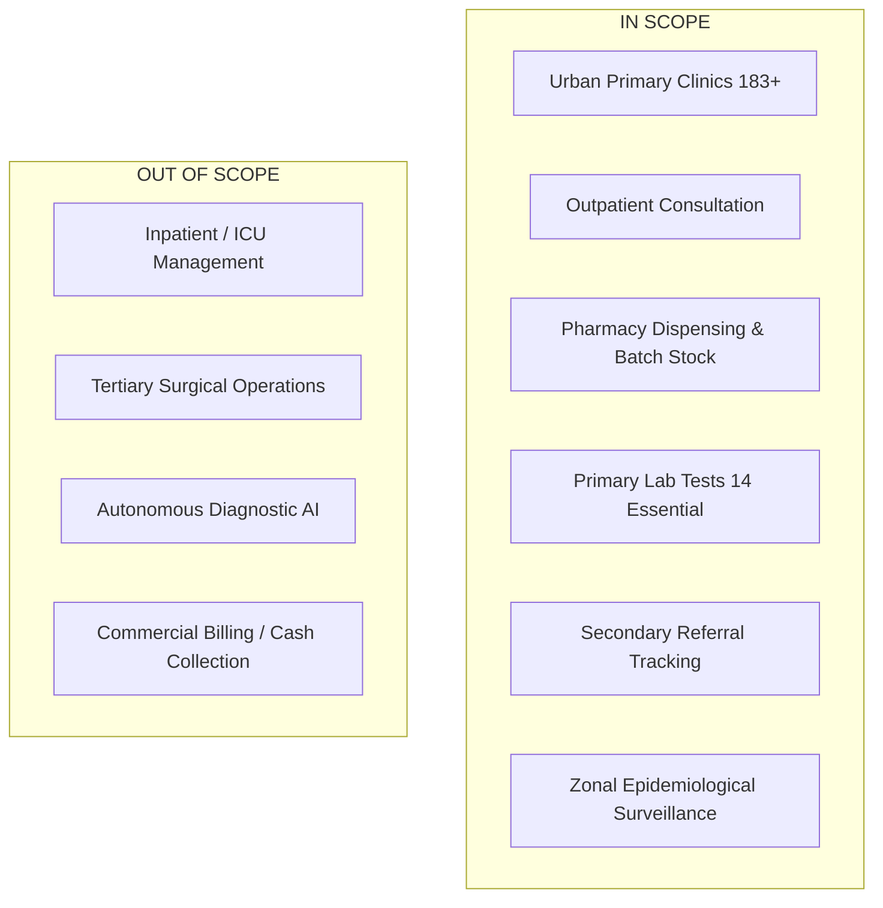

# 🌐 Project Scope Management & Boundary Definition
## Namma Clinic Digital Health & Operations Platform
**Document Code:** PM-SCP-03 | **Status:** Approved Baseline | **Date:** September 2026

---

### 1. Scope Baseline Overview
The project encompasses the end-to-end planning, architectural design, engineering, validation, pilot deployment (20 clinics), and citywide rollout (183+ clinics) of the Namma Clinic Digital Health Platform.

