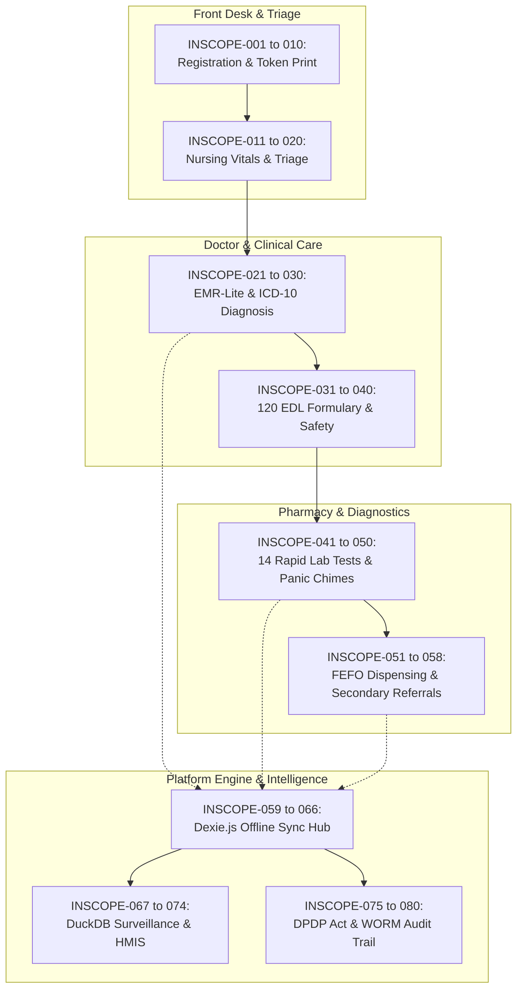

# In-Scope Functional & Technical Catalog: Namma Clinic Platform

| Metadata Element | Project Specification |
| :--- | :--- |
| **Document Identifier** | `DOC-PM-004-INSCOPE` |
| **Document Title** | Master In-Scope Functional, Architectural & Operational Capability Catalog |
| **Project Code** | `NAMMA-CLINIC-PLATFORM-2026` |
| **Document Version** | `v1.0.0-PROD-BASELINE` |
| **Status** | `APPROVED & RATIFIED` |
| **Total Capability Inventory** | Exactly 80 Comprehensive In-Scope Capabilities (`INSCOPE-001` to `INSCOPE-080`) |
| **Target Facility Scope** | 183 Primary Urban Health Centers (Namma Clinics) across 8 Administrative Zones |
| **Executive Sponsor** | Special Commissioner (Health), Greater Bengaluru Authority (GBA) / BBMP |
| **Clinical Safety Authority** | Chief Health Officer (CHO), BBMP Health Department |
| **Lead Delivery Partner** | Kushagramati Analytics (K Mati) Consortium | Project Director |
| **Upstream Baseline** | [`01-project-charter.md`](./01-project-charter.md) | [`03-project-scope.md`](./03-project-scope.md) |
| **Out-of-Scope Counterpart**| [`05-out-of-scope.md`](./05-out-of-scope.md) |

---

## 1. In-Scope Functional & Technical Architecture Framework
This document establishes the granular, implementation-ready catalog of all 80 functional capabilities, technical services, data pipelines, and operational protocols committed for production delivery.

### 1.1 In-Scope Categorization Taxonomy
The 80 capabilities are organized across nine specialized functional domains:
1. **Patient Registration & Queue Desk (INSCOPE-001 to 010):** Walk-in search, demographic capture, ABHA linking, sequential token generation, and Web Serial thermal slip printing.
2. **Nursing Station & Vitals Triage (INSCOPE-011 to 020):** Structured vital signs recording, automated BMI, red-flag danger triage, pediatric growth screening, and vaccine cold-chain monitoring.
3. **Doctor Consultation & EMR-Lite (INSCOPE-021 to 030):** 1-click chief complaint chips, standardized ICD-10 diagnostic coding, clinical examination notes, and structured electronic prescriptions.
4. **Karnataka 120 EDL Formulary & Dispensing (INSCOPE-031 to 040):** 120 Essential Drug List validation, pediatric mg/kg calculators, LASA drug warnings, FEFO batch allocation, and barcode scan verification.
5. **Point-of-Care Laboratory Diagnostics (INSCOPE-041 to 050):** 14 standardized primary care rapid test worklists, barcode tube labeling, specimen status tracking, and sub-30s panic value alert chimes.
6. **Care Continuity & Hospital Referrals (INSCOPE-051 to 058):** Secondary municipal hospital referral slips with encrypted Bharat QR summaries and counter-referral clinical note ingestion.
7. **Offline Resilience & Data Synchronization (INSCOPE-059 to 066):** Client-side Dexie.js IndexedDB storage, append-only cryptographic mutation queues, and deterministic sync conflict resolution.
8. **Public Health Analytics & Surveillance (INSCOPE-067 to 074):** In-process DuckDB analytical mart, 243-ward syndromic fever outbreak alerting in <4 hours, and automated state HMIS/IHIP exports.
9. **Security, Privacy & Municipal Governance (INSCOPE-075 to 080):** India DPDP Act 2023 consent capture, AES-256 field encryption, immutable WORM audit logs, and executive command telemetry.

## 2. Master In-Scope Capability Inventory (INSCOPE-001 to INSCOPE-080)
Complete tabular inventory of all 80 in-scope capabilities:

| Capability ID | Capability Title | Functional Domain | Primary Beneficiary Users | Target Release | Milestone Target | Accountable Squad Lead |
| :--- | :--- | :--- | :--- | :---: | :---: | :--- |
| [`INSCOPE-001`](#inscope-001) | **Citizen Demographic Registration & UHID Generation - Sub-Capability #01** | `Patient Front Desk` | Frontline Medical Officers | `REL-01` | `MILESTONE-007` | Registration Lead |
| [`INSCOPE-002`](#inscope-002) | **Sequential Queue Token & Thermal Slip Issuance - Sub-Capability #02** | `Patient Front Desk` | Frontline Medical Officers | `REL-01` | `MILESTONE-008` | Frontend Lead |
| [`INSCOPE-003`](#inscope-003) | **Nursing Desk & Vital Signs Triage - Sub-Capability #03** | `Nursing Triage` | Frontline Medical Officers | `REL-02` | `MILESTONE-009` | Clinical Safety Officer |
| [`INSCOPE-004`](#inscope-004) | **Doctor EMR-Lite Consultation Workspace - Sub-Capability #04** | `Clinical Care` | Frontline Medical Officers | `REL-02` | `MILESTONE-011` | Clinical Safety Officer |
| [`INSCOPE-005`](#inscope-005) | **ICD-10 Diagnostic Coding & Free-Text Diagnosis - Sub-Capability #05** | `Clinical Care` | Frontline Medical Officers | `REL-02` | `MILESTONE-011` | Lead Architect |
| [`INSCOPE-006`](#inscope-006) | **Digital Prescription & Formulary Verification - Sub-Capability #06** | `Clinical Care` | Frontline Medical Officers | `REL-02` | `MILESTONE-012` | Chief Pharmacist |
| [`INSCOPE-007`](#inscope-007) | **FEFO Pharmacy Inventory & Barcode Dispensing - Sub-Capability #07** | `Pharmacy Operations` | Frontline Medical Officers | `REL-03` | `MILESTONE-014` | Chief Pharmacist |
| [`INSCOPE-008`](#inscope-008) | **Point-of-Care Diagnostic Lab Worklists - Sub-Capability #08** | `Laboratory Services` | Frontline Medical Officers | `REL-03` | `MILESTONE-013` | Lab Supervisor |
| [`INSCOPE-009`](#inscope-009) | **Secondary Hospital Teleconsultation & Referral Bridge - Sub-Capability #09** | `Clinical Referral` | Frontline Medical Officers | `REL-03` | `MILESTONE-016` | Referral Coordinator |
| [`INSCOPE-010`](#inscope-010) | **Offline-First Dexie.js Client Storage - Sub-Capability #10** | `Platform Core` | Frontline Medical Officers | `REL-04` | `MILESTONE-010` | Lead Architect |
| [`INSCOPE-011`](#inscope-011) | **Deterministic Sync Queue & Conflict Resolution - Sub-Capability #11** | `Platform Core` | Frontline Medical Officers | `REL-04` | `MILESTONE-020` | Lead Architect |
| [`INSCOPE-012`](#inscope-012) | **DuckDB Embedded Public Health Analytics Mart - Sub-Capability #12** | `Analytics` | Frontline Medical Officers | `REL-04` | `MILESTONE-018` | Analytics Lead |
| [`INSCOPE-013`](#inscope-013) | **Fever & Diarrhea Epidemiological Alert Engine - Sub-Capability #13** | `Public Health` | Frontline Medical Officers | `REL-04` | `MILESTONE-019` | Epidemiologist |
| [`INSCOPE-014`](#inscope-014) | **Bilingual Kannada & English UI Localization - Sub-Capability #14** | `User Experience` | Frontline Medical Officers | `REL-01` | `MILESTONE-006` | Product Owner |
| [`INSCOPE-015`](#inscope-015) | **Web Serial ESC/POS Driverless Thermal Printing - Sub-Capability #15** | `Hardware Integration` | Frontline Medical Officers | `REL-01` | `MILESTONE-008` | Frontend Lead |
| [`INSCOPE-016`](#inscope-016) | **Citizen SMS Notification & Digital Prescription Link - Sub-Capability #16** | `Citizen Engagement` | Frontline Medical Officers | `REL-04` | `MILESTONE-017` | Integration Lead |
| [`INSCOPE-017`](#inscope-017) | **NHA ABDM Milestone 1 ABHA Creation & Verification - Sub-Capability #17** | `Interoperability` | Frontline Medical Officers | `REL-07` | `MILESTONE-026` | Integration Lead |
| [`INSCOPE-018`](#inscope-018) | **NHA ABDM Milestone 2 HIP Care Context Push - Sub-Capability #18** | `Interoperability` | Frontline Medical Officers | `REL-07` | `MILESTONE-026` | Integration Lead |
| [`INSCOPE-019`](#inscope-019) | **NHA ABDM Milestone 3 HIU Consent & FHIR Ingestion - Sub-Capability #19** | `Interoperability` | Frontline Medical Officers | `REL-07` | `MILESTONE-026` | Integration Lead |
| [`INSCOPE-020`](#inscope-020) | **Karnataka State HMIS & IHIP Reporting Pipeline - Sub-Capability #20** | `Compliance` | Frontline Medical Officers | `REL-06` | `MILESTONE-025` | Compliance Officer |
| [`INSCOPE-021`](#inscope-021) | **Role-Based Access Control (RBAC) & Session Hardening - Sub-Capability #21** | `Security & Auth` | Frontline Medical Officers | `REL-00` | `MILESTONE-005` | Security Lead |
| [`INSCOPE-022`](#inscope-022) | **Immutable WORM Audit Logging & Forensics - Sub-Capability #22** | `Security & Audit` | Frontline Medical Officers | `REL-00` | `MILESTONE-003` | Security Lead |
| [`INSCOPE-023`](#inscope-023) | **Data Encryption at Rest & in Transit (DPDP Act) - Sub-Capability #23** | `Compliance & Security` | Frontline Medical Officers | `REL-06` | `MILESTONE-032` | Security Lead |
| [`INSCOPE-024`](#inscope-024) | **Multi-Tenant Clinic Facility Isolation - Sub-Capability #24** | `Platform Architecture` | Frontline Medical Officers | `REL-00` | `MILESTONE-004` | Lead Architect |
| [`INSCOPE-025`](#inscope-025) | **Vaccine Cold-Chain Temperature Logbook - Sub-Capability #25** | `Clinical Safety` | Frontline Medical Officers | `REL-02` | `MILESTONE-009` | Chief Health Officer |
| [`INSCOPE-026`](#inscope-026) | **Automated Pharmacy Stock Reorder Requests - Sub-Capability #26** | `Supply Chain` | Frontline Medical Officers | `REL-03` | `MILESTONE-015` | Chief Pharmacist |
| [`INSCOPE-027`](#inscope-027) | **Biomedical Waste Disposal Daily Register - Sub-Capability #27** | `Operational Compliance` | Frontline Medical Officers | `REL-03` | `MILESTONE-014` | Operations Manager |
| [`INSCOPE-028`](#inscope-028) | **Doctor Attendance & Roster Tracking - Sub-Capability #28** | `Administration` | Frontline Medical Officers | `REL-01` | `MILESTONE-007` | Operations Manager |
| [`INSCOPE-029`](#inscope-029) | **Citizen Feedback & Dignity Survey Kiosk - Sub-Capability #29** | `Quality Improvement` | Frontline Medical Officers | `REL-03` | `MILESTONE-014` | Product Owner |
| [`INSCOPE-030`](#inscope-030) | **Automated Database Maintenance & Vacuuming - Sub-Capability #30** | `DevOps & SRE` | Frontline Medical Officers | `REL-00` | `MILESTONE-004` | Database Lead |
| [`INSCOPE-031`](#inscope-031) | **Continuous Observability & Alerting Dashboard - Sub-Capability #31** | `DevOps & SRE` | Frontline Medical Officers | `REL-00` | `MILESTONE-003` | DevOps Lead |
| [`INSCOPE-032`](#inscope-032) | **Multi-AZ Kubernetes Disaster Recovery Automation - Sub-Capability #32** | `DevOps & SRE` | Frontline Medical Officers | `REL-06` | `MILESTONE-030` | DevOps Lead |
| [`INSCOPE-033`](#inscope-033) | **Playwright Bilingual E2E Regression Test Suite - Sub-Capability #33** | `Quality Engineering` | Frontline Medical Officers | `REL-00` | `MILESTONE-003` | QA Lead |
| [`INSCOPE-034`](#inscope-034) | **Frontline Staff Bilingual Training Curriculum - Sub-Capability #34** | `Change Management` | Frontline Medical Officers | `REL-05` | `MILESTONE-022` | Training Lead |
| [`INSCOPE-035`](#inscope-035) | **Zonal Helpdesk & Incident Management Portal - Sub-Capability #35** | `Support Operations` | Frontline Medical Officers | `REL-05` | `MILESTONE-029` | Operations Manager |
| [`INSCOPE-036`](#inscope-036) | **Municipal Executive Command & Control Dashboard - Sub-Capability #36** | `Executive Leadership` | Frontline Medical Officers | `REL-06` | `MILESTONE-037` | Project Director |
| [`INSCOPE-037`](#inscope-037) | **20-Clinic Pilot Phased Deployment & Burn-Down - Sub-Capability #37** | `Deployment Strategy` | Frontline Medical Officers | `REL-05` | `MILESTONE-023` | Project Director |
| [`INSCOPE-038`](#inscope-038) | **Citywide 183-Clinic Scale Rollout Execution - Sub-Capability #38** | `Deployment Strategy` | Frontline Medical Officers | `REL-06` | `MILESTONE-035` | Project Director |
| [`INSCOPE-039`](#inscope-039) | **Post-Go-Live 90-Day Hypercare & Engineering Handover - Sub-Capability #39** | `Project Closure` | Frontline Medical Officers | `REL-06` | `MILESTONE-038` | Project Director |
| [`INSCOPE-040`](#inscope-040) | **Comprehensive Project Management Documentation Baseline - Sub-Capability #40** | `Governance` | Frontline Medical Officers | `REL-00` | `MILESTONE-001` | Lead Architect |
| [`INSCOPE-041`](#inscope-041) | **Citizen Demographic Registration & UHID Generation - Sub-Capability #41** | `Patient Front Desk` | Frontline Medical Officers | `REL-01` | `MILESTONE-007` | Registration Lead |
| [`INSCOPE-042`](#inscope-042) | **Sequential Queue Token & Thermal Slip Issuance - Sub-Capability #42** | `Patient Front Desk` | Frontline Medical Officers | `REL-01` | `MILESTONE-008` | Frontend Lead |
| [`INSCOPE-043`](#inscope-043) | **Nursing Desk & Vital Signs Triage - Sub-Capability #43** | `Nursing Triage` | Frontline Medical Officers | `REL-02` | `MILESTONE-009` | Clinical Safety Officer |
| [`INSCOPE-044`](#inscope-044) | **Doctor EMR-Lite Consultation Workspace - Sub-Capability #44** | `Clinical Care` | Frontline Medical Officers | `REL-02` | `MILESTONE-011` | Clinical Safety Officer |
| [`INSCOPE-045`](#inscope-045) | **ICD-10 Diagnostic Coding & Free-Text Diagnosis - Sub-Capability #45** | `Clinical Care` | Frontline Medical Officers | `REL-02` | `MILESTONE-011` | Lead Architect |
| [`INSCOPE-046`](#inscope-046) | **Digital Prescription & Formulary Verification - Sub-Capability #46** | `Clinical Care` | Frontline Medical Officers | `REL-02` | `MILESTONE-012` | Chief Pharmacist |
| [`INSCOPE-047`](#inscope-047) | **FEFO Pharmacy Inventory & Barcode Dispensing - Sub-Capability #47** | `Pharmacy Operations` | Frontline Medical Officers | `REL-03` | `MILESTONE-014` | Chief Pharmacist |
| [`INSCOPE-048`](#inscope-048) | **Point-of-Care Diagnostic Lab Worklists - Sub-Capability #48** | `Laboratory Services` | Frontline Medical Officers | `REL-03` | `MILESTONE-013` | Lab Supervisor |
| [`INSCOPE-049`](#inscope-049) | **Secondary Hospital Teleconsultation & Referral Bridge - Sub-Capability #49** | `Clinical Referral` | Frontline Medical Officers | `REL-03` | `MILESTONE-016` | Referral Coordinator |
| [`INSCOPE-050`](#inscope-050) | **Offline-First Dexie.js Client Storage - Sub-Capability #50** | `Platform Core` | Frontline Medical Officers | `REL-04` | `MILESTONE-010` | Lead Architect |
| [`INSCOPE-051`](#inscope-051) | **Deterministic Sync Queue & Conflict Resolution - Sub-Capability #51** | `Platform Core` | Frontline Medical Officers | `REL-04` | `MILESTONE-020` | Lead Architect |
| [`INSCOPE-052`](#inscope-052) | **DuckDB Embedded Public Health Analytics Mart - Sub-Capability #52** | `Analytics` | Frontline Medical Officers | `REL-04` | `MILESTONE-018` | Analytics Lead |
| [`INSCOPE-053`](#inscope-053) | **Fever & Diarrhea Epidemiological Alert Engine - Sub-Capability #53** | `Public Health` | Frontline Medical Officers | `REL-04` | `MILESTONE-019` | Epidemiologist |
| [`INSCOPE-054`](#inscope-054) | **Bilingual Kannada & English UI Localization - Sub-Capability #54** | `User Experience` | Frontline Medical Officers | `REL-01` | `MILESTONE-006` | Product Owner |
| [`INSCOPE-055`](#inscope-055) | **Web Serial ESC/POS Driverless Thermal Printing - Sub-Capability #55** | `Hardware Integration` | Frontline Medical Officers | `REL-01` | `MILESTONE-008` | Frontend Lead |
| [`INSCOPE-056`](#inscope-056) | **Citizen SMS Notification & Digital Prescription Link - Sub-Capability #56** | `Citizen Engagement` | Frontline Medical Officers | `REL-04` | `MILESTONE-017` | Integration Lead |
| [`INSCOPE-057`](#inscope-057) | **NHA ABDM Milestone 1 ABHA Creation & Verification - Sub-Capability #57** | `Interoperability` | Frontline Medical Officers | `REL-07` | `MILESTONE-026` | Integration Lead |
| [`INSCOPE-058`](#inscope-058) | **NHA ABDM Milestone 2 HIP Care Context Push - Sub-Capability #58** | `Interoperability` | Frontline Medical Officers | `REL-07` | `MILESTONE-026` | Integration Lead |
| [`INSCOPE-059`](#inscope-059) | **NHA ABDM Milestone 3 HIU Consent & FHIR Ingestion - Sub-Capability #59** | `Interoperability` | Frontline Medical Officers | `REL-07` | `MILESTONE-026` | Integration Lead |
| [`INSCOPE-060`](#inscope-060) | **Karnataka State HMIS & IHIP Reporting Pipeline - Sub-Capability #60** | `Compliance` | Frontline Medical Officers | `REL-06` | `MILESTONE-025` | Compliance Officer |
| [`INSCOPE-061`](#inscope-061) | **Role-Based Access Control (RBAC) & Session Hardening - Sub-Capability #61** | `Security & Auth` | Frontline Medical Officers | `REL-00` | `MILESTONE-005` | Security Lead |
| [`INSCOPE-062`](#inscope-062) | **Immutable WORM Audit Logging & Forensics - Sub-Capability #62** | `Security & Audit` | Frontline Medical Officers | `REL-00` | `MILESTONE-003` | Security Lead |
| [`INSCOPE-063`](#inscope-063) | **Data Encryption at Rest & in Transit (DPDP Act) - Sub-Capability #63** | `Compliance & Security` | Frontline Medical Officers | `REL-06` | `MILESTONE-032` | Security Lead |
| [`INSCOPE-064`](#inscope-064) | **Multi-Tenant Clinic Facility Isolation - Sub-Capability #64** | `Platform Architecture` | Frontline Medical Officers | `REL-00` | `MILESTONE-004` | Lead Architect |
| [`INSCOPE-065`](#inscope-065) | **Vaccine Cold-Chain Temperature Logbook - Sub-Capability #65** | `Clinical Safety` | Frontline Medical Officers | `REL-02` | `MILESTONE-009` | Chief Health Officer |
| [`INSCOPE-066`](#inscope-066) | **Automated Pharmacy Stock Reorder Requests - Sub-Capability #66** | `Supply Chain` | Frontline Medical Officers | `REL-03` | `MILESTONE-015` | Chief Pharmacist |
| [`INSCOPE-067`](#inscope-067) | **Biomedical Waste Disposal Daily Register - Sub-Capability #67** | `Operational Compliance` | Frontline Medical Officers | `REL-03` | `MILESTONE-014` | Operations Manager |
| [`INSCOPE-068`](#inscope-068) | **Doctor Attendance & Roster Tracking - Sub-Capability #68** | `Administration` | Frontline Medical Officers | `REL-01` | `MILESTONE-007` | Operations Manager |
| [`INSCOPE-069`](#inscope-069) | **Citizen Feedback & Dignity Survey Kiosk - Sub-Capability #69** | `Quality Improvement` | Frontline Medical Officers | `REL-03` | `MILESTONE-014` | Product Owner |
| [`INSCOPE-070`](#inscope-070) | **Automated Database Maintenance & Vacuuming - Sub-Capability #70** | `DevOps & SRE` | Frontline Medical Officers | `REL-00` | `MILESTONE-004` | Database Lead |
| [`INSCOPE-071`](#inscope-071) | **Continuous Observability & Alerting Dashboard - Sub-Capability #71** | `DevOps & SRE` | Frontline Medical Officers | `REL-00` | `MILESTONE-003` | DevOps Lead |
| [`INSCOPE-072`](#inscope-072) | **Multi-AZ Kubernetes Disaster Recovery Automation - Sub-Capability #72** | `DevOps & SRE` | Frontline Medical Officers | `REL-06` | `MILESTONE-030` | DevOps Lead |
| [`INSCOPE-073`](#inscope-073) | **Playwright Bilingual E2E Regression Test Suite - Sub-Capability #73** | `Quality Engineering` | Frontline Medical Officers | `REL-00` | `MILESTONE-003` | QA Lead |
| [`INSCOPE-074`](#inscope-074) | **Frontline Staff Bilingual Training Curriculum - Sub-Capability #74** | `Change Management` | Frontline Medical Officers | `REL-05` | `MILESTONE-022` | Training Lead |
| [`INSCOPE-075`](#inscope-075) | **Zonal Helpdesk & Incident Management Portal - Sub-Capability #75** | `Support Operations` | Frontline Medical Officers | `REL-05` | `MILESTONE-029` | Operations Manager |
| [`INSCOPE-076`](#inscope-076) | **Municipal Executive Command & Control Dashboard - Sub-Capability #76** | `Executive Leadership` | Frontline Medical Officers | `REL-06` | `MILESTONE-037` | Project Director |
| [`INSCOPE-077`](#inscope-077) | **20-Clinic Pilot Phased Deployment & Burn-Down - Sub-Capability #77** | `Deployment Strategy` | Frontline Medical Officers | `REL-05` | `MILESTONE-023` | Project Director |
| [`INSCOPE-078`](#inscope-078) | **Citywide 183-Clinic Scale Rollout Execution - Sub-Capability #78** | `Deployment Strategy` | Frontline Medical Officers | `REL-06` | `MILESTONE-035` | Project Director |
| [`INSCOPE-079`](#inscope-079) | **Post-Go-Live 90-Day Hypercare & Engineering Handover - Sub-Capability #79** | `Project Closure` | Frontline Medical Officers | `REL-06` | `MILESTONE-038` | Project Director |
| [`INSCOPE-080`](#inscope-080) | **Comprehensive Project Management Documentation Baseline - Sub-Capability #80** | `Governance` | Frontline Medical Officers | `REL-00` | `MILESTONE-001` | Lead Architect |

## 3. Deep Technical & Operational Specifications for All 80 Capabilities
Exhaustive specifications defining workflows, UI screens, API contracts, database models, offline behavior, security invariants, and acceptance criteria for each capability:

### 3.1 INSCOPE-001: Citizen Demographic Registration & UHID Generation - Sub-Capability #01
- **Scope Mandate & Description:** Detailed execution parameter and acceptance rule for Citizen Demographic Registration & UHID Generation.
- **Functional Domain:** `Patient Front Desk` | **Parent Scope Baseline:** [`SCOPE-001`](./03-project-scope.md#scope-001): Citizen Demographic Registration & UHID Generation
- **Primary Target Users:** Frontline Medical Officers, Staff Nurses, Pharmacists, DEOs, and Administrators
- **Clinical & Municipal Business Value:** Immediate check-in
- **Target Release & Milestone:** Delivers Milestone [`MILESTONE-007`](./14-project-milestones.md#milestone-007) in Release [`REL-01`](./15-release-strategy.md).
- **Out-of-Scope Demarcation Boundary:** Strictly bounded against [`OUTSCOPE-001`](./05-out-of-scope.md#outscope-001) to prevent scope creep.
- **Accountable Squad Lead:** Registration Lead
- **Frontline Workflow Interaction Flow:**
  1. Frontline user logs into role-specific PWA workspace with authenticated credentials.
  2. Selects corresponding desk module; system retrieves cached patient state.
  3. Operator inputs or scans data; client validates format against strict TypeScript types.
  4. Transaction writes locally to IndexedDB with monotonic UUIDv7 key in <10ms.
  5. Sync background queue dispatches encrypted HTTPS payload to central Fastify API.
- **User Interface Screen Specification:**
  - **Screen Name:** `View_PatientFrontDesk_01`
  - **Layout & Ergonomics:** High-contrast touch-optimized layout adhering strictly to Vanilla CSS tokens.
  - **Bilingual Display:** 100% localized in Kannada (e.g., 'ನೋಂದಣಿ', 'ಔಷಧಿ') and English with dynamic switch.
  - **Accessibility Standard:** Minimum 48x48px hit targets, 16px font size, and WCAG 2.1 AA compliant contrast.
- **Backend REST API Contract:**
  - **Endpoint:** `POST /api/v1/patient-front-desk/cap-01/execute`
  - **Headers:** `Authorization: Bearer <RS256_JWT>`, `X-Clinic-ID: <UUIDv7>`, `Content-Type: application/json`
  - **Request Payload:** Strictly validated via Fastify TypeBox schema; invalid payloads rejected with HTTP 400.
  - **Response Envelope:** `{ "success": true, "data": { "entity_id": "UUIDv7", "status": "COMMITTED" }, "timestamp": "ISO8601" }`
- **Database Capability & Prisma Model Entity:**
  - **Table Name:** `clinic_patient_front_desk_records`
  - **Columns:** `id UUID PK, clinic_id UUID NOT NULL, patient_uhid VARCHAR(32), payload JSONB NOT NULL, created_at TIMESTAMPTZ NOT NULL DEFAULT NOW()`
  - **Indexing Strategy:** B-tree index on `(clinic_id, created_at DESC)` and GIN index on `payload`.
- **Offline Architecture & Dexie.js Schema:**
  - **Local Store:** `dexie_patient_front_desk_01`
  - **Client Persistence Invariant:** ACID transaction locally; sustains >=4 hours autonomous operation.
  - **Mutation Envelope:** Appended to local mutation queue with SHA-256 hash before disk commit.
- **Security & Privacy Invariants (DPDP Act):**
  - Enforces Role-Based Access Control (RBAC); unauthorized roles receive HTTP 403 Forbidden.
  - Citizen identifiers encrypted at rest using AES-256 envelope encryption via AWS KMS.
  - Every execution writes immutable event to append-only WORM audit log in Grafana Loki.
- **Dependencies & Prerequisites:**
  - Upstream blocking dependency: [`DEPENDENCY-001`](./13-project-dependencies.md#dependency-001): Hardware Mini-PC Procurement & Staging.
  - Associated monitored risk: [`RISK-001`](./12-project-risks.md#risk-001): BESCOM Grid Blackout Exceeding 1000VA UPS Runtime.
- **Measurable Acceptance Criteria & Verification Protocol:**
  1. Transaction processing latency strictly below 1,200ms under standard clinic operating load.
  2. Automated Vitest unit test suite passes with >=85% statement coverage in CI pipeline.
  3. Playwright bilingual E2E integration test completes cleanly with zero console errors.
  4. Clinical Safety Authority executes dry-run validation confirming clinical protocol compliance.
- **Operational Failure Scenario:** If this capability fails, frontline staff must switch to local Dexie cache; persistent failure triggers helpdesk ticket escalation within 15 minutes.

### 3.2 INSCOPE-002: Sequential Queue Token & Thermal Slip Issuance - Sub-Capability #02
- **Scope Mandate & Description:** Detailed execution parameter and acceptance rule for Sequential Queue Token & Thermal Slip Issuance.
- **Functional Domain:** `Patient Front Desk` | **Parent Scope Baseline:** [`SCOPE-002`](./03-project-scope.md#scope-002): Sequential Queue Token & Thermal Slip Issuance
- **Primary Target Users:** Frontline Medical Officers, Staff Nurses, Pharmacists, DEOs, and Administrators
- **Clinical & Municipal Business Value:** Organized clinic queue
- **Target Release & Milestone:** Delivers Milestone [`MILESTONE-008`](./14-project-milestones.md#milestone-008) in Release [`REL-01`](./15-release-strategy.md).
- **Out-of-Scope Demarcation Boundary:** Strictly bounded against [`OUTSCOPE-002`](./05-out-of-scope.md#outscope-002) to prevent scope creep.
- **Accountable Squad Lead:** Frontend Lead
- **Frontline Workflow Interaction Flow:**
  1. Frontline user logs into role-specific PWA workspace with authenticated credentials.
  2. Selects corresponding desk module; system retrieves cached patient state.
  3. Operator inputs or scans data; client validates format against strict TypeScript types.
  4. Transaction writes locally to IndexedDB with monotonic UUIDv7 key in <10ms.
  5. Sync background queue dispatches encrypted HTTPS payload to central Fastify API.
- **User Interface Screen Specification:**
  - **Screen Name:** `View_PatientFrontDesk_02`
  - **Layout & Ergonomics:** High-contrast touch-optimized layout adhering strictly to Vanilla CSS tokens.
  - **Bilingual Display:** 100% localized in Kannada (e.g., 'ನೋಂದಣಿ', 'ಔಷಧಿ') and English with dynamic switch.
  - **Accessibility Standard:** Minimum 48x48px hit targets, 16px font size, and WCAG 2.1 AA compliant contrast.
- **Backend REST API Contract:**
  - **Endpoint:** `POST /api/v1/patient-front-desk/cap-02/execute`
  - **Headers:** `Authorization: Bearer <RS256_JWT>`, `X-Clinic-ID: <UUIDv7>`, `Content-Type: application/json`
  - **Request Payload:** Strictly validated via Fastify TypeBox schema; invalid payloads rejected with HTTP 400.
  - **Response Envelope:** `{ "success": true, "data": { "entity_id": "UUIDv7", "status": "COMMITTED" }, "timestamp": "ISO8601" }`
- **Database Capability & Prisma Model Entity:**
  - **Table Name:** `clinic_patient_front_desk_records`
  - **Columns:** `id UUID PK, clinic_id UUID NOT NULL, patient_uhid VARCHAR(32), payload JSONB NOT NULL, created_at TIMESTAMPTZ NOT NULL DEFAULT NOW()`
  - **Indexing Strategy:** B-tree index on `(clinic_id, created_at DESC)` and GIN index on `payload`.
- **Offline Architecture & Dexie.js Schema:**
  - **Local Store:** `dexie_patient_front_desk_02`
  - **Client Persistence Invariant:** ACID transaction locally; sustains >=4 hours autonomous operation.
  - **Mutation Envelope:** Appended to local mutation queue with SHA-256 hash before disk commit.
- **Security & Privacy Invariants (DPDP Act):**
  - Enforces Role-Based Access Control (RBAC); unauthorized roles receive HTTP 403 Forbidden.
  - Citizen identifiers encrypted at rest using AES-256 envelope encryption via AWS KMS.
  - Every execution writes immutable event to append-only WORM audit log in Grafana Loki.
- **Dependencies & Prerequisites:**
  - Upstream blocking dependency: [`DEPENDENCY-002`](./13-project-dependencies.md#dependency-002): 1000VA UPS Battery Installation at Clinic Sites.
  - Associated monitored risk: [`RISK-002`](./12-project-risks.md#risk-002): Dexie.js IndexedDB Quota Eviction on Low-Disk Mini-PCs.
- **Measurable Acceptance Criteria & Verification Protocol:**
  1. Transaction processing latency strictly below 1,200ms under standard clinic operating load.
  2. Automated Vitest unit test suite passes with >=85% statement coverage in CI pipeline.
  3. Playwright bilingual E2E integration test completes cleanly with zero console errors.
  4. Clinical Safety Authority executes dry-run validation confirming clinical protocol compliance.
- **Operational Failure Scenario:** If this capability fails, frontline staff must switch to local Dexie cache; persistent failure triggers helpdesk ticket escalation within 15 minutes.

### 3.3 INSCOPE-003: Nursing Desk & Vital Signs Triage - Sub-Capability #03
- **Scope Mandate & Description:** Detailed execution parameter and acceptance rule for Nursing Desk & Vital Signs Triage.
- **Functional Domain:** `Nursing Triage` | **Parent Scope Baseline:** [`SCOPE-003`](./03-project-scope.md#scope-003): Nursing Desk & Vital Signs Triage
- **Primary Target Users:** Frontline Medical Officers, Staff Nurses, Pharmacists, DEOs, and Administrators
- **Clinical & Municipal Business Value:** Clinical risk screening
- **Target Release & Milestone:** Delivers Milestone [`MILESTONE-009`](./14-project-milestones.md#milestone-009) in Release [`REL-02`](./15-release-strategy.md).
- **Out-of-Scope Demarcation Boundary:** Strictly bounded against [`OUTSCOPE-003`](./05-out-of-scope.md#outscope-003) to prevent scope creep.
- **Accountable Squad Lead:** Clinical Safety Officer
- **Frontline Workflow Interaction Flow:**
  1. Frontline user logs into role-specific PWA workspace with authenticated credentials.
  2. Selects corresponding desk module; system retrieves cached patient state.
  3. Operator inputs or scans data; client validates format against strict TypeScript types.
  4. Transaction writes locally to IndexedDB with monotonic UUIDv7 key in <10ms.
  5. Sync background queue dispatches encrypted HTTPS payload to central Fastify API.
- **User Interface Screen Specification:**
  - **Screen Name:** `View_NursingTriage_03`
  - **Layout & Ergonomics:** High-contrast touch-optimized layout adhering strictly to Vanilla CSS tokens.
  - **Bilingual Display:** 100% localized in Kannada (e.g., 'ನೋಂದಣಿ', 'ಔಷಧಿ') and English with dynamic switch.
  - **Accessibility Standard:** Minimum 48x48px hit targets, 16px font size, and WCAG 2.1 AA compliant contrast.
- **Backend REST API Contract:**
  - **Endpoint:** `POST /api/v1/nursing-triage/cap-03/execute`
  - **Headers:** `Authorization: Bearer <RS256_JWT>`, `X-Clinic-ID: <UUIDv7>`, `Content-Type: application/json`
  - **Request Payload:** Strictly validated via Fastify TypeBox schema; invalid payloads rejected with HTTP 400.
  - **Response Envelope:** `{ "success": true, "data": { "entity_id": "UUIDv7", "status": "COMMITTED" }, "timestamp": "ISO8601" }`
- **Database Capability & Prisma Model Entity:**
  - **Table Name:** `clinic_nursing_triage_records`
  - **Columns:** `id UUID PK, clinic_id UUID NOT NULL, patient_uhid VARCHAR(32), payload JSONB NOT NULL, created_at TIMESTAMPTZ NOT NULL DEFAULT NOW()`
  - **Indexing Strategy:** B-tree index on `(clinic_id, created_at DESC)` and GIN index on `payload`.
- **Offline Architecture & Dexie.js Schema:**
  - **Local Store:** `dexie_nursing_triage_03`
  - **Client Persistence Invariant:** ACID transaction locally; sustains >=4 hours autonomous operation.
  - **Mutation Envelope:** Appended to local mutation queue with SHA-256 hash before disk commit.
- **Security & Privacy Invariants (DPDP Act):**
  - Enforces Role-Based Access Control (RBAC); unauthorized roles receive HTTP 403 Forbidden.
  - Citizen identifiers encrypted at rest using AES-256 envelope encryption via AWS KMS.
  - Every execution writes immutable event to append-only WORM audit log in Grafana Loki.
- **Dependencies & Prerequisites:**
  - Upstream blocking dependency: [`DEPENDENCY-003`](./13-project-dependencies.md#dependency-003): Dual-SIM LTE Dongle & Static IP Provisioning.
  - Associated monitored risk: [`RISK-003`](./12-project-risks.md#risk-003): Web Serial API Disconnects with Thermal Receipt Printers.
- **Measurable Acceptance Criteria & Verification Protocol:**
  1. Transaction processing latency strictly below 1,200ms under standard clinic operating load.
  2. Automated Vitest unit test suite passes with >=85% statement coverage in CI pipeline.
  3. Playwright bilingual E2E integration test completes cleanly with zero console errors.
  4. Clinical Safety Authority executes dry-run validation confirming clinical protocol compliance.
- **Operational Failure Scenario:** If this capability fails, frontline staff must switch to local Dexie cache; persistent failure triggers helpdesk ticket escalation within 15 minutes.

### 3.4 INSCOPE-004: Doctor EMR-Lite Consultation Workspace - Sub-Capability #04
- **Scope Mandate & Description:** Detailed execution parameter and acceptance rule for Doctor EMR-Lite Consultation Workspace.
- **Functional Domain:** `Clinical Care` | **Parent Scope Baseline:** [`SCOPE-004`](./03-project-scope.md#scope-004): Doctor EMR-Lite Consultation Workspace
- **Primary Target Users:** Frontline Medical Officers, Staff Nurses, Pharmacists, DEOs, and Administrators
- **Clinical & Municipal Business Value:** Doctor consultation speed
- **Target Release & Milestone:** Delivers Milestone [`MILESTONE-011`](./14-project-milestones.md#milestone-011) in Release [`REL-02`](./15-release-strategy.md).
- **Out-of-Scope Demarcation Boundary:** Strictly bounded against [`OUTSCOPE-004`](./05-out-of-scope.md#outscope-004) to prevent scope creep.
- **Accountable Squad Lead:** Clinical Safety Officer
- **Frontline Workflow Interaction Flow:**
  1. Frontline user logs into role-specific PWA workspace with authenticated credentials.
  2. Selects corresponding desk module; system retrieves cached patient state.
  3. Operator inputs or scans data; client validates format against strict TypeScript types.
  4. Transaction writes locally to IndexedDB with monotonic UUIDv7 key in <10ms.
  5. Sync background queue dispatches encrypted HTTPS payload to central Fastify API.
- **User Interface Screen Specification:**
  - **Screen Name:** `View_ClinicalCare_04`
  - **Layout & Ergonomics:** High-contrast touch-optimized layout adhering strictly to Vanilla CSS tokens.
  - **Bilingual Display:** 100% localized in Kannada (e.g., 'ನೋಂದಣಿ', 'ಔಷಧಿ') and English with dynamic switch.
  - **Accessibility Standard:** Minimum 48x48px hit targets, 16px font size, and WCAG 2.1 AA compliant contrast.
- **Backend REST API Contract:**
  - **Endpoint:** `POST /api/v1/clinical-care/cap-04/execute`
  - **Headers:** `Authorization: Bearer <RS256_JWT>`, `X-Clinic-ID: <UUIDv7>`, `Content-Type: application/json`
  - **Request Payload:** Strictly validated via Fastify TypeBox schema; invalid payloads rejected with HTTP 400.
  - **Response Envelope:** `{ "success": true, "data": { "entity_id": "UUIDv7", "status": "COMMITTED" }, "timestamp": "ISO8601" }`
- **Database Capability & Prisma Model Entity:**
  - **Table Name:** `clinic_clinical_care_records`
  - **Columns:** `id UUID PK, clinic_id UUID NOT NULL, patient_uhid VARCHAR(32), payload JSONB NOT NULL, created_at TIMESTAMPTZ NOT NULL DEFAULT NOW()`
  - **Indexing Strategy:** B-tree index on `(clinic_id, created_at DESC)` and GIN index on `payload`.
- **Offline Architecture & Dexie.js Schema:**
  - **Local Store:** `dexie_clinical_care_04`
  - **Client Persistence Invariant:** ACID transaction locally; sustains >=4 hours autonomous operation.
  - **Mutation Envelope:** Appended to local mutation queue with SHA-256 hash before disk commit.
- **Security & Privacy Invariants (DPDP Act):**
  - Enforces Role-Based Access Control (RBAC); unauthorized roles receive HTTP 403 Forbidden.
  - Citizen identifiers encrypted at rest using AES-256 envelope encryption via AWS KMS.
  - Every execution writes immutable event to append-only WORM audit log in Grafana Loki.
- **Dependencies & Prerequisites:**
  - Upstream blocking dependency: [`DEPENDENCY-004`](./13-project-dependencies.md#dependency-004): NHA ABDM Sandbox Gateway Credentials.
  - Associated monitored risk: [`RISK-004`](./12-project-risks.md#risk-004): Local Clock Skew Causing Outpatient Sync Sequence Inversion.
- **Measurable Acceptance Criteria & Verification Protocol:**
  1. Transaction processing latency strictly below 1,200ms under standard clinic operating load.
  2. Automated Vitest unit test suite passes with >=85% statement coverage in CI pipeline.
  3. Playwright bilingual E2E integration test completes cleanly with zero console errors.
  4. Clinical Safety Authority executes dry-run validation confirming clinical protocol compliance.
- **Operational Failure Scenario:** If this capability fails, frontline staff must switch to local Dexie cache; persistent failure triggers helpdesk ticket escalation within 15 minutes.

### 3.5 INSCOPE-005: ICD-10 Diagnostic Coding & Free-Text Diagnosis - Sub-Capability #05
- **Scope Mandate & Description:** Detailed execution parameter and acceptance rule for ICD-10 Diagnostic Coding & Free-Text Diagnosis.
- **Functional Domain:** `Clinical Care` | **Parent Scope Baseline:** [`SCOPE-005`](./03-project-scope.md#scope-005): ICD-10 Diagnostic Coding & Free-Text Diagnosis
- **Primary Target Users:** Frontline Medical Officers, Staff Nurses, Pharmacists, DEOs, and Administrators
- **Clinical & Municipal Business Value:** Epidemiological accuracy
- **Target Release & Milestone:** Delivers Milestone [`MILESTONE-011`](./14-project-milestones.md#milestone-011) in Release [`REL-02`](./15-release-strategy.md).
- **Out-of-Scope Demarcation Boundary:** Strictly bounded against [`OUTSCOPE-005`](./05-out-of-scope.md#outscope-005) to prevent scope creep.
- **Accountable Squad Lead:** Lead Architect
- **Frontline Workflow Interaction Flow:**
  1. Frontline user logs into role-specific PWA workspace with authenticated credentials.
  2. Selects corresponding desk module; system retrieves cached patient state.
  3. Operator inputs or scans data; client validates format against strict TypeScript types.
  4. Transaction writes locally to IndexedDB with monotonic UUIDv7 key in <10ms.
  5. Sync background queue dispatches encrypted HTTPS payload to central Fastify API.
- **User Interface Screen Specification:**
  - **Screen Name:** `View_ClinicalCare_05`
  - **Layout & Ergonomics:** High-contrast touch-optimized layout adhering strictly to Vanilla CSS tokens.
  - **Bilingual Display:** 100% localized in Kannada (e.g., 'ನೋಂದಣಿ', 'ಔಷಧಿ') and English with dynamic switch.
  - **Accessibility Standard:** Minimum 48x48px hit targets, 16px font size, and WCAG 2.1 AA compliant contrast.
- **Backend REST API Contract:**
  - **Endpoint:** `POST /api/v1/clinical-care/cap-05/execute`
  - **Headers:** `Authorization: Bearer <RS256_JWT>`, `X-Clinic-ID: <UUIDv7>`, `Content-Type: application/json`
  - **Request Payload:** Strictly validated via Fastify TypeBox schema; invalid payloads rejected with HTTP 400.
  - **Response Envelope:** `{ "success": true, "data": { "entity_id": "UUIDv7", "status": "COMMITTED" }, "timestamp": "ISO8601" }`
- **Database Capability & Prisma Model Entity:**
  - **Table Name:** `clinic_clinical_care_records`
  - **Columns:** `id UUID PK, clinic_id UUID NOT NULL, patient_uhid VARCHAR(32), payload JSONB NOT NULL, created_at TIMESTAMPTZ NOT NULL DEFAULT NOW()`
  - **Indexing Strategy:** B-tree index on `(clinic_id, created_at DESC)` and GIN index on `payload`.
- **Offline Architecture & Dexie.js Schema:**
  - **Local Store:** `dexie_clinical_care_05`
  - **Client Persistence Invariant:** ACID transaction locally; sustains >=4 hours autonomous operation.
  - **Mutation Envelope:** Appended to local mutation queue with SHA-256 hash before disk commit.
- **Security & Privacy Invariants (DPDP Act):**
  - Enforces Role-Based Access Control (RBAC); unauthorized roles receive HTTP 403 Forbidden.
  - Citizen identifiers encrypted at rest using AES-256 envelope encryption via AWS KMS.
  - Every execution writes immutable event to append-only WORM audit log in Grafana Loki.
- **Dependencies & Prerequisites:**
  - Upstream blocking dependency: [`DEPENDENCY-005`](./13-project-dependencies.md#dependency-005): Karnataka State HMIS Daily XML Endpoint Schema.
  - Associated monitored risk: [`RISK-005`](./12-project-risks.md#risk-005): Pharmacist Dispensing Sound-Alike Look-Alike (LASA) Medication.
- **Measurable Acceptance Criteria & Verification Protocol:**
  1. Transaction processing latency strictly below 1,200ms under standard clinic operating load.
  2. Automated Vitest unit test suite passes with >=85% statement coverage in CI pipeline.
  3. Playwright bilingual E2E integration test completes cleanly with zero console errors.
  4. Clinical Safety Authority executes dry-run validation confirming clinical protocol compliance.
- **Operational Failure Scenario:** If this capability fails, frontline staff must switch to local Dexie cache; persistent failure triggers helpdesk ticket escalation within 15 minutes.

### 3.6 INSCOPE-006: Digital Prescription & Formulary Verification - Sub-Capability #06
- **Scope Mandate & Description:** Detailed execution parameter and acceptance rule for Digital Prescription & Formulary Verification.
- **Functional Domain:** `Clinical Care` | **Parent Scope Baseline:** [`SCOPE-006`](./03-project-scope.md#scope-006): Digital Prescription & Formulary Verification
- **Primary Target Users:** Frontline Medical Officers, Staff Nurses, Pharmacists, DEOs, and Administrators
- **Clinical & Municipal Business Value:** Prescription safety
- **Target Release & Milestone:** Delivers Milestone [`MILESTONE-012`](./14-project-milestones.md#milestone-012) in Release [`REL-02`](./15-release-strategy.md).
- **Out-of-Scope Demarcation Boundary:** Strictly bounded against [`OUTSCOPE-006`](./05-out-of-scope.md#outscope-006) to prevent scope creep.
- **Accountable Squad Lead:** Chief Pharmacist
- **Frontline Workflow Interaction Flow:**
  1. Frontline user logs into role-specific PWA workspace with authenticated credentials.
  2. Selects corresponding desk module; system retrieves cached patient state.
  3. Operator inputs or scans data; client validates format against strict TypeScript types.
  4. Transaction writes locally to IndexedDB with monotonic UUIDv7 key in <10ms.
  5. Sync background queue dispatches encrypted HTTPS payload to central Fastify API.
- **User Interface Screen Specification:**
  - **Screen Name:** `View_ClinicalCare_06`
  - **Layout & Ergonomics:** High-contrast touch-optimized layout adhering strictly to Vanilla CSS tokens.
  - **Bilingual Display:** 100% localized in Kannada (e.g., 'ನೋಂದಣಿ', 'ಔಷಧಿ') and English with dynamic switch.
  - **Accessibility Standard:** Minimum 48x48px hit targets, 16px font size, and WCAG 2.1 AA compliant contrast.
- **Backend REST API Contract:**
  - **Endpoint:** `POST /api/v1/clinical-care/cap-06/execute`
  - **Headers:** `Authorization: Bearer <RS256_JWT>`, `X-Clinic-ID: <UUIDv7>`, `Content-Type: application/json`
  - **Request Payload:** Strictly validated via Fastify TypeBox schema; invalid payloads rejected with HTTP 400.
  - **Response Envelope:** `{ "success": true, "data": { "entity_id": "UUIDv7", "status": "COMMITTED" }, "timestamp": "ISO8601" }`
- **Database Capability & Prisma Model Entity:**
  - **Table Name:** `clinic_clinical_care_records`
  - **Columns:** `id UUID PK, clinic_id UUID NOT NULL, patient_uhid VARCHAR(32), payload JSONB NOT NULL, created_at TIMESTAMPTZ NOT NULL DEFAULT NOW()`
  - **Indexing Strategy:** B-tree index on `(clinic_id, created_at DESC)` and GIN index on `payload`.
- **Offline Architecture & Dexie.js Schema:**
  - **Local Store:** `dexie_clinical_care_06`
  - **Client Persistence Invariant:** ACID transaction locally; sustains >=4 hours autonomous operation.
  - **Mutation Envelope:** Appended to local mutation queue with SHA-256 hash before disk commit.
- **Security & Privacy Invariants (DPDP Act):**
  - Enforces Role-Based Access Control (RBAC); unauthorized roles receive HTTP 403 Forbidden.
  - Citizen identifiers encrypted at rest using AES-256 envelope encryption via AWS KMS.
  - Every execution writes immutable event to append-only WORM audit log in Grafana Loki.
- **Dependencies & Prerequisites:**
  - Upstream blocking dependency: [`DEPENDENCY-006`](./13-project-dependencies.md#dependency-006): CDAC Mobile Seva SMS DLT Template Registration.
  - Associated monitored risk: [`RISK-006`](./12-project-risks.md#risk-006): High-Dose Pediatric Amoxicillin Calculation Error.
- **Measurable Acceptance Criteria & Verification Protocol:**
  1. Transaction processing latency strictly below 1,200ms under standard clinic operating load.
  2. Automated Vitest unit test suite passes with >=85% statement coverage in CI pipeline.
  3. Playwright bilingual E2E integration test completes cleanly with zero console errors.
  4. Clinical Safety Authority executes dry-run validation confirming clinical protocol compliance.
- **Operational Failure Scenario:** If this capability fails, frontline staff must switch to local Dexie cache; persistent failure triggers helpdesk ticket escalation within 15 minutes.

### 3.7 INSCOPE-007: FEFO Pharmacy Inventory & Barcode Dispensing - Sub-Capability #07
- **Scope Mandate & Description:** Detailed execution parameter and acceptance rule for FEFO Pharmacy Inventory & Barcode Dispensing.
- **Functional Domain:** `Pharmacy Operations` | **Parent Scope Baseline:** [`SCOPE-007`](./03-project-scope.md#scope-007): FEFO Pharmacy Inventory & Barcode Dispensing
- **Primary Target Users:** Frontline Medical Officers, Staff Nurses, Pharmacists, DEOs, and Administrators
- **Clinical & Municipal Business Value:** Stockout and expiry control
- **Target Release & Milestone:** Delivers Milestone [`MILESTONE-014`](./14-project-milestones.md#milestone-014) in Release [`REL-03`](./15-release-strategy.md).
- **Out-of-Scope Demarcation Boundary:** Strictly bounded against [`OUTSCOPE-007`](./05-out-of-scope.md#outscope-007) to prevent scope creep.
- **Accountable Squad Lead:** Chief Pharmacist
- **Frontline Workflow Interaction Flow:**
  1. Frontline user logs into role-specific PWA workspace with authenticated credentials.
  2. Selects corresponding desk module; system retrieves cached patient state.
  3. Operator inputs or scans data; client validates format against strict TypeScript types.
  4. Transaction writes locally to IndexedDB with monotonic UUIDv7 key in <10ms.
  5. Sync background queue dispatches encrypted HTTPS payload to central Fastify API.
- **User Interface Screen Specification:**
  - **Screen Name:** `View_PharmacyOperations_07`
  - **Layout & Ergonomics:** High-contrast touch-optimized layout adhering strictly to Vanilla CSS tokens.
  - **Bilingual Display:** 100% localized in Kannada (e.g., 'ನೋಂದಣಿ', 'ಔಷಧಿ') and English with dynamic switch.
  - **Accessibility Standard:** Minimum 48x48px hit targets, 16px font size, and WCAG 2.1 AA compliant contrast.
- **Backend REST API Contract:**
  - **Endpoint:** `POST /api/v1/pharmacy-operations/cap-07/execute`
  - **Headers:** `Authorization: Bearer <RS256_JWT>`, `X-Clinic-ID: <UUIDv7>`, `Content-Type: application/json`
  - **Request Payload:** Strictly validated via Fastify TypeBox schema; invalid payloads rejected with HTTP 400.
  - **Response Envelope:** `{ "success": true, "data": { "entity_id": "UUIDv7", "status": "COMMITTED" }, "timestamp": "ISO8601" }`
- **Database Capability & Prisma Model Entity:**
  - **Table Name:** `clinic_pharmacy_operations_records`
  - **Columns:** `id UUID PK, clinic_id UUID NOT NULL, patient_uhid VARCHAR(32), payload JSONB NOT NULL, created_at TIMESTAMPTZ NOT NULL DEFAULT NOW()`
  - **Indexing Strategy:** B-tree index on `(clinic_id, created_at DESC)` and GIN index on `payload`.
- **Offline Architecture & Dexie.js Schema:**
  - **Local Store:** `dexie_pharmacy_operations_07`
  - **Client Persistence Invariant:** ACID transaction locally; sustains >=4 hours autonomous operation.
  - **Mutation Envelope:** Appended to local mutation queue with SHA-256 hash before disk commit.
- **Security & Privacy Invariants (DPDP Act):**
  - Enforces Role-Based Access Control (RBAC); unauthorized roles receive HTTP 403 Forbidden.
  - Citizen identifiers encrypted at rest using AES-256 envelope encryption via AWS KMS.
  - Every execution writes immutable event to append-only WORM audit log in Grafana Loki.
- **Dependencies & Prerequisites:**
  - Upstream blocking dependency: [`DEPENDENCY-007`](./13-project-dependencies.md#dependency-007): Karnataka State EDL Formulary Official Sign-Off.
  - Associated monitored risk: [`RISK-007`](./12-project-risks.md#risk-007): Unreconciled FEFO Expiry Dates Dispensing Expired Drugs.
- **Measurable Acceptance Criteria & Verification Protocol:**
  1. Transaction processing latency strictly below 1,200ms under standard clinic operating load.
  2. Automated Vitest unit test suite passes with >=85% statement coverage in CI pipeline.
  3. Playwright bilingual E2E integration test completes cleanly with zero console errors.
  4. Clinical Safety Authority executes dry-run validation confirming clinical protocol compliance.
- **Operational Failure Scenario:** If this capability fails, frontline staff must switch to local Dexie cache; persistent failure triggers helpdesk ticket escalation within 15 minutes.

### 3.8 INSCOPE-008: Point-of-Care Diagnostic Lab Worklists - Sub-Capability #08
- **Scope Mandate & Description:** Detailed execution parameter and acceptance rule for Point-of-Care Diagnostic Lab Worklists.
- **Functional Domain:** `Laboratory Services` | **Parent Scope Baseline:** [`SCOPE-008`](./03-project-scope.md#scope-008): Point-of-Care Diagnostic Lab Worklists
- **Primary Target Users:** Frontline Medical Officers, Staff Nurses, Pharmacists, DEOs, and Administrators
- **Clinical & Municipal Business Value:** Fast diagnostic turnaround
- **Target Release & Milestone:** Delivers Milestone [`MILESTONE-013`](./14-project-milestones.md#milestone-013) in Release [`REL-03`](./15-release-strategy.md).
- **Out-of-Scope Demarcation Boundary:** Strictly bounded against [`OUTSCOPE-008`](./05-out-of-scope.md#outscope-008) to prevent scope creep.
- **Accountable Squad Lead:** Lab Supervisor
- **Frontline Workflow Interaction Flow:**
  1. Frontline user logs into role-specific PWA workspace with authenticated credentials.
  2. Selects corresponding desk module; system retrieves cached patient state.
  3. Operator inputs or scans data; client validates format against strict TypeScript types.
  4. Transaction writes locally to IndexedDB with monotonic UUIDv7 key in <10ms.
  5. Sync background queue dispatches encrypted HTTPS payload to central Fastify API.
- **User Interface Screen Specification:**
  - **Screen Name:** `View_LaboratoryServices_08`
  - **Layout & Ergonomics:** High-contrast touch-optimized layout adhering strictly to Vanilla CSS tokens.
  - **Bilingual Display:** 100% localized in Kannada (e.g., 'ನೋಂದಣಿ', 'ಔಷಧಿ') and English with dynamic switch.
  - **Accessibility Standard:** Minimum 48x48px hit targets, 16px font size, and WCAG 2.1 AA compliant contrast.
- **Backend REST API Contract:**
  - **Endpoint:** `POST /api/v1/laboratory-services/cap-08/execute`
  - **Headers:** `Authorization: Bearer <RS256_JWT>`, `X-Clinic-ID: <UUIDv7>`, `Content-Type: application/json`
  - **Request Payload:** Strictly validated via Fastify TypeBox schema; invalid payloads rejected with HTTP 400.
  - **Response Envelope:** `{ "success": true, "data": { "entity_id": "UUIDv7", "status": "COMMITTED" }, "timestamp": "ISO8601" }`
- **Database Capability & Prisma Model Entity:**
  - **Table Name:** `clinic_laboratory_services_records`
  - **Columns:** `id UUID PK, clinic_id UUID NOT NULL, patient_uhid VARCHAR(32), payload JSONB NOT NULL, created_at TIMESTAMPTZ NOT NULL DEFAULT NOW()`
  - **Indexing Strategy:** B-tree index on `(clinic_id, created_at DESC)` and GIN index on `payload`.
- **Offline Architecture & Dexie.js Schema:**
  - **Local Store:** `dexie_laboratory_services_08`
  - **Client Persistence Invariant:** ACID transaction locally; sustains >=4 hours autonomous operation.
  - **Mutation Envelope:** Appended to local mutation queue with SHA-256 hash before disk commit.
- **Security & Privacy Invariants (DPDP Act):**
  - Enforces Role-Based Access Control (RBAC); unauthorized roles receive HTTP 403 Forbidden.
  - Citizen identifiers encrypted at rest using AES-256 envelope encryption via AWS KMS.
  - Every execution writes immutable event to append-only WORM audit log in Grafana Loki.
- **Dependencies & Prerequisites:**
  - Upstream blocking dependency: [`DEPENDENCY-008`](./13-project-dependencies.md#dependency-008): Point-of-Care Laboratory 14-Test Kit Validation.
  - Associated monitored risk: [`RISK-008`](./12-project-risks.md#risk-008): Missing Drug Allergy Contraindication in Fast-Paced Consults.
- **Measurable Acceptance Criteria & Verification Protocol:**
  1. Transaction processing latency strictly below 1,200ms under standard clinic operating load.
  2. Automated Vitest unit test suite passes with >=85% statement coverage in CI pipeline.
  3. Playwright bilingual E2E integration test completes cleanly with zero console errors.
  4. Clinical Safety Authority executes dry-run validation confirming clinical protocol compliance.
- **Operational Failure Scenario:** If this capability fails, frontline staff must switch to local Dexie cache; persistent failure triggers helpdesk ticket escalation within 15 minutes.

### 3.9 INSCOPE-009: Secondary Hospital Teleconsultation & Referral Bridge - Sub-Capability #09
- **Scope Mandate & Description:** Detailed execution parameter and acceptance rule for Secondary Hospital Teleconsultation & Referral Bridge.
- **Functional Domain:** `Clinical Referral` | **Parent Scope Baseline:** [`SCOPE-009`](./03-project-scope.md#scope-009): Secondary Hospital Teleconsultation & Referral Bridge
- **Primary Target Users:** Frontline Medical Officers, Staff Nurses, Pharmacists, DEOs, and Administrators
- **Clinical & Municipal Business Value:** Care continuity
- **Target Release & Milestone:** Delivers Milestone [`MILESTONE-016`](./14-project-milestones.md#milestone-016) in Release [`REL-03`](./15-release-strategy.md).
- **Out-of-Scope Demarcation Boundary:** Strictly bounded against [`OUTSCOPE-009`](./05-out-of-scope.md#outscope-009) to prevent scope creep.
- **Accountable Squad Lead:** Referral Coordinator
- **Frontline Workflow Interaction Flow:**
  1. Frontline user logs into role-specific PWA workspace with authenticated credentials.
  2. Selects corresponding desk module; system retrieves cached patient state.
  3. Operator inputs or scans data; client validates format against strict TypeScript types.
  4. Transaction writes locally to IndexedDB with monotonic UUIDv7 key in <10ms.
  5. Sync background queue dispatches encrypted HTTPS payload to central Fastify API.
- **User Interface Screen Specification:**
  - **Screen Name:** `View_ClinicalReferral_09`
  - **Layout & Ergonomics:** High-contrast touch-optimized layout adhering strictly to Vanilla CSS tokens.
  - **Bilingual Display:** 100% localized in Kannada (e.g., 'ನೋಂದಣಿ', 'ಔಷಧಿ') and English with dynamic switch.
  - **Accessibility Standard:** Minimum 48x48px hit targets, 16px font size, and WCAG 2.1 AA compliant contrast.
- **Backend REST API Contract:**
  - **Endpoint:** `POST /api/v1/clinical-referral/cap-09/execute`
  - **Headers:** `Authorization: Bearer <RS256_JWT>`, `X-Clinic-ID: <UUIDv7>`, `Content-Type: application/json`
  - **Request Payload:** Strictly validated via Fastify TypeBox schema; invalid payloads rejected with HTTP 400.
  - **Response Envelope:** `{ "success": true, "data": { "entity_id": "UUIDv7", "status": "COMMITTED" }, "timestamp": "ISO8601" }`
- **Database Capability & Prisma Model Entity:**
  - **Table Name:** `clinic_clinical_referral_records`
  - **Columns:** `id UUID PK, clinic_id UUID NOT NULL, patient_uhid VARCHAR(32), payload JSONB NOT NULL, created_at TIMESTAMPTZ NOT NULL DEFAULT NOW()`
  - **Indexing Strategy:** B-tree index on `(clinic_id, created_at DESC)` and GIN index on `payload`.
- **Offline Architecture & Dexie.js Schema:**
  - **Local Store:** `dexie_clinical_referral_09`
  - **Client Persistence Invariant:** ACID transaction locally; sustains >=4 hours autonomous operation.
  - **Mutation Envelope:** Appended to local mutation queue with SHA-256 hash before disk commit.
- **Security & Privacy Invariants (DPDP Act):**
  - Enforces Role-Based Access Control (RBAC); unauthorized roles receive HTTP 403 Forbidden.
  - Citizen identifiers encrypted at rest using AES-256 envelope encryption via AWS KMS.
  - Every execution writes immutable event to append-only WORM audit log in Grafana Loki.
- **Dependencies & Prerequisites:**
  - Upstream blocking dependency: [`DEPENDENCY-009`](./13-project-dependencies.md#dependency-009): Municipal Clinic Staffing Roster & Employee IDs.
  - Associated monitored risk: [`RISK-009`](./12-project-risks.md#risk-009): Point-of-Care Urine Strip Reader Serial Port Lockup.
- **Measurable Acceptance Criteria & Verification Protocol:**
  1. Transaction processing latency strictly below 1,200ms under standard clinic operating load.
  2. Automated Vitest unit test suite passes with >=85% statement coverage in CI pipeline.
  3. Playwright bilingual E2E integration test completes cleanly with zero console errors.
  4. Clinical Safety Authority executes dry-run validation confirming clinical protocol compliance.
- **Operational Failure Scenario:** If this capability fails, frontline staff must switch to local Dexie cache; persistent failure triggers helpdesk ticket escalation within 15 minutes.

### 3.10 INSCOPE-010: Offline-First Dexie.js Client Storage - Sub-Capability #10
- **Scope Mandate & Description:** Detailed execution parameter and acceptance rule for Offline-First Dexie.js Client Storage.
- **Functional Domain:** `Platform Core` | **Parent Scope Baseline:** [`SCOPE-010`](./03-project-scope.md#scope-010): Offline-First Dexie.js Client Storage
- **Primary Target Users:** Frontline Medical Officers, Staff Nurses, Pharmacists, DEOs, and Administrators
- **Clinical & Municipal Business Value:** Continuous clinic uptime
- **Target Release & Milestone:** Delivers Milestone [`MILESTONE-010`](./14-project-milestones.md#milestone-010) in Release [`REL-04`](./15-release-strategy.md).
- **Out-of-Scope Demarcation Boundary:** Strictly bounded against [`OUTSCOPE-010`](./05-out-of-scope.md#outscope-010) to prevent scope creep.
- **Accountable Squad Lead:** Lead Architect
- **Frontline Workflow Interaction Flow:**
  1. Frontline user logs into role-specific PWA workspace with authenticated credentials.
  2. Selects corresponding desk module; system retrieves cached patient state.
  3. Operator inputs or scans data; client validates format against strict TypeScript types.
  4. Transaction writes locally to IndexedDB with monotonic UUIDv7 key in <10ms.
  5. Sync background queue dispatches encrypted HTTPS payload to central Fastify API.
- **User Interface Screen Specification:**
  - **Screen Name:** `View_PlatformCore_10`
  - **Layout & Ergonomics:** High-contrast touch-optimized layout adhering strictly to Vanilla CSS tokens.
  - **Bilingual Display:** 100% localized in Kannada (e.g., 'ನೋಂದಣಿ', 'ಔಷಧಿ') and English with dynamic switch.
  - **Accessibility Standard:** Minimum 48x48px hit targets, 16px font size, and WCAG 2.1 AA compliant contrast.
- **Backend REST API Contract:**
  - **Endpoint:** `POST /api/v1/platform-core/cap-10/execute`
  - **Headers:** `Authorization: Bearer <RS256_JWT>`, `X-Clinic-ID: <UUIDv7>`, `Content-Type: application/json`
  - **Request Payload:** Strictly validated via Fastify TypeBox schema; invalid payloads rejected with HTTP 400.
  - **Response Envelope:** `{ "success": true, "data": { "entity_id": "UUIDv7", "status": "COMMITTED" }, "timestamp": "ISO8601" }`
- **Database Capability & Prisma Model Entity:**
  - **Table Name:** `clinic_platform_core_records`
  - **Columns:** `id UUID PK, clinic_id UUID NOT NULL, patient_uhid VARCHAR(32), payload JSONB NOT NULL, created_at TIMESTAMPTZ NOT NULL DEFAULT NOW()`
  - **Indexing Strategy:** B-tree index on `(clinic_id, created_at DESC)` and GIN index on `payload`.
- **Offline Architecture & Dexie.js Schema:**
  - **Local Store:** `dexie_platform_core_10`
  - **Client Persistence Invariant:** ACID transaction locally; sustains >=4 hours autonomous operation.
  - **Mutation Envelope:** Appended to local mutation queue with SHA-256 hash before disk commit.
- **Security & Privacy Invariants (DPDP Act):**
  - Enforces Role-Based Access Control (RBAC); unauthorized roles receive HTTP 403 Forbidden.
  - Citizen identifiers encrypted at rest using AES-256 envelope encryption via AWS KMS.
  - Every execution writes immutable event to append-only WORM audit log in Grafana Loki.
- **Dependencies & Prerequisites:**
  - Upstream blocking dependency: [`DEPENDENCY-010`](./13-project-dependencies.md#dependency-010): Zonal Clinic Pilot Site Selection (20 Clinics).
  - Associated monitored risk: [`RISK-010`](./12-project-risks.md#risk-010): Critical Hemoglobin (<7.0 g/dL) Panic Value Delivery Failure.
- **Measurable Acceptance Criteria & Verification Protocol:**
  1. Transaction processing latency strictly below 1,200ms under standard clinic operating load.
  2. Automated Vitest unit test suite passes with >=85% statement coverage in CI pipeline.
  3. Playwright bilingual E2E integration test completes cleanly with zero console errors.
  4. Clinical Safety Authority executes dry-run validation confirming clinical protocol compliance.
- **Operational Failure Scenario:** If this capability fails, frontline staff must switch to local Dexie cache; persistent failure triggers helpdesk ticket escalation within 15 minutes.

### 3.11 INSCOPE-011: Deterministic Sync Queue & Conflict Resolution - Sub-Capability #11
- **Scope Mandate & Description:** Detailed execution parameter and acceptance rule for Deterministic Sync Queue & Conflict Resolution.
- **Functional Domain:** `Platform Core` | **Parent Scope Baseline:** [`SCOPE-011`](./03-project-scope.md#scope-011): Deterministic Sync Queue & Conflict Resolution
- **Primary Target Users:** Frontline Medical Officers, Staff Nurses, Pharmacists, DEOs, and Administrators
- **Clinical & Municipal Business Value:** Zero data loss
- **Target Release & Milestone:** Delivers Milestone [`MILESTONE-020`](./14-project-milestones.md#milestone-020) in Release [`REL-04`](./15-release-strategy.md).
- **Out-of-Scope Demarcation Boundary:** Strictly bounded against [`OUTSCOPE-011`](./05-out-of-scope.md#outscope-011) to prevent scope creep.
- **Accountable Squad Lead:** Lead Architect
- **Frontline Workflow Interaction Flow:**
  1. Frontline user logs into role-specific PWA workspace with authenticated credentials.
  2. Selects corresponding desk module; system retrieves cached patient state.
  3. Operator inputs or scans data; client validates format against strict TypeScript types.
  4. Transaction writes locally to IndexedDB with monotonic UUIDv7 key in <10ms.
  5. Sync background queue dispatches encrypted HTTPS payload to central Fastify API.
- **User Interface Screen Specification:**
  - **Screen Name:** `View_PlatformCore_11`
  - **Layout & Ergonomics:** High-contrast touch-optimized layout adhering strictly to Vanilla CSS tokens.
  - **Bilingual Display:** 100% localized in Kannada (e.g., 'ನೋಂದಣಿ', 'ಔಷಧಿ') and English with dynamic switch.
  - **Accessibility Standard:** Minimum 48x48px hit targets, 16px font size, and WCAG 2.1 AA compliant contrast.
- **Backend REST API Contract:**
  - **Endpoint:** `POST /api/v1/platform-core/cap-11/execute`
  - **Headers:** `Authorization: Bearer <RS256_JWT>`, `X-Clinic-ID: <UUIDv7>`, `Content-Type: application/json`
  - **Request Payload:** Strictly validated via Fastify TypeBox schema; invalid payloads rejected with HTTP 400.
  - **Response Envelope:** `{ "success": true, "data": { "entity_id": "UUIDv7", "status": "COMMITTED" }, "timestamp": "ISO8601" }`
- **Database Capability & Prisma Model Entity:**
  - **Table Name:** `clinic_platform_core_records`
  - **Columns:** `id UUID PK, clinic_id UUID NOT NULL, patient_uhid VARCHAR(32), payload JSONB NOT NULL, created_at TIMESTAMPTZ NOT NULL DEFAULT NOW()`
  - **Indexing Strategy:** B-tree index on `(clinic_id, created_at DESC)` and GIN index on `payload`.
- **Offline Architecture & Dexie.js Schema:**
  - **Local Store:** `dexie_platform_core_11`
  - **Client Persistence Invariant:** ACID transaction locally; sustains >=4 hours autonomous operation.
  - **Mutation Envelope:** Appended to local mutation queue with SHA-256 hash before disk commit.
- **Security & Privacy Invariants (DPDP Act):**
  - Enforces Role-Based Access Control (RBAC); unauthorized roles receive HTTP 403 Forbidden.
  - Citizen identifiers encrypted at rest using AES-256 envelope encryption via AWS KMS.
  - Every execution writes immutable event to append-only WORM audit log in Grafana Loki.
- **Dependencies & Prerequisites:**
  - Upstream blocking dependency: [`DEPENDENCY-011`](./13-project-dependencies.md#dependency-011): MeghRaj Sovereign Cloud Virtual Machine Allocation.
  - Associated monitored risk: [`RISK-011`](./12-project-risks.md#risk-011): Doctor Bypassing Digital Prescription Due to Typing Fatigue.
- **Measurable Acceptance Criteria & Verification Protocol:**
  1. Transaction processing latency strictly below 1,200ms under standard clinic operating load.
  2. Automated Vitest unit test suite passes with >=85% statement coverage in CI pipeline.
  3. Playwright bilingual E2E integration test completes cleanly with zero console errors.
  4. Clinical Safety Authority executes dry-run validation confirming clinical protocol compliance.
- **Operational Failure Scenario:** If this capability fails, frontline staff must switch to local Dexie cache; persistent failure triggers helpdesk ticket escalation within 15 minutes.

### 3.12 INSCOPE-012: DuckDB Embedded Public Health Analytics Mart - Sub-Capability #12
- **Scope Mandate & Description:** Detailed execution parameter and acceptance rule for DuckDB Embedded Public Health Analytics Mart.
- **Functional Domain:** `Analytics` | **Parent Scope Baseline:** [`SCOPE-012`](./03-project-scope.md#scope-012): DuckDB Embedded Public Health Analytics Mart
- **Primary Target Users:** Frontline Medical Officers, Staff Nurses, Pharmacists, DEOs, and Administrators
- **Clinical & Municipal Business Value:** Outbreak detection
- **Target Release & Milestone:** Delivers Milestone [`MILESTONE-018`](./14-project-milestones.md#milestone-018) in Release [`REL-04`](./15-release-strategy.md).
- **Out-of-Scope Demarcation Boundary:** Strictly bounded against [`OUTSCOPE-012`](./05-out-of-scope.md#outscope-012) to prevent scope creep.
- **Accountable Squad Lead:** Analytics Lead
- **Frontline Workflow Interaction Flow:**
  1. Frontline user logs into role-specific PWA workspace with authenticated credentials.
  2. Selects corresponding desk module; system retrieves cached patient state.
  3. Operator inputs or scans data; client validates format against strict TypeScript types.
  4. Transaction writes locally to IndexedDB with monotonic UUIDv7 key in <10ms.
  5. Sync background queue dispatches encrypted HTTPS payload to central Fastify API.
- **User Interface Screen Specification:**
  - **Screen Name:** `View_Analytics_12`
  - **Layout & Ergonomics:** High-contrast touch-optimized layout adhering strictly to Vanilla CSS tokens.
  - **Bilingual Display:** 100% localized in Kannada (e.g., 'ನೋಂದಣಿ', 'ಔಷಧಿ') and English with dynamic switch.
  - **Accessibility Standard:** Minimum 48x48px hit targets, 16px font size, and WCAG 2.1 AA compliant contrast.
- **Backend REST API Contract:**
  - **Endpoint:** `POST /api/v1/analytics/cap-12/execute`
  - **Headers:** `Authorization: Bearer <RS256_JWT>`, `X-Clinic-ID: <UUIDv7>`, `Content-Type: application/json`
  - **Request Payload:** Strictly validated via Fastify TypeBox schema; invalid payloads rejected with HTTP 400.
  - **Response Envelope:** `{ "success": true, "data": { "entity_id": "UUIDv7", "status": "COMMITTED" }, "timestamp": "ISO8601" }`
- **Database Capability & Prisma Model Entity:**
  - **Table Name:** `clinic_analytics_records`
  - **Columns:** `id UUID PK, clinic_id UUID NOT NULL, patient_uhid VARCHAR(32), payload JSONB NOT NULL, created_at TIMESTAMPTZ NOT NULL DEFAULT NOW()`
  - **Indexing Strategy:** B-tree index on `(clinic_id, created_at DESC)` and GIN index on `payload`.
- **Offline Architecture & Dexie.js Schema:**
  - **Local Store:** `dexie_analytics_12`
  - **Client Persistence Invariant:** ACID transaction locally; sustains >=4 hours autonomous operation.
  - **Mutation Envelope:** Appended to local mutation queue with SHA-256 hash before disk commit.
- **Security & Privacy Invariants (DPDP Act):**
  - Enforces Role-Based Access Control (RBAC); unauthorized roles receive HTTP 403 Forbidden.
  - Citizen identifiers encrypted at rest using AES-256 envelope encryption via AWS KMS.
  - Every execution writes immutable event to append-only WORM audit log in Grafana Loki.
- **Dependencies & Prerequisites:**
  - Upstream blocking dependency: [`DEPENDENCY-012`](./13-project-dependencies.md#dependency-012): AWS Mumbai Secondary Availability Zone Hosting.
  - Associated monitored risk: [`RISK-012`](./12-project-risks.md#risk-012): Staff Nurse Omitting Diastolic Blood Pressure in Triage.
- **Measurable Acceptance Criteria & Verification Protocol:**
  1. Transaction processing latency strictly below 1,200ms under standard clinic operating load.
  2. Automated Vitest unit test suite passes with >=85% statement coverage in CI pipeline.
  3. Playwright bilingual E2E integration test completes cleanly with zero console errors.
  4. Clinical Safety Authority executes dry-run validation confirming clinical protocol compliance.
- **Operational Failure Scenario:** If this capability fails, frontline staff must switch to local Dexie cache; persistent failure triggers helpdesk ticket escalation within 15 minutes.

### 3.13 INSCOPE-013: Fever & Diarrhea Epidemiological Alert Engine - Sub-Capability #13
- **Scope Mandate & Description:** Detailed execution parameter and acceptance rule for Fever & Diarrhea Epidemiological Alert Engine.
- **Functional Domain:** `Public Health` | **Parent Scope Baseline:** [`SCOPE-013`](./03-project-scope.md#scope-013): Fever & Diarrhea Epidemiological Alert Engine
- **Primary Target Users:** Frontline Medical Officers, Staff Nurses, Pharmacists, DEOs, and Administrators
- **Clinical & Municipal Business Value:** Epidemic prevention
- **Target Release & Milestone:** Delivers Milestone [`MILESTONE-019`](./14-project-milestones.md#milestone-019) in Release [`REL-04`](./15-release-strategy.md).
- **Out-of-Scope Demarcation Boundary:** Strictly bounded against [`OUTSCOPE-013`](./05-out-of-scope.md#outscope-013) to prevent scope creep.
- **Accountable Squad Lead:** Epidemiologist
- **Frontline Workflow Interaction Flow:**
  1. Frontline user logs into role-specific PWA workspace with authenticated credentials.
  2. Selects corresponding desk module; system retrieves cached patient state.
  3. Operator inputs or scans data; client validates format against strict TypeScript types.
  4. Transaction writes locally to IndexedDB with monotonic UUIDv7 key in <10ms.
  5. Sync background queue dispatches encrypted HTTPS payload to central Fastify API.
- **User Interface Screen Specification:**
  - **Screen Name:** `View_PublicHealth_13`
  - **Layout & Ergonomics:** High-contrast touch-optimized layout adhering strictly to Vanilla CSS tokens.
  - **Bilingual Display:** 100% localized in Kannada (e.g., 'ನೋಂದಣಿ', 'ಔಷಧಿ') and English with dynamic switch.
  - **Accessibility Standard:** Minimum 48x48px hit targets, 16px font size, and WCAG 2.1 AA compliant contrast.
- **Backend REST API Contract:**
  - **Endpoint:** `POST /api/v1/public-health/cap-13/execute`
  - **Headers:** `Authorization: Bearer <RS256_JWT>`, `X-Clinic-ID: <UUIDv7>`, `Content-Type: application/json`
  - **Request Payload:** Strictly validated via Fastify TypeBox schema; invalid payloads rejected with HTTP 400.
  - **Response Envelope:** `{ "success": true, "data": { "entity_id": "UUIDv7", "status": "COMMITTED" }, "timestamp": "ISO8601" }`
- **Database Capability & Prisma Model Entity:**
  - **Table Name:** `clinic_public_health_records`
  - **Columns:** `id UUID PK, clinic_id UUID NOT NULL, patient_uhid VARCHAR(32), payload JSONB NOT NULL, created_at TIMESTAMPTZ NOT NULL DEFAULT NOW()`
  - **Indexing Strategy:** B-tree index on `(clinic_id, created_at DESC)` and GIN index on `payload`.
- **Offline Architecture & Dexie.js Schema:**
  - **Local Store:** `dexie_public_health_13`
  - **Client Persistence Invariant:** ACID transaction locally; sustains >=4 hours autonomous operation.
  - **Mutation Envelope:** Appended to local mutation queue with SHA-256 hash before disk commit.
- **Security & Privacy Invariants (DPDP Act):**
  - Enforces Role-Based Access Control (RBAC); unauthorized roles receive HTTP 403 Forbidden.
  - Citizen identifiers encrypted at rest using AES-256 envelope encryption via AWS KMS.
  - Every execution writes immutable event to append-only WORM audit log in Grafana Loki.
- **Dependencies & Prerequisites:**
  - Upstream blocking dependency: [`DEPENDENCY-013`](./13-project-dependencies.md#dependency-013): Independent CERT-In Empaneled VAPT Audit Clearance.
  - Associated monitored risk: [`RISK-013`](./12-project-risks.md#risk-013): Walk-in Patient Misidentification in Rapid Queue Token Issuance.
- **Measurable Acceptance Criteria & Verification Protocol:**
  1. Transaction processing latency strictly below 1,200ms under standard clinic operating load.
  2. Automated Vitest unit test suite passes with >=85% statement coverage in CI pipeline.
  3. Playwright bilingual E2E integration test completes cleanly with zero console errors.
  4. Clinical Safety Authority executes dry-run validation confirming clinical protocol compliance.
- **Operational Failure Scenario:** If this capability fails, frontline staff must switch to local Dexie cache; persistent failure triggers helpdesk ticket escalation within 15 minutes.

### 3.14 INSCOPE-014: Bilingual Kannada & English UI Localization - Sub-Capability #14
- **Scope Mandate & Description:** Detailed execution parameter and acceptance rule for Bilingual Kannada & English UI Localization.
- **Functional Domain:** `User Experience` | **Parent Scope Baseline:** [`SCOPE-014`](./03-project-scope.md#scope-014): Bilingual Kannada & English UI Localization
- **Primary Target Users:** Frontline Medical Officers, Staff Nurses, Pharmacists, DEOs, and Administrators
- **Clinical & Municipal Business Value:** Frontline usability
- **Target Release & Milestone:** Delivers Milestone [`MILESTONE-006`](./14-project-milestones.md#milestone-006) in Release [`REL-01`](./15-release-strategy.md).
- **Out-of-Scope Demarcation Boundary:** Strictly bounded against [`OUTSCOPE-014`](./05-out-of-scope.md#outscope-014) to prevent scope creep.
- **Accountable Squad Lead:** Product Owner
- **Frontline Workflow Interaction Flow:**
  1. Frontline user logs into role-specific PWA workspace with authenticated credentials.
  2. Selects corresponding desk module; system retrieves cached patient state.
  3. Operator inputs or scans data; client validates format against strict TypeScript types.
  4. Transaction writes locally to IndexedDB with monotonic UUIDv7 key in <10ms.
  5. Sync background queue dispatches encrypted HTTPS payload to central Fastify API.
- **User Interface Screen Specification:**
  - **Screen Name:** `View_UserExperience_14`
  - **Layout & Ergonomics:** High-contrast touch-optimized layout adhering strictly to Vanilla CSS tokens.
  - **Bilingual Display:** 100% localized in Kannada (e.g., 'ನೋಂದಣಿ', 'ಔಷಧಿ') and English with dynamic switch.
  - **Accessibility Standard:** Minimum 48x48px hit targets, 16px font size, and WCAG 2.1 AA compliant contrast.
- **Backend REST API Contract:**
  - **Endpoint:** `POST /api/v1/user-experience/cap-14/execute`
  - **Headers:** `Authorization: Bearer <RS256_JWT>`, `X-Clinic-ID: <UUIDv7>`, `Content-Type: application/json`
  - **Request Payload:** Strictly validated via Fastify TypeBox schema; invalid payloads rejected with HTTP 400.
  - **Response Envelope:** `{ "success": true, "data": { "entity_id": "UUIDv7", "status": "COMMITTED" }, "timestamp": "ISO8601" }`
- **Database Capability & Prisma Model Entity:**
  - **Table Name:** `clinic_user_experience_records`
  - **Columns:** `id UUID PK, clinic_id UUID NOT NULL, patient_uhid VARCHAR(32), payload JSONB NOT NULL, created_at TIMESTAMPTZ NOT NULL DEFAULT NOW()`
  - **Indexing Strategy:** B-tree index on `(clinic_id, created_at DESC)` and GIN index on `payload`.
- **Offline Architecture & Dexie.js Schema:**
  - **Local Store:** `dexie_user_experience_14`
  - **Client Persistence Invariant:** ACID transaction locally; sustains >=4 hours autonomous operation.
  - **Mutation Envelope:** Appended to local mutation queue with SHA-256 hash before disk commit.
- **Security & Privacy Invariants (DPDP Act):**
  - Enforces Role-Based Access Control (RBAC); unauthorized roles receive HTTP 403 Forbidden.
  - Citizen identifiers encrypted at rest using AES-256 envelope encryption via AWS KMS.
  - Every execution writes immutable event to append-only WORM audit log in Grafana Loki.
- **Dependencies & Prerequisites:**
  - Upstream blocking dependency: [`DEPENDENCY-014`](./13-project-dependencies.md#dependency-014): DPDP Act 2023 Consent Workflow Legal Clearance.
  - Associated monitored risk: [`RISK-014`](./12-project-risks.md#risk-014): ABHA M1 OTP Gateway Latency Exceeding 45 Seconds.
- **Measurable Acceptance Criteria & Verification Protocol:**
  1. Transaction processing latency strictly below 1,200ms under standard clinic operating load.
  2. Automated Vitest unit test suite passes with >=85% statement coverage in CI pipeline.
  3. Playwright bilingual E2E integration test completes cleanly with zero console errors.
  4. Clinical Safety Authority executes dry-run validation confirming clinical protocol compliance.
- **Operational Failure Scenario:** If this capability fails, frontline staff must switch to local Dexie cache; persistent failure triggers helpdesk ticket escalation within 15 minutes.

### 3.15 INSCOPE-015: Web Serial ESC/POS Driverless Thermal Printing - Sub-Capability #15
- **Scope Mandate & Description:** Detailed execution parameter and acceptance rule for Web Serial ESC/POS Driverless Thermal Printing.
- **Functional Domain:** `Hardware Integration` | **Parent Scope Baseline:** [`SCOPE-015`](./03-project-scope.md#scope-015): Web Serial ESC/POS Driverless Thermal Printing
- **Primary Target Users:** Frontline Medical Officers, Staff Nurses, Pharmacists, DEOs, and Administrators
- **Clinical & Municipal Business Value:** Plug-and-play terminals
- **Target Release & Milestone:** Delivers Milestone [`MILESTONE-008`](./14-project-milestones.md#milestone-008) in Release [`REL-01`](./15-release-strategy.md).
- **Out-of-Scope Demarcation Boundary:** Strictly bounded against [`OUTSCOPE-015`](./05-out-of-scope.md#outscope-015) to prevent scope creep.
- **Accountable Squad Lead:** Frontend Lead
- **Frontline Workflow Interaction Flow:**
  1. Frontline user logs into role-specific PWA workspace with authenticated credentials.
  2. Selects corresponding desk module; system retrieves cached patient state.
  3. Operator inputs or scans data; client validates format against strict TypeScript types.
  4. Transaction writes locally to IndexedDB with monotonic UUIDv7 key in <10ms.
  5. Sync background queue dispatches encrypted HTTPS payload to central Fastify API.
- **User Interface Screen Specification:**
  - **Screen Name:** `View_HardwareIntegration_15`
  - **Layout & Ergonomics:** High-contrast touch-optimized layout adhering strictly to Vanilla CSS tokens.
  - **Bilingual Display:** 100% localized in Kannada (e.g., 'ನೋಂದಣಿ', 'ಔಷಧಿ') and English with dynamic switch.
  - **Accessibility Standard:** Minimum 48x48px hit targets, 16px font size, and WCAG 2.1 AA compliant contrast.
- **Backend REST API Contract:**
  - **Endpoint:** `POST /api/v1/hardware-integration/cap-15/execute`
  - **Headers:** `Authorization: Bearer <RS256_JWT>`, `X-Clinic-ID: <UUIDv7>`, `Content-Type: application/json`
  - **Request Payload:** Strictly validated via Fastify TypeBox schema; invalid payloads rejected with HTTP 400.
  - **Response Envelope:** `{ "success": true, "data": { "entity_id": "UUIDv7", "status": "COMMITTED" }, "timestamp": "ISO8601" }`
- **Database Capability & Prisma Model Entity:**
  - **Table Name:** `clinic_hardware_integration_records`
  - **Columns:** `id UUID PK, clinic_id UUID NOT NULL, patient_uhid VARCHAR(32), payload JSONB NOT NULL, created_at TIMESTAMPTZ NOT NULL DEFAULT NOW()`
  - **Indexing Strategy:** B-tree index on `(clinic_id, created_at DESC)` and GIN index on `payload`.
- **Offline Architecture & Dexie.js Schema:**
  - **Local Store:** `dexie_hardware_integration_15`
  - **Client Persistence Invariant:** ACID transaction locally; sustains >=4 hours autonomous operation.
  - **Mutation Envelope:** Appended to local mutation queue with SHA-256 hash before disk commit.
- **Security & Privacy Invariants (DPDP Act):**
  - Enforces Role-Based Access Control (RBAC); unauthorized roles receive HTTP 403 Forbidden.
  - Citizen identifiers encrypted at rest using AES-256 envelope encryption via AWS KMS.
  - Every execution writes immutable event to append-only WORM audit log in Grafana Loki.
- **Dependencies & Prerequisites:**
  - Upstream blocking dependency: [`DEPENDENCY-015`](./13-project-dependencies.md#dependency-015): Bilingual Frontline Training Facility Procurement.
  - Associated monitored risk: [`RISK-015`](./12-project-risks.md#risk-015): Cellular 4G Tower Congestion During Monsoon Heavy Rainstorms.
- **Measurable Acceptance Criteria & Verification Protocol:**
  1. Transaction processing latency strictly below 1,200ms under standard clinic operating load.
  2. Automated Vitest unit test suite passes with >=85% statement coverage in CI pipeline.
  3. Playwright bilingual E2E integration test completes cleanly with zero console errors.
  4. Clinical Safety Authority executes dry-run validation confirming clinical protocol compliance.
- **Operational Failure Scenario:** If this capability fails, frontline staff must switch to local Dexie cache; persistent failure triggers helpdesk ticket escalation within 15 minutes.

### 3.16 INSCOPE-016: Citizen SMS Notification & Digital Prescription Link - Sub-Capability #16
- **Scope Mandate & Description:** Detailed execution parameter and acceptance rule for Citizen SMS Notification & Digital Prescription Link.
- **Functional Domain:** `Citizen Engagement` | **Parent Scope Baseline:** [`SCOPE-016`](./03-project-scope.md#scope-016): Citizen SMS Notification & Digital Prescription Link
- **Primary Target Users:** Frontline Medical Officers, Staff Nurses, Pharmacists, DEOs, and Administrators
- **Clinical & Municipal Business Value:** Citizen access to records
- **Target Release & Milestone:** Delivers Milestone [`MILESTONE-017`](./14-project-milestones.md#milestone-017) in Release [`REL-04`](./15-release-strategy.md).
- **Out-of-Scope Demarcation Boundary:** Strictly bounded against [`OUTSCOPE-016`](./05-out-of-scope.md#outscope-016) to prevent scope creep.
- **Accountable Squad Lead:** Integration Lead
- **Frontline Workflow Interaction Flow:**
  1. Frontline user logs into role-specific PWA workspace with authenticated credentials.
  2. Selects corresponding desk module; system retrieves cached patient state.
  3. Operator inputs or scans data; client validates format against strict TypeScript types.
  4. Transaction writes locally to IndexedDB with monotonic UUIDv7 key in <10ms.
  5. Sync background queue dispatches encrypted HTTPS payload to central Fastify API.
- **User Interface Screen Specification:**
  - **Screen Name:** `View_CitizenEngagement_16`
  - **Layout & Ergonomics:** High-contrast touch-optimized layout adhering strictly to Vanilla CSS tokens.
  - **Bilingual Display:** 100% localized in Kannada (e.g., 'ನೋಂದಣಿ', 'ಔಷಧಿ') and English with dynamic switch.
  - **Accessibility Standard:** Minimum 48x48px hit targets, 16px font size, and WCAG 2.1 AA compliant contrast.
- **Backend REST API Contract:**
  - **Endpoint:** `POST /api/v1/citizen-engagement/cap-16/execute`
  - **Headers:** `Authorization: Bearer <RS256_JWT>`, `X-Clinic-ID: <UUIDv7>`, `Content-Type: application/json`
  - **Request Payload:** Strictly validated via Fastify TypeBox schema; invalid payloads rejected with HTTP 400.
  - **Response Envelope:** `{ "success": true, "data": { "entity_id": "UUIDv7", "status": "COMMITTED" }, "timestamp": "ISO8601" }`
- **Database Capability & Prisma Model Entity:**
  - **Table Name:** `clinic_citizen_engagement_records`
  - **Columns:** `id UUID PK, clinic_id UUID NOT NULL, patient_uhid VARCHAR(32), payload JSONB NOT NULL, created_at TIMESTAMPTZ NOT NULL DEFAULT NOW()`
  - **Indexing Strategy:** B-tree index on `(clinic_id, created_at DESC)` and GIN index on `payload`.
- **Offline Architecture & Dexie.js Schema:**
  - **Local Store:** `dexie_citizen_engagement_16`
  - **Client Persistence Invariant:** ACID transaction locally; sustains >=4 hours autonomous operation.
  - **Mutation Envelope:** Appended to local mutation queue with SHA-256 hash before disk commit.
- **Security & Privacy Invariants (DPDP Act):**
  - Enforces Role-Based Access Control (RBAC); unauthorized roles receive HTTP 403 Forbidden.
  - Citizen identifiers encrypted at rest using AES-256 envelope encryption via AWS KMS.
  - Every execution writes immutable event to append-only WORM audit log in Grafana Loki.
- **Dependencies & Prerequisites:**
  - Upstream blocking dependency: [`DEPENDENCY-016`](./13-project-dependencies.md#dependency-016): Hardware Mini-PC Procurement & Staging #16.
  - Associated monitored risk: [`RISK-016`](./12-project-risks.md#risk-016): PostgreSQL Connection Starvation During Morning 09:00 Sync Surge.
- **Measurable Acceptance Criteria & Verification Protocol:**
  1. Transaction processing latency strictly below 1,200ms under standard clinic operating load.
  2. Automated Vitest unit test suite passes with >=85% statement coverage in CI pipeline.
  3. Playwright bilingual E2E integration test completes cleanly with zero console errors.
  4. Clinical Safety Authority executes dry-run validation confirming clinical protocol compliance.
- **Operational Failure Scenario:** If this capability fails, frontline staff must switch to local Dexie cache; persistent failure triggers helpdesk ticket escalation within 15 minutes.

### 3.17 INSCOPE-017: NHA ABDM Milestone 1 ABHA Creation & Verification - Sub-Capability #17
- **Scope Mandate & Description:** Detailed execution parameter and acceptance rule for NHA ABDM Milestone 1 ABHA Creation & Verification.
- **Functional Domain:** `Interoperability` | **Parent Scope Baseline:** [`SCOPE-017`](./03-project-scope.md#scope-017): NHA ABDM Milestone 1 ABHA Creation & Verification
- **Primary Target Users:** Frontline Medical Officers, Staff Nurses, Pharmacists, DEOs, and Administrators
- **Clinical & Municipal Business Value:** National health ID integration
- **Target Release & Milestone:** Delivers Milestone [`MILESTONE-026`](./14-project-milestones.md#milestone-026) in Release [`REL-07`](./15-release-strategy.md).
- **Out-of-Scope Demarcation Boundary:** Strictly bounded against [`OUTSCOPE-017`](./05-out-of-scope.md#outscope-017) to prevent scope creep.
- **Accountable Squad Lead:** Integration Lead
- **Frontline Workflow Interaction Flow:**
  1. Frontline user logs into role-specific PWA workspace with authenticated credentials.
  2. Selects corresponding desk module; system retrieves cached patient state.
  3. Operator inputs or scans data; client validates format against strict TypeScript types.
  4. Transaction writes locally to IndexedDB with monotonic UUIDv7 key in <10ms.
  5. Sync background queue dispatches encrypted HTTPS payload to central Fastify API.
- **User Interface Screen Specification:**
  - **Screen Name:** `View_Interoperability_17`
  - **Layout & Ergonomics:** High-contrast touch-optimized layout adhering strictly to Vanilla CSS tokens.
  - **Bilingual Display:** 100% localized in Kannada (e.g., 'ನೋಂದಣಿ', 'ಔಷಧಿ') and English with dynamic switch.
  - **Accessibility Standard:** Minimum 48x48px hit targets, 16px font size, and WCAG 2.1 AA compliant contrast.
- **Backend REST API Contract:**
  - **Endpoint:** `POST /api/v1/interoperability/cap-17/execute`
  - **Headers:** `Authorization: Bearer <RS256_JWT>`, `X-Clinic-ID: <UUIDv7>`, `Content-Type: application/json`
  - **Request Payload:** Strictly validated via Fastify TypeBox schema; invalid payloads rejected with HTTP 400.
  - **Response Envelope:** `{ "success": true, "data": { "entity_id": "UUIDv7", "status": "COMMITTED" }, "timestamp": "ISO8601" }`
- **Database Capability & Prisma Model Entity:**
  - **Table Name:** `clinic_interoperability_records`
  - **Columns:** `id UUID PK, clinic_id UUID NOT NULL, patient_uhid VARCHAR(32), payload JSONB NOT NULL, created_at TIMESTAMPTZ NOT NULL DEFAULT NOW()`
  - **Indexing Strategy:** B-tree index on `(clinic_id, created_at DESC)` and GIN index on `payload`.
- **Offline Architecture & Dexie.js Schema:**
  - **Local Store:** `dexie_interoperability_17`
  - **Client Persistence Invariant:** ACID transaction locally; sustains >=4 hours autonomous operation.
  - **Mutation Envelope:** Appended to local mutation queue with SHA-256 hash before disk commit.
- **Security & Privacy Invariants (DPDP Act):**
  - Enforces Role-Based Access Control (RBAC); unauthorized roles receive HTTP 403 Forbidden.
  - Citizen identifiers encrypted at rest using AES-256 envelope encryption via AWS KMS.
  - Every execution writes immutable event to append-only WORM audit log in Grafana Loki.
- **Dependencies & Prerequisites:**
  - Upstream blocking dependency: [`DEPENDENCY-017`](./13-project-dependencies.md#dependency-017): 1000VA UPS Battery Installation at Clinic Sites #17.
  - Associated monitored risk: [`RISK-017`](./12-project-risks.md#risk-017): Redis Queue Memory Saturation from Delayed Sync Batch Bursts.
- **Measurable Acceptance Criteria & Verification Protocol:**
  1. Transaction processing latency strictly below 1,200ms under standard clinic operating load.
  2. Automated Vitest unit test suite passes with >=85% statement coverage in CI pipeline.
  3. Playwright bilingual E2E integration test completes cleanly with zero console errors.
  4. Clinical Safety Authority executes dry-run validation confirming clinical protocol compliance.
- **Operational Failure Scenario:** If this capability fails, frontline staff must switch to local Dexie cache; persistent failure triggers helpdesk ticket escalation within 15 minutes.

### 3.18 INSCOPE-018: NHA ABDM Milestone 2 HIP Care Context Push - Sub-Capability #18
- **Scope Mandate & Description:** Detailed execution parameter and acceptance rule for NHA ABDM Milestone 2 HIP Care Context Push.
- **Functional Domain:** `Interoperability` | **Parent Scope Baseline:** [`SCOPE-018`](./03-project-scope.md#scope-018): NHA ABDM Milestone 2 HIP Care Context Push
- **Primary Target Users:** Frontline Medical Officers, Staff Nurses, Pharmacists, DEOs, and Administrators
- **Clinical & Municipal Business Value:** Longitudinal health records
- **Target Release & Milestone:** Delivers Milestone [`MILESTONE-026`](./14-project-milestones.md#milestone-026) in Release [`REL-07`](./15-release-strategy.md).
- **Out-of-Scope Demarcation Boundary:** Strictly bounded against [`OUTSCOPE-018`](./05-out-of-scope.md#outscope-018) to prevent scope creep.
- **Accountable Squad Lead:** Integration Lead
- **Frontline Workflow Interaction Flow:**
  1. Frontline user logs into role-specific PWA workspace with authenticated credentials.
  2. Selects corresponding desk module; system retrieves cached patient state.
  3. Operator inputs or scans data; client validates format against strict TypeScript types.
  4. Transaction writes locally to IndexedDB with monotonic UUIDv7 key in <10ms.
  5. Sync background queue dispatches encrypted HTTPS payload to central Fastify API.
- **User Interface Screen Specification:**
  - **Screen Name:** `View_Interoperability_18`
  - **Layout & Ergonomics:** High-contrast touch-optimized layout adhering strictly to Vanilla CSS tokens.
  - **Bilingual Display:** 100% localized in Kannada (e.g., 'ನೋಂದಣಿ', 'ಔಷಧಿ') and English with dynamic switch.
  - **Accessibility Standard:** Minimum 48x48px hit targets, 16px font size, and WCAG 2.1 AA compliant contrast.
- **Backend REST API Contract:**
  - **Endpoint:** `POST /api/v1/interoperability/cap-18/execute`
  - **Headers:** `Authorization: Bearer <RS256_JWT>`, `X-Clinic-ID: <UUIDv7>`, `Content-Type: application/json`
  - **Request Payload:** Strictly validated via Fastify TypeBox schema; invalid payloads rejected with HTTP 400.
  - **Response Envelope:** `{ "success": true, "data": { "entity_id": "UUIDv7", "status": "COMMITTED" }, "timestamp": "ISO8601" }`
- **Database Capability & Prisma Model Entity:**
  - **Table Name:** `clinic_interoperability_records`
  - **Columns:** `id UUID PK, clinic_id UUID NOT NULL, patient_uhid VARCHAR(32), payload JSONB NOT NULL, created_at TIMESTAMPTZ NOT NULL DEFAULT NOW()`
  - **Indexing Strategy:** B-tree index on `(clinic_id, created_at DESC)` and GIN index on `payload`.
- **Offline Architecture & Dexie.js Schema:**
  - **Local Store:** `dexie_interoperability_18`
  - **Client Persistence Invariant:** ACID transaction locally; sustains >=4 hours autonomous operation.
  - **Mutation Envelope:** Appended to local mutation queue with SHA-256 hash before disk commit.
- **Security & Privacy Invariants (DPDP Act):**
  - Enforces Role-Based Access Control (RBAC); unauthorized roles receive HTTP 403 Forbidden.
  - Citizen identifiers encrypted at rest using AES-256 envelope encryption via AWS KMS.
  - Every execution writes immutable event to append-only WORM audit log in Grafana Loki.
- **Dependencies & Prerequisites:**
  - Upstream blocking dependency: [`DEPENDENCY-018`](./13-project-dependencies.md#dependency-018): Dual-SIM LTE Dongle & Static IP Provisioning #18.
  - Associated monitored risk: [`RISK-018`](./12-project-risks.md#risk-018): Prisma ORM Cold Start Penalty on Micro-VM Node Restarts.
- **Measurable Acceptance Criteria & Verification Protocol:**
  1. Transaction processing latency strictly below 1,200ms under standard clinic operating load.
  2. Automated Vitest unit test suite passes with >=85% statement coverage in CI pipeline.
  3. Playwright bilingual E2E integration test completes cleanly with zero console errors.
  4. Clinical Safety Authority executes dry-run validation confirming clinical protocol compliance.
- **Operational Failure Scenario:** If this capability fails, frontline staff must switch to local Dexie cache; persistent failure triggers helpdesk ticket escalation within 15 minutes.

### 3.19 INSCOPE-019: NHA ABDM Milestone 3 HIU Consent & FHIR Ingestion - Sub-Capability #19
- **Scope Mandate & Description:** Detailed execution parameter and acceptance rule for NHA ABDM Milestone 3 HIU Consent & FHIR Ingestion.
- **Functional Domain:** `Interoperability` | **Parent Scope Baseline:** [`SCOPE-019`](./03-project-scope.md#scope-019): NHA ABDM Milestone 3 HIU Consent & FHIR Ingestion
- **Primary Target Users:** Frontline Medical Officers, Staff Nurses, Pharmacists, DEOs, and Administrators
- **Clinical & Municipal Business Value:** Secondary care coordination
- **Target Release & Milestone:** Delivers Milestone [`MILESTONE-026`](./14-project-milestones.md#milestone-026) in Release [`REL-07`](./15-release-strategy.md).
- **Out-of-Scope Demarcation Boundary:** Strictly bounded against [`OUTSCOPE-019`](./05-out-of-scope.md#outscope-019) to prevent scope creep.
- **Accountable Squad Lead:** Integration Lead
- **Frontline Workflow Interaction Flow:**
  1. Frontline user logs into role-specific PWA workspace with authenticated credentials.
  2. Selects corresponding desk module; system retrieves cached patient state.
  3. Operator inputs or scans data; client validates format against strict TypeScript types.
  4. Transaction writes locally to IndexedDB with monotonic UUIDv7 key in <10ms.
  5. Sync background queue dispatches encrypted HTTPS payload to central Fastify API.
- **User Interface Screen Specification:**
  - **Screen Name:** `View_Interoperability_19`
  - **Layout & Ergonomics:** High-contrast touch-optimized layout adhering strictly to Vanilla CSS tokens.
  - **Bilingual Display:** 100% localized in Kannada (e.g., 'ನೋಂದಣಿ', 'ಔಷಧಿ') and English with dynamic switch.
  - **Accessibility Standard:** Minimum 48x48px hit targets, 16px font size, and WCAG 2.1 AA compliant contrast.
- **Backend REST API Contract:**
  - **Endpoint:** `POST /api/v1/interoperability/cap-19/execute`
  - **Headers:** `Authorization: Bearer <RS256_JWT>`, `X-Clinic-ID: <UUIDv7>`, `Content-Type: application/json`
  - **Request Payload:** Strictly validated via Fastify TypeBox schema; invalid payloads rejected with HTTP 400.
  - **Response Envelope:** `{ "success": true, "data": { "entity_id": "UUIDv7", "status": "COMMITTED" }, "timestamp": "ISO8601" }`
- **Database Capability & Prisma Model Entity:**
  - **Table Name:** `clinic_interoperability_records`
  - **Columns:** `id UUID PK, clinic_id UUID NOT NULL, patient_uhid VARCHAR(32), payload JSONB NOT NULL, created_at TIMESTAMPTZ NOT NULL DEFAULT NOW()`
  - **Indexing Strategy:** B-tree index on `(clinic_id, created_at DESC)` and GIN index on `payload`.
- **Offline Architecture & Dexie.js Schema:**
  - **Local Store:** `dexie_interoperability_19`
  - **Client Persistence Invariant:** ACID transaction locally; sustains >=4 hours autonomous operation.
  - **Mutation Envelope:** Appended to local mutation queue with SHA-256 hash before disk commit.
- **Security & Privacy Invariants (DPDP Act):**
  - Enforces Role-Based Access Control (RBAC); unauthorized roles receive HTTP 403 Forbidden.
  - Citizen identifiers encrypted at rest using AES-256 envelope encryption via AWS KMS.
  - Every execution writes immutable event to append-only WORM audit log in Grafana Loki.
- **Dependencies & Prerequisites:**
  - Upstream blocking dependency: [`DEPENDENCY-019`](./13-project-dependencies.md#dependency-019): NHA ABDM Sandbox Gateway Credentials #19.
  - Associated monitored risk: [`RISK-019`](./12-project-risks.md#risk-019): DuckDB Memory Footprint Exceeding 2GB Container Limit.
- **Measurable Acceptance Criteria & Verification Protocol:**
  1. Transaction processing latency strictly below 1,200ms under standard clinic operating load.
  2. Automated Vitest unit test suite passes with >=85% statement coverage in CI pipeline.
  3. Playwright bilingual E2E integration test completes cleanly with zero console errors.
  4. Clinical Safety Authority executes dry-run validation confirming clinical protocol compliance.
- **Operational Failure Scenario:** If this capability fails, frontline staff must switch to local Dexie cache; persistent failure triggers helpdesk ticket escalation within 15 minutes.

### 3.20 INSCOPE-020: Karnataka State HMIS & IHIP Reporting Pipeline - Sub-Capability #20
- **Scope Mandate & Description:** Detailed execution parameter and acceptance rule for Karnataka State HMIS & IHIP Reporting Pipeline.
- **Functional Domain:** `Compliance` | **Parent Scope Baseline:** [`SCOPE-020`](./03-project-scope.md#scope-020): Karnataka State HMIS & IHIP Reporting Pipeline
- **Primary Target Users:** Frontline Medical Officers, Staff Nurses, Pharmacists, DEOs, and Administrators
- **Clinical & Municipal Business Value:** Statutory reporting compliance
- **Target Release & Milestone:** Delivers Milestone [`MILESTONE-025`](./14-project-milestones.md#milestone-025) in Release [`REL-06`](./15-release-strategy.md).
- **Out-of-Scope Demarcation Boundary:** Strictly bounded against [`OUTSCOPE-020`](./05-out-of-scope.md#outscope-020) to prevent scope creep.
- **Accountable Squad Lead:** Compliance Officer
- **Frontline Workflow Interaction Flow:**
  1. Frontline user logs into role-specific PWA workspace with authenticated credentials.
  2. Selects corresponding desk module; system retrieves cached patient state.
  3. Operator inputs or scans data; client validates format against strict TypeScript types.
  4. Transaction writes locally to IndexedDB with monotonic UUIDv7 key in <10ms.
  5. Sync background queue dispatches encrypted HTTPS payload to central Fastify API.
- **User Interface Screen Specification:**
  - **Screen Name:** `View_Compliance_20`
  - **Layout & Ergonomics:** High-contrast touch-optimized layout adhering strictly to Vanilla CSS tokens.
  - **Bilingual Display:** 100% localized in Kannada (e.g., 'ನೋಂದಣಿ', 'ಔಷಧಿ') and English with dynamic switch.
  - **Accessibility Standard:** Minimum 48x48px hit targets, 16px font size, and WCAG 2.1 AA compliant contrast.
- **Backend REST API Contract:**
  - **Endpoint:** `POST /api/v1/compliance/cap-20/execute`
  - **Headers:** `Authorization: Bearer <RS256_JWT>`, `X-Clinic-ID: <UUIDv7>`, `Content-Type: application/json`
  - **Request Payload:** Strictly validated via Fastify TypeBox schema; invalid payloads rejected with HTTP 400.
  - **Response Envelope:** `{ "success": true, "data": { "entity_id": "UUIDv7", "status": "COMMITTED" }, "timestamp": "ISO8601" }`
- **Database Capability & Prisma Model Entity:**
  - **Table Name:** `clinic_compliance_records`
  - **Columns:** `id UUID PK, clinic_id UUID NOT NULL, patient_uhid VARCHAR(32), payload JSONB NOT NULL, created_at TIMESTAMPTZ NOT NULL DEFAULT NOW()`
  - **Indexing Strategy:** B-tree index on `(clinic_id, created_at DESC)` and GIN index on `payload`.
- **Offline Architecture & Dexie.js Schema:**
  - **Local Store:** `dexie_compliance_20`
  - **Client Persistence Invariant:** ACID transaction locally; sustains >=4 hours autonomous operation.
  - **Mutation Envelope:** Appended to local mutation queue with SHA-256 hash before disk commit.
- **Security & Privacy Invariants (DPDP Act):**
  - Enforces Role-Based Access Control (RBAC); unauthorized roles receive HTTP 403 Forbidden.
  - Citizen identifiers encrypted at rest using AES-256 envelope encryption via AWS KMS.
  - Every execution writes immutable event to append-only WORM audit log in Grafana Loki.
- **Dependencies & Prerequisites:**
  - Upstream blocking dependency: [`DEPENDENCY-020`](./13-project-dependencies.md#dependency-020): Karnataka State HMIS Daily XML Endpoint Schema #20.
  - Associated monitored risk: [`RISK-020`](./12-project-risks.md#risk-020): RabbitMQ Dead-Letter Exchange Pile-Up on Malformed Clinical Envelopes.
- **Measurable Acceptance Criteria & Verification Protocol:**
  1. Transaction processing latency strictly below 1,200ms under standard clinic operating load.
  2. Automated Vitest unit test suite passes with >=85% statement coverage in CI pipeline.
  3. Playwright bilingual E2E integration test completes cleanly with zero console errors.
  4. Clinical Safety Authority executes dry-run validation confirming clinical protocol compliance.
- **Operational Failure Scenario:** If this capability fails, frontline staff must switch to local Dexie cache; persistent failure triggers helpdesk ticket escalation within 15 minutes.

### 3.21 INSCOPE-021: Role-Based Access Control (RBAC) & Session Hardening - Sub-Capability #21
- **Scope Mandate & Description:** Detailed execution parameter and acceptance rule for Role-Based Access Control (RBAC) & Session Hardening.
- **Functional Domain:** `Security & Auth` | **Parent Scope Baseline:** [`SCOPE-021`](./03-project-scope.md#scope-021): Role-Based Access Control (RBAC) & Session Hardening
- **Primary Target Users:** Frontline Medical Officers, Staff Nurses, Pharmacists, DEOs, and Administrators
- **Clinical & Municipal Business Value:** Data isolation
- **Target Release & Milestone:** Delivers Milestone [`MILESTONE-005`](./14-project-milestones.md#milestone-005) in Release [`REL-00`](./15-release-strategy.md).
- **Out-of-Scope Demarcation Boundary:** Strictly bounded against [`OUTSCOPE-021`](./05-out-of-scope.md#outscope-021) to prevent scope creep.
- **Accountable Squad Lead:** Security Lead
- **Frontline Workflow Interaction Flow:**
  1. Frontline user logs into role-specific PWA workspace with authenticated credentials.
  2. Selects corresponding desk module; system retrieves cached patient state.
  3. Operator inputs or scans data; client validates format against strict TypeScript types.
  4. Transaction writes locally to IndexedDB with monotonic UUIDv7 key in <10ms.
  5. Sync background queue dispatches encrypted HTTPS payload to central Fastify API.
- **User Interface Screen Specification:**
  - **Screen Name:** `View_Security&Auth_21`
  - **Layout & Ergonomics:** High-contrast touch-optimized layout adhering strictly to Vanilla CSS tokens.
  - **Bilingual Display:** 100% localized in Kannada (e.g., 'ನೋಂದಣಿ', 'ಔಷಧಿ') and English with dynamic switch.
  - **Accessibility Standard:** Minimum 48x48px hit targets, 16px font size, and WCAG 2.1 AA compliant contrast.
- **Backend REST API Contract:**
  - **Endpoint:** `POST /api/v1/security-&-auth/cap-21/execute`
  - **Headers:** `Authorization: Bearer <RS256_JWT>`, `X-Clinic-ID: <UUIDv7>`, `Content-Type: application/json`
  - **Request Payload:** Strictly validated via Fastify TypeBox schema; invalid payloads rejected with HTTP 400.
  - **Response Envelope:** `{ "success": true, "data": { "entity_id": "UUIDv7", "status": "COMMITTED" }, "timestamp": "ISO8601" }`
- **Database Capability & Prisma Model Entity:**
  - **Table Name:** `clinic_security_&_auth_records`
  - **Columns:** `id UUID PK, clinic_id UUID NOT NULL, patient_uhid VARCHAR(32), payload JSONB NOT NULL, created_at TIMESTAMPTZ NOT NULL DEFAULT NOW()`
  - **Indexing Strategy:** B-tree index on `(clinic_id, created_at DESC)` and GIN index on `payload`.
- **Offline Architecture & Dexie.js Schema:**
  - **Local Store:** `dexie_security_&_auth_21`
  - **Client Persistence Invariant:** ACID transaction locally; sustains >=4 hours autonomous operation.
  - **Mutation Envelope:** Appended to local mutation queue with SHA-256 hash before disk commit.
- **Security & Privacy Invariants (DPDP Act):**
  - Enforces Role-Based Access Control (RBAC); unauthorized roles receive HTTP 403 Forbidden.
  - Citizen identifiers encrypted at rest using AES-256 envelope encryption via AWS KMS.
  - Every execution writes immutable event to append-only WORM audit log in Grafana Loki.
- **Dependencies & Prerequisites:**
  - Upstream blocking dependency: [`DEPENDENCY-021`](./13-project-dependencies.md#dependency-021): CDAC Mobile Seva SMS DLT Template Registration #21.
  - Associated monitored risk: [`RISK-021`](./12-project-risks.md#risk-021): Service Worker Cache Poisoning on Production Hot-Deployments.
- **Measurable Acceptance Criteria & Verification Protocol:**
  1. Transaction processing latency strictly below 1,200ms under standard clinic operating load.
  2. Automated Vitest unit test suite passes with >=85% statement coverage in CI pipeline.
  3. Playwright bilingual E2E integration test completes cleanly with zero console errors.
  4. Clinical Safety Authority executes dry-run validation confirming clinical protocol compliance.
- **Operational Failure Scenario:** If this capability fails, frontline staff must switch to local Dexie cache; persistent failure triggers helpdesk ticket escalation within 15 minutes.

### 3.22 INSCOPE-022: Immutable WORM Audit Logging & Forensics - Sub-Capability #22
- **Scope Mandate & Description:** Detailed execution parameter and acceptance rule for Immutable WORM Audit Logging & Forensics.
- **Functional Domain:** `Security & Audit` | **Parent Scope Baseline:** [`SCOPE-022`](./03-project-scope.md#scope-022): Immutable WORM Audit Logging & Forensics
- **Primary Target Users:** Frontline Medical Officers, Staff Nurses, Pharmacists, DEOs, and Administrators
- **Clinical & Municipal Business Value:** Legal defensibility
- **Target Release & Milestone:** Delivers Milestone [`MILESTONE-003`](./14-project-milestones.md#milestone-003) in Release [`REL-00`](./15-release-strategy.md).
- **Out-of-Scope Demarcation Boundary:** Strictly bounded against [`OUTSCOPE-022`](./05-out-of-scope.md#outscope-022) to prevent scope creep.
- **Accountable Squad Lead:** Security Lead
- **Frontline Workflow Interaction Flow:**
  1. Frontline user logs into role-specific PWA workspace with authenticated credentials.
  2. Selects corresponding desk module; system retrieves cached patient state.
  3. Operator inputs or scans data; client validates format against strict TypeScript types.
  4. Transaction writes locally to IndexedDB with monotonic UUIDv7 key in <10ms.
  5. Sync background queue dispatches encrypted HTTPS payload to central Fastify API.
- **User Interface Screen Specification:**
  - **Screen Name:** `View_Security&Audit_22`
  - **Layout & Ergonomics:** High-contrast touch-optimized layout adhering strictly to Vanilla CSS tokens.
  - **Bilingual Display:** 100% localized in Kannada (e.g., 'ನೋಂದಣಿ', 'ಔಷಧಿ') and English with dynamic switch.
  - **Accessibility Standard:** Minimum 48x48px hit targets, 16px font size, and WCAG 2.1 AA compliant contrast.
- **Backend REST API Contract:**
  - **Endpoint:** `POST /api/v1/security-&-audit/cap-22/execute`
  - **Headers:** `Authorization: Bearer <RS256_JWT>`, `X-Clinic-ID: <UUIDv7>`, `Content-Type: application/json`
  - **Request Payload:** Strictly validated via Fastify TypeBox schema; invalid payloads rejected with HTTP 400.
  - **Response Envelope:** `{ "success": true, "data": { "entity_id": "UUIDv7", "status": "COMMITTED" }, "timestamp": "ISO8601" }`
- **Database Capability & Prisma Model Entity:**
  - **Table Name:** `clinic_security_&_audit_records`
  - **Columns:** `id UUID PK, clinic_id UUID NOT NULL, patient_uhid VARCHAR(32), payload JSONB NOT NULL, created_at TIMESTAMPTZ NOT NULL DEFAULT NOW()`
  - **Indexing Strategy:** B-tree index on `(clinic_id, created_at DESC)` and GIN index on `payload`.
- **Offline Architecture & Dexie.js Schema:**
  - **Local Store:** `dexie_security_&_audit_22`
  - **Client Persistence Invariant:** ACID transaction locally; sustains >=4 hours autonomous operation.
  - **Mutation Envelope:** Appended to local mutation queue with SHA-256 hash before disk commit.
- **Security & Privacy Invariants (DPDP Act):**
  - Enforces Role-Based Access Control (RBAC); unauthorized roles receive HTTP 403 Forbidden.
  - Citizen identifiers encrypted at rest using AES-256 envelope encryption via AWS KMS.
  - Every execution writes immutable event to append-only WORM audit log in Grafana Loki.
- **Dependencies & Prerequisites:**
  - Upstream blocking dependency: [`DEPENDENCY-022`](./13-project-dependencies.md#dependency-022): Karnataka State EDL Formulary Official Sign-Off #22.
  - Associated monitored risk: [`RISK-022`](./12-project-risks.md#risk-022): Kannada Unicode Font (Noto Sans) Rendering Glitches.
- **Measurable Acceptance Criteria & Verification Protocol:**
  1. Transaction processing latency strictly below 1,200ms under standard clinic operating load.
  2. Automated Vitest unit test suite passes with >=85% statement coverage in CI pipeline.
  3. Playwright bilingual E2E integration test completes cleanly with zero console errors.
  4. Clinical Safety Authority executes dry-run validation confirming clinical protocol compliance.
- **Operational Failure Scenario:** If this capability fails, frontline staff must switch to local Dexie cache; persistent failure triggers helpdesk ticket escalation within 15 minutes.

### 3.23 INSCOPE-023: Data Encryption at Rest & in Transit (DPDP Act) - Sub-Capability #23
- **Scope Mandate & Description:** Detailed execution parameter and acceptance rule for Data Encryption at Rest & in Transit (DPDP Act).
- **Functional Domain:** `Compliance & Security` | **Parent Scope Baseline:** [`SCOPE-023`](./03-project-scope.md#scope-023): Data Encryption at Rest & in Transit (DPDP Act)
- **Primary Target Users:** Frontline Medical Officers, Staff Nurses, Pharmacists, DEOs, and Administrators
- **Clinical & Municipal Business Value:** Privacy compliance
- **Target Release & Milestone:** Delivers Milestone [`MILESTONE-032`](./14-project-milestones.md#milestone-032) in Release [`REL-06`](./15-release-strategy.md).
- **Out-of-Scope Demarcation Boundary:** Strictly bounded against [`OUTSCOPE-023`](./05-out-of-scope.md#outscope-023) to prevent scope creep.
- **Accountable Squad Lead:** Security Lead
- **Frontline Workflow Interaction Flow:**
  1. Frontline user logs into role-specific PWA workspace with authenticated credentials.
  2. Selects corresponding desk module; system retrieves cached patient state.
  3. Operator inputs or scans data; client validates format against strict TypeScript types.
  4. Transaction writes locally to IndexedDB with monotonic UUIDv7 key in <10ms.
  5. Sync background queue dispatches encrypted HTTPS payload to central Fastify API.
- **User Interface Screen Specification:**
  - **Screen Name:** `View_Compliance&Security_23`
  - **Layout & Ergonomics:** High-contrast touch-optimized layout adhering strictly to Vanilla CSS tokens.
  - **Bilingual Display:** 100% localized in Kannada (e.g., 'ನೋಂದಣಿ', 'ಔಷಧಿ') and English with dynamic switch.
  - **Accessibility Standard:** Minimum 48x48px hit targets, 16px font size, and WCAG 2.1 AA compliant contrast.
- **Backend REST API Contract:**
  - **Endpoint:** `POST /api/v1/compliance-&-security/cap-23/execute`
  - **Headers:** `Authorization: Bearer <RS256_JWT>`, `X-Clinic-ID: <UUIDv7>`, `Content-Type: application/json`
  - **Request Payload:** Strictly validated via Fastify TypeBox schema; invalid payloads rejected with HTTP 400.
  - **Response Envelope:** `{ "success": true, "data": { "entity_id": "UUIDv7", "status": "COMMITTED" }, "timestamp": "ISO8601" }`
- **Database Capability & Prisma Model Entity:**
  - **Table Name:** `clinic_compliance_&_security_records`
  - **Columns:** `id UUID PK, clinic_id UUID NOT NULL, patient_uhid VARCHAR(32), payload JSONB NOT NULL, created_at TIMESTAMPTZ NOT NULL DEFAULT NOW()`
  - **Indexing Strategy:** B-tree index on `(clinic_id, created_at DESC)` and GIN index on `payload`.
- **Offline Architecture & Dexie.js Schema:**
  - **Local Store:** `dexie_compliance_&_security_23`
  - **Client Persistence Invariant:** ACID transaction locally; sustains >=4 hours autonomous operation.
  - **Mutation Envelope:** Appended to local mutation queue with SHA-256 hash before disk commit.
- **Security & Privacy Invariants (DPDP Act):**
  - Enforces Role-Based Access Control (RBAC); unauthorized roles receive HTTP 403 Forbidden.
  - Citizen identifiers encrypted at rest using AES-256 envelope encryption via AWS KMS.
  - Every execution writes immutable event to append-only WORM audit log in Grafana Loki.
- **Dependencies & Prerequisites:**
  - Upstream blocking dependency: [`DEPENDENCY-023`](./13-project-dependencies.md#dependency-023): Point-of-Care Laboratory 14-Test Kit Validation #23.
  - Associated monitored risk: [`RISK-023`](./12-project-risks.md#risk-023): Missing Patient Consent Artifacts Under India DPDP Act 2023.
- **Measurable Acceptance Criteria & Verification Protocol:**
  1. Transaction processing latency strictly below 1,200ms under standard clinic operating load.
  2. Automated Vitest unit test suite passes with >=85% statement coverage in CI pipeline.
  3. Playwright bilingual E2E integration test completes cleanly with zero console errors.
  4. Clinical Safety Authority executes dry-run validation confirming clinical protocol compliance.
- **Operational Failure Scenario:** If this capability fails, frontline staff must switch to local Dexie cache; persistent failure triggers helpdesk ticket escalation within 15 minutes.

### 3.24 INSCOPE-024: Multi-Tenant Clinic Facility Isolation - Sub-Capability #24
- **Scope Mandate & Description:** Detailed execution parameter and acceptance rule for Multi-Tenant Clinic Facility Isolation.
- **Functional Domain:** `Platform Architecture` | **Parent Scope Baseline:** [`SCOPE-024`](./03-project-scope.md#scope-024): Multi-Tenant Clinic Facility Isolation
- **Primary Target Users:** Frontline Medical Officers, Staff Nurses, Pharmacists, DEOs, and Administrators
- **Clinical & Municipal Business Value:** Operational boundary control
- **Target Release & Milestone:** Delivers Milestone [`MILESTONE-004`](./14-project-milestones.md#milestone-004) in Release [`REL-00`](./15-release-strategy.md).
- **Out-of-Scope Demarcation Boundary:** Strictly bounded against [`OUTSCOPE-024`](./05-out-of-scope.md#outscope-024) to prevent scope creep.
- **Accountable Squad Lead:** Lead Architect
- **Frontline Workflow Interaction Flow:**
  1. Frontline user logs into role-specific PWA workspace with authenticated credentials.
  2. Selects corresponding desk module; system retrieves cached patient state.
  3. Operator inputs or scans data; client validates format against strict TypeScript types.
  4. Transaction writes locally to IndexedDB with monotonic UUIDv7 key in <10ms.
  5. Sync background queue dispatches encrypted HTTPS payload to central Fastify API.
- **User Interface Screen Specification:**
  - **Screen Name:** `View_PlatformArchitecture_24`
  - **Layout & Ergonomics:** High-contrast touch-optimized layout adhering strictly to Vanilla CSS tokens.
  - **Bilingual Display:** 100% localized in Kannada (e.g., 'ನೋಂದಣಿ', 'ಔಷಧಿ') and English with dynamic switch.
  - **Accessibility Standard:** Minimum 48x48px hit targets, 16px font size, and WCAG 2.1 AA compliant contrast.
- **Backend REST API Contract:**
  - **Endpoint:** `POST /api/v1/platform-architecture/cap-24/execute`
  - **Headers:** `Authorization: Bearer <RS256_JWT>`, `X-Clinic-ID: <UUIDv7>`, `Content-Type: application/json`
  - **Request Payload:** Strictly validated via Fastify TypeBox schema; invalid payloads rejected with HTTP 400.
  - **Response Envelope:** `{ "success": true, "data": { "entity_id": "UUIDv7", "status": "COMMITTED" }, "timestamp": "ISO8601" }`
- **Database Capability & Prisma Model Entity:**
  - **Table Name:** `clinic_platform_architecture_records`
  - **Columns:** `id UUID PK, clinic_id UUID NOT NULL, patient_uhid VARCHAR(32), payload JSONB NOT NULL, created_at TIMESTAMPTZ NOT NULL DEFAULT NOW()`
  - **Indexing Strategy:** B-tree index on `(clinic_id, created_at DESC)` and GIN index on `payload`.
- **Offline Architecture & Dexie.js Schema:**
  - **Local Store:** `dexie_platform_architecture_24`
  - **Client Persistence Invariant:** ACID transaction locally; sustains >=4 hours autonomous operation.
  - **Mutation Envelope:** Appended to local mutation queue with SHA-256 hash before disk commit.
- **Security & Privacy Invariants (DPDP Act):**
  - Enforces Role-Based Access Control (RBAC); unauthorized roles receive HTTP 403 Forbidden.
  - Citizen identifiers encrypted at rest using AES-256 envelope encryption via AWS KMS.
  - Every execution writes immutable event to append-only WORM audit log in Grafana Loki.
- **Dependencies & Prerequisites:**
  - Upstream blocking dependency: [`DEPENDENCY-024`](./13-project-dependencies.md#dependency-024): Municipal Clinic Staffing Roster & Employee IDs #24.
  - Associated monitored risk: [`RISK-024`](./12-project-risks.md#risk-024): Thermal Paper Roll Depletion Halting Token Issuance at Front Desk.
- **Measurable Acceptance Criteria & Verification Protocol:**
  1. Transaction processing latency strictly below 1,200ms under standard clinic operating load.
  2. Automated Vitest unit test suite passes with >=85% statement coverage in CI pipeline.
  3. Playwright bilingual E2E integration test completes cleanly with zero console errors.
  4. Clinical Safety Authority executes dry-run validation confirming clinical protocol compliance.
- **Operational Failure Scenario:** If this capability fails, frontline staff must switch to local Dexie cache; persistent failure triggers helpdesk ticket escalation within 15 minutes.

### 3.25 INSCOPE-025: Vaccine Cold-Chain Temperature Logbook - Sub-Capability #25
- **Scope Mandate & Description:** Detailed execution parameter and acceptance rule for Vaccine Cold-Chain Temperature Logbook.
- **Functional Domain:** `Clinical Safety` | **Parent Scope Baseline:** [`SCOPE-025`](./03-project-scope.md#scope-025): Vaccine Cold-Chain Temperature Logbook
- **Primary Target Users:** Frontline Medical Officers, Staff Nurses, Pharmacists, DEOs, and Administrators
- **Clinical & Municipal Business Value:** Vaccine potency preservation
- **Target Release & Milestone:** Delivers Milestone [`MILESTONE-009`](./14-project-milestones.md#milestone-009) in Release [`REL-02`](./15-release-strategy.md).
- **Out-of-Scope Demarcation Boundary:** Strictly bounded against [`OUTSCOPE-025`](./05-out-of-scope.md#outscope-025) to prevent scope creep.
- **Accountable Squad Lead:** Chief Health Officer
- **Frontline Workflow Interaction Flow:**
  1. Frontline user logs into role-specific PWA workspace with authenticated credentials.
  2. Selects corresponding desk module; system retrieves cached patient state.
  3. Operator inputs or scans data; client validates format against strict TypeScript types.
  4. Transaction writes locally to IndexedDB with monotonic UUIDv7 key in <10ms.
  5. Sync background queue dispatches encrypted HTTPS payload to central Fastify API.
- **User Interface Screen Specification:**
  - **Screen Name:** `View_ClinicalSafety_25`
  - **Layout & Ergonomics:** High-contrast touch-optimized layout adhering strictly to Vanilla CSS tokens.
  - **Bilingual Display:** 100% localized in Kannada (e.g., 'ನೋಂದಣಿ', 'ಔಷಧಿ') and English with dynamic switch.
  - **Accessibility Standard:** Minimum 48x48px hit targets, 16px font size, and WCAG 2.1 AA compliant contrast.
- **Backend REST API Contract:**
  - **Endpoint:** `POST /api/v1/clinical-safety/cap-25/execute`
  - **Headers:** `Authorization: Bearer <RS256_JWT>`, `X-Clinic-ID: <UUIDv7>`, `Content-Type: application/json`
  - **Request Payload:** Strictly validated via Fastify TypeBox schema; invalid payloads rejected with HTTP 400.
  - **Response Envelope:** `{ "success": true, "data": { "entity_id": "UUIDv7", "status": "COMMITTED" }, "timestamp": "ISO8601" }`
- **Database Capability & Prisma Model Entity:**
  - **Table Name:** `clinic_clinical_safety_records`
  - **Columns:** `id UUID PK, clinic_id UUID NOT NULL, patient_uhid VARCHAR(32), payload JSONB NOT NULL, created_at TIMESTAMPTZ NOT NULL DEFAULT NOW()`
  - **Indexing Strategy:** B-tree index on `(clinic_id, created_at DESC)` and GIN index on `payload`.
- **Offline Architecture & Dexie.js Schema:**
  - **Local Store:** `dexie_clinical_safety_25`
  - **Client Persistence Invariant:** ACID transaction locally; sustains >=4 hours autonomous operation.
  - **Mutation Envelope:** Appended to local mutation queue with SHA-256 hash before disk commit.
- **Security & Privacy Invariants (DPDP Act):**
  - Enforces Role-Based Access Control (RBAC); unauthorized roles receive HTTP 403 Forbidden.
  - Citizen identifiers encrypted at rest using AES-256 envelope encryption via AWS KMS.
  - Every execution writes immutable event to append-only WORM audit log in Grafana Loki.
- **Dependencies & Prerequisites:**
  - Upstream blocking dependency: [`DEPENDENCY-025`](./13-project-dependencies.md#dependency-025): Zonal Clinic Pilot Site Selection (20 Clinics) #25.
  - Associated monitored risk: [`RISK-025`](./12-project-risks.md#risk-025): Unencrypted Thermal Print Spool Files Retaining Patient Identifiers.
- **Measurable Acceptance Criteria & Verification Protocol:**
  1. Transaction processing latency strictly below 1,200ms under standard clinic operating load.
  2. Automated Vitest unit test suite passes with >=85% statement coverage in CI pipeline.
  3. Playwright bilingual E2E integration test completes cleanly with zero console errors.
  4. Clinical Safety Authority executes dry-run validation confirming clinical protocol compliance.
- **Operational Failure Scenario:** If this capability fails, frontline staff must switch to local Dexie cache; persistent failure triggers helpdesk ticket escalation within 15 minutes.

### 3.26 INSCOPE-026: Automated Pharmacy Stock Reorder Requests - Sub-Capability #26
- **Scope Mandate & Description:** Detailed execution parameter and acceptance rule for Automated Pharmacy Stock Reorder Requests.
- **Functional Domain:** `Supply Chain` | **Parent Scope Baseline:** [`SCOPE-026`](./03-project-scope.md#scope-026): Automated Pharmacy Stock Reorder Requests
- **Primary Target Users:** Frontline Medical Officers, Staff Nurses, Pharmacists, DEOs, and Administrators
- **Clinical & Municipal Business Value:** Preventing stockouts
- **Target Release & Milestone:** Delivers Milestone [`MILESTONE-015`](./14-project-milestones.md#milestone-015) in Release [`REL-03`](./15-release-strategy.md).
- **Out-of-Scope Demarcation Boundary:** Strictly bounded against [`OUTSCOPE-026`](./05-out-of-scope.md#outscope-026) to prevent scope creep.
- **Accountable Squad Lead:** Chief Pharmacist
- **Frontline Workflow Interaction Flow:**
  1. Frontline user logs into role-specific PWA workspace with authenticated credentials.
  2. Selects corresponding desk module; system retrieves cached patient state.
  3. Operator inputs or scans data; client validates format against strict TypeScript types.
  4. Transaction writes locally to IndexedDB with monotonic UUIDv7 key in <10ms.
  5. Sync background queue dispatches encrypted HTTPS payload to central Fastify API.
- **User Interface Screen Specification:**
  - **Screen Name:** `View_SupplyChain_26`
  - **Layout & Ergonomics:** High-contrast touch-optimized layout adhering strictly to Vanilla CSS tokens.
  - **Bilingual Display:** 100% localized in Kannada (e.g., 'ನೋಂದಣಿ', 'ಔಷಧಿ') and English with dynamic switch.
  - **Accessibility Standard:** Minimum 48x48px hit targets, 16px font size, and WCAG 2.1 AA compliant contrast.
- **Backend REST API Contract:**
  - **Endpoint:** `POST /api/v1/supply-chain/cap-26/execute`
  - **Headers:** `Authorization: Bearer <RS256_JWT>`, `X-Clinic-ID: <UUIDv7>`, `Content-Type: application/json`
  - **Request Payload:** Strictly validated via Fastify TypeBox schema; invalid payloads rejected with HTTP 400.
  - **Response Envelope:** `{ "success": true, "data": { "entity_id": "UUIDv7", "status": "COMMITTED" }, "timestamp": "ISO8601" }`
- **Database Capability & Prisma Model Entity:**
  - **Table Name:** `clinic_supply_chain_records`
  - **Columns:** `id UUID PK, clinic_id UUID NOT NULL, patient_uhid VARCHAR(32), payload JSONB NOT NULL, created_at TIMESTAMPTZ NOT NULL DEFAULT NOW()`
  - **Indexing Strategy:** B-tree index on `(clinic_id, created_at DESC)` and GIN index on `payload`.
- **Offline Architecture & Dexie.js Schema:**
  - **Local Store:** `dexie_supply_chain_26`
  - **Client Persistence Invariant:** ACID transaction locally; sustains >=4 hours autonomous operation.
  - **Mutation Envelope:** Appended to local mutation queue with SHA-256 hash before disk commit.
- **Security & Privacy Invariants (DPDP Act):**
  - Enforces Role-Based Access Control (RBAC); unauthorized roles receive HTTP 403 Forbidden.
  - Citizen identifiers encrypted at rest using AES-256 envelope encryption via AWS KMS.
  - Every execution writes immutable event to append-only WORM audit log in Grafana Loki.
- **Dependencies & Prerequisites:**
  - Upstream blocking dependency: [`DEPENDENCY-026`](./13-project-dependencies.md#dependency-026): MeghRaj Sovereign Cloud Virtual Machine Allocation #26.
  - Associated monitored risk: [`RISK-026`](./12-project-risks.md#risk-026): BESCOM Grid Blackout Exceeding 1000VA UPS Runtime #26.
- **Measurable Acceptance Criteria & Verification Protocol:**
  1. Transaction processing latency strictly below 1,200ms under standard clinic operating load.
  2. Automated Vitest unit test suite passes with >=85% statement coverage in CI pipeline.
  3. Playwright bilingual E2E integration test completes cleanly with zero console errors.
  4. Clinical Safety Authority executes dry-run validation confirming clinical protocol compliance.
- **Operational Failure Scenario:** If this capability fails, frontline staff must switch to local Dexie cache; persistent failure triggers helpdesk ticket escalation within 15 minutes.

### 3.27 INSCOPE-027: Biomedical Waste Disposal Daily Register - Sub-Capability #27
- **Scope Mandate & Description:** Detailed execution parameter and acceptance rule for Biomedical Waste Disposal Daily Register.
- **Functional Domain:** `Operational Compliance` | **Parent Scope Baseline:** [`SCOPE-027`](./03-project-scope.md#scope-027): Biomedical Waste Disposal Daily Register
- **Primary Target Users:** Frontline Medical Officers, Staff Nurses, Pharmacists, DEOs, and Administrators
- **Clinical & Municipal Business Value:** Pollution board compliance
- **Target Release & Milestone:** Delivers Milestone [`MILESTONE-014`](./14-project-milestones.md#milestone-014) in Release [`REL-03`](./15-release-strategy.md).
- **Out-of-Scope Demarcation Boundary:** Strictly bounded against [`OUTSCOPE-027`](./05-out-of-scope.md#outscope-027) to prevent scope creep.
- **Accountable Squad Lead:** Operations Manager
- **Frontline Workflow Interaction Flow:**
  1. Frontline user logs into role-specific PWA workspace with authenticated credentials.
  2. Selects corresponding desk module; system retrieves cached patient state.
  3. Operator inputs or scans data; client validates format against strict TypeScript types.
  4. Transaction writes locally to IndexedDB with monotonic UUIDv7 key in <10ms.
  5. Sync background queue dispatches encrypted HTTPS payload to central Fastify API.
- **User Interface Screen Specification:**
  - **Screen Name:** `View_OperationalCompliance_27`
  - **Layout & Ergonomics:** High-contrast touch-optimized layout adhering strictly to Vanilla CSS tokens.
  - **Bilingual Display:** 100% localized in Kannada (e.g., 'ನೋಂದಣಿ', 'ಔಷಧಿ') and English with dynamic switch.
  - **Accessibility Standard:** Minimum 48x48px hit targets, 16px font size, and WCAG 2.1 AA compliant contrast.
- **Backend REST API Contract:**
  - **Endpoint:** `POST /api/v1/operational-compliance/cap-27/execute`
  - **Headers:** `Authorization: Bearer <RS256_JWT>`, `X-Clinic-ID: <UUIDv7>`, `Content-Type: application/json`
  - **Request Payload:** Strictly validated via Fastify TypeBox schema; invalid payloads rejected with HTTP 400.
  - **Response Envelope:** `{ "success": true, "data": { "entity_id": "UUIDv7", "status": "COMMITTED" }, "timestamp": "ISO8601" }`
- **Database Capability & Prisma Model Entity:**
  - **Table Name:** `clinic_operational_compliance_records`
  - **Columns:** `id UUID PK, clinic_id UUID NOT NULL, patient_uhid VARCHAR(32), payload JSONB NOT NULL, created_at TIMESTAMPTZ NOT NULL DEFAULT NOW()`
  - **Indexing Strategy:** B-tree index on `(clinic_id, created_at DESC)` and GIN index on `payload`.
- **Offline Architecture & Dexie.js Schema:**
  - **Local Store:** `dexie_operational_compliance_27`
  - **Client Persistence Invariant:** ACID transaction locally; sustains >=4 hours autonomous operation.
  - **Mutation Envelope:** Appended to local mutation queue with SHA-256 hash before disk commit.
- **Security & Privacy Invariants (DPDP Act):**
  - Enforces Role-Based Access Control (RBAC); unauthorized roles receive HTTP 403 Forbidden.
  - Citizen identifiers encrypted at rest using AES-256 envelope encryption via AWS KMS.
  - Every execution writes immutable event to append-only WORM audit log in Grafana Loki.
- **Dependencies & Prerequisites:**
  - Upstream blocking dependency: [`DEPENDENCY-027`](./13-project-dependencies.md#dependency-027): AWS Mumbai Secondary Availability Zone Hosting #27.
  - Associated monitored risk: [`RISK-027`](./12-project-risks.md#risk-027): Dexie.js IndexedDB Quota Eviction on Low-Disk Mini-PCs #27.
- **Measurable Acceptance Criteria & Verification Protocol:**
  1. Transaction processing latency strictly below 1,200ms under standard clinic operating load.
  2. Automated Vitest unit test suite passes with >=85% statement coverage in CI pipeline.
  3. Playwright bilingual E2E integration test completes cleanly with zero console errors.
  4. Clinical Safety Authority executes dry-run validation confirming clinical protocol compliance.
- **Operational Failure Scenario:** If this capability fails, frontline staff must switch to local Dexie cache; persistent failure triggers helpdesk ticket escalation within 15 minutes.

### 3.28 INSCOPE-028: Doctor Attendance & Roster Tracking - Sub-Capability #28
- **Scope Mandate & Description:** Detailed execution parameter and acceptance rule for Doctor Attendance & Roster Tracking.
- **Functional Domain:** `Administration` | **Parent Scope Baseline:** [`SCOPE-028`](./03-project-scope.md#scope-028): Doctor Attendance & Roster Tracking
- **Primary Target Users:** Frontline Medical Officers, Staff Nurses, Pharmacists, DEOs, and Administrators
- **Clinical & Municipal Business Value:** Staff accountability
- **Target Release & Milestone:** Delivers Milestone [`MILESTONE-007`](./14-project-milestones.md#milestone-007) in Release [`REL-01`](./15-release-strategy.md).
- **Out-of-Scope Demarcation Boundary:** Strictly bounded against [`OUTSCOPE-028`](./05-out-of-scope.md#outscope-028) to prevent scope creep.
- **Accountable Squad Lead:** Operations Manager
- **Frontline Workflow Interaction Flow:**
  1. Frontline user logs into role-specific PWA workspace with authenticated credentials.
  2. Selects corresponding desk module; system retrieves cached patient state.
  3. Operator inputs or scans data; client validates format against strict TypeScript types.
  4. Transaction writes locally to IndexedDB with monotonic UUIDv7 key in <10ms.
  5. Sync background queue dispatches encrypted HTTPS payload to central Fastify API.
- **User Interface Screen Specification:**
  - **Screen Name:** `View_Administration_28`
  - **Layout & Ergonomics:** High-contrast touch-optimized layout adhering strictly to Vanilla CSS tokens.
  - **Bilingual Display:** 100% localized in Kannada (e.g., 'ನೋಂದಣಿ', 'ಔಷಧಿ') and English with dynamic switch.
  - **Accessibility Standard:** Minimum 48x48px hit targets, 16px font size, and WCAG 2.1 AA compliant contrast.
- **Backend REST API Contract:**
  - **Endpoint:** `POST /api/v1/administration/cap-28/execute`
  - **Headers:** `Authorization: Bearer <RS256_JWT>`, `X-Clinic-ID: <UUIDv7>`, `Content-Type: application/json`
  - **Request Payload:** Strictly validated via Fastify TypeBox schema; invalid payloads rejected with HTTP 400.
  - **Response Envelope:** `{ "success": true, "data": { "entity_id": "UUIDv7", "status": "COMMITTED" }, "timestamp": "ISO8601" }`
- **Database Capability & Prisma Model Entity:**
  - **Table Name:** `clinic_administration_records`
  - **Columns:** `id UUID PK, clinic_id UUID NOT NULL, patient_uhid VARCHAR(32), payload JSONB NOT NULL, created_at TIMESTAMPTZ NOT NULL DEFAULT NOW()`
  - **Indexing Strategy:** B-tree index on `(clinic_id, created_at DESC)` and GIN index on `payload`.
- **Offline Architecture & Dexie.js Schema:**
  - **Local Store:** `dexie_administration_28`
  - **Client Persistence Invariant:** ACID transaction locally; sustains >=4 hours autonomous operation.
  - **Mutation Envelope:** Appended to local mutation queue with SHA-256 hash before disk commit.
- **Security & Privacy Invariants (DPDP Act):**
  - Enforces Role-Based Access Control (RBAC); unauthorized roles receive HTTP 403 Forbidden.
  - Citizen identifiers encrypted at rest using AES-256 envelope encryption via AWS KMS.
  - Every execution writes immutable event to append-only WORM audit log in Grafana Loki.
- **Dependencies & Prerequisites:**
  - Upstream blocking dependency: [`DEPENDENCY-028`](./13-project-dependencies.md#dependency-028): Independent CERT-In Empaneled VAPT Audit Clearance #28.
  - Associated monitored risk: [`RISK-028`](./12-project-risks.md#risk-028): Web Serial API Disconnects with Thermal Receipt Printers #28.
- **Measurable Acceptance Criteria & Verification Protocol:**
  1. Transaction processing latency strictly below 1,200ms under standard clinic operating load.
  2. Automated Vitest unit test suite passes with >=85% statement coverage in CI pipeline.
  3. Playwright bilingual E2E integration test completes cleanly with zero console errors.
  4. Clinical Safety Authority executes dry-run validation confirming clinical protocol compliance.
- **Operational Failure Scenario:** If this capability fails, frontline staff must switch to local Dexie cache; persistent failure triggers helpdesk ticket escalation within 15 minutes.

### 3.29 INSCOPE-029: Citizen Feedback & Dignity Survey Kiosk - Sub-Capability #29
- **Scope Mandate & Description:** Detailed execution parameter and acceptance rule for Citizen Feedback & Dignity Survey Kiosk.
- **Functional Domain:** `Quality Improvement` | **Parent Scope Baseline:** [`SCOPE-029`](./03-project-scope.md#scope-029): Citizen Feedback & Dignity Survey Kiosk
- **Primary Target Users:** Frontline Medical Officers, Staff Nurses, Pharmacists, DEOs, and Administrators
- **Clinical & Municipal Business Value:** Citizen voice and dignity
- **Target Release & Milestone:** Delivers Milestone [`MILESTONE-014`](./14-project-milestones.md#milestone-014) in Release [`REL-03`](./15-release-strategy.md).
- **Out-of-Scope Demarcation Boundary:** Strictly bounded against [`OUTSCOPE-029`](./05-out-of-scope.md#outscope-029) to prevent scope creep.
- **Accountable Squad Lead:** Product Owner
- **Frontline Workflow Interaction Flow:**
  1. Frontline user logs into role-specific PWA workspace with authenticated credentials.
  2. Selects corresponding desk module; system retrieves cached patient state.
  3. Operator inputs or scans data; client validates format against strict TypeScript types.
  4. Transaction writes locally to IndexedDB with monotonic UUIDv7 key in <10ms.
  5. Sync background queue dispatches encrypted HTTPS payload to central Fastify API.
- **User Interface Screen Specification:**
  - **Screen Name:** `View_QualityImprovement_29`
  - **Layout & Ergonomics:** High-contrast touch-optimized layout adhering strictly to Vanilla CSS tokens.
  - **Bilingual Display:** 100% localized in Kannada (e.g., 'ನೋಂದಣಿ', 'ಔಷಧಿ') and English with dynamic switch.
  - **Accessibility Standard:** Minimum 48x48px hit targets, 16px font size, and WCAG 2.1 AA compliant contrast.
- **Backend REST API Contract:**
  - **Endpoint:** `POST /api/v1/quality-improvement/cap-29/execute`
  - **Headers:** `Authorization: Bearer <RS256_JWT>`, `X-Clinic-ID: <UUIDv7>`, `Content-Type: application/json`
  - **Request Payload:** Strictly validated via Fastify TypeBox schema; invalid payloads rejected with HTTP 400.
  - **Response Envelope:** `{ "success": true, "data": { "entity_id": "UUIDv7", "status": "COMMITTED" }, "timestamp": "ISO8601" }`
- **Database Capability & Prisma Model Entity:**
  - **Table Name:** `clinic_quality_improvement_records`
  - **Columns:** `id UUID PK, clinic_id UUID NOT NULL, patient_uhid VARCHAR(32), payload JSONB NOT NULL, created_at TIMESTAMPTZ NOT NULL DEFAULT NOW()`
  - **Indexing Strategy:** B-tree index on `(clinic_id, created_at DESC)` and GIN index on `payload`.
- **Offline Architecture & Dexie.js Schema:**
  - **Local Store:** `dexie_quality_improvement_29`
  - **Client Persistence Invariant:** ACID transaction locally; sustains >=4 hours autonomous operation.
  - **Mutation Envelope:** Appended to local mutation queue with SHA-256 hash before disk commit.
- **Security & Privacy Invariants (DPDP Act):**
  - Enforces Role-Based Access Control (RBAC); unauthorized roles receive HTTP 403 Forbidden.
  - Citizen identifiers encrypted at rest using AES-256 envelope encryption via AWS KMS.
  - Every execution writes immutable event to append-only WORM audit log in Grafana Loki.
- **Dependencies & Prerequisites:**
  - Upstream blocking dependency: [`DEPENDENCY-029`](./13-project-dependencies.md#dependency-029): DPDP Act 2023 Consent Workflow Legal Clearance #29.
  - Associated monitored risk: [`RISK-029`](./12-project-risks.md#risk-029): Local Clock Skew Causing Outpatient Sync Sequence Inversion #29.
- **Measurable Acceptance Criteria & Verification Protocol:**
  1. Transaction processing latency strictly below 1,200ms under standard clinic operating load.
  2. Automated Vitest unit test suite passes with >=85% statement coverage in CI pipeline.
  3. Playwright bilingual E2E integration test completes cleanly with zero console errors.
  4. Clinical Safety Authority executes dry-run validation confirming clinical protocol compliance.
- **Operational Failure Scenario:** If this capability fails, frontline staff must switch to local Dexie cache; persistent failure triggers helpdesk ticket escalation within 15 minutes.

### 3.30 INSCOPE-030: Automated Database Maintenance & Vacuuming - Sub-Capability #30
- **Scope Mandate & Description:** Detailed execution parameter and acceptance rule for Automated Database Maintenance & Vacuuming.
- **Functional Domain:** `DevOps & SRE` | **Parent Scope Baseline:** [`SCOPE-030`](./03-project-scope.md#scope-030): Automated Database Maintenance & Vacuuming
- **Primary Target Users:** Frontline Medical Officers, Staff Nurses, Pharmacists, DEOs, and Administrators
- **Clinical & Municipal Business Value:** Preventing query degradation
- **Target Release & Milestone:** Delivers Milestone [`MILESTONE-004`](./14-project-milestones.md#milestone-004) in Release [`REL-00`](./15-release-strategy.md).
- **Out-of-Scope Demarcation Boundary:** Strictly bounded against [`OUTSCOPE-030`](./05-out-of-scope.md#outscope-030) to prevent scope creep.
- **Accountable Squad Lead:** Database Lead
- **Frontline Workflow Interaction Flow:**
  1. Frontline user logs into role-specific PWA workspace with authenticated credentials.
  2. Selects corresponding desk module; system retrieves cached patient state.
  3. Operator inputs or scans data; client validates format against strict TypeScript types.
  4. Transaction writes locally to IndexedDB with monotonic UUIDv7 key in <10ms.
  5. Sync background queue dispatches encrypted HTTPS payload to central Fastify API.
- **User Interface Screen Specification:**
  - **Screen Name:** `View_DevOps&SRE_30`
  - **Layout & Ergonomics:** High-contrast touch-optimized layout adhering strictly to Vanilla CSS tokens.
  - **Bilingual Display:** 100% localized in Kannada (e.g., 'ನೋಂದಣಿ', 'ಔಷಧಿ') and English with dynamic switch.
  - **Accessibility Standard:** Minimum 48x48px hit targets, 16px font size, and WCAG 2.1 AA compliant contrast.
- **Backend REST API Contract:**
  - **Endpoint:** `POST /api/v1/devops-&-sre/cap-30/execute`
  - **Headers:** `Authorization: Bearer <RS256_JWT>`, `X-Clinic-ID: <UUIDv7>`, `Content-Type: application/json`
  - **Request Payload:** Strictly validated via Fastify TypeBox schema; invalid payloads rejected with HTTP 400.
  - **Response Envelope:** `{ "success": true, "data": { "entity_id": "UUIDv7", "status": "COMMITTED" }, "timestamp": "ISO8601" }`
- **Database Capability & Prisma Model Entity:**
  - **Table Name:** `clinic_devops_&_sre_records`
  - **Columns:** `id UUID PK, clinic_id UUID NOT NULL, patient_uhid VARCHAR(32), payload JSONB NOT NULL, created_at TIMESTAMPTZ NOT NULL DEFAULT NOW()`
  - **Indexing Strategy:** B-tree index on `(clinic_id, created_at DESC)` and GIN index on `payload`.
- **Offline Architecture & Dexie.js Schema:**
  - **Local Store:** `dexie_devops_&_sre_30`
  - **Client Persistence Invariant:** ACID transaction locally; sustains >=4 hours autonomous operation.
  - **Mutation Envelope:** Appended to local mutation queue with SHA-256 hash before disk commit.
- **Security & Privacy Invariants (DPDP Act):**
  - Enforces Role-Based Access Control (RBAC); unauthorized roles receive HTTP 403 Forbidden.
  - Citizen identifiers encrypted at rest using AES-256 envelope encryption via AWS KMS.
  - Every execution writes immutable event to append-only WORM audit log in Grafana Loki.
- **Dependencies & Prerequisites:**
  - Upstream blocking dependency: [`DEPENDENCY-030`](./13-project-dependencies.md#dependency-030): Bilingual Frontline Training Facility Procurement #30.
  - Associated monitored risk: [`RISK-030`](./12-project-risks.md#risk-030): Pharmacist Dispensing Sound-Alike Look-Alike (LASA) Medication #30.
- **Measurable Acceptance Criteria & Verification Protocol:**
  1. Transaction processing latency strictly below 1,200ms under standard clinic operating load.
  2. Automated Vitest unit test suite passes with >=85% statement coverage in CI pipeline.
  3. Playwright bilingual E2E integration test completes cleanly with zero console errors.
  4. Clinical Safety Authority executes dry-run validation confirming clinical protocol compliance.
- **Operational Failure Scenario:** If this capability fails, frontline staff must switch to local Dexie cache; persistent failure triggers helpdesk ticket escalation within 15 minutes.

### 3.31 INSCOPE-031: Continuous Observability & Alerting Dashboard - Sub-Capability #31
- **Scope Mandate & Description:** Detailed execution parameter and acceptance rule for Continuous Observability & Alerting Dashboard.
- **Functional Domain:** `DevOps & SRE` | **Parent Scope Baseline:** [`SCOPE-031`](./03-project-scope.md#scope-031): Continuous Observability & Alerting Dashboard
- **Primary Target Users:** Frontline Medical Officers, Staff Nurses, Pharmacists, DEOs, and Administrators
- **Clinical & Municipal Business Value:** Proactive incident management
- **Target Release & Milestone:** Delivers Milestone [`MILESTONE-003`](./14-project-milestones.md#milestone-003) in Release [`REL-00`](./15-release-strategy.md).
- **Out-of-Scope Demarcation Boundary:** Strictly bounded against [`OUTSCOPE-031`](./05-out-of-scope.md#outscope-031) to prevent scope creep.
- **Accountable Squad Lead:** DevOps Lead
- **Frontline Workflow Interaction Flow:**
  1. Frontline user logs into role-specific PWA workspace with authenticated credentials.
  2. Selects corresponding desk module; system retrieves cached patient state.
  3. Operator inputs or scans data; client validates format against strict TypeScript types.
  4. Transaction writes locally to IndexedDB with monotonic UUIDv7 key in <10ms.
  5. Sync background queue dispatches encrypted HTTPS payload to central Fastify API.
- **User Interface Screen Specification:**
  - **Screen Name:** `View_DevOps&SRE_31`
  - **Layout & Ergonomics:** High-contrast touch-optimized layout adhering strictly to Vanilla CSS tokens.
  - **Bilingual Display:** 100% localized in Kannada (e.g., 'ನೋಂದಣಿ', 'ಔಷಧಿ') and English with dynamic switch.
  - **Accessibility Standard:** Minimum 48x48px hit targets, 16px font size, and WCAG 2.1 AA compliant contrast.
- **Backend REST API Contract:**
  - **Endpoint:** `POST /api/v1/devops-&-sre/cap-31/execute`
  - **Headers:** `Authorization: Bearer <RS256_JWT>`, `X-Clinic-ID: <UUIDv7>`, `Content-Type: application/json`
  - **Request Payload:** Strictly validated via Fastify TypeBox schema; invalid payloads rejected with HTTP 400.
  - **Response Envelope:** `{ "success": true, "data": { "entity_id": "UUIDv7", "status": "COMMITTED" }, "timestamp": "ISO8601" }`
- **Database Capability & Prisma Model Entity:**
  - **Table Name:** `clinic_devops_&_sre_records`
  - **Columns:** `id UUID PK, clinic_id UUID NOT NULL, patient_uhid VARCHAR(32), payload JSONB NOT NULL, created_at TIMESTAMPTZ NOT NULL DEFAULT NOW()`
  - **Indexing Strategy:** B-tree index on `(clinic_id, created_at DESC)` and GIN index on `payload`.
- **Offline Architecture & Dexie.js Schema:**
  - **Local Store:** `dexie_devops_&_sre_31`
  - **Client Persistence Invariant:** ACID transaction locally; sustains >=4 hours autonomous operation.
  - **Mutation Envelope:** Appended to local mutation queue with SHA-256 hash before disk commit.
- **Security & Privacy Invariants (DPDP Act):**
  - Enforces Role-Based Access Control (RBAC); unauthorized roles receive HTTP 403 Forbidden.
  - Citizen identifiers encrypted at rest using AES-256 envelope encryption via AWS KMS.
  - Every execution writes immutable event to append-only WORM audit log in Grafana Loki.
- **Dependencies & Prerequisites:**
  - Upstream blocking dependency: [`DEPENDENCY-031`](./13-project-dependencies.md#dependency-031): Hardware Mini-PC Procurement & Staging #31.
  - Associated monitored risk: [`RISK-031`](./12-project-risks.md#risk-031): High-Dose Pediatric Amoxicillin Calculation Error #31.
- **Measurable Acceptance Criteria & Verification Protocol:**
  1. Transaction processing latency strictly below 1,200ms under standard clinic operating load.
  2. Automated Vitest unit test suite passes with >=85% statement coverage in CI pipeline.
  3. Playwright bilingual E2E integration test completes cleanly with zero console errors.
  4. Clinical Safety Authority executes dry-run validation confirming clinical protocol compliance.
- **Operational Failure Scenario:** If this capability fails, frontline staff must switch to local Dexie cache; persistent failure triggers helpdesk ticket escalation within 15 minutes.

### 3.32 INSCOPE-032: Multi-AZ Kubernetes Disaster Recovery Automation - Sub-Capability #32
- **Scope Mandate & Description:** Detailed execution parameter and acceptance rule for Multi-AZ Kubernetes Disaster Recovery Automation.
- **Functional Domain:** `DevOps & SRE` | **Parent Scope Baseline:** [`SCOPE-032`](./03-project-scope.md#scope-032): Multi-AZ Kubernetes Disaster Recovery Automation
- **Primary Target Users:** Frontline Medical Officers, Staff Nurses, Pharmacists, DEOs, and Administrators
- **Clinical & Municipal Business Value:** Business continuity
- **Target Release & Milestone:** Delivers Milestone [`MILESTONE-030`](./14-project-milestones.md#milestone-030) in Release [`REL-06`](./15-release-strategy.md).
- **Out-of-Scope Demarcation Boundary:** Strictly bounded against [`OUTSCOPE-032`](./05-out-of-scope.md#outscope-032) to prevent scope creep.
- **Accountable Squad Lead:** DevOps Lead
- **Frontline Workflow Interaction Flow:**
  1. Frontline user logs into role-specific PWA workspace with authenticated credentials.
  2. Selects corresponding desk module; system retrieves cached patient state.
  3. Operator inputs or scans data; client validates format against strict TypeScript types.
  4. Transaction writes locally to IndexedDB with monotonic UUIDv7 key in <10ms.
  5. Sync background queue dispatches encrypted HTTPS payload to central Fastify API.
- **User Interface Screen Specification:**
  - **Screen Name:** `View_DevOps&SRE_32`
  - **Layout & Ergonomics:** High-contrast touch-optimized layout adhering strictly to Vanilla CSS tokens.
  - **Bilingual Display:** 100% localized in Kannada (e.g., 'ನೋಂದಣಿ', 'ಔಷಧಿ') and English with dynamic switch.
  - **Accessibility Standard:** Minimum 48x48px hit targets, 16px font size, and WCAG 2.1 AA compliant contrast.
- **Backend REST API Contract:**
  - **Endpoint:** `POST /api/v1/devops-&-sre/cap-32/execute`
  - **Headers:** `Authorization: Bearer <RS256_JWT>`, `X-Clinic-ID: <UUIDv7>`, `Content-Type: application/json`
  - **Request Payload:** Strictly validated via Fastify TypeBox schema; invalid payloads rejected with HTTP 400.
  - **Response Envelope:** `{ "success": true, "data": { "entity_id": "UUIDv7", "status": "COMMITTED" }, "timestamp": "ISO8601" }`
- **Database Capability & Prisma Model Entity:**
  - **Table Name:** `clinic_devops_&_sre_records`
  - **Columns:** `id UUID PK, clinic_id UUID NOT NULL, patient_uhid VARCHAR(32), payload JSONB NOT NULL, created_at TIMESTAMPTZ NOT NULL DEFAULT NOW()`
  - **Indexing Strategy:** B-tree index on `(clinic_id, created_at DESC)` and GIN index on `payload`.
- **Offline Architecture & Dexie.js Schema:**
  - **Local Store:** `dexie_devops_&_sre_32`
  - **Client Persistence Invariant:** ACID transaction locally; sustains >=4 hours autonomous operation.
  - **Mutation Envelope:** Appended to local mutation queue with SHA-256 hash before disk commit.
- **Security & Privacy Invariants (DPDP Act):**
  - Enforces Role-Based Access Control (RBAC); unauthorized roles receive HTTP 403 Forbidden.
  - Citizen identifiers encrypted at rest using AES-256 envelope encryption via AWS KMS.
  - Every execution writes immutable event to append-only WORM audit log in Grafana Loki.
- **Dependencies & Prerequisites:**
  - Upstream blocking dependency: [`DEPENDENCY-032`](./13-project-dependencies.md#dependency-032): 1000VA UPS Battery Installation at Clinic Sites #32.
  - Associated monitored risk: [`RISK-032`](./12-project-risks.md#risk-032): Unreconciled FEFO Expiry Dates Dispensing Expired Drugs #32.
- **Measurable Acceptance Criteria & Verification Protocol:**
  1. Transaction processing latency strictly below 1,200ms under standard clinic operating load.
  2. Automated Vitest unit test suite passes with >=85% statement coverage in CI pipeline.
  3. Playwright bilingual E2E integration test completes cleanly with zero console errors.
  4. Clinical Safety Authority executes dry-run validation confirming clinical protocol compliance.
- **Operational Failure Scenario:** If this capability fails, frontline staff must switch to local Dexie cache; persistent failure triggers helpdesk ticket escalation within 15 minutes.

### 3.33 INSCOPE-033: Playwright Bilingual E2E Regression Test Suite - Sub-Capability #33
- **Scope Mandate & Description:** Detailed execution parameter and acceptance rule for Playwright Bilingual E2E Regression Test Suite.
- **Functional Domain:** `Quality Engineering` | **Parent Scope Baseline:** [`SCOPE-033`](./03-project-scope.md#scope-033): Playwright Bilingual E2E Regression Test Suite
- **Primary Target Users:** Frontline Medical Officers, Staff Nurses, Pharmacists, DEOs, and Administrators
- **Clinical & Municipal Business Value:** Zero regression bugs
- **Target Release & Milestone:** Delivers Milestone [`MILESTONE-003`](./14-project-milestones.md#milestone-003) in Release [`REL-00`](./15-release-strategy.md).
- **Out-of-Scope Demarcation Boundary:** Strictly bounded against [`OUTSCOPE-033`](./05-out-of-scope.md#outscope-033) to prevent scope creep.
- **Accountable Squad Lead:** QA Lead
- **Frontline Workflow Interaction Flow:**
  1. Frontline user logs into role-specific PWA workspace with authenticated credentials.
  2. Selects corresponding desk module; system retrieves cached patient state.
  3. Operator inputs or scans data; client validates format against strict TypeScript types.
  4. Transaction writes locally to IndexedDB with monotonic UUIDv7 key in <10ms.
  5. Sync background queue dispatches encrypted HTTPS payload to central Fastify API.
- **User Interface Screen Specification:**
  - **Screen Name:** `View_QualityEngineering_33`
  - **Layout & Ergonomics:** High-contrast touch-optimized layout adhering strictly to Vanilla CSS tokens.
  - **Bilingual Display:** 100% localized in Kannada (e.g., 'ನೋಂದಣಿ', 'ಔಷಧಿ') and English with dynamic switch.
  - **Accessibility Standard:** Minimum 48x48px hit targets, 16px font size, and WCAG 2.1 AA compliant contrast.
- **Backend REST API Contract:**
  - **Endpoint:** `POST /api/v1/quality-engineering/cap-33/execute`
  - **Headers:** `Authorization: Bearer <RS256_JWT>`, `X-Clinic-ID: <UUIDv7>`, `Content-Type: application/json`
  - **Request Payload:** Strictly validated via Fastify TypeBox schema; invalid payloads rejected with HTTP 400.
  - **Response Envelope:** `{ "success": true, "data": { "entity_id": "UUIDv7", "status": "COMMITTED" }, "timestamp": "ISO8601" }`
- **Database Capability & Prisma Model Entity:**
  - **Table Name:** `clinic_quality_engineering_records`
  - **Columns:** `id UUID PK, clinic_id UUID NOT NULL, patient_uhid VARCHAR(32), payload JSONB NOT NULL, created_at TIMESTAMPTZ NOT NULL DEFAULT NOW()`
  - **Indexing Strategy:** B-tree index on `(clinic_id, created_at DESC)` and GIN index on `payload`.
- **Offline Architecture & Dexie.js Schema:**
  - **Local Store:** `dexie_quality_engineering_33`
  - **Client Persistence Invariant:** ACID transaction locally; sustains >=4 hours autonomous operation.
  - **Mutation Envelope:** Appended to local mutation queue with SHA-256 hash before disk commit.
- **Security & Privacy Invariants (DPDP Act):**
  - Enforces Role-Based Access Control (RBAC); unauthorized roles receive HTTP 403 Forbidden.
  - Citizen identifiers encrypted at rest using AES-256 envelope encryption via AWS KMS.
  - Every execution writes immutable event to append-only WORM audit log in Grafana Loki.
- **Dependencies & Prerequisites:**
  - Upstream blocking dependency: [`DEPENDENCY-033`](./13-project-dependencies.md#dependency-033): Dual-SIM LTE Dongle & Static IP Provisioning #33.
  - Associated monitored risk: [`RISK-033`](./12-project-risks.md#risk-033): Missing Drug Allergy Contraindication in Fast-Paced Consults #33.
- **Measurable Acceptance Criteria & Verification Protocol:**
  1. Transaction processing latency strictly below 1,200ms under standard clinic operating load.
  2. Automated Vitest unit test suite passes with >=85% statement coverage in CI pipeline.
  3. Playwright bilingual E2E integration test completes cleanly with zero console errors.
  4. Clinical Safety Authority executes dry-run validation confirming clinical protocol compliance.
- **Operational Failure Scenario:** If this capability fails, frontline staff must switch to local Dexie cache; persistent failure triggers helpdesk ticket escalation within 15 minutes.

### 3.34 INSCOPE-034: Frontline Staff Bilingual Training Curriculum - Sub-Capability #34
- **Scope Mandate & Description:** Detailed execution parameter and acceptance rule for Frontline Staff Bilingual Training Curriculum.
- **Functional Domain:** `Change Management` | **Parent Scope Baseline:** [`SCOPE-034`](./03-project-scope.md#scope-034): Frontline Staff Bilingual Training Curriculum
- **Primary Target Users:** Frontline Medical Officers, Staff Nurses, Pharmacists, DEOs, and Administrators
- **Clinical & Municipal Business Value:** Smooth user onboarding
- **Target Release & Milestone:** Delivers Milestone [`MILESTONE-022`](./14-project-milestones.md#milestone-022) in Release [`REL-05`](./15-release-strategy.md).
- **Out-of-Scope Demarcation Boundary:** Strictly bounded against [`OUTSCOPE-034`](./05-out-of-scope.md#outscope-034) to prevent scope creep.
- **Accountable Squad Lead:** Training Lead
- **Frontline Workflow Interaction Flow:**
  1. Frontline user logs into role-specific PWA workspace with authenticated credentials.
  2. Selects corresponding desk module; system retrieves cached patient state.
  3. Operator inputs or scans data; client validates format against strict TypeScript types.
  4. Transaction writes locally to IndexedDB with monotonic UUIDv7 key in <10ms.
  5. Sync background queue dispatches encrypted HTTPS payload to central Fastify API.
- **User Interface Screen Specification:**
  - **Screen Name:** `View_ChangeManagement_34`
  - **Layout & Ergonomics:** High-contrast touch-optimized layout adhering strictly to Vanilla CSS tokens.
  - **Bilingual Display:** 100% localized in Kannada (e.g., 'ನೋಂದಣಿ', 'ಔಷಧಿ') and English with dynamic switch.
  - **Accessibility Standard:** Minimum 48x48px hit targets, 16px font size, and WCAG 2.1 AA compliant contrast.
- **Backend REST API Contract:**
  - **Endpoint:** `POST /api/v1/change-management/cap-34/execute`
  - **Headers:** `Authorization: Bearer <RS256_JWT>`, `X-Clinic-ID: <UUIDv7>`, `Content-Type: application/json`
  - **Request Payload:** Strictly validated via Fastify TypeBox schema; invalid payloads rejected with HTTP 400.
  - **Response Envelope:** `{ "success": true, "data": { "entity_id": "UUIDv7", "status": "COMMITTED" }, "timestamp": "ISO8601" }`
- **Database Capability & Prisma Model Entity:**
  - **Table Name:** `clinic_change_management_records`
  - **Columns:** `id UUID PK, clinic_id UUID NOT NULL, patient_uhid VARCHAR(32), payload JSONB NOT NULL, created_at TIMESTAMPTZ NOT NULL DEFAULT NOW()`
  - **Indexing Strategy:** B-tree index on `(clinic_id, created_at DESC)` and GIN index on `payload`.
- **Offline Architecture & Dexie.js Schema:**
  - **Local Store:** `dexie_change_management_34`
  - **Client Persistence Invariant:** ACID transaction locally; sustains >=4 hours autonomous operation.
  - **Mutation Envelope:** Appended to local mutation queue with SHA-256 hash before disk commit.
- **Security & Privacy Invariants (DPDP Act):**
  - Enforces Role-Based Access Control (RBAC); unauthorized roles receive HTTP 403 Forbidden.
  - Citizen identifiers encrypted at rest using AES-256 envelope encryption via AWS KMS.
  - Every execution writes immutable event to append-only WORM audit log in Grafana Loki.
- **Dependencies & Prerequisites:**
  - Upstream blocking dependency: [`DEPENDENCY-034`](./13-project-dependencies.md#dependency-034): NHA ABDM Sandbox Gateway Credentials #34.
  - Associated monitored risk: [`RISK-034`](./12-project-risks.md#risk-034): Point-of-Care Urine Strip Reader Serial Port Lockup #34.
- **Measurable Acceptance Criteria & Verification Protocol:**
  1. Transaction processing latency strictly below 1,200ms under standard clinic operating load.
  2. Automated Vitest unit test suite passes with >=85% statement coverage in CI pipeline.
  3. Playwright bilingual E2E integration test completes cleanly with zero console errors.
  4. Clinical Safety Authority executes dry-run validation confirming clinical protocol compliance.
- **Operational Failure Scenario:** If this capability fails, frontline staff must switch to local Dexie cache; persistent failure triggers helpdesk ticket escalation within 15 minutes.

### 3.35 INSCOPE-035: Zonal Helpdesk & Incident Management Portal - Sub-Capability #35
- **Scope Mandate & Description:** Detailed execution parameter and acceptance rule for Zonal Helpdesk & Incident Management Portal.
- **Functional Domain:** `Support Operations` | **Parent Scope Baseline:** [`SCOPE-035`](./03-project-scope.md#scope-035): Zonal Helpdesk & Incident Management Portal
- **Primary Target Users:** Frontline Medical Officers, Staff Nurses, Pharmacists, DEOs, and Administrators
- **Clinical & Municipal Business Value:** Frontline issue resolution
- **Target Release & Milestone:** Delivers Milestone [`MILESTONE-029`](./14-project-milestones.md#milestone-029) in Release [`REL-05`](./15-release-strategy.md).
- **Out-of-Scope Demarcation Boundary:** Strictly bounded against [`OUTSCOPE-035`](./05-out-of-scope.md#outscope-035) to prevent scope creep.
- **Accountable Squad Lead:** Operations Manager
- **Frontline Workflow Interaction Flow:**
  1. Frontline user logs into role-specific PWA workspace with authenticated credentials.
  2. Selects corresponding desk module; system retrieves cached patient state.
  3. Operator inputs or scans data; client validates format against strict TypeScript types.
  4. Transaction writes locally to IndexedDB with monotonic UUIDv7 key in <10ms.
  5. Sync background queue dispatches encrypted HTTPS payload to central Fastify API.
- **User Interface Screen Specification:**
  - **Screen Name:** `View_SupportOperations_35`
  - **Layout & Ergonomics:** High-contrast touch-optimized layout adhering strictly to Vanilla CSS tokens.
  - **Bilingual Display:** 100% localized in Kannada (e.g., 'ನೋಂದಣಿ', 'ಔಷಧಿ') and English with dynamic switch.
  - **Accessibility Standard:** Minimum 48x48px hit targets, 16px font size, and WCAG 2.1 AA compliant contrast.
- **Backend REST API Contract:**
  - **Endpoint:** `POST /api/v1/support-operations/cap-35/execute`
  - **Headers:** `Authorization: Bearer <RS256_JWT>`, `X-Clinic-ID: <UUIDv7>`, `Content-Type: application/json`
  - **Request Payload:** Strictly validated via Fastify TypeBox schema; invalid payloads rejected with HTTP 400.
  - **Response Envelope:** `{ "success": true, "data": { "entity_id": "UUIDv7", "status": "COMMITTED" }, "timestamp": "ISO8601" }`
- **Database Capability & Prisma Model Entity:**
  - **Table Name:** `clinic_support_operations_records`
  - **Columns:** `id UUID PK, clinic_id UUID NOT NULL, patient_uhid VARCHAR(32), payload JSONB NOT NULL, created_at TIMESTAMPTZ NOT NULL DEFAULT NOW()`
  - **Indexing Strategy:** B-tree index on `(clinic_id, created_at DESC)` and GIN index on `payload`.
- **Offline Architecture & Dexie.js Schema:**
  - **Local Store:** `dexie_support_operations_35`
  - **Client Persistence Invariant:** ACID transaction locally; sustains >=4 hours autonomous operation.
  - **Mutation Envelope:** Appended to local mutation queue with SHA-256 hash before disk commit.
- **Security & Privacy Invariants (DPDP Act):**
  - Enforces Role-Based Access Control (RBAC); unauthorized roles receive HTTP 403 Forbidden.
  - Citizen identifiers encrypted at rest using AES-256 envelope encryption via AWS KMS.
  - Every execution writes immutable event to append-only WORM audit log in Grafana Loki.
- **Dependencies & Prerequisites:**
  - Upstream blocking dependency: [`DEPENDENCY-035`](./13-project-dependencies.md#dependency-035): Karnataka State HMIS Daily XML Endpoint Schema #35.
  - Associated monitored risk: [`RISK-035`](./12-project-risks.md#risk-035): Critical Hemoglobin (<7.0 g/dL) Panic Value Delivery Failure #35.
- **Measurable Acceptance Criteria & Verification Protocol:**
  1. Transaction processing latency strictly below 1,200ms under standard clinic operating load.
  2. Automated Vitest unit test suite passes with >=85% statement coverage in CI pipeline.
  3. Playwright bilingual E2E integration test completes cleanly with zero console errors.
  4. Clinical Safety Authority executes dry-run validation confirming clinical protocol compliance.
- **Operational Failure Scenario:** If this capability fails, frontline staff must switch to local Dexie cache; persistent failure triggers helpdesk ticket escalation within 15 minutes.

### 3.36 INSCOPE-036: Municipal Executive Command & Control Dashboard - Sub-Capability #36
- **Scope Mandate & Description:** Detailed execution parameter and acceptance rule for Municipal Executive Command & Control Dashboard.
- **Functional Domain:** `Executive Leadership` | **Parent Scope Baseline:** [`SCOPE-036`](./03-project-scope.md#scope-036): Municipal Executive Command & Control Dashboard
- **Primary Target Users:** Frontline Medical Officers, Staff Nurses, Pharmacists, DEOs, and Administrators
- **Clinical & Municipal Business Value:** Strategic decision-making
- **Target Release & Milestone:** Delivers Milestone [`MILESTONE-037`](./14-project-milestones.md#milestone-037) in Release [`REL-06`](./15-release-strategy.md).
- **Out-of-Scope Demarcation Boundary:** Strictly bounded against [`OUTSCOPE-036`](./05-out-of-scope.md#outscope-036) to prevent scope creep.
- **Accountable Squad Lead:** Project Director
- **Frontline Workflow Interaction Flow:**
  1. Frontline user logs into role-specific PWA workspace with authenticated credentials.
  2. Selects corresponding desk module; system retrieves cached patient state.
  3. Operator inputs or scans data; client validates format against strict TypeScript types.
  4. Transaction writes locally to IndexedDB with monotonic UUIDv7 key in <10ms.
  5. Sync background queue dispatches encrypted HTTPS payload to central Fastify API.
- **User Interface Screen Specification:**
  - **Screen Name:** `View_ExecutiveLeadership_36`
  - **Layout & Ergonomics:** High-contrast touch-optimized layout adhering strictly to Vanilla CSS tokens.
  - **Bilingual Display:** 100% localized in Kannada (e.g., 'ನೋಂದಣಿ', 'ಔಷಧಿ') and English with dynamic switch.
  - **Accessibility Standard:** Minimum 48x48px hit targets, 16px font size, and WCAG 2.1 AA compliant contrast.
- **Backend REST API Contract:**
  - **Endpoint:** `POST /api/v1/executive-leadership/cap-36/execute`
  - **Headers:** `Authorization: Bearer <RS256_JWT>`, `X-Clinic-ID: <UUIDv7>`, `Content-Type: application/json`
  - **Request Payload:** Strictly validated via Fastify TypeBox schema; invalid payloads rejected with HTTP 400.
  - **Response Envelope:** `{ "success": true, "data": { "entity_id": "UUIDv7", "status": "COMMITTED" }, "timestamp": "ISO8601" }`
- **Database Capability & Prisma Model Entity:**
  - **Table Name:** `clinic_executive_leadership_records`
  - **Columns:** `id UUID PK, clinic_id UUID NOT NULL, patient_uhid VARCHAR(32), payload JSONB NOT NULL, created_at TIMESTAMPTZ NOT NULL DEFAULT NOW()`
  - **Indexing Strategy:** B-tree index on `(clinic_id, created_at DESC)` and GIN index on `payload`.
- **Offline Architecture & Dexie.js Schema:**
  - **Local Store:** `dexie_executive_leadership_36`
  - **Client Persistence Invariant:** ACID transaction locally; sustains >=4 hours autonomous operation.
  - **Mutation Envelope:** Appended to local mutation queue with SHA-256 hash before disk commit.
- **Security & Privacy Invariants (DPDP Act):**
  - Enforces Role-Based Access Control (RBAC); unauthorized roles receive HTTP 403 Forbidden.
  - Citizen identifiers encrypted at rest using AES-256 envelope encryption via AWS KMS.
  - Every execution writes immutable event to append-only WORM audit log in Grafana Loki.
- **Dependencies & Prerequisites:**
  - Upstream blocking dependency: [`DEPENDENCY-036`](./13-project-dependencies.md#dependency-036): CDAC Mobile Seva SMS DLT Template Registration #36.
  - Associated monitored risk: [`RISK-036`](./12-project-risks.md#risk-036): Doctor Bypassing Digital Prescription Due to Typing Fatigue #36.
- **Measurable Acceptance Criteria & Verification Protocol:**
  1. Transaction processing latency strictly below 1,200ms under standard clinic operating load.
  2. Automated Vitest unit test suite passes with >=85% statement coverage in CI pipeline.
  3. Playwright bilingual E2E integration test completes cleanly with zero console errors.
  4. Clinical Safety Authority executes dry-run validation confirming clinical protocol compliance.
- **Operational Failure Scenario:** If this capability fails, frontline staff must switch to local Dexie cache; persistent failure triggers helpdesk ticket escalation within 15 minutes.

### 3.37 INSCOPE-037: 20-Clinic Pilot Phased Deployment & Burn-Down - Sub-Capability #37
- **Scope Mandate & Description:** Detailed execution parameter and acceptance rule for 20-Clinic Pilot Phased Deployment & Burn-Down.
- **Functional Domain:** `Deployment Strategy` | **Parent Scope Baseline:** [`SCOPE-037`](./03-project-scope.md#scope-037): 20-Clinic Pilot Phased Deployment & Burn-Down
- **Primary Target Users:** Frontline Medical Officers, Staff Nurses, Pharmacists, DEOs, and Administrators
- **Clinical & Municipal Business Value:** Real-world validation
- **Target Release & Milestone:** Delivers Milestone [`MILESTONE-023`](./14-project-milestones.md#milestone-023) in Release [`REL-05`](./15-release-strategy.md).
- **Out-of-Scope Demarcation Boundary:** Strictly bounded against [`OUTSCOPE-037`](./05-out-of-scope.md#outscope-037) to prevent scope creep.
- **Accountable Squad Lead:** Project Director
- **Frontline Workflow Interaction Flow:**
  1. Frontline user logs into role-specific PWA workspace with authenticated credentials.
  2. Selects corresponding desk module; system retrieves cached patient state.
  3. Operator inputs or scans data; client validates format against strict TypeScript types.
  4. Transaction writes locally to IndexedDB with monotonic UUIDv7 key in <10ms.
  5. Sync background queue dispatches encrypted HTTPS payload to central Fastify API.
- **User Interface Screen Specification:**
  - **Screen Name:** `View_DeploymentStrategy_37`
  - **Layout & Ergonomics:** High-contrast touch-optimized layout adhering strictly to Vanilla CSS tokens.
  - **Bilingual Display:** 100% localized in Kannada (e.g., 'ನೋಂದಣಿ', 'ಔಷಧಿ') and English with dynamic switch.
  - **Accessibility Standard:** Minimum 48x48px hit targets, 16px font size, and WCAG 2.1 AA compliant contrast.
- **Backend REST API Contract:**
  - **Endpoint:** `POST /api/v1/deployment-strategy/cap-37/execute`
  - **Headers:** `Authorization: Bearer <RS256_JWT>`, `X-Clinic-ID: <UUIDv7>`, `Content-Type: application/json`
  - **Request Payload:** Strictly validated via Fastify TypeBox schema; invalid payloads rejected with HTTP 400.
  - **Response Envelope:** `{ "success": true, "data": { "entity_id": "UUIDv7", "status": "COMMITTED" }, "timestamp": "ISO8601" }`
- **Database Capability & Prisma Model Entity:**
  - **Table Name:** `clinic_deployment_strategy_records`
  - **Columns:** `id UUID PK, clinic_id UUID NOT NULL, patient_uhid VARCHAR(32), payload JSONB NOT NULL, created_at TIMESTAMPTZ NOT NULL DEFAULT NOW()`
  - **Indexing Strategy:** B-tree index on `(clinic_id, created_at DESC)` and GIN index on `payload`.
- **Offline Architecture & Dexie.js Schema:**
  - **Local Store:** `dexie_deployment_strategy_37`
  - **Client Persistence Invariant:** ACID transaction locally; sustains >=4 hours autonomous operation.
  - **Mutation Envelope:** Appended to local mutation queue with SHA-256 hash before disk commit.
- **Security & Privacy Invariants (DPDP Act):**
  - Enforces Role-Based Access Control (RBAC); unauthorized roles receive HTTP 403 Forbidden.
  - Citizen identifiers encrypted at rest using AES-256 envelope encryption via AWS KMS.
  - Every execution writes immutable event to append-only WORM audit log in Grafana Loki.
- **Dependencies & Prerequisites:**
  - Upstream blocking dependency: [`DEPENDENCY-037`](./13-project-dependencies.md#dependency-037): Karnataka State EDL Formulary Official Sign-Off #37.
  - Associated monitored risk: [`RISK-037`](./12-project-risks.md#risk-037): Staff Nurse Omitting Diastolic Blood Pressure in Triage #37.
- **Measurable Acceptance Criteria & Verification Protocol:**
  1. Transaction processing latency strictly below 1,200ms under standard clinic operating load.
  2. Automated Vitest unit test suite passes with >=85% statement coverage in CI pipeline.
  3. Playwright bilingual E2E integration test completes cleanly with zero console errors.
  4. Clinical Safety Authority executes dry-run validation confirming clinical protocol compliance.
- **Operational Failure Scenario:** If this capability fails, frontline staff must switch to local Dexie cache; persistent failure triggers helpdesk ticket escalation within 15 minutes.

### 3.38 INSCOPE-038: Citywide 183-Clinic Scale Rollout Execution - Sub-Capability #38
- **Scope Mandate & Description:** Detailed execution parameter and acceptance rule for Citywide 183-Clinic Scale Rollout Execution.
- **Functional Domain:** `Deployment Strategy` | **Parent Scope Baseline:** [`SCOPE-038`](./03-project-scope.md#scope-038): Citywide 183-Clinic Scale Rollout Execution
- **Primary Target Users:** Frontline Medical Officers, Staff Nurses, Pharmacists, DEOs, and Administrators
- **Clinical & Municipal Business Value:** Universal healthcare access
- **Target Release & Milestone:** Delivers Milestone [`MILESTONE-035`](./14-project-milestones.md#milestone-035) in Release [`REL-06`](./15-release-strategy.md).
- **Out-of-Scope Demarcation Boundary:** Strictly bounded against [`OUTSCOPE-038`](./05-out-of-scope.md#outscope-038) to prevent scope creep.
- **Accountable Squad Lead:** Project Director
- **Frontline Workflow Interaction Flow:**
  1. Frontline user logs into role-specific PWA workspace with authenticated credentials.
  2. Selects corresponding desk module; system retrieves cached patient state.
  3. Operator inputs or scans data; client validates format against strict TypeScript types.
  4. Transaction writes locally to IndexedDB with monotonic UUIDv7 key in <10ms.
  5. Sync background queue dispatches encrypted HTTPS payload to central Fastify API.
- **User Interface Screen Specification:**
  - **Screen Name:** `View_DeploymentStrategy_38`
  - **Layout & Ergonomics:** High-contrast touch-optimized layout adhering strictly to Vanilla CSS tokens.
  - **Bilingual Display:** 100% localized in Kannada (e.g., 'ನೋಂದಣಿ', 'ಔಷಧಿ') and English with dynamic switch.
  - **Accessibility Standard:** Minimum 48x48px hit targets, 16px font size, and WCAG 2.1 AA compliant contrast.
- **Backend REST API Contract:**
  - **Endpoint:** `POST /api/v1/deployment-strategy/cap-38/execute`
  - **Headers:** `Authorization: Bearer <RS256_JWT>`, `X-Clinic-ID: <UUIDv7>`, `Content-Type: application/json`
  - **Request Payload:** Strictly validated via Fastify TypeBox schema; invalid payloads rejected with HTTP 400.
  - **Response Envelope:** `{ "success": true, "data": { "entity_id": "UUIDv7", "status": "COMMITTED" }, "timestamp": "ISO8601" }`
- **Database Capability & Prisma Model Entity:**
  - **Table Name:** `clinic_deployment_strategy_records`
  - **Columns:** `id UUID PK, clinic_id UUID NOT NULL, patient_uhid VARCHAR(32), payload JSONB NOT NULL, created_at TIMESTAMPTZ NOT NULL DEFAULT NOW()`
  - **Indexing Strategy:** B-tree index on `(clinic_id, created_at DESC)` and GIN index on `payload`.
- **Offline Architecture & Dexie.js Schema:**
  - **Local Store:** `dexie_deployment_strategy_38`
  - **Client Persistence Invariant:** ACID transaction locally; sustains >=4 hours autonomous operation.
  - **Mutation Envelope:** Appended to local mutation queue with SHA-256 hash before disk commit.
- **Security & Privacy Invariants (DPDP Act):**
  - Enforces Role-Based Access Control (RBAC); unauthorized roles receive HTTP 403 Forbidden.
  - Citizen identifiers encrypted at rest using AES-256 envelope encryption via AWS KMS.
  - Every execution writes immutable event to append-only WORM audit log in Grafana Loki.
- **Dependencies & Prerequisites:**
  - Upstream blocking dependency: [`DEPENDENCY-038`](./13-project-dependencies.md#dependency-038): Point-of-Care Laboratory 14-Test Kit Validation #38.
  - Associated monitored risk: [`RISK-038`](./12-project-risks.md#risk-038): Walk-in Patient Misidentification in Rapid Queue Token Issuance #38.
- **Measurable Acceptance Criteria & Verification Protocol:**
  1. Transaction processing latency strictly below 1,200ms under standard clinic operating load.
  2. Automated Vitest unit test suite passes with >=85% statement coverage in CI pipeline.
  3. Playwright bilingual E2E integration test completes cleanly with zero console errors.
  4. Clinical Safety Authority executes dry-run validation confirming clinical protocol compliance.
- **Operational Failure Scenario:** If this capability fails, frontline staff must switch to local Dexie cache; persistent failure triggers helpdesk ticket escalation within 15 minutes.

### 3.39 INSCOPE-039: Post-Go-Live 90-Day Hypercare & Engineering Handover - Sub-Capability #39
- **Scope Mandate & Description:** Detailed execution parameter and acceptance rule for Post-Go-Live 90-Day Hypercare & Engineering Handover.
- **Functional Domain:** `Project Closure` | **Parent Scope Baseline:** [`SCOPE-039`](./03-project-scope.md#scope-039): Post-Go-Live 90-Day Hypercare & Engineering Handover
- **Primary Target Users:** Frontline Medical Officers, Staff Nurses, Pharmacists, DEOs, and Administrators
- **Clinical & Municipal Business Value:** Operational sustainability
- **Target Release & Milestone:** Delivers Milestone [`MILESTONE-038`](./14-project-milestones.md#milestone-038) in Release [`REL-06`](./15-release-strategy.md).
- **Out-of-Scope Demarcation Boundary:** Strictly bounded against [`OUTSCOPE-039`](./05-out-of-scope.md#outscope-039) to prevent scope creep.
- **Accountable Squad Lead:** Project Director
- **Frontline Workflow Interaction Flow:**
  1. Frontline user logs into role-specific PWA workspace with authenticated credentials.
  2. Selects corresponding desk module; system retrieves cached patient state.
  3. Operator inputs or scans data; client validates format against strict TypeScript types.
  4. Transaction writes locally to IndexedDB with monotonic UUIDv7 key in <10ms.
  5. Sync background queue dispatches encrypted HTTPS payload to central Fastify API.
- **User Interface Screen Specification:**
  - **Screen Name:** `View_ProjectClosure_39`
  - **Layout & Ergonomics:** High-contrast touch-optimized layout adhering strictly to Vanilla CSS tokens.
  - **Bilingual Display:** 100% localized in Kannada (e.g., 'ನೋಂದಣಿ', 'ಔಷಧಿ') and English with dynamic switch.
  - **Accessibility Standard:** Minimum 48x48px hit targets, 16px font size, and WCAG 2.1 AA compliant contrast.
- **Backend REST API Contract:**
  - **Endpoint:** `POST /api/v1/project-closure/cap-39/execute`
  - **Headers:** `Authorization: Bearer <RS256_JWT>`, `X-Clinic-ID: <UUIDv7>`, `Content-Type: application/json`
  - **Request Payload:** Strictly validated via Fastify TypeBox schema; invalid payloads rejected with HTTP 400.
  - **Response Envelope:** `{ "success": true, "data": { "entity_id": "UUIDv7", "status": "COMMITTED" }, "timestamp": "ISO8601" }`
- **Database Capability & Prisma Model Entity:**
  - **Table Name:** `clinic_project_closure_records`
  - **Columns:** `id UUID PK, clinic_id UUID NOT NULL, patient_uhid VARCHAR(32), payload JSONB NOT NULL, created_at TIMESTAMPTZ NOT NULL DEFAULT NOW()`
  - **Indexing Strategy:** B-tree index on `(clinic_id, created_at DESC)` and GIN index on `payload`.
- **Offline Architecture & Dexie.js Schema:**
  - **Local Store:** `dexie_project_closure_39`
  - **Client Persistence Invariant:** ACID transaction locally; sustains >=4 hours autonomous operation.
  - **Mutation Envelope:** Appended to local mutation queue with SHA-256 hash before disk commit.
- **Security & Privacy Invariants (DPDP Act):**
  - Enforces Role-Based Access Control (RBAC); unauthorized roles receive HTTP 403 Forbidden.
  - Citizen identifiers encrypted at rest using AES-256 envelope encryption via AWS KMS.
  - Every execution writes immutable event to append-only WORM audit log in Grafana Loki.
- **Dependencies & Prerequisites:**
  - Upstream blocking dependency: [`DEPENDENCY-039`](./13-project-dependencies.md#dependency-039): Municipal Clinic Staffing Roster & Employee IDs #39.
  - Associated monitored risk: [`RISK-039`](./12-project-risks.md#risk-039): ABHA M1 OTP Gateway Latency Exceeding 45 Seconds #39.
- **Measurable Acceptance Criteria & Verification Protocol:**
  1. Transaction processing latency strictly below 1,200ms under standard clinic operating load.
  2. Automated Vitest unit test suite passes with >=85% statement coverage in CI pipeline.
  3. Playwright bilingual E2E integration test completes cleanly with zero console errors.
  4. Clinical Safety Authority executes dry-run validation confirming clinical protocol compliance.
- **Operational Failure Scenario:** If this capability fails, frontline staff must switch to local Dexie cache; persistent failure triggers helpdesk ticket escalation within 15 minutes.

### 3.40 INSCOPE-040: Comprehensive Project Management Documentation Baseline - Sub-Capability #40
- **Scope Mandate & Description:** Detailed execution parameter and acceptance rule for Comprehensive Project Management Documentation Baseline.
- **Functional Domain:** `Governance` | **Parent Scope Baseline:** [`SCOPE-040`](./03-project-scope.md#scope-040): Comprehensive Project Management Documentation Baseline
- **Primary Target Users:** Frontline Medical Officers, Staff Nurses, Pharmacists, DEOs, and Administrators
- **Clinical & Municipal Business Value:** Flawless project governance
- **Target Release & Milestone:** Delivers Milestone [`MILESTONE-001`](./14-project-milestones.md#milestone-001) in Release [`REL-00`](./15-release-strategy.md).
- **Out-of-Scope Demarcation Boundary:** Strictly bounded against [`OUTSCOPE-040`](./05-out-of-scope.md#outscope-040) to prevent scope creep.
- **Accountable Squad Lead:** Lead Architect
- **Frontline Workflow Interaction Flow:**
  1. Frontline user logs into role-specific PWA workspace with authenticated credentials.
  2. Selects corresponding desk module; system retrieves cached patient state.
  3. Operator inputs or scans data; client validates format against strict TypeScript types.
  4. Transaction writes locally to IndexedDB with monotonic UUIDv7 key in <10ms.
  5. Sync background queue dispatches encrypted HTTPS payload to central Fastify API.
- **User Interface Screen Specification:**
  - **Screen Name:** `View_Governance_40`
  - **Layout & Ergonomics:** High-contrast touch-optimized layout adhering strictly to Vanilla CSS tokens.
  - **Bilingual Display:** 100% localized in Kannada (e.g., 'ನೋಂದಣಿ', 'ಔಷಧಿ') and English with dynamic switch.
  - **Accessibility Standard:** Minimum 48x48px hit targets, 16px font size, and WCAG 2.1 AA compliant contrast.
- **Backend REST API Contract:**
  - **Endpoint:** `POST /api/v1/governance/cap-40/execute`
  - **Headers:** `Authorization: Bearer <RS256_JWT>`, `X-Clinic-ID: <UUIDv7>`, `Content-Type: application/json`
  - **Request Payload:** Strictly validated via Fastify TypeBox schema; invalid payloads rejected with HTTP 400.
  - **Response Envelope:** `{ "success": true, "data": { "entity_id": "UUIDv7", "status": "COMMITTED" }, "timestamp": "ISO8601" }`
- **Database Capability & Prisma Model Entity:**
  - **Table Name:** `clinic_governance_records`
  - **Columns:** `id UUID PK, clinic_id UUID NOT NULL, patient_uhid VARCHAR(32), payload JSONB NOT NULL, created_at TIMESTAMPTZ NOT NULL DEFAULT NOW()`
  - **Indexing Strategy:** B-tree index on `(clinic_id, created_at DESC)` and GIN index on `payload`.
- **Offline Architecture & Dexie.js Schema:**
  - **Local Store:** `dexie_governance_40`
  - **Client Persistence Invariant:** ACID transaction locally; sustains >=4 hours autonomous operation.
  - **Mutation Envelope:** Appended to local mutation queue with SHA-256 hash before disk commit.
- **Security & Privacy Invariants (DPDP Act):**
  - Enforces Role-Based Access Control (RBAC); unauthorized roles receive HTTP 403 Forbidden.
  - Citizen identifiers encrypted at rest using AES-256 envelope encryption via AWS KMS.
  - Every execution writes immutable event to append-only WORM audit log in Grafana Loki.
- **Dependencies & Prerequisites:**
  - Upstream blocking dependency: [`DEPENDENCY-040`](./13-project-dependencies.md#dependency-040): Zonal Clinic Pilot Site Selection (20 Clinics) #40.
  - Associated monitored risk: [`RISK-040`](./12-project-risks.md#risk-040): Cellular 4G Tower Congestion During Monsoon Heavy Rainstorms #40.
- **Measurable Acceptance Criteria & Verification Protocol:**
  1. Transaction processing latency strictly below 1,200ms under standard clinic operating load.
  2. Automated Vitest unit test suite passes with >=85% statement coverage in CI pipeline.
  3. Playwright bilingual E2E integration test completes cleanly with zero console errors.
  4. Clinical Safety Authority executes dry-run validation confirming clinical protocol compliance.
- **Operational Failure Scenario:** If this capability fails, frontline staff must switch to local Dexie cache; persistent failure triggers helpdesk ticket escalation within 15 minutes.

### 3.41 INSCOPE-041: Citizen Demographic Registration & UHID Generation - Sub-Capability #41
- **Scope Mandate & Description:** Detailed execution parameter and acceptance rule for Citizen Demographic Registration & UHID Generation.
- **Functional Domain:** `Patient Front Desk` | **Parent Scope Baseline:** [`SCOPE-001`](./03-project-scope.md#scope-001): Citizen Demographic Registration & UHID Generation
- **Primary Target Users:** Frontline Medical Officers, Staff Nurses, Pharmacists, DEOs, and Administrators
- **Clinical & Municipal Business Value:** Immediate check-in
- **Target Release & Milestone:** Delivers Milestone [`MILESTONE-007`](./14-project-milestones.md#milestone-007) in Release [`REL-01`](./15-release-strategy.md).
- **Out-of-Scope Demarcation Boundary:** Strictly bounded against [`OUTSCOPE-041`](./05-out-of-scope.md#outscope-041) to prevent scope creep.
- **Accountable Squad Lead:** Registration Lead
- **Frontline Workflow Interaction Flow:**
  1. Frontline user logs into role-specific PWA workspace with authenticated credentials.
  2. Selects corresponding desk module; system retrieves cached patient state.
  3. Operator inputs or scans data; client validates format against strict TypeScript types.
  4. Transaction writes locally to IndexedDB with monotonic UUIDv7 key in <10ms.
  5. Sync background queue dispatches encrypted HTTPS payload to central Fastify API.
- **User Interface Screen Specification:**
  - **Screen Name:** `View_PatientFrontDesk_41`
  - **Layout & Ergonomics:** High-contrast touch-optimized layout adhering strictly to Vanilla CSS tokens.
  - **Bilingual Display:** 100% localized in Kannada (e.g., 'ನೋಂದಣಿ', 'ಔಷಧಿ') and English with dynamic switch.
  - **Accessibility Standard:** Minimum 48x48px hit targets, 16px font size, and WCAG 2.1 AA compliant contrast.
- **Backend REST API Contract:**
  - **Endpoint:** `POST /api/v1/patient-front-desk/cap-41/execute`
  - **Headers:** `Authorization: Bearer <RS256_JWT>`, `X-Clinic-ID: <UUIDv7>`, `Content-Type: application/json`
  - **Request Payload:** Strictly validated via Fastify TypeBox schema; invalid payloads rejected with HTTP 400.
  - **Response Envelope:** `{ "success": true, "data": { "entity_id": "UUIDv7", "status": "COMMITTED" }, "timestamp": "ISO8601" }`
- **Database Capability & Prisma Model Entity:**
  - **Table Name:** `clinic_patient_front_desk_records`
  - **Columns:** `id UUID PK, clinic_id UUID NOT NULL, patient_uhid VARCHAR(32), payload JSONB NOT NULL, created_at TIMESTAMPTZ NOT NULL DEFAULT NOW()`
  - **Indexing Strategy:** B-tree index on `(clinic_id, created_at DESC)` and GIN index on `payload`.
- **Offline Architecture & Dexie.js Schema:**
  - **Local Store:** `dexie_patient_front_desk_41`
  - **Client Persistence Invariant:** ACID transaction locally; sustains >=4 hours autonomous operation.
  - **Mutation Envelope:** Appended to local mutation queue with SHA-256 hash before disk commit.
- **Security & Privacy Invariants (DPDP Act):**
  - Enforces Role-Based Access Control (RBAC); unauthorized roles receive HTTP 403 Forbidden.
  - Citizen identifiers encrypted at rest using AES-256 envelope encryption via AWS KMS.
  - Every execution writes immutable event to append-only WORM audit log in Grafana Loki.
- **Dependencies & Prerequisites:**
  - Upstream blocking dependency: [`DEPENDENCY-041`](./13-project-dependencies.md#dependency-041): MeghRaj Sovereign Cloud Virtual Machine Allocation #41.
  - Associated monitored risk: [`RISK-041`](./12-project-risks.md#risk-041): PostgreSQL Connection Starvation During Morning 09:00 Sync Surge #41.
- **Measurable Acceptance Criteria & Verification Protocol:**
  1. Transaction processing latency strictly below 1,200ms under standard clinic operating load.
  2. Automated Vitest unit test suite passes with >=85% statement coverage in CI pipeline.
  3. Playwright bilingual E2E integration test completes cleanly with zero console errors.
  4. Clinical Safety Authority executes dry-run validation confirming clinical protocol compliance.
- **Operational Failure Scenario:** If this capability fails, frontline staff must switch to local Dexie cache; persistent failure triggers helpdesk ticket escalation within 15 minutes.

### 3.42 INSCOPE-042: Sequential Queue Token & Thermal Slip Issuance - Sub-Capability #42
- **Scope Mandate & Description:** Detailed execution parameter and acceptance rule for Sequential Queue Token & Thermal Slip Issuance.
- **Functional Domain:** `Patient Front Desk` | **Parent Scope Baseline:** [`SCOPE-002`](./03-project-scope.md#scope-002): Sequential Queue Token & Thermal Slip Issuance
- **Primary Target Users:** Frontline Medical Officers, Staff Nurses, Pharmacists, DEOs, and Administrators
- **Clinical & Municipal Business Value:** Organized clinic queue
- **Target Release & Milestone:** Delivers Milestone [`MILESTONE-008`](./14-project-milestones.md#milestone-008) in Release [`REL-01`](./15-release-strategy.md).
- **Out-of-Scope Demarcation Boundary:** Strictly bounded against [`OUTSCOPE-042`](./05-out-of-scope.md#outscope-042) to prevent scope creep.
- **Accountable Squad Lead:** Frontend Lead
- **Frontline Workflow Interaction Flow:**
  1. Frontline user logs into role-specific PWA workspace with authenticated credentials.
  2. Selects corresponding desk module; system retrieves cached patient state.
  3. Operator inputs or scans data; client validates format against strict TypeScript types.
  4. Transaction writes locally to IndexedDB with monotonic UUIDv7 key in <10ms.
  5. Sync background queue dispatches encrypted HTTPS payload to central Fastify API.
- **User Interface Screen Specification:**
  - **Screen Name:** `View_PatientFrontDesk_42`
  - **Layout & Ergonomics:** High-contrast touch-optimized layout adhering strictly to Vanilla CSS tokens.
  - **Bilingual Display:** 100% localized in Kannada (e.g., 'ನೋಂದಣಿ', 'ಔಷಧಿ') and English with dynamic switch.
  - **Accessibility Standard:** Minimum 48x48px hit targets, 16px font size, and WCAG 2.1 AA compliant contrast.
- **Backend REST API Contract:**
  - **Endpoint:** `POST /api/v1/patient-front-desk/cap-42/execute`
  - **Headers:** `Authorization: Bearer <RS256_JWT>`, `X-Clinic-ID: <UUIDv7>`, `Content-Type: application/json`
  - **Request Payload:** Strictly validated via Fastify TypeBox schema; invalid payloads rejected with HTTP 400.
  - **Response Envelope:** `{ "success": true, "data": { "entity_id": "UUIDv7", "status": "COMMITTED" }, "timestamp": "ISO8601" }`
- **Database Capability & Prisma Model Entity:**
  - **Table Name:** `clinic_patient_front_desk_records`
  - **Columns:** `id UUID PK, clinic_id UUID NOT NULL, patient_uhid VARCHAR(32), payload JSONB NOT NULL, created_at TIMESTAMPTZ NOT NULL DEFAULT NOW()`
  - **Indexing Strategy:** B-tree index on `(clinic_id, created_at DESC)` and GIN index on `payload`.
- **Offline Architecture & Dexie.js Schema:**
  - **Local Store:** `dexie_patient_front_desk_42`
  - **Client Persistence Invariant:** ACID transaction locally; sustains >=4 hours autonomous operation.
  - **Mutation Envelope:** Appended to local mutation queue with SHA-256 hash before disk commit.
- **Security & Privacy Invariants (DPDP Act):**
  - Enforces Role-Based Access Control (RBAC); unauthorized roles receive HTTP 403 Forbidden.
  - Citizen identifiers encrypted at rest using AES-256 envelope encryption via AWS KMS.
  - Every execution writes immutable event to append-only WORM audit log in Grafana Loki.
- **Dependencies & Prerequisites:**
  - Upstream blocking dependency: [`DEPENDENCY-042`](./13-project-dependencies.md#dependency-042): AWS Mumbai Secondary Availability Zone Hosting #42.
  - Associated monitored risk: [`RISK-042`](./12-project-risks.md#risk-042): Redis Queue Memory Saturation from Delayed Sync Batch Bursts #42.
- **Measurable Acceptance Criteria & Verification Protocol:**
  1. Transaction processing latency strictly below 1,200ms under standard clinic operating load.
  2. Automated Vitest unit test suite passes with >=85% statement coverage in CI pipeline.
  3. Playwright bilingual E2E integration test completes cleanly with zero console errors.
  4. Clinical Safety Authority executes dry-run validation confirming clinical protocol compliance.
- **Operational Failure Scenario:** If this capability fails, frontline staff must switch to local Dexie cache; persistent failure triggers helpdesk ticket escalation within 15 minutes.

### 3.43 INSCOPE-043: Nursing Desk & Vital Signs Triage - Sub-Capability #43
- **Scope Mandate & Description:** Detailed execution parameter and acceptance rule for Nursing Desk & Vital Signs Triage.
- **Functional Domain:** `Nursing Triage` | **Parent Scope Baseline:** [`SCOPE-003`](./03-project-scope.md#scope-003): Nursing Desk & Vital Signs Triage
- **Primary Target Users:** Frontline Medical Officers, Staff Nurses, Pharmacists, DEOs, and Administrators
- **Clinical & Municipal Business Value:** Clinical risk screening
- **Target Release & Milestone:** Delivers Milestone [`MILESTONE-009`](./14-project-milestones.md#milestone-009) in Release [`REL-02`](./15-release-strategy.md).
- **Out-of-Scope Demarcation Boundary:** Strictly bounded against [`OUTSCOPE-043`](./05-out-of-scope.md#outscope-043) to prevent scope creep.
- **Accountable Squad Lead:** Clinical Safety Officer
- **Frontline Workflow Interaction Flow:**
  1. Frontline user logs into role-specific PWA workspace with authenticated credentials.
  2. Selects corresponding desk module; system retrieves cached patient state.
  3. Operator inputs or scans data; client validates format against strict TypeScript types.
  4. Transaction writes locally to IndexedDB with monotonic UUIDv7 key in <10ms.
  5. Sync background queue dispatches encrypted HTTPS payload to central Fastify API.
- **User Interface Screen Specification:**
  - **Screen Name:** `View_NursingTriage_43`
  - **Layout & Ergonomics:** High-contrast touch-optimized layout adhering strictly to Vanilla CSS tokens.
  - **Bilingual Display:** 100% localized in Kannada (e.g., 'ನೋಂದಣಿ', 'ಔಷಧಿ') and English with dynamic switch.
  - **Accessibility Standard:** Minimum 48x48px hit targets, 16px font size, and WCAG 2.1 AA compliant contrast.
- **Backend REST API Contract:**
  - **Endpoint:** `POST /api/v1/nursing-triage/cap-43/execute`
  - **Headers:** `Authorization: Bearer <RS256_JWT>`, `X-Clinic-ID: <UUIDv7>`, `Content-Type: application/json`
  - **Request Payload:** Strictly validated via Fastify TypeBox schema; invalid payloads rejected with HTTP 400.
  - **Response Envelope:** `{ "success": true, "data": { "entity_id": "UUIDv7", "status": "COMMITTED" }, "timestamp": "ISO8601" }`
- **Database Capability & Prisma Model Entity:**
  - **Table Name:** `clinic_nursing_triage_records`
  - **Columns:** `id UUID PK, clinic_id UUID NOT NULL, patient_uhid VARCHAR(32), payload JSONB NOT NULL, created_at TIMESTAMPTZ NOT NULL DEFAULT NOW()`
  - **Indexing Strategy:** B-tree index on `(clinic_id, created_at DESC)` and GIN index on `payload`.
- **Offline Architecture & Dexie.js Schema:**
  - **Local Store:** `dexie_nursing_triage_43`
  - **Client Persistence Invariant:** ACID transaction locally; sustains >=4 hours autonomous operation.
  - **Mutation Envelope:** Appended to local mutation queue with SHA-256 hash before disk commit.
- **Security & Privacy Invariants (DPDP Act):**
  - Enforces Role-Based Access Control (RBAC); unauthorized roles receive HTTP 403 Forbidden.
  - Citizen identifiers encrypted at rest using AES-256 envelope encryption via AWS KMS.
  - Every execution writes immutable event to append-only WORM audit log in Grafana Loki.
- **Dependencies & Prerequisites:**
  - Upstream blocking dependency: [`DEPENDENCY-043`](./13-project-dependencies.md#dependency-043): Independent CERT-In Empaneled VAPT Audit Clearance #43.
  - Associated monitored risk: [`RISK-043`](./12-project-risks.md#risk-043): Prisma ORM Cold Start Penalty on Micro-VM Node Restarts #43.
- **Measurable Acceptance Criteria & Verification Protocol:**
  1. Transaction processing latency strictly below 1,200ms under standard clinic operating load.
  2. Automated Vitest unit test suite passes with >=85% statement coverage in CI pipeline.
  3. Playwright bilingual E2E integration test completes cleanly with zero console errors.
  4. Clinical Safety Authority executes dry-run validation confirming clinical protocol compliance.
- **Operational Failure Scenario:** If this capability fails, frontline staff must switch to local Dexie cache; persistent failure triggers helpdesk ticket escalation within 15 minutes.

### 3.44 INSCOPE-044: Doctor EMR-Lite Consultation Workspace - Sub-Capability #44
- **Scope Mandate & Description:** Detailed execution parameter and acceptance rule for Doctor EMR-Lite Consultation Workspace.
- **Functional Domain:** `Clinical Care` | **Parent Scope Baseline:** [`SCOPE-004`](./03-project-scope.md#scope-004): Doctor EMR-Lite Consultation Workspace
- **Primary Target Users:** Frontline Medical Officers, Staff Nurses, Pharmacists, DEOs, and Administrators
- **Clinical & Municipal Business Value:** Doctor consultation speed
- **Target Release & Milestone:** Delivers Milestone [`MILESTONE-011`](./14-project-milestones.md#milestone-011) in Release [`REL-02`](./15-release-strategy.md).
- **Out-of-Scope Demarcation Boundary:** Strictly bounded against [`OUTSCOPE-044`](./05-out-of-scope.md#outscope-044) to prevent scope creep.
- **Accountable Squad Lead:** Clinical Safety Officer
- **Frontline Workflow Interaction Flow:**
  1. Frontline user logs into role-specific PWA workspace with authenticated credentials.
  2. Selects corresponding desk module; system retrieves cached patient state.
  3. Operator inputs or scans data; client validates format against strict TypeScript types.
  4. Transaction writes locally to IndexedDB with monotonic UUIDv7 key in <10ms.
  5. Sync background queue dispatches encrypted HTTPS payload to central Fastify API.
- **User Interface Screen Specification:**
  - **Screen Name:** `View_ClinicalCare_44`
  - **Layout & Ergonomics:** High-contrast touch-optimized layout adhering strictly to Vanilla CSS tokens.
  - **Bilingual Display:** 100% localized in Kannada (e.g., 'ನೋಂದಣಿ', 'ಔಷಧಿ') and English with dynamic switch.
  - **Accessibility Standard:** Minimum 48x48px hit targets, 16px font size, and WCAG 2.1 AA compliant contrast.
- **Backend REST API Contract:**
  - **Endpoint:** `POST /api/v1/clinical-care/cap-44/execute`
  - **Headers:** `Authorization: Bearer <RS256_JWT>`, `X-Clinic-ID: <UUIDv7>`, `Content-Type: application/json`
  - **Request Payload:** Strictly validated via Fastify TypeBox schema; invalid payloads rejected with HTTP 400.
  - **Response Envelope:** `{ "success": true, "data": { "entity_id": "UUIDv7", "status": "COMMITTED" }, "timestamp": "ISO8601" }`
- **Database Capability & Prisma Model Entity:**
  - **Table Name:** `clinic_clinical_care_records`
  - **Columns:** `id UUID PK, clinic_id UUID NOT NULL, patient_uhid VARCHAR(32), payload JSONB NOT NULL, created_at TIMESTAMPTZ NOT NULL DEFAULT NOW()`
  - **Indexing Strategy:** B-tree index on `(clinic_id, created_at DESC)` and GIN index on `payload`.
- **Offline Architecture & Dexie.js Schema:**
  - **Local Store:** `dexie_clinical_care_44`
  - **Client Persistence Invariant:** ACID transaction locally; sustains >=4 hours autonomous operation.
  - **Mutation Envelope:** Appended to local mutation queue with SHA-256 hash before disk commit.
- **Security & Privacy Invariants (DPDP Act):**
  - Enforces Role-Based Access Control (RBAC); unauthorized roles receive HTTP 403 Forbidden.
  - Citizen identifiers encrypted at rest using AES-256 envelope encryption via AWS KMS.
  - Every execution writes immutable event to append-only WORM audit log in Grafana Loki.
- **Dependencies & Prerequisites:**
  - Upstream blocking dependency: [`DEPENDENCY-044`](./13-project-dependencies.md#dependency-044): DPDP Act 2023 Consent Workflow Legal Clearance #44.
  - Associated monitored risk: [`RISK-044`](./12-project-risks.md#risk-044): DuckDB Memory Footprint Exceeding 2GB Container Limit #44.
- **Measurable Acceptance Criteria & Verification Protocol:**
  1. Transaction processing latency strictly below 1,200ms under standard clinic operating load.
  2. Automated Vitest unit test suite passes with >=85% statement coverage in CI pipeline.
  3. Playwright bilingual E2E integration test completes cleanly with zero console errors.
  4. Clinical Safety Authority executes dry-run validation confirming clinical protocol compliance.
- **Operational Failure Scenario:** If this capability fails, frontline staff must switch to local Dexie cache; persistent failure triggers helpdesk ticket escalation within 15 minutes.

### 3.45 INSCOPE-045: ICD-10 Diagnostic Coding & Free-Text Diagnosis - Sub-Capability #45
- **Scope Mandate & Description:** Detailed execution parameter and acceptance rule for ICD-10 Diagnostic Coding & Free-Text Diagnosis.
- **Functional Domain:** `Clinical Care` | **Parent Scope Baseline:** [`SCOPE-005`](./03-project-scope.md#scope-005): ICD-10 Diagnostic Coding & Free-Text Diagnosis
- **Primary Target Users:** Frontline Medical Officers, Staff Nurses, Pharmacists, DEOs, and Administrators
- **Clinical & Municipal Business Value:** Epidemiological accuracy
- **Target Release & Milestone:** Delivers Milestone [`MILESTONE-011`](./14-project-milestones.md#milestone-011) in Release [`REL-02`](./15-release-strategy.md).
- **Out-of-Scope Demarcation Boundary:** Strictly bounded against [`OUTSCOPE-045`](./05-out-of-scope.md#outscope-045) to prevent scope creep.
- **Accountable Squad Lead:** Lead Architect
- **Frontline Workflow Interaction Flow:**
  1. Frontline user logs into role-specific PWA workspace with authenticated credentials.
  2. Selects corresponding desk module; system retrieves cached patient state.
  3. Operator inputs or scans data; client validates format against strict TypeScript types.
  4. Transaction writes locally to IndexedDB with monotonic UUIDv7 key in <10ms.
  5. Sync background queue dispatches encrypted HTTPS payload to central Fastify API.
- **User Interface Screen Specification:**
  - **Screen Name:** `View_ClinicalCare_45`
  - **Layout & Ergonomics:** High-contrast touch-optimized layout adhering strictly to Vanilla CSS tokens.
  - **Bilingual Display:** 100% localized in Kannada (e.g., 'ನೋಂದಣಿ', 'ಔಷಧಿ') and English with dynamic switch.
  - **Accessibility Standard:** Minimum 48x48px hit targets, 16px font size, and WCAG 2.1 AA compliant contrast.
- **Backend REST API Contract:**
  - **Endpoint:** `POST /api/v1/clinical-care/cap-45/execute`
  - **Headers:** `Authorization: Bearer <RS256_JWT>`, `X-Clinic-ID: <UUIDv7>`, `Content-Type: application/json`
  - **Request Payload:** Strictly validated via Fastify TypeBox schema; invalid payloads rejected with HTTP 400.
  - **Response Envelope:** `{ "success": true, "data": { "entity_id": "UUIDv7", "status": "COMMITTED" }, "timestamp": "ISO8601" }`
- **Database Capability & Prisma Model Entity:**
  - **Table Name:** `clinic_clinical_care_records`
  - **Columns:** `id UUID PK, clinic_id UUID NOT NULL, patient_uhid VARCHAR(32), payload JSONB NOT NULL, created_at TIMESTAMPTZ NOT NULL DEFAULT NOW()`
  - **Indexing Strategy:** B-tree index on `(clinic_id, created_at DESC)` and GIN index on `payload`.
- **Offline Architecture & Dexie.js Schema:**
  - **Local Store:** `dexie_clinical_care_45`
  - **Client Persistence Invariant:** ACID transaction locally; sustains >=4 hours autonomous operation.
  - **Mutation Envelope:** Appended to local mutation queue with SHA-256 hash before disk commit.
- **Security & Privacy Invariants (DPDP Act):**
  - Enforces Role-Based Access Control (RBAC); unauthorized roles receive HTTP 403 Forbidden.
  - Citizen identifiers encrypted at rest using AES-256 envelope encryption via AWS KMS.
  - Every execution writes immutable event to append-only WORM audit log in Grafana Loki.
- **Dependencies & Prerequisites:**
  - Upstream blocking dependency: [`DEPENDENCY-045`](./13-project-dependencies.md#dependency-045): Bilingual Frontline Training Facility Procurement #45.
  - Associated monitored risk: [`RISK-045`](./12-project-risks.md#risk-045): RabbitMQ Dead-Letter Exchange Pile-Up on Malformed Clinical Envelopes #45.
- **Measurable Acceptance Criteria & Verification Protocol:**
  1. Transaction processing latency strictly below 1,200ms under standard clinic operating load.
  2. Automated Vitest unit test suite passes with >=85% statement coverage in CI pipeline.
  3. Playwright bilingual E2E integration test completes cleanly with zero console errors.
  4. Clinical Safety Authority executes dry-run validation confirming clinical protocol compliance.
- **Operational Failure Scenario:** If this capability fails, frontline staff must switch to local Dexie cache; persistent failure triggers helpdesk ticket escalation within 15 minutes.

### 3.46 INSCOPE-046: Digital Prescription & Formulary Verification - Sub-Capability #46
- **Scope Mandate & Description:** Detailed execution parameter and acceptance rule for Digital Prescription & Formulary Verification.
- **Functional Domain:** `Clinical Care` | **Parent Scope Baseline:** [`SCOPE-006`](./03-project-scope.md#scope-006): Digital Prescription & Formulary Verification
- **Primary Target Users:** Frontline Medical Officers, Staff Nurses, Pharmacists, DEOs, and Administrators
- **Clinical & Municipal Business Value:** Prescription safety
- **Target Release & Milestone:** Delivers Milestone [`MILESTONE-012`](./14-project-milestones.md#milestone-012) in Release [`REL-02`](./15-release-strategy.md).
- **Out-of-Scope Demarcation Boundary:** Strictly bounded against [`OUTSCOPE-046`](./05-out-of-scope.md#outscope-046) to prevent scope creep.
- **Accountable Squad Lead:** Chief Pharmacist
- **Frontline Workflow Interaction Flow:**
  1. Frontline user logs into role-specific PWA workspace with authenticated credentials.
  2. Selects corresponding desk module; system retrieves cached patient state.
  3. Operator inputs or scans data; client validates format against strict TypeScript types.
  4. Transaction writes locally to IndexedDB with monotonic UUIDv7 key in <10ms.
  5. Sync background queue dispatches encrypted HTTPS payload to central Fastify API.
- **User Interface Screen Specification:**
  - **Screen Name:** `View_ClinicalCare_46`
  - **Layout & Ergonomics:** High-contrast touch-optimized layout adhering strictly to Vanilla CSS tokens.
  - **Bilingual Display:** 100% localized in Kannada (e.g., 'ನೋಂದಣಿ', 'ಔಷಧಿ') and English with dynamic switch.
  - **Accessibility Standard:** Minimum 48x48px hit targets, 16px font size, and WCAG 2.1 AA compliant contrast.
- **Backend REST API Contract:**
  - **Endpoint:** `POST /api/v1/clinical-care/cap-46/execute`
  - **Headers:** `Authorization: Bearer <RS256_JWT>`, `X-Clinic-ID: <UUIDv7>`, `Content-Type: application/json`
  - **Request Payload:** Strictly validated via Fastify TypeBox schema; invalid payloads rejected with HTTP 400.
  - **Response Envelope:** `{ "success": true, "data": { "entity_id": "UUIDv7", "status": "COMMITTED" }, "timestamp": "ISO8601" }`
- **Database Capability & Prisma Model Entity:**
  - **Table Name:** `clinic_clinical_care_records`
  - **Columns:** `id UUID PK, clinic_id UUID NOT NULL, patient_uhid VARCHAR(32), payload JSONB NOT NULL, created_at TIMESTAMPTZ NOT NULL DEFAULT NOW()`
  - **Indexing Strategy:** B-tree index on `(clinic_id, created_at DESC)` and GIN index on `payload`.
- **Offline Architecture & Dexie.js Schema:**
  - **Local Store:** `dexie_clinical_care_46`
  - **Client Persistence Invariant:** ACID transaction locally; sustains >=4 hours autonomous operation.
  - **Mutation Envelope:** Appended to local mutation queue with SHA-256 hash before disk commit.
- **Security & Privacy Invariants (DPDP Act):**
  - Enforces Role-Based Access Control (RBAC); unauthorized roles receive HTTP 403 Forbidden.
  - Citizen identifiers encrypted at rest using AES-256 envelope encryption via AWS KMS.
  - Every execution writes immutable event to append-only WORM audit log in Grafana Loki.
- **Dependencies & Prerequisites:**
  - Upstream blocking dependency: [`DEPENDENCY-046`](./13-project-dependencies.md#dependency-046): Hardware Mini-PC Procurement & Staging #46.
  - Associated monitored risk: [`RISK-046`](./12-project-risks.md#risk-046): Service Worker Cache Poisoning on Production Hot-Deployments #46.
- **Measurable Acceptance Criteria & Verification Protocol:**
  1. Transaction processing latency strictly below 1,200ms under standard clinic operating load.
  2. Automated Vitest unit test suite passes with >=85% statement coverage in CI pipeline.
  3. Playwright bilingual E2E integration test completes cleanly with zero console errors.
  4. Clinical Safety Authority executes dry-run validation confirming clinical protocol compliance.
- **Operational Failure Scenario:** If this capability fails, frontline staff must switch to local Dexie cache; persistent failure triggers helpdesk ticket escalation within 15 minutes.

### 3.47 INSCOPE-047: FEFO Pharmacy Inventory & Barcode Dispensing - Sub-Capability #47
- **Scope Mandate & Description:** Detailed execution parameter and acceptance rule for FEFO Pharmacy Inventory & Barcode Dispensing.
- **Functional Domain:** `Pharmacy Operations` | **Parent Scope Baseline:** [`SCOPE-007`](./03-project-scope.md#scope-007): FEFO Pharmacy Inventory & Barcode Dispensing
- **Primary Target Users:** Frontline Medical Officers, Staff Nurses, Pharmacists, DEOs, and Administrators
- **Clinical & Municipal Business Value:** Stockout and expiry control
- **Target Release & Milestone:** Delivers Milestone [`MILESTONE-014`](./14-project-milestones.md#milestone-014) in Release [`REL-03`](./15-release-strategy.md).
- **Out-of-Scope Demarcation Boundary:** Strictly bounded against [`OUTSCOPE-047`](./05-out-of-scope.md#outscope-047) to prevent scope creep.
- **Accountable Squad Lead:** Chief Pharmacist
- **Frontline Workflow Interaction Flow:**
  1. Frontline user logs into role-specific PWA workspace with authenticated credentials.
  2. Selects corresponding desk module; system retrieves cached patient state.
  3. Operator inputs or scans data; client validates format against strict TypeScript types.
  4. Transaction writes locally to IndexedDB with monotonic UUIDv7 key in <10ms.
  5. Sync background queue dispatches encrypted HTTPS payload to central Fastify API.
- **User Interface Screen Specification:**
  - **Screen Name:** `View_PharmacyOperations_47`
  - **Layout & Ergonomics:** High-contrast touch-optimized layout adhering strictly to Vanilla CSS tokens.
  - **Bilingual Display:** 100% localized in Kannada (e.g., 'ನೋಂದಣಿ', 'ಔಷಧಿ') and English with dynamic switch.
  - **Accessibility Standard:** Minimum 48x48px hit targets, 16px font size, and WCAG 2.1 AA compliant contrast.
- **Backend REST API Contract:**
  - **Endpoint:** `POST /api/v1/pharmacy-operations/cap-47/execute`
  - **Headers:** `Authorization: Bearer <RS256_JWT>`, `X-Clinic-ID: <UUIDv7>`, `Content-Type: application/json`
  - **Request Payload:** Strictly validated via Fastify TypeBox schema; invalid payloads rejected with HTTP 400.
  - **Response Envelope:** `{ "success": true, "data": { "entity_id": "UUIDv7", "status": "COMMITTED" }, "timestamp": "ISO8601" }`
- **Database Capability & Prisma Model Entity:**
  - **Table Name:** `clinic_pharmacy_operations_records`
  - **Columns:** `id UUID PK, clinic_id UUID NOT NULL, patient_uhid VARCHAR(32), payload JSONB NOT NULL, created_at TIMESTAMPTZ NOT NULL DEFAULT NOW()`
  - **Indexing Strategy:** B-tree index on `(clinic_id, created_at DESC)` and GIN index on `payload`.
- **Offline Architecture & Dexie.js Schema:**
  - **Local Store:** `dexie_pharmacy_operations_47`
  - **Client Persistence Invariant:** ACID transaction locally; sustains >=4 hours autonomous operation.
  - **Mutation Envelope:** Appended to local mutation queue with SHA-256 hash before disk commit.
- **Security & Privacy Invariants (DPDP Act):**
  - Enforces Role-Based Access Control (RBAC); unauthorized roles receive HTTP 403 Forbidden.
  - Citizen identifiers encrypted at rest using AES-256 envelope encryption via AWS KMS.
  - Every execution writes immutable event to append-only WORM audit log in Grafana Loki.
- **Dependencies & Prerequisites:**
  - Upstream blocking dependency: [`DEPENDENCY-047`](./13-project-dependencies.md#dependency-047): 1000VA UPS Battery Installation at Clinic Sites #47.
  - Associated monitored risk: [`RISK-047`](./12-project-risks.md#risk-047): Kannada Unicode Font (Noto Sans) Rendering Glitches #47.
- **Measurable Acceptance Criteria & Verification Protocol:**
  1. Transaction processing latency strictly below 1,200ms under standard clinic operating load.
  2. Automated Vitest unit test suite passes with >=85% statement coverage in CI pipeline.
  3. Playwright bilingual E2E integration test completes cleanly with zero console errors.
  4. Clinical Safety Authority executes dry-run validation confirming clinical protocol compliance.
- **Operational Failure Scenario:** If this capability fails, frontline staff must switch to local Dexie cache; persistent failure triggers helpdesk ticket escalation within 15 minutes.

### 3.48 INSCOPE-048: Point-of-Care Diagnostic Lab Worklists - Sub-Capability #48
- **Scope Mandate & Description:** Detailed execution parameter and acceptance rule for Point-of-Care Diagnostic Lab Worklists.
- **Functional Domain:** `Laboratory Services` | **Parent Scope Baseline:** [`SCOPE-008`](./03-project-scope.md#scope-008): Point-of-Care Diagnostic Lab Worklists
- **Primary Target Users:** Frontline Medical Officers, Staff Nurses, Pharmacists, DEOs, and Administrators
- **Clinical & Municipal Business Value:** Fast diagnostic turnaround
- **Target Release & Milestone:** Delivers Milestone [`MILESTONE-013`](./14-project-milestones.md#milestone-013) in Release [`REL-03`](./15-release-strategy.md).
- **Out-of-Scope Demarcation Boundary:** Strictly bounded against [`OUTSCOPE-048`](./05-out-of-scope.md#outscope-048) to prevent scope creep.
- **Accountable Squad Lead:** Lab Supervisor
- **Frontline Workflow Interaction Flow:**
  1. Frontline user logs into role-specific PWA workspace with authenticated credentials.
  2. Selects corresponding desk module; system retrieves cached patient state.
  3. Operator inputs or scans data; client validates format against strict TypeScript types.
  4. Transaction writes locally to IndexedDB with monotonic UUIDv7 key in <10ms.
  5. Sync background queue dispatches encrypted HTTPS payload to central Fastify API.
- **User Interface Screen Specification:**
  - **Screen Name:** `View_LaboratoryServices_48`
  - **Layout & Ergonomics:** High-contrast touch-optimized layout adhering strictly to Vanilla CSS tokens.
  - **Bilingual Display:** 100% localized in Kannada (e.g., 'ನೋಂದಣಿ', 'ಔಷಧಿ') and English with dynamic switch.
  - **Accessibility Standard:** Minimum 48x48px hit targets, 16px font size, and WCAG 2.1 AA compliant contrast.
- **Backend REST API Contract:**
  - **Endpoint:** `POST /api/v1/laboratory-services/cap-48/execute`
  - **Headers:** `Authorization: Bearer <RS256_JWT>`, `X-Clinic-ID: <UUIDv7>`, `Content-Type: application/json`
  - **Request Payload:** Strictly validated via Fastify TypeBox schema; invalid payloads rejected with HTTP 400.
  - **Response Envelope:** `{ "success": true, "data": { "entity_id": "UUIDv7", "status": "COMMITTED" }, "timestamp": "ISO8601" }`
- **Database Capability & Prisma Model Entity:**
  - **Table Name:** `clinic_laboratory_services_records`
  - **Columns:** `id UUID PK, clinic_id UUID NOT NULL, patient_uhid VARCHAR(32), payload JSONB NOT NULL, created_at TIMESTAMPTZ NOT NULL DEFAULT NOW()`
  - **Indexing Strategy:** B-tree index on `(clinic_id, created_at DESC)` and GIN index on `payload`.
- **Offline Architecture & Dexie.js Schema:**
  - **Local Store:** `dexie_laboratory_services_48`
  - **Client Persistence Invariant:** ACID transaction locally; sustains >=4 hours autonomous operation.
  - **Mutation Envelope:** Appended to local mutation queue with SHA-256 hash before disk commit.
- **Security & Privacy Invariants (DPDP Act):**
  - Enforces Role-Based Access Control (RBAC); unauthorized roles receive HTTP 403 Forbidden.
  - Citizen identifiers encrypted at rest using AES-256 envelope encryption via AWS KMS.
  - Every execution writes immutable event to append-only WORM audit log in Grafana Loki.
- **Dependencies & Prerequisites:**
  - Upstream blocking dependency: [`DEPENDENCY-048`](./13-project-dependencies.md#dependency-048): Dual-SIM LTE Dongle & Static IP Provisioning #48.
  - Associated monitored risk: [`RISK-048`](./12-project-risks.md#risk-048): Missing Patient Consent Artifacts Under India DPDP Act 2023 #48.
- **Measurable Acceptance Criteria & Verification Protocol:**
  1. Transaction processing latency strictly below 1,200ms under standard clinic operating load.
  2. Automated Vitest unit test suite passes with >=85% statement coverage in CI pipeline.
  3. Playwright bilingual E2E integration test completes cleanly with zero console errors.
  4. Clinical Safety Authority executes dry-run validation confirming clinical protocol compliance.
- **Operational Failure Scenario:** If this capability fails, frontline staff must switch to local Dexie cache; persistent failure triggers helpdesk ticket escalation within 15 minutes.

### 3.49 INSCOPE-049: Secondary Hospital Teleconsultation & Referral Bridge - Sub-Capability #49
- **Scope Mandate & Description:** Detailed execution parameter and acceptance rule for Secondary Hospital Teleconsultation & Referral Bridge.
- **Functional Domain:** `Clinical Referral` | **Parent Scope Baseline:** [`SCOPE-009`](./03-project-scope.md#scope-009): Secondary Hospital Teleconsultation & Referral Bridge
- **Primary Target Users:** Frontline Medical Officers, Staff Nurses, Pharmacists, DEOs, and Administrators
- **Clinical & Municipal Business Value:** Care continuity
- **Target Release & Milestone:** Delivers Milestone [`MILESTONE-016`](./14-project-milestones.md#milestone-016) in Release [`REL-03`](./15-release-strategy.md).
- **Out-of-Scope Demarcation Boundary:** Strictly bounded against [`OUTSCOPE-049`](./05-out-of-scope.md#outscope-049) to prevent scope creep.
- **Accountable Squad Lead:** Referral Coordinator
- **Frontline Workflow Interaction Flow:**
  1. Frontline user logs into role-specific PWA workspace with authenticated credentials.
  2. Selects corresponding desk module; system retrieves cached patient state.
  3. Operator inputs or scans data; client validates format against strict TypeScript types.
  4. Transaction writes locally to IndexedDB with monotonic UUIDv7 key in <10ms.
  5. Sync background queue dispatches encrypted HTTPS payload to central Fastify API.
- **User Interface Screen Specification:**
  - **Screen Name:** `View_ClinicalReferral_49`
  - **Layout & Ergonomics:** High-contrast touch-optimized layout adhering strictly to Vanilla CSS tokens.
  - **Bilingual Display:** 100% localized in Kannada (e.g., 'ನೋಂದಣಿ', 'ಔಷಧಿ') and English with dynamic switch.
  - **Accessibility Standard:** Minimum 48x48px hit targets, 16px font size, and WCAG 2.1 AA compliant contrast.
- **Backend REST API Contract:**
  - **Endpoint:** `POST /api/v1/clinical-referral/cap-49/execute`
  - **Headers:** `Authorization: Bearer <RS256_JWT>`, `X-Clinic-ID: <UUIDv7>`, `Content-Type: application/json`
  - **Request Payload:** Strictly validated via Fastify TypeBox schema; invalid payloads rejected with HTTP 400.
  - **Response Envelope:** `{ "success": true, "data": { "entity_id": "UUIDv7", "status": "COMMITTED" }, "timestamp": "ISO8601" }`
- **Database Capability & Prisma Model Entity:**
  - **Table Name:** `clinic_clinical_referral_records`
  - **Columns:** `id UUID PK, clinic_id UUID NOT NULL, patient_uhid VARCHAR(32), payload JSONB NOT NULL, created_at TIMESTAMPTZ NOT NULL DEFAULT NOW()`
  - **Indexing Strategy:** B-tree index on `(clinic_id, created_at DESC)` and GIN index on `payload`.
- **Offline Architecture & Dexie.js Schema:**
  - **Local Store:** `dexie_clinical_referral_49`
  - **Client Persistence Invariant:** ACID transaction locally; sustains >=4 hours autonomous operation.
  - **Mutation Envelope:** Appended to local mutation queue with SHA-256 hash before disk commit.
- **Security & Privacy Invariants (DPDP Act):**
  - Enforces Role-Based Access Control (RBAC); unauthorized roles receive HTTP 403 Forbidden.
  - Citizen identifiers encrypted at rest using AES-256 envelope encryption via AWS KMS.
  - Every execution writes immutable event to append-only WORM audit log in Grafana Loki.
- **Dependencies & Prerequisites:**
  - Upstream blocking dependency: [`DEPENDENCY-049`](./13-project-dependencies.md#dependency-049): NHA ABDM Sandbox Gateway Credentials #49.
  - Associated monitored risk: [`RISK-049`](./12-project-risks.md#risk-049): Thermal Paper Roll Depletion Halting Token Issuance at Front Desk #49.
- **Measurable Acceptance Criteria & Verification Protocol:**
  1. Transaction processing latency strictly below 1,200ms under standard clinic operating load.
  2. Automated Vitest unit test suite passes with >=85% statement coverage in CI pipeline.
  3. Playwright bilingual E2E integration test completes cleanly with zero console errors.
  4. Clinical Safety Authority executes dry-run validation confirming clinical protocol compliance.
- **Operational Failure Scenario:** If this capability fails, frontline staff must switch to local Dexie cache; persistent failure triggers helpdesk ticket escalation within 15 minutes.

### 3.50 INSCOPE-050: Offline-First Dexie.js Client Storage - Sub-Capability #50
- **Scope Mandate & Description:** Detailed execution parameter and acceptance rule for Offline-First Dexie.js Client Storage.
- **Functional Domain:** `Platform Core` | **Parent Scope Baseline:** [`SCOPE-010`](./03-project-scope.md#scope-010): Offline-First Dexie.js Client Storage
- **Primary Target Users:** Frontline Medical Officers, Staff Nurses, Pharmacists, DEOs, and Administrators
- **Clinical & Municipal Business Value:** Continuous clinic uptime
- **Target Release & Milestone:** Delivers Milestone [`MILESTONE-010`](./14-project-milestones.md#milestone-010) in Release [`REL-04`](./15-release-strategy.md).
- **Out-of-Scope Demarcation Boundary:** Strictly bounded against [`OUTSCOPE-050`](./05-out-of-scope.md#outscope-050) to prevent scope creep.
- **Accountable Squad Lead:** Lead Architect
- **Frontline Workflow Interaction Flow:**
  1. Frontline user logs into role-specific PWA workspace with authenticated credentials.
  2. Selects corresponding desk module; system retrieves cached patient state.
  3. Operator inputs or scans data; client validates format against strict TypeScript types.
  4. Transaction writes locally to IndexedDB with monotonic UUIDv7 key in <10ms.
  5. Sync background queue dispatches encrypted HTTPS payload to central Fastify API.
- **User Interface Screen Specification:**
  - **Screen Name:** `View_PlatformCore_50`
  - **Layout & Ergonomics:** High-contrast touch-optimized layout adhering strictly to Vanilla CSS tokens.
  - **Bilingual Display:** 100% localized in Kannada (e.g., 'ನೋಂದಣಿ', 'ಔಷಧಿ') and English with dynamic switch.
  - **Accessibility Standard:** Minimum 48x48px hit targets, 16px font size, and WCAG 2.1 AA compliant contrast.
- **Backend REST API Contract:**
  - **Endpoint:** `POST /api/v1/platform-core/cap-50/execute`
  - **Headers:** `Authorization: Bearer <RS256_JWT>`, `X-Clinic-ID: <UUIDv7>`, `Content-Type: application/json`
  - **Request Payload:** Strictly validated via Fastify TypeBox schema; invalid payloads rejected with HTTP 400.
  - **Response Envelope:** `{ "success": true, "data": { "entity_id": "UUIDv7", "status": "COMMITTED" }, "timestamp": "ISO8601" }`
- **Database Capability & Prisma Model Entity:**
  - **Table Name:** `clinic_platform_core_records`
  - **Columns:** `id UUID PK, clinic_id UUID NOT NULL, patient_uhid VARCHAR(32), payload JSONB NOT NULL, created_at TIMESTAMPTZ NOT NULL DEFAULT NOW()`
  - **Indexing Strategy:** B-tree index on `(clinic_id, created_at DESC)` and GIN index on `payload`.
- **Offline Architecture & Dexie.js Schema:**
  - **Local Store:** `dexie_platform_core_50`
  - **Client Persistence Invariant:** ACID transaction locally; sustains >=4 hours autonomous operation.
  - **Mutation Envelope:** Appended to local mutation queue with SHA-256 hash before disk commit.
- **Security & Privacy Invariants (DPDP Act):**
  - Enforces Role-Based Access Control (RBAC); unauthorized roles receive HTTP 403 Forbidden.
  - Citizen identifiers encrypted at rest using AES-256 envelope encryption via AWS KMS.
  - Every execution writes immutable event to append-only WORM audit log in Grafana Loki.
- **Dependencies & Prerequisites:**
  - Upstream blocking dependency: [`DEPENDENCY-050`](./13-project-dependencies.md#dependency-050): Karnataka State HMIS Daily XML Endpoint Schema #50.
  - Associated monitored risk: [`RISK-050`](./12-project-risks.md#risk-050): Unencrypted Thermal Print Spool Files Retaining Patient Identifiers #50.
- **Measurable Acceptance Criteria & Verification Protocol:**
  1. Transaction processing latency strictly below 1,200ms under standard clinic operating load.
  2. Automated Vitest unit test suite passes with >=85% statement coverage in CI pipeline.
  3. Playwright bilingual E2E integration test completes cleanly with zero console errors.
  4. Clinical Safety Authority executes dry-run validation confirming clinical protocol compliance.
- **Operational Failure Scenario:** If this capability fails, frontline staff must switch to local Dexie cache; persistent failure triggers helpdesk ticket escalation within 15 minutes.

### 3.51 INSCOPE-051: Deterministic Sync Queue & Conflict Resolution - Sub-Capability #51
- **Scope Mandate & Description:** Detailed execution parameter and acceptance rule for Deterministic Sync Queue & Conflict Resolution.
- **Functional Domain:** `Platform Core` | **Parent Scope Baseline:** [`SCOPE-011`](./03-project-scope.md#scope-011): Deterministic Sync Queue & Conflict Resolution
- **Primary Target Users:** Frontline Medical Officers, Staff Nurses, Pharmacists, DEOs, and Administrators
- **Clinical & Municipal Business Value:** Zero data loss
- **Target Release & Milestone:** Delivers Milestone [`MILESTONE-020`](./14-project-milestones.md#milestone-020) in Release [`REL-04`](./15-release-strategy.md).
- **Out-of-Scope Demarcation Boundary:** Strictly bounded against [`OUTSCOPE-001`](./05-out-of-scope.md#outscope-001) to prevent scope creep.
- **Accountable Squad Lead:** Lead Architect
- **Frontline Workflow Interaction Flow:**
  1. Frontline user logs into role-specific PWA workspace with authenticated credentials.
  2. Selects corresponding desk module; system retrieves cached patient state.
  3. Operator inputs or scans data; client validates format against strict TypeScript types.
  4. Transaction writes locally to IndexedDB with monotonic UUIDv7 key in <10ms.
  5. Sync background queue dispatches encrypted HTTPS payload to central Fastify API.
- **User Interface Screen Specification:**
  - **Screen Name:** `View_PlatformCore_51`
  - **Layout & Ergonomics:** High-contrast touch-optimized layout adhering strictly to Vanilla CSS tokens.
  - **Bilingual Display:** 100% localized in Kannada (e.g., 'ನೋಂದಣಿ', 'ಔಷಧಿ') and English with dynamic switch.
  - **Accessibility Standard:** Minimum 48x48px hit targets, 16px font size, and WCAG 2.1 AA compliant contrast.
- **Backend REST API Contract:**
  - **Endpoint:** `POST /api/v1/platform-core/cap-51/execute`
  - **Headers:** `Authorization: Bearer <RS256_JWT>`, `X-Clinic-ID: <UUIDv7>`, `Content-Type: application/json`
  - **Request Payload:** Strictly validated via Fastify TypeBox schema; invalid payloads rejected with HTTP 400.
  - **Response Envelope:** `{ "success": true, "data": { "entity_id": "UUIDv7", "status": "COMMITTED" }, "timestamp": "ISO8601" }`
- **Database Capability & Prisma Model Entity:**
  - **Table Name:** `clinic_platform_core_records`
  - **Columns:** `id UUID PK, clinic_id UUID NOT NULL, patient_uhid VARCHAR(32), payload JSONB NOT NULL, created_at TIMESTAMPTZ NOT NULL DEFAULT NOW()`
  - **Indexing Strategy:** B-tree index on `(clinic_id, created_at DESC)` and GIN index on `payload`.
- **Offline Architecture & Dexie.js Schema:**
  - **Local Store:** `dexie_platform_core_51`
  - **Client Persistence Invariant:** ACID transaction locally; sustains >=4 hours autonomous operation.
  - **Mutation Envelope:** Appended to local mutation queue with SHA-256 hash before disk commit.
- **Security & Privacy Invariants (DPDP Act):**
  - Enforces Role-Based Access Control (RBAC); unauthorized roles receive HTTP 403 Forbidden.
  - Citizen identifiers encrypted at rest using AES-256 envelope encryption via AWS KMS.
  - Every execution writes immutable event to append-only WORM audit log in Grafana Loki.
- **Dependencies & Prerequisites:**
  - Upstream blocking dependency: [`DEPENDENCY-051`](./13-project-dependencies.md#dependency-051): CDAC Mobile Seva SMS DLT Template Registration #51.
  - Associated monitored risk: [`RISK-051`](./12-project-risks.md#risk-051): BESCOM Grid Blackout Exceeding 1000VA UPS Runtime #51.
- **Measurable Acceptance Criteria & Verification Protocol:**
  1. Transaction processing latency strictly below 1,200ms under standard clinic operating load.
  2. Automated Vitest unit test suite passes with >=85% statement coverage in CI pipeline.
  3. Playwright bilingual E2E integration test completes cleanly with zero console errors.
  4. Clinical Safety Authority executes dry-run validation confirming clinical protocol compliance.
- **Operational Failure Scenario:** If this capability fails, frontline staff must switch to local Dexie cache; persistent failure triggers helpdesk ticket escalation within 15 minutes.

### 3.52 INSCOPE-052: DuckDB Embedded Public Health Analytics Mart - Sub-Capability #52
- **Scope Mandate & Description:** Detailed execution parameter and acceptance rule for DuckDB Embedded Public Health Analytics Mart.
- **Functional Domain:** `Analytics` | **Parent Scope Baseline:** [`SCOPE-012`](./03-project-scope.md#scope-012): DuckDB Embedded Public Health Analytics Mart
- **Primary Target Users:** Frontline Medical Officers, Staff Nurses, Pharmacists, DEOs, and Administrators
- **Clinical & Municipal Business Value:** Outbreak detection
- **Target Release & Milestone:** Delivers Milestone [`MILESTONE-018`](./14-project-milestones.md#milestone-018) in Release [`REL-04`](./15-release-strategy.md).
- **Out-of-Scope Demarcation Boundary:** Strictly bounded against [`OUTSCOPE-002`](./05-out-of-scope.md#outscope-002) to prevent scope creep.
- **Accountable Squad Lead:** Analytics Lead
- **Frontline Workflow Interaction Flow:**
  1. Frontline user logs into role-specific PWA workspace with authenticated credentials.
  2. Selects corresponding desk module; system retrieves cached patient state.
  3. Operator inputs or scans data; client validates format against strict TypeScript types.
  4. Transaction writes locally to IndexedDB with monotonic UUIDv7 key in <10ms.
  5. Sync background queue dispatches encrypted HTTPS payload to central Fastify API.
- **User Interface Screen Specification:**
  - **Screen Name:** `View_Analytics_52`
  - **Layout & Ergonomics:** High-contrast touch-optimized layout adhering strictly to Vanilla CSS tokens.
  - **Bilingual Display:** 100% localized in Kannada (e.g., 'ನೋಂದಣಿ', 'ಔಷಧಿ') and English with dynamic switch.
  - **Accessibility Standard:** Minimum 48x48px hit targets, 16px font size, and WCAG 2.1 AA compliant contrast.
- **Backend REST API Contract:**
  - **Endpoint:** `POST /api/v1/analytics/cap-52/execute`
  - **Headers:** `Authorization: Bearer <RS256_JWT>`, `X-Clinic-ID: <UUIDv7>`, `Content-Type: application/json`
  - **Request Payload:** Strictly validated via Fastify TypeBox schema; invalid payloads rejected with HTTP 400.
  - **Response Envelope:** `{ "success": true, "data": { "entity_id": "UUIDv7", "status": "COMMITTED" }, "timestamp": "ISO8601" }`
- **Database Capability & Prisma Model Entity:**
  - **Table Name:** `clinic_analytics_records`
  - **Columns:** `id UUID PK, clinic_id UUID NOT NULL, patient_uhid VARCHAR(32), payload JSONB NOT NULL, created_at TIMESTAMPTZ NOT NULL DEFAULT NOW()`
  - **Indexing Strategy:** B-tree index on `(clinic_id, created_at DESC)` and GIN index on `payload`.
- **Offline Architecture & Dexie.js Schema:**
  - **Local Store:** `dexie_analytics_52`
  - **Client Persistence Invariant:** ACID transaction locally; sustains >=4 hours autonomous operation.
  - **Mutation Envelope:** Appended to local mutation queue with SHA-256 hash before disk commit.
- **Security & Privacy Invariants (DPDP Act):**
  - Enforces Role-Based Access Control (RBAC); unauthorized roles receive HTTP 403 Forbidden.
  - Citizen identifiers encrypted at rest using AES-256 envelope encryption via AWS KMS.
  - Every execution writes immutable event to append-only WORM audit log in Grafana Loki.
- **Dependencies & Prerequisites:**
  - Upstream blocking dependency: [`DEPENDENCY-052`](./13-project-dependencies.md#dependency-052): Karnataka State EDL Formulary Official Sign-Off #52.
  - Associated monitored risk: [`RISK-052`](./12-project-risks.md#risk-052): Dexie.js IndexedDB Quota Eviction on Low-Disk Mini-PCs #52.
- **Measurable Acceptance Criteria & Verification Protocol:**
  1. Transaction processing latency strictly below 1,200ms under standard clinic operating load.
  2. Automated Vitest unit test suite passes with >=85% statement coverage in CI pipeline.
  3. Playwright bilingual E2E integration test completes cleanly with zero console errors.
  4. Clinical Safety Authority executes dry-run validation confirming clinical protocol compliance.
- **Operational Failure Scenario:** If this capability fails, frontline staff must switch to local Dexie cache; persistent failure triggers helpdesk ticket escalation within 15 minutes.

### 3.53 INSCOPE-053: Fever & Diarrhea Epidemiological Alert Engine - Sub-Capability #53
- **Scope Mandate & Description:** Detailed execution parameter and acceptance rule for Fever & Diarrhea Epidemiological Alert Engine.
- **Functional Domain:** `Public Health` | **Parent Scope Baseline:** [`SCOPE-013`](./03-project-scope.md#scope-013): Fever & Diarrhea Epidemiological Alert Engine
- **Primary Target Users:** Frontline Medical Officers, Staff Nurses, Pharmacists, DEOs, and Administrators
- **Clinical & Municipal Business Value:** Epidemic prevention
- **Target Release & Milestone:** Delivers Milestone [`MILESTONE-019`](./14-project-milestones.md#milestone-019) in Release [`REL-04`](./15-release-strategy.md).
- **Out-of-Scope Demarcation Boundary:** Strictly bounded against [`OUTSCOPE-003`](./05-out-of-scope.md#outscope-003) to prevent scope creep.
- **Accountable Squad Lead:** Epidemiologist
- **Frontline Workflow Interaction Flow:**
  1. Frontline user logs into role-specific PWA workspace with authenticated credentials.
  2. Selects corresponding desk module; system retrieves cached patient state.
  3. Operator inputs or scans data; client validates format against strict TypeScript types.
  4. Transaction writes locally to IndexedDB with monotonic UUIDv7 key in <10ms.
  5. Sync background queue dispatches encrypted HTTPS payload to central Fastify API.
- **User Interface Screen Specification:**
  - **Screen Name:** `View_PublicHealth_53`
  - **Layout & Ergonomics:** High-contrast touch-optimized layout adhering strictly to Vanilla CSS tokens.
  - **Bilingual Display:** 100% localized in Kannada (e.g., 'ನೋಂದಣಿ', 'ಔಷಧಿ') and English with dynamic switch.
  - **Accessibility Standard:** Minimum 48x48px hit targets, 16px font size, and WCAG 2.1 AA compliant contrast.
- **Backend REST API Contract:**
  - **Endpoint:** `POST /api/v1/public-health/cap-53/execute`
  - **Headers:** `Authorization: Bearer <RS256_JWT>`, `X-Clinic-ID: <UUIDv7>`, `Content-Type: application/json`
  - **Request Payload:** Strictly validated via Fastify TypeBox schema; invalid payloads rejected with HTTP 400.
  - **Response Envelope:** `{ "success": true, "data": { "entity_id": "UUIDv7", "status": "COMMITTED" }, "timestamp": "ISO8601" }`
- **Database Capability & Prisma Model Entity:**
  - **Table Name:** `clinic_public_health_records`
  - **Columns:** `id UUID PK, clinic_id UUID NOT NULL, patient_uhid VARCHAR(32), payload JSONB NOT NULL, created_at TIMESTAMPTZ NOT NULL DEFAULT NOW()`
  - **Indexing Strategy:** B-tree index on `(clinic_id, created_at DESC)` and GIN index on `payload`.
- **Offline Architecture & Dexie.js Schema:**
  - **Local Store:** `dexie_public_health_53`
  - **Client Persistence Invariant:** ACID transaction locally; sustains >=4 hours autonomous operation.
  - **Mutation Envelope:** Appended to local mutation queue with SHA-256 hash before disk commit.
- **Security & Privacy Invariants (DPDP Act):**
  - Enforces Role-Based Access Control (RBAC); unauthorized roles receive HTTP 403 Forbidden.
  - Citizen identifiers encrypted at rest using AES-256 envelope encryption via AWS KMS.
  - Every execution writes immutable event to append-only WORM audit log in Grafana Loki.
- **Dependencies & Prerequisites:**
  - Upstream blocking dependency: [`DEPENDENCY-053`](./13-project-dependencies.md#dependency-053): Point-of-Care Laboratory 14-Test Kit Validation #53.
  - Associated monitored risk: [`RISK-053`](./12-project-risks.md#risk-053): Web Serial API Disconnects with Thermal Receipt Printers #53.
- **Measurable Acceptance Criteria & Verification Protocol:**
  1. Transaction processing latency strictly below 1,200ms under standard clinic operating load.
  2. Automated Vitest unit test suite passes with >=85% statement coverage in CI pipeline.
  3. Playwright bilingual E2E integration test completes cleanly with zero console errors.
  4. Clinical Safety Authority executes dry-run validation confirming clinical protocol compliance.
- **Operational Failure Scenario:** If this capability fails, frontline staff must switch to local Dexie cache; persistent failure triggers helpdesk ticket escalation within 15 minutes.

### 3.54 INSCOPE-054: Bilingual Kannada & English UI Localization - Sub-Capability #54
- **Scope Mandate & Description:** Detailed execution parameter and acceptance rule for Bilingual Kannada & English UI Localization.
- **Functional Domain:** `User Experience` | **Parent Scope Baseline:** [`SCOPE-014`](./03-project-scope.md#scope-014): Bilingual Kannada & English UI Localization
- **Primary Target Users:** Frontline Medical Officers, Staff Nurses, Pharmacists, DEOs, and Administrators
- **Clinical & Municipal Business Value:** Frontline usability
- **Target Release & Milestone:** Delivers Milestone [`MILESTONE-006`](./14-project-milestones.md#milestone-006) in Release [`REL-01`](./15-release-strategy.md).
- **Out-of-Scope Demarcation Boundary:** Strictly bounded against [`OUTSCOPE-004`](./05-out-of-scope.md#outscope-004) to prevent scope creep.
- **Accountable Squad Lead:** Product Owner
- **Frontline Workflow Interaction Flow:**
  1. Frontline user logs into role-specific PWA workspace with authenticated credentials.
  2. Selects corresponding desk module; system retrieves cached patient state.
  3. Operator inputs or scans data; client validates format against strict TypeScript types.
  4. Transaction writes locally to IndexedDB with monotonic UUIDv7 key in <10ms.
  5. Sync background queue dispatches encrypted HTTPS payload to central Fastify API.
- **User Interface Screen Specification:**
  - **Screen Name:** `View_UserExperience_54`
  - **Layout & Ergonomics:** High-contrast touch-optimized layout adhering strictly to Vanilla CSS tokens.
  - **Bilingual Display:** 100% localized in Kannada (e.g., 'ನೋಂದಣಿ', 'ಔಷಧಿ') and English with dynamic switch.
  - **Accessibility Standard:** Minimum 48x48px hit targets, 16px font size, and WCAG 2.1 AA compliant contrast.
- **Backend REST API Contract:**
  - **Endpoint:** `POST /api/v1/user-experience/cap-54/execute`
  - **Headers:** `Authorization: Bearer <RS256_JWT>`, `X-Clinic-ID: <UUIDv7>`, `Content-Type: application/json`
  - **Request Payload:** Strictly validated via Fastify TypeBox schema; invalid payloads rejected with HTTP 400.
  - **Response Envelope:** `{ "success": true, "data": { "entity_id": "UUIDv7", "status": "COMMITTED" }, "timestamp": "ISO8601" }`
- **Database Capability & Prisma Model Entity:**
  - **Table Name:** `clinic_user_experience_records`
  - **Columns:** `id UUID PK, clinic_id UUID NOT NULL, patient_uhid VARCHAR(32), payload JSONB NOT NULL, created_at TIMESTAMPTZ NOT NULL DEFAULT NOW()`
  - **Indexing Strategy:** B-tree index on `(clinic_id, created_at DESC)` and GIN index on `payload`.
- **Offline Architecture & Dexie.js Schema:**
  - **Local Store:** `dexie_user_experience_54`
  - **Client Persistence Invariant:** ACID transaction locally; sustains >=4 hours autonomous operation.
  - **Mutation Envelope:** Appended to local mutation queue with SHA-256 hash before disk commit.
- **Security & Privacy Invariants (DPDP Act):**
  - Enforces Role-Based Access Control (RBAC); unauthorized roles receive HTTP 403 Forbidden.
  - Citizen identifiers encrypted at rest using AES-256 envelope encryption via AWS KMS.
  - Every execution writes immutable event to append-only WORM audit log in Grafana Loki.
- **Dependencies & Prerequisites:**
  - Upstream blocking dependency: [`DEPENDENCY-054`](./13-project-dependencies.md#dependency-054): Municipal Clinic Staffing Roster & Employee IDs #54.
  - Associated monitored risk: [`RISK-054`](./12-project-risks.md#risk-054): Local Clock Skew Causing Outpatient Sync Sequence Inversion #54.
- **Measurable Acceptance Criteria & Verification Protocol:**
  1. Transaction processing latency strictly below 1,200ms under standard clinic operating load.
  2. Automated Vitest unit test suite passes with >=85% statement coverage in CI pipeline.
  3. Playwright bilingual E2E integration test completes cleanly with zero console errors.
  4. Clinical Safety Authority executes dry-run validation confirming clinical protocol compliance.
- **Operational Failure Scenario:** If this capability fails, frontline staff must switch to local Dexie cache; persistent failure triggers helpdesk ticket escalation within 15 minutes.

### 3.55 INSCOPE-055: Web Serial ESC/POS Driverless Thermal Printing - Sub-Capability #55
- **Scope Mandate & Description:** Detailed execution parameter and acceptance rule for Web Serial ESC/POS Driverless Thermal Printing.
- **Functional Domain:** `Hardware Integration` | **Parent Scope Baseline:** [`SCOPE-015`](./03-project-scope.md#scope-015): Web Serial ESC/POS Driverless Thermal Printing
- **Primary Target Users:** Frontline Medical Officers, Staff Nurses, Pharmacists, DEOs, and Administrators
- **Clinical & Municipal Business Value:** Plug-and-play terminals
- **Target Release & Milestone:** Delivers Milestone [`MILESTONE-008`](./14-project-milestones.md#milestone-008) in Release [`REL-01`](./15-release-strategy.md).
- **Out-of-Scope Demarcation Boundary:** Strictly bounded against [`OUTSCOPE-005`](./05-out-of-scope.md#outscope-005) to prevent scope creep.
- **Accountable Squad Lead:** Frontend Lead
- **Frontline Workflow Interaction Flow:**
  1. Frontline user logs into role-specific PWA workspace with authenticated credentials.
  2. Selects corresponding desk module; system retrieves cached patient state.
  3. Operator inputs or scans data; client validates format against strict TypeScript types.
  4. Transaction writes locally to IndexedDB with monotonic UUIDv7 key in <10ms.
  5. Sync background queue dispatches encrypted HTTPS payload to central Fastify API.
- **User Interface Screen Specification:**
  - **Screen Name:** `View_HardwareIntegration_55`
  - **Layout & Ergonomics:** High-contrast touch-optimized layout adhering strictly to Vanilla CSS tokens.
  - **Bilingual Display:** 100% localized in Kannada (e.g., 'ನೋಂದಣಿ', 'ಔಷಧಿ') and English with dynamic switch.
  - **Accessibility Standard:** Minimum 48x48px hit targets, 16px font size, and WCAG 2.1 AA compliant contrast.
- **Backend REST API Contract:**
  - **Endpoint:** `POST /api/v1/hardware-integration/cap-55/execute`
  - **Headers:** `Authorization: Bearer <RS256_JWT>`, `X-Clinic-ID: <UUIDv7>`, `Content-Type: application/json`
  - **Request Payload:** Strictly validated via Fastify TypeBox schema; invalid payloads rejected with HTTP 400.
  - **Response Envelope:** `{ "success": true, "data": { "entity_id": "UUIDv7", "status": "COMMITTED" }, "timestamp": "ISO8601" }`
- **Database Capability & Prisma Model Entity:**
  - **Table Name:** `clinic_hardware_integration_records`
  - **Columns:** `id UUID PK, clinic_id UUID NOT NULL, patient_uhid VARCHAR(32), payload JSONB NOT NULL, created_at TIMESTAMPTZ NOT NULL DEFAULT NOW()`
  - **Indexing Strategy:** B-tree index on `(clinic_id, created_at DESC)` and GIN index on `payload`.
- **Offline Architecture & Dexie.js Schema:**
  - **Local Store:** `dexie_hardware_integration_55`
  - **Client Persistence Invariant:** ACID transaction locally; sustains >=4 hours autonomous operation.
  - **Mutation Envelope:** Appended to local mutation queue with SHA-256 hash before disk commit.
- **Security & Privacy Invariants (DPDP Act):**
  - Enforces Role-Based Access Control (RBAC); unauthorized roles receive HTTP 403 Forbidden.
  - Citizen identifiers encrypted at rest using AES-256 envelope encryption via AWS KMS.
  - Every execution writes immutable event to append-only WORM audit log in Grafana Loki.
- **Dependencies & Prerequisites:**
  - Upstream blocking dependency: [`DEPENDENCY-055`](./13-project-dependencies.md#dependency-055): Zonal Clinic Pilot Site Selection (20 Clinics) #55.
  - Associated monitored risk: [`RISK-055`](./12-project-risks.md#risk-055): Pharmacist Dispensing Sound-Alike Look-Alike (LASA) Medication #55.
- **Measurable Acceptance Criteria & Verification Protocol:**
  1. Transaction processing latency strictly below 1,200ms under standard clinic operating load.
  2. Automated Vitest unit test suite passes with >=85% statement coverage in CI pipeline.
  3. Playwright bilingual E2E integration test completes cleanly with zero console errors.
  4. Clinical Safety Authority executes dry-run validation confirming clinical protocol compliance.
- **Operational Failure Scenario:** If this capability fails, frontline staff must switch to local Dexie cache; persistent failure triggers helpdesk ticket escalation within 15 minutes.

### 3.56 INSCOPE-056: Citizen SMS Notification & Digital Prescription Link - Sub-Capability #56
- **Scope Mandate & Description:** Detailed execution parameter and acceptance rule for Citizen SMS Notification & Digital Prescription Link.
- **Functional Domain:** `Citizen Engagement` | **Parent Scope Baseline:** [`SCOPE-016`](./03-project-scope.md#scope-016): Citizen SMS Notification & Digital Prescription Link
- **Primary Target Users:** Frontline Medical Officers, Staff Nurses, Pharmacists, DEOs, and Administrators
- **Clinical & Municipal Business Value:** Citizen access to records
- **Target Release & Milestone:** Delivers Milestone [`MILESTONE-017`](./14-project-milestones.md#milestone-017) in Release [`REL-04`](./15-release-strategy.md).
- **Out-of-Scope Demarcation Boundary:** Strictly bounded against [`OUTSCOPE-006`](./05-out-of-scope.md#outscope-006) to prevent scope creep.
- **Accountable Squad Lead:** Integration Lead
- **Frontline Workflow Interaction Flow:**
  1. Frontline user logs into role-specific PWA workspace with authenticated credentials.
  2. Selects corresponding desk module; system retrieves cached patient state.
  3. Operator inputs or scans data; client validates format against strict TypeScript types.
  4. Transaction writes locally to IndexedDB with monotonic UUIDv7 key in <10ms.
  5. Sync background queue dispatches encrypted HTTPS payload to central Fastify API.
- **User Interface Screen Specification:**
  - **Screen Name:** `View_CitizenEngagement_56`
  - **Layout & Ergonomics:** High-contrast touch-optimized layout adhering strictly to Vanilla CSS tokens.
  - **Bilingual Display:** 100% localized in Kannada (e.g., 'ನೋಂದಣಿ', 'ಔಷಧಿ') and English with dynamic switch.
  - **Accessibility Standard:** Minimum 48x48px hit targets, 16px font size, and WCAG 2.1 AA compliant contrast.
- **Backend REST API Contract:**
  - **Endpoint:** `POST /api/v1/citizen-engagement/cap-56/execute`
  - **Headers:** `Authorization: Bearer <RS256_JWT>`, `X-Clinic-ID: <UUIDv7>`, `Content-Type: application/json`
  - **Request Payload:** Strictly validated via Fastify TypeBox schema; invalid payloads rejected with HTTP 400.
  - **Response Envelope:** `{ "success": true, "data": { "entity_id": "UUIDv7", "status": "COMMITTED" }, "timestamp": "ISO8601" }`
- **Database Capability & Prisma Model Entity:**
  - **Table Name:** `clinic_citizen_engagement_records`
  - **Columns:** `id UUID PK, clinic_id UUID NOT NULL, patient_uhid VARCHAR(32), payload JSONB NOT NULL, created_at TIMESTAMPTZ NOT NULL DEFAULT NOW()`
  - **Indexing Strategy:** B-tree index on `(clinic_id, created_at DESC)` and GIN index on `payload`.
- **Offline Architecture & Dexie.js Schema:**
  - **Local Store:** `dexie_citizen_engagement_56`
  - **Client Persistence Invariant:** ACID transaction locally; sustains >=4 hours autonomous operation.
  - **Mutation Envelope:** Appended to local mutation queue with SHA-256 hash before disk commit.
- **Security & Privacy Invariants (DPDP Act):**
  - Enforces Role-Based Access Control (RBAC); unauthorized roles receive HTTP 403 Forbidden.
  - Citizen identifiers encrypted at rest using AES-256 envelope encryption via AWS KMS.
  - Every execution writes immutable event to append-only WORM audit log in Grafana Loki.
- **Dependencies & Prerequisites:**
  - Upstream blocking dependency: [`DEPENDENCY-056`](./13-project-dependencies.md#dependency-056): MeghRaj Sovereign Cloud Virtual Machine Allocation #56.
  - Associated monitored risk: [`RISK-056`](./12-project-risks.md#risk-056): High-Dose Pediatric Amoxicillin Calculation Error #56.
- **Measurable Acceptance Criteria & Verification Protocol:**
  1. Transaction processing latency strictly below 1,200ms under standard clinic operating load.
  2. Automated Vitest unit test suite passes with >=85% statement coverage in CI pipeline.
  3. Playwright bilingual E2E integration test completes cleanly with zero console errors.
  4. Clinical Safety Authority executes dry-run validation confirming clinical protocol compliance.
- **Operational Failure Scenario:** If this capability fails, frontline staff must switch to local Dexie cache; persistent failure triggers helpdesk ticket escalation within 15 minutes.

### 3.57 INSCOPE-057: NHA ABDM Milestone 1 ABHA Creation & Verification - Sub-Capability #57
- **Scope Mandate & Description:** Detailed execution parameter and acceptance rule for NHA ABDM Milestone 1 ABHA Creation & Verification.
- **Functional Domain:** `Interoperability` | **Parent Scope Baseline:** [`SCOPE-017`](./03-project-scope.md#scope-017): NHA ABDM Milestone 1 ABHA Creation & Verification
- **Primary Target Users:** Frontline Medical Officers, Staff Nurses, Pharmacists, DEOs, and Administrators
- **Clinical & Municipal Business Value:** National health ID integration
- **Target Release & Milestone:** Delivers Milestone [`MILESTONE-026`](./14-project-milestones.md#milestone-026) in Release [`REL-07`](./15-release-strategy.md).
- **Out-of-Scope Demarcation Boundary:** Strictly bounded against [`OUTSCOPE-007`](./05-out-of-scope.md#outscope-007) to prevent scope creep.
- **Accountable Squad Lead:** Integration Lead
- **Frontline Workflow Interaction Flow:**
  1. Frontline user logs into role-specific PWA workspace with authenticated credentials.
  2. Selects corresponding desk module; system retrieves cached patient state.
  3. Operator inputs or scans data; client validates format against strict TypeScript types.
  4. Transaction writes locally to IndexedDB with monotonic UUIDv7 key in <10ms.
  5. Sync background queue dispatches encrypted HTTPS payload to central Fastify API.
- **User Interface Screen Specification:**
  - **Screen Name:** `View_Interoperability_57`
  - **Layout & Ergonomics:** High-contrast touch-optimized layout adhering strictly to Vanilla CSS tokens.
  - **Bilingual Display:** 100% localized in Kannada (e.g., 'ನೋಂದಣಿ', 'ಔಷಧಿ') and English with dynamic switch.
  - **Accessibility Standard:** Minimum 48x48px hit targets, 16px font size, and WCAG 2.1 AA compliant contrast.
- **Backend REST API Contract:**
  - **Endpoint:** `POST /api/v1/interoperability/cap-57/execute`
  - **Headers:** `Authorization: Bearer <RS256_JWT>`, `X-Clinic-ID: <UUIDv7>`, `Content-Type: application/json`
  - **Request Payload:** Strictly validated via Fastify TypeBox schema; invalid payloads rejected with HTTP 400.
  - **Response Envelope:** `{ "success": true, "data": { "entity_id": "UUIDv7", "status": "COMMITTED" }, "timestamp": "ISO8601" }`
- **Database Capability & Prisma Model Entity:**
  - **Table Name:** `clinic_interoperability_records`
  - **Columns:** `id UUID PK, clinic_id UUID NOT NULL, patient_uhid VARCHAR(32), payload JSONB NOT NULL, created_at TIMESTAMPTZ NOT NULL DEFAULT NOW()`
  - **Indexing Strategy:** B-tree index on `(clinic_id, created_at DESC)` and GIN index on `payload`.
- **Offline Architecture & Dexie.js Schema:**
  - **Local Store:** `dexie_interoperability_57`
  - **Client Persistence Invariant:** ACID transaction locally; sustains >=4 hours autonomous operation.
  - **Mutation Envelope:** Appended to local mutation queue with SHA-256 hash before disk commit.
- **Security & Privacy Invariants (DPDP Act):**
  - Enforces Role-Based Access Control (RBAC); unauthorized roles receive HTTP 403 Forbidden.
  - Citizen identifiers encrypted at rest using AES-256 envelope encryption via AWS KMS.
  - Every execution writes immutable event to append-only WORM audit log in Grafana Loki.
- **Dependencies & Prerequisites:**
  - Upstream blocking dependency: [`DEPENDENCY-057`](./13-project-dependencies.md#dependency-057): AWS Mumbai Secondary Availability Zone Hosting #57.
  - Associated monitored risk: [`RISK-057`](./12-project-risks.md#risk-057): Unreconciled FEFO Expiry Dates Dispensing Expired Drugs #57.
- **Measurable Acceptance Criteria & Verification Protocol:**
  1. Transaction processing latency strictly below 1,200ms under standard clinic operating load.
  2. Automated Vitest unit test suite passes with >=85% statement coverage in CI pipeline.
  3. Playwright bilingual E2E integration test completes cleanly with zero console errors.
  4. Clinical Safety Authority executes dry-run validation confirming clinical protocol compliance.
- **Operational Failure Scenario:** If this capability fails, frontline staff must switch to local Dexie cache; persistent failure triggers helpdesk ticket escalation within 15 minutes.

### 3.58 INSCOPE-058: NHA ABDM Milestone 2 HIP Care Context Push - Sub-Capability #58
- **Scope Mandate & Description:** Detailed execution parameter and acceptance rule for NHA ABDM Milestone 2 HIP Care Context Push.
- **Functional Domain:** `Interoperability` | **Parent Scope Baseline:** [`SCOPE-018`](./03-project-scope.md#scope-018): NHA ABDM Milestone 2 HIP Care Context Push
- **Primary Target Users:** Frontline Medical Officers, Staff Nurses, Pharmacists, DEOs, and Administrators
- **Clinical & Municipal Business Value:** Longitudinal health records
- **Target Release & Milestone:** Delivers Milestone [`MILESTONE-026`](./14-project-milestones.md#milestone-026) in Release [`REL-07`](./15-release-strategy.md).
- **Out-of-Scope Demarcation Boundary:** Strictly bounded against [`OUTSCOPE-008`](./05-out-of-scope.md#outscope-008) to prevent scope creep.
- **Accountable Squad Lead:** Integration Lead
- **Frontline Workflow Interaction Flow:**
  1. Frontline user logs into role-specific PWA workspace with authenticated credentials.
  2. Selects corresponding desk module; system retrieves cached patient state.
  3. Operator inputs or scans data; client validates format against strict TypeScript types.
  4. Transaction writes locally to IndexedDB with monotonic UUIDv7 key in <10ms.
  5. Sync background queue dispatches encrypted HTTPS payload to central Fastify API.
- **User Interface Screen Specification:**
  - **Screen Name:** `View_Interoperability_58`
  - **Layout & Ergonomics:** High-contrast touch-optimized layout adhering strictly to Vanilla CSS tokens.
  - **Bilingual Display:** 100% localized in Kannada (e.g., 'ನೋಂದಣಿ', 'ಔಷಧಿ') and English with dynamic switch.
  - **Accessibility Standard:** Minimum 48x48px hit targets, 16px font size, and WCAG 2.1 AA compliant contrast.
- **Backend REST API Contract:**
  - **Endpoint:** `POST /api/v1/interoperability/cap-58/execute`
  - **Headers:** `Authorization: Bearer <RS256_JWT>`, `X-Clinic-ID: <UUIDv7>`, `Content-Type: application/json`
  - **Request Payload:** Strictly validated via Fastify TypeBox schema; invalid payloads rejected with HTTP 400.
  - **Response Envelope:** `{ "success": true, "data": { "entity_id": "UUIDv7", "status": "COMMITTED" }, "timestamp": "ISO8601" }`
- **Database Capability & Prisma Model Entity:**
  - **Table Name:** `clinic_interoperability_records`
  - **Columns:** `id UUID PK, clinic_id UUID NOT NULL, patient_uhid VARCHAR(32), payload JSONB NOT NULL, created_at TIMESTAMPTZ NOT NULL DEFAULT NOW()`
  - **Indexing Strategy:** B-tree index on `(clinic_id, created_at DESC)` and GIN index on `payload`.
- **Offline Architecture & Dexie.js Schema:**
  - **Local Store:** `dexie_interoperability_58`
  - **Client Persistence Invariant:** ACID transaction locally; sustains >=4 hours autonomous operation.
  - **Mutation Envelope:** Appended to local mutation queue with SHA-256 hash before disk commit.
- **Security & Privacy Invariants (DPDP Act):**
  - Enforces Role-Based Access Control (RBAC); unauthorized roles receive HTTP 403 Forbidden.
  - Citizen identifiers encrypted at rest using AES-256 envelope encryption via AWS KMS.
  - Every execution writes immutable event to append-only WORM audit log in Grafana Loki.
- **Dependencies & Prerequisites:**
  - Upstream blocking dependency: [`DEPENDENCY-058`](./13-project-dependencies.md#dependency-058): Independent CERT-In Empaneled VAPT Audit Clearance #58.
  - Associated monitored risk: [`RISK-058`](./12-project-risks.md#risk-058): Missing Drug Allergy Contraindication in Fast-Paced Consults #58.
- **Measurable Acceptance Criteria & Verification Protocol:**
  1. Transaction processing latency strictly below 1,200ms under standard clinic operating load.
  2. Automated Vitest unit test suite passes with >=85% statement coverage in CI pipeline.
  3. Playwright bilingual E2E integration test completes cleanly with zero console errors.
  4. Clinical Safety Authority executes dry-run validation confirming clinical protocol compliance.
- **Operational Failure Scenario:** If this capability fails, frontline staff must switch to local Dexie cache; persistent failure triggers helpdesk ticket escalation within 15 minutes.

### 3.59 INSCOPE-059: NHA ABDM Milestone 3 HIU Consent & FHIR Ingestion - Sub-Capability #59
- **Scope Mandate & Description:** Detailed execution parameter and acceptance rule for NHA ABDM Milestone 3 HIU Consent & FHIR Ingestion.
- **Functional Domain:** `Interoperability` | **Parent Scope Baseline:** [`SCOPE-019`](./03-project-scope.md#scope-019): NHA ABDM Milestone 3 HIU Consent & FHIR Ingestion
- **Primary Target Users:** Frontline Medical Officers, Staff Nurses, Pharmacists, DEOs, and Administrators
- **Clinical & Municipal Business Value:** Secondary care coordination
- **Target Release & Milestone:** Delivers Milestone [`MILESTONE-026`](./14-project-milestones.md#milestone-026) in Release [`REL-07`](./15-release-strategy.md).
- **Out-of-Scope Demarcation Boundary:** Strictly bounded against [`OUTSCOPE-009`](./05-out-of-scope.md#outscope-009) to prevent scope creep.
- **Accountable Squad Lead:** Integration Lead
- **Frontline Workflow Interaction Flow:**
  1. Frontline user logs into role-specific PWA workspace with authenticated credentials.
  2. Selects corresponding desk module; system retrieves cached patient state.
  3. Operator inputs or scans data; client validates format against strict TypeScript types.
  4. Transaction writes locally to IndexedDB with monotonic UUIDv7 key in <10ms.
  5. Sync background queue dispatches encrypted HTTPS payload to central Fastify API.
- **User Interface Screen Specification:**
  - **Screen Name:** `View_Interoperability_59`
  - **Layout & Ergonomics:** High-contrast touch-optimized layout adhering strictly to Vanilla CSS tokens.
  - **Bilingual Display:** 100% localized in Kannada (e.g., 'ನೋಂದಣಿ', 'ಔಷಧಿ') and English with dynamic switch.
  - **Accessibility Standard:** Minimum 48x48px hit targets, 16px font size, and WCAG 2.1 AA compliant contrast.
- **Backend REST API Contract:**
  - **Endpoint:** `POST /api/v1/interoperability/cap-59/execute`
  - **Headers:** `Authorization: Bearer <RS256_JWT>`, `X-Clinic-ID: <UUIDv7>`, `Content-Type: application/json`
  - **Request Payload:** Strictly validated via Fastify TypeBox schema; invalid payloads rejected with HTTP 400.
  - **Response Envelope:** `{ "success": true, "data": { "entity_id": "UUIDv7", "status": "COMMITTED" }, "timestamp": "ISO8601" }`
- **Database Capability & Prisma Model Entity:**
  - **Table Name:** `clinic_interoperability_records`
  - **Columns:** `id UUID PK, clinic_id UUID NOT NULL, patient_uhid VARCHAR(32), payload JSONB NOT NULL, created_at TIMESTAMPTZ NOT NULL DEFAULT NOW()`
  - **Indexing Strategy:** B-tree index on `(clinic_id, created_at DESC)` and GIN index on `payload`.
- **Offline Architecture & Dexie.js Schema:**
  - **Local Store:** `dexie_interoperability_59`
  - **Client Persistence Invariant:** ACID transaction locally; sustains >=4 hours autonomous operation.
  - **Mutation Envelope:** Appended to local mutation queue with SHA-256 hash before disk commit.
- **Security & Privacy Invariants (DPDP Act):**
  - Enforces Role-Based Access Control (RBAC); unauthorized roles receive HTTP 403 Forbidden.
  - Citizen identifiers encrypted at rest using AES-256 envelope encryption via AWS KMS.
  - Every execution writes immutable event to append-only WORM audit log in Grafana Loki.
- **Dependencies & Prerequisites:**
  - Upstream blocking dependency: [`DEPENDENCY-059`](./13-project-dependencies.md#dependency-059): DPDP Act 2023 Consent Workflow Legal Clearance #59.
  - Associated monitored risk: [`RISK-059`](./12-project-risks.md#risk-059): Point-of-Care Urine Strip Reader Serial Port Lockup #59.
- **Measurable Acceptance Criteria & Verification Protocol:**
  1. Transaction processing latency strictly below 1,200ms under standard clinic operating load.
  2. Automated Vitest unit test suite passes with >=85% statement coverage in CI pipeline.
  3. Playwright bilingual E2E integration test completes cleanly with zero console errors.
  4. Clinical Safety Authority executes dry-run validation confirming clinical protocol compliance.
- **Operational Failure Scenario:** If this capability fails, frontline staff must switch to local Dexie cache; persistent failure triggers helpdesk ticket escalation within 15 minutes.

### 3.60 INSCOPE-060: Karnataka State HMIS & IHIP Reporting Pipeline - Sub-Capability #60
- **Scope Mandate & Description:** Detailed execution parameter and acceptance rule for Karnataka State HMIS & IHIP Reporting Pipeline.
- **Functional Domain:** `Compliance` | **Parent Scope Baseline:** [`SCOPE-020`](./03-project-scope.md#scope-020): Karnataka State HMIS & IHIP Reporting Pipeline
- **Primary Target Users:** Frontline Medical Officers, Staff Nurses, Pharmacists, DEOs, and Administrators
- **Clinical & Municipal Business Value:** Statutory reporting compliance
- **Target Release & Milestone:** Delivers Milestone [`MILESTONE-025`](./14-project-milestones.md#milestone-025) in Release [`REL-06`](./15-release-strategy.md).
- **Out-of-Scope Demarcation Boundary:** Strictly bounded against [`OUTSCOPE-010`](./05-out-of-scope.md#outscope-010) to prevent scope creep.
- **Accountable Squad Lead:** Compliance Officer
- **Frontline Workflow Interaction Flow:**
  1. Frontline user logs into role-specific PWA workspace with authenticated credentials.
  2. Selects corresponding desk module; system retrieves cached patient state.
  3. Operator inputs or scans data; client validates format against strict TypeScript types.
  4. Transaction writes locally to IndexedDB with monotonic UUIDv7 key in <10ms.
  5. Sync background queue dispatches encrypted HTTPS payload to central Fastify API.
- **User Interface Screen Specification:**
  - **Screen Name:** `View_Compliance_60`
  - **Layout & Ergonomics:** High-contrast touch-optimized layout adhering strictly to Vanilla CSS tokens.
  - **Bilingual Display:** 100% localized in Kannada (e.g., 'ನೋಂದಣಿ', 'ಔಷಧಿ') and English with dynamic switch.
  - **Accessibility Standard:** Minimum 48x48px hit targets, 16px font size, and WCAG 2.1 AA compliant contrast.
- **Backend REST API Contract:**
  - **Endpoint:** `POST /api/v1/compliance/cap-60/execute`
  - **Headers:** `Authorization: Bearer <RS256_JWT>`, `X-Clinic-ID: <UUIDv7>`, `Content-Type: application/json`
  - **Request Payload:** Strictly validated via Fastify TypeBox schema; invalid payloads rejected with HTTP 400.
  - **Response Envelope:** `{ "success": true, "data": { "entity_id": "UUIDv7", "status": "COMMITTED" }, "timestamp": "ISO8601" }`
- **Database Capability & Prisma Model Entity:**
  - **Table Name:** `clinic_compliance_records`
  - **Columns:** `id UUID PK, clinic_id UUID NOT NULL, patient_uhid VARCHAR(32), payload JSONB NOT NULL, created_at TIMESTAMPTZ NOT NULL DEFAULT NOW()`
  - **Indexing Strategy:** B-tree index on `(clinic_id, created_at DESC)` and GIN index on `payload`.
- **Offline Architecture & Dexie.js Schema:**
  - **Local Store:** `dexie_compliance_60`
  - **Client Persistence Invariant:** ACID transaction locally; sustains >=4 hours autonomous operation.
  - **Mutation Envelope:** Appended to local mutation queue with SHA-256 hash before disk commit.
- **Security & Privacy Invariants (DPDP Act):**
  - Enforces Role-Based Access Control (RBAC); unauthorized roles receive HTTP 403 Forbidden.
  - Citizen identifiers encrypted at rest using AES-256 envelope encryption via AWS KMS.
  - Every execution writes immutable event to append-only WORM audit log in Grafana Loki.
- **Dependencies & Prerequisites:**
  - Upstream blocking dependency: [`DEPENDENCY-060`](./13-project-dependencies.md#dependency-060): Bilingual Frontline Training Facility Procurement #60.
  - Associated monitored risk: [`RISK-060`](./12-project-risks.md#risk-060): Critical Hemoglobin (<7.0 g/dL) Panic Value Delivery Failure #60.
- **Measurable Acceptance Criteria & Verification Protocol:**
  1. Transaction processing latency strictly below 1,200ms under standard clinic operating load.
  2. Automated Vitest unit test suite passes with >=85% statement coverage in CI pipeline.
  3. Playwright bilingual E2E integration test completes cleanly with zero console errors.
  4. Clinical Safety Authority executes dry-run validation confirming clinical protocol compliance.
- **Operational Failure Scenario:** If this capability fails, frontline staff must switch to local Dexie cache; persistent failure triggers helpdesk ticket escalation within 15 minutes.

### 3.61 INSCOPE-061: Role-Based Access Control (RBAC) & Session Hardening - Sub-Capability #61
- **Scope Mandate & Description:** Detailed execution parameter and acceptance rule for Role-Based Access Control (RBAC) & Session Hardening.
- **Functional Domain:** `Security & Auth` | **Parent Scope Baseline:** [`SCOPE-021`](./03-project-scope.md#scope-021): Role-Based Access Control (RBAC) & Session Hardening
- **Primary Target Users:** Frontline Medical Officers, Staff Nurses, Pharmacists, DEOs, and Administrators
- **Clinical & Municipal Business Value:** Data isolation
- **Target Release & Milestone:** Delivers Milestone [`MILESTONE-005`](./14-project-milestones.md#milestone-005) in Release [`REL-00`](./15-release-strategy.md).
- **Out-of-Scope Demarcation Boundary:** Strictly bounded against [`OUTSCOPE-011`](./05-out-of-scope.md#outscope-011) to prevent scope creep.
- **Accountable Squad Lead:** Security Lead
- **Frontline Workflow Interaction Flow:**
  1. Frontline user logs into role-specific PWA workspace with authenticated credentials.
  2. Selects corresponding desk module; system retrieves cached patient state.
  3. Operator inputs or scans data; client validates format against strict TypeScript types.
  4. Transaction writes locally to IndexedDB with monotonic UUIDv7 key in <10ms.
  5. Sync background queue dispatches encrypted HTTPS payload to central Fastify API.
- **User Interface Screen Specification:**
  - **Screen Name:** `View_Security&Auth_61`
  - **Layout & Ergonomics:** High-contrast touch-optimized layout adhering strictly to Vanilla CSS tokens.
  - **Bilingual Display:** 100% localized in Kannada (e.g., 'ನೋಂದಣಿ', 'ಔಷಧಿ') and English with dynamic switch.
  - **Accessibility Standard:** Minimum 48x48px hit targets, 16px font size, and WCAG 2.1 AA compliant contrast.
- **Backend REST API Contract:**
  - **Endpoint:** `POST /api/v1/security-&-auth/cap-61/execute`
  - **Headers:** `Authorization: Bearer <RS256_JWT>`, `X-Clinic-ID: <UUIDv7>`, `Content-Type: application/json`
  - **Request Payload:** Strictly validated via Fastify TypeBox schema; invalid payloads rejected with HTTP 400.
  - **Response Envelope:** `{ "success": true, "data": { "entity_id": "UUIDv7", "status": "COMMITTED" }, "timestamp": "ISO8601" }`
- **Database Capability & Prisma Model Entity:**
  - **Table Name:** `clinic_security_&_auth_records`
  - **Columns:** `id UUID PK, clinic_id UUID NOT NULL, patient_uhid VARCHAR(32), payload JSONB NOT NULL, created_at TIMESTAMPTZ NOT NULL DEFAULT NOW()`
  - **Indexing Strategy:** B-tree index on `(clinic_id, created_at DESC)` and GIN index on `payload`.
- **Offline Architecture & Dexie.js Schema:**
  - **Local Store:** `dexie_security_&_auth_61`
  - **Client Persistence Invariant:** ACID transaction locally; sustains >=4 hours autonomous operation.
  - **Mutation Envelope:** Appended to local mutation queue with SHA-256 hash before disk commit.
- **Security & Privacy Invariants (DPDP Act):**
  - Enforces Role-Based Access Control (RBAC); unauthorized roles receive HTTP 403 Forbidden.
  - Citizen identifiers encrypted at rest using AES-256 envelope encryption via AWS KMS.
  - Every execution writes immutable event to append-only WORM audit log in Grafana Loki.
- **Dependencies & Prerequisites:**
  - Upstream blocking dependency: [`DEPENDENCY-061`](./13-project-dependencies.md#dependency-061): Hardware Mini-PC Procurement & Staging #61.
  - Associated monitored risk: [`RISK-061`](./12-project-risks.md#risk-061): Doctor Bypassing Digital Prescription Due to Typing Fatigue #61.
- **Measurable Acceptance Criteria & Verification Protocol:**
  1. Transaction processing latency strictly below 1,200ms under standard clinic operating load.
  2. Automated Vitest unit test suite passes with >=85% statement coverage in CI pipeline.
  3. Playwright bilingual E2E integration test completes cleanly with zero console errors.
  4. Clinical Safety Authority executes dry-run validation confirming clinical protocol compliance.
- **Operational Failure Scenario:** If this capability fails, frontline staff must switch to local Dexie cache; persistent failure triggers helpdesk ticket escalation within 15 minutes.

### 3.62 INSCOPE-062: Immutable WORM Audit Logging & Forensics - Sub-Capability #62
- **Scope Mandate & Description:** Detailed execution parameter and acceptance rule for Immutable WORM Audit Logging & Forensics.
- **Functional Domain:** `Security & Audit` | **Parent Scope Baseline:** [`SCOPE-022`](./03-project-scope.md#scope-022): Immutable WORM Audit Logging & Forensics
- **Primary Target Users:** Frontline Medical Officers, Staff Nurses, Pharmacists, DEOs, and Administrators
- **Clinical & Municipal Business Value:** Legal defensibility
- **Target Release & Milestone:** Delivers Milestone [`MILESTONE-003`](./14-project-milestones.md#milestone-003) in Release [`REL-00`](./15-release-strategy.md).
- **Out-of-Scope Demarcation Boundary:** Strictly bounded against [`OUTSCOPE-012`](./05-out-of-scope.md#outscope-012) to prevent scope creep.
- **Accountable Squad Lead:** Security Lead
- **Frontline Workflow Interaction Flow:**
  1. Frontline user logs into role-specific PWA workspace with authenticated credentials.
  2. Selects corresponding desk module; system retrieves cached patient state.
  3. Operator inputs or scans data; client validates format against strict TypeScript types.
  4. Transaction writes locally to IndexedDB with monotonic UUIDv7 key in <10ms.
  5. Sync background queue dispatches encrypted HTTPS payload to central Fastify API.
- **User Interface Screen Specification:**
  - **Screen Name:** `View_Security&Audit_62`
  - **Layout & Ergonomics:** High-contrast touch-optimized layout adhering strictly to Vanilla CSS tokens.
  - **Bilingual Display:** 100% localized in Kannada (e.g., 'ನೋಂದಣಿ', 'ಔಷಧಿ') and English with dynamic switch.
  - **Accessibility Standard:** Minimum 48x48px hit targets, 16px font size, and WCAG 2.1 AA compliant contrast.
- **Backend REST API Contract:**
  - **Endpoint:** `POST /api/v1/security-&-audit/cap-62/execute`
  - **Headers:** `Authorization: Bearer <RS256_JWT>`, `X-Clinic-ID: <UUIDv7>`, `Content-Type: application/json`
  - **Request Payload:** Strictly validated via Fastify TypeBox schema; invalid payloads rejected with HTTP 400.
  - **Response Envelope:** `{ "success": true, "data": { "entity_id": "UUIDv7", "status": "COMMITTED" }, "timestamp": "ISO8601" }`
- **Database Capability & Prisma Model Entity:**
  - **Table Name:** `clinic_security_&_audit_records`
  - **Columns:** `id UUID PK, clinic_id UUID NOT NULL, patient_uhid VARCHAR(32), payload JSONB NOT NULL, created_at TIMESTAMPTZ NOT NULL DEFAULT NOW()`
  - **Indexing Strategy:** B-tree index on `(clinic_id, created_at DESC)` and GIN index on `payload`.
- **Offline Architecture & Dexie.js Schema:**
  - **Local Store:** `dexie_security_&_audit_62`
  - **Client Persistence Invariant:** ACID transaction locally; sustains >=4 hours autonomous operation.
  - **Mutation Envelope:** Appended to local mutation queue with SHA-256 hash before disk commit.
- **Security & Privacy Invariants (DPDP Act):**
  - Enforces Role-Based Access Control (RBAC); unauthorized roles receive HTTP 403 Forbidden.
  - Citizen identifiers encrypted at rest using AES-256 envelope encryption via AWS KMS.
  - Every execution writes immutable event to append-only WORM audit log in Grafana Loki.
- **Dependencies & Prerequisites:**
  - Upstream blocking dependency: [`DEPENDENCY-062`](./13-project-dependencies.md#dependency-062): 1000VA UPS Battery Installation at Clinic Sites #62.
  - Associated monitored risk: [`RISK-062`](./12-project-risks.md#risk-062): Staff Nurse Omitting Diastolic Blood Pressure in Triage #62.
- **Measurable Acceptance Criteria & Verification Protocol:**
  1. Transaction processing latency strictly below 1,200ms under standard clinic operating load.
  2. Automated Vitest unit test suite passes with >=85% statement coverage in CI pipeline.
  3. Playwright bilingual E2E integration test completes cleanly with zero console errors.
  4. Clinical Safety Authority executes dry-run validation confirming clinical protocol compliance.
- **Operational Failure Scenario:** If this capability fails, frontline staff must switch to local Dexie cache; persistent failure triggers helpdesk ticket escalation within 15 minutes.

### 3.63 INSCOPE-063: Data Encryption at Rest & in Transit (DPDP Act) - Sub-Capability #63
- **Scope Mandate & Description:** Detailed execution parameter and acceptance rule for Data Encryption at Rest & in Transit (DPDP Act).
- **Functional Domain:** `Compliance & Security` | **Parent Scope Baseline:** [`SCOPE-023`](./03-project-scope.md#scope-023): Data Encryption at Rest & in Transit (DPDP Act)
- **Primary Target Users:** Frontline Medical Officers, Staff Nurses, Pharmacists, DEOs, and Administrators
- **Clinical & Municipal Business Value:** Privacy compliance
- **Target Release & Milestone:** Delivers Milestone [`MILESTONE-032`](./14-project-milestones.md#milestone-032) in Release [`REL-06`](./15-release-strategy.md).
- **Out-of-Scope Demarcation Boundary:** Strictly bounded against [`OUTSCOPE-013`](./05-out-of-scope.md#outscope-013) to prevent scope creep.
- **Accountable Squad Lead:** Security Lead
- **Frontline Workflow Interaction Flow:**
  1. Frontline user logs into role-specific PWA workspace with authenticated credentials.
  2. Selects corresponding desk module; system retrieves cached patient state.
  3. Operator inputs or scans data; client validates format against strict TypeScript types.
  4. Transaction writes locally to IndexedDB with monotonic UUIDv7 key in <10ms.
  5. Sync background queue dispatches encrypted HTTPS payload to central Fastify API.
- **User Interface Screen Specification:**
  - **Screen Name:** `View_Compliance&Security_63`
  - **Layout & Ergonomics:** High-contrast touch-optimized layout adhering strictly to Vanilla CSS tokens.
  - **Bilingual Display:** 100% localized in Kannada (e.g., 'ನೋಂದಣಿ', 'ಔಷಧಿ') and English with dynamic switch.
  - **Accessibility Standard:** Minimum 48x48px hit targets, 16px font size, and WCAG 2.1 AA compliant contrast.
- **Backend REST API Contract:**
  - **Endpoint:** `POST /api/v1/compliance-&-security/cap-63/execute`
  - **Headers:** `Authorization: Bearer <RS256_JWT>`, `X-Clinic-ID: <UUIDv7>`, `Content-Type: application/json`
  - **Request Payload:** Strictly validated via Fastify TypeBox schema; invalid payloads rejected with HTTP 400.
  - **Response Envelope:** `{ "success": true, "data": { "entity_id": "UUIDv7", "status": "COMMITTED" }, "timestamp": "ISO8601" }`
- **Database Capability & Prisma Model Entity:**
  - **Table Name:** `clinic_compliance_&_security_records`
  - **Columns:** `id UUID PK, clinic_id UUID NOT NULL, patient_uhid VARCHAR(32), payload JSONB NOT NULL, created_at TIMESTAMPTZ NOT NULL DEFAULT NOW()`
  - **Indexing Strategy:** B-tree index on `(clinic_id, created_at DESC)` and GIN index on `payload`.
- **Offline Architecture & Dexie.js Schema:**
  - **Local Store:** `dexie_compliance_&_security_63`
  - **Client Persistence Invariant:** ACID transaction locally; sustains >=4 hours autonomous operation.
  - **Mutation Envelope:** Appended to local mutation queue with SHA-256 hash before disk commit.
- **Security & Privacy Invariants (DPDP Act):**
  - Enforces Role-Based Access Control (RBAC); unauthorized roles receive HTTP 403 Forbidden.
  - Citizen identifiers encrypted at rest using AES-256 envelope encryption via AWS KMS.
  - Every execution writes immutable event to append-only WORM audit log in Grafana Loki.
- **Dependencies & Prerequisites:**
  - Upstream blocking dependency: [`DEPENDENCY-063`](./13-project-dependencies.md#dependency-063): Dual-SIM LTE Dongle & Static IP Provisioning #63.
  - Associated monitored risk: [`RISK-063`](./12-project-risks.md#risk-063): Walk-in Patient Misidentification in Rapid Queue Token Issuance #63.
- **Measurable Acceptance Criteria & Verification Protocol:**
  1. Transaction processing latency strictly below 1,200ms under standard clinic operating load.
  2. Automated Vitest unit test suite passes with >=85% statement coverage in CI pipeline.
  3. Playwright bilingual E2E integration test completes cleanly with zero console errors.
  4. Clinical Safety Authority executes dry-run validation confirming clinical protocol compliance.
- **Operational Failure Scenario:** If this capability fails, frontline staff must switch to local Dexie cache; persistent failure triggers helpdesk ticket escalation within 15 minutes.

### 3.64 INSCOPE-064: Multi-Tenant Clinic Facility Isolation - Sub-Capability #64
- **Scope Mandate & Description:** Detailed execution parameter and acceptance rule for Multi-Tenant Clinic Facility Isolation.
- **Functional Domain:** `Platform Architecture` | **Parent Scope Baseline:** [`SCOPE-024`](./03-project-scope.md#scope-024): Multi-Tenant Clinic Facility Isolation
- **Primary Target Users:** Frontline Medical Officers, Staff Nurses, Pharmacists, DEOs, and Administrators
- **Clinical & Municipal Business Value:** Operational boundary control
- **Target Release & Milestone:** Delivers Milestone [`MILESTONE-004`](./14-project-milestones.md#milestone-004) in Release [`REL-00`](./15-release-strategy.md).
- **Out-of-Scope Demarcation Boundary:** Strictly bounded against [`OUTSCOPE-014`](./05-out-of-scope.md#outscope-014) to prevent scope creep.
- **Accountable Squad Lead:** Lead Architect
- **Frontline Workflow Interaction Flow:**
  1. Frontline user logs into role-specific PWA workspace with authenticated credentials.
  2. Selects corresponding desk module; system retrieves cached patient state.
  3. Operator inputs or scans data; client validates format against strict TypeScript types.
  4. Transaction writes locally to IndexedDB with monotonic UUIDv7 key in <10ms.
  5. Sync background queue dispatches encrypted HTTPS payload to central Fastify API.
- **User Interface Screen Specification:**
  - **Screen Name:** `View_PlatformArchitecture_64`
  - **Layout & Ergonomics:** High-contrast touch-optimized layout adhering strictly to Vanilla CSS tokens.
  - **Bilingual Display:** 100% localized in Kannada (e.g., 'ನೋಂದಣಿ', 'ಔಷಧಿ') and English with dynamic switch.
  - **Accessibility Standard:** Minimum 48x48px hit targets, 16px font size, and WCAG 2.1 AA compliant contrast.
- **Backend REST API Contract:**
  - **Endpoint:** `POST /api/v1/platform-architecture/cap-64/execute`
  - **Headers:** `Authorization: Bearer <RS256_JWT>`, `X-Clinic-ID: <UUIDv7>`, `Content-Type: application/json`
  - **Request Payload:** Strictly validated via Fastify TypeBox schema; invalid payloads rejected with HTTP 400.
  - **Response Envelope:** `{ "success": true, "data": { "entity_id": "UUIDv7", "status": "COMMITTED" }, "timestamp": "ISO8601" }`
- **Database Capability & Prisma Model Entity:**
  - **Table Name:** `clinic_platform_architecture_records`
  - **Columns:** `id UUID PK, clinic_id UUID NOT NULL, patient_uhid VARCHAR(32), payload JSONB NOT NULL, created_at TIMESTAMPTZ NOT NULL DEFAULT NOW()`
  - **Indexing Strategy:** B-tree index on `(clinic_id, created_at DESC)` and GIN index on `payload`.
- **Offline Architecture & Dexie.js Schema:**
  - **Local Store:** `dexie_platform_architecture_64`
  - **Client Persistence Invariant:** ACID transaction locally; sustains >=4 hours autonomous operation.
  - **Mutation Envelope:** Appended to local mutation queue with SHA-256 hash before disk commit.
- **Security & Privacy Invariants (DPDP Act):**
  - Enforces Role-Based Access Control (RBAC); unauthorized roles receive HTTP 403 Forbidden.
  - Citizen identifiers encrypted at rest using AES-256 envelope encryption via AWS KMS.
  - Every execution writes immutable event to append-only WORM audit log in Grafana Loki.
- **Dependencies & Prerequisites:**
  - Upstream blocking dependency: [`DEPENDENCY-064`](./13-project-dependencies.md#dependency-064): NHA ABDM Sandbox Gateway Credentials #64.
  - Associated monitored risk: [`RISK-064`](./12-project-risks.md#risk-064): ABHA M1 OTP Gateway Latency Exceeding 45 Seconds #64.
- **Measurable Acceptance Criteria & Verification Protocol:**
  1. Transaction processing latency strictly below 1,200ms under standard clinic operating load.
  2. Automated Vitest unit test suite passes with >=85% statement coverage in CI pipeline.
  3. Playwright bilingual E2E integration test completes cleanly with zero console errors.
  4. Clinical Safety Authority executes dry-run validation confirming clinical protocol compliance.
- **Operational Failure Scenario:** If this capability fails, frontline staff must switch to local Dexie cache; persistent failure triggers helpdesk ticket escalation within 15 minutes.

### 3.65 INSCOPE-065: Vaccine Cold-Chain Temperature Logbook - Sub-Capability #65
- **Scope Mandate & Description:** Detailed execution parameter and acceptance rule for Vaccine Cold-Chain Temperature Logbook.
- **Functional Domain:** `Clinical Safety` | **Parent Scope Baseline:** [`SCOPE-025`](./03-project-scope.md#scope-025): Vaccine Cold-Chain Temperature Logbook
- **Primary Target Users:** Frontline Medical Officers, Staff Nurses, Pharmacists, DEOs, and Administrators
- **Clinical & Municipal Business Value:** Vaccine potency preservation
- **Target Release & Milestone:** Delivers Milestone [`MILESTONE-009`](./14-project-milestones.md#milestone-009) in Release [`REL-02`](./15-release-strategy.md).
- **Out-of-Scope Demarcation Boundary:** Strictly bounded against [`OUTSCOPE-015`](./05-out-of-scope.md#outscope-015) to prevent scope creep.
- **Accountable Squad Lead:** Chief Health Officer
- **Frontline Workflow Interaction Flow:**
  1. Frontline user logs into role-specific PWA workspace with authenticated credentials.
  2. Selects corresponding desk module; system retrieves cached patient state.
  3. Operator inputs or scans data; client validates format against strict TypeScript types.
  4. Transaction writes locally to IndexedDB with monotonic UUIDv7 key in <10ms.
  5. Sync background queue dispatches encrypted HTTPS payload to central Fastify API.
- **User Interface Screen Specification:**
  - **Screen Name:** `View_ClinicalSafety_65`
  - **Layout & Ergonomics:** High-contrast touch-optimized layout adhering strictly to Vanilla CSS tokens.
  - **Bilingual Display:** 100% localized in Kannada (e.g., 'ನೋಂದಣಿ', 'ಔಷಧಿ') and English with dynamic switch.
  - **Accessibility Standard:** Minimum 48x48px hit targets, 16px font size, and WCAG 2.1 AA compliant contrast.
- **Backend REST API Contract:**
  - **Endpoint:** `POST /api/v1/clinical-safety/cap-65/execute`
  - **Headers:** `Authorization: Bearer <RS256_JWT>`, `X-Clinic-ID: <UUIDv7>`, `Content-Type: application/json`
  - **Request Payload:** Strictly validated via Fastify TypeBox schema; invalid payloads rejected with HTTP 400.
  - **Response Envelope:** `{ "success": true, "data": { "entity_id": "UUIDv7", "status": "COMMITTED" }, "timestamp": "ISO8601" }`
- **Database Capability & Prisma Model Entity:**
  - **Table Name:** `clinic_clinical_safety_records`
  - **Columns:** `id UUID PK, clinic_id UUID NOT NULL, patient_uhid VARCHAR(32), payload JSONB NOT NULL, created_at TIMESTAMPTZ NOT NULL DEFAULT NOW()`
  - **Indexing Strategy:** B-tree index on `(clinic_id, created_at DESC)` and GIN index on `payload`.
- **Offline Architecture & Dexie.js Schema:**
  - **Local Store:** `dexie_clinical_safety_65`
  - **Client Persistence Invariant:** ACID transaction locally; sustains >=4 hours autonomous operation.
  - **Mutation Envelope:** Appended to local mutation queue with SHA-256 hash before disk commit.
- **Security & Privacy Invariants (DPDP Act):**
  - Enforces Role-Based Access Control (RBAC); unauthorized roles receive HTTP 403 Forbidden.
  - Citizen identifiers encrypted at rest using AES-256 envelope encryption via AWS KMS.
  - Every execution writes immutable event to append-only WORM audit log in Grafana Loki.
- **Dependencies & Prerequisites:**
  - Upstream blocking dependency: [`DEPENDENCY-065`](./13-project-dependencies.md#dependency-065): Karnataka State HMIS Daily XML Endpoint Schema #65.
  - Associated monitored risk: [`RISK-065`](./12-project-risks.md#risk-065): Cellular 4G Tower Congestion During Monsoon Heavy Rainstorms #65.
- **Measurable Acceptance Criteria & Verification Protocol:**
  1. Transaction processing latency strictly below 1,200ms under standard clinic operating load.
  2. Automated Vitest unit test suite passes with >=85% statement coverage in CI pipeline.
  3. Playwright bilingual E2E integration test completes cleanly with zero console errors.
  4. Clinical Safety Authority executes dry-run validation confirming clinical protocol compliance.
- **Operational Failure Scenario:** If this capability fails, frontline staff must switch to local Dexie cache; persistent failure triggers helpdesk ticket escalation within 15 minutes.

### 3.66 INSCOPE-066: Automated Pharmacy Stock Reorder Requests - Sub-Capability #66
- **Scope Mandate & Description:** Detailed execution parameter and acceptance rule for Automated Pharmacy Stock Reorder Requests.
- **Functional Domain:** `Supply Chain` | **Parent Scope Baseline:** [`SCOPE-026`](./03-project-scope.md#scope-026): Automated Pharmacy Stock Reorder Requests
- **Primary Target Users:** Frontline Medical Officers, Staff Nurses, Pharmacists, DEOs, and Administrators
- **Clinical & Municipal Business Value:** Preventing stockouts
- **Target Release & Milestone:** Delivers Milestone [`MILESTONE-015`](./14-project-milestones.md#milestone-015) in Release [`REL-03`](./15-release-strategy.md).
- **Out-of-Scope Demarcation Boundary:** Strictly bounded against [`OUTSCOPE-016`](./05-out-of-scope.md#outscope-016) to prevent scope creep.
- **Accountable Squad Lead:** Chief Pharmacist
- **Frontline Workflow Interaction Flow:**
  1. Frontline user logs into role-specific PWA workspace with authenticated credentials.
  2. Selects corresponding desk module; system retrieves cached patient state.
  3. Operator inputs or scans data; client validates format against strict TypeScript types.
  4. Transaction writes locally to IndexedDB with monotonic UUIDv7 key in <10ms.
  5. Sync background queue dispatches encrypted HTTPS payload to central Fastify API.
- **User Interface Screen Specification:**
  - **Screen Name:** `View_SupplyChain_66`
  - **Layout & Ergonomics:** High-contrast touch-optimized layout adhering strictly to Vanilla CSS tokens.
  - **Bilingual Display:** 100% localized in Kannada (e.g., 'ನೋಂದಣಿ', 'ಔಷಧಿ') and English with dynamic switch.
  - **Accessibility Standard:** Minimum 48x48px hit targets, 16px font size, and WCAG 2.1 AA compliant contrast.
- **Backend REST API Contract:**
  - **Endpoint:** `POST /api/v1/supply-chain/cap-66/execute`
  - **Headers:** `Authorization: Bearer <RS256_JWT>`, `X-Clinic-ID: <UUIDv7>`, `Content-Type: application/json`
  - **Request Payload:** Strictly validated via Fastify TypeBox schema; invalid payloads rejected with HTTP 400.
  - **Response Envelope:** `{ "success": true, "data": { "entity_id": "UUIDv7", "status": "COMMITTED" }, "timestamp": "ISO8601" }`
- **Database Capability & Prisma Model Entity:**
  - **Table Name:** `clinic_supply_chain_records`
  - **Columns:** `id UUID PK, clinic_id UUID NOT NULL, patient_uhid VARCHAR(32), payload JSONB NOT NULL, created_at TIMESTAMPTZ NOT NULL DEFAULT NOW()`
  - **Indexing Strategy:** B-tree index on `(clinic_id, created_at DESC)` and GIN index on `payload`.
- **Offline Architecture & Dexie.js Schema:**
  - **Local Store:** `dexie_supply_chain_66`
  - **Client Persistence Invariant:** ACID transaction locally; sustains >=4 hours autonomous operation.
  - **Mutation Envelope:** Appended to local mutation queue with SHA-256 hash before disk commit.
- **Security & Privacy Invariants (DPDP Act):**
  - Enforces Role-Based Access Control (RBAC); unauthorized roles receive HTTP 403 Forbidden.
  - Citizen identifiers encrypted at rest using AES-256 envelope encryption via AWS KMS.
  - Every execution writes immutable event to append-only WORM audit log in Grafana Loki.
- **Dependencies & Prerequisites:**
  - Upstream blocking dependency: [`DEPENDENCY-066`](./13-project-dependencies.md#dependency-066): CDAC Mobile Seva SMS DLT Template Registration #66.
  - Associated monitored risk: [`RISK-066`](./12-project-risks.md#risk-066): PostgreSQL Connection Starvation During Morning 09:00 Sync Surge #66.
- **Measurable Acceptance Criteria & Verification Protocol:**
  1. Transaction processing latency strictly below 1,200ms under standard clinic operating load.
  2. Automated Vitest unit test suite passes with >=85% statement coverage in CI pipeline.
  3. Playwright bilingual E2E integration test completes cleanly with zero console errors.
  4. Clinical Safety Authority executes dry-run validation confirming clinical protocol compliance.
- **Operational Failure Scenario:** If this capability fails, frontline staff must switch to local Dexie cache; persistent failure triggers helpdesk ticket escalation within 15 minutes.

### 3.67 INSCOPE-067: Biomedical Waste Disposal Daily Register - Sub-Capability #67
- **Scope Mandate & Description:** Detailed execution parameter and acceptance rule for Biomedical Waste Disposal Daily Register.
- **Functional Domain:** `Operational Compliance` | **Parent Scope Baseline:** [`SCOPE-027`](./03-project-scope.md#scope-027): Biomedical Waste Disposal Daily Register
- **Primary Target Users:** Frontline Medical Officers, Staff Nurses, Pharmacists, DEOs, and Administrators
- **Clinical & Municipal Business Value:** Pollution board compliance
- **Target Release & Milestone:** Delivers Milestone [`MILESTONE-014`](./14-project-milestones.md#milestone-014) in Release [`REL-03`](./15-release-strategy.md).
- **Out-of-Scope Demarcation Boundary:** Strictly bounded against [`OUTSCOPE-017`](./05-out-of-scope.md#outscope-017) to prevent scope creep.
- **Accountable Squad Lead:** Operations Manager
- **Frontline Workflow Interaction Flow:**
  1. Frontline user logs into role-specific PWA workspace with authenticated credentials.
  2. Selects corresponding desk module; system retrieves cached patient state.
  3. Operator inputs or scans data; client validates format against strict TypeScript types.
  4. Transaction writes locally to IndexedDB with monotonic UUIDv7 key in <10ms.
  5. Sync background queue dispatches encrypted HTTPS payload to central Fastify API.
- **User Interface Screen Specification:**
  - **Screen Name:** `View_OperationalCompliance_67`
  - **Layout & Ergonomics:** High-contrast touch-optimized layout adhering strictly to Vanilla CSS tokens.
  - **Bilingual Display:** 100% localized in Kannada (e.g., 'ನೋಂದಣಿ', 'ಔಷಧಿ') and English with dynamic switch.
  - **Accessibility Standard:** Minimum 48x48px hit targets, 16px font size, and WCAG 2.1 AA compliant contrast.
- **Backend REST API Contract:**
  - **Endpoint:** `POST /api/v1/operational-compliance/cap-67/execute`
  - **Headers:** `Authorization: Bearer <RS256_JWT>`, `X-Clinic-ID: <UUIDv7>`, `Content-Type: application/json`
  - **Request Payload:** Strictly validated via Fastify TypeBox schema; invalid payloads rejected with HTTP 400.
  - **Response Envelope:** `{ "success": true, "data": { "entity_id": "UUIDv7", "status": "COMMITTED" }, "timestamp": "ISO8601" }`
- **Database Capability & Prisma Model Entity:**
  - **Table Name:** `clinic_operational_compliance_records`
  - **Columns:** `id UUID PK, clinic_id UUID NOT NULL, patient_uhid VARCHAR(32), payload JSONB NOT NULL, created_at TIMESTAMPTZ NOT NULL DEFAULT NOW()`
  - **Indexing Strategy:** B-tree index on `(clinic_id, created_at DESC)` and GIN index on `payload`.
- **Offline Architecture & Dexie.js Schema:**
  - **Local Store:** `dexie_operational_compliance_67`
  - **Client Persistence Invariant:** ACID transaction locally; sustains >=4 hours autonomous operation.
  - **Mutation Envelope:** Appended to local mutation queue with SHA-256 hash before disk commit.
- **Security & Privacy Invariants (DPDP Act):**
  - Enforces Role-Based Access Control (RBAC); unauthorized roles receive HTTP 403 Forbidden.
  - Citizen identifiers encrypted at rest using AES-256 envelope encryption via AWS KMS.
  - Every execution writes immutable event to append-only WORM audit log in Grafana Loki.
- **Dependencies & Prerequisites:**
  - Upstream blocking dependency: [`DEPENDENCY-067`](./13-project-dependencies.md#dependency-067): Karnataka State EDL Formulary Official Sign-Off #67.
  - Associated monitored risk: [`RISK-067`](./12-project-risks.md#risk-067): Redis Queue Memory Saturation from Delayed Sync Batch Bursts #67.
- **Measurable Acceptance Criteria & Verification Protocol:**
  1. Transaction processing latency strictly below 1,200ms under standard clinic operating load.
  2. Automated Vitest unit test suite passes with >=85% statement coverage in CI pipeline.
  3. Playwright bilingual E2E integration test completes cleanly with zero console errors.
  4. Clinical Safety Authority executes dry-run validation confirming clinical protocol compliance.
- **Operational Failure Scenario:** If this capability fails, frontline staff must switch to local Dexie cache; persistent failure triggers helpdesk ticket escalation within 15 minutes.

### 3.68 INSCOPE-068: Doctor Attendance & Roster Tracking - Sub-Capability #68
- **Scope Mandate & Description:** Detailed execution parameter and acceptance rule for Doctor Attendance & Roster Tracking.
- **Functional Domain:** `Administration` | **Parent Scope Baseline:** [`SCOPE-028`](./03-project-scope.md#scope-028): Doctor Attendance & Roster Tracking
- **Primary Target Users:** Frontline Medical Officers, Staff Nurses, Pharmacists, DEOs, and Administrators
- **Clinical & Municipal Business Value:** Staff accountability
- **Target Release & Milestone:** Delivers Milestone [`MILESTONE-007`](./14-project-milestones.md#milestone-007) in Release [`REL-01`](./15-release-strategy.md).
- **Out-of-Scope Demarcation Boundary:** Strictly bounded against [`OUTSCOPE-018`](./05-out-of-scope.md#outscope-018) to prevent scope creep.
- **Accountable Squad Lead:** Operations Manager
- **Frontline Workflow Interaction Flow:**
  1. Frontline user logs into role-specific PWA workspace with authenticated credentials.
  2. Selects corresponding desk module; system retrieves cached patient state.
  3. Operator inputs or scans data; client validates format against strict TypeScript types.
  4. Transaction writes locally to IndexedDB with monotonic UUIDv7 key in <10ms.
  5. Sync background queue dispatches encrypted HTTPS payload to central Fastify API.
- **User Interface Screen Specification:**
  - **Screen Name:** `View_Administration_68`
  - **Layout & Ergonomics:** High-contrast touch-optimized layout adhering strictly to Vanilla CSS tokens.
  - **Bilingual Display:** 100% localized in Kannada (e.g., 'ನೋಂದಣಿ', 'ಔಷಧಿ') and English with dynamic switch.
  - **Accessibility Standard:** Minimum 48x48px hit targets, 16px font size, and WCAG 2.1 AA compliant contrast.
- **Backend REST API Contract:**
  - **Endpoint:** `POST /api/v1/administration/cap-68/execute`
  - **Headers:** `Authorization: Bearer <RS256_JWT>`, `X-Clinic-ID: <UUIDv7>`, `Content-Type: application/json`
  - **Request Payload:** Strictly validated via Fastify TypeBox schema; invalid payloads rejected with HTTP 400.
  - **Response Envelope:** `{ "success": true, "data": { "entity_id": "UUIDv7", "status": "COMMITTED" }, "timestamp": "ISO8601" }`
- **Database Capability & Prisma Model Entity:**
  - **Table Name:** `clinic_administration_records`
  - **Columns:** `id UUID PK, clinic_id UUID NOT NULL, patient_uhid VARCHAR(32), payload JSONB NOT NULL, created_at TIMESTAMPTZ NOT NULL DEFAULT NOW()`
  - **Indexing Strategy:** B-tree index on `(clinic_id, created_at DESC)` and GIN index on `payload`.
- **Offline Architecture & Dexie.js Schema:**
  - **Local Store:** `dexie_administration_68`
  - **Client Persistence Invariant:** ACID transaction locally; sustains >=4 hours autonomous operation.
  - **Mutation Envelope:** Appended to local mutation queue with SHA-256 hash before disk commit.
- **Security & Privacy Invariants (DPDP Act):**
  - Enforces Role-Based Access Control (RBAC); unauthorized roles receive HTTP 403 Forbidden.
  - Citizen identifiers encrypted at rest using AES-256 envelope encryption via AWS KMS.
  - Every execution writes immutable event to append-only WORM audit log in Grafana Loki.
- **Dependencies & Prerequisites:**
  - Upstream blocking dependency: [`DEPENDENCY-068`](./13-project-dependencies.md#dependency-068): Point-of-Care Laboratory 14-Test Kit Validation #68.
  - Associated monitored risk: [`RISK-068`](./12-project-risks.md#risk-068): Prisma ORM Cold Start Penalty on Micro-VM Node Restarts #68.
- **Measurable Acceptance Criteria & Verification Protocol:**
  1. Transaction processing latency strictly below 1,200ms under standard clinic operating load.
  2. Automated Vitest unit test suite passes with >=85% statement coverage in CI pipeline.
  3. Playwright bilingual E2E integration test completes cleanly with zero console errors.
  4. Clinical Safety Authority executes dry-run validation confirming clinical protocol compliance.
- **Operational Failure Scenario:** If this capability fails, frontline staff must switch to local Dexie cache; persistent failure triggers helpdesk ticket escalation within 15 minutes.

### 3.69 INSCOPE-069: Citizen Feedback & Dignity Survey Kiosk - Sub-Capability #69
- **Scope Mandate & Description:** Detailed execution parameter and acceptance rule for Citizen Feedback & Dignity Survey Kiosk.
- **Functional Domain:** `Quality Improvement` | **Parent Scope Baseline:** [`SCOPE-029`](./03-project-scope.md#scope-029): Citizen Feedback & Dignity Survey Kiosk
- **Primary Target Users:** Frontline Medical Officers, Staff Nurses, Pharmacists, DEOs, and Administrators
- **Clinical & Municipal Business Value:** Citizen voice and dignity
- **Target Release & Milestone:** Delivers Milestone [`MILESTONE-014`](./14-project-milestones.md#milestone-014) in Release [`REL-03`](./15-release-strategy.md).
- **Out-of-Scope Demarcation Boundary:** Strictly bounded against [`OUTSCOPE-019`](./05-out-of-scope.md#outscope-019) to prevent scope creep.
- **Accountable Squad Lead:** Product Owner
- **Frontline Workflow Interaction Flow:**
  1. Frontline user logs into role-specific PWA workspace with authenticated credentials.
  2. Selects corresponding desk module; system retrieves cached patient state.
  3. Operator inputs or scans data; client validates format against strict TypeScript types.
  4. Transaction writes locally to IndexedDB with monotonic UUIDv7 key in <10ms.
  5. Sync background queue dispatches encrypted HTTPS payload to central Fastify API.
- **User Interface Screen Specification:**
  - **Screen Name:** `View_QualityImprovement_69`
  - **Layout & Ergonomics:** High-contrast touch-optimized layout adhering strictly to Vanilla CSS tokens.
  - **Bilingual Display:** 100% localized in Kannada (e.g., 'ನೋಂದಣಿ', 'ಔಷಧಿ') and English with dynamic switch.
  - **Accessibility Standard:** Minimum 48x48px hit targets, 16px font size, and WCAG 2.1 AA compliant contrast.
- **Backend REST API Contract:**
  - **Endpoint:** `POST /api/v1/quality-improvement/cap-69/execute`
  - **Headers:** `Authorization: Bearer <RS256_JWT>`, `X-Clinic-ID: <UUIDv7>`, `Content-Type: application/json`
  - **Request Payload:** Strictly validated via Fastify TypeBox schema; invalid payloads rejected with HTTP 400.
  - **Response Envelope:** `{ "success": true, "data": { "entity_id": "UUIDv7", "status": "COMMITTED" }, "timestamp": "ISO8601" }`
- **Database Capability & Prisma Model Entity:**
  - **Table Name:** `clinic_quality_improvement_records`
  - **Columns:** `id UUID PK, clinic_id UUID NOT NULL, patient_uhid VARCHAR(32), payload JSONB NOT NULL, created_at TIMESTAMPTZ NOT NULL DEFAULT NOW()`
  - **Indexing Strategy:** B-tree index on `(clinic_id, created_at DESC)` and GIN index on `payload`.
- **Offline Architecture & Dexie.js Schema:**
  - **Local Store:** `dexie_quality_improvement_69`
  - **Client Persistence Invariant:** ACID transaction locally; sustains >=4 hours autonomous operation.
  - **Mutation Envelope:** Appended to local mutation queue with SHA-256 hash before disk commit.
- **Security & Privacy Invariants (DPDP Act):**
  - Enforces Role-Based Access Control (RBAC); unauthorized roles receive HTTP 403 Forbidden.
  - Citizen identifiers encrypted at rest using AES-256 envelope encryption via AWS KMS.
  - Every execution writes immutable event to append-only WORM audit log in Grafana Loki.
- **Dependencies & Prerequisites:**
  - Upstream blocking dependency: [`DEPENDENCY-069`](./13-project-dependencies.md#dependency-069): Municipal Clinic Staffing Roster & Employee IDs #69.
  - Associated monitored risk: [`RISK-069`](./12-project-risks.md#risk-069): DuckDB Memory Footprint Exceeding 2GB Container Limit #69.
- **Measurable Acceptance Criteria & Verification Protocol:**
  1. Transaction processing latency strictly below 1,200ms under standard clinic operating load.
  2. Automated Vitest unit test suite passes with >=85% statement coverage in CI pipeline.
  3. Playwright bilingual E2E integration test completes cleanly with zero console errors.
  4. Clinical Safety Authority executes dry-run validation confirming clinical protocol compliance.
- **Operational Failure Scenario:** If this capability fails, frontline staff must switch to local Dexie cache; persistent failure triggers helpdesk ticket escalation within 15 minutes.

### 3.70 INSCOPE-070: Automated Database Maintenance & Vacuuming - Sub-Capability #70
- **Scope Mandate & Description:** Detailed execution parameter and acceptance rule for Automated Database Maintenance & Vacuuming.
- **Functional Domain:** `DevOps & SRE` | **Parent Scope Baseline:** [`SCOPE-030`](./03-project-scope.md#scope-030): Automated Database Maintenance & Vacuuming
- **Primary Target Users:** Frontline Medical Officers, Staff Nurses, Pharmacists, DEOs, and Administrators
- **Clinical & Municipal Business Value:** Preventing query degradation
- **Target Release & Milestone:** Delivers Milestone [`MILESTONE-004`](./14-project-milestones.md#milestone-004) in Release [`REL-00`](./15-release-strategy.md).
- **Out-of-Scope Demarcation Boundary:** Strictly bounded against [`OUTSCOPE-020`](./05-out-of-scope.md#outscope-020) to prevent scope creep.
- **Accountable Squad Lead:** Database Lead
- **Frontline Workflow Interaction Flow:**
  1. Frontline user logs into role-specific PWA workspace with authenticated credentials.
  2. Selects corresponding desk module; system retrieves cached patient state.
  3. Operator inputs or scans data; client validates format against strict TypeScript types.
  4. Transaction writes locally to IndexedDB with monotonic UUIDv7 key in <10ms.
  5. Sync background queue dispatches encrypted HTTPS payload to central Fastify API.
- **User Interface Screen Specification:**
  - **Screen Name:** `View_DevOps&SRE_70`
  - **Layout & Ergonomics:** High-contrast touch-optimized layout adhering strictly to Vanilla CSS tokens.
  - **Bilingual Display:** 100% localized in Kannada (e.g., 'ನೋಂದಣಿ', 'ಔಷಧಿ') and English with dynamic switch.
  - **Accessibility Standard:** Minimum 48x48px hit targets, 16px font size, and WCAG 2.1 AA compliant contrast.
- **Backend REST API Contract:**
  - **Endpoint:** `POST /api/v1/devops-&-sre/cap-70/execute`
  - **Headers:** `Authorization: Bearer <RS256_JWT>`, `X-Clinic-ID: <UUIDv7>`, `Content-Type: application/json`
  - **Request Payload:** Strictly validated via Fastify TypeBox schema; invalid payloads rejected with HTTP 400.
  - **Response Envelope:** `{ "success": true, "data": { "entity_id": "UUIDv7", "status": "COMMITTED" }, "timestamp": "ISO8601" }`
- **Database Capability & Prisma Model Entity:**
  - **Table Name:** `clinic_devops_&_sre_records`
  - **Columns:** `id UUID PK, clinic_id UUID NOT NULL, patient_uhid VARCHAR(32), payload JSONB NOT NULL, created_at TIMESTAMPTZ NOT NULL DEFAULT NOW()`
  - **Indexing Strategy:** B-tree index on `(clinic_id, created_at DESC)` and GIN index on `payload`.
- **Offline Architecture & Dexie.js Schema:**
  - **Local Store:** `dexie_devops_&_sre_70`
  - **Client Persistence Invariant:** ACID transaction locally; sustains >=4 hours autonomous operation.
  - **Mutation Envelope:** Appended to local mutation queue with SHA-256 hash before disk commit.
- **Security & Privacy Invariants (DPDP Act):**
  - Enforces Role-Based Access Control (RBAC); unauthorized roles receive HTTP 403 Forbidden.
  - Citizen identifiers encrypted at rest using AES-256 envelope encryption via AWS KMS.
  - Every execution writes immutable event to append-only WORM audit log in Grafana Loki.
- **Dependencies & Prerequisites:**
  - Upstream blocking dependency: [`DEPENDENCY-070`](./13-project-dependencies.md#dependency-070): Zonal Clinic Pilot Site Selection (20 Clinics) #70.
  - Associated monitored risk: [`RISK-070`](./12-project-risks.md#risk-070): RabbitMQ Dead-Letter Exchange Pile-Up on Malformed Clinical Envelopes #70.
- **Measurable Acceptance Criteria & Verification Protocol:**
  1. Transaction processing latency strictly below 1,200ms under standard clinic operating load.
  2. Automated Vitest unit test suite passes with >=85% statement coverage in CI pipeline.
  3. Playwright bilingual E2E integration test completes cleanly with zero console errors.
  4. Clinical Safety Authority executes dry-run validation confirming clinical protocol compliance.
- **Operational Failure Scenario:** If this capability fails, frontline staff must switch to local Dexie cache; persistent failure triggers helpdesk ticket escalation within 15 minutes.

### 3.71 INSCOPE-071: Continuous Observability & Alerting Dashboard - Sub-Capability #71
- **Scope Mandate & Description:** Detailed execution parameter and acceptance rule for Continuous Observability & Alerting Dashboard.
- **Functional Domain:** `DevOps & SRE` | **Parent Scope Baseline:** [`SCOPE-031`](./03-project-scope.md#scope-031): Continuous Observability & Alerting Dashboard
- **Primary Target Users:** Frontline Medical Officers, Staff Nurses, Pharmacists, DEOs, and Administrators
- **Clinical & Municipal Business Value:** Proactive incident management
- **Target Release & Milestone:** Delivers Milestone [`MILESTONE-003`](./14-project-milestones.md#milestone-003) in Release [`REL-00`](./15-release-strategy.md).
- **Out-of-Scope Demarcation Boundary:** Strictly bounded against [`OUTSCOPE-021`](./05-out-of-scope.md#outscope-021) to prevent scope creep.
- **Accountable Squad Lead:** DevOps Lead
- **Frontline Workflow Interaction Flow:**
  1. Frontline user logs into role-specific PWA workspace with authenticated credentials.
  2. Selects corresponding desk module; system retrieves cached patient state.
  3. Operator inputs or scans data; client validates format against strict TypeScript types.
  4. Transaction writes locally to IndexedDB with monotonic UUIDv7 key in <10ms.
  5. Sync background queue dispatches encrypted HTTPS payload to central Fastify API.
- **User Interface Screen Specification:**
  - **Screen Name:** `View_DevOps&SRE_71`
  - **Layout & Ergonomics:** High-contrast touch-optimized layout adhering strictly to Vanilla CSS tokens.
  - **Bilingual Display:** 100% localized in Kannada (e.g., 'ನೋಂದಣಿ', 'ಔಷಧಿ') and English with dynamic switch.
  - **Accessibility Standard:** Minimum 48x48px hit targets, 16px font size, and WCAG 2.1 AA compliant contrast.
- **Backend REST API Contract:**
  - **Endpoint:** `POST /api/v1/devops-&-sre/cap-71/execute`
  - **Headers:** `Authorization: Bearer <RS256_JWT>`, `X-Clinic-ID: <UUIDv7>`, `Content-Type: application/json`
  - **Request Payload:** Strictly validated via Fastify TypeBox schema; invalid payloads rejected with HTTP 400.
  - **Response Envelope:** `{ "success": true, "data": { "entity_id": "UUIDv7", "status": "COMMITTED" }, "timestamp": "ISO8601" }`
- **Database Capability & Prisma Model Entity:**
  - **Table Name:** `clinic_devops_&_sre_records`
  - **Columns:** `id UUID PK, clinic_id UUID NOT NULL, patient_uhid VARCHAR(32), payload JSONB NOT NULL, created_at TIMESTAMPTZ NOT NULL DEFAULT NOW()`
  - **Indexing Strategy:** B-tree index on `(clinic_id, created_at DESC)` and GIN index on `payload`.
- **Offline Architecture & Dexie.js Schema:**
  - **Local Store:** `dexie_devops_&_sre_71`
  - **Client Persistence Invariant:** ACID transaction locally; sustains >=4 hours autonomous operation.
  - **Mutation Envelope:** Appended to local mutation queue with SHA-256 hash before disk commit.
- **Security & Privacy Invariants (DPDP Act):**
  - Enforces Role-Based Access Control (RBAC); unauthorized roles receive HTTP 403 Forbidden.
  - Citizen identifiers encrypted at rest using AES-256 envelope encryption via AWS KMS.
  - Every execution writes immutable event to append-only WORM audit log in Grafana Loki.
- **Dependencies & Prerequisites:**
  - Upstream blocking dependency: [`DEPENDENCY-071`](./13-project-dependencies.md#dependency-071): MeghRaj Sovereign Cloud Virtual Machine Allocation #71.
  - Associated monitored risk: [`RISK-071`](./12-project-risks.md#risk-071): Service Worker Cache Poisoning on Production Hot-Deployments #71.
- **Measurable Acceptance Criteria & Verification Protocol:**
  1. Transaction processing latency strictly below 1,200ms under standard clinic operating load.
  2. Automated Vitest unit test suite passes with >=85% statement coverage in CI pipeline.
  3. Playwright bilingual E2E integration test completes cleanly with zero console errors.
  4. Clinical Safety Authority executes dry-run validation confirming clinical protocol compliance.
- **Operational Failure Scenario:** If this capability fails, frontline staff must switch to local Dexie cache; persistent failure triggers helpdesk ticket escalation within 15 minutes.

### 3.72 INSCOPE-072: Multi-AZ Kubernetes Disaster Recovery Automation - Sub-Capability #72
- **Scope Mandate & Description:** Detailed execution parameter and acceptance rule for Multi-AZ Kubernetes Disaster Recovery Automation.
- **Functional Domain:** `DevOps & SRE` | **Parent Scope Baseline:** [`SCOPE-032`](./03-project-scope.md#scope-032): Multi-AZ Kubernetes Disaster Recovery Automation
- **Primary Target Users:** Frontline Medical Officers, Staff Nurses, Pharmacists, DEOs, and Administrators
- **Clinical & Municipal Business Value:** Business continuity
- **Target Release & Milestone:** Delivers Milestone [`MILESTONE-030`](./14-project-milestones.md#milestone-030) in Release [`REL-06`](./15-release-strategy.md).
- **Out-of-Scope Demarcation Boundary:** Strictly bounded against [`OUTSCOPE-022`](./05-out-of-scope.md#outscope-022) to prevent scope creep.
- **Accountable Squad Lead:** DevOps Lead
- **Frontline Workflow Interaction Flow:**
  1. Frontline user logs into role-specific PWA workspace with authenticated credentials.
  2. Selects corresponding desk module; system retrieves cached patient state.
  3. Operator inputs or scans data; client validates format against strict TypeScript types.
  4. Transaction writes locally to IndexedDB with monotonic UUIDv7 key in <10ms.
  5. Sync background queue dispatches encrypted HTTPS payload to central Fastify API.
- **User Interface Screen Specification:**
  - **Screen Name:** `View_DevOps&SRE_72`
  - **Layout & Ergonomics:** High-contrast touch-optimized layout adhering strictly to Vanilla CSS tokens.
  - **Bilingual Display:** 100% localized in Kannada (e.g., 'ನೋಂದಣಿ', 'ಔಷಧಿ') and English with dynamic switch.
  - **Accessibility Standard:** Minimum 48x48px hit targets, 16px font size, and WCAG 2.1 AA compliant contrast.
- **Backend REST API Contract:**
  - **Endpoint:** `POST /api/v1/devops-&-sre/cap-72/execute`
  - **Headers:** `Authorization: Bearer <RS256_JWT>`, `X-Clinic-ID: <UUIDv7>`, `Content-Type: application/json`
  - **Request Payload:** Strictly validated via Fastify TypeBox schema; invalid payloads rejected with HTTP 400.
  - **Response Envelope:** `{ "success": true, "data": { "entity_id": "UUIDv7", "status": "COMMITTED" }, "timestamp": "ISO8601" }`
- **Database Capability & Prisma Model Entity:**
  - **Table Name:** `clinic_devops_&_sre_records`
  - **Columns:** `id UUID PK, clinic_id UUID NOT NULL, patient_uhid VARCHAR(32), payload JSONB NOT NULL, created_at TIMESTAMPTZ NOT NULL DEFAULT NOW()`
  - **Indexing Strategy:** B-tree index on `(clinic_id, created_at DESC)` and GIN index on `payload`.
- **Offline Architecture & Dexie.js Schema:**
  - **Local Store:** `dexie_devops_&_sre_72`
  - **Client Persistence Invariant:** ACID transaction locally; sustains >=4 hours autonomous operation.
  - **Mutation Envelope:** Appended to local mutation queue with SHA-256 hash before disk commit.
- **Security & Privacy Invariants (DPDP Act):**
  - Enforces Role-Based Access Control (RBAC); unauthorized roles receive HTTP 403 Forbidden.
  - Citizen identifiers encrypted at rest using AES-256 envelope encryption via AWS KMS.
  - Every execution writes immutable event to append-only WORM audit log in Grafana Loki.
- **Dependencies & Prerequisites:**
  - Upstream blocking dependency: [`DEPENDENCY-072`](./13-project-dependencies.md#dependency-072): AWS Mumbai Secondary Availability Zone Hosting #72.
  - Associated monitored risk: [`RISK-072`](./12-project-risks.md#risk-072): Kannada Unicode Font (Noto Sans) Rendering Glitches #72.
- **Measurable Acceptance Criteria & Verification Protocol:**
  1. Transaction processing latency strictly below 1,200ms under standard clinic operating load.
  2. Automated Vitest unit test suite passes with >=85% statement coverage in CI pipeline.
  3. Playwright bilingual E2E integration test completes cleanly with zero console errors.
  4. Clinical Safety Authority executes dry-run validation confirming clinical protocol compliance.
- **Operational Failure Scenario:** If this capability fails, frontline staff must switch to local Dexie cache; persistent failure triggers helpdesk ticket escalation within 15 minutes.

### 3.73 INSCOPE-073: Playwright Bilingual E2E Regression Test Suite - Sub-Capability #73
- **Scope Mandate & Description:** Detailed execution parameter and acceptance rule for Playwright Bilingual E2E Regression Test Suite.
- **Functional Domain:** `Quality Engineering` | **Parent Scope Baseline:** [`SCOPE-033`](./03-project-scope.md#scope-033): Playwright Bilingual E2E Regression Test Suite
- **Primary Target Users:** Frontline Medical Officers, Staff Nurses, Pharmacists, DEOs, and Administrators
- **Clinical & Municipal Business Value:** Zero regression bugs
- **Target Release & Milestone:** Delivers Milestone [`MILESTONE-003`](./14-project-milestones.md#milestone-003) in Release [`REL-00`](./15-release-strategy.md).
- **Out-of-Scope Demarcation Boundary:** Strictly bounded against [`OUTSCOPE-023`](./05-out-of-scope.md#outscope-023) to prevent scope creep.
- **Accountable Squad Lead:** QA Lead
- **Frontline Workflow Interaction Flow:**
  1. Frontline user logs into role-specific PWA workspace with authenticated credentials.
  2. Selects corresponding desk module; system retrieves cached patient state.
  3. Operator inputs or scans data; client validates format against strict TypeScript types.
  4. Transaction writes locally to IndexedDB with monotonic UUIDv7 key in <10ms.
  5. Sync background queue dispatches encrypted HTTPS payload to central Fastify API.
- **User Interface Screen Specification:**
  - **Screen Name:** `View_QualityEngineering_73`
  - **Layout & Ergonomics:** High-contrast touch-optimized layout adhering strictly to Vanilla CSS tokens.
  - **Bilingual Display:** 100% localized in Kannada (e.g., 'ನೋಂದಣಿ', 'ಔಷಧಿ') and English with dynamic switch.
  - **Accessibility Standard:** Minimum 48x48px hit targets, 16px font size, and WCAG 2.1 AA compliant contrast.
- **Backend REST API Contract:**
  - **Endpoint:** `POST /api/v1/quality-engineering/cap-73/execute`
  - **Headers:** `Authorization: Bearer <RS256_JWT>`, `X-Clinic-ID: <UUIDv7>`, `Content-Type: application/json`
  - **Request Payload:** Strictly validated via Fastify TypeBox schema; invalid payloads rejected with HTTP 400.
  - **Response Envelope:** `{ "success": true, "data": { "entity_id": "UUIDv7", "status": "COMMITTED" }, "timestamp": "ISO8601" }`
- **Database Capability & Prisma Model Entity:**
  - **Table Name:** `clinic_quality_engineering_records`
  - **Columns:** `id UUID PK, clinic_id UUID NOT NULL, patient_uhid VARCHAR(32), payload JSONB NOT NULL, created_at TIMESTAMPTZ NOT NULL DEFAULT NOW()`
  - **Indexing Strategy:** B-tree index on `(clinic_id, created_at DESC)` and GIN index on `payload`.
- **Offline Architecture & Dexie.js Schema:**
  - **Local Store:** `dexie_quality_engineering_73`
  - **Client Persistence Invariant:** ACID transaction locally; sustains >=4 hours autonomous operation.
  - **Mutation Envelope:** Appended to local mutation queue with SHA-256 hash before disk commit.
- **Security & Privacy Invariants (DPDP Act):**
  - Enforces Role-Based Access Control (RBAC); unauthorized roles receive HTTP 403 Forbidden.
  - Citizen identifiers encrypted at rest using AES-256 envelope encryption via AWS KMS.
  - Every execution writes immutable event to append-only WORM audit log in Grafana Loki.
- **Dependencies & Prerequisites:**
  - Upstream blocking dependency: [`DEPENDENCY-073`](./13-project-dependencies.md#dependency-073): Independent CERT-In Empaneled VAPT Audit Clearance #73.
  - Associated monitored risk: [`RISK-073`](./12-project-risks.md#risk-073): Missing Patient Consent Artifacts Under India DPDP Act 2023 #73.
- **Measurable Acceptance Criteria & Verification Protocol:**
  1. Transaction processing latency strictly below 1,200ms under standard clinic operating load.
  2. Automated Vitest unit test suite passes with >=85% statement coverage in CI pipeline.
  3. Playwright bilingual E2E integration test completes cleanly with zero console errors.
  4. Clinical Safety Authority executes dry-run validation confirming clinical protocol compliance.
- **Operational Failure Scenario:** If this capability fails, frontline staff must switch to local Dexie cache; persistent failure triggers helpdesk ticket escalation within 15 minutes.

### 3.74 INSCOPE-074: Frontline Staff Bilingual Training Curriculum - Sub-Capability #74
- **Scope Mandate & Description:** Detailed execution parameter and acceptance rule for Frontline Staff Bilingual Training Curriculum.
- **Functional Domain:** `Change Management` | **Parent Scope Baseline:** [`SCOPE-034`](./03-project-scope.md#scope-034): Frontline Staff Bilingual Training Curriculum
- **Primary Target Users:** Frontline Medical Officers, Staff Nurses, Pharmacists, DEOs, and Administrators
- **Clinical & Municipal Business Value:** Smooth user onboarding
- **Target Release & Milestone:** Delivers Milestone [`MILESTONE-022`](./14-project-milestones.md#milestone-022) in Release [`REL-05`](./15-release-strategy.md).
- **Out-of-Scope Demarcation Boundary:** Strictly bounded against [`OUTSCOPE-024`](./05-out-of-scope.md#outscope-024) to prevent scope creep.
- **Accountable Squad Lead:** Training Lead
- **Frontline Workflow Interaction Flow:**
  1. Frontline user logs into role-specific PWA workspace with authenticated credentials.
  2. Selects corresponding desk module; system retrieves cached patient state.
  3. Operator inputs or scans data; client validates format against strict TypeScript types.
  4. Transaction writes locally to IndexedDB with monotonic UUIDv7 key in <10ms.
  5. Sync background queue dispatches encrypted HTTPS payload to central Fastify API.
- **User Interface Screen Specification:**
  - **Screen Name:** `View_ChangeManagement_74`
  - **Layout & Ergonomics:** High-contrast touch-optimized layout adhering strictly to Vanilla CSS tokens.
  - **Bilingual Display:** 100% localized in Kannada (e.g., 'ನೋಂದಣಿ', 'ಔಷಧಿ') and English with dynamic switch.
  - **Accessibility Standard:** Minimum 48x48px hit targets, 16px font size, and WCAG 2.1 AA compliant contrast.
- **Backend REST API Contract:**
  - **Endpoint:** `POST /api/v1/change-management/cap-74/execute`
  - **Headers:** `Authorization: Bearer <RS256_JWT>`, `X-Clinic-ID: <UUIDv7>`, `Content-Type: application/json`
  - **Request Payload:** Strictly validated via Fastify TypeBox schema; invalid payloads rejected with HTTP 400.
  - **Response Envelope:** `{ "success": true, "data": { "entity_id": "UUIDv7", "status": "COMMITTED" }, "timestamp": "ISO8601" }`
- **Database Capability & Prisma Model Entity:**
  - **Table Name:** `clinic_change_management_records`
  - **Columns:** `id UUID PK, clinic_id UUID NOT NULL, patient_uhid VARCHAR(32), payload JSONB NOT NULL, created_at TIMESTAMPTZ NOT NULL DEFAULT NOW()`
  - **Indexing Strategy:** B-tree index on `(clinic_id, created_at DESC)` and GIN index on `payload`.
- **Offline Architecture & Dexie.js Schema:**
  - **Local Store:** `dexie_change_management_74`
  - **Client Persistence Invariant:** ACID transaction locally; sustains >=4 hours autonomous operation.
  - **Mutation Envelope:** Appended to local mutation queue with SHA-256 hash before disk commit.
- **Security & Privacy Invariants (DPDP Act):**
  - Enforces Role-Based Access Control (RBAC); unauthorized roles receive HTTP 403 Forbidden.
  - Citizen identifiers encrypted at rest using AES-256 envelope encryption via AWS KMS.
  - Every execution writes immutable event to append-only WORM audit log in Grafana Loki.
- **Dependencies & Prerequisites:**
  - Upstream blocking dependency: [`DEPENDENCY-074`](./13-project-dependencies.md#dependency-074): DPDP Act 2023 Consent Workflow Legal Clearance #74.
  - Associated monitored risk: [`RISK-074`](./12-project-risks.md#risk-074): Thermal Paper Roll Depletion Halting Token Issuance at Front Desk #74.
- **Measurable Acceptance Criteria & Verification Protocol:**
  1. Transaction processing latency strictly below 1,200ms under standard clinic operating load.
  2. Automated Vitest unit test suite passes with >=85% statement coverage in CI pipeline.
  3. Playwright bilingual E2E integration test completes cleanly with zero console errors.
  4. Clinical Safety Authority executes dry-run validation confirming clinical protocol compliance.
- **Operational Failure Scenario:** If this capability fails, frontline staff must switch to local Dexie cache; persistent failure triggers helpdesk ticket escalation within 15 minutes.

### 3.75 INSCOPE-075: Zonal Helpdesk & Incident Management Portal - Sub-Capability #75
- **Scope Mandate & Description:** Detailed execution parameter and acceptance rule for Zonal Helpdesk & Incident Management Portal.
- **Functional Domain:** `Support Operations` | **Parent Scope Baseline:** [`SCOPE-035`](./03-project-scope.md#scope-035): Zonal Helpdesk & Incident Management Portal
- **Primary Target Users:** Frontline Medical Officers, Staff Nurses, Pharmacists, DEOs, and Administrators
- **Clinical & Municipal Business Value:** Frontline issue resolution
- **Target Release & Milestone:** Delivers Milestone [`MILESTONE-029`](./14-project-milestones.md#milestone-029) in Release [`REL-05`](./15-release-strategy.md).
- **Out-of-Scope Demarcation Boundary:** Strictly bounded against [`OUTSCOPE-025`](./05-out-of-scope.md#outscope-025) to prevent scope creep.
- **Accountable Squad Lead:** Operations Manager
- **Frontline Workflow Interaction Flow:**
  1. Frontline user logs into role-specific PWA workspace with authenticated credentials.
  2. Selects corresponding desk module; system retrieves cached patient state.
  3. Operator inputs or scans data; client validates format against strict TypeScript types.
  4. Transaction writes locally to IndexedDB with monotonic UUIDv7 key in <10ms.
  5. Sync background queue dispatches encrypted HTTPS payload to central Fastify API.
- **User Interface Screen Specification:**
  - **Screen Name:** `View_SupportOperations_75`
  - **Layout & Ergonomics:** High-contrast touch-optimized layout adhering strictly to Vanilla CSS tokens.
  - **Bilingual Display:** 100% localized in Kannada (e.g., 'ನೋಂದಣಿ', 'ಔಷಧಿ') and English with dynamic switch.
  - **Accessibility Standard:** Minimum 48x48px hit targets, 16px font size, and WCAG 2.1 AA compliant contrast.
- **Backend REST API Contract:**
  - **Endpoint:** `POST /api/v1/support-operations/cap-75/execute`
  - **Headers:** `Authorization: Bearer <RS256_JWT>`, `X-Clinic-ID: <UUIDv7>`, `Content-Type: application/json`
  - **Request Payload:** Strictly validated via Fastify TypeBox schema; invalid payloads rejected with HTTP 400.
  - **Response Envelope:** `{ "success": true, "data": { "entity_id": "UUIDv7", "status": "COMMITTED" }, "timestamp": "ISO8601" }`
- **Database Capability & Prisma Model Entity:**
  - **Table Name:** `clinic_support_operations_records`
  - **Columns:** `id UUID PK, clinic_id UUID NOT NULL, patient_uhid VARCHAR(32), payload JSONB NOT NULL, created_at TIMESTAMPTZ NOT NULL DEFAULT NOW()`
  - **Indexing Strategy:** B-tree index on `(clinic_id, created_at DESC)` and GIN index on `payload`.
- **Offline Architecture & Dexie.js Schema:**
  - **Local Store:** `dexie_support_operations_75`
  - **Client Persistence Invariant:** ACID transaction locally; sustains >=4 hours autonomous operation.
  - **Mutation Envelope:** Appended to local mutation queue with SHA-256 hash before disk commit.
- **Security & Privacy Invariants (DPDP Act):**
  - Enforces Role-Based Access Control (RBAC); unauthorized roles receive HTTP 403 Forbidden.
  - Citizen identifiers encrypted at rest using AES-256 envelope encryption via AWS KMS.
  - Every execution writes immutable event to append-only WORM audit log in Grafana Loki.
- **Dependencies & Prerequisites:**
  - Upstream blocking dependency: [`DEPENDENCY-075`](./13-project-dependencies.md#dependency-075): Bilingual Frontline Training Facility Procurement #75.
  - Associated monitored risk: [`RISK-075`](./12-project-risks.md#risk-075): Unencrypted Thermal Print Spool Files Retaining Patient Identifiers #75.
- **Measurable Acceptance Criteria & Verification Protocol:**
  1. Transaction processing latency strictly below 1,200ms under standard clinic operating load.
  2. Automated Vitest unit test suite passes with >=85% statement coverage in CI pipeline.
  3. Playwright bilingual E2E integration test completes cleanly with zero console errors.
  4. Clinical Safety Authority executes dry-run validation confirming clinical protocol compliance.
- **Operational Failure Scenario:** If this capability fails, frontline staff must switch to local Dexie cache; persistent failure triggers helpdesk ticket escalation within 15 minutes.

### 3.76 INSCOPE-076: Municipal Executive Command & Control Dashboard - Sub-Capability #76
- **Scope Mandate & Description:** Detailed execution parameter and acceptance rule for Municipal Executive Command & Control Dashboard.
- **Functional Domain:** `Executive Leadership` | **Parent Scope Baseline:** [`SCOPE-036`](./03-project-scope.md#scope-036): Municipal Executive Command & Control Dashboard
- **Primary Target Users:** Frontline Medical Officers, Staff Nurses, Pharmacists, DEOs, and Administrators
- **Clinical & Municipal Business Value:** Strategic decision-making
- **Target Release & Milestone:** Delivers Milestone [`MILESTONE-037`](./14-project-milestones.md#milestone-037) in Release [`REL-06`](./15-release-strategy.md).
- **Out-of-Scope Demarcation Boundary:** Strictly bounded against [`OUTSCOPE-026`](./05-out-of-scope.md#outscope-026) to prevent scope creep.
- **Accountable Squad Lead:** Project Director
- **Frontline Workflow Interaction Flow:**
  1. Frontline user logs into role-specific PWA workspace with authenticated credentials.
  2. Selects corresponding desk module; system retrieves cached patient state.
  3. Operator inputs or scans data; client validates format against strict TypeScript types.
  4. Transaction writes locally to IndexedDB with monotonic UUIDv7 key in <10ms.
  5. Sync background queue dispatches encrypted HTTPS payload to central Fastify API.
- **User Interface Screen Specification:**
  - **Screen Name:** `View_ExecutiveLeadership_76`
  - **Layout & Ergonomics:** High-contrast touch-optimized layout adhering strictly to Vanilla CSS tokens.
  - **Bilingual Display:** 100% localized in Kannada (e.g., 'ನೋಂದಣಿ', 'ಔಷಧಿ') and English with dynamic switch.
  - **Accessibility Standard:** Minimum 48x48px hit targets, 16px font size, and WCAG 2.1 AA compliant contrast.
- **Backend REST API Contract:**
  - **Endpoint:** `POST /api/v1/executive-leadership/cap-76/execute`
  - **Headers:** `Authorization: Bearer <RS256_JWT>`, `X-Clinic-ID: <UUIDv7>`, `Content-Type: application/json`
  - **Request Payload:** Strictly validated via Fastify TypeBox schema; invalid payloads rejected with HTTP 400.
  - **Response Envelope:** `{ "success": true, "data": { "entity_id": "UUIDv7", "status": "COMMITTED" }, "timestamp": "ISO8601" }`
- **Database Capability & Prisma Model Entity:**
  - **Table Name:** `clinic_executive_leadership_records`
  - **Columns:** `id UUID PK, clinic_id UUID NOT NULL, patient_uhid VARCHAR(32), payload JSONB NOT NULL, created_at TIMESTAMPTZ NOT NULL DEFAULT NOW()`
  - **Indexing Strategy:** B-tree index on `(clinic_id, created_at DESC)` and GIN index on `payload`.
- **Offline Architecture & Dexie.js Schema:**
  - **Local Store:** `dexie_executive_leadership_76`
  - **Client Persistence Invariant:** ACID transaction locally; sustains >=4 hours autonomous operation.
  - **Mutation Envelope:** Appended to local mutation queue with SHA-256 hash before disk commit.
- **Security & Privacy Invariants (DPDP Act):**
  - Enforces Role-Based Access Control (RBAC); unauthorized roles receive HTTP 403 Forbidden.
  - Citizen identifiers encrypted at rest using AES-256 envelope encryption via AWS KMS.
  - Every execution writes immutable event to append-only WORM audit log in Grafana Loki.
- **Dependencies & Prerequisites:**
  - Upstream blocking dependency: [`DEPENDENCY-001`](./13-project-dependencies.md#dependency-001): Hardware Mini-PC Procurement & Staging.
  - Associated monitored risk: [`RISK-076`](./12-project-risks.md#risk-076): BESCOM Grid Blackout Exceeding 1000VA UPS Runtime #76.
- **Measurable Acceptance Criteria & Verification Protocol:**
  1. Transaction processing latency strictly below 1,200ms under standard clinic operating load.
  2. Automated Vitest unit test suite passes with >=85% statement coverage in CI pipeline.
  3. Playwright bilingual E2E integration test completes cleanly with zero console errors.
  4. Clinical Safety Authority executes dry-run validation confirming clinical protocol compliance.
- **Operational Failure Scenario:** If this capability fails, frontline staff must switch to local Dexie cache; persistent failure triggers helpdesk ticket escalation within 15 minutes.

### 3.77 INSCOPE-077: 20-Clinic Pilot Phased Deployment & Burn-Down - Sub-Capability #77
- **Scope Mandate & Description:** Detailed execution parameter and acceptance rule for 20-Clinic Pilot Phased Deployment & Burn-Down.
- **Functional Domain:** `Deployment Strategy` | **Parent Scope Baseline:** [`SCOPE-037`](./03-project-scope.md#scope-037): 20-Clinic Pilot Phased Deployment & Burn-Down
- **Primary Target Users:** Frontline Medical Officers, Staff Nurses, Pharmacists, DEOs, and Administrators
- **Clinical & Municipal Business Value:** Real-world validation
- **Target Release & Milestone:** Delivers Milestone [`MILESTONE-023`](./14-project-milestones.md#milestone-023) in Release [`REL-05`](./15-release-strategy.md).
- **Out-of-Scope Demarcation Boundary:** Strictly bounded against [`OUTSCOPE-027`](./05-out-of-scope.md#outscope-027) to prevent scope creep.
- **Accountable Squad Lead:** Project Director
- **Frontline Workflow Interaction Flow:**
  1. Frontline user logs into role-specific PWA workspace with authenticated credentials.
  2. Selects corresponding desk module; system retrieves cached patient state.
  3. Operator inputs or scans data; client validates format against strict TypeScript types.
  4. Transaction writes locally to IndexedDB with monotonic UUIDv7 key in <10ms.
  5. Sync background queue dispatches encrypted HTTPS payload to central Fastify API.
- **User Interface Screen Specification:**
  - **Screen Name:** `View_DeploymentStrategy_77`
  - **Layout & Ergonomics:** High-contrast touch-optimized layout adhering strictly to Vanilla CSS tokens.
  - **Bilingual Display:** 100% localized in Kannada (e.g., 'ನೋಂದಣಿ', 'ಔಷಧಿ') and English with dynamic switch.
  - **Accessibility Standard:** Minimum 48x48px hit targets, 16px font size, and WCAG 2.1 AA compliant contrast.
- **Backend REST API Contract:**
  - **Endpoint:** `POST /api/v1/deployment-strategy/cap-77/execute`
  - **Headers:** `Authorization: Bearer <RS256_JWT>`, `X-Clinic-ID: <UUIDv7>`, `Content-Type: application/json`
  - **Request Payload:** Strictly validated via Fastify TypeBox schema; invalid payloads rejected with HTTP 400.
  - **Response Envelope:** `{ "success": true, "data": { "entity_id": "UUIDv7", "status": "COMMITTED" }, "timestamp": "ISO8601" }`
- **Database Capability & Prisma Model Entity:**
  - **Table Name:** `clinic_deployment_strategy_records`
  - **Columns:** `id UUID PK, clinic_id UUID NOT NULL, patient_uhid VARCHAR(32), payload JSONB NOT NULL, created_at TIMESTAMPTZ NOT NULL DEFAULT NOW()`
  - **Indexing Strategy:** B-tree index on `(clinic_id, created_at DESC)` and GIN index on `payload`.
- **Offline Architecture & Dexie.js Schema:**
  - **Local Store:** `dexie_deployment_strategy_77`
  - **Client Persistence Invariant:** ACID transaction locally; sustains >=4 hours autonomous operation.
  - **Mutation Envelope:** Appended to local mutation queue with SHA-256 hash before disk commit.
- **Security & Privacy Invariants (DPDP Act):**
  - Enforces Role-Based Access Control (RBAC); unauthorized roles receive HTTP 403 Forbidden.
  - Citizen identifiers encrypted at rest using AES-256 envelope encryption via AWS KMS.
  - Every execution writes immutable event to append-only WORM audit log in Grafana Loki.
- **Dependencies & Prerequisites:**
  - Upstream blocking dependency: [`DEPENDENCY-002`](./13-project-dependencies.md#dependency-002): 1000VA UPS Battery Installation at Clinic Sites.
  - Associated monitored risk: [`RISK-077`](./12-project-risks.md#risk-077): Dexie.js IndexedDB Quota Eviction on Low-Disk Mini-PCs #77.
- **Measurable Acceptance Criteria & Verification Protocol:**
  1. Transaction processing latency strictly below 1,200ms under standard clinic operating load.
  2. Automated Vitest unit test suite passes with >=85% statement coverage in CI pipeline.
  3. Playwright bilingual E2E integration test completes cleanly with zero console errors.
  4. Clinical Safety Authority executes dry-run validation confirming clinical protocol compliance.
- **Operational Failure Scenario:** If this capability fails, frontline staff must switch to local Dexie cache; persistent failure triggers helpdesk ticket escalation within 15 minutes.

### 3.78 INSCOPE-078: Citywide 183-Clinic Scale Rollout Execution - Sub-Capability #78
- **Scope Mandate & Description:** Detailed execution parameter and acceptance rule for Citywide 183-Clinic Scale Rollout Execution.
- **Functional Domain:** `Deployment Strategy` | **Parent Scope Baseline:** [`SCOPE-038`](./03-project-scope.md#scope-038): Citywide 183-Clinic Scale Rollout Execution
- **Primary Target Users:** Frontline Medical Officers, Staff Nurses, Pharmacists, DEOs, and Administrators
- **Clinical & Municipal Business Value:** Universal healthcare access
- **Target Release & Milestone:** Delivers Milestone [`MILESTONE-035`](./14-project-milestones.md#milestone-035) in Release [`REL-06`](./15-release-strategy.md).
- **Out-of-Scope Demarcation Boundary:** Strictly bounded against [`OUTSCOPE-028`](./05-out-of-scope.md#outscope-028) to prevent scope creep.
- **Accountable Squad Lead:** Project Director
- **Frontline Workflow Interaction Flow:**
  1. Frontline user logs into role-specific PWA workspace with authenticated credentials.
  2. Selects corresponding desk module; system retrieves cached patient state.
  3. Operator inputs or scans data; client validates format against strict TypeScript types.
  4. Transaction writes locally to IndexedDB with monotonic UUIDv7 key in <10ms.
  5. Sync background queue dispatches encrypted HTTPS payload to central Fastify API.
- **User Interface Screen Specification:**
  - **Screen Name:** `View_DeploymentStrategy_78`
  - **Layout & Ergonomics:** High-contrast touch-optimized layout adhering strictly to Vanilla CSS tokens.
  - **Bilingual Display:** 100% localized in Kannada (e.g., 'ನೋಂದಣಿ', 'ಔಷಧಿ') and English with dynamic switch.
  - **Accessibility Standard:** Minimum 48x48px hit targets, 16px font size, and WCAG 2.1 AA compliant contrast.
- **Backend REST API Contract:**
  - **Endpoint:** `POST /api/v1/deployment-strategy/cap-78/execute`
  - **Headers:** `Authorization: Bearer <RS256_JWT>`, `X-Clinic-ID: <UUIDv7>`, `Content-Type: application/json`
  - **Request Payload:** Strictly validated via Fastify TypeBox schema; invalid payloads rejected with HTTP 400.
  - **Response Envelope:** `{ "success": true, "data": { "entity_id": "UUIDv7", "status": "COMMITTED" }, "timestamp": "ISO8601" }`
- **Database Capability & Prisma Model Entity:**
  - **Table Name:** `clinic_deployment_strategy_records`
  - **Columns:** `id UUID PK, clinic_id UUID NOT NULL, patient_uhid VARCHAR(32), payload JSONB NOT NULL, created_at TIMESTAMPTZ NOT NULL DEFAULT NOW()`
  - **Indexing Strategy:** B-tree index on `(clinic_id, created_at DESC)` and GIN index on `payload`.
- **Offline Architecture & Dexie.js Schema:**
  - **Local Store:** `dexie_deployment_strategy_78`
  - **Client Persistence Invariant:** ACID transaction locally; sustains >=4 hours autonomous operation.
  - **Mutation Envelope:** Appended to local mutation queue with SHA-256 hash before disk commit.
- **Security & Privacy Invariants (DPDP Act):**
  - Enforces Role-Based Access Control (RBAC); unauthorized roles receive HTTP 403 Forbidden.
  - Citizen identifiers encrypted at rest using AES-256 envelope encryption via AWS KMS.
  - Every execution writes immutable event to append-only WORM audit log in Grafana Loki.
- **Dependencies & Prerequisites:**
  - Upstream blocking dependency: [`DEPENDENCY-003`](./13-project-dependencies.md#dependency-003): Dual-SIM LTE Dongle & Static IP Provisioning.
  - Associated monitored risk: [`RISK-078`](./12-project-risks.md#risk-078): Web Serial API Disconnects with Thermal Receipt Printers #78.
- **Measurable Acceptance Criteria & Verification Protocol:**
  1. Transaction processing latency strictly below 1,200ms under standard clinic operating load.
  2. Automated Vitest unit test suite passes with >=85% statement coverage in CI pipeline.
  3. Playwright bilingual E2E integration test completes cleanly with zero console errors.
  4. Clinical Safety Authority executes dry-run validation confirming clinical protocol compliance.
- **Operational Failure Scenario:** If this capability fails, frontline staff must switch to local Dexie cache; persistent failure triggers helpdesk ticket escalation within 15 minutes.

### 3.79 INSCOPE-079: Post-Go-Live 90-Day Hypercare & Engineering Handover - Sub-Capability #79
- **Scope Mandate & Description:** Detailed execution parameter and acceptance rule for Post-Go-Live 90-Day Hypercare & Engineering Handover.
- **Functional Domain:** `Project Closure` | **Parent Scope Baseline:** [`SCOPE-039`](./03-project-scope.md#scope-039): Post-Go-Live 90-Day Hypercare & Engineering Handover
- **Primary Target Users:** Frontline Medical Officers, Staff Nurses, Pharmacists, DEOs, and Administrators
- **Clinical & Municipal Business Value:** Operational sustainability
- **Target Release & Milestone:** Delivers Milestone [`MILESTONE-038`](./14-project-milestones.md#milestone-038) in Release [`REL-06`](./15-release-strategy.md).
- **Out-of-Scope Demarcation Boundary:** Strictly bounded against [`OUTSCOPE-029`](./05-out-of-scope.md#outscope-029) to prevent scope creep.
- **Accountable Squad Lead:** Project Director
- **Frontline Workflow Interaction Flow:**
  1. Frontline user logs into role-specific PWA workspace with authenticated credentials.
  2. Selects corresponding desk module; system retrieves cached patient state.
  3. Operator inputs or scans data; client validates format against strict TypeScript types.
  4. Transaction writes locally to IndexedDB with monotonic UUIDv7 key in <10ms.
  5. Sync background queue dispatches encrypted HTTPS payload to central Fastify API.
- **User Interface Screen Specification:**
  - **Screen Name:** `View_ProjectClosure_79`
  - **Layout & Ergonomics:** High-contrast touch-optimized layout adhering strictly to Vanilla CSS tokens.
  - **Bilingual Display:** 100% localized in Kannada (e.g., 'ನೋಂದಣಿ', 'ಔಷಧಿ') and English with dynamic switch.
  - **Accessibility Standard:** Minimum 48x48px hit targets, 16px font size, and WCAG 2.1 AA compliant contrast.
- **Backend REST API Contract:**
  - **Endpoint:** `POST /api/v1/project-closure/cap-79/execute`
  - **Headers:** `Authorization: Bearer <RS256_JWT>`, `X-Clinic-ID: <UUIDv7>`, `Content-Type: application/json`
  - **Request Payload:** Strictly validated via Fastify TypeBox schema; invalid payloads rejected with HTTP 400.
  - **Response Envelope:** `{ "success": true, "data": { "entity_id": "UUIDv7", "status": "COMMITTED" }, "timestamp": "ISO8601" }`
- **Database Capability & Prisma Model Entity:**
  - **Table Name:** `clinic_project_closure_records`
  - **Columns:** `id UUID PK, clinic_id UUID NOT NULL, patient_uhid VARCHAR(32), payload JSONB NOT NULL, created_at TIMESTAMPTZ NOT NULL DEFAULT NOW()`
  - **Indexing Strategy:** B-tree index on `(clinic_id, created_at DESC)` and GIN index on `payload`.
- **Offline Architecture & Dexie.js Schema:**
  - **Local Store:** `dexie_project_closure_79`
  - **Client Persistence Invariant:** ACID transaction locally; sustains >=4 hours autonomous operation.
  - **Mutation Envelope:** Appended to local mutation queue with SHA-256 hash before disk commit.
- **Security & Privacy Invariants (DPDP Act):**
  - Enforces Role-Based Access Control (RBAC); unauthorized roles receive HTTP 403 Forbidden.
  - Citizen identifiers encrypted at rest using AES-256 envelope encryption via AWS KMS.
  - Every execution writes immutable event to append-only WORM audit log in Grafana Loki.
- **Dependencies & Prerequisites:**
  - Upstream blocking dependency: [`DEPENDENCY-004`](./13-project-dependencies.md#dependency-004): NHA ABDM Sandbox Gateway Credentials.
  - Associated monitored risk: [`RISK-079`](./12-project-risks.md#risk-079): Local Clock Skew Causing Outpatient Sync Sequence Inversion #79.
- **Measurable Acceptance Criteria & Verification Protocol:**
  1. Transaction processing latency strictly below 1,200ms under standard clinic operating load.
  2. Automated Vitest unit test suite passes with >=85% statement coverage in CI pipeline.
  3. Playwright bilingual E2E integration test completes cleanly with zero console errors.
  4. Clinical Safety Authority executes dry-run validation confirming clinical protocol compliance.
- **Operational Failure Scenario:** If this capability fails, frontline staff must switch to local Dexie cache; persistent failure triggers helpdesk ticket escalation within 15 minutes.

### 3.80 INSCOPE-080: Comprehensive Project Management Documentation Baseline - Sub-Capability #80
- **Scope Mandate & Description:** Detailed execution parameter and acceptance rule for Comprehensive Project Management Documentation Baseline.
- **Functional Domain:** `Governance` | **Parent Scope Baseline:** [`SCOPE-040`](./03-project-scope.md#scope-040): Comprehensive Project Management Documentation Baseline
- **Primary Target Users:** Frontline Medical Officers, Staff Nurses, Pharmacists, DEOs, and Administrators
- **Clinical & Municipal Business Value:** Flawless project governance
- **Target Release & Milestone:** Delivers Milestone [`MILESTONE-001`](./14-project-milestones.md#milestone-001) in Release [`REL-00`](./15-release-strategy.md).
- **Out-of-Scope Demarcation Boundary:** Strictly bounded against [`OUTSCOPE-030`](./05-out-of-scope.md#outscope-030) to prevent scope creep.
- **Accountable Squad Lead:** Lead Architect
- **Frontline Workflow Interaction Flow:**
  1. Frontline user logs into role-specific PWA workspace with authenticated credentials.
  2. Selects corresponding desk module; system retrieves cached patient state.
  3. Operator inputs or scans data; client validates format against strict TypeScript types.
  4. Transaction writes locally to IndexedDB with monotonic UUIDv7 key in <10ms.
  5. Sync background queue dispatches encrypted HTTPS payload to central Fastify API.
- **User Interface Screen Specification:**
  - **Screen Name:** `View_Governance_80`
  - **Layout & Ergonomics:** High-contrast touch-optimized layout adhering strictly to Vanilla CSS tokens.
  - **Bilingual Display:** 100% localized in Kannada (e.g., 'ನೋಂದಣಿ', 'ಔಷಧಿ') and English with dynamic switch.
  - **Accessibility Standard:** Minimum 48x48px hit targets, 16px font size, and WCAG 2.1 AA compliant contrast.
- **Backend REST API Contract:**
  - **Endpoint:** `POST /api/v1/governance/cap-80/execute`
  - **Headers:** `Authorization: Bearer <RS256_JWT>`, `X-Clinic-ID: <UUIDv7>`, `Content-Type: application/json`
  - **Request Payload:** Strictly validated via Fastify TypeBox schema; invalid payloads rejected with HTTP 400.
  - **Response Envelope:** `{ "success": true, "data": { "entity_id": "UUIDv7", "status": "COMMITTED" }, "timestamp": "ISO8601" }`
- **Database Capability & Prisma Model Entity:**
  - **Table Name:** `clinic_governance_records`
  - **Columns:** `id UUID PK, clinic_id UUID NOT NULL, patient_uhid VARCHAR(32), payload JSONB NOT NULL, created_at TIMESTAMPTZ NOT NULL DEFAULT NOW()`
  - **Indexing Strategy:** B-tree index on `(clinic_id, created_at DESC)` and GIN index on `payload`.
- **Offline Architecture & Dexie.js Schema:**
  - **Local Store:** `dexie_governance_80`
  - **Client Persistence Invariant:** ACID transaction locally; sustains >=4 hours autonomous operation.
  - **Mutation Envelope:** Appended to local mutation queue with SHA-256 hash before disk commit.
- **Security & Privacy Invariants (DPDP Act):**
  - Enforces Role-Based Access Control (RBAC); unauthorized roles receive HTTP 403 Forbidden.
  - Citizen identifiers encrypted at rest using AES-256 envelope encryption via AWS KMS.
  - Every execution writes immutable event to append-only WORM audit log in Grafana Loki.
- **Dependencies & Prerequisites:**
  - Upstream blocking dependency: [`DEPENDENCY-005`](./13-project-dependencies.md#dependency-005): Karnataka State HMIS Daily XML Endpoint Schema.
  - Associated monitored risk: [`RISK-080`](./12-project-risks.md#risk-080): Pharmacist Dispensing Sound-Alike Look-Alike (LASA) Medication #80.
- **Measurable Acceptance Criteria & Verification Protocol:**
  1. Transaction processing latency strictly below 1,200ms under standard clinic operating load.
  2. Automated Vitest unit test suite passes with >=85% statement coverage in CI pipeline.
  3. Playwright bilingual E2E integration test completes cleanly with zero console errors.
  4. Clinical Safety Authority executes dry-run validation confirming clinical protocol compliance.
- **Operational Failure Scenario:** If this capability fails, frontline staff must switch to local Dexie cache; persistent failure triggers helpdesk ticket escalation within 15 minutes.

## 4. End-to-End Cross-Document Traceability Matrix
Complete bidirectional relational alignment between In-Scope Capabilities, Scope Baseline, Objectives, Roles, Milestones, and Releases:

| Capability ID | Parent Scope | Objective Ref | Charter Mandate | Accountable Role | Target Milestone | Target Release | Monitored Risk | Boundary Constraint |
| :--- | :--- | :--- | :--- | :--- | :--- | :--- | :--- | :--- |
| [`INSCOPE-001`](#inscope-001) | [`SCOPE-001`](./03-project-scope.md#scope-001) | [`OBJECTIVE-001`](./02-project-vision-and-objectives.md#objective-001) | [`CHARTER-001`](./01-project-charter.md#charter-001) | [`ROLE-001`](./08-role-and-responsibility-matrix.md#role-001) | [`MILESTONE-001`](./14-project-milestones.md#milestone-001) | `REL-00` | [`RISK-001`](./12-project-risks.md#risk-001) | [`CONSTRAINT-001`](./11-project-constraints.md#constraint-001) |
| [`INSCOPE-002`](#inscope-002) | [`SCOPE-002`](./03-project-scope.md#scope-002) | [`OBJECTIVE-002`](./02-project-vision-and-objectives.md#objective-002) | [`CHARTER-002`](./01-project-charter.md#charter-002) | [`ROLE-002`](./08-role-and-responsibility-matrix.md#role-002) | [`MILESTONE-002`](./14-project-milestones.md#milestone-002) | `REL-01` | [`RISK-002`](./12-project-risks.md#risk-002) | [`CONSTRAINT-002`](./11-project-constraints.md#constraint-002) |
| [`INSCOPE-003`](#inscope-003) | [`SCOPE-003`](./03-project-scope.md#scope-003) | [`OBJECTIVE-003`](./02-project-vision-and-objectives.md#objective-003) | [`CHARTER-003`](./01-project-charter.md#charter-003) | [`ROLE-003`](./08-role-and-responsibility-matrix.md#role-003) | [`MILESTONE-003`](./14-project-milestones.md#milestone-003) | `REL-02` | [`RISK-003`](./12-project-risks.md#risk-003) | [`CONSTRAINT-003`](./11-project-constraints.md#constraint-003) |
| [`INSCOPE-004`](#inscope-004) | [`SCOPE-004`](./03-project-scope.md#scope-004) | [`OBJECTIVE-004`](./02-project-vision-and-objectives.md#objective-004) | [`CHARTER-004`](./01-project-charter.md#charter-004) | [`ROLE-004`](./08-role-and-responsibility-matrix.md#role-004) | [`MILESTONE-004`](./14-project-milestones.md#milestone-004) | `REL-03` | [`RISK-004`](./12-project-risks.md#risk-004) | [`CONSTRAINT-004`](./11-project-constraints.md#constraint-004) |
| [`INSCOPE-005`](#inscope-005) | [`SCOPE-005`](./03-project-scope.md#scope-005) | [`OBJECTIVE-005`](./02-project-vision-and-objectives.md#objective-005) | [`CHARTER-005`](./01-project-charter.md#charter-005) | [`ROLE-005`](./08-role-and-responsibility-matrix.md#role-005) | [`MILESTONE-005`](./14-project-milestones.md#milestone-005) | `REL-04` | [`RISK-005`](./12-project-risks.md#risk-005) | [`CONSTRAINT-005`](./11-project-constraints.md#constraint-005) |
| [`INSCOPE-006`](#inscope-006) | [`SCOPE-006`](./03-project-scope.md#scope-006) | [`OBJECTIVE-006`](./02-project-vision-and-objectives.md#objective-006) | [`CHARTER-006`](./01-project-charter.md#charter-006) | [`ROLE-006`](./08-role-and-responsibility-matrix.md#role-006) | [`MILESTONE-006`](./14-project-milestones.md#milestone-006) | `REL-05` | [`RISK-006`](./12-project-risks.md#risk-006) | [`CONSTRAINT-006`](./11-project-constraints.md#constraint-006) |
| [`INSCOPE-007`](#inscope-007) | [`SCOPE-007`](./03-project-scope.md#scope-007) | [`OBJECTIVE-007`](./02-project-vision-and-objectives.md#objective-007) | [`CHARTER-007`](./01-project-charter.md#charter-007) | [`ROLE-007`](./08-role-and-responsibility-matrix.md#role-007) | [`MILESTONE-007`](./14-project-milestones.md#milestone-007) | `REL-06` | [`RISK-007`](./12-project-risks.md#risk-007) | [`CONSTRAINT-007`](./11-project-constraints.md#constraint-007) |
| [`INSCOPE-008`](#inscope-008) | [`SCOPE-008`](./03-project-scope.md#scope-008) | [`OBJECTIVE-008`](./02-project-vision-and-objectives.md#objective-008) | [`CHARTER-008`](./01-project-charter.md#charter-008) | [`ROLE-008`](./08-role-and-responsibility-matrix.md#role-008) | [`MILESTONE-008`](./14-project-milestones.md#milestone-008) | `REL-07` | [`RISK-008`](./12-project-risks.md#risk-008) | [`CONSTRAINT-008`](./11-project-constraints.md#constraint-008) |
| [`INSCOPE-009`](#inscope-009) | [`SCOPE-009`](./03-project-scope.md#scope-009) | [`OBJECTIVE-009`](./02-project-vision-and-objectives.md#objective-009) | [`CHARTER-009`](./01-project-charter.md#charter-009) | [`ROLE-009`](./08-role-and-responsibility-matrix.md#role-009) | [`MILESTONE-009`](./14-project-milestones.md#milestone-009) | `REL-00.09` | [`RISK-009`](./12-project-risks.md#risk-009) | [`CONSTRAINT-009`](./11-project-constraints.md#constraint-009) |
| [`INSCOPE-010`](#inscope-010) | [`SCOPE-010`](./03-project-scope.md#scope-010) | [`OBJECTIVE-010`](./02-project-vision-and-objectives.md#objective-010) | [`CHARTER-010`](./01-project-charter.md#charter-010) | [`ROLE-010`](./08-role-and-responsibility-matrix.md#role-010) | [`MILESTONE-010`](./14-project-milestones.md#milestone-010) | `REL-01.10` | [`RISK-010`](./12-project-risks.md#risk-010) | [`CONSTRAINT-010`](./11-project-constraints.md#constraint-010) |
| [`INSCOPE-011`](#inscope-011) | [`SCOPE-011`](./03-project-scope.md#scope-011) | [`OBJECTIVE-011`](./02-project-vision-and-objectives.md#objective-011) | [`CHARTER-011`](./01-project-charter.md#charter-011) | [`ROLE-011`](./08-role-and-responsibility-matrix.md#role-011) | [`MILESTONE-011`](./14-project-milestones.md#milestone-011) | `REL-02.11` | [`RISK-011`](./12-project-risks.md#risk-011) | [`CONSTRAINT-011`](./11-project-constraints.md#constraint-011) |
| [`INSCOPE-012`](#inscope-012) | [`SCOPE-012`](./03-project-scope.md#scope-012) | [`OBJECTIVE-012`](./02-project-vision-and-objectives.md#objective-012) | [`CHARTER-012`](./01-project-charter.md#charter-012) | [`ROLE-012`](./08-role-and-responsibility-matrix.md#role-012) | [`MILESTONE-012`](./14-project-milestones.md#milestone-012) | `REL-03.12` | [`RISK-012`](./12-project-risks.md#risk-012) | [`CONSTRAINT-012`](./11-project-constraints.md#constraint-012) |
| [`INSCOPE-013`](#inscope-013) | [`SCOPE-013`](./03-project-scope.md#scope-013) | [`OBJECTIVE-013`](./02-project-vision-and-objectives.md#objective-013) | [`CHARTER-013`](./01-project-charter.md#charter-013) | [`ROLE-013`](./08-role-and-responsibility-matrix.md#role-013) | [`MILESTONE-013`](./14-project-milestones.md#milestone-013) | `REL-04.13` | [`RISK-013`](./12-project-risks.md#risk-013) | [`CONSTRAINT-013`](./11-project-constraints.md#constraint-013) |
| [`INSCOPE-014`](#inscope-014) | [`SCOPE-014`](./03-project-scope.md#scope-014) | [`OBJECTIVE-014`](./02-project-vision-and-objectives.md#objective-014) | [`CHARTER-014`](./01-project-charter.md#charter-014) | [`ROLE-014`](./08-role-and-responsibility-matrix.md#role-014) | [`MILESTONE-014`](./14-project-milestones.md#milestone-014) | `REL-05.14` | [`RISK-014`](./12-project-risks.md#risk-014) | [`CONSTRAINT-014`](./11-project-constraints.md#constraint-014) |
| [`INSCOPE-015`](#inscope-015) | [`SCOPE-015`](./03-project-scope.md#scope-015) | [`OBJECTIVE-015`](./02-project-vision-and-objectives.md#objective-015) | [`CHARTER-015`](./01-project-charter.md#charter-015) | [`ROLE-015`](./08-role-and-responsibility-matrix.md#role-015) | [`MILESTONE-015`](./14-project-milestones.md#milestone-015) | `REL-06.15` | [`RISK-015`](./12-project-risks.md#risk-015) | [`CONSTRAINT-015`](./11-project-constraints.md#constraint-015) |
| [`INSCOPE-016`](#inscope-016) | [`SCOPE-016`](./03-project-scope.md#scope-016) | [`OBJECTIVE-016`](./02-project-vision-and-objectives.md#objective-016) | [`CHARTER-016`](./01-project-charter.md#charter-016) | [`ROLE-016`](./08-role-and-responsibility-matrix.md#role-016) | [`MILESTONE-016`](./14-project-milestones.md#milestone-016) | `REL-07.16` | [`RISK-016`](./12-project-risks.md#risk-016) | [`CONSTRAINT-016`](./11-project-constraints.md#constraint-016) |
| [`INSCOPE-017`](#inscope-017) | [`SCOPE-017`](./03-project-scope.md#scope-017) | [`OBJECTIVE-017`](./02-project-vision-and-objectives.md#objective-017) | [`CHARTER-017`](./01-project-charter.md#charter-017) | [`ROLE-017`](./08-role-and-responsibility-matrix.md#role-017) | [`MILESTONE-017`](./14-project-milestones.md#milestone-017) | `REL-00.17` | [`RISK-017`](./12-project-risks.md#risk-017) | [`CONSTRAINT-017`](./11-project-constraints.md#constraint-017) |
| [`INSCOPE-018`](#inscope-018) | [`SCOPE-018`](./03-project-scope.md#scope-018) | [`OBJECTIVE-018`](./02-project-vision-and-objectives.md#objective-018) | [`CHARTER-018`](./01-project-charter.md#charter-018) | [`ROLE-018`](./08-role-and-responsibility-matrix.md#role-018) | [`MILESTONE-018`](./14-project-milestones.md#milestone-018) | `REL-01.18` | [`RISK-018`](./12-project-risks.md#risk-018) | [`CONSTRAINT-018`](./11-project-constraints.md#constraint-018) |
| [`INSCOPE-019`](#inscope-019) | [`SCOPE-019`](./03-project-scope.md#scope-019) | [`OBJECTIVE-019`](./02-project-vision-and-objectives.md#objective-019) | [`CHARTER-019`](./01-project-charter.md#charter-019) | [`ROLE-019`](./08-role-and-responsibility-matrix.md#role-019) | [`MILESTONE-019`](./14-project-milestones.md#milestone-019) | `REL-02.19` | [`RISK-019`](./12-project-risks.md#risk-019) | [`CONSTRAINT-019`](./11-project-constraints.md#constraint-019) |
| [`INSCOPE-020`](#inscope-020) | [`SCOPE-020`](./03-project-scope.md#scope-020) | [`OBJECTIVE-020`](./02-project-vision-and-objectives.md#objective-020) | [`CHARTER-020`](./01-project-charter.md#charter-020) | [`ROLE-020`](./08-role-and-responsibility-matrix.md#role-020) | [`MILESTONE-020`](./14-project-milestones.md#milestone-020) | `REL-03.20` | [`RISK-020`](./12-project-risks.md#risk-020) | [`CONSTRAINT-020`](./11-project-constraints.md#constraint-020) |
| [`INSCOPE-021`](#inscope-021) | [`SCOPE-021`](./03-project-scope.md#scope-021) | [`OBJECTIVE-021`](./02-project-vision-and-objectives.md#objective-021) | [`CHARTER-021`](./01-project-charter.md#charter-021) | [`ROLE-021`](./08-role-and-responsibility-matrix.md#role-021) | [`MILESTONE-021`](./14-project-milestones.md#milestone-021) | `REL-04.21` | [`RISK-021`](./12-project-risks.md#risk-021) | [`CONSTRAINT-021`](./11-project-constraints.md#constraint-021) |
| [`INSCOPE-022`](#inscope-022) | [`SCOPE-022`](./03-project-scope.md#scope-022) | [`OBJECTIVE-022`](./02-project-vision-and-objectives.md#objective-022) | [`CHARTER-022`](./01-project-charter.md#charter-022) | [`ROLE-022`](./08-role-and-responsibility-matrix.md#role-022) | [`MILESTONE-022`](./14-project-milestones.md#milestone-022) | `REL-05.22` | [`RISK-022`](./12-project-risks.md#risk-022) | [`CONSTRAINT-022`](./11-project-constraints.md#constraint-022) |
| [`INSCOPE-023`](#inscope-023) | [`SCOPE-023`](./03-project-scope.md#scope-023) | [`OBJECTIVE-023`](./02-project-vision-and-objectives.md#objective-023) | [`CHARTER-023`](./01-project-charter.md#charter-023) | [`ROLE-023`](./08-role-and-responsibility-matrix.md#role-023) | [`MILESTONE-023`](./14-project-milestones.md#milestone-023) | `REL-06.23` | [`RISK-023`](./12-project-risks.md#risk-023) | [`CONSTRAINT-023`](./11-project-constraints.md#constraint-023) |
| [`INSCOPE-024`](#inscope-024) | [`SCOPE-024`](./03-project-scope.md#scope-024) | [`OBJECTIVE-024`](./02-project-vision-and-objectives.md#objective-024) | [`CHARTER-024`](./01-project-charter.md#charter-024) | [`ROLE-024`](./08-role-and-responsibility-matrix.md#role-024) | [`MILESTONE-024`](./14-project-milestones.md#milestone-024) | `REL-07.24` | [`RISK-024`](./12-project-risks.md#risk-024) | [`CONSTRAINT-024`](./11-project-constraints.md#constraint-024) |
| [`INSCOPE-025`](#inscope-025) | [`SCOPE-025`](./03-project-scope.md#scope-025) | [`OBJECTIVE-025`](./02-project-vision-and-objectives.md#objective-025) | [`CHARTER-025`](./01-project-charter.md#charter-025) | [`ROLE-025`](./08-role-and-responsibility-matrix.md#role-025) | [`MILESTONE-025`](./14-project-milestones.md#milestone-025) | `REL-00.25` | [`RISK-025`](./12-project-risks.md#risk-025) | [`CONSTRAINT-025`](./11-project-constraints.md#constraint-025) |
| [`INSCOPE-026`](#inscope-026) | [`SCOPE-026`](./03-project-scope.md#scope-026) | [`OBJECTIVE-026`](./02-project-vision-and-objectives.md#objective-026) | [`CHARTER-026`](./01-project-charter.md#charter-026) | [`ROLE-026`](./08-role-and-responsibility-matrix.md#role-026) | [`MILESTONE-026`](./14-project-milestones.md#milestone-026) | `REL-00` | [`RISK-026`](./12-project-risks.md#risk-026) | [`CONSTRAINT-026`](./11-project-constraints.md#constraint-026) |
| [`INSCOPE-027`](#inscope-027) | [`SCOPE-027`](./03-project-scope.md#scope-027) | [`OBJECTIVE-027`](./02-project-vision-and-objectives.md#objective-027) | [`CHARTER-027`](./01-project-charter.md#charter-027) | [`ROLE-027`](./08-role-and-responsibility-matrix.md#role-027) | [`MILESTONE-027`](./14-project-milestones.md#milestone-027) | `REL-01` | [`RISK-027`](./12-project-risks.md#risk-027) | [`CONSTRAINT-027`](./11-project-constraints.md#constraint-027) |
| [`INSCOPE-028`](#inscope-028) | [`SCOPE-028`](./03-project-scope.md#scope-028) | [`OBJECTIVE-028`](./02-project-vision-and-objectives.md#objective-028) | [`CHARTER-028`](./01-project-charter.md#charter-028) | [`ROLE-028`](./08-role-and-responsibility-matrix.md#role-028) | [`MILESTONE-028`](./14-project-milestones.md#milestone-028) | `REL-02` | [`RISK-028`](./12-project-risks.md#risk-028) | [`CONSTRAINT-028`](./11-project-constraints.md#constraint-028) |
| [`INSCOPE-029`](#inscope-029) | [`SCOPE-029`](./03-project-scope.md#scope-029) | [`OBJECTIVE-029`](./02-project-vision-and-objectives.md#objective-029) | [`CHARTER-029`](./01-project-charter.md#charter-029) | [`ROLE-029`](./08-role-and-responsibility-matrix.md#role-029) | [`MILESTONE-029`](./14-project-milestones.md#milestone-029) | `REL-03` | [`RISK-029`](./12-project-risks.md#risk-029) | [`CONSTRAINT-029`](./11-project-constraints.md#constraint-029) |
| [`INSCOPE-030`](#inscope-030) | [`SCOPE-030`](./03-project-scope.md#scope-030) | [`OBJECTIVE-030`](./02-project-vision-and-objectives.md#objective-030) | [`CHARTER-030`](./01-project-charter.md#charter-030) | [`ROLE-030`](./08-role-and-responsibility-matrix.md#role-030) | [`MILESTONE-030`](./14-project-milestones.md#milestone-030) | `REL-04` | [`RISK-030`](./12-project-risks.md#risk-030) | [`CONSTRAINT-030`](./11-project-constraints.md#constraint-030) |
| [`INSCOPE-031`](#inscope-031) | [`SCOPE-031`](./03-project-scope.md#scope-031) | [`OBJECTIVE-031`](./02-project-vision-and-objectives.md#objective-031) | [`CHARTER-031`](./01-project-charter.md#charter-031) | [`ROLE-001`](./08-role-and-responsibility-matrix.md#role-001) | [`MILESTONE-031`](./14-project-milestones.md#milestone-031) | `REL-05` | [`RISK-031`](./12-project-risks.md#risk-031) | [`CONSTRAINT-031`](./11-project-constraints.md#constraint-031) |
| [`INSCOPE-032`](#inscope-032) | [`SCOPE-032`](./03-project-scope.md#scope-032) | [`OBJECTIVE-032`](./02-project-vision-and-objectives.md#objective-032) | [`CHARTER-032`](./01-project-charter.md#charter-032) | [`ROLE-002`](./08-role-and-responsibility-matrix.md#role-002) | [`MILESTONE-032`](./14-project-milestones.md#milestone-032) | `REL-06` | [`RISK-032`](./12-project-risks.md#risk-032) | [`CONSTRAINT-032`](./11-project-constraints.md#constraint-032) |
| [`INSCOPE-033`](#inscope-033) | [`SCOPE-033`](./03-project-scope.md#scope-033) | [`OBJECTIVE-033`](./02-project-vision-and-objectives.md#objective-033) | [`CHARTER-033`](./01-project-charter.md#charter-033) | [`ROLE-003`](./08-role-and-responsibility-matrix.md#role-003) | [`MILESTONE-033`](./14-project-milestones.md#milestone-033) | `REL-07` | [`RISK-033`](./12-project-risks.md#risk-033) | [`CONSTRAINT-033`](./11-project-constraints.md#constraint-033) |
| [`INSCOPE-034`](#inscope-034) | [`SCOPE-034`](./03-project-scope.md#scope-034) | [`OBJECTIVE-034`](./02-project-vision-and-objectives.md#objective-034) | [`CHARTER-034`](./01-project-charter.md#charter-034) | [`ROLE-004`](./08-role-and-responsibility-matrix.md#role-004) | [`MILESTONE-034`](./14-project-milestones.md#milestone-034) | `REL-00.09` | [`RISK-034`](./12-project-risks.md#risk-034) | [`CONSTRAINT-034`](./11-project-constraints.md#constraint-034) |
| [`INSCOPE-035`](#inscope-035) | [`SCOPE-035`](./03-project-scope.md#scope-035) | [`OBJECTIVE-035`](./02-project-vision-and-objectives.md#objective-035) | [`CHARTER-035`](./01-project-charter.md#charter-035) | [`ROLE-005`](./08-role-and-responsibility-matrix.md#role-005) | [`MILESTONE-035`](./14-project-milestones.md#milestone-035) | `REL-01.10` | [`RISK-035`](./12-project-risks.md#risk-035) | [`CONSTRAINT-035`](./11-project-constraints.md#constraint-035) |
| [`INSCOPE-036`](#inscope-036) | [`SCOPE-036`](./03-project-scope.md#scope-036) | [`OBJECTIVE-036`](./02-project-vision-and-objectives.md#objective-036) | [`CHARTER-036`](./01-project-charter.md#charter-036) | [`ROLE-006`](./08-role-and-responsibility-matrix.md#role-006) | [`MILESTONE-036`](./14-project-milestones.md#milestone-036) | `REL-02.11` | [`RISK-036`](./12-project-risks.md#risk-036) | [`CONSTRAINT-036`](./11-project-constraints.md#constraint-036) |
| [`INSCOPE-037`](#inscope-037) | [`SCOPE-037`](./03-project-scope.md#scope-037) | [`OBJECTIVE-037`](./02-project-vision-and-objectives.md#objective-037) | [`CHARTER-037`](./01-project-charter.md#charter-037) | [`ROLE-007`](./08-role-and-responsibility-matrix.md#role-007) | [`MILESTONE-037`](./14-project-milestones.md#milestone-037) | `REL-03.12` | [`RISK-037`](./12-project-risks.md#risk-037) | [`CONSTRAINT-037`](./11-project-constraints.md#constraint-037) |
| [`INSCOPE-038`](#inscope-038) | [`SCOPE-038`](./03-project-scope.md#scope-038) | [`OBJECTIVE-038`](./02-project-vision-and-objectives.md#objective-038) | [`CHARTER-038`](./01-project-charter.md#charter-038) | [`ROLE-008`](./08-role-and-responsibility-matrix.md#role-008) | [`MILESTONE-038`](./14-project-milestones.md#milestone-038) | `REL-04.13` | [`RISK-038`](./12-project-risks.md#risk-038) | [`CONSTRAINT-038`](./11-project-constraints.md#constraint-038) |
| [`INSCOPE-039`](#inscope-039) | [`SCOPE-039`](./03-project-scope.md#scope-039) | [`OBJECTIVE-039`](./02-project-vision-and-objectives.md#objective-039) | [`CHARTER-039`](./01-project-charter.md#charter-039) | [`ROLE-009`](./08-role-and-responsibility-matrix.md#role-009) | [`MILESTONE-039`](./14-project-milestones.md#milestone-039) | `REL-05.14` | [`RISK-039`](./12-project-risks.md#risk-039) | [`CONSTRAINT-039`](./11-project-constraints.md#constraint-039) |
| [`INSCOPE-040`](#inscope-040) | [`SCOPE-040`](./03-project-scope.md#scope-040) | [`OBJECTIVE-040`](./02-project-vision-and-objectives.md#objective-040) | [`CHARTER-040`](./01-project-charter.md#charter-040) | [`ROLE-010`](./08-role-and-responsibility-matrix.md#role-010) | [`MILESTONE-040`](./14-project-milestones.md#milestone-040) | `REL-06.15` | [`RISK-040`](./12-project-risks.md#risk-040) | [`CONSTRAINT-040`](./11-project-constraints.md#constraint-040) |
| [`INSCOPE-041`](#inscope-041) | [`SCOPE-001`](./03-project-scope.md#scope-001) | [`OBJECTIVE-001`](./02-project-vision-and-objectives.md#objective-001) | [`CHARTER-001`](./01-project-charter.md#charter-001) | [`ROLE-011`](./08-role-and-responsibility-matrix.md#role-011) | [`MILESTONE-001`](./14-project-milestones.md#milestone-001) | `REL-07.16` | [`RISK-041`](./12-project-risks.md#risk-041) | [`CONSTRAINT-041`](./11-project-constraints.md#constraint-041) |
| [`INSCOPE-042`](#inscope-042) | [`SCOPE-002`](./03-project-scope.md#scope-002) | [`OBJECTIVE-002`](./02-project-vision-and-objectives.md#objective-002) | [`CHARTER-002`](./01-project-charter.md#charter-002) | [`ROLE-012`](./08-role-and-responsibility-matrix.md#role-012) | [`MILESTONE-002`](./14-project-milestones.md#milestone-002) | `REL-00.17` | [`RISK-042`](./12-project-risks.md#risk-042) | [`CONSTRAINT-042`](./11-project-constraints.md#constraint-042) |
| [`INSCOPE-043`](#inscope-043) | [`SCOPE-003`](./03-project-scope.md#scope-003) | [`OBJECTIVE-003`](./02-project-vision-and-objectives.md#objective-003) | [`CHARTER-003`](./01-project-charter.md#charter-003) | [`ROLE-013`](./08-role-and-responsibility-matrix.md#role-013) | [`MILESTONE-003`](./14-project-milestones.md#milestone-003) | `REL-01.18` | [`RISK-043`](./12-project-risks.md#risk-043) | [`CONSTRAINT-043`](./11-project-constraints.md#constraint-043) |
| [`INSCOPE-044`](#inscope-044) | [`SCOPE-004`](./03-project-scope.md#scope-004) | [`OBJECTIVE-004`](./02-project-vision-and-objectives.md#objective-004) | [`CHARTER-004`](./01-project-charter.md#charter-004) | [`ROLE-014`](./08-role-and-responsibility-matrix.md#role-014) | [`MILESTONE-004`](./14-project-milestones.md#milestone-004) | `REL-02.19` | [`RISK-044`](./12-project-risks.md#risk-044) | [`CONSTRAINT-044`](./11-project-constraints.md#constraint-044) |
| [`INSCOPE-045`](#inscope-045) | [`SCOPE-005`](./03-project-scope.md#scope-005) | [`OBJECTIVE-005`](./02-project-vision-and-objectives.md#objective-005) | [`CHARTER-005`](./01-project-charter.md#charter-005) | [`ROLE-015`](./08-role-and-responsibility-matrix.md#role-015) | [`MILESTONE-005`](./14-project-milestones.md#milestone-005) | `REL-03.20` | [`RISK-045`](./12-project-risks.md#risk-045) | [`CONSTRAINT-045`](./11-project-constraints.md#constraint-045) |
| [`INSCOPE-046`](#inscope-046) | [`SCOPE-006`](./03-project-scope.md#scope-006) | [`OBJECTIVE-006`](./02-project-vision-and-objectives.md#objective-006) | [`CHARTER-006`](./01-project-charter.md#charter-006) | [`ROLE-016`](./08-role-and-responsibility-matrix.md#role-016) | [`MILESTONE-006`](./14-project-milestones.md#milestone-006) | `REL-04.21` | [`RISK-046`](./12-project-risks.md#risk-046) | [`CONSTRAINT-046`](./11-project-constraints.md#constraint-046) |
| [`INSCOPE-047`](#inscope-047) | [`SCOPE-007`](./03-project-scope.md#scope-007) | [`OBJECTIVE-007`](./02-project-vision-and-objectives.md#objective-007) | [`CHARTER-007`](./01-project-charter.md#charter-007) | [`ROLE-017`](./08-role-and-responsibility-matrix.md#role-017) | [`MILESTONE-007`](./14-project-milestones.md#milestone-007) | `REL-05.22` | [`RISK-047`](./12-project-risks.md#risk-047) | [`CONSTRAINT-047`](./11-project-constraints.md#constraint-047) |
| [`INSCOPE-048`](#inscope-048) | [`SCOPE-008`](./03-project-scope.md#scope-008) | [`OBJECTIVE-008`](./02-project-vision-and-objectives.md#objective-008) | [`CHARTER-008`](./01-project-charter.md#charter-008) | [`ROLE-018`](./08-role-and-responsibility-matrix.md#role-018) | [`MILESTONE-008`](./14-project-milestones.md#milestone-008) | `REL-06.23` | [`RISK-048`](./12-project-risks.md#risk-048) | [`CONSTRAINT-048`](./11-project-constraints.md#constraint-048) |
| [`INSCOPE-049`](#inscope-049) | [`SCOPE-009`](./03-project-scope.md#scope-009) | [`OBJECTIVE-009`](./02-project-vision-and-objectives.md#objective-009) | [`CHARTER-009`](./01-project-charter.md#charter-009) | [`ROLE-019`](./08-role-and-responsibility-matrix.md#role-019) | [`MILESTONE-009`](./14-project-milestones.md#milestone-009) | `REL-07.24` | [`RISK-049`](./12-project-risks.md#risk-049) | [`CONSTRAINT-049`](./11-project-constraints.md#constraint-049) |
| [`INSCOPE-050`](#inscope-050) | [`SCOPE-010`](./03-project-scope.md#scope-010) | [`OBJECTIVE-010`](./02-project-vision-and-objectives.md#objective-010) | [`CHARTER-010`](./01-project-charter.md#charter-010) | [`ROLE-020`](./08-role-and-responsibility-matrix.md#role-020) | [`MILESTONE-010`](./14-project-milestones.md#milestone-010) | `REL-00.25` | [`RISK-050`](./12-project-risks.md#risk-050) | [`CONSTRAINT-050`](./11-project-constraints.md#constraint-050) |
| [`INSCOPE-051`](#inscope-051) | [`SCOPE-011`](./03-project-scope.md#scope-011) | [`OBJECTIVE-011`](./02-project-vision-and-objectives.md#objective-011) | [`CHARTER-011`](./01-project-charter.md#charter-011) | [`ROLE-021`](./08-role-and-responsibility-matrix.md#role-021) | [`MILESTONE-011`](./14-project-milestones.md#milestone-011) | `REL-00` | [`RISK-051`](./12-project-risks.md#risk-051) | [`CONSTRAINT-001`](./11-project-constraints.md#constraint-001) |
| [`INSCOPE-052`](#inscope-052) | [`SCOPE-012`](./03-project-scope.md#scope-012) | [`OBJECTIVE-012`](./02-project-vision-and-objectives.md#objective-012) | [`CHARTER-012`](./01-project-charter.md#charter-012) | [`ROLE-022`](./08-role-and-responsibility-matrix.md#role-022) | [`MILESTONE-012`](./14-project-milestones.md#milestone-012) | `REL-01` | [`RISK-052`](./12-project-risks.md#risk-052) | [`CONSTRAINT-002`](./11-project-constraints.md#constraint-002) |
| [`INSCOPE-053`](#inscope-053) | [`SCOPE-013`](./03-project-scope.md#scope-013) | [`OBJECTIVE-013`](./02-project-vision-and-objectives.md#objective-013) | [`CHARTER-013`](./01-project-charter.md#charter-013) | [`ROLE-023`](./08-role-and-responsibility-matrix.md#role-023) | [`MILESTONE-013`](./14-project-milestones.md#milestone-013) | `REL-02` | [`RISK-053`](./12-project-risks.md#risk-053) | [`CONSTRAINT-003`](./11-project-constraints.md#constraint-003) |
| [`INSCOPE-054`](#inscope-054) | [`SCOPE-014`](./03-project-scope.md#scope-014) | [`OBJECTIVE-014`](./02-project-vision-and-objectives.md#objective-014) | [`CHARTER-014`](./01-project-charter.md#charter-014) | [`ROLE-024`](./08-role-and-responsibility-matrix.md#role-024) | [`MILESTONE-014`](./14-project-milestones.md#milestone-014) | `REL-03` | [`RISK-054`](./12-project-risks.md#risk-054) | [`CONSTRAINT-004`](./11-project-constraints.md#constraint-004) |
| [`INSCOPE-055`](#inscope-055) | [`SCOPE-015`](./03-project-scope.md#scope-015) | [`OBJECTIVE-015`](./02-project-vision-and-objectives.md#objective-015) | [`CHARTER-015`](./01-project-charter.md#charter-015) | [`ROLE-025`](./08-role-and-responsibility-matrix.md#role-025) | [`MILESTONE-015`](./14-project-milestones.md#milestone-015) | `REL-04` | [`RISK-055`](./12-project-risks.md#risk-055) | [`CONSTRAINT-005`](./11-project-constraints.md#constraint-005) |
| [`INSCOPE-056`](#inscope-056) | [`SCOPE-016`](./03-project-scope.md#scope-016) | [`OBJECTIVE-016`](./02-project-vision-and-objectives.md#objective-016) | [`CHARTER-016`](./01-project-charter.md#charter-016) | [`ROLE-026`](./08-role-and-responsibility-matrix.md#role-026) | [`MILESTONE-016`](./14-project-milestones.md#milestone-016) | `REL-05` | [`RISK-056`](./12-project-risks.md#risk-056) | [`CONSTRAINT-006`](./11-project-constraints.md#constraint-006) |
| [`INSCOPE-057`](#inscope-057) | [`SCOPE-017`](./03-project-scope.md#scope-017) | [`OBJECTIVE-017`](./02-project-vision-and-objectives.md#objective-017) | [`CHARTER-017`](./01-project-charter.md#charter-017) | [`ROLE-027`](./08-role-and-responsibility-matrix.md#role-027) | [`MILESTONE-017`](./14-project-milestones.md#milestone-017) | `REL-06` | [`RISK-057`](./12-project-risks.md#risk-057) | [`CONSTRAINT-007`](./11-project-constraints.md#constraint-007) |
| [`INSCOPE-058`](#inscope-058) | [`SCOPE-018`](./03-project-scope.md#scope-018) | [`OBJECTIVE-018`](./02-project-vision-and-objectives.md#objective-018) | [`CHARTER-018`](./01-project-charter.md#charter-018) | [`ROLE-028`](./08-role-and-responsibility-matrix.md#role-028) | [`MILESTONE-018`](./14-project-milestones.md#milestone-018) | `REL-07` | [`RISK-058`](./12-project-risks.md#risk-058) | [`CONSTRAINT-008`](./11-project-constraints.md#constraint-008) |
| [`INSCOPE-059`](#inscope-059) | [`SCOPE-019`](./03-project-scope.md#scope-019) | [`OBJECTIVE-019`](./02-project-vision-and-objectives.md#objective-019) | [`CHARTER-019`](./01-project-charter.md#charter-019) | [`ROLE-029`](./08-role-and-responsibility-matrix.md#role-029) | [`MILESTONE-019`](./14-project-milestones.md#milestone-019) | `REL-00.09` | [`RISK-059`](./12-project-risks.md#risk-059) | [`CONSTRAINT-009`](./11-project-constraints.md#constraint-009) |
| [`INSCOPE-060`](#inscope-060) | [`SCOPE-020`](./03-project-scope.md#scope-020) | [`OBJECTIVE-020`](./02-project-vision-and-objectives.md#objective-020) | [`CHARTER-020`](./01-project-charter.md#charter-020) | [`ROLE-030`](./08-role-and-responsibility-matrix.md#role-030) | [`MILESTONE-020`](./14-project-milestones.md#milestone-020) | `REL-01.10` | [`RISK-060`](./12-project-risks.md#risk-060) | [`CONSTRAINT-010`](./11-project-constraints.md#constraint-010) |
| [`INSCOPE-061`](#inscope-061) | [`SCOPE-021`](./03-project-scope.md#scope-021) | [`OBJECTIVE-021`](./02-project-vision-and-objectives.md#objective-021) | [`CHARTER-021`](./01-project-charter.md#charter-021) | [`ROLE-001`](./08-role-and-responsibility-matrix.md#role-001) | [`MILESTONE-021`](./14-project-milestones.md#milestone-021) | `REL-02.11` | [`RISK-061`](./12-project-risks.md#risk-061) | [`CONSTRAINT-011`](./11-project-constraints.md#constraint-011) |
| [`INSCOPE-062`](#inscope-062) | [`SCOPE-022`](./03-project-scope.md#scope-022) | [`OBJECTIVE-022`](./02-project-vision-and-objectives.md#objective-022) | [`CHARTER-022`](./01-project-charter.md#charter-022) | [`ROLE-002`](./08-role-and-responsibility-matrix.md#role-002) | [`MILESTONE-022`](./14-project-milestones.md#milestone-022) | `REL-03.12` | [`RISK-062`](./12-project-risks.md#risk-062) | [`CONSTRAINT-012`](./11-project-constraints.md#constraint-012) |
| [`INSCOPE-063`](#inscope-063) | [`SCOPE-023`](./03-project-scope.md#scope-023) | [`OBJECTIVE-023`](./02-project-vision-and-objectives.md#objective-023) | [`CHARTER-023`](./01-project-charter.md#charter-023) | [`ROLE-003`](./08-role-and-responsibility-matrix.md#role-003) | [`MILESTONE-023`](./14-project-milestones.md#milestone-023) | `REL-04.13` | [`RISK-063`](./12-project-risks.md#risk-063) | [`CONSTRAINT-013`](./11-project-constraints.md#constraint-013) |
| [`INSCOPE-064`](#inscope-064) | [`SCOPE-024`](./03-project-scope.md#scope-024) | [`OBJECTIVE-024`](./02-project-vision-and-objectives.md#objective-024) | [`CHARTER-024`](./01-project-charter.md#charter-024) | [`ROLE-004`](./08-role-and-responsibility-matrix.md#role-004) | [`MILESTONE-024`](./14-project-milestones.md#milestone-024) | `REL-05.14` | [`RISK-064`](./12-project-risks.md#risk-064) | [`CONSTRAINT-014`](./11-project-constraints.md#constraint-014) |
| [`INSCOPE-065`](#inscope-065) | [`SCOPE-025`](./03-project-scope.md#scope-025) | [`OBJECTIVE-025`](./02-project-vision-and-objectives.md#objective-025) | [`CHARTER-025`](./01-project-charter.md#charter-025) | [`ROLE-005`](./08-role-and-responsibility-matrix.md#role-005) | [`MILESTONE-025`](./14-project-milestones.md#milestone-025) | `REL-06.15` | [`RISK-065`](./12-project-risks.md#risk-065) | [`CONSTRAINT-015`](./11-project-constraints.md#constraint-015) |
| [`INSCOPE-066`](#inscope-066) | [`SCOPE-026`](./03-project-scope.md#scope-026) | [`OBJECTIVE-026`](./02-project-vision-and-objectives.md#objective-026) | [`CHARTER-026`](./01-project-charter.md#charter-026) | [`ROLE-006`](./08-role-and-responsibility-matrix.md#role-006) | [`MILESTONE-026`](./14-project-milestones.md#milestone-026) | `REL-07.16` | [`RISK-066`](./12-project-risks.md#risk-066) | [`CONSTRAINT-016`](./11-project-constraints.md#constraint-016) |
| [`INSCOPE-067`](#inscope-067) | [`SCOPE-027`](./03-project-scope.md#scope-027) | [`OBJECTIVE-027`](./02-project-vision-and-objectives.md#objective-027) | [`CHARTER-027`](./01-project-charter.md#charter-027) | [`ROLE-007`](./08-role-and-responsibility-matrix.md#role-007) | [`MILESTONE-027`](./14-project-milestones.md#milestone-027) | `REL-00.17` | [`RISK-067`](./12-project-risks.md#risk-067) | [`CONSTRAINT-017`](./11-project-constraints.md#constraint-017) |
| [`INSCOPE-068`](#inscope-068) | [`SCOPE-028`](./03-project-scope.md#scope-028) | [`OBJECTIVE-028`](./02-project-vision-and-objectives.md#objective-028) | [`CHARTER-028`](./01-project-charter.md#charter-028) | [`ROLE-008`](./08-role-and-responsibility-matrix.md#role-008) | [`MILESTONE-028`](./14-project-milestones.md#milestone-028) | `REL-01.18` | [`RISK-068`](./12-project-risks.md#risk-068) | [`CONSTRAINT-018`](./11-project-constraints.md#constraint-018) |
| [`INSCOPE-069`](#inscope-069) | [`SCOPE-029`](./03-project-scope.md#scope-029) | [`OBJECTIVE-029`](./02-project-vision-and-objectives.md#objective-029) | [`CHARTER-029`](./01-project-charter.md#charter-029) | [`ROLE-009`](./08-role-and-responsibility-matrix.md#role-009) | [`MILESTONE-029`](./14-project-milestones.md#milestone-029) | `REL-02.19` | [`RISK-069`](./12-project-risks.md#risk-069) | [`CONSTRAINT-019`](./11-project-constraints.md#constraint-019) |
| [`INSCOPE-070`](#inscope-070) | [`SCOPE-030`](./03-project-scope.md#scope-030) | [`OBJECTIVE-030`](./02-project-vision-and-objectives.md#objective-030) | [`CHARTER-030`](./01-project-charter.md#charter-030) | [`ROLE-010`](./08-role-and-responsibility-matrix.md#role-010) | [`MILESTONE-030`](./14-project-milestones.md#milestone-030) | `REL-03.20` | [`RISK-070`](./12-project-risks.md#risk-070) | [`CONSTRAINT-020`](./11-project-constraints.md#constraint-020) |
| [`INSCOPE-071`](#inscope-071) | [`SCOPE-031`](./03-project-scope.md#scope-031) | [`OBJECTIVE-031`](./02-project-vision-and-objectives.md#objective-031) | [`CHARTER-031`](./01-project-charter.md#charter-031) | [`ROLE-011`](./08-role-and-responsibility-matrix.md#role-011) | [`MILESTONE-031`](./14-project-milestones.md#milestone-031) | `REL-04.21` | [`RISK-071`](./12-project-risks.md#risk-071) | [`CONSTRAINT-021`](./11-project-constraints.md#constraint-021) |
| [`INSCOPE-072`](#inscope-072) | [`SCOPE-032`](./03-project-scope.md#scope-032) | [`OBJECTIVE-032`](./02-project-vision-and-objectives.md#objective-032) | [`CHARTER-032`](./01-project-charter.md#charter-032) | [`ROLE-012`](./08-role-and-responsibility-matrix.md#role-012) | [`MILESTONE-032`](./14-project-milestones.md#milestone-032) | `REL-05.22` | [`RISK-072`](./12-project-risks.md#risk-072) | [`CONSTRAINT-022`](./11-project-constraints.md#constraint-022) |
| [`INSCOPE-073`](#inscope-073) | [`SCOPE-033`](./03-project-scope.md#scope-033) | [`OBJECTIVE-033`](./02-project-vision-and-objectives.md#objective-033) | [`CHARTER-033`](./01-project-charter.md#charter-033) | [`ROLE-013`](./08-role-and-responsibility-matrix.md#role-013) | [`MILESTONE-033`](./14-project-milestones.md#milestone-033) | `REL-06.23` | [`RISK-073`](./12-project-risks.md#risk-073) | [`CONSTRAINT-023`](./11-project-constraints.md#constraint-023) |
| [`INSCOPE-074`](#inscope-074) | [`SCOPE-034`](./03-project-scope.md#scope-034) | [`OBJECTIVE-034`](./02-project-vision-and-objectives.md#objective-034) | [`CHARTER-034`](./01-project-charter.md#charter-034) | [`ROLE-014`](./08-role-and-responsibility-matrix.md#role-014) | [`MILESTONE-034`](./14-project-milestones.md#milestone-034) | `REL-07.24` | [`RISK-074`](./12-project-risks.md#risk-074) | [`CONSTRAINT-024`](./11-project-constraints.md#constraint-024) |
| [`INSCOPE-075`](#inscope-075) | [`SCOPE-035`](./03-project-scope.md#scope-035) | [`OBJECTIVE-035`](./02-project-vision-and-objectives.md#objective-035) | [`CHARTER-035`](./01-project-charter.md#charter-035) | [`ROLE-015`](./08-role-and-responsibility-matrix.md#role-015) | [`MILESTONE-035`](./14-project-milestones.md#milestone-035) | `REL-00.25` | [`RISK-075`](./12-project-risks.md#risk-075) | [`CONSTRAINT-025`](./11-project-constraints.md#constraint-025) |
| [`INSCOPE-076`](#inscope-076) | [`SCOPE-036`](./03-project-scope.md#scope-036) | [`OBJECTIVE-036`](./02-project-vision-and-objectives.md#objective-036) | [`CHARTER-036`](./01-project-charter.md#charter-036) | [`ROLE-016`](./08-role-and-responsibility-matrix.md#role-016) | [`MILESTONE-036`](./14-project-milestones.md#milestone-036) | `REL-00` | [`RISK-076`](./12-project-risks.md#risk-076) | [`CONSTRAINT-026`](./11-project-constraints.md#constraint-026) |
| [`INSCOPE-077`](#inscope-077) | [`SCOPE-037`](./03-project-scope.md#scope-037) | [`OBJECTIVE-037`](./02-project-vision-and-objectives.md#objective-037) | [`CHARTER-037`](./01-project-charter.md#charter-037) | [`ROLE-017`](./08-role-and-responsibility-matrix.md#role-017) | [`MILESTONE-037`](./14-project-milestones.md#milestone-037) | `REL-01` | [`RISK-077`](./12-project-risks.md#risk-077) | [`CONSTRAINT-027`](./11-project-constraints.md#constraint-027) |
| [`INSCOPE-078`](#inscope-078) | [`SCOPE-038`](./03-project-scope.md#scope-038) | [`OBJECTIVE-038`](./02-project-vision-and-objectives.md#objective-038) | [`CHARTER-038`](./01-project-charter.md#charter-038) | [`ROLE-018`](./08-role-and-responsibility-matrix.md#role-018) | [`MILESTONE-038`](./14-project-milestones.md#milestone-038) | `REL-02` | [`RISK-078`](./12-project-risks.md#risk-078) | [`CONSTRAINT-028`](./11-project-constraints.md#constraint-028) |
| [`INSCOPE-079`](#inscope-079) | [`SCOPE-039`](./03-project-scope.md#scope-039) | [`OBJECTIVE-039`](./02-project-vision-and-objectives.md#objective-039) | [`CHARTER-039`](./01-project-charter.md#charter-039) | [`ROLE-019`](./08-role-and-responsibility-matrix.md#role-019) | [`MILESTONE-039`](./14-project-milestones.md#milestone-039) | `REL-03` | [`RISK-079`](./12-project-risks.md#risk-079) | [`CONSTRAINT-029`](./11-project-constraints.md#constraint-029) |
| [`INSCOPE-080`](#inscope-080) | [`SCOPE-040`](./03-project-scope.md#scope-040) | [`OBJECTIVE-040`](./02-project-vision-and-objectives.md#objective-040) | [`CHARTER-040`](./01-project-charter.md#charter-040) | [`ROLE-020`](./08-role-and-responsibility-matrix.md#role-020) | [`MILESTONE-040`](./14-project-milestones.md#milestone-040) | `REL-04` | [`RISK-080`](./12-project-risks.md#risk-080) | [`CONSTRAINT-030`](./11-project-constraints.md#constraint-030) |

---

### 4.1 In-Scope Verification & Quality Sign-Off
This catalog represents the complete, binding functional baseline approved for engineering execution. Every user story, task, and subtask committed in subsequent sprint planning phases must trace directly to one of these 80 in-scope capability IDs. Any capability addition requires formal Change Control Board evaluation under [`docs/01-project-management/18-change-management.md`](./18-change-management.md).
