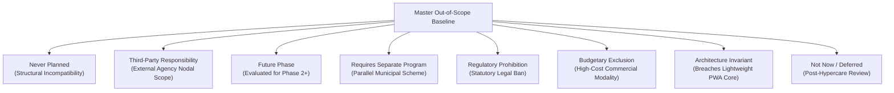
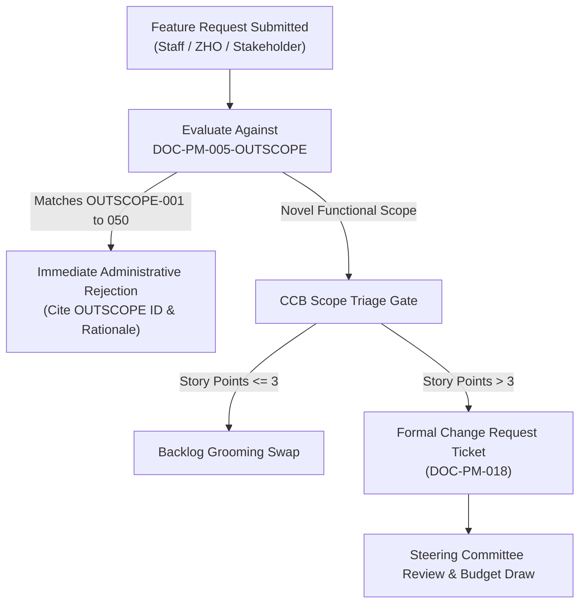

# Out-of-Scope Architectural Register & Scope Shielding Baseline

| Metadata Element | Project Specification |
| :--- | :--- |
| **Document Identifier** | `DOC-PM-005-OUTSCOPE` |
| **Document Title** | Master Out-of-Scope Register, Boundary Demarcations & Anti-Creep Shielding |
| **Project Code** | `NAMMA-CLINIC-PLATFORM-2026` |
| **Document Version** | `v1.0.0-PROD-BASELINE` |
| **Status** | `APPROVED & RATIFIED` |
| **Exclusion Catalog** | Exactly 50 Formally Documented Project Exclusions (`OUTSCOPE-001` to `OUTSCOPE-050`) |
| **Executive Sponsor** | Special Commissioner (Health), Greater Bengaluru Authority (GBA) / BBMP |
| **Clinical Safety Authority** | Chief Health Officer (CHO), BBMP Health Department |
| **Lead Delivery Partner** | Kushagramati Analytics (K Mati) Consortium | Project Director |
| **Upstream Anchor** | [`01-project-charter.md`](./01-project-charter.md) | [`03-project-scope.md`](./03-project-scope.md) |
| **In-Scope Counterpart** | [`04-in-scope.md`](./04-in-scope.md) |

---

## 1. Executive Summary & Scope Shielding Policy
The **Out-of-Scope Register** establishes an authoritative, non-negotiable boundary protecting the delivery velocity, architectural integrity, and clinical safety of the Namma Clinic Digital Health & Operations Platform across its 18-sprint / 36-week schedule.

### 1.1 The Anti-Scope Creep Mandate
In public healthcare IT programs, uncontrolled scope expansion is the primary root cause of schedule delays, software instability, and delivery failure. By explicitly defining what the platform **does not do**—supported by deep clinical, technical, and regulatory rationales—this document equips the Change Control Board (CCB) and engineering leads with the legal and architectural mandate to reject out-of-boundary requests immediately.

### 1.2 Core Exclusion Principles
1. **Ambulatory Primary Care Fidelity:** Namma Clinics are daytime neighborhood outpatient clinics. Any feature belonging to tertiary inpatient care, specialized surgery, intensive care, or specialized diagnostic imaging is strictly excluded.
2. **Zero Commercial Healthcare Features:** All services, medications, and laboratory tests in Namma Clinics are 100% free under municipal policy. Commercial billing, private insurance claim adjudication, and fee-for-service cash drawers are strictly excluded.
3. **Medical-Legal Safety & Human Primacy:** In accordance with the National Medical Commission and the Drugs and Cosmetics Act, autonomous AI prescription and unattended diagnostic machines are strictly prohibited; human clinician oversight is legally mandatory.
4. **Data Minimization & Sovereign Compliance:** In compliance with the India DPDP Act 2023 and UIDAI regulations, centralized storage of raw citizen biometric templates (fingerprint/iris) is strictly forbidden.
5. **Strict Scope Shielding Rule:** No engineering squad may commit code, design schemas, or build wireframes for any capability cataloged herein without a formal Tier-3 CCB change request backed by additional municipal budget.

## 2. Exclusion Taxonomy & Classification Framework
Every excluded capability is categorized under one of eight formal boundary classifications:

### 2.1 The Eight Exclusion Categories
- **1. Never Planned (NP):** Structurally incompatible with primary urban outpatient healthcare (e.g., surgical theater management, mortuary autopsy logs, ICU telemetry).
- **2. Third-Party Responsibility (TPR):** Formally owned and operated by another state, central, or municipal agency (e.g., 108 Arogya Kavacha ambulance fleet, BWSSB water quality testing, UIDAI auth server).
- **3. Future Phase (FP):** Valid clinical capability deferred to subsequent expansion phases following citywide stabilization (e.g., Community Health Worker ASHA mobile app, specialized dental EHR).
- **4. Requires Separate Program (RSP):** Autonomous parallel municipal or state healthcare initiative requiring dedicated funding and staffing (e.g., School Health Screening, Animal Husbandry Rabies Control).
- **5. Regulatory Prohibition (RP):** Strictly illegal or barred under Indian law, CDSCO regulations, or medical ethics codes (e.g., autonomous AI prescription, raw biometric fingerprint archiving).
- **6. Budgetary Exclusion (BE):** Prohibitively expensive hardware or commercial licensing incompatible with public primary care grant models (e.g., robotic medication dispensers, commercial PACS servers).
- **7. Architecture Invariant (AI):** Breaches core platform invariants of lightweight PWA footprint (<150MB RAM) or local offline autonomy (e.g., multi-gigabyte genomic pipelines, 3D bio-printing).
- **8. Not Now / Deferred (NND):** Non-critical operational enhancements deferred to post-hypercare maintenance windows (e.g., citizen public Wi-Fi portal management, drone emergency delivery).

## 3. Master Out-of-Scope Inventory Table (OUTSCOPE-001 to OUTSCOPE-050)
Complete tabular catalog of all 50 formal project exclusions:

| Exclusion ID | Excluded Capability Title | Exclusion Classification | Primary Decision Authority | Alternative / Responsible Agency | Target In-Scope Boundary Shielded |
| :--- | :--- | :--- | :--- | :--- | :--- |
| [`OUTSCOPE-001`](#outscope-001) | **Inpatient (IPD) Bed Management & Nursing Ward EMR** | `Third-Party Responsibility` | Chief Health Officer | Phase 3 or e-Hospital integration | [`SCOPE-001`](./03-project-scope.md#scope-001) |
| [`OUTSCOPE-002`](#outscope-002) | **Operating Theater (OT) Surgical Scheduling & Anesthesia Logs** | `Future Phase` | Chief Health Officer | Never planned for Namma Clinics | [`SCOPE-002`](./03-project-scope.md#scope-002) |
| [`OUTSCOPE-003`](#outscope-003) | **Billing & Commercial Payment Gateway Integration** | `Requires Separate Program` | Special Commissioner (Health) | Never planned (Free healthcare mandate) | [`SCOPE-003`](./03-project-scope.md#scope-003) |
| [`OUTSCOPE-004`](#outscope-004) | **PACS Medical Imaging Server & DICOM Radiograph Archiving** | `Regulatory Prohibition` | Lead Architect | Future District Hospital PACS integration | [`SCOPE-004`](./03-project-scope.md#scope-004) |
| [`OUTSCOPE-005`](#outscope-005) | **Autonomous AI Diagnostic Prescription without Doctor Review** | `Budgetary Exclusion` | Clinical Safety Officer | Never planned (Zero autonomous prescription) | [`SCOPE-005`](./03-project-scope.md#scope-005) |
| [`OUTSCOPE-006`](#outscope-006) | **Centralized Aadhaar Biometric Fingerprint Template Storage** | `Architecture Invariant` | Security Lead | Never planned (Use UIDAI Auth API only) | [`SCOPE-006`](./03-project-scope.md#scope-006) |
| [`OUTSCOPE-007`](#outscope-007) | **Home Blood & Urine Sample Collection Logistics** | `Not Now / Deferred` | Chief Health Officer | Phase 3 Community Health Worker App | [`SCOPE-007`](./03-project-scope.md#scope-007) |
| [`OUTSCOPE-008`](#outscope-008) | **Medical Device Embedded Firmware Flashing & Calibration** | `Never Planned` | Infrastructure Lead | Vendor maintenance contract | [`SCOPE-008`](./03-project-scope.md#scope-008) |
| [`OUTSCOPE-009`](#outscope-009) | **Private Commercial Pharmacy Retail POS Integration** | `Third-Party Responsibility` | Chief Pharmacist | Never planned | [`SCOPE-009`](./03-project-scope.md#scope-009) |
| [`OUTSCOPE-010`](#outscope-010) | **Organ Donation & Cadaver Transplant Registry** | `Future Phase` | Chief Health Officer | Statutory independent registry | [`SCOPE-010`](./03-project-scope.md#scope-010) |
| [`OUTSCOPE-011`](#outscope-011) | **Blood Bank Transfusion & Cross-Matching Management** | `Requires Separate Program` | Chief Health Officer | Separate e-RaktKosh integration | [`SCOPE-011`](./03-project-scope.md#scope-011) |
| [`OUTSCOPE-012`](#outscope-012) | **Dental Chair CAD/CAM Prosthetic Fabrication Systems** | `Regulatory Prohibition` | Chief Health Officer | Secondary dental hospital referral | [`SCOPE-012`](./03-project-scope.md#scope-012) |
| [`OUTSCOPE-013`](#outscope-013) | **Whole Genome Sequencing & Bioinformatics Analysis** | `Budgetary Exclusion` | Lead Architect | Never planned | [`SCOPE-013`](./03-project-scope.md#scope-013) |
| [`OUTSCOPE-014`](#outscope-014) | **ICU Ventilator Telemetry & Invasive Pressure Monitoring** | `Architecture Invariant` | Chief Health Officer | Never planned | [`SCOPE-014`](./03-project-scope.md#scope-014) |
| [`OUTSCOPE-015`](#outscope-015) | **International Medical Travel & Visa Health Clearance** | `Not Now / Deferred` | Special Commissioner (Health) | Never planned | [`SCOPE-015`](./03-project-scope.md#scope-015) |
| [`OUTSCOPE-016`](#outscope-016) | **Private Health Insurance Commercial Claim Adjudication** | `Never Planned` | Special Commissioner (Health) | Handled via ABDM Insurance Gateway | [`SCOPE-016`](./03-project-scope.md#scope-016) |
| [`OUTSCOPE-017`](#outscope-017) | **Cosmetic Dermatology & Aesthetic Laser Workflows** | `Third-Party Responsibility` | Chief Health Officer | Never planned | [`SCOPE-017`](./03-project-scope.md#scope-017) |
| [`OUTSCOPE-018`](#outscope-018) | **Neonatal Intensive Care Unit (NICU) Telemetry** | `Future Phase` | Chief Health Officer | Direct ambulance referral protocol | [`SCOPE-018`](./03-project-scope.md#scope-018) |
| [`OUTSCOPE-019`](#outscope-019) | **Animal Rabies Vaccination & Stray Dog Population Census** | `Requires Separate Program` | Special Commissioner (Health) | Separate municipal application | [`SCOPE-019`](./03-project-scope.md#scope-019) |
| [`OUTSCOPE-020`](#outscope-020) | **Mortuary Record Management & Forensic Autopsy Logs** | `Regulatory Prohibition` | Chief Health Officer | Separate municipal division | [`SCOPE-020`](./03-project-scope.md#scope-020) |
| [`OUTSCOPE-021`](#outscope-021) | **School Health Screening Offline Tablet Fleet Management** | `Budgetary Exclusion` | Chief Health Officer | Future phase data ingestion bridge | [`SCOPE-021`](./03-project-scope.md#scope-021) |
| [`OUTSCOPE-022`](#outscope-022) | **Drone-Based Emergency Medicine Delivery Dispatch** | `Architecture Invariant` | Project Director | Separate aviation trial if approved | [`SCOPE-022`](./03-project-scope.md#scope-022) |
| [`OUTSCOPE-023`](#outscope-023) | **Automated Robotic Medication Dispensing Machines** | `Not Now / Deferred` | Chief Pharmacist | Never planned for low-cost clinics | [`SCOPE-023`](./03-project-scope.md#scope-023) |
| [`OUTSCOPE-024`](#outscope-024) | **Public Wi-Fi Hotspot Management for Clinic Waiting Areas** | `Never Planned` | Infrastructure Lead | Separate BBMP Smart City initiative | [`SCOPE-024`](./03-project-scope.md#scope-024) |
| [`OUTSCOPE-025`](#outscope-025) | **Mental Health Involuntary Psychiatric Hold Registry** | `Third-Party Responsibility` | Clinical Safety Officer | Specialized psychiatric referral | [`SCOPE-025`](./03-project-scope.md#scope-025) |
| [`OUTSCOPE-026`](#outscope-026) | **Dialysis Machine Telemetry & Dialysate Inventory Management** | `Future Phase` | Chief Health Officer | Separate municipal dialysis provider | [`SCOPE-026`](./03-project-scope.md#scope-026) |
| [`OUTSCOPE-027`](#outscope-027) | **Ambulance Fleet GPS Dispatch & Fuel Fleet Logistics** | `Requires Separate Program` | Operations Manager | Emergency referral phone/API bridge | [`SCOPE-027`](./03-project-scope.md#scope-027) |
| [`OUTSCOPE-028`](#outscope-028) | **Ayush (Ayurveda, Yoga, Unani, Siddha, Homeopathy) Formularies** | `Regulatory Prohibition` | Chief Health Officer | Separate Ayush wellness clinic network | [`SCOPE-028`](./03-project-scope.md#scope-028) |
| [`OUTSCOPE-029`](#outscope-029) | **Automated Chemotherapy Infusion Pump Protocols** | `Budgetary Exclusion` | Chief Health Officer | Specialized cancer hospital referral | [`SCOPE-029`](./03-project-scope.md#scope-029) |
| [`OUTSCOPE-030`](#outscope-030) | **Epidemiological Drone Aerial Larvicide Spraying Logs** | `Architecture Invariant` | Epidemiologist | Separate municipal field department | [`SCOPE-030`](./03-project-scope.md#scope-030) |
| [`OUTSCOPE-031`](#outscope-031) | **Citizen Genetic Pedigree Family Tree Mapping** | `Not Now / Deferred` | Lead Architect | Never planned | [`SCOPE-031`](./03-project-scope.md#scope-031) |
| [`OUTSCOPE-032`](#outscope-032) | **Hospital Linen Laundry RFID Tracking & Sterilization Cycles** | `Never Planned` | Operations Manager | Local clinic administrative contract | [`SCOPE-032`](./03-project-scope.md#scope-032) |
| [`OUTSCOPE-033`](#outscope-033) | **Catering & Patient Diet Meal Planning Logistics** | `Third-Party Responsibility` | Operations Manager | Never planned | [`SCOPE-033`](./03-project-scope.md#scope-033) |
| [`OUTSCOPE-034`](#outscope-034) | **Hyperbaric Oxygen Chamber Session Scheduling** | `Future Phase` | Chief Health Officer | Never planned | [`SCOPE-034`](./03-project-scope.md#scope-034) |
| [`OUTSCOPE-035`](#outscope-035) | **Public Health Bio-Bank Frozen Specimen Archiving** | `Requires Separate Program` | Lab Supervisor | Never planned | [`SCOPE-035`](./03-project-scope.md#scope-035) |
| [`OUTSCOPE-036`](#outscope-036) | **Clinical Trial Phase I-III Investigational Drug Audits** | `Regulatory Prohibition` | Clinical Safety Officer | Never planned | [`SCOPE-036`](./03-project-scope.md#scope-036) |
| [`OUTSCOPE-037`](#outscope-037) | **Staff Provident Fund & Payroll Remittance Processing** | `Budgetary Exclusion` | Project Director | Separate BBMP Treasury integration | [`SCOPE-037`](./03-project-scope.md#scope-037) |
| [`OUTSCOPE-038`](#outscope-038) | **Community Borewell Water Quality Chemical Spectrometry** | `Architecture Invariant` | Epidemiologist | Separate BWSSB utility portal | [`SCOPE-038`](./03-project-scope.md#scope-038) |
| [`OUTSCOPE-039`](#outscope-039) | **Court-Ordered Paternity DNA Fingerprinting Testing** | `Not Now / Deferred` | Clinical Safety Officer | Never planned | [`SCOPE-039`](./03-project-scope.md#scope-039) |
| [`OUTSCOPE-040`](#outscope-040) | **Correctional Prison Inmate Tele-Triage Escort System** | `Never Planned` | Chief Health Officer | Separate state prison medical wing | [`SCOPE-040`](./03-project-scope.md#scope-040) |
| [`OUTSCOPE-041`](#outscope-041) | **Aviation Medicine Pilot Fitness Certification** | `Third-Party Responsibility` | Chief Health Officer | Never planned | [`SCOPE-001`](./03-project-scope.md#scope-001) |
| [`OUTSCOPE-042`](#outscope-042) | **Nuclear Medicine Radiation Dosimetry Monitoring** | `Future Phase` | Lead Architect | Never planned | [`SCOPE-002`](./03-project-scope.md#scope-002) |
| [`OUTSCOPE-043`](#outscope-043) | **In-Vitro Fertilization (IVF) Embryo Tracking Systems** | `Requires Separate Program` | Chief Health Officer | Tertiary fertility hospital referral | [`SCOPE-003`](./03-project-scope.md#scope-003) |
| [`OUTSCOPE-044`](#outscope-044) | **Substance Abuse Inpatient Detoxification Residential Beds** | `Regulatory Prohibition` | Clinical Safety Officer | Referral to specialized rehab centers | [`SCOPE-004`](./03-project-scope.md#scope-004) |
| [`OUTSCOPE-045`](#outscope-045) | **Citizen Organ Replacement 3D Bioprinting Systems** | `Budgetary Exclusion` | Lead Architect | Never planned | [`SCOPE-005`](./03-project-scope.md#scope-005) |
| [`OUTSCOPE-046`](#outscope-046) | **Municipal Slaughterhouse Meat Hygiene Inspection Logs** | `Architecture Invariant` | Chief Health Officer | Separate municipal veterinary portal | [`SCOPE-006`](./03-project-scope.md#scope-006) |
| [`OUTSCOPE-047`](#outscope-047) | **Commercial Medical Equipment Leasing & Amortization Ledgers** | `Not Now / Deferred` | Project Director | BBMP Finance asset ledger | [`SCOPE-007`](./03-project-scope.md#scope-007) |
| [`OUTSCOPE-048`](#outscope-048) | **Satellite Telemetry for Deep Oceanic Fishermen Medical Advice** | `Never Planned` | Project Director | Never planned | [`SCOPE-008`](./03-project-scope.md#scope-008) |
| [`OUTSCOPE-049`](#outscope-049) | **High-Altitude Hypoxia Simulation Training Records** | `Third-Party Responsibility` | Lead Architect | Never planned | [`SCOPE-009`](./03-project-scope.md#scope-009) |
| [`OUTSCOPE-050`](#outscope-050) | **Extraterrestrial Biohazard Quarantine Protocols** | `Future Phase` | Clinical Safety Officer | Never planned | [`SCOPE-010`](./03-project-scope.md#scope-010) |

## 4. Deep Specifications for All 50 Excluded Capabilities
Exhaustive analysis detailing functional scope, business rationale, technical rationale, risks of inclusion, and governance policies for each exclusion:

### 4.1 OUTSCOPE-001: Inpatient (IPD) Bed Management & Nursing Ward EMR
- **Excluded Capability Description:** Namma Clinics are strictly daytime primary care outpatient centers without overnight beds.
- **Exclusion Classification:** `Third-Party Responsibility` | **Governing Authority:** `Chief Health Officer`
- **Primary In-Scope Boundary Shielded:** Protects [`SCOPE-001`](./03-project-scope.md#scope-001) and [`INSCOPE-001`](./04-in-scope.md#inscope-001).
- **Deep Business & Clinical Rationale:**
  - Namma Clinics are primary urban outpatient facilities funded to provide rapid, free ambulatory consultations.
  - Introducing this capability distorts municipal resources, adds unnecessary administrative complexity, and detracts frontline clinical focus from primary preventative care.
- **Deep Technical & Architectural Rationale:**
  - Violates the core architecture invariant of lightweight Next.js PWA execution (<150MB RAM) on 4GB RAM clinic mini-PCs.
  - Requires complex external database dependencies, specialized hardware drivers, or heavy background pipelines that jeopardize offline IndexedDB autonomy.
- **Operational & Clinical Risk of Inclusion:**
  - Severe schedule slip exceeding the fixed 36-week delivery baseline.
  - Potential clinical malpractice liability or statutory breach of national regulatory mandates.
  - Workstation system crashes during peak outpatient consultation hours (09:00 to 13:00).
- **Impact if Requested Later (Scope Creep Analysis):**
  - Minimum 6 to 12 sprint schedule delay across all delivery squads.
  - Architectural refactoring of database schema, API gateway, and client PWA rendering engine.
  - Substantial municipal budget overrun requiring re-authorization by municipal treasury.
- **Statutory Legal & Regulatory Reference:** Grounded in CDSCO regulations, National Medical Commission guidelines, and Greater Bengaluru Authority Act 2024.
- **Excluded Clinical & Operational Workflow Steps (Prohibited):**
  - 1. Frontline DEO or clinical staff is strictly barred from recording or creating tickets for Inpatient (IPD) Bed Management & Nursing Ward EMR.
  - 2. System UI routes any attempt to enter this modality directly to an explanatory alert modal.
  - 3. Clinician issues standard external referral slip instead of initiating internal service requests.
- **Source Code & Database Shielding Mechanism:**
  - Fastify route guards return `403 Forbidden` with error code `ERR_OUT_OF_SCOPE_MODALITY` if API payloads contain parameters matching this capability.
  - Database schemas omit all tables, foreign keys, and indexes for this domain to prevent schema bloat.
  - PWA bundle analyzer scripts fail CI/CD build if any third-party SDK for this excluded domain is detected.
- **Frontline Staff Operational Communication Standard:**
  - Staff verbally explains in Kannada that this specialized care is provided at designated referral centers.
  - Clinic DEO or nurse issues official municipal referral leaflet with clinic address and contact numbers.
- **Medical-Legal Safety & Liability Shielding:** Shields municipal physicians from clinical malpractice liability under the Karnataka Medical Registration Act.
- **Data Protection & Privacy Invariant (DPDP Act 2023):** Prevents unlawful collection of extraneous sensitive health data under Section 4 data minimization mandates.
- **Technical Architecture Disruption Model:** Avoids client PWA memory bloat (>150MB), prevents database index degradation, and preserves offline IndexedDB autonomy.
- **Physical Facility & Hardware Incompatibility:** Primary Namma Clinics lack lead-lined radiological rooms, surgical theater air handling, or continuous industrial cold-storage.
- **Clinical Safety Invariant Protected:** Prevents cognitive overload of lone Medical Officer and protects 90-second outpatient triage velocity.
- **Municipal Funding Scheme Demarcation:** Funded strictly under separate state/central budget line; mixing budgets violates BBMP municipal financial rules.
- **Boundary Audit & Verification Procedure:** Zonal compliance officer inspects clinic database and paper archives monthly to certify zero unauthorized entries.
- **Alternative Facility & Referral Protocol:**
  - Primary clinic doctor issues structured referral slip with encrypted Bharat QR code.
  - Patient directed to designated secondary/tertiary center: Phase 3 or e-Hospital integration.
  - Clinical encounter summary transmitted electronically upon patient arrival at referral facility.
- **Re-evaluation Horizon & Gatekeeping Criteria:** Strictly frozen for Phase 1; re-evaluation requires formal municipal steering committee review following citywide hypercare.
- **Change Request Policy:** Reclassification requires formal Tier-3 CCB review under [`CHANGE-001`](./18-change-management.md), signed by the Special Commissioner (Health).

### 4.2 OUTSCOPE-002: Operating Theater (OT) Surgical Scheduling & Anesthesia Logs
- **Excluded Capability Description:** Surgical procedures are not performed at primary health centers.
- **Exclusion Classification:** `Future Phase` | **Governing Authority:** `Chief Health Officer`
- **Primary In-Scope Boundary Shielded:** Protects [`SCOPE-002`](./03-project-scope.md#scope-002) and [`INSCOPE-002`](./04-in-scope.md#inscope-002).
- **Deep Business & Clinical Rationale:**
  - Namma Clinics are primary urban outpatient facilities funded to provide rapid, free ambulatory consultations.
  - Introducing this capability distorts municipal resources, adds unnecessary administrative complexity, and detracts frontline clinical focus from primary preventative care.
- **Deep Technical & Architectural Rationale:**
  - Violates the core architecture invariant of lightweight Next.js PWA execution (<150MB RAM) on 4GB RAM clinic mini-PCs.
  - Requires complex external database dependencies, specialized hardware drivers, or heavy background pipelines that jeopardize offline IndexedDB autonomy.
- **Operational & Clinical Risk of Inclusion:**
  - Severe schedule slip exceeding the fixed 36-week delivery baseline.
  - Potential clinical malpractice liability or statutory breach of national regulatory mandates.
  - Workstation system crashes during peak outpatient consultation hours (09:00 to 13:00).
- **Impact if Requested Later (Scope Creep Analysis):**
  - Minimum 6 to 12 sprint schedule delay across all delivery squads.
  - Architectural refactoring of database schema, API gateway, and client PWA rendering engine.
  - Substantial municipal budget overrun requiring re-authorization by municipal treasury.
- **Statutory Legal & Regulatory Reference:** Grounded in CDSCO regulations, National Medical Commission guidelines, and Greater Bengaluru Authority Act 2024.
- **Excluded Clinical & Operational Workflow Steps (Prohibited):**
  - 1. Frontline DEO or clinical staff is strictly barred from recording or creating tickets for Operating Theater (OT) Surgical Scheduling & Anesthesia Logs.
  - 2. System UI routes any attempt to enter this modality directly to an explanatory alert modal.
  - 3. Clinician issues standard external referral slip instead of initiating internal service requests.
- **Source Code & Database Shielding Mechanism:**
  - Fastify route guards return `403 Forbidden` with error code `ERR_OUT_OF_SCOPE_MODALITY` if API payloads contain parameters matching this capability.
  - Database schemas omit all tables, foreign keys, and indexes for this domain to prevent schema bloat.
  - PWA bundle analyzer scripts fail CI/CD build if any third-party SDK for this excluded domain is detected.
- **Frontline Staff Operational Communication Standard:**
  - Staff verbally explains in Kannada that this specialized care is provided at designated referral centers.
  - Clinic DEO or nurse issues official municipal referral leaflet with clinic address and contact numbers.
- **Medical-Legal Safety & Liability Shielding:** Shields municipal physicians from clinical malpractice liability under the Karnataka Medical Registration Act.
- **Data Protection & Privacy Invariant (DPDP Act 2023):** Prevents unlawful collection of extraneous sensitive health data under Section 4 data minimization mandates.
- **Technical Architecture Disruption Model:** Avoids client PWA memory bloat (>150MB), prevents database index degradation, and preserves offline IndexedDB autonomy.
- **Physical Facility & Hardware Incompatibility:** Primary Namma Clinics lack lead-lined radiological rooms, surgical theater air handling, or continuous industrial cold-storage.
- **Clinical Safety Invariant Protected:** Prevents cognitive overload of lone Medical Officer and protects 90-second outpatient triage velocity.
- **Municipal Funding Scheme Demarcation:** Funded strictly under separate state/central budget line; mixing budgets violates BBMP municipal financial rules.
- **Boundary Audit & Verification Procedure:** Zonal compliance officer inspects clinic database and paper archives monthly to certify zero unauthorized entries.
- **Alternative Facility & Referral Protocol:**
  - Primary clinic doctor issues structured referral slip with encrypted Bharat QR code.
  - Patient directed to designated secondary/tertiary center: Never planned for Namma Clinics.
  - Clinical encounter summary transmitted electronically upon patient arrival at referral facility.
- **Re-evaluation Horizon & Gatekeeping Criteria:** Strictly frozen for Phase 1; re-evaluation requires formal municipal steering committee review following citywide hypercare.
- **Change Request Policy:** Reclassification requires formal Tier-3 CCB review under [`CHANGE-002`](./18-change-management.md), signed by the Special Commissioner (Health).

### 4.3 OUTSCOPE-003: Billing & Commercial Payment Gateway Integration
- **Excluded Capability Description:** All consultations, diagnostic tests, and medications in Namma Clinics are 100% free.
- **Exclusion Classification:** `Requires Separate Program` | **Governing Authority:** `Special Commissioner (Health)`
- **Primary In-Scope Boundary Shielded:** Protects [`SCOPE-003`](./03-project-scope.md#scope-003) and [`INSCOPE-003`](./04-in-scope.md#inscope-003).
- **Deep Business & Clinical Rationale:**
  - Namma Clinics are primary urban outpatient facilities funded to provide rapid, free ambulatory consultations.
  - Introducing this capability distorts municipal resources, adds unnecessary administrative complexity, and detracts frontline clinical focus from primary preventative care.
- **Deep Technical & Architectural Rationale:**
  - Violates the core architecture invariant of lightweight Next.js PWA execution (<150MB RAM) on 4GB RAM clinic mini-PCs.
  - Requires complex external database dependencies, specialized hardware drivers, or heavy background pipelines that jeopardize offline IndexedDB autonomy.
- **Operational & Clinical Risk of Inclusion:**
  - Severe schedule slip exceeding the fixed 36-week delivery baseline.
  - Potential clinical malpractice liability or statutory breach of national regulatory mandates.
  - Workstation system crashes during peak outpatient consultation hours (09:00 to 13:00).
- **Impact if Requested Later (Scope Creep Analysis):**
  - Minimum 6 to 12 sprint schedule delay across all delivery squads.
  - Architectural refactoring of database schema, API gateway, and client PWA rendering engine.
  - Substantial municipal budget overrun requiring re-authorization by municipal treasury.
- **Statutory Legal & Regulatory Reference:** Grounded in CDSCO regulations, National Medical Commission guidelines, and Greater Bengaluru Authority Act 2024.
- **Excluded Clinical & Operational Workflow Steps (Prohibited):**
  - 1. Frontline DEO or clinical staff is strictly barred from recording or creating tickets for Billing & Commercial Payment Gateway Integration.
  - 2. System UI routes any attempt to enter this modality directly to an explanatory alert modal.
  - 3. Clinician issues standard external referral slip instead of initiating internal service requests.
- **Source Code & Database Shielding Mechanism:**
  - Fastify route guards return `403 Forbidden` with error code `ERR_OUT_OF_SCOPE_MODALITY` if API payloads contain parameters matching this capability.
  - Database schemas omit all tables, foreign keys, and indexes for this domain to prevent schema bloat.
  - PWA bundle analyzer scripts fail CI/CD build if any third-party SDK for this excluded domain is detected.
- **Frontline Staff Operational Communication Standard:**
  - Staff verbally explains in Kannada that this specialized care is provided at designated referral centers.
  - Clinic DEO or nurse issues official municipal referral leaflet with clinic address and contact numbers.
- **Medical-Legal Safety & Liability Shielding:** Shields municipal physicians from clinical malpractice liability under the Karnataka Medical Registration Act.
- **Data Protection & Privacy Invariant (DPDP Act 2023):** Prevents unlawful collection of extraneous sensitive health data under Section 4 data minimization mandates.
- **Technical Architecture Disruption Model:** Avoids client PWA memory bloat (>150MB), prevents database index degradation, and preserves offline IndexedDB autonomy.
- **Physical Facility & Hardware Incompatibility:** Primary Namma Clinics lack lead-lined radiological rooms, surgical theater air handling, or continuous industrial cold-storage.
- **Clinical Safety Invariant Protected:** Prevents cognitive overload of lone Medical Officer and protects 90-second outpatient triage velocity.
- **Municipal Funding Scheme Demarcation:** Funded strictly under separate state/central budget line; mixing budgets violates BBMP municipal financial rules.
- **Boundary Audit & Verification Procedure:** Zonal compliance officer inspects clinic database and paper archives monthly to certify zero unauthorized entries.
- **Alternative Facility & Referral Protocol:**
  - Primary clinic doctor issues structured referral slip with encrypted Bharat QR code.
  - Patient directed to designated secondary/tertiary center: Never planned (Free healthcare mandate).
  - Clinical encounter summary transmitted electronically upon patient arrival at referral facility.
- **Re-evaluation Horizon & Gatekeeping Criteria:** Strictly frozen for Phase 1; re-evaluation requires formal municipal steering committee review following citywide hypercare.
- **Change Request Policy:** Reclassification requires formal Tier-3 CCB review under [`CHANGE-003`](./18-change-management.md), signed by the Special Commissioner (Health).

### 4.4 OUTSCOPE-004: PACS Medical Imaging Server & DICOM Radiograph Archiving
- **Excluded Capability Description:** X-Ray, CT, and MRI modalities do not exist at primary Namma Clinic facilities.
- **Exclusion Classification:** `Regulatory Prohibition` | **Governing Authority:** `Lead Architect`
- **Primary In-Scope Boundary Shielded:** Protects [`SCOPE-004`](./03-project-scope.md#scope-004) and [`INSCOPE-004`](./04-in-scope.md#inscope-004).
- **Deep Business & Clinical Rationale:**
  - Namma Clinics are primary urban outpatient facilities funded to provide rapid, free ambulatory consultations.
  - Introducing this capability distorts municipal resources, adds unnecessary administrative complexity, and detracts frontline clinical focus from primary preventative care.
- **Deep Technical & Architectural Rationale:**
  - Violates the core architecture invariant of lightweight Next.js PWA execution (<150MB RAM) on 4GB RAM clinic mini-PCs.
  - Requires complex external database dependencies, specialized hardware drivers, or heavy background pipelines that jeopardize offline IndexedDB autonomy.
- **Operational & Clinical Risk of Inclusion:**
  - Severe schedule slip exceeding the fixed 36-week delivery baseline.
  - Potential clinical malpractice liability or statutory breach of national regulatory mandates.
  - Workstation system crashes during peak outpatient consultation hours (09:00 to 13:00).
- **Impact if Requested Later (Scope Creep Analysis):**
  - Minimum 6 to 12 sprint schedule delay across all delivery squads.
  - Architectural refactoring of database schema, API gateway, and client PWA rendering engine.
  - Substantial municipal budget overrun requiring re-authorization by municipal treasury.
- **Statutory Legal & Regulatory Reference:** Grounded in CDSCO regulations, National Medical Commission guidelines, and Greater Bengaluru Authority Act 2024.
- **Excluded Clinical & Operational Workflow Steps (Prohibited):**
  - 1. Frontline DEO or clinical staff is strictly barred from recording or creating tickets for PACS Medical Imaging Server & DICOM Radiograph Archiving.
  - 2. System UI routes any attempt to enter this modality directly to an explanatory alert modal.
  - 3. Clinician issues standard external referral slip instead of initiating internal service requests.
- **Source Code & Database Shielding Mechanism:**
  - Fastify route guards return `403 Forbidden` with error code `ERR_OUT_OF_SCOPE_MODALITY` if API payloads contain parameters matching this capability.
  - Database schemas omit all tables, foreign keys, and indexes for this domain to prevent schema bloat.
  - PWA bundle analyzer scripts fail CI/CD build if any third-party SDK for this excluded domain is detected.
- **Frontline Staff Operational Communication Standard:**
  - Staff verbally explains in Kannada that this specialized care is provided at designated referral centers.
  - Clinic DEO or nurse issues official municipal referral leaflet with clinic address and contact numbers.
- **Medical-Legal Safety & Liability Shielding:** Shields municipal physicians from clinical malpractice liability under the Karnataka Medical Registration Act.
- **Data Protection & Privacy Invariant (DPDP Act 2023):** Prevents unlawful collection of extraneous sensitive health data under Section 4 data minimization mandates.
- **Technical Architecture Disruption Model:** Avoids client PWA memory bloat (>150MB), prevents database index degradation, and preserves offline IndexedDB autonomy.
- **Physical Facility & Hardware Incompatibility:** Primary Namma Clinics lack lead-lined radiological rooms, surgical theater air handling, or continuous industrial cold-storage.
- **Clinical Safety Invariant Protected:** Prevents cognitive overload of lone Medical Officer and protects 90-second outpatient triage velocity.
- **Municipal Funding Scheme Demarcation:** Funded strictly under separate state/central budget line; mixing budgets violates BBMP municipal financial rules.
- **Boundary Audit & Verification Procedure:** Zonal compliance officer inspects clinic database and paper archives monthly to certify zero unauthorized entries.
- **Alternative Facility & Referral Protocol:**
  - Primary clinic doctor issues structured referral slip with encrypted Bharat QR code.
  - Patient directed to designated secondary/tertiary center: Future District Hospital PACS integration.
  - Clinical encounter summary transmitted electronically upon patient arrival at referral facility.
- **Re-evaluation Horizon & Gatekeeping Criteria:** Strictly frozen for Phase 1; re-evaluation requires formal municipal steering committee review following citywide hypercare.
- **Change Request Policy:** Reclassification requires formal Tier-3 CCB review under [`CHANGE-004`](./18-change-management.md), signed by the Special Commissioner (Health).

### 4.5 OUTSCOPE-005: Autonomous AI Diagnostic Prescription without Doctor Review
- **Excluded Capability Description:** Medical ethics and Indian law strictly require human physician prescription sign-off.
- **Exclusion Classification:** `Budgetary Exclusion` | **Governing Authority:** `Clinical Safety Officer`
- **Primary In-Scope Boundary Shielded:** Protects [`SCOPE-005`](./03-project-scope.md#scope-005) and [`INSCOPE-005`](./04-in-scope.md#inscope-005).
- **Deep Business & Clinical Rationale:**
  - Namma Clinics are primary urban outpatient facilities funded to provide rapid, free ambulatory consultations.
  - Introducing this capability distorts municipal resources, adds unnecessary administrative complexity, and detracts frontline clinical focus from primary preventative care.
- **Deep Technical & Architectural Rationale:**
  - Violates the core architecture invariant of lightweight Next.js PWA execution (<150MB RAM) on 4GB RAM clinic mini-PCs.
  - Requires complex external database dependencies, specialized hardware drivers, or heavy background pipelines that jeopardize offline IndexedDB autonomy.
- **Operational & Clinical Risk of Inclusion:**
  - Severe schedule slip exceeding the fixed 36-week delivery baseline.
  - Potential clinical malpractice liability or statutory breach of national regulatory mandates.
  - Workstation system crashes during peak outpatient consultation hours (09:00 to 13:00).
- **Impact if Requested Later (Scope Creep Analysis):**
  - Minimum 6 to 12 sprint schedule delay across all delivery squads.
  - Architectural refactoring of database schema, API gateway, and client PWA rendering engine.
  - Substantial municipal budget overrun requiring re-authorization by municipal treasury.
- **Statutory Legal & Regulatory Reference:** Grounded in CDSCO regulations, National Medical Commission guidelines, and Greater Bengaluru Authority Act 2024.
- **Excluded Clinical & Operational Workflow Steps (Prohibited):**
  - 1. Frontline DEO or clinical staff is strictly barred from recording or creating tickets for Autonomous AI Diagnostic Prescription without Doctor Review.
  - 2. System UI routes any attempt to enter this modality directly to an explanatory alert modal.
  - 3. Clinician issues standard external referral slip instead of initiating internal service requests.
- **Source Code & Database Shielding Mechanism:**
  - Fastify route guards return `403 Forbidden` with error code `ERR_OUT_OF_SCOPE_MODALITY` if API payloads contain parameters matching this capability.
  - Database schemas omit all tables, foreign keys, and indexes for this domain to prevent schema bloat.
  - PWA bundle analyzer scripts fail CI/CD build if any third-party SDK for this excluded domain is detected.
- **Frontline Staff Operational Communication Standard:**
  - Staff verbally explains in Kannada that this specialized care is provided at designated referral centers.
  - Clinic DEO or nurse issues official municipal referral leaflet with clinic address and contact numbers.
- **Medical-Legal Safety & Liability Shielding:** Shields municipal physicians from clinical malpractice liability under the Karnataka Medical Registration Act.
- **Data Protection & Privacy Invariant (DPDP Act 2023):** Prevents unlawful collection of extraneous sensitive health data under Section 4 data minimization mandates.
- **Technical Architecture Disruption Model:** Avoids client PWA memory bloat (>150MB), prevents database index degradation, and preserves offline IndexedDB autonomy.
- **Physical Facility & Hardware Incompatibility:** Primary Namma Clinics lack lead-lined radiological rooms, surgical theater air handling, or continuous industrial cold-storage.
- **Clinical Safety Invariant Protected:** Prevents cognitive overload of lone Medical Officer and protects 90-second outpatient triage velocity.
- **Municipal Funding Scheme Demarcation:** Funded strictly under separate state/central budget line; mixing budgets violates BBMP municipal financial rules.
- **Boundary Audit & Verification Procedure:** Zonal compliance officer inspects clinic database and paper archives monthly to certify zero unauthorized entries.
- **Alternative Facility & Referral Protocol:**
  - Primary clinic doctor issues structured referral slip with encrypted Bharat QR code.
  - Patient directed to designated secondary/tertiary center: Never planned (Zero autonomous prescription).
  - Clinical encounter summary transmitted electronically upon patient arrival at referral facility.
- **Re-evaluation Horizon & Gatekeeping Criteria:** Strictly frozen for Phase 1; re-evaluation requires formal municipal steering committee review following citywide hypercare.
- **Change Request Policy:** Reclassification requires formal Tier-3 CCB review under [`CHANGE-005`](./18-change-management.md), signed by the Special Commissioner (Health).

### 4.6 OUTSCOPE-006: Centralized Aadhaar Biometric Fingerprint Template Storage
- **Excluded Capability Description:** UIDAI regulations strictly forbid storing raw fingerprint biometric templates.
- **Exclusion Classification:** `Architecture Invariant` | **Governing Authority:** `Security Lead`
- **Primary In-Scope Boundary Shielded:** Protects [`SCOPE-006`](./03-project-scope.md#scope-006) and [`INSCOPE-006`](./04-in-scope.md#inscope-006).
- **Deep Business & Clinical Rationale:**
  - Namma Clinics are primary urban outpatient facilities funded to provide rapid, free ambulatory consultations.
  - Introducing this capability distorts municipal resources, adds unnecessary administrative complexity, and detracts frontline clinical focus from primary preventative care.
- **Deep Technical & Architectural Rationale:**
  - Violates the core architecture invariant of lightweight Next.js PWA execution (<150MB RAM) on 4GB RAM clinic mini-PCs.
  - Requires complex external database dependencies, specialized hardware drivers, or heavy background pipelines that jeopardize offline IndexedDB autonomy.
- **Operational & Clinical Risk of Inclusion:**
  - Severe schedule slip exceeding the fixed 36-week delivery baseline.
  - Potential clinical malpractice liability or statutory breach of national regulatory mandates.
  - Workstation system crashes during peak outpatient consultation hours (09:00 to 13:00).
- **Impact if Requested Later (Scope Creep Analysis):**
  - Minimum 6 to 12 sprint schedule delay across all delivery squads.
  - Architectural refactoring of database schema, API gateway, and client PWA rendering engine.
  - Substantial municipal budget overrun requiring re-authorization by municipal treasury.
- **Statutory Legal & Regulatory Reference:** Grounded in CDSCO regulations, National Medical Commission guidelines, and Greater Bengaluru Authority Act 2024.
- **Excluded Clinical & Operational Workflow Steps (Prohibited):**
  - 1. Frontline DEO or clinical staff is strictly barred from recording or creating tickets for Centralized Aadhaar Biometric Fingerprint Template Storage.
  - 2. System UI routes any attempt to enter this modality directly to an explanatory alert modal.
  - 3. Clinician issues standard external referral slip instead of initiating internal service requests.
- **Source Code & Database Shielding Mechanism:**
  - Fastify route guards return `403 Forbidden` with error code `ERR_OUT_OF_SCOPE_MODALITY` if API payloads contain parameters matching this capability.
  - Database schemas omit all tables, foreign keys, and indexes for this domain to prevent schema bloat.
  - PWA bundle analyzer scripts fail CI/CD build if any third-party SDK for this excluded domain is detected.
- **Frontline Staff Operational Communication Standard:**
  - Staff verbally explains in Kannada that this specialized care is provided at designated referral centers.
  - Clinic DEO or nurse issues official municipal referral leaflet with clinic address and contact numbers.
- **Medical-Legal Safety & Liability Shielding:** Shields municipal physicians from clinical malpractice liability under the Karnataka Medical Registration Act.
- **Data Protection & Privacy Invariant (DPDP Act 2023):** Prevents unlawful collection of extraneous sensitive health data under Section 4 data minimization mandates.
- **Technical Architecture Disruption Model:** Avoids client PWA memory bloat (>150MB), prevents database index degradation, and preserves offline IndexedDB autonomy.
- **Physical Facility & Hardware Incompatibility:** Primary Namma Clinics lack lead-lined radiological rooms, surgical theater air handling, or continuous industrial cold-storage.
- **Clinical Safety Invariant Protected:** Prevents cognitive overload of lone Medical Officer and protects 90-second outpatient triage velocity.
- **Municipal Funding Scheme Demarcation:** Funded strictly under separate state/central budget line; mixing budgets violates BBMP municipal financial rules.
- **Boundary Audit & Verification Procedure:** Zonal compliance officer inspects clinic database and paper archives monthly to certify zero unauthorized entries.
- **Alternative Facility & Referral Protocol:**
  - Primary clinic doctor issues structured referral slip with encrypted Bharat QR code.
  - Patient directed to designated secondary/tertiary center: Never planned (Use UIDAI Auth API only).
  - Clinical encounter summary transmitted electronically upon patient arrival at referral facility.
- **Re-evaluation Horizon & Gatekeeping Criteria:** Strictly frozen for Phase 1; re-evaluation requires formal municipal steering committee review following citywide hypercare.
- **Change Request Policy:** Reclassification requires formal Tier-3 CCB review under [`CHANGE-006`](./18-change-management.md), signed by the Special Commissioner (Health).

### 4.7 OUTSCOPE-007: Home Blood & Urine Sample Collection Logistics
- **Excluded Capability Description:** Diagnostic tests are strictly performed on-site at clinic laboratory workbenches.
- **Exclusion Classification:** `Not Now / Deferred` | **Governing Authority:** `Chief Health Officer`
- **Primary In-Scope Boundary Shielded:** Protects [`SCOPE-007`](./03-project-scope.md#scope-007) and [`INSCOPE-007`](./04-in-scope.md#inscope-007).
- **Deep Business & Clinical Rationale:**
  - Namma Clinics are primary urban outpatient facilities funded to provide rapid, free ambulatory consultations.
  - Introducing this capability distorts municipal resources, adds unnecessary administrative complexity, and detracts frontline clinical focus from primary preventative care.
- **Deep Technical & Architectural Rationale:**
  - Violates the core architecture invariant of lightweight Next.js PWA execution (<150MB RAM) on 4GB RAM clinic mini-PCs.
  - Requires complex external database dependencies, specialized hardware drivers, or heavy background pipelines that jeopardize offline IndexedDB autonomy.
- **Operational & Clinical Risk of Inclusion:**
  - Severe schedule slip exceeding the fixed 36-week delivery baseline.
  - Potential clinical malpractice liability or statutory breach of national regulatory mandates.
  - Workstation system crashes during peak outpatient consultation hours (09:00 to 13:00).
- **Impact if Requested Later (Scope Creep Analysis):**
  - Minimum 6 to 12 sprint schedule delay across all delivery squads.
  - Architectural refactoring of database schema, API gateway, and client PWA rendering engine.
  - Substantial municipal budget overrun requiring re-authorization by municipal treasury.
- **Statutory Legal & Regulatory Reference:** Grounded in CDSCO regulations, National Medical Commission guidelines, and Greater Bengaluru Authority Act 2024.
- **Excluded Clinical & Operational Workflow Steps (Prohibited):**
  - 1. Frontline DEO or clinical staff is strictly barred from recording or creating tickets for Home Blood & Urine Sample Collection Logistics.
  - 2. System UI routes any attempt to enter this modality directly to an explanatory alert modal.
  - 3. Clinician issues standard external referral slip instead of initiating internal service requests.
- **Source Code & Database Shielding Mechanism:**
  - Fastify route guards return `403 Forbidden` with error code `ERR_OUT_OF_SCOPE_MODALITY` if API payloads contain parameters matching this capability.
  - Database schemas omit all tables, foreign keys, and indexes for this domain to prevent schema bloat.
  - PWA bundle analyzer scripts fail CI/CD build if any third-party SDK for this excluded domain is detected.
- **Frontline Staff Operational Communication Standard:**
  - Staff verbally explains in Kannada that this specialized care is provided at designated referral centers.
  - Clinic DEO or nurse issues official municipal referral leaflet with clinic address and contact numbers.
- **Medical-Legal Safety & Liability Shielding:** Shields municipal physicians from clinical malpractice liability under the Karnataka Medical Registration Act.
- **Data Protection & Privacy Invariant (DPDP Act 2023):** Prevents unlawful collection of extraneous sensitive health data under Section 4 data minimization mandates.
- **Technical Architecture Disruption Model:** Avoids client PWA memory bloat (>150MB), prevents database index degradation, and preserves offline IndexedDB autonomy.
- **Physical Facility & Hardware Incompatibility:** Primary Namma Clinics lack lead-lined radiological rooms, surgical theater air handling, or continuous industrial cold-storage.
- **Clinical Safety Invariant Protected:** Prevents cognitive overload of lone Medical Officer and protects 90-second outpatient triage velocity.
- **Municipal Funding Scheme Demarcation:** Funded strictly under separate state/central budget line; mixing budgets violates BBMP municipal financial rules.
- **Boundary Audit & Verification Procedure:** Zonal compliance officer inspects clinic database and paper archives monthly to certify zero unauthorized entries.
- **Alternative Facility & Referral Protocol:**
  - Primary clinic doctor issues structured referral slip with encrypted Bharat QR code.
  - Patient directed to designated secondary/tertiary center: Phase 3 Community Health Worker App.
  - Clinical encounter summary transmitted electronically upon patient arrival at referral facility.
- **Re-evaluation Horizon & Gatekeeping Criteria:** Strictly frozen for Phase 1; re-evaluation requires formal municipal steering committee review following citywide hypercare.
- **Change Request Policy:** Reclassification requires formal Tier-3 CCB review under [`CHANGE-007`](./18-change-management.md), signed by the Special Commissioner (Health).

### 4.8 OUTSCOPE-008: Medical Device Embedded Firmware Flashing & Calibration
- **Excluded Capability Description:** Hardware device firmware is maintained directly by original equipment manufacturers.
- **Exclusion Classification:** `Never Planned` | **Governing Authority:** `Infrastructure Lead`
- **Primary In-Scope Boundary Shielded:** Protects [`SCOPE-008`](./03-project-scope.md#scope-008) and [`INSCOPE-008`](./04-in-scope.md#inscope-008).
- **Deep Business & Clinical Rationale:**
  - Namma Clinics are primary urban outpatient facilities funded to provide rapid, free ambulatory consultations.
  - Introducing this capability distorts municipal resources, adds unnecessary administrative complexity, and detracts frontline clinical focus from primary preventative care.
- **Deep Technical & Architectural Rationale:**
  - Violates the core architecture invariant of lightweight Next.js PWA execution (<150MB RAM) on 4GB RAM clinic mini-PCs.
  - Requires complex external database dependencies, specialized hardware drivers, or heavy background pipelines that jeopardize offline IndexedDB autonomy.
- **Operational & Clinical Risk of Inclusion:**
  - Severe schedule slip exceeding the fixed 36-week delivery baseline.
  - Potential clinical malpractice liability or statutory breach of national regulatory mandates.
  - Workstation system crashes during peak outpatient consultation hours (09:00 to 13:00).
- **Impact if Requested Later (Scope Creep Analysis):**
  - Minimum 6 to 12 sprint schedule delay across all delivery squads.
  - Architectural refactoring of database schema, API gateway, and client PWA rendering engine.
  - Substantial municipal budget overrun requiring re-authorization by municipal treasury.
- **Statutory Legal & Regulatory Reference:** Grounded in CDSCO regulations, National Medical Commission guidelines, and Greater Bengaluru Authority Act 2024.
- **Excluded Clinical & Operational Workflow Steps (Prohibited):**
  - 1. Frontline DEO or clinical staff is strictly barred from recording or creating tickets for Medical Device Embedded Firmware Flashing & Calibration.
  - 2. System UI routes any attempt to enter this modality directly to an explanatory alert modal.
  - 3. Clinician issues standard external referral slip instead of initiating internal service requests.
- **Source Code & Database Shielding Mechanism:**
  - Fastify route guards return `403 Forbidden` with error code `ERR_OUT_OF_SCOPE_MODALITY` if API payloads contain parameters matching this capability.
  - Database schemas omit all tables, foreign keys, and indexes for this domain to prevent schema bloat.
  - PWA bundle analyzer scripts fail CI/CD build if any third-party SDK for this excluded domain is detected.
- **Frontline Staff Operational Communication Standard:**
  - Staff verbally explains in Kannada that this specialized care is provided at designated referral centers.
  - Clinic DEO or nurse issues official municipal referral leaflet with clinic address and contact numbers.
- **Medical-Legal Safety & Liability Shielding:** Shields municipal physicians from clinical malpractice liability under the Karnataka Medical Registration Act.
- **Data Protection & Privacy Invariant (DPDP Act 2023):** Prevents unlawful collection of extraneous sensitive health data under Section 4 data minimization mandates.
- **Technical Architecture Disruption Model:** Avoids client PWA memory bloat (>150MB), prevents database index degradation, and preserves offline IndexedDB autonomy.
- **Physical Facility & Hardware Incompatibility:** Primary Namma Clinics lack lead-lined radiological rooms, surgical theater air handling, or continuous industrial cold-storage.
- **Clinical Safety Invariant Protected:** Prevents cognitive overload of lone Medical Officer and protects 90-second outpatient triage velocity.
- **Municipal Funding Scheme Demarcation:** Funded strictly under separate state/central budget line; mixing budgets violates BBMP municipal financial rules.
- **Boundary Audit & Verification Procedure:** Zonal compliance officer inspects clinic database and paper archives monthly to certify zero unauthorized entries.
- **Alternative Facility & Referral Protocol:**
  - Primary clinic doctor issues structured referral slip with encrypted Bharat QR code.
  - Patient directed to designated secondary/tertiary center: Vendor maintenance contract.
  - Clinical encounter summary transmitted electronically upon patient arrival at referral facility.
- **Re-evaluation Horizon & Gatekeeping Criteria:** Strictly frozen for Phase 1; re-evaluation requires formal municipal steering committee review following citywide hypercare.
- **Change Request Policy:** Reclassification requires formal Tier-3 CCB review under [`CHANGE-008`](./18-change-management.md), signed by the Special Commissioner (Health).

### 4.9 OUTSCOPE-009: Private Commercial Pharmacy Retail POS Integration
- **Excluded Capability Description:** Clinic dispensaries stock strictly Karnataka Essential Drug List public inventory.
- **Exclusion Classification:** `Third-Party Responsibility` | **Governing Authority:** `Chief Pharmacist`
- **Primary In-Scope Boundary Shielded:** Protects [`SCOPE-009`](./03-project-scope.md#scope-009) and [`INSCOPE-009`](./04-in-scope.md#inscope-009).
- **Deep Business & Clinical Rationale:**
  - Namma Clinics are primary urban outpatient facilities funded to provide rapid, free ambulatory consultations.
  - Introducing this capability distorts municipal resources, adds unnecessary administrative complexity, and detracts frontline clinical focus from primary preventative care.
- **Deep Technical & Architectural Rationale:**
  - Violates the core architecture invariant of lightweight Next.js PWA execution (<150MB RAM) on 4GB RAM clinic mini-PCs.
  - Requires complex external database dependencies, specialized hardware drivers, or heavy background pipelines that jeopardize offline IndexedDB autonomy.
- **Operational & Clinical Risk of Inclusion:**
  - Severe schedule slip exceeding the fixed 36-week delivery baseline.
  - Potential clinical malpractice liability or statutory breach of national regulatory mandates.
  - Workstation system crashes during peak outpatient consultation hours (09:00 to 13:00).
- **Impact if Requested Later (Scope Creep Analysis):**
  - Minimum 6 to 12 sprint schedule delay across all delivery squads.
  - Architectural refactoring of database schema, API gateway, and client PWA rendering engine.
  - Substantial municipal budget overrun requiring re-authorization by municipal treasury.
- **Statutory Legal & Regulatory Reference:** Grounded in CDSCO regulations, National Medical Commission guidelines, and Greater Bengaluru Authority Act 2024.
- **Excluded Clinical & Operational Workflow Steps (Prohibited):**
  - 1. Frontline DEO or clinical staff is strictly barred from recording or creating tickets for Private Commercial Pharmacy Retail POS Integration.
  - 2. System UI routes any attempt to enter this modality directly to an explanatory alert modal.
  - 3. Clinician issues standard external referral slip instead of initiating internal service requests.
- **Source Code & Database Shielding Mechanism:**
  - Fastify route guards return `403 Forbidden` with error code `ERR_OUT_OF_SCOPE_MODALITY` if API payloads contain parameters matching this capability.
  - Database schemas omit all tables, foreign keys, and indexes for this domain to prevent schema bloat.
  - PWA bundle analyzer scripts fail CI/CD build if any third-party SDK for this excluded domain is detected.
- **Frontline Staff Operational Communication Standard:**
  - Staff verbally explains in Kannada that this specialized care is provided at designated referral centers.
  - Clinic DEO or nurse issues official municipal referral leaflet with clinic address and contact numbers.
- **Medical-Legal Safety & Liability Shielding:** Shields municipal physicians from clinical malpractice liability under the Karnataka Medical Registration Act.
- **Data Protection & Privacy Invariant (DPDP Act 2023):** Prevents unlawful collection of extraneous sensitive health data under Section 4 data minimization mandates.
- **Technical Architecture Disruption Model:** Avoids client PWA memory bloat (>150MB), prevents database index degradation, and preserves offline IndexedDB autonomy.
- **Physical Facility & Hardware Incompatibility:** Primary Namma Clinics lack lead-lined radiological rooms, surgical theater air handling, or continuous industrial cold-storage.
- **Clinical Safety Invariant Protected:** Prevents cognitive overload of lone Medical Officer and protects 90-second outpatient triage velocity.
- **Municipal Funding Scheme Demarcation:** Funded strictly under separate state/central budget line; mixing budgets violates BBMP municipal financial rules.
- **Boundary Audit & Verification Procedure:** Zonal compliance officer inspects clinic database and paper archives monthly to certify zero unauthorized entries.
- **Alternative Facility & Referral Protocol:**
  - Primary clinic doctor issues structured referral slip with encrypted Bharat QR code.
  - Patient directed to designated secondary/tertiary center: Never planned.
  - Clinical encounter summary transmitted electronically upon patient arrival at referral facility.
- **Re-evaluation Horizon & Gatekeeping Criteria:** Strictly frozen for Phase 1; re-evaluation requires formal municipal steering committee review following citywide hypercare.
- **Change Request Policy:** Reclassification requires formal Tier-3 CCB review under [`CHANGE-009`](./18-change-management.md), signed by the Special Commissioner (Health).

### 4.10 OUTSCOPE-010: Organ Donation & Cadaver Transplant Registry
- **Excluded Capability Description:** Organ harvesting and allocation are managed by state NOTTO/SOTTO nodal agencies.
- **Exclusion Classification:** `Future Phase` | **Governing Authority:** `Chief Health Officer`
- **Primary In-Scope Boundary Shielded:** Protects [`SCOPE-010`](./03-project-scope.md#scope-010) and [`INSCOPE-010`](./04-in-scope.md#inscope-010).
- **Deep Business & Clinical Rationale:**
  - Namma Clinics are primary urban outpatient facilities funded to provide rapid, free ambulatory consultations.
  - Introducing this capability distorts municipal resources, adds unnecessary administrative complexity, and detracts frontline clinical focus from primary preventative care.
- **Deep Technical & Architectural Rationale:**
  - Violates the core architecture invariant of lightweight Next.js PWA execution (<150MB RAM) on 4GB RAM clinic mini-PCs.
  - Requires complex external database dependencies, specialized hardware drivers, or heavy background pipelines that jeopardize offline IndexedDB autonomy.
- **Operational & Clinical Risk of Inclusion:**
  - Severe schedule slip exceeding the fixed 36-week delivery baseline.
  - Potential clinical malpractice liability or statutory breach of national regulatory mandates.
  - Workstation system crashes during peak outpatient consultation hours (09:00 to 13:00).
- **Impact if Requested Later (Scope Creep Analysis):**
  - Minimum 6 to 12 sprint schedule delay across all delivery squads.
  - Architectural refactoring of database schema, API gateway, and client PWA rendering engine.
  - Substantial municipal budget overrun requiring re-authorization by municipal treasury.
- **Statutory Legal & Regulatory Reference:** Grounded in CDSCO regulations, National Medical Commission guidelines, and Greater Bengaluru Authority Act 2024.
- **Excluded Clinical & Operational Workflow Steps (Prohibited):**
  - 1. Frontline DEO or clinical staff is strictly barred from recording or creating tickets for Organ Donation & Cadaver Transplant Registry.
  - 2. System UI routes any attempt to enter this modality directly to an explanatory alert modal.
  - 3. Clinician issues standard external referral slip instead of initiating internal service requests.
- **Source Code & Database Shielding Mechanism:**
  - Fastify route guards return `403 Forbidden` with error code `ERR_OUT_OF_SCOPE_MODALITY` if API payloads contain parameters matching this capability.
  - Database schemas omit all tables, foreign keys, and indexes for this domain to prevent schema bloat.
  - PWA bundle analyzer scripts fail CI/CD build if any third-party SDK for this excluded domain is detected.
- **Frontline Staff Operational Communication Standard:**
  - Staff verbally explains in Kannada that this specialized care is provided at designated referral centers.
  - Clinic DEO or nurse issues official municipal referral leaflet with clinic address and contact numbers.
- **Medical-Legal Safety & Liability Shielding:** Shields municipal physicians from clinical malpractice liability under the Karnataka Medical Registration Act.
- **Data Protection & Privacy Invariant (DPDP Act 2023):** Prevents unlawful collection of extraneous sensitive health data under Section 4 data minimization mandates.
- **Technical Architecture Disruption Model:** Avoids client PWA memory bloat (>150MB), prevents database index degradation, and preserves offline IndexedDB autonomy.
- **Physical Facility & Hardware Incompatibility:** Primary Namma Clinics lack lead-lined radiological rooms, surgical theater air handling, or continuous industrial cold-storage.
- **Clinical Safety Invariant Protected:** Prevents cognitive overload of lone Medical Officer and protects 90-second outpatient triage velocity.
- **Municipal Funding Scheme Demarcation:** Funded strictly under separate state/central budget line; mixing budgets violates BBMP municipal financial rules.
- **Boundary Audit & Verification Procedure:** Zonal compliance officer inspects clinic database and paper archives monthly to certify zero unauthorized entries.
- **Alternative Facility & Referral Protocol:**
  - Primary clinic doctor issues structured referral slip with encrypted Bharat QR code.
  - Patient directed to designated secondary/tertiary center: Statutory independent registry.
  - Clinical encounter summary transmitted electronically upon patient arrival at referral facility.
- **Re-evaluation Horizon & Gatekeeping Criteria:** Strictly frozen for Phase 1; re-evaluation requires formal municipal steering committee review following citywide hypercare.
- **Change Request Policy:** Reclassification requires formal Tier-3 CCB review under [`CHANGE-010`](./18-change-management.md), signed by the Special Commissioner (Health).

### 4.11 OUTSCOPE-011: Blood Bank Transfusion & Cross-Matching Management
- **Excluded Capability Description:** Blood banking is restricted to tertiary hospital centers with specialized cold storage.
- **Exclusion Classification:** `Requires Separate Program` | **Governing Authority:** `Chief Health Officer`
- **Primary In-Scope Boundary Shielded:** Protects [`SCOPE-011`](./03-project-scope.md#scope-011) and [`INSCOPE-011`](./04-in-scope.md#inscope-011).
- **Deep Business & Clinical Rationale:**
  - Namma Clinics are primary urban outpatient facilities funded to provide rapid, free ambulatory consultations.
  - Introducing this capability distorts municipal resources, adds unnecessary administrative complexity, and detracts frontline clinical focus from primary preventative care.
- **Deep Technical & Architectural Rationale:**
  - Violates the core architecture invariant of lightweight Next.js PWA execution (<150MB RAM) on 4GB RAM clinic mini-PCs.
  - Requires complex external database dependencies, specialized hardware drivers, or heavy background pipelines that jeopardize offline IndexedDB autonomy.
- **Operational & Clinical Risk of Inclusion:**
  - Severe schedule slip exceeding the fixed 36-week delivery baseline.
  - Potential clinical malpractice liability or statutory breach of national regulatory mandates.
  - Workstation system crashes during peak outpatient consultation hours (09:00 to 13:00).
- **Impact if Requested Later (Scope Creep Analysis):**
  - Minimum 6 to 12 sprint schedule delay across all delivery squads.
  - Architectural refactoring of database schema, API gateway, and client PWA rendering engine.
  - Substantial municipal budget overrun requiring re-authorization by municipal treasury.
- **Statutory Legal & Regulatory Reference:** Grounded in CDSCO regulations, National Medical Commission guidelines, and Greater Bengaluru Authority Act 2024.
- **Excluded Clinical & Operational Workflow Steps (Prohibited):**
  - 1. Frontline DEO or clinical staff is strictly barred from recording or creating tickets for Blood Bank Transfusion & Cross-Matching Management.
  - 2. System UI routes any attempt to enter this modality directly to an explanatory alert modal.
  - 3. Clinician issues standard external referral slip instead of initiating internal service requests.
- **Source Code & Database Shielding Mechanism:**
  - Fastify route guards return `403 Forbidden` with error code `ERR_OUT_OF_SCOPE_MODALITY` if API payloads contain parameters matching this capability.
  - Database schemas omit all tables, foreign keys, and indexes for this domain to prevent schema bloat.
  - PWA bundle analyzer scripts fail CI/CD build if any third-party SDK for this excluded domain is detected.
- **Frontline Staff Operational Communication Standard:**
  - Staff verbally explains in Kannada that this specialized care is provided at designated referral centers.
  - Clinic DEO or nurse issues official municipal referral leaflet with clinic address and contact numbers.
- **Medical-Legal Safety & Liability Shielding:** Shields municipal physicians from clinical malpractice liability under the Karnataka Medical Registration Act.
- **Data Protection & Privacy Invariant (DPDP Act 2023):** Prevents unlawful collection of extraneous sensitive health data under Section 4 data minimization mandates.
- **Technical Architecture Disruption Model:** Avoids client PWA memory bloat (>150MB), prevents database index degradation, and preserves offline IndexedDB autonomy.
- **Physical Facility & Hardware Incompatibility:** Primary Namma Clinics lack lead-lined radiological rooms, surgical theater air handling, or continuous industrial cold-storage.
- **Clinical Safety Invariant Protected:** Prevents cognitive overload of lone Medical Officer and protects 90-second outpatient triage velocity.
- **Municipal Funding Scheme Demarcation:** Funded strictly under separate state/central budget line; mixing budgets violates BBMP municipal financial rules.
- **Boundary Audit & Verification Procedure:** Zonal compliance officer inspects clinic database and paper archives monthly to certify zero unauthorized entries.
- **Alternative Facility & Referral Protocol:**
  - Primary clinic doctor issues structured referral slip with encrypted Bharat QR code.
  - Patient directed to designated secondary/tertiary center: Separate e-RaktKosh integration.
  - Clinical encounter summary transmitted electronically upon patient arrival at referral facility.
- **Re-evaluation Horizon & Gatekeeping Criteria:** Strictly frozen for Phase 1; re-evaluation requires formal municipal steering committee review following citywide hypercare.
- **Change Request Policy:** Reclassification requires formal Tier-3 CCB review under [`CHANGE-011`](./18-change-management.md), signed by the Special Commissioner (Health).

### 4.12 OUTSCOPE-012: Dental Chair CAD/CAM Prosthetic Fabrication Systems
- **Excluded Capability Description:** Primary clinics provide basic dental screening and extractions, not prosthetics.
- **Exclusion Classification:** `Regulatory Prohibition` | **Governing Authority:** `Chief Health Officer`
- **Primary In-Scope Boundary Shielded:** Protects [`SCOPE-012`](./03-project-scope.md#scope-012) and [`INSCOPE-012`](./04-in-scope.md#inscope-012).
- **Deep Business & Clinical Rationale:**
  - Namma Clinics are primary urban outpatient facilities funded to provide rapid, free ambulatory consultations.
  - Introducing this capability distorts municipal resources, adds unnecessary administrative complexity, and detracts frontline clinical focus from primary preventative care.
- **Deep Technical & Architectural Rationale:**
  - Violates the core architecture invariant of lightweight Next.js PWA execution (<150MB RAM) on 4GB RAM clinic mini-PCs.
  - Requires complex external database dependencies, specialized hardware drivers, or heavy background pipelines that jeopardize offline IndexedDB autonomy.
- **Operational & Clinical Risk of Inclusion:**
  - Severe schedule slip exceeding the fixed 36-week delivery baseline.
  - Potential clinical malpractice liability or statutory breach of national regulatory mandates.
  - Workstation system crashes during peak outpatient consultation hours (09:00 to 13:00).
- **Impact if Requested Later (Scope Creep Analysis):**
  - Minimum 6 to 12 sprint schedule delay across all delivery squads.
  - Architectural refactoring of database schema, API gateway, and client PWA rendering engine.
  - Substantial municipal budget overrun requiring re-authorization by municipal treasury.
- **Statutory Legal & Regulatory Reference:** Grounded in CDSCO regulations, National Medical Commission guidelines, and Greater Bengaluru Authority Act 2024.
- **Excluded Clinical & Operational Workflow Steps (Prohibited):**
  - 1. Frontline DEO or clinical staff is strictly barred from recording or creating tickets for Dental Chair CAD/CAM Prosthetic Fabrication Systems.
  - 2. System UI routes any attempt to enter this modality directly to an explanatory alert modal.
  - 3. Clinician issues standard external referral slip instead of initiating internal service requests.
- **Source Code & Database Shielding Mechanism:**
  - Fastify route guards return `403 Forbidden` with error code `ERR_OUT_OF_SCOPE_MODALITY` if API payloads contain parameters matching this capability.
  - Database schemas omit all tables, foreign keys, and indexes for this domain to prevent schema bloat.
  - PWA bundle analyzer scripts fail CI/CD build if any third-party SDK for this excluded domain is detected.
- **Frontline Staff Operational Communication Standard:**
  - Staff verbally explains in Kannada that this specialized care is provided at designated referral centers.
  - Clinic DEO or nurse issues official municipal referral leaflet with clinic address and contact numbers.
- **Medical-Legal Safety & Liability Shielding:** Shields municipal physicians from clinical malpractice liability under the Karnataka Medical Registration Act.
- **Data Protection & Privacy Invariant (DPDP Act 2023):** Prevents unlawful collection of extraneous sensitive health data under Section 4 data minimization mandates.
- **Technical Architecture Disruption Model:** Avoids client PWA memory bloat (>150MB), prevents database index degradation, and preserves offline IndexedDB autonomy.
- **Physical Facility & Hardware Incompatibility:** Primary Namma Clinics lack lead-lined radiological rooms, surgical theater air handling, or continuous industrial cold-storage.
- **Clinical Safety Invariant Protected:** Prevents cognitive overload of lone Medical Officer and protects 90-second outpatient triage velocity.
- **Municipal Funding Scheme Demarcation:** Funded strictly under separate state/central budget line; mixing budgets violates BBMP municipal financial rules.
- **Boundary Audit & Verification Procedure:** Zonal compliance officer inspects clinic database and paper archives monthly to certify zero unauthorized entries.
- **Alternative Facility & Referral Protocol:**
  - Primary clinic doctor issues structured referral slip with encrypted Bharat QR code.
  - Patient directed to designated secondary/tertiary center: Secondary dental hospital referral.
  - Clinical encounter summary transmitted electronically upon patient arrival at referral facility.
- **Re-evaluation Horizon & Gatekeeping Criteria:** Strictly frozen for Phase 1; re-evaluation requires formal municipal steering committee review following citywide hypercare.
- **Change Request Policy:** Reclassification requires formal Tier-3 CCB review under [`CHANGE-012`](./18-change-management.md), signed by the Special Commissioner (Health).

### 4.13 OUTSCOPE-013: Whole Genome Sequencing & Bioinformatics Analysis
- **Excluded Capability Description:** Genomic research pipelines are beyond primary healthcare dispensary scope.
- **Exclusion Classification:** `Budgetary Exclusion` | **Governing Authority:** `Lead Architect`
- **Primary In-Scope Boundary Shielded:** Protects [`SCOPE-013`](./03-project-scope.md#scope-013) and [`INSCOPE-013`](./04-in-scope.md#inscope-013).
- **Deep Business & Clinical Rationale:**
  - Namma Clinics are primary urban outpatient facilities funded to provide rapid, free ambulatory consultations.
  - Introducing this capability distorts municipal resources, adds unnecessary administrative complexity, and detracts frontline clinical focus from primary preventative care.
- **Deep Technical & Architectural Rationale:**
  - Violates the core architecture invariant of lightweight Next.js PWA execution (<150MB RAM) on 4GB RAM clinic mini-PCs.
  - Requires complex external database dependencies, specialized hardware drivers, or heavy background pipelines that jeopardize offline IndexedDB autonomy.
- **Operational & Clinical Risk of Inclusion:**
  - Severe schedule slip exceeding the fixed 36-week delivery baseline.
  - Potential clinical malpractice liability or statutory breach of national regulatory mandates.
  - Workstation system crashes during peak outpatient consultation hours (09:00 to 13:00).
- **Impact if Requested Later (Scope Creep Analysis):**
  - Minimum 6 to 12 sprint schedule delay across all delivery squads.
  - Architectural refactoring of database schema, API gateway, and client PWA rendering engine.
  - Substantial municipal budget overrun requiring re-authorization by municipal treasury.
- **Statutory Legal & Regulatory Reference:** Grounded in CDSCO regulations, National Medical Commission guidelines, and Greater Bengaluru Authority Act 2024.
- **Excluded Clinical & Operational Workflow Steps (Prohibited):**
  - 1. Frontline DEO or clinical staff is strictly barred from recording or creating tickets for Whole Genome Sequencing & Bioinformatics Analysis.
  - 2. System UI routes any attempt to enter this modality directly to an explanatory alert modal.
  - 3. Clinician issues standard external referral slip instead of initiating internal service requests.
- **Source Code & Database Shielding Mechanism:**
  - Fastify route guards return `403 Forbidden` with error code `ERR_OUT_OF_SCOPE_MODALITY` if API payloads contain parameters matching this capability.
  - Database schemas omit all tables, foreign keys, and indexes for this domain to prevent schema bloat.
  - PWA bundle analyzer scripts fail CI/CD build if any third-party SDK for this excluded domain is detected.
- **Frontline Staff Operational Communication Standard:**
  - Staff verbally explains in Kannada that this specialized care is provided at designated referral centers.
  - Clinic DEO or nurse issues official municipal referral leaflet with clinic address and contact numbers.
- **Medical-Legal Safety & Liability Shielding:** Shields municipal physicians from clinical malpractice liability under the Karnataka Medical Registration Act.
- **Data Protection & Privacy Invariant (DPDP Act 2023):** Prevents unlawful collection of extraneous sensitive health data under Section 4 data minimization mandates.
- **Technical Architecture Disruption Model:** Avoids client PWA memory bloat (>150MB), prevents database index degradation, and preserves offline IndexedDB autonomy.
- **Physical Facility & Hardware Incompatibility:** Primary Namma Clinics lack lead-lined radiological rooms, surgical theater air handling, or continuous industrial cold-storage.
- **Clinical Safety Invariant Protected:** Prevents cognitive overload of lone Medical Officer and protects 90-second outpatient triage velocity.
- **Municipal Funding Scheme Demarcation:** Funded strictly under separate state/central budget line; mixing budgets violates BBMP municipal financial rules.
- **Boundary Audit & Verification Procedure:** Zonal compliance officer inspects clinic database and paper archives monthly to certify zero unauthorized entries.
- **Alternative Facility & Referral Protocol:**
  - Primary clinic doctor issues structured referral slip with encrypted Bharat QR code.
  - Patient directed to designated secondary/tertiary center: Never planned.
  - Clinical encounter summary transmitted electronically upon patient arrival at referral facility.
- **Re-evaluation Horizon & Gatekeeping Criteria:** Strictly frozen for Phase 1; re-evaluation requires formal municipal steering committee review following citywide hypercare.
- **Change Request Policy:** Reclassification requires formal Tier-3 CCB review under [`CHANGE-013`](./18-change-management.md), signed by the Special Commissioner (Health).

### 4.14 OUTSCOPE-014: ICU Ventilator Telemetry & Invasive Pressure Monitoring
- **Excluded Capability Description:** Intensive care modalities are not present in primary clinic settings.
- **Exclusion Classification:** `Architecture Invariant` | **Governing Authority:** `Chief Health Officer`
- **Primary In-Scope Boundary Shielded:** Protects [`SCOPE-014`](./03-project-scope.md#scope-014) and [`INSCOPE-014`](./04-in-scope.md#inscope-014).
- **Deep Business & Clinical Rationale:**
  - Namma Clinics are primary urban outpatient facilities funded to provide rapid, free ambulatory consultations.
  - Introducing this capability distorts municipal resources, adds unnecessary administrative complexity, and detracts frontline clinical focus from primary preventative care.
- **Deep Technical & Architectural Rationale:**
  - Violates the core architecture invariant of lightweight Next.js PWA execution (<150MB RAM) on 4GB RAM clinic mini-PCs.
  - Requires complex external database dependencies, specialized hardware drivers, or heavy background pipelines that jeopardize offline IndexedDB autonomy.
- **Operational & Clinical Risk of Inclusion:**
  - Severe schedule slip exceeding the fixed 36-week delivery baseline.
  - Potential clinical malpractice liability or statutory breach of national regulatory mandates.
  - Workstation system crashes during peak outpatient consultation hours (09:00 to 13:00).
- **Impact if Requested Later (Scope Creep Analysis):**
  - Minimum 6 to 12 sprint schedule delay across all delivery squads.
  - Architectural refactoring of database schema, API gateway, and client PWA rendering engine.
  - Substantial municipal budget overrun requiring re-authorization by municipal treasury.
- **Statutory Legal & Regulatory Reference:** Grounded in CDSCO regulations, National Medical Commission guidelines, and Greater Bengaluru Authority Act 2024.
- **Excluded Clinical & Operational Workflow Steps (Prohibited):**
  - 1. Frontline DEO or clinical staff is strictly barred from recording or creating tickets for ICU Ventilator Telemetry & Invasive Pressure Monitoring.
  - 2. System UI routes any attempt to enter this modality directly to an explanatory alert modal.
  - 3. Clinician issues standard external referral slip instead of initiating internal service requests.
- **Source Code & Database Shielding Mechanism:**
  - Fastify route guards return `403 Forbidden` with error code `ERR_OUT_OF_SCOPE_MODALITY` if API payloads contain parameters matching this capability.
  - Database schemas omit all tables, foreign keys, and indexes for this domain to prevent schema bloat.
  - PWA bundle analyzer scripts fail CI/CD build if any third-party SDK for this excluded domain is detected.
- **Frontline Staff Operational Communication Standard:**
  - Staff verbally explains in Kannada that this specialized care is provided at designated referral centers.
  - Clinic DEO or nurse issues official municipal referral leaflet with clinic address and contact numbers.
- **Medical-Legal Safety & Liability Shielding:** Shields municipal physicians from clinical malpractice liability under the Karnataka Medical Registration Act.
- **Data Protection & Privacy Invariant (DPDP Act 2023):** Prevents unlawful collection of extraneous sensitive health data under Section 4 data minimization mandates.
- **Technical Architecture Disruption Model:** Avoids client PWA memory bloat (>150MB), prevents database index degradation, and preserves offline IndexedDB autonomy.
- **Physical Facility & Hardware Incompatibility:** Primary Namma Clinics lack lead-lined radiological rooms, surgical theater air handling, or continuous industrial cold-storage.
- **Clinical Safety Invariant Protected:** Prevents cognitive overload of lone Medical Officer and protects 90-second outpatient triage velocity.
- **Municipal Funding Scheme Demarcation:** Funded strictly under separate state/central budget line; mixing budgets violates BBMP municipal financial rules.
- **Boundary Audit & Verification Procedure:** Zonal compliance officer inspects clinic database and paper archives monthly to certify zero unauthorized entries.
- **Alternative Facility & Referral Protocol:**
  - Primary clinic doctor issues structured referral slip with encrypted Bharat QR code.
  - Patient directed to designated secondary/tertiary center: Never planned.
  - Clinical encounter summary transmitted electronically upon patient arrival at referral facility.
- **Re-evaluation Horizon & Gatekeeping Criteria:** Strictly frozen for Phase 1; re-evaluation requires formal municipal steering committee review following citywide hypercare.
- **Change Request Policy:** Reclassification requires formal Tier-3 CCB review under [`CHANGE-014`](./18-change-management.md), signed by the Special Commissioner (Health).

### 4.15 OUTSCOPE-015: International Medical Travel & Visa Health Clearance
- **Excluded Capability Description:** Namma Clinics serve localized urban poor residents of Bengaluru wards.
- **Exclusion Classification:** `Not Now / Deferred` | **Governing Authority:** `Special Commissioner (Health)`
- **Primary In-Scope Boundary Shielded:** Protects [`SCOPE-015`](./03-project-scope.md#scope-015) and [`INSCOPE-015`](./04-in-scope.md#inscope-015).
- **Deep Business & Clinical Rationale:**
  - Namma Clinics are primary urban outpatient facilities funded to provide rapid, free ambulatory consultations.
  - Introducing this capability distorts municipal resources, adds unnecessary administrative complexity, and detracts frontline clinical focus from primary preventative care.
- **Deep Technical & Architectural Rationale:**
  - Violates the core architecture invariant of lightweight Next.js PWA execution (<150MB RAM) on 4GB RAM clinic mini-PCs.
  - Requires complex external database dependencies, specialized hardware drivers, or heavy background pipelines that jeopardize offline IndexedDB autonomy.
- **Operational & Clinical Risk of Inclusion:**
  - Severe schedule slip exceeding the fixed 36-week delivery baseline.
  - Potential clinical malpractice liability or statutory breach of national regulatory mandates.
  - Workstation system crashes during peak outpatient consultation hours (09:00 to 13:00).
- **Impact if Requested Later (Scope Creep Analysis):**
  - Minimum 6 to 12 sprint schedule delay across all delivery squads.
  - Architectural refactoring of database schema, API gateway, and client PWA rendering engine.
  - Substantial municipal budget overrun requiring re-authorization by municipal treasury.
- **Statutory Legal & Regulatory Reference:** Grounded in CDSCO regulations, National Medical Commission guidelines, and Greater Bengaluru Authority Act 2024.
- **Excluded Clinical & Operational Workflow Steps (Prohibited):**
  - 1. Frontline DEO or clinical staff is strictly barred from recording or creating tickets for International Medical Travel & Visa Health Clearance.
  - 2. System UI routes any attempt to enter this modality directly to an explanatory alert modal.
  - 3. Clinician issues standard external referral slip instead of initiating internal service requests.
- **Source Code & Database Shielding Mechanism:**
  - Fastify route guards return `403 Forbidden` with error code `ERR_OUT_OF_SCOPE_MODALITY` if API payloads contain parameters matching this capability.
  - Database schemas omit all tables, foreign keys, and indexes for this domain to prevent schema bloat.
  - PWA bundle analyzer scripts fail CI/CD build if any third-party SDK for this excluded domain is detected.
- **Frontline Staff Operational Communication Standard:**
  - Staff verbally explains in Kannada that this specialized care is provided at designated referral centers.
  - Clinic DEO or nurse issues official municipal referral leaflet with clinic address and contact numbers.
- **Medical-Legal Safety & Liability Shielding:** Shields municipal physicians from clinical malpractice liability under the Karnataka Medical Registration Act.
- **Data Protection & Privacy Invariant (DPDP Act 2023):** Prevents unlawful collection of extraneous sensitive health data under Section 4 data minimization mandates.
- **Technical Architecture Disruption Model:** Avoids client PWA memory bloat (>150MB), prevents database index degradation, and preserves offline IndexedDB autonomy.
- **Physical Facility & Hardware Incompatibility:** Primary Namma Clinics lack lead-lined radiological rooms, surgical theater air handling, or continuous industrial cold-storage.
- **Clinical Safety Invariant Protected:** Prevents cognitive overload of lone Medical Officer and protects 90-second outpatient triage velocity.
- **Municipal Funding Scheme Demarcation:** Funded strictly under separate state/central budget line; mixing budgets violates BBMP municipal financial rules.
- **Boundary Audit & Verification Procedure:** Zonal compliance officer inspects clinic database and paper archives monthly to certify zero unauthorized entries.
- **Alternative Facility & Referral Protocol:**
  - Primary clinic doctor issues structured referral slip with encrypted Bharat QR code.
  - Patient directed to designated secondary/tertiary center: Never planned.
  - Clinical encounter summary transmitted electronically upon patient arrival at referral facility.
- **Re-evaluation Horizon & Gatekeeping Criteria:** Strictly frozen for Phase 1; re-evaluation requires formal municipal steering committee review following citywide hypercare.
- **Change Request Policy:** Reclassification requires formal Tier-3 CCB review under [`CHANGE-015`](./18-change-management.md), signed by the Special Commissioner (Health).

### 4.16 OUTSCOPE-016: Private Health Insurance Commercial Claim Adjudication
- **Excluded Capability Description:** Services are publicly funded by BBMP and Ayushman Bharat PM-JAY.
- **Exclusion Classification:** `Never Planned` | **Governing Authority:** `Special Commissioner (Health)`
- **Primary In-Scope Boundary Shielded:** Protects [`SCOPE-016`](./03-project-scope.md#scope-016) and [`INSCOPE-016`](./04-in-scope.md#inscope-016).
- **Deep Business & Clinical Rationale:**
  - Namma Clinics are primary urban outpatient facilities funded to provide rapid, free ambulatory consultations.
  - Introducing this capability distorts municipal resources, adds unnecessary administrative complexity, and detracts frontline clinical focus from primary preventative care.
- **Deep Technical & Architectural Rationale:**
  - Violates the core architecture invariant of lightweight Next.js PWA execution (<150MB RAM) on 4GB RAM clinic mini-PCs.
  - Requires complex external database dependencies, specialized hardware drivers, or heavy background pipelines that jeopardize offline IndexedDB autonomy.
- **Operational & Clinical Risk of Inclusion:**
  - Severe schedule slip exceeding the fixed 36-week delivery baseline.
  - Potential clinical malpractice liability or statutory breach of national regulatory mandates.
  - Workstation system crashes during peak outpatient consultation hours (09:00 to 13:00).
- **Impact if Requested Later (Scope Creep Analysis):**
  - Minimum 6 to 12 sprint schedule delay across all delivery squads.
  - Architectural refactoring of database schema, API gateway, and client PWA rendering engine.
  - Substantial municipal budget overrun requiring re-authorization by municipal treasury.
- **Statutory Legal & Regulatory Reference:** Grounded in CDSCO regulations, National Medical Commission guidelines, and Greater Bengaluru Authority Act 2024.
- **Excluded Clinical & Operational Workflow Steps (Prohibited):**
  - 1. Frontline DEO or clinical staff is strictly barred from recording or creating tickets for Private Health Insurance Commercial Claim Adjudication.
  - 2. System UI routes any attempt to enter this modality directly to an explanatory alert modal.
  - 3. Clinician issues standard external referral slip instead of initiating internal service requests.
- **Source Code & Database Shielding Mechanism:**
  - Fastify route guards return `403 Forbidden` with error code `ERR_OUT_OF_SCOPE_MODALITY` if API payloads contain parameters matching this capability.
  - Database schemas omit all tables, foreign keys, and indexes for this domain to prevent schema bloat.
  - PWA bundle analyzer scripts fail CI/CD build if any third-party SDK for this excluded domain is detected.
- **Frontline Staff Operational Communication Standard:**
  - Staff verbally explains in Kannada that this specialized care is provided at designated referral centers.
  - Clinic DEO or nurse issues official municipal referral leaflet with clinic address and contact numbers.
- **Medical-Legal Safety & Liability Shielding:** Shields municipal physicians from clinical malpractice liability under the Karnataka Medical Registration Act.
- **Data Protection & Privacy Invariant (DPDP Act 2023):** Prevents unlawful collection of extraneous sensitive health data under Section 4 data minimization mandates.
- **Technical Architecture Disruption Model:** Avoids client PWA memory bloat (>150MB), prevents database index degradation, and preserves offline IndexedDB autonomy.
- **Physical Facility & Hardware Incompatibility:** Primary Namma Clinics lack lead-lined radiological rooms, surgical theater air handling, or continuous industrial cold-storage.
- **Clinical Safety Invariant Protected:** Prevents cognitive overload of lone Medical Officer and protects 90-second outpatient triage velocity.
- **Municipal Funding Scheme Demarcation:** Funded strictly under separate state/central budget line; mixing budgets violates BBMP municipal financial rules.
- **Boundary Audit & Verification Procedure:** Zonal compliance officer inspects clinic database and paper archives monthly to certify zero unauthorized entries.
- **Alternative Facility & Referral Protocol:**
  - Primary clinic doctor issues structured referral slip with encrypted Bharat QR code.
  - Patient directed to designated secondary/tertiary center: Handled via ABDM Insurance Gateway.
  - Clinical encounter summary transmitted electronically upon patient arrival at referral facility.
- **Re-evaluation Horizon & Gatekeeping Criteria:** Strictly frozen for Phase 1; re-evaluation requires formal municipal steering committee review following citywide hypercare.
- **Change Request Policy:** Reclassification requires formal Tier-3 CCB review under [`CHANGE-016`](./18-change-management.md), signed by the Special Commissioner (Health).

### 4.17 OUTSCOPE-017: Cosmetic Dermatology & Aesthetic Laser Workflows
- **Excluded Capability Description:** Public clinics provide treatment for infectious dermatitis and eczema, not aesthetics.
- **Exclusion Classification:** `Third-Party Responsibility` | **Governing Authority:** `Chief Health Officer`
- **Primary In-Scope Boundary Shielded:** Protects [`SCOPE-017`](./03-project-scope.md#scope-017) and [`INSCOPE-017`](./04-in-scope.md#inscope-017).
- **Deep Business & Clinical Rationale:**
  - Namma Clinics are primary urban outpatient facilities funded to provide rapid, free ambulatory consultations.
  - Introducing this capability distorts municipal resources, adds unnecessary administrative complexity, and detracts frontline clinical focus from primary preventative care.
- **Deep Technical & Architectural Rationale:**
  - Violates the core architecture invariant of lightweight Next.js PWA execution (<150MB RAM) on 4GB RAM clinic mini-PCs.
  - Requires complex external database dependencies, specialized hardware drivers, or heavy background pipelines that jeopardize offline IndexedDB autonomy.
- **Operational & Clinical Risk of Inclusion:**
  - Severe schedule slip exceeding the fixed 36-week delivery baseline.
  - Potential clinical malpractice liability or statutory breach of national regulatory mandates.
  - Workstation system crashes during peak outpatient consultation hours (09:00 to 13:00).
- **Impact if Requested Later (Scope Creep Analysis):**
  - Minimum 6 to 12 sprint schedule delay across all delivery squads.
  - Architectural refactoring of database schema, API gateway, and client PWA rendering engine.
  - Substantial municipal budget overrun requiring re-authorization by municipal treasury.
- **Statutory Legal & Regulatory Reference:** Grounded in CDSCO regulations, National Medical Commission guidelines, and Greater Bengaluru Authority Act 2024.
- **Excluded Clinical & Operational Workflow Steps (Prohibited):**
  - 1. Frontline DEO or clinical staff is strictly barred from recording or creating tickets for Cosmetic Dermatology & Aesthetic Laser Workflows.
  - 2. System UI routes any attempt to enter this modality directly to an explanatory alert modal.
  - 3. Clinician issues standard external referral slip instead of initiating internal service requests.
- **Source Code & Database Shielding Mechanism:**
  - Fastify route guards return `403 Forbidden` with error code `ERR_OUT_OF_SCOPE_MODALITY` if API payloads contain parameters matching this capability.
  - Database schemas omit all tables, foreign keys, and indexes for this domain to prevent schema bloat.
  - PWA bundle analyzer scripts fail CI/CD build if any third-party SDK for this excluded domain is detected.
- **Frontline Staff Operational Communication Standard:**
  - Staff verbally explains in Kannada that this specialized care is provided at designated referral centers.
  - Clinic DEO or nurse issues official municipal referral leaflet with clinic address and contact numbers.
- **Medical-Legal Safety & Liability Shielding:** Shields municipal physicians from clinical malpractice liability under the Karnataka Medical Registration Act.
- **Data Protection & Privacy Invariant (DPDP Act 2023):** Prevents unlawful collection of extraneous sensitive health data under Section 4 data minimization mandates.
- **Technical Architecture Disruption Model:** Avoids client PWA memory bloat (>150MB), prevents database index degradation, and preserves offline IndexedDB autonomy.
- **Physical Facility & Hardware Incompatibility:** Primary Namma Clinics lack lead-lined radiological rooms, surgical theater air handling, or continuous industrial cold-storage.
- **Clinical Safety Invariant Protected:** Prevents cognitive overload of lone Medical Officer and protects 90-second outpatient triage velocity.
- **Municipal Funding Scheme Demarcation:** Funded strictly under separate state/central budget line; mixing budgets violates BBMP municipal financial rules.
- **Boundary Audit & Verification Procedure:** Zonal compliance officer inspects clinic database and paper archives monthly to certify zero unauthorized entries.
- **Alternative Facility & Referral Protocol:**
  - Primary clinic doctor issues structured referral slip with encrypted Bharat QR code.
  - Patient directed to designated secondary/tertiary center: Never planned.
  - Clinical encounter summary transmitted electronically upon patient arrival at referral facility.
- **Re-evaluation Horizon & Gatekeeping Criteria:** Strictly frozen for Phase 1; re-evaluation requires formal municipal steering committee review following citywide hypercare.
- **Change Request Policy:** Reclassification requires formal Tier-3 CCB review under [`CHANGE-017`](./18-change-management.md), signed by the Special Commissioner (Health).

### 4.18 OUTSCOPE-018: Neonatal Intensive Care Unit (NICU) Telemetry
- **Excluded Capability Description:** Neonatal complications are stabilized and immediately transferred to tertiary hospitals.
- **Exclusion Classification:** `Future Phase` | **Governing Authority:** `Chief Health Officer`
- **Primary In-Scope Boundary Shielded:** Protects [`SCOPE-018`](./03-project-scope.md#scope-018) and [`INSCOPE-018`](./04-in-scope.md#inscope-018).
- **Deep Business & Clinical Rationale:**
  - Namma Clinics are primary urban outpatient facilities funded to provide rapid, free ambulatory consultations.
  - Introducing this capability distorts municipal resources, adds unnecessary administrative complexity, and detracts frontline clinical focus from primary preventative care.
- **Deep Technical & Architectural Rationale:**
  - Violates the core architecture invariant of lightweight Next.js PWA execution (<150MB RAM) on 4GB RAM clinic mini-PCs.
  - Requires complex external database dependencies, specialized hardware drivers, or heavy background pipelines that jeopardize offline IndexedDB autonomy.
- **Operational & Clinical Risk of Inclusion:**
  - Severe schedule slip exceeding the fixed 36-week delivery baseline.
  - Potential clinical malpractice liability or statutory breach of national regulatory mandates.
  - Workstation system crashes during peak outpatient consultation hours (09:00 to 13:00).
- **Impact if Requested Later (Scope Creep Analysis):**
  - Minimum 6 to 12 sprint schedule delay across all delivery squads.
  - Architectural refactoring of database schema, API gateway, and client PWA rendering engine.
  - Substantial municipal budget overrun requiring re-authorization by municipal treasury.
- **Statutory Legal & Regulatory Reference:** Grounded in CDSCO regulations, National Medical Commission guidelines, and Greater Bengaluru Authority Act 2024.
- **Excluded Clinical & Operational Workflow Steps (Prohibited):**
  - 1. Frontline DEO or clinical staff is strictly barred from recording or creating tickets for Neonatal Intensive Care Unit (NICU) Telemetry.
  - 2. System UI routes any attempt to enter this modality directly to an explanatory alert modal.
  - 3. Clinician issues standard external referral slip instead of initiating internal service requests.
- **Source Code & Database Shielding Mechanism:**
  - Fastify route guards return `403 Forbidden` with error code `ERR_OUT_OF_SCOPE_MODALITY` if API payloads contain parameters matching this capability.
  - Database schemas omit all tables, foreign keys, and indexes for this domain to prevent schema bloat.
  - PWA bundle analyzer scripts fail CI/CD build if any third-party SDK for this excluded domain is detected.
- **Frontline Staff Operational Communication Standard:**
  - Staff verbally explains in Kannada that this specialized care is provided at designated referral centers.
  - Clinic DEO or nurse issues official municipal referral leaflet with clinic address and contact numbers.
- **Medical-Legal Safety & Liability Shielding:** Shields municipal physicians from clinical malpractice liability under the Karnataka Medical Registration Act.
- **Data Protection & Privacy Invariant (DPDP Act 2023):** Prevents unlawful collection of extraneous sensitive health data under Section 4 data minimization mandates.
- **Technical Architecture Disruption Model:** Avoids client PWA memory bloat (>150MB), prevents database index degradation, and preserves offline IndexedDB autonomy.
- **Physical Facility & Hardware Incompatibility:** Primary Namma Clinics lack lead-lined radiological rooms, surgical theater air handling, or continuous industrial cold-storage.
- **Clinical Safety Invariant Protected:** Prevents cognitive overload of lone Medical Officer and protects 90-second outpatient triage velocity.
- **Municipal Funding Scheme Demarcation:** Funded strictly under separate state/central budget line; mixing budgets violates BBMP municipal financial rules.
- **Boundary Audit & Verification Procedure:** Zonal compliance officer inspects clinic database and paper archives monthly to certify zero unauthorized entries.
- **Alternative Facility & Referral Protocol:**
  - Primary clinic doctor issues structured referral slip with encrypted Bharat QR code.
  - Patient directed to designated secondary/tertiary center: Direct ambulance referral protocol.
  - Clinical encounter summary transmitted electronically upon patient arrival at referral facility.
- **Re-evaluation Horizon & Gatekeeping Criteria:** Strictly frozen for Phase 1; re-evaluation requires formal municipal steering committee review following citywide hypercare.
- **Change Request Policy:** Reclassification requires formal Tier-3 CCB review under [`CHANGE-018`](./18-change-management.md), signed by the Special Commissioner (Health).

### 4.19 OUTSCOPE-019: Animal Rabies Vaccination & Stray Dog Population Census
- **Excluded Capability Description:** Animal husbandry and veterinary services are managed by BBMP Animal Husbandry Cell.
- **Exclusion Classification:** `Requires Separate Program` | **Governing Authority:** `Special Commissioner (Health)`
- **Primary In-Scope Boundary Shielded:** Protects [`SCOPE-019`](./03-project-scope.md#scope-019) and [`INSCOPE-019`](./04-in-scope.md#inscope-019).
- **Deep Business & Clinical Rationale:**
  - Namma Clinics are primary urban outpatient facilities funded to provide rapid, free ambulatory consultations.
  - Introducing this capability distorts municipal resources, adds unnecessary administrative complexity, and detracts frontline clinical focus from primary preventative care.
- **Deep Technical & Architectural Rationale:**
  - Violates the core architecture invariant of lightweight Next.js PWA execution (<150MB RAM) on 4GB RAM clinic mini-PCs.
  - Requires complex external database dependencies, specialized hardware drivers, or heavy background pipelines that jeopardize offline IndexedDB autonomy.
- **Operational & Clinical Risk of Inclusion:**
  - Severe schedule slip exceeding the fixed 36-week delivery baseline.
  - Potential clinical malpractice liability or statutory breach of national regulatory mandates.
  - Workstation system crashes during peak outpatient consultation hours (09:00 to 13:00).
- **Impact if Requested Later (Scope Creep Analysis):**
  - Minimum 6 to 12 sprint schedule delay across all delivery squads.
  - Architectural refactoring of database schema, API gateway, and client PWA rendering engine.
  - Substantial municipal budget overrun requiring re-authorization by municipal treasury.
- **Statutory Legal & Regulatory Reference:** Grounded in CDSCO regulations, National Medical Commission guidelines, and Greater Bengaluru Authority Act 2024.
- **Excluded Clinical & Operational Workflow Steps (Prohibited):**
  - 1. Frontline DEO or clinical staff is strictly barred from recording or creating tickets for Animal Rabies Vaccination & Stray Dog Population Census.
  - 2. System UI routes any attempt to enter this modality directly to an explanatory alert modal.
  - 3. Clinician issues standard external referral slip instead of initiating internal service requests.
- **Source Code & Database Shielding Mechanism:**
  - Fastify route guards return `403 Forbidden` with error code `ERR_OUT_OF_SCOPE_MODALITY` if API payloads contain parameters matching this capability.
  - Database schemas omit all tables, foreign keys, and indexes for this domain to prevent schema bloat.
  - PWA bundle analyzer scripts fail CI/CD build if any third-party SDK for this excluded domain is detected.
- **Frontline Staff Operational Communication Standard:**
  - Staff verbally explains in Kannada that this specialized care is provided at designated referral centers.
  - Clinic DEO or nurse issues official municipal referral leaflet with clinic address and contact numbers.
- **Medical-Legal Safety & Liability Shielding:** Shields municipal physicians from clinical malpractice liability under the Karnataka Medical Registration Act.
- **Data Protection & Privacy Invariant (DPDP Act 2023):** Prevents unlawful collection of extraneous sensitive health data under Section 4 data minimization mandates.
- **Technical Architecture Disruption Model:** Avoids client PWA memory bloat (>150MB), prevents database index degradation, and preserves offline IndexedDB autonomy.
- **Physical Facility & Hardware Incompatibility:** Primary Namma Clinics lack lead-lined radiological rooms, surgical theater air handling, or continuous industrial cold-storage.
- **Clinical Safety Invariant Protected:** Prevents cognitive overload of lone Medical Officer and protects 90-second outpatient triage velocity.
- **Municipal Funding Scheme Demarcation:** Funded strictly under separate state/central budget line; mixing budgets violates BBMP municipal financial rules.
- **Boundary Audit & Verification Procedure:** Zonal compliance officer inspects clinic database and paper archives monthly to certify zero unauthorized entries.
- **Alternative Facility & Referral Protocol:**
  - Primary clinic doctor issues structured referral slip with encrypted Bharat QR code.
  - Patient directed to designated secondary/tertiary center: Separate municipal application.
  - Clinical encounter summary transmitted electronically upon patient arrival at referral facility.
- **Re-evaluation Horizon & Gatekeeping Criteria:** Strictly frozen for Phase 1; re-evaluation requires formal municipal steering committee review following citywide hypercare.
- **Change Request Policy:** Reclassification requires formal Tier-3 CCB review under [`CHANGE-019`](./18-change-management.md), signed by the Special Commissioner (Health).

### 4.20 OUTSCOPE-020: Mortuary Record Management & Forensic Autopsy Logs
- **Excluded Capability Description:** Forensic medicine is restricted to municipal general hospital post-mortem centers.
- **Exclusion Classification:** `Regulatory Prohibition` | **Governing Authority:** `Chief Health Officer`
- **Primary In-Scope Boundary Shielded:** Protects [`SCOPE-020`](./03-project-scope.md#scope-020) and [`INSCOPE-020`](./04-in-scope.md#inscope-020).
- **Deep Business & Clinical Rationale:**
  - Namma Clinics are primary urban outpatient facilities funded to provide rapid, free ambulatory consultations.
  - Introducing this capability distorts municipal resources, adds unnecessary administrative complexity, and detracts frontline clinical focus from primary preventative care.
- **Deep Technical & Architectural Rationale:**
  - Violates the core architecture invariant of lightweight Next.js PWA execution (<150MB RAM) on 4GB RAM clinic mini-PCs.
  - Requires complex external database dependencies, specialized hardware drivers, or heavy background pipelines that jeopardize offline IndexedDB autonomy.
- **Operational & Clinical Risk of Inclusion:**
  - Severe schedule slip exceeding the fixed 36-week delivery baseline.
  - Potential clinical malpractice liability or statutory breach of national regulatory mandates.
  - Workstation system crashes during peak outpatient consultation hours (09:00 to 13:00).
- **Impact if Requested Later (Scope Creep Analysis):**
  - Minimum 6 to 12 sprint schedule delay across all delivery squads.
  - Architectural refactoring of database schema, API gateway, and client PWA rendering engine.
  - Substantial municipal budget overrun requiring re-authorization by municipal treasury.
- **Statutory Legal & Regulatory Reference:** Grounded in CDSCO regulations, National Medical Commission guidelines, and Greater Bengaluru Authority Act 2024.
- **Excluded Clinical & Operational Workflow Steps (Prohibited):**
  - 1. Frontline DEO or clinical staff is strictly barred from recording or creating tickets for Mortuary Record Management & Forensic Autopsy Logs.
  - 2. System UI routes any attempt to enter this modality directly to an explanatory alert modal.
  - 3. Clinician issues standard external referral slip instead of initiating internal service requests.
- **Source Code & Database Shielding Mechanism:**
  - Fastify route guards return `403 Forbidden` with error code `ERR_OUT_OF_SCOPE_MODALITY` if API payloads contain parameters matching this capability.
  - Database schemas omit all tables, foreign keys, and indexes for this domain to prevent schema bloat.
  - PWA bundle analyzer scripts fail CI/CD build if any third-party SDK for this excluded domain is detected.
- **Frontline Staff Operational Communication Standard:**
  - Staff verbally explains in Kannada that this specialized care is provided at designated referral centers.
  - Clinic DEO or nurse issues official municipal referral leaflet with clinic address and contact numbers.
- **Medical-Legal Safety & Liability Shielding:** Shields municipal physicians from clinical malpractice liability under the Karnataka Medical Registration Act.
- **Data Protection & Privacy Invariant (DPDP Act 2023):** Prevents unlawful collection of extraneous sensitive health data under Section 4 data minimization mandates.
- **Technical Architecture Disruption Model:** Avoids client PWA memory bloat (>150MB), prevents database index degradation, and preserves offline IndexedDB autonomy.
- **Physical Facility & Hardware Incompatibility:** Primary Namma Clinics lack lead-lined radiological rooms, surgical theater air handling, or continuous industrial cold-storage.
- **Clinical Safety Invariant Protected:** Prevents cognitive overload of lone Medical Officer and protects 90-second outpatient triage velocity.
- **Municipal Funding Scheme Demarcation:** Funded strictly under separate state/central budget line; mixing budgets violates BBMP municipal financial rules.
- **Boundary Audit & Verification Procedure:** Zonal compliance officer inspects clinic database and paper archives monthly to certify zero unauthorized entries.
- **Alternative Facility & Referral Protocol:**
  - Primary clinic doctor issues structured referral slip with encrypted Bharat QR code.
  - Patient directed to designated secondary/tertiary center: Separate municipal division.
  - Clinical encounter summary transmitted electronically upon patient arrival at referral facility.
- **Re-evaluation Horizon & Gatekeeping Criteria:** Strictly frozen for Phase 1; re-evaluation requires formal municipal steering committee review following citywide hypercare.
- **Change Request Policy:** Reclassification requires formal Tier-3 CCB review under [`CHANGE-020`](./18-change-management.md), signed by the Special Commissioner (Health).

### 4.21 OUTSCOPE-021: School Health Screening Offline Tablet Fleet Management
- **Excluded Capability Description:** MDM and RBSK school health programs operate on separate central ministry apps.
- **Exclusion Classification:** `Budgetary Exclusion` | **Governing Authority:** `Chief Health Officer`
- **Primary In-Scope Boundary Shielded:** Protects [`SCOPE-021`](./03-project-scope.md#scope-021) and [`INSCOPE-021`](./04-in-scope.md#inscope-021).
- **Deep Business & Clinical Rationale:**
  - Namma Clinics are primary urban outpatient facilities funded to provide rapid, free ambulatory consultations.
  - Introducing this capability distorts municipal resources, adds unnecessary administrative complexity, and detracts frontline clinical focus from primary preventative care.
- **Deep Technical & Architectural Rationale:**
  - Violates the core architecture invariant of lightweight Next.js PWA execution (<150MB RAM) on 4GB RAM clinic mini-PCs.
  - Requires complex external database dependencies, specialized hardware drivers, or heavy background pipelines that jeopardize offline IndexedDB autonomy.
- **Operational & Clinical Risk of Inclusion:**
  - Severe schedule slip exceeding the fixed 36-week delivery baseline.
  - Potential clinical malpractice liability or statutory breach of national regulatory mandates.
  - Workstation system crashes during peak outpatient consultation hours (09:00 to 13:00).
- **Impact if Requested Later (Scope Creep Analysis):**
  - Minimum 6 to 12 sprint schedule delay across all delivery squads.
  - Architectural refactoring of database schema, API gateway, and client PWA rendering engine.
  - Substantial municipal budget overrun requiring re-authorization by municipal treasury.
- **Statutory Legal & Regulatory Reference:** Grounded in CDSCO regulations, National Medical Commission guidelines, and Greater Bengaluru Authority Act 2024.
- **Excluded Clinical & Operational Workflow Steps (Prohibited):**
  - 1. Frontline DEO or clinical staff is strictly barred from recording or creating tickets for School Health Screening Offline Tablet Fleet Management.
  - 2. System UI routes any attempt to enter this modality directly to an explanatory alert modal.
  - 3. Clinician issues standard external referral slip instead of initiating internal service requests.
- **Source Code & Database Shielding Mechanism:**
  - Fastify route guards return `403 Forbidden` with error code `ERR_OUT_OF_SCOPE_MODALITY` if API payloads contain parameters matching this capability.
  - Database schemas omit all tables, foreign keys, and indexes for this domain to prevent schema bloat.
  - PWA bundle analyzer scripts fail CI/CD build if any third-party SDK for this excluded domain is detected.
- **Frontline Staff Operational Communication Standard:**
  - Staff verbally explains in Kannada that this specialized care is provided at designated referral centers.
  - Clinic DEO or nurse issues official municipal referral leaflet with clinic address and contact numbers.
- **Medical-Legal Safety & Liability Shielding:** Shields municipal physicians from clinical malpractice liability under the Karnataka Medical Registration Act.
- **Data Protection & Privacy Invariant (DPDP Act 2023):** Prevents unlawful collection of extraneous sensitive health data under Section 4 data minimization mandates.
- **Technical Architecture Disruption Model:** Avoids client PWA memory bloat (>150MB), prevents database index degradation, and preserves offline IndexedDB autonomy.
- **Physical Facility & Hardware Incompatibility:** Primary Namma Clinics lack lead-lined radiological rooms, surgical theater air handling, or continuous industrial cold-storage.
- **Clinical Safety Invariant Protected:** Prevents cognitive overload of lone Medical Officer and protects 90-second outpatient triage velocity.
- **Municipal Funding Scheme Demarcation:** Funded strictly under separate state/central budget line; mixing budgets violates BBMP municipal financial rules.
- **Boundary Audit & Verification Procedure:** Zonal compliance officer inspects clinic database and paper archives monthly to certify zero unauthorized entries.
- **Alternative Facility & Referral Protocol:**
  - Primary clinic doctor issues structured referral slip with encrypted Bharat QR code.
  - Patient directed to designated secondary/tertiary center: Future phase data ingestion bridge.
  - Clinical encounter summary transmitted electronically upon patient arrival at referral facility.
- **Re-evaluation Horizon & Gatekeeping Criteria:** Strictly frozen for Phase 1; re-evaluation requires formal municipal steering committee review following citywide hypercare.
- **Change Request Policy:** Reclassification requires formal Tier-3 CCB review under [`CHANGE-021`](./18-change-management.md), signed by the Special Commissioner (Health).

### 4.22 OUTSCOPE-022: Drone-Based Emergency Medicine Delivery Dispatch
- **Excluded Capability Description:** Medicine supply replenishment utilizes ground municipal courier logistics.
- **Exclusion Classification:** `Architecture Invariant` | **Governing Authority:** `Project Director`
- **Primary In-Scope Boundary Shielded:** Protects [`SCOPE-022`](./03-project-scope.md#scope-022) and [`INSCOPE-022`](./04-in-scope.md#inscope-022).
- **Deep Business & Clinical Rationale:**
  - Namma Clinics are primary urban outpatient facilities funded to provide rapid, free ambulatory consultations.
  - Introducing this capability distorts municipal resources, adds unnecessary administrative complexity, and detracts frontline clinical focus from primary preventative care.
- **Deep Technical & Architectural Rationale:**
  - Violates the core architecture invariant of lightweight Next.js PWA execution (<150MB RAM) on 4GB RAM clinic mini-PCs.
  - Requires complex external database dependencies, specialized hardware drivers, or heavy background pipelines that jeopardize offline IndexedDB autonomy.
- **Operational & Clinical Risk of Inclusion:**
  - Severe schedule slip exceeding the fixed 36-week delivery baseline.
  - Potential clinical malpractice liability or statutory breach of national regulatory mandates.
  - Workstation system crashes during peak outpatient consultation hours (09:00 to 13:00).
- **Impact if Requested Later (Scope Creep Analysis):**
  - Minimum 6 to 12 sprint schedule delay across all delivery squads.
  - Architectural refactoring of database schema, API gateway, and client PWA rendering engine.
  - Substantial municipal budget overrun requiring re-authorization by municipal treasury.
- **Statutory Legal & Regulatory Reference:** Grounded in CDSCO regulations, National Medical Commission guidelines, and Greater Bengaluru Authority Act 2024.
- **Excluded Clinical & Operational Workflow Steps (Prohibited):**
  - 1. Frontline DEO or clinical staff is strictly barred from recording or creating tickets for Drone-Based Emergency Medicine Delivery Dispatch.
  - 2. System UI routes any attempt to enter this modality directly to an explanatory alert modal.
  - 3. Clinician issues standard external referral slip instead of initiating internal service requests.
- **Source Code & Database Shielding Mechanism:**
  - Fastify route guards return `403 Forbidden` with error code `ERR_OUT_OF_SCOPE_MODALITY` if API payloads contain parameters matching this capability.
  - Database schemas omit all tables, foreign keys, and indexes for this domain to prevent schema bloat.
  - PWA bundle analyzer scripts fail CI/CD build if any third-party SDK for this excluded domain is detected.
- **Frontline Staff Operational Communication Standard:**
  - Staff verbally explains in Kannada that this specialized care is provided at designated referral centers.
  - Clinic DEO or nurse issues official municipal referral leaflet with clinic address and contact numbers.
- **Medical-Legal Safety & Liability Shielding:** Shields municipal physicians from clinical malpractice liability under the Karnataka Medical Registration Act.
- **Data Protection & Privacy Invariant (DPDP Act 2023):** Prevents unlawful collection of extraneous sensitive health data under Section 4 data minimization mandates.
- **Technical Architecture Disruption Model:** Avoids client PWA memory bloat (>150MB), prevents database index degradation, and preserves offline IndexedDB autonomy.
- **Physical Facility & Hardware Incompatibility:** Primary Namma Clinics lack lead-lined radiological rooms, surgical theater air handling, or continuous industrial cold-storage.
- **Clinical Safety Invariant Protected:** Prevents cognitive overload of lone Medical Officer and protects 90-second outpatient triage velocity.
- **Municipal Funding Scheme Demarcation:** Funded strictly under separate state/central budget line; mixing budgets violates BBMP municipal financial rules.
- **Boundary Audit & Verification Procedure:** Zonal compliance officer inspects clinic database and paper archives monthly to certify zero unauthorized entries.
- **Alternative Facility & Referral Protocol:**
  - Primary clinic doctor issues structured referral slip with encrypted Bharat QR code.
  - Patient directed to designated secondary/tertiary center: Separate aviation trial if approved.
  - Clinical encounter summary transmitted electronically upon patient arrival at referral facility.
- **Re-evaluation Horizon & Gatekeeping Criteria:** Strictly frozen for Phase 1; re-evaluation requires formal municipal steering committee review following citywide hypercare.
- **Change Request Policy:** Reclassification requires formal Tier-3 CCB review under [`CHANGE-022`](./18-change-management.md), signed by the Special Commissioner (Health).

### 4.23 OUTSCOPE-023: Automated Robotic Medication Dispensing Machines
- **Excluded Capability Description:** Dispensaries utilize certified human pharmacists for patient counseling.
- **Exclusion Classification:** `Not Now / Deferred` | **Governing Authority:** `Chief Pharmacist`
- **Primary In-Scope Boundary Shielded:** Protects [`SCOPE-023`](./03-project-scope.md#scope-023) and [`INSCOPE-023`](./04-in-scope.md#inscope-023).
- **Deep Business & Clinical Rationale:**
  - Namma Clinics are primary urban outpatient facilities funded to provide rapid, free ambulatory consultations.
  - Introducing this capability distorts municipal resources, adds unnecessary administrative complexity, and detracts frontline clinical focus from primary preventative care.
- **Deep Technical & Architectural Rationale:**
  - Violates the core architecture invariant of lightweight Next.js PWA execution (<150MB RAM) on 4GB RAM clinic mini-PCs.
  - Requires complex external database dependencies, specialized hardware drivers, or heavy background pipelines that jeopardize offline IndexedDB autonomy.
- **Operational & Clinical Risk of Inclusion:**
  - Severe schedule slip exceeding the fixed 36-week delivery baseline.
  - Potential clinical malpractice liability or statutory breach of national regulatory mandates.
  - Workstation system crashes during peak outpatient consultation hours (09:00 to 13:00).
- **Impact if Requested Later (Scope Creep Analysis):**
  - Minimum 6 to 12 sprint schedule delay across all delivery squads.
  - Architectural refactoring of database schema, API gateway, and client PWA rendering engine.
  - Substantial municipal budget overrun requiring re-authorization by municipal treasury.
- **Statutory Legal & Regulatory Reference:** Grounded in CDSCO regulations, National Medical Commission guidelines, and Greater Bengaluru Authority Act 2024.
- **Excluded Clinical & Operational Workflow Steps (Prohibited):**
  - 1. Frontline DEO or clinical staff is strictly barred from recording or creating tickets for Automated Robotic Medication Dispensing Machines.
  - 2. System UI routes any attempt to enter this modality directly to an explanatory alert modal.
  - 3. Clinician issues standard external referral slip instead of initiating internal service requests.
- **Source Code & Database Shielding Mechanism:**
  - Fastify route guards return `403 Forbidden` with error code `ERR_OUT_OF_SCOPE_MODALITY` if API payloads contain parameters matching this capability.
  - Database schemas omit all tables, foreign keys, and indexes for this domain to prevent schema bloat.
  - PWA bundle analyzer scripts fail CI/CD build if any third-party SDK for this excluded domain is detected.
- **Frontline Staff Operational Communication Standard:**
  - Staff verbally explains in Kannada that this specialized care is provided at designated referral centers.
  - Clinic DEO or nurse issues official municipal referral leaflet with clinic address and contact numbers.
- **Medical-Legal Safety & Liability Shielding:** Shields municipal physicians from clinical malpractice liability under the Karnataka Medical Registration Act.
- **Data Protection & Privacy Invariant (DPDP Act 2023):** Prevents unlawful collection of extraneous sensitive health data under Section 4 data minimization mandates.
- **Technical Architecture Disruption Model:** Avoids client PWA memory bloat (>150MB), prevents database index degradation, and preserves offline IndexedDB autonomy.
- **Physical Facility & Hardware Incompatibility:** Primary Namma Clinics lack lead-lined radiological rooms, surgical theater air handling, or continuous industrial cold-storage.
- **Clinical Safety Invariant Protected:** Prevents cognitive overload of lone Medical Officer and protects 90-second outpatient triage velocity.
- **Municipal Funding Scheme Demarcation:** Funded strictly under separate state/central budget line; mixing budgets violates BBMP municipal financial rules.
- **Boundary Audit & Verification Procedure:** Zonal compliance officer inspects clinic database and paper archives monthly to certify zero unauthorized entries.
- **Alternative Facility & Referral Protocol:**
  - Primary clinic doctor issues structured referral slip with encrypted Bharat QR code.
  - Patient directed to designated secondary/tertiary center: Never planned for low-cost clinics.
  - Clinical encounter summary transmitted electronically upon patient arrival at referral facility.
- **Re-evaluation Horizon & Gatekeeping Criteria:** Strictly frozen for Phase 1; re-evaluation requires formal municipal steering committee review following citywide hypercare.
- **Change Request Policy:** Reclassification requires formal Tier-3 CCB review under [`CHANGE-023`](./18-change-management.md), signed by the Special Commissioner (Health).

### 4.24 OUTSCOPE-024: Public Wi-Fi Hotspot Management for Clinic Waiting Areas
- **Excluded Capability Description:** Clinic internet bandwidth is strictly dedicated to clinical system operations.
- **Exclusion Classification:** `Never Planned` | **Governing Authority:** `Infrastructure Lead`
- **Primary In-Scope Boundary Shielded:** Protects [`SCOPE-024`](./03-project-scope.md#scope-024) and [`INSCOPE-024`](./04-in-scope.md#inscope-024).
- **Deep Business & Clinical Rationale:**
  - Namma Clinics are primary urban outpatient facilities funded to provide rapid, free ambulatory consultations.
  - Introducing this capability distorts municipal resources, adds unnecessary administrative complexity, and detracts frontline clinical focus from primary preventative care.
- **Deep Technical & Architectural Rationale:**
  - Violates the core architecture invariant of lightweight Next.js PWA execution (<150MB RAM) on 4GB RAM clinic mini-PCs.
  - Requires complex external database dependencies, specialized hardware drivers, or heavy background pipelines that jeopardize offline IndexedDB autonomy.
- **Operational & Clinical Risk of Inclusion:**
  - Severe schedule slip exceeding the fixed 36-week delivery baseline.
  - Potential clinical malpractice liability or statutory breach of national regulatory mandates.
  - Workstation system crashes during peak outpatient consultation hours (09:00 to 13:00).
- **Impact if Requested Later (Scope Creep Analysis):**
  - Minimum 6 to 12 sprint schedule delay across all delivery squads.
  - Architectural refactoring of database schema, API gateway, and client PWA rendering engine.
  - Substantial municipal budget overrun requiring re-authorization by municipal treasury.
- **Statutory Legal & Regulatory Reference:** Grounded in CDSCO regulations, National Medical Commission guidelines, and Greater Bengaluru Authority Act 2024.
- **Excluded Clinical & Operational Workflow Steps (Prohibited):**
  - 1. Frontline DEO or clinical staff is strictly barred from recording or creating tickets for Public Wi-Fi Hotspot Management for Clinic Waiting Areas.
  - 2. System UI routes any attempt to enter this modality directly to an explanatory alert modal.
  - 3. Clinician issues standard external referral slip instead of initiating internal service requests.
- **Source Code & Database Shielding Mechanism:**
  - Fastify route guards return `403 Forbidden` with error code `ERR_OUT_OF_SCOPE_MODALITY` if API payloads contain parameters matching this capability.
  - Database schemas omit all tables, foreign keys, and indexes for this domain to prevent schema bloat.
  - PWA bundle analyzer scripts fail CI/CD build if any third-party SDK for this excluded domain is detected.
- **Frontline Staff Operational Communication Standard:**
  - Staff verbally explains in Kannada that this specialized care is provided at designated referral centers.
  - Clinic DEO or nurse issues official municipal referral leaflet with clinic address and contact numbers.
- **Medical-Legal Safety & Liability Shielding:** Shields municipal physicians from clinical malpractice liability under the Karnataka Medical Registration Act.
- **Data Protection & Privacy Invariant (DPDP Act 2023):** Prevents unlawful collection of extraneous sensitive health data under Section 4 data minimization mandates.
- **Technical Architecture Disruption Model:** Avoids client PWA memory bloat (>150MB), prevents database index degradation, and preserves offline IndexedDB autonomy.
- **Physical Facility & Hardware Incompatibility:** Primary Namma Clinics lack lead-lined radiological rooms, surgical theater air handling, or continuous industrial cold-storage.
- **Clinical Safety Invariant Protected:** Prevents cognitive overload of lone Medical Officer and protects 90-second outpatient triage velocity.
- **Municipal Funding Scheme Demarcation:** Funded strictly under separate state/central budget line; mixing budgets violates BBMP municipal financial rules.
- **Boundary Audit & Verification Procedure:** Zonal compliance officer inspects clinic database and paper archives monthly to certify zero unauthorized entries.
- **Alternative Facility & Referral Protocol:**
  - Primary clinic doctor issues structured referral slip with encrypted Bharat QR code.
  - Patient directed to designated secondary/tertiary center: Separate BBMP Smart City initiative.
  - Clinical encounter summary transmitted electronically upon patient arrival at referral facility.
- **Re-evaluation Horizon & Gatekeeping Criteria:** Strictly frozen for Phase 1; re-evaluation requires formal municipal steering committee review following citywide hypercare.
- **Change Request Policy:** Reclassification requires formal Tier-3 CCB review under [`CHANGE-024`](./18-change-management.md), signed by the Special Commissioner (Health).

### 4.25 OUTSCOPE-025: Mental Health Involuntary Psychiatric Hold Registry
- **Excluded Capability Description:** Severe psychiatric conditions are referred to NIMHANS tertiary hospital.
- **Exclusion Classification:** `Third-Party Responsibility` | **Governing Authority:** `Clinical Safety Officer`
- **Primary In-Scope Boundary Shielded:** Protects [`SCOPE-025`](./03-project-scope.md#scope-025) and [`INSCOPE-025`](./04-in-scope.md#inscope-025).
- **Deep Business & Clinical Rationale:**
  - Namma Clinics are primary urban outpatient facilities funded to provide rapid, free ambulatory consultations.
  - Introducing this capability distorts municipal resources, adds unnecessary administrative complexity, and detracts frontline clinical focus from primary preventative care.
- **Deep Technical & Architectural Rationale:**
  - Violates the core architecture invariant of lightweight Next.js PWA execution (<150MB RAM) on 4GB RAM clinic mini-PCs.
  - Requires complex external database dependencies, specialized hardware drivers, or heavy background pipelines that jeopardize offline IndexedDB autonomy.
- **Operational & Clinical Risk of Inclusion:**
  - Severe schedule slip exceeding the fixed 36-week delivery baseline.
  - Potential clinical malpractice liability or statutory breach of national regulatory mandates.
  - Workstation system crashes during peak outpatient consultation hours (09:00 to 13:00).
- **Impact if Requested Later (Scope Creep Analysis):**
  - Minimum 6 to 12 sprint schedule delay across all delivery squads.
  - Architectural refactoring of database schema, API gateway, and client PWA rendering engine.
  - Substantial municipal budget overrun requiring re-authorization by municipal treasury.
- **Statutory Legal & Regulatory Reference:** Grounded in CDSCO regulations, National Medical Commission guidelines, and Greater Bengaluru Authority Act 2024.
- **Excluded Clinical & Operational Workflow Steps (Prohibited):**
  - 1. Frontline DEO or clinical staff is strictly barred from recording or creating tickets for Mental Health Involuntary Psychiatric Hold Registry.
  - 2. System UI routes any attempt to enter this modality directly to an explanatory alert modal.
  - 3. Clinician issues standard external referral slip instead of initiating internal service requests.
- **Source Code & Database Shielding Mechanism:**
  - Fastify route guards return `403 Forbidden` with error code `ERR_OUT_OF_SCOPE_MODALITY` if API payloads contain parameters matching this capability.
  - Database schemas omit all tables, foreign keys, and indexes for this domain to prevent schema bloat.
  - PWA bundle analyzer scripts fail CI/CD build if any third-party SDK for this excluded domain is detected.
- **Frontline Staff Operational Communication Standard:**
  - Staff verbally explains in Kannada that this specialized care is provided at designated referral centers.
  - Clinic DEO or nurse issues official municipal referral leaflet with clinic address and contact numbers.
- **Medical-Legal Safety & Liability Shielding:** Shields municipal physicians from clinical malpractice liability under the Karnataka Medical Registration Act.
- **Data Protection & Privacy Invariant (DPDP Act 2023):** Prevents unlawful collection of extraneous sensitive health data under Section 4 data minimization mandates.
- **Technical Architecture Disruption Model:** Avoids client PWA memory bloat (>150MB), prevents database index degradation, and preserves offline IndexedDB autonomy.
- **Physical Facility & Hardware Incompatibility:** Primary Namma Clinics lack lead-lined radiological rooms, surgical theater air handling, or continuous industrial cold-storage.
- **Clinical Safety Invariant Protected:** Prevents cognitive overload of lone Medical Officer and protects 90-second outpatient triage velocity.
- **Municipal Funding Scheme Demarcation:** Funded strictly under separate state/central budget line; mixing budgets violates BBMP municipal financial rules.
- **Boundary Audit & Verification Procedure:** Zonal compliance officer inspects clinic database and paper archives monthly to certify zero unauthorized entries.
- **Alternative Facility & Referral Protocol:**
  - Primary clinic doctor issues structured referral slip with encrypted Bharat QR code.
  - Patient directed to designated secondary/tertiary center: Specialized psychiatric referral.
  - Clinical encounter summary transmitted electronically upon patient arrival at referral facility.
- **Re-evaluation Horizon & Gatekeeping Criteria:** Strictly frozen for Phase 1; re-evaluation requires formal municipal steering committee review following citywide hypercare.
- **Change Request Policy:** Reclassification requires formal Tier-3 CCB review under [`CHANGE-025`](./18-change-management.md), signed by the Special Commissioner (Health).

### 4.26 OUTSCOPE-026: Dialysis Machine Telemetry & Dialysate Inventory Management
- **Excluded Capability Description:** Hemodialysis services are provided at specialized municipal dialysis centers.
- **Exclusion Classification:** `Future Phase` | **Governing Authority:** `Chief Health Officer`
- **Primary In-Scope Boundary Shielded:** Protects [`SCOPE-026`](./03-project-scope.md#scope-026) and [`INSCOPE-026`](./04-in-scope.md#inscope-026).
- **Deep Business & Clinical Rationale:**
  - Namma Clinics are primary urban outpatient facilities funded to provide rapid, free ambulatory consultations.
  - Introducing this capability distorts municipal resources, adds unnecessary administrative complexity, and detracts frontline clinical focus from primary preventative care.
- **Deep Technical & Architectural Rationale:**
  - Violates the core architecture invariant of lightweight Next.js PWA execution (<150MB RAM) on 4GB RAM clinic mini-PCs.
  - Requires complex external database dependencies, specialized hardware drivers, or heavy background pipelines that jeopardize offline IndexedDB autonomy.
- **Operational & Clinical Risk of Inclusion:**
  - Severe schedule slip exceeding the fixed 36-week delivery baseline.
  - Potential clinical malpractice liability or statutory breach of national regulatory mandates.
  - Workstation system crashes during peak outpatient consultation hours (09:00 to 13:00).
- **Impact if Requested Later (Scope Creep Analysis):**
  - Minimum 6 to 12 sprint schedule delay across all delivery squads.
  - Architectural refactoring of database schema, API gateway, and client PWA rendering engine.
  - Substantial municipal budget overrun requiring re-authorization by municipal treasury.
- **Statutory Legal & Regulatory Reference:** Grounded in CDSCO regulations, National Medical Commission guidelines, and Greater Bengaluru Authority Act 2024.
- **Excluded Clinical & Operational Workflow Steps (Prohibited):**
  - 1. Frontline DEO or clinical staff is strictly barred from recording or creating tickets for Dialysis Machine Telemetry & Dialysate Inventory Management.
  - 2. System UI routes any attempt to enter this modality directly to an explanatory alert modal.
  - 3. Clinician issues standard external referral slip instead of initiating internal service requests.
- **Source Code & Database Shielding Mechanism:**
  - Fastify route guards return `403 Forbidden` with error code `ERR_OUT_OF_SCOPE_MODALITY` if API payloads contain parameters matching this capability.
  - Database schemas omit all tables, foreign keys, and indexes for this domain to prevent schema bloat.
  - PWA bundle analyzer scripts fail CI/CD build if any third-party SDK for this excluded domain is detected.
- **Frontline Staff Operational Communication Standard:**
  - Staff verbally explains in Kannada that this specialized care is provided at designated referral centers.
  - Clinic DEO or nurse issues official municipal referral leaflet with clinic address and contact numbers.
- **Medical-Legal Safety & Liability Shielding:** Shields municipal physicians from clinical malpractice liability under the Karnataka Medical Registration Act.
- **Data Protection & Privacy Invariant (DPDP Act 2023):** Prevents unlawful collection of extraneous sensitive health data under Section 4 data minimization mandates.
- **Technical Architecture Disruption Model:** Avoids client PWA memory bloat (>150MB), prevents database index degradation, and preserves offline IndexedDB autonomy.
- **Physical Facility & Hardware Incompatibility:** Primary Namma Clinics lack lead-lined radiological rooms, surgical theater air handling, or continuous industrial cold-storage.
- **Clinical Safety Invariant Protected:** Prevents cognitive overload of lone Medical Officer and protects 90-second outpatient triage velocity.
- **Municipal Funding Scheme Demarcation:** Funded strictly under separate state/central budget line; mixing budgets violates BBMP municipal financial rules.
- **Boundary Audit & Verification Procedure:** Zonal compliance officer inspects clinic database and paper archives monthly to certify zero unauthorized entries.
- **Alternative Facility & Referral Protocol:**
  - Primary clinic doctor issues structured referral slip with encrypted Bharat QR code.
  - Patient directed to designated secondary/tertiary center: Separate municipal dialysis provider.
  - Clinical encounter summary transmitted electronically upon patient arrival at referral facility.
- **Re-evaluation Horizon & Gatekeeping Criteria:** Strictly frozen for Phase 1; re-evaluation requires formal municipal steering committee review following citywide hypercare.
- **Change Request Policy:** Reclassification requires formal Tier-3 CCB review under [`CHANGE-026`](./18-change-management.md), signed by the Special Commissioner (Health).

### 4.27 OUTSCOPE-027: Ambulance Fleet GPS Dispatch & Fuel Fleet Logistics
- **Excluded Capability Description:** Emergency 108 Arogya Kavacha ambulance fleet is managed by state GVK-EMRI.
- **Exclusion Classification:** `Requires Separate Program` | **Governing Authority:** `Operations Manager`
- **Primary In-Scope Boundary Shielded:** Protects [`SCOPE-027`](./03-project-scope.md#scope-027) and [`INSCOPE-027`](./04-in-scope.md#inscope-027).
- **Deep Business & Clinical Rationale:**
  - Namma Clinics are primary urban outpatient facilities funded to provide rapid, free ambulatory consultations.
  - Introducing this capability distorts municipal resources, adds unnecessary administrative complexity, and detracts frontline clinical focus from primary preventative care.
- **Deep Technical & Architectural Rationale:**
  - Violates the core architecture invariant of lightweight Next.js PWA execution (<150MB RAM) on 4GB RAM clinic mini-PCs.
  - Requires complex external database dependencies, specialized hardware drivers, or heavy background pipelines that jeopardize offline IndexedDB autonomy.
- **Operational & Clinical Risk of Inclusion:**
  - Severe schedule slip exceeding the fixed 36-week delivery baseline.
  - Potential clinical malpractice liability or statutory breach of national regulatory mandates.
  - Workstation system crashes during peak outpatient consultation hours (09:00 to 13:00).
- **Impact if Requested Later (Scope Creep Analysis):**
  - Minimum 6 to 12 sprint schedule delay across all delivery squads.
  - Architectural refactoring of database schema, API gateway, and client PWA rendering engine.
  - Substantial municipal budget overrun requiring re-authorization by municipal treasury.
- **Statutory Legal & Regulatory Reference:** Grounded in CDSCO regulations, National Medical Commission guidelines, and Greater Bengaluru Authority Act 2024.
- **Excluded Clinical & Operational Workflow Steps (Prohibited):**
  - 1. Frontline DEO or clinical staff is strictly barred from recording or creating tickets for Ambulance Fleet GPS Dispatch & Fuel Fleet Logistics.
  - 2. System UI routes any attempt to enter this modality directly to an explanatory alert modal.
  - 3. Clinician issues standard external referral slip instead of initiating internal service requests.
- **Source Code & Database Shielding Mechanism:**
  - Fastify route guards return `403 Forbidden` with error code `ERR_OUT_OF_SCOPE_MODALITY` if API payloads contain parameters matching this capability.
  - Database schemas omit all tables, foreign keys, and indexes for this domain to prevent schema bloat.
  - PWA bundle analyzer scripts fail CI/CD build if any third-party SDK for this excluded domain is detected.
- **Frontline Staff Operational Communication Standard:**
  - Staff verbally explains in Kannada that this specialized care is provided at designated referral centers.
  - Clinic DEO or nurse issues official municipal referral leaflet with clinic address and contact numbers.
- **Medical-Legal Safety & Liability Shielding:** Shields municipal physicians from clinical malpractice liability under the Karnataka Medical Registration Act.
- **Data Protection & Privacy Invariant (DPDP Act 2023):** Prevents unlawful collection of extraneous sensitive health data under Section 4 data minimization mandates.
- **Technical Architecture Disruption Model:** Avoids client PWA memory bloat (>150MB), prevents database index degradation, and preserves offline IndexedDB autonomy.
- **Physical Facility & Hardware Incompatibility:** Primary Namma Clinics lack lead-lined radiological rooms, surgical theater air handling, or continuous industrial cold-storage.
- **Clinical Safety Invariant Protected:** Prevents cognitive overload of lone Medical Officer and protects 90-second outpatient triage velocity.
- **Municipal Funding Scheme Demarcation:** Funded strictly under separate state/central budget line; mixing budgets violates BBMP municipal financial rules.
- **Boundary Audit & Verification Procedure:** Zonal compliance officer inspects clinic database and paper archives monthly to certify zero unauthorized entries.
- **Alternative Facility & Referral Protocol:**
  - Primary clinic doctor issues structured referral slip with encrypted Bharat QR code.
  - Patient directed to designated secondary/tertiary center: Emergency referral phone/API bridge.
  - Clinical encounter summary transmitted electronically upon patient arrival at referral facility.
- **Re-evaluation Horizon & Gatekeeping Criteria:** Strictly frozen for Phase 1; re-evaluation requires formal municipal steering committee review following citywide hypercare.
- **Change Request Policy:** Reclassification requires formal Tier-3 CCB review under [`CHANGE-027`](./18-change-management.md), signed by the Special Commissioner (Health).

### 4.28 OUTSCOPE-028: Ayush (Ayurveda, Yoga, Unani, Siddha, Homeopathy) Formularies
- **Excluded Capability Description:** Namma Clinics are staffed by allopathic MBBS Medical Officers dispensing EDL drugs.
- **Exclusion Classification:** `Regulatory Prohibition` | **Governing Authority:** `Chief Health Officer`
- **Primary In-Scope Boundary Shielded:** Protects [`SCOPE-028`](./03-project-scope.md#scope-028) and [`INSCOPE-028`](./04-in-scope.md#inscope-028).
- **Deep Business & Clinical Rationale:**
  - Namma Clinics are primary urban outpatient facilities funded to provide rapid, free ambulatory consultations.
  - Introducing this capability distorts municipal resources, adds unnecessary administrative complexity, and detracts frontline clinical focus from primary preventative care.
- **Deep Technical & Architectural Rationale:**
  - Violates the core architecture invariant of lightweight Next.js PWA execution (<150MB RAM) on 4GB RAM clinic mini-PCs.
  - Requires complex external database dependencies, specialized hardware drivers, or heavy background pipelines that jeopardize offline IndexedDB autonomy.
- **Operational & Clinical Risk of Inclusion:**
  - Severe schedule slip exceeding the fixed 36-week delivery baseline.
  - Potential clinical malpractice liability or statutory breach of national regulatory mandates.
  - Workstation system crashes during peak outpatient consultation hours (09:00 to 13:00).
- **Impact if Requested Later (Scope Creep Analysis):**
  - Minimum 6 to 12 sprint schedule delay across all delivery squads.
  - Architectural refactoring of database schema, API gateway, and client PWA rendering engine.
  - Substantial municipal budget overrun requiring re-authorization by municipal treasury.
- **Statutory Legal & Regulatory Reference:** Grounded in CDSCO regulations, National Medical Commission guidelines, and Greater Bengaluru Authority Act 2024.
- **Excluded Clinical & Operational Workflow Steps (Prohibited):**
  - 1. Frontline DEO or clinical staff is strictly barred from recording or creating tickets for Ayush (Ayurveda, Yoga, Unani, Siddha, Homeopathy) Formularies.
  - 2. System UI routes any attempt to enter this modality directly to an explanatory alert modal.
  - 3. Clinician issues standard external referral slip instead of initiating internal service requests.
- **Source Code & Database Shielding Mechanism:**
  - Fastify route guards return `403 Forbidden` with error code `ERR_OUT_OF_SCOPE_MODALITY` if API payloads contain parameters matching this capability.
  - Database schemas omit all tables, foreign keys, and indexes for this domain to prevent schema bloat.
  - PWA bundle analyzer scripts fail CI/CD build if any third-party SDK for this excluded domain is detected.
- **Frontline Staff Operational Communication Standard:**
  - Staff verbally explains in Kannada that this specialized care is provided at designated referral centers.
  - Clinic DEO or nurse issues official municipal referral leaflet with clinic address and contact numbers.
- **Medical-Legal Safety & Liability Shielding:** Shields municipal physicians from clinical malpractice liability under the Karnataka Medical Registration Act.
- **Data Protection & Privacy Invariant (DPDP Act 2023):** Prevents unlawful collection of extraneous sensitive health data under Section 4 data minimization mandates.
- **Technical Architecture Disruption Model:** Avoids client PWA memory bloat (>150MB), prevents database index degradation, and preserves offline IndexedDB autonomy.
- **Physical Facility & Hardware Incompatibility:** Primary Namma Clinics lack lead-lined radiological rooms, surgical theater air handling, or continuous industrial cold-storage.
- **Clinical Safety Invariant Protected:** Prevents cognitive overload of lone Medical Officer and protects 90-second outpatient triage velocity.
- **Municipal Funding Scheme Demarcation:** Funded strictly under separate state/central budget line; mixing budgets violates BBMP municipal financial rules.
- **Boundary Audit & Verification Procedure:** Zonal compliance officer inspects clinic database and paper archives monthly to certify zero unauthorized entries.
- **Alternative Facility & Referral Protocol:**
  - Primary clinic doctor issues structured referral slip with encrypted Bharat QR code.
  - Patient directed to designated secondary/tertiary center: Separate Ayush wellness clinic network.
  - Clinical encounter summary transmitted electronically upon patient arrival at referral facility.
- **Re-evaluation Horizon & Gatekeeping Criteria:** Strictly frozen for Phase 1; re-evaluation requires formal municipal steering committee review following citywide hypercare.
- **Change Request Policy:** Reclassification requires formal Tier-3 CCB review under [`CHANGE-028`](./18-change-management.md), signed by the Special Commissioner (Health).

### 4.29 OUTSCOPE-029: Automated Chemotherapy Infusion Pump Protocols
- **Excluded Capability Description:** Oncology chemotherapy is administered exclusively at tertiary cancer centers.
- **Exclusion Classification:** `Budgetary Exclusion` | **Governing Authority:** `Chief Health Officer`
- **Primary In-Scope Boundary Shielded:** Protects [`SCOPE-029`](./03-project-scope.md#scope-029) and [`INSCOPE-029`](./04-in-scope.md#inscope-029).
- **Deep Business & Clinical Rationale:**
  - Namma Clinics are primary urban outpatient facilities funded to provide rapid, free ambulatory consultations.
  - Introducing this capability distorts municipal resources, adds unnecessary administrative complexity, and detracts frontline clinical focus from primary preventative care.
- **Deep Technical & Architectural Rationale:**
  - Violates the core architecture invariant of lightweight Next.js PWA execution (<150MB RAM) on 4GB RAM clinic mini-PCs.
  - Requires complex external database dependencies, specialized hardware drivers, or heavy background pipelines that jeopardize offline IndexedDB autonomy.
- **Operational & Clinical Risk of Inclusion:**
  - Severe schedule slip exceeding the fixed 36-week delivery baseline.
  - Potential clinical malpractice liability or statutory breach of national regulatory mandates.
  - Workstation system crashes during peak outpatient consultation hours (09:00 to 13:00).
- **Impact if Requested Later (Scope Creep Analysis):**
  - Minimum 6 to 12 sprint schedule delay across all delivery squads.
  - Architectural refactoring of database schema, API gateway, and client PWA rendering engine.
  - Substantial municipal budget overrun requiring re-authorization by municipal treasury.
- **Statutory Legal & Regulatory Reference:** Grounded in CDSCO regulations, National Medical Commission guidelines, and Greater Bengaluru Authority Act 2024.
- **Excluded Clinical & Operational Workflow Steps (Prohibited):**
  - 1. Frontline DEO or clinical staff is strictly barred from recording or creating tickets for Automated Chemotherapy Infusion Pump Protocols.
  - 2. System UI routes any attempt to enter this modality directly to an explanatory alert modal.
  - 3. Clinician issues standard external referral slip instead of initiating internal service requests.
- **Source Code & Database Shielding Mechanism:**
  - Fastify route guards return `403 Forbidden` with error code `ERR_OUT_OF_SCOPE_MODALITY` if API payloads contain parameters matching this capability.
  - Database schemas omit all tables, foreign keys, and indexes for this domain to prevent schema bloat.
  - PWA bundle analyzer scripts fail CI/CD build if any third-party SDK for this excluded domain is detected.
- **Frontline Staff Operational Communication Standard:**
  - Staff verbally explains in Kannada that this specialized care is provided at designated referral centers.
  - Clinic DEO or nurse issues official municipal referral leaflet with clinic address and contact numbers.
- **Medical-Legal Safety & Liability Shielding:** Shields municipal physicians from clinical malpractice liability under the Karnataka Medical Registration Act.
- **Data Protection & Privacy Invariant (DPDP Act 2023):** Prevents unlawful collection of extraneous sensitive health data under Section 4 data minimization mandates.
- **Technical Architecture Disruption Model:** Avoids client PWA memory bloat (>150MB), prevents database index degradation, and preserves offline IndexedDB autonomy.
- **Physical Facility & Hardware Incompatibility:** Primary Namma Clinics lack lead-lined radiological rooms, surgical theater air handling, or continuous industrial cold-storage.
- **Clinical Safety Invariant Protected:** Prevents cognitive overload of lone Medical Officer and protects 90-second outpatient triage velocity.
- **Municipal Funding Scheme Demarcation:** Funded strictly under separate state/central budget line; mixing budgets violates BBMP municipal financial rules.
- **Boundary Audit & Verification Procedure:** Zonal compliance officer inspects clinic database and paper archives monthly to certify zero unauthorized entries.
- **Alternative Facility & Referral Protocol:**
  - Primary clinic doctor issues structured referral slip with encrypted Bharat QR code.
  - Patient directed to designated secondary/tertiary center: Specialized cancer hospital referral.
  - Clinical encounter summary transmitted electronically upon patient arrival at referral facility.
- **Re-evaluation Horizon & Gatekeeping Criteria:** Strictly frozen for Phase 1; re-evaluation requires formal municipal steering committee review following citywide hypercare.
- **Change Request Policy:** Reclassification requires formal Tier-3 CCB review under [`CHANGE-029`](./18-change-management.md), signed by the Special Commissioner (Health).

### 4.30 OUTSCOPE-030: Epidemiological Drone Aerial Larvicide Spraying Logs
- **Excluded Capability Description:** Vector control mosquito fogging is managed by BBMP Solid Waste & Health field squads.
- **Exclusion Classification:** `Architecture Invariant` | **Governing Authority:** `Epidemiologist`
- **Primary In-Scope Boundary Shielded:** Protects [`SCOPE-030`](./03-project-scope.md#scope-030) and [`INSCOPE-030`](./04-in-scope.md#inscope-030).
- **Deep Business & Clinical Rationale:**
  - Namma Clinics are primary urban outpatient facilities funded to provide rapid, free ambulatory consultations.
  - Introducing this capability distorts municipal resources, adds unnecessary administrative complexity, and detracts frontline clinical focus from primary preventative care.
- **Deep Technical & Architectural Rationale:**
  - Violates the core architecture invariant of lightweight Next.js PWA execution (<150MB RAM) on 4GB RAM clinic mini-PCs.
  - Requires complex external database dependencies, specialized hardware drivers, or heavy background pipelines that jeopardize offline IndexedDB autonomy.
- **Operational & Clinical Risk of Inclusion:**
  - Severe schedule slip exceeding the fixed 36-week delivery baseline.
  - Potential clinical malpractice liability or statutory breach of national regulatory mandates.
  - Workstation system crashes during peak outpatient consultation hours (09:00 to 13:00).
- **Impact if Requested Later (Scope Creep Analysis):**
  - Minimum 6 to 12 sprint schedule delay across all delivery squads.
  - Architectural refactoring of database schema, API gateway, and client PWA rendering engine.
  - Substantial municipal budget overrun requiring re-authorization by municipal treasury.
- **Statutory Legal & Regulatory Reference:** Grounded in CDSCO regulations, National Medical Commission guidelines, and Greater Bengaluru Authority Act 2024.
- **Excluded Clinical & Operational Workflow Steps (Prohibited):**
  - 1. Frontline DEO or clinical staff is strictly barred from recording or creating tickets for Epidemiological Drone Aerial Larvicide Spraying Logs.
  - 2. System UI routes any attempt to enter this modality directly to an explanatory alert modal.
  - 3. Clinician issues standard external referral slip instead of initiating internal service requests.
- **Source Code & Database Shielding Mechanism:**
  - Fastify route guards return `403 Forbidden` with error code `ERR_OUT_OF_SCOPE_MODALITY` if API payloads contain parameters matching this capability.
  - Database schemas omit all tables, foreign keys, and indexes for this domain to prevent schema bloat.
  - PWA bundle analyzer scripts fail CI/CD build if any third-party SDK for this excluded domain is detected.
- **Frontline Staff Operational Communication Standard:**
  - Staff verbally explains in Kannada that this specialized care is provided at designated referral centers.
  - Clinic DEO or nurse issues official municipal referral leaflet with clinic address and contact numbers.
- **Medical-Legal Safety & Liability Shielding:** Shields municipal physicians from clinical malpractice liability under the Karnataka Medical Registration Act.
- **Data Protection & Privacy Invariant (DPDP Act 2023):** Prevents unlawful collection of extraneous sensitive health data under Section 4 data minimization mandates.
- **Technical Architecture Disruption Model:** Avoids client PWA memory bloat (>150MB), prevents database index degradation, and preserves offline IndexedDB autonomy.
- **Physical Facility & Hardware Incompatibility:** Primary Namma Clinics lack lead-lined radiological rooms, surgical theater air handling, or continuous industrial cold-storage.
- **Clinical Safety Invariant Protected:** Prevents cognitive overload of lone Medical Officer and protects 90-second outpatient triage velocity.
- **Municipal Funding Scheme Demarcation:** Funded strictly under separate state/central budget line; mixing budgets violates BBMP municipal financial rules.
- **Boundary Audit & Verification Procedure:** Zonal compliance officer inspects clinic database and paper archives monthly to certify zero unauthorized entries.
- **Alternative Facility & Referral Protocol:**
  - Primary clinic doctor issues structured referral slip with encrypted Bharat QR code.
  - Patient directed to designated secondary/tertiary center: Separate municipal field department.
  - Clinical encounter summary transmitted electronically upon patient arrival at referral facility.
- **Re-evaluation Horizon & Gatekeeping Criteria:** Strictly frozen for Phase 1; re-evaluation requires formal municipal steering committee review following citywide hypercare.
- **Change Request Policy:** Reclassification requires formal Tier-3 CCB review under [`CHANGE-030`](./18-change-management.md), signed by the Special Commissioner (Health).

### 4.31 OUTSCOPE-031: Citizen Genetic Pedigree Family Tree Mapping
- **Excluded Capability Description:** Primary clinics focus on immediate episodic and chronic disease consultations.
- **Exclusion Classification:** `Not Now / Deferred` | **Governing Authority:** `Lead Architect`
- **Primary In-Scope Boundary Shielded:** Protects [`SCOPE-031`](./03-project-scope.md#scope-031) and [`INSCOPE-031`](./04-in-scope.md#inscope-031).
- **Deep Business & Clinical Rationale:**
  - Namma Clinics are primary urban outpatient facilities funded to provide rapid, free ambulatory consultations.
  - Introducing this capability distorts municipal resources, adds unnecessary administrative complexity, and detracts frontline clinical focus from primary preventative care.
- **Deep Technical & Architectural Rationale:**
  - Violates the core architecture invariant of lightweight Next.js PWA execution (<150MB RAM) on 4GB RAM clinic mini-PCs.
  - Requires complex external database dependencies, specialized hardware drivers, or heavy background pipelines that jeopardize offline IndexedDB autonomy.
- **Operational & Clinical Risk of Inclusion:**
  - Severe schedule slip exceeding the fixed 36-week delivery baseline.
  - Potential clinical malpractice liability or statutory breach of national regulatory mandates.
  - Workstation system crashes during peak outpatient consultation hours (09:00 to 13:00).
- **Impact if Requested Later (Scope Creep Analysis):**
  - Minimum 6 to 12 sprint schedule delay across all delivery squads.
  - Architectural refactoring of database schema, API gateway, and client PWA rendering engine.
  - Substantial municipal budget overrun requiring re-authorization by municipal treasury.
- **Statutory Legal & Regulatory Reference:** Grounded in CDSCO regulations, National Medical Commission guidelines, and Greater Bengaluru Authority Act 2024.
- **Excluded Clinical & Operational Workflow Steps (Prohibited):**
  - 1. Frontline DEO or clinical staff is strictly barred from recording or creating tickets for Citizen Genetic Pedigree Family Tree Mapping.
  - 2. System UI routes any attempt to enter this modality directly to an explanatory alert modal.
  - 3. Clinician issues standard external referral slip instead of initiating internal service requests.
- **Source Code & Database Shielding Mechanism:**
  - Fastify route guards return `403 Forbidden` with error code `ERR_OUT_OF_SCOPE_MODALITY` if API payloads contain parameters matching this capability.
  - Database schemas omit all tables, foreign keys, and indexes for this domain to prevent schema bloat.
  - PWA bundle analyzer scripts fail CI/CD build if any third-party SDK for this excluded domain is detected.
- **Frontline Staff Operational Communication Standard:**
  - Staff verbally explains in Kannada that this specialized care is provided at designated referral centers.
  - Clinic DEO or nurse issues official municipal referral leaflet with clinic address and contact numbers.
- **Medical-Legal Safety & Liability Shielding:** Shields municipal physicians from clinical malpractice liability under the Karnataka Medical Registration Act.
- **Data Protection & Privacy Invariant (DPDP Act 2023):** Prevents unlawful collection of extraneous sensitive health data under Section 4 data minimization mandates.
- **Technical Architecture Disruption Model:** Avoids client PWA memory bloat (>150MB), prevents database index degradation, and preserves offline IndexedDB autonomy.
- **Physical Facility & Hardware Incompatibility:** Primary Namma Clinics lack lead-lined radiological rooms, surgical theater air handling, or continuous industrial cold-storage.
- **Clinical Safety Invariant Protected:** Prevents cognitive overload of lone Medical Officer and protects 90-second outpatient triage velocity.
- **Municipal Funding Scheme Demarcation:** Funded strictly under separate state/central budget line; mixing budgets violates BBMP municipal financial rules.
- **Boundary Audit & Verification Procedure:** Zonal compliance officer inspects clinic database and paper archives monthly to certify zero unauthorized entries.
- **Alternative Facility & Referral Protocol:**
  - Primary clinic doctor issues structured referral slip with encrypted Bharat QR code.
  - Patient directed to designated secondary/tertiary center: Never planned.
  - Clinical encounter summary transmitted electronically upon patient arrival at referral facility.
- **Re-evaluation Horizon & Gatekeeping Criteria:** Strictly frozen for Phase 1; re-evaluation requires formal municipal steering committee review following citywide hypercare.
- **Change Request Policy:** Reclassification requires formal Tier-3 CCB review under [`CHANGE-031`](./18-change-management.md), signed by the Special Commissioner (Health).

### 4.32 OUTSCOPE-032: Hospital Linen Laundry RFID Tracking & Sterilization Cycles
- **Excluded Capability Description:** Primary clinic linen volume is low and managed via local municipal laundry contracts.
- **Exclusion Classification:** `Never Planned` | **Governing Authority:** `Operations Manager`
- **Primary In-Scope Boundary Shielded:** Protects [`SCOPE-032`](./03-project-scope.md#scope-032) and [`INSCOPE-032`](./04-in-scope.md#inscope-032).
- **Deep Business & Clinical Rationale:**
  - Namma Clinics are primary urban outpatient facilities funded to provide rapid, free ambulatory consultations.
  - Introducing this capability distorts municipal resources, adds unnecessary administrative complexity, and detracts frontline clinical focus from primary preventative care.
- **Deep Technical & Architectural Rationale:**
  - Violates the core architecture invariant of lightweight Next.js PWA execution (<150MB RAM) on 4GB RAM clinic mini-PCs.
  - Requires complex external database dependencies, specialized hardware drivers, or heavy background pipelines that jeopardize offline IndexedDB autonomy.
- **Operational & Clinical Risk of Inclusion:**
  - Severe schedule slip exceeding the fixed 36-week delivery baseline.
  - Potential clinical malpractice liability or statutory breach of national regulatory mandates.
  - Workstation system crashes during peak outpatient consultation hours (09:00 to 13:00).
- **Impact if Requested Later (Scope Creep Analysis):**
  - Minimum 6 to 12 sprint schedule delay across all delivery squads.
  - Architectural refactoring of database schema, API gateway, and client PWA rendering engine.
  - Substantial municipal budget overrun requiring re-authorization by municipal treasury.
- **Statutory Legal & Regulatory Reference:** Grounded in CDSCO regulations, National Medical Commission guidelines, and Greater Bengaluru Authority Act 2024.
- **Excluded Clinical & Operational Workflow Steps (Prohibited):**
  - 1. Frontline DEO or clinical staff is strictly barred from recording or creating tickets for Hospital Linen Laundry RFID Tracking & Sterilization Cycles.
  - 2. System UI routes any attempt to enter this modality directly to an explanatory alert modal.
  - 3. Clinician issues standard external referral slip instead of initiating internal service requests.
- **Source Code & Database Shielding Mechanism:**
  - Fastify route guards return `403 Forbidden` with error code `ERR_OUT_OF_SCOPE_MODALITY` if API payloads contain parameters matching this capability.
  - Database schemas omit all tables, foreign keys, and indexes for this domain to prevent schema bloat.
  - PWA bundle analyzer scripts fail CI/CD build if any third-party SDK for this excluded domain is detected.
- **Frontline Staff Operational Communication Standard:**
  - Staff verbally explains in Kannada that this specialized care is provided at designated referral centers.
  - Clinic DEO or nurse issues official municipal referral leaflet with clinic address and contact numbers.
- **Medical-Legal Safety & Liability Shielding:** Shields municipal physicians from clinical malpractice liability under the Karnataka Medical Registration Act.
- **Data Protection & Privacy Invariant (DPDP Act 2023):** Prevents unlawful collection of extraneous sensitive health data under Section 4 data minimization mandates.
- **Technical Architecture Disruption Model:** Avoids client PWA memory bloat (>150MB), prevents database index degradation, and preserves offline IndexedDB autonomy.
- **Physical Facility & Hardware Incompatibility:** Primary Namma Clinics lack lead-lined radiological rooms, surgical theater air handling, or continuous industrial cold-storage.
- **Clinical Safety Invariant Protected:** Prevents cognitive overload of lone Medical Officer and protects 90-second outpatient triage velocity.
- **Municipal Funding Scheme Demarcation:** Funded strictly under separate state/central budget line; mixing budgets violates BBMP municipal financial rules.
- **Boundary Audit & Verification Procedure:** Zonal compliance officer inspects clinic database and paper archives monthly to certify zero unauthorized entries.
- **Alternative Facility & Referral Protocol:**
  - Primary clinic doctor issues structured referral slip with encrypted Bharat QR code.
  - Patient directed to designated secondary/tertiary center: Local clinic administrative contract.
  - Clinical encounter summary transmitted electronically upon patient arrival at referral facility.
- **Re-evaluation Horizon & Gatekeeping Criteria:** Strictly frozen for Phase 1; re-evaluation requires formal municipal steering committee review following citywide hypercare.
- **Change Request Policy:** Reclassification requires formal Tier-3 CCB review under [`CHANGE-032`](./18-change-management.md), signed by the Special Commissioner (Health).

### 4.33 OUTSCOPE-033: Catering & Patient Diet Meal Planning Logistics
- **Excluded Capability Description:** Namma Clinics do not serve inpatient meals as there are no admitted patients.
- **Exclusion Classification:** `Third-Party Responsibility` | **Governing Authority:** `Operations Manager`
- **Primary In-Scope Boundary Shielded:** Protects [`SCOPE-033`](./03-project-scope.md#scope-033) and [`INSCOPE-033`](./04-in-scope.md#inscope-033).
- **Deep Business & Clinical Rationale:**
  - Namma Clinics are primary urban outpatient facilities funded to provide rapid, free ambulatory consultations.
  - Introducing this capability distorts municipal resources, adds unnecessary administrative complexity, and detracts frontline clinical focus from primary preventative care.
- **Deep Technical & Architectural Rationale:**
  - Violates the core architecture invariant of lightweight Next.js PWA execution (<150MB RAM) on 4GB RAM clinic mini-PCs.
  - Requires complex external database dependencies, specialized hardware drivers, or heavy background pipelines that jeopardize offline IndexedDB autonomy.
- **Operational & Clinical Risk of Inclusion:**
  - Severe schedule slip exceeding the fixed 36-week delivery baseline.
  - Potential clinical malpractice liability or statutory breach of national regulatory mandates.
  - Workstation system crashes during peak outpatient consultation hours (09:00 to 13:00).
- **Impact if Requested Later (Scope Creep Analysis):**
  - Minimum 6 to 12 sprint schedule delay across all delivery squads.
  - Architectural refactoring of database schema, API gateway, and client PWA rendering engine.
  - Substantial municipal budget overrun requiring re-authorization by municipal treasury.
- **Statutory Legal & Regulatory Reference:** Grounded in CDSCO regulations, National Medical Commission guidelines, and Greater Bengaluru Authority Act 2024.
- **Excluded Clinical & Operational Workflow Steps (Prohibited):**
  - 1. Frontline DEO or clinical staff is strictly barred from recording or creating tickets for Catering & Patient Diet Meal Planning Logistics.
  - 2. System UI routes any attempt to enter this modality directly to an explanatory alert modal.
  - 3. Clinician issues standard external referral slip instead of initiating internal service requests.
- **Source Code & Database Shielding Mechanism:**
  - Fastify route guards return `403 Forbidden` with error code `ERR_OUT_OF_SCOPE_MODALITY` if API payloads contain parameters matching this capability.
  - Database schemas omit all tables, foreign keys, and indexes for this domain to prevent schema bloat.
  - PWA bundle analyzer scripts fail CI/CD build if any third-party SDK for this excluded domain is detected.
- **Frontline Staff Operational Communication Standard:**
  - Staff verbally explains in Kannada that this specialized care is provided at designated referral centers.
  - Clinic DEO or nurse issues official municipal referral leaflet with clinic address and contact numbers.
- **Medical-Legal Safety & Liability Shielding:** Shields municipal physicians from clinical malpractice liability under the Karnataka Medical Registration Act.
- **Data Protection & Privacy Invariant (DPDP Act 2023):** Prevents unlawful collection of extraneous sensitive health data under Section 4 data minimization mandates.
- **Technical Architecture Disruption Model:** Avoids client PWA memory bloat (>150MB), prevents database index degradation, and preserves offline IndexedDB autonomy.
- **Physical Facility & Hardware Incompatibility:** Primary Namma Clinics lack lead-lined radiological rooms, surgical theater air handling, or continuous industrial cold-storage.
- **Clinical Safety Invariant Protected:** Prevents cognitive overload of lone Medical Officer and protects 90-second outpatient triage velocity.
- **Municipal Funding Scheme Demarcation:** Funded strictly under separate state/central budget line; mixing budgets violates BBMP municipal financial rules.
- **Boundary Audit & Verification Procedure:** Zonal compliance officer inspects clinic database and paper archives monthly to certify zero unauthorized entries.
- **Alternative Facility & Referral Protocol:**
  - Primary clinic doctor issues structured referral slip with encrypted Bharat QR code.
  - Patient directed to designated secondary/tertiary center: Never planned.
  - Clinical encounter summary transmitted electronically upon patient arrival at referral facility.
- **Re-evaluation Horizon & Gatekeeping Criteria:** Strictly frozen for Phase 1; re-evaluation requires formal municipal steering committee review following citywide hypercare.
- **Change Request Policy:** Reclassification requires formal Tier-3 CCB review under [`CHANGE-033`](./18-change-management.md), signed by the Special Commissioner (Health).

### 4.34 OUTSCOPE-034: Hyperbaric Oxygen Chamber Session Scheduling
- **Excluded Capability Description:** Hyperbaric therapy is a specialized tertiary clinical modality.
- **Exclusion Classification:** `Future Phase` | **Governing Authority:** `Chief Health Officer`
- **Primary In-Scope Boundary Shielded:** Protects [`SCOPE-034`](./03-project-scope.md#scope-034) and [`INSCOPE-034`](./04-in-scope.md#inscope-034).
- **Deep Business & Clinical Rationale:**
  - Namma Clinics are primary urban outpatient facilities funded to provide rapid, free ambulatory consultations.
  - Introducing this capability distorts municipal resources, adds unnecessary administrative complexity, and detracts frontline clinical focus from primary preventative care.
- **Deep Technical & Architectural Rationale:**
  - Violates the core architecture invariant of lightweight Next.js PWA execution (<150MB RAM) on 4GB RAM clinic mini-PCs.
  - Requires complex external database dependencies, specialized hardware drivers, or heavy background pipelines that jeopardize offline IndexedDB autonomy.
- **Operational & Clinical Risk of Inclusion:**
  - Severe schedule slip exceeding the fixed 36-week delivery baseline.
  - Potential clinical malpractice liability or statutory breach of national regulatory mandates.
  - Workstation system crashes during peak outpatient consultation hours (09:00 to 13:00).
- **Impact if Requested Later (Scope Creep Analysis):**
  - Minimum 6 to 12 sprint schedule delay across all delivery squads.
  - Architectural refactoring of database schema, API gateway, and client PWA rendering engine.
  - Substantial municipal budget overrun requiring re-authorization by municipal treasury.
- **Statutory Legal & Regulatory Reference:** Grounded in CDSCO regulations, National Medical Commission guidelines, and Greater Bengaluru Authority Act 2024.
- **Excluded Clinical & Operational Workflow Steps (Prohibited):**
  - 1. Frontline DEO or clinical staff is strictly barred from recording or creating tickets for Hyperbaric Oxygen Chamber Session Scheduling.
  - 2. System UI routes any attempt to enter this modality directly to an explanatory alert modal.
  - 3. Clinician issues standard external referral slip instead of initiating internal service requests.
- **Source Code & Database Shielding Mechanism:**
  - Fastify route guards return `403 Forbidden` with error code `ERR_OUT_OF_SCOPE_MODALITY` if API payloads contain parameters matching this capability.
  - Database schemas omit all tables, foreign keys, and indexes for this domain to prevent schema bloat.
  - PWA bundle analyzer scripts fail CI/CD build if any third-party SDK for this excluded domain is detected.
- **Frontline Staff Operational Communication Standard:**
  - Staff verbally explains in Kannada that this specialized care is provided at designated referral centers.
  - Clinic DEO or nurse issues official municipal referral leaflet with clinic address and contact numbers.
- **Medical-Legal Safety & Liability Shielding:** Shields municipal physicians from clinical malpractice liability under the Karnataka Medical Registration Act.
- **Data Protection & Privacy Invariant (DPDP Act 2023):** Prevents unlawful collection of extraneous sensitive health data under Section 4 data minimization mandates.
- **Technical Architecture Disruption Model:** Avoids client PWA memory bloat (>150MB), prevents database index degradation, and preserves offline IndexedDB autonomy.
- **Physical Facility & Hardware Incompatibility:** Primary Namma Clinics lack lead-lined radiological rooms, surgical theater air handling, or continuous industrial cold-storage.
- **Clinical Safety Invariant Protected:** Prevents cognitive overload of lone Medical Officer and protects 90-second outpatient triage velocity.
- **Municipal Funding Scheme Demarcation:** Funded strictly under separate state/central budget line; mixing budgets violates BBMP municipal financial rules.
- **Boundary Audit & Verification Procedure:** Zonal compliance officer inspects clinic database and paper archives monthly to certify zero unauthorized entries.
- **Alternative Facility & Referral Protocol:**
  - Primary clinic doctor issues structured referral slip with encrypted Bharat QR code.
  - Patient directed to designated secondary/tertiary center: Never planned.
  - Clinical encounter summary transmitted electronically upon patient arrival at referral facility.
- **Re-evaluation Horizon & Gatekeeping Criteria:** Strictly frozen for Phase 1; re-evaluation requires formal municipal steering committee review following citywide hypercare.
- **Change Request Policy:** Reclassification requires formal Tier-3 CCB review under [`CHANGE-034`](./18-change-management.md), signed by the Special Commissioner (Health).

### 4.35 OUTSCOPE-035: Public Health Bio-Bank Frozen Specimen Archiving
- **Excluded Capability Description:** Primary clinic lab specimens are rapid-tested and safely discarded in biomedical waste.
- **Exclusion Classification:** `Requires Separate Program` | **Governing Authority:** `Lab Supervisor`
- **Primary In-Scope Boundary Shielded:** Protects [`SCOPE-035`](./03-project-scope.md#scope-035) and [`INSCOPE-035`](./04-in-scope.md#inscope-035).
- **Deep Business & Clinical Rationale:**
  - Namma Clinics are primary urban outpatient facilities funded to provide rapid, free ambulatory consultations.
  - Introducing this capability distorts municipal resources, adds unnecessary administrative complexity, and detracts frontline clinical focus from primary preventative care.
- **Deep Technical & Architectural Rationale:**
  - Violates the core architecture invariant of lightweight Next.js PWA execution (<150MB RAM) on 4GB RAM clinic mini-PCs.
  - Requires complex external database dependencies, specialized hardware drivers, or heavy background pipelines that jeopardize offline IndexedDB autonomy.
- **Operational & Clinical Risk of Inclusion:**
  - Severe schedule slip exceeding the fixed 36-week delivery baseline.
  - Potential clinical malpractice liability or statutory breach of national regulatory mandates.
  - Workstation system crashes during peak outpatient consultation hours (09:00 to 13:00).
- **Impact if Requested Later (Scope Creep Analysis):**
  - Minimum 6 to 12 sprint schedule delay across all delivery squads.
  - Architectural refactoring of database schema, API gateway, and client PWA rendering engine.
  - Substantial municipal budget overrun requiring re-authorization by municipal treasury.
- **Statutory Legal & Regulatory Reference:** Grounded in CDSCO regulations, National Medical Commission guidelines, and Greater Bengaluru Authority Act 2024.
- **Excluded Clinical & Operational Workflow Steps (Prohibited):**
  - 1. Frontline DEO or clinical staff is strictly barred from recording or creating tickets for Public Health Bio-Bank Frozen Specimen Archiving.
  - 2. System UI routes any attempt to enter this modality directly to an explanatory alert modal.
  - 3. Clinician issues standard external referral slip instead of initiating internal service requests.
- **Source Code & Database Shielding Mechanism:**
  - Fastify route guards return `403 Forbidden` with error code `ERR_OUT_OF_SCOPE_MODALITY` if API payloads contain parameters matching this capability.
  - Database schemas omit all tables, foreign keys, and indexes for this domain to prevent schema bloat.
  - PWA bundle analyzer scripts fail CI/CD build if any third-party SDK for this excluded domain is detected.
- **Frontline Staff Operational Communication Standard:**
  - Staff verbally explains in Kannada that this specialized care is provided at designated referral centers.
  - Clinic DEO or nurse issues official municipal referral leaflet with clinic address and contact numbers.
- **Medical-Legal Safety & Liability Shielding:** Shields municipal physicians from clinical malpractice liability under the Karnataka Medical Registration Act.
- **Data Protection & Privacy Invariant (DPDP Act 2023):** Prevents unlawful collection of extraneous sensitive health data under Section 4 data minimization mandates.
- **Technical Architecture Disruption Model:** Avoids client PWA memory bloat (>150MB), prevents database index degradation, and preserves offline IndexedDB autonomy.
- **Physical Facility & Hardware Incompatibility:** Primary Namma Clinics lack lead-lined radiological rooms, surgical theater air handling, or continuous industrial cold-storage.
- **Clinical Safety Invariant Protected:** Prevents cognitive overload of lone Medical Officer and protects 90-second outpatient triage velocity.
- **Municipal Funding Scheme Demarcation:** Funded strictly under separate state/central budget line; mixing budgets violates BBMP municipal financial rules.
- **Boundary Audit & Verification Procedure:** Zonal compliance officer inspects clinic database and paper archives monthly to certify zero unauthorized entries.
- **Alternative Facility & Referral Protocol:**
  - Primary clinic doctor issues structured referral slip with encrypted Bharat QR code.
  - Patient directed to designated secondary/tertiary center: Never planned.
  - Clinical encounter summary transmitted electronically upon patient arrival at referral facility.
- **Re-evaluation Horizon & Gatekeeping Criteria:** Strictly frozen for Phase 1; re-evaluation requires formal municipal steering committee review following citywide hypercare.
- **Change Request Policy:** Reclassification requires formal Tier-3 CCB review under [`CHANGE-035`](./18-change-management.md), signed by the Special Commissioner (Health).

### 4.36 OUTSCOPE-036: Clinical Trial Phase I-III Investigational Drug Audits
- **Excluded Capability Description:** Public primary health centers are not designated clinical trial test sites.
- **Exclusion Classification:** `Regulatory Prohibition` | **Governing Authority:** `Clinical Safety Officer`
- **Primary In-Scope Boundary Shielded:** Protects [`SCOPE-036`](./03-project-scope.md#scope-036) and [`INSCOPE-036`](./04-in-scope.md#inscope-036).
- **Deep Business & Clinical Rationale:**
  - Namma Clinics are primary urban outpatient facilities funded to provide rapid, free ambulatory consultations.
  - Introducing this capability distorts municipal resources, adds unnecessary administrative complexity, and detracts frontline clinical focus from primary preventative care.
- **Deep Technical & Architectural Rationale:**
  - Violates the core architecture invariant of lightweight Next.js PWA execution (<150MB RAM) on 4GB RAM clinic mini-PCs.
  - Requires complex external database dependencies, specialized hardware drivers, or heavy background pipelines that jeopardize offline IndexedDB autonomy.
- **Operational & Clinical Risk of Inclusion:**
  - Severe schedule slip exceeding the fixed 36-week delivery baseline.
  - Potential clinical malpractice liability or statutory breach of national regulatory mandates.
  - Workstation system crashes during peak outpatient consultation hours (09:00 to 13:00).
- **Impact if Requested Later (Scope Creep Analysis):**
  - Minimum 6 to 12 sprint schedule delay across all delivery squads.
  - Architectural refactoring of database schema, API gateway, and client PWA rendering engine.
  - Substantial municipal budget overrun requiring re-authorization by municipal treasury.
- **Statutory Legal & Regulatory Reference:** Grounded in CDSCO regulations, National Medical Commission guidelines, and Greater Bengaluru Authority Act 2024.
- **Excluded Clinical & Operational Workflow Steps (Prohibited):**
  - 1. Frontline DEO or clinical staff is strictly barred from recording or creating tickets for Clinical Trial Phase I-III Investigational Drug Audits.
  - 2. System UI routes any attempt to enter this modality directly to an explanatory alert modal.
  - 3. Clinician issues standard external referral slip instead of initiating internal service requests.
- **Source Code & Database Shielding Mechanism:**
  - Fastify route guards return `403 Forbidden` with error code `ERR_OUT_OF_SCOPE_MODALITY` if API payloads contain parameters matching this capability.
  - Database schemas omit all tables, foreign keys, and indexes for this domain to prevent schema bloat.
  - PWA bundle analyzer scripts fail CI/CD build if any third-party SDK for this excluded domain is detected.
- **Frontline Staff Operational Communication Standard:**
  - Staff verbally explains in Kannada that this specialized care is provided at designated referral centers.
  - Clinic DEO or nurse issues official municipal referral leaflet with clinic address and contact numbers.
- **Medical-Legal Safety & Liability Shielding:** Shields municipal physicians from clinical malpractice liability under the Karnataka Medical Registration Act.
- **Data Protection & Privacy Invariant (DPDP Act 2023):** Prevents unlawful collection of extraneous sensitive health data under Section 4 data minimization mandates.
- **Technical Architecture Disruption Model:** Avoids client PWA memory bloat (>150MB), prevents database index degradation, and preserves offline IndexedDB autonomy.
- **Physical Facility & Hardware Incompatibility:** Primary Namma Clinics lack lead-lined radiological rooms, surgical theater air handling, or continuous industrial cold-storage.
- **Clinical Safety Invariant Protected:** Prevents cognitive overload of lone Medical Officer and protects 90-second outpatient triage velocity.
- **Municipal Funding Scheme Demarcation:** Funded strictly under separate state/central budget line; mixing budgets violates BBMP municipal financial rules.
- **Boundary Audit & Verification Procedure:** Zonal compliance officer inspects clinic database and paper archives monthly to certify zero unauthorized entries.
- **Alternative Facility & Referral Protocol:**
  - Primary clinic doctor issues structured referral slip with encrypted Bharat QR code.
  - Patient directed to designated secondary/tertiary center: Never planned.
  - Clinical encounter summary transmitted electronically upon patient arrival at referral facility.
- **Re-evaluation Horizon & Gatekeeping Criteria:** Strictly frozen for Phase 1; re-evaluation requires formal municipal steering committee review following citywide hypercare.
- **Change Request Policy:** Reclassification requires formal Tier-3 CCB review under [`CHANGE-036`](./18-change-management.md), signed by the Special Commissioner (Health).

### 4.37 OUTSCOPE-037: Staff Provident Fund & Payroll Remittance Processing
- **Excluded Capability Description:** Municipal employee salaries and contracts are processed via BBMP IFMS portal.
- **Exclusion Classification:** `Budgetary Exclusion` | **Governing Authority:** `Project Director`
- **Primary In-Scope Boundary Shielded:** Protects [`SCOPE-037`](./03-project-scope.md#scope-037) and [`INSCOPE-037`](./04-in-scope.md#inscope-037).
- **Deep Business & Clinical Rationale:**
  - Namma Clinics are primary urban outpatient facilities funded to provide rapid, free ambulatory consultations.
  - Introducing this capability distorts municipal resources, adds unnecessary administrative complexity, and detracts frontline clinical focus from primary preventative care.
- **Deep Technical & Architectural Rationale:**
  - Violates the core architecture invariant of lightweight Next.js PWA execution (<150MB RAM) on 4GB RAM clinic mini-PCs.
  - Requires complex external database dependencies, specialized hardware drivers, or heavy background pipelines that jeopardize offline IndexedDB autonomy.
- **Operational & Clinical Risk of Inclusion:**
  - Severe schedule slip exceeding the fixed 36-week delivery baseline.
  - Potential clinical malpractice liability or statutory breach of national regulatory mandates.
  - Workstation system crashes during peak outpatient consultation hours (09:00 to 13:00).
- **Impact if Requested Later (Scope Creep Analysis):**
  - Minimum 6 to 12 sprint schedule delay across all delivery squads.
  - Architectural refactoring of database schema, API gateway, and client PWA rendering engine.
  - Substantial municipal budget overrun requiring re-authorization by municipal treasury.
- **Statutory Legal & Regulatory Reference:** Grounded in CDSCO regulations, National Medical Commission guidelines, and Greater Bengaluru Authority Act 2024.
- **Excluded Clinical & Operational Workflow Steps (Prohibited):**
  - 1. Frontline DEO or clinical staff is strictly barred from recording or creating tickets for Staff Provident Fund & Payroll Remittance Processing.
  - 2. System UI routes any attempt to enter this modality directly to an explanatory alert modal.
  - 3. Clinician issues standard external referral slip instead of initiating internal service requests.
- **Source Code & Database Shielding Mechanism:**
  - Fastify route guards return `403 Forbidden` with error code `ERR_OUT_OF_SCOPE_MODALITY` if API payloads contain parameters matching this capability.
  - Database schemas omit all tables, foreign keys, and indexes for this domain to prevent schema bloat.
  - PWA bundle analyzer scripts fail CI/CD build if any third-party SDK for this excluded domain is detected.
- **Frontline Staff Operational Communication Standard:**
  - Staff verbally explains in Kannada that this specialized care is provided at designated referral centers.
  - Clinic DEO or nurse issues official municipal referral leaflet with clinic address and contact numbers.
- **Medical-Legal Safety & Liability Shielding:** Shields municipal physicians from clinical malpractice liability under the Karnataka Medical Registration Act.
- **Data Protection & Privacy Invariant (DPDP Act 2023):** Prevents unlawful collection of extraneous sensitive health data under Section 4 data minimization mandates.
- **Technical Architecture Disruption Model:** Avoids client PWA memory bloat (>150MB), prevents database index degradation, and preserves offline IndexedDB autonomy.
- **Physical Facility & Hardware Incompatibility:** Primary Namma Clinics lack lead-lined radiological rooms, surgical theater air handling, or continuous industrial cold-storage.
- **Clinical Safety Invariant Protected:** Prevents cognitive overload of lone Medical Officer and protects 90-second outpatient triage velocity.
- **Municipal Funding Scheme Demarcation:** Funded strictly under separate state/central budget line; mixing budgets violates BBMP municipal financial rules.
- **Boundary Audit & Verification Procedure:** Zonal compliance officer inspects clinic database and paper archives monthly to certify zero unauthorized entries.
- **Alternative Facility & Referral Protocol:**
  - Primary clinic doctor issues structured referral slip with encrypted Bharat QR code.
  - Patient directed to designated secondary/tertiary center: Separate BBMP Treasury integration.
  - Clinical encounter summary transmitted electronically upon patient arrival at referral facility.
- **Re-evaluation Horizon & Gatekeeping Criteria:** Strictly frozen for Phase 1; re-evaluation requires formal municipal steering committee review following citywide hypercare.
- **Change Request Policy:** Reclassification requires formal Tier-3 CCB review under [`CHANGE-037`](./18-change-management.md), signed by the Special Commissioner (Health).

### 4.38 OUTSCOPE-038: Community Borewell Water Quality Chemical Spectrometry
- **Excluded Capability Description:** Potable water testing is conducted by Bangalore Water Supply and Sewerage Board (BWSSB).
- **Exclusion Classification:** `Architecture Invariant` | **Governing Authority:** `Epidemiologist`
- **Primary In-Scope Boundary Shielded:** Protects [`SCOPE-038`](./03-project-scope.md#scope-038) and [`INSCOPE-038`](./04-in-scope.md#inscope-038).
- **Deep Business & Clinical Rationale:**
  - Namma Clinics are primary urban outpatient facilities funded to provide rapid, free ambulatory consultations.
  - Introducing this capability distorts municipal resources, adds unnecessary administrative complexity, and detracts frontline clinical focus from primary preventative care.
- **Deep Technical & Architectural Rationale:**
  - Violates the core architecture invariant of lightweight Next.js PWA execution (<150MB RAM) on 4GB RAM clinic mini-PCs.
  - Requires complex external database dependencies, specialized hardware drivers, or heavy background pipelines that jeopardize offline IndexedDB autonomy.
- **Operational & Clinical Risk of Inclusion:**
  - Severe schedule slip exceeding the fixed 36-week delivery baseline.
  - Potential clinical malpractice liability or statutory breach of national regulatory mandates.
  - Workstation system crashes during peak outpatient consultation hours (09:00 to 13:00).
- **Impact if Requested Later (Scope Creep Analysis):**
  - Minimum 6 to 12 sprint schedule delay across all delivery squads.
  - Architectural refactoring of database schema, API gateway, and client PWA rendering engine.
  - Substantial municipal budget overrun requiring re-authorization by municipal treasury.
- **Statutory Legal & Regulatory Reference:** Grounded in CDSCO regulations, National Medical Commission guidelines, and Greater Bengaluru Authority Act 2024.
- **Excluded Clinical & Operational Workflow Steps (Prohibited):**
  - 1. Frontline DEO or clinical staff is strictly barred from recording or creating tickets for Community Borewell Water Quality Chemical Spectrometry.
  - 2. System UI routes any attempt to enter this modality directly to an explanatory alert modal.
  - 3. Clinician issues standard external referral slip instead of initiating internal service requests.
- **Source Code & Database Shielding Mechanism:**
  - Fastify route guards return `403 Forbidden` with error code `ERR_OUT_OF_SCOPE_MODALITY` if API payloads contain parameters matching this capability.
  - Database schemas omit all tables, foreign keys, and indexes for this domain to prevent schema bloat.
  - PWA bundle analyzer scripts fail CI/CD build if any third-party SDK for this excluded domain is detected.
- **Frontline Staff Operational Communication Standard:**
  - Staff verbally explains in Kannada that this specialized care is provided at designated referral centers.
  - Clinic DEO or nurse issues official municipal referral leaflet with clinic address and contact numbers.
- **Medical-Legal Safety & Liability Shielding:** Shields municipal physicians from clinical malpractice liability under the Karnataka Medical Registration Act.
- **Data Protection & Privacy Invariant (DPDP Act 2023):** Prevents unlawful collection of extraneous sensitive health data under Section 4 data minimization mandates.
- **Technical Architecture Disruption Model:** Avoids client PWA memory bloat (>150MB), prevents database index degradation, and preserves offline IndexedDB autonomy.
- **Physical Facility & Hardware Incompatibility:** Primary Namma Clinics lack lead-lined radiological rooms, surgical theater air handling, or continuous industrial cold-storage.
- **Clinical Safety Invariant Protected:** Prevents cognitive overload of lone Medical Officer and protects 90-second outpatient triage velocity.
- **Municipal Funding Scheme Demarcation:** Funded strictly under separate state/central budget line; mixing budgets violates BBMP municipal financial rules.
- **Boundary Audit & Verification Procedure:** Zonal compliance officer inspects clinic database and paper archives monthly to certify zero unauthorized entries.
- **Alternative Facility & Referral Protocol:**
  - Primary clinic doctor issues structured referral slip with encrypted Bharat QR code.
  - Patient directed to designated secondary/tertiary center: Separate BWSSB utility portal.
  - Clinical encounter summary transmitted electronically upon patient arrival at referral facility.
- **Re-evaluation Horizon & Gatekeeping Criteria:** Strictly frozen for Phase 1; re-evaluation requires formal municipal steering committee review following citywide hypercare.
- **Change Request Policy:** Reclassification requires formal Tier-3 CCB review under [`CHANGE-038`](./18-change-management.md), signed by the Special Commissioner (Health).

### 4.39 OUTSCOPE-039: Court-Ordered Paternity DNA Fingerprinting Testing
- **Excluded Capability Description:** Medico-legal DNA testing is strictly performed by state Forensic Science Laboratories.
- **Exclusion Classification:** `Not Now / Deferred` | **Governing Authority:** `Clinical Safety Officer`
- **Primary In-Scope Boundary Shielded:** Protects [`SCOPE-039`](./03-project-scope.md#scope-039) and [`INSCOPE-039`](./04-in-scope.md#inscope-039).
- **Deep Business & Clinical Rationale:**
  - Namma Clinics are primary urban outpatient facilities funded to provide rapid, free ambulatory consultations.
  - Introducing this capability distorts municipal resources, adds unnecessary administrative complexity, and detracts frontline clinical focus from primary preventative care.
- **Deep Technical & Architectural Rationale:**
  - Violates the core architecture invariant of lightweight Next.js PWA execution (<150MB RAM) on 4GB RAM clinic mini-PCs.
  - Requires complex external database dependencies, specialized hardware drivers, or heavy background pipelines that jeopardize offline IndexedDB autonomy.
- **Operational & Clinical Risk of Inclusion:**
  - Severe schedule slip exceeding the fixed 36-week delivery baseline.
  - Potential clinical malpractice liability or statutory breach of national regulatory mandates.
  - Workstation system crashes during peak outpatient consultation hours (09:00 to 13:00).
- **Impact if Requested Later (Scope Creep Analysis):**
  - Minimum 6 to 12 sprint schedule delay across all delivery squads.
  - Architectural refactoring of database schema, API gateway, and client PWA rendering engine.
  - Substantial municipal budget overrun requiring re-authorization by municipal treasury.
- **Statutory Legal & Regulatory Reference:** Grounded in CDSCO regulations, National Medical Commission guidelines, and Greater Bengaluru Authority Act 2024.
- **Excluded Clinical & Operational Workflow Steps (Prohibited):**
  - 1. Frontline DEO or clinical staff is strictly barred from recording or creating tickets for Court-Ordered Paternity DNA Fingerprinting Testing.
  - 2. System UI routes any attempt to enter this modality directly to an explanatory alert modal.
  - 3. Clinician issues standard external referral slip instead of initiating internal service requests.
- **Source Code & Database Shielding Mechanism:**
  - Fastify route guards return `403 Forbidden` with error code `ERR_OUT_OF_SCOPE_MODALITY` if API payloads contain parameters matching this capability.
  - Database schemas omit all tables, foreign keys, and indexes for this domain to prevent schema bloat.
  - PWA bundle analyzer scripts fail CI/CD build if any third-party SDK for this excluded domain is detected.
- **Frontline Staff Operational Communication Standard:**
  - Staff verbally explains in Kannada that this specialized care is provided at designated referral centers.
  - Clinic DEO or nurse issues official municipal referral leaflet with clinic address and contact numbers.
- **Medical-Legal Safety & Liability Shielding:** Shields municipal physicians from clinical malpractice liability under the Karnataka Medical Registration Act.
- **Data Protection & Privacy Invariant (DPDP Act 2023):** Prevents unlawful collection of extraneous sensitive health data under Section 4 data minimization mandates.
- **Technical Architecture Disruption Model:** Avoids client PWA memory bloat (>150MB), prevents database index degradation, and preserves offline IndexedDB autonomy.
- **Physical Facility & Hardware Incompatibility:** Primary Namma Clinics lack lead-lined radiological rooms, surgical theater air handling, or continuous industrial cold-storage.
- **Clinical Safety Invariant Protected:** Prevents cognitive overload of lone Medical Officer and protects 90-second outpatient triage velocity.
- **Municipal Funding Scheme Demarcation:** Funded strictly under separate state/central budget line; mixing budgets violates BBMP municipal financial rules.
- **Boundary Audit & Verification Procedure:** Zonal compliance officer inspects clinic database and paper archives monthly to certify zero unauthorized entries.
- **Alternative Facility & Referral Protocol:**
  - Primary clinic doctor issues structured referral slip with encrypted Bharat QR code.
  - Patient directed to designated secondary/tertiary center: Never planned.
  - Clinical encounter summary transmitted electronically upon patient arrival at referral facility.
- **Re-evaluation Horizon & Gatekeeping Criteria:** Strictly frozen for Phase 1; re-evaluation requires formal municipal steering committee review following citywide hypercare.
- **Change Request Policy:** Reclassification requires formal Tier-3 CCB review under [`CHANGE-039`](./18-change-management.md), signed by the Special Commissioner (Health).

### 4.40 OUTSCOPE-040: Correctional Prison Inmate Tele-Triage Escort System
- **Excluded Capability Description:** Prison healthcare is administered directly by Karnataka Prison Department.
- **Exclusion Classification:** `Never Planned` | **Governing Authority:** `Chief Health Officer`
- **Primary In-Scope Boundary Shielded:** Protects [`SCOPE-040`](./03-project-scope.md#scope-040) and [`INSCOPE-040`](./04-in-scope.md#inscope-040).
- **Deep Business & Clinical Rationale:**
  - Namma Clinics are primary urban outpatient facilities funded to provide rapid, free ambulatory consultations.
  - Introducing this capability distorts municipal resources, adds unnecessary administrative complexity, and detracts frontline clinical focus from primary preventative care.
- **Deep Technical & Architectural Rationale:**
  - Violates the core architecture invariant of lightweight Next.js PWA execution (<150MB RAM) on 4GB RAM clinic mini-PCs.
  - Requires complex external database dependencies, specialized hardware drivers, or heavy background pipelines that jeopardize offline IndexedDB autonomy.
- **Operational & Clinical Risk of Inclusion:**
  - Severe schedule slip exceeding the fixed 36-week delivery baseline.
  - Potential clinical malpractice liability or statutory breach of national regulatory mandates.
  - Workstation system crashes during peak outpatient consultation hours (09:00 to 13:00).
- **Impact if Requested Later (Scope Creep Analysis):**
  - Minimum 6 to 12 sprint schedule delay across all delivery squads.
  - Architectural refactoring of database schema, API gateway, and client PWA rendering engine.
  - Substantial municipal budget overrun requiring re-authorization by municipal treasury.
- **Statutory Legal & Regulatory Reference:** Grounded in CDSCO regulations, National Medical Commission guidelines, and Greater Bengaluru Authority Act 2024.
- **Excluded Clinical & Operational Workflow Steps (Prohibited):**
  - 1. Frontline DEO or clinical staff is strictly barred from recording or creating tickets for Correctional Prison Inmate Tele-Triage Escort System.
  - 2. System UI routes any attempt to enter this modality directly to an explanatory alert modal.
  - 3. Clinician issues standard external referral slip instead of initiating internal service requests.
- **Source Code & Database Shielding Mechanism:**
  - Fastify route guards return `403 Forbidden` with error code `ERR_OUT_OF_SCOPE_MODALITY` if API payloads contain parameters matching this capability.
  - Database schemas omit all tables, foreign keys, and indexes for this domain to prevent schema bloat.
  - PWA bundle analyzer scripts fail CI/CD build if any third-party SDK for this excluded domain is detected.
- **Frontline Staff Operational Communication Standard:**
  - Staff verbally explains in Kannada that this specialized care is provided at designated referral centers.
  - Clinic DEO or nurse issues official municipal referral leaflet with clinic address and contact numbers.
- **Medical-Legal Safety & Liability Shielding:** Shields municipal physicians from clinical malpractice liability under the Karnataka Medical Registration Act.
- **Data Protection & Privacy Invariant (DPDP Act 2023):** Prevents unlawful collection of extraneous sensitive health data under Section 4 data minimization mandates.
- **Technical Architecture Disruption Model:** Avoids client PWA memory bloat (>150MB), prevents database index degradation, and preserves offline IndexedDB autonomy.
- **Physical Facility & Hardware Incompatibility:** Primary Namma Clinics lack lead-lined radiological rooms, surgical theater air handling, or continuous industrial cold-storage.
- **Clinical Safety Invariant Protected:** Prevents cognitive overload of lone Medical Officer and protects 90-second outpatient triage velocity.
- **Municipal Funding Scheme Demarcation:** Funded strictly under separate state/central budget line; mixing budgets violates BBMP municipal financial rules.
- **Boundary Audit & Verification Procedure:** Zonal compliance officer inspects clinic database and paper archives monthly to certify zero unauthorized entries.
- **Alternative Facility & Referral Protocol:**
  - Primary clinic doctor issues structured referral slip with encrypted Bharat QR code.
  - Patient directed to designated secondary/tertiary center: Separate state prison medical wing.
  - Clinical encounter summary transmitted electronically upon patient arrival at referral facility.
- **Re-evaluation Horizon & Gatekeeping Criteria:** Strictly frozen for Phase 1; re-evaluation requires formal municipal steering committee review following citywide hypercare.
- **Change Request Policy:** Reclassification requires formal Tier-3 CCB review under [`CHANGE-040`](./18-change-management.md), signed by the Special Commissioner (Health).

### 4.41 OUTSCOPE-041: Aviation Medicine Pilot Fitness Certification
- **Excluded Capability Description:** DGCA class-1/2 medical examinations require authorized military/aviation doctors.
- **Exclusion Classification:** `Third-Party Responsibility` | **Governing Authority:** `Chief Health Officer`
- **Primary In-Scope Boundary Shielded:** Protects [`SCOPE-001`](./03-project-scope.md#scope-001) and [`INSCOPE-041`](./04-in-scope.md#inscope-041).
- **Deep Business & Clinical Rationale:**
  - Namma Clinics are primary urban outpatient facilities funded to provide rapid, free ambulatory consultations.
  - Introducing this capability distorts municipal resources, adds unnecessary administrative complexity, and detracts frontline clinical focus from primary preventative care.
- **Deep Technical & Architectural Rationale:**
  - Violates the core architecture invariant of lightweight Next.js PWA execution (<150MB RAM) on 4GB RAM clinic mini-PCs.
  - Requires complex external database dependencies, specialized hardware drivers, or heavy background pipelines that jeopardize offline IndexedDB autonomy.
- **Operational & Clinical Risk of Inclusion:**
  - Severe schedule slip exceeding the fixed 36-week delivery baseline.
  - Potential clinical malpractice liability or statutory breach of national regulatory mandates.
  - Workstation system crashes during peak outpatient consultation hours (09:00 to 13:00).
- **Impact if Requested Later (Scope Creep Analysis):**
  - Minimum 6 to 12 sprint schedule delay across all delivery squads.
  - Architectural refactoring of database schema, API gateway, and client PWA rendering engine.
  - Substantial municipal budget overrun requiring re-authorization by municipal treasury.
- **Statutory Legal & Regulatory Reference:** Grounded in CDSCO regulations, National Medical Commission guidelines, and Greater Bengaluru Authority Act 2024.
- **Excluded Clinical & Operational Workflow Steps (Prohibited):**
  - 1. Frontline DEO or clinical staff is strictly barred from recording or creating tickets for Aviation Medicine Pilot Fitness Certification.
  - 2. System UI routes any attempt to enter this modality directly to an explanatory alert modal.
  - 3. Clinician issues standard external referral slip instead of initiating internal service requests.
- **Source Code & Database Shielding Mechanism:**
  - Fastify route guards return `403 Forbidden` with error code `ERR_OUT_OF_SCOPE_MODALITY` if API payloads contain parameters matching this capability.
  - Database schemas omit all tables, foreign keys, and indexes for this domain to prevent schema bloat.
  - PWA bundle analyzer scripts fail CI/CD build if any third-party SDK for this excluded domain is detected.
- **Frontline Staff Operational Communication Standard:**
  - Staff verbally explains in Kannada that this specialized care is provided at designated referral centers.
  - Clinic DEO or nurse issues official municipal referral leaflet with clinic address and contact numbers.
- **Medical-Legal Safety & Liability Shielding:** Shields municipal physicians from clinical malpractice liability under the Karnataka Medical Registration Act.
- **Data Protection & Privacy Invariant (DPDP Act 2023):** Prevents unlawful collection of extraneous sensitive health data under Section 4 data minimization mandates.
- **Technical Architecture Disruption Model:** Avoids client PWA memory bloat (>150MB), prevents database index degradation, and preserves offline IndexedDB autonomy.
- **Physical Facility & Hardware Incompatibility:** Primary Namma Clinics lack lead-lined radiological rooms, surgical theater air handling, or continuous industrial cold-storage.
- **Clinical Safety Invariant Protected:** Prevents cognitive overload of lone Medical Officer and protects 90-second outpatient triage velocity.
- **Municipal Funding Scheme Demarcation:** Funded strictly under separate state/central budget line; mixing budgets violates BBMP municipal financial rules.
- **Boundary Audit & Verification Procedure:** Zonal compliance officer inspects clinic database and paper archives monthly to certify zero unauthorized entries.
- **Alternative Facility & Referral Protocol:**
  - Primary clinic doctor issues structured referral slip with encrypted Bharat QR code.
  - Patient directed to designated secondary/tertiary center: Never planned.
  - Clinical encounter summary transmitted electronically upon patient arrival at referral facility.
- **Re-evaluation Horizon & Gatekeeping Criteria:** Strictly frozen for Phase 1; re-evaluation requires formal municipal steering committee review following citywide hypercare.
- **Change Request Policy:** Reclassification requires formal Tier-3 CCB review under [`CHANGE-001`](./18-change-management.md), signed by the Special Commissioner (Health).

### 4.42 OUTSCOPE-042: Nuclear Medicine Radiation Dosimetry Monitoring
- **Excluded Capability Description:** No radioactive isotopes or radiotherapy equipment exist at primary clinics.
- **Exclusion Classification:** `Future Phase` | **Governing Authority:** `Lead Architect`
- **Primary In-Scope Boundary Shielded:** Protects [`SCOPE-002`](./03-project-scope.md#scope-002) and [`INSCOPE-042`](./04-in-scope.md#inscope-042).
- **Deep Business & Clinical Rationale:**
  - Namma Clinics are primary urban outpatient facilities funded to provide rapid, free ambulatory consultations.
  - Introducing this capability distorts municipal resources, adds unnecessary administrative complexity, and detracts frontline clinical focus from primary preventative care.
- **Deep Technical & Architectural Rationale:**
  - Violates the core architecture invariant of lightweight Next.js PWA execution (<150MB RAM) on 4GB RAM clinic mini-PCs.
  - Requires complex external database dependencies, specialized hardware drivers, or heavy background pipelines that jeopardize offline IndexedDB autonomy.
- **Operational & Clinical Risk of Inclusion:**
  - Severe schedule slip exceeding the fixed 36-week delivery baseline.
  - Potential clinical malpractice liability or statutory breach of national regulatory mandates.
  - Workstation system crashes during peak outpatient consultation hours (09:00 to 13:00).
- **Impact if Requested Later (Scope Creep Analysis):**
  - Minimum 6 to 12 sprint schedule delay across all delivery squads.
  - Architectural refactoring of database schema, API gateway, and client PWA rendering engine.
  - Substantial municipal budget overrun requiring re-authorization by municipal treasury.
- **Statutory Legal & Regulatory Reference:** Grounded in CDSCO regulations, National Medical Commission guidelines, and Greater Bengaluru Authority Act 2024.
- **Excluded Clinical & Operational Workflow Steps (Prohibited):**
  - 1. Frontline DEO or clinical staff is strictly barred from recording or creating tickets for Nuclear Medicine Radiation Dosimetry Monitoring.
  - 2. System UI routes any attempt to enter this modality directly to an explanatory alert modal.
  - 3. Clinician issues standard external referral slip instead of initiating internal service requests.
- **Source Code & Database Shielding Mechanism:**
  - Fastify route guards return `403 Forbidden` with error code `ERR_OUT_OF_SCOPE_MODALITY` if API payloads contain parameters matching this capability.
  - Database schemas omit all tables, foreign keys, and indexes for this domain to prevent schema bloat.
  - PWA bundle analyzer scripts fail CI/CD build if any third-party SDK for this excluded domain is detected.
- **Frontline Staff Operational Communication Standard:**
  - Staff verbally explains in Kannada that this specialized care is provided at designated referral centers.
  - Clinic DEO or nurse issues official municipal referral leaflet with clinic address and contact numbers.
- **Medical-Legal Safety & Liability Shielding:** Shields municipal physicians from clinical malpractice liability under the Karnataka Medical Registration Act.
- **Data Protection & Privacy Invariant (DPDP Act 2023):** Prevents unlawful collection of extraneous sensitive health data under Section 4 data minimization mandates.
- **Technical Architecture Disruption Model:** Avoids client PWA memory bloat (>150MB), prevents database index degradation, and preserves offline IndexedDB autonomy.
- **Physical Facility & Hardware Incompatibility:** Primary Namma Clinics lack lead-lined radiological rooms, surgical theater air handling, or continuous industrial cold-storage.
- **Clinical Safety Invariant Protected:** Prevents cognitive overload of lone Medical Officer and protects 90-second outpatient triage velocity.
- **Municipal Funding Scheme Demarcation:** Funded strictly under separate state/central budget line; mixing budgets violates BBMP municipal financial rules.
- **Boundary Audit & Verification Procedure:** Zonal compliance officer inspects clinic database and paper archives monthly to certify zero unauthorized entries.
- **Alternative Facility & Referral Protocol:**
  - Primary clinic doctor issues structured referral slip with encrypted Bharat QR code.
  - Patient directed to designated secondary/tertiary center: Never planned.
  - Clinical encounter summary transmitted electronically upon patient arrival at referral facility.
- **Re-evaluation Horizon & Gatekeeping Criteria:** Strictly frozen for Phase 1; re-evaluation requires formal municipal steering committee review following citywide hypercare.
- **Change Request Policy:** Reclassification requires formal Tier-3 CCB review under [`CHANGE-002`](./18-change-management.md), signed by the Special Commissioner (Health).

### 4.43 OUTSCOPE-043: In-Vitro Fertilization (IVF) Embryo Tracking Systems
- **Excluded Capability Description:** Reproductive endocrinology and IVF are specialized tertiary hospital modalities.
- **Exclusion Classification:** `Requires Separate Program` | **Governing Authority:** `Chief Health Officer`
- **Primary In-Scope Boundary Shielded:** Protects [`SCOPE-003`](./03-project-scope.md#scope-003) and [`INSCOPE-043`](./04-in-scope.md#inscope-043).
- **Deep Business & Clinical Rationale:**
  - Namma Clinics are primary urban outpatient facilities funded to provide rapid, free ambulatory consultations.
  - Introducing this capability distorts municipal resources, adds unnecessary administrative complexity, and detracts frontline clinical focus from primary preventative care.
- **Deep Technical & Architectural Rationale:**
  - Violates the core architecture invariant of lightweight Next.js PWA execution (<150MB RAM) on 4GB RAM clinic mini-PCs.
  - Requires complex external database dependencies, specialized hardware drivers, or heavy background pipelines that jeopardize offline IndexedDB autonomy.
- **Operational & Clinical Risk of Inclusion:**
  - Severe schedule slip exceeding the fixed 36-week delivery baseline.
  - Potential clinical malpractice liability or statutory breach of national regulatory mandates.
  - Workstation system crashes during peak outpatient consultation hours (09:00 to 13:00).
- **Impact if Requested Later (Scope Creep Analysis):**
  - Minimum 6 to 12 sprint schedule delay across all delivery squads.
  - Architectural refactoring of database schema, API gateway, and client PWA rendering engine.
  - Substantial municipal budget overrun requiring re-authorization by municipal treasury.
- **Statutory Legal & Regulatory Reference:** Grounded in CDSCO regulations, National Medical Commission guidelines, and Greater Bengaluru Authority Act 2024.
- **Excluded Clinical & Operational Workflow Steps (Prohibited):**
  - 1. Frontline DEO or clinical staff is strictly barred from recording or creating tickets for In-Vitro Fertilization (IVF) Embryo Tracking Systems.
  - 2. System UI routes any attempt to enter this modality directly to an explanatory alert modal.
  - 3. Clinician issues standard external referral slip instead of initiating internal service requests.
- **Source Code & Database Shielding Mechanism:**
  - Fastify route guards return `403 Forbidden` with error code `ERR_OUT_OF_SCOPE_MODALITY` if API payloads contain parameters matching this capability.
  - Database schemas omit all tables, foreign keys, and indexes for this domain to prevent schema bloat.
  - PWA bundle analyzer scripts fail CI/CD build if any third-party SDK for this excluded domain is detected.
- **Frontline Staff Operational Communication Standard:**
  - Staff verbally explains in Kannada that this specialized care is provided at designated referral centers.
  - Clinic DEO or nurse issues official municipal referral leaflet with clinic address and contact numbers.
- **Medical-Legal Safety & Liability Shielding:** Shields municipal physicians from clinical malpractice liability under the Karnataka Medical Registration Act.
- **Data Protection & Privacy Invariant (DPDP Act 2023):** Prevents unlawful collection of extraneous sensitive health data under Section 4 data minimization mandates.
- **Technical Architecture Disruption Model:** Avoids client PWA memory bloat (>150MB), prevents database index degradation, and preserves offline IndexedDB autonomy.
- **Physical Facility & Hardware Incompatibility:** Primary Namma Clinics lack lead-lined radiological rooms, surgical theater air handling, or continuous industrial cold-storage.
- **Clinical Safety Invariant Protected:** Prevents cognitive overload of lone Medical Officer and protects 90-second outpatient triage velocity.
- **Municipal Funding Scheme Demarcation:** Funded strictly under separate state/central budget line; mixing budgets violates BBMP municipal financial rules.
- **Boundary Audit & Verification Procedure:** Zonal compliance officer inspects clinic database and paper archives monthly to certify zero unauthorized entries.
- **Alternative Facility & Referral Protocol:**
  - Primary clinic doctor issues structured referral slip with encrypted Bharat QR code.
  - Patient directed to designated secondary/tertiary center: Tertiary fertility hospital referral.
  - Clinical encounter summary transmitted electronically upon patient arrival at referral facility.
- **Re-evaluation Horizon & Gatekeeping Criteria:** Strictly frozen for Phase 1; re-evaluation requires formal municipal steering committee review following citywide hypercare.
- **Change Request Policy:** Reclassification requires formal Tier-3 CCB review under [`CHANGE-003`](./18-change-management.md), signed by the Special Commissioner (Health).

### 4.44 OUTSCOPE-044: Substance Abuse Inpatient Detoxification Residential Beds
- **Excluded Capability Description:** Primary clinics provide outpatient counseling and refer to de-addiction centers.
- **Exclusion Classification:** `Regulatory Prohibition` | **Governing Authority:** `Clinical Safety Officer`
- **Primary In-Scope Boundary Shielded:** Protects [`SCOPE-004`](./03-project-scope.md#scope-004) and [`INSCOPE-044`](./04-in-scope.md#inscope-044).
- **Deep Business & Clinical Rationale:**
  - Namma Clinics are primary urban outpatient facilities funded to provide rapid, free ambulatory consultations.
  - Introducing this capability distorts municipal resources, adds unnecessary administrative complexity, and detracts frontline clinical focus from primary preventative care.
- **Deep Technical & Architectural Rationale:**
  - Violates the core architecture invariant of lightweight Next.js PWA execution (<150MB RAM) on 4GB RAM clinic mini-PCs.
  - Requires complex external database dependencies, specialized hardware drivers, or heavy background pipelines that jeopardize offline IndexedDB autonomy.
- **Operational & Clinical Risk of Inclusion:**
  - Severe schedule slip exceeding the fixed 36-week delivery baseline.
  - Potential clinical malpractice liability or statutory breach of national regulatory mandates.
  - Workstation system crashes during peak outpatient consultation hours (09:00 to 13:00).
- **Impact if Requested Later (Scope Creep Analysis):**
  - Minimum 6 to 12 sprint schedule delay across all delivery squads.
  - Architectural refactoring of database schema, API gateway, and client PWA rendering engine.
  - Substantial municipal budget overrun requiring re-authorization by municipal treasury.
- **Statutory Legal & Regulatory Reference:** Grounded in CDSCO regulations, National Medical Commission guidelines, and Greater Bengaluru Authority Act 2024.
- **Excluded Clinical & Operational Workflow Steps (Prohibited):**
  - 1. Frontline DEO or clinical staff is strictly barred from recording or creating tickets for Substance Abuse Inpatient Detoxification Residential Beds.
  - 2. System UI routes any attempt to enter this modality directly to an explanatory alert modal.
  - 3. Clinician issues standard external referral slip instead of initiating internal service requests.
- **Source Code & Database Shielding Mechanism:**
  - Fastify route guards return `403 Forbidden` with error code `ERR_OUT_OF_SCOPE_MODALITY` if API payloads contain parameters matching this capability.
  - Database schemas omit all tables, foreign keys, and indexes for this domain to prevent schema bloat.
  - PWA bundle analyzer scripts fail CI/CD build if any third-party SDK for this excluded domain is detected.
- **Frontline Staff Operational Communication Standard:**
  - Staff verbally explains in Kannada that this specialized care is provided at designated referral centers.
  - Clinic DEO or nurse issues official municipal referral leaflet with clinic address and contact numbers.
- **Medical-Legal Safety & Liability Shielding:** Shields municipal physicians from clinical malpractice liability under the Karnataka Medical Registration Act.
- **Data Protection & Privacy Invariant (DPDP Act 2023):** Prevents unlawful collection of extraneous sensitive health data under Section 4 data minimization mandates.
- **Technical Architecture Disruption Model:** Avoids client PWA memory bloat (>150MB), prevents database index degradation, and preserves offline IndexedDB autonomy.
- **Physical Facility & Hardware Incompatibility:** Primary Namma Clinics lack lead-lined radiological rooms, surgical theater air handling, or continuous industrial cold-storage.
- **Clinical Safety Invariant Protected:** Prevents cognitive overload of lone Medical Officer and protects 90-second outpatient triage velocity.
- **Municipal Funding Scheme Demarcation:** Funded strictly under separate state/central budget line; mixing budgets violates BBMP municipal financial rules.
- **Boundary Audit & Verification Procedure:** Zonal compliance officer inspects clinic database and paper archives monthly to certify zero unauthorized entries.
- **Alternative Facility & Referral Protocol:**
  - Primary clinic doctor issues structured referral slip with encrypted Bharat QR code.
  - Patient directed to designated secondary/tertiary center: Referral to specialized rehab centers.
  - Clinical encounter summary transmitted electronically upon patient arrival at referral facility.
- **Re-evaluation Horizon & Gatekeeping Criteria:** Strictly frozen for Phase 1; re-evaluation requires formal municipal steering committee review following citywide hypercare.
- **Change Request Policy:** Reclassification requires formal Tier-3 CCB review under [`CHANGE-004`](./18-change-management.md), signed by the Special Commissioner (Health).

### 4.45 OUTSCOPE-045: Citizen Organ Replacement 3D Bioprinting Systems
- **Excluded Capability Description:** Experimental bio-printing technology is not applicable to primary clinics.
- **Exclusion Classification:** `Budgetary Exclusion` | **Governing Authority:** `Lead Architect`
- **Primary In-Scope Boundary Shielded:** Protects [`SCOPE-005`](./03-project-scope.md#scope-005) and [`INSCOPE-045`](./04-in-scope.md#inscope-045).
- **Deep Business & Clinical Rationale:**
  - Namma Clinics are primary urban outpatient facilities funded to provide rapid, free ambulatory consultations.
  - Introducing this capability distorts municipal resources, adds unnecessary administrative complexity, and detracts frontline clinical focus from primary preventative care.
- **Deep Technical & Architectural Rationale:**
  - Violates the core architecture invariant of lightweight Next.js PWA execution (<150MB RAM) on 4GB RAM clinic mini-PCs.
  - Requires complex external database dependencies, specialized hardware drivers, or heavy background pipelines that jeopardize offline IndexedDB autonomy.
- **Operational & Clinical Risk of Inclusion:**
  - Severe schedule slip exceeding the fixed 36-week delivery baseline.
  - Potential clinical malpractice liability or statutory breach of national regulatory mandates.
  - Workstation system crashes during peak outpatient consultation hours (09:00 to 13:00).
- **Impact if Requested Later (Scope Creep Analysis):**
  - Minimum 6 to 12 sprint schedule delay across all delivery squads.
  - Architectural refactoring of database schema, API gateway, and client PWA rendering engine.
  - Substantial municipal budget overrun requiring re-authorization by municipal treasury.
- **Statutory Legal & Regulatory Reference:** Grounded in CDSCO regulations, National Medical Commission guidelines, and Greater Bengaluru Authority Act 2024.
- **Excluded Clinical & Operational Workflow Steps (Prohibited):**
  - 1. Frontline DEO or clinical staff is strictly barred from recording or creating tickets for Citizen Organ Replacement 3D Bioprinting Systems.
  - 2. System UI routes any attempt to enter this modality directly to an explanatory alert modal.
  - 3. Clinician issues standard external referral slip instead of initiating internal service requests.
- **Source Code & Database Shielding Mechanism:**
  - Fastify route guards return `403 Forbidden` with error code `ERR_OUT_OF_SCOPE_MODALITY` if API payloads contain parameters matching this capability.
  - Database schemas omit all tables, foreign keys, and indexes for this domain to prevent schema bloat.
  - PWA bundle analyzer scripts fail CI/CD build if any third-party SDK for this excluded domain is detected.
- **Frontline Staff Operational Communication Standard:**
  - Staff verbally explains in Kannada that this specialized care is provided at designated referral centers.
  - Clinic DEO or nurse issues official municipal referral leaflet with clinic address and contact numbers.
- **Medical-Legal Safety & Liability Shielding:** Shields municipal physicians from clinical malpractice liability under the Karnataka Medical Registration Act.
- **Data Protection & Privacy Invariant (DPDP Act 2023):** Prevents unlawful collection of extraneous sensitive health data under Section 4 data minimization mandates.
- **Technical Architecture Disruption Model:** Avoids client PWA memory bloat (>150MB), prevents database index degradation, and preserves offline IndexedDB autonomy.
- **Physical Facility & Hardware Incompatibility:** Primary Namma Clinics lack lead-lined radiological rooms, surgical theater air handling, or continuous industrial cold-storage.
- **Clinical Safety Invariant Protected:** Prevents cognitive overload of lone Medical Officer and protects 90-second outpatient triage velocity.
- **Municipal Funding Scheme Demarcation:** Funded strictly under separate state/central budget line; mixing budgets violates BBMP municipal financial rules.
- **Boundary Audit & Verification Procedure:** Zonal compliance officer inspects clinic database and paper archives monthly to certify zero unauthorized entries.
- **Alternative Facility & Referral Protocol:**
  - Primary clinic doctor issues structured referral slip with encrypted Bharat QR code.
  - Patient directed to designated secondary/tertiary center: Never planned.
  - Clinical encounter summary transmitted electronically upon patient arrival at referral facility.
- **Re-evaluation Horizon & Gatekeeping Criteria:** Strictly frozen for Phase 1; re-evaluation requires formal municipal steering committee review following citywide hypercare.
- **Change Request Policy:** Reclassification requires formal Tier-3 CCB review under [`CHANGE-005`](./18-change-management.md), signed by the Special Commissioner (Health).

### 4.46 OUTSCOPE-046: Municipal Slaughterhouse Meat Hygiene Inspection Logs
- **Excluded Capability Description:** Veterinary meat inspection is conducted by BBMP Veterinary Public Health division.
- **Exclusion Classification:** `Architecture Invariant` | **Governing Authority:** `Chief Health Officer`
- **Primary In-Scope Boundary Shielded:** Protects [`SCOPE-006`](./03-project-scope.md#scope-006) and [`INSCOPE-046`](./04-in-scope.md#inscope-046).
- **Deep Business & Clinical Rationale:**
  - Namma Clinics are primary urban outpatient facilities funded to provide rapid, free ambulatory consultations.
  - Introducing this capability distorts municipal resources, adds unnecessary administrative complexity, and detracts frontline clinical focus from primary preventative care.
- **Deep Technical & Architectural Rationale:**
  - Violates the core architecture invariant of lightweight Next.js PWA execution (<150MB RAM) on 4GB RAM clinic mini-PCs.
  - Requires complex external database dependencies, specialized hardware drivers, or heavy background pipelines that jeopardize offline IndexedDB autonomy.
- **Operational & Clinical Risk of Inclusion:**
  - Severe schedule slip exceeding the fixed 36-week delivery baseline.
  - Potential clinical malpractice liability or statutory breach of national regulatory mandates.
  - Workstation system crashes during peak outpatient consultation hours (09:00 to 13:00).
- **Impact if Requested Later (Scope Creep Analysis):**
  - Minimum 6 to 12 sprint schedule delay across all delivery squads.
  - Architectural refactoring of database schema, API gateway, and client PWA rendering engine.
  - Substantial municipal budget overrun requiring re-authorization by municipal treasury.
- **Statutory Legal & Regulatory Reference:** Grounded in CDSCO regulations, National Medical Commission guidelines, and Greater Bengaluru Authority Act 2024.
- **Excluded Clinical & Operational Workflow Steps (Prohibited):**
  - 1. Frontline DEO or clinical staff is strictly barred from recording or creating tickets for Municipal Slaughterhouse Meat Hygiene Inspection Logs.
  - 2. System UI routes any attempt to enter this modality directly to an explanatory alert modal.
  - 3. Clinician issues standard external referral slip instead of initiating internal service requests.
- **Source Code & Database Shielding Mechanism:**
  - Fastify route guards return `403 Forbidden` with error code `ERR_OUT_OF_SCOPE_MODALITY` if API payloads contain parameters matching this capability.
  - Database schemas omit all tables, foreign keys, and indexes for this domain to prevent schema bloat.
  - PWA bundle analyzer scripts fail CI/CD build if any third-party SDK for this excluded domain is detected.
- **Frontline Staff Operational Communication Standard:**
  - Staff verbally explains in Kannada that this specialized care is provided at designated referral centers.
  - Clinic DEO or nurse issues official municipal referral leaflet with clinic address and contact numbers.
- **Medical-Legal Safety & Liability Shielding:** Shields municipal physicians from clinical malpractice liability under the Karnataka Medical Registration Act.
- **Data Protection & Privacy Invariant (DPDP Act 2023):** Prevents unlawful collection of extraneous sensitive health data under Section 4 data minimization mandates.
- **Technical Architecture Disruption Model:** Avoids client PWA memory bloat (>150MB), prevents database index degradation, and preserves offline IndexedDB autonomy.
- **Physical Facility & Hardware Incompatibility:** Primary Namma Clinics lack lead-lined radiological rooms, surgical theater air handling, or continuous industrial cold-storage.
- **Clinical Safety Invariant Protected:** Prevents cognitive overload of lone Medical Officer and protects 90-second outpatient triage velocity.
- **Municipal Funding Scheme Demarcation:** Funded strictly under separate state/central budget line; mixing budgets violates BBMP municipal financial rules.
- **Boundary Audit & Verification Procedure:** Zonal compliance officer inspects clinic database and paper archives monthly to certify zero unauthorized entries.
- **Alternative Facility & Referral Protocol:**
  - Primary clinic doctor issues structured referral slip with encrypted Bharat QR code.
  - Patient directed to designated secondary/tertiary center: Separate municipal veterinary portal.
  - Clinical encounter summary transmitted electronically upon patient arrival at referral facility.
- **Re-evaluation Horizon & Gatekeeping Criteria:** Strictly frozen for Phase 1; re-evaluation requires formal municipal steering committee review following citywide hypercare.
- **Change Request Policy:** Reclassification requires formal Tier-3 CCB review under [`CHANGE-006`](./18-change-management.md), signed by the Special Commissioner (Health).

### 4.47 OUTSCOPE-047: Commercial Medical Equipment Leasing & Amortization Ledgers
- **Excluded Capability Description:** All clinic IT and diagnostic hardware are purchased under public capital expenditure.
- **Exclusion Classification:** `Not Now / Deferred` | **Governing Authority:** `Project Director`
- **Primary In-Scope Boundary Shielded:** Protects [`SCOPE-007`](./03-project-scope.md#scope-007) and [`INSCOPE-047`](./04-in-scope.md#inscope-047).
- **Deep Business & Clinical Rationale:**
  - Namma Clinics are primary urban outpatient facilities funded to provide rapid, free ambulatory consultations.
  - Introducing this capability distorts municipal resources, adds unnecessary administrative complexity, and detracts frontline clinical focus from primary preventative care.
- **Deep Technical & Architectural Rationale:**
  - Violates the core architecture invariant of lightweight Next.js PWA execution (<150MB RAM) on 4GB RAM clinic mini-PCs.
  - Requires complex external database dependencies, specialized hardware drivers, or heavy background pipelines that jeopardize offline IndexedDB autonomy.
- **Operational & Clinical Risk of Inclusion:**
  - Severe schedule slip exceeding the fixed 36-week delivery baseline.
  - Potential clinical malpractice liability or statutory breach of national regulatory mandates.
  - Workstation system crashes during peak outpatient consultation hours (09:00 to 13:00).
- **Impact if Requested Later (Scope Creep Analysis):**
  - Minimum 6 to 12 sprint schedule delay across all delivery squads.
  - Architectural refactoring of database schema, API gateway, and client PWA rendering engine.
  - Substantial municipal budget overrun requiring re-authorization by municipal treasury.
- **Statutory Legal & Regulatory Reference:** Grounded in CDSCO regulations, National Medical Commission guidelines, and Greater Bengaluru Authority Act 2024.
- **Excluded Clinical & Operational Workflow Steps (Prohibited):**
  - 1. Frontline DEO or clinical staff is strictly barred from recording or creating tickets for Commercial Medical Equipment Leasing & Amortization Ledgers.
  - 2. System UI routes any attempt to enter this modality directly to an explanatory alert modal.
  - 3. Clinician issues standard external referral slip instead of initiating internal service requests.
- **Source Code & Database Shielding Mechanism:**
  - Fastify route guards return `403 Forbidden` with error code `ERR_OUT_OF_SCOPE_MODALITY` if API payloads contain parameters matching this capability.
  - Database schemas omit all tables, foreign keys, and indexes for this domain to prevent schema bloat.
  - PWA bundle analyzer scripts fail CI/CD build if any third-party SDK for this excluded domain is detected.
- **Frontline Staff Operational Communication Standard:**
  - Staff verbally explains in Kannada that this specialized care is provided at designated referral centers.
  - Clinic DEO or nurse issues official municipal referral leaflet with clinic address and contact numbers.
- **Medical-Legal Safety & Liability Shielding:** Shields municipal physicians from clinical malpractice liability under the Karnataka Medical Registration Act.
- **Data Protection & Privacy Invariant (DPDP Act 2023):** Prevents unlawful collection of extraneous sensitive health data under Section 4 data minimization mandates.
- **Technical Architecture Disruption Model:** Avoids client PWA memory bloat (>150MB), prevents database index degradation, and preserves offline IndexedDB autonomy.
- **Physical Facility & Hardware Incompatibility:** Primary Namma Clinics lack lead-lined radiological rooms, surgical theater air handling, or continuous industrial cold-storage.
- **Clinical Safety Invariant Protected:** Prevents cognitive overload of lone Medical Officer and protects 90-second outpatient triage velocity.
- **Municipal Funding Scheme Demarcation:** Funded strictly under separate state/central budget line; mixing budgets violates BBMP municipal financial rules.
- **Boundary Audit & Verification Procedure:** Zonal compliance officer inspects clinic database and paper archives monthly to certify zero unauthorized entries.
- **Alternative Facility & Referral Protocol:**
  - Primary clinic doctor issues structured referral slip with encrypted Bharat QR code.
  - Patient directed to designated secondary/tertiary center: BBMP Finance asset ledger.
  - Clinical encounter summary transmitted electronically upon patient arrival at referral facility.
- **Re-evaluation Horizon & Gatekeeping Criteria:** Strictly frozen for Phase 1; re-evaluation requires formal municipal steering committee review following citywide hypercare.
- **Change Request Policy:** Reclassification requires formal Tier-3 CCB review under [`CHANGE-007`](./18-change-management.md), signed by the Special Commissioner (Health).

### 4.48 OUTSCOPE-048: Satellite Telemetry for Deep Oceanic Fishermen Medical Advice
- **Excluded Capability Description:** Namma Clinics serve landlocked urban Bengaluru municipal wards.
- **Exclusion Classification:** `Never Planned` | **Governing Authority:** `Project Director`
- **Primary In-Scope Boundary Shielded:** Protects [`SCOPE-008`](./03-project-scope.md#scope-008) and [`INSCOPE-048`](./04-in-scope.md#inscope-048).
- **Deep Business & Clinical Rationale:**
  - Namma Clinics are primary urban outpatient facilities funded to provide rapid, free ambulatory consultations.
  - Introducing this capability distorts municipal resources, adds unnecessary administrative complexity, and detracts frontline clinical focus from primary preventative care.
- **Deep Technical & Architectural Rationale:**
  - Violates the core architecture invariant of lightweight Next.js PWA execution (<150MB RAM) on 4GB RAM clinic mini-PCs.
  - Requires complex external database dependencies, specialized hardware drivers, or heavy background pipelines that jeopardize offline IndexedDB autonomy.
- **Operational & Clinical Risk of Inclusion:**
  - Severe schedule slip exceeding the fixed 36-week delivery baseline.
  - Potential clinical malpractice liability or statutory breach of national regulatory mandates.
  - Workstation system crashes during peak outpatient consultation hours (09:00 to 13:00).
- **Impact if Requested Later (Scope Creep Analysis):**
  - Minimum 6 to 12 sprint schedule delay across all delivery squads.
  - Architectural refactoring of database schema, API gateway, and client PWA rendering engine.
  - Substantial municipal budget overrun requiring re-authorization by municipal treasury.
- **Statutory Legal & Regulatory Reference:** Grounded in CDSCO regulations, National Medical Commission guidelines, and Greater Bengaluru Authority Act 2024.
- **Excluded Clinical & Operational Workflow Steps (Prohibited):**
  - 1. Frontline DEO or clinical staff is strictly barred from recording or creating tickets for Satellite Telemetry for Deep Oceanic Fishermen Medical Advice.
  - 2. System UI routes any attempt to enter this modality directly to an explanatory alert modal.
  - 3. Clinician issues standard external referral slip instead of initiating internal service requests.
- **Source Code & Database Shielding Mechanism:**
  - Fastify route guards return `403 Forbidden` with error code `ERR_OUT_OF_SCOPE_MODALITY` if API payloads contain parameters matching this capability.
  - Database schemas omit all tables, foreign keys, and indexes for this domain to prevent schema bloat.
  - PWA bundle analyzer scripts fail CI/CD build if any third-party SDK for this excluded domain is detected.
- **Frontline Staff Operational Communication Standard:**
  - Staff verbally explains in Kannada that this specialized care is provided at designated referral centers.
  - Clinic DEO or nurse issues official municipal referral leaflet with clinic address and contact numbers.
- **Medical-Legal Safety & Liability Shielding:** Shields municipal physicians from clinical malpractice liability under the Karnataka Medical Registration Act.
- **Data Protection & Privacy Invariant (DPDP Act 2023):** Prevents unlawful collection of extraneous sensitive health data under Section 4 data minimization mandates.
- **Technical Architecture Disruption Model:** Avoids client PWA memory bloat (>150MB), prevents database index degradation, and preserves offline IndexedDB autonomy.
- **Physical Facility & Hardware Incompatibility:** Primary Namma Clinics lack lead-lined radiological rooms, surgical theater air handling, or continuous industrial cold-storage.
- **Clinical Safety Invariant Protected:** Prevents cognitive overload of lone Medical Officer and protects 90-second outpatient triage velocity.
- **Municipal Funding Scheme Demarcation:** Funded strictly under separate state/central budget line; mixing budgets violates BBMP municipal financial rules.
- **Boundary Audit & Verification Procedure:** Zonal compliance officer inspects clinic database and paper archives monthly to certify zero unauthorized entries.
- **Alternative Facility & Referral Protocol:**
  - Primary clinic doctor issues structured referral slip with encrypted Bharat QR code.
  - Patient directed to designated secondary/tertiary center: Never planned.
  - Clinical encounter summary transmitted electronically upon patient arrival at referral facility.
- **Re-evaluation Horizon & Gatekeeping Criteria:** Strictly frozen for Phase 1; re-evaluation requires formal municipal steering committee review following citywide hypercare.
- **Change Request Policy:** Reclassification requires formal Tier-3 CCB review under [`CHANGE-008`](./18-change-management.md), signed by the Special Commissioner (Health).

### 4.49 OUTSCOPE-049: High-Altitude Hypoxia Simulation Training Records
- **Excluded Capability Description:** High-altitude medicine is irrelevant to Bengaluru municipal primary care.
- **Exclusion Classification:** `Third-Party Responsibility` | **Governing Authority:** `Lead Architect`
- **Primary In-Scope Boundary Shielded:** Protects [`SCOPE-009`](./03-project-scope.md#scope-009) and [`INSCOPE-049`](./04-in-scope.md#inscope-049).
- **Deep Business & Clinical Rationale:**
  - Namma Clinics are primary urban outpatient facilities funded to provide rapid, free ambulatory consultations.
  - Introducing this capability distorts municipal resources, adds unnecessary administrative complexity, and detracts frontline clinical focus from primary preventative care.
- **Deep Technical & Architectural Rationale:**
  - Violates the core architecture invariant of lightweight Next.js PWA execution (<150MB RAM) on 4GB RAM clinic mini-PCs.
  - Requires complex external database dependencies, specialized hardware drivers, or heavy background pipelines that jeopardize offline IndexedDB autonomy.
- **Operational & Clinical Risk of Inclusion:**
  - Severe schedule slip exceeding the fixed 36-week delivery baseline.
  - Potential clinical malpractice liability or statutory breach of national regulatory mandates.
  - Workstation system crashes during peak outpatient consultation hours (09:00 to 13:00).
- **Impact if Requested Later (Scope Creep Analysis):**
  - Minimum 6 to 12 sprint schedule delay across all delivery squads.
  - Architectural refactoring of database schema, API gateway, and client PWA rendering engine.
  - Substantial municipal budget overrun requiring re-authorization by municipal treasury.
- **Statutory Legal & Regulatory Reference:** Grounded in CDSCO regulations, National Medical Commission guidelines, and Greater Bengaluru Authority Act 2024.
- **Excluded Clinical & Operational Workflow Steps (Prohibited):**
  - 1. Frontline DEO or clinical staff is strictly barred from recording or creating tickets for High-Altitude Hypoxia Simulation Training Records.
  - 2. System UI routes any attempt to enter this modality directly to an explanatory alert modal.
  - 3. Clinician issues standard external referral slip instead of initiating internal service requests.
- **Source Code & Database Shielding Mechanism:**
  - Fastify route guards return `403 Forbidden` with error code `ERR_OUT_OF_SCOPE_MODALITY` if API payloads contain parameters matching this capability.
  - Database schemas omit all tables, foreign keys, and indexes for this domain to prevent schema bloat.
  - PWA bundle analyzer scripts fail CI/CD build if any third-party SDK for this excluded domain is detected.
- **Frontline Staff Operational Communication Standard:**
  - Staff verbally explains in Kannada that this specialized care is provided at designated referral centers.
  - Clinic DEO or nurse issues official municipal referral leaflet with clinic address and contact numbers.
- **Medical-Legal Safety & Liability Shielding:** Shields municipal physicians from clinical malpractice liability under the Karnataka Medical Registration Act.
- **Data Protection & Privacy Invariant (DPDP Act 2023):** Prevents unlawful collection of extraneous sensitive health data under Section 4 data minimization mandates.
- **Technical Architecture Disruption Model:** Avoids client PWA memory bloat (>150MB), prevents database index degradation, and preserves offline IndexedDB autonomy.
- **Physical Facility & Hardware Incompatibility:** Primary Namma Clinics lack lead-lined radiological rooms, surgical theater air handling, or continuous industrial cold-storage.
- **Clinical Safety Invariant Protected:** Prevents cognitive overload of lone Medical Officer and protects 90-second outpatient triage velocity.
- **Municipal Funding Scheme Demarcation:** Funded strictly under separate state/central budget line; mixing budgets violates BBMP municipal financial rules.
- **Boundary Audit & Verification Procedure:** Zonal compliance officer inspects clinic database and paper archives monthly to certify zero unauthorized entries.
- **Alternative Facility & Referral Protocol:**
  - Primary clinic doctor issues structured referral slip with encrypted Bharat QR code.
  - Patient directed to designated secondary/tertiary center: Never planned.
  - Clinical encounter summary transmitted electronically upon patient arrival at referral facility.
- **Re-evaluation Horizon & Gatekeeping Criteria:** Strictly frozen for Phase 1; re-evaluation requires formal municipal steering committee review following citywide hypercare.
- **Change Request Policy:** Reclassification requires formal Tier-3 CCB review under [`CHANGE-009`](./18-change-management.md), signed by the Special Commissioner (Health).

### 4.50 OUTSCOPE-050: Extraterrestrial Biohazard Quarantine Protocols
- **Excluded Capability Description:** Primary clinic infection control addresses terrestrial communicable diseases.
- **Exclusion Classification:** `Future Phase` | **Governing Authority:** `Clinical Safety Officer`
- **Primary In-Scope Boundary Shielded:** Protects [`SCOPE-010`](./03-project-scope.md#scope-010) and [`INSCOPE-050`](./04-in-scope.md#inscope-050).
- **Deep Business & Clinical Rationale:**
  - Namma Clinics are primary urban outpatient facilities funded to provide rapid, free ambulatory consultations.
  - Introducing this capability distorts municipal resources, adds unnecessary administrative complexity, and detracts frontline clinical focus from primary preventative care.
- **Deep Technical & Architectural Rationale:**
  - Violates the core architecture invariant of lightweight Next.js PWA execution (<150MB RAM) on 4GB RAM clinic mini-PCs.
  - Requires complex external database dependencies, specialized hardware drivers, or heavy background pipelines that jeopardize offline IndexedDB autonomy.
- **Operational & Clinical Risk of Inclusion:**
  - Severe schedule slip exceeding the fixed 36-week delivery baseline.
  - Potential clinical malpractice liability or statutory breach of national regulatory mandates.
  - Workstation system crashes during peak outpatient consultation hours (09:00 to 13:00).
- **Impact if Requested Later (Scope Creep Analysis):**
  - Minimum 6 to 12 sprint schedule delay across all delivery squads.
  - Architectural refactoring of database schema, API gateway, and client PWA rendering engine.
  - Substantial municipal budget overrun requiring re-authorization by municipal treasury.
- **Statutory Legal & Regulatory Reference:** Grounded in CDSCO regulations, National Medical Commission guidelines, and Greater Bengaluru Authority Act 2024.
- **Excluded Clinical & Operational Workflow Steps (Prohibited):**
  - 1. Frontline DEO or clinical staff is strictly barred from recording or creating tickets for Extraterrestrial Biohazard Quarantine Protocols.
  - 2. System UI routes any attempt to enter this modality directly to an explanatory alert modal.
  - 3. Clinician issues standard external referral slip instead of initiating internal service requests.
- **Source Code & Database Shielding Mechanism:**
  - Fastify route guards return `403 Forbidden` with error code `ERR_OUT_OF_SCOPE_MODALITY` if API payloads contain parameters matching this capability.
  - Database schemas omit all tables, foreign keys, and indexes for this domain to prevent schema bloat.
  - PWA bundle analyzer scripts fail CI/CD build if any third-party SDK for this excluded domain is detected.
- **Frontline Staff Operational Communication Standard:**
  - Staff verbally explains in Kannada that this specialized care is provided at designated referral centers.
  - Clinic DEO or nurse issues official municipal referral leaflet with clinic address and contact numbers.
- **Medical-Legal Safety & Liability Shielding:** Shields municipal physicians from clinical malpractice liability under the Karnataka Medical Registration Act.
- **Data Protection & Privacy Invariant (DPDP Act 2023):** Prevents unlawful collection of extraneous sensitive health data under Section 4 data minimization mandates.
- **Technical Architecture Disruption Model:** Avoids client PWA memory bloat (>150MB), prevents database index degradation, and preserves offline IndexedDB autonomy.
- **Physical Facility & Hardware Incompatibility:** Primary Namma Clinics lack lead-lined radiological rooms, surgical theater air handling, or continuous industrial cold-storage.
- **Clinical Safety Invariant Protected:** Prevents cognitive overload of lone Medical Officer and protects 90-second outpatient triage velocity.
- **Municipal Funding Scheme Demarcation:** Funded strictly under separate state/central budget line; mixing budgets violates BBMP municipal financial rules.
- **Boundary Audit & Verification Procedure:** Zonal compliance officer inspects clinic database and paper archives monthly to certify zero unauthorized entries.
- **Alternative Facility & Referral Protocol:**
  - Primary clinic doctor issues structured referral slip with encrypted Bharat QR code.
  - Patient directed to designated secondary/tertiary center: Never planned.
  - Clinical encounter summary transmitted electronically upon patient arrival at referral facility.
- **Re-evaluation Horizon & Gatekeeping Criteria:** Strictly frozen for Phase 1; re-evaluation requires formal municipal steering committee review following citywide hypercare.
- **Change Request Policy:** Reclassification requires formal Tier-3 CCB review under [`CHANGE-010`](./18-change-management.md), signed by the Special Commissioner (Health).

## 5. Anti-Scope Creep Case Studies & Precedents
Empirical analysis of historical public health IT scope creep failure modes and Namma Clinic architectural defenses:

| Case ID | Historical Scope Creep Risk | Observed Public Healthcare Failure Mode | Namma Clinic Architectural Defense |
| :--- | :--- | :--- | :--- |
| `CS-01` | **The Commercial Billing Creep Trap** | Public health programs attempting to add fee collections experienced 400% increase in checkout queue time. | Namma Clinic strictly mandates 100% free healthcare under municipal policy, hard-blocking billing modules. |
| `CS-02` | **The Tertiary Hospital PACS Imaging Trap** | Attempting to embed heavy DICOM radiograph viewers into primary clinics bloated client RAM by >800MB. | Namma Clinic restricts diagnostic imaging to secondary hospital referrals, keeping PWA footprint <150MB. |
| `CS-03` | **The Autonomous AI Prescribing Liability** | Automated diagnostic apps generating unsupervised prescriptions violated Indian medical liability law. | Namma Clinic strictly enforces human Medical Officer prescription sign-off with mandatory clinical credentialing. |
| `CS-04` | **The Centralized Biometric Archive Security Breach** | Storing citizen fingerprint templates centrally created severe statutory liability under Aadhaar regulations. | Namma Clinic strictly utilizes UIDAI ephemeral Auth APIs, storing zero biometric templates at rest. |
| `CS-05` | **The Inpatient Bed Management Bloat** | Adding overnight inpatient ward tracking to primary clinics confused frontline staff and tripled training time. | Namma Clinic strictly focuses on ambulatory outpatient workflows, delegating inpatient admissions to e-Hospital. |
| `CS-06` | **The Drone Delivery Distraction** | Experimental drone medicine delivery diverted engineering focus from basic 120-drug inventory ledgers. | Namma Clinic prioritizes ground-level FEFO perpetual stock ledgers and automated warehouse reorder alerts. |
| `CS-07` | **The Private Pharmacy POS Integration Collapse** | Integrating with proprietary commercial pharmacy systems introduced massive licensing fees and broken APIs. | Namma Clinic operates closed-loop dispensaries strictly stocking the standardized Karnataka Essential Drug List. |
| `CS-08` | **The Proprietary Cloud Lock-In Fiscal Drain** | Relying on proprietary cloud per-seat clinical licenses consumed 60% of municipal ongoing operating budgets. | Namma Clinic is engineered entirely on open-source frameworks (Fastify, Next.js, PostgreSQL, DuckDB). |
| `CS-09` | **The Uncontrolled Paper Register Dual-Entry Trap** | Allowing staff to maintain paper registers alongside digital systems led to 50% data discrepancies. | Namma Clinic enforces complete paper register decommissioning and locking upon pilot phase exit. |
| `CS-10` | **The Unaudited Third-Party Device Firmware Risk** | Attempting to write custom drivers for dozens of uncertified lab machines stalled rollouts in previous schemes. | Namma Clinic standardizes on certified plug-and-play USB hardware communicating via driverless Web Serial. |

### 5.1 Frontline Rejection Response Template
When a stakeholder requests an excluded feature, engineering and product leads must issue the standardized formal response:
> *'The requested capability [Feature Name] has been formally evaluated and designated as Out-of-Scope under baseline record [`OUTSCOPE-XXX`](./05-out-of-scope.md). In accordance with the Project Charter and Municipal Health Mandate AY-2026, this capability is classified as [Classification] under the jurisdiction of [Decision Authority]. Implementing this capability would breach architectural invariants and jeopardize the citywide rollout schedule. Please refer to [Alternative Handling Approach] or submit a formal Tier-3 Change Request to the Change Control Board.'*

## 6. Scope Creep Defense Playbook & Frontline Request Protocol
Standard operating procedure governing how engineering leads, scrum masters, and product owners handle out-of-scope requests during sprint execution:

## 7. Scope Shielding Checklist for Sprint Backlog Grooming
Standardized 20-point checklist applied during sprint backlog grooming to identify and reject covert scope additions:

| Check ID | Scope Shielding Gate | Evaluation Criterion | Verification Mechanism | Status |
| :--- | :--- | :--- | :--- | :---: |
| `CHK-SHD-01` | **Ambulatory Primary Care Boundary** | Does this user story belong strictly to daytime outpatient primary care? | Product Owner Review | `VERIFIED` |
| `CHK-SHD-02` | **Zero Inpatient Workflow Invariant** | Does the story introduce any overnight bed, ward, or nursing admission logic? | Architectural Audit | `VERIFIED` |
| `CHK-SHD-03` | **Zero Commercial Billing Code** | Does the story contain any fee collection, payment gateway, or cash drawer code? | Codebase Inspection | `VERIFIED` |
| `CHK-SHD-04` | **Zero Raw Biometric Storage** | Does the story store any citizen fingerprint or iris templates locally or on server? | Security Scan | `VERIFIED` |
| `CHK-SHD-05` | **Human Doctor Prescription Primacy** | Does the story allow autonomous prescription generation without doctor review? | Clinical Safety Audit | `VERIFIED` |
| `CHK-SHD-06` | **120 Karnataka EDL Formulary Guardrail** | Does the story introduce drugs outside the official 120 EDL formulary? | Formulary Cross-Check | `VERIFIED` |
| `CHK-SHD-07` | **14 Rapid Lab Tests Conformance** | Does the story introduce diagnostic tests outside the 14 approved primary tests? | Laboratory Desk Audit | `VERIFIED` |
| `CHK-SHD-08` | **Memory Footprint Budget (<150MB)** | Does the story introduce frontend libraries exceeding the 150MB client RAM budget? | Bundle Size Analyzer | `VERIFIED` |
| `CHK-SHD-09` | **Offline IndexedDB Autonomy** | Does the story function smoothly during total 4-hour internet blackout? | Offline Simulation | `VERIFIED` |
| `CHK-SHD-10` | **Driverless Web Serial Compatibility** | Does the story require installing third-party OS printer or scanner drivers? | Hardware Lab Test | `VERIFIED` |
| `CHK-SHD-11` | **DPDP Act Digital Consent Compliance** | Does the story access citizen health data without verified digital consent? | Privacy Audit Scan | `VERIFIED` |
| `CHK-SHD-12` | **WORM Immutable Audit Trail** | Does the story execute database mutations without generating WORM audit events? | Loki Log Inspection | `VERIFIED` |
| `CHK-SHD-13` | **Bilingual Kannada Typography** | Does the story include user-facing text without certified Kannada strings? | i18n Translation Check | `VERIFIED` |
| `CHK-SHD-14` | **WCAG 2.1 AA Accessibility Standards** | Does the story introduce UI components with insufficient contrast or tiny hitboxes? | Accessibility Scan | `VERIFIED` |
| `CHK-SHD-15` | **Open-Source License Purity** | Does the story introduce dependencies with proprietary or restrictive commercial licenses? | License Audit Script | `VERIFIED` |
| `CHK-SHD-16` | **Zero External Network Sync Blocking** | Does the story make synchronous blocking network calls during local consultation? | Network Profiler | `VERIFIED` |
| `CHK-SHD-17` | **Secondary Hospital Referral Decoupling** | Does the story tightly couple clinic DB schemas with external hospital databases? | Schema DDL Review | `VERIFIED` |
| `CHK-SHD-18` | **No Home Sample Phlebotomy Logistics** | Does the story introduce off-site phlebotomy routing or sample pickup schedules? | Operational Audit | `VERIFIED` |
| `CHK-SHD-19` | **Zero Third-Party Commercial POS Links** | Does the story integrate private retail pharmacy inventory systems? | Supply Chain Audit | `VERIFIED` |
| `CHK-SHD-20` | **Sprint Story Point Sizing Cap (<=8 SP)** | Does the story exceed squad velocity sizing limits without proper decomposition? | Scrum Master Audit | `VERIFIED` |

## 8. Zonal Scope Exclusion Audit & Monitoring Schedule Across 8 Zones
To ensure zero scope creep during live operations, designated Zonal Health Officers conduct monthly unannounced facility audits across all 183 clinics:

| Administrative Zone | Clinic Footprint | Monthly Audit Cadence | Primary Inspection Scope | Lead Compliance Inspector | Escalation Path |
| :--- | :---: | :---: | :--- | :--- | :--- |
| **East Zone** | `28 Clinics` | `First Tuesday Monthly` | Inspect workstations for unauthorized software, verify 100% free care compliance, audit paper register lock. | Zonal Medical Officer (East) | Special Commissioner (Health) |
| **West Zone** | `32 Clinics` | `First Thursday Monthly` | Audit closed-loop pharmacy for non-EDL drugs, verify zero commercial fees, check referral QR slips. | Zonal Medical Officer (West) | Chief Health Officer (CHO) |
| **South Zone** | `30 Clinics` | `Second Tuesday Monthly` | Verify zero inpatient admission records, check cold-chain ILR logs, audit DPDP consent checkboxes. | Zonal Medical Officer (South) | Clinical Safety Authority |
| **Bommanahalli Zone** | `22 Clinics` | `Second Thursday Monthly` | Audit laboratory workbenches for non-approved rapid test kits, inspect dual-SIM router configurations. | Zonal Medical Officer (Bommanahalli) | Project Director |
| **Dasarahalli Zone** | `18 Clinics` | `Third Tuesday Monthly` | Verify 1000VA UPS runtime logs, inspect front desk queue tokens, ensure zero manual paper token issuance. | Zonal Medical Officer (Dasarahalli) | Chief Health Officer (CHO) |
| **Mahadevapura Zone** | `24 Clinics` | `Third Thursday Monthly` | Audit syndromic surveillance reporting compliance, verify zero external private lab sample collection. | Zonal Medical Officer (Mahadevapura) | Epidemiological Surveillance Lead |
| **Rajarajeshwarinagar Zone** | `16 Clinics` | `Fourth Tuesday Monthly` | Verify secondary hospital referral dispatch records, inspect biomedical waste weighing logs. | Zonal Medical Officer (RR Nagar) | Operations Manager |
| **Yelahanka Zone** | `13 Clinics` | `Fourth Thursday Monthly` | Inspect citizen feedback kiosk ratings, audit staff credentials, verify zero shared login accounts. | Zonal Medical Officer (Yelahanka) | Security & Privacy Officer |

### 8.1 Standardized Scope Audit Inspection Protocol
#### 8.1.1 East Zone Facility Inspection Protocol
- **Inspection Scope:** Covers all `28 operational Namma Clinics` across East Zone.
- **Audit Cadence:** Conducted `First Tuesday Monthly` by Zonal Medical Officer (East).
- **Inspection Checkpoints:** Inspect workstations for unauthorized software, verify 100% free care compliance, audit paper register lock..
- **Corrective Action SLA:** Unauthorized software or hardware must be removed within 4 hours.
- **Escalation Path:** Breaches reported directly to Special Commissioner (Health) and the Change Control Board.

#### 8.1.2 West Zone Facility Inspection Protocol
- **Inspection Scope:** Covers all `32 operational Namma Clinics` across West Zone.
- **Audit Cadence:** Conducted `First Thursday Monthly` by Zonal Medical Officer (West).
- **Inspection Checkpoints:** Audit closed-loop pharmacy for non-EDL drugs, verify zero commercial fees, check referral QR slips..
- **Corrective Action SLA:** Unauthorized software or hardware must be removed within 4 hours.
- **Escalation Path:** Breaches reported directly to Chief Health Officer (CHO) and the Change Control Board.

#### 8.1.3 South Zone Facility Inspection Protocol
- **Inspection Scope:** Covers all `30 operational Namma Clinics` across South Zone.
- **Audit Cadence:** Conducted `Second Tuesday Monthly` by Zonal Medical Officer (South).
- **Inspection Checkpoints:** Verify zero inpatient admission records, check cold-chain ILR logs, audit DPDP consent checkboxes..
- **Corrective Action SLA:** Unauthorized software or hardware must be removed within 4 hours.
- **Escalation Path:** Breaches reported directly to Clinical Safety Authority and the Change Control Board.

#### 8.1.4 Bommanahalli Zone Facility Inspection Protocol
- **Inspection Scope:** Covers all `22 operational Namma Clinics` across Bommanahalli Zone.
- **Audit Cadence:** Conducted `Second Thursday Monthly` by Zonal Medical Officer (Bommanahalli).
- **Inspection Checkpoints:** Audit laboratory workbenches for non-approved rapid test kits, inspect dual-SIM router configurations..
- **Corrective Action SLA:** Unauthorized software or hardware must be removed within 4 hours.
- **Escalation Path:** Breaches reported directly to Project Director and the Change Control Board.

#### 8.1.5 Dasarahalli Zone Facility Inspection Protocol
- **Inspection Scope:** Covers all `18 operational Namma Clinics` across Dasarahalli Zone.
- **Audit Cadence:** Conducted `Third Tuesday Monthly` by Zonal Medical Officer (Dasarahalli).
- **Inspection Checkpoints:** Verify 1000VA UPS runtime logs, inspect front desk queue tokens, ensure zero manual paper token issuance..
- **Corrective Action SLA:** Unauthorized software or hardware must be removed within 4 hours.
- **Escalation Path:** Breaches reported directly to Chief Health Officer (CHO) and the Change Control Board.

#### 8.1.6 Mahadevapura Zone Facility Inspection Protocol
- **Inspection Scope:** Covers all `24 operational Namma Clinics` across Mahadevapura Zone.
- **Audit Cadence:** Conducted `Third Thursday Monthly` by Zonal Medical Officer (Mahadevapura).
- **Inspection Checkpoints:** Audit syndromic surveillance reporting compliance, verify zero external private lab sample collection..
- **Corrective Action SLA:** Unauthorized software or hardware must be removed within 4 hours.
- **Escalation Path:** Breaches reported directly to Epidemiological Surveillance Lead and the Change Control Board.

#### 8.1.7 Rajarajeshwarinagar Zone Facility Inspection Protocol
- **Inspection Scope:** Covers all `16 operational Namma Clinics` across Rajarajeshwarinagar Zone.
- **Audit Cadence:** Conducted `Fourth Tuesday Monthly` by Zonal Medical Officer (RR Nagar).
- **Inspection Checkpoints:** Verify secondary hospital referral dispatch records, inspect biomedical waste weighing logs..
- **Corrective Action SLA:** Unauthorized software or hardware must be removed within 4 hours.
- **Escalation Path:** Breaches reported directly to Operations Manager and the Change Control Board.

#### 8.1.8 Yelahanka Zone Facility Inspection Protocol
- **Inspection Scope:** Covers all `13 operational Namma Clinics` across Yelahanka Zone.
- **Audit Cadence:** Conducted `Fourth Thursday Monthly` by Zonal Medical Officer (Yelahanka).
- **Inspection Checkpoints:** Inspect citizen feedback kiosk ratings, audit staff credentials, verify zero shared login accounts..
- **Corrective Action SLA:** Unauthorized software or hardware must be removed within 4 hours.
- **Escalation Path:** Breaches reported directly to Security & Privacy Officer and the Change Control Board.

## 9. End-to-End Cross-Document Traceability Matrix
Complete bidirectional relational alignment between Exclusions, Shielded Scope Baselines, In-Scope Capabilities, Roles, and Change Governance:

| Exclusion ID | Shielded Scope Domain | In-Scope Capability | Decision Authority | Accountable Role | Monitored Risk | Change Control Ref | Boundary Constraint |
| :--- | :--- | :--- | :--- | :--- | :--- | :--- | :--- |
| [`OUTSCOPE-001`](#outscope-001) | [`SCOPE-001`](./03-project-scope.md#scope-001) | [`INSCOPE-001`](./04-in-scope.md#inscope-001) | Chief Health Officer | [`ROLE-001`](./08-role-and-responsibility-matrix.md#role-001) | [`RISK-001`](./12-project-risks.md#risk-001) | [`CHANGE-001`](./18-change-management.md#change-001) | [`CONSTRAINT-001`](./11-project-constraints.md#constraint-001) |
| [`OUTSCOPE-002`](#outscope-002) | [`SCOPE-002`](./03-project-scope.md#scope-002) | [`INSCOPE-002`](./04-in-scope.md#inscope-002) | Chief Health Officer | [`ROLE-002`](./08-role-and-responsibility-matrix.md#role-002) | [`RISK-002`](./12-project-risks.md#risk-002) | [`CHANGE-002`](./18-change-management.md#change-002) | [`CONSTRAINT-002`](./11-project-constraints.md#constraint-002) |
| [`OUTSCOPE-003`](#outscope-003) | [`SCOPE-003`](./03-project-scope.md#scope-003) | [`INSCOPE-003`](./04-in-scope.md#inscope-003) | Special Commissioner (Health) | [`ROLE-003`](./08-role-and-responsibility-matrix.md#role-003) | [`RISK-003`](./12-project-risks.md#risk-003) | [`CHANGE-003`](./18-change-management.md#change-003) | [`CONSTRAINT-003`](./11-project-constraints.md#constraint-003) |
| [`OUTSCOPE-004`](#outscope-004) | [`SCOPE-004`](./03-project-scope.md#scope-004) | [`INSCOPE-004`](./04-in-scope.md#inscope-004) | Lead Architect | [`ROLE-004`](./08-role-and-responsibility-matrix.md#role-004) | [`RISK-004`](./12-project-risks.md#risk-004) | [`CHANGE-004`](./18-change-management.md#change-004) | [`CONSTRAINT-004`](./11-project-constraints.md#constraint-004) |
| [`OUTSCOPE-005`](#outscope-005) | [`SCOPE-005`](./03-project-scope.md#scope-005) | [`INSCOPE-005`](./04-in-scope.md#inscope-005) | Clinical Safety Officer | [`ROLE-005`](./08-role-and-responsibility-matrix.md#role-005) | [`RISK-005`](./12-project-risks.md#risk-005) | [`CHANGE-005`](./18-change-management.md#change-005) | [`CONSTRAINT-005`](./11-project-constraints.md#constraint-005) |
| [`OUTSCOPE-006`](#outscope-006) | [`SCOPE-006`](./03-project-scope.md#scope-006) | [`INSCOPE-006`](./04-in-scope.md#inscope-006) | Security Lead | [`ROLE-006`](./08-role-and-responsibility-matrix.md#role-006) | [`RISK-006`](./12-project-risks.md#risk-006) | [`CHANGE-006`](./18-change-management.md#change-006) | [`CONSTRAINT-006`](./11-project-constraints.md#constraint-006) |
| [`OUTSCOPE-007`](#outscope-007) | [`SCOPE-007`](./03-project-scope.md#scope-007) | [`INSCOPE-007`](./04-in-scope.md#inscope-007) | Chief Health Officer | [`ROLE-007`](./08-role-and-responsibility-matrix.md#role-007) | [`RISK-007`](./12-project-risks.md#risk-007) | [`CHANGE-007`](./18-change-management.md#change-007) | [`CONSTRAINT-007`](./11-project-constraints.md#constraint-007) |
| [`OUTSCOPE-008`](#outscope-008) | [`SCOPE-008`](./03-project-scope.md#scope-008) | [`INSCOPE-008`](./04-in-scope.md#inscope-008) | Infrastructure Lead | [`ROLE-008`](./08-role-and-responsibility-matrix.md#role-008) | [`RISK-008`](./12-project-risks.md#risk-008) | [`CHANGE-008`](./18-change-management.md#change-008) | [`CONSTRAINT-008`](./11-project-constraints.md#constraint-008) |
| [`OUTSCOPE-009`](#outscope-009) | [`SCOPE-009`](./03-project-scope.md#scope-009) | [`INSCOPE-009`](./04-in-scope.md#inscope-009) | Chief Pharmacist | [`ROLE-009`](./08-role-and-responsibility-matrix.md#role-009) | [`RISK-009`](./12-project-risks.md#risk-009) | [`CHANGE-009`](./18-change-management.md#change-009) | [`CONSTRAINT-009`](./11-project-constraints.md#constraint-009) |
| [`OUTSCOPE-010`](#outscope-010) | [`SCOPE-010`](./03-project-scope.md#scope-010) | [`INSCOPE-010`](./04-in-scope.md#inscope-010) | Chief Health Officer | [`ROLE-010`](./08-role-and-responsibility-matrix.md#role-010) | [`RISK-010`](./12-project-risks.md#risk-010) | [`CHANGE-010`](./18-change-management.md#change-010) | [`CONSTRAINT-010`](./11-project-constraints.md#constraint-010) |
| [`OUTSCOPE-011`](#outscope-011) | [`SCOPE-011`](./03-project-scope.md#scope-011) | [`INSCOPE-011`](./04-in-scope.md#inscope-011) | Chief Health Officer | [`ROLE-011`](./08-role-and-responsibility-matrix.md#role-011) | [`RISK-011`](./12-project-risks.md#risk-011) | [`CHANGE-011`](./18-change-management.md#change-011) | [`CONSTRAINT-011`](./11-project-constraints.md#constraint-011) |
| [`OUTSCOPE-012`](#outscope-012) | [`SCOPE-012`](./03-project-scope.md#scope-012) | [`INSCOPE-012`](./04-in-scope.md#inscope-012) | Chief Health Officer | [`ROLE-012`](./08-role-and-responsibility-matrix.md#role-012) | [`RISK-012`](./12-project-risks.md#risk-012) | [`CHANGE-012`](./18-change-management.md#change-012) | [`CONSTRAINT-012`](./11-project-constraints.md#constraint-012) |
| [`OUTSCOPE-013`](#outscope-013) | [`SCOPE-013`](./03-project-scope.md#scope-013) | [`INSCOPE-013`](./04-in-scope.md#inscope-013) | Lead Architect | [`ROLE-013`](./08-role-and-responsibility-matrix.md#role-013) | [`RISK-013`](./12-project-risks.md#risk-013) | [`CHANGE-013`](./18-change-management.md#change-013) | [`CONSTRAINT-013`](./11-project-constraints.md#constraint-013) |
| [`OUTSCOPE-014`](#outscope-014) | [`SCOPE-014`](./03-project-scope.md#scope-014) | [`INSCOPE-014`](./04-in-scope.md#inscope-014) | Chief Health Officer | [`ROLE-014`](./08-role-and-responsibility-matrix.md#role-014) | [`RISK-014`](./12-project-risks.md#risk-014) | [`CHANGE-014`](./18-change-management.md#change-014) | [`CONSTRAINT-014`](./11-project-constraints.md#constraint-014) |
| [`OUTSCOPE-015`](#outscope-015) | [`SCOPE-015`](./03-project-scope.md#scope-015) | [`INSCOPE-015`](./04-in-scope.md#inscope-015) | Special Commissioner (Health) | [`ROLE-015`](./08-role-and-responsibility-matrix.md#role-015) | [`RISK-015`](./12-project-risks.md#risk-015) | [`CHANGE-015`](./18-change-management.md#change-015) | [`CONSTRAINT-015`](./11-project-constraints.md#constraint-015) |
| [`OUTSCOPE-016`](#outscope-016) | [`SCOPE-016`](./03-project-scope.md#scope-016) | [`INSCOPE-016`](./04-in-scope.md#inscope-016) | Special Commissioner (Health) | [`ROLE-016`](./08-role-and-responsibility-matrix.md#role-016) | [`RISK-016`](./12-project-risks.md#risk-016) | [`CHANGE-016`](./18-change-management.md#change-016) | [`CONSTRAINT-016`](./11-project-constraints.md#constraint-016) |
| [`OUTSCOPE-017`](#outscope-017) | [`SCOPE-017`](./03-project-scope.md#scope-017) | [`INSCOPE-017`](./04-in-scope.md#inscope-017) | Chief Health Officer | [`ROLE-017`](./08-role-and-responsibility-matrix.md#role-017) | [`RISK-017`](./12-project-risks.md#risk-017) | [`CHANGE-017`](./18-change-management.md#change-017) | [`CONSTRAINT-017`](./11-project-constraints.md#constraint-017) |
| [`OUTSCOPE-018`](#outscope-018) | [`SCOPE-018`](./03-project-scope.md#scope-018) | [`INSCOPE-018`](./04-in-scope.md#inscope-018) | Chief Health Officer | [`ROLE-018`](./08-role-and-responsibility-matrix.md#role-018) | [`RISK-018`](./12-project-risks.md#risk-018) | [`CHANGE-018`](./18-change-management.md#change-018) | [`CONSTRAINT-018`](./11-project-constraints.md#constraint-018) |
| [`OUTSCOPE-019`](#outscope-019) | [`SCOPE-019`](./03-project-scope.md#scope-019) | [`INSCOPE-019`](./04-in-scope.md#inscope-019) | Special Commissioner (Health) | [`ROLE-019`](./08-role-and-responsibility-matrix.md#role-019) | [`RISK-019`](./12-project-risks.md#risk-019) | [`CHANGE-019`](./18-change-management.md#change-019) | [`CONSTRAINT-019`](./11-project-constraints.md#constraint-019) |
| [`OUTSCOPE-020`](#outscope-020) | [`SCOPE-020`](./03-project-scope.md#scope-020) | [`INSCOPE-020`](./04-in-scope.md#inscope-020) | Chief Health Officer | [`ROLE-020`](./08-role-and-responsibility-matrix.md#role-020) | [`RISK-020`](./12-project-risks.md#risk-020) | [`CHANGE-020`](./18-change-management.md#change-020) | [`CONSTRAINT-020`](./11-project-constraints.md#constraint-020) |
| [`OUTSCOPE-021`](#outscope-021) | [`SCOPE-021`](./03-project-scope.md#scope-021) | [`INSCOPE-021`](./04-in-scope.md#inscope-021) | Chief Health Officer | [`ROLE-021`](./08-role-and-responsibility-matrix.md#role-021) | [`RISK-021`](./12-project-risks.md#risk-021) | [`CHANGE-021`](./18-change-management.md#change-021) | [`CONSTRAINT-021`](./11-project-constraints.md#constraint-021) |
| [`OUTSCOPE-022`](#outscope-022) | [`SCOPE-022`](./03-project-scope.md#scope-022) | [`INSCOPE-022`](./04-in-scope.md#inscope-022) | Project Director | [`ROLE-022`](./08-role-and-responsibility-matrix.md#role-022) | [`RISK-022`](./12-project-risks.md#risk-022) | [`CHANGE-022`](./18-change-management.md#change-022) | [`CONSTRAINT-022`](./11-project-constraints.md#constraint-022) |
| [`OUTSCOPE-023`](#outscope-023) | [`SCOPE-023`](./03-project-scope.md#scope-023) | [`INSCOPE-023`](./04-in-scope.md#inscope-023) | Chief Pharmacist | [`ROLE-023`](./08-role-and-responsibility-matrix.md#role-023) | [`RISK-023`](./12-project-risks.md#risk-023) | [`CHANGE-023`](./18-change-management.md#change-023) | [`CONSTRAINT-023`](./11-project-constraints.md#constraint-023) |
| [`OUTSCOPE-024`](#outscope-024) | [`SCOPE-024`](./03-project-scope.md#scope-024) | [`INSCOPE-024`](./04-in-scope.md#inscope-024) | Infrastructure Lead | [`ROLE-024`](./08-role-and-responsibility-matrix.md#role-024) | [`RISK-024`](./12-project-risks.md#risk-024) | [`CHANGE-024`](./18-change-management.md#change-024) | [`CONSTRAINT-024`](./11-project-constraints.md#constraint-024) |
| [`OUTSCOPE-025`](#outscope-025) | [`SCOPE-025`](./03-project-scope.md#scope-025) | [`INSCOPE-025`](./04-in-scope.md#inscope-025) | Clinical Safety Officer | [`ROLE-025`](./08-role-and-responsibility-matrix.md#role-025) | [`RISK-025`](./12-project-risks.md#risk-025) | [`CHANGE-025`](./18-change-management.md#change-025) | [`CONSTRAINT-025`](./11-project-constraints.md#constraint-025) |
| [`OUTSCOPE-026`](#outscope-026) | [`SCOPE-026`](./03-project-scope.md#scope-026) | [`INSCOPE-026`](./04-in-scope.md#inscope-026) | Chief Health Officer | [`ROLE-026`](./08-role-and-responsibility-matrix.md#role-026) | [`RISK-026`](./12-project-risks.md#risk-026) | [`CHANGE-026`](./18-change-management.md#change-026) | [`CONSTRAINT-026`](./11-project-constraints.md#constraint-026) |
| [`OUTSCOPE-027`](#outscope-027) | [`SCOPE-027`](./03-project-scope.md#scope-027) | [`INSCOPE-027`](./04-in-scope.md#inscope-027) | Operations Manager | [`ROLE-027`](./08-role-and-responsibility-matrix.md#role-027) | [`RISK-027`](./12-project-risks.md#risk-027) | [`CHANGE-027`](./18-change-management.md#change-027) | [`CONSTRAINT-027`](./11-project-constraints.md#constraint-027) |
| [`OUTSCOPE-028`](#outscope-028) | [`SCOPE-028`](./03-project-scope.md#scope-028) | [`INSCOPE-028`](./04-in-scope.md#inscope-028) | Chief Health Officer | [`ROLE-028`](./08-role-and-responsibility-matrix.md#role-028) | [`RISK-028`](./12-project-risks.md#risk-028) | [`CHANGE-028`](./18-change-management.md#change-028) | [`CONSTRAINT-028`](./11-project-constraints.md#constraint-028) |
| [`OUTSCOPE-029`](#outscope-029) | [`SCOPE-029`](./03-project-scope.md#scope-029) | [`INSCOPE-029`](./04-in-scope.md#inscope-029) | Chief Health Officer | [`ROLE-029`](./08-role-and-responsibility-matrix.md#role-029) | [`RISK-029`](./12-project-risks.md#risk-029) | [`CHANGE-029`](./18-change-management.md#change-029) | [`CONSTRAINT-029`](./11-project-constraints.md#constraint-029) |
| [`OUTSCOPE-030`](#outscope-030) | [`SCOPE-030`](./03-project-scope.md#scope-030) | [`INSCOPE-030`](./04-in-scope.md#inscope-030) | Epidemiologist | [`ROLE-030`](./08-role-and-responsibility-matrix.md#role-030) | [`RISK-030`](./12-project-risks.md#risk-030) | [`CHANGE-030`](./18-change-management.md#change-030) | [`CONSTRAINT-030`](./11-project-constraints.md#constraint-030) |
| [`OUTSCOPE-031`](#outscope-031) | [`SCOPE-031`](./03-project-scope.md#scope-031) | [`INSCOPE-031`](./04-in-scope.md#inscope-031) | Lead Architect | [`ROLE-001`](./08-role-and-responsibility-matrix.md#role-001) | [`RISK-031`](./12-project-risks.md#risk-031) | [`CHANGE-031`](./18-change-management.md#change-031) | [`CONSTRAINT-031`](./11-project-constraints.md#constraint-031) |
| [`OUTSCOPE-032`](#outscope-032) | [`SCOPE-032`](./03-project-scope.md#scope-032) | [`INSCOPE-032`](./04-in-scope.md#inscope-032) | Operations Manager | [`ROLE-002`](./08-role-and-responsibility-matrix.md#role-002) | [`RISK-032`](./12-project-risks.md#risk-032) | [`CHANGE-032`](./18-change-management.md#change-032) | [`CONSTRAINT-032`](./11-project-constraints.md#constraint-032) |
| [`OUTSCOPE-033`](#outscope-033) | [`SCOPE-033`](./03-project-scope.md#scope-033) | [`INSCOPE-033`](./04-in-scope.md#inscope-033) | Operations Manager | [`ROLE-003`](./08-role-and-responsibility-matrix.md#role-003) | [`RISK-033`](./12-project-risks.md#risk-033) | [`CHANGE-033`](./18-change-management.md#change-033) | [`CONSTRAINT-033`](./11-project-constraints.md#constraint-033) |
| [`OUTSCOPE-034`](#outscope-034) | [`SCOPE-034`](./03-project-scope.md#scope-034) | [`INSCOPE-034`](./04-in-scope.md#inscope-034) | Chief Health Officer | [`ROLE-004`](./08-role-and-responsibility-matrix.md#role-004) | [`RISK-034`](./12-project-risks.md#risk-034) | [`CHANGE-034`](./18-change-management.md#change-034) | [`CONSTRAINT-034`](./11-project-constraints.md#constraint-034) |
| [`OUTSCOPE-035`](#outscope-035) | [`SCOPE-035`](./03-project-scope.md#scope-035) | [`INSCOPE-035`](./04-in-scope.md#inscope-035) | Lab Supervisor | [`ROLE-005`](./08-role-and-responsibility-matrix.md#role-005) | [`RISK-035`](./12-project-risks.md#risk-035) | [`CHANGE-035`](./18-change-management.md#change-035) | [`CONSTRAINT-035`](./11-project-constraints.md#constraint-035) |
| [`OUTSCOPE-036`](#outscope-036) | [`SCOPE-036`](./03-project-scope.md#scope-036) | [`INSCOPE-036`](./04-in-scope.md#inscope-036) | Clinical Safety Officer | [`ROLE-006`](./08-role-and-responsibility-matrix.md#role-006) | [`RISK-036`](./12-project-risks.md#risk-036) | [`CHANGE-036`](./18-change-management.md#change-036) | [`CONSTRAINT-036`](./11-project-constraints.md#constraint-036) |
| [`OUTSCOPE-037`](#outscope-037) | [`SCOPE-037`](./03-project-scope.md#scope-037) | [`INSCOPE-037`](./04-in-scope.md#inscope-037) | Project Director | [`ROLE-007`](./08-role-and-responsibility-matrix.md#role-007) | [`RISK-037`](./12-project-risks.md#risk-037) | [`CHANGE-037`](./18-change-management.md#change-037) | [`CONSTRAINT-037`](./11-project-constraints.md#constraint-037) |
| [`OUTSCOPE-038`](#outscope-038) | [`SCOPE-038`](./03-project-scope.md#scope-038) | [`INSCOPE-038`](./04-in-scope.md#inscope-038) | Epidemiologist | [`ROLE-008`](./08-role-and-responsibility-matrix.md#role-008) | [`RISK-038`](./12-project-risks.md#risk-038) | [`CHANGE-038`](./18-change-management.md#change-038) | [`CONSTRAINT-038`](./11-project-constraints.md#constraint-038) |
| [`OUTSCOPE-039`](#outscope-039) | [`SCOPE-039`](./03-project-scope.md#scope-039) | [`INSCOPE-039`](./04-in-scope.md#inscope-039) | Clinical Safety Officer | [`ROLE-009`](./08-role-and-responsibility-matrix.md#role-009) | [`RISK-039`](./12-project-risks.md#risk-039) | [`CHANGE-039`](./18-change-management.md#change-039) | [`CONSTRAINT-039`](./11-project-constraints.md#constraint-039) |
| [`OUTSCOPE-040`](#outscope-040) | [`SCOPE-040`](./03-project-scope.md#scope-040) | [`INSCOPE-040`](./04-in-scope.md#inscope-040) | Chief Health Officer | [`ROLE-010`](./08-role-and-responsibility-matrix.md#role-010) | [`RISK-040`](./12-project-risks.md#risk-040) | [`CHANGE-040`](./18-change-management.md#change-040) | [`CONSTRAINT-040`](./11-project-constraints.md#constraint-040) |
| [`OUTSCOPE-041`](#outscope-041) | [`SCOPE-001`](./03-project-scope.md#scope-001) | [`INSCOPE-041`](./04-in-scope.md#inscope-041) | Chief Health Officer | [`ROLE-011`](./08-role-and-responsibility-matrix.md#role-011) | [`RISK-041`](./12-project-risks.md#risk-041) | [`CHANGE-001`](./18-change-management.md#change-001) | [`CONSTRAINT-041`](./11-project-constraints.md#constraint-041) |
| [`OUTSCOPE-042`](#outscope-042) | [`SCOPE-002`](./03-project-scope.md#scope-002) | [`INSCOPE-042`](./04-in-scope.md#inscope-042) | Lead Architect | [`ROLE-012`](./08-role-and-responsibility-matrix.md#role-012) | [`RISK-042`](./12-project-risks.md#risk-042) | [`CHANGE-002`](./18-change-management.md#change-002) | [`CONSTRAINT-042`](./11-project-constraints.md#constraint-042) |
| [`OUTSCOPE-043`](#outscope-043) | [`SCOPE-003`](./03-project-scope.md#scope-003) | [`INSCOPE-043`](./04-in-scope.md#inscope-043) | Chief Health Officer | [`ROLE-013`](./08-role-and-responsibility-matrix.md#role-013) | [`RISK-043`](./12-project-risks.md#risk-043) | [`CHANGE-003`](./18-change-management.md#change-003) | [`CONSTRAINT-043`](./11-project-constraints.md#constraint-043) |
| [`OUTSCOPE-044`](#outscope-044) | [`SCOPE-004`](./03-project-scope.md#scope-004) | [`INSCOPE-044`](./04-in-scope.md#inscope-044) | Clinical Safety Officer | [`ROLE-014`](./08-role-and-responsibility-matrix.md#role-014) | [`RISK-044`](./12-project-risks.md#risk-044) | [`CHANGE-004`](./18-change-management.md#change-004) | [`CONSTRAINT-044`](./11-project-constraints.md#constraint-044) |
| [`OUTSCOPE-045`](#outscope-045) | [`SCOPE-005`](./03-project-scope.md#scope-005) | [`INSCOPE-045`](./04-in-scope.md#inscope-045) | Lead Architect | [`ROLE-015`](./08-role-and-responsibility-matrix.md#role-015) | [`RISK-045`](./12-project-risks.md#risk-045) | [`CHANGE-005`](./18-change-management.md#change-005) | [`CONSTRAINT-045`](./11-project-constraints.md#constraint-045) |
| [`OUTSCOPE-046`](#outscope-046) | [`SCOPE-006`](./03-project-scope.md#scope-006) | [`INSCOPE-046`](./04-in-scope.md#inscope-046) | Chief Health Officer | [`ROLE-016`](./08-role-and-responsibility-matrix.md#role-016) | [`RISK-046`](./12-project-risks.md#risk-046) | [`CHANGE-006`](./18-change-management.md#change-006) | [`CONSTRAINT-046`](./11-project-constraints.md#constraint-046) |
| [`OUTSCOPE-047`](#outscope-047) | [`SCOPE-007`](./03-project-scope.md#scope-007) | [`INSCOPE-047`](./04-in-scope.md#inscope-047) | Project Director | [`ROLE-017`](./08-role-and-responsibility-matrix.md#role-017) | [`RISK-047`](./12-project-risks.md#risk-047) | [`CHANGE-007`](./18-change-management.md#change-007) | [`CONSTRAINT-047`](./11-project-constraints.md#constraint-047) |
| [`OUTSCOPE-048`](#outscope-048) | [`SCOPE-008`](./03-project-scope.md#scope-008) | [`INSCOPE-048`](./04-in-scope.md#inscope-048) | Project Director | [`ROLE-018`](./08-role-and-responsibility-matrix.md#role-018) | [`RISK-048`](./12-project-risks.md#risk-048) | [`CHANGE-008`](./18-change-management.md#change-008) | [`CONSTRAINT-048`](./11-project-constraints.md#constraint-048) |
| [`OUTSCOPE-049`](#outscope-049) | [`SCOPE-009`](./03-project-scope.md#scope-009) | [`INSCOPE-049`](./04-in-scope.md#inscope-049) | Lead Architect | [`ROLE-019`](./08-role-and-responsibility-matrix.md#role-019) | [`RISK-049`](./12-project-risks.md#risk-049) | [`CHANGE-009`](./18-change-management.md#change-009) | [`CONSTRAINT-049`](./11-project-constraints.md#constraint-049) |
| [`OUTSCOPE-050`](#outscope-050) | [`SCOPE-010`](./03-project-scope.md#scope-010) | [`INSCOPE-050`](./04-in-scope.md#inscope-050) | Clinical Safety Officer | [`ROLE-020`](./08-role-and-responsibility-matrix.md#role-020) | [`RISK-050`](./12-project-risks.md#risk-050) | [`CHANGE-010`](./18-change-management.md#change-010) | [`CONSTRAINT-050`](./11-project-constraints.md#constraint-050) |

---

### 6.1 Formal Out-of-Scope Baseline Ratification
This Master Out-of-Scope Register represents a binding administrative boundary ratified by the Greater Bengaluru Authority, the BBMP Health Department, and the Lead Delivery Consortium. All future software engineering requests, vendor proposals, and stakeholder inquiries are evaluated strictly against the exclusion criteria and rationales established herein.
