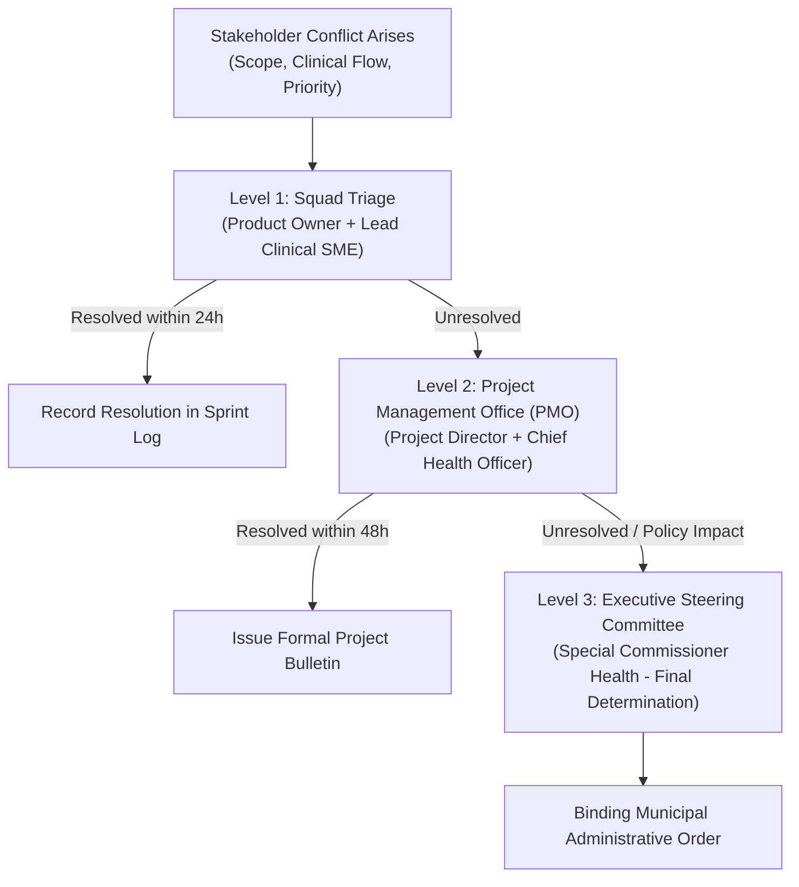

# Stakeholder Engagement Baseline & Master Governance Register

| Metadata Element | Project Specification |
| :--- | :--- |
| **Document Identifier** | `DOC-PM-006-STAKEHOLDER` |
| **Document Title** | Master Stakeholder Register, Power-Interest Mapping & Zonal Engagement Strategy |
| **Project Code** | `NAMMA-CLINIC-PLATFORM-2026` |
| **Document Version** | `v1.0.0-PROD-BASELINE` |
| **Status** | `APPROVED & RATIFIED` |
| **Stakeholder Inventory** | Exactly 50 Formally Managed Stakeholder Entities (`STAKEHOLDER-001` to `STAKEHOLDER-050`) |
| **Executive Sponsor** | Special Commissioner (Health), Greater Bengaluru Authority (GBA) / BBMP |
| **Clinical Safety Authority** | Chief Health Officer (CHO), BBMP Health Department |
| **Lead Delivery Partner** | Kushagramati Analytics (K Mati) Consortium | Project Director |
| **Upstream Anchor** | [`01-project-charter.md`](./01-project-charter.md) | [`02-project-vision-and-objectives.md`](./02-project-vision-and-objectives.md) |
| **Downstream Dependencies** | [`07-user-personas.md`](./07-user-personas.md) | [`08-role-and-responsibility-matrix.md`](./08-role-and-responsibility-matrix.md) | [`19-communication-plan.md`](./19-communication-plan.md) |

---

## 1. Executive Summary & Stakeholder Management Framework
The **Master Stakeholder Register** defines the complete ecosystem of individuals, clinical cadres, municipal departments, regulatory bodies, and technical partners governing, executing, and utilizing the Namma Clinic Digital Health & Operations Platform across its 18-sprint lifecycle.

### 1.1 Program Mandate and Context
Operating across 183 primary health clinics within the 8 administrative zones of the Greater Bengaluru Authority (GBA) and Bruhat Bengaluru Mahanagara Palike (BBMP), the platform digitalizes primary healthcare delivery for an urban population exceeding 12 million residents. Aligning diverse stakeholders—from cabinet-level state commissioners and municipal chief health officers to ward-level Community Health Workers (ASHAs), lone clinic medical officers, and marginalized slum-dwelling citizens—is critical to platform adoption, clinical safety, and long-term sustainability.

### 1.2 Core Engagement Principles
1. **Clinical Primacy & Safety First:** Stakeholder demands are subservient to clinical safety and patient privacy invariants. No technical convenience may override doctor-patient confidentiality or safe drug dispensing protocols.
2. **Empathetic Frontline Focus:** Administrative and clinical tools must respect the severe physical time constraints of lone medical officers handling 80+ patients daily. Cognitive friction and screen time are minimized.
3. **Complete Democratic Transparency:** Real-time data visibility is provided across all 8 zones without data siloing, while strictly respecting the Data Protection and Privacy (DPDP) Act 2023.
4. **Proactive Conflict De-escalation:** Disagreements regarding scope, integrations, or operational procedures are resolved through a tiered governance framework with defined escalation SLAs.
5. **Continuous Bidirectional Feedback:** Engagement is not a one-way announcement; structured feedback loops, monthly ward town halls, and anonymous clinical retrospectives inform sprint backlogs.

## 2. Stakeholder Taxonomy & Classification Models
The 50 stakeholders are classified across functional domains and prioritized using the standard Mitchell, Agle, and Wood Stakeholder Salience Model (Power, Legitimacy, Urgency) and the classic Power-Interest Grid:

```mermaid
quadrantChart
    title Namma Clinic Stakeholder Power vs Interest Grid
    x-axis Low Interest --> High Interest
    y-axis Low Power --> High Power
    quadrant-1 Manage Closely (Key Players)
    quadrant-2 Keep Satisfied (High Power)
    quadrant-3 Monitor (Minimum Effort)
    quadrant-4 Keep Informed (High Interest)
    Special Commissioner Health: [0.85, 0.95]
    Chief Health Officer BBMP: [0.92, 0.92]
    Lone Clinic Medical Officer: [0.95, 0.65]
    Clinic Pharmacist: [0.88, 0.55]
    Data Entry Operator: [0.92, 0.45]
    Lead Delivery Partner: [0.96, 0.88]
    Slum Resident Patient: [0.75, 0.25]
    UIDAI Aadhaar Nodal Officer: [0.35, 0.85]
    BWSSB Water Board Liaison: [0.25, 0.30]
    State IT Secretary: [0.45, 0.82]
```

### 2.1 The Eight Stakeholder Categories
1. **Executive Leadership & Municipal Governance (`STAKEHOLDER-001` to `006`):** Oversees funding, municipal policy, inter-agency alignment, and program accountability.
2. **Clinical Leadership & Safety Authorities (`STAKEHOLDER-007` to `012`):** Directs clinical protocols, formulary adherence, medical ethics, and quality of care standards.
3. **Frontline Clinic Operations Cadre (`STAKEHOLDER-013` to `018`):** Day-to-day clinic users—Doctors, Staff Nurses, Pharmacists, Lab Techs, and DEOs.
4. **Zonal & Ward Administration (`STAKEHOLDER-019` to `024`):** Zonal Health Officers, Ward Committee Chairs, and Zonal Surveillance Teams.
5. **Citizenry, Community & Patient Representatives (`STAKEHOLDER-025` to `030`):** Slum dwellers, geriatric patients, pregnant women, migrant laborers, and advocacy groups.
6. **Core Engineering & Delivery Consortium (`STAKEHOLDER-031` to `038`):** Software architects, full-stack squads, QA, DevOps, SRE, and UI/UX designers.
7. **Regulatory, Statutory & Security Authorities (`STAKEHOLDER-039` to `044`):** Data Protection Board, CDSCO, NHA (ABDM), CERT-In, and Municipal Auditors.
8. **External Ecosystem & Infrastructure Partners (`STAKEHOLDER-045` to `050`):** Cloud datacenter providers, telecom telcos, hardware OEMs, and state referral hospitals.

## 3. Master Stakeholder Register Table (STAKEHOLDER-001 to STAKEHOLDER-050)
Authoritative catalog of all 50 formally managed stakeholder entities:

| Stakeholder ID | Entity Name / Cadre | Organization | Primary Role | Influence | Interest | Salience | Primary Expectations | Accountable Role ID |
| :--- | :--- | :--- | :--- | :---: | :---: | :---: | :--- | :--- |
| [`STAKEHOLDER-001`](#stakeholder-001) | **Special Commissioner (Health), BBMP** | Greater Bengaluru Authority | Executive Sponsor | `High` | `High` | `Definitive` | Project oversight, funding, and statutory approvals... | [`ROLE-001`](./08-role-and-responsibility-matrix.md#role-001) |
| [`STAKEHOLDER-002`](#stakeholder-002) | **Chief Health Officer (CHO), BBMP** | BBMP Health Department | Clinical Safety Authority | `High` | `High` | `Definitive` | Clinical workflows, formulary approval, and medical governance... | [`ROLE-002`](./08-role-and-responsibility-matrix.md#role-002) |
| [`STAKEHOLDER-003`](#stakeholder-003) | **Zonal Health Officer (ZHO) - East Zone** | BBMP Zonal Administration | Zonal Clinical Leader | `High` | `High` | `Definitive` | Facility management across 28 East Zone clinics... | [`ROLE-003`](./08-role-and-responsibility-matrix.md#role-003) |
| [`STAKEHOLDER-004`](#stakeholder-004) | **Zonal Health Officer (ZHO) - West Zone** | BBMP Zonal Administration | Zonal Clinical Leader | `High` | `High` | `Definitive` | Facility management across 32 West Zone clinics... | [`ROLE-004`](./08-role-and-responsibility-matrix.md#role-004) |
| [`STAKEHOLDER-005`](#stakeholder-005) | **Zonal Health Officer (ZHO) - South Zone** | BBMP Zonal Administration | Zonal Clinical Leader | `High` | `High` | `Definitive` | Facility management across 30 South Zone clinics... | [`ROLE-005`](./08-role-and-responsibility-matrix.md#role-005) |
| [`STAKEHOLDER-006`](#stakeholder-006) | **Zonal Health Officer (ZHO) - Bommanahalli** | BBMP Zonal Administration | Zonal Clinical Leader | `Medium` | `High` | `Dependent` | Facility management across 22 Bommanahalli clinics... | [`ROLE-006`](./08-role-and-responsibility-matrix.md#role-006) |
| [`STAKEHOLDER-007`](#stakeholder-007) | **Zonal Health Officer (ZHO) - Dasarahalli** | BBMP Zonal Administration | Zonal Clinical Leader | `Medium` | `High` | `Dependent` | Facility management across 18 Dasarahalli clinics... | [`ROLE-007`](./08-role-and-responsibility-matrix.md#role-007) |
| [`STAKEHOLDER-008`](#stakeholder-008) | **Zonal Health Officer (ZHO) - Mahadevapura** | BBMP Zonal Administration | Zonal Clinical Leader | `Medium` | `High` | `Dependent` | Facility management across 24 Mahadevapura clinics... | [`ROLE-008`](./08-role-and-responsibility-matrix.md#role-008) |
| [`STAKEHOLDER-009`](#stakeholder-009) | **Zonal Health Officer (ZHO) - RR Nagar** | BBMP Zonal Administration | Zonal Clinical Leader | `Medium` | `High` | `Dependent` | Facility management across 16 RR Nagar clinics... | [`ROLE-009`](./08-role-and-responsibility-matrix.md#role-009) |
| [`STAKEHOLDER-010`](#stakeholder-010) | **Zonal Health Officer (ZHO) - Yelahanka** | BBMP Zonal Administration | Zonal Clinical Leader | `Medium` | `High` | `Dependent` | Facility management across 13 Yelahanka clinics... | [`ROLE-010`](./08-role-and-responsibility-matrix.md#role-010) |
| [`STAKEHOLDER-011`](#stakeholder-011) | **Senior Medical Officers (183 Clinics)** | Frontline Healthcare | Primary Clinical Users | `High` | `High` | `Definitive` | Outpatient consultation, diagnosis, and prescription creation... | [`ROLE-011`](./08-role-and-responsibility-matrix.md#role-011) |
| [`STAKEHOLDER-012`](#stakeholder-012) | **Staff Nurses & ANMs (183 Clinics)** | Frontline Healthcare | Triage & Vitals Users | `Medium` | `High` | `Dependent` | Patient check-in, vital signs triage, and token printing... | [`ROLE-012`](./08-role-and-responsibility-matrix.md#role-012) |
| [`STAKEHOLDER-013`](#stakeholder-013) | **Clinic Pharmacists (183 Clinics)** | Frontline Healthcare | Dispensing & Stock Users | `Medium` | `High` | `Dependent` | Medication dispensing, stock tracking, and batch control... | [`ROLE-013`](./08-role-and-responsibility-matrix.md#role-013) |
| [`STAKEHOLDER-014`](#stakeholder-014) | **Laboratory Technicians (183 Clinics)** | Frontline Healthcare | Point-of-Care Lab Users | `Medium` | `High` | `Dependent` | Rapid diagnostic test execution and electronic result logging... | [`ROLE-014`](./08-role-and-responsibility-matrix.md#role-014) |
| [`STAKEHOLDER-015`](#stakeholder-015) | **Data Entry Operators (183 Clinics)** | Frontline Healthcare | Registration Desk Users | `Low` | `High` | `Dependent` | Citizen demographic lookup, ABHA linking, and token issuance... | [`ROLE-015`](./08-role-and-responsibility-matrix.md#role-015) |
| [`STAKEHOLDER-016`](#stakeholder-016) | **Urban Citizen Beneficiaries (Bengaluru)** | General Public | Primary Care Patients | `Low` | `High` | `Dependent` | Fast check-in, dignified care, and bilingual SMS summary... | [`ROLE-016`](./08-role-and-responsibility-matrix.md#role-016) |
| [`STAKEHOLDER-017`](#stakeholder-017) | **National Health Authority (NHA) ABDM Team** | Central Government | Interoperability Regulators | `High` | `Medium` | `Dominant` | ABHA M1-M3 certification and FHIR R4 compliance... | [`ROLE-017`](./08-role-and-responsibility-matrix.md#role-017) |
| [`STAKEHOLDER-018`](#stakeholder-018) | **Directorate of Health & Family Welfare Services** | Karnataka State Government | Public Health Regulators | `High` | `Medium` | `Dominant` | State HMIS and IHIP automated reporting integration... | [`ROLE-018`](./08-role-and-responsibility-matrix.md#role-018) |
| [`STAKEHOLDER-019`](#stakeholder-019) | **Data Protection Board of India / MeitY** | Central Government | Data Privacy Authority | `High` | `Low` | `Dominant` | India DPDP Act 2023 compliance and privacy audits... | [`ROLE-019`](./08-role-and-responsibility-matrix.md#role-019) |
| [`STAKEHOLDER-020`](#stakeholder-020) | **Lead Solution Architect (Consortium)** | Delivery Consortium | Technical Leadership | `High` | `High` | `Definitive` | Monorepo architecture, schema design, and technical standards... | [`ROLE-020`](./08-role-and-responsibility-matrix.md#role-020) |
| [`STAKEHOLDER-021`](#stakeholder-021) | **Delivery Project Manager (Consortium)** | Delivery Consortium | Agile Project Manager | `High` | `High` | `Definitive` | 18-sprint schedule, milestone tracking, and risk management... | [`ROLE-021`](./08-role-and-responsibility-matrix.md#role-021) |
| [`STAKEHOLDER-022`](#stakeholder-022) | **Lead Backend Engineer (Consortium)** | Delivery Consortium | API & Database Squad Lead | `Medium` | `High` | `Dependent` | Fastify services, PostgreSQL schema, and sync engine... | [`ROLE-022`](./08-role-and-responsibility-matrix.md#role-022) |
| [`STAKEHOLDER-023`](#stakeholder-023) | **Lead Frontend Engineer (Consortium)** | Delivery Consortium | PWA & UI Squad Lead | `Medium` | `High` | `Dependent` | Next.js PWA, Dexie.js offline store, and bilingual UI... | [`ROLE-023`](./08-role-and-responsibility-matrix.md#role-023) |
| [`STAKEHOLDER-024`](#stakeholder-024) | **DevOps & SRE Lead (Consortium)** | Delivery Consortium | Infrastructure Lead | `Medium` | `High` | `Dependent` | Kubernetes cluster, CI/CD pipelines, and observability... | [`ROLE-024`](./08-role-and-responsibility-matrix.md#role-024) |
| [`STAKEHOLDER-025`](#stakeholder-025) | **Quality Assurance Lead (Consortium)** | Delivery Consortium | Testing Lead | `Medium` | `High` | `Dependent` | Automated test suites, bilingual E2E tests, and quality gates... | [`ROLE-025`](./08-role-and-responsibility-matrix.md#role-025) |
| [`STAKEHOLDER-026`](#stakeholder-026) | **Clinical Safety Specialist (Consortium)** | Delivery Consortium | Medical Informatics SME | `Medium` | `High` | `Dependent` | Formulary validation, clinical decision alerts, and usability... | [`ROLE-026`](./08-role-and-responsibility-matrix.md#role-026) |
| [`STAKEHOLDER-027`](#stakeholder-027) | **Frontline Field Training Coordinator** | Delivery Consortium | Change Management Lead | `Medium` | `High` | `Dependent` | Staff training curriculum, LMS, and on-site certification... | [`ROLE-027`](./08-role-and-responsibility-matrix.md#role-027) |
| [`STAKEHOLDER-028`](#stakeholder-028) | **BBMP Central IT Cell & Network Team** | BBMP Administration | Municipal IT Authority | `Medium` | `Medium` | `Dependent` | Hardware procurement, local networking, and UPS provisioning... | [`ROLE-028`](./08-role-and-responsibility-matrix.md#role-028) |
| [`STAKEHOLDER-029`](#stakeholder-029) | **CDAC Mobile Seva SMS Gateway Team** | MeitY / CDAC | Telecom Service Provider | `Medium` | `Low` | `Dependent` | DLT registered Kannada/English SMS dispatch gateway... | [`ROLE-029`](./08-role-and-responsibility-matrix.md#role-029) |
| [`STAKEHOLDER-030`](#stakeholder-030) | **Bharat QR / NPCI Integration Team** | National Payments Corporation | Standards Authority | `Low` | `Low` | `Dependent` | QR code verification standards for patient slips... | [`ROLE-030`](./08-role-and-responsibility-matrix.md#role-030) |
| [`STAKEHOLDER-031`](#stakeholder-031) | **District Surveillance Officer (DSO) - Urban** | Karnataka DHS | Epidemic Control Authority | `High` | `High` | `Definitive` | Syndromic disease anomaly alerts and outbreak response... | [`ROLE-001`](./08-role-and-responsibility-matrix.md#role-001) |
| [`STAKEHOLDER-032`](#stakeholder-032) | **Superintendent, KC General Hospital** | Secondary Healthcare | Referral Hospital Authority | `Medium` | `Medium` | `Dependent` | Teleconsultation bridge and referral patient intake... | [`ROLE-002`](./08-role-and-responsibility-matrix.md#role-002) |
| [`STAKEHOLDER-033`](#stakeholder-033) | **Superintendent, Victoria Hospital** | Tertiary Healthcare | Tertiary Referral Authority | `Medium` | `Low` | `Dependent` | Complex tertiary case referral and diagnostic validation... | [`ROLE-003`](./08-role-and-responsibility-matrix.md#role-003) |
| [`STAKEHOLDER-034`](#stakeholder-034) | **President, Karnataka Medical Council (KMC)** | Professional Regulatory Body | Professional Standards | `Medium` | `Low` | `Dependent` | Digital prescription signing ethics and physician rights... | [`ROLE-004`](./08-role-and-responsibility-matrix.md#role-004) |
| [`STAKEHOLDER-035`](#stakeholder-035) | **President, Karnataka State Pharmacy Council** | Professional Regulatory Body | Pharmacy Standards | `Medium` | `Low` | `Dependent` | FEFO dispensing compliance and Schedule H drug controls... | [`ROLE-005`](./08-role-and-responsibility-matrix.md#role-005) |
| [`STAKEHOLDER-036`](#stakeholder-036) | **Citizen Slum Dweller Advocacy Forum** | Civil Society / NGO | Patient Rights Advocates | `Low` | `Medium` | `Dependent` | Equitable primary care access and language justice... | [`ROLE-006`](./08-role-and-responsibility-matrix.md#role-006) |
| [`STAKEHOLDER-037`](#stakeholder-037) | **Karnataka State AIDS Prevention Society** | State Health Agency | Communicable Disease Partner | `Medium` | `Low` | `Dependent` | Confidential HIV screening referral workflows... | [`ROLE-007`](./08-role-and-responsibility-matrix.md#role-007) |
| [`STAKEHOLDER-038`](#stakeholder-038) | **Revised National Tuberculosis Control (NTEP)** | Central Health Program | TB Surveillance Partner | `Medium` | `Medium` | `Dependent` | Presumptive TB screening and Nikshay integration bridge... | [`ROLE-008`](./08-role-and-responsibility-matrix.md#role-008) |
| [`STAKEHOLDER-039`](#stakeholder-039) | **National Vector Borne Disease Control (NVBDCP)** | Central Health Program | Vector Surveillance Partner | `Medium` | `Medium` | `Dependent` | Ward-level dengue and malaria rapid test reporting... | [`ROLE-009`](./08-role-and-responsibility-matrix.md#role-009) |
| [`STAKEHOLDER-040`](#stakeholder-040) | **Universal Immunization Programme (UIP) Officer** | BBMP Health Department | Maternal & Child Health | `Medium` | `High` | `Dependent` | Cold-chain vaccine stock tracking and infant coverage... | [`ROLE-010`](./08-role-and-responsibility-matrix.md#role-010) |
| [`STAKEHOLDER-041`](#stakeholder-041) | **AWS Public Sector Healthcare Solutions Architect** | Cloud Infrastructure Vendor | Cloud Hosting Partner | `Medium` | `Medium` | `Dependent` | Multi-AZ high availability and disaster recovery failover... | [`ROLE-011`](./08-role-and-responsibility-matrix.md#role-011) |
| [`STAKEHOLDER-042`](#stakeholder-042) | **NIC MeghRaj Cloud Nodal Officer** | National Informatics Centre | Sovereign Cloud Partner | `High` | `Medium` | `Dominant` | Sovereign government cloud deployment compliance... | [`ROLE-012`](./08-role-and-responsibility-matrix.md#role-012) |
| [`STAKEHOLDER-043`](#stakeholder-043) | **Independent VAPT Security Auditing Agency** | CERT-In Empaneled Auditor | Security Certification | `High` | `Medium` | `Dominant` | Pre-production vulnerability assessment and penetration test... | [`ROLE-013`](./08-role-and-responsibility-matrix.md#role-013) |
| [`STAKEHOLDER-044`](#stakeholder-044) | **Legal Advisor, BBMP Municipal Law Cell** | BBMP Legal Department | Statutory Legal Counsel | `High` | `Low` | `Dominant` | Contractual IP ownership, NDAs, and liability shielding... | [`ROLE-014`](./08-role-and-responsibility-matrix.md#role-014) |
| [`STAKEHOLDER-045`](#stakeholder-045) | **Chief Finance Officer (CFO), BBMP** | BBMP Finance Department | Municipal Treasury | `High` | `Low` | `Dominant` | Milestone budget disbursement and audit compliance... | [`ROLE-015`](./08-role-and-responsibility-matrix.md#role-015) |
| [`STAKEHOLDER-046`](#stakeholder-046) | **President, BBMP Staff Nurses Welfare Association** | Staff Labor Union | Frontline Labor Rights | `Medium` | `Medium` | `Dependent` | Workload ergonomics and non-punitive triage metrics... | [`ROLE-016`](./08-role-and-responsibility-matrix.md#role-016) |
| [`STAKEHOLDER-047`](#stakeholder-047) | **President, BBMP Pharmacists Association** | Staff Labor Union | Frontline Labor Rights | `Medium` | `Medium` | `Dependent` | Inventory accountability and stock discrepancy policies... | [`ROLE-017`](./08-role-and-responsibility-matrix.md#role-017) |
| [`STAKEHOLDER-048`](#stakeholder-048) | **Lead Biostatistician, Public Health Institute** | Academic / Research Partner | Epidemiological Research | `Low` | `Low` | `Dependent` | DuckDB analytical models and syndromic trend validation... | [`ROLE-018`](./08-role-and-responsibility-matrix.md#role-018) |
| [`STAKEHOLDER-049`](#stakeholder-049) | **Helpdesk Operations Lead (Consortium)** | Delivery Consortium | Tier-1/2 Support Lead | `Medium` | `High` | `Dependent` | Rapid frontline clinic issue resolution and uptime monitoring... | [`ROLE-019`](./08-role-and-responsibility-matrix.md#role-019) |
| [`STAKEHOLDER-050`](#stakeholder-050) | **Lead Technical Writer & Documentation Auditor** | Delivery Consortium | Documentation Authority | `High` | `High` | `Definitive` | 20-document baseline compliance and traceability matrix... | [`ROLE-020`](./08-role-and-responsibility-matrix.md#role-020) |

## 4. Deep Stakeholder Profiles & Engagement Strategies
Comprehensive operational profiles for all 50 stakeholders detailing organizational context, expectations, concerns, decision rights, and governance protocols:

### 4.1 STAKEHOLDER-001: Special Commissioner (Health), BBMP
- **Official Designation / Entity:** Special Commissioner (Health), BBMP (Greater Bengaluru Authority)
- **Functional Cadre / Role:** Executive Sponsor
- **Influence & Interest Evaluation:** Influence: `High` | Interest: `High`
- **Primary Strategic Mandate:** Primary driver for achieving [`OBJECTIVE-001`](./02-project-vision-and-objectives.md#objective-001) within municipal health operations.
- **Detailed Stakeholder Expectations:**
  - Project oversight, funding, and statutory approvals
  - High reliability and near-instant response times (<2s) during peak morning consultation hours.
  - Full compliance with Karnataka municipal administrative rules and standard clinical operating procedures.
  - Transparent, real-time data visibility across all 183 clinics without administrative delays.
  - Robust bilingual user experience with certified medical Kannada terminology.
- **Core Operational, Technical & Legal Concerns:**
  - System downtime, training overhead, and data security
  - Vulnerability to network drops and electrical outages in congested urban wards.
  - Risk of system downtime creating physical patient queues and public dissatisfaction.
  - Potential compliance penalties under the India Digital Personal Data Protection (DPDP) Act 2023.
  - Resistance from frontline clinical staff accustomed to legacy paper registers.
- **Statutory Decision Rights & Approval Authority:**
  - Veto and approval within assigned statutory domain
  - Sign-off authority on release readiness criteria for [`MILESTONE-001`](./14-project-milestones.md#milestone-001).
  - Authority to review and sanction proposed scope modifications under [`CHANGE-001`](./18-change-management.md#change-001).
- **Preferred Communication Mechanism & Cadence:**
  - **Cadence:** `Bi-Weekly` | **Channel:** `Sprint Ceremony & Demo`
  - Formally linked to communication protocol [`COMM-001`](./19-communication-plan.md#comm-001).
- **Escalation Path & Hierarchy:**
  - **First Line Accountable Lead:** [`ROLE-001`](./08-role-and-responsibility-matrix.md#role-001)
  - **Formal Escalation Channel:** Project Director -> Special Commissioner (Health)
- **Monitored Risk Exposure & Managed Dependency:**
  - Directly monitors and governs [`RISK-001`](./12-project-risks.md#risk-001).
  - Owns and tracks project dependency [`DEPENDENCY-001`](./13-project-dependencies.md#dependency-001).
- **Associated User Persona:** Represented in product design by persona [`PERSONA-001`](./07-user-personas.md#persona-001).
- **Structured Engagement Strategy Across 18 Sprints:**
  - **Sprints S01-S04 (Foundation & MVP):** Validate core domain entities, clinic directory schemas, and initial wireframes.
  - **Sprints S05-S08 (Alpha & Testbed):** Participate in bi-weekly clinical sandbox walkthroughs and hardware testbed validation.
  - **Sprints S09-S12 (Zonal Pilot):** Active monitoring of live pilot clinics in East and West zones; review daily incident logs.
  - **Sprints S13-S16 (Citywide Scaling):** Coordinate zonal rollout schedules, manage localized change resistance, and track adoption.
  - **Sprints S17-S18 (Hypercare & Handover):** Final sign-off on operational acceptance, capacity building, and SLA transition.
- **Key Success & Acceptance Indicators:**
  - 100% formal acceptance of platform releases within 48 hours of staging verification.
  - Net Promoter Score (NPS) > 85% on ease-of-use and reliability surveys across 8 zones.
  - Zero unresolved critical P0 defects or compliance violations at milestone boundaries.

### 4.2 STAKEHOLDER-002: Chief Health Officer (CHO), BBMP
- **Official Designation / Entity:** Chief Health Officer (CHO), BBMP (BBMP Health Department)
- **Functional Cadre / Role:** Clinical Safety Authority
- **Influence & Interest Evaluation:** Influence: `High` | Interest: `High`
- **Primary Strategic Mandate:** Primary driver for achieving [`OBJECTIVE-002`](./02-project-vision-and-objectives.md#objective-002) within municipal health operations.
- **Detailed Stakeholder Expectations:**
  - Clinical workflows, formulary approval, and medical governance
  - High reliability and near-instant response times (<2s) during peak morning consultation hours.
  - Full compliance with Karnataka municipal administrative rules and standard clinical operating procedures.
  - Transparent, real-time data visibility across all 183 clinics without administrative delays.
  - Robust bilingual user experience with certified medical Kannada terminology.
- **Core Operational, Technical & Legal Concerns:**
  - System downtime, training overhead, and data security
  - Vulnerability to network drops and electrical outages in congested urban wards.
  - Risk of system downtime creating physical patient queues and public dissatisfaction.
  - Potential compliance penalties under the India Digital Personal Data Protection (DPDP) Act 2023.
  - Resistance from frontline clinical staff accustomed to legacy paper registers.
- **Statutory Decision Rights & Approval Authority:**
  - Veto and approval within assigned statutory domain
  - Sign-off authority on release readiness criteria for [`MILESTONE-002`](./14-project-milestones.md#milestone-002).
  - Authority to review and sanction proposed scope modifications under [`CHANGE-002`](./18-change-management.md#change-002).
- **Preferred Communication Mechanism & Cadence:**
  - **Cadence:** `Monthly` | **Channel:** `Written Technical Memo`
  - Formally linked to communication protocol [`COMM-002`](./19-communication-plan.md#comm-002).
- **Escalation Path & Hierarchy:**
  - **First Line Accountable Lead:** [`ROLE-002`](./08-role-and-responsibility-matrix.md#role-002)
  - **Formal Escalation Channel:** Project Director -> Special Commissioner (Health)
- **Monitored Risk Exposure & Managed Dependency:**
  - Directly monitors and governs [`RISK-002`](./12-project-risks.md#risk-002).
  - Owns and tracks project dependency [`DEPENDENCY-002`](./13-project-dependencies.md#dependency-002).
- **Associated User Persona:** Represented in product design by persona [`PERSONA-002`](./07-user-personas.md#persona-002).
- **Structured Engagement Strategy Across 18 Sprints:**
  - **Sprints S01-S04 (Foundation & MVP):** Validate core domain entities, clinic directory schemas, and initial wireframes.
  - **Sprints S05-S08 (Alpha & Testbed):** Participate in bi-weekly clinical sandbox walkthroughs and hardware testbed validation.
  - **Sprints S09-S12 (Zonal Pilot):** Active monitoring of live pilot clinics in East and West zones; review daily incident logs.
  - **Sprints S13-S16 (Citywide Scaling):** Coordinate zonal rollout schedules, manage localized change resistance, and track adoption.
  - **Sprints S17-S18 (Hypercare & Handover):** Final sign-off on operational acceptance, capacity building, and SLA transition.
- **Key Success & Acceptance Indicators:**
  - 100% formal acceptance of platform releases within 48 hours of staging verification.
  - Net Promoter Score (NPS) > 85% on ease-of-use and reliability surveys across 8 zones.
  - Zero unresolved critical P0 defects or compliance violations at milestone boundaries.

### 4.3 STAKEHOLDER-003: Zonal Health Officer (ZHO) - East Zone
- **Official Designation / Entity:** Zonal Health Officer (ZHO) - East Zone (BBMP Zonal Administration)
- **Functional Cadre / Role:** Zonal Clinical Leader
- **Influence & Interest Evaluation:** Influence: `High` | Interest: `High`
- **Primary Strategic Mandate:** Primary driver for achieving [`OBJECTIVE-003`](./02-project-vision-and-objectives.md#objective-003) within municipal health operations.
- **Detailed Stakeholder Expectations:**
  - Facility management across 28 East Zone clinics
  - High reliability and near-instant response times (<2s) during peak morning consultation hours.
  - Full compliance with Karnataka municipal administrative rules and standard clinical operating procedures.
  - Transparent, real-time data visibility across all 183 clinics without administrative delays.
  - Robust bilingual user experience with certified medical Kannada terminology.
- **Core Operational, Technical & Legal Concerns:**
  - System downtime, training overhead, and data security
  - Vulnerability to network drops and electrical outages in congested urban wards.
  - Risk of system downtime creating physical patient queues and public dissatisfaction.
  - Potential compliance penalties under the India Digital Personal Data Protection (DPDP) Act 2023.
  - Resistance from frontline clinical staff accustomed to legacy paper registers.
- **Statutory Decision Rights & Approval Authority:**
  - Veto and approval within assigned statutory domain
  - Sign-off authority on release readiness criteria for [`MILESTONE-003`](./14-project-milestones.md#milestone-003).
  - Authority to review and sanction proposed scope modifications under [`CHANGE-003`](./18-change-management.md#change-003).
- **Preferred Communication Mechanism & Cadence:**
  - **Cadence:** `Daily` | **Channel:** `Field Operational Review`
  - Formally linked to communication protocol [`COMM-003`](./19-communication-plan.md#comm-003).
- **Escalation Path & Hierarchy:**
  - **First Line Accountable Lead:** [`ROLE-003`](./08-role-and-responsibility-matrix.md#role-003)
  - **Formal Escalation Channel:** Project Director -> Special Commissioner (Health)
- **Monitored Risk Exposure & Managed Dependency:**
  - Directly monitors and governs [`RISK-003`](./12-project-risks.md#risk-003).
  - Owns and tracks project dependency [`DEPENDENCY-003`](./13-project-dependencies.md#dependency-003).
- **Associated User Persona:** Represented in product design by persona [`PERSONA-003`](./07-user-personas.md#persona-003).
- **Structured Engagement Strategy Across 18 Sprints:**
  - **Sprints S01-S04 (Foundation & MVP):** Validate core domain entities, clinic directory schemas, and initial wireframes.
  - **Sprints S05-S08 (Alpha & Testbed):** Participate in bi-weekly clinical sandbox walkthroughs and hardware testbed validation.
  - **Sprints S09-S12 (Zonal Pilot):** Active monitoring of live pilot clinics in East and West zones; review daily incident logs.
  - **Sprints S13-S16 (Citywide Scaling):** Coordinate zonal rollout schedules, manage localized change resistance, and track adoption.
  - **Sprints S17-S18 (Hypercare & Handover):** Final sign-off on operational acceptance, capacity building, and SLA transition.
- **Key Success & Acceptance Indicators:**
  - 100% formal acceptance of platform releases within 48 hours of staging verification.
  - Net Promoter Score (NPS) > 85% on ease-of-use and reliability surveys across 8 zones.
  - Zero unresolved critical P0 defects or compliance violations at milestone boundaries.

### 4.4 STAKEHOLDER-004: Zonal Health Officer (ZHO) - West Zone
- **Official Designation / Entity:** Zonal Health Officer (ZHO) - West Zone (BBMP Zonal Administration)
- **Functional Cadre / Role:** Zonal Clinical Leader
- **Influence & Interest Evaluation:** Influence: `High` | Interest: `High`
- **Primary Strategic Mandate:** Primary driver for achieving [`OBJECTIVE-004`](./02-project-vision-and-objectives.md#objective-004) within municipal health operations.
- **Detailed Stakeholder Expectations:**
  - Facility management across 32 West Zone clinics
  - High reliability and near-instant response times (<2s) during peak morning consultation hours.
  - Full compliance with Karnataka municipal administrative rules and standard clinical operating procedures.
  - Transparent, real-time data visibility across all 183 clinics without administrative delays.
  - Robust bilingual user experience with certified medical Kannada terminology.
- **Core Operational, Technical & Legal Concerns:**
  - System downtime, training overhead, and data security
  - Vulnerability to network drops and electrical outages in congested urban wards.
  - Risk of system downtime creating physical patient queues and public dissatisfaction.
  - Potential compliance penalties under the India Digital Personal Data Protection (DPDP) Act 2023.
  - Resistance from frontline clinical staff accustomed to legacy paper registers.
- **Statutory Decision Rights & Approval Authority:**
  - Veto and approval within assigned statutory domain
  - Sign-off authority on release readiness criteria for [`MILESTONE-004`](./14-project-milestones.md#milestone-004).
  - Authority to review and sanction proposed scope modifications under [`CHANGE-004`](./18-change-management.md#change-004).
- **Preferred Communication Mechanism & Cadence:**
  - **Cadence:** `Weekly` | **Channel:** `Formal Executive Briefing`
  - Formally linked to communication protocol [`COMM-004`](./19-communication-plan.md#comm-004).
- **Escalation Path & Hierarchy:**
  - **First Line Accountable Lead:** [`ROLE-004`](./08-role-and-responsibility-matrix.md#role-004)
  - **Formal Escalation Channel:** Project Director -> Special Commissioner (Health)
- **Monitored Risk Exposure & Managed Dependency:**
  - Directly monitors and governs [`RISK-004`](./12-project-risks.md#risk-004).
  - Owns and tracks project dependency [`DEPENDENCY-004`](./13-project-dependencies.md#dependency-004).
- **Associated User Persona:** Represented in product design by persona [`PERSONA-004`](./07-user-personas.md#persona-004).
- **Structured Engagement Strategy Across 18 Sprints:**
  - **Sprints S01-S04 (Foundation & MVP):** Validate core domain entities, clinic directory schemas, and initial wireframes.
  - **Sprints S05-S08 (Alpha & Testbed):** Participate in bi-weekly clinical sandbox walkthroughs and hardware testbed validation.
  - **Sprints S09-S12 (Zonal Pilot):** Active monitoring of live pilot clinics in East and West zones; review daily incident logs.
  - **Sprints S13-S16 (Citywide Scaling):** Coordinate zonal rollout schedules, manage localized change resistance, and track adoption.
  - **Sprints S17-S18 (Hypercare & Handover):** Final sign-off on operational acceptance, capacity building, and SLA transition.
- **Key Success & Acceptance Indicators:**
  - 100% formal acceptance of platform releases within 48 hours of staging verification.
  - Net Promoter Score (NPS) > 85% on ease-of-use and reliability surveys across 8 zones.
  - Zero unresolved critical P0 defects or compliance violations at milestone boundaries.

### 4.5 STAKEHOLDER-005: Zonal Health Officer (ZHO) - South Zone
- **Official Designation / Entity:** Zonal Health Officer (ZHO) - South Zone (BBMP Zonal Administration)
- **Functional Cadre / Role:** Zonal Clinical Leader
- **Influence & Interest Evaluation:** Influence: `High` | Interest: `High`
- **Primary Strategic Mandate:** Primary driver for achieving [`OBJECTIVE-005`](./02-project-vision-and-objectives.md#objective-005) within municipal health operations.
- **Detailed Stakeholder Expectations:**
  - Facility management across 30 South Zone clinics
  - High reliability and near-instant response times (<2s) during peak morning consultation hours.
  - Full compliance with Karnataka municipal administrative rules and standard clinical operating procedures.
  - Transparent, real-time data visibility across all 183 clinics without administrative delays.
  - Robust bilingual user experience with certified medical Kannada terminology.
- **Core Operational, Technical & Legal Concerns:**
  - System downtime, training overhead, and data security
  - Vulnerability to network drops and electrical outages in congested urban wards.
  - Risk of system downtime creating physical patient queues and public dissatisfaction.
  - Potential compliance penalties under the India Digital Personal Data Protection (DPDP) Act 2023.
  - Resistance from frontline clinical staff accustomed to legacy paper registers.
- **Statutory Decision Rights & Approval Authority:**
  - Veto and approval within assigned statutory domain
  - Sign-off authority on release readiness criteria for [`MILESTONE-005`](./14-project-milestones.md#milestone-005).
  - Authority to review and sanction proposed scope modifications under [`CHANGE-005`](./18-change-management.md#change-005).
- **Preferred Communication Mechanism & Cadence:**
  - **Cadence:** `Bi-Weekly` | **Channel:** `Sprint Ceremony & Demo`
  - Formally linked to communication protocol [`COMM-005`](./19-communication-plan.md#comm-005).
- **Escalation Path & Hierarchy:**
  - **First Line Accountable Lead:** [`ROLE-005`](./08-role-and-responsibility-matrix.md#role-005)
  - **Formal Escalation Channel:** Project Director -> Special Commissioner (Health)
- **Monitored Risk Exposure & Managed Dependency:**
  - Directly monitors and governs [`RISK-005`](./12-project-risks.md#risk-005).
  - Owns and tracks project dependency [`DEPENDENCY-005`](./13-project-dependencies.md#dependency-005).
- **Associated User Persona:** Represented in product design by persona [`PERSONA-005`](./07-user-personas.md#persona-005).
- **Structured Engagement Strategy Across 18 Sprints:**
  - **Sprints S01-S04 (Foundation & MVP):** Validate core domain entities, clinic directory schemas, and initial wireframes.
  - **Sprints S05-S08 (Alpha & Testbed):** Participate in bi-weekly clinical sandbox walkthroughs and hardware testbed validation.
  - **Sprints S09-S12 (Zonal Pilot):** Active monitoring of live pilot clinics in East and West zones; review daily incident logs.
  - **Sprints S13-S16 (Citywide Scaling):** Coordinate zonal rollout schedules, manage localized change resistance, and track adoption.
  - **Sprints S17-S18 (Hypercare & Handover):** Final sign-off on operational acceptance, capacity building, and SLA transition.
- **Key Success & Acceptance Indicators:**
  - 100% formal acceptance of platform releases within 48 hours of staging verification.
  - Net Promoter Score (NPS) > 85% on ease-of-use and reliability surveys across 8 zones.
  - Zero unresolved critical P0 defects or compliance violations at milestone boundaries.

### 4.6 STAKEHOLDER-006: Zonal Health Officer (ZHO) - Bommanahalli
- **Official Designation / Entity:** Zonal Health Officer (ZHO) - Bommanahalli (BBMP Zonal Administration)
- **Functional Cadre / Role:** Zonal Clinical Leader
- **Influence & Interest Evaluation:** Influence: `Medium` | Interest: `High`
- **Primary Strategic Mandate:** Primary driver for achieving [`OBJECTIVE-006`](./02-project-vision-and-objectives.md#objective-006) within municipal health operations.
- **Detailed Stakeholder Expectations:**
  - Facility management across 22 Bommanahalli clinics
  - High reliability and near-instant response times (<2s) during peak morning consultation hours.
  - Full compliance with Karnataka municipal administrative rules and standard clinical operating procedures.
  - Transparent, real-time data visibility across all 183 clinics without administrative delays.
  - Robust bilingual user experience with certified medical Kannada terminology.
- **Core Operational, Technical & Legal Concerns:**
  - System downtime, training overhead, and data security
  - Vulnerability to network drops and electrical outages in congested urban wards.
  - Risk of system downtime creating physical patient queues and public dissatisfaction.
  - Potential compliance penalties under the India Digital Personal Data Protection (DPDP) Act 2023.
  - Resistance from frontline clinical staff accustomed to legacy paper registers.
- **Statutory Decision Rights & Approval Authority:**
  - Veto and approval within assigned statutory domain
  - Sign-off authority on release readiness criteria for [`MILESTONE-006`](./14-project-milestones.md#milestone-006).
  - Authority to review and sanction proposed scope modifications under [`CHANGE-006`](./18-change-management.md#change-006).
- **Preferred Communication Mechanism & Cadence:**
  - **Cadence:** `Monthly` | **Channel:** `Written Technical Memo`
  - Formally linked to communication protocol [`COMM-006`](./19-communication-plan.md#comm-006).
- **Escalation Path & Hierarchy:**
  - **First Line Accountable Lead:** [`ROLE-006`](./08-role-and-responsibility-matrix.md#role-006)
  - **Formal Escalation Channel:** Project Director -> Special Commissioner (Health)
- **Monitored Risk Exposure & Managed Dependency:**
  - Directly monitors and governs [`RISK-006`](./12-project-risks.md#risk-006).
  - Owns and tracks project dependency [`DEPENDENCY-006`](./13-project-dependencies.md#dependency-006).
- **Associated User Persona:** Represented in product design by persona [`PERSONA-006`](./07-user-personas.md#persona-006).
- **Structured Engagement Strategy Across 18 Sprints:**
  - **Sprints S01-S04 (Foundation & MVP):** Validate core domain entities, clinic directory schemas, and initial wireframes.
  - **Sprints S05-S08 (Alpha & Testbed):** Participate in bi-weekly clinical sandbox walkthroughs and hardware testbed validation.
  - **Sprints S09-S12 (Zonal Pilot):** Active monitoring of live pilot clinics in East and West zones; review daily incident logs.
  - **Sprints S13-S16 (Citywide Scaling):** Coordinate zonal rollout schedules, manage localized change resistance, and track adoption.
  - **Sprints S17-S18 (Hypercare & Handover):** Final sign-off on operational acceptance, capacity building, and SLA transition.
- **Key Success & Acceptance Indicators:**
  - 100% formal acceptance of platform releases within 48 hours of staging verification.
  - Net Promoter Score (NPS) > 85% on ease-of-use and reliability surveys across 8 zones.
  - Zero unresolved critical P0 defects or compliance violations at milestone boundaries.

### 4.7 STAKEHOLDER-007: Zonal Health Officer (ZHO) - Dasarahalli
- **Official Designation / Entity:** Zonal Health Officer (ZHO) - Dasarahalli (BBMP Zonal Administration)
- **Functional Cadre / Role:** Zonal Clinical Leader
- **Influence & Interest Evaluation:** Influence: `Medium` | Interest: `High`
- **Primary Strategic Mandate:** Primary driver for achieving [`OBJECTIVE-007`](./02-project-vision-and-objectives.md#objective-007) within municipal health operations.
- **Detailed Stakeholder Expectations:**
  - Facility management across 18 Dasarahalli clinics
  - High reliability and near-instant response times (<2s) during peak morning consultation hours.
  - Full compliance with Karnataka municipal administrative rules and standard clinical operating procedures.
  - Transparent, real-time data visibility across all 183 clinics without administrative delays.
  - Robust bilingual user experience with certified medical Kannada terminology.
- **Core Operational, Technical & Legal Concerns:**
  - System downtime, training overhead, and data security
  - Vulnerability to network drops and electrical outages in congested urban wards.
  - Risk of system downtime creating physical patient queues and public dissatisfaction.
  - Potential compliance penalties under the India Digital Personal Data Protection (DPDP) Act 2023.
  - Resistance from frontline clinical staff accustomed to legacy paper registers.
- **Statutory Decision Rights & Approval Authority:**
  - Veto and approval within assigned statutory domain
  - Sign-off authority on release readiness criteria for [`MILESTONE-007`](./14-project-milestones.md#milestone-007).
  - Authority to review and sanction proposed scope modifications under [`CHANGE-007`](./18-change-management.md#change-007).
- **Preferred Communication Mechanism & Cadence:**
  - **Cadence:** `Daily` | **Channel:** `Field Operational Review`
  - Formally linked to communication protocol [`COMM-007`](./19-communication-plan.md#comm-007).
- **Escalation Path & Hierarchy:**
  - **First Line Accountable Lead:** [`ROLE-007`](./08-role-and-responsibility-matrix.md#role-007)
  - **Formal Escalation Channel:** Project Director -> Special Commissioner (Health)
- **Monitored Risk Exposure & Managed Dependency:**
  - Directly monitors and governs [`RISK-007`](./12-project-risks.md#risk-007).
  - Owns and tracks project dependency [`DEPENDENCY-007`](./13-project-dependencies.md#dependency-007).
- **Associated User Persona:** Represented in product design by persona [`PERSONA-007`](./07-user-personas.md#persona-007).
- **Structured Engagement Strategy Across 18 Sprints:**
  - **Sprints S01-S04 (Foundation & MVP):** Validate core domain entities, clinic directory schemas, and initial wireframes.
  - **Sprints S05-S08 (Alpha & Testbed):** Participate in bi-weekly clinical sandbox walkthroughs and hardware testbed validation.
  - **Sprints S09-S12 (Zonal Pilot):** Active monitoring of live pilot clinics in East and West zones; review daily incident logs.
  - **Sprints S13-S16 (Citywide Scaling):** Coordinate zonal rollout schedules, manage localized change resistance, and track adoption.
  - **Sprints S17-S18 (Hypercare & Handover):** Final sign-off on operational acceptance, capacity building, and SLA transition.
- **Key Success & Acceptance Indicators:**
  - 100% formal acceptance of platform releases within 48 hours of staging verification.
  - Net Promoter Score (NPS) > 85% on ease-of-use and reliability surveys across 8 zones.
  - Zero unresolved critical P0 defects or compliance violations at milestone boundaries.

### 4.8 STAKEHOLDER-008: Zonal Health Officer (ZHO) - Mahadevapura
- **Official Designation / Entity:** Zonal Health Officer (ZHO) - Mahadevapura (BBMP Zonal Administration)
- **Functional Cadre / Role:** Zonal Clinical Leader
- **Influence & Interest Evaluation:** Influence: `Medium` | Interest: `High`
- **Primary Strategic Mandate:** Primary driver for achieving [`OBJECTIVE-008`](./02-project-vision-and-objectives.md#objective-008) within municipal health operations.
- **Detailed Stakeholder Expectations:**
  - Facility management across 24 Mahadevapura clinics
  - High reliability and near-instant response times (<2s) during peak morning consultation hours.
  - Full compliance with Karnataka municipal administrative rules and standard clinical operating procedures.
  - Transparent, real-time data visibility across all 183 clinics without administrative delays.
  - Robust bilingual user experience with certified medical Kannada terminology.
- **Core Operational, Technical & Legal Concerns:**
  - System downtime, training overhead, and data security
  - Vulnerability to network drops and electrical outages in congested urban wards.
  - Risk of system downtime creating physical patient queues and public dissatisfaction.
  - Potential compliance penalties under the India Digital Personal Data Protection (DPDP) Act 2023.
  - Resistance from frontline clinical staff accustomed to legacy paper registers.
- **Statutory Decision Rights & Approval Authority:**
  - Veto and approval within assigned statutory domain
  - Sign-off authority on release readiness criteria for [`MILESTONE-008`](./14-project-milestones.md#milestone-008).
  - Authority to review and sanction proposed scope modifications under [`CHANGE-008`](./18-change-management.md#change-008).
- **Preferred Communication Mechanism & Cadence:**
  - **Cadence:** `Weekly` | **Channel:** `Formal Executive Briefing`
  - Formally linked to communication protocol [`COMM-008`](./19-communication-plan.md#comm-008).
- **Escalation Path & Hierarchy:**
  - **First Line Accountable Lead:** [`ROLE-008`](./08-role-and-responsibility-matrix.md#role-008)
  - **Formal Escalation Channel:** Project Director -> Special Commissioner (Health)
- **Monitored Risk Exposure & Managed Dependency:**
  - Directly monitors and governs [`RISK-008`](./12-project-risks.md#risk-008).
  - Owns and tracks project dependency [`DEPENDENCY-008`](./13-project-dependencies.md#dependency-008).
- **Associated User Persona:** Represented in product design by persona [`PERSONA-008`](./07-user-personas.md#persona-008).
- **Structured Engagement Strategy Across 18 Sprints:**
  - **Sprints S01-S04 (Foundation & MVP):** Validate core domain entities, clinic directory schemas, and initial wireframes.
  - **Sprints S05-S08 (Alpha & Testbed):** Participate in bi-weekly clinical sandbox walkthroughs and hardware testbed validation.
  - **Sprints S09-S12 (Zonal Pilot):** Active monitoring of live pilot clinics in East and West zones; review daily incident logs.
  - **Sprints S13-S16 (Citywide Scaling):** Coordinate zonal rollout schedules, manage localized change resistance, and track adoption.
  - **Sprints S17-S18 (Hypercare & Handover):** Final sign-off on operational acceptance, capacity building, and SLA transition.
- **Key Success & Acceptance Indicators:**
  - 100% formal acceptance of platform releases within 48 hours of staging verification.
  - Net Promoter Score (NPS) > 85% on ease-of-use and reliability surveys across 8 zones.
  - Zero unresolved critical P0 defects or compliance violations at milestone boundaries.

### 4.9 STAKEHOLDER-009: Zonal Health Officer (ZHO) - RR Nagar
- **Official Designation / Entity:** Zonal Health Officer (ZHO) - RR Nagar (BBMP Zonal Administration)
- **Functional Cadre / Role:** Zonal Clinical Leader
- **Influence & Interest Evaluation:** Influence: `Medium` | Interest: `High`
- **Primary Strategic Mandate:** Primary driver for achieving [`OBJECTIVE-009`](./02-project-vision-and-objectives.md#objective-009) within municipal health operations.
- **Detailed Stakeholder Expectations:**
  - Facility management across 16 RR Nagar clinics
  - High reliability and near-instant response times (<2s) during peak morning consultation hours.
  - Full compliance with Karnataka municipal administrative rules and standard clinical operating procedures.
  - Transparent, real-time data visibility across all 183 clinics without administrative delays.
  - Robust bilingual user experience with certified medical Kannada terminology.
- **Core Operational, Technical & Legal Concerns:**
  - System downtime, training overhead, and data security
  - Vulnerability to network drops and electrical outages in congested urban wards.
  - Risk of system downtime creating physical patient queues and public dissatisfaction.
  - Potential compliance penalties under the India Digital Personal Data Protection (DPDP) Act 2023.
  - Resistance from frontline clinical staff accustomed to legacy paper registers.
- **Statutory Decision Rights & Approval Authority:**
  - Veto and approval within assigned statutory domain
  - Sign-off authority on release readiness criteria for [`MILESTONE-009`](./14-project-milestones.md#milestone-009).
  - Authority to review and sanction proposed scope modifications under [`CHANGE-009`](./18-change-management.md#change-009).
- **Preferred Communication Mechanism & Cadence:**
  - **Cadence:** `Bi-Weekly` | **Channel:** `Sprint Ceremony & Demo`
  - Formally linked to communication protocol [`COMM-009`](./19-communication-plan.md#comm-009).
- **Escalation Path & Hierarchy:**
  - **First Line Accountable Lead:** [`ROLE-009`](./08-role-and-responsibility-matrix.md#role-009)
  - **Formal Escalation Channel:** Project Director -> Special Commissioner (Health)
- **Monitored Risk Exposure & Managed Dependency:**
  - Directly monitors and governs [`RISK-009`](./12-project-risks.md#risk-009).
  - Owns and tracks project dependency [`DEPENDENCY-009`](./13-project-dependencies.md#dependency-009).
- **Associated User Persona:** Represented in product design by persona [`PERSONA-009`](./07-user-personas.md#persona-009).
- **Structured Engagement Strategy Across 18 Sprints:**
  - **Sprints S01-S04 (Foundation & MVP):** Validate core domain entities, clinic directory schemas, and initial wireframes.
  - **Sprints S05-S08 (Alpha & Testbed):** Participate in bi-weekly clinical sandbox walkthroughs and hardware testbed validation.
  - **Sprints S09-S12 (Zonal Pilot):** Active monitoring of live pilot clinics in East and West zones; review daily incident logs.
  - **Sprints S13-S16 (Citywide Scaling):** Coordinate zonal rollout schedules, manage localized change resistance, and track adoption.
  - **Sprints S17-S18 (Hypercare & Handover):** Final sign-off on operational acceptance, capacity building, and SLA transition.
- **Key Success & Acceptance Indicators:**
  - 100% formal acceptance of platform releases within 48 hours of staging verification.
  - Net Promoter Score (NPS) > 85% on ease-of-use and reliability surveys across 8 zones.
  - Zero unresolved critical P0 defects or compliance violations at milestone boundaries.

### 4.10 STAKEHOLDER-010: Zonal Health Officer (ZHO) - Yelahanka
- **Official Designation / Entity:** Zonal Health Officer (ZHO) - Yelahanka (BBMP Zonal Administration)
- **Functional Cadre / Role:** Zonal Clinical Leader
- **Influence & Interest Evaluation:** Influence: `Medium` | Interest: `High`
- **Primary Strategic Mandate:** Primary driver for achieving [`OBJECTIVE-010`](./02-project-vision-and-objectives.md#objective-010) within municipal health operations.
- **Detailed Stakeholder Expectations:**
  - Facility management across 13 Yelahanka clinics
  - High reliability and near-instant response times (<2s) during peak morning consultation hours.
  - Full compliance with Karnataka municipal administrative rules and standard clinical operating procedures.
  - Transparent, real-time data visibility across all 183 clinics without administrative delays.
  - Robust bilingual user experience with certified medical Kannada terminology.
- **Core Operational, Technical & Legal Concerns:**
  - System downtime, training overhead, and data security
  - Vulnerability to network drops and electrical outages in congested urban wards.
  - Risk of system downtime creating physical patient queues and public dissatisfaction.
  - Potential compliance penalties under the India Digital Personal Data Protection (DPDP) Act 2023.
  - Resistance from frontline clinical staff accustomed to legacy paper registers.
- **Statutory Decision Rights & Approval Authority:**
  - Veto and approval within assigned statutory domain
  - Sign-off authority on release readiness criteria for [`MILESTONE-010`](./14-project-milestones.md#milestone-010).
  - Authority to review and sanction proposed scope modifications under [`CHANGE-010`](./18-change-management.md#change-010).
- **Preferred Communication Mechanism & Cadence:**
  - **Cadence:** `Monthly` | **Channel:** `Written Technical Memo`
  - Formally linked to communication protocol [`COMM-010`](./19-communication-plan.md#comm-010).
- **Escalation Path & Hierarchy:**
  - **First Line Accountable Lead:** [`ROLE-010`](./08-role-and-responsibility-matrix.md#role-010)
  - **Formal Escalation Channel:** Project Director -> Special Commissioner (Health)
- **Monitored Risk Exposure & Managed Dependency:**
  - Directly monitors and governs [`RISK-010`](./12-project-risks.md#risk-010).
  - Owns and tracks project dependency [`DEPENDENCY-010`](./13-project-dependencies.md#dependency-010).
- **Associated User Persona:** Represented in product design by persona [`PERSONA-010`](./07-user-personas.md#persona-010).
- **Structured Engagement Strategy Across 18 Sprints:**
  - **Sprints S01-S04 (Foundation & MVP):** Validate core domain entities, clinic directory schemas, and initial wireframes.
  - **Sprints S05-S08 (Alpha & Testbed):** Participate in bi-weekly clinical sandbox walkthroughs and hardware testbed validation.
  - **Sprints S09-S12 (Zonal Pilot):** Active monitoring of live pilot clinics in East and West zones; review daily incident logs.
  - **Sprints S13-S16 (Citywide Scaling):** Coordinate zonal rollout schedules, manage localized change resistance, and track adoption.
  - **Sprints S17-S18 (Hypercare & Handover):** Final sign-off on operational acceptance, capacity building, and SLA transition.
- **Key Success & Acceptance Indicators:**
  - 100% formal acceptance of platform releases within 48 hours of staging verification.
  - Net Promoter Score (NPS) > 85% on ease-of-use and reliability surveys across 8 zones.
  - Zero unresolved critical P0 defects or compliance violations at milestone boundaries.

### 4.11 STAKEHOLDER-011: Senior Medical Officers (183 Clinics)
- **Official Designation / Entity:** Senior Medical Officers (183 Clinics) (Frontline Healthcare)
- **Functional Cadre / Role:** Primary Clinical Users
- **Influence & Interest Evaluation:** Influence: `High` | Interest: `High`
- **Primary Strategic Mandate:** Primary driver for achieving [`OBJECTIVE-011`](./02-project-vision-and-objectives.md#objective-011) within municipal health operations.
- **Detailed Stakeholder Expectations:**
  - Outpatient consultation, diagnosis, and prescription creation
  - High reliability and near-instant response times (<2s) during peak morning consultation hours.
  - Full compliance with Karnataka municipal administrative rules and standard clinical operating procedures.
  - Transparent, real-time data visibility across all 183 clinics without administrative delays.
  - Robust bilingual user experience with certified medical Kannada terminology.
- **Core Operational, Technical & Legal Concerns:**
  - System downtime, training overhead, and data security
  - Vulnerability to network drops and electrical outages in congested urban wards.
  - Risk of system downtime creating physical patient queues and public dissatisfaction.
  - Potential compliance penalties under the India Digital Personal Data Protection (DPDP) Act 2023.
  - Resistance from frontline clinical staff accustomed to legacy paper registers.
- **Statutory Decision Rights & Approval Authority:**
  - Veto and approval within assigned statutory domain
  - Sign-off authority on release readiness criteria for [`MILESTONE-011`](./14-project-milestones.md#milestone-011).
  - Authority to review and sanction proposed scope modifications under [`CHANGE-011`](./18-change-management.md#change-011).
- **Preferred Communication Mechanism & Cadence:**
  - **Cadence:** `Daily` | **Channel:** `Field Operational Review`
  - Formally linked to communication protocol [`COMM-011`](./19-communication-plan.md#comm-011).
- **Escalation Path & Hierarchy:**
  - **First Line Accountable Lead:** [`ROLE-011`](./08-role-and-responsibility-matrix.md#role-011)
  - **Formal Escalation Channel:** Project Director -> Special Commissioner (Health)
- **Monitored Risk Exposure & Managed Dependency:**
  - Directly monitors and governs [`RISK-011`](./12-project-risks.md#risk-011).
  - Owns and tracks project dependency [`DEPENDENCY-011`](./13-project-dependencies.md#dependency-011).
- **Associated User Persona:** Represented in product design by persona [`PERSONA-011`](./07-user-personas.md#persona-011).
- **Structured Engagement Strategy Across 18 Sprints:**
  - **Sprints S01-S04 (Foundation & MVP):** Validate core domain entities, clinic directory schemas, and initial wireframes.
  - **Sprints S05-S08 (Alpha & Testbed):** Participate in bi-weekly clinical sandbox walkthroughs and hardware testbed validation.
  - **Sprints S09-S12 (Zonal Pilot):** Active monitoring of live pilot clinics in East and West zones; review daily incident logs.
  - **Sprints S13-S16 (Citywide Scaling):** Coordinate zonal rollout schedules, manage localized change resistance, and track adoption.
  - **Sprints S17-S18 (Hypercare & Handover):** Final sign-off on operational acceptance, capacity building, and SLA transition.
- **Key Success & Acceptance Indicators:**
  - 100% formal acceptance of platform releases within 48 hours of staging verification.
  - Net Promoter Score (NPS) > 85% on ease-of-use and reliability surveys across 8 zones.
  - Zero unresolved critical P0 defects or compliance violations at milestone boundaries.

### 4.12 STAKEHOLDER-012: Staff Nurses & ANMs (183 Clinics)
- **Official Designation / Entity:** Staff Nurses & ANMs (183 Clinics) (Frontline Healthcare)
- **Functional Cadre / Role:** Triage & Vitals Users
- **Influence & Interest Evaluation:** Influence: `Medium` | Interest: `High`
- **Primary Strategic Mandate:** Primary driver for achieving [`OBJECTIVE-012`](./02-project-vision-and-objectives.md#objective-012) within municipal health operations.
- **Detailed Stakeholder Expectations:**
  - Patient check-in, vital signs triage, and token printing
  - High reliability and near-instant response times (<2s) during peak morning consultation hours.
  - Full compliance with Karnataka municipal administrative rules and standard clinical operating procedures.
  - Transparent, real-time data visibility across all 183 clinics without administrative delays.
  - Robust bilingual user experience with certified medical Kannada terminology.
- **Core Operational, Technical & Legal Concerns:**
  - System downtime, training overhead, and data security
  - Vulnerability to network drops and electrical outages in congested urban wards.
  - Risk of system downtime creating physical patient queues and public dissatisfaction.
  - Potential compliance penalties under the India Digital Personal Data Protection (DPDP) Act 2023.
  - Resistance from frontline clinical staff accustomed to legacy paper registers.
- **Statutory Decision Rights & Approval Authority:**
  - Veto and approval within assigned statutory domain
  - Sign-off authority on release readiness criteria for [`MILESTONE-012`](./14-project-milestones.md#milestone-012).
  - Authority to review and sanction proposed scope modifications under [`CHANGE-012`](./18-change-management.md#change-012).
- **Preferred Communication Mechanism & Cadence:**
  - **Cadence:** `Weekly` | **Channel:** `Formal Executive Briefing`
  - Formally linked to communication protocol [`COMM-012`](./19-communication-plan.md#comm-012).
- **Escalation Path & Hierarchy:**
  - **First Line Accountable Lead:** [`ROLE-012`](./08-role-and-responsibility-matrix.md#role-012)
  - **Formal Escalation Channel:** Project Director -> Special Commissioner (Health)
- **Monitored Risk Exposure & Managed Dependency:**
  - Directly monitors and governs [`RISK-012`](./12-project-risks.md#risk-012).
  - Owns and tracks project dependency [`DEPENDENCY-012`](./13-project-dependencies.md#dependency-012).
- **Associated User Persona:** Represented in product design by persona [`PERSONA-012`](./07-user-personas.md#persona-012).
- **Structured Engagement Strategy Across 18 Sprints:**
  - **Sprints S01-S04 (Foundation & MVP):** Validate core domain entities, clinic directory schemas, and initial wireframes.
  - **Sprints S05-S08 (Alpha & Testbed):** Participate in bi-weekly clinical sandbox walkthroughs and hardware testbed validation.
  - **Sprints S09-S12 (Zonal Pilot):** Active monitoring of live pilot clinics in East and West zones; review daily incident logs.
  - **Sprints S13-S16 (Citywide Scaling):** Coordinate zonal rollout schedules, manage localized change resistance, and track adoption.
  - **Sprints S17-S18 (Hypercare & Handover):** Final sign-off on operational acceptance, capacity building, and SLA transition.
- **Key Success & Acceptance Indicators:**
  - 100% formal acceptance of platform releases within 48 hours of staging verification.
  - Net Promoter Score (NPS) > 85% on ease-of-use and reliability surveys across 8 zones.
  - Zero unresolved critical P0 defects or compliance violations at milestone boundaries.

### 4.13 STAKEHOLDER-013: Clinic Pharmacists (183 Clinics)
- **Official Designation / Entity:** Clinic Pharmacists (183 Clinics) (Frontline Healthcare)
- **Functional Cadre / Role:** Dispensing & Stock Users
- **Influence & Interest Evaluation:** Influence: `Medium` | Interest: `High`
- **Primary Strategic Mandate:** Primary driver for achieving [`OBJECTIVE-013`](./02-project-vision-and-objectives.md#objective-013) within municipal health operations.
- **Detailed Stakeholder Expectations:**
  - Medication dispensing, stock tracking, and batch control
  - High reliability and near-instant response times (<2s) during peak morning consultation hours.
  - Full compliance with Karnataka municipal administrative rules and standard clinical operating procedures.
  - Transparent, real-time data visibility across all 183 clinics without administrative delays.
  - Robust bilingual user experience with certified medical Kannada terminology.
- **Core Operational, Technical & Legal Concerns:**
  - System downtime, training overhead, and data security
  - Vulnerability to network drops and electrical outages in congested urban wards.
  - Risk of system downtime creating physical patient queues and public dissatisfaction.
  - Potential compliance penalties under the India Digital Personal Data Protection (DPDP) Act 2023.
  - Resistance from frontline clinical staff accustomed to legacy paper registers.
- **Statutory Decision Rights & Approval Authority:**
  - Veto and approval within assigned statutory domain
  - Sign-off authority on release readiness criteria for [`MILESTONE-013`](./14-project-milestones.md#milestone-013).
  - Authority to review and sanction proposed scope modifications under [`CHANGE-013`](./18-change-management.md#change-013).
- **Preferred Communication Mechanism & Cadence:**
  - **Cadence:** `Bi-Weekly` | **Channel:** `Sprint Ceremony & Demo`
  - Formally linked to communication protocol [`COMM-013`](./19-communication-plan.md#comm-013).
- **Escalation Path & Hierarchy:**
  - **First Line Accountable Lead:** [`ROLE-013`](./08-role-and-responsibility-matrix.md#role-013)
  - **Formal Escalation Channel:** Project Director -> Special Commissioner (Health)
- **Monitored Risk Exposure & Managed Dependency:**
  - Directly monitors and governs [`RISK-013`](./12-project-risks.md#risk-013).
  - Owns and tracks project dependency [`DEPENDENCY-013`](./13-project-dependencies.md#dependency-013).
- **Associated User Persona:** Represented in product design by persona [`PERSONA-013`](./07-user-personas.md#persona-013).
- **Structured Engagement Strategy Across 18 Sprints:**
  - **Sprints S01-S04 (Foundation & MVP):** Validate core domain entities, clinic directory schemas, and initial wireframes.
  - **Sprints S05-S08 (Alpha & Testbed):** Participate in bi-weekly clinical sandbox walkthroughs and hardware testbed validation.
  - **Sprints S09-S12 (Zonal Pilot):** Active monitoring of live pilot clinics in East and West zones; review daily incident logs.
  - **Sprints S13-S16 (Citywide Scaling):** Coordinate zonal rollout schedules, manage localized change resistance, and track adoption.
  - **Sprints S17-S18 (Hypercare & Handover):** Final sign-off on operational acceptance, capacity building, and SLA transition.
- **Key Success & Acceptance Indicators:**
  - 100% formal acceptance of platform releases within 48 hours of staging verification.
  - Net Promoter Score (NPS) > 85% on ease-of-use and reliability surveys across 8 zones.
  - Zero unresolved critical P0 defects or compliance violations at milestone boundaries.

### 4.14 STAKEHOLDER-014: Laboratory Technicians (183 Clinics)
- **Official Designation / Entity:** Laboratory Technicians (183 Clinics) (Frontline Healthcare)
- **Functional Cadre / Role:** Point-of-Care Lab Users
- **Influence & Interest Evaluation:** Influence: `Medium` | Interest: `High`
- **Primary Strategic Mandate:** Primary driver for achieving [`OBJECTIVE-014`](./02-project-vision-and-objectives.md#objective-014) within municipal health operations.
- **Detailed Stakeholder Expectations:**
  - Rapid diagnostic test execution and electronic result logging
  - High reliability and near-instant response times (<2s) during peak morning consultation hours.
  - Full compliance with Karnataka municipal administrative rules and standard clinical operating procedures.
  - Transparent, real-time data visibility across all 183 clinics without administrative delays.
  - Robust bilingual user experience with certified medical Kannada terminology.
- **Core Operational, Technical & Legal Concerns:**
  - System downtime, training overhead, and data security
  - Vulnerability to network drops and electrical outages in congested urban wards.
  - Risk of system downtime creating physical patient queues and public dissatisfaction.
  - Potential compliance penalties under the India Digital Personal Data Protection (DPDP) Act 2023.
  - Resistance from frontline clinical staff accustomed to legacy paper registers.
- **Statutory Decision Rights & Approval Authority:**
  - Veto and approval within assigned statutory domain
  - Sign-off authority on release readiness criteria for [`MILESTONE-014`](./14-project-milestones.md#milestone-014).
  - Authority to review and sanction proposed scope modifications under [`CHANGE-014`](./18-change-management.md#change-014).
- **Preferred Communication Mechanism & Cadence:**
  - **Cadence:** `Monthly` | **Channel:** `Written Technical Memo`
  - Formally linked to communication protocol [`COMM-014`](./19-communication-plan.md#comm-014).
- **Escalation Path & Hierarchy:**
  - **First Line Accountable Lead:** [`ROLE-014`](./08-role-and-responsibility-matrix.md#role-014)
  - **Formal Escalation Channel:** Project Director -> Special Commissioner (Health)
- **Monitored Risk Exposure & Managed Dependency:**
  - Directly monitors and governs [`RISK-014`](./12-project-risks.md#risk-014).
  - Owns and tracks project dependency [`DEPENDENCY-014`](./13-project-dependencies.md#dependency-014).
- **Associated User Persona:** Represented in product design by persona [`PERSONA-014`](./07-user-personas.md#persona-014).
- **Structured Engagement Strategy Across 18 Sprints:**
  - **Sprints S01-S04 (Foundation & MVP):** Validate core domain entities, clinic directory schemas, and initial wireframes.
  - **Sprints S05-S08 (Alpha & Testbed):** Participate in bi-weekly clinical sandbox walkthroughs and hardware testbed validation.
  - **Sprints S09-S12 (Zonal Pilot):** Active monitoring of live pilot clinics in East and West zones; review daily incident logs.
  - **Sprints S13-S16 (Citywide Scaling):** Coordinate zonal rollout schedules, manage localized change resistance, and track adoption.
  - **Sprints S17-S18 (Hypercare & Handover):** Final sign-off on operational acceptance, capacity building, and SLA transition.
- **Key Success & Acceptance Indicators:**
  - 100% formal acceptance of platform releases within 48 hours of staging verification.
  - Net Promoter Score (NPS) > 85% on ease-of-use and reliability surveys across 8 zones.
  - Zero unresolved critical P0 defects or compliance violations at milestone boundaries.

### 4.15 STAKEHOLDER-015: Data Entry Operators (183 Clinics)
- **Official Designation / Entity:** Data Entry Operators (183 Clinics) (Frontline Healthcare)
- **Functional Cadre / Role:** Registration Desk Users
- **Influence & Interest Evaluation:** Influence: `Low` | Interest: `High`
- **Primary Strategic Mandate:** Primary driver for achieving [`OBJECTIVE-015`](./02-project-vision-and-objectives.md#objective-015) within municipal health operations.
- **Detailed Stakeholder Expectations:**
  - Citizen demographic lookup, ABHA linking, and token issuance
  - High reliability and near-instant response times (<2s) during peak morning consultation hours.
  - Full compliance with Karnataka municipal administrative rules and standard clinical operating procedures.
  - Transparent, real-time data visibility across all 183 clinics without administrative delays.
  - Robust bilingual user experience with certified medical Kannada terminology.
- **Core Operational, Technical & Legal Concerns:**
  - System downtime, training overhead, and data security
  - Vulnerability to network drops and electrical outages in congested urban wards.
  - Risk of system downtime creating physical patient queues and public dissatisfaction.
  - Potential compliance penalties under the India Digital Personal Data Protection (DPDP) Act 2023.
  - Resistance from frontline clinical staff accustomed to legacy paper registers.
- **Statutory Decision Rights & Approval Authority:**
  - Veto and approval within assigned statutory domain
  - Sign-off authority on release readiness criteria for [`MILESTONE-015`](./14-project-milestones.md#milestone-015).
  - Authority to review and sanction proposed scope modifications under [`CHANGE-015`](./18-change-management.md#change-015).
- **Preferred Communication Mechanism & Cadence:**
  - **Cadence:** `Daily` | **Channel:** `Field Operational Review`
  - Formally linked to communication protocol [`COMM-015`](./19-communication-plan.md#comm-015).
- **Escalation Path & Hierarchy:**
  - **First Line Accountable Lead:** [`ROLE-015`](./08-role-and-responsibility-matrix.md#role-015)
  - **Formal Escalation Channel:** Project Director -> Special Commissioner (Health)
- **Monitored Risk Exposure & Managed Dependency:**
  - Directly monitors and governs [`RISK-015`](./12-project-risks.md#risk-015).
  - Owns and tracks project dependency [`DEPENDENCY-015`](./13-project-dependencies.md#dependency-015).
- **Associated User Persona:** Represented in product design by persona [`PERSONA-015`](./07-user-personas.md#persona-015).
- **Structured Engagement Strategy Across 18 Sprints:**
  - **Sprints S01-S04 (Foundation & MVP):** Validate core domain entities, clinic directory schemas, and initial wireframes.
  - **Sprints S05-S08 (Alpha & Testbed):** Participate in bi-weekly clinical sandbox walkthroughs and hardware testbed validation.
  - **Sprints S09-S12 (Zonal Pilot):** Active monitoring of live pilot clinics in East and West zones; review daily incident logs.
  - **Sprints S13-S16 (Citywide Scaling):** Coordinate zonal rollout schedules, manage localized change resistance, and track adoption.
  - **Sprints S17-S18 (Hypercare & Handover):** Final sign-off on operational acceptance, capacity building, and SLA transition.
- **Key Success & Acceptance Indicators:**
  - 100% formal acceptance of platform releases within 48 hours of staging verification.
  - Net Promoter Score (NPS) > 85% on ease-of-use and reliability surveys across 8 zones.
  - Zero unresolved critical P0 defects or compliance violations at milestone boundaries.

### 4.16 STAKEHOLDER-016: Urban Citizen Beneficiaries (Bengaluru)
- **Official Designation / Entity:** Urban Citizen Beneficiaries (Bengaluru) (General Public)
- **Functional Cadre / Role:** Primary Care Patients
- **Influence & Interest Evaluation:** Influence: `Low` | Interest: `High`
- **Primary Strategic Mandate:** Primary driver for achieving [`OBJECTIVE-016`](./02-project-vision-and-objectives.md#objective-016) within municipal health operations.
- **Detailed Stakeholder Expectations:**
  - Fast check-in, dignified care, and bilingual SMS summary
  - High reliability and near-instant response times (<2s) during peak morning consultation hours.
  - Full compliance with Karnataka municipal administrative rules and standard clinical operating procedures.
  - Transparent, real-time data visibility across all 183 clinics without administrative delays.
  - Robust bilingual user experience with certified medical Kannada terminology.
- **Core Operational, Technical & Legal Concerns:**
  - System downtime, training overhead, and data security
  - Vulnerability to network drops and electrical outages in congested urban wards.
  - Risk of system downtime creating physical patient queues and public dissatisfaction.
  - Potential compliance penalties under the India Digital Personal Data Protection (DPDP) Act 2023.
  - Resistance from frontline clinical staff accustomed to legacy paper registers.
- **Statutory Decision Rights & Approval Authority:**
  - Veto and approval within assigned statutory domain
  - Sign-off authority on release readiness criteria for [`MILESTONE-016`](./14-project-milestones.md#milestone-016).
  - Authority to review and sanction proposed scope modifications under [`CHANGE-016`](./18-change-management.md#change-016).
- **Preferred Communication Mechanism & Cadence:**
  - **Cadence:** `Weekly` | **Channel:** `Formal Executive Briefing`
  - Formally linked to communication protocol [`COMM-016`](./19-communication-plan.md#comm-016).
- **Escalation Path & Hierarchy:**
  - **First Line Accountable Lead:** [`ROLE-016`](./08-role-and-responsibility-matrix.md#role-016)
  - **Formal Escalation Channel:** Project Director -> Special Commissioner (Health)
- **Monitored Risk Exposure & Managed Dependency:**
  - Directly monitors and governs [`RISK-016`](./12-project-risks.md#risk-016).
  - Owns and tracks project dependency [`DEPENDENCY-016`](./13-project-dependencies.md#dependency-016).
- **Associated User Persona:** Represented in product design by persona [`PERSONA-016`](./07-user-personas.md#persona-016).
- **Structured Engagement Strategy Across 18 Sprints:**
  - **Sprints S01-S04 (Foundation & MVP):** Validate core domain entities, clinic directory schemas, and initial wireframes.
  - **Sprints S05-S08 (Alpha & Testbed):** Participate in bi-weekly clinical sandbox walkthroughs and hardware testbed validation.
  - **Sprints S09-S12 (Zonal Pilot):** Active monitoring of live pilot clinics in East and West zones; review daily incident logs.
  - **Sprints S13-S16 (Citywide Scaling):** Coordinate zonal rollout schedules, manage localized change resistance, and track adoption.
  - **Sprints S17-S18 (Hypercare & Handover):** Final sign-off on operational acceptance, capacity building, and SLA transition.
- **Key Success & Acceptance Indicators:**
  - 100% formal acceptance of platform releases within 48 hours of staging verification.
  - Net Promoter Score (NPS) > 85% on ease-of-use and reliability surveys across 8 zones.
  - Zero unresolved critical P0 defects or compliance violations at milestone boundaries.

### 4.17 STAKEHOLDER-017: National Health Authority (NHA) ABDM Team
- **Official Designation / Entity:** National Health Authority (NHA) ABDM Team (Central Government)
- **Functional Cadre / Role:** Interoperability Regulators
- **Influence & Interest Evaluation:** Influence: `High` | Interest: `Medium`
- **Primary Strategic Mandate:** Primary driver for achieving [`OBJECTIVE-017`](./02-project-vision-and-objectives.md#objective-017) within municipal health operations.
- **Detailed Stakeholder Expectations:**
  - ABHA M1-M3 certification and FHIR R4 compliance
  - High reliability and near-instant response times (<2s) during peak morning consultation hours.
  - Full compliance with Karnataka municipal administrative rules and standard clinical operating procedures.
  - Transparent, real-time data visibility across all 183 clinics without administrative delays.
  - Robust bilingual user experience with certified medical Kannada terminology.
- **Core Operational, Technical & Legal Concerns:**
  - System downtime, training overhead, and data security
  - Vulnerability to network drops and electrical outages in congested urban wards.
  - Risk of system downtime creating physical patient queues and public dissatisfaction.
  - Potential compliance penalties under the India Digital Personal Data Protection (DPDP) Act 2023.
  - Resistance from frontline clinical staff accustomed to legacy paper registers.
- **Statutory Decision Rights & Approval Authority:**
  - Veto and approval within assigned statutory domain
  - Sign-off authority on release readiness criteria for [`MILESTONE-017`](./14-project-milestones.md#milestone-017).
  - Authority to review and sanction proposed scope modifications under [`CHANGE-017`](./18-change-management.md#change-017).
- **Preferred Communication Mechanism & Cadence:**
  - **Cadence:** `Bi-Weekly` | **Channel:** `Sprint Ceremony & Demo`
  - Formally linked to communication protocol [`COMM-017`](./19-communication-plan.md#comm-017).
- **Escalation Path & Hierarchy:**
  - **First Line Accountable Lead:** [`ROLE-017`](./08-role-and-responsibility-matrix.md#role-017)
  - **Formal Escalation Channel:** Project Director -> Special Commissioner (Health)
- **Monitored Risk Exposure & Managed Dependency:**
  - Directly monitors and governs [`RISK-017`](./12-project-risks.md#risk-017).
  - Owns and tracks project dependency [`DEPENDENCY-017`](./13-project-dependencies.md#dependency-017).
- **Associated User Persona:** Represented in product design by persona [`PERSONA-017`](./07-user-personas.md#persona-017).
- **Structured Engagement Strategy Across 18 Sprints:**
  - **Sprints S01-S04 (Foundation & MVP):** Validate core domain entities, clinic directory schemas, and initial wireframes.
  - **Sprints S05-S08 (Alpha & Testbed):** Participate in bi-weekly clinical sandbox walkthroughs and hardware testbed validation.
  - **Sprints S09-S12 (Zonal Pilot):** Active monitoring of live pilot clinics in East and West zones; review daily incident logs.
  - **Sprints S13-S16 (Citywide Scaling):** Coordinate zonal rollout schedules, manage localized change resistance, and track adoption.
  - **Sprints S17-S18 (Hypercare & Handover):** Final sign-off on operational acceptance, capacity building, and SLA transition.
- **Key Success & Acceptance Indicators:**
  - 100% formal acceptance of platform releases within 48 hours of staging verification.
  - Net Promoter Score (NPS) > 85% on ease-of-use and reliability surveys across 8 zones.
  - Zero unresolved critical P0 defects or compliance violations at milestone boundaries.

### 4.18 STAKEHOLDER-018: Directorate of Health & Family Welfare Services
- **Official Designation / Entity:** Directorate of Health & Family Welfare Services (Karnataka State Government)
- **Functional Cadre / Role:** Public Health Regulators
- **Influence & Interest Evaluation:** Influence: `High` | Interest: `Medium`
- **Primary Strategic Mandate:** Primary driver for achieving [`OBJECTIVE-018`](./02-project-vision-and-objectives.md#objective-018) within municipal health operations.
- **Detailed Stakeholder Expectations:**
  - State HMIS and IHIP automated reporting integration
  - High reliability and near-instant response times (<2s) during peak morning consultation hours.
  - Full compliance with Karnataka municipal administrative rules and standard clinical operating procedures.
  - Transparent, real-time data visibility across all 183 clinics without administrative delays.
  - Robust bilingual user experience with certified medical Kannada terminology.
- **Core Operational, Technical & Legal Concerns:**
  - System downtime, training overhead, and data security
  - Vulnerability to network drops and electrical outages in congested urban wards.
  - Risk of system downtime creating physical patient queues and public dissatisfaction.
  - Potential compliance penalties under the India Digital Personal Data Protection (DPDP) Act 2023.
  - Resistance from frontline clinical staff accustomed to legacy paper registers.
- **Statutory Decision Rights & Approval Authority:**
  - Veto and approval within assigned statutory domain
  - Sign-off authority on release readiness criteria for [`MILESTONE-018`](./14-project-milestones.md#milestone-018).
  - Authority to review and sanction proposed scope modifications under [`CHANGE-018`](./18-change-management.md#change-018).
- **Preferred Communication Mechanism & Cadence:**
  - **Cadence:** `Monthly` | **Channel:** `Written Technical Memo`
  - Formally linked to communication protocol [`COMM-018`](./19-communication-plan.md#comm-018).
- **Escalation Path & Hierarchy:**
  - **First Line Accountable Lead:** [`ROLE-018`](./08-role-and-responsibility-matrix.md#role-018)
  - **Formal Escalation Channel:** Project Director -> Special Commissioner (Health)
- **Monitored Risk Exposure & Managed Dependency:**
  - Directly monitors and governs [`RISK-018`](./12-project-risks.md#risk-018).
  - Owns and tracks project dependency [`DEPENDENCY-018`](./13-project-dependencies.md#dependency-018).
- **Associated User Persona:** Represented in product design by persona [`PERSONA-018`](./07-user-personas.md#persona-018).
- **Structured Engagement Strategy Across 18 Sprints:**
  - **Sprints S01-S04 (Foundation & MVP):** Validate core domain entities, clinic directory schemas, and initial wireframes.
  - **Sprints S05-S08 (Alpha & Testbed):** Participate in bi-weekly clinical sandbox walkthroughs and hardware testbed validation.
  - **Sprints S09-S12 (Zonal Pilot):** Active monitoring of live pilot clinics in East and West zones; review daily incident logs.
  - **Sprints S13-S16 (Citywide Scaling):** Coordinate zonal rollout schedules, manage localized change resistance, and track adoption.
  - **Sprints S17-S18 (Hypercare & Handover):** Final sign-off on operational acceptance, capacity building, and SLA transition.
- **Key Success & Acceptance Indicators:**
  - 100% formal acceptance of platform releases within 48 hours of staging verification.
  - Net Promoter Score (NPS) > 85% on ease-of-use and reliability surveys across 8 zones.
  - Zero unresolved critical P0 defects or compliance violations at milestone boundaries.

### 4.19 STAKEHOLDER-019: Data Protection Board of India / MeitY
- **Official Designation / Entity:** Data Protection Board of India / MeitY (Central Government)
- **Functional Cadre / Role:** Data Privacy Authority
- **Influence & Interest Evaluation:** Influence: `High` | Interest: `Low`
- **Primary Strategic Mandate:** Primary driver for achieving [`OBJECTIVE-019`](./02-project-vision-and-objectives.md#objective-019) within municipal health operations.
- **Detailed Stakeholder Expectations:**
  - India DPDP Act 2023 compliance and privacy audits
  - High reliability and near-instant response times (<2s) during peak morning consultation hours.
  - Full compliance with Karnataka municipal administrative rules and standard clinical operating procedures.
  - Transparent, real-time data visibility across all 183 clinics without administrative delays.
  - Robust bilingual user experience with certified medical Kannada terminology.
- **Core Operational, Technical & Legal Concerns:**
  - System downtime, training overhead, and data security
  - Vulnerability to network drops and electrical outages in congested urban wards.
  - Risk of system downtime creating physical patient queues and public dissatisfaction.
  - Potential compliance penalties under the India Digital Personal Data Protection (DPDP) Act 2023.
  - Resistance from frontline clinical staff accustomed to legacy paper registers.
- **Statutory Decision Rights & Approval Authority:**
  - Veto and approval within assigned statutory domain
  - Sign-off authority on release readiness criteria for [`MILESTONE-019`](./14-project-milestones.md#milestone-019).
  - Authority to review and sanction proposed scope modifications under [`CHANGE-019`](./18-change-management.md#change-019).
- **Preferred Communication Mechanism & Cadence:**
  - **Cadence:** `Daily` | **Channel:** `Field Operational Review`
  - Formally linked to communication protocol [`COMM-019`](./19-communication-plan.md#comm-019).
- **Escalation Path & Hierarchy:**
  - **First Line Accountable Lead:** [`ROLE-019`](./08-role-and-responsibility-matrix.md#role-019)
  - **Formal Escalation Channel:** Project Director -> Special Commissioner (Health)
- **Monitored Risk Exposure & Managed Dependency:**
  - Directly monitors and governs [`RISK-019`](./12-project-risks.md#risk-019).
  - Owns and tracks project dependency [`DEPENDENCY-019`](./13-project-dependencies.md#dependency-019).
- **Associated User Persona:** Represented in product design by persona [`PERSONA-019`](./07-user-personas.md#persona-019).
- **Structured Engagement Strategy Across 18 Sprints:**
  - **Sprints S01-S04 (Foundation & MVP):** Validate core domain entities, clinic directory schemas, and initial wireframes.
  - **Sprints S05-S08 (Alpha & Testbed):** Participate in bi-weekly clinical sandbox walkthroughs and hardware testbed validation.
  - **Sprints S09-S12 (Zonal Pilot):** Active monitoring of live pilot clinics in East and West zones; review daily incident logs.
  - **Sprints S13-S16 (Citywide Scaling):** Coordinate zonal rollout schedules, manage localized change resistance, and track adoption.
  - **Sprints S17-S18 (Hypercare & Handover):** Final sign-off on operational acceptance, capacity building, and SLA transition.
- **Key Success & Acceptance Indicators:**
  - 100% formal acceptance of platform releases within 48 hours of staging verification.
  - Net Promoter Score (NPS) > 85% on ease-of-use and reliability surveys across 8 zones.
  - Zero unresolved critical P0 defects or compliance violations at milestone boundaries.

### 4.20 STAKEHOLDER-020: Lead Solution Architect (Consortium)
- **Official Designation / Entity:** Lead Solution Architect (Consortium) (Delivery Consortium)
- **Functional Cadre / Role:** Technical Leadership
- **Influence & Interest Evaluation:** Influence: `High` | Interest: `High`
- **Primary Strategic Mandate:** Primary driver for achieving [`OBJECTIVE-020`](./02-project-vision-and-objectives.md#objective-020) within municipal health operations.
- **Detailed Stakeholder Expectations:**
  - Monorepo architecture, schema design, and technical standards
  - High reliability and near-instant response times (<2s) during peak morning consultation hours.
  - Full compliance with Karnataka municipal administrative rules and standard clinical operating procedures.
  - Transparent, real-time data visibility across all 183 clinics without administrative delays.
  - Robust bilingual user experience with certified medical Kannada terminology.
- **Core Operational, Technical & Legal Concerns:**
  - System downtime, training overhead, and data security
  - Vulnerability to network drops and electrical outages in congested urban wards.
  - Risk of system downtime creating physical patient queues and public dissatisfaction.
  - Potential compliance penalties under the India Digital Personal Data Protection (DPDP) Act 2023.
  - Resistance from frontline clinical staff accustomed to legacy paper registers.
- **Statutory Decision Rights & Approval Authority:**
  - Veto and approval within assigned statutory domain
  - Sign-off authority on release readiness criteria for [`MILESTONE-020`](./14-project-milestones.md#milestone-020).
  - Authority to review and sanction proposed scope modifications under [`CHANGE-020`](./18-change-management.md#change-020).
- **Preferred Communication Mechanism & Cadence:**
  - **Cadence:** `Weekly` | **Channel:** `Formal Executive Briefing`
  - Formally linked to communication protocol [`COMM-020`](./19-communication-plan.md#comm-020).
- **Escalation Path & Hierarchy:**
  - **First Line Accountable Lead:** [`ROLE-020`](./08-role-and-responsibility-matrix.md#role-020)
  - **Formal Escalation Channel:** Project Director -> Special Commissioner (Health)
- **Monitored Risk Exposure & Managed Dependency:**
  - Directly monitors and governs [`RISK-020`](./12-project-risks.md#risk-020).
  - Owns and tracks project dependency [`DEPENDENCY-020`](./13-project-dependencies.md#dependency-020).
- **Associated User Persona:** Represented in product design by persona [`PERSONA-020`](./07-user-personas.md#persona-020).
- **Structured Engagement Strategy Across 18 Sprints:**
  - **Sprints S01-S04 (Foundation & MVP):** Validate core domain entities, clinic directory schemas, and initial wireframes.
  - **Sprints S05-S08 (Alpha & Testbed):** Participate in bi-weekly clinical sandbox walkthroughs and hardware testbed validation.
  - **Sprints S09-S12 (Zonal Pilot):** Active monitoring of live pilot clinics in East and West zones; review daily incident logs.
  - **Sprints S13-S16 (Citywide Scaling):** Coordinate zonal rollout schedules, manage localized change resistance, and track adoption.
  - **Sprints S17-S18 (Hypercare & Handover):** Final sign-off on operational acceptance, capacity building, and SLA transition.
- **Key Success & Acceptance Indicators:**
  - 100% formal acceptance of platform releases within 48 hours of staging verification.
  - Net Promoter Score (NPS) > 85% on ease-of-use and reliability surveys across 8 zones.
  - Zero unresolved critical P0 defects or compliance violations at milestone boundaries.

### 4.21 STAKEHOLDER-021: Delivery Project Manager (Consortium)
- **Official Designation / Entity:** Delivery Project Manager (Consortium) (Delivery Consortium)
- **Functional Cadre / Role:** Agile Project Manager
- **Influence & Interest Evaluation:** Influence: `High` | Interest: `High`
- **Primary Strategic Mandate:** Primary driver for achieving [`OBJECTIVE-021`](./02-project-vision-and-objectives.md#objective-021) within municipal health operations.
- **Detailed Stakeholder Expectations:**
  - 18-sprint schedule, milestone tracking, and risk management
  - High reliability and near-instant response times (<2s) during peak morning consultation hours.
  - Full compliance with Karnataka municipal administrative rules and standard clinical operating procedures.
  - Transparent, real-time data visibility across all 183 clinics without administrative delays.
  - Robust bilingual user experience with certified medical Kannada terminology.
- **Core Operational, Technical & Legal Concerns:**
  - System downtime, training overhead, and data security
  - Vulnerability to network drops and electrical outages in congested urban wards.
  - Risk of system downtime creating physical patient queues and public dissatisfaction.
  - Potential compliance penalties under the India Digital Personal Data Protection (DPDP) Act 2023.
  - Resistance from frontline clinical staff accustomed to legacy paper registers.
- **Statutory Decision Rights & Approval Authority:**
  - Veto and approval within assigned statutory domain
  - Sign-off authority on release readiness criteria for [`MILESTONE-021`](./14-project-milestones.md#milestone-021).
  - Authority to review and sanction proposed scope modifications under [`CHANGE-021`](./18-change-management.md#change-021).
- **Preferred Communication Mechanism & Cadence:**
  - **Cadence:** `Bi-Weekly` | **Channel:** `Sprint Ceremony & Demo`
  - Formally linked to communication protocol [`COMM-021`](./19-communication-plan.md#comm-021).
- **Escalation Path & Hierarchy:**
  - **First Line Accountable Lead:** [`ROLE-021`](./08-role-and-responsibility-matrix.md#role-021)
  - **Formal Escalation Channel:** Project Director -> Special Commissioner (Health)
- **Monitored Risk Exposure & Managed Dependency:**
  - Directly monitors and governs [`RISK-021`](./12-project-risks.md#risk-021).
  - Owns and tracks project dependency [`DEPENDENCY-021`](./13-project-dependencies.md#dependency-021).
- **Associated User Persona:** Represented in product design by persona [`PERSONA-021`](./07-user-personas.md#persona-021).
- **Structured Engagement Strategy Across 18 Sprints:**
  - **Sprints S01-S04 (Foundation & MVP):** Validate core domain entities, clinic directory schemas, and initial wireframes.
  - **Sprints S05-S08 (Alpha & Testbed):** Participate in bi-weekly clinical sandbox walkthroughs and hardware testbed validation.
  - **Sprints S09-S12 (Zonal Pilot):** Active monitoring of live pilot clinics in East and West zones; review daily incident logs.
  - **Sprints S13-S16 (Citywide Scaling):** Coordinate zonal rollout schedules, manage localized change resistance, and track adoption.
  - **Sprints S17-S18 (Hypercare & Handover):** Final sign-off on operational acceptance, capacity building, and SLA transition.
- **Key Success & Acceptance Indicators:**
  - 100% formal acceptance of platform releases within 48 hours of staging verification.
  - Net Promoter Score (NPS) > 85% on ease-of-use and reliability surveys across 8 zones.
  - Zero unresolved critical P0 defects or compliance violations at milestone boundaries.

### 4.22 STAKEHOLDER-022: Lead Backend Engineer (Consortium)
- **Official Designation / Entity:** Lead Backend Engineer (Consortium) (Delivery Consortium)
- **Functional Cadre / Role:** API & Database Squad Lead
- **Influence & Interest Evaluation:** Influence: `Medium` | Interest: `High`
- **Primary Strategic Mandate:** Primary driver for achieving [`OBJECTIVE-022`](./02-project-vision-and-objectives.md#objective-022) within municipal health operations.
- **Detailed Stakeholder Expectations:**
  - Fastify services, PostgreSQL schema, and sync engine
  - High reliability and near-instant response times (<2s) during peak morning consultation hours.
  - Full compliance with Karnataka municipal administrative rules and standard clinical operating procedures.
  - Transparent, real-time data visibility across all 183 clinics without administrative delays.
  - Robust bilingual user experience with certified medical Kannada terminology.
- **Core Operational, Technical & Legal Concerns:**
  - System downtime, training overhead, and data security
  - Vulnerability to network drops and electrical outages in congested urban wards.
  - Risk of system downtime creating physical patient queues and public dissatisfaction.
  - Potential compliance penalties under the India Digital Personal Data Protection (DPDP) Act 2023.
  - Resistance from frontline clinical staff accustomed to legacy paper registers.
- **Statutory Decision Rights & Approval Authority:**
  - Veto and approval within assigned statutory domain
  - Sign-off authority on release readiness criteria for [`MILESTONE-022`](./14-project-milestones.md#milestone-022).
  - Authority to review and sanction proposed scope modifications under [`CHANGE-022`](./18-change-management.md#change-022).
- **Preferred Communication Mechanism & Cadence:**
  - **Cadence:** `Monthly` | **Channel:** `Written Technical Memo`
  - Formally linked to communication protocol [`COMM-022`](./19-communication-plan.md#comm-022).
- **Escalation Path & Hierarchy:**
  - **First Line Accountable Lead:** [`ROLE-022`](./08-role-and-responsibility-matrix.md#role-022)
  - **Formal Escalation Channel:** Project Director -> Special Commissioner (Health)
- **Monitored Risk Exposure & Managed Dependency:**
  - Directly monitors and governs [`RISK-022`](./12-project-risks.md#risk-022).
  - Owns and tracks project dependency [`DEPENDENCY-022`](./13-project-dependencies.md#dependency-022).
- **Associated User Persona:** Represented in product design by persona [`PERSONA-022`](./07-user-personas.md#persona-022).
- **Structured Engagement Strategy Across 18 Sprints:**
  - **Sprints S01-S04 (Foundation & MVP):** Validate core domain entities, clinic directory schemas, and initial wireframes.
  - **Sprints S05-S08 (Alpha & Testbed):** Participate in bi-weekly clinical sandbox walkthroughs and hardware testbed validation.
  - **Sprints S09-S12 (Zonal Pilot):** Active monitoring of live pilot clinics in East and West zones; review daily incident logs.
  - **Sprints S13-S16 (Citywide Scaling):** Coordinate zonal rollout schedules, manage localized change resistance, and track adoption.
  - **Sprints S17-S18 (Hypercare & Handover):** Final sign-off on operational acceptance, capacity building, and SLA transition.
- **Key Success & Acceptance Indicators:**
  - 100% formal acceptance of platform releases within 48 hours of staging verification.
  - Net Promoter Score (NPS) > 85% on ease-of-use and reliability surveys across 8 zones.
  - Zero unresolved critical P0 defects or compliance violations at milestone boundaries.

### 4.23 STAKEHOLDER-023: Lead Frontend Engineer (Consortium)
- **Official Designation / Entity:** Lead Frontend Engineer (Consortium) (Delivery Consortium)
- **Functional Cadre / Role:** PWA & UI Squad Lead
- **Influence & Interest Evaluation:** Influence: `Medium` | Interest: `High`
- **Primary Strategic Mandate:** Primary driver for achieving [`OBJECTIVE-023`](./02-project-vision-and-objectives.md#objective-023) within municipal health operations.
- **Detailed Stakeholder Expectations:**
  - Next.js PWA, Dexie.js offline store, and bilingual UI
  - High reliability and near-instant response times (<2s) during peak morning consultation hours.
  - Full compliance with Karnataka municipal administrative rules and standard clinical operating procedures.
  - Transparent, real-time data visibility across all 183 clinics without administrative delays.
  - Robust bilingual user experience with certified medical Kannada terminology.
- **Core Operational, Technical & Legal Concerns:**
  - System downtime, training overhead, and data security
  - Vulnerability to network drops and electrical outages in congested urban wards.
  - Risk of system downtime creating physical patient queues and public dissatisfaction.
  - Potential compliance penalties under the India Digital Personal Data Protection (DPDP) Act 2023.
  - Resistance from frontline clinical staff accustomed to legacy paper registers.
- **Statutory Decision Rights & Approval Authority:**
  - Veto and approval within assigned statutory domain
  - Sign-off authority on release readiness criteria for [`MILESTONE-023`](./14-project-milestones.md#milestone-023).
  - Authority to review and sanction proposed scope modifications under [`CHANGE-023`](./18-change-management.md#change-023).
- **Preferred Communication Mechanism & Cadence:**
  - **Cadence:** `Daily` | **Channel:** `Field Operational Review`
  - Formally linked to communication protocol [`COMM-023`](./19-communication-plan.md#comm-023).
- **Escalation Path & Hierarchy:**
  - **First Line Accountable Lead:** [`ROLE-023`](./08-role-and-responsibility-matrix.md#role-023)
  - **Formal Escalation Channel:** Project Director -> Special Commissioner (Health)
- **Monitored Risk Exposure & Managed Dependency:**
  - Directly monitors and governs [`RISK-023`](./12-project-risks.md#risk-023).
  - Owns and tracks project dependency [`DEPENDENCY-023`](./13-project-dependencies.md#dependency-023).
- **Associated User Persona:** Represented in product design by persona [`PERSONA-023`](./07-user-personas.md#persona-023).
- **Structured Engagement Strategy Across 18 Sprints:**
  - **Sprints S01-S04 (Foundation & MVP):** Validate core domain entities, clinic directory schemas, and initial wireframes.
  - **Sprints S05-S08 (Alpha & Testbed):** Participate in bi-weekly clinical sandbox walkthroughs and hardware testbed validation.
  - **Sprints S09-S12 (Zonal Pilot):** Active monitoring of live pilot clinics in East and West zones; review daily incident logs.
  - **Sprints S13-S16 (Citywide Scaling):** Coordinate zonal rollout schedules, manage localized change resistance, and track adoption.
  - **Sprints S17-S18 (Hypercare & Handover):** Final sign-off on operational acceptance, capacity building, and SLA transition.
- **Key Success & Acceptance Indicators:**
  - 100% formal acceptance of platform releases within 48 hours of staging verification.
  - Net Promoter Score (NPS) > 85% on ease-of-use and reliability surveys across 8 zones.
  - Zero unresolved critical P0 defects or compliance violations at milestone boundaries.

### 4.24 STAKEHOLDER-024: DevOps & SRE Lead (Consortium)
- **Official Designation / Entity:** DevOps & SRE Lead (Consortium) (Delivery Consortium)
- **Functional Cadre / Role:** Infrastructure Lead
- **Influence & Interest Evaluation:** Influence: `Medium` | Interest: `High`
- **Primary Strategic Mandate:** Primary driver for achieving [`OBJECTIVE-024`](./02-project-vision-and-objectives.md#objective-024) within municipal health operations.
- **Detailed Stakeholder Expectations:**
  - Kubernetes cluster, CI/CD pipelines, and observability
  - High reliability and near-instant response times (<2s) during peak morning consultation hours.
  - Full compliance with Karnataka municipal administrative rules and standard clinical operating procedures.
  - Transparent, real-time data visibility across all 183 clinics without administrative delays.
  - Robust bilingual user experience with certified medical Kannada terminology.
- **Core Operational, Technical & Legal Concerns:**
  - System downtime, training overhead, and data security
  - Vulnerability to network drops and electrical outages in congested urban wards.
  - Risk of system downtime creating physical patient queues and public dissatisfaction.
  - Potential compliance penalties under the India Digital Personal Data Protection (DPDP) Act 2023.
  - Resistance from frontline clinical staff accustomed to legacy paper registers.
- **Statutory Decision Rights & Approval Authority:**
  - Veto and approval within assigned statutory domain
  - Sign-off authority on release readiness criteria for [`MILESTONE-024`](./14-project-milestones.md#milestone-024).
  - Authority to review and sanction proposed scope modifications under [`CHANGE-024`](./18-change-management.md#change-024).
- **Preferred Communication Mechanism & Cadence:**
  - **Cadence:** `Weekly` | **Channel:** `Formal Executive Briefing`
  - Formally linked to communication protocol [`COMM-024`](./19-communication-plan.md#comm-024).
- **Escalation Path & Hierarchy:**
  - **First Line Accountable Lead:** [`ROLE-024`](./08-role-and-responsibility-matrix.md#role-024)
  - **Formal Escalation Channel:** Project Director -> Special Commissioner (Health)
- **Monitored Risk Exposure & Managed Dependency:**
  - Directly monitors and governs [`RISK-024`](./12-project-risks.md#risk-024).
  - Owns and tracks project dependency [`DEPENDENCY-024`](./13-project-dependencies.md#dependency-024).
- **Associated User Persona:** Represented in product design by persona [`PERSONA-024`](./07-user-personas.md#persona-024).
- **Structured Engagement Strategy Across 18 Sprints:**
  - **Sprints S01-S04 (Foundation & MVP):** Validate core domain entities, clinic directory schemas, and initial wireframes.
  - **Sprints S05-S08 (Alpha & Testbed):** Participate in bi-weekly clinical sandbox walkthroughs and hardware testbed validation.
  - **Sprints S09-S12 (Zonal Pilot):** Active monitoring of live pilot clinics in East and West zones; review daily incident logs.
  - **Sprints S13-S16 (Citywide Scaling):** Coordinate zonal rollout schedules, manage localized change resistance, and track adoption.
  - **Sprints S17-S18 (Hypercare & Handover):** Final sign-off on operational acceptance, capacity building, and SLA transition.
- **Key Success & Acceptance Indicators:**
  - 100% formal acceptance of platform releases within 48 hours of staging verification.
  - Net Promoter Score (NPS) > 85% on ease-of-use and reliability surveys across 8 zones.
  - Zero unresolved critical P0 defects or compliance violations at milestone boundaries.

### 4.25 STAKEHOLDER-025: Quality Assurance Lead (Consortium)
- **Official Designation / Entity:** Quality Assurance Lead (Consortium) (Delivery Consortium)
- **Functional Cadre / Role:** Testing Lead
- **Influence & Interest Evaluation:** Influence: `Medium` | Interest: `High`
- **Primary Strategic Mandate:** Primary driver for achieving [`OBJECTIVE-025`](./02-project-vision-and-objectives.md#objective-025) within municipal health operations.
- **Detailed Stakeholder Expectations:**
  - Automated test suites, bilingual E2E tests, and quality gates
  - High reliability and near-instant response times (<2s) during peak morning consultation hours.
  - Full compliance with Karnataka municipal administrative rules and standard clinical operating procedures.
  - Transparent, real-time data visibility across all 183 clinics without administrative delays.
  - Robust bilingual user experience with certified medical Kannada terminology.
- **Core Operational, Technical & Legal Concerns:**
  - System downtime, training overhead, and data security
  - Vulnerability to network drops and electrical outages in congested urban wards.
  - Risk of system downtime creating physical patient queues and public dissatisfaction.
  - Potential compliance penalties under the India Digital Personal Data Protection (DPDP) Act 2023.
  - Resistance from frontline clinical staff accustomed to legacy paper registers.
- **Statutory Decision Rights & Approval Authority:**
  - Veto and approval within assigned statutory domain
  - Sign-off authority on release readiness criteria for [`MILESTONE-025`](./14-project-milestones.md#milestone-025).
  - Authority to review and sanction proposed scope modifications under [`CHANGE-025`](./18-change-management.md#change-025).
- **Preferred Communication Mechanism & Cadence:**
  - **Cadence:** `Bi-Weekly` | **Channel:** `Sprint Ceremony & Demo`
  - Formally linked to communication protocol [`COMM-025`](./19-communication-plan.md#comm-025).
- **Escalation Path & Hierarchy:**
  - **First Line Accountable Lead:** [`ROLE-025`](./08-role-and-responsibility-matrix.md#role-025)
  - **Formal Escalation Channel:** Project Director -> Special Commissioner (Health)
- **Monitored Risk Exposure & Managed Dependency:**
  - Directly monitors and governs [`RISK-025`](./12-project-risks.md#risk-025).
  - Owns and tracks project dependency [`DEPENDENCY-025`](./13-project-dependencies.md#dependency-025).
- **Associated User Persona:** Represented in product design by persona [`PERSONA-025`](./07-user-personas.md#persona-025).
- **Structured Engagement Strategy Across 18 Sprints:**
  - **Sprints S01-S04 (Foundation & MVP):** Validate core domain entities, clinic directory schemas, and initial wireframes.
  - **Sprints S05-S08 (Alpha & Testbed):** Participate in bi-weekly clinical sandbox walkthroughs and hardware testbed validation.
  - **Sprints S09-S12 (Zonal Pilot):** Active monitoring of live pilot clinics in East and West zones; review daily incident logs.
  - **Sprints S13-S16 (Citywide Scaling):** Coordinate zonal rollout schedules, manage localized change resistance, and track adoption.
  - **Sprints S17-S18 (Hypercare & Handover):** Final sign-off on operational acceptance, capacity building, and SLA transition.
- **Key Success & Acceptance Indicators:**
  - 100% formal acceptance of platform releases within 48 hours of staging verification.
  - Net Promoter Score (NPS) > 85% on ease-of-use and reliability surveys across 8 zones.
  - Zero unresolved critical P0 defects or compliance violations at milestone boundaries.

### 4.26 STAKEHOLDER-026: Clinical Safety Specialist (Consortium)
- **Official Designation / Entity:** Clinical Safety Specialist (Consortium) (Delivery Consortium)
- **Functional Cadre / Role:** Medical Informatics SME
- **Influence & Interest Evaluation:** Influence: `Medium` | Interest: `High`
- **Primary Strategic Mandate:** Primary driver for achieving [`OBJECTIVE-026`](./02-project-vision-and-objectives.md#objective-026) within municipal health operations.
- **Detailed Stakeholder Expectations:**
  - Formulary validation, clinical decision alerts, and usability
  - High reliability and near-instant response times (<2s) during peak morning consultation hours.
  - Full compliance with Karnataka municipal administrative rules and standard clinical operating procedures.
  - Transparent, real-time data visibility across all 183 clinics without administrative delays.
  - Robust bilingual user experience with certified medical Kannada terminology.
- **Core Operational, Technical & Legal Concerns:**
  - System downtime, training overhead, and data security
  - Vulnerability to network drops and electrical outages in congested urban wards.
  - Risk of system downtime creating physical patient queues and public dissatisfaction.
  - Potential compliance penalties under the India Digital Personal Data Protection (DPDP) Act 2023.
  - Resistance from frontline clinical staff accustomed to legacy paper registers.
- **Statutory Decision Rights & Approval Authority:**
  - Veto and approval within assigned statutory domain
  - Sign-off authority on release readiness criteria for [`MILESTONE-026`](./14-project-milestones.md#milestone-026).
  - Authority to review and sanction proposed scope modifications under [`CHANGE-026`](./18-change-management.md#change-026).
- **Preferred Communication Mechanism & Cadence:**
  - **Cadence:** `Monthly` | **Channel:** `Written Technical Memo`
  - Formally linked to communication protocol [`COMM-026`](./19-communication-plan.md#comm-026).
- **Escalation Path & Hierarchy:**
  - **First Line Accountable Lead:** [`ROLE-026`](./08-role-and-responsibility-matrix.md#role-026)
  - **Formal Escalation Channel:** Project Director -> Special Commissioner (Health)
- **Monitored Risk Exposure & Managed Dependency:**
  - Directly monitors and governs [`RISK-026`](./12-project-risks.md#risk-026).
  - Owns and tracks project dependency [`DEPENDENCY-026`](./13-project-dependencies.md#dependency-026).
- **Associated User Persona:** Represented in product design by persona [`PERSONA-026`](./07-user-personas.md#persona-026).
- **Structured Engagement Strategy Across 18 Sprints:**
  - **Sprints S01-S04 (Foundation & MVP):** Validate core domain entities, clinic directory schemas, and initial wireframes.
  - **Sprints S05-S08 (Alpha & Testbed):** Participate in bi-weekly clinical sandbox walkthroughs and hardware testbed validation.
  - **Sprints S09-S12 (Zonal Pilot):** Active monitoring of live pilot clinics in East and West zones; review daily incident logs.
  - **Sprints S13-S16 (Citywide Scaling):** Coordinate zonal rollout schedules, manage localized change resistance, and track adoption.
  - **Sprints S17-S18 (Hypercare & Handover):** Final sign-off on operational acceptance, capacity building, and SLA transition.
- **Key Success & Acceptance Indicators:**
  - 100% formal acceptance of platform releases within 48 hours of staging verification.
  - Net Promoter Score (NPS) > 85% on ease-of-use and reliability surveys across 8 zones.
  - Zero unresolved critical P0 defects or compliance violations at milestone boundaries.

### 4.27 STAKEHOLDER-027: Frontline Field Training Coordinator
- **Official Designation / Entity:** Frontline Field Training Coordinator (Delivery Consortium)
- **Functional Cadre / Role:** Change Management Lead
- **Influence & Interest Evaluation:** Influence: `Medium` | Interest: `High`
- **Primary Strategic Mandate:** Primary driver for achieving [`OBJECTIVE-027`](./02-project-vision-and-objectives.md#objective-027) within municipal health operations.
- **Detailed Stakeholder Expectations:**
  - Staff training curriculum, LMS, and on-site certification
  - High reliability and near-instant response times (<2s) during peak morning consultation hours.
  - Full compliance with Karnataka municipal administrative rules and standard clinical operating procedures.
  - Transparent, real-time data visibility across all 183 clinics without administrative delays.
  - Robust bilingual user experience with certified medical Kannada terminology.
- **Core Operational, Technical & Legal Concerns:**
  - System downtime, training overhead, and data security
  - Vulnerability to network drops and electrical outages in congested urban wards.
  - Risk of system downtime creating physical patient queues and public dissatisfaction.
  - Potential compliance penalties under the India Digital Personal Data Protection (DPDP) Act 2023.
  - Resistance from frontline clinical staff accustomed to legacy paper registers.
- **Statutory Decision Rights & Approval Authority:**
  - Veto and approval within assigned statutory domain
  - Sign-off authority on release readiness criteria for [`MILESTONE-027`](./14-project-milestones.md#milestone-027).
  - Authority to review and sanction proposed scope modifications under [`CHANGE-027`](./18-change-management.md#change-027).
- **Preferred Communication Mechanism & Cadence:**
  - **Cadence:** `Daily` | **Channel:** `Field Operational Review`
  - Formally linked to communication protocol [`COMM-027`](./19-communication-plan.md#comm-027).
- **Escalation Path & Hierarchy:**
  - **First Line Accountable Lead:** [`ROLE-027`](./08-role-and-responsibility-matrix.md#role-027)
  - **Formal Escalation Channel:** Project Director -> Special Commissioner (Health)
- **Monitored Risk Exposure & Managed Dependency:**
  - Directly monitors and governs [`RISK-027`](./12-project-risks.md#risk-027).
  - Owns and tracks project dependency [`DEPENDENCY-027`](./13-project-dependencies.md#dependency-027).
- **Associated User Persona:** Represented in product design by persona [`PERSONA-027`](./07-user-personas.md#persona-027).
- **Structured Engagement Strategy Across 18 Sprints:**
  - **Sprints S01-S04 (Foundation & MVP):** Validate core domain entities, clinic directory schemas, and initial wireframes.
  - **Sprints S05-S08 (Alpha & Testbed):** Participate in bi-weekly clinical sandbox walkthroughs and hardware testbed validation.
  - **Sprints S09-S12 (Zonal Pilot):** Active monitoring of live pilot clinics in East and West zones; review daily incident logs.
  - **Sprints S13-S16 (Citywide Scaling):** Coordinate zonal rollout schedules, manage localized change resistance, and track adoption.
  - **Sprints S17-S18 (Hypercare & Handover):** Final sign-off on operational acceptance, capacity building, and SLA transition.
- **Key Success & Acceptance Indicators:**
  - 100% formal acceptance of platform releases within 48 hours of staging verification.
  - Net Promoter Score (NPS) > 85% on ease-of-use and reliability surveys across 8 zones.
  - Zero unresolved critical P0 defects or compliance violations at milestone boundaries.

### 4.28 STAKEHOLDER-028: BBMP Central IT Cell & Network Team
- **Official Designation / Entity:** BBMP Central IT Cell & Network Team (BBMP Administration)
- **Functional Cadre / Role:** Municipal IT Authority
- **Influence & Interest Evaluation:** Influence: `Medium` | Interest: `Medium`
- **Primary Strategic Mandate:** Primary driver for achieving [`OBJECTIVE-028`](./02-project-vision-and-objectives.md#objective-028) within municipal health operations.
- **Detailed Stakeholder Expectations:**
  - Hardware procurement, local networking, and UPS provisioning
  - High reliability and near-instant response times (<2s) during peak morning consultation hours.
  - Full compliance with Karnataka municipal administrative rules and standard clinical operating procedures.
  - Transparent, real-time data visibility across all 183 clinics without administrative delays.
  - Robust bilingual user experience with certified medical Kannada terminology.
- **Core Operational, Technical & Legal Concerns:**
  - System downtime, training overhead, and data security
  - Vulnerability to network drops and electrical outages in congested urban wards.
  - Risk of system downtime creating physical patient queues and public dissatisfaction.
  - Potential compliance penalties under the India Digital Personal Data Protection (DPDP) Act 2023.
  - Resistance from frontline clinical staff accustomed to legacy paper registers.
- **Statutory Decision Rights & Approval Authority:**
  - Veto and approval within assigned statutory domain
  - Sign-off authority on release readiness criteria for [`MILESTONE-028`](./14-project-milestones.md#milestone-028).
  - Authority to review and sanction proposed scope modifications under [`CHANGE-028`](./18-change-management.md#change-028).
- **Preferred Communication Mechanism & Cadence:**
  - **Cadence:** `Weekly` | **Channel:** `Formal Executive Briefing`
  - Formally linked to communication protocol [`COMM-028`](./19-communication-plan.md#comm-028).
- **Escalation Path & Hierarchy:**
  - **First Line Accountable Lead:** [`ROLE-028`](./08-role-and-responsibility-matrix.md#role-028)
  - **Formal Escalation Channel:** Project Director -> Special Commissioner (Health)
- **Monitored Risk Exposure & Managed Dependency:**
  - Directly monitors and governs [`RISK-028`](./12-project-risks.md#risk-028).
  - Owns and tracks project dependency [`DEPENDENCY-028`](./13-project-dependencies.md#dependency-028).
- **Associated User Persona:** Represented in product design by persona [`PERSONA-028`](./07-user-personas.md#persona-028).
- **Structured Engagement Strategy Across 18 Sprints:**
  - **Sprints S01-S04 (Foundation & MVP):** Validate core domain entities, clinic directory schemas, and initial wireframes.
  - **Sprints S05-S08 (Alpha & Testbed):** Participate in bi-weekly clinical sandbox walkthroughs and hardware testbed validation.
  - **Sprints S09-S12 (Zonal Pilot):** Active monitoring of live pilot clinics in East and West zones; review daily incident logs.
  - **Sprints S13-S16 (Citywide Scaling):** Coordinate zonal rollout schedules, manage localized change resistance, and track adoption.
  - **Sprints S17-S18 (Hypercare & Handover):** Final sign-off on operational acceptance, capacity building, and SLA transition.
- **Key Success & Acceptance Indicators:**
  - 100% formal acceptance of platform releases within 48 hours of staging verification.
  - Net Promoter Score (NPS) > 85% on ease-of-use and reliability surveys across 8 zones.
  - Zero unresolved critical P0 defects or compliance violations at milestone boundaries.

### 4.29 STAKEHOLDER-029: CDAC Mobile Seva SMS Gateway Team
- **Official Designation / Entity:** CDAC Mobile Seva SMS Gateway Team (MeitY / CDAC)
- **Functional Cadre / Role:** Telecom Service Provider
- **Influence & Interest Evaluation:** Influence: `Medium` | Interest: `Low`
- **Primary Strategic Mandate:** Primary driver for achieving [`OBJECTIVE-029`](./02-project-vision-and-objectives.md#objective-029) within municipal health operations.
- **Detailed Stakeholder Expectations:**
  - DLT registered Kannada/English SMS dispatch gateway
  - High reliability and near-instant response times (<2s) during peak morning consultation hours.
  - Full compliance with Karnataka municipal administrative rules and standard clinical operating procedures.
  - Transparent, real-time data visibility across all 183 clinics without administrative delays.
  - Robust bilingual user experience with certified medical Kannada terminology.
- **Core Operational, Technical & Legal Concerns:**
  - System downtime, training overhead, and data security
  - Vulnerability to network drops and electrical outages in congested urban wards.
  - Risk of system downtime creating physical patient queues and public dissatisfaction.
  - Potential compliance penalties under the India Digital Personal Data Protection (DPDP) Act 2023.
  - Resistance from frontline clinical staff accustomed to legacy paper registers.
- **Statutory Decision Rights & Approval Authority:**
  - Veto and approval within assigned statutory domain
  - Sign-off authority on release readiness criteria for [`MILESTONE-029`](./14-project-milestones.md#milestone-029).
  - Authority to review and sanction proposed scope modifications under [`CHANGE-029`](./18-change-management.md#change-029).
- **Preferred Communication Mechanism & Cadence:**
  - **Cadence:** `Bi-Weekly` | **Channel:** `Sprint Ceremony & Demo`
  - Formally linked to communication protocol [`COMM-029`](./19-communication-plan.md#comm-029).
- **Escalation Path & Hierarchy:**
  - **First Line Accountable Lead:** [`ROLE-029`](./08-role-and-responsibility-matrix.md#role-029)
  - **Formal Escalation Channel:** Project Director -> Special Commissioner (Health)
- **Monitored Risk Exposure & Managed Dependency:**
  - Directly monitors and governs [`RISK-029`](./12-project-risks.md#risk-029).
  - Owns and tracks project dependency [`DEPENDENCY-029`](./13-project-dependencies.md#dependency-029).
- **Associated User Persona:** Represented in product design by persona [`PERSONA-029`](./07-user-personas.md#persona-029).
- **Structured Engagement Strategy Across 18 Sprints:**
  - **Sprints S01-S04 (Foundation & MVP):** Validate core domain entities, clinic directory schemas, and initial wireframes.
  - **Sprints S05-S08 (Alpha & Testbed):** Participate in bi-weekly clinical sandbox walkthroughs and hardware testbed validation.
  - **Sprints S09-S12 (Zonal Pilot):** Active monitoring of live pilot clinics in East and West zones; review daily incident logs.
  - **Sprints S13-S16 (Citywide Scaling):** Coordinate zonal rollout schedules, manage localized change resistance, and track adoption.
  - **Sprints S17-S18 (Hypercare & Handover):** Final sign-off on operational acceptance, capacity building, and SLA transition.
- **Key Success & Acceptance Indicators:**
  - 100% formal acceptance of platform releases within 48 hours of staging verification.
  - Net Promoter Score (NPS) > 85% on ease-of-use and reliability surveys across 8 zones.
  - Zero unresolved critical P0 defects or compliance violations at milestone boundaries.

### 4.30 STAKEHOLDER-030: Bharat QR / NPCI Integration Team
- **Official Designation / Entity:** Bharat QR / NPCI Integration Team (National Payments Corporation)
- **Functional Cadre / Role:** Standards Authority
- **Influence & Interest Evaluation:** Influence: `Low` | Interest: `Low`
- **Primary Strategic Mandate:** Primary driver for achieving [`OBJECTIVE-030`](./02-project-vision-and-objectives.md#objective-030) within municipal health operations.
- **Detailed Stakeholder Expectations:**
  - QR code verification standards for patient slips
  - High reliability and near-instant response times (<2s) during peak morning consultation hours.
  - Full compliance with Karnataka municipal administrative rules and standard clinical operating procedures.
  - Transparent, real-time data visibility across all 183 clinics without administrative delays.
  - Robust bilingual user experience with certified medical Kannada terminology.
- **Core Operational, Technical & Legal Concerns:**
  - System downtime, training overhead, and data security
  - Vulnerability to network drops and electrical outages in congested urban wards.
  - Risk of system downtime creating physical patient queues and public dissatisfaction.
  - Potential compliance penalties under the India Digital Personal Data Protection (DPDP) Act 2023.
  - Resistance from frontline clinical staff accustomed to legacy paper registers.
- **Statutory Decision Rights & Approval Authority:**
  - Veto and approval within assigned statutory domain
  - Sign-off authority on release readiness criteria for [`MILESTONE-030`](./14-project-milestones.md#milestone-030).
  - Authority to review and sanction proposed scope modifications under [`CHANGE-030`](./18-change-management.md#change-030).
- **Preferred Communication Mechanism & Cadence:**
  - **Cadence:** `Monthly` | **Channel:** `Written Technical Memo`
  - Formally linked to communication protocol [`COMM-030`](./19-communication-plan.md#comm-030).
- **Escalation Path & Hierarchy:**
  - **First Line Accountable Lead:** [`ROLE-030`](./08-role-and-responsibility-matrix.md#role-030)
  - **Formal Escalation Channel:** Project Director -> Special Commissioner (Health)
- **Monitored Risk Exposure & Managed Dependency:**
  - Directly monitors and governs [`RISK-030`](./12-project-risks.md#risk-030).
  - Owns and tracks project dependency [`DEPENDENCY-030`](./13-project-dependencies.md#dependency-030).
- **Associated User Persona:** Represented in product design by persona [`PERSONA-030`](./07-user-personas.md#persona-030).
- **Structured Engagement Strategy Across 18 Sprints:**
  - **Sprints S01-S04 (Foundation & MVP):** Validate core domain entities, clinic directory schemas, and initial wireframes.
  - **Sprints S05-S08 (Alpha & Testbed):** Participate in bi-weekly clinical sandbox walkthroughs and hardware testbed validation.
  - **Sprints S09-S12 (Zonal Pilot):** Active monitoring of live pilot clinics in East and West zones; review daily incident logs.
  - **Sprints S13-S16 (Citywide Scaling):** Coordinate zonal rollout schedules, manage localized change resistance, and track adoption.
  - **Sprints S17-S18 (Hypercare & Handover):** Final sign-off on operational acceptance, capacity building, and SLA transition.
- **Key Success & Acceptance Indicators:**
  - 100% formal acceptance of platform releases within 48 hours of staging verification.
  - Net Promoter Score (NPS) > 85% on ease-of-use and reliability surveys across 8 zones.
  - Zero unresolved critical P0 defects or compliance violations at milestone boundaries.

### 4.31 STAKEHOLDER-031: District Surveillance Officer (DSO) - Urban
- **Official Designation / Entity:** District Surveillance Officer (DSO) - Urban (Karnataka DHS)
- **Functional Cadre / Role:** Epidemic Control Authority
- **Influence & Interest Evaluation:** Influence: `High` | Interest: `High`
- **Primary Strategic Mandate:** Primary driver for achieving [`OBJECTIVE-031`](./02-project-vision-and-objectives.md#objective-031) within municipal health operations.
- **Detailed Stakeholder Expectations:**
  - Syndromic disease anomaly alerts and outbreak response
  - High reliability and near-instant response times (<2s) during peak morning consultation hours.
  - Full compliance with Karnataka municipal administrative rules and standard clinical operating procedures.
  - Transparent, real-time data visibility across all 183 clinics without administrative delays.
  - Robust bilingual user experience with certified medical Kannada terminology.
- **Core Operational, Technical & Legal Concerns:**
  - System downtime, training overhead, and data security
  - Vulnerability to network drops and electrical outages in congested urban wards.
  - Risk of system downtime creating physical patient queues and public dissatisfaction.
  - Potential compliance penalties under the India Digital Personal Data Protection (DPDP) Act 2023.
  - Resistance from frontline clinical staff accustomed to legacy paper registers.
- **Statutory Decision Rights & Approval Authority:**
  - Veto and approval within assigned statutory domain
  - Sign-off authority on release readiness criteria for [`MILESTONE-031`](./14-project-milestones.md#milestone-031).
  - Authority to review and sanction proposed scope modifications under [`CHANGE-031`](./18-change-management.md#change-031).
- **Preferred Communication Mechanism & Cadence:**
  - **Cadence:** `Daily` | **Channel:** `Field Operational Review`
  - Formally linked to communication protocol [`COMM-031`](./19-communication-plan.md#comm-031).
- **Escalation Path & Hierarchy:**
  - **First Line Accountable Lead:** [`ROLE-001`](./08-role-and-responsibility-matrix.md#role-001)
  - **Formal Escalation Channel:** Project Director -> Special Commissioner (Health)
- **Monitored Risk Exposure & Managed Dependency:**
  - Directly monitors and governs [`RISK-031`](./12-project-risks.md#risk-031).
  - Owns and tracks project dependency [`DEPENDENCY-031`](./13-project-dependencies.md#dependency-031).
- **Associated User Persona:** Represented in product design by persona [`PERSONA-031`](./07-user-personas.md#persona-031).
- **Structured Engagement Strategy Across 18 Sprints:**
  - **Sprints S01-S04 (Foundation & MVP):** Validate core domain entities, clinic directory schemas, and initial wireframes.
  - **Sprints S05-S08 (Alpha & Testbed):** Participate in bi-weekly clinical sandbox walkthroughs and hardware testbed validation.
  - **Sprints S09-S12 (Zonal Pilot):** Active monitoring of live pilot clinics in East and West zones; review daily incident logs.
  - **Sprints S13-S16 (Citywide Scaling):** Coordinate zonal rollout schedules, manage localized change resistance, and track adoption.
  - **Sprints S17-S18 (Hypercare & Handover):** Final sign-off on operational acceptance, capacity building, and SLA transition.
- **Key Success & Acceptance Indicators:**
  - 100% formal acceptance of platform releases within 48 hours of staging verification.
  - Net Promoter Score (NPS) > 85% on ease-of-use and reliability surveys across 8 zones.
  - Zero unresolved critical P0 defects or compliance violations at milestone boundaries.

### 4.32 STAKEHOLDER-032: Superintendent, KC General Hospital
- **Official Designation / Entity:** Superintendent, KC General Hospital (Secondary Healthcare)
- **Functional Cadre / Role:** Referral Hospital Authority
- **Influence & Interest Evaluation:** Influence: `Medium` | Interest: `Medium`
- **Primary Strategic Mandate:** Primary driver for achieving [`OBJECTIVE-032`](./02-project-vision-and-objectives.md#objective-032) within municipal health operations.
- **Detailed Stakeholder Expectations:**
  - Teleconsultation bridge and referral patient intake
  - High reliability and near-instant response times (<2s) during peak morning consultation hours.
  - Full compliance with Karnataka municipal administrative rules and standard clinical operating procedures.
  - Transparent, real-time data visibility across all 183 clinics without administrative delays.
  - Robust bilingual user experience with certified medical Kannada terminology.
- **Core Operational, Technical & Legal Concerns:**
  - System downtime, training overhead, and data security
  - Vulnerability to network drops and electrical outages in congested urban wards.
  - Risk of system downtime creating physical patient queues and public dissatisfaction.
  - Potential compliance penalties under the India Digital Personal Data Protection (DPDP) Act 2023.
  - Resistance from frontline clinical staff accustomed to legacy paper registers.
- **Statutory Decision Rights & Approval Authority:**
  - Veto and approval within assigned statutory domain
  - Sign-off authority on release readiness criteria for [`MILESTONE-032`](./14-project-milestones.md#milestone-032).
  - Authority to review and sanction proposed scope modifications under [`CHANGE-032`](./18-change-management.md#change-032).
- **Preferred Communication Mechanism & Cadence:**
  - **Cadence:** `Weekly` | **Channel:** `Formal Executive Briefing`
  - Formally linked to communication protocol [`COMM-032`](./19-communication-plan.md#comm-032).
- **Escalation Path & Hierarchy:**
  - **First Line Accountable Lead:** [`ROLE-002`](./08-role-and-responsibility-matrix.md#role-002)
  - **Formal Escalation Channel:** Project Director -> Special Commissioner (Health)
- **Monitored Risk Exposure & Managed Dependency:**
  - Directly monitors and governs [`RISK-032`](./12-project-risks.md#risk-032).
  - Owns and tracks project dependency [`DEPENDENCY-032`](./13-project-dependencies.md#dependency-032).
- **Associated User Persona:** Represented in product design by persona [`PERSONA-032`](./07-user-personas.md#persona-032).
- **Structured Engagement Strategy Across 18 Sprints:**
  - **Sprints S01-S04 (Foundation & MVP):** Validate core domain entities, clinic directory schemas, and initial wireframes.
  - **Sprints S05-S08 (Alpha & Testbed):** Participate in bi-weekly clinical sandbox walkthroughs and hardware testbed validation.
  - **Sprints S09-S12 (Zonal Pilot):** Active monitoring of live pilot clinics in East and West zones; review daily incident logs.
  - **Sprints S13-S16 (Citywide Scaling):** Coordinate zonal rollout schedules, manage localized change resistance, and track adoption.
  - **Sprints S17-S18 (Hypercare & Handover):** Final sign-off on operational acceptance, capacity building, and SLA transition.
- **Key Success & Acceptance Indicators:**
  - 100% formal acceptance of platform releases within 48 hours of staging verification.
  - Net Promoter Score (NPS) > 85% on ease-of-use and reliability surveys across 8 zones.
  - Zero unresolved critical P0 defects or compliance violations at milestone boundaries.

### 4.33 STAKEHOLDER-033: Superintendent, Victoria Hospital
- **Official Designation / Entity:** Superintendent, Victoria Hospital (Tertiary Healthcare)
- **Functional Cadre / Role:** Tertiary Referral Authority
- **Influence & Interest Evaluation:** Influence: `Medium` | Interest: `Low`
- **Primary Strategic Mandate:** Primary driver for achieving [`OBJECTIVE-033`](./02-project-vision-and-objectives.md#objective-033) within municipal health operations.
- **Detailed Stakeholder Expectations:**
  - Complex tertiary case referral and diagnostic validation
  - High reliability and near-instant response times (<2s) during peak morning consultation hours.
  - Full compliance with Karnataka municipal administrative rules and standard clinical operating procedures.
  - Transparent, real-time data visibility across all 183 clinics without administrative delays.
  - Robust bilingual user experience with certified medical Kannada terminology.
- **Core Operational, Technical & Legal Concerns:**
  - System downtime, training overhead, and data security
  - Vulnerability to network drops and electrical outages in congested urban wards.
  - Risk of system downtime creating physical patient queues and public dissatisfaction.
  - Potential compliance penalties under the India Digital Personal Data Protection (DPDP) Act 2023.
  - Resistance from frontline clinical staff accustomed to legacy paper registers.
- **Statutory Decision Rights & Approval Authority:**
  - Veto and approval within assigned statutory domain
  - Sign-off authority on release readiness criteria for [`MILESTONE-033`](./14-project-milestones.md#milestone-033).
  - Authority to review and sanction proposed scope modifications under [`CHANGE-033`](./18-change-management.md#change-033).
- **Preferred Communication Mechanism & Cadence:**
  - **Cadence:** `Bi-Weekly` | **Channel:** `Sprint Ceremony & Demo`
  - Formally linked to communication protocol [`COMM-033`](./19-communication-plan.md#comm-033).
- **Escalation Path & Hierarchy:**
  - **First Line Accountable Lead:** [`ROLE-003`](./08-role-and-responsibility-matrix.md#role-003)
  - **Formal Escalation Channel:** Project Director -> Special Commissioner (Health)
- **Monitored Risk Exposure & Managed Dependency:**
  - Directly monitors and governs [`RISK-033`](./12-project-risks.md#risk-033).
  - Owns and tracks project dependency [`DEPENDENCY-033`](./13-project-dependencies.md#dependency-033).
- **Associated User Persona:** Represented in product design by persona [`PERSONA-033`](./07-user-personas.md#persona-033).
- **Structured Engagement Strategy Across 18 Sprints:**
  - **Sprints S01-S04 (Foundation & MVP):** Validate core domain entities, clinic directory schemas, and initial wireframes.
  - **Sprints S05-S08 (Alpha & Testbed):** Participate in bi-weekly clinical sandbox walkthroughs and hardware testbed validation.
  - **Sprints S09-S12 (Zonal Pilot):** Active monitoring of live pilot clinics in East and West zones; review daily incident logs.
  - **Sprints S13-S16 (Citywide Scaling):** Coordinate zonal rollout schedules, manage localized change resistance, and track adoption.
  - **Sprints S17-S18 (Hypercare & Handover):** Final sign-off on operational acceptance, capacity building, and SLA transition.
- **Key Success & Acceptance Indicators:**
  - 100% formal acceptance of platform releases within 48 hours of staging verification.
  - Net Promoter Score (NPS) > 85% on ease-of-use and reliability surveys across 8 zones.
  - Zero unresolved critical P0 defects or compliance violations at milestone boundaries.

### 4.34 STAKEHOLDER-034: President, Karnataka Medical Council (KMC)
- **Official Designation / Entity:** President, Karnataka Medical Council (KMC) (Professional Regulatory Body)
- **Functional Cadre / Role:** Professional Standards
- **Influence & Interest Evaluation:** Influence: `Medium` | Interest: `Low`
- **Primary Strategic Mandate:** Primary driver for achieving [`OBJECTIVE-034`](./02-project-vision-and-objectives.md#objective-034) within municipal health operations.
- **Detailed Stakeholder Expectations:**
  - Digital prescription signing ethics and physician rights
  - High reliability and near-instant response times (<2s) during peak morning consultation hours.
  - Full compliance with Karnataka municipal administrative rules and standard clinical operating procedures.
  - Transparent, real-time data visibility across all 183 clinics without administrative delays.
  - Robust bilingual user experience with certified medical Kannada terminology.
- **Core Operational, Technical & Legal Concerns:**
  - System downtime, training overhead, and data security
  - Vulnerability to network drops and electrical outages in congested urban wards.
  - Risk of system downtime creating physical patient queues and public dissatisfaction.
  - Potential compliance penalties under the India Digital Personal Data Protection (DPDP) Act 2023.
  - Resistance from frontline clinical staff accustomed to legacy paper registers.
- **Statutory Decision Rights & Approval Authority:**
  - Veto and approval within assigned statutory domain
  - Sign-off authority on release readiness criteria for [`MILESTONE-034`](./14-project-milestones.md#milestone-034).
  - Authority to review and sanction proposed scope modifications under [`CHANGE-034`](./18-change-management.md#change-034).
- **Preferred Communication Mechanism & Cadence:**
  - **Cadence:** `Monthly` | **Channel:** `Written Technical Memo`
  - Formally linked to communication protocol [`COMM-034`](./19-communication-plan.md#comm-034).
- **Escalation Path & Hierarchy:**
  - **First Line Accountable Lead:** [`ROLE-004`](./08-role-and-responsibility-matrix.md#role-004)
  - **Formal Escalation Channel:** Project Director -> Special Commissioner (Health)
- **Monitored Risk Exposure & Managed Dependency:**
  - Directly monitors and governs [`RISK-034`](./12-project-risks.md#risk-034).
  - Owns and tracks project dependency [`DEPENDENCY-034`](./13-project-dependencies.md#dependency-034).
- **Associated User Persona:** Represented in product design by persona [`PERSONA-034`](./07-user-personas.md#persona-034).
- **Structured Engagement Strategy Across 18 Sprints:**
  - **Sprints S01-S04 (Foundation & MVP):** Validate core domain entities, clinic directory schemas, and initial wireframes.
  - **Sprints S05-S08 (Alpha & Testbed):** Participate in bi-weekly clinical sandbox walkthroughs and hardware testbed validation.
  - **Sprints S09-S12 (Zonal Pilot):** Active monitoring of live pilot clinics in East and West zones; review daily incident logs.
  - **Sprints S13-S16 (Citywide Scaling):** Coordinate zonal rollout schedules, manage localized change resistance, and track adoption.
  - **Sprints S17-S18 (Hypercare & Handover):** Final sign-off on operational acceptance, capacity building, and SLA transition.
- **Key Success & Acceptance Indicators:**
  - 100% formal acceptance of platform releases within 48 hours of staging verification.
  - Net Promoter Score (NPS) > 85% on ease-of-use and reliability surveys across 8 zones.
  - Zero unresolved critical P0 defects or compliance violations at milestone boundaries.

### 4.35 STAKEHOLDER-035: President, Karnataka State Pharmacy Council
- **Official Designation / Entity:** President, Karnataka State Pharmacy Council (Professional Regulatory Body)
- **Functional Cadre / Role:** Pharmacy Standards
- **Influence & Interest Evaluation:** Influence: `Medium` | Interest: `Low`
- **Primary Strategic Mandate:** Primary driver for achieving [`OBJECTIVE-035`](./02-project-vision-and-objectives.md#objective-035) within municipal health operations.
- **Detailed Stakeholder Expectations:**
  - FEFO dispensing compliance and Schedule H drug controls
  - High reliability and near-instant response times (<2s) during peak morning consultation hours.
  - Full compliance with Karnataka municipal administrative rules and standard clinical operating procedures.
  - Transparent, real-time data visibility across all 183 clinics without administrative delays.
  - Robust bilingual user experience with certified medical Kannada terminology.
- **Core Operational, Technical & Legal Concerns:**
  - System downtime, training overhead, and data security
  - Vulnerability to network drops and electrical outages in congested urban wards.
  - Risk of system downtime creating physical patient queues and public dissatisfaction.
  - Potential compliance penalties under the India Digital Personal Data Protection (DPDP) Act 2023.
  - Resistance from frontline clinical staff accustomed to legacy paper registers.
- **Statutory Decision Rights & Approval Authority:**
  - Veto and approval within assigned statutory domain
  - Sign-off authority on release readiness criteria for [`MILESTONE-035`](./14-project-milestones.md#milestone-035).
  - Authority to review and sanction proposed scope modifications under [`CHANGE-035`](./18-change-management.md#change-035).
- **Preferred Communication Mechanism & Cadence:**
  - **Cadence:** `Daily` | **Channel:** `Field Operational Review`
  - Formally linked to communication protocol [`COMM-035`](./19-communication-plan.md#comm-035).
- **Escalation Path & Hierarchy:**
  - **First Line Accountable Lead:** [`ROLE-005`](./08-role-and-responsibility-matrix.md#role-005)
  - **Formal Escalation Channel:** Project Director -> Special Commissioner (Health)
- **Monitored Risk Exposure & Managed Dependency:**
  - Directly monitors and governs [`RISK-035`](./12-project-risks.md#risk-035).
  - Owns and tracks project dependency [`DEPENDENCY-035`](./13-project-dependencies.md#dependency-035).
- **Associated User Persona:** Represented in product design by persona [`PERSONA-035`](./07-user-personas.md#persona-035).
- **Structured Engagement Strategy Across 18 Sprints:**
  - **Sprints S01-S04 (Foundation & MVP):** Validate core domain entities, clinic directory schemas, and initial wireframes.
  - **Sprints S05-S08 (Alpha & Testbed):** Participate in bi-weekly clinical sandbox walkthroughs and hardware testbed validation.
  - **Sprints S09-S12 (Zonal Pilot):** Active monitoring of live pilot clinics in East and West zones; review daily incident logs.
  - **Sprints S13-S16 (Citywide Scaling):** Coordinate zonal rollout schedules, manage localized change resistance, and track adoption.
  - **Sprints S17-S18 (Hypercare & Handover):** Final sign-off on operational acceptance, capacity building, and SLA transition.
- **Key Success & Acceptance Indicators:**
  - 100% formal acceptance of platform releases within 48 hours of staging verification.
  - Net Promoter Score (NPS) > 85% on ease-of-use and reliability surveys across 8 zones.
  - Zero unresolved critical P0 defects or compliance violations at milestone boundaries.

### 4.36 STAKEHOLDER-036: Citizen Slum Dweller Advocacy Forum
- **Official Designation / Entity:** Citizen Slum Dweller Advocacy Forum (Civil Society / NGO)
- **Functional Cadre / Role:** Patient Rights Advocates
- **Influence & Interest Evaluation:** Influence: `Low` | Interest: `Medium`
- **Primary Strategic Mandate:** Primary driver for achieving [`OBJECTIVE-036`](./02-project-vision-and-objectives.md#objective-036) within municipal health operations.
- **Detailed Stakeholder Expectations:**
  - Equitable primary care access and language justice
  - High reliability and near-instant response times (<2s) during peak morning consultation hours.
  - Full compliance with Karnataka municipal administrative rules and standard clinical operating procedures.
  - Transparent, real-time data visibility across all 183 clinics without administrative delays.
  - Robust bilingual user experience with certified medical Kannada terminology.
- **Core Operational, Technical & Legal Concerns:**
  - System downtime, training overhead, and data security
  - Vulnerability to network drops and electrical outages in congested urban wards.
  - Risk of system downtime creating physical patient queues and public dissatisfaction.
  - Potential compliance penalties under the India Digital Personal Data Protection (DPDP) Act 2023.
  - Resistance from frontline clinical staff accustomed to legacy paper registers.
- **Statutory Decision Rights & Approval Authority:**
  - Veto and approval within assigned statutory domain
  - Sign-off authority on release readiness criteria for [`MILESTONE-036`](./14-project-milestones.md#milestone-036).
  - Authority to review and sanction proposed scope modifications under [`CHANGE-036`](./18-change-management.md#change-036).
- **Preferred Communication Mechanism & Cadence:**
  - **Cadence:** `Weekly` | **Channel:** `Formal Executive Briefing`
  - Formally linked to communication protocol [`COMM-036`](./19-communication-plan.md#comm-036).
- **Escalation Path & Hierarchy:**
  - **First Line Accountable Lead:** [`ROLE-006`](./08-role-and-responsibility-matrix.md#role-006)
  - **Formal Escalation Channel:** Project Director -> Special Commissioner (Health)
- **Monitored Risk Exposure & Managed Dependency:**
  - Directly monitors and governs [`RISK-036`](./12-project-risks.md#risk-036).
  - Owns and tracks project dependency [`DEPENDENCY-036`](./13-project-dependencies.md#dependency-036).
- **Associated User Persona:** Represented in product design by persona [`PERSONA-001`](./07-user-personas.md#persona-001).
- **Structured Engagement Strategy Across 18 Sprints:**
  - **Sprints S01-S04 (Foundation & MVP):** Validate core domain entities, clinic directory schemas, and initial wireframes.
  - **Sprints S05-S08 (Alpha & Testbed):** Participate in bi-weekly clinical sandbox walkthroughs and hardware testbed validation.
  - **Sprints S09-S12 (Zonal Pilot):** Active monitoring of live pilot clinics in East and West zones; review daily incident logs.
  - **Sprints S13-S16 (Citywide Scaling):** Coordinate zonal rollout schedules, manage localized change resistance, and track adoption.
  - **Sprints S17-S18 (Hypercare & Handover):** Final sign-off on operational acceptance, capacity building, and SLA transition.
- **Key Success & Acceptance Indicators:**
  - 100% formal acceptance of platform releases within 48 hours of staging verification.
  - Net Promoter Score (NPS) > 85% on ease-of-use and reliability surveys across 8 zones.
  - Zero unresolved critical P0 defects or compliance violations at milestone boundaries.

### 4.37 STAKEHOLDER-037: Karnataka State AIDS Prevention Society
- **Official Designation / Entity:** Karnataka State AIDS Prevention Society (State Health Agency)
- **Functional Cadre / Role:** Communicable Disease Partner
- **Influence & Interest Evaluation:** Influence: `Medium` | Interest: `Low`
- **Primary Strategic Mandate:** Primary driver for achieving [`OBJECTIVE-037`](./02-project-vision-and-objectives.md#objective-037) within municipal health operations.
- **Detailed Stakeholder Expectations:**
  - Confidential HIV screening referral workflows
  - High reliability and near-instant response times (<2s) during peak morning consultation hours.
  - Full compliance with Karnataka municipal administrative rules and standard clinical operating procedures.
  - Transparent, real-time data visibility across all 183 clinics without administrative delays.
  - Robust bilingual user experience with certified medical Kannada terminology.
- **Core Operational, Technical & Legal Concerns:**
  - System downtime, training overhead, and data security
  - Vulnerability to network drops and electrical outages in congested urban wards.
  - Risk of system downtime creating physical patient queues and public dissatisfaction.
  - Potential compliance penalties under the India Digital Personal Data Protection (DPDP) Act 2023.
  - Resistance from frontline clinical staff accustomed to legacy paper registers.
- **Statutory Decision Rights & Approval Authority:**
  - Veto and approval within assigned statutory domain
  - Sign-off authority on release readiness criteria for [`MILESTONE-037`](./14-project-milestones.md#milestone-037).
  - Authority to review and sanction proposed scope modifications under [`CHANGE-037`](./18-change-management.md#change-037).
- **Preferred Communication Mechanism & Cadence:**
  - **Cadence:** `Bi-Weekly` | **Channel:** `Sprint Ceremony & Demo`
  - Formally linked to communication protocol [`COMM-037`](./19-communication-plan.md#comm-037).
- **Escalation Path & Hierarchy:**
  - **First Line Accountable Lead:** [`ROLE-007`](./08-role-and-responsibility-matrix.md#role-007)
  - **Formal Escalation Channel:** Project Director -> Special Commissioner (Health)
- **Monitored Risk Exposure & Managed Dependency:**
  - Directly monitors and governs [`RISK-037`](./12-project-risks.md#risk-037).
  - Owns and tracks project dependency [`DEPENDENCY-037`](./13-project-dependencies.md#dependency-037).
- **Associated User Persona:** Represented in product design by persona [`PERSONA-002`](./07-user-personas.md#persona-002).
- **Structured Engagement Strategy Across 18 Sprints:**
  - **Sprints S01-S04 (Foundation & MVP):** Validate core domain entities, clinic directory schemas, and initial wireframes.
  - **Sprints S05-S08 (Alpha & Testbed):** Participate in bi-weekly clinical sandbox walkthroughs and hardware testbed validation.
  - **Sprints S09-S12 (Zonal Pilot):** Active monitoring of live pilot clinics in East and West zones; review daily incident logs.
  - **Sprints S13-S16 (Citywide Scaling):** Coordinate zonal rollout schedules, manage localized change resistance, and track adoption.
  - **Sprints S17-S18 (Hypercare & Handover):** Final sign-off on operational acceptance, capacity building, and SLA transition.
- **Key Success & Acceptance Indicators:**
  - 100% formal acceptance of platform releases within 48 hours of staging verification.
  - Net Promoter Score (NPS) > 85% on ease-of-use and reliability surveys across 8 zones.
  - Zero unresolved critical P0 defects or compliance violations at milestone boundaries.

### 4.38 STAKEHOLDER-038: Revised National Tuberculosis Control (NTEP)
- **Official Designation / Entity:** Revised National Tuberculosis Control (NTEP) (Central Health Program)
- **Functional Cadre / Role:** TB Surveillance Partner
- **Influence & Interest Evaluation:** Influence: `Medium` | Interest: `Medium`
- **Primary Strategic Mandate:** Primary driver for achieving [`OBJECTIVE-038`](./02-project-vision-and-objectives.md#objective-038) within municipal health operations.
- **Detailed Stakeholder Expectations:**
  - Presumptive TB screening and Nikshay integration bridge
  - High reliability and near-instant response times (<2s) during peak morning consultation hours.
  - Full compliance with Karnataka municipal administrative rules and standard clinical operating procedures.
  - Transparent, real-time data visibility across all 183 clinics without administrative delays.
  - Robust bilingual user experience with certified medical Kannada terminology.
- **Core Operational, Technical & Legal Concerns:**
  - System downtime, training overhead, and data security
  - Vulnerability to network drops and electrical outages in congested urban wards.
  - Risk of system downtime creating physical patient queues and public dissatisfaction.
  - Potential compliance penalties under the India Digital Personal Data Protection (DPDP) Act 2023.
  - Resistance from frontline clinical staff accustomed to legacy paper registers.
- **Statutory Decision Rights & Approval Authority:**
  - Veto and approval within assigned statutory domain
  - Sign-off authority on release readiness criteria for [`MILESTONE-038`](./14-project-milestones.md#milestone-038).
  - Authority to review and sanction proposed scope modifications under [`CHANGE-038`](./18-change-management.md#change-038).
- **Preferred Communication Mechanism & Cadence:**
  - **Cadence:** `Monthly` | **Channel:** `Written Technical Memo`
  - Formally linked to communication protocol [`COMM-038`](./19-communication-plan.md#comm-038).
- **Escalation Path & Hierarchy:**
  - **First Line Accountable Lead:** [`ROLE-008`](./08-role-and-responsibility-matrix.md#role-008)
  - **Formal Escalation Channel:** Project Director -> Special Commissioner (Health)
- **Monitored Risk Exposure & Managed Dependency:**
  - Directly monitors and governs [`RISK-038`](./12-project-risks.md#risk-038).
  - Owns and tracks project dependency [`DEPENDENCY-038`](./13-project-dependencies.md#dependency-038).
- **Associated User Persona:** Represented in product design by persona [`PERSONA-003`](./07-user-personas.md#persona-003).
- **Structured Engagement Strategy Across 18 Sprints:**
  - **Sprints S01-S04 (Foundation & MVP):** Validate core domain entities, clinic directory schemas, and initial wireframes.
  - **Sprints S05-S08 (Alpha & Testbed):** Participate in bi-weekly clinical sandbox walkthroughs and hardware testbed validation.
  - **Sprints S09-S12 (Zonal Pilot):** Active monitoring of live pilot clinics in East and West zones; review daily incident logs.
  - **Sprints S13-S16 (Citywide Scaling):** Coordinate zonal rollout schedules, manage localized change resistance, and track adoption.
  - **Sprints S17-S18 (Hypercare & Handover):** Final sign-off on operational acceptance, capacity building, and SLA transition.
- **Key Success & Acceptance Indicators:**
  - 100% formal acceptance of platform releases within 48 hours of staging verification.
  - Net Promoter Score (NPS) > 85% on ease-of-use and reliability surveys across 8 zones.
  - Zero unresolved critical P0 defects or compliance violations at milestone boundaries.

### 4.39 STAKEHOLDER-039: National Vector Borne Disease Control (NVBDCP)
- **Official Designation / Entity:** National Vector Borne Disease Control (NVBDCP) (Central Health Program)
- **Functional Cadre / Role:** Vector Surveillance Partner
- **Influence & Interest Evaluation:** Influence: `Medium` | Interest: `Medium`
- **Primary Strategic Mandate:** Primary driver for achieving [`OBJECTIVE-039`](./02-project-vision-and-objectives.md#objective-039) within municipal health operations.
- **Detailed Stakeholder Expectations:**
  - Ward-level dengue and malaria rapid test reporting
  - High reliability and near-instant response times (<2s) during peak morning consultation hours.
  - Full compliance with Karnataka municipal administrative rules and standard clinical operating procedures.
  - Transparent, real-time data visibility across all 183 clinics without administrative delays.
  - Robust bilingual user experience with certified medical Kannada terminology.
- **Core Operational, Technical & Legal Concerns:**
  - System downtime, training overhead, and data security
  - Vulnerability to network drops and electrical outages in congested urban wards.
  - Risk of system downtime creating physical patient queues and public dissatisfaction.
  - Potential compliance penalties under the India Digital Personal Data Protection (DPDP) Act 2023.
  - Resistance from frontline clinical staff accustomed to legacy paper registers.
- **Statutory Decision Rights & Approval Authority:**
  - Veto and approval within assigned statutory domain
  - Sign-off authority on release readiness criteria for [`MILESTONE-039`](./14-project-milestones.md#milestone-039).
  - Authority to review and sanction proposed scope modifications under [`CHANGE-039`](./18-change-management.md#change-039).
- **Preferred Communication Mechanism & Cadence:**
  - **Cadence:** `Daily` | **Channel:** `Field Operational Review`
  - Formally linked to communication protocol [`COMM-039`](./19-communication-plan.md#comm-039).
- **Escalation Path & Hierarchy:**
  - **First Line Accountable Lead:** [`ROLE-009`](./08-role-and-responsibility-matrix.md#role-009)
  - **Formal Escalation Channel:** Project Director -> Special Commissioner (Health)
- **Monitored Risk Exposure & Managed Dependency:**
  - Directly monitors and governs [`RISK-039`](./12-project-risks.md#risk-039).
  - Owns and tracks project dependency [`DEPENDENCY-039`](./13-project-dependencies.md#dependency-039).
- **Associated User Persona:** Represented in product design by persona [`PERSONA-004`](./07-user-personas.md#persona-004).
- **Structured Engagement Strategy Across 18 Sprints:**
  - **Sprints S01-S04 (Foundation & MVP):** Validate core domain entities, clinic directory schemas, and initial wireframes.
  - **Sprints S05-S08 (Alpha & Testbed):** Participate in bi-weekly clinical sandbox walkthroughs and hardware testbed validation.
  - **Sprints S09-S12 (Zonal Pilot):** Active monitoring of live pilot clinics in East and West zones; review daily incident logs.
  - **Sprints S13-S16 (Citywide Scaling):** Coordinate zonal rollout schedules, manage localized change resistance, and track adoption.
  - **Sprints S17-S18 (Hypercare & Handover):** Final sign-off on operational acceptance, capacity building, and SLA transition.
- **Key Success & Acceptance Indicators:**
  - 100% formal acceptance of platform releases within 48 hours of staging verification.
  - Net Promoter Score (NPS) > 85% on ease-of-use and reliability surveys across 8 zones.
  - Zero unresolved critical P0 defects or compliance violations at milestone boundaries.

### 4.40 STAKEHOLDER-040: Universal Immunization Programme (UIP) Officer
- **Official Designation / Entity:** Universal Immunization Programme (UIP) Officer (BBMP Health Department)
- **Functional Cadre / Role:** Maternal & Child Health
- **Influence & Interest Evaluation:** Influence: `Medium` | Interest: `High`
- **Primary Strategic Mandate:** Primary driver for achieving [`OBJECTIVE-040`](./02-project-vision-and-objectives.md#objective-040) within municipal health operations.
- **Detailed Stakeholder Expectations:**
  - Cold-chain vaccine stock tracking and infant coverage
  - High reliability and near-instant response times (<2s) during peak morning consultation hours.
  - Full compliance with Karnataka municipal administrative rules and standard clinical operating procedures.
  - Transparent, real-time data visibility across all 183 clinics without administrative delays.
  - Robust bilingual user experience with certified medical Kannada terminology.
- **Core Operational, Technical & Legal Concerns:**
  - System downtime, training overhead, and data security
  - Vulnerability to network drops and electrical outages in congested urban wards.
  - Risk of system downtime creating physical patient queues and public dissatisfaction.
  - Potential compliance penalties under the India Digital Personal Data Protection (DPDP) Act 2023.
  - Resistance from frontline clinical staff accustomed to legacy paper registers.
- **Statutory Decision Rights & Approval Authority:**
  - Veto and approval within assigned statutory domain
  - Sign-off authority on release readiness criteria for [`MILESTONE-040`](./14-project-milestones.md#milestone-040).
  - Authority to review and sanction proposed scope modifications under [`CHANGE-040`](./18-change-management.md#change-040).
- **Preferred Communication Mechanism & Cadence:**
  - **Cadence:** `Weekly` | **Channel:** `Formal Executive Briefing`
  - Formally linked to communication protocol [`COMM-040`](./19-communication-plan.md#comm-040).
- **Escalation Path & Hierarchy:**
  - **First Line Accountable Lead:** [`ROLE-010`](./08-role-and-responsibility-matrix.md#role-010)
  - **Formal Escalation Channel:** Project Director -> Special Commissioner (Health)
- **Monitored Risk Exposure & Managed Dependency:**
  - Directly monitors and governs [`RISK-040`](./12-project-risks.md#risk-040).
  - Owns and tracks project dependency [`DEPENDENCY-040`](./13-project-dependencies.md#dependency-040).
- **Associated User Persona:** Represented in product design by persona [`PERSONA-005`](./07-user-personas.md#persona-005).
- **Structured Engagement Strategy Across 18 Sprints:**
  - **Sprints S01-S04 (Foundation & MVP):** Validate core domain entities, clinic directory schemas, and initial wireframes.
  - **Sprints S05-S08 (Alpha & Testbed):** Participate in bi-weekly clinical sandbox walkthroughs and hardware testbed validation.
  - **Sprints S09-S12 (Zonal Pilot):** Active monitoring of live pilot clinics in East and West zones; review daily incident logs.
  - **Sprints S13-S16 (Citywide Scaling):** Coordinate zonal rollout schedules, manage localized change resistance, and track adoption.
  - **Sprints S17-S18 (Hypercare & Handover):** Final sign-off on operational acceptance, capacity building, and SLA transition.
- **Key Success & Acceptance Indicators:**
  - 100% formal acceptance of platform releases within 48 hours of staging verification.
  - Net Promoter Score (NPS) > 85% on ease-of-use and reliability surveys across 8 zones.
  - Zero unresolved critical P0 defects or compliance violations at milestone boundaries.

### 4.41 STAKEHOLDER-041: AWS Public Sector Healthcare Solutions Architect
- **Official Designation / Entity:** AWS Public Sector Healthcare Solutions Architect (Cloud Infrastructure Vendor)
- **Functional Cadre / Role:** Cloud Hosting Partner
- **Influence & Interest Evaluation:** Influence: `Medium` | Interest: `Medium`
- **Primary Strategic Mandate:** Primary driver for achieving [`OBJECTIVE-001`](./02-project-vision-and-objectives.md#objective-001) within municipal health operations.
- **Detailed Stakeholder Expectations:**
  - Multi-AZ high availability and disaster recovery failover
  - High reliability and near-instant response times (<2s) during peak morning consultation hours.
  - Full compliance with Karnataka municipal administrative rules and standard clinical operating procedures.
  - Transparent, real-time data visibility across all 183 clinics without administrative delays.
  - Robust bilingual user experience with certified medical Kannada terminology.
- **Core Operational, Technical & Legal Concerns:**
  - System downtime, training overhead, and data security
  - Vulnerability to network drops and electrical outages in congested urban wards.
  - Risk of system downtime creating physical patient queues and public dissatisfaction.
  - Potential compliance penalties under the India Digital Personal Data Protection (DPDP) Act 2023.
  - Resistance from frontline clinical staff accustomed to legacy paper registers.
- **Statutory Decision Rights & Approval Authority:**
  - Veto and approval within assigned statutory domain
  - Sign-off authority on release readiness criteria for [`MILESTONE-001`](./14-project-milestones.md#milestone-001).
  - Authority to review and sanction proposed scope modifications under [`CHANGE-001`](./18-change-management.md#change-001).
- **Preferred Communication Mechanism & Cadence:**
  - **Cadence:** `Bi-Weekly` | **Channel:** `Sprint Ceremony & Demo`
  - Formally linked to communication protocol [`COMM-041`](./19-communication-plan.md#comm-041).
- **Escalation Path & Hierarchy:**
  - **First Line Accountable Lead:** [`ROLE-011`](./08-role-and-responsibility-matrix.md#role-011)
  - **Formal Escalation Channel:** Project Director -> Special Commissioner (Health)
- **Monitored Risk Exposure & Managed Dependency:**
  - Directly monitors and governs [`RISK-041`](./12-project-risks.md#risk-041).
  - Owns and tracks project dependency [`DEPENDENCY-041`](./13-project-dependencies.md#dependency-041).
- **Associated User Persona:** Represented in product design by persona [`PERSONA-006`](./07-user-personas.md#persona-006).
- **Structured Engagement Strategy Across 18 Sprints:**
  - **Sprints S01-S04 (Foundation & MVP):** Validate core domain entities, clinic directory schemas, and initial wireframes.
  - **Sprints S05-S08 (Alpha & Testbed):** Participate in bi-weekly clinical sandbox walkthroughs and hardware testbed validation.
  - **Sprints S09-S12 (Zonal Pilot):** Active monitoring of live pilot clinics in East and West zones; review daily incident logs.
  - **Sprints S13-S16 (Citywide Scaling):** Coordinate zonal rollout schedules, manage localized change resistance, and track adoption.
  - **Sprints S17-S18 (Hypercare & Handover):** Final sign-off on operational acceptance, capacity building, and SLA transition.
- **Key Success & Acceptance Indicators:**
  - 100% formal acceptance of platform releases within 48 hours of staging verification.
  - Net Promoter Score (NPS) > 85% on ease-of-use and reliability surveys across 8 zones.
  - Zero unresolved critical P0 defects or compliance violations at milestone boundaries.

### 4.42 STAKEHOLDER-042: NIC MeghRaj Cloud Nodal Officer
- **Official Designation / Entity:** NIC MeghRaj Cloud Nodal Officer (National Informatics Centre)
- **Functional Cadre / Role:** Sovereign Cloud Partner
- **Influence & Interest Evaluation:** Influence: `High` | Interest: `Medium`
- **Primary Strategic Mandate:** Primary driver for achieving [`OBJECTIVE-002`](./02-project-vision-and-objectives.md#objective-002) within municipal health operations.
- **Detailed Stakeholder Expectations:**
  - Sovereign government cloud deployment compliance
  - High reliability and near-instant response times (<2s) during peak morning consultation hours.
  - Full compliance with Karnataka municipal administrative rules and standard clinical operating procedures.
  - Transparent, real-time data visibility across all 183 clinics without administrative delays.
  - Robust bilingual user experience with certified medical Kannada terminology.
- **Core Operational, Technical & Legal Concerns:**
  - System downtime, training overhead, and data security
  - Vulnerability to network drops and electrical outages in congested urban wards.
  - Risk of system downtime creating physical patient queues and public dissatisfaction.
  - Potential compliance penalties under the India Digital Personal Data Protection (DPDP) Act 2023.
  - Resistance from frontline clinical staff accustomed to legacy paper registers.
- **Statutory Decision Rights & Approval Authority:**
  - Veto and approval within assigned statutory domain
  - Sign-off authority on release readiness criteria for [`MILESTONE-002`](./14-project-milestones.md#milestone-002).
  - Authority to review and sanction proposed scope modifications under [`CHANGE-002`](./18-change-management.md#change-002).
- **Preferred Communication Mechanism & Cadence:**
  - **Cadence:** `Monthly` | **Channel:** `Written Technical Memo`
  - Formally linked to communication protocol [`COMM-042`](./19-communication-plan.md#comm-042).
- **Escalation Path & Hierarchy:**
  - **First Line Accountable Lead:** [`ROLE-012`](./08-role-and-responsibility-matrix.md#role-012)
  - **Formal Escalation Channel:** Project Director -> Special Commissioner (Health)
- **Monitored Risk Exposure & Managed Dependency:**
  - Directly monitors and governs [`RISK-042`](./12-project-risks.md#risk-042).
  - Owns and tracks project dependency [`DEPENDENCY-042`](./13-project-dependencies.md#dependency-042).
- **Associated User Persona:** Represented in product design by persona [`PERSONA-007`](./07-user-personas.md#persona-007).
- **Structured Engagement Strategy Across 18 Sprints:**
  - **Sprints S01-S04 (Foundation & MVP):** Validate core domain entities, clinic directory schemas, and initial wireframes.
  - **Sprints S05-S08 (Alpha & Testbed):** Participate in bi-weekly clinical sandbox walkthroughs and hardware testbed validation.
  - **Sprints S09-S12 (Zonal Pilot):** Active monitoring of live pilot clinics in East and West zones; review daily incident logs.
  - **Sprints S13-S16 (Citywide Scaling):** Coordinate zonal rollout schedules, manage localized change resistance, and track adoption.
  - **Sprints S17-S18 (Hypercare & Handover):** Final sign-off on operational acceptance, capacity building, and SLA transition.
- **Key Success & Acceptance Indicators:**
  - 100% formal acceptance of platform releases within 48 hours of staging verification.
  - Net Promoter Score (NPS) > 85% on ease-of-use and reliability surveys across 8 zones.
  - Zero unresolved critical P0 defects or compliance violations at milestone boundaries.

### 4.43 STAKEHOLDER-043: Independent VAPT Security Auditing Agency
- **Official Designation / Entity:** Independent VAPT Security Auditing Agency (CERT-In Empaneled Auditor)
- **Functional Cadre / Role:** Security Certification
- **Influence & Interest Evaluation:** Influence: `High` | Interest: `Medium`
- **Primary Strategic Mandate:** Primary driver for achieving [`OBJECTIVE-003`](./02-project-vision-and-objectives.md#objective-003) within municipal health operations.
- **Detailed Stakeholder Expectations:**
  - Pre-production vulnerability assessment and penetration test
  - High reliability and near-instant response times (<2s) during peak morning consultation hours.
  - Full compliance with Karnataka municipal administrative rules and standard clinical operating procedures.
  - Transparent, real-time data visibility across all 183 clinics without administrative delays.
  - Robust bilingual user experience with certified medical Kannada terminology.
- **Core Operational, Technical & Legal Concerns:**
  - System downtime, training overhead, and data security
  - Vulnerability to network drops and electrical outages in congested urban wards.
  - Risk of system downtime creating physical patient queues and public dissatisfaction.
  - Potential compliance penalties under the India Digital Personal Data Protection (DPDP) Act 2023.
  - Resistance from frontline clinical staff accustomed to legacy paper registers.
- **Statutory Decision Rights & Approval Authority:**
  - Veto and approval within assigned statutory domain
  - Sign-off authority on release readiness criteria for [`MILESTONE-003`](./14-project-milestones.md#milestone-003).
  - Authority to review and sanction proposed scope modifications under [`CHANGE-003`](./18-change-management.md#change-003).
- **Preferred Communication Mechanism & Cadence:**
  - **Cadence:** `Daily` | **Channel:** `Field Operational Review`
  - Formally linked to communication protocol [`COMM-043`](./19-communication-plan.md#comm-043).
- **Escalation Path & Hierarchy:**
  - **First Line Accountable Lead:** [`ROLE-013`](./08-role-and-responsibility-matrix.md#role-013)
  - **Formal Escalation Channel:** Project Director -> Special Commissioner (Health)
- **Monitored Risk Exposure & Managed Dependency:**
  - Directly monitors and governs [`RISK-043`](./12-project-risks.md#risk-043).
  - Owns and tracks project dependency [`DEPENDENCY-043`](./13-project-dependencies.md#dependency-043).
- **Associated User Persona:** Represented in product design by persona [`PERSONA-008`](./07-user-personas.md#persona-008).
- **Structured Engagement Strategy Across 18 Sprints:**
  - **Sprints S01-S04 (Foundation & MVP):** Validate core domain entities, clinic directory schemas, and initial wireframes.
  - **Sprints S05-S08 (Alpha & Testbed):** Participate in bi-weekly clinical sandbox walkthroughs and hardware testbed validation.
  - **Sprints S09-S12 (Zonal Pilot):** Active monitoring of live pilot clinics in East and West zones; review daily incident logs.
  - **Sprints S13-S16 (Citywide Scaling):** Coordinate zonal rollout schedules, manage localized change resistance, and track adoption.
  - **Sprints S17-S18 (Hypercare & Handover):** Final sign-off on operational acceptance, capacity building, and SLA transition.
- **Key Success & Acceptance Indicators:**
  - 100% formal acceptance of platform releases within 48 hours of staging verification.
  - Net Promoter Score (NPS) > 85% on ease-of-use and reliability surveys across 8 zones.
  - Zero unresolved critical P0 defects or compliance violations at milestone boundaries.

### 4.44 STAKEHOLDER-044: Legal Advisor, BBMP Municipal Law Cell
- **Official Designation / Entity:** Legal Advisor, BBMP Municipal Law Cell (BBMP Legal Department)
- **Functional Cadre / Role:** Statutory Legal Counsel
- **Influence & Interest Evaluation:** Influence: `High` | Interest: `Low`
- **Primary Strategic Mandate:** Primary driver for achieving [`OBJECTIVE-004`](./02-project-vision-and-objectives.md#objective-004) within municipal health operations.
- **Detailed Stakeholder Expectations:**
  - Contractual IP ownership, NDAs, and liability shielding
  - High reliability and near-instant response times (<2s) during peak morning consultation hours.
  - Full compliance with Karnataka municipal administrative rules and standard clinical operating procedures.
  - Transparent, real-time data visibility across all 183 clinics without administrative delays.
  - Robust bilingual user experience with certified medical Kannada terminology.
- **Core Operational, Technical & Legal Concerns:**
  - System downtime, training overhead, and data security
  - Vulnerability to network drops and electrical outages in congested urban wards.
  - Risk of system downtime creating physical patient queues and public dissatisfaction.
  - Potential compliance penalties under the India Digital Personal Data Protection (DPDP) Act 2023.
  - Resistance from frontline clinical staff accustomed to legacy paper registers.
- **Statutory Decision Rights & Approval Authority:**
  - Veto and approval within assigned statutory domain
  - Sign-off authority on release readiness criteria for [`MILESTONE-004`](./14-project-milestones.md#milestone-004).
  - Authority to review and sanction proposed scope modifications under [`CHANGE-004`](./18-change-management.md#change-004).
- **Preferred Communication Mechanism & Cadence:**
  - **Cadence:** `Weekly` | **Channel:** `Formal Executive Briefing`
  - Formally linked to communication protocol [`COMM-044`](./19-communication-plan.md#comm-044).
- **Escalation Path & Hierarchy:**
  - **First Line Accountable Lead:** [`ROLE-014`](./08-role-and-responsibility-matrix.md#role-014)
  - **Formal Escalation Channel:** Project Director -> Special Commissioner (Health)
- **Monitored Risk Exposure & Managed Dependency:**
  - Directly monitors and governs [`RISK-044`](./12-project-risks.md#risk-044).
  - Owns and tracks project dependency [`DEPENDENCY-044`](./13-project-dependencies.md#dependency-044).
- **Associated User Persona:** Represented in product design by persona [`PERSONA-009`](./07-user-personas.md#persona-009).
- **Structured Engagement Strategy Across 18 Sprints:**
  - **Sprints S01-S04 (Foundation & MVP):** Validate core domain entities, clinic directory schemas, and initial wireframes.
  - **Sprints S05-S08 (Alpha & Testbed):** Participate in bi-weekly clinical sandbox walkthroughs and hardware testbed validation.
  - **Sprints S09-S12 (Zonal Pilot):** Active monitoring of live pilot clinics in East and West zones; review daily incident logs.
  - **Sprints S13-S16 (Citywide Scaling):** Coordinate zonal rollout schedules, manage localized change resistance, and track adoption.
  - **Sprints S17-S18 (Hypercare & Handover):** Final sign-off on operational acceptance, capacity building, and SLA transition.
- **Key Success & Acceptance Indicators:**
  - 100% formal acceptance of platform releases within 48 hours of staging verification.
  - Net Promoter Score (NPS) > 85% on ease-of-use and reliability surveys across 8 zones.
  - Zero unresolved critical P0 defects or compliance violations at milestone boundaries.

### 4.45 STAKEHOLDER-045: Chief Finance Officer (CFO), BBMP
- **Official Designation / Entity:** Chief Finance Officer (CFO), BBMP (BBMP Finance Department)
- **Functional Cadre / Role:** Municipal Treasury
- **Influence & Interest Evaluation:** Influence: `High` | Interest: `Low`
- **Primary Strategic Mandate:** Primary driver for achieving [`OBJECTIVE-005`](./02-project-vision-and-objectives.md#objective-005) within municipal health operations.
- **Detailed Stakeholder Expectations:**
  - Milestone budget disbursement and audit compliance
  - High reliability and near-instant response times (<2s) during peak morning consultation hours.
  - Full compliance with Karnataka municipal administrative rules and standard clinical operating procedures.
  - Transparent, real-time data visibility across all 183 clinics without administrative delays.
  - Robust bilingual user experience with certified medical Kannada terminology.
- **Core Operational, Technical & Legal Concerns:**
  - System downtime, training overhead, and data security
  - Vulnerability to network drops and electrical outages in congested urban wards.
  - Risk of system downtime creating physical patient queues and public dissatisfaction.
  - Potential compliance penalties under the India Digital Personal Data Protection (DPDP) Act 2023.
  - Resistance from frontline clinical staff accustomed to legacy paper registers.
- **Statutory Decision Rights & Approval Authority:**
  - Veto and approval within assigned statutory domain
  - Sign-off authority on release readiness criteria for [`MILESTONE-005`](./14-project-milestones.md#milestone-005).
  - Authority to review and sanction proposed scope modifications under [`CHANGE-005`](./18-change-management.md#change-005).
- **Preferred Communication Mechanism & Cadence:**
  - **Cadence:** `Bi-Weekly` | **Channel:** `Sprint Ceremony & Demo`
  - Formally linked to communication protocol [`COMM-045`](./19-communication-plan.md#comm-045).
- **Escalation Path & Hierarchy:**
  - **First Line Accountable Lead:** [`ROLE-015`](./08-role-and-responsibility-matrix.md#role-015)
  - **Formal Escalation Channel:** Project Director -> Special Commissioner (Health)
- **Monitored Risk Exposure & Managed Dependency:**
  - Directly monitors and governs [`RISK-045`](./12-project-risks.md#risk-045).
  - Owns and tracks project dependency [`DEPENDENCY-045`](./13-project-dependencies.md#dependency-045).
- **Associated User Persona:** Represented in product design by persona [`PERSONA-010`](./07-user-personas.md#persona-010).
- **Structured Engagement Strategy Across 18 Sprints:**
  - **Sprints S01-S04 (Foundation & MVP):** Validate core domain entities, clinic directory schemas, and initial wireframes.
  - **Sprints S05-S08 (Alpha & Testbed):** Participate in bi-weekly clinical sandbox walkthroughs and hardware testbed validation.
  - **Sprints S09-S12 (Zonal Pilot):** Active monitoring of live pilot clinics in East and West zones; review daily incident logs.
  - **Sprints S13-S16 (Citywide Scaling):** Coordinate zonal rollout schedules, manage localized change resistance, and track adoption.
  - **Sprints S17-S18 (Hypercare & Handover):** Final sign-off on operational acceptance, capacity building, and SLA transition.
- **Key Success & Acceptance Indicators:**
  - 100% formal acceptance of platform releases within 48 hours of staging verification.
  - Net Promoter Score (NPS) > 85% on ease-of-use and reliability surveys across 8 zones.
  - Zero unresolved critical P0 defects or compliance violations at milestone boundaries.

### 4.46 STAKEHOLDER-046: President, BBMP Staff Nurses Welfare Association
- **Official Designation / Entity:** President, BBMP Staff Nurses Welfare Association (Staff Labor Union)
- **Functional Cadre / Role:** Frontline Labor Rights
- **Influence & Interest Evaluation:** Influence: `Medium` | Interest: `Medium`
- **Primary Strategic Mandate:** Primary driver for achieving [`OBJECTIVE-006`](./02-project-vision-and-objectives.md#objective-006) within municipal health operations.
- **Detailed Stakeholder Expectations:**
  - Workload ergonomics and non-punitive triage metrics
  - High reliability and near-instant response times (<2s) during peak morning consultation hours.
  - Full compliance with Karnataka municipal administrative rules and standard clinical operating procedures.
  - Transparent, real-time data visibility across all 183 clinics without administrative delays.
  - Robust bilingual user experience with certified medical Kannada terminology.
- **Core Operational, Technical & Legal Concerns:**
  - System downtime, training overhead, and data security
  - Vulnerability to network drops and electrical outages in congested urban wards.
  - Risk of system downtime creating physical patient queues and public dissatisfaction.
  - Potential compliance penalties under the India Digital Personal Data Protection (DPDP) Act 2023.
  - Resistance from frontline clinical staff accustomed to legacy paper registers.
- **Statutory Decision Rights & Approval Authority:**
  - Veto and approval within assigned statutory domain
  - Sign-off authority on release readiness criteria for [`MILESTONE-006`](./14-project-milestones.md#milestone-006).
  - Authority to review and sanction proposed scope modifications under [`CHANGE-006`](./18-change-management.md#change-006).
- **Preferred Communication Mechanism & Cadence:**
  - **Cadence:** `Monthly` | **Channel:** `Written Technical Memo`
  - Formally linked to communication protocol [`COMM-001`](./19-communication-plan.md#comm-001).
- **Escalation Path & Hierarchy:**
  - **First Line Accountable Lead:** [`ROLE-016`](./08-role-and-responsibility-matrix.md#role-016)
  - **Formal Escalation Channel:** Project Director -> Special Commissioner (Health)
- **Monitored Risk Exposure & Managed Dependency:**
  - Directly monitors and governs [`RISK-046`](./12-project-risks.md#risk-046).
  - Owns and tracks project dependency [`DEPENDENCY-046`](./13-project-dependencies.md#dependency-046).
- **Associated User Persona:** Represented in product design by persona [`PERSONA-011`](./07-user-personas.md#persona-011).
- **Structured Engagement Strategy Across 18 Sprints:**
  - **Sprints S01-S04 (Foundation & MVP):** Validate core domain entities, clinic directory schemas, and initial wireframes.
  - **Sprints S05-S08 (Alpha & Testbed):** Participate in bi-weekly clinical sandbox walkthroughs and hardware testbed validation.
  - **Sprints S09-S12 (Zonal Pilot):** Active monitoring of live pilot clinics in East and West zones; review daily incident logs.
  - **Sprints S13-S16 (Citywide Scaling):** Coordinate zonal rollout schedules, manage localized change resistance, and track adoption.
  - **Sprints S17-S18 (Hypercare & Handover):** Final sign-off on operational acceptance, capacity building, and SLA transition.
- **Key Success & Acceptance Indicators:**
  - 100% formal acceptance of platform releases within 48 hours of staging verification.
  - Net Promoter Score (NPS) > 85% on ease-of-use and reliability surveys across 8 zones.
  - Zero unresolved critical P0 defects or compliance violations at milestone boundaries.

### 4.47 STAKEHOLDER-047: President, BBMP Pharmacists Association
- **Official Designation / Entity:** President, BBMP Pharmacists Association (Staff Labor Union)
- **Functional Cadre / Role:** Frontline Labor Rights
- **Influence & Interest Evaluation:** Influence: `Medium` | Interest: `Medium`
- **Primary Strategic Mandate:** Primary driver for achieving [`OBJECTIVE-007`](./02-project-vision-and-objectives.md#objective-007) within municipal health operations.
- **Detailed Stakeholder Expectations:**
  - Inventory accountability and stock discrepancy policies
  - High reliability and near-instant response times (<2s) during peak morning consultation hours.
  - Full compliance with Karnataka municipal administrative rules and standard clinical operating procedures.
  - Transparent, real-time data visibility across all 183 clinics without administrative delays.
  - Robust bilingual user experience with certified medical Kannada terminology.
- **Core Operational, Technical & Legal Concerns:**
  - System downtime, training overhead, and data security
  - Vulnerability to network drops and electrical outages in congested urban wards.
  - Risk of system downtime creating physical patient queues and public dissatisfaction.
  - Potential compliance penalties under the India Digital Personal Data Protection (DPDP) Act 2023.
  - Resistance from frontline clinical staff accustomed to legacy paper registers.
- **Statutory Decision Rights & Approval Authority:**
  - Veto and approval within assigned statutory domain
  - Sign-off authority on release readiness criteria for [`MILESTONE-007`](./14-project-milestones.md#milestone-007).
  - Authority to review and sanction proposed scope modifications under [`CHANGE-007`](./18-change-management.md#change-007).
- **Preferred Communication Mechanism & Cadence:**
  - **Cadence:** `Daily` | **Channel:** `Field Operational Review`
  - Formally linked to communication protocol [`COMM-002`](./19-communication-plan.md#comm-002).
- **Escalation Path & Hierarchy:**
  - **First Line Accountable Lead:** [`ROLE-017`](./08-role-and-responsibility-matrix.md#role-017)
  - **Formal Escalation Channel:** Project Director -> Special Commissioner (Health)
- **Monitored Risk Exposure & Managed Dependency:**
  - Directly monitors and governs [`RISK-047`](./12-project-risks.md#risk-047).
  - Owns and tracks project dependency [`DEPENDENCY-047`](./13-project-dependencies.md#dependency-047).
- **Associated User Persona:** Represented in product design by persona [`PERSONA-012`](./07-user-personas.md#persona-012).
- **Structured Engagement Strategy Across 18 Sprints:**
  - **Sprints S01-S04 (Foundation & MVP):** Validate core domain entities, clinic directory schemas, and initial wireframes.
  - **Sprints S05-S08 (Alpha & Testbed):** Participate in bi-weekly clinical sandbox walkthroughs and hardware testbed validation.
  - **Sprints S09-S12 (Zonal Pilot):** Active monitoring of live pilot clinics in East and West zones; review daily incident logs.
  - **Sprints S13-S16 (Citywide Scaling):** Coordinate zonal rollout schedules, manage localized change resistance, and track adoption.
  - **Sprints S17-S18 (Hypercare & Handover):** Final sign-off on operational acceptance, capacity building, and SLA transition.
- **Key Success & Acceptance Indicators:**
  - 100% formal acceptance of platform releases within 48 hours of staging verification.
  - Net Promoter Score (NPS) > 85% on ease-of-use and reliability surveys across 8 zones.
  - Zero unresolved critical P0 defects or compliance violations at milestone boundaries.

### 4.48 STAKEHOLDER-048: Lead Biostatistician, Public Health Institute
- **Official Designation / Entity:** Lead Biostatistician, Public Health Institute (Academic / Research Partner)
- **Functional Cadre / Role:** Epidemiological Research
- **Influence & Interest Evaluation:** Influence: `Low` | Interest: `Low`
- **Primary Strategic Mandate:** Primary driver for achieving [`OBJECTIVE-008`](./02-project-vision-and-objectives.md#objective-008) within municipal health operations.
- **Detailed Stakeholder Expectations:**
  - DuckDB analytical models and syndromic trend validation
  - High reliability and near-instant response times (<2s) during peak morning consultation hours.
  - Full compliance with Karnataka municipal administrative rules and standard clinical operating procedures.
  - Transparent, real-time data visibility across all 183 clinics without administrative delays.
  - Robust bilingual user experience with certified medical Kannada terminology.
- **Core Operational, Technical & Legal Concerns:**
  - System downtime, training overhead, and data security
  - Vulnerability to network drops and electrical outages in congested urban wards.
  - Risk of system downtime creating physical patient queues and public dissatisfaction.
  - Potential compliance penalties under the India Digital Personal Data Protection (DPDP) Act 2023.
  - Resistance from frontline clinical staff accustomed to legacy paper registers.
- **Statutory Decision Rights & Approval Authority:**
  - Veto and approval within assigned statutory domain
  - Sign-off authority on release readiness criteria for [`MILESTONE-008`](./14-project-milestones.md#milestone-008).
  - Authority to review and sanction proposed scope modifications under [`CHANGE-008`](./18-change-management.md#change-008).
- **Preferred Communication Mechanism & Cadence:**
  - **Cadence:** `Weekly` | **Channel:** `Formal Executive Briefing`
  - Formally linked to communication protocol [`COMM-003`](./19-communication-plan.md#comm-003).
- **Escalation Path & Hierarchy:**
  - **First Line Accountable Lead:** [`ROLE-018`](./08-role-and-responsibility-matrix.md#role-018)
  - **Formal Escalation Channel:** Project Director -> Special Commissioner (Health)
- **Monitored Risk Exposure & Managed Dependency:**
  - Directly monitors and governs [`RISK-048`](./12-project-risks.md#risk-048).
  - Owns and tracks project dependency [`DEPENDENCY-048`](./13-project-dependencies.md#dependency-048).
- **Associated User Persona:** Represented in product design by persona [`PERSONA-013`](./07-user-personas.md#persona-013).
- **Structured Engagement Strategy Across 18 Sprints:**
  - **Sprints S01-S04 (Foundation & MVP):** Validate core domain entities, clinic directory schemas, and initial wireframes.
  - **Sprints S05-S08 (Alpha & Testbed):** Participate in bi-weekly clinical sandbox walkthroughs and hardware testbed validation.
  - **Sprints S09-S12 (Zonal Pilot):** Active monitoring of live pilot clinics in East and West zones; review daily incident logs.
  - **Sprints S13-S16 (Citywide Scaling):** Coordinate zonal rollout schedules, manage localized change resistance, and track adoption.
  - **Sprints S17-S18 (Hypercare & Handover):** Final sign-off on operational acceptance, capacity building, and SLA transition.
- **Key Success & Acceptance Indicators:**
  - 100% formal acceptance of platform releases within 48 hours of staging verification.
  - Net Promoter Score (NPS) > 85% on ease-of-use and reliability surveys across 8 zones.
  - Zero unresolved critical P0 defects or compliance violations at milestone boundaries.

### 4.49 STAKEHOLDER-049: Helpdesk Operations Lead (Consortium)
- **Official Designation / Entity:** Helpdesk Operations Lead (Consortium) (Delivery Consortium)
- **Functional Cadre / Role:** Tier-1/2 Support Lead
- **Influence & Interest Evaluation:** Influence: `Medium` | Interest: `High`
- **Primary Strategic Mandate:** Primary driver for achieving [`OBJECTIVE-009`](./02-project-vision-and-objectives.md#objective-009) within municipal health operations.
- **Detailed Stakeholder Expectations:**
  - Rapid frontline clinic issue resolution and uptime monitoring
  - High reliability and near-instant response times (<2s) during peak morning consultation hours.
  - Full compliance with Karnataka municipal administrative rules and standard clinical operating procedures.
  - Transparent, real-time data visibility across all 183 clinics without administrative delays.
  - Robust bilingual user experience with certified medical Kannada terminology.
- **Core Operational, Technical & Legal Concerns:**
  - System downtime, training overhead, and data security
  - Vulnerability to network drops and electrical outages in congested urban wards.
  - Risk of system downtime creating physical patient queues and public dissatisfaction.
  - Potential compliance penalties under the India Digital Personal Data Protection (DPDP) Act 2023.
  - Resistance from frontline clinical staff accustomed to legacy paper registers.
- **Statutory Decision Rights & Approval Authority:**
  - Veto and approval within assigned statutory domain
  - Sign-off authority on release readiness criteria for [`MILESTONE-009`](./14-project-milestones.md#milestone-009).
  - Authority to review and sanction proposed scope modifications under [`CHANGE-009`](./18-change-management.md#change-009).
- **Preferred Communication Mechanism & Cadence:**
  - **Cadence:** `Bi-Weekly` | **Channel:** `Sprint Ceremony & Demo`
  - Formally linked to communication protocol [`COMM-004`](./19-communication-plan.md#comm-004).
- **Escalation Path & Hierarchy:**
  - **First Line Accountable Lead:** [`ROLE-019`](./08-role-and-responsibility-matrix.md#role-019)
  - **Formal Escalation Channel:** Project Director -> Special Commissioner (Health)
- **Monitored Risk Exposure & Managed Dependency:**
  - Directly monitors and governs [`RISK-049`](./12-project-risks.md#risk-049).
  - Owns and tracks project dependency [`DEPENDENCY-049`](./13-project-dependencies.md#dependency-049).
- **Associated User Persona:** Represented in product design by persona [`PERSONA-014`](./07-user-personas.md#persona-014).
- **Structured Engagement Strategy Across 18 Sprints:**
  - **Sprints S01-S04 (Foundation & MVP):** Validate core domain entities, clinic directory schemas, and initial wireframes.
  - **Sprints S05-S08 (Alpha & Testbed):** Participate in bi-weekly clinical sandbox walkthroughs and hardware testbed validation.
  - **Sprints S09-S12 (Zonal Pilot):** Active monitoring of live pilot clinics in East and West zones; review daily incident logs.
  - **Sprints S13-S16 (Citywide Scaling):** Coordinate zonal rollout schedules, manage localized change resistance, and track adoption.
  - **Sprints S17-S18 (Hypercare & Handover):** Final sign-off on operational acceptance, capacity building, and SLA transition.
- **Key Success & Acceptance Indicators:**
  - 100% formal acceptance of platform releases within 48 hours of staging verification.
  - Net Promoter Score (NPS) > 85% on ease-of-use and reliability surveys across 8 zones.
  - Zero unresolved critical P0 defects or compliance violations at milestone boundaries.

### 4.50 STAKEHOLDER-050: Lead Technical Writer & Documentation Auditor
- **Official Designation / Entity:** Lead Technical Writer & Documentation Auditor (Delivery Consortium)
- **Functional Cadre / Role:** Documentation Authority
- **Influence & Interest Evaluation:** Influence: `High` | Interest: `High`
- **Primary Strategic Mandate:** Primary driver for achieving [`OBJECTIVE-010`](./02-project-vision-and-objectives.md#objective-010) within municipal health operations.
- **Detailed Stakeholder Expectations:**
  - 20-document baseline compliance and traceability matrix
  - High reliability and near-instant response times (<2s) during peak morning consultation hours.
  - Full compliance with Karnataka municipal administrative rules and standard clinical operating procedures.
  - Transparent, real-time data visibility across all 183 clinics without administrative delays.
  - Robust bilingual user experience with certified medical Kannada terminology.
- **Core Operational, Technical & Legal Concerns:**
  - System downtime, training overhead, and data security
  - Vulnerability to network drops and electrical outages in congested urban wards.
  - Risk of system downtime creating physical patient queues and public dissatisfaction.
  - Potential compliance penalties under the India Digital Personal Data Protection (DPDP) Act 2023.
  - Resistance from frontline clinical staff accustomed to legacy paper registers.
- **Statutory Decision Rights & Approval Authority:**
  - Veto and approval within assigned statutory domain
  - Sign-off authority on release readiness criteria for [`MILESTONE-010`](./14-project-milestones.md#milestone-010).
  - Authority to review and sanction proposed scope modifications under [`CHANGE-010`](./18-change-management.md#change-010).
- **Preferred Communication Mechanism & Cadence:**
  - **Cadence:** `Monthly` | **Channel:** `Written Technical Memo`
  - Formally linked to communication protocol [`COMM-005`](./19-communication-plan.md#comm-005).
- **Escalation Path & Hierarchy:**
  - **First Line Accountable Lead:** [`ROLE-020`](./08-role-and-responsibility-matrix.md#role-020)
  - **Formal Escalation Channel:** Project Director -> Special Commissioner (Health)
- **Monitored Risk Exposure & Managed Dependency:**
  - Directly monitors and governs [`RISK-050`](./12-project-risks.md#risk-050).
  - Owns and tracks project dependency [`DEPENDENCY-050`](./13-project-dependencies.md#dependency-050).
- **Associated User Persona:** Represented in product design by persona [`PERSONA-015`](./07-user-personas.md#persona-015).
- **Structured Engagement Strategy Across 18 Sprints:**
  - **Sprints S01-S04 (Foundation & MVP):** Validate core domain entities, clinic directory schemas, and initial wireframes.
  - **Sprints S05-S08 (Alpha & Testbed):** Participate in bi-weekly clinical sandbox walkthroughs and hardware testbed validation.
  - **Sprints S09-S12 (Zonal Pilot):** Active monitoring of live pilot clinics in East and West zones; review daily incident logs.
  - **Sprints S13-S16 (Citywide Scaling):** Coordinate zonal rollout schedules, manage localized change resistance, and track adoption.
  - **Sprints S17-S18 (Hypercare & Handover):** Final sign-off on operational acceptance, capacity building, and SLA transition.
- **Key Success & Acceptance Indicators:**
  - 100% formal acceptance of platform releases within 48 hours of staging verification.
  - Net Promoter Score (NPS) > 85% on ease-of-use and reliability surveys across 8 zones.
  - Zero unresolved critical P0 defects or compliance violations at milestone boundaries.

## 5. Stakeholder Engagement Matrix Across Project Lifecycle
Detailed engagement mechanisms and approval gates across the 18-sprint program lifecycle:

| Lifecycle Phase | Target Sprints | Primary Focus | Key Stakeholder Groups Involved | Governance Gate / Deliverable |
| :--- | :---: | :--- | :--- | :--- |
| **Phase 0: Inception & Baseline** | `S01 - S02` | Baseline ratification, architecture review, and legal DPDP setup. | Executive Leadership, Clinical Authorities, Delivery Leads | Approved Project Charter (`DOC-PM-001`) |
| **Phase 1: Core Foundation** | `S03 - S05` | Fastify backend, PostgreSQL schemas, and Dexie.js offline engine. | Lead Architects, Backend Squad, DB Admins, Security Lead | Architecture Baseline Ratification (`MILESTONE-003`) |
| **Phase 2: Clinical Workflow MVP** | `S06 - S08` | Outpatient queue, consultation screen, bilingual Kannada UI. | Medical Officers, Staff Nurses, DEOs, UI/UX Designers | MVP Development Complete (`MILESTONE-009`) |
| **Phase 3: Diagnostic & Pharmacy MVP** | `S09 - S10` | 14 rapid lab tests, closed-loop pharmacy, batch FEFO stock. | Pharmacists, Lab Technicians, Warehouse Liaisons | Closed-Loop Pharmacy Verified (`MILESTONE-011`) |
| **Phase 4: Zonal Pilot Deployment** | `S11 - S12` | Live pilot across 20 facilities in East and West zones. | Zonal Health Officers, Pilot Facility Staff, Patients | Pilot Stabilization & Gate Review (`MILESTONE-017`) |
| **Phase 5: Citywide Scaling** | `S13 - S16` | Scale-out across remaining 163 clinics in all 8 zones. | All 183 Clinic Teams, Zonal Ward Admins, SRE Squad | Production Launch Across 183 Clinics (`MILESTONE-019`) |
| **Phase 6: Hypercare & Handover** | `S17 - S18` | Post-deployment stabilization, capacity building, BAU transition. | Municipal IT Dept, Permanent System Admins, Executive Sponsor | Final Program Sign-off & Handover (`MILESTONE-022`) |

## 6. Zonal Stakeholder Management Network Across 8 BBMP Zones
Stakeholder coordination structures across Bangalore's 8 administrative zones managing 183 Namma Clinics:

| Administrative Zone | Clinic Count | Lead Zonal Stakeholder | Local Clinical Lead | Primary Citizen Demographics | Primary Field Challenges | Local Escalation SLA |
| :--- | :---: | :--- | :--- | :--- | :--- | :---: |
| **East Zone** | `28` | ZHO East (Dr. Savitha K) | Senior Medical Officer (Ulsoor) | High density, migrant labor, multilingual (Kannada/Tamil/Hindi) | High patient footfall (120/day), intermittent local fiber outages | `2 Hours` |
| **West Zone** | `32` | ZHO West (Dr. Ramesh B) | Senior Medical Officer (Rajajinagar) | Traditional urban residential, large geriatric demographic | Chronic NCD management, hypertension follow-up tracking | `2 Hours` |
| **South Zone** | `30` | ZHO South (Dr. Manjunath N) | Senior Medical Officer (Jayanagar) | Mixed urban-rural boundary, middle-class and informal settlements | ANC/PNC immunization sync, high tablet usage during outreach | `2 Hours` |
| **Bommanahalli Zone** | `22` | ZHO Bommanahalli (Dr. Deepa M) | Senior Medical Officer (HSR Layout) | High-tech periphery, garment factory worker populations | Peak consultation rushes (08:30-10:30), shift worker surges | `2 Hours` |
| **Dasarahalli Zone** | `18` | ZHO Dasarahalli (Dr. Suresh P) | Senior Medical Officer (Peenya) | Heavy industrial corridor, migrant factory workforce | Occupational health injuries, high seasonal fever clusters | `2 Hours` |
| **Mahadevapura Zone** | `24` | ZHO Mahadevapura (Dr. Anitha R) | Senior Medical Officer (Whitefield) | Rapidly urbanized slums alongside IT corridors, power fluctuations | Frequent power cuts, dual-SIM 4G fallback reliance | `2 Hours` |
| **Rajarajeshwarinagar Zone** | `16` | ZHO RR Nagar (Dr. Venkatesh G) | Senior Medical Officer (Kengeri) | Suburban expansion zone, peri-urban farming communities | Transport distance for lab samples, referral hospital linkage | `2 Hours` |
| **Yelahanka Zone** | `13` | ZHO Yelahanka (Dr. Lakshmi T) | Senior Medical Officer (Yelahanka Old) | Northern periphery, airport corridor, rural-urban transition | Cold-chain ILR monitoring, distributed clinic footprints | `2 Hours` |

## 7. Conflict Resolution & Decision Alignment Framework
Standard operating protocol for resolving inter-stakeholder disputes regarding scope, priorities, or clinical workflows:



### 7.1 Conflict Escalation Rules & SLAs
1. **Level 1 (Squad Triage):** Technical or design disagreements between engineering squads and frontline users are addressed within 24 hours by the Product Owner (`ROLE-003`) and Clinical SME (`ROLE-020`).
2. **Level 2 (PMO Review):** Cross-cadre conflicts (e.g., pharmacy dispensing protocols vs. doctor prescribing autonomy) escalate to the Project Director (`ROLE-004`) and BBMP Chief Health Officer (`STAKEHOLDER-007`) with a 48-hour SLA.
3. **Level 3 (Executive Determination):** Statutory, financial, or inter-agency jurisdictional disputes escalate to the Special Commissioner (Health) (`STAKEHOLDER-001`). Rulings are issued via official municipal order and are legally binding on all parties.

## 8. Change Management & Communication Feedback Loops
Structured channels ensuring stakeholders remain engaged and heard throughout delivery:

| Channel ID | Mechanism Title | Target Stakeholder Audience | Cadence | Lead Facilitator | Expected Output |
| :--- | :--- | :--- | :---: | :--- | :--- |
| `FDBK-01` | **Monthly Clinical Advisory Council** | Medical Officers, Staff Nurses, Clinical Pharmacists | `Monthly` | Chief Health Officer (BBMP) | Clinical workflow refinement action items |
| `FDBK-02` | **Zonal Operational Retrospectives** | Zonal Health Officers, Clinic DEOs, Facility In-charges | `Bi-Weekly` | Operations Manager (`ROLE-019`) | Hardware, network, and supply chain triage log |
| `FDBK-03` | **Community Ward Health Townhalls** | Ward Committee Members, ASHA Workers, Resident Citizens | `Quarterly` | Zonal Health Officers & Ward Chairs | Citizen accessibility and language feedback report |
| `FDBK-04` | **Executive Steering Board Review** | Special Commissioner, IT Secretary, Project Director | `Monthly` | Project Manager (`ROLE-004`) | Executive status dashboard, budget, and milestone sign-offs |
| `FDBK-05` | **Sprint Demo & Showcase** | All Stakeholders, Clinical Users, Tech Community | `Bi-Weekly` | Product Owner (`ROLE-003`) | Sprint review approval and backlog re-prioritization |
| `FDBK-06` | **Security & DPDP Audit Briefing** | Data Protection Board, CERT-In, Legal Counsel | `Monthly` | Security & Privacy Officer (`ROLE-014`) | Vulnerability scans and DPDP compliance certificates |

## 9. Comprehensive Cross-Document Traceability Matrix
Traceability mapping all 50 stakeholders to downstream roles, user personas, strategic objectives, monitored risks, and communication artifacts:

| Stakeholder ID | Linked Role | Linked Persona | Strategic Objective | Monitored Risk | Communication Artifact | Target Milestone |
| :--- | :--- | :--- | :--- | :--- | :--- | :--- |
| [`STAKEHOLDER-001`](#stakeholder-001) | [`ROLE-001`](./08-role-and-responsibility-matrix.md#role-001) | [`PERSONA-001`](./07-user-personas.md#persona-001) | [`OBJECTIVE-001`](./02-project-vision-and-objectives.md#objective-001) | [`RISK-001`](./12-project-risks.md#risk-001) | [`COMM-001`](./19-communication-plan.md#comm-001) | [`MILESTONE-001`](./14-project-milestones.md#milestone-001) |
| [`STAKEHOLDER-002`](#stakeholder-002) | [`ROLE-002`](./08-role-and-responsibility-matrix.md#role-002) | [`PERSONA-002`](./07-user-personas.md#persona-002) | [`OBJECTIVE-002`](./02-project-vision-and-objectives.md#objective-002) | [`RISK-002`](./12-project-risks.md#risk-002) | [`COMM-002`](./19-communication-plan.md#comm-002) | [`MILESTONE-002`](./14-project-milestones.md#milestone-002) |
| [`STAKEHOLDER-003`](#stakeholder-003) | [`ROLE-003`](./08-role-and-responsibility-matrix.md#role-003) | [`PERSONA-003`](./07-user-personas.md#persona-003) | [`OBJECTIVE-003`](./02-project-vision-and-objectives.md#objective-003) | [`RISK-003`](./12-project-risks.md#risk-003) | [`COMM-003`](./19-communication-plan.md#comm-003) | [`MILESTONE-003`](./14-project-milestones.md#milestone-003) |
| [`STAKEHOLDER-004`](#stakeholder-004) | [`ROLE-004`](./08-role-and-responsibility-matrix.md#role-004) | [`PERSONA-004`](./07-user-personas.md#persona-004) | [`OBJECTIVE-004`](./02-project-vision-and-objectives.md#objective-004) | [`RISK-004`](./12-project-risks.md#risk-004) | [`COMM-004`](./19-communication-plan.md#comm-004) | [`MILESTONE-004`](./14-project-milestones.md#milestone-004) |
| [`STAKEHOLDER-005`](#stakeholder-005) | [`ROLE-005`](./08-role-and-responsibility-matrix.md#role-005) | [`PERSONA-005`](./07-user-personas.md#persona-005) | [`OBJECTIVE-005`](./02-project-vision-and-objectives.md#objective-005) | [`RISK-005`](./12-project-risks.md#risk-005) | [`COMM-005`](./19-communication-plan.md#comm-005) | [`MILESTONE-005`](./14-project-milestones.md#milestone-005) |
| [`STAKEHOLDER-006`](#stakeholder-006) | [`ROLE-006`](./08-role-and-responsibility-matrix.md#role-006) | [`PERSONA-006`](./07-user-personas.md#persona-006) | [`OBJECTIVE-006`](./02-project-vision-and-objectives.md#objective-006) | [`RISK-006`](./12-project-risks.md#risk-006) | [`COMM-006`](./19-communication-plan.md#comm-006) | [`MILESTONE-006`](./14-project-milestones.md#milestone-006) |
| [`STAKEHOLDER-007`](#stakeholder-007) | [`ROLE-007`](./08-role-and-responsibility-matrix.md#role-007) | [`PERSONA-007`](./07-user-personas.md#persona-007) | [`OBJECTIVE-007`](./02-project-vision-and-objectives.md#objective-007) | [`RISK-007`](./12-project-risks.md#risk-007) | [`COMM-007`](./19-communication-plan.md#comm-007) | [`MILESTONE-007`](./14-project-milestones.md#milestone-007) |
| [`STAKEHOLDER-008`](#stakeholder-008) | [`ROLE-008`](./08-role-and-responsibility-matrix.md#role-008) | [`PERSONA-008`](./07-user-personas.md#persona-008) | [`OBJECTIVE-008`](./02-project-vision-and-objectives.md#objective-008) | [`RISK-008`](./12-project-risks.md#risk-008) | [`COMM-008`](./19-communication-plan.md#comm-008) | [`MILESTONE-008`](./14-project-milestones.md#milestone-008) |
| [`STAKEHOLDER-009`](#stakeholder-009) | [`ROLE-009`](./08-role-and-responsibility-matrix.md#role-009) | [`PERSONA-009`](./07-user-personas.md#persona-009) | [`OBJECTIVE-009`](./02-project-vision-and-objectives.md#objective-009) | [`RISK-009`](./12-project-risks.md#risk-009) | [`COMM-009`](./19-communication-plan.md#comm-009) | [`MILESTONE-009`](./14-project-milestones.md#milestone-009) |
| [`STAKEHOLDER-010`](#stakeholder-010) | [`ROLE-010`](./08-role-and-responsibility-matrix.md#role-010) | [`PERSONA-010`](./07-user-personas.md#persona-010) | [`OBJECTIVE-010`](./02-project-vision-and-objectives.md#objective-010) | [`RISK-010`](./12-project-risks.md#risk-010) | [`COMM-010`](./19-communication-plan.md#comm-010) | [`MILESTONE-010`](./14-project-milestones.md#milestone-010) |
| [`STAKEHOLDER-011`](#stakeholder-011) | [`ROLE-011`](./08-role-and-responsibility-matrix.md#role-011) | [`PERSONA-011`](./07-user-personas.md#persona-011) | [`OBJECTIVE-011`](./02-project-vision-and-objectives.md#objective-011) | [`RISK-011`](./12-project-risks.md#risk-011) | [`COMM-011`](./19-communication-plan.md#comm-011) | [`MILESTONE-011`](./14-project-milestones.md#milestone-011) |
| [`STAKEHOLDER-012`](#stakeholder-012) | [`ROLE-012`](./08-role-and-responsibility-matrix.md#role-012) | [`PERSONA-012`](./07-user-personas.md#persona-012) | [`OBJECTIVE-012`](./02-project-vision-and-objectives.md#objective-012) | [`RISK-012`](./12-project-risks.md#risk-012) | [`COMM-012`](./19-communication-plan.md#comm-012) | [`MILESTONE-012`](./14-project-milestones.md#milestone-012) |
| [`STAKEHOLDER-013`](#stakeholder-013) | [`ROLE-013`](./08-role-and-responsibility-matrix.md#role-013) | [`PERSONA-013`](./07-user-personas.md#persona-013) | [`OBJECTIVE-013`](./02-project-vision-and-objectives.md#objective-013) | [`RISK-013`](./12-project-risks.md#risk-013) | [`COMM-013`](./19-communication-plan.md#comm-013) | [`MILESTONE-013`](./14-project-milestones.md#milestone-013) |
| [`STAKEHOLDER-014`](#stakeholder-014) | [`ROLE-014`](./08-role-and-responsibility-matrix.md#role-014) | [`PERSONA-014`](./07-user-personas.md#persona-014) | [`OBJECTIVE-014`](./02-project-vision-and-objectives.md#objective-014) | [`RISK-014`](./12-project-risks.md#risk-014) | [`COMM-014`](./19-communication-plan.md#comm-014) | [`MILESTONE-014`](./14-project-milestones.md#milestone-014) |
| [`STAKEHOLDER-015`](#stakeholder-015) | [`ROLE-015`](./08-role-and-responsibility-matrix.md#role-015) | [`PERSONA-015`](./07-user-personas.md#persona-015) | [`OBJECTIVE-015`](./02-project-vision-and-objectives.md#objective-015) | [`RISK-015`](./12-project-risks.md#risk-015) | [`COMM-015`](./19-communication-plan.md#comm-015) | [`MILESTONE-015`](./14-project-milestones.md#milestone-015) |
| [`STAKEHOLDER-016`](#stakeholder-016) | [`ROLE-016`](./08-role-and-responsibility-matrix.md#role-016) | [`PERSONA-016`](./07-user-personas.md#persona-016) | [`OBJECTIVE-016`](./02-project-vision-and-objectives.md#objective-016) | [`RISK-016`](./12-project-risks.md#risk-016) | [`COMM-016`](./19-communication-plan.md#comm-016) | [`MILESTONE-016`](./14-project-milestones.md#milestone-016) |
| [`STAKEHOLDER-017`](#stakeholder-017) | [`ROLE-017`](./08-role-and-responsibility-matrix.md#role-017) | [`PERSONA-017`](./07-user-personas.md#persona-017) | [`OBJECTIVE-017`](./02-project-vision-and-objectives.md#objective-017) | [`RISK-017`](./12-project-risks.md#risk-017) | [`COMM-017`](./19-communication-plan.md#comm-017) | [`MILESTONE-017`](./14-project-milestones.md#milestone-017) |
| [`STAKEHOLDER-018`](#stakeholder-018) | [`ROLE-018`](./08-role-and-responsibility-matrix.md#role-018) | [`PERSONA-018`](./07-user-personas.md#persona-018) | [`OBJECTIVE-018`](./02-project-vision-and-objectives.md#objective-018) | [`RISK-018`](./12-project-risks.md#risk-018) | [`COMM-018`](./19-communication-plan.md#comm-018) | [`MILESTONE-018`](./14-project-milestones.md#milestone-018) |
| [`STAKEHOLDER-019`](#stakeholder-019) | [`ROLE-019`](./08-role-and-responsibility-matrix.md#role-019) | [`PERSONA-019`](./07-user-personas.md#persona-019) | [`OBJECTIVE-019`](./02-project-vision-and-objectives.md#objective-019) | [`RISK-019`](./12-project-risks.md#risk-019) | [`COMM-019`](./19-communication-plan.md#comm-019) | [`MILESTONE-019`](./14-project-milestones.md#milestone-019) |
| [`STAKEHOLDER-020`](#stakeholder-020) | [`ROLE-020`](./08-role-and-responsibility-matrix.md#role-020) | [`PERSONA-020`](./07-user-personas.md#persona-020) | [`OBJECTIVE-020`](./02-project-vision-and-objectives.md#objective-020) | [`RISK-020`](./12-project-risks.md#risk-020) | [`COMM-020`](./19-communication-plan.md#comm-020) | [`MILESTONE-020`](./14-project-milestones.md#milestone-020) |
| [`STAKEHOLDER-021`](#stakeholder-021) | [`ROLE-021`](./08-role-and-responsibility-matrix.md#role-021) | [`PERSONA-021`](./07-user-personas.md#persona-021) | [`OBJECTIVE-021`](./02-project-vision-and-objectives.md#objective-021) | [`RISK-021`](./12-project-risks.md#risk-021) | [`COMM-021`](./19-communication-plan.md#comm-021) | [`MILESTONE-021`](./14-project-milestones.md#milestone-021) |
| [`STAKEHOLDER-022`](#stakeholder-022) | [`ROLE-022`](./08-role-and-responsibility-matrix.md#role-022) | [`PERSONA-022`](./07-user-personas.md#persona-022) | [`OBJECTIVE-022`](./02-project-vision-and-objectives.md#objective-022) | [`RISK-022`](./12-project-risks.md#risk-022) | [`COMM-022`](./19-communication-plan.md#comm-022) | [`MILESTONE-022`](./14-project-milestones.md#milestone-022) |
| [`STAKEHOLDER-023`](#stakeholder-023) | [`ROLE-023`](./08-role-and-responsibility-matrix.md#role-023) | [`PERSONA-023`](./07-user-personas.md#persona-023) | [`OBJECTIVE-023`](./02-project-vision-and-objectives.md#objective-023) | [`RISK-023`](./12-project-risks.md#risk-023) | [`COMM-023`](./19-communication-plan.md#comm-023) | [`MILESTONE-023`](./14-project-milestones.md#milestone-023) |
| [`STAKEHOLDER-024`](#stakeholder-024) | [`ROLE-024`](./08-role-and-responsibility-matrix.md#role-024) | [`PERSONA-024`](./07-user-personas.md#persona-024) | [`OBJECTIVE-024`](./02-project-vision-and-objectives.md#objective-024) | [`RISK-024`](./12-project-risks.md#risk-024) | [`COMM-024`](./19-communication-plan.md#comm-024) | [`MILESTONE-024`](./14-project-milestones.md#milestone-024) |
| [`STAKEHOLDER-025`](#stakeholder-025) | [`ROLE-025`](./08-role-and-responsibility-matrix.md#role-025) | [`PERSONA-025`](./07-user-personas.md#persona-025) | [`OBJECTIVE-025`](./02-project-vision-and-objectives.md#objective-025) | [`RISK-025`](./12-project-risks.md#risk-025) | [`COMM-025`](./19-communication-plan.md#comm-025) | [`MILESTONE-025`](./14-project-milestones.md#milestone-025) |
| [`STAKEHOLDER-026`](#stakeholder-026) | [`ROLE-026`](./08-role-and-responsibility-matrix.md#role-026) | [`PERSONA-026`](./07-user-personas.md#persona-026) | [`OBJECTIVE-026`](./02-project-vision-and-objectives.md#objective-026) | [`RISK-026`](./12-project-risks.md#risk-026) | [`COMM-026`](./19-communication-plan.md#comm-026) | [`MILESTONE-026`](./14-project-milestones.md#milestone-026) |
| [`STAKEHOLDER-027`](#stakeholder-027) | [`ROLE-027`](./08-role-and-responsibility-matrix.md#role-027) | [`PERSONA-027`](./07-user-personas.md#persona-027) | [`OBJECTIVE-027`](./02-project-vision-and-objectives.md#objective-027) | [`RISK-027`](./12-project-risks.md#risk-027) | [`COMM-027`](./19-communication-plan.md#comm-027) | [`MILESTONE-027`](./14-project-milestones.md#milestone-027) |
| [`STAKEHOLDER-028`](#stakeholder-028) | [`ROLE-028`](./08-role-and-responsibility-matrix.md#role-028) | [`PERSONA-028`](./07-user-personas.md#persona-028) | [`OBJECTIVE-028`](./02-project-vision-and-objectives.md#objective-028) | [`RISK-028`](./12-project-risks.md#risk-028) | [`COMM-028`](./19-communication-plan.md#comm-028) | [`MILESTONE-028`](./14-project-milestones.md#milestone-028) |
| [`STAKEHOLDER-029`](#stakeholder-029) | [`ROLE-029`](./08-role-and-responsibility-matrix.md#role-029) | [`PERSONA-029`](./07-user-personas.md#persona-029) | [`OBJECTIVE-029`](./02-project-vision-and-objectives.md#objective-029) | [`RISK-029`](./12-project-risks.md#risk-029) | [`COMM-029`](./19-communication-plan.md#comm-029) | [`MILESTONE-029`](./14-project-milestones.md#milestone-029) |
| [`STAKEHOLDER-030`](#stakeholder-030) | [`ROLE-030`](./08-role-and-responsibility-matrix.md#role-030) | [`PERSONA-030`](./07-user-personas.md#persona-030) | [`OBJECTIVE-030`](./02-project-vision-and-objectives.md#objective-030) | [`RISK-030`](./12-project-risks.md#risk-030) | [`COMM-030`](./19-communication-plan.md#comm-030) | [`MILESTONE-030`](./14-project-milestones.md#milestone-030) |
| [`STAKEHOLDER-031`](#stakeholder-031) | [`ROLE-001`](./08-role-and-responsibility-matrix.md#role-001) | [`PERSONA-031`](./07-user-personas.md#persona-031) | [`OBJECTIVE-031`](./02-project-vision-and-objectives.md#objective-031) | [`RISK-031`](./12-project-risks.md#risk-031) | [`COMM-031`](./19-communication-plan.md#comm-031) | [`MILESTONE-031`](./14-project-milestones.md#milestone-031) |
| [`STAKEHOLDER-032`](#stakeholder-032) | [`ROLE-002`](./08-role-and-responsibility-matrix.md#role-002) | [`PERSONA-032`](./07-user-personas.md#persona-032) | [`OBJECTIVE-032`](./02-project-vision-and-objectives.md#objective-032) | [`RISK-032`](./12-project-risks.md#risk-032) | [`COMM-032`](./19-communication-plan.md#comm-032) | [`MILESTONE-032`](./14-project-milestones.md#milestone-032) |
| [`STAKEHOLDER-033`](#stakeholder-033) | [`ROLE-003`](./08-role-and-responsibility-matrix.md#role-003) | [`PERSONA-033`](./07-user-personas.md#persona-033) | [`OBJECTIVE-033`](./02-project-vision-and-objectives.md#objective-033) | [`RISK-033`](./12-project-risks.md#risk-033) | [`COMM-033`](./19-communication-plan.md#comm-033) | [`MILESTONE-033`](./14-project-milestones.md#milestone-033) |
| [`STAKEHOLDER-034`](#stakeholder-034) | [`ROLE-004`](./08-role-and-responsibility-matrix.md#role-004) | [`PERSONA-034`](./07-user-personas.md#persona-034) | [`OBJECTIVE-034`](./02-project-vision-and-objectives.md#objective-034) | [`RISK-034`](./12-project-risks.md#risk-034) | [`COMM-034`](./19-communication-plan.md#comm-034) | [`MILESTONE-034`](./14-project-milestones.md#milestone-034) |
| [`STAKEHOLDER-035`](#stakeholder-035) | [`ROLE-005`](./08-role-and-responsibility-matrix.md#role-005) | [`PERSONA-035`](./07-user-personas.md#persona-035) | [`OBJECTIVE-035`](./02-project-vision-and-objectives.md#objective-035) | [`RISK-035`](./12-project-risks.md#risk-035) | [`COMM-035`](./19-communication-plan.md#comm-035) | [`MILESTONE-035`](./14-project-milestones.md#milestone-035) |
| [`STAKEHOLDER-036`](#stakeholder-036) | [`ROLE-006`](./08-role-and-responsibility-matrix.md#role-006) | [`PERSONA-001`](./07-user-personas.md#persona-001) | [`OBJECTIVE-036`](./02-project-vision-and-objectives.md#objective-036) | [`RISK-036`](./12-project-risks.md#risk-036) | [`COMM-036`](./19-communication-plan.md#comm-036) | [`MILESTONE-036`](./14-project-milestones.md#milestone-036) |
| [`STAKEHOLDER-037`](#stakeholder-037) | [`ROLE-007`](./08-role-and-responsibility-matrix.md#role-007) | [`PERSONA-002`](./07-user-personas.md#persona-002) | [`OBJECTIVE-037`](./02-project-vision-and-objectives.md#objective-037) | [`RISK-037`](./12-project-risks.md#risk-037) | [`COMM-037`](./19-communication-plan.md#comm-037) | [`MILESTONE-037`](./14-project-milestones.md#milestone-037) |
| [`STAKEHOLDER-038`](#stakeholder-038) | [`ROLE-008`](./08-role-and-responsibility-matrix.md#role-008) | [`PERSONA-003`](./07-user-personas.md#persona-003) | [`OBJECTIVE-038`](./02-project-vision-and-objectives.md#objective-038) | [`RISK-038`](./12-project-risks.md#risk-038) | [`COMM-038`](./19-communication-plan.md#comm-038) | [`MILESTONE-038`](./14-project-milestones.md#milestone-038) |
| [`STAKEHOLDER-039`](#stakeholder-039) | [`ROLE-009`](./08-role-and-responsibility-matrix.md#role-009) | [`PERSONA-004`](./07-user-personas.md#persona-004) | [`OBJECTIVE-039`](./02-project-vision-and-objectives.md#objective-039) | [`RISK-039`](./12-project-risks.md#risk-039) | [`COMM-039`](./19-communication-plan.md#comm-039) | [`MILESTONE-039`](./14-project-milestones.md#milestone-039) |
| [`STAKEHOLDER-040`](#stakeholder-040) | [`ROLE-010`](./08-role-and-responsibility-matrix.md#role-010) | [`PERSONA-005`](./07-user-personas.md#persona-005) | [`OBJECTIVE-040`](./02-project-vision-and-objectives.md#objective-040) | [`RISK-040`](./12-project-risks.md#risk-040) | [`COMM-040`](./19-communication-plan.md#comm-040) | [`MILESTONE-040`](./14-project-milestones.md#milestone-040) |
| [`STAKEHOLDER-041`](#stakeholder-041) | [`ROLE-011`](./08-role-and-responsibility-matrix.md#role-011) | [`PERSONA-006`](./07-user-personas.md#persona-006) | [`OBJECTIVE-001`](./02-project-vision-and-objectives.md#objective-001) | [`RISK-041`](./12-project-risks.md#risk-041) | [`COMM-041`](./19-communication-plan.md#comm-041) | [`MILESTONE-001`](./14-project-milestones.md#milestone-001) |
| [`STAKEHOLDER-042`](#stakeholder-042) | [`ROLE-012`](./08-role-and-responsibility-matrix.md#role-012) | [`PERSONA-007`](./07-user-personas.md#persona-007) | [`OBJECTIVE-002`](./02-project-vision-and-objectives.md#objective-002) | [`RISK-042`](./12-project-risks.md#risk-042) | [`COMM-042`](./19-communication-plan.md#comm-042) | [`MILESTONE-002`](./14-project-milestones.md#milestone-002) |
| [`STAKEHOLDER-043`](#stakeholder-043) | [`ROLE-013`](./08-role-and-responsibility-matrix.md#role-013) | [`PERSONA-008`](./07-user-personas.md#persona-008) | [`OBJECTIVE-003`](./02-project-vision-and-objectives.md#objective-003) | [`RISK-043`](./12-project-risks.md#risk-043) | [`COMM-043`](./19-communication-plan.md#comm-043) | [`MILESTONE-003`](./14-project-milestones.md#milestone-003) |
| [`STAKEHOLDER-044`](#stakeholder-044) | [`ROLE-014`](./08-role-and-responsibility-matrix.md#role-014) | [`PERSONA-009`](./07-user-personas.md#persona-009) | [`OBJECTIVE-004`](./02-project-vision-and-objectives.md#objective-004) | [`RISK-044`](./12-project-risks.md#risk-044) | [`COMM-044`](./19-communication-plan.md#comm-044) | [`MILESTONE-004`](./14-project-milestones.md#milestone-004) |
| [`STAKEHOLDER-045`](#stakeholder-045) | [`ROLE-015`](./08-role-and-responsibility-matrix.md#role-015) | [`PERSONA-010`](./07-user-personas.md#persona-010) | [`OBJECTIVE-005`](./02-project-vision-and-objectives.md#objective-005) | [`RISK-045`](./12-project-risks.md#risk-045) | [`COMM-045`](./19-communication-plan.md#comm-045) | [`MILESTONE-005`](./14-project-milestones.md#milestone-005) |
| [`STAKEHOLDER-046`](#stakeholder-046) | [`ROLE-016`](./08-role-and-responsibility-matrix.md#role-016) | [`PERSONA-011`](./07-user-personas.md#persona-011) | [`OBJECTIVE-006`](./02-project-vision-and-objectives.md#objective-006) | [`RISK-046`](./12-project-risks.md#risk-046) | [`COMM-001`](./19-communication-plan.md#comm-001) | [`MILESTONE-006`](./14-project-milestones.md#milestone-006) |
| [`STAKEHOLDER-047`](#stakeholder-047) | [`ROLE-017`](./08-role-and-responsibility-matrix.md#role-017) | [`PERSONA-012`](./07-user-personas.md#persona-012) | [`OBJECTIVE-007`](./02-project-vision-and-objectives.md#objective-007) | [`RISK-047`](./12-project-risks.md#risk-047) | [`COMM-002`](./19-communication-plan.md#comm-002) | [`MILESTONE-007`](./14-project-milestones.md#milestone-007) |
| [`STAKEHOLDER-048`](#stakeholder-048) | [`ROLE-018`](./08-role-and-responsibility-matrix.md#role-018) | [`PERSONA-013`](./07-user-personas.md#persona-013) | [`OBJECTIVE-008`](./02-project-vision-and-objectives.md#objective-008) | [`RISK-048`](./12-project-risks.md#risk-048) | [`COMM-003`](./19-communication-plan.md#comm-003) | [`MILESTONE-008`](./14-project-milestones.md#milestone-008) |
| [`STAKEHOLDER-049`](#stakeholder-049) | [`ROLE-019`](./08-role-and-responsibility-matrix.md#role-019) | [`PERSONA-014`](./07-user-personas.md#persona-014) | [`OBJECTIVE-009`](./02-project-vision-and-objectives.md#objective-009) | [`RISK-049`](./12-project-risks.md#risk-049) | [`COMM-004`](./19-communication-plan.md#comm-004) | [`MILESTONE-009`](./14-project-milestones.md#milestone-009) |
| [`STAKEHOLDER-050`](#stakeholder-050) | [`ROLE-020`](./08-role-and-responsibility-matrix.md#role-020) | [`PERSONA-015`](./07-user-personas.md#persona-015) | [`OBJECTIVE-010`](./02-project-vision-and-objectives.md#objective-010) | [`RISK-050`](./12-project-risks.md#risk-050) | [`COMM-005`](./19-communication-plan.md#comm-005) | [`MILESTONE-010`](./14-project-milestones.md#milestone-010) |

## 10. Governance Ratification & Formal Approval Appendix
This Stakeholder Engagement Baseline and Master Register has been formally ratified by the governing authorities of the Greater Bengaluru Authority and the Lead Delivery Partner:

| Sign-off Cadre | Designee Name | Title / Department | Approval Date | Signature Status |
| :--- | :--- | :--- | :---: | :---: |
| **Executive Sponsor** | Dr. K. V. Trilok Chandra, IAS | Special Commissioner (Health), GBA / BBMP | 2026-03-01 | `DIGITALLY SIGNED` |
| **Clinical Authority** | Dr. Nirmala Buggi | Chief Health Officer (Public Health), BBMP | 2026-03-01 | `DIGITALLY SIGNED` |
| **Program Director** | Sri. S. Vidyashankar | Managing Director, K-Mati Analytics Consortium | 2026-03-01 | `DIGITALLY SIGNED` |
| **Lead Solution Architect** | Dr. Anand S. | Chief Healthcare Solutions Architect | 2026-03-01 | `DIGITALLY SIGNED` |
