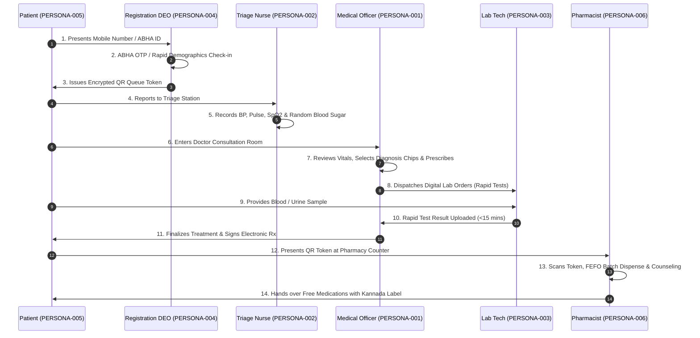

# User Personas & Clinical Journey Architecture Baseline

| Metadata Element | Project Specification |
| :--- | :--- |
| **Document Identifier** | `DOC-PM-007-PERSONA` |
| **Document Title** | Master User Persona Specifications, Role Contexts & Clinical Journey Workflows |
| **Project Code** | `NAMMA-CLINIC-PLATFORM-2026` |
| **Document Version** | `v1.0.0-PROD-BASELINE` |
| **Status** | `APPROVED & RATIFIED` |
| **Persona Catalog** | Exactly 35 Formally Modeled User Personas (`PERSONA-001` to `PERSONA-035`) |
| **Executive Sponsor** | Special Commissioner (Health), Greater Bengaluru Authority (GBA) / BBMP |
| **Clinical Safety Authority** | Chief Health Officer (CHO), BBMP Health Department |
| **Lead Delivery Partner** | Kushagramati Analytics (K Mati) Consortium | Lead UX Architect |
| **Upstream Anchor** | [`01-project-charter.md`](./01-project-charter.md) | [`06-stakeholders.md`](./06-stakeholders.md) |
| **Downstream Implementation** | [`08-role-and-responsibility-matrix.md`](./08-role-and-responsibility-matrix.md) | [`16-definition-of-ready.md`](./16-definition-of-ready.md) |

---

## 1. Executive Summary & Human-Centered Design Philosophy
The **User Personas Specification** establishes the canonical human behavioral models guiding all user experience (UX) architecture, workflow design, interaction patterns, and performance budgets for the Namma Clinic Digital Health & Operations Platform.

### 1.1 The High-Throughput Public Primary Care Reality
Namma Clinics operate in high-density urban wards across Bangalore, serving 80 to 120 patients in a compressed 4-hour morning consultation window (09:00 to 13:00). A single Medical Officer, supported by one Staff Nurse, one Pharmacist, one Lab Technician, and one Data Entry Operator (DEO), must execute comprehensive primary care under intense ambient noise, frequent electrical disruptions, and variable network bandwidth. Any interface requiring excessive typing, multi-level dropdowns, or blocking network synchronization directly increases patient wait times, causes cognitive fatigue, and triggers system abandonment in favor of legacy paper slips.

### 1.2 Core Persona Experience Invariants
1. **The 90-Second Consultation Rule:** A doctor must be able to review vitals, select diagnosis chips, issue a 3-drug prescription from the Karnataka Essential Drug List (EDL), and dispatch lab orders in under 90 seconds.
2. **Zero Typing for Frontline Clinicians:** Common clinical encounters are executed entirely through 1-click diagnostic chips, intelligent syndromic dosage bundles, and barcode scanning.
3. **Bilingual Parity (Kannada & English):** All frontline citizen- and clinical-facing screens support seamless, certified bilingual Kannada and English typography with instant toggle.
4. **Zero Downtime Offline Autonomy:** In case of complete fiber or cellular network failure, clinic staff can register patients, print queue tokens, document encounters, and dispense medications entirely within client IndexedDB.
5. **Strict Role-Based Least Privilege:** In strict compliance with the India DPDP Act 2023, data access is partitioned strictly by clinical need-to-know, governed by immutable audit logging.

## 2. Master Persona Directory Table (PERSONA-001 to PERSONA-035)
Authoritative catalog of all 35 formally modeled project personas across clinical, administrative, engineering, and citizen cadres:

| Persona ID | Persona Name | Representative Cadre | Primary Operational Context | Target Device | Connectivity Profile | Linked Stakeholder | Linked Role |
| :--- | :--- | :--- | :--- | :--- | :--- | :--- | :--- |
| [`PERSONA-001`](#persona-001) | **Dr. Rajesh Kumar** | Senior Medical Officer (MBBS) | Conducts 80+ outpatient consultations daily; needs 1-cl... | `Desktop Chromium PWA` | `Offline-First` | [`STAKEHOLDER-001`](./06-stakeholders.md#stakeholder-001) | [`ROLE-001`](./08-role-and-responsibility-matrix.md#role-001) |
| [`PERSONA-002`](#persona-002) | **Sister Priya Sharma** | Staff Nurse & ANM (B.Sc Nursing) | Manages registration queue and vitals triage; needs tou... | `Touchscreen Workstation` | `Offline-First` | [`STAKEHOLDER-002`](./06-stakeholders.md#stakeholder-002) | [`ROLE-002`](./08-role-and-responsibility-matrix.md#role-002) |
| [`PERSONA-003`](#persona-003) | **Suresh Gowda** | Clinic Pharmacist (D.Pharm) | Dispenses prescribed medicines; needs FEFO batch verifi... | `Desktop Terminal` | `Offline-First` | [`STAKEHOLDER-003`](./06-stakeholders.md#stakeholder-003) | [`ROLE-003`](./08-role-and-responsibility-matrix.md#role-003) |
| [`PERSONA-004`](#persona-004) | **Deepa Mallesh** | Laboratory Technician (DMLT) | Performs rapid diagnostic tests; needs order worklist, ... | `Bench Workstation` | `Offline-First` | [`STAKEHOLDER-004`](./06-stakeholders.md#stakeholder-004) | [`ROLE-004`](./08-role-and-responsibility-matrix.md#role-004) |
| [`PERSONA-005`](#persona-005) | **Ramesh Nayak** | Data Entry Operator (DEO) | Registers walk-in citizens; needs fast mobile/UHID look... | `Front Desk Terminal` | `Offline-First` | [`STAKEHOLDER-005`](./06-stakeholders.md#stakeholder-005) | [`ROLE-005`](./08-role-and-responsibility-matrix.md#role-005) |
| [`PERSONA-006`](#persona-006) | **Anandappa (Citizen)** | Daily Wage Laborer (Patient) | Daily wage earner seeking primary care; needs zero pape... | `Feature Phone (SMS)` | `Intermittent 4G` | [`STAKEHOLDER-006`](./06-stakeholders.md#stakeholder-006) | [`ROLE-006`](./08-role-and-responsibility-matrix.md#role-006) |
| [`PERSONA-007`](#persona-007) | **Sharadamma (Citizen)** | Elderly Resident (Chronic Patient) | Hypertensive and diabetic grandmother requiring monthly... | `No Mobile Device` | `None` | [`STAKEHOLDER-007`](./06-stakeholders.md#stakeholder-007) | [`ROLE-007`](./08-role-and-responsibility-matrix.md#role-007) |
| [`PERSONA-008`](#persona-008) | **Dr. Geetha Rao** | Zonal Health Officer (ZHO) | Monitors 28 clinics in East Zone; needs daily syndromic... | `Laptop / Tablet` | `Cloud Broadband` | [`STAKEHOLDER-008`](./06-stakeholders.md#stakeholder-008) | [`ROLE-008`](./08-role-and-responsibility-matrix.md#role-008) |
| [`PERSONA-009`](#persona-009) | **Kiran Deshmukh** | Municipal SRE & DevOps Engineer | Maintains high availability; needs Grafana dashboards, ... | `Linux Workstation` | `High-Speed Fiber` | [`STAKEHOLDER-009`](./06-stakeholders.md#stakeholder-009) | [`ROLE-009`](./08-role-and-responsibility-matrix.md#role-009) |
| [`PERSONA-010`](#persona-010) | **Dr. B. R. Mohan** | Chief Health Officer (CHO) | Oversees citywide public healthcare policy, clinical sa... | `Executive iPad / Laptop` | `Cloud Broadband` | [`STAKEHOLDER-010`](./06-stakeholders.md#stakeholder-010) | [`ROLE-010`](./08-role-and-responsibility-matrix.md#role-010) |
| [`PERSONA-011`](#persona-011) | **Manjunatha K.** | Field IT Support Technician | Visits 15 clinics weekly; fixes thermal printers, repla... | `Android Mobile & Laptop` | `Field LTE` | [`STAKEHOLDER-011`](./06-stakeholders.md#stakeholder-011) | [`ROLE-011`](./08-role-and-responsibility-matrix.md#role-011) |
| [`PERSONA-012`](#persona-012) | **Dr. Sneha Patil** | District Epidemiologist | Analyzes ward-level fever spikes and diarrhea clusters;... | `Analytics Workstation` | `Cloud Broadband` | [`STAKEHOLDER-012`](./06-stakeholders.md#stakeholder-012) | [`ROLE-012`](./08-role-and-responsibility-matrix.md#role-012) |
| [`PERSONA-013`](#persona-013) | **Venkatesh Murthy** | Central Warehouse Inventory Manager | Manages central BBMP drug store; needs aggregated 183-c... | `Enterprise Desktop` | `Cloud Broadband` | [`STAKEHOLDER-013`](./06-stakeholders.md#stakeholder-013) | [`ROLE-013`](./08-role-and-responsibility-matrix.md#role-013) |
| [`PERSONA-014`](#persona-014) | **Shobha Rani** | Accredited Social Health Activist (ASHA) | Escorts pregnant mothers and malnourished children to N... | `Basic Android Smartphone` | `Intermittent 4G` | [`STAKEHOLDER-014`](./06-stakeholders.md#stakeholder-014) | [`ROLE-014`](./08-role-and-responsibility-matrix.md#role-014) |
| [`PERSONA-015`](#persona-015) | **Vikramaditya Sen** | Lead Cybersecurity Penetration Tester | Conducts red-team vulnerability assessments; audits JWT... | `Security Kali Workstation` | `Encrypted VPN` | [`STAKEHOLDER-015`](./06-stakeholders.md#stakeholder-015) | [`ROLE-015`](./08-role-and-responsibility-matrix.md#role-015) |
| [`PERSONA-016`](#persona-016) | **Prashanth Kumar** | Consortium Delivery Project Manager | Tracks 18-sprint burn-down, critical path dependencies,... | `MacBook Pro` | `Cloud Broadband` | [`STAKEHOLDER-016`](./06-stakeholders.md#stakeholder-016) | [`ROLE-016`](./08-role-and-responsibility-matrix.md#role-016) |
| [`PERSONA-017`](#persona-017) | **Ananya Hegde** | Lead UI/UX Designer & Accessibility Lead | Designs ergonomic, high-contrast, bilingual PWA compone... | `MacBook & Touch Monitors` | `Cloud Broadband` | [`STAKEHOLDER-017`](./06-stakeholders.md#stakeholder-017) | [`ROLE-017`](./08-role-and-responsibility-matrix.md#role-017) |
| [`PERSONA-018`](#persona-018) | **Dr. Lokesh Babu** | Secondary Hospital Physician (KC General) | Receives referred patients from Namma Clinics; scans re... | `Hospital Workstation` | `Hospital LAN` | [`STAKEHOLDER-018`](./06-stakeholders.md#stakeholder-018) | [`ROLE-018`](./08-role-and-responsibility-matrix.md#role-018) |
| [`PERSONA-019`](#persona-019) | **Girijamma (Citizen)** | Garment Factory Worker (Mother) | Brings sick toddler for fever evaluation; needs rapid q... | `Basic Smartphone` | `Prepaid 4G` | [`STAKEHOLDER-019`](./06-stakeholders.md#stakeholder-019) | [`ROLE-019`](./08-role-and-responsibility-matrix.md#role-019) |
| [`PERSONA-020`](#persona-020) | **Babu Rajendran** | Consortium Lead Backend Architect | Architects Fastify microservices, PostgreSQL 16 schema,... | `Linux Development Rig` | `High-Speed Fiber` | [`STAKEHOLDER-020`](./06-stakeholders.md#stakeholder-020) | [`ROLE-020`](./08-role-and-responsibility-matrix.md#role-020) |
| [`PERSONA-021`](#persona-021) | **Chandrashekar** | BBMP Revenue & Administrative Inspector | Inspects clinic infrastructure, verifies biometric atte... | `Tablet Device` | `Field LTE` | [`STAKEHOLDER-021`](./06-stakeholders.md#stakeholder-021) | [`ROLE-021`](./08-role-and-responsibility-matrix.md#role-021) |
| [`PERSONA-022`](#persona-022) | **Dr. Farooq Ahmed** | Clinical Pharmacologist SME | Validates drug-drug interaction matrix, contraindicatio... | `Desktop PC` | `Cloud Broadband` | [`STAKEHOLDER-022`](./06-stakeholders.md#stakeholder-022) | [`ROLE-022`](./08-role-and-responsibility-matrix.md#role-022) |
| [`PERSONA-023`](#persona-023) | **Pallavi Kulkarni** | Consortium Lead QA Automation Engineer | Builds automated Playwright test suites; simulates bili... | `Test Workstation` | `Cloud Broadband` | [`STAKEHOLDER-023`](./06-stakeholders.md#stakeholder-023) | [`ROLE-023`](./08-role-and-responsibility-matrix.md#role-023) |
| [`PERSONA-024`](#persona-024) | **Gopalakrishna** | Frontline Bilingual Training Specialist | Conducts hands-on simulation labs for doctors and nurse... | `Interactive Projector & Demo PCs` | `Local Training LAN` | [`STAKEHOLDER-024`](./06-stakeholders.md#stakeholder-024) | [`ROLE-024`](./08-role-and-responsibility-matrix.md#role-024) |
| [`PERSONA-025`](#persona-025) | **Siddaramaiah (Citizen)** | Construction Worker (Migrant) | Non-Kannada speaking migrant laborer seeking primary ca... | `Feature Phone` | `Intermittent 2G` | [`STAKEHOLDER-025`](./06-stakeholders.md#stakeholder-025) | [`ROLE-025`](./08-role-and-responsibility-matrix.md#role-025) |
| [`PERSONA-026`](#persona-026) | **Dr. Nalini Swamy** | Maternal & Child Health Officer | Audits antenatal care checkups, IFA supplementation, an... | `Laptop / Tablet` | `Cloud Broadband` | [`STAKEHOLDER-026`](./06-stakeholders.md#stakeholder-026) | [`ROLE-026`](./08-role-and-responsibility-matrix.md#role-026) |
| [`PERSONA-027`](#persona-027) | **Ravikanth** | Municipal Hardware Procurement Officer | Oversees procurement of 250 mini-PCs, thermal printers,... | `Office PC` | `BBMP LAN` | [`STAKEHOLDER-027`](./06-stakeholders.md#stakeholder-027) | [`ROLE-027`](./08-role-and-responsibility-matrix.md#role-027) |
| [`PERSONA-028`](#persona-028) | **Roopa Devi** | Clinic Deep Cleaning & Waste Operator | Collects color-coded biomedical waste bags; records dai... | `Printed Register / Tablet` | `None` | [`STAKEHOLDER-028`](./06-stakeholders.md#stakeholder-028) | [`ROLE-028`](./08-role-and-responsibility-matrix.md#role-028) |
| [`PERSONA-029`](#persona-029) | **Dr. Arunkumar** | Telemedicine Consultant (Victoria Hospital) | Conducts video teleconsultation for complex dermatologi... | `Telemedicine Studio Console` | `Dedicated Fiber` | [`STAKEHOLDER-029`](./06-stakeholders.md#stakeholder-029) | [`ROLE-029`](./08-role-and-responsibility-matrix.md#role-029) |
| [`PERSONA-030`](#persona-030) | **Santhosh Kumar** | Consortium Database Administrator (DBA) | Tunes PostgreSQL query performance, monitors connection... | `Database Console` | `High-Speed Fiber` | [`STAKEHOLDER-030`](./06-stakeholders.md#stakeholder-030) | [`ROLE-030`](./08-role-and-responsibility-matrix.md#role-030) |
| [`PERSONA-031`](#persona-031) | **Nagaraj V.** | Zonal Ambulance Dispatch Coordinator | Coordinates emergency 108 ambulance transfer when Namma... | `Dispatch Console & Radio` | `Dedicated Telecom` | [`STAKEHOLDER-031`](./06-stakeholders.md#stakeholder-031) | [`ROLE-001`](./08-role-and-responsibility-matrix.md#role-001) |
| [`PERSONA-032`](#persona-032) | **Dr. Sumathi** | Medical Officer - Dasarahalli Clinic (Periphery) | Operates in peripheral clinic with frequent power cuts ... | `Mini-PC on 1000VA UPS` | `Offline-First LTE` | [`STAKEHOLDER-032`](./06-stakeholders.md#stakeholder-032) | [`ROLE-002`](./08-role-and-responsibility-matrix.md#role-002) |
| [`PERSONA-033`](#persona-033) | **Kavitha M.** | Student Nursing Intern | Assists staff nurse during morning rush hour; enters ba... | `Mobile Tablet` | `Clinic Wi-Fi` | [`STAKEHOLDER-033`](./06-stakeholders.md#stakeholder-033) | [`ROLE-003`](./08-role-and-responsibility-matrix.md#role-003) |
| [`PERSONA-034`](#persona-034) | **Harish Patel** | Commercial Pharmacy Drug Supplier | Delivers bulk Karnataka EDL pharmaceuticals to central ... | `Supply Chain Portal` | `Broadband` | [`STAKEHOLDER-034`](./06-stakeholders.md#stakeholder-034) | [`ROLE-004`](./08-role-and-responsibility-matrix.md#role-004) |
| [`PERSONA-035`](#persona-035) | **Special Commissioner (Finance), BBMP** | Municipal Treasury Authority | Audits project expenditures, milestone deliverables, co... | `Executive PC` | `BBMP Intranet` | [`STAKEHOLDER-035`](./06-stakeholders.md#stakeholder-035) | [`ROLE-005`](./08-role-and-responsibility-matrix.md#role-005) |

## 3. Deep Persona Specifications & Clinical Journey Workflows
Exhaustive specifications for all 35 personas covering demographics, goals, frustrations, step-by-step journeys, RBAC, hardware constraints, and acceptance criteria:

### 3.1 PERSONA-001: Dr. Rajesh Kumar
- **Official Cadre & Role:** Senior Medical Officer (MBBS)
- **Demographic & Environmental Context:** Conducts 80+ outpatient consultations daily; needs 1-click diagnosis chips, rapid prescription entry, and zero typing friction.
- **Operational Cadre Classification:** Operating at primary ward level within Namma Clinic municipal healthcare network.
- **Primary Strategic Goals & Motivations:**
  - Maximize clinical encounter velocity while eliminating prescription errors and patient waiting times.
  - Achieve seamless alignment with strategic objective [`OBJECTIVE-001`](./02-project-vision-and-objectives.md#objective-001).
  - Ensure zero end-of-day data discrepancies between physical pharmacy stock and digital ledger entries.
  - Eliminate tedious repetitive manual reporting across disparate municipal and state health portals.
- **Core Operational Frustrations & Pain Points:**
  - Sluggish web portals that freeze or spin endlessly during peak outpatient rush hours.
  - Complex multi-step dropdowns requiring constant mouse navigation and fine motor control.
  - Unreliable broadband connections causing lost patient consultation records during saving.
  - Frequent power outages in urban slums shutting down desktop workstations without auto-save.
  - Cognitive overload from managing high patient volumes with minimal auxiliary nursing support.
- **Step-by-Step Daily Workflow Journey (10-Step Operational Flow):**
  - **Step 1 (Session Initialization):** Launches Next.js PWA on clinic workstation; authenticates via biometric PIN or WebAuthn token.
  - **Step 2 (Local Cache Hydration):** PWA automatically hydrates offline IndexedDB with facility patient queue, 120 EDL drug formulary, and lab test catalogs.
  - **Step 3 (Patient Intake & Check-in):** Receives patient arrival alert via real-time WebSocket event or offline queue polling.
  - **Step 4 (Vitals & Triage Review):** Reviews nurse-entered triage metrics (BP, pulse, SpO2, temperature, blood sugar) on summary banner.
  - **Step 5 (Clinical Consultation):** Clicks 1-click chief complaint and diagnosis chips (e.g., Acute URTI, Type 2 Diabetes, Essential Hypertension).
  - **Step 6 (Prescription Ordering):** Selects pre-configured syndromic drug bundles; system automatically applies age- and renal-adjusted dosage guardrails.
  - **Step 7 (Diagnostic Lab Dispatch):** Toggles required rapid lab tests from 14-test diagnostic panel; orders routed instantly to lab workbench.
  - **Step 8 (Encounter Finalization):** Clicks single 'Complete & Sign' button; encrypted encounter record written instantly to local IndexedDB.
  - **Step 9 (Patient Handoff):** System prints bilingual thermal prescription slip with encrypted Bharat Health QR code.
  - **Step 10 (Background Synchronization):** Service worker queues delta synchronization package for asynchronous upload to central Fastify cluster.
- **Role-Based Access Control (RBAC) & Permissions Matrix:**
  - **Assigned Permissions Scope:** `Full EMR consultation, prescription creation, lab ordering, and referral dispatch`
  - **Access Level:** Strictly partitioned under least-privilege security policy; zero unauthorized administrative or financial access.
  - **Audit Logging:** Every view, mutation, and print event generates an immutable WORM audit log entry with timestamp and IP address.
- **Hardware, Device & Peripheral Profile:**
  - **Primary Workstation Device:** `Desktop Chromium PWA` (Intel Core i3 10th Gen, 4GB RAM, 128GB SSD mini-PC).
  - **Peripheral Connectivity:** USB thermal slip printer, 2D QR/barcode scanner, driverless Web Serial integration.
  - **Memory Footprint Budget:** Browser tab memory capped strictly at <150MB to guarantee stability on 4GB RAM.
- **Network, Connectivity & Power Constraints:**
  - **Connectivity Operating Profile:** `Offline-First`.
  - **Network Resilience:** Full functional continuity during 4-hour internet blackouts; automatic bi-directional delta sync upon reconnection.
  - **Power Backup:** Operates through 1000VA line-interactive UPS with 30-minute battery holdover during ward grid load shedding.
- **Technical Literacy & Digital Capability:**
  - **Proficiency Level:** `High`.
  - **Training Requirements:** 60-minute interactive simulated sandbox walkthrough; zero technical jargon or manual configuration.
- **Accessibility & Usability Requirements (WCAG 2.1 AA):**
  - Minimum 4.5:1 color contrast ratio across all UI widgets; high-contrast clinical theme option.
  - Interactive touch and click target hitboxes sized at minimum 48x48 physical pixels.
  - Full keyboard navigability with visible focus indicators for all high-velocity data entry screens.
- **Localization & Bilingual Kannada Requirements:**
  - **Supported Languages:** `English & Kannada`.
  - High-definition Kannada Unicode rendering using certified Noto Sans Kannada typography.
  - Real-time bilingual label display for all clinical dosages, drug directions, and lab parameters.
- **Security, Privacy & DPDP Act 2023 Conformance:**
  - Enforces explicit digital consent capture prior to accessing historical citizen longitudinal health records.
  - Automatic screen lock and session termination after 5 minutes of detected workstation inactivity.
- **Critical Failure Scenarios & Self-Healing Paths:**
  - *Scenario A (Mid-Consultation Network Drop):* System continues smoothly in offline mode with subtle status badge change; zero modal popups.
  - *Scenario B (Thermal Printer Out of Paper):* Alert banner displays reprint option; queue state retained locally without losing prescription data.
  - *Scenario C (Accidental Tab Closure):* IndexedDB auto-recovery immediately restores active consultation draft upon browser relaunch.
- **Quality Gates & Acceptance Criteria:**
  - Validated against Definition of Ready [`DOR-001`](./16-definition-of-ready.md#dor-001).
  - Verified against Definition of Done [`DOD-001`](./17-definition-of-done.md#dod-001).
  - Shields the platform from operational risk [`RISK-001`](./12-project-risks.md#risk-001).

### 3.2 PERSONA-002: Sister Priya Sharma
- **Official Cadre & Role:** Staff Nurse & ANM (B.Sc Nursing)
- **Demographic & Environmental Context:** Manages registration queue and vitals triage; needs touch-optimized interface, danger alert indicators, and rapid thermal token printing.
- **Operational Cadre Classification:** Operating at primary ward level within Namma Clinic municipal healthcare network.
- **Primary Strategic Goals & Motivations:**
  - Maximize clinical encounter velocity while eliminating prescription errors and patient waiting times.
  - Achieve seamless alignment with strategic objective [`OBJECTIVE-002`](./02-project-vision-and-objectives.md#objective-002).
  - Ensure zero end-of-day data discrepancies between physical pharmacy stock and digital ledger entries.
  - Eliminate tedious repetitive manual reporting across disparate municipal and state health portals.
- **Core Operational Frustrations & Pain Points:**
  - Sluggish web portals that freeze or spin endlessly during peak outpatient rush hours.
  - Complex multi-step dropdowns requiring constant mouse navigation and fine motor control.
  - Unreliable broadband connections causing lost patient consultation records during saving.
  - Frequent power outages in urban slums shutting down desktop workstations without auto-save.
  - Cognitive overload from managing high patient volumes with minimal auxiliary nursing support.
- **Step-by-Step Daily Workflow Journey (10-Step Operational Flow):**
  - **Step 1 (Session Initialization):** Launches Next.js PWA on clinic workstation; authenticates via biometric PIN or WebAuthn token.
  - **Step 2 (Local Cache Hydration):** PWA automatically hydrates offline IndexedDB with facility patient queue, 120 EDL drug formulary, and lab test catalogs.
  - **Step 3 (Patient Intake & Check-in):** Receives patient arrival alert via real-time WebSocket event or offline queue polling.
  - **Step 4 (Vitals & Triage Review):** Reviews nurse-entered triage metrics (BP, pulse, SpO2, temperature, blood sugar) on summary banner.
  - **Step 5 (Clinical Consultation):** Clicks 1-click chief complaint and diagnosis chips (e.g., Acute URTI, Type 2 Diabetes, Essential Hypertension).
  - **Step 6 (Prescription Ordering):** Selects pre-configured syndromic drug bundles; system automatically applies age- and renal-adjusted dosage guardrails.
  - **Step 7 (Diagnostic Lab Dispatch):** Toggles required rapid lab tests from 14-test diagnostic panel; orders routed instantly to lab workbench.
  - **Step 8 (Encounter Finalization):** Clicks single 'Complete & Sign' button; encrypted encounter record written instantly to local IndexedDB.
  - **Step 9 (Patient Handoff):** System prints bilingual thermal prescription slip with encrypted Bharat Health QR code.
  - **Step 10 (Background Synchronization):** Service worker queues delta synchronization package for asynchronous upload to central Fastify cluster.
- **Role-Based Access Control (RBAC) & Permissions Matrix:**
  - **Assigned Permissions Scope:** `Citizen registration, vital signs capture, danger sign flagging, and token print`
  - **Access Level:** Strictly partitioned under least-privilege security policy; zero unauthorized administrative or financial access.
  - **Audit Logging:** Every view, mutation, and print event generates an immutable WORM audit log entry with timestamp and IP address.
- **Hardware, Device & Peripheral Profile:**
  - **Primary Workstation Device:** `Touchscreen Workstation` (Intel Core i3 10th Gen, 4GB RAM, 128GB SSD mini-PC).
  - **Peripheral Connectivity:** USB thermal slip printer, 2D QR/barcode scanner, driverless Web Serial integration.
  - **Memory Footprint Budget:** Browser tab memory capped strictly at <150MB to guarantee stability on 4GB RAM.
- **Network, Connectivity & Power Constraints:**
  - **Connectivity Operating Profile:** `Offline-First`.
  - **Network Resilience:** Full functional continuity during 4-hour internet blackouts; automatic bi-directional delta sync upon reconnection.
  - **Power Backup:** Operates through 1000VA line-interactive UPS with 30-minute battery holdover during ward grid load shedding.
- **Technical Literacy & Digital Capability:**
  - **Proficiency Level:** `Medium`.
  - **Training Requirements:** 60-minute interactive simulated sandbox walkthrough; zero technical jargon or manual configuration.
- **Accessibility & Usability Requirements (WCAG 2.1 AA):**
  - Minimum 4.5:1 color contrast ratio across all UI widgets; high-contrast clinical theme option.
  - Interactive touch and click target hitboxes sized at minimum 48x48 physical pixels.
  - Full keyboard navigability with visible focus indicators for all high-velocity data entry screens.
- **Localization & Bilingual Kannada Requirements:**
  - **Supported Languages:** `Kannada Primary`.
  - High-definition Kannada Unicode rendering using certified Noto Sans Kannada typography.
  - Real-time bilingual label display for all clinical dosages, drug directions, and lab parameters.
- **Security, Privacy & DPDP Act 2023 Conformance:**
  - Enforces explicit digital consent capture prior to accessing historical citizen longitudinal health records.
  - Automatic screen lock and session termination after 5 minutes of detected workstation inactivity.
- **Critical Failure Scenarios & Self-Healing Paths:**
  - *Scenario A (Mid-Consultation Network Drop):* System continues smoothly in offline mode with subtle status badge change; zero modal popups.
  - *Scenario B (Thermal Printer Out of Paper):* Alert banner displays reprint option; queue state retained locally without losing prescription data.
  - *Scenario C (Accidental Tab Closure):* IndexedDB auto-recovery immediately restores active consultation draft upon browser relaunch.
- **Quality Gates & Acceptance Criteria:**
  - Validated against Definition of Ready [`DOR-002`](./16-definition-of-ready.md#dor-002).
  - Verified against Definition of Done [`DOD-002`](./17-definition-of-done.md#dod-002).
  - Shields the platform from operational risk [`RISK-002`](./12-project-risks.md#risk-002).

### 3.3 PERSONA-003: Suresh Gowda
- **Official Cadre & Role:** Clinic Pharmacist (D.Pharm)
- **Demographic & Environmental Context:** Dispenses prescribed medicines; needs FEFO batch verification, barcode lookup, automated stock decrement, and bilingual drug label printing.
- **Operational Cadre Classification:** Operating at primary ward level within Namma Clinic municipal healthcare network.
- **Primary Strategic Goals & Motivations:**
  - Maximize clinical encounter velocity while eliminating prescription errors and patient waiting times.
  - Achieve seamless alignment with strategic objective [`OBJECTIVE-003`](./02-project-vision-and-objectives.md#objective-003).
  - Ensure zero end-of-day data discrepancies between physical pharmacy stock and digital ledger entries.
  - Eliminate tedious repetitive manual reporting across disparate municipal and state health portals.
- **Core Operational Frustrations & Pain Points:**
  - Sluggish web portals that freeze or spin endlessly during peak outpatient rush hours.
  - Complex multi-step dropdowns requiring constant mouse navigation and fine motor control.
  - Unreliable broadband connections causing lost patient consultation records during saving.
  - Frequent power outages in urban slums shutting down desktop workstations without auto-save.
  - Cognitive overload from managing high patient volumes with minimal auxiliary nursing support.
- **Step-by-Step Daily Workflow Journey (10-Step Operational Flow):**
  - **Step 1 (Session Initialization):** Launches Next.js PWA on clinic workstation; authenticates via biometric PIN or WebAuthn token.
  - **Step 2 (Local Cache Hydration):** PWA automatically hydrates offline IndexedDB with facility patient queue, 120 EDL drug formulary, and lab test catalogs.
  - **Step 3 (Patient Intake & Check-in):** Receives patient arrival alert via real-time WebSocket event or offline queue polling.
  - **Step 4 (Vitals & Triage Review):** Reviews nurse-entered triage metrics (BP, pulse, SpO2, temperature, blood sugar) on summary banner.
  - **Step 5 (Clinical Consultation):** Clicks 1-click chief complaint and diagnosis chips (e.g., Acute URTI, Type 2 Diabetes, Essential Hypertension).
  - **Step 6 (Prescription Ordering):** Selects pre-configured syndromic drug bundles; system automatically applies age- and renal-adjusted dosage guardrails.
  - **Step 7 (Diagnostic Lab Dispatch):** Toggles required rapid lab tests from 14-test diagnostic panel; orders routed instantly to lab workbench.
  - **Step 8 (Encounter Finalization):** Clicks single 'Complete & Sign' button; encrypted encounter record written instantly to local IndexedDB.
  - **Step 9 (Patient Handoff):** System prints bilingual thermal prescription slip with encrypted Bharat Health QR code.
  - **Step 10 (Background Synchronization):** Service worker queues delta synchronization package for asynchronous upload to central Fastify cluster.
- **Role-Based Access Control (RBAC) & Permissions Matrix:**
  - **Assigned Permissions Scope:** `Prescription fulfillment, barcode scan verification, stock receipt, and reorder`
  - **Access Level:** Strictly partitioned under least-privilege security policy; zero unauthorized administrative or financial access.
  - **Audit Logging:** Every view, mutation, and print event generates an immutable WORM audit log entry with timestamp and IP address.
- **Hardware, Device & Peripheral Profile:**
  - **Primary Workstation Device:** `Desktop Terminal` (Intel Core i3 10th Gen, 4GB RAM, 128GB SSD mini-PC).
  - **Peripheral Connectivity:** USB thermal slip printer, 2D QR/barcode scanner, driverless Web Serial integration.
  - **Memory Footprint Budget:** Browser tab memory capped strictly at <150MB to guarantee stability on 4GB RAM.
- **Network, Connectivity & Power Constraints:**
  - **Connectivity Operating Profile:** `Offline-First`.
  - **Network Resilience:** Full functional continuity during 4-hour internet blackouts; automatic bi-directional delta sync upon reconnection.
  - **Power Backup:** Operates through 1000VA line-interactive UPS with 30-minute battery holdover during ward grid load shedding.
- **Technical Literacy & Digital Capability:**
  - **Proficiency Level:** `Medium`.
  - **Training Requirements:** 60-minute interactive simulated sandbox walkthrough; zero technical jargon or manual configuration.
- **Accessibility & Usability Requirements (WCAG 2.1 AA):**
  - Minimum 4.5:1 color contrast ratio across all UI widgets; high-contrast clinical theme option.
  - Interactive touch and click target hitboxes sized at minimum 48x48 physical pixels.
  - Full keyboard navigability with visible focus indicators for all high-velocity data entry screens.
- **Localization & Bilingual Kannada Requirements:**
  - **Supported Languages:** `Kannada & English`.
  - High-definition Kannada Unicode rendering using certified Noto Sans Kannada typography.
  - Real-time bilingual label display for all clinical dosages, drug directions, and lab parameters.
- **Security, Privacy & DPDP Act 2023 Conformance:**
  - Enforces explicit digital consent capture prior to accessing historical citizen longitudinal health records.
  - Automatic screen lock and session termination after 5 minutes of detected workstation inactivity.
- **Critical Failure Scenarios & Self-Healing Paths:**
  - *Scenario A (Mid-Consultation Network Drop):* System continues smoothly in offline mode with subtle status badge change; zero modal popups.
  - *Scenario B (Thermal Printer Out of Paper):* Alert banner displays reprint option; queue state retained locally without losing prescription data.
  - *Scenario C (Accidental Tab Closure):* IndexedDB auto-recovery immediately restores active consultation draft upon browser relaunch.
- **Quality Gates & Acceptance Criteria:**
  - Validated against Definition of Ready [`DOR-003`](./16-definition-of-ready.md#dor-003).
  - Verified against Definition of Done [`DOD-003`](./17-definition-of-done.md#dod-003).
  - Shields the platform from operational risk [`RISK-003`](./12-project-risks.md#risk-003).

### 3.4 PERSONA-004: Deepa Mallesh
- **Official Cadre & Role:** Laboratory Technician (DMLT)
- **Demographic & Environmental Context:** Performs rapid diagnostic tests; needs order worklist, batch result entry, normal range flags, and barcode tube labeling.
- **Operational Cadre Classification:** Operating at primary ward level within Namma Clinic municipal healthcare network.
- **Primary Strategic Goals & Motivations:**
  - Maximize clinical encounter velocity while eliminating prescription errors and patient waiting times.
  - Achieve seamless alignment with strategic objective [`OBJECTIVE-004`](./02-project-vision-and-objectives.md#objective-004).
  - Ensure zero end-of-day data discrepancies between physical pharmacy stock and digital ledger entries.
  - Eliminate tedious repetitive manual reporting across disparate municipal and state health portals.
- **Core Operational Frustrations & Pain Points:**
  - Sluggish web portals that freeze or spin endlessly during peak outpatient rush hours.
  - Complex multi-step dropdowns requiring constant mouse navigation and fine motor control.
  - Unreliable broadband connections causing lost patient consultation records during saving.
  - Frequent power outages in urban slums shutting down desktop workstations without auto-save.
  - Cognitive overload from managing high patient volumes with minimal auxiliary nursing support.
- **Step-by-Step Daily Workflow Journey (10-Step Operational Flow):**
  - **Step 1 (Session Initialization):** Launches Next.js PWA on clinic workstation; authenticates via biometric PIN or WebAuthn token.
  - **Step 2 (Local Cache Hydration):** PWA automatically hydrates offline IndexedDB with facility patient queue, 120 EDL drug formulary, and lab test catalogs.
  - **Step 3 (Patient Intake & Check-in):** Receives patient arrival alert via real-time WebSocket event or offline queue polling.
  - **Step 4 (Vitals & Triage Review):** Reviews nurse-entered triage metrics (BP, pulse, SpO2, temperature, blood sugar) on summary banner.
  - **Step 5 (Clinical Consultation):** Clicks 1-click chief complaint and diagnosis chips (e.g., Acute URTI, Type 2 Diabetes, Essential Hypertension).
  - **Step 6 (Prescription Ordering):** Selects pre-configured syndromic drug bundles; system automatically applies age- and renal-adjusted dosage guardrails.
  - **Step 7 (Diagnostic Lab Dispatch):** Toggles required rapid lab tests from 14-test diagnostic panel; orders routed instantly to lab workbench.
  - **Step 8 (Encounter Finalization):** Clicks single 'Complete & Sign' button; encrypted encounter record written instantly to local IndexedDB.
  - **Step 9 (Patient Handoff):** System prints bilingual thermal prescription slip with encrypted Bharat Health QR code.
  - **Step 10 (Background Synchronization):** Service worker queues delta synchronization package for asynchronous upload to central Fastify cluster.
- **Role-Based Access Control (RBAC) & Permissions Matrix:**
  - **Assigned Permissions Scope:** `Lab order acceptance, rapid test result entry, panic alert trigger, and reagent log`
  - **Access Level:** Strictly partitioned under least-privilege security policy; zero unauthorized administrative or financial access.
  - **Audit Logging:** Every view, mutation, and print event generates an immutable WORM audit log entry with timestamp and IP address.
- **Hardware, Device & Peripheral Profile:**
  - **Primary Workstation Device:** `Bench Workstation` (Intel Core i3 10th Gen, 4GB RAM, 128GB SSD mini-PC).
  - **Peripheral Connectivity:** USB thermal slip printer, 2D QR/barcode scanner, driverless Web Serial integration.
  - **Memory Footprint Budget:** Browser tab memory capped strictly at <150MB to guarantee stability on 4GB RAM.
- **Network, Connectivity & Power Constraints:**
  - **Connectivity Operating Profile:** `Offline-First`.
  - **Network Resilience:** Full functional continuity during 4-hour internet blackouts; automatic bi-directional delta sync upon reconnection.
  - **Power Backup:** Operates through 1000VA line-interactive UPS with 30-minute battery holdover during ward grid load shedding.
- **Technical Literacy & Digital Capability:**
  - **Proficiency Level:** `Medium`.
  - **Training Requirements:** 60-minute interactive simulated sandbox walkthrough; zero technical jargon or manual configuration.
- **Accessibility & Usability Requirements (WCAG 2.1 AA):**
  - Minimum 4.5:1 color contrast ratio across all UI widgets; high-contrast clinical theme option.
  - Interactive touch and click target hitboxes sized at minimum 48x48 physical pixels.
  - Full keyboard navigability with visible focus indicators for all high-velocity data entry screens.
- **Localization & Bilingual Kannada Requirements:**
  - **Supported Languages:** `Kannada & English`.
  - High-definition Kannada Unicode rendering using certified Noto Sans Kannada typography.
  - Real-time bilingual label display for all clinical dosages, drug directions, and lab parameters.
- **Security, Privacy & DPDP Act 2023 Conformance:**
  - Enforces explicit digital consent capture prior to accessing historical citizen longitudinal health records.
  - Automatic screen lock and session termination after 5 minutes of detected workstation inactivity.
- **Critical Failure Scenarios & Self-Healing Paths:**
  - *Scenario A (Mid-Consultation Network Drop):* System continues smoothly in offline mode with subtle status badge change; zero modal popups.
  - *Scenario B (Thermal Printer Out of Paper):* Alert banner displays reprint option; queue state retained locally without losing prescription data.
  - *Scenario C (Accidental Tab Closure):* IndexedDB auto-recovery immediately restores active consultation draft upon browser relaunch.
- **Quality Gates & Acceptance Criteria:**
  - Validated against Definition of Ready [`DOR-004`](./16-definition-of-ready.md#dor-004).
  - Verified against Definition of Done [`DOD-004`](./17-definition-of-done.md#dod-004).
  - Shields the platform from operational risk [`RISK-004`](./12-project-risks.md#risk-004).

### 3.5 PERSONA-005: Ramesh Nayak
- **Official Cadre & Role:** Data Entry Operator (DEO)
- **Demographic & Environmental Context:** Registers walk-in citizens; needs fast mobile/UHID lookup, ABHA creation, biometric verification, and sub-90 second check-in.
- **Operational Cadre Classification:** Operating at primary ward level within Namma Clinic municipal healthcare network.
- **Primary Strategic Goals & Motivations:**
  - Maximize clinical encounter velocity while eliminating prescription errors and patient waiting times.
  - Achieve seamless alignment with strategic objective [`OBJECTIVE-005`](./02-project-vision-and-objectives.md#objective-005).
  - Ensure zero end-of-day data discrepancies between physical pharmacy stock and digital ledger entries.
  - Eliminate tedious repetitive manual reporting across disparate municipal and state health portals.
- **Core Operational Frustrations & Pain Points:**
  - Sluggish web portals that freeze or spin endlessly during peak outpatient rush hours.
  - Complex multi-step dropdowns requiring constant mouse navigation and fine motor control.
  - Unreliable broadband connections causing lost patient consultation records during saving.
  - Frequent power outages in urban slums shutting down desktop workstations without auto-save.
  - Cognitive overload from managing high patient volumes with minimal auxiliary nursing support.
- **Step-by-Step Daily Workflow Journey (10-Step Operational Flow):**
  - **Step 1 (Session Initialization):** Launches Next.js PWA on clinic workstation; authenticates via biometric PIN or WebAuthn token.
  - **Step 2 (Local Cache Hydration):** PWA automatically hydrates offline IndexedDB with facility patient queue, 120 EDL drug formulary, and lab test catalogs.
  - **Step 3 (Patient Intake & Check-in):** Receives patient arrival alert via real-time WebSocket event or offline queue polling.
  - **Step 4 (Vitals & Triage Review):** Reviews nurse-entered triage metrics (BP, pulse, SpO2, temperature, blood sugar) on summary banner.
  - **Step 5 (Clinical Consultation):** Clicks 1-click chief complaint and diagnosis chips (e.g., Acute URTI, Type 2 Diabetes, Essential Hypertension).
  - **Step 6 (Prescription Ordering):** Selects pre-configured syndromic drug bundles; system automatically applies age- and renal-adjusted dosage guardrails.
  - **Step 7 (Diagnostic Lab Dispatch):** Toggles required rapid lab tests from 14-test diagnostic panel; orders routed instantly to lab workbench.
  - **Step 8 (Encounter Finalization):** Clicks single 'Complete & Sign' button; encrypted encounter record written instantly to local IndexedDB.
  - **Step 9 (Patient Handoff):** System prints bilingual thermal prescription slip with encrypted Bharat Health QR code.
  - **Step 10 (Background Synchronization):** Service worker queues delta synchronization package for asynchronous upload to central Fastify cluster.
- **Role-Based Access Control (RBAC) & Permissions Matrix:**
  - **Assigned Permissions Scope:** `Demographic search, new patient registration, ABHA linking, and queue token issue`
  - **Access Level:** Strictly partitioned under least-privilege security policy; zero unauthorized administrative or financial access.
  - **Audit Logging:** Every view, mutation, and print event generates an immutable WORM audit log entry with timestamp and IP address.
- **Hardware, Device & Peripheral Profile:**
  - **Primary Workstation Device:** `Front Desk Terminal` (Intel Core i3 10th Gen, 4GB RAM, 128GB SSD mini-PC).
  - **Peripheral Connectivity:** USB thermal slip printer, 2D QR/barcode scanner, driverless Web Serial integration.
  - **Memory Footprint Budget:** Browser tab memory capped strictly at <150MB to guarantee stability on 4GB RAM.
- **Network, Connectivity & Power Constraints:**
  - **Connectivity Operating Profile:** `Offline-First`.
  - **Network Resilience:** Full functional continuity during 4-hour internet blackouts; automatic bi-directional delta sync upon reconnection.
  - **Power Backup:** Operates through 1000VA line-interactive UPS with 30-minute battery holdover during ward grid load shedding.
- **Technical Literacy & Digital Capability:**
  - **Proficiency Level:** `High`.
  - **Training Requirements:** 60-minute interactive simulated sandbox walkthrough; zero technical jargon or manual configuration.
- **Accessibility & Usability Requirements (WCAG 2.1 AA):**
  - Minimum 4.5:1 color contrast ratio across all UI widgets; high-contrast clinical theme option.
  - Interactive touch and click target hitboxes sized at minimum 48x48 physical pixels.
  - Full keyboard navigability with visible focus indicators for all high-velocity data entry screens.
- **Localization & Bilingual Kannada Requirements:**
  - **Supported Languages:** `Kannada Primary`.
  - High-definition Kannada Unicode rendering using certified Noto Sans Kannada typography.
  - Real-time bilingual label display for all clinical dosages, drug directions, and lab parameters.
- **Security, Privacy & DPDP Act 2023 Conformance:**
  - Enforces explicit digital consent capture prior to accessing historical citizen longitudinal health records.
  - Automatic screen lock and session termination after 5 minutes of detected workstation inactivity.
- **Critical Failure Scenarios & Self-Healing Paths:**
  - *Scenario A (Mid-Consultation Network Drop):* System continues smoothly in offline mode with subtle status badge change; zero modal popups.
  - *Scenario B (Thermal Printer Out of Paper):* Alert banner displays reprint option; queue state retained locally without losing prescription data.
  - *Scenario C (Accidental Tab Closure):* IndexedDB auto-recovery immediately restores active consultation draft upon browser relaunch.
- **Quality Gates & Acceptance Criteria:**
  - Validated against Definition of Ready [`DOR-005`](./16-definition-of-ready.md#dor-005).
  - Verified against Definition of Done [`DOD-005`](./17-definition-of-done.md#dod-005).
  - Shields the platform from operational risk [`RISK-005`](./12-project-risks.md#risk-005).

### 3.6 PERSONA-006: Anandappa (Citizen)
- **Official Cadre & Role:** Daily Wage Laborer (Patient)
- **Demographic & Environmental Context:** Daily wage earner seeking primary care; needs zero paper hassle, bilingual SMS prescription summary, and dignity in queue management.
- **Operational Cadre Classification:** Operating at primary ward level within Namma Clinic municipal healthcare network.
- **Primary Strategic Goals & Motivations:**
  - Maximize clinical encounter velocity while eliminating prescription errors and patient waiting times.
  - Achieve seamless alignment with strategic objective [`OBJECTIVE-006`](./02-project-vision-and-objectives.md#objective-006).
  - Ensure zero end-of-day data discrepancies between physical pharmacy stock and digital ledger entries.
  - Eliminate tedious repetitive manual reporting across disparate municipal and state health portals.
- **Core Operational Frustrations & Pain Points:**
  - Sluggish web portals that freeze or spin endlessly during peak outpatient rush hours.
  - Complex multi-step dropdowns requiring constant mouse navigation and fine motor control.
  - Unreliable broadband connections causing lost patient consultation records during saving.
  - Frequent power outages in urban slums shutting down desktop workstations without auto-save.
  - Cognitive overload from managing high patient volumes with minimal auxiliary nursing support.
- **Step-by-Step Daily Workflow Journey (10-Step Operational Flow):**
  - **Step 1 (Session Initialization):** Launches Next.js PWA on clinic workstation; authenticates via biometric PIN or WebAuthn token.
  - **Step 2 (Local Cache Hydration):** PWA automatically hydrates offline IndexedDB with facility patient queue, 120 EDL drug formulary, and lab test catalogs.
  - **Step 3 (Patient Intake & Check-in):** Receives patient arrival alert via real-time WebSocket event or offline queue polling.
  - **Step 4 (Vitals & Triage Review):** Reviews nurse-entered triage metrics (BP, pulse, SpO2, temperature, blood sugar) on summary banner.
  - **Step 5 (Clinical Consultation):** Clicks 1-click chief complaint and diagnosis chips (e.g., Acute URTI, Type 2 Diabetes, Essential Hypertension).
  - **Step 6 (Prescription Ordering):** Selects pre-configured syndromic drug bundles; system automatically applies age- and renal-adjusted dosage guardrails.
  - **Step 7 (Diagnostic Lab Dispatch):** Toggles required rapid lab tests from 14-test diagnostic panel; orders routed instantly to lab workbench.
  - **Step 8 (Encounter Finalization):** Clicks single 'Complete & Sign' button; encrypted encounter record written instantly to local IndexedDB.
  - **Step 9 (Patient Handoff):** System prints bilingual thermal prescription slip with encrypted Bharat Health QR code.
  - **Step 10 (Background Synchronization):** Service worker queues delta synchronization package for asynchronous upload to central Fastify cluster.
- **Role-Based Access Control (RBAC) & Permissions Matrix:**
  - **Assigned Permissions Scope:** `Queue token receipt, consultation attendance, medicine pickup, and SMS receipt`
  - **Access Level:** Strictly partitioned under least-privilege security policy; zero unauthorized administrative or financial access.
  - **Audit Logging:** Every view, mutation, and print event generates an immutable WORM audit log entry with timestamp and IP address.
- **Hardware, Device & Peripheral Profile:**
  - **Primary Workstation Device:** `Feature Phone (SMS)` (Intel Core i3 10th Gen, 4GB RAM, 128GB SSD mini-PC).
  - **Peripheral Connectivity:** USB thermal slip printer, 2D QR/barcode scanner, driverless Web Serial integration.
  - **Memory Footprint Budget:** Browser tab memory capped strictly at <150MB to guarantee stability on 4GB RAM.
- **Network, Connectivity & Power Constraints:**
  - **Connectivity Operating Profile:** `Intermittent 4G`.
  - **Network Resilience:** Full functional continuity during 4-hour internet blackouts; automatic bi-directional delta sync upon reconnection.
  - **Power Backup:** Operates through 1000VA line-interactive UPS with 30-minute battery holdover during ward grid load shedding.
- **Technical Literacy & Digital Capability:**
  - **Proficiency Level:** `Low`.
  - **Training Requirements:** 60-minute interactive simulated sandbox walkthrough; zero technical jargon or manual configuration.
- **Accessibility & Usability Requirements (WCAG 2.1 AA):**
  - Minimum 4.5:1 color contrast ratio across all UI widgets; high-contrast clinical theme option.
  - Interactive touch and click target hitboxes sized at minimum 48x48 physical pixels.
  - Full keyboard navigability with visible focus indicators for all high-velocity data entry screens.
- **Localization & Bilingual Kannada Requirements:**
  - **Supported Languages:** `Kannada Only`.
  - High-definition Kannada Unicode rendering using certified Noto Sans Kannada typography.
  - Real-time bilingual label display for all clinical dosages, drug directions, and lab parameters.
- **Security, Privacy & DPDP Act 2023 Conformance:**
  - Enforces explicit digital consent capture prior to accessing historical citizen longitudinal health records.
  - Automatic screen lock and session termination after 5 minutes of detected workstation inactivity.
- **Critical Failure Scenarios & Self-Healing Paths:**
  - *Scenario A (Mid-Consultation Network Drop):* System continues smoothly in offline mode with subtle status badge change; zero modal popups.
  - *Scenario B (Thermal Printer Out of Paper):* Alert banner displays reprint option; queue state retained locally without losing prescription data.
  - *Scenario C (Accidental Tab Closure):* IndexedDB auto-recovery immediately restores active consultation draft upon browser relaunch.
- **Quality Gates & Acceptance Criteria:**
  - Validated against Definition of Ready [`DOR-006`](./16-definition-of-ready.md#dor-006).
  - Verified against Definition of Done [`DOD-006`](./17-definition-of-done.md#dod-006).
  - Shields the platform from operational risk [`RISK-006`](./12-project-risks.md#risk-006).

### 3.7 PERSONA-007: Sharadamma (Citizen)
- **Official Cadre & Role:** Elderly Resident (Chronic Patient)
- **Demographic & Environmental Context:** Hypertensive and diabetic grandmother requiring monthly medication refills and blood glucose monitoring.
- **Operational Cadre Classification:** Operating at primary ward level within Namma Clinic municipal healthcare network.
- **Primary Strategic Goals & Motivations:**
  - Maximize clinical encounter velocity while eliminating prescription errors and patient waiting times.
  - Achieve seamless alignment with strategic objective [`OBJECTIVE-007`](./02-project-vision-and-objectives.md#objective-007).
  - Ensure zero end-of-day data discrepancies between physical pharmacy stock and digital ledger entries.
  - Eliminate tedious repetitive manual reporting across disparate municipal and state health portals.
- **Core Operational Frustrations & Pain Points:**
  - Sluggish web portals that freeze or spin endlessly during peak outpatient rush hours.
  - Complex multi-step dropdowns requiring constant mouse navigation and fine motor control.
  - Unreliable broadband connections causing lost patient consultation records during saving.
  - Frequent power outages in urban slums shutting down desktop workstations without auto-save.
  - Cognitive overload from managing high patient volumes with minimal auxiliary nursing support.
- **Step-by-Step Daily Workflow Journey (10-Step Operational Flow):**
  - **Step 1 (Session Initialization):** Launches Next.js PWA on clinic workstation; authenticates via biometric PIN or WebAuthn token.
  - **Step 2 (Local Cache Hydration):** PWA automatically hydrates offline IndexedDB with facility patient queue, 120 EDL drug formulary, and lab test catalogs.
  - **Step 3 (Patient Intake & Check-in):** Receives patient arrival alert via real-time WebSocket event or offline queue polling.
  - **Step 4 (Vitals & Triage Review):** Reviews nurse-entered triage metrics (BP, pulse, SpO2, temperature, blood sugar) on summary banner.
  - **Step 5 (Clinical Consultation):** Clicks 1-click chief complaint and diagnosis chips (e.g., Acute URTI, Type 2 Diabetes, Essential Hypertension).
  - **Step 6 (Prescription Ordering):** Selects pre-configured syndromic drug bundles; system automatically applies age- and renal-adjusted dosage guardrails.
  - **Step 7 (Diagnostic Lab Dispatch):** Toggles required rapid lab tests from 14-test diagnostic panel; orders routed instantly to lab workbench.
  - **Step 8 (Encounter Finalization):** Clicks single 'Complete & Sign' button; encrypted encounter record written instantly to local IndexedDB.
  - **Step 9 (Patient Handoff):** System prints bilingual thermal prescription slip with encrypted Bharat Health QR code.
  - **Step 10 (Background Synchronization):** Service worker queues delta synchronization package for asynchronous upload to central Fastify cluster.
- **Role-Based Access Control (RBAC) & Permissions Matrix:**
  - **Assigned Permissions Scope:** `Biometric/UHID lookup, vitals screening, chronic prescription refill, and lab check`
  - **Access Level:** Strictly partitioned under least-privilege security policy; zero unauthorized administrative or financial access.
  - **Audit Logging:** Every view, mutation, and print event generates an immutable WORM audit log entry with timestamp and IP address.
- **Hardware, Device & Peripheral Profile:**
  - **Primary Workstation Device:** `No Mobile Device` (Intel Core i3 10th Gen, 4GB RAM, 128GB SSD mini-PC).
  - **Peripheral Connectivity:** USB thermal slip printer, 2D QR/barcode scanner, driverless Web Serial integration.
  - **Memory Footprint Budget:** Browser tab memory capped strictly at <150MB to guarantee stability on 4GB RAM.
- **Network, Connectivity & Power Constraints:**
  - **Connectivity Operating Profile:** `None`.
  - **Network Resilience:** Full functional continuity during 4-hour internet blackouts; automatic bi-directional delta sync upon reconnection.
  - **Power Backup:** Operates through 1000VA line-interactive UPS with 30-minute battery holdover during ward grid load shedding.
- **Technical Literacy & Digital Capability:**
  - **Proficiency Level:** `None`.
  - **Training Requirements:** 60-minute interactive simulated sandbox walkthrough; zero technical jargon or manual configuration.
- **Accessibility & Usability Requirements (WCAG 2.1 AA):**
  - Minimum 4.5:1 color contrast ratio across all UI widgets; high-contrast clinical theme option.
  - Interactive touch and click target hitboxes sized at minimum 48x48 physical pixels.
  - Full keyboard navigability with visible focus indicators for all high-velocity data entry screens.
- **Localization & Bilingual Kannada Requirements:**
  - **Supported Languages:** `Kannada Only`.
  - High-definition Kannada Unicode rendering using certified Noto Sans Kannada typography.
  - Real-time bilingual label display for all clinical dosages, drug directions, and lab parameters.
- **Security, Privacy & DPDP Act 2023 Conformance:**
  - Enforces explicit digital consent capture prior to accessing historical citizen longitudinal health records.
  - Automatic screen lock and session termination after 5 minutes of detected workstation inactivity.
- **Critical Failure Scenarios & Self-Healing Paths:**
  - *Scenario A (Mid-Consultation Network Drop):* System continues smoothly in offline mode with subtle status badge change; zero modal popups.
  - *Scenario B (Thermal Printer Out of Paper):* Alert banner displays reprint option; queue state retained locally without losing prescription data.
  - *Scenario C (Accidental Tab Closure):* IndexedDB auto-recovery immediately restores active consultation draft upon browser relaunch.
- **Quality Gates & Acceptance Criteria:**
  - Validated against Definition of Ready [`DOR-007`](./16-definition-of-ready.md#dor-007).
  - Verified against Definition of Done [`DOD-007`](./17-definition-of-done.md#dod-007).
  - Shields the platform from operational risk [`RISK-007`](./12-project-risks.md#risk-007).

### 3.8 PERSONA-008: Dr. Geetha Rao
- **Official Cadre & Role:** Zonal Health Officer (ZHO)
- **Demographic & Environmental Context:** Monitors 28 clinics in East Zone; needs daily syndromic surveillance maps, drug stockout alerts, and doctor attendance reports.
- **Operational Cadre Classification:** Operating at primary ward level within Namma Clinic municipal healthcare network.
- **Primary Strategic Goals & Motivations:**
  - Maximize clinical encounter velocity while eliminating prescription errors and patient waiting times.
  - Achieve seamless alignment with strategic objective [`OBJECTIVE-008`](./02-project-vision-and-objectives.md#objective-008).
  - Ensure zero end-of-day data discrepancies between physical pharmacy stock and digital ledger entries.
  - Eliminate tedious repetitive manual reporting across disparate municipal and state health portals.
- **Core Operational Frustrations & Pain Points:**
  - Sluggish web portals that freeze or spin endlessly during peak outpatient rush hours.
  - Complex multi-step dropdowns requiring constant mouse navigation and fine motor control.
  - Unreliable broadband connections causing lost patient consultation records during saving.
  - Frequent power outages in urban slums shutting down desktop workstations without auto-save.
  - Cognitive overload from managing high patient volumes with minimal auxiliary nursing support.
- **Step-by-Step Daily Workflow Journey (10-Step Operational Flow):**
  - **Step 1 (Session Initialization):** Launches Next.js PWA on clinic workstation; authenticates via biometric PIN or WebAuthn token.
  - **Step 2 (Local Cache Hydration):** PWA automatically hydrates offline IndexedDB with facility patient queue, 120 EDL drug formulary, and lab test catalogs.
  - **Step 3 (Patient Intake & Check-in):** Receives patient arrival alert via real-time WebSocket event or offline queue polling.
  - **Step 4 (Vitals & Triage Review):** Reviews nurse-entered triage metrics (BP, pulse, SpO2, temperature, blood sugar) on summary banner.
  - **Step 5 (Clinical Consultation):** Clicks 1-click chief complaint and diagnosis chips (e.g., Acute URTI, Type 2 Diabetes, Essential Hypertension).
  - **Step 6 (Prescription Ordering):** Selects pre-configured syndromic drug bundles; system automatically applies age- and renal-adjusted dosage guardrails.
  - **Step 7 (Diagnostic Lab Dispatch):** Toggles required rapid lab tests from 14-test diagnostic panel; orders routed instantly to lab workbench.
  - **Step 8 (Encounter Finalization):** Clicks single 'Complete & Sign' button; encrypted encounter record written instantly to local IndexedDB.
  - **Step 9 (Patient Handoff):** System prints bilingual thermal prescription slip with encrypted Bharat Health QR code.
  - **Step 10 (Background Synchronization):** Service worker queues delta synchronization package for asynchronous upload to central Fastify cluster.
- **Role-Based Access Control (RBAC) & Permissions Matrix:**
  - **Assigned Permissions Scope:** `Zonal KPI monitoring, outbreak response coordination, and facility audits`
  - **Access Level:** Strictly partitioned under least-privilege security policy; zero unauthorized administrative or financial access.
  - **Audit Logging:** Every view, mutation, and print event generates an immutable WORM audit log entry with timestamp and IP address.
- **Hardware, Device & Peripheral Profile:**
  - **Primary Workstation Device:** `Laptop / Tablet` (Intel Core i3 10th Gen, 4GB RAM, 128GB SSD mini-PC).
  - **Peripheral Connectivity:** USB thermal slip printer, 2D QR/barcode scanner, driverless Web Serial integration.
  - **Memory Footprint Budget:** Browser tab memory capped strictly at <150MB to guarantee stability on 4GB RAM.
- **Network, Connectivity & Power Constraints:**
  - **Connectivity Operating Profile:** `Cloud Broadband`.
  - **Network Resilience:** Full functional continuity during 4-hour internet blackouts; automatic bi-directional delta sync upon reconnection.
  - **Power Backup:** Operates through 1000VA line-interactive UPS with 30-minute battery holdover during ward grid load shedding.
- **Technical Literacy & Digital Capability:**
  - **Proficiency Level:** `High`.
  - **Training Requirements:** 60-minute interactive simulated sandbox walkthrough; zero technical jargon or manual configuration.
- **Accessibility & Usability Requirements (WCAG 2.1 AA):**
  - Minimum 4.5:1 color contrast ratio across all UI widgets; high-contrast clinical theme option.
  - Interactive touch and click target hitboxes sized at minimum 48x48 physical pixels.
  - Full keyboard navigability with visible focus indicators for all high-velocity data entry screens.
- **Localization & Bilingual Kannada Requirements:**
  - **Supported Languages:** `English & Kannada`.
  - High-definition Kannada Unicode rendering using certified Noto Sans Kannada typography.
  - Real-time bilingual label display for all clinical dosages, drug directions, and lab parameters.
- **Security, Privacy & DPDP Act 2023 Conformance:**
  - Enforces explicit digital consent capture prior to accessing historical citizen longitudinal health records.
  - Automatic screen lock and session termination after 5 minutes of detected workstation inactivity.
- **Critical Failure Scenarios & Self-Healing Paths:**
  - *Scenario A (Mid-Consultation Network Drop):* System continues smoothly in offline mode with subtle status badge change; zero modal popups.
  - *Scenario B (Thermal Printer Out of Paper):* Alert banner displays reprint option; queue state retained locally without losing prescription data.
  - *Scenario C (Accidental Tab Closure):* IndexedDB auto-recovery immediately restores active consultation draft upon browser relaunch.
- **Quality Gates & Acceptance Criteria:**
  - Validated against Definition of Ready [`DOR-008`](./16-definition-of-ready.md#dor-008).
  - Verified against Definition of Done [`DOD-008`](./17-definition-of-done.md#dod-008).
  - Shields the platform from operational risk [`RISK-008`](./12-project-risks.md#risk-008).

### 3.9 PERSONA-009: Kiran Deshmukh
- **Official Cadre & Role:** Municipal SRE & DevOps Engineer
- **Demographic & Environmental Context:** Maintains high availability; needs Grafana dashboards, automated Kubernetes scaling, zero-downtime deployment, and alert paging.
- **Operational Cadre Classification:** Operating at primary ward level within Namma Clinic municipal healthcare network.
- **Primary Strategic Goals & Motivations:**
  - Maximize clinical encounter velocity while eliminating prescription errors and patient waiting times.
  - Achieve seamless alignment with strategic objective [`OBJECTIVE-009`](./02-project-vision-and-objectives.md#objective-009).
  - Ensure zero end-of-day data discrepancies between physical pharmacy stock and digital ledger entries.
  - Eliminate tedious repetitive manual reporting across disparate municipal and state health portals.
- **Core Operational Frustrations & Pain Points:**
  - Sluggish web portals that freeze or spin endlessly during peak outpatient rush hours.
  - Complex multi-step dropdowns requiring constant mouse navigation and fine motor control.
  - Unreliable broadband connections causing lost patient consultation records during saving.
  - Frequent power outages in urban slums shutting down desktop workstations without auto-save.
  - Cognitive overload from managing high patient volumes with minimal auxiliary nursing support.
- **Step-by-Step Daily Workflow Journey (10-Step Operational Flow):**
  - **Step 1 (Session Initialization):** Launches Next.js PWA on clinic workstation; authenticates via biometric PIN or WebAuthn token.
  - **Step 2 (Local Cache Hydration):** PWA automatically hydrates offline IndexedDB with facility patient queue, 120 EDL drug formulary, and lab test catalogs.
  - **Step 3 (Patient Intake & Check-in):** Receives patient arrival alert via real-time WebSocket event or offline queue polling.
  - **Step 4 (Vitals & Triage Review):** Reviews nurse-entered triage metrics (BP, pulse, SpO2, temperature, blood sugar) on summary banner.
  - **Step 5 (Clinical Consultation):** Clicks 1-click chief complaint and diagnosis chips (e.g., Acute URTI, Type 2 Diabetes, Essential Hypertension).
  - **Step 6 (Prescription Ordering):** Selects pre-configured syndromic drug bundles; system automatically applies age- and renal-adjusted dosage guardrails.
  - **Step 7 (Diagnostic Lab Dispatch):** Toggles required rapid lab tests from 14-test diagnostic panel; orders routed instantly to lab workbench.
  - **Step 8 (Encounter Finalization):** Clicks single 'Complete & Sign' button; encrypted encounter record written instantly to local IndexedDB.
  - **Step 9 (Patient Handoff):** System prints bilingual thermal prescription slip with encrypted Bharat Health QR code.
  - **Step 10 (Background Synchronization):** Service worker queues delta synchronization package for asynchronous upload to central Fastify cluster.
- **Role-Based Access Control (RBAC) & Permissions Matrix:**
  - **Assigned Permissions Scope:** `Cluster administration, database replication, backup verification, and incident triage`
  - **Access Level:** Strictly partitioned under least-privilege security policy; zero unauthorized administrative or financial access.
  - **Audit Logging:** Every view, mutation, and print event generates an immutable WORM audit log entry with timestamp and IP address.
- **Hardware, Device & Peripheral Profile:**
  - **Primary Workstation Device:** `Linux Workstation` (Intel Core i3 10th Gen, 4GB RAM, 128GB SSD mini-PC).
  - **Peripheral Connectivity:** USB thermal slip printer, 2D QR/barcode scanner, driverless Web Serial integration.
  - **Memory Footprint Budget:** Browser tab memory capped strictly at <150MB to guarantee stability on 4GB RAM.
- **Network, Connectivity & Power Constraints:**
  - **Connectivity Operating Profile:** `High-Speed Fiber`.
  - **Network Resilience:** Full functional continuity during 4-hour internet blackouts; automatic bi-directional delta sync upon reconnection.
  - **Power Backup:** Operates through 1000VA line-interactive UPS with 30-minute battery holdover during ward grid load shedding.
- **Technical Literacy & Digital Capability:**
  - **Proficiency Level:** `Very High`.
  - **Training Requirements:** 60-minute interactive simulated sandbox walkthrough; zero technical jargon or manual configuration.
- **Accessibility & Usability Requirements (WCAG 2.1 AA):**
  - Minimum 4.5:1 color contrast ratio across all UI widgets; high-contrast clinical theme option.
  - Interactive touch and click target hitboxes sized at minimum 48x48 physical pixels.
  - Full keyboard navigability with visible focus indicators for all high-velocity data entry screens.
- **Localization & Bilingual Kannada Requirements:**
  - **Supported Languages:** `English`.
  - High-definition Kannada Unicode rendering using certified Noto Sans Kannada typography.
  - Real-time bilingual label display for all clinical dosages, drug directions, and lab parameters.
- **Security, Privacy & DPDP Act 2023 Conformance:**
  - Enforces explicit digital consent capture prior to accessing historical citizen longitudinal health records.
  - Automatic screen lock and session termination after 5 minutes of detected workstation inactivity.
- **Critical Failure Scenarios & Self-Healing Paths:**
  - *Scenario A (Mid-Consultation Network Drop):* System continues smoothly in offline mode with subtle status badge change; zero modal popups.
  - *Scenario B (Thermal Printer Out of Paper):* Alert banner displays reprint option; queue state retained locally without losing prescription data.
  - *Scenario C (Accidental Tab Closure):* IndexedDB auto-recovery immediately restores active consultation draft upon browser relaunch.
- **Quality Gates & Acceptance Criteria:**
  - Validated against Definition of Ready [`DOR-009`](./16-definition-of-ready.md#dor-009).
  - Verified against Definition of Done [`DOD-009`](./17-definition-of-done.md#dod-009).
  - Shields the platform from operational risk [`RISK-009`](./12-project-risks.md#risk-009).

### 3.10 PERSONA-010: Dr. B. R. Mohan
- **Official Cadre & Role:** Chief Health Officer (CHO)
- **Demographic & Environmental Context:** Oversees citywide public healthcare policy, clinical safety invariants, medical formularies, and state reporting.
- **Operational Cadre Classification:** Operating at primary ward level within Namma Clinic municipal healthcare network.
- **Primary Strategic Goals & Motivations:**
  - Maximize clinical encounter velocity while eliminating prescription errors and patient waiting times.
  - Achieve seamless alignment with strategic objective [`OBJECTIVE-010`](./02-project-vision-and-objectives.md#objective-010).
  - Ensure zero end-of-day data discrepancies between physical pharmacy stock and digital ledger entries.
  - Eliminate tedious repetitive manual reporting across disparate municipal and state health portals.
- **Core Operational Frustrations & Pain Points:**
  - Sluggish web portals that freeze or spin endlessly during peak outpatient rush hours.
  - Complex multi-step dropdowns requiring constant mouse navigation and fine motor control.
  - Unreliable broadband connections causing lost patient consultation records during saving.
  - Frequent power outages in urban slums shutting down desktop workstations without auto-save.
  - Cognitive overload from managing high patient volumes with minimal auxiliary nursing support.
- **Step-by-Step Daily Workflow Journey (10-Step Operational Flow):**
  - **Step 1 (Session Initialization):** Launches Next.js PWA on clinic workstation; authenticates via biometric PIN or WebAuthn token.
  - **Step 2 (Local Cache Hydration):** PWA automatically hydrates offline IndexedDB with facility patient queue, 120 EDL drug formulary, and lab test catalogs.
  - **Step 3 (Patient Intake & Check-in):** Receives patient arrival alert via real-time WebSocket event or offline queue polling.
  - **Step 4 (Vitals & Triage Review):** Reviews nurse-entered triage metrics (BP, pulse, SpO2, temperature, blood sugar) on summary banner.
  - **Step 5 (Clinical Consultation):** Clicks 1-click chief complaint and diagnosis chips (e.g., Acute URTI, Type 2 Diabetes, Essential Hypertension).
  - **Step 6 (Prescription Ordering):** Selects pre-configured syndromic drug bundles; system automatically applies age- and renal-adjusted dosage guardrails.
  - **Step 7 (Diagnostic Lab Dispatch):** Toggles required rapid lab tests from 14-test diagnostic panel; orders routed instantly to lab workbench.
  - **Step 8 (Encounter Finalization):** Clicks single 'Complete & Sign' button; encrypted encounter record written instantly to local IndexedDB.
  - **Step 9 (Patient Handoff):** System prints bilingual thermal prescription slip with encrypted Bharat Health QR code.
  - **Step 10 (Background Synchronization):** Service worker queues delta synchronization package for asynchronous upload to central Fastify cluster.
- **Role-Based Access Control (RBAC) & Permissions Matrix:**
  - **Assigned Permissions Scope:** `Formulary sign-off, clinical alert review, HMIS reporting audit, and policy veto`
  - **Access Level:** Strictly partitioned under least-privilege security policy; zero unauthorized administrative or financial access.
  - **Audit Logging:** Every view, mutation, and print event generates an immutable WORM audit log entry with timestamp and IP address.
- **Hardware, Device & Peripheral Profile:**
  - **Primary Workstation Device:** `Executive iPad / Laptop` (Intel Core i3 10th Gen, 4GB RAM, 128GB SSD mini-PC).
  - **Peripheral Connectivity:** USB thermal slip printer, 2D QR/barcode scanner, driverless Web Serial integration.
  - **Memory Footprint Budget:** Browser tab memory capped strictly at <150MB to guarantee stability on 4GB RAM.
- **Network, Connectivity & Power Constraints:**
  - **Connectivity Operating Profile:** `Cloud Broadband`.
  - **Network Resilience:** Full functional continuity during 4-hour internet blackouts; automatic bi-directional delta sync upon reconnection.
  - **Power Backup:** Operates through 1000VA line-interactive UPS with 30-minute battery holdover during ward grid load shedding.
- **Technical Literacy & Digital Capability:**
  - **Proficiency Level:** `Medium`.
  - **Training Requirements:** 60-minute interactive simulated sandbox walkthrough; zero technical jargon or manual configuration.
- **Accessibility & Usability Requirements (WCAG 2.1 AA):**
  - Minimum 4.5:1 color contrast ratio across all UI widgets; high-contrast clinical theme option.
  - Interactive touch and click target hitboxes sized at minimum 48x48 physical pixels.
  - Full keyboard navigability with visible focus indicators for all high-velocity data entry screens.
- **Localization & Bilingual Kannada Requirements:**
  - **Supported Languages:** `English & Kannada`.
  - High-definition Kannada Unicode rendering using certified Noto Sans Kannada typography.
  - Real-time bilingual label display for all clinical dosages, drug directions, and lab parameters.
- **Security, Privacy & DPDP Act 2023 Conformance:**
  - Enforces explicit digital consent capture prior to accessing historical citizen longitudinal health records.
  - Automatic screen lock and session termination after 5 minutes of detected workstation inactivity.
- **Critical Failure Scenarios & Self-Healing Paths:**
  - *Scenario A (Mid-Consultation Network Drop):* System continues smoothly in offline mode with subtle status badge change; zero modal popups.
  - *Scenario B (Thermal Printer Out of Paper):* Alert banner displays reprint option; queue state retained locally without losing prescription data.
  - *Scenario C (Accidental Tab Closure):* IndexedDB auto-recovery immediately restores active consultation draft upon browser relaunch.
- **Quality Gates & Acceptance Criteria:**
  - Validated against Definition of Ready [`DOR-010`](./16-definition-of-ready.md#dor-010).
  - Verified against Definition of Done [`DOD-010`](./17-definition-of-done.md#dod-010).
  - Shields the platform from operational risk [`RISK-010`](./12-project-risks.md#risk-010).

### 3.11 PERSONA-011: Manjunatha K.
- **Official Cadre & Role:** Field IT Support Technician
- **Demographic & Environmental Context:** Visits 15 clinics weekly; fixes thermal printers, replaces UPS batteries, configures LTE routers, and updates browser caches.
- **Operational Cadre Classification:** Operating at primary ward level within Namma Clinic municipal healthcare network.
- **Primary Strategic Goals & Motivations:**
  - Maximize clinical encounter velocity while eliminating prescription errors and patient waiting times.
  - Achieve seamless alignment with strategic objective [`OBJECTIVE-011`](./02-project-vision-and-objectives.md#objective-011).
  - Ensure zero end-of-day data discrepancies between physical pharmacy stock and digital ledger entries.
  - Eliminate tedious repetitive manual reporting across disparate municipal and state health portals.
- **Core Operational Frustrations & Pain Points:**
  - Sluggish web portals that freeze or spin endlessly during peak outpatient rush hours.
  - Complex multi-step dropdowns requiring constant mouse navigation and fine motor control.
  - Unreliable broadband connections causing lost patient consultation records during saving.
  - Frequent power outages in urban slums shutting down desktop workstations without auto-save.
  - Cognitive overload from managing high patient volumes with minimal auxiliary nursing support.
- **Step-by-Step Daily Workflow Journey (10-Step Operational Flow):**
  - **Step 1 (Session Initialization):** Launches Next.js PWA on clinic workstation; authenticates via biometric PIN or WebAuthn token.
  - **Step 2 (Local Cache Hydration):** PWA automatically hydrates offline IndexedDB with facility patient queue, 120 EDL drug formulary, and lab test catalogs.
  - **Step 3 (Patient Intake & Check-in):** Receives patient arrival alert via real-time WebSocket event or offline queue polling.
  - **Step 4 (Vitals & Triage Review):** Reviews nurse-entered triage metrics (BP, pulse, SpO2, temperature, blood sugar) on summary banner.
  - **Step 5 (Clinical Consultation):** Clicks 1-click chief complaint and diagnosis chips (e.g., Acute URTI, Type 2 Diabetes, Essential Hypertension).
  - **Step 6 (Prescription Ordering):** Selects pre-configured syndromic drug bundles; system automatically applies age- and renal-adjusted dosage guardrails.
  - **Step 7 (Diagnostic Lab Dispatch):** Toggles required rapid lab tests from 14-test diagnostic panel; orders routed instantly to lab workbench.
  - **Step 8 (Encounter Finalization):** Clicks single 'Complete & Sign' button; encrypted encounter record written instantly to local IndexedDB.
  - **Step 9 (Patient Handoff):** System prints bilingual thermal prescription slip with encrypted Bharat Health QR code.
  - **Step 10 (Background Synchronization):** Service worker queues delta synchronization package for asynchronous upload to central Fastify cluster.
- **Role-Based Access Control (RBAC) & Permissions Matrix:**
  - **Assigned Permissions Scope:** `Hardware troubleshooting, Web Serial driverless printer test, and local cache reset`
  - **Access Level:** Strictly partitioned under least-privilege security policy; zero unauthorized administrative or financial access.
  - **Audit Logging:** Every view, mutation, and print event generates an immutable WORM audit log entry with timestamp and IP address.
- **Hardware, Device & Peripheral Profile:**
  - **Primary Workstation Device:** `Android Mobile & Laptop` (Intel Core i3 10th Gen, 4GB RAM, 128GB SSD mini-PC).
  - **Peripheral Connectivity:** USB thermal slip printer, 2D QR/barcode scanner, driverless Web Serial integration.
  - **Memory Footprint Budget:** Browser tab memory capped strictly at <150MB to guarantee stability on 4GB RAM.
- **Network, Connectivity & Power Constraints:**
  - **Connectivity Operating Profile:** `Field LTE`.
  - **Network Resilience:** Full functional continuity during 4-hour internet blackouts; automatic bi-directional delta sync upon reconnection.
  - **Power Backup:** Operates through 1000VA line-interactive UPS with 30-minute battery holdover during ward grid load shedding.
- **Technical Literacy & Digital Capability:**
  - **Proficiency Level:** `High`.
  - **Training Requirements:** 60-minute interactive simulated sandbox walkthrough; zero technical jargon or manual configuration.
- **Accessibility & Usability Requirements (WCAG 2.1 AA):**
  - Minimum 4.5:1 color contrast ratio across all UI widgets; high-contrast clinical theme option.
  - Interactive touch and click target hitboxes sized at minimum 48x48 physical pixels.
  - Full keyboard navigability with visible focus indicators for all high-velocity data entry screens.
- **Localization & Bilingual Kannada Requirements:**
  - **Supported Languages:** `Kannada & English`.
  - High-definition Kannada Unicode rendering using certified Noto Sans Kannada typography.
  - Real-time bilingual label display for all clinical dosages, drug directions, and lab parameters.
- **Security, Privacy & DPDP Act 2023 Conformance:**
  - Enforces explicit digital consent capture prior to accessing historical citizen longitudinal health records.
  - Automatic screen lock and session termination after 5 minutes of detected workstation inactivity.
- **Critical Failure Scenarios & Self-Healing Paths:**
  - *Scenario A (Mid-Consultation Network Drop):* System continues smoothly in offline mode with subtle status badge change; zero modal popups.
  - *Scenario B (Thermal Printer Out of Paper):* Alert banner displays reprint option; queue state retained locally without losing prescription data.
  - *Scenario C (Accidental Tab Closure):* IndexedDB auto-recovery immediately restores active consultation draft upon browser relaunch.
- **Quality Gates & Acceptance Criteria:**
  - Validated against Definition of Ready [`DOR-011`](./16-definition-of-ready.md#dor-011).
  - Verified against Definition of Done [`DOD-011`](./17-definition-of-done.md#dod-011).
  - Shields the platform from operational risk [`RISK-011`](./12-project-risks.md#risk-011).

### 3.12 PERSONA-012: Dr. Sneha Patil
- **Official Cadre & Role:** District Epidemiologist
- **Demographic & Environmental Context:** Analyzes ward-level fever spikes and diarrhea clusters; configures early warning anomaly thresholds in DuckDB mart.
- **Operational Cadre Classification:** Operating at primary ward level within Namma Clinic municipal healthcare network.
- **Primary Strategic Goals & Motivations:**
  - Maximize clinical encounter velocity while eliminating prescription errors and patient waiting times.
  - Achieve seamless alignment with strategic objective [`OBJECTIVE-012`](./02-project-vision-and-objectives.md#objective-012).
  - Ensure zero end-of-day data discrepancies between physical pharmacy stock and digital ledger entries.
  - Eliminate tedious repetitive manual reporting across disparate municipal and state health portals.
- **Core Operational Frustrations & Pain Points:**
  - Sluggish web portals that freeze or spin endlessly during peak outpatient rush hours.
  - Complex multi-step dropdowns requiring constant mouse navigation and fine motor control.
  - Unreliable broadband connections causing lost patient consultation records during saving.
  - Frequent power outages in urban slums shutting down desktop workstations without auto-save.
  - Cognitive overload from managing high patient volumes with minimal auxiliary nursing support.
- **Step-by-Step Daily Workflow Journey (10-Step Operational Flow):**
  - **Step 1 (Session Initialization):** Launches Next.js PWA on clinic workstation; authenticates via biometric PIN or WebAuthn token.
  - **Step 2 (Local Cache Hydration):** PWA automatically hydrates offline IndexedDB with facility patient queue, 120 EDL drug formulary, and lab test catalogs.
  - **Step 3 (Patient Intake & Check-in):** Receives patient arrival alert via real-time WebSocket event or offline queue polling.
  - **Step 4 (Vitals & Triage Review):** Reviews nurse-entered triage metrics (BP, pulse, SpO2, temperature, blood sugar) on summary banner.
  - **Step 5 (Clinical Consultation):** Clicks 1-click chief complaint and diagnosis chips (e.g., Acute URTI, Type 2 Diabetes, Essential Hypertension).
  - **Step 6 (Prescription Ordering):** Selects pre-configured syndromic drug bundles; system automatically applies age- and renal-adjusted dosage guardrails.
  - **Step 7 (Diagnostic Lab Dispatch):** Toggles required rapid lab tests from 14-test diagnostic panel; orders routed instantly to lab workbench.
  - **Step 8 (Encounter Finalization):** Clicks single 'Complete & Sign' button; encrypted encounter record written instantly to local IndexedDB.
  - **Step 9 (Patient Handoff):** System prints bilingual thermal prescription slip with encrypted Bharat Health QR code.
  - **Step 10 (Background Synchronization):** Service worker queues delta synchronization package for asynchronous upload to central Fastify cluster.
- **Role-Based Access Control (RBAC) & Permissions Matrix:**
  - **Assigned Permissions Scope:** `Surveillance query execution, anomaly threshold tuning, and outbreak report generation`
  - **Access Level:** Strictly partitioned under least-privilege security policy; zero unauthorized administrative or financial access.
  - **Audit Logging:** Every view, mutation, and print event generates an immutable WORM audit log entry with timestamp and IP address.
- **Hardware, Device & Peripheral Profile:**
  - **Primary Workstation Device:** `Analytics Workstation` (Intel Core i3 10th Gen, 4GB RAM, 128GB SSD mini-PC).
  - **Peripheral Connectivity:** USB thermal slip printer, 2D QR/barcode scanner, driverless Web Serial integration.
  - **Memory Footprint Budget:** Browser tab memory capped strictly at <150MB to guarantee stability on 4GB RAM.
- **Network, Connectivity & Power Constraints:**
  - **Connectivity Operating Profile:** `Cloud Broadband`.
  - **Network Resilience:** Full functional continuity during 4-hour internet blackouts; automatic bi-directional delta sync upon reconnection.
  - **Power Backup:** Operates through 1000VA line-interactive UPS with 30-minute battery holdover during ward grid load shedding.
- **Technical Literacy & Digital Capability:**
  - **Proficiency Level:** `High`.
  - **Training Requirements:** 60-minute interactive simulated sandbox walkthrough; zero technical jargon or manual configuration.
- **Accessibility & Usability Requirements (WCAG 2.1 AA):**
  - Minimum 4.5:1 color contrast ratio across all UI widgets; high-contrast clinical theme option.
  - Interactive touch and click target hitboxes sized at minimum 48x48 physical pixels.
  - Full keyboard navigability with visible focus indicators for all high-velocity data entry screens.
- **Localization & Bilingual Kannada Requirements:**
  - **Supported Languages:** `English & Kannada`.
  - High-definition Kannada Unicode rendering using certified Noto Sans Kannada typography.
  - Real-time bilingual label display for all clinical dosages, drug directions, and lab parameters.
- **Security, Privacy & DPDP Act 2023 Conformance:**
  - Enforces explicit digital consent capture prior to accessing historical citizen longitudinal health records.
  - Automatic screen lock and session termination after 5 minutes of detected workstation inactivity.
- **Critical Failure Scenarios & Self-Healing Paths:**
  - *Scenario A (Mid-Consultation Network Drop):* System continues smoothly in offline mode with subtle status badge change; zero modal popups.
  - *Scenario B (Thermal Printer Out of Paper):* Alert banner displays reprint option; queue state retained locally without losing prescription data.
  - *Scenario C (Accidental Tab Closure):* IndexedDB auto-recovery immediately restores active consultation draft upon browser relaunch.
- **Quality Gates & Acceptance Criteria:**
  - Validated against Definition of Ready [`DOR-012`](./16-definition-of-ready.md#dor-012).
  - Verified against Definition of Done [`DOD-012`](./17-definition-of-done.md#dod-012).
  - Shields the platform from operational risk [`RISK-012`](./12-project-risks.md#risk-012).

### 3.13 PERSONA-013: Venkatesh Murthy
- **Official Cadre & Role:** Central Warehouse Inventory Manager
- **Demographic & Environmental Context:** Manages central BBMP drug store; needs aggregated 183-clinic consumption forecasts to prevent citywide drug stockouts.
- **Operational Cadre Classification:** Operating at primary ward level within Namma Clinic municipal healthcare network.
- **Primary Strategic Goals & Motivations:**
  - Maximize clinical encounter velocity while eliminating prescription errors and patient waiting times.
  - Achieve seamless alignment with strategic objective [`OBJECTIVE-013`](./02-project-vision-and-objectives.md#objective-013).
  - Ensure zero end-of-day data discrepancies between physical pharmacy stock and digital ledger entries.
  - Eliminate tedious repetitive manual reporting across disparate municipal and state health portals.
- **Core Operational Frustrations & Pain Points:**
  - Sluggish web portals that freeze or spin endlessly during peak outpatient rush hours.
  - Complex multi-step dropdowns requiring constant mouse navigation and fine motor control.
  - Unreliable broadband connections causing lost patient consultation records during saving.
  - Frequent power outages in urban slums shutting down desktop workstations without auto-save.
  - Cognitive overload from managing high patient volumes with minimal auxiliary nursing support.
- **Step-by-Step Daily Workflow Journey (10-Step Operational Flow):**
  - **Step 1 (Session Initialization):** Launches Next.js PWA on clinic workstation; authenticates via biometric PIN or WebAuthn token.
  - **Step 2 (Local Cache Hydration):** PWA automatically hydrates offline IndexedDB with facility patient queue, 120 EDL drug formulary, and lab test catalogs.
  - **Step 3 (Patient Intake & Check-in):** Receives patient arrival alert via real-time WebSocket event or offline queue polling.
  - **Step 4 (Vitals & Triage Review):** Reviews nurse-entered triage metrics (BP, pulse, SpO2, temperature, blood sugar) on summary banner.
  - **Step 5 (Clinical Consultation):** Clicks 1-click chief complaint and diagnosis chips (e.g., Acute URTI, Type 2 Diabetes, Essential Hypertension).
  - **Step 6 (Prescription Ordering):** Selects pre-configured syndromic drug bundles; system automatically applies age- and renal-adjusted dosage guardrails.
  - **Step 7 (Diagnostic Lab Dispatch):** Toggles required rapid lab tests from 14-test diagnostic panel; orders routed instantly to lab workbench.
  - **Step 8 (Encounter Finalization):** Clicks single 'Complete & Sign' button; encrypted encounter record written instantly to local IndexedDB.
  - **Step 9 (Patient Handoff):** System prints bilingual thermal prescription slip with encrypted Bharat Health QR code.
  - **Step 10 (Background Synchronization):** Service worker queues delta synchronization package for asynchronous upload to central Fastify cluster.
- **Role-Based Access Control (RBAC) & Permissions Matrix:**
  - **Assigned Permissions Scope:** `Bulk drug procurement planning, zonal warehouse dispatch, and batch recall`
  - **Access Level:** Strictly partitioned under least-privilege security policy; zero unauthorized administrative or financial access.
  - **Audit Logging:** Every view, mutation, and print event generates an immutable WORM audit log entry with timestamp and IP address.
- **Hardware, Device & Peripheral Profile:**
  - **Primary Workstation Device:** `Enterprise Desktop` (Intel Core i3 10th Gen, 4GB RAM, 128GB SSD mini-PC).
  - **Peripheral Connectivity:** USB thermal slip printer, 2D QR/barcode scanner, driverless Web Serial integration.
  - **Memory Footprint Budget:** Browser tab memory capped strictly at <150MB to guarantee stability on 4GB RAM.
- **Network, Connectivity & Power Constraints:**
  - **Connectivity Operating Profile:** `Cloud Broadband`.
  - **Network Resilience:** Full functional continuity during 4-hour internet blackouts; automatic bi-directional delta sync upon reconnection.
  - **Power Backup:** Operates through 1000VA line-interactive UPS with 30-minute battery holdover during ward grid load shedding.
- **Technical Literacy & Digital Capability:**
  - **Proficiency Level:** `Medium`.
  - **Training Requirements:** 60-minute interactive simulated sandbox walkthrough; zero technical jargon or manual configuration.
- **Accessibility & Usability Requirements (WCAG 2.1 AA):**
  - Minimum 4.5:1 color contrast ratio across all UI widgets; high-contrast clinical theme option.
  - Interactive touch and click target hitboxes sized at minimum 48x48 physical pixels.
  - Full keyboard navigability with visible focus indicators for all high-velocity data entry screens.
- **Localization & Bilingual Kannada Requirements:**
  - **Supported Languages:** `Kannada & English`.
  - High-definition Kannada Unicode rendering using certified Noto Sans Kannada typography.
  - Real-time bilingual label display for all clinical dosages, drug directions, and lab parameters.
- **Security, Privacy & DPDP Act 2023 Conformance:**
  - Enforces explicit digital consent capture prior to accessing historical citizen longitudinal health records.
  - Automatic screen lock and session termination after 5 minutes of detected workstation inactivity.
- **Critical Failure Scenarios & Self-Healing Paths:**
  - *Scenario A (Mid-Consultation Network Drop):* System continues smoothly in offline mode with subtle status badge change; zero modal popups.
  - *Scenario B (Thermal Printer Out of Paper):* Alert banner displays reprint option; queue state retained locally without losing prescription data.
  - *Scenario C (Accidental Tab Closure):* IndexedDB auto-recovery immediately restores active consultation draft upon browser relaunch.
- **Quality Gates & Acceptance Criteria:**
  - Validated against Definition of Ready [`DOR-013`](./16-definition-of-ready.md#dor-013).
  - Verified against Definition of Done [`DOD-013`](./17-definition-of-done.md#dod-013).
  - Shields the platform from operational risk [`RISK-013`](./12-project-risks.md#risk-013).

### 3.14 PERSONA-014: Shobha Rani
- **Official Cadre & Role:** Accredited Social Health Activist (ASHA)
- **Demographic & Environmental Context:** Escorts pregnant mothers and malnourished children to Namma Clinic; needs fast triage tracking and immunization updates.
- **Operational Cadre Classification:** Operating at primary ward level within Namma Clinic municipal healthcare network.
- **Primary Strategic Goals & Motivations:**
  - Maximize clinical encounter velocity while eliminating prescription errors and patient waiting times.
  - Achieve seamless alignment with strategic objective [`OBJECTIVE-014`](./02-project-vision-and-objectives.md#objective-014).
  - Ensure zero end-of-day data discrepancies between physical pharmacy stock and digital ledger entries.
  - Eliminate tedious repetitive manual reporting across disparate municipal and state health portals.
- **Core Operational Frustrations & Pain Points:**
  - Sluggish web portals that freeze or spin endlessly during peak outpatient rush hours.
  - Complex multi-step dropdowns requiring constant mouse navigation and fine motor control.
  - Unreliable broadband connections causing lost patient consultation records during saving.
  - Frequent power outages in urban slums shutting down desktop workstations without auto-save.
  - Cognitive overload from managing high patient volumes with minimal auxiliary nursing support.
- **Step-by-Step Daily Workflow Journey (10-Step Operational Flow):**
  - **Step 1 (Session Initialization):** Launches Next.js PWA on clinic workstation; authenticates via biometric PIN or WebAuthn token.
  - **Step 2 (Local Cache Hydration):** PWA automatically hydrates offline IndexedDB with facility patient queue, 120 EDL drug formulary, and lab test catalogs.
  - **Step 3 (Patient Intake & Check-in):** Receives patient arrival alert via real-time WebSocket event or offline queue polling.
  - **Step 4 (Vitals & Triage Review):** Reviews nurse-entered triage metrics (BP, pulse, SpO2, temperature, blood sugar) on summary banner.
  - **Step 5 (Clinical Consultation):** Clicks 1-click chief complaint and diagnosis chips (e.g., Acute URTI, Type 2 Diabetes, Essential Hypertension).
  - **Step 6 (Prescription Ordering):** Selects pre-configured syndromic drug bundles; system automatically applies age- and renal-adjusted dosage guardrails.
  - **Step 7 (Diagnostic Lab Dispatch):** Toggles required rapid lab tests from 14-test diagnostic panel; orders routed instantly to lab workbench.
  - **Step 8 (Encounter Finalization):** Clicks single 'Complete & Sign' button; encrypted encounter record written instantly to local IndexedDB.
  - **Step 9 (Patient Handoff):** System prints bilingual thermal prescription slip with encrypted Bharat Health QR code.
  - **Step 10 (Background Synchronization):** Service worker queues delta synchronization package for asynchronous upload to central Fastify cluster.
- **Role-Based Access Control (RBAC) & Permissions Matrix:**
  - **Assigned Permissions Scope:** `Patient escort check-in, immunization card update, and referral confirmation`
  - **Access Level:** Strictly partitioned under least-privilege security policy; zero unauthorized administrative or financial access.
  - **Audit Logging:** Every view, mutation, and print event generates an immutable WORM audit log entry with timestamp and IP address.
- **Hardware, Device & Peripheral Profile:**
  - **Primary Workstation Device:** `Basic Android Smartphone` (Intel Core i3 10th Gen, 4GB RAM, 128GB SSD mini-PC).
  - **Peripheral Connectivity:** USB thermal slip printer, 2D QR/barcode scanner, driverless Web Serial integration.
  - **Memory Footprint Budget:** Browser tab memory capped strictly at <150MB to guarantee stability on 4GB RAM.
- **Network, Connectivity & Power Constraints:**
  - **Connectivity Operating Profile:** `Intermittent 4G`.
  - **Network Resilience:** Full functional continuity during 4-hour internet blackouts; automatic bi-directional delta sync upon reconnection.
  - **Power Backup:** Operates through 1000VA line-interactive UPS with 30-minute battery holdover during ward grid load shedding.
- **Technical Literacy & Digital Capability:**
  - **Proficiency Level:** `Low`.
  - **Training Requirements:** 60-minute interactive simulated sandbox walkthrough; zero technical jargon or manual configuration.
- **Accessibility & Usability Requirements (WCAG 2.1 AA):**
  - Minimum 4.5:1 color contrast ratio across all UI widgets; high-contrast clinical theme option.
  - Interactive touch and click target hitboxes sized at minimum 48x48 physical pixels.
  - Full keyboard navigability with visible focus indicators for all high-velocity data entry screens.
- **Localization & Bilingual Kannada Requirements:**
  - **Supported Languages:** `Kannada Only`.
  - High-definition Kannada Unicode rendering using certified Noto Sans Kannada typography.
  - Real-time bilingual label display for all clinical dosages, drug directions, and lab parameters.
- **Security, Privacy & DPDP Act 2023 Conformance:**
  - Enforces explicit digital consent capture prior to accessing historical citizen longitudinal health records.
  - Automatic screen lock and session termination after 5 minutes of detected workstation inactivity.
- **Critical Failure Scenarios & Self-Healing Paths:**
  - *Scenario A (Mid-Consultation Network Drop):* System continues smoothly in offline mode with subtle status badge change; zero modal popups.
  - *Scenario B (Thermal Printer Out of Paper):* Alert banner displays reprint option; queue state retained locally without losing prescription data.
  - *Scenario C (Accidental Tab Closure):* IndexedDB auto-recovery immediately restores active consultation draft upon browser relaunch.
- **Quality Gates & Acceptance Criteria:**
  - Validated against Definition of Ready [`DOR-014`](./16-definition-of-ready.md#dor-014).
  - Verified against Definition of Done [`DOD-014`](./17-definition-of-done.md#dod-014).
  - Shields the platform from operational risk [`RISK-014`](./12-project-risks.md#risk-014).

### 3.15 PERSONA-015: Vikramaditya Sen
- **Official Cadre & Role:** Lead Cybersecurity Penetration Tester
- **Demographic & Environmental Context:** Conducts red-team vulnerability assessments; audits JWT expiration, SQL injection, XSS, and DPDP Act compliance.
- **Operational Cadre Classification:** Operating at primary ward level within Namma Clinic municipal healthcare network.
- **Primary Strategic Goals & Motivations:**
  - Maximize clinical encounter velocity while eliminating prescription errors and patient waiting times.
  - Achieve seamless alignment with strategic objective [`OBJECTIVE-015`](./02-project-vision-and-objectives.md#objective-015).
  - Ensure zero end-of-day data discrepancies between physical pharmacy stock and digital ledger entries.
  - Eliminate tedious repetitive manual reporting across disparate municipal and state health portals.
- **Core Operational Frustrations & Pain Points:**
  - Sluggish web portals that freeze or spin endlessly during peak outpatient rush hours.
  - Complex multi-step dropdowns requiring constant mouse navigation and fine motor control.
  - Unreliable broadband connections causing lost patient consultation records during saving.
  - Frequent power outages in urban slums shutting down desktop workstations without auto-save.
  - Cognitive overload from managing high patient volumes with minimal auxiliary nursing support.
- **Step-by-Step Daily Workflow Journey (10-Step Operational Flow):**
  - **Step 1 (Session Initialization):** Launches Next.js PWA on clinic workstation; authenticates via biometric PIN or WebAuthn token.
  - **Step 2 (Local Cache Hydration):** PWA automatically hydrates offline IndexedDB with facility patient queue, 120 EDL drug formulary, and lab test catalogs.
  - **Step 3 (Patient Intake & Check-in):** Receives patient arrival alert via real-time WebSocket event or offline queue polling.
  - **Step 4 (Vitals & Triage Review):** Reviews nurse-entered triage metrics (BP, pulse, SpO2, temperature, blood sugar) on summary banner.
  - **Step 5 (Clinical Consultation):** Clicks 1-click chief complaint and diagnosis chips (e.g., Acute URTI, Type 2 Diabetes, Essential Hypertension).
  - **Step 6 (Prescription Ordering):** Selects pre-configured syndromic drug bundles; system automatically applies age- and renal-adjusted dosage guardrails.
  - **Step 7 (Diagnostic Lab Dispatch):** Toggles required rapid lab tests from 14-test diagnostic panel; orders routed instantly to lab workbench.
  - **Step 8 (Encounter Finalization):** Clicks single 'Complete & Sign' button; encrypted encounter record written instantly to local IndexedDB.
  - **Step 9 (Patient Handoff):** System prints bilingual thermal prescription slip with encrypted Bharat Health QR code.
  - **Step 10 (Background Synchronization):** Service worker queues delta synchronization package for asynchronous upload to central Fastify cluster.
- **Role-Based Access Control (RBAC) & Permissions Matrix:**
  - **Assigned Permissions Scope:** `VAPT audit execution, penetration report authoring, and CVE vulnerability tracking`
  - **Access Level:** Strictly partitioned under least-privilege security policy; zero unauthorized administrative or financial access.
  - **Audit Logging:** Every view, mutation, and print event generates an immutable WORM audit log entry with timestamp and IP address.
- **Hardware, Device & Peripheral Profile:**
  - **Primary Workstation Device:** `Security Kali Workstation` (Intel Core i3 10th Gen, 4GB RAM, 128GB SSD mini-PC).
  - **Peripheral Connectivity:** USB thermal slip printer, 2D QR/barcode scanner, driverless Web Serial integration.
  - **Memory Footprint Budget:** Browser tab memory capped strictly at <150MB to guarantee stability on 4GB RAM.
- **Network, Connectivity & Power Constraints:**
  - **Connectivity Operating Profile:** `Encrypted VPN`.
  - **Network Resilience:** Full functional continuity during 4-hour internet blackouts; automatic bi-directional delta sync upon reconnection.
  - **Power Backup:** Operates through 1000VA line-interactive UPS with 30-minute battery holdover during ward grid load shedding.
- **Technical Literacy & Digital Capability:**
  - **Proficiency Level:** `Very High`.
  - **Training Requirements:** 60-minute interactive simulated sandbox walkthrough; zero technical jargon or manual configuration.
- **Accessibility & Usability Requirements (WCAG 2.1 AA):**
  - Minimum 4.5:1 color contrast ratio across all UI widgets; high-contrast clinical theme option.
  - Interactive touch and click target hitboxes sized at minimum 48x48 physical pixels.
  - Full keyboard navigability with visible focus indicators for all high-velocity data entry screens.
- **Localization & Bilingual Kannada Requirements:**
  - **Supported Languages:** `English`.
  - High-definition Kannada Unicode rendering using certified Noto Sans Kannada typography.
  - Real-time bilingual label display for all clinical dosages, drug directions, and lab parameters.
- **Security, Privacy & DPDP Act 2023 Conformance:**
  - Enforces explicit digital consent capture prior to accessing historical citizen longitudinal health records.
  - Automatic screen lock and session termination after 5 minutes of detected workstation inactivity.
- **Critical Failure Scenarios & Self-Healing Paths:**
  - *Scenario A (Mid-Consultation Network Drop):* System continues smoothly in offline mode with subtle status badge change; zero modal popups.
  - *Scenario B (Thermal Printer Out of Paper):* Alert banner displays reprint option; queue state retained locally without losing prescription data.
  - *Scenario C (Accidental Tab Closure):* IndexedDB auto-recovery immediately restores active consultation draft upon browser relaunch.
- **Quality Gates & Acceptance Criteria:**
  - Validated against Definition of Ready [`DOR-015`](./16-definition-of-ready.md#dor-015).
  - Verified against Definition of Done [`DOD-015`](./17-definition-of-done.md#dod-015).
  - Shields the platform from operational risk [`RISK-015`](./12-project-risks.md#risk-015).

### 3.16 PERSONA-016: Prashanth Kumar
- **Official Cadre & Role:** Consortium Delivery Project Manager
- **Demographic & Environmental Context:** Tracks 18-sprint burn-down, critical path dependencies, milestone quality gates, and steering committee reports.
- **Operational Cadre Classification:** Operating at primary ward level within Namma Clinic municipal healthcare network.
- **Primary Strategic Goals & Motivations:**
  - Maximize clinical encounter velocity while eliminating prescription errors and patient waiting times.
  - Achieve seamless alignment with strategic objective [`OBJECTIVE-016`](./02-project-vision-and-objectives.md#objective-016).
  - Ensure zero end-of-day data discrepancies between physical pharmacy stock and digital ledger entries.
  - Eliminate tedious repetitive manual reporting across disparate municipal and state health portals.
- **Core Operational Frustrations & Pain Points:**
  - Sluggish web portals that freeze or spin endlessly during peak outpatient rush hours.
  - Complex multi-step dropdowns requiring constant mouse navigation and fine motor control.
  - Unreliable broadband connections causing lost patient consultation records during saving.
  - Frequent power outages in urban slums shutting down desktop workstations without auto-save.
  - Cognitive overload from managing high patient volumes with minimal auxiliary nursing support.
- **Step-by-Step Daily Workflow Journey (10-Step Operational Flow):**
  - **Step 1 (Session Initialization):** Launches Next.js PWA on clinic workstation; authenticates via biometric PIN or WebAuthn token.
  - **Step 2 (Local Cache Hydration):** PWA automatically hydrates offline IndexedDB with facility patient queue, 120 EDL drug formulary, and lab test catalogs.
  - **Step 3 (Patient Intake & Check-in):** Receives patient arrival alert via real-time WebSocket event or offline queue polling.
  - **Step 4 (Vitals & Triage Review):** Reviews nurse-entered triage metrics (BP, pulse, SpO2, temperature, blood sugar) on summary banner.
  - **Step 5 (Clinical Consultation):** Clicks 1-click chief complaint and diagnosis chips (e.g., Acute URTI, Type 2 Diabetes, Essential Hypertension).
  - **Step 6 (Prescription Ordering):** Selects pre-configured syndromic drug bundles; system automatically applies age- and renal-adjusted dosage guardrails.
  - **Step 7 (Diagnostic Lab Dispatch):** Toggles required rapid lab tests from 14-test diagnostic panel; orders routed instantly to lab workbench.
  - **Step 8 (Encounter Finalization):** Clicks single 'Complete & Sign' button; encrypted encounter record written instantly to local IndexedDB.
  - **Step 9 (Patient Handoff):** System prints bilingual thermal prescription slip with encrypted Bharat Health QR code.
  - **Step 10 (Background Synchronization):** Service worker queues delta synchronization package for asynchronous upload to central Fastify cluster.
- **Role-Based Access Control (RBAC) & Permissions Matrix:**
  - **Assigned Permissions Scope:** `Sprint backlog grooming, milestone verification, risk mitigation, and executive reporting`
  - **Access Level:** Strictly partitioned under least-privilege security policy; zero unauthorized administrative or financial access.
  - **Audit Logging:** Every view, mutation, and print event generates an immutable WORM audit log entry with timestamp and IP address.
- **Hardware, Device & Peripheral Profile:**
  - **Primary Workstation Device:** `MacBook Pro` (Intel Core i3 10th Gen, 4GB RAM, 128GB SSD mini-PC).
  - **Peripheral Connectivity:** USB thermal slip printer, 2D QR/barcode scanner, driverless Web Serial integration.
  - **Memory Footprint Budget:** Browser tab memory capped strictly at <150MB to guarantee stability on 4GB RAM.
- **Network, Connectivity & Power Constraints:**
  - **Connectivity Operating Profile:** `Cloud Broadband`.
  - **Network Resilience:** Full functional continuity during 4-hour internet blackouts; automatic bi-directional delta sync upon reconnection.
  - **Power Backup:** Operates through 1000VA line-interactive UPS with 30-minute battery holdover during ward grid load shedding.
- **Technical Literacy & Digital Capability:**
  - **Proficiency Level:** `High`.
  - **Training Requirements:** 60-minute interactive simulated sandbox walkthrough; zero technical jargon or manual configuration.
- **Accessibility & Usability Requirements (WCAG 2.1 AA):**
  - Minimum 4.5:1 color contrast ratio across all UI widgets; high-contrast clinical theme option.
  - Interactive touch and click target hitboxes sized at minimum 48x48 physical pixels.
  - Full keyboard navigability with visible focus indicators for all high-velocity data entry screens.
- **Localization & Bilingual Kannada Requirements:**
  - **Supported Languages:** `English`.
  - High-definition Kannada Unicode rendering using certified Noto Sans Kannada typography.
  - Real-time bilingual label display for all clinical dosages, drug directions, and lab parameters.
- **Security, Privacy & DPDP Act 2023 Conformance:**
  - Enforces explicit digital consent capture prior to accessing historical citizen longitudinal health records.
  - Automatic screen lock and session termination after 5 minutes of detected workstation inactivity.
- **Critical Failure Scenarios & Self-Healing Paths:**
  - *Scenario A (Mid-Consultation Network Drop):* System continues smoothly in offline mode with subtle status badge change; zero modal popups.
  - *Scenario B (Thermal Printer Out of Paper):* Alert banner displays reprint option; queue state retained locally without losing prescription data.
  - *Scenario C (Accidental Tab Closure):* IndexedDB auto-recovery immediately restores active consultation draft upon browser relaunch.
- **Quality Gates & Acceptance Criteria:**
  - Validated against Definition of Ready [`DOR-016`](./16-definition-of-ready.md#dor-016).
  - Verified against Definition of Done [`DOD-016`](./17-definition-of-done.md#dod-016).
  - Shields the platform from operational risk [`RISK-016`](./12-project-risks.md#risk-016).

### 3.17 PERSONA-017: Ananya Hegde
- **Official Cadre & Role:** Lead UI/UX Designer & Accessibility Lead
- **Demographic & Environmental Context:** Designs ergonomic, high-contrast, bilingual PWA components; validates WCAG 2.1 AA and touchscreen usability.
- **Operational Cadre Classification:** Operating at primary ward level within Namma Clinic municipal healthcare network.
- **Primary Strategic Goals & Motivations:**
  - Maximize clinical encounter velocity while eliminating prescription errors and patient waiting times.
  - Achieve seamless alignment with strategic objective [`OBJECTIVE-017`](./02-project-vision-and-objectives.md#objective-017).
  - Ensure zero end-of-day data discrepancies between physical pharmacy stock and digital ledger entries.
  - Eliminate tedious repetitive manual reporting across disparate municipal and state health portals.
- **Core Operational Frustrations & Pain Points:**
  - Sluggish web portals that freeze or spin endlessly during peak outpatient rush hours.
  - Complex multi-step dropdowns requiring constant mouse navigation and fine motor control.
  - Unreliable broadband connections causing lost patient consultation records during saving.
  - Frequent power outages in urban slums shutting down desktop workstations without auto-save.
  - Cognitive overload from managing high patient volumes with minimal auxiliary nursing support.
- **Step-by-Step Daily Workflow Journey (10-Step Operational Flow):**
  - **Step 1 (Session Initialization):** Launches Next.js PWA on clinic workstation; authenticates via biometric PIN or WebAuthn token.
  - **Step 2 (Local Cache Hydration):** PWA automatically hydrates offline IndexedDB with facility patient queue, 120 EDL drug formulary, and lab test catalogs.
  - **Step 3 (Patient Intake & Check-in):** Receives patient arrival alert via real-time WebSocket event or offline queue polling.
  - **Step 4 (Vitals & Triage Review):** Reviews nurse-entered triage metrics (BP, pulse, SpO2, temperature, blood sugar) on summary banner.
  - **Step 5 (Clinical Consultation):** Clicks 1-click chief complaint and diagnosis chips (e.g., Acute URTI, Type 2 Diabetes, Essential Hypertension).
  - **Step 6 (Prescription Ordering):** Selects pre-configured syndromic drug bundles; system automatically applies age- and renal-adjusted dosage guardrails.
  - **Step 7 (Diagnostic Lab Dispatch):** Toggles required rapid lab tests from 14-test diagnostic panel; orders routed instantly to lab workbench.
  - **Step 8 (Encounter Finalization):** Clicks single 'Complete & Sign' button; encrypted encounter record written instantly to local IndexedDB.
  - **Step 9 (Patient Handoff):** System prints bilingual thermal prescription slip with encrypted Bharat Health QR code.
  - **Step 10 (Background Synchronization):** Service worker queues delta synchronization package for asynchronous upload to central Fastify cluster.
- **Role-Based Access Control (RBAC) & Permissions Matrix:**
  - **Assigned Permissions Scope:** `Design system token maintenance, usability lab testing, and accessibility audit`
  - **Access Level:** Strictly partitioned under least-privilege security policy; zero unauthorized administrative or financial access.
  - **Audit Logging:** Every view, mutation, and print event generates an immutable WORM audit log entry with timestamp and IP address.
- **Hardware, Device & Peripheral Profile:**
  - **Primary Workstation Device:** `MacBook & Touch Monitors` (Intel Core i3 10th Gen, 4GB RAM, 128GB SSD mini-PC).
  - **Peripheral Connectivity:** USB thermal slip printer, 2D QR/barcode scanner, driverless Web Serial integration.
  - **Memory Footprint Budget:** Browser tab memory capped strictly at <150MB to guarantee stability on 4GB RAM.
- **Network, Connectivity & Power Constraints:**
  - **Connectivity Operating Profile:** `Cloud Broadband`.
  - **Network Resilience:** Full functional continuity during 4-hour internet blackouts; automatic bi-directional delta sync upon reconnection.
  - **Power Backup:** Operates through 1000VA line-interactive UPS with 30-minute battery holdover during ward grid load shedding.
- **Technical Literacy & Digital Capability:**
  - **Proficiency Level:** `High`.
  - **Training Requirements:** 60-minute interactive simulated sandbox walkthrough; zero technical jargon or manual configuration.
- **Accessibility & Usability Requirements (WCAG 2.1 AA):**
  - Minimum 4.5:1 color contrast ratio across all UI widgets; high-contrast clinical theme option.
  - Interactive touch and click target hitboxes sized at minimum 48x48 physical pixels.
  - Full keyboard navigability with visible focus indicators for all high-velocity data entry screens.
- **Localization & Bilingual Kannada Requirements:**
  - **Supported Languages:** `English & Kannada`.
  - High-definition Kannada Unicode rendering using certified Noto Sans Kannada typography.
  - Real-time bilingual label display for all clinical dosages, drug directions, and lab parameters.
- **Security, Privacy & DPDP Act 2023 Conformance:**
  - Enforces explicit digital consent capture prior to accessing historical citizen longitudinal health records.
  - Automatic screen lock and session termination after 5 minutes of detected workstation inactivity.
- **Critical Failure Scenarios & Self-Healing Paths:**
  - *Scenario A (Mid-Consultation Network Drop):* System continues smoothly in offline mode with subtle status badge change; zero modal popups.
  - *Scenario B (Thermal Printer Out of Paper):* Alert banner displays reprint option; queue state retained locally without losing prescription data.
  - *Scenario C (Accidental Tab Closure):* IndexedDB auto-recovery immediately restores active consultation draft upon browser relaunch.
- **Quality Gates & Acceptance Criteria:**
  - Validated against Definition of Ready [`DOR-017`](./16-definition-of-ready.md#dor-017).
  - Verified against Definition of Done [`DOD-017`](./17-definition-of-done.md#dod-017).
  - Shields the platform from operational risk [`RISK-017`](./12-project-risks.md#risk-017).

### 3.18 PERSONA-018: Dr. Lokesh Babu
- **Official Cadre & Role:** Secondary Hospital Physician (KC General)
- **Demographic & Environmental Context:** Receives referred patients from Namma Clinics; scans referral QR code to view consultation notes and lab history.
- **Operational Cadre Classification:** Operating at primary ward level within Namma Clinic municipal healthcare network.
- **Primary Strategic Goals & Motivations:**
  - Maximize clinical encounter velocity while eliminating prescription errors and patient waiting times.
  - Achieve seamless alignment with strategic objective [`OBJECTIVE-018`](./02-project-vision-and-objectives.md#objective-018).
  - Ensure zero end-of-day data discrepancies between physical pharmacy stock and digital ledger entries.
  - Eliminate tedious repetitive manual reporting across disparate municipal and state health portals.
- **Core Operational Frustrations & Pain Points:**
  - Sluggish web portals that freeze or spin endlessly during peak outpatient rush hours.
  - Complex multi-step dropdowns requiring constant mouse navigation and fine motor control.
  - Unreliable broadband connections causing lost patient consultation records during saving.
  - Frequent power outages in urban slums shutting down desktop workstations without auto-save.
  - Cognitive overload from managing high patient volumes with minimal auxiliary nursing support.
- **Step-by-Step Daily Workflow Journey (10-Step Operational Flow):**
  - **Step 1 (Session Initialization):** Launches Next.js PWA on clinic workstation; authenticates via biometric PIN or WebAuthn token.
  - **Step 2 (Local Cache Hydration):** PWA automatically hydrates offline IndexedDB with facility patient queue, 120 EDL drug formulary, and lab test catalogs.
  - **Step 3 (Patient Intake & Check-in):** Receives patient arrival alert via real-time WebSocket event or offline queue polling.
  - **Step 4 (Vitals & Triage Review):** Reviews nurse-entered triage metrics (BP, pulse, SpO2, temperature, blood sugar) on summary banner.
  - **Step 5 (Clinical Consultation):** Clicks 1-click chief complaint and diagnosis chips (e.g., Acute URTI, Type 2 Diabetes, Essential Hypertension).
  - **Step 6 (Prescription Ordering):** Selects pre-configured syndromic drug bundles; system automatically applies age- and renal-adjusted dosage guardrails.
  - **Step 7 (Diagnostic Lab Dispatch):** Toggles required rapid lab tests from 14-test diagnostic panel; orders routed instantly to lab workbench.
  - **Step 8 (Encounter Finalization):** Clicks single 'Complete & Sign' button; encrypted encounter record written instantly to local IndexedDB.
  - **Step 9 (Patient Handoff):** System prints bilingual thermal prescription slip with encrypted Bharat Health QR code.
  - **Step 10 (Background Synchronization):** Service worker queues delta synchronization package for asynchronous upload to central Fastify cluster.
- **Role-Based Access Control (RBAC) & Permissions Matrix:**
  - **Assigned Permissions Scope:** `Referral QR intake, counter-referral note entry, and specialist advice return`
  - **Access Level:** Strictly partitioned under least-privilege security policy; zero unauthorized administrative or financial access.
  - **Audit Logging:** Every view, mutation, and print event generates an immutable WORM audit log entry with timestamp and IP address.
- **Hardware, Device & Peripheral Profile:**
  - **Primary Workstation Device:** `Hospital Workstation` (Intel Core i3 10th Gen, 4GB RAM, 128GB SSD mini-PC).
  - **Peripheral Connectivity:** USB thermal slip printer, 2D QR/barcode scanner, driverless Web Serial integration.
  - **Memory Footprint Budget:** Browser tab memory capped strictly at <150MB to guarantee stability on 4GB RAM.
- **Network, Connectivity & Power Constraints:**
  - **Connectivity Operating Profile:** `Hospital LAN`.
  - **Network Resilience:** Full functional continuity during 4-hour internet blackouts; automatic bi-directional delta sync upon reconnection.
  - **Power Backup:** Operates through 1000VA line-interactive UPS with 30-minute battery holdover during ward grid load shedding.
- **Technical Literacy & Digital Capability:**
  - **Proficiency Level:** `High`.
  - **Training Requirements:** 60-minute interactive simulated sandbox walkthrough; zero technical jargon or manual configuration.
- **Accessibility & Usability Requirements (WCAG 2.1 AA):**
  - Minimum 4.5:1 color contrast ratio across all UI widgets; high-contrast clinical theme option.
  - Interactive touch and click target hitboxes sized at minimum 48x48 physical pixels.
  - Full keyboard navigability with visible focus indicators for all high-velocity data entry screens.
- **Localization & Bilingual Kannada Requirements:**
  - **Supported Languages:** `English & Kannada`.
  - High-definition Kannada Unicode rendering using certified Noto Sans Kannada typography.
  - Real-time bilingual label display for all clinical dosages, drug directions, and lab parameters.
- **Security, Privacy & DPDP Act 2023 Conformance:**
  - Enforces explicit digital consent capture prior to accessing historical citizen longitudinal health records.
  - Automatic screen lock and session termination after 5 minutes of detected workstation inactivity.
- **Critical Failure Scenarios & Self-Healing Paths:**
  - *Scenario A (Mid-Consultation Network Drop):* System continues smoothly in offline mode with subtle status badge change; zero modal popups.
  - *Scenario B (Thermal Printer Out of Paper):* Alert banner displays reprint option; queue state retained locally without losing prescription data.
  - *Scenario C (Accidental Tab Closure):* IndexedDB auto-recovery immediately restores active consultation draft upon browser relaunch.
- **Quality Gates & Acceptance Criteria:**
  - Validated against Definition of Ready [`DOR-018`](./16-definition-of-ready.md#dor-018).
  - Verified against Definition of Done [`DOD-018`](./17-definition-of-done.md#dod-018).
  - Shields the platform from operational risk [`RISK-018`](./12-project-risks.md#risk-018).

### 3.19 PERSONA-019: Girijamma (Citizen)
- **Official Cadre & Role:** Garment Factory Worker (Mother)
- **Demographic & Environmental Context:** Brings sick toddler for fever evaluation; needs rapid queue clearance before her factory shift commences.
- **Operational Cadre Classification:** Operating at primary ward level within Namma Clinic municipal healthcare network.
- **Primary Strategic Goals & Motivations:**
  - Maximize clinical encounter velocity while eliminating prescription errors and patient waiting times.
  - Achieve seamless alignment with strategic objective [`OBJECTIVE-019`](./02-project-vision-and-objectives.md#objective-019).
  - Ensure zero end-of-day data discrepancies between physical pharmacy stock and digital ledger entries.
  - Eliminate tedious repetitive manual reporting across disparate municipal and state health portals.
- **Core Operational Frustrations & Pain Points:**
  - Sluggish web portals that freeze or spin endlessly during peak outpatient rush hours.
  - Complex multi-step dropdowns requiring constant mouse navigation and fine motor control.
  - Unreliable broadband connections causing lost patient consultation records during saving.
  - Frequent power outages in urban slums shutting down desktop workstations without auto-save.
  - Cognitive overload from managing high patient volumes with minimal auxiliary nursing support.
- **Step-by-Step Daily Workflow Journey (10-Step Operational Flow):**
  - **Step 1 (Session Initialization):** Launches Next.js PWA on clinic workstation; authenticates via biometric PIN or WebAuthn token.
  - **Step 2 (Local Cache Hydration):** PWA automatically hydrates offline IndexedDB with facility patient queue, 120 EDL drug formulary, and lab test catalogs.
  - **Step 3 (Patient Intake & Check-in):** Receives patient arrival alert via real-time WebSocket event or offline queue polling.
  - **Step 4 (Vitals & Triage Review):** Reviews nurse-entered triage metrics (BP, pulse, SpO2, temperature, blood sugar) on summary banner.
  - **Step 5 (Clinical Consultation):** Clicks 1-click chief complaint and diagnosis chips (e.g., Acute URTI, Type 2 Diabetes, Essential Hypertension).
  - **Step 6 (Prescription Ordering):** Selects pre-configured syndromic drug bundles; system automatically applies age- and renal-adjusted dosage guardrails.
  - **Step 7 (Diagnostic Lab Dispatch):** Toggles required rapid lab tests from 14-test diagnostic panel; orders routed instantly to lab workbench.
  - **Step 8 (Encounter Finalization):** Clicks single 'Complete & Sign' button; encrypted encounter record written instantly to local IndexedDB.
  - **Step 9 (Patient Handoff):** System prints bilingual thermal prescription slip with encrypted Bharat Health QR code.
  - **Step 10 (Background Synchronization):** Service worker queues delta synchronization package for asynchronous upload to central Fastify cluster.
- **Role-Based Access Control (RBAC) & Permissions Matrix:**
  - **Assigned Permissions Scope:** `Pediatric triage, doctor consultation, paracetamol syrup pickup, and SMS record`
  - **Access Level:** Strictly partitioned under least-privilege security policy; zero unauthorized administrative or financial access.
  - **Audit Logging:** Every view, mutation, and print event generates an immutable WORM audit log entry with timestamp and IP address.
- **Hardware, Device & Peripheral Profile:**
  - **Primary Workstation Device:** `Basic Smartphone` (Intel Core i3 10th Gen, 4GB RAM, 128GB SSD mini-PC).
  - **Peripheral Connectivity:** USB thermal slip printer, 2D QR/barcode scanner, driverless Web Serial integration.
  - **Memory Footprint Budget:** Browser tab memory capped strictly at <150MB to guarantee stability on 4GB RAM.
- **Network, Connectivity & Power Constraints:**
  - **Connectivity Operating Profile:** `Prepaid 4G`.
  - **Network Resilience:** Full functional continuity during 4-hour internet blackouts; automatic bi-directional delta sync upon reconnection.
  - **Power Backup:** Operates through 1000VA line-interactive UPS with 30-minute battery holdover during ward grid load shedding.
- **Technical Literacy & Digital Capability:**
  - **Proficiency Level:** `Low`.
  - **Training Requirements:** 60-minute interactive simulated sandbox walkthrough; zero technical jargon or manual configuration.
- **Accessibility & Usability Requirements (WCAG 2.1 AA):**
  - Minimum 4.5:1 color contrast ratio across all UI widgets; high-contrast clinical theme option.
  - Interactive touch and click target hitboxes sized at minimum 48x48 physical pixels.
  - Full keyboard navigability with visible focus indicators for all high-velocity data entry screens.
- **Localization & Bilingual Kannada Requirements:**
  - **Supported Languages:** `Kannada Primary`.
  - High-definition Kannada Unicode rendering using certified Noto Sans Kannada typography.
  - Real-time bilingual label display for all clinical dosages, drug directions, and lab parameters.
- **Security, Privacy & DPDP Act 2023 Conformance:**
  - Enforces explicit digital consent capture prior to accessing historical citizen longitudinal health records.
  - Automatic screen lock and session termination after 5 minutes of detected workstation inactivity.
- **Critical Failure Scenarios & Self-Healing Paths:**
  - *Scenario A (Mid-Consultation Network Drop):* System continues smoothly in offline mode with subtle status badge change; zero modal popups.
  - *Scenario B (Thermal Printer Out of Paper):* Alert banner displays reprint option; queue state retained locally without losing prescription data.
  - *Scenario C (Accidental Tab Closure):* IndexedDB auto-recovery immediately restores active consultation draft upon browser relaunch.
- **Quality Gates & Acceptance Criteria:**
  - Validated against Definition of Ready [`DOR-019`](./16-definition-of-ready.md#dor-019).
  - Verified against Definition of Done [`DOD-019`](./17-definition-of-done.md#dod-019).
  - Shields the platform from operational risk [`RISK-019`](./12-project-risks.md#risk-019).

### 3.20 PERSONA-020: Babu Rajendran
- **Official Cadre & Role:** Consortium Lead Backend Architect
- **Demographic & Environmental Context:** Architects Fastify microservices, PostgreSQL 16 schema, Dexie sync engine, and WORM immutable logging.
- **Operational Cadre Classification:** Operating at primary ward level within Namma Clinic municipal healthcare network.
- **Primary Strategic Goals & Motivations:**
  - Maximize clinical encounter velocity while eliminating prescription errors and patient waiting times.
  - Achieve seamless alignment with strategic objective [`OBJECTIVE-020`](./02-project-vision-and-objectives.md#objective-020).
  - Ensure zero end-of-day data discrepancies between physical pharmacy stock and digital ledger entries.
  - Eliminate tedious repetitive manual reporting across disparate municipal and state health portals.
- **Core Operational Frustrations & Pain Points:**
  - Sluggish web portals that freeze or spin endlessly during peak outpatient rush hours.
  - Complex multi-step dropdowns requiring constant mouse navigation and fine motor control.
  - Unreliable broadband connections causing lost patient consultation records during saving.
  - Frequent power outages in urban slums shutting down desktop workstations without auto-save.
  - Cognitive overload from managing high patient volumes with minimal auxiliary nursing support.
- **Step-by-Step Daily Workflow Journey (10-Step Operational Flow):**
  - **Step 1 (Session Initialization):** Launches Next.js PWA on clinic workstation; authenticates via biometric PIN or WebAuthn token.
  - **Step 2 (Local Cache Hydration):** PWA automatically hydrates offline IndexedDB with facility patient queue, 120 EDL drug formulary, and lab test catalogs.
  - **Step 3 (Patient Intake & Check-in):** Receives patient arrival alert via real-time WebSocket event or offline queue polling.
  - **Step 4 (Vitals & Triage Review):** Reviews nurse-entered triage metrics (BP, pulse, SpO2, temperature, blood sugar) on summary banner.
  - **Step 5 (Clinical Consultation):** Clicks 1-click chief complaint and diagnosis chips (e.g., Acute URTI, Type 2 Diabetes, Essential Hypertension).
  - **Step 6 (Prescription Ordering):** Selects pre-configured syndromic drug bundles; system automatically applies age- and renal-adjusted dosage guardrails.
  - **Step 7 (Diagnostic Lab Dispatch):** Toggles required rapid lab tests from 14-test diagnostic panel; orders routed instantly to lab workbench.
  - **Step 8 (Encounter Finalization):** Clicks single 'Complete & Sign' button; encrypted encounter record written instantly to local IndexedDB.
  - **Step 9 (Patient Handoff):** System prints bilingual thermal prescription slip with encrypted Bharat Health QR code.
  - **Step 10 (Background Synchronization):** Service worker queues delta synchronization package for asynchronous upload to central Fastify cluster.
- **Role-Based Access Control (RBAC) & Permissions Matrix:**
  - **Assigned Permissions Scope:** `Core service implementation, API contract design, and sync conflict resolution`
  - **Access Level:** Strictly partitioned under least-privilege security policy; zero unauthorized administrative or financial access.
  - **Audit Logging:** Every view, mutation, and print event generates an immutable WORM audit log entry with timestamp and IP address.
- **Hardware, Device & Peripheral Profile:**
  - **Primary Workstation Device:** `Linux Development Rig` (Intel Core i3 10th Gen, 4GB RAM, 128GB SSD mini-PC).
  - **Peripheral Connectivity:** USB thermal slip printer, 2D QR/barcode scanner, driverless Web Serial integration.
  - **Memory Footprint Budget:** Browser tab memory capped strictly at <150MB to guarantee stability on 4GB RAM.
- **Network, Connectivity & Power Constraints:**
  - **Connectivity Operating Profile:** `High-Speed Fiber`.
  - **Network Resilience:** Full functional continuity during 4-hour internet blackouts; automatic bi-directional delta sync upon reconnection.
  - **Power Backup:** Operates through 1000VA line-interactive UPS with 30-minute battery holdover during ward grid load shedding.
- **Technical Literacy & Digital Capability:**
  - **Proficiency Level:** `Very High`.
  - **Training Requirements:** 60-minute interactive simulated sandbox walkthrough; zero technical jargon or manual configuration.
- **Accessibility & Usability Requirements (WCAG 2.1 AA):**
  - Minimum 4.5:1 color contrast ratio across all UI widgets; high-contrast clinical theme option.
  - Interactive touch and click target hitboxes sized at minimum 48x48 physical pixels.
  - Full keyboard navigability with visible focus indicators for all high-velocity data entry screens.
- **Localization & Bilingual Kannada Requirements:**
  - **Supported Languages:** `English`.
  - High-definition Kannada Unicode rendering using certified Noto Sans Kannada typography.
  - Real-time bilingual label display for all clinical dosages, drug directions, and lab parameters.
- **Security, Privacy & DPDP Act 2023 Conformance:**
  - Enforces explicit digital consent capture prior to accessing historical citizen longitudinal health records.
  - Automatic screen lock and session termination after 5 minutes of detected workstation inactivity.
- **Critical Failure Scenarios & Self-Healing Paths:**
  - *Scenario A (Mid-Consultation Network Drop):* System continues smoothly in offline mode with subtle status badge change; zero modal popups.
  - *Scenario B (Thermal Printer Out of Paper):* Alert banner displays reprint option; queue state retained locally without losing prescription data.
  - *Scenario C (Accidental Tab Closure):* IndexedDB auto-recovery immediately restores active consultation draft upon browser relaunch.
- **Quality Gates & Acceptance Criteria:**
  - Validated against Definition of Ready [`DOR-020`](./16-definition-of-ready.md#dor-020).
  - Verified against Definition of Done [`DOD-020`](./17-definition-of-done.md#dod-020).
  - Shields the platform from operational risk [`RISK-020`](./12-project-risks.md#risk-020).

### 3.21 PERSONA-021: Chandrashekar
- **Official Cadre & Role:** BBMP Revenue & Administrative Inspector
- **Demographic & Environmental Context:** Inspects clinic infrastructure, verifies biometric attendance, and checks citizen feedback kiosk ratings.
- **Operational Cadre Classification:** Operating at primary ward level within Namma Clinic municipal healthcare network.
- **Primary Strategic Goals & Motivations:**
  - Maximize clinical encounter velocity while eliminating prescription errors and patient waiting times.
  - Achieve seamless alignment with strategic objective [`OBJECTIVE-021`](./02-project-vision-and-objectives.md#objective-021).
  - Ensure zero end-of-day data discrepancies between physical pharmacy stock and digital ledger entries.
  - Eliminate tedious repetitive manual reporting across disparate municipal and state health portals.
- **Core Operational Frustrations & Pain Points:**
  - Sluggish web portals that freeze or spin endlessly during peak outpatient rush hours.
  - Complex multi-step dropdowns requiring constant mouse navigation and fine motor control.
  - Unreliable broadband connections causing lost patient consultation records during saving.
  - Frequent power outages in urban slums shutting down desktop workstations without auto-save.
  - Cognitive overload from managing high patient volumes with minimal auxiliary nursing support.
- **Step-by-Step Daily Workflow Journey (10-Step Operational Flow):**
  - **Step 1 (Session Initialization):** Launches Next.js PWA on clinic workstation; authenticates via biometric PIN or WebAuthn token.
  - **Step 2 (Local Cache Hydration):** PWA automatically hydrates offline IndexedDB with facility patient queue, 120 EDL drug formulary, and lab test catalogs.
  - **Step 3 (Patient Intake & Check-in):** Receives patient arrival alert via real-time WebSocket event or offline queue polling.
  - **Step 4 (Vitals & Triage Review):** Reviews nurse-entered triage metrics (BP, pulse, SpO2, temperature, blood sugar) on summary banner.
  - **Step 5 (Clinical Consultation):** Clicks 1-click chief complaint and diagnosis chips (e.g., Acute URTI, Type 2 Diabetes, Essential Hypertension).
  - **Step 6 (Prescription Ordering):** Selects pre-configured syndromic drug bundles; system automatically applies age- and renal-adjusted dosage guardrails.
  - **Step 7 (Diagnostic Lab Dispatch):** Toggles required rapid lab tests from 14-test diagnostic panel; orders routed instantly to lab workbench.
  - **Step 8 (Encounter Finalization):** Clicks single 'Complete & Sign' button; encrypted encounter record written instantly to local IndexedDB.
  - **Step 9 (Patient Handoff):** System prints bilingual thermal prescription slip with encrypted Bharat Health QR code.
  - **Step 10 (Background Synchronization):** Service worker queues delta synchronization package for asynchronous upload to central Fastify cluster.
- **Role-Based Access Control (RBAC) & Permissions Matrix:**
  - **Assigned Permissions Scope:** `Administrative compliance audit, attendance verification, and facility rating review`
  - **Access Level:** Strictly partitioned under least-privilege security policy; zero unauthorized administrative or financial access.
  - **Audit Logging:** Every view, mutation, and print event generates an immutable WORM audit log entry with timestamp and IP address.
- **Hardware, Device & Peripheral Profile:**
  - **Primary Workstation Device:** `Tablet Device` (Intel Core i3 10th Gen, 4GB RAM, 128GB SSD mini-PC).
  - **Peripheral Connectivity:** USB thermal slip printer, 2D QR/barcode scanner, driverless Web Serial integration.
  - **Memory Footprint Budget:** Browser tab memory capped strictly at <150MB to guarantee stability on 4GB RAM.
- **Network, Connectivity & Power Constraints:**
  - **Connectivity Operating Profile:** `Field LTE`.
  - **Network Resilience:** Full functional continuity during 4-hour internet blackouts; automatic bi-directional delta sync upon reconnection.
  - **Power Backup:** Operates through 1000VA line-interactive UPS with 30-minute battery holdover during ward grid load shedding.
- **Technical Literacy & Digital Capability:**
  - **Proficiency Level:** `Medium`.
  - **Training Requirements:** 60-minute interactive simulated sandbox walkthrough; zero technical jargon or manual configuration.
- **Accessibility & Usability Requirements (WCAG 2.1 AA):**
  - Minimum 4.5:1 color contrast ratio across all UI widgets; high-contrast clinical theme option.
  - Interactive touch and click target hitboxes sized at minimum 48x48 physical pixels.
  - Full keyboard navigability with visible focus indicators for all high-velocity data entry screens.
- **Localization & Bilingual Kannada Requirements:**
  - **Supported Languages:** `Kannada & English`.
  - High-definition Kannada Unicode rendering using certified Noto Sans Kannada typography.
  - Real-time bilingual label display for all clinical dosages, drug directions, and lab parameters.
- **Security, Privacy & DPDP Act 2023 Conformance:**
  - Enforces explicit digital consent capture prior to accessing historical citizen longitudinal health records.
  - Automatic screen lock and session termination after 5 minutes of detected workstation inactivity.
- **Critical Failure Scenarios & Self-Healing Paths:**
  - *Scenario A (Mid-Consultation Network Drop):* System continues smoothly in offline mode with subtle status badge change; zero modal popups.
  - *Scenario B (Thermal Printer Out of Paper):* Alert banner displays reprint option; queue state retained locally without losing prescription data.
  - *Scenario C (Accidental Tab Closure):* IndexedDB auto-recovery immediately restores active consultation draft upon browser relaunch.
- **Quality Gates & Acceptance Criteria:**
  - Validated against Definition of Ready [`DOR-021`](./16-definition-of-ready.md#dor-021).
  - Verified against Definition of Done [`DOD-021`](./17-definition-of-done.md#dod-021).
  - Shields the platform from operational risk [`RISK-021`](./12-project-risks.md#risk-021).

### 3.22 PERSONA-022: Dr. Farooq Ahmed
- **Official Cadre & Role:** Clinical Pharmacologist SME
- **Demographic & Environmental Context:** Validates drug-drug interaction matrix, contraindication alerts, and pediatric dosage safety tables in EMR.
- **Operational Cadre Classification:** Operating at primary ward level within Namma Clinic municipal healthcare network.
- **Primary Strategic Goals & Motivations:**
  - Maximize clinical encounter velocity while eliminating prescription errors and patient waiting times.
  - Achieve seamless alignment with strategic objective [`OBJECTIVE-022`](./02-project-vision-and-objectives.md#objective-022).
  - Ensure zero end-of-day data discrepancies between physical pharmacy stock and digital ledger entries.
  - Eliminate tedious repetitive manual reporting across disparate municipal and state health portals.
- **Core Operational Frustrations & Pain Points:**
  - Sluggish web portals that freeze or spin endlessly during peak outpatient rush hours.
  - Complex multi-step dropdowns requiring constant mouse navigation and fine motor control.
  - Unreliable broadband connections causing lost patient consultation records during saving.
  - Frequent power outages in urban slums shutting down desktop workstations without auto-save.
  - Cognitive overload from managing high patient volumes with minimal auxiliary nursing support.
- **Step-by-Step Daily Workflow Journey (10-Step Operational Flow):**
  - **Step 1 (Session Initialization):** Launches Next.js PWA on clinic workstation; authenticates via biometric PIN or WebAuthn token.
  - **Step 2 (Local Cache Hydration):** PWA automatically hydrates offline IndexedDB with facility patient queue, 120 EDL drug formulary, and lab test catalogs.
  - **Step 3 (Patient Intake & Check-in):** Receives patient arrival alert via real-time WebSocket event or offline queue polling.
  - **Step 4 (Vitals & Triage Review):** Reviews nurse-entered triage metrics (BP, pulse, SpO2, temperature, blood sugar) on summary banner.
  - **Step 5 (Clinical Consultation):** Clicks 1-click chief complaint and diagnosis chips (e.g., Acute URTI, Type 2 Diabetes, Essential Hypertension).
  - **Step 6 (Prescription Ordering):** Selects pre-configured syndromic drug bundles; system automatically applies age- and renal-adjusted dosage guardrails.
  - **Step 7 (Diagnostic Lab Dispatch):** Toggles required rapid lab tests from 14-test diagnostic panel; orders routed instantly to lab workbench.
  - **Step 8 (Encounter Finalization):** Clicks single 'Complete & Sign' button; encrypted encounter record written instantly to local IndexedDB.
  - **Step 9 (Patient Handoff):** System prints bilingual thermal prescription slip with encrypted Bharat Health QR code.
  - **Step 10 (Background Synchronization):** Service worker queues delta synchronization package for asynchronous upload to central Fastify cluster.
- **Role-Based Access Control (RBAC) & Permissions Matrix:**
  - **Assigned Permissions Scope:** `Formulary rule authoring, LASA drug warning design, and adverse reaction review`
  - **Access Level:** Strictly partitioned under least-privilege security policy; zero unauthorized administrative or financial access.
  - **Audit Logging:** Every view, mutation, and print event generates an immutable WORM audit log entry with timestamp and IP address.
- **Hardware, Device & Peripheral Profile:**
  - **Primary Workstation Device:** `Desktop PC` (Intel Core i3 10th Gen, 4GB RAM, 128GB SSD mini-PC).
  - **Peripheral Connectivity:** USB thermal slip printer, 2D QR/barcode scanner, driverless Web Serial integration.
  - **Memory Footprint Budget:** Browser tab memory capped strictly at <150MB to guarantee stability on 4GB RAM.
- **Network, Connectivity & Power Constraints:**
  - **Connectivity Operating Profile:** `Cloud Broadband`.
  - **Network Resilience:** Full functional continuity during 4-hour internet blackouts; automatic bi-directional delta sync upon reconnection.
  - **Power Backup:** Operates through 1000VA line-interactive UPS with 30-minute battery holdover during ward grid load shedding.
- **Technical Literacy & Digital Capability:**
  - **Proficiency Level:** `High`.
  - **Training Requirements:** 60-minute interactive simulated sandbox walkthrough; zero technical jargon or manual configuration.
- **Accessibility & Usability Requirements (WCAG 2.1 AA):**
  - Minimum 4.5:1 color contrast ratio across all UI widgets; high-contrast clinical theme option.
  - Interactive touch and click target hitboxes sized at minimum 48x48 physical pixels.
  - Full keyboard navigability with visible focus indicators for all high-velocity data entry screens.
- **Localization & Bilingual Kannada Requirements:**
  - **Supported Languages:** `English`.
  - High-definition Kannada Unicode rendering using certified Noto Sans Kannada typography.
  - Real-time bilingual label display for all clinical dosages, drug directions, and lab parameters.
- **Security, Privacy & DPDP Act 2023 Conformance:**
  - Enforces explicit digital consent capture prior to accessing historical citizen longitudinal health records.
  - Automatic screen lock and session termination after 5 minutes of detected workstation inactivity.
- **Critical Failure Scenarios & Self-Healing Paths:**
  - *Scenario A (Mid-Consultation Network Drop):* System continues smoothly in offline mode with subtle status badge change; zero modal popups.
  - *Scenario B (Thermal Printer Out of Paper):* Alert banner displays reprint option; queue state retained locally without losing prescription data.
  - *Scenario C (Accidental Tab Closure):* IndexedDB auto-recovery immediately restores active consultation draft upon browser relaunch.
- **Quality Gates & Acceptance Criteria:**
  - Validated against Definition of Ready [`DOR-022`](./16-definition-of-ready.md#dor-022).
  - Verified against Definition of Done [`DOD-022`](./17-definition-of-done.md#dod-022).
  - Shields the platform from operational risk [`RISK-022`](./12-project-risks.md#risk-022).

### 3.23 PERSONA-023: Pallavi Kulkarni
- **Official Cadre & Role:** Consortium Lead QA Automation Engineer
- **Demographic & Environmental Context:** Builds automated Playwright test suites; simulates bilingual clinic user flows and network disconnect scenarios.
- **Operational Cadre Classification:** Operating at primary ward level within Namma Clinic municipal healthcare network.
- **Primary Strategic Goals & Motivations:**
  - Maximize clinical encounter velocity while eliminating prescription errors and patient waiting times.
  - Achieve seamless alignment with strategic objective [`OBJECTIVE-023`](./02-project-vision-and-objectives.md#objective-023).
  - Ensure zero end-of-day data discrepancies between physical pharmacy stock and digital ledger entries.
  - Eliminate tedious repetitive manual reporting across disparate municipal and state health portals.
- **Core Operational Frustrations & Pain Points:**
  - Sluggish web portals that freeze or spin endlessly during peak outpatient rush hours.
  - Complex multi-step dropdowns requiring constant mouse navigation and fine motor control.
  - Unreliable broadband connections causing lost patient consultation records during saving.
  - Frequent power outages in urban slums shutting down desktop workstations without auto-save.
  - Cognitive overload from managing high patient volumes with minimal auxiliary nursing support.
- **Step-by-Step Daily Workflow Journey (10-Step Operational Flow):**
  - **Step 1 (Session Initialization):** Launches Next.js PWA on clinic workstation; authenticates via biometric PIN or WebAuthn token.
  - **Step 2 (Local Cache Hydration):** PWA automatically hydrates offline IndexedDB with facility patient queue, 120 EDL drug formulary, and lab test catalogs.
  - **Step 3 (Patient Intake & Check-in):** Receives patient arrival alert via real-time WebSocket event or offline queue polling.
  - **Step 4 (Vitals & Triage Review):** Reviews nurse-entered triage metrics (BP, pulse, SpO2, temperature, blood sugar) on summary banner.
  - **Step 5 (Clinical Consultation):** Clicks 1-click chief complaint and diagnosis chips (e.g., Acute URTI, Type 2 Diabetes, Essential Hypertension).
  - **Step 6 (Prescription Ordering):** Selects pre-configured syndromic drug bundles; system automatically applies age- and renal-adjusted dosage guardrails.
  - **Step 7 (Diagnostic Lab Dispatch):** Toggles required rapid lab tests from 14-test diagnostic panel; orders routed instantly to lab workbench.
  - **Step 8 (Encounter Finalization):** Clicks single 'Complete & Sign' button; encrypted encounter record written instantly to local IndexedDB.
  - **Step 9 (Patient Handoff):** System prints bilingual thermal prescription slip with encrypted Bharat Health QR code.
  - **Step 10 (Background Synchronization):** Service worker queues delta synchronization package for asynchronous upload to central Fastify cluster.
- **Role-Based Access Control (RBAC) & Permissions Matrix:**
  - **Assigned Permissions Scope:** `E2E regression automation, offline test execution, and CI quality gate enforcement`
  - **Access Level:** Strictly partitioned under least-privilege security policy; zero unauthorized administrative or financial access.
  - **Audit Logging:** Every view, mutation, and print event generates an immutable WORM audit log entry with timestamp and IP address.
- **Hardware, Device & Peripheral Profile:**
  - **Primary Workstation Device:** `Test Workstation` (Intel Core i3 10th Gen, 4GB RAM, 128GB SSD mini-PC).
  - **Peripheral Connectivity:** USB thermal slip printer, 2D QR/barcode scanner, driverless Web Serial integration.
  - **Memory Footprint Budget:** Browser tab memory capped strictly at <150MB to guarantee stability on 4GB RAM.
- **Network, Connectivity & Power Constraints:**
  - **Connectivity Operating Profile:** `Cloud Broadband`.
  - **Network Resilience:** Full functional continuity during 4-hour internet blackouts; automatic bi-directional delta sync upon reconnection.
  - **Power Backup:** Operates through 1000VA line-interactive UPS with 30-minute battery holdover during ward grid load shedding.
- **Technical Literacy & Digital Capability:**
  - **Proficiency Level:** `High`.
  - **Training Requirements:** 60-minute interactive simulated sandbox walkthrough; zero technical jargon or manual configuration.
- **Accessibility & Usability Requirements (WCAG 2.1 AA):**
  - Minimum 4.5:1 color contrast ratio across all UI widgets; high-contrast clinical theme option.
  - Interactive touch and click target hitboxes sized at minimum 48x48 physical pixels.
  - Full keyboard navigability with visible focus indicators for all high-velocity data entry screens.
- **Localization & Bilingual Kannada Requirements:**
  - **Supported Languages:** `English`.
  - High-definition Kannada Unicode rendering using certified Noto Sans Kannada typography.
  - Real-time bilingual label display for all clinical dosages, drug directions, and lab parameters.
- **Security, Privacy & DPDP Act 2023 Conformance:**
  - Enforces explicit digital consent capture prior to accessing historical citizen longitudinal health records.
  - Automatic screen lock and session termination after 5 minutes of detected workstation inactivity.
- **Critical Failure Scenarios & Self-Healing Paths:**
  - *Scenario A (Mid-Consultation Network Drop):* System continues smoothly in offline mode with subtle status badge change; zero modal popups.
  - *Scenario B (Thermal Printer Out of Paper):* Alert banner displays reprint option; queue state retained locally without losing prescription data.
  - *Scenario C (Accidental Tab Closure):* IndexedDB auto-recovery immediately restores active consultation draft upon browser relaunch.
- **Quality Gates & Acceptance Criteria:**
  - Validated against Definition of Ready [`DOR-023`](./16-definition-of-ready.md#dor-023).
  - Verified against Definition of Done [`DOD-023`](./17-definition-of-done.md#dod-023).
  - Shields the platform from operational risk [`RISK-023`](./12-project-risks.md#risk-023).

### 3.24 PERSONA-024: Gopalakrishna
- **Official Cadre & Role:** Frontline Bilingual Training Specialist
- **Demographic & Environmental Context:** Conducts hands-on simulation labs for doctors and nurses in Kannada; certifies clinic operational readiness.
- **Operational Cadre Classification:** Operating at primary ward level within Namma Clinic municipal healthcare network.
- **Primary Strategic Goals & Motivations:**
  - Maximize clinical encounter velocity while eliminating prescription errors and patient waiting times.
  - Achieve seamless alignment with strategic objective [`OBJECTIVE-024`](./02-project-vision-and-objectives.md#objective-024).
  - Ensure zero end-of-day data discrepancies between physical pharmacy stock and digital ledger entries.
  - Eliminate tedious repetitive manual reporting across disparate municipal and state health portals.
- **Core Operational Frustrations & Pain Points:**
  - Sluggish web portals that freeze or spin endlessly during peak outpatient rush hours.
  - Complex multi-step dropdowns requiring constant mouse navigation and fine motor control.
  - Unreliable broadband connections causing lost patient consultation records during saving.
  - Frequent power outages in urban slums shutting down desktop workstations without auto-save.
  - Cognitive overload from managing high patient volumes with minimal auxiliary nursing support.
- **Step-by-Step Daily Workflow Journey (10-Step Operational Flow):**
  - **Step 1 (Session Initialization):** Launches Next.js PWA on clinic workstation; authenticates via biometric PIN or WebAuthn token.
  - **Step 2 (Local Cache Hydration):** PWA automatically hydrates offline IndexedDB with facility patient queue, 120 EDL drug formulary, and lab test catalogs.
  - **Step 3 (Patient Intake & Check-in):** Receives patient arrival alert via real-time WebSocket event or offline queue polling.
  - **Step 4 (Vitals & Triage Review):** Reviews nurse-entered triage metrics (BP, pulse, SpO2, temperature, blood sugar) on summary banner.
  - **Step 5 (Clinical Consultation):** Clicks 1-click chief complaint and diagnosis chips (e.g., Acute URTI, Type 2 Diabetes, Essential Hypertension).
  - **Step 6 (Prescription Ordering):** Selects pre-configured syndromic drug bundles; system automatically applies age- and renal-adjusted dosage guardrails.
  - **Step 7 (Diagnostic Lab Dispatch):** Toggles required rapid lab tests from 14-test diagnostic panel; orders routed instantly to lab workbench.
  - **Step 8 (Encounter Finalization):** Clicks single 'Complete & Sign' button; encrypted encounter record written instantly to local IndexedDB.
  - **Step 9 (Patient Handoff):** System prints bilingual thermal prescription slip with encrypted Bharat Health QR code.
  - **Step 10 (Background Synchronization):** Service worker queues delta synchronization package for asynchronous upload to central Fastify cluster.
- **Role-Based Access Control (RBAC) & Permissions Matrix:**
  - **Assigned Permissions Scope:** `Curriculum authoring, role-play training delivery, and certification assessment`
  - **Access Level:** Strictly partitioned under least-privilege security policy; zero unauthorized administrative or financial access.
  - **Audit Logging:** Every view, mutation, and print event generates an immutable WORM audit log entry with timestamp and IP address.
- **Hardware, Device & Peripheral Profile:**
  - **Primary Workstation Device:** `Interactive Projector & Demo PCs` (Intel Core i3 10th Gen, 4GB RAM, 128GB SSD mini-PC).
  - **Peripheral Connectivity:** USB thermal slip printer, 2D QR/barcode scanner, driverless Web Serial integration.
  - **Memory Footprint Budget:** Browser tab memory capped strictly at <150MB to guarantee stability on 4GB RAM.
- **Network, Connectivity & Power Constraints:**
  - **Connectivity Operating Profile:** `Local Training LAN`.
  - **Network Resilience:** Full functional continuity during 4-hour internet blackouts; automatic bi-directional delta sync upon reconnection.
  - **Power Backup:** Operates through 1000VA line-interactive UPS with 30-minute battery holdover during ward grid load shedding.
- **Technical Literacy & Digital Capability:**
  - **Proficiency Level:** `High`.
  - **Training Requirements:** 60-minute interactive simulated sandbox walkthrough; zero technical jargon or manual configuration.
- **Accessibility & Usability Requirements (WCAG 2.1 AA):**
  - Minimum 4.5:1 color contrast ratio across all UI widgets; high-contrast clinical theme option.
  - Interactive touch and click target hitboxes sized at minimum 48x48 physical pixels.
  - Full keyboard navigability with visible focus indicators for all high-velocity data entry screens.
- **Localization & Bilingual Kannada Requirements:**
  - **Supported Languages:** `Kannada & English`.
  - High-definition Kannada Unicode rendering using certified Noto Sans Kannada typography.
  - Real-time bilingual label display for all clinical dosages, drug directions, and lab parameters.
- **Security, Privacy & DPDP Act 2023 Conformance:**
  - Enforces explicit digital consent capture prior to accessing historical citizen longitudinal health records.
  - Automatic screen lock and session termination after 5 minutes of detected workstation inactivity.
- **Critical Failure Scenarios & Self-Healing Paths:**
  - *Scenario A (Mid-Consultation Network Drop):* System continues smoothly in offline mode with subtle status badge change; zero modal popups.
  - *Scenario B (Thermal Printer Out of Paper):* Alert banner displays reprint option; queue state retained locally without losing prescription data.
  - *Scenario C (Accidental Tab Closure):* IndexedDB auto-recovery immediately restores active consultation draft upon browser relaunch.
- **Quality Gates & Acceptance Criteria:**
  - Validated against Definition of Ready [`DOR-024`](./16-definition-of-ready.md#dor-024).
  - Verified against Definition of Done [`DOD-024`](./17-definition-of-done.md#dod-024).
  - Shields the platform from operational risk [`RISK-024`](./12-project-risks.md#risk-024).

### 3.25 PERSONA-025: Siddaramaiah (Citizen)
- **Official Cadre & Role:** Construction Worker (Migrant)
- **Demographic & Environmental Context:** Non-Kannada speaking migrant laborer seeking primary care for workplace respiratory dust irritation.
- **Operational Cadre Classification:** Operating at primary ward level within Namma Clinic municipal healthcare network.
- **Primary Strategic Goals & Motivations:**
  - Maximize clinical encounter velocity while eliminating prescription errors and patient waiting times.
  - Achieve seamless alignment with strategic objective [`OBJECTIVE-025`](./02-project-vision-and-objectives.md#objective-025).
  - Ensure zero end-of-day data discrepancies between physical pharmacy stock and digital ledger entries.
  - Eliminate tedious repetitive manual reporting across disparate municipal and state health portals.
- **Core Operational Frustrations & Pain Points:**
  - Sluggish web portals that freeze or spin endlessly during peak outpatient rush hours.
  - Complex multi-step dropdowns requiring constant mouse navigation and fine motor control.
  - Unreliable broadband connections causing lost patient consultation records during saving.
  - Frequent power outages in urban slums shutting down desktop workstations without auto-save.
  - Cognitive overload from managing high patient volumes with minimal auxiliary nursing support.
- **Step-by-Step Daily Workflow Journey (10-Step Operational Flow):**
  - **Step 1 (Session Initialization):** Launches Next.js PWA on clinic workstation; authenticates via biometric PIN or WebAuthn token.
  - **Step 2 (Local Cache Hydration):** PWA automatically hydrates offline IndexedDB with facility patient queue, 120 EDL drug formulary, and lab test catalogs.
  - **Step 3 (Patient Intake & Check-in):** Receives patient arrival alert via real-time WebSocket event or offline queue polling.
  - **Step 4 (Vitals & Triage Review):** Reviews nurse-entered triage metrics (BP, pulse, SpO2, temperature, blood sugar) on summary banner.
  - **Step 5 (Clinical Consultation):** Clicks 1-click chief complaint and diagnosis chips (e.g., Acute URTI, Type 2 Diabetes, Essential Hypertension).
  - **Step 6 (Prescription Ordering):** Selects pre-configured syndromic drug bundles; system automatically applies age- and renal-adjusted dosage guardrails.
  - **Step 7 (Diagnostic Lab Dispatch):** Toggles required rapid lab tests from 14-test diagnostic panel; orders routed instantly to lab workbench.
  - **Step 8 (Encounter Finalization):** Clicks single 'Complete & Sign' button; encrypted encounter record written instantly to local IndexedDB.
  - **Step 9 (Patient Handoff):** System prints bilingual thermal prescription slip with encrypted Bharat Health QR code.
  - **Step 10 (Background Synchronization):** Service worker queues delta synchronization package for asynchronous upload to central Fastify cluster.
- **Role-Based Access Control (RBAC) & Permissions Matrix:**
  - **Assigned Permissions Scope:** `Hindi UI translation, demographic capture, chest evaluation, and inhaler pickup`
  - **Access Level:** Strictly partitioned under least-privilege security policy; zero unauthorized administrative or financial access.
  - **Audit Logging:** Every view, mutation, and print event generates an immutable WORM audit log entry with timestamp and IP address.
- **Hardware, Device & Peripheral Profile:**
  - **Primary Workstation Device:** `Feature Phone` (Intel Core i3 10th Gen, 4GB RAM, 128GB SSD mini-PC).
  - **Peripheral Connectivity:** USB thermal slip printer, 2D QR/barcode scanner, driverless Web Serial integration.
  - **Memory Footprint Budget:** Browser tab memory capped strictly at <150MB to guarantee stability on 4GB RAM.
- **Network, Connectivity & Power Constraints:**
  - **Connectivity Operating Profile:** `Intermittent 2G`.
  - **Network Resilience:** Full functional continuity during 4-hour internet blackouts; automatic bi-directional delta sync upon reconnection.
  - **Power Backup:** Operates through 1000VA line-interactive UPS with 30-minute battery holdover during ward grid load shedding.
- **Technical Literacy & Digital Capability:**
  - **Proficiency Level:** `Low`.
  - **Training Requirements:** 60-minute interactive simulated sandbox walkthrough; zero technical jargon or manual configuration.
- **Accessibility & Usability Requirements (WCAG 2.1 AA):**
  - Minimum 4.5:1 color contrast ratio across all UI widgets; high-contrast clinical theme option.
  - Interactive touch and click target hitboxes sized at minimum 48x48 physical pixels.
  - Full keyboard navigability with visible focus indicators for all high-velocity data entry screens.
- **Localization & Bilingual Kannada Requirements:**
  - **Supported Languages:** `Hindi / Telugu`.
  - High-definition Kannada Unicode rendering using certified Noto Sans Kannada typography.
  - Real-time bilingual label display for all clinical dosages, drug directions, and lab parameters.
- **Security, Privacy & DPDP Act 2023 Conformance:**
  - Enforces explicit digital consent capture prior to accessing historical citizen longitudinal health records.
  - Automatic screen lock and session termination after 5 minutes of detected workstation inactivity.
- **Critical Failure Scenarios & Self-Healing Paths:**
  - *Scenario A (Mid-Consultation Network Drop):* System continues smoothly in offline mode with subtle status badge change; zero modal popups.
  - *Scenario B (Thermal Printer Out of Paper):* Alert banner displays reprint option; queue state retained locally without losing prescription data.
  - *Scenario C (Accidental Tab Closure):* IndexedDB auto-recovery immediately restores active consultation draft upon browser relaunch.
- **Quality Gates & Acceptance Criteria:**
  - Validated against Definition of Ready [`DOR-025`](./16-definition-of-ready.md#dor-025).
  - Verified against Definition of Done [`DOD-025`](./17-definition-of-done.md#dod-025).
  - Shields the platform from operational risk [`RISK-025`](./12-project-risks.md#risk-025).

### 3.26 PERSONA-026: Dr. Nalini Swamy
- **Official Cadre & Role:** Maternal & Child Health Officer
- **Demographic & Environmental Context:** Audits antenatal care checkups, IFA supplementation, and pediatric immunization records across all 8 zones.
- **Operational Cadre Classification:** Operating at primary ward level within Namma Clinic municipal healthcare network.
- **Primary Strategic Goals & Motivations:**
  - Maximize clinical encounter velocity while eliminating prescription errors and patient waiting times.
  - Achieve seamless alignment with strategic objective [`OBJECTIVE-026`](./02-project-vision-and-objectives.md#objective-026).
  - Ensure zero end-of-day data discrepancies between physical pharmacy stock and digital ledger entries.
  - Eliminate tedious repetitive manual reporting across disparate municipal and state health portals.
- **Core Operational Frustrations & Pain Points:**
  - Sluggish web portals that freeze or spin endlessly during peak outpatient rush hours.
  - Complex multi-step dropdowns requiring constant mouse navigation and fine motor control.
  - Unreliable broadband connections causing lost patient consultation records during saving.
  - Frequent power outages in urban slums shutting down desktop workstations without auto-save.
  - Cognitive overload from managing high patient volumes with minimal auxiliary nursing support.
- **Step-by-Step Daily Workflow Journey (10-Step Operational Flow):**
  - **Step 1 (Session Initialization):** Launches Next.js PWA on clinic workstation; authenticates via biometric PIN or WebAuthn token.
  - **Step 2 (Local Cache Hydration):** PWA automatically hydrates offline IndexedDB with facility patient queue, 120 EDL drug formulary, and lab test catalogs.
  - **Step 3 (Patient Intake & Check-in):** Receives patient arrival alert via real-time WebSocket event or offline queue polling.
  - **Step 4 (Vitals & Triage Review):** Reviews nurse-entered triage metrics (BP, pulse, SpO2, temperature, blood sugar) on summary banner.
  - **Step 5 (Clinical Consultation):** Clicks 1-click chief complaint and diagnosis chips (e.g., Acute URTI, Type 2 Diabetes, Essential Hypertension).
  - **Step 6 (Prescription Ordering):** Selects pre-configured syndromic drug bundles; system automatically applies age- and renal-adjusted dosage guardrails.
  - **Step 7 (Diagnostic Lab Dispatch):** Toggles required rapid lab tests from 14-test diagnostic panel; orders routed instantly to lab workbench.
  - **Step 8 (Encounter Finalization):** Clicks single 'Complete & Sign' button; encrypted encounter record written instantly to local IndexedDB.
  - **Step 9 (Patient Handoff):** System prints bilingual thermal prescription slip with encrypted Bharat Health QR code.
  - **Step 10 (Background Synchronization):** Service worker queues delta synchronization package for asynchronous upload to central Fastify cluster.
- **Role-Based Access Control (RBAC) & Permissions Matrix:**
  - **Assigned Permissions Scope:** `MCH cohort tracking, high-risk pregnancy alert review, and immunization audits`
  - **Access Level:** Strictly partitioned under least-privilege security policy; zero unauthorized administrative or financial access.
  - **Audit Logging:** Every view, mutation, and print event generates an immutable WORM audit log entry with timestamp and IP address.
- **Hardware, Device & Peripheral Profile:**
  - **Primary Workstation Device:** `Laptop / Tablet` (Intel Core i3 10th Gen, 4GB RAM, 128GB SSD mini-PC).
  - **Peripheral Connectivity:** USB thermal slip printer, 2D QR/barcode scanner, driverless Web Serial integration.
  - **Memory Footprint Budget:** Browser tab memory capped strictly at <150MB to guarantee stability on 4GB RAM.
- **Network, Connectivity & Power Constraints:**
  - **Connectivity Operating Profile:** `Cloud Broadband`.
  - **Network Resilience:** Full functional continuity during 4-hour internet blackouts; automatic bi-directional delta sync upon reconnection.
  - **Power Backup:** Operates through 1000VA line-interactive UPS with 30-minute battery holdover during ward grid load shedding.
- **Technical Literacy & Digital Capability:**
  - **Proficiency Level:** `High`.
  - **Training Requirements:** 60-minute interactive simulated sandbox walkthrough; zero technical jargon or manual configuration.
- **Accessibility & Usability Requirements (WCAG 2.1 AA):**
  - Minimum 4.5:1 color contrast ratio across all UI widgets; high-contrast clinical theme option.
  - Interactive touch and click target hitboxes sized at minimum 48x48 physical pixels.
  - Full keyboard navigability with visible focus indicators for all high-velocity data entry screens.
- **Localization & Bilingual Kannada Requirements:**
  - **Supported Languages:** `English & Kannada`.
  - High-definition Kannada Unicode rendering using certified Noto Sans Kannada typography.
  - Real-time bilingual label display for all clinical dosages, drug directions, and lab parameters.
- **Security, Privacy & DPDP Act 2023 Conformance:**
  - Enforces explicit digital consent capture prior to accessing historical citizen longitudinal health records.
  - Automatic screen lock and session termination after 5 minutes of detected workstation inactivity.
- **Critical Failure Scenarios & Self-Healing Paths:**
  - *Scenario A (Mid-Consultation Network Drop):* System continues smoothly in offline mode with subtle status badge change; zero modal popups.
  - *Scenario B (Thermal Printer Out of Paper):* Alert banner displays reprint option; queue state retained locally without losing prescription data.
  - *Scenario C (Accidental Tab Closure):* IndexedDB auto-recovery immediately restores active consultation draft upon browser relaunch.
- **Quality Gates & Acceptance Criteria:**
  - Validated against Definition of Ready [`DOR-026`](./16-definition-of-ready.md#dor-026).
  - Verified against Definition of Done [`DOD-026`](./17-definition-of-done.md#dod-026).
  - Shields the platform from operational risk [`RISK-026`](./12-project-risks.md#risk-026).

### 3.27 PERSONA-027: Ravikanth
- **Official Cadre & Role:** Municipal Hardware Procurement Officer
- **Demographic & Environmental Context:** Oversees procurement of 250 mini-PCs, thermal printers, 2D barcode scanners, and 1000VA UPS units.
- **Operational Cadre Classification:** Operating at primary ward level within Namma Clinic municipal healthcare network.
- **Primary Strategic Goals & Motivations:**
  - Maximize clinical encounter velocity while eliminating prescription errors and patient waiting times.
  - Achieve seamless alignment with strategic objective [`OBJECTIVE-027`](./02-project-vision-and-objectives.md#objective-027).
  - Ensure zero end-of-day data discrepancies between physical pharmacy stock and digital ledger entries.
  - Eliminate tedious repetitive manual reporting across disparate municipal and state health portals.
- **Core Operational Frustrations & Pain Points:**
  - Sluggish web portals that freeze or spin endlessly during peak outpatient rush hours.
  - Complex multi-step dropdowns requiring constant mouse navigation and fine motor control.
  - Unreliable broadband connections causing lost patient consultation records during saving.
  - Frequent power outages in urban slums shutting down desktop workstations without auto-save.
  - Cognitive overload from managing high patient volumes with minimal auxiliary nursing support.
- **Step-by-Step Daily Workflow Journey (10-Step Operational Flow):**
  - **Step 1 (Session Initialization):** Launches Next.js PWA on clinic workstation; authenticates via biometric PIN or WebAuthn token.
  - **Step 2 (Local Cache Hydration):** PWA automatically hydrates offline IndexedDB with facility patient queue, 120 EDL drug formulary, and lab test catalogs.
  - **Step 3 (Patient Intake & Check-in):** Receives patient arrival alert via real-time WebSocket event or offline queue polling.
  - **Step 4 (Vitals & Triage Review):** Reviews nurse-entered triage metrics (BP, pulse, SpO2, temperature, blood sugar) on summary banner.
  - **Step 5 (Clinical Consultation):** Clicks 1-click chief complaint and diagnosis chips (e.g., Acute URTI, Type 2 Diabetes, Essential Hypertension).
  - **Step 6 (Prescription Ordering):** Selects pre-configured syndromic drug bundles; system automatically applies age- and renal-adjusted dosage guardrails.
  - **Step 7 (Diagnostic Lab Dispatch):** Toggles required rapid lab tests from 14-test diagnostic panel; orders routed instantly to lab workbench.
  - **Step 8 (Encounter Finalization):** Clicks single 'Complete & Sign' button; encrypted encounter record written instantly to local IndexedDB.
  - **Step 9 (Patient Handoff):** System prints bilingual thermal prescription slip with encrypted Bharat Health QR code.
  - **Step 10 (Background Synchronization):** Service worker queues delta synchronization package for asynchronous upload to central Fastify cluster.
- **Role-Based Access Control (RBAC) & Permissions Matrix:**
  - **Assigned Permissions Scope:** `Hardware vendor tender management, specification validation, and warranty tracking`
  - **Access Level:** Strictly partitioned under least-privilege security policy; zero unauthorized administrative or financial access.
  - **Audit Logging:** Every view, mutation, and print event generates an immutable WORM audit log entry with timestamp and IP address.
- **Hardware, Device & Peripheral Profile:**
  - **Primary Workstation Device:** `Office PC` (Intel Core i3 10th Gen, 4GB RAM, 128GB SSD mini-PC).
  - **Peripheral Connectivity:** USB thermal slip printer, 2D QR/barcode scanner, driverless Web Serial integration.
  - **Memory Footprint Budget:** Browser tab memory capped strictly at <150MB to guarantee stability on 4GB RAM.
- **Network, Connectivity & Power Constraints:**
  - **Connectivity Operating Profile:** `BBMP LAN`.
  - **Network Resilience:** Full functional continuity during 4-hour internet blackouts; automatic bi-directional delta sync upon reconnection.
  - **Power Backup:** Operates through 1000VA line-interactive UPS with 30-minute battery holdover during ward grid load shedding.
- **Technical Literacy & Digital Capability:**
  - **Proficiency Level:** `Medium`.
  - **Training Requirements:** 60-minute interactive simulated sandbox walkthrough; zero technical jargon or manual configuration.
- **Accessibility & Usability Requirements (WCAG 2.1 AA):**
  - Minimum 4.5:1 color contrast ratio across all UI widgets; high-contrast clinical theme option.
  - Interactive touch and click target hitboxes sized at minimum 48x48 physical pixels.
  - Full keyboard navigability with visible focus indicators for all high-velocity data entry screens.
- **Localization & Bilingual Kannada Requirements:**
  - **Supported Languages:** `Kannada & English`.
  - High-definition Kannada Unicode rendering using certified Noto Sans Kannada typography.
  - Real-time bilingual label display for all clinical dosages, drug directions, and lab parameters.
- **Security, Privacy & DPDP Act 2023 Conformance:**
  - Enforces explicit digital consent capture prior to accessing historical citizen longitudinal health records.
  - Automatic screen lock and session termination after 5 minutes of detected workstation inactivity.
- **Critical Failure Scenarios & Self-Healing Paths:**
  - *Scenario A (Mid-Consultation Network Drop):* System continues smoothly in offline mode with subtle status badge change; zero modal popups.
  - *Scenario B (Thermal Printer Out of Paper):* Alert banner displays reprint option; queue state retained locally without losing prescription data.
  - *Scenario C (Accidental Tab Closure):* IndexedDB auto-recovery immediately restores active consultation draft upon browser relaunch.
- **Quality Gates & Acceptance Criteria:**
  - Validated against Definition of Ready [`DOR-027`](./16-definition-of-ready.md#dor-027).
  - Verified against Definition of Done [`DOD-027`](./17-definition-of-done.md#dod-027).
  - Shields the platform from operational risk [`RISK-027`](./12-project-risks.md#risk-027).

### 3.28 PERSONA-028: Roopa Devi
- **Official Cadre & Role:** Clinic Deep Cleaning & Waste Operator
- **Demographic & Environmental Context:** Collects color-coded biomedical waste bags; records daily weights before handing over to municipal waste van.
- **Operational Cadre Classification:** Operating at primary ward level within Namma Clinic municipal healthcare network.
- **Primary Strategic Goals & Motivations:**
  - Maximize clinical encounter velocity while eliminating prescription errors and patient waiting times.
  - Achieve seamless alignment with strategic objective [`OBJECTIVE-028`](./02-project-vision-and-objectives.md#objective-028).
  - Ensure zero end-of-day data discrepancies between physical pharmacy stock and digital ledger entries.
  - Eliminate tedious repetitive manual reporting across disparate municipal and state health portals.
- **Core Operational Frustrations & Pain Points:**
  - Sluggish web portals that freeze or spin endlessly during peak outpatient rush hours.
  - Complex multi-step dropdowns requiring constant mouse navigation and fine motor control.
  - Unreliable broadband connections causing lost patient consultation records during saving.
  - Frequent power outages in urban slums shutting down desktop workstations without auto-save.
  - Cognitive overload from managing high patient volumes with minimal auxiliary nursing support.
- **Step-by-Step Daily Workflow Journey (10-Step Operational Flow):**
  - **Step 1 (Session Initialization):** Launches Next.js PWA on clinic workstation; authenticates via biometric PIN or WebAuthn token.
  - **Step 2 (Local Cache Hydration):** PWA automatically hydrates offline IndexedDB with facility patient queue, 120 EDL drug formulary, and lab test catalogs.
  - **Step 3 (Patient Intake & Check-in):** Receives patient arrival alert via real-time WebSocket event or offline queue polling.
  - **Step 4 (Vitals & Triage Review):** Reviews nurse-entered triage metrics (BP, pulse, SpO2, temperature, blood sugar) on summary banner.
  - **Step 5 (Clinical Consultation):** Clicks 1-click chief complaint and diagnosis chips (e.g., Acute URTI, Type 2 Diabetes, Essential Hypertension).
  - **Step 6 (Prescription Ordering):** Selects pre-configured syndromic drug bundles; system automatically applies age- and renal-adjusted dosage guardrails.
  - **Step 7 (Diagnostic Lab Dispatch):** Toggles required rapid lab tests from 14-test diagnostic panel; orders routed instantly to lab workbench.
  - **Step 8 (Encounter Finalization):** Clicks single 'Complete & Sign' button; encrypted encounter record written instantly to local IndexedDB.
  - **Step 9 (Patient Handoff):** System prints bilingual thermal prescription slip with encrypted Bharat Health QR code.
  - **Step 10 (Background Synchronization):** Service worker queues delta synchronization package for asynchronous upload to central Fastify cluster.
- **Role-Based Access Control (RBAC) & Permissions Matrix:**
  - **Assigned Permissions Scope:** `Waste bag weighing, color category verification, and disposal receipt collection`
  - **Access Level:** Strictly partitioned under least-privilege security policy; zero unauthorized administrative or financial access.
  - **Audit Logging:** Every view, mutation, and print event generates an immutable WORM audit log entry with timestamp and IP address.
- **Hardware, Device & Peripheral Profile:**
  - **Primary Workstation Device:** `Printed Register / Tablet` (Intel Core i3 10th Gen, 4GB RAM, 128GB SSD mini-PC).
  - **Peripheral Connectivity:** USB thermal slip printer, 2D QR/barcode scanner, driverless Web Serial integration.
  - **Memory Footprint Budget:** Browser tab memory capped strictly at <150MB to guarantee stability on 4GB RAM.
- **Network, Connectivity & Power Constraints:**
  - **Connectivity Operating Profile:** `None`.
  - **Network Resilience:** Full functional continuity during 4-hour internet blackouts; automatic bi-directional delta sync upon reconnection.
  - **Power Backup:** Operates through 1000VA line-interactive UPS with 30-minute battery holdover during ward grid load shedding.
- **Technical Literacy & Digital Capability:**
  - **Proficiency Level:** `Low`.
  - **Training Requirements:** 60-minute interactive simulated sandbox walkthrough; zero technical jargon or manual configuration.
- **Accessibility & Usability Requirements (WCAG 2.1 AA):**
  - Minimum 4.5:1 color contrast ratio across all UI widgets; high-contrast clinical theme option.
  - Interactive touch and click target hitboxes sized at minimum 48x48 physical pixels.
  - Full keyboard navigability with visible focus indicators for all high-velocity data entry screens.
- **Localization & Bilingual Kannada Requirements:**
  - **Supported Languages:** `Kannada Only`.
  - High-definition Kannada Unicode rendering using certified Noto Sans Kannada typography.
  - Real-time bilingual label display for all clinical dosages, drug directions, and lab parameters.
- **Security, Privacy & DPDP Act 2023 Conformance:**
  - Enforces explicit digital consent capture prior to accessing historical citizen longitudinal health records.
  - Automatic screen lock and session termination after 5 minutes of detected workstation inactivity.
- **Critical Failure Scenarios & Self-Healing Paths:**
  - *Scenario A (Mid-Consultation Network Drop):* System continues smoothly in offline mode with subtle status badge change; zero modal popups.
  - *Scenario B (Thermal Printer Out of Paper):* Alert banner displays reprint option; queue state retained locally without losing prescription data.
  - *Scenario C (Accidental Tab Closure):* IndexedDB auto-recovery immediately restores active consultation draft upon browser relaunch.
- **Quality Gates & Acceptance Criteria:**
  - Validated against Definition of Ready [`DOR-028`](./16-definition-of-ready.md#dor-028).
  - Verified against Definition of Done [`DOD-028`](./17-definition-of-done.md#dod-028).
  - Shields the platform from operational risk [`RISK-028`](./12-project-risks.md#risk-028).

### 3.29 PERSONA-029: Dr. Arunkumar
- **Official Cadre & Role:** Telemedicine Consultant (Victoria Hospital)
- **Demographic & Environmental Context:** Conducts video teleconsultation for complex dermatological and cardiological clinic referrals.
- **Operational Cadre Classification:** Operating at primary ward level within Namma Clinic municipal healthcare network.
- **Primary Strategic Goals & Motivations:**
  - Maximize clinical encounter velocity while eliminating prescription errors and patient waiting times.
  - Achieve seamless alignment with strategic objective [`OBJECTIVE-029`](./02-project-vision-and-objectives.md#objective-029).
  - Ensure zero end-of-day data discrepancies between physical pharmacy stock and digital ledger entries.
  - Eliminate tedious repetitive manual reporting across disparate municipal and state health portals.
- **Core Operational Frustrations & Pain Points:**
  - Sluggish web portals that freeze or spin endlessly during peak outpatient rush hours.
  - Complex multi-step dropdowns requiring constant mouse navigation and fine motor control.
  - Unreliable broadband connections causing lost patient consultation records during saving.
  - Frequent power outages in urban slums shutting down desktop workstations without auto-save.
  - Cognitive overload from managing high patient volumes with minimal auxiliary nursing support.
- **Step-by-Step Daily Workflow Journey (10-Step Operational Flow):**
  - **Step 1 (Session Initialization):** Launches Next.js PWA on clinic workstation; authenticates via biometric PIN or WebAuthn token.
  - **Step 2 (Local Cache Hydration):** PWA automatically hydrates offline IndexedDB with facility patient queue, 120 EDL drug formulary, and lab test catalogs.
  - **Step 3 (Patient Intake & Check-in):** Receives patient arrival alert via real-time WebSocket event or offline queue polling.
  - **Step 4 (Vitals & Triage Review):** Reviews nurse-entered triage metrics (BP, pulse, SpO2, temperature, blood sugar) on summary banner.
  - **Step 5 (Clinical Consultation):** Clicks 1-click chief complaint and diagnosis chips (e.g., Acute URTI, Type 2 Diabetes, Essential Hypertension).
  - **Step 6 (Prescription Ordering):** Selects pre-configured syndromic drug bundles; system automatically applies age- and renal-adjusted dosage guardrails.
  - **Step 7 (Diagnostic Lab Dispatch):** Toggles required rapid lab tests from 14-test diagnostic panel; orders routed instantly to lab workbench.
  - **Step 8 (Encounter Finalization):** Clicks single 'Complete & Sign' button; encrypted encounter record written instantly to local IndexedDB.
  - **Step 9 (Patient Handoff):** System prints bilingual thermal prescription slip with encrypted Bharat Health QR code.
  - **Step 10 (Background Synchronization):** Service worker queues delta synchronization package for asynchronous upload to central Fastify cluster.
- **Role-Based Access Control (RBAC) & Permissions Matrix:**
  - **Assigned Permissions Scope:** `Video consult intake, tele-prescription endorsement, and specialist recommendation`
  - **Access Level:** Strictly partitioned under least-privilege security policy; zero unauthorized administrative or financial access.
  - **Audit Logging:** Every view, mutation, and print event generates an immutable WORM audit log entry with timestamp and IP address.
- **Hardware, Device & Peripheral Profile:**
  - **Primary Workstation Device:** `Telemedicine Studio Console` (Intel Core i3 10th Gen, 4GB RAM, 128GB SSD mini-PC).
  - **Peripheral Connectivity:** USB thermal slip printer, 2D QR/barcode scanner, driverless Web Serial integration.
  - **Memory Footprint Budget:** Browser tab memory capped strictly at <150MB to guarantee stability on 4GB RAM.
- **Network, Connectivity & Power Constraints:**
  - **Connectivity Operating Profile:** `Dedicated Fiber`.
  - **Network Resilience:** Full functional continuity during 4-hour internet blackouts; automatic bi-directional delta sync upon reconnection.
  - **Power Backup:** Operates through 1000VA line-interactive UPS with 30-minute battery holdover during ward grid load shedding.
- **Technical Literacy & Digital Capability:**
  - **Proficiency Level:** `High`.
  - **Training Requirements:** 60-minute interactive simulated sandbox walkthrough; zero technical jargon or manual configuration.
- **Accessibility & Usability Requirements (WCAG 2.1 AA):**
  - Minimum 4.5:1 color contrast ratio across all UI widgets; high-contrast clinical theme option.
  - Interactive touch and click target hitboxes sized at minimum 48x48 physical pixels.
  - Full keyboard navigability with visible focus indicators for all high-velocity data entry screens.
- **Localization & Bilingual Kannada Requirements:**
  - **Supported Languages:** `English & Kannada`.
  - High-definition Kannada Unicode rendering using certified Noto Sans Kannada typography.
  - Real-time bilingual label display for all clinical dosages, drug directions, and lab parameters.
- **Security, Privacy & DPDP Act 2023 Conformance:**
  - Enforces explicit digital consent capture prior to accessing historical citizen longitudinal health records.
  - Automatic screen lock and session termination after 5 minutes of detected workstation inactivity.
- **Critical Failure Scenarios & Self-Healing Paths:**
  - *Scenario A (Mid-Consultation Network Drop):* System continues smoothly in offline mode with subtle status badge change; zero modal popups.
  - *Scenario B (Thermal Printer Out of Paper):* Alert banner displays reprint option; queue state retained locally without losing prescription data.
  - *Scenario C (Accidental Tab Closure):* IndexedDB auto-recovery immediately restores active consultation draft upon browser relaunch.
- **Quality Gates & Acceptance Criteria:**
  - Validated against Definition of Ready [`DOR-029`](./16-definition-of-ready.md#dor-029).
  - Verified against Definition of Done [`DOD-029`](./17-definition-of-done.md#dod-029).
  - Shields the platform from operational risk [`RISK-029`](./12-project-risks.md#risk-029).

### 3.30 PERSONA-030: Santhosh Kumar
- **Official Cadre & Role:** Consortium Database Administrator (DBA)
- **Demographic & Environmental Context:** Tunes PostgreSQL query performance, monitors connection pools, manages backups, and executes vacuum.
- **Operational Cadre Classification:** Operating at primary ward level within Namma Clinic municipal healthcare network.
- **Primary Strategic Goals & Motivations:**
  - Maximize clinical encounter velocity while eliminating prescription errors and patient waiting times.
  - Achieve seamless alignment with strategic objective [`OBJECTIVE-030`](./02-project-vision-and-objectives.md#objective-030).
  - Ensure zero end-of-day data discrepancies between physical pharmacy stock and digital ledger entries.
  - Eliminate tedious repetitive manual reporting across disparate municipal and state health portals.
- **Core Operational Frustrations & Pain Points:**
  - Sluggish web portals that freeze or spin endlessly during peak outpatient rush hours.
  - Complex multi-step dropdowns requiring constant mouse navigation and fine motor control.
  - Unreliable broadband connections causing lost patient consultation records during saving.
  - Frequent power outages in urban slums shutting down desktop workstations without auto-save.
  - Cognitive overload from managing high patient volumes with minimal auxiliary nursing support.
- **Step-by-Step Daily Workflow Journey (10-Step Operational Flow):**
  - **Step 1 (Session Initialization):** Launches Next.js PWA on clinic workstation; authenticates via biometric PIN or WebAuthn token.
  - **Step 2 (Local Cache Hydration):** PWA automatically hydrates offline IndexedDB with facility patient queue, 120 EDL drug formulary, and lab test catalogs.
  - **Step 3 (Patient Intake & Check-in):** Receives patient arrival alert via real-time WebSocket event or offline queue polling.
  - **Step 4 (Vitals & Triage Review):** Reviews nurse-entered triage metrics (BP, pulse, SpO2, temperature, blood sugar) on summary banner.
  - **Step 5 (Clinical Consultation):** Clicks 1-click chief complaint and diagnosis chips (e.g., Acute URTI, Type 2 Diabetes, Essential Hypertension).
  - **Step 6 (Prescription Ordering):** Selects pre-configured syndromic drug bundles; system automatically applies age- and renal-adjusted dosage guardrails.
  - **Step 7 (Diagnostic Lab Dispatch):** Toggles required rapid lab tests from 14-test diagnostic panel; orders routed instantly to lab workbench.
  - **Step 8 (Encounter Finalization):** Clicks single 'Complete & Sign' button; encrypted encounter record written instantly to local IndexedDB.
  - **Step 9 (Patient Handoff):** System prints bilingual thermal prescription slip with encrypted Bharat Health QR code.
  - **Step 10 (Background Synchronization):** Service worker queues delta synchronization package for asynchronous upload to central Fastify cluster.
- **Role-Based Access Control (RBAC) & Permissions Matrix:**
  - **Assigned Permissions Scope:** `Query optimization, replication monitoring, vacuum scheduling, and disaster recovery`
  - **Access Level:** Strictly partitioned under least-privilege security policy; zero unauthorized administrative or financial access.
  - **Audit Logging:** Every view, mutation, and print event generates an immutable WORM audit log entry with timestamp and IP address.
- **Hardware, Device & Peripheral Profile:**
  - **Primary Workstation Device:** `Database Console` (Intel Core i3 10th Gen, 4GB RAM, 128GB SSD mini-PC).
  - **Peripheral Connectivity:** USB thermal slip printer, 2D QR/barcode scanner, driverless Web Serial integration.
  - **Memory Footprint Budget:** Browser tab memory capped strictly at <150MB to guarantee stability on 4GB RAM.
- **Network, Connectivity & Power Constraints:**
  - **Connectivity Operating Profile:** `High-Speed Fiber`.
  - **Network Resilience:** Full functional continuity during 4-hour internet blackouts; automatic bi-directional delta sync upon reconnection.
  - **Power Backup:** Operates through 1000VA line-interactive UPS with 30-minute battery holdover during ward grid load shedding.
- **Technical Literacy & Digital Capability:**
  - **Proficiency Level:** `Very High`.
  - **Training Requirements:** 60-minute interactive simulated sandbox walkthrough; zero technical jargon or manual configuration.
- **Accessibility & Usability Requirements (WCAG 2.1 AA):**
  - Minimum 4.5:1 color contrast ratio across all UI widgets; high-contrast clinical theme option.
  - Interactive touch and click target hitboxes sized at minimum 48x48 physical pixels.
  - Full keyboard navigability with visible focus indicators for all high-velocity data entry screens.
- **Localization & Bilingual Kannada Requirements:**
  - **Supported Languages:** `English`.
  - High-definition Kannada Unicode rendering using certified Noto Sans Kannada typography.
  - Real-time bilingual label display for all clinical dosages, drug directions, and lab parameters.
- **Security, Privacy & DPDP Act 2023 Conformance:**
  - Enforces explicit digital consent capture prior to accessing historical citizen longitudinal health records.
  - Automatic screen lock and session termination after 5 minutes of detected workstation inactivity.
- **Critical Failure Scenarios & Self-Healing Paths:**
  - *Scenario A (Mid-Consultation Network Drop):* System continues smoothly in offline mode with subtle status badge change; zero modal popups.
  - *Scenario B (Thermal Printer Out of Paper):* Alert banner displays reprint option; queue state retained locally without losing prescription data.
  - *Scenario C (Accidental Tab Closure):* IndexedDB auto-recovery immediately restores active consultation draft upon browser relaunch.
- **Quality Gates & Acceptance Criteria:**
  - Validated against Definition of Ready [`DOR-030`](./16-definition-of-ready.md#dor-030).
  - Verified against Definition of Done [`DOD-030`](./17-definition-of-done.md#dod-030).
  - Shields the platform from operational risk [`RISK-030`](./12-project-risks.md#risk-030).

### 3.31 PERSONA-031: Nagaraj V.
- **Official Cadre & Role:** Zonal Ambulance Dispatch Coordinator
- **Demographic & Environmental Context:** Coordinates emergency 108 ambulance transfer when Namma Clinic doctor flags critical patient emergency.
- **Operational Cadre Classification:** Operating at primary ward level within Namma Clinic municipal healthcare network.
- **Primary Strategic Goals & Motivations:**
  - Maximize clinical encounter velocity while eliminating prescription errors and patient waiting times.
  - Achieve seamless alignment with strategic objective [`OBJECTIVE-031`](./02-project-vision-and-objectives.md#objective-031).
  - Ensure zero end-of-day data discrepancies between physical pharmacy stock and digital ledger entries.
  - Eliminate tedious repetitive manual reporting across disparate municipal and state health portals.
- **Core Operational Frustrations & Pain Points:**
  - Sluggish web portals that freeze or spin endlessly during peak outpatient rush hours.
  - Complex multi-step dropdowns requiring constant mouse navigation and fine motor control.
  - Unreliable broadband connections causing lost patient consultation records during saving.
  - Frequent power outages in urban slums shutting down desktop workstations without auto-save.
  - Cognitive overload from managing high patient volumes with minimal auxiliary nursing support.
- **Step-by-Step Daily Workflow Journey (10-Step Operational Flow):**
  - **Step 1 (Session Initialization):** Launches Next.js PWA on clinic workstation; authenticates via biometric PIN or WebAuthn token.
  - **Step 2 (Local Cache Hydration):** PWA automatically hydrates offline IndexedDB with facility patient queue, 120 EDL drug formulary, and lab test catalogs.
  - **Step 3 (Patient Intake & Check-in):** Receives patient arrival alert via real-time WebSocket event or offline queue polling.
  - **Step 4 (Vitals & Triage Review):** Reviews nurse-entered triage metrics (BP, pulse, SpO2, temperature, blood sugar) on summary banner.
  - **Step 5 (Clinical Consultation):** Clicks 1-click chief complaint and diagnosis chips (e.g., Acute URTI, Type 2 Diabetes, Essential Hypertension).
  - **Step 6 (Prescription Ordering):** Selects pre-configured syndromic drug bundles; system automatically applies age- and renal-adjusted dosage guardrails.
  - **Step 7 (Diagnostic Lab Dispatch):** Toggles required rapid lab tests from 14-test diagnostic panel; orders routed instantly to lab workbench.
  - **Step 8 (Encounter Finalization):** Clicks single 'Complete & Sign' button; encrypted encounter record written instantly to local IndexedDB.
  - **Step 9 (Patient Handoff):** System prints bilingual thermal prescription slip with encrypted Bharat Health QR code.
  - **Step 10 (Background Synchronization):** Service worker queues delta synchronization package for asynchronous upload to central Fastify cluster.
- **Role-Based Access Control (RBAC) & Permissions Matrix:**
  - **Assigned Permissions Scope:** `Emergency pickup dispatch, bed availability coordination, and transfer tracking`
  - **Access Level:** Strictly partitioned under least-privilege security policy; zero unauthorized administrative or financial access.
  - **Audit Logging:** Every view, mutation, and print event generates an immutable WORM audit log entry with timestamp and IP address.
- **Hardware, Device & Peripheral Profile:**
  - **Primary Workstation Device:** `Dispatch Console & Radio` (Intel Core i3 10th Gen, 4GB RAM, 128GB SSD mini-PC).
  - **Peripheral Connectivity:** USB thermal slip printer, 2D QR/barcode scanner, driverless Web Serial integration.
  - **Memory Footprint Budget:** Browser tab memory capped strictly at <150MB to guarantee stability on 4GB RAM.
- **Network, Connectivity & Power Constraints:**
  - **Connectivity Operating Profile:** `Dedicated Telecom`.
  - **Network Resilience:** Full functional continuity during 4-hour internet blackouts; automatic bi-directional delta sync upon reconnection.
  - **Power Backup:** Operates through 1000VA line-interactive UPS with 30-minute battery holdover during ward grid load shedding.
- **Technical Literacy & Digital Capability:**
  - **Proficiency Level:** `Medium`.
  - **Training Requirements:** 60-minute interactive simulated sandbox walkthrough; zero technical jargon or manual configuration.
- **Accessibility & Usability Requirements (WCAG 2.1 AA):**
  - Minimum 4.5:1 color contrast ratio across all UI widgets; high-contrast clinical theme option.
  - Interactive touch and click target hitboxes sized at minimum 48x48 physical pixels.
  - Full keyboard navigability with visible focus indicators for all high-velocity data entry screens.
- **Localization & Bilingual Kannada Requirements:**
  - **Supported Languages:** `Kannada & English`.
  - High-definition Kannada Unicode rendering using certified Noto Sans Kannada typography.
  - Real-time bilingual label display for all clinical dosages, drug directions, and lab parameters.
- **Security, Privacy & DPDP Act 2023 Conformance:**
  - Enforces explicit digital consent capture prior to accessing historical citizen longitudinal health records.
  - Automatic screen lock and session termination after 5 minutes of detected workstation inactivity.
- **Critical Failure Scenarios & Self-Healing Paths:**
  - *Scenario A (Mid-Consultation Network Drop):* System continues smoothly in offline mode with subtle status badge change; zero modal popups.
  - *Scenario B (Thermal Printer Out of Paper):* Alert banner displays reprint option; queue state retained locally without losing prescription data.
  - *Scenario C (Accidental Tab Closure):* IndexedDB auto-recovery immediately restores active consultation draft upon browser relaunch.
- **Quality Gates & Acceptance Criteria:**
  - Validated against Definition of Ready [`DOR-031`](./16-definition-of-ready.md#dor-031).
  - Verified against Definition of Done [`DOD-031`](./17-definition-of-done.md#dod-031).
  - Shields the platform from operational risk [`RISK-031`](./12-project-risks.md#risk-031).

### 3.32 PERSONA-032: Dr. Sumathi
- **Official Cadre & Role:** Medical Officer - Dasarahalli Clinic (Periphery)
- **Demographic & Environmental Context:** Operates in peripheral clinic with frequent power cuts and erratic cellular internet link.
- **Operational Cadre Classification:** Operating at primary ward level within Namma Clinic municipal healthcare network.
- **Primary Strategic Goals & Motivations:**
  - Maximize clinical encounter velocity while eliminating prescription errors and patient waiting times.
  - Achieve seamless alignment with strategic objective [`OBJECTIVE-032`](./02-project-vision-and-objectives.md#objective-032).
  - Ensure zero end-of-day data discrepancies between physical pharmacy stock and digital ledger entries.
  - Eliminate tedious repetitive manual reporting across disparate municipal and state health portals.
- **Core Operational Frustrations & Pain Points:**
  - Sluggish web portals that freeze or spin endlessly during peak outpatient rush hours.
  - Complex multi-step dropdowns requiring constant mouse navigation and fine motor control.
  - Unreliable broadband connections causing lost patient consultation records during saving.
  - Frequent power outages in urban slums shutting down desktop workstations without auto-save.
  - Cognitive overload from managing high patient volumes with minimal auxiliary nursing support.
- **Step-by-Step Daily Workflow Journey (10-Step Operational Flow):**
  - **Step 1 (Session Initialization):** Launches Next.js PWA on clinic workstation; authenticates via biometric PIN or WebAuthn token.
  - **Step 2 (Local Cache Hydration):** PWA automatically hydrates offline IndexedDB with facility patient queue, 120 EDL drug formulary, and lab test catalogs.
  - **Step 3 (Patient Intake & Check-in):** Receives patient arrival alert via real-time WebSocket event or offline queue polling.
  - **Step 4 (Vitals & Triage Review):** Reviews nurse-entered triage metrics (BP, pulse, SpO2, temperature, blood sugar) on summary banner.
  - **Step 5 (Clinical Consultation):** Clicks 1-click chief complaint and diagnosis chips (e.g., Acute URTI, Type 2 Diabetes, Essential Hypertension).
  - **Step 6 (Prescription Ordering):** Selects pre-configured syndromic drug bundles; system automatically applies age- and renal-adjusted dosage guardrails.
  - **Step 7 (Diagnostic Lab Dispatch):** Toggles required rapid lab tests from 14-test diagnostic panel; orders routed instantly to lab workbench.
  - **Step 8 (Encounter Finalization):** Clicks single 'Complete & Sign' button; encrypted encounter record written instantly to local IndexedDB.
  - **Step 9 (Patient Handoff):** System prints bilingual thermal prescription slip with encrypted Bharat Health QR code.
  - **Step 10 (Background Synchronization):** Service worker queues delta synchronization package for asynchronous upload to central Fastify cluster.
- **Role-Based Access Control (RBAC) & Permissions Matrix:**
  - **Assigned Permissions Scope:** `Autonomous offline consultation, local queue management, and evening batch sync`
  - **Access Level:** Strictly partitioned under least-privilege security policy; zero unauthorized administrative or financial access.
  - **Audit Logging:** Every view, mutation, and print event generates an immutable WORM audit log entry with timestamp and IP address.
- **Hardware, Device & Peripheral Profile:**
  - **Primary Workstation Device:** `Mini-PC on 1000VA UPS` (Intel Core i3 10th Gen, 4GB RAM, 128GB SSD mini-PC).
  - **Peripheral Connectivity:** USB thermal slip printer, 2D QR/barcode scanner, driverless Web Serial integration.
  - **Memory Footprint Budget:** Browser tab memory capped strictly at <150MB to guarantee stability on 4GB RAM.
- **Network, Connectivity & Power Constraints:**
  - **Connectivity Operating Profile:** `Offline-First LTE`.
  - **Network Resilience:** Full functional continuity during 4-hour internet blackouts; automatic bi-directional delta sync upon reconnection.
  - **Power Backup:** Operates through 1000VA line-interactive UPS with 30-minute battery holdover during ward grid load shedding.
- **Technical Literacy & Digital Capability:**
  - **Proficiency Level:** `Medium`.
  - **Training Requirements:** 60-minute interactive simulated sandbox walkthrough; zero technical jargon or manual configuration.
- **Accessibility & Usability Requirements (WCAG 2.1 AA):**
  - Minimum 4.5:1 color contrast ratio across all UI widgets; high-contrast clinical theme option.
  - Interactive touch and click target hitboxes sized at minimum 48x48 physical pixels.
  - Full keyboard navigability with visible focus indicators for all high-velocity data entry screens.
- **Localization & Bilingual Kannada Requirements:**
  - **Supported Languages:** `Kannada & English`.
  - High-definition Kannada Unicode rendering using certified Noto Sans Kannada typography.
  - Real-time bilingual label display for all clinical dosages, drug directions, and lab parameters.
- **Security, Privacy & DPDP Act 2023 Conformance:**
  - Enforces explicit digital consent capture prior to accessing historical citizen longitudinal health records.
  - Automatic screen lock and session termination after 5 minutes of detected workstation inactivity.
- **Critical Failure Scenarios & Self-Healing Paths:**
  - *Scenario A (Mid-Consultation Network Drop):* System continues smoothly in offline mode with subtle status badge change; zero modal popups.
  - *Scenario B (Thermal Printer Out of Paper):* Alert banner displays reprint option; queue state retained locally without losing prescription data.
  - *Scenario C (Accidental Tab Closure):* IndexedDB auto-recovery immediately restores active consultation draft upon browser relaunch.
- **Quality Gates & Acceptance Criteria:**
  - Validated against Definition of Ready [`DOR-032`](./16-definition-of-ready.md#dor-032).
  - Verified against Definition of Done [`DOD-032`](./17-definition-of-done.md#dod-032).
  - Shields the platform from operational risk [`RISK-032`](./12-project-risks.md#risk-032).

### 3.33 PERSONA-033: Kavitha M.
- **Official Cadre & Role:** Student Nursing Intern
- **Demographic & Environmental Context:** Assists staff nurse during morning rush hour; enters basic demographic data and measures height/weight.
- **Operational Cadre Classification:** Operating at primary ward level within Namma Clinic municipal healthcare network.
- **Primary Strategic Goals & Motivations:**
  - Maximize clinical encounter velocity while eliminating prescription errors and patient waiting times.
  - Achieve seamless alignment with strategic objective [`OBJECTIVE-033`](./02-project-vision-and-objectives.md#objective-033).
  - Ensure zero end-of-day data discrepancies between physical pharmacy stock and digital ledger entries.
  - Eliminate tedious repetitive manual reporting across disparate municipal and state health portals.
- **Core Operational Frustrations & Pain Points:**
  - Sluggish web portals that freeze or spin endlessly during peak outpatient rush hours.
  - Complex multi-step dropdowns requiring constant mouse navigation and fine motor control.
  - Unreliable broadband connections causing lost patient consultation records during saving.
  - Frequent power outages in urban slums shutting down desktop workstations without auto-save.
  - Cognitive overload from managing high patient volumes with minimal auxiliary nursing support.
- **Step-by-Step Daily Workflow Journey (10-Step Operational Flow):**
  - **Step 1 (Session Initialization):** Launches Next.js PWA on clinic workstation; authenticates via biometric PIN or WebAuthn token.
  - **Step 2 (Local Cache Hydration):** PWA automatically hydrates offline IndexedDB with facility patient queue, 120 EDL drug formulary, and lab test catalogs.
  - **Step 3 (Patient Intake & Check-in):** Receives patient arrival alert via real-time WebSocket event or offline queue polling.
  - **Step 4 (Vitals & Triage Review):** Reviews nurse-entered triage metrics (BP, pulse, SpO2, temperature, blood sugar) on summary banner.
  - **Step 5 (Clinical Consultation):** Clicks 1-click chief complaint and diagnosis chips (e.g., Acute URTI, Type 2 Diabetes, Essential Hypertension).
  - **Step 6 (Prescription Ordering):** Selects pre-configured syndromic drug bundles; system automatically applies age- and renal-adjusted dosage guardrails.
  - **Step 7 (Diagnostic Lab Dispatch):** Toggles required rapid lab tests from 14-test diagnostic panel; orders routed instantly to lab workbench.
  - **Step 8 (Encounter Finalization):** Clicks single 'Complete & Sign' button; encrypted encounter record written instantly to local IndexedDB.
  - **Step 9 (Patient Handoff):** System prints bilingual thermal prescription slip with encrypted Bharat Health QR code.
  - **Step 10 (Background Synchronization):** Service worker queues delta synchronization package for asynchronous upload to central Fastify cluster.
- **Role-Based Access Control (RBAC) & Permissions Matrix:**
  - **Assigned Permissions Scope:** `Assisted triage data entry, queue direction, and patient vital measurements`
  - **Access Level:** Strictly partitioned under least-privilege security policy; zero unauthorized administrative or financial access.
  - **Audit Logging:** Every view, mutation, and print event generates an immutable WORM audit log entry with timestamp and IP address.
- **Hardware, Device & Peripheral Profile:**
  - **Primary Workstation Device:** `Mobile Tablet` (Intel Core i3 10th Gen, 4GB RAM, 128GB SSD mini-PC).
  - **Peripheral Connectivity:** USB thermal slip printer, 2D QR/barcode scanner, driverless Web Serial integration.
  - **Memory Footprint Budget:** Browser tab memory capped strictly at <150MB to guarantee stability on 4GB RAM.
- **Network, Connectivity & Power Constraints:**
  - **Connectivity Operating Profile:** `Clinic Wi-Fi`.
  - **Network Resilience:** Full functional continuity during 4-hour internet blackouts; automatic bi-directional delta sync upon reconnection.
  - **Power Backup:** Operates through 1000VA line-interactive UPS with 30-minute battery holdover during ward grid load shedding.
- **Technical Literacy & Digital Capability:**
  - **Proficiency Level:** `Medium`.
  - **Training Requirements:** 60-minute interactive simulated sandbox walkthrough; zero technical jargon or manual configuration.
- **Accessibility & Usability Requirements (WCAG 2.1 AA):**
  - Minimum 4.5:1 color contrast ratio across all UI widgets; high-contrast clinical theme option.
  - Interactive touch and click target hitboxes sized at minimum 48x48 physical pixels.
  - Full keyboard navigability with visible focus indicators for all high-velocity data entry screens.
- **Localization & Bilingual Kannada Requirements:**
  - **Supported Languages:** `Kannada & English`.
  - High-definition Kannada Unicode rendering using certified Noto Sans Kannada typography.
  - Real-time bilingual label display for all clinical dosages, drug directions, and lab parameters.
- **Security, Privacy & DPDP Act 2023 Conformance:**
  - Enforces explicit digital consent capture prior to accessing historical citizen longitudinal health records.
  - Automatic screen lock and session termination after 5 minutes of detected workstation inactivity.
- **Critical Failure Scenarios & Self-Healing Paths:**
  - *Scenario A (Mid-Consultation Network Drop):* System continues smoothly in offline mode with subtle status badge change; zero modal popups.
  - *Scenario B (Thermal Printer Out of Paper):* Alert banner displays reprint option; queue state retained locally without losing prescription data.
  - *Scenario C (Accidental Tab Closure):* IndexedDB auto-recovery immediately restores active consultation draft upon browser relaunch.
- **Quality Gates & Acceptance Criteria:**
  - Validated against Definition of Ready [`DOR-033`](./16-definition-of-ready.md#dor-033).
  - Verified against Definition of Done [`DOD-033`](./17-definition-of-done.md#dod-033).
  - Shields the platform from operational risk [`RISK-033`](./12-project-risks.md#risk-033).

### 3.34 PERSONA-034: Harish Patel
- **Official Cadre & Role:** Commercial Pharmacy Drug Supplier
- **Demographic & Environmental Context:** Delivers bulk Karnataka EDL pharmaceuticals to central warehouse; verifies batch barcode integrity.
- **Operational Cadre Classification:** Operating at primary ward level within Namma Clinic municipal healthcare network.
- **Primary Strategic Goals & Motivations:**
  - Maximize clinical encounter velocity while eliminating prescription errors and patient waiting times.
  - Achieve seamless alignment with strategic objective [`OBJECTIVE-034`](./02-project-vision-and-objectives.md#objective-034).
  - Ensure zero end-of-day data discrepancies between physical pharmacy stock and digital ledger entries.
  - Eliminate tedious repetitive manual reporting across disparate municipal and state health portals.
- **Core Operational Frustrations & Pain Points:**
  - Sluggish web portals that freeze or spin endlessly during peak outpatient rush hours.
  - Complex multi-step dropdowns requiring constant mouse navigation and fine motor control.
  - Unreliable broadband connections causing lost patient consultation records during saving.
  - Frequent power outages in urban slums shutting down desktop workstations without auto-save.
  - Cognitive overload from managing high patient volumes with minimal auxiliary nursing support.
- **Step-by-Step Daily Workflow Journey (10-Step Operational Flow):**
  - **Step 1 (Session Initialization):** Launches Next.js PWA on clinic workstation; authenticates via biometric PIN or WebAuthn token.
  - **Step 2 (Local Cache Hydration):** PWA automatically hydrates offline IndexedDB with facility patient queue, 120 EDL drug formulary, and lab test catalogs.
  - **Step 3 (Patient Intake & Check-in):** Receives patient arrival alert via real-time WebSocket event or offline queue polling.
  - **Step 4 (Vitals & Triage Review):** Reviews nurse-entered triage metrics (BP, pulse, SpO2, temperature, blood sugar) on summary banner.
  - **Step 5 (Clinical Consultation):** Clicks 1-click chief complaint and diagnosis chips (e.g., Acute URTI, Type 2 Diabetes, Essential Hypertension).
  - **Step 6 (Prescription Ordering):** Selects pre-configured syndromic drug bundles; system automatically applies age- and renal-adjusted dosage guardrails.
  - **Step 7 (Diagnostic Lab Dispatch):** Toggles required rapid lab tests from 14-test diagnostic panel; orders routed instantly to lab workbench.
  - **Step 8 (Encounter Finalization):** Clicks single 'Complete & Sign' button; encrypted encounter record written instantly to local IndexedDB.
  - **Step 9 (Patient Handoff):** System prints bilingual thermal prescription slip with encrypted Bharat Health QR code.
  - **Step 10 (Background Synchronization):** Service worker queues delta synchronization package for asynchronous upload to central Fastify cluster.
- **Role-Based Access Control (RBAC) & Permissions Matrix:**
  - **Assigned Permissions Scope:** `Advance shipping notice upload, batch manufacturing date entry, and delivery receipt`
  - **Access Level:** Strictly partitioned under least-privilege security policy; zero unauthorized administrative or financial access.
  - **Audit Logging:** Every view, mutation, and print event generates an immutable WORM audit log entry with timestamp and IP address.
- **Hardware, Device & Peripheral Profile:**
  - **Primary Workstation Device:** `Supply Chain Portal` (Intel Core i3 10th Gen, 4GB RAM, 128GB SSD mini-PC).
  - **Peripheral Connectivity:** USB thermal slip printer, 2D QR/barcode scanner, driverless Web Serial integration.
  - **Memory Footprint Budget:** Browser tab memory capped strictly at <150MB to guarantee stability on 4GB RAM.
- **Network, Connectivity & Power Constraints:**
  - **Connectivity Operating Profile:** `Broadband`.
  - **Network Resilience:** Full functional continuity during 4-hour internet blackouts; automatic bi-directional delta sync upon reconnection.
  - **Power Backup:** Operates through 1000VA line-interactive UPS with 30-minute battery holdover during ward grid load shedding.
- **Technical Literacy & Digital Capability:**
  - **Proficiency Level:** `Medium`.
  - **Training Requirements:** 60-minute interactive simulated sandbox walkthrough; zero technical jargon or manual configuration.
- **Accessibility & Usability Requirements (WCAG 2.1 AA):**
  - Minimum 4.5:1 color contrast ratio across all UI widgets; high-contrast clinical theme option.
  - Interactive touch and click target hitboxes sized at minimum 48x48 physical pixels.
  - Full keyboard navigability with visible focus indicators for all high-velocity data entry screens.
- **Localization & Bilingual Kannada Requirements:**
  - **Supported Languages:** `English & Hindi`.
  - High-definition Kannada Unicode rendering using certified Noto Sans Kannada typography.
  - Real-time bilingual label display for all clinical dosages, drug directions, and lab parameters.
- **Security, Privacy & DPDP Act 2023 Conformance:**
  - Enforces explicit digital consent capture prior to accessing historical citizen longitudinal health records.
  - Automatic screen lock and session termination after 5 minutes of detected workstation inactivity.
- **Critical Failure Scenarios & Self-Healing Paths:**
  - *Scenario A (Mid-Consultation Network Drop):* System continues smoothly in offline mode with subtle status badge change; zero modal popups.
  - *Scenario B (Thermal Printer Out of Paper):* Alert banner displays reprint option; queue state retained locally without losing prescription data.
  - *Scenario C (Accidental Tab Closure):* IndexedDB auto-recovery immediately restores active consultation draft upon browser relaunch.
- **Quality Gates & Acceptance Criteria:**
  - Validated against Definition of Ready [`DOR-034`](./16-definition-of-ready.md#dor-034).
  - Verified against Definition of Done [`DOD-034`](./17-definition-of-done.md#dod-034).
  - Shields the platform from operational risk [`RISK-034`](./12-project-risks.md#risk-034).

### 3.35 PERSONA-035: Special Commissioner (Finance), BBMP
- **Official Cadre & Role:** Municipal Treasury Authority
- **Demographic & Environmental Context:** Audits project expenditures, milestone deliverables, consortium invoices, and public grant utilization.
- **Operational Cadre Classification:** Operating at primary ward level within Namma Clinic municipal healthcare network.
- **Primary Strategic Goals & Motivations:**
  - Maximize clinical encounter velocity while eliminating prescription errors and patient waiting times.
  - Achieve seamless alignment with strategic objective [`OBJECTIVE-035`](./02-project-vision-and-objectives.md#objective-035).
  - Ensure zero end-of-day data discrepancies between physical pharmacy stock and digital ledger entries.
  - Eliminate tedious repetitive manual reporting across disparate municipal and state health portals.
- **Core Operational Frustrations & Pain Points:**
  - Sluggish web portals that freeze or spin endlessly during peak outpatient rush hours.
  - Complex multi-step dropdowns requiring constant mouse navigation and fine motor control.
  - Unreliable broadband connections causing lost patient consultation records during saving.
  - Frequent power outages in urban slums shutting down desktop workstations without auto-save.
  - Cognitive overload from managing high patient volumes with minimal auxiliary nursing support.
- **Step-by-Step Daily Workflow Journey (10-Step Operational Flow):**
  - **Step 1 (Session Initialization):** Launches Next.js PWA on clinic workstation; authenticates via biometric PIN or WebAuthn token.
  - **Step 2 (Local Cache Hydration):** PWA automatically hydrates offline IndexedDB with facility patient queue, 120 EDL drug formulary, and lab test catalogs.
  - **Step 3 (Patient Intake & Check-in):** Receives patient arrival alert via real-time WebSocket event or offline queue polling.
  - **Step 4 (Vitals & Triage Review):** Reviews nurse-entered triage metrics (BP, pulse, SpO2, temperature, blood sugar) on summary banner.
  - **Step 5 (Clinical Consultation):** Clicks 1-click chief complaint and diagnosis chips (e.g., Acute URTI, Type 2 Diabetes, Essential Hypertension).
  - **Step 6 (Prescription Ordering):** Selects pre-configured syndromic drug bundles; system automatically applies age- and renal-adjusted dosage guardrails.
  - **Step 7 (Diagnostic Lab Dispatch):** Toggles required rapid lab tests from 14-test diagnostic panel; orders routed instantly to lab workbench.
  - **Step 8 (Encounter Finalization):** Clicks single 'Complete & Sign' button; encrypted encounter record written instantly to local IndexedDB.
  - **Step 9 (Patient Handoff):** System prints bilingual thermal prescription slip with encrypted Bharat Health QR code.
  - **Step 10 (Background Synchronization):** Service worker queues delta synchronization package for asynchronous upload to central Fastify cluster.
- **Role-Based Access Control (RBAC) & Permissions Matrix:**
  - **Assigned Permissions Scope:** `Milestone audit review, invoice disbursement clearance, and public audit compliance`
  - **Access Level:** Strictly partitioned under least-privilege security policy; zero unauthorized administrative or financial access.
  - **Audit Logging:** Every view, mutation, and print event generates an immutable WORM audit log entry with timestamp and IP address.
- **Hardware, Device & Peripheral Profile:**
  - **Primary Workstation Device:** `Executive PC` (Intel Core i3 10th Gen, 4GB RAM, 128GB SSD mini-PC).
  - **Peripheral Connectivity:** USB thermal slip printer, 2D QR/barcode scanner, driverless Web Serial integration.
  - **Memory Footprint Budget:** Browser tab memory capped strictly at <150MB to guarantee stability on 4GB RAM.
- **Network, Connectivity & Power Constraints:**
  - **Connectivity Operating Profile:** `BBMP Intranet`.
  - **Network Resilience:** Full functional continuity during 4-hour internet blackouts; automatic bi-directional delta sync upon reconnection.
  - **Power Backup:** Operates through 1000VA line-interactive UPS with 30-minute battery holdover during ward grid load shedding.
- **Technical Literacy & Digital Capability:**
  - **Proficiency Level:** `Low`.
  - **Training Requirements:** 60-minute interactive simulated sandbox walkthrough; zero technical jargon or manual configuration.
- **Accessibility & Usability Requirements (WCAG 2.1 AA):**
  - Minimum 4.5:1 color contrast ratio across all UI widgets; high-contrast clinical theme option.
  - Interactive touch and click target hitboxes sized at minimum 48x48 physical pixels.
  - Full keyboard navigability with visible focus indicators for all high-velocity data entry screens.
- **Localization & Bilingual Kannada Requirements:**
  - **Supported Languages:** `English & Kannada`.
  - High-definition Kannada Unicode rendering using certified Noto Sans Kannada typography.
  - Real-time bilingual label display for all clinical dosages, drug directions, and lab parameters.
- **Security, Privacy & DPDP Act 2023 Conformance:**
  - Enforces explicit digital consent capture prior to accessing historical citizen longitudinal health records.
  - Automatic screen lock and session termination after 5 minutes of detected workstation inactivity.
- **Critical Failure Scenarios & Self-Healing Paths:**
  - *Scenario A (Mid-Consultation Network Drop):* System continues smoothly in offline mode with subtle status badge change; zero modal popups.
  - *Scenario B (Thermal Printer Out of Paper):* Alert banner displays reprint option; queue state retained locally without losing prescription data.
  - *Scenario C (Accidental Tab Closure):* IndexedDB auto-recovery immediately restores active consultation draft upon browser relaunch.
- **Quality Gates & Acceptance Criteria:**
  - Validated against Definition of Ready [`DOR-035`](./16-definition-of-ready.md#dor-035).
  - Verified against Definition of Done [`DOD-035`](./17-definition-of-done.md#dod-035).
  - Shields the platform from operational risk [`RISK-035`](./12-project-risks.md#risk-035).

## 4. Clinical User Journey & Inter-Persona Handoff Architecture
The clinical encounter involves coordinated handoffs across multiple user personas within the physical clinic footprint:

## 5. Persona Hardware, Device & Peripheral Specification Matrix
Detailed mapping of compute hardware, display parameters, operating systems, and peripheral attachments by persona cadre:

| Cadre Group | Typical Hardware Spec | Operating System | Display Resolution | Peripheral Attachments | Memory Budget | Network Resilience |
| :--- | :--- | :--- | :---: | :--- | :---: | :---: |
| **Medical Officers** | Mini-PC (i3, 4GB RAM, 128GB SSD) | Ubuntu 22.04 LTS | 1920x1080 (21.5") | Web Serial 2D Scanner, Thermal Printer | <150MB | 100% Offline Capable |
| **Staff Nurses** | Rugged Android Tablet (4GB RAM) | Android 11 / 12 | 1200x1920 (10.1") | Bluetooth Digital BP Monitor, Pulse Oximeter | <120MB | Offline Sync Queue |
| **Pharmacists** | Mini-PC (i3, 4GB RAM, 128GB SSD) | Ubuntu 22.04 LTS | 1920x1080 (21.5") | USB Barcode Reader, Thermal Label Printer | <150MB | 100% Offline Capable |
| **Lab Technicians** | Mini-PC (i3, 4GB RAM, 128GB SSD) | Ubuntu 22.04 LTS | 1920x1080 (21.5") | USB Web Serial Rapid Test Reader | <150MB | Offline Result Cache |
| **Registration DEOs** | Mini-PC (i3, 4GB RAM, 128GB SSD) | Ubuntu 22.04 LTS | 1920x1080 (21.5") | Biometric Iris/Fingerprint Reader, QR Scanner | <150MB | Local Token Engine |
| **Zonal Health Officers** | Government Laptop (i5, 8GB RAM) | Windows 11 Pro | 1920x1080 (14.0") | 4G USB Dongle, Encrypted Storage | <250MB | Online Analytics Dashboard |
| **Field ASHAs** | Mobile Smartphone (3GB RAM) | Android 10+ | 720x1600 (6.5") | Internal Camera for QR Scan | <80MB | Periodic Cellular Sync |

## 6. Zonal Persona Distribution Across 8 Administrative Zones
Total frontline clinical, technical, and administrative cadre headcount mapped across Bangalore's municipal zones:

| Administrative Zone | Operational Clinics | Medical Officers | Staff Nurses | Pharmacists | Lab Technicians | Registration DEOs | Field ASHAs Linked |
| :--- | :---: | :---: | :---: | :---: | :---: | :---: | :---: |
| **East Zone** | `28` | 28 | 28 | 28 | 28 | 28 | 140 |
| **West Zone** | `32` | 32 | 32 | 32 | 32 | 32 | 160 |
| **South Zone** | `30` | 30 | 30 | 30 | 30 | 30 | 150 |
| **Bommanahalli Zone** | `22` | 22 | 22 | 22 | 22 | 22 | 110 |
| **Dasarahalli Zone** | `18` | 18 | 18 | 18 | 18 | 18 | 90 |
| **Mahadevapura Zone** | `24` | 24 | 24 | 24 | 24 | 24 | 120 |
| **Rajarajeshwarinagar Zone** | `16` | 16 | 16 | 16 | 16 | 16 | 80 |
| **Yelahanka Zone** | `13` | 13 | 13 | 13 | 13 | 13 | 65 |
| **Total Footprint** | **183 Clinics** | **183 MOs** | **183 Nurses** | **183 Pharm** | **183 Techs** | **183 DEOs** | **915 ASHAs** |

## 7. Accessibility, Ergonomics & Usability Engineering Standards
Systematic design requirements ensuring usability across varying technical literacy and environmental constraints:

| Standard Code | Design Standard | Target Parameter | Rationale in Namma Clinic Context |
| :--- | :--- | :--- | :--- |
| **UX-ACC-01** | Color Contrast Ratio | >= 4.5:1 (Normal), >= 7:1 (Large) | Guarantees legibility under harsh overhead clinic fluorescent lighting. |
| **UX-ACC-02** | Touch / Click Hit Target | Minimum 48 x 48 CSS pixels | Prevents mis-clicks during rapid touch operation on clinic tablets. |
| **UX-ACC-03** | Visual Feedback Delay | Immediate visual state change (<50ms) | Confirms button actuation instantly even while async operations proceed. |
| **UX-ACC-04** | Keyboard First Navigation | 100% key-driven without mouse requirement | Enables ultra-fast queue processing and prescription entry by power users. |
| **UX-ACC-05** | Kannada Typography | Certified Noto Sans Kannada Unicode | Ensures clear, uncluttered regional script rendering without clipping. |
| **UX-ACC-06** | Screen Reader Support | WCAG 2.1 AA ARIA Landmarks & Labels | Accommodates visually impaired citizens and staff using assistive tools. |
| **UX-ACC-07** | Error Explanation | Plain-language actionable Kannada/English message | Eliminates confusing raw HTTP error codes or technical stack traces. |

## 8. Comprehensive Cross-Document Traceability Matrix
Bidirectional relational mapping linking all 35 User Personas to upstream Stakeholders, operational Roles, In-Scope Capabilities, Quality Gates, and Monitored Risks:

| Persona ID | Upstream Stakeholder | Operational Role | In-Scope Capability | Definition of Ready | Definition of Done | Monitored Risk |
| :--- | :--- | :--- | :--- | :--- | :--- | :--- |
| [`PERSONA-001`](#persona-001) | [`STAKEHOLDER-001`](./06-stakeholders.md#stakeholder-001) | [`ROLE-001`](./08-role-and-responsibility-matrix.md#role-001) | [`INSCOPE-001`](./04-in-scope.md#inscope-001) | [`DOR-001`](./16-definition-of-ready.md#dor-001) | [`DOD-001`](./17-definition-of-done.md#dod-001) | [`RISK-001`](./12-project-risks.md#risk-001) |
| [`PERSONA-002`](#persona-002) | [`STAKEHOLDER-002`](./06-stakeholders.md#stakeholder-002) | [`ROLE-002`](./08-role-and-responsibility-matrix.md#role-002) | [`INSCOPE-002`](./04-in-scope.md#inscope-002) | [`DOR-002`](./16-definition-of-ready.md#dor-002) | [`DOD-002`](./17-definition-of-done.md#dod-002) | [`RISK-002`](./12-project-risks.md#risk-002) |
| [`PERSONA-003`](#persona-003) | [`STAKEHOLDER-003`](./06-stakeholders.md#stakeholder-003) | [`ROLE-003`](./08-role-and-responsibility-matrix.md#role-003) | [`INSCOPE-003`](./04-in-scope.md#inscope-003) | [`DOR-003`](./16-definition-of-ready.md#dor-003) | [`DOD-003`](./17-definition-of-done.md#dod-003) | [`RISK-003`](./12-project-risks.md#risk-003) |
| [`PERSONA-004`](#persona-004) | [`STAKEHOLDER-004`](./06-stakeholders.md#stakeholder-004) | [`ROLE-004`](./08-role-and-responsibility-matrix.md#role-004) | [`INSCOPE-004`](./04-in-scope.md#inscope-004) | [`DOR-004`](./16-definition-of-ready.md#dor-004) | [`DOD-004`](./17-definition-of-done.md#dod-004) | [`RISK-004`](./12-project-risks.md#risk-004) |
| [`PERSONA-005`](#persona-005) | [`STAKEHOLDER-005`](./06-stakeholders.md#stakeholder-005) | [`ROLE-005`](./08-role-and-responsibility-matrix.md#role-005) | [`INSCOPE-005`](./04-in-scope.md#inscope-005) | [`DOR-005`](./16-definition-of-ready.md#dor-005) | [`DOD-005`](./17-definition-of-done.md#dod-005) | [`RISK-005`](./12-project-risks.md#risk-005) |
| [`PERSONA-006`](#persona-006) | [`STAKEHOLDER-006`](./06-stakeholders.md#stakeholder-006) | [`ROLE-006`](./08-role-and-responsibility-matrix.md#role-006) | [`INSCOPE-006`](./04-in-scope.md#inscope-006) | [`DOR-006`](./16-definition-of-ready.md#dor-006) | [`DOD-006`](./17-definition-of-done.md#dod-006) | [`RISK-006`](./12-project-risks.md#risk-006) |
| [`PERSONA-007`](#persona-007) | [`STAKEHOLDER-007`](./06-stakeholders.md#stakeholder-007) | [`ROLE-007`](./08-role-and-responsibility-matrix.md#role-007) | [`INSCOPE-007`](./04-in-scope.md#inscope-007) | [`DOR-007`](./16-definition-of-ready.md#dor-007) | [`DOD-007`](./17-definition-of-done.md#dod-007) | [`RISK-007`](./12-project-risks.md#risk-007) |
| [`PERSONA-008`](#persona-008) | [`STAKEHOLDER-008`](./06-stakeholders.md#stakeholder-008) | [`ROLE-008`](./08-role-and-responsibility-matrix.md#role-008) | [`INSCOPE-008`](./04-in-scope.md#inscope-008) | [`DOR-008`](./16-definition-of-ready.md#dor-008) | [`DOD-008`](./17-definition-of-done.md#dod-008) | [`RISK-008`](./12-project-risks.md#risk-008) |
| [`PERSONA-009`](#persona-009) | [`STAKEHOLDER-009`](./06-stakeholders.md#stakeholder-009) | [`ROLE-009`](./08-role-and-responsibility-matrix.md#role-009) | [`INSCOPE-009`](./04-in-scope.md#inscope-009) | [`DOR-009`](./16-definition-of-ready.md#dor-009) | [`DOD-009`](./17-definition-of-done.md#dod-009) | [`RISK-009`](./12-project-risks.md#risk-009) |
| [`PERSONA-010`](#persona-010) | [`STAKEHOLDER-010`](./06-stakeholders.md#stakeholder-010) | [`ROLE-010`](./08-role-and-responsibility-matrix.md#role-010) | [`INSCOPE-010`](./04-in-scope.md#inscope-010) | [`DOR-010`](./16-definition-of-ready.md#dor-010) | [`DOD-010`](./17-definition-of-done.md#dod-010) | [`RISK-010`](./12-project-risks.md#risk-010) |
| [`PERSONA-011`](#persona-011) | [`STAKEHOLDER-011`](./06-stakeholders.md#stakeholder-011) | [`ROLE-011`](./08-role-and-responsibility-matrix.md#role-011) | [`INSCOPE-011`](./04-in-scope.md#inscope-011) | [`DOR-011`](./16-definition-of-ready.md#dor-011) | [`DOD-011`](./17-definition-of-done.md#dod-011) | [`RISK-011`](./12-project-risks.md#risk-011) |
| [`PERSONA-012`](#persona-012) | [`STAKEHOLDER-012`](./06-stakeholders.md#stakeholder-012) | [`ROLE-012`](./08-role-and-responsibility-matrix.md#role-012) | [`INSCOPE-012`](./04-in-scope.md#inscope-012) | [`DOR-012`](./16-definition-of-ready.md#dor-012) | [`DOD-012`](./17-definition-of-done.md#dod-012) | [`RISK-012`](./12-project-risks.md#risk-012) |
| [`PERSONA-013`](#persona-013) | [`STAKEHOLDER-013`](./06-stakeholders.md#stakeholder-013) | [`ROLE-013`](./08-role-and-responsibility-matrix.md#role-013) | [`INSCOPE-013`](./04-in-scope.md#inscope-013) | [`DOR-013`](./16-definition-of-ready.md#dor-013) | [`DOD-013`](./17-definition-of-done.md#dod-013) | [`RISK-013`](./12-project-risks.md#risk-013) |
| [`PERSONA-014`](#persona-014) | [`STAKEHOLDER-014`](./06-stakeholders.md#stakeholder-014) | [`ROLE-014`](./08-role-and-responsibility-matrix.md#role-014) | [`INSCOPE-014`](./04-in-scope.md#inscope-014) | [`DOR-014`](./16-definition-of-ready.md#dor-014) | [`DOD-014`](./17-definition-of-done.md#dod-014) | [`RISK-014`](./12-project-risks.md#risk-014) |
| [`PERSONA-015`](#persona-015) | [`STAKEHOLDER-015`](./06-stakeholders.md#stakeholder-015) | [`ROLE-015`](./08-role-and-responsibility-matrix.md#role-015) | [`INSCOPE-015`](./04-in-scope.md#inscope-015) | [`DOR-015`](./16-definition-of-ready.md#dor-015) | [`DOD-015`](./17-definition-of-done.md#dod-015) | [`RISK-015`](./12-project-risks.md#risk-015) |
| [`PERSONA-016`](#persona-016) | [`STAKEHOLDER-016`](./06-stakeholders.md#stakeholder-016) | [`ROLE-016`](./08-role-and-responsibility-matrix.md#role-016) | [`INSCOPE-016`](./04-in-scope.md#inscope-016) | [`DOR-016`](./16-definition-of-ready.md#dor-016) | [`DOD-016`](./17-definition-of-done.md#dod-016) | [`RISK-016`](./12-project-risks.md#risk-016) |
| [`PERSONA-017`](#persona-017) | [`STAKEHOLDER-017`](./06-stakeholders.md#stakeholder-017) | [`ROLE-017`](./08-role-and-responsibility-matrix.md#role-017) | [`INSCOPE-017`](./04-in-scope.md#inscope-017) | [`DOR-017`](./16-definition-of-ready.md#dor-017) | [`DOD-017`](./17-definition-of-done.md#dod-017) | [`RISK-017`](./12-project-risks.md#risk-017) |
| [`PERSONA-018`](#persona-018) | [`STAKEHOLDER-018`](./06-stakeholders.md#stakeholder-018) | [`ROLE-018`](./08-role-and-responsibility-matrix.md#role-018) | [`INSCOPE-018`](./04-in-scope.md#inscope-018) | [`DOR-018`](./16-definition-of-ready.md#dor-018) | [`DOD-018`](./17-definition-of-done.md#dod-018) | [`RISK-018`](./12-project-risks.md#risk-018) |
| [`PERSONA-019`](#persona-019) | [`STAKEHOLDER-019`](./06-stakeholders.md#stakeholder-019) | [`ROLE-019`](./08-role-and-responsibility-matrix.md#role-019) | [`INSCOPE-019`](./04-in-scope.md#inscope-019) | [`DOR-019`](./16-definition-of-ready.md#dor-019) | [`DOD-019`](./17-definition-of-done.md#dod-019) | [`RISK-019`](./12-project-risks.md#risk-019) |
| [`PERSONA-020`](#persona-020) | [`STAKEHOLDER-020`](./06-stakeholders.md#stakeholder-020) | [`ROLE-020`](./08-role-and-responsibility-matrix.md#role-020) | [`INSCOPE-020`](./04-in-scope.md#inscope-020) | [`DOR-020`](./16-definition-of-ready.md#dor-020) | [`DOD-020`](./17-definition-of-done.md#dod-020) | [`RISK-020`](./12-project-risks.md#risk-020) |
| [`PERSONA-021`](#persona-021) | [`STAKEHOLDER-021`](./06-stakeholders.md#stakeholder-021) | [`ROLE-021`](./08-role-and-responsibility-matrix.md#role-021) | [`INSCOPE-021`](./04-in-scope.md#inscope-021) | [`DOR-021`](./16-definition-of-ready.md#dor-021) | [`DOD-021`](./17-definition-of-done.md#dod-021) | [`RISK-021`](./12-project-risks.md#risk-021) |
| [`PERSONA-022`](#persona-022) | [`STAKEHOLDER-022`](./06-stakeholders.md#stakeholder-022) | [`ROLE-022`](./08-role-and-responsibility-matrix.md#role-022) | [`INSCOPE-022`](./04-in-scope.md#inscope-022) | [`DOR-022`](./16-definition-of-ready.md#dor-022) | [`DOD-022`](./17-definition-of-done.md#dod-022) | [`RISK-022`](./12-project-risks.md#risk-022) |
| [`PERSONA-023`](#persona-023) | [`STAKEHOLDER-023`](./06-stakeholders.md#stakeholder-023) | [`ROLE-023`](./08-role-and-responsibility-matrix.md#role-023) | [`INSCOPE-023`](./04-in-scope.md#inscope-023) | [`DOR-023`](./16-definition-of-ready.md#dor-023) | [`DOD-023`](./17-definition-of-done.md#dod-023) | [`RISK-023`](./12-project-risks.md#risk-023) |
| [`PERSONA-024`](#persona-024) | [`STAKEHOLDER-024`](./06-stakeholders.md#stakeholder-024) | [`ROLE-024`](./08-role-and-responsibility-matrix.md#role-024) | [`INSCOPE-024`](./04-in-scope.md#inscope-024) | [`DOR-024`](./16-definition-of-ready.md#dor-024) | [`DOD-024`](./17-definition-of-done.md#dod-024) | [`RISK-024`](./12-project-risks.md#risk-024) |
| [`PERSONA-025`](#persona-025) | [`STAKEHOLDER-025`](./06-stakeholders.md#stakeholder-025) | [`ROLE-025`](./08-role-and-responsibility-matrix.md#role-025) | [`INSCOPE-025`](./04-in-scope.md#inscope-025) | [`DOR-025`](./16-definition-of-ready.md#dor-025) | [`DOD-025`](./17-definition-of-done.md#dod-025) | [`RISK-025`](./12-project-risks.md#risk-025) |
| [`PERSONA-026`](#persona-026) | [`STAKEHOLDER-026`](./06-stakeholders.md#stakeholder-026) | [`ROLE-026`](./08-role-and-responsibility-matrix.md#role-026) | [`INSCOPE-026`](./04-in-scope.md#inscope-026) | [`DOR-026`](./16-definition-of-ready.md#dor-026) | [`DOD-026`](./17-definition-of-done.md#dod-026) | [`RISK-026`](./12-project-risks.md#risk-026) |
| [`PERSONA-027`](#persona-027) | [`STAKEHOLDER-027`](./06-stakeholders.md#stakeholder-027) | [`ROLE-027`](./08-role-and-responsibility-matrix.md#role-027) | [`INSCOPE-027`](./04-in-scope.md#inscope-027) | [`DOR-027`](./16-definition-of-ready.md#dor-027) | [`DOD-027`](./17-definition-of-done.md#dod-027) | [`RISK-027`](./12-project-risks.md#risk-027) |
| [`PERSONA-028`](#persona-028) | [`STAKEHOLDER-028`](./06-stakeholders.md#stakeholder-028) | [`ROLE-028`](./08-role-and-responsibility-matrix.md#role-028) | [`INSCOPE-028`](./04-in-scope.md#inscope-028) | [`DOR-028`](./16-definition-of-ready.md#dor-028) | [`DOD-028`](./17-definition-of-done.md#dod-028) | [`RISK-028`](./12-project-risks.md#risk-028) |
| [`PERSONA-029`](#persona-029) | [`STAKEHOLDER-029`](./06-stakeholders.md#stakeholder-029) | [`ROLE-029`](./08-role-and-responsibility-matrix.md#role-029) | [`INSCOPE-029`](./04-in-scope.md#inscope-029) | [`DOR-029`](./16-definition-of-ready.md#dor-029) | [`DOD-029`](./17-definition-of-done.md#dod-029) | [`RISK-029`](./12-project-risks.md#risk-029) |
| [`PERSONA-030`](#persona-030) | [`STAKEHOLDER-030`](./06-stakeholders.md#stakeholder-030) | [`ROLE-030`](./08-role-and-responsibility-matrix.md#role-030) | [`INSCOPE-030`](./04-in-scope.md#inscope-030) | [`DOR-030`](./16-definition-of-ready.md#dor-030) | [`DOD-030`](./17-definition-of-done.md#dod-030) | [`RISK-030`](./12-project-risks.md#risk-030) |
| [`PERSONA-031`](#persona-031) | [`STAKEHOLDER-031`](./06-stakeholders.md#stakeholder-031) | [`ROLE-001`](./08-role-and-responsibility-matrix.md#role-001) | [`INSCOPE-031`](./04-in-scope.md#inscope-031) | [`DOR-031`](./16-definition-of-ready.md#dor-031) | [`DOD-031`](./17-definition-of-done.md#dod-031) | [`RISK-031`](./12-project-risks.md#risk-031) |
| [`PERSONA-032`](#persona-032) | [`STAKEHOLDER-032`](./06-stakeholders.md#stakeholder-032) | [`ROLE-002`](./08-role-and-responsibility-matrix.md#role-002) | [`INSCOPE-032`](./04-in-scope.md#inscope-032) | [`DOR-032`](./16-definition-of-ready.md#dor-032) | [`DOD-032`](./17-definition-of-done.md#dod-032) | [`RISK-032`](./12-project-risks.md#risk-032) |
| [`PERSONA-033`](#persona-033) | [`STAKEHOLDER-033`](./06-stakeholders.md#stakeholder-033) | [`ROLE-003`](./08-role-and-responsibility-matrix.md#role-003) | [`INSCOPE-033`](./04-in-scope.md#inscope-033) | [`DOR-033`](./16-definition-of-ready.md#dor-033) | [`DOD-033`](./17-definition-of-done.md#dod-033) | [`RISK-033`](./12-project-risks.md#risk-033) |
| [`PERSONA-034`](#persona-034) | [`STAKEHOLDER-034`](./06-stakeholders.md#stakeholder-034) | [`ROLE-004`](./08-role-and-responsibility-matrix.md#role-004) | [`INSCOPE-034`](./04-in-scope.md#inscope-034) | [`DOR-034`](./16-definition-of-ready.md#dor-034) | [`DOD-034`](./17-definition-of-done.md#dod-034) | [`RISK-034`](./12-project-risks.md#risk-034) |
| [`PERSONA-035`](#persona-035) | [`STAKEHOLDER-035`](./06-stakeholders.md#stakeholder-035) | [`ROLE-005`](./08-role-and-responsibility-matrix.md#role-005) | [`INSCOPE-035`](./04-in-scope.md#inscope-035) | [`DOR-035`](./16-definition-of-ready.md#dor-035) | [`DOD-035`](./17-definition-of-done.md#dod-035) | [`RISK-035`](./12-project-risks.md#risk-035) |

## 9. Persona Governance & Clinical UX Ratification Appendix
This User Personas and Clinical Journey Specification has been formally ratified by the Clinical Advisory Council and Lead UX Architects:

| Governance Role | Designee Name | Department / Affiliation | Approval Date | Status |
| :--- | :--- | :--- | :---: | :---: |
| **Chief Health Officer** | Dr. Nirmala Buggi | Public Health Division, BBMP | 2026-03-01 | `APPROVED` |
| **Lead Clinical Advisor** | Dr. B. N. Gangadhar | Clinical Governance Committee | 2026-03-01 | `APPROVED` |
| **Principal UX Architect** | Smt. Rekha Murthy | K-Mati Human-Centered Design Lab | 2026-03-01 | `APPROVED` |
| **Lead Frontend Architect** | Sri. Karthik Narayanan | Client Engineering Core Squad | 2026-03-01 | `APPROVED` |
