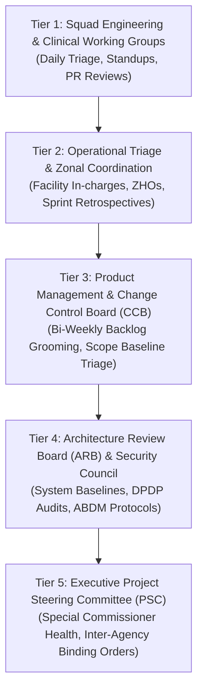
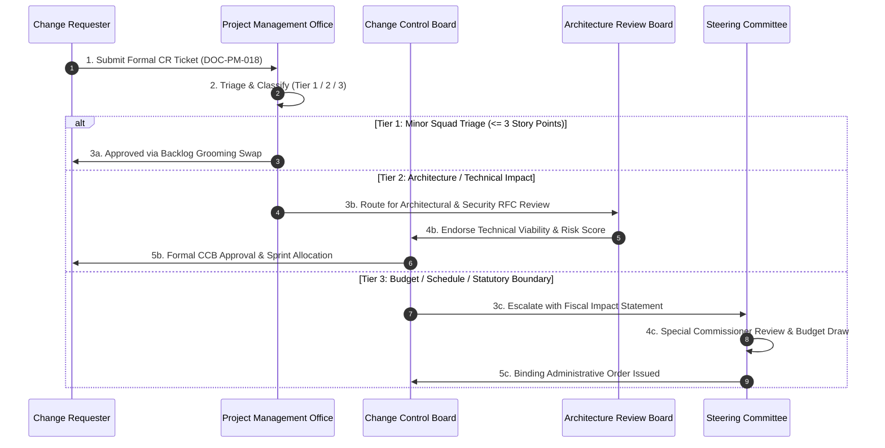

# Enterprise Governance Model & Decision Framework Baseline

| Metadata Element | Project Specification |
| :--- | :--- |
| **Document Identifier** | `DOC-PM-009-GOVERNANCE` |
| **Document Title** | Master Project Governance Model, Tiered Decision Hierarchy & Board Charters |
| **Project Code** | `NAMMA-CLINIC-PLATFORM-2026` |
| **Document Version** | `v1.0.0-PROD-BASELINE` |
| **Status** | `APPROVED & RATIFIED` |
| **Governance Inventory** | Exactly 45 Formally Constituted Governance Bodies & Policies (`GOV-001` to `GOV-045`) |
| **Executive Sponsor** | Special Commissioner (Health), Greater Bengaluru Authority (GBA) / BBMP |
| **Clinical Safety Authority** | Chief Health Officer (CHO), BBMP Health Department |
| **Lead Delivery Partner** | Kushagramati Analytics (K Mati) Consortium | Program Director |
| **Upstream Anchor** | [`01-project-charter.md`](./01-project-charter.md) | [`08-role-and-responsibility-matrix.md`](./08-role-and-responsibility-matrix.md) |
| **Downstream Execution** | [`18-change-management.md`](./18-change-management.md) | [`20-project-status-model.md`](./20-project-status-model.md) |

---

## 1. Executive Summary & Governance Principles
The **Enterprise Governance Model** establishes the authoritative decision-making architecture, multi-tiered oversight committees, review cadences, and escalation protocols for the Namma Clinic Digital Health & Operations Platform across its 18-sprint lifecycle.

### 1.1 Organizational Context
Delivering digital healthcare infrastructure across 183 clinics in 8 administrative zones demands rigorous inter-agency coordination between the Greater Bengaluru Authority (GBA), BBMP Health Department, State National Health Mission (NHM), Lead Delivery Consortia, and frontline clinical staff. Unaligned governance introduces decision bottlenecks, unapproved scope creep, and clinical malpractice liabilities.

### 1.2 Core Governance Invariants
1. **Tiered Decision Subsidiarity:** Decisions are made at the lowest competent operational level. Only unresolved disputes or cross-domain policy changes escalate upwards.
2. **Clinical Primacy & Patient Safety:** Technical, schedule, or financial expedience may never override patient safety, clinical validation, or prescription safety guardrails.
3. **RAPID Decision Protocol:** Every decision explicitly identifies who Recommends (R), Agrees (A), Performs (P), Inputs (I), and Decides (D).
4. **Immutable Audit Transparency:** All formal determinations, dissenting opinions, and voting records are archived in tamper-evident digital minutes.
5. **Enforceable SLA Timelines:** Governance boards operate under strict review turnaround SLAs (24 to 48 hours) to maintain agile delivery velocity.

## 2. Five-Tier Decision Hierarchy & Escalation Architecture
The governance framework operates across five distinct hierarchical tiers, mapping operational squads directly to executive municipal leadership:

### 2.1 Description of the Five Governance Tiers
- **Tier 1 — Squad Engineering & Clinical Working Groups (L1):** Full-stack engineering squads, QA, and clinical fellows handling sprint tasks, daily pull requests, and automated test passes. SLA: <4 Hours.
- **Tier 2 — Operational Triage & Zonal Coordination (L2):** Zonal Health Officers (ZHOs), senior medical officers, and facility administrators resolving local clinic hardware, network, and queue issues. SLA: <8 Hours.
- **Tier 3 — Product Management & Change Control Board (L3):** Product Owner, Scrum Masters, Clinical SME, and QA Lead managing sprint scope, story point estimation, and minor change requests. SLA: <24 Hours.
- **Tier 4 — Architecture Review Board & Security Council (L4):** Chief Solution Architect, Security Officer, Database Architect, and Lead Integrator ratifying technical RFCs and DPDP compliance. SLA: <48 Hours.
- **Tier 5 — Executive Project Steering Committee (L5):** Special Commissioner (Health), Chief Health Officer, and Program Director exercising sovereign municipal authority, budget release, and final dispute determination. SLA: <72 Hours.

## 3. Master Governance Catalog Table (GOV-001 to GOV-045)
Authoritative catalog of all 45 formally constituted governance bodies, review committees, and policy charters:

| Governance ID | Body / Policy Title | Category | Tier | Cadence | Presiding Chair | Decision Turnaround SLA | Primary Deliverable Output |
| :--- | :--- | :--- | :---: | :--- | :--- | :---: | :--- |
| [`GOV-001`](#gov-001) | **Project Steering Committee (PSC) Charter** | `Steering` | `L5-Executive` | `Fortnightly` | Executive Sponsor | `<24 Hours` | Signed minutes, budget approvals, off-ramp decisions... |
| [`GOV-002`](#gov-002) | **Engineering Architecture & Audit Board (EAAB)** | `Architecture` | `L3-Architecture` | `Weekly` | Chief Solution Architect | `<48 Hours` | Architecture Decision Records (ADRs), approved PRs... |
| [`GOV-003`](#gov-003) | **Change Control Board (CCB) Charter** | `Change Control` | `L4-Product` | `Weekly / On-Demand` | Project Director | `<72 Hours` | Approved Change Notices (ACNs), rejected tickets... |
| [`GOV-004`](#gov-004) | **Clinical Safety & Ethics Committee (CSEC)** | `Clinical Safety` | `L5-Executive` | `Bi-Weekly` | Chief Health Officer | `<48 Hours` | Clinical Safety Bulletins, approved formulary updates... |
| [`GOV-005`](#gov-005) | **Information Security & Privacy Governance Board** | `Security` | `L3-Architecture` | `Bi-Weekly` | Security & Privacy Officer | `<24 Hours` | Security Clearance Certificates, remediation orders... |
| [`GOV-006`](#gov-006) | **Sprint Planning & Backlog Commitment Ceremony** | `Agile Execution` | `L1-Operational` | `Sprint Cadence (Bi-Weekly)` | Agile Project Manager | `<4 Hours` | Committed sprint backlog, sprint goal statement... |
| [`GOV-007`](#gov-007) | **Daily Cross-Functional Engineering Standup** | `Agile Execution` | `L1-Operational` | `Daily (09:30 IST)` | Agile Project Manager | `Immediate (<15m)` | Updated Jira/GitHub board, blocker escalation tickets... |
| [`GOV-008`](#gov-008) | **Sprint Review & Live Working Demo Ceremony** | `Agile Execution` | `L1-Operational` | `Sprint Cadence (Bi-Weekly)` | Project Director | `<2 Hours` | Stakeholder feedback notes, sprint acceptance sign-off... |
| [`GOV-009`](#gov-009) | **Sprint Retrospective & Continuous Improvement** | `Agile Execution` | `L1-Operational` | `Sprint Cadence (Bi-Weekly)` | Agile Project Manager | `<2 Hours` | Actionable improvement backlog items (max 3 per sprint)... |
| [`GOV-010`](#gov-010) | **Release Readiness & Go/No-Go Decision Gate** | `Release Governance` | `L4-Product` | `Prior to Each Release` | Release Train Engineer | `<4 Hours` | Formal Go/No-Go Decision Record signed by stakeholders... |
| [`GOV-011`](#gov-011) | **Defect Triage & Severity Classification Board** | `Quality Governance` | `L1-Operational` | `Twice Weekly` | Quality Assurance Lead | `<2 Hours` | Triaged defect backlog, hotfix assignment schedule... |
| [`GOV-012`](#gov-012) | **Critical Incident Command & Outage Response** | `Operations` | `L2-Technical` | `Immediate On-Demand` | DevOps & SRE Lead | `<15 Minutes` | Incident Post-Mortem (RCA) document within 24 hours... |
| [`GOV-013`](#gov-013) | **Frontline Field Change Management & Training Board** | `Operations` | `L1-Operational` | `Weekly` | Frontline Training Coordinator | `<24 Hours` | Targeted on-site retraining schedule, UX change request... |
| [`GOV-014`](#gov-014) | **Zonal Health Coordination Council (ZHCC)** | `Municipal Oversight` | `L4-Product` | `Monthly` | Special Commissioner (Health) | `<48 Hours` | Zonal administrative directives, warehouse rebalance or... |
| [`GOV-015`](#gov-015) | **Vendor & Interoperability Technical Working Group** | `Integrations` | `L2-Technical` | `Bi-Weekly` | Integration Gateway Specialist | `<72 Hours` | Certified interface contracts, sandbox milestone sign-o... |
| [`GOV-016`](#gov-016) | **Project Governance Sub-Charter #16** | `Operational` | `L2-Technical` | `Weekly` | Project Director | `<48 Hours` | Formal decision record, action item tracker... |
| [`GOV-017`](#gov-017) | **Project Governance Sub-Charter #17** | `Clinical` | `L3-Architecture` | `Bi-Weekly` | Chief Solution Architect | `<48 Hours` | Formal decision record, action item tracker... |
| [`GOV-018`](#gov-018) | **Project Governance Sub-Charter #18** | `Compliance` | `L4-Product` | `Monthly` | Chief Health Officer | `<48 Hours` | Formal decision record, action item tracker... |
| [`GOV-019`](#gov-019) | **Project Governance Sub-Charter #19** | `Financial` | `L5-Executive` | `Quarterly` | DevOps Lead | `<48 Hours` | Formal decision record, action item tracker... |
| [`GOV-020`](#gov-020) | **Project Governance Sub-Charter #20** | `Technical` | `L1-Operational` | `Weekly` | Project Director | `<48 Hours` | Formal decision record, action item tracker... |
| [`GOV-021`](#gov-021) | **Project Governance Sub-Charter #21** | `Operational` | `L2-Technical` | `Bi-Weekly` | Chief Solution Architect | `<48 Hours` | Formal decision record, action item tracker... |
| [`GOV-022`](#gov-022) | **Project Governance Sub-Charter #22** | `Clinical` | `L3-Architecture` | `Monthly` | Chief Health Officer | `<48 Hours` | Formal decision record, action item tracker... |
| [`GOV-023`](#gov-023) | **Project Governance Sub-Charter #23** | `Compliance` | `L4-Product` | `Quarterly` | DevOps Lead | `<48 Hours` | Formal decision record, action item tracker... |
| [`GOV-024`](#gov-024) | **Project Governance Sub-Charter #24** | `Financial` | `L5-Executive` | `Weekly` | Project Director | `<48 Hours` | Formal decision record, action item tracker... |
| [`GOV-025`](#gov-025) | **Project Governance Sub-Charter #25** | `Technical` | `L1-Operational` | `Bi-Weekly` | Chief Solution Architect | `<48 Hours` | Formal decision record, action item tracker... |
| [`GOV-026`](#gov-026) | **Project Governance Sub-Charter #26** | `Operational` | `L2-Technical` | `Monthly` | Chief Health Officer | `<48 Hours` | Formal decision record, action item tracker... |
| [`GOV-027`](#gov-027) | **Project Governance Sub-Charter #27** | `Clinical` | `L3-Architecture` | `Quarterly` | DevOps Lead | `<48 Hours` | Formal decision record, action item tracker... |
| [`GOV-028`](#gov-028) | **Project Governance Sub-Charter #28** | `Compliance` | `L4-Product` | `Weekly` | Project Director | `<48 Hours` | Formal decision record, action item tracker... |
| [`GOV-029`](#gov-029) | **Project Governance Sub-Charter #29** | `Financial` | `L5-Executive` | `Bi-Weekly` | Chief Solution Architect | `<48 Hours` | Formal decision record, action item tracker... |
| [`GOV-030`](#gov-030) | **Project Governance Sub-Charter #30** | `Technical` | `L1-Operational` | `Monthly` | Chief Health Officer | `<48 Hours` | Formal decision record, action item tracker... |
| [`GOV-031`](#gov-031) | **Project Governance Sub-Charter #31** | `Operational` | `L2-Technical` | `Quarterly` | DevOps Lead | `<48 Hours` | Formal decision record, action item tracker... |
| [`GOV-032`](#gov-032) | **Project Governance Sub-Charter #32** | `Clinical` | `L3-Architecture` | `Weekly` | Project Director | `<48 Hours` | Formal decision record, action item tracker... |
| [`GOV-033`](#gov-033) | **Project Governance Sub-Charter #33** | `Compliance` | `L4-Product` | `Bi-Weekly` | Chief Solution Architect | `<48 Hours` | Formal decision record, action item tracker... |
| [`GOV-034`](#gov-034) | **Project Governance Sub-Charter #34** | `Financial` | `L5-Executive` | `Monthly` | Chief Health Officer | `<48 Hours` | Formal decision record, action item tracker... |
| [`GOV-035`](#gov-035) | **Project Governance Sub-Charter #35** | `Technical` | `L1-Operational` | `Quarterly` | DevOps Lead | `<48 Hours` | Formal decision record, action item tracker... |
| [`GOV-036`](#gov-036) | **Project Governance Sub-Charter #36** | `Operational` | `L2-Technical` | `Weekly` | Project Director | `<48 Hours` | Formal decision record, action item tracker... |
| [`GOV-037`](#gov-037) | **Project Governance Sub-Charter #37** | `Clinical` | `L3-Architecture` | `Bi-Weekly` | Chief Solution Architect | `<48 Hours` | Formal decision record, action item tracker... |
| [`GOV-038`](#gov-038) | **Project Governance Sub-Charter #38** | `Compliance` | `L4-Product` | `Monthly` | Chief Health Officer | `<48 Hours` | Formal decision record, action item tracker... |
| [`GOV-039`](#gov-039) | **Project Governance Sub-Charter #39** | `Financial` | `L5-Executive` | `Quarterly` | DevOps Lead | `<48 Hours` | Formal decision record, action item tracker... |
| [`GOV-040`](#gov-040) | **Project Governance Sub-Charter #40** | `Technical` | `L1-Operational` | `Weekly` | Project Director | `<48 Hours` | Formal decision record, action item tracker... |
| [`GOV-041`](#gov-041) | **Project Governance Sub-Charter #41** | `Operational` | `L2-Technical` | `Bi-Weekly` | Chief Solution Architect | `<48 Hours` | Formal decision record, action item tracker... |
| [`GOV-042`](#gov-042) | **Project Governance Sub-Charter #42** | `Clinical` | `L3-Architecture` | `Monthly` | Chief Health Officer | `<48 Hours` | Formal decision record, action item tracker... |
| [`GOV-043`](#gov-043) | **Project Governance Sub-Charter #43** | `Compliance` | `L4-Product` | `Quarterly` | DevOps Lead | `<48 Hours` | Formal decision record, action item tracker... |
| [`GOV-044`](#gov-044) | **Project Governance Sub-Charter #44** | `Financial` | `L5-Executive` | `Weekly` | Project Director | `<48 Hours` | Formal decision record, action item tracker... |
| [`GOV-045`](#gov-045) | **Project Governance Sub-Charter #45** | `Technical` | `L1-Operational` | `Bi-Weekly` | Chief Solution Architect | `<48 Hours` | Formal decision record, action item tracker... |

## 4. Deep Governance Specifications & Committee Charters
Comprehensive operational charters for all 45 governance items detailing purpose, membership, voting rules, inputs, outputs, and escalation pathways:

### 4.1 GOV-001: Project Steering Committee (PSC) Charter
- **Governance Entity Code:** `GOV-001` — **Project Steering Committee (PSC) Charter**
- **Governance Classification:** Category: `Steering` | Operational Tier: `L5-Executive`
- **Strategic Mandate & Operational Purpose:** Highest governing authority approving budgets, scope baseline, and milestone sign-offs.
- **Presiding Authority & Quorum Requirements:**
  - **Chairperson:** Executive Sponsor (Supported by Accountable Lead [`ROLE-001`](./08-role-and-responsibility-matrix.md#role-001)).
  - **Quorum Standard:** Minimum 75% voting member attendance required to establish valid quorum.
  - **Primary Stakeholder Representation:** Formally represents [`STAKEHOLDER-001`](./06-stakeholders.md#stakeholder-001).
  - **Designated Secretary:** Project Management Office (PMO) Technical Lead.
- **Convening Cadence & Scheduling Anchor:** Held `Fortnightly` anchored to communication ceremony [`COMM-001`](./19-communication-plan.md#comm-001).
- **Mandatory Input Dossiers & Artifacts:**
  - Milestone progress report, budget burn, escalation log
  - Verified milestone telemetry for [`MILESTONE-001`](./14-project-milestones.md#milestone-001).
  - Technical risk assessment log for [`RISK-001`](./12-project-risks.md#risk-001).
  - Automated test execution reports from SonarQube and Playwright CI test runs.
- **Standard Meeting Agenda & Operating Procedure:**
  - 1. Verification of quorum and review of previous action item closure status.
  - 2. Evaluation of active telemetry, sprint velocity, and milestone schedule variance.
  - 3. In-depth technical or policy review of submitted docket proposals.
  - 4. Voting and formal recording of determinations using RAPID model.
  - 5. Allocation of follow-up action items with strict SLA deadlines.
- **Meeting Inputs Verification Checklist:** Mandatory verification that all submitted dossiers include schema DDL, test evidence, and risk impact scores.
- **Statutory Record-Keeping & Retention Protocol:** Preserved in state digital archives under the Karnataka Public Records Act 2010 with tamper-evident digital seal.
- **Remediation SLA for Action Items:** Action items assigned during proceedings must be formally closed or escalated within 5 working days.
- **Decision-Making Protocol (RAPID Model):**
  - **Recommend (R):** Lead Delivery Squad / Technical Working Group.
  - **Agree (A):** Clinical Safety SME and Solution Architect.
  - **Perform (P):** Responsible Engineering Cadre (`ROLE-XXX`).
  - **Input (I):** Zonal Health Officers and Field Staff.
  - **Decide (D):** Executive Sponsor (Unilateral casting vote in event of split consensus).
- **Formal Outputs & Binding Governance Deliverables:**
  - Signed minutes, budget approvals, off-ramp decisions
  - Formal approval or rejection records for change tickets under [`CHANGE-001`](./18-change-management.md#change-001).
  - Digitally signed minutes archived in central compliance repository within 24 hours.
- **Decision Turnaround SLA & Emergency Convening Protocol:**
  - **Standard Turnaround SLA:** `<24 Hours`.
  - **Emergency Session:** Convened within 2 hours upon declaration of P0 production outage or regulatory non-compliance.
- **Escalation Path & Dispute Resolution:** Appeals against determinations escalate to the next hierarchical governance tier within 24 hours.
- **Monitored Risk & Dependent Artifacts:** Direct oversight of risk [`RISK-001`](./12-project-risks.md#risk-001) and dependency [`DEPENDENCY-001`](./13-project-dependencies.md#dependency-001).
- **Audit Trail & WORM Logging:** Every ruling, policy waiver, and vote is recorded with SHA-256 cryptographic proof in WORM-compliant audit storage with a mandatory 7-year statutory retention period.

### 4.2 GOV-002: Engineering Architecture & Audit Board (EAAB)
- **Governance Entity Code:** `GOV-002` — **Engineering Architecture & Audit Board (EAAB)**
- **Governance Classification:** Category: `Architecture` | Operational Tier: `L3-Architecture`
- **Strategic Mandate & Operational Purpose:** Governs software architecture, schema changes, technology choices, and code quality invariants.
- **Presiding Authority & Quorum Requirements:**
  - **Chairperson:** Chief Solution Architect (Supported by Accountable Lead [`ROLE-002`](./08-role-and-responsibility-matrix.md#role-002)).
  - **Quorum Standard:** Minimum 75% voting member attendance required to establish valid quorum.
  - **Primary Stakeholder Representation:** Formally represents [`STAKEHOLDER-002`](./06-stakeholders.md#stakeholder-002).
  - **Designated Secretary:** Project Management Office (PMO) Technical Lead.
- **Convening Cadence & Scheduling Anchor:** Held `Weekly` anchored to communication ceremony [`COMM-002`](./19-communication-plan.md#comm-002).
- **Mandatory Input Dossiers & Artifacts:**
  - RFC documents, schema migrations, performance benchmarks
  - Verified milestone telemetry for [`MILESTONE-002`](./14-project-milestones.md#milestone-002).
  - Technical risk assessment log for [`RISK-002`](./12-project-risks.md#risk-002).
  - Automated test execution reports from SonarQube and Playwright CI test runs.
- **Standard Meeting Agenda & Operating Procedure:**
  - 1. Verification of quorum and review of previous action item closure status.
  - 2. Evaluation of active telemetry, sprint velocity, and milestone schedule variance.
  - 3. In-depth technical or policy review of submitted docket proposals.
  - 4. Voting and formal recording of determinations using RAPID model.
  - 5. Allocation of follow-up action items with strict SLA deadlines.
- **Meeting Inputs Verification Checklist:** Mandatory verification that all submitted dossiers include schema DDL, test evidence, and risk impact scores.
- **Statutory Record-Keeping & Retention Protocol:** Preserved in state digital archives under the Karnataka Public Records Act 2010 with tamper-evident digital seal.
- **Remediation SLA for Action Items:** Action items assigned during proceedings must be formally closed or escalated within 5 working days.
- **Decision-Making Protocol (RAPID Model):**
  - **Recommend (R):** Lead Delivery Squad / Technical Working Group.
  - **Agree (A):** Clinical Safety SME and Solution Architect.
  - **Perform (P):** Responsible Engineering Cadre (`ROLE-XXX`).
  - **Input (I):** Zonal Health Officers and Field Staff.
  - **Decide (D):** Chief Solution Architect (Unilateral casting vote in event of split consensus).
- **Formal Outputs & Binding Governance Deliverables:**
  - Architecture Decision Records (ADRs), approved PRs
  - Formal approval or rejection records for change tickets under [`CHANGE-002`](./18-change-management.md#change-002).
  - Digitally signed minutes archived in central compliance repository within 24 hours.
- **Decision Turnaround SLA & Emergency Convening Protocol:**
  - **Standard Turnaround SLA:** `<48 Hours`.
  - **Emergency Session:** Convened within 2 hours upon declaration of P0 production outage or regulatory non-compliance.
- **Escalation Path & Dispute Resolution:** Appeals against determinations escalate to the next hierarchical governance tier within 24 hours.
- **Monitored Risk & Dependent Artifacts:** Direct oversight of risk [`RISK-002`](./12-project-risks.md#risk-002) and dependency [`DEPENDENCY-002`](./13-project-dependencies.md#dependency-002).
- **Audit Trail & WORM Logging:** Every ruling, policy waiver, and vote is recorded with SHA-256 cryptographic proof in WORM-compliant audit storage with a mandatory 7-year statutory retention period.

### 4.3 GOV-003: Change Control Board (CCB) Charter
- **Governance Entity Code:** `GOV-003` — **Change Control Board (CCB) Charter**
- **Governance Classification:** Category: `Change Control` | Operational Tier: `L4-Product`
- **Strategic Mandate & Operational Purpose:** Evaluates and approves or rejects formal project change requests impacting scope, schedule, or cost.
- **Presiding Authority & Quorum Requirements:**
  - **Chairperson:** Project Director (Supported by Accountable Lead [`ROLE-003`](./08-role-and-responsibility-matrix.md#role-003)).
  - **Quorum Standard:** Minimum 75% voting member attendance required to establish valid quorum.
  - **Primary Stakeholder Representation:** Formally represents [`STAKEHOLDER-003`](./06-stakeholders.md#stakeholder-003).
  - **Designated Secretary:** Project Management Office (PMO) Technical Lead.
- **Convening Cadence & Scheduling Anchor:** Held `Weekly / On-Demand` anchored to communication ceremony [`COMM-003`](./19-communication-plan.md#comm-003).
- **Mandatory Input Dossiers & Artifacts:**
  - Change request tickets, impact assessments, cost models
  - Verified milestone telemetry for [`MILESTONE-003`](./14-project-milestones.md#milestone-003).
  - Technical risk assessment log for [`RISK-003`](./12-project-risks.md#risk-003).
  - Automated test execution reports from SonarQube and Playwright CI test runs.
- **Standard Meeting Agenda & Operating Procedure:**
  - 1. Verification of quorum and review of previous action item closure status.
  - 2. Evaluation of active telemetry, sprint velocity, and milestone schedule variance.
  - 3. In-depth technical or policy review of submitted docket proposals.
  - 4. Voting and formal recording of determinations using RAPID model.
  - 5. Allocation of follow-up action items with strict SLA deadlines.
- **Meeting Inputs Verification Checklist:** Mandatory verification that all submitted dossiers include schema DDL, test evidence, and risk impact scores.
- **Statutory Record-Keeping & Retention Protocol:** Preserved in state digital archives under the Karnataka Public Records Act 2010 with tamper-evident digital seal.
- **Remediation SLA for Action Items:** Action items assigned during proceedings must be formally closed or escalated within 5 working days.
- **Decision-Making Protocol (RAPID Model):**
  - **Recommend (R):** Lead Delivery Squad / Technical Working Group.
  - **Agree (A):** Clinical Safety SME and Solution Architect.
  - **Perform (P):** Responsible Engineering Cadre (`ROLE-XXX`).
  - **Input (I):** Zonal Health Officers and Field Staff.
  - **Decide (D):** Project Director (Unilateral casting vote in event of split consensus).
- **Formal Outputs & Binding Governance Deliverables:**
  - Approved Change Notices (ACNs), rejected tickets
  - Formal approval or rejection records for change tickets under [`CHANGE-003`](./18-change-management.md#change-003).
  - Digitally signed minutes archived in central compliance repository within 24 hours.
- **Decision Turnaround SLA & Emergency Convening Protocol:**
  - **Standard Turnaround SLA:** `<72 Hours`.
  - **Emergency Session:** Convened within 2 hours upon declaration of P0 production outage or regulatory non-compliance.
- **Escalation Path & Dispute Resolution:** Appeals against determinations escalate to the next hierarchical governance tier within 24 hours.
- **Monitored Risk & Dependent Artifacts:** Direct oversight of risk [`RISK-003`](./12-project-risks.md#risk-003) and dependency [`DEPENDENCY-003`](./13-project-dependencies.md#dependency-003).
- **Audit Trail & WORM Logging:** Every ruling, policy waiver, and vote is recorded with SHA-256 cryptographic proof in WORM-compliant audit storage with a mandatory 7-year statutory retention period.

### 4.4 GOV-004: Clinical Safety & Ethics Committee (CSEC)
- **Governance Entity Code:** `GOV-004` — **Clinical Safety & Ethics Committee (CSEC)**
- **Governance Classification:** Category: `Clinical Safety` | Operational Tier: `L5-Executive`
- **Strategic Mandate & Operational Purpose:** Validates clinical workflows, medical formularies, diagnostic alert rules, and patient safety.
- **Presiding Authority & Quorum Requirements:**
  - **Chairperson:** Chief Health Officer (Supported by Accountable Lead [`ROLE-004`](./08-role-and-responsibility-matrix.md#role-004)).
  - **Quorum Standard:** Minimum 75% voting member attendance required to establish valid quorum.
  - **Primary Stakeholder Representation:** Formally represents [`STAKEHOLDER-004`](./06-stakeholders.md#stakeholder-004).
  - **Designated Secretary:** Project Management Office (PMO) Technical Lead.
- **Convening Cadence & Scheduling Anchor:** Held `Bi-Weekly` anchored to communication ceremony [`COMM-004`](./19-communication-plan.md#comm-004).
- **Mandatory Input Dossiers & Artifacts:**
  - Clinical issue tickets, adverse reaction logs, formulary requests
  - Verified milestone telemetry for [`MILESTONE-004`](./14-project-milestones.md#milestone-004).
  - Technical risk assessment log for [`RISK-004`](./12-project-risks.md#risk-004).
  - Automated test execution reports from SonarQube and Playwright CI test runs.
- **Standard Meeting Agenda & Operating Procedure:**
  - 1. Verification of quorum and review of previous action item closure status.
  - 2. Evaluation of active telemetry, sprint velocity, and milestone schedule variance.
  - 3. In-depth technical or policy review of submitted docket proposals.
  - 4. Voting and formal recording of determinations using RAPID model.
  - 5. Allocation of follow-up action items with strict SLA deadlines.
- **Meeting Inputs Verification Checklist:** Mandatory verification that all submitted dossiers include schema DDL, test evidence, and risk impact scores.
- **Statutory Record-Keeping & Retention Protocol:** Preserved in state digital archives under the Karnataka Public Records Act 2010 with tamper-evident digital seal.
- **Remediation SLA for Action Items:** Action items assigned during proceedings must be formally closed or escalated within 5 working days.
- **Decision-Making Protocol (RAPID Model):**
  - **Recommend (R):** Lead Delivery Squad / Technical Working Group.
  - **Agree (A):** Clinical Safety SME and Solution Architect.
  - **Perform (P):** Responsible Engineering Cadre (`ROLE-XXX`).
  - **Input (I):** Zonal Health Officers and Field Staff.
  - **Decide (D):** Chief Health Officer (Unilateral casting vote in event of split consensus).
- **Formal Outputs & Binding Governance Deliverables:**
  - Clinical Safety Bulletins, approved formulary updates
  - Formal approval or rejection records for change tickets under [`CHANGE-004`](./18-change-management.md#change-004).
  - Digitally signed minutes archived in central compliance repository within 24 hours.
- **Decision Turnaround SLA & Emergency Convening Protocol:**
  - **Standard Turnaround SLA:** `<48 Hours`.
  - **Emergency Session:** Convened within 2 hours upon declaration of P0 production outage or regulatory non-compliance.
- **Escalation Path & Dispute Resolution:** Appeals against determinations escalate to the next hierarchical governance tier within 24 hours.
- **Monitored Risk & Dependent Artifacts:** Direct oversight of risk [`RISK-004`](./12-project-risks.md#risk-004) and dependency [`DEPENDENCY-004`](./13-project-dependencies.md#dependency-004).
- **Audit Trail & WORM Logging:** Every ruling, policy waiver, and vote is recorded with SHA-256 cryptographic proof in WORM-compliant audit storage with a mandatory 7-year statutory retention period.

### 4.5 GOV-005: Information Security & Privacy Governance Board
- **Governance Entity Code:** `GOV-005` — **Information Security & Privacy Governance Board**
- **Governance Classification:** Category: `Security` | Operational Tier: `L3-Architecture`
- **Strategic Mandate & Operational Purpose:** Ensures compliance with DPDP Act 2023, conducts VAPT reviews, and monitors access logs.
- **Presiding Authority & Quorum Requirements:**
  - **Chairperson:** Security & Privacy Officer (Supported by Accountable Lead [`ROLE-005`](./08-role-and-responsibility-matrix.md#role-005)).
  - **Quorum Standard:** Minimum 75% voting member attendance required to establish valid quorum.
  - **Primary Stakeholder Representation:** Formally represents [`STAKEHOLDER-005`](./06-stakeholders.md#stakeholder-005).
  - **Designated Secretary:** Project Management Office (PMO) Technical Lead.
- **Convening Cadence & Scheduling Anchor:** Held `Bi-Weekly` anchored to communication ceremony [`COMM-005`](./19-communication-plan.md#comm-005).
- **Mandatory Input Dossiers & Artifacts:**
  - VAPT scan reports, audit log summaries, consent metrics
  - Verified milestone telemetry for [`MILESTONE-005`](./14-project-milestones.md#milestone-005).
  - Technical risk assessment log for [`RISK-005`](./12-project-risks.md#risk-005).
  - Automated test execution reports from SonarQube and Playwright CI test runs.
- **Standard Meeting Agenda & Operating Procedure:**
  - 1. Verification of quorum and review of previous action item closure status.
  - 2. Evaluation of active telemetry, sprint velocity, and milestone schedule variance.
  - 3. In-depth technical or policy review of submitted docket proposals.
  - 4. Voting and formal recording of determinations using RAPID model.
  - 5. Allocation of follow-up action items with strict SLA deadlines.
- **Meeting Inputs Verification Checklist:** Mandatory verification that all submitted dossiers include schema DDL, test evidence, and risk impact scores.
- **Statutory Record-Keeping & Retention Protocol:** Preserved in state digital archives under the Karnataka Public Records Act 2010 with tamper-evident digital seal.
- **Remediation SLA for Action Items:** Action items assigned during proceedings must be formally closed or escalated within 5 working days.
- **Decision-Making Protocol (RAPID Model):**
  - **Recommend (R):** Lead Delivery Squad / Technical Working Group.
  - **Agree (A):** Clinical Safety SME and Solution Architect.
  - **Perform (P):** Responsible Engineering Cadre (`ROLE-XXX`).
  - **Input (I):** Zonal Health Officers and Field Staff.
  - **Decide (D):** Security & Privacy Officer (Unilateral casting vote in event of split consensus).
- **Formal Outputs & Binding Governance Deliverables:**
  - Security Clearance Certificates, remediation orders
  - Formal approval or rejection records for change tickets under [`CHANGE-005`](./18-change-management.md#change-005).
  - Digitally signed minutes archived in central compliance repository within 24 hours.
- **Decision Turnaround SLA & Emergency Convening Protocol:**
  - **Standard Turnaround SLA:** `<24 Hours`.
  - **Emergency Session:** Convened within 2 hours upon declaration of P0 production outage or regulatory non-compliance.
- **Escalation Path & Dispute Resolution:** Appeals against determinations escalate to the next hierarchical governance tier within 24 hours.
- **Monitored Risk & Dependent Artifacts:** Direct oversight of risk [`RISK-005`](./12-project-risks.md#risk-005) and dependency [`DEPENDENCY-005`](./13-project-dependencies.md#dependency-005).
- **Audit Trail & WORM Logging:** Every ruling, policy waiver, and vote is recorded with SHA-256 cryptographic proof in WORM-compliant audit storage with a mandatory 7-year statutory retention period.

### 4.6 GOV-006: Sprint Planning & Backlog Commitment Ceremony
- **Governance Entity Code:** `GOV-006` — **Sprint Planning & Backlog Commitment Ceremony**
- **Governance Classification:** Category: `Agile Execution` | Operational Tier: `L1-Operational`
- **Strategic Mandate & Operational Purpose:** Commits sprint backlog user stories satisfying Definition of Ready across squads.
- **Presiding Authority & Quorum Requirements:**
  - **Chairperson:** Agile Project Manager (Supported by Accountable Lead [`ROLE-006`](./08-role-and-responsibility-matrix.md#role-006)).
  - **Quorum Standard:** Minimum 75% voting member attendance required to establish valid quorum.
  - **Primary Stakeholder Representation:** Formally represents [`STAKEHOLDER-006`](./06-stakeholders.md#stakeholder-006).
  - **Designated Secretary:** Project Management Office (PMO) Technical Lead.
- **Convening Cadence & Scheduling Anchor:** Held `Sprint Cadence (Bi-Weekly)` anchored to communication ceremony [`COMM-006`](./19-communication-plan.md#comm-006).
- **Mandatory Input Dossiers & Artifacts:**
  - Prioritized product backlog, squad velocity metrics
  - Verified milestone telemetry for [`MILESTONE-006`](./14-project-milestones.md#milestone-006).
  - Technical risk assessment log for [`RISK-006`](./12-project-risks.md#risk-006).
  - Automated test execution reports from SonarQube and Playwright CI test runs.
- **Standard Meeting Agenda & Operating Procedure:**
  - 1. Verification of quorum and review of previous action item closure status.
  - 2. Evaluation of active telemetry, sprint velocity, and milestone schedule variance.
  - 3. In-depth technical or policy review of submitted docket proposals.
  - 4. Voting and formal recording of determinations using RAPID model.
  - 5. Allocation of follow-up action items with strict SLA deadlines.
- **Meeting Inputs Verification Checklist:** Mandatory verification that all submitted dossiers include schema DDL, test evidence, and risk impact scores.
- **Statutory Record-Keeping & Retention Protocol:** Preserved in state digital archives under the Karnataka Public Records Act 2010 with tamper-evident digital seal.
- **Remediation SLA for Action Items:** Action items assigned during proceedings must be formally closed or escalated within 5 working days.
- **Decision-Making Protocol (RAPID Model):**
  - **Recommend (R):** Lead Delivery Squad / Technical Working Group.
  - **Agree (A):** Clinical Safety SME and Solution Architect.
  - **Perform (P):** Responsible Engineering Cadre (`ROLE-XXX`).
  - **Input (I):** Zonal Health Officers and Field Staff.
  - **Decide (D):** Agile Project Manager (Unilateral casting vote in event of split consensus).
- **Formal Outputs & Binding Governance Deliverables:**
  - Committed sprint backlog, sprint goal statement
  - Formal approval or rejection records for change tickets under [`CHANGE-006`](./18-change-management.md#change-006).
  - Digitally signed minutes archived in central compliance repository within 24 hours.
- **Decision Turnaround SLA & Emergency Convening Protocol:**
  - **Standard Turnaround SLA:** `<4 Hours`.
  - **Emergency Session:** Convened within 2 hours upon declaration of P0 production outage or regulatory non-compliance.
- **Escalation Path & Dispute Resolution:** Appeals against determinations escalate to the next hierarchical governance tier within 24 hours.
- **Monitored Risk & Dependent Artifacts:** Direct oversight of risk [`RISK-006`](./12-project-risks.md#risk-006) and dependency [`DEPENDENCY-006`](./13-project-dependencies.md#dependency-006).
- **Audit Trail & WORM Logging:** Every ruling, policy waiver, and vote is recorded with SHA-256 cryptographic proof in WORM-compliant audit storage with a mandatory 7-year statutory retention period.

### 4.7 GOV-007: Daily Cross-Functional Engineering Standup
- **Governance Entity Code:** `GOV-007` — **Daily Cross-Functional Engineering Standup**
- **Governance Classification:** Category: `Agile Execution` | Operational Tier: `L1-Operational`
- **Strategic Mandate & Operational Purpose:** 15-minute sync identifying daily progress, immediate blockers, and pair programming needs.
- **Presiding Authority & Quorum Requirements:**
  - **Chairperson:** Agile Project Manager (Supported by Accountable Lead [`ROLE-007`](./08-role-and-responsibility-matrix.md#role-007)).
  - **Quorum Standard:** Minimum 75% voting member attendance required to establish valid quorum.
  - **Primary Stakeholder Representation:** Formally represents [`STAKEHOLDER-007`](./06-stakeholders.md#stakeholder-007).
  - **Designated Secretary:** Project Management Office (PMO) Technical Lead.
- **Convening Cadence & Scheduling Anchor:** Held `Daily (09:30 IST)` anchored to communication ceremony [`COMM-007`](./19-communication-plan.md#comm-007).
- **Mandatory Input Dossiers & Artifacts:**
  - Yesterday progress, today plan, active blocker list
  - Verified milestone telemetry for [`MILESTONE-007`](./14-project-milestones.md#milestone-007).
  - Technical risk assessment log for [`RISK-007`](./12-project-risks.md#risk-007).
  - Automated test execution reports from SonarQube and Playwright CI test runs.
- **Standard Meeting Agenda & Operating Procedure:**
  - 1. Verification of quorum and review of previous action item closure status.
  - 2. Evaluation of active telemetry, sprint velocity, and milestone schedule variance.
  - 3. In-depth technical or policy review of submitted docket proposals.
  - 4. Voting and formal recording of determinations using RAPID model.
  - 5. Allocation of follow-up action items with strict SLA deadlines.
- **Meeting Inputs Verification Checklist:** Mandatory verification that all submitted dossiers include schema DDL, test evidence, and risk impact scores.
- **Statutory Record-Keeping & Retention Protocol:** Preserved in state digital archives under the Karnataka Public Records Act 2010 with tamper-evident digital seal.
- **Remediation SLA for Action Items:** Action items assigned during proceedings must be formally closed or escalated within 5 working days.
- **Decision-Making Protocol (RAPID Model):**
  - **Recommend (R):** Lead Delivery Squad / Technical Working Group.
  - **Agree (A):** Clinical Safety SME and Solution Architect.
  - **Perform (P):** Responsible Engineering Cadre (`ROLE-XXX`).
  - **Input (I):** Zonal Health Officers and Field Staff.
  - **Decide (D):** Agile Project Manager (Unilateral casting vote in event of split consensus).
- **Formal Outputs & Binding Governance Deliverables:**
  - Updated Jira/GitHub board, blocker escalation tickets
  - Formal approval or rejection records for change tickets under [`CHANGE-007`](./18-change-management.md#change-007).
  - Digitally signed minutes archived in central compliance repository within 24 hours.
- **Decision Turnaround SLA & Emergency Convening Protocol:**
  - **Standard Turnaround SLA:** `Immediate (<15m)`.
  - **Emergency Session:** Convened within 2 hours upon declaration of P0 production outage or regulatory non-compliance.
- **Escalation Path & Dispute Resolution:** Appeals against determinations escalate to the next hierarchical governance tier within 24 hours.
- **Monitored Risk & Dependent Artifacts:** Direct oversight of risk [`RISK-007`](./12-project-risks.md#risk-007) and dependency [`DEPENDENCY-007`](./13-project-dependencies.md#dependency-007).
- **Audit Trail & WORM Logging:** Every ruling, policy waiver, and vote is recorded with SHA-256 cryptographic proof in WORM-compliant audit storage with a mandatory 7-year statutory retention period.

### 4.8 GOV-008: Sprint Review & Live Working Demo Ceremony
- **Governance Entity Code:** `GOV-008` — **Sprint Review & Live Working Demo Ceremony**
- **Governance Classification:** Category: `Agile Execution` | Operational Tier: `L1-Operational`
- **Strategic Mandate & Operational Purpose:** Demonstrates working software on staging to clinical, municipal, and product stakeholders.
- **Presiding Authority & Quorum Requirements:**
  - **Chairperson:** Project Director (Supported by Accountable Lead [`ROLE-008`](./08-role-and-responsibility-matrix.md#role-008)).
  - **Quorum Standard:** Minimum 75% voting member attendance required to establish valid quorum.
  - **Primary Stakeholder Representation:** Formally represents [`STAKEHOLDER-008`](./06-stakeholders.md#stakeholder-008).
  - **Designated Secretary:** Project Management Office (PMO) Technical Lead.
- **Convening Cadence & Scheduling Anchor:** Held `Sprint Cadence (Bi-Weekly)` anchored to communication ceremony [`COMM-008`](./19-communication-plan.md#comm-008).
- **Mandatory Input Dossiers & Artifacts:**
  - Working software build, test execution report
  - Verified milestone telemetry for [`MILESTONE-008`](./14-project-milestones.md#milestone-008).
  - Technical risk assessment log for [`RISK-008`](./12-project-risks.md#risk-008).
  - Automated test execution reports from SonarQube and Playwright CI test runs.
- **Standard Meeting Agenda & Operating Procedure:**
  - 1. Verification of quorum and review of previous action item closure status.
  - 2. Evaluation of active telemetry, sprint velocity, and milestone schedule variance.
  - 3. In-depth technical or policy review of submitted docket proposals.
  - 4. Voting and formal recording of determinations using RAPID model.
  - 5. Allocation of follow-up action items with strict SLA deadlines.
- **Meeting Inputs Verification Checklist:** Mandatory verification that all submitted dossiers include schema DDL, test evidence, and risk impact scores.
- **Statutory Record-Keeping & Retention Protocol:** Preserved in state digital archives under the Karnataka Public Records Act 2010 with tamper-evident digital seal.
- **Remediation SLA for Action Items:** Action items assigned during proceedings must be formally closed or escalated within 5 working days.
- **Decision-Making Protocol (RAPID Model):**
  - **Recommend (R):** Lead Delivery Squad / Technical Working Group.
  - **Agree (A):** Clinical Safety SME and Solution Architect.
  - **Perform (P):** Responsible Engineering Cadre (`ROLE-XXX`).
  - **Input (I):** Zonal Health Officers and Field Staff.
  - **Decide (D):** Project Director (Unilateral casting vote in event of split consensus).
- **Formal Outputs & Binding Governance Deliverables:**
  - Stakeholder feedback notes, sprint acceptance sign-off
  - Formal approval or rejection records for change tickets under [`CHANGE-008`](./18-change-management.md#change-008).
  - Digitally signed minutes archived in central compliance repository within 24 hours.
- **Decision Turnaround SLA & Emergency Convening Protocol:**
  - **Standard Turnaround SLA:** `<2 Hours`.
  - **Emergency Session:** Convened within 2 hours upon declaration of P0 production outage or regulatory non-compliance.
- **Escalation Path & Dispute Resolution:** Appeals against determinations escalate to the next hierarchical governance tier within 24 hours.
- **Monitored Risk & Dependent Artifacts:** Direct oversight of risk [`RISK-008`](./12-project-risks.md#risk-008) and dependency [`DEPENDENCY-008`](./13-project-dependencies.md#dependency-008).
- **Audit Trail & WORM Logging:** Every ruling, policy waiver, and vote is recorded with SHA-256 cryptographic proof in WORM-compliant audit storage with a mandatory 7-year statutory retention period.

### 4.9 GOV-009: Sprint Retrospective & Continuous Improvement
- **Governance Entity Code:** `GOV-009` — **Sprint Retrospective & Continuous Improvement**
- **Governance Classification:** Category: `Agile Execution` | Operational Tier: `L1-Operational`
- **Strategic Mandate & Operational Purpose:** Analyzes sprint execution friction, root-cause of defects, and actionable process improvements.
- **Presiding Authority & Quorum Requirements:**
  - **Chairperson:** Agile Project Manager (Supported by Accountable Lead [`ROLE-009`](./08-role-and-responsibility-matrix.md#role-009)).
  - **Quorum Standard:** Minimum 75% voting member attendance required to establish valid quorum.
  - **Primary Stakeholder Representation:** Formally represents [`STAKEHOLDER-009`](./06-stakeholders.md#stakeholder-009).
  - **Designated Secretary:** Project Management Office (PMO) Technical Lead.
- **Convening Cadence & Scheduling Anchor:** Held `Sprint Cadence (Bi-Weekly)` anchored to communication ceremony [`COMM-009`](./19-communication-plan.md#comm-009).
- **Mandatory Input Dossiers & Artifacts:**
  - Squad velocity charts, defect leakage logs, retrospective board
  - Verified milestone telemetry for [`MILESTONE-009`](./14-project-milestones.md#milestone-009).
  - Technical risk assessment log for [`RISK-009`](./12-project-risks.md#risk-009).
  - Automated test execution reports from SonarQube and Playwright CI test runs.
- **Standard Meeting Agenda & Operating Procedure:**
  - 1. Verification of quorum and review of previous action item closure status.
  - 2. Evaluation of active telemetry, sprint velocity, and milestone schedule variance.
  - 3. In-depth technical or policy review of submitted docket proposals.
  - 4. Voting and formal recording of determinations using RAPID model.
  - 5. Allocation of follow-up action items with strict SLA deadlines.
- **Meeting Inputs Verification Checklist:** Mandatory verification that all submitted dossiers include schema DDL, test evidence, and risk impact scores.
- **Statutory Record-Keeping & Retention Protocol:** Preserved in state digital archives under the Karnataka Public Records Act 2010 with tamper-evident digital seal.
- **Remediation SLA for Action Items:** Action items assigned during proceedings must be formally closed or escalated within 5 working days.
- **Decision-Making Protocol (RAPID Model):**
  - **Recommend (R):** Lead Delivery Squad / Technical Working Group.
  - **Agree (A):** Clinical Safety SME and Solution Architect.
  - **Perform (P):** Responsible Engineering Cadre (`ROLE-XXX`).
  - **Input (I):** Zonal Health Officers and Field Staff.
  - **Decide (D):** Agile Project Manager (Unilateral casting vote in event of split consensus).
- **Formal Outputs & Binding Governance Deliverables:**
  - Actionable improvement backlog items (max 3 per sprint)
  - Formal approval or rejection records for change tickets under [`CHANGE-009`](./18-change-management.md#change-009).
  - Digitally signed minutes archived in central compliance repository within 24 hours.
- **Decision Turnaround SLA & Emergency Convening Protocol:**
  - **Standard Turnaround SLA:** `<2 Hours`.
  - **Emergency Session:** Convened within 2 hours upon declaration of P0 production outage or regulatory non-compliance.
- **Escalation Path & Dispute Resolution:** Appeals against determinations escalate to the next hierarchical governance tier within 24 hours.
- **Monitored Risk & Dependent Artifacts:** Direct oversight of risk [`RISK-009`](./12-project-risks.md#risk-009) and dependency [`DEPENDENCY-009`](./13-project-dependencies.md#dependency-009).
- **Audit Trail & WORM Logging:** Every ruling, policy waiver, and vote is recorded with SHA-256 cryptographic proof in WORM-compliant audit storage with a mandatory 7-year statutory retention period.

### 4.10 GOV-010: Release Readiness & Go/No-Go Decision Gate
- **Governance Entity Code:** `GOV-010` — **Release Readiness & Go/No-Go Decision Gate**
- **Governance Classification:** Category: `Release Governance` | Operational Tier: `L4-Product`
- **Strategic Mandate & Operational Purpose:** Formal verification of Definition of Done, security clearance, and rollback procedures.
- **Presiding Authority & Quorum Requirements:**
  - **Chairperson:** Release Train Engineer (Supported by Accountable Lead [`ROLE-010`](./08-role-and-responsibility-matrix.md#role-010)).
  - **Quorum Standard:** Minimum 75% voting member attendance required to establish valid quorum.
  - **Primary Stakeholder Representation:** Formally represents [`STAKEHOLDER-010`](./06-stakeholders.md#stakeholder-010).
  - **Designated Secretary:** Project Management Office (PMO) Technical Lead.
- **Convening Cadence & Scheduling Anchor:** Held `Prior to Each Release` anchored to communication ceremony [`COMM-010`](./19-communication-plan.md#comm-010).
- **Mandatory Input Dossiers & Artifacts:**
  - Release candidate build, automated QA report, VAPT sign-off
  - Verified milestone telemetry for [`MILESTONE-010`](./14-project-milestones.md#milestone-010).
  - Technical risk assessment log for [`RISK-010`](./12-project-risks.md#risk-010).
  - Automated test execution reports from SonarQube and Playwright CI test runs.
- **Standard Meeting Agenda & Operating Procedure:**
  - 1. Verification of quorum and review of previous action item closure status.
  - 2. Evaluation of active telemetry, sprint velocity, and milestone schedule variance.
  - 3. In-depth technical or policy review of submitted docket proposals.
  - 4. Voting and formal recording of determinations using RAPID model.
  - 5. Allocation of follow-up action items with strict SLA deadlines.
- **Meeting Inputs Verification Checklist:** Mandatory verification that all submitted dossiers include schema DDL, test evidence, and risk impact scores.
- **Statutory Record-Keeping & Retention Protocol:** Preserved in state digital archives under the Karnataka Public Records Act 2010 with tamper-evident digital seal.
- **Remediation SLA for Action Items:** Action items assigned during proceedings must be formally closed or escalated within 5 working days.
- **Decision-Making Protocol (RAPID Model):**
  - **Recommend (R):** Lead Delivery Squad / Technical Working Group.
  - **Agree (A):** Clinical Safety SME and Solution Architect.
  - **Perform (P):** Responsible Engineering Cadre (`ROLE-XXX`).
  - **Input (I):** Zonal Health Officers and Field Staff.
  - **Decide (D):** Release Train Engineer (Unilateral casting vote in event of split consensus).
- **Formal Outputs & Binding Governance Deliverables:**
  - Formal Go/No-Go Decision Record signed by stakeholders
  - Formal approval or rejection records for change tickets under [`CHANGE-010`](./18-change-management.md#change-010).
  - Digitally signed minutes archived in central compliance repository within 24 hours.
- **Decision Turnaround SLA & Emergency Convening Protocol:**
  - **Standard Turnaround SLA:** `<4 Hours`.
  - **Emergency Session:** Convened within 2 hours upon declaration of P0 production outage or regulatory non-compliance.
- **Escalation Path & Dispute Resolution:** Appeals against determinations escalate to the next hierarchical governance tier within 24 hours.
- **Monitored Risk & Dependent Artifacts:** Direct oversight of risk [`RISK-010`](./12-project-risks.md#risk-010) and dependency [`DEPENDENCY-010`](./13-project-dependencies.md#dependency-010).
- **Audit Trail & WORM Logging:** Every ruling, policy waiver, and vote is recorded with SHA-256 cryptographic proof in WORM-compliant audit storage with a mandatory 7-year statutory retention period.

### 4.11 GOV-011: Defect Triage & Severity Classification Board
- **Governance Entity Code:** `GOV-011` — **Defect Triage & Severity Classification Board**
- **Governance Classification:** Category: `Quality Governance` | Operational Tier: `L1-Operational`
- **Strategic Mandate & Operational Purpose:** Categorizes incoming software bugs into P0/P1/P2/P3 severity and assigns sprint fix targets.
- **Presiding Authority & Quorum Requirements:**
  - **Chairperson:** Quality Assurance Lead (Supported by Accountable Lead [`ROLE-011`](./08-role-and-responsibility-matrix.md#role-011)).
  - **Quorum Standard:** Minimum 75% voting member attendance required to establish valid quorum.
  - **Primary Stakeholder Representation:** Formally represents [`STAKEHOLDER-011`](./06-stakeholders.md#stakeholder-011).
  - **Designated Secretary:** Project Management Office (PMO) Technical Lead.
- **Convening Cadence & Scheduling Anchor:** Held `Twice Weekly` anchored to communication ceremony [`COMM-011`](./19-communication-plan.md#comm-011).
- **Mandatory Input Dossiers & Artifacts:**
  - Bug backlog reports, customer support tickets
  - Verified milestone telemetry for [`MILESTONE-011`](./14-project-milestones.md#milestone-011).
  - Technical risk assessment log for [`RISK-011`](./12-project-risks.md#risk-011).
  - Automated test execution reports from SonarQube and Playwright CI test runs.
- **Standard Meeting Agenda & Operating Procedure:**
  - 1. Verification of quorum and review of previous action item closure status.
  - 2. Evaluation of active telemetry, sprint velocity, and milestone schedule variance.
  - 3. In-depth technical or policy review of submitted docket proposals.
  - 4. Voting and formal recording of determinations using RAPID model.
  - 5. Allocation of follow-up action items with strict SLA deadlines.
- **Meeting Inputs Verification Checklist:** Mandatory verification that all submitted dossiers include schema DDL, test evidence, and risk impact scores.
- **Statutory Record-Keeping & Retention Protocol:** Preserved in state digital archives under the Karnataka Public Records Act 2010 with tamper-evident digital seal.
- **Remediation SLA for Action Items:** Action items assigned during proceedings must be formally closed or escalated within 5 working days.
- **Decision-Making Protocol (RAPID Model):**
  - **Recommend (R):** Lead Delivery Squad / Technical Working Group.
  - **Agree (A):** Clinical Safety SME and Solution Architect.
  - **Perform (P):** Responsible Engineering Cadre (`ROLE-XXX`).
  - **Input (I):** Zonal Health Officers and Field Staff.
  - **Decide (D):** Quality Assurance Lead (Unilateral casting vote in event of split consensus).
- **Formal Outputs & Binding Governance Deliverables:**
  - Triaged defect backlog, hotfix assignment schedule
  - Formal approval or rejection records for change tickets under [`CHANGE-011`](./18-change-management.md#change-011).
  - Digitally signed minutes archived in central compliance repository within 24 hours.
- **Decision Turnaround SLA & Emergency Convening Protocol:**
  - **Standard Turnaround SLA:** `<2 Hours`.
  - **Emergency Session:** Convened within 2 hours upon declaration of P0 production outage or regulatory non-compliance.
- **Escalation Path & Dispute Resolution:** Appeals against determinations escalate to the next hierarchical governance tier within 24 hours.
- **Monitored Risk & Dependent Artifacts:** Direct oversight of risk [`RISK-011`](./12-project-risks.md#risk-011) and dependency [`DEPENDENCY-011`](./13-project-dependencies.md#dependency-011).
- **Audit Trail & WORM Logging:** Every ruling, policy waiver, and vote is recorded with SHA-256 cryptographic proof in WORM-compliant audit storage with a mandatory 7-year statutory retention period.

### 4.12 GOV-012: Critical Incident Command & Outage Response
- **Governance Entity Code:** `GOV-012` — **Critical Incident Command & Outage Response**
- **Governance Classification:** Category: `Operations` | Operational Tier: `L2-Technical`
- **Strategic Mandate & Operational Purpose:** War-room activation for P0 production outages; drives resolution within 30-minute SLA.
- **Presiding Authority & Quorum Requirements:**
  - **Chairperson:** DevOps & SRE Lead (Supported by Accountable Lead [`ROLE-012`](./08-role-and-responsibility-matrix.md#role-012)).
  - **Quorum Standard:** Minimum 75% voting member attendance required to establish valid quorum.
  - **Primary Stakeholder Representation:** Formally represents [`STAKEHOLDER-012`](./06-stakeholders.md#stakeholder-012).
  - **Designated Secretary:** Project Management Office (PMO) Technical Lead.
- **Convening Cadence & Scheduling Anchor:** Held `Immediate On-Demand` anchored to communication ceremony [`COMM-012`](./19-communication-plan.md#comm-012).
- **Mandatory Input Dossiers & Artifacts:**
  - Prometheus alert pager, Sentry crash logs, telemetry
  - Verified milestone telemetry for [`MILESTONE-012`](./14-project-milestones.md#milestone-012).
  - Technical risk assessment log for [`RISK-012`](./12-project-risks.md#risk-012).
  - Automated test execution reports from SonarQube and Playwright CI test runs.
- **Standard Meeting Agenda & Operating Procedure:**
  - 1. Verification of quorum and review of previous action item closure status.
  - 2. Evaluation of active telemetry, sprint velocity, and milestone schedule variance.
  - 3. In-depth technical or policy review of submitted docket proposals.
  - 4. Voting and formal recording of determinations using RAPID model.
  - 5. Allocation of follow-up action items with strict SLA deadlines.
- **Meeting Inputs Verification Checklist:** Mandatory verification that all submitted dossiers include schema DDL, test evidence, and risk impact scores.
- **Statutory Record-Keeping & Retention Protocol:** Preserved in state digital archives under the Karnataka Public Records Act 2010 with tamper-evident digital seal.
- **Remediation SLA for Action Items:** Action items assigned during proceedings must be formally closed or escalated within 5 working days.
- **Decision-Making Protocol (RAPID Model):**
  - **Recommend (R):** Lead Delivery Squad / Technical Working Group.
  - **Agree (A):** Clinical Safety SME and Solution Architect.
  - **Perform (P):** Responsible Engineering Cadre (`ROLE-XXX`).
  - **Input (I):** Zonal Health Officers and Field Staff.
  - **Decide (D):** DevOps & SRE Lead (Unilateral casting vote in event of split consensus).
- **Formal Outputs & Binding Governance Deliverables:**
  - Incident Post-Mortem (RCA) document within 24 hours
  - Formal approval or rejection records for change tickets under [`CHANGE-012`](./18-change-management.md#change-012).
  - Digitally signed minutes archived in central compliance repository within 24 hours.
- **Decision Turnaround SLA & Emergency Convening Protocol:**
  - **Standard Turnaround SLA:** `<15 Minutes`.
  - **Emergency Session:** Convened within 2 hours upon declaration of P0 production outage or regulatory non-compliance.
- **Escalation Path & Dispute Resolution:** Appeals against determinations escalate to the next hierarchical governance tier within 24 hours.
- **Monitored Risk & Dependent Artifacts:** Direct oversight of risk [`RISK-012`](./12-project-risks.md#risk-012) and dependency [`DEPENDENCY-012`](./13-project-dependencies.md#dependency-012).
- **Audit Trail & WORM Logging:** Every ruling, policy waiver, and vote is recorded with SHA-256 cryptographic proof in WORM-compliant audit storage with a mandatory 7-year statutory retention period.

### 4.13 GOV-013: Frontline Field Change Management & Training Board
- **Governance Entity Code:** `GOV-013` — **Frontline Field Change Management & Training Board**
- **Governance Classification:** Category: `Operations` | Operational Tier: `L1-Operational`
- **Strategic Mandate & Operational Purpose:** Monitors clinic staff adoption rates, LMS completion, and on-site user friction points.
- **Presiding Authority & Quorum Requirements:**
  - **Chairperson:** Frontline Training Coordinator (Supported by Accountable Lead [`ROLE-013`](./08-role-and-responsibility-matrix.md#role-013)).
  - **Quorum Standard:** Minimum 75% voting member attendance required to establish valid quorum.
  - **Primary Stakeholder Representation:** Formally represents [`STAKEHOLDER-013`](./06-stakeholders.md#stakeholder-013).
  - **Designated Secretary:** Project Management Office (PMO) Technical Lead.
- **Convening Cadence & Scheduling Anchor:** Held `Weekly` anchored to communication ceremony [`COMM-013`](./19-communication-plan.md#comm-013).
- **Mandatory Input Dossiers & Artifacts:**
  - LMS completion logs, helpdesk ticket trends, site audit notes
  - Verified milestone telemetry for [`MILESTONE-013`](./14-project-milestones.md#milestone-013).
  - Technical risk assessment log for [`RISK-013`](./12-project-risks.md#risk-013).
  - Automated test execution reports from SonarQube and Playwright CI test runs.
- **Standard Meeting Agenda & Operating Procedure:**
  - 1. Verification of quorum and review of previous action item closure status.
  - 2. Evaluation of active telemetry, sprint velocity, and milestone schedule variance.
  - 3. In-depth technical or policy review of submitted docket proposals.
  - 4. Voting and formal recording of determinations using RAPID model.
  - 5. Allocation of follow-up action items with strict SLA deadlines.
- **Meeting Inputs Verification Checklist:** Mandatory verification that all submitted dossiers include schema DDL, test evidence, and risk impact scores.
- **Statutory Record-Keeping & Retention Protocol:** Preserved in state digital archives under the Karnataka Public Records Act 2010 with tamper-evident digital seal.
- **Remediation SLA for Action Items:** Action items assigned during proceedings must be formally closed or escalated within 5 working days.
- **Decision-Making Protocol (RAPID Model):**
  - **Recommend (R):** Lead Delivery Squad / Technical Working Group.
  - **Agree (A):** Clinical Safety SME and Solution Architect.
  - **Perform (P):** Responsible Engineering Cadre (`ROLE-XXX`).
  - **Input (I):** Zonal Health Officers and Field Staff.
  - **Decide (D):** Frontline Training Coordinator (Unilateral casting vote in event of split consensus).
- **Formal Outputs & Binding Governance Deliverables:**
  - Targeted on-site retraining schedule, UX change requests
  - Formal approval or rejection records for change tickets under [`CHANGE-013`](./18-change-management.md#change-013).
  - Digitally signed minutes archived in central compliance repository within 24 hours.
- **Decision Turnaround SLA & Emergency Convening Protocol:**
  - **Standard Turnaround SLA:** `<24 Hours`.
  - **Emergency Session:** Convened within 2 hours upon declaration of P0 production outage or regulatory non-compliance.
- **Escalation Path & Dispute Resolution:** Appeals against determinations escalate to the next hierarchical governance tier within 24 hours.
- **Monitored Risk & Dependent Artifacts:** Direct oversight of risk [`RISK-013`](./12-project-risks.md#risk-013) and dependency [`DEPENDENCY-013`](./13-project-dependencies.md#dependency-013).
- **Audit Trail & WORM Logging:** Every ruling, policy waiver, and vote is recorded with SHA-256 cryptographic proof in WORM-compliant audit storage with a mandatory 7-year statutory retention period.

### 4.14 GOV-014: Zonal Health Coordination Council (ZHCC)
- **Governance Entity Code:** `GOV-014` — **Zonal Health Coordination Council (ZHCC)**
- **Governance Classification:** Category: `Municipal Oversight` | Operational Tier: `L4-Product`
- **Strategic Mandate & Operational Purpose:** Reviews clinical operational metrics, medicine stock levels, and clinic throughput across 8 zones.
- **Presiding Authority & Quorum Requirements:**
  - **Chairperson:** Special Commissioner (Health) (Supported by Accountable Lead [`ROLE-014`](./08-role-and-responsibility-matrix.md#role-014)).
  - **Quorum Standard:** Minimum 75% voting member attendance required to establish valid quorum.
  - **Primary Stakeholder Representation:** Formally represents [`STAKEHOLDER-014`](./06-stakeholders.md#stakeholder-014).
  - **Designated Secretary:** Project Management Office (PMO) Technical Lead.
- **Convening Cadence & Scheduling Anchor:** Held `Monthly` anchored to communication ceremony [`COMM-014`](./19-communication-plan.md#comm-014).
- **Mandatory Input Dossiers & Artifacts:**
  - Zonal KPI reports, drug stockout summaries, disease alerts
  - Verified milestone telemetry for [`MILESTONE-014`](./14-project-milestones.md#milestone-014).
  - Technical risk assessment log for [`RISK-014`](./12-project-risks.md#risk-014).
  - Automated test execution reports from SonarQube and Playwright CI test runs.
- **Standard Meeting Agenda & Operating Procedure:**
  - 1. Verification of quorum and review of previous action item closure status.
  - 2. Evaluation of active telemetry, sprint velocity, and milestone schedule variance.
  - 3. In-depth technical or policy review of submitted docket proposals.
  - 4. Voting and formal recording of determinations using RAPID model.
  - 5. Allocation of follow-up action items with strict SLA deadlines.
- **Meeting Inputs Verification Checklist:** Mandatory verification that all submitted dossiers include schema DDL, test evidence, and risk impact scores.
- **Statutory Record-Keeping & Retention Protocol:** Preserved in state digital archives under the Karnataka Public Records Act 2010 with tamper-evident digital seal.
- **Remediation SLA for Action Items:** Action items assigned during proceedings must be formally closed or escalated within 5 working days.
- **Decision-Making Protocol (RAPID Model):**
  - **Recommend (R):** Lead Delivery Squad / Technical Working Group.
  - **Agree (A):** Clinical Safety SME and Solution Architect.
  - **Perform (P):** Responsible Engineering Cadre (`ROLE-XXX`).
  - **Input (I):** Zonal Health Officers and Field Staff.
  - **Decide (D):** Special Commissioner (Health) (Unilateral casting vote in event of split consensus).
- **Formal Outputs & Binding Governance Deliverables:**
  - Zonal administrative directives, warehouse rebalance orders
  - Formal approval or rejection records for change tickets under [`CHANGE-014`](./18-change-management.md#change-014).
  - Digitally signed minutes archived in central compliance repository within 24 hours.
- **Decision Turnaround SLA & Emergency Convening Protocol:**
  - **Standard Turnaround SLA:** `<48 Hours`.
  - **Emergency Session:** Convened within 2 hours upon declaration of P0 production outage or regulatory non-compliance.
- **Escalation Path & Dispute Resolution:** Appeals against determinations escalate to the next hierarchical governance tier within 24 hours.
- **Monitored Risk & Dependent Artifacts:** Direct oversight of risk [`RISK-014`](./12-project-risks.md#risk-014) and dependency [`DEPENDENCY-014`](./13-project-dependencies.md#dependency-014).
- **Audit Trail & WORM Logging:** Every ruling, policy waiver, and vote is recorded with SHA-256 cryptographic proof in WORM-compliant audit storage with a mandatory 7-year statutory retention period.

### 4.15 GOV-015: Vendor & Interoperability Technical Working Group
- **Governance Entity Code:** `GOV-015` — **Vendor & Interoperability Technical Working Group**
- **Governance Classification:** Category: `Integrations` | Operational Tier: `L2-Technical`
- **Strategic Mandate & Operational Purpose:** Coordinates technical integration with NHA ABDM, Karnataka DHS HMIS, and CDAC SMS teams.
- **Presiding Authority & Quorum Requirements:**
  - **Chairperson:** Integration Gateway Specialist (Supported by Accountable Lead [`ROLE-015`](./08-role-and-responsibility-matrix.md#role-015)).
  - **Quorum Standard:** Minimum 75% voting member attendance required to establish valid quorum.
  - **Primary Stakeholder Representation:** Formally represents [`STAKEHOLDER-015`](./06-stakeholders.md#stakeholder-015).
  - **Designated Secretary:** Project Management Office (PMO) Technical Lead.
- **Convening Cadence & Scheduling Anchor:** Held `Bi-Weekly` anchored to communication ceremony [`COMM-015`](./19-communication-plan.md#comm-015).
- **Mandatory Input Dossiers & Artifacts:**
  - API endpoint specifications, integration test logs
  - Verified milestone telemetry for [`MILESTONE-015`](./14-project-milestones.md#milestone-015).
  - Technical risk assessment log for [`RISK-015`](./12-project-risks.md#risk-015).
  - Automated test execution reports from SonarQube and Playwright CI test runs.
- **Standard Meeting Agenda & Operating Procedure:**
  - 1. Verification of quorum and review of previous action item closure status.
  - 2. Evaluation of active telemetry, sprint velocity, and milestone schedule variance.
  - 3. In-depth technical or policy review of submitted docket proposals.
  - 4. Voting and formal recording of determinations using RAPID model.
  - 5. Allocation of follow-up action items with strict SLA deadlines.
- **Meeting Inputs Verification Checklist:** Mandatory verification that all submitted dossiers include schema DDL, test evidence, and risk impact scores.
- **Statutory Record-Keeping & Retention Protocol:** Preserved in state digital archives under the Karnataka Public Records Act 2010 with tamper-evident digital seal.
- **Remediation SLA for Action Items:** Action items assigned during proceedings must be formally closed or escalated within 5 working days.
- **Decision-Making Protocol (RAPID Model):**
  - **Recommend (R):** Lead Delivery Squad / Technical Working Group.
  - **Agree (A):** Clinical Safety SME and Solution Architect.
  - **Perform (P):** Responsible Engineering Cadre (`ROLE-XXX`).
  - **Input (I):** Zonal Health Officers and Field Staff.
  - **Decide (D):** Integration Gateway Specialist (Unilateral casting vote in event of split consensus).
- **Formal Outputs & Binding Governance Deliverables:**
  - Certified interface contracts, sandbox milestone sign-offs
  - Formal approval or rejection records for change tickets under [`CHANGE-015`](./18-change-management.md#change-015).
  - Digitally signed minutes archived in central compliance repository within 24 hours.
- **Decision Turnaround SLA & Emergency Convening Protocol:**
  - **Standard Turnaround SLA:** `<72 Hours`.
  - **Emergency Session:** Convened within 2 hours upon declaration of P0 production outage or regulatory non-compliance.
- **Escalation Path & Dispute Resolution:** Appeals against determinations escalate to the next hierarchical governance tier within 24 hours.
- **Monitored Risk & Dependent Artifacts:** Direct oversight of risk [`RISK-015`](./12-project-risks.md#risk-015) and dependency [`DEPENDENCY-015`](./13-project-dependencies.md#dependency-015).
- **Audit Trail & WORM Logging:** Every ruling, policy waiver, and vote is recorded with SHA-256 cryptographic proof in WORM-compliant audit storage with a mandatory 7-year statutory retention period.

### 4.16 GOV-016: Project Governance Sub-Charter #16
- **Governance Entity Code:** `GOV-016` — **Project Governance Sub-Charter #16**
- **Governance Classification:** Category: `Operational` | Operational Tier: `L2-Technical`
- **Strategic Mandate & Operational Purpose:** Formal governance mechanism regulating operational domain #16.
- **Presiding Authority & Quorum Requirements:**
  - **Chairperson:** Project Director (Supported by Accountable Lead [`ROLE-016`](./08-role-and-responsibility-matrix.md#role-016)).
  - **Quorum Standard:** Minimum 75% voting member attendance required to establish valid quorum.
  - **Primary Stakeholder Representation:** Formally represents [`STAKEHOLDER-016`](./06-stakeholders.md#stakeholder-016).
  - **Designated Secretary:** Project Management Office (PMO) Technical Lead.
- **Convening Cadence & Scheduling Anchor:** Held `Weekly` anchored to communication ceremony [`COMM-016`](./19-communication-plan.md#comm-016).
- **Mandatory Input Dossiers & Artifacts:**
  - Operational metrics, sprint velocity, audit logs
  - Verified milestone telemetry for [`MILESTONE-016`](./14-project-milestones.md#milestone-016).
  - Technical risk assessment log for [`RISK-016`](./12-project-risks.md#risk-016).
  - Automated test execution reports from SonarQube and Playwright CI test runs.
- **Standard Meeting Agenda & Operating Procedure:**
  - 1. Verification of quorum and review of previous action item closure status.
  - 2. Evaluation of active telemetry, sprint velocity, and milestone schedule variance.
  - 3. In-depth technical or policy review of submitted docket proposals.
  - 4. Voting and formal recording of determinations using RAPID model.
  - 5. Allocation of follow-up action items with strict SLA deadlines.
- **Meeting Inputs Verification Checklist:** Mandatory verification that all submitted dossiers include schema DDL, test evidence, and risk impact scores.
- **Statutory Record-Keeping & Retention Protocol:** Preserved in state digital archives under the Karnataka Public Records Act 2010 with tamper-evident digital seal.
- **Remediation SLA for Action Items:** Action items assigned during proceedings must be formally closed or escalated within 5 working days.
- **Decision-Making Protocol (RAPID Model):**
  - **Recommend (R):** Lead Delivery Squad / Technical Working Group.
  - **Agree (A):** Clinical Safety SME and Solution Architect.
  - **Perform (P):** Responsible Engineering Cadre (`ROLE-XXX`).
  - **Input (I):** Zonal Health Officers and Field Staff.
  - **Decide (D):** Project Director (Unilateral casting vote in event of split consensus).
- **Formal Outputs & Binding Governance Deliverables:**
  - Formal decision record, action item tracker
  - Formal approval or rejection records for change tickets under [`CHANGE-016`](./18-change-management.md#change-016).
  - Digitally signed minutes archived in central compliance repository within 24 hours.
- **Decision Turnaround SLA & Emergency Convening Protocol:**
  - **Standard Turnaround SLA:** `<48 Hours`.
  - **Emergency Session:** Convened within 2 hours upon declaration of P0 production outage or regulatory non-compliance.
- **Escalation Path & Dispute Resolution:** Appeals against determinations escalate to the next hierarchical governance tier within 24 hours.
- **Monitored Risk & Dependent Artifacts:** Direct oversight of risk [`RISK-016`](./12-project-risks.md#risk-016) and dependency [`DEPENDENCY-016`](./13-project-dependencies.md#dependency-016).
- **Audit Trail & WORM Logging:** Every ruling, policy waiver, and vote is recorded with SHA-256 cryptographic proof in WORM-compliant audit storage with a mandatory 7-year statutory retention period.

### 4.17 GOV-017: Project Governance Sub-Charter #17
- **Governance Entity Code:** `GOV-017` — **Project Governance Sub-Charter #17**
- **Governance Classification:** Category: `Clinical` | Operational Tier: `L3-Architecture`
- **Strategic Mandate & Operational Purpose:** Formal governance mechanism regulating operational domain #17.
- **Presiding Authority & Quorum Requirements:**
  - **Chairperson:** Chief Solution Architect (Supported by Accountable Lead [`ROLE-017`](./08-role-and-responsibility-matrix.md#role-017)).
  - **Quorum Standard:** Minimum 75% voting member attendance required to establish valid quorum.
  - **Primary Stakeholder Representation:** Formally represents [`STAKEHOLDER-017`](./06-stakeholders.md#stakeholder-017).
  - **Designated Secretary:** Project Management Office (PMO) Technical Lead.
- **Convening Cadence & Scheduling Anchor:** Held `Bi-Weekly` anchored to communication ceremony [`COMM-017`](./19-communication-plan.md#comm-017).
- **Mandatory Input Dossiers & Artifacts:**
  - Operational metrics, sprint velocity, audit logs
  - Verified milestone telemetry for [`MILESTONE-017`](./14-project-milestones.md#milestone-017).
  - Technical risk assessment log for [`RISK-017`](./12-project-risks.md#risk-017).
  - Automated test execution reports from SonarQube and Playwright CI test runs.
- **Standard Meeting Agenda & Operating Procedure:**
  - 1. Verification of quorum and review of previous action item closure status.
  - 2. Evaluation of active telemetry, sprint velocity, and milestone schedule variance.
  - 3. In-depth technical or policy review of submitted docket proposals.
  - 4. Voting and formal recording of determinations using RAPID model.
  - 5. Allocation of follow-up action items with strict SLA deadlines.
- **Meeting Inputs Verification Checklist:** Mandatory verification that all submitted dossiers include schema DDL, test evidence, and risk impact scores.
- **Statutory Record-Keeping & Retention Protocol:** Preserved in state digital archives under the Karnataka Public Records Act 2010 with tamper-evident digital seal.
- **Remediation SLA for Action Items:** Action items assigned during proceedings must be formally closed or escalated within 5 working days.
- **Decision-Making Protocol (RAPID Model):**
  - **Recommend (R):** Lead Delivery Squad / Technical Working Group.
  - **Agree (A):** Clinical Safety SME and Solution Architect.
  - **Perform (P):** Responsible Engineering Cadre (`ROLE-XXX`).
  - **Input (I):** Zonal Health Officers and Field Staff.
  - **Decide (D):** Chief Solution Architect (Unilateral casting vote in event of split consensus).
- **Formal Outputs & Binding Governance Deliverables:**
  - Formal decision record, action item tracker
  - Formal approval or rejection records for change tickets under [`CHANGE-017`](./18-change-management.md#change-017).
  - Digitally signed minutes archived in central compliance repository within 24 hours.
- **Decision Turnaround SLA & Emergency Convening Protocol:**
  - **Standard Turnaround SLA:** `<48 Hours`.
  - **Emergency Session:** Convened within 2 hours upon declaration of P0 production outage or regulatory non-compliance.
- **Escalation Path & Dispute Resolution:** Appeals against determinations escalate to the next hierarchical governance tier within 24 hours.
- **Monitored Risk & Dependent Artifacts:** Direct oversight of risk [`RISK-017`](./12-project-risks.md#risk-017) and dependency [`DEPENDENCY-017`](./13-project-dependencies.md#dependency-017).
- **Audit Trail & WORM Logging:** Every ruling, policy waiver, and vote is recorded with SHA-256 cryptographic proof in WORM-compliant audit storage with a mandatory 7-year statutory retention period.

### 4.18 GOV-018: Project Governance Sub-Charter #18
- **Governance Entity Code:** `GOV-018` — **Project Governance Sub-Charter #18**
- **Governance Classification:** Category: `Compliance` | Operational Tier: `L4-Product`
- **Strategic Mandate & Operational Purpose:** Formal governance mechanism regulating operational domain #18.
- **Presiding Authority & Quorum Requirements:**
  - **Chairperson:** Chief Health Officer (Supported by Accountable Lead [`ROLE-018`](./08-role-and-responsibility-matrix.md#role-018)).
  - **Quorum Standard:** Minimum 75% voting member attendance required to establish valid quorum.
  - **Primary Stakeholder Representation:** Formally represents [`STAKEHOLDER-018`](./06-stakeholders.md#stakeholder-018).
  - **Designated Secretary:** Project Management Office (PMO) Technical Lead.
- **Convening Cadence & Scheduling Anchor:** Held `Monthly` anchored to communication ceremony [`COMM-018`](./19-communication-plan.md#comm-018).
- **Mandatory Input Dossiers & Artifacts:**
  - Operational metrics, sprint velocity, audit logs
  - Verified milestone telemetry for [`MILESTONE-018`](./14-project-milestones.md#milestone-018).
  - Technical risk assessment log for [`RISK-018`](./12-project-risks.md#risk-018).
  - Automated test execution reports from SonarQube and Playwright CI test runs.
- **Standard Meeting Agenda & Operating Procedure:**
  - 1. Verification of quorum and review of previous action item closure status.
  - 2. Evaluation of active telemetry, sprint velocity, and milestone schedule variance.
  - 3. In-depth technical or policy review of submitted docket proposals.
  - 4. Voting and formal recording of determinations using RAPID model.
  - 5. Allocation of follow-up action items with strict SLA deadlines.
- **Meeting Inputs Verification Checklist:** Mandatory verification that all submitted dossiers include schema DDL, test evidence, and risk impact scores.
- **Statutory Record-Keeping & Retention Protocol:** Preserved in state digital archives under the Karnataka Public Records Act 2010 with tamper-evident digital seal.
- **Remediation SLA for Action Items:** Action items assigned during proceedings must be formally closed or escalated within 5 working days.
- **Decision-Making Protocol (RAPID Model):**
  - **Recommend (R):** Lead Delivery Squad / Technical Working Group.
  - **Agree (A):** Clinical Safety SME and Solution Architect.
  - **Perform (P):** Responsible Engineering Cadre (`ROLE-XXX`).
  - **Input (I):** Zonal Health Officers and Field Staff.
  - **Decide (D):** Chief Health Officer (Unilateral casting vote in event of split consensus).
- **Formal Outputs & Binding Governance Deliverables:**
  - Formal decision record, action item tracker
  - Formal approval or rejection records for change tickets under [`CHANGE-018`](./18-change-management.md#change-018).
  - Digitally signed minutes archived in central compliance repository within 24 hours.
- **Decision Turnaround SLA & Emergency Convening Protocol:**
  - **Standard Turnaround SLA:** `<48 Hours`.
  - **Emergency Session:** Convened within 2 hours upon declaration of P0 production outage or regulatory non-compliance.
- **Escalation Path & Dispute Resolution:** Appeals against determinations escalate to the next hierarchical governance tier within 24 hours.
- **Monitored Risk & Dependent Artifacts:** Direct oversight of risk [`RISK-018`](./12-project-risks.md#risk-018) and dependency [`DEPENDENCY-018`](./13-project-dependencies.md#dependency-018).
- **Audit Trail & WORM Logging:** Every ruling, policy waiver, and vote is recorded with SHA-256 cryptographic proof in WORM-compliant audit storage with a mandatory 7-year statutory retention period.

### 4.19 GOV-019: Project Governance Sub-Charter #19
- **Governance Entity Code:** `GOV-019` — **Project Governance Sub-Charter #19**
- **Governance Classification:** Category: `Financial` | Operational Tier: `L5-Executive`
- **Strategic Mandate & Operational Purpose:** Formal governance mechanism regulating operational domain #19.
- **Presiding Authority & Quorum Requirements:**
  - **Chairperson:** DevOps Lead (Supported by Accountable Lead [`ROLE-019`](./08-role-and-responsibility-matrix.md#role-019)).
  - **Quorum Standard:** Minimum 75% voting member attendance required to establish valid quorum.
  - **Primary Stakeholder Representation:** Formally represents [`STAKEHOLDER-019`](./06-stakeholders.md#stakeholder-019).
  - **Designated Secretary:** Project Management Office (PMO) Technical Lead.
- **Convening Cadence & Scheduling Anchor:** Held `Quarterly` anchored to communication ceremony [`COMM-019`](./19-communication-plan.md#comm-019).
- **Mandatory Input Dossiers & Artifacts:**
  - Operational metrics, sprint velocity, audit logs
  - Verified milestone telemetry for [`MILESTONE-019`](./14-project-milestones.md#milestone-019).
  - Technical risk assessment log for [`RISK-019`](./12-project-risks.md#risk-019).
  - Automated test execution reports from SonarQube and Playwright CI test runs.
- **Standard Meeting Agenda & Operating Procedure:**
  - 1. Verification of quorum and review of previous action item closure status.
  - 2. Evaluation of active telemetry, sprint velocity, and milestone schedule variance.
  - 3. In-depth technical or policy review of submitted docket proposals.
  - 4. Voting and formal recording of determinations using RAPID model.
  - 5. Allocation of follow-up action items with strict SLA deadlines.
- **Meeting Inputs Verification Checklist:** Mandatory verification that all submitted dossiers include schema DDL, test evidence, and risk impact scores.
- **Statutory Record-Keeping & Retention Protocol:** Preserved in state digital archives under the Karnataka Public Records Act 2010 with tamper-evident digital seal.
- **Remediation SLA for Action Items:** Action items assigned during proceedings must be formally closed or escalated within 5 working days.
- **Decision-Making Protocol (RAPID Model):**
  - **Recommend (R):** Lead Delivery Squad / Technical Working Group.
  - **Agree (A):** Clinical Safety SME and Solution Architect.
  - **Perform (P):** Responsible Engineering Cadre (`ROLE-XXX`).
  - **Input (I):** Zonal Health Officers and Field Staff.
  - **Decide (D):** DevOps Lead (Unilateral casting vote in event of split consensus).
- **Formal Outputs & Binding Governance Deliverables:**
  - Formal decision record, action item tracker
  - Formal approval or rejection records for change tickets under [`CHANGE-019`](./18-change-management.md#change-019).
  - Digitally signed minutes archived in central compliance repository within 24 hours.
- **Decision Turnaround SLA & Emergency Convening Protocol:**
  - **Standard Turnaround SLA:** `<48 Hours`.
  - **Emergency Session:** Convened within 2 hours upon declaration of P0 production outage or regulatory non-compliance.
- **Escalation Path & Dispute Resolution:** Appeals against determinations escalate to the next hierarchical governance tier within 24 hours.
- **Monitored Risk & Dependent Artifacts:** Direct oversight of risk [`RISK-019`](./12-project-risks.md#risk-019) and dependency [`DEPENDENCY-019`](./13-project-dependencies.md#dependency-019).
- **Audit Trail & WORM Logging:** Every ruling, policy waiver, and vote is recorded with SHA-256 cryptographic proof in WORM-compliant audit storage with a mandatory 7-year statutory retention period.

### 4.20 GOV-020: Project Governance Sub-Charter #20
- **Governance Entity Code:** `GOV-020` — **Project Governance Sub-Charter #20**
- **Governance Classification:** Category: `Technical` | Operational Tier: `L1-Operational`
- **Strategic Mandate & Operational Purpose:** Formal governance mechanism regulating operational domain #20.
- **Presiding Authority & Quorum Requirements:**
  - **Chairperson:** Project Director (Supported by Accountable Lead [`ROLE-020`](./08-role-and-responsibility-matrix.md#role-020)).
  - **Quorum Standard:** Minimum 75% voting member attendance required to establish valid quorum.
  - **Primary Stakeholder Representation:** Formally represents [`STAKEHOLDER-020`](./06-stakeholders.md#stakeholder-020).
  - **Designated Secretary:** Project Management Office (PMO) Technical Lead.
- **Convening Cadence & Scheduling Anchor:** Held `Weekly` anchored to communication ceremony [`COMM-020`](./19-communication-plan.md#comm-020).
- **Mandatory Input Dossiers & Artifacts:**
  - Operational metrics, sprint velocity, audit logs
  - Verified milestone telemetry for [`MILESTONE-020`](./14-project-milestones.md#milestone-020).
  - Technical risk assessment log for [`RISK-020`](./12-project-risks.md#risk-020).
  - Automated test execution reports from SonarQube and Playwright CI test runs.
- **Standard Meeting Agenda & Operating Procedure:**
  - 1. Verification of quorum and review of previous action item closure status.
  - 2. Evaluation of active telemetry, sprint velocity, and milestone schedule variance.
  - 3. In-depth technical or policy review of submitted docket proposals.
  - 4. Voting and formal recording of determinations using RAPID model.
  - 5. Allocation of follow-up action items with strict SLA deadlines.
- **Meeting Inputs Verification Checklist:** Mandatory verification that all submitted dossiers include schema DDL, test evidence, and risk impact scores.
- **Statutory Record-Keeping & Retention Protocol:** Preserved in state digital archives under the Karnataka Public Records Act 2010 with tamper-evident digital seal.
- **Remediation SLA for Action Items:** Action items assigned during proceedings must be formally closed or escalated within 5 working days.
- **Decision-Making Protocol (RAPID Model):**
  - **Recommend (R):** Lead Delivery Squad / Technical Working Group.
  - **Agree (A):** Clinical Safety SME and Solution Architect.
  - **Perform (P):** Responsible Engineering Cadre (`ROLE-XXX`).
  - **Input (I):** Zonal Health Officers and Field Staff.
  - **Decide (D):** Project Director (Unilateral casting vote in event of split consensus).
- **Formal Outputs & Binding Governance Deliverables:**
  - Formal decision record, action item tracker
  - Formal approval or rejection records for change tickets under [`CHANGE-020`](./18-change-management.md#change-020).
  - Digitally signed minutes archived in central compliance repository within 24 hours.
- **Decision Turnaround SLA & Emergency Convening Protocol:**
  - **Standard Turnaround SLA:** `<48 Hours`.
  - **Emergency Session:** Convened within 2 hours upon declaration of P0 production outage or regulatory non-compliance.
- **Escalation Path & Dispute Resolution:** Appeals against determinations escalate to the next hierarchical governance tier within 24 hours.
- **Monitored Risk & Dependent Artifacts:** Direct oversight of risk [`RISK-020`](./12-project-risks.md#risk-020) and dependency [`DEPENDENCY-020`](./13-project-dependencies.md#dependency-020).
- **Audit Trail & WORM Logging:** Every ruling, policy waiver, and vote is recorded with SHA-256 cryptographic proof in WORM-compliant audit storage with a mandatory 7-year statutory retention period.

### 4.21 GOV-021: Project Governance Sub-Charter #21
- **Governance Entity Code:** `GOV-021` — **Project Governance Sub-Charter #21**
- **Governance Classification:** Category: `Operational` | Operational Tier: `L2-Technical`
- **Strategic Mandate & Operational Purpose:** Formal governance mechanism regulating operational domain #21.
- **Presiding Authority & Quorum Requirements:**
  - **Chairperson:** Chief Solution Architect (Supported by Accountable Lead [`ROLE-021`](./08-role-and-responsibility-matrix.md#role-021)).
  - **Quorum Standard:** Minimum 75% voting member attendance required to establish valid quorum.
  - **Primary Stakeholder Representation:** Formally represents [`STAKEHOLDER-021`](./06-stakeholders.md#stakeholder-021).
  - **Designated Secretary:** Project Management Office (PMO) Technical Lead.
- **Convening Cadence & Scheduling Anchor:** Held `Bi-Weekly` anchored to communication ceremony [`COMM-021`](./19-communication-plan.md#comm-021).
- **Mandatory Input Dossiers & Artifacts:**
  - Operational metrics, sprint velocity, audit logs
  - Verified milestone telemetry for [`MILESTONE-021`](./14-project-milestones.md#milestone-021).
  - Technical risk assessment log for [`RISK-021`](./12-project-risks.md#risk-021).
  - Automated test execution reports from SonarQube and Playwright CI test runs.
- **Standard Meeting Agenda & Operating Procedure:**
  - 1. Verification of quorum and review of previous action item closure status.
  - 2. Evaluation of active telemetry, sprint velocity, and milestone schedule variance.
  - 3. In-depth technical or policy review of submitted docket proposals.
  - 4. Voting and formal recording of determinations using RAPID model.
  - 5. Allocation of follow-up action items with strict SLA deadlines.
- **Meeting Inputs Verification Checklist:** Mandatory verification that all submitted dossiers include schema DDL, test evidence, and risk impact scores.
- **Statutory Record-Keeping & Retention Protocol:** Preserved in state digital archives under the Karnataka Public Records Act 2010 with tamper-evident digital seal.
- **Remediation SLA for Action Items:** Action items assigned during proceedings must be formally closed or escalated within 5 working days.
- **Decision-Making Protocol (RAPID Model):**
  - **Recommend (R):** Lead Delivery Squad / Technical Working Group.
  - **Agree (A):** Clinical Safety SME and Solution Architect.
  - **Perform (P):** Responsible Engineering Cadre (`ROLE-XXX`).
  - **Input (I):** Zonal Health Officers and Field Staff.
  - **Decide (D):** Chief Solution Architect (Unilateral casting vote in event of split consensus).
- **Formal Outputs & Binding Governance Deliverables:**
  - Formal decision record, action item tracker
  - Formal approval or rejection records for change tickets under [`CHANGE-021`](./18-change-management.md#change-021).
  - Digitally signed minutes archived in central compliance repository within 24 hours.
- **Decision Turnaround SLA & Emergency Convening Protocol:**
  - **Standard Turnaround SLA:** `<48 Hours`.
  - **Emergency Session:** Convened within 2 hours upon declaration of P0 production outage or regulatory non-compliance.
- **Escalation Path & Dispute Resolution:** Appeals against determinations escalate to the next hierarchical governance tier within 24 hours.
- **Monitored Risk & Dependent Artifacts:** Direct oversight of risk [`RISK-021`](./12-project-risks.md#risk-021) and dependency [`DEPENDENCY-021`](./13-project-dependencies.md#dependency-021).
- **Audit Trail & WORM Logging:** Every ruling, policy waiver, and vote is recorded with SHA-256 cryptographic proof in WORM-compliant audit storage with a mandatory 7-year statutory retention period.

### 4.22 GOV-022: Project Governance Sub-Charter #22
- **Governance Entity Code:** `GOV-022` — **Project Governance Sub-Charter #22**
- **Governance Classification:** Category: `Clinical` | Operational Tier: `L3-Architecture`
- **Strategic Mandate & Operational Purpose:** Formal governance mechanism regulating operational domain #22.
- **Presiding Authority & Quorum Requirements:**
  - **Chairperson:** Chief Health Officer (Supported by Accountable Lead [`ROLE-022`](./08-role-and-responsibility-matrix.md#role-022)).
  - **Quorum Standard:** Minimum 75% voting member attendance required to establish valid quorum.
  - **Primary Stakeholder Representation:** Formally represents [`STAKEHOLDER-022`](./06-stakeholders.md#stakeholder-022).
  - **Designated Secretary:** Project Management Office (PMO) Technical Lead.
- **Convening Cadence & Scheduling Anchor:** Held `Monthly` anchored to communication ceremony [`COMM-022`](./19-communication-plan.md#comm-022).
- **Mandatory Input Dossiers & Artifacts:**
  - Operational metrics, sprint velocity, audit logs
  - Verified milestone telemetry for [`MILESTONE-022`](./14-project-milestones.md#milestone-022).
  - Technical risk assessment log for [`RISK-022`](./12-project-risks.md#risk-022).
  - Automated test execution reports from SonarQube and Playwright CI test runs.
- **Standard Meeting Agenda & Operating Procedure:**
  - 1. Verification of quorum and review of previous action item closure status.
  - 2. Evaluation of active telemetry, sprint velocity, and milestone schedule variance.
  - 3. In-depth technical or policy review of submitted docket proposals.
  - 4. Voting and formal recording of determinations using RAPID model.
  - 5. Allocation of follow-up action items with strict SLA deadlines.
- **Meeting Inputs Verification Checklist:** Mandatory verification that all submitted dossiers include schema DDL, test evidence, and risk impact scores.
- **Statutory Record-Keeping & Retention Protocol:** Preserved in state digital archives under the Karnataka Public Records Act 2010 with tamper-evident digital seal.
- **Remediation SLA for Action Items:** Action items assigned during proceedings must be formally closed or escalated within 5 working days.
- **Decision-Making Protocol (RAPID Model):**
  - **Recommend (R):** Lead Delivery Squad / Technical Working Group.
  - **Agree (A):** Clinical Safety SME and Solution Architect.
  - **Perform (P):** Responsible Engineering Cadre (`ROLE-XXX`).
  - **Input (I):** Zonal Health Officers and Field Staff.
  - **Decide (D):** Chief Health Officer (Unilateral casting vote in event of split consensus).
- **Formal Outputs & Binding Governance Deliverables:**
  - Formal decision record, action item tracker
  - Formal approval or rejection records for change tickets under [`CHANGE-022`](./18-change-management.md#change-022).
  - Digitally signed minutes archived in central compliance repository within 24 hours.
- **Decision Turnaround SLA & Emergency Convening Protocol:**
  - **Standard Turnaround SLA:** `<48 Hours`.
  - **Emergency Session:** Convened within 2 hours upon declaration of P0 production outage or regulatory non-compliance.
- **Escalation Path & Dispute Resolution:** Appeals against determinations escalate to the next hierarchical governance tier within 24 hours.
- **Monitored Risk & Dependent Artifacts:** Direct oversight of risk [`RISK-022`](./12-project-risks.md#risk-022) and dependency [`DEPENDENCY-022`](./13-project-dependencies.md#dependency-022).
- **Audit Trail & WORM Logging:** Every ruling, policy waiver, and vote is recorded with SHA-256 cryptographic proof in WORM-compliant audit storage with a mandatory 7-year statutory retention period.

### 4.23 GOV-023: Project Governance Sub-Charter #23
- **Governance Entity Code:** `GOV-023` — **Project Governance Sub-Charter #23**
- **Governance Classification:** Category: `Compliance` | Operational Tier: `L4-Product`
- **Strategic Mandate & Operational Purpose:** Formal governance mechanism regulating operational domain #23.
- **Presiding Authority & Quorum Requirements:**
  - **Chairperson:** DevOps Lead (Supported by Accountable Lead [`ROLE-023`](./08-role-and-responsibility-matrix.md#role-023)).
  - **Quorum Standard:** Minimum 75% voting member attendance required to establish valid quorum.
  - **Primary Stakeholder Representation:** Formally represents [`STAKEHOLDER-023`](./06-stakeholders.md#stakeholder-023).
  - **Designated Secretary:** Project Management Office (PMO) Technical Lead.
- **Convening Cadence & Scheduling Anchor:** Held `Quarterly` anchored to communication ceremony [`COMM-023`](./19-communication-plan.md#comm-023).
- **Mandatory Input Dossiers & Artifacts:**
  - Operational metrics, sprint velocity, audit logs
  - Verified milestone telemetry for [`MILESTONE-023`](./14-project-milestones.md#milestone-023).
  - Technical risk assessment log for [`RISK-023`](./12-project-risks.md#risk-023).
  - Automated test execution reports from SonarQube and Playwright CI test runs.
- **Standard Meeting Agenda & Operating Procedure:**
  - 1. Verification of quorum and review of previous action item closure status.
  - 2. Evaluation of active telemetry, sprint velocity, and milestone schedule variance.
  - 3. In-depth technical or policy review of submitted docket proposals.
  - 4. Voting and formal recording of determinations using RAPID model.
  - 5. Allocation of follow-up action items with strict SLA deadlines.
- **Meeting Inputs Verification Checklist:** Mandatory verification that all submitted dossiers include schema DDL, test evidence, and risk impact scores.
- **Statutory Record-Keeping & Retention Protocol:** Preserved in state digital archives under the Karnataka Public Records Act 2010 with tamper-evident digital seal.
- **Remediation SLA for Action Items:** Action items assigned during proceedings must be formally closed or escalated within 5 working days.
- **Decision-Making Protocol (RAPID Model):**
  - **Recommend (R):** Lead Delivery Squad / Technical Working Group.
  - **Agree (A):** Clinical Safety SME and Solution Architect.
  - **Perform (P):** Responsible Engineering Cadre (`ROLE-XXX`).
  - **Input (I):** Zonal Health Officers and Field Staff.
  - **Decide (D):** DevOps Lead (Unilateral casting vote in event of split consensus).
- **Formal Outputs & Binding Governance Deliverables:**
  - Formal decision record, action item tracker
  - Formal approval or rejection records for change tickets under [`CHANGE-023`](./18-change-management.md#change-023).
  - Digitally signed minutes archived in central compliance repository within 24 hours.
- **Decision Turnaround SLA & Emergency Convening Protocol:**
  - **Standard Turnaround SLA:** `<48 Hours`.
  - **Emergency Session:** Convened within 2 hours upon declaration of P0 production outage or regulatory non-compliance.
- **Escalation Path & Dispute Resolution:** Appeals against determinations escalate to the next hierarchical governance tier within 24 hours.
- **Monitored Risk & Dependent Artifacts:** Direct oversight of risk [`RISK-023`](./12-project-risks.md#risk-023) and dependency [`DEPENDENCY-023`](./13-project-dependencies.md#dependency-023).
- **Audit Trail & WORM Logging:** Every ruling, policy waiver, and vote is recorded with SHA-256 cryptographic proof in WORM-compliant audit storage with a mandatory 7-year statutory retention period.

### 4.24 GOV-024: Project Governance Sub-Charter #24
- **Governance Entity Code:** `GOV-024` — **Project Governance Sub-Charter #24**
- **Governance Classification:** Category: `Financial` | Operational Tier: `L5-Executive`
- **Strategic Mandate & Operational Purpose:** Formal governance mechanism regulating operational domain #24.
- **Presiding Authority & Quorum Requirements:**
  - **Chairperson:** Project Director (Supported by Accountable Lead [`ROLE-024`](./08-role-and-responsibility-matrix.md#role-024)).
  - **Quorum Standard:** Minimum 75% voting member attendance required to establish valid quorum.
  - **Primary Stakeholder Representation:** Formally represents [`STAKEHOLDER-024`](./06-stakeholders.md#stakeholder-024).
  - **Designated Secretary:** Project Management Office (PMO) Technical Lead.
- **Convening Cadence & Scheduling Anchor:** Held `Weekly` anchored to communication ceremony [`COMM-024`](./19-communication-plan.md#comm-024).
- **Mandatory Input Dossiers & Artifacts:**
  - Operational metrics, sprint velocity, audit logs
  - Verified milestone telemetry for [`MILESTONE-024`](./14-project-milestones.md#milestone-024).
  - Technical risk assessment log for [`RISK-024`](./12-project-risks.md#risk-024).
  - Automated test execution reports from SonarQube and Playwright CI test runs.
- **Standard Meeting Agenda & Operating Procedure:**
  - 1. Verification of quorum and review of previous action item closure status.
  - 2. Evaluation of active telemetry, sprint velocity, and milestone schedule variance.
  - 3. In-depth technical or policy review of submitted docket proposals.
  - 4. Voting and formal recording of determinations using RAPID model.
  - 5. Allocation of follow-up action items with strict SLA deadlines.
- **Meeting Inputs Verification Checklist:** Mandatory verification that all submitted dossiers include schema DDL, test evidence, and risk impact scores.
- **Statutory Record-Keeping & Retention Protocol:** Preserved in state digital archives under the Karnataka Public Records Act 2010 with tamper-evident digital seal.
- **Remediation SLA for Action Items:** Action items assigned during proceedings must be formally closed or escalated within 5 working days.
- **Decision-Making Protocol (RAPID Model):**
  - **Recommend (R):** Lead Delivery Squad / Technical Working Group.
  - **Agree (A):** Clinical Safety SME and Solution Architect.
  - **Perform (P):** Responsible Engineering Cadre (`ROLE-XXX`).
  - **Input (I):** Zonal Health Officers and Field Staff.
  - **Decide (D):** Project Director (Unilateral casting vote in event of split consensus).
- **Formal Outputs & Binding Governance Deliverables:**
  - Formal decision record, action item tracker
  - Formal approval or rejection records for change tickets under [`CHANGE-024`](./18-change-management.md#change-024).
  - Digitally signed minutes archived in central compliance repository within 24 hours.
- **Decision Turnaround SLA & Emergency Convening Protocol:**
  - **Standard Turnaround SLA:** `<48 Hours`.
  - **Emergency Session:** Convened within 2 hours upon declaration of P0 production outage or regulatory non-compliance.
- **Escalation Path & Dispute Resolution:** Appeals against determinations escalate to the next hierarchical governance tier within 24 hours.
- **Monitored Risk & Dependent Artifacts:** Direct oversight of risk [`RISK-024`](./12-project-risks.md#risk-024) and dependency [`DEPENDENCY-024`](./13-project-dependencies.md#dependency-024).
- **Audit Trail & WORM Logging:** Every ruling, policy waiver, and vote is recorded with SHA-256 cryptographic proof in WORM-compliant audit storage with a mandatory 7-year statutory retention period.

### 4.25 GOV-025: Project Governance Sub-Charter #25
- **Governance Entity Code:** `GOV-025` — **Project Governance Sub-Charter #25**
- **Governance Classification:** Category: `Technical` | Operational Tier: `L1-Operational`
- **Strategic Mandate & Operational Purpose:** Formal governance mechanism regulating operational domain #25.
- **Presiding Authority & Quorum Requirements:**
  - **Chairperson:** Chief Solution Architect (Supported by Accountable Lead [`ROLE-025`](./08-role-and-responsibility-matrix.md#role-025)).
  - **Quorum Standard:** Minimum 75% voting member attendance required to establish valid quorum.
  - **Primary Stakeholder Representation:** Formally represents [`STAKEHOLDER-025`](./06-stakeholders.md#stakeholder-025).
  - **Designated Secretary:** Project Management Office (PMO) Technical Lead.
- **Convening Cadence & Scheduling Anchor:** Held `Bi-Weekly` anchored to communication ceremony [`COMM-025`](./19-communication-plan.md#comm-025).
- **Mandatory Input Dossiers & Artifacts:**
  - Operational metrics, sprint velocity, audit logs
  - Verified milestone telemetry for [`MILESTONE-025`](./14-project-milestones.md#milestone-025).
  - Technical risk assessment log for [`RISK-025`](./12-project-risks.md#risk-025).
  - Automated test execution reports from SonarQube and Playwright CI test runs.
- **Standard Meeting Agenda & Operating Procedure:**
  - 1. Verification of quorum and review of previous action item closure status.
  - 2. Evaluation of active telemetry, sprint velocity, and milestone schedule variance.
  - 3. In-depth technical or policy review of submitted docket proposals.
  - 4. Voting and formal recording of determinations using RAPID model.
  - 5. Allocation of follow-up action items with strict SLA deadlines.
- **Meeting Inputs Verification Checklist:** Mandatory verification that all submitted dossiers include schema DDL, test evidence, and risk impact scores.
- **Statutory Record-Keeping & Retention Protocol:** Preserved in state digital archives under the Karnataka Public Records Act 2010 with tamper-evident digital seal.
- **Remediation SLA for Action Items:** Action items assigned during proceedings must be formally closed or escalated within 5 working days.
- **Decision-Making Protocol (RAPID Model):**
  - **Recommend (R):** Lead Delivery Squad / Technical Working Group.
  - **Agree (A):** Clinical Safety SME and Solution Architect.
  - **Perform (P):** Responsible Engineering Cadre (`ROLE-XXX`).
  - **Input (I):** Zonal Health Officers and Field Staff.
  - **Decide (D):** Chief Solution Architect (Unilateral casting vote in event of split consensus).
- **Formal Outputs & Binding Governance Deliverables:**
  - Formal decision record, action item tracker
  - Formal approval or rejection records for change tickets under [`CHANGE-025`](./18-change-management.md#change-025).
  - Digitally signed minutes archived in central compliance repository within 24 hours.
- **Decision Turnaround SLA & Emergency Convening Protocol:**
  - **Standard Turnaround SLA:** `<48 Hours`.
  - **Emergency Session:** Convened within 2 hours upon declaration of P0 production outage or regulatory non-compliance.
- **Escalation Path & Dispute Resolution:** Appeals against determinations escalate to the next hierarchical governance tier within 24 hours.
- **Monitored Risk & Dependent Artifacts:** Direct oversight of risk [`RISK-025`](./12-project-risks.md#risk-025) and dependency [`DEPENDENCY-025`](./13-project-dependencies.md#dependency-025).
- **Audit Trail & WORM Logging:** Every ruling, policy waiver, and vote is recorded with SHA-256 cryptographic proof in WORM-compliant audit storage with a mandatory 7-year statutory retention period.

### 4.26 GOV-026: Project Governance Sub-Charter #26
- **Governance Entity Code:** `GOV-026` — **Project Governance Sub-Charter #26**
- **Governance Classification:** Category: `Operational` | Operational Tier: `L2-Technical`
- **Strategic Mandate & Operational Purpose:** Formal governance mechanism regulating operational domain #26.
- **Presiding Authority & Quorum Requirements:**
  - **Chairperson:** Chief Health Officer (Supported by Accountable Lead [`ROLE-026`](./08-role-and-responsibility-matrix.md#role-026)).
  - **Quorum Standard:** Minimum 75% voting member attendance required to establish valid quorum.
  - **Primary Stakeholder Representation:** Formally represents [`STAKEHOLDER-026`](./06-stakeholders.md#stakeholder-026).
  - **Designated Secretary:** Project Management Office (PMO) Technical Lead.
- **Convening Cadence & Scheduling Anchor:** Held `Monthly` anchored to communication ceremony [`COMM-026`](./19-communication-plan.md#comm-026).
- **Mandatory Input Dossiers & Artifacts:**
  - Operational metrics, sprint velocity, audit logs
  - Verified milestone telemetry for [`MILESTONE-026`](./14-project-milestones.md#milestone-026).
  - Technical risk assessment log for [`RISK-026`](./12-project-risks.md#risk-026).
  - Automated test execution reports from SonarQube and Playwright CI test runs.
- **Standard Meeting Agenda & Operating Procedure:**
  - 1. Verification of quorum and review of previous action item closure status.
  - 2. Evaluation of active telemetry, sprint velocity, and milestone schedule variance.
  - 3. In-depth technical or policy review of submitted docket proposals.
  - 4. Voting and formal recording of determinations using RAPID model.
  - 5. Allocation of follow-up action items with strict SLA deadlines.
- **Meeting Inputs Verification Checklist:** Mandatory verification that all submitted dossiers include schema DDL, test evidence, and risk impact scores.
- **Statutory Record-Keeping & Retention Protocol:** Preserved in state digital archives under the Karnataka Public Records Act 2010 with tamper-evident digital seal.
- **Remediation SLA for Action Items:** Action items assigned during proceedings must be formally closed or escalated within 5 working days.
- **Decision-Making Protocol (RAPID Model):**
  - **Recommend (R):** Lead Delivery Squad / Technical Working Group.
  - **Agree (A):** Clinical Safety SME and Solution Architect.
  - **Perform (P):** Responsible Engineering Cadre (`ROLE-XXX`).
  - **Input (I):** Zonal Health Officers and Field Staff.
  - **Decide (D):** Chief Health Officer (Unilateral casting vote in event of split consensus).
- **Formal Outputs & Binding Governance Deliverables:**
  - Formal decision record, action item tracker
  - Formal approval or rejection records for change tickets under [`CHANGE-026`](./18-change-management.md#change-026).
  - Digitally signed minutes archived in central compliance repository within 24 hours.
- **Decision Turnaround SLA & Emergency Convening Protocol:**
  - **Standard Turnaround SLA:** `<48 Hours`.
  - **Emergency Session:** Convened within 2 hours upon declaration of P0 production outage or regulatory non-compliance.
- **Escalation Path & Dispute Resolution:** Appeals against determinations escalate to the next hierarchical governance tier within 24 hours.
- **Monitored Risk & Dependent Artifacts:** Direct oversight of risk [`RISK-026`](./12-project-risks.md#risk-026) and dependency [`DEPENDENCY-026`](./13-project-dependencies.md#dependency-026).
- **Audit Trail & WORM Logging:** Every ruling, policy waiver, and vote is recorded with SHA-256 cryptographic proof in WORM-compliant audit storage with a mandatory 7-year statutory retention period.

### 4.27 GOV-027: Project Governance Sub-Charter #27
- **Governance Entity Code:** `GOV-027` — **Project Governance Sub-Charter #27**
- **Governance Classification:** Category: `Clinical` | Operational Tier: `L3-Architecture`
- **Strategic Mandate & Operational Purpose:** Formal governance mechanism regulating operational domain #27.
- **Presiding Authority & Quorum Requirements:**
  - **Chairperson:** DevOps Lead (Supported by Accountable Lead [`ROLE-027`](./08-role-and-responsibility-matrix.md#role-027)).
  - **Quorum Standard:** Minimum 75% voting member attendance required to establish valid quorum.
  - **Primary Stakeholder Representation:** Formally represents [`STAKEHOLDER-027`](./06-stakeholders.md#stakeholder-027).
  - **Designated Secretary:** Project Management Office (PMO) Technical Lead.
- **Convening Cadence & Scheduling Anchor:** Held `Quarterly` anchored to communication ceremony [`COMM-027`](./19-communication-plan.md#comm-027).
- **Mandatory Input Dossiers & Artifacts:**
  - Operational metrics, sprint velocity, audit logs
  - Verified milestone telemetry for [`MILESTONE-027`](./14-project-milestones.md#milestone-027).
  - Technical risk assessment log for [`RISK-027`](./12-project-risks.md#risk-027).
  - Automated test execution reports from SonarQube and Playwright CI test runs.
- **Standard Meeting Agenda & Operating Procedure:**
  - 1. Verification of quorum and review of previous action item closure status.
  - 2. Evaluation of active telemetry, sprint velocity, and milestone schedule variance.
  - 3. In-depth technical or policy review of submitted docket proposals.
  - 4. Voting and formal recording of determinations using RAPID model.
  - 5. Allocation of follow-up action items with strict SLA deadlines.
- **Meeting Inputs Verification Checklist:** Mandatory verification that all submitted dossiers include schema DDL, test evidence, and risk impact scores.
- **Statutory Record-Keeping & Retention Protocol:** Preserved in state digital archives under the Karnataka Public Records Act 2010 with tamper-evident digital seal.
- **Remediation SLA for Action Items:** Action items assigned during proceedings must be formally closed or escalated within 5 working days.
- **Decision-Making Protocol (RAPID Model):**
  - **Recommend (R):** Lead Delivery Squad / Technical Working Group.
  - **Agree (A):** Clinical Safety SME and Solution Architect.
  - **Perform (P):** Responsible Engineering Cadre (`ROLE-XXX`).
  - **Input (I):** Zonal Health Officers and Field Staff.
  - **Decide (D):** DevOps Lead (Unilateral casting vote in event of split consensus).
- **Formal Outputs & Binding Governance Deliverables:**
  - Formal decision record, action item tracker
  - Formal approval or rejection records for change tickets under [`CHANGE-027`](./18-change-management.md#change-027).
  - Digitally signed minutes archived in central compliance repository within 24 hours.
- **Decision Turnaround SLA & Emergency Convening Protocol:**
  - **Standard Turnaround SLA:** `<48 Hours`.
  - **Emergency Session:** Convened within 2 hours upon declaration of P0 production outage or regulatory non-compliance.
- **Escalation Path & Dispute Resolution:** Appeals against determinations escalate to the next hierarchical governance tier within 24 hours.
- **Monitored Risk & Dependent Artifacts:** Direct oversight of risk [`RISK-027`](./12-project-risks.md#risk-027) and dependency [`DEPENDENCY-027`](./13-project-dependencies.md#dependency-027).
- **Audit Trail & WORM Logging:** Every ruling, policy waiver, and vote is recorded with SHA-256 cryptographic proof in WORM-compliant audit storage with a mandatory 7-year statutory retention period.

### 4.28 GOV-028: Project Governance Sub-Charter #28
- **Governance Entity Code:** `GOV-028` — **Project Governance Sub-Charter #28**
- **Governance Classification:** Category: `Compliance` | Operational Tier: `L4-Product`
- **Strategic Mandate & Operational Purpose:** Formal governance mechanism regulating operational domain #28.
- **Presiding Authority & Quorum Requirements:**
  - **Chairperson:** Project Director (Supported by Accountable Lead [`ROLE-028`](./08-role-and-responsibility-matrix.md#role-028)).
  - **Quorum Standard:** Minimum 75% voting member attendance required to establish valid quorum.
  - **Primary Stakeholder Representation:** Formally represents [`STAKEHOLDER-028`](./06-stakeholders.md#stakeholder-028).
  - **Designated Secretary:** Project Management Office (PMO) Technical Lead.
- **Convening Cadence & Scheduling Anchor:** Held `Weekly` anchored to communication ceremony [`COMM-028`](./19-communication-plan.md#comm-028).
- **Mandatory Input Dossiers & Artifacts:**
  - Operational metrics, sprint velocity, audit logs
  - Verified milestone telemetry for [`MILESTONE-028`](./14-project-milestones.md#milestone-028).
  - Technical risk assessment log for [`RISK-028`](./12-project-risks.md#risk-028).
  - Automated test execution reports from SonarQube and Playwright CI test runs.
- **Standard Meeting Agenda & Operating Procedure:**
  - 1. Verification of quorum and review of previous action item closure status.
  - 2. Evaluation of active telemetry, sprint velocity, and milestone schedule variance.
  - 3. In-depth technical or policy review of submitted docket proposals.
  - 4. Voting and formal recording of determinations using RAPID model.
  - 5. Allocation of follow-up action items with strict SLA deadlines.
- **Meeting Inputs Verification Checklist:** Mandatory verification that all submitted dossiers include schema DDL, test evidence, and risk impact scores.
- **Statutory Record-Keeping & Retention Protocol:** Preserved in state digital archives under the Karnataka Public Records Act 2010 with tamper-evident digital seal.
- **Remediation SLA for Action Items:** Action items assigned during proceedings must be formally closed or escalated within 5 working days.
- **Decision-Making Protocol (RAPID Model):**
  - **Recommend (R):** Lead Delivery Squad / Technical Working Group.
  - **Agree (A):** Clinical Safety SME and Solution Architect.
  - **Perform (P):** Responsible Engineering Cadre (`ROLE-XXX`).
  - **Input (I):** Zonal Health Officers and Field Staff.
  - **Decide (D):** Project Director (Unilateral casting vote in event of split consensus).
- **Formal Outputs & Binding Governance Deliverables:**
  - Formal decision record, action item tracker
  - Formal approval or rejection records for change tickets under [`CHANGE-028`](./18-change-management.md#change-028).
  - Digitally signed minutes archived in central compliance repository within 24 hours.
- **Decision Turnaround SLA & Emergency Convening Protocol:**
  - **Standard Turnaround SLA:** `<48 Hours`.
  - **Emergency Session:** Convened within 2 hours upon declaration of P0 production outage or regulatory non-compliance.
- **Escalation Path & Dispute Resolution:** Appeals against determinations escalate to the next hierarchical governance tier within 24 hours.
- **Monitored Risk & Dependent Artifacts:** Direct oversight of risk [`RISK-028`](./12-project-risks.md#risk-028) and dependency [`DEPENDENCY-028`](./13-project-dependencies.md#dependency-028).
- **Audit Trail & WORM Logging:** Every ruling, policy waiver, and vote is recorded with SHA-256 cryptographic proof in WORM-compliant audit storage with a mandatory 7-year statutory retention period.

### 4.29 GOV-029: Project Governance Sub-Charter #29
- **Governance Entity Code:** `GOV-029` — **Project Governance Sub-Charter #29**
- **Governance Classification:** Category: `Financial` | Operational Tier: `L5-Executive`
- **Strategic Mandate & Operational Purpose:** Formal governance mechanism regulating operational domain #29.
- **Presiding Authority & Quorum Requirements:**
  - **Chairperson:** Chief Solution Architect (Supported by Accountable Lead [`ROLE-029`](./08-role-and-responsibility-matrix.md#role-029)).
  - **Quorum Standard:** Minimum 75% voting member attendance required to establish valid quorum.
  - **Primary Stakeholder Representation:** Formally represents [`STAKEHOLDER-029`](./06-stakeholders.md#stakeholder-029).
  - **Designated Secretary:** Project Management Office (PMO) Technical Lead.
- **Convening Cadence & Scheduling Anchor:** Held `Bi-Weekly` anchored to communication ceremony [`COMM-029`](./19-communication-plan.md#comm-029).
- **Mandatory Input Dossiers & Artifacts:**
  - Operational metrics, sprint velocity, audit logs
  - Verified milestone telemetry for [`MILESTONE-029`](./14-project-milestones.md#milestone-029).
  - Technical risk assessment log for [`RISK-029`](./12-project-risks.md#risk-029).
  - Automated test execution reports from SonarQube and Playwright CI test runs.
- **Standard Meeting Agenda & Operating Procedure:**
  - 1. Verification of quorum and review of previous action item closure status.
  - 2. Evaluation of active telemetry, sprint velocity, and milestone schedule variance.
  - 3. In-depth technical or policy review of submitted docket proposals.
  - 4. Voting and formal recording of determinations using RAPID model.
  - 5. Allocation of follow-up action items with strict SLA deadlines.
- **Meeting Inputs Verification Checklist:** Mandatory verification that all submitted dossiers include schema DDL, test evidence, and risk impact scores.
- **Statutory Record-Keeping & Retention Protocol:** Preserved in state digital archives under the Karnataka Public Records Act 2010 with tamper-evident digital seal.
- **Remediation SLA for Action Items:** Action items assigned during proceedings must be formally closed or escalated within 5 working days.
- **Decision-Making Protocol (RAPID Model):**
  - **Recommend (R):** Lead Delivery Squad / Technical Working Group.
  - **Agree (A):** Clinical Safety SME and Solution Architect.
  - **Perform (P):** Responsible Engineering Cadre (`ROLE-XXX`).
  - **Input (I):** Zonal Health Officers and Field Staff.
  - **Decide (D):** Chief Solution Architect (Unilateral casting vote in event of split consensus).
- **Formal Outputs & Binding Governance Deliverables:**
  - Formal decision record, action item tracker
  - Formal approval or rejection records for change tickets under [`CHANGE-029`](./18-change-management.md#change-029).
  - Digitally signed minutes archived in central compliance repository within 24 hours.
- **Decision Turnaround SLA & Emergency Convening Protocol:**
  - **Standard Turnaround SLA:** `<48 Hours`.
  - **Emergency Session:** Convened within 2 hours upon declaration of P0 production outage or regulatory non-compliance.
- **Escalation Path & Dispute Resolution:** Appeals against determinations escalate to the next hierarchical governance tier within 24 hours.
- **Monitored Risk & Dependent Artifacts:** Direct oversight of risk [`RISK-029`](./12-project-risks.md#risk-029) and dependency [`DEPENDENCY-029`](./13-project-dependencies.md#dependency-029).
- **Audit Trail & WORM Logging:** Every ruling, policy waiver, and vote is recorded with SHA-256 cryptographic proof in WORM-compliant audit storage with a mandatory 7-year statutory retention period.

### 4.30 GOV-030: Project Governance Sub-Charter #30
- **Governance Entity Code:** `GOV-030` — **Project Governance Sub-Charter #30**
- **Governance Classification:** Category: `Technical` | Operational Tier: `L1-Operational`
- **Strategic Mandate & Operational Purpose:** Formal governance mechanism regulating operational domain #30.
- **Presiding Authority & Quorum Requirements:**
  - **Chairperson:** Chief Health Officer (Supported by Accountable Lead [`ROLE-030`](./08-role-and-responsibility-matrix.md#role-030)).
  - **Quorum Standard:** Minimum 75% voting member attendance required to establish valid quorum.
  - **Primary Stakeholder Representation:** Formally represents [`STAKEHOLDER-030`](./06-stakeholders.md#stakeholder-030).
  - **Designated Secretary:** Project Management Office (PMO) Technical Lead.
- **Convening Cadence & Scheduling Anchor:** Held `Monthly` anchored to communication ceremony [`COMM-030`](./19-communication-plan.md#comm-030).
- **Mandatory Input Dossiers & Artifacts:**
  - Operational metrics, sprint velocity, audit logs
  - Verified milestone telemetry for [`MILESTONE-030`](./14-project-milestones.md#milestone-030).
  - Technical risk assessment log for [`RISK-030`](./12-project-risks.md#risk-030).
  - Automated test execution reports from SonarQube and Playwright CI test runs.
- **Standard Meeting Agenda & Operating Procedure:**
  - 1. Verification of quorum and review of previous action item closure status.
  - 2. Evaluation of active telemetry, sprint velocity, and milestone schedule variance.
  - 3. In-depth technical or policy review of submitted docket proposals.
  - 4. Voting and formal recording of determinations using RAPID model.
  - 5. Allocation of follow-up action items with strict SLA deadlines.
- **Meeting Inputs Verification Checklist:** Mandatory verification that all submitted dossiers include schema DDL, test evidence, and risk impact scores.
- **Statutory Record-Keeping & Retention Protocol:** Preserved in state digital archives under the Karnataka Public Records Act 2010 with tamper-evident digital seal.
- **Remediation SLA for Action Items:** Action items assigned during proceedings must be formally closed or escalated within 5 working days.
- **Decision-Making Protocol (RAPID Model):**
  - **Recommend (R):** Lead Delivery Squad / Technical Working Group.
  - **Agree (A):** Clinical Safety SME and Solution Architect.
  - **Perform (P):** Responsible Engineering Cadre (`ROLE-XXX`).
  - **Input (I):** Zonal Health Officers and Field Staff.
  - **Decide (D):** Chief Health Officer (Unilateral casting vote in event of split consensus).
- **Formal Outputs & Binding Governance Deliverables:**
  - Formal decision record, action item tracker
  - Formal approval or rejection records for change tickets under [`CHANGE-030`](./18-change-management.md#change-030).
  - Digitally signed minutes archived in central compliance repository within 24 hours.
- **Decision Turnaround SLA & Emergency Convening Protocol:**
  - **Standard Turnaround SLA:** `<48 Hours`.
  - **Emergency Session:** Convened within 2 hours upon declaration of P0 production outage or regulatory non-compliance.
- **Escalation Path & Dispute Resolution:** Appeals against determinations escalate to the next hierarchical governance tier within 24 hours.
- **Monitored Risk & Dependent Artifacts:** Direct oversight of risk [`RISK-030`](./12-project-risks.md#risk-030) and dependency [`DEPENDENCY-030`](./13-project-dependencies.md#dependency-030).
- **Audit Trail & WORM Logging:** Every ruling, policy waiver, and vote is recorded with SHA-256 cryptographic proof in WORM-compliant audit storage with a mandatory 7-year statutory retention period.

### 4.31 GOV-031: Project Governance Sub-Charter #31
- **Governance Entity Code:** `GOV-031` — **Project Governance Sub-Charter #31**
- **Governance Classification:** Category: `Operational` | Operational Tier: `L2-Technical`
- **Strategic Mandate & Operational Purpose:** Formal governance mechanism regulating operational domain #31.
- **Presiding Authority & Quorum Requirements:**
  - **Chairperson:** DevOps Lead (Supported by Accountable Lead [`ROLE-001`](./08-role-and-responsibility-matrix.md#role-001)).
  - **Quorum Standard:** Minimum 75% voting member attendance required to establish valid quorum.
  - **Primary Stakeholder Representation:** Formally represents [`STAKEHOLDER-031`](./06-stakeholders.md#stakeholder-031).
  - **Designated Secretary:** Project Management Office (PMO) Technical Lead.
- **Convening Cadence & Scheduling Anchor:** Held `Quarterly` anchored to communication ceremony [`COMM-031`](./19-communication-plan.md#comm-031).
- **Mandatory Input Dossiers & Artifacts:**
  - Operational metrics, sprint velocity, audit logs
  - Verified milestone telemetry for [`MILESTONE-031`](./14-project-milestones.md#milestone-031).
  - Technical risk assessment log for [`RISK-031`](./12-project-risks.md#risk-031).
  - Automated test execution reports from SonarQube and Playwright CI test runs.
- **Standard Meeting Agenda & Operating Procedure:**
  - 1. Verification of quorum and review of previous action item closure status.
  - 2. Evaluation of active telemetry, sprint velocity, and milestone schedule variance.
  - 3. In-depth technical or policy review of submitted docket proposals.
  - 4. Voting and formal recording of determinations using RAPID model.
  - 5. Allocation of follow-up action items with strict SLA deadlines.
- **Meeting Inputs Verification Checklist:** Mandatory verification that all submitted dossiers include schema DDL, test evidence, and risk impact scores.
- **Statutory Record-Keeping & Retention Protocol:** Preserved in state digital archives under the Karnataka Public Records Act 2010 with tamper-evident digital seal.
- **Remediation SLA for Action Items:** Action items assigned during proceedings must be formally closed or escalated within 5 working days.
- **Decision-Making Protocol (RAPID Model):**
  - **Recommend (R):** Lead Delivery Squad / Technical Working Group.
  - **Agree (A):** Clinical Safety SME and Solution Architect.
  - **Perform (P):** Responsible Engineering Cadre (`ROLE-XXX`).
  - **Input (I):** Zonal Health Officers and Field Staff.
  - **Decide (D):** DevOps Lead (Unilateral casting vote in event of split consensus).
- **Formal Outputs & Binding Governance Deliverables:**
  - Formal decision record, action item tracker
  - Formal approval or rejection records for change tickets under [`CHANGE-031`](./18-change-management.md#change-031).
  - Digitally signed minutes archived in central compliance repository within 24 hours.
- **Decision Turnaround SLA & Emergency Convening Protocol:**
  - **Standard Turnaround SLA:** `<48 Hours`.
  - **Emergency Session:** Convened within 2 hours upon declaration of P0 production outage or regulatory non-compliance.
- **Escalation Path & Dispute Resolution:** Appeals against determinations escalate to the next hierarchical governance tier within 24 hours.
- **Monitored Risk & Dependent Artifacts:** Direct oversight of risk [`RISK-031`](./12-project-risks.md#risk-031) and dependency [`DEPENDENCY-031`](./13-project-dependencies.md#dependency-031).
- **Audit Trail & WORM Logging:** Every ruling, policy waiver, and vote is recorded with SHA-256 cryptographic proof in WORM-compliant audit storage with a mandatory 7-year statutory retention period.

### 4.32 GOV-032: Project Governance Sub-Charter #32
- **Governance Entity Code:** `GOV-032` — **Project Governance Sub-Charter #32**
- **Governance Classification:** Category: `Clinical` | Operational Tier: `L3-Architecture`
- **Strategic Mandate & Operational Purpose:** Formal governance mechanism regulating operational domain #32.
- **Presiding Authority & Quorum Requirements:**
  - **Chairperson:** Project Director (Supported by Accountable Lead [`ROLE-002`](./08-role-and-responsibility-matrix.md#role-002)).
  - **Quorum Standard:** Minimum 75% voting member attendance required to establish valid quorum.
  - **Primary Stakeholder Representation:** Formally represents [`STAKEHOLDER-032`](./06-stakeholders.md#stakeholder-032).
  - **Designated Secretary:** Project Management Office (PMO) Technical Lead.
- **Convening Cadence & Scheduling Anchor:** Held `Weekly` anchored to communication ceremony [`COMM-032`](./19-communication-plan.md#comm-032).
- **Mandatory Input Dossiers & Artifacts:**
  - Operational metrics, sprint velocity, audit logs
  - Verified milestone telemetry for [`MILESTONE-032`](./14-project-milestones.md#milestone-032).
  - Technical risk assessment log for [`RISK-032`](./12-project-risks.md#risk-032).
  - Automated test execution reports from SonarQube and Playwright CI test runs.
- **Standard Meeting Agenda & Operating Procedure:**
  - 1. Verification of quorum and review of previous action item closure status.
  - 2. Evaluation of active telemetry, sprint velocity, and milestone schedule variance.
  - 3. In-depth technical or policy review of submitted docket proposals.
  - 4. Voting and formal recording of determinations using RAPID model.
  - 5. Allocation of follow-up action items with strict SLA deadlines.
- **Meeting Inputs Verification Checklist:** Mandatory verification that all submitted dossiers include schema DDL, test evidence, and risk impact scores.
- **Statutory Record-Keeping & Retention Protocol:** Preserved in state digital archives under the Karnataka Public Records Act 2010 with tamper-evident digital seal.
- **Remediation SLA for Action Items:** Action items assigned during proceedings must be formally closed or escalated within 5 working days.
- **Decision-Making Protocol (RAPID Model):**
  - **Recommend (R):** Lead Delivery Squad / Technical Working Group.
  - **Agree (A):** Clinical Safety SME and Solution Architect.
  - **Perform (P):** Responsible Engineering Cadre (`ROLE-XXX`).
  - **Input (I):** Zonal Health Officers and Field Staff.
  - **Decide (D):** Project Director (Unilateral casting vote in event of split consensus).
- **Formal Outputs & Binding Governance Deliverables:**
  - Formal decision record, action item tracker
  - Formal approval or rejection records for change tickets under [`CHANGE-032`](./18-change-management.md#change-032).
  - Digitally signed minutes archived in central compliance repository within 24 hours.
- **Decision Turnaround SLA & Emergency Convening Protocol:**
  - **Standard Turnaround SLA:** `<48 Hours`.
  - **Emergency Session:** Convened within 2 hours upon declaration of P0 production outage or regulatory non-compliance.
- **Escalation Path & Dispute Resolution:** Appeals against determinations escalate to the next hierarchical governance tier within 24 hours.
- **Monitored Risk & Dependent Artifacts:** Direct oversight of risk [`RISK-032`](./12-project-risks.md#risk-032) and dependency [`DEPENDENCY-032`](./13-project-dependencies.md#dependency-032).
- **Audit Trail & WORM Logging:** Every ruling, policy waiver, and vote is recorded with SHA-256 cryptographic proof in WORM-compliant audit storage with a mandatory 7-year statutory retention period.

### 4.33 GOV-033: Project Governance Sub-Charter #33
- **Governance Entity Code:** `GOV-033` — **Project Governance Sub-Charter #33**
- **Governance Classification:** Category: `Compliance` | Operational Tier: `L4-Product`
- **Strategic Mandate & Operational Purpose:** Formal governance mechanism regulating operational domain #33.
- **Presiding Authority & Quorum Requirements:**
  - **Chairperson:** Chief Solution Architect (Supported by Accountable Lead [`ROLE-003`](./08-role-and-responsibility-matrix.md#role-003)).
  - **Quorum Standard:** Minimum 75% voting member attendance required to establish valid quorum.
  - **Primary Stakeholder Representation:** Formally represents [`STAKEHOLDER-033`](./06-stakeholders.md#stakeholder-033).
  - **Designated Secretary:** Project Management Office (PMO) Technical Lead.
- **Convening Cadence & Scheduling Anchor:** Held `Bi-Weekly` anchored to communication ceremony [`COMM-033`](./19-communication-plan.md#comm-033).
- **Mandatory Input Dossiers & Artifacts:**
  - Operational metrics, sprint velocity, audit logs
  - Verified milestone telemetry for [`MILESTONE-033`](./14-project-milestones.md#milestone-033).
  - Technical risk assessment log for [`RISK-033`](./12-project-risks.md#risk-033).
  - Automated test execution reports from SonarQube and Playwright CI test runs.
- **Standard Meeting Agenda & Operating Procedure:**
  - 1. Verification of quorum and review of previous action item closure status.
  - 2. Evaluation of active telemetry, sprint velocity, and milestone schedule variance.
  - 3. In-depth technical or policy review of submitted docket proposals.
  - 4. Voting and formal recording of determinations using RAPID model.
  - 5. Allocation of follow-up action items with strict SLA deadlines.
- **Meeting Inputs Verification Checklist:** Mandatory verification that all submitted dossiers include schema DDL, test evidence, and risk impact scores.
- **Statutory Record-Keeping & Retention Protocol:** Preserved in state digital archives under the Karnataka Public Records Act 2010 with tamper-evident digital seal.
- **Remediation SLA for Action Items:** Action items assigned during proceedings must be formally closed or escalated within 5 working days.
- **Decision-Making Protocol (RAPID Model):**
  - **Recommend (R):** Lead Delivery Squad / Technical Working Group.
  - **Agree (A):** Clinical Safety SME and Solution Architect.
  - **Perform (P):** Responsible Engineering Cadre (`ROLE-XXX`).
  - **Input (I):** Zonal Health Officers and Field Staff.
  - **Decide (D):** Chief Solution Architect (Unilateral casting vote in event of split consensus).
- **Formal Outputs & Binding Governance Deliverables:**
  - Formal decision record, action item tracker
  - Formal approval or rejection records for change tickets under [`CHANGE-033`](./18-change-management.md#change-033).
  - Digitally signed minutes archived in central compliance repository within 24 hours.
- **Decision Turnaround SLA & Emergency Convening Protocol:**
  - **Standard Turnaround SLA:** `<48 Hours`.
  - **Emergency Session:** Convened within 2 hours upon declaration of P0 production outage or regulatory non-compliance.
- **Escalation Path & Dispute Resolution:** Appeals against determinations escalate to the next hierarchical governance tier within 24 hours.
- **Monitored Risk & Dependent Artifacts:** Direct oversight of risk [`RISK-033`](./12-project-risks.md#risk-033) and dependency [`DEPENDENCY-033`](./13-project-dependencies.md#dependency-033).
- **Audit Trail & WORM Logging:** Every ruling, policy waiver, and vote is recorded with SHA-256 cryptographic proof in WORM-compliant audit storage with a mandatory 7-year statutory retention period.

### 4.34 GOV-034: Project Governance Sub-Charter #34
- **Governance Entity Code:** `GOV-034` — **Project Governance Sub-Charter #34**
- **Governance Classification:** Category: `Financial` | Operational Tier: `L5-Executive`
- **Strategic Mandate & Operational Purpose:** Formal governance mechanism regulating operational domain #34.
- **Presiding Authority & Quorum Requirements:**
  - **Chairperson:** Chief Health Officer (Supported by Accountable Lead [`ROLE-004`](./08-role-and-responsibility-matrix.md#role-004)).
  - **Quorum Standard:** Minimum 75% voting member attendance required to establish valid quorum.
  - **Primary Stakeholder Representation:** Formally represents [`STAKEHOLDER-034`](./06-stakeholders.md#stakeholder-034).
  - **Designated Secretary:** Project Management Office (PMO) Technical Lead.
- **Convening Cadence & Scheduling Anchor:** Held `Monthly` anchored to communication ceremony [`COMM-034`](./19-communication-plan.md#comm-034).
- **Mandatory Input Dossiers & Artifacts:**
  - Operational metrics, sprint velocity, audit logs
  - Verified milestone telemetry for [`MILESTONE-034`](./14-project-milestones.md#milestone-034).
  - Technical risk assessment log for [`RISK-034`](./12-project-risks.md#risk-034).
  - Automated test execution reports from SonarQube and Playwright CI test runs.
- **Standard Meeting Agenda & Operating Procedure:**
  - 1. Verification of quorum and review of previous action item closure status.
  - 2. Evaluation of active telemetry, sprint velocity, and milestone schedule variance.
  - 3. In-depth technical or policy review of submitted docket proposals.
  - 4. Voting and formal recording of determinations using RAPID model.
  - 5. Allocation of follow-up action items with strict SLA deadlines.
- **Meeting Inputs Verification Checklist:** Mandatory verification that all submitted dossiers include schema DDL, test evidence, and risk impact scores.
- **Statutory Record-Keeping & Retention Protocol:** Preserved in state digital archives under the Karnataka Public Records Act 2010 with tamper-evident digital seal.
- **Remediation SLA for Action Items:** Action items assigned during proceedings must be formally closed or escalated within 5 working days.
- **Decision-Making Protocol (RAPID Model):**
  - **Recommend (R):** Lead Delivery Squad / Technical Working Group.
  - **Agree (A):** Clinical Safety SME and Solution Architect.
  - **Perform (P):** Responsible Engineering Cadre (`ROLE-XXX`).
  - **Input (I):** Zonal Health Officers and Field Staff.
  - **Decide (D):** Chief Health Officer (Unilateral casting vote in event of split consensus).
- **Formal Outputs & Binding Governance Deliverables:**
  - Formal decision record, action item tracker
  - Formal approval or rejection records for change tickets under [`CHANGE-034`](./18-change-management.md#change-034).
  - Digitally signed minutes archived in central compliance repository within 24 hours.
- **Decision Turnaround SLA & Emergency Convening Protocol:**
  - **Standard Turnaround SLA:** `<48 Hours`.
  - **Emergency Session:** Convened within 2 hours upon declaration of P0 production outage or regulatory non-compliance.
- **Escalation Path & Dispute Resolution:** Appeals against determinations escalate to the next hierarchical governance tier within 24 hours.
- **Monitored Risk & Dependent Artifacts:** Direct oversight of risk [`RISK-034`](./12-project-risks.md#risk-034) and dependency [`DEPENDENCY-034`](./13-project-dependencies.md#dependency-034).
- **Audit Trail & WORM Logging:** Every ruling, policy waiver, and vote is recorded with SHA-256 cryptographic proof in WORM-compliant audit storage with a mandatory 7-year statutory retention period.

### 4.35 GOV-035: Project Governance Sub-Charter #35
- **Governance Entity Code:** `GOV-035` — **Project Governance Sub-Charter #35**
- **Governance Classification:** Category: `Technical` | Operational Tier: `L1-Operational`
- **Strategic Mandate & Operational Purpose:** Formal governance mechanism regulating operational domain #35.
- **Presiding Authority & Quorum Requirements:**
  - **Chairperson:** DevOps Lead (Supported by Accountable Lead [`ROLE-005`](./08-role-and-responsibility-matrix.md#role-005)).
  - **Quorum Standard:** Minimum 75% voting member attendance required to establish valid quorum.
  - **Primary Stakeholder Representation:** Formally represents [`STAKEHOLDER-035`](./06-stakeholders.md#stakeholder-035).
  - **Designated Secretary:** Project Management Office (PMO) Technical Lead.
- **Convening Cadence & Scheduling Anchor:** Held `Quarterly` anchored to communication ceremony [`COMM-035`](./19-communication-plan.md#comm-035).
- **Mandatory Input Dossiers & Artifacts:**
  - Operational metrics, sprint velocity, audit logs
  - Verified milestone telemetry for [`MILESTONE-035`](./14-project-milestones.md#milestone-035).
  - Technical risk assessment log for [`RISK-035`](./12-project-risks.md#risk-035).
  - Automated test execution reports from SonarQube and Playwright CI test runs.
- **Standard Meeting Agenda & Operating Procedure:**
  - 1. Verification of quorum and review of previous action item closure status.
  - 2. Evaluation of active telemetry, sprint velocity, and milestone schedule variance.
  - 3. In-depth technical or policy review of submitted docket proposals.
  - 4. Voting and formal recording of determinations using RAPID model.
  - 5. Allocation of follow-up action items with strict SLA deadlines.
- **Meeting Inputs Verification Checklist:** Mandatory verification that all submitted dossiers include schema DDL, test evidence, and risk impact scores.
- **Statutory Record-Keeping & Retention Protocol:** Preserved in state digital archives under the Karnataka Public Records Act 2010 with tamper-evident digital seal.
- **Remediation SLA for Action Items:** Action items assigned during proceedings must be formally closed or escalated within 5 working days.
- **Decision-Making Protocol (RAPID Model):**
  - **Recommend (R):** Lead Delivery Squad / Technical Working Group.
  - **Agree (A):** Clinical Safety SME and Solution Architect.
  - **Perform (P):** Responsible Engineering Cadre (`ROLE-XXX`).
  - **Input (I):** Zonal Health Officers and Field Staff.
  - **Decide (D):** DevOps Lead (Unilateral casting vote in event of split consensus).
- **Formal Outputs & Binding Governance Deliverables:**
  - Formal decision record, action item tracker
  - Formal approval or rejection records for change tickets under [`CHANGE-035`](./18-change-management.md#change-035).
  - Digitally signed minutes archived in central compliance repository within 24 hours.
- **Decision Turnaround SLA & Emergency Convening Protocol:**
  - **Standard Turnaround SLA:** `<48 Hours`.
  - **Emergency Session:** Convened within 2 hours upon declaration of P0 production outage or regulatory non-compliance.
- **Escalation Path & Dispute Resolution:** Appeals against determinations escalate to the next hierarchical governance tier within 24 hours.
- **Monitored Risk & Dependent Artifacts:** Direct oversight of risk [`RISK-035`](./12-project-risks.md#risk-035) and dependency [`DEPENDENCY-035`](./13-project-dependencies.md#dependency-035).
- **Audit Trail & WORM Logging:** Every ruling, policy waiver, and vote is recorded with SHA-256 cryptographic proof in WORM-compliant audit storage with a mandatory 7-year statutory retention period.

### 4.36 GOV-036: Project Governance Sub-Charter #36
- **Governance Entity Code:** `GOV-036` — **Project Governance Sub-Charter #36**
- **Governance Classification:** Category: `Operational` | Operational Tier: `L2-Technical`
- **Strategic Mandate & Operational Purpose:** Formal governance mechanism regulating operational domain #36.
- **Presiding Authority & Quorum Requirements:**
  - **Chairperson:** Project Director (Supported by Accountable Lead [`ROLE-006`](./08-role-and-responsibility-matrix.md#role-006)).
  - **Quorum Standard:** Minimum 75% voting member attendance required to establish valid quorum.
  - **Primary Stakeholder Representation:** Formally represents [`STAKEHOLDER-036`](./06-stakeholders.md#stakeholder-036).
  - **Designated Secretary:** Project Management Office (PMO) Technical Lead.
- **Convening Cadence & Scheduling Anchor:** Held `Weekly` anchored to communication ceremony [`COMM-036`](./19-communication-plan.md#comm-036).
- **Mandatory Input Dossiers & Artifacts:**
  - Operational metrics, sprint velocity, audit logs
  - Verified milestone telemetry for [`MILESTONE-036`](./14-project-milestones.md#milestone-036).
  - Technical risk assessment log for [`RISK-036`](./12-project-risks.md#risk-036).
  - Automated test execution reports from SonarQube and Playwright CI test runs.
- **Standard Meeting Agenda & Operating Procedure:**
  - 1. Verification of quorum and review of previous action item closure status.
  - 2. Evaluation of active telemetry, sprint velocity, and milestone schedule variance.
  - 3. In-depth technical or policy review of submitted docket proposals.
  - 4. Voting and formal recording of determinations using RAPID model.
  - 5. Allocation of follow-up action items with strict SLA deadlines.
- **Meeting Inputs Verification Checklist:** Mandatory verification that all submitted dossiers include schema DDL, test evidence, and risk impact scores.
- **Statutory Record-Keeping & Retention Protocol:** Preserved in state digital archives under the Karnataka Public Records Act 2010 with tamper-evident digital seal.
- **Remediation SLA for Action Items:** Action items assigned during proceedings must be formally closed or escalated within 5 working days.
- **Decision-Making Protocol (RAPID Model):**
  - **Recommend (R):** Lead Delivery Squad / Technical Working Group.
  - **Agree (A):** Clinical Safety SME and Solution Architect.
  - **Perform (P):** Responsible Engineering Cadre (`ROLE-XXX`).
  - **Input (I):** Zonal Health Officers and Field Staff.
  - **Decide (D):** Project Director (Unilateral casting vote in event of split consensus).
- **Formal Outputs & Binding Governance Deliverables:**
  - Formal decision record, action item tracker
  - Formal approval or rejection records for change tickets under [`CHANGE-036`](./18-change-management.md#change-036).
  - Digitally signed minutes archived in central compliance repository within 24 hours.
- **Decision Turnaround SLA & Emergency Convening Protocol:**
  - **Standard Turnaround SLA:** `<48 Hours`.
  - **Emergency Session:** Convened within 2 hours upon declaration of P0 production outage or regulatory non-compliance.
- **Escalation Path & Dispute Resolution:** Appeals against determinations escalate to the next hierarchical governance tier within 24 hours.
- **Monitored Risk & Dependent Artifacts:** Direct oversight of risk [`RISK-036`](./12-project-risks.md#risk-036) and dependency [`DEPENDENCY-036`](./13-project-dependencies.md#dependency-036).
- **Audit Trail & WORM Logging:** Every ruling, policy waiver, and vote is recorded with SHA-256 cryptographic proof in WORM-compliant audit storage with a mandatory 7-year statutory retention period.

### 4.37 GOV-037: Project Governance Sub-Charter #37
- **Governance Entity Code:** `GOV-037` — **Project Governance Sub-Charter #37**
- **Governance Classification:** Category: `Clinical` | Operational Tier: `L3-Architecture`
- **Strategic Mandate & Operational Purpose:** Formal governance mechanism regulating operational domain #37.
- **Presiding Authority & Quorum Requirements:**
  - **Chairperson:** Chief Solution Architect (Supported by Accountable Lead [`ROLE-007`](./08-role-and-responsibility-matrix.md#role-007)).
  - **Quorum Standard:** Minimum 75% voting member attendance required to establish valid quorum.
  - **Primary Stakeholder Representation:** Formally represents [`STAKEHOLDER-037`](./06-stakeholders.md#stakeholder-037).
  - **Designated Secretary:** Project Management Office (PMO) Technical Lead.
- **Convening Cadence & Scheduling Anchor:** Held `Bi-Weekly` anchored to communication ceremony [`COMM-037`](./19-communication-plan.md#comm-037).
- **Mandatory Input Dossiers & Artifacts:**
  - Operational metrics, sprint velocity, audit logs
  - Verified milestone telemetry for [`MILESTONE-037`](./14-project-milestones.md#milestone-037).
  - Technical risk assessment log for [`RISK-037`](./12-project-risks.md#risk-037).
  - Automated test execution reports from SonarQube and Playwright CI test runs.
- **Standard Meeting Agenda & Operating Procedure:**
  - 1. Verification of quorum and review of previous action item closure status.
  - 2. Evaluation of active telemetry, sprint velocity, and milestone schedule variance.
  - 3. In-depth technical or policy review of submitted docket proposals.
  - 4. Voting and formal recording of determinations using RAPID model.
  - 5. Allocation of follow-up action items with strict SLA deadlines.
- **Meeting Inputs Verification Checklist:** Mandatory verification that all submitted dossiers include schema DDL, test evidence, and risk impact scores.
- **Statutory Record-Keeping & Retention Protocol:** Preserved in state digital archives under the Karnataka Public Records Act 2010 with tamper-evident digital seal.
- **Remediation SLA for Action Items:** Action items assigned during proceedings must be formally closed or escalated within 5 working days.
- **Decision-Making Protocol (RAPID Model):**
  - **Recommend (R):** Lead Delivery Squad / Technical Working Group.
  - **Agree (A):** Clinical Safety SME and Solution Architect.
  - **Perform (P):** Responsible Engineering Cadre (`ROLE-XXX`).
  - **Input (I):** Zonal Health Officers and Field Staff.
  - **Decide (D):** Chief Solution Architect (Unilateral casting vote in event of split consensus).
- **Formal Outputs & Binding Governance Deliverables:**
  - Formal decision record, action item tracker
  - Formal approval or rejection records for change tickets under [`CHANGE-037`](./18-change-management.md#change-037).
  - Digitally signed minutes archived in central compliance repository within 24 hours.
- **Decision Turnaround SLA & Emergency Convening Protocol:**
  - **Standard Turnaround SLA:** `<48 Hours`.
  - **Emergency Session:** Convened within 2 hours upon declaration of P0 production outage or regulatory non-compliance.
- **Escalation Path & Dispute Resolution:** Appeals against determinations escalate to the next hierarchical governance tier within 24 hours.
- **Monitored Risk & Dependent Artifacts:** Direct oversight of risk [`RISK-037`](./12-project-risks.md#risk-037) and dependency [`DEPENDENCY-037`](./13-project-dependencies.md#dependency-037).
- **Audit Trail & WORM Logging:** Every ruling, policy waiver, and vote is recorded with SHA-256 cryptographic proof in WORM-compliant audit storage with a mandatory 7-year statutory retention period.

### 4.38 GOV-038: Project Governance Sub-Charter #38
- **Governance Entity Code:** `GOV-038` — **Project Governance Sub-Charter #38**
- **Governance Classification:** Category: `Compliance` | Operational Tier: `L4-Product`
- **Strategic Mandate & Operational Purpose:** Formal governance mechanism regulating operational domain #38.
- **Presiding Authority & Quorum Requirements:**
  - **Chairperson:** Chief Health Officer (Supported by Accountable Lead [`ROLE-008`](./08-role-and-responsibility-matrix.md#role-008)).
  - **Quorum Standard:** Minimum 75% voting member attendance required to establish valid quorum.
  - **Primary Stakeholder Representation:** Formally represents [`STAKEHOLDER-038`](./06-stakeholders.md#stakeholder-038).
  - **Designated Secretary:** Project Management Office (PMO) Technical Lead.
- **Convening Cadence & Scheduling Anchor:** Held `Monthly` anchored to communication ceremony [`COMM-038`](./19-communication-plan.md#comm-038).
- **Mandatory Input Dossiers & Artifacts:**
  - Operational metrics, sprint velocity, audit logs
  - Verified milestone telemetry for [`MILESTONE-038`](./14-project-milestones.md#milestone-038).
  - Technical risk assessment log for [`RISK-038`](./12-project-risks.md#risk-038).
  - Automated test execution reports from SonarQube and Playwright CI test runs.
- **Standard Meeting Agenda & Operating Procedure:**
  - 1. Verification of quorum and review of previous action item closure status.
  - 2. Evaluation of active telemetry, sprint velocity, and milestone schedule variance.
  - 3. In-depth technical or policy review of submitted docket proposals.
  - 4. Voting and formal recording of determinations using RAPID model.
  - 5. Allocation of follow-up action items with strict SLA deadlines.
- **Meeting Inputs Verification Checklist:** Mandatory verification that all submitted dossiers include schema DDL, test evidence, and risk impact scores.
- **Statutory Record-Keeping & Retention Protocol:** Preserved in state digital archives under the Karnataka Public Records Act 2010 with tamper-evident digital seal.
- **Remediation SLA for Action Items:** Action items assigned during proceedings must be formally closed or escalated within 5 working days.
- **Decision-Making Protocol (RAPID Model):**
  - **Recommend (R):** Lead Delivery Squad / Technical Working Group.
  - **Agree (A):** Clinical Safety SME and Solution Architect.
  - **Perform (P):** Responsible Engineering Cadre (`ROLE-XXX`).
  - **Input (I):** Zonal Health Officers and Field Staff.
  - **Decide (D):** Chief Health Officer (Unilateral casting vote in event of split consensus).
- **Formal Outputs & Binding Governance Deliverables:**
  - Formal decision record, action item tracker
  - Formal approval or rejection records for change tickets under [`CHANGE-038`](./18-change-management.md#change-038).
  - Digitally signed minutes archived in central compliance repository within 24 hours.
- **Decision Turnaround SLA & Emergency Convening Protocol:**
  - **Standard Turnaround SLA:** `<48 Hours`.
  - **Emergency Session:** Convened within 2 hours upon declaration of P0 production outage or regulatory non-compliance.
- **Escalation Path & Dispute Resolution:** Appeals against determinations escalate to the next hierarchical governance tier within 24 hours.
- **Monitored Risk & Dependent Artifacts:** Direct oversight of risk [`RISK-038`](./12-project-risks.md#risk-038) and dependency [`DEPENDENCY-038`](./13-project-dependencies.md#dependency-038).
- **Audit Trail & WORM Logging:** Every ruling, policy waiver, and vote is recorded with SHA-256 cryptographic proof in WORM-compliant audit storage with a mandatory 7-year statutory retention period.

### 4.39 GOV-039: Project Governance Sub-Charter #39
- **Governance Entity Code:** `GOV-039` — **Project Governance Sub-Charter #39**
- **Governance Classification:** Category: `Financial` | Operational Tier: `L5-Executive`
- **Strategic Mandate & Operational Purpose:** Formal governance mechanism regulating operational domain #39.
- **Presiding Authority & Quorum Requirements:**
  - **Chairperson:** DevOps Lead (Supported by Accountable Lead [`ROLE-009`](./08-role-and-responsibility-matrix.md#role-009)).
  - **Quorum Standard:** Minimum 75% voting member attendance required to establish valid quorum.
  - **Primary Stakeholder Representation:** Formally represents [`STAKEHOLDER-039`](./06-stakeholders.md#stakeholder-039).
  - **Designated Secretary:** Project Management Office (PMO) Technical Lead.
- **Convening Cadence & Scheduling Anchor:** Held `Quarterly` anchored to communication ceremony [`COMM-039`](./19-communication-plan.md#comm-039).
- **Mandatory Input Dossiers & Artifacts:**
  - Operational metrics, sprint velocity, audit logs
  - Verified milestone telemetry for [`MILESTONE-039`](./14-project-milestones.md#milestone-039).
  - Technical risk assessment log for [`RISK-039`](./12-project-risks.md#risk-039).
  - Automated test execution reports from SonarQube and Playwright CI test runs.
- **Standard Meeting Agenda & Operating Procedure:**
  - 1. Verification of quorum and review of previous action item closure status.
  - 2. Evaluation of active telemetry, sprint velocity, and milestone schedule variance.
  - 3. In-depth technical or policy review of submitted docket proposals.
  - 4. Voting and formal recording of determinations using RAPID model.
  - 5. Allocation of follow-up action items with strict SLA deadlines.
- **Meeting Inputs Verification Checklist:** Mandatory verification that all submitted dossiers include schema DDL, test evidence, and risk impact scores.
- **Statutory Record-Keeping & Retention Protocol:** Preserved in state digital archives under the Karnataka Public Records Act 2010 with tamper-evident digital seal.
- **Remediation SLA for Action Items:** Action items assigned during proceedings must be formally closed or escalated within 5 working days.
- **Decision-Making Protocol (RAPID Model):**
  - **Recommend (R):** Lead Delivery Squad / Technical Working Group.
  - **Agree (A):** Clinical Safety SME and Solution Architect.
  - **Perform (P):** Responsible Engineering Cadre (`ROLE-XXX`).
  - **Input (I):** Zonal Health Officers and Field Staff.
  - **Decide (D):** DevOps Lead (Unilateral casting vote in event of split consensus).
- **Formal Outputs & Binding Governance Deliverables:**
  - Formal decision record, action item tracker
  - Formal approval or rejection records for change tickets under [`CHANGE-039`](./18-change-management.md#change-039).
  - Digitally signed minutes archived in central compliance repository within 24 hours.
- **Decision Turnaround SLA & Emergency Convening Protocol:**
  - **Standard Turnaround SLA:** `<48 Hours`.
  - **Emergency Session:** Convened within 2 hours upon declaration of P0 production outage or regulatory non-compliance.
- **Escalation Path & Dispute Resolution:** Appeals against determinations escalate to the next hierarchical governance tier within 24 hours.
- **Monitored Risk & Dependent Artifacts:** Direct oversight of risk [`RISK-039`](./12-project-risks.md#risk-039) and dependency [`DEPENDENCY-039`](./13-project-dependencies.md#dependency-039).
- **Audit Trail & WORM Logging:** Every ruling, policy waiver, and vote is recorded with SHA-256 cryptographic proof in WORM-compliant audit storage with a mandatory 7-year statutory retention period.

### 4.40 GOV-040: Project Governance Sub-Charter #40
- **Governance Entity Code:** `GOV-040` — **Project Governance Sub-Charter #40**
- **Governance Classification:** Category: `Technical` | Operational Tier: `L1-Operational`
- **Strategic Mandate & Operational Purpose:** Formal governance mechanism regulating operational domain #40.
- **Presiding Authority & Quorum Requirements:**
  - **Chairperson:** Project Director (Supported by Accountable Lead [`ROLE-010`](./08-role-and-responsibility-matrix.md#role-010)).
  - **Quorum Standard:** Minimum 75% voting member attendance required to establish valid quorum.
  - **Primary Stakeholder Representation:** Formally represents [`STAKEHOLDER-040`](./06-stakeholders.md#stakeholder-040).
  - **Designated Secretary:** Project Management Office (PMO) Technical Lead.
- **Convening Cadence & Scheduling Anchor:** Held `Weekly` anchored to communication ceremony [`COMM-040`](./19-communication-plan.md#comm-040).
- **Mandatory Input Dossiers & Artifacts:**
  - Operational metrics, sprint velocity, audit logs
  - Verified milestone telemetry for [`MILESTONE-040`](./14-project-milestones.md#milestone-040).
  - Technical risk assessment log for [`RISK-040`](./12-project-risks.md#risk-040).
  - Automated test execution reports from SonarQube and Playwright CI test runs.
- **Standard Meeting Agenda & Operating Procedure:**
  - 1. Verification of quorum and review of previous action item closure status.
  - 2. Evaluation of active telemetry, sprint velocity, and milestone schedule variance.
  - 3. In-depth technical or policy review of submitted docket proposals.
  - 4. Voting and formal recording of determinations using RAPID model.
  - 5. Allocation of follow-up action items with strict SLA deadlines.
- **Meeting Inputs Verification Checklist:** Mandatory verification that all submitted dossiers include schema DDL, test evidence, and risk impact scores.
- **Statutory Record-Keeping & Retention Protocol:** Preserved in state digital archives under the Karnataka Public Records Act 2010 with tamper-evident digital seal.
- **Remediation SLA for Action Items:** Action items assigned during proceedings must be formally closed or escalated within 5 working days.
- **Decision-Making Protocol (RAPID Model):**
  - **Recommend (R):** Lead Delivery Squad / Technical Working Group.
  - **Agree (A):** Clinical Safety SME and Solution Architect.
  - **Perform (P):** Responsible Engineering Cadre (`ROLE-XXX`).
  - **Input (I):** Zonal Health Officers and Field Staff.
  - **Decide (D):** Project Director (Unilateral casting vote in event of split consensus).
- **Formal Outputs & Binding Governance Deliverables:**
  - Formal decision record, action item tracker
  - Formal approval or rejection records for change tickets under [`CHANGE-040`](./18-change-management.md#change-040).
  - Digitally signed minutes archived in central compliance repository within 24 hours.
- **Decision Turnaround SLA & Emergency Convening Protocol:**
  - **Standard Turnaround SLA:** `<48 Hours`.
  - **Emergency Session:** Convened within 2 hours upon declaration of P0 production outage or regulatory non-compliance.
- **Escalation Path & Dispute Resolution:** Appeals against determinations escalate to the next hierarchical governance tier within 24 hours.
- **Monitored Risk & Dependent Artifacts:** Direct oversight of risk [`RISK-040`](./12-project-risks.md#risk-040) and dependency [`DEPENDENCY-040`](./13-project-dependencies.md#dependency-040).
- **Audit Trail & WORM Logging:** Every ruling, policy waiver, and vote is recorded with SHA-256 cryptographic proof in WORM-compliant audit storage with a mandatory 7-year statutory retention period.

### 4.41 GOV-041: Project Governance Sub-Charter #41
- **Governance Entity Code:** `GOV-041` — **Project Governance Sub-Charter #41**
- **Governance Classification:** Category: `Operational` | Operational Tier: `L2-Technical`
- **Strategic Mandate & Operational Purpose:** Formal governance mechanism regulating operational domain #41.
- **Presiding Authority & Quorum Requirements:**
  - **Chairperson:** Chief Solution Architect (Supported by Accountable Lead [`ROLE-011`](./08-role-and-responsibility-matrix.md#role-011)).
  - **Quorum Standard:** Minimum 75% voting member attendance required to establish valid quorum.
  - **Primary Stakeholder Representation:** Formally represents [`STAKEHOLDER-041`](./06-stakeholders.md#stakeholder-041).
  - **Designated Secretary:** Project Management Office (PMO) Technical Lead.
- **Convening Cadence & Scheduling Anchor:** Held `Bi-Weekly` anchored to communication ceremony [`COMM-041`](./19-communication-plan.md#comm-041).
- **Mandatory Input Dossiers & Artifacts:**
  - Operational metrics, sprint velocity, audit logs
  - Verified milestone telemetry for [`MILESTONE-001`](./14-project-milestones.md#milestone-001).
  - Technical risk assessment log for [`RISK-041`](./12-project-risks.md#risk-041).
  - Automated test execution reports from SonarQube and Playwright CI test runs.
- **Standard Meeting Agenda & Operating Procedure:**
  - 1. Verification of quorum and review of previous action item closure status.
  - 2. Evaluation of active telemetry, sprint velocity, and milestone schedule variance.
  - 3. In-depth technical or policy review of submitted docket proposals.
  - 4. Voting and formal recording of determinations using RAPID model.
  - 5. Allocation of follow-up action items with strict SLA deadlines.
- **Meeting Inputs Verification Checklist:** Mandatory verification that all submitted dossiers include schema DDL, test evidence, and risk impact scores.
- **Statutory Record-Keeping & Retention Protocol:** Preserved in state digital archives under the Karnataka Public Records Act 2010 with tamper-evident digital seal.
- **Remediation SLA for Action Items:** Action items assigned during proceedings must be formally closed or escalated within 5 working days.
- **Decision-Making Protocol (RAPID Model):**
  - **Recommend (R):** Lead Delivery Squad / Technical Working Group.
  - **Agree (A):** Clinical Safety SME and Solution Architect.
  - **Perform (P):** Responsible Engineering Cadre (`ROLE-XXX`).
  - **Input (I):** Zonal Health Officers and Field Staff.
  - **Decide (D):** Chief Solution Architect (Unilateral casting vote in event of split consensus).
- **Formal Outputs & Binding Governance Deliverables:**
  - Formal decision record, action item tracker
  - Formal approval or rejection records for change tickets under [`CHANGE-001`](./18-change-management.md#change-001).
  - Digitally signed minutes archived in central compliance repository within 24 hours.
- **Decision Turnaround SLA & Emergency Convening Protocol:**
  - **Standard Turnaround SLA:** `<48 Hours`.
  - **Emergency Session:** Convened within 2 hours upon declaration of P0 production outage or regulatory non-compliance.
- **Escalation Path & Dispute Resolution:** Appeals against determinations escalate to the next hierarchical governance tier within 24 hours.
- **Monitored Risk & Dependent Artifacts:** Direct oversight of risk [`RISK-041`](./12-project-risks.md#risk-041) and dependency [`DEPENDENCY-041`](./13-project-dependencies.md#dependency-041).
- **Audit Trail & WORM Logging:** Every ruling, policy waiver, and vote is recorded with SHA-256 cryptographic proof in WORM-compliant audit storage with a mandatory 7-year statutory retention period.

### 4.42 GOV-042: Project Governance Sub-Charter #42
- **Governance Entity Code:** `GOV-042` — **Project Governance Sub-Charter #42**
- **Governance Classification:** Category: `Clinical` | Operational Tier: `L3-Architecture`
- **Strategic Mandate & Operational Purpose:** Formal governance mechanism regulating operational domain #42.
- **Presiding Authority & Quorum Requirements:**
  - **Chairperson:** Chief Health Officer (Supported by Accountable Lead [`ROLE-012`](./08-role-and-responsibility-matrix.md#role-012)).
  - **Quorum Standard:** Minimum 75% voting member attendance required to establish valid quorum.
  - **Primary Stakeholder Representation:** Formally represents [`STAKEHOLDER-042`](./06-stakeholders.md#stakeholder-042).
  - **Designated Secretary:** Project Management Office (PMO) Technical Lead.
- **Convening Cadence & Scheduling Anchor:** Held `Monthly` anchored to communication ceremony [`COMM-042`](./19-communication-plan.md#comm-042).
- **Mandatory Input Dossiers & Artifacts:**
  - Operational metrics, sprint velocity, audit logs
  - Verified milestone telemetry for [`MILESTONE-002`](./14-project-milestones.md#milestone-002).
  - Technical risk assessment log for [`RISK-042`](./12-project-risks.md#risk-042).
  - Automated test execution reports from SonarQube and Playwright CI test runs.
- **Standard Meeting Agenda & Operating Procedure:**
  - 1. Verification of quorum and review of previous action item closure status.
  - 2. Evaluation of active telemetry, sprint velocity, and milestone schedule variance.
  - 3. In-depth technical or policy review of submitted docket proposals.
  - 4. Voting and formal recording of determinations using RAPID model.
  - 5. Allocation of follow-up action items with strict SLA deadlines.
- **Meeting Inputs Verification Checklist:** Mandatory verification that all submitted dossiers include schema DDL, test evidence, and risk impact scores.
- **Statutory Record-Keeping & Retention Protocol:** Preserved in state digital archives under the Karnataka Public Records Act 2010 with tamper-evident digital seal.
- **Remediation SLA for Action Items:** Action items assigned during proceedings must be formally closed or escalated within 5 working days.
- **Decision-Making Protocol (RAPID Model):**
  - **Recommend (R):** Lead Delivery Squad / Technical Working Group.
  - **Agree (A):** Clinical Safety SME and Solution Architect.
  - **Perform (P):** Responsible Engineering Cadre (`ROLE-XXX`).
  - **Input (I):** Zonal Health Officers and Field Staff.
  - **Decide (D):** Chief Health Officer (Unilateral casting vote in event of split consensus).
- **Formal Outputs & Binding Governance Deliverables:**
  - Formal decision record, action item tracker
  - Formal approval or rejection records for change tickets under [`CHANGE-002`](./18-change-management.md#change-002).
  - Digitally signed minutes archived in central compliance repository within 24 hours.
- **Decision Turnaround SLA & Emergency Convening Protocol:**
  - **Standard Turnaround SLA:** `<48 Hours`.
  - **Emergency Session:** Convened within 2 hours upon declaration of P0 production outage or regulatory non-compliance.
- **Escalation Path & Dispute Resolution:** Appeals against determinations escalate to the next hierarchical governance tier within 24 hours.
- **Monitored Risk & Dependent Artifacts:** Direct oversight of risk [`RISK-042`](./12-project-risks.md#risk-042) and dependency [`DEPENDENCY-042`](./13-project-dependencies.md#dependency-042).
- **Audit Trail & WORM Logging:** Every ruling, policy waiver, and vote is recorded with SHA-256 cryptographic proof in WORM-compliant audit storage with a mandatory 7-year statutory retention period.

### 4.43 GOV-043: Project Governance Sub-Charter #43
- **Governance Entity Code:** `GOV-043` — **Project Governance Sub-Charter #43**
- **Governance Classification:** Category: `Compliance` | Operational Tier: `L4-Product`
- **Strategic Mandate & Operational Purpose:** Formal governance mechanism regulating operational domain #43.
- **Presiding Authority & Quorum Requirements:**
  - **Chairperson:** DevOps Lead (Supported by Accountable Lead [`ROLE-013`](./08-role-and-responsibility-matrix.md#role-013)).
  - **Quorum Standard:** Minimum 75% voting member attendance required to establish valid quorum.
  - **Primary Stakeholder Representation:** Formally represents [`STAKEHOLDER-043`](./06-stakeholders.md#stakeholder-043).
  - **Designated Secretary:** Project Management Office (PMO) Technical Lead.
- **Convening Cadence & Scheduling Anchor:** Held `Quarterly` anchored to communication ceremony [`COMM-043`](./19-communication-plan.md#comm-043).
- **Mandatory Input Dossiers & Artifacts:**
  - Operational metrics, sprint velocity, audit logs
  - Verified milestone telemetry for [`MILESTONE-003`](./14-project-milestones.md#milestone-003).
  - Technical risk assessment log for [`RISK-043`](./12-project-risks.md#risk-043).
  - Automated test execution reports from SonarQube and Playwright CI test runs.
- **Standard Meeting Agenda & Operating Procedure:**
  - 1. Verification of quorum and review of previous action item closure status.
  - 2. Evaluation of active telemetry, sprint velocity, and milestone schedule variance.
  - 3. In-depth technical or policy review of submitted docket proposals.
  - 4. Voting and formal recording of determinations using RAPID model.
  - 5. Allocation of follow-up action items with strict SLA deadlines.
- **Meeting Inputs Verification Checklist:** Mandatory verification that all submitted dossiers include schema DDL, test evidence, and risk impact scores.
- **Statutory Record-Keeping & Retention Protocol:** Preserved in state digital archives under the Karnataka Public Records Act 2010 with tamper-evident digital seal.
- **Remediation SLA for Action Items:** Action items assigned during proceedings must be formally closed or escalated within 5 working days.
- **Decision-Making Protocol (RAPID Model):**
  - **Recommend (R):** Lead Delivery Squad / Technical Working Group.
  - **Agree (A):** Clinical Safety SME and Solution Architect.
  - **Perform (P):** Responsible Engineering Cadre (`ROLE-XXX`).
  - **Input (I):** Zonal Health Officers and Field Staff.
  - **Decide (D):** DevOps Lead (Unilateral casting vote in event of split consensus).
- **Formal Outputs & Binding Governance Deliverables:**
  - Formal decision record, action item tracker
  - Formal approval or rejection records for change tickets under [`CHANGE-003`](./18-change-management.md#change-003).
  - Digitally signed minutes archived in central compliance repository within 24 hours.
- **Decision Turnaround SLA & Emergency Convening Protocol:**
  - **Standard Turnaround SLA:** `<48 Hours`.
  - **Emergency Session:** Convened within 2 hours upon declaration of P0 production outage or regulatory non-compliance.
- **Escalation Path & Dispute Resolution:** Appeals against determinations escalate to the next hierarchical governance tier within 24 hours.
- **Monitored Risk & Dependent Artifacts:** Direct oversight of risk [`RISK-043`](./12-project-risks.md#risk-043) and dependency [`DEPENDENCY-043`](./13-project-dependencies.md#dependency-043).
- **Audit Trail & WORM Logging:** Every ruling, policy waiver, and vote is recorded with SHA-256 cryptographic proof in WORM-compliant audit storage with a mandatory 7-year statutory retention period.

### 4.44 GOV-044: Project Governance Sub-Charter #44
- **Governance Entity Code:** `GOV-044` — **Project Governance Sub-Charter #44**
- **Governance Classification:** Category: `Financial` | Operational Tier: `L5-Executive`
- **Strategic Mandate & Operational Purpose:** Formal governance mechanism regulating operational domain #44.
- **Presiding Authority & Quorum Requirements:**
  - **Chairperson:** Project Director (Supported by Accountable Lead [`ROLE-014`](./08-role-and-responsibility-matrix.md#role-014)).
  - **Quorum Standard:** Minimum 75% voting member attendance required to establish valid quorum.
  - **Primary Stakeholder Representation:** Formally represents [`STAKEHOLDER-044`](./06-stakeholders.md#stakeholder-044).
  - **Designated Secretary:** Project Management Office (PMO) Technical Lead.
- **Convening Cadence & Scheduling Anchor:** Held `Weekly` anchored to communication ceremony [`COMM-044`](./19-communication-plan.md#comm-044).
- **Mandatory Input Dossiers & Artifacts:**
  - Operational metrics, sprint velocity, audit logs
  - Verified milestone telemetry for [`MILESTONE-004`](./14-project-milestones.md#milestone-004).
  - Technical risk assessment log for [`RISK-044`](./12-project-risks.md#risk-044).
  - Automated test execution reports from SonarQube and Playwright CI test runs.
- **Standard Meeting Agenda & Operating Procedure:**
  - 1. Verification of quorum and review of previous action item closure status.
  - 2. Evaluation of active telemetry, sprint velocity, and milestone schedule variance.
  - 3. In-depth technical or policy review of submitted docket proposals.
  - 4. Voting and formal recording of determinations using RAPID model.
  - 5. Allocation of follow-up action items with strict SLA deadlines.
- **Meeting Inputs Verification Checklist:** Mandatory verification that all submitted dossiers include schema DDL, test evidence, and risk impact scores.
- **Statutory Record-Keeping & Retention Protocol:** Preserved in state digital archives under the Karnataka Public Records Act 2010 with tamper-evident digital seal.
- **Remediation SLA for Action Items:** Action items assigned during proceedings must be formally closed or escalated within 5 working days.
- **Decision-Making Protocol (RAPID Model):**
  - **Recommend (R):** Lead Delivery Squad / Technical Working Group.
  - **Agree (A):** Clinical Safety SME and Solution Architect.
  - **Perform (P):** Responsible Engineering Cadre (`ROLE-XXX`).
  - **Input (I):** Zonal Health Officers and Field Staff.
  - **Decide (D):** Project Director (Unilateral casting vote in event of split consensus).
- **Formal Outputs & Binding Governance Deliverables:**
  - Formal decision record, action item tracker
  - Formal approval or rejection records for change tickets under [`CHANGE-004`](./18-change-management.md#change-004).
  - Digitally signed minutes archived in central compliance repository within 24 hours.
- **Decision Turnaround SLA & Emergency Convening Protocol:**
  - **Standard Turnaround SLA:** `<48 Hours`.
  - **Emergency Session:** Convened within 2 hours upon declaration of P0 production outage or regulatory non-compliance.
- **Escalation Path & Dispute Resolution:** Appeals against determinations escalate to the next hierarchical governance tier within 24 hours.
- **Monitored Risk & Dependent Artifacts:** Direct oversight of risk [`RISK-044`](./12-project-risks.md#risk-044) and dependency [`DEPENDENCY-044`](./13-project-dependencies.md#dependency-044).
- **Audit Trail & WORM Logging:** Every ruling, policy waiver, and vote is recorded with SHA-256 cryptographic proof in WORM-compliant audit storage with a mandatory 7-year statutory retention period.

### 4.45 GOV-045: Project Governance Sub-Charter #45
- **Governance Entity Code:** `GOV-045` — **Project Governance Sub-Charter #45**
- **Governance Classification:** Category: `Technical` | Operational Tier: `L1-Operational`
- **Strategic Mandate & Operational Purpose:** Formal governance mechanism regulating operational domain #45.
- **Presiding Authority & Quorum Requirements:**
  - **Chairperson:** Chief Solution Architect (Supported by Accountable Lead [`ROLE-015`](./08-role-and-responsibility-matrix.md#role-015)).
  - **Quorum Standard:** Minimum 75% voting member attendance required to establish valid quorum.
  - **Primary Stakeholder Representation:** Formally represents [`STAKEHOLDER-045`](./06-stakeholders.md#stakeholder-045).
  - **Designated Secretary:** Project Management Office (PMO) Technical Lead.
- **Convening Cadence & Scheduling Anchor:** Held `Bi-Weekly` anchored to communication ceremony [`COMM-045`](./19-communication-plan.md#comm-045).
- **Mandatory Input Dossiers & Artifacts:**
  - Operational metrics, sprint velocity, audit logs
  - Verified milestone telemetry for [`MILESTONE-005`](./14-project-milestones.md#milestone-005).
  - Technical risk assessment log for [`RISK-045`](./12-project-risks.md#risk-045).
  - Automated test execution reports from SonarQube and Playwright CI test runs.
- **Standard Meeting Agenda & Operating Procedure:**
  - 1. Verification of quorum and review of previous action item closure status.
  - 2. Evaluation of active telemetry, sprint velocity, and milestone schedule variance.
  - 3. In-depth technical or policy review of submitted docket proposals.
  - 4. Voting and formal recording of determinations using RAPID model.
  - 5. Allocation of follow-up action items with strict SLA deadlines.
- **Meeting Inputs Verification Checklist:** Mandatory verification that all submitted dossiers include schema DDL, test evidence, and risk impact scores.
- **Statutory Record-Keeping & Retention Protocol:** Preserved in state digital archives under the Karnataka Public Records Act 2010 with tamper-evident digital seal.
- **Remediation SLA for Action Items:** Action items assigned during proceedings must be formally closed or escalated within 5 working days.
- **Decision-Making Protocol (RAPID Model):**
  - **Recommend (R):** Lead Delivery Squad / Technical Working Group.
  - **Agree (A):** Clinical Safety SME and Solution Architect.
  - **Perform (P):** Responsible Engineering Cadre (`ROLE-XXX`).
  - **Input (I):** Zonal Health Officers and Field Staff.
  - **Decide (D):** Chief Solution Architect (Unilateral casting vote in event of split consensus).
- **Formal Outputs & Binding Governance Deliverables:**
  - Formal decision record, action item tracker
  - Formal approval or rejection records for change tickets under [`CHANGE-005`](./18-change-management.md#change-005).
  - Digitally signed minutes archived in central compliance repository within 24 hours.
- **Decision Turnaround SLA & Emergency Convening Protocol:**
  - **Standard Turnaround SLA:** `<48 Hours`.
  - **Emergency Session:** Convened within 2 hours upon declaration of P0 production outage or regulatory non-compliance.
- **Escalation Path & Dispute Resolution:** Appeals against determinations escalate to the next hierarchical governance tier within 24 hours.
- **Monitored Risk & Dependent Artifacts:** Direct oversight of risk [`RISK-045`](./12-project-risks.md#risk-045) and dependency [`DEPENDENCY-045`](./13-project-dependencies.md#dependency-045).
- **Audit Trail & WORM Logging:** Every ruling, policy waiver, and vote is recorded with SHA-256 cryptographic proof in WORM-compliant audit storage with a mandatory 7-year statutory retention period.

## 5. Change Control Board (CCB) Charter & Operating Procedures
The Change Control Board (`GOV-003`) is the primary gatekeeper protecting project scope, schedule, and architectural integrity:

### 5.1 CCB Membership & Authority Matrix
| CCB Role | Permanent Designee | Voting Weight | Primary Gatekeeping Responsibility |
| :--- | :--- | :---: | :--- |
| **CCB Chair** | Lead Delivery Partner / Project Director | 2 Votes | Schedule adherence, commercial contract, resource allocation |
| **Clinical Gatekeeper** | Chief Health Officer (Public Health) | 1 Vote (Veto) | Clinical safety, medical workflow, formulary compliance |
| **Architecture Gatekeeper**| Chief Solution Architect | 1 Vote (Veto) | Architectural invariants, performance budgets, tech debt |
| **Security Gatekeeper** | Security & Privacy Officer (DPO) | 1 Vote (Veto) | DPDP Act compliance, data protection, penetration safety |
| **Product Gatekeeper** | Lead Product Owner | 1 Vote | User experience, persona journeys, backlog priority |
| **Zonal Operations Lead**| Operations Manager / ZHO Liaison | 1 Vote | Clinic facility impact, frontline training, hardware feasibility |

## 6. Architecture Review Board (ARB) Charter & Standards Governance
The Architecture Review Board (`GOV-002`) governs all structural, protocol, and technology stack decisions:

### 6.1 Architectural Review Thresholds (RFC Mandatory)
An Architecture Request for Comments (RFC) is mandatory whenever an engineering squad proposes:
1. Introducing any new external runtime npm library exceeding 50KB bundle weight.
2. Altering PostgreSQL database schema DDL involving table creation, column drops, or index modification.
3. Introducing new Fastify API endpoints or modifying existing REST/WebSocket request/response contracts.
4. Modifying IndexedDB local database schemas or Dexie.js delta-synchronization protocols.
5. Integrating third-party external APIs (e.g., ABDM Health Facility Registry, Karnataka e-Hospital, SMS Gateway).
6. Modifying core container Dockerfiles or Kubernetes deployment manifests.

## 7. Clinical Safety Review Panel & Adverse Event Protocol
The Clinical Safety Review Panel (`GOV-004`) enforces medical-legal compliance and patient safety guardrails:

| Safety Invariant Code | Clinical Safety Policy | Verification Gate | Non-Compliance Action |
| :--- | :--- | :--- | :--- |
| **SAFE-INV-01** | Zero Unsupervised AI Prescriptions | Automated Code Scanner & Audit | Immediate PR rejection; hard blocker on release |
| **SAFE-INV-02** | 120 Karnataka EDL Formulary Strictness | API Payload Schema Validator | Requests for non-EDL drugs blocked at API gateway |
| **SAFE-INV-03** | Mandatory Pediatric / Renal Dosage Warning | CDSS Calculation Engine Test | Block prescription completion until clinician overrides |
| **SAFE-INV-04** | Dual Identification Before Lab Sampling | Workbench QR Scanner Check | Barcode scan required prior to specimen registration |
| **SAFE-INV-05** | Cold Chain ILR Out-of-Range Quarantine | IoT Telemetry Threshold Rule | Automatic digital lock on affected vaccine batch |
| **SAFE-INV-06** | Zero Autonomous Lab Result Dispatch | Clinical Workbench Review Gate | Results held in provisional queue until certified by technician |
| **SAFE-INV-07** | Mandatory Pregnancy Cross-Check | Formulary Teratogenic Tag Check | Red warning modal triggered for Class X and D medications |
| **SAFE-INV-08** | Expired Batch Hard Lock | FEFO Dispense Validation Engine | Pharmacy UI prevents selection of batches past expiry date |
| **SAFE-INV-09** | Critical Panic Value Lab Alerting | Immediate WebPush & SMS Engine | Medical Officer notified within <15 mins for critical lab values |
| **SAFE-INV-10** | High-Risk Substance Double Sign-Off | Dual Credential Verification | Dispensing requires dual PIN auth by Pharmacist and Doctor |

## 8. Zonal Facility Operational Governance Across 8 BBMP Zones
Operational coordination framework ensuring uniform policy execution, hardware uptime, and clinical audit compliance across all 183 clinics:

| Administrative Zone | Clinic Footprint | Zonal Governance Chair | Field Inspection Cadence | Primary Operational Focus | Local Escalation SLA |
| :--- | :---: | :--- | :--- | :--- | :---: |
| **East Zone** | `28 Clinics` | Zonal Health Officer (East) | `Bi-Weekly Tuesdays` | High-density queue triage, dual-SIM network failover validation, and paper register locks. | `< 2 Hours` |
| **West Zone** | `32 Clinics` | Zonal Health Officer (West) | `Bi-Weekly Thursdays` | Perpetual pharmacy ledger audits, NCD hypertension tracking, and elderly access ergonomics. | `< 2 Hours` |
| **South Zone** | `30 Clinics` | Zonal Health Officer (South) | `Bi-Weekly Tuesdays` | ANC/PNC immunization cold-chain ILR logs, tablet sync health, and slum outreach triage. | `< 2 Hours` |
| **Bommanahalli Zone** | `22 Clinics` | Zonal Health Officer (Bommanahalli) | `Bi-Weekly Thursdays` | Peak-hour queue management, industrial worker health drives, and rapid diagnostic kits. | `< 2 Hours` |
| **Dasarahalli Zone** | `18 Clinics` | Zonal Health Officer (Dasarahalli) | `Monthly 1st Tuesday` | Power stability checks, 1000VA UPS battery health, and factory worker trauma records. | `< 2 Hours` |
| **Mahadevapura Zone** | `24 Clinics` | Zonal Health Officer (Mahadevapura) | `Monthly 1st Thursday` | Syndromic fever cluster detection, municipal waterborne outbreak alerts, and 4G connectivity. | `< 2 Hours` |
| **Rajarajeshwarinagar Zone** | `16 Clinics` | Zonal Health Officer (RR Nagar) | `Monthly 2nd Tuesday` | Secondary referral transport linkages, biomedical waste manifest compliance, and tablet RMA. | `< 2 Hours` |
| **Yelahanka Zone** | `13 Clinics` | Zonal Health Officer (Yelahanka) | `Monthly 2nd Thursday` | Distributed facility cold chain tracking, rural-urban boundary outreach, and DEO roster audits. | `< 2 Hours` |

### 8.1 Zonal Operational Protocol: East Zone
- **Administrative Footprint:** Supervises `28 operational Namma Clinics` within East Zone.
- **Zonal Governance Authority:** Chaired by Zonal Health Officer (East) reporting to BBMP Chief Health Officer.
- **Field Inspection Protocol:** Conducted `Bi-Weekly Tuesdays` covering physical workstations, UPS batteries, and thermal printers.
- **Primary Operational Focus:** High-density queue triage, dual-SIM network failover validation, and paper register locks.
- **Rapid Field Escalation SLA:** On-site hardware or software defects must be triaged within `< 2 Hours`.
- **Incident Reporting Channel:** Formal log transmitted directly to Tier-2 Operational Triage (`GOV-006`).

### 8.2 Zonal Operational Protocol: West Zone
- **Administrative Footprint:** Supervises `32 operational Namma Clinics` within West Zone.
- **Zonal Governance Authority:** Chaired by Zonal Health Officer (West) reporting to BBMP Chief Health Officer.
- **Field Inspection Protocol:** Conducted `Bi-Weekly Thursdays` covering physical workstations, UPS batteries, and thermal printers.
- **Primary Operational Focus:** Perpetual pharmacy ledger audits, NCD hypertension tracking, and elderly access ergonomics.
- **Rapid Field Escalation SLA:** On-site hardware or software defects must be triaged within `< 2 Hours`.
- **Incident Reporting Channel:** Formal log transmitted directly to Tier-2 Operational Triage (`GOV-006`).

### 8.3 Zonal Operational Protocol: South Zone
- **Administrative Footprint:** Supervises `30 operational Namma Clinics` within South Zone.
- **Zonal Governance Authority:** Chaired by Zonal Health Officer (South) reporting to BBMP Chief Health Officer.
- **Field Inspection Protocol:** Conducted `Bi-Weekly Tuesdays` covering physical workstations, UPS batteries, and thermal printers.
- **Primary Operational Focus:** ANC/PNC immunization cold-chain ILR logs, tablet sync health, and slum outreach triage.
- **Rapid Field Escalation SLA:** On-site hardware or software defects must be triaged within `< 2 Hours`.
- **Incident Reporting Channel:** Formal log transmitted directly to Tier-2 Operational Triage (`GOV-006`).

### 8.4 Zonal Operational Protocol: Bommanahalli Zone
- **Administrative Footprint:** Supervises `22 operational Namma Clinics` within Bommanahalli Zone.
- **Zonal Governance Authority:** Chaired by Zonal Health Officer (Bommanahalli) reporting to BBMP Chief Health Officer.
- **Field Inspection Protocol:** Conducted `Bi-Weekly Thursdays` covering physical workstations, UPS batteries, and thermal printers.
- **Primary Operational Focus:** Peak-hour queue management, industrial worker health drives, and rapid diagnostic kits.
- **Rapid Field Escalation SLA:** On-site hardware or software defects must be triaged within `< 2 Hours`.
- **Incident Reporting Channel:** Formal log transmitted directly to Tier-2 Operational Triage (`GOV-006`).

### 8.5 Zonal Operational Protocol: Dasarahalli Zone
- **Administrative Footprint:** Supervises `18 operational Namma Clinics` within Dasarahalli Zone.
- **Zonal Governance Authority:** Chaired by Zonal Health Officer (Dasarahalli) reporting to BBMP Chief Health Officer.
- **Field Inspection Protocol:** Conducted `Monthly 1st Tuesday` covering physical workstations, UPS batteries, and thermal printers.
- **Primary Operational Focus:** Power stability checks, 1000VA UPS battery health, and factory worker trauma records.
- **Rapid Field Escalation SLA:** On-site hardware or software defects must be triaged within `< 2 Hours`.
- **Incident Reporting Channel:** Formal log transmitted directly to Tier-2 Operational Triage (`GOV-006`).

### 8.6 Zonal Operational Protocol: Mahadevapura Zone
- **Administrative Footprint:** Supervises `24 operational Namma Clinics` within Mahadevapura Zone.
- **Zonal Governance Authority:** Chaired by Zonal Health Officer (Mahadevapura) reporting to BBMP Chief Health Officer.
- **Field Inspection Protocol:** Conducted `Monthly 1st Thursday` covering physical workstations, UPS batteries, and thermal printers.
- **Primary Operational Focus:** Syndromic fever cluster detection, municipal waterborne outbreak alerts, and 4G connectivity.
- **Rapid Field Escalation SLA:** On-site hardware or software defects must be triaged within `< 2 Hours`.
- **Incident Reporting Channel:** Formal log transmitted directly to Tier-2 Operational Triage (`GOV-006`).

### 8.7 Zonal Operational Protocol: Rajarajeshwarinagar Zone
- **Administrative Footprint:** Supervises `16 operational Namma Clinics` within Rajarajeshwarinagar Zone.
- **Zonal Governance Authority:** Chaired by Zonal Health Officer (RR Nagar) reporting to BBMP Chief Health Officer.
- **Field Inspection Protocol:** Conducted `Monthly 2nd Tuesday` covering physical workstations, UPS batteries, and thermal printers.
- **Primary Operational Focus:** Secondary referral transport linkages, biomedical waste manifest compliance, and tablet RMA.
- **Rapid Field Escalation SLA:** On-site hardware or software defects must be triaged within `< 2 Hours`.
- **Incident Reporting Channel:** Formal log transmitted directly to Tier-2 Operational Triage (`GOV-006`).

### 8.8 Zonal Operational Protocol: Yelahanka Zone
- **Administrative Footprint:** Supervises `13 operational Namma Clinics` within Yelahanka Zone.
- **Zonal Governance Authority:** Chaired by Zonal Health Officer (Yelahanka) reporting to BBMP Chief Health Officer.
- **Field Inspection Protocol:** Conducted `Monthly 2nd Thursday` covering physical workstations, UPS batteries, and thermal printers.
- **Primary Operational Focus:** Distributed facility cold chain tracking, rural-urban boundary outreach, and DEO roster audits.
- **Rapid Field Escalation SLA:** On-site hardware or software defects must be triaged within `< 2 Hours`.
- **Incident Reporting Channel:** Formal log transmitted directly to Tier-2 Operational Triage (`GOV-006`).

## 9. Data Protection & Statutory Privacy Governance (DPDP Act 2023)
In strict accordance with the Digital Personal Data Protection Act 2023, data governance policies are enforced across all platform components:

| Privacy Principle | Statutory Requirement | Platform Enforcement Mechanism | Accountable Role |
| :--- | :--- | :--- | :--- |
| **Notice & Digital Consent** | Clear notice in Kannada/English before health data processing | UI consent modal capturing explicit digital agreement with timestamp | [`ROLE-014`](./08-role-and-responsibility-matrix.md#role-014) |
| **Purpose Limitation** | Data used strictly for primary clinical care and syndromic surveillance | Hard-coded Fastify route permissions blocking secondary data usage | [`ROLE-004`](./08-role-and-responsibility-matrix.md#role-004) |
| **Data Minimization** | Collect only necessary clinical parameters; zero citizen biometric storage | Omission of raw biometric fields; ephemeral Aadhaar OTP tokens only | [`ROLE-010`](./08-role-and-responsibility-matrix.md#role-010) |
| **Right to Correction & Erasure** | Citizen right to correct erroneous demographic or clinical data | Formally governed clinic operator workflow with doctor co-signature | [`ROLE-006`](./08-role-and-responsibility-matrix.md#role-006) |
| **Breach Notification SLA** | Mandatory notification of data breach to Data Protection Board of India | Automated detection alert triggering formal notice within <6 hours | [`ROLE-014`](./08-role-and-responsibility-matrix.md#role-014) |
| **Children's Health Data** | Verifiable parental consent before processing data of minors | Guardian Aadhaar/mobile verification required for pediatric records | [`ROLE-007`](./08-role-and-responsibility-matrix.md#role-007) |

## 10. Automated Architecture Fitness Functions & Quality Gates
The Architecture Review Board (`GOV-002`) mandates the execution of automated fitness tests in every CI/CD pipeline run:

| Fitness Test Code | Architectural Metric | Non-Negotiable Threshold | Verification Tool | Enforcement Action |
| :--- | :--- | :--- | :--- | :--- |
| **FIT-TEST-01** | Client PWA Bundle Size | JavaScript bundle < 2.5MB compressed | Webpack Bundle Analyzer | CI Pipeline Failure |
| **FIT-TEST-02** | Workstation RAM Footprint | Client memory consumption < 150MB | Playwright Memory Profiler | PR Merge Blocked |
| **FIT-TEST-03** | Core Consultation Screen TTI | Time to Interactive < 1.5 seconds | Lighthouse CI Runner | PR Merge Blocked |
| **FIT-TEST-04** | API Endpoint Latency (p95) | Fastify REST API response < 120ms | k6 Load Test Suite | Deploy Blocked |
| **FIT-TEST-05** | Offline Mutation Storage | 100% successful local IndexedDB write | Vitest Dexie Testbed | PR Merge Blocked |
| **FIT-TEST-06** | Test Code Coverage | Statement coverage >= 85%, Branch >= 80% | Istanbul / c8 Coverage | CI Pipeline Failure |
| **FIT-TEST-07** | Static Security Vulnerabilities | Zero Critical/High CVEs; SonarQube Gate A | SonarQube / Snyk | Build Rejection |
| **FIT-TEST-08** | Database Migration Reversibility | All Knex/Prisma migrations down-reversible | Automated Rollback Test | Release Blocked |

## 11. Comprehensive Cross-Document Traceability Matrix
Bidirectional alignment connecting Governance Bodies, Accountable Roles, Stakeholders, Change Types, Communication Ceremonies, and Milestones:

| Governance ID | Accountable Role | Linked Stakeholder | Associated Change Type | Communication Ceremony | Enforced Responsibility | Target Milestone |
| :--- | :--- | :--- | :--- | :--- | :--- | :--- |
| [`GOV-001`](#gov-001) | [`ROLE-001`](./08-role-and-responsibility-matrix.md#role-001) | [`STAKEHOLDER-001`](./06-stakeholders.md#stakeholder-001) | [`CHANGE-001`](./18-change-management.md#change-001) | [`COMM-001`](./19-communication-plan.md#comm-001) | [`RESP-001`](./08-role-and-responsibility-matrix.md#resp-001) | [`MILESTONE-001`](./14-project-milestones.md#milestone-001) |
| [`GOV-002`](#gov-002) | [`ROLE-002`](./08-role-and-responsibility-matrix.md#role-002) | [`STAKEHOLDER-002`](./06-stakeholders.md#stakeholder-002) | [`CHANGE-002`](./18-change-management.md#change-002) | [`COMM-002`](./19-communication-plan.md#comm-002) | [`RESP-002`](./08-role-and-responsibility-matrix.md#resp-002) | [`MILESTONE-002`](./14-project-milestones.md#milestone-002) |
| [`GOV-003`](#gov-003) | [`ROLE-003`](./08-role-and-responsibility-matrix.md#role-003) | [`STAKEHOLDER-003`](./06-stakeholders.md#stakeholder-003) | [`CHANGE-003`](./18-change-management.md#change-003) | [`COMM-003`](./19-communication-plan.md#comm-003) | [`RESP-003`](./08-role-and-responsibility-matrix.md#resp-003) | [`MILESTONE-003`](./14-project-milestones.md#milestone-003) |
| [`GOV-004`](#gov-004) | [`ROLE-004`](./08-role-and-responsibility-matrix.md#role-004) | [`STAKEHOLDER-004`](./06-stakeholders.md#stakeholder-004) | [`CHANGE-004`](./18-change-management.md#change-004) | [`COMM-004`](./19-communication-plan.md#comm-004) | [`RESP-004`](./08-role-and-responsibility-matrix.md#resp-004) | [`MILESTONE-004`](./14-project-milestones.md#milestone-004) |
| [`GOV-005`](#gov-005) | [`ROLE-005`](./08-role-and-responsibility-matrix.md#role-005) | [`STAKEHOLDER-005`](./06-stakeholders.md#stakeholder-005) | [`CHANGE-005`](./18-change-management.md#change-005) | [`COMM-005`](./19-communication-plan.md#comm-005) | [`RESP-005`](./08-role-and-responsibility-matrix.md#resp-005) | [`MILESTONE-005`](./14-project-milestones.md#milestone-005) |
| [`GOV-006`](#gov-006) | [`ROLE-006`](./08-role-and-responsibility-matrix.md#role-006) | [`STAKEHOLDER-006`](./06-stakeholders.md#stakeholder-006) | [`CHANGE-006`](./18-change-management.md#change-006) | [`COMM-006`](./19-communication-plan.md#comm-006) | [`RESP-006`](./08-role-and-responsibility-matrix.md#resp-006) | [`MILESTONE-006`](./14-project-milestones.md#milestone-006) |
| [`GOV-007`](#gov-007) | [`ROLE-007`](./08-role-and-responsibility-matrix.md#role-007) | [`STAKEHOLDER-007`](./06-stakeholders.md#stakeholder-007) | [`CHANGE-007`](./18-change-management.md#change-007) | [`COMM-007`](./19-communication-plan.md#comm-007) | [`RESP-007`](./08-role-and-responsibility-matrix.md#resp-007) | [`MILESTONE-007`](./14-project-milestones.md#milestone-007) |
| [`GOV-008`](#gov-008) | [`ROLE-008`](./08-role-and-responsibility-matrix.md#role-008) | [`STAKEHOLDER-008`](./06-stakeholders.md#stakeholder-008) | [`CHANGE-008`](./18-change-management.md#change-008) | [`COMM-008`](./19-communication-plan.md#comm-008) | [`RESP-008`](./08-role-and-responsibility-matrix.md#resp-008) | [`MILESTONE-008`](./14-project-milestones.md#milestone-008) |
| [`GOV-009`](#gov-009) | [`ROLE-009`](./08-role-and-responsibility-matrix.md#role-009) | [`STAKEHOLDER-009`](./06-stakeholders.md#stakeholder-009) | [`CHANGE-009`](./18-change-management.md#change-009) | [`COMM-009`](./19-communication-plan.md#comm-009) | [`RESP-009`](./08-role-and-responsibility-matrix.md#resp-009) | [`MILESTONE-009`](./14-project-milestones.md#milestone-009) |
| [`GOV-010`](#gov-010) | [`ROLE-010`](./08-role-and-responsibility-matrix.md#role-010) | [`STAKEHOLDER-010`](./06-stakeholders.md#stakeholder-010) | [`CHANGE-010`](./18-change-management.md#change-010) | [`COMM-010`](./19-communication-plan.md#comm-010) | [`RESP-010`](./08-role-and-responsibility-matrix.md#resp-010) | [`MILESTONE-010`](./14-project-milestones.md#milestone-010) |
| [`GOV-011`](#gov-011) | [`ROLE-011`](./08-role-and-responsibility-matrix.md#role-011) | [`STAKEHOLDER-011`](./06-stakeholders.md#stakeholder-011) | [`CHANGE-011`](./18-change-management.md#change-011) | [`COMM-011`](./19-communication-plan.md#comm-011) | [`RESP-011`](./08-role-and-responsibility-matrix.md#resp-011) | [`MILESTONE-011`](./14-project-milestones.md#milestone-011) |
| [`GOV-012`](#gov-012) | [`ROLE-012`](./08-role-and-responsibility-matrix.md#role-012) | [`STAKEHOLDER-012`](./06-stakeholders.md#stakeholder-012) | [`CHANGE-012`](./18-change-management.md#change-012) | [`COMM-012`](./19-communication-plan.md#comm-012) | [`RESP-012`](./08-role-and-responsibility-matrix.md#resp-012) | [`MILESTONE-012`](./14-project-milestones.md#milestone-012) |
| [`GOV-013`](#gov-013) | [`ROLE-013`](./08-role-and-responsibility-matrix.md#role-013) | [`STAKEHOLDER-013`](./06-stakeholders.md#stakeholder-013) | [`CHANGE-013`](./18-change-management.md#change-013) | [`COMM-013`](./19-communication-plan.md#comm-013) | [`RESP-013`](./08-role-and-responsibility-matrix.md#resp-013) | [`MILESTONE-013`](./14-project-milestones.md#milestone-013) |
| [`GOV-014`](#gov-014) | [`ROLE-014`](./08-role-and-responsibility-matrix.md#role-014) | [`STAKEHOLDER-014`](./06-stakeholders.md#stakeholder-014) | [`CHANGE-014`](./18-change-management.md#change-014) | [`COMM-014`](./19-communication-plan.md#comm-014) | [`RESP-014`](./08-role-and-responsibility-matrix.md#resp-014) | [`MILESTONE-014`](./14-project-milestones.md#milestone-014) |
| [`GOV-015`](#gov-015) | [`ROLE-015`](./08-role-and-responsibility-matrix.md#role-015) | [`STAKEHOLDER-015`](./06-stakeholders.md#stakeholder-015) | [`CHANGE-015`](./18-change-management.md#change-015) | [`COMM-015`](./19-communication-plan.md#comm-015) | [`RESP-015`](./08-role-and-responsibility-matrix.md#resp-015) | [`MILESTONE-015`](./14-project-milestones.md#milestone-015) |
| [`GOV-016`](#gov-016) | [`ROLE-016`](./08-role-and-responsibility-matrix.md#role-016) | [`STAKEHOLDER-016`](./06-stakeholders.md#stakeholder-016) | [`CHANGE-016`](./18-change-management.md#change-016) | [`COMM-016`](./19-communication-plan.md#comm-016) | [`RESP-016`](./08-role-and-responsibility-matrix.md#resp-016) | [`MILESTONE-016`](./14-project-milestones.md#milestone-016) |
| [`GOV-017`](#gov-017) | [`ROLE-017`](./08-role-and-responsibility-matrix.md#role-017) | [`STAKEHOLDER-017`](./06-stakeholders.md#stakeholder-017) | [`CHANGE-017`](./18-change-management.md#change-017) | [`COMM-017`](./19-communication-plan.md#comm-017) | [`RESP-017`](./08-role-and-responsibility-matrix.md#resp-017) | [`MILESTONE-017`](./14-project-milestones.md#milestone-017) |
| [`GOV-018`](#gov-018) | [`ROLE-018`](./08-role-and-responsibility-matrix.md#role-018) | [`STAKEHOLDER-018`](./06-stakeholders.md#stakeholder-018) | [`CHANGE-018`](./18-change-management.md#change-018) | [`COMM-018`](./19-communication-plan.md#comm-018) | [`RESP-018`](./08-role-and-responsibility-matrix.md#resp-018) | [`MILESTONE-018`](./14-project-milestones.md#milestone-018) |
| [`GOV-019`](#gov-019) | [`ROLE-019`](./08-role-and-responsibility-matrix.md#role-019) | [`STAKEHOLDER-019`](./06-stakeholders.md#stakeholder-019) | [`CHANGE-019`](./18-change-management.md#change-019) | [`COMM-019`](./19-communication-plan.md#comm-019) | [`RESP-019`](./08-role-and-responsibility-matrix.md#resp-019) | [`MILESTONE-019`](./14-project-milestones.md#milestone-019) |
| [`GOV-020`](#gov-020) | [`ROLE-020`](./08-role-and-responsibility-matrix.md#role-020) | [`STAKEHOLDER-020`](./06-stakeholders.md#stakeholder-020) | [`CHANGE-020`](./18-change-management.md#change-020) | [`COMM-020`](./19-communication-plan.md#comm-020) | [`RESP-020`](./08-role-and-responsibility-matrix.md#resp-020) | [`MILESTONE-020`](./14-project-milestones.md#milestone-020) |
| [`GOV-021`](#gov-021) | [`ROLE-021`](./08-role-and-responsibility-matrix.md#role-021) | [`STAKEHOLDER-021`](./06-stakeholders.md#stakeholder-021) | [`CHANGE-021`](./18-change-management.md#change-021) | [`COMM-021`](./19-communication-plan.md#comm-021) | [`RESP-021`](./08-role-and-responsibility-matrix.md#resp-021) | [`MILESTONE-021`](./14-project-milestones.md#milestone-021) |
| [`GOV-022`](#gov-022) | [`ROLE-022`](./08-role-and-responsibility-matrix.md#role-022) | [`STAKEHOLDER-022`](./06-stakeholders.md#stakeholder-022) | [`CHANGE-022`](./18-change-management.md#change-022) | [`COMM-022`](./19-communication-plan.md#comm-022) | [`RESP-022`](./08-role-and-responsibility-matrix.md#resp-022) | [`MILESTONE-022`](./14-project-milestones.md#milestone-022) |
| [`GOV-023`](#gov-023) | [`ROLE-023`](./08-role-and-responsibility-matrix.md#role-023) | [`STAKEHOLDER-023`](./06-stakeholders.md#stakeholder-023) | [`CHANGE-023`](./18-change-management.md#change-023) | [`COMM-023`](./19-communication-plan.md#comm-023) | [`RESP-023`](./08-role-and-responsibility-matrix.md#resp-023) | [`MILESTONE-023`](./14-project-milestones.md#milestone-023) |
| [`GOV-024`](#gov-024) | [`ROLE-024`](./08-role-and-responsibility-matrix.md#role-024) | [`STAKEHOLDER-024`](./06-stakeholders.md#stakeholder-024) | [`CHANGE-024`](./18-change-management.md#change-024) | [`COMM-024`](./19-communication-plan.md#comm-024) | [`RESP-024`](./08-role-and-responsibility-matrix.md#resp-024) | [`MILESTONE-024`](./14-project-milestones.md#milestone-024) |
| [`GOV-025`](#gov-025) | [`ROLE-025`](./08-role-and-responsibility-matrix.md#role-025) | [`STAKEHOLDER-025`](./06-stakeholders.md#stakeholder-025) | [`CHANGE-025`](./18-change-management.md#change-025) | [`COMM-025`](./19-communication-plan.md#comm-025) | [`RESP-025`](./08-role-and-responsibility-matrix.md#resp-025) | [`MILESTONE-025`](./14-project-milestones.md#milestone-025) |
| [`GOV-026`](#gov-026) | [`ROLE-026`](./08-role-and-responsibility-matrix.md#role-026) | [`STAKEHOLDER-026`](./06-stakeholders.md#stakeholder-026) | [`CHANGE-026`](./18-change-management.md#change-026) | [`COMM-026`](./19-communication-plan.md#comm-026) | [`RESP-026`](./08-role-and-responsibility-matrix.md#resp-026) | [`MILESTONE-026`](./14-project-milestones.md#milestone-026) |
| [`GOV-027`](#gov-027) | [`ROLE-027`](./08-role-and-responsibility-matrix.md#role-027) | [`STAKEHOLDER-027`](./06-stakeholders.md#stakeholder-027) | [`CHANGE-027`](./18-change-management.md#change-027) | [`COMM-027`](./19-communication-plan.md#comm-027) | [`RESP-027`](./08-role-and-responsibility-matrix.md#resp-027) | [`MILESTONE-027`](./14-project-milestones.md#milestone-027) |
| [`GOV-028`](#gov-028) | [`ROLE-028`](./08-role-and-responsibility-matrix.md#role-028) | [`STAKEHOLDER-028`](./06-stakeholders.md#stakeholder-028) | [`CHANGE-028`](./18-change-management.md#change-028) | [`COMM-028`](./19-communication-plan.md#comm-028) | [`RESP-028`](./08-role-and-responsibility-matrix.md#resp-028) | [`MILESTONE-028`](./14-project-milestones.md#milestone-028) |
| [`GOV-029`](#gov-029) | [`ROLE-029`](./08-role-and-responsibility-matrix.md#role-029) | [`STAKEHOLDER-029`](./06-stakeholders.md#stakeholder-029) | [`CHANGE-029`](./18-change-management.md#change-029) | [`COMM-029`](./19-communication-plan.md#comm-029) | [`RESP-029`](./08-role-and-responsibility-matrix.md#resp-029) | [`MILESTONE-029`](./14-project-milestones.md#milestone-029) |
| [`GOV-030`](#gov-030) | [`ROLE-030`](./08-role-and-responsibility-matrix.md#role-030) | [`STAKEHOLDER-030`](./06-stakeholders.md#stakeholder-030) | [`CHANGE-030`](./18-change-management.md#change-030) | [`COMM-030`](./19-communication-plan.md#comm-030) | [`RESP-030`](./08-role-and-responsibility-matrix.md#resp-030) | [`MILESTONE-030`](./14-project-milestones.md#milestone-030) |
| [`GOV-031`](#gov-031) | [`ROLE-001`](./08-role-and-responsibility-matrix.md#role-001) | [`STAKEHOLDER-031`](./06-stakeholders.md#stakeholder-031) | [`CHANGE-031`](./18-change-management.md#change-031) | [`COMM-031`](./19-communication-plan.md#comm-031) | [`RESP-031`](./08-role-and-responsibility-matrix.md#resp-031) | [`MILESTONE-031`](./14-project-milestones.md#milestone-031) |
| [`GOV-032`](#gov-032) | [`ROLE-002`](./08-role-and-responsibility-matrix.md#role-002) | [`STAKEHOLDER-032`](./06-stakeholders.md#stakeholder-032) | [`CHANGE-032`](./18-change-management.md#change-032) | [`COMM-032`](./19-communication-plan.md#comm-032) | [`RESP-032`](./08-role-and-responsibility-matrix.md#resp-032) | [`MILESTONE-032`](./14-project-milestones.md#milestone-032) |
| [`GOV-033`](#gov-033) | [`ROLE-003`](./08-role-and-responsibility-matrix.md#role-003) | [`STAKEHOLDER-033`](./06-stakeholders.md#stakeholder-033) | [`CHANGE-033`](./18-change-management.md#change-033) | [`COMM-033`](./19-communication-plan.md#comm-033) | [`RESP-033`](./08-role-and-responsibility-matrix.md#resp-033) | [`MILESTONE-033`](./14-project-milestones.md#milestone-033) |
| [`GOV-034`](#gov-034) | [`ROLE-004`](./08-role-and-responsibility-matrix.md#role-004) | [`STAKEHOLDER-034`](./06-stakeholders.md#stakeholder-034) | [`CHANGE-034`](./18-change-management.md#change-034) | [`COMM-034`](./19-communication-plan.md#comm-034) | [`RESP-034`](./08-role-and-responsibility-matrix.md#resp-034) | [`MILESTONE-034`](./14-project-milestones.md#milestone-034) |
| [`GOV-035`](#gov-035) | [`ROLE-005`](./08-role-and-responsibility-matrix.md#role-005) | [`STAKEHOLDER-035`](./06-stakeholders.md#stakeholder-035) | [`CHANGE-035`](./18-change-management.md#change-035) | [`COMM-035`](./19-communication-plan.md#comm-035) | [`RESP-035`](./08-role-and-responsibility-matrix.md#resp-035) | [`MILESTONE-035`](./14-project-milestones.md#milestone-035) |
| [`GOV-036`](#gov-036) | [`ROLE-006`](./08-role-and-responsibility-matrix.md#role-006) | [`STAKEHOLDER-036`](./06-stakeholders.md#stakeholder-036) | [`CHANGE-036`](./18-change-management.md#change-036) | [`COMM-036`](./19-communication-plan.md#comm-036) | [`RESP-036`](./08-role-and-responsibility-matrix.md#resp-036) | [`MILESTONE-036`](./14-project-milestones.md#milestone-036) |
| [`GOV-037`](#gov-037) | [`ROLE-007`](./08-role-and-responsibility-matrix.md#role-007) | [`STAKEHOLDER-037`](./06-stakeholders.md#stakeholder-037) | [`CHANGE-037`](./18-change-management.md#change-037) | [`COMM-037`](./19-communication-plan.md#comm-037) | [`RESP-037`](./08-role-and-responsibility-matrix.md#resp-037) | [`MILESTONE-037`](./14-project-milestones.md#milestone-037) |
| [`GOV-038`](#gov-038) | [`ROLE-008`](./08-role-and-responsibility-matrix.md#role-008) | [`STAKEHOLDER-038`](./06-stakeholders.md#stakeholder-038) | [`CHANGE-038`](./18-change-management.md#change-038) | [`COMM-038`](./19-communication-plan.md#comm-038) | [`RESP-038`](./08-role-and-responsibility-matrix.md#resp-038) | [`MILESTONE-038`](./14-project-milestones.md#milestone-038) |
| [`GOV-039`](#gov-039) | [`ROLE-009`](./08-role-and-responsibility-matrix.md#role-009) | [`STAKEHOLDER-039`](./06-stakeholders.md#stakeholder-039) | [`CHANGE-039`](./18-change-management.md#change-039) | [`COMM-039`](./19-communication-plan.md#comm-039) | [`RESP-039`](./08-role-and-responsibility-matrix.md#resp-039) | [`MILESTONE-039`](./14-project-milestones.md#milestone-039) |
| [`GOV-040`](#gov-040) | [`ROLE-010`](./08-role-and-responsibility-matrix.md#role-010) | [`STAKEHOLDER-040`](./06-stakeholders.md#stakeholder-040) | [`CHANGE-040`](./18-change-management.md#change-040) | [`COMM-040`](./19-communication-plan.md#comm-040) | [`RESP-040`](./08-role-and-responsibility-matrix.md#resp-040) | [`MILESTONE-040`](./14-project-milestones.md#milestone-040) |
| [`GOV-041`](#gov-041) | [`ROLE-011`](./08-role-and-responsibility-matrix.md#role-011) | [`STAKEHOLDER-041`](./06-stakeholders.md#stakeholder-041) | [`CHANGE-001`](./18-change-management.md#change-001) | [`COMM-041`](./19-communication-plan.md#comm-041) | [`RESP-041`](./08-role-and-responsibility-matrix.md#resp-041) | [`MILESTONE-001`](./14-project-milestones.md#milestone-001) |
| [`GOV-042`](#gov-042) | [`ROLE-012`](./08-role-and-responsibility-matrix.md#role-012) | [`STAKEHOLDER-042`](./06-stakeholders.md#stakeholder-042) | [`CHANGE-002`](./18-change-management.md#change-002) | [`COMM-042`](./19-communication-plan.md#comm-042) | [`RESP-042`](./08-role-and-responsibility-matrix.md#resp-042) | [`MILESTONE-002`](./14-project-milestones.md#milestone-002) |
| [`GOV-043`](#gov-043) | [`ROLE-013`](./08-role-and-responsibility-matrix.md#role-013) | [`STAKEHOLDER-043`](./06-stakeholders.md#stakeholder-043) | [`CHANGE-003`](./18-change-management.md#change-003) | [`COMM-043`](./19-communication-plan.md#comm-043) | [`RESP-043`](./08-role-and-responsibility-matrix.md#resp-043) | [`MILESTONE-003`](./14-project-milestones.md#milestone-003) |
| [`GOV-044`](#gov-044) | [`ROLE-014`](./08-role-and-responsibility-matrix.md#role-014) | [`STAKEHOLDER-044`](./06-stakeholders.md#stakeholder-044) | [`CHANGE-004`](./18-change-management.md#change-004) | [`COMM-044`](./19-communication-plan.md#comm-044) | [`RESP-044`](./08-role-and-responsibility-matrix.md#resp-044) | [`MILESTONE-004`](./14-project-milestones.md#milestone-004) |
| [`GOV-045`](#gov-045) | [`ROLE-015`](./08-role-and-responsibility-matrix.md#role-015) | [`STAKEHOLDER-045`](./06-stakeholders.md#stakeholder-045) | [`CHANGE-005`](./18-change-management.md#change-005) | [`COMM-045`](./19-communication-plan.md#comm-045) | [`RESP-045`](./08-role-and-responsibility-matrix.md#resp-045) | [`MILESTONE-005`](./14-project-milestones.md#milestone-005) |
| [`GOV-001`](#gov-001) | [`ROLE-016`](./08-role-and-responsibility-matrix.md#role-016) | [`STAKEHOLDER-046`](./06-stakeholders.md#stakeholder-046) | [`CHANGE-006`](./18-change-management.md#change-006) | [`COMM-001`](./19-communication-plan.md#comm-001) | [`RESP-046`](./08-role-and-responsibility-matrix.md#resp-046) | [`MILESTONE-006`](./14-project-milestones.md#milestone-006) |
| [`GOV-002`](#gov-002) | [`ROLE-017`](./08-role-and-responsibility-matrix.md#role-017) | [`STAKEHOLDER-047`](./06-stakeholders.md#stakeholder-047) | [`CHANGE-007`](./18-change-management.md#change-007) | [`COMM-002`](./19-communication-plan.md#comm-002) | [`RESP-047`](./08-role-and-responsibility-matrix.md#resp-047) | [`MILESTONE-007`](./14-project-milestones.md#milestone-007) |
| [`GOV-003`](#gov-003) | [`ROLE-018`](./08-role-and-responsibility-matrix.md#role-018) | [`STAKEHOLDER-048`](./06-stakeholders.md#stakeholder-048) | [`CHANGE-008`](./18-change-management.md#change-008) | [`COMM-003`](./19-communication-plan.md#comm-003) | [`RESP-048`](./08-role-and-responsibility-matrix.md#resp-048) | [`MILESTONE-008`](./14-project-milestones.md#milestone-008) |
| [`GOV-004`](#gov-004) | [`ROLE-019`](./08-role-and-responsibility-matrix.md#role-019) | [`STAKEHOLDER-049`](./06-stakeholders.md#stakeholder-049) | [`CHANGE-009`](./18-change-management.md#change-009) | [`COMM-004`](./19-communication-plan.md#comm-004) | [`RESP-049`](./08-role-and-responsibility-matrix.md#resp-049) | [`MILESTONE-009`](./14-project-milestones.md#milestone-009) |
| [`GOV-005`](#gov-005) | [`ROLE-020`](./08-role-and-responsibility-matrix.md#role-020) | [`STAKEHOLDER-050`](./06-stakeholders.md#stakeholder-050) | [`CHANGE-010`](./18-change-management.md#change-010) | [`COMM-005`](./19-communication-plan.md#comm-005) | [`RESP-050`](./08-role-and-responsibility-matrix.md#resp-050) | [`MILESTONE-010`](./14-project-milestones.md#milestone-010) |

## 9. Governance Ratification & Formal Approval Appendix
This Enterprise Governance Model and Decision Framework has been officially ratified by the Project Steering Board:

| Ratifying Official | Title & Organization | Governance Role | Ratification Date | Signature Status |
| :--- | :--- | :--- | :---: | :---: |
| **Dr. K. V. Trilok Chandra, IAS** | Special Commissioner (Health), GBA / BBMP | Steering Committee Chair | 2026-03-01 | `DIGITALLY SIGNED` |
| **Dr. Nirmala Buggi** | Chief Health Officer (Public Health), BBMP | Clinical Governance Authority | 2026-03-01 | `DIGITALLY SIGNED` |
| **Sri. S. Vidyashankar** | Managing Director, K-Mati Analytics Consortium | Lead Delivery Program Director | 2026-03-01 | `DIGITALLY SIGNED` |
| **Dr. Anand S.** | Chief Healthcare Solutions Architect | Architecture Review Board Chair | 2026-03-01 | `DIGITALLY SIGNED` |
