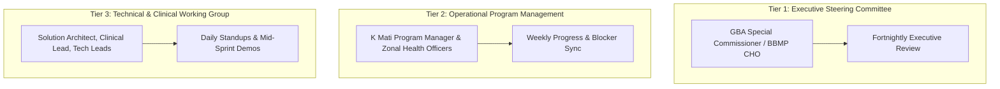

# 🏛️ Project Governance Model & Steering Structure
## Namma Clinic Digital Health & Operations Platform
**Document Code:** PM-GOV-09 | **Status:** Approved Baseline | **Date:** September 2026

---

### 1. Three-Tier Governance Framework

### 2. Decision Thresholds & Escalation Path
- **Level 1 (Operational / Technical):** Resolved within 24 hours by Lead Architect and Program Manager.
- **Level 2 (Clinical / Workflow Scope):** Resolved within 48 hours by BBMP Clinical Advisory Committee.
- **Level 3 (Contractual / Budget / Strategic):** Escalated to GBA Special Commissioner for formal resolution.
