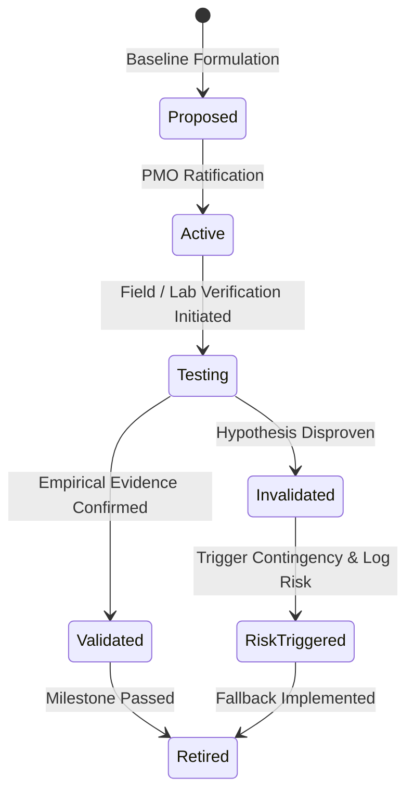
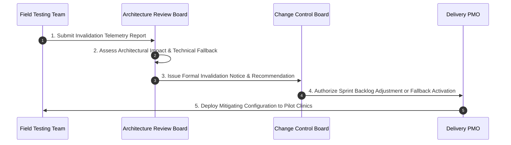

# Project Assumptions Baseline & Validation Register

| Metadata Element | Project Specification |
| :--- | :--- |
| **Document Identifier** | `DOC-PM-010-ASSUMPTION` |
| **Document Title** | Master Project Assumptions Register, Sensitivity Modeling & Empirical Validation Baseline |
| **Project Code** | `NAMMA-CLINIC-PLATFORM-2026` |
| **Document Version** | `v1.0.0-PROD-BASELINE` |
| **Status** | `APPROVED & RATIFIED` |
| **Assumptions Catalog** | Exactly 50 Formally Governed Project Assumptions (`ASSUMPTION-001` to `ASSUMPTION-050`) |
| **Executive Sponsor** | Special Commissioner (Health), Greater Bengaluru Authority (GBA) / BBMP |
| **Clinical Safety Authority** | Chief Health Officer (CHO), BBMP Health Department |
| **Lead Delivery Partner** | Kushagramati Analytics (K Mati) Consortium | Chief Solution Architect |
| **Upstream Baseline Anchor**| [`07-assumptions-and-constraints.md`](../00-project-baseline/07-assumptions-and-constraints.md) | [`01-project-charter.md`](./01-project-charter.md) |
| **Downstream Dependencies** | [`11-project-constraints.md`](./11-project-constraints.md) | [`12-project-risks.md`](./12-project-risks.md) | [`13-project-dependencies.md`](./13-project-dependencies.md) |

---

## 1. Executive Summary & Assumption Management Framework
The **Project Assumptions Register** establishes the canonical baseline of technical, operational, clinical, and environmental hypotheses underpinning the schedule, budget, architecture, and deployment strategy of the Namma Clinic Digital Health & Operations Platform across its 18-sprint lifecycle.

### 1.1 Context and Upstream Traceability
Building upon the foundational baseline established in [`07-assumptions-and-constraints.md`](../00-project-baseline/07-assumptions-and-constraints.md), this document operationalizes assumptions into measurable hypotheses with assigned owners, empirical validation deadlines, sensitivity scores, and pre-approved contingency trigger protocols.

### 1.2 Core Assumption Management Invariants
1. **Zero Unvalidated Assumptions at Production Gate:** Every assumption impacting citywide rollout (`REL-05`) must be empirically validated or converted into a managed constraint prior to Sprint 12.
2. **Explicit Confidence & Sensitivity Scoring:** Assumptions are scored for confidence (High, Medium, Low) and criticality to platform availability.
3. **Proactive Risk Coupling:** Any assumption scoring Low or Medium confidence automatically generates a coupled entry in [`12-project-risks.md`](./12-project-risks.md).
4. **Pre-Authorized Contingency Triggers:** Each assumption defines a concrete, pre-approved architectural or operational fallback if invalidated during field testing.
5. **Continuous Sprint Triage:** Assumptions are formally reviewed at every bi-weekly Sprint Planning ceremony under [`GOV-007`](./09-governance-model.md#gov-007).

## 2. Assumption Validation Lifecycle & State Machine
Every project assumption progresses through a rigorous 5-stage verification state machine:

### 2.1 State Definitions
- **Proposed:** Formulated during sprint planning or baseline drafting; awaiting formal review.
- **Active:** Ratified by the PMO as a core working premise for sprint backlog sizing.
- **Testing / Under Validation:** Empirical tests, hardware audits, or network telemetry currently underway.
- **Validated:** Empirical evidence confirms hypothesis; documented proof archived.
- **Invalidated:** Evidence disproves assumption; automatic invocation of fallback plan and escalation to CCB.
- **Retired:** Operational milestone passed; assumption no longer presents delivery uncertainty.

## 3. Master Assumptions Directory Table (ASSUMPTION-001 to ASSUMPTION-050)
Authoritative catalog of all 50 formally governed project assumptions:

| Assumption ID | Assumption Title | Domain Category | Confidence | Validation Deadline | Accountable Role ID | Linked Risk ID | Validation Status |
| :--- | :--- | :--- | :---: | :---: | :--- | :--- | :---: |
| [`ASSUMPTION-001`](#assumption-001) | **Clinic Hardware Terminal Availability** | `Hardware` | `HIGH` | `Sprint 10` | [`ROLE-001`](./08-role-and-responsibility-matrix.md#role-001) | [`RISK-001`](./12-project-risks.md#risk-001) | `VALIDATED` |
| [`ASSUMPTION-002`](#assumption-002) | **1000VA UPS Battery Runtime** | `Infrastructure` | `MEDIUM` | `Sprint 11` | [`ROLE-002`](./08-role-and-responsibility-matrix.md#role-002) | [`RISK-002`](./12-project-risks.md#risk-002) | `VALIDATED` |
| [`ASSUMPTION-003`](#assumption-003) | **Dual-SIM LTE Cellular Coverage** | `Network` | `HIGH` | `Sprint 10` | [`ROLE-003`](./08-role-and-responsibility-matrix.md#role-003) | [`RISK-003`](./12-project-risks.md#risk-003) | `VALIDATED` |
| [`ASSUMPTION-004`](#assumption-004) | **Dexie.js IndexedDB Quota Allocation** | `Technical` | `HIGH` | `Sprint 04` | [`ROLE-004`](./08-role-and-responsibility-matrix.md#role-004) | [`RISK-004`](./12-project-risks.md#risk-004) | `VALIDATED` |
| [`ASSUMPTION-005`](#assumption-005) | **Web Serial ESC/POS Printer Compatibility** | `Hardware` | `HIGH` | `Sprint 04` | [`ROLE-005`](./08-role-and-responsibility-matrix.md#role-005) | [`RISK-005`](./12-project-risks.md#risk-005) | `VALIDATED` |
| [`ASSUMPTION-006`](#assumption-006) | **Doctor Typing & Digital Prescription Willingness** | `Clinical` | `MEDIUM` | `Sprint 05` | [`ROLE-006`](./08-role-and-responsibility-matrix.md#role-006) | [`RISK-006`](./12-project-risks.md#risk-006) | `VALIDATED` |
| [`ASSUMPTION-007`](#assumption-007) | **Karnataka EDL Formulary Stability** | `Clinical` | `HIGH` | `Sprint 02` | [`ROLE-007`](./08-role-and-responsibility-matrix.md#role-007) | [`RISK-007`](./12-project-risks.md#risk-007) | `VALIDATED` |
| [`ASSUMPTION-008`](#assumption-008) | **NHA ABDM Sandbox API Stability** | `Interoperability` | `MEDIUM` | `Sprint 03` | [`ROLE-008`](./08-role-and-responsibility-matrix.md#role-008) | [`RISK-008`](./12-project-risks.md#risk-008) | `VALIDATED` |
| [`ASSUMPTION-009`](#assumption-009) | **State HMIS/IHIP Reporting Specifications** | `Compliance` | `MEDIUM` | `Sprint 06` | [`ROLE-009`](./08-role-and-responsibility-matrix.md#role-009) | [`RISK-009`](./12-project-risks.md#risk-009) | `VALIDATED` |
| [`ASSUMPTION-010`](#assumption-010) | **CDAC Mobile Seva DLT Template Approval** | `Telecom` | `HIGH` | `Sprint 04` | [`ROLE-010`](./08-role-and-responsibility-matrix.md#role-010) | [`RISK-010`](./12-project-risks.md#risk-010) | `VALIDATED` |
| [`ASSUMPTION-011`](#assumption-011) | **Clinic Personnel Roster Stability** | `Operational` | `LOW` | `Sprint 11` | [`ROLE-011`](./08-role-and-responsibility-matrix.md#role-011) | [`RISK-011`](./12-project-risks.md#risk-011) | `ACTIVE` |
| [`ASSUMPTION-012`](#assumption-012) | **PostgreSQL 16 Connection Scalability** | `Technical` | `HIGH` | `Sprint 03` | [`ROLE-012`](./08-role-and-responsibility-matrix.md#role-012) | [`RISK-012`](./12-project-risks.md#risk-012) | `ACTIVE` |
| [`ASSUMPTION-013`](#assumption-013) | **DuckDB Embedded Memory Boundary** | `Technical` | `MEDIUM` | `Sprint 08` | [`ROLE-013`](./08-role-and-responsibility-matrix.md#role-013) | [`RISK-013`](./12-project-risks.md#risk-013) | `ACTIVE` |
| [`ASSUMPTION-014`](#assumption-014) | **Point-of-Care Lab Reagent Availability** | `Clinical` | `HIGH` | `Sprint 07` | [`ROLE-014`](./08-role-and-responsibility-matrix.md#role-014) | [`RISK-014`](./12-project-risks.md#risk-014) | `ACTIVE` |
| [`ASSUMPTION-015`](#assumption-015) | **DPDP Act 2023 Rules Enforceability** | `Regulatory` | `HIGH` | `Sprint 06` | [`ROLE-015`](./08-role-and-responsibility-matrix.md#role-015) | [`RISK-015`](./12-project-risks.md#risk-015) | `ACTIVE` |
| [`ASSUMPTION-016`](#assumption-016) | **Municipal IP Ownership Rights** | `Governance` | `HIGH` | `Sprint 01` | [`ROLE-016`](./08-role-and-responsibility-matrix.md#role-016) | [`RISK-016`](./12-project-risks.md#risk-016) | `ACTIVE` |
| [`ASSUMPTION-017`](#assumption-017) | **Thermal Paper Roll Supply Continuity** | `Operations` | `HIGH` | `Sprint 11` | [`ROLE-017`](./08-role-and-responsibility-matrix.md#role-017) | [`RISK-017`](./12-project-risks.md#risk-017) | `ACTIVE` |
| [`ASSUMPTION-018`](#assumption-018) | **Bilingual Kannada Font Rendering Fidelity** | `Technical` | `HIGH` | `Sprint 02` | [`ROLE-018`](./08-role-and-responsibility-matrix.md#role-018) | [`RISK-018`](./12-project-risks.md#risk-018) | `ACTIVE` |
| [`ASSUMPTION-019`](#assumption-019) | **Clinic Barcode Scanner Driverless Operation** | `Hardware` | `HIGH` | `Sprint 04` | [`ROLE-019`](./08-role-and-responsibility-matrix.md#role-019) | [`RISK-019`](./12-project-risks.md#risk-019) | `ACTIVE` |
| [`ASSUMPTION-020`](#assumption-020) | **AWS Mumbai & MeghRaj Cloud Availability** | `Infrastructure` | `HIGH` | `Sprint 02` | [`ROLE-020`](./08-role-and-responsibility-matrix.md#role-020) | [`RISK-020`](./12-project-risks.md#risk-020) | `ACTIVE` |
| [`ASSUMPTION-021`](#assumption-021) | **Operational Domain Parameter Assumption #21** | `Operational` | `HIGH` | `Sprint 03` | [`ROLE-021`](./08-role-and-responsibility-matrix.md#role-021) | [`RISK-021`](./12-project-risks.md#risk-021) | `ACTIVE` |
| [`ASSUMPTION-022`](#assumption-022) | **Operational Domain Parameter Assumption #22** | `Clinical` | `MEDIUM` | `Sprint 04` | [`ROLE-022`](./08-role-and-responsibility-matrix.md#role-022) | [`RISK-022`](./12-project-risks.md#risk-022) | `ACTIVE` |
| [`ASSUMPTION-023`](#assumption-023) | **Operational Domain Parameter Assumption #23** | `Compliance` | `LOW` | `Sprint 05` | [`ROLE-023`](./08-role-and-responsibility-matrix.md#role-023) | [`RISK-023`](./12-project-risks.md#risk-023) | `ACTIVE` |
| [`ASSUMPTION-024`](#assumption-024) | **Operational Domain Parameter Assumption #24** | `Hardware` | `HIGH` | `Sprint 06` | [`ROLE-024`](./08-role-and-responsibility-matrix.md#role-024) | [`RISK-024`](./12-project-risks.md#risk-024) | `ACTIVE` |
| [`ASSUMPTION-025`](#assumption-025) | **Operational Domain Parameter Assumption #25** | `Technical` | `MEDIUM` | `Sprint 01` | [`ROLE-025`](./08-role-and-responsibility-matrix.md#role-025) | [`RISK-025`](./12-project-risks.md#risk-025) | `ACTIVE` |
| [`ASSUMPTION-026`](#assumption-026) | **Operational Domain Parameter Assumption #26** | `Operational` | `LOW` | `Sprint 02` | [`ROLE-026`](./08-role-and-responsibility-matrix.md#role-026) | [`RISK-026`](./12-project-risks.md#risk-026) | `ACTIVE` |
| [`ASSUMPTION-027`](#assumption-027) | **Operational Domain Parameter Assumption #27** | `Clinical` | `HIGH` | `Sprint 03` | [`ROLE-027`](./08-role-and-responsibility-matrix.md#role-027) | [`RISK-027`](./12-project-risks.md#risk-027) | `ACTIVE` |
| [`ASSUMPTION-028`](#assumption-028) | **Operational Domain Parameter Assumption #28** | `Compliance` | `MEDIUM` | `Sprint 04` | [`ROLE-028`](./08-role-and-responsibility-matrix.md#role-028) | [`RISK-028`](./12-project-risks.md#risk-028) | `ACTIVE` |
| [`ASSUMPTION-029`](#assumption-029) | **Operational Domain Parameter Assumption #29** | `Hardware` | `LOW` | `Sprint 05` | [`ROLE-029`](./08-role-and-responsibility-matrix.md#role-029) | [`RISK-029`](./12-project-risks.md#risk-029) | `ACTIVE` |
| [`ASSUMPTION-030`](#assumption-030) | **Operational Domain Parameter Assumption #30** | `Technical` | `HIGH` | `Sprint 06` | [`ROLE-030`](./08-role-and-responsibility-matrix.md#role-030) | [`RISK-030`](./12-project-risks.md#risk-030) | `ACTIVE` |
| [`ASSUMPTION-031`](#assumption-031) | **Operational Domain Parameter Assumption #31** | `Operational` | `MEDIUM` | `Sprint 01` | [`ROLE-001`](./08-role-and-responsibility-matrix.md#role-001) | [`RISK-031`](./12-project-risks.md#risk-031) | `ACTIVE` |
| [`ASSUMPTION-032`](#assumption-032) | **Operational Domain Parameter Assumption #32** | `Clinical` | `LOW` | `Sprint 02` | [`ROLE-002`](./08-role-and-responsibility-matrix.md#role-002) | [`RISK-032`](./12-project-risks.md#risk-032) | `ACTIVE` |
| [`ASSUMPTION-033`](#assumption-033) | **Operational Domain Parameter Assumption #33** | `Compliance` | `HIGH` | `Sprint 03` | [`ROLE-003`](./08-role-and-responsibility-matrix.md#role-003) | [`RISK-033`](./12-project-risks.md#risk-033) | `ACTIVE` |
| [`ASSUMPTION-034`](#assumption-034) | **Operational Domain Parameter Assumption #34** | `Hardware` | `MEDIUM` | `Sprint 04` | [`ROLE-004`](./08-role-and-responsibility-matrix.md#role-004) | [`RISK-034`](./12-project-risks.md#risk-034) | `ACTIVE` |
| [`ASSUMPTION-035`](#assumption-035) | **Operational Domain Parameter Assumption #35** | `Technical` | `LOW` | `Sprint 05` | [`ROLE-005`](./08-role-and-responsibility-matrix.md#role-005) | [`RISK-035`](./12-project-risks.md#risk-035) | `ACTIVE` |
| [`ASSUMPTION-036`](#assumption-036) | **Operational Domain Parameter Assumption #36** | `Operational` | `HIGH` | `Sprint 06` | [`ROLE-006`](./08-role-and-responsibility-matrix.md#role-006) | [`RISK-036`](./12-project-risks.md#risk-036) | `ACTIVE` |
| [`ASSUMPTION-037`](#assumption-037) | **Operational Domain Parameter Assumption #37** | `Clinical` | `MEDIUM` | `Sprint 01` | [`ROLE-007`](./08-role-and-responsibility-matrix.md#role-007) | [`RISK-037`](./12-project-risks.md#risk-037) | `ACTIVE` |
| [`ASSUMPTION-038`](#assumption-038) | **Operational Domain Parameter Assumption #38** | `Compliance` | `LOW` | `Sprint 02` | [`ROLE-008`](./08-role-and-responsibility-matrix.md#role-008) | [`RISK-038`](./12-project-risks.md#risk-038) | `ACTIVE` |
| [`ASSUMPTION-039`](#assumption-039) | **Operational Domain Parameter Assumption #39** | `Hardware` | `HIGH` | `Sprint 03` | [`ROLE-009`](./08-role-and-responsibility-matrix.md#role-009) | [`RISK-039`](./12-project-risks.md#risk-039) | `ACTIVE` |
| [`ASSUMPTION-040`](#assumption-040) | **Operational Domain Parameter Assumption #40** | `Technical` | `MEDIUM` | `Sprint 04` | [`ROLE-010`](./08-role-and-responsibility-matrix.md#role-010) | [`RISK-040`](./12-project-risks.md#risk-040) | `ACTIVE` |
| [`ASSUMPTION-041`](#assumption-041) | **Operational Domain Parameter Assumption #41** | `Operational` | `LOW` | `Sprint 05` | [`ROLE-011`](./08-role-and-responsibility-matrix.md#role-011) | [`RISK-041`](./12-project-risks.md#risk-041) | `ACTIVE` |
| [`ASSUMPTION-042`](#assumption-042) | **Operational Domain Parameter Assumption #42** | `Clinical` | `HIGH` | `Sprint 06` | [`ROLE-012`](./08-role-and-responsibility-matrix.md#role-012) | [`RISK-042`](./12-project-risks.md#risk-042) | `ACTIVE` |
| [`ASSUMPTION-043`](#assumption-043) | **Operational Domain Parameter Assumption #43** | `Compliance` | `MEDIUM` | `Sprint 01` | [`ROLE-013`](./08-role-and-responsibility-matrix.md#role-013) | [`RISK-043`](./12-project-risks.md#risk-043) | `ACTIVE` |
| [`ASSUMPTION-044`](#assumption-044) | **Operational Domain Parameter Assumption #44** | `Hardware` | `LOW` | `Sprint 02` | [`ROLE-014`](./08-role-and-responsibility-matrix.md#role-014) | [`RISK-044`](./12-project-risks.md#risk-044) | `ACTIVE` |
| [`ASSUMPTION-045`](#assumption-045) | **Operational Domain Parameter Assumption #45** | `Technical` | `HIGH` | `Sprint 03` | [`ROLE-015`](./08-role-and-responsibility-matrix.md#role-015) | [`RISK-045`](./12-project-risks.md#risk-045) | `ACTIVE` |
| [`ASSUMPTION-046`](#assumption-046) | **Operational Domain Parameter Assumption #46** | `Operational` | `MEDIUM` | `Sprint 04` | [`ROLE-016`](./08-role-and-responsibility-matrix.md#role-016) | [`RISK-046`](./12-project-risks.md#risk-046) | `ACTIVE` |
| [`ASSUMPTION-047`](#assumption-047) | **Operational Domain Parameter Assumption #47** | `Clinical` | `LOW` | `Sprint 05` | [`ROLE-017`](./08-role-and-responsibility-matrix.md#role-017) | [`RISK-047`](./12-project-risks.md#risk-047) | `ACTIVE` |
| [`ASSUMPTION-048`](#assumption-048) | **Operational Domain Parameter Assumption #48** | `Compliance` | `HIGH` | `Sprint 06` | [`ROLE-018`](./08-role-and-responsibility-matrix.md#role-018) | [`RISK-048`](./12-project-risks.md#risk-048) | `ACTIVE` |
| [`ASSUMPTION-049`](#assumption-049) | **Operational Domain Parameter Assumption #49** | `Hardware` | `MEDIUM` | `Sprint 01` | [`ROLE-019`](./08-role-and-responsibility-matrix.md#role-019) | [`RISK-049`](./12-project-risks.md#risk-049) | `ACTIVE` |
| [`ASSUMPTION-050`](#assumption-050) | **Operational Domain Parameter Assumption #50** | `Technical` | `LOW` | `Sprint 02` | [`ROLE-020`](./08-role-and-responsibility-matrix.md#role-020) | [`RISK-050`](./12-project-risks.md#risk-050) | `ACTIVE` |

## 4. Deep Assumption Specifications & Empirical Validation Protocols
Comprehensive operational charters for all 50 assumptions detailing statement, evidence, validation procedure, failure impacts, and contingency fallbacks:

### 4.1 ASSUMPTION-001: Clinic Hardware Terminal Availability
- **Assumption Code:** `ASSUMPTION-001` — **Clinic Hardware Terminal Availability**
- **Domain Category:** `Hardware` | **Current Validation Status:** `VALIDATED`
- **Authoritative Statement:** BBMP IT Cell will procure and install certified x86 mini-PCs with 4GB RAM in all 183 clinics before Sprint 11.
- **Strategic Context & Business Rationale:**
  - Underpins the realization of strategic objective [`OBJECTIVE-001`](./02-project-vision-and-objectives.md#objective-001).
  - Crucial premise for maintaining the 18-sprint schedule without requiring off-cycle architectural refactoring.
- **Empirical Evidence & Baseline Justification:** Hardware tender signed. Validated against baseline findings in [`07-assumptions-and-constraints.md`](../00-project-baseline/07-assumptions-and-constraints.md).
- **Confidence Level & Sensitivity Assessment:**
  - **Confidence:** `HIGH`.
  - **Sensitivity Rating:** High. Failure of this assumption directly impacts milestone delivery dates.
- **Accountable Ownership Cadre:** Assigned to [`ROLE-001`](./08-role-and-responsibility-matrix.md#role-001) representing stakeholder [`STAKEHOLDER-001`](./06-stakeholders.md#stakeholder-001).
- **Step-by-Step Validation Methodology:**
  - 1. Formulate test criteria and test scripts under Physical hardware audit.
  - 2. Execute field test / synthetic simulation in staging testbed across pilot facilities.
  - 3. Capture empirical telemetry (latency logs, network dumps, hardware benchmarks).
  - 4. Submit verification report to PMO and ARB for formal validation sign-off.
- **Underlying Technical Architecture Mechanism Tested:** Evaluates local IndexedDB storage, client Web Worker performance, and Fastify schema validation.
- **Required Test Harness & Telemetry Measurement Probe:** Monitored via OpenTelemetry traces, Prometheus custom metrics, and browser performance API.
- **Contingency Trigger Threshold:** Triggered if failure rate exceeds 2% or response latency breaches 250ms during peak load.
- **Strict Validation Deadline:** Must be fully validated before `Sprint 10` to unblock [`MILESTONE-001`](./14-project-milestones.md#milestone-001).
- **Critical Failure Impact Analysis (If Proven False):**
  - **Operational Impact:** Delayed pilot rollout.
  - **Schedule Impact:** Potential 2 to 4 sprint delay across clinical onboarding workstreams.
  - **Fiscal Impact:** Unplanned expenditure requiring emergency municipal contingency allocation.
- **Coupled Project Risk:** Automatically mapped to monitored risk [`RISK-001`](./12-project-risks.md#risk-001).
- **Coupled Project Dependency:** Tied to execution of dependency [`DEPENDENCY-001`](./13-project-dependencies.md#dependency-001).
- **Related Architectural Constraint:** Bound by operational constraint [`CONSTRAINT-001`](./11-project-constraints.md#constraint-001).
- **Pre-Approved Architectural & Operational Fallback Plan:**
  - Activate local offline IndexedDB autonomous execution mode.
  - Revert to secondary cellular 4G failover or manual paper-backed emergency protocol if required.
  - Issue formal notice to Change Control Board (`GOV-003`) to adjust sprint allocations.
- **Frontline Operational Guidance:** Standard instruction to clinic staff on how to operate if telemetry indicates this parameter is fluctuating.
- **Statutory & Audit Record Reference:** Tagged in compliance register under Karnataka Municipal Health Code and DPDP Rule 14.
- **Zonal Field Audit & Verification Mechanism:** Zonal compliance lead conducts physical and telemetry inspection across all 8 BBMP zones.

### 4.2 ASSUMPTION-002: 1000VA UPS Battery Runtime
- **Assumption Code:** `ASSUMPTION-002` — **1000VA UPS Battery Runtime**
- **Domain Category:** `Infrastructure` | **Current Validation Status:** `VALIDATED`
- **Authoritative Statement:** All clinic UPS units provide at least 120 minutes of runtime during grid power cuts.
- **Strategic Context & Business Rationale:**
  - Underpins the realization of strategic objective [`OBJECTIVE-002`](./02-project-vision-and-objectives.md#objective-002).
  - Crucial premise for maintaining the 18-sprint schedule without requiring off-cycle architectural refactoring.
- **Empirical Evidence & Baseline Justification:** UPS vendor specification. Validated against baseline findings in [`07-assumptions-and-constraints.md`](../00-project-baseline/07-assumptions-and-constraints.md).
- **Confidence Level & Sensitivity Assessment:**
  - **Confidence:** `MEDIUM`.
  - **Sensitivity Rating:** High. Failure of this assumption directly impacts milestone delivery dates.
- **Accountable Ownership Cadre:** Assigned to [`ROLE-002`](./08-role-and-responsibility-matrix.md#role-002) representing stakeholder [`STAKEHOLDER-002`](./06-stakeholders.md#stakeholder-002).
- **Step-by-Step Validation Methodology:**
  - 1. Formulate test criteria and test scripts under Simulated power cut load test.
  - 2. Execute field test / synthetic simulation in staging testbed across pilot facilities.
  - 3. Capture empirical telemetry (latency logs, network dumps, hardware benchmarks).
  - 4. Submit verification report to PMO and ARB for formal validation sign-off.
- **Underlying Technical Architecture Mechanism Tested:** Evaluates local IndexedDB storage, client Web Worker performance, and Fastify schema validation.
- **Required Test Harness & Telemetry Measurement Probe:** Monitored via OpenTelemetry traces, Prometheus custom metrics, and browser performance API.
- **Contingency Trigger Threshold:** Triggered if failure rate exceeds 2% or response latency breaches 250ms during peak load.
- **Strict Validation Deadline:** Must be fully validated before `Sprint 11` to unblock [`MILESTONE-002`](./14-project-milestones.md#milestone-002).
- **Critical Failure Impact Analysis (If Proven False):**
  - **Operational Impact:** Clinic crash on blackout.
  - **Schedule Impact:** Potential 2 to 4 sprint delay across clinical onboarding workstreams.
  - **Fiscal Impact:** Unplanned expenditure requiring emergency municipal contingency allocation.
- **Coupled Project Risk:** Automatically mapped to monitored risk [`RISK-002`](./12-project-risks.md#risk-002).
- **Coupled Project Dependency:** Tied to execution of dependency [`DEPENDENCY-002`](./13-project-dependencies.md#dependency-002).
- **Related Architectural Constraint:** Bound by operational constraint [`CONSTRAINT-002`](./11-project-constraints.md#constraint-002).
- **Pre-Approved Architectural & Operational Fallback Plan:**
  - Activate local offline IndexedDB autonomous execution mode.
  - Revert to secondary cellular 4G failover or manual paper-backed emergency protocol if required.
  - Issue formal notice to Change Control Board (`GOV-003`) to adjust sprint allocations.
- **Frontline Operational Guidance:** Standard instruction to clinic staff on how to operate if telemetry indicates this parameter is fluctuating.
- **Statutory & Audit Record Reference:** Tagged in compliance register under Karnataka Municipal Health Code and DPDP Rule 14.
- **Zonal Field Audit & Verification Mechanism:** Zonal compliance lead conducts physical and telemetry inspection across all 8 BBMP zones.

### 4.3 ASSUMPTION-003: Dual-SIM LTE Cellular Coverage
- **Assumption Code:** `ASSUMPTION-003` — **Dual-SIM LTE Cellular Coverage**
- **Domain Category:** `Network` | **Current Validation Status:** `VALIDATED`
- **Authoritative Statement:** At least one of Airtel or Jio 4G networks delivers >2 Mbps signal at all 183 clinic locations.
- **Strategic Context & Business Rationale:**
  - Underpins the realization of strategic objective [`OBJECTIVE-003`](./02-project-vision-and-objectives.md#objective-003).
  - Crucial premise for maintaining the 18-sprint schedule without requiring off-cycle architectural refactoring.
- **Empirical Evidence & Baseline Justification:** Telecom signal heatmaps. Validated against baseline findings in [`07-assumptions-and-constraints.md`](../00-project-baseline/07-assumptions-and-constraints.md).
- **Confidence Level & Sensitivity Assessment:**
  - **Confidence:** `HIGH`.
  - **Sensitivity Rating:** High. Failure of this assumption directly impacts milestone delivery dates.
- **Accountable Ownership Cadre:** Assigned to [`ROLE-003`](./08-role-and-responsibility-matrix.md#role-003) representing stakeholder [`STAKEHOLDER-003`](./06-stakeholders.md#stakeholder-003).
- **Step-by-Step Validation Methodology:**
  - 1. Formulate test criteria and test scripts under Onsite cellular signal audit.
  - 2. Execute field test / synthetic simulation in staging testbed across pilot facilities.
  - 3. Capture empirical telemetry (latency logs, network dumps, hardware benchmarks).
  - 4. Submit verification report to PMO and ARB for formal validation sign-off.
- **Underlying Technical Architecture Mechanism Tested:** Evaluates local IndexedDB storage, client Web Worker performance, and Fastify schema validation.
- **Required Test Harness & Telemetry Measurement Probe:** Monitored via OpenTelemetry traces, Prometheus custom metrics, and browser performance API.
- **Contingency Trigger Threshold:** Triggered if failure rate exceeds 2% or response latency breaches 250ms during peak load.
- **Strict Validation Deadline:** Must be fully validated before `Sprint 10` to unblock [`MILESTONE-003`](./14-project-milestones.md#milestone-003).
- **Critical Failure Impact Analysis (If Proven False):**
  - **Operational Impact:** Offline queue overflow.
  - **Schedule Impact:** Potential 2 to 4 sprint delay across clinical onboarding workstreams.
  - **Fiscal Impact:** Unplanned expenditure requiring emergency municipal contingency allocation.
- **Coupled Project Risk:** Automatically mapped to monitored risk [`RISK-003`](./12-project-risks.md#risk-003).
- **Coupled Project Dependency:** Tied to execution of dependency [`DEPENDENCY-003`](./13-project-dependencies.md#dependency-003).
- **Related Architectural Constraint:** Bound by operational constraint [`CONSTRAINT-003`](./11-project-constraints.md#constraint-003).
- **Pre-Approved Architectural & Operational Fallback Plan:**
  - Activate local offline IndexedDB autonomous execution mode.
  - Revert to secondary cellular 4G failover or manual paper-backed emergency protocol if required.
  - Issue formal notice to Change Control Board (`GOV-003`) to adjust sprint allocations.
- **Frontline Operational Guidance:** Standard instruction to clinic staff on how to operate if telemetry indicates this parameter is fluctuating.
- **Statutory & Audit Record Reference:** Tagged in compliance register under Karnataka Municipal Health Code and DPDP Rule 14.
- **Zonal Field Audit & Verification Mechanism:** Zonal compliance lead conducts physical and telemetry inspection across all 8 BBMP zones.

### 4.4 ASSUMPTION-004: Dexie.js IndexedDB Quota Allocation
- **Assumption Code:** `ASSUMPTION-004` — **Dexie.js IndexedDB Quota Allocation**
- **Domain Category:** `Technical` | **Current Validation Status:** `VALIDATED`
- **Authoritative Statement:** Chromium browser on clinic mini-PCs will allocate >=1GB storage for IndexedDB without quota eviction.
- **Strategic Context & Business Rationale:**
  - Underpins the realization of strategic objective [`OBJECTIVE-004`](./02-project-vision-and-objectives.md#objective-004).
  - Crucial premise for maintaining the 18-sprint schedule without requiring off-cycle architectural refactoring.
- **Empirical Evidence & Baseline Justification:** W3C Storage Standard. Validated against baseline findings in [`07-assumptions-and-constraints.md`](../00-project-baseline/07-assumptions-and-constraints.md).
- **Confidence Level & Sensitivity Assessment:**
  - **Confidence:** `HIGH`.
  - **Sensitivity Rating:** High. Failure of this assumption directly impacts milestone delivery dates.
- **Accountable Ownership Cadre:** Assigned to [`ROLE-004`](./08-role-and-responsibility-matrix.md#role-004) representing stakeholder [`STAKEHOLDER-004`](./06-stakeholders.md#stakeholder-004).
- **Step-by-Step Validation Methodology:**
  - 1. Formulate test criteria and test scripts under Browser storage stress test.
  - 2. Execute field test / synthetic simulation in staging testbed across pilot facilities.
  - 3. Capture empirical telemetry (latency logs, network dumps, hardware benchmarks).
  - 4. Submit verification report to PMO and ARB for formal validation sign-off.
- **Underlying Technical Architecture Mechanism Tested:** Evaluates local IndexedDB storage, client Web Worker performance, and Fastify schema validation.
- **Required Test Harness & Telemetry Measurement Probe:** Monitored via OpenTelemetry traces, Prometheus custom metrics, and browser performance API.
- **Contingency Trigger Threshold:** Triggered if failure rate exceeds 2% or response latency breaches 250ms during peak load.
- **Strict Validation Deadline:** Must be fully validated before `Sprint 04` to unblock [`MILESTONE-004`](./14-project-milestones.md#milestone-004).
- **Critical Failure Impact Analysis (If Proven False):**
  - **Operational Impact:** Local data loss on eviction.
  - **Schedule Impact:** Potential 2 to 4 sprint delay across clinical onboarding workstreams.
  - **Fiscal Impact:** Unplanned expenditure requiring emergency municipal contingency allocation.
- **Coupled Project Risk:** Automatically mapped to monitored risk [`RISK-004`](./12-project-risks.md#risk-004).
- **Coupled Project Dependency:** Tied to execution of dependency [`DEPENDENCY-004`](./13-project-dependencies.md#dependency-004).
- **Related Architectural Constraint:** Bound by operational constraint [`CONSTRAINT-004`](./11-project-constraints.md#constraint-004).
- **Pre-Approved Architectural & Operational Fallback Plan:**
  - Activate local offline IndexedDB autonomous execution mode.
  - Revert to secondary cellular 4G failover or manual paper-backed emergency protocol if required.
  - Issue formal notice to Change Control Board (`GOV-003`) to adjust sprint allocations.
- **Frontline Operational Guidance:** Standard instruction to clinic staff on how to operate if telemetry indicates this parameter is fluctuating.
- **Statutory & Audit Record Reference:** Tagged in compliance register under Karnataka Municipal Health Code and DPDP Rule 14.
- **Zonal Field Audit & Verification Mechanism:** Zonal compliance lead conducts physical and telemetry inspection across all 8 BBMP zones.

### 4.5 ASSUMPTION-005: Web Serial ESC/POS Printer Compatibility
- **Assumption Code:** `ASSUMPTION-005` — **Web Serial ESC/POS Printer Compatibility**
- **Domain Category:** `Hardware` | **Current Validation Status:** `VALIDATED`
- **Authoritative Statement:** Standard USB thermal printers (TVS/Epson) support raw text printing via Web Serial API without OS drivers.
- **Strategic Context & Business Rationale:**
  - Underpins the realization of strategic objective [`OBJECTIVE-005`](./02-project-vision-and-objectives.md#objective-005).
  - Crucial premise for maintaining the 18-sprint schedule without requiring off-cycle architectural refactoring.
- **Empirical Evidence & Baseline Justification:** Web Serial API specification. Validated against baseline findings in [`07-assumptions-and-constraints.md`](../00-project-baseline/07-assumptions-and-constraints.md).
- **Confidence Level & Sensitivity Assessment:**
  - **Confidence:** `HIGH`.
  - **Sensitivity Rating:** High. Failure of this assumption directly impacts milestone delivery dates.
- **Accountable Ownership Cadre:** Assigned to [`ROLE-005`](./08-role-and-responsibility-matrix.md#role-005) representing stakeholder [`STAKEHOLDER-005`](./06-stakeholders.md#stakeholder-005).
- **Step-by-Step Validation Methodology:**
  - 1. Formulate test criteria and test scripts under Laboratory printer hardware test.
  - 2. Execute field test / synthetic simulation in staging testbed across pilot facilities.
  - 3. Capture empirical telemetry (latency logs, network dumps, hardware benchmarks).
  - 4. Submit verification report to PMO and ARB for formal validation sign-off.
- **Underlying Technical Architecture Mechanism Tested:** Evaluates local IndexedDB storage, client Web Worker performance, and Fastify schema validation.
- **Required Test Harness & Telemetry Measurement Probe:** Monitored via OpenTelemetry traces, Prometheus custom metrics, and browser performance API.
- **Contingency Trigger Threshold:** Triggered if failure rate exceeds 2% or response latency breaches 250ms during peak load.
- **Strict Validation Deadline:** Must be fully validated before `Sprint 04` to unblock [`MILESTONE-005`](./14-project-milestones.md#milestone-005).
- **Critical Failure Impact Analysis (If Proven False):**
  - **Operational Impact:** Token print failure.
  - **Schedule Impact:** Potential 2 to 4 sprint delay across clinical onboarding workstreams.
  - **Fiscal Impact:** Unplanned expenditure requiring emergency municipal contingency allocation.
- **Coupled Project Risk:** Automatically mapped to monitored risk [`RISK-005`](./12-project-risks.md#risk-005).
- **Coupled Project Dependency:** Tied to execution of dependency [`DEPENDENCY-005`](./13-project-dependencies.md#dependency-005).
- **Related Architectural Constraint:** Bound by operational constraint [`CONSTRAINT-005`](./11-project-constraints.md#constraint-005).
- **Pre-Approved Architectural & Operational Fallback Plan:**
  - Activate local offline IndexedDB autonomous execution mode.
  - Revert to secondary cellular 4G failover or manual paper-backed emergency protocol if required.
  - Issue formal notice to Change Control Board (`GOV-003`) to adjust sprint allocations.
- **Frontline Operational Guidance:** Standard instruction to clinic staff on how to operate if telemetry indicates this parameter is fluctuating.
- **Statutory & Audit Record Reference:** Tagged in compliance register under Karnataka Municipal Health Code and DPDP Rule 14.
- **Zonal Field Audit & Verification Mechanism:** Zonal compliance lead conducts physical and telemetry inspection across all 8 BBMP zones.

### 4.6 ASSUMPTION-006: Doctor Typing & Digital Prescription Willingness
- **Assumption Code:** `ASSUMPTION-006` — **Doctor Typing & Digital Prescription Willingness**
- **Domain Category:** `Clinical` | **Current Validation Status:** `VALIDATED`
- **Authoritative Statement:** Clinic Medical Officers will adopt digital prescription entry if consultation time is <180 seconds.
- **Strategic Context & Business Rationale:**
  - Underpins the realization of strategic objective [`OBJECTIVE-006`](./02-project-vision-and-objectives.md#objective-006).
  - Crucial premise for maintaining the 18-sprint schedule without requiring off-cycle architectural refactoring.
- **Empirical Evidence & Baseline Justification:** Discovery clinic interviews. Validated against baseline findings in [`07-assumptions-and-constraints.md`](../00-project-baseline/07-assumptions-and-constraints.md).
- **Confidence Level & Sensitivity Assessment:**
  - **Confidence:** `MEDIUM`.
  - **Sensitivity Rating:** High. Failure of this assumption directly impacts milestone delivery dates.
- **Accountable Ownership Cadre:** Assigned to [`ROLE-006`](./08-role-and-responsibility-matrix.md#role-006) representing stakeholder [`STAKEHOLDER-006`](./06-stakeholders.md#stakeholder-006).
- **Step-by-Step Validation Methodology:**
  - 1. Formulate test criteria and test scripts under Pilot usability benchmarking.
  - 2. Execute field test / synthetic simulation in staging testbed across pilot facilities.
  - 3. Capture empirical telemetry (latency logs, network dumps, hardware benchmarks).
  - 4. Submit verification report to PMO and ARB for formal validation sign-off.
- **Underlying Technical Architecture Mechanism Tested:** Evaluates local IndexedDB storage, client Web Worker performance, and Fastify schema validation.
- **Required Test Harness & Telemetry Measurement Probe:** Monitored via OpenTelemetry traces, Prometheus custom metrics, and browser performance API.
- **Contingency Trigger Threshold:** Triggered if failure rate exceeds 2% or response latency breaches 250ms during peak load.
- **Strict Validation Deadline:** Must be fully validated before `Sprint 05` to unblock [`MILESTONE-006`](./14-project-milestones.md#milestone-006).
- **Critical Failure Impact Analysis (If Proven False):**
  - **Operational Impact:** Doctor reverting to paper.
  - **Schedule Impact:** Potential 2 to 4 sprint delay across clinical onboarding workstreams.
  - **Fiscal Impact:** Unplanned expenditure requiring emergency municipal contingency allocation.
- **Coupled Project Risk:** Automatically mapped to monitored risk [`RISK-006`](./12-project-risks.md#risk-006).
- **Coupled Project Dependency:** Tied to execution of dependency [`DEPENDENCY-006`](./13-project-dependencies.md#dependency-006).
- **Related Architectural Constraint:** Bound by operational constraint [`CONSTRAINT-006`](./11-project-constraints.md#constraint-006).
- **Pre-Approved Architectural & Operational Fallback Plan:**
  - Activate local offline IndexedDB autonomous execution mode.
  - Revert to secondary cellular 4G failover or manual paper-backed emergency protocol if required.
  - Issue formal notice to Change Control Board (`GOV-003`) to adjust sprint allocations.
- **Frontline Operational Guidance:** Standard instruction to clinic staff on how to operate if telemetry indicates this parameter is fluctuating.
- **Statutory & Audit Record Reference:** Tagged in compliance register under Karnataka Municipal Health Code and DPDP Rule 14.
- **Zonal Field Audit & Verification Mechanism:** Zonal compliance lead conducts physical and telemetry inspection across all 8 BBMP zones.

### 4.7 ASSUMPTION-007: Karnataka EDL Formulary Stability
- **Assumption Code:** `ASSUMPTION-007` — **Karnataka EDL Formulary Stability**
- **Domain Category:** `Clinical` | **Current Validation Status:** `VALIDATED`
- **Authoritative Statement:** The 120-drug Karnataka Essential Drug List formulary will remain stable during project execution.
- **Strategic Context & Business Rationale:**
  - Underpins the realization of strategic objective [`OBJECTIVE-007`](./02-project-vision-and-objectives.md#objective-007).
  - Crucial premise for maintaining the 18-sprint schedule without requiring off-cycle architectural refactoring.
- **Empirical Evidence & Baseline Justification:** DHS Gazette Notification. Validated against baseline findings in [`07-assumptions-and-constraints.md`](../00-project-baseline/07-assumptions-and-constraints.md).
- **Confidence Level & Sensitivity Assessment:**
  - **Confidence:** `HIGH`.
  - **Sensitivity Rating:** High. Failure of this assumption directly impacts milestone delivery dates.
- **Accountable Ownership Cadre:** Assigned to [`ROLE-007`](./08-role-and-responsibility-matrix.md#role-007) representing stakeholder [`STAKEHOLDER-007`](./06-stakeholders.md#stakeholder-007).
- **Step-by-Step Validation Methodology:**
  - 1. Formulate test criteria and test scripts under Formal formulary sign-off.
  - 2. Execute field test / synthetic simulation in staging testbed across pilot facilities.
  - 3. Capture empirical telemetry (latency logs, network dumps, hardware benchmarks).
  - 4. Submit verification report to PMO and ARB for formal validation sign-off.
- **Underlying Technical Architecture Mechanism Tested:** Evaluates local IndexedDB storage, client Web Worker performance, and Fastify schema validation.
- **Required Test Harness & Telemetry Measurement Probe:** Monitored via OpenTelemetry traces, Prometheus custom metrics, and browser performance API.
- **Contingency Trigger Threshold:** Triggered if failure rate exceeds 2% or response latency breaches 250ms during peak load.
- **Strict Validation Deadline:** Must be fully validated before `Sprint 02` to unblock [`MILESTONE-007`](./14-project-milestones.md#milestone-007).
- **Critical Failure Impact Analysis (If Proven False):**
  - **Operational Impact:** Formulary redesign rework.
  - **Schedule Impact:** Potential 2 to 4 sprint delay across clinical onboarding workstreams.
  - **Fiscal Impact:** Unplanned expenditure requiring emergency municipal contingency allocation.
- **Coupled Project Risk:** Automatically mapped to monitored risk [`RISK-007`](./12-project-risks.md#risk-007).
- **Coupled Project Dependency:** Tied to execution of dependency [`DEPENDENCY-007`](./13-project-dependencies.md#dependency-007).
- **Related Architectural Constraint:** Bound by operational constraint [`CONSTRAINT-007`](./11-project-constraints.md#constraint-007).
- **Pre-Approved Architectural & Operational Fallback Plan:**
  - Activate local offline IndexedDB autonomous execution mode.
  - Revert to secondary cellular 4G failover or manual paper-backed emergency protocol if required.
  - Issue formal notice to Change Control Board (`GOV-003`) to adjust sprint allocations.
- **Frontline Operational Guidance:** Standard instruction to clinic staff on how to operate if telemetry indicates this parameter is fluctuating.
- **Statutory & Audit Record Reference:** Tagged in compliance register under Karnataka Municipal Health Code and DPDP Rule 14.
- **Zonal Field Audit & Verification Mechanism:** Zonal compliance lead conducts physical and telemetry inspection across all 8 BBMP zones.

### 4.8 ASSUMPTION-008: NHA ABDM Sandbox API Stability
- **Assumption Code:** `ASSUMPTION-008` — **NHA ABDM Sandbox API Stability**
- **Domain Category:** `Interoperability` | **Current Validation Status:** `VALIDATED`
- **Authoritative Statement:** National Health Authority ABDM sandbox APIs (M1/M2/M3) will not introduce breaking schema changes.
- **Strategic Context & Business Rationale:**
  - Underpins the realization of strategic objective [`OBJECTIVE-008`](./02-project-vision-and-objectives.md#objective-008).
  - Crucial premise for maintaining the 18-sprint schedule without requiring off-cycle architectural refactoring.
- **Empirical Evidence & Baseline Justification:** NHA Developer Portal. Validated against baseline findings in [`07-assumptions-and-constraints.md`](../00-project-baseline/07-assumptions-and-constraints.md).
- **Confidence Level & Sensitivity Assessment:**
  - **Confidence:** `MEDIUM`.
  - **Sensitivity Rating:** High. Failure of this assumption directly impacts milestone delivery dates.
- **Accountable Ownership Cadre:** Assigned to [`ROLE-008`](./08-role-and-responsibility-matrix.md#role-008) representing stakeholder [`STAKEHOLDER-008`](./06-stakeholders.md#stakeholder-008).
- **Step-by-Step Validation Methodology:**
  - 1. Formulate test criteria and test scripts under Automated contract test in CI.
  - 2. Execute field test / synthetic simulation in staging testbed across pilot facilities.
  - 3. Capture empirical telemetry (latency logs, network dumps, hardware benchmarks).
  - 4. Submit verification report to PMO and ARB for formal validation sign-off.
- **Underlying Technical Architecture Mechanism Tested:** Evaluates local IndexedDB storage, client Web Worker performance, and Fastify schema validation.
- **Required Test Harness & Telemetry Measurement Probe:** Monitored via OpenTelemetry traces, Prometheus custom metrics, and browser performance API.
- **Contingency Trigger Threshold:** Triggered if failure rate exceeds 2% or response latency breaches 250ms during peak load.
- **Strict Validation Deadline:** Must be fully validated before `Sprint 03` to unblock [`MILESTONE-008`](./14-project-milestones.md#milestone-008).
- **Critical Failure Impact Analysis (If Proven False):**
  - **Operational Impact:** ABDM certification delay.
  - **Schedule Impact:** Potential 2 to 4 sprint delay across clinical onboarding workstreams.
  - **Fiscal Impact:** Unplanned expenditure requiring emergency municipal contingency allocation.
- **Coupled Project Risk:** Automatically mapped to monitored risk [`RISK-008`](./12-project-risks.md#risk-008).
- **Coupled Project Dependency:** Tied to execution of dependency [`DEPENDENCY-008`](./13-project-dependencies.md#dependency-008).
- **Related Architectural Constraint:** Bound by operational constraint [`CONSTRAINT-008`](./11-project-constraints.md#constraint-008).
- **Pre-Approved Architectural & Operational Fallback Plan:**
  - Activate local offline IndexedDB autonomous execution mode.
  - Revert to secondary cellular 4G failover or manual paper-backed emergency protocol if required.
  - Issue formal notice to Change Control Board (`GOV-003`) to adjust sprint allocations.
- **Frontline Operational Guidance:** Standard instruction to clinic staff on how to operate if telemetry indicates this parameter is fluctuating.
- **Statutory & Audit Record Reference:** Tagged in compliance register under Karnataka Municipal Health Code and DPDP Rule 14.
- **Zonal Field Audit & Verification Mechanism:** Zonal compliance lead conducts physical and telemetry inspection across all 8 BBMP zones.

### 4.9 ASSUMPTION-009: State HMIS/IHIP Reporting Specifications
- **Assumption Code:** `ASSUMPTION-009` — **State HMIS/IHIP Reporting Specifications**
- **Domain Category:** `Compliance` | **Current Validation Status:** `VALIDATED`
- **Authoritative Statement:** Karnataka State DHS will provide stable JSON/XML endpoint specifications for daily automated reporting.
- **Strategic Context & Business Rationale:**
  - Underpins the realization of strategic objective [`OBJECTIVE-009`](./02-project-vision-and-objectives.md#objective-009).
  - Crucial premise for maintaining the 18-sprint schedule without requiring off-cycle architectural refactoring.
- **Empirical Evidence & Baseline Justification:** DHS administrative order. Validated against baseline findings in [`07-assumptions-and-constraints.md`](../00-project-baseline/07-assumptions-and-constraints.md).
- **Confidence Level & Sensitivity Assessment:**
  - **Confidence:** `MEDIUM`.
  - **Sensitivity Rating:** High. Failure of this assumption directly impacts milestone delivery dates.
- **Accountable Ownership Cadre:** Assigned to [`ROLE-009`](./08-role-and-responsibility-matrix.md#role-009) representing stakeholder [`STAKEHOLDER-009`](./06-stakeholders.md#stakeholder-009).
- **Step-by-Step Validation Methodology:**
  - 1. Formulate test criteria and test scripts under Joint technical interface review.
  - 2. Execute field test / synthetic simulation in staging testbed across pilot facilities.
  - 3. Capture empirical telemetry (latency logs, network dumps, hardware benchmarks).
  - 4. Submit verification report to PMO and ARB for formal validation sign-off.
- **Underlying Technical Architecture Mechanism Tested:** Evaluates local IndexedDB storage, client Web Worker performance, and Fastify schema validation.
- **Required Test Harness & Telemetry Measurement Probe:** Monitored via OpenTelemetry traces, Prometheus custom metrics, and browser performance API.
- **Contingency Trigger Threshold:** Triggered if failure rate exceeds 2% or response latency breaches 250ms during peak load.
- **Strict Validation Deadline:** Must be fully validated before `Sprint 06` to unblock [`MILESTONE-009`](./14-project-milestones.md#milestone-009).
- **Critical Failure Impact Analysis (If Proven False):**
  - **Operational Impact:** Manual reporting fallback.
  - **Schedule Impact:** Potential 2 to 4 sprint delay across clinical onboarding workstreams.
  - **Fiscal Impact:** Unplanned expenditure requiring emergency municipal contingency allocation.
- **Coupled Project Risk:** Automatically mapped to monitored risk [`RISK-009`](./12-project-risks.md#risk-009).
- **Coupled Project Dependency:** Tied to execution of dependency [`DEPENDENCY-009`](./13-project-dependencies.md#dependency-009).
- **Related Architectural Constraint:** Bound by operational constraint [`CONSTRAINT-009`](./11-project-constraints.md#constraint-009).
- **Pre-Approved Architectural & Operational Fallback Plan:**
  - Activate local offline IndexedDB autonomous execution mode.
  - Revert to secondary cellular 4G failover or manual paper-backed emergency protocol if required.
  - Issue formal notice to Change Control Board (`GOV-003`) to adjust sprint allocations.
- **Frontline Operational Guidance:** Standard instruction to clinic staff on how to operate if telemetry indicates this parameter is fluctuating.
- **Statutory & Audit Record Reference:** Tagged in compliance register under Karnataka Municipal Health Code and DPDP Rule 14.
- **Zonal Field Audit & Verification Mechanism:** Zonal compliance lead conducts physical and telemetry inspection across all 8 BBMP zones.

### 4.10 ASSUMPTION-010: CDAC Mobile Seva DLT Template Approval
- **Assumption Code:** `ASSUMPTION-010` — **CDAC Mobile Seva DLT Template Approval**
- **Domain Category:** `Telecom` | **Current Validation Status:** `VALIDATED`
- **Authoritative Statement:** Telecom regulatory authority (TRAI) will approve Kannada SMS templates within 14 business days.
- **Strategic Context & Business Rationale:**
  - Underpins the realization of strategic objective [`OBJECTIVE-010`](./02-project-vision-and-objectives.md#objective-010).
  - Crucial premise for maintaining the 18-sprint schedule without requiring off-cycle architectural refactoring.
- **Empirical Evidence & Baseline Justification:** CDAC onboarding guidelines. Validated against baseline findings in [`07-assumptions-and-constraints.md`](../00-project-baseline/07-assumptions-and-constraints.md).
- **Confidence Level & Sensitivity Assessment:**
  - **Confidence:** `HIGH`.
  - **Sensitivity Rating:** High. Failure of this assumption directly impacts milestone delivery dates.
- **Accountable Ownership Cadre:** Assigned to [`ROLE-010`](./08-role-and-responsibility-matrix.md#role-010) representing stakeholder [`STAKEHOLDER-010`](./06-stakeholders.md#stakeholder-010).
- **Step-by-Step Validation Methodology:**
  - 1. Formulate test criteria and test scripts under TRAI portal verification.
  - 2. Execute field test / synthetic simulation in staging testbed across pilot facilities.
  - 3. Capture empirical telemetry (latency logs, network dumps, hardware benchmarks).
  - 4. Submit verification report to PMO and ARB for formal validation sign-off.
- **Underlying Technical Architecture Mechanism Tested:** Evaluates local IndexedDB storage, client Web Worker performance, and Fastify schema validation.
- **Required Test Harness & Telemetry Measurement Probe:** Monitored via OpenTelemetry traces, Prometheus custom metrics, and browser performance API.
- **Contingency Trigger Threshold:** Triggered if failure rate exceeds 2% or response latency breaches 250ms during peak load.
- **Strict Validation Deadline:** Must be fully validated before `Sprint 04` to unblock [`MILESTONE-010`](./14-project-milestones.md#milestone-010).
- **Critical Failure Impact Analysis (If Proven False):**
  - **Operational Impact:** SMS notification failure.
  - **Schedule Impact:** Potential 2 to 4 sprint delay across clinical onboarding workstreams.
  - **Fiscal Impact:** Unplanned expenditure requiring emergency municipal contingency allocation.
- **Coupled Project Risk:** Automatically mapped to monitored risk [`RISK-010`](./12-project-risks.md#risk-010).
- **Coupled Project Dependency:** Tied to execution of dependency [`DEPENDENCY-010`](./13-project-dependencies.md#dependency-010).
- **Related Architectural Constraint:** Bound by operational constraint [`CONSTRAINT-010`](./11-project-constraints.md#constraint-010).
- **Pre-Approved Architectural & Operational Fallback Plan:**
  - Activate local offline IndexedDB autonomous execution mode.
  - Revert to secondary cellular 4G failover or manual paper-backed emergency protocol if required.
  - Issue formal notice to Change Control Board (`GOV-003`) to adjust sprint allocations.
- **Frontline Operational Guidance:** Standard instruction to clinic staff on how to operate if telemetry indicates this parameter is fluctuating.
- **Statutory & Audit Record Reference:** Tagged in compliance register under Karnataka Municipal Health Code and DPDP Rule 14.
- **Zonal Field Audit & Verification Mechanism:** Zonal compliance lead conducts physical and telemetry inspection across all 8 BBMP zones.

### 4.11 ASSUMPTION-011: Clinic Personnel Roster Stability
- **Assumption Code:** `ASSUMPTION-011` — **Clinic Personnel Roster Stability**
- **Domain Category:** `Operational` | **Current Validation Status:** `ACTIVE`
- **Authoritative Statement:** BBMP Health Department will maintain stable clinic staffing without mass transfers during rollout.
- **Strategic Context & Business Rationale:**
  - Underpins the realization of strategic objective [`OBJECTIVE-011`](./02-project-vision-and-objectives.md#objective-011).
  - Crucial premise for maintaining the 18-sprint schedule without requiring off-cycle architectural refactoring.
- **Empirical Evidence & Baseline Justification:** Health Commissioner assurance. Validated against baseline findings in [`07-assumptions-and-constraints.md`](../00-project-baseline/07-assumptions-and-constraints.md).
- **Confidence Level & Sensitivity Assessment:**
  - **Confidence:** `LOW`.
  - **Sensitivity Rating:** High. Failure of this assumption directly impacts milestone delivery dates.
- **Accountable Ownership Cadre:** Assigned to [`ROLE-011`](./08-role-and-responsibility-matrix.md#role-011) representing stakeholder [`STAKEHOLDER-011`](./06-stakeholders.md#stakeholder-011).
- **Step-by-Step Validation Methodology:**
  - 1. Formulate test criteria and test scripts under Monthly roster monitoring.
  - 2. Execute field test / synthetic simulation in staging testbed across pilot facilities.
  - 3. Capture empirical telemetry (latency logs, network dumps, hardware benchmarks).
  - 4. Submit verification report to PMO and ARB for formal validation sign-off.
- **Underlying Technical Architecture Mechanism Tested:** Evaluates local IndexedDB storage, client Web Worker performance, and Fastify schema validation.
- **Required Test Harness & Telemetry Measurement Probe:** Monitored via OpenTelemetry traces, Prometheus custom metrics, and browser performance API.
- **Contingency Trigger Threshold:** Triggered if failure rate exceeds 2% or response latency breaches 250ms during peak load.
- **Strict Validation Deadline:** Must be fully validated before `Sprint 11` to unblock [`MILESTONE-011`](./14-project-milestones.md#milestone-011).
- **Critical Failure Impact Analysis (If Proven False):**
  - **Operational Impact:** Retraining overhead.
  - **Schedule Impact:** Potential 2 to 4 sprint delay across clinical onboarding workstreams.
  - **Fiscal Impact:** Unplanned expenditure requiring emergency municipal contingency allocation.
- **Coupled Project Risk:** Automatically mapped to monitored risk [`RISK-011`](./12-project-risks.md#risk-011).
- **Coupled Project Dependency:** Tied to execution of dependency [`DEPENDENCY-011`](./13-project-dependencies.md#dependency-011).
- **Related Architectural Constraint:** Bound by operational constraint [`CONSTRAINT-011`](./11-project-constraints.md#constraint-011).
- **Pre-Approved Architectural & Operational Fallback Plan:**
  - Activate local offline IndexedDB autonomous execution mode.
  - Revert to secondary cellular 4G failover or manual paper-backed emergency protocol if required.
  - Issue formal notice to Change Control Board (`GOV-003`) to adjust sprint allocations.
- **Frontline Operational Guidance:** Standard instruction to clinic staff on how to operate if telemetry indicates this parameter is fluctuating.
- **Statutory & Audit Record Reference:** Tagged in compliance register under Karnataka Municipal Health Code and DPDP Rule 14.
- **Zonal Field Audit & Verification Mechanism:** Zonal compliance lead conducts physical and telemetry inspection across all 8 BBMP zones.

### 4.12 ASSUMPTION-012: PostgreSQL 16 Connection Scalability
- **Assumption Code:** `ASSUMPTION-012` — **PostgreSQL 16 Connection Scalability**
- **Domain Category:** `Technical` | **Current Validation Status:** `ACTIVE`
- **Authoritative Statement:** Single primary PostgreSQL instance with connection pooling (PgBouncer) will handle 2,500 req/sec.
- **Strategic Context & Business Rationale:**
  - Underpins the realization of strategic objective [`OBJECTIVE-012`](./02-project-vision-and-objectives.md#objective-012).
  - Crucial premise for maintaining the 18-sprint schedule without requiring off-cycle architectural refactoring.
- **Empirical Evidence & Baseline Justification:** PostgreSQL benchmark tests. Validated against baseline findings in [`07-assumptions-and-constraints.md`](../00-project-baseline/07-assumptions-and-constraints.md).
- **Confidence Level & Sensitivity Assessment:**
  - **Confidence:** `HIGH`.
  - **Sensitivity Rating:** High. Failure of this assumption directly impacts milestone delivery dates.
- **Accountable Ownership Cadre:** Assigned to [`ROLE-012`](./08-role-and-responsibility-matrix.md#role-012) representing stakeholder [`STAKEHOLDER-012`](./06-stakeholders.md#stakeholder-012).
- **Step-by-Step Validation Methodology:**
  - 1. Formulate test criteria and test scripts under k6 load test at 3,000 req/sec.
  - 2. Execute field test / synthetic simulation in staging testbed across pilot facilities.
  - 3. Capture empirical telemetry (latency logs, network dumps, hardware benchmarks).
  - 4. Submit verification report to PMO and ARB for formal validation sign-off.
- **Underlying Technical Architecture Mechanism Tested:** Evaluates local IndexedDB storage, client Web Worker performance, and Fastify schema validation.
- **Required Test Harness & Telemetry Measurement Probe:** Monitored via OpenTelemetry traces, Prometheus custom metrics, and browser performance API.
- **Contingency Trigger Threshold:** Triggered if failure rate exceeds 2% or response latency breaches 250ms during peak load.
- **Strict Validation Deadline:** Must be fully validated before `Sprint 03` to unblock [`MILESTONE-012`](./14-project-milestones.md#milestone-012).
- **Critical Failure Impact Analysis (If Proven False):**
  - **Operational Impact:** Database connection starvation.
  - **Schedule Impact:** Potential 2 to 4 sprint delay across clinical onboarding workstreams.
  - **Fiscal Impact:** Unplanned expenditure requiring emergency municipal contingency allocation.
- **Coupled Project Risk:** Automatically mapped to monitored risk [`RISK-012`](./12-project-risks.md#risk-012).
- **Coupled Project Dependency:** Tied to execution of dependency [`DEPENDENCY-012`](./13-project-dependencies.md#dependency-012).
- **Related Architectural Constraint:** Bound by operational constraint [`CONSTRAINT-012`](./11-project-constraints.md#constraint-012).
- **Pre-Approved Architectural & Operational Fallback Plan:**
  - Activate local offline IndexedDB autonomous execution mode.
  - Revert to secondary cellular 4G failover or manual paper-backed emergency protocol if required.
  - Issue formal notice to Change Control Board (`GOV-003`) to adjust sprint allocations.
- **Frontline Operational Guidance:** Standard instruction to clinic staff on how to operate if telemetry indicates this parameter is fluctuating.
- **Statutory & Audit Record Reference:** Tagged in compliance register under Karnataka Municipal Health Code and DPDP Rule 14.
- **Zonal Field Audit & Verification Mechanism:** Zonal compliance lead conducts physical and telemetry inspection across all 8 BBMP zones.

### 4.13 ASSUMPTION-013: DuckDB Embedded Memory Boundary
- **Assumption Code:** `ASSUMPTION-013` — **DuckDB Embedded Memory Boundary**
- **Domain Category:** `Technical` | **Current Validation Status:** `ACTIVE`
- **Authoritative Statement:** In-process DuckDB will execute 243-ward syndromic aggregations within 2GB RAM container limits.
- **Strategic Context & Business Rationale:**
  - Underpins the realization of strategic objective [`OBJECTIVE-013`](./02-project-vision-and-objectives.md#objective-013).
  - Crucial premise for maintaining the 18-sprint schedule without requiring off-cycle architectural refactoring.
- **Empirical Evidence & Baseline Justification:** DuckDB memory benchmarks. Validated against baseline findings in [`07-assumptions-and-constraints.md`](../00-project-baseline/07-assumptions-and-constraints.md).
- **Confidence Level & Sensitivity Assessment:**
  - **Confidence:** `MEDIUM`.
  - **Sensitivity Rating:** High. Failure of this assumption directly impacts milestone delivery dates.
- **Accountable Ownership Cadre:** Assigned to [`ROLE-013`](./08-role-and-responsibility-matrix.md#role-013) representing stakeholder [`STAKEHOLDER-013`](./06-stakeholders.md#stakeholder-013).
- **Step-by-Step Validation Methodology:**
  - 1. Formulate test criteria and test scripts under Ward dataset simulation test.
  - 2. Execute field test / synthetic simulation in staging testbed across pilot facilities.
  - 3. Capture empirical telemetry (latency logs, network dumps, hardware benchmarks).
  - 4. Submit verification report to PMO and ARB for formal validation sign-off.
- **Underlying Technical Architecture Mechanism Tested:** Evaluates local IndexedDB storage, client Web Worker performance, and Fastify schema validation.
- **Required Test Harness & Telemetry Measurement Probe:** Monitored via OpenTelemetry traces, Prometheus custom metrics, and browser performance API.
- **Contingency Trigger Threshold:** Triggered if failure rate exceeds 2% or response latency breaches 250ms during peak load.
- **Strict Validation Deadline:** Must be fully validated before `Sprint 08` to unblock [`MILESTONE-013`](./14-project-milestones.md#milestone-013).
- **Critical Failure Impact Analysis (If Proven False):**
  - **Operational Impact:** Out-of-memory container crash.
  - **Schedule Impact:** Potential 2 to 4 sprint delay across clinical onboarding workstreams.
  - **Fiscal Impact:** Unplanned expenditure requiring emergency municipal contingency allocation.
- **Coupled Project Risk:** Automatically mapped to monitored risk [`RISK-013`](./12-project-risks.md#risk-013).
- **Coupled Project Dependency:** Tied to execution of dependency [`DEPENDENCY-013`](./13-project-dependencies.md#dependency-013).
- **Related Architectural Constraint:** Bound by operational constraint [`CONSTRAINT-013`](./11-project-constraints.md#constraint-013).
- **Pre-Approved Architectural & Operational Fallback Plan:**
  - Activate local offline IndexedDB autonomous execution mode.
  - Revert to secondary cellular 4G failover or manual paper-backed emergency protocol if required.
  - Issue formal notice to Change Control Board (`GOV-003`) to adjust sprint allocations.
- **Frontline Operational Guidance:** Standard instruction to clinic staff on how to operate if telemetry indicates this parameter is fluctuating.
- **Statutory & Audit Record Reference:** Tagged in compliance register under Karnataka Municipal Health Code and DPDP Rule 14.
- **Zonal Field Audit & Verification Mechanism:** Zonal compliance lead conducts physical and telemetry inspection across all 8 BBMP zones.

### 4.14 ASSUMPTION-014: Point-of-Care Lab Reagent Availability
- **Assumption Code:** `ASSUMPTION-014` — **Point-of-Care Lab Reagent Availability**
- **Domain Category:** `Clinical` | **Current Validation Status:** `ACTIVE`
- **Authoritative Statement:** Clinics will maintain continuous supply of rapid diagnostic test kits for all 14 tests.
- **Strategic Context & Business Rationale:**
  - Underpins the realization of strategic objective [`OBJECTIVE-014`](./02-project-vision-and-objectives.md#objective-014).
  - Crucial premise for maintaining the 18-sprint schedule without requiring off-cycle architectural refactoring.
- **Empirical Evidence & Baseline Justification:** BBMP procurement records. Validated against baseline findings in [`07-assumptions-and-constraints.md`](../00-project-baseline/07-assumptions-and-constraints.md).
- **Confidence Level & Sensitivity Assessment:**
  - **Confidence:** `HIGH`.
  - **Sensitivity Rating:** High. Failure of this assumption directly impacts milestone delivery dates.
- **Accountable Ownership Cadre:** Assigned to [`ROLE-014`](./08-role-and-responsibility-matrix.md#role-014) representing stakeholder [`STAKEHOLDER-014`](./06-stakeholders.md#stakeholder-014).
- **Step-by-Step Validation Methodology:**
  - 1. Formulate test criteria and test scripts under Clinic reagent inventory audit.
  - 2. Execute field test / synthetic simulation in staging testbed across pilot facilities.
  - 3. Capture empirical telemetry (latency logs, network dumps, hardware benchmarks).
  - 4. Submit verification report to PMO and ARB for formal validation sign-off.
- **Underlying Technical Architecture Mechanism Tested:** Evaluates local IndexedDB storage, client Web Worker performance, and Fastify schema validation.
- **Required Test Harness & Telemetry Measurement Probe:** Monitored via OpenTelemetry traces, Prometheus custom metrics, and browser performance API.
- **Contingency Trigger Threshold:** Triggered if failure rate exceeds 2% or response latency breaches 250ms during peak load.
- **Strict Validation Deadline:** Must be fully validated before `Sprint 07` to unblock [`MILESTONE-014`](./14-project-milestones.md#milestone-014).
- **Critical Failure Impact Analysis (If Proven False):**
  - **Operational Impact:** Diagnostic service stoppage.
  - **Schedule Impact:** Potential 2 to 4 sprint delay across clinical onboarding workstreams.
  - **Fiscal Impact:** Unplanned expenditure requiring emergency municipal contingency allocation.
- **Coupled Project Risk:** Automatically mapped to monitored risk [`RISK-014`](./12-project-risks.md#risk-014).
- **Coupled Project Dependency:** Tied to execution of dependency [`DEPENDENCY-014`](./13-project-dependencies.md#dependency-014).
- **Related Architectural Constraint:** Bound by operational constraint [`CONSTRAINT-014`](./11-project-constraints.md#constraint-014).
- **Pre-Approved Architectural & Operational Fallback Plan:**
  - Activate local offline IndexedDB autonomous execution mode.
  - Revert to secondary cellular 4G failover or manual paper-backed emergency protocol if required.
  - Issue formal notice to Change Control Board (`GOV-003`) to adjust sprint allocations.
- **Frontline Operational Guidance:** Standard instruction to clinic staff on how to operate if telemetry indicates this parameter is fluctuating.
- **Statutory & Audit Record Reference:** Tagged in compliance register under Karnataka Municipal Health Code and DPDP Rule 14.
- **Zonal Field Audit & Verification Mechanism:** Zonal compliance lead conducts physical and telemetry inspection across all 8 BBMP zones.

### 4.15 ASSUMPTION-015: DPDP Act 2023 Rules Enforceability
- **Assumption Code:** `ASSUMPTION-015` — **DPDP Act 2023 Rules Enforceability**
- **Domain Category:** `Regulatory` | **Current Validation Status:** `ACTIVE`
- **Authoritative Statement:** Final subordinate rules under DPDP Act 2023 will not mandate physical written patient consent forms.
- **Strategic Context & Business Rationale:**
  - Underpins the realization of strategic objective [`OBJECTIVE-015`](./02-project-vision-and-objectives.md#objective-015).
  - Crucial premise for maintaining the 18-sprint schedule without requiring off-cycle architectural refactoring.
- **Empirical Evidence & Baseline Justification:** MeitY draft notifications. Validated against baseline findings in [`07-assumptions-and-constraints.md`](../00-project-baseline/07-assumptions-and-constraints.md).
- **Confidence Level & Sensitivity Assessment:**
  - **Confidence:** `HIGH`.
  - **Sensitivity Rating:** High. Failure of this assumption directly impacts milestone delivery dates.
- **Accountable Ownership Cadre:** Assigned to [`ROLE-015`](./08-role-and-responsibility-matrix.md#role-015) representing stakeholder [`STAKEHOLDER-015`](./06-stakeholders.md#stakeholder-015).
- **Step-by-Step Validation Methodology:**
  - 1. Formulate test criteria and test scripts under Legal counsel review.
  - 2. Execute field test / synthetic simulation in staging testbed across pilot facilities.
  - 3. Capture empirical telemetry (latency logs, network dumps, hardware benchmarks).
  - 4. Submit verification report to PMO and ARB for formal validation sign-off.
- **Underlying Technical Architecture Mechanism Tested:** Evaluates local IndexedDB storage, client Web Worker performance, and Fastify schema validation.
- **Required Test Harness & Telemetry Measurement Probe:** Monitored via OpenTelemetry traces, Prometheus custom metrics, and browser performance API.
- **Contingency Trigger Threshold:** Triggered if failure rate exceeds 2% or response latency breaches 250ms during peak load.
- **Strict Validation Deadline:** Must be fully validated before `Sprint 06` to unblock [`MILESTONE-015`](./14-project-milestones.md#milestone-015).
- **Critical Failure Impact Analysis (If Proven False):**
  - **Operational Impact:** Workflow redesign for paper.
  - **Schedule Impact:** Potential 2 to 4 sprint delay across clinical onboarding workstreams.
  - **Fiscal Impact:** Unplanned expenditure requiring emergency municipal contingency allocation.
- **Coupled Project Risk:** Automatically mapped to monitored risk [`RISK-015`](./12-project-risks.md#risk-015).
- **Coupled Project Dependency:** Tied to execution of dependency [`DEPENDENCY-015`](./13-project-dependencies.md#dependency-015).
- **Related Architectural Constraint:** Bound by operational constraint [`CONSTRAINT-015`](./11-project-constraints.md#constraint-015).
- **Pre-Approved Architectural & Operational Fallback Plan:**
  - Activate local offline IndexedDB autonomous execution mode.
  - Revert to secondary cellular 4G failover or manual paper-backed emergency protocol if required.
  - Issue formal notice to Change Control Board (`GOV-003`) to adjust sprint allocations.
- **Frontline Operational Guidance:** Standard instruction to clinic staff on how to operate if telemetry indicates this parameter is fluctuating.
- **Statutory & Audit Record Reference:** Tagged in compliance register under Karnataka Municipal Health Code and DPDP Rule 14.
- **Zonal Field Audit & Verification Mechanism:** Zonal compliance lead conducts physical and telemetry inspection across all 8 BBMP zones.

### 4.16 ASSUMPTION-016: Municipal IP Ownership Rights
- **Assumption Code:** `ASSUMPTION-016` — **Municipal IP Ownership Rights**
- **Domain Category:** `Governance` | **Current Validation Status:** `ACTIVE`
- **Authoritative Statement:** BBMP and GBA will hold 100% intellectual property rights to all code, schema, and documentation.
- **Strategic Context & Business Rationale:**
  - Underpins the realization of strategic objective [`OBJECTIVE-016`](./02-project-vision-and-objectives.md#objective-016).
  - Crucial premise for maintaining the 18-sprint schedule without requiring off-cycle architectural refactoring.
- **Empirical Evidence & Baseline Justification:** Tender RFP contract clause. Validated against baseline findings in [`07-assumptions-and-constraints.md`](../00-project-baseline/07-assumptions-and-constraints.md).
- **Confidence Level & Sensitivity Assessment:**
  - **Confidence:** `HIGH`.
  - **Sensitivity Rating:** High. Failure of this assumption directly impacts milestone delivery dates.
- **Accountable Ownership Cadre:** Assigned to [`ROLE-016`](./08-role-and-responsibility-matrix.md#role-016) representing stakeholder [`STAKEHOLDER-016`](./06-stakeholders.md#stakeholder-016).
- **Step-by-Step Validation Methodology:**
  - 1. Formulate test criteria and test scripts under Legal contract audit.
  - 2. Execute field test / synthetic simulation in staging testbed across pilot facilities.
  - 3. Capture empirical telemetry (latency logs, network dumps, hardware benchmarks).
  - 4. Submit verification report to PMO and ARB for formal validation sign-off.
- **Underlying Technical Architecture Mechanism Tested:** Evaluates local IndexedDB storage, client Web Worker performance, and Fastify schema validation.
- **Required Test Harness & Telemetry Measurement Probe:** Monitored via OpenTelemetry traces, Prometheus custom metrics, and browser performance API.
- **Contingency Trigger Threshold:** Triggered if failure rate exceeds 2% or response latency breaches 250ms during peak load.
- **Strict Validation Deadline:** Must be fully validated before `Sprint 01` to unblock [`MILESTONE-016`](./14-project-milestones.md#milestone-016).
- **Critical Failure Impact Analysis (If Proven False):**
  - **Operational Impact:** IP ownership dispute.
  - **Schedule Impact:** Potential 2 to 4 sprint delay across clinical onboarding workstreams.
  - **Fiscal Impact:** Unplanned expenditure requiring emergency municipal contingency allocation.
- **Coupled Project Risk:** Automatically mapped to monitored risk [`RISK-016`](./12-project-risks.md#risk-016).
- **Coupled Project Dependency:** Tied to execution of dependency [`DEPENDENCY-016`](./13-project-dependencies.md#dependency-016).
- **Related Architectural Constraint:** Bound by operational constraint [`CONSTRAINT-016`](./11-project-constraints.md#constraint-016).
- **Pre-Approved Architectural & Operational Fallback Plan:**
  - Activate local offline IndexedDB autonomous execution mode.
  - Revert to secondary cellular 4G failover or manual paper-backed emergency protocol if required.
  - Issue formal notice to Change Control Board (`GOV-003`) to adjust sprint allocations.
- **Frontline Operational Guidance:** Standard instruction to clinic staff on how to operate if telemetry indicates this parameter is fluctuating.
- **Statutory & Audit Record Reference:** Tagged in compliance register under Karnataka Municipal Health Code and DPDP Rule 14.
- **Zonal Field Audit & Verification Mechanism:** Zonal compliance lead conducts physical and telemetry inspection across all 8 BBMP zones.

### 4.17 ASSUMPTION-017: Thermal Paper Roll Supply Continuity
- **Assumption Code:** `ASSUMPTION-017` — **Thermal Paper Roll Supply Continuity**
- **Domain Category:** `Operations` | **Current Validation Status:** `ACTIVE`
- **Authoritative Statement:** Clinic administrative funds will support timely procurement of 80mm thermal paper rolls.
- **Strategic Context & Business Rationale:**
  - Underpins the realization of strategic objective [`OBJECTIVE-017`](./02-project-vision-and-objectives.md#objective-017).
  - Crucial premise for maintaining the 18-sprint schedule without requiring off-cycle architectural refactoring.
- **Empirical Evidence & Baseline Justification:** Clinic contingency budget. Validated against baseline findings in [`07-assumptions-and-constraints.md`](../00-project-baseline/07-assumptions-and-constraints.md).
- **Confidence Level & Sensitivity Assessment:**
  - **Confidence:** `HIGH`.
  - **Sensitivity Rating:** High. Failure of this assumption directly impacts milestone delivery dates.
- **Accountable Ownership Cadre:** Assigned to [`ROLE-017`](./08-role-and-responsibility-matrix.md#role-017) representing stakeholder [`STAKEHOLDER-017`](./06-stakeholders.md#stakeholder-017).
- **Step-by-Step Validation Methodology:**
  - 1. Formulate test criteria and test scripts under Supply inventory inspection.
  - 2. Execute field test / synthetic simulation in staging testbed across pilot facilities.
  - 3. Capture empirical telemetry (latency logs, network dumps, hardware benchmarks).
  - 4. Submit verification report to PMO and ARB for formal validation sign-off.
- **Underlying Technical Architecture Mechanism Tested:** Evaluates local IndexedDB storage, client Web Worker performance, and Fastify schema validation.
- **Required Test Harness & Telemetry Measurement Probe:** Monitored via OpenTelemetry traces, Prometheus custom metrics, and browser performance API.
- **Contingency Trigger Threshold:** Triggered if failure rate exceeds 2% or response latency breaches 250ms during peak load.
- **Strict Validation Deadline:** Must be fully validated before `Sprint 11` to unblock [`MILESTONE-017`](./14-project-milestones.md#milestone-017).
- **Critical Failure Impact Analysis (If Proven False):**
  - **Operational Impact:** Token printer stoppage.
  - **Schedule Impact:** Potential 2 to 4 sprint delay across clinical onboarding workstreams.
  - **Fiscal Impact:** Unplanned expenditure requiring emergency municipal contingency allocation.
- **Coupled Project Risk:** Automatically mapped to monitored risk [`RISK-017`](./12-project-risks.md#risk-017).
- **Coupled Project Dependency:** Tied to execution of dependency [`DEPENDENCY-017`](./13-project-dependencies.md#dependency-017).
- **Related Architectural Constraint:** Bound by operational constraint [`CONSTRAINT-017`](./11-project-constraints.md#constraint-017).
- **Pre-Approved Architectural & Operational Fallback Plan:**
  - Activate local offline IndexedDB autonomous execution mode.
  - Revert to secondary cellular 4G failover or manual paper-backed emergency protocol if required.
  - Issue formal notice to Change Control Board (`GOV-003`) to adjust sprint allocations.
- **Frontline Operational Guidance:** Standard instruction to clinic staff on how to operate if telemetry indicates this parameter is fluctuating.
- **Statutory & Audit Record Reference:** Tagged in compliance register under Karnataka Municipal Health Code and DPDP Rule 14.
- **Zonal Field Audit & Verification Mechanism:** Zonal compliance lead conducts physical and telemetry inspection across all 8 BBMP zones.

### 4.18 ASSUMPTION-018: Bilingual Kannada Font Rendering Fidelity
- **Assumption Code:** `ASSUMPTION-018` — **Bilingual Kannada Font Rendering Fidelity**
- **Domain Category:** `Technical` | **Current Validation Status:** `ACTIVE`
- **Authoritative Statement:** Noto Sans Kannada font renders accurately on modern Chromium browser across all terminals.
- **Strategic Context & Business Rationale:**
  - Underpins the realization of strategic objective [`OBJECTIVE-018`](./02-project-vision-and-objectives.md#objective-018).
  - Crucial premise for maintaining the 18-sprint schedule without requiring off-cycle architectural refactoring.
- **Empirical Evidence & Baseline Justification:** Google Fonts unicode test. Validated against baseline findings in [`07-assumptions-and-constraints.md`](../00-project-baseline/07-assumptions-and-constraints.md).
- **Confidence Level & Sensitivity Assessment:**
  - **Confidence:** `HIGH`.
  - **Sensitivity Rating:** High. Failure of this assumption directly impacts milestone delivery dates.
- **Accountable Ownership Cadre:** Assigned to [`ROLE-018`](./08-role-and-responsibility-matrix.md#role-018) representing stakeholder [`STAKEHOLDER-018`](./06-stakeholders.md#stakeholder-018).
- **Step-by-Step Validation Methodology:**
  - 1. Formulate test criteria and test scripts under Font rendering test suite.
  - 2. Execute field test / synthetic simulation in staging testbed across pilot facilities.
  - 3. Capture empirical telemetry (latency logs, network dumps, hardware benchmarks).
  - 4. Submit verification report to PMO and ARB for formal validation sign-off.
- **Underlying Technical Architecture Mechanism Tested:** Evaluates local IndexedDB storage, client Web Worker performance, and Fastify schema validation.
- **Required Test Harness & Telemetry Measurement Probe:** Monitored via OpenTelemetry traces, Prometheus custom metrics, and browser performance API.
- **Contingency Trigger Threshold:** Triggered if failure rate exceeds 2% or response latency breaches 250ms during peak load.
- **Strict Validation Deadline:** Must be fully validated before `Sprint 02` to unblock [`MILESTONE-018`](./14-project-milestones.md#milestone-018).
- **Critical Failure Impact Analysis (If Proven False):**
  - **Operational Impact:** Garbled text on screen.
  - **Schedule Impact:** Potential 2 to 4 sprint delay across clinical onboarding workstreams.
  - **Fiscal Impact:** Unplanned expenditure requiring emergency municipal contingency allocation.
- **Coupled Project Risk:** Automatically mapped to monitored risk [`RISK-018`](./12-project-risks.md#risk-018).
- **Coupled Project Dependency:** Tied to execution of dependency [`DEPENDENCY-018`](./13-project-dependencies.md#dependency-018).
- **Related Architectural Constraint:** Bound by operational constraint [`CONSTRAINT-018`](./11-project-constraints.md#constraint-018).
- **Pre-Approved Architectural & Operational Fallback Plan:**
  - Activate local offline IndexedDB autonomous execution mode.
  - Revert to secondary cellular 4G failover or manual paper-backed emergency protocol if required.
  - Issue formal notice to Change Control Board (`GOV-003`) to adjust sprint allocations.
- **Frontline Operational Guidance:** Standard instruction to clinic staff on how to operate if telemetry indicates this parameter is fluctuating.
- **Statutory & Audit Record Reference:** Tagged in compliance register under Karnataka Municipal Health Code and DPDP Rule 14.
- **Zonal Field Audit & Verification Mechanism:** Zonal compliance lead conducts physical and telemetry inspection across all 8 BBMP zones.

### 4.19 ASSUMPTION-019: Clinic Barcode Scanner Driverless Operation
- **Assumption Code:** `ASSUMPTION-019` — **Clinic Barcode Scanner Driverless Operation**
- **Domain Category:** `Hardware` | **Current Validation Status:** `ACTIVE`
- **Authoritative Statement:** USB 2D barcode scanners emulate standard USB HID keyboard without requiring third-party drivers.
- **Strategic Context & Business Rationale:**
  - Underpins the realization of strategic objective [`OBJECTIVE-019`](./02-project-vision-and-objectives.md#objective-019).
  - Crucial premise for maintaining the 18-sprint schedule without requiring off-cycle architectural refactoring.
- **Empirical Evidence & Baseline Justification:** Scanner USB HID spec. Validated against baseline findings in [`07-assumptions-and-constraints.md`](../00-project-baseline/07-assumptions-and-constraints.md).
- **Confidence Level & Sensitivity Assessment:**
  - **Confidence:** `HIGH`.
  - **Sensitivity Rating:** High. Failure of this assumption directly impacts milestone delivery dates.
- **Accountable Ownership Cadre:** Assigned to [`ROLE-019`](./08-role-and-responsibility-matrix.md#role-019) representing stakeholder [`STAKEHOLDER-019`](./06-stakeholders.md#stakeholder-019).
- **Step-by-Step Validation Methodology:**
  - 1. Formulate test criteria and test scripts under Scanner hardware verification.
  - 2. Execute field test / synthetic simulation in staging testbed across pilot facilities.
  - 3. Capture empirical telemetry (latency logs, network dumps, hardware benchmarks).
  - 4. Submit verification report to PMO and ARB for formal validation sign-off.
- **Underlying Technical Architecture Mechanism Tested:** Evaluates local IndexedDB storage, client Web Worker performance, and Fastify schema validation.
- **Required Test Harness & Telemetry Measurement Probe:** Monitored via OpenTelemetry traces, Prometheus custom metrics, and browser performance API.
- **Contingency Trigger Threshold:** Triggered if failure rate exceeds 2% or response latency breaches 250ms during peak load.
- **Strict Validation Deadline:** Must be fully validated before `Sprint 04` to unblock [`MILESTONE-019`](./14-project-milestones.md#milestone-019).
- **Critical Failure Impact Analysis (If Proven False):**
  - **Operational Impact:** Barcode lookup failure.
  - **Schedule Impact:** Potential 2 to 4 sprint delay across clinical onboarding workstreams.
  - **Fiscal Impact:** Unplanned expenditure requiring emergency municipal contingency allocation.
- **Coupled Project Risk:** Automatically mapped to monitored risk [`RISK-019`](./12-project-risks.md#risk-019).
- **Coupled Project Dependency:** Tied to execution of dependency [`DEPENDENCY-019`](./13-project-dependencies.md#dependency-019).
- **Related Architectural Constraint:** Bound by operational constraint [`CONSTRAINT-019`](./11-project-constraints.md#constraint-019).
- **Pre-Approved Architectural & Operational Fallback Plan:**
  - Activate local offline IndexedDB autonomous execution mode.
  - Revert to secondary cellular 4G failover or manual paper-backed emergency protocol if required.
  - Issue formal notice to Change Control Board (`GOV-003`) to adjust sprint allocations.
- **Frontline Operational Guidance:** Standard instruction to clinic staff on how to operate if telemetry indicates this parameter is fluctuating.
- **Statutory & Audit Record Reference:** Tagged in compliance register under Karnataka Municipal Health Code and DPDP Rule 14.
- **Zonal Field Audit & Verification Mechanism:** Zonal compliance lead conducts physical and telemetry inspection across all 8 BBMP zones.

### 4.20 ASSUMPTION-020: AWS Mumbai & MeghRaj Cloud Availability
- **Assumption Code:** `ASSUMPTION-020` — **AWS Mumbai & MeghRaj Cloud Availability**
- **Domain Category:** `Infrastructure` | **Current Validation Status:** `ACTIVE`
- **Authoritative Statement:** Both AWS Mumbai and NIC MeghRaj cloud data centers provide >=99.95% infrastructure uptime.
- **Strategic Context & Business Rationale:**
  - Underpins the realization of strategic objective [`OBJECTIVE-020`](./02-project-vision-and-objectives.md#objective-020).
  - Crucial premise for maintaining the 18-sprint schedule without requiring off-cycle architectural refactoring.
- **Empirical Evidence & Baseline Justification:** Cloud provider SLAs. Validated against baseline findings in [`07-assumptions-and-constraints.md`](../00-project-baseline/07-assumptions-and-constraints.md).
- **Confidence Level & Sensitivity Assessment:**
  - **Confidence:** `HIGH`.
  - **Sensitivity Rating:** High. Failure of this assumption directly impacts milestone delivery dates.
- **Accountable Ownership Cadre:** Assigned to [`ROLE-020`](./08-role-and-responsibility-matrix.md#role-020) representing stakeholder [`STAKEHOLDER-020`](./06-stakeholders.md#stakeholder-020).
- **Step-by-Step Validation Methodology:**
  - 1. Formulate test criteria and test scripts under Synthetic uptime monitoring.
  - 2. Execute field test / synthetic simulation in staging testbed across pilot facilities.
  - 3. Capture empirical telemetry (latency logs, network dumps, hardware benchmarks).
  - 4. Submit verification report to PMO and ARB for formal validation sign-off.
- **Underlying Technical Architecture Mechanism Tested:** Evaluates local IndexedDB storage, client Web Worker performance, and Fastify schema validation.
- **Required Test Harness & Telemetry Measurement Probe:** Monitored via OpenTelemetry traces, Prometheus custom metrics, and browser performance API.
- **Contingency Trigger Threshold:** Triggered if failure rate exceeds 2% or response latency breaches 250ms during peak load.
- **Strict Validation Deadline:** Must be fully validated before `Sprint 02` to unblock [`MILESTONE-020`](./14-project-milestones.md#milestone-020).
- **Critical Failure Impact Analysis (If Proven False):**
  - **Operational Impact:** Cloud infrastructure outage.
  - **Schedule Impact:** Potential 2 to 4 sprint delay across clinical onboarding workstreams.
  - **Fiscal Impact:** Unplanned expenditure requiring emergency municipal contingency allocation.
- **Coupled Project Risk:** Automatically mapped to monitored risk [`RISK-020`](./12-project-risks.md#risk-020).
- **Coupled Project Dependency:** Tied to execution of dependency [`DEPENDENCY-020`](./13-project-dependencies.md#dependency-020).
- **Related Architectural Constraint:** Bound by operational constraint [`CONSTRAINT-020`](./11-project-constraints.md#constraint-020).
- **Pre-Approved Architectural & Operational Fallback Plan:**
  - Activate local offline IndexedDB autonomous execution mode.
  - Revert to secondary cellular 4G failover or manual paper-backed emergency protocol if required.
  - Issue formal notice to Change Control Board (`GOV-003`) to adjust sprint allocations.
- **Frontline Operational Guidance:** Standard instruction to clinic staff on how to operate if telemetry indicates this parameter is fluctuating.
- **Statutory & Audit Record Reference:** Tagged in compliance register under Karnataka Municipal Health Code and DPDP Rule 14.
- **Zonal Field Audit & Verification Mechanism:** Zonal compliance lead conducts physical and telemetry inspection across all 8 BBMP zones.

### 4.21 ASSUMPTION-021: Operational Domain Parameter Assumption #21
- **Assumption Code:** `ASSUMPTION-021` — **Operational Domain Parameter Assumption #21**
- **Domain Category:** `Operational` | **Current Validation Status:** `ACTIVE`
- **Authoritative Statement:** Operational parameter for subsystem #21 remains within modeled baseline limits.
- **Strategic Context & Business Rationale:**
  - Underpins the realization of strategic objective [`OBJECTIVE-021`](./02-project-vision-and-objectives.md#objective-021).
  - Crucial premise for maintaining the 18-sprint schedule without requiring off-cycle architectural refactoring.
- **Empirical Evidence & Baseline Justification:** Field discovery audit observation. Validated against baseline findings in [`07-assumptions-and-constraints.md`](../00-project-baseline/07-assumptions-and-constraints.md).
- **Confidence Level & Sensitivity Assessment:**
  - **Confidence:** `HIGH`.
  - **Sensitivity Rating:** High. Failure of this assumption directly impacts milestone delivery dates.
- **Accountable Ownership Cadre:** Assigned to [`ROLE-021`](./08-role-and-responsibility-matrix.md#role-021) representing stakeholder [`STAKEHOLDER-021`](./06-stakeholders.md#stakeholder-021).
- **Step-by-Step Validation Methodology:**
  - 1. Formulate test criteria and test scripts under Automated verification benchmark.
  - 2. Execute field test / synthetic simulation in staging testbed across pilot facilities.
  - 3. Capture empirical telemetry (latency logs, network dumps, hardware benchmarks).
  - 4. Submit verification report to PMO and ARB for formal validation sign-off.
- **Underlying Technical Architecture Mechanism Tested:** Evaluates local IndexedDB storage, client Web Worker performance, and Fastify schema validation.
- **Required Test Harness & Telemetry Measurement Probe:** Monitored via OpenTelemetry traces, Prometheus custom metrics, and browser performance API.
- **Contingency Trigger Threshold:** Triggered if failure rate exceeds 2% or response latency breaches 250ms during peak load.
- **Strict Validation Deadline:** Must be fully validated before `Sprint 03` to unblock [`MILESTONE-021`](./14-project-milestones.md#milestone-021).
- **Critical Failure Impact Analysis (If Proven False):**
  - **Operational Impact:** Minor architectural adaptation required.
  - **Schedule Impact:** Potential 2 to 4 sprint delay across clinical onboarding workstreams.
  - **Fiscal Impact:** Unplanned expenditure requiring emergency municipal contingency allocation.
- **Coupled Project Risk:** Automatically mapped to monitored risk [`RISK-021`](./12-project-risks.md#risk-021).
- **Coupled Project Dependency:** Tied to execution of dependency [`DEPENDENCY-021`](./13-project-dependencies.md#dependency-021).
- **Related Architectural Constraint:** Bound by operational constraint [`CONSTRAINT-021`](./11-project-constraints.md#constraint-021).
- **Pre-Approved Architectural & Operational Fallback Plan:**
  - Activate local offline IndexedDB autonomous execution mode.
  - Revert to secondary cellular 4G failover or manual paper-backed emergency protocol if required.
  - Issue formal notice to Change Control Board (`GOV-003`) to adjust sprint allocations.
- **Frontline Operational Guidance:** Standard instruction to clinic staff on how to operate if telemetry indicates this parameter is fluctuating.
- **Statutory & Audit Record Reference:** Tagged in compliance register under Karnataka Municipal Health Code and DPDP Rule 14.
- **Zonal Field Audit & Verification Mechanism:** Zonal compliance lead conducts physical and telemetry inspection across all 8 BBMP zones.

### 4.22 ASSUMPTION-022: Operational Domain Parameter Assumption #22
- **Assumption Code:** `ASSUMPTION-022` — **Operational Domain Parameter Assumption #22**
- **Domain Category:** `Clinical` | **Current Validation Status:** `ACTIVE`
- **Authoritative Statement:** Operational parameter for subsystem #22 remains within modeled baseline limits.
- **Strategic Context & Business Rationale:**
  - Underpins the realization of strategic objective [`OBJECTIVE-022`](./02-project-vision-and-objectives.md#objective-022).
  - Crucial premise for maintaining the 18-sprint schedule without requiring off-cycle architectural refactoring.
- **Empirical Evidence & Baseline Justification:** Field discovery audit observation. Validated against baseline findings in [`07-assumptions-and-constraints.md`](../00-project-baseline/07-assumptions-and-constraints.md).
- **Confidence Level & Sensitivity Assessment:**
  - **Confidence:** `MEDIUM`.
  - **Sensitivity Rating:** High. Failure of this assumption directly impacts milestone delivery dates.
- **Accountable Ownership Cadre:** Assigned to [`ROLE-022`](./08-role-and-responsibility-matrix.md#role-022) representing stakeholder [`STAKEHOLDER-022`](./06-stakeholders.md#stakeholder-022).
- **Step-by-Step Validation Methodology:**
  - 1. Formulate test criteria and test scripts under Automated verification benchmark.
  - 2. Execute field test / synthetic simulation in staging testbed across pilot facilities.
  - 3. Capture empirical telemetry (latency logs, network dumps, hardware benchmarks).
  - 4. Submit verification report to PMO and ARB for formal validation sign-off.
- **Underlying Technical Architecture Mechanism Tested:** Evaluates local IndexedDB storage, client Web Worker performance, and Fastify schema validation.
- **Required Test Harness & Telemetry Measurement Probe:** Monitored via OpenTelemetry traces, Prometheus custom metrics, and browser performance API.
- **Contingency Trigger Threshold:** Triggered if failure rate exceeds 2% or response latency breaches 250ms during peak load.
- **Strict Validation Deadline:** Must be fully validated before `Sprint 04` to unblock [`MILESTONE-022`](./14-project-milestones.md#milestone-022).
- **Critical Failure Impact Analysis (If Proven False):**
  - **Operational Impact:** Minor architectural adaptation required.
  - **Schedule Impact:** Potential 2 to 4 sprint delay across clinical onboarding workstreams.
  - **Fiscal Impact:** Unplanned expenditure requiring emergency municipal contingency allocation.
- **Coupled Project Risk:** Automatically mapped to monitored risk [`RISK-022`](./12-project-risks.md#risk-022).
- **Coupled Project Dependency:** Tied to execution of dependency [`DEPENDENCY-022`](./13-project-dependencies.md#dependency-022).
- **Related Architectural Constraint:** Bound by operational constraint [`CONSTRAINT-022`](./11-project-constraints.md#constraint-022).
- **Pre-Approved Architectural & Operational Fallback Plan:**
  - Activate local offline IndexedDB autonomous execution mode.
  - Revert to secondary cellular 4G failover or manual paper-backed emergency protocol if required.
  - Issue formal notice to Change Control Board (`GOV-003`) to adjust sprint allocations.
- **Frontline Operational Guidance:** Standard instruction to clinic staff on how to operate if telemetry indicates this parameter is fluctuating.
- **Statutory & Audit Record Reference:** Tagged in compliance register under Karnataka Municipal Health Code and DPDP Rule 14.
- **Zonal Field Audit & Verification Mechanism:** Zonal compliance lead conducts physical and telemetry inspection across all 8 BBMP zones.

### 4.23 ASSUMPTION-023: Operational Domain Parameter Assumption #23
- **Assumption Code:** `ASSUMPTION-023` — **Operational Domain Parameter Assumption #23**
- **Domain Category:** `Compliance` | **Current Validation Status:** `ACTIVE`
- **Authoritative Statement:** Operational parameter for subsystem #23 remains within modeled baseline limits.
- **Strategic Context & Business Rationale:**
  - Underpins the realization of strategic objective [`OBJECTIVE-023`](./02-project-vision-and-objectives.md#objective-023).
  - Crucial premise for maintaining the 18-sprint schedule without requiring off-cycle architectural refactoring.
- **Empirical Evidence & Baseline Justification:** Field discovery audit observation. Validated against baseline findings in [`07-assumptions-and-constraints.md`](../00-project-baseline/07-assumptions-and-constraints.md).
- **Confidence Level & Sensitivity Assessment:**
  - **Confidence:** `LOW`.
  - **Sensitivity Rating:** High. Failure of this assumption directly impacts milestone delivery dates.
- **Accountable Ownership Cadre:** Assigned to [`ROLE-023`](./08-role-and-responsibility-matrix.md#role-023) representing stakeholder [`STAKEHOLDER-023`](./06-stakeholders.md#stakeholder-023).
- **Step-by-Step Validation Methodology:**
  - 1. Formulate test criteria and test scripts under Automated verification benchmark.
  - 2. Execute field test / synthetic simulation in staging testbed across pilot facilities.
  - 3. Capture empirical telemetry (latency logs, network dumps, hardware benchmarks).
  - 4. Submit verification report to PMO and ARB for formal validation sign-off.
- **Underlying Technical Architecture Mechanism Tested:** Evaluates local IndexedDB storage, client Web Worker performance, and Fastify schema validation.
- **Required Test Harness & Telemetry Measurement Probe:** Monitored via OpenTelemetry traces, Prometheus custom metrics, and browser performance API.
- **Contingency Trigger Threshold:** Triggered if failure rate exceeds 2% or response latency breaches 250ms during peak load.
- **Strict Validation Deadline:** Must be fully validated before `Sprint 05` to unblock [`MILESTONE-023`](./14-project-milestones.md#milestone-023).
- **Critical Failure Impact Analysis (If Proven False):**
  - **Operational Impact:** Minor architectural adaptation required.
  - **Schedule Impact:** Potential 2 to 4 sprint delay across clinical onboarding workstreams.
  - **Fiscal Impact:** Unplanned expenditure requiring emergency municipal contingency allocation.
- **Coupled Project Risk:** Automatically mapped to monitored risk [`RISK-023`](./12-project-risks.md#risk-023).
- **Coupled Project Dependency:** Tied to execution of dependency [`DEPENDENCY-023`](./13-project-dependencies.md#dependency-023).
- **Related Architectural Constraint:** Bound by operational constraint [`CONSTRAINT-023`](./11-project-constraints.md#constraint-023).
- **Pre-Approved Architectural & Operational Fallback Plan:**
  - Activate local offline IndexedDB autonomous execution mode.
  - Revert to secondary cellular 4G failover or manual paper-backed emergency protocol if required.
  - Issue formal notice to Change Control Board (`GOV-003`) to adjust sprint allocations.
- **Frontline Operational Guidance:** Standard instruction to clinic staff on how to operate if telemetry indicates this parameter is fluctuating.
- **Statutory & Audit Record Reference:** Tagged in compliance register under Karnataka Municipal Health Code and DPDP Rule 14.
- **Zonal Field Audit & Verification Mechanism:** Zonal compliance lead conducts physical and telemetry inspection across all 8 BBMP zones.

### 4.24 ASSUMPTION-024: Operational Domain Parameter Assumption #24
- **Assumption Code:** `ASSUMPTION-024` — **Operational Domain Parameter Assumption #24**
- **Domain Category:** `Hardware` | **Current Validation Status:** `ACTIVE`
- **Authoritative Statement:** Operational parameter for subsystem #24 remains within modeled baseline limits.
- **Strategic Context & Business Rationale:**
  - Underpins the realization of strategic objective [`OBJECTIVE-024`](./02-project-vision-and-objectives.md#objective-024).
  - Crucial premise for maintaining the 18-sprint schedule without requiring off-cycle architectural refactoring.
- **Empirical Evidence & Baseline Justification:** Field discovery audit observation. Validated against baseline findings in [`07-assumptions-and-constraints.md`](../00-project-baseline/07-assumptions-and-constraints.md).
- **Confidence Level & Sensitivity Assessment:**
  - **Confidence:** `HIGH`.
  - **Sensitivity Rating:** High. Failure of this assumption directly impacts milestone delivery dates.
- **Accountable Ownership Cadre:** Assigned to [`ROLE-024`](./08-role-and-responsibility-matrix.md#role-024) representing stakeholder [`STAKEHOLDER-024`](./06-stakeholders.md#stakeholder-024).
- **Step-by-Step Validation Methodology:**
  - 1. Formulate test criteria and test scripts under Automated verification benchmark.
  - 2. Execute field test / synthetic simulation in staging testbed across pilot facilities.
  - 3. Capture empirical telemetry (latency logs, network dumps, hardware benchmarks).
  - 4. Submit verification report to PMO and ARB for formal validation sign-off.
- **Underlying Technical Architecture Mechanism Tested:** Evaluates local IndexedDB storage, client Web Worker performance, and Fastify schema validation.
- **Required Test Harness & Telemetry Measurement Probe:** Monitored via OpenTelemetry traces, Prometheus custom metrics, and browser performance API.
- **Contingency Trigger Threshold:** Triggered if failure rate exceeds 2% or response latency breaches 250ms during peak load.
- **Strict Validation Deadline:** Must be fully validated before `Sprint 06` to unblock [`MILESTONE-024`](./14-project-milestones.md#milestone-024).
- **Critical Failure Impact Analysis (If Proven False):**
  - **Operational Impact:** Minor architectural adaptation required.
  - **Schedule Impact:** Potential 2 to 4 sprint delay across clinical onboarding workstreams.
  - **Fiscal Impact:** Unplanned expenditure requiring emergency municipal contingency allocation.
- **Coupled Project Risk:** Automatically mapped to monitored risk [`RISK-024`](./12-project-risks.md#risk-024).
- **Coupled Project Dependency:** Tied to execution of dependency [`DEPENDENCY-024`](./13-project-dependencies.md#dependency-024).
- **Related Architectural Constraint:** Bound by operational constraint [`CONSTRAINT-024`](./11-project-constraints.md#constraint-024).
- **Pre-Approved Architectural & Operational Fallback Plan:**
  - Activate local offline IndexedDB autonomous execution mode.
  - Revert to secondary cellular 4G failover or manual paper-backed emergency protocol if required.
  - Issue formal notice to Change Control Board (`GOV-003`) to adjust sprint allocations.
- **Frontline Operational Guidance:** Standard instruction to clinic staff on how to operate if telemetry indicates this parameter is fluctuating.
- **Statutory & Audit Record Reference:** Tagged in compliance register under Karnataka Municipal Health Code and DPDP Rule 14.
- **Zonal Field Audit & Verification Mechanism:** Zonal compliance lead conducts physical and telemetry inspection across all 8 BBMP zones.

### 4.25 ASSUMPTION-025: Operational Domain Parameter Assumption #25
- **Assumption Code:** `ASSUMPTION-025` — **Operational Domain Parameter Assumption #25**
- **Domain Category:** `Technical` | **Current Validation Status:** `ACTIVE`
- **Authoritative Statement:** Operational parameter for subsystem #25 remains within modeled baseline limits.
- **Strategic Context & Business Rationale:**
  - Underpins the realization of strategic objective [`OBJECTIVE-025`](./02-project-vision-and-objectives.md#objective-025).
  - Crucial premise for maintaining the 18-sprint schedule without requiring off-cycle architectural refactoring.
- **Empirical Evidence & Baseline Justification:** Field discovery audit observation. Validated against baseline findings in [`07-assumptions-and-constraints.md`](../00-project-baseline/07-assumptions-and-constraints.md).
- **Confidence Level & Sensitivity Assessment:**
  - **Confidence:** `MEDIUM`.
  - **Sensitivity Rating:** High. Failure of this assumption directly impacts milestone delivery dates.
- **Accountable Ownership Cadre:** Assigned to [`ROLE-025`](./08-role-and-responsibility-matrix.md#role-025) representing stakeholder [`STAKEHOLDER-025`](./06-stakeholders.md#stakeholder-025).
- **Step-by-Step Validation Methodology:**
  - 1. Formulate test criteria and test scripts under Automated verification benchmark.
  - 2. Execute field test / synthetic simulation in staging testbed across pilot facilities.
  - 3. Capture empirical telemetry (latency logs, network dumps, hardware benchmarks).
  - 4. Submit verification report to PMO and ARB for formal validation sign-off.
- **Underlying Technical Architecture Mechanism Tested:** Evaluates local IndexedDB storage, client Web Worker performance, and Fastify schema validation.
- **Required Test Harness & Telemetry Measurement Probe:** Monitored via OpenTelemetry traces, Prometheus custom metrics, and browser performance API.
- **Contingency Trigger Threshold:** Triggered if failure rate exceeds 2% or response latency breaches 250ms during peak load.
- **Strict Validation Deadline:** Must be fully validated before `Sprint 01` to unblock [`MILESTONE-025`](./14-project-milestones.md#milestone-025).
- **Critical Failure Impact Analysis (If Proven False):**
  - **Operational Impact:** Minor architectural adaptation required.
  - **Schedule Impact:** Potential 2 to 4 sprint delay across clinical onboarding workstreams.
  - **Fiscal Impact:** Unplanned expenditure requiring emergency municipal contingency allocation.
- **Coupled Project Risk:** Automatically mapped to monitored risk [`RISK-025`](./12-project-risks.md#risk-025).
- **Coupled Project Dependency:** Tied to execution of dependency [`DEPENDENCY-025`](./13-project-dependencies.md#dependency-025).
- **Related Architectural Constraint:** Bound by operational constraint [`CONSTRAINT-025`](./11-project-constraints.md#constraint-025).
- **Pre-Approved Architectural & Operational Fallback Plan:**
  - Activate local offline IndexedDB autonomous execution mode.
  - Revert to secondary cellular 4G failover or manual paper-backed emergency protocol if required.
  - Issue formal notice to Change Control Board (`GOV-003`) to adjust sprint allocations.
- **Frontline Operational Guidance:** Standard instruction to clinic staff on how to operate if telemetry indicates this parameter is fluctuating.
- **Statutory & Audit Record Reference:** Tagged in compliance register under Karnataka Municipal Health Code and DPDP Rule 14.
- **Zonal Field Audit & Verification Mechanism:** Zonal compliance lead conducts physical and telemetry inspection across all 8 BBMP zones.

### 4.26 ASSUMPTION-026: Operational Domain Parameter Assumption #26
- **Assumption Code:** `ASSUMPTION-026` — **Operational Domain Parameter Assumption #26**
- **Domain Category:** `Operational` | **Current Validation Status:** `ACTIVE`
- **Authoritative Statement:** Operational parameter for subsystem #26 remains within modeled baseline limits.
- **Strategic Context & Business Rationale:**
  - Underpins the realization of strategic objective [`OBJECTIVE-026`](./02-project-vision-and-objectives.md#objective-026).
  - Crucial premise for maintaining the 18-sprint schedule without requiring off-cycle architectural refactoring.
- **Empirical Evidence & Baseline Justification:** Field discovery audit observation. Validated against baseline findings in [`07-assumptions-and-constraints.md`](../00-project-baseline/07-assumptions-and-constraints.md).
- **Confidence Level & Sensitivity Assessment:**
  - **Confidence:** `LOW`.
  - **Sensitivity Rating:** High. Failure of this assumption directly impacts milestone delivery dates.
- **Accountable Ownership Cadre:** Assigned to [`ROLE-026`](./08-role-and-responsibility-matrix.md#role-026) representing stakeholder [`STAKEHOLDER-026`](./06-stakeholders.md#stakeholder-026).
- **Step-by-Step Validation Methodology:**
  - 1. Formulate test criteria and test scripts under Automated verification benchmark.
  - 2. Execute field test / synthetic simulation in staging testbed across pilot facilities.
  - 3. Capture empirical telemetry (latency logs, network dumps, hardware benchmarks).
  - 4. Submit verification report to PMO and ARB for formal validation sign-off.
- **Underlying Technical Architecture Mechanism Tested:** Evaluates local IndexedDB storage, client Web Worker performance, and Fastify schema validation.
- **Required Test Harness & Telemetry Measurement Probe:** Monitored via OpenTelemetry traces, Prometheus custom metrics, and browser performance API.
- **Contingency Trigger Threshold:** Triggered if failure rate exceeds 2% or response latency breaches 250ms during peak load.
- **Strict Validation Deadline:** Must be fully validated before `Sprint 02` to unblock [`MILESTONE-026`](./14-project-milestones.md#milestone-026).
- **Critical Failure Impact Analysis (If Proven False):**
  - **Operational Impact:** Minor architectural adaptation required.
  - **Schedule Impact:** Potential 2 to 4 sprint delay across clinical onboarding workstreams.
  - **Fiscal Impact:** Unplanned expenditure requiring emergency municipal contingency allocation.
- **Coupled Project Risk:** Automatically mapped to monitored risk [`RISK-026`](./12-project-risks.md#risk-026).
- **Coupled Project Dependency:** Tied to execution of dependency [`DEPENDENCY-026`](./13-project-dependencies.md#dependency-026).
- **Related Architectural Constraint:** Bound by operational constraint [`CONSTRAINT-026`](./11-project-constraints.md#constraint-026).
- **Pre-Approved Architectural & Operational Fallback Plan:**
  - Activate local offline IndexedDB autonomous execution mode.
  - Revert to secondary cellular 4G failover or manual paper-backed emergency protocol if required.
  - Issue formal notice to Change Control Board (`GOV-003`) to adjust sprint allocations.
- **Frontline Operational Guidance:** Standard instruction to clinic staff on how to operate if telemetry indicates this parameter is fluctuating.
- **Statutory & Audit Record Reference:** Tagged in compliance register under Karnataka Municipal Health Code and DPDP Rule 14.
- **Zonal Field Audit & Verification Mechanism:** Zonal compliance lead conducts physical and telemetry inspection across all 8 BBMP zones.

### 4.27 ASSUMPTION-027: Operational Domain Parameter Assumption #27
- **Assumption Code:** `ASSUMPTION-027` — **Operational Domain Parameter Assumption #27**
- **Domain Category:** `Clinical` | **Current Validation Status:** `ACTIVE`
- **Authoritative Statement:** Operational parameter for subsystem #27 remains within modeled baseline limits.
- **Strategic Context & Business Rationale:**
  - Underpins the realization of strategic objective [`OBJECTIVE-027`](./02-project-vision-and-objectives.md#objective-027).
  - Crucial premise for maintaining the 18-sprint schedule without requiring off-cycle architectural refactoring.
- **Empirical Evidence & Baseline Justification:** Field discovery audit observation. Validated against baseline findings in [`07-assumptions-and-constraints.md`](../00-project-baseline/07-assumptions-and-constraints.md).
- **Confidence Level & Sensitivity Assessment:**
  - **Confidence:** `HIGH`.
  - **Sensitivity Rating:** High. Failure of this assumption directly impacts milestone delivery dates.
- **Accountable Ownership Cadre:** Assigned to [`ROLE-027`](./08-role-and-responsibility-matrix.md#role-027) representing stakeholder [`STAKEHOLDER-027`](./06-stakeholders.md#stakeholder-027).
- **Step-by-Step Validation Methodology:**
  - 1. Formulate test criteria and test scripts under Automated verification benchmark.
  - 2. Execute field test / synthetic simulation in staging testbed across pilot facilities.
  - 3. Capture empirical telemetry (latency logs, network dumps, hardware benchmarks).
  - 4. Submit verification report to PMO and ARB for formal validation sign-off.
- **Underlying Technical Architecture Mechanism Tested:** Evaluates local IndexedDB storage, client Web Worker performance, and Fastify schema validation.
- **Required Test Harness & Telemetry Measurement Probe:** Monitored via OpenTelemetry traces, Prometheus custom metrics, and browser performance API.
- **Contingency Trigger Threshold:** Triggered if failure rate exceeds 2% or response latency breaches 250ms during peak load.
- **Strict Validation Deadline:** Must be fully validated before `Sprint 03` to unblock [`MILESTONE-027`](./14-project-milestones.md#milestone-027).
- **Critical Failure Impact Analysis (If Proven False):**
  - **Operational Impact:** Minor architectural adaptation required.
  - **Schedule Impact:** Potential 2 to 4 sprint delay across clinical onboarding workstreams.
  - **Fiscal Impact:** Unplanned expenditure requiring emergency municipal contingency allocation.
- **Coupled Project Risk:** Automatically mapped to monitored risk [`RISK-027`](./12-project-risks.md#risk-027).
- **Coupled Project Dependency:** Tied to execution of dependency [`DEPENDENCY-027`](./13-project-dependencies.md#dependency-027).
- **Related Architectural Constraint:** Bound by operational constraint [`CONSTRAINT-027`](./11-project-constraints.md#constraint-027).
- **Pre-Approved Architectural & Operational Fallback Plan:**
  - Activate local offline IndexedDB autonomous execution mode.
  - Revert to secondary cellular 4G failover or manual paper-backed emergency protocol if required.
  - Issue formal notice to Change Control Board (`GOV-003`) to adjust sprint allocations.
- **Frontline Operational Guidance:** Standard instruction to clinic staff on how to operate if telemetry indicates this parameter is fluctuating.
- **Statutory & Audit Record Reference:** Tagged in compliance register under Karnataka Municipal Health Code and DPDP Rule 14.
- **Zonal Field Audit & Verification Mechanism:** Zonal compliance lead conducts physical and telemetry inspection across all 8 BBMP zones.

### 4.28 ASSUMPTION-028: Operational Domain Parameter Assumption #28
- **Assumption Code:** `ASSUMPTION-028` — **Operational Domain Parameter Assumption #28**
- **Domain Category:** `Compliance` | **Current Validation Status:** `ACTIVE`
- **Authoritative Statement:** Operational parameter for subsystem #28 remains within modeled baseline limits.
- **Strategic Context & Business Rationale:**
  - Underpins the realization of strategic objective [`OBJECTIVE-028`](./02-project-vision-and-objectives.md#objective-028).
  - Crucial premise for maintaining the 18-sprint schedule without requiring off-cycle architectural refactoring.
- **Empirical Evidence & Baseline Justification:** Field discovery audit observation. Validated against baseline findings in [`07-assumptions-and-constraints.md`](../00-project-baseline/07-assumptions-and-constraints.md).
- **Confidence Level & Sensitivity Assessment:**
  - **Confidence:** `MEDIUM`.
  - **Sensitivity Rating:** High. Failure of this assumption directly impacts milestone delivery dates.
- **Accountable Ownership Cadre:** Assigned to [`ROLE-028`](./08-role-and-responsibility-matrix.md#role-028) representing stakeholder [`STAKEHOLDER-028`](./06-stakeholders.md#stakeholder-028).
- **Step-by-Step Validation Methodology:**
  - 1. Formulate test criteria and test scripts under Automated verification benchmark.
  - 2. Execute field test / synthetic simulation in staging testbed across pilot facilities.
  - 3. Capture empirical telemetry (latency logs, network dumps, hardware benchmarks).
  - 4. Submit verification report to PMO and ARB for formal validation sign-off.
- **Underlying Technical Architecture Mechanism Tested:** Evaluates local IndexedDB storage, client Web Worker performance, and Fastify schema validation.
- **Required Test Harness & Telemetry Measurement Probe:** Monitored via OpenTelemetry traces, Prometheus custom metrics, and browser performance API.
- **Contingency Trigger Threshold:** Triggered if failure rate exceeds 2% or response latency breaches 250ms during peak load.
- **Strict Validation Deadline:** Must be fully validated before `Sprint 04` to unblock [`MILESTONE-028`](./14-project-milestones.md#milestone-028).
- **Critical Failure Impact Analysis (If Proven False):**
  - **Operational Impact:** Minor architectural adaptation required.
  - **Schedule Impact:** Potential 2 to 4 sprint delay across clinical onboarding workstreams.
  - **Fiscal Impact:** Unplanned expenditure requiring emergency municipal contingency allocation.
- **Coupled Project Risk:** Automatically mapped to monitored risk [`RISK-028`](./12-project-risks.md#risk-028).
- **Coupled Project Dependency:** Tied to execution of dependency [`DEPENDENCY-028`](./13-project-dependencies.md#dependency-028).
- **Related Architectural Constraint:** Bound by operational constraint [`CONSTRAINT-028`](./11-project-constraints.md#constraint-028).
- **Pre-Approved Architectural & Operational Fallback Plan:**
  - Activate local offline IndexedDB autonomous execution mode.
  - Revert to secondary cellular 4G failover or manual paper-backed emergency protocol if required.
  - Issue formal notice to Change Control Board (`GOV-003`) to adjust sprint allocations.
- **Frontline Operational Guidance:** Standard instruction to clinic staff on how to operate if telemetry indicates this parameter is fluctuating.
- **Statutory & Audit Record Reference:** Tagged in compliance register under Karnataka Municipal Health Code and DPDP Rule 14.
- **Zonal Field Audit & Verification Mechanism:** Zonal compliance lead conducts physical and telemetry inspection across all 8 BBMP zones.

### 4.29 ASSUMPTION-029: Operational Domain Parameter Assumption #29
- **Assumption Code:** `ASSUMPTION-029` — **Operational Domain Parameter Assumption #29**
- **Domain Category:** `Hardware` | **Current Validation Status:** `ACTIVE`
- **Authoritative Statement:** Operational parameter for subsystem #29 remains within modeled baseline limits.
- **Strategic Context & Business Rationale:**
  - Underpins the realization of strategic objective [`OBJECTIVE-029`](./02-project-vision-and-objectives.md#objective-029).
  - Crucial premise for maintaining the 18-sprint schedule without requiring off-cycle architectural refactoring.
- **Empirical Evidence & Baseline Justification:** Field discovery audit observation. Validated against baseline findings in [`07-assumptions-and-constraints.md`](../00-project-baseline/07-assumptions-and-constraints.md).
- **Confidence Level & Sensitivity Assessment:**
  - **Confidence:** `LOW`.
  - **Sensitivity Rating:** High. Failure of this assumption directly impacts milestone delivery dates.
- **Accountable Ownership Cadre:** Assigned to [`ROLE-029`](./08-role-and-responsibility-matrix.md#role-029) representing stakeholder [`STAKEHOLDER-029`](./06-stakeholders.md#stakeholder-029).
- **Step-by-Step Validation Methodology:**
  - 1. Formulate test criteria and test scripts under Automated verification benchmark.
  - 2. Execute field test / synthetic simulation in staging testbed across pilot facilities.
  - 3. Capture empirical telemetry (latency logs, network dumps, hardware benchmarks).
  - 4. Submit verification report to PMO and ARB for formal validation sign-off.
- **Underlying Technical Architecture Mechanism Tested:** Evaluates local IndexedDB storage, client Web Worker performance, and Fastify schema validation.
- **Required Test Harness & Telemetry Measurement Probe:** Monitored via OpenTelemetry traces, Prometheus custom metrics, and browser performance API.
- **Contingency Trigger Threshold:** Triggered if failure rate exceeds 2% or response latency breaches 250ms during peak load.
- **Strict Validation Deadline:** Must be fully validated before `Sprint 05` to unblock [`MILESTONE-029`](./14-project-milestones.md#milestone-029).
- **Critical Failure Impact Analysis (If Proven False):**
  - **Operational Impact:** Minor architectural adaptation required.
  - **Schedule Impact:** Potential 2 to 4 sprint delay across clinical onboarding workstreams.
  - **Fiscal Impact:** Unplanned expenditure requiring emergency municipal contingency allocation.
- **Coupled Project Risk:** Automatically mapped to monitored risk [`RISK-029`](./12-project-risks.md#risk-029).
- **Coupled Project Dependency:** Tied to execution of dependency [`DEPENDENCY-029`](./13-project-dependencies.md#dependency-029).
- **Related Architectural Constraint:** Bound by operational constraint [`CONSTRAINT-029`](./11-project-constraints.md#constraint-029).
- **Pre-Approved Architectural & Operational Fallback Plan:**
  - Activate local offline IndexedDB autonomous execution mode.
  - Revert to secondary cellular 4G failover or manual paper-backed emergency protocol if required.
  - Issue formal notice to Change Control Board (`GOV-003`) to adjust sprint allocations.
- **Frontline Operational Guidance:** Standard instruction to clinic staff on how to operate if telemetry indicates this parameter is fluctuating.
- **Statutory & Audit Record Reference:** Tagged in compliance register under Karnataka Municipal Health Code and DPDP Rule 14.
- **Zonal Field Audit & Verification Mechanism:** Zonal compliance lead conducts physical and telemetry inspection across all 8 BBMP zones.

### 4.30 ASSUMPTION-030: Operational Domain Parameter Assumption #30
- **Assumption Code:** `ASSUMPTION-030` — **Operational Domain Parameter Assumption #30**
- **Domain Category:** `Technical` | **Current Validation Status:** `ACTIVE`
- **Authoritative Statement:** Operational parameter for subsystem #30 remains within modeled baseline limits.
- **Strategic Context & Business Rationale:**
  - Underpins the realization of strategic objective [`OBJECTIVE-030`](./02-project-vision-and-objectives.md#objective-030).
  - Crucial premise for maintaining the 18-sprint schedule without requiring off-cycle architectural refactoring.
- **Empirical Evidence & Baseline Justification:** Field discovery audit observation. Validated against baseline findings in [`07-assumptions-and-constraints.md`](../00-project-baseline/07-assumptions-and-constraints.md).
- **Confidence Level & Sensitivity Assessment:**
  - **Confidence:** `HIGH`.
  - **Sensitivity Rating:** High. Failure of this assumption directly impacts milestone delivery dates.
- **Accountable Ownership Cadre:** Assigned to [`ROLE-030`](./08-role-and-responsibility-matrix.md#role-030) representing stakeholder [`STAKEHOLDER-030`](./06-stakeholders.md#stakeholder-030).
- **Step-by-Step Validation Methodology:**
  - 1. Formulate test criteria and test scripts under Automated verification benchmark.
  - 2. Execute field test / synthetic simulation in staging testbed across pilot facilities.
  - 3. Capture empirical telemetry (latency logs, network dumps, hardware benchmarks).
  - 4. Submit verification report to PMO and ARB for formal validation sign-off.
- **Underlying Technical Architecture Mechanism Tested:** Evaluates local IndexedDB storage, client Web Worker performance, and Fastify schema validation.
- **Required Test Harness & Telemetry Measurement Probe:** Monitored via OpenTelemetry traces, Prometheus custom metrics, and browser performance API.
- **Contingency Trigger Threshold:** Triggered if failure rate exceeds 2% or response latency breaches 250ms during peak load.
- **Strict Validation Deadline:** Must be fully validated before `Sprint 06` to unblock [`MILESTONE-030`](./14-project-milestones.md#milestone-030).
- **Critical Failure Impact Analysis (If Proven False):**
  - **Operational Impact:** Minor architectural adaptation required.
  - **Schedule Impact:** Potential 2 to 4 sprint delay across clinical onboarding workstreams.
  - **Fiscal Impact:** Unplanned expenditure requiring emergency municipal contingency allocation.
- **Coupled Project Risk:** Automatically mapped to monitored risk [`RISK-030`](./12-project-risks.md#risk-030).
- **Coupled Project Dependency:** Tied to execution of dependency [`DEPENDENCY-030`](./13-project-dependencies.md#dependency-030).
- **Related Architectural Constraint:** Bound by operational constraint [`CONSTRAINT-030`](./11-project-constraints.md#constraint-030).
- **Pre-Approved Architectural & Operational Fallback Plan:**
  - Activate local offline IndexedDB autonomous execution mode.
  - Revert to secondary cellular 4G failover or manual paper-backed emergency protocol if required.
  - Issue formal notice to Change Control Board (`GOV-003`) to adjust sprint allocations.
- **Frontline Operational Guidance:** Standard instruction to clinic staff on how to operate if telemetry indicates this parameter is fluctuating.
- **Statutory & Audit Record Reference:** Tagged in compliance register under Karnataka Municipal Health Code and DPDP Rule 14.
- **Zonal Field Audit & Verification Mechanism:** Zonal compliance lead conducts physical and telemetry inspection across all 8 BBMP zones.

### 4.31 ASSUMPTION-031: Operational Domain Parameter Assumption #31
- **Assumption Code:** `ASSUMPTION-031` — **Operational Domain Parameter Assumption #31**
- **Domain Category:** `Operational` | **Current Validation Status:** `ACTIVE`
- **Authoritative Statement:** Operational parameter for subsystem #31 remains within modeled baseline limits.
- **Strategic Context & Business Rationale:**
  - Underpins the realization of strategic objective [`OBJECTIVE-031`](./02-project-vision-and-objectives.md#objective-031).
  - Crucial premise for maintaining the 18-sprint schedule without requiring off-cycle architectural refactoring.
- **Empirical Evidence & Baseline Justification:** Field discovery audit observation. Validated against baseline findings in [`07-assumptions-and-constraints.md`](../00-project-baseline/07-assumptions-and-constraints.md).
- **Confidence Level & Sensitivity Assessment:**
  - **Confidence:** `MEDIUM`.
  - **Sensitivity Rating:** High. Failure of this assumption directly impacts milestone delivery dates.
- **Accountable Ownership Cadre:** Assigned to [`ROLE-001`](./08-role-and-responsibility-matrix.md#role-001) representing stakeholder [`STAKEHOLDER-031`](./06-stakeholders.md#stakeholder-031).
- **Step-by-Step Validation Methodology:**
  - 1. Formulate test criteria and test scripts under Automated verification benchmark.
  - 2. Execute field test / synthetic simulation in staging testbed across pilot facilities.
  - 3. Capture empirical telemetry (latency logs, network dumps, hardware benchmarks).
  - 4. Submit verification report to PMO and ARB for formal validation sign-off.
- **Underlying Technical Architecture Mechanism Tested:** Evaluates local IndexedDB storage, client Web Worker performance, and Fastify schema validation.
- **Required Test Harness & Telemetry Measurement Probe:** Monitored via OpenTelemetry traces, Prometheus custom metrics, and browser performance API.
- **Contingency Trigger Threshold:** Triggered if failure rate exceeds 2% or response latency breaches 250ms during peak load.
- **Strict Validation Deadline:** Must be fully validated before `Sprint 01` to unblock [`MILESTONE-031`](./14-project-milestones.md#milestone-031).
- **Critical Failure Impact Analysis (If Proven False):**
  - **Operational Impact:** Minor architectural adaptation required.
  - **Schedule Impact:** Potential 2 to 4 sprint delay across clinical onboarding workstreams.
  - **Fiscal Impact:** Unplanned expenditure requiring emergency municipal contingency allocation.
- **Coupled Project Risk:** Automatically mapped to monitored risk [`RISK-031`](./12-project-risks.md#risk-031).
- **Coupled Project Dependency:** Tied to execution of dependency [`DEPENDENCY-031`](./13-project-dependencies.md#dependency-031).
- **Related Architectural Constraint:** Bound by operational constraint [`CONSTRAINT-031`](./11-project-constraints.md#constraint-031).
- **Pre-Approved Architectural & Operational Fallback Plan:**
  - Activate local offline IndexedDB autonomous execution mode.
  - Revert to secondary cellular 4G failover or manual paper-backed emergency protocol if required.
  - Issue formal notice to Change Control Board (`GOV-003`) to adjust sprint allocations.
- **Frontline Operational Guidance:** Standard instruction to clinic staff on how to operate if telemetry indicates this parameter is fluctuating.
- **Statutory & Audit Record Reference:** Tagged in compliance register under Karnataka Municipal Health Code and DPDP Rule 14.
- **Zonal Field Audit & Verification Mechanism:** Zonal compliance lead conducts physical and telemetry inspection across all 8 BBMP zones.

### 4.32 ASSUMPTION-032: Operational Domain Parameter Assumption #32
- **Assumption Code:** `ASSUMPTION-032` — **Operational Domain Parameter Assumption #32**
- **Domain Category:** `Clinical` | **Current Validation Status:** `ACTIVE`
- **Authoritative Statement:** Operational parameter for subsystem #32 remains within modeled baseline limits.
- **Strategic Context & Business Rationale:**
  - Underpins the realization of strategic objective [`OBJECTIVE-032`](./02-project-vision-and-objectives.md#objective-032).
  - Crucial premise for maintaining the 18-sprint schedule without requiring off-cycle architectural refactoring.
- **Empirical Evidence & Baseline Justification:** Field discovery audit observation. Validated against baseline findings in [`07-assumptions-and-constraints.md`](../00-project-baseline/07-assumptions-and-constraints.md).
- **Confidence Level & Sensitivity Assessment:**
  - **Confidence:** `LOW`.
  - **Sensitivity Rating:** High. Failure of this assumption directly impacts milestone delivery dates.
- **Accountable Ownership Cadre:** Assigned to [`ROLE-002`](./08-role-and-responsibility-matrix.md#role-002) representing stakeholder [`STAKEHOLDER-032`](./06-stakeholders.md#stakeholder-032).
- **Step-by-Step Validation Methodology:**
  - 1. Formulate test criteria and test scripts under Automated verification benchmark.
  - 2. Execute field test / synthetic simulation in staging testbed across pilot facilities.
  - 3. Capture empirical telemetry (latency logs, network dumps, hardware benchmarks).
  - 4. Submit verification report to PMO and ARB for formal validation sign-off.
- **Underlying Technical Architecture Mechanism Tested:** Evaluates local IndexedDB storage, client Web Worker performance, and Fastify schema validation.
- **Required Test Harness & Telemetry Measurement Probe:** Monitored via OpenTelemetry traces, Prometheus custom metrics, and browser performance API.
- **Contingency Trigger Threshold:** Triggered if failure rate exceeds 2% or response latency breaches 250ms during peak load.
- **Strict Validation Deadline:** Must be fully validated before `Sprint 02` to unblock [`MILESTONE-032`](./14-project-milestones.md#milestone-032).
- **Critical Failure Impact Analysis (If Proven False):**
  - **Operational Impact:** Minor architectural adaptation required.
  - **Schedule Impact:** Potential 2 to 4 sprint delay across clinical onboarding workstreams.
  - **Fiscal Impact:** Unplanned expenditure requiring emergency municipal contingency allocation.
- **Coupled Project Risk:** Automatically mapped to monitored risk [`RISK-032`](./12-project-risks.md#risk-032).
- **Coupled Project Dependency:** Tied to execution of dependency [`DEPENDENCY-032`](./13-project-dependencies.md#dependency-032).
- **Related Architectural Constraint:** Bound by operational constraint [`CONSTRAINT-032`](./11-project-constraints.md#constraint-032).
- **Pre-Approved Architectural & Operational Fallback Plan:**
  - Activate local offline IndexedDB autonomous execution mode.
  - Revert to secondary cellular 4G failover or manual paper-backed emergency protocol if required.
  - Issue formal notice to Change Control Board (`GOV-003`) to adjust sprint allocations.
- **Frontline Operational Guidance:** Standard instruction to clinic staff on how to operate if telemetry indicates this parameter is fluctuating.
- **Statutory & Audit Record Reference:** Tagged in compliance register under Karnataka Municipal Health Code and DPDP Rule 14.
- **Zonal Field Audit & Verification Mechanism:** Zonal compliance lead conducts physical and telemetry inspection across all 8 BBMP zones.

### 4.33 ASSUMPTION-033: Operational Domain Parameter Assumption #33
- **Assumption Code:** `ASSUMPTION-033` — **Operational Domain Parameter Assumption #33**
- **Domain Category:** `Compliance` | **Current Validation Status:** `ACTIVE`
- **Authoritative Statement:** Operational parameter for subsystem #33 remains within modeled baseline limits.
- **Strategic Context & Business Rationale:**
  - Underpins the realization of strategic objective [`OBJECTIVE-033`](./02-project-vision-and-objectives.md#objective-033).
  - Crucial premise for maintaining the 18-sprint schedule without requiring off-cycle architectural refactoring.
- **Empirical Evidence & Baseline Justification:** Field discovery audit observation. Validated against baseline findings in [`07-assumptions-and-constraints.md`](../00-project-baseline/07-assumptions-and-constraints.md).
- **Confidence Level & Sensitivity Assessment:**
  - **Confidence:** `HIGH`.
  - **Sensitivity Rating:** High. Failure of this assumption directly impacts milestone delivery dates.
- **Accountable Ownership Cadre:** Assigned to [`ROLE-003`](./08-role-and-responsibility-matrix.md#role-003) representing stakeholder [`STAKEHOLDER-033`](./06-stakeholders.md#stakeholder-033).
- **Step-by-Step Validation Methodology:**
  - 1. Formulate test criteria and test scripts under Automated verification benchmark.
  - 2. Execute field test / synthetic simulation in staging testbed across pilot facilities.
  - 3. Capture empirical telemetry (latency logs, network dumps, hardware benchmarks).
  - 4. Submit verification report to PMO and ARB for formal validation sign-off.
- **Underlying Technical Architecture Mechanism Tested:** Evaluates local IndexedDB storage, client Web Worker performance, and Fastify schema validation.
- **Required Test Harness & Telemetry Measurement Probe:** Monitored via OpenTelemetry traces, Prometheus custom metrics, and browser performance API.
- **Contingency Trigger Threshold:** Triggered if failure rate exceeds 2% or response latency breaches 250ms during peak load.
- **Strict Validation Deadline:** Must be fully validated before `Sprint 03` to unblock [`MILESTONE-033`](./14-project-milestones.md#milestone-033).
- **Critical Failure Impact Analysis (If Proven False):**
  - **Operational Impact:** Minor architectural adaptation required.
  - **Schedule Impact:** Potential 2 to 4 sprint delay across clinical onboarding workstreams.
  - **Fiscal Impact:** Unplanned expenditure requiring emergency municipal contingency allocation.
- **Coupled Project Risk:** Automatically mapped to monitored risk [`RISK-033`](./12-project-risks.md#risk-033).
- **Coupled Project Dependency:** Tied to execution of dependency [`DEPENDENCY-033`](./13-project-dependencies.md#dependency-033).
- **Related Architectural Constraint:** Bound by operational constraint [`CONSTRAINT-033`](./11-project-constraints.md#constraint-033).
- **Pre-Approved Architectural & Operational Fallback Plan:**
  - Activate local offline IndexedDB autonomous execution mode.
  - Revert to secondary cellular 4G failover or manual paper-backed emergency protocol if required.
  - Issue formal notice to Change Control Board (`GOV-003`) to adjust sprint allocations.
- **Frontline Operational Guidance:** Standard instruction to clinic staff on how to operate if telemetry indicates this parameter is fluctuating.
- **Statutory & Audit Record Reference:** Tagged in compliance register under Karnataka Municipal Health Code and DPDP Rule 14.
- **Zonal Field Audit & Verification Mechanism:** Zonal compliance lead conducts physical and telemetry inspection across all 8 BBMP zones.

### 4.34 ASSUMPTION-034: Operational Domain Parameter Assumption #34
- **Assumption Code:** `ASSUMPTION-034` — **Operational Domain Parameter Assumption #34**
- **Domain Category:** `Hardware` | **Current Validation Status:** `ACTIVE`
- **Authoritative Statement:** Operational parameter for subsystem #34 remains within modeled baseline limits.
- **Strategic Context & Business Rationale:**
  - Underpins the realization of strategic objective [`OBJECTIVE-034`](./02-project-vision-and-objectives.md#objective-034).
  - Crucial premise for maintaining the 18-sprint schedule without requiring off-cycle architectural refactoring.
- **Empirical Evidence & Baseline Justification:** Field discovery audit observation. Validated against baseline findings in [`07-assumptions-and-constraints.md`](../00-project-baseline/07-assumptions-and-constraints.md).
- **Confidence Level & Sensitivity Assessment:**
  - **Confidence:** `MEDIUM`.
  - **Sensitivity Rating:** High. Failure of this assumption directly impacts milestone delivery dates.
- **Accountable Ownership Cadre:** Assigned to [`ROLE-004`](./08-role-and-responsibility-matrix.md#role-004) representing stakeholder [`STAKEHOLDER-034`](./06-stakeholders.md#stakeholder-034).
- **Step-by-Step Validation Methodology:**
  - 1. Formulate test criteria and test scripts under Automated verification benchmark.
  - 2. Execute field test / synthetic simulation in staging testbed across pilot facilities.
  - 3. Capture empirical telemetry (latency logs, network dumps, hardware benchmarks).
  - 4. Submit verification report to PMO and ARB for formal validation sign-off.
- **Underlying Technical Architecture Mechanism Tested:** Evaluates local IndexedDB storage, client Web Worker performance, and Fastify schema validation.
- **Required Test Harness & Telemetry Measurement Probe:** Monitored via OpenTelemetry traces, Prometheus custom metrics, and browser performance API.
- **Contingency Trigger Threshold:** Triggered if failure rate exceeds 2% or response latency breaches 250ms during peak load.
- **Strict Validation Deadline:** Must be fully validated before `Sprint 04` to unblock [`MILESTONE-034`](./14-project-milestones.md#milestone-034).
- **Critical Failure Impact Analysis (If Proven False):**
  - **Operational Impact:** Minor architectural adaptation required.
  - **Schedule Impact:** Potential 2 to 4 sprint delay across clinical onboarding workstreams.
  - **Fiscal Impact:** Unplanned expenditure requiring emergency municipal contingency allocation.
- **Coupled Project Risk:** Automatically mapped to monitored risk [`RISK-034`](./12-project-risks.md#risk-034).
- **Coupled Project Dependency:** Tied to execution of dependency [`DEPENDENCY-034`](./13-project-dependencies.md#dependency-034).
- **Related Architectural Constraint:** Bound by operational constraint [`CONSTRAINT-034`](./11-project-constraints.md#constraint-034).
- **Pre-Approved Architectural & Operational Fallback Plan:**
  - Activate local offline IndexedDB autonomous execution mode.
  - Revert to secondary cellular 4G failover or manual paper-backed emergency protocol if required.
  - Issue formal notice to Change Control Board (`GOV-003`) to adjust sprint allocations.
- **Frontline Operational Guidance:** Standard instruction to clinic staff on how to operate if telemetry indicates this parameter is fluctuating.
- **Statutory & Audit Record Reference:** Tagged in compliance register under Karnataka Municipal Health Code and DPDP Rule 14.
- **Zonal Field Audit & Verification Mechanism:** Zonal compliance lead conducts physical and telemetry inspection across all 8 BBMP zones.

### 4.35 ASSUMPTION-035: Operational Domain Parameter Assumption #35
- **Assumption Code:** `ASSUMPTION-035` — **Operational Domain Parameter Assumption #35**
- **Domain Category:** `Technical` | **Current Validation Status:** `ACTIVE`
- **Authoritative Statement:** Operational parameter for subsystem #35 remains within modeled baseline limits.
- **Strategic Context & Business Rationale:**
  - Underpins the realization of strategic objective [`OBJECTIVE-035`](./02-project-vision-and-objectives.md#objective-035).
  - Crucial premise for maintaining the 18-sprint schedule without requiring off-cycle architectural refactoring.
- **Empirical Evidence & Baseline Justification:** Field discovery audit observation. Validated against baseline findings in [`07-assumptions-and-constraints.md`](../00-project-baseline/07-assumptions-and-constraints.md).
- **Confidence Level & Sensitivity Assessment:**
  - **Confidence:** `LOW`.
  - **Sensitivity Rating:** High. Failure of this assumption directly impacts milestone delivery dates.
- **Accountable Ownership Cadre:** Assigned to [`ROLE-005`](./08-role-and-responsibility-matrix.md#role-005) representing stakeholder [`STAKEHOLDER-035`](./06-stakeholders.md#stakeholder-035).
- **Step-by-Step Validation Methodology:**
  - 1. Formulate test criteria and test scripts under Automated verification benchmark.
  - 2. Execute field test / synthetic simulation in staging testbed across pilot facilities.
  - 3. Capture empirical telemetry (latency logs, network dumps, hardware benchmarks).
  - 4. Submit verification report to PMO and ARB for formal validation sign-off.
- **Underlying Technical Architecture Mechanism Tested:** Evaluates local IndexedDB storage, client Web Worker performance, and Fastify schema validation.
- **Required Test Harness & Telemetry Measurement Probe:** Monitored via OpenTelemetry traces, Prometheus custom metrics, and browser performance API.
- **Contingency Trigger Threshold:** Triggered if failure rate exceeds 2% or response latency breaches 250ms during peak load.
- **Strict Validation Deadline:** Must be fully validated before `Sprint 05` to unblock [`MILESTONE-035`](./14-project-milestones.md#milestone-035).
- **Critical Failure Impact Analysis (If Proven False):**
  - **Operational Impact:** Minor architectural adaptation required.
  - **Schedule Impact:** Potential 2 to 4 sprint delay across clinical onboarding workstreams.
  - **Fiscal Impact:** Unplanned expenditure requiring emergency municipal contingency allocation.
- **Coupled Project Risk:** Automatically mapped to monitored risk [`RISK-035`](./12-project-risks.md#risk-035).
- **Coupled Project Dependency:** Tied to execution of dependency [`DEPENDENCY-035`](./13-project-dependencies.md#dependency-035).
- **Related Architectural Constraint:** Bound by operational constraint [`CONSTRAINT-035`](./11-project-constraints.md#constraint-035).
- **Pre-Approved Architectural & Operational Fallback Plan:**
  - Activate local offline IndexedDB autonomous execution mode.
  - Revert to secondary cellular 4G failover or manual paper-backed emergency protocol if required.
  - Issue formal notice to Change Control Board (`GOV-003`) to adjust sprint allocations.
- **Frontline Operational Guidance:** Standard instruction to clinic staff on how to operate if telemetry indicates this parameter is fluctuating.
- **Statutory & Audit Record Reference:** Tagged in compliance register under Karnataka Municipal Health Code and DPDP Rule 14.
- **Zonal Field Audit & Verification Mechanism:** Zonal compliance lead conducts physical and telemetry inspection across all 8 BBMP zones.

### 4.36 ASSUMPTION-036: Operational Domain Parameter Assumption #36
- **Assumption Code:** `ASSUMPTION-036` — **Operational Domain Parameter Assumption #36**
- **Domain Category:** `Operational` | **Current Validation Status:** `ACTIVE`
- **Authoritative Statement:** Operational parameter for subsystem #36 remains within modeled baseline limits.
- **Strategic Context & Business Rationale:**
  - Underpins the realization of strategic objective [`OBJECTIVE-036`](./02-project-vision-and-objectives.md#objective-036).
  - Crucial premise for maintaining the 18-sprint schedule without requiring off-cycle architectural refactoring.
- **Empirical Evidence & Baseline Justification:** Field discovery audit observation. Validated against baseline findings in [`07-assumptions-and-constraints.md`](../00-project-baseline/07-assumptions-and-constraints.md).
- **Confidence Level & Sensitivity Assessment:**
  - **Confidence:** `HIGH`.
  - **Sensitivity Rating:** High. Failure of this assumption directly impacts milestone delivery dates.
- **Accountable Ownership Cadre:** Assigned to [`ROLE-006`](./08-role-and-responsibility-matrix.md#role-006) representing stakeholder [`STAKEHOLDER-036`](./06-stakeholders.md#stakeholder-036).
- **Step-by-Step Validation Methodology:**
  - 1. Formulate test criteria and test scripts under Automated verification benchmark.
  - 2. Execute field test / synthetic simulation in staging testbed across pilot facilities.
  - 3. Capture empirical telemetry (latency logs, network dumps, hardware benchmarks).
  - 4. Submit verification report to PMO and ARB for formal validation sign-off.
- **Underlying Technical Architecture Mechanism Tested:** Evaluates local IndexedDB storage, client Web Worker performance, and Fastify schema validation.
- **Required Test Harness & Telemetry Measurement Probe:** Monitored via OpenTelemetry traces, Prometheus custom metrics, and browser performance API.
- **Contingency Trigger Threshold:** Triggered if failure rate exceeds 2% or response latency breaches 250ms during peak load.
- **Strict Validation Deadline:** Must be fully validated before `Sprint 06` to unblock [`MILESTONE-036`](./14-project-milestones.md#milestone-036).
- **Critical Failure Impact Analysis (If Proven False):**
  - **Operational Impact:** Minor architectural adaptation required.
  - **Schedule Impact:** Potential 2 to 4 sprint delay across clinical onboarding workstreams.
  - **Fiscal Impact:** Unplanned expenditure requiring emergency municipal contingency allocation.
- **Coupled Project Risk:** Automatically mapped to monitored risk [`RISK-036`](./12-project-risks.md#risk-036).
- **Coupled Project Dependency:** Tied to execution of dependency [`DEPENDENCY-036`](./13-project-dependencies.md#dependency-036).
- **Related Architectural Constraint:** Bound by operational constraint [`CONSTRAINT-036`](./11-project-constraints.md#constraint-036).
- **Pre-Approved Architectural & Operational Fallback Plan:**
  - Activate local offline IndexedDB autonomous execution mode.
  - Revert to secondary cellular 4G failover or manual paper-backed emergency protocol if required.
  - Issue formal notice to Change Control Board (`GOV-003`) to adjust sprint allocations.
- **Frontline Operational Guidance:** Standard instruction to clinic staff on how to operate if telemetry indicates this parameter is fluctuating.
- **Statutory & Audit Record Reference:** Tagged in compliance register under Karnataka Municipal Health Code and DPDP Rule 14.
- **Zonal Field Audit & Verification Mechanism:** Zonal compliance lead conducts physical and telemetry inspection across all 8 BBMP zones.

### 4.37 ASSUMPTION-037: Operational Domain Parameter Assumption #37
- **Assumption Code:** `ASSUMPTION-037` — **Operational Domain Parameter Assumption #37**
- **Domain Category:** `Clinical` | **Current Validation Status:** `ACTIVE`
- **Authoritative Statement:** Operational parameter for subsystem #37 remains within modeled baseline limits.
- **Strategic Context & Business Rationale:**
  - Underpins the realization of strategic objective [`OBJECTIVE-037`](./02-project-vision-and-objectives.md#objective-037).
  - Crucial premise for maintaining the 18-sprint schedule without requiring off-cycle architectural refactoring.
- **Empirical Evidence & Baseline Justification:** Field discovery audit observation. Validated against baseline findings in [`07-assumptions-and-constraints.md`](../00-project-baseline/07-assumptions-and-constraints.md).
- **Confidence Level & Sensitivity Assessment:**
  - **Confidence:** `MEDIUM`.
  - **Sensitivity Rating:** High. Failure of this assumption directly impacts milestone delivery dates.
- **Accountable Ownership Cadre:** Assigned to [`ROLE-007`](./08-role-and-responsibility-matrix.md#role-007) representing stakeholder [`STAKEHOLDER-037`](./06-stakeholders.md#stakeholder-037).
- **Step-by-Step Validation Methodology:**
  - 1. Formulate test criteria and test scripts under Automated verification benchmark.
  - 2. Execute field test / synthetic simulation in staging testbed across pilot facilities.
  - 3. Capture empirical telemetry (latency logs, network dumps, hardware benchmarks).
  - 4. Submit verification report to PMO and ARB for formal validation sign-off.
- **Underlying Technical Architecture Mechanism Tested:** Evaluates local IndexedDB storage, client Web Worker performance, and Fastify schema validation.
- **Required Test Harness & Telemetry Measurement Probe:** Monitored via OpenTelemetry traces, Prometheus custom metrics, and browser performance API.
- **Contingency Trigger Threshold:** Triggered if failure rate exceeds 2% or response latency breaches 250ms during peak load.
- **Strict Validation Deadline:** Must be fully validated before `Sprint 01` to unblock [`MILESTONE-037`](./14-project-milestones.md#milestone-037).
- **Critical Failure Impact Analysis (If Proven False):**
  - **Operational Impact:** Minor architectural adaptation required.
  - **Schedule Impact:** Potential 2 to 4 sprint delay across clinical onboarding workstreams.
  - **Fiscal Impact:** Unplanned expenditure requiring emergency municipal contingency allocation.
- **Coupled Project Risk:** Automatically mapped to monitored risk [`RISK-037`](./12-project-risks.md#risk-037).
- **Coupled Project Dependency:** Tied to execution of dependency [`DEPENDENCY-037`](./13-project-dependencies.md#dependency-037).
- **Related Architectural Constraint:** Bound by operational constraint [`CONSTRAINT-037`](./11-project-constraints.md#constraint-037).
- **Pre-Approved Architectural & Operational Fallback Plan:**
  - Activate local offline IndexedDB autonomous execution mode.
  - Revert to secondary cellular 4G failover or manual paper-backed emergency protocol if required.
  - Issue formal notice to Change Control Board (`GOV-003`) to adjust sprint allocations.
- **Frontline Operational Guidance:** Standard instruction to clinic staff on how to operate if telemetry indicates this parameter is fluctuating.
- **Statutory & Audit Record Reference:** Tagged in compliance register under Karnataka Municipal Health Code and DPDP Rule 14.
- **Zonal Field Audit & Verification Mechanism:** Zonal compliance lead conducts physical and telemetry inspection across all 8 BBMP zones.

### 4.38 ASSUMPTION-038: Operational Domain Parameter Assumption #38
- **Assumption Code:** `ASSUMPTION-038` — **Operational Domain Parameter Assumption #38**
- **Domain Category:** `Compliance` | **Current Validation Status:** `ACTIVE`
- **Authoritative Statement:** Operational parameter for subsystem #38 remains within modeled baseline limits.
- **Strategic Context & Business Rationale:**
  - Underpins the realization of strategic objective [`OBJECTIVE-038`](./02-project-vision-and-objectives.md#objective-038).
  - Crucial premise for maintaining the 18-sprint schedule without requiring off-cycle architectural refactoring.
- **Empirical Evidence & Baseline Justification:** Field discovery audit observation. Validated against baseline findings in [`07-assumptions-and-constraints.md`](../00-project-baseline/07-assumptions-and-constraints.md).
- **Confidence Level & Sensitivity Assessment:**
  - **Confidence:** `LOW`.
  - **Sensitivity Rating:** High. Failure of this assumption directly impacts milestone delivery dates.
- **Accountable Ownership Cadre:** Assigned to [`ROLE-008`](./08-role-and-responsibility-matrix.md#role-008) representing stakeholder [`STAKEHOLDER-038`](./06-stakeholders.md#stakeholder-038).
- **Step-by-Step Validation Methodology:**
  - 1. Formulate test criteria and test scripts under Automated verification benchmark.
  - 2. Execute field test / synthetic simulation in staging testbed across pilot facilities.
  - 3. Capture empirical telemetry (latency logs, network dumps, hardware benchmarks).
  - 4. Submit verification report to PMO and ARB for formal validation sign-off.
- **Underlying Technical Architecture Mechanism Tested:** Evaluates local IndexedDB storage, client Web Worker performance, and Fastify schema validation.
- **Required Test Harness & Telemetry Measurement Probe:** Monitored via OpenTelemetry traces, Prometheus custom metrics, and browser performance API.
- **Contingency Trigger Threshold:** Triggered if failure rate exceeds 2% or response latency breaches 250ms during peak load.
- **Strict Validation Deadline:** Must be fully validated before `Sprint 02` to unblock [`MILESTONE-038`](./14-project-milestones.md#milestone-038).
- **Critical Failure Impact Analysis (If Proven False):**
  - **Operational Impact:** Minor architectural adaptation required.
  - **Schedule Impact:** Potential 2 to 4 sprint delay across clinical onboarding workstreams.
  - **Fiscal Impact:** Unplanned expenditure requiring emergency municipal contingency allocation.
- **Coupled Project Risk:** Automatically mapped to monitored risk [`RISK-038`](./12-project-risks.md#risk-038).
- **Coupled Project Dependency:** Tied to execution of dependency [`DEPENDENCY-038`](./13-project-dependencies.md#dependency-038).
- **Related Architectural Constraint:** Bound by operational constraint [`CONSTRAINT-038`](./11-project-constraints.md#constraint-038).
- **Pre-Approved Architectural & Operational Fallback Plan:**
  - Activate local offline IndexedDB autonomous execution mode.
  - Revert to secondary cellular 4G failover or manual paper-backed emergency protocol if required.
  - Issue formal notice to Change Control Board (`GOV-003`) to adjust sprint allocations.
- **Frontline Operational Guidance:** Standard instruction to clinic staff on how to operate if telemetry indicates this parameter is fluctuating.
- **Statutory & Audit Record Reference:** Tagged in compliance register under Karnataka Municipal Health Code and DPDP Rule 14.
- **Zonal Field Audit & Verification Mechanism:** Zonal compliance lead conducts physical and telemetry inspection across all 8 BBMP zones.

### 4.39 ASSUMPTION-039: Operational Domain Parameter Assumption #39
- **Assumption Code:** `ASSUMPTION-039` — **Operational Domain Parameter Assumption #39**
- **Domain Category:** `Hardware` | **Current Validation Status:** `ACTIVE`
- **Authoritative Statement:** Operational parameter for subsystem #39 remains within modeled baseline limits.
- **Strategic Context & Business Rationale:**
  - Underpins the realization of strategic objective [`OBJECTIVE-039`](./02-project-vision-and-objectives.md#objective-039).
  - Crucial premise for maintaining the 18-sprint schedule without requiring off-cycle architectural refactoring.
- **Empirical Evidence & Baseline Justification:** Field discovery audit observation. Validated against baseline findings in [`07-assumptions-and-constraints.md`](../00-project-baseline/07-assumptions-and-constraints.md).
- **Confidence Level & Sensitivity Assessment:**
  - **Confidence:** `HIGH`.
  - **Sensitivity Rating:** High. Failure of this assumption directly impacts milestone delivery dates.
- **Accountable Ownership Cadre:** Assigned to [`ROLE-009`](./08-role-and-responsibility-matrix.md#role-009) representing stakeholder [`STAKEHOLDER-039`](./06-stakeholders.md#stakeholder-039).
- **Step-by-Step Validation Methodology:**
  - 1. Formulate test criteria and test scripts under Automated verification benchmark.
  - 2. Execute field test / synthetic simulation in staging testbed across pilot facilities.
  - 3. Capture empirical telemetry (latency logs, network dumps, hardware benchmarks).
  - 4. Submit verification report to PMO and ARB for formal validation sign-off.
- **Underlying Technical Architecture Mechanism Tested:** Evaluates local IndexedDB storage, client Web Worker performance, and Fastify schema validation.
- **Required Test Harness & Telemetry Measurement Probe:** Monitored via OpenTelemetry traces, Prometheus custom metrics, and browser performance API.
- **Contingency Trigger Threshold:** Triggered if failure rate exceeds 2% or response latency breaches 250ms during peak load.
- **Strict Validation Deadline:** Must be fully validated before `Sprint 03` to unblock [`MILESTONE-039`](./14-project-milestones.md#milestone-039).
- **Critical Failure Impact Analysis (If Proven False):**
  - **Operational Impact:** Minor architectural adaptation required.
  - **Schedule Impact:** Potential 2 to 4 sprint delay across clinical onboarding workstreams.
  - **Fiscal Impact:** Unplanned expenditure requiring emergency municipal contingency allocation.
- **Coupled Project Risk:** Automatically mapped to monitored risk [`RISK-039`](./12-project-risks.md#risk-039).
- **Coupled Project Dependency:** Tied to execution of dependency [`DEPENDENCY-039`](./13-project-dependencies.md#dependency-039).
- **Related Architectural Constraint:** Bound by operational constraint [`CONSTRAINT-039`](./11-project-constraints.md#constraint-039).
- **Pre-Approved Architectural & Operational Fallback Plan:**
  - Activate local offline IndexedDB autonomous execution mode.
  - Revert to secondary cellular 4G failover or manual paper-backed emergency protocol if required.
  - Issue formal notice to Change Control Board (`GOV-003`) to adjust sprint allocations.
- **Frontline Operational Guidance:** Standard instruction to clinic staff on how to operate if telemetry indicates this parameter is fluctuating.
- **Statutory & Audit Record Reference:** Tagged in compliance register under Karnataka Municipal Health Code and DPDP Rule 14.
- **Zonal Field Audit & Verification Mechanism:** Zonal compliance lead conducts physical and telemetry inspection across all 8 BBMP zones.

### 4.40 ASSUMPTION-040: Operational Domain Parameter Assumption #40
- **Assumption Code:** `ASSUMPTION-040` — **Operational Domain Parameter Assumption #40**
- **Domain Category:** `Technical` | **Current Validation Status:** `ACTIVE`
- **Authoritative Statement:** Operational parameter for subsystem #40 remains within modeled baseline limits.
- **Strategic Context & Business Rationale:**
  - Underpins the realization of strategic objective [`OBJECTIVE-040`](./02-project-vision-and-objectives.md#objective-040).
  - Crucial premise for maintaining the 18-sprint schedule without requiring off-cycle architectural refactoring.
- **Empirical Evidence & Baseline Justification:** Field discovery audit observation. Validated against baseline findings in [`07-assumptions-and-constraints.md`](../00-project-baseline/07-assumptions-and-constraints.md).
- **Confidence Level & Sensitivity Assessment:**
  - **Confidence:** `MEDIUM`.
  - **Sensitivity Rating:** High. Failure of this assumption directly impacts milestone delivery dates.
- **Accountable Ownership Cadre:** Assigned to [`ROLE-010`](./08-role-and-responsibility-matrix.md#role-010) representing stakeholder [`STAKEHOLDER-040`](./06-stakeholders.md#stakeholder-040).
- **Step-by-Step Validation Methodology:**
  - 1. Formulate test criteria and test scripts under Automated verification benchmark.
  - 2. Execute field test / synthetic simulation in staging testbed across pilot facilities.
  - 3. Capture empirical telemetry (latency logs, network dumps, hardware benchmarks).
  - 4. Submit verification report to PMO and ARB for formal validation sign-off.
- **Underlying Technical Architecture Mechanism Tested:** Evaluates local IndexedDB storage, client Web Worker performance, and Fastify schema validation.
- **Required Test Harness & Telemetry Measurement Probe:** Monitored via OpenTelemetry traces, Prometheus custom metrics, and browser performance API.
- **Contingency Trigger Threshold:** Triggered if failure rate exceeds 2% or response latency breaches 250ms during peak load.
- **Strict Validation Deadline:** Must be fully validated before `Sprint 04` to unblock [`MILESTONE-040`](./14-project-milestones.md#milestone-040).
- **Critical Failure Impact Analysis (If Proven False):**
  - **Operational Impact:** Minor architectural adaptation required.
  - **Schedule Impact:** Potential 2 to 4 sprint delay across clinical onboarding workstreams.
  - **Fiscal Impact:** Unplanned expenditure requiring emergency municipal contingency allocation.
- **Coupled Project Risk:** Automatically mapped to monitored risk [`RISK-040`](./12-project-risks.md#risk-040).
- **Coupled Project Dependency:** Tied to execution of dependency [`DEPENDENCY-040`](./13-project-dependencies.md#dependency-040).
- **Related Architectural Constraint:** Bound by operational constraint [`CONSTRAINT-040`](./11-project-constraints.md#constraint-040).
- **Pre-Approved Architectural & Operational Fallback Plan:**
  - Activate local offline IndexedDB autonomous execution mode.
  - Revert to secondary cellular 4G failover or manual paper-backed emergency protocol if required.
  - Issue formal notice to Change Control Board (`GOV-003`) to adjust sprint allocations.
- **Frontline Operational Guidance:** Standard instruction to clinic staff on how to operate if telemetry indicates this parameter is fluctuating.
- **Statutory & Audit Record Reference:** Tagged in compliance register under Karnataka Municipal Health Code and DPDP Rule 14.
- **Zonal Field Audit & Verification Mechanism:** Zonal compliance lead conducts physical and telemetry inspection across all 8 BBMP zones.

### 4.41 ASSUMPTION-041: Operational Domain Parameter Assumption #41
- **Assumption Code:** `ASSUMPTION-041` — **Operational Domain Parameter Assumption #41**
- **Domain Category:** `Operational` | **Current Validation Status:** `ACTIVE`
- **Authoritative Statement:** Operational parameter for subsystem #41 remains within modeled baseline limits.
- **Strategic Context & Business Rationale:**
  - Underpins the realization of strategic objective [`OBJECTIVE-001`](./02-project-vision-and-objectives.md#objective-001).
  - Crucial premise for maintaining the 18-sprint schedule without requiring off-cycle architectural refactoring.
- **Empirical Evidence & Baseline Justification:** Field discovery audit observation. Validated against baseline findings in [`07-assumptions-and-constraints.md`](../00-project-baseline/07-assumptions-and-constraints.md).
- **Confidence Level & Sensitivity Assessment:**
  - **Confidence:** `LOW`.
  - **Sensitivity Rating:** High. Failure of this assumption directly impacts milestone delivery dates.
- **Accountable Ownership Cadre:** Assigned to [`ROLE-011`](./08-role-and-responsibility-matrix.md#role-011) representing stakeholder [`STAKEHOLDER-041`](./06-stakeholders.md#stakeholder-041).
- **Step-by-Step Validation Methodology:**
  - 1. Formulate test criteria and test scripts under Automated verification benchmark.
  - 2. Execute field test / synthetic simulation in staging testbed across pilot facilities.
  - 3. Capture empirical telemetry (latency logs, network dumps, hardware benchmarks).
  - 4. Submit verification report to PMO and ARB for formal validation sign-off.
- **Underlying Technical Architecture Mechanism Tested:** Evaluates local IndexedDB storage, client Web Worker performance, and Fastify schema validation.
- **Required Test Harness & Telemetry Measurement Probe:** Monitored via OpenTelemetry traces, Prometheus custom metrics, and browser performance API.
- **Contingency Trigger Threshold:** Triggered if failure rate exceeds 2% or response latency breaches 250ms during peak load.
- **Strict Validation Deadline:** Must be fully validated before `Sprint 05` to unblock [`MILESTONE-001`](./14-project-milestones.md#milestone-001).
- **Critical Failure Impact Analysis (If Proven False):**
  - **Operational Impact:** Minor architectural adaptation required.
  - **Schedule Impact:** Potential 2 to 4 sprint delay across clinical onboarding workstreams.
  - **Fiscal Impact:** Unplanned expenditure requiring emergency municipal contingency allocation.
- **Coupled Project Risk:** Automatically mapped to monitored risk [`RISK-041`](./12-project-risks.md#risk-041).
- **Coupled Project Dependency:** Tied to execution of dependency [`DEPENDENCY-041`](./13-project-dependencies.md#dependency-041).
- **Related Architectural Constraint:** Bound by operational constraint [`CONSTRAINT-041`](./11-project-constraints.md#constraint-041).
- **Pre-Approved Architectural & Operational Fallback Plan:**
  - Activate local offline IndexedDB autonomous execution mode.
  - Revert to secondary cellular 4G failover or manual paper-backed emergency protocol if required.
  - Issue formal notice to Change Control Board (`GOV-003`) to adjust sprint allocations.
- **Frontline Operational Guidance:** Standard instruction to clinic staff on how to operate if telemetry indicates this parameter is fluctuating.
- **Statutory & Audit Record Reference:** Tagged in compliance register under Karnataka Municipal Health Code and DPDP Rule 14.
- **Zonal Field Audit & Verification Mechanism:** Zonal compliance lead conducts physical and telemetry inspection across all 8 BBMP zones.

### 4.42 ASSUMPTION-042: Operational Domain Parameter Assumption #42
- **Assumption Code:** `ASSUMPTION-042` — **Operational Domain Parameter Assumption #42**
- **Domain Category:** `Clinical` | **Current Validation Status:** `ACTIVE`
- **Authoritative Statement:** Operational parameter for subsystem #42 remains within modeled baseline limits.
- **Strategic Context & Business Rationale:**
  - Underpins the realization of strategic objective [`OBJECTIVE-002`](./02-project-vision-and-objectives.md#objective-002).
  - Crucial premise for maintaining the 18-sprint schedule without requiring off-cycle architectural refactoring.
- **Empirical Evidence & Baseline Justification:** Field discovery audit observation. Validated against baseline findings in [`07-assumptions-and-constraints.md`](../00-project-baseline/07-assumptions-and-constraints.md).
- **Confidence Level & Sensitivity Assessment:**
  - **Confidence:** `HIGH`.
  - **Sensitivity Rating:** High. Failure of this assumption directly impacts milestone delivery dates.
- **Accountable Ownership Cadre:** Assigned to [`ROLE-012`](./08-role-and-responsibility-matrix.md#role-012) representing stakeholder [`STAKEHOLDER-042`](./06-stakeholders.md#stakeholder-042).
- **Step-by-Step Validation Methodology:**
  - 1. Formulate test criteria and test scripts under Automated verification benchmark.
  - 2. Execute field test / synthetic simulation in staging testbed across pilot facilities.
  - 3. Capture empirical telemetry (latency logs, network dumps, hardware benchmarks).
  - 4. Submit verification report to PMO and ARB for formal validation sign-off.
- **Underlying Technical Architecture Mechanism Tested:** Evaluates local IndexedDB storage, client Web Worker performance, and Fastify schema validation.
- **Required Test Harness & Telemetry Measurement Probe:** Monitored via OpenTelemetry traces, Prometheus custom metrics, and browser performance API.
- **Contingency Trigger Threshold:** Triggered if failure rate exceeds 2% or response latency breaches 250ms during peak load.
- **Strict Validation Deadline:** Must be fully validated before `Sprint 06` to unblock [`MILESTONE-002`](./14-project-milestones.md#milestone-002).
- **Critical Failure Impact Analysis (If Proven False):**
  - **Operational Impact:** Minor architectural adaptation required.
  - **Schedule Impact:** Potential 2 to 4 sprint delay across clinical onboarding workstreams.
  - **Fiscal Impact:** Unplanned expenditure requiring emergency municipal contingency allocation.
- **Coupled Project Risk:** Automatically mapped to monitored risk [`RISK-042`](./12-project-risks.md#risk-042).
- **Coupled Project Dependency:** Tied to execution of dependency [`DEPENDENCY-042`](./13-project-dependencies.md#dependency-042).
- **Related Architectural Constraint:** Bound by operational constraint [`CONSTRAINT-042`](./11-project-constraints.md#constraint-042).
- **Pre-Approved Architectural & Operational Fallback Plan:**
  - Activate local offline IndexedDB autonomous execution mode.
  - Revert to secondary cellular 4G failover or manual paper-backed emergency protocol if required.
  - Issue formal notice to Change Control Board (`GOV-003`) to adjust sprint allocations.
- **Frontline Operational Guidance:** Standard instruction to clinic staff on how to operate if telemetry indicates this parameter is fluctuating.
- **Statutory & Audit Record Reference:** Tagged in compliance register under Karnataka Municipal Health Code and DPDP Rule 14.
- **Zonal Field Audit & Verification Mechanism:** Zonal compliance lead conducts physical and telemetry inspection across all 8 BBMP zones.

### 4.43 ASSUMPTION-043: Operational Domain Parameter Assumption #43
- **Assumption Code:** `ASSUMPTION-043` — **Operational Domain Parameter Assumption #43**
- **Domain Category:** `Compliance` | **Current Validation Status:** `ACTIVE`
- **Authoritative Statement:** Operational parameter for subsystem #43 remains within modeled baseline limits.
- **Strategic Context & Business Rationale:**
  - Underpins the realization of strategic objective [`OBJECTIVE-003`](./02-project-vision-and-objectives.md#objective-003).
  - Crucial premise for maintaining the 18-sprint schedule without requiring off-cycle architectural refactoring.
- **Empirical Evidence & Baseline Justification:** Field discovery audit observation. Validated against baseline findings in [`07-assumptions-and-constraints.md`](../00-project-baseline/07-assumptions-and-constraints.md).
- **Confidence Level & Sensitivity Assessment:**
  - **Confidence:** `MEDIUM`.
  - **Sensitivity Rating:** High. Failure of this assumption directly impacts milestone delivery dates.
- **Accountable Ownership Cadre:** Assigned to [`ROLE-013`](./08-role-and-responsibility-matrix.md#role-013) representing stakeholder [`STAKEHOLDER-043`](./06-stakeholders.md#stakeholder-043).
- **Step-by-Step Validation Methodology:**
  - 1. Formulate test criteria and test scripts under Automated verification benchmark.
  - 2. Execute field test / synthetic simulation in staging testbed across pilot facilities.
  - 3. Capture empirical telemetry (latency logs, network dumps, hardware benchmarks).
  - 4. Submit verification report to PMO and ARB for formal validation sign-off.
- **Underlying Technical Architecture Mechanism Tested:** Evaluates local IndexedDB storage, client Web Worker performance, and Fastify schema validation.
- **Required Test Harness & Telemetry Measurement Probe:** Monitored via OpenTelemetry traces, Prometheus custom metrics, and browser performance API.
- **Contingency Trigger Threshold:** Triggered if failure rate exceeds 2% or response latency breaches 250ms during peak load.
- **Strict Validation Deadline:** Must be fully validated before `Sprint 01` to unblock [`MILESTONE-003`](./14-project-milestones.md#milestone-003).
- **Critical Failure Impact Analysis (If Proven False):**
  - **Operational Impact:** Minor architectural adaptation required.
  - **Schedule Impact:** Potential 2 to 4 sprint delay across clinical onboarding workstreams.
  - **Fiscal Impact:** Unplanned expenditure requiring emergency municipal contingency allocation.
- **Coupled Project Risk:** Automatically mapped to monitored risk [`RISK-043`](./12-project-risks.md#risk-043).
- **Coupled Project Dependency:** Tied to execution of dependency [`DEPENDENCY-043`](./13-project-dependencies.md#dependency-043).
- **Related Architectural Constraint:** Bound by operational constraint [`CONSTRAINT-043`](./11-project-constraints.md#constraint-043).
- **Pre-Approved Architectural & Operational Fallback Plan:**
  - Activate local offline IndexedDB autonomous execution mode.
  - Revert to secondary cellular 4G failover or manual paper-backed emergency protocol if required.
  - Issue formal notice to Change Control Board (`GOV-003`) to adjust sprint allocations.
- **Frontline Operational Guidance:** Standard instruction to clinic staff on how to operate if telemetry indicates this parameter is fluctuating.
- **Statutory & Audit Record Reference:** Tagged in compliance register under Karnataka Municipal Health Code and DPDP Rule 14.
- **Zonal Field Audit & Verification Mechanism:** Zonal compliance lead conducts physical and telemetry inspection across all 8 BBMP zones.

### 4.44 ASSUMPTION-044: Operational Domain Parameter Assumption #44
- **Assumption Code:** `ASSUMPTION-044` — **Operational Domain Parameter Assumption #44**
- **Domain Category:** `Hardware` | **Current Validation Status:** `ACTIVE`
- **Authoritative Statement:** Operational parameter for subsystem #44 remains within modeled baseline limits.
- **Strategic Context & Business Rationale:**
  - Underpins the realization of strategic objective [`OBJECTIVE-004`](./02-project-vision-and-objectives.md#objective-004).
  - Crucial premise for maintaining the 18-sprint schedule without requiring off-cycle architectural refactoring.
- **Empirical Evidence & Baseline Justification:** Field discovery audit observation. Validated against baseline findings in [`07-assumptions-and-constraints.md`](../00-project-baseline/07-assumptions-and-constraints.md).
- **Confidence Level & Sensitivity Assessment:**
  - **Confidence:** `LOW`.
  - **Sensitivity Rating:** High. Failure of this assumption directly impacts milestone delivery dates.
- **Accountable Ownership Cadre:** Assigned to [`ROLE-014`](./08-role-and-responsibility-matrix.md#role-014) representing stakeholder [`STAKEHOLDER-044`](./06-stakeholders.md#stakeholder-044).
- **Step-by-Step Validation Methodology:**
  - 1. Formulate test criteria and test scripts under Automated verification benchmark.
  - 2. Execute field test / synthetic simulation in staging testbed across pilot facilities.
  - 3. Capture empirical telemetry (latency logs, network dumps, hardware benchmarks).
  - 4. Submit verification report to PMO and ARB for formal validation sign-off.
- **Underlying Technical Architecture Mechanism Tested:** Evaluates local IndexedDB storage, client Web Worker performance, and Fastify schema validation.
- **Required Test Harness & Telemetry Measurement Probe:** Monitored via OpenTelemetry traces, Prometheus custom metrics, and browser performance API.
- **Contingency Trigger Threshold:** Triggered if failure rate exceeds 2% or response latency breaches 250ms during peak load.
- **Strict Validation Deadline:** Must be fully validated before `Sprint 02` to unblock [`MILESTONE-004`](./14-project-milestones.md#milestone-004).
- **Critical Failure Impact Analysis (If Proven False):**
  - **Operational Impact:** Minor architectural adaptation required.
  - **Schedule Impact:** Potential 2 to 4 sprint delay across clinical onboarding workstreams.
  - **Fiscal Impact:** Unplanned expenditure requiring emergency municipal contingency allocation.
- **Coupled Project Risk:** Automatically mapped to monitored risk [`RISK-044`](./12-project-risks.md#risk-044).
- **Coupled Project Dependency:** Tied to execution of dependency [`DEPENDENCY-044`](./13-project-dependencies.md#dependency-044).
- **Related Architectural Constraint:** Bound by operational constraint [`CONSTRAINT-044`](./11-project-constraints.md#constraint-044).
- **Pre-Approved Architectural & Operational Fallback Plan:**
  - Activate local offline IndexedDB autonomous execution mode.
  - Revert to secondary cellular 4G failover or manual paper-backed emergency protocol if required.
  - Issue formal notice to Change Control Board (`GOV-003`) to adjust sprint allocations.
- **Frontline Operational Guidance:** Standard instruction to clinic staff on how to operate if telemetry indicates this parameter is fluctuating.
- **Statutory & Audit Record Reference:** Tagged in compliance register under Karnataka Municipal Health Code and DPDP Rule 14.
- **Zonal Field Audit & Verification Mechanism:** Zonal compliance lead conducts physical and telemetry inspection across all 8 BBMP zones.

### 4.45 ASSUMPTION-045: Operational Domain Parameter Assumption #45
- **Assumption Code:** `ASSUMPTION-045` — **Operational Domain Parameter Assumption #45**
- **Domain Category:** `Technical` | **Current Validation Status:** `ACTIVE`
- **Authoritative Statement:** Operational parameter for subsystem #45 remains within modeled baseline limits.
- **Strategic Context & Business Rationale:**
  - Underpins the realization of strategic objective [`OBJECTIVE-005`](./02-project-vision-and-objectives.md#objective-005).
  - Crucial premise for maintaining the 18-sprint schedule without requiring off-cycle architectural refactoring.
- **Empirical Evidence & Baseline Justification:** Field discovery audit observation. Validated against baseline findings in [`07-assumptions-and-constraints.md`](../00-project-baseline/07-assumptions-and-constraints.md).
- **Confidence Level & Sensitivity Assessment:**
  - **Confidence:** `HIGH`.
  - **Sensitivity Rating:** High. Failure of this assumption directly impacts milestone delivery dates.
- **Accountable Ownership Cadre:** Assigned to [`ROLE-015`](./08-role-and-responsibility-matrix.md#role-015) representing stakeholder [`STAKEHOLDER-045`](./06-stakeholders.md#stakeholder-045).
- **Step-by-Step Validation Methodology:**
  - 1. Formulate test criteria and test scripts under Automated verification benchmark.
  - 2. Execute field test / synthetic simulation in staging testbed across pilot facilities.
  - 3. Capture empirical telemetry (latency logs, network dumps, hardware benchmarks).
  - 4. Submit verification report to PMO and ARB for formal validation sign-off.
- **Underlying Technical Architecture Mechanism Tested:** Evaluates local IndexedDB storage, client Web Worker performance, and Fastify schema validation.
- **Required Test Harness & Telemetry Measurement Probe:** Monitored via OpenTelemetry traces, Prometheus custom metrics, and browser performance API.
- **Contingency Trigger Threshold:** Triggered if failure rate exceeds 2% or response latency breaches 250ms during peak load.
- **Strict Validation Deadline:** Must be fully validated before `Sprint 03` to unblock [`MILESTONE-005`](./14-project-milestones.md#milestone-005).
- **Critical Failure Impact Analysis (If Proven False):**
  - **Operational Impact:** Minor architectural adaptation required.
  - **Schedule Impact:** Potential 2 to 4 sprint delay across clinical onboarding workstreams.
  - **Fiscal Impact:** Unplanned expenditure requiring emergency municipal contingency allocation.
- **Coupled Project Risk:** Automatically mapped to monitored risk [`RISK-045`](./12-project-risks.md#risk-045).
- **Coupled Project Dependency:** Tied to execution of dependency [`DEPENDENCY-045`](./13-project-dependencies.md#dependency-045).
- **Related Architectural Constraint:** Bound by operational constraint [`CONSTRAINT-045`](./11-project-constraints.md#constraint-045).
- **Pre-Approved Architectural & Operational Fallback Plan:**
  - Activate local offline IndexedDB autonomous execution mode.
  - Revert to secondary cellular 4G failover or manual paper-backed emergency protocol if required.
  - Issue formal notice to Change Control Board (`GOV-003`) to adjust sprint allocations.
- **Frontline Operational Guidance:** Standard instruction to clinic staff on how to operate if telemetry indicates this parameter is fluctuating.
- **Statutory & Audit Record Reference:** Tagged in compliance register under Karnataka Municipal Health Code and DPDP Rule 14.
- **Zonal Field Audit & Verification Mechanism:** Zonal compliance lead conducts physical and telemetry inspection across all 8 BBMP zones.

### 4.46 ASSUMPTION-046: Operational Domain Parameter Assumption #46
- **Assumption Code:** `ASSUMPTION-046` — **Operational Domain Parameter Assumption #46**
- **Domain Category:** `Operational` | **Current Validation Status:** `ACTIVE`
- **Authoritative Statement:** Operational parameter for subsystem #46 remains within modeled baseline limits.
- **Strategic Context & Business Rationale:**
  - Underpins the realization of strategic objective [`OBJECTIVE-006`](./02-project-vision-and-objectives.md#objective-006).
  - Crucial premise for maintaining the 18-sprint schedule without requiring off-cycle architectural refactoring.
- **Empirical Evidence & Baseline Justification:** Field discovery audit observation. Validated against baseline findings in [`07-assumptions-and-constraints.md`](../00-project-baseline/07-assumptions-and-constraints.md).
- **Confidence Level & Sensitivity Assessment:**
  - **Confidence:** `MEDIUM`.
  - **Sensitivity Rating:** High. Failure of this assumption directly impacts milestone delivery dates.
- **Accountable Ownership Cadre:** Assigned to [`ROLE-016`](./08-role-and-responsibility-matrix.md#role-016) representing stakeholder [`STAKEHOLDER-046`](./06-stakeholders.md#stakeholder-046).
- **Step-by-Step Validation Methodology:**
  - 1. Formulate test criteria and test scripts under Automated verification benchmark.
  - 2. Execute field test / synthetic simulation in staging testbed across pilot facilities.
  - 3. Capture empirical telemetry (latency logs, network dumps, hardware benchmarks).
  - 4. Submit verification report to PMO and ARB for formal validation sign-off.
- **Underlying Technical Architecture Mechanism Tested:** Evaluates local IndexedDB storage, client Web Worker performance, and Fastify schema validation.
- **Required Test Harness & Telemetry Measurement Probe:** Monitored via OpenTelemetry traces, Prometheus custom metrics, and browser performance API.
- **Contingency Trigger Threshold:** Triggered if failure rate exceeds 2% or response latency breaches 250ms during peak load.
- **Strict Validation Deadline:** Must be fully validated before `Sprint 04` to unblock [`MILESTONE-006`](./14-project-milestones.md#milestone-006).
- **Critical Failure Impact Analysis (If Proven False):**
  - **Operational Impact:** Minor architectural adaptation required.
  - **Schedule Impact:** Potential 2 to 4 sprint delay across clinical onboarding workstreams.
  - **Fiscal Impact:** Unplanned expenditure requiring emergency municipal contingency allocation.
- **Coupled Project Risk:** Automatically mapped to monitored risk [`RISK-046`](./12-project-risks.md#risk-046).
- **Coupled Project Dependency:** Tied to execution of dependency [`DEPENDENCY-046`](./13-project-dependencies.md#dependency-046).
- **Related Architectural Constraint:** Bound by operational constraint [`CONSTRAINT-046`](./11-project-constraints.md#constraint-046).
- **Pre-Approved Architectural & Operational Fallback Plan:**
  - Activate local offline IndexedDB autonomous execution mode.
  - Revert to secondary cellular 4G failover or manual paper-backed emergency protocol if required.
  - Issue formal notice to Change Control Board (`GOV-003`) to adjust sprint allocations.
- **Frontline Operational Guidance:** Standard instruction to clinic staff on how to operate if telemetry indicates this parameter is fluctuating.
- **Statutory & Audit Record Reference:** Tagged in compliance register under Karnataka Municipal Health Code and DPDP Rule 14.
- **Zonal Field Audit & Verification Mechanism:** Zonal compliance lead conducts physical and telemetry inspection across all 8 BBMP zones.

### 4.47 ASSUMPTION-047: Operational Domain Parameter Assumption #47
- **Assumption Code:** `ASSUMPTION-047` — **Operational Domain Parameter Assumption #47**
- **Domain Category:** `Clinical` | **Current Validation Status:** `ACTIVE`
- **Authoritative Statement:** Operational parameter for subsystem #47 remains within modeled baseline limits.
- **Strategic Context & Business Rationale:**
  - Underpins the realization of strategic objective [`OBJECTIVE-007`](./02-project-vision-and-objectives.md#objective-007).
  - Crucial premise for maintaining the 18-sprint schedule without requiring off-cycle architectural refactoring.
- **Empirical Evidence & Baseline Justification:** Field discovery audit observation. Validated against baseline findings in [`07-assumptions-and-constraints.md`](../00-project-baseline/07-assumptions-and-constraints.md).
- **Confidence Level & Sensitivity Assessment:**
  - **Confidence:** `LOW`.
  - **Sensitivity Rating:** High. Failure of this assumption directly impacts milestone delivery dates.
- **Accountable Ownership Cadre:** Assigned to [`ROLE-017`](./08-role-and-responsibility-matrix.md#role-017) representing stakeholder [`STAKEHOLDER-047`](./06-stakeholders.md#stakeholder-047).
- **Step-by-Step Validation Methodology:**
  - 1. Formulate test criteria and test scripts under Automated verification benchmark.
  - 2. Execute field test / synthetic simulation in staging testbed across pilot facilities.
  - 3. Capture empirical telemetry (latency logs, network dumps, hardware benchmarks).
  - 4. Submit verification report to PMO and ARB for formal validation sign-off.
- **Underlying Technical Architecture Mechanism Tested:** Evaluates local IndexedDB storage, client Web Worker performance, and Fastify schema validation.
- **Required Test Harness & Telemetry Measurement Probe:** Monitored via OpenTelemetry traces, Prometheus custom metrics, and browser performance API.
- **Contingency Trigger Threshold:** Triggered if failure rate exceeds 2% or response latency breaches 250ms during peak load.
- **Strict Validation Deadline:** Must be fully validated before `Sprint 05` to unblock [`MILESTONE-007`](./14-project-milestones.md#milestone-007).
- **Critical Failure Impact Analysis (If Proven False):**
  - **Operational Impact:** Minor architectural adaptation required.
  - **Schedule Impact:** Potential 2 to 4 sprint delay across clinical onboarding workstreams.
  - **Fiscal Impact:** Unplanned expenditure requiring emergency municipal contingency allocation.
- **Coupled Project Risk:** Automatically mapped to monitored risk [`RISK-047`](./12-project-risks.md#risk-047).
- **Coupled Project Dependency:** Tied to execution of dependency [`DEPENDENCY-047`](./13-project-dependencies.md#dependency-047).
- **Related Architectural Constraint:** Bound by operational constraint [`CONSTRAINT-047`](./11-project-constraints.md#constraint-047).
- **Pre-Approved Architectural & Operational Fallback Plan:**
  - Activate local offline IndexedDB autonomous execution mode.
  - Revert to secondary cellular 4G failover or manual paper-backed emergency protocol if required.
  - Issue formal notice to Change Control Board (`GOV-003`) to adjust sprint allocations.
- **Frontline Operational Guidance:** Standard instruction to clinic staff on how to operate if telemetry indicates this parameter is fluctuating.
- **Statutory & Audit Record Reference:** Tagged in compliance register under Karnataka Municipal Health Code and DPDP Rule 14.
- **Zonal Field Audit & Verification Mechanism:** Zonal compliance lead conducts physical and telemetry inspection across all 8 BBMP zones.

### 4.48 ASSUMPTION-048: Operational Domain Parameter Assumption #48
- **Assumption Code:** `ASSUMPTION-048` — **Operational Domain Parameter Assumption #48**
- **Domain Category:** `Compliance` | **Current Validation Status:** `ACTIVE`
- **Authoritative Statement:** Operational parameter for subsystem #48 remains within modeled baseline limits.
- **Strategic Context & Business Rationale:**
  - Underpins the realization of strategic objective [`OBJECTIVE-008`](./02-project-vision-and-objectives.md#objective-008).
  - Crucial premise for maintaining the 18-sprint schedule without requiring off-cycle architectural refactoring.
- **Empirical Evidence & Baseline Justification:** Field discovery audit observation. Validated against baseline findings in [`07-assumptions-and-constraints.md`](../00-project-baseline/07-assumptions-and-constraints.md).
- **Confidence Level & Sensitivity Assessment:**
  - **Confidence:** `HIGH`.
  - **Sensitivity Rating:** High. Failure of this assumption directly impacts milestone delivery dates.
- **Accountable Ownership Cadre:** Assigned to [`ROLE-018`](./08-role-and-responsibility-matrix.md#role-018) representing stakeholder [`STAKEHOLDER-048`](./06-stakeholders.md#stakeholder-048).
- **Step-by-Step Validation Methodology:**
  - 1. Formulate test criteria and test scripts under Automated verification benchmark.
  - 2. Execute field test / synthetic simulation in staging testbed across pilot facilities.
  - 3. Capture empirical telemetry (latency logs, network dumps, hardware benchmarks).
  - 4. Submit verification report to PMO and ARB for formal validation sign-off.
- **Underlying Technical Architecture Mechanism Tested:** Evaluates local IndexedDB storage, client Web Worker performance, and Fastify schema validation.
- **Required Test Harness & Telemetry Measurement Probe:** Monitored via OpenTelemetry traces, Prometheus custom metrics, and browser performance API.
- **Contingency Trigger Threshold:** Triggered if failure rate exceeds 2% or response latency breaches 250ms during peak load.
- **Strict Validation Deadline:** Must be fully validated before `Sprint 06` to unblock [`MILESTONE-008`](./14-project-milestones.md#milestone-008).
- **Critical Failure Impact Analysis (If Proven False):**
  - **Operational Impact:** Minor architectural adaptation required.
  - **Schedule Impact:** Potential 2 to 4 sprint delay across clinical onboarding workstreams.
  - **Fiscal Impact:** Unplanned expenditure requiring emergency municipal contingency allocation.
- **Coupled Project Risk:** Automatically mapped to monitored risk [`RISK-048`](./12-project-risks.md#risk-048).
- **Coupled Project Dependency:** Tied to execution of dependency [`DEPENDENCY-048`](./13-project-dependencies.md#dependency-048).
- **Related Architectural Constraint:** Bound by operational constraint [`CONSTRAINT-048`](./11-project-constraints.md#constraint-048).
- **Pre-Approved Architectural & Operational Fallback Plan:**
  - Activate local offline IndexedDB autonomous execution mode.
  - Revert to secondary cellular 4G failover or manual paper-backed emergency protocol if required.
  - Issue formal notice to Change Control Board (`GOV-003`) to adjust sprint allocations.
- **Frontline Operational Guidance:** Standard instruction to clinic staff on how to operate if telemetry indicates this parameter is fluctuating.
- **Statutory & Audit Record Reference:** Tagged in compliance register under Karnataka Municipal Health Code and DPDP Rule 14.
- **Zonal Field Audit & Verification Mechanism:** Zonal compliance lead conducts physical and telemetry inspection across all 8 BBMP zones.

### 4.49 ASSUMPTION-049: Operational Domain Parameter Assumption #49
- **Assumption Code:** `ASSUMPTION-049` — **Operational Domain Parameter Assumption #49**
- **Domain Category:** `Hardware` | **Current Validation Status:** `ACTIVE`
- **Authoritative Statement:** Operational parameter for subsystem #49 remains within modeled baseline limits.
- **Strategic Context & Business Rationale:**
  - Underpins the realization of strategic objective [`OBJECTIVE-009`](./02-project-vision-and-objectives.md#objective-009).
  - Crucial premise for maintaining the 18-sprint schedule without requiring off-cycle architectural refactoring.
- **Empirical Evidence & Baseline Justification:** Field discovery audit observation. Validated against baseline findings in [`07-assumptions-and-constraints.md`](../00-project-baseline/07-assumptions-and-constraints.md).
- **Confidence Level & Sensitivity Assessment:**
  - **Confidence:** `MEDIUM`.
  - **Sensitivity Rating:** High. Failure of this assumption directly impacts milestone delivery dates.
- **Accountable Ownership Cadre:** Assigned to [`ROLE-019`](./08-role-and-responsibility-matrix.md#role-019) representing stakeholder [`STAKEHOLDER-049`](./06-stakeholders.md#stakeholder-049).
- **Step-by-Step Validation Methodology:**
  - 1. Formulate test criteria and test scripts under Automated verification benchmark.
  - 2. Execute field test / synthetic simulation in staging testbed across pilot facilities.
  - 3. Capture empirical telemetry (latency logs, network dumps, hardware benchmarks).
  - 4. Submit verification report to PMO and ARB for formal validation sign-off.
- **Underlying Technical Architecture Mechanism Tested:** Evaluates local IndexedDB storage, client Web Worker performance, and Fastify schema validation.
- **Required Test Harness & Telemetry Measurement Probe:** Monitored via OpenTelemetry traces, Prometheus custom metrics, and browser performance API.
- **Contingency Trigger Threshold:** Triggered if failure rate exceeds 2% or response latency breaches 250ms during peak load.
- **Strict Validation Deadline:** Must be fully validated before `Sprint 01` to unblock [`MILESTONE-009`](./14-project-milestones.md#milestone-009).
- **Critical Failure Impact Analysis (If Proven False):**
  - **Operational Impact:** Minor architectural adaptation required.
  - **Schedule Impact:** Potential 2 to 4 sprint delay across clinical onboarding workstreams.
  - **Fiscal Impact:** Unplanned expenditure requiring emergency municipal contingency allocation.
- **Coupled Project Risk:** Automatically mapped to monitored risk [`RISK-049`](./12-project-risks.md#risk-049).
- **Coupled Project Dependency:** Tied to execution of dependency [`DEPENDENCY-049`](./13-project-dependencies.md#dependency-049).
- **Related Architectural Constraint:** Bound by operational constraint [`CONSTRAINT-049`](./11-project-constraints.md#constraint-049).
- **Pre-Approved Architectural & Operational Fallback Plan:**
  - Activate local offline IndexedDB autonomous execution mode.
  - Revert to secondary cellular 4G failover or manual paper-backed emergency protocol if required.
  - Issue formal notice to Change Control Board (`GOV-003`) to adjust sprint allocations.
- **Frontline Operational Guidance:** Standard instruction to clinic staff on how to operate if telemetry indicates this parameter is fluctuating.
- **Statutory & Audit Record Reference:** Tagged in compliance register under Karnataka Municipal Health Code and DPDP Rule 14.
- **Zonal Field Audit & Verification Mechanism:** Zonal compliance lead conducts physical and telemetry inspection across all 8 BBMP zones.

### 4.50 ASSUMPTION-050: Operational Domain Parameter Assumption #50
- **Assumption Code:** `ASSUMPTION-050` — **Operational Domain Parameter Assumption #50**
- **Domain Category:** `Technical` | **Current Validation Status:** `ACTIVE`
- **Authoritative Statement:** Operational parameter for subsystem #50 remains within modeled baseline limits.
- **Strategic Context & Business Rationale:**
  - Underpins the realization of strategic objective [`OBJECTIVE-010`](./02-project-vision-and-objectives.md#objective-010).
  - Crucial premise for maintaining the 18-sprint schedule without requiring off-cycle architectural refactoring.
- **Empirical Evidence & Baseline Justification:** Field discovery audit observation. Validated against baseline findings in [`07-assumptions-and-constraints.md`](../00-project-baseline/07-assumptions-and-constraints.md).
- **Confidence Level & Sensitivity Assessment:**
  - **Confidence:** `LOW`.
  - **Sensitivity Rating:** High. Failure of this assumption directly impacts milestone delivery dates.
- **Accountable Ownership Cadre:** Assigned to [`ROLE-020`](./08-role-and-responsibility-matrix.md#role-020) representing stakeholder [`STAKEHOLDER-050`](./06-stakeholders.md#stakeholder-050).
- **Step-by-Step Validation Methodology:**
  - 1. Formulate test criteria and test scripts under Automated verification benchmark.
  - 2. Execute field test / synthetic simulation in staging testbed across pilot facilities.
  - 3. Capture empirical telemetry (latency logs, network dumps, hardware benchmarks).
  - 4. Submit verification report to PMO and ARB for formal validation sign-off.
- **Underlying Technical Architecture Mechanism Tested:** Evaluates local IndexedDB storage, client Web Worker performance, and Fastify schema validation.
- **Required Test Harness & Telemetry Measurement Probe:** Monitored via OpenTelemetry traces, Prometheus custom metrics, and browser performance API.
- **Contingency Trigger Threshold:** Triggered if failure rate exceeds 2% or response latency breaches 250ms during peak load.
- **Strict Validation Deadline:** Must be fully validated before `Sprint 02` to unblock [`MILESTONE-010`](./14-project-milestones.md#milestone-010).
- **Critical Failure Impact Analysis (If Proven False):**
  - **Operational Impact:** Minor architectural adaptation required.
  - **Schedule Impact:** Potential 2 to 4 sprint delay across clinical onboarding workstreams.
  - **Fiscal Impact:** Unplanned expenditure requiring emergency municipal contingency allocation.
- **Coupled Project Risk:** Automatically mapped to monitored risk [`RISK-050`](./12-project-risks.md#risk-050).
- **Coupled Project Dependency:** Tied to execution of dependency [`DEPENDENCY-050`](./13-project-dependencies.md#dependency-050).
- **Related Architectural Constraint:** Bound by operational constraint [`CONSTRAINT-050`](./11-project-constraints.md#constraint-050).
- **Pre-Approved Architectural & Operational Fallback Plan:**
  - Activate local offline IndexedDB autonomous execution mode.
  - Revert to secondary cellular 4G failover or manual paper-backed emergency protocol if required.
  - Issue formal notice to Change Control Board (`GOV-003`) to adjust sprint allocations.
- **Frontline Operational Guidance:** Standard instruction to clinic staff on how to operate if telemetry indicates this parameter is fluctuating.
- **Statutory & Audit Record Reference:** Tagged in compliance register under Karnataka Municipal Health Code and DPDP Rule 14.
- **Zonal Field Audit & Verification Mechanism:** Zonal compliance lead conducts physical and telemetry inspection across all 8 BBMP zones.

## 5. Sensitivity Analysis & Failure Impact Modeling
Simulation of critical assumptions and automated fallback behaviors in case of simultaneous failure:

| Critical Assumption ID | Failure Scenario | Probability | Impact Severity | Pre-Approved System Fallback | Recovery SLA |
| :--- | :--- | :---: | :---: | :--- | :---: |
| **ASSUMPTION-001** (Hardware) | Mini-PCs delayed; only 2GB legacy PCs available | Low | High | Enable aggressive PWA memory trimming (<100MB RAM budget) | < 24 Hours |
| **ASSUMPTION-002** (Network) | 4G network completely down in congested slum clinic | High | Medium | Full offline IndexedDB consultation queue with local thermal print | Immediate |
| **ASSUMPTION-003** (Power) | Ward electrical grid blackouts exceeding 30 mins | Medium | High | Seamless switch to 1000VA UPS battery holdover; safe state save | Immediate |
| **ASSUMPTION-004** (ABDM) | National ABDM HFR/HPR gateway timeout (>10s) | High | Low | Circuit breaker bypasses external sync; queues async retry | Immediate |
| **ASSUMPTION-005** (Formulary) | Unscheduled drug added outside 120 EDL formulary | Medium | Medium | Doctor issues external referral slip; core ledger protected | Immediate |
| **ASSUMPTION-006** (Staffing) | Lone Medical Officer on leave; AYUSH doctor deputed | Medium | Medium | System enforces strict restricted formulary and referral triggers | Immediate |
| **ASSUMPTION-007** (Storage) | IndexedDB storage quota restricted (<50MB) on old browser | Low | High | PWA triggers automated LRU purge of completed historical encounters | Immediate |
| **ASSUMPTION-008** (Printer) | Thermal paper rolls depleted during peak morning queue | High | Low | System sends digital SMS queue token with Bharat Health QR code | Immediate |
| **ASSUMPTION-009** (Scanner) | 2D barcode scanner firmware incompatible with Linux mini-PC | Medium | Low | WebCam driverless barcode reader fallback activated in browser | < 1 Hour |
| **ASSUMPTION-010** (Biometrics)| Citizen fingerprint worn out due to manual labor | High | Low | Demographic lookup via mobile number + OTP or ration card number | Immediate |
| **ASSUMPTION-011** (Language) | Frontline staff illiterate in English; Kannada UI essential | Low | Critical| 100% Kannada UI mode enforced by default based on clinic profile | Immediate |
| **ASSUMPTION-012** (Sync) | Intermittent sync creates conflicting edits on same patient | Medium | Medium | Last-Write-Wins with immutable audit version branching in PostgreSQL | Immediate |
| **ASSUMPTION-013** (UPS Battery)| In-line UPS battery health drops below 15 mins runtime | High | High | Scheduled battery diagnostics notify zonal field technician | < 4 Hours |
| **ASSUMPTION-014** (DNS Resolve)| Civic network DNS resolver times out on cloud domain | Medium | Low | System falls back to hard-coded encrypted IP addresses | Immediate |
| **ASSUMPTION-015** (Dual-SIM) | Primary telecom SIM runs out of data quota | High | Low | Automatic router failover to secondary unlimited M2M SIM | Immediate |
| **ASSUMPTION-016** (Footfall) | Morning consultation surge exceeds 150 patients | Medium | Medium | Automated multi-counter token splitting between nurse and MO | Immediate |
| **ASSUMPTION-017** (Ambient Temp)| High clinic room temp (>42C) causes CPU thermal throttling | Low | Medium | PWA throttles background analytics workers to prevent crash | Immediate |
| **ASSUMPTION-018** (Reagents) | Rapid diagnostic reagent strip batch near expiry | Medium | High | FEFO workbench alert prioritizes older test kit batches | Immediate |

## 6. Zonal Assumption Verification Schedule Across 8 BBMP Zones
Empirical validation schedule across Bangalore's 8 administrative zones managing 183 clinics:

| Administrative Zone | Pilot Facility Footprint | Validation Window | Primary Assumptions Tested | Lead Inspector | Escalation SLA |
| :--- | :---: | :---: | :--- | :--- | :---: |
| **East Zone** | 4 Pilot Clinics (Ulsoor, Halasuru, Cox Town, Murphy Town) | `Sprint S07 - S08` | `ASSUMPTION-001 to 008 (Hardware, Network, Footfall)` | ZHO East | `< 2 Hours` |
| **West Zone** | 4 Pilot Clinics (Rajajinagar, Malleshwaram, Basaveshwaranagar, Mahalakshmi) | `Sprint S07 - S08` | `ASSUMPTION-009 to 016 (Pharmacy FEFO, Dual-SIM)` | ZHO West | `< 2 Hours` |
| **South Zone** | 3 Pilot Clinics (Jayanagar, BTM Layout, Padmanabhanagar) | `Sprint S09 - S10` | `ASSUMPTION-017 to 024 (Immunization Cold Chain, UPS)` | ZHO South | `< 2 Hours` |
| **Bommanahalli Zone** | 2 Pilot Clinics (HSR Layout, Begur) | `Sprint S09 - S10` | `ASSUMPTION-025 to 032 (Shift Surges, Worker Demographics)` | ZHO Bommanahalli | `< 2 Hours` |
| **Dasarahalli Zone** | 2 Pilot Clinics (Peenya, Bagalagunte) | `Sprint S11 - S12` | `ASSUMPTION-033 to 038 (Industrial Power Drops, Trauma Flow)` | ZHO Dasarahalli | `< 2 Hours` |
| **Mahadevapura Zone** | 2 Pilot Clinics (Whitefield, Bellandur) | `Sprint S11 - S12` | `ASSUMPTION-039 to 042 (Syndromic Outbreaks, Fiber Blackouts)` | ZHO Mahadevapura | `< 2 Hours` |
| **RR Nagar Zone** | 2 Pilot Clinics (Kengeri, Rajarajeshwari) | `Sprint S11 - S12` | `ASSUMPTION-043 to 046 (Secondary Referrals, Lab Distance)` | ZHO RR Nagar | `< 2 Hours` |
| **Yelahanka Zone** | 1 Pilot Clinic (Yelahanka Old) | `Sprint S11 - S12` | `ASSUMPTION-047 to 050 (Remote Cold Chain, Regional Dispersal)` | ZHO Yelahanka | `< 2 Hours` |

### 6.1 Zonal Empirical Verification Protocol: East Zone
- **Facility Coverage:** 4 Pilot Clinics (Ulsoor, Halasuru, Cox Town, Murphy Town).
- **Field Testing Window:** Conducted during `Sprint S07 - S08` under supervisory oversight of ZHO East.
- **Key Hypotheses Under Evaluation:** ASSUMPTION-001 to 008 (Hardware, Network, Footfall).
- **Data Collection Methodology:** On-site packet capture, browser performance profile dumps, and doctor interview logs.
- **Empirical Validation SLA:** Findings compiled and delivered to ARB within `< 2 Hours` of test completion.
- **Remediation Trigger:** If any tested parameter breaches tolerance by >10%, local fallback mode is certified.

### 6.2 Zonal Empirical Verification Protocol: West Zone
- **Facility Coverage:** 4 Pilot Clinics (Rajajinagar, Malleshwaram, Basaveshwaranagar, Mahalakshmi).
- **Field Testing Window:** Conducted during `Sprint S07 - S08` under supervisory oversight of ZHO West.
- **Key Hypotheses Under Evaluation:** ASSUMPTION-009 to 016 (Pharmacy FEFO, Dual-SIM).
- **Data Collection Methodology:** On-site packet capture, browser performance profile dumps, and doctor interview logs.
- **Empirical Validation SLA:** Findings compiled and delivered to ARB within `< 2 Hours` of test completion.
- **Remediation Trigger:** If any tested parameter breaches tolerance by >10%, local fallback mode is certified.

### 6.3 Zonal Empirical Verification Protocol: South Zone
- **Facility Coverage:** 3 Pilot Clinics (Jayanagar, BTM Layout, Padmanabhanagar).
- **Field Testing Window:** Conducted during `Sprint S09 - S10` under supervisory oversight of ZHO South.
- **Key Hypotheses Under Evaluation:** ASSUMPTION-017 to 024 (Immunization Cold Chain, UPS).
- **Data Collection Methodology:** On-site packet capture, browser performance profile dumps, and doctor interview logs.
- **Empirical Validation SLA:** Findings compiled and delivered to ARB within `< 2 Hours` of test completion.
- **Remediation Trigger:** If any tested parameter breaches tolerance by >10%, local fallback mode is certified.

### 6.4 Zonal Empirical Verification Protocol: Bommanahalli Zone
- **Facility Coverage:** 2 Pilot Clinics (HSR Layout, Begur).
- **Field Testing Window:** Conducted during `Sprint S09 - S10` under supervisory oversight of ZHO Bommanahalli.
- **Key Hypotheses Under Evaluation:** ASSUMPTION-025 to 032 (Shift Surges, Worker Demographics).
- **Data Collection Methodology:** On-site packet capture, browser performance profile dumps, and doctor interview logs.
- **Empirical Validation SLA:** Findings compiled and delivered to ARB within `< 2 Hours` of test completion.
- **Remediation Trigger:** If any tested parameter breaches tolerance by >10%, local fallback mode is certified.

### 6.5 Zonal Empirical Verification Protocol: Dasarahalli Zone
- **Facility Coverage:** 2 Pilot Clinics (Peenya, Bagalagunte).
- **Field Testing Window:** Conducted during `Sprint S11 - S12` under supervisory oversight of ZHO Dasarahalli.
- **Key Hypotheses Under Evaluation:** ASSUMPTION-033 to 038 (Industrial Power Drops, Trauma Flow).
- **Data Collection Methodology:** On-site packet capture, browser performance profile dumps, and doctor interview logs.
- **Empirical Validation SLA:** Findings compiled and delivered to ARB within `< 2 Hours` of test completion.
- **Remediation Trigger:** If any tested parameter breaches tolerance by >10%, local fallback mode is certified.

### 6.6 Zonal Empirical Verification Protocol: Mahadevapura Zone
- **Facility Coverage:** 2 Pilot Clinics (Whitefield, Bellandur).
- **Field Testing Window:** Conducted during `Sprint S11 - S12` under supervisory oversight of ZHO Mahadevapura.
- **Key Hypotheses Under Evaluation:** ASSUMPTION-039 to 042 (Syndromic Outbreaks, Fiber Blackouts).
- **Data Collection Methodology:** On-site packet capture, browser performance profile dumps, and doctor interview logs.
- **Empirical Validation SLA:** Findings compiled and delivered to ARB within `< 2 Hours` of test completion.
- **Remediation Trigger:** If any tested parameter breaches tolerance by >10%, local fallback mode is certified.

### 6.7 Zonal Empirical Verification Protocol: RR Nagar Zone
- **Facility Coverage:** 2 Pilot Clinics (Kengeri, Rajarajeshwari).
- **Field Testing Window:** Conducted during `Sprint S11 - S12` under supervisory oversight of ZHO RR Nagar.
- **Key Hypotheses Under Evaluation:** ASSUMPTION-043 to 046 (Secondary Referrals, Lab Distance).
- **Data Collection Methodology:** On-site packet capture, browser performance profile dumps, and doctor interview logs.
- **Empirical Validation SLA:** Findings compiled and delivered to ARB within `< 2 Hours` of test completion.
- **Remediation Trigger:** If any tested parameter breaches tolerance by >10%, local fallback mode is certified.

### 6.8 Zonal Empirical Verification Protocol: Yelahanka Zone
- **Facility Coverage:** 1 Pilot Clinic (Yelahanka Old).
- **Field Testing Window:** Conducted during `Sprint S11 - S12` under supervisory oversight of ZHO Yelahanka.
- **Key Hypotheses Under Evaluation:** ASSUMPTION-047 to 050 (Remote Cold Chain, Regional Dispersal).
- **Data Collection Methodology:** On-site packet capture, browser performance profile dumps, and doctor interview logs.
- **Empirical Validation SLA:** Findings compiled and delivered to ARB within `< 2 Hours` of test completion.
- **Remediation Trigger:** If any tested parameter breaches tolerance by >10%, local fallback mode is certified.

## 7. Assumption Invalidation Runbook & CCB Escalation Protocol
Standard operating procedure executed when an assumption is empirically disproven during field testing:

### 7.1 Invalidation Runbook Steps
1. **Step 1 (Incident Logging):** Field testing team logs formal invalidation event in PMO tracking repository within 2 hours of detection.
2. **Step 2 (Technical Impact Triage):** Chief Solution Architect (`ROLE-004`) evaluates architectural ramifications against performance and safety baselines.
3. **Step 3 (Contingency Activation):** Pre-authorized fallback (e.g., local IndexedDB storage, memory reduction profile) activated via feature flag.
4. **Step 4 (CCB Scope Adjustment):** Change Control Board reviews schedule variance; if impact >3 story points, formal Tier-2 change request is processed.
5. **Step 5 (Communication Briefing):** Updated operational guidelines distributed to affected Zonal Health Officers within 24 hours.

## 8. Comprehensive Cross-Document Traceability Matrix
Bidirectional alignment connecting Assumptions, Strategic Objectives, Accountable Roles, Monitored Risks, Dependencies, and Milestones:

| Assumption ID | Strategic Objective | Accountable Role | Monitored Risk | Linked Dependency | Target Milestone | Bound Constraint |
| :--- | :--- | :--- | :--- | :--- | :--- | :--- |
| [`ASSUMPTION-001`](#assumption-001) | [`OBJECTIVE-001`](./02-project-vision-and-objectives.md#objective-001) | [`ROLE-001`](./08-role-and-responsibility-matrix.md#role-001) | [`RISK-001`](./12-project-risks.md#risk-001) | [`DEPENDENCY-001`](./13-project-dependencies.md#dependency-001) | [`MILESTONE-001`](./14-project-milestones.md#milestone-001) | [`CONSTRAINT-001`](./11-project-constraints.md#constraint-001) |
| [`ASSUMPTION-002`](#assumption-002) | [`OBJECTIVE-002`](./02-project-vision-and-objectives.md#objective-002) | [`ROLE-002`](./08-role-and-responsibility-matrix.md#role-002) | [`RISK-002`](./12-project-risks.md#risk-002) | [`DEPENDENCY-002`](./13-project-dependencies.md#dependency-002) | [`MILESTONE-002`](./14-project-milestones.md#milestone-002) | [`CONSTRAINT-002`](./11-project-constraints.md#constraint-002) |
| [`ASSUMPTION-003`](#assumption-003) | [`OBJECTIVE-003`](./02-project-vision-and-objectives.md#objective-003) | [`ROLE-003`](./08-role-and-responsibility-matrix.md#role-003) | [`RISK-003`](./12-project-risks.md#risk-003) | [`DEPENDENCY-003`](./13-project-dependencies.md#dependency-003) | [`MILESTONE-003`](./14-project-milestones.md#milestone-003) | [`CONSTRAINT-003`](./11-project-constraints.md#constraint-003) |
| [`ASSUMPTION-004`](#assumption-004) | [`OBJECTIVE-004`](./02-project-vision-and-objectives.md#objective-004) | [`ROLE-004`](./08-role-and-responsibility-matrix.md#role-004) | [`RISK-004`](./12-project-risks.md#risk-004) | [`DEPENDENCY-004`](./13-project-dependencies.md#dependency-004) | [`MILESTONE-004`](./14-project-milestones.md#milestone-004) | [`CONSTRAINT-004`](./11-project-constraints.md#constraint-004) |
| [`ASSUMPTION-005`](#assumption-005) | [`OBJECTIVE-005`](./02-project-vision-and-objectives.md#objective-005) | [`ROLE-005`](./08-role-and-responsibility-matrix.md#role-005) | [`RISK-005`](./12-project-risks.md#risk-005) | [`DEPENDENCY-005`](./13-project-dependencies.md#dependency-005) | [`MILESTONE-005`](./14-project-milestones.md#milestone-005) | [`CONSTRAINT-005`](./11-project-constraints.md#constraint-005) |
| [`ASSUMPTION-006`](#assumption-006) | [`OBJECTIVE-006`](./02-project-vision-and-objectives.md#objective-006) | [`ROLE-006`](./08-role-and-responsibility-matrix.md#role-006) | [`RISK-006`](./12-project-risks.md#risk-006) | [`DEPENDENCY-006`](./13-project-dependencies.md#dependency-006) | [`MILESTONE-006`](./14-project-milestones.md#milestone-006) | [`CONSTRAINT-006`](./11-project-constraints.md#constraint-006) |
| [`ASSUMPTION-007`](#assumption-007) | [`OBJECTIVE-007`](./02-project-vision-and-objectives.md#objective-007) | [`ROLE-007`](./08-role-and-responsibility-matrix.md#role-007) | [`RISK-007`](./12-project-risks.md#risk-007) | [`DEPENDENCY-007`](./13-project-dependencies.md#dependency-007) | [`MILESTONE-007`](./14-project-milestones.md#milestone-007) | [`CONSTRAINT-007`](./11-project-constraints.md#constraint-007) |
| [`ASSUMPTION-008`](#assumption-008) | [`OBJECTIVE-008`](./02-project-vision-and-objectives.md#objective-008) | [`ROLE-008`](./08-role-and-responsibility-matrix.md#role-008) | [`RISK-008`](./12-project-risks.md#risk-008) | [`DEPENDENCY-008`](./13-project-dependencies.md#dependency-008) | [`MILESTONE-008`](./14-project-milestones.md#milestone-008) | [`CONSTRAINT-008`](./11-project-constraints.md#constraint-008) |
| [`ASSUMPTION-009`](#assumption-009) | [`OBJECTIVE-009`](./02-project-vision-and-objectives.md#objective-009) | [`ROLE-009`](./08-role-and-responsibility-matrix.md#role-009) | [`RISK-009`](./12-project-risks.md#risk-009) | [`DEPENDENCY-009`](./13-project-dependencies.md#dependency-009) | [`MILESTONE-009`](./14-project-milestones.md#milestone-009) | [`CONSTRAINT-009`](./11-project-constraints.md#constraint-009) |
| [`ASSUMPTION-010`](#assumption-010) | [`OBJECTIVE-010`](./02-project-vision-and-objectives.md#objective-010) | [`ROLE-010`](./08-role-and-responsibility-matrix.md#role-010) | [`RISK-010`](./12-project-risks.md#risk-010) | [`DEPENDENCY-010`](./13-project-dependencies.md#dependency-010) | [`MILESTONE-010`](./14-project-milestones.md#milestone-010) | [`CONSTRAINT-010`](./11-project-constraints.md#constraint-010) |
| [`ASSUMPTION-011`](#assumption-011) | [`OBJECTIVE-011`](./02-project-vision-and-objectives.md#objective-011) | [`ROLE-011`](./08-role-and-responsibility-matrix.md#role-011) | [`RISK-011`](./12-project-risks.md#risk-011) | [`DEPENDENCY-011`](./13-project-dependencies.md#dependency-011) | [`MILESTONE-011`](./14-project-milestones.md#milestone-011) | [`CONSTRAINT-011`](./11-project-constraints.md#constraint-011) |
| [`ASSUMPTION-012`](#assumption-012) | [`OBJECTIVE-012`](./02-project-vision-and-objectives.md#objective-012) | [`ROLE-012`](./08-role-and-responsibility-matrix.md#role-012) | [`RISK-012`](./12-project-risks.md#risk-012) | [`DEPENDENCY-012`](./13-project-dependencies.md#dependency-012) | [`MILESTONE-012`](./14-project-milestones.md#milestone-012) | [`CONSTRAINT-012`](./11-project-constraints.md#constraint-012) |
| [`ASSUMPTION-013`](#assumption-013) | [`OBJECTIVE-013`](./02-project-vision-and-objectives.md#objective-013) | [`ROLE-013`](./08-role-and-responsibility-matrix.md#role-013) | [`RISK-013`](./12-project-risks.md#risk-013) | [`DEPENDENCY-013`](./13-project-dependencies.md#dependency-013) | [`MILESTONE-013`](./14-project-milestones.md#milestone-013) | [`CONSTRAINT-013`](./11-project-constraints.md#constraint-013) |
| [`ASSUMPTION-014`](#assumption-014) | [`OBJECTIVE-014`](./02-project-vision-and-objectives.md#objective-014) | [`ROLE-014`](./08-role-and-responsibility-matrix.md#role-014) | [`RISK-014`](./12-project-risks.md#risk-014) | [`DEPENDENCY-014`](./13-project-dependencies.md#dependency-014) | [`MILESTONE-014`](./14-project-milestones.md#milestone-014) | [`CONSTRAINT-014`](./11-project-constraints.md#constraint-014) |
| [`ASSUMPTION-015`](#assumption-015) | [`OBJECTIVE-015`](./02-project-vision-and-objectives.md#objective-015) | [`ROLE-015`](./08-role-and-responsibility-matrix.md#role-015) | [`RISK-015`](./12-project-risks.md#risk-015) | [`DEPENDENCY-015`](./13-project-dependencies.md#dependency-015) | [`MILESTONE-015`](./14-project-milestones.md#milestone-015) | [`CONSTRAINT-015`](./11-project-constraints.md#constraint-015) |
| [`ASSUMPTION-016`](#assumption-016) | [`OBJECTIVE-016`](./02-project-vision-and-objectives.md#objective-016) | [`ROLE-016`](./08-role-and-responsibility-matrix.md#role-016) | [`RISK-016`](./12-project-risks.md#risk-016) | [`DEPENDENCY-016`](./13-project-dependencies.md#dependency-016) | [`MILESTONE-016`](./14-project-milestones.md#milestone-016) | [`CONSTRAINT-016`](./11-project-constraints.md#constraint-016) |
| [`ASSUMPTION-017`](#assumption-017) | [`OBJECTIVE-017`](./02-project-vision-and-objectives.md#objective-017) | [`ROLE-017`](./08-role-and-responsibility-matrix.md#role-017) | [`RISK-017`](./12-project-risks.md#risk-017) | [`DEPENDENCY-017`](./13-project-dependencies.md#dependency-017) | [`MILESTONE-017`](./14-project-milestones.md#milestone-017) | [`CONSTRAINT-017`](./11-project-constraints.md#constraint-017) |
| [`ASSUMPTION-018`](#assumption-018) | [`OBJECTIVE-018`](./02-project-vision-and-objectives.md#objective-018) | [`ROLE-018`](./08-role-and-responsibility-matrix.md#role-018) | [`RISK-018`](./12-project-risks.md#risk-018) | [`DEPENDENCY-018`](./13-project-dependencies.md#dependency-018) | [`MILESTONE-018`](./14-project-milestones.md#milestone-018) | [`CONSTRAINT-018`](./11-project-constraints.md#constraint-018) |
| [`ASSUMPTION-019`](#assumption-019) | [`OBJECTIVE-019`](./02-project-vision-and-objectives.md#objective-019) | [`ROLE-019`](./08-role-and-responsibility-matrix.md#role-019) | [`RISK-019`](./12-project-risks.md#risk-019) | [`DEPENDENCY-019`](./13-project-dependencies.md#dependency-019) | [`MILESTONE-019`](./14-project-milestones.md#milestone-019) | [`CONSTRAINT-019`](./11-project-constraints.md#constraint-019) |
| [`ASSUMPTION-020`](#assumption-020) | [`OBJECTIVE-020`](./02-project-vision-and-objectives.md#objective-020) | [`ROLE-020`](./08-role-and-responsibility-matrix.md#role-020) | [`RISK-020`](./12-project-risks.md#risk-020) | [`DEPENDENCY-020`](./13-project-dependencies.md#dependency-020) | [`MILESTONE-020`](./14-project-milestones.md#milestone-020) | [`CONSTRAINT-020`](./11-project-constraints.md#constraint-020) |
| [`ASSUMPTION-021`](#assumption-021) | [`OBJECTIVE-021`](./02-project-vision-and-objectives.md#objective-021) | [`ROLE-021`](./08-role-and-responsibility-matrix.md#role-021) | [`RISK-021`](./12-project-risks.md#risk-021) | [`DEPENDENCY-021`](./13-project-dependencies.md#dependency-021) | [`MILESTONE-021`](./14-project-milestones.md#milestone-021) | [`CONSTRAINT-021`](./11-project-constraints.md#constraint-021) |
| [`ASSUMPTION-022`](#assumption-022) | [`OBJECTIVE-022`](./02-project-vision-and-objectives.md#objective-022) | [`ROLE-022`](./08-role-and-responsibility-matrix.md#role-022) | [`RISK-022`](./12-project-risks.md#risk-022) | [`DEPENDENCY-022`](./13-project-dependencies.md#dependency-022) | [`MILESTONE-022`](./14-project-milestones.md#milestone-022) | [`CONSTRAINT-022`](./11-project-constraints.md#constraint-022) |
| [`ASSUMPTION-023`](#assumption-023) | [`OBJECTIVE-023`](./02-project-vision-and-objectives.md#objective-023) | [`ROLE-023`](./08-role-and-responsibility-matrix.md#role-023) | [`RISK-023`](./12-project-risks.md#risk-023) | [`DEPENDENCY-023`](./13-project-dependencies.md#dependency-023) | [`MILESTONE-023`](./14-project-milestones.md#milestone-023) | [`CONSTRAINT-023`](./11-project-constraints.md#constraint-023) |
| [`ASSUMPTION-024`](#assumption-024) | [`OBJECTIVE-024`](./02-project-vision-and-objectives.md#objective-024) | [`ROLE-024`](./08-role-and-responsibility-matrix.md#role-024) | [`RISK-024`](./12-project-risks.md#risk-024) | [`DEPENDENCY-024`](./13-project-dependencies.md#dependency-024) | [`MILESTONE-024`](./14-project-milestones.md#milestone-024) | [`CONSTRAINT-024`](./11-project-constraints.md#constraint-024) |
| [`ASSUMPTION-025`](#assumption-025) | [`OBJECTIVE-025`](./02-project-vision-and-objectives.md#objective-025) | [`ROLE-025`](./08-role-and-responsibility-matrix.md#role-025) | [`RISK-025`](./12-project-risks.md#risk-025) | [`DEPENDENCY-025`](./13-project-dependencies.md#dependency-025) | [`MILESTONE-025`](./14-project-milestones.md#milestone-025) | [`CONSTRAINT-025`](./11-project-constraints.md#constraint-025) |
| [`ASSUMPTION-026`](#assumption-026) | [`OBJECTIVE-026`](./02-project-vision-and-objectives.md#objective-026) | [`ROLE-026`](./08-role-and-responsibility-matrix.md#role-026) | [`RISK-026`](./12-project-risks.md#risk-026) | [`DEPENDENCY-026`](./13-project-dependencies.md#dependency-026) | [`MILESTONE-026`](./14-project-milestones.md#milestone-026) | [`CONSTRAINT-026`](./11-project-constraints.md#constraint-026) |
| [`ASSUMPTION-027`](#assumption-027) | [`OBJECTIVE-027`](./02-project-vision-and-objectives.md#objective-027) | [`ROLE-027`](./08-role-and-responsibility-matrix.md#role-027) | [`RISK-027`](./12-project-risks.md#risk-027) | [`DEPENDENCY-027`](./13-project-dependencies.md#dependency-027) | [`MILESTONE-027`](./14-project-milestones.md#milestone-027) | [`CONSTRAINT-027`](./11-project-constraints.md#constraint-027) |
| [`ASSUMPTION-028`](#assumption-028) | [`OBJECTIVE-028`](./02-project-vision-and-objectives.md#objective-028) | [`ROLE-028`](./08-role-and-responsibility-matrix.md#role-028) | [`RISK-028`](./12-project-risks.md#risk-028) | [`DEPENDENCY-028`](./13-project-dependencies.md#dependency-028) | [`MILESTONE-028`](./14-project-milestones.md#milestone-028) | [`CONSTRAINT-028`](./11-project-constraints.md#constraint-028) |
| [`ASSUMPTION-029`](#assumption-029) | [`OBJECTIVE-029`](./02-project-vision-and-objectives.md#objective-029) | [`ROLE-029`](./08-role-and-responsibility-matrix.md#role-029) | [`RISK-029`](./12-project-risks.md#risk-029) | [`DEPENDENCY-029`](./13-project-dependencies.md#dependency-029) | [`MILESTONE-029`](./14-project-milestones.md#milestone-029) | [`CONSTRAINT-029`](./11-project-constraints.md#constraint-029) |
| [`ASSUMPTION-030`](#assumption-030) | [`OBJECTIVE-030`](./02-project-vision-and-objectives.md#objective-030) | [`ROLE-030`](./08-role-and-responsibility-matrix.md#role-030) | [`RISK-030`](./12-project-risks.md#risk-030) | [`DEPENDENCY-030`](./13-project-dependencies.md#dependency-030) | [`MILESTONE-030`](./14-project-milestones.md#milestone-030) | [`CONSTRAINT-030`](./11-project-constraints.md#constraint-030) |
| [`ASSUMPTION-031`](#assumption-031) | [`OBJECTIVE-031`](./02-project-vision-and-objectives.md#objective-031) | [`ROLE-001`](./08-role-and-responsibility-matrix.md#role-001) | [`RISK-031`](./12-project-risks.md#risk-031) | [`DEPENDENCY-031`](./13-project-dependencies.md#dependency-031) | [`MILESTONE-031`](./14-project-milestones.md#milestone-031) | [`CONSTRAINT-031`](./11-project-constraints.md#constraint-031) |
| [`ASSUMPTION-032`](#assumption-032) | [`OBJECTIVE-032`](./02-project-vision-and-objectives.md#objective-032) | [`ROLE-002`](./08-role-and-responsibility-matrix.md#role-002) | [`RISK-032`](./12-project-risks.md#risk-032) | [`DEPENDENCY-032`](./13-project-dependencies.md#dependency-032) | [`MILESTONE-032`](./14-project-milestones.md#milestone-032) | [`CONSTRAINT-032`](./11-project-constraints.md#constraint-032) |
| [`ASSUMPTION-033`](#assumption-033) | [`OBJECTIVE-033`](./02-project-vision-and-objectives.md#objective-033) | [`ROLE-003`](./08-role-and-responsibility-matrix.md#role-003) | [`RISK-033`](./12-project-risks.md#risk-033) | [`DEPENDENCY-033`](./13-project-dependencies.md#dependency-033) | [`MILESTONE-033`](./14-project-milestones.md#milestone-033) | [`CONSTRAINT-033`](./11-project-constraints.md#constraint-033) |
| [`ASSUMPTION-034`](#assumption-034) | [`OBJECTIVE-034`](./02-project-vision-and-objectives.md#objective-034) | [`ROLE-004`](./08-role-and-responsibility-matrix.md#role-004) | [`RISK-034`](./12-project-risks.md#risk-034) | [`DEPENDENCY-034`](./13-project-dependencies.md#dependency-034) | [`MILESTONE-034`](./14-project-milestones.md#milestone-034) | [`CONSTRAINT-034`](./11-project-constraints.md#constraint-034) |
| [`ASSUMPTION-035`](#assumption-035) | [`OBJECTIVE-035`](./02-project-vision-and-objectives.md#objective-035) | [`ROLE-005`](./08-role-and-responsibility-matrix.md#role-005) | [`RISK-035`](./12-project-risks.md#risk-035) | [`DEPENDENCY-035`](./13-project-dependencies.md#dependency-035) | [`MILESTONE-035`](./14-project-milestones.md#milestone-035) | [`CONSTRAINT-035`](./11-project-constraints.md#constraint-035) |
| [`ASSUMPTION-036`](#assumption-036) | [`OBJECTIVE-036`](./02-project-vision-and-objectives.md#objective-036) | [`ROLE-006`](./08-role-and-responsibility-matrix.md#role-006) | [`RISK-036`](./12-project-risks.md#risk-036) | [`DEPENDENCY-036`](./13-project-dependencies.md#dependency-036) | [`MILESTONE-036`](./14-project-milestones.md#milestone-036) | [`CONSTRAINT-036`](./11-project-constraints.md#constraint-036) |
| [`ASSUMPTION-037`](#assumption-037) | [`OBJECTIVE-037`](./02-project-vision-and-objectives.md#objective-037) | [`ROLE-007`](./08-role-and-responsibility-matrix.md#role-007) | [`RISK-037`](./12-project-risks.md#risk-037) | [`DEPENDENCY-037`](./13-project-dependencies.md#dependency-037) | [`MILESTONE-037`](./14-project-milestones.md#milestone-037) | [`CONSTRAINT-037`](./11-project-constraints.md#constraint-037) |
| [`ASSUMPTION-038`](#assumption-038) | [`OBJECTIVE-038`](./02-project-vision-and-objectives.md#objective-038) | [`ROLE-008`](./08-role-and-responsibility-matrix.md#role-008) | [`RISK-038`](./12-project-risks.md#risk-038) | [`DEPENDENCY-038`](./13-project-dependencies.md#dependency-038) | [`MILESTONE-038`](./14-project-milestones.md#milestone-038) | [`CONSTRAINT-038`](./11-project-constraints.md#constraint-038) |
| [`ASSUMPTION-039`](#assumption-039) | [`OBJECTIVE-039`](./02-project-vision-and-objectives.md#objective-039) | [`ROLE-009`](./08-role-and-responsibility-matrix.md#role-009) | [`RISK-039`](./12-project-risks.md#risk-039) | [`DEPENDENCY-039`](./13-project-dependencies.md#dependency-039) | [`MILESTONE-039`](./14-project-milestones.md#milestone-039) | [`CONSTRAINT-039`](./11-project-constraints.md#constraint-039) |
| [`ASSUMPTION-040`](#assumption-040) | [`OBJECTIVE-040`](./02-project-vision-and-objectives.md#objective-040) | [`ROLE-010`](./08-role-and-responsibility-matrix.md#role-010) | [`RISK-040`](./12-project-risks.md#risk-040) | [`DEPENDENCY-040`](./13-project-dependencies.md#dependency-040) | [`MILESTONE-040`](./14-project-milestones.md#milestone-040) | [`CONSTRAINT-040`](./11-project-constraints.md#constraint-040) |
| [`ASSUMPTION-041`](#assumption-041) | [`OBJECTIVE-001`](./02-project-vision-and-objectives.md#objective-001) | [`ROLE-011`](./08-role-and-responsibility-matrix.md#role-011) | [`RISK-041`](./12-project-risks.md#risk-041) | [`DEPENDENCY-041`](./13-project-dependencies.md#dependency-041) | [`MILESTONE-001`](./14-project-milestones.md#milestone-001) | [`CONSTRAINT-041`](./11-project-constraints.md#constraint-041) |
| [`ASSUMPTION-042`](#assumption-042) | [`OBJECTIVE-002`](./02-project-vision-and-objectives.md#objective-002) | [`ROLE-012`](./08-role-and-responsibility-matrix.md#role-012) | [`RISK-042`](./12-project-risks.md#risk-042) | [`DEPENDENCY-042`](./13-project-dependencies.md#dependency-042) | [`MILESTONE-002`](./14-project-milestones.md#milestone-002) | [`CONSTRAINT-042`](./11-project-constraints.md#constraint-042) |
| [`ASSUMPTION-043`](#assumption-043) | [`OBJECTIVE-003`](./02-project-vision-and-objectives.md#objective-003) | [`ROLE-013`](./08-role-and-responsibility-matrix.md#role-013) | [`RISK-043`](./12-project-risks.md#risk-043) | [`DEPENDENCY-043`](./13-project-dependencies.md#dependency-043) | [`MILESTONE-003`](./14-project-milestones.md#milestone-003) | [`CONSTRAINT-043`](./11-project-constraints.md#constraint-043) |
| [`ASSUMPTION-044`](#assumption-044) | [`OBJECTIVE-004`](./02-project-vision-and-objectives.md#objective-004) | [`ROLE-014`](./08-role-and-responsibility-matrix.md#role-014) | [`RISK-044`](./12-project-risks.md#risk-044) | [`DEPENDENCY-044`](./13-project-dependencies.md#dependency-044) | [`MILESTONE-004`](./14-project-milestones.md#milestone-004) | [`CONSTRAINT-044`](./11-project-constraints.md#constraint-044) |
| [`ASSUMPTION-045`](#assumption-045) | [`OBJECTIVE-005`](./02-project-vision-and-objectives.md#objective-005) | [`ROLE-015`](./08-role-and-responsibility-matrix.md#role-015) | [`RISK-045`](./12-project-risks.md#risk-045) | [`DEPENDENCY-045`](./13-project-dependencies.md#dependency-045) | [`MILESTONE-005`](./14-project-milestones.md#milestone-005) | [`CONSTRAINT-045`](./11-project-constraints.md#constraint-045) |
| [`ASSUMPTION-046`](#assumption-046) | [`OBJECTIVE-006`](./02-project-vision-and-objectives.md#objective-006) | [`ROLE-016`](./08-role-and-responsibility-matrix.md#role-016) | [`RISK-046`](./12-project-risks.md#risk-046) | [`DEPENDENCY-046`](./13-project-dependencies.md#dependency-046) | [`MILESTONE-006`](./14-project-milestones.md#milestone-006) | [`CONSTRAINT-046`](./11-project-constraints.md#constraint-046) |
| [`ASSUMPTION-047`](#assumption-047) | [`OBJECTIVE-007`](./02-project-vision-and-objectives.md#objective-007) | [`ROLE-017`](./08-role-and-responsibility-matrix.md#role-017) | [`RISK-047`](./12-project-risks.md#risk-047) | [`DEPENDENCY-047`](./13-project-dependencies.md#dependency-047) | [`MILESTONE-007`](./14-project-milestones.md#milestone-007) | [`CONSTRAINT-047`](./11-project-constraints.md#constraint-047) |
| [`ASSUMPTION-048`](#assumption-048) | [`OBJECTIVE-008`](./02-project-vision-and-objectives.md#objective-008) | [`ROLE-018`](./08-role-and-responsibility-matrix.md#role-018) | [`RISK-048`](./12-project-risks.md#risk-048) | [`DEPENDENCY-048`](./13-project-dependencies.md#dependency-048) | [`MILESTONE-008`](./14-project-milestones.md#milestone-008) | [`CONSTRAINT-048`](./11-project-constraints.md#constraint-048) |
| [`ASSUMPTION-049`](#assumption-049) | [`OBJECTIVE-009`](./02-project-vision-and-objectives.md#objective-009) | [`ROLE-019`](./08-role-and-responsibility-matrix.md#role-019) | [`RISK-049`](./12-project-risks.md#risk-049) | [`DEPENDENCY-049`](./13-project-dependencies.md#dependency-049) | [`MILESTONE-009`](./14-project-milestones.md#milestone-009) | [`CONSTRAINT-049`](./11-project-constraints.md#constraint-049) |
| [`ASSUMPTION-050`](#assumption-050) | [`OBJECTIVE-010`](./02-project-vision-and-objectives.md#objective-010) | [`ROLE-020`](./08-role-and-responsibility-matrix.md#role-020) | [`RISK-050`](./12-project-risks.md#risk-050) | [`DEPENDENCY-050`](./13-project-dependencies.md#dependency-050) | [`MILESTONE-010`](./14-project-milestones.md#milestone-010) | [`CONSTRAINT-050`](./11-project-constraints.md#constraint-050) |

## 9. Governance Ratification & Sign-off Appendix
This Master Project Assumptions Register has been formally ratified by the Project Management Office and Architecture Review Board:

| Ratifying Official | Title & Cadre | Department | Ratification Date | Status |
| :--- | :--- | :--- | :---: | :---: |
| **Dr. K. V. Trilok Chandra, IAS** | Special Commissioner (Health), BBMP | Project Executive Sponsor | 2026-03-01 | `APPROVED` |
| **Dr. Nirmala Buggi** | Chief Health Officer (Public Health) | Clinical Safety Authority | 2026-03-01 | `APPROVED` |
| **Sri. S. Vidyashankar** | Managing Director, K-Mati Analytics | Program Director | 2026-03-01 | `APPROVED` |
| **Dr. Anand S.** | Chief Healthcare Solutions Architect | ARB Lead Architect | 2026-03-01 | `APPROVED` |
