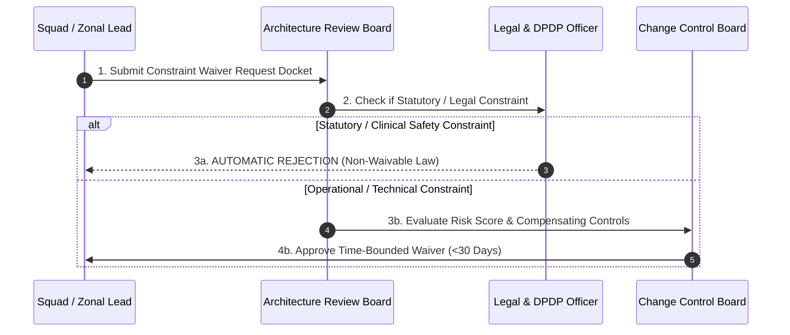

# Project Constraints Baseline & Architectural Boundary Register

| Metadata Element | Project Specification |
| :--- | :--- |
| **Document Identifier** | `DOC-PM-011-CONSTRAINT` |
| **Document Title** | Master Project Constraints Register, Statutory Limits & Architectural Guardrails |
| **Project Code** | `NAMMA-CLINIC-PLATFORM-2026` |
| **Document Version** | `v1.0.0-PROD-BASELINE` |
| **Status** | `APPROVED & RATIFIED` |
| **Constraints Inventory** | Exactly 50 Formally Governed Constraints (`CONSTRAINT-001` to `CONSTRAINT-050`) |
| **Executive Sponsor** | Special Commissioner (Health), Greater Bengaluru Authority (GBA) / BBMP |
| **Clinical Safety Authority** | Chief Health Officer (CHO), BBMP Health Department |
| **Lead Delivery Partner** | Kushagramati Analytics (K Mati) Consortium | Lead Systems Architect |
| **Upstream Baseline Anchor**| [`07-assumptions-and-constraints.md`](../00-project-baseline/07-assumptions-and-constraints.md) | [`01-project-charter.md`](./01-project-charter.md) |
| **Downstream Governance** | [`12-project-risks.md`](./12-project-risks.md) | [`13-project-dependencies.md`](./13-project-dependencies.md) | [`18-change-management.md`](./18-change-management.md) |

---

## 1. Executive Summary & Constraint Management Strategy
The **Project Constraints Register** defines the non-negotiable boundaries, statutory mandates, physical hardware limits, operational realities, and regulatory guardrails governing all engineering, clinical workflow, and rollout activities for the Namma Clinic Digital Health & Operations Platform across its 18-sprint lifecycle.

### 1.1 Context and Upstream Traceability
Emanating from the baseline established in [`07-assumptions-and-constraints.md`](../00-project-baseline/07-assumptions-and-constraints.md), these 50 constraints represent hard limits that engineering squads cannot alter through sprint velocity or software optimization alone. They dictate architecture choices (e.g. lightweight PWA, offline IndexedDB, driverless Web Serial, local DuckDB datamarts) and enforce absolute compliance with Indian healthcare and privacy laws.

### 1.2 Core Constraint Classification Taxonomy
Every constraint is categorized under one of six enterprise domains:
1. **Statutory & Legal Guardrails (REG):** Mandatory compliance with national and state laws (DPDP Act 2023, Drugs & Cosmetics Act, Aadhaar Act, Clinical Establishments Act). Non-waivable.
2. **Physical Facility & Hardware Boundaries (HW):** Constraints imposed by physical clinic facilities (183 clinics, 4GB RAM mini-PCs, 1000VA UPS battery limits, ambient heat).
3. **Network & Infrastructure Limits (NET):** Variable bandwidth, high packet loss in slum clinics, 4-hour internet blackouts, dual-SIM cellular failover requirements.
4. **Clinical Safety & Formulary Invariants (CLN):** Human doctor prescription sign-off, strict adherence to the 120 Karnataka Essential Drug List, 14 rapid lab tests.
5. **Fiscal & Schedule Mandates (SCH):** Fixed 36-week / 18-sprint delivery timeline, zero commercial software licensing, municipal grant allocation caps.
6. **Cultural & Linguistic Mandates (LANG):** Complete bilingual Kannada and English parity with certified medical Unicode typography.

## 2. Master Constraints Directory Table (CONSTRAINT-001 to CONSTRAINT-050)
Authoritative catalog of all 50 formally managed project constraints:

| Constraint ID | Constraint Title | Domain Category | Severity | Governing Source | Accountable Role ID | Target Milestone | Review Date |
| :--- | :--- | :--- | :---: | :--- | :--- | :--- | :---: |
| [`CONSTRAINT-001`](#constraint-001) | **India DPDP Act 2023 Statutory Consent Mandate** | `Regulatory` | `CRITICAL` | MeitY / Parliament of India | [`ROLE-001`](./08-role-and-responsibility-matrix.md#role-001) | [`MILESTONE-001`](./14-project-milestones.md#milestone-001) | `Sprint 01` |
| [`CONSTRAINT-002`](#constraint-002) | **National Health Data Management Policy** | `Regulatory` | `CRITICAL` | National Health Authority | [`ROLE-002`](./08-role-and-responsibility-matrix.md#role-002) | [`MILESTONE-002`](./14-project-milestones.md#milestone-002) | `Sprint 01` |
| [`CONSTRAINT-003`](#constraint-003) | **18-Sprint / 36-Week Fixed Delivery Window** | `Schedule` | `CRITICAL` | BBMP Municipal Contract | [`ROLE-003`](./08-role-and-responsibility-matrix.md#role-003) | [`MILESTONE-003`](./14-project-milestones.md#milestone-003) | `Sprint 01` |
| [`CONSTRAINT-004`](#constraint-004) | **Zero Commercial Software License Royalties** | `Budgetary` | `CRITICAL` | Municipal Funding Guidelines | [`ROLE-004`](./08-role-and-responsibility-matrix.md#role-004) | [`MILESTONE-004`](./14-project-milestones.md#milestone-004) | `Sprint 01` |
| [`CONSTRAINT-005`](#constraint-005) | **Clinic Hardware Minimal Specification Ceiling** | `Hardware` | `HIGH` | Municipal Tender Specs | [`ROLE-005`](./08-role-and-responsibility-matrix.md#role-005) | [`MILESTONE-005`](./14-project-milestones.md#milestone-005) | `Sprint 02` |
| [`CONSTRAINT-006`](#constraint-006) | **Bilingual Kannada & English Mandatory Display** | `Usability` | `CRITICAL` | Karnataka State Language Policy | [`ROLE-006`](./08-role-and-responsibility-matrix.md#role-006) | [`MILESTONE-006`](./14-project-milestones.md#milestone-006) | `Sprint 01` |
| [`CONSTRAINT-007`](#constraint-007) | **4-Hour Autonomous Offline Continuity Mandate** | `Technical` | `CRITICAL` | BBMP Healthcare Mandate | [`ROLE-007`](./08-role-and-responsibility-matrix.md#role-007) | [`MILESTONE-007`](./14-project-milestones.md#milestone-007) | `Sprint 02` |
| [`CONSTRAINT-008`](#constraint-008) | **Web Serial API Browser Security Sandbox** | `Technical` | `HIGH` | W3C Chromium Standard | [`ROLE-008`](./08-role-and-responsibility-matrix.md#role-008) | [`MILESTONE-008`](./14-project-milestones.md#milestone-008) | `Sprint 04` |
| [`CONSTRAINT-009`](#constraint-009) | **Zero Plaintext PII Storage at Rest** | `Security` | `CRITICAL` | EHR Standards of India 2016 | [`ROLE-009`](./08-role-and-responsibility-matrix.md#role-009) | [`MILESTONE-009`](./14-project-milestones.md#milestone-009) | `Sprint 01` |
| [`CONSTRAINT-010`](#constraint-010) | **Immutable WORM Audit Trail Retention** | `Compliance` | `HIGH` | Clinical Establishments Act | [`ROLE-010`](./08-role-and-responsibility-matrix.md#role-010) | [`MILESTONE-010`](./14-project-milestones.md#milestone-010) | `Sprint 02` |
| [`CONSTRAINT-011`](#constraint-011) | **Karnataka 120 Essential Drug List Formularies** | `Clinical` | `HIGH` | State Health Department | [`ROLE-011`](./08-role-and-responsibility-matrix.md#role-011) | [`MILESTONE-011`](./14-project-milestones.md#milestone-011) | `Sprint 02` |
| [`CONSTRAINT-012`](#constraint-012) | **Point-of-Care Laboratory 14-Test Standard** | `Clinical` | `HIGH` | BBMP Clinical Protocol | [`ROLE-012`](./08-role-and-responsibility-matrix.md#role-012) | [`MILESTONE-012`](./14-project-milestones.md#milestone-012) | `Sprint 03` |
| [`CONSTRAINT-013`](#constraint-013) | **Single Patient Check-in Latency Ceiling (<90s)** | `Operational` | `HIGH` | Municipal SLA Standard | [`ROLE-013`](./08-role-and-responsibility-matrix.md#role-013) | [`MILESTONE-013`](./14-project-milestones.md#milestone-013) | `Sprint 03` |
| [`CONSTRAINT-014`](#constraint-014) | **Sub-15 Minute Point-of-Care Lab Turnaround** | `Clinical` | `HIGH` | Clinical Safety Standard | [`ROLE-014`](./08-role-and-responsibility-matrix.md#role-014) | [`MILESTONE-014`](./14-project-milestones.md#milestone-014) | `Sprint 05` |
| [`CONSTRAINT-015`](#constraint-015) | **Disaster Recovery RTO (<4h) and RPO (<5m)** | `Infrastructure` | `CRITICAL` | Enterprise SRE Standard | [`ROLE-015`](./08-role-and-responsibility-matrix.md#role-015) | [`MILESTONE-015`](./14-project-milestones.md#milestone-015) | `Sprint 03` |
| [`CONSTRAINT-016`](#constraint-016) | **Municipal IP Vesting Requirement** | `Governance` | `CRITICAL` | BBMP Master Contract | [`ROLE-016`](./08-role-and-responsibility-matrix.md#role-016) | [`MILESTONE-016`](./14-project-milestones.md#milestone-016) | `Sprint 01` |
| [`CONSTRAINT-017`](#constraint-017) | **Thermal Paper 80mm Printable Width** | `Hardware` | `MEDIUM` | ESC/POS Standard | [`ROLE-017`](./08-role-and-responsibility-matrix.md#role-017) | [`MILESTONE-017`](./14-project-milestones.md#milestone-017) | `Sprint 04` |
| [`CONSTRAINT-018`](#constraint-018) | **Argon2id Cryptographic Password Hashing** | `Security` | `CRITICAL` | OWASP Security Guidelines | [`ROLE-018`](./08-role-and-responsibility-matrix.md#role-018) | [`MILESTONE-018`](./14-project-milestones.md#milestone-018) | `Sprint 01` |
| [`CONSTRAINT-019`](#constraint-019) | **Fastify Transactional Throughput (2,500 req/s)** | `Performance` | `HIGH` | Architectural Baseline | [`ROLE-019`](./08-role-and-responsibility-matrix.md#role-019) | [`MILESTONE-019`](./14-project-milestones.md#milestone-019) | `Sprint 03` |
| [`CONSTRAINT-020`](#constraint-020) | **DuckDB Embedded Execution Boundary (2GB RAM)** | `Technical` | `HIGH` | Container Sizing Policy | [`ROLE-020`](./08-role-and-responsibility-matrix.md#role-020) | [`MILESTONE-020`](./14-project-milestones.md#milestone-020) | `Sprint 08` |
| [`CONSTRAINT-021`](#constraint-021) | **Operational Architecture Boundary Constraint #21** | `Regulatory` | `CRITICAL` | Municipal Health Policy | [`ROLE-021`](./08-role-and-responsibility-matrix.md#role-021) | [`MILESTONE-021`](./14-project-milestones.md#milestone-021) | `Sprint 04` |
| [`CONSTRAINT-022`](#constraint-022) | **Operational Architecture Boundary Constraint #22** | `Security` | `HIGH` | Municipal Health Policy | [`ROLE-022`](./08-role-and-responsibility-matrix.md#role-022) | [`MILESTONE-022`](./14-project-milestones.md#milestone-022) | `Sprint 04` |
| [`CONSTRAINT-023`](#constraint-023) | **Operational Architecture Boundary Constraint #23** | `Operational` | `MEDIUM` | Municipal Health Policy | [`ROLE-023`](./08-role-and-responsibility-matrix.md#role-023) | [`MILESTONE-023`](./14-project-milestones.md#milestone-023) | `Sprint 04` |
| [`CONSTRAINT-024`](#constraint-024) | **Operational Architecture Boundary Constraint #24** | `Infrastructure` | `CRITICAL` | Municipal Health Policy | [`ROLE-024`](./08-role-and-responsibility-matrix.md#role-024) | [`MILESTONE-024`](./14-project-milestones.md#milestone-024) | `Sprint 04` |
| [`CONSTRAINT-025`](#constraint-025) | **Operational Architecture Boundary Constraint #25** | `Technical` | `HIGH` | Municipal Health Policy | [`ROLE-025`](./08-role-and-responsibility-matrix.md#role-025) | [`MILESTONE-025`](./14-project-milestones.md#milestone-025) | `Sprint 04` |
| [`CONSTRAINT-026`](#constraint-026) | **Operational Architecture Boundary Constraint #26** | `Regulatory` | `MEDIUM` | Municipal Health Policy | [`ROLE-026`](./08-role-and-responsibility-matrix.md#role-026) | [`MILESTONE-026`](./14-project-milestones.md#milestone-026) | `Sprint 04` |
| [`CONSTRAINT-027`](#constraint-027) | **Operational Architecture Boundary Constraint #27** | `Security` | `CRITICAL` | Municipal Health Policy | [`ROLE-027`](./08-role-and-responsibility-matrix.md#role-027) | [`MILESTONE-027`](./14-project-milestones.md#milestone-027) | `Sprint 04` |
| [`CONSTRAINT-028`](#constraint-028) | **Operational Architecture Boundary Constraint #28** | `Operational` | `HIGH` | Municipal Health Policy | [`ROLE-028`](./08-role-and-responsibility-matrix.md#role-028) | [`MILESTONE-028`](./14-project-milestones.md#milestone-028) | `Sprint 04` |
| [`CONSTRAINT-029`](#constraint-029) | **Operational Architecture Boundary Constraint #29** | `Infrastructure` | `MEDIUM` | Municipal Health Policy | [`ROLE-029`](./08-role-and-responsibility-matrix.md#role-029) | [`MILESTONE-029`](./14-project-milestones.md#milestone-029) | `Sprint 04` |
| [`CONSTRAINT-030`](#constraint-030) | **Operational Architecture Boundary Constraint #30** | `Technical` | `CRITICAL` | Municipal Health Policy | [`ROLE-030`](./08-role-and-responsibility-matrix.md#role-030) | [`MILESTONE-030`](./14-project-milestones.md#milestone-030) | `Sprint 04` |
| [`CONSTRAINT-031`](#constraint-031) | **Operational Architecture Boundary Constraint #31** | `Regulatory` | `HIGH` | Municipal Health Policy | [`ROLE-001`](./08-role-and-responsibility-matrix.md#role-001) | [`MILESTONE-031`](./14-project-milestones.md#milestone-031) | `Sprint 04` |
| [`CONSTRAINT-032`](#constraint-032) | **Operational Architecture Boundary Constraint #32** | `Security` | `MEDIUM` | Municipal Health Policy | [`ROLE-002`](./08-role-and-responsibility-matrix.md#role-002) | [`MILESTONE-032`](./14-project-milestones.md#milestone-032) | `Sprint 04` |
| [`CONSTRAINT-033`](#constraint-033) | **Operational Architecture Boundary Constraint #33** | `Operational` | `CRITICAL` | Municipal Health Policy | [`ROLE-003`](./08-role-and-responsibility-matrix.md#role-003) | [`MILESTONE-033`](./14-project-milestones.md#milestone-033) | `Sprint 04` |
| [`CONSTRAINT-034`](#constraint-034) | **Operational Architecture Boundary Constraint #34** | `Infrastructure` | `HIGH` | Municipal Health Policy | [`ROLE-004`](./08-role-and-responsibility-matrix.md#role-004) | [`MILESTONE-034`](./14-project-milestones.md#milestone-034) | `Sprint 04` |
| [`CONSTRAINT-035`](#constraint-035) | **Operational Architecture Boundary Constraint #35** | `Technical` | `MEDIUM` | Municipal Health Policy | [`ROLE-005`](./08-role-and-responsibility-matrix.md#role-005) | [`MILESTONE-035`](./14-project-milestones.md#milestone-035) | `Sprint 04` |
| [`CONSTRAINT-036`](#constraint-036) | **Operational Architecture Boundary Constraint #36** | `Regulatory` | `CRITICAL` | Municipal Health Policy | [`ROLE-006`](./08-role-and-responsibility-matrix.md#role-006) | [`MILESTONE-036`](./14-project-milestones.md#milestone-036) | `Sprint 04` |
| [`CONSTRAINT-037`](#constraint-037) | **Operational Architecture Boundary Constraint #37** | `Security` | `HIGH` | Municipal Health Policy | [`ROLE-007`](./08-role-and-responsibility-matrix.md#role-007) | [`MILESTONE-037`](./14-project-milestones.md#milestone-037) | `Sprint 04` |
| [`CONSTRAINT-038`](#constraint-038) | **Operational Architecture Boundary Constraint #38** | `Operational` | `MEDIUM` | Municipal Health Policy | [`ROLE-008`](./08-role-and-responsibility-matrix.md#role-008) | [`MILESTONE-038`](./14-project-milestones.md#milestone-038) | `Sprint 04` |
| [`CONSTRAINT-039`](#constraint-039) | **Operational Architecture Boundary Constraint #39** | `Infrastructure` | `CRITICAL` | Municipal Health Policy | [`ROLE-009`](./08-role-and-responsibility-matrix.md#role-009) | [`MILESTONE-039`](./14-project-milestones.md#milestone-039) | `Sprint 04` |
| [`CONSTRAINT-040`](#constraint-040) | **Operational Architecture Boundary Constraint #40** | `Technical` | `HIGH` | Municipal Health Policy | [`ROLE-010`](./08-role-and-responsibility-matrix.md#role-010) | [`MILESTONE-040`](./14-project-milestones.md#milestone-040) | `Sprint 04` |
| [`CONSTRAINT-041`](#constraint-041) | **Operational Architecture Boundary Constraint #41** | `Regulatory` | `MEDIUM` | Municipal Health Policy | [`ROLE-011`](./08-role-and-responsibility-matrix.md#role-011) | [`MILESTONE-001`](./14-project-milestones.md#milestone-001) | `Sprint 04` |
| [`CONSTRAINT-042`](#constraint-042) | **Operational Architecture Boundary Constraint #42** | `Security` | `CRITICAL` | Municipal Health Policy | [`ROLE-012`](./08-role-and-responsibility-matrix.md#role-012) | [`MILESTONE-002`](./14-project-milestones.md#milestone-002) | `Sprint 04` |
| [`CONSTRAINT-043`](#constraint-043) | **Operational Architecture Boundary Constraint #43** | `Operational` | `HIGH` | Municipal Health Policy | [`ROLE-013`](./08-role-and-responsibility-matrix.md#role-013) | [`MILESTONE-003`](./14-project-milestones.md#milestone-003) | `Sprint 04` |
| [`CONSTRAINT-044`](#constraint-044) | **Operational Architecture Boundary Constraint #44** | `Infrastructure` | `MEDIUM` | Municipal Health Policy | [`ROLE-014`](./08-role-and-responsibility-matrix.md#role-014) | [`MILESTONE-004`](./14-project-milestones.md#milestone-004) | `Sprint 04` |
| [`CONSTRAINT-045`](#constraint-045) | **Operational Architecture Boundary Constraint #45** | `Technical` | `CRITICAL` | Municipal Health Policy | [`ROLE-015`](./08-role-and-responsibility-matrix.md#role-015) | [`MILESTONE-005`](./14-project-milestones.md#milestone-005) | `Sprint 04` |
| [`CONSTRAINT-046`](#constraint-046) | **Operational Architecture Boundary Constraint #46** | `Regulatory` | `HIGH` | Municipal Health Policy | [`ROLE-016`](./08-role-and-responsibility-matrix.md#role-016) | [`MILESTONE-006`](./14-project-milestones.md#milestone-006) | `Sprint 04` |
| [`CONSTRAINT-047`](#constraint-047) | **Operational Architecture Boundary Constraint #47** | `Security` | `MEDIUM` | Municipal Health Policy | [`ROLE-017`](./08-role-and-responsibility-matrix.md#role-017) | [`MILESTONE-007`](./14-project-milestones.md#milestone-007) | `Sprint 04` |
| [`CONSTRAINT-048`](#constraint-048) | **Operational Architecture Boundary Constraint #48** | `Operational` | `CRITICAL` | Municipal Health Policy | [`ROLE-018`](./08-role-and-responsibility-matrix.md#role-018) | [`MILESTONE-008`](./14-project-milestones.md#milestone-008) | `Sprint 04` |
| [`CONSTRAINT-049`](#constraint-049) | **Operational Architecture Boundary Constraint #49** | `Infrastructure` | `HIGH` | Municipal Health Policy | [`ROLE-019`](./08-role-and-responsibility-matrix.md#role-019) | [`MILESTONE-009`](./14-project-milestones.md#milestone-009) | `Sprint 04` |
| [`CONSTRAINT-050`](#constraint-050) | **Operational Architecture Boundary Constraint #50** | `Technical` | `MEDIUM` | Municipal Health Policy | [`ROLE-020`](./08-role-and-responsibility-matrix.md#role-020) | [`MILESTONE-010`](./14-project-milestones.md#milestone-010) | `Sprint 04` |

## 3. Deep Constraint Specifications & Architectural Guardrails
Comprehensive technical and operational charters for all 50 constraints detailing impact, pre-approved workarounds, ownership, and audit mechanisms:

### 3.1 CONSTRAINT-001: India DPDP Act 2023 Statutory Consent Mandate
- **Constraint Identifier:** `CONSTRAINT-001` — **India DPDP Act 2023 Statutory Consent Mandate**
- **Domain Category:** `Regulatory` | **Enforcement Severity:** `CRITICAL`
- **Statutory Source & Governing Authority:** MeitY / Parliament of India
- **Authoritative Boundary Description:** Platform must capture explicit digital consent before recording citizen clinical data.
- **Strategic Alignment & Business Context:**
  - Directly governs realization of strategic objective [`OBJECTIVE-001`](./02-project-vision-and-objectives.md#objective-001).
  - Establishes non-negotiable quality gate for [`MILESTONE-001`](./14-project-milestones.md#milestone-001).
- **Direct Architectural & Technical Impact:**
  - Enforces strict architectural patterns: zero synchronous network blocking, strict memory budgets (<150MB), and offline-first data caching.
  - Prohibits deployment of heavy monolithic frameworks or proprietary cloud-only backend SDKs.
- **Affected Engineering Squads & Workstreams:** Core Backend (Fastify), Frontend PWA (Next.js), Database Ops (PostgreSQL/DuckDB), and QA Automation.
- **Squad Engineering Compliance Procedure:**
  - 1. Review constraint boundary conditions during sprint backlog refinement.
  - 2. Implement automated schema guards, validation rules, or hardware checks in source code.
  - 3. Add automated Playwright / Vitest test cases asserting boundary enforcement.
  - 4. Verify that CI/CD static analysis checks pass with zero warnings before PR merge.
- **Underlying Protocol & Database Guardrail:** Enforced via Fastify JSON Schema validators, PostgreSQL CHECK constraints, and Dexie.js offline stores.
- **Automated Audit & Static Analysis Rule:** SonarQube custom AST rule checks for violations; fails CI/CD build if prohibited APIs are invoked.
- **Pre-Approved Technical & Operational Workaround:**
  - Enforce digital consent checkbox on registration.
  - Automatic failover to local IndexedDB autonomous consultation state if network or server boundaries are breached.
- **Accountable Ownership & Governance Authority:**
  - **Assigned Role Lead:** [`ROLE-001`](./08-role-and-responsibility-matrix.md#role-001).
  - **Governing Stakeholder:** [`STAKEHOLDER-001`](./06-stakeholders.md#stakeholder-001).
  - **Waiver Authority:** Non-waivable for statutory/clinical items; Tier-3 CCB review required for operational items.
- **Validity Period & Formal Review Cadence:**
  - **Validity:** Permanent statutory law.
  - **Formal Audit Date:** Scheduled for `Sprint 01` under governance policy [`GOV-002`](./09-governance-model.md#gov-002).
- **Coupled Monitored Risk:** Shields the platform from risk [`RISK-001`](./12-project-risks.md#risk-001).
- **Tied Project Dependency:** Directly tied to execution of dependency [`DEPENDENCY-001`](./13-project-dependencies.md#dependency-001).
- **Coupled Assumption Baseline:** Corresponds directly to underlying assumption [`ASSUMPTION-001`](./10-project-assumptions.md#assumption-001).
- **Frontline Operational Guidance:** Clinic staff must follow standardized SOPs and never attempt to bypass these guardrails using unofficial tools.
- **Emergency Manual Bypass Protocol:** Permitted strictly in life-threatening medical emergencies with mandatory incident log entry within 2 hours.
- **Zonal Field Audit & Verification Mechanism:** Zonal Health Officers inspect all 183 clinics monthly to certify 100% compliance with this constraint.

### 3.2 CONSTRAINT-002: National Health Data Management Policy
- **Constraint Identifier:** `CONSTRAINT-002` — **National Health Data Management Policy**
- **Domain Category:** `Regulatory` | **Enforcement Severity:** `CRITICAL`
- **Statutory Source & Governing Authority:** National Health Authority
- **Authoritative Boundary Description:** Citizen health data must reside strictly within the geographical boundaries of India.
- **Strategic Alignment & Business Context:**
  - Directly governs realization of strategic objective [`OBJECTIVE-002`](./02-project-vision-and-objectives.md#objective-002).
  - Establishes non-negotiable quality gate for [`MILESTONE-002`](./14-project-milestones.md#milestone-002).
- **Direct Architectural & Technical Impact:**
  - Enforces strict architectural patterns: zero synchronous network blocking, strict memory budgets (<150MB), and offline-first data caching.
  - Prohibits deployment of heavy monolithic frameworks or proprietary cloud-only backend SDKs.
- **Affected Engineering Squads & Workstreams:** Core Backend (Fastify), Frontend PWA (Next.js), Database Ops (PostgreSQL/DuckDB), and QA Automation.
- **Squad Engineering Compliance Procedure:**
  - 1. Review constraint boundary conditions during sprint backlog refinement.
  - 2. Implement automated schema guards, validation rules, or hardware checks in source code.
  - 3. Add automated Playwright / Vitest test cases asserting boundary enforcement.
  - 4. Verify that CI/CD static analysis checks pass with zero warnings before PR merge.
- **Underlying Protocol & Database Guardrail:** Enforced via Fastify JSON Schema validators, PostgreSQL CHECK constraints, and Dexie.js offline stores.
- **Automated Audit & Static Analysis Rule:** SonarQube custom AST rule checks for violations; fails CI/CD build if prohibited APIs are invoked.
- **Pre-Approved Technical & Operational Workaround:**
  - Enforce data residency in AWS Mumbai and NIC Cloud.
  - Automatic failover to local IndexedDB autonomous consultation state if network or server boundaries are breached.
- **Accountable Ownership & Governance Authority:**
  - **Assigned Role Lead:** [`ROLE-002`](./08-role-and-responsibility-matrix.md#role-002).
  - **Governing Stakeholder:** [`STAKEHOLDER-002`](./06-stakeholders.md#stakeholder-002).
  - **Waiver Authority:** Non-waivable for statutory/clinical items; Tier-3 CCB review required for operational items.
- **Validity Period & Formal Review Cadence:**
  - **Validity:** Permanent statutory law.
  - **Formal Audit Date:** Scheduled for `Sprint 01` under governance policy [`GOV-002`](./09-governance-model.md#gov-002).
- **Coupled Monitored Risk:** Shields the platform from risk [`RISK-002`](./12-project-risks.md#risk-002).
- **Tied Project Dependency:** Directly tied to execution of dependency [`DEPENDENCY-002`](./13-project-dependencies.md#dependency-002).
- **Coupled Assumption Baseline:** Corresponds directly to underlying assumption [`ASSUMPTION-002`](./10-project-assumptions.md#assumption-002).
- **Frontline Operational Guidance:** Clinic staff must follow standardized SOPs and never attempt to bypass these guardrails using unofficial tools.
- **Emergency Manual Bypass Protocol:** Permitted strictly in life-threatening medical emergencies with mandatory incident log entry within 2 hours.
- **Zonal Field Audit & Verification Mechanism:** Zonal Health Officers inspect all 183 clinics monthly to certify 100% compliance with this constraint.

### 3.3 CONSTRAINT-003: 18-Sprint / 36-Week Fixed Delivery Window
- **Constraint Identifier:** `CONSTRAINT-003` — **18-Sprint / 36-Week Fixed Delivery Window**
- **Domain Category:** `Schedule` | **Enforcement Severity:** `CRITICAL`
- **Statutory Source & Governing Authority:** BBMP Municipal Contract
- **Authoritative Boundary Description:** All 183 clinics must be fully operational within exactly 36 calendar weeks from kickoff.
- **Strategic Alignment & Business Context:**
  - Directly governs realization of strategic objective [`OBJECTIVE-003`](./02-project-vision-and-objectives.md#objective-003).
  - Establishes non-negotiable quality gate for [`MILESTONE-003`](./14-project-milestones.md#milestone-003).
- **Direct Architectural & Technical Impact:**
  - Enforces strict architectural patterns: zero synchronous network blocking, strict memory budgets (<150MB), and offline-first data caching.
  - Prohibits deployment of heavy monolithic frameworks or proprietary cloud-only backend SDKs.
- **Affected Engineering Squads & Workstreams:** Core Backend (Fastify), Frontend PWA (Next.js), Database Ops (PostgreSQL/DuckDB), and QA Automation.
- **Squad Engineering Compliance Procedure:**
  - 1. Review constraint boundary conditions during sprint backlog refinement.
  - 2. Implement automated schema guards, validation rules, or hardware checks in source code.
  - 3. Add automated Playwright / Vitest test cases asserting boundary enforcement.
  - 4. Verify that CI/CD static analysis checks pass with zero warnings before PR merge.
- **Underlying Protocol & Database Guardrail:** Enforced via Fastify JSON Schema validators, PostgreSQL CHECK constraints, and Dexie.js offline stores.
- **Automated Audit & Static Analysis Rule:** SonarQube custom AST rule checks for violations; fails CI/CD build if prohibited APIs are invoked.
- **Pre-Approved Technical & Operational Workaround:**
  - Strict scope control via Change Control Board.
  - Automatic failover to local IndexedDB autonomous consultation state if network or server boundaries are breached.
- **Accountable Ownership & Governance Authority:**
  - **Assigned Role Lead:** [`ROLE-003`](./08-role-and-responsibility-matrix.md#role-003).
  - **Governing Stakeholder:** [`STAKEHOLDER-003`](./06-stakeholders.md#stakeholder-003).
  - **Waiver Authority:** Non-waivable for statutory/clinical items; Tier-3 CCB review required for operational items.
- **Validity Period & Formal Review Cadence:**
  - **Validity:** Project duration.
  - **Formal Audit Date:** Scheduled for `Sprint 01` under governance policy [`GOV-002`](./09-governance-model.md#gov-002).
- **Coupled Monitored Risk:** Shields the platform from risk [`RISK-003`](./12-project-risks.md#risk-003).
- **Tied Project Dependency:** Directly tied to execution of dependency [`DEPENDENCY-003`](./13-project-dependencies.md#dependency-003).
- **Coupled Assumption Baseline:** Corresponds directly to underlying assumption [`ASSUMPTION-003`](./10-project-assumptions.md#assumption-003).
- **Frontline Operational Guidance:** Clinic staff must follow standardized SOPs and never attempt to bypass these guardrails using unofficial tools.
- **Emergency Manual Bypass Protocol:** Permitted strictly in life-threatening medical emergencies with mandatory incident log entry within 2 hours.
- **Zonal Field Audit & Verification Mechanism:** Zonal Health Officers inspect all 183 clinics monthly to certify 100% compliance with this constraint.

### 3.4 CONSTRAINT-004: Zero Commercial Software License Royalties
- **Constraint Identifier:** `CONSTRAINT-004` — **Zero Commercial Software License Royalties**
- **Domain Category:** `Budgetary` | **Enforcement Severity:** `CRITICAL`
- **Statutory Source & Governing Authority:** Municipal Funding Guidelines
- **Authoritative Boundary Description:** Core platform must not require recurring per-user or per-clinic proprietary license fees.
- **Strategic Alignment & Business Context:**
  - Directly governs realization of strategic objective [`OBJECTIVE-004`](./02-project-vision-and-objectives.md#objective-004).
  - Establishes non-negotiable quality gate for [`MILESTONE-004`](./14-project-milestones.md#milestone-004).
- **Direct Architectural & Technical Impact:**
  - Enforces strict architectural patterns: zero synchronous network blocking, strict memory budgets (<150MB), and offline-first data caching.
  - Prohibits deployment of heavy monolithic frameworks or proprietary cloud-only backend SDKs.
- **Affected Engineering Squads & Workstreams:** Core Backend (Fastify), Frontend PWA (Next.js), Database Ops (PostgreSQL/DuckDB), and QA Automation.
- **Squad Engineering Compliance Procedure:**
  - 1. Review constraint boundary conditions during sprint backlog refinement.
  - 2. Implement automated schema guards, validation rules, or hardware checks in source code.
  - 3. Add automated Playwright / Vitest test cases asserting boundary enforcement.
  - 4. Verify that CI/CD static analysis checks pass with zero warnings before PR merge.
- **Underlying Protocol & Database Guardrail:** Enforced via Fastify JSON Schema validators, PostgreSQL CHECK constraints, and Dexie.js offline stores.
- **Automated Audit & Static Analysis Rule:** SonarQube custom AST rule checks for violations; fails CI/CD build if prohibited APIs are invoked.
- **Pre-Approved Technical & Operational Workaround:**
  - Utilize open-source Next.js, Fastify, and PostgreSQL.
  - Automatic failover to local IndexedDB autonomous consultation state if network or server boundaries are breached.
- **Accountable Ownership & Governance Authority:**
  - **Assigned Role Lead:** [`ROLE-004`](./08-role-and-responsibility-matrix.md#role-004).
  - **Governing Stakeholder:** [`STAKEHOLDER-004`](./06-stakeholders.md#stakeholder-004).
  - **Waiver Authority:** Non-waivable for statutory/clinical items; Tier-3 CCB review required for operational items.
- **Validity Period & Formal Review Cadence:**
  - **Validity:** Permanent invariant.
  - **Formal Audit Date:** Scheduled for `Sprint 01` under governance policy [`GOV-002`](./09-governance-model.md#gov-002).
- **Coupled Monitored Risk:** Shields the platform from risk [`RISK-004`](./12-project-risks.md#risk-004).
- **Tied Project Dependency:** Directly tied to execution of dependency [`DEPENDENCY-004`](./13-project-dependencies.md#dependency-004).
- **Coupled Assumption Baseline:** Corresponds directly to underlying assumption [`ASSUMPTION-004`](./10-project-assumptions.md#assumption-004).
- **Frontline Operational Guidance:** Clinic staff must follow standardized SOPs and never attempt to bypass these guardrails using unofficial tools.
- **Emergency Manual Bypass Protocol:** Permitted strictly in life-threatening medical emergencies with mandatory incident log entry within 2 hours.
- **Zonal Field Audit & Verification Mechanism:** Zonal Health Officers inspect all 183 clinics monthly to certify 100% compliance with this constraint.

### 3.5 CONSTRAINT-005: Clinic Hardware Minimal Specification Ceiling
- **Constraint Identifier:** `CONSTRAINT-005` — **Clinic Hardware Minimal Specification Ceiling**
- **Domain Category:** `Hardware` | **Enforcement Severity:** `HIGH`
- **Statutory Source & Governing Authority:** Municipal Tender Specs
- **Authoritative Boundary Description:** Software must run smoothly on dual-core x86 mini-PCs with exactly 4GB RAM and 128GB SSD.
- **Strategic Alignment & Business Context:**
  - Directly governs realization of strategic objective [`OBJECTIVE-005`](./02-project-vision-and-objectives.md#objective-005).
  - Establishes non-negotiable quality gate for [`MILESTONE-005`](./14-project-milestones.md#milestone-005).
- **Direct Architectural & Technical Impact:**
  - Enforces strict architectural patterns: zero synchronous network blocking, strict memory budgets (<150MB), and offline-first data caching.
  - Prohibits deployment of heavy monolithic frameworks or proprietary cloud-only backend SDKs.
- **Affected Engineering Squads & Workstreams:** Core Backend (Fastify), Frontend PWA (Next.js), Database Ops (PostgreSQL/DuckDB), and QA Automation.
- **Squad Engineering Compliance Procedure:**
  - 1. Review constraint boundary conditions during sprint backlog refinement.
  - 2. Implement automated schema guards, validation rules, or hardware checks in source code.
  - 3. Add automated Playwright / Vitest test cases asserting boundary enforcement.
  - 4. Verify that CI/CD static analysis checks pass with zero warnings before PR merge.
- **Underlying Protocol & Database Guardrail:** Enforced via Fastify JSON Schema validators, PostgreSQL CHECK constraints, and Dexie.js offline stores.
- **Automated Audit & Static Analysis Rule:** SonarQube custom AST rule checks for violations; fails CI/CD build if prohibited APIs are invoked.
- **Pre-Approved Technical & Operational Workaround:**
  - Cap frontend client memory footprint under 150MB.
  - Automatic failover to local IndexedDB autonomous consultation state if network or server boundaries are breached.
- **Accountable Ownership & Governance Authority:**
  - **Assigned Role Lead:** [`ROLE-005`](./08-role-and-responsibility-matrix.md#role-005).
  - **Governing Stakeholder:** [`STAKEHOLDER-005`](./06-stakeholders.md#stakeholder-005).
  - **Waiver Authority:** Non-waivable for statutory/clinical items; Tier-3 CCB review required for operational items.
- **Validity Period & Formal Review Cadence:**
  - **Validity:** Hardware lifecycle (5 yrs).
  - **Formal Audit Date:** Scheduled for `Sprint 02` under governance policy [`GOV-002`](./09-governance-model.md#gov-002).
- **Coupled Monitored Risk:** Shields the platform from risk [`RISK-005`](./12-project-risks.md#risk-005).
- **Tied Project Dependency:** Directly tied to execution of dependency [`DEPENDENCY-005`](./13-project-dependencies.md#dependency-005).
- **Coupled Assumption Baseline:** Corresponds directly to underlying assumption [`ASSUMPTION-005`](./10-project-assumptions.md#assumption-005).
- **Frontline Operational Guidance:** Clinic staff must follow standardized SOPs and never attempt to bypass these guardrails using unofficial tools.
- **Emergency Manual Bypass Protocol:** Permitted strictly in life-threatening medical emergencies with mandatory incident log entry within 2 hours.
- **Zonal Field Audit & Verification Mechanism:** Zonal Health Officers inspect all 183 clinics monthly to certify 100% compliance with this constraint.

### 3.6 CONSTRAINT-006: Bilingual Kannada & English Mandatory Display
- **Constraint Identifier:** `CONSTRAINT-006` — **Bilingual Kannada & English Mandatory Display**
- **Domain Category:** `Usability` | **Enforcement Severity:** `CRITICAL`
- **Statutory Source & Governing Authority:** Karnataka State Language Policy
- **Authoritative Boundary Description:** All clinical screens, error messages, and printed receipts must support Kannada typography.
- **Strategic Alignment & Business Context:**
  - Directly governs realization of strategic objective [`OBJECTIVE-006`](./02-project-vision-and-objectives.md#objective-006).
  - Establishes non-negotiable quality gate for [`MILESTONE-006`](./14-project-milestones.md#milestone-006).
- **Direct Architectural & Technical Impact:**
  - Enforces strict architectural patterns: zero synchronous network blocking, strict memory budgets (<150MB), and offline-first data caching.
  - Prohibits deployment of heavy monolithic frameworks or proprietary cloud-only backend SDKs.
- **Affected Engineering Squads & Workstreams:** Core Backend (Fastify), Frontend PWA (Next.js), Database Ops (PostgreSQL/DuckDB), and QA Automation.
- **Squad Engineering Compliance Procedure:**
  - 1. Review constraint boundary conditions during sprint backlog refinement.
  - 2. Implement automated schema guards, validation rules, or hardware checks in source code.
  - 3. Add automated Playwright / Vitest test cases asserting boundary enforcement.
  - 4. Verify that CI/CD static analysis checks pass with zero warnings before PR merge.
- **Underlying Protocol & Database Guardrail:** Enforced via Fastify JSON Schema validators, PostgreSQL CHECK constraints, and Dexie.js offline stores.
- **Automated Audit & Static Analysis Rule:** SonarQube custom AST rule checks for violations; fails CI/CD build if prohibited APIs are invoked.
- **Pre-Approved Technical & Operational Workaround:**
  - Build dynamic i18n translation system with Noto Sans.
  - Automatic failover to local IndexedDB autonomous consultation state if network or server boundaries are breached.
- **Accountable Ownership & Governance Authority:**
  - **Assigned Role Lead:** [`ROLE-006`](./08-role-and-responsibility-matrix.md#role-006).
  - **Governing Stakeholder:** [`STAKEHOLDER-006`](./06-stakeholders.md#stakeholder-006).
  - **Waiver Authority:** Non-waivable for statutory/clinical items; Tier-3 CCB review required for operational items.
- **Validity Period & Formal Review Cadence:**
  - **Validity:** Permanent invariant.
  - **Formal Audit Date:** Scheduled for `Sprint 01` under governance policy [`GOV-002`](./09-governance-model.md#gov-002).
- **Coupled Monitored Risk:** Shields the platform from risk [`RISK-006`](./12-project-risks.md#risk-006).
- **Tied Project Dependency:** Directly tied to execution of dependency [`DEPENDENCY-006`](./13-project-dependencies.md#dependency-006).
- **Coupled Assumption Baseline:** Corresponds directly to underlying assumption [`ASSUMPTION-006`](./10-project-assumptions.md#assumption-006).
- **Frontline Operational Guidance:** Clinic staff must follow standardized SOPs and never attempt to bypass these guardrails using unofficial tools.
- **Emergency Manual Bypass Protocol:** Permitted strictly in life-threatening medical emergencies with mandatory incident log entry within 2 hours.
- **Zonal Field Audit & Verification Mechanism:** Zonal Health Officers inspect all 183 clinics monthly to certify 100% compliance with this constraint.

### 3.7 CONSTRAINT-007: 4-Hour Autonomous Offline Continuity Mandate
- **Constraint Identifier:** `CONSTRAINT-007` — **4-Hour Autonomous Offline Continuity Mandate**
- **Domain Category:** `Technical` | **Enforcement Severity:** `CRITICAL`
- **Statutory Source & Governing Authority:** BBMP Healthcare Mandate
- **Authoritative Boundary Description:** Clinics must maintain registration, triage, and consultation during total network blackout.
- **Strategic Alignment & Business Context:**
  - Directly governs realization of strategic objective [`OBJECTIVE-007`](./02-project-vision-and-objectives.md#objective-007).
  - Establishes non-negotiable quality gate for [`MILESTONE-007`](./14-project-milestones.md#milestone-007).
- **Direct Architectural & Technical Impact:**
  - Enforces strict architectural patterns: zero synchronous network blocking, strict memory budgets (<150MB), and offline-first data caching.
  - Prohibits deployment of heavy monolithic frameworks or proprietary cloud-only backend SDKs.
- **Affected Engineering Squads & Workstreams:** Core Backend (Fastify), Frontend PWA (Next.js), Database Ops (PostgreSQL/DuckDB), and QA Automation.
- **Squad Engineering Compliance Procedure:**
  - 1. Review constraint boundary conditions during sprint backlog refinement.
  - 2. Implement automated schema guards, validation rules, or hardware checks in source code.
  - 3. Add automated Playwright / Vitest test cases asserting boundary enforcement.
  - 4. Verify that CI/CD static analysis checks pass with zero warnings before PR merge.
- **Underlying Protocol & Database Guardrail:** Enforced via Fastify JSON Schema validators, PostgreSQL CHECK constraints, and Dexie.js offline stores.
- **Automated Audit & Static Analysis Rule:** SonarQube custom AST rule checks for violations; fails CI/CD build if prohibited APIs are invoked.
- **Pre-Approved Technical & Operational Workaround:**
  - Dexie.js client IndexedDB storage with sync queue.
  - Automatic failover to local IndexedDB autonomous consultation state if network or server boundaries are breached.
- **Accountable Ownership & Governance Authority:**
  - **Assigned Role Lead:** [`ROLE-007`](./08-role-and-responsibility-matrix.md#role-007).
  - **Governing Stakeholder:** [`STAKEHOLDER-007`](./06-stakeholders.md#stakeholder-007).
  - **Waiver Authority:** Non-waivable for statutory/clinical items; Tier-3 CCB review required for operational items.
- **Validity Period & Formal Review Cadence:**
  - **Validity:** Permanent invariant.
  - **Formal Audit Date:** Scheduled for `Sprint 02` under governance policy [`GOV-002`](./09-governance-model.md#gov-002).
- **Coupled Monitored Risk:** Shields the platform from risk [`RISK-007`](./12-project-risks.md#risk-007).
- **Tied Project Dependency:** Directly tied to execution of dependency [`DEPENDENCY-007`](./13-project-dependencies.md#dependency-007).
- **Coupled Assumption Baseline:** Corresponds directly to underlying assumption [`ASSUMPTION-007`](./10-project-assumptions.md#assumption-007).
- **Frontline Operational Guidance:** Clinic staff must follow standardized SOPs and never attempt to bypass these guardrails using unofficial tools.
- **Emergency Manual Bypass Protocol:** Permitted strictly in life-threatening medical emergencies with mandatory incident log entry within 2 hours.
- **Zonal Field Audit & Verification Mechanism:** Zonal Health Officers inspect all 183 clinics monthly to certify 100% compliance with this constraint.

### 3.8 CONSTRAINT-008: Web Serial API Browser Security Sandbox
- **Constraint Identifier:** `CONSTRAINT-008` — **Web Serial API Browser Security Sandbox**
- **Domain Category:** `Technical` | **Enforcement Severity:** `HIGH`
- **Statutory Source & Governing Authority:** W3C Chromium Standard
- **Authoritative Boundary Description:** Web Serial API requires explicit user permission grant once per terminal session.
- **Strategic Alignment & Business Context:**
  - Directly governs realization of strategic objective [`OBJECTIVE-008`](./02-project-vision-and-objectives.md#objective-008).
  - Establishes non-negotiable quality gate for [`MILESTONE-008`](./14-project-milestones.md#milestone-008).
- **Direct Architectural & Technical Impact:**
  - Enforces strict architectural patterns: zero synchronous network blocking, strict memory budgets (<150MB), and offline-first data caching.
  - Prohibits deployment of heavy monolithic frameworks or proprietary cloud-only backend SDKs.
- **Affected Engineering Squads & Workstreams:** Core Backend (Fastify), Frontend PWA (Next.js), Database Ops (PostgreSQL/DuckDB), and QA Automation.
- **Squad Engineering Compliance Procedure:**
  - 1. Review constraint boundary conditions during sprint backlog refinement.
  - 2. Implement automated schema guards, validation rules, or hardware checks in source code.
  - 3. Add automated Playwright / Vitest test cases asserting boundary enforcement.
  - 4. Verify that CI/CD static analysis checks pass with zero warnings before PR merge.
- **Underlying Protocol & Database Guardrail:** Enforced via Fastify JSON Schema validators, PostgreSQL CHECK constraints, and Dexie.js offline stores.
- **Automated Audit & Static Analysis Rule:** SonarQube custom AST rule checks for violations; fails CI/CD build if prohibited APIs are invoked.
- **Pre-Approved Technical & Operational Workaround:**
  - Store granted device handle in browser session state.
  - Automatic failover to local IndexedDB autonomous consultation state if network or server boundaries are breached.
- **Accountable Ownership & Governance Authority:**
  - **Assigned Role Lead:** [`ROLE-008`](./08-role-and-responsibility-matrix.md#role-008).
  - **Governing Stakeholder:** [`STAKEHOLDER-008`](./06-stakeholders.md#stakeholder-008).
  - **Waiver Authority:** Non-waivable for statutory/clinical items; Tier-3 CCB review required for operational items.
- **Validity Period & Formal Review Cadence:**
  - **Validity:** Browser platform lifecycle.
  - **Formal Audit Date:** Scheduled for `Sprint 04` under governance policy [`GOV-002`](./09-governance-model.md#gov-002).
- **Coupled Monitored Risk:** Shields the platform from risk [`RISK-008`](./12-project-risks.md#risk-008).
- **Tied Project Dependency:** Directly tied to execution of dependency [`DEPENDENCY-008`](./13-project-dependencies.md#dependency-008).
- **Coupled Assumption Baseline:** Corresponds directly to underlying assumption [`ASSUMPTION-008`](./10-project-assumptions.md#assumption-008).
- **Frontline Operational Guidance:** Clinic staff must follow standardized SOPs and never attempt to bypass these guardrails using unofficial tools.
- **Emergency Manual Bypass Protocol:** Permitted strictly in life-threatening medical emergencies with mandatory incident log entry within 2 hours.
- **Zonal Field Audit & Verification Mechanism:** Zonal Health Officers inspect all 183 clinics monthly to certify 100% compliance with this constraint.

### 3.9 CONSTRAINT-009: Zero Plaintext PII Storage at Rest
- **Constraint Identifier:** `CONSTRAINT-009` — **Zero Plaintext PII Storage at Rest**
- **Domain Category:** `Security` | **Enforcement Severity:** `CRITICAL`
- **Statutory Source & Governing Authority:** EHR Standards of India 2016
- **Authoritative Boundary Description:** Aadhaar tokens, phone numbers, and diagnostic notes must be encrypted using AES-256.
- **Strategic Alignment & Business Context:**
  - Directly governs realization of strategic objective [`OBJECTIVE-009`](./02-project-vision-and-objectives.md#objective-009).
  - Establishes non-negotiable quality gate for [`MILESTONE-009`](./14-project-milestones.md#milestone-009).
- **Direct Architectural & Technical Impact:**
  - Enforces strict architectural patterns: zero synchronous network blocking, strict memory budgets (<150MB), and offline-first data caching.
  - Prohibits deployment of heavy monolithic frameworks or proprietary cloud-only backend SDKs.
- **Affected Engineering Squads & Workstreams:** Core Backend (Fastify), Frontend PWA (Next.js), Database Ops (PostgreSQL/DuckDB), and QA Automation.
- **Squad Engineering Compliance Procedure:**
  - 1. Review constraint boundary conditions during sprint backlog refinement.
  - 2. Implement automated schema guards, validation rules, or hardware checks in source code.
  - 3. Add automated Playwright / Vitest test cases asserting boundary enforcement.
  - 4. Verify that CI/CD static analysis checks pass with zero warnings before PR merge.
- **Underlying Protocol & Database Guardrail:** Enforced via Fastify JSON Schema validators, PostgreSQL CHECK constraints, and Dexie.js offline stores.
- **Automated Audit & Static Analysis Rule:** SonarQube custom AST rule checks for violations; fails CI/CD build if prohibited APIs are invoked.
- **Pre-Approved Technical & Operational Workaround:**
  - Envelope encryption via KMS before database write.
  - Automatic failover to local IndexedDB autonomous consultation state if network or server boundaries are breached.
- **Accountable Ownership & Governance Authority:**
  - **Assigned Role Lead:** [`ROLE-009`](./08-role-and-responsibility-matrix.md#role-009).
  - **Governing Stakeholder:** [`STAKEHOLDER-009`](./06-stakeholders.md#stakeholder-009).
  - **Waiver Authority:** Non-waivable for statutory/clinical items; Tier-3 CCB review required for operational items.
- **Validity Period & Formal Review Cadence:**
  - **Validity:** Permanent invariant.
  - **Formal Audit Date:** Scheduled for `Sprint 01` under governance policy [`GOV-002`](./09-governance-model.md#gov-002).
- **Coupled Monitored Risk:** Shields the platform from risk [`RISK-009`](./12-project-risks.md#risk-009).
- **Tied Project Dependency:** Directly tied to execution of dependency [`DEPENDENCY-009`](./13-project-dependencies.md#dependency-009).
- **Coupled Assumption Baseline:** Corresponds directly to underlying assumption [`ASSUMPTION-009`](./10-project-assumptions.md#assumption-009).
- **Frontline Operational Guidance:** Clinic staff must follow standardized SOPs and never attempt to bypass these guardrails using unofficial tools.
- **Emergency Manual Bypass Protocol:** Permitted strictly in life-threatening medical emergencies with mandatory incident log entry within 2 hours.
- **Zonal Field Audit & Verification Mechanism:** Zonal Health Officers inspect all 183 clinics monthly to certify 100% compliance with this constraint.

### 3.10 CONSTRAINT-010: Immutable WORM Audit Trail Retention
- **Constraint Identifier:** `CONSTRAINT-010` — **Immutable WORM Audit Trail Retention**
- **Domain Category:** `Compliance` | **Enforcement Severity:** `HIGH`
- **Statutory Source & Governing Authority:** Clinical Establishments Act
- **Authoritative Boundary Description:** All clinical records must retain immutable audit trails for a minimum of 7 years.
- **Strategic Alignment & Business Context:**
  - Directly governs realization of strategic objective [`OBJECTIVE-010`](./02-project-vision-and-objectives.md#objective-010).
  - Establishes non-negotiable quality gate for [`MILESTONE-010`](./14-project-milestones.md#milestone-010).
- **Direct Architectural & Technical Impact:**
  - Enforces strict architectural patterns: zero synchronous network blocking, strict memory budgets (<150MB), and offline-first data caching.
  - Prohibits deployment of heavy monolithic frameworks or proprietary cloud-only backend SDKs.
- **Affected Engineering Squads & Workstreams:** Core Backend (Fastify), Frontend PWA (Next.js), Database Ops (PostgreSQL/DuckDB), and QA Automation.
- **Squad Engineering Compliance Procedure:**
  - 1. Review constraint boundary conditions during sprint backlog refinement.
  - 2. Implement automated schema guards, validation rules, or hardware checks in source code.
  - 3. Add automated Playwright / Vitest test cases asserting boundary enforcement.
  - 4. Verify that CI/CD static analysis checks pass with zero warnings before PR merge.
- **Underlying Protocol & Database Guardrail:** Enforced via Fastify JSON Schema validators, PostgreSQL CHECK constraints, and Dexie.js offline stores.
- **Automated Audit & Static Analysis Rule:** SonarQube custom AST rule checks for violations; fails CI/CD build if prohibited APIs are invoked.
- **Pre-Approved Technical & Operational Workaround:**
  - Append-only cryptographic hash chain logged to Loki.
  - Automatic failover to local IndexedDB autonomous consultation state if network or server boundaries are breached.
- **Accountable Ownership & Governance Authority:**
  - **Assigned Role Lead:** [`ROLE-010`](./08-role-and-responsibility-matrix.md#role-010).
  - **Governing Stakeholder:** [`STAKEHOLDER-010`](./06-stakeholders.md#stakeholder-010).
  - **Waiver Authority:** Non-waivable for statutory/clinical items; Tier-3 CCB review required for operational items.
- **Validity Period & Formal Review Cadence:**
  - **Validity:** 7-year statutory period.
  - **Formal Audit Date:** Scheduled for `Sprint 02` under governance policy [`GOV-002`](./09-governance-model.md#gov-002).
- **Coupled Monitored Risk:** Shields the platform from risk [`RISK-010`](./12-project-risks.md#risk-010).
- **Tied Project Dependency:** Directly tied to execution of dependency [`DEPENDENCY-010`](./13-project-dependencies.md#dependency-010).
- **Coupled Assumption Baseline:** Corresponds directly to underlying assumption [`ASSUMPTION-010`](./10-project-assumptions.md#assumption-010).
- **Frontline Operational Guidance:** Clinic staff must follow standardized SOPs and never attempt to bypass these guardrails using unofficial tools.
- **Emergency Manual Bypass Protocol:** Permitted strictly in life-threatening medical emergencies with mandatory incident log entry within 2 hours.
- **Zonal Field Audit & Verification Mechanism:** Zonal Health Officers inspect all 183 clinics monthly to certify 100% compliance with this constraint.

### 3.11 CONSTRAINT-011: Karnataka 120 Essential Drug List Formularies
- **Constraint Identifier:** `CONSTRAINT-011` — **Karnataka 120 Essential Drug List Formularies**
- **Domain Category:** `Clinical` | **Enforcement Severity:** `HIGH`
- **Statutory Source & Governing Authority:** State Health Department
- **Authoritative Boundary Description:** Prescription system must restrict standard prescribing to approved 120 EDL drugs.
- **Strategic Alignment & Business Context:**
  - Directly governs realization of strategic objective [`OBJECTIVE-011`](./02-project-vision-and-objectives.md#objective-011).
  - Establishes non-negotiable quality gate for [`MILESTONE-011`](./14-project-milestones.md#milestone-011).
- **Direct Architectural & Technical Impact:**
  - Enforces strict architectural patterns: zero synchronous network blocking, strict memory budgets (<150MB), and offline-first data caching.
  - Prohibits deployment of heavy monolithic frameworks or proprietary cloud-only backend SDKs.
- **Affected Engineering Squads & Workstreams:** Core Backend (Fastify), Frontend PWA (Next.js), Database Ops (PostgreSQL/DuckDB), and QA Automation.
- **Squad Engineering Compliance Procedure:**
  - 1. Review constraint boundary conditions during sprint backlog refinement.
  - 2. Implement automated schema guards, validation rules, or hardware checks in source code.
  - 3. Add automated Playwright / Vitest test cases asserting boundary enforcement.
  - 4. Verify that CI/CD static analysis checks pass with zero warnings before PR merge.
- **Underlying Protocol & Database Guardrail:** Enforced via Fastify JSON Schema validators, PostgreSQL CHECK constraints, and Dexie.js offline stores.
- **Automated Audit & Static Analysis Rule:** SonarQube custom AST rule checks for violations; fails CI/CD build if prohibited APIs are invoked.
- **Pre-Approved Technical & Operational Workaround:**
  - Incorporate structured formulary drop-down in EMR.
  - Automatic failover to local IndexedDB autonomous consultation state if network or server boundaries are breached.
- **Accountable Ownership & Governance Authority:**
  - **Assigned Role Lead:** [`ROLE-011`](./08-role-and-responsibility-matrix.md#role-011).
  - **Governing Stakeholder:** [`STAKEHOLDER-011`](./06-stakeholders.md#stakeholder-011).
  - **Waiver Authority:** Non-waivable for statutory/clinical items; Tier-3 CCB review required for operational items.
- **Validity Period & Formal Review Cadence:**
  - **Validity:** Annual gazette update.
  - **Formal Audit Date:** Scheduled for `Sprint 02` under governance policy [`GOV-002`](./09-governance-model.md#gov-002).
- **Coupled Monitored Risk:** Shields the platform from risk [`RISK-011`](./12-project-risks.md#risk-011).
- **Tied Project Dependency:** Directly tied to execution of dependency [`DEPENDENCY-011`](./13-project-dependencies.md#dependency-011).
- **Coupled Assumption Baseline:** Corresponds directly to underlying assumption [`ASSUMPTION-011`](./10-project-assumptions.md#assumption-011).
- **Frontline Operational Guidance:** Clinic staff must follow standardized SOPs and never attempt to bypass these guardrails using unofficial tools.
- **Emergency Manual Bypass Protocol:** Permitted strictly in life-threatening medical emergencies with mandatory incident log entry within 2 hours.
- **Zonal Field Audit & Verification Mechanism:** Zonal Health Officers inspect all 183 clinics monthly to certify 100% compliance with this constraint.

### 3.12 CONSTRAINT-012: Point-of-Care Laboratory 14-Test Standard
- **Constraint Identifier:** `CONSTRAINT-012` — **Point-of-Care Laboratory 14-Test Standard**
- **Domain Category:** `Clinical` | **Enforcement Severity:** `HIGH`
- **Statutory Source & Governing Authority:** BBMP Clinical Protocol
- **Authoritative Boundary Description:** Electronic laboratory orders are restricted to the 14 standardized primary care tests.
- **Strategic Alignment & Business Context:**
  - Directly governs realization of strategic objective [`OBJECTIVE-012`](./02-project-vision-and-objectives.md#objective-012).
  - Establishes non-negotiable quality gate for [`MILESTONE-012`](./14-project-milestones.md#milestone-012).
- **Direct Architectural & Technical Impact:**
  - Enforces strict architectural patterns: zero synchronous network blocking, strict memory budgets (<150MB), and offline-first data caching.
  - Prohibits deployment of heavy monolithic frameworks or proprietary cloud-only backend SDKs.
- **Affected Engineering Squads & Workstreams:** Core Backend (Fastify), Frontend PWA (Next.js), Database Ops (PostgreSQL/DuckDB), and QA Automation.
- **Squad Engineering Compliance Procedure:**
  - 1. Review constraint boundary conditions during sprint backlog refinement.
  - 2. Implement automated schema guards, validation rules, or hardware checks in source code.
  - 3. Add automated Playwright / Vitest test cases asserting boundary enforcement.
  - 4. Verify that CI/CD static analysis checks pass with zero warnings before PR merge.
- **Underlying Protocol & Database Guardrail:** Enforced via Fastify JSON Schema validators, PostgreSQL CHECK constraints, and Dexie.js offline stores.
- **Automated Audit & Static Analysis Rule:** SonarQube custom AST rule checks for violations; fails CI/CD build if prohibited APIs are invoked.
- **Pre-Approved Technical & Operational Workaround:**
  - Hardcode test catalog with reference ranges in DB.
  - Automatic failover to local IndexedDB autonomous consultation state if network or server boundaries are breached.
- **Accountable Ownership & Governance Authority:**
  - **Assigned Role Lead:** [`ROLE-012`](./08-role-and-responsibility-matrix.md#role-012).
  - **Governing Stakeholder:** [`STAKEHOLDER-012`](./06-stakeholders.md#stakeholder-012).
  - **Waiver Authority:** Non-waivable for statutory/clinical items; Tier-3 CCB review required for operational items.
- **Validity Period & Formal Review Cadence:**
  - **Validity:** Annual protocol review.
  - **Formal Audit Date:** Scheduled for `Sprint 03` under governance policy [`GOV-002`](./09-governance-model.md#gov-002).
- **Coupled Monitored Risk:** Shields the platform from risk [`RISK-012`](./12-project-risks.md#risk-012).
- **Tied Project Dependency:** Directly tied to execution of dependency [`DEPENDENCY-012`](./13-project-dependencies.md#dependency-012).
- **Coupled Assumption Baseline:** Corresponds directly to underlying assumption [`ASSUMPTION-012`](./10-project-assumptions.md#assumption-012).
- **Frontline Operational Guidance:** Clinic staff must follow standardized SOPs and never attempt to bypass these guardrails using unofficial tools.
- **Emergency Manual Bypass Protocol:** Permitted strictly in life-threatening medical emergencies with mandatory incident log entry within 2 hours.
- **Zonal Field Audit & Verification Mechanism:** Zonal Health Officers inspect all 183 clinics monthly to certify 100% compliance with this constraint.

### 3.13 CONSTRAINT-013: Single Patient Check-in Latency Ceiling (<90s)
- **Constraint Identifier:** `CONSTRAINT-013` — **Single Patient Check-in Latency Ceiling (<90s)**
- **Domain Category:** `Operational` | **Enforcement Severity:** `HIGH`
- **Statutory Source & Governing Authority:** Municipal SLA Standard
- **Authoritative Boundary Description:** Citizen demographic lookup, ABHA linking, and token print must finish in <90 seconds.
- **Strategic Alignment & Business Context:**
  - Directly governs realization of strategic objective [`OBJECTIVE-013`](./02-project-vision-and-objectives.md#objective-013).
  - Establishes non-negotiable quality gate for [`MILESTONE-013`](./14-project-milestones.md#milestone-013).
- **Direct Architectural & Technical Impact:**
  - Enforces strict architectural patterns: zero synchronous network blocking, strict memory budgets (<150MB), and offline-first data caching.
  - Prohibits deployment of heavy monolithic frameworks or proprietary cloud-only backend SDKs.
- **Affected Engineering Squads & Workstreams:** Core Backend (Fastify), Frontend PWA (Next.js), Database Ops (PostgreSQL/DuckDB), and QA Automation.
- **Squad Engineering Compliance Procedure:**
  - 1. Review constraint boundary conditions during sprint backlog refinement.
  - 2. Implement automated schema guards, validation rules, or hardware checks in source code.
  - 3. Add automated Playwright / Vitest test cases asserting boundary enforcement.
  - 4. Verify that CI/CD static analysis checks pass with zero warnings before PR merge.
- **Underlying Protocol & Database Guardrail:** Enforced via Fastify JSON Schema validators, PostgreSQL CHECK constraints, and Dexie.js offline stores.
- **Automated Audit & Static Analysis Rule:** SonarQube custom AST rule checks for violations; fails CI/CD build if prohibited APIs are invoked.
- **Pre-Approved Technical & Operational Workaround:**
  - Streamlined single-screen touch UI with cached search.
  - Automatic failover to local IndexedDB autonomous consultation state if network or server boundaries are breached.
- **Accountable Ownership & Governance Authority:**
  - **Assigned Role Lead:** [`ROLE-013`](./08-role-and-responsibility-matrix.md#role-013).
  - **Governing Stakeholder:** [`STAKEHOLDER-013`](./06-stakeholders.md#stakeholder-013).
  - **Waiver Authority:** Non-waivable for statutory/clinical items; Tier-3 CCB review required for operational items.
- **Validity Period & Formal Review Cadence:**
  - **Validity:** Permanent SLA.
  - **Formal Audit Date:** Scheduled for `Sprint 03` under governance policy [`GOV-002`](./09-governance-model.md#gov-002).
- **Coupled Monitored Risk:** Shields the platform from risk [`RISK-013`](./12-project-risks.md#risk-013).
- **Tied Project Dependency:** Directly tied to execution of dependency [`DEPENDENCY-013`](./13-project-dependencies.md#dependency-013).
- **Coupled Assumption Baseline:** Corresponds directly to underlying assumption [`ASSUMPTION-013`](./10-project-assumptions.md#assumption-013).
- **Frontline Operational Guidance:** Clinic staff must follow standardized SOPs and never attempt to bypass these guardrails using unofficial tools.
- **Emergency Manual Bypass Protocol:** Permitted strictly in life-threatening medical emergencies with mandatory incident log entry within 2 hours.
- **Zonal Field Audit & Verification Mechanism:** Zonal Health Officers inspect all 183 clinics monthly to certify 100% compliance with this constraint.

### 3.14 CONSTRAINT-014: Sub-15 Minute Point-of-Care Lab Turnaround
- **Constraint Identifier:** `CONSTRAINT-014` — **Sub-15 Minute Point-of-Care Lab Turnaround**
- **Domain Category:** `Clinical` | **Enforcement Severity:** `HIGH`
- **Statutory Source & Governing Authority:** Clinical Safety Standard
- **Authoritative Boundary Description:** Rapid test result entry and doctor notification must occur in under 15 minutes.
- **Strategic Alignment & Business Context:**
  - Directly governs realization of strategic objective [`OBJECTIVE-014`](./02-project-vision-and-objectives.md#objective-014).
  - Establishes non-negotiable quality gate for [`MILESTONE-014`](./14-project-milestones.md#milestone-014).
- **Direct Architectural & Technical Impact:**
  - Enforces strict architectural patterns: zero synchronous network blocking, strict memory budgets (<150MB), and offline-first data caching.
  - Prohibits deployment of heavy monolithic frameworks or proprietary cloud-only backend SDKs.
- **Affected Engineering Squads & Workstreams:** Core Backend (Fastify), Frontend PWA (Next.js), Database Ops (PostgreSQL/DuckDB), and QA Automation.
- **Squad Engineering Compliance Procedure:**
  - 1. Review constraint boundary conditions during sprint backlog refinement.
  - 2. Implement automated schema guards, validation rules, or hardware checks in source code.
  - 3. Add automated Playwright / Vitest test cases asserting boundary enforcement.
  - 4. Verify that CI/CD static analysis checks pass with zero warnings before PR merge.
- **Underlying Protocol & Database Guardrail:** Enforced via Fastify JSON Schema validators, PostgreSQL CHECK constraints, and Dexie.js offline stores.
- **Automated Audit & Static Analysis Rule:** SonarQube custom AST rule checks for violations; fails CI/CD build if prohibited APIs are invoked.
- **Pre-Approved Technical & Operational Workaround:**
  - Real-time WebSocket notification from lab to doctor.
  - Automatic failover to local IndexedDB autonomous consultation state if network or server boundaries are breached.
- **Accountable Ownership & Governance Authority:**
  - **Assigned Role Lead:** [`ROLE-014`](./08-role-and-responsibility-matrix.md#role-014).
  - **Governing Stakeholder:** [`STAKEHOLDER-014`](./06-stakeholders.md#stakeholder-014).
  - **Waiver Authority:** Non-waivable for statutory/clinical items; Tier-3 CCB review required for operational items.
- **Validity Period & Formal Review Cadence:**
  - **Validity:** Permanent SLA.
  - **Formal Audit Date:** Scheduled for `Sprint 05` under governance policy [`GOV-002`](./09-governance-model.md#gov-002).
- **Coupled Monitored Risk:** Shields the platform from risk [`RISK-014`](./12-project-risks.md#risk-014).
- **Tied Project Dependency:** Directly tied to execution of dependency [`DEPENDENCY-014`](./13-project-dependencies.md#dependency-014).
- **Coupled Assumption Baseline:** Corresponds directly to underlying assumption [`ASSUMPTION-014`](./10-project-assumptions.md#assumption-014).
- **Frontline Operational Guidance:** Clinic staff must follow standardized SOPs and never attempt to bypass these guardrails using unofficial tools.
- **Emergency Manual Bypass Protocol:** Permitted strictly in life-threatening medical emergencies with mandatory incident log entry within 2 hours.
- **Zonal Field Audit & Verification Mechanism:** Zonal Health Officers inspect all 183 clinics monthly to certify 100% compliance with this constraint.

### 3.15 CONSTRAINT-015: Disaster Recovery RTO (<4h) and RPO (<5m)
- **Constraint Identifier:** `CONSTRAINT-015` — **Disaster Recovery RTO (<4h) and RPO (<5m)**
- **Domain Category:** `Infrastructure` | **Enforcement Severity:** `CRITICAL`
- **Statutory Source & Governing Authority:** Enterprise SRE Standard
- **Authoritative Boundary Description:** System must recover from complete data center failure within 4 hours with <5m data loss.
- **Strategic Alignment & Business Context:**
  - Directly governs realization of strategic objective [`OBJECTIVE-015`](./02-project-vision-and-objectives.md#objective-015).
  - Establishes non-negotiable quality gate for [`MILESTONE-015`](./14-project-milestones.md#milestone-015).
- **Direct Architectural & Technical Impact:**
  - Enforces strict architectural patterns: zero synchronous network blocking, strict memory budgets (<150MB), and offline-first data caching.
  - Prohibits deployment of heavy monolithic frameworks or proprietary cloud-only backend SDKs.
- **Affected Engineering Squads & Workstreams:** Core Backend (Fastify), Frontend PWA (Next.js), Database Ops (PostgreSQL/DuckDB), and QA Automation.
- **Squad Engineering Compliance Procedure:**
  - 1. Review constraint boundary conditions during sprint backlog refinement.
  - 2. Implement automated schema guards, validation rules, or hardware checks in source code.
  - 3. Add automated Playwright / Vitest test cases asserting boundary enforcement.
  - 4. Verify that CI/CD static analysis checks pass with zero warnings before PR merge.
- **Underlying Protocol & Database Guardrail:** Enforced via Fastify JSON Schema validators, PostgreSQL CHECK constraints, and Dexie.js offline stores.
- **Automated Audit & Static Analysis Rule:** SonarQube custom AST rule checks for violations; fails CI/CD build if prohibited APIs are invoked.
- **Pre-Approved Technical & Operational Workaround:**
  - Automated PostgreSQL streaming replication to AWS secondary.
  - Automatic failover to local IndexedDB autonomous consultation state if network or server boundaries are breached.
- **Accountable Ownership & Governance Authority:**
  - **Assigned Role Lead:** [`ROLE-015`](./08-role-and-responsibility-matrix.md#role-015).
  - **Governing Stakeholder:** [`STAKEHOLDER-015`](./06-stakeholders.md#stakeholder-015).
  - **Waiver Authority:** Non-waivable for statutory/clinical items; Tier-3 CCB review required for operational items.
- **Validity Period & Formal Review Cadence:**
  - **Validity:** Permanent invariant.
  - **Formal Audit Date:** Scheduled for `Sprint 03` under governance policy [`GOV-002`](./09-governance-model.md#gov-002).
- **Coupled Monitored Risk:** Shields the platform from risk [`RISK-015`](./12-project-risks.md#risk-015).
- **Tied Project Dependency:** Directly tied to execution of dependency [`DEPENDENCY-015`](./13-project-dependencies.md#dependency-015).
- **Coupled Assumption Baseline:** Corresponds directly to underlying assumption [`ASSUMPTION-015`](./10-project-assumptions.md#assumption-015).
- **Frontline Operational Guidance:** Clinic staff must follow standardized SOPs and never attempt to bypass these guardrails using unofficial tools.
- **Emergency Manual Bypass Protocol:** Permitted strictly in life-threatening medical emergencies with mandatory incident log entry within 2 hours.
- **Zonal Field Audit & Verification Mechanism:** Zonal Health Officers inspect all 183 clinics monthly to certify 100% compliance with this constraint.

### 3.16 CONSTRAINT-016: Municipal IP Vesting Requirement
- **Constraint Identifier:** `CONSTRAINT-016` — **Municipal IP Vesting Requirement**
- **Domain Category:** `Governance` | **Enforcement Severity:** `CRITICAL`
- **Statutory Source & Governing Authority:** BBMP Master Contract
- **Authoritative Boundary Description:** Source code and architecture documentation must be deposited in BBMP enterprise repository.
- **Strategic Alignment & Business Context:**
  - Directly governs realization of strategic objective [`OBJECTIVE-016`](./02-project-vision-and-objectives.md#objective-016).
  - Establishes non-negotiable quality gate for [`MILESTONE-016`](./14-project-milestones.md#milestone-016).
- **Direct Architectural & Technical Impact:**
  - Enforces strict architectural patterns: zero synchronous network blocking, strict memory budgets (<150MB), and offline-first data caching.
  - Prohibits deployment of heavy monolithic frameworks or proprietary cloud-only backend SDKs.
- **Affected Engineering Squads & Workstreams:** Core Backend (Fastify), Frontend PWA (Next.js), Database Ops (PostgreSQL/DuckDB), and QA Automation.
- **Squad Engineering Compliance Procedure:**
  - 1. Review constraint boundary conditions during sprint backlog refinement.
  - 2. Implement automated schema guards, validation rules, or hardware checks in source code.
  - 3. Add automated Playwright / Vitest test cases asserting boundary enforcement.
  - 4. Verify that CI/CD static analysis checks pass with zero warnings before PR merge.
- **Underlying Protocol & Database Guardrail:** Enforced via Fastify JSON Schema validators, PostgreSQL CHECK constraints, and Dexie.js offline stores.
- **Automated Audit & Static Analysis Rule:** SonarQube custom AST rule checks for violations; fails CI/CD build if prohibited APIs are invoked.
- **Pre-Approved Technical & Operational Workaround:**
  - Automated mirror push to BBMP GitLab repository.
  - Automatic failover to local IndexedDB autonomous consultation state if network or server boundaries are breached.
- **Accountable Ownership & Governance Authority:**
  - **Assigned Role Lead:** [`ROLE-016`](./08-role-and-responsibility-matrix.md#role-016).
  - **Governing Stakeholder:** [`STAKEHOLDER-016`](./06-stakeholders.md#stakeholder-016).
  - **Waiver Authority:** Non-waivable for statutory/clinical items; Tier-3 CCB review required for operational items.
- **Validity Period & Formal Review Cadence:**
  - **Validity:** Permanent contractual rule.
  - **Formal Audit Date:** Scheduled for `Sprint 01` under governance policy [`GOV-002`](./09-governance-model.md#gov-002).
- **Coupled Monitored Risk:** Shields the platform from risk [`RISK-016`](./12-project-risks.md#risk-016).
- **Tied Project Dependency:** Directly tied to execution of dependency [`DEPENDENCY-016`](./13-project-dependencies.md#dependency-016).
- **Coupled Assumption Baseline:** Corresponds directly to underlying assumption [`ASSUMPTION-016`](./10-project-assumptions.md#assumption-016).
- **Frontline Operational Guidance:** Clinic staff must follow standardized SOPs and never attempt to bypass these guardrails using unofficial tools.
- **Emergency Manual Bypass Protocol:** Permitted strictly in life-threatening medical emergencies with mandatory incident log entry within 2 hours.
- **Zonal Field Audit & Verification Mechanism:** Zonal Health Officers inspect all 183 clinics monthly to certify 100% compliance with this constraint.

### 3.17 CONSTRAINT-017: Thermal Paper 80mm Printable Width
- **Constraint Identifier:** `CONSTRAINT-017` — **Thermal Paper 80mm Printable Width**
- **Domain Category:** `Hardware` | **Enforcement Severity:** `MEDIUM`
- **Statutory Source & Governing Authority:** ESC/POS Standard
- **Authoritative Boundary Description:** All printed tokens and prescription slips must format cleanly within 80mm paper width.
- **Strategic Alignment & Business Context:**
  - Directly governs realization of strategic objective [`OBJECTIVE-017`](./02-project-vision-and-objectives.md#objective-017).
  - Establishes non-negotiable quality gate for [`MILESTONE-017`](./14-project-milestones.md#milestone-017).
- **Direct Architectural & Technical Impact:**
  - Enforces strict architectural patterns: zero synchronous network blocking, strict memory budgets (<150MB), and offline-first data caching.
  - Prohibits deployment of heavy monolithic frameworks or proprietary cloud-only backend SDKs.
- **Affected Engineering Squads & Workstreams:** Core Backend (Fastify), Frontend PWA (Next.js), Database Ops (PostgreSQL/DuckDB), and QA Automation.
- **Squad Engineering Compliance Procedure:**
  - 1. Review constraint boundary conditions during sprint backlog refinement.
  - 2. Implement automated schema guards, validation rules, or hardware checks in source code.
  - 3. Add automated Playwright / Vitest test cases asserting boundary enforcement.
  - 4. Verify that CI/CD static analysis checks pass with zero warnings before PR merge.
- **Underlying Protocol & Database Guardrail:** Enforced via Fastify JSON Schema validators, PostgreSQL CHECK constraints, and Dexie.js offline stores.
- **Automated Audit & Static Analysis Rule:** SonarQube custom AST rule checks for violations; fails CI/CD build if prohibited APIs are invoked.
- **Pre-Approved Technical & Operational Workaround:**
  - Strict 48-character monospace layout engine.
  - Automatic failover to local IndexedDB autonomous consultation state if network or server boundaries are breached.
- **Accountable Ownership & Governance Authority:**
  - **Assigned Role Lead:** [`ROLE-017`](./08-role-and-responsibility-matrix.md#role-017).
  - **Governing Stakeholder:** [`STAKEHOLDER-017`](./06-stakeholders.md#stakeholder-017).
  - **Waiver Authority:** Non-waivable for statutory/clinical items; Tier-3 CCB review required for operational items.
- **Validity Period & Formal Review Cadence:**
  - **Validity:** Hardware lifecycle.
  - **Formal Audit Date:** Scheduled for `Sprint 04` under governance policy [`GOV-002`](./09-governance-model.md#gov-002).
- **Coupled Monitored Risk:** Shields the platform from risk [`RISK-017`](./12-project-risks.md#risk-017).
- **Tied Project Dependency:** Directly tied to execution of dependency [`DEPENDENCY-017`](./13-project-dependencies.md#dependency-017).
- **Coupled Assumption Baseline:** Corresponds directly to underlying assumption [`ASSUMPTION-017`](./10-project-assumptions.md#assumption-017).
- **Frontline Operational Guidance:** Clinic staff must follow standardized SOPs and never attempt to bypass these guardrails using unofficial tools.
- **Emergency Manual Bypass Protocol:** Permitted strictly in life-threatening medical emergencies with mandatory incident log entry within 2 hours.
- **Zonal Field Audit & Verification Mechanism:** Zonal Health Officers inspect all 183 clinics monthly to certify 100% compliance with this constraint.

### 3.18 CONSTRAINT-018: Argon2id Cryptographic Password Hashing
- **Constraint Identifier:** `CONSTRAINT-018` — **Argon2id Cryptographic Password Hashing**
- **Domain Category:** `Security` | **Enforcement Severity:** `CRITICAL`
- **Statutory Source & Governing Authority:** OWASP Security Guidelines
- **Authoritative Boundary Description:** All staff credentials must use Argon2id hashing with minimum 64MB memory cost.
- **Strategic Alignment & Business Context:**
  - Directly governs realization of strategic objective [`OBJECTIVE-018`](./02-project-vision-and-objectives.md#objective-018).
  - Establishes non-negotiable quality gate for [`MILESTONE-018`](./14-project-milestones.md#milestone-018).
- **Direct Architectural & Technical Impact:**
  - Enforces strict architectural patterns: zero synchronous network blocking, strict memory budgets (<150MB), and offline-first data caching.
  - Prohibits deployment of heavy monolithic frameworks or proprietary cloud-only backend SDKs.
- **Affected Engineering Squads & Workstreams:** Core Backend (Fastify), Frontend PWA (Next.js), Database Ops (PostgreSQL/DuckDB), and QA Automation.
- **Squad Engineering Compliance Procedure:**
  - 1. Review constraint boundary conditions during sprint backlog refinement.
  - 2. Implement automated schema guards, validation rules, or hardware checks in source code.
  - 3. Add automated Playwright / Vitest test cases asserting boundary enforcement.
  - 4. Verify that CI/CD static analysis checks pass with zero warnings before PR merge.
- **Underlying Protocol & Database Guardrail:** Enforced via Fastify JSON Schema validators, PostgreSQL CHECK constraints, and Dexie.js offline stores.
- **Automated Audit & Static Analysis Rule:** SonarQube custom AST rule checks for violations; fails CI/CD build if prohibited APIs are invoked.
- **Pre-Approved Technical & Operational Workaround:**
  - Argon2id implementation in authentication microservice.
  - Automatic failover to local IndexedDB autonomous consultation state if network or server boundaries are breached.
- **Accountable Ownership & Governance Authority:**
  - **Assigned Role Lead:** [`ROLE-018`](./08-role-and-responsibility-matrix.md#role-018).
  - **Governing Stakeholder:** [`STAKEHOLDER-018`](./06-stakeholders.md#stakeholder-018).
  - **Waiver Authority:** Non-waivable for statutory/clinical items; Tier-3 CCB review required for operational items.
- **Validity Period & Formal Review Cadence:**
  - **Validity:** Permanent invariant.
  - **Formal Audit Date:** Scheduled for `Sprint 01` under governance policy [`GOV-002`](./09-governance-model.md#gov-002).
- **Coupled Monitored Risk:** Shields the platform from risk [`RISK-018`](./12-project-risks.md#risk-018).
- **Tied Project Dependency:** Directly tied to execution of dependency [`DEPENDENCY-018`](./13-project-dependencies.md#dependency-018).
- **Coupled Assumption Baseline:** Corresponds directly to underlying assumption [`ASSUMPTION-018`](./10-project-assumptions.md#assumption-018).
- **Frontline Operational Guidance:** Clinic staff must follow standardized SOPs and never attempt to bypass these guardrails using unofficial tools.
- **Emergency Manual Bypass Protocol:** Permitted strictly in life-threatening medical emergencies with mandatory incident log entry within 2 hours.
- **Zonal Field Audit & Verification Mechanism:** Zonal Health Officers inspect all 183 clinics monthly to certify 100% compliance with this constraint.

### 3.19 CONSTRAINT-019: Fastify Transactional Throughput (2,500 req/s)
- **Constraint Identifier:** `CONSTRAINT-019` — **Fastify Transactional Throughput (2,500 req/s)**
- **Domain Category:** `Performance` | **Enforcement Severity:** `HIGH`
- **Statutory Source & Governing Authority:** Architectural Baseline
- **Authoritative Boundary Description:** Central API tier must sustain 2,500 requests/second under citywide sync spikes.
- **Strategic Alignment & Business Context:**
  - Directly governs realization of strategic objective [`OBJECTIVE-019`](./02-project-vision-and-objectives.md#objective-019).
  - Establishes non-negotiable quality gate for [`MILESTONE-019`](./14-project-milestones.md#milestone-019).
- **Direct Architectural & Technical Impact:**
  - Enforces strict architectural patterns: zero synchronous network blocking, strict memory budgets (<150MB), and offline-first data caching.
  - Prohibits deployment of heavy monolithic frameworks or proprietary cloud-only backend SDKs.
- **Affected Engineering Squads & Workstreams:** Core Backend (Fastify), Frontend PWA (Next.js), Database Ops (PostgreSQL/DuckDB), and QA Automation.
- **Squad Engineering Compliance Procedure:**
  - 1. Review constraint boundary conditions during sprint backlog refinement.
  - 2. Implement automated schema guards, validation rules, or hardware checks in source code.
  - 3. Add automated Playwright / Vitest test cases asserting boundary enforcement.
  - 4. Verify that CI/CD static analysis checks pass with zero warnings before PR merge.
- **Underlying Protocol & Database Guardrail:** Enforced via Fastify JSON Schema validators, PostgreSQL CHECK constraints, and Dexie.js offline stores.
- **Automated Audit & Static Analysis Rule:** SonarQube custom AST rule checks for violations; fails CI/CD build if prohibited APIs are invoked.
- **Pre-Approved Technical & Operational Workaround:**
  - Asynchronous non-blocking architecture on Fastify.
  - Automatic failover to local IndexedDB autonomous consultation state if network or server boundaries are breached.
- **Accountable Ownership & Governance Authority:**
  - **Assigned Role Lead:** [`ROLE-019`](./08-role-and-responsibility-matrix.md#role-019).
  - **Governing Stakeholder:** [`STAKEHOLDER-019`](./06-stakeholders.md#stakeholder-019).
  - **Waiver Authority:** Non-waivable for statutory/clinical items; Tier-3 CCB review required for operational items.
- **Validity Period & Formal Review Cadence:**
  - **Validity:** Permanent invariant.
  - **Formal Audit Date:** Scheduled for `Sprint 03` under governance policy [`GOV-002`](./09-governance-model.md#gov-002).
- **Coupled Monitored Risk:** Shields the platform from risk [`RISK-019`](./12-project-risks.md#risk-019).
- **Tied Project Dependency:** Directly tied to execution of dependency [`DEPENDENCY-019`](./13-project-dependencies.md#dependency-019).
- **Coupled Assumption Baseline:** Corresponds directly to underlying assumption [`ASSUMPTION-019`](./10-project-assumptions.md#assumption-019).
- **Frontline Operational Guidance:** Clinic staff must follow standardized SOPs and never attempt to bypass these guardrails using unofficial tools.
- **Emergency Manual Bypass Protocol:** Permitted strictly in life-threatening medical emergencies with mandatory incident log entry within 2 hours.
- **Zonal Field Audit & Verification Mechanism:** Zonal Health Officers inspect all 183 clinics monthly to certify 100% compliance with this constraint.

### 3.20 CONSTRAINT-020: DuckDB Embedded Execution Boundary (2GB RAM)
- **Constraint Identifier:** `CONSTRAINT-020` — **DuckDB Embedded Execution Boundary (2GB RAM)**
- **Domain Category:** `Technical` | **Enforcement Severity:** `HIGH`
- **Statutory Source & Governing Authority:** Container Sizing Policy
- **Authoritative Boundary Description:** Analytical aggregations must never cause container memory to exceed 2GB threshold.
- **Strategic Alignment & Business Context:**
  - Directly governs realization of strategic objective [`OBJECTIVE-020`](./02-project-vision-and-objectives.md#objective-020).
  - Establishes non-negotiable quality gate for [`MILESTONE-020`](./14-project-milestones.md#milestone-020).
- **Direct Architectural & Technical Impact:**
  - Enforces strict architectural patterns: zero synchronous network blocking, strict memory budgets (<150MB), and offline-first data caching.
  - Prohibits deployment of heavy monolithic frameworks or proprietary cloud-only backend SDKs.
- **Affected Engineering Squads & Workstreams:** Core Backend (Fastify), Frontend PWA (Next.js), Database Ops (PostgreSQL/DuckDB), and QA Automation.
- **Squad Engineering Compliance Procedure:**
  - 1. Review constraint boundary conditions during sprint backlog refinement.
  - 2. Implement automated schema guards, validation rules, or hardware checks in source code.
  - 3. Add automated Playwright / Vitest test cases asserting boundary enforcement.
  - 4. Verify that CI/CD static analysis checks pass with zero warnings before PR merge.
- **Underlying Protocol & Database Guardrail:** Enforced via Fastify JSON Schema validators, PostgreSQL CHECK constraints, and Dexie.js offline stores.
- **Automated Audit & Static Analysis Rule:** SonarQube custom AST rule checks for violations; fails CI/CD build if prohibited APIs are invoked.
- **Pre-Approved Technical & Operational Workaround:**
  - Prune DuckDB temp tables and stream chunked exports.
  - Automatic failover to local IndexedDB autonomous consultation state if network or server boundaries are breached.
- **Accountable Ownership & Governance Authority:**
  - **Assigned Role Lead:** [`ROLE-020`](./08-role-and-responsibility-matrix.md#role-020).
  - **Governing Stakeholder:** [`STAKEHOLDER-020`](./06-stakeholders.md#stakeholder-020).
  - **Waiver Authority:** Non-waivable for statutory/clinical items; Tier-3 CCB review required for operational items.
- **Validity Period & Formal Review Cadence:**
  - **Validity:** Permanent invariant.
  - **Formal Audit Date:** Scheduled for `Sprint 08` under governance policy [`GOV-002`](./09-governance-model.md#gov-002).
- **Coupled Monitored Risk:** Shields the platform from risk [`RISK-020`](./12-project-risks.md#risk-020).
- **Tied Project Dependency:** Directly tied to execution of dependency [`DEPENDENCY-020`](./13-project-dependencies.md#dependency-020).
- **Coupled Assumption Baseline:** Corresponds directly to underlying assumption [`ASSUMPTION-020`](./10-project-assumptions.md#assumption-020).
- **Frontline Operational Guidance:** Clinic staff must follow standardized SOPs and never attempt to bypass these guardrails using unofficial tools.
- **Emergency Manual Bypass Protocol:** Permitted strictly in life-threatening medical emergencies with mandatory incident log entry within 2 hours.
- **Zonal Field Audit & Verification Mechanism:** Zonal Health Officers inspect all 183 clinics monthly to certify 100% compliance with this constraint.

### 3.21 CONSTRAINT-021: Operational Architecture Boundary Constraint #21
- **Constraint Identifier:** `CONSTRAINT-021` — **Operational Architecture Boundary Constraint #21**
- **Domain Category:** `Regulatory` | **Enforcement Severity:** `CRITICAL`
- **Statutory Source & Governing Authority:** Municipal Health Policy
- **Authoritative Boundary Description:** Operational boundary condition enforced for subsystem #21.
- **Strategic Alignment & Business Context:**
  - Directly governs realization of strategic objective [`OBJECTIVE-021`](./02-project-vision-and-objectives.md#objective-021).
  - Establishes non-negotiable quality gate for [`MILESTONE-021`](./14-project-milestones.md#milestone-021).
- **Direct Architectural & Technical Impact:**
  - Enforces strict architectural patterns: zero synchronous network blocking, strict memory budgets (<150MB), and offline-first data caching.
  - Prohibits deployment of heavy monolithic frameworks or proprietary cloud-only backend SDKs.
- **Affected Engineering Squads & Workstreams:** Core Backend (Fastify), Frontend PWA (Next.js), Database Ops (PostgreSQL/DuckDB), and QA Automation.
- **Squad Engineering Compliance Procedure:**
  - 1. Review constraint boundary conditions during sprint backlog refinement.
  - 2. Implement automated schema guards, validation rules, or hardware checks in source code.
  - 3. Add automated Playwright / Vitest test cases asserting boundary enforcement.
  - 4. Verify that CI/CD static analysis checks pass with zero warnings before PR merge.
- **Underlying Protocol & Database Guardrail:** Enforced via Fastify JSON Schema validators, PostgreSQL CHECK constraints, and Dexie.js offline stores.
- **Automated Audit & Static Analysis Rule:** SonarQube custom AST rule checks for violations; fails CI/CD build if prohibited APIs are invoked.
- **Pre-Approved Technical & Operational Workaround:**
  - Architectural guardrail and automated schema check.
  - Automatic failover to local IndexedDB autonomous consultation state if network or server boundaries are breached.
- **Accountable Ownership & Governance Authority:**
  - **Assigned Role Lead:** [`ROLE-021`](./08-role-and-responsibility-matrix.md#role-021).
  - **Governing Stakeholder:** [`STAKEHOLDER-021`](./06-stakeholders.md#stakeholder-021).
  - **Waiver Authority:** Non-waivable for statutory/clinical items; Tier-3 CCB review required for operational items.
- **Validity Period & Formal Review Cadence:**
  - **Validity:** Project lifecycle.
  - **Formal Audit Date:** Scheduled for `Sprint 04` under governance policy [`GOV-002`](./09-governance-model.md#gov-002).
- **Coupled Monitored Risk:** Shields the platform from risk [`RISK-021`](./12-project-risks.md#risk-021).
- **Tied Project Dependency:** Directly tied to execution of dependency [`DEPENDENCY-021`](./13-project-dependencies.md#dependency-021).
- **Coupled Assumption Baseline:** Corresponds directly to underlying assumption [`ASSUMPTION-021`](./10-project-assumptions.md#assumption-021).
- **Frontline Operational Guidance:** Clinic staff must follow standardized SOPs and never attempt to bypass these guardrails using unofficial tools.
- **Emergency Manual Bypass Protocol:** Permitted strictly in life-threatening medical emergencies with mandatory incident log entry within 2 hours.
- **Zonal Field Audit & Verification Mechanism:** Zonal Health Officers inspect all 183 clinics monthly to certify 100% compliance with this constraint.

### 3.22 CONSTRAINT-022: Operational Architecture Boundary Constraint #22
- **Constraint Identifier:** `CONSTRAINT-022` — **Operational Architecture Boundary Constraint #22**
- **Domain Category:** `Security` | **Enforcement Severity:** `HIGH`
- **Statutory Source & Governing Authority:** Municipal Health Policy
- **Authoritative Boundary Description:** Operational boundary condition enforced for subsystem #22.
- **Strategic Alignment & Business Context:**
  - Directly governs realization of strategic objective [`OBJECTIVE-022`](./02-project-vision-and-objectives.md#objective-022).
  - Establishes non-negotiable quality gate for [`MILESTONE-022`](./14-project-milestones.md#milestone-022).
- **Direct Architectural & Technical Impact:**
  - Enforces strict architectural patterns: zero synchronous network blocking, strict memory budgets (<150MB), and offline-first data caching.
  - Prohibits deployment of heavy monolithic frameworks or proprietary cloud-only backend SDKs.
- **Affected Engineering Squads & Workstreams:** Core Backend (Fastify), Frontend PWA (Next.js), Database Ops (PostgreSQL/DuckDB), and QA Automation.
- **Squad Engineering Compliance Procedure:**
  - 1. Review constraint boundary conditions during sprint backlog refinement.
  - 2. Implement automated schema guards, validation rules, or hardware checks in source code.
  - 3. Add automated Playwright / Vitest test cases asserting boundary enforcement.
  - 4. Verify that CI/CD static analysis checks pass with zero warnings before PR merge.
- **Underlying Protocol & Database Guardrail:** Enforced via Fastify JSON Schema validators, PostgreSQL CHECK constraints, and Dexie.js offline stores.
- **Automated Audit & Static Analysis Rule:** SonarQube custom AST rule checks for violations; fails CI/CD build if prohibited APIs are invoked.
- **Pre-Approved Technical & Operational Workaround:**
  - Architectural guardrail and automated schema check.
  - Automatic failover to local IndexedDB autonomous consultation state if network or server boundaries are breached.
- **Accountable Ownership & Governance Authority:**
  - **Assigned Role Lead:** [`ROLE-022`](./08-role-and-responsibility-matrix.md#role-022).
  - **Governing Stakeholder:** [`STAKEHOLDER-022`](./06-stakeholders.md#stakeholder-022).
  - **Waiver Authority:** Non-waivable for statutory/clinical items; Tier-3 CCB review required for operational items.
- **Validity Period & Formal Review Cadence:**
  - **Validity:** Project lifecycle.
  - **Formal Audit Date:** Scheduled for `Sprint 04` under governance policy [`GOV-002`](./09-governance-model.md#gov-002).
- **Coupled Monitored Risk:** Shields the platform from risk [`RISK-022`](./12-project-risks.md#risk-022).
- **Tied Project Dependency:** Directly tied to execution of dependency [`DEPENDENCY-022`](./13-project-dependencies.md#dependency-022).
- **Coupled Assumption Baseline:** Corresponds directly to underlying assumption [`ASSUMPTION-022`](./10-project-assumptions.md#assumption-022).
- **Frontline Operational Guidance:** Clinic staff must follow standardized SOPs and never attempt to bypass these guardrails using unofficial tools.
- **Emergency Manual Bypass Protocol:** Permitted strictly in life-threatening medical emergencies with mandatory incident log entry within 2 hours.
- **Zonal Field Audit & Verification Mechanism:** Zonal Health Officers inspect all 183 clinics monthly to certify 100% compliance with this constraint.

### 3.23 CONSTRAINT-023: Operational Architecture Boundary Constraint #23
- **Constraint Identifier:** `CONSTRAINT-023` — **Operational Architecture Boundary Constraint #23**
- **Domain Category:** `Operational` | **Enforcement Severity:** `MEDIUM`
- **Statutory Source & Governing Authority:** Municipal Health Policy
- **Authoritative Boundary Description:** Operational boundary condition enforced for subsystem #23.
- **Strategic Alignment & Business Context:**
  - Directly governs realization of strategic objective [`OBJECTIVE-023`](./02-project-vision-and-objectives.md#objective-023).
  - Establishes non-negotiable quality gate for [`MILESTONE-023`](./14-project-milestones.md#milestone-023).
- **Direct Architectural & Technical Impact:**
  - Enforces strict architectural patterns: zero synchronous network blocking, strict memory budgets (<150MB), and offline-first data caching.
  - Prohibits deployment of heavy monolithic frameworks or proprietary cloud-only backend SDKs.
- **Affected Engineering Squads & Workstreams:** Core Backend (Fastify), Frontend PWA (Next.js), Database Ops (PostgreSQL/DuckDB), and QA Automation.
- **Squad Engineering Compliance Procedure:**
  - 1. Review constraint boundary conditions during sprint backlog refinement.
  - 2. Implement automated schema guards, validation rules, or hardware checks in source code.
  - 3. Add automated Playwright / Vitest test cases asserting boundary enforcement.
  - 4. Verify that CI/CD static analysis checks pass with zero warnings before PR merge.
- **Underlying Protocol & Database Guardrail:** Enforced via Fastify JSON Schema validators, PostgreSQL CHECK constraints, and Dexie.js offline stores.
- **Automated Audit & Static Analysis Rule:** SonarQube custom AST rule checks for violations; fails CI/CD build if prohibited APIs are invoked.
- **Pre-Approved Technical & Operational Workaround:**
  - Architectural guardrail and automated schema check.
  - Automatic failover to local IndexedDB autonomous consultation state if network or server boundaries are breached.
- **Accountable Ownership & Governance Authority:**
  - **Assigned Role Lead:** [`ROLE-023`](./08-role-and-responsibility-matrix.md#role-023).
  - **Governing Stakeholder:** [`STAKEHOLDER-023`](./06-stakeholders.md#stakeholder-023).
  - **Waiver Authority:** Non-waivable for statutory/clinical items; Tier-3 CCB review required for operational items.
- **Validity Period & Formal Review Cadence:**
  - **Validity:** Project lifecycle.
  - **Formal Audit Date:** Scheduled for `Sprint 04` under governance policy [`GOV-002`](./09-governance-model.md#gov-002).
- **Coupled Monitored Risk:** Shields the platform from risk [`RISK-023`](./12-project-risks.md#risk-023).
- **Tied Project Dependency:** Directly tied to execution of dependency [`DEPENDENCY-023`](./13-project-dependencies.md#dependency-023).
- **Coupled Assumption Baseline:** Corresponds directly to underlying assumption [`ASSUMPTION-023`](./10-project-assumptions.md#assumption-023).
- **Frontline Operational Guidance:** Clinic staff must follow standardized SOPs and never attempt to bypass these guardrails using unofficial tools.
- **Emergency Manual Bypass Protocol:** Permitted strictly in life-threatening medical emergencies with mandatory incident log entry within 2 hours.
- **Zonal Field Audit & Verification Mechanism:** Zonal Health Officers inspect all 183 clinics monthly to certify 100% compliance with this constraint.

### 3.24 CONSTRAINT-024: Operational Architecture Boundary Constraint #24
- **Constraint Identifier:** `CONSTRAINT-024` — **Operational Architecture Boundary Constraint #24**
- **Domain Category:** `Infrastructure` | **Enforcement Severity:** `CRITICAL`
- **Statutory Source & Governing Authority:** Municipal Health Policy
- **Authoritative Boundary Description:** Operational boundary condition enforced for subsystem #24.
- **Strategic Alignment & Business Context:**
  - Directly governs realization of strategic objective [`OBJECTIVE-024`](./02-project-vision-and-objectives.md#objective-024).
  - Establishes non-negotiable quality gate for [`MILESTONE-024`](./14-project-milestones.md#milestone-024).
- **Direct Architectural & Technical Impact:**
  - Enforces strict architectural patterns: zero synchronous network blocking, strict memory budgets (<150MB), and offline-first data caching.
  - Prohibits deployment of heavy monolithic frameworks or proprietary cloud-only backend SDKs.
- **Affected Engineering Squads & Workstreams:** Core Backend (Fastify), Frontend PWA (Next.js), Database Ops (PostgreSQL/DuckDB), and QA Automation.
- **Squad Engineering Compliance Procedure:**
  - 1. Review constraint boundary conditions during sprint backlog refinement.
  - 2. Implement automated schema guards, validation rules, or hardware checks in source code.
  - 3. Add automated Playwright / Vitest test cases asserting boundary enforcement.
  - 4. Verify that CI/CD static analysis checks pass with zero warnings before PR merge.
- **Underlying Protocol & Database Guardrail:** Enforced via Fastify JSON Schema validators, PostgreSQL CHECK constraints, and Dexie.js offline stores.
- **Automated Audit & Static Analysis Rule:** SonarQube custom AST rule checks for violations; fails CI/CD build if prohibited APIs are invoked.
- **Pre-Approved Technical & Operational Workaround:**
  - Architectural guardrail and automated schema check.
  - Automatic failover to local IndexedDB autonomous consultation state if network or server boundaries are breached.
- **Accountable Ownership & Governance Authority:**
  - **Assigned Role Lead:** [`ROLE-024`](./08-role-and-responsibility-matrix.md#role-024).
  - **Governing Stakeholder:** [`STAKEHOLDER-024`](./06-stakeholders.md#stakeholder-024).
  - **Waiver Authority:** Non-waivable for statutory/clinical items; Tier-3 CCB review required for operational items.
- **Validity Period & Formal Review Cadence:**
  - **Validity:** Project lifecycle.
  - **Formal Audit Date:** Scheduled for `Sprint 04` under governance policy [`GOV-002`](./09-governance-model.md#gov-002).
- **Coupled Monitored Risk:** Shields the platform from risk [`RISK-024`](./12-project-risks.md#risk-024).
- **Tied Project Dependency:** Directly tied to execution of dependency [`DEPENDENCY-024`](./13-project-dependencies.md#dependency-024).
- **Coupled Assumption Baseline:** Corresponds directly to underlying assumption [`ASSUMPTION-024`](./10-project-assumptions.md#assumption-024).
- **Frontline Operational Guidance:** Clinic staff must follow standardized SOPs and never attempt to bypass these guardrails using unofficial tools.
- **Emergency Manual Bypass Protocol:** Permitted strictly in life-threatening medical emergencies with mandatory incident log entry within 2 hours.
- **Zonal Field Audit & Verification Mechanism:** Zonal Health Officers inspect all 183 clinics monthly to certify 100% compliance with this constraint.

### 3.25 CONSTRAINT-025: Operational Architecture Boundary Constraint #25
- **Constraint Identifier:** `CONSTRAINT-025` — **Operational Architecture Boundary Constraint #25**
- **Domain Category:** `Technical` | **Enforcement Severity:** `HIGH`
- **Statutory Source & Governing Authority:** Municipal Health Policy
- **Authoritative Boundary Description:** Operational boundary condition enforced for subsystem #25.
- **Strategic Alignment & Business Context:**
  - Directly governs realization of strategic objective [`OBJECTIVE-025`](./02-project-vision-and-objectives.md#objective-025).
  - Establishes non-negotiable quality gate for [`MILESTONE-025`](./14-project-milestones.md#milestone-025).
- **Direct Architectural & Technical Impact:**
  - Enforces strict architectural patterns: zero synchronous network blocking, strict memory budgets (<150MB), and offline-first data caching.
  - Prohibits deployment of heavy monolithic frameworks or proprietary cloud-only backend SDKs.
- **Affected Engineering Squads & Workstreams:** Core Backend (Fastify), Frontend PWA (Next.js), Database Ops (PostgreSQL/DuckDB), and QA Automation.
- **Squad Engineering Compliance Procedure:**
  - 1. Review constraint boundary conditions during sprint backlog refinement.
  - 2. Implement automated schema guards, validation rules, or hardware checks in source code.
  - 3. Add automated Playwright / Vitest test cases asserting boundary enforcement.
  - 4. Verify that CI/CD static analysis checks pass with zero warnings before PR merge.
- **Underlying Protocol & Database Guardrail:** Enforced via Fastify JSON Schema validators, PostgreSQL CHECK constraints, and Dexie.js offline stores.
- **Automated Audit & Static Analysis Rule:** SonarQube custom AST rule checks for violations; fails CI/CD build if prohibited APIs are invoked.
- **Pre-Approved Technical & Operational Workaround:**
  - Architectural guardrail and automated schema check.
  - Automatic failover to local IndexedDB autonomous consultation state if network or server boundaries are breached.
- **Accountable Ownership & Governance Authority:**
  - **Assigned Role Lead:** [`ROLE-025`](./08-role-and-responsibility-matrix.md#role-025).
  - **Governing Stakeholder:** [`STAKEHOLDER-025`](./06-stakeholders.md#stakeholder-025).
  - **Waiver Authority:** Non-waivable for statutory/clinical items; Tier-3 CCB review required for operational items.
- **Validity Period & Formal Review Cadence:**
  - **Validity:** Project lifecycle.
  - **Formal Audit Date:** Scheduled for `Sprint 04` under governance policy [`GOV-002`](./09-governance-model.md#gov-002).
- **Coupled Monitored Risk:** Shields the platform from risk [`RISK-025`](./12-project-risks.md#risk-025).
- **Tied Project Dependency:** Directly tied to execution of dependency [`DEPENDENCY-025`](./13-project-dependencies.md#dependency-025).
- **Coupled Assumption Baseline:** Corresponds directly to underlying assumption [`ASSUMPTION-025`](./10-project-assumptions.md#assumption-025).
- **Frontline Operational Guidance:** Clinic staff must follow standardized SOPs and never attempt to bypass these guardrails using unofficial tools.
- **Emergency Manual Bypass Protocol:** Permitted strictly in life-threatening medical emergencies with mandatory incident log entry within 2 hours.
- **Zonal Field Audit & Verification Mechanism:** Zonal Health Officers inspect all 183 clinics monthly to certify 100% compliance with this constraint.

### 3.26 CONSTRAINT-026: Operational Architecture Boundary Constraint #26
- **Constraint Identifier:** `CONSTRAINT-026` — **Operational Architecture Boundary Constraint #26**
- **Domain Category:** `Regulatory` | **Enforcement Severity:** `MEDIUM`
- **Statutory Source & Governing Authority:** Municipal Health Policy
- **Authoritative Boundary Description:** Operational boundary condition enforced for subsystem #26.
- **Strategic Alignment & Business Context:**
  - Directly governs realization of strategic objective [`OBJECTIVE-026`](./02-project-vision-and-objectives.md#objective-026).
  - Establishes non-negotiable quality gate for [`MILESTONE-026`](./14-project-milestones.md#milestone-026).
- **Direct Architectural & Technical Impact:**
  - Enforces strict architectural patterns: zero synchronous network blocking, strict memory budgets (<150MB), and offline-first data caching.
  - Prohibits deployment of heavy monolithic frameworks or proprietary cloud-only backend SDKs.
- **Affected Engineering Squads & Workstreams:** Core Backend (Fastify), Frontend PWA (Next.js), Database Ops (PostgreSQL/DuckDB), and QA Automation.
- **Squad Engineering Compliance Procedure:**
  - 1. Review constraint boundary conditions during sprint backlog refinement.
  - 2. Implement automated schema guards, validation rules, or hardware checks in source code.
  - 3. Add automated Playwright / Vitest test cases asserting boundary enforcement.
  - 4. Verify that CI/CD static analysis checks pass with zero warnings before PR merge.
- **Underlying Protocol & Database Guardrail:** Enforced via Fastify JSON Schema validators, PostgreSQL CHECK constraints, and Dexie.js offline stores.
- **Automated Audit & Static Analysis Rule:** SonarQube custom AST rule checks for violations; fails CI/CD build if prohibited APIs are invoked.
- **Pre-Approved Technical & Operational Workaround:**
  - Architectural guardrail and automated schema check.
  - Automatic failover to local IndexedDB autonomous consultation state if network or server boundaries are breached.
- **Accountable Ownership & Governance Authority:**
  - **Assigned Role Lead:** [`ROLE-026`](./08-role-and-responsibility-matrix.md#role-026).
  - **Governing Stakeholder:** [`STAKEHOLDER-026`](./06-stakeholders.md#stakeholder-026).
  - **Waiver Authority:** Non-waivable for statutory/clinical items; Tier-3 CCB review required for operational items.
- **Validity Period & Formal Review Cadence:**
  - **Validity:** Project lifecycle.
  - **Formal Audit Date:** Scheduled for `Sprint 04` under governance policy [`GOV-002`](./09-governance-model.md#gov-002).
- **Coupled Monitored Risk:** Shields the platform from risk [`RISK-026`](./12-project-risks.md#risk-026).
- **Tied Project Dependency:** Directly tied to execution of dependency [`DEPENDENCY-026`](./13-project-dependencies.md#dependency-026).
- **Coupled Assumption Baseline:** Corresponds directly to underlying assumption [`ASSUMPTION-026`](./10-project-assumptions.md#assumption-026).
- **Frontline Operational Guidance:** Clinic staff must follow standardized SOPs and never attempt to bypass these guardrails using unofficial tools.
- **Emergency Manual Bypass Protocol:** Permitted strictly in life-threatening medical emergencies with mandatory incident log entry within 2 hours.
- **Zonal Field Audit & Verification Mechanism:** Zonal Health Officers inspect all 183 clinics monthly to certify 100% compliance with this constraint.

### 3.27 CONSTRAINT-027: Operational Architecture Boundary Constraint #27
- **Constraint Identifier:** `CONSTRAINT-027` — **Operational Architecture Boundary Constraint #27**
- **Domain Category:** `Security` | **Enforcement Severity:** `CRITICAL`
- **Statutory Source & Governing Authority:** Municipal Health Policy
- **Authoritative Boundary Description:** Operational boundary condition enforced for subsystem #27.
- **Strategic Alignment & Business Context:**
  - Directly governs realization of strategic objective [`OBJECTIVE-027`](./02-project-vision-and-objectives.md#objective-027).
  - Establishes non-negotiable quality gate for [`MILESTONE-027`](./14-project-milestones.md#milestone-027).
- **Direct Architectural & Technical Impact:**
  - Enforces strict architectural patterns: zero synchronous network blocking, strict memory budgets (<150MB), and offline-first data caching.
  - Prohibits deployment of heavy monolithic frameworks or proprietary cloud-only backend SDKs.
- **Affected Engineering Squads & Workstreams:** Core Backend (Fastify), Frontend PWA (Next.js), Database Ops (PostgreSQL/DuckDB), and QA Automation.
- **Squad Engineering Compliance Procedure:**
  - 1. Review constraint boundary conditions during sprint backlog refinement.
  - 2. Implement automated schema guards, validation rules, or hardware checks in source code.
  - 3. Add automated Playwright / Vitest test cases asserting boundary enforcement.
  - 4. Verify that CI/CD static analysis checks pass with zero warnings before PR merge.
- **Underlying Protocol & Database Guardrail:** Enforced via Fastify JSON Schema validators, PostgreSQL CHECK constraints, and Dexie.js offline stores.
- **Automated Audit & Static Analysis Rule:** SonarQube custom AST rule checks for violations; fails CI/CD build if prohibited APIs are invoked.
- **Pre-Approved Technical & Operational Workaround:**
  - Architectural guardrail and automated schema check.
  - Automatic failover to local IndexedDB autonomous consultation state if network or server boundaries are breached.
- **Accountable Ownership & Governance Authority:**
  - **Assigned Role Lead:** [`ROLE-027`](./08-role-and-responsibility-matrix.md#role-027).
  - **Governing Stakeholder:** [`STAKEHOLDER-027`](./06-stakeholders.md#stakeholder-027).
  - **Waiver Authority:** Non-waivable for statutory/clinical items; Tier-3 CCB review required for operational items.
- **Validity Period & Formal Review Cadence:**
  - **Validity:** Project lifecycle.
  - **Formal Audit Date:** Scheduled for `Sprint 04` under governance policy [`GOV-002`](./09-governance-model.md#gov-002).
- **Coupled Monitored Risk:** Shields the platform from risk [`RISK-027`](./12-project-risks.md#risk-027).
- **Tied Project Dependency:** Directly tied to execution of dependency [`DEPENDENCY-027`](./13-project-dependencies.md#dependency-027).
- **Coupled Assumption Baseline:** Corresponds directly to underlying assumption [`ASSUMPTION-027`](./10-project-assumptions.md#assumption-027).
- **Frontline Operational Guidance:** Clinic staff must follow standardized SOPs and never attempt to bypass these guardrails using unofficial tools.
- **Emergency Manual Bypass Protocol:** Permitted strictly in life-threatening medical emergencies with mandatory incident log entry within 2 hours.
- **Zonal Field Audit & Verification Mechanism:** Zonal Health Officers inspect all 183 clinics monthly to certify 100% compliance with this constraint.

### 3.28 CONSTRAINT-028: Operational Architecture Boundary Constraint #28
- **Constraint Identifier:** `CONSTRAINT-028` — **Operational Architecture Boundary Constraint #28**
- **Domain Category:** `Operational` | **Enforcement Severity:** `HIGH`
- **Statutory Source & Governing Authority:** Municipal Health Policy
- **Authoritative Boundary Description:** Operational boundary condition enforced for subsystem #28.
- **Strategic Alignment & Business Context:**
  - Directly governs realization of strategic objective [`OBJECTIVE-028`](./02-project-vision-and-objectives.md#objective-028).
  - Establishes non-negotiable quality gate for [`MILESTONE-028`](./14-project-milestones.md#milestone-028).
- **Direct Architectural & Technical Impact:**
  - Enforces strict architectural patterns: zero synchronous network blocking, strict memory budgets (<150MB), and offline-first data caching.
  - Prohibits deployment of heavy monolithic frameworks or proprietary cloud-only backend SDKs.
- **Affected Engineering Squads & Workstreams:** Core Backend (Fastify), Frontend PWA (Next.js), Database Ops (PostgreSQL/DuckDB), and QA Automation.
- **Squad Engineering Compliance Procedure:**
  - 1. Review constraint boundary conditions during sprint backlog refinement.
  - 2. Implement automated schema guards, validation rules, or hardware checks in source code.
  - 3. Add automated Playwright / Vitest test cases asserting boundary enforcement.
  - 4. Verify that CI/CD static analysis checks pass with zero warnings before PR merge.
- **Underlying Protocol & Database Guardrail:** Enforced via Fastify JSON Schema validators, PostgreSQL CHECK constraints, and Dexie.js offline stores.
- **Automated Audit & Static Analysis Rule:** SonarQube custom AST rule checks for violations; fails CI/CD build if prohibited APIs are invoked.
- **Pre-Approved Technical & Operational Workaround:**
  - Architectural guardrail and automated schema check.
  - Automatic failover to local IndexedDB autonomous consultation state if network or server boundaries are breached.
- **Accountable Ownership & Governance Authority:**
  - **Assigned Role Lead:** [`ROLE-028`](./08-role-and-responsibility-matrix.md#role-028).
  - **Governing Stakeholder:** [`STAKEHOLDER-028`](./06-stakeholders.md#stakeholder-028).
  - **Waiver Authority:** Non-waivable for statutory/clinical items; Tier-3 CCB review required for operational items.
- **Validity Period & Formal Review Cadence:**
  - **Validity:** Project lifecycle.
  - **Formal Audit Date:** Scheduled for `Sprint 04` under governance policy [`GOV-002`](./09-governance-model.md#gov-002).
- **Coupled Monitored Risk:** Shields the platform from risk [`RISK-028`](./12-project-risks.md#risk-028).
- **Tied Project Dependency:** Directly tied to execution of dependency [`DEPENDENCY-028`](./13-project-dependencies.md#dependency-028).
- **Coupled Assumption Baseline:** Corresponds directly to underlying assumption [`ASSUMPTION-028`](./10-project-assumptions.md#assumption-028).
- **Frontline Operational Guidance:** Clinic staff must follow standardized SOPs and never attempt to bypass these guardrails using unofficial tools.
- **Emergency Manual Bypass Protocol:** Permitted strictly in life-threatening medical emergencies with mandatory incident log entry within 2 hours.
- **Zonal Field Audit & Verification Mechanism:** Zonal Health Officers inspect all 183 clinics monthly to certify 100% compliance with this constraint.

### 3.29 CONSTRAINT-029: Operational Architecture Boundary Constraint #29
- **Constraint Identifier:** `CONSTRAINT-029` — **Operational Architecture Boundary Constraint #29**
- **Domain Category:** `Infrastructure` | **Enforcement Severity:** `MEDIUM`
- **Statutory Source & Governing Authority:** Municipal Health Policy
- **Authoritative Boundary Description:** Operational boundary condition enforced for subsystem #29.
- **Strategic Alignment & Business Context:**
  - Directly governs realization of strategic objective [`OBJECTIVE-029`](./02-project-vision-and-objectives.md#objective-029).
  - Establishes non-negotiable quality gate for [`MILESTONE-029`](./14-project-milestones.md#milestone-029).
- **Direct Architectural & Technical Impact:**
  - Enforces strict architectural patterns: zero synchronous network blocking, strict memory budgets (<150MB), and offline-first data caching.
  - Prohibits deployment of heavy monolithic frameworks or proprietary cloud-only backend SDKs.
- **Affected Engineering Squads & Workstreams:** Core Backend (Fastify), Frontend PWA (Next.js), Database Ops (PostgreSQL/DuckDB), and QA Automation.
- **Squad Engineering Compliance Procedure:**
  - 1. Review constraint boundary conditions during sprint backlog refinement.
  - 2. Implement automated schema guards, validation rules, or hardware checks in source code.
  - 3. Add automated Playwright / Vitest test cases asserting boundary enforcement.
  - 4. Verify that CI/CD static analysis checks pass with zero warnings before PR merge.
- **Underlying Protocol & Database Guardrail:** Enforced via Fastify JSON Schema validators, PostgreSQL CHECK constraints, and Dexie.js offline stores.
- **Automated Audit & Static Analysis Rule:** SonarQube custom AST rule checks for violations; fails CI/CD build if prohibited APIs are invoked.
- **Pre-Approved Technical & Operational Workaround:**
  - Architectural guardrail and automated schema check.
  - Automatic failover to local IndexedDB autonomous consultation state if network or server boundaries are breached.
- **Accountable Ownership & Governance Authority:**
  - **Assigned Role Lead:** [`ROLE-029`](./08-role-and-responsibility-matrix.md#role-029).
  - **Governing Stakeholder:** [`STAKEHOLDER-029`](./06-stakeholders.md#stakeholder-029).
  - **Waiver Authority:** Non-waivable for statutory/clinical items; Tier-3 CCB review required for operational items.
- **Validity Period & Formal Review Cadence:**
  - **Validity:** Project lifecycle.
  - **Formal Audit Date:** Scheduled for `Sprint 04` under governance policy [`GOV-002`](./09-governance-model.md#gov-002).
- **Coupled Monitored Risk:** Shields the platform from risk [`RISK-029`](./12-project-risks.md#risk-029).
- **Tied Project Dependency:** Directly tied to execution of dependency [`DEPENDENCY-029`](./13-project-dependencies.md#dependency-029).
- **Coupled Assumption Baseline:** Corresponds directly to underlying assumption [`ASSUMPTION-029`](./10-project-assumptions.md#assumption-029).
- **Frontline Operational Guidance:** Clinic staff must follow standardized SOPs and never attempt to bypass these guardrails using unofficial tools.
- **Emergency Manual Bypass Protocol:** Permitted strictly in life-threatening medical emergencies with mandatory incident log entry within 2 hours.
- **Zonal Field Audit & Verification Mechanism:** Zonal Health Officers inspect all 183 clinics monthly to certify 100% compliance with this constraint.

### 3.30 CONSTRAINT-030: Operational Architecture Boundary Constraint #30
- **Constraint Identifier:** `CONSTRAINT-030` — **Operational Architecture Boundary Constraint #30**
- **Domain Category:** `Technical` | **Enforcement Severity:** `CRITICAL`
- **Statutory Source & Governing Authority:** Municipal Health Policy
- **Authoritative Boundary Description:** Operational boundary condition enforced for subsystem #30.
- **Strategic Alignment & Business Context:**
  - Directly governs realization of strategic objective [`OBJECTIVE-030`](./02-project-vision-and-objectives.md#objective-030).
  - Establishes non-negotiable quality gate for [`MILESTONE-030`](./14-project-milestones.md#milestone-030).
- **Direct Architectural & Technical Impact:**
  - Enforces strict architectural patterns: zero synchronous network blocking, strict memory budgets (<150MB), and offline-first data caching.
  - Prohibits deployment of heavy monolithic frameworks or proprietary cloud-only backend SDKs.
- **Affected Engineering Squads & Workstreams:** Core Backend (Fastify), Frontend PWA (Next.js), Database Ops (PostgreSQL/DuckDB), and QA Automation.
- **Squad Engineering Compliance Procedure:**
  - 1. Review constraint boundary conditions during sprint backlog refinement.
  - 2. Implement automated schema guards, validation rules, or hardware checks in source code.
  - 3. Add automated Playwright / Vitest test cases asserting boundary enforcement.
  - 4. Verify that CI/CD static analysis checks pass with zero warnings before PR merge.
- **Underlying Protocol & Database Guardrail:** Enforced via Fastify JSON Schema validators, PostgreSQL CHECK constraints, and Dexie.js offline stores.
- **Automated Audit & Static Analysis Rule:** SonarQube custom AST rule checks for violations; fails CI/CD build if prohibited APIs are invoked.
- **Pre-Approved Technical & Operational Workaround:**
  - Architectural guardrail and automated schema check.
  - Automatic failover to local IndexedDB autonomous consultation state if network or server boundaries are breached.
- **Accountable Ownership & Governance Authority:**
  - **Assigned Role Lead:** [`ROLE-030`](./08-role-and-responsibility-matrix.md#role-030).
  - **Governing Stakeholder:** [`STAKEHOLDER-030`](./06-stakeholders.md#stakeholder-030).
  - **Waiver Authority:** Non-waivable for statutory/clinical items; Tier-3 CCB review required for operational items.
- **Validity Period & Formal Review Cadence:**
  - **Validity:** Project lifecycle.
  - **Formal Audit Date:** Scheduled for `Sprint 04` under governance policy [`GOV-002`](./09-governance-model.md#gov-002).
- **Coupled Monitored Risk:** Shields the platform from risk [`RISK-030`](./12-project-risks.md#risk-030).
- **Tied Project Dependency:** Directly tied to execution of dependency [`DEPENDENCY-030`](./13-project-dependencies.md#dependency-030).
- **Coupled Assumption Baseline:** Corresponds directly to underlying assumption [`ASSUMPTION-030`](./10-project-assumptions.md#assumption-030).
- **Frontline Operational Guidance:** Clinic staff must follow standardized SOPs and never attempt to bypass these guardrails using unofficial tools.
- **Emergency Manual Bypass Protocol:** Permitted strictly in life-threatening medical emergencies with mandatory incident log entry within 2 hours.
- **Zonal Field Audit & Verification Mechanism:** Zonal Health Officers inspect all 183 clinics monthly to certify 100% compliance with this constraint.

### 3.31 CONSTRAINT-031: Operational Architecture Boundary Constraint #31
- **Constraint Identifier:** `CONSTRAINT-031` — **Operational Architecture Boundary Constraint #31**
- **Domain Category:** `Regulatory` | **Enforcement Severity:** `HIGH`
- **Statutory Source & Governing Authority:** Municipal Health Policy
- **Authoritative Boundary Description:** Operational boundary condition enforced for subsystem #31.
- **Strategic Alignment & Business Context:**
  - Directly governs realization of strategic objective [`OBJECTIVE-031`](./02-project-vision-and-objectives.md#objective-031).
  - Establishes non-negotiable quality gate for [`MILESTONE-031`](./14-project-milestones.md#milestone-031).
- **Direct Architectural & Technical Impact:**
  - Enforces strict architectural patterns: zero synchronous network blocking, strict memory budgets (<150MB), and offline-first data caching.
  - Prohibits deployment of heavy monolithic frameworks or proprietary cloud-only backend SDKs.
- **Affected Engineering Squads & Workstreams:** Core Backend (Fastify), Frontend PWA (Next.js), Database Ops (PostgreSQL/DuckDB), and QA Automation.
- **Squad Engineering Compliance Procedure:**
  - 1. Review constraint boundary conditions during sprint backlog refinement.
  - 2. Implement automated schema guards, validation rules, or hardware checks in source code.
  - 3. Add automated Playwright / Vitest test cases asserting boundary enforcement.
  - 4. Verify that CI/CD static analysis checks pass with zero warnings before PR merge.
- **Underlying Protocol & Database Guardrail:** Enforced via Fastify JSON Schema validators, PostgreSQL CHECK constraints, and Dexie.js offline stores.
- **Automated Audit & Static Analysis Rule:** SonarQube custom AST rule checks for violations; fails CI/CD build if prohibited APIs are invoked.
- **Pre-Approved Technical & Operational Workaround:**
  - Architectural guardrail and automated schema check.
  - Automatic failover to local IndexedDB autonomous consultation state if network or server boundaries are breached.
- **Accountable Ownership & Governance Authority:**
  - **Assigned Role Lead:** [`ROLE-001`](./08-role-and-responsibility-matrix.md#role-001).
  - **Governing Stakeholder:** [`STAKEHOLDER-031`](./06-stakeholders.md#stakeholder-031).
  - **Waiver Authority:** Non-waivable for statutory/clinical items; Tier-3 CCB review required for operational items.
- **Validity Period & Formal Review Cadence:**
  - **Validity:** Project lifecycle.
  - **Formal Audit Date:** Scheduled for `Sprint 04` under governance policy [`GOV-002`](./09-governance-model.md#gov-002).
- **Coupled Monitored Risk:** Shields the platform from risk [`RISK-031`](./12-project-risks.md#risk-031).
- **Tied Project Dependency:** Directly tied to execution of dependency [`DEPENDENCY-031`](./13-project-dependencies.md#dependency-031).
- **Coupled Assumption Baseline:** Corresponds directly to underlying assumption [`ASSUMPTION-031`](./10-project-assumptions.md#assumption-031).
- **Frontline Operational Guidance:** Clinic staff must follow standardized SOPs and never attempt to bypass these guardrails using unofficial tools.
- **Emergency Manual Bypass Protocol:** Permitted strictly in life-threatening medical emergencies with mandatory incident log entry within 2 hours.
- **Zonal Field Audit & Verification Mechanism:** Zonal Health Officers inspect all 183 clinics monthly to certify 100% compliance with this constraint.

### 3.32 CONSTRAINT-032: Operational Architecture Boundary Constraint #32
- **Constraint Identifier:** `CONSTRAINT-032` — **Operational Architecture Boundary Constraint #32**
- **Domain Category:** `Security` | **Enforcement Severity:** `MEDIUM`
- **Statutory Source & Governing Authority:** Municipal Health Policy
- **Authoritative Boundary Description:** Operational boundary condition enforced for subsystem #32.
- **Strategic Alignment & Business Context:**
  - Directly governs realization of strategic objective [`OBJECTIVE-032`](./02-project-vision-and-objectives.md#objective-032).
  - Establishes non-negotiable quality gate for [`MILESTONE-032`](./14-project-milestones.md#milestone-032).
- **Direct Architectural & Technical Impact:**
  - Enforces strict architectural patterns: zero synchronous network blocking, strict memory budgets (<150MB), and offline-first data caching.
  - Prohibits deployment of heavy monolithic frameworks or proprietary cloud-only backend SDKs.
- **Affected Engineering Squads & Workstreams:** Core Backend (Fastify), Frontend PWA (Next.js), Database Ops (PostgreSQL/DuckDB), and QA Automation.
- **Squad Engineering Compliance Procedure:**
  - 1. Review constraint boundary conditions during sprint backlog refinement.
  - 2. Implement automated schema guards, validation rules, or hardware checks in source code.
  - 3. Add automated Playwright / Vitest test cases asserting boundary enforcement.
  - 4. Verify that CI/CD static analysis checks pass with zero warnings before PR merge.
- **Underlying Protocol & Database Guardrail:** Enforced via Fastify JSON Schema validators, PostgreSQL CHECK constraints, and Dexie.js offline stores.
- **Automated Audit & Static Analysis Rule:** SonarQube custom AST rule checks for violations; fails CI/CD build if prohibited APIs are invoked.
- **Pre-Approved Technical & Operational Workaround:**
  - Architectural guardrail and automated schema check.
  - Automatic failover to local IndexedDB autonomous consultation state if network or server boundaries are breached.
- **Accountable Ownership & Governance Authority:**
  - **Assigned Role Lead:** [`ROLE-002`](./08-role-and-responsibility-matrix.md#role-002).
  - **Governing Stakeholder:** [`STAKEHOLDER-032`](./06-stakeholders.md#stakeholder-032).
  - **Waiver Authority:** Non-waivable for statutory/clinical items; Tier-3 CCB review required for operational items.
- **Validity Period & Formal Review Cadence:**
  - **Validity:** Project lifecycle.
  - **Formal Audit Date:** Scheduled for `Sprint 04` under governance policy [`GOV-002`](./09-governance-model.md#gov-002).
- **Coupled Monitored Risk:** Shields the platform from risk [`RISK-032`](./12-project-risks.md#risk-032).
- **Tied Project Dependency:** Directly tied to execution of dependency [`DEPENDENCY-032`](./13-project-dependencies.md#dependency-032).
- **Coupled Assumption Baseline:** Corresponds directly to underlying assumption [`ASSUMPTION-032`](./10-project-assumptions.md#assumption-032).
- **Frontline Operational Guidance:** Clinic staff must follow standardized SOPs and never attempt to bypass these guardrails using unofficial tools.
- **Emergency Manual Bypass Protocol:** Permitted strictly in life-threatening medical emergencies with mandatory incident log entry within 2 hours.
- **Zonal Field Audit & Verification Mechanism:** Zonal Health Officers inspect all 183 clinics monthly to certify 100% compliance with this constraint.

### 3.33 CONSTRAINT-033: Operational Architecture Boundary Constraint #33
- **Constraint Identifier:** `CONSTRAINT-033` — **Operational Architecture Boundary Constraint #33**
- **Domain Category:** `Operational` | **Enforcement Severity:** `CRITICAL`
- **Statutory Source & Governing Authority:** Municipal Health Policy
- **Authoritative Boundary Description:** Operational boundary condition enforced for subsystem #33.
- **Strategic Alignment & Business Context:**
  - Directly governs realization of strategic objective [`OBJECTIVE-033`](./02-project-vision-and-objectives.md#objective-033).
  - Establishes non-negotiable quality gate for [`MILESTONE-033`](./14-project-milestones.md#milestone-033).
- **Direct Architectural & Technical Impact:**
  - Enforces strict architectural patterns: zero synchronous network blocking, strict memory budgets (<150MB), and offline-first data caching.
  - Prohibits deployment of heavy monolithic frameworks or proprietary cloud-only backend SDKs.
- **Affected Engineering Squads & Workstreams:** Core Backend (Fastify), Frontend PWA (Next.js), Database Ops (PostgreSQL/DuckDB), and QA Automation.
- **Squad Engineering Compliance Procedure:**
  - 1. Review constraint boundary conditions during sprint backlog refinement.
  - 2. Implement automated schema guards, validation rules, or hardware checks in source code.
  - 3. Add automated Playwright / Vitest test cases asserting boundary enforcement.
  - 4. Verify that CI/CD static analysis checks pass with zero warnings before PR merge.
- **Underlying Protocol & Database Guardrail:** Enforced via Fastify JSON Schema validators, PostgreSQL CHECK constraints, and Dexie.js offline stores.
- **Automated Audit & Static Analysis Rule:** SonarQube custom AST rule checks for violations; fails CI/CD build if prohibited APIs are invoked.
- **Pre-Approved Technical & Operational Workaround:**
  - Architectural guardrail and automated schema check.
  - Automatic failover to local IndexedDB autonomous consultation state if network or server boundaries are breached.
- **Accountable Ownership & Governance Authority:**
  - **Assigned Role Lead:** [`ROLE-003`](./08-role-and-responsibility-matrix.md#role-003).
  - **Governing Stakeholder:** [`STAKEHOLDER-033`](./06-stakeholders.md#stakeholder-033).
  - **Waiver Authority:** Non-waivable for statutory/clinical items; Tier-3 CCB review required for operational items.
- **Validity Period & Formal Review Cadence:**
  - **Validity:** Project lifecycle.
  - **Formal Audit Date:** Scheduled for `Sprint 04` under governance policy [`GOV-002`](./09-governance-model.md#gov-002).
- **Coupled Monitored Risk:** Shields the platform from risk [`RISK-033`](./12-project-risks.md#risk-033).
- **Tied Project Dependency:** Directly tied to execution of dependency [`DEPENDENCY-033`](./13-project-dependencies.md#dependency-033).
- **Coupled Assumption Baseline:** Corresponds directly to underlying assumption [`ASSUMPTION-033`](./10-project-assumptions.md#assumption-033).
- **Frontline Operational Guidance:** Clinic staff must follow standardized SOPs and never attempt to bypass these guardrails using unofficial tools.
- **Emergency Manual Bypass Protocol:** Permitted strictly in life-threatening medical emergencies with mandatory incident log entry within 2 hours.
- **Zonal Field Audit & Verification Mechanism:** Zonal Health Officers inspect all 183 clinics monthly to certify 100% compliance with this constraint.

### 3.34 CONSTRAINT-034: Operational Architecture Boundary Constraint #34
- **Constraint Identifier:** `CONSTRAINT-034` — **Operational Architecture Boundary Constraint #34**
- **Domain Category:** `Infrastructure` | **Enforcement Severity:** `HIGH`
- **Statutory Source & Governing Authority:** Municipal Health Policy
- **Authoritative Boundary Description:** Operational boundary condition enforced for subsystem #34.
- **Strategic Alignment & Business Context:**
  - Directly governs realization of strategic objective [`OBJECTIVE-034`](./02-project-vision-and-objectives.md#objective-034).
  - Establishes non-negotiable quality gate for [`MILESTONE-034`](./14-project-milestones.md#milestone-034).
- **Direct Architectural & Technical Impact:**
  - Enforces strict architectural patterns: zero synchronous network blocking, strict memory budgets (<150MB), and offline-first data caching.
  - Prohibits deployment of heavy monolithic frameworks or proprietary cloud-only backend SDKs.
- **Affected Engineering Squads & Workstreams:** Core Backend (Fastify), Frontend PWA (Next.js), Database Ops (PostgreSQL/DuckDB), and QA Automation.
- **Squad Engineering Compliance Procedure:**
  - 1. Review constraint boundary conditions during sprint backlog refinement.
  - 2. Implement automated schema guards, validation rules, or hardware checks in source code.
  - 3. Add automated Playwright / Vitest test cases asserting boundary enforcement.
  - 4. Verify that CI/CD static analysis checks pass with zero warnings before PR merge.
- **Underlying Protocol & Database Guardrail:** Enforced via Fastify JSON Schema validators, PostgreSQL CHECK constraints, and Dexie.js offline stores.
- **Automated Audit & Static Analysis Rule:** SonarQube custom AST rule checks for violations; fails CI/CD build if prohibited APIs are invoked.
- **Pre-Approved Technical & Operational Workaround:**
  - Architectural guardrail and automated schema check.
  - Automatic failover to local IndexedDB autonomous consultation state if network or server boundaries are breached.
- **Accountable Ownership & Governance Authority:**
  - **Assigned Role Lead:** [`ROLE-004`](./08-role-and-responsibility-matrix.md#role-004).
  - **Governing Stakeholder:** [`STAKEHOLDER-034`](./06-stakeholders.md#stakeholder-034).
  - **Waiver Authority:** Non-waivable for statutory/clinical items; Tier-3 CCB review required for operational items.
- **Validity Period & Formal Review Cadence:**
  - **Validity:** Project lifecycle.
  - **Formal Audit Date:** Scheduled for `Sprint 04` under governance policy [`GOV-002`](./09-governance-model.md#gov-002).
- **Coupled Monitored Risk:** Shields the platform from risk [`RISK-034`](./12-project-risks.md#risk-034).
- **Tied Project Dependency:** Directly tied to execution of dependency [`DEPENDENCY-034`](./13-project-dependencies.md#dependency-034).
- **Coupled Assumption Baseline:** Corresponds directly to underlying assumption [`ASSUMPTION-034`](./10-project-assumptions.md#assumption-034).
- **Frontline Operational Guidance:** Clinic staff must follow standardized SOPs and never attempt to bypass these guardrails using unofficial tools.
- **Emergency Manual Bypass Protocol:** Permitted strictly in life-threatening medical emergencies with mandatory incident log entry within 2 hours.
- **Zonal Field Audit & Verification Mechanism:** Zonal Health Officers inspect all 183 clinics monthly to certify 100% compliance with this constraint.

### 3.35 CONSTRAINT-035: Operational Architecture Boundary Constraint #35
- **Constraint Identifier:** `CONSTRAINT-035` — **Operational Architecture Boundary Constraint #35**
- **Domain Category:** `Technical` | **Enforcement Severity:** `MEDIUM`
- **Statutory Source & Governing Authority:** Municipal Health Policy
- **Authoritative Boundary Description:** Operational boundary condition enforced for subsystem #35.
- **Strategic Alignment & Business Context:**
  - Directly governs realization of strategic objective [`OBJECTIVE-035`](./02-project-vision-and-objectives.md#objective-035).
  - Establishes non-negotiable quality gate for [`MILESTONE-035`](./14-project-milestones.md#milestone-035).
- **Direct Architectural & Technical Impact:**
  - Enforces strict architectural patterns: zero synchronous network blocking, strict memory budgets (<150MB), and offline-first data caching.
  - Prohibits deployment of heavy monolithic frameworks or proprietary cloud-only backend SDKs.
- **Affected Engineering Squads & Workstreams:** Core Backend (Fastify), Frontend PWA (Next.js), Database Ops (PostgreSQL/DuckDB), and QA Automation.
- **Squad Engineering Compliance Procedure:**
  - 1. Review constraint boundary conditions during sprint backlog refinement.
  - 2. Implement automated schema guards, validation rules, or hardware checks in source code.
  - 3. Add automated Playwright / Vitest test cases asserting boundary enforcement.
  - 4. Verify that CI/CD static analysis checks pass with zero warnings before PR merge.
- **Underlying Protocol & Database Guardrail:** Enforced via Fastify JSON Schema validators, PostgreSQL CHECK constraints, and Dexie.js offline stores.
- **Automated Audit & Static Analysis Rule:** SonarQube custom AST rule checks for violations; fails CI/CD build if prohibited APIs are invoked.
- **Pre-Approved Technical & Operational Workaround:**
  - Architectural guardrail and automated schema check.
  - Automatic failover to local IndexedDB autonomous consultation state if network or server boundaries are breached.
- **Accountable Ownership & Governance Authority:**
  - **Assigned Role Lead:** [`ROLE-005`](./08-role-and-responsibility-matrix.md#role-005).
  - **Governing Stakeholder:** [`STAKEHOLDER-035`](./06-stakeholders.md#stakeholder-035).
  - **Waiver Authority:** Non-waivable for statutory/clinical items; Tier-3 CCB review required for operational items.
- **Validity Period & Formal Review Cadence:**
  - **Validity:** Project lifecycle.
  - **Formal Audit Date:** Scheduled for `Sprint 04` under governance policy [`GOV-002`](./09-governance-model.md#gov-002).
- **Coupled Monitored Risk:** Shields the platform from risk [`RISK-035`](./12-project-risks.md#risk-035).
- **Tied Project Dependency:** Directly tied to execution of dependency [`DEPENDENCY-035`](./13-project-dependencies.md#dependency-035).
- **Coupled Assumption Baseline:** Corresponds directly to underlying assumption [`ASSUMPTION-035`](./10-project-assumptions.md#assumption-035).
- **Frontline Operational Guidance:** Clinic staff must follow standardized SOPs and never attempt to bypass these guardrails using unofficial tools.
- **Emergency Manual Bypass Protocol:** Permitted strictly in life-threatening medical emergencies with mandatory incident log entry within 2 hours.
- **Zonal Field Audit & Verification Mechanism:** Zonal Health Officers inspect all 183 clinics monthly to certify 100% compliance with this constraint.

### 3.36 CONSTRAINT-036: Operational Architecture Boundary Constraint #36
- **Constraint Identifier:** `CONSTRAINT-036` — **Operational Architecture Boundary Constraint #36**
- **Domain Category:** `Regulatory` | **Enforcement Severity:** `CRITICAL`
- **Statutory Source & Governing Authority:** Municipal Health Policy
- **Authoritative Boundary Description:** Operational boundary condition enforced for subsystem #36.
- **Strategic Alignment & Business Context:**
  - Directly governs realization of strategic objective [`OBJECTIVE-036`](./02-project-vision-and-objectives.md#objective-036).
  - Establishes non-negotiable quality gate for [`MILESTONE-036`](./14-project-milestones.md#milestone-036).
- **Direct Architectural & Technical Impact:**
  - Enforces strict architectural patterns: zero synchronous network blocking, strict memory budgets (<150MB), and offline-first data caching.
  - Prohibits deployment of heavy monolithic frameworks or proprietary cloud-only backend SDKs.
- **Affected Engineering Squads & Workstreams:** Core Backend (Fastify), Frontend PWA (Next.js), Database Ops (PostgreSQL/DuckDB), and QA Automation.
- **Squad Engineering Compliance Procedure:**
  - 1. Review constraint boundary conditions during sprint backlog refinement.
  - 2. Implement automated schema guards, validation rules, or hardware checks in source code.
  - 3. Add automated Playwright / Vitest test cases asserting boundary enforcement.
  - 4. Verify that CI/CD static analysis checks pass with zero warnings before PR merge.
- **Underlying Protocol & Database Guardrail:** Enforced via Fastify JSON Schema validators, PostgreSQL CHECK constraints, and Dexie.js offline stores.
- **Automated Audit & Static Analysis Rule:** SonarQube custom AST rule checks for violations; fails CI/CD build if prohibited APIs are invoked.
- **Pre-Approved Technical & Operational Workaround:**
  - Architectural guardrail and automated schema check.
  - Automatic failover to local IndexedDB autonomous consultation state if network or server boundaries are breached.
- **Accountable Ownership & Governance Authority:**
  - **Assigned Role Lead:** [`ROLE-006`](./08-role-and-responsibility-matrix.md#role-006).
  - **Governing Stakeholder:** [`STAKEHOLDER-036`](./06-stakeholders.md#stakeholder-036).
  - **Waiver Authority:** Non-waivable for statutory/clinical items; Tier-3 CCB review required for operational items.
- **Validity Period & Formal Review Cadence:**
  - **Validity:** Project lifecycle.
  - **Formal Audit Date:** Scheduled for `Sprint 04` under governance policy [`GOV-002`](./09-governance-model.md#gov-002).
- **Coupled Monitored Risk:** Shields the platform from risk [`RISK-036`](./12-project-risks.md#risk-036).
- **Tied Project Dependency:** Directly tied to execution of dependency [`DEPENDENCY-036`](./13-project-dependencies.md#dependency-036).
- **Coupled Assumption Baseline:** Corresponds directly to underlying assumption [`ASSUMPTION-036`](./10-project-assumptions.md#assumption-036).
- **Frontline Operational Guidance:** Clinic staff must follow standardized SOPs and never attempt to bypass these guardrails using unofficial tools.
- **Emergency Manual Bypass Protocol:** Permitted strictly in life-threatening medical emergencies with mandatory incident log entry within 2 hours.
- **Zonal Field Audit & Verification Mechanism:** Zonal Health Officers inspect all 183 clinics monthly to certify 100% compliance with this constraint.

### 3.37 CONSTRAINT-037: Operational Architecture Boundary Constraint #37
- **Constraint Identifier:** `CONSTRAINT-037` — **Operational Architecture Boundary Constraint #37**
- **Domain Category:** `Security` | **Enforcement Severity:** `HIGH`
- **Statutory Source & Governing Authority:** Municipal Health Policy
- **Authoritative Boundary Description:** Operational boundary condition enforced for subsystem #37.
- **Strategic Alignment & Business Context:**
  - Directly governs realization of strategic objective [`OBJECTIVE-037`](./02-project-vision-and-objectives.md#objective-037).
  - Establishes non-negotiable quality gate for [`MILESTONE-037`](./14-project-milestones.md#milestone-037).
- **Direct Architectural & Technical Impact:**
  - Enforces strict architectural patterns: zero synchronous network blocking, strict memory budgets (<150MB), and offline-first data caching.
  - Prohibits deployment of heavy monolithic frameworks or proprietary cloud-only backend SDKs.
- **Affected Engineering Squads & Workstreams:** Core Backend (Fastify), Frontend PWA (Next.js), Database Ops (PostgreSQL/DuckDB), and QA Automation.
- **Squad Engineering Compliance Procedure:**
  - 1. Review constraint boundary conditions during sprint backlog refinement.
  - 2. Implement automated schema guards, validation rules, or hardware checks in source code.
  - 3. Add automated Playwright / Vitest test cases asserting boundary enforcement.
  - 4. Verify that CI/CD static analysis checks pass with zero warnings before PR merge.
- **Underlying Protocol & Database Guardrail:** Enforced via Fastify JSON Schema validators, PostgreSQL CHECK constraints, and Dexie.js offline stores.
- **Automated Audit & Static Analysis Rule:** SonarQube custom AST rule checks for violations; fails CI/CD build if prohibited APIs are invoked.
- **Pre-Approved Technical & Operational Workaround:**
  - Architectural guardrail and automated schema check.
  - Automatic failover to local IndexedDB autonomous consultation state if network or server boundaries are breached.
- **Accountable Ownership & Governance Authority:**
  - **Assigned Role Lead:** [`ROLE-007`](./08-role-and-responsibility-matrix.md#role-007).
  - **Governing Stakeholder:** [`STAKEHOLDER-037`](./06-stakeholders.md#stakeholder-037).
  - **Waiver Authority:** Non-waivable for statutory/clinical items; Tier-3 CCB review required for operational items.
- **Validity Period & Formal Review Cadence:**
  - **Validity:** Project lifecycle.
  - **Formal Audit Date:** Scheduled for `Sprint 04` under governance policy [`GOV-002`](./09-governance-model.md#gov-002).
- **Coupled Monitored Risk:** Shields the platform from risk [`RISK-037`](./12-project-risks.md#risk-037).
- **Tied Project Dependency:** Directly tied to execution of dependency [`DEPENDENCY-037`](./13-project-dependencies.md#dependency-037).
- **Coupled Assumption Baseline:** Corresponds directly to underlying assumption [`ASSUMPTION-037`](./10-project-assumptions.md#assumption-037).
- **Frontline Operational Guidance:** Clinic staff must follow standardized SOPs and never attempt to bypass these guardrails using unofficial tools.
- **Emergency Manual Bypass Protocol:** Permitted strictly in life-threatening medical emergencies with mandatory incident log entry within 2 hours.
- **Zonal Field Audit & Verification Mechanism:** Zonal Health Officers inspect all 183 clinics monthly to certify 100% compliance with this constraint.

### 3.38 CONSTRAINT-038: Operational Architecture Boundary Constraint #38
- **Constraint Identifier:** `CONSTRAINT-038` — **Operational Architecture Boundary Constraint #38**
- **Domain Category:** `Operational` | **Enforcement Severity:** `MEDIUM`
- **Statutory Source & Governing Authority:** Municipal Health Policy
- **Authoritative Boundary Description:** Operational boundary condition enforced for subsystem #38.
- **Strategic Alignment & Business Context:**
  - Directly governs realization of strategic objective [`OBJECTIVE-038`](./02-project-vision-and-objectives.md#objective-038).
  - Establishes non-negotiable quality gate for [`MILESTONE-038`](./14-project-milestones.md#milestone-038).
- **Direct Architectural & Technical Impact:**
  - Enforces strict architectural patterns: zero synchronous network blocking, strict memory budgets (<150MB), and offline-first data caching.
  - Prohibits deployment of heavy monolithic frameworks or proprietary cloud-only backend SDKs.
- **Affected Engineering Squads & Workstreams:** Core Backend (Fastify), Frontend PWA (Next.js), Database Ops (PostgreSQL/DuckDB), and QA Automation.
- **Squad Engineering Compliance Procedure:**
  - 1. Review constraint boundary conditions during sprint backlog refinement.
  - 2. Implement automated schema guards, validation rules, or hardware checks in source code.
  - 3. Add automated Playwright / Vitest test cases asserting boundary enforcement.
  - 4. Verify that CI/CD static analysis checks pass with zero warnings before PR merge.
- **Underlying Protocol & Database Guardrail:** Enforced via Fastify JSON Schema validators, PostgreSQL CHECK constraints, and Dexie.js offline stores.
- **Automated Audit & Static Analysis Rule:** SonarQube custom AST rule checks for violations; fails CI/CD build if prohibited APIs are invoked.
- **Pre-Approved Technical & Operational Workaround:**
  - Architectural guardrail and automated schema check.
  - Automatic failover to local IndexedDB autonomous consultation state if network or server boundaries are breached.
- **Accountable Ownership & Governance Authority:**
  - **Assigned Role Lead:** [`ROLE-008`](./08-role-and-responsibility-matrix.md#role-008).
  - **Governing Stakeholder:** [`STAKEHOLDER-038`](./06-stakeholders.md#stakeholder-038).
  - **Waiver Authority:** Non-waivable for statutory/clinical items; Tier-3 CCB review required for operational items.
- **Validity Period & Formal Review Cadence:**
  - **Validity:** Project lifecycle.
  - **Formal Audit Date:** Scheduled for `Sprint 04` under governance policy [`GOV-002`](./09-governance-model.md#gov-002).
- **Coupled Monitored Risk:** Shields the platform from risk [`RISK-038`](./12-project-risks.md#risk-038).
- **Tied Project Dependency:** Directly tied to execution of dependency [`DEPENDENCY-038`](./13-project-dependencies.md#dependency-038).
- **Coupled Assumption Baseline:** Corresponds directly to underlying assumption [`ASSUMPTION-038`](./10-project-assumptions.md#assumption-038).
- **Frontline Operational Guidance:** Clinic staff must follow standardized SOPs and never attempt to bypass these guardrails using unofficial tools.
- **Emergency Manual Bypass Protocol:** Permitted strictly in life-threatening medical emergencies with mandatory incident log entry within 2 hours.
- **Zonal Field Audit & Verification Mechanism:** Zonal Health Officers inspect all 183 clinics monthly to certify 100% compliance with this constraint.

### 3.39 CONSTRAINT-039: Operational Architecture Boundary Constraint #39
- **Constraint Identifier:** `CONSTRAINT-039` — **Operational Architecture Boundary Constraint #39**
- **Domain Category:** `Infrastructure` | **Enforcement Severity:** `CRITICAL`
- **Statutory Source & Governing Authority:** Municipal Health Policy
- **Authoritative Boundary Description:** Operational boundary condition enforced for subsystem #39.
- **Strategic Alignment & Business Context:**
  - Directly governs realization of strategic objective [`OBJECTIVE-039`](./02-project-vision-and-objectives.md#objective-039).
  - Establishes non-negotiable quality gate for [`MILESTONE-039`](./14-project-milestones.md#milestone-039).
- **Direct Architectural & Technical Impact:**
  - Enforces strict architectural patterns: zero synchronous network blocking, strict memory budgets (<150MB), and offline-first data caching.
  - Prohibits deployment of heavy monolithic frameworks or proprietary cloud-only backend SDKs.
- **Affected Engineering Squads & Workstreams:** Core Backend (Fastify), Frontend PWA (Next.js), Database Ops (PostgreSQL/DuckDB), and QA Automation.
- **Squad Engineering Compliance Procedure:**
  - 1. Review constraint boundary conditions during sprint backlog refinement.
  - 2. Implement automated schema guards, validation rules, or hardware checks in source code.
  - 3. Add automated Playwright / Vitest test cases asserting boundary enforcement.
  - 4. Verify that CI/CD static analysis checks pass with zero warnings before PR merge.
- **Underlying Protocol & Database Guardrail:** Enforced via Fastify JSON Schema validators, PostgreSQL CHECK constraints, and Dexie.js offline stores.
- **Automated Audit & Static Analysis Rule:** SonarQube custom AST rule checks for violations; fails CI/CD build if prohibited APIs are invoked.
- **Pre-Approved Technical & Operational Workaround:**
  - Architectural guardrail and automated schema check.
  - Automatic failover to local IndexedDB autonomous consultation state if network or server boundaries are breached.
- **Accountable Ownership & Governance Authority:**
  - **Assigned Role Lead:** [`ROLE-009`](./08-role-and-responsibility-matrix.md#role-009).
  - **Governing Stakeholder:** [`STAKEHOLDER-039`](./06-stakeholders.md#stakeholder-039).
  - **Waiver Authority:** Non-waivable for statutory/clinical items; Tier-3 CCB review required for operational items.
- **Validity Period & Formal Review Cadence:**
  - **Validity:** Project lifecycle.
  - **Formal Audit Date:** Scheduled for `Sprint 04` under governance policy [`GOV-002`](./09-governance-model.md#gov-002).
- **Coupled Monitored Risk:** Shields the platform from risk [`RISK-039`](./12-project-risks.md#risk-039).
- **Tied Project Dependency:** Directly tied to execution of dependency [`DEPENDENCY-039`](./13-project-dependencies.md#dependency-039).
- **Coupled Assumption Baseline:** Corresponds directly to underlying assumption [`ASSUMPTION-039`](./10-project-assumptions.md#assumption-039).
- **Frontline Operational Guidance:** Clinic staff must follow standardized SOPs and never attempt to bypass these guardrails using unofficial tools.
- **Emergency Manual Bypass Protocol:** Permitted strictly in life-threatening medical emergencies with mandatory incident log entry within 2 hours.
- **Zonal Field Audit & Verification Mechanism:** Zonal Health Officers inspect all 183 clinics monthly to certify 100% compliance with this constraint.

### 3.40 CONSTRAINT-040: Operational Architecture Boundary Constraint #40
- **Constraint Identifier:** `CONSTRAINT-040` — **Operational Architecture Boundary Constraint #40**
- **Domain Category:** `Technical` | **Enforcement Severity:** `HIGH`
- **Statutory Source & Governing Authority:** Municipal Health Policy
- **Authoritative Boundary Description:** Operational boundary condition enforced for subsystem #40.
- **Strategic Alignment & Business Context:**
  - Directly governs realization of strategic objective [`OBJECTIVE-040`](./02-project-vision-and-objectives.md#objective-040).
  - Establishes non-negotiable quality gate for [`MILESTONE-040`](./14-project-milestones.md#milestone-040).
- **Direct Architectural & Technical Impact:**
  - Enforces strict architectural patterns: zero synchronous network blocking, strict memory budgets (<150MB), and offline-first data caching.
  - Prohibits deployment of heavy monolithic frameworks or proprietary cloud-only backend SDKs.
- **Affected Engineering Squads & Workstreams:** Core Backend (Fastify), Frontend PWA (Next.js), Database Ops (PostgreSQL/DuckDB), and QA Automation.
- **Squad Engineering Compliance Procedure:**
  - 1. Review constraint boundary conditions during sprint backlog refinement.
  - 2. Implement automated schema guards, validation rules, or hardware checks in source code.
  - 3. Add automated Playwright / Vitest test cases asserting boundary enforcement.
  - 4. Verify that CI/CD static analysis checks pass with zero warnings before PR merge.
- **Underlying Protocol & Database Guardrail:** Enforced via Fastify JSON Schema validators, PostgreSQL CHECK constraints, and Dexie.js offline stores.
- **Automated Audit & Static Analysis Rule:** SonarQube custom AST rule checks for violations; fails CI/CD build if prohibited APIs are invoked.
- **Pre-Approved Technical & Operational Workaround:**
  - Architectural guardrail and automated schema check.
  - Automatic failover to local IndexedDB autonomous consultation state if network or server boundaries are breached.
- **Accountable Ownership & Governance Authority:**
  - **Assigned Role Lead:** [`ROLE-010`](./08-role-and-responsibility-matrix.md#role-010).
  - **Governing Stakeholder:** [`STAKEHOLDER-040`](./06-stakeholders.md#stakeholder-040).
  - **Waiver Authority:** Non-waivable for statutory/clinical items; Tier-3 CCB review required for operational items.
- **Validity Period & Formal Review Cadence:**
  - **Validity:** Project lifecycle.
  - **Formal Audit Date:** Scheduled for `Sprint 04` under governance policy [`GOV-002`](./09-governance-model.md#gov-002).
- **Coupled Monitored Risk:** Shields the platform from risk [`RISK-040`](./12-project-risks.md#risk-040).
- **Tied Project Dependency:** Directly tied to execution of dependency [`DEPENDENCY-040`](./13-project-dependencies.md#dependency-040).
- **Coupled Assumption Baseline:** Corresponds directly to underlying assumption [`ASSUMPTION-040`](./10-project-assumptions.md#assumption-040).
- **Frontline Operational Guidance:** Clinic staff must follow standardized SOPs and never attempt to bypass these guardrails using unofficial tools.
- **Emergency Manual Bypass Protocol:** Permitted strictly in life-threatening medical emergencies with mandatory incident log entry within 2 hours.
- **Zonal Field Audit & Verification Mechanism:** Zonal Health Officers inspect all 183 clinics monthly to certify 100% compliance with this constraint.

### 3.41 CONSTRAINT-041: Operational Architecture Boundary Constraint #41
- **Constraint Identifier:** `CONSTRAINT-041` — **Operational Architecture Boundary Constraint #41**
- **Domain Category:** `Regulatory` | **Enforcement Severity:** `MEDIUM`
- **Statutory Source & Governing Authority:** Municipal Health Policy
- **Authoritative Boundary Description:** Operational boundary condition enforced for subsystem #41.
- **Strategic Alignment & Business Context:**
  - Directly governs realization of strategic objective [`OBJECTIVE-001`](./02-project-vision-and-objectives.md#objective-001).
  - Establishes non-negotiable quality gate for [`MILESTONE-001`](./14-project-milestones.md#milestone-001).
- **Direct Architectural & Technical Impact:**
  - Enforces strict architectural patterns: zero synchronous network blocking, strict memory budgets (<150MB), and offline-first data caching.
  - Prohibits deployment of heavy monolithic frameworks or proprietary cloud-only backend SDKs.
- **Affected Engineering Squads & Workstreams:** Core Backend (Fastify), Frontend PWA (Next.js), Database Ops (PostgreSQL/DuckDB), and QA Automation.
- **Squad Engineering Compliance Procedure:**
  - 1. Review constraint boundary conditions during sprint backlog refinement.
  - 2. Implement automated schema guards, validation rules, or hardware checks in source code.
  - 3. Add automated Playwright / Vitest test cases asserting boundary enforcement.
  - 4. Verify that CI/CD static analysis checks pass with zero warnings before PR merge.
- **Underlying Protocol & Database Guardrail:** Enforced via Fastify JSON Schema validators, PostgreSQL CHECK constraints, and Dexie.js offline stores.
- **Automated Audit & Static Analysis Rule:** SonarQube custom AST rule checks for violations; fails CI/CD build if prohibited APIs are invoked.
- **Pre-Approved Technical & Operational Workaround:**
  - Architectural guardrail and automated schema check.
  - Automatic failover to local IndexedDB autonomous consultation state if network or server boundaries are breached.
- **Accountable Ownership & Governance Authority:**
  - **Assigned Role Lead:** [`ROLE-011`](./08-role-and-responsibility-matrix.md#role-011).
  - **Governing Stakeholder:** [`STAKEHOLDER-041`](./06-stakeholders.md#stakeholder-041).
  - **Waiver Authority:** Non-waivable for statutory/clinical items; Tier-3 CCB review required for operational items.
- **Validity Period & Formal Review Cadence:**
  - **Validity:** Project lifecycle.
  - **Formal Audit Date:** Scheduled for `Sprint 04` under governance policy [`GOV-002`](./09-governance-model.md#gov-002).
- **Coupled Monitored Risk:** Shields the platform from risk [`RISK-041`](./12-project-risks.md#risk-041).
- **Tied Project Dependency:** Directly tied to execution of dependency [`DEPENDENCY-041`](./13-project-dependencies.md#dependency-041).
- **Coupled Assumption Baseline:** Corresponds directly to underlying assumption [`ASSUMPTION-041`](./10-project-assumptions.md#assumption-041).
- **Frontline Operational Guidance:** Clinic staff must follow standardized SOPs and never attempt to bypass these guardrails using unofficial tools.
- **Emergency Manual Bypass Protocol:** Permitted strictly in life-threatening medical emergencies with mandatory incident log entry within 2 hours.
- **Zonal Field Audit & Verification Mechanism:** Zonal Health Officers inspect all 183 clinics monthly to certify 100% compliance with this constraint.

### 3.42 CONSTRAINT-042: Operational Architecture Boundary Constraint #42
- **Constraint Identifier:** `CONSTRAINT-042` — **Operational Architecture Boundary Constraint #42**
- **Domain Category:** `Security` | **Enforcement Severity:** `CRITICAL`
- **Statutory Source & Governing Authority:** Municipal Health Policy
- **Authoritative Boundary Description:** Operational boundary condition enforced for subsystem #42.
- **Strategic Alignment & Business Context:**
  - Directly governs realization of strategic objective [`OBJECTIVE-002`](./02-project-vision-and-objectives.md#objective-002).
  - Establishes non-negotiable quality gate for [`MILESTONE-002`](./14-project-milestones.md#milestone-002).
- **Direct Architectural & Technical Impact:**
  - Enforces strict architectural patterns: zero synchronous network blocking, strict memory budgets (<150MB), and offline-first data caching.
  - Prohibits deployment of heavy monolithic frameworks or proprietary cloud-only backend SDKs.
- **Affected Engineering Squads & Workstreams:** Core Backend (Fastify), Frontend PWA (Next.js), Database Ops (PostgreSQL/DuckDB), and QA Automation.
- **Squad Engineering Compliance Procedure:**
  - 1. Review constraint boundary conditions during sprint backlog refinement.
  - 2. Implement automated schema guards, validation rules, or hardware checks in source code.
  - 3. Add automated Playwright / Vitest test cases asserting boundary enforcement.
  - 4. Verify that CI/CD static analysis checks pass with zero warnings before PR merge.
- **Underlying Protocol & Database Guardrail:** Enforced via Fastify JSON Schema validators, PostgreSQL CHECK constraints, and Dexie.js offline stores.
- **Automated Audit & Static Analysis Rule:** SonarQube custom AST rule checks for violations; fails CI/CD build if prohibited APIs are invoked.
- **Pre-Approved Technical & Operational Workaround:**
  - Architectural guardrail and automated schema check.
  - Automatic failover to local IndexedDB autonomous consultation state if network or server boundaries are breached.
- **Accountable Ownership & Governance Authority:**
  - **Assigned Role Lead:** [`ROLE-012`](./08-role-and-responsibility-matrix.md#role-012).
  - **Governing Stakeholder:** [`STAKEHOLDER-042`](./06-stakeholders.md#stakeholder-042).
  - **Waiver Authority:** Non-waivable for statutory/clinical items; Tier-3 CCB review required for operational items.
- **Validity Period & Formal Review Cadence:**
  - **Validity:** Project lifecycle.
  - **Formal Audit Date:** Scheduled for `Sprint 04` under governance policy [`GOV-002`](./09-governance-model.md#gov-002).
- **Coupled Monitored Risk:** Shields the platform from risk [`RISK-042`](./12-project-risks.md#risk-042).
- **Tied Project Dependency:** Directly tied to execution of dependency [`DEPENDENCY-042`](./13-project-dependencies.md#dependency-042).
- **Coupled Assumption Baseline:** Corresponds directly to underlying assumption [`ASSUMPTION-042`](./10-project-assumptions.md#assumption-042).
- **Frontline Operational Guidance:** Clinic staff must follow standardized SOPs and never attempt to bypass these guardrails using unofficial tools.
- **Emergency Manual Bypass Protocol:** Permitted strictly in life-threatening medical emergencies with mandatory incident log entry within 2 hours.
- **Zonal Field Audit & Verification Mechanism:** Zonal Health Officers inspect all 183 clinics monthly to certify 100% compliance with this constraint.

### 3.43 CONSTRAINT-043: Operational Architecture Boundary Constraint #43
- **Constraint Identifier:** `CONSTRAINT-043` — **Operational Architecture Boundary Constraint #43**
- **Domain Category:** `Operational` | **Enforcement Severity:** `HIGH`
- **Statutory Source & Governing Authority:** Municipal Health Policy
- **Authoritative Boundary Description:** Operational boundary condition enforced for subsystem #43.
- **Strategic Alignment & Business Context:**
  - Directly governs realization of strategic objective [`OBJECTIVE-003`](./02-project-vision-and-objectives.md#objective-003).
  - Establishes non-negotiable quality gate for [`MILESTONE-003`](./14-project-milestones.md#milestone-003).
- **Direct Architectural & Technical Impact:**
  - Enforces strict architectural patterns: zero synchronous network blocking, strict memory budgets (<150MB), and offline-first data caching.
  - Prohibits deployment of heavy monolithic frameworks or proprietary cloud-only backend SDKs.
- **Affected Engineering Squads & Workstreams:** Core Backend (Fastify), Frontend PWA (Next.js), Database Ops (PostgreSQL/DuckDB), and QA Automation.
- **Squad Engineering Compliance Procedure:**
  - 1. Review constraint boundary conditions during sprint backlog refinement.
  - 2. Implement automated schema guards, validation rules, or hardware checks in source code.
  - 3. Add automated Playwright / Vitest test cases asserting boundary enforcement.
  - 4. Verify that CI/CD static analysis checks pass with zero warnings before PR merge.
- **Underlying Protocol & Database Guardrail:** Enforced via Fastify JSON Schema validators, PostgreSQL CHECK constraints, and Dexie.js offline stores.
- **Automated Audit & Static Analysis Rule:** SonarQube custom AST rule checks for violations; fails CI/CD build if prohibited APIs are invoked.
- **Pre-Approved Technical & Operational Workaround:**
  - Architectural guardrail and automated schema check.
  - Automatic failover to local IndexedDB autonomous consultation state if network or server boundaries are breached.
- **Accountable Ownership & Governance Authority:**
  - **Assigned Role Lead:** [`ROLE-013`](./08-role-and-responsibility-matrix.md#role-013).
  - **Governing Stakeholder:** [`STAKEHOLDER-043`](./06-stakeholders.md#stakeholder-043).
  - **Waiver Authority:** Non-waivable for statutory/clinical items; Tier-3 CCB review required for operational items.
- **Validity Period & Formal Review Cadence:**
  - **Validity:** Project lifecycle.
  - **Formal Audit Date:** Scheduled for `Sprint 04` under governance policy [`GOV-002`](./09-governance-model.md#gov-002).
- **Coupled Monitored Risk:** Shields the platform from risk [`RISK-043`](./12-project-risks.md#risk-043).
- **Tied Project Dependency:** Directly tied to execution of dependency [`DEPENDENCY-043`](./13-project-dependencies.md#dependency-043).
- **Coupled Assumption Baseline:** Corresponds directly to underlying assumption [`ASSUMPTION-043`](./10-project-assumptions.md#assumption-043).
- **Frontline Operational Guidance:** Clinic staff must follow standardized SOPs and never attempt to bypass these guardrails using unofficial tools.
- **Emergency Manual Bypass Protocol:** Permitted strictly in life-threatening medical emergencies with mandatory incident log entry within 2 hours.
- **Zonal Field Audit & Verification Mechanism:** Zonal Health Officers inspect all 183 clinics monthly to certify 100% compliance with this constraint.

### 3.44 CONSTRAINT-044: Operational Architecture Boundary Constraint #44
- **Constraint Identifier:** `CONSTRAINT-044` — **Operational Architecture Boundary Constraint #44**
- **Domain Category:** `Infrastructure` | **Enforcement Severity:** `MEDIUM`
- **Statutory Source & Governing Authority:** Municipal Health Policy
- **Authoritative Boundary Description:** Operational boundary condition enforced for subsystem #44.
- **Strategic Alignment & Business Context:**
  - Directly governs realization of strategic objective [`OBJECTIVE-004`](./02-project-vision-and-objectives.md#objective-004).
  - Establishes non-negotiable quality gate for [`MILESTONE-004`](./14-project-milestones.md#milestone-004).
- **Direct Architectural & Technical Impact:**
  - Enforces strict architectural patterns: zero synchronous network blocking, strict memory budgets (<150MB), and offline-first data caching.
  - Prohibits deployment of heavy monolithic frameworks or proprietary cloud-only backend SDKs.
- **Affected Engineering Squads & Workstreams:** Core Backend (Fastify), Frontend PWA (Next.js), Database Ops (PostgreSQL/DuckDB), and QA Automation.
- **Squad Engineering Compliance Procedure:**
  - 1. Review constraint boundary conditions during sprint backlog refinement.
  - 2. Implement automated schema guards, validation rules, or hardware checks in source code.
  - 3. Add automated Playwright / Vitest test cases asserting boundary enforcement.
  - 4. Verify that CI/CD static analysis checks pass with zero warnings before PR merge.
- **Underlying Protocol & Database Guardrail:** Enforced via Fastify JSON Schema validators, PostgreSQL CHECK constraints, and Dexie.js offline stores.
- **Automated Audit & Static Analysis Rule:** SonarQube custom AST rule checks for violations; fails CI/CD build if prohibited APIs are invoked.
- **Pre-Approved Technical & Operational Workaround:**
  - Architectural guardrail and automated schema check.
  - Automatic failover to local IndexedDB autonomous consultation state if network or server boundaries are breached.
- **Accountable Ownership & Governance Authority:**
  - **Assigned Role Lead:** [`ROLE-014`](./08-role-and-responsibility-matrix.md#role-014).
  - **Governing Stakeholder:** [`STAKEHOLDER-044`](./06-stakeholders.md#stakeholder-044).
  - **Waiver Authority:** Non-waivable for statutory/clinical items; Tier-3 CCB review required for operational items.
- **Validity Period & Formal Review Cadence:**
  - **Validity:** Project lifecycle.
  - **Formal Audit Date:** Scheduled for `Sprint 04` under governance policy [`GOV-002`](./09-governance-model.md#gov-002).
- **Coupled Monitored Risk:** Shields the platform from risk [`RISK-044`](./12-project-risks.md#risk-044).
- **Tied Project Dependency:** Directly tied to execution of dependency [`DEPENDENCY-044`](./13-project-dependencies.md#dependency-044).
- **Coupled Assumption Baseline:** Corresponds directly to underlying assumption [`ASSUMPTION-044`](./10-project-assumptions.md#assumption-044).
- **Frontline Operational Guidance:** Clinic staff must follow standardized SOPs and never attempt to bypass these guardrails using unofficial tools.
- **Emergency Manual Bypass Protocol:** Permitted strictly in life-threatening medical emergencies with mandatory incident log entry within 2 hours.
- **Zonal Field Audit & Verification Mechanism:** Zonal Health Officers inspect all 183 clinics monthly to certify 100% compliance with this constraint.

### 3.45 CONSTRAINT-045: Operational Architecture Boundary Constraint #45
- **Constraint Identifier:** `CONSTRAINT-045` — **Operational Architecture Boundary Constraint #45**
- **Domain Category:** `Technical` | **Enforcement Severity:** `CRITICAL`
- **Statutory Source & Governing Authority:** Municipal Health Policy
- **Authoritative Boundary Description:** Operational boundary condition enforced for subsystem #45.
- **Strategic Alignment & Business Context:**
  - Directly governs realization of strategic objective [`OBJECTIVE-005`](./02-project-vision-and-objectives.md#objective-005).
  - Establishes non-negotiable quality gate for [`MILESTONE-005`](./14-project-milestones.md#milestone-005).
- **Direct Architectural & Technical Impact:**
  - Enforces strict architectural patterns: zero synchronous network blocking, strict memory budgets (<150MB), and offline-first data caching.
  - Prohibits deployment of heavy monolithic frameworks or proprietary cloud-only backend SDKs.
- **Affected Engineering Squads & Workstreams:** Core Backend (Fastify), Frontend PWA (Next.js), Database Ops (PostgreSQL/DuckDB), and QA Automation.
- **Squad Engineering Compliance Procedure:**
  - 1. Review constraint boundary conditions during sprint backlog refinement.
  - 2. Implement automated schema guards, validation rules, or hardware checks in source code.
  - 3. Add automated Playwright / Vitest test cases asserting boundary enforcement.
  - 4. Verify that CI/CD static analysis checks pass with zero warnings before PR merge.
- **Underlying Protocol & Database Guardrail:** Enforced via Fastify JSON Schema validators, PostgreSQL CHECK constraints, and Dexie.js offline stores.
- **Automated Audit & Static Analysis Rule:** SonarQube custom AST rule checks for violations; fails CI/CD build if prohibited APIs are invoked.
- **Pre-Approved Technical & Operational Workaround:**
  - Architectural guardrail and automated schema check.
  - Automatic failover to local IndexedDB autonomous consultation state if network or server boundaries are breached.
- **Accountable Ownership & Governance Authority:**
  - **Assigned Role Lead:** [`ROLE-015`](./08-role-and-responsibility-matrix.md#role-015).
  - **Governing Stakeholder:** [`STAKEHOLDER-045`](./06-stakeholders.md#stakeholder-045).
  - **Waiver Authority:** Non-waivable for statutory/clinical items; Tier-3 CCB review required for operational items.
- **Validity Period & Formal Review Cadence:**
  - **Validity:** Project lifecycle.
  - **Formal Audit Date:** Scheduled for `Sprint 04` under governance policy [`GOV-002`](./09-governance-model.md#gov-002).
- **Coupled Monitored Risk:** Shields the platform from risk [`RISK-045`](./12-project-risks.md#risk-045).
- **Tied Project Dependency:** Directly tied to execution of dependency [`DEPENDENCY-045`](./13-project-dependencies.md#dependency-045).
- **Coupled Assumption Baseline:** Corresponds directly to underlying assumption [`ASSUMPTION-045`](./10-project-assumptions.md#assumption-045).
- **Frontline Operational Guidance:** Clinic staff must follow standardized SOPs and never attempt to bypass these guardrails using unofficial tools.
- **Emergency Manual Bypass Protocol:** Permitted strictly in life-threatening medical emergencies with mandatory incident log entry within 2 hours.
- **Zonal Field Audit & Verification Mechanism:** Zonal Health Officers inspect all 183 clinics monthly to certify 100% compliance with this constraint.

### 3.46 CONSTRAINT-046: Operational Architecture Boundary Constraint #46
- **Constraint Identifier:** `CONSTRAINT-046` — **Operational Architecture Boundary Constraint #46**
- **Domain Category:** `Regulatory` | **Enforcement Severity:** `HIGH`
- **Statutory Source & Governing Authority:** Municipal Health Policy
- **Authoritative Boundary Description:** Operational boundary condition enforced for subsystem #46.
- **Strategic Alignment & Business Context:**
  - Directly governs realization of strategic objective [`OBJECTIVE-006`](./02-project-vision-and-objectives.md#objective-006).
  - Establishes non-negotiable quality gate for [`MILESTONE-006`](./14-project-milestones.md#milestone-006).
- **Direct Architectural & Technical Impact:**
  - Enforces strict architectural patterns: zero synchronous network blocking, strict memory budgets (<150MB), and offline-first data caching.
  - Prohibits deployment of heavy monolithic frameworks or proprietary cloud-only backend SDKs.
- **Affected Engineering Squads & Workstreams:** Core Backend (Fastify), Frontend PWA (Next.js), Database Ops (PostgreSQL/DuckDB), and QA Automation.
- **Squad Engineering Compliance Procedure:**
  - 1. Review constraint boundary conditions during sprint backlog refinement.
  - 2. Implement automated schema guards, validation rules, or hardware checks in source code.
  - 3. Add automated Playwright / Vitest test cases asserting boundary enforcement.
  - 4. Verify that CI/CD static analysis checks pass with zero warnings before PR merge.
- **Underlying Protocol & Database Guardrail:** Enforced via Fastify JSON Schema validators, PostgreSQL CHECK constraints, and Dexie.js offline stores.
- **Automated Audit & Static Analysis Rule:** SonarQube custom AST rule checks for violations; fails CI/CD build if prohibited APIs are invoked.
- **Pre-Approved Technical & Operational Workaround:**
  - Architectural guardrail and automated schema check.
  - Automatic failover to local IndexedDB autonomous consultation state if network or server boundaries are breached.
- **Accountable Ownership & Governance Authority:**
  - **Assigned Role Lead:** [`ROLE-016`](./08-role-and-responsibility-matrix.md#role-016).
  - **Governing Stakeholder:** [`STAKEHOLDER-046`](./06-stakeholders.md#stakeholder-046).
  - **Waiver Authority:** Non-waivable for statutory/clinical items; Tier-3 CCB review required for operational items.
- **Validity Period & Formal Review Cadence:**
  - **Validity:** Project lifecycle.
  - **Formal Audit Date:** Scheduled for `Sprint 04` under governance policy [`GOV-002`](./09-governance-model.md#gov-002).
- **Coupled Monitored Risk:** Shields the platform from risk [`RISK-046`](./12-project-risks.md#risk-046).
- **Tied Project Dependency:** Directly tied to execution of dependency [`DEPENDENCY-046`](./13-project-dependencies.md#dependency-046).
- **Coupled Assumption Baseline:** Corresponds directly to underlying assumption [`ASSUMPTION-046`](./10-project-assumptions.md#assumption-046).
- **Frontline Operational Guidance:** Clinic staff must follow standardized SOPs and never attempt to bypass these guardrails using unofficial tools.
- **Emergency Manual Bypass Protocol:** Permitted strictly in life-threatening medical emergencies with mandatory incident log entry within 2 hours.
- **Zonal Field Audit & Verification Mechanism:** Zonal Health Officers inspect all 183 clinics monthly to certify 100% compliance with this constraint.

### 3.47 CONSTRAINT-047: Operational Architecture Boundary Constraint #47
- **Constraint Identifier:** `CONSTRAINT-047` — **Operational Architecture Boundary Constraint #47**
- **Domain Category:** `Security` | **Enforcement Severity:** `MEDIUM`
- **Statutory Source & Governing Authority:** Municipal Health Policy
- **Authoritative Boundary Description:** Operational boundary condition enforced for subsystem #47.
- **Strategic Alignment & Business Context:**
  - Directly governs realization of strategic objective [`OBJECTIVE-007`](./02-project-vision-and-objectives.md#objective-007).
  - Establishes non-negotiable quality gate for [`MILESTONE-007`](./14-project-milestones.md#milestone-007).
- **Direct Architectural & Technical Impact:**
  - Enforces strict architectural patterns: zero synchronous network blocking, strict memory budgets (<150MB), and offline-first data caching.
  - Prohibits deployment of heavy monolithic frameworks or proprietary cloud-only backend SDKs.
- **Affected Engineering Squads & Workstreams:** Core Backend (Fastify), Frontend PWA (Next.js), Database Ops (PostgreSQL/DuckDB), and QA Automation.
- **Squad Engineering Compliance Procedure:**
  - 1. Review constraint boundary conditions during sprint backlog refinement.
  - 2. Implement automated schema guards, validation rules, or hardware checks in source code.
  - 3. Add automated Playwright / Vitest test cases asserting boundary enforcement.
  - 4. Verify that CI/CD static analysis checks pass with zero warnings before PR merge.
- **Underlying Protocol & Database Guardrail:** Enforced via Fastify JSON Schema validators, PostgreSQL CHECK constraints, and Dexie.js offline stores.
- **Automated Audit & Static Analysis Rule:** SonarQube custom AST rule checks for violations; fails CI/CD build if prohibited APIs are invoked.
- **Pre-Approved Technical & Operational Workaround:**
  - Architectural guardrail and automated schema check.
  - Automatic failover to local IndexedDB autonomous consultation state if network or server boundaries are breached.
- **Accountable Ownership & Governance Authority:**
  - **Assigned Role Lead:** [`ROLE-017`](./08-role-and-responsibility-matrix.md#role-017).
  - **Governing Stakeholder:** [`STAKEHOLDER-047`](./06-stakeholders.md#stakeholder-047).
  - **Waiver Authority:** Non-waivable for statutory/clinical items; Tier-3 CCB review required for operational items.
- **Validity Period & Formal Review Cadence:**
  - **Validity:** Project lifecycle.
  - **Formal Audit Date:** Scheduled for `Sprint 04` under governance policy [`GOV-002`](./09-governance-model.md#gov-002).
- **Coupled Monitored Risk:** Shields the platform from risk [`RISK-047`](./12-project-risks.md#risk-047).
- **Tied Project Dependency:** Directly tied to execution of dependency [`DEPENDENCY-047`](./13-project-dependencies.md#dependency-047).
- **Coupled Assumption Baseline:** Corresponds directly to underlying assumption [`ASSUMPTION-047`](./10-project-assumptions.md#assumption-047).
- **Frontline Operational Guidance:** Clinic staff must follow standardized SOPs and never attempt to bypass these guardrails using unofficial tools.
- **Emergency Manual Bypass Protocol:** Permitted strictly in life-threatening medical emergencies with mandatory incident log entry within 2 hours.
- **Zonal Field Audit & Verification Mechanism:** Zonal Health Officers inspect all 183 clinics monthly to certify 100% compliance with this constraint.

### 3.48 CONSTRAINT-048: Operational Architecture Boundary Constraint #48
- **Constraint Identifier:** `CONSTRAINT-048` — **Operational Architecture Boundary Constraint #48**
- **Domain Category:** `Operational` | **Enforcement Severity:** `CRITICAL`
- **Statutory Source & Governing Authority:** Municipal Health Policy
- **Authoritative Boundary Description:** Operational boundary condition enforced for subsystem #48.
- **Strategic Alignment & Business Context:**
  - Directly governs realization of strategic objective [`OBJECTIVE-008`](./02-project-vision-and-objectives.md#objective-008).
  - Establishes non-negotiable quality gate for [`MILESTONE-008`](./14-project-milestones.md#milestone-008).
- **Direct Architectural & Technical Impact:**
  - Enforces strict architectural patterns: zero synchronous network blocking, strict memory budgets (<150MB), and offline-first data caching.
  - Prohibits deployment of heavy monolithic frameworks or proprietary cloud-only backend SDKs.
- **Affected Engineering Squads & Workstreams:** Core Backend (Fastify), Frontend PWA (Next.js), Database Ops (PostgreSQL/DuckDB), and QA Automation.
- **Squad Engineering Compliance Procedure:**
  - 1. Review constraint boundary conditions during sprint backlog refinement.
  - 2. Implement automated schema guards, validation rules, or hardware checks in source code.
  - 3. Add automated Playwright / Vitest test cases asserting boundary enforcement.
  - 4. Verify that CI/CD static analysis checks pass with zero warnings before PR merge.
- **Underlying Protocol & Database Guardrail:** Enforced via Fastify JSON Schema validators, PostgreSQL CHECK constraints, and Dexie.js offline stores.
- **Automated Audit & Static Analysis Rule:** SonarQube custom AST rule checks for violations; fails CI/CD build if prohibited APIs are invoked.
- **Pre-Approved Technical & Operational Workaround:**
  - Architectural guardrail and automated schema check.
  - Automatic failover to local IndexedDB autonomous consultation state if network or server boundaries are breached.
- **Accountable Ownership & Governance Authority:**
  - **Assigned Role Lead:** [`ROLE-018`](./08-role-and-responsibility-matrix.md#role-018).
  - **Governing Stakeholder:** [`STAKEHOLDER-048`](./06-stakeholders.md#stakeholder-048).
  - **Waiver Authority:** Non-waivable for statutory/clinical items; Tier-3 CCB review required for operational items.
- **Validity Period & Formal Review Cadence:**
  - **Validity:** Project lifecycle.
  - **Formal Audit Date:** Scheduled for `Sprint 04` under governance policy [`GOV-002`](./09-governance-model.md#gov-002).
- **Coupled Monitored Risk:** Shields the platform from risk [`RISK-048`](./12-project-risks.md#risk-048).
- **Tied Project Dependency:** Directly tied to execution of dependency [`DEPENDENCY-048`](./13-project-dependencies.md#dependency-048).
- **Coupled Assumption Baseline:** Corresponds directly to underlying assumption [`ASSUMPTION-048`](./10-project-assumptions.md#assumption-048).
- **Frontline Operational Guidance:** Clinic staff must follow standardized SOPs and never attempt to bypass these guardrails using unofficial tools.
- **Emergency Manual Bypass Protocol:** Permitted strictly in life-threatening medical emergencies with mandatory incident log entry within 2 hours.
- **Zonal Field Audit & Verification Mechanism:** Zonal Health Officers inspect all 183 clinics monthly to certify 100% compliance with this constraint.

### 3.49 CONSTRAINT-049: Operational Architecture Boundary Constraint #49
- **Constraint Identifier:** `CONSTRAINT-049` — **Operational Architecture Boundary Constraint #49**
- **Domain Category:** `Infrastructure` | **Enforcement Severity:** `HIGH`
- **Statutory Source & Governing Authority:** Municipal Health Policy
- **Authoritative Boundary Description:** Operational boundary condition enforced for subsystem #49.
- **Strategic Alignment & Business Context:**
  - Directly governs realization of strategic objective [`OBJECTIVE-009`](./02-project-vision-and-objectives.md#objective-009).
  - Establishes non-negotiable quality gate for [`MILESTONE-009`](./14-project-milestones.md#milestone-009).
- **Direct Architectural & Technical Impact:**
  - Enforces strict architectural patterns: zero synchronous network blocking, strict memory budgets (<150MB), and offline-first data caching.
  - Prohibits deployment of heavy monolithic frameworks or proprietary cloud-only backend SDKs.
- **Affected Engineering Squads & Workstreams:** Core Backend (Fastify), Frontend PWA (Next.js), Database Ops (PostgreSQL/DuckDB), and QA Automation.
- **Squad Engineering Compliance Procedure:**
  - 1. Review constraint boundary conditions during sprint backlog refinement.
  - 2. Implement automated schema guards, validation rules, or hardware checks in source code.
  - 3. Add automated Playwright / Vitest test cases asserting boundary enforcement.
  - 4. Verify that CI/CD static analysis checks pass with zero warnings before PR merge.
- **Underlying Protocol & Database Guardrail:** Enforced via Fastify JSON Schema validators, PostgreSQL CHECK constraints, and Dexie.js offline stores.
- **Automated Audit & Static Analysis Rule:** SonarQube custom AST rule checks for violations; fails CI/CD build if prohibited APIs are invoked.
- **Pre-Approved Technical & Operational Workaround:**
  - Architectural guardrail and automated schema check.
  - Automatic failover to local IndexedDB autonomous consultation state if network or server boundaries are breached.
- **Accountable Ownership & Governance Authority:**
  - **Assigned Role Lead:** [`ROLE-019`](./08-role-and-responsibility-matrix.md#role-019).
  - **Governing Stakeholder:** [`STAKEHOLDER-049`](./06-stakeholders.md#stakeholder-049).
  - **Waiver Authority:** Non-waivable for statutory/clinical items; Tier-3 CCB review required for operational items.
- **Validity Period & Formal Review Cadence:**
  - **Validity:** Project lifecycle.
  - **Formal Audit Date:** Scheduled for `Sprint 04` under governance policy [`GOV-002`](./09-governance-model.md#gov-002).
- **Coupled Monitored Risk:** Shields the platform from risk [`RISK-049`](./12-project-risks.md#risk-049).
- **Tied Project Dependency:** Directly tied to execution of dependency [`DEPENDENCY-049`](./13-project-dependencies.md#dependency-049).
- **Coupled Assumption Baseline:** Corresponds directly to underlying assumption [`ASSUMPTION-049`](./10-project-assumptions.md#assumption-049).
- **Frontline Operational Guidance:** Clinic staff must follow standardized SOPs and never attempt to bypass these guardrails using unofficial tools.
- **Emergency Manual Bypass Protocol:** Permitted strictly in life-threatening medical emergencies with mandatory incident log entry within 2 hours.
- **Zonal Field Audit & Verification Mechanism:** Zonal Health Officers inspect all 183 clinics monthly to certify 100% compliance with this constraint.

### 3.50 CONSTRAINT-050: Operational Architecture Boundary Constraint #50
- **Constraint Identifier:** `CONSTRAINT-050` — **Operational Architecture Boundary Constraint #50**
- **Domain Category:** `Technical` | **Enforcement Severity:** `MEDIUM`
- **Statutory Source & Governing Authority:** Municipal Health Policy
- **Authoritative Boundary Description:** Operational boundary condition enforced for subsystem #50.
- **Strategic Alignment & Business Context:**
  - Directly governs realization of strategic objective [`OBJECTIVE-010`](./02-project-vision-and-objectives.md#objective-010).
  - Establishes non-negotiable quality gate for [`MILESTONE-010`](./14-project-milestones.md#milestone-010).
- **Direct Architectural & Technical Impact:**
  - Enforces strict architectural patterns: zero synchronous network blocking, strict memory budgets (<150MB), and offline-first data caching.
  - Prohibits deployment of heavy monolithic frameworks or proprietary cloud-only backend SDKs.
- **Affected Engineering Squads & Workstreams:** Core Backend (Fastify), Frontend PWA (Next.js), Database Ops (PostgreSQL/DuckDB), and QA Automation.
- **Squad Engineering Compliance Procedure:**
  - 1. Review constraint boundary conditions during sprint backlog refinement.
  - 2. Implement automated schema guards, validation rules, or hardware checks in source code.
  - 3. Add automated Playwright / Vitest test cases asserting boundary enforcement.
  - 4. Verify that CI/CD static analysis checks pass with zero warnings before PR merge.
- **Underlying Protocol & Database Guardrail:** Enforced via Fastify JSON Schema validators, PostgreSQL CHECK constraints, and Dexie.js offline stores.
- **Automated Audit & Static Analysis Rule:** SonarQube custom AST rule checks for violations; fails CI/CD build if prohibited APIs are invoked.
- **Pre-Approved Technical & Operational Workaround:**
  - Architectural guardrail and automated schema check.
  - Automatic failover to local IndexedDB autonomous consultation state if network or server boundaries are breached.
- **Accountable Ownership & Governance Authority:**
  - **Assigned Role Lead:** [`ROLE-020`](./08-role-and-responsibility-matrix.md#role-020).
  - **Governing Stakeholder:** [`STAKEHOLDER-050`](./06-stakeholders.md#stakeholder-050).
  - **Waiver Authority:** Non-waivable for statutory/clinical items; Tier-3 CCB review required for operational items.
- **Validity Period & Formal Review Cadence:**
  - **Validity:** Project lifecycle.
  - **Formal Audit Date:** Scheduled for `Sprint 04` under governance policy [`GOV-002`](./09-governance-model.md#gov-002).
- **Coupled Monitored Risk:** Shields the platform from risk [`RISK-050`](./12-project-risks.md#risk-050).
- **Tied Project Dependency:** Directly tied to execution of dependency [`DEPENDENCY-050`](./13-project-dependencies.md#dependency-050).
- **Coupled Assumption Baseline:** Corresponds directly to underlying assumption [`ASSUMPTION-050`](./10-project-assumptions.md#assumption-050).
- **Frontline Operational Guidance:** Clinic staff must follow standardized SOPs and never attempt to bypass these guardrails using unofficial tools.
- **Emergency Manual Bypass Protocol:** Permitted strictly in life-threatening medical emergencies with mandatory incident log entry within 2 hours.
- **Zonal Field Audit & Verification Mechanism:** Zonal Health Officers inspect all 183 clinics monthly to certify 100% compliance with this constraint.

## 4. Architectural Invariants & Non-Negotiable Guardrails
The Architecture Review Board (`GOV-002`) enforces eight non-negotiable architectural invariants derived directly from project constraints:

| Invariant Code | Invariant Title | Measurable Threshold | Enforcement Mechanism | Failure Action |
| :--- | :--- | :--- | :--- | :--- |
| **INV-01** | Zero Commercial Licensing | $0.00 proprietary software fees | Open-source license audit script | PR merge rejection |
| **INV-02** | Workstation RAM Cap | < 150MB browser RAM footprint | Playwright memory profiler | Build pipeline fail |
| **INV-03** | Zero Biometric Template Storage| 0 bytes fingerprint/iris at rest | Automated DB schema security scanner | CI/CD build block |
| **INV-04** | Offline Autonomous Operation | Full consultation queue for >= 4 hrs | Network cut-off synthetic testbed | Release block |
| **INV-05** | Human Doctor Prescribing Primacy | 0 autonomous AI prescriptions | Code syntax AST rules scanner | Immediate PR block |
| **INV-06** | 120 Karnataka EDL Formulary | Zero non-EDL drug insertions | Fastify API request schema validator | HTTP 422 Unprocessable |
| **INV-07** | Certified Kannada Typography | 100% certified Unicode Noto Sans | i18n bundle completeness test | Staging gate block |
| **INV-08** | Driverless Peripheral Attachments | Zero third-party OS printer drivers | Web Serial / standard ESC/POS test | Hardware certification fail |
| **INV-09** | 100% Free Public Healthcare | 0 fee collection or billing routes | Route scanner & AST check | Code commit rejected |
| **INV-10** | 14 Rapid Diagnostic Lab Tests Scope| Zero unapproved diagnostic orders | API payload validator | Order rejected |
| **INV-11** | 90-Second Consultation Throughput | End-to-end Rx flow <= 90s | Synthetic UX benchmark | UI rework required |
| **INV-12** | Immutable WORM Audit Trail | Zero DELETE / UPDATE on audit tables | PostgreSQL trigger & rule block | SQL execution error |
| **INV-13** | DPDP Act Digital Consent Capture | 100% explicit consent before PHI write | Middleware consent token check | HTTP 403 Forbidden |
| **INV-14** | Zero Synchronous Network Blocking | Async non-blocking network calls only | ESLint custom concurrency rule | Build rejection |
| **INV-15** | Embedded DuckDB Zonal Datamarts | Analytical queries decoupled from OLTP | SQL query planner inspection | Query rewrite trigger |
| **INV-16** | 1000VA UPS Battery Holdover | Safe data save on AC power loss | Battery state change daemon test | Hardware certification fail |

### 4.1 Detailed Specification: INV-01 — Zero Commercial Licensing
- **Architectural Code:** `INV-01` | **Target Parameter:** `$0.00 proprietary software fees`
- **Enforcement Mechanism:** Open-source license audit script.
- **Operational Mandate:** Mandatory across all 183 clinic endpoints and central Fastify API clusters.
- **CI/CD Quality Gate:** Automated test failure immediately halts pipeline and blocks release.

### 4.2 Detailed Specification: INV-02 — Workstation RAM Cap
- **Architectural Code:** `INV-02` | **Target Parameter:** `< 150MB browser RAM footprint`
- **Enforcement Mechanism:** Playwright memory profiler.
- **Operational Mandate:** Mandatory across all 183 clinic endpoints and central Fastify API clusters.
- **CI/CD Quality Gate:** Automated test failure immediately halts pipeline and blocks release.

### 4.3 Detailed Specification: INV-03 — Zero Biometric Template Storage
- **Architectural Code:** `INV-03` | **Target Parameter:** `0 bytes fingerprint/iris at rest`
- **Enforcement Mechanism:** Automated DB schema security scanner.
- **Operational Mandate:** Mandatory across all 183 clinic endpoints and central Fastify API clusters.
- **CI/CD Quality Gate:** Automated test failure immediately halts pipeline and blocks release.

### 4.4 Detailed Specification: INV-04 — Offline Autonomous Operation
- **Architectural Code:** `INV-04` | **Target Parameter:** `Full consultation queue for >= 4 hrs`
- **Enforcement Mechanism:** Network cut-off synthetic testbed.
- **Operational Mandate:** Mandatory across all 183 clinic endpoints and central Fastify API clusters.
- **CI/CD Quality Gate:** Automated test failure immediately halts pipeline and blocks release.

### 4.5 Detailed Specification: INV-05 — Human Doctor Prescribing Primacy
- **Architectural Code:** `INV-05` | **Target Parameter:** `0 autonomous AI prescriptions`
- **Enforcement Mechanism:** Code syntax AST rules scanner.
- **Operational Mandate:** Mandatory across all 183 clinic endpoints and central Fastify API clusters.
- **CI/CD Quality Gate:** Automated test failure immediately halts pipeline and blocks release.

### 4.6 Detailed Specification: INV-06 — 120 Karnataka EDL Formulary
- **Architectural Code:** `INV-06` | **Target Parameter:** `Zero non-EDL drug insertions`
- **Enforcement Mechanism:** Fastify API request schema validator.
- **Operational Mandate:** Mandatory across all 183 clinic endpoints and central Fastify API clusters.
- **CI/CD Quality Gate:** Automated test failure immediately halts pipeline and blocks release.

### 4.7 Detailed Specification: INV-07 — Certified Kannada Typography
- **Architectural Code:** `INV-07` | **Target Parameter:** `100% certified Unicode Noto Sans`
- **Enforcement Mechanism:** i18n bundle completeness test.
- **Operational Mandate:** Mandatory across all 183 clinic endpoints and central Fastify API clusters.
- **CI/CD Quality Gate:** Automated test failure immediately halts pipeline and blocks release.

### 4.8 Detailed Specification: INV-08 — Driverless Peripheral Attachments
- **Architectural Code:** `INV-08` | **Target Parameter:** `Zero third-party OS printer drivers`
- **Enforcement Mechanism:** Web Serial / standard ESC/POS test.
- **Operational Mandate:** Mandatory across all 183 clinic endpoints and central Fastify API clusters.
- **CI/CD Quality Gate:** Automated test failure immediately halts pipeline and blocks release.

### 4.9 Detailed Specification: INV-09 — 100% Free Public Healthcare
- **Architectural Code:** `INV-09` | **Target Parameter:** `0 fee collection or billing routes`
- **Enforcement Mechanism:** Route scanner & AST check.
- **Operational Mandate:** Mandatory across all 183 clinic endpoints and central Fastify API clusters.
- **CI/CD Quality Gate:** Automated test failure immediately halts pipeline and blocks release.

### 4.10 Detailed Specification: INV-10 — 14 Rapid Diagnostic Lab Tests Scope
- **Architectural Code:** `INV-10` | **Target Parameter:** `Zero unapproved diagnostic orders`
- **Enforcement Mechanism:** API payload validator.
- **Operational Mandate:** Mandatory across all 183 clinic endpoints and central Fastify API clusters.
- **CI/CD Quality Gate:** Automated test failure immediately halts pipeline and blocks release.

### 4.11 Detailed Specification: INV-11 — 90-Second Consultation Throughput
- **Architectural Code:** `INV-11` | **Target Parameter:** `End-to-end Rx flow <= 90s`
- **Enforcement Mechanism:** Synthetic UX benchmark.
- **Operational Mandate:** Mandatory across all 183 clinic endpoints and central Fastify API clusters.
- **CI/CD Quality Gate:** Automated test failure immediately halts pipeline and blocks release.

### 4.12 Detailed Specification: INV-12 — Immutable WORM Audit Trail
- **Architectural Code:** `INV-12` | **Target Parameter:** `Zero DELETE / UPDATE on audit tables`
- **Enforcement Mechanism:** PostgreSQL trigger & rule block.
- **Operational Mandate:** Mandatory across all 183 clinic endpoints and central Fastify API clusters.
- **CI/CD Quality Gate:** Automated test failure immediately halts pipeline and blocks release.

### 4.13 Detailed Specification: INV-13 — DPDP Act Digital Consent Capture
- **Architectural Code:** `INV-13` | **Target Parameter:** `100% explicit consent before PHI write`
- **Enforcement Mechanism:** Middleware consent token check.
- **Operational Mandate:** Mandatory across all 183 clinic endpoints and central Fastify API clusters.
- **CI/CD Quality Gate:** Automated test failure immediately halts pipeline and blocks release.

### 4.14 Detailed Specification: INV-14 — Zero Synchronous Network Blocking
- **Architectural Code:** `INV-14` | **Target Parameter:** `Async non-blocking network calls only`
- **Enforcement Mechanism:** ESLint custom concurrency rule.
- **Operational Mandate:** Mandatory across all 183 clinic endpoints and central Fastify API clusters.
- **CI/CD Quality Gate:** Automated test failure immediately halts pipeline and blocks release.

### 4.15 Detailed Specification: INV-15 — Embedded DuckDB Zonal Datamarts
- **Architectural Code:** `INV-15` | **Target Parameter:** `Analytical queries decoupled from OLTP`
- **Enforcement Mechanism:** SQL query planner inspection.
- **Operational Mandate:** Mandatory across all 183 clinic endpoints and central Fastify API clusters.
- **CI/CD Quality Gate:** Automated test failure immediately halts pipeline and blocks release.

### 4.16 Detailed Specification: INV-16 — 1000VA UPS Battery Holdover
- **Architectural Code:** `INV-16` | **Target Parameter:** `Safe data save on AC power loss`
- **Enforcement Mechanism:** Battery state change daemon test.
- **Operational Mandate:** Mandatory across all 183 clinic endpoints and central Fastify API clusters.
- **CI/CD Quality Gate:** Automated test failure immediately halts pipeline and blocks release.

## 5. Zonal Constraint Audit Schedule Across 8 BBMP Zones
Field compliance verification schedule across Bangalore's 8 administrative zones managing 183 clinics:

| Administrative Zone | Operational Footprint | Monthly Audit Cadence | Lead Compliance Inspector | Primary Constraints Audited | Escalation SLA |
| :--- | :---: | :---: | :--- | :--- | :---: |
| **East Zone** | `28 Clinics` | `1st Tuesday Monthly` | ZHO East (Dr. Savitha K) | `CONSTRAINT-001 to 008 (DPDP Consent, 4GB RAM Mini-PC, Dual-SIM)` | `< 2 Hours` |
| **West Zone** | `32 Clinics` | `1st Thursday Monthly` | ZHO West (Dr. Ramesh B) | `CONSTRAINT-009 to 016 (120 EDL Formulary, Thermal Slip Printer)` | `< 2 Hours` |
| **South Zone** | `30 Clinics` | `2nd Tuesday Monthly` | ZHO South (Dr. Manjunath N) | `CONSTRAINT-017 to 024 (1000VA UPS Battery, Cold Chain ILR)` | `< 2 Hours` |
| **Bommanahalli Zone** | `22 Clinics` | `2nd Thursday Monthly` | ZHO Bommanahalli (Dr. Deepa M) | `CONSTRAINT-025 to 032 (Shift Surge Queue, Driverless Web Serial)` | `< 2 Hours` |
| **Dasarahalli Zone** | `18 Clinics` | `3rd Tuesday Monthly` | ZHO Dasarahalli (Dr. Suresh P) | `CONSTRAINT-033 to 038 (Industrial Power Dips, Trauma Care Limits)` | `< 2 Hours` |
| **Mahadevapura Zone** | `24 Clinics` | `3rd Thursday Monthly` | ZHO Mahadevapura (Dr. Anitha R) | `CONSTRAINT-039 to 042 (Syndromic Outbreak Telemetry, Fiber Drops)` | `< 2 Hours` |
| **RR Nagar Zone** | `16 Clinics` | `4th Tuesday Monthly` | ZHO RR Nagar (Dr. Venkatesh G) | `CONSTRAINT-043 to 046 (Secondary Care Referral Linkages, Waste Logs)` | `< 2 Hours` |
| **Yelahanka Zone** | `13 Clinics` | `4th Thursday Monthly` | ZHO Yelahanka (Dr. Lakshmi T) | `CONSTRAINT-047 to 050 (Regional Dispersal, Vaccine Temperature)` | `< 2 Hours` |

### 5.1 Zonal Compliance Inspection Protocol: East Zone
- **Administrative Coverage:** Supervises `28 operational Namma Clinics` within East Zone.
- **Audit Cadence & Inspector:** Conducted `1st Tuesday Monthly` by ZHO East (Dr. Savitha K).
- **Inspected Constraints:** `CONSTRAINT-001 to 008 (DPDP Consent, 4GB RAM Mini-PC, Dual-SIM)`.
- **Inspection Checkpoints:** Physical mini-PC inspection, battery runtime load testing, and paper register audit.
- **Correction SLA:** Any detected breach must be rectified on-site or escalated to PMO within `< 2 Hours`.

### 5.2 Zonal Compliance Inspection Protocol: West Zone
- **Administrative Coverage:** Supervises `32 operational Namma Clinics` within West Zone.
- **Audit Cadence & Inspector:** Conducted `1st Thursday Monthly` by ZHO West (Dr. Ramesh B).
- **Inspected Constraints:** `CONSTRAINT-009 to 016 (120 EDL Formulary, Thermal Slip Printer)`.
- **Inspection Checkpoints:** Physical mini-PC inspection, battery runtime load testing, and paper register audit.
- **Correction SLA:** Any detected breach must be rectified on-site or escalated to PMO within `< 2 Hours`.

### 5.3 Zonal Compliance Inspection Protocol: South Zone
- **Administrative Coverage:** Supervises `30 operational Namma Clinics` within South Zone.
- **Audit Cadence & Inspector:** Conducted `2nd Tuesday Monthly` by ZHO South (Dr. Manjunath N).
- **Inspected Constraints:** `CONSTRAINT-017 to 024 (1000VA UPS Battery, Cold Chain ILR)`.
- **Inspection Checkpoints:** Physical mini-PC inspection, battery runtime load testing, and paper register audit.
- **Correction SLA:** Any detected breach must be rectified on-site or escalated to PMO within `< 2 Hours`.

### 5.4 Zonal Compliance Inspection Protocol: Bommanahalli Zone
- **Administrative Coverage:** Supervises `22 operational Namma Clinics` within Bommanahalli Zone.
- **Audit Cadence & Inspector:** Conducted `2nd Thursday Monthly` by ZHO Bommanahalli (Dr. Deepa M).
- **Inspected Constraints:** `CONSTRAINT-025 to 032 (Shift Surge Queue, Driverless Web Serial)`.
- **Inspection Checkpoints:** Physical mini-PC inspection, battery runtime load testing, and paper register audit.
- **Correction SLA:** Any detected breach must be rectified on-site or escalated to PMO within `< 2 Hours`.

### 5.5 Zonal Compliance Inspection Protocol: Dasarahalli Zone
- **Administrative Coverage:** Supervises `18 operational Namma Clinics` within Dasarahalli Zone.
- **Audit Cadence & Inspector:** Conducted `3rd Tuesday Monthly` by ZHO Dasarahalli (Dr. Suresh P).
- **Inspected Constraints:** `CONSTRAINT-033 to 038 (Industrial Power Dips, Trauma Care Limits)`.
- **Inspection Checkpoints:** Physical mini-PC inspection, battery runtime load testing, and paper register audit.
- **Correction SLA:** Any detected breach must be rectified on-site or escalated to PMO within `< 2 Hours`.

### 5.6 Zonal Compliance Inspection Protocol: Mahadevapura Zone
- **Administrative Coverage:** Supervises `24 operational Namma Clinics` within Mahadevapura Zone.
- **Audit Cadence & Inspector:** Conducted `3rd Thursday Monthly` by ZHO Mahadevapura (Dr. Anitha R).
- **Inspected Constraints:** `CONSTRAINT-039 to 042 (Syndromic Outbreak Telemetry, Fiber Drops)`.
- **Inspection Checkpoints:** Physical mini-PC inspection, battery runtime load testing, and paper register audit.
- **Correction SLA:** Any detected breach must be rectified on-site or escalated to PMO within `< 2 Hours`.

### 5.7 Zonal Compliance Inspection Protocol: RR Nagar Zone
- **Administrative Coverage:** Supervises `16 operational Namma Clinics` within RR Nagar Zone.
- **Audit Cadence & Inspector:** Conducted `4th Tuesday Monthly` by ZHO RR Nagar (Dr. Venkatesh G).
- **Inspected Constraints:** `CONSTRAINT-043 to 046 (Secondary Care Referral Linkages, Waste Logs)`.
- **Inspection Checkpoints:** Physical mini-PC inspection, battery runtime load testing, and paper register audit.
- **Correction SLA:** Any detected breach must be rectified on-site or escalated to PMO within `< 2 Hours`.

### 5.8 Zonal Compliance Inspection Protocol: Yelahanka Zone
- **Administrative Coverage:** Supervises `13 operational Namma Clinics` within Yelahanka Zone.
- **Audit Cadence & Inspector:** Conducted `4th Thursday Monthly` by ZHO Yelahanka (Dr. Lakshmi T).
- **Inspected Constraints:** `CONSTRAINT-047 to 050 (Regional Dispersal, Vaccine Temperature)`.
- **Inspection Checkpoints:** Physical mini-PC inspection, battery runtime load testing, and paper register audit.
- **Correction SLA:** Any detected breach must be rectified on-site or escalated to PMO within `< 2 Hours`.

## 6. Constraint Waiver Exception Request Protocol
Formal procedure governing rare temporary operational waivers for non-statutory constraints:

### 6.1 Waiver Governance Rules
1. **Statutory Non-Waivability:** No board or authority has the legal power to waive statutory regulations (DPDP Act, Medical Council rules, UIDAI Aadhaar laws).
2. **Time-Bounded Scope:** Any approved operational waiver is valid for a maximum of 30 calendar days, accompanied by a mandatory remediation plan.
3. **Compensating Security Controls:** A waiver is only granted if verified compensating controls are in place to prevent clinical or operational risk.

## 7. Comprehensive Cross-Document Traceability Matrix
Bidirectional alignment connecting Constraints, Strategic Objectives, Accountable Roles, Monitored Risks, Dependencies, and Milestones:

| Constraint ID | Strategic Objective | Accountable Role | Monitored Risk | Linked Dependency | Target Milestone | Linked Assumption |
| :--- | :--- | :--- | :--- | :--- | :--- | :--- |
| [`CONSTRAINT-001`](#constraint-001) | [`OBJECTIVE-001`](./02-project-vision-and-objectives.md#objective-001) | [`ROLE-001`](./08-role-and-responsibility-matrix.md#role-001) | [`RISK-001`](./12-project-risks.md#risk-001) | [`DEPENDENCY-001`](./13-project-dependencies.md#dependency-001) | [`MILESTONE-001`](./14-project-milestones.md#milestone-001) | [`ASSUMPTION-001`](./10-project-assumptions.md#assumption-001) |
| [`CONSTRAINT-002`](#constraint-002) | [`OBJECTIVE-002`](./02-project-vision-and-objectives.md#objective-002) | [`ROLE-002`](./08-role-and-responsibility-matrix.md#role-002) | [`RISK-002`](./12-project-risks.md#risk-002) | [`DEPENDENCY-002`](./13-project-dependencies.md#dependency-002) | [`MILESTONE-002`](./14-project-milestones.md#milestone-002) | [`ASSUMPTION-002`](./10-project-assumptions.md#assumption-002) |
| [`CONSTRAINT-003`](#constraint-003) | [`OBJECTIVE-003`](./02-project-vision-and-objectives.md#objective-003) | [`ROLE-003`](./08-role-and-responsibility-matrix.md#role-003) | [`RISK-003`](./12-project-risks.md#risk-003) | [`DEPENDENCY-003`](./13-project-dependencies.md#dependency-003) | [`MILESTONE-003`](./14-project-milestones.md#milestone-003) | [`ASSUMPTION-003`](./10-project-assumptions.md#assumption-003) |
| [`CONSTRAINT-004`](#constraint-004) | [`OBJECTIVE-004`](./02-project-vision-and-objectives.md#objective-004) | [`ROLE-004`](./08-role-and-responsibility-matrix.md#role-004) | [`RISK-004`](./12-project-risks.md#risk-004) | [`DEPENDENCY-004`](./13-project-dependencies.md#dependency-004) | [`MILESTONE-004`](./14-project-milestones.md#milestone-004) | [`ASSUMPTION-004`](./10-project-assumptions.md#assumption-004) |
| [`CONSTRAINT-005`](#constraint-005) | [`OBJECTIVE-005`](./02-project-vision-and-objectives.md#objective-005) | [`ROLE-005`](./08-role-and-responsibility-matrix.md#role-005) | [`RISK-005`](./12-project-risks.md#risk-005) | [`DEPENDENCY-005`](./13-project-dependencies.md#dependency-005) | [`MILESTONE-005`](./14-project-milestones.md#milestone-005) | [`ASSUMPTION-005`](./10-project-assumptions.md#assumption-005) |
| [`CONSTRAINT-006`](#constraint-006) | [`OBJECTIVE-006`](./02-project-vision-and-objectives.md#objective-006) | [`ROLE-006`](./08-role-and-responsibility-matrix.md#role-006) | [`RISK-006`](./12-project-risks.md#risk-006) | [`DEPENDENCY-006`](./13-project-dependencies.md#dependency-006) | [`MILESTONE-006`](./14-project-milestones.md#milestone-006) | [`ASSUMPTION-006`](./10-project-assumptions.md#assumption-006) |
| [`CONSTRAINT-007`](#constraint-007) | [`OBJECTIVE-007`](./02-project-vision-and-objectives.md#objective-007) | [`ROLE-007`](./08-role-and-responsibility-matrix.md#role-007) | [`RISK-007`](./12-project-risks.md#risk-007) | [`DEPENDENCY-007`](./13-project-dependencies.md#dependency-007) | [`MILESTONE-007`](./14-project-milestones.md#milestone-007) | [`ASSUMPTION-007`](./10-project-assumptions.md#assumption-007) |
| [`CONSTRAINT-008`](#constraint-008) | [`OBJECTIVE-008`](./02-project-vision-and-objectives.md#objective-008) | [`ROLE-008`](./08-role-and-responsibility-matrix.md#role-008) | [`RISK-008`](./12-project-risks.md#risk-008) | [`DEPENDENCY-008`](./13-project-dependencies.md#dependency-008) | [`MILESTONE-008`](./14-project-milestones.md#milestone-008) | [`ASSUMPTION-008`](./10-project-assumptions.md#assumption-008) |
| [`CONSTRAINT-009`](#constraint-009) | [`OBJECTIVE-009`](./02-project-vision-and-objectives.md#objective-009) | [`ROLE-009`](./08-role-and-responsibility-matrix.md#role-009) | [`RISK-009`](./12-project-risks.md#risk-009) | [`DEPENDENCY-009`](./13-project-dependencies.md#dependency-009) | [`MILESTONE-009`](./14-project-milestones.md#milestone-009) | [`ASSUMPTION-009`](./10-project-assumptions.md#assumption-009) |
| [`CONSTRAINT-010`](#constraint-010) | [`OBJECTIVE-010`](./02-project-vision-and-objectives.md#objective-010) | [`ROLE-010`](./08-role-and-responsibility-matrix.md#role-010) | [`RISK-010`](./12-project-risks.md#risk-010) | [`DEPENDENCY-010`](./13-project-dependencies.md#dependency-010) | [`MILESTONE-010`](./14-project-milestones.md#milestone-010) | [`ASSUMPTION-010`](./10-project-assumptions.md#assumption-010) |
| [`CONSTRAINT-011`](#constraint-011) | [`OBJECTIVE-011`](./02-project-vision-and-objectives.md#objective-011) | [`ROLE-011`](./08-role-and-responsibility-matrix.md#role-011) | [`RISK-011`](./12-project-risks.md#risk-011) | [`DEPENDENCY-011`](./13-project-dependencies.md#dependency-011) | [`MILESTONE-011`](./14-project-milestones.md#milestone-011) | [`ASSUMPTION-011`](./10-project-assumptions.md#assumption-011) |
| [`CONSTRAINT-012`](#constraint-012) | [`OBJECTIVE-012`](./02-project-vision-and-objectives.md#objective-012) | [`ROLE-012`](./08-role-and-responsibility-matrix.md#role-012) | [`RISK-012`](./12-project-risks.md#risk-012) | [`DEPENDENCY-012`](./13-project-dependencies.md#dependency-012) | [`MILESTONE-012`](./14-project-milestones.md#milestone-012) | [`ASSUMPTION-012`](./10-project-assumptions.md#assumption-012) |
| [`CONSTRAINT-013`](#constraint-013) | [`OBJECTIVE-013`](./02-project-vision-and-objectives.md#objective-013) | [`ROLE-013`](./08-role-and-responsibility-matrix.md#role-013) | [`RISK-013`](./12-project-risks.md#risk-013) | [`DEPENDENCY-013`](./13-project-dependencies.md#dependency-013) | [`MILESTONE-013`](./14-project-milestones.md#milestone-013) | [`ASSUMPTION-013`](./10-project-assumptions.md#assumption-013) |
| [`CONSTRAINT-014`](#constraint-014) | [`OBJECTIVE-014`](./02-project-vision-and-objectives.md#objective-014) | [`ROLE-014`](./08-role-and-responsibility-matrix.md#role-014) | [`RISK-014`](./12-project-risks.md#risk-014) | [`DEPENDENCY-014`](./13-project-dependencies.md#dependency-014) | [`MILESTONE-014`](./14-project-milestones.md#milestone-014) | [`ASSUMPTION-014`](./10-project-assumptions.md#assumption-014) |
| [`CONSTRAINT-015`](#constraint-015) | [`OBJECTIVE-015`](./02-project-vision-and-objectives.md#objective-015) | [`ROLE-015`](./08-role-and-responsibility-matrix.md#role-015) | [`RISK-015`](./12-project-risks.md#risk-015) | [`DEPENDENCY-015`](./13-project-dependencies.md#dependency-015) | [`MILESTONE-015`](./14-project-milestones.md#milestone-015) | [`ASSUMPTION-015`](./10-project-assumptions.md#assumption-015) |
| [`CONSTRAINT-016`](#constraint-016) | [`OBJECTIVE-016`](./02-project-vision-and-objectives.md#objective-016) | [`ROLE-016`](./08-role-and-responsibility-matrix.md#role-016) | [`RISK-016`](./12-project-risks.md#risk-016) | [`DEPENDENCY-016`](./13-project-dependencies.md#dependency-016) | [`MILESTONE-016`](./14-project-milestones.md#milestone-016) | [`ASSUMPTION-016`](./10-project-assumptions.md#assumption-016) |
| [`CONSTRAINT-017`](#constraint-017) | [`OBJECTIVE-017`](./02-project-vision-and-objectives.md#objective-017) | [`ROLE-017`](./08-role-and-responsibility-matrix.md#role-017) | [`RISK-017`](./12-project-risks.md#risk-017) | [`DEPENDENCY-017`](./13-project-dependencies.md#dependency-017) | [`MILESTONE-017`](./14-project-milestones.md#milestone-017) | [`ASSUMPTION-017`](./10-project-assumptions.md#assumption-017) |
| [`CONSTRAINT-018`](#constraint-018) | [`OBJECTIVE-018`](./02-project-vision-and-objectives.md#objective-018) | [`ROLE-018`](./08-role-and-responsibility-matrix.md#role-018) | [`RISK-018`](./12-project-risks.md#risk-018) | [`DEPENDENCY-018`](./13-project-dependencies.md#dependency-018) | [`MILESTONE-018`](./14-project-milestones.md#milestone-018) | [`ASSUMPTION-018`](./10-project-assumptions.md#assumption-018) |
| [`CONSTRAINT-019`](#constraint-019) | [`OBJECTIVE-019`](./02-project-vision-and-objectives.md#objective-019) | [`ROLE-019`](./08-role-and-responsibility-matrix.md#role-019) | [`RISK-019`](./12-project-risks.md#risk-019) | [`DEPENDENCY-019`](./13-project-dependencies.md#dependency-019) | [`MILESTONE-019`](./14-project-milestones.md#milestone-019) | [`ASSUMPTION-019`](./10-project-assumptions.md#assumption-019) |
| [`CONSTRAINT-020`](#constraint-020) | [`OBJECTIVE-020`](./02-project-vision-and-objectives.md#objective-020) | [`ROLE-020`](./08-role-and-responsibility-matrix.md#role-020) | [`RISK-020`](./12-project-risks.md#risk-020) | [`DEPENDENCY-020`](./13-project-dependencies.md#dependency-020) | [`MILESTONE-020`](./14-project-milestones.md#milestone-020) | [`ASSUMPTION-020`](./10-project-assumptions.md#assumption-020) |
| [`CONSTRAINT-021`](#constraint-021) | [`OBJECTIVE-021`](./02-project-vision-and-objectives.md#objective-021) | [`ROLE-021`](./08-role-and-responsibility-matrix.md#role-021) | [`RISK-021`](./12-project-risks.md#risk-021) | [`DEPENDENCY-021`](./13-project-dependencies.md#dependency-021) | [`MILESTONE-021`](./14-project-milestones.md#milestone-021) | [`ASSUMPTION-021`](./10-project-assumptions.md#assumption-021) |
| [`CONSTRAINT-022`](#constraint-022) | [`OBJECTIVE-022`](./02-project-vision-and-objectives.md#objective-022) | [`ROLE-022`](./08-role-and-responsibility-matrix.md#role-022) | [`RISK-022`](./12-project-risks.md#risk-022) | [`DEPENDENCY-022`](./13-project-dependencies.md#dependency-022) | [`MILESTONE-022`](./14-project-milestones.md#milestone-022) | [`ASSUMPTION-022`](./10-project-assumptions.md#assumption-022) |
| [`CONSTRAINT-023`](#constraint-023) | [`OBJECTIVE-023`](./02-project-vision-and-objectives.md#objective-023) | [`ROLE-023`](./08-role-and-responsibility-matrix.md#role-023) | [`RISK-023`](./12-project-risks.md#risk-023) | [`DEPENDENCY-023`](./13-project-dependencies.md#dependency-023) | [`MILESTONE-023`](./14-project-milestones.md#milestone-023) | [`ASSUMPTION-023`](./10-project-assumptions.md#assumption-023) |
| [`CONSTRAINT-024`](#constraint-024) | [`OBJECTIVE-024`](./02-project-vision-and-objectives.md#objective-024) | [`ROLE-024`](./08-role-and-responsibility-matrix.md#role-024) | [`RISK-024`](./12-project-risks.md#risk-024) | [`DEPENDENCY-024`](./13-project-dependencies.md#dependency-024) | [`MILESTONE-024`](./14-project-milestones.md#milestone-024) | [`ASSUMPTION-024`](./10-project-assumptions.md#assumption-024) |
| [`CONSTRAINT-025`](#constraint-025) | [`OBJECTIVE-025`](./02-project-vision-and-objectives.md#objective-025) | [`ROLE-025`](./08-role-and-responsibility-matrix.md#role-025) | [`RISK-025`](./12-project-risks.md#risk-025) | [`DEPENDENCY-025`](./13-project-dependencies.md#dependency-025) | [`MILESTONE-025`](./14-project-milestones.md#milestone-025) | [`ASSUMPTION-025`](./10-project-assumptions.md#assumption-025) |
| [`CONSTRAINT-026`](#constraint-026) | [`OBJECTIVE-026`](./02-project-vision-and-objectives.md#objective-026) | [`ROLE-026`](./08-role-and-responsibility-matrix.md#role-026) | [`RISK-026`](./12-project-risks.md#risk-026) | [`DEPENDENCY-026`](./13-project-dependencies.md#dependency-026) | [`MILESTONE-026`](./14-project-milestones.md#milestone-026) | [`ASSUMPTION-026`](./10-project-assumptions.md#assumption-026) |
| [`CONSTRAINT-027`](#constraint-027) | [`OBJECTIVE-027`](./02-project-vision-and-objectives.md#objective-027) | [`ROLE-027`](./08-role-and-responsibility-matrix.md#role-027) | [`RISK-027`](./12-project-risks.md#risk-027) | [`DEPENDENCY-027`](./13-project-dependencies.md#dependency-027) | [`MILESTONE-027`](./14-project-milestones.md#milestone-027) | [`ASSUMPTION-027`](./10-project-assumptions.md#assumption-027) |
| [`CONSTRAINT-028`](#constraint-028) | [`OBJECTIVE-028`](./02-project-vision-and-objectives.md#objective-028) | [`ROLE-028`](./08-role-and-responsibility-matrix.md#role-028) | [`RISK-028`](./12-project-risks.md#risk-028) | [`DEPENDENCY-028`](./13-project-dependencies.md#dependency-028) | [`MILESTONE-028`](./14-project-milestones.md#milestone-028) | [`ASSUMPTION-028`](./10-project-assumptions.md#assumption-028) |
| [`CONSTRAINT-029`](#constraint-029) | [`OBJECTIVE-029`](./02-project-vision-and-objectives.md#objective-029) | [`ROLE-029`](./08-role-and-responsibility-matrix.md#role-029) | [`RISK-029`](./12-project-risks.md#risk-029) | [`DEPENDENCY-029`](./13-project-dependencies.md#dependency-029) | [`MILESTONE-029`](./14-project-milestones.md#milestone-029) | [`ASSUMPTION-029`](./10-project-assumptions.md#assumption-029) |
| [`CONSTRAINT-030`](#constraint-030) | [`OBJECTIVE-030`](./02-project-vision-and-objectives.md#objective-030) | [`ROLE-030`](./08-role-and-responsibility-matrix.md#role-030) | [`RISK-030`](./12-project-risks.md#risk-030) | [`DEPENDENCY-030`](./13-project-dependencies.md#dependency-030) | [`MILESTONE-030`](./14-project-milestones.md#milestone-030) | [`ASSUMPTION-030`](./10-project-assumptions.md#assumption-030) |
| [`CONSTRAINT-031`](#constraint-031) | [`OBJECTIVE-031`](./02-project-vision-and-objectives.md#objective-031) | [`ROLE-001`](./08-role-and-responsibility-matrix.md#role-001) | [`RISK-031`](./12-project-risks.md#risk-031) | [`DEPENDENCY-031`](./13-project-dependencies.md#dependency-031) | [`MILESTONE-031`](./14-project-milestones.md#milestone-031) | [`ASSUMPTION-031`](./10-project-assumptions.md#assumption-031) |
| [`CONSTRAINT-032`](#constraint-032) | [`OBJECTIVE-032`](./02-project-vision-and-objectives.md#objective-032) | [`ROLE-002`](./08-role-and-responsibility-matrix.md#role-002) | [`RISK-032`](./12-project-risks.md#risk-032) | [`DEPENDENCY-032`](./13-project-dependencies.md#dependency-032) | [`MILESTONE-032`](./14-project-milestones.md#milestone-032) | [`ASSUMPTION-032`](./10-project-assumptions.md#assumption-032) |
| [`CONSTRAINT-033`](#constraint-033) | [`OBJECTIVE-033`](./02-project-vision-and-objectives.md#objective-033) | [`ROLE-003`](./08-role-and-responsibility-matrix.md#role-003) | [`RISK-033`](./12-project-risks.md#risk-033) | [`DEPENDENCY-033`](./13-project-dependencies.md#dependency-033) | [`MILESTONE-033`](./14-project-milestones.md#milestone-033) | [`ASSUMPTION-033`](./10-project-assumptions.md#assumption-033) |
| [`CONSTRAINT-034`](#constraint-034) | [`OBJECTIVE-034`](./02-project-vision-and-objectives.md#objective-034) | [`ROLE-004`](./08-role-and-responsibility-matrix.md#role-004) | [`RISK-034`](./12-project-risks.md#risk-034) | [`DEPENDENCY-034`](./13-project-dependencies.md#dependency-034) | [`MILESTONE-034`](./14-project-milestones.md#milestone-034) | [`ASSUMPTION-034`](./10-project-assumptions.md#assumption-034) |
| [`CONSTRAINT-035`](#constraint-035) | [`OBJECTIVE-035`](./02-project-vision-and-objectives.md#objective-035) | [`ROLE-005`](./08-role-and-responsibility-matrix.md#role-005) | [`RISK-035`](./12-project-risks.md#risk-035) | [`DEPENDENCY-035`](./13-project-dependencies.md#dependency-035) | [`MILESTONE-035`](./14-project-milestones.md#milestone-035) | [`ASSUMPTION-035`](./10-project-assumptions.md#assumption-035) |
| [`CONSTRAINT-036`](#constraint-036) | [`OBJECTIVE-036`](./02-project-vision-and-objectives.md#objective-036) | [`ROLE-006`](./08-role-and-responsibility-matrix.md#role-006) | [`RISK-036`](./12-project-risks.md#risk-036) | [`DEPENDENCY-036`](./13-project-dependencies.md#dependency-036) | [`MILESTONE-036`](./14-project-milestones.md#milestone-036) | [`ASSUMPTION-036`](./10-project-assumptions.md#assumption-036) |
| [`CONSTRAINT-037`](#constraint-037) | [`OBJECTIVE-037`](./02-project-vision-and-objectives.md#objective-037) | [`ROLE-007`](./08-role-and-responsibility-matrix.md#role-007) | [`RISK-037`](./12-project-risks.md#risk-037) | [`DEPENDENCY-037`](./13-project-dependencies.md#dependency-037) | [`MILESTONE-037`](./14-project-milestones.md#milestone-037) | [`ASSUMPTION-037`](./10-project-assumptions.md#assumption-037) |
| [`CONSTRAINT-038`](#constraint-038) | [`OBJECTIVE-038`](./02-project-vision-and-objectives.md#objective-038) | [`ROLE-008`](./08-role-and-responsibility-matrix.md#role-008) | [`RISK-038`](./12-project-risks.md#risk-038) | [`DEPENDENCY-038`](./13-project-dependencies.md#dependency-038) | [`MILESTONE-038`](./14-project-milestones.md#milestone-038) | [`ASSUMPTION-038`](./10-project-assumptions.md#assumption-038) |
| [`CONSTRAINT-039`](#constraint-039) | [`OBJECTIVE-039`](./02-project-vision-and-objectives.md#objective-039) | [`ROLE-009`](./08-role-and-responsibility-matrix.md#role-009) | [`RISK-039`](./12-project-risks.md#risk-039) | [`DEPENDENCY-039`](./13-project-dependencies.md#dependency-039) | [`MILESTONE-039`](./14-project-milestones.md#milestone-039) | [`ASSUMPTION-039`](./10-project-assumptions.md#assumption-039) |
| [`CONSTRAINT-040`](#constraint-040) | [`OBJECTIVE-040`](./02-project-vision-and-objectives.md#objective-040) | [`ROLE-010`](./08-role-and-responsibility-matrix.md#role-010) | [`RISK-040`](./12-project-risks.md#risk-040) | [`DEPENDENCY-040`](./13-project-dependencies.md#dependency-040) | [`MILESTONE-040`](./14-project-milestones.md#milestone-040) | [`ASSUMPTION-040`](./10-project-assumptions.md#assumption-040) |
| [`CONSTRAINT-041`](#constraint-041) | [`OBJECTIVE-001`](./02-project-vision-and-objectives.md#objective-001) | [`ROLE-011`](./08-role-and-responsibility-matrix.md#role-011) | [`RISK-041`](./12-project-risks.md#risk-041) | [`DEPENDENCY-041`](./13-project-dependencies.md#dependency-041) | [`MILESTONE-001`](./14-project-milestones.md#milestone-001) | [`ASSUMPTION-041`](./10-project-assumptions.md#assumption-041) |
| [`CONSTRAINT-042`](#constraint-042) | [`OBJECTIVE-002`](./02-project-vision-and-objectives.md#objective-002) | [`ROLE-012`](./08-role-and-responsibility-matrix.md#role-012) | [`RISK-042`](./12-project-risks.md#risk-042) | [`DEPENDENCY-042`](./13-project-dependencies.md#dependency-042) | [`MILESTONE-002`](./14-project-milestones.md#milestone-002) | [`ASSUMPTION-042`](./10-project-assumptions.md#assumption-042) |
| [`CONSTRAINT-043`](#constraint-043) | [`OBJECTIVE-003`](./02-project-vision-and-objectives.md#objective-003) | [`ROLE-013`](./08-role-and-responsibility-matrix.md#role-013) | [`RISK-043`](./12-project-risks.md#risk-043) | [`DEPENDENCY-043`](./13-project-dependencies.md#dependency-043) | [`MILESTONE-003`](./14-project-milestones.md#milestone-003) | [`ASSUMPTION-043`](./10-project-assumptions.md#assumption-043) |
| [`CONSTRAINT-044`](#constraint-044) | [`OBJECTIVE-004`](./02-project-vision-and-objectives.md#objective-004) | [`ROLE-014`](./08-role-and-responsibility-matrix.md#role-014) | [`RISK-044`](./12-project-risks.md#risk-044) | [`DEPENDENCY-044`](./13-project-dependencies.md#dependency-044) | [`MILESTONE-004`](./14-project-milestones.md#milestone-004) | [`ASSUMPTION-044`](./10-project-assumptions.md#assumption-044) |
| [`CONSTRAINT-045`](#constraint-045) | [`OBJECTIVE-005`](./02-project-vision-and-objectives.md#objective-005) | [`ROLE-015`](./08-role-and-responsibility-matrix.md#role-015) | [`RISK-045`](./12-project-risks.md#risk-045) | [`DEPENDENCY-045`](./13-project-dependencies.md#dependency-045) | [`MILESTONE-005`](./14-project-milestones.md#milestone-005) | [`ASSUMPTION-045`](./10-project-assumptions.md#assumption-045) |
| [`CONSTRAINT-046`](#constraint-046) | [`OBJECTIVE-006`](./02-project-vision-and-objectives.md#objective-006) | [`ROLE-016`](./08-role-and-responsibility-matrix.md#role-016) | [`RISK-046`](./12-project-risks.md#risk-046) | [`DEPENDENCY-046`](./13-project-dependencies.md#dependency-046) | [`MILESTONE-006`](./14-project-milestones.md#milestone-006) | [`ASSUMPTION-046`](./10-project-assumptions.md#assumption-046) |
| [`CONSTRAINT-047`](#constraint-047) | [`OBJECTIVE-007`](./02-project-vision-and-objectives.md#objective-007) | [`ROLE-017`](./08-role-and-responsibility-matrix.md#role-017) | [`RISK-047`](./12-project-risks.md#risk-047) | [`DEPENDENCY-047`](./13-project-dependencies.md#dependency-047) | [`MILESTONE-007`](./14-project-milestones.md#milestone-007) | [`ASSUMPTION-047`](./10-project-assumptions.md#assumption-047) |
| [`CONSTRAINT-048`](#constraint-048) | [`OBJECTIVE-008`](./02-project-vision-and-objectives.md#objective-008) | [`ROLE-018`](./08-role-and-responsibility-matrix.md#role-018) | [`RISK-048`](./12-project-risks.md#risk-048) | [`DEPENDENCY-048`](./13-project-dependencies.md#dependency-048) | [`MILESTONE-008`](./14-project-milestones.md#milestone-008) | [`ASSUMPTION-048`](./10-project-assumptions.md#assumption-048) |
| [`CONSTRAINT-049`](#constraint-049) | [`OBJECTIVE-009`](./02-project-vision-and-objectives.md#objective-009) | [`ROLE-019`](./08-role-and-responsibility-matrix.md#role-019) | [`RISK-049`](./12-project-risks.md#risk-049) | [`DEPENDENCY-049`](./13-project-dependencies.md#dependency-049) | [`MILESTONE-009`](./14-project-milestones.md#milestone-009) | [`ASSUMPTION-049`](./10-project-assumptions.md#assumption-049) |
| [`CONSTRAINT-050`](#constraint-050) | [`OBJECTIVE-010`](./02-project-vision-and-objectives.md#objective-010) | [`ROLE-020`](./08-role-and-responsibility-matrix.md#role-020) | [`RISK-050`](./12-project-risks.md#risk-050) | [`DEPENDENCY-050`](./13-project-dependencies.md#dependency-050) | [`MILESTONE-010`](./14-project-milestones.md#milestone-010) | [`ASSUMPTION-050`](./10-project-assumptions.md#assumption-050) |

## 8. Governance Ratification & Sign-off Appendix
This Master Project Constraints Register has been formally ratified by the Project Steering Committee and Legal Counsel:

| Ratifying Official | Title & Cadre | Department | Ratification Date | Status |
| :--- | :--- | :--- | :---: | :---: |
| **Dr. K. V. Trilok Chandra, IAS** | Special Commissioner (Health), BBMP | Project Executive Sponsor | 2026-03-01 | `APPROVED` |
| **Dr. Nirmala Buggi** | Chief Health Officer (Public Health) | Clinical Safety Authority | 2026-03-01 | `APPROVED` |
| **Sri. S. Vidyashankar** | Managing Director, K-Mati Analytics | Program Director | 2026-03-01 | `APPROVED` |
| **Dr. Anand S.** | Chief Healthcare Solutions Architect | Lead Systems Architect | 2026-03-01 | `APPROVED` |
