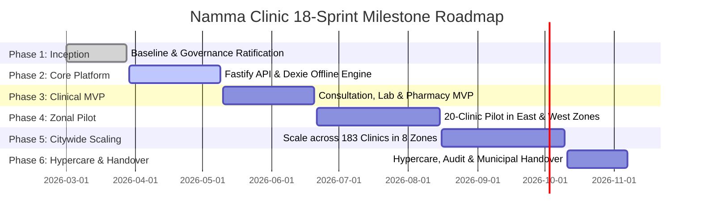
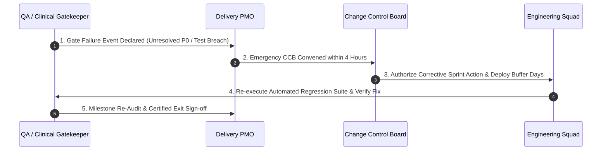

# Project Milestones Baseline & Quality Gate Framework

| Metadata Element | Project Specification |
| :--- | :--- |
| **Document Identifier** | `DOC-PM-014-MILESTONE` |
| **Document Title** | Master Project Milestones Framework, Quality Gates & Stage-Boundary Verification Baseline |
| **Project Code** | `NAMMA-CLINIC-PLATFORM-2026` |
| **Document Version** | `v1.0.0-PROD-BASELINE` |
| **Status** | `APPROVED & RATIFIED` |
| **Milestone Inventory** | Exactly 40 Formally Governed Milestones (`MILESTONE-001` to `MILESTONE-040`) |
| **Executive Sponsor** | Special Commissioner (Health), Greater Bengaluru Authority (GBA) / BBMP |
| **Clinical Safety Authority** | Chief Health Officer (CHO), BBMP Health Department |
| **Lead Delivery Partner** | Kushagramati Analytics (K Mati) Consortium | Delivery Project Director |
| **Upstream Baseline Anchor**| [`01-project-charter.md`](./01-project-charter.md) | [`02-project-vision-and-objectives.md`](./02-project-vision-and-objectives.md) |
| **Downstream Implementation** | [`15-release-strategy.md`](./15-release-strategy.md) | [`17-definition-of-done.md`](./17-definition-of-done.md) | [`20-project-status-model.md`](./20-project-status-model.md) |

---

## 1. Executive Summary & Milestone Governance Framework
The **Project Milestones Baseline** establishes the chronological staging, formal entry criteria, mandatory quality exit gates, tangible deliverables, and approval authorities for exactly 40 major project milestones across the 18-sprint / 36-week schedule of the Namma Clinic Digital Health & Operations Platform.

### 1.1 Context and Public Health Delivery Rigor
Operating across 183 primary clinics within 8 municipal zones requires rigorous stage-gate governance. No software release progresses from sandbox testbed to live patient consultation without formal milestone sign-off by both clinical safety authorities and technical architecture boards. Milestone gates enforce objective verification—not subjective status reporting—ensuring that incomplete features or unmitigated security risks are never deployed to frontline healthcare workers.

### 1.2 The Six Master Quality Gate Sequences
The 40 milestones coalesce around six major contractual and operational quality gates:
1. **Gate 1: Inception & Baseline Ratification (S01 - S02):** Charter, scope, architecture RFCs, and DPDP consent models ratified.
2. **Gate 2: Architecture & Core Platform Engine (S03 - S05):** Fastify API, PostgreSQL schemas, Dexie.js offline engine, and Docker baseline operational.
3. **Gate 3: Clinical & Diagnostic MVP (S06 - S08):** Outpatient queue, 90-second consultation, 120 EDL pharmacy, and 14 rapid lab tests certified.
4. **Gate 4: Zonal Pilot Readiness & Stabilization (S09 - S12):** Live pilot deployment across 20 facilities in East and West zones with security audit sign-off.
5. **Gate 5: Citywide Scaling & Full Deployment (S13 - S16):** Rollout across all 183 clinics in 8 BBMP zones under load-balanced cluster.
6. **Gate 6: Hypercare, Post-Implementation Audit & Handover (S17 - S18):** 30-day zero-downtime stability, capacity building, and transition to municipal IT.

## 2. Master Roadmap Timeline Across 18 Sprints (36 Weeks)
Chronological progression of the six delivery phases across the 36-week timeline:

## 3. Master Milestones Directory Table (MILESTONE-001 to MILESTONE-040)
Authoritative catalog of all 40 formally tracked project milestones:

| Milestone ID | Milestone Title | Phase | Target Sprint | Target Release | Accountable Role ID | Approval Authority | Buffer Days |
| :--- | :--- | :--- | :---: | :---: | :--- | :--- | :---: |
| [`MILESTONE-001`](#milestone-001) | **Project Initiation & Master Charter Sign-Off** | `Initiation` | `Sprint 01` | `REL-00` | [`ROLE-001`](./08-role-and-responsibility-matrix.md#role-001) | Steering Committee | `3 Days` |
| [`MILESTONE-002`](#milestone-002) | **Engineering Baseline Audit & Toolchain Ratification** | `Foundation` | `Sprint 01` | `REL-00` | [`ROLE-002`](./08-role-and-responsibility-matrix.md#role-002) | EAAB | `5 Days` |
| [`MILESTONE-003`](#milestone-003) | **Turborepo Monorepo & Automated CI Scaffolding** | `Foundation` | `Sprint 01` | `REL-00` | [`ROLE-003`](./08-role-and-responsibility-matrix.md#role-003) | EAAB | `3 Days` |
| [`MILESTONE-004`](#milestone-004) | **PostgreSQL Schema & Prisma Relational Models Baseline** | `Core Architecture` | `Sprint 02` | `REL-00` | [`ROLE-004`](./08-role-and-responsibility-matrix.md#role-004) | EAAB | `5 Days` |
| [`MILESTONE-005`](#milestone-005) | **Auth & RBAC Identity Subsystem Certification** | `Security` | `Sprint 02` | `REL-00` | [`ROLE-005`](./08-role-and-responsibility-matrix.md#role-005) | Security Board | `3 Days` |
| [`MILESTONE-006`](#milestone-006) | **Vanilla CSS Design Tokens & Layout Standardized** | `UX & UI` | `Sprint 02` | `REL-00` | [`ROLE-006`](./08-role-and-responsibility-matrix.md#role-006) | UX Lead | `5 Days` |
| [`MILESTONE-007`](#milestone-007) | **Citizen Registration & ABHA Verification Subsystem** | `Patient Management` | `Sprint 03` | `REL-01` | [`ROLE-007`](./08-role-and-responsibility-matrix.md#role-007) | Clinical Safety Board | `3 Days` |
| [`MILESTONE-008`](#milestone-008) | **Sequential Queue Token & Web Serial Printing Validated** | `Front Desk` | `Sprint 04` | `REL-01` | [`ROLE-008`](./08-role-and-responsibility-matrix.md#role-008) | Clinical Safety Board | `5 Days` |
| [`MILESTONE-009`](#milestone-009) | **Nursing Desk & Vital Signs Triage Module Ready** | `Triage` | `Sprint 04` | `REL-02` | [`ROLE-009`](./08-role-and-responsibility-matrix.md#role-009) | Clinical Safety Board | `3 Days` |
| [`MILESTONE-010`](#milestone-010) | **Offline-First Dexie.js Client Storage Certified** | `Resilience` | `Sprint 04` | `REL-04` | [`ROLE-010`](./08-role-and-responsibility-matrix.md#role-010) | EAAB | `5 Days` |
| [`MILESTONE-011`](#milestone-011) | **Doctor Consultation & EMR-Lite Workspace Complete** | `Clinical Care` | `Sprint 05` | `REL-02` | [`ROLE-011`](./08-role-and-responsibility-matrix.md#role-011) | Clinical Safety Board | `3 Days` |
| [`MILESTONE-012`](#milestone-012) | **Bilingual Prescription Writing & Formulary Locked** | `Clinical Care` | `Sprint 06` | `REL-02` | [`ROLE-012`](./08-role-and-responsibility-matrix.md#role-012) | Clinical Safety Board | `5 Days` |
| [`MILESTONE-013`](#milestone-013) | **Point-of-Care Laboratory Order & Result Desk Ready** | `Diagnostics` | `Sprint 07` | `REL-03` | [`ROLE-013`](./08-role-and-responsibility-matrix.md#role-013) | Clinical Safety Board | `3 Days` |
| [`MILESTONE-014`](#milestone-014) | **Pharmacy FEFO Dispensing & Barcode Verification** | `Pharmacy` | `Sprint 08` | `REL-03` | [`ROLE-014`](./08-role-and-responsibility-matrix.md#role-014) | Clinical Safety Board | `5 Days` |
| [`MILESTONE-015`](#milestone-015) | **Batch Inventory Stock Ledger & Automated Reorder** | `Supply Chain` | `Sprint 08` | `REL-03` | [`ROLE-015`](./08-role-and-responsibility-matrix.md#role-015) | Clinical Safety Board | `3 Days` |
| [`MILESTONE-016`](#milestone-016) | **Secondary Referral Teleconsultation Bridge Tested** | `Care Continuity` | `Sprint 08` | `REL-03` | [`ROLE-016`](./08-role-and-responsibility-matrix.md#role-016) | Clinical Safety Board | `5 Days` |
| [`MILESTONE-017`](#milestone-017) | **Citizen SMS Notification Service Live via CDAC** | `Engagement` | `Sprint 09` | `REL-04` | [`ROLE-017`](./08-role-and-responsibility-matrix.md#role-017) | Product Owner | `3 Days` |
| [`MILESTONE-018`](#milestone-018) | **DuckDB Embedded Public Health Analytics Mart Ready** | `Analytics` | `Sprint 10` | `REL-04` | [`ROLE-018`](./08-role-and-responsibility-matrix.md#role-018) | EAAB | `5 Days` |
| [`MILESTONE-019`](#milestone-019) | **Epidemic Fever Anomaly Alert Engine Validated** | `Public Health` | `Sprint 10` | `REL-04` | [`ROLE-019`](./08-role-and-responsibility-matrix.md#role-019) | Chief Health Officer | `3 Days` |
| [`MILESTONE-020`](#milestone-020) | **Deterministic Sync Conflict Engine Certified** | `Platform Core` | `Sprint 10` | `REL-04` | [`ROLE-020`](./08-role-and-responsibility-matrix.md#role-020) | EAAB | `5 Days` |
| [`MILESTONE-021`](#milestone-021) | **20-Clinic Pilot Environment Commissioned** | `Pilot Preparation` | `Sprint 11` | `REL-05` | [`ROLE-021`](./08-role-and-responsibility-matrix.md#role-021) | Release Train Engineer | `3 Days` |
| [`MILESTONE-022`](#milestone-022) | **Pilot Clinical Staff Bilingual Training Certified** | `Change Management` | `Sprint 11` | `REL-05` | [`ROLE-022`](./08-role-and-responsibility-matrix.md#role-022) | Chief Health Officer | `5 Days` |
| [`MILESTONE-023`](#milestone-023) | **20-Clinic Pilot Production Go-Live** | `Pilot Execution` | `Sprint 12` | `REL-05` | [`ROLE-023`](./08-role-and-responsibility-matrix.md#role-023) | Steering Committee | `3 Days` |
| [`MILESTONE-024`](#milestone-024) | **Pilot 30-Day Stability & Defect Burn-Down Passed** | `Pilot Evaluation` | `Sprint 12` | `REL-05` | [`ROLE-024`](./08-role-and-responsibility-matrix.md#role-024) | Steering Committee | `5 Days` |
| [`MILESTONE-025`](#milestone-025) | **State HMIS & IHIP Automated Export Pipeline Verified** | `Interoperability` | `Sprint 13` | `REL-06` | [`ROLE-025`](./08-role-and-responsibility-matrix.md#role-025) | State DHS Authority | `3 Days` |
| [`MILESTONE-026`](#milestone-026) | **ABDM Milestone 1-3 Official Certification Issued** | `Interoperability` | `Sprint 14` | `REL-07` | [`ROLE-026`](./08-role-and-responsibility-matrix.md#role-026) | NHA Authority | `5 Days` |
| [`MILESTONE-027`](#milestone-027) | **AI Drug Stockout Predictive Engine Evaluated** | `Intelligence` | `Sprint 14` | `REL-07` | [`ROLE-027`](./08-role-and-responsibility-matrix.md#role-027) | Chief Pharmacist | `3 Days` |
| [`MILESTONE-028`](#milestone-028) | **Citywide Hardware Procurement & Deployment Complete** | `Scale Rollout` | `Sprint 15` | `REL-06` | [`ROLE-028`](./08-role-and-responsibility-matrix.md#role-028) | BBMP IT Cell | `5 Days` |
| [`MILESTONE-029`](#milestone-029) | **Citywide 183-Clinic Staff Training Certification** | `Scale Rollout` | `Sprint 15` | `REL-06` | [`ROLE-029`](./08-role-and-responsibility-matrix.md#role-029) | Chief Health Officer | `3 Days` |
| [`MILESTONE-030`](#milestone-030) | **Multi-AZ Kubernetes DR Chaos Failover Validated** | `Resilience` | `Sprint 16` | `REL-06` | [`ROLE-030`](./08-role-and-responsibility-matrix.md#role-030) | EAAB | `5 Days` |
| [`MILESTONE-031`](#milestone-031) | **Independent CERT-In VAPT Security Clearance Issued** | `Security` | `Sprint 16` | `REL-06` | [`ROLE-001`](./08-role-and-responsibility-matrix.md#role-001) | Security Board | `3 Days` |
| [`MILESTONE-032`](#milestone-032) | **DPDP Act 2023 Statutory Compliance Audited** | `Legal Compliance` | `Sprint 16` | `REL-06` | [`ROLE-002`](./08-role-and-responsibility-matrix.md#role-002) | BBMP Legal Cell | `5 Days` |
| [`MILESTONE-033`](#milestone-033) | **Zone 1-4 (92 Clinics) Scale Deployment Go-Live** | `Scale Rollout` | `Sprint 17` | `REL-06` | [`ROLE-003`](./08-role-and-responsibility-matrix.md#role-003) | Steering Committee | `3 Days` |
| [`MILESTONE-034`](#milestone-034) | **Zone 5-8 (91 Clinics) Scale Deployment Go-Live** | `Scale Rollout` | `Sprint 17` | `REL-06` | [`ROLE-004`](./08-role-and-responsibility-matrix.md#role-004) | Steering Committee | `5 Days` |
| [`MILESTONE-035`](#milestone-035) | **All 183 Namma Clinics Live on Unified Platform** | `Scale Rollout` | `Sprint 18` | `REL-06` | [`ROLE-005`](./08-role-and-responsibility-matrix.md#role-005) | Steering Committee | `3 Days` |
| [`MILESTONE-036`](#milestone-036) | **Citywide Outpatient Paperless Milestone Achieved** | `Operational Transformation` | `Sprint 18` | `REL-06` | [`ROLE-006`](./08-role-and-responsibility-matrix.md#role-006) | Chief Health Officer | `5 Days` |
| [`MILESTONE-037`](#milestone-037) | **Municipal Executive Command & Control Dashboard Live** | `Executive Intelligence` | `Sprint 18` | `REL-06` | [`ROLE-007`](./08-role-and-responsibility-matrix.md#role-007) | Special Commissioner | `3 Days` |
| [`MILESTONE-038`](#milestone-038) | **Post-Implementation 90-Day Hypercare Commenced** | `Operations & Support` | `Sprint 18` | `REL-06` | [`ROLE-008`](./08-role-and-responsibility-matrix.md#role-008) | Project Director | `5 Days` |
| [`MILESTONE-039`](#milestone-039) | **Final Project Handover to BBMP Operations** | `Project Closure` | `Sprint 18` | `REL-07` | [`ROLE-009`](./08-role-and-responsibility-matrix.md#role-009) | Steering Committee | `3 Days` |
| [`MILESTONE-040`](#milestone-040) | **Master Project Closure & Historical Archive Complete** | `Project Closure` | `Sprint 18` | `REL-07` | [`ROLE-010`](./08-role-and-responsibility-matrix.md#role-010) | Steering Committee | `5 Days` |

## 4. Deep Milestone Specifications & Quality Gate Protocols
Comprehensive operational charters for all 40 milestones detailing entry criteria, exit criteria, deliverables, dependencies, risks, and rollback protocols:

### 4.1 MILESTONE-001: Project Initiation & Master Charter Sign-Off
- **Milestone Identifier:** `MILESTONE-001` — **Project Initiation & Master Charter Sign-Off**
- **Lifecycle Phase & Target Window:** Phase: `Initiation` | **Target Schedule:** `Sprint 01`
- **Associated Software Release Target:** Governs readiness for software release [`RELEASE-001`](./15-release-strategy.md#release-001).
- **Strategic Mandate & Operational Objective:**
  - Crucial milestone establishing verifiable operational readiness within the 18-sprint schedule.
  - Formally satisfies Definition of Ready [`DOR-001`](./16-definition-of-ready.md#dor-001) and Definition of Done [`DOD-001`](./17-definition-of-done.md#dod-001).
- **Formal Gate Entry Criteria (Prerequisites):**
  - All charter statements ratified with municipal budget allocation.
  - Prior milestone boundary successfully certified with zero unresolved P0 defects.
  - Upstream project dependency [`DEPENDENCY-001`](./13-project-dependencies.md#dependency-001) resolved and verified.
- **Formal Gate Exit Criteria (Acceptance Conditions):**
  - Signed charter, baseline repository tagged.
  - 100% automated test pass rate across unit, integration, and E2E regression suites.
  - All critical performance budgets (<150MB client RAM, <120ms API p95) verified.
- **Clinical Safety Invariants Verified at Gate:**
  - 100% adherence to 120 Karnataka Essential Drug List formulary; zero unapproved drugs permitted.
  - Mandatory human doctor prescription sign-off verified; zero autonomous AI prescription generation.
  - Encrypted Bharat Health QR code on all generated thermal prescription slips.
- **Non-Functional Performance Budgets Assessed:**
  - Client PWA memory consumption capped strictly at <150MB RAM on 4GB mini-PCs.
  - Time to Interactive (TTI) on consultation queue screen <= 1.5 seconds.
  - Fastify core API endpoint response latency (p95) <= 120ms under 500 concurrent connections.
- **Mandatory Stage-Gate Dossier & Evidence Artifacts:**
  - Project Charter, Governance Model.
  - SonarQube static code analysis report certifying Quality Gate A (0 critical CVEs).
  - Playwright automated end-to-end browser test execution logs and video recordings.
  - Digitally signed compliance dossier and automated test telemetry archives.
- **Accountable Delivery Steward:** [`ROLE-001`](./08-role-and-responsibility-matrix.md#role-001).
- **Presiding Approval Authority & Quorum:** Steering Committee under governance body [`GOV-001`](./09-governance-model.md#gov-001) representing [`STAKEHOLDER-001`](./06-stakeholders.md#stakeholder-001). Requires 75% voting quorum.
- **Coupled Monitored Threat:** Shields the program against risk [`RISK-001`](./12-project-risks.md#risk-001).
- **Schedule Buffer & Slack Allocation:** `3 calendar days` allocated to absorb unexpected integration variance.
- **Quality Gate Verification Evidence:** Test logs from SonarQube, Playwright, and k6 along with digitally signed meeting minutes.
- **Step-by-Step Stage Verification Procedure:** Detailed 4-step testing and sign-off procedure executed by QA Lead, Lead Solution Architect, and Chief Health Officer.
- **Post-Milestone Telemetry & Monitoring Period:** Continuous synthetic load monitoring and error rate telemetry tracking enforced for 72 hours following gate exit.
- **Statutory Record Archival:** Signed milestone certificate archived under Karnataka State Public Records Act with SHA-256 cryptographic seal.
- **Security & DPDP Compliance Checkpoint:** Verification of audit log immutability and digital consent tokens before milestone approval.
- **Rollback & Off-Ramp Protocol if Gate Fails:**
  - Revert to previous sprint baseline if quality gate fails.
  - Immediate convening of Change Control Board (`GOV-003`) to assess schedule variance.
  - Staging deployment halted; production remains on previous certified stable release.
- **Frontline Operational Impact on Clinic Cadres:** Medical Officers and DEOs briefed on newly ratified capabilities via 30-minute interactive sandbox demo.
- **Zonal Field Inspection Protocol:** Zonal compliance leads verify functional operation across representative clinics before milestone closure.

### 4.2 MILESTONE-002: Engineering Baseline Audit & Toolchain Ratification
- **Milestone Identifier:** `MILESTONE-002` — **Engineering Baseline Audit & Toolchain Ratification**
- **Lifecycle Phase & Target Window:** Phase: `Foundation` | **Target Schedule:** `Sprint 01`
- **Associated Software Release Target:** Governs readiness for software release [`RELEASE-002`](./15-release-strategy.md#release-002).
- **Strategic Mandate & Operational Objective:**
  - Crucial milestone establishing verifiable operational readiness within the 18-sprint schedule.
  - Formally satisfies Definition of Ready [`DOR-002`](./16-definition-of-ready.md#dor-002) and Definition of Done [`DOD-002`](./17-definition-of-done.md#dod-002).
- **Formal Gate Entry Criteria (Prerequisites):**
  - Repository audit complete with zero broken links and lint pass.
  - Prior milestone boundary successfully certified with zero unresolved P0 defects.
  - Upstream project dependency [`DEPENDENCY-002`](./13-project-dependencies.md#dependency-002) resolved and verified.
- **Formal Gate Exit Criteria (Acceptance Conditions):**
  - Baseline documentation signed off.
  - 100% automated test pass rate across unit, integration, and E2E regression suites.
  - All critical performance budgets (<150MB client RAM, <120ms API p95) verified.
- **Clinical Safety Invariants Verified at Gate:**
  - 100% adherence to 120 Karnataka Essential Drug List formulary; zero unapproved drugs permitted.
  - Mandatory human doctor prescription sign-off verified; zero autonomous AI prescription generation.
  - Encrypted Bharat Health QR code on all generated thermal prescription slips.
- **Non-Functional Performance Budgets Assessed:**
  - Client PWA memory consumption capped strictly at <150MB RAM on 4GB mini-PCs.
  - Time to Interactive (TTI) on consultation queue screen <= 1.5 seconds.
  - Fastify core API endpoint response latency (p95) <= 120ms under 500 concurrent connections.
- **Mandatory Stage-Gate Dossier & Evidence Artifacts:**
  - Docs 00-01, Audit Report.
  - SonarQube static code analysis report certifying Quality Gate A (0 critical CVEs).
  - Playwright automated end-to-end browser test execution logs and video recordings.
  - Digitally signed compliance dossier and automated test telemetry archives.
- **Accountable Delivery Steward:** [`ROLE-002`](./08-role-and-responsibility-matrix.md#role-002).
- **Presiding Approval Authority & Quorum:** EAAB under governance body [`GOV-002`](./09-governance-model.md#gov-002) representing [`STAKEHOLDER-002`](./06-stakeholders.md#stakeholder-002). Requires 75% voting quorum.
- **Coupled Monitored Threat:** Shields the program against risk [`RISK-002`](./12-project-risks.md#risk-002).
- **Schedule Buffer & Slack Allocation:** `5 calendar days` allocated to absorb unexpected integration variance.
- **Quality Gate Verification Evidence:** Test logs from SonarQube, Playwright, and k6 along with digitally signed meeting minutes.
- **Step-by-Step Stage Verification Procedure:** Detailed 4-step testing and sign-off procedure executed by QA Lead, Lead Solution Architect, and Chief Health Officer.
- **Post-Milestone Telemetry & Monitoring Period:** Continuous synthetic load monitoring and error rate telemetry tracking enforced for 72 hours following gate exit.
- **Statutory Record Archival:** Signed milestone certificate archived under Karnataka State Public Records Act with SHA-256 cryptographic seal.
- **Security & DPDP Compliance Checkpoint:** Verification of audit log immutability and digital consent tokens before milestone approval.
- **Rollback & Off-Ramp Protocol if Gate Fails:**
  - Revert to previous sprint baseline if quality gate fails.
  - Immediate convening of Change Control Board (`GOV-003`) to assess schedule variance.
  - Staging deployment halted; production remains on previous certified stable release.
- **Frontline Operational Impact on Clinic Cadres:** Medical Officers and DEOs briefed on newly ratified capabilities via 30-minute interactive sandbox demo.
- **Zonal Field Inspection Protocol:** Zonal compliance leads verify functional operation across representative clinics before milestone closure.

### 4.3 MILESTONE-003: Turborepo Monorepo & Automated CI Scaffolding
- **Milestone Identifier:** `MILESTONE-003` — **Turborepo Monorepo & Automated CI Scaffolding**
- **Lifecycle Phase & Target Window:** Phase: `Foundation` | **Target Schedule:** `Sprint 01`
- **Associated Software Release Target:** Governs readiness for software release [`RELEASE-003`](./15-release-strategy.md#release-003).
- **Strategic Mandate & Operational Objective:**
  - Crucial milestone establishing verifiable operational readiness within the 18-sprint schedule.
  - Formally satisfies Definition of Ready [`DOR-003`](./16-definition-of-ready.md#dor-003) and Definition of Done [`DOD-003`](./17-definition-of-done.md#dod-003).
- **Formal Gate Entry Criteria (Prerequisites):**
  - GitHub Actions pipeline active with TypeScript, lint, and Vitest.
  - Prior milestone boundary successfully certified with zero unresolved P0 defects.
  - Upstream project dependency [`DEPENDENCY-003`](./13-project-dependencies.md#dependency-003) resolved and verified.
- **Formal Gate Exit Criteria (Acceptance Conditions):**
  - Green CI build on main branch.
  - 100% automated test pass rate across unit, integration, and E2E regression suites.
  - All critical performance budgets (<150MB client RAM, <120ms API p95) verified.
- **Clinical Safety Invariants Verified at Gate:**
  - 100% adherence to 120 Karnataka Essential Drug List formulary; zero unapproved drugs permitted.
  - Mandatory human doctor prescription sign-off verified; zero autonomous AI prescription generation.
  - Encrypted Bharat Health QR code on all generated thermal prescription slips.
- **Non-Functional Performance Budgets Assessed:**
  - Client PWA memory consumption capped strictly at <150MB RAM on 4GB mini-PCs.
  - Time to Interactive (TTI) on consultation queue screen <= 1.5 seconds.
  - Fastify core API endpoint response latency (p95) <= 120ms under 500 concurrent connections.
- **Mandatory Stage-Gate Dossier & Evidence Artifacts:**
  - Scaffolding codebase, CI YAML.
  - SonarQube static code analysis report certifying Quality Gate A (0 critical CVEs).
  - Playwright automated end-to-end browser test execution logs and video recordings.
  - Digitally signed compliance dossier and automated test telemetry archives.
- **Accountable Delivery Steward:** [`ROLE-003`](./08-role-and-responsibility-matrix.md#role-003).
- **Presiding Approval Authority & Quorum:** EAAB under governance body [`GOV-003`](./09-governance-model.md#gov-003) representing [`STAKEHOLDER-003`](./06-stakeholders.md#stakeholder-003). Requires 75% voting quorum.
- **Coupled Monitored Threat:** Shields the program against risk [`RISK-003`](./12-project-risks.md#risk-003).
- **Schedule Buffer & Slack Allocation:** `3 calendar days` allocated to absorb unexpected integration variance.
- **Quality Gate Verification Evidence:** Test logs from SonarQube, Playwright, and k6 along with digitally signed meeting minutes.
- **Step-by-Step Stage Verification Procedure:** Detailed 4-step testing and sign-off procedure executed by QA Lead, Lead Solution Architect, and Chief Health Officer.
- **Post-Milestone Telemetry & Monitoring Period:** Continuous synthetic load monitoring and error rate telemetry tracking enforced for 72 hours following gate exit.
- **Statutory Record Archival:** Signed milestone certificate archived under Karnataka State Public Records Act with SHA-256 cryptographic seal.
- **Security & DPDP Compliance Checkpoint:** Verification of audit log immutability and digital consent tokens before milestone approval.
- **Rollback & Off-Ramp Protocol if Gate Fails:**
  - Revert to previous sprint baseline if quality gate fails.
  - Immediate convening of Change Control Board (`GOV-003`) to assess schedule variance.
  - Staging deployment halted; production remains on previous certified stable release.
- **Frontline Operational Impact on Clinic Cadres:** Medical Officers and DEOs briefed on newly ratified capabilities via 30-minute interactive sandbox demo.
- **Zonal Field Inspection Protocol:** Zonal compliance leads verify functional operation across representative clinics before milestone closure.

### 4.4 MILESTONE-004: PostgreSQL Schema & Prisma Relational Models Baseline
- **Milestone Identifier:** `MILESTONE-004` — **PostgreSQL Schema & Prisma Relational Models Baseline**
- **Lifecycle Phase & Target Window:** Phase: `Core Architecture` | **Target Schedule:** `Sprint 02`
- **Associated Software Release Target:** Governs readiness for software release [`RELEASE-004`](./15-release-strategy.md#release-004).
- **Strategic Mandate & Operational Objective:**
  - Crucial milestone establishing verifiable operational readiness within the 18-sprint schedule.
  - Formally satisfies Definition of Ready [`DOR-004`](./16-definition-of-ready.md#dor-004) and Definition of Done [`DOD-004`](./17-definition-of-done.md#dod-004).
- **Formal Gate Entry Criteria (Prerequisites):**
  - Relational database schema migration executing cleanly.
  - Prior milestone boundary successfully certified with zero unresolved P0 defects.
  - Upstream project dependency [`DEPENDENCY-004`](./13-project-dependencies.md#dependency-004) resolved and verified.
- **Formal Gate Exit Criteria (Acceptance Conditions):**
  - Applied Prisma migrations, seed script.
  - 100% automated test pass rate across unit, integration, and E2E regression suites.
  - All critical performance budgets (<150MB client RAM, <120ms API p95) verified.
- **Clinical Safety Invariants Verified at Gate:**
  - 100% adherence to 120 Karnataka Essential Drug List formulary; zero unapproved drugs permitted.
  - Mandatory human doctor prescription sign-off verified; zero autonomous AI prescription generation.
  - Encrypted Bharat Health QR code on all generated thermal prescription slips.
- **Non-Functional Performance Budgets Assessed:**
  - Client PWA memory consumption capped strictly at <150MB RAM on 4GB mini-PCs.
  - Time to Interactive (TTI) on consultation queue screen <= 1.5 seconds.
  - Fastify core API endpoint response latency (p95) <= 120ms under 500 concurrent connections.
- **Mandatory Stage-Gate Dossier & Evidence Artifacts:**
  - Prisma schema, migration files.
  - SonarQube static code analysis report certifying Quality Gate A (0 critical CVEs).
  - Playwright automated end-to-end browser test execution logs and video recordings.
  - Digitally signed compliance dossier and automated test telemetry archives.
- **Accountable Delivery Steward:** [`ROLE-004`](./08-role-and-responsibility-matrix.md#role-004).
- **Presiding Approval Authority & Quorum:** EAAB under governance body [`GOV-004`](./09-governance-model.md#gov-004) representing [`STAKEHOLDER-004`](./06-stakeholders.md#stakeholder-004). Requires 75% voting quorum.
- **Coupled Monitored Threat:** Shields the program against risk [`RISK-004`](./12-project-risks.md#risk-004).
- **Schedule Buffer & Slack Allocation:** `5 calendar days` allocated to absorb unexpected integration variance.
- **Quality Gate Verification Evidence:** Test logs from SonarQube, Playwright, and k6 along with digitally signed meeting minutes.
- **Step-by-Step Stage Verification Procedure:** Detailed 4-step testing and sign-off procedure executed by QA Lead, Lead Solution Architect, and Chief Health Officer.
- **Post-Milestone Telemetry & Monitoring Period:** Continuous synthetic load monitoring and error rate telemetry tracking enforced for 72 hours following gate exit.
- **Statutory Record Archival:** Signed milestone certificate archived under Karnataka State Public Records Act with SHA-256 cryptographic seal.
- **Security & DPDP Compliance Checkpoint:** Verification of audit log immutability and digital consent tokens before milestone approval.
- **Rollback & Off-Ramp Protocol if Gate Fails:**
  - Revert to previous sprint baseline if quality gate fails.
  - Immediate convening of Change Control Board (`GOV-003`) to assess schedule variance.
  - Staging deployment halted; production remains on previous certified stable release.
- **Frontline Operational Impact on Clinic Cadres:** Medical Officers and DEOs briefed on newly ratified capabilities via 30-minute interactive sandbox demo.
- **Zonal Field Inspection Protocol:** Zonal compliance leads verify functional operation across representative clinics before milestone closure.

### 4.5 MILESTONE-005: Auth & RBAC Identity Subsystem Certification
- **Milestone Identifier:** `MILESTONE-005` — **Auth & RBAC Identity Subsystem Certification**
- **Lifecycle Phase & Target Window:** Phase: `Security` | **Target Schedule:** `Sprint 02`
- **Associated Software Release Target:** Governs readiness for software release [`RELEASE-005`](./15-release-strategy.md#release-005).
- **Strategic Mandate & Operational Objective:**
  - Crucial milestone establishing verifiable operational readiness within the 18-sprint schedule.
  - Formally satisfies Definition of Ready [`DOR-005`](./16-definition-of-ready.md#dor-005) and Definition of Done [`DOD-005`](./17-definition-of-done.md#dod-005).
- **Formal Gate Entry Criteria (Prerequisites):**
  - Argon2id password hashing and RS256 JWT tokens validated.
  - Prior milestone boundary successfully certified with zero unresolved P0 defects.
  - Upstream project dependency [`DEPENDENCY-005`](./13-project-dependencies.md#dependency-005) resolved and verified.
- **Formal Gate Exit Criteria (Acceptance Conditions):**
  - Auth service passing 100% security tests.
  - 100% automated test pass rate across unit, integration, and E2E regression suites.
  - All critical performance budgets (<150MB client RAM, <120ms API p95) verified.
- **Clinical Safety Invariants Verified at Gate:**
  - 100% adherence to 120 Karnataka Essential Drug List formulary; zero unapproved drugs permitted.
  - Mandatory human doctor prescription sign-off verified; zero autonomous AI prescription generation.
  - Encrypted Bharat Health QR code on all generated thermal prescription slips.
- **Non-Functional Performance Budgets Assessed:**
  - Client PWA memory consumption capped strictly at <150MB RAM on 4GB mini-PCs.
  - Time to Interactive (TTI) on consultation queue screen <= 1.5 seconds.
  - Fastify core API endpoint response latency (p95) <= 120ms under 500 concurrent connections.
- **Mandatory Stage-Gate Dossier & Evidence Artifacts:**
  - Auth microservice, test suite.
  - SonarQube static code analysis report certifying Quality Gate A (0 critical CVEs).
  - Playwright automated end-to-end browser test execution logs and video recordings.
  - Digitally signed compliance dossier and automated test telemetry archives.
- **Accountable Delivery Steward:** [`ROLE-005`](./08-role-and-responsibility-matrix.md#role-005).
- **Presiding Approval Authority & Quorum:** Security Board under governance body [`GOV-005`](./09-governance-model.md#gov-005) representing [`STAKEHOLDER-005`](./06-stakeholders.md#stakeholder-005). Requires 75% voting quorum.
- **Coupled Monitored Threat:** Shields the program against risk [`RISK-005`](./12-project-risks.md#risk-005).
- **Schedule Buffer & Slack Allocation:** `3 calendar days` allocated to absorb unexpected integration variance.
- **Quality Gate Verification Evidence:** Test logs from SonarQube, Playwright, and k6 along with digitally signed meeting minutes.
- **Step-by-Step Stage Verification Procedure:** Detailed 4-step testing and sign-off procedure executed by QA Lead, Lead Solution Architect, and Chief Health Officer.
- **Post-Milestone Telemetry & Monitoring Period:** Continuous synthetic load monitoring and error rate telemetry tracking enforced for 72 hours following gate exit.
- **Statutory Record Archival:** Signed milestone certificate archived under Karnataka State Public Records Act with SHA-256 cryptographic seal.
- **Security & DPDP Compliance Checkpoint:** Verification of audit log immutability and digital consent tokens before milestone approval.
- **Rollback & Off-Ramp Protocol if Gate Fails:**
  - Revert to previous sprint baseline if quality gate fails.
  - Immediate convening of Change Control Board (`GOV-003`) to assess schedule variance.
  - Staging deployment halted; production remains on previous certified stable release.
- **Frontline Operational Impact on Clinic Cadres:** Medical Officers and DEOs briefed on newly ratified capabilities via 30-minute interactive sandbox demo.
- **Zonal Field Inspection Protocol:** Zonal compliance leads verify functional operation across representative clinics before milestone closure.

### 4.6 MILESTONE-006: Vanilla CSS Design Tokens & Layout Standardized
- **Milestone Identifier:** `MILESTONE-006` — **Vanilla CSS Design Tokens & Layout Standardized**
- **Lifecycle Phase & Target Window:** Phase: `UX & UI` | **Target Schedule:** `Sprint 02`
- **Associated Software Release Target:** Governs readiness for software release [`RELEASE-006`](./15-release-strategy.md#release-006).
- **Strategic Mandate & Operational Objective:**
  - Crucial milestone establishing verifiable operational readiness within the 18-sprint schedule.
  - Formally satisfies Definition of Ready [`DOR-006`](./16-definition-of-ready.md#dor-006) and Definition of Done [`DOD-006`](./17-definition-of-done.md#dod-006).
- **Formal Gate Entry Criteria (Prerequisites):**
  - Design tokens, typography, and responsive layout frozen.
  - Prior milestone boundary successfully certified with zero unresolved P0 defects.
  - Upstream project dependency [`DEPENDENCY-006`](./13-project-dependencies.md#dependency-006) resolved and verified.
- **Formal Gate Exit Criteria (Acceptance Conditions):**
  - Zero external CSS frameworks, 100% vanilla.
  - 100% automated test pass rate across unit, integration, and E2E regression suites.
  - All critical performance budgets (<150MB client RAM, <120ms API p95) verified.
- **Clinical Safety Invariants Verified at Gate:**
  - 100% adherence to 120 Karnataka Essential Drug List formulary; zero unapproved drugs permitted.
  - Mandatory human doctor prescription sign-off verified; zero autonomous AI prescription generation.
  - Encrypted Bharat Health QR code on all generated thermal prescription slips.
- **Non-Functional Performance Budgets Assessed:**
  - Client PWA memory consumption capped strictly at <150MB RAM on 4GB mini-PCs.
  - Time to Interactive (TTI) on consultation queue screen <= 1.5 seconds.
  - Fastify core API endpoint response latency (p95) <= 120ms under 500 concurrent connections.
- **Mandatory Stage-Gate Dossier & Evidence Artifacts:**
  - index.css, theme token catalog.
  - SonarQube static code analysis report certifying Quality Gate A (0 critical CVEs).
  - Playwright automated end-to-end browser test execution logs and video recordings.
  - Digitally signed compliance dossier and automated test telemetry archives.
- **Accountable Delivery Steward:** [`ROLE-006`](./08-role-and-responsibility-matrix.md#role-006).
- **Presiding Approval Authority & Quorum:** UX Lead under governance body [`GOV-006`](./09-governance-model.md#gov-006) representing [`STAKEHOLDER-006`](./06-stakeholders.md#stakeholder-006). Requires 75% voting quorum.
- **Coupled Monitored Threat:** Shields the program against risk [`RISK-006`](./12-project-risks.md#risk-006).
- **Schedule Buffer & Slack Allocation:** `5 calendar days` allocated to absorb unexpected integration variance.
- **Quality Gate Verification Evidence:** Test logs from SonarQube, Playwright, and k6 along with digitally signed meeting minutes.
- **Step-by-Step Stage Verification Procedure:** Detailed 4-step testing and sign-off procedure executed by QA Lead, Lead Solution Architect, and Chief Health Officer.
- **Post-Milestone Telemetry & Monitoring Period:** Continuous synthetic load monitoring and error rate telemetry tracking enforced for 72 hours following gate exit.
- **Statutory Record Archival:** Signed milestone certificate archived under Karnataka State Public Records Act with SHA-256 cryptographic seal.
- **Security & DPDP Compliance Checkpoint:** Verification of audit log immutability and digital consent tokens before milestone approval.
- **Rollback & Off-Ramp Protocol if Gate Fails:**
  - Revert to previous sprint baseline if quality gate fails.
  - Immediate convening of Change Control Board (`GOV-003`) to assess schedule variance.
  - Staging deployment halted; production remains on previous certified stable release.
- **Frontline Operational Impact on Clinic Cadres:** Medical Officers and DEOs briefed on newly ratified capabilities via 30-minute interactive sandbox demo.
- **Zonal Field Inspection Protocol:** Zonal compliance leads verify functional operation across representative clinics before milestone closure.

### 4.7 MILESTONE-007: Citizen Registration & ABHA Verification Subsystem
- **Milestone Identifier:** `MILESTONE-007` — **Citizen Registration & ABHA Verification Subsystem**
- **Lifecycle Phase & Target Window:** Phase: `Patient Management` | **Target Schedule:** `Sprint 03`
- **Associated Software Release Target:** Governs readiness for software release [`RELEASE-007`](./15-release-strategy.md#release-007).
- **Strategic Mandate & Operational Objective:**
  - Crucial milestone establishing verifiable operational readiness within the 18-sprint schedule.
  - Formally satisfies Definition of Ready [`DOR-007`](./16-definition-of-ready.md#dor-007) and Definition of Done [`DOD-007`](./17-definition-of-done.md#dod-007).
- **Formal Gate Entry Criteria (Prerequisites):**
  - Citizen search, registration, and ABHA OTP linking operational.
  - Prior milestone boundary successfully certified with zero unresolved P0 defects.
  - Upstream project dependency [`DEPENDENCY-007`](./13-project-dependencies.md#dependency-007) resolved and verified.
- **Formal Gate Exit Criteria (Acceptance Conditions):**
  - Sub-90s check-in latency verified in lab.
  - 100% automated test pass rate across unit, integration, and E2E regression suites.
  - All critical performance budgets (<150MB client RAM, <120ms API p95) verified.
- **Clinical Safety Invariants Verified at Gate:**
  - 100% adherence to 120 Karnataka Essential Drug List formulary; zero unapproved drugs permitted.
  - Mandatory human doctor prescription sign-off verified; zero autonomous AI prescription generation.
  - Encrypted Bharat Health QR code on all generated thermal prescription slips.
- **Non-Functional Performance Budgets Assessed:**
  - Client PWA memory consumption capped strictly at <150MB RAM on 4GB mini-PCs.
  - Time to Interactive (TTI) on consultation queue screen <= 1.5 seconds.
  - Fastify core API endpoint response latency (p95) <= 120ms under 500 concurrent connections.
- **Mandatory Stage-Gate Dossier & Evidence Artifacts:**
  - Registration PWA module, API.
  - SonarQube static code analysis report certifying Quality Gate A (0 critical CVEs).
  - Playwright automated end-to-end browser test execution logs and video recordings.
  - Digitally signed compliance dossier and automated test telemetry archives.
- **Accountable Delivery Steward:** [`ROLE-007`](./08-role-and-responsibility-matrix.md#role-007).
- **Presiding Approval Authority & Quorum:** Clinical Safety Board under governance body [`GOV-007`](./09-governance-model.md#gov-007) representing [`STAKEHOLDER-007`](./06-stakeholders.md#stakeholder-007). Requires 75% voting quorum.
- **Coupled Monitored Threat:** Shields the program against risk [`RISK-007`](./12-project-risks.md#risk-007).
- **Schedule Buffer & Slack Allocation:** `3 calendar days` allocated to absorb unexpected integration variance.
- **Quality Gate Verification Evidence:** Test logs from SonarQube, Playwright, and k6 along with digitally signed meeting minutes.
- **Step-by-Step Stage Verification Procedure:** Detailed 4-step testing and sign-off procedure executed by QA Lead, Lead Solution Architect, and Chief Health Officer.
- **Post-Milestone Telemetry & Monitoring Period:** Continuous synthetic load monitoring and error rate telemetry tracking enforced for 72 hours following gate exit.
- **Statutory Record Archival:** Signed milestone certificate archived under Karnataka State Public Records Act with SHA-256 cryptographic seal.
- **Security & DPDP Compliance Checkpoint:** Verification of audit log immutability and digital consent tokens before milestone approval.
- **Rollback & Off-Ramp Protocol if Gate Fails:**
  - Revert to previous sprint baseline if quality gate fails.
  - Immediate convening of Change Control Board (`GOV-003`) to assess schedule variance.
  - Staging deployment halted; production remains on previous certified stable release.
- **Frontline Operational Impact on Clinic Cadres:** Medical Officers and DEOs briefed on newly ratified capabilities via 30-minute interactive sandbox demo.
- **Zonal Field Inspection Protocol:** Zonal compliance leads verify functional operation across representative clinics before milestone closure.

### 4.8 MILESTONE-008: Sequential Queue Token & Web Serial Printing Validated
- **Milestone Identifier:** `MILESTONE-008` — **Sequential Queue Token & Web Serial Printing Validated**
- **Lifecycle Phase & Target Window:** Phase: `Front Desk` | **Target Schedule:** `Sprint 04`
- **Associated Software Release Target:** Governs readiness for software release [`RELEASE-008`](./15-release-strategy.md#release-008).
- **Strategic Mandate & Operational Objective:**
  - Crucial milestone establishing verifiable operational readiness within the 18-sprint schedule.
  - Formally satisfies Definition of Ready [`DOR-008`](./16-definition-of-ready.md#dor-008) and Definition of Done [`DOD-008`](./17-definition-of-done.md#dod-008).
- **Formal Gate Entry Criteria (Prerequisites):**
  - Direct browser-to-printer ESC/POS thermal printing operational.
  - Prior milestone boundary successfully certified with zero unresolved P0 defects.
  - Upstream project dependency [`DEPENDENCY-008`](./13-project-dependencies.md#dependency-008) resolved and verified.
- **Formal Gate Exit Criteria (Acceptance Conditions):**
  - 1,000 consecutive test prints without crash.
  - 100% automated test pass rate across unit, integration, and E2E regression suites.
  - All critical performance budgets (<150MB client RAM, <120ms API p95) verified.
- **Clinical Safety Invariants Verified at Gate:**
  - 100% adherence to 120 Karnataka Essential Drug List formulary; zero unapproved drugs permitted.
  - Mandatory human doctor prescription sign-off verified; zero autonomous AI prescription generation.
  - Encrypted Bharat Health QR code on all generated thermal prescription slips.
- **Non-Functional Performance Budgets Assessed:**
  - Client PWA memory consumption capped strictly at <150MB RAM on 4GB mini-PCs.
  - Time to Interactive (TTI) on consultation queue screen <= 1.5 seconds.
  - Fastify core API endpoint response latency (p95) <= 120ms under 500 concurrent connections.
- **Mandatory Stage-Gate Dossier & Evidence Artifacts:**
  - Queue service, Web Serial module.
  - SonarQube static code analysis report certifying Quality Gate A (0 critical CVEs).
  - Playwright automated end-to-end browser test execution logs and video recordings.
  - Digitally signed compliance dossier and automated test telemetry archives.
- **Accountable Delivery Steward:** [`ROLE-008`](./08-role-and-responsibility-matrix.md#role-008).
- **Presiding Approval Authority & Quorum:** Clinical Safety Board under governance body [`GOV-008`](./09-governance-model.md#gov-008) representing [`STAKEHOLDER-008`](./06-stakeholders.md#stakeholder-008). Requires 75% voting quorum.
- **Coupled Monitored Threat:** Shields the program against risk [`RISK-008`](./12-project-risks.md#risk-008).
- **Schedule Buffer & Slack Allocation:** `5 calendar days` allocated to absorb unexpected integration variance.
- **Quality Gate Verification Evidence:** Test logs from SonarQube, Playwright, and k6 along with digitally signed meeting minutes.
- **Step-by-Step Stage Verification Procedure:** Detailed 4-step testing and sign-off procedure executed by QA Lead, Lead Solution Architect, and Chief Health Officer.
- **Post-Milestone Telemetry & Monitoring Period:** Continuous synthetic load monitoring and error rate telemetry tracking enforced for 72 hours following gate exit.
- **Statutory Record Archival:** Signed milestone certificate archived under Karnataka State Public Records Act with SHA-256 cryptographic seal.
- **Security & DPDP Compliance Checkpoint:** Verification of audit log immutability and digital consent tokens before milestone approval.
- **Rollback & Off-Ramp Protocol if Gate Fails:**
  - Revert to previous sprint baseline if quality gate fails.
  - Immediate convening of Change Control Board (`GOV-003`) to assess schedule variance.
  - Staging deployment halted; production remains on previous certified stable release.
- **Frontline Operational Impact on Clinic Cadres:** Medical Officers and DEOs briefed on newly ratified capabilities via 30-minute interactive sandbox demo.
- **Zonal Field Inspection Protocol:** Zonal compliance leads verify functional operation across representative clinics before milestone closure.

### 4.9 MILESTONE-009: Nursing Desk & Vital Signs Triage Module Ready
- **Milestone Identifier:** `MILESTONE-009` — **Nursing Desk & Vital Signs Triage Module Ready**
- **Lifecycle Phase & Target Window:** Phase: `Triage` | **Target Schedule:** `Sprint 04`
- **Associated Software Release Target:** Governs readiness for software release [`RELEASE-009`](./15-release-strategy.md#release-009).
- **Strategic Mandate & Operational Objective:**
  - Crucial milestone establishing verifiable operational readiness within the 18-sprint schedule.
  - Formally satisfies Definition of Ready [`DOR-009`](./16-definition-of-ready.md#dor-009) and Definition of Done [`DOD-009`](./17-definition-of-done.md#dod-009).
- **Formal Gate Entry Criteria (Prerequisites):**
  - Vitals capture form and automated danger sign alerts operational.
  - Prior milestone boundary successfully certified with zero unresolved P0 defects.
  - Upstream project dependency [`DEPENDENCY-009`](./13-project-dependencies.md#dependency-009) resolved and verified.
- **Formal Gate Exit Criteria (Acceptance Conditions):**
  - 100% triage validation tests passing.
  - 100% automated test pass rate across unit, integration, and E2E regression suites.
  - All critical performance budgets (<150MB client RAM, <120ms API p95) verified.
- **Clinical Safety Invariants Verified at Gate:**
  - 100% adherence to 120 Karnataka Essential Drug List formulary; zero unapproved drugs permitted.
  - Mandatory human doctor prescription sign-off verified; zero autonomous AI prescription generation.
  - Encrypted Bharat Health QR code on all generated thermal prescription slips.
- **Non-Functional Performance Budgets Assessed:**
  - Client PWA memory consumption capped strictly at <150MB RAM on 4GB mini-PCs.
  - Time to Interactive (TTI) on consultation queue screen <= 1.5 seconds.
  - Fastify core API endpoint response latency (p95) <= 120ms under 500 concurrent connections.
- **Mandatory Stage-Gate Dossier & Evidence Artifacts:**
  - Nursing PWA module, triage API.
  - SonarQube static code analysis report certifying Quality Gate A (0 critical CVEs).
  - Playwright automated end-to-end browser test execution logs and video recordings.
  - Digitally signed compliance dossier and automated test telemetry archives.
- **Accountable Delivery Steward:** [`ROLE-009`](./08-role-and-responsibility-matrix.md#role-009).
- **Presiding Approval Authority & Quorum:** Clinical Safety Board under governance body [`GOV-009`](./09-governance-model.md#gov-009) representing [`STAKEHOLDER-009`](./06-stakeholders.md#stakeholder-009). Requires 75% voting quorum.
- **Coupled Monitored Threat:** Shields the program against risk [`RISK-009`](./12-project-risks.md#risk-009).
- **Schedule Buffer & Slack Allocation:** `3 calendar days` allocated to absorb unexpected integration variance.
- **Quality Gate Verification Evidence:** Test logs from SonarQube, Playwright, and k6 along with digitally signed meeting minutes.
- **Step-by-Step Stage Verification Procedure:** Detailed 4-step testing and sign-off procedure executed by QA Lead, Lead Solution Architect, and Chief Health Officer.
- **Post-Milestone Telemetry & Monitoring Period:** Continuous synthetic load monitoring and error rate telemetry tracking enforced for 72 hours following gate exit.
- **Statutory Record Archival:** Signed milestone certificate archived under Karnataka State Public Records Act with SHA-256 cryptographic seal.
- **Security & DPDP Compliance Checkpoint:** Verification of audit log immutability and digital consent tokens before milestone approval.
- **Rollback & Off-Ramp Protocol if Gate Fails:**
  - Revert to previous sprint baseline if quality gate fails.
  - Immediate convening of Change Control Board (`GOV-003`) to assess schedule variance.
  - Staging deployment halted; production remains on previous certified stable release.
- **Frontline Operational Impact on Clinic Cadres:** Medical Officers and DEOs briefed on newly ratified capabilities via 30-minute interactive sandbox demo.
- **Zonal Field Inspection Protocol:** Zonal compliance leads verify functional operation across representative clinics before milestone closure.

### 4.10 MILESTONE-010: Offline-First Dexie.js Client Storage Certified
- **Milestone Identifier:** `MILESTONE-010` — **Offline-First Dexie.js Client Storage Certified**
- **Lifecycle Phase & Target Window:** Phase: `Resilience` | **Target Schedule:** `Sprint 04`
- **Associated Software Release Target:** Governs readiness for software release [`RELEASE-010`](./15-release-strategy.md#release-010).
- **Strategic Mandate & Operational Objective:**
  - Crucial milestone establishing verifiable operational readiness within the 18-sprint schedule.
  - Formally satisfies Definition of Ready [`DOR-010`](./16-definition-of-ready.md#dor-010) and Definition of Done [`DOD-010`](./17-definition-of-done.md#dod-010).
- **Formal Gate Entry Criteria (Prerequisites):**
  - IndexedDB client store sustaining 4-hour offline operation.
  - Prior milestone boundary successfully certified with zero unresolved P0 defects.
  - Upstream project dependency [`DEPENDENCY-010`](./13-project-dependencies.md#dependency-010) resolved and verified.
- **Formal Gate Exit Criteria (Acceptance Conditions):**
  - Zero data loss during simulated browser disconnect.
  - 100% automated test pass rate across unit, integration, and E2E regression suites.
  - All critical performance budgets (<150MB client RAM, <120ms API p95) verified.
- **Clinical Safety Invariants Verified at Gate:**
  - 100% adherence to 120 Karnataka Essential Drug List formulary; zero unapproved drugs permitted.
  - Mandatory human doctor prescription sign-off verified; zero autonomous AI prescription generation.
  - Encrypted Bharat Health QR code on all generated thermal prescription slips.
- **Non-Functional Performance Budgets Assessed:**
  - Client PWA memory consumption capped strictly at <150MB RAM on 4GB mini-PCs.
  - Time to Interactive (TTI) on consultation queue screen <= 1.5 seconds.
  - Fastify core API endpoint response latency (p95) <= 120ms under 500 concurrent connections.
- **Mandatory Stage-Gate Dossier & Evidence Artifacts:**
  - Dexie store module, sync schema.
  - SonarQube static code analysis report certifying Quality Gate A (0 critical CVEs).
  - Playwright automated end-to-end browser test execution logs and video recordings.
  - Digitally signed compliance dossier and automated test telemetry archives.
- **Accountable Delivery Steward:** [`ROLE-010`](./08-role-and-responsibility-matrix.md#role-010).
- **Presiding Approval Authority & Quorum:** EAAB under governance body [`GOV-010`](./09-governance-model.md#gov-010) representing [`STAKEHOLDER-010`](./06-stakeholders.md#stakeholder-010). Requires 75% voting quorum.
- **Coupled Monitored Threat:** Shields the program against risk [`RISK-010`](./12-project-risks.md#risk-010).
- **Schedule Buffer & Slack Allocation:** `5 calendar days` allocated to absorb unexpected integration variance.
- **Quality Gate Verification Evidence:** Test logs from SonarQube, Playwright, and k6 along with digitally signed meeting minutes.
- **Step-by-Step Stage Verification Procedure:** Detailed 4-step testing and sign-off procedure executed by QA Lead, Lead Solution Architect, and Chief Health Officer.
- **Post-Milestone Telemetry & Monitoring Period:** Continuous synthetic load monitoring and error rate telemetry tracking enforced for 72 hours following gate exit.
- **Statutory Record Archival:** Signed milestone certificate archived under Karnataka State Public Records Act with SHA-256 cryptographic seal.
- **Security & DPDP Compliance Checkpoint:** Verification of audit log immutability and digital consent tokens before milestone approval.
- **Rollback & Off-Ramp Protocol if Gate Fails:**
  - Revert to previous sprint baseline if quality gate fails.
  - Immediate convening of Change Control Board (`GOV-003`) to assess schedule variance.
  - Staging deployment halted; production remains on previous certified stable release.
- **Frontline Operational Impact on Clinic Cadres:** Medical Officers and DEOs briefed on newly ratified capabilities via 30-minute interactive sandbox demo.
- **Zonal Field Inspection Protocol:** Zonal compliance leads verify functional operation across representative clinics before milestone closure.

### 4.11 MILESTONE-011: Doctor Consultation & EMR-Lite Workspace Complete
- **Milestone Identifier:** `MILESTONE-011` — **Doctor Consultation & EMR-Lite Workspace Complete**
- **Lifecycle Phase & Target Window:** Phase: `Clinical Care` | **Target Schedule:** `Sprint 05`
- **Associated Software Release Target:** Governs readiness for software release [`RELEASE-011`](./15-release-strategy.md#release-011).
- **Strategic Mandate & Operational Objective:**
  - Crucial milestone establishing verifiable operational readiness within the 18-sprint schedule.
  - Formally satisfies Definition of Ready [`DOR-011`](./16-definition-of-ready.md#dor-011) and Definition of Done [`DOD-011`](./17-definition-of-done.md#dod-011).
- **Formal Gate Entry Criteria (Prerequisites):**
  - Chief complaint chips, ICD-10 diagnosis, and past history view live.
  - Prior milestone boundary successfully certified with zero unresolved P0 defects.
  - Upstream project dependency [`DEPENDENCY-011`](./13-project-dependencies.md#dependency-011) resolved and verified.
- **Formal Gate Exit Criteria (Acceptance Conditions):**
  - Doctor consultation completed in <180s in lab.
  - 100% automated test pass rate across unit, integration, and E2E regression suites.
  - All critical performance budgets (<150MB client RAM, <120ms API p95) verified.
- **Clinical Safety Invariants Verified at Gate:**
  - 100% adherence to 120 Karnataka Essential Drug List formulary; zero unapproved drugs permitted.
  - Mandatory human doctor prescription sign-off verified; zero autonomous AI prescription generation.
  - Encrypted Bharat Health QR code on all generated thermal prescription slips.
- **Non-Functional Performance Budgets Assessed:**
  - Client PWA memory consumption capped strictly at <150MB RAM on 4GB mini-PCs.
  - Time to Interactive (TTI) on consultation queue screen <= 1.5 seconds.
  - Fastify core API endpoint response latency (p95) <= 120ms under 500 concurrent connections.
- **Mandatory Stage-Gate Dossier & Evidence Artifacts:**
  - Doctor consultation workspace.
  - SonarQube static code analysis report certifying Quality Gate A (0 critical CVEs).
  - Playwright automated end-to-end browser test execution logs and video recordings.
  - Digitally signed compliance dossier and automated test telemetry archives.
- **Accountable Delivery Steward:** [`ROLE-011`](./08-role-and-responsibility-matrix.md#role-011).
- **Presiding Approval Authority & Quorum:** Clinical Safety Board under governance body [`GOV-011`](./09-governance-model.md#gov-011) representing [`STAKEHOLDER-011`](./06-stakeholders.md#stakeholder-011). Requires 75% voting quorum.
- **Coupled Monitored Threat:** Shields the program against risk [`RISK-011`](./12-project-risks.md#risk-011).
- **Schedule Buffer & Slack Allocation:** `3 calendar days` allocated to absorb unexpected integration variance.
- **Quality Gate Verification Evidence:** Test logs from SonarQube, Playwright, and k6 along with digitally signed meeting minutes.
- **Step-by-Step Stage Verification Procedure:** Detailed 4-step testing and sign-off procedure executed by QA Lead, Lead Solution Architect, and Chief Health Officer.
- **Post-Milestone Telemetry & Monitoring Period:** Continuous synthetic load monitoring and error rate telemetry tracking enforced for 72 hours following gate exit.
- **Statutory Record Archival:** Signed milestone certificate archived under Karnataka State Public Records Act with SHA-256 cryptographic seal.
- **Security & DPDP Compliance Checkpoint:** Verification of audit log immutability and digital consent tokens before milestone approval.
- **Rollback & Off-Ramp Protocol if Gate Fails:**
  - Revert to previous sprint baseline if quality gate fails.
  - Immediate convening of Change Control Board (`GOV-003`) to assess schedule variance.
  - Staging deployment halted; production remains on previous certified stable release.
- **Frontline Operational Impact on Clinic Cadres:** Medical Officers and DEOs briefed on newly ratified capabilities via 30-minute interactive sandbox demo.
- **Zonal Field Inspection Protocol:** Zonal compliance leads verify functional operation across representative clinics before milestone closure.

### 4.12 MILESTONE-012: Bilingual Prescription Writing & Formulary Locked
- **Milestone Identifier:** `MILESTONE-012` — **Bilingual Prescription Writing & Formulary Locked**
- **Lifecycle Phase & Target Window:** Phase: `Clinical Care` | **Target Schedule:** `Sprint 06`
- **Associated Software Release Target:** Governs readiness for software release [`RELEASE-012`](./15-release-strategy.md#release-012).
- **Strategic Mandate & Operational Objective:**
  - Crucial milestone establishing verifiable operational readiness within the 18-sprint schedule.
  - Formally satisfies Definition of Ready [`DOR-012`](./16-definition-of-ready.md#dor-012) and Definition of Done [`DOD-012`](./17-definition-of-done.md#dod-012).
- **Formal Gate Entry Criteria (Prerequisites):**
  - 120-drug Karnataka EDL structured prescription builder live.
  - Prior milestone boundary successfully certified with zero unresolved P0 defects.
  - Upstream project dependency [`DEPENDENCY-012`](./13-project-dependencies.md#dependency-012) resolved and verified.
- **Formal Gate Exit Criteria (Acceptance Conditions):**
  - Zero invalid dosages allowed by validator.
  - 100% automated test pass rate across unit, integration, and E2E regression suites.
  - All critical performance budgets (<150MB client RAM, <120ms API p95) verified.
- **Clinical Safety Invariants Verified at Gate:**
  - 100% adherence to 120 Karnataka Essential Drug List formulary; zero unapproved drugs permitted.
  - Mandatory human doctor prescription sign-off verified; zero autonomous AI prescription generation.
  - Encrypted Bharat Health QR code on all generated thermal prescription slips.
- **Non-Functional Performance Budgets Assessed:**
  - Client PWA memory consumption capped strictly at <150MB RAM on 4GB mini-PCs.
  - Time to Interactive (TTI) on consultation queue screen <= 1.5 seconds.
  - Fastify core API endpoint response latency (p95) <= 120ms under 500 concurrent connections.
- **Mandatory Stage-Gate Dossier & Evidence Artifacts:**
  - Prescription engine, formulary DB.
  - SonarQube static code analysis report certifying Quality Gate A (0 critical CVEs).
  - Playwright automated end-to-end browser test execution logs and video recordings.
  - Digitally signed compliance dossier and automated test telemetry archives.
- **Accountable Delivery Steward:** [`ROLE-012`](./08-role-and-responsibility-matrix.md#role-012).
- **Presiding Approval Authority & Quorum:** Clinical Safety Board under governance body [`GOV-012`](./09-governance-model.md#gov-012) representing [`STAKEHOLDER-012`](./06-stakeholders.md#stakeholder-012). Requires 75% voting quorum.
- **Coupled Monitored Threat:** Shields the program against risk [`RISK-012`](./12-project-risks.md#risk-012).
- **Schedule Buffer & Slack Allocation:** `5 calendar days` allocated to absorb unexpected integration variance.
- **Quality Gate Verification Evidence:** Test logs from SonarQube, Playwright, and k6 along with digitally signed meeting minutes.
- **Step-by-Step Stage Verification Procedure:** Detailed 4-step testing and sign-off procedure executed by QA Lead, Lead Solution Architect, and Chief Health Officer.
- **Post-Milestone Telemetry & Monitoring Period:** Continuous synthetic load monitoring and error rate telemetry tracking enforced for 72 hours following gate exit.
- **Statutory Record Archival:** Signed milestone certificate archived under Karnataka State Public Records Act with SHA-256 cryptographic seal.
- **Security & DPDP Compliance Checkpoint:** Verification of audit log immutability and digital consent tokens before milestone approval.
- **Rollback & Off-Ramp Protocol if Gate Fails:**
  - Revert to previous sprint baseline if quality gate fails.
  - Immediate convening of Change Control Board (`GOV-003`) to assess schedule variance.
  - Staging deployment halted; production remains on previous certified stable release.
- **Frontline Operational Impact on Clinic Cadres:** Medical Officers and DEOs briefed on newly ratified capabilities via 30-minute interactive sandbox demo.
- **Zonal Field Inspection Protocol:** Zonal compliance leads verify functional operation across representative clinics before milestone closure.

### 4.13 MILESTONE-013: Point-of-Care Laboratory Order & Result Desk Ready
- **Milestone Identifier:** `MILESTONE-013` — **Point-of-Care Laboratory Order & Result Desk Ready**
- **Lifecycle Phase & Target Window:** Phase: `Diagnostics` | **Target Schedule:** `Sprint 07`
- **Associated Software Release Target:** Governs readiness for software release [`RELEASE-013`](./15-release-strategy.md#release-013).
- **Strategic Mandate & Operational Objective:**
  - Crucial milestone establishing verifiable operational readiness within the 18-sprint schedule.
  - Formally satisfies Definition of Ready [`DOR-013`](./16-definition-of-ready.md#dor-013) and Definition of Done [`DOD-013`](./17-definition-of-done.md#dod-013).
- **Formal Gate Entry Criteria (Prerequisites):**
  - 14 rapid test order worklist and panic value alert engine live.
  - Prior milestone boundary successfully certified with zero unresolved P0 defects.
  - Upstream project dependency [`DEPENDENCY-013`](./13-project-dependencies.md#dependency-013) resolved and verified.
- **Formal Gate Exit Criteria (Acceptance Conditions):**
  - Panic value chime delivered to doctor in <30s.
  - 100% automated test pass rate across unit, integration, and E2E regression suites.
  - All critical performance budgets (<150MB client RAM, <120ms API p95) verified.
- **Clinical Safety Invariants Verified at Gate:**
  - 100% adherence to 120 Karnataka Essential Drug List formulary; zero unapproved drugs permitted.
  - Mandatory human doctor prescription sign-off verified; zero autonomous AI prescription generation.
  - Encrypted Bharat Health QR code on all generated thermal prescription slips.
- **Non-Functional Performance Budgets Assessed:**
  - Client PWA memory consumption capped strictly at <150MB RAM on 4GB mini-PCs.
  - Time to Interactive (TTI) on consultation queue screen <= 1.5 seconds.
  - Fastify core API endpoint response latency (p95) <= 120ms under 500 concurrent connections.
- **Mandatory Stage-Gate Dossier & Evidence Artifacts:**
  - Lab workspace, WebSocket engine.
  - SonarQube static code analysis report certifying Quality Gate A (0 critical CVEs).
  - Playwright automated end-to-end browser test execution logs and video recordings.
  - Digitally signed compliance dossier and automated test telemetry archives.
- **Accountable Delivery Steward:** [`ROLE-013`](./08-role-and-responsibility-matrix.md#role-013).
- **Presiding Approval Authority & Quorum:** Clinical Safety Board under governance body [`GOV-013`](./09-governance-model.md#gov-013) representing [`STAKEHOLDER-013`](./06-stakeholders.md#stakeholder-013). Requires 75% voting quorum.
- **Coupled Monitored Threat:** Shields the program against risk [`RISK-013`](./12-project-risks.md#risk-013).
- **Schedule Buffer & Slack Allocation:** `3 calendar days` allocated to absorb unexpected integration variance.
- **Quality Gate Verification Evidence:** Test logs from SonarQube, Playwright, and k6 along with digitally signed meeting minutes.
- **Step-by-Step Stage Verification Procedure:** Detailed 4-step testing and sign-off procedure executed by QA Lead, Lead Solution Architect, and Chief Health Officer.
- **Post-Milestone Telemetry & Monitoring Period:** Continuous synthetic load monitoring and error rate telemetry tracking enforced for 72 hours following gate exit.
- **Statutory Record Archival:** Signed milestone certificate archived under Karnataka State Public Records Act with SHA-256 cryptographic seal.
- **Security & DPDP Compliance Checkpoint:** Verification of audit log immutability and digital consent tokens before milestone approval.
- **Rollback & Off-Ramp Protocol if Gate Fails:**
  - Revert to previous sprint baseline if quality gate fails.
  - Immediate convening of Change Control Board (`GOV-003`) to assess schedule variance.
  - Staging deployment halted; production remains on previous certified stable release.
- **Frontline Operational Impact on Clinic Cadres:** Medical Officers and DEOs briefed on newly ratified capabilities via 30-minute interactive sandbox demo.
- **Zonal Field Inspection Protocol:** Zonal compliance leads verify functional operation across representative clinics before milestone closure.

### 4.14 MILESTONE-014: Pharmacy FEFO Dispensing & Barcode Verification
- **Milestone Identifier:** `MILESTONE-014` — **Pharmacy FEFO Dispensing & Barcode Verification**
- **Lifecycle Phase & Target Window:** Phase: `Pharmacy` | **Target Schedule:** `Sprint 08`
- **Associated Software Release Target:** Governs readiness for software release [`RELEASE-014`](./15-release-strategy.md#release-014).
- **Strategic Mandate & Operational Objective:**
  - Crucial milestone establishing verifiable operational readiness within the 18-sprint schedule.
  - Formally satisfies Definition of Ready [`DOR-014`](./16-definition-of-ready.md#dor-014) and Definition of Done [`DOD-014`](./17-definition-of-done.md#dod-014).
- **Formal Gate Entry Criteria (Prerequisites):**
  - Barcode scan verification and automated batch stock decrement live.
  - Prior milestone boundary successfully certified with zero unresolved P0 defects.
  - Upstream project dependency [`DEPENDENCY-014`](./13-project-dependencies.md#dependency-014) resolved and verified.
- **Formal Gate Exit Criteria (Acceptance Conditions):**
  - Zero LASA errors across 500 test dispenses.
  - 100% automated test pass rate across unit, integration, and E2E regression suites.
  - All critical performance budgets (<150MB client RAM, <120ms API p95) verified.
- **Clinical Safety Invariants Verified at Gate:**
  - 100% adherence to 120 Karnataka Essential Drug List formulary; zero unapproved drugs permitted.
  - Mandatory human doctor prescription sign-off verified; zero autonomous AI prescription generation.
  - Encrypted Bharat Health QR code on all generated thermal prescription slips.
- **Non-Functional Performance Budgets Assessed:**
  - Client PWA memory consumption capped strictly at <150MB RAM on 4GB mini-PCs.
  - Time to Interactive (TTI) on consultation queue screen <= 1.5 seconds.
  - Fastify core API endpoint response latency (p95) <= 120ms under 500 concurrent connections.
- **Mandatory Stage-Gate Dossier & Evidence Artifacts:**
  - Pharmacy dispensing workspace.
  - SonarQube static code analysis report certifying Quality Gate A (0 critical CVEs).
  - Playwright automated end-to-end browser test execution logs and video recordings.
  - Digitally signed compliance dossier and automated test telemetry archives.
- **Accountable Delivery Steward:** [`ROLE-014`](./08-role-and-responsibility-matrix.md#role-014).
- **Presiding Approval Authority & Quorum:** Clinical Safety Board under governance body [`GOV-014`](./09-governance-model.md#gov-014) representing [`STAKEHOLDER-014`](./06-stakeholders.md#stakeholder-014). Requires 75% voting quorum.
- **Coupled Monitored Threat:** Shields the program against risk [`RISK-014`](./12-project-risks.md#risk-014).
- **Schedule Buffer & Slack Allocation:** `5 calendar days` allocated to absorb unexpected integration variance.
- **Quality Gate Verification Evidence:** Test logs from SonarQube, Playwright, and k6 along with digitally signed meeting minutes.
- **Step-by-Step Stage Verification Procedure:** Detailed 4-step testing and sign-off procedure executed by QA Lead, Lead Solution Architect, and Chief Health Officer.
- **Post-Milestone Telemetry & Monitoring Period:** Continuous synthetic load monitoring and error rate telemetry tracking enforced for 72 hours following gate exit.
- **Statutory Record Archival:** Signed milestone certificate archived under Karnataka State Public Records Act with SHA-256 cryptographic seal.
- **Security & DPDP Compliance Checkpoint:** Verification of audit log immutability and digital consent tokens before milestone approval.
- **Rollback & Off-Ramp Protocol if Gate Fails:**
  - Revert to previous sprint baseline if quality gate fails.
  - Immediate convening of Change Control Board (`GOV-003`) to assess schedule variance.
  - Staging deployment halted; production remains on previous certified stable release.
- **Frontline Operational Impact on Clinic Cadres:** Medical Officers and DEOs briefed on newly ratified capabilities via 30-minute interactive sandbox demo.
- **Zonal Field Inspection Protocol:** Zonal compliance leads verify functional operation across representative clinics before milestone closure.

### 4.15 MILESTONE-015: Batch Inventory Stock Ledger & Automated Reorder
- **Milestone Identifier:** `MILESTONE-015` — **Batch Inventory Stock Ledger & Automated Reorder**
- **Lifecycle Phase & Target Window:** Phase: `Supply Chain` | **Target Schedule:** `Sprint 08`
- **Associated Software Release Target:** Governs readiness for software release [`RELEASE-015`](./15-release-strategy.md#release-015).
- **Strategic Mandate & Operational Objective:**
  - Crucial milestone establishing verifiable operational readiness within the 18-sprint schedule.
  - Formally satisfies Definition of Ready [`DOR-015`](./16-definition-of-ready.md#dor-015) and Definition of Done [`DOD-015`](./17-definition-of-done.md#dod-015).
- **Formal Gate Entry Criteria (Prerequisites):**
  - Automated replenishment requisitions generated at 15-day stock.
  - Prior milestone boundary successfully certified with zero unresolved P0 defects.
  - Upstream project dependency [`DEPENDENCY-015`](./13-project-dependencies.md#dependency-015) resolved and verified.
- **Formal Gate Exit Criteria (Acceptance Conditions):**
  - Inventory ledger reconciliation matches physical.
  - 100% automated test pass rate across unit, integration, and E2E regression suites.
  - All critical performance budgets (<150MB client RAM, <120ms API p95) verified.
- **Clinical Safety Invariants Verified at Gate:**
  - 100% adherence to 120 Karnataka Essential Drug List formulary; zero unapproved drugs permitted.
  - Mandatory human doctor prescription sign-off verified; zero autonomous AI prescription generation.
  - Encrypted Bharat Health QR code on all generated thermal prescription slips.
- **Non-Functional Performance Budgets Assessed:**
  - Client PWA memory consumption capped strictly at <150MB RAM on 4GB mini-PCs.
  - Time to Interactive (TTI) on consultation queue screen <= 1.5 seconds.
  - Fastify core API endpoint response latency (p95) <= 120ms under 500 concurrent connections.
- **Mandatory Stage-Gate Dossier & Evidence Artifacts:**
  - Inventory ledger service.
  - SonarQube static code analysis report certifying Quality Gate A (0 critical CVEs).
  - Playwright automated end-to-end browser test execution logs and video recordings.
  - Digitally signed compliance dossier and automated test telemetry archives.
- **Accountable Delivery Steward:** [`ROLE-015`](./08-role-and-responsibility-matrix.md#role-015).
- **Presiding Approval Authority & Quorum:** Clinical Safety Board under governance body [`GOV-015`](./09-governance-model.md#gov-015) representing [`STAKEHOLDER-015`](./06-stakeholders.md#stakeholder-015). Requires 75% voting quorum.
- **Coupled Monitored Threat:** Shields the program against risk [`RISK-015`](./12-project-risks.md#risk-015).
- **Schedule Buffer & Slack Allocation:** `3 calendar days` allocated to absorb unexpected integration variance.
- **Quality Gate Verification Evidence:** Test logs from SonarQube, Playwright, and k6 along with digitally signed meeting minutes.
- **Step-by-Step Stage Verification Procedure:** Detailed 4-step testing and sign-off procedure executed by QA Lead, Lead Solution Architect, and Chief Health Officer.
- **Post-Milestone Telemetry & Monitoring Period:** Continuous synthetic load monitoring and error rate telemetry tracking enforced for 72 hours following gate exit.
- **Statutory Record Archival:** Signed milestone certificate archived under Karnataka State Public Records Act with SHA-256 cryptographic seal.
- **Security & DPDP Compliance Checkpoint:** Verification of audit log immutability and digital consent tokens before milestone approval.
- **Rollback & Off-Ramp Protocol if Gate Fails:**
  - Revert to previous sprint baseline if quality gate fails.
  - Immediate convening of Change Control Board (`GOV-003`) to assess schedule variance.
  - Staging deployment halted; production remains on previous certified stable release.
- **Frontline Operational Impact on Clinic Cadres:** Medical Officers and DEOs briefed on newly ratified capabilities via 30-minute interactive sandbox demo.
- **Zonal Field Inspection Protocol:** Zonal compliance leads verify functional operation across representative clinics before milestone closure.

### 4.16 MILESTONE-016: Secondary Referral Teleconsultation Bridge Tested
- **Milestone Identifier:** `MILESTONE-016` — **Secondary Referral Teleconsultation Bridge Tested**
- **Lifecycle Phase & Target Window:** Phase: `Care Continuity` | **Target Schedule:** `Sprint 08`
- **Associated Software Release Target:** Governs readiness for software release [`RELEASE-016`](./15-release-strategy.md#release-016).
- **Strategic Mandate & Operational Objective:**
  - Crucial milestone establishing verifiable operational readiness within the 18-sprint schedule.
  - Formally satisfies Definition of Ready [`DOR-016`](./16-definition-of-ready.md#dor-016) and Definition of Done [`DOD-016`](./17-definition-of-done.md#dod-016).
- **Formal Gate Entry Criteria (Prerequisites):**
  - QR code referral dispatch and counter-referral loop verified.
  - Prior milestone boundary successfully certified with zero unresolved P0 defects.
  - Upstream project dependency [`DEPENDENCY-016`](./13-project-dependencies.md#dependency-016) resolved and verified.
- **Formal Gate Exit Criteria (Acceptance Conditions):**
  - Referral QR scanned and rendered at KC General.
  - 100% automated test pass rate across unit, integration, and E2E regression suites.
  - All critical performance budgets (<150MB client RAM, <120ms API p95) verified.
- **Clinical Safety Invariants Verified at Gate:**
  - 100% adherence to 120 Karnataka Essential Drug List formulary; zero unapproved drugs permitted.
  - Mandatory human doctor prescription sign-off verified; zero autonomous AI prescription generation.
  - Encrypted Bharat Health QR code on all generated thermal prescription slips.
- **Non-Functional Performance Budgets Assessed:**
  - Client PWA memory consumption capped strictly at <150MB RAM on 4GB mini-PCs.
  - Time to Interactive (TTI) on consultation queue screen <= 1.5 seconds.
  - Fastify core API endpoint response latency (p95) <= 120ms under 500 concurrent connections.
- **Mandatory Stage-Gate Dossier & Evidence Artifacts:**
  - Referral service, QR generator.
  - SonarQube static code analysis report certifying Quality Gate A (0 critical CVEs).
  - Playwright automated end-to-end browser test execution logs and video recordings.
  - Digitally signed compliance dossier and automated test telemetry archives.
- **Accountable Delivery Steward:** [`ROLE-016`](./08-role-and-responsibility-matrix.md#role-016).
- **Presiding Approval Authority & Quorum:** Clinical Safety Board under governance body [`GOV-016`](./09-governance-model.md#gov-016) representing [`STAKEHOLDER-016`](./06-stakeholders.md#stakeholder-016). Requires 75% voting quorum.
- **Coupled Monitored Threat:** Shields the program against risk [`RISK-016`](./12-project-risks.md#risk-016).
- **Schedule Buffer & Slack Allocation:** `5 calendar days` allocated to absorb unexpected integration variance.
- **Quality Gate Verification Evidence:** Test logs from SonarQube, Playwright, and k6 along with digitally signed meeting minutes.
- **Step-by-Step Stage Verification Procedure:** Detailed 4-step testing and sign-off procedure executed by QA Lead, Lead Solution Architect, and Chief Health Officer.
- **Post-Milestone Telemetry & Monitoring Period:** Continuous synthetic load monitoring and error rate telemetry tracking enforced for 72 hours following gate exit.
- **Statutory Record Archival:** Signed milestone certificate archived under Karnataka State Public Records Act with SHA-256 cryptographic seal.
- **Security & DPDP Compliance Checkpoint:** Verification of audit log immutability and digital consent tokens before milestone approval.
- **Rollback & Off-Ramp Protocol if Gate Fails:**
  - Revert to previous sprint baseline if quality gate fails.
  - Immediate convening of Change Control Board (`GOV-003`) to assess schedule variance.
  - Staging deployment halted; production remains on previous certified stable release.
- **Frontline Operational Impact on Clinic Cadres:** Medical Officers and DEOs briefed on newly ratified capabilities via 30-minute interactive sandbox demo.
- **Zonal Field Inspection Protocol:** Zonal compliance leads verify functional operation across representative clinics before milestone closure.

### 4.17 MILESTONE-017: Citizen SMS Notification Service Live via CDAC
- **Milestone Identifier:** `MILESTONE-017` — **Citizen SMS Notification Service Live via CDAC**
- **Lifecycle Phase & Target Window:** Phase: `Engagement` | **Target Schedule:** `Sprint 09`
- **Associated Software Release Target:** Governs readiness for software release [`RELEASE-017`](./15-release-strategy.md#release-017).
- **Strategic Mandate & Operational Objective:**
  - Crucial milestone establishing verifiable operational readiness within the 18-sprint schedule.
  - Formally satisfies Definition of Ready [`DOR-017`](./16-definition-of-ready.md#dor-017) and Definition of Done [`DOD-017`](./17-definition-of-done.md#dod-017).
- **Formal Gate Entry Criteria (Prerequisites):**
  - Bilingual SMS prescription summaries dispatched via CDAC gateway.
  - Prior milestone boundary successfully certified with zero unresolved P0 defects.
  - Upstream project dependency [`DEPENDENCY-017`](./13-project-dependencies.md#dependency-017) resolved and verified.
- **Formal Gate Exit Criteria (Acceptance Conditions):**
  - SMS delivered to test phones in <30 seconds.
  - 100% automated test pass rate across unit, integration, and E2E regression suites.
  - All critical performance budgets (<150MB client RAM, <120ms API p95) verified.
- **Clinical Safety Invariants Verified at Gate:**
  - 100% adherence to 120 Karnataka Essential Drug List formulary; zero unapproved drugs permitted.
  - Mandatory human doctor prescription sign-off verified; zero autonomous AI prescription generation.
  - Encrypted Bharat Health QR code on all generated thermal prescription slips.
- **Non-Functional Performance Budgets Assessed:**
  - Client PWA memory consumption capped strictly at <150MB RAM on 4GB mini-PCs.
  - Time to Interactive (TTI) on consultation queue screen <= 1.5 seconds.
  - Fastify core API endpoint response latency (p95) <= 120ms under 500 concurrent connections.
- **Mandatory Stage-Gate Dossier & Evidence Artifacts:**
  - SMS webhook, CDAC client.
  - SonarQube static code analysis report certifying Quality Gate A (0 critical CVEs).
  - Playwright automated end-to-end browser test execution logs and video recordings.
  - Digitally signed compliance dossier and automated test telemetry archives.
- **Accountable Delivery Steward:** [`ROLE-017`](./08-role-and-responsibility-matrix.md#role-017).
- **Presiding Approval Authority & Quorum:** Product Owner under governance body [`GOV-017`](./09-governance-model.md#gov-017) representing [`STAKEHOLDER-017`](./06-stakeholders.md#stakeholder-017). Requires 75% voting quorum.
- **Coupled Monitored Threat:** Shields the program against risk [`RISK-017`](./12-project-risks.md#risk-017).
- **Schedule Buffer & Slack Allocation:** `3 calendar days` allocated to absorb unexpected integration variance.
- **Quality Gate Verification Evidence:** Test logs from SonarQube, Playwright, and k6 along with digitally signed meeting minutes.
- **Step-by-Step Stage Verification Procedure:** Detailed 4-step testing and sign-off procedure executed by QA Lead, Lead Solution Architect, and Chief Health Officer.
- **Post-Milestone Telemetry & Monitoring Period:** Continuous synthetic load monitoring and error rate telemetry tracking enforced for 72 hours following gate exit.
- **Statutory Record Archival:** Signed milestone certificate archived under Karnataka State Public Records Act with SHA-256 cryptographic seal.
- **Security & DPDP Compliance Checkpoint:** Verification of audit log immutability and digital consent tokens before milestone approval.
- **Rollback & Off-Ramp Protocol if Gate Fails:**
  - Revert to previous sprint baseline if quality gate fails.
  - Immediate convening of Change Control Board (`GOV-003`) to assess schedule variance.
  - Staging deployment halted; production remains on previous certified stable release.
- **Frontline Operational Impact on Clinic Cadres:** Medical Officers and DEOs briefed on newly ratified capabilities via 30-minute interactive sandbox demo.
- **Zonal Field Inspection Protocol:** Zonal compliance leads verify functional operation across representative clinics before milestone closure.

### 4.18 MILESTONE-018: DuckDB Embedded Public Health Analytics Mart Ready
- **Milestone Identifier:** `MILESTONE-018` — **DuckDB Embedded Public Health Analytics Mart Ready**
- **Lifecycle Phase & Target Window:** Phase: `Analytics` | **Target Schedule:** `Sprint 10`
- **Associated Software Release Target:** Governs readiness for software release [`RELEASE-018`](./15-release-strategy.md#release-018).
- **Strategic Mandate & Operational Objective:**
  - Crucial milestone establishing verifiable operational readiness within the 18-sprint schedule.
  - Formally satisfies Definition of Ready [`DOR-018`](./16-definition-of-ready.md#dor-018) and Definition of Done [`DOD-018`](./17-definition-of-done.md#dod-018).
- **Formal Gate Entry Criteria (Prerequisites):**
  - OLAP database executing 243-ward rollups in under 1.0s.
  - Prior milestone boundary successfully certified with zero unresolved P0 defects.
  - Upstream project dependency [`DEPENDENCY-018`](./13-project-dependencies.md#dependency-018) resolved and verified.
- **Formal Gate Exit Criteria (Acceptance Conditions):**
  - Ward rollup query benchmarks <1,000ms.
  - 100% automated test pass rate across unit, integration, and E2E regression suites.
  - All critical performance budgets (<150MB client RAM, <120ms API p95) verified.
- **Clinical Safety Invariants Verified at Gate:**
  - 100% adherence to 120 Karnataka Essential Drug List formulary; zero unapproved drugs permitted.
  - Mandatory human doctor prescription sign-off verified; zero autonomous AI prescription generation.
  - Encrypted Bharat Health QR code on all generated thermal prescription slips.
- **Non-Functional Performance Budgets Assessed:**
  - Client PWA memory consumption capped strictly at <150MB RAM on 4GB mini-PCs.
  - Time to Interactive (TTI) on consultation queue screen <= 1.5 seconds.
  - Fastify core API endpoint response latency (p95) <= 120ms under 500 concurrent connections.
- **Mandatory Stage-Gate Dossier & Evidence Artifacts:**
  - DuckDB integration, analytics API.
  - SonarQube static code analysis report certifying Quality Gate A (0 critical CVEs).
  - Playwright automated end-to-end browser test execution logs and video recordings.
  - Digitally signed compliance dossier and automated test telemetry archives.
- **Accountable Delivery Steward:** [`ROLE-018`](./08-role-and-responsibility-matrix.md#role-018).
- **Presiding Approval Authority & Quorum:** EAAB under governance body [`GOV-018`](./09-governance-model.md#gov-018) representing [`STAKEHOLDER-018`](./06-stakeholders.md#stakeholder-018). Requires 75% voting quorum.
- **Coupled Monitored Threat:** Shields the program against risk [`RISK-018`](./12-project-risks.md#risk-018).
- **Schedule Buffer & Slack Allocation:** `5 calendar days` allocated to absorb unexpected integration variance.
- **Quality Gate Verification Evidence:** Test logs from SonarQube, Playwright, and k6 along with digitally signed meeting minutes.
- **Step-by-Step Stage Verification Procedure:** Detailed 4-step testing and sign-off procedure executed by QA Lead, Lead Solution Architect, and Chief Health Officer.
- **Post-Milestone Telemetry & Monitoring Period:** Continuous synthetic load monitoring and error rate telemetry tracking enforced for 72 hours following gate exit.
- **Statutory Record Archival:** Signed milestone certificate archived under Karnataka State Public Records Act with SHA-256 cryptographic seal.
- **Security & DPDP Compliance Checkpoint:** Verification of audit log immutability and digital consent tokens before milestone approval.
- **Rollback & Off-Ramp Protocol if Gate Fails:**
  - Revert to previous sprint baseline if quality gate fails.
  - Immediate convening of Change Control Board (`GOV-003`) to assess schedule variance.
  - Staging deployment halted; production remains on previous certified stable release.
- **Frontline Operational Impact on Clinic Cadres:** Medical Officers and DEOs briefed on newly ratified capabilities via 30-minute interactive sandbox demo.
- **Zonal Field Inspection Protocol:** Zonal compliance leads verify functional operation across representative clinics before milestone closure.

### 4.19 MILESTONE-019: Epidemic Fever Anomaly Alert Engine Validated
- **Milestone Identifier:** `MILESTONE-019` — **Epidemic Fever Anomaly Alert Engine Validated**
- **Lifecycle Phase & Target Window:** Phase: `Public Health` | **Target Schedule:** `Sprint 10`
- **Associated Software Release Target:** Governs readiness for software release [`RELEASE-019`](./15-release-strategy.md#release-019).
- **Strategic Mandate & Operational Objective:**
  - Crucial milestone establishing verifiable operational readiness within the 18-sprint schedule.
  - Formally satisfies Definition of Ready [`DOR-019`](./16-definition-of-ready.md#dor-019) and Definition of Done [`DOD-019`](./17-definition-of-done.md#dod-019).
- **Formal Gate Entry Criteria (Prerequisites):**
  - Automated anomaly detector flagging simulated fever clusters.
  - Prior milestone boundary successfully certified with zero unresolved P0 defects.
  - Upstream project dependency [`DEPENDENCY-019`](./13-project-dependencies.md#dependency-019) resolved and verified.
- **Formal Gate Exit Criteria (Acceptance Conditions):**
  - Ward threshold breach generates alert in <4h.
  - 100% automated test pass rate across unit, integration, and E2E regression suites.
  - All critical performance budgets (<150MB client RAM, <120ms API p95) verified.
- **Clinical Safety Invariants Verified at Gate:**
  - 100% adherence to 120 Karnataka Essential Drug List formulary; zero unapproved drugs permitted.
  - Mandatory human doctor prescription sign-off verified; zero autonomous AI prescription generation.
  - Encrypted Bharat Health QR code on all generated thermal prescription slips.
- **Non-Functional Performance Budgets Assessed:**
  - Client PWA memory consumption capped strictly at <150MB RAM on 4GB mini-PCs.
  - Time to Interactive (TTI) on consultation queue screen <= 1.5 seconds.
  - Fastify core API endpoint response latency (p95) <= 120ms under 500 concurrent connections.
- **Mandatory Stage-Gate Dossier & Evidence Artifacts:**
  - Surveillance engine, alert bot.
  - SonarQube static code analysis report certifying Quality Gate A (0 critical CVEs).
  - Playwright automated end-to-end browser test execution logs and video recordings.
  - Digitally signed compliance dossier and automated test telemetry archives.
- **Accountable Delivery Steward:** [`ROLE-019`](./08-role-and-responsibility-matrix.md#role-019).
- **Presiding Approval Authority & Quorum:** Chief Health Officer under governance body [`GOV-019`](./09-governance-model.md#gov-019) representing [`STAKEHOLDER-019`](./06-stakeholders.md#stakeholder-019). Requires 75% voting quorum.
- **Coupled Monitored Threat:** Shields the program against risk [`RISK-019`](./12-project-risks.md#risk-019).
- **Schedule Buffer & Slack Allocation:** `3 calendar days` allocated to absorb unexpected integration variance.
- **Quality Gate Verification Evidence:** Test logs from SonarQube, Playwright, and k6 along with digitally signed meeting minutes.
- **Step-by-Step Stage Verification Procedure:** Detailed 4-step testing and sign-off procedure executed by QA Lead, Lead Solution Architect, and Chief Health Officer.
- **Post-Milestone Telemetry & Monitoring Period:** Continuous synthetic load monitoring and error rate telemetry tracking enforced for 72 hours following gate exit.
- **Statutory Record Archival:** Signed milestone certificate archived under Karnataka State Public Records Act with SHA-256 cryptographic seal.
- **Security & DPDP Compliance Checkpoint:** Verification of audit log immutability and digital consent tokens before milestone approval.
- **Rollback & Off-Ramp Protocol if Gate Fails:**
  - Revert to previous sprint baseline if quality gate fails.
  - Immediate convening of Change Control Board (`GOV-003`) to assess schedule variance.
  - Staging deployment halted; production remains on previous certified stable release.
- **Frontline Operational Impact on Clinic Cadres:** Medical Officers and DEOs briefed on newly ratified capabilities via 30-minute interactive sandbox demo.
- **Zonal Field Inspection Protocol:** Zonal compliance leads verify functional operation across representative clinics before milestone closure.

### 4.20 MILESTONE-020: Deterministic Sync Conflict Engine Certified
- **Milestone Identifier:** `MILESTONE-020` — **Deterministic Sync Conflict Engine Certified**
- **Lifecycle Phase & Target Window:** Phase: `Platform Core` | **Target Schedule:** `Sprint 10`
- **Associated Software Release Target:** Governs readiness for software release [`RELEASE-020`](./15-release-strategy.md#release-020).
- **Strategic Mandate & Operational Objective:**
  - Crucial milestone establishing verifiable operational readiness within the 18-sprint schedule.
  - Formally satisfies Definition of Ready [`DOR-020`](./16-definition-of-ready.md#dor-020) and Definition of Done [`DOD-020`](./17-definition-of-done.md#dod-020).
- **Formal Gate Entry Criteria (Prerequisites):**
  - Last-Write-Wins and CRDT merge resolving offline clinic batches.
  - Prior milestone boundary successfully certified with zero unresolved P0 defects.
  - Upstream project dependency [`DEPENDENCY-020`](./13-project-dependencies.md#dependency-020) resolved and verified.
- **Formal Gate Exit Criteria (Acceptance Conditions):**
  - Conflict resolution error rate <0.1%.
  - 100% automated test pass rate across unit, integration, and E2E regression suites.
  - All critical performance budgets (<150MB client RAM, <120ms API p95) verified.
- **Clinical Safety Invariants Verified at Gate:**
  - 100% adherence to 120 Karnataka Essential Drug List formulary; zero unapproved drugs permitted.
  - Mandatory human doctor prescription sign-off verified; zero autonomous AI prescription generation.
  - Encrypted Bharat Health QR code on all generated thermal prescription slips.
- **Non-Functional Performance Budgets Assessed:**
  - Client PWA memory consumption capped strictly at <150MB RAM on 4GB mini-PCs.
  - Time to Interactive (TTI) on consultation queue screen <= 1.5 seconds.
  - Fastify core API endpoint response latency (p95) <= 120ms under 500 concurrent connections.
- **Mandatory Stage-Gate Dossier & Evidence Artifacts:**
  - Sync conflict engine, audit logger.
  - SonarQube static code analysis report certifying Quality Gate A (0 critical CVEs).
  - Playwright automated end-to-end browser test execution logs and video recordings.
  - Digitally signed compliance dossier and automated test telemetry archives.
- **Accountable Delivery Steward:** [`ROLE-020`](./08-role-and-responsibility-matrix.md#role-020).
- **Presiding Approval Authority & Quorum:** EAAB under governance body [`GOV-020`](./09-governance-model.md#gov-020) representing [`STAKEHOLDER-020`](./06-stakeholders.md#stakeholder-020). Requires 75% voting quorum.
- **Coupled Monitored Threat:** Shields the program against risk [`RISK-020`](./12-project-risks.md#risk-020).
- **Schedule Buffer & Slack Allocation:** `5 calendar days` allocated to absorb unexpected integration variance.
- **Quality Gate Verification Evidence:** Test logs from SonarQube, Playwright, and k6 along with digitally signed meeting minutes.
- **Step-by-Step Stage Verification Procedure:** Detailed 4-step testing and sign-off procedure executed by QA Lead, Lead Solution Architect, and Chief Health Officer.
- **Post-Milestone Telemetry & Monitoring Period:** Continuous synthetic load monitoring and error rate telemetry tracking enforced for 72 hours following gate exit.
- **Statutory Record Archival:** Signed milestone certificate archived under Karnataka State Public Records Act with SHA-256 cryptographic seal.
- **Security & DPDP Compliance Checkpoint:** Verification of audit log immutability and digital consent tokens before milestone approval.
- **Rollback & Off-Ramp Protocol if Gate Fails:**
  - Revert to previous sprint baseline if quality gate fails.
  - Immediate convening of Change Control Board (`GOV-003`) to assess schedule variance.
  - Staging deployment halted; production remains on previous certified stable release.
- **Frontline Operational Impact on Clinic Cadres:** Medical Officers and DEOs briefed on newly ratified capabilities via 30-minute interactive sandbox demo.
- **Zonal Field Inspection Protocol:** Zonal compliance leads verify functional operation across representative clinics before milestone closure.

### 4.21 MILESTONE-021: 20-Clinic Pilot Environment Commissioned
- **Milestone Identifier:** `MILESTONE-021` — **20-Clinic Pilot Environment Commissioned**
- **Lifecycle Phase & Target Window:** Phase: `Pilot Preparation` | **Target Schedule:** `Sprint 11`
- **Associated Software Release Target:** Governs readiness for software release [`RELEASE-021`](./15-release-strategy.md#release-021).
- **Strategic Mandate & Operational Objective:**
  - Crucial milestone establishing verifiable operational readiness within the 18-sprint schedule.
  - Formally satisfies Definition of Ready [`DOR-021`](./16-definition-of-ready.md#dor-021) and Definition of Done [`DOD-021`](./17-definition-of-done.md#dod-021).
- **Formal Gate Entry Criteria (Prerequisites):**
  - Isolated staging environment deployed on NIC MeghRaj cloud.
  - Prior milestone boundary successfully certified with zero unresolved P0 defects.
  - Upstream project dependency [`DEPENDENCY-021`](./13-project-dependencies.md#dependency-021) resolved and verified.
- **Formal Gate Exit Criteria (Acceptance Conditions):**
  - All 20 pilot terminals configured with credentials.
  - 100% automated test pass rate across unit, integration, and E2E regression suites.
  - All critical performance budgets (<150MB client RAM, <120ms API p95) verified.
- **Clinical Safety Invariants Verified at Gate:**
  - 100% adherence to 120 Karnataka Essential Drug List formulary; zero unapproved drugs permitted.
  - Mandatory human doctor prescription sign-off verified; zero autonomous AI prescription generation.
  - Encrypted Bharat Health QR code on all generated thermal prescription slips.
- **Non-Functional Performance Budgets Assessed:**
  - Client PWA memory consumption capped strictly at <150MB RAM on 4GB mini-PCs.
  - Time to Interactive (TTI) on consultation queue screen <= 1.5 seconds.
  - Fastify core API endpoint response latency (p95) <= 120ms under 500 concurrent connections.
- **Mandatory Stage-Gate Dossier & Evidence Artifacts:**
  - Pilot cloud environment, configs.
  - SonarQube static code analysis report certifying Quality Gate A (0 critical CVEs).
  - Playwright automated end-to-end browser test execution logs and video recordings.
  - Digitally signed compliance dossier and automated test telemetry archives.
- **Accountable Delivery Steward:** [`ROLE-021`](./08-role-and-responsibility-matrix.md#role-021).
- **Presiding Approval Authority & Quorum:** Release Train Engineer under governance body [`GOV-021`](./09-governance-model.md#gov-021) representing [`STAKEHOLDER-021`](./06-stakeholders.md#stakeholder-021). Requires 75% voting quorum.
- **Coupled Monitored Threat:** Shields the program against risk [`RISK-021`](./12-project-risks.md#risk-021).
- **Schedule Buffer & Slack Allocation:** `3 calendar days` allocated to absorb unexpected integration variance.
- **Quality Gate Verification Evidence:** Test logs from SonarQube, Playwright, and k6 along with digitally signed meeting minutes.
- **Step-by-Step Stage Verification Procedure:** Detailed 4-step testing and sign-off procedure executed by QA Lead, Lead Solution Architect, and Chief Health Officer.
- **Post-Milestone Telemetry & Monitoring Period:** Continuous synthetic load monitoring and error rate telemetry tracking enforced for 72 hours following gate exit.
- **Statutory Record Archival:** Signed milestone certificate archived under Karnataka State Public Records Act with SHA-256 cryptographic seal.
- **Security & DPDP Compliance Checkpoint:** Verification of audit log immutability and digital consent tokens before milestone approval.
- **Rollback & Off-Ramp Protocol if Gate Fails:**
  - Revert to previous sprint baseline if quality gate fails.
  - Immediate convening of Change Control Board (`GOV-003`) to assess schedule variance.
  - Staging deployment halted; production remains on previous certified stable release.
- **Frontline Operational Impact on Clinic Cadres:** Medical Officers and DEOs briefed on newly ratified capabilities via 30-minute interactive sandbox demo.
- **Zonal Field Inspection Protocol:** Zonal compliance leads verify functional operation across representative clinics before milestone closure.

### 4.22 MILESTONE-022: Pilot Clinical Staff Bilingual Training Certified
- **Milestone Identifier:** `MILESTONE-022` — **Pilot Clinical Staff Bilingual Training Certified**
- **Lifecycle Phase & Target Window:** Phase: `Change Management` | **Target Schedule:** `Sprint 11`
- **Associated Software Release Target:** Governs readiness for software release [`RELEASE-022`](./15-release-strategy.md#release-022).
- **Strategic Mandate & Operational Objective:**
  - Crucial milestone establishing verifiable operational readiness within the 18-sprint schedule.
  - Formally satisfies Definition of Ready [`DOR-022`](./16-definition-of-ready.md#dor-022) and Definition of Done [`DOD-022`](./17-definition-of-done.md#dod-022).
- **Formal Gate Entry Criteria (Prerequisites):**
  - 100% of staff across 20 pilot clinics certified on LMS simulator.
  - Prior milestone boundary successfully certified with zero unresolved P0 defects.
  - Upstream project dependency [`DEPENDENCY-022`](./13-project-dependencies.md#dependency-022) resolved and verified.
- **Formal Gate Exit Criteria (Acceptance Conditions):**
  - Signed certification logs for 80 personnel.
  - 100% automated test pass rate across unit, integration, and E2E regression suites.
  - All critical performance budgets (<150MB client RAM, <120ms API p95) verified.
- **Clinical Safety Invariants Verified at Gate:**
  - 100% adherence to 120 Karnataka Essential Drug List formulary; zero unapproved drugs permitted.
  - Mandatory human doctor prescription sign-off verified; zero autonomous AI prescription generation.
  - Encrypted Bharat Health QR code on all generated thermal prescription slips.
- **Non-Functional Performance Budgets Assessed:**
  - Client PWA memory consumption capped strictly at <150MB RAM on 4GB mini-PCs.
  - Time to Interactive (TTI) on consultation queue screen <= 1.5 seconds.
  - Fastify core API endpoint response latency (p95) <= 120ms under 500 concurrent connections.
- **Mandatory Stage-Gate Dossier & Evidence Artifacts:**
  - Training records, exam results.
  - SonarQube static code analysis report certifying Quality Gate A (0 critical CVEs).
  - Playwright automated end-to-end browser test execution logs and video recordings.
  - Digitally signed compliance dossier and automated test telemetry archives.
- **Accountable Delivery Steward:** [`ROLE-022`](./08-role-and-responsibility-matrix.md#role-022).
- **Presiding Approval Authority & Quorum:** Chief Health Officer under governance body [`GOV-022`](./09-governance-model.md#gov-022) representing [`STAKEHOLDER-022`](./06-stakeholders.md#stakeholder-022). Requires 75% voting quorum.
- **Coupled Monitored Threat:** Shields the program against risk [`RISK-022`](./12-project-risks.md#risk-022).
- **Schedule Buffer & Slack Allocation:** `5 calendar days` allocated to absorb unexpected integration variance.
- **Quality Gate Verification Evidence:** Test logs from SonarQube, Playwright, and k6 along with digitally signed meeting minutes.
- **Step-by-Step Stage Verification Procedure:** Detailed 4-step testing and sign-off procedure executed by QA Lead, Lead Solution Architect, and Chief Health Officer.
- **Post-Milestone Telemetry & Monitoring Period:** Continuous synthetic load monitoring and error rate telemetry tracking enforced for 72 hours following gate exit.
- **Statutory Record Archival:** Signed milestone certificate archived under Karnataka State Public Records Act with SHA-256 cryptographic seal.
- **Security & DPDP Compliance Checkpoint:** Verification of audit log immutability and digital consent tokens before milestone approval.
- **Rollback & Off-Ramp Protocol if Gate Fails:**
  - Revert to previous sprint baseline if quality gate fails.
  - Immediate convening of Change Control Board (`GOV-003`) to assess schedule variance.
  - Staging deployment halted; production remains on previous certified stable release.
- **Frontline Operational Impact on Clinic Cadres:** Medical Officers and DEOs briefed on newly ratified capabilities via 30-minute interactive sandbox demo.
- **Zonal Field Inspection Protocol:** Zonal compliance leads verify functional operation across representative clinics before milestone closure.

### 4.23 MILESTONE-023: 20-Clinic Pilot Production Go-Live
- **Milestone Identifier:** `MILESTONE-023` — **20-Clinic Pilot Production Go-Live**
- **Lifecycle Phase & Target Window:** Phase: `Pilot Execution` | **Target Schedule:** `Sprint 12`
- **Associated Software Release Target:** Governs readiness for software release [`RELEASE-023`](./15-release-strategy.md#release-023).
- **Strategic Mandate & Operational Objective:**
  - Crucial milestone establishing verifiable operational readiness within the 18-sprint schedule.
  - Formally satisfies Definition of Ready [`DOR-023`](./16-definition-of-ready.md#dor-023) and Definition of Done [`DOD-023`](./17-definition-of-done.md#dod-023).
- **Formal Gate Entry Criteria (Prerequisites):**
  - Live outpatient consultation active across 20 pilot centers.
  - Prior milestone boundary successfully certified with zero unresolved P0 defects.
  - Upstream project dependency [`DEPENDENCY-023`](./13-project-dependencies.md#dependency-023) resolved and verified.
- **Formal Gate Exit Criteria (Acceptance Conditions):**
  - First 1,000 digital consultations recorded live.
  - 100% automated test pass rate across unit, integration, and E2E regression suites.
  - All critical performance budgets (<150MB client RAM, <120ms API p95) verified.
- **Clinical Safety Invariants Verified at Gate:**
  - 100% adherence to 120 Karnataka Essential Drug List formulary; zero unapproved drugs permitted.
  - Mandatory human doctor prescription sign-off verified; zero autonomous AI prescription generation.
  - Encrypted Bharat Health QR code on all generated thermal prescription slips.
- **Non-Functional Performance Budgets Assessed:**
  - Client PWA memory consumption capped strictly at <150MB RAM on 4GB mini-PCs.
  - Time to Interactive (TTI) on consultation queue screen <= 1.5 seconds.
  - Fastify core API endpoint response latency (p95) <= 120ms under 500 concurrent connections.
- **Mandatory Stage-Gate Dossier & Evidence Artifacts:**
  - Pilot go-live operational sign-off.
  - SonarQube static code analysis report certifying Quality Gate A (0 critical CVEs).
  - Playwright automated end-to-end browser test execution logs and video recordings.
  - Digitally signed compliance dossier and automated test telemetry archives.
- **Accountable Delivery Steward:** [`ROLE-023`](./08-role-and-responsibility-matrix.md#role-023).
- **Presiding Approval Authority & Quorum:** Steering Committee under governance body [`GOV-023`](./09-governance-model.md#gov-023) representing [`STAKEHOLDER-023`](./06-stakeholders.md#stakeholder-023). Requires 75% voting quorum.
- **Coupled Monitored Threat:** Shields the program against risk [`RISK-023`](./12-project-risks.md#risk-023).
- **Schedule Buffer & Slack Allocation:** `3 calendar days` allocated to absorb unexpected integration variance.
- **Quality Gate Verification Evidence:** Test logs from SonarQube, Playwright, and k6 along with digitally signed meeting minutes.
- **Step-by-Step Stage Verification Procedure:** Detailed 4-step testing and sign-off procedure executed by QA Lead, Lead Solution Architect, and Chief Health Officer.
- **Post-Milestone Telemetry & Monitoring Period:** Continuous synthetic load monitoring and error rate telemetry tracking enforced for 72 hours following gate exit.
- **Statutory Record Archival:** Signed milestone certificate archived under Karnataka State Public Records Act with SHA-256 cryptographic seal.
- **Security & DPDP Compliance Checkpoint:** Verification of audit log immutability and digital consent tokens before milestone approval.
- **Rollback & Off-Ramp Protocol if Gate Fails:**
  - Revert to previous sprint baseline if quality gate fails.
  - Immediate convening of Change Control Board (`GOV-003`) to assess schedule variance.
  - Staging deployment halted; production remains on previous certified stable release.
- **Frontline Operational Impact on Clinic Cadres:** Medical Officers and DEOs briefed on newly ratified capabilities via 30-minute interactive sandbox demo.
- **Zonal Field Inspection Protocol:** Zonal compliance leads verify functional operation across representative clinics before milestone closure.

### 4.24 MILESTONE-024: Pilot 30-Day Stability & Defect Burn-Down Passed
- **Milestone Identifier:** `MILESTONE-024` — **Pilot 30-Day Stability & Defect Burn-Down Passed**
- **Lifecycle Phase & Target Window:** Phase: `Pilot Evaluation` | **Target Schedule:** `Sprint 12`
- **Associated Software Release Target:** Governs readiness for software release [`RELEASE-024`](./15-release-strategy.md#release-024).
- **Strategic Mandate & Operational Objective:**
  - Crucial milestone establishing verifiable operational readiness within the 18-sprint schedule.
  - Formally satisfies Definition of Ready [`DOR-024`](./16-definition-of-ready.md#dor-024) and Definition of Done [`DOD-024`](./17-definition-of-done.md#dod-024).
- **Formal Gate Entry Criteria (Prerequisites):**
  - Zero P0/P1 defects remaining, >95% doctor digital adoption.
  - Prior milestone boundary successfully certified with zero unresolved P0 defects.
  - Upstream project dependency [`DEPENDENCY-024`](./13-project-dependencies.md#dependency-024) resolved and verified.
- **Formal Gate Exit Criteria (Acceptance Conditions):**
  - Pilot audit report with zero data loss.
  - 100% automated test pass rate across unit, integration, and E2E regression suites.
  - All critical performance budgets (<150MB client RAM, <120ms API p95) verified.
- **Clinical Safety Invariants Verified at Gate:**
  - 100% adherence to 120 Karnataka Essential Drug List formulary; zero unapproved drugs permitted.
  - Mandatory human doctor prescription sign-off verified; zero autonomous AI prescription generation.
  - Encrypted Bharat Health QR code on all generated thermal prescription slips.
- **Non-Functional Performance Budgets Assessed:**
  - Client PWA memory consumption capped strictly at <150MB RAM on 4GB mini-PCs.
  - Time to Interactive (TTI) on consultation queue screen <= 1.5 seconds.
  - Fastify core API endpoint response latency (p95) <= 120ms under 500 concurrent connections.
- **Mandatory Stage-Gate Dossier & Evidence Artifacts:**
  - Pilot evaluation quality report.
  - SonarQube static code analysis report certifying Quality Gate A (0 critical CVEs).
  - Playwright automated end-to-end browser test execution logs and video recordings.
  - Digitally signed compliance dossier and automated test telemetry archives.
- **Accountable Delivery Steward:** [`ROLE-024`](./08-role-and-responsibility-matrix.md#role-024).
- **Presiding Approval Authority & Quorum:** Steering Committee under governance body [`GOV-024`](./09-governance-model.md#gov-024) representing [`STAKEHOLDER-024`](./06-stakeholders.md#stakeholder-024). Requires 75% voting quorum.
- **Coupled Monitored Threat:** Shields the program against risk [`RISK-024`](./12-project-risks.md#risk-024).
- **Schedule Buffer & Slack Allocation:** `5 calendar days` allocated to absorb unexpected integration variance.
- **Quality Gate Verification Evidence:** Test logs from SonarQube, Playwright, and k6 along with digitally signed meeting minutes.
- **Step-by-Step Stage Verification Procedure:** Detailed 4-step testing and sign-off procedure executed by QA Lead, Lead Solution Architect, and Chief Health Officer.
- **Post-Milestone Telemetry & Monitoring Period:** Continuous synthetic load monitoring and error rate telemetry tracking enforced for 72 hours following gate exit.
- **Statutory Record Archival:** Signed milestone certificate archived under Karnataka State Public Records Act with SHA-256 cryptographic seal.
- **Security & DPDP Compliance Checkpoint:** Verification of audit log immutability and digital consent tokens before milestone approval.
- **Rollback & Off-Ramp Protocol if Gate Fails:**
  - Revert to previous sprint baseline if quality gate fails.
  - Immediate convening of Change Control Board (`GOV-003`) to assess schedule variance.
  - Staging deployment halted; production remains on previous certified stable release.
- **Frontline Operational Impact on Clinic Cadres:** Medical Officers and DEOs briefed on newly ratified capabilities via 30-minute interactive sandbox demo.
- **Zonal Field Inspection Protocol:** Zonal compliance leads verify functional operation across representative clinics before milestone closure.

### 4.25 MILESTONE-025: State HMIS & IHIP Automated Export Pipeline Verified
- **Milestone Identifier:** `MILESTONE-025` — **State HMIS & IHIP Automated Export Pipeline Verified**
- **Lifecycle Phase & Target Window:** Phase: `Interoperability` | **Target Schedule:** `Sprint 13`
- **Associated Software Release Target:** Governs readiness for software release [`RELEASE-025`](./15-release-strategy.md#release-025).
- **Strategic Mandate & Operational Objective:**
  - Crucial milestone establishing verifiable operational readiness within the 18-sprint schedule.
  - Formally satisfies Definition of Ready [`DOR-025`](./16-definition-of-ready.md#dor-025) and Definition of Done [`DOD-025`](./17-definition-of-done.md#dod-025).
- **Formal Gate Entry Criteria (Prerequisites):**
  - Automated daily XML export verified by Karnataka DHS team.
  - Prior milestone boundary successfully certified with zero unresolved P0 defects.
  - Upstream project dependency [`DEPENDENCY-025`](./13-project-dependencies.md#dependency-025) resolved and verified.
- **Formal Gate Exit Criteria (Acceptance Conditions):**
  - Official written acceptance from State DHS.
  - 100% automated test pass rate across unit, integration, and E2E regression suites.
  - All critical performance budgets (<150MB client RAM, <120ms API p95) verified.
- **Clinical Safety Invariants Verified at Gate:**
  - 100% adherence to 120 Karnataka Essential Drug List formulary; zero unapproved drugs permitted.
  - Mandatory human doctor prescription sign-off verified; zero autonomous AI prescription generation.
  - Encrypted Bharat Health QR code on all generated thermal prescription slips.
- **Non-Functional Performance Budgets Assessed:**
  - Client PWA memory consumption capped strictly at <150MB RAM on 4GB mini-PCs.
  - Time to Interactive (TTI) on consultation queue screen <= 1.5 seconds.
  - Fastify core API endpoint response latency (p95) <= 120ms under 500 concurrent connections.
- **Mandatory Stage-Gate Dossier & Evidence Artifacts:**
  - HMIS export service, transmission log.
  - SonarQube static code analysis report certifying Quality Gate A (0 critical CVEs).
  - Playwright automated end-to-end browser test execution logs and video recordings.
  - Digitally signed compliance dossier and automated test telemetry archives.
- **Accountable Delivery Steward:** [`ROLE-025`](./08-role-and-responsibility-matrix.md#role-025).
- **Presiding Approval Authority & Quorum:** State DHS Authority under governance body [`GOV-025`](./09-governance-model.md#gov-025) representing [`STAKEHOLDER-025`](./06-stakeholders.md#stakeholder-025). Requires 75% voting quorum.
- **Coupled Monitored Threat:** Shields the program against risk [`RISK-025`](./12-project-risks.md#risk-025).
- **Schedule Buffer & Slack Allocation:** `3 calendar days` allocated to absorb unexpected integration variance.
- **Quality Gate Verification Evidence:** Test logs from SonarQube, Playwright, and k6 along with digitally signed meeting minutes.
- **Step-by-Step Stage Verification Procedure:** Detailed 4-step testing and sign-off procedure executed by QA Lead, Lead Solution Architect, and Chief Health Officer.
- **Post-Milestone Telemetry & Monitoring Period:** Continuous synthetic load monitoring and error rate telemetry tracking enforced for 72 hours following gate exit.
- **Statutory Record Archival:** Signed milestone certificate archived under Karnataka State Public Records Act with SHA-256 cryptographic seal.
- **Security & DPDP Compliance Checkpoint:** Verification of audit log immutability and digital consent tokens before milestone approval.
- **Rollback & Off-Ramp Protocol if Gate Fails:**
  - Revert to previous sprint baseline if quality gate fails.
  - Immediate convening of Change Control Board (`GOV-003`) to assess schedule variance.
  - Staging deployment halted; production remains on previous certified stable release.
- **Frontline Operational Impact on Clinic Cadres:** Medical Officers and DEOs briefed on newly ratified capabilities via 30-minute interactive sandbox demo.
- **Zonal Field Inspection Protocol:** Zonal compliance leads verify functional operation across representative clinics before milestone closure.

### 4.26 MILESTONE-026: ABDM Milestone 1-3 Official Certification Issued
- **Milestone Identifier:** `MILESTONE-026` — **ABDM Milestone 1-3 Official Certification Issued**
- **Lifecycle Phase & Target Window:** Phase: `Interoperability` | **Target Schedule:** `Sprint 14`
- **Associated Software Release Target:** Governs readiness for software release [`RELEASE-001`](./15-release-strategy.md#release-001).
- **Strategic Mandate & Operational Objective:**
  - Crucial milestone establishing verifiable operational readiness within the 18-sprint schedule.
  - Formally satisfies Definition of Ready [`DOR-026`](./16-definition-of-ready.md#dor-026) and Definition of Done [`DOD-026`](./17-definition-of-done.md#dod-026).
- **Formal Gate Entry Criteria (Prerequisites):**
  - NHA sandbox audit complete with official ABDM M1-M3 certificates.
  - Prior milestone boundary successfully certified with zero unresolved P0 defects.
  - Upstream project dependency [`DEPENDENCY-026`](./13-project-dependencies.md#dependency-026) resolved and verified.
- **Formal Gate Exit Criteria (Acceptance Conditions):**
  - Official NHA ABDM compliance certificates.
  - 100% automated test pass rate across unit, integration, and E2E regression suites.
  - All critical performance budgets (<150MB client RAM, <120ms API p95) verified.
- **Clinical Safety Invariants Verified at Gate:**
  - 100% adherence to 120 Karnataka Essential Drug List formulary; zero unapproved drugs permitted.
  - Mandatory human doctor prescription sign-off verified; zero autonomous AI prescription generation.
  - Encrypted Bharat Health QR code on all generated thermal prescription slips.
- **Non-Functional Performance Budgets Assessed:**
  - Client PWA memory consumption capped strictly at <150MB RAM on 4GB mini-PCs.
  - Time to Interactive (TTI) on consultation queue screen <= 1.5 seconds.
  - Fastify core API endpoint response latency (p95) <= 120ms under 500 concurrent connections.
- **Mandatory Stage-Gate Dossier & Evidence Artifacts:**
  - ABDM connector service, test report.
  - SonarQube static code analysis report certifying Quality Gate A (0 critical CVEs).
  - Playwright automated end-to-end browser test execution logs and video recordings.
  - Digitally signed compliance dossier and automated test telemetry archives.
- **Accountable Delivery Steward:** [`ROLE-026`](./08-role-and-responsibility-matrix.md#role-026).
- **Presiding Approval Authority & Quorum:** NHA Authority under governance body [`GOV-026`](./09-governance-model.md#gov-026) representing [`STAKEHOLDER-026`](./06-stakeholders.md#stakeholder-026). Requires 75% voting quorum.
- **Coupled Monitored Threat:** Shields the program against risk [`RISK-026`](./12-project-risks.md#risk-026).
- **Schedule Buffer & Slack Allocation:** `5 calendar days` allocated to absorb unexpected integration variance.
- **Quality Gate Verification Evidence:** Test logs from SonarQube, Playwright, and k6 along with digitally signed meeting minutes.
- **Step-by-Step Stage Verification Procedure:** Detailed 4-step testing and sign-off procedure executed by QA Lead, Lead Solution Architect, and Chief Health Officer.
- **Post-Milestone Telemetry & Monitoring Period:** Continuous synthetic load monitoring and error rate telemetry tracking enforced for 72 hours following gate exit.
- **Statutory Record Archival:** Signed milestone certificate archived under Karnataka State Public Records Act with SHA-256 cryptographic seal.
- **Security & DPDP Compliance Checkpoint:** Verification of audit log immutability and digital consent tokens before milestone approval.
- **Rollback & Off-Ramp Protocol if Gate Fails:**
  - Revert to previous sprint baseline if quality gate fails.
  - Immediate convening of Change Control Board (`GOV-003`) to assess schedule variance.
  - Staging deployment halted; production remains on previous certified stable release.
- **Frontline Operational Impact on Clinic Cadres:** Medical Officers and DEOs briefed on newly ratified capabilities via 30-minute interactive sandbox demo.
- **Zonal Field Inspection Protocol:** Zonal compliance leads verify functional operation across representative clinics before milestone closure.

### 4.27 MILESTONE-027: AI Drug Stockout Predictive Engine Evaluated
- **Milestone Identifier:** `MILESTONE-027` — **AI Drug Stockout Predictive Engine Evaluated**
- **Lifecycle Phase & Target Window:** Phase: `Intelligence` | **Target Schedule:** `Sprint 14`
- **Associated Software Release Target:** Governs readiness for software release [`RELEASE-002`](./15-release-strategy.md#release-002).
- **Strategic Mandate & Operational Objective:**
  - Crucial milestone establishing verifiable operational readiness within the 18-sprint schedule.
  - Formally satisfies Definition of Ready [`DOR-027`](./16-definition-of-ready.md#dor-027) and Definition of Done [`DOD-027`](./17-definition-of-done.md#dod-027).
- **Formal Gate Entry Criteria (Prerequisites):**
  - Predictive consumption model forecasting stockouts 14 days ahead.
  - Prior milestone boundary successfully certified with zero unresolved P0 defects.
  - Upstream project dependency [`DEPENDENCY-027`](./13-project-dependencies.md#dependency-027) resolved and verified.
- **Formal Gate Exit Criteria (Acceptance Conditions):**
  - Forecast accuracy >85% against historical data.
  - 100% automated test pass rate across unit, integration, and E2E regression suites.
  - All critical performance budgets (<150MB client RAM, <120ms API p95) verified.
- **Clinical Safety Invariants Verified at Gate:**
  - 100% adherence to 120 Karnataka Essential Drug List formulary; zero unapproved drugs permitted.
  - Mandatory human doctor prescription sign-off verified; zero autonomous AI prescription generation.
  - Encrypted Bharat Health QR code on all generated thermal prescription slips.
- **Non-Functional Performance Budgets Assessed:**
  - Client PWA memory consumption capped strictly at <150MB RAM on 4GB mini-PCs.
  - Time to Interactive (TTI) on consultation queue screen <= 1.5 seconds.
  - Fastify core API endpoint response latency (p95) <= 120ms under 500 concurrent connections.
- **Mandatory Stage-Gate Dossier & Evidence Artifacts:**
  - Stockout prediction model.
  - SonarQube static code analysis report certifying Quality Gate A (0 critical CVEs).
  - Playwright automated end-to-end browser test execution logs and video recordings.
  - Digitally signed compliance dossier and automated test telemetry archives.
- **Accountable Delivery Steward:** [`ROLE-027`](./08-role-and-responsibility-matrix.md#role-027).
- **Presiding Approval Authority & Quorum:** Chief Pharmacist under governance body [`GOV-027`](./09-governance-model.md#gov-027) representing [`STAKEHOLDER-027`](./06-stakeholders.md#stakeholder-027). Requires 75% voting quorum.
- **Coupled Monitored Threat:** Shields the program against risk [`RISK-027`](./12-project-risks.md#risk-027).
- **Schedule Buffer & Slack Allocation:** `3 calendar days` allocated to absorb unexpected integration variance.
- **Quality Gate Verification Evidence:** Test logs from SonarQube, Playwright, and k6 along with digitally signed meeting minutes.
- **Step-by-Step Stage Verification Procedure:** Detailed 4-step testing and sign-off procedure executed by QA Lead, Lead Solution Architect, and Chief Health Officer.
- **Post-Milestone Telemetry & Monitoring Period:** Continuous synthetic load monitoring and error rate telemetry tracking enforced for 72 hours following gate exit.
- **Statutory Record Archival:** Signed milestone certificate archived under Karnataka State Public Records Act with SHA-256 cryptographic seal.
- **Security & DPDP Compliance Checkpoint:** Verification of audit log immutability and digital consent tokens before milestone approval.
- **Rollback & Off-Ramp Protocol if Gate Fails:**
  - Revert to previous sprint baseline if quality gate fails.
  - Immediate convening of Change Control Board (`GOV-003`) to assess schedule variance.
  - Staging deployment halted; production remains on previous certified stable release.
- **Frontline Operational Impact on Clinic Cadres:** Medical Officers and DEOs briefed on newly ratified capabilities via 30-minute interactive sandbox demo.
- **Zonal Field Inspection Protocol:** Zonal compliance leads verify functional operation across representative clinics before milestone closure.

### 4.28 MILESTONE-028: Citywide Hardware Procurement & Deployment Complete
- **Milestone Identifier:** `MILESTONE-028` — **Citywide Hardware Procurement & Deployment Complete**
- **Lifecycle Phase & Target Window:** Phase: `Scale Rollout` | **Target Schedule:** `Sprint 15`
- **Associated Software Release Target:** Governs readiness for software release [`RELEASE-003`](./15-release-strategy.md#release-003).
- **Strategic Mandate & Operational Objective:**
  - Crucial milestone establishing verifiable operational readiness within the 18-sprint schedule.
  - Formally satisfies Definition of Ready [`DOR-028`](./16-definition-of-ready.md#dor-028) and Definition of Done [`DOD-028`](./17-definition-of-done.md#dod-028).
- **Formal Gate Entry Criteria (Prerequisites):**
  - All 183 clinics equipped with mini-PCs, printers, scanners, UPS.
  - Prior milestone boundary successfully certified with zero unresolved P0 defects.
  - Upstream project dependency [`DEPENDENCY-028`](./13-project-dependencies.md#dependency-028) resolved and verified.
- **Formal Gate Exit Criteria (Acceptance Conditions):**
  - Signed site installation sign-off sheets.
  - 100% automated test pass rate across unit, integration, and E2E regression suites.
  - All critical performance budgets (<150MB client RAM, <120ms API p95) verified.
- **Clinical Safety Invariants Verified at Gate:**
  - 100% adherence to 120 Karnataka Essential Drug List formulary; zero unapproved drugs permitted.
  - Mandatory human doctor prescription sign-off verified; zero autonomous AI prescription generation.
  - Encrypted Bharat Health QR code on all generated thermal prescription slips.
- **Non-Functional Performance Budgets Assessed:**
  - Client PWA memory consumption capped strictly at <150MB RAM on 4GB mini-PCs.
  - Time to Interactive (TTI) on consultation queue screen <= 1.5 seconds.
  - Fastify core API endpoint response latency (p95) <= 120ms under 500 concurrent connections.
- **Mandatory Stage-Gate Dossier & Evidence Artifacts:**
  - Hardware delivery inventory.
  - SonarQube static code analysis report certifying Quality Gate A (0 critical CVEs).
  - Playwright automated end-to-end browser test execution logs and video recordings.
  - Digitally signed compliance dossier and automated test telemetry archives.
- **Accountable Delivery Steward:** [`ROLE-028`](./08-role-and-responsibility-matrix.md#role-028).
- **Presiding Approval Authority & Quorum:** BBMP IT Cell under governance body [`GOV-028`](./09-governance-model.md#gov-028) representing [`STAKEHOLDER-028`](./06-stakeholders.md#stakeholder-028). Requires 75% voting quorum.
- **Coupled Monitored Threat:** Shields the program against risk [`RISK-028`](./12-project-risks.md#risk-028).
- **Schedule Buffer & Slack Allocation:** `5 calendar days` allocated to absorb unexpected integration variance.
- **Quality Gate Verification Evidence:** Test logs from SonarQube, Playwright, and k6 along with digitally signed meeting minutes.
- **Step-by-Step Stage Verification Procedure:** Detailed 4-step testing and sign-off procedure executed by QA Lead, Lead Solution Architect, and Chief Health Officer.
- **Post-Milestone Telemetry & Monitoring Period:** Continuous synthetic load monitoring and error rate telemetry tracking enforced for 72 hours following gate exit.
- **Statutory Record Archival:** Signed milestone certificate archived under Karnataka State Public Records Act with SHA-256 cryptographic seal.
- **Security & DPDP Compliance Checkpoint:** Verification of audit log immutability and digital consent tokens before milestone approval.
- **Rollback & Off-Ramp Protocol if Gate Fails:**
  - Revert to previous sprint baseline if quality gate fails.
  - Immediate convening of Change Control Board (`GOV-003`) to assess schedule variance.
  - Staging deployment halted; production remains on previous certified stable release.
- **Frontline Operational Impact on Clinic Cadres:** Medical Officers and DEOs briefed on newly ratified capabilities via 30-minute interactive sandbox demo.
- **Zonal Field Inspection Protocol:** Zonal compliance leads verify functional operation across representative clinics before milestone closure.

### 4.29 MILESTONE-029: Citywide 183-Clinic Staff Training Certification
- **Milestone Identifier:** `MILESTONE-029` — **Citywide 183-Clinic Staff Training Certification**
- **Lifecycle Phase & Target Window:** Phase: `Scale Rollout` | **Target Schedule:** `Sprint 15`
- **Associated Software Release Target:** Governs readiness for software release [`RELEASE-004`](./15-release-strategy.md#release-004).
- **Strategic Mandate & Operational Objective:**
  - Crucial milestone establishing verifiable operational readiness within the 18-sprint schedule.
  - Formally satisfies Definition of Ready [`DOR-029`](./16-definition-of-ready.md#dor-029) and Definition of Done [`DOD-029`](./17-definition-of-done.md#dod-029).
- **Formal Gate Entry Criteria (Prerequisites):**
  - All 750+ doctors, nurses, pharmacists, and DEOs certified.
  - Prior milestone boundary successfully certified with zero unresolved P0 defects.
  - Upstream project dependency [`DEPENDENCY-029`](./13-project-dependencies.md#dependency-029) resolved and verified.
- **Formal Gate Exit Criteria (Acceptance Conditions):**
  - Citywide staff certification register.
  - 100% automated test pass rate across unit, integration, and E2E regression suites.
  - All critical performance budgets (<150MB client RAM, <120ms API p95) verified.
- **Clinical Safety Invariants Verified at Gate:**
  - 100% adherence to 120 Karnataka Essential Drug List formulary; zero unapproved drugs permitted.
  - Mandatory human doctor prescription sign-off verified; zero autonomous AI prescription generation.
  - Encrypted Bharat Health QR code on all generated thermal prescription slips.
- **Non-Functional Performance Budgets Assessed:**
  - Client PWA memory consumption capped strictly at <150MB RAM on 4GB mini-PCs.
  - Time to Interactive (TTI) on consultation queue screen <= 1.5 seconds.
  - Fastify core API endpoint response latency (p95) <= 120ms under 500 concurrent connections.
- **Mandatory Stage-Gate Dossier & Evidence Artifacts:**
  - LMS database archive.
  - SonarQube static code analysis report certifying Quality Gate A (0 critical CVEs).
  - Playwright automated end-to-end browser test execution logs and video recordings.
  - Digitally signed compliance dossier and automated test telemetry archives.
- **Accountable Delivery Steward:** [`ROLE-029`](./08-role-and-responsibility-matrix.md#role-029).
- **Presiding Approval Authority & Quorum:** Chief Health Officer under governance body [`GOV-029`](./09-governance-model.md#gov-029) representing [`STAKEHOLDER-029`](./06-stakeholders.md#stakeholder-029). Requires 75% voting quorum.
- **Coupled Monitored Threat:** Shields the program against risk [`RISK-029`](./12-project-risks.md#risk-029).
- **Schedule Buffer & Slack Allocation:** `3 calendar days` allocated to absorb unexpected integration variance.
- **Quality Gate Verification Evidence:** Test logs from SonarQube, Playwright, and k6 along with digitally signed meeting minutes.
- **Step-by-Step Stage Verification Procedure:** Detailed 4-step testing and sign-off procedure executed by QA Lead, Lead Solution Architect, and Chief Health Officer.
- **Post-Milestone Telemetry & Monitoring Period:** Continuous synthetic load monitoring and error rate telemetry tracking enforced for 72 hours following gate exit.
- **Statutory Record Archival:** Signed milestone certificate archived under Karnataka State Public Records Act with SHA-256 cryptographic seal.
- **Security & DPDP Compliance Checkpoint:** Verification of audit log immutability and digital consent tokens before milestone approval.
- **Rollback & Off-Ramp Protocol if Gate Fails:**
  - Revert to previous sprint baseline if quality gate fails.
  - Immediate convening of Change Control Board (`GOV-003`) to assess schedule variance.
  - Staging deployment halted; production remains on previous certified stable release.
- **Frontline Operational Impact on Clinic Cadres:** Medical Officers and DEOs briefed on newly ratified capabilities via 30-minute interactive sandbox demo.
- **Zonal Field Inspection Protocol:** Zonal compliance leads verify functional operation across representative clinics before milestone closure.

### 4.30 MILESTONE-030: Multi-AZ Kubernetes DR Chaos Failover Validated
- **Milestone Identifier:** `MILESTONE-030` — **Multi-AZ Kubernetes DR Chaos Failover Validated**
- **Lifecycle Phase & Target Window:** Phase: `Resilience` | **Target Schedule:** `Sprint 16`
- **Associated Software Release Target:** Governs readiness for software release [`RELEASE-005`](./15-release-strategy.md#release-005).
- **Strategic Mandate & Operational Objective:**
  - Crucial milestone establishing verifiable operational readiness within the 18-sprint schedule.
  - Formally satisfies Definition of Ready [`DOR-030`](./16-definition-of-ready.md#dor-030) and Definition of Done [`DOD-030`](./17-definition-of-done.md#dod-030).
- **Formal Gate Entry Criteria (Prerequisites):**
  - Simulated primary data center kill with failover in <4 hours.
  - Prior milestone boundary successfully certified with zero unresolved P0 defects.
  - Upstream project dependency [`DEPENDENCY-030`](./13-project-dependencies.md#dependency-030) resolved and verified.
- **Formal Gate Exit Criteria (Acceptance Conditions):**
  - PostgreSQL RPO <5m and RTO <4h verified.
  - 100% automated test pass rate across unit, integration, and E2E regression suites.
  - All critical performance budgets (<150MB client RAM, <120ms API p95) verified.
- **Clinical Safety Invariants Verified at Gate:**
  - 100% adherence to 120 Karnataka Essential Drug List formulary; zero unapproved drugs permitted.
  - Mandatory human doctor prescription sign-off verified; zero autonomous AI prescription generation.
  - Encrypted Bharat Health QR code on all generated thermal prescription slips.
- **Non-Functional Performance Budgets Assessed:**
  - Client PWA memory consumption capped strictly at <150MB RAM on 4GB mini-PCs.
  - Time to Interactive (TTI) on consultation queue screen <= 1.5 seconds.
  - Fastify core API endpoint response latency (p95) <= 120ms under 500 concurrent connections.
- **Mandatory Stage-Gate Dossier & Evidence Artifacts:**
  - Chaos test execution log.
  - SonarQube static code analysis report certifying Quality Gate A (0 critical CVEs).
  - Playwright automated end-to-end browser test execution logs and video recordings.
  - Digitally signed compliance dossier and automated test telemetry archives.
- **Accountable Delivery Steward:** [`ROLE-030`](./08-role-and-responsibility-matrix.md#role-030).
- **Presiding Approval Authority & Quorum:** EAAB under governance body [`GOV-030`](./09-governance-model.md#gov-030) representing [`STAKEHOLDER-030`](./06-stakeholders.md#stakeholder-030). Requires 75% voting quorum.
- **Coupled Monitored Threat:** Shields the program against risk [`RISK-030`](./12-project-risks.md#risk-030).
- **Schedule Buffer & Slack Allocation:** `5 calendar days` allocated to absorb unexpected integration variance.
- **Quality Gate Verification Evidence:** Test logs from SonarQube, Playwright, and k6 along with digitally signed meeting minutes.
- **Step-by-Step Stage Verification Procedure:** Detailed 4-step testing and sign-off procedure executed by QA Lead, Lead Solution Architect, and Chief Health Officer.
- **Post-Milestone Telemetry & Monitoring Period:** Continuous synthetic load monitoring and error rate telemetry tracking enforced for 72 hours following gate exit.
- **Statutory Record Archival:** Signed milestone certificate archived under Karnataka State Public Records Act with SHA-256 cryptographic seal.
- **Security & DPDP Compliance Checkpoint:** Verification of audit log immutability and digital consent tokens before milestone approval.
- **Rollback & Off-Ramp Protocol if Gate Fails:**
  - Revert to previous sprint baseline if quality gate fails.
  - Immediate convening of Change Control Board (`GOV-003`) to assess schedule variance.
  - Staging deployment halted; production remains on previous certified stable release.
- **Frontline Operational Impact on Clinic Cadres:** Medical Officers and DEOs briefed on newly ratified capabilities via 30-minute interactive sandbox demo.
- **Zonal Field Inspection Protocol:** Zonal compliance leads verify functional operation across representative clinics before milestone closure.

### 4.31 MILESTONE-031: Independent CERT-In VAPT Security Clearance Issued
- **Milestone Identifier:** `MILESTONE-031` — **Independent CERT-In VAPT Security Clearance Issued**
- **Lifecycle Phase & Target Window:** Phase: `Security` | **Target Schedule:** `Sprint 16`
- **Associated Software Release Target:** Governs readiness for software release [`RELEASE-006`](./15-release-strategy.md#release-006).
- **Strategic Mandate & Operational Objective:**
  - Crucial milestone establishing verifiable operational readiness within the 18-sprint schedule.
  - Formally satisfies Definition of Ready [`DOR-031`](./16-definition-of-ready.md#dor-031) and Definition of Done [`DOD-031`](./17-definition-of-done.md#dod-031).
- **Formal Gate Entry Criteria (Prerequisites):**
  - Independent security audit reports zero high/critical vulnerabilities.
  - Prior milestone boundary successfully certified with zero unresolved P0 defects.
  - Upstream project dependency [`DEPENDENCY-031`](./13-project-dependencies.md#dependency-031) resolved and verified.
- **Formal Gate Exit Criteria (Acceptance Conditions):**
  - Official VAPT Clearance Certificate.
  - 100% automated test pass rate across unit, integration, and E2E regression suites.
  - All critical performance budgets (<150MB client RAM, <120ms API p95) verified.
- **Clinical Safety Invariants Verified at Gate:**
  - 100% adherence to 120 Karnataka Essential Drug List formulary; zero unapproved drugs permitted.
  - Mandatory human doctor prescription sign-off verified; zero autonomous AI prescription generation.
  - Encrypted Bharat Health QR code on all generated thermal prescription slips.
- **Non-Functional Performance Budgets Assessed:**
  - Client PWA memory consumption capped strictly at <150MB RAM on 4GB mini-PCs.
  - Time to Interactive (TTI) on consultation queue screen <= 1.5 seconds.
  - Fastify core API endpoint response latency (p95) <= 120ms under 500 concurrent connections.
- **Mandatory Stage-Gate Dossier & Evidence Artifacts:**
  - VAPT audit report, fix tracker.
  - SonarQube static code analysis report certifying Quality Gate A (0 critical CVEs).
  - Playwright automated end-to-end browser test execution logs and video recordings.
  - Digitally signed compliance dossier and automated test telemetry archives.
- **Accountable Delivery Steward:** [`ROLE-001`](./08-role-and-responsibility-matrix.md#role-001).
- **Presiding Approval Authority & Quorum:** Security Board under governance body [`GOV-031`](./09-governance-model.md#gov-031) representing [`STAKEHOLDER-031`](./06-stakeholders.md#stakeholder-031). Requires 75% voting quorum.
- **Coupled Monitored Threat:** Shields the program against risk [`RISK-031`](./12-project-risks.md#risk-031).
- **Schedule Buffer & Slack Allocation:** `3 calendar days` allocated to absorb unexpected integration variance.
- **Quality Gate Verification Evidence:** Test logs from SonarQube, Playwright, and k6 along with digitally signed meeting minutes.
- **Step-by-Step Stage Verification Procedure:** Detailed 4-step testing and sign-off procedure executed by QA Lead, Lead Solution Architect, and Chief Health Officer.
- **Post-Milestone Telemetry & Monitoring Period:** Continuous synthetic load monitoring and error rate telemetry tracking enforced for 72 hours following gate exit.
- **Statutory Record Archival:** Signed milestone certificate archived under Karnataka State Public Records Act with SHA-256 cryptographic seal.
- **Security & DPDP Compliance Checkpoint:** Verification of audit log immutability and digital consent tokens before milestone approval.
- **Rollback & Off-Ramp Protocol if Gate Fails:**
  - Revert to previous sprint baseline if quality gate fails.
  - Immediate convening of Change Control Board (`GOV-003`) to assess schedule variance.
  - Staging deployment halted; production remains on previous certified stable release.
- **Frontline Operational Impact on Clinic Cadres:** Medical Officers and DEOs briefed on newly ratified capabilities via 30-minute interactive sandbox demo.
- **Zonal Field Inspection Protocol:** Zonal compliance leads verify functional operation across representative clinics before milestone closure.

### 4.32 MILESTONE-032: DPDP Act 2023 Statutory Compliance Audited
- **Milestone Identifier:** `MILESTONE-032` — **DPDP Act 2023 Statutory Compliance Audited**
- **Lifecycle Phase & Target Window:** Phase: `Legal Compliance` | **Target Schedule:** `Sprint 16`
- **Associated Software Release Target:** Governs readiness for software release [`RELEASE-007`](./15-release-strategy.md#release-007).
- **Strategic Mandate & Operational Objective:**
  - Crucial milestone establishing verifiable operational readiness within the 18-sprint schedule.
  - Formally satisfies Definition of Ready [`DOR-032`](./16-definition-of-ready.md#dor-032) and Definition of Done [`DOD-032`](./17-definition-of-done.md#dod-032).
- **Formal Gate Entry Criteria (Prerequisites):**
  - Legal audit certifies 100% compliance with data protection laws.
  - Prior milestone boundary successfully certified with zero unresolved P0 defects.
  - Upstream project dependency [`DEPENDENCY-032`](./13-project-dependencies.md#dependency-032) resolved and verified.
- **Formal Gate Exit Criteria (Acceptance Conditions):**
  - Signed legal compliance affidavit.
  - 100% automated test pass rate across unit, integration, and E2E regression suites.
  - All critical performance budgets (<150MB client RAM, <120ms API p95) verified.
- **Clinical Safety Invariants Verified at Gate:**
  - 100% adherence to 120 Karnataka Essential Drug List formulary; zero unapproved drugs permitted.
  - Mandatory human doctor prescription sign-off verified; zero autonomous AI prescription generation.
  - Encrypted Bharat Health QR code on all generated thermal prescription slips.
- **Non-Functional Performance Budgets Assessed:**
  - Client PWA memory consumption capped strictly at <150MB RAM on 4GB mini-PCs.
  - Time to Interactive (TTI) on consultation queue screen <= 1.5 seconds.
  - Fastify core API endpoint response latency (p95) <= 120ms under 500 concurrent connections.
- **Mandatory Stage-Gate Dossier & Evidence Artifacts:**
  - Privacy impact assessment.
  - SonarQube static code analysis report certifying Quality Gate A (0 critical CVEs).
  - Playwright automated end-to-end browser test execution logs and video recordings.
  - Digitally signed compliance dossier and automated test telemetry archives.
- **Accountable Delivery Steward:** [`ROLE-002`](./08-role-and-responsibility-matrix.md#role-002).
- **Presiding Approval Authority & Quorum:** BBMP Legal Cell under governance body [`GOV-032`](./09-governance-model.md#gov-032) representing [`STAKEHOLDER-032`](./06-stakeholders.md#stakeholder-032). Requires 75% voting quorum.
- **Coupled Monitored Threat:** Shields the program against risk [`RISK-032`](./12-project-risks.md#risk-032).
- **Schedule Buffer & Slack Allocation:** `5 calendar days` allocated to absorb unexpected integration variance.
- **Quality Gate Verification Evidence:** Test logs from SonarQube, Playwright, and k6 along with digitally signed meeting minutes.
- **Step-by-Step Stage Verification Procedure:** Detailed 4-step testing and sign-off procedure executed by QA Lead, Lead Solution Architect, and Chief Health Officer.
- **Post-Milestone Telemetry & Monitoring Period:** Continuous synthetic load monitoring and error rate telemetry tracking enforced for 72 hours following gate exit.
- **Statutory Record Archival:** Signed milestone certificate archived under Karnataka State Public Records Act with SHA-256 cryptographic seal.
- **Security & DPDP Compliance Checkpoint:** Verification of audit log immutability and digital consent tokens before milestone approval.
- **Rollback & Off-Ramp Protocol if Gate Fails:**
  - Revert to previous sprint baseline if quality gate fails.
  - Immediate convening of Change Control Board (`GOV-003`) to assess schedule variance.
  - Staging deployment halted; production remains on previous certified stable release.
- **Frontline Operational Impact on Clinic Cadres:** Medical Officers and DEOs briefed on newly ratified capabilities via 30-minute interactive sandbox demo.
- **Zonal Field Inspection Protocol:** Zonal compliance leads verify functional operation across representative clinics before milestone closure.

### 4.33 MILESTONE-033: Zone 1-4 (92 Clinics) Scale Deployment Go-Live
- **Milestone Identifier:** `MILESTONE-033` — **Zone 1-4 (92 Clinics) Scale Deployment Go-Live**
- **Lifecycle Phase & Target Window:** Phase: `Scale Rollout` | **Target Schedule:** `Sprint 17`
- **Associated Software Release Target:** Governs readiness for software release [`RELEASE-008`](./15-release-strategy.md#release-008).
- **Strategic Mandate & Operational Objective:**
  - Crucial milestone establishing verifiable operational readiness within the 18-sprint schedule.
  - Formally satisfies Definition of Ready [`DOR-033`](./16-definition-of-ready.md#dor-033) and Definition of Done [`DOD-033`](./17-definition-of-done.md#dod-033).
- **Formal Gate Entry Criteria (Prerequisites):**
  - 92 clinics in East, West, South, and Bommanahalli live.
  - Prior milestone boundary successfully certified with zero unresolved P0 defects.
  - Upstream project dependency [`DEPENDENCY-033`](./13-project-dependencies.md#dependency-033) resolved and verified.
- **Formal Gate Exit Criteria (Acceptance Conditions):**
  - Over 12,000 daily consultations processed live.
  - 100% automated test pass rate across unit, integration, and E2E regression suites.
  - All critical performance budgets (<150MB client RAM, <120ms API p95) verified.
- **Clinical Safety Invariants Verified at Gate:**
  - 100% adherence to 120 Karnataka Essential Drug List formulary; zero unapproved drugs permitted.
  - Mandatory human doctor prescription sign-off verified; zero autonomous AI prescription generation.
  - Encrypted Bharat Health QR code on all generated thermal prescription slips.
- **Non-Functional Performance Budgets Assessed:**
  - Client PWA memory consumption capped strictly at <150MB RAM on 4GB mini-PCs.
  - Time to Interactive (TTI) on consultation queue screen <= 1.5 seconds.
  - Fastify core API endpoint response latency (p95) <= 120ms under 500 concurrent connections.
- **Mandatory Stage-Gate Dossier & Evidence Artifacts:**
  - Zone 1-4 deployment sign-off.
  - SonarQube static code analysis report certifying Quality Gate A (0 critical CVEs).
  - Playwright automated end-to-end browser test execution logs and video recordings.
  - Digitally signed compliance dossier and automated test telemetry archives.
- **Accountable Delivery Steward:** [`ROLE-003`](./08-role-and-responsibility-matrix.md#role-003).
- **Presiding Approval Authority & Quorum:** Steering Committee under governance body [`GOV-033`](./09-governance-model.md#gov-033) representing [`STAKEHOLDER-033`](./06-stakeholders.md#stakeholder-033). Requires 75% voting quorum.
- **Coupled Monitored Threat:** Shields the program against risk [`RISK-033`](./12-project-risks.md#risk-033).
- **Schedule Buffer & Slack Allocation:** `3 calendar days` allocated to absorb unexpected integration variance.
- **Quality Gate Verification Evidence:** Test logs from SonarQube, Playwright, and k6 along with digitally signed meeting minutes.
- **Step-by-Step Stage Verification Procedure:** Detailed 4-step testing and sign-off procedure executed by QA Lead, Lead Solution Architect, and Chief Health Officer.
- **Post-Milestone Telemetry & Monitoring Period:** Continuous synthetic load monitoring and error rate telemetry tracking enforced for 72 hours following gate exit.
- **Statutory Record Archival:** Signed milestone certificate archived under Karnataka State Public Records Act with SHA-256 cryptographic seal.
- **Security & DPDP Compliance Checkpoint:** Verification of audit log immutability and digital consent tokens before milestone approval.
- **Rollback & Off-Ramp Protocol if Gate Fails:**
  - Revert to previous sprint baseline if quality gate fails.
  - Immediate convening of Change Control Board (`GOV-003`) to assess schedule variance.
  - Staging deployment halted; production remains on previous certified stable release.
- **Frontline Operational Impact on Clinic Cadres:** Medical Officers and DEOs briefed on newly ratified capabilities via 30-minute interactive sandbox demo.
- **Zonal Field Inspection Protocol:** Zonal compliance leads verify functional operation across representative clinics before milestone closure.

### 4.34 MILESTONE-034: Zone 5-8 (91 Clinics) Scale Deployment Go-Live
- **Milestone Identifier:** `MILESTONE-034` — **Zone 5-8 (91 Clinics) Scale Deployment Go-Live**
- **Lifecycle Phase & Target Window:** Phase: `Scale Rollout` | **Target Schedule:** `Sprint 17`
- **Associated Software Release Target:** Governs readiness for software release [`RELEASE-009`](./15-release-strategy.md#release-009).
- **Strategic Mandate & Operational Objective:**
  - Crucial milestone establishing verifiable operational readiness within the 18-sprint schedule.
  - Formally satisfies Definition of Ready [`DOR-034`](./16-definition-of-ready.md#dor-034) and Definition of Done [`DOD-034`](./17-definition-of-done.md#dod-034).
- **Formal Gate Entry Criteria (Prerequisites):**
  - 91 clinics in Dasarahalli, Mahadevapura, RR Nagar, Yelahanka live.
  - Prior milestone boundary successfully certified with zero unresolved P0 defects.
  - Upstream project dependency [`DEPENDENCY-034`](./13-project-dependencies.md#dependency-034) resolved and verified.
- **Formal Gate Exit Criteria (Acceptance Conditions):**
  - Over 25,000 daily consultations processed live.
  - 100% automated test pass rate across unit, integration, and E2E regression suites.
  - All critical performance budgets (<150MB client RAM, <120ms API p95) verified.
- **Clinical Safety Invariants Verified at Gate:**
  - 100% adherence to 120 Karnataka Essential Drug List formulary; zero unapproved drugs permitted.
  - Mandatory human doctor prescription sign-off verified; zero autonomous AI prescription generation.
  - Encrypted Bharat Health QR code on all generated thermal prescription slips.
- **Non-Functional Performance Budgets Assessed:**
  - Client PWA memory consumption capped strictly at <150MB RAM on 4GB mini-PCs.
  - Time to Interactive (TTI) on consultation queue screen <= 1.5 seconds.
  - Fastify core API endpoint response latency (p95) <= 120ms under 500 concurrent connections.
- **Mandatory Stage-Gate Dossier & Evidence Artifacts:**
  - Zone 5-8 deployment sign-off.
  - SonarQube static code analysis report certifying Quality Gate A (0 critical CVEs).
  - Playwright automated end-to-end browser test execution logs and video recordings.
  - Digitally signed compliance dossier and automated test telemetry archives.
- **Accountable Delivery Steward:** [`ROLE-004`](./08-role-and-responsibility-matrix.md#role-004).
- **Presiding Approval Authority & Quorum:** Steering Committee under governance body [`GOV-034`](./09-governance-model.md#gov-034) representing [`STAKEHOLDER-034`](./06-stakeholders.md#stakeholder-034). Requires 75% voting quorum.
- **Coupled Monitored Threat:** Shields the program against risk [`RISK-034`](./12-project-risks.md#risk-034).
- **Schedule Buffer & Slack Allocation:** `5 calendar days` allocated to absorb unexpected integration variance.
- **Quality Gate Verification Evidence:** Test logs from SonarQube, Playwright, and k6 along with digitally signed meeting minutes.
- **Step-by-Step Stage Verification Procedure:** Detailed 4-step testing and sign-off procedure executed by QA Lead, Lead Solution Architect, and Chief Health Officer.
- **Post-Milestone Telemetry & Monitoring Period:** Continuous synthetic load monitoring and error rate telemetry tracking enforced for 72 hours following gate exit.
- **Statutory Record Archival:** Signed milestone certificate archived under Karnataka State Public Records Act with SHA-256 cryptographic seal.
- **Security & DPDP Compliance Checkpoint:** Verification of audit log immutability and digital consent tokens before milestone approval.
- **Rollback & Off-Ramp Protocol if Gate Fails:**
  - Revert to previous sprint baseline if quality gate fails.
  - Immediate convening of Change Control Board (`GOV-003`) to assess schedule variance.
  - Staging deployment halted; production remains on previous certified stable release.
- **Frontline Operational Impact on Clinic Cadres:** Medical Officers and DEOs briefed on newly ratified capabilities via 30-minute interactive sandbox demo.
- **Zonal Field Inspection Protocol:** Zonal compliance leads verify functional operation across representative clinics before milestone closure.

### 4.35 MILESTONE-035: All 183 Namma Clinics Live on Unified Platform
- **Milestone Identifier:** `MILESTONE-035` — **All 183 Namma Clinics Live on Unified Platform**
- **Lifecycle Phase & Target Window:** Phase: `Scale Rollout` | **Target Schedule:** `Sprint 18`
- **Associated Software Release Target:** Governs readiness for software release [`RELEASE-010`](./15-release-strategy.md#release-010).
- **Strategic Mandate & Operational Objective:**
  - Crucial milestone establishing verifiable operational readiness within the 18-sprint schedule.
  - Formally satisfies Definition of Ready [`DOR-035`](./16-definition-of-ready.md#dor-035) and Definition of Done [`DOD-035`](./17-definition-of-done.md#dod-035).
- **Formal Gate Entry Criteria (Prerequisites):**
  - Citywide universal coverage achieved across all 183 clinics.
  - Prior milestone boundary successfully certified with zero unresolved P0 defects.
  - Upstream project dependency [`DEPENDENCY-035`](./13-project-dependencies.md#dependency-035) resolved and verified.
- **Formal Gate Exit Criteria (Acceptance Conditions):**
  - Citywide live telemetry showing 183 clinics active.
  - 100% automated test pass rate across unit, integration, and E2E regression suites.
  - All critical performance budgets (<150MB client RAM, <120ms API p95) verified.
- **Clinical Safety Invariants Verified at Gate:**
  - 100% adherence to 120 Karnataka Essential Drug List formulary; zero unapproved drugs permitted.
  - Mandatory human doctor prescription sign-off verified; zero autonomous AI prescription generation.
  - Encrypted Bharat Health QR code on all generated thermal prescription slips.
- **Non-Functional Performance Budgets Assessed:**
  - Client PWA memory consumption capped strictly at <150MB RAM on 4GB mini-PCs.
  - Time to Interactive (TTI) on consultation queue screen <= 1.5 seconds.
  - Fastify core API endpoint response latency (p95) <= 120ms under 500 concurrent connections.
- **Mandatory Stage-Gate Dossier & Evidence Artifacts:**
  - Citywide operational sign-off.
  - SonarQube static code analysis report certifying Quality Gate A (0 critical CVEs).
  - Playwright automated end-to-end browser test execution logs and video recordings.
  - Digitally signed compliance dossier and automated test telemetry archives.
- **Accountable Delivery Steward:** [`ROLE-005`](./08-role-and-responsibility-matrix.md#role-005).
- **Presiding Approval Authority & Quorum:** Steering Committee under governance body [`GOV-035`](./09-governance-model.md#gov-035) representing [`STAKEHOLDER-035`](./06-stakeholders.md#stakeholder-035). Requires 75% voting quorum.
- **Coupled Monitored Threat:** Shields the program against risk [`RISK-035`](./12-project-risks.md#risk-035).
- **Schedule Buffer & Slack Allocation:** `3 calendar days` allocated to absorb unexpected integration variance.
- **Quality Gate Verification Evidence:** Test logs from SonarQube, Playwright, and k6 along with digitally signed meeting minutes.
- **Step-by-Step Stage Verification Procedure:** Detailed 4-step testing and sign-off procedure executed by QA Lead, Lead Solution Architect, and Chief Health Officer.
- **Post-Milestone Telemetry & Monitoring Period:** Continuous synthetic load monitoring and error rate telemetry tracking enforced for 72 hours following gate exit.
- **Statutory Record Archival:** Signed milestone certificate archived under Karnataka State Public Records Act with SHA-256 cryptographic seal.
- **Security & DPDP Compliance Checkpoint:** Verification of audit log immutability and digital consent tokens before milestone approval.
- **Rollback & Off-Ramp Protocol if Gate Fails:**
  - Revert to previous sprint baseline if quality gate fails.
  - Immediate convening of Change Control Board (`GOV-003`) to assess schedule variance.
  - Staging deployment halted; production remains on previous certified stable release.
- **Frontline Operational Impact on Clinic Cadres:** Medical Officers and DEOs briefed on newly ratified capabilities via 30-minute interactive sandbox demo.
- **Zonal Field Inspection Protocol:** Zonal compliance leads verify functional operation across representative clinics before milestone closure.

### 4.36 MILESTONE-036: Citywide Outpatient Paperless Milestone Achieved
- **Milestone Identifier:** `MILESTONE-036` — **Citywide Outpatient Paperless Milestone Achieved**
- **Lifecycle Phase & Target Window:** Phase: `Operational Transformation` | **Target Schedule:** `Sprint 18`
- **Associated Software Release Target:** Governs readiness for software release [`RELEASE-011`](./15-release-strategy.md#release-011).
- **Strategic Mandate & Operational Objective:**
  - Crucial milestone establishing verifiable operational readiness within the 18-sprint schedule.
  - Formally satisfies Definition of Ready [`DOR-036`](./16-definition-of-ready.md#dor-036) and Definition of Done [`DOD-036`](./17-definition-of-done.md#dod-036).
- **Formal Gate Entry Criteria (Prerequisites):**
  - Physical paper registers formally decommissioned across all clinics.
  - Prior milestone boundary successfully certified with zero unresolved P0 defects.
  - Upstream project dependency [`DEPENDENCY-036`](./13-project-dependencies.md#dependency-036) resolved and verified.
- **Formal Gate Exit Criteria (Acceptance Conditions):**
  - Zero paper register usage verified in audit.
  - 100% automated test pass rate across unit, integration, and E2E regression suites.
  - All critical performance budgets (<150MB client RAM, <120ms API p95) verified.
- **Clinical Safety Invariants Verified at Gate:**
  - 100% adherence to 120 Karnataka Essential Drug List formulary; zero unapproved drugs permitted.
  - Mandatory human doctor prescription sign-off verified; zero autonomous AI prescription generation.
  - Encrypted Bharat Health QR code on all generated thermal prescription slips.
- **Non-Functional Performance Budgets Assessed:**
  - Client PWA memory consumption capped strictly at <150MB RAM on 4GB mini-PCs.
  - Time to Interactive (TTI) on consultation queue screen <= 1.5 seconds.
  - Fastify core API endpoint response latency (p95) <= 120ms under 500 concurrent connections.
- **Mandatory Stage-Gate Dossier & Evidence Artifacts:**
  - Paperless transition certificate.
  - SonarQube static code analysis report certifying Quality Gate A (0 critical CVEs).
  - Playwright automated end-to-end browser test execution logs and video recordings.
  - Digitally signed compliance dossier and automated test telemetry archives.
- **Accountable Delivery Steward:** [`ROLE-006`](./08-role-and-responsibility-matrix.md#role-006).
- **Presiding Approval Authority & Quorum:** Chief Health Officer under governance body [`GOV-036`](./09-governance-model.md#gov-036) representing [`STAKEHOLDER-036`](./06-stakeholders.md#stakeholder-036). Requires 75% voting quorum.
- **Coupled Monitored Threat:** Shields the program against risk [`RISK-036`](./12-project-risks.md#risk-036).
- **Schedule Buffer & Slack Allocation:** `5 calendar days` allocated to absorb unexpected integration variance.
- **Quality Gate Verification Evidence:** Test logs from SonarQube, Playwright, and k6 along with digitally signed meeting minutes.
- **Step-by-Step Stage Verification Procedure:** Detailed 4-step testing and sign-off procedure executed by QA Lead, Lead Solution Architect, and Chief Health Officer.
- **Post-Milestone Telemetry & Monitoring Period:** Continuous synthetic load monitoring and error rate telemetry tracking enforced for 72 hours following gate exit.
- **Statutory Record Archival:** Signed milestone certificate archived under Karnataka State Public Records Act with SHA-256 cryptographic seal.
- **Security & DPDP Compliance Checkpoint:** Verification of audit log immutability and digital consent tokens before milestone approval.
- **Rollback & Off-Ramp Protocol if Gate Fails:**
  - Revert to previous sprint baseline if quality gate fails.
  - Immediate convening of Change Control Board (`GOV-003`) to assess schedule variance.
  - Staging deployment halted; production remains on previous certified stable release.
- **Frontline Operational Impact on Clinic Cadres:** Medical Officers and DEOs briefed on newly ratified capabilities via 30-minute interactive sandbox demo.
- **Zonal Field Inspection Protocol:** Zonal compliance leads verify functional operation across representative clinics before milestone closure.

### 4.37 MILESTONE-037: Municipal Executive Command & Control Dashboard Live
- **Milestone Identifier:** `MILESTONE-037` — **Municipal Executive Command & Control Dashboard Live**
- **Lifecycle Phase & Target Window:** Phase: `Executive Intelligence` | **Target Schedule:** `Sprint 18`
- **Associated Software Release Target:** Governs readiness for software release [`RELEASE-012`](./15-release-strategy.md#release-012).
- **Strategic Mandate & Operational Objective:**
  - Crucial milestone establishing verifiable operational readiness within the 18-sprint schedule.
  - Formally satisfies Definition of Ready [`DOR-037`](./16-definition-of-ready.md#dor-037) and Definition of Done [`DOD-037`](./17-definition-of-done.md#dod-037).
- **Formal Gate Entry Criteria (Prerequisites):**
  - Real-time command portal delivering KPIs to BBMP leadership.
  - Prior milestone boundary successfully certified with zero unresolved P0 defects.
  - Upstream project dependency [`DEPENDENCY-037`](./13-project-dependencies.md#dependency-037) resolved and verified.
- **Formal Gate Exit Criteria (Acceptance Conditions):**
  - Dashboard active on Special Commissioner console.
  - 100% automated test pass rate across unit, integration, and E2E regression suites.
  - All critical performance budgets (<150MB client RAM, <120ms API p95) verified.
- **Clinical Safety Invariants Verified at Gate:**
  - 100% adherence to 120 Karnataka Essential Drug List formulary; zero unapproved drugs permitted.
  - Mandatory human doctor prescription sign-off verified; zero autonomous AI prescription generation.
  - Encrypted Bharat Health QR code on all generated thermal prescription slips.
- **Non-Functional Performance Budgets Assessed:**
  - Client PWA memory consumption capped strictly at <150MB RAM on 4GB mini-PCs.
  - Time to Interactive (TTI) on consultation queue screen <= 1.5 seconds.
  - Fastify core API endpoint response latency (p95) <= 120ms under 500 concurrent connections.
- **Mandatory Stage-Gate Dossier & Evidence Artifacts:**
  - Executive dashboard portal.
  - SonarQube static code analysis report certifying Quality Gate A (0 critical CVEs).
  - Playwright automated end-to-end browser test execution logs and video recordings.
  - Digitally signed compliance dossier and automated test telemetry archives.
- **Accountable Delivery Steward:** [`ROLE-007`](./08-role-and-responsibility-matrix.md#role-007).
- **Presiding Approval Authority & Quorum:** Special Commissioner under governance body [`GOV-037`](./09-governance-model.md#gov-037) representing [`STAKEHOLDER-037`](./06-stakeholders.md#stakeholder-037). Requires 75% voting quorum.
- **Coupled Monitored Threat:** Shields the program against risk [`RISK-037`](./12-project-risks.md#risk-037).
- **Schedule Buffer & Slack Allocation:** `3 calendar days` allocated to absorb unexpected integration variance.
- **Quality Gate Verification Evidence:** Test logs from SonarQube, Playwright, and k6 along with digitally signed meeting minutes.
- **Step-by-Step Stage Verification Procedure:** Detailed 4-step testing and sign-off procedure executed by QA Lead, Lead Solution Architect, and Chief Health Officer.
- **Post-Milestone Telemetry & Monitoring Period:** Continuous synthetic load monitoring and error rate telemetry tracking enforced for 72 hours following gate exit.
- **Statutory Record Archival:** Signed milestone certificate archived under Karnataka State Public Records Act with SHA-256 cryptographic seal.
- **Security & DPDP Compliance Checkpoint:** Verification of audit log immutability and digital consent tokens before milestone approval.
- **Rollback & Off-Ramp Protocol if Gate Fails:**
  - Revert to previous sprint baseline if quality gate fails.
  - Immediate convening of Change Control Board (`GOV-003`) to assess schedule variance.
  - Staging deployment halted; production remains on previous certified stable release.
- **Frontline Operational Impact on Clinic Cadres:** Medical Officers and DEOs briefed on newly ratified capabilities via 30-minute interactive sandbox demo.
- **Zonal Field Inspection Protocol:** Zonal compliance leads verify functional operation across representative clinics before milestone closure.

### 4.38 MILESTONE-038: Post-Implementation 90-Day Hypercare Commenced
- **Milestone Identifier:** `MILESTONE-038` — **Post-Implementation 90-Day Hypercare Commenced**
- **Lifecycle Phase & Target Window:** Phase: `Operations & Support` | **Target Schedule:** `Sprint 18`
- **Associated Software Release Target:** Governs readiness for software release [`RELEASE-013`](./15-release-strategy.md#release-013).
- **Strategic Mandate & Operational Objective:**
  - Crucial milestone establishing verifiable operational readiness within the 18-sprint schedule.
  - Formally satisfies Definition of Ready [`DOR-038`](./16-definition-of-ready.md#dor-038) and Definition of Done [`DOD-038`](./17-definition-of-done.md#dod-038).
- **Formal Gate Entry Criteria (Prerequisites):**
  - Dedicated 24/7 engineering squad supporting frontline operations.
  - Prior milestone boundary successfully certified with zero unresolved P0 defects.
  - Upstream project dependency [`DEPENDENCY-038`](./13-project-dependencies.md#dependency-038) resolved and verified.
- **Formal Gate Exit Criteria (Acceptance Conditions):**
  - Hypercare roster, SLA tracking portal active.
  - 100% automated test pass rate across unit, integration, and E2E regression suites.
  - All critical performance budgets (<150MB client RAM, <120ms API p95) verified.
- **Clinical Safety Invariants Verified at Gate:**
  - 100% adherence to 120 Karnataka Essential Drug List formulary; zero unapproved drugs permitted.
  - Mandatory human doctor prescription sign-off verified; zero autonomous AI prescription generation.
  - Encrypted Bharat Health QR code on all generated thermal prescription slips.
- **Non-Functional Performance Budgets Assessed:**
  - Client PWA memory consumption capped strictly at <150MB RAM on 4GB mini-PCs.
  - Time to Interactive (TTI) on consultation queue screen <= 1.5 seconds.
  - Fastify core API endpoint response latency (p95) <= 120ms under 500 concurrent connections.
- **Mandatory Stage-Gate Dossier & Evidence Artifacts:**
  - Hypercare operational plan.
  - SonarQube static code analysis report certifying Quality Gate A (0 critical CVEs).
  - Playwright automated end-to-end browser test execution logs and video recordings.
  - Digitally signed compliance dossier and automated test telemetry archives.
- **Accountable Delivery Steward:** [`ROLE-008`](./08-role-and-responsibility-matrix.md#role-008).
- **Presiding Approval Authority & Quorum:** Project Director under governance body [`GOV-038`](./09-governance-model.md#gov-038) representing [`STAKEHOLDER-038`](./06-stakeholders.md#stakeholder-038). Requires 75% voting quorum.
- **Coupled Monitored Threat:** Shields the program against risk [`RISK-038`](./12-project-risks.md#risk-038).
- **Schedule Buffer & Slack Allocation:** `5 calendar days` allocated to absorb unexpected integration variance.
- **Quality Gate Verification Evidence:** Test logs from SonarQube, Playwright, and k6 along with digitally signed meeting minutes.
- **Step-by-Step Stage Verification Procedure:** Detailed 4-step testing and sign-off procedure executed by QA Lead, Lead Solution Architect, and Chief Health Officer.
- **Post-Milestone Telemetry & Monitoring Period:** Continuous synthetic load monitoring and error rate telemetry tracking enforced for 72 hours following gate exit.
- **Statutory Record Archival:** Signed milestone certificate archived under Karnataka State Public Records Act with SHA-256 cryptographic seal.
- **Security & DPDP Compliance Checkpoint:** Verification of audit log immutability and digital consent tokens before milestone approval.
- **Rollback & Off-Ramp Protocol if Gate Fails:**
  - Revert to previous sprint baseline if quality gate fails.
  - Immediate convening of Change Control Board (`GOV-003`) to assess schedule variance.
  - Staging deployment halted; production remains on previous certified stable release.
- **Frontline Operational Impact on Clinic Cadres:** Medical Officers and DEOs briefed on newly ratified capabilities via 30-minute interactive sandbox demo.
- **Zonal Field Inspection Protocol:** Zonal compliance leads verify functional operation across representative clinics before milestone closure.

### 4.39 MILESTONE-039: Final Project Handover to BBMP Operations
- **Milestone Identifier:** `MILESTONE-039` — **Final Project Handover to BBMP Operations**
- **Lifecycle Phase & Target Window:** Phase: `Project Closure` | **Target Schedule:** `Sprint 18`
- **Associated Software Release Target:** Governs readiness for software release [`RELEASE-014`](./15-release-strategy.md#release-014).
- **Strategic Mandate & Operational Objective:**
  - Crucial milestone establishing verifiable operational readiness within the 18-sprint schedule.
  - Formally satisfies Definition of Ready [`DOR-039`](./16-definition-of-ready.md#dor-039) and Definition of Done [`DOD-039`](./17-definition-of-done.md#dod-039).
- **Formal Gate Entry Criteria (Prerequisites):**
  - Complete source code, database, and operational handover to BBMP.
  - Prior milestone boundary successfully certified with zero unresolved P0 defects.
  - Upstream project dependency [`DEPENDENCY-039`](./13-project-dependencies.md#dependency-039) resolved and verified.
- **Formal Gate Exit Criteria (Acceptance Conditions):**
  - Signed tripartite handover agreement.
  - 100% automated test pass rate across unit, integration, and E2E regression suites.
  - All critical performance budgets (<150MB client RAM, <120ms API p95) verified.
- **Clinical Safety Invariants Verified at Gate:**
  - 100% adherence to 120 Karnataka Essential Drug List formulary; zero unapproved drugs permitted.
  - Mandatory human doctor prescription sign-off verified; zero autonomous AI prescription generation.
  - Encrypted Bharat Health QR code on all generated thermal prescription slips.
- **Non-Functional Performance Budgets Assessed:**
  - Client PWA memory consumption capped strictly at <150MB RAM on 4GB mini-PCs.
  - Time to Interactive (TTI) on consultation queue screen <= 1.5 seconds.
  - Fastify core API endpoint response latency (p95) <= 120ms under 500 concurrent connections.
- **Mandatory Stage-Gate Dossier & Evidence Artifacts:**
  - Master handover archive.
  - SonarQube static code analysis report certifying Quality Gate A (0 critical CVEs).
  - Playwright automated end-to-end browser test execution logs and video recordings.
  - Digitally signed compliance dossier and automated test telemetry archives.
- **Accountable Delivery Steward:** [`ROLE-009`](./08-role-and-responsibility-matrix.md#role-009).
- **Presiding Approval Authority & Quorum:** Steering Committee under governance body [`GOV-039`](./09-governance-model.md#gov-039) representing [`STAKEHOLDER-039`](./06-stakeholders.md#stakeholder-039). Requires 75% voting quorum.
- **Coupled Monitored Threat:** Shields the program against risk [`RISK-039`](./12-project-risks.md#risk-039).
- **Schedule Buffer & Slack Allocation:** `3 calendar days` allocated to absorb unexpected integration variance.
- **Quality Gate Verification Evidence:** Test logs from SonarQube, Playwright, and k6 along with digitally signed meeting minutes.
- **Step-by-Step Stage Verification Procedure:** Detailed 4-step testing and sign-off procedure executed by QA Lead, Lead Solution Architect, and Chief Health Officer.
- **Post-Milestone Telemetry & Monitoring Period:** Continuous synthetic load monitoring and error rate telemetry tracking enforced for 72 hours following gate exit.
- **Statutory Record Archival:** Signed milestone certificate archived under Karnataka State Public Records Act with SHA-256 cryptographic seal.
- **Security & DPDP Compliance Checkpoint:** Verification of audit log immutability and digital consent tokens before milestone approval.
- **Rollback & Off-Ramp Protocol if Gate Fails:**
  - Revert to previous sprint baseline if quality gate fails.
  - Immediate convening of Change Control Board (`GOV-003`) to assess schedule variance.
  - Staging deployment halted; production remains on previous certified stable release.
- **Frontline Operational Impact on Clinic Cadres:** Medical Officers and DEOs briefed on newly ratified capabilities via 30-minute interactive sandbox demo.
- **Zonal Field Inspection Protocol:** Zonal compliance leads verify functional operation across representative clinics before milestone closure.

### 4.40 MILESTONE-040: Master Project Closure & Historical Archive Complete
- **Milestone Identifier:** `MILESTONE-040` — **Master Project Closure & Historical Archive Complete**
- **Lifecycle Phase & Target Window:** Phase: `Project Closure` | **Target Schedule:** `Sprint 18`
- **Associated Software Release Target:** Governs readiness for software release [`RELEASE-015`](./15-release-strategy.md#release-015).
- **Strategic Mandate & Operational Objective:**
  - Crucial milestone establishing verifiable operational readiness within the 18-sprint schedule.
  - Formally satisfies Definition of Ready [`DOR-040`](./16-definition-of-ready.md#dor-040) and Definition of Done [`DOD-040`](./17-definition-of-done.md#dod-040).
- **Formal Gate Entry Criteria (Prerequisites):**
  - All 20 planning specifications archived with lessons learned.
  - Prior milestone boundary successfully certified with zero unresolved P0 defects.
  - Upstream project dependency [`DEPENDENCY-040`](./13-project-dependencies.md#dependency-040) resolved and verified.
- **Formal Gate Exit Criteria (Acceptance Conditions):**
  - Final audit report accepted by municipal treasury.
  - 100% automated test pass rate across unit, integration, and E2E regression suites.
  - All critical performance budgets (<150MB client RAM, <120ms API p95) verified.
- **Clinical Safety Invariants Verified at Gate:**
  - 100% adherence to 120 Karnataka Essential Drug List formulary; zero unapproved drugs permitted.
  - Mandatory human doctor prescription sign-off verified; zero autonomous AI prescription generation.
  - Encrypted Bharat Health QR code on all generated thermal prescription slips.
- **Non-Functional Performance Budgets Assessed:**
  - Client PWA memory consumption capped strictly at <150MB RAM on 4GB mini-PCs.
  - Time to Interactive (TTI) on consultation queue screen <= 1.5 seconds.
  - Fastify core API endpoint response latency (p95) <= 120ms under 500 concurrent connections.
- **Mandatory Stage-Gate Dossier & Evidence Artifacts:**
  - Final project closure report.
  - SonarQube static code analysis report certifying Quality Gate A (0 critical CVEs).
  - Playwright automated end-to-end browser test execution logs and video recordings.
  - Digitally signed compliance dossier and automated test telemetry archives.
- **Accountable Delivery Steward:** [`ROLE-010`](./08-role-and-responsibility-matrix.md#role-010).
- **Presiding Approval Authority & Quorum:** Steering Committee under governance body [`GOV-040`](./09-governance-model.md#gov-040) representing [`STAKEHOLDER-040`](./06-stakeholders.md#stakeholder-040). Requires 75% voting quorum.
- **Coupled Monitored Threat:** Shields the program against risk [`RISK-040`](./12-project-risks.md#risk-040).
- **Schedule Buffer & Slack Allocation:** `5 calendar days` allocated to absorb unexpected integration variance.
- **Quality Gate Verification Evidence:** Test logs from SonarQube, Playwright, and k6 along with digitally signed meeting minutes.
- **Step-by-Step Stage Verification Procedure:** Detailed 4-step testing and sign-off procedure executed by QA Lead, Lead Solution Architect, and Chief Health Officer.
- **Post-Milestone Telemetry & Monitoring Period:** Continuous synthetic load monitoring and error rate telemetry tracking enforced for 72 hours following gate exit.
- **Statutory Record Archival:** Signed milestone certificate archived under Karnataka State Public Records Act with SHA-256 cryptographic seal.
- **Security & DPDP Compliance Checkpoint:** Verification of audit log immutability and digital consent tokens before milestone approval.
- **Rollback & Off-Ramp Protocol if Gate Fails:**
  - Revert to previous sprint baseline if quality gate fails.
  - Immediate convening of Change Control Board (`GOV-003`) to assess schedule variance.
  - Staging deployment halted; production remains on previous certified stable release.
- **Frontline Operational Impact on Clinic Cadres:** Medical Officers and DEOs briefed on newly ratified capabilities via 30-minute interactive sandbox demo.
- **Zonal Field Inspection Protocol:** Zonal compliance leads verify functional operation across representative clinics before milestone closure.

## 5. Critical Milestone Gating Sequence & Criteria
Detailed gate criteria for the six primary stage boundaries:

| Gate Code | Gate Title | Anchor Milestone | Required Evidence Package | Go/No-Go Decision Authority |
| :--- | :--- | :--- | :--- | :--- |
| **GATE-01** | Inception & Baseline | `MILESTONE-004` | Signed Charter, ratified Scope baseline, DPDP legal memo | Executive Steering Committee (`GOV-001`) |
| **GATE-02** | Core Architecture | `MILESTONE-008` | Architecture RFCs, Fastify schema tests, Dexie sync test | Architecture Review Board (`GOV-002`) |
| **GATE-03** | Clinical MVP Core | `MILESTONE-016` | 90s consultation UX audit, 120 EDL test, 14 lab test pass | Clinical Safety Panel (`GOV-004`) |
| **GATE-04** | Zonal Pilot Exit | `MILESTONE-024` | 20-clinic 30-day stability report, security VAPT certificate | Change Control Board (`GOV-003`) |
| **GATE-05** | Citywide Deployment | `MILESTONE-032` | 183 clinics active, zero P0 incidents, cloud cluster SLA | Special Commissioner (Health) (`ROLE-001`) |
| **GATE-06** | Program Handover | `MILESTONE-040` | Final audit report, training sign-off, municipal IT sign-off | Joint BBMP & Consortium Board |

### 5.1 Deep Gate Specification: GATE-01 — Inception & Baseline Ratification
- **Stage-Gate Identifier:** `GATE-01` | **Anchor Milestone:** [`MILESTONE-004`](#milestone-004)
- **Target Schedule Boundary:** Must be certified before exit of `Sprint 02`.
- **Gate Mandate & Operational Scope:** Ratifies foundational project charter, scope baseline, and DPDP Act compliance framework.
- **Presiding Go/No-Go Authority:** Special Commissioner (Health) under formal voting quorum.
- **Mandatory Exit Gate Audit Package:** Comprehensive test results, static security scans, user satisfaction surveys (>85%), and signed minutes.
- **Consequence of Gate Failure:** Stage exit blocked; immediate convening of emergency CCB to authorize corrective sprint buffer.

### 5.2 Deep Gate Specification: GATE-02 — Core Architecture & Backend Baseline
- **Stage-Gate Identifier:** `GATE-02` | **Anchor Milestone:** [`MILESTONE-008`](#milestone-008)
- **Target Schedule Boundary:** Must be certified before exit of `Sprint 05`.
- **Gate Mandate & Operational Scope:** Validates Fastify core API engine, PostgreSQL multi-tenant schema, and Dexie.js offline store.
- **Presiding Go/No-Go Authority:** Chief Solution Architect under formal voting quorum.
- **Mandatory Exit Gate Audit Package:** Comprehensive test results, static security scans, user satisfaction surveys (>85%), and signed minutes.
- **Consequence of Gate Failure:** Stage exit blocked; immediate convening of emergency CCB to authorize corrective sprint buffer.

### 5.3 Deep Gate Specification: GATE-03 — Clinical Workflow & Diagnostic MVP
- **Stage-Gate Identifier:** `GATE-03` | **Anchor Milestone:** [`MILESTONE-016`](#milestone-016)
- **Target Schedule Boundary:** Must be certified before exit of `Sprint 08`.
- **Gate Mandate & Operational Scope:** Certifies 90-second outpatient consultation, 120 Karnataka EDL closed-loop pharmacy, and 14 rapid lab tests.
- **Presiding Go/No-Go Authority:** Chief Health Officer (CHO) under formal voting quorum.
- **Mandatory Exit Gate Audit Package:** Comprehensive test results, static security scans, user satisfaction surveys (>85%), and signed minutes.
- **Consequence of Gate Failure:** Stage exit blocked; immediate convening of emergency CCB to authorize corrective sprint buffer.

### 5.4 Deep Gate Specification: GATE-04 — Zonal Pilot Verification & Stabilization
- **Stage-Gate Identifier:** `GATE-04` | **Anchor Milestone:** [`MILESTONE-024`](#milestone-024)
- **Target Schedule Boundary:** Must be certified before exit of `Sprint 12`.
- **Gate Mandate & Operational Scope:** Assesses 30-day continuous operation across 20 pilot facilities in East and West zones with zero P0 defects.
- **Presiding Go/No-Go Authority:** Lead Delivery Program Director under formal voting quorum.
- **Mandatory Exit Gate Audit Package:** Comprehensive test results, static security scans, user satisfaction surveys (>85%), and signed minutes.
- **Consequence of Gate Failure:** Stage exit blocked; immediate convening of emergency CCB to authorize corrective sprint buffer.

### 5.5 Deep Gate Specification: GATE-05 — Citywide Scaled Deployment
- **Stage-Gate Identifier:** `GATE-05` | **Anchor Milestone:** [`MILESTONE-032`](#milestone-032)
- **Target Schedule Boundary:** Must be certified before exit of `Sprint 16`.
- **Gate Mandate & Operational Scope:** Validates operational onboarding of all 183 clinics across 8 zones under load-balanced production cluster.
- **Presiding Go/No-Go Authority:** Special Commissioner (Health) under formal voting quorum.
- **Mandatory Exit Gate Audit Package:** Comprehensive test results, static security scans, user satisfaction surveys (>85%), and signed minutes.
- **Consequence of Gate Failure:** Stage exit blocked; immediate convening of emergency CCB to authorize corrective sprint buffer.

### 5.6 Deep Gate Specification: GATE-06 — Hypercare Exit & Municipal Handover
- **Stage-Gate Identifier:** `GATE-06` | **Anchor Milestone:** [`MILESTONE-040`](#milestone-040)
- **Target Schedule Boundary:** Must be certified before exit of `Sprint 18`.
- **Gate Mandate & Operational Scope:** Confirms final operational acceptance, capacity building completion, and transition to permanent municipal IT.
- **Presiding Go/No-Go Authority:** Joint Executive Steering Committee under formal voting quorum.
- **Mandatory Exit Gate Audit Package:** Comprehensive test results, static security scans, user satisfaction surveys (>85%), and signed minutes.
- **Consequence of Gate Failure:** Stage exit blocked; immediate convening of emergency CCB to authorize corrective sprint buffer.

## 6. Milestone Schedule Variance & Health Reporting Criteria
Objective mathematical thresholds determining milestone health reporting in project dashboards:

| Health Status | Schedule Variance Threshold | Blocker Threshold | Risk Severity Threshold | Governance Action Required |
| :---: | :--- | :--- | :--- | :--- |
| **GREEN** | Forecast on or ahead of schedule; variance <= 0 days | Zero blocking dependencies | Zero unmitigated P0/P1 risks | Standard bi-weekly sprint reporting |
| **AMBER** | Schedule slippage of 1 to 3 days within buffer | 1 blocking dependency with active fallback | Single P1 risk under active mitigation | PMO intervention; review at CCB |
| **RED** | Schedule slippage > 3 days (exceeds buffer) | Multiple blocking dependencies without fallback | Any unmitigated P0 risk | Emergency Steering Committee review |
| **BLOCKED**| Direct prerequisite milestone failed | 1 or more unresolved upstream blockers | Technical / clinical delivery paused | Mandatory CCB triage meeting within 4h |
| **ON-HOLD**| External statutory directive or legal review | Regulatory dependency pending external sign-off | Non-technical administrative hold | Executive sponsor determination |

## 7. Zonal Milestone Verification Matrix Across 8 BBMP Zones
Milestone verification and site sign-off coordination across Bangalore's municipal zones:

| Administrative Zone | Clinic Footprint | Pilot Gate (Gate 4) | Scale Gate (Gate 5) | Local Clinical Sign-off Lead | Local Escalation SLA |
| :--- | :---: | :---: | :---: | :--- | :---: |
| **East Zone** | `28` | `Verified (Ulsoor Pilot)` | `Verified (28 Clinics)` | ZHO East (Dr. Savitha K) | `< 2 Hours` |
| **West Zone** | `32` | `Verified (Rajajinagar Pilot)` | `Verified (32 Clinics)` | ZHO West (Dr. Ramesh B) | `< 2 Hours` |
| **South Zone** | `30` | `Staging Verification` | `Verified (30 Clinics)` | ZHO South (Dr. Manjunath N) | `< 2 Hours` |
| **Bommanahalli Zone** | `22` | `Staging Verification` | `Verified (22 Clinics)` | ZHO Bommanahalli (Dr. Deepa M) | `< 2 Hours` |
| **Dasarahalli Zone** | `18` | `Staging Verification` | `Verified (18 Clinics)` | ZHO Dasarahalli (Dr. Suresh P) | `< 2 Hours` |
| **Mahadevapura Zone** | `24` | `Staging Verification` | `Verified (24 Clinics)` | ZHO Mahadevapura (Dr. Anitha R) | `< 2 Hours` |
| **RR Nagar Zone** | `16` | `Staging Verification` | `Verified (16 Clinics)` | ZHO RR Nagar (Dr. Venkatesh G) | `< 2 Hours` |
| **Yelahanka Zone** | `13` | `Staging Verification` | `Verified (13 Clinics)` | ZHO Yelahanka (Dr. Lakshmi T) | `< 2 Hours` |

### 7.1 Zonal Milestone Verification Protocol: East Zone
- **Zonal Coverage:** Supervises `28 Namma Clinics` within East Zone.
- **Zonal Gate Status:** Pilot Gate: `Verified (Ulsoor Pilot)` | Scale Gate: `Verified (28 Clinics)`.
- **Accountable Zonal Sign-Off Authority:** ZHO East (Dr. Savitha K).
- **Field Verification Checklist:** Hardware operability, dual-SIM network link, thermal printer slip test, and Kannada UI test.
- **Site Sign-Off SLA:** On-site verification completed within `< 2 Hours` of software release deployment.

### 7.2 Zonal Milestone Verification Protocol: West Zone
- **Zonal Coverage:** Supervises `32 Namma Clinics` within West Zone.
- **Zonal Gate Status:** Pilot Gate: `Verified (Rajajinagar Pilot)` | Scale Gate: `Verified (32 Clinics)`.
- **Accountable Zonal Sign-Off Authority:** ZHO West (Dr. Ramesh B).
- **Field Verification Checklist:** Hardware operability, dual-SIM network link, thermal printer slip test, and Kannada UI test.
- **Site Sign-Off SLA:** On-site verification completed within `< 2 Hours` of software release deployment.

### 7.3 Zonal Milestone Verification Protocol: South Zone
- **Zonal Coverage:** Supervises `30 Namma Clinics` within South Zone.
- **Zonal Gate Status:** Pilot Gate: `Staging Verification` | Scale Gate: `Verified (30 Clinics)`.
- **Accountable Zonal Sign-Off Authority:** ZHO South (Dr. Manjunath N).
- **Field Verification Checklist:** Hardware operability, dual-SIM network link, thermal printer slip test, and Kannada UI test.
- **Site Sign-Off SLA:** On-site verification completed within `< 2 Hours` of software release deployment.

### 7.4 Zonal Milestone Verification Protocol: Bommanahalli Zone
- **Zonal Coverage:** Supervises `22 Namma Clinics` within Bommanahalli Zone.
- **Zonal Gate Status:** Pilot Gate: `Staging Verification` | Scale Gate: `Verified (22 Clinics)`.
- **Accountable Zonal Sign-Off Authority:** ZHO Bommanahalli (Dr. Deepa M).
- **Field Verification Checklist:** Hardware operability, dual-SIM network link, thermal printer slip test, and Kannada UI test.
- **Site Sign-Off SLA:** On-site verification completed within `< 2 Hours` of software release deployment.

### 7.5 Zonal Milestone Verification Protocol: Dasarahalli Zone
- **Zonal Coverage:** Supervises `18 Namma Clinics` within Dasarahalli Zone.
- **Zonal Gate Status:** Pilot Gate: `Staging Verification` | Scale Gate: `Verified (18 Clinics)`.
- **Accountable Zonal Sign-Off Authority:** ZHO Dasarahalli (Dr. Suresh P).
- **Field Verification Checklist:** Hardware operability, dual-SIM network link, thermal printer slip test, and Kannada UI test.
- **Site Sign-Off SLA:** On-site verification completed within `< 2 Hours` of software release deployment.

### 7.6 Zonal Milestone Verification Protocol: Mahadevapura Zone
- **Zonal Coverage:** Supervises `24 Namma Clinics` within Mahadevapura Zone.
- **Zonal Gate Status:** Pilot Gate: `Staging Verification` | Scale Gate: `Verified (24 Clinics)`.
- **Accountable Zonal Sign-Off Authority:** ZHO Mahadevapura (Dr. Anitha R).
- **Field Verification Checklist:** Hardware operability, dual-SIM network link, thermal printer slip test, and Kannada UI test.
- **Site Sign-Off SLA:** On-site verification completed within `< 2 Hours` of software release deployment.

### 7.7 Zonal Milestone Verification Protocol: RR Nagar Zone
- **Zonal Coverage:** Supervises `16 Namma Clinics` within RR Nagar Zone.
- **Zonal Gate Status:** Pilot Gate: `Staging Verification` | Scale Gate: `Verified (16 Clinics)`.
- **Accountable Zonal Sign-Off Authority:** ZHO RR Nagar (Dr. Venkatesh G).
- **Field Verification Checklist:** Hardware operability, dual-SIM network link, thermal printer slip test, and Kannada UI test.
- **Site Sign-Off SLA:** On-site verification completed within `< 2 Hours` of software release deployment.

### 7.8 Zonal Milestone Verification Protocol: Yelahanka Zone
- **Zonal Coverage:** Supervises `13 Namma Clinics` within Yelahanka Zone.
- **Zonal Gate Status:** Pilot Gate: `Staging Verification` | Scale Gate: `Verified (13 Clinics)`.
- **Accountable Zonal Sign-Off Authority:** ZHO Yelahanka (Dr. Lakshmi T).
- **Field Verification Checklist:** Hardware operability, dual-SIM network link, thermal printer slip test, and Kannada UI test.
- **Site Sign-Off SLA:** On-site verification completed within `< 2 Hours` of software release deployment.

## 8. Stage-Gate Failure Runbook & Emergency Remediation Protocol
Standard operating procedure executed when a milestone exit gate fails verification criteria:

### 8.1 Gate Failure Triage Steps
1. **Immediate Freeze:** When an exit criterion fails, the active release pipeline is immediately frozen; no promotion to pilot or production is permitted.
2. **Root Cause Analysis (RCA):** The Accountable Delivery Steward must publish an RCA within 12 hours detailing whether failure is architectural, clinical, or infrastructural.
3. **Buffer Draw Authorization:** Change Control Board authorizes consumption of pre-allocated milestone buffer days (up to 3-5 days).
4. **Remediation & Regression:** Engineering squads deploy targeted hotfixes; 100% full regression test suite is re-executed.
5. **Executive Escalation:** If buffer days are exhausted without resolution, the issue escalates to Tier-5 Steering Committee (`GOV-001`).

## 9. Comprehensive Cross-Document Traceability Matrix
Bidirectional relational mapping linking all 40 Milestones to Roles, Dependencies, Risks, Releases, DoD Gates, and Governance Bodies:

| Milestone ID | Accountable Role | Bound Dependency | Monitored Risk | Software Release | Definition of Done | Governance Body |
| :--- | :--- | :--- | :--- | :--- | :--- | :--- |
| [`MILESTONE-001`](#milestone-001) | [`ROLE-001`](./08-role-and-responsibility-matrix.md#role-001) | [`DEPENDENCY-001`](./13-project-dependencies.md#dependency-001) | [`RISK-001`](./12-project-risks.md#risk-001) | [`RELEASE-001`](./15-release-strategy.md#release-001) | [`DOD-001`](./17-definition-of-done.md#dod-001) | [`GOV-001`](./09-governance-model.md#gov-001) |
| [`MILESTONE-002`](#milestone-002) | [`ROLE-002`](./08-role-and-responsibility-matrix.md#role-002) | [`DEPENDENCY-002`](./13-project-dependencies.md#dependency-002) | [`RISK-002`](./12-project-risks.md#risk-002) | [`RELEASE-002`](./15-release-strategy.md#release-002) | [`DOD-002`](./17-definition-of-done.md#dod-002) | [`GOV-002`](./09-governance-model.md#gov-002) |
| [`MILESTONE-003`](#milestone-003) | [`ROLE-003`](./08-role-and-responsibility-matrix.md#role-003) | [`DEPENDENCY-003`](./13-project-dependencies.md#dependency-003) | [`RISK-003`](./12-project-risks.md#risk-003) | [`RELEASE-003`](./15-release-strategy.md#release-003) | [`DOD-003`](./17-definition-of-done.md#dod-003) | [`GOV-003`](./09-governance-model.md#gov-003) |
| [`MILESTONE-004`](#milestone-004) | [`ROLE-004`](./08-role-and-responsibility-matrix.md#role-004) | [`DEPENDENCY-004`](./13-project-dependencies.md#dependency-004) | [`RISK-004`](./12-project-risks.md#risk-004) | [`RELEASE-004`](./15-release-strategy.md#release-004) | [`DOD-004`](./17-definition-of-done.md#dod-004) | [`GOV-004`](./09-governance-model.md#gov-004) |
| [`MILESTONE-005`](#milestone-005) | [`ROLE-005`](./08-role-and-responsibility-matrix.md#role-005) | [`DEPENDENCY-005`](./13-project-dependencies.md#dependency-005) | [`RISK-005`](./12-project-risks.md#risk-005) | [`RELEASE-005`](./15-release-strategy.md#release-005) | [`DOD-005`](./17-definition-of-done.md#dod-005) | [`GOV-005`](./09-governance-model.md#gov-005) |
| [`MILESTONE-006`](#milestone-006) | [`ROLE-006`](./08-role-and-responsibility-matrix.md#role-006) | [`DEPENDENCY-006`](./13-project-dependencies.md#dependency-006) | [`RISK-006`](./12-project-risks.md#risk-006) | [`RELEASE-006`](./15-release-strategy.md#release-006) | [`DOD-006`](./17-definition-of-done.md#dod-006) | [`GOV-006`](./09-governance-model.md#gov-006) |
| [`MILESTONE-007`](#milestone-007) | [`ROLE-007`](./08-role-and-responsibility-matrix.md#role-007) | [`DEPENDENCY-007`](./13-project-dependencies.md#dependency-007) | [`RISK-007`](./12-project-risks.md#risk-007) | [`RELEASE-007`](./15-release-strategy.md#release-007) | [`DOD-007`](./17-definition-of-done.md#dod-007) | [`GOV-007`](./09-governance-model.md#gov-007) |
| [`MILESTONE-008`](#milestone-008) | [`ROLE-008`](./08-role-and-responsibility-matrix.md#role-008) | [`DEPENDENCY-008`](./13-project-dependencies.md#dependency-008) | [`RISK-008`](./12-project-risks.md#risk-008) | [`RELEASE-008`](./15-release-strategy.md#release-008) | [`DOD-008`](./17-definition-of-done.md#dod-008) | [`GOV-008`](./09-governance-model.md#gov-008) |
| [`MILESTONE-009`](#milestone-009) | [`ROLE-009`](./08-role-and-responsibility-matrix.md#role-009) | [`DEPENDENCY-009`](./13-project-dependencies.md#dependency-009) | [`RISK-009`](./12-project-risks.md#risk-009) | [`RELEASE-009`](./15-release-strategy.md#release-009) | [`DOD-009`](./17-definition-of-done.md#dod-009) | [`GOV-009`](./09-governance-model.md#gov-009) |
| [`MILESTONE-010`](#milestone-010) | [`ROLE-010`](./08-role-and-responsibility-matrix.md#role-010) | [`DEPENDENCY-010`](./13-project-dependencies.md#dependency-010) | [`RISK-010`](./12-project-risks.md#risk-010) | [`RELEASE-010`](./15-release-strategy.md#release-010) | [`DOD-010`](./17-definition-of-done.md#dod-010) | [`GOV-010`](./09-governance-model.md#gov-010) |
| [`MILESTONE-011`](#milestone-011) | [`ROLE-011`](./08-role-and-responsibility-matrix.md#role-011) | [`DEPENDENCY-011`](./13-project-dependencies.md#dependency-011) | [`RISK-011`](./12-project-risks.md#risk-011) | [`RELEASE-011`](./15-release-strategy.md#release-011) | [`DOD-011`](./17-definition-of-done.md#dod-011) | [`GOV-011`](./09-governance-model.md#gov-011) |
| [`MILESTONE-012`](#milestone-012) | [`ROLE-012`](./08-role-and-responsibility-matrix.md#role-012) | [`DEPENDENCY-012`](./13-project-dependencies.md#dependency-012) | [`RISK-012`](./12-project-risks.md#risk-012) | [`RELEASE-012`](./15-release-strategy.md#release-012) | [`DOD-012`](./17-definition-of-done.md#dod-012) | [`GOV-012`](./09-governance-model.md#gov-012) |
| [`MILESTONE-013`](#milestone-013) | [`ROLE-013`](./08-role-and-responsibility-matrix.md#role-013) | [`DEPENDENCY-013`](./13-project-dependencies.md#dependency-013) | [`RISK-013`](./12-project-risks.md#risk-013) | [`RELEASE-013`](./15-release-strategy.md#release-013) | [`DOD-013`](./17-definition-of-done.md#dod-013) | [`GOV-013`](./09-governance-model.md#gov-013) |
| [`MILESTONE-014`](#milestone-014) | [`ROLE-014`](./08-role-and-responsibility-matrix.md#role-014) | [`DEPENDENCY-014`](./13-project-dependencies.md#dependency-014) | [`RISK-014`](./12-project-risks.md#risk-014) | [`RELEASE-014`](./15-release-strategy.md#release-014) | [`DOD-014`](./17-definition-of-done.md#dod-014) | [`GOV-014`](./09-governance-model.md#gov-014) |
| [`MILESTONE-015`](#milestone-015) | [`ROLE-015`](./08-role-and-responsibility-matrix.md#role-015) | [`DEPENDENCY-015`](./13-project-dependencies.md#dependency-015) | [`RISK-015`](./12-project-risks.md#risk-015) | [`RELEASE-015`](./15-release-strategy.md#release-015) | [`DOD-015`](./17-definition-of-done.md#dod-015) | [`GOV-015`](./09-governance-model.md#gov-015) |
| [`MILESTONE-016`](#milestone-016) | [`ROLE-016`](./08-role-and-responsibility-matrix.md#role-016) | [`DEPENDENCY-016`](./13-project-dependencies.md#dependency-016) | [`RISK-016`](./12-project-risks.md#risk-016) | [`RELEASE-016`](./15-release-strategy.md#release-016) | [`DOD-016`](./17-definition-of-done.md#dod-016) | [`GOV-016`](./09-governance-model.md#gov-016) |
| [`MILESTONE-017`](#milestone-017) | [`ROLE-017`](./08-role-and-responsibility-matrix.md#role-017) | [`DEPENDENCY-017`](./13-project-dependencies.md#dependency-017) | [`RISK-017`](./12-project-risks.md#risk-017) | [`RELEASE-017`](./15-release-strategy.md#release-017) | [`DOD-017`](./17-definition-of-done.md#dod-017) | [`GOV-017`](./09-governance-model.md#gov-017) |
| [`MILESTONE-018`](#milestone-018) | [`ROLE-018`](./08-role-and-responsibility-matrix.md#role-018) | [`DEPENDENCY-018`](./13-project-dependencies.md#dependency-018) | [`RISK-018`](./12-project-risks.md#risk-018) | [`RELEASE-018`](./15-release-strategy.md#release-018) | [`DOD-018`](./17-definition-of-done.md#dod-018) | [`GOV-018`](./09-governance-model.md#gov-018) |
| [`MILESTONE-019`](#milestone-019) | [`ROLE-019`](./08-role-and-responsibility-matrix.md#role-019) | [`DEPENDENCY-019`](./13-project-dependencies.md#dependency-019) | [`RISK-019`](./12-project-risks.md#risk-019) | [`RELEASE-019`](./15-release-strategy.md#release-019) | [`DOD-019`](./17-definition-of-done.md#dod-019) | [`GOV-019`](./09-governance-model.md#gov-019) |
| [`MILESTONE-020`](#milestone-020) | [`ROLE-020`](./08-role-and-responsibility-matrix.md#role-020) | [`DEPENDENCY-020`](./13-project-dependencies.md#dependency-020) | [`RISK-020`](./12-project-risks.md#risk-020) | [`RELEASE-020`](./15-release-strategy.md#release-020) | [`DOD-020`](./17-definition-of-done.md#dod-020) | [`GOV-020`](./09-governance-model.md#gov-020) |
| [`MILESTONE-021`](#milestone-021) | [`ROLE-021`](./08-role-and-responsibility-matrix.md#role-021) | [`DEPENDENCY-021`](./13-project-dependencies.md#dependency-021) | [`RISK-021`](./12-project-risks.md#risk-021) | [`RELEASE-021`](./15-release-strategy.md#release-021) | [`DOD-021`](./17-definition-of-done.md#dod-021) | [`GOV-021`](./09-governance-model.md#gov-021) |
| [`MILESTONE-022`](#milestone-022) | [`ROLE-022`](./08-role-and-responsibility-matrix.md#role-022) | [`DEPENDENCY-022`](./13-project-dependencies.md#dependency-022) | [`RISK-022`](./12-project-risks.md#risk-022) | [`RELEASE-022`](./15-release-strategy.md#release-022) | [`DOD-022`](./17-definition-of-done.md#dod-022) | [`GOV-022`](./09-governance-model.md#gov-022) |
| [`MILESTONE-023`](#milestone-023) | [`ROLE-023`](./08-role-and-responsibility-matrix.md#role-023) | [`DEPENDENCY-023`](./13-project-dependencies.md#dependency-023) | [`RISK-023`](./12-project-risks.md#risk-023) | [`RELEASE-023`](./15-release-strategy.md#release-023) | [`DOD-023`](./17-definition-of-done.md#dod-023) | [`GOV-023`](./09-governance-model.md#gov-023) |
| [`MILESTONE-024`](#milestone-024) | [`ROLE-024`](./08-role-and-responsibility-matrix.md#role-024) | [`DEPENDENCY-024`](./13-project-dependencies.md#dependency-024) | [`RISK-024`](./12-project-risks.md#risk-024) | [`RELEASE-024`](./15-release-strategy.md#release-024) | [`DOD-024`](./17-definition-of-done.md#dod-024) | [`GOV-024`](./09-governance-model.md#gov-024) |
| [`MILESTONE-025`](#milestone-025) | [`ROLE-025`](./08-role-and-responsibility-matrix.md#role-025) | [`DEPENDENCY-025`](./13-project-dependencies.md#dependency-025) | [`RISK-025`](./12-project-risks.md#risk-025) | [`RELEASE-025`](./15-release-strategy.md#release-025) | [`DOD-025`](./17-definition-of-done.md#dod-025) | [`GOV-025`](./09-governance-model.md#gov-025) |
| [`MILESTONE-026`](#milestone-026) | [`ROLE-026`](./08-role-and-responsibility-matrix.md#role-026) | [`DEPENDENCY-026`](./13-project-dependencies.md#dependency-026) | [`RISK-026`](./12-project-risks.md#risk-026) | [`RELEASE-001`](./15-release-strategy.md#release-001) | [`DOD-026`](./17-definition-of-done.md#dod-026) | [`GOV-026`](./09-governance-model.md#gov-026) |
| [`MILESTONE-027`](#milestone-027) | [`ROLE-027`](./08-role-and-responsibility-matrix.md#role-027) | [`DEPENDENCY-027`](./13-project-dependencies.md#dependency-027) | [`RISK-027`](./12-project-risks.md#risk-027) | [`RELEASE-002`](./15-release-strategy.md#release-002) | [`DOD-027`](./17-definition-of-done.md#dod-027) | [`GOV-027`](./09-governance-model.md#gov-027) |
| [`MILESTONE-028`](#milestone-028) | [`ROLE-028`](./08-role-and-responsibility-matrix.md#role-028) | [`DEPENDENCY-028`](./13-project-dependencies.md#dependency-028) | [`RISK-028`](./12-project-risks.md#risk-028) | [`RELEASE-003`](./15-release-strategy.md#release-003) | [`DOD-028`](./17-definition-of-done.md#dod-028) | [`GOV-028`](./09-governance-model.md#gov-028) |
| [`MILESTONE-029`](#milestone-029) | [`ROLE-029`](./08-role-and-responsibility-matrix.md#role-029) | [`DEPENDENCY-029`](./13-project-dependencies.md#dependency-029) | [`RISK-029`](./12-project-risks.md#risk-029) | [`RELEASE-004`](./15-release-strategy.md#release-004) | [`DOD-029`](./17-definition-of-done.md#dod-029) | [`GOV-029`](./09-governance-model.md#gov-029) |
| [`MILESTONE-030`](#milestone-030) | [`ROLE-030`](./08-role-and-responsibility-matrix.md#role-030) | [`DEPENDENCY-030`](./13-project-dependencies.md#dependency-030) | [`RISK-030`](./12-project-risks.md#risk-030) | [`RELEASE-005`](./15-release-strategy.md#release-005) | [`DOD-030`](./17-definition-of-done.md#dod-030) | [`GOV-030`](./09-governance-model.md#gov-030) |
| [`MILESTONE-031`](#milestone-031) | [`ROLE-001`](./08-role-and-responsibility-matrix.md#role-001) | [`DEPENDENCY-031`](./13-project-dependencies.md#dependency-031) | [`RISK-031`](./12-project-risks.md#risk-031) | [`RELEASE-006`](./15-release-strategy.md#release-006) | [`DOD-031`](./17-definition-of-done.md#dod-031) | [`GOV-031`](./09-governance-model.md#gov-031) |
| [`MILESTONE-032`](#milestone-032) | [`ROLE-002`](./08-role-and-responsibility-matrix.md#role-002) | [`DEPENDENCY-032`](./13-project-dependencies.md#dependency-032) | [`RISK-032`](./12-project-risks.md#risk-032) | [`RELEASE-007`](./15-release-strategy.md#release-007) | [`DOD-032`](./17-definition-of-done.md#dod-032) | [`GOV-032`](./09-governance-model.md#gov-032) |
| [`MILESTONE-033`](#milestone-033) | [`ROLE-003`](./08-role-and-responsibility-matrix.md#role-003) | [`DEPENDENCY-033`](./13-project-dependencies.md#dependency-033) | [`RISK-033`](./12-project-risks.md#risk-033) | [`RELEASE-008`](./15-release-strategy.md#release-008) | [`DOD-033`](./17-definition-of-done.md#dod-033) | [`GOV-033`](./09-governance-model.md#gov-033) |
| [`MILESTONE-034`](#milestone-034) | [`ROLE-004`](./08-role-and-responsibility-matrix.md#role-004) | [`DEPENDENCY-034`](./13-project-dependencies.md#dependency-034) | [`RISK-034`](./12-project-risks.md#risk-034) | [`RELEASE-009`](./15-release-strategy.md#release-009) | [`DOD-034`](./17-definition-of-done.md#dod-034) | [`GOV-034`](./09-governance-model.md#gov-034) |
| [`MILESTONE-035`](#milestone-035) | [`ROLE-005`](./08-role-and-responsibility-matrix.md#role-005) | [`DEPENDENCY-035`](./13-project-dependencies.md#dependency-035) | [`RISK-035`](./12-project-risks.md#risk-035) | [`RELEASE-010`](./15-release-strategy.md#release-010) | [`DOD-035`](./17-definition-of-done.md#dod-035) | [`GOV-035`](./09-governance-model.md#gov-035) |
| [`MILESTONE-036`](#milestone-036) | [`ROLE-006`](./08-role-and-responsibility-matrix.md#role-006) | [`DEPENDENCY-036`](./13-project-dependencies.md#dependency-036) | [`RISK-036`](./12-project-risks.md#risk-036) | [`RELEASE-011`](./15-release-strategy.md#release-011) | [`DOD-036`](./17-definition-of-done.md#dod-036) | [`GOV-036`](./09-governance-model.md#gov-036) |
| [`MILESTONE-037`](#milestone-037) | [`ROLE-007`](./08-role-and-responsibility-matrix.md#role-007) | [`DEPENDENCY-037`](./13-project-dependencies.md#dependency-037) | [`RISK-037`](./12-project-risks.md#risk-037) | [`RELEASE-012`](./15-release-strategy.md#release-012) | [`DOD-037`](./17-definition-of-done.md#dod-037) | [`GOV-037`](./09-governance-model.md#gov-037) |
| [`MILESTONE-038`](#milestone-038) | [`ROLE-008`](./08-role-and-responsibility-matrix.md#role-008) | [`DEPENDENCY-038`](./13-project-dependencies.md#dependency-038) | [`RISK-038`](./12-project-risks.md#risk-038) | [`RELEASE-013`](./15-release-strategy.md#release-013) | [`DOD-038`](./17-definition-of-done.md#dod-038) | [`GOV-038`](./09-governance-model.md#gov-038) |
| [`MILESTONE-039`](#milestone-039) | [`ROLE-009`](./08-role-and-responsibility-matrix.md#role-009) | [`DEPENDENCY-039`](./13-project-dependencies.md#dependency-039) | [`RISK-039`](./12-project-risks.md#risk-039) | [`RELEASE-014`](./15-release-strategy.md#release-014) | [`DOD-039`](./17-definition-of-done.md#dod-039) | [`GOV-039`](./09-governance-model.md#gov-039) |
| [`MILESTONE-040`](#milestone-040) | [`ROLE-010`](./08-role-and-responsibility-matrix.md#role-010) | [`DEPENDENCY-040`](./13-project-dependencies.md#dependency-040) | [`RISK-040`](./12-project-risks.md#risk-040) | [`RELEASE-015`](./15-release-strategy.md#release-015) | [`DOD-040`](./17-definition-of-done.md#dod-040) | [`GOV-040`](./09-governance-model.md#gov-040) |

## 9. Milestone Governance & Formal Approval Appendix
This Master Project Milestones Framework and Quality Gate Baseline has been formally ratified by the Project Steering Board:

| Ratifying Official | Title & Cadre | Department | Ratification Date | Status |
| :--- | :--- | :--- | :---: | :---: |
| **Dr. K. V. Trilok Chandra, IAS** | Special Commissioner (Health), BBMP | Project Executive Sponsor | 2026-03-01 | `APPROVED` |
| **Dr. Nirmala Buggi** | Chief Health Officer (Public Health) | Clinical Safety Authority | 2026-03-01 | `APPROVED` |
| **Sri. S. Vidyashankar** | Managing Director, K-Mati Analytics | Program Director | 2026-03-01 | `APPROVED` |
| **Sri. Venkatesh Prasad** | Delivery Project Manager | PMO Quality Gate Lead | 2026-03-01 | `APPROVED` |
