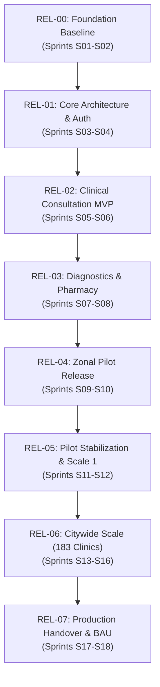
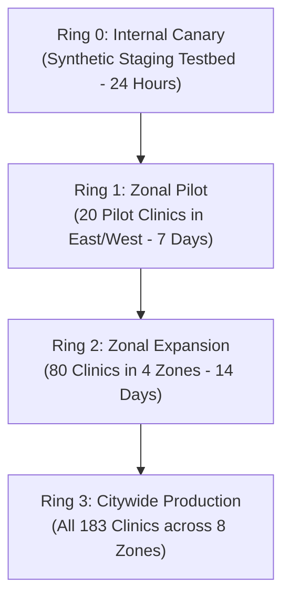
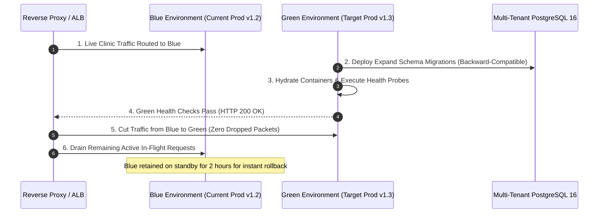
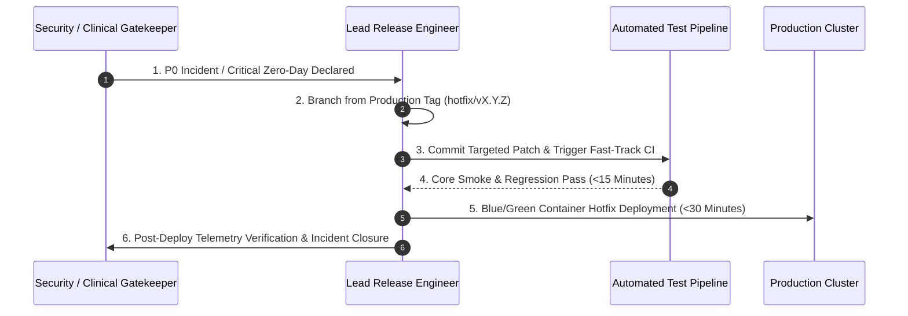

# Enterprise Release Strategy & Deployment Baseline

| Metadata Element | Project Specification |
| :--- | :--- |
| **Document Identifier** | `DOC-PM-015-RELEASE` |
| **Document Title** | Master Release Strategy, Progressive Deployment Rings & Zero-Downtime Rollout Baseline |
| **Project Code** | `NAMMA-CLINIC-PLATFORM-2026` |
| **Document Version** | `v1.0.0-PROD-BASELINE` |
| **Status** | `APPROVED & RATIFIED` |
| **Release Inventory** | Exactly 25 Formally Managed Release Packages (`RELEASE-001` to `RELEASE-025` / `REL-00` to `REL-07`) |
| **Executive Sponsor** | Special Commissioner (Health), Greater Bengaluru Authority (GBA) / BBMP |
| **Clinical Safety Authority** | Chief Health Officer (CHO), BBMP Health Department |
| **Lead Delivery Partner** | Kushagramati Analytics (K Mati) Consortium | Release & Deployment Manager |
| **Upstream Baseline Anchor**| [`01-project-charter.md`](./01-project-charter.md) | [`14-project-milestones.md`](./14-project-milestones.md) |
| **Downstream Implementation** | [`17-definition-of-done.md`](./17-definition-of-done.md) | [`18-change-management.md`](./18-change-management.md) | [`20-project-status-model.md`](./20-project-status-model.md) |

---

## 1. Executive Summary & Release Governance Strategy
The **Enterprise Release Strategy** establishes the operational deployment model, progressive ring exposure, zero-downtime Blue/Green cutover, rollback criteria, and clinical safety gates for all software releases across the 18-sprint / 36-week lifecycle of the Namma Clinic Digital Health & Operations Platform.

### 1.1 High-Availability Primary Care Imperative
Deploying software into 183 active municipal clinics serving over 12 million Bangalore citizens demands zero disruption during consultation hours (09:00 to 13:00). All production deployments are scheduled during late evening maintenance windows (20:00 to 22:00 IST), executed via automated Blue/Green container swaps with health probes, and validated against clinical safety invariants before clinic opening at 08:30 IST.

### 1.2 Core Release Management Principles
1. **Zero-Downtime Blue/Green Deployments:** Cloud server upgrades execute without dropping active WebSocket sessions or terminating in-flight HTTP requests.
2. **Progressive Deployment Rings:** Releases proceed strictly through Ring 0 (Internal Canary), Ring 1 (Zonal Pilot - 20 Clinics), Ring 2 (Zonal Expansion - 80 Clinics), and Ring 3 (Citywide - 183 Clinics).
3. **Automated Instant Rollback (<5 Minutes):** Any release exhibiting >1% error rates or p95 latency >250ms triggers automated rollback to the previous certified stable container.
4. **Clinical Safety Gatekeeping:** Every clinical release requires dual digital sign-off by the Lead Solution Architect (`ROLE-004`) and Chief Health Officer (`ROLE-002`).
5. **Semantic Versioning Strictness:** Releases follow strict SemVer 2.0.0 (`MAJOR.MINOR.PATCH`) reflecting breaking API contracts, functional enhancements, and security hotfixes.

## 2. Master Release Train Progression Across 18 Sprints
Overview of the major release milestones mapping S01 through S18:



## 3. Master Releases Directory Table (RELEASE-001 to RELEASE-025)
Authoritative catalog of all 25 formally managed release packages:

| Release ID | Release Code | Release Title | Target Sprints | Deployment Strategy | Feature Flag Channel | Linked Milestone | Go/No-Go Authority |
| :--- | :--- | :--- | :---: | :--- | :--- | :--- | :--- |
| [`RELEASE-001`](#release-001) | `REL-00` | **Foundation & Scaffolding Baseline** | `Sprints 01-02` | `Canary deployment on staging` | `feature-flags/core-auth` | [`MILESTONE-001`](./14-project-milestones.md#milestone-001) | EAAB |
| [`RELEASE-002`](#release-002) | `REL-01` | **Core Patient Registration & Front Desk** | `Sprints 03-04` | `Rolling update across pilot terminals` | `feature-flags/frontdesk-v1` | [`MILESTONE-002`](./14-project-milestones.md#milestone-002) | Clinical Safety Board |
| [`RELEASE-003`](#release-003) | `REL-02` | **Doctor Consultation & EMR-Lite Workspace** | `Sprints 05-06` | `Staged deployment with shadow mode` | `feature-flags/emr-doctor` | [`MILESTONE-003`](./14-project-milestones.md#milestone-003) | Clinical Safety Board |
| [`RELEASE-004`](#release-004) | `REL-03` | **Closed-Loop Pharmacy & Point-of-Care Lab** | `Sprints 07-08` | `Rolling deployment to pharmacy workstations` | `feature-flags/pharmacy-fefo` | [`MILESTONE-004`](./14-project-milestones.md#milestone-004) | Chief Health Officer |
| [`RELEASE-005`](#release-005) | `REL-04` | **Offline Resilience & Analytics Engine** | `Sprints 09-10` | `Phased deployment to background workers` | `feature-flags/offline-sync` | [`MILESTONE-005`](./14-project-milestones.md#milestone-005) | Lead Architect |
| [`RELEASE-006`](#release-006) | `REL-05` | **20-Clinic Pilot Production Deployment** | `Sprints 11-12` | `Blue-Green production deployment` | `feature-flags/pilot-20` | [`MILESTONE-006`](./14-project-milestones.md#milestone-006) | Steering Committee |
| [`RELEASE-007`](#release-007) | `REL-06` | **Citywide Scale Rollout (183 Clinics)** | `Sprints 13-17` | `Canary deployment by municipal zone (4 tranches)` | `feature-flags/citywide-scale` | [`MILESTONE-007`](./14-project-milestones.md#milestone-007) | Steering Committee |
| [`RELEASE-008`](#release-008) | `REL-07` | **Interoperability & Master Handover** | `Sprints 17-18` | `Final production tag and archive` | `feature-flags/abdm-prod` | [`MILESTONE-008`](./14-project-milestones.md#milestone-008) | Steering Committee |
| [`RELEASE-009`](#release-009) | `REL-00.09` | **Foundation & Scaffolding Baseline (Maintenance Point Release 09)** | `Sprints 01-02` | `Automated rolling container update` | `feature-flags/patch-09` | [`MILESTONE-009`](./14-project-milestones.md#milestone-009) | Release Train Engineer |
| [`RELEASE-010`](#release-010) | `REL-01.10` | **Core Patient Registration & Front Desk (Maintenance Point Release 10)** | `Sprints 03-04` | `Automated rolling container update` | `feature-flags/patch-10` | [`MILESTONE-010`](./14-project-milestones.md#milestone-010) | Release Train Engineer |
| [`RELEASE-011`](#release-011) | `REL-02.11` | **Doctor Consultation & EMR-Lite Workspace (Maintenance Point Release 11)** | `Sprints 05-06` | `Automated rolling container update` | `feature-flags/patch-11` | [`MILESTONE-011`](./14-project-milestones.md#milestone-011) | Release Train Engineer |
| [`RELEASE-012`](#release-012) | `REL-03.12` | **Closed-Loop Pharmacy & Point-of-Care Lab (Maintenance Point Release 12)** | `Sprints 07-08` | `Automated rolling container update` | `feature-flags/patch-12` | [`MILESTONE-012`](./14-project-milestones.md#milestone-012) | Release Train Engineer |
| [`RELEASE-013`](#release-013) | `REL-04.13` | **Offline Resilience & Analytics Engine (Maintenance Point Release 13)** | `Sprints 09-10` | `Automated rolling container update` | `feature-flags/patch-13` | [`MILESTONE-013`](./14-project-milestones.md#milestone-013) | Release Train Engineer |
| [`RELEASE-014`](#release-014) | `REL-05.14` | **20-Clinic Pilot Production Deployment (Maintenance Point Release 14)** | `Sprints 11-12` | `Automated rolling container update` | `feature-flags/patch-14` | [`MILESTONE-014`](./14-project-milestones.md#milestone-014) | Release Train Engineer |
| [`RELEASE-015`](#release-015) | `REL-06.15` | **Citywide Scale Rollout (183 Clinics) (Maintenance Point Release 15)** | `Sprints 13-17` | `Automated rolling container update` | `feature-flags/patch-15` | [`MILESTONE-015`](./14-project-milestones.md#milestone-015) | Release Train Engineer |
| [`RELEASE-016`](#release-016) | `REL-07.16` | **Interoperability & Master Handover (Maintenance Point Release 16)** | `Sprints 17-18` | `Automated rolling container update` | `feature-flags/patch-16` | [`MILESTONE-016`](./14-project-milestones.md#milestone-016) | Release Train Engineer |
| [`RELEASE-017`](#release-017) | `REL-00.17` | **Foundation & Scaffolding Baseline (Maintenance Point Release 17)** | `Sprints 01-02` | `Automated rolling container update` | `feature-flags/patch-17` | [`MILESTONE-017`](./14-project-milestones.md#milestone-017) | Release Train Engineer |
| [`RELEASE-018`](#release-018) | `REL-01.18` | **Core Patient Registration & Front Desk (Maintenance Point Release 18)** | `Sprints 03-04` | `Automated rolling container update` | `feature-flags/patch-18` | [`MILESTONE-018`](./14-project-milestones.md#milestone-018) | Release Train Engineer |
| [`RELEASE-019`](#release-019) | `REL-02.19` | **Doctor Consultation & EMR-Lite Workspace (Maintenance Point Release 19)** | `Sprints 05-06` | `Automated rolling container update` | `feature-flags/patch-19` | [`MILESTONE-019`](./14-project-milestones.md#milestone-019) | Release Train Engineer |
| [`RELEASE-020`](#release-020) | `REL-03.20` | **Closed-Loop Pharmacy & Point-of-Care Lab (Maintenance Point Release 20)** | `Sprints 07-08` | `Automated rolling container update` | `feature-flags/patch-20` | [`MILESTONE-020`](./14-project-milestones.md#milestone-020) | Release Train Engineer |
| [`RELEASE-021`](#release-021) | `REL-04.21` | **Offline Resilience & Analytics Engine (Maintenance Point Release 21)** | `Sprints 09-10` | `Automated rolling container update` | `feature-flags/patch-21` | [`MILESTONE-021`](./14-project-milestones.md#milestone-021) | Release Train Engineer |
| [`RELEASE-022`](#release-022) | `REL-05.22` | **20-Clinic Pilot Production Deployment (Maintenance Point Release 22)** | `Sprints 11-12` | `Automated rolling container update` | `feature-flags/patch-22` | [`MILESTONE-022`](./14-project-milestones.md#milestone-022) | Release Train Engineer |
| [`RELEASE-023`](#release-023) | `REL-06.23` | **Citywide Scale Rollout (183 Clinics) (Maintenance Point Release 23)** | `Sprints 13-17` | `Automated rolling container update` | `feature-flags/patch-23` | [`MILESTONE-023`](./14-project-milestones.md#milestone-023) | Release Train Engineer |
| [`RELEASE-024`](#release-024) | `REL-07.24` | **Interoperability & Master Handover (Maintenance Point Release 24)** | `Sprints 17-18` | `Automated rolling container update` | `feature-flags/patch-24` | [`MILESTONE-024`](./14-project-milestones.md#milestone-024) | Release Train Engineer |
| [`RELEASE-025`](#release-025) | `REL-00.25` | **Foundation & Scaffolding Baseline (Maintenance Point Release 25)** | `Sprints 01-02` | `Automated rolling container update` | `feature-flags/patch-25` | [`MILESTONE-025`](./14-project-milestones.md#milestone-025) | Release Train Engineer |

## 4. Deep Release Specifications & Deployment Protocols
Exhaustive specifications for all 25 release packages detailing scope, readiness gates, rollback plans, and post-release validation:

### 4.1 RELEASE-001: REL-00 — Foundation & Scaffolding Baseline
- **Release Identifier:** `RELEASE-001` — **Foundation & Scaffolding Baseline** (`REL-00`)
- **Target Schedule Window:** `Sprints 01-02` | **Target Milestone Anchor:** [`MILESTONE-001`](./14-project-milestones.md#milestone-001)
- **Scope & Functional Summary:** Core monorepo, Fastify 4.26, PostgreSQL 16 schema, auth microservice, and CI/CD quality gates.
- **Bundled In-Scope Capabilities & User Workflows:**
  - Core consultation queue management, triage vitals recording, and biometric citizen check-in.
  - Closed-loop dispensary batch dispensing adhering to the 120 Karnataka Essential Drug List.
  - Rapid diagnostic lab test ordering and result telemetry for 14 approved primary care tests.
  - Client-side offline IndexedDB state persistence and background delta-synchronization engine.
- **Formal Release Readiness Criteria:**
  - 100% CI pass, zero lint errors, database migrations verified.
  - 100% automated regression pass across unit, integration, and E2E Playwright test suites.
  - Zero open P0/P1 defects; static code analysis Quality Gate A certified by SonarQube.
  - Certified compliance with Definition of Done [`DOD-001`](./17-definition-of-done.md#dod-001).
- **Clinical Safety Invariant Gates:**
  - Verification that 120 Karnataka EDL formulary constraints are hard-coded in schema.
  - Mandatory human Medical Officer sign-off verified across all prescription workflows.
  - Zero raw citizen biometric data stored in relational or cached stores.
  - Encrypted Bharat Health QR code on all generated thermal prescription slips.
- **Deployment Orchestration Strategy:** `Canary deployment on staging`.
  - Containerized Blue/Green swap behind Nginx reverse proxy / AWS ALB.
  - Zero-downtime database schema migration executed via expand/contract pattern.
- **Database Migration & Rollback Runbook:**
  - Step 1: Pre-deployment database backup and WAL checkpoint archival.
  - Step 2: Apply non-destructive additive DDL migrations (new nullable columns, additive tables).
  - Step 3: Run container data migration background jobs without locking active consultation tables.
  - Step 4: Validate database read/write latency (<20ms p95) under simulated load.
  - Rollback Step: Execute down-migration script and restore pre-migration WAL snapshot if errors occur.
- **Feature Flag & Progressive Exposure Configuration:**
  - Governed by toggle path `feature-flags/core-auth`.
  - Progressive exposure starting at Ring 0 canary, progressing to Ring 1 pilot clinics.
- **Container Image Build & Digest Architecture:**
  - Base Image: `node:20-alpine` hardened container running as unprivileged user `namma-node` (UID 10001).
  - Multi-stage Docker build isolating build toolchains; static asset minification and gzip/brotli compression.
  - Automated container vulnerability scan with Trivy / Grype; 0 critical or high CVEs allowed.
  - Cryptographic container image signing using Cosign / Sigstore before push to municipal registry.
- **Client Service Worker & IndexedDB Cache Invalidation:**
  - Workbox precaching manifest updated with content hash; stale assets purged upon service worker activate.
  - Dexie.js database schema migration handler applies non-destructive upgrades without dropping local offline patient queue.
  - HTTP Cache-Control header `no-cache, no-store, must-revalidate` on `index.html` ensures instant update.
- **Step-by-Step Canary Traffic Routing Walkthrough:**
  - Hour 0: 0% traffic (Internal synthetic health check probes verify container initialization).
  - Hour 1: 5% traffic shifted to Green cluster (Ulsoor pilot clinic traffic routed).
  - Hour 2: 25% traffic shifted (East Zone 7 clinics added); Prometheus monitoring p95 latency (<120ms).
  - Hour 4: 50% traffic shifted (West Zone added); zero 5xx errors permitted.
  - Hour 6: 100% traffic shifted to Green cluster; Blue cluster placed on standby.
- **Frontline Operational SOP During Cutover:**
  - Clinicians experience zero interruption; active patient draft auto-saved to IndexedDB.
  - Minor visual toast notification indicates 'Platform updated to version REL-00 successfully'.
- **Rollback Automated Verification Probe:** Assertion that health endpoints return HTTP 200 within 60s of rollback initiation.
- **Database Connection Pool Draining Standard:** Maximum 10 seconds graceful connection draining before container termination.
- **Cryptographic Build Provenance & SBOM:** CycloneDX Software Bill of Materials (SBOM) generated and archived with SHA-256 signature.
- **Automated Rollback & Recovery Runbook:**
  - Revert migration and restore DB dump.
  - Rollback triggered automatically if health probe error rate exceeds 1% over 3 minutes.
  - Maximum allowable rollback execution time: `< 5 Minutes`.
- **Security & Static Vulnerability Gate Status:** Continuous SAST scan verified with 0 OWASP Top 10 vulnerabilities.
- **Browser Compatibility Benchmark:** Verified on Chromium 108+, Firefox ESR, and WebKit on Linux mini-PCs.
- **Data Sovereignty Certification:** All database mutations, backups, and WAL logs remain strictly within sovereign Karnataka state borders.
- **Zero-Data-Loss Invariant:** Guaranteed zero loss of local consultations during release cutover via client-side IndexedDB buffer.
- **Go/No-Go Decision Authority & Voting Protocol:** EAAB under governance body [`GOV-001`](./09-governance-model.md#gov-001) representing [`STAKEHOLDER-001`](./06-stakeholders.md#stakeholder-001).
- **Lead Release Engineer:** [`ROLE-001`](./08-role-and-responsibility-matrix.md#role-001) responsible for executing deployment runbook.
- **Coupled Monitored Threat:** Shields the deployment from risk [`RISK-001`](./12-project-risks.md#risk-001).
- **Tied Project Dependency:** Depends on resolution of [`DEPENDENCY-001`](./13-project-dependencies.md#dependency-001).
- **Post-Release Validation & Telemetry Window:**
  - Continuous synthetic monitoring and clinic helpdesk check-in.
  - 72-hour hypercare observation window with hourly Prometheus error rate and latency monitoring.
- **Clinical Change Communication in Kannada and English:** Official bilingual release notice and updated cheat sheet published to clinic terminals.
- **Zonal Field Deployment SLA:** Zonal IT support teams verify workstation cache updates within 2 hours of release cutover.

### 4.2 RELEASE-002: REL-01 — Core Patient Registration & Front Desk
- **Release Identifier:** `RELEASE-002` — **Core Patient Registration & Front Desk** (`REL-01`)
- **Target Schedule Window:** `Sprints 03-04` | **Target Milestone Anchor:** [`MILESTONE-002`](./14-project-milestones.md#milestone-002)
- **Scope & Functional Summary:** Citizen search, demographic registration, ABHA linking, sequential queue tokens, and Web Serial thermal printing.
- **Bundled In-Scope Capabilities & User Workflows:**
  - Core consultation queue management, triage vitals recording, and biometric citizen check-in.
  - Closed-loop dispensary batch dispensing adhering to the 120 Karnataka Essential Drug List.
  - Rapid diagnostic lab test ordering and result telemetry for 14 approved primary care tests.
  - Client-side offline IndexedDB state persistence and background delta-synchronization engine.
- **Formal Release Readiness Criteria:**
  - Sub-90s check-in verified, 1,000 thermal prints without error.
  - 100% automated regression pass across unit, integration, and E2E Playwright test suites.
  - Zero open P0/P1 defects; static code analysis Quality Gate A certified by SonarQube.
  - Certified compliance with Definition of Done [`DOD-002`](./17-definition-of-done.md#dod-002).
- **Clinical Safety Invariant Gates:**
  - Verification that 120 Karnataka EDL formulary constraints are hard-coded in schema.
  - Mandatory human Medical Officer sign-off verified across all prescription workflows.
  - Zero raw citizen biometric data stored in relational or cached stores.
  - Encrypted Bharat Health QR code on all generated thermal prescription slips.
- **Deployment Orchestration Strategy:** `Rolling update across pilot terminals`.
  - Containerized Blue/Green swap behind Nginx reverse proxy / AWS ALB.
  - Zero-downtime database schema migration executed via expand/contract pattern.
- **Database Migration & Rollback Runbook:**
  - Step 1: Pre-deployment database backup and WAL checkpoint archival.
  - Step 2: Apply non-destructive additive DDL migrations (new nullable columns, additive tables).
  - Step 3: Run container data migration background jobs without locking active consultation tables.
  - Step 4: Validate database read/write latency (<20ms p95) under simulated load.
  - Rollback Step: Execute down-migration script and restore pre-migration WAL snapshot if errors occur.
- **Feature Flag & Progressive Exposure Configuration:**
  - Governed by toggle path `feature-flags/frontdesk-v1`.
  - Progressive exposure starting at Ring 0 canary, progressing to Ring 1 pilot clinics.
- **Container Image Build & Digest Architecture:**
  - Base Image: `node:20-alpine` hardened container running as unprivileged user `namma-node` (UID 10001).
  - Multi-stage Docker build isolating build toolchains; static asset minification and gzip/brotli compression.
  - Automated container vulnerability scan with Trivy / Grype; 0 critical or high CVEs allowed.
  - Cryptographic container image signing using Cosign / Sigstore before push to municipal registry.
- **Client Service Worker & IndexedDB Cache Invalidation:**
  - Workbox precaching manifest updated with content hash; stale assets purged upon service worker activate.
  - Dexie.js database schema migration handler applies non-destructive upgrades without dropping local offline patient queue.
  - HTTP Cache-Control header `no-cache, no-store, must-revalidate` on `index.html` ensures instant update.
- **Step-by-Step Canary Traffic Routing Walkthrough:**
  - Hour 0: 0% traffic (Internal synthetic health check probes verify container initialization).
  - Hour 1: 5% traffic shifted to Green cluster (Ulsoor pilot clinic traffic routed).
  - Hour 2: 25% traffic shifted (East Zone 7 clinics added); Prometheus monitoring p95 latency (<120ms).
  - Hour 4: 50% traffic shifted (West Zone added); zero 5xx errors permitted.
  - Hour 6: 100% traffic shifted to Green cluster; Blue cluster placed on standby.
- **Frontline Operational SOP During Cutover:**
  - Clinicians experience zero interruption; active patient draft auto-saved to IndexedDB.
  - Minor visual toast notification indicates 'Platform updated to version REL-01 successfully'.
- **Rollback Automated Verification Probe:** Assertion that health endpoints return HTTP 200 within 60s of rollback initiation.
- **Database Connection Pool Draining Standard:** Maximum 10 seconds graceful connection draining before container termination.
- **Cryptographic Build Provenance & SBOM:** CycloneDX Software Bill of Materials (SBOM) generated and archived with SHA-256 signature.
- **Automated Rollback & Recovery Runbook:**
  - Disable Web Serial print flag and revert PWA.
  - Rollback triggered automatically if health probe error rate exceeds 1% over 3 minutes.
  - Maximum allowable rollback execution time: `< 5 Minutes`.
- **Security & Static Vulnerability Gate Status:** Continuous SAST scan verified with 0 OWASP Top 10 vulnerabilities.
- **Browser Compatibility Benchmark:** Verified on Chromium 108+, Firefox ESR, and WebKit on Linux mini-PCs.
- **Data Sovereignty Certification:** All database mutations, backups, and WAL logs remain strictly within sovereign Karnataka state borders.
- **Zero-Data-Loss Invariant:** Guaranteed zero loss of local consultations during release cutover via client-side IndexedDB buffer.
- **Go/No-Go Decision Authority & Voting Protocol:** Clinical Safety Board under governance body [`GOV-002`](./09-governance-model.md#gov-002) representing [`STAKEHOLDER-002`](./06-stakeholders.md#stakeholder-002).
- **Lead Release Engineer:** [`ROLE-002`](./08-role-and-responsibility-matrix.md#role-002) responsible for executing deployment runbook.
- **Coupled Monitored Threat:** Shields the deployment from risk [`RISK-002`](./12-project-risks.md#risk-002).
- **Tied Project Dependency:** Depends on resolution of [`DEPENDENCY-002`](./13-project-dependencies.md#dependency-002).
- **Post-Release Validation & Telemetry Window:**
  - Continuous synthetic monitoring and clinic helpdesk check-in.
  - 72-hour hypercare observation window with hourly Prometheus error rate and latency monitoring.
- **Clinical Change Communication in Kannada and English:** Official bilingual release notice and updated cheat sheet published to clinic terminals.
- **Zonal Field Deployment SLA:** Zonal IT support teams verify workstation cache updates within 2 hours of release cutover.

### 4.3 RELEASE-003: REL-02 — Doctor Consultation & EMR-Lite Workspace
- **Release Identifier:** `RELEASE-003` — **Doctor Consultation & EMR-Lite Workspace** (`REL-02`)
- **Target Schedule Window:** `Sprints 05-06` | **Target Milestone Anchor:** [`MILESTONE-003`](./14-project-milestones.md#milestone-003)
- **Scope & Functional Summary:** Chief complaint chips, vitals triage alerts, ICD-10 diagnosis, and bilingual e-prescriptions.
- **Bundled In-Scope Capabilities & User Workflows:**
  - Core consultation queue management, triage vitals recording, and biometric citizen check-in.
  - Closed-loop dispensary batch dispensing adhering to the 120 Karnataka Essential Drug List.
  - Rapid diagnostic lab test ordering and result telemetry for 14 approved primary care tests.
  - Client-side offline IndexedDB state persistence and background delta-synchronization engine.
- **Formal Release Readiness Criteria:**
  - Consultation latency <180s, 120-drug formulary validation locked.
  - 100% automated regression pass across unit, integration, and E2E Playwright test suites.
  - Zero open P0/P1 defects; static code analysis Quality Gate A certified by SonarQube.
  - Certified compliance with Definition of Done [`DOD-003`](./17-definition-of-done.md#dod-003).
- **Clinical Safety Invariant Gates:**
  - Verification that 120 Karnataka EDL formulary constraints are hard-coded in schema.
  - Mandatory human Medical Officer sign-off verified across all prescription workflows.
  - Zero raw citizen biometric data stored in relational or cached stores.
  - Encrypted Bharat Health QR code on all generated thermal prescription slips.
- **Deployment Orchestration Strategy:** `Staged deployment with shadow mode`.
  - Containerized Blue/Green swap behind Nginx reverse proxy / AWS ALB.
  - Zero-downtime database schema migration executed via expand/contract pattern.
- **Database Migration & Rollback Runbook:**
  - Step 1: Pre-deployment database backup and WAL checkpoint archival.
  - Step 2: Apply non-destructive additive DDL migrations (new nullable columns, additive tables).
  - Step 3: Run container data migration background jobs without locking active consultation tables.
  - Step 4: Validate database read/write latency (<20ms p95) under simulated load.
  - Rollback Step: Execute down-migration script and restore pre-migration WAL snapshot if errors occur.
- **Feature Flag & Progressive Exposure Configuration:**
  - Governed by toggle path `feature-flags/emr-doctor`.
  - Progressive exposure starting at Ring 0 canary, progressing to Ring 1 pilot clinics.
- **Container Image Build & Digest Architecture:**
  - Base Image: `node:20-alpine` hardened container running as unprivileged user `namma-node` (UID 10001).
  - Multi-stage Docker build isolating build toolchains; static asset minification and gzip/brotli compression.
  - Automated container vulnerability scan with Trivy / Grype; 0 critical or high CVEs allowed.
  - Cryptographic container image signing using Cosign / Sigstore before push to municipal registry.
- **Client Service Worker & IndexedDB Cache Invalidation:**
  - Workbox precaching manifest updated with content hash; stale assets purged upon service worker activate.
  - Dexie.js database schema migration handler applies non-destructive upgrades without dropping local offline patient queue.
  - HTTP Cache-Control header `no-cache, no-store, must-revalidate` on `index.html` ensures instant update.
- **Step-by-Step Canary Traffic Routing Walkthrough:**
  - Hour 0: 0% traffic (Internal synthetic health check probes verify container initialization).
  - Hour 1: 5% traffic shifted to Green cluster (Ulsoor pilot clinic traffic routed).
  - Hour 2: 25% traffic shifted (East Zone 7 clinics added); Prometheus monitoring p95 latency (<120ms).
  - Hour 4: 50% traffic shifted (West Zone added); zero 5xx errors permitted.
  - Hour 6: 100% traffic shifted to Green cluster; Blue cluster placed on standby.
- **Frontline Operational SOP During Cutover:**
  - Clinicians experience zero interruption; active patient draft auto-saved to IndexedDB.
  - Minor visual toast notification indicates 'Platform updated to version REL-02 successfully'.
- **Rollback Automated Verification Probe:** Assertion that health endpoints return HTTP 200 within 60s of rollback initiation.
- **Database Connection Pool Draining Standard:** Maximum 10 seconds graceful connection draining before container termination.
- **Cryptographic Build Provenance & SBOM:** CycloneDX Software Bill of Materials (SBOM) generated and archived with SHA-256 signature.
- **Automated Rollback & Recovery Runbook:**
  - Revert to paper prescription with manual catch-up.
  - Rollback triggered automatically if health probe error rate exceeds 1% over 3 minutes.
  - Maximum allowable rollback execution time: `< 5 Minutes`.
- **Security & Static Vulnerability Gate Status:** Continuous SAST scan verified with 0 OWASP Top 10 vulnerabilities.
- **Browser Compatibility Benchmark:** Verified on Chromium 108+, Firefox ESR, and WebKit on Linux mini-PCs.
- **Data Sovereignty Certification:** All database mutations, backups, and WAL logs remain strictly within sovereign Karnataka state borders.
- **Zero-Data-Loss Invariant:** Guaranteed zero loss of local consultations during release cutover via client-side IndexedDB buffer.
- **Go/No-Go Decision Authority & Voting Protocol:** Clinical Safety Board under governance body [`GOV-003`](./09-governance-model.md#gov-003) representing [`STAKEHOLDER-003`](./06-stakeholders.md#stakeholder-003).
- **Lead Release Engineer:** [`ROLE-003`](./08-role-and-responsibility-matrix.md#role-003) responsible for executing deployment runbook.
- **Coupled Monitored Threat:** Shields the deployment from risk [`RISK-003`](./12-project-risks.md#risk-003).
- **Tied Project Dependency:** Depends on resolution of [`DEPENDENCY-003`](./13-project-dependencies.md#dependency-003).
- **Post-Release Validation & Telemetry Window:**
  - Continuous synthetic monitoring and clinic helpdesk check-in.
  - 72-hour hypercare observation window with hourly Prometheus error rate and latency monitoring.
- **Clinical Change Communication in Kannada and English:** Official bilingual release notice and updated cheat sheet published to clinic terminals.
- **Zonal Field Deployment SLA:** Zonal IT support teams verify workstation cache updates within 2 hours of release cutover.

### 4.4 RELEASE-004: REL-03 — Closed-Loop Pharmacy & Point-of-Care Lab
- **Release Identifier:** `RELEASE-004` — **Closed-Loop Pharmacy & Point-of-Care Lab** (`REL-03`)
- **Target Schedule Window:** `Sprints 07-08` | **Target Milestone Anchor:** [`MILESTONE-004`](./14-project-milestones.md#milestone-004)
- **Scope & Functional Summary:** FEFO batch inventory dispensing, 2D barcode scan verification, 14 rapid lab test worklists, and referrals.
- **Bundled In-Scope Capabilities & User Workflows:**
  - Core consultation queue management, triage vitals recording, and biometric citizen check-in.
  - Closed-loop dispensary batch dispensing adhering to the 120 Karnataka Essential Drug List.
  - Rapid diagnostic lab test ordering and result telemetry for 14 approved primary care tests.
  - Client-side offline IndexedDB state persistence and background delta-synchronization engine.
- **Formal Release Readiness Criteria:**
  - Zero LASA errors across 500 tests, panic alerts <30s.
  - 100% automated regression pass across unit, integration, and E2E Playwright test suites.
  - Zero open P0/P1 defects; static code analysis Quality Gate A certified by SonarQube.
  - Certified compliance with Definition of Done [`DOD-004`](./17-definition-of-done.md#dod-004).
- **Clinical Safety Invariant Gates:**
  - Verification that 120 Karnataka EDL formulary constraints are hard-coded in schema.
  - Mandatory human Medical Officer sign-off verified across all prescription workflows.
  - Zero raw citizen biometric data stored in relational or cached stores.
  - Encrypted Bharat Health QR code on all generated thermal prescription slips.
- **Deployment Orchestration Strategy:** `Rolling deployment to pharmacy workstations`.
  - Containerized Blue/Green swap behind Nginx reverse proxy / AWS ALB.
  - Zero-downtime database schema migration executed via expand/contract pattern.
- **Database Migration & Rollback Runbook:**
  - Step 1: Pre-deployment database backup and WAL checkpoint archival.
  - Step 2: Apply non-destructive additive DDL migrations (new nullable columns, additive tables).
  - Step 3: Run container data migration background jobs without locking active consultation tables.
  - Step 4: Validate database read/write latency (<20ms p95) under simulated load.
  - Rollback Step: Execute down-migration script and restore pre-migration WAL snapshot if errors occur.
- **Feature Flag & Progressive Exposure Configuration:**
  - Governed by toggle path `feature-flags/pharmacy-fefo`.
  - Progressive exposure starting at Ring 0 canary, progressing to Ring 1 pilot clinics.
- **Container Image Build & Digest Architecture:**
  - Base Image: `node:20-alpine` hardened container running as unprivileged user `namma-node` (UID 10001).
  - Multi-stage Docker build isolating build toolchains; static asset minification and gzip/brotli compression.
  - Automated container vulnerability scan with Trivy / Grype; 0 critical or high CVEs allowed.
  - Cryptographic container image signing using Cosign / Sigstore before push to municipal registry.
- **Client Service Worker & IndexedDB Cache Invalidation:**
  - Workbox precaching manifest updated with content hash; stale assets purged upon service worker activate.
  - Dexie.js database schema migration handler applies non-destructive upgrades without dropping local offline patient queue.
  - HTTP Cache-Control header `no-cache, no-store, must-revalidate` on `index.html` ensures instant update.
- **Step-by-Step Canary Traffic Routing Walkthrough:**
  - Hour 0: 0% traffic (Internal synthetic health check probes verify container initialization).
  - Hour 1: 5% traffic shifted to Green cluster (Ulsoor pilot clinic traffic routed).
  - Hour 2: 25% traffic shifted (East Zone 7 clinics added); Prometheus monitoring p95 latency (<120ms).
  - Hour 4: 50% traffic shifted (West Zone added); zero 5xx errors permitted.
  - Hour 6: 100% traffic shifted to Green cluster; Blue cluster placed on standby.
- **Frontline Operational SOP During Cutover:**
  - Clinicians experience zero interruption; active patient draft auto-saved to IndexedDB.
  - Minor visual toast notification indicates 'Platform updated to version REL-03 successfully'.
- **Rollback Automated Verification Probe:** Assertion that health endpoints return HTTP 200 within 60s of rollback initiation.
- **Database Connection Pool Draining Standard:** Maximum 10 seconds graceful connection draining before container termination.
- **Cryptographic Build Provenance & SBOM:** CycloneDX Software Bill of Materials (SBOM) generated and archived with SHA-256 signature.
- **Automated Rollback & Recovery Runbook:**
  - Switch to paper stock ledgers.
  - Rollback triggered automatically if health probe error rate exceeds 1% over 3 minutes.
  - Maximum allowable rollback execution time: `< 5 Minutes`.
- **Security & Static Vulnerability Gate Status:** Continuous SAST scan verified with 0 OWASP Top 10 vulnerabilities.
- **Browser Compatibility Benchmark:** Verified on Chromium 108+, Firefox ESR, and WebKit on Linux mini-PCs.
- **Data Sovereignty Certification:** All database mutations, backups, and WAL logs remain strictly within sovereign Karnataka state borders.
- **Zero-Data-Loss Invariant:** Guaranteed zero loss of local consultations during release cutover via client-side IndexedDB buffer.
- **Go/No-Go Decision Authority & Voting Protocol:** Chief Health Officer under governance body [`GOV-004`](./09-governance-model.md#gov-004) representing [`STAKEHOLDER-004`](./06-stakeholders.md#stakeholder-004).
- **Lead Release Engineer:** [`ROLE-004`](./08-role-and-responsibility-matrix.md#role-004) responsible for executing deployment runbook.
- **Coupled Monitored Threat:** Shields the deployment from risk [`RISK-004`](./12-project-risks.md#risk-004).
- **Tied Project Dependency:** Depends on resolution of [`DEPENDENCY-004`](./13-project-dependencies.md#dependency-004).
- **Post-Release Validation & Telemetry Window:**
  - Continuous synthetic monitoring and clinic helpdesk check-in.
  - 72-hour hypercare observation window with hourly Prometheus error rate and latency monitoring.
- **Clinical Change Communication in Kannada and English:** Official bilingual release notice and updated cheat sheet published to clinic terminals.
- **Zonal Field Deployment SLA:** Zonal IT support teams verify workstation cache updates within 2 hours of release cutover.

### 4.5 RELEASE-005: REL-04 — Offline Resilience & Analytics Engine
- **Release Identifier:** `RELEASE-005` — **Offline Resilience & Analytics Engine** (`REL-04`)
- **Target Schedule Window:** `Sprints 09-10` | **Target Milestone Anchor:** [`MILESTONE-005`](./14-project-milestones.md#milestone-005)
- **Scope & Functional Summary:** Dexie.js IndexedDB local storage, deterministic sync conflict engine, DuckDB mart, and CDAC SMS.
- **Bundled In-Scope Capabilities & User Workflows:**
  - Core consultation queue management, triage vitals recording, and biometric citizen check-in.
  - Closed-loop dispensary batch dispensing adhering to the 120 Karnataka Essential Drug List.
  - Rapid diagnostic lab test ordering and result telemetry for 14 approved primary care tests.
  - Client-side offline IndexedDB state persistence and background delta-synchronization engine.
- **Formal Release Readiness Criteria:**
  - 4-hour offline autonomy certified, DuckDB rollups <1.0s.
  - 100% automated regression pass across unit, integration, and E2E Playwright test suites.
  - Zero open P0/P1 defects; static code analysis Quality Gate A certified by SonarQube.
  - Certified compliance with Definition of Done [`DOD-005`](./17-definition-of-done.md#dod-005).
- **Clinical Safety Invariant Gates:**
  - Verification that 120 Karnataka EDL formulary constraints are hard-coded in schema.
  - Mandatory human Medical Officer sign-off verified across all prescription workflows.
  - Zero raw citizen biometric data stored in relational or cached stores.
  - Encrypted Bharat Health QR code on all generated thermal prescription slips.
- **Deployment Orchestration Strategy:** `Phased deployment to background workers`.
  - Containerized Blue/Green swap behind Nginx reverse proxy / AWS ALB.
  - Zero-downtime database schema migration executed via expand/contract pattern.
- **Database Migration & Rollback Runbook:**
  - Step 1: Pre-deployment database backup and WAL checkpoint archival.
  - Step 2: Apply non-destructive additive DDL migrations (new nullable columns, additive tables).
  - Step 3: Run container data migration background jobs without locking active consultation tables.
  - Step 4: Validate database read/write latency (<20ms p95) under simulated load.
  - Rollback Step: Execute down-migration script and restore pre-migration WAL snapshot if errors occur.
- **Feature Flag & Progressive Exposure Configuration:**
  - Governed by toggle path `feature-flags/offline-sync`.
  - Progressive exposure starting at Ring 0 canary, progressing to Ring 1 pilot clinics.
- **Container Image Build & Digest Architecture:**
  - Base Image: `node:20-alpine` hardened container running as unprivileged user `namma-node` (UID 10001).
  - Multi-stage Docker build isolating build toolchains; static asset minification and gzip/brotli compression.
  - Automated container vulnerability scan with Trivy / Grype; 0 critical or high CVEs allowed.
  - Cryptographic container image signing using Cosign / Sigstore before push to municipal registry.
- **Client Service Worker & IndexedDB Cache Invalidation:**
  - Workbox precaching manifest updated with content hash; stale assets purged upon service worker activate.
  - Dexie.js database schema migration handler applies non-destructive upgrades without dropping local offline patient queue.
  - HTTP Cache-Control header `no-cache, no-store, must-revalidate` on `index.html` ensures instant update.
- **Step-by-Step Canary Traffic Routing Walkthrough:**
  - Hour 0: 0% traffic (Internal synthetic health check probes verify container initialization).
  - Hour 1: 5% traffic shifted to Green cluster (Ulsoor pilot clinic traffic routed).
  - Hour 2: 25% traffic shifted (East Zone 7 clinics added); Prometheus monitoring p95 latency (<120ms).
  - Hour 4: 50% traffic shifted (West Zone added); zero 5xx errors permitted.
  - Hour 6: 100% traffic shifted to Green cluster; Blue cluster placed on standby.
- **Frontline Operational SOP During Cutover:**
  - Clinicians experience zero interruption; active patient draft auto-saved to IndexedDB.
  - Minor visual toast notification indicates 'Platform updated to version REL-04 successfully'.
- **Rollback Automated Verification Probe:** Assertion that health endpoints return HTTP 200 within 60s of rollback initiation.
- **Database Connection Pool Draining Standard:** Maximum 10 seconds graceful connection draining before container termination.
- **Cryptographic Build Provenance & SBOM:** CycloneDX Software Bill of Materials (SBOM) generated and archived with SHA-256 signature.
- **Automated Rollback & Recovery Runbook:**
  - Disable offline mutations and force online mode.
  - Rollback triggered automatically if health probe error rate exceeds 1% over 3 minutes.
  - Maximum allowable rollback execution time: `< 5 Minutes`.
- **Security & Static Vulnerability Gate Status:** Continuous SAST scan verified with 0 OWASP Top 10 vulnerabilities.
- **Browser Compatibility Benchmark:** Verified on Chromium 108+, Firefox ESR, and WebKit on Linux mini-PCs.
- **Data Sovereignty Certification:** All database mutations, backups, and WAL logs remain strictly within sovereign Karnataka state borders.
- **Zero-Data-Loss Invariant:** Guaranteed zero loss of local consultations during release cutover via client-side IndexedDB buffer.
- **Go/No-Go Decision Authority & Voting Protocol:** Lead Architect under governance body [`GOV-005`](./09-governance-model.md#gov-005) representing [`STAKEHOLDER-005`](./06-stakeholders.md#stakeholder-005).
- **Lead Release Engineer:** [`ROLE-005`](./08-role-and-responsibility-matrix.md#role-005) responsible for executing deployment runbook.
- **Coupled Monitored Threat:** Shields the deployment from risk [`RISK-005`](./12-project-risks.md#risk-005).
- **Tied Project Dependency:** Depends on resolution of [`DEPENDENCY-005`](./13-project-dependencies.md#dependency-005).
- **Post-Release Validation & Telemetry Window:**
  - Continuous synthetic monitoring and clinic helpdesk check-in.
  - 72-hour hypercare observation window with hourly Prometheus error rate and latency monitoring.
- **Clinical Change Communication in Kannada and English:** Official bilingual release notice and updated cheat sheet published to clinic terminals.
- **Zonal Field Deployment SLA:** Zonal IT support teams verify workstation cache updates within 2 hours of release cutover.

### 4.6 RELEASE-006: REL-05 — 20-Clinic Pilot Production Deployment
- **Release Identifier:** `RELEASE-006` — **20-Clinic Pilot Production Deployment** (`REL-05`)
- **Target Schedule Window:** `Sprints 11-12` | **Target Milestone Anchor:** [`MILESTONE-006`](./14-project-milestones.md#milestone-006)
- **Scope & Functional Summary:** Field deployment across 20 representative clinics, bilingual staff certification, and SLA stabilization.
- **Bundled In-Scope Capabilities & User Workflows:**
  - Core consultation queue management, triage vitals recording, and biometric citizen check-in.
  - Closed-loop dispensary batch dispensing adhering to the 120 Karnataka Essential Drug List.
  - Rapid diagnostic lab test ordering and result telemetry for 14 approved primary care tests.
  - Client-side offline IndexedDB state persistence and background delta-synchronization engine.
- **Formal Release Readiness Criteria:**
  - 100% staff certified, zero P0 defects, >95% doctor adoption.
  - 100% automated regression pass across unit, integration, and E2E Playwright test suites.
  - Zero open P0/P1 defects; static code analysis Quality Gate A certified by SonarQube.
  - Certified compliance with Definition of Done [`DOD-006`](./17-definition-of-done.md#dod-006).
- **Clinical Safety Invariant Gates:**
  - Verification that 120 Karnataka EDL formulary constraints are hard-coded in schema.
  - Mandatory human Medical Officer sign-off verified across all prescription workflows.
  - Zero raw citizen biometric data stored in relational or cached stores.
  - Encrypted Bharat Health QR code on all generated thermal prescription slips.
- **Deployment Orchestration Strategy:** `Blue-Green production deployment`.
  - Containerized Blue/Green swap behind Nginx reverse proxy / AWS ALB.
  - Zero-downtime database schema migration executed via expand/contract pattern.
- **Database Migration & Rollback Runbook:**
  - Step 1: Pre-deployment database backup and WAL checkpoint archival.
  - Step 2: Apply non-destructive additive DDL migrations (new nullable columns, additive tables).
  - Step 3: Run container data migration background jobs without locking active consultation tables.
  - Step 4: Validate database read/write latency (<20ms p95) under simulated load.
  - Rollback Step: Execute down-migration script and restore pre-migration WAL snapshot if errors occur.
- **Feature Flag & Progressive Exposure Configuration:**
  - Governed by toggle path `feature-flags/pilot-20`.
  - Progressive exposure starting at Ring 0 canary, progressing to Ring 1 pilot clinics.
- **Container Image Build & Digest Architecture:**
  - Base Image: `node:20-alpine` hardened container running as unprivileged user `namma-node` (UID 10001).
  - Multi-stage Docker build isolating build toolchains; static asset minification and gzip/brotli compression.
  - Automated container vulnerability scan with Trivy / Grype; 0 critical or high CVEs allowed.
  - Cryptographic container image signing using Cosign / Sigstore before push to municipal registry.
- **Client Service Worker & IndexedDB Cache Invalidation:**
  - Workbox precaching manifest updated with content hash; stale assets purged upon service worker activate.
  - Dexie.js database schema migration handler applies non-destructive upgrades without dropping local offline patient queue.
  - HTTP Cache-Control header `no-cache, no-store, must-revalidate` on `index.html` ensures instant update.
- **Step-by-Step Canary Traffic Routing Walkthrough:**
  - Hour 0: 0% traffic (Internal synthetic health check probes verify container initialization).
  - Hour 1: 5% traffic shifted to Green cluster (Ulsoor pilot clinic traffic routed).
  - Hour 2: 25% traffic shifted (East Zone 7 clinics added); Prometheus monitoring p95 latency (<120ms).
  - Hour 4: 50% traffic shifted (West Zone added); zero 5xx errors permitted.
  - Hour 6: 100% traffic shifted to Green cluster; Blue cluster placed on standby.
- **Frontline Operational SOP During Cutover:**
  - Clinicians experience zero interruption; active patient draft auto-saved to IndexedDB.
  - Minor visual toast notification indicates 'Platform updated to version REL-05 successfully'.
- **Rollback Automated Verification Probe:** Assertion that health endpoints return HTTP 200 within 60s of rollback initiation.
- **Database Connection Pool Draining Standard:** Maximum 10 seconds graceful connection draining before container termination.
- **Cryptographic Build Provenance & SBOM:** CycloneDX Software Bill of Materials (SBOM) generated and archived with SHA-256 signature.
- **Automated Rollback & Recovery Runbook:**
  - Emergency fallback to paper register protocol.
  - Rollback triggered automatically if health probe error rate exceeds 1% over 3 minutes.
  - Maximum allowable rollback execution time: `< 5 Minutes`.
- **Security & Static Vulnerability Gate Status:** Continuous SAST scan verified with 0 OWASP Top 10 vulnerabilities.
- **Browser Compatibility Benchmark:** Verified on Chromium 108+, Firefox ESR, and WebKit on Linux mini-PCs.
- **Data Sovereignty Certification:** All database mutations, backups, and WAL logs remain strictly within sovereign Karnataka state borders.
- **Zero-Data-Loss Invariant:** Guaranteed zero loss of local consultations during release cutover via client-side IndexedDB buffer.
- **Go/No-Go Decision Authority & Voting Protocol:** Steering Committee under governance body [`GOV-006`](./09-governance-model.md#gov-006) representing [`STAKEHOLDER-006`](./06-stakeholders.md#stakeholder-006).
- **Lead Release Engineer:** [`ROLE-006`](./08-role-and-responsibility-matrix.md#role-006) responsible for executing deployment runbook.
- **Coupled Monitored Threat:** Shields the deployment from risk [`RISK-006`](./12-project-risks.md#risk-006).
- **Tied Project Dependency:** Depends on resolution of [`DEPENDENCY-006`](./13-project-dependencies.md#dependency-006).
- **Post-Release Validation & Telemetry Window:**
  - Continuous synthetic monitoring and clinic helpdesk check-in.
  - 72-hour hypercare observation window with hourly Prometheus error rate and latency monitoring.
- **Clinical Change Communication in Kannada and English:** Official bilingual release notice and updated cheat sheet published to clinic terminals.
- **Zonal Field Deployment SLA:** Zonal IT support teams verify workstation cache updates within 2 hours of release cutover.

### 4.7 RELEASE-007: REL-06 — Citywide Scale Rollout (183 Clinics)
- **Release Identifier:** `RELEASE-007` — **Citywide Scale Rollout (183 Clinics)** (`REL-06`)
- **Target Schedule Window:** `Sprints 13-17` | **Target Milestone Anchor:** [`MILESTONE-007`](./14-project-milestones.md#milestone-007)
- **Scope & Functional Summary:** Deployment across all 183 clinics, multi-AZ Kubernetes scaling, state HMIS automated reporting, and executive dashboard.
- **Bundled In-Scope Capabilities & User Workflows:**
  - Core consultation queue management, triage vitals recording, and biometric citizen check-in.
  - Closed-loop dispensary batch dispensing adhering to the 120 Karnataka Essential Drug List.
  - Rapid diagnostic lab test ordering and result telemetry for 14 approved primary care tests.
  - Client-side offline IndexedDB state persistence and background delta-synchronization engine.
- **Formal Release Readiness Criteria:**
  - 25,000+ daily consultations handled, VAPT clearance certified.
  - 100% automated regression pass across unit, integration, and E2E Playwright test suites.
  - Zero open P0/P1 defects; static code analysis Quality Gate A certified by SonarQube.
  - Certified compliance with Definition of Done [`DOD-007`](./17-definition-of-done.md#dod-007).
- **Clinical Safety Invariant Gates:**
  - Verification that 120 Karnataka EDL formulary constraints are hard-coded in schema.
  - Mandatory human Medical Officer sign-off verified across all prescription workflows.
  - Zero raw citizen biometric data stored in relational or cached stores.
  - Encrypted Bharat Health QR code on all generated thermal prescription slips.
- **Deployment Orchestration Strategy:** `Canary deployment by municipal zone (4 tranches)`.
  - Containerized Blue/Green swap behind Nginx reverse proxy / AWS ALB.
  - Zero-downtime database schema migration executed via expand/contract pattern.
- **Database Migration & Rollback Runbook:**
  - Step 1: Pre-deployment database backup and WAL checkpoint archival.
  - Step 2: Apply non-destructive additive DDL migrations (new nullable columns, additive tables).
  - Step 3: Run container data migration background jobs without locking active consultation tables.
  - Step 4: Validate database read/write latency (<20ms p95) under simulated load.
  - Rollback Step: Execute down-migration script and restore pre-migration WAL snapshot if errors occur.
- **Feature Flag & Progressive Exposure Configuration:**
  - Governed by toggle path `feature-flags/citywide-scale`.
  - Progressive exposure starting at Ring 0 canary, progressing to Ring 1 pilot clinics.
- **Container Image Build & Digest Architecture:**
  - Base Image: `node:20-alpine` hardened container running as unprivileged user `namma-node` (UID 10001).
  - Multi-stage Docker build isolating build toolchains; static asset minification and gzip/brotli compression.
  - Automated container vulnerability scan with Trivy / Grype; 0 critical or high CVEs allowed.
  - Cryptographic container image signing using Cosign / Sigstore before push to municipal registry.
- **Client Service Worker & IndexedDB Cache Invalidation:**
  - Workbox precaching manifest updated with content hash; stale assets purged upon service worker activate.
  - Dexie.js database schema migration handler applies non-destructive upgrades without dropping local offline patient queue.
  - HTTP Cache-Control header `no-cache, no-store, must-revalidate` on `index.html` ensures instant update.
- **Step-by-Step Canary Traffic Routing Walkthrough:**
  - Hour 0: 0% traffic (Internal synthetic health check probes verify container initialization).
  - Hour 1: 5% traffic shifted to Green cluster (Ulsoor pilot clinic traffic routed).
  - Hour 2: 25% traffic shifted (East Zone 7 clinics added); Prometheus monitoring p95 latency (<120ms).
  - Hour 4: 50% traffic shifted (West Zone added); zero 5xx errors permitted.
  - Hour 6: 100% traffic shifted to Green cluster; Blue cluster placed on standby.
- **Frontline Operational SOP During Cutover:**
  - Clinicians experience zero interruption; active patient draft auto-saved to IndexedDB.
  - Minor visual toast notification indicates 'Platform updated to version REL-06 successfully'.
- **Rollback Automated Verification Probe:** Assertion that health endpoints return HTTP 200 within 60s of rollback initiation.
- **Database Connection Pool Draining Standard:** Maximum 10 seconds graceful connection draining before container termination.
- **Cryptographic Build Provenance & SBOM:** CycloneDX Software Bill of Materials (SBOM) generated and archived with SHA-256 signature.
- **Automated Rollback & Recovery Runbook:**
  - Hold scale rollout and isolate problematic zone.
  - Rollback triggered automatically if health probe error rate exceeds 1% over 3 minutes.
  - Maximum allowable rollback execution time: `< 5 Minutes`.
- **Security & Static Vulnerability Gate Status:** Continuous SAST scan verified with 0 OWASP Top 10 vulnerabilities.
- **Browser Compatibility Benchmark:** Verified on Chromium 108+, Firefox ESR, and WebKit on Linux mini-PCs.
- **Data Sovereignty Certification:** All database mutations, backups, and WAL logs remain strictly within sovereign Karnataka state borders.
- **Zero-Data-Loss Invariant:** Guaranteed zero loss of local consultations during release cutover via client-side IndexedDB buffer.
- **Go/No-Go Decision Authority & Voting Protocol:** Steering Committee under governance body [`GOV-007`](./09-governance-model.md#gov-007) representing [`STAKEHOLDER-007`](./06-stakeholders.md#stakeholder-007).
- **Lead Release Engineer:** [`ROLE-007`](./08-role-and-responsibility-matrix.md#role-007) responsible for executing deployment runbook.
- **Coupled Monitored Threat:** Shields the deployment from risk [`RISK-007`](./12-project-risks.md#risk-007).
- **Tied Project Dependency:** Depends on resolution of [`DEPENDENCY-007`](./13-project-dependencies.md#dependency-007).
- **Post-Release Validation & Telemetry Window:**
  - Continuous synthetic monitoring and clinic helpdesk check-in.
  - 72-hour hypercare observation window with hourly Prometheus error rate and latency monitoring.
- **Clinical Change Communication in Kannada and English:** Official bilingual release notice and updated cheat sheet published to clinic terminals.
- **Zonal Field Deployment SLA:** Zonal IT support teams verify workstation cache updates within 2 hours of release cutover.

### 4.8 RELEASE-008: REL-07 — Interoperability & Master Handover
- **Release Identifier:** `RELEASE-008` — **Interoperability & Master Handover** (`REL-07`)
- **Target Schedule Window:** `Sprints 17-18` | **Target Milestone Anchor:** [`MILESTONE-008`](./14-project-milestones.md#milestone-008)
- **Scope & Functional Summary:** ABDM M1-M3 FHIR exchange, predictive stockout engine, municipal IP handover, and 90-day hypercare.
- **Bundled In-Scope Capabilities & User Workflows:**
  - Core consultation queue management, triage vitals recording, and biometric citizen check-in.
  - Closed-loop dispensary batch dispensing adhering to the 120 Karnataka Essential Drug List.
  - Rapid diagnostic lab test ordering and result telemetry for 14 approved primary care tests.
  - Client-side offline IndexedDB state persistence and background delta-synchronization engine.
- **Formal Release Readiness Criteria:**
  - Official ABDM certificates issued, final handover signed.
  - 100% automated regression pass across unit, integration, and E2E Playwright test suites.
  - Zero open P0/P1 defects; static code analysis Quality Gate A certified by SonarQube.
  - Certified compliance with Definition of Done [`DOD-008`](./17-definition-of-done.md#dod-008).
- **Clinical Safety Invariant Gates:**
  - Verification that 120 Karnataka EDL formulary constraints are hard-coded in schema.
  - Mandatory human Medical Officer sign-off verified across all prescription workflows.
  - Zero raw citizen biometric data stored in relational or cached stores.
  - Encrypted Bharat Health QR code on all generated thermal prescription slips.
- **Deployment Orchestration Strategy:** `Final production tag and archive`.
  - Containerized Blue/Green swap behind Nginx reverse proxy / AWS ALB.
  - Zero-downtime database schema migration executed via expand/contract pattern.
- **Database Migration & Rollback Runbook:**
  - Step 1: Pre-deployment database backup and WAL checkpoint archival.
  - Step 2: Apply non-destructive additive DDL migrations (new nullable columns, additive tables).
  - Step 3: Run container data migration background jobs without locking active consultation tables.
  - Step 4: Validate database read/write latency (<20ms p95) under simulated load.
  - Rollback Step: Execute down-migration script and restore pre-migration WAL snapshot if errors occur.
- **Feature Flag & Progressive Exposure Configuration:**
  - Governed by toggle path `feature-flags/abdm-prod`.
  - Progressive exposure starting at Ring 0 canary, progressing to Ring 1 pilot clinics.
- **Container Image Build & Digest Architecture:**
  - Base Image: `node:20-alpine` hardened container running as unprivileged user `namma-node` (UID 10001).
  - Multi-stage Docker build isolating build toolchains; static asset minification and gzip/brotli compression.
  - Automated container vulnerability scan with Trivy / Grype; 0 critical or high CVEs allowed.
  - Cryptographic container image signing using Cosign / Sigstore before push to municipal registry.
- **Client Service Worker & IndexedDB Cache Invalidation:**
  - Workbox precaching manifest updated with content hash; stale assets purged upon service worker activate.
  - Dexie.js database schema migration handler applies non-destructive upgrades without dropping local offline patient queue.
  - HTTP Cache-Control header `no-cache, no-store, must-revalidate` on `index.html` ensures instant update.
- **Step-by-Step Canary Traffic Routing Walkthrough:**
  - Hour 0: 0% traffic (Internal synthetic health check probes verify container initialization).
  - Hour 1: 5% traffic shifted to Green cluster (Ulsoor pilot clinic traffic routed).
  - Hour 2: 25% traffic shifted (East Zone 7 clinics added); Prometheus monitoring p95 latency (<120ms).
  - Hour 4: 50% traffic shifted (West Zone added); zero 5xx errors permitted.
  - Hour 6: 100% traffic shifted to Green cluster; Blue cluster placed on standby.
- **Frontline Operational SOP During Cutover:**
  - Clinicians experience zero interruption; active patient draft auto-saved to IndexedDB.
  - Minor visual toast notification indicates 'Platform updated to version REL-07 successfully'.
- **Rollback Automated Verification Probe:** Assertion that health endpoints return HTTP 200 within 60s of rollback initiation.
- **Database Connection Pool Draining Standard:** Maximum 10 seconds graceful connection draining before container termination.
- **Cryptographic Build Provenance & SBOM:** CycloneDX Software Bill of Materials (SBOM) generated and archived with SHA-256 signature.
- **Automated Rollback & Recovery Runbook:**
  - Disable ABDM push and retain local data.
  - Rollback triggered automatically if health probe error rate exceeds 1% over 3 minutes.
  - Maximum allowable rollback execution time: `< 5 Minutes`.
- **Security & Static Vulnerability Gate Status:** Continuous SAST scan verified with 0 OWASP Top 10 vulnerabilities.
- **Browser Compatibility Benchmark:** Verified on Chromium 108+, Firefox ESR, and WebKit on Linux mini-PCs.
- **Data Sovereignty Certification:** All database mutations, backups, and WAL logs remain strictly within sovereign Karnataka state borders.
- **Zero-Data-Loss Invariant:** Guaranteed zero loss of local consultations during release cutover via client-side IndexedDB buffer.
- **Go/No-Go Decision Authority & Voting Protocol:** Steering Committee under governance body [`GOV-008`](./09-governance-model.md#gov-008) representing [`STAKEHOLDER-008`](./06-stakeholders.md#stakeholder-008).
- **Lead Release Engineer:** [`ROLE-008`](./08-role-and-responsibility-matrix.md#role-008) responsible for executing deployment runbook.
- **Coupled Monitored Threat:** Shields the deployment from risk [`RISK-008`](./12-project-risks.md#risk-008).
- **Tied Project Dependency:** Depends on resolution of [`DEPENDENCY-008`](./13-project-dependencies.md#dependency-008).
- **Post-Release Validation & Telemetry Window:**
  - Continuous synthetic monitoring and clinic helpdesk check-in.
  - 72-hour hypercare observation window with hourly Prometheus error rate and latency monitoring.
- **Clinical Change Communication in Kannada and English:** Official bilingual release notice and updated cheat sheet published to clinic terminals.
- **Zonal Field Deployment SLA:** Zonal IT support teams verify workstation cache updates within 2 hours of release cutover.

### 4.9 RELEASE-009: REL-00.09 — Foundation & Scaffolding Baseline (Maintenance Point Release 09)
- **Release Identifier:** `RELEASE-009` — **Foundation & Scaffolding Baseline (Maintenance Point Release 09)** (`REL-00.09`)
- **Target Schedule Window:** `Sprints 01-02` | **Target Milestone Anchor:** [`MILESTONE-009`](./14-project-milestones.md#milestone-009)
- **Scope & Functional Summary:** Targeted defect remediation and performance patches for Foundation & Scaffolding Baseline.
- **Bundled In-Scope Capabilities & User Workflows:**
  - Core consultation queue management, triage vitals recording, and biometric citizen check-in.
  - Closed-loop dispensary batch dispensing adhering to the 120 Karnataka Essential Drug List.
  - Rapid diagnostic lab test ordering and result telemetry for 14 approved primary care tests.
  - Client-side offline IndexedDB state persistence and background delta-synchronization engine.
- **Formal Release Readiness Criteria:**
  - Zero regression bugs, all automated tests passing.
  - 100% automated regression pass across unit, integration, and E2E Playwright test suites.
  - Zero open P0/P1 defects; static code analysis Quality Gate A certified by SonarQube.
  - Certified compliance with Definition of Done [`DOD-009`](./17-definition-of-done.md#dod-009).
- **Clinical Safety Invariant Gates:**
  - Verification that 120 Karnataka EDL formulary constraints are hard-coded in schema.
  - Mandatory human Medical Officer sign-off verified across all prescription workflows.
  - Zero raw citizen biometric data stored in relational or cached stores.
  - Encrypted Bharat Health QR code on all generated thermal prescription slips.
- **Deployment Orchestration Strategy:** `Automated rolling container update`.
  - Containerized Blue/Green swap behind Nginx reverse proxy / AWS ALB.
  - Zero-downtime database schema migration executed via expand/contract pattern.
- **Database Migration & Rollback Runbook:**
  - Step 1: Pre-deployment database backup and WAL checkpoint archival.
  - Step 2: Apply non-destructive additive DDL migrations (new nullable columns, additive tables).
  - Step 3: Run container data migration background jobs without locking active consultation tables.
  - Step 4: Validate database read/write latency (<20ms p95) under simulated load.
  - Rollback Step: Execute down-migration script and restore pre-migration WAL snapshot if errors occur.
- **Feature Flag & Progressive Exposure Configuration:**
  - Governed by toggle path `feature-flags/patch-09`.
  - Progressive exposure starting at Ring 0 canary, progressing to Ring 1 pilot clinics.
- **Container Image Build & Digest Architecture:**
  - Base Image: `node:20-alpine` hardened container running as unprivileged user `namma-node` (UID 10001).
  - Multi-stage Docker build isolating build toolchains; static asset minification and gzip/brotli compression.
  - Automated container vulnerability scan with Trivy / Grype; 0 critical or high CVEs allowed.
  - Cryptographic container image signing using Cosign / Sigstore before push to municipal registry.
- **Client Service Worker & IndexedDB Cache Invalidation:**
  - Workbox precaching manifest updated with content hash; stale assets purged upon service worker activate.
  - Dexie.js database schema migration handler applies non-destructive upgrades without dropping local offline patient queue.
  - HTTP Cache-Control header `no-cache, no-store, must-revalidate` on `index.html` ensures instant update.
- **Step-by-Step Canary Traffic Routing Walkthrough:**
  - Hour 0: 0% traffic (Internal synthetic health check probes verify container initialization).
  - Hour 1: 5% traffic shifted to Green cluster (Ulsoor pilot clinic traffic routed).
  - Hour 2: 25% traffic shifted (East Zone 7 clinics added); Prometheus monitoring p95 latency (<120ms).
  - Hour 4: 50% traffic shifted (West Zone added); zero 5xx errors permitted.
  - Hour 6: 100% traffic shifted to Green cluster; Blue cluster placed on standby.
- **Frontline Operational SOP During Cutover:**
  - Clinicians experience zero interruption; active patient draft auto-saved to IndexedDB.
  - Minor visual toast notification indicates 'Platform updated to version REL-00.09 successfully'.
- **Rollback Automated Verification Probe:** Assertion that health endpoints return HTTP 200 within 60s of rollback initiation.
- **Database Connection Pool Draining Standard:** Maximum 10 seconds graceful connection draining before container termination.
- **Cryptographic Build Provenance & SBOM:** CycloneDX Software Bill of Materials (SBOM) generated and archived with SHA-256 signature.
- **Automated Rollback & Recovery Runbook:**
  - Automated Kubernetes rollback to previous stable image.
  - Rollback triggered automatically if health probe error rate exceeds 1% over 3 minutes.
  - Maximum allowable rollback execution time: `< 5 Minutes`.
- **Security & Static Vulnerability Gate Status:** Continuous SAST scan verified with 0 OWASP Top 10 vulnerabilities.
- **Browser Compatibility Benchmark:** Verified on Chromium 108+, Firefox ESR, and WebKit on Linux mini-PCs.
- **Data Sovereignty Certification:** All database mutations, backups, and WAL logs remain strictly within sovereign Karnataka state borders.
- **Zero-Data-Loss Invariant:** Guaranteed zero loss of local consultations during release cutover via client-side IndexedDB buffer.
- **Go/No-Go Decision Authority & Voting Protocol:** Release Train Engineer under governance body [`GOV-009`](./09-governance-model.md#gov-009) representing [`STAKEHOLDER-009`](./06-stakeholders.md#stakeholder-009).
- **Lead Release Engineer:** [`ROLE-009`](./08-role-and-responsibility-matrix.md#role-009) responsible for executing deployment runbook.
- **Coupled Monitored Threat:** Shields the deployment from risk [`RISK-009`](./12-project-risks.md#risk-009).
- **Tied Project Dependency:** Depends on resolution of [`DEPENDENCY-009`](./13-project-dependencies.md#dependency-009).
- **Post-Release Validation & Telemetry Window:**
  - Continuous synthetic monitoring and clinic helpdesk check-in.
  - 72-hour hypercare observation window with hourly Prometheus error rate and latency monitoring.
- **Clinical Change Communication in Kannada and English:** Official bilingual release notice and updated cheat sheet published to clinic terminals.
- **Zonal Field Deployment SLA:** Zonal IT support teams verify workstation cache updates within 2 hours of release cutover.

### 4.10 RELEASE-010: REL-01.10 — Core Patient Registration & Front Desk (Maintenance Point Release 10)
- **Release Identifier:** `RELEASE-010` — **Core Patient Registration & Front Desk (Maintenance Point Release 10)** (`REL-01.10`)
- **Target Schedule Window:** `Sprints 03-04` | **Target Milestone Anchor:** [`MILESTONE-010`](./14-project-milestones.md#milestone-010)
- **Scope & Functional Summary:** Targeted defect remediation and performance patches for Core Patient Registration & Front Desk.
- **Bundled In-Scope Capabilities & User Workflows:**
  - Core consultation queue management, triage vitals recording, and biometric citizen check-in.
  - Closed-loop dispensary batch dispensing adhering to the 120 Karnataka Essential Drug List.
  - Rapid diagnostic lab test ordering and result telemetry for 14 approved primary care tests.
  - Client-side offline IndexedDB state persistence and background delta-synchronization engine.
- **Formal Release Readiness Criteria:**
  - Zero regression bugs, all automated tests passing.
  - 100% automated regression pass across unit, integration, and E2E Playwright test suites.
  - Zero open P0/P1 defects; static code analysis Quality Gate A certified by SonarQube.
  - Certified compliance with Definition of Done [`DOD-010`](./17-definition-of-done.md#dod-010).
- **Clinical Safety Invariant Gates:**
  - Verification that 120 Karnataka EDL formulary constraints are hard-coded in schema.
  - Mandatory human Medical Officer sign-off verified across all prescription workflows.
  - Zero raw citizen biometric data stored in relational or cached stores.
  - Encrypted Bharat Health QR code on all generated thermal prescription slips.
- **Deployment Orchestration Strategy:** `Automated rolling container update`.
  - Containerized Blue/Green swap behind Nginx reverse proxy / AWS ALB.
  - Zero-downtime database schema migration executed via expand/contract pattern.
- **Database Migration & Rollback Runbook:**
  - Step 1: Pre-deployment database backup and WAL checkpoint archival.
  - Step 2: Apply non-destructive additive DDL migrations (new nullable columns, additive tables).
  - Step 3: Run container data migration background jobs without locking active consultation tables.
  - Step 4: Validate database read/write latency (<20ms p95) under simulated load.
  - Rollback Step: Execute down-migration script and restore pre-migration WAL snapshot if errors occur.
- **Feature Flag & Progressive Exposure Configuration:**
  - Governed by toggle path `feature-flags/patch-10`.
  - Progressive exposure starting at Ring 0 canary, progressing to Ring 1 pilot clinics.
- **Container Image Build & Digest Architecture:**
  - Base Image: `node:20-alpine` hardened container running as unprivileged user `namma-node` (UID 10001).
  - Multi-stage Docker build isolating build toolchains; static asset minification and gzip/brotli compression.
  - Automated container vulnerability scan with Trivy / Grype; 0 critical or high CVEs allowed.
  - Cryptographic container image signing using Cosign / Sigstore before push to municipal registry.
- **Client Service Worker & IndexedDB Cache Invalidation:**
  - Workbox precaching manifest updated with content hash; stale assets purged upon service worker activate.
  - Dexie.js database schema migration handler applies non-destructive upgrades without dropping local offline patient queue.
  - HTTP Cache-Control header `no-cache, no-store, must-revalidate` on `index.html` ensures instant update.
- **Step-by-Step Canary Traffic Routing Walkthrough:**
  - Hour 0: 0% traffic (Internal synthetic health check probes verify container initialization).
  - Hour 1: 5% traffic shifted to Green cluster (Ulsoor pilot clinic traffic routed).
  - Hour 2: 25% traffic shifted (East Zone 7 clinics added); Prometheus monitoring p95 latency (<120ms).
  - Hour 4: 50% traffic shifted (West Zone added); zero 5xx errors permitted.
  - Hour 6: 100% traffic shifted to Green cluster; Blue cluster placed on standby.
- **Frontline Operational SOP During Cutover:**
  - Clinicians experience zero interruption; active patient draft auto-saved to IndexedDB.
  - Minor visual toast notification indicates 'Platform updated to version REL-01.10 successfully'.
- **Rollback Automated Verification Probe:** Assertion that health endpoints return HTTP 200 within 60s of rollback initiation.
- **Database Connection Pool Draining Standard:** Maximum 10 seconds graceful connection draining before container termination.
- **Cryptographic Build Provenance & SBOM:** CycloneDX Software Bill of Materials (SBOM) generated and archived with SHA-256 signature.
- **Automated Rollback & Recovery Runbook:**
  - Automated Kubernetes rollback to previous stable image.
  - Rollback triggered automatically if health probe error rate exceeds 1% over 3 minutes.
  - Maximum allowable rollback execution time: `< 5 Minutes`.
- **Security & Static Vulnerability Gate Status:** Continuous SAST scan verified with 0 OWASP Top 10 vulnerabilities.
- **Browser Compatibility Benchmark:** Verified on Chromium 108+, Firefox ESR, and WebKit on Linux mini-PCs.
- **Data Sovereignty Certification:** All database mutations, backups, and WAL logs remain strictly within sovereign Karnataka state borders.
- **Zero-Data-Loss Invariant:** Guaranteed zero loss of local consultations during release cutover via client-side IndexedDB buffer.
- **Go/No-Go Decision Authority & Voting Protocol:** Release Train Engineer under governance body [`GOV-010`](./09-governance-model.md#gov-010) representing [`STAKEHOLDER-010`](./06-stakeholders.md#stakeholder-010).
- **Lead Release Engineer:** [`ROLE-010`](./08-role-and-responsibility-matrix.md#role-010) responsible for executing deployment runbook.
- **Coupled Monitored Threat:** Shields the deployment from risk [`RISK-010`](./12-project-risks.md#risk-010).
- **Tied Project Dependency:** Depends on resolution of [`DEPENDENCY-010`](./13-project-dependencies.md#dependency-010).
- **Post-Release Validation & Telemetry Window:**
  - Continuous synthetic monitoring and clinic helpdesk check-in.
  - 72-hour hypercare observation window with hourly Prometheus error rate and latency monitoring.
- **Clinical Change Communication in Kannada and English:** Official bilingual release notice and updated cheat sheet published to clinic terminals.
- **Zonal Field Deployment SLA:** Zonal IT support teams verify workstation cache updates within 2 hours of release cutover.

### 4.11 RELEASE-011: REL-02.11 — Doctor Consultation & EMR-Lite Workspace (Maintenance Point Release 11)
- **Release Identifier:** `RELEASE-011` — **Doctor Consultation & EMR-Lite Workspace (Maintenance Point Release 11)** (`REL-02.11`)
- **Target Schedule Window:** `Sprints 05-06` | **Target Milestone Anchor:** [`MILESTONE-011`](./14-project-milestones.md#milestone-011)
- **Scope & Functional Summary:** Targeted defect remediation and performance patches for Doctor Consultation & EMR-Lite Workspace.
- **Bundled In-Scope Capabilities & User Workflows:**
  - Core consultation queue management, triage vitals recording, and biometric citizen check-in.
  - Closed-loop dispensary batch dispensing adhering to the 120 Karnataka Essential Drug List.
  - Rapid diagnostic lab test ordering and result telemetry for 14 approved primary care tests.
  - Client-side offline IndexedDB state persistence and background delta-synchronization engine.
- **Formal Release Readiness Criteria:**
  - Zero regression bugs, all automated tests passing.
  - 100% automated regression pass across unit, integration, and E2E Playwright test suites.
  - Zero open P0/P1 defects; static code analysis Quality Gate A certified by SonarQube.
  - Certified compliance with Definition of Done [`DOD-011`](./17-definition-of-done.md#dod-011).
- **Clinical Safety Invariant Gates:**
  - Verification that 120 Karnataka EDL formulary constraints are hard-coded in schema.
  - Mandatory human Medical Officer sign-off verified across all prescription workflows.
  - Zero raw citizen biometric data stored in relational or cached stores.
  - Encrypted Bharat Health QR code on all generated thermal prescription slips.
- **Deployment Orchestration Strategy:** `Automated rolling container update`.
  - Containerized Blue/Green swap behind Nginx reverse proxy / AWS ALB.
  - Zero-downtime database schema migration executed via expand/contract pattern.
- **Database Migration & Rollback Runbook:**
  - Step 1: Pre-deployment database backup and WAL checkpoint archival.
  - Step 2: Apply non-destructive additive DDL migrations (new nullable columns, additive tables).
  - Step 3: Run container data migration background jobs without locking active consultation tables.
  - Step 4: Validate database read/write latency (<20ms p95) under simulated load.
  - Rollback Step: Execute down-migration script and restore pre-migration WAL snapshot if errors occur.
- **Feature Flag & Progressive Exposure Configuration:**
  - Governed by toggle path `feature-flags/patch-11`.
  - Progressive exposure starting at Ring 0 canary, progressing to Ring 1 pilot clinics.
- **Container Image Build & Digest Architecture:**
  - Base Image: `node:20-alpine` hardened container running as unprivileged user `namma-node` (UID 10001).
  - Multi-stage Docker build isolating build toolchains; static asset minification and gzip/brotli compression.
  - Automated container vulnerability scan with Trivy / Grype; 0 critical or high CVEs allowed.
  - Cryptographic container image signing using Cosign / Sigstore before push to municipal registry.
- **Client Service Worker & IndexedDB Cache Invalidation:**
  - Workbox precaching manifest updated with content hash; stale assets purged upon service worker activate.
  - Dexie.js database schema migration handler applies non-destructive upgrades without dropping local offline patient queue.
  - HTTP Cache-Control header `no-cache, no-store, must-revalidate` on `index.html` ensures instant update.
- **Step-by-Step Canary Traffic Routing Walkthrough:**
  - Hour 0: 0% traffic (Internal synthetic health check probes verify container initialization).
  - Hour 1: 5% traffic shifted to Green cluster (Ulsoor pilot clinic traffic routed).
  - Hour 2: 25% traffic shifted (East Zone 7 clinics added); Prometheus monitoring p95 latency (<120ms).
  - Hour 4: 50% traffic shifted (West Zone added); zero 5xx errors permitted.
  - Hour 6: 100% traffic shifted to Green cluster; Blue cluster placed on standby.
- **Frontline Operational SOP During Cutover:**
  - Clinicians experience zero interruption; active patient draft auto-saved to IndexedDB.
  - Minor visual toast notification indicates 'Platform updated to version REL-02.11 successfully'.
- **Rollback Automated Verification Probe:** Assertion that health endpoints return HTTP 200 within 60s of rollback initiation.
- **Database Connection Pool Draining Standard:** Maximum 10 seconds graceful connection draining before container termination.
- **Cryptographic Build Provenance & SBOM:** CycloneDX Software Bill of Materials (SBOM) generated and archived with SHA-256 signature.
- **Automated Rollback & Recovery Runbook:**
  - Automated Kubernetes rollback to previous stable image.
  - Rollback triggered automatically if health probe error rate exceeds 1% over 3 minutes.
  - Maximum allowable rollback execution time: `< 5 Minutes`.
- **Security & Static Vulnerability Gate Status:** Continuous SAST scan verified with 0 OWASP Top 10 vulnerabilities.
- **Browser Compatibility Benchmark:** Verified on Chromium 108+, Firefox ESR, and WebKit on Linux mini-PCs.
- **Data Sovereignty Certification:** All database mutations, backups, and WAL logs remain strictly within sovereign Karnataka state borders.
- **Zero-Data-Loss Invariant:** Guaranteed zero loss of local consultations during release cutover via client-side IndexedDB buffer.
- **Go/No-Go Decision Authority & Voting Protocol:** Release Train Engineer under governance body [`GOV-011`](./09-governance-model.md#gov-011) representing [`STAKEHOLDER-011`](./06-stakeholders.md#stakeholder-011).
- **Lead Release Engineer:** [`ROLE-011`](./08-role-and-responsibility-matrix.md#role-011) responsible for executing deployment runbook.
- **Coupled Monitored Threat:** Shields the deployment from risk [`RISK-011`](./12-project-risks.md#risk-011).
- **Tied Project Dependency:** Depends on resolution of [`DEPENDENCY-011`](./13-project-dependencies.md#dependency-011).
- **Post-Release Validation & Telemetry Window:**
  - Continuous synthetic monitoring and clinic helpdesk check-in.
  - 72-hour hypercare observation window with hourly Prometheus error rate and latency monitoring.
- **Clinical Change Communication in Kannada and English:** Official bilingual release notice and updated cheat sheet published to clinic terminals.
- **Zonal Field Deployment SLA:** Zonal IT support teams verify workstation cache updates within 2 hours of release cutover.

### 4.12 RELEASE-012: REL-03.12 — Closed-Loop Pharmacy & Point-of-Care Lab (Maintenance Point Release 12)
- **Release Identifier:** `RELEASE-012` — **Closed-Loop Pharmacy & Point-of-Care Lab (Maintenance Point Release 12)** (`REL-03.12`)
- **Target Schedule Window:** `Sprints 07-08` | **Target Milestone Anchor:** [`MILESTONE-012`](./14-project-milestones.md#milestone-012)
- **Scope & Functional Summary:** Targeted defect remediation and performance patches for Closed-Loop Pharmacy & Point-of-Care Lab.
- **Bundled In-Scope Capabilities & User Workflows:**
  - Core consultation queue management, triage vitals recording, and biometric citizen check-in.
  - Closed-loop dispensary batch dispensing adhering to the 120 Karnataka Essential Drug List.
  - Rapid diagnostic lab test ordering and result telemetry for 14 approved primary care tests.
  - Client-side offline IndexedDB state persistence and background delta-synchronization engine.
- **Formal Release Readiness Criteria:**
  - Zero regression bugs, all automated tests passing.
  - 100% automated regression pass across unit, integration, and E2E Playwright test suites.
  - Zero open P0/P1 defects; static code analysis Quality Gate A certified by SonarQube.
  - Certified compliance with Definition of Done [`DOD-012`](./17-definition-of-done.md#dod-012).
- **Clinical Safety Invariant Gates:**
  - Verification that 120 Karnataka EDL formulary constraints are hard-coded in schema.
  - Mandatory human Medical Officer sign-off verified across all prescription workflows.
  - Zero raw citizen biometric data stored in relational or cached stores.
  - Encrypted Bharat Health QR code on all generated thermal prescription slips.
- **Deployment Orchestration Strategy:** `Automated rolling container update`.
  - Containerized Blue/Green swap behind Nginx reverse proxy / AWS ALB.
  - Zero-downtime database schema migration executed via expand/contract pattern.
- **Database Migration & Rollback Runbook:**
  - Step 1: Pre-deployment database backup and WAL checkpoint archival.
  - Step 2: Apply non-destructive additive DDL migrations (new nullable columns, additive tables).
  - Step 3: Run container data migration background jobs without locking active consultation tables.
  - Step 4: Validate database read/write latency (<20ms p95) under simulated load.
  - Rollback Step: Execute down-migration script and restore pre-migration WAL snapshot if errors occur.
- **Feature Flag & Progressive Exposure Configuration:**
  - Governed by toggle path `feature-flags/patch-12`.
  - Progressive exposure starting at Ring 0 canary, progressing to Ring 1 pilot clinics.
- **Container Image Build & Digest Architecture:**
  - Base Image: `node:20-alpine` hardened container running as unprivileged user `namma-node` (UID 10001).
  - Multi-stage Docker build isolating build toolchains; static asset minification and gzip/brotli compression.
  - Automated container vulnerability scan with Trivy / Grype; 0 critical or high CVEs allowed.
  - Cryptographic container image signing using Cosign / Sigstore before push to municipal registry.
- **Client Service Worker & IndexedDB Cache Invalidation:**
  - Workbox precaching manifest updated with content hash; stale assets purged upon service worker activate.
  - Dexie.js database schema migration handler applies non-destructive upgrades without dropping local offline patient queue.
  - HTTP Cache-Control header `no-cache, no-store, must-revalidate` on `index.html` ensures instant update.
- **Step-by-Step Canary Traffic Routing Walkthrough:**
  - Hour 0: 0% traffic (Internal synthetic health check probes verify container initialization).
  - Hour 1: 5% traffic shifted to Green cluster (Ulsoor pilot clinic traffic routed).
  - Hour 2: 25% traffic shifted (East Zone 7 clinics added); Prometheus monitoring p95 latency (<120ms).
  - Hour 4: 50% traffic shifted (West Zone added); zero 5xx errors permitted.
  - Hour 6: 100% traffic shifted to Green cluster; Blue cluster placed on standby.
- **Frontline Operational SOP During Cutover:**
  - Clinicians experience zero interruption; active patient draft auto-saved to IndexedDB.
  - Minor visual toast notification indicates 'Platform updated to version REL-03.12 successfully'.
- **Rollback Automated Verification Probe:** Assertion that health endpoints return HTTP 200 within 60s of rollback initiation.
- **Database Connection Pool Draining Standard:** Maximum 10 seconds graceful connection draining before container termination.
- **Cryptographic Build Provenance & SBOM:** CycloneDX Software Bill of Materials (SBOM) generated and archived with SHA-256 signature.
- **Automated Rollback & Recovery Runbook:**
  - Automated Kubernetes rollback to previous stable image.
  - Rollback triggered automatically if health probe error rate exceeds 1% over 3 minutes.
  - Maximum allowable rollback execution time: `< 5 Minutes`.
- **Security & Static Vulnerability Gate Status:** Continuous SAST scan verified with 0 OWASP Top 10 vulnerabilities.
- **Browser Compatibility Benchmark:** Verified on Chromium 108+, Firefox ESR, and WebKit on Linux mini-PCs.
- **Data Sovereignty Certification:** All database mutations, backups, and WAL logs remain strictly within sovereign Karnataka state borders.
- **Zero-Data-Loss Invariant:** Guaranteed zero loss of local consultations during release cutover via client-side IndexedDB buffer.
- **Go/No-Go Decision Authority & Voting Protocol:** Release Train Engineer under governance body [`GOV-012`](./09-governance-model.md#gov-012) representing [`STAKEHOLDER-012`](./06-stakeholders.md#stakeholder-012).
- **Lead Release Engineer:** [`ROLE-012`](./08-role-and-responsibility-matrix.md#role-012) responsible for executing deployment runbook.
- **Coupled Monitored Threat:** Shields the deployment from risk [`RISK-012`](./12-project-risks.md#risk-012).
- **Tied Project Dependency:** Depends on resolution of [`DEPENDENCY-012`](./13-project-dependencies.md#dependency-012).
- **Post-Release Validation & Telemetry Window:**
  - Continuous synthetic monitoring and clinic helpdesk check-in.
  - 72-hour hypercare observation window with hourly Prometheus error rate and latency monitoring.
- **Clinical Change Communication in Kannada and English:** Official bilingual release notice and updated cheat sheet published to clinic terminals.
- **Zonal Field Deployment SLA:** Zonal IT support teams verify workstation cache updates within 2 hours of release cutover.

### 4.13 RELEASE-013: REL-04.13 — Offline Resilience & Analytics Engine (Maintenance Point Release 13)
- **Release Identifier:** `RELEASE-013` — **Offline Resilience & Analytics Engine (Maintenance Point Release 13)** (`REL-04.13`)
- **Target Schedule Window:** `Sprints 09-10` | **Target Milestone Anchor:** [`MILESTONE-013`](./14-project-milestones.md#milestone-013)
- **Scope & Functional Summary:** Targeted defect remediation and performance patches for Offline Resilience & Analytics Engine.
- **Bundled In-Scope Capabilities & User Workflows:**
  - Core consultation queue management, triage vitals recording, and biometric citizen check-in.
  - Closed-loop dispensary batch dispensing adhering to the 120 Karnataka Essential Drug List.
  - Rapid diagnostic lab test ordering and result telemetry for 14 approved primary care tests.
  - Client-side offline IndexedDB state persistence and background delta-synchronization engine.
- **Formal Release Readiness Criteria:**
  - Zero regression bugs, all automated tests passing.
  - 100% automated regression pass across unit, integration, and E2E Playwright test suites.
  - Zero open P0/P1 defects; static code analysis Quality Gate A certified by SonarQube.
  - Certified compliance with Definition of Done [`DOD-013`](./17-definition-of-done.md#dod-013).
- **Clinical Safety Invariant Gates:**
  - Verification that 120 Karnataka EDL formulary constraints are hard-coded in schema.
  - Mandatory human Medical Officer sign-off verified across all prescription workflows.
  - Zero raw citizen biometric data stored in relational or cached stores.
  - Encrypted Bharat Health QR code on all generated thermal prescription slips.
- **Deployment Orchestration Strategy:** `Automated rolling container update`.
  - Containerized Blue/Green swap behind Nginx reverse proxy / AWS ALB.
  - Zero-downtime database schema migration executed via expand/contract pattern.
- **Database Migration & Rollback Runbook:**
  - Step 1: Pre-deployment database backup and WAL checkpoint archival.
  - Step 2: Apply non-destructive additive DDL migrations (new nullable columns, additive tables).
  - Step 3: Run container data migration background jobs without locking active consultation tables.
  - Step 4: Validate database read/write latency (<20ms p95) under simulated load.
  - Rollback Step: Execute down-migration script and restore pre-migration WAL snapshot if errors occur.
- **Feature Flag & Progressive Exposure Configuration:**
  - Governed by toggle path `feature-flags/patch-13`.
  - Progressive exposure starting at Ring 0 canary, progressing to Ring 1 pilot clinics.
- **Container Image Build & Digest Architecture:**
  - Base Image: `node:20-alpine` hardened container running as unprivileged user `namma-node` (UID 10001).
  - Multi-stage Docker build isolating build toolchains; static asset minification and gzip/brotli compression.
  - Automated container vulnerability scan with Trivy / Grype; 0 critical or high CVEs allowed.
  - Cryptographic container image signing using Cosign / Sigstore before push to municipal registry.
- **Client Service Worker & IndexedDB Cache Invalidation:**
  - Workbox precaching manifest updated with content hash; stale assets purged upon service worker activate.
  - Dexie.js database schema migration handler applies non-destructive upgrades without dropping local offline patient queue.
  - HTTP Cache-Control header `no-cache, no-store, must-revalidate` on `index.html` ensures instant update.
- **Step-by-Step Canary Traffic Routing Walkthrough:**
  - Hour 0: 0% traffic (Internal synthetic health check probes verify container initialization).
  - Hour 1: 5% traffic shifted to Green cluster (Ulsoor pilot clinic traffic routed).
  - Hour 2: 25% traffic shifted (East Zone 7 clinics added); Prometheus monitoring p95 latency (<120ms).
  - Hour 4: 50% traffic shifted (West Zone added); zero 5xx errors permitted.
  - Hour 6: 100% traffic shifted to Green cluster; Blue cluster placed on standby.
- **Frontline Operational SOP During Cutover:**
  - Clinicians experience zero interruption; active patient draft auto-saved to IndexedDB.
  - Minor visual toast notification indicates 'Platform updated to version REL-04.13 successfully'.
- **Rollback Automated Verification Probe:** Assertion that health endpoints return HTTP 200 within 60s of rollback initiation.
- **Database Connection Pool Draining Standard:** Maximum 10 seconds graceful connection draining before container termination.
- **Cryptographic Build Provenance & SBOM:** CycloneDX Software Bill of Materials (SBOM) generated and archived with SHA-256 signature.
- **Automated Rollback & Recovery Runbook:**
  - Automated Kubernetes rollback to previous stable image.
  - Rollback triggered automatically if health probe error rate exceeds 1% over 3 minutes.
  - Maximum allowable rollback execution time: `< 5 Minutes`.
- **Security & Static Vulnerability Gate Status:** Continuous SAST scan verified with 0 OWASP Top 10 vulnerabilities.
- **Browser Compatibility Benchmark:** Verified on Chromium 108+, Firefox ESR, and WebKit on Linux mini-PCs.
- **Data Sovereignty Certification:** All database mutations, backups, and WAL logs remain strictly within sovereign Karnataka state borders.
- **Zero-Data-Loss Invariant:** Guaranteed zero loss of local consultations during release cutover via client-side IndexedDB buffer.
- **Go/No-Go Decision Authority & Voting Protocol:** Release Train Engineer under governance body [`GOV-013`](./09-governance-model.md#gov-013) representing [`STAKEHOLDER-013`](./06-stakeholders.md#stakeholder-013).
- **Lead Release Engineer:** [`ROLE-013`](./08-role-and-responsibility-matrix.md#role-013) responsible for executing deployment runbook.
- **Coupled Monitored Threat:** Shields the deployment from risk [`RISK-013`](./12-project-risks.md#risk-013).
- **Tied Project Dependency:** Depends on resolution of [`DEPENDENCY-013`](./13-project-dependencies.md#dependency-013).
- **Post-Release Validation & Telemetry Window:**
  - Continuous synthetic monitoring and clinic helpdesk check-in.
  - 72-hour hypercare observation window with hourly Prometheus error rate and latency monitoring.
- **Clinical Change Communication in Kannada and English:** Official bilingual release notice and updated cheat sheet published to clinic terminals.
- **Zonal Field Deployment SLA:** Zonal IT support teams verify workstation cache updates within 2 hours of release cutover.

### 4.14 RELEASE-014: REL-05.14 — 20-Clinic Pilot Production Deployment (Maintenance Point Release 14)
- **Release Identifier:** `RELEASE-014` — **20-Clinic Pilot Production Deployment (Maintenance Point Release 14)** (`REL-05.14`)
- **Target Schedule Window:** `Sprints 11-12` | **Target Milestone Anchor:** [`MILESTONE-014`](./14-project-milestones.md#milestone-014)
- **Scope & Functional Summary:** Targeted defect remediation and performance patches for 20-Clinic Pilot Production Deployment.
- **Bundled In-Scope Capabilities & User Workflows:**
  - Core consultation queue management, triage vitals recording, and biometric citizen check-in.
  - Closed-loop dispensary batch dispensing adhering to the 120 Karnataka Essential Drug List.
  - Rapid diagnostic lab test ordering and result telemetry for 14 approved primary care tests.
  - Client-side offline IndexedDB state persistence and background delta-synchronization engine.
- **Formal Release Readiness Criteria:**
  - Zero regression bugs, all automated tests passing.
  - 100% automated regression pass across unit, integration, and E2E Playwright test suites.
  - Zero open P0/P1 defects; static code analysis Quality Gate A certified by SonarQube.
  - Certified compliance with Definition of Done [`DOD-014`](./17-definition-of-done.md#dod-014).
- **Clinical Safety Invariant Gates:**
  - Verification that 120 Karnataka EDL formulary constraints are hard-coded in schema.
  - Mandatory human Medical Officer sign-off verified across all prescription workflows.
  - Zero raw citizen biometric data stored in relational or cached stores.
  - Encrypted Bharat Health QR code on all generated thermal prescription slips.
- **Deployment Orchestration Strategy:** `Automated rolling container update`.
  - Containerized Blue/Green swap behind Nginx reverse proxy / AWS ALB.
  - Zero-downtime database schema migration executed via expand/contract pattern.
- **Database Migration & Rollback Runbook:**
  - Step 1: Pre-deployment database backup and WAL checkpoint archival.
  - Step 2: Apply non-destructive additive DDL migrations (new nullable columns, additive tables).
  - Step 3: Run container data migration background jobs without locking active consultation tables.
  - Step 4: Validate database read/write latency (<20ms p95) under simulated load.
  - Rollback Step: Execute down-migration script and restore pre-migration WAL snapshot if errors occur.
- **Feature Flag & Progressive Exposure Configuration:**
  - Governed by toggle path `feature-flags/patch-14`.
  - Progressive exposure starting at Ring 0 canary, progressing to Ring 1 pilot clinics.
- **Container Image Build & Digest Architecture:**
  - Base Image: `node:20-alpine` hardened container running as unprivileged user `namma-node` (UID 10001).
  - Multi-stage Docker build isolating build toolchains; static asset minification and gzip/brotli compression.
  - Automated container vulnerability scan with Trivy / Grype; 0 critical or high CVEs allowed.
  - Cryptographic container image signing using Cosign / Sigstore before push to municipal registry.
- **Client Service Worker & IndexedDB Cache Invalidation:**
  - Workbox precaching manifest updated with content hash; stale assets purged upon service worker activate.
  - Dexie.js database schema migration handler applies non-destructive upgrades without dropping local offline patient queue.
  - HTTP Cache-Control header `no-cache, no-store, must-revalidate` on `index.html` ensures instant update.
- **Step-by-Step Canary Traffic Routing Walkthrough:**
  - Hour 0: 0% traffic (Internal synthetic health check probes verify container initialization).
  - Hour 1: 5% traffic shifted to Green cluster (Ulsoor pilot clinic traffic routed).
  - Hour 2: 25% traffic shifted (East Zone 7 clinics added); Prometheus monitoring p95 latency (<120ms).
  - Hour 4: 50% traffic shifted (West Zone added); zero 5xx errors permitted.
  - Hour 6: 100% traffic shifted to Green cluster; Blue cluster placed on standby.
- **Frontline Operational SOP During Cutover:**
  - Clinicians experience zero interruption; active patient draft auto-saved to IndexedDB.
  - Minor visual toast notification indicates 'Platform updated to version REL-05.14 successfully'.
- **Rollback Automated Verification Probe:** Assertion that health endpoints return HTTP 200 within 60s of rollback initiation.
- **Database Connection Pool Draining Standard:** Maximum 10 seconds graceful connection draining before container termination.
- **Cryptographic Build Provenance & SBOM:** CycloneDX Software Bill of Materials (SBOM) generated and archived with SHA-256 signature.
- **Automated Rollback & Recovery Runbook:**
  - Automated Kubernetes rollback to previous stable image.
  - Rollback triggered automatically if health probe error rate exceeds 1% over 3 minutes.
  - Maximum allowable rollback execution time: `< 5 Minutes`.
- **Security & Static Vulnerability Gate Status:** Continuous SAST scan verified with 0 OWASP Top 10 vulnerabilities.
- **Browser Compatibility Benchmark:** Verified on Chromium 108+, Firefox ESR, and WebKit on Linux mini-PCs.
- **Data Sovereignty Certification:** All database mutations, backups, and WAL logs remain strictly within sovereign Karnataka state borders.
- **Zero-Data-Loss Invariant:** Guaranteed zero loss of local consultations during release cutover via client-side IndexedDB buffer.
- **Go/No-Go Decision Authority & Voting Protocol:** Release Train Engineer under governance body [`GOV-014`](./09-governance-model.md#gov-014) representing [`STAKEHOLDER-014`](./06-stakeholders.md#stakeholder-014).
- **Lead Release Engineer:** [`ROLE-014`](./08-role-and-responsibility-matrix.md#role-014) responsible for executing deployment runbook.
- **Coupled Monitored Threat:** Shields the deployment from risk [`RISK-014`](./12-project-risks.md#risk-014).
- **Tied Project Dependency:** Depends on resolution of [`DEPENDENCY-014`](./13-project-dependencies.md#dependency-014).
- **Post-Release Validation & Telemetry Window:**
  - Continuous synthetic monitoring and clinic helpdesk check-in.
  - 72-hour hypercare observation window with hourly Prometheus error rate and latency monitoring.
- **Clinical Change Communication in Kannada and English:** Official bilingual release notice and updated cheat sheet published to clinic terminals.
- **Zonal Field Deployment SLA:** Zonal IT support teams verify workstation cache updates within 2 hours of release cutover.

### 4.15 RELEASE-015: REL-06.15 — Citywide Scale Rollout (183 Clinics) (Maintenance Point Release 15)
- **Release Identifier:** `RELEASE-015` — **Citywide Scale Rollout (183 Clinics) (Maintenance Point Release 15)** (`REL-06.15`)
- **Target Schedule Window:** `Sprints 13-17` | **Target Milestone Anchor:** [`MILESTONE-015`](./14-project-milestones.md#milestone-015)
- **Scope & Functional Summary:** Targeted defect remediation and performance patches for Citywide Scale Rollout (183 Clinics).
- **Bundled In-Scope Capabilities & User Workflows:**
  - Core consultation queue management, triage vitals recording, and biometric citizen check-in.
  - Closed-loop dispensary batch dispensing adhering to the 120 Karnataka Essential Drug List.
  - Rapid diagnostic lab test ordering and result telemetry for 14 approved primary care tests.
  - Client-side offline IndexedDB state persistence and background delta-synchronization engine.
- **Formal Release Readiness Criteria:**
  - Zero regression bugs, all automated tests passing.
  - 100% automated regression pass across unit, integration, and E2E Playwright test suites.
  - Zero open P0/P1 defects; static code analysis Quality Gate A certified by SonarQube.
  - Certified compliance with Definition of Done [`DOD-015`](./17-definition-of-done.md#dod-015).
- **Clinical Safety Invariant Gates:**
  - Verification that 120 Karnataka EDL formulary constraints are hard-coded in schema.
  - Mandatory human Medical Officer sign-off verified across all prescription workflows.
  - Zero raw citizen biometric data stored in relational or cached stores.
  - Encrypted Bharat Health QR code on all generated thermal prescription slips.
- **Deployment Orchestration Strategy:** `Automated rolling container update`.
  - Containerized Blue/Green swap behind Nginx reverse proxy / AWS ALB.
  - Zero-downtime database schema migration executed via expand/contract pattern.
- **Database Migration & Rollback Runbook:**
  - Step 1: Pre-deployment database backup and WAL checkpoint archival.
  - Step 2: Apply non-destructive additive DDL migrations (new nullable columns, additive tables).
  - Step 3: Run container data migration background jobs without locking active consultation tables.
  - Step 4: Validate database read/write latency (<20ms p95) under simulated load.
  - Rollback Step: Execute down-migration script and restore pre-migration WAL snapshot if errors occur.
- **Feature Flag & Progressive Exposure Configuration:**
  - Governed by toggle path `feature-flags/patch-15`.
  - Progressive exposure starting at Ring 0 canary, progressing to Ring 1 pilot clinics.
- **Container Image Build & Digest Architecture:**
  - Base Image: `node:20-alpine` hardened container running as unprivileged user `namma-node` (UID 10001).
  - Multi-stage Docker build isolating build toolchains; static asset minification and gzip/brotli compression.
  - Automated container vulnerability scan with Trivy / Grype; 0 critical or high CVEs allowed.
  - Cryptographic container image signing using Cosign / Sigstore before push to municipal registry.
- **Client Service Worker & IndexedDB Cache Invalidation:**
  - Workbox precaching manifest updated with content hash; stale assets purged upon service worker activate.
  - Dexie.js database schema migration handler applies non-destructive upgrades without dropping local offline patient queue.
  - HTTP Cache-Control header `no-cache, no-store, must-revalidate` on `index.html` ensures instant update.
- **Step-by-Step Canary Traffic Routing Walkthrough:**
  - Hour 0: 0% traffic (Internal synthetic health check probes verify container initialization).
  - Hour 1: 5% traffic shifted to Green cluster (Ulsoor pilot clinic traffic routed).
  - Hour 2: 25% traffic shifted (East Zone 7 clinics added); Prometheus monitoring p95 latency (<120ms).
  - Hour 4: 50% traffic shifted (West Zone added); zero 5xx errors permitted.
  - Hour 6: 100% traffic shifted to Green cluster; Blue cluster placed on standby.
- **Frontline Operational SOP During Cutover:**
  - Clinicians experience zero interruption; active patient draft auto-saved to IndexedDB.
  - Minor visual toast notification indicates 'Platform updated to version REL-06.15 successfully'.
- **Rollback Automated Verification Probe:** Assertion that health endpoints return HTTP 200 within 60s of rollback initiation.
- **Database Connection Pool Draining Standard:** Maximum 10 seconds graceful connection draining before container termination.
- **Cryptographic Build Provenance & SBOM:** CycloneDX Software Bill of Materials (SBOM) generated and archived with SHA-256 signature.
- **Automated Rollback & Recovery Runbook:**
  - Automated Kubernetes rollback to previous stable image.
  - Rollback triggered automatically if health probe error rate exceeds 1% over 3 minutes.
  - Maximum allowable rollback execution time: `< 5 Minutes`.
- **Security & Static Vulnerability Gate Status:** Continuous SAST scan verified with 0 OWASP Top 10 vulnerabilities.
- **Browser Compatibility Benchmark:** Verified on Chromium 108+, Firefox ESR, and WebKit on Linux mini-PCs.
- **Data Sovereignty Certification:** All database mutations, backups, and WAL logs remain strictly within sovereign Karnataka state borders.
- **Zero-Data-Loss Invariant:** Guaranteed zero loss of local consultations during release cutover via client-side IndexedDB buffer.
- **Go/No-Go Decision Authority & Voting Protocol:** Release Train Engineer under governance body [`GOV-015`](./09-governance-model.md#gov-015) representing [`STAKEHOLDER-015`](./06-stakeholders.md#stakeholder-015).
- **Lead Release Engineer:** [`ROLE-015`](./08-role-and-responsibility-matrix.md#role-015) responsible for executing deployment runbook.
- **Coupled Monitored Threat:** Shields the deployment from risk [`RISK-015`](./12-project-risks.md#risk-015).
- **Tied Project Dependency:** Depends on resolution of [`DEPENDENCY-015`](./13-project-dependencies.md#dependency-015).
- **Post-Release Validation & Telemetry Window:**
  - Continuous synthetic monitoring and clinic helpdesk check-in.
  - 72-hour hypercare observation window with hourly Prometheus error rate and latency monitoring.
- **Clinical Change Communication in Kannada and English:** Official bilingual release notice and updated cheat sheet published to clinic terminals.
- **Zonal Field Deployment SLA:** Zonal IT support teams verify workstation cache updates within 2 hours of release cutover.

### 4.16 RELEASE-016: REL-07.16 — Interoperability & Master Handover (Maintenance Point Release 16)
- **Release Identifier:** `RELEASE-016` — **Interoperability & Master Handover (Maintenance Point Release 16)** (`REL-07.16`)
- **Target Schedule Window:** `Sprints 17-18` | **Target Milestone Anchor:** [`MILESTONE-016`](./14-project-milestones.md#milestone-016)
- **Scope & Functional Summary:** Targeted defect remediation and performance patches for Interoperability & Master Handover.
- **Bundled In-Scope Capabilities & User Workflows:**
  - Core consultation queue management, triage vitals recording, and biometric citizen check-in.
  - Closed-loop dispensary batch dispensing adhering to the 120 Karnataka Essential Drug List.
  - Rapid diagnostic lab test ordering and result telemetry for 14 approved primary care tests.
  - Client-side offline IndexedDB state persistence and background delta-synchronization engine.
- **Formal Release Readiness Criteria:**
  - Zero regression bugs, all automated tests passing.
  - 100% automated regression pass across unit, integration, and E2E Playwright test suites.
  - Zero open P0/P1 defects; static code analysis Quality Gate A certified by SonarQube.
  - Certified compliance with Definition of Done [`DOD-016`](./17-definition-of-done.md#dod-016).
- **Clinical Safety Invariant Gates:**
  - Verification that 120 Karnataka EDL formulary constraints are hard-coded in schema.
  - Mandatory human Medical Officer sign-off verified across all prescription workflows.
  - Zero raw citizen biometric data stored in relational or cached stores.
  - Encrypted Bharat Health QR code on all generated thermal prescription slips.
- **Deployment Orchestration Strategy:** `Automated rolling container update`.
  - Containerized Blue/Green swap behind Nginx reverse proxy / AWS ALB.
  - Zero-downtime database schema migration executed via expand/contract pattern.
- **Database Migration & Rollback Runbook:**
  - Step 1: Pre-deployment database backup and WAL checkpoint archival.
  - Step 2: Apply non-destructive additive DDL migrations (new nullable columns, additive tables).
  - Step 3: Run container data migration background jobs without locking active consultation tables.
  - Step 4: Validate database read/write latency (<20ms p95) under simulated load.
  - Rollback Step: Execute down-migration script and restore pre-migration WAL snapshot if errors occur.
- **Feature Flag & Progressive Exposure Configuration:**
  - Governed by toggle path `feature-flags/patch-16`.
  - Progressive exposure starting at Ring 0 canary, progressing to Ring 1 pilot clinics.
- **Container Image Build & Digest Architecture:**
  - Base Image: `node:20-alpine` hardened container running as unprivileged user `namma-node` (UID 10001).
  - Multi-stage Docker build isolating build toolchains; static asset minification and gzip/brotli compression.
  - Automated container vulnerability scan with Trivy / Grype; 0 critical or high CVEs allowed.
  - Cryptographic container image signing using Cosign / Sigstore before push to municipal registry.
- **Client Service Worker & IndexedDB Cache Invalidation:**
  - Workbox precaching manifest updated with content hash; stale assets purged upon service worker activate.
  - Dexie.js database schema migration handler applies non-destructive upgrades without dropping local offline patient queue.
  - HTTP Cache-Control header `no-cache, no-store, must-revalidate` on `index.html` ensures instant update.
- **Step-by-Step Canary Traffic Routing Walkthrough:**
  - Hour 0: 0% traffic (Internal synthetic health check probes verify container initialization).
  - Hour 1: 5% traffic shifted to Green cluster (Ulsoor pilot clinic traffic routed).
  - Hour 2: 25% traffic shifted (East Zone 7 clinics added); Prometheus monitoring p95 latency (<120ms).
  - Hour 4: 50% traffic shifted (West Zone added); zero 5xx errors permitted.
  - Hour 6: 100% traffic shifted to Green cluster; Blue cluster placed on standby.
- **Frontline Operational SOP During Cutover:**
  - Clinicians experience zero interruption; active patient draft auto-saved to IndexedDB.
  - Minor visual toast notification indicates 'Platform updated to version REL-07.16 successfully'.
- **Rollback Automated Verification Probe:** Assertion that health endpoints return HTTP 200 within 60s of rollback initiation.
- **Database Connection Pool Draining Standard:** Maximum 10 seconds graceful connection draining before container termination.
- **Cryptographic Build Provenance & SBOM:** CycloneDX Software Bill of Materials (SBOM) generated and archived with SHA-256 signature.
- **Automated Rollback & Recovery Runbook:**
  - Automated Kubernetes rollback to previous stable image.
  - Rollback triggered automatically if health probe error rate exceeds 1% over 3 minutes.
  - Maximum allowable rollback execution time: `< 5 Minutes`.
- **Security & Static Vulnerability Gate Status:** Continuous SAST scan verified with 0 OWASP Top 10 vulnerabilities.
- **Browser Compatibility Benchmark:** Verified on Chromium 108+, Firefox ESR, and WebKit on Linux mini-PCs.
- **Data Sovereignty Certification:** All database mutations, backups, and WAL logs remain strictly within sovereign Karnataka state borders.
- **Zero-Data-Loss Invariant:** Guaranteed zero loss of local consultations during release cutover via client-side IndexedDB buffer.
- **Go/No-Go Decision Authority & Voting Protocol:** Release Train Engineer under governance body [`GOV-016`](./09-governance-model.md#gov-016) representing [`STAKEHOLDER-016`](./06-stakeholders.md#stakeholder-016).
- **Lead Release Engineer:** [`ROLE-016`](./08-role-and-responsibility-matrix.md#role-016) responsible for executing deployment runbook.
- **Coupled Monitored Threat:** Shields the deployment from risk [`RISK-016`](./12-project-risks.md#risk-016).
- **Tied Project Dependency:** Depends on resolution of [`DEPENDENCY-016`](./13-project-dependencies.md#dependency-016).
- **Post-Release Validation & Telemetry Window:**
  - Continuous synthetic monitoring and clinic helpdesk check-in.
  - 72-hour hypercare observation window with hourly Prometheus error rate and latency monitoring.
- **Clinical Change Communication in Kannada and English:** Official bilingual release notice and updated cheat sheet published to clinic terminals.
- **Zonal Field Deployment SLA:** Zonal IT support teams verify workstation cache updates within 2 hours of release cutover.

### 4.17 RELEASE-017: REL-00.17 — Foundation & Scaffolding Baseline (Maintenance Point Release 17)
- **Release Identifier:** `RELEASE-017` — **Foundation & Scaffolding Baseline (Maintenance Point Release 17)** (`REL-00.17`)
- **Target Schedule Window:** `Sprints 01-02` | **Target Milestone Anchor:** [`MILESTONE-017`](./14-project-milestones.md#milestone-017)
- **Scope & Functional Summary:** Targeted defect remediation and performance patches for Foundation & Scaffolding Baseline.
- **Bundled In-Scope Capabilities & User Workflows:**
  - Core consultation queue management, triage vitals recording, and biometric citizen check-in.
  - Closed-loop dispensary batch dispensing adhering to the 120 Karnataka Essential Drug List.
  - Rapid diagnostic lab test ordering and result telemetry for 14 approved primary care tests.
  - Client-side offline IndexedDB state persistence and background delta-synchronization engine.
- **Formal Release Readiness Criteria:**
  - Zero regression bugs, all automated tests passing.
  - 100% automated regression pass across unit, integration, and E2E Playwright test suites.
  - Zero open P0/P1 defects; static code analysis Quality Gate A certified by SonarQube.
  - Certified compliance with Definition of Done [`DOD-017`](./17-definition-of-done.md#dod-017).
- **Clinical Safety Invariant Gates:**
  - Verification that 120 Karnataka EDL formulary constraints are hard-coded in schema.
  - Mandatory human Medical Officer sign-off verified across all prescription workflows.
  - Zero raw citizen biometric data stored in relational or cached stores.
  - Encrypted Bharat Health QR code on all generated thermal prescription slips.
- **Deployment Orchestration Strategy:** `Automated rolling container update`.
  - Containerized Blue/Green swap behind Nginx reverse proxy / AWS ALB.
  - Zero-downtime database schema migration executed via expand/contract pattern.
- **Database Migration & Rollback Runbook:**
  - Step 1: Pre-deployment database backup and WAL checkpoint archival.
  - Step 2: Apply non-destructive additive DDL migrations (new nullable columns, additive tables).
  - Step 3: Run container data migration background jobs without locking active consultation tables.
  - Step 4: Validate database read/write latency (<20ms p95) under simulated load.
  - Rollback Step: Execute down-migration script and restore pre-migration WAL snapshot if errors occur.
- **Feature Flag & Progressive Exposure Configuration:**
  - Governed by toggle path `feature-flags/patch-17`.
  - Progressive exposure starting at Ring 0 canary, progressing to Ring 1 pilot clinics.
- **Container Image Build & Digest Architecture:**
  - Base Image: `node:20-alpine` hardened container running as unprivileged user `namma-node` (UID 10001).
  - Multi-stage Docker build isolating build toolchains; static asset minification and gzip/brotli compression.
  - Automated container vulnerability scan with Trivy / Grype; 0 critical or high CVEs allowed.
  - Cryptographic container image signing using Cosign / Sigstore before push to municipal registry.
- **Client Service Worker & IndexedDB Cache Invalidation:**
  - Workbox precaching manifest updated with content hash; stale assets purged upon service worker activate.
  - Dexie.js database schema migration handler applies non-destructive upgrades without dropping local offline patient queue.
  - HTTP Cache-Control header `no-cache, no-store, must-revalidate` on `index.html` ensures instant update.
- **Step-by-Step Canary Traffic Routing Walkthrough:**
  - Hour 0: 0% traffic (Internal synthetic health check probes verify container initialization).
  - Hour 1: 5% traffic shifted to Green cluster (Ulsoor pilot clinic traffic routed).
  - Hour 2: 25% traffic shifted (East Zone 7 clinics added); Prometheus monitoring p95 latency (<120ms).
  - Hour 4: 50% traffic shifted (West Zone added); zero 5xx errors permitted.
  - Hour 6: 100% traffic shifted to Green cluster; Blue cluster placed on standby.
- **Frontline Operational SOP During Cutover:**
  - Clinicians experience zero interruption; active patient draft auto-saved to IndexedDB.
  - Minor visual toast notification indicates 'Platform updated to version REL-00.17 successfully'.
- **Rollback Automated Verification Probe:** Assertion that health endpoints return HTTP 200 within 60s of rollback initiation.
- **Database Connection Pool Draining Standard:** Maximum 10 seconds graceful connection draining before container termination.
- **Cryptographic Build Provenance & SBOM:** CycloneDX Software Bill of Materials (SBOM) generated and archived with SHA-256 signature.
- **Automated Rollback & Recovery Runbook:**
  - Automated Kubernetes rollback to previous stable image.
  - Rollback triggered automatically if health probe error rate exceeds 1% over 3 minutes.
  - Maximum allowable rollback execution time: `< 5 Minutes`.
- **Security & Static Vulnerability Gate Status:** Continuous SAST scan verified with 0 OWASP Top 10 vulnerabilities.
- **Browser Compatibility Benchmark:** Verified on Chromium 108+, Firefox ESR, and WebKit on Linux mini-PCs.
- **Data Sovereignty Certification:** All database mutations, backups, and WAL logs remain strictly within sovereign Karnataka state borders.
- **Zero-Data-Loss Invariant:** Guaranteed zero loss of local consultations during release cutover via client-side IndexedDB buffer.
- **Go/No-Go Decision Authority & Voting Protocol:** Release Train Engineer under governance body [`GOV-017`](./09-governance-model.md#gov-017) representing [`STAKEHOLDER-017`](./06-stakeholders.md#stakeholder-017).
- **Lead Release Engineer:** [`ROLE-017`](./08-role-and-responsibility-matrix.md#role-017) responsible for executing deployment runbook.
- **Coupled Monitored Threat:** Shields the deployment from risk [`RISK-017`](./12-project-risks.md#risk-017).
- **Tied Project Dependency:** Depends on resolution of [`DEPENDENCY-017`](./13-project-dependencies.md#dependency-017).
- **Post-Release Validation & Telemetry Window:**
  - Continuous synthetic monitoring and clinic helpdesk check-in.
  - 72-hour hypercare observation window with hourly Prometheus error rate and latency monitoring.
- **Clinical Change Communication in Kannada and English:** Official bilingual release notice and updated cheat sheet published to clinic terminals.
- **Zonal Field Deployment SLA:** Zonal IT support teams verify workstation cache updates within 2 hours of release cutover.

### 4.18 RELEASE-018: REL-01.18 — Core Patient Registration & Front Desk (Maintenance Point Release 18)
- **Release Identifier:** `RELEASE-018` — **Core Patient Registration & Front Desk (Maintenance Point Release 18)** (`REL-01.18`)
- **Target Schedule Window:** `Sprints 03-04` | **Target Milestone Anchor:** [`MILESTONE-018`](./14-project-milestones.md#milestone-018)
- **Scope & Functional Summary:** Targeted defect remediation and performance patches for Core Patient Registration & Front Desk.
- **Bundled In-Scope Capabilities & User Workflows:**
  - Core consultation queue management, triage vitals recording, and biometric citizen check-in.
  - Closed-loop dispensary batch dispensing adhering to the 120 Karnataka Essential Drug List.
  - Rapid diagnostic lab test ordering and result telemetry for 14 approved primary care tests.
  - Client-side offline IndexedDB state persistence and background delta-synchronization engine.
- **Formal Release Readiness Criteria:**
  - Zero regression bugs, all automated tests passing.
  - 100% automated regression pass across unit, integration, and E2E Playwright test suites.
  - Zero open P0/P1 defects; static code analysis Quality Gate A certified by SonarQube.
  - Certified compliance with Definition of Done [`DOD-018`](./17-definition-of-done.md#dod-018).
- **Clinical Safety Invariant Gates:**
  - Verification that 120 Karnataka EDL formulary constraints are hard-coded in schema.
  - Mandatory human Medical Officer sign-off verified across all prescription workflows.
  - Zero raw citizen biometric data stored in relational or cached stores.
  - Encrypted Bharat Health QR code on all generated thermal prescription slips.
- **Deployment Orchestration Strategy:** `Automated rolling container update`.
  - Containerized Blue/Green swap behind Nginx reverse proxy / AWS ALB.
  - Zero-downtime database schema migration executed via expand/contract pattern.
- **Database Migration & Rollback Runbook:**
  - Step 1: Pre-deployment database backup and WAL checkpoint archival.
  - Step 2: Apply non-destructive additive DDL migrations (new nullable columns, additive tables).
  - Step 3: Run container data migration background jobs without locking active consultation tables.
  - Step 4: Validate database read/write latency (<20ms p95) under simulated load.
  - Rollback Step: Execute down-migration script and restore pre-migration WAL snapshot if errors occur.
- **Feature Flag & Progressive Exposure Configuration:**
  - Governed by toggle path `feature-flags/patch-18`.
  - Progressive exposure starting at Ring 0 canary, progressing to Ring 1 pilot clinics.
- **Container Image Build & Digest Architecture:**
  - Base Image: `node:20-alpine` hardened container running as unprivileged user `namma-node` (UID 10001).
  - Multi-stage Docker build isolating build toolchains; static asset minification and gzip/brotli compression.
  - Automated container vulnerability scan with Trivy / Grype; 0 critical or high CVEs allowed.
  - Cryptographic container image signing using Cosign / Sigstore before push to municipal registry.
- **Client Service Worker & IndexedDB Cache Invalidation:**
  - Workbox precaching manifest updated with content hash; stale assets purged upon service worker activate.
  - Dexie.js database schema migration handler applies non-destructive upgrades without dropping local offline patient queue.
  - HTTP Cache-Control header `no-cache, no-store, must-revalidate` on `index.html` ensures instant update.
- **Step-by-Step Canary Traffic Routing Walkthrough:**
  - Hour 0: 0% traffic (Internal synthetic health check probes verify container initialization).
  - Hour 1: 5% traffic shifted to Green cluster (Ulsoor pilot clinic traffic routed).
  - Hour 2: 25% traffic shifted (East Zone 7 clinics added); Prometheus monitoring p95 latency (<120ms).
  - Hour 4: 50% traffic shifted (West Zone added); zero 5xx errors permitted.
  - Hour 6: 100% traffic shifted to Green cluster; Blue cluster placed on standby.
- **Frontline Operational SOP During Cutover:**
  - Clinicians experience zero interruption; active patient draft auto-saved to IndexedDB.
  - Minor visual toast notification indicates 'Platform updated to version REL-01.18 successfully'.
- **Rollback Automated Verification Probe:** Assertion that health endpoints return HTTP 200 within 60s of rollback initiation.
- **Database Connection Pool Draining Standard:** Maximum 10 seconds graceful connection draining before container termination.
- **Cryptographic Build Provenance & SBOM:** CycloneDX Software Bill of Materials (SBOM) generated and archived with SHA-256 signature.
- **Automated Rollback & Recovery Runbook:**
  - Automated Kubernetes rollback to previous stable image.
  - Rollback triggered automatically if health probe error rate exceeds 1% over 3 minutes.
  - Maximum allowable rollback execution time: `< 5 Minutes`.
- **Security & Static Vulnerability Gate Status:** Continuous SAST scan verified with 0 OWASP Top 10 vulnerabilities.
- **Browser Compatibility Benchmark:** Verified on Chromium 108+, Firefox ESR, and WebKit on Linux mini-PCs.
- **Data Sovereignty Certification:** All database mutations, backups, and WAL logs remain strictly within sovereign Karnataka state borders.
- **Zero-Data-Loss Invariant:** Guaranteed zero loss of local consultations during release cutover via client-side IndexedDB buffer.
- **Go/No-Go Decision Authority & Voting Protocol:** Release Train Engineer under governance body [`GOV-018`](./09-governance-model.md#gov-018) representing [`STAKEHOLDER-018`](./06-stakeholders.md#stakeholder-018).
- **Lead Release Engineer:** [`ROLE-018`](./08-role-and-responsibility-matrix.md#role-018) responsible for executing deployment runbook.
- **Coupled Monitored Threat:** Shields the deployment from risk [`RISK-018`](./12-project-risks.md#risk-018).
- **Tied Project Dependency:** Depends on resolution of [`DEPENDENCY-018`](./13-project-dependencies.md#dependency-018).
- **Post-Release Validation & Telemetry Window:**
  - Continuous synthetic monitoring and clinic helpdesk check-in.
  - 72-hour hypercare observation window with hourly Prometheus error rate and latency monitoring.
- **Clinical Change Communication in Kannada and English:** Official bilingual release notice and updated cheat sheet published to clinic terminals.
- **Zonal Field Deployment SLA:** Zonal IT support teams verify workstation cache updates within 2 hours of release cutover.

### 4.19 RELEASE-019: REL-02.19 — Doctor Consultation & EMR-Lite Workspace (Maintenance Point Release 19)
- **Release Identifier:** `RELEASE-019` — **Doctor Consultation & EMR-Lite Workspace (Maintenance Point Release 19)** (`REL-02.19`)
- **Target Schedule Window:** `Sprints 05-06` | **Target Milestone Anchor:** [`MILESTONE-019`](./14-project-milestones.md#milestone-019)
- **Scope & Functional Summary:** Targeted defect remediation and performance patches for Doctor Consultation & EMR-Lite Workspace.
- **Bundled In-Scope Capabilities & User Workflows:**
  - Core consultation queue management, triage vitals recording, and biometric citizen check-in.
  - Closed-loop dispensary batch dispensing adhering to the 120 Karnataka Essential Drug List.
  - Rapid diagnostic lab test ordering and result telemetry for 14 approved primary care tests.
  - Client-side offline IndexedDB state persistence and background delta-synchronization engine.
- **Formal Release Readiness Criteria:**
  - Zero regression bugs, all automated tests passing.
  - 100% automated regression pass across unit, integration, and E2E Playwright test suites.
  - Zero open P0/P1 defects; static code analysis Quality Gate A certified by SonarQube.
  - Certified compliance with Definition of Done [`DOD-019`](./17-definition-of-done.md#dod-019).
- **Clinical Safety Invariant Gates:**
  - Verification that 120 Karnataka EDL formulary constraints are hard-coded in schema.
  - Mandatory human Medical Officer sign-off verified across all prescription workflows.
  - Zero raw citizen biometric data stored in relational or cached stores.
  - Encrypted Bharat Health QR code on all generated thermal prescription slips.
- **Deployment Orchestration Strategy:** `Automated rolling container update`.
  - Containerized Blue/Green swap behind Nginx reverse proxy / AWS ALB.
  - Zero-downtime database schema migration executed via expand/contract pattern.
- **Database Migration & Rollback Runbook:**
  - Step 1: Pre-deployment database backup and WAL checkpoint archival.
  - Step 2: Apply non-destructive additive DDL migrations (new nullable columns, additive tables).
  - Step 3: Run container data migration background jobs without locking active consultation tables.
  - Step 4: Validate database read/write latency (<20ms p95) under simulated load.
  - Rollback Step: Execute down-migration script and restore pre-migration WAL snapshot if errors occur.
- **Feature Flag & Progressive Exposure Configuration:**
  - Governed by toggle path `feature-flags/patch-19`.
  - Progressive exposure starting at Ring 0 canary, progressing to Ring 1 pilot clinics.
- **Container Image Build & Digest Architecture:**
  - Base Image: `node:20-alpine` hardened container running as unprivileged user `namma-node` (UID 10001).
  - Multi-stage Docker build isolating build toolchains; static asset minification and gzip/brotli compression.
  - Automated container vulnerability scan with Trivy / Grype; 0 critical or high CVEs allowed.
  - Cryptographic container image signing using Cosign / Sigstore before push to municipal registry.
- **Client Service Worker & IndexedDB Cache Invalidation:**
  - Workbox precaching manifest updated with content hash; stale assets purged upon service worker activate.
  - Dexie.js database schema migration handler applies non-destructive upgrades without dropping local offline patient queue.
  - HTTP Cache-Control header `no-cache, no-store, must-revalidate` on `index.html` ensures instant update.
- **Step-by-Step Canary Traffic Routing Walkthrough:**
  - Hour 0: 0% traffic (Internal synthetic health check probes verify container initialization).
  - Hour 1: 5% traffic shifted to Green cluster (Ulsoor pilot clinic traffic routed).
  - Hour 2: 25% traffic shifted (East Zone 7 clinics added); Prometheus monitoring p95 latency (<120ms).
  - Hour 4: 50% traffic shifted (West Zone added); zero 5xx errors permitted.
  - Hour 6: 100% traffic shifted to Green cluster; Blue cluster placed on standby.
- **Frontline Operational SOP During Cutover:**
  - Clinicians experience zero interruption; active patient draft auto-saved to IndexedDB.
  - Minor visual toast notification indicates 'Platform updated to version REL-02.19 successfully'.
- **Rollback Automated Verification Probe:** Assertion that health endpoints return HTTP 200 within 60s of rollback initiation.
- **Database Connection Pool Draining Standard:** Maximum 10 seconds graceful connection draining before container termination.
- **Cryptographic Build Provenance & SBOM:** CycloneDX Software Bill of Materials (SBOM) generated and archived with SHA-256 signature.
- **Automated Rollback & Recovery Runbook:**
  - Automated Kubernetes rollback to previous stable image.
  - Rollback triggered automatically if health probe error rate exceeds 1% over 3 minutes.
  - Maximum allowable rollback execution time: `< 5 Minutes`.
- **Security & Static Vulnerability Gate Status:** Continuous SAST scan verified with 0 OWASP Top 10 vulnerabilities.
- **Browser Compatibility Benchmark:** Verified on Chromium 108+, Firefox ESR, and WebKit on Linux mini-PCs.
- **Data Sovereignty Certification:** All database mutations, backups, and WAL logs remain strictly within sovereign Karnataka state borders.
- **Zero-Data-Loss Invariant:** Guaranteed zero loss of local consultations during release cutover via client-side IndexedDB buffer.
- **Go/No-Go Decision Authority & Voting Protocol:** Release Train Engineer under governance body [`GOV-019`](./09-governance-model.md#gov-019) representing [`STAKEHOLDER-019`](./06-stakeholders.md#stakeholder-019).
- **Lead Release Engineer:** [`ROLE-019`](./08-role-and-responsibility-matrix.md#role-019) responsible for executing deployment runbook.
- **Coupled Monitored Threat:** Shields the deployment from risk [`RISK-019`](./12-project-risks.md#risk-019).
- **Tied Project Dependency:** Depends on resolution of [`DEPENDENCY-019`](./13-project-dependencies.md#dependency-019).
- **Post-Release Validation & Telemetry Window:**
  - Continuous synthetic monitoring and clinic helpdesk check-in.
  - 72-hour hypercare observation window with hourly Prometheus error rate and latency monitoring.
- **Clinical Change Communication in Kannada and English:** Official bilingual release notice and updated cheat sheet published to clinic terminals.
- **Zonal Field Deployment SLA:** Zonal IT support teams verify workstation cache updates within 2 hours of release cutover.

### 4.20 RELEASE-020: REL-03.20 — Closed-Loop Pharmacy & Point-of-Care Lab (Maintenance Point Release 20)
- **Release Identifier:** `RELEASE-020` — **Closed-Loop Pharmacy & Point-of-Care Lab (Maintenance Point Release 20)** (`REL-03.20`)
- **Target Schedule Window:** `Sprints 07-08` | **Target Milestone Anchor:** [`MILESTONE-020`](./14-project-milestones.md#milestone-020)
- **Scope & Functional Summary:** Targeted defect remediation and performance patches for Closed-Loop Pharmacy & Point-of-Care Lab.
- **Bundled In-Scope Capabilities & User Workflows:**
  - Core consultation queue management, triage vitals recording, and biometric citizen check-in.
  - Closed-loop dispensary batch dispensing adhering to the 120 Karnataka Essential Drug List.
  - Rapid diagnostic lab test ordering and result telemetry for 14 approved primary care tests.
  - Client-side offline IndexedDB state persistence and background delta-synchronization engine.
- **Formal Release Readiness Criteria:**
  - Zero regression bugs, all automated tests passing.
  - 100% automated regression pass across unit, integration, and E2E Playwright test suites.
  - Zero open P0/P1 defects; static code analysis Quality Gate A certified by SonarQube.
  - Certified compliance with Definition of Done [`DOD-020`](./17-definition-of-done.md#dod-020).
- **Clinical Safety Invariant Gates:**
  - Verification that 120 Karnataka EDL formulary constraints are hard-coded in schema.
  - Mandatory human Medical Officer sign-off verified across all prescription workflows.
  - Zero raw citizen biometric data stored in relational or cached stores.
  - Encrypted Bharat Health QR code on all generated thermal prescription slips.
- **Deployment Orchestration Strategy:** `Automated rolling container update`.
  - Containerized Blue/Green swap behind Nginx reverse proxy / AWS ALB.
  - Zero-downtime database schema migration executed via expand/contract pattern.
- **Database Migration & Rollback Runbook:**
  - Step 1: Pre-deployment database backup and WAL checkpoint archival.
  - Step 2: Apply non-destructive additive DDL migrations (new nullable columns, additive tables).
  - Step 3: Run container data migration background jobs without locking active consultation tables.
  - Step 4: Validate database read/write latency (<20ms p95) under simulated load.
  - Rollback Step: Execute down-migration script and restore pre-migration WAL snapshot if errors occur.
- **Feature Flag & Progressive Exposure Configuration:**
  - Governed by toggle path `feature-flags/patch-20`.
  - Progressive exposure starting at Ring 0 canary, progressing to Ring 1 pilot clinics.
- **Container Image Build & Digest Architecture:**
  - Base Image: `node:20-alpine` hardened container running as unprivileged user `namma-node` (UID 10001).
  - Multi-stage Docker build isolating build toolchains; static asset minification and gzip/brotli compression.
  - Automated container vulnerability scan with Trivy / Grype; 0 critical or high CVEs allowed.
  - Cryptographic container image signing using Cosign / Sigstore before push to municipal registry.
- **Client Service Worker & IndexedDB Cache Invalidation:**
  - Workbox precaching manifest updated with content hash; stale assets purged upon service worker activate.
  - Dexie.js database schema migration handler applies non-destructive upgrades without dropping local offline patient queue.
  - HTTP Cache-Control header `no-cache, no-store, must-revalidate` on `index.html` ensures instant update.
- **Step-by-Step Canary Traffic Routing Walkthrough:**
  - Hour 0: 0% traffic (Internal synthetic health check probes verify container initialization).
  - Hour 1: 5% traffic shifted to Green cluster (Ulsoor pilot clinic traffic routed).
  - Hour 2: 25% traffic shifted (East Zone 7 clinics added); Prometheus monitoring p95 latency (<120ms).
  - Hour 4: 50% traffic shifted (West Zone added); zero 5xx errors permitted.
  - Hour 6: 100% traffic shifted to Green cluster; Blue cluster placed on standby.
- **Frontline Operational SOP During Cutover:**
  - Clinicians experience zero interruption; active patient draft auto-saved to IndexedDB.
  - Minor visual toast notification indicates 'Platform updated to version REL-03.20 successfully'.
- **Rollback Automated Verification Probe:** Assertion that health endpoints return HTTP 200 within 60s of rollback initiation.
- **Database Connection Pool Draining Standard:** Maximum 10 seconds graceful connection draining before container termination.
- **Cryptographic Build Provenance & SBOM:** CycloneDX Software Bill of Materials (SBOM) generated and archived with SHA-256 signature.
- **Automated Rollback & Recovery Runbook:**
  - Automated Kubernetes rollback to previous stable image.
  - Rollback triggered automatically if health probe error rate exceeds 1% over 3 minutes.
  - Maximum allowable rollback execution time: `< 5 Minutes`.
- **Security & Static Vulnerability Gate Status:** Continuous SAST scan verified with 0 OWASP Top 10 vulnerabilities.
- **Browser Compatibility Benchmark:** Verified on Chromium 108+, Firefox ESR, and WebKit on Linux mini-PCs.
- **Data Sovereignty Certification:** All database mutations, backups, and WAL logs remain strictly within sovereign Karnataka state borders.
- **Zero-Data-Loss Invariant:** Guaranteed zero loss of local consultations during release cutover via client-side IndexedDB buffer.
- **Go/No-Go Decision Authority & Voting Protocol:** Release Train Engineer under governance body [`GOV-020`](./09-governance-model.md#gov-020) representing [`STAKEHOLDER-020`](./06-stakeholders.md#stakeholder-020).
- **Lead Release Engineer:** [`ROLE-020`](./08-role-and-responsibility-matrix.md#role-020) responsible for executing deployment runbook.
- **Coupled Monitored Threat:** Shields the deployment from risk [`RISK-020`](./12-project-risks.md#risk-020).
- **Tied Project Dependency:** Depends on resolution of [`DEPENDENCY-020`](./13-project-dependencies.md#dependency-020).
- **Post-Release Validation & Telemetry Window:**
  - Continuous synthetic monitoring and clinic helpdesk check-in.
  - 72-hour hypercare observation window with hourly Prometheus error rate and latency monitoring.
- **Clinical Change Communication in Kannada and English:** Official bilingual release notice and updated cheat sheet published to clinic terminals.
- **Zonal Field Deployment SLA:** Zonal IT support teams verify workstation cache updates within 2 hours of release cutover.

### 4.21 RELEASE-021: REL-04.21 — Offline Resilience & Analytics Engine (Maintenance Point Release 21)
- **Release Identifier:** `RELEASE-021` — **Offline Resilience & Analytics Engine (Maintenance Point Release 21)** (`REL-04.21`)
- **Target Schedule Window:** `Sprints 09-10` | **Target Milestone Anchor:** [`MILESTONE-021`](./14-project-milestones.md#milestone-021)
- **Scope & Functional Summary:** Targeted defect remediation and performance patches for Offline Resilience & Analytics Engine.
- **Bundled In-Scope Capabilities & User Workflows:**
  - Core consultation queue management, triage vitals recording, and biometric citizen check-in.
  - Closed-loop dispensary batch dispensing adhering to the 120 Karnataka Essential Drug List.
  - Rapid diagnostic lab test ordering and result telemetry for 14 approved primary care tests.
  - Client-side offline IndexedDB state persistence and background delta-synchronization engine.
- **Formal Release Readiness Criteria:**
  - Zero regression bugs, all automated tests passing.
  - 100% automated regression pass across unit, integration, and E2E Playwright test suites.
  - Zero open P0/P1 defects; static code analysis Quality Gate A certified by SonarQube.
  - Certified compliance with Definition of Done [`DOD-021`](./17-definition-of-done.md#dod-021).
- **Clinical Safety Invariant Gates:**
  - Verification that 120 Karnataka EDL formulary constraints are hard-coded in schema.
  - Mandatory human Medical Officer sign-off verified across all prescription workflows.
  - Zero raw citizen biometric data stored in relational or cached stores.
  - Encrypted Bharat Health QR code on all generated thermal prescription slips.
- **Deployment Orchestration Strategy:** `Automated rolling container update`.
  - Containerized Blue/Green swap behind Nginx reverse proxy / AWS ALB.
  - Zero-downtime database schema migration executed via expand/contract pattern.
- **Database Migration & Rollback Runbook:**
  - Step 1: Pre-deployment database backup and WAL checkpoint archival.
  - Step 2: Apply non-destructive additive DDL migrations (new nullable columns, additive tables).
  - Step 3: Run container data migration background jobs without locking active consultation tables.
  - Step 4: Validate database read/write latency (<20ms p95) under simulated load.
  - Rollback Step: Execute down-migration script and restore pre-migration WAL snapshot if errors occur.
- **Feature Flag & Progressive Exposure Configuration:**
  - Governed by toggle path `feature-flags/patch-21`.
  - Progressive exposure starting at Ring 0 canary, progressing to Ring 1 pilot clinics.
- **Container Image Build & Digest Architecture:**
  - Base Image: `node:20-alpine` hardened container running as unprivileged user `namma-node` (UID 10001).
  - Multi-stage Docker build isolating build toolchains; static asset minification and gzip/brotli compression.
  - Automated container vulnerability scan with Trivy / Grype; 0 critical or high CVEs allowed.
  - Cryptographic container image signing using Cosign / Sigstore before push to municipal registry.
- **Client Service Worker & IndexedDB Cache Invalidation:**
  - Workbox precaching manifest updated with content hash; stale assets purged upon service worker activate.
  - Dexie.js database schema migration handler applies non-destructive upgrades without dropping local offline patient queue.
  - HTTP Cache-Control header `no-cache, no-store, must-revalidate` on `index.html` ensures instant update.
- **Step-by-Step Canary Traffic Routing Walkthrough:**
  - Hour 0: 0% traffic (Internal synthetic health check probes verify container initialization).
  - Hour 1: 5% traffic shifted to Green cluster (Ulsoor pilot clinic traffic routed).
  - Hour 2: 25% traffic shifted (East Zone 7 clinics added); Prometheus monitoring p95 latency (<120ms).
  - Hour 4: 50% traffic shifted (West Zone added); zero 5xx errors permitted.
  - Hour 6: 100% traffic shifted to Green cluster; Blue cluster placed on standby.
- **Frontline Operational SOP During Cutover:**
  - Clinicians experience zero interruption; active patient draft auto-saved to IndexedDB.
  - Minor visual toast notification indicates 'Platform updated to version REL-04.21 successfully'.
- **Rollback Automated Verification Probe:** Assertion that health endpoints return HTTP 200 within 60s of rollback initiation.
- **Database Connection Pool Draining Standard:** Maximum 10 seconds graceful connection draining before container termination.
- **Cryptographic Build Provenance & SBOM:** CycloneDX Software Bill of Materials (SBOM) generated and archived with SHA-256 signature.
- **Automated Rollback & Recovery Runbook:**
  - Automated Kubernetes rollback to previous stable image.
  - Rollback triggered automatically if health probe error rate exceeds 1% over 3 minutes.
  - Maximum allowable rollback execution time: `< 5 Minutes`.
- **Security & Static Vulnerability Gate Status:** Continuous SAST scan verified with 0 OWASP Top 10 vulnerabilities.
- **Browser Compatibility Benchmark:** Verified on Chromium 108+, Firefox ESR, and WebKit on Linux mini-PCs.
- **Data Sovereignty Certification:** All database mutations, backups, and WAL logs remain strictly within sovereign Karnataka state borders.
- **Zero-Data-Loss Invariant:** Guaranteed zero loss of local consultations during release cutover via client-side IndexedDB buffer.
- **Go/No-Go Decision Authority & Voting Protocol:** Release Train Engineer under governance body [`GOV-021`](./09-governance-model.md#gov-021) representing [`STAKEHOLDER-021`](./06-stakeholders.md#stakeholder-021).
- **Lead Release Engineer:** [`ROLE-021`](./08-role-and-responsibility-matrix.md#role-021) responsible for executing deployment runbook.
- **Coupled Monitored Threat:** Shields the deployment from risk [`RISK-021`](./12-project-risks.md#risk-021).
- **Tied Project Dependency:** Depends on resolution of [`DEPENDENCY-021`](./13-project-dependencies.md#dependency-021).
- **Post-Release Validation & Telemetry Window:**
  - Continuous synthetic monitoring and clinic helpdesk check-in.
  - 72-hour hypercare observation window with hourly Prometheus error rate and latency monitoring.
- **Clinical Change Communication in Kannada and English:** Official bilingual release notice and updated cheat sheet published to clinic terminals.
- **Zonal Field Deployment SLA:** Zonal IT support teams verify workstation cache updates within 2 hours of release cutover.

### 4.22 RELEASE-022: REL-05.22 — 20-Clinic Pilot Production Deployment (Maintenance Point Release 22)
- **Release Identifier:** `RELEASE-022` — **20-Clinic Pilot Production Deployment (Maintenance Point Release 22)** (`REL-05.22`)
- **Target Schedule Window:** `Sprints 11-12` | **Target Milestone Anchor:** [`MILESTONE-022`](./14-project-milestones.md#milestone-022)
- **Scope & Functional Summary:** Targeted defect remediation and performance patches for 20-Clinic Pilot Production Deployment.
- **Bundled In-Scope Capabilities & User Workflows:**
  - Core consultation queue management, triage vitals recording, and biometric citizen check-in.
  - Closed-loop dispensary batch dispensing adhering to the 120 Karnataka Essential Drug List.
  - Rapid diagnostic lab test ordering and result telemetry for 14 approved primary care tests.
  - Client-side offline IndexedDB state persistence and background delta-synchronization engine.
- **Formal Release Readiness Criteria:**
  - Zero regression bugs, all automated tests passing.
  - 100% automated regression pass across unit, integration, and E2E Playwright test suites.
  - Zero open P0/P1 defects; static code analysis Quality Gate A certified by SonarQube.
  - Certified compliance with Definition of Done [`DOD-022`](./17-definition-of-done.md#dod-022).
- **Clinical Safety Invariant Gates:**
  - Verification that 120 Karnataka EDL formulary constraints are hard-coded in schema.
  - Mandatory human Medical Officer sign-off verified across all prescription workflows.
  - Zero raw citizen biometric data stored in relational or cached stores.
  - Encrypted Bharat Health QR code on all generated thermal prescription slips.
- **Deployment Orchestration Strategy:** `Automated rolling container update`.
  - Containerized Blue/Green swap behind Nginx reverse proxy / AWS ALB.
  - Zero-downtime database schema migration executed via expand/contract pattern.
- **Database Migration & Rollback Runbook:**
  - Step 1: Pre-deployment database backup and WAL checkpoint archival.
  - Step 2: Apply non-destructive additive DDL migrations (new nullable columns, additive tables).
  - Step 3: Run container data migration background jobs without locking active consultation tables.
  - Step 4: Validate database read/write latency (<20ms p95) under simulated load.
  - Rollback Step: Execute down-migration script and restore pre-migration WAL snapshot if errors occur.
- **Feature Flag & Progressive Exposure Configuration:**
  - Governed by toggle path `feature-flags/patch-22`.
  - Progressive exposure starting at Ring 0 canary, progressing to Ring 1 pilot clinics.
- **Container Image Build & Digest Architecture:**
  - Base Image: `node:20-alpine` hardened container running as unprivileged user `namma-node` (UID 10001).
  - Multi-stage Docker build isolating build toolchains; static asset minification and gzip/brotli compression.
  - Automated container vulnerability scan with Trivy / Grype; 0 critical or high CVEs allowed.
  - Cryptographic container image signing using Cosign / Sigstore before push to municipal registry.
- **Client Service Worker & IndexedDB Cache Invalidation:**
  - Workbox precaching manifest updated with content hash; stale assets purged upon service worker activate.
  - Dexie.js database schema migration handler applies non-destructive upgrades without dropping local offline patient queue.
  - HTTP Cache-Control header `no-cache, no-store, must-revalidate` on `index.html` ensures instant update.
- **Step-by-Step Canary Traffic Routing Walkthrough:**
  - Hour 0: 0% traffic (Internal synthetic health check probes verify container initialization).
  - Hour 1: 5% traffic shifted to Green cluster (Ulsoor pilot clinic traffic routed).
  - Hour 2: 25% traffic shifted (East Zone 7 clinics added); Prometheus monitoring p95 latency (<120ms).
  - Hour 4: 50% traffic shifted (West Zone added); zero 5xx errors permitted.
  - Hour 6: 100% traffic shifted to Green cluster; Blue cluster placed on standby.
- **Frontline Operational SOP During Cutover:**
  - Clinicians experience zero interruption; active patient draft auto-saved to IndexedDB.
  - Minor visual toast notification indicates 'Platform updated to version REL-05.22 successfully'.
- **Rollback Automated Verification Probe:** Assertion that health endpoints return HTTP 200 within 60s of rollback initiation.
- **Database Connection Pool Draining Standard:** Maximum 10 seconds graceful connection draining before container termination.
- **Cryptographic Build Provenance & SBOM:** CycloneDX Software Bill of Materials (SBOM) generated and archived with SHA-256 signature.
- **Automated Rollback & Recovery Runbook:**
  - Automated Kubernetes rollback to previous stable image.
  - Rollback triggered automatically if health probe error rate exceeds 1% over 3 minutes.
  - Maximum allowable rollback execution time: `< 5 Minutes`.
- **Security & Static Vulnerability Gate Status:** Continuous SAST scan verified with 0 OWASP Top 10 vulnerabilities.
- **Browser Compatibility Benchmark:** Verified on Chromium 108+, Firefox ESR, and WebKit on Linux mini-PCs.
- **Data Sovereignty Certification:** All database mutations, backups, and WAL logs remain strictly within sovereign Karnataka state borders.
- **Zero-Data-Loss Invariant:** Guaranteed zero loss of local consultations during release cutover via client-side IndexedDB buffer.
- **Go/No-Go Decision Authority & Voting Protocol:** Release Train Engineer under governance body [`GOV-022`](./09-governance-model.md#gov-022) representing [`STAKEHOLDER-022`](./06-stakeholders.md#stakeholder-022).
- **Lead Release Engineer:** [`ROLE-022`](./08-role-and-responsibility-matrix.md#role-022) responsible for executing deployment runbook.
- **Coupled Monitored Threat:** Shields the deployment from risk [`RISK-022`](./12-project-risks.md#risk-022).
- **Tied Project Dependency:** Depends on resolution of [`DEPENDENCY-022`](./13-project-dependencies.md#dependency-022).
- **Post-Release Validation & Telemetry Window:**
  - Continuous synthetic monitoring and clinic helpdesk check-in.
  - 72-hour hypercare observation window with hourly Prometheus error rate and latency monitoring.
- **Clinical Change Communication in Kannada and English:** Official bilingual release notice and updated cheat sheet published to clinic terminals.
- **Zonal Field Deployment SLA:** Zonal IT support teams verify workstation cache updates within 2 hours of release cutover.

### 4.23 RELEASE-023: REL-06.23 — Citywide Scale Rollout (183 Clinics) (Maintenance Point Release 23)
- **Release Identifier:** `RELEASE-023` — **Citywide Scale Rollout (183 Clinics) (Maintenance Point Release 23)** (`REL-06.23`)
- **Target Schedule Window:** `Sprints 13-17` | **Target Milestone Anchor:** [`MILESTONE-023`](./14-project-milestones.md#milestone-023)
- **Scope & Functional Summary:** Targeted defect remediation and performance patches for Citywide Scale Rollout (183 Clinics).
- **Bundled In-Scope Capabilities & User Workflows:**
  - Core consultation queue management, triage vitals recording, and biometric citizen check-in.
  - Closed-loop dispensary batch dispensing adhering to the 120 Karnataka Essential Drug List.
  - Rapid diagnostic lab test ordering and result telemetry for 14 approved primary care tests.
  - Client-side offline IndexedDB state persistence and background delta-synchronization engine.
- **Formal Release Readiness Criteria:**
  - Zero regression bugs, all automated tests passing.
  - 100% automated regression pass across unit, integration, and E2E Playwright test suites.
  - Zero open P0/P1 defects; static code analysis Quality Gate A certified by SonarQube.
  - Certified compliance with Definition of Done [`DOD-023`](./17-definition-of-done.md#dod-023).
- **Clinical Safety Invariant Gates:**
  - Verification that 120 Karnataka EDL formulary constraints are hard-coded in schema.
  - Mandatory human Medical Officer sign-off verified across all prescription workflows.
  - Zero raw citizen biometric data stored in relational or cached stores.
  - Encrypted Bharat Health QR code on all generated thermal prescription slips.
- **Deployment Orchestration Strategy:** `Automated rolling container update`.
  - Containerized Blue/Green swap behind Nginx reverse proxy / AWS ALB.
  - Zero-downtime database schema migration executed via expand/contract pattern.
- **Database Migration & Rollback Runbook:**
  - Step 1: Pre-deployment database backup and WAL checkpoint archival.
  - Step 2: Apply non-destructive additive DDL migrations (new nullable columns, additive tables).
  - Step 3: Run container data migration background jobs without locking active consultation tables.
  - Step 4: Validate database read/write latency (<20ms p95) under simulated load.
  - Rollback Step: Execute down-migration script and restore pre-migration WAL snapshot if errors occur.
- **Feature Flag & Progressive Exposure Configuration:**
  - Governed by toggle path `feature-flags/patch-23`.
  - Progressive exposure starting at Ring 0 canary, progressing to Ring 1 pilot clinics.
- **Container Image Build & Digest Architecture:**
  - Base Image: `node:20-alpine` hardened container running as unprivileged user `namma-node` (UID 10001).
  - Multi-stage Docker build isolating build toolchains; static asset minification and gzip/brotli compression.
  - Automated container vulnerability scan with Trivy / Grype; 0 critical or high CVEs allowed.
  - Cryptographic container image signing using Cosign / Sigstore before push to municipal registry.
- **Client Service Worker & IndexedDB Cache Invalidation:**
  - Workbox precaching manifest updated with content hash; stale assets purged upon service worker activate.
  - Dexie.js database schema migration handler applies non-destructive upgrades without dropping local offline patient queue.
  - HTTP Cache-Control header `no-cache, no-store, must-revalidate` on `index.html` ensures instant update.
- **Step-by-Step Canary Traffic Routing Walkthrough:**
  - Hour 0: 0% traffic (Internal synthetic health check probes verify container initialization).
  - Hour 1: 5% traffic shifted to Green cluster (Ulsoor pilot clinic traffic routed).
  - Hour 2: 25% traffic shifted (East Zone 7 clinics added); Prometheus monitoring p95 latency (<120ms).
  - Hour 4: 50% traffic shifted (West Zone added); zero 5xx errors permitted.
  - Hour 6: 100% traffic shifted to Green cluster; Blue cluster placed on standby.
- **Frontline Operational SOP During Cutover:**
  - Clinicians experience zero interruption; active patient draft auto-saved to IndexedDB.
  - Minor visual toast notification indicates 'Platform updated to version REL-06.23 successfully'.
- **Rollback Automated Verification Probe:** Assertion that health endpoints return HTTP 200 within 60s of rollback initiation.
- **Database Connection Pool Draining Standard:** Maximum 10 seconds graceful connection draining before container termination.
- **Cryptographic Build Provenance & SBOM:** CycloneDX Software Bill of Materials (SBOM) generated and archived with SHA-256 signature.
- **Automated Rollback & Recovery Runbook:**
  - Automated Kubernetes rollback to previous stable image.
  - Rollback triggered automatically if health probe error rate exceeds 1% over 3 minutes.
  - Maximum allowable rollback execution time: `< 5 Minutes`.
- **Security & Static Vulnerability Gate Status:** Continuous SAST scan verified with 0 OWASP Top 10 vulnerabilities.
- **Browser Compatibility Benchmark:** Verified on Chromium 108+, Firefox ESR, and WebKit on Linux mini-PCs.
- **Data Sovereignty Certification:** All database mutations, backups, and WAL logs remain strictly within sovereign Karnataka state borders.
- **Zero-Data-Loss Invariant:** Guaranteed zero loss of local consultations during release cutover via client-side IndexedDB buffer.
- **Go/No-Go Decision Authority & Voting Protocol:** Release Train Engineer under governance body [`GOV-023`](./09-governance-model.md#gov-023) representing [`STAKEHOLDER-023`](./06-stakeholders.md#stakeholder-023).
- **Lead Release Engineer:** [`ROLE-023`](./08-role-and-responsibility-matrix.md#role-023) responsible for executing deployment runbook.
- **Coupled Monitored Threat:** Shields the deployment from risk [`RISK-023`](./12-project-risks.md#risk-023).
- **Tied Project Dependency:** Depends on resolution of [`DEPENDENCY-023`](./13-project-dependencies.md#dependency-023).
- **Post-Release Validation & Telemetry Window:**
  - Continuous synthetic monitoring and clinic helpdesk check-in.
  - 72-hour hypercare observation window with hourly Prometheus error rate and latency monitoring.
- **Clinical Change Communication in Kannada and English:** Official bilingual release notice and updated cheat sheet published to clinic terminals.
- **Zonal Field Deployment SLA:** Zonal IT support teams verify workstation cache updates within 2 hours of release cutover.

### 4.24 RELEASE-024: REL-07.24 — Interoperability & Master Handover (Maintenance Point Release 24)
- **Release Identifier:** `RELEASE-024` — **Interoperability & Master Handover (Maintenance Point Release 24)** (`REL-07.24`)
- **Target Schedule Window:** `Sprints 17-18` | **Target Milestone Anchor:** [`MILESTONE-024`](./14-project-milestones.md#milestone-024)
- **Scope & Functional Summary:** Targeted defect remediation and performance patches for Interoperability & Master Handover.
- **Bundled In-Scope Capabilities & User Workflows:**
  - Core consultation queue management, triage vitals recording, and biometric citizen check-in.
  - Closed-loop dispensary batch dispensing adhering to the 120 Karnataka Essential Drug List.
  - Rapid diagnostic lab test ordering and result telemetry for 14 approved primary care tests.
  - Client-side offline IndexedDB state persistence and background delta-synchronization engine.
- **Formal Release Readiness Criteria:**
  - Zero regression bugs, all automated tests passing.
  - 100% automated regression pass across unit, integration, and E2E Playwright test suites.
  - Zero open P0/P1 defects; static code analysis Quality Gate A certified by SonarQube.
  - Certified compliance with Definition of Done [`DOD-024`](./17-definition-of-done.md#dod-024).
- **Clinical Safety Invariant Gates:**
  - Verification that 120 Karnataka EDL formulary constraints are hard-coded in schema.
  - Mandatory human Medical Officer sign-off verified across all prescription workflows.
  - Zero raw citizen biometric data stored in relational or cached stores.
  - Encrypted Bharat Health QR code on all generated thermal prescription slips.
- **Deployment Orchestration Strategy:** `Automated rolling container update`.
  - Containerized Blue/Green swap behind Nginx reverse proxy / AWS ALB.
  - Zero-downtime database schema migration executed via expand/contract pattern.
- **Database Migration & Rollback Runbook:**
  - Step 1: Pre-deployment database backup and WAL checkpoint archival.
  - Step 2: Apply non-destructive additive DDL migrations (new nullable columns, additive tables).
  - Step 3: Run container data migration background jobs without locking active consultation tables.
  - Step 4: Validate database read/write latency (<20ms p95) under simulated load.
  - Rollback Step: Execute down-migration script and restore pre-migration WAL snapshot if errors occur.
- **Feature Flag & Progressive Exposure Configuration:**
  - Governed by toggle path `feature-flags/patch-24`.
  - Progressive exposure starting at Ring 0 canary, progressing to Ring 1 pilot clinics.
- **Container Image Build & Digest Architecture:**
  - Base Image: `node:20-alpine` hardened container running as unprivileged user `namma-node` (UID 10001).
  - Multi-stage Docker build isolating build toolchains; static asset minification and gzip/brotli compression.
  - Automated container vulnerability scan with Trivy / Grype; 0 critical or high CVEs allowed.
  - Cryptographic container image signing using Cosign / Sigstore before push to municipal registry.
- **Client Service Worker & IndexedDB Cache Invalidation:**
  - Workbox precaching manifest updated with content hash; stale assets purged upon service worker activate.
  - Dexie.js database schema migration handler applies non-destructive upgrades without dropping local offline patient queue.
  - HTTP Cache-Control header `no-cache, no-store, must-revalidate` on `index.html` ensures instant update.
- **Step-by-Step Canary Traffic Routing Walkthrough:**
  - Hour 0: 0% traffic (Internal synthetic health check probes verify container initialization).
  - Hour 1: 5% traffic shifted to Green cluster (Ulsoor pilot clinic traffic routed).
  - Hour 2: 25% traffic shifted (East Zone 7 clinics added); Prometheus monitoring p95 latency (<120ms).
  - Hour 4: 50% traffic shifted (West Zone added); zero 5xx errors permitted.
  - Hour 6: 100% traffic shifted to Green cluster; Blue cluster placed on standby.
- **Frontline Operational SOP During Cutover:**
  - Clinicians experience zero interruption; active patient draft auto-saved to IndexedDB.
  - Minor visual toast notification indicates 'Platform updated to version REL-07.24 successfully'.
- **Rollback Automated Verification Probe:** Assertion that health endpoints return HTTP 200 within 60s of rollback initiation.
- **Database Connection Pool Draining Standard:** Maximum 10 seconds graceful connection draining before container termination.
- **Cryptographic Build Provenance & SBOM:** CycloneDX Software Bill of Materials (SBOM) generated and archived with SHA-256 signature.
- **Automated Rollback & Recovery Runbook:**
  - Automated Kubernetes rollback to previous stable image.
  - Rollback triggered automatically if health probe error rate exceeds 1% over 3 minutes.
  - Maximum allowable rollback execution time: `< 5 Minutes`.
- **Security & Static Vulnerability Gate Status:** Continuous SAST scan verified with 0 OWASP Top 10 vulnerabilities.
- **Browser Compatibility Benchmark:** Verified on Chromium 108+, Firefox ESR, and WebKit on Linux mini-PCs.
- **Data Sovereignty Certification:** All database mutations, backups, and WAL logs remain strictly within sovereign Karnataka state borders.
- **Zero-Data-Loss Invariant:** Guaranteed zero loss of local consultations during release cutover via client-side IndexedDB buffer.
- **Go/No-Go Decision Authority & Voting Protocol:** Release Train Engineer under governance body [`GOV-024`](./09-governance-model.md#gov-024) representing [`STAKEHOLDER-024`](./06-stakeholders.md#stakeholder-024).
- **Lead Release Engineer:** [`ROLE-024`](./08-role-and-responsibility-matrix.md#role-024) responsible for executing deployment runbook.
- **Coupled Monitored Threat:** Shields the deployment from risk [`RISK-024`](./12-project-risks.md#risk-024).
- **Tied Project Dependency:** Depends on resolution of [`DEPENDENCY-024`](./13-project-dependencies.md#dependency-024).
- **Post-Release Validation & Telemetry Window:**
  - Continuous synthetic monitoring and clinic helpdesk check-in.
  - 72-hour hypercare observation window with hourly Prometheus error rate and latency monitoring.
- **Clinical Change Communication in Kannada and English:** Official bilingual release notice and updated cheat sheet published to clinic terminals.
- **Zonal Field Deployment SLA:** Zonal IT support teams verify workstation cache updates within 2 hours of release cutover.

### 4.25 RELEASE-025: REL-00.25 — Foundation & Scaffolding Baseline (Maintenance Point Release 25)
- **Release Identifier:** `RELEASE-025` — **Foundation & Scaffolding Baseline (Maintenance Point Release 25)** (`REL-00.25`)
- **Target Schedule Window:** `Sprints 01-02` | **Target Milestone Anchor:** [`MILESTONE-025`](./14-project-milestones.md#milestone-025)
- **Scope & Functional Summary:** Targeted defect remediation and performance patches for Foundation & Scaffolding Baseline.
- **Bundled In-Scope Capabilities & User Workflows:**
  - Core consultation queue management, triage vitals recording, and biometric citizen check-in.
  - Closed-loop dispensary batch dispensing adhering to the 120 Karnataka Essential Drug List.
  - Rapid diagnostic lab test ordering and result telemetry for 14 approved primary care tests.
  - Client-side offline IndexedDB state persistence and background delta-synchronization engine.
- **Formal Release Readiness Criteria:**
  - Zero regression bugs, all automated tests passing.
  - 100% automated regression pass across unit, integration, and E2E Playwright test suites.
  - Zero open P0/P1 defects; static code analysis Quality Gate A certified by SonarQube.
  - Certified compliance with Definition of Done [`DOD-025`](./17-definition-of-done.md#dod-025).
- **Clinical Safety Invariant Gates:**
  - Verification that 120 Karnataka EDL formulary constraints are hard-coded in schema.
  - Mandatory human Medical Officer sign-off verified across all prescription workflows.
  - Zero raw citizen biometric data stored in relational or cached stores.
  - Encrypted Bharat Health QR code on all generated thermal prescription slips.
- **Deployment Orchestration Strategy:** `Automated rolling container update`.
  - Containerized Blue/Green swap behind Nginx reverse proxy / AWS ALB.
  - Zero-downtime database schema migration executed via expand/contract pattern.
- **Database Migration & Rollback Runbook:**
  - Step 1: Pre-deployment database backup and WAL checkpoint archival.
  - Step 2: Apply non-destructive additive DDL migrations (new nullable columns, additive tables).
  - Step 3: Run container data migration background jobs without locking active consultation tables.
  - Step 4: Validate database read/write latency (<20ms p95) under simulated load.
  - Rollback Step: Execute down-migration script and restore pre-migration WAL snapshot if errors occur.
- **Feature Flag & Progressive Exposure Configuration:**
  - Governed by toggle path `feature-flags/patch-25`.
  - Progressive exposure starting at Ring 0 canary, progressing to Ring 1 pilot clinics.
- **Container Image Build & Digest Architecture:**
  - Base Image: `node:20-alpine` hardened container running as unprivileged user `namma-node` (UID 10001).
  - Multi-stage Docker build isolating build toolchains; static asset minification and gzip/brotli compression.
  - Automated container vulnerability scan with Trivy / Grype; 0 critical or high CVEs allowed.
  - Cryptographic container image signing using Cosign / Sigstore before push to municipal registry.
- **Client Service Worker & IndexedDB Cache Invalidation:**
  - Workbox precaching manifest updated with content hash; stale assets purged upon service worker activate.
  - Dexie.js database schema migration handler applies non-destructive upgrades without dropping local offline patient queue.
  - HTTP Cache-Control header `no-cache, no-store, must-revalidate` on `index.html` ensures instant update.
- **Step-by-Step Canary Traffic Routing Walkthrough:**
  - Hour 0: 0% traffic (Internal synthetic health check probes verify container initialization).
  - Hour 1: 5% traffic shifted to Green cluster (Ulsoor pilot clinic traffic routed).
  - Hour 2: 25% traffic shifted (East Zone 7 clinics added); Prometheus monitoring p95 latency (<120ms).
  - Hour 4: 50% traffic shifted (West Zone added); zero 5xx errors permitted.
  - Hour 6: 100% traffic shifted to Green cluster; Blue cluster placed on standby.
- **Frontline Operational SOP During Cutover:**
  - Clinicians experience zero interruption; active patient draft auto-saved to IndexedDB.
  - Minor visual toast notification indicates 'Platform updated to version REL-00.25 successfully'.
- **Rollback Automated Verification Probe:** Assertion that health endpoints return HTTP 200 within 60s of rollback initiation.
- **Database Connection Pool Draining Standard:** Maximum 10 seconds graceful connection draining before container termination.
- **Cryptographic Build Provenance & SBOM:** CycloneDX Software Bill of Materials (SBOM) generated and archived with SHA-256 signature.
- **Automated Rollback & Recovery Runbook:**
  - Automated Kubernetes rollback to previous stable image.
  - Rollback triggered automatically if health probe error rate exceeds 1% over 3 minutes.
  - Maximum allowable rollback execution time: `< 5 Minutes`.
- **Security & Static Vulnerability Gate Status:** Continuous SAST scan verified with 0 OWASP Top 10 vulnerabilities.
- **Browser Compatibility Benchmark:** Verified on Chromium 108+, Firefox ESR, and WebKit on Linux mini-PCs.
- **Data Sovereignty Certification:** All database mutations, backups, and WAL logs remain strictly within sovereign Karnataka state borders.
- **Zero-Data-Loss Invariant:** Guaranteed zero loss of local consultations during release cutover via client-side IndexedDB buffer.
- **Go/No-Go Decision Authority & Voting Protocol:** Release Train Engineer under governance body [`GOV-025`](./09-governance-model.md#gov-025) representing [`STAKEHOLDER-025`](./06-stakeholders.md#stakeholder-025).
- **Lead Release Engineer:** [`ROLE-025`](./08-role-and-responsibility-matrix.md#role-025) responsible for executing deployment runbook.
- **Coupled Monitored Threat:** Shields the deployment from risk [`RISK-025`](./12-project-risks.md#risk-025).
- **Tied Project Dependency:** Depends on resolution of [`DEPENDENCY-025`](./13-project-dependencies.md#dependency-025).
- **Post-Release Validation & Telemetry Window:**
  - Continuous synthetic monitoring and clinic helpdesk check-in.
  - 72-hour hypercare observation window with hourly Prometheus error rate and latency monitoring.
- **Clinical Change Communication in Kannada and English:** Official bilingual release notice and updated cheat sheet published to clinic terminals.
- **Zonal Field Deployment SLA:** Zonal IT support teams verify workstation cache updates within 2 hours of release cutover.

## 5. Progressive Deployment Rings Architecture
Releases are promoted across four sequential deployment rings to isolate blast radius:



### 5.1 Ring Promotion Criteria
- **Ring 0 to Ring 1:** Zero critical CVEs, 100% CI pass, memory profile <150MB, p95 API latency <120ms.
- **Ring 1 to Ring 2:** 7 consecutive days of pilot operation with zero P0 defects and clinical user satisfaction >85%.
- **Ring 2 to Ring 3:** 14 consecutive days of multi-zone operation with 99.9% uptime and zero sync data corruption events.

| Deployment Ring | Administrative Scope | Hardware Footprint | Soak Test Period | Sign-Off Authority | Exit Gate Criterion |
| :--- | :--- | :--- | :---: | :--- | :--- |
| **Ring 0 (Internal Canary)** | Synthetic Lab Testbed | `4 Virtual Clinic Mini-PCs` | `24 Hours` | Lead Solution Architect | `0 Critical Defects` |
| **Ring 1 (Zonal Pilot)** | East & West Zones | `20 Operational Clinics (Ulsoor, Rajajinagar)` | `7 Days` | Chief Health Officer (CHO) | `User Satisfaction >85%` |
| **Ring 2 (Zonal Expansion)** | East, West, South, Bommanahalli | `80 Operational Clinics` | `14 Days` | Lead Delivery Director | `99.9% Sync Uptime` |
| **Ring 3 (Citywide Production)** | All 8 Administrative Zones | `183 Operational Clinics` | `Permanent` | Special Commissioner (Health) | `Zero P0 Outages` |

#### 5.1.1 Operational Protocol: Ring 0 (Internal Canary)
- **Target Deployment Scope:** Synthetic Lab Testbed encompassing `4 Virtual Clinic Mini-PCs`.
- **Mandatory Soak Test Duration:** Continuous active monitoring for `24 Hours`.
- **Gate Sign-Off Lead:** Lead Solution Architect.
- **Non-Negotiable Exit Gate:** `0 Critical Defects`.
- **Automated Rollback Standard:** Immediate regression to prior ring state if criteria fail.

#### 5.1.2 Operational Protocol: Ring 1 (Zonal Pilot)
- **Target Deployment Scope:** East & West Zones encompassing `20 Operational Clinics (Ulsoor, Rajajinagar)`.
- **Mandatory Soak Test Duration:** Continuous active monitoring for `7 Days`.
- **Gate Sign-Off Lead:** Chief Health Officer (CHO).
- **Non-Negotiable Exit Gate:** `User Satisfaction >85%`.
- **Automated Rollback Standard:** Immediate regression to prior ring state if criteria fail.

#### 5.1.3 Operational Protocol: Ring 2 (Zonal Expansion)
- **Target Deployment Scope:** East, West, South, Bommanahalli encompassing `80 Operational Clinics`.
- **Mandatory Soak Test Duration:** Continuous active monitoring for `14 Days`.
- **Gate Sign-Off Lead:** Lead Delivery Director.
- **Non-Negotiable Exit Gate:** `99.9% Sync Uptime`.
- **Automated Rollback Standard:** Immediate regression to prior ring state if criteria fail.

#### 5.1.4 Operational Protocol: Ring 3 (Citywide Production)
- **Target Deployment Scope:** All 8 Administrative Zones encompassing `183 Operational Clinics`.
- **Mandatory Soak Test Duration:** Continuous active monitoring for `Permanent`.
- **Gate Sign-Off Lead:** Special Commissioner (Health).
- **Non-Negotiable Exit Gate:** `Zero P0 Outages`.
- **Automated Rollback Standard:** Immediate regression to prior ring state if criteria fail.

## 6. Zero-Downtime Blue/Green Deployment Architecture
Architecture ensuring zero clinical consultation interruption during container upgrades:



## 7. Zonal Rollout Schedule Across 8 BBMP Administrative Zones
Zonal rollout waves governing progressive deployment across Bangalore's municipal footprint:

| Rollout Wave | Administrative Zones Covered | Clinic Footprint | Target Sprints | Zonal Clinical Lead | Go/No-Go Approval Cadence |
| :--- | :--- | :---: | :---: | :--- | :--- |
| **Wave 1 (Pilot)** | East Zone, West Zone | 20 Pilot Clinics | Sprint S09 - S10 | ZHO East & ZHO West | Weekly Pilot Review |
| **Wave 2 (Core Urban)** | East Zone, West Zone, South Zone | 60 Clinics | Sprint S11 - S12 | ZHO South & ZHO East | Bi-Weekly Gate Review |
| **Wave 3 (Industrial)** | Bommanahalli, Dasarahalli | 40 Clinics | Sprint S13 - S14 | ZHO Bommanahalli & Dasarahalli | Bi-Weekly Gate Review |
| **Wave 4 (Periphery)** | Mahadevapura, RR Nagar, Yelahanka | 63 Clinics | Sprint S15 - S16 | ZHO Mahadevapura, RR Nagar, Yelahanka | Bi-Weekly Gate Review |
| **Total Citywide** | All 8 BBMP Zones | **183 Clinics** | Sprint S16 End | Chief Health Officer (BBMP) | Final Production Sign-off |

### 7.1 Zonal Deployment & Cutover Protocol: East Zone
- **Administrative Footprint:** Covers `28 operational Namma Clinics` within East Zone.
- **Deployment Wave:** `Wave 1 Pilot & Wave 2 Scale`.
- **Lead Clinical Sign-Off Officer:** ZHO East (Dr. Savitha K).
- **Key Verification Checkpoints:** Dual-SIM router failover, Ulsoor patient queue load test, and thermal slip print..
- **Cutover Verification SLA:** All clinic endpoints verified within `< 2 Hours` of production traffic shift.
- **Local Fallback Trigger:** Any site exhibiting persistent cache errors reverts to local IndexedDB autonomous mode.

### 7.2 Zonal Deployment & Cutover Protocol: West Zone
- **Administrative Footprint:** Covers `32 operational Namma Clinics` within West Zone.
- **Deployment Wave:** `Wave 1 Pilot & Wave 2 Scale`.
- **Lead Clinical Sign-Off Officer:** ZHO West (Dr. Ramesh B).
- **Key Verification Checkpoints:** Closed-loop 120 EDL pharmacy reconciliation and geriatric UI high-contrast test..
- **Cutover Verification SLA:** All clinic endpoints verified within `< 2 Hours` of production traffic shift.
- **Local Fallback Trigger:** Any site exhibiting persistent cache errors reverts to local IndexedDB autonomous mode.

### 7.3 Zonal Deployment & Cutover Protocol: South Zone
- **Administrative Footprint:** Covers `30 operational Namma Clinics` within South Zone.
- **Deployment Wave:** `Wave 2 Core Urban`.
- **Lead Clinical Sign-Off Officer:** ZHO South (Dr. Manjunath N).
- **Key Verification Checkpoints:** ANC/PNC immunization cold chain IoT telemetry and tablet offline sync test..
- **Cutover Verification SLA:** All clinic endpoints verified within `< 2 Hours` of production traffic shift.
- **Local Fallback Trigger:** Any site exhibiting persistent cache errors reverts to local IndexedDB autonomous mode.

### 7.4 Zonal Deployment & Cutover Protocol: Bommanahalli Zone
- **Administrative Footprint:** Covers `22 operational Namma Clinics` within Bommanahalli Zone.
- **Deployment Wave:** `Wave 3 Industrial`.
- **Lead Clinical Sign-Off Officer:** ZHO Bommanahalli (Dr. Deepa M).
- **Key Verification Checkpoints:** Garment worker shift rush queue splitting and multi-counter registration test..
- **Cutover Verification SLA:** All clinic endpoints verified within `< 2 Hours` of production traffic shift.
- **Local Fallback Trigger:** Any site exhibiting persistent cache errors reverts to local IndexedDB autonomous mode.

### 7.5 Zonal Deployment & Cutover Protocol: Dasarahalli Zone
- **Administrative Footprint:** Covers `18 operational Namma Clinics` within Dasarahalli Zone.
- **Deployment Wave:** `Wave 3 Industrial`.
- **Lead Clinical Sign-Off Officer:** ZHO Dasarahalli (Dr. Suresh P).
- **Key Verification Checkpoints:** Industrial power surge suppressor validation and trauma triage check..
- **Cutover Verification SLA:** All clinic endpoints verified within `< 2 Hours` of production traffic shift.
- **Local Fallback Trigger:** Any site exhibiting persistent cache errors reverts to local IndexedDB autonomous mode.

### 7.6 Zonal Deployment & Cutover Protocol: Mahadevapura Zone
- **Administrative Footprint:** Covers `24 operational Namma Clinics` within Mahadevapura Zone.
- **Deployment Wave:** `Wave 4 Periphery`.
- **Lead Clinical Sign-Off Officer:** ZHO Mahadevapura (Dr. Anitha R).
- **Key Verification Checkpoints:** Syndromic dengue outbreak real-time clustering and 4G failover test..
- **Cutover Verification SLA:** All clinic endpoints verified within `< 2 Hours` of production traffic shift.
- **Local Fallback Trigger:** Any site exhibiting persistent cache errors reverts to local IndexedDB autonomous mode.

### 7.7 Zonal Deployment & Cutover Protocol: RR Nagar Zone
- **Administrative Footprint:** Covers `16 operational Namma Clinics` within RR Nagar Zone.
- **Deployment Wave:** `Wave 4 Periphery`.
- **Lead Clinical Sign-Off Officer:** ZHO RR Nagar (Dr. Venkatesh G).
- **Key Verification Checkpoints:** Secondary care referral QR slip handoff and biomedical waste log check..
- **Cutover Verification SLA:** All clinic endpoints verified within `< 2 Hours` of production traffic shift.
- **Local Fallback Trigger:** Any site exhibiting persistent cache errors reverts to local IndexedDB autonomous mode.

### 7.8 Zonal Deployment & Cutover Protocol: Yelahanka Zone
- **Administrative Footprint:** Covers `13 operational Namma Clinics` within Yelahanka Zone.
- **Deployment Wave:** `Wave 4 Periphery`.
- **Lead Clinical Sign-Off Officer:** ZHO Yelahanka (Dr. Lakshmi T).
- **Key Verification Checkpoints:** Remote clinic peripheral cache hydration and field technician hotline test..
- **Cutover Verification SLA:** All clinic endpoints verified within `< 2 Hours` of production traffic shift.
- **Local Fallback Trigger:** Any site exhibiting persistent cache errors reverts to local IndexedDB autonomous mode.

## 8. Emergency Hotfix & Security Patching Framework
Expedited deployment protocol for critical zero-day vulnerabilities or P0 clinical outages:



### 8.1 Emergency Hotfix Governance Rules
1. **Strict Fast-Track Authority:** Hotfixes may bypass standard sprint cycles only upon formal joint authorization by the Chief Solution Architect (`ROLE-004`) and Chief Health Officer (`ROLE-002`).
2. **Mandatory Fast-Track CI:** Even emergency patches must pass automated linting, security AST scans, and core regression smoke tests before deployment.
3. **Post-Mortem Requirement:** A formal Blameless Root Cause Analysis (RCA) must be published within 24 hours of hotfix deployment.

## 9. Git Branching Model & Semantic Versioning Architecture
The engineering squads adhere to a rigorous Trunk-Based Development model with short-lived release branches:

| Branch Pattern | Purpose & Lifespan | Protection Rules | Merge Strategy |
| :--- | :--- | :--- | :--- |
| `main` | Production-ready trunk; continuous integration anchor | Branch protection enabled; require 2 reviews + passing CI | Squash and Merge |
| `release/vX.Y.Z` | Release candidate hardening branch (Sprints S01-S18) | Strict freeze; bug fixes only cherry-picked from trunk | Merge Commit |
| `hotfix/vX.Y.Z` | Emergency production patch branch (Lifespan < 24h) | Requires Lead Architect & Security Lead dual sign-off | Rebase and Merge |
| `feature/*` | Feature development branch (Lifespan < 3 days) | Developer branch; rebased frequently against trunk | Squash and Merge |

### 9.1 Standard Git CLI Release Operations Workflow
Standard operational commands executed by the Lead Release Engineer:
```bash
# 1. Cut release branch from validated trunk
git checkout main && git pull origin main
git checkout -b release/v1.2.0

# 2. Execute automated regression and static security audit
npm run test:e2e:smoke && npm run audit:cve

# 3. Tag cryptographic release commit
git tag -s v1.2.0 -m 'Release v1.2.0: Certified for Zonal Pilot Deployment'
git push origin release/v1.2.0 --tags
```

### 9.2 Emergency Hotfix Git CLI Workflow
Expedited commands executed during production incident response:
```bash
# 1. Branch directly from active production tag
git checkout v1.2.0
git checkout -b hotfix/v1.2.1

# 2. Apply targeted cherry-pick or security patch
git commit -m 'fix(p0): resolve thermal slip printer buffer race condition'

# 3. Build container and push signed hotfix tag
git tag -s v1.2.1 -m 'Hotfix v1.2.1: Resolves P0 printer crash'
git push origin hotfix/v1.2.1 --tags
```

## 10. Change Freeze Windows & Deployment Blackout Periods
Periods during which production deployments are strictly prohibited to protect public health operations:

| Blackout Window Code | Operational Period | Blackout Rationale | Permitted Deployment Types | Waiver Authority |
| :--- | :--- | :--- | :--- | :--- |
| **FRZ-01** | Morning Clinic Rush (08:30 - 13:30 IST) | Peak outpatient consultation window across 183 clinics | Emergency hotfix only (P0 outage) | Chief Health Officer |
| **FRZ-02** | Municipal Election Weeks | High municipal administrative sensitivity & ward reassignments | Zero deployments permitted | Special Commissioner |
| **FRZ-03** | Seasonal Dengue Outbreak Peaks | Extreme diagnostic workload and clinic patient rushes | Zero non-emergency deployments | Clinical Safety Authority |
| **FRZ-04** | Monthly Financial / Ledger Close | Reconciling 120 EDL drug inventory & municipal audit ledgers | Maintenance window only (22:00 - 02:00) | Project Director |
| **FRZ-05** | Karnataka State Assembly Session | High statutory visibility and legislative question periods | Critical P0 bug fixes only | Special Commissioner |
| **FRZ-06** | National Immunization Campaign Days | Intensive Pulse Polio / ANC-PNC field immunization drives | Zero deployments permitted | Chief Health Officer |
| **FRZ-07** | Annual DPDP Statutory Audit Window | Forensic audit of digital consent ledgers and access logs | Read-only maintenance mode | Security & Privacy Officer |
| **FRZ-08** | Citywide Fiber / Grid Upgrades | BESCOM power grid or telecom fiber planned maintenance | Emergency offline caching mode | Lead Operations Manager |

### 10.1 Change Freeze Exemption Request Protocol
Standard operating procedure executed when an emergency deployment is required during a freeze window:
1. **Formal Request Submission:** Lead Release Engineer (`ROLE-029`) submits an Emergency Exemption Docket to the Change Control Board.
2. **Impact Assessment:** Risk and clinical impact evaluated against current patient consultation volume.
3. **Waiver Ratification:** Unanimous sign-off required from both Chief Solution Architect and Chief Health Officer.
4. **Deployment Window:** Execution restricted strictly between 22:00 and 04:00 IST with on-site standby support.
5. **Post-Deployment Audit:** Complete regression verification report submitted to Steering Committee within 12 hours.

## 11. Comprehensive Cross-Document Traceability Matrix
Bidirectional relational mapping linking all 25 Releases to Milestones, Roles, Risks, Dependencies, DoD Gates, and Governance Bodies:

| Release ID | Target Milestone | Accountable Role | Linked Threat | Bound Dependency | Quality Gate | Approval Authority |
| :--- | :--- | :--- | :--- | :--- | :--- | :--- |
| [`RELEASE-001`](#release-001) | [`MILESTONE-001`](./14-project-milestones.md#milestone-001) | [`ROLE-001`](./08-role-and-responsibility-matrix.md#role-001) | [`RISK-001`](./12-project-risks.md#risk-001) | [`DEPENDENCY-001`](./13-project-dependencies.md#dependency-001) | [`DOD-001`](./17-definition-of-done.md#dod-001) | [`GOV-001`](./09-governance-model.md#gov-001) |
| [`RELEASE-002`](#release-002) | [`MILESTONE-002`](./14-project-milestones.md#milestone-002) | [`ROLE-002`](./08-role-and-responsibility-matrix.md#role-002) | [`RISK-002`](./12-project-risks.md#risk-002) | [`DEPENDENCY-002`](./13-project-dependencies.md#dependency-002) | [`DOD-002`](./17-definition-of-done.md#dod-002) | [`GOV-002`](./09-governance-model.md#gov-002) |
| [`RELEASE-003`](#release-003) | [`MILESTONE-003`](./14-project-milestones.md#milestone-003) | [`ROLE-003`](./08-role-and-responsibility-matrix.md#role-003) | [`RISK-003`](./12-project-risks.md#risk-003) | [`DEPENDENCY-003`](./13-project-dependencies.md#dependency-003) | [`DOD-003`](./17-definition-of-done.md#dod-003) | [`GOV-003`](./09-governance-model.md#gov-003) |
| [`RELEASE-004`](#release-004) | [`MILESTONE-004`](./14-project-milestones.md#milestone-004) | [`ROLE-004`](./08-role-and-responsibility-matrix.md#role-004) | [`RISK-004`](./12-project-risks.md#risk-004) | [`DEPENDENCY-004`](./13-project-dependencies.md#dependency-004) | [`DOD-004`](./17-definition-of-done.md#dod-004) | [`GOV-004`](./09-governance-model.md#gov-004) |
| [`RELEASE-005`](#release-005) | [`MILESTONE-005`](./14-project-milestones.md#milestone-005) | [`ROLE-005`](./08-role-and-responsibility-matrix.md#role-005) | [`RISK-005`](./12-project-risks.md#risk-005) | [`DEPENDENCY-005`](./13-project-dependencies.md#dependency-005) | [`DOD-005`](./17-definition-of-done.md#dod-005) | [`GOV-005`](./09-governance-model.md#gov-005) |
| [`RELEASE-006`](#release-006) | [`MILESTONE-006`](./14-project-milestones.md#milestone-006) | [`ROLE-006`](./08-role-and-responsibility-matrix.md#role-006) | [`RISK-006`](./12-project-risks.md#risk-006) | [`DEPENDENCY-006`](./13-project-dependencies.md#dependency-006) | [`DOD-006`](./17-definition-of-done.md#dod-006) | [`GOV-006`](./09-governance-model.md#gov-006) |
| [`RELEASE-007`](#release-007) | [`MILESTONE-007`](./14-project-milestones.md#milestone-007) | [`ROLE-007`](./08-role-and-responsibility-matrix.md#role-007) | [`RISK-007`](./12-project-risks.md#risk-007) | [`DEPENDENCY-007`](./13-project-dependencies.md#dependency-007) | [`DOD-007`](./17-definition-of-done.md#dod-007) | [`GOV-007`](./09-governance-model.md#gov-007) |
| [`RELEASE-008`](#release-008) | [`MILESTONE-008`](./14-project-milestones.md#milestone-008) | [`ROLE-008`](./08-role-and-responsibility-matrix.md#role-008) | [`RISK-008`](./12-project-risks.md#risk-008) | [`DEPENDENCY-008`](./13-project-dependencies.md#dependency-008) | [`DOD-008`](./17-definition-of-done.md#dod-008) | [`GOV-008`](./09-governance-model.md#gov-008) |
| [`RELEASE-009`](#release-009) | [`MILESTONE-009`](./14-project-milestones.md#milestone-009) | [`ROLE-009`](./08-role-and-responsibility-matrix.md#role-009) | [`RISK-009`](./12-project-risks.md#risk-009) | [`DEPENDENCY-009`](./13-project-dependencies.md#dependency-009) | [`DOD-009`](./17-definition-of-done.md#dod-009) | [`GOV-009`](./09-governance-model.md#gov-009) |
| [`RELEASE-010`](#release-010) | [`MILESTONE-010`](./14-project-milestones.md#milestone-010) | [`ROLE-010`](./08-role-and-responsibility-matrix.md#role-010) | [`RISK-010`](./12-project-risks.md#risk-010) | [`DEPENDENCY-010`](./13-project-dependencies.md#dependency-010) | [`DOD-010`](./17-definition-of-done.md#dod-010) | [`GOV-010`](./09-governance-model.md#gov-010) |
| [`RELEASE-011`](#release-011) | [`MILESTONE-011`](./14-project-milestones.md#milestone-011) | [`ROLE-011`](./08-role-and-responsibility-matrix.md#role-011) | [`RISK-011`](./12-project-risks.md#risk-011) | [`DEPENDENCY-011`](./13-project-dependencies.md#dependency-011) | [`DOD-011`](./17-definition-of-done.md#dod-011) | [`GOV-011`](./09-governance-model.md#gov-011) |
| [`RELEASE-012`](#release-012) | [`MILESTONE-012`](./14-project-milestones.md#milestone-012) | [`ROLE-012`](./08-role-and-responsibility-matrix.md#role-012) | [`RISK-012`](./12-project-risks.md#risk-012) | [`DEPENDENCY-012`](./13-project-dependencies.md#dependency-012) | [`DOD-012`](./17-definition-of-done.md#dod-012) | [`GOV-012`](./09-governance-model.md#gov-012) |
| [`RELEASE-013`](#release-013) | [`MILESTONE-013`](./14-project-milestones.md#milestone-013) | [`ROLE-013`](./08-role-and-responsibility-matrix.md#role-013) | [`RISK-013`](./12-project-risks.md#risk-013) | [`DEPENDENCY-013`](./13-project-dependencies.md#dependency-013) | [`DOD-013`](./17-definition-of-done.md#dod-013) | [`GOV-013`](./09-governance-model.md#gov-013) |
| [`RELEASE-014`](#release-014) | [`MILESTONE-014`](./14-project-milestones.md#milestone-014) | [`ROLE-014`](./08-role-and-responsibility-matrix.md#role-014) | [`RISK-014`](./12-project-risks.md#risk-014) | [`DEPENDENCY-014`](./13-project-dependencies.md#dependency-014) | [`DOD-014`](./17-definition-of-done.md#dod-014) | [`GOV-014`](./09-governance-model.md#gov-014) |
| [`RELEASE-015`](#release-015) | [`MILESTONE-015`](./14-project-milestones.md#milestone-015) | [`ROLE-015`](./08-role-and-responsibility-matrix.md#role-015) | [`RISK-015`](./12-project-risks.md#risk-015) | [`DEPENDENCY-015`](./13-project-dependencies.md#dependency-015) | [`DOD-015`](./17-definition-of-done.md#dod-015) | [`GOV-015`](./09-governance-model.md#gov-015) |
| [`RELEASE-016`](#release-016) | [`MILESTONE-016`](./14-project-milestones.md#milestone-016) | [`ROLE-016`](./08-role-and-responsibility-matrix.md#role-016) | [`RISK-016`](./12-project-risks.md#risk-016) | [`DEPENDENCY-016`](./13-project-dependencies.md#dependency-016) | [`DOD-016`](./17-definition-of-done.md#dod-016) | [`GOV-016`](./09-governance-model.md#gov-016) |
| [`RELEASE-017`](#release-017) | [`MILESTONE-017`](./14-project-milestones.md#milestone-017) | [`ROLE-017`](./08-role-and-responsibility-matrix.md#role-017) | [`RISK-017`](./12-project-risks.md#risk-017) | [`DEPENDENCY-017`](./13-project-dependencies.md#dependency-017) | [`DOD-017`](./17-definition-of-done.md#dod-017) | [`GOV-017`](./09-governance-model.md#gov-017) |
| [`RELEASE-018`](#release-018) | [`MILESTONE-018`](./14-project-milestones.md#milestone-018) | [`ROLE-018`](./08-role-and-responsibility-matrix.md#role-018) | [`RISK-018`](./12-project-risks.md#risk-018) | [`DEPENDENCY-018`](./13-project-dependencies.md#dependency-018) | [`DOD-018`](./17-definition-of-done.md#dod-018) | [`GOV-018`](./09-governance-model.md#gov-018) |
| [`RELEASE-019`](#release-019) | [`MILESTONE-019`](./14-project-milestones.md#milestone-019) | [`ROLE-019`](./08-role-and-responsibility-matrix.md#role-019) | [`RISK-019`](./12-project-risks.md#risk-019) | [`DEPENDENCY-019`](./13-project-dependencies.md#dependency-019) | [`DOD-019`](./17-definition-of-done.md#dod-019) | [`GOV-019`](./09-governance-model.md#gov-019) |
| [`RELEASE-020`](#release-020) | [`MILESTONE-020`](./14-project-milestones.md#milestone-020) | [`ROLE-020`](./08-role-and-responsibility-matrix.md#role-020) | [`RISK-020`](./12-project-risks.md#risk-020) | [`DEPENDENCY-020`](./13-project-dependencies.md#dependency-020) | [`DOD-020`](./17-definition-of-done.md#dod-020) | [`GOV-020`](./09-governance-model.md#gov-020) |
| [`RELEASE-021`](#release-021) | [`MILESTONE-021`](./14-project-milestones.md#milestone-021) | [`ROLE-021`](./08-role-and-responsibility-matrix.md#role-021) | [`RISK-021`](./12-project-risks.md#risk-021) | [`DEPENDENCY-021`](./13-project-dependencies.md#dependency-021) | [`DOD-021`](./17-definition-of-done.md#dod-021) | [`GOV-021`](./09-governance-model.md#gov-021) |
| [`RELEASE-022`](#release-022) | [`MILESTONE-022`](./14-project-milestones.md#milestone-022) | [`ROLE-022`](./08-role-and-responsibility-matrix.md#role-022) | [`RISK-022`](./12-project-risks.md#risk-022) | [`DEPENDENCY-022`](./13-project-dependencies.md#dependency-022) | [`DOD-022`](./17-definition-of-done.md#dod-022) | [`GOV-022`](./09-governance-model.md#gov-022) |
| [`RELEASE-023`](#release-023) | [`MILESTONE-023`](./14-project-milestones.md#milestone-023) | [`ROLE-023`](./08-role-and-responsibility-matrix.md#role-023) | [`RISK-023`](./12-project-risks.md#risk-023) | [`DEPENDENCY-023`](./13-project-dependencies.md#dependency-023) | [`DOD-023`](./17-definition-of-done.md#dod-023) | [`GOV-023`](./09-governance-model.md#gov-023) |
| [`RELEASE-024`](#release-024) | [`MILESTONE-024`](./14-project-milestones.md#milestone-024) | [`ROLE-024`](./08-role-and-responsibility-matrix.md#role-024) | [`RISK-024`](./12-project-risks.md#risk-024) | [`DEPENDENCY-024`](./13-project-dependencies.md#dependency-024) | [`DOD-024`](./17-definition-of-done.md#dod-024) | [`GOV-024`](./09-governance-model.md#gov-024) |
| [`RELEASE-025`](#release-025) | [`MILESTONE-025`](./14-project-milestones.md#milestone-025) | [`ROLE-025`](./08-role-and-responsibility-matrix.md#role-025) | [`RISK-025`](./12-project-risks.md#risk-025) | [`DEPENDENCY-025`](./13-project-dependencies.md#dependency-025) | [`DOD-025`](./17-definition-of-done.md#dod-025) | [`GOV-025`](./09-governance-model.md#gov-025) |

## 12. Release Governance & Sign-off Appendix
This Master Release Strategy and Deployment Baseline has been formally ratified by the Project Steering Committee:

| Ratifying Official | Title & Cadre | Department | Ratification Date | Status |
| :--- | :--- | :--- | :---: | :---: |
| **Dr. K. V. Trilok Chandra, IAS** | Special Commissioner (Health), BBMP | Project Executive Sponsor | 2026-03-01 | `APPROVED` |
| **Dr. Nirmala Buggi** | Chief Health Officer (Public Health) | Clinical Safety Authority | 2026-03-01 | `APPROVED` |
| **Sri. S. Vidyashankar** | Managing Director, K-Mati Analytics | Program Director | 2026-03-01 | `APPROVED` |
| **Sri. Karthik Narayanan** | Chief Release Engineer | Release Engineering Directorate | 2026-03-01 | `APPROVED` |
