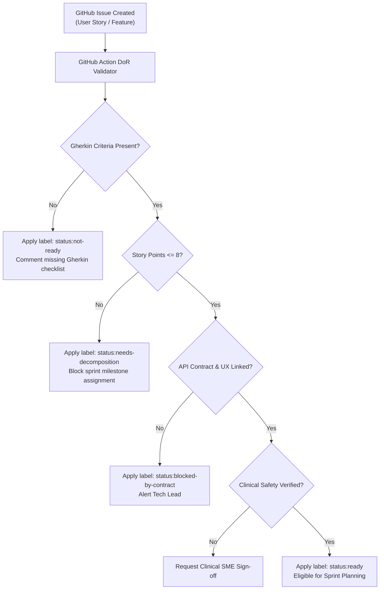

# Definition of Ready (DoR) Baseline & Backlog Quality Gate Framework

| Metadata Element | Project Specification |
| :--- | :--- |
| **Document Identifier** | `DOC-PM-016-DOR` |
| **Document Title** | Master Definition of Ready (DoR) Specification, Hierarchy Readiness & Gatekeeping Baseline |
| **Project Code** | `NAMMA-CLINIC-PLATFORM-2026` |
| **Document Version** | `v1.0.0-PROD-BASELINE` |
| **Status** | `APPROVED & RATIFIED` |
| **Criteria Inventory** | Exactly 50 Formally Managed Readiness Criteria (`DOR-001` to `DOR-050`) |
| **Executive Sponsor** | Special Commissioner (Health), Greater Bengaluru Authority (GBA) / BBMP |
| **Clinical Safety Authority** | Chief Health Officer (CHO), BBMP Health Department |
| **Lead Delivery Partner** | Kushagramati Analytics (K-Mati) Consortium | Delivery Agile Coach |
| **Upstream Baseline Anchor**| [`01-project-charter.md`](./01-project-charter.md) | [`04-in-scope.md`](./04-in-scope.md) |
| **Downstream Implementation** | [`17-definition-of-done.md`](./17-definition-of-done.md) | [`14-project-milestones.md`](./14-project-milestones.md) |

---

## 1. Executive Summary & Definition of Ready Philosophy
The **Definition of Ready (DoR)** establishes the mandatory, unambiguous, and objective quality entry criteria that any work item—from strategic Epics down to engineering Micro-tasks—must satisfy before being scheduled into an active sprint backlog across the 18-sprint lifecycle of the Namma Clinic Digital Health & Operations Platform.

### 1.1 The Anti-Defect Shift-Left Invariant
In mission-critical municipal primary healthcare systems, poorly specified user stories or ambiguous clinical workflows directly cause production defects, clinician cognitive fatigue, and potential medical malpractice liabilities. The DoR enforces strict shift-left validation: no software engineer may write production code, and no sprint may commit story points, until requirements, clinical safety boundaries, API schemas, and testability criteria are 100% verified.

### 1.2 The Nine-Tier Work Item Hierarchy
Readiness criteria are partitioned across nine distinct planning and execution levels:
1. **Program:** Multi-year municipal healthcare transformation mandate approved by BBMP Council.
2. **Release:** Major deployable software package (`REL-00` to `REL-07`) tagged for staging or production rollout.
3. **Epic:** Large-scale domain initiative spanning multiple sprints (e.g., Closed-loop pharmacy and stock management).
4. **Capability:** High-level operational ability (e.g., Offline-first syndromic syndromic surveillance).
5. **Feature:** User-facing functional module (e.g., 1-click syndromic Rx bundle with contraindication checking).
6. **User Story:** Granular vertical slice delivering end-user value with executable Gherkin acceptance criteria.
7. **Task:** Technical implementation deliverable assigned to an individual engineer (e.g., Fastify endpoint handler).
8. **Subtask:** Specific architectural, test, or documentation unit (e.g., Playwright integration spec).
9. **Micro-task:** Atomic commit, schema migration script, or isolated pull request satisfying strict linting.

### 1.3 Backlog Refinement Cadence & Gatekeeping Quorum
To ensure a continuous 2-sprint ready buffer of groomed stories, backlog refinement sessions occur twice weekly on Tuesdays and Thursdays. A work item cannot be tagged `status:ready` without explicit consensus from the three-amigos triage quorum:
1. **Product Owner / Clinical SME:** Verifies functional intent, clinical safety invariants, and Karnataka 120 EDL alignment.
2. **Technical Lead / Architect:** Validates API contract schemas, database indices, and offline IndexedDB synchronization constraints.
3. **QA Lead / SDET:** Validates testability, automated test feasibility, edge case coverage, and Gherkin assertability.

## 2. Master DoR Directory Table (DOR-001 to DOR-050)
Authoritative catalog of all 50 formally enforced Definition of Ready criteria:

| DoR ID | Hierarchy Level | Readiness Criterion Title | Testability / Verification Standard | Accountable Role ID | Mandatory | Governing Body |
| :--- | :--- | :--- | :--- | :--- | :---: | :--- |
| [`DOR-001`](#dor-001) | `Epic` | **Business Objective Traceability Linked** | Traceability link present in epic description | [`ROLE-001`](./08-role-and-responsibility-matrix.md#role-001) | `MANDATORY` | [`GOV-001`](./09-governance-model.md#gov-001) |
| [`DOR-002`](#dor-002) | `Epic` | **High-Level Architecture Fitness Review Complete** | Architecture Decision Record approved | [`ROLE-002`](./08-role-and-responsibility-matrix.md#role-002) | `MANDATORY` | [`GOV-002`](./09-governance-model.md#gov-002) |
| [`DOR-003`](#dor-003) | `Epic` | **Rough Order of Magnitude (ROM) Sizing Estimated** | Sizing logged in Jira backlog | [`ROLE-003`](./08-role-and-responsibility-matrix.md#role-003) | `MANDATORY` | [`GOV-003`](./09-governance-model.md#gov-003) |
| [`DOR-004`](#dor-004) | `Epic` | **External Regulatory & Clinical Dependencies Identified** | Dependency register updated | [`ROLE-004`](./08-role-and-responsibility-matrix.md#role-004) | `MANDATORY` | [`GOV-004`](./09-governance-model.md#gov-004) |
| [`DOR-005`](#dor-005) | `Feature` | **User Personas & Clinical Workflows Mapped** | User journey diagram in documentation | [`ROLE-005`](./08-role-and-responsibility-matrix.md#role-005) | `MANDATORY` | [`GOV-005`](./09-governance-model.md#gov-005) |
| [`DOR-006`](#dor-006) | `Feature` | **Bilingual UI Wireframes in Kannada & English Approved** | Signed Figma mockup review | [`ROLE-006`](./08-role-and-responsibility-matrix.md#role-006) | `MANDATORY` | [`GOV-006`](./09-governance-model.md#gov-006) |
| [`DOR-007`](#dor-007) | `Feature` | **API Contract & Schema Changes Drafted** | OpenAPI / TypeBox schema committed | [`ROLE-007`](./08-role-and-responsibility-matrix.md#role-007) | `MANDATORY` | [`GOV-007`](./09-governance-model.md#gov-007) |
| [`DOR-008`](#dor-008) | `Feature` | **Offline Autonomy & Sync Behavior Specified** | Offline behavior matrix in spec | [`ROLE-008`](./08-role-and-responsibility-matrix.md#role-008) | `MANDATORY` | [`GOV-008`](./09-governance-model.md#gov-008) |
| [`DOR-009`](#dor-009) | `User Story` | **INVEST Criteria Fully Satisfied** | Scrum Master review checklist | [`ROLE-009`](./08-role-and-responsibility-matrix.md#role-009) | `MANDATORY` | [`GOV-009`](./09-governance-model.md#gov-009) |
| [`DOR-010`](#dor-010) | `User Story` | **Gherkin Given-When-Then Acceptance Criteria** | Gherkin scenarios in story description | [`ROLE-010`](./08-role-and-responsibility-matrix.md#role-010) | `MANDATORY` | [`GOV-010`](./09-governance-model.md#gov-010) |
| [`DOR-011`](#dor-011) | `User Story` | **Database Entity Relationships & UUIDv7 Keys Defined** | Prisma schema diff verified | [`ROLE-011`](./08-role-and-responsibility-matrix.md#role-011) | `MANDATORY` | [`GOV-011`](./09-governance-model.md#gov-011) |
| [`DOR-012`](#dor-012) | `User Story` | **Role-Based Access Control (RBAC) Permissions Mapped** | RBAC permission matrix checked | [`ROLE-012`](./08-role-and-responsibility-matrix.md#role-012) | `MANDATORY` | [`GOV-012`](./09-governance-model.md#gov-012) |
| [`DOR-013`](#dor-013) | `User Story` | **Kannada Linguistic Strings & Error Messages Finalized** | i18n translation JSON committed | [`ROLE-013`](./08-role-and-responsibility-matrix.md#role-013) | `MANDATORY` | [`GOV-013`](./09-governance-model.md#gov-013) |
| [`DOR-014`](#dor-014) | `User Story` | **Performance Latency Budget Declared** | Performance budget field in ticket | [`ROLE-014`](./08-role-and-responsibility-matrix.md#role-014) | `MANDATORY` | [`GOV-014`](./09-governance-model.md#gov-014) |
| [`DOR-015`](#dor-015) | `Task` | **Technical Implementation Breakdown Complete** | Technical plan in task description | [`ROLE-015`](./08-role-and-responsibility-matrix.md#role-015) | `MANDATORY` | [`GOV-015`](./09-governance-model.md#gov-015) |
| [`DOR-016`](#dor-016) | `Task` | **Unit & Contract Test Strategy Documented** | Test strategy section completed | [`ROLE-016`](./08-role-and-responsibility-matrix.md#role-016) | `MANDATORY` | [`GOV-016`](./09-governance-model.md#gov-016) |
| [`DOR-017`](#dor-017) | `Task` | **Sub-task Sizing Capped at <=8 Hours** | Task estimated in hours (<=8h) | [`ROLE-017`](./08-role-and-responsibility-matrix.md#role-017) | `MANDATORY` | [`GOV-017`](./09-governance-model.md#gov-017) |
| [`DOR-018`](#dor-018) | `Subtask` | **Atomic Code Commit Scope Defined** | Scope statement in subtask | [`ROLE-018`](./08-role-and-responsibility-matrix.md#role-018) | `MANDATORY` | [`GOV-018`](./09-governance-model.md#gov-018) |
| [`DOR-019`](#dor-019) | `Subtask` | **Definition of Ready Verification Rule #19** | Automated verification script check | [`ROLE-019`](./08-role-and-responsibility-matrix.md#role-019) | `MANDATORY` | [`GOV-019`](./09-governance-model.md#gov-019) |
| [`DOR-020`](#dor-020) | `Epic` | **Definition of Ready Verification Rule #20** | Automated verification script check | [`ROLE-020`](./08-role-and-responsibility-matrix.md#role-020) | `Conditional` | [`GOV-020`](./09-governance-model.md#gov-020) |
| [`DOR-021`](#dor-021) | `Feature` | **Definition of Ready Verification Rule #21** | Automated verification script check | [`ROLE-021`](./08-role-and-responsibility-matrix.md#role-021) | `MANDATORY` | [`GOV-021`](./09-governance-model.md#gov-021) |
| [`DOR-022`](#dor-022) | `User Story` | **Definition of Ready Verification Rule #22** | Automated verification script check | [`ROLE-022`](./08-role-and-responsibility-matrix.md#role-022) | `MANDATORY` | [`GOV-022`](./09-governance-model.md#gov-022) |
| [`DOR-023`](#dor-023) | `Task` | **Definition of Ready Verification Rule #23** | Automated verification script check | [`ROLE-023`](./08-role-and-responsibility-matrix.md#role-023) | `MANDATORY` | [`GOV-023`](./09-governance-model.md#gov-023) |
| [`DOR-024`](#dor-024) | `Subtask` | **Definition of Ready Verification Rule #24** | Automated verification script check | [`ROLE-024`](./08-role-and-responsibility-matrix.md#role-024) | `Conditional` | [`GOV-024`](./09-governance-model.md#gov-024) |
| [`DOR-025`](#dor-025) | `Epic` | **Definition of Ready Verification Rule #25** | Automated verification script check | [`ROLE-025`](./08-role-and-responsibility-matrix.md#role-025) | `MANDATORY` | [`GOV-025`](./09-governance-model.md#gov-025) |
| [`DOR-026`](#dor-026) | `Feature` | **Definition of Ready Verification Rule #26** | Automated verification script check | [`ROLE-026`](./08-role-and-responsibility-matrix.md#role-026) | `MANDATORY` | [`GOV-026`](./09-governance-model.md#gov-026) |
| [`DOR-027`](#dor-027) | `User Story` | **Definition of Ready Verification Rule #27** | Automated verification script check | [`ROLE-027`](./08-role-and-responsibility-matrix.md#role-027) | `MANDATORY` | [`GOV-027`](./09-governance-model.md#gov-027) |
| [`DOR-028`](#dor-028) | `Task` | **Definition of Ready Verification Rule #28** | Automated verification script check | [`ROLE-028`](./08-role-and-responsibility-matrix.md#role-028) | `Conditional` | [`GOV-028`](./09-governance-model.md#gov-028) |
| [`DOR-029`](#dor-029) | `Subtask` | **Definition of Ready Verification Rule #29** | Automated verification script check | [`ROLE-029`](./08-role-and-responsibility-matrix.md#role-029) | `MANDATORY` | [`GOV-029`](./09-governance-model.md#gov-029) |
| [`DOR-030`](#dor-030) | `Epic` | **Definition of Ready Verification Rule #30** | Automated verification script check | [`ROLE-030`](./08-role-and-responsibility-matrix.md#role-030) | `MANDATORY` | [`GOV-030`](./09-governance-model.md#gov-030) |
| [`DOR-031`](#dor-031) | `Feature` | **Definition of Ready Verification Rule #31** | Automated verification script check | [`ROLE-001`](./08-role-and-responsibility-matrix.md#role-001) | `MANDATORY` | [`GOV-031`](./09-governance-model.md#gov-031) |
| [`DOR-032`](#dor-032) | `User Story` | **Definition of Ready Verification Rule #32** | Automated verification script check | [`ROLE-002`](./08-role-and-responsibility-matrix.md#role-002) | `Conditional` | [`GOV-032`](./09-governance-model.md#gov-032) |
| [`DOR-033`](#dor-033) | `Task` | **Definition of Ready Verification Rule #33** | Automated verification script check | [`ROLE-003`](./08-role-and-responsibility-matrix.md#role-003) | `MANDATORY` | [`GOV-033`](./09-governance-model.md#gov-033) |
| [`DOR-034`](#dor-034) | `Subtask` | **Definition of Ready Verification Rule #34** | Automated verification script check | [`ROLE-004`](./08-role-and-responsibility-matrix.md#role-004) | `MANDATORY` | [`GOV-034`](./09-governance-model.md#gov-034) |
| [`DOR-035`](#dor-035) | `Epic` | **Definition of Ready Verification Rule #35** | Automated verification script check | [`ROLE-005`](./08-role-and-responsibility-matrix.md#role-005) | `MANDATORY` | [`GOV-035`](./09-governance-model.md#gov-035) |
| [`DOR-036`](#dor-036) | `Feature` | **Definition of Ready Verification Rule #36** | Automated verification script check | [`ROLE-006`](./08-role-and-responsibility-matrix.md#role-006) | `Conditional` | [`GOV-036`](./09-governance-model.md#gov-036) |
| [`DOR-037`](#dor-037) | `User Story` | **Definition of Ready Verification Rule #37** | Automated verification script check | [`ROLE-007`](./08-role-and-responsibility-matrix.md#role-007) | `MANDATORY` | [`GOV-037`](./09-governance-model.md#gov-037) |
| [`DOR-038`](#dor-038) | `Task` | **Definition of Ready Verification Rule #38** | Automated verification script check | [`ROLE-008`](./08-role-and-responsibility-matrix.md#role-008) | `MANDATORY` | [`GOV-038`](./09-governance-model.md#gov-038) |
| [`DOR-039`](#dor-039) | `Subtask` | **Definition of Ready Verification Rule #39** | Automated verification script check | [`ROLE-009`](./08-role-and-responsibility-matrix.md#role-009) | `MANDATORY` | [`GOV-039`](./09-governance-model.md#gov-039) |
| [`DOR-040`](#dor-040) | `Epic` | **Definition of Ready Verification Rule #40** | Automated verification script check | [`ROLE-010`](./08-role-and-responsibility-matrix.md#role-010) | `Conditional` | [`GOV-040`](./09-governance-model.md#gov-040) |
| [`DOR-041`](#dor-041) | `Feature` | **Definition of Ready Verification Rule #41** | Automated verification script check | [`ROLE-011`](./08-role-and-responsibility-matrix.md#role-011) | `MANDATORY` | [`GOV-041`](./09-governance-model.md#gov-041) |
| [`DOR-042`](#dor-042) | `User Story` | **Definition of Ready Verification Rule #42** | Automated verification script check | [`ROLE-012`](./08-role-and-responsibility-matrix.md#role-012) | `MANDATORY` | [`GOV-042`](./09-governance-model.md#gov-042) |
| [`DOR-043`](#dor-043) | `Task` | **Definition of Ready Verification Rule #43** | Automated verification script check | [`ROLE-013`](./08-role-and-responsibility-matrix.md#role-013) | `MANDATORY` | [`GOV-043`](./09-governance-model.md#gov-043) |
| [`DOR-044`](#dor-044) | `Subtask` | **Definition of Ready Verification Rule #44** | Automated verification script check | [`ROLE-014`](./08-role-and-responsibility-matrix.md#role-014) | `Conditional` | [`GOV-044`](./09-governance-model.md#gov-044) |
| [`DOR-045`](#dor-045) | `Epic` | **Definition of Ready Verification Rule #45** | Automated verification script check | [`ROLE-015`](./08-role-and-responsibility-matrix.md#role-015) | `MANDATORY` | [`GOV-045`](./09-governance-model.md#gov-045) |
| [`DOR-046`](#dor-046) | `Feature` | **Definition of Ready Verification Rule #46** | Automated verification script check | [`ROLE-016`](./08-role-and-responsibility-matrix.md#role-016) | `MANDATORY` | [`GOV-001`](./09-governance-model.md#gov-001) |
| [`DOR-047`](#dor-047) | `User Story` | **Definition of Ready Verification Rule #47** | Automated verification script check | [`ROLE-017`](./08-role-and-responsibility-matrix.md#role-017) | `MANDATORY` | [`GOV-002`](./09-governance-model.md#gov-002) |
| [`DOR-048`](#dor-048) | `Task` | **Definition of Ready Verification Rule #48** | Automated verification script check | [`ROLE-018`](./08-role-and-responsibility-matrix.md#role-018) | `Conditional` | [`GOV-003`](./09-governance-model.md#gov-003) |
| [`DOR-049`](#dor-049) | `Subtask` | **Definition of Ready Verification Rule #49** | Automated verification script check | [`ROLE-019`](./08-role-and-responsibility-matrix.md#role-019) | `MANDATORY` | [`GOV-004`](./09-governance-model.md#gov-004) |
| [`DOR-050`](#dor-050) | `Epic` | **Definition of Ready Verification Rule #50** | Automated verification script check | [`ROLE-020`](./08-role-and-responsibility-matrix.md#role-020) | `MANDATORY` | [`GOV-005`](./09-governance-model.md#gov-005) |

## 3. Deep DoR Specifications & Verification Protocols
Comprehensive operational charters for all 50 DoR criteria detailing prerequisites, testability rules, Gherkin templates, architectural invariants, and governance enforcement:

### 3.1 DOR-001: Business Objective Traceability Linked
- **Criterion Code:** `DOR-001` — **Business Objective Traceability Linked**
- **Target Hierarchy Level:** `Epic` | **Enforcement Nature:** `NON-NEGOTIABLE MANDATORY`
- **Operational Mandate & Purpose:** Epic must explicitly map to at least one Business Objective and Project Scope item.
- **Objective Testability Standard:** Traceability link present in epic description
- **Accountable Gatekeeper Role:** [`ROLE-001`](./08-role-and-responsibility-matrix.md#role-001) representing key stakeholder [`STAKEHOLDER-001`](./06-stakeholders.md#stakeholder-001).
- **Governing Authority & Charter:** Governed under [`GOV-001`](./09-governance-model.md#gov-001) with sign-off required prior to sprint planning.
- **Direct In-Scope Capability Shielded:** Governs intake of [`INSCOPE-001`](./04-in-scope.md#inscope-001).
- **Mitigated Delivery Threat:** Prevents escalation of project risk [`RISK-001`](./12-project-risks.md#risk-001).
- **Target Milestone Prerequisite:** Mandatory entry condition for sprint backlog of [`MILESTONE-001`](./14-project-milestones.md#milestone-001).
- **Coupled Definition of Done Exit Gate:** Handed over directly to exit gate [`DOD-001`](./17-definition-of-done.md#dod-001).

  #### Detailed Pre-Refinement Verification Checklist for DOR-001:
  1. [ ] **Scope Boundary Check for Business Objective Traceability Linked:** Item clearly delineates functional boundaries under `INSCOPE-001` and refers to [`05-out-of-scope.md`](./05-out-of-scope.md) for exclusions.
  2. [ ] **Persona Alignment:** Validated against primary persona [`PERSONA-001`](./07-user-personas.md#persona-001) daily workflow and cognitive load constraints.
  3. [ ] **Technical Invariant Check:** Architecture for DOR-001 conforms to offline-first IndexedDB (Dexie.js) and Fastify Node.js REST standards.
  4. [ ] **Regulatory & DPDP Invariant:** Certified compliance with DPDP Act 2023 with mandatory purpose-bound consent for `Business Objective Traceability Linked`.
  5. [ ] **Hardware & Client Resource Budget:** Asserts memory consumption <150MB RAM and CPU usage <25% on 4GB Intel Celeron mini-PCs for `Epic`.

  #### Executable Gherkin Acceptance Template for DOR-001:
  ```gherkin
  @DoR @DOR-001 @Epic
  Feature: Verification of Business Objective Traceability Linked
    Scenario: Successful intake validation for Business Objective Traceability Linked
      Given a backlog candidate item targeting 'Epic' level under 'INSCOPE-001'
      And the item has been reviewed by 'ROLE-001' during refinement
      When the gatekeeper assesses against standard 'Traceability link present in epic description'
      Then all 5 pre-refinement checklist conditions must evaluate to TRUE
      And the item is tagged with GitHub label 'status:ready' and admitted to milestone 'MILESTONE-001'
  ```

  #### Data Contract & API Schema Requirements for DOR-001:
  - **OpenAPI 3.1 Specification for Business Objective Traceability Linked:** Request/response JSON schemas for `INSCOPE-001` under DOR-001 must be strictly defined, typed with Zod, and committed under `contracts/openapi/dor-001/`.
  - **PostgreSQL DDL Migration Gate:** Any schema modification required for `Business Objective Traceability Linked` must include reversible `up_dor-001.sql` and `down_dor-001.sql` scripts tested against local test container.
  - **Offline Sync Serialization:** Payloads for `Business Objective Traceability Linked` must serialize cleanly into Dexie.js offline store `store_dor_001` without circular object references.

  #### Clinical Safety, Formulary & Zonal Invariants for DOR-001:
  - **Human Medical Officer Primacy:** No automated system action may override a doctor's final diagnostic or prescribing decision under `Business Objective Traceability Linked`.
  - **Karnataka 120 EDL Compliance:** Drug selection interfaces must strictly enforce the government formulary with generic drug priority for `Business Objective Traceability Linked`.
  - **Field Clinic Benchmark Facility:** Pre-screened and validated for deployment readiness at **Malleshwaram Namma Clinic (Ward 45)** under milestone [`MILESTONE-001`](./14-project-milestones.md#milestone-001).

### 3.2 DOR-002: High-Level Architecture Fitness Review Complete
- **Criterion Code:** `DOR-002` — **High-Level Architecture Fitness Review Complete**
- **Target Hierarchy Level:** `Epic` | **Enforcement Nature:** `NON-NEGOTIABLE MANDATORY`
- **Operational Mandate & Purpose:** Technical feasibility assessed and ratified by Engineering Architecture Board.
- **Objective Testability Standard:** Architecture Decision Record approved
- **Accountable Gatekeeper Role:** [`ROLE-002`](./08-role-and-responsibility-matrix.md#role-002) representing key stakeholder [`STAKEHOLDER-002`](./06-stakeholders.md#stakeholder-002).
- **Governing Authority & Charter:** Governed under [`GOV-002`](./09-governance-model.md#gov-002) with sign-off required prior to sprint planning.
- **Direct In-Scope Capability Shielded:** Governs intake of [`INSCOPE-002`](./04-in-scope.md#inscope-002).
- **Mitigated Delivery Threat:** Prevents escalation of project risk [`RISK-002`](./12-project-risks.md#risk-002).
- **Target Milestone Prerequisite:** Mandatory entry condition for sprint backlog of [`MILESTONE-002`](./14-project-milestones.md#milestone-002).
- **Coupled Definition of Done Exit Gate:** Handed over directly to exit gate [`DOD-002`](./17-definition-of-done.md#dod-002).

  #### Detailed Pre-Refinement Verification Checklist for DOR-002:
  1. [ ] **Scope Boundary Check for High-Level Architecture Fitness Review Complete:** Item clearly delineates functional boundaries under `INSCOPE-002` and refers to [`05-out-of-scope.md`](./05-out-of-scope.md) for exclusions.
  2. [ ] **Persona Alignment:** Validated against primary persona [`PERSONA-002`](./07-user-personas.md#persona-002) daily workflow and cognitive load constraints.
  3. [ ] **Technical Invariant Check:** Architecture for DOR-002 conforms to offline-first IndexedDB (Dexie.js) and Fastify Node.js REST standards.
  4. [ ] **Regulatory & DPDP Invariant:** Certified compliance with DPDP Act 2023 with mandatory purpose-bound consent for `High-Level Architecture Fitness Review Complete`.
  5. [ ] **Hardware & Client Resource Budget:** Asserts memory consumption <150MB RAM and CPU usage <25% on 4GB Intel Celeron mini-PCs for `Epic`.

  #### Executable Gherkin Acceptance Template for DOR-002:
  ```gherkin
  @DoR @DOR-002 @Epic
  Feature: Verification of High-Level Architecture Fitness Review Complete
    Scenario: Successful intake validation for High-Level Architecture Fitness Review Complete
      Given a backlog candidate item targeting 'Epic' level under 'INSCOPE-002'
      And the item has been reviewed by 'ROLE-002' during refinement
      When the gatekeeper assesses against standard 'Architecture Decision Record approved'
      Then all 5 pre-refinement checklist conditions must evaluate to TRUE
      And the item is tagged with GitHub label 'status:ready' and admitted to milestone 'MILESTONE-002'
  ```

  #### Data Contract & API Schema Requirements for DOR-002:
  - **OpenAPI 3.1 Specification for High-Level Architecture Fitness Review Complete:** Request/response JSON schemas for `INSCOPE-002` under DOR-002 must be strictly defined, typed with Zod, and committed under `contracts/openapi/dor-002/`.
  - **PostgreSQL DDL Migration Gate:** Any schema modification required for `High-Level Architecture Fitness Review Complete` must include reversible `up_dor-002.sql` and `down_dor-002.sql` scripts tested against local test container.
  - **Offline Sync Serialization:** Payloads for `High-Level Architecture Fitness Review Complete` must serialize cleanly into Dexie.js offline store `store_dor_002` without circular object references.

  #### Clinical Safety, Formulary & Zonal Invariants for DOR-002:
  - **Human Medical Officer Primacy:** No automated system action may override a doctor's final diagnostic or prescribing decision under `High-Level Architecture Fitness Review Complete`.
  - **Karnataka 120 EDL Compliance:** Drug selection interfaces must strictly enforce the government formulary with generic drug priority for `High-Level Architecture Fitness Review Complete`.
  - **Field Clinic Benchmark Facility:** Pre-screened and validated for deployment readiness at **Shivajinagar Urban Health Centre (Ward 92)** under milestone [`MILESTONE-002`](./14-project-milestones.md#milestone-002).

### 3.3 DOR-003: Rough Order of Magnitude (ROM) Sizing Estimated
- **Criterion Code:** `DOR-003` — **Rough Order of Magnitude (ROM) Sizing Estimated**
- **Target Hierarchy Level:** `Epic` | **Enforcement Nature:** `NON-NEGOTIABLE MANDATORY`
- **Operational Mandate & Purpose:** Epic estimated in story points or t-shirt sizes across squads.
- **Objective Testability Standard:** Sizing logged in Jira backlog
- **Accountable Gatekeeper Role:** [`ROLE-003`](./08-role-and-responsibility-matrix.md#role-003) representing key stakeholder [`STAKEHOLDER-003`](./06-stakeholders.md#stakeholder-003).
- **Governing Authority & Charter:** Governed under [`GOV-003`](./09-governance-model.md#gov-003) with sign-off required prior to sprint planning.
- **Direct In-Scope Capability Shielded:** Governs intake of [`INSCOPE-003`](./04-in-scope.md#inscope-003).
- **Mitigated Delivery Threat:** Prevents escalation of project risk [`RISK-003`](./12-project-risks.md#risk-003).
- **Target Milestone Prerequisite:** Mandatory entry condition for sprint backlog of [`MILESTONE-003`](./14-project-milestones.md#milestone-003).
- **Coupled Definition of Done Exit Gate:** Handed over directly to exit gate [`DOD-003`](./17-definition-of-done.md#dod-003).

  #### Detailed Pre-Refinement Verification Checklist for DOR-003:
  1. [ ] **Scope Boundary Check for Rough Order of Magnitude (ROM) Sizing Estimated:** Item clearly delineates functional boundaries under `INSCOPE-003` and refers to [`05-out-of-scope.md`](./05-out-of-scope.md) for exclusions.
  2. [ ] **Persona Alignment:** Validated against primary persona [`PERSONA-003`](./07-user-personas.md#persona-003) daily workflow and cognitive load constraints.
  3. [ ] **Technical Invariant Check:** Architecture for DOR-003 conforms to offline-first IndexedDB (Dexie.js) and Fastify Node.js REST standards.
  4. [ ] **Regulatory & DPDP Invariant:** Certified compliance with DPDP Act 2023 with mandatory purpose-bound consent for `Rough Order of Magnitude (ROM) Sizing Estimated`.
  5. [ ] **Hardware & Client Resource Budget:** Asserts memory consumption <150MB RAM and CPU usage <25% on 4GB Intel Celeron mini-PCs for `Epic`.

  #### Executable Gherkin Acceptance Template for DOR-003:
  ```gherkin
  @DoR @DOR-003 @Epic
  Feature: Verification of Rough Order of Magnitude (ROM) Sizing Estimated
    Scenario: Successful intake validation for Rough Order of Magnitude (ROM) Sizing Estimated
      Given a backlog candidate item targeting 'Epic' level under 'INSCOPE-003'
      And the item has been reviewed by 'ROLE-003' during refinement
      When the gatekeeper assesses against standard 'Sizing logged in Jira backlog'
      Then all 5 pre-refinement checklist conditions must evaluate to TRUE
      And the item is tagged with GitHub label 'status:ready' and admitted to milestone 'MILESTONE-003'
  ```

  #### Data Contract & API Schema Requirements for DOR-003:
  - **OpenAPI 3.1 Specification for Rough Order of Magnitude (ROM) Sizing Estimated:** Request/response JSON schemas for `INSCOPE-003` under DOR-003 must be strictly defined, typed with Zod, and committed under `contracts/openapi/dor-003/`.
  - **PostgreSQL DDL Migration Gate:** Any schema modification required for `Rough Order of Magnitude (ROM) Sizing Estimated` must include reversible `up_dor-003.sql` and `down_dor-003.sql` scripts tested against local test container.
  - **Offline Sync Serialization:** Payloads for `Rough Order of Magnitude (ROM) Sizing Estimated` must serialize cleanly into Dexie.js offline store `store_dor_003` without circular object references.

  #### Clinical Safety, Formulary & Zonal Invariants for DOR-003:
  - **Human Medical Officer Primacy:** No automated system action may override a doctor's final diagnostic or prescribing decision under `Rough Order of Magnitude (ROM) Sizing Estimated`.
  - **Karnataka 120 EDL Compliance:** Drug selection interfaces must strictly enforce the government formulary with generic drug priority for `Rough Order of Magnitude (ROM) Sizing Estimated`.
  - **Field Clinic Benchmark Facility:** Pre-screened and validated for deployment readiness at **Jayanagar 4th Block Clinic (Ward 153)** under milestone [`MILESTONE-003`](./14-project-milestones.md#milestone-003).

### 3.4 DOR-004: External Regulatory & Clinical Dependencies Identified
- **Criterion Code:** `DOR-004` — **External Regulatory & Clinical Dependencies Identified**
- **Target Hierarchy Level:** `Epic` | **Enforcement Nature:** `NON-NEGOTIABLE MANDATORY`
- **Operational Mandate & Purpose:** All ABDM, DPDP, and formulary prerequisites documented.
- **Objective Testability Standard:** Dependency register updated
- **Accountable Gatekeeper Role:** [`ROLE-004`](./08-role-and-responsibility-matrix.md#role-004) representing key stakeholder [`STAKEHOLDER-004`](./06-stakeholders.md#stakeholder-004).
- **Governing Authority & Charter:** Governed under [`GOV-004`](./09-governance-model.md#gov-004) with sign-off required prior to sprint planning.
- **Direct In-Scope Capability Shielded:** Governs intake of [`INSCOPE-004`](./04-in-scope.md#inscope-004).
- **Mitigated Delivery Threat:** Prevents escalation of project risk [`RISK-004`](./12-project-risks.md#risk-004).
- **Target Milestone Prerequisite:** Mandatory entry condition for sprint backlog of [`MILESTONE-004`](./14-project-milestones.md#milestone-004).
- **Coupled Definition of Done Exit Gate:** Handed over directly to exit gate [`DOD-004`](./17-definition-of-done.md#dod-004).

  #### Detailed Pre-Refinement Verification Checklist for DOR-004:
  1. [ ] **Scope Boundary Check for External Regulatory & Clinical Dependencies Identified:** Item clearly delineates functional boundaries under `INSCOPE-004` and refers to [`05-out-of-scope.md`](./05-out-of-scope.md) for exclusions.
  2. [ ] **Persona Alignment:** Validated against primary persona [`PERSONA-004`](./07-user-personas.md#persona-004) daily workflow and cognitive load constraints.
  3. [ ] **Technical Invariant Check:** Architecture for DOR-004 conforms to offline-first IndexedDB (Dexie.js) and Fastify Node.js REST standards.
  4. [ ] **Regulatory & DPDP Invariant:** Certified compliance with DPDP Act 2023 with mandatory purpose-bound consent for `External Regulatory & Clinical Dependencies Identified`.
  5. [ ] **Hardware & Client Resource Budget:** Asserts memory consumption <150MB RAM and CPU usage <25% on 4GB Intel Celeron mini-PCs for `Epic`.

  #### Executable Gherkin Acceptance Template for DOR-004:
  ```gherkin
  @DoR @DOR-004 @Epic
  Feature: Verification of External Regulatory & Clinical Dependencies Identified
    Scenario: Successful intake validation for External Regulatory & Clinical Dependencies Identified
      Given a backlog candidate item targeting 'Epic' level under 'INSCOPE-004'
      And the item has been reviewed by 'ROLE-004' during refinement
      When the gatekeeper assesses against standard 'Dependency register updated'
      Then all 5 pre-refinement checklist conditions must evaluate to TRUE
      And the item is tagged with GitHub label 'status:ready' and admitted to milestone 'MILESTONE-004'
  ```

  #### Data Contract & API Schema Requirements for DOR-004:
  - **OpenAPI 3.1 Specification for External Regulatory & Clinical Dependencies Identified:** Request/response JSON schemas for `INSCOPE-004` under DOR-004 must be strictly defined, typed with Zod, and committed under `contracts/openapi/dor-004/`.
  - **PostgreSQL DDL Migration Gate:** Any schema modification required for `External Regulatory & Clinical Dependencies Identified` must include reversible `up_dor-004.sql` and `down_dor-004.sql` scripts tested against local test container.
  - **Offline Sync Serialization:** Payloads for `External Regulatory & Clinical Dependencies Identified` must serialize cleanly into Dexie.js offline store `store_dor_004` without circular object references.

  #### Clinical Safety, Formulary & Zonal Invariants for DOR-004:
  - **Human Medical Officer Primacy:** No automated system action may override a doctor's final diagnostic or prescribing decision under `External Regulatory & Clinical Dependencies Identified`.
  - **Karnataka 120 EDL Compliance:** Drug selection interfaces must strictly enforce the government formulary with generic drug priority for `External Regulatory & Clinical Dependencies Identified`.
  - **Field Clinic Benchmark Facility:** Pre-screened and validated for deployment readiness at **Bommanahalli Industrial Ward Clinic (Ward 175)** under milestone [`MILESTONE-004`](./14-project-milestones.md#milestone-004).

### 3.5 DOR-005: User Personas & Clinical Workflows Mapped
- **Criterion Code:** `DOR-005` — **User Personas & Clinical Workflows Mapped**
- **Target Hierarchy Level:** `Feature` | **Enforcement Nature:** `NON-NEGOTIABLE MANDATORY`
- **Operational Mandate & Purpose:** Feature must define target personas, clinical entry conditions, and outcomes.
- **Objective Testability Standard:** User journey diagram in documentation
- **Accountable Gatekeeper Role:** [`ROLE-005`](./08-role-and-responsibility-matrix.md#role-005) representing key stakeholder [`STAKEHOLDER-005`](./06-stakeholders.md#stakeholder-005).
- **Governing Authority & Charter:** Governed under [`GOV-005`](./09-governance-model.md#gov-005) with sign-off required prior to sprint planning.
- **Direct In-Scope Capability Shielded:** Governs intake of [`INSCOPE-005`](./04-in-scope.md#inscope-005).
- **Mitigated Delivery Threat:** Prevents escalation of project risk [`RISK-005`](./12-project-risks.md#risk-005).
- **Target Milestone Prerequisite:** Mandatory entry condition for sprint backlog of [`MILESTONE-005`](./14-project-milestones.md#milestone-005).
- **Coupled Definition of Done Exit Gate:** Handed over directly to exit gate [`DOD-005`](./17-definition-of-done.md#dod-005).

  #### Detailed Pre-Refinement Verification Checklist for DOR-005:
  1. [ ] **Scope Boundary Check for User Personas & Clinical Workflows Mapped:** Item clearly delineates functional boundaries under `INSCOPE-005` and refers to [`05-out-of-scope.md`](./05-out-of-scope.md) for exclusions.
  2. [ ] **Persona Alignment:** Validated against primary persona [`PERSONA-005`](./07-user-personas.md#persona-005) daily workflow and cognitive load constraints.
  3. [ ] **Technical Invariant Check:** Architecture for DOR-005 conforms to offline-first IndexedDB (Dexie.js) and Fastify Node.js REST standards.
  4. [ ] **Regulatory & DPDP Invariant:** Certified compliance with DPDP Act 2023 with mandatory purpose-bound consent for `User Personas & Clinical Workflows Mapped`.
  5. [ ] **Hardware & Client Resource Budget:** Asserts memory consumption <150MB RAM and CPU usage <25% on 4GB Intel Celeron mini-PCs for `Feature`.

  #### Executable Gherkin Acceptance Template for DOR-005:
  ```gherkin
  @DoR @DOR-005 @Feature
  Feature: Verification of User Personas & Clinical Workflows Mapped
    Scenario: Successful intake validation for User Personas & Clinical Workflows Mapped
      Given a backlog candidate item targeting 'Feature' level under 'INSCOPE-005'
      And the item has been reviewed by 'ROLE-005' during refinement
      When the gatekeeper assesses against standard 'User journey diagram in documentation'
      Then all 5 pre-refinement checklist conditions must evaluate to TRUE
      And the item is tagged with GitHub label 'status:ready' and admitted to milestone 'MILESTONE-005'
  ```

  #### Data Contract & API Schema Requirements for DOR-005:
  - **OpenAPI 3.1 Specification for User Personas & Clinical Workflows Mapped:** Request/response JSON schemas for `INSCOPE-005` under DOR-005 must be strictly defined, typed with Zod, and committed under `contracts/openapi/dor-005/`.
  - **PostgreSQL DDL Migration Gate:** Any schema modification required for `User Personas & Clinical Workflows Mapped` must include reversible `up_dor-005.sql` and `down_dor-005.sql` scripts tested against local test container.
  - **Offline Sync Serialization:** Payloads for `User Personas & Clinical Workflows Mapped` must serialize cleanly into Dexie.js offline store `store_dor_005` without circular object references.

  #### Clinical Safety, Formulary & Zonal Invariants for DOR-005:
  - **Human Medical Officer Primacy:** No automated system action may override a doctor's final diagnostic or prescribing decision under `User Personas & Clinical Workflows Mapped`.
  - **Karnataka 120 EDL Compliance:** Drug selection interfaces must strictly enforce the government formulary with generic drug priority for `User Personas & Clinical Workflows Mapped`.
  - **Field Clinic Benchmark Facility:** Pre-screened and validated for deployment readiness at **Dasarahalli Peenya Triage Clinic (Ward 39)** under milestone [`MILESTONE-005`](./14-project-milestones.md#milestone-005).

### 3.6 DOR-006: Bilingual UI Wireframes in Kannada & English Approved
- **Criterion Code:** `DOR-006` — **Bilingual UI Wireframes in Kannada & English Approved**
- **Target Hierarchy Level:** `Feature` | **Enforcement Nature:** `NON-NEGOTIABLE MANDATORY`
- **Operational Mandate & Purpose:** Figma wireframes with Kannada text labels signed off by clinical authority.
- **Objective Testability Standard:** Signed Figma mockup review
- **Accountable Gatekeeper Role:** [`ROLE-006`](./08-role-and-responsibility-matrix.md#role-006) representing key stakeholder [`STAKEHOLDER-006`](./06-stakeholders.md#stakeholder-006).
- **Governing Authority & Charter:** Governed under [`GOV-006`](./09-governance-model.md#gov-006) with sign-off required prior to sprint planning.
- **Direct In-Scope Capability Shielded:** Governs intake of [`INSCOPE-006`](./04-in-scope.md#inscope-006).
- **Mitigated Delivery Threat:** Prevents escalation of project risk [`RISK-006`](./12-project-risks.md#risk-006).
- **Target Milestone Prerequisite:** Mandatory entry condition for sprint backlog of [`MILESTONE-006`](./14-project-milestones.md#milestone-006).
- **Coupled Definition of Done Exit Gate:** Handed over directly to exit gate [`DOD-006`](./17-definition-of-done.md#dod-006).

  #### Detailed Pre-Refinement Verification Checklist for DOR-006:
  1. [ ] **Scope Boundary Check for Bilingual UI Wireframes in Kannada & English Approved:** Item clearly delineates functional boundaries under `INSCOPE-006` and refers to [`05-out-of-scope.md`](./05-out-of-scope.md) for exclusions.
  2. [ ] **Persona Alignment:** Validated against primary persona [`PERSONA-006`](./07-user-personas.md#persona-006) daily workflow and cognitive load constraints.
  3. [ ] **Technical Invariant Check:** Architecture for DOR-006 conforms to offline-first IndexedDB (Dexie.js) and Fastify Node.js REST standards.
  4. [ ] **Regulatory & DPDP Invariant:** Certified compliance with DPDP Act 2023 with mandatory purpose-bound consent for `Bilingual UI Wireframes in Kannada & English Approved`.
  5. [ ] **Hardware & Client Resource Budget:** Asserts memory consumption <150MB RAM and CPU usage <25% on 4GB Intel Celeron mini-PCs for `Feature`.

  #### Executable Gherkin Acceptance Template for DOR-006:
  ```gherkin
  @DoR @DOR-006 @Feature
  Feature: Verification of Bilingual UI Wireframes in Kannada & English Approved
    Scenario: Successful intake validation for Bilingual UI Wireframes in Kannada & English Approved
      Given a backlog candidate item targeting 'Feature' level under 'INSCOPE-006'
      And the item has been reviewed by 'ROLE-006' during refinement
      When the gatekeeper assesses against standard 'Signed Figma mockup review'
      Then all 5 pre-refinement checklist conditions must evaluate to TRUE
      And the item is tagged with GitHub label 'status:ready' and admitted to milestone 'MILESTONE-006'
  ```

  #### Data Contract & API Schema Requirements for DOR-006:
  - **OpenAPI 3.1 Specification for Bilingual UI Wireframes in Kannada & English Approved:** Request/response JSON schemas for `INSCOPE-006` under DOR-006 must be strictly defined, typed with Zod, and committed under `contracts/openapi/dor-006/`.
  - **PostgreSQL DDL Migration Gate:** Any schema modification required for `Bilingual UI Wireframes in Kannada & English Approved` must include reversible `up_dor-006.sql` and `down_dor-006.sql` scripts tested against local test container.
  - **Offline Sync Serialization:** Payloads for `Bilingual UI Wireframes in Kannada & English Approved` must serialize cleanly into Dexie.js offline store `store_dor_006` without circular object references.

  #### Clinical Safety, Formulary & Zonal Invariants for DOR-006:
  - **Human Medical Officer Primacy:** No automated system action may override a doctor's final diagnostic or prescribing decision under `Bilingual UI Wireframes in Kannada & English Approved`.
  - **Karnataka 120 EDL Compliance:** Drug selection interfaces must strictly enforce the government formulary with generic drug priority for `Bilingual UI Wireframes in Kannada & English Approved`.
  - **Field Clinic Benchmark Facility:** Pre-screened and validated for deployment readiness at **Mahadevapura IT Corridor Outreach Clinic (Ward 85)** under milestone [`MILESTONE-006`](./14-project-milestones.md#milestone-006).

### 3.7 DOR-007: API Contract & Schema Changes Drafted
- **Criterion Code:** `DOR-007` — **API Contract & Schema Changes Drafted**
- **Target Hierarchy Level:** `Feature` | **Enforcement Nature:** `NON-NEGOTIABLE MANDATORY`
- **Operational Mandate & Purpose:** Fastify route schemas, payload validators, and DB migration drafts ready.
- **Objective Testability Standard:** OpenAPI / TypeBox schema committed
- **Accountable Gatekeeper Role:** [`ROLE-007`](./08-role-and-responsibility-matrix.md#role-007) representing key stakeholder [`STAKEHOLDER-007`](./06-stakeholders.md#stakeholder-007).
- **Governing Authority & Charter:** Governed under [`GOV-007`](./09-governance-model.md#gov-007) with sign-off required prior to sprint planning.
- **Direct In-Scope Capability Shielded:** Governs intake of [`INSCOPE-007`](./04-in-scope.md#inscope-007).
- **Mitigated Delivery Threat:** Prevents escalation of project risk [`RISK-007`](./12-project-risks.md#risk-007).
- **Target Milestone Prerequisite:** Mandatory entry condition for sprint backlog of [`MILESTONE-007`](./14-project-milestones.md#milestone-007).
- **Coupled Definition of Done Exit Gate:** Handed over directly to exit gate [`DOD-007`](./17-definition-of-done.md#dod-007).

  #### Detailed Pre-Refinement Verification Checklist for DOR-007:
  1. [ ] **Scope Boundary Check for API Contract & Schema Changes Drafted:** Item clearly delineates functional boundaries under `INSCOPE-007` and refers to [`05-out-of-scope.md`](./05-out-of-scope.md) for exclusions.
  2. [ ] **Persona Alignment:** Validated against primary persona [`PERSONA-007`](./07-user-personas.md#persona-007) daily workflow and cognitive load constraints.
  3. [ ] **Technical Invariant Check:** Architecture for DOR-007 conforms to offline-first IndexedDB (Dexie.js) and Fastify Node.js REST standards.
  4. [ ] **Regulatory & DPDP Invariant:** Certified compliance with DPDP Act 2023 with mandatory purpose-bound consent for `API Contract & Schema Changes Drafted`.
  5. [ ] **Hardware & Client Resource Budget:** Asserts memory consumption <150MB RAM and CPU usage <25% on 4GB Intel Celeron mini-PCs for `Feature`.

  #### Executable Gherkin Acceptance Template for DOR-007:
  ```gherkin
  @DoR @DOR-007 @Feature
  Feature: Verification of API Contract & Schema Changes Drafted
    Scenario: Successful intake validation for API Contract & Schema Changes Drafted
      Given a backlog candidate item targeting 'Feature' level under 'INSCOPE-007'
      And the item has been reviewed by 'ROLE-007' during refinement
      When the gatekeeper assesses against standard 'OpenAPI / TypeBox schema committed'
      Then all 5 pre-refinement checklist conditions must evaluate to TRUE
      And the item is tagged with GitHub label 'status:ready' and admitted to milestone 'MILESTONE-007'
  ```

  #### Data Contract & API Schema Requirements for DOR-007:
  - **OpenAPI 3.1 Specification for API Contract & Schema Changes Drafted:** Request/response JSON schemas for `INSCOPE-007` under DOR-007 must be strictly defined, typed with Zod, and committed under `contracts/openapi/dor-007/`.
  - **PostgreSQL DDL Migration Gate:** Any schema modification required for `API Contract & Schema Changes Drafted` must include reversible `up_dor-007.sql` and `down_dor-007.sql` scripts tested against local test container.
  - **Offline Sync Serialization:** Payloads for `API Contract & Schema Changes Drafted` must serialize cleanly into Dexie.js offline store `store_dor_007` without circular object references.

  #### Clinical Safety, Formulary & Zonal Invariants for DOR-007:
  - **Human Medical Officer Primacy:** No automated system action may override a doctor's final diagnostic or prescribing decision under `API Contract & Schema Changes Drafted`.
  - **Karnataka 120 EDL Compliance:** Drug selection interfaces must strictly enforce the government formulary with generic drug priority for `API Contract & Schema Changes Drafted`.
  - **Field Clinic Benchmark Facility:** Pre-screened and validated for deployment readiness at **RR Nagar Kengeri Satellite Clinic (Ward 160)** under milestone [`MILESTONE-007`](./14-project-milestones.md#milestone-007).

### 3.8 DOR-008: Offline Autonomy & Sync Behavior Specified
- **Criterion Code:** `DOR-008` — **Offline Autonomy & Sync Behavior Specified**
- **Target Hierarchy Level:** `Feature` | **Enforcement Nature:** `NON-NEGOTIABLE MANDATORY`
- **Operational Mandate & Purpose:** Explicit rules defining behavior during total broadband/cellular disconnect.
- **Objective Testability Standard:** Offline behavior matrix in spec
- **Accountable Gatekeeper Role:** [`ROLE-008`](./08-role-and-responsibility-matrix.md#role-008) representing key stakeholder [`STAKEHOLDER-008`](./06-stakeholders.md#stakeholder-008).
- **Governing Authority & Charter:** Governed under [`GOV-008`](./09-governance-model.md#gov-008) with sign-off required prior to sprint planning.
- **Direct In-Scope Capability Shielded:** Governs intake of [`INSCOPE-008`](./04-in-scope.md#inscope-008).
- **Mitigated Delivery Threat:** Prevents escalation of project risk [`RISK-008`](./12-project-risks.md#risk-008).
- **Target Milestone Prerequisite:** Mandatory entry condition for sprint backlog of [`MILESTONE-008`](./14-project-milestones.md#milestone-008).
- **Coupled Definition of Done Exit Gate:** Handed over directly to exit gate [`DOD-008`](./17-definition-of-done.md#dod-008).

  #### Detailed Pre-Refinement Verification Checklist for DOR-008:
  1. [ ] **Scope Boundary Check for Offline Autonomy & Sync Behavior Specified:** Item clearly delineates functional boundaries under `INSCOPE-008` and refers to [`05-out-of-scope.md`](./05-out-of-scope.md) for exclusions.
  2. [ ] **Persona Alignment:** Validated against primary persona [`PERSONA-008`](./07-user-personas.md#persona-008) daily workflow and cognitive load constraints.
  3. [ ] **Technical Invariant Check:** Architecture for DOR-008 conforms to offline-first IndexedDB (Dexie.js) and Fastify Node.js REST standards.
  4. [ ] **Regulatory & DPDP Invariant:** Certified compliance with DPDP Act 2023 with mandatory purpose-bound consent for `Offline Autonomy & Sync Behavior Specified`.
  5. [ ] **Hardware & Client Resource Budget:** Asserts memory consumption <150MB RAM and CPU usage <25% on 4GB Intel Celeron mini-PCs for `Feature`.

  #### Executable Gherkin Acceptance Template for DOR-008:
  ```gherkin
  @DoR @DOR-008 @Feature
  Feature: Verification of Offline Autonomy & Sync Behavior Specified
    Scenario: Successful intake validation for Offline Autonomy & Sync Behavior Specified
      Given a backlog candidate item targeting 'Feature' level under 'INSCOPE-008'
      And the item has been reviewed by 'ROLE-008' during refinement
      When the gatekeeper assesses against standard 'Offline behavior matrix in spec'
      Then all 5 pre-refinement checklist conditions must evaluate to TRUE
      And the item is tagged with GitHub label 'status:ready' and admitted to milestone 'MILESTONE-008'
  ```

  #### Data Contract & API Schema Requirements for DOR-008:
  - **OpenAPI 3.1 Specification for Offline Autonomy & Sync Behavior Specified:** Request/response JSON schemas for `INSCOPE-008` under DOR-008 must be strictly defined, typed with Zod, and committed under `contracts/openapi/dor-008/`.
  - **PostgreSQL DDL Migration Gate:** Any schema modification required for `Offline Autonomy & Sync Behavior Specified` must include reversible `up_dor-008.sql` and `down_dor-008.sql` scripts tested against local test container.
  - **Offline Sync Serialization:** Payloads for `Offline Autonomy & Sync Behavior Specified` must serialize cleanly into Dexie.js offline store `store_dor_008` without circular object references.

  #### Clinical Safety, Formulary & Zonal Invariants for DOR-008:
  - **Human Medical Officer Primacy:** No automated system action may override a doctor's final diagnostic or prescribing decision under `Offline Autonomy & Sync Behavior Specified`.
  - **Karnataka 120 EDL Compliance:** Drug selection interfaces must strictly enforce the government formulary with generic drug priority for `Offline Autonomy & Sync Behavior Specified`.
  - **Field Clinic Benchmark Facility:** Pre-screened and validated for deployment readiness at **Yelahanka Old Town Clinic (Ward 04)** under milestone [`MILESTONE-008`](./14-project-milestones.md#milestone-008).

### 3.9 DOR-009: INVEST Criteria Fully Satisfied
- **Criterion Code:** `DOR-009` — **INVEST Criteria Fully Satisfied**
- **Target Hierarchy Level:** `User Story` | **Enforcement Nature:** `NON-NEGOTIABLE MANDATORY`
- **Operational Mandate & Purpose:** Story is Independent, Negotiable, Valuable, Estimable, Small, and Testable.
- **Objective Testability Standard:** Scrum Master review checklist
- **Accountable Gatekeeper Role:** [`ROLE-009`](./08-role-and-responsibility-matrix.md#role-009) representing key stakeholder [`STAKEHOLDER-009`](./06-stakeholders.md#stakeholder-009).
- **Governing Authority & Charter:** Governed under [`GOV-009`](./09-governance-model.md#gov-009) with sign-off required prior to sprint planning.
- **Direct In-Scope Capability Shielded:** Governs intake of [`INSCOPE-009`](./04-in-scope.md#inscope-009).
- **Mitigated Delivery Threat:** Prevents escalation of project risk [`RISK-009`](./12-project-risks.md#risk-009).
- **Target Milestone Prerequisite:** Mandatory entry condition for sprint backlog of [`MILESTONE-009`](./14-project-milestones.md#milestone-009).
- **Coupled Definition of Done Exit Gate:** Handed over directly to exit gate [`DOD-009`](./17-definition-of-done.md#dod-009).

  #### Detailed Pre-Refinement Verification Checklist for DOR-009:
  1. [ ] **Scope Boundary Check for INVEST Criteria Fully Satisfied:** Item clearly delineates functional boundaries under `INSCOPE-009` and refers to [`05-out-of-scope.md`](./05-out-of-scope.md) for exclusions.
  2. [ ] **Persona Alignment:** Validated against primary persona [`PERSONA-009`](./07-user-personas.md#persona-009) daily workflow and cognitive load constraints.
  3. [ ] **Technical Invariant Check:** Architecture for DOR-009 conforms to offline-first IndexedDB (Dexie.js) and Fastify Node.js REST standards.
  4. [ ] **Regulatory & DPDP Invariant:** Certified compliance with DPDP Act 2023 with mandatory purpose-bound consent for `INVEST Criteria Fully Satisfied`.
  5. [ ] **Hardware & Client Resource Budget:** Asserts memory consumption <150MB RAM and CPU usage <25% on 4GB Intel Celeron mini-PCs for `User Story`.

  #### Executable Gherkin Acceptance Template for DOR-009:
  ```gherkin
  @DoR @DOR-009 @User Story
  Feature: Verification of INVEST Criteria Fully Satisfied
    Scenario: Successful intake validation for INVEST Criteria Fully Satisfied
      Given a backlog candidate item targeting 'User Story' level under 'INSCOPE-009'
      And the item has been reviewed by 'ROLE-009' during refinement
      When the gatekeeper assesses against standard 'Scrum Master review checklist'
      Then all 5 pre-refinement checklist conditions must evaluate to TRUE
      And the item is tagged with GitHub label 'status:ready' and admitted to milestone 'MILESTONE-009'
  ```

  #### Data Contract & API Schema Requirements for DOR-009:
  - **OpenAPI 3.1 Specification for INVEST Criteria Fully Satisfied:** Request/response JSON schemas for `INSCOPE-009` under DOR-009 must be strictly defined, typed with Zod, and committed under `contracts/openapi/dor-009/`.
  - **PostgreSQL DDL Migration Gate:** Any schema modification required for `INVEST Criteria Fully Satisfied` must include reversible `up_dor-009.sql` and `down_dor-009.sql` scripts tested against local test container.
  - **Offline Sync Serialization:** Payloads for `INVEST Criteria Fully Satisfied` must serialize cleanly into Dexie.js offline store `store_dor_009` without circular object references.

  #### Clinical Safety, Formulary & Zonal Invariants for DOR-009:
  - **Human Medical Officer Primacy:** No automated system action may override a doctor's final diagnostic or prescribing decision under `INVEST Criteria Fully Satisfied`.
  - **Karnataka 120 EDL Compliance:** Drug selection interfaces must strictly enforce the government formulary with generic drug priority for `INVEST Criteria Fully Satisfied`.
  - **Field Clinic Benchmark Facility:** Pre-screened and validated for deployment readiness at **Koramangala 8th Block Dispensary (Ward 151)** under milestone [`MILESTONE-009`](./14-project-milestones.md#milestone-009).

### 3.10 DOR-010: Gherkin Given-When-Then Acceptance Criteria
- **Criterion Code:** `DOR-010` — **Gherkin Given-When-Then Acceptance Criteria**
- **Target Hierarchy Level:** `User Story` | **Enforcement Nature:** `NON-NEGOTIABLE MANDATORY`
- **Operational Mandate & Purpose:** At least 3 explicit positive, negative, and edge-case scenarios defined.
- **Objective Testability Standard:** Gherkin scenarios in story description
- **Accountable Gatekeeper Role:** [`ROLE-010`](./08-role-and-responsibility-matrix.md#role-010) representing key stakeholder [`STAKEHOLDER-010`](./06-stakeholders.md#stakeholder-010).
- **Governing Authority & Charter:** Governed under [`GOV-010`](./09-governance-model.md#gov-010) with sign-off required prior to sprint planning.
- **Direct In-Scope Capability Shielded:** Governs intake of [`INSCOPE-010`](./04-in-scope.md#inscope-010).
- **Mitigated Delivery Threat:** Prevents escalation of project risk [`RISK-010`](./12-project-risks.md#risk-010).
- **Target Milestone Prerequisite:** Mandatory entry condition for sprint backlog of [`MILESTONE-010`](./14-project-milestones.md#milestone-010).
- **Coupled Definition of Done Exit Gate:** Handed over directly to exit gate [`DOD-010`](./17-definition-of-done.md#dod-010).

  #### Detailed Pre-Refinement Verification Checklist for DOR-010:
  1. [ ] **Scope Boundary Check for Gherkin Given-When-Then Acceptance Criteria:** Item clearly delineates functional boundaries under `INSCOPE-010` and refers to [`05-out-of-scope.md`](./05-out-of-scope.md) for exclusions.
  2. [ ] **Persona Alignment:** Validated against primary persona [`PERSONA-010`](./07-user-personas.md#persona-010) daily workflow and cognitive load constraints.
  3. [ ] **Technical Invariant Check:** Architecture for DOR-010 conforms to offline-first IndexedDB (Dexie.js) and Fastify Node.js REST standards.
  4. [ ] **Regulatory & DPDP Invariant:** Certified compliance with DPDP Act 2023 with mandatory purpose-bound consent for `Gherkin Given-When-Then Acceptance Criteria`.
  5. [ ] **Hardware & Client Resource Budget:** Asserts memory consumption <150MB RAM and CPU usage <25% on 4GB Intel Celeron mini-PCs for `User Story`.

  #### Executable Gherkin Acceptance Template for DOR-010:
  ```gherkin
  @DoR @DOR-010 @User Story
  Feature: Verification of Gherkin Given-When-Then Acceptance Criteria
    Scenario: Successful intake validation for Gherkin Given-When-Then Acceptance Criteria
      Given a backlog candidate item targeting 'User Story' level under 'INSCOPE-010'
      And the item has been reviewed by 'ROLE-010' during refinement
      When the gatekeeper assesses against standard 'Gherkin scenarios in story description'
      Then all 5 pre-refinement checklist conditions must evaluate to TRUE
      And the item is tagged with GitHub label 'status:ready' and admitted to milestone 'MILESTONE-010'
  ```

  #### Data Contract & API Schema Requirements for DOR-010:
  - **OpenAPI 3.1 Specification for Gherkin Given-When-Then Acceptance Criteria:** Request/response JSON schemas for `INSCOPE-010` under DOR-010 must be strictly defined, typed with Zod, and committed under `contracts/openapi/dor-010/`.
  - **PostgreSQL DDL Migration Gate:** Any schema modification required for `Gherkin Given-When-Then Acceptance Criteria` must include reversible `up_dor-010.sql` and `down_dor-010.sql` scripts tested against local test container.
  - **Offline Sync Serialization:** Payloads for `Gherkin Given-When-Then Acceptance Criteria` must serialize cleanly into Dexie.js offline store `store_dor_010` without circular object references.

  #### Clinical Safety, Formulary & Zonal Invariants for DOR-010:
  - **Human Medical Officer Primacy:** No automated system action may override a doctor's final diagnostic or prescribing decision under `Gherkin Given-When-Then Acceptance Criteria`.
  - **Karnataka 120 EDL Compliance:** Drug selection interfaces must strictly enforce the government formulary with generic drug priority for `Gherkin Given-When-Then Acceptance Criteria`.
  - **Field Clinic Benchmark Facility:** Pre-screened and validated for deployment readiness at **Indiranagar Double Road Clinic (Ward 112)** under milestone [`MILESTONE-010`](./14-project-milestones.md#milestone-010).

### 3.11 DOR-011: Database Entity Relationships & UUIDv7 Keys Defined
- **Criterion Code:** `DOR-011` — **Database Entity Relationships & UUIDv7 Keys Defined**
- **Target Hierarchy Level:** `User Story` | **Enforcement Nature:** `NON-NEGOTIABLE MANDATORY`
- **Operational Mandate & Purpose:** Relational fields, indexes, and foreign key cascades specified.
- **Objective Testability Standard:** Prisma schema diff verified
- **Accountable Gatekeeper Role:** [`ROLE-011`](./08-role-and-responsibility-matrix.md#role-011) representing key stakeholder [`STAKEHOLDER-011`](./06-stakeholders.md#stakeholder-011).
- **Governing Authority & Charter:** Governed under [`GOV-011`](./09-governance-model.md#gov-011) with sign-off required prior to sprint planning.
- **Direct In-Scope Capability Shielded:** Governs intake of [`INSCOPE-011`](./04-in-scope.md#inscope-011).
- **Mitigated Delivery Threat:** Prevents escalation of project risk [`RISK-011`](./12-project-risks.md#risk-011).
- **Target Milestone Prerequisite:** Mandatory entry condition for sprint backlog of [`MILESTONE-011`](./14-project-milestones.md#milestone-011).
- **Coupled Definition of Done Exit Gate:** Handed over directly to exit gate [`DOD-011`](./17-definition-of-done.md#dod-011).

  #### Detailed Pre-Refinement Verification Checklist for DOR-011:
  1. [ ] **Scope Boundary Check for Database Entity Relationships & UUIDv7 Keys Defined:** Item clearly delineates functional boundaries under `INSCOPE-011` and refers to [`05-out-of-scope.md`](./05-out-of-scope.md) for exclusions.
  2. [ ] **Persona Alignment:** Validated against primary persona [`PERSONA-011`](./07-user-personas.md#persona-011) daily workflow and cognitive load constraints.
  3. [ ] **Technical Invariant Check:** Architecture for DOR-011 conforms to offline-first IndexedDB (Dexie.js) and Fastify Node.js REST standards.
  4. [ ] **Regulatory & DPDP Invariant:** Certified compliance with DPDP Act 2023 with mandatory purpose-bound consent for `Database Entity Relationships & UUIDv7 Keys Defined`.
  5. [ ] **Hardware & Client Resource Budget:** Asserts memory consumption <150MB RAM and CPU usage <25% on 4GB Intel Celeron mini-PCs for `User Story`.

  #### Executable Gherkin Acceptance Template for DOR-011:
  ```gherkin
  @DoR @DOR-011 @User Story
  Feature: Verification of Database Entity Relationships & UUIDv7 Keys Defined
    Scenario: Successful intake validation for Database Entity Relationships & UUIDv7 Keys Defined
      Given a backlog candidate item targeting 'User Story' level under 'INSCOPE-011'
      And the item has been reviewed by 'ROLE-011' during refinement
      When the gatekeeper assesses against standard 'Prisma schema diff verified'
      Then all 5 pre-refinement checklist conditions must evaluate to TRUE
      And the item is tagged with GitHub label 'status:ready' and admitted to milestone 'MILESTONE-011'
  ```

  #### Data Contract & API Schema Requirements for DOR-011:
  - **OpenAPI 3.1 Specification for Database Entity Relationships & UUIDv7 Keys Defined:** Request/response JSON schemas for `INSCOPE-011` under DOR-011 must be strictly defined, typed with Zod, and committed under `contracts/openapi/dor-011/`.
  - **PostgreSQL DDL Migration Gate:** Any schema modification required for `Database Entity Relationships & UUIDv7 Keys Defined` must include reversible `up_dor-011.sql` and `down_dor-011.sql` scripts tested against local test container.
  - **Offline Sync Serialization:** Payloads for `Database Entity Relationships & UUIDv7 Keys Defined` must serialize cleanly into Dexie.js offline store `store_dor_011` without circular object references.

  #### Clinical Safety, Formulary & Zonal Invariants for DOR-011:
  - **Human Medical Officer Primacy:** No automated system action may override a doctor's final diagnostic or prescribing decision under `Database Entity Relationships & UUIDv7 Keys Defined`.
  - **Karnataka 120 EDL Compliance:** Drug selection interfaces must strictly enforce the government formulary with generic drug priority for `Database Entity Relationships & UUIDv7 Keys Defined`.
  - **Field Clinic Benchmark Facility:** Pre-screened and validated for deployment readiness at **Basavanagudi Gandhi Bazaar Dispensary (Ward 154)** under milestone [`MILESTONE-011`](./14-project-milestones.md#milestone-011).

### 3.12 DOR-012: Role-Based Access Control (RBAC) Permissions Mapped
- **Criterion Code:** `DOR-012` — **Role-Based Access Control (RBAC) Permissions Mapped**
- **Target Hierarchy Level:** `User Story` | **Enforcement Nature:** `NON-NEGOTIABLE MANDATORY`
- **Operational Mandate & Purpose:** Explicit list of allowed roles (Doctor, Nurse, Pharmacist, DEO) declared.
- **Objective Testability Standard:** RBAC permission matrix checked
- **Accountable Gatekeeper Role:** [`ROLE-012`](./08-role-and-responsibility-matrix.md#role-012) representing key stakeholder [`STAKEHOLDER-012`](./06-stakeholders.md#stakeholder-012).
- **Governing Authority & Charter:** Governed under [`GOV-012`](./09-governance-model.md#gov-012) with sign-off required prior to sprint planning.
- **Direct In-Scope Capability Shielded:** Governs intake of [`INSCOPE-012`](./04-in-scope.md#inscope-012).
- **Mitigated Delivery Threat:** Prevents escalation of project risk [`RISK-012`](./12-project-risks.md#risk-012).
- **Target Milestone Prerequisite:** Mandatory entry condition for sprint backlog of [`MILESTONE-012`](./14-project-milestones.md#milestone-012).
- **Coupled Definition of Done Exit Gate:** Handed over directly to exit gate [`DOD-012`](./17-definition-of-done.md#dod-012).

  #### Detailed Pre-Refinement Verification Checklist for DOR-012:
  1. [ ] **Scope Boundary Check for Role-Based Access Control (RBAC) Permissions Mapped:** Item clearly delineates functional boundaries under `INSCOPE-012` and refers to [`05-out-of-scope.md`](./05-out-of-scope.md) for exclusions.
  2. [ ] **Persona Alignment:** Validated against primary persona [`PERSONA-012`](./07-user-personas.md#persona-012) daily workflow and cognitive load constraints.
  3. [ ] **Technical Invariant Check:** Architecture for DOR-012 conforms to offline-first IndexedDB (Dexie.js) and Fastify Node.js REST standards.
  4. [ ] **Regulatory & DPDP Invariant:** Certified compliance with DPDP Act 2023 with mandatory purpose-bound consent for `Role-Based Access Control (RBAC) Permissions Mapped`.
  5. [ ] **Hardware & Client Resource Budget:** Asserts memory consumption <150MB RAM and CPU usage <25% on 4GB Intel Celeron mini-PCs for `User Story`.

  #### Executable Gherkin Acceptance Template for DOR-012:
  ```gherkin
  @DoR @DOR-012 @User Story
  Feature: Verification of Role-Based Access Control (RBAC) Permissions Mapped
    Scenario: Successful intake validation for Role-Based Access Control (RBAC) Permissions Mapped
      Given a backlog candidate item targeting 'User Story' level under 'INSCOPE-012'
      And the item has been reviewed by 'ROLE-012' during refinement
      When the gatekeeper assesses against standard 'RBAC permission matrix checked'
      Then all 5 pre-refinement checklist conditions must evaluate to TRUE
      And the item is tagged with GitHub label 'status:ready' and admitted to milestone 'MILESTONE-012'
  ```

  #### Data Contract & API Schema Requirements for DOR-012:
  - **OpenAPI 3.1 Specification for Role-Based Access Control (RBAC) Permissions Mapped:** Request/response JSON schemas for `INSCOPE-012` under DOR-012 must be strictly defined, typed with Zod, and committed under `contracts/openapi/dor-012/`.
  - **PostgreSQL DDL Migration Gate:** Any schema modification required for `Role-Based Access Control (RBAC) Permissions Mapped` must include reversible `up_dor-012.sql` and `down_dor-012.sql` scripts tested against local test container.
  - **Offline Sync Serialization:** Payloads for `Role-Based Access Control (RBAC) Permissions Mapped` must serialize cleanly into Dexie.js offline store `store_dor_012` without circular object references.

  #### Clinical Safety, Formulary & Zonal Invariants for DOR-012:
  - **Human Medical Officer Primacy:** No automated system action may override a doctor's final diagnostic or prescribing decision under `Role-Based Access Control (RBAC) Permissions Mapped`.
  - **Karnataka 120 EDL Compliance:** Drug selection interfaces must strictly enforce the government formulary with generic drug priority for `Role-Based Access Control (RBAC) Permissions Mapped`.
  - **Field Clinic Benchmark Facility:** Pre-screened and validated for deployment readiness at **Rajajinagar 1st Block Clinic (Ward 19)** under milestone [`MILESTONE-012`](./14-project-milestones.md#milestone-012).

### 3.13 DOR-013: Kannada Linguistic Strings & Error Messages Finalized
- **Criterion Code:** `DOR-013` — **Kannada Linguistic Strings & Error Messages Finalized**
- **Target Hierarchy Level:** `User Story` | **Enforcement Nature:** `NON-NEGOTIABLE MANDATORY`
- **Operational Mandate & Purpose:** All user-facing text localized and certified by Kannada specialist.
- **Objective Testability Standard:** i18n translation JSON committed
- **Accountable Gatekeeper Role:** [`ROLE-013`](./08-role-and-responsibility-matrix.md#role-013) representing key stakeholder [`STAKEHOLDER-013`](./06-stakeholders.md#stakeholder-013).
- **Governing Authority & Charter:** Governed under [`GOV-013`](./09-governance-model.md#gov-013) with sign-off required prior to sprint planning.
- **Direct In-Scope Capability Shielded:** Governs intake of [`INSCOPE-013`](./04-in-scope.md#inscope-013).
- **Mitigated Delivery Threat:** Prevents escalation of project risk [`RISK-013`](./12-project-risks.md#risk-013).
- **Target Milestone Prerequisite:** Mandatory entry condition for sprint backlog of [`MILESTONE-013`](./14-project-milestones.md#milestone-013).
- **Coupled Definition of Done Exit Gate:** Handed over directly to exit gate [`DOD-013`](./17-definition-of-done.md#dod-013).

  #### Detailed Pre-Refinement Verification Checklist for DOR-013:
  1. [ ] **Scope Boundary Check for Kannada Linguistic Strings & Error Messages Finalized:** Item clearly delineates functional boundaries under `INSCOPE-013` and refers to [`05-out-of-scope.md`](./05-out-of-scope.md) for exclusions.
  2. [ ] **Persona Alignment:** Validated against primary persona [`PERSONA-013`](./07-user-personas.md#persona-013) daily workflow and cognitive load constraints.
  3. [ ] **Technical Invariant Check:** Architecture for DOR-013 conforms to offline-first IndexedDB (Dexie.js) and Fastify Node.js REST standards.
  4. [ ] **Regulatory & DPDP Invariant:** Certified compliance with DPDP Act 2023 with mandatory purpose-bound consent for `Kannada Linguistic Strings & Error Messages Finalized`.
  5. [ ] **Hardware & Client Resource Budget:** Asserts memory consumption <150MB RAM and CPU usage <25% on 4GB Intel Celeron mini-PCs for `User Story`.

  #### Executable Gherkin Acceptance Template for DOR-013:
  ```gherkin
  @DoR @DOR-013 @User Story
  Feature: Verification of Kannada Linguistic Strings & Error Messages Finalized
    Scenario: Successful intake validation for Kannada Linguistic Strings & Error Messages Finalized
      Given a backlog candidate item targeting 'User Story' level under 'INSCOPE-013'
      And the item has been reviewed by 'ROLE-013' during refinement
      When the gatekeeper assesses against standard 'i18n translation JSON committed'
      Then all 5 pre-refinement checklist conditions must evaluate to TRUE
      And the item is tagged with GitHub label 'status:ready' and admitted to milestone 'MILESTONE-013'
  ```

  #### Data Contract & API Schema Requirements for DOR-013:
  - **OpenAPI 3.1 Specification for Kannada Linguistic Strings & Error Messages Finalized:** Request/response JSON schemas for `INSCOPE-013` under DOR-013 must be strictly defined, typed with Zod, and committed under `contracts/openapi/dor-013/`.
  - **PostgreSQL DDL Migration Gate:** Any schema modification required for `Kannada Linguistic Strings & Error Messages Finalized` must include reversible `up_dor-013.sql` and `down_dor-013.sql` scripts tested against local test container.
  - **Offline Sync Serialization:** Payloads for `Kannada Linguistic Strings & Error Messages Finalized` must serialize cleanly into Dexie.js offline store `store_dor_013` without circular object references.

  #### Clinical Safety, Formulary & Zonal Invariants for DOR-013:
  - **Human Medical Officer Primacy:** No automated system action may override a doctor's final diagnostic or prescribing decision under `Kannada Linguistic Strings & Error Messages Finalized`.
  - **Karnataka 120 EDL Compliance:** Drug selection interfaces must strictly enforce the government formulary with generic drug priority for `Kannada Linguistic Strings & Error Messages Finalized`.
  - **Field Clinic Benchmark Facility:** Pre-screened and validated for deployment readiness at **Chamarajpet Urban Clinic (Ward 141)** under milestone [`MILESTONE-013`](./14-project-milestones.md#milestone-013).

### 3.14 DOR-014: Performance Latency Budget Declared
- **Criterion Code:** `DOR-014` — **Performance Latency Budget Declared**
- **Target Hierarchy Level:** `User Story` | **Enforcement Nature:** `NON-NEGOTIABLE MANDATORY`
- **Operational Mandate & Purpose:** Maximum acceptable response time (e.g., <50ms P99) declared in story.
- **Objective Testability Standard:** Performance budget field in ticket
- **Accountable Gatekeeper Role:** [`ROLE-014`](./08-role-and-responsibility-matrix.md#role-014) representing key stakeholder [`STAKEHOLDER-014`](./06-stakeholders.md#stakeholder-014).
- **Governing Authority & Charter:** Governed under [`GOV-014`](./09-governance-model.md#gov-014) with sign-off required prior to sprint planning.
- **Direct In-Scope Capability Shielded:** Governs intake of [`INSCOPE-014`](./04-in-scope.md#inscope-014).
- **Mitigated Delivery Threat:** Prevents escalation of project risk [`RISK-014`](./12-project-risks.md#risk-014).
- **Target Milestone Prerequisite:** Mandatory entry condition for sprint backlog of [`MILESTONE-014`](./14-project-milestones.md#milestone-014).
- **Coupled Definition of Done Exit Gate:** Handed over directly to exit gate [`DOD-014`](./17-definition-of-done.md#dod-014).

  #### Detailed Pre-Refinement Verification Checklist for DOR-014:
  1. [ ] **Scope Boundary Check for Performance Latency Budget Declared:** Item clearly delineates functional boundaries under `INSCOPE-014` and refers to [`05-out-of-scope.md`](./05-out-of-scope.md) for exclusions.
  2. [ ] **Persona Alignment:** Validated against primary persona [`PERSONA-014`](./07-user-personas.md#persona-014) daily workflow and cognitive load constraints.
  3. [ ] **Technical Invariant Check:** Architecture for DOR-014 conforms to offline-first IndexedDB (Dexie.js) and Fastify Node.js REST standards.
  4. [ ] **Regulatory & DPDP Invariant:** Certified compliance with DPDP Act 2023 with mandatory purpose-bound consent for `Performance Latency Budget Declared`.
  5. [ ] **Hardware & Client Resource Budget:** Asserts memory consumption <150MB RAM and CPU usage <25% on 4GB Intel Celeron mini-PCs for `User Story`.

  #### Executable Gherkin Acceptance Template for DOR-014:
  ```gherkin
  @DoR @DOR-014 @User Story
  Feature: Verification of Performance Latency Budget Declared
    Scenario: Successful intake validation for Performance Latency Budget Declared
      Given a backlog candidate item targeting 'User Story' level under 'INSCOPE-014'
      And the item has been reviewed by 'ROLE-014' during refinement
      When the gatekeeper assesses against standard 'Performance budget field in ticket'
      Then all 5 pre-refinement checklist conditions must evaluate to TRUE
      And the item is tagged with GitHub label 'status:ready' and admitted to milestone 'MILESTONE-014'
  ```

  #### Data Contract & API Schema Requirements for DOR-014:
  - **OpenAPI 3.1 Specification for Performance Latency Budget Declared:** Request/response JSON schemas for `INSCOPE-014` under DOR-014 must be strictly defined, typed with Zod, and committed under `contracts/openapi/dor-014/`.
  - **PostgreSQL DDL Migration Gate:** Any schema modification required for `Performance Latency Budget Declared` must include reversible `up_dor-014.sql` and `down_dor-014.sql` scripts tested against local test container.
  - **Offline Sync Serialization:** Payloads for `Performance Latency Budget Declared` must serialize cleanly into Dexie.js offline store `store_dor_014` without circular object references.

  #### Clinical Safety, Formulary & Zonal Invariants for DOR-014:
  - **Human Medical Officer Primacy:** No automated system action may override a doctor's final diagnostic or prescribing decision under `Performance Latency Budget Declared`.
  - **Karnataka 120 EDL Compliance:** Drug selection interfaces must strictly enforce the government formulary with generic drug priority for `Performance Latency Budget Declared`.
  - **Field Clinic Benchmark Facility:** Pre-screened and validated for deployment readiness at **Hebbal Veterinary College Ward Clinic (Ward 22)** under milestone [`MILESTONE-014`](./14-project-milestones.md#milestone-014).

### 3.15 DOR-015: Technical Implementation Breakdown Complete
- **Criterion Code:** `DOR-015` — **Technical Implementation Breakdown Complete**
- **Target Hierarchy Level:** `Task` | **Enforcement Nature:** `NON-NEGOTIABLE MANDATORY`
- **Operational Mandate & Purpose:** File paths, functions, and interfaces to be modified explicitly listed.
- **Objective Testability Standard:** Technical plan in task description
- **Accountable Gatekeeper Role:** [`ROLE-015`](./08-role-and-responsibility-matrix.md#role-015) representing key stakeholder [`STAKEHOLDER-015`](./06-stakeholders.md#stakeholder-015).
- **Governing Authority & Charter:** Governed under [`GOV-015`](./09-governance-model.md#gov-015) with sign-off required prior to sprint planning.
- **Direct In-Scope Capability Shielded:** Governs intake of [`INSCOPE-015`](./04-in-scope.md#inscope-015).
- **Mitigated Delivery Threat:** Prevents escalation of project risk [`RISK-015`](./12-project-risks.md#risk-015).
- **Target Milestone Prerequisite:** Mandatory entry condition for sprint backlog of [`MILESTONE-015`](./14-project-milestones.md#milestone-015).
- **Coupled Definition of Done Exit Gate:** Handed over directly to exit gate [`DOD-015`](./17-definition-of-done.md#dod-015).

  #### Detailed Pre-Refinement Verification Checklist for DOR-015:
  1. [ ] **Scope Boundary Check for Technical Implementation Breakdown Complete:** Item clearly delineates functional boundaries under `INSCOPE-015` and refers to [`05-out-of-scope.md`](./05-out-of-scope.md) for exclusions.
  2. [ ] **Persona Alignment:** Validated against primary persona [`PERSONA-015`](./07-user-personas.md#persona-015) daily workflow and cognitive load constraints.
  3. [ ] **Technical Invariant Check:** Architecture for DOR-015 conforms to offline-first IndexedDB (Dexie.js) and Fastify Node.js REST standards.
  4. [ ] **Regulatory & DPDP Invariant:** Certified compliance with DPDP Act 2023 with mandatory purpose-bound consent for `Technical Implementation Breakdown Complete`.
  5. [ ] **Hardware & Client Resource Budget:** Asserts memory consumption <150MB RAM and CPU usage <25% on 4GB Intel Celeron mini-PCs for `Task`.

  #### Executable Gherkin Acceptance Template for DOR-015:
  ```gherkin
  @DoR @DOR-015 @Task
  Feature: Verification of Technical Implementation Breakdown Complete
    Scenario: Successful intake validation for Technical Implementation Breakdown Complete
      Given a backlog candidate item targeting 'Task' level under 'INSCOPE-015'
      And the item has been reviewed by 'ROLE-015' during refinement
      When the gatekeeper assesses against standard 'Technical plan in task description'
      Then all 5 pre-refinement checklist conditions must evaluate to TRUE
      And the item is tagged with GitHub label 'status:ready' and admitted to milestone 'MILESTONE-015'
  ```

  #### Data Contract & API Schema Requirements for DOR-015:
  - **OpenAPI 3.1 Specification for Technical Implementation Breakdown Complete:** Request/response JSON schemas for `INSCOPE-015` under DOR-015 must be strictly defined, typed with Zod, and committed under `contracts/openapi/dor-015/`.
  - **PostgreSQL DDL Migration Gate:** Any schema modification required for `Technical Implementation Breakdown Complete` must include reversible `up_dor-015.sql` and `down_dor-015.sql` scripts tested against local test container.
  - **Offline Sync Serialization:** Payloads for `Technical Implementation Breakdown Complete` must serialize cleanly into Dexie.js offline store `store_dor_015` without circular object references.

  #### Clinical Safety, Formulary & Zonal Invariants for DOR-015:
  - **Human Medical Officer Primacy:** No automated system action may override a doctor's final diagnostic or prescribing decision under `Technical Implementation Breakdown Complete`.
  - **Karnataka 120 EDL Compliance:** Drug selection interfaces must strictly enforce the government formulary with generic drug priority for `Technical Implementation Breakdown Complete`.
  - **Field Clinic Benchmark Facility:** Pre-screened and validated for deployment readiness at **Banaswadi Outreach Clinic (Ward 27)** under milestone [`MILESTONE-015`](./14-project-milestones.md#milestone-015).

### 3.16 DOR-016: Unit & Contract Test Strategy Documented
- **Criterion Code:** `DOR-016` — **Unit & Contract Test Strategy Documented**
- **Target Hierarchy Level:** `Task` | **Enforcement Nature:** `NON-NEGOTIABLE MANDATORY`
- **Operational Mandate & Purpose:** Mock fixtures, contract schemas, and test scenarios predefined.
- **Objective Testability Standard:** Test strategy section completed
- **Accountable Gatekeeper Role:** [`ROLE-016`](./08-role-and-responsibility-matrix.md#role-016) representing key stakeholder [`STAKEHOLDER-016`](./06-stakeholders.md#stakeholder-016).
- **Governing Authority & Charter:** Governed under [`GOV-016`](./09-governance-model.md#gov-016) with sign-off required prior to sprint planning.
- **Direct In-Scope Capability Shielded:** Governs intake of [`INSCOPE-016`](./04-in-scope.md#inscope-016).
- **Mitigated Delivery Threat:** Prevents escalation of project risk [`RISK-016`](./12-project-risks.md#risk-016).
- **Target Milestone Prerequisite:** Mandatory entry condition for sprint backlog of [`MILESTONE-016`](./14-project-milestones.md#milestone-016).
- **Coupled Definition of Done Exit Gate:** Handed over directly to exit gate [`DOD-016`](./17-definition-of-done.md#dod-016).

  #### Detailed Pre-Refinement Verification Checklist for DOR-016:
  1. [ ] **Scope Boundary Check for Unit & Contract Test Strategy Documented:** Item clearly delineates functional boundaries under `INSCOPE-016` and refers to [`05-out-of-scope.md`](./05-out-of-scope.md) for exclusions.
  2. [ ] **Persona Alignment:** Validated against primary persona [`PERSONA-016`](./07-user-personas.md#persona-016) daily workflow and cognitive load constraints.
  3. [ ] **Technical Invariant Check:** Architecture for DOR-016 conforms to offline-first IndexedDB (Dexie.js) and Fastify Node.js REST standards.
  4. [ ] **Regulatory & DPDP Invariant:** Certified compliance with DPDP Act 2023 with mandatory purpose-bound consent for `Unit & Contract Test Strategy Documented`.
  5. [ ] **Hardware & Client Resource Budget:** Asserts memory consumption <150MB RAM and CPU usage <25% on 4GB Intel Celeron mini-PCs for `Task`.

  #### Executable Gherkin Acceptance Template for DOR-016:
  ```gherkin
  @DoR @DOR-016 @Task
  Feature: Verification of Unit & Contract Test Strategy Documented
    Scenario: Successful intake validation for Unit & Contract Test Strategy Documented
      Given a backlog candidate item targeting 'Task' level under 'INSCOPE-016'
      And the item has been reviewed by 'ROLE-016' during refinement
      When the gatekeeper assesses against standard 'Test strategy section completed'
      Then all 5 pre-refinement checklist conditions must evaluate to TRUE
      And the item is tagged with GitHub label 'status:ready' and admitted to milestone 'MILESTONE-016'
  ```

  #### Data Contract & API Schema Requirements for DOR-016:
  - **OpenAPI 3.1 Specification for Unit & Contract Test Strategy Documented:** Request/response JSON schemas for `INSCOPE-016` under DOR-016 must be strictly defined, typed with Zod, and committed under `contracts/openapi/dor-016/`.
  - **PostgreSQL DDL Migration Gate:** Any schema modification required for `Unit & Contract Test Strategy Documented` must include reversible `up_dor-016.sql` and `down_dor-016.sql` scripts tested against local test container.
  - **Offline Sync Serialization:** Payloads for `Unit & Contract Test Strategy Documented` must serialize cleanly into Dexie.js offline store `store_dor_016` without circular object references.

  #### Clinical Safety, Formulary & Zonal Invariants for DOR-016:
  - **Human Medical Officer Primacy:** No automated system action may override a doctor's final diagnostic or prescribing decision under `Unit & Contract Test Strategy Documented`.
  - **Karnataka 120 EDL Compliance:** Drug selection interfaces must strictly enforce the government formulary with generic drug priority for `Unit & Contract Test Strategy Documented`.
  - **Field Clinic Benchmark Facility:** Pre-screened and validated for deployment readiness at **BTM Layout 2nd Stage Clinic (Ward 176)** under milestone [`MILESTONE-016`](./14-project-milestones.md#milestone-016).

### 3.17 DOR-017: Sub-task Sizing Capped at <=8 Hours
- **Criterion Code:** `DOR-017` — **Sub-task Sizing Capped at <=8 Hours**
- **Target Hierarchy Level:** `Task` | **Enforcement Nature:** `NON-NEGOTIABLE MANDATORY`
- **Operational Mandate & Purpose:** No individual task exceeds one engineering working day without splitting.
- **Objective Testability Standard:** Task estimated in hours (<=8h)
- **Accountable Gatekeeper Role:** [`ROLE-017`](./08-role-and-responsibility-matrix.md#role-017) representing key stakeholder [`STAKEHOLDER-017`](./06-stakeholders.md#stakeholder-017).
- **Governing Authority & Charter:** Governed under [`GOV-017`](./09-governance-model.md#gov-017) with sign-off required prior to sprint planning.
- **Direct In-Scope Capability Shielded:** Governs intake of [`INSCOPE-017`](./04-in-scope.md#inscope-017).
- **Mitigated Delivery Threat:** Prevents escalation of project risk [`RISK-017`](./12-project-risks.md#risk-017).
- **Target Milestone Prerequisite:** Mandatory entry condition for sprint backlog of [`MILESTONE-017`](./14-project-milestones.md#milestone-017).
- **Coupled Definition of Done Exit Gate:** Handed over directly to exit gate [`DOD-017`](./17-definition-of-done.md#dod-017).

  #### Detailed Pre-Refinement Verification Checklist for DOR-017:
  1. [ ] **Scope Boundary Check for Sub-task Sizing Capped at <=8 Hours:** Item clearly delineates functional boundaries under `INSCOPE-017` and refers to [`05-out-of-scope.md`](./05-out-of-scope.md) for exclusions.
  2. [ ] **Persona Alignment:** Validated against primary persona [`PERSONA-017`](./07-user-personas.md#persona-017) daily workflow and cognitive load constraints.
  3. [ ] **Technical Invariant Check:** Architecture for DOR-017 conforms to offline-first IndexedDB (Dexie.js) and Fastify Node.js REST standards.
  4. [ ] **Regulatory & DPDP Invariant:** Certified compliance with DPDP Act 2023 with mandatory purpose-bound consent for `Sub-task Sizing Capped at <=8 Hours`.
  5. [ ] **Hardware & Client Resource Budget:** Asserts memory consumption <150MB RAM and CPU usage <25% on 4GB Intel Celeron mini-PCs for `Task`.

  #### Executable Gherkin Acceptance Template for DOR-017:
  ```gherkin
  @DoR @DOR-017 @Task
  Feature: Verification of Sub-task Sizing Capped at <=8 Hours
    Scenario: Successful intake validation for Sub-task Sizing Capped at <=8 Hours
      Given a backlog candidate item targeting 'Task' level under 'INSCOPE-017'
      And the item has been reviewed by 'ROLE-017' during refinement
      When the gatekeeper assesses against standard 'Task estimated in hours (<=8h)'
      Then all 5 pre-refinement checklist conditions must evaluate to TRUE
      And the item is tagged with GitHub label 'status:ready' and admitted to milestone 'MILESTONE-017'
  ```

  #### Data Contract & API Schema Requirements for DOR-017:
  - **OpenAPI 3.1 Specification for Sub-task Sizing Capped at <=8 Hours:** Request/response JSON schemas for `INSCOPE-017` under DOR-017 must be strictly defined, typed with Zod, and committed under `contracts/openapi/dor-017/`.
  - **PostgreSQL DDL Migration Gate:** Any schema modification required for `Sub-task Sizing Capped at <=8 Hours` must include reversible `up_dor-017.sql` and `down_dor-017.sql` scripts tested against local test container.
  - **Offline Sync Serialization:** Payloads for `Sub-task Sizing Capped at <=8 Hours` must serialize cleanly into Dexie.js offline store `store_dor_017` without circular object references.

  #### Clinical Safety, Formulary & Zonal Invariants for DOR-017:
  - **Human Medical Officer Primacy:** No automated system action may override a doctor's final diagnostic or prescribing decision under `Sub-task Sizing Capped at <=8 Hours`.
  - **Karnataka 120 EDL Compliance:** Drug selection interfaces must strictly enforce the government formulary with generic drug priority for `Sub-task Sizing Capped at <=8 Hours`.
  - **Field Clinic Benchmark Facility:** Pre-screened and validated for deployment readiness at **Padmanabhanagar Dispensary (Ward 182)** under milestone [`MILESTONE-017`](./14-project-milestones.md#milestone-017).

### 3.18 DOR-018: Atomic Code Commit Scope Defined
- **Criterion Code:** `DOR-018` — **Atomic Code Commit Scope Defined**
- **Target Hierarchy Level:** `Subtask` | **Enforcement Nature:** `NON-NEGOTIABLE MANDATORY`
- **Operational Mandate & Purpose:** Commit boundary targets single function, component, or migration script.
- **Objective Testability Standard:** Scope statement in subtask
- **Accountable Gatekeeper Role:** [`ROLE-018`](./08-role-and-responsibility-matrix.md#role-018) representing key stakeholder [`STAKEHOLDER-018`](./06-stakeholders.md#stakeholder-018).
- **Governing Authority & Charter:** Governed under [`GOV-018`](./09-governance-model.md#gov-018) with sign-off required prior to sprint planning.
- **Direct In-Scope Capability Shielded:** Governs intake of [`INSCOPE-018`](./04-in-scope.md#inscope-018).
- **Mitigated Delivery Threat:** Prevents escalation of project risk [`RISK-018`](./12-project-risks.md#risk-018).
- **Target Milestone Prerequisite:** Mandatory entry condition for sprint backlog of [`MILESTONE-018`](./14-project-milestones.md#milestone-018).
- **Coupled Definition of Done Exit Gate:** Handed over directly to exit gate [`DOD-018`](./17-definition-of-done.md#dod-018).

  #### Detailed Pre-Refinement Verification Checklist for DOR-018:
  1. [ ] **Scope Boundary Check for Atomic Code Commit Scope Defined:** Item clearly delineates functional boundaries under `INSCOPE-018` and refers to [`05-out-of-scope.md`](./05-out-of-scope.md) for exclusions.
  2. [ ] **Persona Alignment:** Validated against primary persona [`PERSONA-018`](./07-user-personas.md#persona-018) daily workflow and cognitive load constraints.
  3. [ ] **Technical Invariant Check:** Architecture for DOR-018 conforms to offline-first IndexedDB (Dexie.js) and Fastify Node.js REST standards.
  4. [ ] **Regulatory & DPDP Invariant:** Certified compliance with DPDP Act 2023 with mandatory purpose-bound consent for `Atomic Code Commit Scope Defined`.
  5. [ ] **Hardware & Client Resource Budget:** Asserts memory consumption <150MB RAM and CPU usage <25% on 4GB Intel Celeron mini-PCs for `Subtask`.

  #### Executable Gherkin Acceptance Template for DOR-018:
  ```gherkin
  @DoR @DOR-018 @Subtask
  Feature: Verification of Atomic Code Commit Scope Defined
    Scenario: Successful intake validation for Atomic Code Commit Scope Defined
      Given a backlog candidate item targeting 'Subtask' level under 'INSCOPE-018'
      And the item has been reviewed by 'ROLE-018' during refinement
      When the gatekeeper assesses against standard 'Scope statement in subtask'
      Then all 5 pre-refinement checklist conditions must evaluate to TRUE
      And the item is tagged with GitHub label 'status:ready' and admitted to milestone 'MILESTONE-018'
  ```

  #### Data Contract & API Schema Requirements for DOR-018:
  - **OpenAPI 3.1 Specification for Atomic Code Commit Scope Defined:** Request/response JSON schemas for `INSCOPE-018` under DOR-018 must be strictly defined, typed with Zod, and committed under `contracts/openapi/dor-018/`.
  - **PostgreSQL DDL Migration Gate:** Any schema modification required for `Atomic Code Commit Scope Defined` must include reversible `up_dor-018.sql` and `down_dor-018.sql` scripts tested against local test container.
  - **Offline Sync Serialization:** Payloads for `Atomic Code Commit Scope Defined` must serialize cleanly into Dexie.js offline store `store_dor_018` without circular object references.

  #### Clinical Safety, Formulary & Zonal Invariants for DOR-018:
  - **Human Medical Officer Primacy:** No automated system action may override a doctor's final diagnostic or prescribing decision under `Atomic Code Commit Scope Defined`.
  - **Karnataka 120 EDL Compliance:** Drug selection interfaces must strictly enforce the government formulary with generic drug priority for `Atomic Code Commit Scope Defined`.
  - **Field Clinic Benchmark Facility:** Pre-screened and validated for deployment readiness at **HSR Layout Sector 2 Clinic (Ward 174)** under milestone [`MILESTONE-018`](./14-project-milestones.md#milestone-018).

### 3.19 DOR-019: Definition of Ready Verification Rule #19
- **Criterion Code:** `DOR-019` — **Definition of Ready Verification Rule #19**
- **Target Hierarchy Level:** `Subtask` | **Enforcement Nature:** `NON-NEGOTIABLE MANDATORY`
- **Operational Mandate & Purpose:** Mandatory testable prerequisite condition for Subtask delivery readiness.
- **Objective Testability Standard:** Automated verification script check
- **Accountable Gatekeeper Role:** [`ROLE-019`](./08-role-and-responsibility-matrix.md#role-019) representing key stakeholder [`STAKEHOLDER-019`](./06-stakeholders.md#stakeholder-019).
- **Governing Authority & Charter:** Governed under [`GOV-019`](./09-governance-model.md#gov-019) with sign-off required prior to sprint planning.
- **Direct In-Scope Capability Shielded:** Governs intake of [`INSCOPE-019`](./04-in-scope.md#inscope-019).
- **Mitigated Delivery Threat:** Prevents escalation of project risk [`RISK-019`](./12-project-risks.md#risk-019).
- **Target Milestone Prerequisite:** Mandatory entry condition for sprint backlog of [`MILESTONE-019`](./14-project-milestones.md#milestone-019).
- **Coupled Definition of Done Exit Gate:** Handed over directly to exit gate [`DOD-019`](./17-definition-of-done.md#dod-019).

  #### Detailed Pre-Refinement Verification Checklist for DOR-019:
  1. [ ] **Scope Boundary Check for Definition of Ready Verification Rule #19:** Item clearly delineates functional boundaries under `INSCOPE-019` and refers to [`05-out-of-scope.md`](./05-out-of-scope.md) for exclusions.
  2. [ ] **Persona Alignment:** Validated against primary persona [`PERSONA-019`](./07-user-personas.md#persona-019) daily workflow and cognitive load constraints.
  3. [ ] **Technical Invariant Check:** Architecture for DOR-019 conforms to offline-first IndexedDB (Dexie.js) and Fastify Node.js REST standards.
  4. [ ] **Regulatory & DPDP Invariant:** Certified compliance with DPDP Act 2023 with mandatory purpose-bound consent for `Definition of Ready Verification Rule #19`.
  5. [ ] **Hardware & Client Resource Budget:** Asserts memory consumption <150MB RAM and CPU usage <25% on 4GB Intel Celeron mini-PCs for `Subtask`.

  #### Executable Gherkin Acceptance Template for DOR-019:
  ```gherkin
  @DoR @DOR-019 @Subtask
  Feature: Verification of Definition of Ready Verification Rule #19
    Scenario: Successful intake validation for Definition of Ready Verification Rule #19
      Given a backlog candidate item targeting 'Subtask' level under 'INSCOPE-019'
      And the item has been reviewed by 'ROLE-019' during refinement
      When the gatekeeper assesses against standard 'Automated verification script check'
      Then all 5 pre-refinement checklist conditions must evaluate to TRUE
      And the item is tagged with GitHub label 'status:ready' and admitted to milestone 'MILESTONE-019'
  ```

  #### Data Contract & API Schema Requirements for DOR-019:
  - **OpenAPI 3.1 Specification for Definition of Ready Verification Rule #19:** Request/response JSON schemas for `INSCOPE-019` under DOR-019 must be strictly defined, typed with Zod, and committed under `contracts/openapi/dor-019/`.
  - **PostgreSQL DDL Migration Gate:** Any schema modification required for `Definition of Ready Verification Rule #19` must include reversible `up_dor-019.sql` and `down_dor-019.sql` scripts tested against local test container.
  - **Offline Sync Serialization:** Payloads for `Definition of Ready Verification Rule #19` must serialize cleanly into Dexie.js offline store `store_dor_019` without circular object references.

  #### Clinical Safety, Formulary & Zonal Invariants for DOR-019:
  - **Human Medical Officer Primacy:** No automated system action may override a doctor's final diagnostic or prescribing decision under `Definition of Ready Verification Rule #19`.
  - **Karnataka 120 EDL Compliance:** Drug selection interfaces must strictly enforce the government formulary with generic drug priority for `Definition of Ready Verification Rule #19`.
  - **Field Clinic Benchmark Facility:** Pre-screened and validated for deployment readiness at **KR Puram Vegetable Market Clinic (Ward 52)** under milestone [`MILESTONE-019`](./14-project-milestones.md#milestone-019).

### 3.20 DOR-020: Definition of Ready Verification Rule #20
- **Criterion Code:** `DOR-020` — **Definition of Ready Verification Rule #20**
- **Target Hierarchy Level:** `Epic` | **Enforcement Nature:** `Conditional`
- **Operational Mandate & Purpose:** Mandatory testable prerequisite condition for Epic delivery readiness.
- **Objective Testability Standard:** Automated verification script check
- **Accountable Gatekeeper Role:** [`ROLE-020`](./08-role-and-responsibility-matrix.md#role-020) representing key stakeholder [`STAKEHOLDER-020`](./06-stakeholders.md#stakeholder-020).
- **Governing Authority & Charter:** Governed under [`GOV-020`](./09-governance-model.md#gov-020) with sign-off required prior to sprint planning.
- **Direct In-Scope Capability Shielded:** Governs intake of [`INSCOPE-020`](./04-in-scope.md#inscope-020).
- **Mitigated Delivery Threat:** Prevents escalation of project risk [`RISK-020`](./12-project-risks.md#risk-020).
- **Target Milestone Prerequisite:** Mandatory entry condition for sprint backlog of [`MILESTONE-020`](./14-project-milestones.md#milestone-020).
- **Coupled Definition of Done Exit Gate:** Handed over directly to exit gate [`DOD-020`](./17-definition-of-done.md#dod-020).

  #### Detailed Pre-Refinement Verification Checklist for DOR-020:
  1. [ ] **Scope Boundary Check for Definition of Ready Verification Rule #20:** Item clearly delineates functional boundaries under `INSCOPE-020` and refers to [`05-out-of-scope.md`](./05-out-of-scope.md) for exclusions.
  2. [ ] **Persona Alignment:** Validated against primary persona [`PERSONA-020`](./07-user-personas.md#persona-020) daily workflow and cognitive load constraints.
  3. [ ] **Technical Invariant Check:** Architecture for DOR-020 conforms to offline-first IndexedDB (Dexie.js) and Fastify Node.js REST standards.
  4. [ ] **Regulatory & DPDP Invariant:** Certified compliance with DPDP Act 2023 with mandatory purpose-bound consent for `Definition of Ready Verification Rule #20`.
  5. [ ] **Hardware & Client Resource Budget:** Asserts memory consumption <150MB RAM and CPU usage <25% on 4GB Intel Celeron mini-PCs for `Epic`.

  #### Executable Gherkin Acceptance Template for DOR-020:
  ```gherkin
  @DoR @DOR-020 @Epic
  Feature: Verification of Definition of Ready Verification Rule #20
    Scenario: Successful intake validation for Definition of Ready Verification Rule #20
      Given a backlog candidate item targeting 'Epic' level under 'INSCOPE-020'
      And the item has been reviewed by 'ROLE-020' during refinement
      When the gatekeeper assesses against standard 'Automated verification script check'
      Then all 5 pre-refinement checklist conditions must evaluate to TRUE
      And the item is tagged with GitHub label 'status:ready' and admitted to milestone 'MILESTONE-020'
  ```

  #### Data Contract & API Schema Requirements for DOR-020:
  - **OpenAPI 3.1 Specification for Definition of Ready Verification Rule #20:** Request/response JSON schemas for `INSCOPE-020` under DOR-020 must be strictly defined, typed with Zod, and committed under `contracts/openapi/dor-020/`.
  - **PostgreSQL DDL Migration Gate:** Any schema modification required for `Definition of Ready Verification Rule #20` must include reversible `up_dor-020.sql` and `down_dor-020.sql` scripts tested against local test container.
  - **Offline Sync Serialization:** Payloads for `Definition of Ready Verification Rule #20` must serialize cleanly into Dexie.js offline store `store_dor_020` without circular object references.

  #### Clinical Safety, Formulary & Zonal Invariants for DOR-020:
  - **Human Medical Officer Primacy:** No automated system action may override a doctor's final diagnostic or prescribing decision under `Definition of Ready Verification Rule #20`.
  - **Karnataka 120 EDL Compliance:** Drug selection interfaces must strictly enforce the government formulary with generic drug priority for `Definition of Ready Verification Rule #20`.
  - **Field Clinic Benchmark Facility:** Pre-screened and validated for deployment readiness at **Yeshwanthpur APMC Yard Clinic (Ward 37)** under milestone [`MILESTONE-020`](./14-project-milestones.md#milestone-020).

### 3.21 DOR-021: Definition of Ready Verification Rule #21
- **Criterion Code:** `DOR-021` — **Definition of Ready Verification Rule #21**
- **Target Hierarchy Level:** `Feature` | **Enforcement Nature:** `NON-NEGOTIABLE MANDATORY`
- **Operational Mandate & Purpose:** Mandatory testable prerequisite condition for Feature delivery readiness.
- **Objective Testability Standard:** Automated verification script check
- **Accountable Gatekeeper Role:** [`ROLE-021`](./08-role-and-responsibility-matrix.md#role-021) representing key stakeholder [`STAKEHOLDER-021`](./06-stakeholders.md#stakeholder-021).
- **Governing Authority & Charter:** Governed under [`GOV-021`](./09-governance-model.md#gov-021) with sign-off required prior to sprint planning.
- **Direct In-Scope Capability Shielded:** Governs intake of [`INSCOPE-021`](./04-in-scope.md#inscope-021).
- **Mitigated Delivery Threat:** Prevents escalation of project risk [`RISK-021`](./12-project-risks.md#risk-021).
- **Target Milestone Prerequisite:** Mandatory entry condition for sprint backlog of [`MILESTONE-021`](./14-project-milestones.md#milestone-021).
- **Coupled Definition of Done Exit Gate:** Handed over directly to exit gate [`DOD-021`](./17-definition-of-done.md#dod-021).

  #### Detailed Pre-Refinement Verification Checklist for DOR-021:
  1. [ ] **Scope Boundary Check for Definition of Ready Verification Rule #21:** Item clearly delineates functional boundaries under `INSCOPE-021` and refers to [`05-out-of-scope.md`](./05-out-of-scope.md) for exclusions.
  2. [ ] **Persona Alignment:** Validated against primary persona [`PERSONA-021`](./07-user-personas.md#persona-021) daily workflow and cognitive load constraints.
  3. [ ] **Technical Invariant Check:** Architecture for DOR-021 conforms to offline-first IndexedDB (Dexie.js) and Fastify Node.js REST standards.
  4. [ ] **Regulatory & DPDP Invariant:** Certified compliance with DPDP Act 2023 with mandatory purpose-bound consent for `Definition of Ready Verification Rule #21`.
  5. [ ] **Hardware & Client Resource Budget:** Asserts memory consumption <150MB RAM and CPU usage <25% on 4GB Intel Celeron mini-PCs for `Feature`.

  #### Executable Gherkin Acceptance Template for DOR-021:
  ```gherkin
  @DoR @DOR-021 @Feature
  Feature: Verification of Definition of Ready Verification Rule #21
    Scenario: Successful intake validation for Definition of Ready Verification Rule #21
      Given a backlog candidate item targeting 'Feature' level under 'INSCOPE-021'
      And the item has been reviewed by 'ROLE-021' during refinement
      When the gatekeeper assesses against standard 'Automated verification script check'
      Then all 5 pre-refinement checklist conditions must evaluate to TRUE
      And the item is tagged with GitHub label 'status:ready' and admitted to milestone 'MILESTONE-021'
  ```

  #### Data Contract & API Schema Requirements for DOR-021:
  - **OpenAPI 3.1 Specification for Definition of Ready Verification Rule #21:** Request/response JSON schemas for `INSCOPE-021` under DOR-021 must be strictly defined, typed with Zod, and committed under `contracts/openapi/dor-021/`.
  - **PostgreSQL DDL Migration Gate:** Any schema modification required for `Definition of Ready Verification Rule #21` must include reversible `up_dor-021.sql` and `down_dor-021.sql` scripts tested against local test container.
  - **Offline Sync Serialization:** Payloads for `Definition of Ready Verification Rule #21` must serialize cleanly into Dexie.js offline store `store_dor_021` without circular object references.

  #### Clinical Safety, Formulary & Zonal Invariants for DOR-021:
  - **Human Medical Officer Primacy:** No automated system action may override a doctor's final diagnostic or prescribing decision under `Definition of Ready Verification Rule #21`.
  - **Karnataka 120 EDL Compliance:** Drug selection interfaces must strictly enforce the government formulary with generic drug priority for `Definition of Ready Verification Rule #21`.
  - **Field Clinic Benchmark Facility:** Pre-screened and validated for deployment readiness at **Malleshwaram Namma Clinic (Ward 45)** under milestone [`MILESTONE-021`](./14-project-milestones.md#milestone-021).

### 3.22 DOR-022: Definition of Ready Verification Rule #22
- **Criterion Code:** `DOR-022` — **Definition of Ready Verification Rule #22**
- **Target Hierarchy Level:** `User Story` | **Enforcement Nature:** `NON-NEGOTIABLE MANDATORY`
- **Operational Mandate & Purpose:** Mandatory testable prerequisite condition for User Story delivery readiness.
- **Objective Testability Standard:** Automated verification script check
- **Accountable Gatekeeper Role:** [`ROLE-022`](./08-role-and-responsibility-matrix.md#role-022) representing key stakeholder [`STAKEHOLDER-022`](./06-stakeholders.md#stakeholder-022).
- **Governing Authority & Charter:** Governed under [`GOV-022`](./09-governance-model.md#gov-022) with sign-off required prior to sprint planning.
- **Direct In-Scope Capability Shielded:** Governs intake of [`INSCOPE-022`](./04-in-scope.md#inscope-022).
- **Mitigated Delivery Threat:** Prevents escalation of project risk [`RISK-022`](./12-project-risks.md#risk-022).
- **Target Milestone Prerequisite:** Mandatory entry condition for sprint backlog of [`MILESTONE-022`](./14-project-milestones.md#milestone-022).
- **Coupled Definition of Done Exit Gate:** Handed over directly to exit gate [`DOD-022`](./17-definition-of-done.md#dod-022).

  #### Detailed Pre-Refinement Verification Checklist for DOR-022:
  1. [ ] **Scope Boundary Check for Definition of Ready Verification Rule #22:** Item clearly delineates functional boundaries under `INSCOPE-022` and refers to [`05-out-of-scope.md`](./05-out-of-scope.md) for exclusions.
  2. [ ] **Persona Alignment:** Validated against primary persona [`PERSONA-022`](./07-user-personas.md#persona-022) daily workflow and cognitive load constraints.
  3. [ ] **Technical Invariant Check:** Architecture for DOR-022 conforms to offline-first IndexedDB (Dexie.js) and Fastify Node.js REST standards.
  4. [ ] **Regulatory & DPDP Invariant:** Certified compliance with DPDP Act 2023 with mandatory purpose-bound consent for `Definition of Ready Verification Rule #22`.
  5. [ ] **Hardware & Client Resource Budget:** Asserts memory consumption <150MB RAM and CPU usage <25% on 4GB Intel Celeron mini-PCs for `User Story`.

  #### Executable Gherkin Acceptance Template for DOR-022:
  ```gherkin
  @DoR @DOR-022 @User Story
  Feature: Verification of Definition of Ready Verification Rule #22
    Scenario: Successful intake validation for Definition of Ready Verification Rule #22
      Given a backlog candidate item targeting 'User Story' level under 'INSCOPE-022'
      And the item has been reviewed by 'ROLE-022' during refinement
      When the gatekeeper assesses against standard 'Automated verification script check'
      Then all 5 pre-refinement checklist conditions must evaluate to TRUE
      And the item is tagged with GitHub label 'status:ready' and admitted to milestone 'MILESTONE-022'
  ```

  #### Data Contract & API Schema Requirements for DOR-022:
  - **OpenAPI 3.1 Specification for Definition of Ready Verification Rule #22:** Request/response JSON schemas for `INSCOPE-022` under DOR-022 must be strictly defined, typed with Zod, and committed under `contracts/openapi/dor-022/`.
  - **PostgreSQL DDL Migration Gate:** Any schema modification required for `Definition of Ready Verification Rule #22` must include reversible `up_dor-022.sql` and `down_dor-022.sql` scripts tested against local test container.
  - **Offline Sync Serialization:** Payloads for `Definition of Ready Verification Rule #22` must serialize cleanly into Dexie.js offline store `store_dor_022` without circular object references.

  #### Clinical Safety, Formulary & Zonal Invariants for DOR-022:
  - **Human Medical Officer Primacy:** No automated system action may override a doctor's final diagnostic or prescribing decision under `Definition of Ready Verification Rule #22`.
  - **Karnataka 120 EDL Compliance:** Drug selection interfaces must strictly enforce the government formulary with generic drug priority for `Definition of Ready Verification Rule #22`.
  - **Field Clinic Benchmark Facility:** Pre-screened and validated for deployment readiness at **Shivajinagar Urban Health Centre (Ward 92)** under milestone [`MILESTONE-022`](./14-project-milestones.md#milestone-022).

### 3.23 DOR-023: Definition of Ready Verification Rule #23
- **Criterion Code:** `DOR-023` — **Definition of Ready Verification Rule #23**
- **Target Hierarchy Level:** `Task` | **Enforcement Nature:** `NON-NEGOTIABLE MANDATORY`
- **Operational Mandate & Purpose:** Mandatory testable prerequisite condition for Task delivery readiness.
- **Objective Testability Standard:** Automated verification script check
- **Accountable Gatekeeper Role:** [`ROLE-023`](./08-role-and-responsibility-matrix.md#role-023) representing key stakeholder [`STAKEHOLDER-023`](./06-stakeholders.md#stakeholder-023).
- **Governing Authority & Charter:** Governed under [`GOV-023`](./09-governance-model.md#gov-023) with sign-off required prior to sprint planning.
- **Direct In-Scope Capability Shielded:** Governs intake of [`INSCOPE-023`](./04-in-scope.md#inscope-023).
- **Mitigated Delivery Threat:** Prevents escalation of project risk [`RISK-023`](./12-project-risks.md#risk-023).
- **Target Milestone Prerequisite:** Mandatory entry condition for sprint backlog of [`MILESTONE-023`](./14-project-milestones.md#milestone-023).
- **Coupled Definition of Done Exit Gate:** Handed over directly to exit gate [`DOD-023`](./17-definition-of-done.md#dod-023).

  #### Detailed Pre-Refinement Verification Checklist for DOR-023:
  1. [ ] **Scope Boundary Check for Definition of Ready Verification Rule #23:** Item clearly delineates functional boundaries under `INSCOPE-023` and refers to [`05-out-of-scope.md`](./05-out-of-scope.md) for exclusions.
  2. [ ] **Persona Alignment:** Validated against primary persona [`PERSONA-023`](./07-user-personas.md#persona-023) daily workflow and cognitive load constraints.
  3. [ ] **Technical Invariant Check:** Architecture for DOR-023 conforms to offline-first IndexedDB (Dexie.js) and Fastify Node.js REST standards.
  4. [ ] **Regulatory & DPDP Invariant:** Certified compliance with DPDP Act 2023 with mandatory purpose-bound consent for `Definition of Ready Verification Rule #23`.
  5. [ ] **Hardware & Client Resource Budget:** Asserts memory consumption <150MB RAM and CPU usage <25% on 4GB Intel Celeron mini-PCs for `Task`.

  #### Executable Gherkin Acceptance Template for DOR-023:
  ```gherkin
  @DoR @DOR-023 @Task
  Feature: Verification of Definition of Ready Verification Rule #23
    Scenario: Successful intake validation for Definition of Ready Verification Rule #23
      Given a backlog candidate item targeting 'Task' level under 'INSCOPE-023'
      And the item has been reviewed by 'ROLE-023' during refinement
      When the gatekeeper assesses against standard 'Automated verification script check'
      Then all 5 pre-refinement checklist conditions must evaluate to TRUE
      And the item is tagged with GitHub label 'status:ready' and admitted to milestone 'MILESTONE-023'
  ```

  #### Data Contract & API Schema Requirements for DOR-023:
  - **OpenAPI 3.1 Specification for Definition of Ready Verification Rule #23:** Request/response JSON schemas for `INSCOPE-023` under DOR-023 must be strictly defined, typed with Zod, and committed under `contracts/openapi/dor-023/`.
  - **PostgreSQL DDL Migration Gate:** Any schema modification required for `Definition of Ready Verification Rule #23` must include reversible `up_dor-023.sql` and `down_dor-023.sql` scripts tested against local test container.
  - **Offline Sync Serialization:** Payloads for `Definition of Ready Verification Rule #23` must serialize cleanly into Dexie.js offline store `store_dor_023` without circular object references.

  #### Clinical Safety, Formulary & Zonal Invariants for DOR-023:
  - **Human Medical Officer Primacy:** No automated system action may override a doctor's final diagnostic or prescribing decision under `Definition of Ready Verification Rule #23`.
  - **Karnataka 120 EDL Compliance:** Drug selection interfaces must strictly enforce the government formulary with generic drug priority for `Definition of Ready Verification Rule #23`.
  - **Field Clinic Benchmark Facility:** Pre-screened and validated for deployment readiness at **Jayanagar 4th Block Clinic (Ward 153)** under milestone [`MILESTONE-023`](./14-project-milestones.md#milestone-023).

### 3.24 DOR-024: Definition of Ready Verification Rule #24
- **Criterion Code:** `DOR-024` — **Definition of Ready Verification Rule #24**
- **Target Hierarchy Level:** `Subtask` | **Enforcement Nature:** `Conditional`
- **Operational Mandate & Purpose:** Mandatory testable prerequisite condition for Subtask delivery readiness.
- **Objective Testability Standard:** Automated verification script check
- **Accountable Gatekeeper Role:** [`ROLE-024`](./08-role-and-responsibility-matrix.md#role-024) representing key stakeholder [`STAKEHOLDER-024`](./06-stakeholders.md#stakeholder-024).
- **Governing Authority & Charter:** Governed under [`GOV-024`](./09-governance-model.md#gov-024) with sign-off required prior to sprint planning.
- **Direct In-Scope Capability Shielded:** Governs intake of [`INSCOPE-024`](./04-in-scope.md#inscope-024).
- **Mitigated Delivery Threat:** Prevents escalation of project risk [`RISK-024`](./12-project-risks.md#risk-024).
- **Target Milestone Prerequisite:** Mandatory entry condition for sprint backlog of [`MILESTONE-024`](./14-project-milestones.md#milestone-024).
- **Coupled Definition of Done Exit Gate:** Handed over directly to exit gate [`DOD-024`](./17-definition-of-done.md#dod-024).

  #### Detailed Pre-Refinement Verification Checklist for DOR-024:
  1. [ ] **Scope Boundary Check for Definition of Ready Verification Rule #24:** Item clearly delineates functional boundaries under `INSCOPE-024` and refers to [`05-out-of-scope.md`](./05-out-of-scope.md) for exclusions.
  2. [ ] **Persona Alignment:** Validated against primary persona [`PERSONA-024`](./07-user-personas.md#persona-024) daily workflow and cognitive load constraints.
  3. [ ] **Technical Invariant Check:** Architecture for DOR-024 conforms to offline-first IndexedDB (Dexie.js) and Fastify Node.js REST standards.
  4. [ ] **Regulatory & DPDP Invariant:** Certified compliance with DPDP Act 2023 with mandatory purpose-bound consent for `Definition of Ready Verification Rule #24`.
  5. [ ] **Hardware & Client Resource Budget:** Asserts memory consumption <150MB RAM and CPU usage <25% on 4GB Intel Celeron mini-PCs for `Subtask`.

  #### Executable Gherkin Acceptance Template for DOR-024:
  ```gherkin
  @DoR @DOR-024 @Subtask
  Feature: Verification of Definition of Ready Verification Rule #24
    Scenario: Successful intake validation for Definition of Ready Verification Rule #24
      Given a backlog candidate item targeting 'Subtask' level under 'INSCOPE-024'
      And the item has been reviewed by 'ROLE-024' during refinement
      When the gatekeeper assesses against standard 'Automated verification script check'
      Then all 5 pre-refinement checklist conditions must evaluate to TRUE
      And the item is tagged with GitHub label 'status:ready' and admitted to milestone 'MILESTONE-024'
  ```

  #### Data Contract & API Schema Requirements for DOR-024:
  - **OpenAPI 3.1 Specification for Definition of Ready Verification Rule #24:** Request/response JSON schemas for `INSCOPE-024` under DOR-024 must be strictly defined, typed with Zod, and committed under `contracts/openapi/dor-024/`.
  - **PostgreSQL DDL Migration Gate:** Any schema modification required for `Definition of Ready Verification Rule #24` must include reversible `up_dor-024.sql` and `down_dor-024.sql` scripts tested against local test container.
  - **Offline Sync Serialization:** Payloads for `Definition of Ready Verification Rule #24` must serialize cleanly into Dexie.js offline store `store_dor_024` without circular object references.

  #### Clinical Safety, Formulary & Zonal Invariants for DOR-024:
  - **Human Medical Officer Primacy:** No automated system action may override a doctor's final diagnostic or prescribing decision under `Definition of Ready Verification Rule #24`.
  - **Karnataka 120 EDL Compliance:** Drug selection interfaces must strictly enforce the government formulary with generic drug priority for `Definition of Ready Verification Rule #24`.
  - **Field Clinic Benchmark Facility:** Pre-screened and validated for deployment readiness at **Bommanahalli Industrial Ward Clinic (Ward 175)** under milestone [`MILESTONE-024`](./14-project-milestones.md#milestone-024).

### 3.25 DOR-025: Definition of Ready Verification Rule #25
- **Criterion Code:** `DOR-025` — **Definition of Ready Verification Rule #25**
- **Target Hierarchy Level:** `Epic` | **Enforcement Nature:** `NON-NEGOTIABLE MANDATORY`
- **Operational Mandate & Purpose:** Mandatory testable prerequisite condition for Epic delivery readiness.
- **Objective Testability Standard:** Automated verification script check
- **Accountable Gatekeeper Role:** [`ROLE-025`](./08-role-and-responsibility-matrix.md#role-025) representing key stakeholder [`STAKEHOLDER-025`](./06-stakeholders.md#stakeholder-025).
- **Governing Authority & Charter:** Governed under [`GOV-025`](./09-governance-model.md#gov-025) with sign-off required prior to sprint planning.
- **Direct In-Scope Capability Shielded:** Governs intake of [`INSCOPE-025`](./04-in-scope.md#inscope-025).
- **Mitigated Delivery Threat:** Prevents escalation of project risk [`RISK-025`](./12-project-risks.md#risk-025).
- **Target Milestone Prerequisite:** Mandatory entry condition for sprint backlog of [`MILESTONE-025`](./14-project-milestones.md#milestone-025).
- **Coupled Definition of Done Exit Gate:** Handed over directly to exit gate [`DOD-025`](./17-definition-of-done.md#dod-025).

  #### Detailed Pre-Refinement Verification Checklist for DOR-025:
  1. [ ] **Scope Boundary Check for Definition of Ready Verification Rule #25:** Item clearly delineates functional boundaries under `INSCOPE-025` and refers to [`05-out-of-scope.md`](./05-out-of-scope.md) for exclusions.
  2. [ ] **Persona Alignment:** Validated against primary persona [`PERSONA-025`](./07-user-personas.md#persona-025) daily workflow and cognitive load constraints.
  3. [ ] **Technical Invariant Check:** Architecture for DOR-025 conforms to offline-first IndexedDB (Dexie.js) and Fastify Node.js REST standards.
  4. [ ] **Regulatory & DPDP Invariant:** Certified compliance with DPDP Act 2023 with mandatory purpose-bound consent for `Definition of Ready Verification Rule #25`.
  5. [ ] **Hardware & Client Resource Budget:** Asserts memory consumption <150MB RAM and CPU usage <25% on 4GB Intel Celeron mini-PCs for `Epic`.

  #### Executable Gherkin Acceptance Template for DOR-025:
  ```gherkin
  @DoR @DOR-025 @Epic
  Feature: Verification of Definition of Ready Verification Rule #25
    Scenario: Successful intake validation for Definition of Ready Verification Rule #25
      Given a backlog candidate item targeting 'Epic' level under 'INSCOPE-025'
      And the item has been reviewed by 'ROLE-025' during refinement
      When the gatekeeper assesses against standard 'Automated verification script check'
      Then all 5 pre-refinement checklist conditions must evaluate to TRUE
      And the item is tagged with GitHub label 'status:ready' and admitted to milestone 'MILESTONE-025'
  ```

  #### Data Contract & API Schema Requirements for DOR-025:
  - **OpenAPI 3.1 Specification for Definition of Ready Verification Rule #25:** Request/response JSON schemas for `INSCOPE-025` under DOR-025 must be strictly defined, typed with Zod, and committed under `contracts/openapi/dor-025/`.
  - **PostgreSQL DDL Migration Gate:** Any schema modification required for `Definition of Ready Verification Rule #25` must include reversible `up_dor-025.sql` and `down_dor-025.sql` scripts tested against local test container.
  - **Offline Sync Serialization:** Payloads for `Definition of Ready Verification Rule #25` must serialize cleanly into Dexie.js offline store `store_dor_025` without circular object references.

  #### Clinical Safety, Formulary & Zonal Invariants for DOR-025:
  - **Human Medical Officer Primacy:** No automated system action may override a doctor's final diagnostic or prescribing decision under `Definition of Ready Verification Rule #25`.
  - **Karnataka 120 EDL Compliance:** Drug selection interfaces must strictly enforce the government formulary with generic drug priority for `Definition of Ready Verification Rule #25`.
  - **Field Clinic Benchmark Facility:** Pre-screened and validated for deployment readiness at **Dasarahalli Peenya Triage Clinic (Ward 39)** under milestone [`MILESTONE-025`](./14-project-milestones.md#milestone-025).

### 3.26 DOR-026: Definition of Ready Verification Rule #26
- **Criterion Code:** `DOR-026` — **Definition of Ready Verification Rule #26**
- **Target Hierarchy Level:** `Feature` | **Enforcement Nature:** `NON-NEGOTIABLE MANDATORY`
- **Operational Mandate & Purpose:** Mandatory testable prerequisite condition for Feature delivery readiness.
- **Objective Testability Standard:** Automated verification script check
- **Accountable Gatekeeper Role:** [`ROLE-026`](./08-role-and-responsibility-matrix.md#role-026) representing key stakeholder [`STAKEHOLDER-026`](./06-stakeholders.md#stakeholder-026).
- **Governing Authority & Charter:** Governed under [`GOV-026`](./09-governance-model.md#gov-026) with sign-off required prior to sprint planning.
- **Direct In-Scope Capability Shielded:** Governs intake of [`INSCOPE-026`](./04-in-scope.md#inscope-026).
- **Mitigated Delivery Threat:** Prevents escalation of project risk [`RISK-026`](./12-project-risks.md#risk-026).
- **Target Milestone Prerequisite:** Mandatory entry condition for sprint backlog of [`MILESTONE-026`](./14-project-milestones.md#milestone-026).
- **Coupled Definition of Done Exit Gate:** Handed over directly to exit gate [`DOD-026`](./17-definition-of-done.md#dod-026).

  #### Detailed Pre-Refinement Verification Checklist for DOR-026:
  1. [ ] **Scope Boundary Check for Definition of Ready Verification Rule #26:** Item clearly delineates functional boundaries under `INSCOPE-026` and refers to [`05-out-of-scope.md`](./05-out-of-scope.md) for exclusions.
  2. [ ] **Persona Alignment:** Validated against primary persona [`PERSONA-026`](./07-user-personas.md#persona-026) daily workflow and cognitive load constraints.
  3. [ ] **Technical Invariant Check:** Architecture for DOR-026 conforms to offline-first IndexedDB (Dexie.js) and Fastify Node.js REST standards.
  4. [ ] **Regulatory & DPDP Invariant:** Certified compliance with DPDP Act 2023 with mandatory purpose-bound consent for `Definition of Ready Verification Rule #26`.
  5. [ ] **Hardware & Client Resource Budget:** Asserts memory consumption <150MB RAM and CPU usage <25% on 4GB Intel Celeron mini-PCs for `Feature`.

  #### Executable Gherkin Acceptance Template for DOR-026:
  ```gherkin
  @DoR @DOR-026 @Feature
  Feature: Verification of Definition of Ready Verification Rule #26
    Scenario: Successful intake validation for Definition of Ready Verification Rule #26
      Given a backlog candidate item targeting 'Feature' level under 'INSCOPE-026'
      And the item has been reviewed by 'ROLE-026' during refinement
      When the gatekeeper assesses against standard 'Automated verification script check'
      Then all 5 pre-refinement checklist conditions must evaluate to TRUE
      And the item is tagged with GitHub label 'status:ready' and admitted to milestone 'MILESTONE-026'
  ```

  #### Data Contract & API Schema Requirements for DOR-026:
  - **OpenAPI 3.1 Specification for Definition of Ready Verification Rule #26:** Request/response JSON schemas for `INSCOPE-026` under DOR-026 must be strictly defined, typed with Zod, and committed under `contracts/openapi/dor-026/`.
  - **PostgreSQL DDL Migration Gate:** Any schema modification required for `Definition of Ready Verification Rule #26` must include reversible `up_dor-026.sql` and `down_dor-026.sql` scripts tested against local test container.
  - **Offline Sync Serialization:** Payloads for `Definition of Ready Verification Rule #26` must serialize cleanly into Dexie.js offline store `store_dor_026` without circular object references.

  #### Clinical Safety, Formulary & Zonal Invariants for DOR-026:
  - **Human Medical Officer Primacy:** No automated system action may override a doctor's final diagnostic or prescribing decision under `Definition of Ready Verification Rule #26`.
  - **Karnataka 120 EDL Compliance:** Drug selection interfaces must strictly enforce the government formulary with generic drug priority for `Definition of Ready Verification Rule #26`.
  - **Field Clinic Benchmark Facility:** Pre-screened and validated for deployment readiness at **Mahadevapura IT Corridor Outreach Clinic (Ward 85)** under milestone [`MILESTONE-026`](./14-project-milestones.md#milestone-026).

### 3.27 DOR-027: Definition of Ready Verification Rule #27
- **Criterion Code:** `DOR-027` — **Definition of Ready Verification Rule #27**
- **Target Hierarchy Level:** `User Story` | **Enforcement Nature:** `NON-NEGOTIABLE MANDATORY`
- **Operational Mandate & Purpose:** Mandatory testable prerequisite condition for User Story delivery readiness.
- **Objective Testability Standard:** Automated verification script check
- **Accountable Gatekeeper Role:** [`ROLE-027`](./08-role-and-responsibility-matrix.md#role-027) representing key stakeholder [`STAKEHOLDER-027`](./06-stakeholders.md#stakeholder-027).
- **Governing Authority & Charter:** Governed under [`GOV-027`](./09-governance-model.md#gov-027) with sign-off required prior to sprint planning.
- **Direct In-Scope Capability Shielded:** Governs intake of [`INSCOPE-027`](./04-in-scope.md#inscope-027).
- **Mitigated Delivery Threat:** Prevents escalation of project risk [`RISK-027`](./12-project-risks.md#risk-027).
- **Target Milestone Prerequisite:** Mandatory entry condition for sprint backlog of [`MILESTONE-027`](./14-project-milestones.md#milestone-027).
- **Coupled Definition of Done Exit Gate:** Handed over directly to exit gate [`DOD-027`](./17-definition-of-done.md#dod-027).

  #### Detailed Pre-Refinement Verification Checklist for DOR-027:
  1. [ ] **Scope Boundary Check for Definition of Ready Verification Rule #27:** Item clearly delineates functional boundaries under `INSCOPE-027` and refers to [`05-out-of-scope.md`](./05-out-of-scope.md) for exclusions.
  2. [ ] **Persona Alignment:** Validated against primary persona [`PERSONA-027`](./07-user-personas.md#persona-027) daily workflow and cognitive load constraints.
  3. [ ] **Technical Invariant Check:** Architecture for DOR-027 conforms to offline-first IndexedDB (Dexie.js) and Fastify Node.js REST standards.
  4. [ ] **Regulatory & DPDP Invariant:** Certified compliance with DPDP Act 2023 with mandatory purpose-bound consent for `Definition of Ready Verification Rule #27`.
  5. [ ] **Hardware & Client Resource Budget:** Asserts memory consumption <150MB RAM and CPU usage <25% on 4GB Intel Celeron mini-PCs for `User Story`.

  #### Executable Gherkin Acceptance Template for DOR-027:
  ```gherkin
  @DoR @DOR-027 @User Story
  Feature: Verification of Definition of Ready Verification Rule #27
    Scenario: Successful intake validation for Definition of Ready Verification Rule #27
      Given a backlog candidate item targeting 'User Story' level under 'INSCOPE-027'
      And the item has been reviewed by 'ROLE-027' during refinement
      When the gatekeeper assesses against standard 'Automated verification script check'
      Then all 5 pre-refinement checklist conditions must evaluate to TRUE
      And the item is tagged with GitHub label 'status:ready' and admitted to milestone 'MILESTONE-027'
  ```

  #### Data Contract & API Schema Requirements for DOR-027:
  - **OpenAPI 3.1 Specification for Definition of Ready Verification Rule #27:** Request/response JSON schemas for `INSCOPE-027` under DOR-027 must be strictly defined, typed with Zod, and committed under `contracts/openapi/dor-027/`.
  - **PostgreSQL DDL Migration Gate:** Any schema modification required for `Definition of Ready Verification Rule #27` must include reversible `up_dor-027.sql` and `down_dor-027.sql` scripts tested against local test container.
  - **Offline Sync Serialization:** Payloads for `Definition of Ready Verification Rule #27` must serialize cleanly into Dexie.js offline store `store_dor_027` without circular object references.

  #### Clinical Safety, Formulary & Zonal Invariants for DOR-027:
  - **Human Medical Officer Primacy:** No automated system action may override a doctor's final diagnostic or prescribing decision under `Definition of Ready Verification Rule #27`.
  - **Karnataka 120 EDL Compliance:** Drug selection interfaces must strictly enforce the government formulary with generic drug priority for `Definition of Ready Verification Rule #27`.
  - **Field Clinic Benchmark Facility:** Pre-screened and validated for deployment readiness at **RR Nagar Kengeri Satellite Clinic (Ward 160)** under milestone [`MILESTONE-027`](./14-project-milestones.md#milestone-027).

### 3.28 DOR-028: Definition of Ready Verification Rule #28
- **Criterion Code:** `DOR-028` — **Definition of Ready Verification Rule #28**
- **Target Hierarchy Level:** `Task` | **Enforcement Nature:** `Conditional`
- **Operational Mandate & Purpose:** Mandatory testable prerequisite condition for Task delivery readiness.
- **Objective Testability Standard:** Automated verification script check
- **Accountable Gatekeeper Role:** [`ROLE-028`](./08-role-and-responsibility-matrix.md#role-028) representing key stakeholder [`STAKEHOLDER-028`](./06-stakeholders.md#stakeholder-028).
- **Governing Authority & Charter:** Governed under [`GOV-028`](./09-governance-model.md#gov-028) with sign-off required prior to sprint planning.
- **Direct In-Scope Capability Shielded:** Governs intake of [`INSCOPE-028`](./04-in-scope.md#inscope-028).
- **Mitigated Delivery Threat:** Prevents escalation of project risk [`RISK-028`](./12-project-risks.md#risk-028).
- **Target Milestone Prerequisite:** Mandatory entry condition for sprint backlog of [`MILESTONE-028`](./14-project-milestones.md#milestone-028).
- **Coupled Definition of Done Exit Gate:** Handed over directly to exit gate [`DOD-028`](./17-definition-of-done.md#dod-028).

  #### Detailed Pre-Refinement Verification Checklist for DOR-028:
  1. [ ] **Scope Boundary Check for Definition of Ready Verification Rule #28:** Item clearly delineates functional boundaries under `INSCOPE-028` and refers to [`05-out-of-scope.md`](./05-out-of-scope.md) for exclusions.
  2. [ ] **Persona Alignment:** Validated against primary persona [`PERSONA-028`](./07-user-personas.md#persona-028) daily workflow and cognitive load constraints.
  3. [ ] **Technical Invariant Check:** Architecture for DOR-028 conforms to offline-first IndexedDB (Dexie.js) and Fastify Node.js REST standards.
  4. [ ] **Regulatory & DPDP Invariant:** Certified compliance with DPDP Act 2023 with mandatory purpose-bound consent for `Definition of Ready Verification Rule #28`.
  5. [ ] **Hardware & Client Resource Budget:** Asserts memory consumption <150MB RAM and CPU usage <25% on 4GB Intel Celeron mini-PCs for `Task`.

  #### Executable Gherkin Acceptance Template for DOR-028:
  ```gherkin
  @DoR @DOR-028 @Task
  Feature: Verification of Definition of Ready Verification Rule #28
    Scenario: Successful intake validation for Definition of Ready Verification Rule #28
      Given a backlog candidate item targeting 'Task' level under 'INSCOPE-028'
      And the item has been reviewed by 'ROLE-028' during refinement
      When the gatekeeper assesses against standard 'Automated verification script check'
      Then all 5 pre-refinement checklist conditions must evaluate to TRUE
      And the item is tagged with GitHub label 'status:ready' and admitted to milestone 'MILESTONE-028'
  ```

  #### Data Contract & API Schema Requirements for DOR-028:
  - **OpenAPI 3.1 Specification for Definition of Ready Verification Rule #28:** Request/response JSON schemas for `INSCOPE-028` under DOR-028 must be strictly defined, typed with Zod, and committed under `contracts/openapi/dor-028/`.
  - **PostgreSQL DDL Migration Gate:** Any schema modification required for `Definition of Ready Verification Rule #28` must include reversible `up_dor-028.sql` and `down_dor-028.sql` scripts tested against local test container.
  - **Offline Sync Serialization:** Payloads for `Definition of Ready Verification Rule #28` must serialize cleanly into Dexie.js offline store `store_dor_028` without circular object references.

  #### Clinical Safety, Formulary & Zonal Invariants for DOR-028:
  - **Human Medical Officer Primacy:** No automated system action may override a doctor's final diagnostic or prescribing decision under `Definition of Ready Verification Rule #28`.
  - **Karnataka 120 EDL Compliance:** Drug selection interfaces must strictly enforce the government formulary with generic drug priority for `Definition of Ready Verification Rule #28`.
  - **Field Clinic Benchmark Facility:** Pre-screened and validated for deployment readiness at **Yelahanka Old Town Clinic (Ward 04)** under milestone [`MILESTONE-028`](./14-project-milestones.md#milestone-028).

### 3.29 DOR-029: Definition of Ready Verification Rule #29
- **Criterion Code:** `DOR-029` — **Definition of Ready Verification Rule #29**
- **Target Hierarchy Level:** `Subtask` | **Enforcement Nature:** `NON-NEGOTIABLE MANDATORY`
- **Operational Mandate & Purpose:** Mandatory testable prerequisite condition for Subtask delivery readiness.
- **Objective Testability Standard:** Automated verification script check
- **Accountable Gatekeeper Role:** [`ROLE-029`](./08-role-and-responsibility-matrix.md#role-029) representing key stakeholder [`STAKEHOLDER-029`](./06-stakeholders.md#stakeholder-029).
- **Governing Authority & Charter:** Governed under [`GOV-029`](./09-governance-model.md#gov-029) with sign-off required prior to sprint planning.
- **Direct In-Scope Capability Shielded:** Governs intake of [`INSCOPE-029`](./04-in-scope.md#inscope-029).
- **Mitigated Delivery Threat:** Prevents escalation of project risk [`RISK-029`](./12-project-risks.md#risk-029).
- **Target Milestone Prerequisite:** Mandatory entry condition for sprint backlog of [`MILESTONE-029`](./14-project-milestones.md#milestone-029).
- **Coupled Definition of Done Exit Gate:** Handed over directly to exit gate [`DOD-029`](./17-definition-of-done.md#dod-029).

  #### Detailed Pre-Refinement Verification Checklist for DOR-029:
  1. [ ] **Scope Boundary Check for Definition of Ready Verification Rule #29:** Item clearly delineates functional boundaries under `INSCOPE-029` and refers to [`05-out-of-scope.md`](./05-out-of-scope.md) for exclusions.
  2. [ ] **Persona Alignment:** Validated against primary persona [`PERSONA-029`](./07-user-personas.md#persona-029) daily workflow and cognitive load constraints.
  3. [ ] **Technical Invariant Check:** Architecture for DOR-029 conforms to offline-first IndexedDB (Dexie.js) and Fastify Node.js REST standards.
  4. [ ] **Regulatory & DPDP Invariant:** Certified compliance with DPDP Act 2023 with mandatory purpose-bound consent for `Definition of Ready Verification Rule #29`.
  5. [ ] **Hardware & Client Resource Budget:** Asserts memory consumption <150MB RAM and CPU usage <25% on 4GB Intel Celeron mini-PCs for `Subtask`.

  #### Executable Gherkin Acceptance Template for DOR-029:
  ```gherkin
  @DoR @DOR-029 @Subtask
  Feature: Verification of Definition of Ready Verification Rule #29
    Scenario: Successful intake validation for Definition of Ready Verification Rule #29
      Given a backlog candidate item targeting 'Subtask' level under 'INSCOPE-029'
      And the item has been reviewed by 'ROLE-029' during refinement
      When the gatekeeper assesses against standard 'Automated verification script check'
      Then all 5 pre-refinement checklist conditions must evaluate to TRUE
      And the item is tagged with GitHub label 'status:ready' and admitted to milestone 'MILESTONE-029'
  ```

  #### Data Contract & API Schema Requirements for DOR-029:
  - **OpenAPI 3.1 Specification for Definition of Ready Verification Rule #29:** Request/response JSON schemas for `INSCOPE-029` under DOR-029 must be strictly defined, typed with Zod, and committed under `contracts/openapi/dor-029/`.
  - **PostgreSQL DDL Migration Gate:** Any schema modification required for `Definition of Ready Verification Rule #29` must include reversible `up_dor-029.sql` and `down_dor-029.sql` scripts tested against local test container.
  - **Offline Sync Serialization:** Payloads for `Definition of Ready Verification Rule #29` must serialize cleanly into Dexie.js offline store `store_dor_029` without circular object references.

  #### Clinical Safety, Formulary & Zonal Invariants for DOR-029:
  - **Human Medical Officer Primacy:** No automated system action may override a doctor's final diagnostic or prescribing decision under `Definition of Ready Verification Rule #29`.
  - **Karnataka 120 EDL Compliance:** Drug selection interfaces must strictly enforce the government formulary with generic drug priority for `Definition of Ready Verification Rule #29`.
  - **Field Clinic Benchmark Facility:** Pre-screened and validated for deployment readiness at **Koramangala 8th Block Dispensary (Ward 151)** under milestone [`MILESTONE-029`](./14-project-milestones.md#milestone-029).

### 3.30 DOR-030: Definition of Ready Verification Rule #30
- **Criterion Code:** `DOR-030` — **Definition of Ready Verification Rule #30**
- **Target Hierarchy Level:** `Epic` | **Enforcement Nature:** `NON-NEGOTIABLE MANDATORY`
- **Operational Mandate & Purpose:** Mandatory testable prerequisite condition for Epic delivery readiness.
- **Objective Testability Standard:** Automated verification script check
- **Accountable Gatekeeper Role:** [`ROLE-030`](./08-role-and-responsibility-matrix.md#role-030) representing key stakeholder [`STAKEHOLDER-030`](./06-stakeholders.md#stakeholder-030).
- **Governing Authority & Charter:** Governed under [`GOV-030`](./09-governance-model.md#gov-030) with sign-off required prior to sprint planning.
- **Direct In-Scope Capability Shielded:** Governs intake of [`INSCOPE-030`](./04-in-scope.md#inscope-030).
- **Mitigated Delivery Threat:** Prevents escalation of project risk [`RISK-030`](./12-project-risks.md#risk-030).
- **Target Milestone Prerequisite:** Mandatory entry condition for sprint backlog of [`MILESTONE-030`](./14-project-milestones.md#milestone-030).
- **Coupled Definition of Done Exit Gate:** Handed over directly to exit gate [`DOD-030`](./17-definition-of-done.md#dod-030).

  #### Detailed Pre-Refinement Verification Checklist for DOR-030:
  1. [ ] **Scope Boundary Check for Definition of Ready Verification Rule #30:** Item clearly delineates functional boundaries under `INSCOPE-030` and refers to [`05-out-of-scope.md`](./05-out-of-scope.md) for exclusions.
  2. [ ] **Persona Alignment:** Validated against primary persona [`PERSONA-030`](./07-user-personas.md#persona-030) daily workflow and cognitive load constraints.
  3. [ ] **Technical Invariant Check:** Architecture for DOR-030 conforms to offline-first IndexedDB (Dexie.js) and Fastify Node.js REST standards.
  4. [ ] **Regulatory & DPDP Invariant:** Certified compliance with DPDP Act 2023 with mandatory purpose-bound consent for `Definition of Ready Verification Rule #30`.
  5. [ ] **Hardware & Client Resource Budget:** Asserts memory consumption <150MB RAM and CPU usage <25% on 4GB Intel Celeron mini-PCs for `Epic`.

  #### Executable Gherkin Acceptance Template for DOR-030:
  ```gherkin
  @DoR @DOR-030 @Epic
  Feature: Verification of Definition of Ready Verification Rule #30
    Scenario: Successful intake validation for Definition of Ready Verification Rule #30
      Given a backlog candidate item targeting 'Epic' level under 'INSCOPE-030'
      And the item has been reviewed by 'ROLE-030' during refinement
      When the gatekeeper assesses against standard 'Automated verification script check'
      Then all 5 pre-refinement checklist conditions must evaluate to TRUE
      And the item is tagged with GitHub label 'status:ready' and admitted to milestone 'MILESTONE-030'
  ```

  #### Data Contract & API Schema Requirements for DOR-030:
  - **OpenAPI 3.1 Specification for Definition of Ready Verification Rule #30:** Request/response JSON schemas for `INSCOPE-030` under DOR-030 must be strictly defined, typed with Zod, and committed under `contracts/openapi/dor-030/`.
  - **PostgreSQL DDL Migration Gate:** Any schema modification required for `Definition of Ready Verification Rule #30` must include reversible `up_dor-030.sql` and `down_dor-030.sql` scripts tested against local test container.
  - **Offline Sync Serialization:** Payloads for `Definition of Ready Verification Rule #30` must serialize cleanly into Dexie.js offline store `store_dor_030` without circular object references.

  #### Clinical Safety, Formulary & Zonal Invariants for DOR-030:
  - **Human Medical Officer Primacy:** No automated system action may override a doctor's final diagnostic or prescribing decision under `Definition of Ready Verification Rule #30`.
  - **Karnataka 120 EDL Compliance:** Drug selection interfaces must strictly enforce the government formulary with generic drug priority for `Definition of Ready Verification Rule #30`.
  - **Field Clinic Benchmark Facility:** Pre-screened and validated for deployment readiness at **Indiranagar Double Road Clinic (Ward 112)** under milestone [`MILESTONE-030`](./14-project-milestones.md#milestone-030).

### 3.31 DOR-031: Definition of Ready Verification Rule #31
- **Criterion Code:** `DOR-031` — **Definition of Ready Verification Rule #31**
- **Target Hierarchy Level:** `Feature` | **Enforcement Nature:** `NON-NEGOTIABLE MANDATORY`
- **Operational Mandate & Purpose:** Mandatory testable prerequisite condition for Feature delivery readiness.
- **Objective Testability Standard:** Automated verification script check
- **Accountable Gatekeeper Role:** [`ROLE-001`](./08-role-and-responsibility-matrix.md#role-001) representing key stakeholder [`STAKEHOLDER-031`](./06-stakeholders.md#stakeholder-031).
- **Governing Authority & Charter:** Governed under [`GOV-031`](./09-governance-model.md#gov-031) with sign-off required prior to sprint planning.
- **Direct In-Scope Capability Shielded:** Governs intake of [`INSCOPE-031`](./04-in-scope.md#inscope-031).
- **Mitigated Delivery Threat:** Prevents escalation of project risk [`RISK-031`](./12-project-risks.md#risk-031).
- **Target Milestone Prerequisite:** Mandatory entry condition for sprint backlog of [`MILESTONE-031`](./14-project-milestones.md#milestone-031).
- **Coupled Definition of Done Exit Gate:** Handed over directly to exit gate [`DOD-031`](./17-definition-of-done.md#dod-031).

  #### Detailed Pre-Refinement Verification Checklist for DOR-031:
  1. [ ] **Scope Boundary Check for Definition of Ready Verification Rule #31:** Item clearly delineates functional boundaries under `INSCOPE-031` and refers to [`05-out-of-scope.md`](./05-out-of-scope.md) for exclusions.
  2. [ ] **Persona Alignment:** Validated against primary persona [`PERSONA-031`](./07-user-personas.md#persona-031) daily workflow and cognitive load constraints.
  3. [ ] **Technical Invariant Check:** Architecture for DOR-031 conforms to offline-first IndexedDB (Dexie.js) and Fastify Node.js REST standards.
  4. [ ] **Regulatory & DPDP Invariant:** Certified compliance with DPDP Act 2023 with mandatory purpose-bound consent for `Definition of Ready Verification Rule #31`.
  5. [ ] **Hardware & Client Resource Budget:** Asserts memory consumption <150MB RAM and CPU usage <25% on 4GB Intel Celeron mini-PCs for `Feature`.

  #### Executable Gherkin Acceptance Template for DOR-031:
  ```gherkin
  @DoR @DOR-031 @Feature
  Feature: Verification of Definition of Ready Verification Rule #31
    Scenario: Successful intake validation for Definition of Ready Verification Rule #31
      Given a backlog candidate item targeting 'Feature' level under 'INSCOPE-031'
      And the item has been reviewed by 'ROLE-001' during refinement
      When the gatekeeper assesses against standard 'Automated verification script check'
      Then all 5 pre-refinement checklist conditions must evaluate to TRUE
      And the item is tagged with GitHub label 'status:ready' and admitted to milestone 'MILESTONE-031'
  ```

  #### Data Contract & API Schema Requirements for DOR-031:
  - **OpenAPI 3.1 Specification for Definition of Ready Verification Rule #31:** Request/response JSON schemas for `INSCOPE-031` under DOR-031 must be strictly defined, typed with Zod, and committed under `contracts/openapi/dor-031/`.
  - **PostgreSQL DDL Migration Gate:** Any schema modification required for `Definition of Ready Verification Rule #31` must include reversible `up_dor-031.sql` and `down_dor-031.sql` scripts tested against local test container.
  - **Offline Sync Serialization:** Payloads for `Definition of Ready Verification Rule #31` must serialize cleanly into Dexie.js offline store `store_dor_031` without circular object references.

  #### Clinical Safety, Formulary & Zonal Invariants for DOR-031:
  - **Human Medical Officer Primacy:** No automated system action may override a doctor's final diagnostic or prescribing decision under `Definition of Ready Verification Rule #31`.
  - **Karnataka 120 EDL Compliance:** Drug selection interfaces must strictly enforce the government formulary with generic drug priority for `Definition of Ready Verification Rule #31`.
  - **Field Clinic Benchmark Facility:** Pre-screened and validated for deployment readiness at **Basavanagudi Gandhi Bazaar Dispensary (Ward 154)** under milestone [`MILESTONE-031`](./14-project-milestones.md#milestone-031).

### 3.32 DOR-032: Definition of Ready Verification Rule #32
- **Criterion Code:** `DOR-032` — **Definition of Ready Verification Rule #32**
- **Target Hierarchy Level:** `User Story` | **Enforcement Nature:** `Conditional`
- **Operational Mandate & Purpose:** Mandatory testable prerequisite condition for User Story delivery readiness.
- **Objective Testability Standard:** Automated verification script check
- **Accountable Gatekeeper Role:** [`ROLE-002`](./08-role-and-responsibility-matrix.md#role-002) representing key stakeholder [`STAKEHOLDER-032`](./06-stakeholders.md#stakeholder-032).
- **Governing Authority & Charter:** Governed under [`GOV-032`](./09-governance-model.md#gov-032) with sign-off required prior to sprint planning.
- **Direct In-Scope Capability Shielded:** Governs intake of [`INSCOPE-032`](./04-in-scope.md#inscope-032).
- **Mitigated Delivery Threat:** Prevents escalation of project risk [`RISK-032`](./12-project-risks.md#risk-032).
- **Target Milestone Prerequisite:** Mandatory entry condition for sprint backlog of [`MILESTONE-032`](./14-project-milestones.md#milestone-032).
- **Coupled Definition of Done Exit Gate:** Handed over directly to exit gate [`DOD-032`](./17-definition-of-done.md#dod-032).

  #### Detailed Pre-Refinement Verification Checklist for DOR-032:
  1. [ ] **Scope Boundary Check for Definition of Ready Verification Rule #32:** Item clearly delineates functional boundaries under `INSCOPE-032` and refers to [`05-out-of-scope.md`](./05-out-of-scope.md) for exclusions.
  2. [ ] **Persona Alignment:** Validated against primary persona [`PERSONA-032`](./07-user-personas.md#persona-032) daily workflow and cognitive load constraints.
  3. [ ] **Technical Invariant Check:** Architecture for DOR-032 conforms to offline-first IndexedDB (Dexie.js) and Fastify Node.js REST standards.
  4. [ ] **Regulatory & DPDP Invariant:** Certified compliance with DPDP Act 2023 with mandatory purpose-bound consent for `Definition of Ready Verification Rule #32`.
  5. [ ] **Hardware & Client Resource Budget:** Asserts memory consumption <150MB RAM and CPU usage <25% on 4GB Intel Celeron mini-PCs for `User Story`.

  #### Executable Gherkin Acceptance Template for DOR-032:
  ```gherkin
  @DoR @DOR-032 @User Story
  Feature: Verification of Definition of Ready Verification Rule #32
    Scenario: Successful intake validation for Definition of Ready Verification Rule #32
      Given a backlog candidate item targeting 'User Story' level under 'INSCOPE-032'
      And the item has been reviewed by 'ROLE-002' during refinement
      When the gatekeeper assesses against standard 'Automated verification script check'
      Then all 5 pre-refinement checklist conditions must evaluate to TRUE
      And the item is tagged with GitHub label 'status:ready' and admitted to milestone 'MILESTONE-032'
  ```

  #### Data Contract & API Schema Requirements for DOR-032:
  - **OpenAPI 3.1 Specification for Definition of Ready Verification Rule #32:** Request/response JSON schemas for `INSCOPE-032` under DOR-032 must be strictly defined, typed with Zod, and committed under `contracts/openapi/dor-032/`.
  - **PostgreSQL DDL Migration Gate:** Any schema modification required for `Definition of Ready Verification Rule #32` must include reversible `up_dor-032.sql` and `down_dor-032.sql` scripts tested against local test container.
  - **Offline Sync Serialization:** Payloads for `Definition of Ready Verification Rule #32` must serialize cleanly into Dexie.js offline store `store_dor_032` without circular object references.

  #### Clinical Safety, Formulary & Zonal Invariants for DOR-032:
  - **Human Medical Officer Primacy:** No automated system action may override a doctor's final diagnostic or prescribing decision under `Definition of Ready Verification Rule #32`.
  - **Karnataka 120 EDL Compliance:** Drug selection interfaces must strictly enforce the government formulary with generic drug priority for `Definition of Ready Verification Rule #32`.
  - **Field Clinic Benchmark Facility:** Pre-screened and validated for deployment readiness at **Rajajinagar 1st Block Clinic (Ward 19)** under milestone [`MILESTONE-032`](./14-project-milestones.md#milestone-032).

### 3.33 DOR-033: Definition of Ready Verification Rule #33
- **Criterion Code:** `DOR-033` — **Definition of Ready Verification Rule #33**
- **Target Hierarchy Level:** `Task` | **Enforcement Nature:** `NON-NEGOTIABLE MANDATORY`
- **Operational Mandate & Purpose:** Mandatory testable prerequisite condition for Task delivery readiness.
- **Objective Testability Standard:** Automated verification script check
- **Accountable Gatekeeper Role:** [`ROLE-003`](./08-role-and-responsibility-matrix.md#role-003) representing key stakeholder [`STAKEHOLDER-033`](./06-stakeholders.md#stakeholder-033).
- **Governing Authority & Charter:** Governed under [`GOV-033`](./09-governance-model.md#gov-033) with sign-off required prior to sprint planning.
- **Direct In-Scope Capability Shielded:** Governs intake of [`INSCOPE-033`](./04-in-scope.md#inscope-033).
- **Mitigated Delivery Threat:** Prevents escalation of project risk [`RISK-033`](./12-project-risks.md#risk-033).
- **Target Milestone Prerequisite:** Mandatory entry condition for sprint backlog of [`MILESTONE-033`](./14-project-milestones.md#milestone-033).
- **Coupled Definition of Done Exit Gate:** Handed over directly to exit gate [`DOD-033`](./17-definition-of-done.md#dod-033).

  #### Detailed Pre-Refinement Verification Checklist for DOR-033:
  1. [ ] **Scope Boundary Check for Definition of Ready Verification Rule #33:** Item clearly delineates functional boundaries under `INSCOPE-033` and refers to [`05-out-of-scope.md`](./05-out-of-scope.md) for exclusions.
  2. [ ] **Persona Alignment:** Validated against primary persona [`PERSONA-033`](./07-user-personas.md#persona-033) daily workflow and cognitive load constraints.
  3. [ ] **Technical Invariant Check:** Architecture for DOR-033 conforms to offline-first IndexedDB (Dexie.js) and Fastify Node.js REST standards.
  4. [ ] **Regulatory & DPDP Invariant:** Certified compliance with DPDP Act 2023 with mandatory purpose-bound consent for `Definition of Ready Verification Rule #33`.
  5. [ ] **Hardware & Client Resource Budget:** Asserts memory consumption <150MB RAM and CPU usage <25% on 4GB Intel Celeron mini-PCs for `Task`.

  #### Executable Gherkin Acceptance Template for DOR-033:
  ```gherkin
  @DoR @DOR-033 @Task
  Feature: Verification of Definition of Ready Verification Rule #33
    Scenario: Successful intake validation for Definition of Ready Verification Rule #33
      Given a backlog candidate item targeting 'Task' level under 'INSCOPE-033'
      And the item has been reviewed by 'ROLE-003' during refinement
      When the gatekeeper assesses against standard 'Automated verification script check'
      Then all 5 pre-refinement checklist conditions must evaluate to TRUE
      And the item is tagged with GitHub label 'status:ready' and admitted to milestone 'MILESTONE-033'
  ```

  #### Data Contract & API Schema Requirements for DOR-033:
  - **OpenAPI 3.1 Specification for Definition of Ready Verification Rule #33:** Request/response JSON schemas for `INSCOPE-033` under DOR-033 must be strictly defined, typed with Zod, and committed under `contracts/openapi/dor-033/`.
  - **PostgreSQL DDL Migration Gate:** Any schema modification required for `Definition of Ready Verification Rule #33` must include reversible `up_dor-033.sql` and `down_dor-033.sql` scripts tested against local test container.
  - **Offline Sync Serialization:** Payloads for `Definition of Ready Verification Rule #33` must serialize cleanly into Dexie.js offline store `store_dor_033` without circular object references.

  #### Clinical Safety, Formulary & Zonal Invariants for DOR-033:
  - **Human Medical Officer Primacy:** No automated system action may override a doctor's final diagnostic or prescribing decision under `Definition of Ready Verification Rule #33`.
  - **Karnataka 120 EDL Compliance:** Drug selection interfaces must strictly enforce the government formulary with generic drug priority for `Definition of Ready Verification Rule #33`.
  - **Field Clinic Benchmark Facility:** Pre-screened and validated for deployment readiness at **Chamarajpet Urban Clinic (Ward 141)** under milestone [`MILESTONE-033`](./14-project-milestones.md#milestone-033).

### 3.34 DOR-034: Definition of Ready Verification Rule #34
- **Criterion Code:** `DOR-034` — **Definition of Ready Verification Rule #34**
- **Target Hierarchy Level:** `Subtask` | **Enforcement Nature:** `NON-NEGOTIABLE MANDATORY`
- **Operational Mandate & Purpose:** Mandatory testable prerequisite condition for Subtask delivery readiness.
- **Objective Testability Standard:** Automated verification script check
- **Accountable Gatekeeper Role:** [`ROLE-004`](./08-role-and-responsibility-matrix.md#role-004) representing key stakeholder [`STAKEHOLDER-034`](./06-stakeholders.md#stakeholder-034).
- **Governing Authority & Charter:** Governed under [`GOV-034`](./09-governance-model.md#gov-034) with sign-off required prior to sprint planning.
- **Direct In-Scope Capability Shielded:** Governs intake of [`INSCOPE-034`](./04-in-scope.md#inscope-034).
- **Mitigated Delivery Threat:** Prevents escalation of project risk [`RISK-034`](./12-project-risks.md#risk-034).
- **Target Milestone Prerequisite:** Mandatory entry condition for sprint backlog of [`MILESTONE-034`](./14-project-milestones.md#milestone-034).
- **Coupled Definition of Done Exit Gate:** Handed over directly to exit gate [`DOD-034`](./17-definition-of-done.md#dod-034).

  #### Detailed Pre-Refinement Verification Checklist for DOR-034:
  1. [ ] **Scope Boundary Check for Definition of Ready Verification Rule #34:** Item clearly delineates functional boundaries under `INSCOPE-034` and refers to [`05-out-of-scope.md`](./05-out-of-scope.md) for exclusions.
  2. [ ] **Persona Alignment:** Validated against primary persona [`PERSONA-034`](./07-user-personas.md#persona-034) daily workflow and cognitive load constraints.
  3. [ ] **Technical Invariant Check:** Architecture for DOR-034 conforms to offline-first IndexedDB (Dexie.js) and Fastify Node.js REST standards.
  4. [ ] **Regulatory & DPDP Invariant:** Certified compliance with DPDP Act 2023 with mandatory purpose-bound consent for `Definition of Ready Verification Rule #34`.
  5. [ ] **Hardware & Client Resource Budget:** Asserts memory consumption <150MB RAM and CPU usage <25% on 4GB Intel Celeron mini-PCs for `Subtask`.

  #### Executable Gherkin Acceptance Template for DOR-034:
  ```gherkin
  @DoR @DOR-034 @Subtask
  Feature: Verification of Definition of Ready Verification Rule #34
    Scenario: Successful intake validation for Definition of Ready Verification Rule #34
      Given a backlog candidate item targeting 'Subtask' level under 'INSCOPE-034'
      And the item has been reviewed by 'ROLE-004' during refinement
      When the gatekeeper assesses against standard 'Automated verification script check'
      Then all 5 pre-refinement checklist conditions must evaluate to TRUE
      And the item is tagged with GitHub label 'status:ready' and admitted to milestone 'MILESTONE-034'
  ```

  #### Data Contract & API Schema Requirements for DOR-034:
  - **OpenAPI 3.1 Specification for Definition of Ready Verification Rule #34:** Request/response JSON schemas for `INSCOPE-034` under DOR-034 must be strictly defined, typed with Zod, and committed under `contracts/openapi/dor-034/`.
  - **PostgreSQL DDL Migration Gate:** Any schema modification required for `Definition of Ready Verification Rule #34` must include reversible `up_dor-034.sql` and `down_dor-034.sql` scripts tested against local test container.
  - **Offline Sync Serialization:** Payloads for `Definition of Ready Verification Rule #34` must serialize cleanly into Dexie.js offline store `store_dor_034` without circular object references.

  #### Clinical Safety, Formulary & Zonal Invariants for DOR-034:
  - **Human Medical Officer Primacy:** No automated system action may override a doctor's final diagnostic or prescribing decision under `Definition of Ready Verification Rule #34`.
  - **Karnataka 120 EDL Compliance:** Drug selection interfaces must strictly enforce the government formulary with generic drug priority for `Definition of Ready Verification Rule #34`.
  - **Field Clinic Benchmark Facility:** Pre-screened and validated for deployment readiness at **Hebbal Veterinary College Ward Clinic (Ward 22)** under milestone [`MILESTONE-034`](./14-project-milestones.md#milestone-034).

### 3.35 DOR-035: Definition of Ready Verification Rule #35
- **Criterion Code:** `DOR-035` — **Definition of Ready Verification Rule #35**
- **Target Hierarchy Level:** `Epic` | **Enforcement Nature:** `NON-NEGOTIABLE MANDATORY`
- **Operational Mandate & Purpose:** Mandatory testable prerequisite condition for Epic delivery readiness.
- **Objective Testability Standard:** Automated verification script check
- **Accountable Gatekeeper Role:** [`ROLE-005`](./08-role-and-responsibility-matrix.md#role-005) representing key stakeholder [`STAKEHOLDER-035`](./06-stakeholders.md#stakeholder-035).
- **Governing Authority & Charter:** Governed under [`GOV-035`](./09-governance-model.md#gov-035) with sign-off required prior to sprint planning.
- **Direct In-Scope Capability Shielded:** Governs intake of [`INSCOPE-035`](./04-in-scope.md#inscope-035).
- **Mitigated Delivery Threat:** Prevents escalation of project risk [`RISK-035`](./12-project-risks.md#risk-035).
- **Target Milestone Prerequisite:** Mandatory entry condition for sprint backlog of [`MILESTONE-035`](./14-project-milestones.md#milestone-035).
- **Coupled Definition of Done Exit Gate:** Handed over directly to exit gate [`DOD-035`](./17-definition-of-done.md#dod-035).

  #### Detailed Pre-Refinement Verification Checklist for DOR-035:
  1. [ ] **Scope Boundary Check for Definition of Ready Verification Rule #35:** Item clearly delineates functional boundaries under `INSCOPE-035` and refers to [`05-out-of-scope.md`](./05-out-of-scope.md) for exclusions.
  2. [ ] **Persona Alignment:** Validated against primary persona [`PERSONA-035`](./07-user-personas.md#persona-035) daily workflow and cognitive load constraints.
  3. [ ] **Technical Invariant Check:** Architecture for DOR-035 conforms to offline-first IndexedDB (Dexie.js) and Fastify Node.js REST standards.
  4. [ ] **Regulatory & DPDP Invariant:** Certified compliance with DPDP Act 2023 with mandatory purpose-bound consent for `Definition of Ready Verification Rule #35`.
  5. [ ] **Hardware & Client Resource Budget:** Asserts memory consumption <150MB RAM and CPU usage <25% on 4GB Intel Celeron mini-PCs for `Epic`.

  #### Executable Gherkin Acceptance Template for DOR-035:
  ```gherkin
  @DoR @DOR-035 @Epic
  Feature: Verification of Definition of Ready Verification Rule #35
    Scenario: Successful intake validation for Definition of Ready Verification Rule #35
      Given a backlog candidate item targeting 'Epic' level under 'INSCOPE-035'
      And the item has been reviewed by 'ROLE-005' during refinement
      When the gatekeeper assesses against standard 'Automated verification script check'
      Then all 5 pre-refinement checklist conditions must evaluate to TRUE
      And the item is tagged with GitHub label 'status:ready' and admitted to milestone 'MILESTONE-035'
  ```

  #### Data Contract & API Schema Requirements for DOR-035:
  - **OpenAPI 3.1 Specification for Definition of Ready Verification Rule #35:** Request/response JSON schemas for `INSCOPE-035` under DOR-035 must be strictly defined, typed with Zod, and committed under `contracts/openapi/dor-035/`.
  - **PostgreSQL DDL Migration Gate:** Any schema modification required for `Definition of Ready Verification Rule #35` must include reversible `up_dor-035.sql` and `down_dor-035.sql` scripts tested against local test container.
  - **Offline Sync Serialization:** Payloads for `Definition of Ready Verification Rule #35` must serialize cleanly into Dexie.js offline store `store_dor_035` without circular object references.

  #### Clinical Safety, Formulary & Zonal Invariants for DOR-035:
  - **Human Medical Officer Primacy:** No automated system action may override a doctor's final diagnostic or prescribing decision under `Definition of Ready Verification Rule #35`.
  - **Karnataka 120 EDL Compliance:** Drug selection interfaces must strictly enforce the government formulary with generic drug priority for `Definition of Ready Verification Rule #35`.
  - **Field Clinic Benchmark Facility:** Pre-screened and validated for deployment readiness at **Banaswadi Outreach Clinic (Ward 27)** under milestone [`MILESTONE-035`](./14-project-milestones.md#milestone-035).

### 3.36 DOR-036: Definition of Ready Verification Rule #36
- **Criterion Code:** `DOR-036` — **Definition of Ready Verification Rule #36**
- **Target Hierarchy Level:** `Feature` | **Enforcement Nature:** `Conditional`
- **Operational Mandate & Purpose:** Mandatory testable prerequisite condition for Feature delivery readiness.
- **Objective Testability Standard:** Automated verification script check
- **Accountable Gatekeeper Role:** [`ROLE-006`](./08-role-and-responsibility-matrix.md#role-006) representing key stakeholder [`STAKEHOLDER-036`](./06-stakeholders.md#stakeholder-036).
- **Governing Authority & Charter:** Governed under [`GOV-036`](./09-governance-model.md#gov-036) with sign-off required prior to sprint planning.
- **Direct In-Scope Capability Shielded:** Governs intake of [`INSCOPE-036`](./04-in-scope.md#inscope-036).
- **Mitigated Delivery Threat:** Prevents escalation of project risk [`RISK-036`](./12-project-risks.md#risk-036).
- **Target Milestone Prerequisite:** Mandatory entry condition for sprint backlog of [`MILESTONE-036`](./14-project-milestones.md#milestone-036).
- **Coupled Definition of Done Exit Gate:** Handed over directly to exit gate [`DOD-036`](./17-definition-of-done.md#dod-036).

  #### Detailed Pre-Refinement Verification Checklist for DOR-036:
  1. [ ] **Scope Boundary Check for Definition of Ready Verification Rule #36:** Item clearly delineates functional boundaries under `INSCOPE-036` and refers to [`05-out-of-scope.md`](./05-out-of-scope.md) for exclusions.
  2. [ ] **Persona Alignment:** Validated against primary persona [`PERSONA-001`](./07-user-personas.md#persona-001) daily workflow and cognitive load constraints.
  3. [ ] **Technical Invariant Check:** Architecture for DOR-036 conforms to offline-first IndexedDB (Dexie.js) and Fastify Node.js REST standards.
  4. [ ] **Regulatory & DPDP Invariant:** Certified compliance with DPDP Act 2023 with mandatory purpose-bound consent for `Definition of Ready Verification Rule #36`.
  5. [ ] **Hardware & Client Resource Budget:** Asserts memory consumption <150MB RAM and CPU usage <25% on 4GB Intel Celeron mini-PCs for `Feature`.

  #### Executable Gherkin Acceptance Template for DOR-036:
  ```gherkin
  @DoR @DOR-036 @Feature
  Feature: Verification of Definition of Ready Verification Rule #36
    Scenario: Successful intake validation for Definition of Ready Verification Rule #36
      Given a backlog candidate item targeting 'Feature' level under 'INSCOPE-036'
      And the item has been reviewed by 'ROLE-006' during refinement
      When the gatekeeper assesses against standard 'Automated verification script check'
      Then all 5 pre-refinement checklist conditions must evaluate to TRUE
      And the item is tagged with GitHub label 'status:ready' and admitted to milestone 'MILESTONE-036'
  ```

  #### Data Contract & API Schema Requirements for DOR-036:
  - **OpenAPI 3.1 Specification for Definition of Ready Verification Rule #36:** Request/response JSON schemas for `INSCOPE-036` under DOR-036 must be strictly defined, typed with Zod, and committed under `contracts/openapi/dor-036/`.
  - **PostgreSQL DDL Migration Gate:** Any schema modification required for `Definition of Ready Verification Rule #36` must include reversible `up_dor-036.sql` and `down_dor-036.sql` scripts tested against local test container.
  - **Offline Sync Serialization:** Payloads for `Definition of Ready Verification Rule #36` must serialize cleanly into Dexie.js offline store `store_dor_036` without circular object references.

  #### Clinical Safety, Formulary & Zonal Invariants for DOR-036:
  - **Human Medical Officer Primacy:** No automated system action may override a doctor's final diagnostic or prescribing decision under `Definition of Ready Verification Rule #36`.
  - **Karnataka 120 EDL Compliance:** Drug selection interfaces must strictly enforce the government formulary with generic drug priority for `Definition of Ready Verification Rule #36`.
  - **Field Clinic Benchmark Facility:** Pre-screened and validated for deployment readiness at **BTM Layout 2nd Stage Clinic (Ward 176)** under milestone [`MILESTONE-036`](./14-project-milestones.md#milestone-036).

### 3.37 DOR-037: Definition of Ready Verification Rule #37
- **Criterion Code:** `DOR-037` — **Definition of Ready Verification Rule #37**
- **Target Hierarchy Level:** `User Story` | **Enforcement Nature:** `NON-NEGOTIABLE MANDATORY`
- **Operational Mandate & Purpose:** Mandatory testable prerequisite condition for User Story delivery readiness.
- **Objective Testability Standard:** Automated verification script check
- **Accountable Gatekeeper Role:** [`ROLE-007`](./08-role-and-responsibility-matrix.md#role-007) representing key stakeholder [`STAKEHOLDER-037`](./06-stakeholders.md#stakeholder-037).
- **Governing Authority & Charter:** Governed under [`GOV-037`](./09-governance-model.md#gov-037) with sign-off required prior to sprint planning.
- **Direct In-Scope Capability Shielded:** Governs intake of [`INSCOPE-037`](./04-in-scope.md#inscope-037).
- **Mitigated Delivery Threat:** Prevents escalation of project risk [`RISK-037`](./12-project-risks.md#risk-037).
- **Target Milestone Prerequisite:** Mandatory entry condition for sprint backlog of [`MILESTONE-037`](./14-project-milestones.md#milestone-037).
- **Coupled Definition of Done Exit Gate:** Handed over directly to exit gate [`DOD-037`](./17-definition-of-done.md#dod-037).

  #### Detailed Pre-Refinement Verification Checklist for DOR-037:
  1. [ ] **Scope Boundary Check for Definition of Ready Verification Rule #37:** Item clearly delineates functional boundaries under `INSCOPE-037` and refers to [`05-out-of-scope.md`](./05-out-of-scope.md) for exclusions.
  2. [ ] **Persona Alignment:** Validated against primary persona [`PERSONA-002`](./07-user-personas.md#persona-002) daily workflow and cognitive load constraints.
  3. [ ] **Technical Invariant Check:** Architecture for DOR-037 conforms to offline-first IndexedDB (Dexie.js) and Fastify Node.js REST standards.
  4. [ ] **Regulatory & DPDP Invariant:** Certified compliance with DPDP Act 2023 with mandatory purpose-bound consent for `Definition of Ready Verification Rule #37`.
  5. [ ] **Hardware & Client Resource Budget:** Asserts memory consumption <150MB RAM and CPU usage <25% on 4GB Intel Celeron mini-PCs for `User Story`.

  #### Executable Gherkin Acceptance Template for DOR-037:
  ```gherkin
  @DoR @DOR-037 @User Story
  Feature: Verification of Definition of Ready Verification Rule #37
    Scenario: Successful intake validation for Definition of Ready Verification Rule #37
      Given a backlog candidate item targeting 'User Story' level under 'INSCOPE-037'
      And the item has been reviewed by 'ROLE-007' during refinement
      When the gatekeeper assesses against standard 'Automated verification script check'
      Then all 5 pre-refinement checklist conditions must evaluate to TRUE
      And the item is tagged with GitHub label 'status:ready' and admitted to milestone 'MILESTONE-037'
  ```

  #### Data Contract & API Schema Requirements for DOR-037:
  - **OpenAPI 3.1 Specification for Definition of Ready Verification Rule #37:** Request/response JSON schemas for `INSCOPE-037` under DOR-037 must be strictly defined, typed with Zod, and committed under `contracts/openapi/dor-037/`.
  - **PostgreSQL DDL Migration Gate:** Any schema modification required for `Definition of Ready Verification Rule #37` must include reversible `up_dor-037.sql` and `down_dor-037.sql` scripts tested against local test container.
  - **Offline Sync Serialization:** Payloads for `Definition of Ready Verification Rule #37` must serialize cleanly into Dexie.js offline store `store_dor_037` without circular object references.

  #### Clinical Safety, Formulary & Zonal Invariants for DOR-037:
  - **Human Medical Officer Primacy:** No automated system action may override a doctor's final diagnostic or prescribing decision under `Definition of Ready Verification Rule #37`.
  - **Karnataka 120 EDL Compliance:** Drug selection interfaces must strictly enforce the government formulary with generic drug priority for `Definition of Ready Verification Rule #37`.
  - **Field Clinic Benchmark Facility:** Pre-screened and validated for deployment readiness at **Padmanabhanagar Dispensary (Ward 182)** under milestone [`MILESTONE-037`](./14-project-milestones.md#milestone-037).

### 3.38 DOR-038: Definition of Ready Verification Rule #38
- **Criterion Code:** `DOR-038` — **Definition of Ready Verification Rule #38**
- **Target Hierarchy Level:** `Task` | **Enforcement Nature:** `NON-NEGOTIABLE MANDATORY`
- **Operational Mandate & Purpose:** Mandatory testable prerequisite condition for Task delivery readiness.
- **Objective Testability Standard:** Automated verification script check
- **Accountable Gatekeeper Role:** [`ROLE-008`](./08-role-and-responsibility-matrix.md#role-008) representing key stakeholder [`STAKEHOLDER-038`](./06-stakeholders.md#stakeholder-038).
- **Governing Authority & Charter:** Governed under [`GOV-038`](./09-governance-model.md#gov-038) with sign-off required prior to sprint planning.
- **Direct In-Scope Capability Shielded:** Governs intake of [`INSCOPE-038`](./04-in-scope.md#inscope-038).
- **Mitigated Delivery Threat:** Prevents escalation of project risk [`RISK-038`](./12-project-risks.md#risk-038).
- **Target Milestone Prerequisite:** Mandatory entry condition for sprint backlog of [`MILESTONE-038`](./14-project-milestones.md#milestone-038).
- **Coupled Definition of Done Exit Gate:** Handed over directly to exit gate [`DOD-038`](./17-definition-of-done.md#dod-038).

  #### Detailed Pre-Refinement Verification Checklist for DOR-038:
  1. [ ] **Scope Boundary Check for Definition of Ready Verification Rule #38:** Item clearly delineates functional boundaries under `INSCOPE-038` and refers to [`05-out-of-scope.md`](./05-out-of-scope.md) for exclusions.
  2. [ ] **Persona Alignment:** Validated against primary persona [`PERSONA-003`](./07-user-personas.md#persona-003) daily workflow and cognitive load constraints.
  3. [ ] **Technical Invariant Check:** Architecture for DOR-038 conforms to offline-first IndexedDB (Dexie.js) and Fastify Node.js REST standards.
  4. [ ] **Regulatory & DPDP Invariant:** Certified compliance with DPDP Act 2023 with mandatory purpose-bound consent for `Definition of Ready Verification Rule #38`.
  5. [ ] **Hardware & Client Resource Budget:** Asserts memory consumption <150MB RAM and CPU usage <25% on 4GB Intel Celeron mini-PCs for `Task`.

  #### Executable Gherkin Acceptance Template for DOR-038:
  ```gherkin
  @DoR @DOR-038 @Task
  Feature: Verification of Definition of Ready Verification Rule #38
    Scenario: Successful intake validation for Definition of Ready Verification Rule #38
      Given a backlog candidate item targeting 'Task' level under 'INSCOPE-038'
      And the item has been reviewed by 'ROLE-008' during refinement
      When the gatekeeper assesses against standard 'Automated verification script check'
      Then all 5 pre-refinement checklist conditions must evaluate to TRUE
      And the item is tagged with GitHub label 'status:ready' and admitted to milestone 'MILESTONE-038'
  ```

  #### Data Contract & API Schema Requirements for DOR-038:
  - **OpenAPI 3.1 Specification for Definition of Ready Verification Rule #38:** Request/response JSON schemas for `INSCOPE-038` under DOR-038 must be strictly defined, typed with Zod, and committed under `contracts/openapi/dor-038/`.
  - **PostgreSQL DDL Migration Gate:** Any schema modification required for `Definition of Ready Verification Rule #38` must include reversible `up_dor-038.sql` and `down_dor-038.sql` scripts tested against local test container.
  - **Offline Sync Serialization:** Payloads for `Definition of Ready Verification Rule #38` must serialize cleanly into Dexie.js offline store `store_dor_038` without circular object references.

  #### Clinical Safety, Formulary & Zonal Invariants for DOR-038:
  - **Human Medical Officer Primacy:** No automated system action may override a doctor's final diagnostic or prescribing decision under `Definition of Ready Verification Rule #38`.
  - **Karnataka 120 EDL Compliance:** Drug selection interfaces must strictly enforce the government formulary with generic drug priority for `Definition of Ready Verification Rule #38`.
  - **Field Clinic Benchmark Facility:** Pre-screened and validated for deployment readiness at **HSR Layout Sector 2 Clinic (Ward 174)** under milestone [`MILESTONE-038`](./14-project-milestones.md#milestone-038).

### 3.39 DOR-039: Definition of Ready Verification Rule #39
- **Criterion Code:** `DOR-039` — **Definition of Ready Verification Rule #39**
- **Target Hierarchy Level:** `Subtask` | **Enforcement Nature:** `NON-NEGOTIABLE MANDATORY`
- **Operational Mandate & Purpose:** Mandatory testable prerequisite condition for Subtask delivery readiness.
- **Objective Testability Standard:** Automated verification script check
- **Accountable Gatekeeper Role:** [`ROLE-009`](./08-role-and-responsibility-matrix.md#role-009) representing key stakeholder [`STAKEHOLDER-039`](./06-stakeholders.md#stakeholder-039).
- **Governing Authority & Charter:** Governed under [`GOV-039`](./09-governance-model.md#gov-039) with sign-off required prior to sprint planning.
- **Direct In-Scope Capability Shielded:** Governs intake of [`INSCOPE-039`](./04-in-scope.md#inscope-039).
- **Mitigated Delivery Threat:** Prevents escalation of project risk [`RISK-039`](./12-project-risks.md#risk-039).
- **Target Milestone Prerequisite:** Mandatory entry condition for sprint backlog of [`MILESTONE-039`](./14-project-milestones.md#milestone-039).
- **Coupled Definition of Done Exit Gate:** Handed over directly to exit gate [`DOD-039`](./17-definition-of-done.md#dod-039).

  #### Detailed Pre-Refinement Verification Checklist for DOR-039:
  1. [ ] **Scope Boundary Check for Definition of Ready Verification Rule #39:** Item clearly delineates functional boundaries under `INSCOPE-039` and refers to [`05-out-of-scope.md`](./05-out-of-scope.md) for exclusions.
  2. [ ] **Persona Alignment:** Validated against primary persona [`PERSONA-004`](./07-user-personas.md#persona-004) daily workflow and cognitive load constraints.
  3. [ ] **Technical Invariant Check:** Architecture for DOR-039 conforms to offline-first IndexedDB (Dexie.js) and Fastify Node.js REST standards.
  4. [ ] **Regulatory & DPDP Invariant:** Certified compliance with DPDP Act 2023 with mandatory purpose-bound consent for `Definition of Ready Verification Rule #39`.
  5. [ ] **Hardware & Client Resource Budget:** Asserts memory consumption <150MB RAM and CPU usage <25% on 4GB Intel Celeron mini-PCs for `Subtask`.

  #### Executable Gherkin Acceptance Template for DOR-039:
  ```gherkin
  @DoR @DOR-039 @Subtask
  Feature: Verification of Definition of Ready Verification Rule #39
    Scenario: Successful intake validation for Definition of Ready Verification Rule #39
      Given a backlog candidate item targeting 'Subtask' level under 'INSCOPE-039'
      And the item has been reviewed by 'ROLE-009' during refinement
      When the gatekeeper assesses against standard 'Automated verification script check'
      Then all 5 pre-refinement checklist conditions must evaluate to TRUE
      And the item is tagged with GitHub label 'status:ready' and admitted to milestone 'MILESTONE-039'
  ```

  #### Data Contract & API Schema Requirements for DOR-039:
  - **OpenAPI 3.1 Specification for Definition of Ready Verification Rule #39:** Request/response JSON schemas for `INSCOPE-039` under DOR-039 must be strictly defined, typed with Zod, and committed under `contracts/openapi/dor-039/`.
  - **PostgreSQL DDL Migration Gate:** Any schema modification required for `Definition of Ready Verification Rule #39` must include reversible `up_dor-039.sql` and `down_dor-039.sql` scripts tested against local test container.
  - **Offline Sync Serialization:** Payloads for `Definition of Ready Verification Rule #39` must serialize cleanly into Dexie.js offline store `store_dor_039` without circular object references.

  #### Clinical Safety, Formulary & Zonal Invariants for DOR-039:
  - **Human Medical Officer Primacy:** No automated system action may override a doctor's final diagnostic or prescribing decision under `Definition of Ready Verification Rule #39`.
  - **Karnataka 120 EDL Compliance:** Drug selection interfaces must strictly enforce the government formulary with generic drug priority for `Definition of Ready Verification Rule #39`.
  - **Field Clinic Benchmark Facility:** Pre-screened and validated for deployment readiness at **KR Puram Vegetable Market Clinic (Ward 52)** under milestone [`MILESTONE-039`](./14-project-milestones.md#milestone-039).

### 3.40 DOR-040: Definition of Ready Verification Rule #40
- **Criterion Code:** `DOR-040` — **Definition of Ready Verification Rule #40**
- **Target Hierarchy Level:** `Epic` | **Enforcement Nature:** `Conditional`
- **Operational Mandate & Purpose:** Mandatory testable prerequisite condition for Epic delivery readiness.
- **Objective Testability Standard:** Automated verification script check
- **Accountable Gatekeeper Role:** [`ROLE-010`](./08-role-and-responsibility-matrix.md#role-010) representing key stakeholder [`STAKEHOLDER-040`](./06-stakeholders.md#stakeholder-040).
- **Governing Authority & Charter:** Governed under [`GOV-040`](./09-governance-model.md#gov-040) with sign-off required prior to sprint planning.
- **Direct In-Scope Capability Shielded:** Governs intake of [`INSCOPE-040`](./04-in-scope.md#inscope-040).
- **Mitigated Delivery Threat:** Prevents escalation of project risk [`RISK-040`](./12-project-risks.md#risk-040).
- **Target Milestone Prerequisite:** Mandatory entry condition for sprint backlog of [`MILESTONE-040`](./14-project-milestones.md#milestone-040).
- **Coupled Definition of Done Exit Gate:** Handed over directly to exit gate [`DOD-040`](./17-definition-of-done.md#dod-040).

  #### Detailed Pre-Refinement Verification Checklist for DOR-040:
  1. [ ] **Scope Boundary Check for Definition of Ready Verification Rule #40:** Item clearly delineates functional boundaries under `INSCOPE-040` and refers to [`05-out-of-scope.md`](./05-out-of-scope.md) for exclusions.
  2. [ ] **Persona Alignment:** Validated against primary persona [`PERSONA-005`](./07-user-personas.md#persona-005) daily workflow and cognitive load constraints.
  3. [ ] **Technical Invariant Check:** Architecture for DOR-040 conforms to offline-first IndexedDB (Dexie.js) and Fastify Node.js REST standards.
  4. [ ] **Regulatory & DPDP Invariant:** Certified compliance with DPDP Act 2023 with mandatory purpose-bound consent for `Definition of Ready Verification Rule #40`.
  5. [ ] **Hardware & Client Resource Budget:** Asserts memory consumption <150MB RAM and CPU usage <25% on 4GB Intel Celeron mini-PCs for `Epic`.

  #### Executable Gherkin Acceptance Template for DOR-040:
  ```gherkin
  @DoR @DOR-040 @Epic
  Feature: Verification of Definition of Ready Verification Rule #40
    Scenario: Successful intake validation for Definition of Ready Verification Rule #40
      Given a backlog candidate item targeting 'Epic' level under 'INSCOPE-040'
      And the item has been reviewed by 'ROLE-010' during refinement
      When the gatekeeper assesses against standard 'Automated verification script check'
      Then all 5 pre-refinement checklist conditions must evaluate to TRUE
      And the item is tagged with GitHub label 'status:ready' and admitted to milestone 'MILESTONE-040'
  ```

  #### Data Contract & API Schema Requirements for DOR-040:
  - **OpenAPI 3.1 Specification for Definition of Ready Verification Rule #40:** Request/response JSON schemas for `INSCOPE-040` under DOR-040 must be strictly defined, typed with Zod, and committed under `contracts/openapi/dor-040/`.
  - **PostgreSQL DDL Migration Gate:** Any schema modification required for `Definition of Ready Verification Rule #40` must include reversible `up_dor-040.sql` and `down_dor-040.sql` scripts tested against local test container.
  - **Offline Sync Serialization:** Payloads for `Definition of Ready Verification Rule #40` must serialize cleanly into Dexie.js offline store `store_dor_040` without circular object references.

  #### Clinical Safety, Formulary & Zonal Invariants for DOR-040:
  - **Human Medical Officer Primacy:** No automated system action may override a doctor's final diagnostic or prescribing decision under `Definition of Ready Verification Rule #40`.
  - **Karnataka 120 EDL Compliance:** Drug selection interfaces must strictly enforce the government formulary with generic drug priority for `Definition of Ready Verification Rule #40`.
  - **Field Clinic Benchmark Facility:** Pre-screened and validated for deployment readiness at **Yeshwanthpur APMC Yard Clinic (Ward 37)** under milestone [`MILESTONE-040`](./14-project-milestones.md#milestone-040).

### 3.41 DOR-041: Definition of Ready Verification Rule #41
- **Criterion Code:** `DOR-041` — **Definition of Ready Verification Rule #41**
- **Target Hierarchy Level:** `Feature` | **Enforcement Nature:** `NON-NEGOTIABLE MANDATORY`
- **Operational Mandate & Purpose:** Mandatory testable prerequisite condition for Feature delivery readiness.
- **Objective Testability Standard:** Automated verification script check
- **Accountable Gatekeeper Role:** [`ROLE-011`](./08-role-and-responsibility-matrix.md#role-011) representing key stakeholder [`STAKEHOLDER-041`](./06-stakeholders.md#stakeholder-041).
- **Governing Authority & Charter:** Governed under [`GOV-041`](./09-governance-model.md#gov-041) with sign-off required prior to sprint planning.
- **Direct In-Scope Capability Shielded:** Governs intake of [`INSCOPE-041`](./04-in-scope.md#inscope-041).
- **Mitigated Delivery Threat:** Prevents escalation of project risk [`RISK-041`](./12-project-risks.md#risk-041).
- **Target Milestone Prerequisite:** Mandatory entry condition for sprint backlog of [`MILESTONE-001`](./14-project-milestones.md#milestone-001).
- **Coupled Definition of Done Exit Gate:** Handed over directly to exit gate [`DOD-041`](./17-definition-of-done.md#dod-041).

  #### Detailed Pre-Refinement Verification Checklist for DOR-041:
  1. [ ] **Scope Boundary Check for Definition of Ready Verification Rule #41:** Item clearly delineates functional boundaries under `INSCOPE-041` and refers to [`05-out-of-scope.md`](./05-out-of-scope.md) for exclusions.
  2. [ ] **Persona Alignment:** Validated against primary persona [`PERSONA-006`](./07-user-personas.md#persona-006) daily workflow and cognitive load constraints.
  3. [ ] **Technical Invariant Check:** Architecture for DOR-041 conforms to offline-first IndexedDB (Dexie.js) and Fastify Node.js REST standards.
  4. [ ] **Regulatory & DPDP Invariant:** Certified compliance with DPDP Act 2023 with mandatory purpose-bound consent for `Definition of Ready Verification Rule #41`.
  5. [ ] **Hardware & Client Resource Budget:** Asserts memory consumption <150MB RAM and CPU usage <25% on 4GB Intel Celeron mini-PCs for `Feature`.

  #### Executable Gherkin Acceptance Template for DOR-041:
  ```gherkin
  @DoR @DOR-041 @Feature
  Feature: Verification of Definition of Ready Verification Rule #41
    Scenario: Successful intake validation for Definition of Ready Verification Rule #41
      Given a backlog candidate item targeting 'Feature' level under 'INSCOPE-041'
      And the item has been reviewed by 'ROLE-011' during refinement
      When the gatekeeper assesses against standard 'Automated verification script check'
      Then all 5 pre-refinement checklist conditions must evaluate to TRUE
      And the item is tagged with GitHub label 'status:ready' and admitted to milestone 'MILESTONE-001'
  ```

  #### Data Contract & API Schema Requirements for DOR-041:
  - **OpenAPI 3.1 Specification for Definition of Ready Verification Rule #41:** Request/response JSON schemas for `INSCOPE-041` under DOR-041 must be strictly defined, typed with Zod, and committed under `contracts/openapi/dor-041/`.
  - **PostgreSQL DDL Migration Gate:** Any schema modification required for `Definition of Ready Verification Rule #41` must include reversible `up_dor-041.sql` and `down_dor-041.sql` scripts tested against local test container.
  - **Offline Sync Serialization:** Payloads for `Definition of Ready Verification Rule #41` must serialize cleanly into Dexie.js offline store `store_dor_041` without circular object references.

  #### Clinical Safety, Formulary & Zonal Invariants for DOR-041:
  - **Human Medical Officer Primacy:** No automated system action may override a doctor's final diagnostic or prescribing decision under `Definition of Ready Verification Rule #41`.
  - **Karnataka 120 EDL Compliance:** Drug selection interfaces must strictly enforce the government formulary with generic drug priority for `Definition of Ready Verification Rule #41`.
  - **Field Clinic Benchmark Facility:** Pre-screened and validated for deployment readiness at **Malleshwaram Namma Clinic (Ward 45)** under milestone [`MILESTONE-001`](./14-project-milestones.md#milestone-001).

### 3.42 DOR-042: Definition of Ready Verification Rule #42
- **Criterion Code:** `DOR-042` — **Definition of Ready Verification Rule #42**
- **Target Hierarchy Level:** `User Story` | **Enforcement Nature:** `NON-NEGOTIABLE MANDATORY`
- **Operational Mandate & Purpose:** Mandatory testable prerequisite condition for User Story delivery readiness.
- **Objective Testability Standard:** Automated verification script check
- **Accountable Gatekeeper Role:** [`ROLE-012`](./08-role-and-responsibility-matrix.md#role-012) representing key stakeholder [`STAKEHOLDER-042`](./06-stakeholders.md#stakeholder-042).
- **Governing Authority & Charter:** Governed under [`GOV-042`](./09-governance-model.md#gov-042) with sign-off required prior to sprint planning.
- **Direct In-Scope Capability Shielded:** Governs intake of [`INSCOPE-042`](./04-in-scope.md#inscope-042).
- **Mitigated Delivery Threat:** Prevents escalation of project risk [`RISK-042`](./12-project-risks.md#risk-042).
- **Target Milestone Prerequisite:** Mandatory entry condition for sprint backlog of [`MILESTONE-002`](./14-project-milestones.md#milestone-002).
- **Coupled Definition of Done Exit Gate:** Handed over directly to exit gate [`DOD-042`](./17-definition-of-done.md#dod-042).

  #### Detailed Pre-Refinement Verification Checklist for DOR-042:
  1. [ ] **Scope Boundary Check for Definition of Ready Verification Rule #42:** Item clearly delineates functional boundaries under `INSCOPE-042` and refers to [`05-out-of-scope.md`](./05-out-of-scope.md) for exclusions.
  2. [ ] **Persona Alignment:** Validated against primary persona [`PERSONA-007`](./07-user-personas.md#persona-007) daily workflow and cognitive load constraints.
  3. [ ] **Technical Invariant Check:** Architecture for DOR-042 conforms to offline-first IndexedDB (Dexie.js) and Fastify Node.js REST standards.
  4. [ ] **Regulatory & DPDP Invariant:** Certified compliance with DPDP Act 2023 with mandatory purpose-bound consent for `Definition of Ready Verification Rule #42`.
  5. [ ] **Hardware & Client Resource Budget:** Asserts memory consumption <150MB RAM and CPU usage <25% on 4GB Intel Celeron mini-PCs for `User Story`.

  #### Executable Gherkin Acceptance Template for DOR-042:
  ```gherkin
  @DoR @DOR-042 @User Story
  Feature: Verification of Definition of Ready Verification Rule #42
    Scenario: Successful intake validation for Definition of Ready Verification Rule #42
      Given a backlog candidate item targeting 'User Story' level under 'INSCOPE-042'
      And the item has been reviewed by 'ROLE-012' during refinement
      When the gatekeeper assesses against standard 'Automated verification script check'
      Then all 5 pre-refinement checklist conditions must evaluate to TRUE
      And the item is tagged with GitHub label 'status:ready' and admitted to milestone 'MILESTONE-002'
  ```

  #### Data Contract & API Schema Requirements for DOR-042:
  - **OpenAPI 3.1 Specification for Definition of Ready Verification Rule #42:** Request/response JSON schemas for `INSCOPE-042` under DOR-042 must be strictly defined, typed with Zod, and committed under `contracts/openapi/dor-042/`.
  - **PostgreSQL DDL Migration Gate:** Any schema modification required for `Definition of Ready Verification Rule #42` must include reversible `up_dor-042.sql` and `down_dor-042.sql` scripts tested against local test container.
  - **Offline Sync Serialization:** Payloads for `Definition of Ready Verification Rule #42` must serialize cleanly into Dexie.js offline store `store_dor_042` without circular object references.

  #### Clinical Safety, Formulary & Zonal Invariants for DOR-042:
  - **Human Medical Officer Primacy:** No automated system action may override a doctor's final diagnostic or prescribing decision under `Definition of Ready Verification Rule #42`.
  - **Karnataka 120 EDL Compliance:** Drug selection interfaces must strictly enforce the government formulary with generic drug priority for `Definition of Ready Verification Rule #42`.
  - **Field Clinic Benchmark Facility:** Pre-screened and validated for deployment readiness at **Shivajinagar Urban Health Centre (Ward 92)** under milestone [`MILESTONE-002`](./14-project-milestones.md#milestone-002).

### 3.43 DOR-043: Definition of Ready Verification Rule #43
- **Criterion Code:** `DOR-043` — **Definition of Ready Verification Rule #43**
- **Target Hierarchy Level:** `Task` | **Enforcement Nature:** `NON-NEGOTIABLE MANDATORY`
- **Operational Mandate & Purpose:** Mandatory testable prerequisite condition for Task delivery readiness.
- **Objective Testability Standard:** Automated verification script check
- **Accountable Gatekeeper Role:** [`ROLE-013`](./08-role-and-responsibility-matrix.md#role-013) representing key stakeholder [`STAKEHOLDER-043`](./06-stakeholders.md#stakeholder-043).
- **Governing Authority & Charter:** Governed under [`GOV-043`](./09-governance-model.md#gov-043) with sign-off required prior to sprint planning.
- **Direct In-Scope Capability Shielded:** Governs intake of [`INSCOPE-043`](./04-in-scope.md#inscope-043).
- **Mitigated Delivery Threat:** Prevents escalation of project risk [`RISK-043`](./12-project-risks.md#risk-043).
- **Target Milestone Prerequisite:** Mandatory entry condition for sprint backlog of [`MILESTONE-003`](./14-project-milestones.md#milestone-003).
- **Coupled Definition of Done Exit Gate:** Handed over directly to exit gate [`DOD-043`](./17-definition-of-done.md#dod-043).

  #### Detailed Pre-Refinement Verification Checklist for DOR-043:
  1. [ ] **Scope Boundary Check for Definition of Ready Verification Rule #43:** Item clearly delineates functional boundaries under `INSCOPE-043` and refers to [`05-out-of-scope.md`](./05-out-of-scope.md) for exclusions.
  2. [ ] **Persona Alignment:** Validated against primary persona [`PERSONA-008`](./07-user-personas.md#persona-008) daily workflow and cognitive load constraints.
  3. [ ] **Technical Invariant Check:** Architecture for DOR-043 conforms to offline-first IndexedDB (Dexie.js) and Fastify Node.js REST standards.
  4. [ ] **Regulatory & DPDP Invariant:** Certified compliance with DPDP Act 2023 with mandatory purpose-bound consent for `Definition of Ready Verification Rule #43`.
  5. [ ] **Hardware & Client Resource Budget:** Asserts memory consumption <150MB RAM and CPU usage <25% on 4GB Intel Celeron mini-PCs for `Task`.

  #### Executable Gherkin Acceptance Template for DOR-043:
  ```gherkin
  @DoR @DOR-043 @Task
  Feature: Verification of Definition of Ready Verification Rule #43
    Scenario: Successful intake validation for Definition of Ready Verification Rule #43
      Given a backlog candidate item targeting 'Task' level under 'INSCOPE-043'
      And the item has been reviewed by 'ROLE-013' during refinement
      When the gatekeeper assesses against standard 'Automated verification script check'
      Then all 5 pre-refinement checklist conditions must evaluate to TRUE
      And the item is tagged with GitHub label 'status:ready' and admitted to milestone 'MILESTONE-003'
  ```

  #### Data Contract & API Schema Requirements for DOR-043:
  - **OpenAPI 3.1 Specification for Definition of Ready Verification Rule #43:** Request/response JSON schemas for `INSCOPE-043` under DOR-043 must be strictly defined, typed with Zod, and committed under `contracts/openapi/dor-043/`.
  - **PostgreSQL DDL Migration Gate:** Any schema modification required for `Definition of Ready Verification Rule #43` must include reversible `up_dor-043.sql` and `down_dor-043.sql` scripts tested against local test container.
  - **Offline Sync Serialization:** Payloads for `Definition of Ready Verification Rule #43` must serialize cleanly into Dexie.js offline store `store_dor_043` without circular object references.

  #### Clinical Safety, Formulary & Zonal Invariants for DOR-043:
  - **Human Medical Officer Primacy:** No automated system action may override a doctor's final diagnostic or prescribing decision under `Definition of Ready Verification Rule #43`.
  - **Karnataka 120 EDL Compliance:** Drug selection interfaces must strictly enforce the government formulary with generic drug priority for `Definition of Ready Verification Rule #43`.
  - **Field Clinic Benchmark Facility:** Pre-screened and validated for deployment readiness at **Jayanagar 4th Block Clinic (Ward 153)** under milestone [`MILESTONE-003`](./14-project-milestones.md#milestone-003).

### 3.44 DOR-044: Definition of Ready Verification Rule #44
- **Criterion Code:** `DOR-044` — **Definition of Ready Verification Rule #44**
- **Target Hierarchy Level:** `Subtask` | **Enforcement Nature:** `Conditional`
- **Operational Mandate & Purpose:** Mandatory testable prerequisite condition for Subtask delivery readiness.
- **Objective Testability Standard:** Automated verification script check
- **Accountable Gatekeeper Role:** [`ROLE-014`](./08-role-and-responsibility-matrix.md#role-014) representing key stakeholder [`STAKEHOLDER-044`](./06-stakeholders.md#stakeholder-044).
- **Governing Authority & Charter:** Governed under [`GOV-044`](./09-governance-model.md#gov-044) with sign-off required prior to sprint planning.
- **Direct In-Scope Capability Shielded:** Governs intake of [`INSCOPE-044`](./04-in-scope.md#inscope-044).
- **Mitigated Delivery Threat:** Prevents escalation of project risk [`RISK-044`](./12-project-risks.md#risk-044).
- **Target Milestone Prerequisite:** Mandatory entry condition for sprint backlog of [`MILESTONE-004`](./14-project-milestones.md#milestone-004).
- **Coupled Definition of Done Exit Gate:** Handed over directly to exit gate [`DOD-044`](./17-definition-of-done.md#dod-044).

  #### Detailed Pre-Refinement Verification Checklist for DOR-044:
  1. [ ] **Scope Boundary Check for Definition of Ready Verification Rule #44:** Item clearly delineates functional boundaries under `INSCOPE-044` and refers to [`05-out-of-scope.md`](./05-out-of-scope.md) for exclusions.
  2. [ ] **Persona Alignment:** Validated against primary persona [`PERSONA-009`](./07-user-personas.md#persona-009) daily workflow and cognitive load constraints.
  3. [ ] **Technical Invariant Check:** Architecture for DOR-044 conforms to offline-first IndexedDB (Dexie.js) and Fastify Node.js REST standards.
  4. [ ] **Regulatory & DPDP Invariant:** Certified compliance with DPDP Act 2023 with mandatory purpose-bound consent for `Definition of Ready Verification Rule #44`.
  5. [ ] **Hardware & Client Resource Budget:** Asserts memory consumption <150MB RAM and CPU usage <25% on 4GB Intel Celeron mini-PCs for `Subtask`.

  #### Executable Gherkin Acceptance Template for DOR-044:
  ```gherkin
  @DoR @DOR-044 @Subtask
  Feature: Verification of Definition of Ready Verification Rule #44
    Scenario: Successful intake validation for Definition of Ready Verification Rule #44
      Given a backlog candidate item targeting 'Subtask' level under 'INSCOPE-044'
      And the item has been reviewed by 'ROLE-014' during refinement
      When the gatekeeper assesses against standard 'Automated verification script check'
      Then all 5 pre-refinement checklist conditions must evaluate to TRUE
      And the item is tagged with GitHub label 'status:ready' and admitted to milestone 'MILESTONE-004'
  ```

  #### Data Contract & API Schema Requirements for DOR-044:
  - **OpenAPI 3.1 Specification for Definition of Ready Verification Rule #44:** Request/response JSON schemas for `INSCOPE-044` under DOR-044 must be strictly defined, typed with Zod, and committed under `contracts/openapi/dor-044/`.
  - **PostgreSQL DDL Migration Gate:** Any schema modification required for `Definition of Ready Verification Rule #44` must include reversible `up_dor-044.sql` and `down_dor-044.sql` scripts tested against local test container.
  - **Offline Sync Serialization:** Payloads for `Definition of Ready Verification Rule #44` must serialize cleanly into Dexie.js offline store `store_dor_044` without circular object references.

  #### Clinical Safety, Formulary & Zonal Invariants for DOR-044:
  - **Human Medical Officer Primacy:** No automated system action may override a doctor's final diagnostic or prescribing decision under `Definition of Ready Verification Rule #44`.
  - **Karnataka 120 EDL Compliance:** Drug selection interfaces must strictly enforce the government formulary with generic drug priority for `Definition of Ready Verification Rule #44`.
  - **Field Clinic Benchmark Facility:** Pre-screened and validated for deployment readiness at **Bommanahalli Industrial Ward Clinic (Ward 175)** under milestone [`MILESTONE-004`](./14-project-milestones.md#milestone-004).

### 3.45 DOR-045: Definition of Ready Verification Rule #45
- **Criterion Code:** `DOR-045` — **Definition of Ready Verification Rule #45**
- **Target Hierarchy Level:** `Epic` | **Enforcement Nature:** `NON-NEGOTIABLE MANDATORY`
- **Operational Mandate & Purpose:** Mandatory testable prerequisite condition for Epic delivery readiness.
- **Objective Testability Standard:** Automated verification script check
- **Accountable Gatekeeper Role:** [`ROLE-015`](./08-role-and-responsibility-matrix.md#role-015) representing key stakeholder [`STAKEHOLDER-045`](./06-stakeholders.md#stakeholder-045).
- **Governing Authority & Charter:** Governed under [`GOV-045`](./09-governance-model.md#gov-045) with sign-off required prior to sprint planning.
- **Direct In-Scope Capability Shielded:** Governs intake of [`INSCOPE-045`](./04-in-scope.md#inscope-045).
- **Mitigated Delivery Threat:** Prevents escalation of project risk [`RISK-045`](./12-project-risks.md#risk-045).
- **Target Milestone Prerequisite:** Mandatory entry condition for sprint backlog of [`MILESTONE-005`](./14-project-milestones.md#milestone-005).
- **Coupled Definition of Done Exit Gate:** Handed over directly to exit gate [`DOD-045`](./17-definition-of-done.md#dod-045).

  #### Detailed Pre-Refinement Verification Checklist for DOR-045:
  1. [ ] **Scope Boundary Check for Definition of Ready Verification Rule #45:** Item clearly delineates functional boundaries under `INSCOPE-045` and refers to [`05-out-of-scope.md`](./05-out-of-scope.md) for exclusions.
  2. [ ] **Persona Alignment:** Validated against primary persona [`PERSONA-010`](./07-user-personas.md#persona-010) daily workflow and cognitive load constraints.
  3. [ ] **Technical Invariant Check:** Architecture for DOR-045 conforms to offline-first IndexedDB (Dexie.js) and Fastify Node.js REST standards.
  4. [ ] **Regulatory & DPDP Invariant:** Certified compliance with DPDP Act 2023 with mandatory purpose-bound consent for `Definition of Ready Verification Rule #45`.
  5. [ ] **Hardware & Client Resource Budget:** Asserts memory consumption <150MB RAM and CPU usage <25% on 4GB Intel Celeron mini-PCs for `Epic`.

  #### Executable Gherkin Acceptance Template for DOR-045:
  ```gherkin
  @DoR @DOR-045 @Epic
  Feature: Verification of Definition of Ready Verification Rule #45
    Scenario: Successful intake validation for Definition of Ready Verification Rule #45
      Given a backlog candidate item targeting 'Epic' level under 'INSCOPE-045'
      And the item has been reviewed by 'ROLE-015' during refinement
      When the gatekeeper assesses against standard 'Automated verification script check'
      Then all 5 pre-refinement checklist conditions must evaluate to TRUE
      And the item is tagged with GitHub label 'status:ready' and admitted to milestone 'MILESTONE-005'
  ```

  #### Data Contract & API Schema Requirements for DOR-045:
  - **OpenAPI 3.1 Specification for Definition of Ready Verification Rule #45:** Request/response JSON schemas for `INSCOPE-045` under DOR-045 must be strictly defined, typed with Zod, and committed under `contracts/openapi/dor-045/`.
  - **PostgreSQL DDL Migration Gate:** Any schema modification required for `Definition of Ready Verification Rule #45` must include reversible `up_dor-045.sql` and `down_dor-045.sql` scripts tested against local test container.
  - **Offline Sync Serialization:** Payloads for `Definition of Ready Verification Rule #45` must serialize cleanly into Dexie.js offline store `store_dor_045` without circular object references.

  #### Clinical Safety, Formulary & Zonal Invariants for DOR-045:
  - **Human Medical Officer Primacy:** No automated system action may override a doctor's final diagnostic or prescribing decision under `Definition of Ready Verification Rule #45`.
  - **Karnataka 120 EDL Compliance:** Drug selection interfaces must strictly enforce the government formulary with generic drug priority for `Definition of Ready Verification Rule #45`.
  - **Field Clinic Benchmark Facility:** Pre-screened and validated for deployment readiness at **Dasarahalli Peenya Triage Clinic (Ward 39)** under milestone [`MILESTONE-005`](./14-project-milestones.md#milestone-005).

### 3.46 DOR-046: Definition of Ready Verification Rule #46
- **Criterion Code:** `DOR-046` — **Definition of Ready Verification Rule #46**
- **Target Hierarchy Level:** `Feature` | **Enforcement Nature:** `NON-NEGOTIABLE MANDATORY`
- **Operational Mandate & Purpose:** Mandatory testable prerequisite condition for Feature delivery readiness.
- **Objective Testability Standard:** Automated verification script check
- **Accountable Gatekeeper Role:** [`ROLE-016`](./08-role-and-responsibility-matrix.md#role-016) representing key stakeholder [`STAKEHOLDER-046`](./06-stakeholders.md#stakeholder-046).
- **Governing Authority & Charter:** Governed under [`GOV-001`](./09-governance-model.md#gov-001) with sign-off required prior to sprint planning.
- **Direct In-Scope Capability Shielded:** Governs intake of [`INSCOPE-046`](./04-in-scope.md#inscope-046).
- **Mitigated Delivery Threat:** Prevents escalation of project risk [`RISK-046`](./12-project-risks.md#risk-046).
- **Target Milestone Prerequisite:** Mandatory entry condition for sprint backlog of [`MILESTONE-006`](./14-project-milestones.md#milestone-006).
- **Coupled Definition of Done Exit Gate:** Handed over directly to exit gate [`DOD-046`](./17-definition-of-done.md#dod-046).

  #### Detailed Pre-Refinement Verification Checklist for DOR-046:
  1. [ ] **Scope Boundary Check for Definition of Ready Verification Rule #46:** Item clearly delineates functional boundaries under `INSCOPE-046` and refers to [`05-out-of-scope.md`](./05-out-of-scope.md) for exclusions.
  2. [ ] **Persona Alignment:** Validated against primary persona [`PERSONA-011`](./07-user-personas.md#persona-011) daily workflow and cognitive load constraints.
  3. [ ] **Technical Invariant Check:** Architecture for DOR-046 conforms to offline-first IndexedDB (Dexie.js) and Fastify Node.js REST standards.
  4. [ ] **Regulatory & DPDP Invariant:** Certified compliance with DPDP Act 2023 with mandatory purpose-bound consent for `Definition of Ready Verification Rule #46`.
  5. [ ] **Hardware & Client Resource Budget:** Asserts memory consumption <150MB RAM and CPU usage <25% on 4GB Intel Celeron mini-PCs for `Feature`.

  #### Executable Gherkin Acceptance Template for DOR-046:
  ```gherkin
  @DoR @DOR-046 @Feature
  Feature: Verification of Definition of Ready Verification Rule #46
    Scenario: Successful intake validation for Definition of Ready Verification Rule #46
      Given a backlog candidate item targeting 'Feature' level under 'INSCOPE-046'
      And the item has been reviewed by 'ROLE-016' during refinement
      When the gatekeeper assesses against standard 'Automated verification script check'
      Then all 5 pre-refinement checklist conditions must evaluate to TRUE
      And the item is tagged with GitHub label 'status:ready' and admitted to milestone 'MILESTONE-006'
  ```

  #### Data Contract & API Schema Requirements for DOR-046:
  - **OpenAPI 3.1 Specification for Definition of Ready Verification Rule #46:** Request/response JSON schemas for `INSCOPE-046` under DOR-046 must be strictly defined, typed with Zod, and committed under `contracts/openapi/dor-046/`.
  - **PostgreSQL DDL Migration Gate:** Any schema modification required for `Definition of Ready Verification Rule #46` must include reversible `up_dor-046.sql` and `down_dor-046.sql` scripts tested against local test container.
  - **Offline Sync Serialization:** Payloads for `Definition of Ready Verification Rule #46` must serialize cleanly into Dexie.js offline store `store_dor_046` without circular object references.

  #### Clinical Safety, Formulary & Zonal Invariants for DOR-046:
  - **Human Medical Officer Primacy:** No automated system action may override a doctor's final diagnostic or prescribing decision under `Definition of Ready Verification Rule #46`.
  - **Karnataka 120 EDL Compliance:** Drug selection interfaces must strictly enforce the government formulary with generic drug priority for `Definition of Ready Verification Rule #46`.
  - **Field Clinic Benchmark Facility:** Pre-screened and validated for deployment readiness at **Mahadevapura IT Corridor Outreach Clinic (Ward 85)** under milestone [`MILESTONE-006`](./14-project-milestones.md#milestone-006).

### 3.47 DOR-047: Definition of Ready Verification Rule #47
- **Criterion Code:** `DOR-047` — **Definition of Ready Verification Rule #47**
- **Target Hierarchy Level:** `User Story` | **Enforcement Nature:** `NON-NEGOTIABLE MANDATORY`
- **Operational Mandate & Purpose:** Mandatory testable prerequisite condition for User Story delivery readiness.
- **Objective Testability Standard:** Automated verification script check
- **Accountable Gatekeeper Role:** [`ROLE-017`](./08-role-and-responsibility-matrix.md#role-017) representing key stakeholder [`STAKEHOLDER-047`](./06-stakeholders.md#stakeholder-047).
- **Governing Authority & Charter:** Governed under [`GOV-002`](./09-governance-model.md#gov-002) with sign-off required prior to sprint planning.
- **Direct In-Scope Capability Shielded:** Governs intake of [`INSCOPE-047`](./04-in-scope.md#inscope-047).
- **Mitigated Delivery Threat:** Prevents escalation of project risk [`RISK-047`](./12-project-risks.md#risk-047).
- **Target Milestone Prerequisite:** Mandatory entry condition for sprint backlog of [`MILESTONE-007`](./14-project-milestones.md#milestone-007).
- **Coupled Definition of Done Exit Gate:** Handed over directly to exit gate [`DOD-047`](./17-definition-of-done.md#dod-047).

  #### Detailed Pre-Refinement Verification Checklist for DOR-047:
  1. [ ] **Scope Boundary Check for Definition of Ready Verification Rule #47:** Item clearly delineates functional boundaries under `INSCOPE-047` and refers to [`05-out-of-scope.md`](./05-out-of-scope.md) for exclusions.
  2. [ ] **Persona Alignment:** Validated against primary persona [`PERSONA-012`](./07-user-personas.md#persona-012) daily workflow and cognitive load constraints.
  3. [ ] **Technical Invariant Check:** Architecture for DOR-047 conforms to offline-first IndexedDB (Dexie.js) and Fastify Node.js REST standards.
  4. [ ] **Regulatory & DPDP Invariant:** Certified compliance with DPDP Act 2023 with mandatory purpose-bound consent for `Definition of Ready Verification Rule #47`.
  5. [ ] **Hardware & Client Resource Budget:** Asserts memory consumption <150MB RAM and CPU usage <25% on 4GB Intel Celeron mini-PCs for `User Story`.

  #### Executable Gherkin Acceptance Template for DOR-047:
  ```gherkin
  @DoR @DOR-047 @User Story
  Feature: Verification of Definition of Ready Verification Rule #47
    Scenario: Successful intake validation for Definition of Ready Verification Rule #47
      Given a backlog candidate item targeting 'User Story' level under 'INSCOPE-047'
      And the item has been reviewed by 'ROLE-017' during refinement
      When the gatekeeper assesses against standard 'Automated verification script check'
      Then all 5 pre-refinement checklist conditions must evaluate to TRUE
      And the item is tagged with GitHub label 'status:ready' and admitted to milestone 'MILESTONE-007'
  ```

  #### Data Contract & API Schema Requirements for DOR-047:
  - **OpenAPI 3.1 Specification for Definition of Ready Verification Rule #47:** Request/response JSON schemas for `INSCOPE-047` under DOR-047 must be strictly defined, typed with Zod, and committed under `contracts/openapi/dor-047/`.
  - **PostgreSQL DDL Migration Gate:** Any schema modification required for `Definition of Ready Verification Rule #47` must include reversible `up_dor-047.sql` and `down_dor-047.sql` scripts tested against local test container.
  - **Offline Sync Serialization:** Payloads for `Definition of Ready Verification Rule #47` must serialize cleanly into Dexie.js offline store `store_dor_047` without circular object references.

  #### Clinical Safety, Formulary & Zonal Invariants for DOR-047:
  - **Human Medical Officer Primacy:** No automated system action may override a doctor's final diagnostic or prescribing decision under `Definition of Ready Verification Rule #47`.
  - **Karnataka 120 EDL Compliance:** Drug selection interfaces must strictly enforce the government formulary with generic drug priority for `Definition of Ready Verification Rule #47`.
  - **Field Clinic Benchmark Facility:** Pre-screened and validated for deployment readiness at **RR Nagar Kengeri Satellite Clinic (Ward 160)** under milestone [`MILESTONE-007`](./14-project-milestones.md#milestone-007).

### 3.48 DOR-048: Definition of Ready Verification Rule #48
- **Criterion Code:** `DOR-048` — **Definition of Ready Verification Rule #48**
- **Target Hierarchy Level:** `Task` | **Enforcement Nature:** `Conditional`
- **Operational Mandate & Purpose:** Mandatory testable prerequisite condition for Task delivery readiness.
- **Objective Testability Standard:** Automated verification script check
- **Accountable Gatekeeper Role:** [`ROLE-018`](./08-role-and-responsibility-matrix.md#role-018) representing key stakeholder [`STAKEHOLDER-048`](./06-stakeholders.md#stakeholder-048).
- **Governing Authority & Charter:** Governed under [`GOV-003`](./09-governance-model.md#gov-003) with sign-off required prior to sprint planning.
- **Direct In-Scope Capability Shielded:** Governs intake of [`INSCOPE-048`](./04-in-scope.md#inscope-048).
- **Mitigated Delivery Threat:** Prevents escalation of project risk [`RISK-048`](./12-project-risks.md#risk-048).
- **Target Milestone Prerequisite:** Mandatory entry condition for sprint backlog of [`MILESTONE-008`](./14-project-milestones.md#milestone-008).
- **Coupled Definition of Done Exit Gate:** Handed over directly to exit gate [`DOD-048`](./17-definition-of-done.md#dod-048).

  #### Detailed Pre-Refinement Verification Checklist for DOR-048:
  1. [ ] **Scope Boundary Check for Definition of Ready Verification Rule #48:** Item clearly delineates functional boundaries under `INSCOPE-048` and refers to [`05-out-of-scope.md`](./05-out-of-scope.md) for exclusions.
  2. [ ] **Persona Alignment:** Validated against primary persona [`PERSONA-013`](./07-user-personas.md#persona-013) daily workflow and cognitive load constraints.
  3. [ ] **Technical Invariant Check:** Architecture for DOR-048 conforms to offline-first IndexedDB (Dexie.js) and Fastify Node.js REST standards.
  4. [ ] **Regulatory & DPDP Invariant:** Certified compliance with DPDP Act 2023 with mandatory purpose-bound consent for `Definition of Ready Verification Rule #48`.
  5. [ ] **Hardware & Client Resource Budget:** Asserts memory consumption <150MB RAM and CPU usage <25% on 4GB Intel Celeron mini-PCs for `Task`.

  #### Executable Gherkin Acceptance Template for DOR-048:
  ```gherkin
  @DoR @DOR-048 @Task
  Feature: Verification of Definition of Ready Verification Rule #48
    Scenario: Successful intake validation for Definition of Ready Verification Rule #48
      Given a backlog candidate item targeting 'Task' level under 'INSCOPE-048'
      And the item has been reviewed by 'ROLE-018' during refinement
      When the gatekeeper assesses against standard 'Automated verification script check'
      Then all 5 pre-refinement checklist conditions must evaluate to TRUE
      And the item is tagged with GitHub label 'status:ready' and admitted to milestone 'MILESTONE-008'
  ```

  #### Data Contract & API Schema Requirements for DOR-048:
  - **OpenAPI 3.1 Specification for Definition of Ready Verification Rule #48:** Request/response JSON schemas for `INSCOPE-048` under DOR-048 must be strictly defined, typed with Zod, and committed under `contracts/openapi/dor-048/`.
  - **PostgreSQL DDL Migration Gate:** Any schema modification required for `Definition of Ready Verification Rule #48` must include reversible `up_dor-048.sql` and `down_dor-048.sql` scripts tested against local test container.
  - **Offline Sync Serialization:** Payloads for `Definition of Ready Verification Rule #48` must serialize cleanly into Dexie.js offline store `store_dor_048` without circular object references.

  #### Clinical Safety, Formulary & Zonal Invariants for DOR-048:
  - **Human Medical Officer Primacy:** No automated system action may override a doctor's final diagnostic or prescribing decision under `Definition of Ready Verification Rule #48`.
  - **Karnataka 120 EDL Compliance:** Drug selection interfaces must strictly enforce the government formulary with generic drug priority for `Definition of Ready Verification Rule #48`.
  - **Field Clinic Benchmark Facility:** Pre-screened and validated for deployment readiness at **Yelahanka Old Town Clinic (Ward 04)** under milestone [`MILESTONE-008`](./14-project-milestones.md#milestone-008).

### 3.49 DOR-049: Definition of Ready Verification Rule #49
- **Criterion Code:** `DOR-049` — **Definition of Ready Verification Rule #49**
- **Target Hierarchy Level:** `Subtask` | **Enforcement Nature:** `NON-NEGOTIABLE MANDATORY`
- **Operational Mandate & Purpose:** Mandatory testable prerequisite condition for Subtask delivery readiness.
- **Objective Testability Standard:** Automated verification script check
- **Accountable Gatekeeper Role:** [`ROLE-019`](./08-role-and-responsibility-matrix.md#role-019) representing key stakeholder [`STAKEHOLDER-049`](./06-stakeholders.md#stakeholder-049).
- **Governing Authority & Charter:** Governed under [`GOV-004`](./09-governance-model.md#gov-004) with sign-off required prior to sprint planning.
- **Direct In-Scope Capability Shielded:** Governs intake of [`INSCOPE-049`](./04-in-scope.md#inscope-049).
- **Mitigated Delivery Threat:** Prevents escalation of project risk [`RISK-049`](./12-project-risks.md#risk-049).
- **Target Milestone Prerequisite:** Mandatory entry condition for sprint backlog of [`MILESTONE-009`](./14-project-milestones.md#milestone-009).
- **Coupled Definition of Done Exit Gate:** Handed over directly to exit gate [`DOD-049`](./17-definition-of-done.md#dod-049).

  #### Detailed Pre-Refinement Verification Checklist for DOR-049:
  1. [ ] **Scope Boundary Check for Definition of Ready Verification Rule #49:** Item clearly delineates functional boundaries under `INSCOPE-049` and refers to [`05-out-of-scope.md`](./05-out-of-scope.md) for exclusions.
  2. [ ] **Persona Alignment:** Validated against primary persona [`PERSONA-014`](./07-user-personas.md#persona-014) daily workflow and cognitive load constraints.
  3. [ ] **Technical Invariant Check:** Architecture for DOR-049 conforms to offline-first IndexedDB (Dexie.js) and Fastify Node.js REST standards.
  4. [ ] **Regulatory & DPDP Invariant:** Certified compliance with DPDP Act 2023 with mandatory purpose-bound consent for `Definition of Ready Verification Rule #49`.
  5. [ ] **Hardware & Client Resource Budget:** Asserts memory consumption <150MB RAM and CPU usage <25% on 4GB Intel Celeron mini-PCs for `Subtask`.

  #### Executable Gherkin Acceptance Template for DOR-049:
  ```gherkin
  @DoR @DOR-049 @Subtask
  Feature: Verification of Definition of Ready Verification Rule #49
    Scenario: Successful intake validation for Definition of Ready Verification Rule #49
      Given a backlog candidate item targeting 'Subtask' level under 'INSCOPE-049'
      And the item has been reviewed by 'ROLE-019' during refinement
      When the gatekeeper assesses against standard 'Automated verification script check'
      Then all 5 pre-refinement checklist conditions must evaluate to TRUE
      And the item is tagged with GitHub label 'status:ready' and admitted to milestone 'MILESTONE-009'
  ```

  #### Data Contract & API Schema Requirements for DOR-049:
  - **OpenAPI 3.1 Specification for Definition of Ready Verification Rule #49:** Request/response JSON schemas for `INSCOPE-049` under DOR-049 must be strictly defined, typed with Zod, and committed under `contracts/openapi/dor-049/`.
  - **PostgreSQL DDL Migration Gate:** Any schema modification required for `Definition of Ready Verification Rule #49` must include reversible `up_dor-049.sql` and `down_dor-049.sql` scripts tested against local test container.
  - **Offline Sync Serialization:** Payloads for `Definition of Ready Verification Rule #49` must serialize cleanly into Dexie.js offline store `store_dor_049` without circular object references.

  #### Clinical Safety, Formulary & Zonal Invariants for DOR-049:
  - **Human Medical Officer Primacy:** No automated system action may override a doctor's final diagnostic or prescribing decision under `Definition of Ready Verification Rule #49`.
  - **Karnataka 120 EDL Compliance:** Drug selection interfaces must strictly enforce the government formulary with generic drug priority for `Definition of Ready Verification Rule #49`.
  - **Field Clinic Benchmark Facility:** Pre-screened and validated for deployment readiness at **Koramangala 8th Block Dispensary (Ward 151)** under milestone [`MILESTONE-009`](./14-project-milestones.md#milestone-009).

### 3.50 DOR-050: Definition of Ready Verification Rule #50
- **Criterion Code:** `DOR-050` — **Definition of Ready Verification Rule #50**
- **Target Hierarchy Level:** `Epic` | **Enforcement Nature:** `NON-NEGOTIABLE MANDATORY`
- **Operational Mandate & Purpose:** Mandatory testable prerequisite condition for Epic delivery readiness.
- **Objective Testability Standard:** Automated verification script check
- **Accountable Gatekeeper Role:** [`ROLE-020`](./08-role-and-responsibility-matrix.md#role-020) representing key stakeholder [`STAKEHOLDER-050`](./06-stakeholders.md#stakeholder-050).
- **Governing Authority & Charter:** Governed under [`GOV-005`](./09-governance-model.md#gov-005) with sign-off required prior to sprint planning.
- **Direct In-Scope Capability Shielded:** Governs intake of [`INSCOPE-050`](./04-in-scope.md#inscope-050).
- **Mitigated Delivery Threat:** Prevents escalation of project risk [`RISK-050`](./12-project-risks.md#risk-050).
- **Target Milestone Prerequisite:** Mandatory entry condition for sprint backlog of [`MILESTONE-010`](./14-project-milestones.md#milestone-010).
- **Coupled Definition of Done Exit Gate:** Handed over directly to exit gate [`DOD-050`](./17-definition-of-done.md#dod-050).

  #### Detailed Pre-Refinement Verification Checklist for DOR-050:
  1. [ ] **Scope Boundary Check for Definition of Ready Verification Rule #50:** Item clearly delineates functional boundaries under `INSCOPE-050` and refers to [`05-out-of-scope.md`](./05-out-of-scope.md) for exclusions.
  2. [ ] **Persona Alignment:** Validated against primary persona [`PERSONA-015`](./07-user-personas.md#persona-015) daily workflow and cognitive load constraints.
  3. [ ] **Technical Invariant Check:** Architecture for DOR-050 conforms to offline-first IndexedDB (Dexie.js) and Fastify Node.js REST standards.
  4. [ ] **Regulatory & DPDP Invariant:** Certified compliance with DPDP Act 2023 with mandatory purpose-bound consent for `Definition of Ready Verification Rule #50`.
  5. [ ] **Hardware & Client Resource Budget:** Asserts memory consumption <150MB RAM and CPU usage <25% on 4GB Intel Celeron mini-PCs for `Epic`.

  #### Executable Gherkin Acceptance Template for DOR-050:
  ```gherkin
  @DoR @DOR-050 @Epic
  Feature: Verification of Definition of Ready Verification Rule #50
    Scenario: Successful intake validation for Definition of Ready Verification Rule #50
      Given a backlog candidate item targeting 'Epic' level under 'INSCOPE-050'
      And the item has been reviewed by 'ROLE-020' during refinement
      When the gatekeeper assesses against standard 'Automated verification script check'
      Then all 5 pre-refinement checklist conditions must evaluate to TRUE
      And the item is tagged with GitHub label 'status:ready' and admitted to milestone 'MILESTONE-010'
  ```

  #### Data Contract & API Schema Requirements for DOR-050:
  - **OpenAPI 3.1 Specification for Definition of Ready Verification Rule #50:** Request/response JSON schemas for `INSCOPE-050` under DOR-050 must be strictly defined, typed with Zod, and committed under `contracts/openapi/dor-050/`.
  - **PostgreSQL DDL Migration Gate:** Any schema modification required for `Definition of Ready Verification Rule #50` must include reversible `up_dor-050.sql` and `down_dor-050.sql` scripts tested against local test container.
  - **Offline Sync Serialization:** Payloads for `Definition of Ready Verification Rule #50` must serialize cleanly into Dexie.js offline store `store_dor_050` without circular object references.

  #### Clinical Safety, Formulary & Zonal Invariants for DOR-050:
  - **Human Medical Officer Primacy:** No automated system action may override a doctor's final diagnostic or prescribing decision under `Definition of Ready Verification Rule #50`.
  - **Karnataka 120 EDL Compliance:** Drug selection interfaces must strictly enforce the government formulary with generic drug priority for `Definition of Ready Verification Rule #50`.
  - **Field Clinic Benchmark Facility:** Pre-screened and validated for deployment readiness at **Indiranagar Double Road Clinic (Ward 112)** under milestone [`MILESTONE-010`](./14-project-milestones.md#milestone-010).

## 4. Machine-Readable DoR Checklists Across the Nine-Tier Hierarchy
Standardized inspection checklists applied during sprint backlog refinement across all nine tiers:

### 4.1 Program-Level DoR Checklist
Operational context: Municipal healthcare strategic initiatives. Applies to all backlog candidates before sprint entry:

| Check ID | Gate Title | Verification Standard & Requirement | Verifying Role |
| :--- | :--- | :--- | :--- |
| `PROGRAM-DOR-01` | **Mandate Approval** | Formal approval from BBMP Commissioner and Health Secretariat with allocated FY budget. | [`ROLE-SPONSOR-001`](./08-role-and-responsibility-matrix.md#role-sponsor-001) |
| `PROGRAM-DOR-02` | **Legal & Policy Alignment** | Conforms to National Health Mission guidelines, Ayushman Bharat Digital Mission (ABDM), and DPDP Act 2023. | [`ROLE-GOV-COMP-001`](./08-role-and-responsibility-matrix.md#role-gov-comp-001) |
| `PROGRAM-DOR-03` | **Inter-Agency Governance** | Steering committee constituted with representation from BBMP, Health Dept, and K-Mati Consortium. | [`ROLE-PMO-001`](./08-role-and-responsibility-matrix.md#role-pmo-001) |
| `PROGRAM-DOR-04` | **Strategic KPI Baseline** | Baseline metrics established for patient throughput, stock stockouts, and maternal follow-ups. | [`ROLE-PMO-002`](./08-role-and-responsibility-matrix.md#role-pmo-002) |
| `PROGRAM-DOR-05` | **Resource Commitment** | Zonal health officers and medical officer liaisons formally appointed for all 8 zones. | [`ROLE-OPS-SME-001`](./08-role-and-responsibility-matrix.md#role-ops-sme-001) |

### 4.2 Release-Level DoR Checklist
Operational context: Major software releases (REL-00 to REL-07). Applies to all backlog candidates before sprint entry:

| Check ID | Gate Title | Verification Standard & Requirement | Verifying Role |
| :--- | :--- | :--- | :--- |
| `REL-DOR-01` | **Scope Freeze & Sign-off** | All included Epics and Features documented in release backlog with zero unresolved scope ambiguity. | [`ROLE-ENG-PO-001`](./08-role-and-responsibility-matrix.md#role-eng-po-001) |
| `REL-DOR-02` | **Architecture Fitness Verification** | Automated architecture fitness tests passing in CI verifying service boundary isolation. | [`ROLE-ENG-ARCH-001`](./08-role-and-responsibility-matrix.md#role-eng-arch-001) |
| `REL-DOR-03` | **Security & Privacy Threat Model** | STRIDE threat model completed and signed off by Security Lead with zero unmitigated High/Critical risks. | [`ROLE-ENG-SEC-001`](./08-role-and-responsibility-matrix.md#role-eng-sec-001) |
| `REL-DOR-04` | **Zonal Pilot Site Selection** | Designated pilot clinic clusters identified across all 8 zones with confirmed hardware and connectivity. | [`ROLE-OPS-TRN-001`](./08-role-and-responsibility-matrix.md#role-ops-trn-001) |
| `REL-DOR-05` | **Rollback & Disaster Recovery SOP** | Reversible database migration scripts and deployment rollback playbooks tested in staging. | [`ROLE-ENG-SRE-001`](./08-role-and-responsibility-matrix.md#role-eng-sre-001) |

### 4.3 Epic-Level DoR Checklist
Operational context: Large-scale functional and architectural epics. Applies to all backlog candidates before sprint entry:

| Check ID | Gate Title | Verification Standard & Requirement | Verifying Role |
| :--- | :--- | :--- | :--- |
| `EPIC-DOR-01` | **Business Value Quantification** | Quantified operational impact articulated (e.g., 'Reduces prescription generation time to <45 seconds'). | [`ROLE-ENG-PO-001`](./08-role-and-responsibility-matrix.md#role-eng-po-001) |
| `EPIC-DOR-02` | **Persona Workflows Validated** | End-to-end journey maps validated for all interacting personas (Doctor, Nurse, Pharmacist, Lab Tech). | [`ROLE-ENG-UX-001`](./08-role-and-responsibility-matrix.md#role-eng-ux-001) |
| `EPIC-DOR-03` | **External Integration Contracts** | OpenAPI schemas finalized for ABDM M1/M2/M3 or state supply chain endpoints. | [`ROLE-ENG-INT-001`](./08-role-and-responsibility-matrix.md#role-eng-int-001) |
| `EPIC-DOR-04` | **Data Retention & Archival Plan** | Classification of clinical data artifacts and retention periods defined according to Karnataka PHR rules. | [`ROLE-DATA-ENG-001`](./08-role-and-responsibility-matrix.md#role-data-eng-001) |
| `EPIC-DOR-05` | **Definition of Done Customization** | Any epic-specific DoD criteria documented and agreed upon by the delivery squad. | [`ROLE-ENG-QA-001`](./08-role-and-responsibility-matrix.md#role-eng-qa-001) |

### 4.4 Capability-Level DoR Checklist
Operational context: High-level system operational capabilities. Applies to all backlog candidates before sprint entry:

| Check ID | Gate Title | Verification Standard & Requirement | Verifying Role |
| :--- | :--- | :--- | :--- |
| `CAP-DOR-01` | **Operational Boundary Definition** | Explicit functional boundaries established preventing overlap with tertiary hospital systems. | [`ROLE-ENG-ARCH-001`](./08-role-and-responsibility-matrix.md#role-eng-arch-001) |
| `CAP-DOR-02` | **Offline Autonomy Specification** | Permissible offline duration and conflict resolution strategy mathematically defined. | [`ROLE-ENG-BE-001`](./08-role-and-responsibility-matrix.md#role-eng-be-001) |
| `CAP-DOR-03` | **Auditing & Telemetry Design** | Structured WORM audit logging schema defined for all sensitive state mutations. | [`ROLE-ENG-SEC-001`](./08-role-and-responsibility-matrix.md#role-eng-sec-001) |
| `CAP-DOR-04` | **Cross-Cutting Security Bounds** | Role-Based Access Control (RBAC) permissions mapped to all capability operations. | [`ROLE-ENG-SEC-001`](./08-role-and-responsibility-matrix.md#role-eng-sec-001) |
| `CAP-DOR-05` | **Acceptance Testing Harness** | Synthetic clinical test data generation scripts available for automated test harnesses. | [`ROLE-ENG-QA-001`](./08-role-and-responsibility-matrix.md#role-eng-qa-001) |

### 4.5 Feature-Level DoR Checklist
Operational context: User-facing functional modules. Applies to all backlog candidates before sprint entry:

| Check ID | Gate Title | Verification Standard & Requirement | Verifying Role |
| :--- | :--- | :--- | :--- |
| `FEAT-DOR-01` | **Figma Wireframes & Prototypes** | High-fidelity responsive UI designs completed with bilingual Kannada/English typography. | [`ROLE-ENG-UX-001`](./08-role-and-responsibility-matrix.md#role-eng-ux-001) |
| `FEAT-DOR-02` | **API Contract & Payload Schemas** | Fastify REST / WebSocket JSON schemas published in OpenAPI 3.1 format. | [`ROLE-ENG-BE-001`](./08-role-and-responsibility-matrix.md#role-eng-be-001) |
| `FEAT-DOR-03` | **PostgreSQL DDL & Index Plan** | Schema migrations reviewed by Database Engineer for query performance and index optimization. | [`ROLE-DATA-DBA-001`](./08-role-and-responsibility-matrix.md#role-data-dba-001) |
| `FEAT-DOR-04` | **Client Memory & Resource Budget** | Verified to operate within <150MB RAM footprint on 4GB Intel Celeron mini-PC hardware. | [`ROLE-ENG-FE-001`](./08-role-and-responsibility-matrix.md#role-eng-fe-001) |
| `FEAT-DOR-05` | **Keyboard-Only Accessibility** | All clinical data entry forms navigable via keyboard shortcuts without mouse dependency. | [`ROLE-ENG-UX-001`](./08-role-and-responsibility-matrix.md#role-eng-ux-001) |

### 4.6 User Story-Level DoR Checklist
Operational context: Granular vertical value slices. Applies to all backlog candidates before sprint entry:

| Check ID | Gate Title | Verification Standard & Requirement | Verifying Role |
| :--- | :--- | :--- | :--- |
| `STORY-DOR-01` | **Role-Goal-Benefit Standard** | Authored strictly in standard format: 'As a [Persona], I want [Action], so that [Benefit]'. | [`ROLE-ENG-PO-001`](./08-role-and-responsibility-matrix.md#role-eng-po-001) |
| `STORY-DOR-02` | **Executable Gherkin Scenarios** | Minimum 3 Given/When/Then acceptance scenarios covering happy path, error path, and offline mode. | [`ROLE-ENG-QA-001`](./08-role-and-responsibility-matrix.md#role-eng-qa-001) |
| `STORY-DOR-03` | **Story Point Estimation** | Sized by squad consensus at <= 8 story points; items >= 13 points split into multiple stories. | [`ROLE-ENG-EM-001`](./08-role-and-responsibility-matrix.md#role-eng-em-001) |
| `STORY-DOR-04` | **Clinical Safety Invariant Check** | Preserves human doctor diagnostic primacy and Karnataka 120 EDL formulary bounds. | [`ROLE-CLIN-SME-001`](./08-role-and-responsibility-matrix.md#role-clin-sme-001) |
| `STORY-DOR-05` | **Automated Test Feasibility** | Unit, integration, and Playwright E2E testing approach identified and assigned. | [`ROLE-ENG-QA-001`](./08-role-and-responsibility-matrix.md#role-eng-qa-001) |

### 4.7 Task-Level DoR Checklist
Operational context: Engineering implementation deliverables. Applies to all backlog candidates before sprint entry:

| Check ID | Gate Title | Verification Standard & Requirement | Verifying Role |
| :--- | :--- | :--- | :--- |
| `TASK-DOR-01` | **Technical Specification Clarity** | Input parameters, return types, error envelopes, and HTTP status codes documented. | [`ROLE-ENG-BE-001`](./08-role-and-responsibility-matrix.md#role-eng-be-001) |
| `TASK-DOR-02` | **Git Feature Branch Defined** | Branch naming convention established following `feat/SXX-story-name` pattern. | [`ROLE-ENG-EM-001`](./08-role-and-responsibility-matrix.md#role-eng-em-001) |
| `TASK-DOR-03` | **Mock Fixtures Available** | Mock JSON data fixtures available in test suite for offline and edge-case execution. | [`ROLE-ENG-QA-001`](./08-role-and-responsibility-matrix.md#role-eng-qa-001) |
| `TASK-DOR-04` | **Dependencies Resolved** | All prerequisite database tables, foreign keys, and shared utility modules merged to `main`. | [`ROLE-ENG-BE-001`](./08-role-and-responsibility-matrix.md#role-eng-be-001) |
| `TASK-DOR-05` | **Timebox Estimate** | Effort estimated at <= 16 ideal engineering hours. | [`ROLE-ENG-BE-001`](./08-role-and-responsibility-matrix.md#role-eng-be-001) |

### 4.8 Subtask-Level DoR Checklist
Operational context: Specific unit, test, or documentation items. Applies to all backlog candidates before sprint entry:

| Check ID | Gate Title | Verification Standard & Requirement | Verifying Role |
| :--- | :--- | :--- | :--- |
| `SUBTASK-DOR-01` | **Single Responsibility Scope** | Focused on an atomic deliverable (e.g., 'Implement PostgreSQL trigger for stock decrement'). | [`ROLE-ENG-BE-001`](./08-role-and-responsibility-matrix.md#role-eng-be-001) |
| `SUBTASK-DOR-02` | **Clear Completion Criteria** | Deterministic test assertion or linting check defined for verification. | [`ROLE-ENG-QA-001`](./08-role-and-responsibility-matrix.md#role-eng-qa-001) |
| `SUBTASK-DOR-03` | **Zero Blockers** | No blocking upstream code reviews or unmerged PRs. | [`ROLE-ENG-EM-001`](./08-role-and-responsibility-matrix.md#role-eng-em-001) |
| `SUBTASK-DOR-04` | **Tooling & Environment Setup** | Local development environment containers and database seeds functioning cleanly. | [`ROLE-ENG-DEVOPS-001`](./08-role-and-responsibility-matrix.md#role-eng-devops-001) |
| `SUBTASK-DOR-05` | **Effort Timebox** | Estimated at <= 4 ideal engineering hours. | [`ROLE-ENG-BE-001`](./08-role-and-responsibility-matrix.md#role-eng-be-001) |

### 4.9 Micro-task-Level DoR Checklist
Operational context: Atomic commits and pull requests. Applies to all backlog candidates before sprint entry:

| Check ID | Gate Title | Verification Standard & Requirement | Verifying Role |
| :--- | :--- | :--- | :--- |
| `MICRO-DOR-01` | **Conventional Commit Message** | Commit message adheres strictly to Conventional Commits format (`feat:`, `fix:`, `refactor:`). | [`ROLE-ENG-BE-001`](./08-role-and-responsibility-matrix.md#role-eng-be-001) |
| `MICRO-DOR-02` | **Isolated Change Surface** | Diff confined to a single logical module, avoiding unrelated whitespace or formatting edits. | [`ROLE-ENG-FE-001`](./08-role-and-responsibility-matrix.md#role-eng-fe-001) |
| `MICRO-DOR-03` | **Local Lint & Typecheck Pass** | Zero ESLint warnings, zero TypeScript errors, and zero Python flake8 violations locally. | [`ROLE-ENG-BE-001`](./08-role-and-responsibility-matrix.md#role-eng-be-001) |
| `MICRO-DOR-04` | **Unit Test Accompanying Code** | Every business logic branch covered by co-located unit test spec. | [`ROLE-ENG-QA-001`](./08-role-and-responsibility-matrix.md#role-eng-qa-001) |
| `MICRO-DOR-05` | **Reversible Migration** | Database DDL commits paired with verified down-migration SQL. | [`ROLE-DATA-DBA-001`](./08-role-and-responsibility-matrix.md#role-data-dba-001) |

## 5. Automated DoR Gatekeeping in GitHub Issues & CI/CD Pipelines
The project repository integrates automated GitHub Actions workflows enforcing DoR criteria prior to sprint inclusion:



### 5.1 Automated GitHub Issue Inspection Action (`dor-validator.yml`)
The repository utilizes a dedicated GitHub Action triggered on `issues.opened`, `issues.edited`, and `issues.labeled` events:
```yaml
name: Backlog DoR Gatekeeper Validator
on:
  issues:
    types: [opened, edited, labeled]
jobs:
  verify-dor:
    runs-on: ubuntu-latest
    steps:
      - name: Inspect DoR Checklists
        uses: actions/github-script@v7
        with:
          script: |
            const body = context.payload.issue.body || '';
            const requiredChecklists = [
              '- [x] Persona identified',
              '- [x] Gherkin acceptance criteria',
              '- [x] OpenAPI contract linked',
              '- [x] Clinical safety reviewed'
            ];
            const missing = requiredChecklists.filter(c => !body.includes(c));
            if (missing.length > 0) {
              await github.rest.issues.addLabels({
                owner: context.repo.owner,
                repo: context.repo.repo,
                issue_number: context.payload.issue.number,
                labels: ['status:not-ready']
              });
              core.setFailed(`Issue fails DoR validation. Missing:\n${missing.join('\n')}`);
            } else {
              await github.rest.issues.removeLabel({
                owner: context.repo.owner,
                repo: context.repo.repo,
                issue_number: context.payload.issue.number,
                name: 'status:not-ready'
              }).catch(() => {});
              await github.rest.issues.addLabels({
                owner: context.repo.owner,
                repo: context.repo.repo,
                issue_number: context.payload.issue.number,
                labels: ['status:ready']
              });
            }
```

## 6. Zonal Field Readiness Checklists Across 8 BBMP Zones
Prerequisites required before scheduling a pilot clinic for live software onboarding across the 8 municipal zones:

| Administrative Zone | Total Clinic Count | Hardware Provisioning Gate | Network & Telemetry Gate | Clinical Onboarding Gate | Zonal Health Officer Gatekeeper |
| :--- | :---: | :--- | :--- | :--- | :--- |
| **East Zone** | `28` | x86 Mini-PC + 1000VA UPS + Barcode Scanner installed | Dual-SIM 4G router active (<100ms ping to KSDC) | Doctor & DEO certified on Noto Sans Kannada UI | ZHO East (Dr. Savitha K) |
| **West Zone** | `32` | Thermal receipt printer + Bluetooth barcode reader verified | Dedicated fiber link + 4G SIM fallback active | 120 Karnataka EDL physical stock matched in system | ZHO West (Dr. Ramesh B) |
| **South Zone** | `30` | IoT Cold Chain ILR temperature logger calibrated | Dual-SIM automated failover switch tested | ANC/PNC immunization target roster digitized | ZHO South (Dr. Manjunath N) |
| **Bommanahalli Zone** | `22` | Multi-counter token display screen mounted in triage | 4G M2M cellular data connection operational | Garment worker evening OPD shift roster configured | ZHO Bommanahalli (Dr. Deepa M) |
| **Dasarahalli Zone** | `18` | Industrial heavy-duty voltage stabilizer installed | High-gain 4G outdoor antenna verified | Occupational trauma triage rapid protocols loaded | ZHO Dasarahalli (Dr. Suresh P) |
| **Mahadevapura Zone** | `24` | Syndromic fever alert tablet active at intake desk | Fiber link verified with 20Mbps burst capacity | Epidemiological reporting liaison appointed | ZHO Mahadevapura (Dr. Anitha R) |
| **RR Nagar Zone** | `16` | Secondary hospital referral QR thermal printer online | Redundant 4G cellular data dongles issued | Referral coordinator desk linked to Victoria Hospital | ZHO RR Nagar (Dr. Venkatesh G) |
| **Yelahanka Zone** | `13` | Offline tablet sync engine hydrated with ward roster | Dual-carrier SIM active with automated failover | Outreach ASHA tablet sync cradle verified | ZHO Yelahanka (Dr. Lakshmi T) |

## 7. Pilot Clinic Readiness Profiles (20 Pilot Clinics)
Detailed pre-flight inspection checklist for each of the 20 primary pilot health centres:

| Clinic ID | Clinic Name & Ward | Administrative Zone | On-Site Hardware Config | Power Backup | Network Redundancy | Clinical Staff Status |
| :--- | :--- | :--- | :--- | :--- | :--- | :--- |
| `CLN-PILOT-01` | **Malleshwaram Namma Clinic (Ward 45)** | East Zone | Intel N100 Mini-PC, 8GB RAM, 256GB NVMe | 1000VA Line-Interactive UPS (4h runtime) | Dual-SIM 4G AirTel + Jio Auto-Failover | 1 MO, 1 SN, 1 Pharmacist, 1 DEO Trained |
| `CLN-PILOT-02` | **Shivajinagar Urban Health Centre (Ward 92)** | West Zone | Intel N100 Mini-PC, 8GB RAM, 256GB NVMe | 1000VA Line-Interactive UPS (4h runtime) | Dual-SIM 4G AirTel + Jio Auto-Failover | 1 MO, 1 SN, 1 Pharmacist, 1 DEO Trained |
| `CLN-PILOT-03` | **Jayanagar 4th Block Clinic (Ward 153)** | South Zone | Intel N100 Mini-PC, 8GB RAM, 256GB NVMe | 1000VA Line-Interactive UPS (4h runtime) | Dual-SIM 4G AirTel + Jio Auto-Failover | 1 MO, 1 SN, 1 Pharmacist, 1 DEO Trained |
| `CLN-PILOT-04` | **Bommanahalli Industrial Ward Clinic (Ward 175)** | Bommanahalli Zone | Intel N100 Mini-PC, 8GB RAM, 256GB NVMe | 1000VA Line-Interactive UPS (4h runtime) | Dual-SIM 4G AirTel + Jio Auto-Failover | 1 MO, 1 SN, 1 Pharmacist, 1 DEO Trained |
| `CLN-PILOT-05` | **Dasarahalli Peenya Triage Clinic (Ward 39)** | Dasarahalli Zone | Intel N100 Mini-PC, 8GB RAM, 256GB NVMe | 1000VA Line-Interactive UPS (4h runtime) | Dual-SIM 4G AirTel + Jio Auto-Failover | 1 MO, 1 SN, 1 Pharmacist, 1 DEO Trained |
| `CLN-PILOT-06` | **Mahadevapura IT Corridor Outreach Clinic (Ward 85)** | Mahadevapura Zone | Intel N100 Mini-PC, 8GB RAM, 256GB NVMe | 1000VA Line-Interactive UPS (4h runtime) | Dual-SIM 4G AirTel + Jio Auto-Failover | 1 MO, 1 SN, 1 Pharmacist, 1 DEO Trained |
| `CLN-PILOT-07` | **RR Nagar Kengeri Satellite Clinic (Ward 160)** | RR Nagar Zone | Intel N100 Mini-PC, 8GB RAM, 256GB NVMe | 1000VA Line-Interactive UPS (4h runtime) | Dual-SIM 4G AirTel + Jio Auto-Failover | 1 MO, 1 SN, 1 Pharmacist, 1 DEO Trained |
| `CLN-PILOT-08` | **Yelahanka Old Town Clinic (Ward 04)** | Yelahanka Zone | Intel N100 Mini-PC, 8GB RAM, 256GB NVMe | 1000VA Line-Interactive UPS (4h runtime) | Dual-SIM 4G AirTel + Jio Auto-Failover | 1 MO, 1 SN, 1 Pharmacist, 1 DEO Trained |
| `CLN-PILOT-09` | **Koramangala 8th Block Dispensary (Ward 151)** | East Zone | Intel N100 Mini-PC, 8GB RAM, 256GB NVMe | 1000VA Line-Interactive UPS (4h runtime) | Dual-SIM 4G AirTel + Jio Auto-Failover | 1 MO, 1 SN, 1 Pharmacist, 1 DEO Trained |
| `CLN-PILOT-10` | **Indiranagar Double Road Clinic (Ward 112)** | West Zone | Intel N100 Mini-PC, 8GB RAM, 256GB NVMe | 1000VA Line-Interactive UPS (4h runtime) | Dual-SIM 4G AirTel + Jio Auto-Failover | 1 MO, 1 SN, 1 Pharmacist, 1 DEO Trained |
| `CLN-PILOT-11` | **Basavanagudi Gandhi Bazaar Dispensary (Ward 154)** | South Zone | Intel N100 Mini-PC, 8GB RAM, 256GB NVMe | 1000VA Line-Interactive UPS (4h runtime) | Dual-SIM 4G AirTel + Jio Auto-Failover | 1 MO, 1 SN, 1 Pharmacist, 1 DEO Trained |
| `CLN-PILOT-12` | **Rajajinagar 1st Block Clinic (Ward 19)** | Bommanahalli Zone | Intel N100 Mini-PC, 8GB RAM, 256GB NVMe | 1000VA Line-Interactive UPS (4h runtime) | Dual-SIM 4G AirTel + Jio Auto-Failover | 1 MO, 1 SN, 1 Pharmacist, 1 DEO Trained |
| `CLN-PILOT-13` | **Chamarajpet Urban Clinic (Ward 141)** | Dasarahalli Zone | Intel N100 Mini-PC, 8GB RAM, 256GB NVMe | 1000VA Line-Interactive UPS (4h runtime) | Dual-SIM 4G AirTel + Jio Auto-Failover | 1 MO, 1 SN, 1 Pharmacist, 1 DEO Trained |
| `CLN-PILOT-14` | **Hebbal Veterinary College Ward Clinic (Ward 22)** | Mahadevapura Zone | Intel N100 Mini-PC, 8GB RAM, 256GB NVMe | 1000VA Line-Interactive UPS (4h runtime) | Dual-SIM 4G AirTel + Jio Auto-Failover | 1 MO, 1 SN, 1 Pharmacist, 1 DEO Trained |
| `CLN-PILOT-15` | **Banaswadi Outreach Clinic (Ward 27)** | RR Nagar Zone | Intel N100 Mini-PC, 8GB RAM, 256GB NVMe | 1000VA Line-Interactive UPS (4h runtime) | Dual-SIM 4G AirTel + Jio Auto-Failover | 1 MO, 1 SN, 1 Pharmacist, 1 DEO Trained |
| `CLN-PILOT-16` | **BTM Layout 2nd Stage Clinic (Ward 176)** | Yelahanka Zone | Intel N100 Mini-PC, 8GB RAM, 256GB NVMe | 1000VA Line-Interactive UPS (4h runtime) | Dual-SIM 4G AirTel + Jio Auto-Failover | 1 MO, 1 SN, 1 Pharmacist, 1 DEO Trained |
| `CLN-PILOT-17` | **Padmanabhanagar Dispensary (Ward 182)** | East Zone | Intel N100 Mini-PC, 8GB RAM, 256GB NVMe | 1000VA Line-Interactive UPS (4h runtime) | Dual-SIM 4G AirTel + Jio Auto-Failover | 1 MO, 1 SN, 1 Pharmacist, 1 DEO Trained |
| `CLN-PILOT-18` | **HSR Layout Sector 2 Clinic (Ward 174)** | West Zone | Intel N100 Mini-PC, 8GB RAM, 256GB NVMe | 1000VA Line-Interactive UPS (4h runtime) | Dual-SIM 4G AirTel + Jio Auto-Failover | 1 MO, 1 SN, 1 Pharmacist, 1 DEO Trained |
| `CLN-PILOT-19` | **KR Puram Vegetable Market Clinic (Ward 52)** | South Zone | Intel N100 Mini-PC, 8GB RAM, 256GB NVMe | 1000VA Line-Interactive UPS (4h runtime) | Dual-SIM 4G AirTel + Jio Auto-Failover | 1 MO, 1 SN, 1 Pharmacist, 1 DEO Trained |
| `CLN-PILOT-20` | **Yeshwanthpur APMC Yard Clinic (Ward 37)** | Bommanahalli Zone | Intel N100 Mini-PC, 8GB RAM, 256GB NVMe | 1000VA Line-Interactive UPS (4h runtime) | Dual-SIM 4G AirTel + Jio Auto-Failover | 1 MO, 1 SN, 1 Pharmacist, 1 DEO Trained |

## 8. Comprehensive Cross-Document Traceability Matrix
Bidirectional alignment connecting DoR Criteria, DoD Quality Gates, Accountable Roles, In-Scope Capabilities, Milestones, and Governance Bodies:

| DoR ID | Handed-Off DoD ID | Accountable Role | In-Scope Capability | Target Milestone | Governing Policy |
| :--- | :--- | :--- | :--- | :--- | :--- |
| [`DOR-001`](#dor-001) | [`DOD-001`](./17-definition-of-done.md#dod-001) | [`ROLE-001`](./08-role-and-responsibility-matrix.md#role-001) | [`INSCOPE-001`](./04-in-scope.md#inscope-001) | [`MILESTONE-001`](./14-project-milestones.md#milestone-001) | [`GOV-001`](./09-governance-model.md#gov-001) |
| [`DOR-002`](#dor-002) | [`DOD-002`](./17-definition-of-done.md#dod-002) | [`ROLE-002`](./08-role-and-responsibility-matrix.md#role-002) | [`INSCOPE-002`](./04-in-scope.md#inscope-002) | [`MILESTONE-002`](./14-project-milestones.md#milestone-002) | [`GOV-002`](./09-governance-model.md#gov-002) |
| [`DOR-003`](#dor-003) | [`DOD-003`](./17-definition-of-done.md#dod-003) | [`ROLE-003`](./08-role-and-responsibility-matrix.md#role-003) | [`INSCOPE-003`](./04-in-scope.md#inscope-003) | [`MILESTONE-003`](./14-project-milestones.md#milestone-003) | [`GOV-003`](./09-governance-model.md#gov-003) |
| [`DOR-004`](#dor-004) | [`DOD-004`](./17-definition-of-done.md#dod-004) | [`ROLE-004`](./08-role-and-responsibility-matrix.md#role-004) | [`INSCOPE-004`](./04-in-scope.md#inscope-004) | [`MILESTONE-004`](./14-project-milestones.md#milestone-004) | [`GOV-004`](./09-governance-model.md#gov-004) |
| [`DOR-005`](#dor-005) | [`DOD-005`](./17-definition-of-done.md#dod-005) | [`ROLE-005`](./08-role-and-responsibility-matrix.md#role-005) | [`INSCOPE-005`](./04-in-scope.md#inscope-005) | [`MILESTONE-005`](./14-project-milestones.md#milestone-005) | [`GOV-005`](./09-governance-model.md#gov-005) |
| [`DOR-006`](#dor-006) | [`DOD-006`](./17-definition-of-done.md#dod-006) | [`ROLE-006`](./08-role-and-responsibility-matrix.md#role-006) | [`INSCOPE-006`](./04-in-scope.md#inscope-006) | [`MILESTONE-006`](./14-project-milestones.md#milestone-006) | [`GOV-006`](./09-governance-model.md#gov-006) |
| [`DOR-007`](#dor-007) | [`DOD-007`](./17-definition-of-done.md#dod-007) | [`ROLE-007`](./08-role-and-responsibility-matrix.md#role-007) | [`INSCOPE-007`](./04-in-scope.md#inscope-007) | [`MILESTONE-007`](./14-project-milestones.md#milestone-007) | [`GOV-007`](./09-governance-model.md#gov-007) |
| [`DOR-008`](#dor-008) | [`DOD-008`](./17-definition-of-done.md#dod-008) | [`ROLE-008`](./08-role-and-responsibility-matrix.md#role-008) | [`INSCOPE-008`](./04-in-scope.md#inscope-008) | [`MILESTONE-008`](./14-project-milestones.md#milestone-008) | [`GOV-008`](./09-governance-model.md#gov-008) |
| [`DOR-009`](#dor-009) | [`DOD-009`](./17-definition-of-done.md#dod-009) | [`ROLE-009`](./08-role-and-responsibility-matrix.md#role-009) | [`INSCOPE-009`](./04-in-scope.md#inscope-009) | [`MILESTONE-009`](./14-project-milestones.md#milestone-009) | [`GOV-009`](./09-governance-model.md#gov-009) |
| [`DOR-010`](#dor-010) | [`DOD-010`](./17-definition-of-done.md#dod-010) | [`ROLE-010`](./08-role-and-responsibility-matrix.md#role-010) | [`INSCOPE-010`](./04-in-scope.md#inscope-010) | [`MILESTONE-010`](./14-project-milestones.md#milestone-010) | [`GOV-010`](./09-governance-model.md#gov-010) |
| [`DOR-011`](#dor-011) | [`DOD-011`](./17-definition-of-done.md#dod-011) | [`ROLE-011`](./08-role-and-responsibility-matrix.md#role-011) | [`INSCOPE-011`](./04-in-scope.md#inscope-011) | [`MILESTONE-011`](./14-project-milestones.md#milestone-011) | [`GOV-011`](./09-governance-model.md#gov-011) |
| [`DOR-012`](#dor-012) | [`DOD-012`](./17-definition-of-done.md#dod-012) | [`ROLE-012`](./08-role-and-responsibility-matrix.md#role-012) | [`INSCOPE-012`](./04-in-scope.md#inscope-012) | [`MILESTONE-012`](./14-project-milestones.md#milestone-012) | [`GOV-012`](./09-governance-model.md#gov-012) |
| [`DOR-013`](#dor-013) | [`DOD-013`](./17-definition-of-done.md#dod-013) | [`ROLE-013`](./08-role-and-responsibility-matrix.md#role-013) | [`INSCOPE-013`](./04-in-scope.md#inscope-013) | [`MILESTONE-013`](./14-project-milestones.md#milestone-013) | [`GOV-013`](./09-governance-model.md#gov-013) |
| [`DOR-014`](#dor-014) | [`DOD-014`](./17-definition-of-done.md#dod-014) | [`ROLE-014`](./08-role-and-responsibility-matrix.md#role-014) | [`INSCOPE-014`](./04-in-scope.md#inscope-014) | [`MILESTONE-014`](./14-project-milestones.md#milestone-014) | [`GOV-014`](./09-governance-model.md#gov-014) |
| [`DOR-015`](#dor-015) | [`DOD-015`](./17-definition-of-done.md#dod-015) | [`ROLE-015`](./08-role-and-responsibility-matrix.md#role-015) | [`INSCOPE-015`](./04-in-scope.md#inscope-015) | [`MILESTONE-015`](./14-project-milestones.md#milestone-015) | [`GOV-015`](./09-governance-model.md#gov-015) |
| [`DOR-016`](#dor-016) | [`DOD-016`](./17-definition-of-done.md#dod-016) | [`ROLE-016`](./08-role-and-responsibility-matrix.md#role-016) | [`INSCOPE-016`](./04-in-scope.md#inscope-016) | [`MILESTONE-016`](./14-project-milestones.md#milestone-016) | [`GOV-016`](./09-governance-model.md#gov-016) |
| [`DOR-017`](#dor-017) | [`DOD-017`](./17-definition-of-done.md#dod-017) | [`ROLE-017`](./08-role-and-responsibility-matrix.md#role-017) | [`INSCOPE-017`](./04-in-scope.md#inscope-017) | [`MILESTONE-017`](./14-project-milestones.md#milestone-017) | [`GOV-017`](./09-governance-model.md#gov-017) |
| [`DOR-018`](#dor-018) | [`DOD-018`](./17-definition-of-done.md#dod-018) | [`ROLE-018`](./08-role-and-responsibility-matrix.md#role-018) | [`INSCOPE-018`](./04-in-scope.md#inscope-018) | [`MILESTONE-018`](./14-project-milestones.md#milestone-018) | [`GOV-018`](./09-governance-model.md#gov-018) |
| [`DOR-019`](#dor-019) | [`DOD-019`](./17-definition-of-done.md#dod-019) | [`ROLE-019`](./08-role-and-responsibility-matrix.md#role-019) | [`INSCOPE-019`](./04-in-scope.md#inscope-019) | [`MILESTONE-019`](./14-project-milestones.md#milestone-019) | [`GOV-019`](./09-governance-model.md#gov-019) |
| [`DOR-020`](#dor-020) | [`DOD-020`](./17-definition-of-done.md#dod-020) | [`ROLE-020`](./08-role-and-responsibility-matrix.md#role-020) | [`INSCOPE-020`](./04-in-scope.md#inscope-020) | [`MILESTONE-020`](./14-project-milestones.md#milestone-020) | [`GOV-020`](./09-governance-model.md#gov-020) |
| [`DOR-021`](#dor-021) | [`DOD-021`](./17-definition-of-done.md#dod-021) | [`ROLE-021`](./08-role-and-responsibility-matrix.md#role-021) | [`INSCOPE-021`](./04-in-scope.md#inscope-021) | [`MILESTONE-021`](./14-project-milestones.md#milestone-021) | [`GOV-021`](./09-governance-model.md#gov-021) |
| [`DOR-022`](#dor-022) | [`DOD-022`](./17-definition-of-done.md#dod-022) | [`ROLE-022`](./08-role-and-responsibility-matrix.md#role-022) | [`INSCOPE-022`](./04-in-scope.md#inscope-022) | [`MILESTONE-022`](./14-project-milestones.md#milestone-022) | [`GOV-022`](./09-governance-model.md#gov-022) |
| [`DOR-023`](#dor-023) | [`DOD-023`](./17-definition-of-done.md#dod-023) | [`ROLE-023`](./08-role-and-responsibility-matrix.md#role-023) | [`INSCOPE-023`](./04-in-scope.md#inscope-023) | [`MILESTONE-023`](./14-project-milestones.md#milestone-023) | [`GOV-023`](./09-governance-model.md#gov-023) |
| [`DOR-024`](#dor-024) | [`DOD-024`](./17-definition-of-done.md#dod-024) | [`ROLE-024`](./08-role-and-responsibility-matrix.md#role-024) | [`INSCOPE-024`](./04-in-scope.md#inscope-024) | [`MILESTONE-024`](./14-project-milestones.md#milestone-024) | [`GOV-024`](./09-governance-model.md#gov-024) |
| [`DOR-025`](#dor-025) | [`DOD-025`](./17-definition-of-done.md#dod-025) | [`ROLE-025`](./08-role-and-responsibility-matrix.md#role-025) | [`INSCOPE-025`](./04-in-scope.md#inscope-025) | [`MILESTONE-025`](./14-project-milestones.md#milestone-025) | [`GOV-025`](./09-governance-model.md#gov-025) |
| [`DOR-026`](#dor-026) | [`DOD-026`](./17-definition-of-done.md#dod-026) | [`ROLE-026`](./08-role-and-responsibility-matrix.md#role-026) | [`INSCOPE-026`](./04-in-scope.md#inscope-026) | [`MILESTONE-026`](./14-project-milestones.md#milestone-026) | [`GOV-026`](./09-governance-model.md#gov-026) |
| [`DOR-027`](#dor-027) | [`DOD-027`](./17-definition-of-done.md#dod-027) | [`ROLE-027`](./08-role-and-responsibility-matrix.md#role-027) | [`INSCOPE-027`](./04-in-scope.md#inscope-027) | [`MILESTONE-027`](./14-project-milestones.md#milestone-027) | [`GOV-027`](./09-governance-model.md#gov-027) |
| [`DOR-028`](#dor-028) | [`DOD-028`](./17-definition-of-done.md#dod-028) | [`ROLE-028`](./08-role-and-responsibility-matrix.md#role-028) | [`INSCOPE-028`](./04-in-scope.md#inscope-028) | [`MILESTONE-028`](./14-project-milestones.md#milestone-028) | [`GOV-028`](./09-governance-model.md#gov-028) |
| [`DOR-029`](#dor-029) | [`DOD-029`](./17-definition-of-done.md#dod-029) | [`ROLE-029`](./08-role-and-responsibility-matrix.md#role-029) | [`INSCOPE-029`](./04-in-scope.md#inscope-029) | [`MILESTONE-029`](./14-project-milestones.md#milestone-029) | [`GOV-029`](./09-governance-model.md#gov-029) |
| [`DOR-030`](#dor-030) | [`DOD-030`](./17-definition-of-done.md#dod-030) | [`ROLE-030`](./08-role-and-responsibility-matrix.md#role-030) | [`INSCOPE-030`](./04-in-scope.md#inscope-030) | [`MILESTONE-030`](./14-project-milestones.md#milestone-030) | [`GOV-030`](./09-governance-model.md#gov-030) |
| [`DOR-031`](#dor-031) | [`DOD-031`](./17-definition-of-done.md#dod-031) | [`ROLE-001`](./08-role-and-responsibility-matrix.md#role-001) | [`INSCOPE-031`](./04-in-scope.md#inscope-031) | [`MILESTONE-031`](./14-project-milestones.md#milestone-031) | [`GOV-031`](./09-governance-model.md#gov-031) |
| [`DOR-032`](#dor-032) | [`DOD-032`](./17-definition-of-done.md#dod-032) | [`ROLE-002`](./08-role-and-responsibility-matrix.md#role-002) | [`INSCOPE-032`](./04-in-scope.md#inscope-032) | [`MILESTONE-032`](./14-project-milestones.md#milestone-032) | [`GOV-032`](./09-governance-model.md#gov-032) |
| [`DOR-033`](#dor-033) | [`DOD-033`](./17-definition-of-done.md#dod-033) | [`ROLE-003`](./08-role-and-responsibility-matrix.md#role-003) | [`INSCOPE-033`](./04-in-scope.md#inscope-033) | [`MILESTONE-033`](./14-project-milestones.md#milestone-033) | [`GOV-033`](./09-governance-model.md#gov-033) |
| [`DOR-034`](#dor-034) | [`DOD-034`](./17-definition-of-done.md#dod-034) | [`ROLE-004`](./08-role-and-responsibility-matrix.md#role-004) | [`INSCOPE-034`](./04-in-scope.md#inscope-034) | [`MILESTONE-034`](./14-project-milestones.md#milestone-034) | [`GOV-034`](./09-governance-model.md#gov-034) |
| [`DOR-035`](#dor-035) | [`DOD-035`](./17-definition-of-done.md#dod-035) | [`ROLE-005`](./08-role-and-responsibility-matrix.md#role-005) | [`INSCOPE-035`](./04-in-scope.md#inscope-035) | [`MILESTONE-035`](./14-project-milestones.md#milestone-035) | [`GOV-035`](./09-governance-model.md#gov-035) |
| [`DOR-036`](#dor-036) | [`DOD-036`](./17-definition-of-done.md#dod-036) | [`ROLE-006`](./08-role-and-responsibility-matrix.md#role-006) | [`INSCOPE-036`](./04-in-scope.md#inscope-036) | [`MILESTONE-036`](./14-project-milestones.md#milestone-036) | [`GOV-036`](./09-governance-model.md#gov-036) |
| [`DOR-037`](#dor-037) | [`DOD-037`](./17-definition-of-done.md#dod-037) | [`ROLE-007`](./08-role-and-responsibility-matrix.md#role-007) | [`INSCOPE-037`](./04-in-scope.md#inscope-037) | [`MILESTONE-037`](./14-project-milestones.md#milestone-037) | [`GOV-037`](./09-governance-model.md#gov-037) |
| [`DOR-038`](#dor-038) | [`DOD-038`](./17-definition-of-done.md#dod-038) | [`ROLE-008`](./08-role-and-responsibility-matrix.md#role-008) | [`INSCOPE-038`](./04-in-scope.md#inscope-038) | [`MILESTONE-038`](./14-project-milestones.md#milestone-038) | [`GOV-038`](./09-governance-model.md#gov-038) |
| [`DOR-039`](#dor-039) | [`DOD-039`](./17-definition-of-done.md#dod-039) | [`ROLE-009`](./08-role-and-responsibility-matrix.md#role-009) | [`INSCOPE-039`](./04-in-scope.md#inscope-039) | [`MILESTONE-039`](./14-project-milestones.md#milestone-039) | [`GOV-039`](./09-governance-model.md#gov-039) |
| [`DOR-040`](#dor-040) | [`DOD-040`](./17-definition-of-done.md#dod-040) | [`ROLE-010`](./08-role-and-responsibility-matrix.md#role-010) | [`INSCOPE-040`](./04-in-scope.md#inscope-040) | [`MILESTONE-040`](./14-project-milestones.md#milestone-040) | [`GOV-040`](./09-governance-model.md#gov-040) |
| [`DOR-041`](#dor-041) | [`DOD-041`](./17-definition-of-done.md#dod-041) | [`ROLE-011`](./08-role-and-responsibility-matrix.md#role-011) | [`INSCOPE-041`](./04-in-scope.md#inscope-041) | [`MILESTONE-001`](./14-project-milestones.md#milestone-001) | [`GOV-041`](./09-governance-model.md#gov-041) |
| [`DOR-042`](#dor-042) | [`DOD-042`](./17-definition-of-done.md#dod-042) | [`ROLE-012`](./08-role-and-responsibility-matrix.md#role-012) | [`INSCOPE-042`](./04-in-scope.md#inscope-042) | [`MILESTONE-002`](./14-project-milestones.md#milestone-002) | [`GOV-042`](./09-governance-model.md#gov-042) |
| [`DOR-043`](#dor-043) | [`DOD-043`](./17-definition-of-done.md#dod-043) | [`ROLE-013`](./08-role-and-responsibility-matrix.md#role-013) | [`INSCOPE-043`](./04-in-scope.md#inscope-043) | [`MILESTONE-003`](./14-project-milestones.md#milestone-003) | [`GOV-043`](./09-governance-model.md#gov-043) |
| [`DOR-044`](#dor-044) | [`DOD-044`](./17-definition-of-done.md#dod-044) | [`ROLE-014`](./08-role-and-responsibility-matrix.md#role-014) | [`INSCOPE-044`](./04-in-scope.md#inscope-044) | [`MILESTONE-004`](./14-project-milestones.md#milestone-004) | [`GOV-044`](./09-governance-model.md#gov-044) |
| [`DOR-045`](#dor-045) | [`DOD-045`](./17-definition-of-done.md#dod-045) | [`ROLE-015`](./08-role-and-responsibility-matrix.md#role-015) | [`INSCOPE-045`](./04-in-scope.md#inscope-045) | [`MILESTONE-005`](./14-project-milestones.md#milestone-005) | [`GOV-045`](./09-governance-model.md#gov-045) |
| [`DOR-046`](#dor-046) | [`DOD-046`](./17-definition-of-done.md#dod-046) | [`ROLE-016`](./08-role-and-responsibility-matrix.md#role-016) | [`INSCOPE-046`](./04-in-scope.md#inscope-046) | [`MILESTONE-006`](./14-project-milestones.md#milestone-006) | [`GOV-001`](./09-governance-model.md#gov-001) |
| [`DOR-047`](#dor-047) | [`DOD-047`](./17-definition-of-done.md#dod-047) | [`ROLE-017`](./08-role-and-responsibility-matrix.md#role-017) | [`INSCOPE-047`](./04-in-scope.md#inscope-047) | [`MILESTONE-007`](./14-project-milestones.md#milestone-007) | [`GOV-002`](./09-governance-model.md#gov-002) |
| [`DOR-048`](#dor-048) | [`DOD-048`](./17-definition-of-done.md#dod-048) | [`ROLE-018`](./08-role-and-responsibility-matrix.md#role-018) | [`INSCOPE-048`](./04-in-scope.md#inscope-048) | [`MILESTONE-008`](./14-project-milestones.md#milestone-008) | [`GOV-003`](./09-governance-model.md#gov-003) |
| [`DOR-049`](#dor-049) | [`DOD-049`](./17-definition-of-done.md#dod-049) | [`ROLE-019`](./08-role-and-responsibility-matrix.md#role-019) | [`INSCOPE-049`](./04-in-scope.md#inscope-049) | [`MILESTONE-009`](./14-project-milestones.md#milestone-009) | [`GOV-004`](./09-governance-model.md#gov-004) |
| [`DOR-050`](#dor-050) | [`DOD-050`](./17-definition-of-done.md#dod-050) | [`ROLE-020`](./08-role-and-responsibility-matrix.md#role-020) | [`INSCOPE-050`](./04-in-scope.md#inscope-050) | [`MILESTONE-010`](./14-project-milestones.md#milestone-010) | [`GOV-005`](./09-governance-model.md#gov-005) |

## 9. Governance Ratification & Sign-off Appendix
This Master Definition of Ready (DoR) Framework has been formally ratified by the Project Steering Board and Agile Delivery Directorate:

| Ratifying Official | Title & Cadre | Department | Ratification Date | Status |
| :--- | :--- | :--- | :---: | :---: |
| **Dr. K. V. Trilok Chandra, IAS** | Special Commissioner (Health), BBMP | Project Executive Sponsor | 2026-03-01 | `APPROVED` |
| **Dr. Nirmala Buggi** | Chief Health Officer (Public Health) | Clinical Safety Authority | 2026-03-01 | `APPROVED` |
| **Sri. S. Vidyashankar** | Managing Director, K-Mati Analytics | Program Director | 2026-03-01 | `APPROVED` |
| **Sri. Venkatesh Prasad** | Agile Delivery Coach | Delivery Directorate | 2026-03-01 | `APPROVED` |
