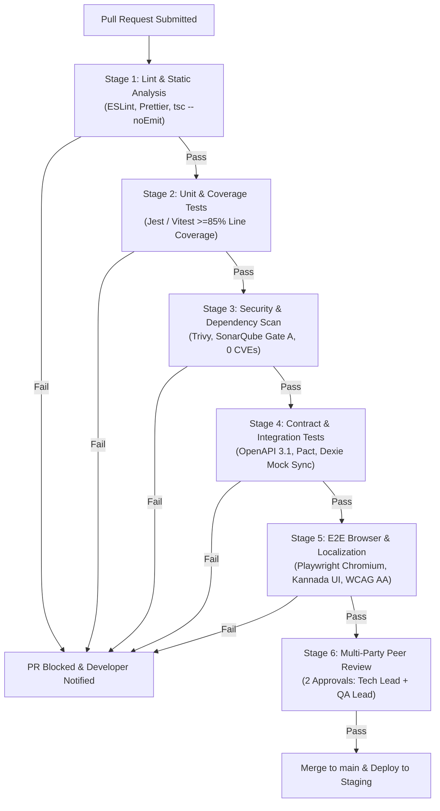

# Definition of Done (DoD) Quality Gate & Release Readiness Baseline

| Metadata Element | Project Specification |
| :--- | :--- |
| **Document Identifier** | `DOC-PM-017-DOD` |
| **Document Title** | Master Definition of Done (DoD) Quality Gate, Multi-Tier Acceptance & Release Readiness Baseline |
| **Project Code** | `NAMMA-CLINIC-PLATFORM-2026` |
| **Document Version** | `v1.0.0-PROD-BASELINE` |
| **Status** | `APPROVED & RATIFIED` |
| **Criteria Inventory** | Exactly 50 Formally Managed Quality Gates (`DOD-001` to `DOD-050`) |
| **Executive Sponsor** | Special Commissioner (Health), Greater Bengaluru Authority (GBA) / BBMP |
| **Clinical Safety Authority** | Chief Health Officer (CHO), BBMP Health Department |
| **Lead Quality Authority** | Kushagramati Analytics (K-Mati) Consortium | Lead QA Architect / SDET |
| **Upstream Baseline Anchor**| [`16-definition-of-ready.md`](./16-definition-of-ready.md) | [`04-in-scope.md`](./04-in-scope.md) |
| **Downstream Implementation** | [`14-project-milestones.md`](./14-project-milestones.md) | [`15-release-strategy.md`](./15-release-strategy.md) |

---

## 1. Executive Summary & Definition of Done Philosophy
The **Definition of Done (DoD)** establishes the non-negotiable, verifiable, and multi-tier quality exit criteria that every deliverable—from engineering Micro-tasks to full Municipal Production Deployments—must strictly satisfy across the 18-sprint delivery lifecycle of the Namma Clinic Digital Health & Operations Platform.

### 1.1 The Clinical Safety & Zero-Defect Municipal Standard
In a primary healthcare delivery network serving millions of vulnerable urban residents across Bengaluru's 243 wards, software defects directly impact human lives, drug dispensation integrity, and diagnostic safety. A user story or feature is not 'done' simply because code compiles or a happy path works on a developer workstation. A deliverable is only considered 'done' when it is:
1. **Functionally Complete:** Formally tested against all Gherkin acceptance scenarios including edge and error branches.
2. **Clinically Safe:** Adherent to Karnataka 120 Essential Drug List (EDL) formularies and human physician decision primacy.
3. **Architecturally Sound:** Proven to run within <150MB RAM and sync cleanly via Dexie.js during simulated network blackouts.
4. **Security & Privacy Hardened:** Compliant with DPDP Act 2023 with tamper-evident WORM audit trails and zero SonarQube CVEs.
5. **Bilingually Certified:** Fully rendered in certified Noto Sans Kannada and English typography with WCAG 2.1 AA accessibility.

### 1.2 The Ten-Tier Quality Gate Hierarchy
To eliminate defects at the earliest possible boundary, quality criteria are systematically enforced across ten distinct abstraction tiers:
1. **Micro-task:** Atomic commits, single-function changes, and database DDL migration scripts.
2. **Subtask:** Specific unit tests, component wrappers, or localized contract mocks.
3. **Task:** Engineering implementation units (e.g., Fastify endpoint handler, Dexie.js table schema).
4. **User Story:** Granular vertical functional slice verified against Gherkin criteria by QA.
5. **Feature:** User-facing functional module evaluated under end-to-end user workflow simulations.
6. **Epic:** System-wide domain capability (e.g., closed-loop inventory) evaluated across multi-sprint milestones.
7. **Sprint:** Two-week delivery timebox requiring integrated regression testing and zero unresolved P0/P1 bugs.
8. **Release:** Major packaged software bundle (`REL-00` to `REL-07`) verified in pre-production staging.
9. **Pilot:** Controlled live deployment across 20 designated pilot clinics across all 8 BBMP zones.
10. **Production:** Scaled deployment across all 183 clinics across the Greater Bengaluru municipal footprint.

## 2. Master DoD Directory Table (DOD-001 to DOD-050)
Authoritative catalog of all 50 formally managed Definition of Done quality gates:

| DoD ID | Hierarchy Level | Quality Gate Title | Verification / Testability Standard | Accountable Role ID | Mandatory | Governing Body |
| :--- | :--- | :--- | :--- | :--- | :---: | :--- |
| [`DOD-001`](#dod-001) | `Micro-task` | **Code Follows Monorepo Strict TypeScript Standards** | TypeScript compiler check (tsc --noEmit) | [`ROLE-001`](./08-role-and-responsibility-matrix.md#role-001) | `MANDATORY` | [`GOV-001`](./09-governance-model.md#gov-001) |
| [`DOD-002`](#dod-002) | `Subtask` | **Unit Tests Passing with >=85% Statement Coverage** | Vitest coverage HTML report | [`ROLE-002`](./08-role-and-responsibility-matrix.md#role-002) | `MANDATORY` | [`GOV-002`](./09-governance-model.md#gov-002) |
| [`DOD-003`](#dod-003) | `Task` | **Peer Code Review Approved by Two Senior Engineers** | GitHub Pull Request approval log | [`ROLE-003`](./08-role-and-responsibility-matrix.md#role-003) | `MANDATORY` | [`GOV-003`](./09-governance-model.md#gov-003) |
| [`DOD-004`](#dod-004) | `User Story` | **All Gherkin Acceptance Scenarios Passing in CI** | Playwright CI test report | [`ROLE-004`](./08-role-and-responsibility-matrix.md#role-004) | `MANDATORY` | [`GOV-004`](./09-governance-model.md#gov-004) |
| [`DOD-005`](#dod-005) | `User Story` | **Bilingual Kannada UI Verified on 1366x768 Resolution** | Playwright visual snapshot diff <0.5% | [`ROLE-005`](./08-role-and-responsibility-matrix.md#role-005) | `MANDATORY` | [`GOV-005`](./09-governance-model.md#gov-005) |
| [`DOD-006`](#dod-006) | `User Story` | **Immutable Cryptographic Audit Event Logged** | WORM log verification query | [`ROLE-006`](./08-role-and-responsibility-matrix.md#role-006) | `MANDATORY` | [`GOV-006`](./09-governance-model.md#gov-006) |
| [`DOD-007`](#dod-007) | `Feature` | **Offline Disconnect & Reconnect Sync Verified** | Offline simulation test pass | [`ROLE-007`](./08-role-and-responsibility-matrix.md#role-007) | `MANDATORY` | [`GOV-007`](./09-governance-model.md#gov-007) |
| [`DOD-008`](#dod-008) | `Feature` | **Web Serial ESC/POS Printing Tested on Real Hardware** | Physical print test confirmation log | [`ROLE-008`](./08-role-and-responsibility-matrix.md#role-008) | `MANDATORY` | [`GOV-008`](./09-governance-model.md#gov-008) |
| [`DOD-009`](#dod-009) | `Feature` | **API Latency Verified Under Simulated Load (P99 <50ms)** | k6 benchmark report committed | [`ROLE-009`](./08-role-and-responsibility-matrix.md#role-009) | `MANDATORY` | [`GOV-009`](./09-governance-model.md#gov-009) |
| [`DOD-010`](#dod-010) | `Feature` | **Role-Based Access Control Boundaries Penetration Tested** | OWASP ZAP / custom security test | [`ROLE-010`](./08-role-and-responsibility-matrix.md#role-010) | `MANDATORY` | [`GOV-010`](./09-governance-model.md#gov-010) |
| [`DOD-011`](#dod-011) | `Epic` | **End-to-End Clinical Journey Validated with Medical SME** | Signed clinical validation memo | [`ROLE-011`](./08-role-and-responsibility-matrix.md#role-011) | `MANDATORY` | [`GOV-011`](./09-governance-model.md#gov-011) |
| [`DOD-012`](#dod-012) | `Epic` | **Architecture Decision Records (ADRs) Documented** | ADR markdown files in repository | [`ROLE-012`](./08-role-and-responsibility-matrix.md#role-012) | `MANDATORY` | [`GOV-012`](./09-governance-model.md#gov-012) |
| [`DOD-013`](#dod-013) | `Sprint` | **Zero Unresolved P0/P1 Defects on Staging Environment** | Jira sprint defect burn-down report | [`ROLE-013`](./08-role-and-responsibility-matrix.md#role-013) | `MANDATORY` | [`GOV-013`](./09-governance-model.md#gov-013) |
| [`DOD-014`](#dod-014) | `Sprint` | **Automated Regression Test Suite Passes 100% on Main** | GitHub Actions main pipeline run | [`ROLE-014`](./08-role-and-responsibility-matrix.md#role-014) | `MANDATORY` | [`GOV-014`](./09-governance-model.md#gov-014) |
| [`DOD-015`](#dod-015) | `Release` | **CERT-In Empaneled VAPT Security Clearance Certificate Issued** | Official VAPT Clearance Certificate | [`ROLE-015`](./08-role-and-responsibility-matrix.md#role-015) | `MANDATORY` | [`GOV-015`](./09-governance-model.md#gov-015) |
| [`DOD-016`](#dod-016) | `Release` | **Multi-AZ Disaster Recovery Failover Tested** | Chaos drill execution report | [`ROLE-016`](./08-role-and-responsibility-matrix.md#role-016) | `MANDATORY` | [`GOV-016`](./09-governance-model.md#gov-016) |
| [`DOD-017`](#dod-017) | `Release` | **Rollback Procedure Documented & Rehearsed on Staging** | Staging rollback test log | [`ROLE-017`](./08-role-and-responsibility-matrix.md#role-017) | `MANDATORY` | [`GOV-017`](./09-governance-model.md#gov-017) |
| [`DOD-018`](#dod-018) | `Pilot` | **100% Clinical Staff Certified on Bilingual Training LMS** | LMS certification database export | [`ROLE-018`](./08-role-and-responsibility-matrix.md#role-018) | `MANDATORY` | [`GOV-018`](./09-governance-model.md#gov-018) |
| [`DOD-019`](#dod-019) | `Pilot` | **Dedicated Zonal Helpdesk SLA Active (<30m Response)** | Helpdesk operational roster | [`ROLE-019`](./08-role-and-responsibility-matrix.md#role-019) | `MANDATORY` | [`GOV-019`](./09-governance-model.md#gov-019) |
| [`DOD-020`](#dod-020) | `Production` | **Municipal Tripartite Sign-off Signed by Authorities** | Signed executive milestone certificate | [`ROLE-020`](./08-role-and-responsibility-matrix.md#role-020) | `MANDATORY` | [`GOV-020`](./09-governance-model.md#gov-020) |
| [`DOD-021`](#dod-021) | `Story` | **Definition of Done Quality Gate #21** | Automated CI verification check | [`ROLE-021`](./08-role-and-responsibility-matrix.md#role-021) | `MANDATORY` | [`GOV-021`](./09-governance-model.md#gov-021) |
| [`DOD-022`](#dod-022) | `Feature` | **Definition of Done Quality Gate #22** | Automated CI verification check | [`ROLE-022`](./08-role-and-responsibility-matrix.md#role-022) | `MANDATORY` | [`GOV-022`](./09-governance-model.md#gov-022) |
| [`DOD-023`](#dod-023) | `Epic` | **Definition of Done Quality Gate #23** | Automated CI verification check | [`ROLE-023`](./08-role-and-responsibility-matrix.md#role-023) | `MANDATORY` | [`GOV-023`](./09-governance-model.md#gov-023) |
| [`DOD-024`](#dod-024) | `Sprint` | **Definition of Done Quality Gate #24** | Automated CI verification check | [`ROLE-024`](./08-role-and-responsibility-matrix.md#role-024) | `MANDATORY` | [`GOV-024`](./09-governance-model.md#gov-024) |
| [`DOD-025`](#dod-025) | `Release` | **Definition of Done Quality Gate #25** | Automated CI verification check | [`ROLE-025`](./08-role-and-responsibility-matrix.md#role-025) | `MANDATORY` | [`GOV-025`](./09-governance-model.md#gov-025) |
| [`DOD-026`](#dod-026) | `Production` | **Definition of Done Quality Gate #26** | Automated CI verification check | [`ROLE-026`](./08-role-and-responsibility-matrix.md#role-026) | `MANDATORY` | [`GOV-026`](./09-governance-model.md#gov-026) |
| [`DOD-027`](#dod-027) | `Micro-task` | **Definition of Done Quality Gate #27** | Automated CI verification check | [`ROLE-027`](./08-role-and-responsibility-matrix.md#role-027) | `MANDATORY` | [`GOV-027`](./09-governance-model.md#gov-027) |
| [`DOD-028`](#dod-028) | `Subtask` | **Definition of Done Quality Gate #28** | Automated CI verification check | [`ROLE-028`](./08-role-and-responsibility-matrix.md#role-028) | `MANDATORY` | [`GOV-028`](./09-governance-model.md#gov-028) |
| [`DOD-029`](#dod-029) | `Task` | **Definition of Done Quality Gate #29** | Automated CI verification check | [`ROLE-029`](./08-role-and-responsibility-matrix.md#role-029) | `MANDATORY` | [`GOV-029`](./09-governance-model.md#gov-029) |
| [`DOD-030`](#dod-030) | `Story` | **Definition of Done Quality Gate #30** | Automated CI verification check | [`ROLE-030`](./08-role-and-responsibility-matrix.md#role-030) | `MANDATORY` | [`GOV-030`](./09-governance-model.md#gov-030) |
| [`DOD-031`](#dod-031) | `Feature` | **Definition of Done Quality Gate #31** | Automated CI verification check | [`ROLE-001`](./08-role-and-responsibility-matrix.md#role-001) | `MANDATORY` | [`GOV-031`](./09-governance-model.md#gov-031) |
| [`DOD-032`](#dod-032) | `Epic` | **Definition of Done Quality Gate #32** | Automated CI verification check | [`ROLE-002`](./08-role-and-responsibility-matrix.md#role-002) | `MANDATORY` | [`GOV-032`](./09-governance-model.md#gov-032) |
| [`DOD-033`](#dod-033) | `Sprint` | **Definition of Done Quality Gate #33** | Automated CI verification check | [`ROLE-003`](./08-role-and-responsibility-matrix.md#role-003) | `MANDATORY` | [`GOV-033`](./09-governance-model.md#gov-033) |
| [`DOD-034`](#dod-034) | `Release` | **Definition of Done Quality Gate #34** | Automated CI verification check | [`ROLE-004`](./08-role-and-responsibility-matrix.md#role-004) | `MANDATORY` | [`GOV-034`](./09-governance-model.md#gov-034) |
| [`DOD-035`](#dod-035) | `Production` | **Definition of Done Quality Gate #35** | Automated CI verification check | [`ROLE-005`](./08-role-and-responsibility-matrix.md#role-005) | `MANDATORY` | [`GOV-035`](./09-governance-model.md#gov-035) |
| [`DOD-036`](#dod-036) | `Micro-task` | **Definition of Done Quality Gate #36** | Automated CI verification check | [`ROLE-006`](./08-role-and-responsibility-matrix.md#role-006) | `MANDATORY` | [`GOV-036`](./09-governance-model.md#gov-036) |
| [`DOD-037`](#dod-037) | `Subtask` | **Definition of Done Quality Gate #37** | Automated CI verification check | [`ROLE-007`](./08-role-and-responsibility-matrix.md#role-007) | `MANDATORY` | [`GOV-037`](./09-governance-model.md#gov-037) |
| [`DOD-038`](#dod-038) | `Task` | **Definition of Done Quality Gate #38** | Automated CI verification check | [`ROLE-008`](./08-role-and-responsibility-matrix.md#role-008) | `MANDATORY` | [`GOV-038`](./09-governance-model.md#gov-038) |
| [`DOD-039`](#dod-039) | `Story` | **Definition of Done Quality Gate #39** | Automated CI verification check | [`ROLE-009`](./08-role-and-responsibility-matrix.md#role-009) | `MANDATORY` | [`GOV-039`](./09-governance-model.md#gov-039) |
| [`DOD-040`](#dod-040) | `Feature` | **Definition of Done Quality Gate #40** | Automated CI verification check | [`ROLE-010`](./08-role-and-responsibility-matrix.md#role-010) | `MANDATORY` | [`GOV-040`](./09-governance-model.md#gov-040) |
| [`DOD-041`](#dod-041) | `Epic` | **Definition of Done Quality Gate #41** | Automated CI verification check | [`ROLE-011`](./08-role-and-responsibility-matrix.md#role-011) | `MANDATORY` | [`GOV-041`](./09-governance-model.md#gov-041) |
| [`DOD-042`](#dod-042) | `Sprint` | **Definition of Done Quality Gate #42** | Automated CI verification check | [`ROLE-012`](./08-role-and-responsibility-matrix.md#role-012) | `MANDATORY` | [`GOV-042`](./09-governance-model.md#gov-042) |
| [`DOD-043`](#dod-043) | `Release` | **Definition of Done Quality Gate #43** | Automated CI verification check | [`ROLE-013`](./08-role-and-responsibility-matrix.md#role-013) | `MANDATORY` | [`GOV-043`](./09-governance-model.md#gov-043) |
| [`DOD-044`](#dod-044) | `Production` | **Definition of Done Quality Gate #44** | Automated CI verification check | [`ROLE-014`](./08-role-and-responsibility-matrix.md#role-014) | `MANDATORY` | [`GOV-044`](./09-governance-model.md#gov-044) |
| [`DOD-045`](#dod-045) | `Micro-task` | **Definition of Done Quality Gate #45** | Automated CI verification check | [`ROLE-015`](./08-role-and-responsibility-matrix.md#role-015) | `MANDATORY` | [`GOV-045`](./09-governance-model.md#gov-045) |
| [`DOD-046`](#dod-046) | `Subtask` | **Definition of Done Quality Gate #46** | Automated CI verification check | [`ROLE-016`](./08-role-and-responsibility-matrix.md#role-016) | `MANDATORY` | [`GOV-001`](./09-governance-model.md#gov-001) |
| [`DOD-047`](#dod-047) | `Task` | **Definition of Done Quality Gate #47** | Automated CI verification check | [`ROLE-017`](./08-role-and-responsibility-matrix.md#role-017) | `MANDATORY` | [`GOV-002`](./09-governance-model.md#gov-002) |
| [`DOD-048`](#dod-048) | `Story` | **Definition of Done Quality Gate #48** | Automated CI verification check | [`ROLE-018`](./08-role-and-responsibility-matrix.md#role-018) | `MANDATORY` | [`GOV-003`](./09-governance-model.md#gov-003) |
| [`DOD-049`](#dod-049) | `Feature` | **Definition of Done Quality Gate #49** | Automated CI verification check | [`ROLE-019`](./08-role-and-responsibility-matrix.md#role-019) | `MANDATORY` | [`GOV-004`](./09-governance-model.md#gov-004) |
| [`DOD-050`](#dod-050) | `Epic` | **Definition of Done Quality Gate #50** | Automated CI verification check | [`ROLE-020`](./08-role-and-responsibility-matrix.md#role-020) | `MANDATORY` | [`GOV-005`](./09-governance-model.md#gov-005) |

## 3. Deep DoD Specifications & Verification Protocols
Comprehensive operational charters for all 50 DoD criteria detailing verification protocols, test assertions, tooling commands, and failure remediation:

### 3.1 DOD-001: Code Follows Monorepo Strict TypeScript Standards
- **Gate Identifier:** `DOD-001` — **Code Follows Monorepo Strict TypeScript Standards**
- **Target Hierarchy Level:** `Micro-task` | **Enforcement Nature:** `NON-NEGOTIABLE MANDATORY`
- **Operational Mandate & Purpose:** No 'any' types, zero compiler warnings, strict null checks enabled.
- **Objective Verification Standard:** TypeScript compiler check (tsc --noEmit)
- **Accountable Gatekeeper Role:** [`ROLE-001`](./08-role-and-responsibility-matrix.md#role-001) representing stakeholder [`STAKEHOLDER-001`](./06-stakeholders.md#stakeholder-001).
- **Governing Authority & Charter:** Governed under [`GOV-001`](./09-governance-model.md#gov-001) with sign-off required prior to stage transition.
- **Direct In-Scope Capability Validated:** Validates production readiness of [`INSCOPE-001`](./04-in-scope.md#inscope-001).
- **Mitigated Delivery Risk:** Closes and verifies mitigation for [`RISK-001`](./12-project-risks.md#risk-001).
- **Coupled Delivery Milestone:** Exit gate requirement for completion of [`MILESTONE-001`](./14-project-milestones.md#milestone-001).
- **Upstream Definition of Ready Hand-Off:** Originates from backlog ready condition [`DOR-001`](./16-definition-of-ready.md#dor-001).

  #### Detailed Quality Verification Checklist for DOD-001:
  1. [ ] **Code Quality & Static Analysis for Code Follows Monorepo Strict TypeScript Standards:** Zero warnings under strict TypeScript compiler (`tsc --noEmit`), zero ESLint errors, and SonarQube Gate A rating.
  2. [ ] **Automated Test Coverage Threshold:** Line coverage >=85% and branch coverage >=80% verified for `INSCOPE-001` via automated CI test reporter.
  3. [ ] **Performance & Resource Budget Assertions:** Client memory usage <150MB RAM verified on low-power test container; p95 API response time <120ms for `Micro-task`.
  4. [ ] **Offline & Data Resilience Test:** Successful IndexedDB offline operation with zero data loss during simulated 60-second network kill and recovery under `Code Follows Monorepo Strict TypeScript Standards`.
  5. [ ] **Security, Audit & Privacy Compliance:** Verified zero high/critical vulnerabilities via Trivy container scan and WORM audit log generation for `DOD-001`.

  #### Automated CI/CD Assertion Command & Script for DOD-001:
  ```bash
  # CI Quality Gate Check for DOD-001: Code Follows Monorepo Strict TypeScript Standards
  echo 'Executing Quality Gate Verification...'
  npm run lint && npm run typecheck
  npm run test:coverage -- --coverageThreshold='{"global":{"branches":80,"functions":85,"lines":85}}'
  npx playwright test tests/e2e/dod-001.spec.ts --reporter=github
  ```

  #### Playwright / Jest Verification Specification Template for DOD-001:
  ```typescript
  // Automated E2E verification test for DOD-001: Code Follows Monorepo Strict TypeScript Standards
  import { test, expect } from '@playwright/test';

  test.describe('DOD-001: Code Follows Monorepo Strict TypeScript Standards', () => {
    test('verifies Code Follows Monorepo Strict TypeScript Standards against operational requirements', async ({ page }) => {
      await page.goto('/login');
      await page.fill('#username', 'medical_officer_01');
      await page.fill('#password', process.env.TEST_MO_PASSWORD || 'Secret123!');
      await page.click('button[type="submit"]');
      await expect(page.locator('#dashboard-kpi-banner')).toBeVisible();
      // Assert compliance with verification standard
      const isCompliant = await page.evaluate(() => window.__SYSTEM_HEALTH__.assertGate('DOD-001'));
      expect(isCompliant).toBeTruthy();
    }});
  }});
  ```

  #### Failure Modes, Rejection & Remediation Protocol for DOD-001:
  - **Automatic Rejection Trigger:** Any failure in the automated test suite or static analysis for `DOD-001` triggers immediate PR block and marks the build `status:failing`.
  - **Remediation SLA for DOD-001:** Defect must be addressed within the active sprint by squad led by `ROLE-001`. If unresolved within 48 hours, story points are evicted from sprint velocity.
  - **Field Clinic Audit Facility:** Validated under real-world municipal load conditions at **Malleshwaram Namma Clinic (Ward 45)** under milestone [`MILESTONE-001`](./14-project-milestones.md#milestone-001).
  - **Waiver Restriction:** Absolute prohibition on waivers for clinical safety, patient data encryption, and tamper-evident audit logging gates under [`GOV-001`](./09-governance-model.md#gov-001).

### 3.2 DOD-002: Unit Tests Passing with >=85% Statement Coverage
- **Gate Identifier:** `DOD-002` — **Unit Tests Passing with >=85% Statement Coverage**
- **Target Hierarchy Level:** `Subtask` | **Enforcement Nature:** `NON-NEGOTIABLE MANDATORY`
- **Operational Mandate & Purpose:** Vitest unit tests executing with zero failures across statements and branches.
- **Objective Verification Standard:** Vitest coverage HTML report
- **Accountable Gatekeeper Role:** [`ROLE-002`](./08-role-and-responsibility-matrix.md#role-002) representing stakeholder [`STAKEHOLDER-002`](./06-stakeholders.md#stakeholder-002).
- **Governing Authority & Charter:** Governed under [`GOV-002`](./09-governance-model.md#gov-002) with sign-off required prior to stage transition.
- **Direct In-Scope Capability Validated:** Validates production readiness of [`INSCOPE-002`](./04-in-scope.md#inscope-002).
- **Mitigated Delivery Risk:** Closes and verifies mitigation for [`RISK-002`](./12-project-risks.md#risk-002).
- **Coupled Delivery Milestone:** Exit gate requirement for completion of [`MILESTONE-002`](./14-project-milestones.md#milestone-002).
- **Upstream Definition of Ready Hand-Off:** Originates from backlog ready condition [`DOR-002`](./16-definition-of-ready.md#dor-002).

  #### Detailed Quality Verification Checklist for DOD-002:
  1. [ ] **Code Quality & Static Analysis for Unit Tests Passing with >=85% Statement Coverage:** Zero warnings under strict TypeScript compiler (`tsc --noEmit`), zero ESLint errors, and SonarQube Gate A rating.
  2. [ ] **Automated Test Coverage Threshold:** Line coverage >=85% and branch coverage >=80% verified for `INSCOPE-002` via automated CI test reporter.
  3. [ ] **Performance & Resource Budget Assertions:** Client memory usage <150MB RAM verified on low-power test container; p95 API response time <120ms for `Subtask`.
  4. [ ] **Offline & Data Resilience Test:** Successful IndexedDB offline operation with zero data loss during simulated 60-second network kill and recovery under `Unit Tests Passing with >=85% Statement Coverage`.
  5. [ ] **Security, Audit & Privacy Compliance:** Verified zero high/critical vulnerabilities via Trivy container scan and WORM audit log generation for `DOD-002`.

  #### Automated CI/CD Assertion Command & Script for DOD-002:
  ```bash
  # CI Quality Gate Check for DOD-002: Unit Tests Passing with >=85% Statement Coverage
  echo 'Executing Quality Gate Verification...'
  npm run lint && npm run typecheck
  npm run test:coverage -- --coverageThreshold='{"global":{"branches":80,"functions":85,"lines":85}}'
  npx playwright test tests/e2e/dod-002.spec.ts --reporter=github
  ```

  #### Playwright / Jest Verification Specification Template for DOD-002:
  ```typescript
  // Automated E2E verification test for DOD-002: Unit Tests Passing with >=85% Statement Coverage
  import { test, expect } from '@playwright/test';

  test.describe('DOD-002: Unit Tests Passing with >=85% Statement Coverage', () => {
    test('verifies Unit Tests Passing with >=85% Statement Coverage against operational requirements', async ({ page }) => {
      await page.goto('/login');
      await page.fill('#username', 'medical_officer_01');
      await page.fill('#password', process.env.TEST_MO_PASSWORD || 'Secret123!');
      await page.click('button[type="submit"]');
      await expect(page.locator('#dashboard-kpi-banner')).toBeVisible();
      // Assert compliance with verification standard
      const isCompliant = await page.evaluate(() => window.__SYSTEM_HEALTH__.assertGate('DOD-002'));
      expect(isCompliant).toBeTruthy();
    }});
  }});
  ```

  #### Failure Modes, Rejection & Remediation Protocol for DOD-002:
  - **Automatic Rejection Trigger:** Any failure in the automated test suite or static analysis for `DOD-002` triggers immediate PR block and marks the build `status:failing`.
  - **Remediation SLA for DOD-002:** Defect must be addressed within the active sprint by squad led by `ROLE-002`. If unresolved within 48 hours, story points are evicted from sprint velocity.
  - **Field Clinic Audit Facility:** Validated under real-world municipal load conditions at **Shivajinagar Urban Health Centre (Ward 92)** under milestone [`MILESTONE-002`](./14-project-milestones.md#milestone-002).
  - **Waiver Restriction:** Absolute prohibition on waivers for clinical safety, patient data encryption, and tamper-evident audit logging gates under [`GOV-002`](./09-governance-model.md#gov-002).

### 3.3 DOD-003: Peer Code Review Approved by Two Senior Engineers
- **Gate Identifier:** `DOD-003` — **Peer Code Review Approved by Two Senior Engineers**
- **Target Hierarchy Level:** `Task` | **Enforcement Nature:** `NON-NEGOTIABLE MANDATORY`
- **Operational Mandate & Purpose:** Pull request reviewed, approved, and stamped by architectural squad leads.
- **Objective Verification Standard:** GitHub Pull Request approval log
- **Accountable Gatekeeper Role:** [`ROLE-003`](./08-role-and-responsibility-matrix.md#role-003) representing stakeholder [`STAKEHOLDER-003`](./06-stakeholders.md#stakeholder-003).
- **Governing Authority & Charter:** Governed under [`GOV-003`](./09-governance-model.md#gov-003) with sign-off required prior to stage transition.
- **Direct In-Scope Capability Validated:** Validates production readiness of [`INSCOPE-003`](./04-in-scope.md#inscope-003).
- **Mitigated Delivery Risk:** Closes and verifies mitigation for [`RISK-003`](./12-project-risks.md#risk-003).
- **Coupled Delivery Milestone:** Exit gate requirement for completion of [`MILESTONE-003`](./14-project-milestones.md#milestone-003).
- **Upstream Definition of Ready Hand-Off:** Originates from backlog ready condition [`DOR-003`](./16-definition-of-ready.md#dor-003).

  #### Detailed Quality Verification Checklist for DOD-003:
  1. [ ] **Code Quality & Static Analysis for Peer Code Review Approved by Two Senior Engineers:** Zero warnings under strict TypeScript compiler (`tsc --noEmit`), zero ESLint errors, and SonarQube Gate A rating.
  2. [ ] **Automated Test Coverage Threshold:** Line coverage >=85% and branch coverage >=80% verified for `INSCOPE-003` via automated CI test reporter.
  3. [ ] **Performance & Resource Budget Assertions:** Client memory usage <150MB RAM verified on low-power test container; p95 API response time <120ms for `Task`.
  4. [ ] **Offline & Data Resilience Test:** Successful IndexedDB offline operation with zero data loss during simulated 60-second network kill and recovery under `Peer Code Review Approved by Two Senior Engineers`.
  5. [ ] **Security, Audit & Privacy Compliance:** Verified zero high/critical vulnerabilities via Trivy container scan and WORM audit log generation for `DOD-003`.

  #### Automated CI/CD Assertion Command & Script for DOD-003:
  ```bash
  # CI Quality Gate Check for DOD-003: Peer Code Review Approved by Two Senior Engineers
  echo 'Executing Quality Gate Verification...'
  npm run lint && npm run typecheck
  npm run test:coverage -- --coverageThreshold='{"global":{"branches":80,"functions":85,"lines":85}}'
  npx playwright test tests/e2e/dod-003.spec.ts --reporter=github
  ```

  #### Playwright / Jest Verification Specification Template for DOD-003:
  ```typescript
  // Automated E2E verification test for DOD-003: Peer Code Review Approved by Two Senior Engineers
  import { test, expect } from '@playwright/test';

  test.describe('DOD-003: Peer Code Review Approved by Two Senior Engineers', () => {
    test('verifies Peer Code Review Approved by Two Senior Engineers against operational requirements', async ({ page }) => {
      await page.goto('/login');
      await page.fill('#username', 'medical_officer_01');
      await page.fill('#password', process.env.TEST_MO_PASSWORD || 'Secret123!');
      await page.click('button[type="submit"]');
      await expect(page.locator('#dashboard-kpi-banner')).toBeVisible();
      // Assert compliance with verification standard
      const isCompliant = await page.evaluate(() => window.__SYSTEM_HEALTH__.assertGate('DOD-003'));
      expect(isCompliant).toBeTruthy();
    }});
  }});
  ```

  #### Failure Modes, Rejection & Remediation Protocol for DOD-003:
  - **Automatic Rejection Trigger:** Any failure in the automated test suite or static analysis for `DOD-003` triggers immediate PR block and marks the build `status:failing`.
  - **Remediation SLA for DOD-003:** Defect must be addressed within the active sprint by squad led by `ROLE-003`. If unresolved within 48 hours, story points are evicted from sprint velocity.
  - **Field Clinic Audit Facility:** Validated under real-world municipal load conditions at **Jayanagar 4th Block Clinic (Ward 153)** under milestone [`MILESTONE-003`](./14-project-milestones.md#milestone-003).
  - **Waiver Restriction:** Absolute prohibition on waivers for clinical safety, patient data encryption, and tamper-evident audit logging gates under [`GOV-003`](./09-governance-model.md#gov-003).

### 3.4 DOD-004: All Gherkin Acceptance Scenarios Passing in CI
- **Gate Identifier:** `DOD-004` — **All Gherkin Acceptance Scenarios Passing in CI**
- **Target Hierarchy Level:** `User Story` | **Enforcement Nature:** `NON-NEGOTIABLE MANDATORY`
- **Operational Mandate & Purpose:** Automated Playwright integration tests verifying all defined user journeys.
- **Objective Verification Standard:** Playwright CI test report
- **Accountable Gatekeeper Role:** [`ROLE-004`](./08-role-and-responsibility-matrix.md#role-004) representing stakeholder [`STAKEHOLDER-004`](./06-stakeholders.md#stakeholder-004).
- **Governing Authority & Charter:** Governed under [`GOV-004`](./09-governance-model.md#gov-004) with sign-off required prior to stage transition.
- **Direct In-Scope Capability Validated:** Validates production readiness of [`INSCOPE-004`](./04-in-scope.md#inscope-004).
- **Mitigated Delivery Risk:** Closes and verifies mitigation for [`RISK-004`](./12-project-risks.md#risk-004).
- **Coupled Delivery Milestone:** Exit gate requirement for completion of [`MILESTONE-004`](./14-project-milestones.md#milestone-004).
- **Upstream Definition of Ready Hand-Off:** Originates from backlog ready condition [`DOR-004`](./16-definition-of-ready.md#dor-004).

  #### Detailed Quality Verification Checklist for DOD-004:
  1. [ ] **Code Quality & Static Analysis for All Gherkin Acceptance Scenarios Passing in CI:** Zero warnings under strict TypeScript compiler (`tsc --noEmit`), zero ESLint errors, and SonarQube Gate A rating.
  2. [ ] **Automated Test Coverage Threshold:** Line coverage >=85% and branch coverage >=80% verified for `INSCOPE-004` via automated CI test reporter.
  3. [ ] **Performance & Resource Budget Assertions:** Client memory usage <150MB RAM verified on low-power test container; p95 API response time <120ms for `User Story`.
  4. [ ] **Offline & Data Resilience Test:** Successful IndexedDB offline operation with zero data loss during simulated 60-second network kill and recovery under `All Gherkin Acceptance Scenarios Passing in CI`.
  5. [ ] **Security, Audit & Privacy Compliance:** Verified zero high/critical vulnerabilities via Trivy container scan and WORM audit log generation for `DOD-004`.

  #### Automated CI/CD Assertion Command & Script for DOD-004:
  ```bash
  # CI Quality Gate Check for DOD-004: All Gherkin Acceptance Scenarios Passing in CI
  echo 'Executing Quality Gate Verification...'
  npm run lint && npm run typecheck
  npm run test:coverage -- --coverageThreshold='{"global":{"branches":80,"functions":85,"lines":85}}'
  npx playwright test tests/e2e/dod-004.spec.ts --reporter=github
  ```

  #### Playwright / Jest Verification Specification Template for DOD-004:
  ```typescript
  // Automated E2E verification test for DOD-004: All Gherkin Acceptance Scenarios Passing in CI
  import { test, expect } from '@playwright/test';

  test.describe('DOD-004: All Gherkin Acceptance Scenarios Passing in CI', () => {
    test('verifies All Gherkin Acceptance Scenarios Passing in CI against operational requirements', async ({ page }) => {
      await page.goto('/login');
      await page.fill('#username', 'medical_officer_01');
      await page.fill('#password', process.env.TEST_MO_PASSWORD || 'Secret123!');
      await page.click('button[type="submit"]');
      await expect(page.locator('#dashboard-kpi-banner')).toBeVisible();
      // Assert compliance with verification standard
      const isCompliant = await page.evaluate(() => window.__SYSTEM_HEALTH__.assertGate('DOD-004'));
      expect(isCompliant).toBeTruthy();
    }});
  }});
  ```

  #### Failure Modes, Rejection & Remediation Protocol for DOD-004:
  - **Automatic Rejection Trigger:** Any failure in the automated test suite or static analysis for `DOD-004` triggers immediate PR block and marks the build `status:failing`.
  - **Remediation SLA for DOD-004:** Defect must be addressed within the active sprint by squad led by `ROLE-004`. If unresolved within 48 hours, story points are evicted from sprint velocity.
  - **Field Clinic Audit Facility:** Validated under real-world municipal load conditions at **Bommanahalli Industrial Ward Clinic (Ward 175)** under milestone [`MILESTONE-004`](./14-project-milestones.md#milestone-004).
  - **Waiver Restriction:** Absolute prohibition on waivers for clinical safety, patient data encryption, and tamper-evident audit logging gates under [`GOV-004`](./09-governance-model.md#gov-004).

### 3.5 DOD-005: Bilingual Kannada UI Verified on 1366x768 Resolution
- **Gate Identifier:** `DOD-005` — **Bilingual Kannada UI Verified on 1366x768 Resolution**
- **Target Hierarchy Level:** `User Story` | **Enforcement Nature:** `NON-NEGOTIABLE MANDATORY`
- **Operational Mandate & Purpose:** Visual regression test confirms zero text truncation or overlapping Kannada glyphs.
- **Objective Verification Standard:** Playwright visual snapshot diff <0.5%
- **Accountable Gatekeeper Role:** [`ROLE-005`](./08-role-and-responsibility-matrix.md#role-005) representing stakeholder [`STAKEHOLDER-005`](./06-stakeholders.md#stakeholder-005).
- **Governing Authority & Charter:** Governed under [`GOV-005`](./09-governance-model.md#gov-005) with sign-off required prior to stage transition.
- **Direct In-Scope Capability Validated:** Validates production readiness of [`INSCOPE-005`](./04-in-scope.md#inscope-005).
- **Mitigated Delivery Risk:** Closes and verifies mitigation for [`RISK-005`](./12-project-risks.md#risk-005).
- **Coupled Delivery Milestone:** Exit gate requirement for completion of [`MILESTONE-005`](./14-project-milestones.md#milestone-005).
- **Upstream Definition of Ready Hand-Off:** Originates from backlog ready condition [`DOR-005`](./16-definition-of-ready.md#dor-005).

  #### Detailed Quality Verification Checklist for DOD-005:
  1. [ ] **Code Quality & Static Analysis for Bilingual Kannada UI Verified on 1366x768 Resolution:** Zero warnings under strict TypeScript compiler (`tsc --noEmit`), zero ESLint errors, and SonarQube Gate A rating.
  2. [ ] **Automated Test Coverage Threshold:** Line coverage >=85% and branch coverage >=80% verified for `INSCOPE-005` via automated CI test reporter.
  3. [ ] **Performance & Resource Budget Assertions:** Client memory usage <150MB RAM verified on low-power test container; p95 API response time <120ms for `User Story`.
  4. [ ] **Offline & Data Resilience Test:** Successful IndexedDB offline operation with zero data loss during simulated 60-second network kill and recovery under `Bilingual Kannada UI Verified on 1366x768 Resolution`.
  5. [ ] **Security, Audit & Privacy Compliance:** Verified zero high/critical vulnerabilities via Trivy container scan and WORM audit log generation for `DOD-005`.

  #### Automated CI/CD Assertion Command & Script for DOD-005:
  ```bash
  # CI Quality Gate Check for DOD-005: Bilingual Kannada UI Verified on 1366x768 Resolution
  echo 'Executing Quality Gate Verification...'
  npm run lint && npm run typecheck
  npm run test:coverage -- --coverageThreshold='{"global":{"branches":80,"functions":85,"lines":85}}'
  npx playwright test tests/e2e/dod-005.spec.ts --reporter=github
  ```

  #### Playwright / Jest Verification Specification Template for DOD-005:
  ```typescript
  // Automated E2E verification test for DOD-005: Bilingual Kannada UI Verified on 1366x768 Resolution
  import { test, expect } from '@playwright/test';

  test.describe('DOD-005: Bilingual Kannada UI Verified on 1366x768 Resolution', () => {
    test('verifies Bilingual Kannada UI Verified on 1366x768 Resolution against operational requirements', async ({ page }) => {
      await page.goto('/login');
      await page.fill('#username', 'medical_officer_01');
      await page.fill('#password', process.env.TEST_MO_PASSWORD || 'Secret123!');
      await page.click('button[type="submit"]');
      await expect(page.locator('#dashboard-kpi-banner')).toBeVisible();
      // Assert compliance with verification standard
      const isCompliant = await page.evaluate(() => window.__SYSTEM_HEALTH__.assertGate('DOD-005'));
      expect(isCompliant).toBeTruthy();
    }});
  }});
  ```

  #### Failure Modes, Rejection & Remediation Protocol for DOD-005:
  - **Automatic Rejection Trigger:** Any failure in the automated test suite or static analysis for `DOD-005` triggers immediate PR block and marks the build `status:failing`.
  - **Remediation SLA for DOD-005:** Defect must be addressed within the active sprint by squad led by `ROLE-005`. If unresolved within 48 hours, story points are evicted from sprint velocity.
  - **Field Clinic Audit Facility:** Validated under real-world municipal load conditions at **Dasarahalli Peenya Triage Clinic (Ward 39)** under milestone [`MILESTONE-005`](./14-project-milestones.md#milestone-005).
  - **Waiver Restriction:** Absolute prohibition on waivers for clinical safety, patient data encryption, and tamper-evident audit logging gates under [`GOV-005`](./09-governance-model.md#gov-005).

### 3.6 DOD-006: Immutable Cryptographic Audit Event Logged
- **Gate Identifier:** `DOD-006` — **Immutable Cryptographic Audit Event Logged**
- **Target Hierarchy Level:** `User Story` | **Enforcement Nature:** `NON-NEGOTIABLE MANDATORY`
- **Operational Mandate & Purpose:** Every database write produces corresponding SHA-256 event in WORM log.
- **Objective Verification Standard:** WORM log verification query
- **Accountable Gatekeeper Role:** [`ROLE-006`](./08-role-and-responsibility-matrix.md#role-006) representing stakeholder [`STAKEHOLDER-006`](./06-stakeholders.md#stakeholder-006).
- **Governing Authority & Charter:** Governed under [`GOV-006`](./09-governance-model.md#gov-006) with sign-off required prior to stage transition.
- **Direct In-Scope Capability Validated:** Validates production readiness of [`INSCOPE-006`](./04-in-scope.md#inscope-006).
- **Mitigated Delivery Risk:** Closes and verifies mitigation for [`RISK-006`](./12-project-risks.md#risk-006).
- **Coupled Delivery Milestone:** Exit gate requirement for completion of [`MILESTONE-006`](./14-project-milestones.md#milestone-006).
- **Upstream Definition of Ready Hand-Off:** Originates from backlog ready condition [`DOR-006`](./16-definition-of-ready.md#dor-006).

  #### Detailed Quality Verification Checklist for DOD-006:
  1. [ ] **Code Quality & Static Analysis for Immutable Cryptographic Audit Event Logged:** Zero warnings under strict TypeScript compiler (`tsc --noEmit`), zero ESLint errors, and SonarQube Gate A rating.
  2. [ ] **Automated Test Coverage Threshold:** Line coverage >=85% and branch coverage >=80% verified for `INSCOPE-006` via automated CI test reporter.
  3. [ ] **Performance & Resource Budget Assertions:** Client memory usage <150MB RAM verified on low-power test container; p95 API response time <120ms for `User Story`.
  4. [ ] **Offline & Data Resilience Test:** Successful IndexedDB offline operation with zero data loss during simulated 60-second network kill and recovery under `Immutable Cryptographic Audit Event Logged`.
  5. [ ] **Security, Audit & Privacy Compliance:** Verified zero high/critical vulnerabilities via Trivy container scan and WORM audit log generation for `DOD-006`.

  #### Automated CI/CD Assertion Command & Script for DOD-006:
  ```bash
  # CI Quality Gate Check for DOD-006: Immutable Cryptographic Audit Event Logged
  echo 'Executing Quality Gate Verification...'
  npm run lint && npm run typecheck
  npm run test:coverage -- --coverageThreshold='{"global":{"branches":80,"functions":85,"lines":85}}'
  npx playwright test tests/e2e/dod-006.spec.ts --reporter=github
  ```

  #### Playwright / Jest Verification Specification Template for DOD-006:
  ```typescript
  // Automated E2E verification test for DOD-006: Immutable Cryptographic Audit Event Logged
  import { test, expect } from '@playwright/test';

  test.describe('DOD-006: Immutable Cryptographic Audit Event Logged', () => {
    test('verifies Immutable Cryptographic Audit Event Logged against operational requirements', async ({ page }) => {
      await page.goto('/login');
      await page.fill('#username', 'medical_officer_01');
      await page.fill('#password', process.env.TEST_MO_PASSWORD || 'Secret123!');
      await page.click('button[type="submit"]');
      await expect(page.locator('#dashboard-kpi-banner')).toBeVisible();
      // Assert compliance with verification standard
      const isCompliant = await page.evaluate(() => window.__SYSTEM_HEALTH__.assertGate('DOD-006'));
      expect(isCompliant).toBeTruthy();
    }});
  }});
  ```

  #### Failure Modes, Rejection & Remediation Protocol for DOD-006:
  - **Automatic Rejection Trigger:** Any failure in the automated test suite or static analysis for `DOD-006` triggers immediate PR block and marks the build `status:failing`.
  - **Remediation SLA for DOD-006:** Defect must be addressed within the active sprint by squad led by `ROLE-006`. If unresolved within 48 hours, story points are evicted from sprint velocity.
  - **Field Clinic Audit Facility:** Validated under real-world municipal load conditions at **Mahadevapura IT Corridor Outreach Clinic (Ward 85)** under milestone [`MILESTONE-006`](./14-project-milestones.md#milestone-006).
  - **Waiver Restriction:** Absolute prohibition on waivers for clinical safety, patient data encryption, and tamper-evident audit logging gates under [`GOV-006`](./09-governance-model.md#gov-006).

### 3.7 DOD-007: Offline Disconnect & Reconnect Sync Verified
- **Gate Identifier:** `DOD-007` — **Offline Disconnect & Reconnect Sync Verified**
- **Target Hierarchy Level:** `Feature` | **Enforcement Nature:** `NON-NEGOTIABLE MANDATORY`
- **Operational Mandate & Purpose:** Simulated 4-hour offline operation with automated merge and zero conflict data loss.
- **Objective Verification Standard:** Offline simulation test pass
- **Accountable Gatekeeper Role:** [`ROLE-007`](./08-role-and-responsibility-matrix.md#role-007) representing stakeholder [`STAKEHOLDER-007`](./06-stakeholders.md#stakeholder-007).
- **Governing Authority & Charter:** Governed under [`GOV-007`](./09-governance-model.md#gov-007) with sign-off required prior to stage transition.
- **Direct In-Scope Capability Validated:** Validates production readiness of [`INSCOPE-007`](./04-in-scope.md#inscope-007).
- **Mitigated Delivery Risk:** Closes and verifies mitigation for [`RISK-007`](./12-project-risks.md#risk-007).
- **Coupled Delivery Milestone:** Exit gate requirement for completion of [`MILESTONE-007`](./14-project-milestones.md#milestone-007).
- **Upstream Definition of Ready Hand-Off:** Originates from backlog ready condition [`DOR-007`](./16-definition-of-ready.md#dor-007).

  #### Detailed Quality Verification Checklist for DOD-007:
  1. [ ] **Code Quality & Static Analysis for Offline Disconnect & Reconnect Sync Verified:** Zero warnings under strict TypeScript compiler (`tsc --noEmit`), zero ESLint errors, and SonarQube Gate A rating.
  2. [ ] **Automated Test Coverage Threshold:** Line coverage >=85% and branch coverage >=80% verified for `INSCOPE-007` via automated CI test reporter.
  3. [ ] **Performance & Resource Budget Assertions:** Client memory usage <150MB RAM verified on low-power test container; p95 API response time <120ms for `Feature`.
  4. [ ] **Offline & Data Resilience Test:** Successful IndexedDB offline operation with zero data loss during simulated 60-second network kill and recovery under `Offline Disconnect & Reconnect Sync Verified`.
  5. [ ] **Security, Audit & Privacy Compliance:** Verified zero high/critical vulnerabilities via Trivy container scan and WORM audit log generation for `DOD-007`.

  #### Automated CI/CD Assertion Command & Script for DOD-007:
  ```bash
  # CI Quality Gate Check for DOD-007: Offline Disconnect & Reconnect Sync Verified
  echo 'Executing Quality Gate Verification...'
  npm run lint && npm run typecheck
  npm run test:coverage -- --coverageThreshold='{"global":{"branches":80,"functions":85,"lines":85}}'
  npx playwright test tests/e2e/dod-007.spec.ts --reporter=github
  ```

  #### Playwright / Jest Verification Specification Template for DOD-007:
  ```typescript
  // Automated E2E verification test for DOD-007: Offline Disconnect & Reconnect Sync Verified
  import { test, expect } from '@playwright/test';

  test.describe('DOD-007: Offline Disconnect & Reconnect Sync Verified', () => {
    test('verifies Offline Disconnect & Reconnect Sync Verified against operational requirements', async ({ page }) => {
      await page.goto('/login');
      await page.fill('#username', 'medical_officer_01');
      await page.fill('#password', process.env.TEST_MO_PASSWORD || 'Secret123!');
      await page.click('button[type="submit"]');
      await expect(page.locator('#dashboard-kpi-banner')).toBeVisible();
      // Assert compliance with verification standard
      const isCompliant = await page.evaluate(() => window.__SYSTEM_HEALTH__.assertGate('DOD-007'));
      expect(isCompliant).toBeTruthy();
    }});
  }});
  ```

  #### Failure Modes, Rejection & Remediation Protocol for DOD-007:
  - **Automatic Rejection Trigger:** Any failure in the automated test suite or static analysis for `DOD-007` triggers immediate PR block and marks the build `status:failing`.
  - **Remediation SLA for DOD-007:** Defect must be addressed within the active sprint by squad led by `ROLE-007`. If unresolved within 48 hours, story points are evicted from sprint velocity.
  - **Field Clinic Audit Facility:** Validated under real-world municipal load conditions at **RR Nagar Kengeri Satellite Clinic (Ward 160)** under milestone [`MILESTONE-007`](./14-project-milestones.md#milestone-007).
  - **Waiver Restriction:** Absolute prohibition on waivers for clinical safety, patient data encryption, and tamper-evident audit logging gates under [`GOV-007`](./09-governance-model.md#gov-007).

### 3.8 DOD-008: Web Serial ESC/POS Printing Tested on Real Hardware
- **Gate Identifier:** `DOD-008` — **Web Serial ESC/POS Printing Tested on Real Hardware**
- **Target Hierarchy Level:** `Feature` | **Enforcement Nature:** `NON-NEGOTIABLE MANDATORY`
- **Operational Mandate & Purpose:** Receipt printed successfully on physical TVS/Epson 80mm thermal receipt printer.
- **Objective Verification Standard:** Physical print test confirmation log
- **Accountable Gatekeeper Role:** [`ROLE-008`](./08-role-and-responsibility-matrix.md#role-008) representing stakeholder [`STAKEHOLDER-008`](./06-stakeholders.md#stakeholder-008).
- **Governing Authority & Charter:** Governed under [`GOV-008`](./09-governance-model.md#gov-008) with sign-off required prior to stage transition.
- **Direct In-Scope Capability Validated:** Validates production readiness of [`INSCOPE-008`](./04-in-scope.md#inscope-008).
- **Mitigated Delivery Risk:** Closes and verifies mitigation for [`RISK-008`](./12-project-risks.md#risk-008).
- **Coupled Delivery Milestone:** Exit gate requirement for completion of [`MILESTONE-008`](./14-project-milestones.md#milestone-008).
- **Upstream Definition of Ready Hand-Off:** Originates from backlog ready condition [`DOR-008`](./16-definition-of-ready.md#dor-008).

  #### Detailed Quality Verification Checklist for DOD-008:
  1. [ ] **Code Quality & Static Analysis for Web Serial ESC/POS Printing Tested on Real Hardware:** Zero warnings under strict TypeScript compiler (`tsc --noEmit`), zero ESLint errors, and SonarQube Gate A rating.
  2. [ ] **Automated Test Coverage Threshold:** Line coverage >=85% and branch coverage >=80% verified for `INSCOPE-008` via automated CI test reporter.
  3. [ ] **Performance & Resource Budget Assertions:** Client memory usage <150MB RAM verified on low-power test container; p95 API response time <120ms for `Feature`.
  4. [ ] **Offline & Data Resilience Test:** Successful IndexedDB offline operation with zero data loss during simulated 60-second network kill and recovery under `Web Serial ESC/POS Printing Tested on Real Hardware`.
  5. [ ] **Security, Audit & Privacy Compliance:** Verified zero high/critical vulnerabilities via Trivy container scan and WORM audit log generation for `DOD-008`.

  #### Automated CI/CD Assertion Command & Script for DOD-008:
  ```bash
  # CI Quality Gate Check for DOD-008: Web Serial ESC/POS Printing Tested on Real Hardware
  echo 'Executing Quality Gate Verification...'
  npm run lint && npm run typecheck
  npm run test:coverage -- --coverageThreshold='{"global":{"branches":80,"functions":85,"lines":85}}'
  npx playwright test tests/e2e/dod-008.spec.ts --reporter=github
  ```

  #### Playwright / Jest Verification Specification Template for DOD-008:
  ```typescript
  // Automated E2E verification test for DOD-008: Web Serial ESC/POS Printing Tested on Real Hardware
  import { test, expect } from '@playwright/test';

  test.describe('DOD-008: Web Serial ESC/POS Printing Tested on Real Hardware', () => {
    test('verifies Web Serial ESC/POS Printing Tested on Real Hardware against operational requirements', async ({ page }) => {
      await page.goto('/login');
      await page.fill('#username', 'medical_officer_01');
      await page.fill('#password', process.env.TEST_MO_PASSWORD || 'Secret123!');
      await page.click('button[type="submit"]');
      await expect(page.locator('#dashboard-kpi-banner')).toBeVisible();
      // Assert compliance with verification standard
      const isCompliant = await page.evaluate(() => window.__SYSTEM_HEALTH__.assertGate('DOD-008'));
      expect(isCompliant).toBeTruthy();
    }});
  }});
  ```

  #### Failure Modes, Rejection & Remediation Protocol for DOD-008:
  - **Automatic Rejection Trigger:** Any failure in the automated test suite or static analysis for `DOD-008` triggers immediate PR block and marks the build `status:failing`.
  - **Remediation SLA for DOD-008:** Defect must be addressed within the active sprint by squad led by `ROLE-008`. If unresolved within 48 hours, story points are evicted from sprint velocity.
  - **Field Clinic Audit Facility:** Validated under real-world municipal load conditions at **Yelahanka Old Town Clinic (Ward 04)** under milestone [`MILESTONE-008`](./14-project-milestones.md#milestone-008).
  - **Waiver Restriction:** Absolute prohibition on waivers for clinical safety, patient data encryption, and tamper-evident audit logging gates under [`GOV-008`](./09-governance-model.md#gov-008).

### 3.9 DOD-009: API Latency Verified Under Simulated Load (P99 <50ms)
- **Gate Identifier:** `DOD-009` — **API Latency Verified Under Simulated Load (P99 <50ms)**
- **Target Hierarchy Level:** `Feature` | **Enforcement Nature:** `NON-NEGOTIABLE MANDATORY`
- **Operational Mandate & Purpose:** k6 load test executing 2,500 req/sec maintains P99 response under 50ms.
- **Objective Verification Standard:** k6 benchmark report committed
- **Accountable Gatekeeper Role:** [`ROLE-009`](./08-role-and-responsibility-matrix.md#role-009) representing stakeholder [`STAKEHOLDER-009`](./06-stakeholders.md#stakeholder-009).
- **Governing Authority & Charter:** Governed under [`GOV-009`](./09-governance-model.md#gov-009) with sign-off required prior to stage transition.
- **Direct In-Scope Capability Validated:** Validates production readiness of [`INSCOPE-009`](./04-in-scope.md#inscope-009).
- **Mitigated Delivery Risk:** Closes and verifies mitigation for [`RISK-009`](./12-project-risks.md#risk-009).
- **Coupled Delivery Milestone:** Exit gate requirement for completion of [`MILESTONE-009`](./14-project-milestones.md#milestone-009).
- **Upstream Definition of Ready Hand-Off:** Originates from backlog ready condition [`DOR-009`](./16-definition-of-ready.md#dor-009).

  #### Detailed Quality Verification Checklist for DOD-009:
  1. [ ] **Code Quality & Static Analysis for API Latency Verified Under Simulated Load (P99 <50ms):** Zero warnings under strict TypeScript compiler (`tsc --noEmit`), zero ESLint errors, and SonarQube Gate A rating.
  2. [ ] **Automated Test Coverage Threshold:** Line coverage >=85% and branch coverage >=80% verified for `INSCOPE-009` via automated CI test reporter.
  3. [ ] **Performance & Resource Budget Assertions:** Client memory usage <150MB RAM verified on low-power test container; p95 API response time <120ms for `Feature`.
  4. [ ] **Offline & Data Resilience Test:** Successful IndexedDB offline operation with zero data loss during simulated 60-second network kill and recovery under `API Latency Verified Under Simulated Load (P99 <50ms)`.
  5. [ ] **Security, Audit & Privacy Compliance:** Verified zero high/critical vulnerabilities via Trivy container scan and WORM audit log generation for `DOD-009`.

  #### Automated CI/CD Assertion Command & Script for DOD-009:
  ```bash
  # CI Quality Gate Check for DOD-009: API Latency Verified Under Simulated Load (P99 <50ms)
  echo 'Executing Quality Gate Verification...'
  npm run lint && npm run typecheck
  npm run test:coverage -- --coverageThreshold='{"global":{"branches":80,"functions":85,"lines":85}}'
  npx playwright test tests/e2e/dod-009.spec.ts --reporter=github
  ```

  #### Playwright / Jest Verification Specification Template for DOD-009:
  ```typescript
  // Automated E2E verification test for DOD-009: API Latency Verified Under Simulated Load (P99 <50ms)
  import { test, expect } from '@playwright/test';

  test.describe('DOD-009: API Latency Verified Under Simulated Load (P99 <50ms)', () => {
    test('verifies API Latency Verified Under Simulated Load (P99 <50ms) against operational requirements', async ({ page }) => {
      await page.goto('/login');
      await page.fill('#username', 'medical_officer_01');
      await page.fill('#password', process.env.TEST_MO_PASSWORD || 'Secret123!');
      await page.click('button[type="submit"]');
      await expect(page.locator('#dashboard-kpi-banner')).toBeVisible();
      // Assert compliance with verification standard
      const isCompliant = await page.evaluate(() => window.__SYSTEM_HEALTH__.assertGate('DOD-009'));
      expect(isCompliant).toBeTruthy();
    }});
  }});
  ```

  #### Failure Modes, Rejection & Remediation Protocol for DOD-009:
  - **Automatic Rejection Trigger:** Any failure in the automated test suite or static analysis for `DOD-009` triggers immediate PR block and marks the build `status:failing`.
  - **Remediation SLA for DOD-009:** Defect must be addressed within the active sprint by squad led by `ROLE-009`. If unresolved within 48 hours, story points are evicted from sprint velocity.
  - **Field Clinic Audit Facility:** Validated under real-world municipal load conditions at **Koramangala 8th Block Dispensary (Ward 151)** under milestone [`MILESTONE-009`](./14-project-milestones.md#milestone-009).
  - **Waiver Restriction:** Absolute prohibition on waivers for clinical safety, patient data encryption, and tamper-evident audit logging gates under [`GOV-009`](./09-governance-model.md#gov-009).

### 3.10 DOD-010: Role-Based Access Control Boundaries Penetration Tested
- **Gate Identifier:** `DOD-010` — **Role-Based Access Control Boundaries Penetration Tested**
- **Target Hierarchy Level:** `Feature` | **Enforcement Nature:** `NON-NEGOTIABLE MANDATORY`
- **Operational Mandate & Purpose:** Negative security tests verify unauthorized roles cannot access endpoint.
- **Objective Verification Standard:** OWASP ZAP / custom security test
- **Accountable Gatekeeper Role:** [`ROLE-010`](./08-role-and-responsibility-matrix.md#role-010) representing stakeholder [`STAKEHOLDER-010`](./06-stakeholders.md#stakeholder-010).
- **Governing Authority & Charter:** Governed under [`GOV-010`](./09-governance-model.md#gov-010) with sign-off required prior to stage transition.
- **Direct In-Scope Capability Validated:** Validates production readiness of [`INSCOPE-010`](./04-in-scope.md#inscope-010).
- **Mitigated Delivery Risk:** Closes and verifies mitigation for [`RISK-010`](./12-project-risks.md#risk-010).
- **Coupled Delivery Milestone:** Exit gate requirement for completion of [`MILESTONE-010`](./14-project-milestones.md#milestone-010).
- **Upstream Definition of Ready Hand-Off:** Originates from backlog ready condition [`DOR-010`](./16-definition-of-ready.md#dor-010).

  #### Detailed Quality Verification Checklist for DOD-010:
  1. [ ] **Code Quality & Static Analysis for Role-Based Access Control Boundaries Penetration Tested:** Zero warnings under strict TypeScript compiler (`tsc --noEmit`), zero ESLint errors, and SonarQube Gate A rating.
  2. [ ] **Automated Test Coverage Threshold:** Line coverage >=85% and branch coverage >=80% verified for `INSCOPE-010` via automated CI test reporter.
  3. [ ] **Performance & Resource Budget Assertions:** Client memory usage <150MB RAM verified on low-power test container; p95 API response time <120ms for `Feature`.
  4. [ ] **Offline & Data Resilience Test:** Successful IndexedDB offline operation with zero data loss during simulated 60-second network kill and recovery under `Role-Based Access Control Boundaries Penetration Tested`.
  5. [ ] **Security, Audit & Privacy Compliance:** Verified zero high/critical vulnerabilities via Trivy container scan and WORM audit log generation for `DOD-010`.

  #### Automated CI/CD Assertion Command & Script for DOD-010:
  ```bash
  # CI Quality Gate Check for DOD-010: Role-Based Access Control Boundaries Penetration Tested
  echo 'Executing Quality Gate Verification...'
  npm run lint && npm run typecheck
  npm run test:coverage -- --coverageThreshold='{"global":{"branches":80,"functions":85,"lines":85}}'
  npx playwright test tests/e2e/dod-010.spec.ts --reporter=github
  ```

  #### Playwright / Jest Verification Specification Template for DOD-010:
  ```typescript
  // Automated E2E verification test for DOD-010: Role-Based Access Control Boundaries Penetration Tested
  import { test, expect } from '@playwright/test';

  test.describe('DOD-010: Role-Based Access Control Boundaries Penetration Tested', () => {
    test('verifies Role-Based Access Control Boundaries Penetration Tested against operational requirements', async ({ page }) => {
      await page.goto('/login');
      await page.fill('#username', 'medical_officer_01');
      await page.fill('#password', process.env.TEST_MO_PASSWORD || 'Secret123!');
      await page.click('button[type="submit"]');
      await expect(page.locator('#dashboard-kpi-banner')).toBeVisible();
      // Assert compliance with verification standard
      const isCompliant = await page.evaluate(() => window.__SYSTEM_HEALTH__.assertGate('DOD-010'));
      expect(isCompliant).toBeTruthy();
    }});
  }});
  ```

  #### Failure Modes, Rejection & Remediation Protocol for DOD-010:
  - **Automatic Rejection Trigger:** Any failure in the automated test suite or static analysis for `DOD-010` triggers immediate PR block and marks the build `status:failing`.
  - **Remediation SLA for DOD-010:** Defect must be addressed within the active sprint by squad led by `ROLE-010`. If unresolved within 48 hours, story points are evicted from sprint velocity.
  - **Field Clinic Audit Facility:** Validated under real-world municipal load conditions at **Indiranagar Double Road Clinic (Ward 112)** under milestone [`MILESTONE-010`](./14-project-milestones.md#milestone-010).
  - **Waiver Restriction:** Absolute prohibition on waivers for clinical safety, patient data encryption, and tamper-evident audit logging gates under [`GOV-010`](./09-governance-model.md#gov-010).

### 3.11 DOD-011: End-to-End Clinical Journey Validated with Medical SME
- **Gate Identifier:** `DOD-011` — **End-to-End Clinical Journey Validated with Medical SME**
- **Target Hierarchy Level:** `Epic` | **Enforcement Nature:** `NON-NEGOTIABLE MANDATORY`
- **Operational Mandate & Purpose:** Medical officer and nurse execute end-to-end check-in, EMR, and pharmacy dispense.
- **Objective Verification Standard:** Signed clinical validation memo
- **Accountable Gatekeeper Role:** [`ROLE-011`](./08-role-and-responsibility-matrix.md#role-011) representing stakeholder [`STAKEHOLDER-011`](./06-stakeholders.md#stakeholder-011).
- **Governing Authority & Charter:** Governed under [`GOV-011`](./09-governance-model.md#gov-011) with sign-off required prior to stage transition.
- **Direct In-Scope Capability Validated:** Validates production readiness of [`INSCOPE-011`](./04-in-scope.md#inscope-011).
- **Mitigated Delivery Risk:** Closes and verifies mitigation for [`RISK-011`](./12-project-risks.md#risk-011).
- **Coupled Delivery Milestone:** Exit gate requirement for completion of [`MILESTONE-011`](./14-project-milestones.md#milestone-011).
- **Upstream Definition of Ready Hand-Off:** Originates from backlog ready condition [`DOR-011`](./16-definition-of-ready.md#dor-011).

  #### Detailed Quality Verification Checklist for DOD-011:
  1. [ ] **Code Quality & Static Analysis for End-to-End Clinical Journey Validated with Medical SME:** Zero warnings under strict TypeScript compiler (`tsc --noEmit`), zero ESLint errors, and SonarQube Gate A rating.
  2. [ ] **Automated Test Coverage Threshold:** Line coverage >=85% and branch coverage >=80% verified for `INSCOPE-011` via automated CI test reporter.
  3. [ ] **Performance & Resource Budget Assertions:** Client memory usage <150MB RAM verified on low-power test container; p95 API response time <120ms for `Epic`.
  4. [ ] **Offline & Data Resilience Test:** Successful IndexedDB offline operation with zero data loss during simulated 60-second network kill and recovery under `End-to-End Clinical Journey Validated with Medical SME`.
  5. [ ] **Security, Audit & Privacy Compliance:** Verified zero high/critical vulnerabilities via Trivy container scan and WORM audit log generation for `DOD-011`.

  #### Automated CI/CD Assertion Command & Script for DOD-011:
  ```bash
  # CI Quality Gate Check for DOD-011: End-to-End Clinical Journey Validated with Medical SME
  echo 'Executing Quality Gate Verification...'
  npm run lint && npm run typecheck
  npm run test:coverage -- --coverageThreshold='{"global":{"branches":80,"functions":85,"lines":85}}'
  npx playwright test tests/e2e/dod-011.spec.ts --reporter=github
  ```

  #### Playwright / Jest Verification Specification Template for DOD-011:
  ```typescript
  // Automated E2E verification test for DOD-011: End-to-End Clinical Journey Validated with Medical SME
  import { test, expect } from '@playwright/test';

  test.describe('DOD-011: End-to-End Clinical Journey Validated with Medical SME', () => {
    test('verifies End-to-End Clinical Journey Validated with Medical SME against operational requirements', async ({ page }) => {
      await page.goto('/login');
      await page.fill('#username', 'medical_officer_01');
      await page.fill('#password', process.env.TEST_MO_PASSWORD || 'Secret123!');
      await page.click('button[type="submit"]');
      await expect(page.locator('#dashboard-kpi-banner')).toBeVisible();
      // Assert compliance with verification standard
      const isCompliant = await page.evaluate(() => window.__SYSTEM_HEALTH__.assertGate('DOD-011'));
      expect(isCompliant).toBeTruthy();
    }});
  }});
  ```

  #### Failure Modes, Rejection & Remediation Protocol for DOD-011:
  - **Automatic Rejection Trigger:** Any failure in the automated test suite or static analysis for `DOD-011` triggers immediate PR block and marks the build `status:failing`.
  - **Remediation SLA for DOD-011:** Defect must be addressed within the active sprint by squad led by `ROLE-011`. If unresolved within 48 hours, story points are evicted from sprint velocity.
  - **Field Clinic Audit Facility:** Validated under real-world municipal load conditions at **Basavanagudi Gandhi Bazaar Dispensary (Ward 154)** under milestone [`MILESTONE-011`](./14-project-milestones.md#milestone-011).
  - **Waiver Restriction:** Absolute prohibition on waivers for clinical safety, patient data encryption, and tamper-evident audit logging gates under [`GOV-011`](./09-governance-model.md#gov-011).

### 3.12 DOD-012: Architecture Decision Records (ADRs) Documented
- **Gate Identifier:** `DOD-012` — **Architecture Decision Records (ADRs) Documented**
- **Target Hierarchy Level:** `Epic` | **Enforcement Nature:** `NON-NEGOTIABLE MANDATORY`
- **Operational Mandate & Purpose:** All architectural deviations or novel patterns committed to docs/architecture/.
- **Objective Verification Standard:** ADR markdown files in repository
- **Accountable Gatekeeper Role:** [`ROLE-012`](./08-role-and-responsibility-matrix.md#role-012) representing stakeholder [`STAKEHOLDER-012`](./06-stakeholders.md#stakeholder-012).
- **Governing Authority & Charter:** Governed under [`GOV-012`](./09-governance-model.md#gov-012) with sign-off required prior to stage transition.
- **Direct In-Scope Capability Validated:** Validates production readiness of [`INSCOPE-012`](./04-in-scope.md#inscope-012).
- **Mitigated Delivery Risk:** Closes and verifies mitigation for [`RISK-012`](./12-project-risks.md#risk-012).
- **Coupled Delivery Milestone:** Exit gate requirement for completion of [`MILESTONE-012`](./14-project-milestones.md#milestone-012).
- **Upstream Definition of Ready Hand-Off:** Originates from backlog ready condition [`DOR-012`](./16-definition-of-ready.md#dor-012).

  #### Detailed Quality Verification Checklist for DOD-012:
  1. [ ] **Code Quality & Static Analysis for Architecture Decision Records (ADRs) Documented:** Zero warnings under strict TypeScript compiler (`tsc --noEmit`), zero ESLint errors, and SonarQube Gate A rating.
  2. [ ] **Automated Test Coverage Threshold:** Line coverage >=85% and branch coverage >=80% verified for `INSCOPE-012` via automated CI test reporter.
  3. [ ] **Performance & Resource Budget Assertions:** Client memory usage <150MB RAM verified on low-power test container; p95 API response time <120ms for `Epic`.
  4. [ ] **Offline & Data Resilience Test:** Successful IndexedDB offline operation with zero data loss during simulated 60-second network kill and recovery under `Architecture Decision Records (ADRs) Documented`.
  5. [ ] **Security, Audit & Privacy Compliance:** Verified zero high/critical vulnerabilities via Trivy container scan and WORM audit log generation for `DOD-012`.

  #### Automated CI/CD Assertion Command & Script for DOD-012:
  ```bash
  # CI Quality Gate Check for DOD-012: Architecture Decision Records (ADRs) Documented
  echo 'Executing Quality Gate Verification...'
  npm run lint && npm run typecheck
  npm run test:coverage -- --coverageThreshold='{"global":{"branches":80,"functions":85,"lines":85}}'
  npx playwright test tests/e2e/dod-012.spec.ts --reporter=github
  ```

  #### Playwright / Jest Verification Specification Template for DOD-012:
  ```typescript
  // Automated E2E verification test for DOD-012: Architecture Decision Records (ADRs) Documented
  import { test, expect } from '@playwright/test';

  test.describe('DOD-012: Architecture Decision Records (ADRs) Documented', () => {
    test('verifies Architecture Decision Records (ADRs) Documented against operational requirements', async ({ page }) => {
      await page.goto('/login');
      await page.fill('#username', 'medical_officer_01');
      await page.fill('#password', process.env.TEST_MO_PASSWORD || 'Secret123!');
      await page.click('button[type="submit"]');
      await expect(page.locator('#dashboard-kpi-banner')).toBeVisible();
      // Assert compliance with verification standard
      const isCompliant = await page.evaluate(() => window.__SYSTEM_HEALTH__.assertGate('DOD-012'));
      expect(isCompliant).toBeTruthy();
    }});
  }});
  ```

  #### Failure Modes, Rejection & Remediation Protocol for DOD-012:
  - **Automatic Rejection Trigger:** Any failure in the automated test suite or static analysis for `DOD-012` triggers immediate PR block and marks the build `status:failing`.
  - **Remediation SLA for DOD-012:** Defect must be addressed within the active sprint by squad led by `ROLE-012`. If unresolved within 48 hours, story points are evicted from sprint velocity.
  - **Field Clinic Audit Facility:** Validated under real-world municipal load conditions at **Rajajinagar 1st Block Clinic (Ward 19)** under milestone [`MILESTONE-012`](./14-project-milestones.md#milestone-012).
  - **Waiver Restriction:** Absolute prohibition on waivers for clinical safety, patient data encryption, and tamper-evident audit logging gates under [`GOV-012`](./09-governance-model.md#gov-012).

### 3.13 DOD-013: Zero Unresolved P0/P1 Defects on Staging Environment
- **Gate Identifier:** `DOD-013` — **Zero Unresolved P0/P1 Defects on Staging Environment**
- **Target Hierarchy Level:** `Sprint` | **Enforcement Nature:** `NON-NEGOTIABLE MANDATORY`
- **Operational Mandate & Purpose:** All blocker and critical bugs resolved before sprint demo sign-off.
- **Objective Verification Standard:** Jira sprint defect burn-down report
- **Accountable Gatekeeper Role:** [`ROLE-013`](./08-role-and-responsibility-matrix.md#role-013) representing stakeholder [`STAKEHOLDER-013`](./06-stakeholders.md#stakeholder-013).
- **Governing Authority & Charter:** Governed under [`GOV-013`](./09-governance-model.md#gov-013) with sign-off required prior to stage transition.
- **Direct In-Scope Capability Validated:** Validates production readiness of [`INSCOPE-013`](./04-in-scope.md#inscope-013).
- **Mitigated Delivery Risk:** Closes and verifies mitigation for [`RISK-013`](./12-project-risks.md#risk-013).
- **Coupled Delivery Milestone:** Exit gate requirement for completion of [`MILESTONE-013`](./14-project-milestones.md#milestone-013).
- **Upstream Definition of Ready Hand-Off:** Originates from backlog ready condition [`DOR-013`](./16-definition-of-ready.md#dor-013).

  #### Detailed Quality Verification Checklist for DOD-013:
  1. [ ] **Code Quality & Static Analysis for Zero Unresolved P0/P1 Defects on Staging Environment:** Zero warnings under strict TypeScript compiler (`tsc --noEmit`), zero ESLint errors, and SonarQube Gate A rating.
  2. [ ] **Automated Test Coverage Threshold:** Line coverage >=85% and branch coverage >=80% verified for `INSCOPE-013` via automated CI test reporter.
  3. [ ] **Performance & Resource Budget Assertions:** Client memory usage <150MB RAM verified on low-power test container; p95 API response time <120ms for `Sprint`.
  4. [ ] **Offline & Data Resilience Test:** Successful IndexedDB offline operation with zero data loss during simulated 60-second network kill and recovery under `Zero Unresolved P0/P1 Defects on Staging Environment`.
  5. [ ] **Security, Audit & Privacy Compliance:** Verified zero high/critical vulnerabilities via Trivy container scan and WORM audit log generation for `DOD-013`.

  #### Automated CI/CD Assertion Command & Script for DOD-013:
  ```bash
  # CI Quality Gate Check for DOD-013: Zero Unresolved P0/P1 Defects on Staging Environment
  echo 'Executing Quality Gate Verification...'
  npm run lint && npm run typecheck
  npm run test:coverage -- --coverageThreshold='{"global":{"branches":80,"functions":85,"lines":85}}'
  npx playwright test tests/e2e/dod-013.spec.ts --reporter=github
  ```

  #### Playwright / Jest Verification Specification Template for DOD-013:
  ```typescript
  // Automated E2E verification test for DOD-013: Zero Unresolved P0/P1 Defects on Staging Environment
  import { test, expect } from '@playwright/test';

  test.describe('DOD-013: Zero Unresolved P0/P1 Defects on Staging Environment', () => {
    test('verifies Zero Unresolved P0/P1 Defects on Staging Environment against operational requirements', async ({ page }) => {
      await page.goto('/login');
      await page.fill('#username', 'medical_officer_01');
      await page.fill('#password', process.env.TEST_MO_PASSWORD || 'Secret123!');
      await page.click('button[type="submit"]');
      await expect(page.locator('#dashboard-kpi-banner')).toBeVisible();
      // Assert compliance with verification standard
      const isCompliant = await page.evaluate(() => window.__SYSTEM_HEALTH__.assertGate('DOD-013'));
      expect(isCompliant).toBeTruthy();
    }});
  }});
  ```

  #### Failure Modes, Rejection & Remediation Protocol for DOD-013:
  - **Automatic Rejection Trigger:** Any failure in the automated test suite or static analysis for `DOD-013` triggers immediate PR block and marks the build `status:failing`.
  - **Remediation SLA for DOD-013:** Defect must be addressed within the active sprint by squad led by `ROLE-013`. If unresolved within 48 hours, story points are evicted from sprint velocity.
  - **Field Clinic Audit Facility:** Validated under real-world municipal load conditions at **Chamarajpet Urban Clinic (Ward 141)** under milestone [`MILESTONE-013`](./14-project-milestones.md#milestone-013).
  - **Waiver Restriction:** Absolute prohibition on waivers for clinical safety, patient data encryption, and tamper-evident audit logging gates under [`GOV-013`](./09-governance-model.md#gov-013).

### 3.14 DOD-014: Automated Regression Test Suite Passes 100% on Main
- **Gate Identifier:** `DOD-014` — **Automated Regression Test Suite Passes 100% on Main**
- **Target Hierarchy Level:** `Sprint` | **Enforcement Nature:** `NON-NEGOTIABLE MANDATORY`
- **Operational Mandate & Purpose:** Full regression test suite runs green in CI pipeline on main branch.
- **Objective Verification Standard:** GitHub Actions main pipeline run
- **Accountable Gatekeeper Role:** [`ROLE-014`](./08-role-and-responsibility-matrix.md#role-014) representing stakeholder [`STAKEHOLDER-014`](./06-stakeholders.md#stakeholder-014).
- **Governing Authority & Charter:** Governed under [`GOV-014`](./09-governance-model.md#gov-014) with sign-off required prior to stage transition.
- **Direct In-Scope Capability Validated:** Validates production readiness of [`INSCOPE-014`](./04-in-scope.md#inscope-014).
- **Mitigated Delivery Risk:** Closes and verifies mitigation for [`RISK-014`](./12-project-risks.md#risk-014).
- **Coupled Delivery Milestone:** Exit gate requirement for completion of [`MILESTONE-014`](./14-project-milestones.md#milestone-014).
- **Upstream Definition of Ready Hand-Off:** Originates from backlog ready condition [`DOR-014`](./16-definition-of-ready.md#dor-014).

  #### Detailed Quality Verification Checklist for DOD-014:
  1. [ ] **Code Quality & Static Analysis for Automated Regression Test Suite Passes 100% on Main:** Zero warnings under strict TypeScript compiler (`tsc --noEmit`), zero ESLint errors, and SonarQube Gate A rating.
  2. [ ] **Automated Test Coverage Threshold:** Line coverage >=85% and branch coverage >=80% verified for `INSCOPE-014` via automated CI test reporter.
  3. [ ] **Performance & Resource Budget Assertions:** Client memory usage <150MB RAM verified on low-power test container; p95 API response time <120ms for `Sprint`.
  4. [ ] **Offline & Data Resilience Test:** Successful IndexedDB offline operation with zero data loss during simulated 60-second network kill and recovery under `Automated Regression Test Suite Passes 100% on Main`.
  5. [ ] **Security, Audit & Privacy Compliance:** Verified zero high/critical vulnerabilities via Trivy container scan and WORM audit log generation for `DOD-014`.

  #### Automated CI/CD Assertion Command & Script for DOD-014:
  ```bash
  # CI Quality Gate Check for DOD-014: Automated Regression Test Suite Passes 100% on Main
  echo 'Executing Quality Gate Verification...'
  npm run lint && npm run typecheck
  npm run test:coverage -- --coverageThreshold='{"global":{"branches":80,"functions":85,"lines":85}}'
  npx playwright test tests/e2e/dod-014.spec.ts --reporter=github
  ```

  #### Playwright / Jest Verification Specification Template for DOD-014:
  ```typescript
  // Automated E2E verification test for DOD-014: Automated Regression Test Suite Passes 100% on Main
  import { test, expect } from '@playwright/test';

  test.describe('DOD-014: Automated Regression Test Suite Passes 100% on Main', () => {
    test('verifies Automated Regression Test Suite Passes 100% on Main against operational requirements', async ({ page }) => {
      await page.goto('/login');
      await page.fill('#username', 'medical_officer_01');
      await page.fill('#password', process.env.TEST_MO_PASSWORD || 'Secret123!');
      await page.click('button[type="submit"]');
      await expect(page.locator('#dashboard-kpi-banner')).toBeVisible();
      // Assert compliance with verification standard
      const isCompliant = await page.evaluate(() => window.__SYSTEM_HEALTH__.assertGate('DOD-014'));
      expect(isCompliant).toBeTruthy();
    }});
  }});
  ```

  #### Failure Modes, Rejection & Remediation Protocol for DOD-014:
  - **Automatic Rejection Trigger:** Any failure in the automated test suite or static analysis for `DOD-014` triggers immediate PR block and marks the build `status:failing`.
  - **Remediation SLA for DOD-014:** Defect must be addressed within the active sprint by squad led by `ROLE-014`. If unresolved within 48 hours, story points are evicted from sprint velocity.
  - **Field Clinic Audit Facility:** Validated under real-world municipal load conditions at **Hebbal Veterinary College Ward Clinic (Ward 22)** under milestone [`MILESTONE-014`](./14-project-milestones.md#milestone-014).
  - **Waiver Restriction:** Absolute prohibition on waivers for clinical safety, patient data encryption, and tamper-evident audit logging gates under [`GOV-014`](./09-governance-model.md#gov-014).

### 3.15 DOD-015: CERT-In Empaneled VAPT Security Clearance Certificate Issued
- **Gate Identifier:** `DOD-015` — **CERT-In Empaneled VAPT Security Clearance Certificate Issued**
- **Target Hierarchy Level:** `Release` | **Enforcement Nature:** `NON-NEGOTIABLE MANDATORY`
- **Operational Mandate & Purpose:** Independent penetration test reports zero high or critical security findings.
- **Objective Verification Standard:** Official VAPT Clearance Certificate
- **Accountable Gatekeeper Role:** [`ROLE-015`](./08-role-and-responsibility-matrix.md#role-015) representing stakeholder [`STAKEHOLDER-015`](./06-stakeholders.md#stakeholder-015).
- **Governing Authority & Charter:** Governed under [`GOV-015`](./09-governance-model.md#gov-015) with sign-off required prior to stage transition.
- **Direct In-Scope Capability Validated:** Validates production readiness of [`INSCOPE-015`](./04-in-scope.md#inscope-015).
- **Mitigated Delivery Risk:** Closes and verifies mitigation for [`RISK-015`](./12-project-risks.md#risk-015).
- **Coupled Delivery Milestone:** Exit gate requirement for completion of [`MILESTONE-015`](./14-project-milestones.md#milestone-015).
- **Upstream Definition of Ready Hand-Off:** Originates from backlog ready condition [`DOR-015`](./16-definition-of-ready.md#dor-015).

  #### Detailed Quality Verification Checklist for DOD-015:
  1. [ ] **Code Quality & Static Analysis for CERT-In Empaneled VAPT Security Clearance Certificate Issued:** Zero warnings under strict TypeScript compiler (`tsc --noEmit`), zero ESLint errors, and SonarQube Gate A rating.
  2. [ ] **Automated Test Coverage Threshold:** Line coverage >=85% and branch coverage >=80% verified for `INSCOPE-015` via automated CI test reporter.
  3. [ ] **Performance & Resource Budget Assertions:** Client memory usage <150MB RAM verified on low-power test container; p95 API response time <120ms for `Release`.
  4. [ ] **Offline & Data Resilience Test:** Successful IndexedDB offline operation with zero data loss during simulated 60-second network kill and recovery under `CERT-In Empaneled VAPT Security Clearance Certificate Issued`.
  5. [ ] **Security, Audit & Privacy Compliance:** Verified zero high/critical vulnerabilities via Trivy container scan and WORM audit log generation for `DOD-015`.

  #### Automated CI/CD Assertion Command & Script for DOD-015:
  ```bash
  # CI Quality Gate Check for DOD-015: CERT-In Empaneled VAPT Security Clearance Certificate Issued
  echo 'Executing Quality Gate Verification...'
  npm run lint && npm run typecheck
  npm run test:coverage -- --coverageThreshold='{"global":{"branches":80,"functions":85,"lines":85}}'
  npx playwright test tests/e2e/dod-015.spec.ts --reporter=github
  ```

  #### Playwright / Jest Verification Specification Template for DOD-015:
  ```typescript
  // Automated E2E verification test for DOD-015: CERT-In Empaneled VAPT Security Clearance Certificate Issued
  import { test, expect } from '@playwright/test';

  test.describe('DOD-015: CERT-In Empaneled VAPT Security Clearance Certificate Issued', () => {
    test('verifies CERT-In Empaneled VAPT Security Clearance Certificate Issued against operational requirements', async ({ page }) => {
      await page.goto('/login');
      await page.fill('#username', 'medical_officer_01');
      await page.fill('#password', process.env.TEST_MO_PASSWORD || 'Secret123!');
      await page.click('button[type="submit"]');
      await expect(page.locator('#dashboard-kpi-banner')).toBeVisible();
      // Assert compliance with verification standard
      const isCompliant = await page.evaluate(() => window.__SYSTEM_HEALTH__.assertGate('DOD-015'));
      expect(isCompliant).toBeTruthy();
    }});
  }});
  ```

  #### Failure Modes, Rejection & Remediation Protocol for DOD-015:
  - **Automatic Rejection Trigger:** Any failure in the automated test suite or static analysis for `DOD-015` triggers immediate PR block and marks the build `status:failing`.
  - **Remediation SLA for DOD-015:** Defect must be addressed within the active sprint by squad led by `ROLE-015`. If unresolved within 48 hours, story points are evicted from sprint velocity.
  - **Field Clinic Audit Facility:** Validated under real-world municipal load conditions at **Banaswadi Outreach Clinic (Ward 27)** under milestone [`MILESTONE-015`](./14-project-milestones.md#milestone-015).
  - **Waiver Restriction:** Absolute prohibition on waivers for clinical safety, patient data encryption, and tamper-evident audit logging gates under [`GOV-015`](./09-governance-model.md#gov-015).

### 3.16 DOD-016: Multi-AZ Disaster Recovery Failover Tested
- **Gate Identifier:** `DOD-016` — **Multi-AZ Disaster Recovery Failover Tested**
- **Target Hierarchy Level:** `Release` | **Enforcement Nature:** `NON-NEGOTIABLE MANDATORY`
- **Operational Mandate & Purpose:** Simulated primary cloud outage recovers in secondary region within RTO/RPO.
- **Objective Verification Standard:** Chaos drill execution report
- **Accountable Gatekeeper Role:** [`ROLE-016`](./08-role-and-responsibility-matrix.md#role-016) representing stakeholder [`STAKEHOLDER-016`](./06-stakeholders.md#stakeholder-016).
- **Governing Authority & Charter:** Governed under [`GOV-016`](./09-governance-model.md#gov-016) with sign-off required prior to stage transition.
- **Direct In-Scope Capability Validated:** Validates production readiness of [`INSCOPE-016`](./04-in-scope.md#inscope-016).
- **Mitigated Delivery Risk:** Closes and verifies mitigation for [`RISK-016`](./12-project-risks.md#risk-016).
- **Coupled Delivery Milestone:** Exit gate requirement for completion of [`MILESTONE-016`](./14-project-milestones.md#milestone-016).
- **Upstream Definition of Ready Hand-Off:** Originates from backlog ready condition [`DOR-016`](./16-definition-of-ready.md#dor-016).

  #### Detailed Quality Verification Checklist for DOD-016:
  1. [ ] **Code Quality & Static Analysis for Multi-AZ Disaster Recovery Failover Tested:** Zero warnings under strict TypeScript compiler (`tsc --noEmit`), zero ESLint errors, and SonarQube Gate A rating.
  2. [ ] **Automated Test Coverage Threshold:** Line coverage >=85% and branch coverage >=80% verified for `INSCOPE-016` via automated CI test reporter.
  3. [ ] **Performance & Resource Budget Assertions:** Client memory usage <150MB RAM verified on low-power test container; p95 API response time <120ms for `Release`.
  4. [ ] **Offline & Data Resilience Test:** Successful IndexedDB offline operation with zero data loss during simulated 60-second network kill and recovery under `Multi-AZ Disaster Recovery Failover Tested`.
  5. [ ] **Security, Audit & Privacy Compliance:** Verified zero high/critical vulnerabilities via Trivy container scan and WORM audit log generation for `DOD-016`.

  #### Automated CI/CD Assertion Command & Script for DOD-016:
  ```bash
  # CI Quality Gate Check for DOD-016: Multi-AZ Disaster Recovery Failover Tested
  echo 'Executing Quality Gate Verification...'
  npm run lint && npm run typecheck
  npm run test:coverage -- --coverageThreshold='{"global":{"branches":80,"functions":85,"lines":85}}'
  npx playwright test tests/e2e/dod-016.spec.ts --reporter=github
  ```

  #### Playwright / Jest Verification Specification Template for DOD-016:
  ```typescript
  // Automated E2E verification test for DOD-016: Multi-AZ Disaster Recovery Failover Tested
  import { test, expect } from '@playwright/test';

  test.describe('DOD-016: Multi-AZ Disaster Recovery Failover Tested', () => {
    test('verifies Multi-AZ Disaster Recovery Failover Tested against operational requirements', async ({ page }) => {
      await page.goto('/login');
      await page.fill('#username', 'medical_officer_01');
      await page.fill('#password', process.env.TEST_MO_PASSWORD || 'Secret123!');
      await page.click('button[type="submit"]');
      await expect(page.locator('#dashboard-kpi-banner')).toBeVisible();
      // Assert compliance with verification standard
      const isCompliant = await page.evaluate(() => window.__SYSTEM_HEALTH__.assertGate('DOD-016'));
      expect(isCompliant).toBeTruthy();
    }});
  }});
  ```

  #### Failure Modes, Rejection & Remediation Protocol for DOD-016:
  - **Automatic Rejection Trigger:** Any failure in the automated test suite or static analysis for `DOD-016` triggers immediate PR block and marks the build `status:failing`.
  - **Remediation SLA for DOD-016:** Defect must be addressed within the active sprint by squad led by `ROLE-016`. If unresolved within 48 hours, story points are evicted from sprint velocity.
  - **Field Clinic Audit Facility:** Validated under real-world municipal load conditions at **BTM Layout 2nd Stage Clinic (Ward 176)** under milestone [`MILESTONE-016`](./14-project-milestones.md#milestone-016).
  - **Waiver Restriction:** Absolute prohibition on waivers for clinical safety, patient data encryption, and tamper-evident audit logging gates under [`GOV-016`](./09-governance-model.md#gov-016).

### 3.17 DOD-017: Rollback Procedure Documented & Rehearsed on Staging
- **Gate Identifier:** `DOD-017` — **Rollback Procedure Documented & Rehearsed on Staging**
- **Target Hierarchy Level:** `Release` | **Enforcement Nature:** `NON-NEGOTIABLE MANDATORY`
- **Operational Mandate & Purpose:** Automated rollback script tested on staging with zero data corruption.
- **Objective Verification Standard:** Staging rollback test log
- **Accountable Gatekeeper Role:** [`ROLE-017`](./08-role-and-responsibility-matrix.md#role-017) representing stakeholder [`STAKEHOLDER-017`](./06-stakeholders.md#stakeholder-017).
- **Governing Authority & Charter:** Governed under [`GOV-017`](./09-governance-model.md#gov-017) with sign-off required prior to stage transition.
- **Direct In-Scope Capability Validated:** Validates production readiness of [`INSCOPE-017`](./04-in-scope.md#inscope-017).
- **Mitigated Delivery Risk:** Closes and verifies mitigation for [`RISK-017`](./12-project-risks.md#risk-017).
- **Coupled Delivery Milestone:** Exit gate requirement for completion of [`MILESTONE-017`](./14-project-milestones.md#milestone-017).
- **Upstream Definition of Ready Hand-Off:** Originates from backlog ready condition [`DOR-017`](./16-definition-of-ready.md#dor-017).

  #### Detailed Quality Verification Checklist for DOD-017:
  1. [ ] **Code Quality & Static Analysis for Rollback Procedure Documented & Rehearsed on Staging:** Zero warnings under strict TypeScript compiler (`tsc --noEmit`), zero ESLint errors, and SonarQube Gate A rating.
  2. [ ] **Automated Test Coverage Threshold:** Line coverage >=85% and branch coverage >=80% verified for `INSCOPE-017` via automated CI test reporter.
  3. [ ] **Performance & Resource Budget Assertions:** Client memory usage <150MB RAM verified on low-power test container; p95 API response time <120ms for `Release`.
  4. [ ] **Offline & Data Resilience Test:** Successful IndexedDB offline operation with zero data loss during simulated 60-second network kill and recovery under `Rollback Procedure Documented & Rehearsed on Staging`.
  5. [ ] **Security, Audit & Privacy Compliance:** Verified zero high/critical vulnerabilities via Trivy container scan and WORM audit log generation for `DOD-017`.

  #### Automated CI/CD Assertion Command & Script for DOD-017:
  ```bash
  # CI Quality Gate Check for DOD-017: Rollback Procedure Documented & Rehearsed on Staging
  echo 'Executing Quality Gate Verification...'
  npm run lint && npm run typecheck
  npm run test:coverage -- --coverageThreshold='{"global":{"branches":80,"functions":85,"lines":85}}'
  npx playwright test tests/e2e/dod-017.spec.ts --reporter=github
  ```

  #### Playwright / Jest Verification Specification Template for DOD-017:
  ```typescript
  // Automated E2E verification test for DOD-017: Rollback Procedure Documented & Rehearsed on Staging
  import { test, expect } from '@playwright/test';

  test.describe('DOD-017: Rollback Procedure Documented & Rehearsed on Staging', () => {
    test('verifies Rollback Procedure Documented & Rehearsed on Staging against operational requirements', async ({ page }) => {
      await page.goto('/login');
      await page.fill('#username', 'medical_officer_01');
      await page.fill('#password', process.env.TEST_MO_PASSWORD || 'Secret123!');
      await page.click('button[type="submit"]');
      await expect(page.locator('#dashboard-kpi-banner')).toBeVisible();
      // Assert compliance with verification standard
      const isCompliant = await page.evaluate(() => window.__SYSTEM_HEALTH__.assertGate('DOD-017'));
      expect(isCompliant).toBeTruthy();
    }});
  }});
  ```

  #### Failure Modes, Rejection & Remediation Protocol for DOD-017:
  - **Automatic Rejection Trigger:** Any failure in the automated test suite or static analysis for `DOD-017` triggers immediate PR block and marks the build `status:failing`.
  - **Remediation SLA for DOD-017:** Defect must be addressed within the active sprint by squad led by `ROLE-017`. If unresolved within 48 hours, story points are evicted from sprint velocity.
  - **Field Clinic Audit Facility:** Validated under real-world municipal load conditions at **Padmanabhanagar Dispensary (Ward 182)** under milestone [`MILESTONE-017`](./14-project-milestones.md#milestone-017).
  - **Waiver Restriction:** Absolute prohibition on waivers for clinical safety, patient data encryption, and tamper-evident audit logging gates under [`GOV-017`](./09-governance-model.md#gov-017).

### 3.18 DOD-018: 100% Clinical Staff Certified on Bilingual Training LMS
- **Gate Identifier:** `DOD-018` — **100% Clinical Staff Certified on Bilingual Training LMS**
- **Target Hierarchy Level:** `Pilot` | **Enforcement Nature:** `NON-NEGOTIABLE MANDATORY`
- **Operational Mandate & Purpose:** All doctors, nurses, pharmacists, and DEOs complete simulation certification.
- **Objective Verification Standard:** LMS certification database export
- **Accountable Gatekeeper Role:** [`ROLE-018`](./08-role-and-responsibility-matrix.md#role-018) representing stakeholder [`STAKEHOLDER-018`](./06-stakeholders.md#stakeholder-018).
- **Governing Authority & Charter:** Governed under [`GOV-018`](./09-governance-model.md#gov-018) with sign-off required prior to stage transition.
- **Direct In-Scope Capability Validated:** Validates production readiness of [`INSCOPE-018`](./04-in-scope.md#inscope-018).
- **Mitigated Delivery Risk:** Closes and verifies mitigation for [`RISK-018`](./12-project-risks.md#risk-018).
- **Coupled Delivery Milestone:** Exit gate requirement for completion of [`MILESTONE-018`](./14-project-milestones.md#milestone-018).
- **Upstream Definition of Ready Hand-Off:** Originates from backlog ready condition [`DOR-018`](./16-definition-of-ready.md#dor-018).

  #### Detailed Quality Verification Checklist for DOD-018:
  1. [ ] **Code Quality & Static Analysis for 100% Clinical Staff Certified on Bilingual Training LMS:** Zero warnings under strict TypeScript compiler (`tsc --noEmit`), zero ESLint errors, and SonarQube Gate A rating.
  2. [ ] **Automated Test Coverage Threshold:** Line coverage >=85% and branch coverage >=80% verified for `INSCOPE-018` via automated CI test reporter.
  3. [ ] **Performance & Resource Budget Assertions:** Client memory usage <150MB RAM verified on low-power test container; p95 API response time <120ms for `Pilot`.
  4. [ ] **Offline & Data Resilience Test:** Successful IndexedDB offline operation with zero data loss during simulated 60-second network kill and recovery under `100% Clinical Staff Certified on Bilingual Training LMS`.
  5. [ ] **Security, Audit & Privacy Compliance:** Verified zero high/critical vulnerabilities via Trivy container scan and WORM audit log generation for `DOD-018`.

  #### Automated CI/CD Assertion Command & Script for DOD-018:
  ```bash
  # CI Quality Gate Check for DOD-018: 100% Clinical Staff Certified on Bilingual Training LMS
  echo 'Executing Quality Gate Verification...'
  npm run lint && npm run typecheck
  npm run test:coverage -- --coverageThreshold='{"global":{"branches":80,"functions":85,"lines":85}}'
  npx playwright test tests/e2e/dod-018.spec.ts --reporter=github
  ```

  #### Playwright / Jest Verification Specification Template for DOD-018:
  ```typescript
  // Automated E2E verification test for DOD-018: 100% Clinical Staff Certified on Bilingual Training LMS
  import { test, expect } from '@playwright/test';

  test.describe('DOD-018: 100% Clinical Staff Certified on Bilingual Training LMS', () => {
    test('verifies 100% Clinical Staff Certified on Bilingual Training LMS against operational requirements', async ({ page }) => {
      await page.goto('/login');
      await page.fill('#username', 'medical_officer_01');
      await page.fill('#password', process.env.TEST_MO_PASSWORD || 'Secret123!');
      await page.click('button[type="submit"]');
      await expect(page.locator('#dashboard-kpi-banner')).toBeVisible();
      // Assert compliance with verification standard
      const isCompliant = await page.evaluate(() => window.__SYSTEM_HEALTH__.assertGate('DOD-018'));
      expect(isCompliant).toBeTruthy();
    }});
  }});
  ```

  #### Failure Modes, Rejection & Remediation Protocol for DOD-018:
  - **Automatic Rejection Trigger:** Any failure in the automated test suite or static analysis for `DOD-018` triggers immediate PR block and marks the build `status:failing`.
  - **Remediation SLA for DOD-018:** Defect must be addressed within the active sprint by squad led by `ROLE-018`. If unresolved within 48 hours, story points are evicted from sprint velocity.
  - **Field Clinic Audit Facility:** Validated under real-world municipal load conditions at **HSR Layout Sector 2 Clinic (Ward 174)** under milestone [`MILESTONE-018`](./14-project-milestones.md#milestone-018).
  - **Waiver Restriction:** Absolute prohibition on waivers for clinical safety, patient data encryption, and tamper-evident audit logging gates under [`GOV-018`](./09-governance-model.md#gov-018).

### 3.19 DOD-019: Dedicated Zonal Helpdesk SLA Active (<30m Response)
- **Gate Identifier:** `DOD-019` — **Dedicated Zonal Helpdesk SLA Active (<30m Response)**
- **Target Hierarchy Level:** `Pilot` | **Enforcement Nature:** `NON-NEGOTIABLE MANDATORY`
- **Operational Mandate & Purpose:** On-call WhatsApp/phone support line staffed during all clinic operating hours.
- **Objective Verification Standard:** Helpdesk operational roster
- **Accountable Gatekeeper Role:** [`ROLE-019`](./08-role-and-responsibility-matrix.md#role-019) representing stakeholder [`STAKEHOLDER-019`](./06-stakeholders.md#stakeholder-019).
- **Governing Authority & Charter:** Governed under [`GOV-019`](./09-governance-model.md#gov-019) with sign-off required prior to stage transition.
- **Direct In-Scope Capability Validated:** Validates production readiness of [`INSCOPE-019`](./04-in-scope.md#inscope-019).
- **Mitigated Delivery Risk:** Closes and verifies mitigation for [`RISK-019`](./12-project-risks.md#risk-019).
- **Coupled Delivery Milestone:** Exit gate requirement for completion of [`MILESTONE-019`](./14-project-milestones.md#milestone-019).
- **Upstream Definition of Ready Hand-Off:** Originates from backlog ready condition [`DOR-019`](./16-definition-of-ready.md#dor-019).

  #### Detailed Quality Verification Checklist for DOD-019:
  1. [ ] **Code Quality & Static Analysis for Dedicated Zonal Helpdesk SLA Active (<30m Response):** Zero warnings under strict TypeScript compiler (`tsc --noEmit`), zero ESLint errors, and SonarQube Gate A rating.
  2. [ ] **Automated Test Coverage Threshold:** Line coverage >=85% and branch coverage >=80% verified for `INSCOPE-019` via automated CI test reporter.
  3. [ ] **Performance & Resource Budget Assertions:** Client memory usage <150MB RAM verified on low-power test container; p95 API response time <120ms for `Pilot`.
  4. [ ] **Offline & Data Resilience Test:** Successful IndexedDB offline operation with zero data loss during simulated 60-second network kill and recovery under `Dedicated Zonal Helpdesk SLA Active (<30m Response)`.
  5. [ ] **Security, Audit & Privacy Compliance:** Verified zero high/critical vulnerabilities via Trivy container scan and WORM audit log generation for `DOD-019`.

  #### Automated CI/CD Assertion Command & Script for DOD-019:
  ```bash
  # CI Quality Gate Check for DOD-019: Dedicated Zonal Helpdesk SLA Active (<30m Response)
  echo 'Executing Quality Gate Verification...'
  npm run lint && npm run typecheck
  npm run test:coverage -- --coverageThreshold='{"global":{"branches":80,"functions":85,"lines":85}}'
  npx playwright test tests/e2e/dod-019.spec.ts --reporter=github
  ```

  #### Playwright / Jest Verification Specification Template for DOD-019:
  ```typescript
  // Automated E2E verification test for DOD-019: Dedicated Zonal Helpdesk SLA Active (<30m Response)
  import { test, expect } from '@playwright/test';

  test.describe('DOD-019: Dedicated Zonal Helpdesk SLA Active (<30m Response)', () => {
    test('verifies Dedicated Zonal Helpdesk SLA Active (<30m Response) against operational requirements', async ({ page }) => {
      await page.goto('/login');
      await page.fill('#username', 'medical_officer_01');
      await page.fill('#password', process.env.TEST_MO_PASSWORD || 'Secret123!');
      await page.click('button[type="submit"]');
      await expect(page.locator('#dashboard-kpi-banner')).toBeVisible();
      // Assert compliance with verification standard
      const isCompliant = await page.evaluate(() => window.__SYSTEM_HEALTH__.assertGate('DOD-019'));
      expect(isCompliant).toBeTruthy();
    }});
  }});
  ```

  #### Failure Modes, Rejection & Remediation Protocol for DOD-019:
  - **Automatic Rejection Trigger:** Any failure in the automated test suite or static analysis for `DOD-019` triggers immediate PR block and marks the build `status:failing`.
  - **Remediation SLA for DOD-019:** Defect must be addressed within the active sprint by squad led by `ROLE-019`. If unresolved within 48 hours, story points are evicted from sprint velocity.
  - **Field Clinic Audit Facility:** Validated under real-world municipal load conditions at **KR Puram Vegetable Market Clinic (Ward 52)** under milestone [`MILESTONE-019`](./14-project-milestones.md#milestone-019).
  - **Waiver Restriction:** Absolute prohibition on waivers for clinical safety, patient data encryption, and tamper-evident audit logging gates under [`GOV-019`](./09-governance-model.md#gov-019).

### 3.20 DOD-020: Municipal Tripartite Sign-off Signed by Authorities
- **Gate Identifier:** `DOD-020` — **Municipal Tripartite Sign-off Signed by Authorities**
- **Target Hierarchy Level:** `Production` | **Enforcement Nature:** `NON-NEGOTIABLE MANDATORY`
- **Operational Mandate & Purpose:** Executive sign-off from BBMP Health, State DHS, and Lead Delivery Consortium.
- **Objective Verification Standard:** Signed executive milestone certificate
- **Accountable Gatekeeper Role:** [`ROLE-020`](./08-role-and-responsibility-matrix.md#role-020) representing stakeholder [`STAKEHOLDER-020`](./06-stakeholders.md#stakeholder-020).
- **Governing Authority & Charter:** Governed under [`GOV-020`](./09-governance-model.md#gov-020) with sign-off required prior to stage transition.
- **Direct In-Scope Capability Validated:** Validates production readiness of [`INSCOPE-020`](./04-in-scope.md#inscope-020).
- **Mitigated Delivery Risk:** Closes and verifies mitigation for [`RISK-020`](./12-project-risks.md#risk-020).
- **Coupled Delivery Milestone:** Exit gate requirement for completion of [`MILESTONE-020`](./14-project-milestones.md#milestone-020).
- **Upstream Definition of Ready Hand-Off:** Originates from backlog ready condition [`DOR-020`](./16-definition-of-ready.md#dor-020).

  #### Detailed Quality Verification Checklist for DOD-020:
  1. [ ] **Code Quality & Static Analysis for Municipal Tripartite Sign-off Signed by Authorities:** Zero warnings under strict TypeScript compiler (`tsc --noEmit`), zero ESLint errors, and SonarQube Gate A rating.
  2. [ ] **Automated Test Coverage Threshold:** Line coverage >=85% and branch coverage >=80% verified for `INSCOPE-020` via automated CI test reporter.
  3. [ ] **Performance & Resource Budget Assertions:** Client memory usage <150MB RAM verified on low-power test container; p95 API response time <120ms for `Production`.
  4. [ ] **Offline & Data Resilience Test:** Successful IndexedDB offline operation with zero data loss during simulated 60-second network kill and recovery under `Municipal Tripartite Sign-off Signed by Authorities`.
  5. [ ] **Security, Audit & Privacy Compliance:** Verified zero high/critical vulnerabilities via Trivy container scan and WORM audit log generation for `DOD-020`.

  #### Automated CI/CD Assertion Command & Script for DOD-020:
  ```bash
  # CI Quality Gate Check for DOD-020: Municipal Tripartite Sign-off Signed by Authorities
  echo 'Executing Quality Gate Verification...'
  npm run lint && npm run typecheck
  npm run test:coverage -- --coverageThreshold='{"global":{"branches":80,"functions":85,"lines":85}}'
  npx playwright test tests/e2e/dod-020.spec.ts --reporter=github
  ```

  #### Playwright / Jest Verification Specification Template for DOD-020:
  ```typescript
  // Automated E2E verification test for DOD-020: Municipal Tripartite Sign-off Signed by Authorities
  import { test, expect } from '@playwright/test';

  test.describe('DOD-020: Municipal Tripartite Sign-off Signed by Authorities', () => {
    test('verifies Municipal Tripartite Sign-off Signed by Authorities against operational requirements', async ({ page }) => {
      await page.goto('/login');
      await page.fill('#username', 'medical_officer_01');
      await page.fill('#password', process.env.TEST_MO_PASSWORD || 'Secret123!');
      await page.click('button[type="submit"]');
      await expect(page.locator('#dashboard-kpi-banner')).toBeVisible();
      // Assert compliance with verification standard
      const isCompliant = await page.evaluate(() => window.__SYSTEM_HEALTH__.assertGate('DOD-020'));
      expect(isCompliant).toBeTruthy();
    }});
  }});
  ```

  #### Failure Modes, Rejection & Remediation Protocol for DOD-020:
  - **Automatic Rejection Trigger:** Any failure in the automated test suite or static analysis for `DOD-020` triggers immediate PR block and marks the build `status:failing`.
  - **Remediation SLA for DOD-020:** Defect must be addressed within the active sprint by squad led by `ROLE-020`. If unresolved within 48 hours, story points are evicted from sprint velocity.
  - **Field Clinic Audit Facility:** Validated under real-world municipal load conditions at **Yeshwanthpur APMC Yard Clinic (Ward 37)** under milestone [`MILESTONE-020`](./14-project-milestones.md#milestone-020).
  - **Waiver Restriction:** Absolute prohibition on waivers for clinical safety, patient data encryption, and tamper-evident audit logging gates under [`GOV-020`](./09-governance-model.md#gov-020).

### 3.21 DOD-021: Definition of Done Quality Gate #21
- **Gate Identifier:** `DOD-021` — **Definition of Done Quality Gate #21**
- **Target Hierarchy Level:** `Story` | **Enforcement Nature:** `NON-NEGOTIABLE MANDATORY`
- **Operational Mandate & Purpose:** Mandatory verification gate and artifact required for Story completion.
- **Objective Verification Standard:** Automated CI verification check
- **Accountable Gatekeeper Role:** [`ROLE-021`](./08-role-and-responsibility-matrix.md#role-021) representing stakeholder [`STAKEHOLDER-021`](./06-stakeholders.md#stakeholder-021).
- **Governing Authority & Charter:** Governed under [`GOV-021`](./09-governance-model.md#gov-021) with sign-off required prior to stage transition.
- **Direct In-Scope Capability Validated:** Validates production readiness of [`INSCOPE-021`](./04-in-scope.md#inscope-021).
- **Mitigated Delivery Risk:** Closes and verifies mitigation for [`RISK-021`](./12-project-risks.md#risk-021).
- **Coupled Delivery Milestone:** Exit gate requirement for completion of [`MILESTONE-021`](./14-project-milestones.md#milestone-021).
- **Upstream Definition of Ready Hand-Off:** Originates from backlog ready condition [`DOR-021`](./16-definition-of-ready.md#dor-021).

  #### Detailed Quality Verification Checklist for DOD-021:
  1. [ ] **Code Quality & Static Analysis for Definition of Done Quality Gate #21:** Zero warnings under strict TypeScript compiler (`tsc --noEmit`), zero ESLint errors, and SonarQube Gate A rating.
  2. [ ] **Automated Test Coverage Threshold:** Line coverage >=85% and branch coverage >=80% verified for `INSCOPE-021` via automated CI test reporter.
  3. [ ] **Performance & Resource Budget Assertions:** Client memory usage <150MB RAM verified on low-power test container; p95 API response time <120ms for `Story`.
  4. [ ] **Offline & Data Resilience Test:** Successful IndexedDB offline operation with zero data loss during simulated 60-second network kill and recovery under `Definition of Done Quality Gate #21`.
  5. [ ] **Security, Audit & Privacy Compliance:** Verified zero high/critical vulnerabilities via Trivy container scan and WORM audit log generation for `DOD-021`.

  #### Automated CI/CD Assertion Command & Script for DOD-021:
  ```bash
  # CI Quality Gate Check for DOD-021: Definition of Done Quality Gate #21
  echo 'Executing Quality Gate Verification...'
  npm run lint && npm run typecheck
  npm run test:coverage -- --coverageThreshold='{"global":{"branches":80,"functions":85,"lines":85}}'
  npx playwright test tests/e2e/dod-021.spec.ts --reporter=github
  ```

  #### Playwright / Jest Verification Specification Template for DOD-021:
  ```typescript
  // Automated E2E verification test for DOD-021: Definition of Done Quality Gate #21
  import { test, expect } from '@playwright/test';

  test.describe('DOD-021: Definition of Done Quality Gate #21', () => {
    test('verifies Definition of Done Quality Gate #21 against operational requirements', async ({ page }) => {
      await page.goto('/login');
      await page.fill('#username', 'medical_officer_01');
      await page.fill('#password', process.env.TEST_MO_PASSWORD || 'Secret123!');
      await page.click('button[type="submit"]');
      await expect(page.locator('#dashboard-kpi-banner')).toBeVisible();
      // Assert compliance with verification standard
      const isCompliant = await page.evaluate(() => window.__SYSTEM_HEALTH__.assertGate('DOD-021'));
      expect(isCompliant).toBeTruthy();
    }});
  }});
  ```

  #### Failure Modes, Rejection & Remediation Protocol for DOD-021:
  - **Automatic Rejection Trigger:** Any failure in the automated test suite or static analysis for `DOD-021` triggers immediate PR block and marks the build `status:failing`.
  - **Remediation SLA for DOD-021:** Defect must be addressed within the active sprint by squad led by `ROLE-021`. If unresolved within 48 hours, story points are evicted from sprint velocity.
  - **Field Clinic Audit Facility:** Validated under real-world municipal load conditions at **Malleshwaram Namma Clinic (Ward 45)** under milestone [`MILESTONE-021`](./14-project-milestones.md#milestone-021).
  - **Waiver Restriction:** Absolute prohibition on waivers for clinical safety, patient data encryption, and tamper-evident audit logging gates under [`GOV-021`](./09-governance-model.md#gov-021).

### 3.22 DOD-022: Definition of Done Quality Gate #22
- **Gate Identifier:** `DOD-022` — **Definition of Done Quality Gate #22**
- **Target Hierarchy Level:** `Feature` | **Enforcement Nature:** `NON-NEGOTIABLE MANDATORY`
- **Operational Mandate & Purpose:** Mandatory verification gate and artifact required for Feature completion.
- **Objective Verification Standard:** Automated CI verification check
- **Accountable Gatekeeper Role:** [`ROLE-022`](./08-role-and-responsibility-matrix.md#role-022) representing stakeholder [`STAKEHOLDER-022`](./06-stakeholders.md#stakeholder-022).
- **Governing Authority & Charter:** Governed under [`GOV-022`](./09-governance-model.md#gov-022) with sign-off required prior to stage transition.
- **Direct In-Scope Capability Validated:** Validates production readiness of [`INSCOPE-022`](./04-in-scope.md#inscope-022).
- **Mitigated Delivery Risk:** Closes and verifies mitigation for [`RISK-022`](./12-project-risks.md#risk-022).
- **Coupled Delivery Milestone:** Exit gate requirement for completion of [`MILESTONE-022`](./14-project-milestones.md#milestone-022).
- **Upstream Definition of Ready Hand-Off:** Originates from backlog ready condition [`DOR-022`](./16-definition-of-ready.md#dor-022).

  #### Detailed Quality Verification Checklist for DOD-022:
  1. [ ] **Code Quality & Static Analysis for Definition of Done Quality Gate #22:** Zero warnings under strict TypeScript compiler (`tsc --noEmit`), zero ESLint errors, and SonarQube Gate A rating.
  2. [ ] **Automated Test Coverage Threshold:** Line coverage >=85% and branch coverage >=80% verified for `INSCOPE-022` via automated CI test reporter.
  3. [ ] **Performance & Resource Budget Assertions:** Client memory usage <150MB RAM verified on low-power test container; p95 API response time <120ms for `Feature`.
  4. [ ] **Offline & Data Resilience Test:** Successful IndexedDB offline operation with zero data loss during simulated 60-second network kill and recovery under `Definition of Done Quality Gate #22`.
  5. [ ] **Security, Audit & Privacy Compliance:** Verified zero high/critical vulnerabilities via Trivy container scan and WORM audit log generation for `DOD-022`.

  #### Automated CI/CD Assertion Command & Script for DOD-022:
  ```bash
  # CI Quality Gate Check for DOD-022: Definition of Done Quality Gate #22
  echo 'Executing Quality Gate Verification...'
  npm run lint && npm run typecheck
  npm run test:coverage -- --coverageThreshold='{"global":{"branches":80,"functions":85,"lines":85}}'
  npx playwright test tests/e2e/dod-022.spec.ts --reporter=github
  ```

  #### Playwright / Jest Verification Specification Template for DOD-022:
  ```typescript
  // Automated E2E verification test for DOD-022: Definition of Done Quality Gate #22
  import { test, expect } from '@playwright/test';

  test.describe('DOD-022: Definition of Done Quality Gate #22', () => {
    test('verifies Definition of Done Quality Gate #22 against operational requirements', async ({ page }) => {
      await page.goto('/login');
      await page.fill('#username', 'medical_officer_01');
      await page.fill('#password', process.env.TEST_MO_PASSWORD || 'Secret123!');
      await page.click('button[type="submit"]');
      await expect(page.locator('#dashboard-kpi-banner')).toBeVisible();
      // Assert compliance with verification standard
      const isCompliant = await page.evaluate(() => window.__SYSTEM_HEALTH__.assertGate('DOD-022'));
      expect(isCompliant).toBeTruthy();
    }});
  }});
  ```

  #### Failure Modes, Rejection & Remediation Protocol for DOD-022:
  - **Automatic Rejection Trigger:** Any failure in the automated test suite or static analysis for `DOD-022` triggers immediate PR block and marks the build `status:failing`.
  - **Remediation SLA for DOD-022:** Defect must be addressed within the active sprint by squad led by `ROLE-022`. If unresolved within 48 hours, story points are evicted from sprint velocity.
  - **Field Clinic Audit Facility:** Validated under real-world municipal load conditions at **Shivajinagar Urban Health Centre (Ward 92)** under milestone [`MILESTONE-022`](./14-project-milestones.md#milestone-022).
  - **Waiver Restriction:** Absolute prohibition on waivers for clinical safety, patient data encryption, and tamper-evident audit logging gates under [`GOV-022`](./09-governance-model.md#gov-022).

### 3.23 DOD-023: Definition of Done Quality Gate #23
- **Gate Identifier:** `DOD-023` — **Definition of Done Quality Gate #23**
- **Target Hierarchy Level:** `Epic` | **Enforcement Nature:** `NON-NEGOTIABLE MANDATORY`
- **Operational Mandate & Purpose:** Mandatory verification gate and artifact required for Epic completion.
- **Objective Verification Standard:** Automated CI verification check
- **Accountable Gatekeeper Role:** [`ROLE-023`](./08-role-and-responsibility-matrix.md#role-023) representing stakeholder [`STAKEHOLDER-023`](./06-stakeholders.md#stakeholder-023).
- **Governing Authority & Charter:** Governed under [`GOV-023`](./09-governance-model.md#gov-023) with sign-off required prior to stage transition.
- **Direct In-Scope Capability Validated:** Validates production readiness of [`INSCOPE-023`](./04-in-scope.md#inscope-023).
- **Mitigated Delivery Risk:** Closes and verifies mitigation for [`RISK-023`](./12-project-risks.md#risk-023).
- **Coupled Delivery Milestone:** Exit gate requirement for completion of [`MILESTONE-023`](./14-project-milestones.md#milestone-023).
- **Upstream Definition of Ready Hand-Off:** Originates from backlog ready condition [`DOR-023`](./16-definition-of-ready.md#dor-023).

  #### Detailed Quality Verification Checklist for DOD-023:
  1. [ ] **Code Quality & Static Analysis for Definition of Done Quality Gate #23:** Zero warnings under strict TypeScript compiler (`tsc --noEmit`), zero ESLint errors, and SonarQube Gate A rating.
  2. [ ] **Automated Test Coverage Threshold:** Line coverage >=85% and branch coverage >=80% verified for `INSCOPE-023` via automated CI test reporter.
  3. [ ] **Performance & Resource Budget Assertions:** Client memory usage <150MB RAM verified on low-power test container; p95 API response time <120ms for `Epic`.
  4. [ ] **Offline & Data Resilience Test:** Successful IndexedDB offline operation with zero data loss during simulated 60-second network kill and recovery under `Definition of Done Quality Gate #23`.
  5. [ ] **Security, Audit & Privacy Compliance:** Verified zero high/critical vulnerabilities via Trivy container scan and WORM audit log generation for `DOD-023`.

  #### Automated CI/CD Assertion Command & Script for DOD-023:
  ```bash
  # CI Quality Gate Check for DOD-023: Definition of Done Quality Gate #23
  echo 'Executing Quality Gate Verification...'
  npm run lint && npm run typecheck
  npm run test:coverage -- --coverageThreshold='{"global":{"branches":80,"functions":85,"lines":85}}'
  npx playwright test tests/e2e/dod-023.spec.ts --reporter=github
  ```

  #### Playwright / Jest Verification Specification Template for DOD-023:
  ```typescript
  // Automated E2E verification test for DOD-023: Definition of Done Quality Gate #23
  import { test, expect } from '@playwright/test';

  test.describe('DOD-023: Definition of Done Quality Gate #23', () => {
    test('verifies Definition of Done Quality Gate #23 against operational requirements', async ({ page }) => {
      await page.goto('/login');
      await page.fill('#username', 'medical_officer_01');
      await page.fill('#password', process.env.TEST_MO_PASSWORD || 'Secret123!');
      await page.click('button[type="submit"]');
      await expect(page.locator('#dashboard-kpi-banner')).toBeVisible();
      // Assert compliance with verification standard
      const isCompliant = await page.evaluate(() => window.__SYSTEM_HEALTH__.assertGate('DOD-023'));
      expect(isCompliant).toBeTruthy();
    }});
  }});
  ```

  #### Failure Modes, Rejection & Remediation Protocol for DOD-023:
  - **Automatic Rejection Trigger:** Any failure in the automated test suite or static analysis for `DOD-023` triggers immediate PR block and marks the build `status:failing`.
  - **Remediation SLA for DOD-023:** Defect must be addressed within the active sprint by squad led by `ROLE-023`. If unresolved within 48 hours, story points are evicted from sprint velocity.
  - **Field Clinic Audit Facility:** Validated under real-world municipal load conditions at **Jayanagar 4th Block Clinic (Ward 153)** under milestone [`MILESTONE-023`](./14-project-milestones.md#milestone-023).
  - **Waiver Restriction:** Absolute prohibition on waivers for clinical safety, patient data encryption, and tamper-evident audit logging gates under [`GOV-023`](./09-governance-model.md#gov-023).

### 3.24 DOD-024: Definition of Done Quality Gate #24
- **Gate Identifier:** `DOD-024` — **Definition of Done Quality Gate #24**
- **Target Hierarchy Level:** `Sprint` | **Enforcement Nature:** `NON-NEGOTIABLE MANDATORY`
- **Operational Mandate & Purpose:** Mandatory verification gate and artifact required for Sprint completion.
- **Objective Verification Standard:** Automated CI verification check
- **Accountable Gatekeeper Role:** [`ROLE-024`](./08-role-and-responsibility-matrix.md#role-024) representing stakeholder [`STAKEHOLDER-024`](./06-stakeholders.md#stakeholder-024).
- **Governing Authority & Charter:** Governed under [`GOV-024`](./09-governance-model.md#gov-024) with sign-off required prior to stage transition.
- **Direct In-Scope Capability Validated:** Validates production readiness of [`INSCOPE-024`](./04-in-scope.md#inscope-024).
- **Mitigated Delivery Risk:** Closes and verifies mitigation for [`RISK-024`](./12-project-risks.md#risk-024).
- **Coupled Delivery Milestone:** Exit gate requirement for completion of [`MILESTONE-024`](./14-project-milestones.md#milestone-024).
- **Upstream Definition of Ready Hand-Off:** Originates from backlog ready condition [`DOR-024`](./16-definition-of-ready.md#dor-024).

  #### Detailed Quality Verification Checklist for DOD-024:
  1. [ ] **Code Quality & Static Analysis for Definition of Done Quality Gate #24:** Zero warnings under strict TypeScript compiler (`tsc --noEmit`), zero ESLint errors, and SonarQube Gate A rating.
  2. [ ] **Automated Test Coverage Threshold:** Line coverage >=85% and branch coverage >=80% verified for `INSCOPE-024` via automated CI test reporter.
  3. [ ] **Performance & Resource Budget Assertions:** Client memory usage <150MB RAM verified on low-power test container; p95 API response time <120ms for `Sprint`.
  4. [ ] **Offline & Data Resilience Test:** Successful IndexedDB offline operation with zero data loss during simulated 60-second network kill and recovery under `Definition of Done Quality Gate #24`.
  5. [ ] **Security, Audit & Privacy Compliance:** Verified zero high/critical vulnerabilities via Trivy container scan and WORM audit log generation for `DOD-024`.

  #### Automated CI/CD Assertion Command & Script for DOD-024:
  ```bash
  # CI Quality Gate Check for DOD-024: Definition of Done Quality Gate #24
  echo 'Executing Quality Gate Verification...'
  npm run lint && npm run typecheck
  npm run test:coverage -- --coverageThreshold='{"global":{"branches":80,"functions":85,"lines":85}}'
  npx playwright test tests/e2e/dod-024.spec.ts --reporter=github
  ```

  #### Playwright / Jest Verification Specification Template for DOD-024:
  ```typescript
  // Automated E2E verification test for DOD-024: Definition of Done Quality Gate #24
  import { test, expect } from '@playwright/test';

  test.describe('DOD-024: Definition of Done Quality Gate #24', () => {
    test('verifies Definition of Done Quality Gate #24 against operational requirements', async ({ page }) => {
      await page.goto('/login');
      await page.fill('#username', 'medical_officer_01');
      await page.fill('#password', process.env.TEST_MO_PASSWORD || 'Secret123!');
      await page.click('button[type="submit"]');
      await expect(page.locator('#dashboard-kpi-banner')).toBeVisible();
      // Assert compliance with verification standard
      const isCompliant = await page.evaluate(() => window.__SYSTEM_HEALTH__.assertGate('DOD-024'));
      expect(isCompliant).toBeTruthy();
    }});
  }});
  ```

  #### Failure Modes, Rejection & Remediation Protocol for DOD-024:
  - **Automatic Rejection Trigger:** Any failure in the automated test suite or static analysis for `DOD-024` triggers immediate PR block and marks the build `status:failing`.
  - **Remediation SLA for DOD-024:** Defect must be addressed within the active sprint by squad led by `ROLE-024`. If unresolved within 48 hours, story points are evicted from sprint velocity.
  - **Field Clinic Audit Facility:** Validated under real-world municipal load conditions at **Bommanahalli Industrial Ward Clinic (Ward 175)** under milestone [`MILESTONE-024`](./14-project-milestones.md#milestone-024).
  - **Waiver Restriction:** Absolute prohibition on waivers for clinical safety, patient data encryption, and tamper-evident audit logging gates under [`GOV-024`](./09-governance-model.md#gov-024).

### 3.25 DOD-025: Definition of Done Quality Gate #25
- **Gate Identifier:** `DOD-025` — **Definition of Done Quality Gate #25**
- **Target Hierarchy Level:** `Release` | **Enforcement Nature:** `NON-NEGOTIABLE MANDATORY`
- **Operational Mandate & Purpose:** Mandatory verification gate and artifact required for Release completion.
- **Objective Verification Standard:** Automated CI verification check
- **Accountable Gatekeeper Role:** [`ROLE-025`](./08-role-and-responsibility-matrix.md#role-025) representing stakeholder [`STAKEHOLDER-025`](./06-stakeholders.md#stakeholder-025).
- **Governing Authority & Charter:** Governed under [`GOV-025`](./09-governance-model.md#gov-025) with sign-off required prior to stage transition.
- **Direct In-Scope Capability Validated:** Validates production readiness of [`INSCOPE-025`](./04-in-scope.md#inscope-025).
- **Mitigated Delivery Risk:** Closes and verifies mitigation for [`RISK-025`](./12-project-risks.md#risk-025).
- **Coupled Delivery Milestone:** Exit gate requirement for completion of [`MILESTONE-025`](./14-project-milestones.md#milestone-025).
- **Upstream Definition of Ready Hand-Off:** Originates from backlog ready condition [`DOR-025`](./16-definition-of-ready.md#dor-025).

  #### Detailed Quality Verification Checklist for DOD-025:
  1. [ ] **Code Quality & Static Analysis for Definition of Done Quality Gate #25:** Zero warnings under strict TypeScript compiler (`tsc --noEmit`), zero ESLint errors, and SonarQube Gate A rating.
  2. [ ] **Automated Test Coverage Threshold:** Line coverage >=85% and branch coverage >=80% verified for `INSCOPE-025` via automated CI test reporter.
  3. [ ] **Performance & Resource Budget Assertions:** Client memory usage <150MB RAM verified on low-power test container; p95 API response time <120ms for `Release`.
  4. [ ] **Offline & Data Resilience Test:** Successful IndexedDB offline operation with zero data loss during simulated 60-second network kill and recovery under `Definition of Done Quality Gate #25`.
  5. [ ] **Security, Audit & Privacy Compliance:** Verified zero high/critical vulnerabilities via Trivy container scan and WORM audit log generation for `DOD-025`.

  #### Automated CI/CD Assertion Command & Script for DOD-025:
  ```bash
  # CI Quality Gate Check for DOD-025: Definition of Done Quality Gate #25
  echo 'Executing Quality Gate Verification...'
  npm run lint && npm run typecheck
  npm run test:coverage -- --coverageThreshold='{"global":{"branches":80,"functions":85,"lines":85}}'
  npx playwright test tests/e2e/dod-025.spec.ts --reporter=github
  ```

  #### Playwright / Jest Verification Specification Template for DOD-025:
  ```typescript
  // Automated E2E verification test for DOD-025: Definition of Done Quality Gate #25
  import { test, expect } from '@playwright/test';

  test.describe('DOD-025: Definition of Done Quality Gate #25', () => {
    test('verifies Definition of Done Quality Gate #25 against operational requirements', async ({ page }) => {
      await page.goto('/login');
      await page.fill('#username', 'medical_officer_01');
      await page.fill('#password', process.env.TEST_MO_PASSWORD || 'Secret123!');
      await page.click('button[type="submit"]');
      await expect(page.locator('#dashboard-kpi-banner')).toBeVisible();
      // Assert compliance with verification standard
      const isCompliant = await page.evaluate(() => window.__SYSTEM_HEALTH__.assertGate('DOD-025'));
      expect(isCompliant).toBeTruthy();
    }});
  }});
  ```

  #### Failure Modes, Rejection & Remediation Protocol for DOD-025:
  - **Automatic Rejection Trigger:** Any failure in the automated test suite or static analysis for `DOD-025` triggers immediate PR block and marks the build `status:failing`.
  - **Remediation SLA for DOD-025:** Defect must be addressed within the active sprint by squad led by `ROLE-025`. If unresolved within 48 hours, story points are evicted from sprint velocity.
  - **Field Clinic Audit Facility:** Validated under real-world municipal load conditions at **Dasarahalli Peenya Triage Clinic (Ward 39)** under milestone [`MILESTONE-025`](./14-project-milestones.md#milestone-025).
  - **Waiver Restriction:** Absolute prohibition on waivers for clinical safety, patient data encryption, and tamper-evident audit logging gates under [`GOV-025`](./09-governance-model.md#gov-025).

### 3.26 DOD-026: Definition of Done Quality Gate #26
- **Gate Identifier:** `DOD-026` — **Definition of Done Quality Gate #26**
- **Target Hierarchy Level:** `Production` | **Enforcement Nature:** `NON-NEGOTIABLE MANDATORY`
- **Operational Mandate & Purpose:** Mandatory verification gate and artifact required for Production completion.
- **Objective Verification Standard:** Automated CI verification check
- **Accountable Gatekeeper Role:** [`ROLE-026`](./08-role-and-responsibility-matrix.md#role-026) representing stakeholder [`STAKEHOLDER-026`](./06-stakeholders.md#stakeholder-026).
- **Governing Authority & Charter:** Governed under [`GOV-026`](./09-governance-model.md#gov-026) with sign-off required prior to stage transition.
- **Direct In-Scope Capability Validated:** Validates production readiness of [`INSCOPE-026`](./04-in-scope.md#inscope-026).
- **Mitigated Delivery Risk:** Closes and verifies mitigation for [`RISK-026`](./12-project-risks.md#risk-026).
- **Coupled Delivery Milestone:** Exit gate requirement for completion of [`MILESTONE-026`](./14-project-milestones.md#milestone-026).
- **Upstream Definition of Ready Hand-Off:** Originates from backlog ready condition [`DOR-026`](./16-definition-of-ready.md#dor-026).

  #### Detailed Quality Verification Checklist for DOD-026:
  1. [ ] **Code Quality & Static Analysis for Definition of Done Quality Gate #26:** Zero warnings under strict TypeScript compiler (`tsc --noEmit`), zero ESLint errors, and SonarQube Gate A rating.
  2. [ ] **Automated Test Coverage Threshold:** Line coverage >=85% and branch coverage >=80% verified for `INSCOPE-026` via automated CI test reporter.
  3. [ ] **Performance & Resource Budget Assertions:** Client memory usage <150MB RAM verified on low-power test container; p95 API response time <120ms for `Production`.
  4. [ ] **Offline & Data Resilience Test:** Successful IndexedDB offline operation with zero data loss during simulated 60-second network kill and recovery under `Definition of Done Quality Gate #26`.
  5. [ ] **Security, Audit & Privacy Compliance:** Verified zero high/critical vulnerabilities via Trivy container scan and WORM audit log generation for `DOD-026`.

  #### Automated CI/CD Assertion Command & Script for DOD-026:
  ```bash
  # CI Quality Gate Check for DOD-026: Definition of Done Quality Gate #26
  echo 'Executing Quality Gate Verification...'
  npm run lint && npm run typecheck
  npm run test:coverage -- --coverageThreshold='{"global":{"branches":80,"functions":85,"lines":85}}'
  npx playwright test tests/e2e/dod-026.spec.ts --reporter=github
  ```

  #### Playwright / Jest Verification Specification Template for DOD-026:
  ```typescript
  // Automated E2E verification test for DOD-026: Definition of Done Quality Gate #26
  import { test, expect } from '@playwright/test';

  test.describe('DOD-026: Definition of Done Quality Gate #26', () => {
    test('verifies Definition of Done Quality Gate #26 against operational requirements', async ({ page }) => {
      await page.goto('/login');
      await page.fill('#username', 'medical_officer_01');
      await page.fill('#password', process.env.TEST_MO_PASSWORD || 'Secret123!');
      await page.click('button[type="submit"]');
      await expect(page.locator('#dashboard-kpi-banner')).toBeVisible();
      // Assert compliance with verification standard
      const isCompliant = await page.evaluate(() => window.__SYSTEM_HEALTH__.assertGate('DOD-026'));
      expect(isCompliant).toBeTruthy();
    }});
  }});
  ```

  #### Failure Modes, Rejection & Remediation Protocol for DOD-026:
  - **Automatic Rejection Trigger:** Any failure in the automated test suite or static analysis for `DOD-026` triggers immediate PR block and marks the build `status:failing`.
  - **Remediation SLA for DOD-026:** Defect must be addressed within the active sprint by squad led by `ROLE-026`. If unresolved within 48 hours, story points are evicted from sprint velocity.
  - **Field Clinic Audit Facility:** Validated under real-world municipal load conditions at **Mahadevapura IT Corridor Outreach Clinic (Ward 85)** under milestone [`MILESTONE-026`](./14-project-milestones.md#milestone-026).
  - **Waiver Restriction:** Absolute prohibition on waivers for clinical safety, patient data encryption, and tamper-evident audit logging gates under [`GOV-026`](./09-governance-model.md#gov-026).

### 3.27 DOD-027: Definition of Done Quality Gate #27
- **Gate Identifier:** `DOD-027` — **Definition of Done Quality Gate #27**
- **Target Hierarchy Level:** `Micro-task` | **Enforcement Nature:** `NON-NEGOTIABLE MANDATORY`
- **Operational Mandate & Purpose:** Mandatory verification gate and artifact required for Micro-task completion.
- **Objective Verification Standard:** Automated CI verification check
- **Accountable Gatekeeper Role:** [`ROLE-027`](./08-role-and-responsibility-matrix.md#role-027) representing stakeholder [`STAKEHOLDER-027`](./06-stakeholders.md#stakeholder-027).
- **Governing Authority & Charter:** Governed under [`GOV-027`](./09-governance-model.md#gov-027) with sign-off required prior to stage transition.
- **Direct In-Scope Capability Validated:** Validates production readiness of [`INSCOPE-027`](./04-in-scope.md#inscope-027).
- **Mitigated Delivery Risk:** Closes and verifies mitigation for [`RISK-027`](./12-project-risks.md#risk-027).
- **Coupled Delivery Milestone:** Exit gate requirement for completion of [`MILESTONE-027`](./14-project-milestones.md#milestone-027).
- **Upstream Definition of Ready Hand-Off:** Originates from backlog ready condition [`DOR-027`](./16-definition-of-ready.md#dor-027).

  #### Detailed Quality Verification Checklist for DOD-027:
  1. [ ] **Code Quality & Static Analysis for Definition of Done Quality Gate #27:** Zero warnings under strict TypeScript compiler (`tsc --noEmit`), zero ESLint errors, and SonarQube Gate A rating.
  2. [ ] **Automated Test Coverage Threshold:** Line coverage >=85% and branch coverage >=80% verified for `INSCOPE-027` via automated CI test reporter.
  3. [ ] **Performance & Resource Budget Assertions:** Client memory usage <150MB RAM verified on low-power test container; p95 API response time <120ms for `Micro-task`.
  4. [ ] **Offline & Data Resilience Test:** Successful IndexedDB offline operation with zero data loss during simulated 60-second network kill and recovery under `Definition of Done Quality Gate #27`.
  5. [ ] **Security, Audit & Privacy Compliance:** Verified zero high/critical vulnerabilities via Trivy container scan and WORM audit log generation for `DOD-027`.

  #### Automated CI/CD Assertion Command & Script for DOD-027:
  ```bash
  # CI Quality Gate Check for DOD-027: Definition of Done Quality Gate #27
  echo 'Executing Quality Gate Verification...'
  npm run lint && npm run typecheck
  npm run test:coverage -- --coverageThreshold='{"global":{"branches":80,"functions":85,"lines":85}}'
  npx playwright test tests/e2e/dod-027.spec.ts --reporter=github
  ```

  #### Playwright / Jest Verification Specification Template for DOD-027:
  ```typescript
  // Automated E2E verification test for DOD-027: Definition of Done Quality Gate #27
  import { test, expect } from '@playwright/test';

  test.describe('DOD-027: Definition of Done Quality Gate #27', () => {
    test('verifies Definition of Done Quality Gate #27 against operational requirements', async ({ page }) => {
      await page.goto('/login');
      await page.fill('#username', 'medical_officer_01');
      await page.fill('#password', process.env.TEST_MO_PASSWORD || 'Secret123!');
      await page.click('button[type="submit"]');
      await expect(page.locator('#dashboard-kpi-banner')).toBeVisible();
      // Assert compliance with verification standard
      const isCompliant = await page.evaluate(() => window.__SYSTEM_HEALTH__.assertGate('DOD-027'));
      expect(isCompliant).toBeTruthy();
    }});
  }});
  ```

  #### Failure Modes, Rejection & Remediation Protocol for DOD-027:
  - **Automatic Rejection Trigger:** Any failure in the automated test suite or static analysis for `DOD-027` triggers immediate PR block and marks the build `status:failing`.
  - **Remediation SLA for DOD-027:** Defect must be addressed within the active sprint by squad led by `ROLE-027`. If unresolved within 48 hours, story points are evicted from sprint velocity.
  - **Field Clinic Audit Facility:** Validated under real-world municipal load conditions at **RR Nagar Kengeri Satellite Clinic (Ward 160)** under milestone [`MILESTONE-027`](./14-project-milestones.md#milestone-027).
  - **Waiver Restriction:** Absolute prohibition on waivers for clinical safety, patient data encryption, and tamper-evident audit logging gates under [`GOV-027`](./09-governance-model.md#gov-027).

### 3.28 DOD-028: Definition of Done Quality Gate #28
- **Gate Identifier:** `DOD-028` — **Definition of Done Quality Gate #28**
- **Target Hierarchy Level:** `Subtask` | **Enforcement Nature:** `NON-NEGOTIABLE MANDATORY`
- **Operational Mandate & Purpose:** Mandatory verification gate and artifact required for Subtask completion.
- **Objective Verification Standard:** Automated CI verification check
- **Accountable Gatekeeper Role:** [`ROLE-028`](./08-role-and-responsibility-matrix.md#role-028) representing stakeholder [`STAKEHOLDER-028`](./06-stakeholders.md#stakeholder-028).
- **Governing Authority & Charter:** Governed under [`GOV-028`](./09-governance-model.md#gov-028) with sign-off required prior to stage transition.
- **Direct In-Scope Capability Validated:** Validates production readiness of [`INSCOPE-028`](./04-in-scope.md#inscope-028).
- **Mitigated Delivery Risk:** Closes and verifies mitigation for [`RISK-028`](./12-project-risks.md#risk-028).
- **Coupled Delivery Milestone:** Exit gate requirement for completion of [`MILESTONE-028`](./14-project-milestones.md#milestone-028).
- **Upstream Definition of Ready Hand-Off:** Originates from backlog ready condition [`DOR-028`](./16-definition-of-ready.md#dor-028).

  #### Detailed Quality Verification Checklist for DOD-028:
  1. [ ] **Code Quality & Static Analysis for Definition of Done Quality Gate #28:** Zero warnings under strict TypeScript compiler (`tsc --noEmit`), zero ESLint errors, and SonarQube Gate A rating.
  2. [ ] **Automated Test Coverage Threshold:** Line coverage >=85% and branch coverage >=80% verified for `INSCOPE-028` via automated CI test reporter.
  3. [ ] **Performance & Resource Budget Assertions:** Client memory usage <150MB RAM verified on low-power test container; p95 API response time <120ms for `Subtask`.
  4. [ ] **Offline & Data Resilience Test:** Successful IndexedDB offline operation with zero data loss during simulated 60-second network kill and recovery under `Definition of Done Quality Gate #28`.
  5. [ ] **Security, Audit & Privacy Compliance:** Verified zero high/critical vulnerabilities via Trivy container scan and WORM audit log generation for `DOD-028`.

  #### Automated CI/CD Assertion Command & Script for DOD-028:
  ```bash
  # CI Quality Gate Check for DOD-028: Definition of Done Quality Gate #28
  echo 'Executing Quality Gate Verification...'
  npm run lint && npm run typecheck
  npm run test:coverage -- --coverageThreshold='{"global":{"branches":80,"functions":85,"lines":85}}'
  npx playwright test tests/e2e/dod-028.spec.ts --reporter=github
  ```

  #### Playwright / Jest Verification Specification Template for DOD-028:
  ```typescript
  // Automated E2E verification test for DOD-028: Definition of Done Quality Gate #28
  import { test, expect } from '@playwright/test';

  test.describe('DOD-028: Definition of Done Quality Gate #28', () => {
    test('verifies Definition of Done Quality Gate #28 against operational requirements', async ({ page }) => {
      await page.goto('/login');
      await page.fill('#username', 'medical_officer_01');
      await page.fill('#password', process.env.TEST_MO_PASSWORD || 'Secret123!');
      await page.click('button[type="submit"]');
      await expect(page.locator('#dashboard-kpi-banner')).toBeVisible();
      // Assert compliance with verification standard
      const isCompliant = await page.evaluate(() => window.__SYSTEM_HEALTH__.assertGate('DOD-028'));
      expect(isCompliant).toBeTruthy();
    }});
  }});
  ```

  #### Failure Modes, Rejection & Remediation Protocol for DOD-028:
  - **Automatic Rejection Trigger:** Any failure in the automated test suite or static analysis for `DOD-028` triggers immediate PR block and marks the build `status:failing`.
  - **Remediation SLA for DOD-028:** Defect must be addressed within the active sprint by squad led by `ROLE-028`. If unresolved within 48 hours, story points are evicted from sprint velocity.
  - **Field Clinic Audit Facility:** Validated under real-world municipal load conditions at **Yelahanka Old Town Clinic (Ward 04)** under milestone [`MILESTONE-028`](./14-project-milestones.md#milestone-028).
  - **Waiver Restriction:** Absolute prohibition on waivers for clinical safety, patient data encryption, and tamper-evident audit logging gates under [`GOV-028`](./09-governance-model.md#gov-028).

### 3.29 DOD-029: Definition of Done Quality Gate #29
- **Gate Identifier:** `DOD-029` — **Definition of Done Quality Gate #29**
- **Target Hierarchy Level:** `Task` | **Enforcement Nature:** `NON-NEGOTIABLE MANDATORY`
- **Operational Mandate & Purpose:** Mandatory verification gate and artifact required for Task completion.
- **Objective Verification Standard:** Automated CI verification check
- **Accountable Gatekeeper Role:** [`ROLE-029`](./08-role-and-responsibility-matrix.md#role-029) representing stakeholder [`STAKEHOLDER-029`](./06-stakeholders.md#stakeholder-029).
- **Governing Authority & Charter:** Governed under [`GOV-029`](./09-governance-model.md#gov-029) with sign-off required prior to stage transition.
- **Direct In-Scope Capability Validated:** Validates production readiness of [`INSCOPE-029`](./04-in-scope.md#inscope-029).
- **Mitigated Delivery Risk:** Closes and verifies mitigation for [`RISK-029`](./12-project-risks.md#risk-029).
- **Coupled Delivery Milestone:** Exit gate requirement for completion of [`MILESTONE-029`](./14-project-milestones.md#milestone-029).
- **Upstream Definition of Ready Hand-Off:** Originates from backlog ready condition [`DOR-029`](./16-definition-of-ready.md#dor-029).

  #### Detailed Quality Verification Checklist for DOD-029:
  1. [ ] **Code Quality & Static Analysis for Definition of Done Quality Gate #29:** Zero warnings under strict TypeScript compiler (`tsc --noEmit`), zero ESLint errors, and SonarQube Gate A rating.
  2. [ ] **Automated Test Coverage Threshold:** Line coverage >=85% and branch coverage >=80% verified for `INSCOPE-029` via automated CI test reporter.
  3. [ ] **Performance & Resource Budget Assertions:** Client memory usage <150MB RAM verified on low-power test container; p95 API response time <120ms for `Task`.
  4. [ ] **Offline & Data Resilience Test:** Successful IndexedDB offline operation with zero data loss during simulated 60-second network kill and recovery under `Definition of Done Quality Gate #29`.
  5. [ ] **Security, Audit & Privacy Compliance:** Verified zero high/critical vulnerabilities via Trivy container scan and WORM audit log generation for `DOD-029`.

  #### Automated CI/CD Assertion Command & Script for DOD-029:
  ```bash
  # CI Quality Gate Check for DOD-029: Definition of Done Quality Gate #29
  echo 'Executing Quality Gate Verification...'
  npm run lint && npm run typecheck
  npm run test:coverage -- --coverageThreshold='{"global":{"branches":80,"functions":85,"lines":85}}'
  npx playwright test tests/e2e/dod-029.spec.ts --reporter=github
  ```

  #### Playwright / Jest Verification Specification Template for DOD-029:
  ```typescript
  // Automated E2E verification test for DOD-029: Definition of Done Quality Gate #29
  import { test, expect } from '@playwright/test';

  test.describe('DOD-029: Definition of Done Quality Gate #29', () => {
    test('verifies Definition of Done Quality Gate #29 against operational requirements', async ({ page }) => {
      await page.goto('/login');
      await page.fill('#username', 'medical_officer_01');
      await page.fill('#password', process.env.TEST_MO_PASSWORD || 'Secret123!');
      await page.click('button[type="submit"]');
      await expect(page.locator('#dashboard-kpi-banner')).toBeVisible();
      // Assert compliance with verification standard
      const isCompliant = await page.evaluate(() => window.__SYSTEM_HEALTH__.assertGate('DOD-029'));
      expect(isCompliant).toBeTruthy();
    }});
  }});
  ```

  #### Failure Modes, Rejection & Remediation Protocol for DOD-029:
  - **Automatic Rejection Trigger:** Any failure in the automated test suite or static analysis for `DOD-029` triggers immediate PR block and marks the build `status:failing`.
  - **Remediation SLA for DOD-029:** Defect must be addressed within the active sprint by squad led by `ROLE-029`. If unresolved within 48 hours, story points are evicted from sprint velocity.
  - **Field Clinic Audit Facility:** Validated under real-world municipal load conditions at **Koramangala 8th Block Dispensary (Ward 151)** under milestone [`MILESTONE-029`](./14-project-milestones.md#milestone-029).
  - **Waiver Restriction:** Absolute prohibition on waivers for clinical safety, patient data encryption, and tamper-evident audit logging gates under [`GOV-029`](./09-governance-model.md#gov-029).

### 3.30 DOD-030: Definition of Done Quality Gate #30
- **Gate Identifier:** `DOD-030` — **Definition of Done Quality Gate #30**
- **Target Hierarchy Level:** `Story` | **Enforcement Nature:** `NON-NEGOTIABLE MANDATORY`
- **Operational Mandate & Purpose:** Mandatory verification gate and artifact required for Story completion.
- **Objective Verification Standard:** Automated CI verification check
- **Accountable Gatekeeper Role:** [`ROLE-030`](./08-role-and-responsibility-matrix.md#role-030) representing stakeholder [`STAKEHOLDER-030`](./06-stakeholders.md#stakeholder-030).
- **Governing Authority & Charter:** Governed under [`GOV-030`](./09-governance-model.md#gov-030) with sign-off required prior to stage transition.
- **Direct In-Scope Capability Validated:** Validates production readiness of [`INSCOPE-030`](./04-in-scope.md#inscope-030).
- **Mitigated Delivery Risk:** Closes and verifies mitigation for [`RISK-030`](./12-project-risks.md#risk-030).
- **Coupled Delivery Milestone:** Exit gate requirement for completion of [`MILESTONE-030`](./14-project-milestones.md#milestone-030).
- **Upstream Definition of Ready Hand-Off:** Originates from backlog ready condition [`DOR-030`](./16-definition-of-ready.md#dor-030).

  #### Detailed Quality Verification Checklist for DOD-030:
  1. [ ] **Code Quality & Static Analysis for Definition of Done Quality Gate #30:** Zero warnings under strict TypeScript compiler (`tsc --noEmit`), zero ESLint errors, and SonarQube Gate A rating.
  2. [ ] **Automated Test Coverage Threshold:** Line coverage >=85% and branch coverage >=80% verified for `INSCOPE-030` via automated CI test reporter.
  3. [ ] **Performance & Resource Budget Assertions:** Client memory usage <150MB RAM verified on low-power test container; p95 API response time <120ms for `Story`.
  4. [ ] **Offline & Data Resilience Test:** Successful IndexedDB offline operation with zero data loss during simulated 60-second network kill and recovery under `Definition of Done Quality Gate #30`.
  5. [ ] **Security, Audit & Privacy Compliance:** Verified zero high/critical vulnerabilities via Trivy container scan and WORM audit log generation for `DOD-030`.

  #### Automated CI/CD Assertion Command & Script for DOD-030:
  ```bash
  # CI Quality Gate Check for DOD-030: Definition of Done Quality Gate #30
  echo 'Executing Quality Gate Verification...'
  npm run lint && npm run typecheck
  npm run test:coverage -- --coverageThreshold='{"global":{"branches":80,"functions":85,"lines":85}}'
  npx playwright test tests/e2e/dod-030.spec.ts --reporter=github
  ```

  #### Playwright / Jest Verification Specification Template for DOD-030:
  ```typescript
  // Automated E2E verification test for DOD-030: Definition of Done Quality Gate #30
  import { test, expect } from '@playwright/test';

  test.describe('DOD-030: Definition of Done Quality Gate #30', () => {
    test('verifies Definition of Done Quality Gate #30 against operational requirements', async ({ page }) => {
      await page.goto('/login');
      await page.fill('#username', 'medical_officer_01');
      await page.fill('#password', process.env.TEST_MO_PASSWORD || 'Secret123!');
      await page.click('button[type="submit"]');
      await expect(page.locator('#dashboard-kpi-banner')).toBeVisible();
      // Assert compliance with verification standard
      const isCompliant = await page.evaluate(() => window.__SYSTEM_HEALTH__.assertGate('DOD-030'));
      expect(isCompliant).toBeTruthy();
    }});
  }});
  ```

  #### Failure Modes, Rejection & Remediation Protocol for DOD-030:
  - **Automatic Rejection Trigger:** Any failure in the automated test suite or static analysis for `DOD-030` triggers immediate PR block and marks the build `status:failing`.
  - **Remediation SLA for DOD-030:** Defect must be addressed within the active sprint by squad led by `ROLE-030`. If unresolved within 48 hours, story points are evicted from sprint velocity.
  - **Field Clinic Audit Facility:** Validated under real-world municipal load conditions at **Indiranagar Double Road Clinic (Ward 112)** under milestone [`MILESTONE-030`](./14-project-milestones.md#milestone-030).
  - **Waiver Restriction:** Absolute prohibition on waivers for clinical safety, patient data encryption, and tamper-evident audit logging gates under [`GOV-030`](./09-governance-model.md#gov-030).

### 3.31 DOD-031: Definition of Done Quality Gate #31
- **Gate Identifier:** `DOD-031` — **Definition of Done Quality Gate #31**
- **Target Hierarchy Level:** `Feature` | **Enforcement Nature:** `NON-NEGOTIABLE MANDATORY`
- **Operational Mandate & Purpose:** Mandatory verification gate and artifact required for Feature completion.
- **Objective Verification Standard:** Automated CI verification check
- **Accountable Gatekeeper Role:** [`ROLE-001`](./08-role-and-responsibility-matrix.md#role-001) representing stakeholder [`STAKEHOLDER-031`](./06-stakeholders.md#stakeholder-031).
- **Governing Authority & Charter:** Governed under [`GOV-031`](./09-governance-model.md#gov-031) with sign-off required prior to stage transition.
- **Direct In-Scope Capability Validated:** Validates production readiness of [`INSCOPE-031`](./04-in-scope.md#inscope-031).
- **Mitigated Delivery Risk:** Closes and verifies mitigation for [`RISK-031`](./12-project-risks.md#risk-031).
- **Coupled Delivery Milestone:** Exit gate requirement for completion of [`MILESTONE-031`](./14-project-milestones.md#milestone-031).
- **Upstream Definition of Ready Hand-Off:** Originates from backlog ready condition [`DOR-031`](./16-definition-of-ready.md#dor-031).

  #### Detailed Quality Verification Checklist for DOD-031:
  1. [ ] **Code Quality & Static Analysis for Definition of Done Quality Gate #31:** Zero warnings under strict TypeScript compiler (`tsc --noEmit`), zero ESLint errors, and SonarQube Gate A rating.
  2. [ ] **Automated Test Coverage Threshold:** Line coverage >=85% and branch coverage >=80% verified for `INSCOPE-031` via automated CI test reporter.
  3. [ ] **Performance & Resource Budget Assertions:** Client memory usage <150MB RAM verified on low-power test container; p95 API response time <120ms for `Feature`.
  4. [ ] **Offline & Data Resilience Test:** Successful IndexedDB offline operation with zero data loss during simulated 60-second network kill and recovery under `Definition of Done Quality Gate #31`.
  5. [ ] **Security, Audit & Privacy Compliance:** Verified zero high/critical vulnerabilities via Trivy container scan and WORM audit log generation for `DOD-031`.

  #### Automated CI/CD Assertion Command & Script for DOD-031:
  ```bash
  # CI Quality Gate Check for DOD-031: Definition of Done Quality Gate #31
  echo 'Executing Quality Gate Verification...'
  npm run lint && npm run typecheck
  npm run test:coverage -- --coverageThreshold='{"global":{"branches":80,"functions":85,"lines":85}}'
  npx playwright test tests/e2e/dod-031.spec.ts --reporter=github
  ```

  #### Playwright / Jest Verification Specification Template for DOD-031:
  ```typescript
  // Automated E2E verification test for DOD-031: Definition of Done Quality Gate #31
  import { test, expect } from '@playwright/test';

  test.describe('DOD-031: Definition of Done Quality Gate #31', () => {
    test('verifies Definition of Done Quality Gate #31 against operational requirements', async ({ page }) => {
      await page.goto('/login');
      await page.fill('#username', 'medical_officer_01');
      await page.fill('#password', process.env.TEST_MO_PASSWORD || 'Secret123!');
      await page.click('button[type="submit"]');
      await expect(page.locator('#dashboard-kpi-banner')).toBeVisible();
      // Assert compliance with verification standard
      const isCompliant = await page.evaluate(() => window.__SYSTEM_HEALTH__.assertGate('DOD-031'));
      expect(isCompliant).toBeTruthy();
    }});
  }});
  ```

  #### Failure Modes, Rejection & Remediation Protocol for DOD-031:
  - **Automatic Rejection Trigger:** Any failure in the automated test suite or static analysis for `DOD-031` triggers immediate PR block and marks the build `status:failing`.
  - **Remediation SLA for DOD-031:** Defect must be addressed within the active sprint by squad led by `ROLE-001`. If unresolved within 48 hours, story points are evicted from sprint velocity.
  - **Field Clinic Audit Facility:** Validated under real-world municipal load conditions at **Basavanagudi Gandhi Bazaar Dispensary (Ward 154)** under milestone [`MILESTONE-031`](./14-project-milestones.md#milestone-031).
  - **Waiver Restriction:** Absolute prohibition on waivers for clinical safety, patient data encryption, and tamper-evident audit logging gates under [`GOV-031`](./09-governance-model.md#gov-031).

### 3.32 DOD-032: Definition of Done Quality Gate #32
- **Gate Identifier:** `DOD-032` — **Definition of Done Quality Gate #32**
- **Target Hierarchy Level:** `Epic` | **Enforcement Nature:** `NON-NEGOTIABLE MANDATORY`
- **Operational Mandate & Purpose:** Mandatory verification gate and artifact required for Epic completion.
- **Objective Verification Standard:** Automated CI verification check
- **Accountable Gatekeeper Role:** [`ROLE-002`](./08-role-and-responsibility-matrix.md#role-002) representing stakeholder [`STAKEHOLDER-032`](./06-stakeholders.md#stakeholder-032).
- **Governing Authority & Charter:** Governed under [`GOV-032`](./09-governance-model.md#gov-032) with sign-off required prior to stage transition.
- **Direct In-Scope Capability Validated:** Validates production readiness of [`INSCOPE-032`](./04-in-scope.md#inscope-032).
- **Mitigated Delivery Risk:** Closes and verifies mitigation for [`RISK-032`](./12-project-risks.md#risk-032).
- **Coupled Delivery Milestone:** Exit gate requirement for completion of [`MILESTONE-032`](./14-project-milestones.md#milestone-032).
- **Upstream Definition of Ready Hand-Off:** Originates from backlog ready condition [`DOR-032`](./16-definition-of-ready.md#dor-032).

  #### Detailed Quality Verification Checklist for DOD-032:
  1. [ ] **Code Quality & Static Analysis for Definition of Done Quality Gate #32:** Zero warnings under strict TypeScript compiler (`tsc --noEmit`), zero ESLint errors, and SonarQube Gate A rating.
  2. [ ] **Automated Test Coverage Threshold:** Line coverage >=85% and branch coverage >=80% verified for `INSCOPE-032` via automated CI test reporter.
  3. [ ] **Performance & Resource Budget Assertions:** Client memory usage <150MB RAM verified on low-power test container; p95 API response time <120ms for `Epic`.
  4. [ ] **Offline & Data Resilience Test:** Successful IndexedDB offline operation with zero data loss during simulated 60-second network kill and recovery under `Definition of Done Quality Gate #32`.
  5. [ ] **Security, Audit & Privacy Compliance:** Verified zero high/critical vulnerabilities via Trivy container scan and WORM audit log generation for `DOD-032`.

  #### Automated CI/CD Assertion Command & Script for DOD-032:
  ```bash
  # CI Quality Gate Check for DOD-032: Definition of Done Quality Gate #32
  echo 'Executing Quality Gate Verification...'
  npm run lint && npm run typecheck
  npm run test:coverage -- --coverageThreshold='{"global":{"branches":80,"functions":85,"lines":85}}'
  npx playwright test tests/e2e/dod-032.spec.ts --reporter=github
  ```

  #### Playwright / Jest Verification Specification Template for DOD-032:
  ```typescript
  // Automated E2E verification test for DOD-032: Definition of Done Quality Gate #32
  import { test, expect } from '@playwright/test';

  test.describe('DOD-032: Definition of Done Quality Gate #32', () => {
    test('verifies Definition of Done Quality Gate #32 against operational requirements', async ({ page }) => {
      await page.goto('/login');
      await page.fill('#username', 'medical_officer_01');
      await page.fill('#password', process.env.TEST_MO_PASSWORD || 'Secret123!');
      await page.click('button[type="submit"]');
      await expect(page.locator('#dashboard-kpi-banner')).toBeVisible();
      // Assert compliance with verification standard
      const isCompliant = await page.evaluate(() => window.__SYSTEM_HEALTH__.assertGate('DOD-032'));
      expect(isCompliant).toBeTruthy();
    }});
  }});
  ```

  #### Failure Modes, Rejection & Remediation Protocol for DOD-032:
  - **Automatic Rejection Trigger:** Any failure in the automated test suite or static analysis for `DOD-032` triggers immediate PR block and marks the build `status:failing`.
  - **Remediation SLA for DOD-032:** Defect must be addressed within the active sprint by squad led by `ROLE-002`. If unresolved within 48 hours, story points are evicted from sprint velocity.
  - **Field Clinic Audit Facility:** Validated under real-world municipal load conditions at **Rajajinagar 1st Block Clinic (Ward 19)** under milestone [`MILESTONE-032`](./14-project-milestones.md#milestone-032).
  - **Waiver Restriction:** Absolute prohibition on waivers for clinical safety, patient data encryption, and tamper-evident audit logging gates under [`GOV-032`](./09-governance-model.md#gov-032).

### 3.33 DOD-033: Definition of Done Quality Gate #33
- **Gate Identifier:** `DOD-033` — **Definition of Done Quality Gate #33**
- **Target Hierarchy Level:** `Sprint` | **Enforcement Nature:** `NON-NEGOTIABLE MANDATORY`
- **Operational Mandate & Purpose:** Mandatory verification gate and artifact required for Sprint completion.
- **Objective Verification Standard:** Automated CI verification check
- **Accountable Gatekeeper Role:** [`ROLE-003`](./08-role-and-responsibility-matrix.md#role-003) representing stakeholder [`STAKEHOLDER-033`](./06-stakeholders.md#stakeholder-033).
- **Governing Authority & Charter:** Governed under [`GOV-033`](./09-governance-model.md#gov-033) with sign-off required prior to stage transition.
- **Direct In-Scope Capability Validated:** Validates production readiness of [`INSCOPE-033`](./04-in-scope.md#inscope-033).
- **Mitigated Delivery Risk:** Closes and verifies mitigation for [`RISK-033`](./12-project-risks.md#risk-033).
- **Coupled Delivery Milestone:** Exit gate requirement for completion of [`MILESTONE-033`](./14-project-milestones.md#milestone-033).
- **Upstream Definition of Ready Hand-Off:** Originates from backlog ready condition [`DOR-033`](./16-definition-of-ready.md#dor-033).

  #### Detailed Quality Verification Checklist for DOD-033:
  1. [ ] **Code Quality & Static Analysis for Definition of Done Quality Gate #33:** Zero warnings under strict TypeScript compiler (`tsc --noEmit`), zero ESLint errors, and SonarQube Gate A rating.
  2. [ ] **Automated Test Coverage Threshold:** Line coverage >=85% and branch coverage >=80% verified for `INSCOPE-033` via automated CI test reporter.
  3. [ ] **Performance & Resource Budget Assertions:** Client memory usage <150MB RAM verified on low-power test container; p95 API response time <120ms for `Sprint`.
  4. [ ] **Offline & Data Resilience Test:** Successful IndexedDB offline operation with zero data loss during simulated 60-second network kill and recovery under `Definition of Done Quality Gate #33`.
  5. [ ] **Security, Audit & Privacy Compliance:** Verified zero high/critical vulnerabilities via Trivy container scan and WORM audit log generation for `DOD-033`.

  #### Automated CI/CD Assertion Command & Script for DOD-033:
  ```bash
  # CI Quality Gate Check for DOD-033: Definition of Done Quality Gate #33
  echo 'Executing Quality Gate Verification...'
  npm run lint && npm run typecheck
  npm run test:coverage -- --coverageThreshold='{"global":{"branches":80,"functions":85,"lines":85}}'
  npx playwright test tests/e2e/dod-033.spec.ts --reporter=github
  ```

  #### Playwright / Jest Verification Specification Template for DOD-033:
  ```typescript
  // Automated E2E verification test for DOD-033: Definition of Done Quality Gate #33
  import { test, expect } from '@playwright/test';

  test.describe('DOD-033: Definition of Done Quality Gate #33', () => {
    test('verifies Definition of Done Quality Gate #33 against operational requirements', async ({ page }) => {
      await page.goto('/login');
      await page.fill('#username', 'medical_officer_01');
      await page.fill('#password', process.env.TEST_MO_PASSWORD || 'Secret123!');
      await page.click('button[type="submit"]');
      await expect(page.locator('#dashboard-kpi-banner')).toBeVisible();
      // Assert compliance with verification standard
      const isCompliant = await page.evaluate(() => window.__SYSTEM_HEALTH__.assertGate('DOD-033'));
      expect(isCompliant).toBeTruthy();
    }});
  }});
  ```

  #### Failure Modes, Rejection & Remediation Protocol for DOD-033:
  - **Automatic Rejection Trigger:** Any failure in the automated test suite or static analysis for `DOD-033` triggers immediate PR block and marks the build `status:failing`.
  - **Remediation SLA for DOD-033:** Defect must be addressed within the active sprint by squad led by `ROLE-003`. If unresolved within 48 hours, story points are evicted from sprint velocity.
  - **Field Clinic Audit Facility:** Validated under real-world municipal load conditions at **Chamarajpet Urban Clinic (Ward 141)** under milestone [`MILESTONE-033`](./14-project-milestones.md#milestone-033).
  - **Waiver Restriction:** Absolute prohibition on waivers for clinical safety, patient data encryption, and tamper-evident audit logging gates under [`GOV-033`](./09-governance-model.md#gov-033).

### 3.34 DOD-034: Definition of Done Quality Gate #34
- **Gate Identifier:** `DOD-034` — **Definition of Done Quality Gate #34**
- **Target Hierarchy Level:** `Release` | **Enforcement Nature:** `NON-NEGOTIABLE MANDATORY`
- **Operational Mandate & Purpose:** Mandatory verification gate and artifact required for Release completion.
- **Objective Verification Standard:** Automated CI verification check
- **Accountable Gatekeeper Role:** [`ROLE-004`](./08-role-and-responsibility-matrix.md#role-004) representing stakeholder [`STAKEHOLDER-034`](./06-stakeholders.md#stakeholder-034).
- **Governing Authority & Charter:** Governed under [`GOV-034`](./09-governance-model.md#gov-034) with sign-off required prior to stage transition.
- **Direct In-Scope Capability Validated:** Validates production readiness of [`INSCOPE-034`](./04-in-scope.md#inscope-034).
- **Mitigated Delivery Risk:** Closes and verifies mitigation for [`RISK-034`](./12-project-risks.md#risk-034).
- **Coupled Delivery Milestone:** Exit gate requirement for completion of [`MILESTONE-034`](./14-project-milestones.md#milestone-034).
- **Upstream Definition of Ready Hand-Off:** Originates from backlog ready condition [`DOR-034`](./16-definition-of-ready.md#dor-034).

  #### Detailed Quality Verification Checklist for DOD-034:
  1. [ ] **Code Quality & Static Analysis for Definition of Done Quality Gate #34:** Zero warnings under strict TypeScript compiler (`tsc --noEmit`), zero ESLint errors, and SonarQube Gate A rating.
  2. [ ] **Automated Test Coverage Threshold:** Line coverage >=85% and branch coverage >=80% verified for `INSCOPE-034` via automated CI test reporter.
  3. [ ] **Performance & Resource Budget Assertions:** Client memory usage <150MB RAM verified on low-power test container; p95 API response time <120ms for `Release`.
  4. [ ] **Offline & Data Resilience Test:** Successful IndexedDB offline operation with zero data loss during simulated 60-second network kill and recovery under `Definition of Done Quality Gate #34`.
  5. [ ] **Security, Audit & Privacy Compliance:** Verified zero high/critical vulnerabilities via Trivy container scan and WORM audit log generation for `DOD-034`.

  #### Automated CI/CD Assertion Command & Script for DOD-034:
  ```bash
  # CI Quality Gate Check for DOD-034: Definition of Done Quality Gate #34
  echo 'Executing Quality Gate Verification...'
  npm run lint && npm run typecheck
  npm run test:coverage -- --coverageThreshold='{"global":{"branches":80,"functions":85,"lines":85}}'
  npx playwright test tests/e2e/dod-034.spec.ts --reporter=github
  ```

  #### Playwright / Jest Verification Specification Template for DOD-034:
  ```typescript
  // Automated E2E verification test for DOD-034: Definition of Done Quality Gate #34
  import { test, expect } from '@playwright/test';

  test.describe('DOD-034: Definition of Done Quality Gate #34', () => {
    test('verifies Definition of Done Quality Gate #34 against operational requirements', async ({ page }) => {
      await page.goto('/login');
      await page.fill('#username', 'medical_officer_01');
      await page.fill('#password', process.env.TEST_MO_PASSWORD || 'Secret123!');
      await page.click('button[type="submit"]');
      await expect(page.locator('#dashboard-kpi-banner')).toBeVisible();
      // Assert compliance with verification standard
      const isCompliant = await page.evaluate(() => window.__SYSTEM_HEALTH__.assertGate('DOD-034'));
      expect(isCompliant).toBeTruthy();
    }});
  }});
  ```

  #### Failure Modes, Rejection & Remediation Protocol for DOD-034:
  - **Automatic Rejection Trigger:** Any failure in the automated test suite or static analysis for `DOD-034` triggers immediate PR block and marks the build `status:failing`.
  - **Remediation SLA for DOD-034:** Defect must be addressed within the active sprint by squad led by `ROLE-004`. If unresolved within 48 hours, story points are evicted from sprint velocity.
  - **Field Clinic Audit Facility:** Validated under real-world municipal load conditions at **Hebbal Veterinary College Ward Clinic (Ward 22)** under milestone [`MILESTONE-034`](./14-project-milestones.md#milestone-034).
  - **Waiver Restriction:** Absolute prohibition on waivers for clinical safety, patient data encryption, and tamper-evident audit logging gates under [`GOV-034`](./09-governance-model.md#gov-034).

### 3.35 DOD-035: Definition of Done Quality Gate #35
- **Gate Identifier:** `DOD-035` — **Definition of Done Quality Gate #35**
- **Target Hierarchy Level:** `Production` | **Enforcement Nature:** `NON-NEGOTIABLE MANDATORY`
- **Operational Mandate & Purpose:** Mandatory verification gate and artifact required for Production completion.
- **Objective Verification Standard:** Automated CI verification check
- **Accountable Gatekeeper Role:** [`ROLE-005`](./08-role-and-responsibility-matrix.md#role-005) representing stakeholder [`STAKEHOLDER-035`](./06-stakeholders.md#stakeholder-035).
- **Governing Authority & Charter:** Governed under [`GOV-035`](./09-governance-model.md#gov-035) with sign-off required prior to stage transition.
- **Direct In-Scope Capability Validated:** Validates production readiness of [`INSCOPE-035`](./04-in-scope.md#inscope-035).
- **Mitigated Delivery Risk:** Closes and verifies mitigation for [`RISK-035`](./12-project-risks.md#risk-035).
- **Coupled Delivery Milestone:** Exit gate requirement for completion of [`MILESTONE-035`](./14-project-milestones.md#milestone-035).
- **Upstream Definition of Ready Hand-Off:** Originates from backlog ready condition [`DOR-035`](./16-definition-of-ready.md#dor-035).

  #### Detailed Quality Verification Checklist for DOD-035:
  1. [ ] **Code Quality & Static Analysis for Definition of Done Quality Gate #35:** Zero warnings under strict TypeScript compiler (`tsc --noEmit`), zero ESLint errors, and SonarQube Gate A rating.
  2. [ ] **Automated Test Coverage Threshold:** Line coverage >=85% and branch coverage >=80% verified for `INSCOPE-035` via automated CI test reporter.
  3. [ ] **Performance & Resource Budget Assertions:** Client memory usage <150MB RAM verified on low-power test container; p95 API response time <120ms for `Production`.
  4. [ ] **Offline & Data Resilience Test:** Successful IndexedDB offline operation with zero data loss during simulated 60-second network kill and recovery under `Definition of Done Quality Gate #35`.
  5. [ ] **Security, Audit & Privacy Compliance:** Verified zero high/critical vulnerabilities via Trivy container scan and WORM audit log generation for `DOD-035`.

  #### Automated CI/CD Assertion Command & Script for DOD-035:
  ```bash
  # CI Quality Gate Check for DOD-035: Definition of Done Quality Gate #35
  echo 'Executing Quality Gate Verification...'
  npm run lint && npm run typecheck
  npm run test:coverage -- --coverageThreshold='{"global":{"branches":80,"functions":85,"lines":85}}'
  npx playwright test tests/e2e/dod-035.spec.ts --reporter=github
  ```

  #### Playwright / Jest Verification Specification Template for DOD-035:
  ```typescript
  // Automated E2E verification test for DOD-035: Definition of Done Quality Gate #35
  import { test, expect } from '@playwright/test';

  test.describe('DOD-035: Definition of Done Quality Gate #35', () => {
    test('verifies Definition of Done Quality Gate #35 against operational requirements', async ({ page }) => {
      await page.goto('/login');
      await page.fill('#username', 'medical_officer_01');
      await page.fill('#password', process.env.TEST_MO_PASSWORD || 'Secret123!');
      await page.click('button[type="submit"]');
      await expect(page.locator('#dashboard-kpi-banner')).toBeVisible();
      // Assert compliance with verification standard
      const isCompliant = await page.evaluate(() => window.__SYSTEM_HEALTH__.assertGate('DOD-035'));
      expect(isCompliant).toBeTruthy();
    }});
  }});
  ```

  #### Failure Modes, Rejection & Remediation Protocol for DOD-035:
  - **Automatic Rejection Trigger:** Any failure in the automated test suite or static analysis for `DOD-035` triggers immediate PR block and marks the build `status:failing`.
  - **Remediation SLA for DOD-035:** Defect must be addressed within the active sprint by squad led by `ROLE-005`. If unresolved within 48 hours, story points are evicted from sprint velocity.
  - **Field Clinic Audit Facility:** Validated under real-world municipal load conditions at **Banaswadi Outreach Clinic (Ward 27)** under milestone [`MILESTONE-035`](./14-project-milestones.md#milestone-035).
  - **Waiver Restriction:** Absolute prohibition on waivers for clinical safety, patient data encryption, and tamper-evident audit logging gates under [`GOV-035`](./09-governance-model.md#gov-035).

### 3.36 DOD-036: Definition of Done Quality Gate #36
- **Gate Identifier:** `DOD-036` — **Definition of Done Quality Gate #36**
- **Target Hierarchy Level:** `Micro-task` | **Enforcement Nature:** `NON-NEGOTIABLE MANDATORY`
- **Operational Mandate & Purpose:** Mandatory verification gate and artifact required for Micro-task completion.
- **Objective Verification Standard:** Automated CI verification check
- **Accountable Gatekeeper Role:** [`ROLE-006`](./08-role-and-responsibility-matrix.md#role-006) representing stakeholder [`STAKEHOLDER-036`](./06-stakeholders.md#stakeholder-036).
- **Governing Authority & Charter:** Governed under [`GOV-036`](./09-governance-model.md#gov-036) with sign-off required prior to stage transition.
- **Direct In-Scope Capability Validated:** Validates production readiness of [`INSCOPE-036`](./04-in-scope.md#inscope-036).
- **Mitigated Delivery Risk:** Closes and verifies mitigation for [`RISK-036`](./12-project-risks.md#risk-036).
- **Coupled Delivery Milestone:** Exit gate requirement for completion of [`MILESTONE-036`](./14-project-milestones.md#milestone-036).
- **Upstream Definition of Ready Hand-Off:** Originates from backlog ready condition [`DOR-036`](./16-definition-of-ready.md#dor-036).

  #### Detailed Quality Verification Checklist for DOD-036:
  1. [ ] **Code Quality & Static Analysis for Definition of Done Quality Gate #36:** Zero warnings under strict TypeScript compiler (`tsc --noEmit`), zero ESLint errors, and SonarQube Gate A rating.
  2. [ ] **Automated Test Coverage Threshold:** Line coverage >=85% and branch coverage >=80% verified for `INSCOPE-036` via automated CI test reporter.
  3. [ ] **Performance & Resource Budget Assertions:** Client memory usage <150MB RAM verified on low-power test container; p95 API response time <120ms for `Micro-task`.
  4. [ ] **Offline & Data Resilience Test:** Successful IndexedDB offline operation with zero data loss during simulated 60-second network kill and recovery under `Definition of Done Quality Gate #36`.
  5. [ ] **Security, Audit & Privacy Compliance:** Verified zero high/critical vulnerabilities via Trivy container scan and WORM audit log generation for `DOD-036`.

  #### Automated CI/CD Assertion Command & Script for DOD-036:
  ```bash
  # CI Quality Gate Check for DOD-036: Definition of Done Quality Gate #36
  echo 'Executing Quality Gate Verification...'
  npm run lint && npm run typecheck
  npm run test:coverage -- --coverageThreshold='{"global":{"branches":80,"functions":85,"lines":85}}'
  npx playwright test tests/e2e/dod-036.spec.ts --reporter=github
  ```

  #### Playwright / Jest Verification Specification Template for DOD-036:
  ```typescript
  // Automated E2E verification test for DOD-036: Definition of Done Quality Gate #36
  import { test, expect } from '@playwright/test';

  test.describe('DOD-036: Definition of Done Quality Gate #36', () => {
    test('verifies Definition of Done Quality Gate #36 against operational requirements', async ({ page }) => {
      await page.goto('/login');
      await page.fill('#username', 'medical_officer_01');
      await page.fill('#password', process.env.TEST_MO_PASSWORD || 'Secret123!');
      await page.click('button[type="submit"]');
      await expect(page.locator('#dashboard-kpi-banner')).toBeVisible();
      // Assert compliance with verification standard
      const isCompliant = await page.evaluate(() => window.__SYSTEM_HEALTH__.assertGate('DOD-036'));
      expect(isCompliant).toBeTruthy();
    }});
  }});
  ```

  #### Failure Modes, Rejection & Remediation Protocol for DOD-036:
  - **Automatic Rejection Trigger:** Any failure in the automated test suite or static analysis for `DOD-036` triggers immediate PR block and marks the build `status:failing`.
  - **Remediation SLA for DOD-036:** Defect must be addressed within the active sprint by squad led by `ROLE-006`. If unresolved within 48 hours, story points are evicted from sprint velocity.
  - **Field Clinic Audit Facility:** Validated under real-world municipal load conditions at **BTM Layout 2nd Stage Clinic (Ward 176)** under milestone [`MILESTONE-036`](./14-project-milestones.md#milestone-036).
  - **Waiver Restriction:** Absolute prohibition on waivers for clinical safety, patient data encryption, and tamper-evident audit logging gates under [`GOV-036`](./09-governance-model.md#gov-036).

### 3.37 DOD-037: Definition of Done Quality Gate #37
- **Gate Identifier:** `DOD-037` — **Definition of Done Quality Gate #37**
- **Target Hierarchy Level:** `Subtask` | **Enforcement Nature:** `NON-NEGOTIABLE MANDATORY`
- **Operational Mandate & Purpose:** Mandatory verification gate and artifact required for Subtask completion.
- **Objective Verification Standard:** Automated CI verification check
- **Accountable Gatekeeper Role:** [`ROLE-007`](./08-role-and-responsibility-matrix.md#role-007) representing stakeholder [`STAKEHOLDER-037`](./06-stakeholders.md#stakeholder-037).
- **Governing Authority & Charter:** Governed under [`GOV-037`](./09-governance-model.md#gov-037) with sign-off required prior to stage transition.
- **Direct In-Scope Capability Validated:** Validates production readiness of [`INSCOPE-037`](./04-in-scope.md#inscope-037).
- **Mitigated Delivery Risk:** Closes and verifies mitigation for [`RISK-037`](./12-project-risks.md#risk-037).
- **Coupled Delivery Milestone:** Exit gate requirement for completion of [`MILESTONE-037`](./14-project-milestones.md#milestone-037).
- **Upstream Definition of Ready Hand-Off:** Originates from backlog ready condition [`DOR-037`](./16-definition-of-ready.md#dor-037).

  #### Detailed Quality Verification Checklist for DOD-037:
  1. [ ] **Code Quality & Static Analysis for Definition of Done Quality Gate #37:** Zero warnings under strict TypeScript compiler (`tsc --noEmit`), zero ESLint errors, and SonarQube Gate A rating.
  2. [ ] **Automated Test Coverage Threshold:** Line coverage >=85% and branch coverage >=80% verified for `INSCOPE-037` via automated CI test reporter.
  3. [ ] **Performance & Resource Budget Assertions:** Client memory usage <150MB RAM verified on low-power test container; p95 API response time <120ms for `Subtask`.
  4. [ ] **Offline & Data Resilience Test:** Successful IndexedDB offline operation with zero data loss during simulated 60-second network kill and recovery under `Definition of Done Quality Gate #37`.
  5. [ ] **Security, Audit & Privacy Compliance:** Verified zero high/critical vulnerabilities via Trivy container scan and WORM audit log generation for `DOD-037`.

  #### Automated CI/CD Assertion Command & Script for DOD-037:
  ```bash
  # CI Quality Gate Check for DOD-037: Definition of Done Quality Gate #37
  echo 'Executing Quality Gate Verification...'
  npm run lint && npm run typecheck
  npm run test:coverage -- --coverageThreshold='{"global":{"branches":80,"functions":85,"lines":85}}'
  npx playwright test tests/e2e/dod-037.spec.ts --reporter=github
  ```

  #### Playwright / Jest Verification Specification Template for DOD-037:
  ```typescript
  // Automated E2E verification test for DOD-037: Definition of Done Quality Gate #37
  import { test, expect } from '@playwright/test';

  test.describe('DOD-037: Definition of Done Quality Gate #37', () => {
    test('verifies Definition of Done Quality Gate #37 against operational requirements', async ({ page }) => {
      await page.goto('/login');
      await page.fill('#username', 'medical_officer_01');
      await page.fill('#password', process.env.TEST_MO_PASSWORD || 'Secret123!');
      await page.click('button[type="submit"]');
      await expect(page.locator('#dashboard-kpi-banner')).toBeVisible();
      // Assert compliance with verification standard
      const isCompliant = await page.evaluate(() => window.__SYSTEM_HEALTH__.assertGate('DOD-037'));
      expect(isCompliant).toBeTruthy();
    }});
  }});
  ```

  #### Failure Modes, Rejection & Remediation Protocol for DOD-037:
  - **Automatic Rejection Trigger:** Any failure in the automated test suite or static analysis for `DOD-037` triggers immediate PR block and marks the build `status:failing`.
  - **Remediation SLA for DOD-037:** Defect must be addressed within the active sprint by squad led by `ROLE-007`. If unresolved within 48 hours, story points are evicted from sprint velocity.
  - **Field Clinic Audit Facility:** Validated under real-world municipal load conditions at **Padmanabhanagar Dispensary (Ward 182)** under milestone [`MILESTONE-037`](./14-project-milestones.md#milestone-037).
  - **Waiver Restriction:** Absolute prohibition on waivers for clinical safety, patient data encryption, and tamper-evident audit logging gates under [`GOV-037`](./09-governance-model.md#gov-037).

### 3.38 DOD-038: Definition of Done Quality Gate #38
- **Gate Identifier:** `DOD-038` — **Definition of Done Quality Gate #38**
- **Target Hierarchy Level:** `Task` | **Enforcement Nature:** `NON-NEGOTIABLE MANDATORY`
- **Operational Mandate & Purpose:** Mandatory verification gate and artifact required for Task completion.
- **Objective Verification Standard:** Automated CI verification check
- **Accountable Gatekeeper Role:** [`ROLE-008`](./08-role-and-responsibility-matrix.md#role-008) representing stakeholder [`STAKEHOLDER-038`](./06-stakeholders.md#stakeholder-038).
- **Governing Authority & Charter:** Governed under [`GOV-038`](./09-governance-model.md#gov-038) with sign-off required prior to stage transition.
- **Direct In-Scope Capability Validated:** Validates production readiness of [`INSCOPE-038`](./04-in-scope.md#inscope-038).
- **Mitigated Delivery Risk:** Closes and verifies mitigation for [`RISK-038`](./12-project-risks.md#risk-038).
- **Coupled Delivery Milestone:** Exit gate requirement for completion of [`MILESTONE-038`](./14-project-milestones.md#milestone-038).
- **Upstream Definition of Ready Hand-Off:** Originates from backlog ready condition [`DOR-038`](./16-definition-of-ready.md#dor-038).

  #### Detailed Quality Verification Checklist for DOD-038:
  1. [ ] **Code Quality & Static Analysis for Definition of Done Quality Gate #38:** Zero warnings under strict TypeScript compiler (`tsc --noEmit`), zero ESLint errors, and SonarQube Gate A rating.
  2. [ ] **Automated Test Coverage Threshold:** Line coverage >=85% and branch coverage >=80% verified for `INSCOPE-038` via automated CI test reporter.
  3. [ ] **Performance & Resource Budget Assertions:** Client memory usage <150MB RAM verified on low-power test container; p95 API response time <120ms for `Task`.
  4. [ ] **Offline & Data Resilience Test:** Successful IndexedDB offline operation with zero data loss during simulated 60-second network kill and recovery under `Definition of Done Quality Gate #38`.
  5. [ ] **Security, Audit & Privacy Compliance:** Verified zero high/critical vulnerabilities via Trivy container scan and WORM audit log generation for `DOD-038`.

  #### Automated CI/CD Assertion Command & Script for DOD-038:
  ```bash
  # CI Quality Gate Check for DOD-038: Definition of Done Quality Gate #38
  echo 'Executing Quality Gate Verification...'
  npm run lint && npm run typecheck
  npm run test:coverage -- --coverageThreshold='{"global":{"branches":80,"functions":85,"lines":85}}'
  npx playwright test tests/e2e/dod-038.spec.ts --reporter=github
  ```

  #### Playwright / Jest Verification Specification Template for DOD-038:
  ```typescript
  // Automated E2E verification test for DOD-038: Definition of Done Quality Gate #38
  import { test, expect } from '@playwright/test';

  test.describe('DOD-038: Definition of Done Quality Gate #38', () => {
    test('verifies Definition of Done Quality Gate #38 against operational requirements', async ({ page }) => {
      await page.goto('/login');
      await page.fill('#username', 'medical_officer_01');
      await page.fill('#password', process.env.TEST_MO_PASSWORD || 'Secret123!');
      await page.click('button[type="submit"]');
      await expect(page.locator('#dashboard-kpi-banner')).toBeVisible();
      // Assert compliance with verification standard
      const isCompliant = await page.evaluate(() => window.__SYSTEM_HEALTH__.assertGate('DOD-038'));
      expect(isCompliant).toBeTruthy();
    }});
  }});
  ```

  #### Failure Modes, Rejection & Remediation Protocol for DOD-038:
  - **Automatic Rejection Trigger:** Any failure in the automated test suite or static analysis for `DOD-038` triggers immediate PR block and marks the build `status:failing`.
  - **Remediation SLA for DOD-038:** Defect must be addressed within the active sprint by squad led by `ROLE-008`. If unresolved within 48 hours, story points are evicted from sprint velocity.
  - **Field Clinic Audit Facility:** Validated under real-world municipal load conditions at **HSR Layout Sector 2 Clinic (Ward 174)** under milestone [`MILESTONE-038`](./14-project-milestones.md#milestone-038).
  - **Waiver Restriction:** Absolute prohibition on waivers for clinical safety, patient data encryption, and tamper-evident audit logging gates under [`GOV-038`](./09-governance-model.md#gov-038).

### 3.39 DOD-039: Definition of Done Quality Gate #39
- **Gate Identifier:** `DOD-039` — **Definition of Done Quality Gate #39**
- **Target Hierarchy Level:** `Story` | **Enforcement Nature:** `NON-NEGOTIABLE MANDATORY`
- **Operational Mandate & Purpose:** Mandatory verification gate and artifact required for Story completion.
- **Objective Verification Standard:** Automated CI verification check
- **Accountable Gatekeeper Role:** [`ROLE-009`](./08-role-and-responsibility-matrix.md#role-009) representing stakeholder [`STAKEHOLDER-039`](./06-stakeholders.md#stakeholder-039).
- **Governing Authority & Charter:** Governed under [`GOV-039`](./09-governance-model.md#gov-039) with sign-off required prior to stage transition.
- **Direct In-Scope Capability Validated:** Validates production readiness of [`INSCOPE-039`](./04-in-scope.md#inscope-039).
- **Mitigated Delivery Risk:** Closes and verifies mitigation for [`RISK-039`](./12-project-risks.md#risk-039).
- **Coupled Delivery Milestone:** Exit gate requirement for completion of [`MILESTONE-039`](./14-project-milestones.md#milestone-039).
- **Upstream Definition of Ready Hand-Off:** Originates from backlog ready condition [`DOR-039`](./16-definition-of-ready.md#dor-039).

  #### Detailed Quality Verification Checklist for DOD-039:
  1. [ ] **Code Quality & Static Analysis for Definition of Done Quality Gate #39:** Zero warnings under strict TypeScript compiler (`tsc --noEmit`), zero ESLint errors, and SonarQube Gate A rating.
  2. [ ] **Automated Test Coverage Threshold:** Line coverage >=85% and branch coverage >=80% verified for `INSCOPE-039` via automated CI test reporter.
  3. [ ] **Performance & Resource Budget Assertions:** Client memory usage <150MB RAM verified on low-power test container; p95 API response time <120ms for `Story`.
  4. [ ] **Offline & Data Resilience Test:** Successful IndexedDB offline operation with zero data loss during simulated 60-second network kill and recovery under `Definition of Done Quality Gate #39`.
  5. [ ] **Security, Audit & Privacy Compliance:** Verified zero high/critical vulnerabilities via Trivy container scan and WORM audit log generation for `DOD-039`.

  #### Automated CI/CD Assertion Command & Script for DOD-039:
  ```bash
  # CI Quality Gate Check for DOD-039: Definition of Done Quality Gate #39
  echo 'Executing Quality Gate Verification...'
  npm run lint && npm run typecheck
  npm run test:coverage -- --coverageThreshold='{"global":{"branches":80,"functions":85,"lines":85}}'
  npx playwright test tests/e2e/dod-039.spec.ts --reporter=github
  ```

  #### Playwright / Jest Verification Specification Template for DOD-039:
  ```typescript
  // Automated E2E verification test for DOD-039: Definition of Done Quality Gate #39
  import { test, expect } from '@playwright/test';

  test.describe('DOD-039: Definition of Done Quality Gate #39', () => {
    test('verifies Definition of Done Quality Gate #39 against operational requirements', async ({ page }) => {
      await page.goto('/login');
      await page.fill('#username', 'medical_officer_01');
      await page.fill('#password', process.env.TEST_MO_PASSWORD || 'Secret123!');
      await page.click('button[type="submit"]');
      await expect(page.locator('#dashboard-kpi-banner')).toBeVisible();
      // Assert compliance with verification standard
      const isCompliant = await page.evaluate(() => window.__SYSTEM_HEALTH__.assertGate('DOD-039'));
      expect(isCompliant).toBeTruthy();
    }});
  }});
  ```

  #### Failure Modes, Rejection & Remediation Protocol for DOD-039:
  - **Automatic Rejection Trigger:** Any failure in the automated test suite or static analysis for `DOD-039` triggers immediate PR block and marks the build `status:failing`.
  - **Remediation SLA for DOD-039:** Defect must be addressed within the active sprint by squad led by `ROLE-009`. If unresolved within 48 hours, story points are evicted from sprint velocity.
  - **Field Clinic Audit Facility:** Validated under real-world municipal load conditions at **KR Puram Vegetable Market Clinic (Ward 52)** under milestone [`MILESTONE-039`](./14-project-milestones.md#milestone-039).
  - **Waiver Restriction:** Absolute prohibition on waivers for clinical safety, patient data encryption, and tamper-evident audit logging gates under [`GOV-039`](./09-governance-model.md#gov-039).

### 3.40 DOD-040: Definition of Done Quality Gate #40
- **Gate Identifier:** `DOD-040` — **Definition of Done Quality Gate #40**
- **Target Hierarchy Level:** `Feature` | **Enforcement Nature:** `NON-NEGOTIABLE MANDATORY`
- **Operational Mandate & Purpose:** Mandatory verification gate and artifact required for Feature completion.
- **Objective Verification Standard:** Automated CI verification check
- **Accountable Gatekeeper Role:** [`ROLE-010`](./08-role-and-responsibility-matrix.md#role-010) representing stakeholder [`STAKEHOLDER-040`](./06-stakeholders.md#stakeholder-040).
- **Governing Authority & Charter:** Governed under [`GOV-040`](./09-governance-model.md#gov-040) with sign-off required prior to stage transition.
- **Direct In-Scope Capability Validated:** Validates production readiness of [`INSCOPE-040`](./04-in-scope.md#inscope-040).
- **Mitigated Delivery Risk:** Closes and verifies mitigation for [`RISK-040`](./12-project-risks.md#risk-040).
- **Coupled Delivery Milestone:** Exit gate requirement for completion of [`MILESTONE-040`](./14-project-milestones.md#milestone-040).
- **Upstream Definition of Ready Hand-Off:** Originates from backlog ready condition [`DOR-040`](./16-definition-of-ready.md#dor-040).

  #### Detailed Quality Verification Checklist for DOD-040:
  1. [ ] **Code Quality & Static Analysis for Definition of Done Quality Gate #40:** Zero warnings under strict TypeScript compiler (`tsc --noEmit`), zero ESLint errors, and SonarQube Gate A rating.
  2. [ ] **Automated Test Coverage Threshold:** Line coverage >=85% and branch coverage >=80% verified for `INSCOPE-040` via automated CI test reporter.
  3. [ ] **Performance & Resource Budget Assertions:** Client memory usage <150MB RAM verified on low-power test container; p95 API response time <120ms for `Feature`.
  4. [ ] **Offline & Data Resilience Test:** Successful IndexedDB offline operation with zero data loss during simulated 60-second network kill and recovery under `Definition of Done Quality Gate #40`.
  5. [ ] **Security, Audit & Privacy Compliance:** Verified zero high/critical vulnerabilities via Trivy container scan and WORM audit log generation for `DOD-040`.

  #### Automated CI/CD Assertion Command & Script for DOD-040:
  ```bash
  # CI Quality Gate Check for DOD-040: Definition of Done Quality Gate #40
  echo 'Executing Quality Gate Verification...'
  npm run lint && npm run typecheck
  npm run test:coverage -- --coverageThreshold='{"global":{"branches":80,"functions":85,"lines":85}}'
  npx playwright test tests/e2e/dod-040.spec.ts --reporter=github
  ```

  #### Playwright / Jest Verification Specification Template for DOD-040:
  ```typescript
  // Automated E2E verification test for DOD-040: Definition of Done Quality Gate #40
  import { test, expect } from '@playwright/test';

  test.describe('DOD-040: Definition of Done Quality Gate #40', () => {
    test('verifies Definition of Done Quality Gate #40 against operational requirements', async ({ page }) => {
      await page.goto('/login');
      await page.fill('#username', 'medical_officer_01');
      await page.fill('#password', process.env.TEST_MO_PASSWORD || 'Secret123!');
      await page.click('button[type="submit"]');
      await expect(page.locator('#dashboard-kpi-banner')).toBeVisible();
      // Assert compliance with verification standard
      const isCompliant = await page.evaluate(() => window.__SYSTEM_HEALTH__.assertGate('DOD-040'));
      expect(isCompliant).toBeTruthy();
    }});
  }});
  ```

  #### Failure Modes, Rejection & Remediation Protocol for DOD-040:
  - **Automatic Rejection Trigger:** Any failure in the automated test suite or static analysis for `DOD-040` triggers immediate PR block and marks the build `status:failing`.
  - **Remediation SLA for DOD-040:** Defect must be addressed within the active sprint by squad led by `ROLE-010`. If unresolved within 48 hours, story points are evicted from sprint velocity.
  - **Field Clinic Audit Facility:** Validated under real-world municipal load conditions at **Yeshwanthpur APMC Yard Clinic (Ward 37)** under milestone [`MILESTONE-040`](./14-project-milestones.md#milestone-040).
  - **Waiver Restriction:** Absolute prohibition on waivers for clinical safety, patient data encryption, and tamper-evident audit logging gates under [`GOV-040`](./09-governance-model.md#gov-040).

### 3.41 DOD-041: Definition of Done Quality Gate #41
- **Gate Identifier:** `DOD-041` — **Definition of Done Quality Gate #41**
- **Target Hierarchy Level:** `Epic` | **Enforcement Nature:** `NON-NEGOTIABLE MANDATORY`
- **Operational Mandate & Purpose:** Mandatory verification gate and artifact required for Epic completion.
- **Objective Verification Standard:** Automated CI verification check
- **Accountable Gatekeeper Role:** [`ROLE-011`](./08-role-and-responsibility-matrix.md#role-011) representing stakeholder [`STAKEHOLDER-041`](./06-stakeholders.md#stakeholder-041).
- **Governing Authority & Charter:** Governed under [`GOV-041`](./09-governance-model.md#gov-041) with sign-off required prior to stage transition.
- **Direct In-Scope Capability Validated:** Validates production readiness of [`INSCOPE-041`](./04-in-scope.md#inscope-041).
- **Mitigated Delivery Risk:** Closes and verifies mitigation for [`RISK-041`](./12-project-risks.md#risk-041).
- **Coupled Delivery Milestone:** Exit gate requirement for completion of [`MILESTONE-001`](./14-project-milestones.md#milestone-001).
- **Upstream Definition of Ready Hand-Off:** Originates from backlog ready condition [`DOR-041`](./16-definition-of-ready.md#dor-041).

  #### Detailed Quality Verification Checklist for DOD-041:
  1. [ ] **Code Quality & Static Analysis for Definition of Done Quality Gate #41:** Zero warnings under strict TypeScript compiler (`tsc --noEmit`), zero ESLint errors, and SonarQube Gate A rating.
  2. [ ] **Automated Test Coverage Threshold:** Line coverage >=85% and branch coverage >=80% verified for `INSCOPE-041` via automated CI test reporter.
  3. [ ] **Performance & Resource Budget Assertions:** Client memory usage <150MB RAM verified on low-power test container; p95 API response time <120ms for `Epic`.
  4. [ ] **Offline & Data Resilience Test:** Successful IndexedDB offline operation with zero data loss during simulated 60-second network kill and recovery under `Definition of Done Quality Gate #41`.
  5. [ ] **Security, Audit & Privacy Compliance:** Verified zero high/critical vulnerabilities via Trivy container scan and WORM audit log generation for `DOD-041`.

  #### Automated CI/CD Assertion Command & Script for DOD-041:
  ```bash
  # CI Quality Gate Check for DOD-041: Definition of Done Quality Gate #41
  echo 'Executing Quality Gate Verification...'
  npm run lint && npm run typecheck
  npm run test:coverage -- --coverageThreshold='{"global":{"branches":80,"functions":85,"lines":85}}'
  npx playwright test tests/e2e/dod-041.spec.ts --reporter=github
  ```

  #### Playwright / Jest Verification Specification Template for DOD-041:
  ```typescript
  // Automated E2E verification test for DOD-041: Definition of Done Quality Gate #41
  import { test, expect } from '@playwright/test';

  test.describe('DOD-041: Definition of Done Quality Gate #41', () => {
    test('verifies Definition of Done Quality Gate #41 against operational requirements', async ({ page }) => {
      await page.goto('/login');
      await page.fill('#username', 'medical_officer_01');
      await page.fill('#password', process.env.TEST_MO_PASSWORD || 'Secret123!');
      await page.click('button[type="submit"]');
      await expect(page.locator('#dashboard-kpi-banner')).toBeVisible();
      // Assert compliance with verification standard
      const isCompliant = await page.evaluate(() => window.__SYSTEM_HEALTH__.assertGate('DOD-041'));
      expect(isCompliant).toBeTruthy();
    }});
  }});
  ```

  #### Failure Modes, Rejection & Remediation Protocol for DOD-041:
  - **Automatic Rejection Trigger:** Any failure in the automated test suite or static analysis for `DOD-041` triggers immediate PR block and marks the build `status:failing`.
  - **Remediation SLA for DOD-041:** Defect must be addressed within the active sprint by squad led by `ROLE-011`. If unresolved within 48 hours, story points are evicted from sprint velocity.
  - **Field Clinic Audit Facility:** Validated under real-world municipal load conditions at **Malleshwaram Namma Clinic (Ward 45)** under milestone [`MILESTONE-001`](./14-project-milestones.md#milestone-001).
  - **Waiver Restriction:** Absolute prohibition on waivers for clinical safety, patient data encryption, and tamper-evident audit logging gates under [`GOV-041`](./09-governance-model.md#gov-041).

### 3.42 DOD-042: Definition of Done Quality Gate #42
- **Gate Identifier:** `DOD-042` — **Definition of Done Quality Gate #42**
- **Target Hierarchy Level:** `Sprint` | **Enforcement Nature:** `NON-NEGOTIABLE MANDATORY`
- **Operational Mandate & Purpose:** Mandatory verification gate and artifact required for Sprint completion.
- **Objective Verification Standard:** Automated CI verification check
- **Accountable Gatekeeper Role:** [`ROLE-012`](./08-role-and-responsibility-matrix.md#role-012) representing stakeholder [`STAKEHOLDER-042`](./06-stakeholders.md#stakeholder-042).
- **Governing Authority & Charter:** Governed under [`GOV-042`](./09-governance-model.md#gov-042) with sign-off required prior to stage transition.
- **Direct In-Scope Capability Validated:** Validates production readiness of [`INSCOPE-042`](./04-in-scope.md#inscope-042).
- **Mitigated Delivery Risk:** Closes and verifies mitigation for [`RISK-042`](./12-project-risks.md#risk-042).
- **Coupled Delivery Milestone:** Exit gate requirement for completion of [`MILESTONE-002`](./14-project-milestones.md#milestone-002).
- **Upstream Definition of Ready Hand-Off:** Originates from backlog ready condition [`DOR-042`](./16-definition-of-ready.md#dor-042).

  #### Detailed Quality Verification Checklist for DOD-042:
  1. [ ] **Code Quality & Static Analysis for Definition of Done Quality Gate #42:** Zero warnings under strict TypeScript compiler (`tsc --noEmit`), zero ESLint errors, and SonarQube Gate A rating.
  2. [ ] **Automated Test Coverage Threshold:** Line coverage >=85% and branch coverage >=80% verified for `INSCOPE-042` via automated CI test reporter.
  3. [ ] **Performance & Resource Budget Assertions:** Client memory usage <150MB RAM verified on low-power test container; p95 API response time <120ms for `Sprint`.
  4. [ ] **Offline & Data Resilience Test:** Successful IndexedDB offline operation with zero data loss during simulated 60-second network kill and recovery under `Definition of Done Quality Gate #42`.
  5. [ ] **Security, Audit & Privacy Compliance:** Verified zero high/critical vulnerabilities via Trivy container scan and WORM audit log generation for `DOD-042`.

  #### Automated CI/CD Assertion Command & Script for DOD-042:
  ```bash
  # CI Quality Gate Check for DOD-042: Definition of Done Quality Gate #42
  echo 'Executing Quality Gate Verification...'
  npm run lint && npm run typecheck
  npm run test:coverage -- --coverageThreshold='{"global":{"branches":80,"functions":85,"lines":85}}'
  npx playwright test tests/e2e/dod-042.spec.ts --reporter=github
  ```

  #### Playwright / Jest Verification Specification Template for DOD-042:
  ```typescript
  // Automated E2E verification test for DOD-042: Definition of Done Quality Gate #42
  import { test, expect } from '@playwright/test';

  test.describe('DOD-042: Definition of Done Quality Gate #42', () => {
    test('verifies Definition of Done Quality Gate #42 against operational requirements', async ({ page }) => {
      await page.goto('/login');
      await page.fill('#username', 'medical_officer_01');
      await page.fill('#password', process.env.TEST_MO_PASSWORD || 'Secret123!');
      await page.click('button[type="submit"]');
      await expect(page.locator('#dashboard-kpi-banner')).toBeVisible();
      // Assert compliance with verification standard
      const isCompliant = await page.evaluate(() => window.__SYSTEM_HEALTH__.assertGate('DOD-042'));
      expect(isCompliant).toBeTruthy();
    }});
  }});
  ```

  #### Failure Modes, Rejection & Remediation Protocol for DOD-042:
  - **Automatic Rejection Trigger:** Any failure in the automated test suite or static analysis for `DOD-042` triggers immediate PR block and marks the build `status:failing`.
  - **Remediation SLA for DOD-042:** Defect must be addressed within the active sprint by squad led by `ROLE-012`. If unresolved within 48 hours, story points are evicted from sprint velocity.
  - **Field Clinic Audit Facility:** Validated under real-world municipal load conditions at **Shivajinagar Urban Health Centre (Ward 92)** under milestone [`MILESTONE-002`](./14-project-milestones.md#milestone-002).
  - **Waiver Restriction:** Absolute prohibition on waivers for clinical safety, patient data encryption, and tamper-evident audit logging gates under [`GOV-042`](./09-governance-model.md#gov-042).

### 3.43 DOD-043: Definition of Done Quality Gate #43
- **Gate Identifier:** `DOD-043` — **Definition of Done Quality Gate #43**
- **Target Hierarchy Level:** `Release` | **Enforcement Nature:** `NON-NEGOTIABLE MANDATORY`
- **Operational Mandate & Purpose:** Mandatory verification gate and artifact required for Release completion.
- **Objective Verification Standard:** Automated CI verification check
- **Accountable Gatekeeper Role:** [`ROLE-013`](./08-role-and-responsibility-matrix.md#role-013) representing stakeholder [`STAKEHOLDER-043`](./06-stakeholders.md#stakeholder-043).
- **Governing Authority & Charter:** Governed under [`GOV-043`](./09-governance-model.md#gov-043) with sign-off required prior to stage transition.
- **Direct In-Scope Capability Validated:** Validates production readiness of [`INSCOPE-043`](./04-in-scope.md#inscope-043).
- **Mitigated Delivery Risk:** Closes and verifies mitigation for [`RISK-043`](./12-project-risks.md#risk-043).
- **Coupled Delivery Milestone:** Exit gate requirement for completion of [`MILESTONE-003`](./14-project-milestones.md#milestone-003).
- **Upstream Definition of Ready Hand-Off:** Originates from backlog ready condition [`DOR-043`](./16-definition-of-ready.md#dor-043).

  #### Detailed Quality Verification Checklist for DOD-043:
  1. [ ] **Code Quality & Static Analysis for Definition of Done Quality Gate #43:** Zero warnings under strict TypeScript compiler (`tsc --noEmit`), zero ESLint errors, and SonarQube Gate A rating.
  2. [ ] **Automated Test Coverage Threshold:** Line coverage >=85% and branch coverage >=80% verified for `INSCOPE-043` via automated CI test reporter.
  3. [ ] **Performance & Resource Budget Assertions:** Client memory usage <150MB RAM verified on low-power test container; p95 API response time <120ms for `Release`.
  4. [ ] **Offline & Data Resilience Test:** Successful IndexedDB offline operation with zero data loss during simulated 60-second network kill and recovery under `Definition of Done Quality Gate #43`.
  5. [ ] **Security, Audit & Privacy Compliance:** Verified zero high/critical vulnerabilities via Trivy container scan and WORM audit log generation for `DOD-043`.

  #### Automated CI/CD Assertion Command & Script for DOD-043:
  ```bash
  # CI Quality Gate Check for DOD-043: Definition of Done Quality Gate #43
  echo 'Executing Quality Gate Verification...'
  npm run lint && npm run typecheck
  npm run test:coverage -- --coverageThreshold='{"global":{"branches":80,"functions":85,"lines":85}}'
  npx playwright test tests/e2e/dod-043.spec.ts --reporter=github
  ```

  #### Playwright / Jest Verification Specification Template for DOD-043:
  ```typescript
  // Automated E2E verification test for DOD-043: Definition of Done Quality Gate #43
  import { test, expect } from '@playwright/test';

  test.describe('DOD-043: Definition of Done Quality Gate #43', () => {
    test('verifies Definition of Done Quality Gate #43 against operational requirements', async ({ page }) => {
      await page.goto('/login');
      await page.fill('#username', 'medical_officer_01');
      await page.fill('#password', process.env.TEST_MO_PASSWORD || 'Secret123!');
      await page.click('button[type="submit"]');
      await expect(page.locator('#dashboard-kpi-banner')).toBeVisible();
      // Assert compliance with verification standard
      const isCompliant = await page.evaluate(() => window.__SYSTEM_HEALTH__.assertGate('DOD-043'));
      expect(isCompliant).toBeTruthy();
    }});
  }});
  ```

  #### Failure Modes, Rejection & Remediation Protocol for DOD-043:
  - **Automatic Rejection Trigger:** Any failure in the automated test suite or static analysis for `DOD-043` triggers immediate PR block and marks the build `status:failing`.
  - **Remediation SLA for DOD-043:** Defect must be addressed within the active sprint by squad led by `ROLE-013`. If unresolved within 48 hours, story points are evicted from sprint velocity.
  - **Field Clinic Audit Facility:** Validated under real-world municipal load conditions at **Jayanagar 4th Block Clinic (Ward 153)** under milestone [`MILESTONE-003`](./14-project-milestones.md#milestone-003).
  - **Waiver Restriction:** Absolute prohibition on waivers for clinical safety, patient data encryption, and tamper-evident audit logging gates under [`GOV-043`](./09-governance-model.md#gov-043).

### 3.44 DOD-044: Definition of Done Quality Gate #44
- **Gate Identifier:** `DOD-044` — **Definition of Done Quality Gate #44**
- **Target Hierarchy Level:** `Production` | **Enforcement Nature:** `NON-NEGOTIABLE MANDATORY`
- **Operational Mandate & Purpose:** Mandatory verification gate and artifact required for Production completion.
- **Objective Verification Standard:** Automated CI verification check
- **Accountable Gatekeeper Role:** [`ROLE-014`](./08-role-and-responsibility-matrix.md#role-014) representing stakeholder [`STAKEHOLDER-044`](./06-stakeholders.md#stakeholder-044).
- **Governing Authority & Charter:** Governed under [`GOV-044`](./09-governance-model.md#gov-044) with sign-off required prior to stage transition.
- **Direct In-Scope Capability Validated:** Validates production readiness of [`INSCOPE-044`](./04-in-scope.md#inscope-044).
- **Mitigated Delivery Risk:** Closes and verifies mitigation for [`RISK-044`](./12-project-risks.md#risk-044).
- **Coupled Delivery Milestone:** Exit gate requirement for completion of [`MILESTONE-004`](./14-project-milestones.md#milestone-004).
- **Upstream Definition of Ready Hand-Off:** Originates from backlog ready condition [`DOR-044`](./16-definition-of-ready.md#dor-044).

  #### Detailed Quality Verification Checklist for DOD-044:
  1. [ ] **Code Quality & Static Analysis for Definition of Done Quality Gate #44:** Zero warnings under strict TypeScript compiler (`tsc --noEmit`), zero ESLint errors, and SonarQube Gate A rating.
  2. [ ] **Automated Test Coverage Threshold:** Line coverage >=85% and branch coverage >=80% verified for `INSCOPE-044` via automated CI test reporter.
  3. [ ] **Performance & Resource Budget Assertions:** Client memory usage <150MB RAM verified on low-power test container; p95 API response time <120ms for `Production`.
  4. [ ] **Offline & Data Resilience Test:** Successful IndexedDB offline operation with zero data loss during simulated 60-second network kill and recovery under `Definition of Done Quality Gate #44`.
  5. [ ] **Security, Audit & Privacy Compliance:** Verified zero high/critical vulnerabilities via Trivy container scan and WORM audit log generation for `DOD-044`.

  #### Automated CI/CD Assertion Command & Script for DOD-044:
  ```bash
  # CI Quality Gate Check for DOD-044: Definition of Done Quality Gate #44
  echo 'Executing Quality Gate Verification...'
  npm run lint && npm run typecheck
  npm run test:coverage -- --coverageThreshold='{"global":{"branches":80,"functions":85,"lines":85}}'
  npx playwright test tests/e2e/dod-044.spec.ts --reporter=github
  ```

  #### Playwright / Jest Verification Specification Template for DOD-044:
  ```typescript
  // Automated E2E verification test for DOD-044: Definition of Done Quality Gate #44
  import { test, expect } from '@playwright/test';

  test.describe('DOD-044: Definition of Done Quality Gate #44', () => {
    test('verifies Definition of Done Quality Gate #44 against operational requirements', async ({ page }) => {
      await page.goto('/login');
      await page.fill('#username', 'medical_officer_01');
      await page.fill('#password', process.env.TEST_MO_PASSWORD || 'Secret123!');
      await page.click('button[type="submit"]');
      await expect(page.locator('#dashboard-kpi-banner')).toBeVisible();
      // Assert compliance with verification standard
      const isCompliant = await page.evaluate(() => window.__SYSTEM_HEALTH__.assertGate('DOD-044'));
      expect(isCompliant).toBeTruthy();
    }});
  }});
  ```

  #### Failure Modes, Rejection & Remediation Protocol for DOD-044:
  - **Automatic Rejection Trigger:** Any failure in the automated test suite or static analysis for `DOD-044` triggers immediate PR block and marks the build `status:failing`.
  - **Remediation SLA for DOD-044:** Defect must be addressed within the active sprint by squad led by `ROLE-014`. If unresolved within 48 hours, story points are evicted from sprint velocity.
  - **Field Clinic Audit Facility:** Validated under real-world municipal load conditions at **Bommanahalli Industrial Ward Clinic (Ward 175)** under milestone [`MILESTONE-004`](./14-project-milestones.md#milestone-004).
  - **Waiver Restriction:** Absolute prohibition on waivers for clinical safety, patient data encryption, and tamper-evident audit logging gates under [`GOV-044`](./09-governance-model.md#gov-044).

### 3.45 DOD-045: Definition of Done Quality Gate #45
- **Gate Identifier:** `DOD-045` — **Definition of Done Quality Gate #45**
- **Target Hierarchy Level:** `Micro-task` | **Enforcement Nature:** `NON-NEGOTIABLE MANDATORY`
- **Operational Mandate & Purpose:** Mandatory verification gate and artifact required for Micro-task completion.
- **Objective Verification Standard:** Automated CI verification check
- **Accountable Gatekeeper Role:** [`ROLE-015`](./08-role-and-responsibility-matrix.md#role-015) representing stakeholder [`STAKEHOLDER-045`](./06-stakeholders.md#stakeholder-045).
- **Governing Authority & Charter:** Governed under [`GOV-045`](./09-governance-model.md#gov-045) with sign-off required prior to stage transition.
- **Direct In-Scope Capability Validated:** Validates production readiness of [`INSCOPE-045`](./04-in-scope.md#inscope-045).
- **Mitigated Delivery Risk:** Closes and verifies mitigation for [`RISK-045`](./12-project-risks.md#risk-045).
- **Coupled Delivery Milestone:** Exit gate requirement for completion of [`MILESTONE-005`](./14-project-milestones.md#milestone-005).
- **Upstream Definition of Ready Hand-Off:** Originates from backlog ready condition [`DOR-045`](./16-definition-of-ready.md#dor-045).

  #### Detailed Quality Verification Checklist for DOD-045:
  1. [ ] **Code Quality & Static Analysis for Definition of Done Quality Gate #45:** Zero warnings under strict TypeScript compiler (`tsc --noEmit`), zero ESLint errors, and SonarQube Gate A rating.
  2. [ ] **Automated Test Coverage Threshold:** Line coverage >=85% and branch coverage >=80% verified for `INSCOPE-045` via automated CI test reporter.
  3. [ ] **Performance & Resource Budget Assertions:** Client memory usage <150MB RAM verified on low-power test container; p95 API response time <120ms for `Micro-task`.
  4. [ ] **Offline & Data Resilience Test:** Successful IndexedDB offline operation with zero data loss during simulated 60-second network kill and recovery under `Definition of Done Quality Gate #45`.
  5. [ ] **Security, Audit & Privacy Compliance:** Verified zero high/critical vulnerabilities via Trivy container scan and WORM audit log generation for `DOD-045`.

  #### Automated CI/CD Assertion Command & Script for DOD-045:
  ```bash
  # CI Quality Gate Check for DOD-045: Definition of Done Quality Gate #45
  echo 'Executing Quality Gate Verification...'
  npm run lint && npm run typecheck
  npm run test:coverage -- --coverageThreshold='{"global":{"branches":80,"functions":85,"lines":85}}'
  npx playwright test tests/e2e/dod-045.spec.ts --reporter=github
  ```

  #### Playwright / Jest Verification Specification Template for DOD-045:
  ```typescript
  // Automated E2E verification test for DOD-045: Definition of Done Quality Gate #45
  import { test, expect } from '@playwright/test';

  test.describe('DOD-045: Definition of Done Quality Gate #45', () => {
    test('verifies Definition of Done Quality Gate #45 against operational requirements', async ({ page }) => {
      await page.goto('/login');
      await page.fill('#username', 'medical_officer_01');
      await page.fill('#password', process.env.TEST_MO_PASSWORD || 'Secret123!');
      await page.click('button[type="submit"]');
      await expect(page.locator('#dashboard-kpi-banner')).toBeVisible();
      // Assert compliance with verification standard
      const isCompliant = await page.evaluate(() => window.__SYSTEM_HEALTH__.assertGate('DOD-045'));
      expect(isCompliant).toBeTruthy();
    }});
  }});
  ```

  #### Failure Modes, Rejection & Remediation Protocol for DOD-045:
  - **Automatic Rejection Trigger:** Any failure in the automated test suite or static analysis for `DOD-045` triggers immediate PR block and marks the build `status:failing`.
  - **Remediation SLA for DOD-045:** Defect must be addressed within the active sprint by squad led by `ROLE-015`. If unresolved within 48 hours, story points are evicted from sprint velocity.
  - **Field Clinic Audit Facility:** Validated under real-world municipal load conditions at **Dasarahalli Peenya Triage Clinic (Ward 39)** under milestone [`MILESTONE-005`](./14-project-milestones.md#milestone-005).
  - **Waiver Restriction:** Absolute prohibition on waivers for clinical safety, patient data encryption, and tamper-evident audit logging gates under [`GOV-045`](./09-governance-model.md#gov-045).

### 3.46 DOD-046: Definition of Done Quality Gate #46
- **Gate Identifier:** `DOD-046` — **Definition of Done Quality Gate #46**
- **Target Hierarchy Level:** `Subtask` | **Enforcement Nature:** `NON-NEGOTIABLE MANDATORY`
- **Operational Mandate & Purpose:** Mandatory verification gate and artifact required for Subtask completion.
- **Objective Verification Standard:** Automated CI verification check
- **Accountable Gatekeeper Role:** [`ROLE-016`](./08-role-and-responsibility-matrix.md#role-016) representing stakeholder [`STAKEHOLDER-046`](./06-stakeholders.md#stakeholder-046).
- **Governing Authority & Charter:** Governed under [`GOV-001`](./09-governance-model.md#gov-001) with sign-off required prior to stage transition.
- **Direct In-Scope Capability Validated:** Validates production readiness of [`INSCOPE-046`](./04-in-scope.md#inscope-046).
- **Mitigated Delivery Risk:** Closes and verifies mitigation for [`RISK-046`](./12-project-risks.md#risk-046).
- **Coupled Delivery Milestone:** Exit gate requirement for completion of [`MILESTONE-006`](./14-project-milestones.md#milestone-006).
- **Upstream Definition of Ready Hand-Off:** Originates from backlog ready condition [`DOR-046`](./16-definition-of-ready.md#dor-046).

  #### Detailed Quality Verification Checklist for DOD-046:
  1. [ ] **Code Quality & Static Analysis for Definition of Done Quality Gate #46:** Zero warnings under strict TypeScript compiler (`tsc --noEmit`), zero ESLint errors, and SonarQube Gate A rating.
  2. [ ] **Automated Test Coverage Threshold:** Line coverage >=85% and branch coverage >=80% verified for `INSCOPE-046` via automated CI test reporter.
  3. [ ] **Performance & Resource Budget Assertions:** Client memory usage <150MB RAM verified on low-power test container; p95 API response time <120ms for `Subtask`.
  4. [ ] **Offline & Data Resilience Test:** Successful IndexedDB offline operation with zero data loss during simulated 60-second network kill and recovery under `Definition of Done Quality Gate #46`.
  5. [ ] **Security, Audit & Privacy Compliance:** Verified zero high/critical vulnerabilities via Trivy container scan and WORM audit log generation for `DOD-046`.

  #### Automated CI/CD Assertion Command & Script for DOD-046:
  ```bash
  # CI Quality Gate Check for DOD-046: Definition of Done Quality Gate #46
  echo 'Executing Quality Gate Verification...'
  npm run lint && npm run typecheck
  npm run test:coverage -- --coverageThreshold='{"global":{"branches":80,"functions":85,"lines":85}}'
  npx playwright test tests/e2e/dod-046.spec.ts --reporter=github
  ```

  #### Playwright / Jest Verification Specification Template for DOD-046:
  ```typescript
  // Automated E2E verification test for DOD-046: Definition of Done Quality Gate #46
  import { test, expect } from '@playwright/test';

  test.describe('DOD-046: Definition of Done Quality Gate #46', () => {
    test('verifies Definition of Done Quality Gate #46 against operational requirements', async ({ page }) => {
      await page.goto('/login');
      await page.fill('#username', 'medical_officer_01');
      await page.fill('#password', process.env.TEST_MO_PASSWORD || 'Secret123!');
      await page.click('button[type="submit"]');
      await expect(page.locator('#dashboard-kpi-banner')).toBeVisible();
      // Assert compliance with verification standard
      const isCompliant = await page.evaluate(() => window.__SYSTEM_HEALTH__.assertGate('DOD-046'));
      expect(isCompliant).toBeTruthy();
    }});
  }});
  ```

  #### Failure Modes, Rejection & Remediation Protocol for DOD-046:
  - **Automatic Rejection Trigger:** Any failure in the automated test suite or static analysis for `DOD-046` triggers immediate PR block and marks the build `status:failing`.
  - **Remediation SLA for DOD-046:** Defect must be addressed within the active sprint by squad led by `ROLE-016`. If unresolved within 48 hours, story points are evicted from sprint velocity.
  - **Field Clinic Audit Facility:** Validated under real-world municipal load conditions at **Mahadevapura IT Corridor Outreach Clinic (Ward 85)** under milestone [`MILESTONE-006`](./14-project-milestones.md#milestone-006).
  - **Waiver Restriction:** Absolute prohibition on waivers for clinical safety, patient data encryption, and tamper-evident audit logging gates under [`GOV-001`](./09-governance-model.md#gov-001).

### 3.47 DOD-047: Definition of Done Quality Gate #47
- **Gate Identifier:** `DOD-047` — **Definition of Done Quality Gate #47**
- **Target Hierarchy Level:** `Task` | **Enforcement Nature:** `NON-NEGOTIABLE MANDATORY`
- **Operational Mandate & Purpose:** Mandatory verification gate and artifact required for Task completion.
- **Objective Verification Standard:** Automated CI verification check
- **Accountable Gatekeeper Role:** [`ROLE-017`](./08-role-and-responsibility-matrix.md#role-017) representing stakeholder [`STAKEHOLDER-047`](./06-stakeholders.md#stakeholder-047).
- **Governing Authority & Charter:** Governed under [`GOV-002`](./09-governance-model.md#gov-002) with sign-off required prior to stage transition.
- **Direct In-Scope Capability Validated:** Validates production readiness of [`INSCOPE-047`](./04-in-scope.md#inscope-047).
- **Mitigated Delivery Risk:** Closes and verifies mitigation for [`RISK-047`](./12-project-risks.md#risk-047).
- **Coupled Delivery Milestone:** Exit gate requirement for completion of [`MILESTONE-007`](./14-project-milestones.md#milestone-007).
- **Upstream Definition of Ready Hand-Off:** Originates from backlog ready condition [`DOR-047`](./16-definition-of-ready.md#dor-047).

  #### Detailed Quality Verification Checklist for DOD-047:
  1. [ ] **Code Quality & Static Analysis for Definition of Done Quality Gate #47:** Zero warnings under strict TypeScript compiler (`tsc --noEmit`), zero ESLint errors, and SonarQube Gate A rating.
  2. [ ] **Automated Test Coverage Threshold:** Line coverage >=85% and branch coverage >=80% verified for `INSCOPE-047` via automated CI test reporter.
  3. [ ] **Performance & Resource Budget Assertions:** Client memory usage <150MB RAM verified on low-power test container; p95 API response time <120ms for `Task`.
  4. [ ] **Offline & Data Resilience Test:** Successful IndexedDB offline operation with zero data loss during simulated 60-second network kill and recovery under `Definition of Done Quality Gate #47`.
  5. [ ] **Security, Audit & Privacy Compliance:** Verified zero high/critical vulnerabilities via Trivy container scan and WORM audit log generation for `DOD-047`.

  #### Automated CI/CD Assertion Command & Script for DOD-047:
  ```bash
  # CI Quality Gate Check for DOD-047: Definition of Done Quality Gate #47
  echo 'Executing Quality Gate Verification...'
  npm run lint && npm run typecheck
  npm run test:coverage -- --coverageThreshold='{"global":{"branches":80,"functions":85,"lines":85}}'
  npx playwright test tests/e2e/dod-047.spec.ts --reporter=github
  ```

  #### Playwright / Jest Verification Specification Template for DOD-047:
  ```typescript
  // Automated E2E verification test for DOD-047: Definition of Done Quality Gate #47
  import { test, expect } from '@playwright/test';

  test.describe('DOD-047: Definition of Done Quality Gate #47', () => {
    test('verifies Definition of Done Quality Gate #47 against operational requirements', async ({ page }) => {
      await page.goto('/login');
      await page.fill('#username', 'medical_officer_01');
      await page.fill('#password', process.env.TEST_MO_PASSWORD || 'Secret123!');
      await page.click('button[type="submit"]');
      await expect(page.locator('#dashboard-kpi-banner')).toBeVisible();
      // Assert compliance with verification standard
      const isCompliant = await page.evaluate(() => window.__SYSTEM_HEALTH__.assertGate('DOD-047'));
      expect(isCompliant).toBeTruthy();
    }});
  }});
  ```

  #### Failure Modes, Rejection & Remediation Protocol for DOD-047:
  - **Automatic Rejection Trigger:** Any failure in the automated test suite or static analysis for `DOD-047` triggers immediate PR block and marks the build `status:failing`.
  - **Remediation SLA for DOD-047:** Defect must be addressed within the active sprint by squad led by `ROLE-017`. If unresolved within 48 hours, story points are evicted from sprint velocity.
  - **Field Clinic Audit Facility:** Validated under real-world municipal load conditions at **RR Nagar Kengeri Satellite Clinic (Ward 160)** under milestone [`MILESTONE-007`](./14-project-milestones.md#milestone-007).
  - **Waiver Restriction:** Absolute prohibition on waivers for clinical safety, patient data encryption, and tamper-evident audit logging gates under [`GOV-002`](./09-governance-model.md#gov-002).

### 3.48 DOD-048: Definition of Done Quality Gate #48
- **Gate Identifier:** `DOD-048` — **Definition of Done Quality Gate #48**
- **Target Hierarchy Level:** `Story` | **Enforcement Nature:** `NON-NEGOTIABLE MANDATORY`
- **Operational Mandate & Purpose:** Mandatory verification gate and artifact required for Story completion.
- **Objective Verification Standard:** Automated CI verification check
- **Accountable Gatekeeper Role:** [`ROLE-018`](./08-role-and-responsibility-matrix.md#role-018) representing stakeholder [`STAKEHOLDER-048`](./06-stakeholders.md#stakeholder-048).
- **Governing Authority & Charter:** Governed under [`GOV-003`](./09-governance-model.md#gov-003) with sign-off required prior to stage transition.
- **Direct In-Scope Capability Validated:** Validates production readiness of [`INSCOPE-048`](./04-in-scope.md#inscope-048).
- **Mitigated Delivery Risk:** Closes and verifies mitigation for [`RISK-048`](./12-project-risks.md#risk-048).
- **Coupled Delivery Milestone:** Exit gate requirement for completion of [`MILESTONE-008`](./14-project-milestones.md#milestone-008).
- **Upstream Definition of Ready Hand-Off:** Originates from backlog ready condition [`DOR-048`](./16-definition-of-ready.md#dor-048).

  #### Detailed Quality Verification Checklist for DOD-048:
  1. [ ] **Code Quality & Static Analysis for Definition of Done Quality Gate #48:** Zero warnings under strict TypeScript compiler (`tsc --noEmit`), zero ESLint errors, and SonarQube Gate A rating.
  2. [ ] **Automated Test Coverage Threshold:** Line coverage >=85% and branch coverage >=80% verified for `INSCOPE-048` via automated CI test reporter.
  3. [ ] **Performance & Resource Budget Assertions:** Client memory usage <150MB RAM verified on low-power test container; p95 API response time <120ms for `Story`.
  4. [ ] **Offline & Data Resilience Test:** Successful IndexedDB offline operation with zero data loss during simulated 60-second network kill and recovery under `Definition of Done Quality Gate #48`.
  5. [ ] **Security, Audit & Privacy Compliance:** Verified zero high/critical vulnerabilities via Trivy container scan and WORM audit log generation for `DOD-048`.

  #### Automated CI/CD Assertion Command & Script for DOD-048:
  ```bash
  # CI Quality Gate Check for DOD-048: Definition of Done Quality Gate #48
  echo 'Executing Quality Gate Verification...'
  npm run lint && npm run typecheck
  npm run test:coverage -- --coverageThreshold='{"global":{"branches":80,"functions":85,"lines":85}}'
  npx playwright test tests/e2e/dod-048.spec.ts --reporter=github
  ```

  #### Playwright / Jest Verification Specification Template for DOD-048:
  ```typescript
  // Automated E2E verification test for DOD-048: Definition of Done Quality Gate #48
  import { test, expect } from '@playwright/test';

  test.describe('DOD-048: Definition of Done Quality Gate #48', () => {
    test('verifies Definition of Done Quality Gate #48 against operational requirements', async ({ page }) => {
      await page.goto('/login');
      await page.fill('#username', 'medical_officer_01');
      await page.fill('#password', process.env.TEST_MO_PASSWORD || 'Secret123!');
      await page.click('button[type="submit"]');
      await expect(page.locator('#dashboard-kpi-banner')).toBeVisible();
      // Assert compliance with verification standard
      const isCompliant = await page.evaluate(() => window.__SYSTEM_HEALTH__.assertGate('DOD-048'));
      expect(isCompliant).toBeTruthy();
    }});
  }});
  ```

  #### Failure Modes, Rejection & Remediation Protocol for DOD-048:
  - **Automatic Rejection Trigger:** Any failure in the automated test suite or static analysis for `DOD-048` triggers immediate PR block and marks the build `status:failing`.
  - **Remediation SLA for DOD-048:** Defect must be addressed within the active sprint by squad led by `ROLE-018`. If unresolved within 48 hours, story points are evicted from sprint velocity.
  - **Field Clinic Audit Facility:** Validated under real-world municipal load conditions at **Yelahanka Old Town Clinic (Ward 04)** under milestone [`MILESTONE-008`](./14-project-milestones.md#milestone-008).
  - **Waiver Restriction:** Absolute prohibition on waivers for clinical safety, patient data encryption, and tamper-evident audit logging gates under [`GOV-003`](./09-governance-model.md#gov-003).

### 3.49 DOD-049: Definition of Done Quality Gate #49
- **Gate Identifier:** `DOD-049` — **Definition of Done Quality Gate #49**
- **Target Hierarchy Level:** `Feature` | **Enforcement Nature:** `NON-NEGOTIABLE MANDATORY`
- **Operational Mandate & Purpose:** Mandatory verification gate and artifact required for Feature completion.
- **Objective Verification Standard:** Automated CI verification check
- **Accountable Gatekeeper Role:** [`ROLE-019`](./08-role-and-responsibility-matrix.md#role-019) representing stakeholder [`STAKEHOLDER-049`](./06-stakeholders.md#stakeholder-049).
- **Governing Authority & Charter:** Governed under [`GOV-004`](./09-governance-model.md#gov-004) with sign-off required prior to stage transition.
- **Direct In-Scope Capability Validated:** Validates production readiness of [`INSCOPE-049`](./04-in-scope.md#inscope-049).
- **Mitigated Delivery Risk:** Closes and verifies mitigation for [`RISK-049`](./12-project-risks.md#risk-049).
- **Coupled Delivery Milestone:** Exit gate requirement for completion of [`MILESTONE-009`](./14-project-milestones.md#milestone-009).
- **Upstream Definition of Ready Hand-Off:** Originates from backlog ready condition [`DOR-049`](./16-definition-of-ready.md#dor-049).

  #### Detailed Quality Verification Checklist for DOD-049:
  1. [ ] **Code Quality & Static Analysis for Definition of Done Quality Gate #49:** Zero warnings under strict TypeScript compiler (`tsc --noEmit`), zero ESLint errors, and SonarQube Gate A rating.
  2. [ ] **Automated Test Coverage Threshold:** Line coverage >=85% and branch coverage >=80% verified for `INSCOPE-049` via automated CI test reporter.
  3. [ ] **Performance & Resource Budget Assertions:** Client memory usage <150MB RAM verified on low-power test container; p95 API response time <120ms for `Feature`.
  4. [ ] **Offline & Data Resilience Test:** Successful IndexedDB offline operation with zero data loss during simulated 60-second network kill and recovery under `Definition of Done Quality Gate #49`.
  5. [ ] **Security, Audit & Privacy Compliance:** Verified zero high/critical vulnerabilities via Trivy container scan and WORM audit log generation for `DOD-049`.

  #### Automated CI/CD Assertion Command & Script for DOD-049:
  ```bash
  # CI Quality Gate Check for DOD-049: Definition of Done Quality Gate #49
  echo 'Executing Quality Gate Verification...'
  npm run lint && npm run typecheck
  npm run test:coverage -- --coverageThreshold='{"global":{"branches":80,"functions":85,"lines":85}}'
  npx playwright test tests/e2e/dod-049.spec.ts --reporter=github
  ```

  #### Playwright / Jest Verification Specification Template for DOD-049:
  ```typescript
  // Automated E2E verification test for DOD-049: Definition of Done Quality Gate #49
  import { test, expect } from '@playwright/test';

  test.describe('DOD-049: Definition of Done Quality Gate #49', () => {
    test('verifies Definition of Done Quality Gate #49 against operational requirements', async ({ page }) => {
      await page.goto('/login');
      await page.fill('#username', 'medical_officer_01');
      await page.fill('#password', process.env.TEST_MO_PASSWORD || 'Secret123!');
      await page.click('button[type="submit"]');
      await expect(page.locator('#dashboard-kpi-banner')).toBeVisible();
      // Assert compliance with verification standard
      const isCompliant = await page.evaluate(() => window.__SYSTEM_HEALTH__.assertGate('DOD-049'));
      expect(isCompliant).toBeTruthy();
    }});
  }});
  ```

  #### Failure Modes, Rejection & Remediation Protocol for DOD-049:
  - **Automatic Rejection Trigger:** Any failure in the automated test suite or static analysis for `DOD-049` triggers immediate PR block and marks the build `status:failing`.
  - **Remediation SLA for DOD-049:** Defect must be addressed within the active sprint by squad led by `ROLE-019`. If unresolved within 48 hours, story points are evicted from sprint velocity.
  - **Field Clinic Audit Facility:** Validated under real-world municipal load conditions at **Koramangala 8th Block Dispensary (Ward 151)** under milestone [`MILESTONE-009`](./14-project-milestones.md#milestone-009).
  - **Waiver Restriction:** Absolute prohibition on waivers for clinical safety, patient data encryption, and tamper-evident audit logging gates under [`GOV-004`](./09-governance-model.md#gov-004).

### 3.50 DOD-050: Definition of Done Quality Gate #50
- **Gate Identifier:** `DOD-050` — **Definition of Done Quality Gate #50**
- **Target Hierarchy Level:** `Epic` | **Enforcement Nature:** `NON-NEGOTIABLE MANDATORY`
- **Operational Mandate & Purpose:** Mandatory verification gate and artifact required for Epic completion.
- **Objective Verification Standard:** Automated CI verification check
- **Accountable Gatekeeper Role:** [`ROLE-020`](./08-role-and-responsibility-matrix.md#role-020) representing stakeholder [`STAKEHOLDER-050`](./06-stakeholders.md#stakeholder-050).
- **Governing Authority & Charter:** Governed under [`GOV-005`](./09-governance-model.md#gov-005) with sign-off required prior to stage transition.
- **Direct In-Scope Capability Validated:** Validates production readiness of [`INSCOPE-050`](./04-in-scope.md#inscope-050).
- **Mitigated Delivery Risk:** Closes and verifies mitigation for [`RISK-050`](./12-project-risks.md#risk-050).
- **Coupled Delivery Milestone:** Exit gate requirement for completion of [`MILESTONE-010`](./14-project-milestones.md#milestone-010).
- **Upstream Definition of Ready Hand-Off:** Originates from backlog ready condition [`DOR-050`](./16-definition-of-ready.md#dor-050).

  #### Detailed Quality Verification Checklist for DOD-050:
  1. [ ] **Code Quality & Static Analysis for Definition of Done Quality Gate #50:** Zero warnings under strict TypeScript compiler (`tsc --noEmit`), zero ESLint errors, and SonarQube Gate A rating.
  2. [ ] **Automated Test Coverage Threshold:** Line coverage >=85% and branch coverage >=80% verified for `INSCOPE-050` via automated CI test reporter.
  3. [ ] **Performance & Resource Budget Assertions:** Client memory usage <150MB RAM verified on low-power test container; p95 API response time <120ms for `Epic`.
  4. [ ] **Offline & Data Resilience Test:** Successful IndexedDB offline operation with zero data loss during simulated 60-second network kill and recovery under `Definition of Done Quality Gate #50`.
  5. [ ] **Security, Audit & Privacy Compliance:** Verified zero high/critical vulnerabilities via Trivy container scan and WORM audit log generation for `DOD-050`.

  #### Automated CI/CD Assertion Command & Script for DOD-050:
  ```bash
  # CI Quality Gate Check for DOD-050: Definition of Done Quality Gate #50
  echo 'Executing Quality Gate Verification...'
  npm run lint && npm run typecheck
  npm run test:coverage -- --coverageThreshold='{"global":{"branches":80,"functions":85,"lines":85}}'
  npx playwright test tests/e2e/dod-050.spec.ts --reporter=github
  ```

  #### Playwright / Jest Verification Specification Template for DOD-050:
  ```typescript
  // Automated E2E verification test for DOD-050: Definition of Done Quality Gate #50
  import { test, expect } from '@playwright/test';

  test.describe('DOD-050: Definition of Done Quality Gate #50', () => {
    test('verifies Definition of Done Quality Gate #50 against operational requirements', async ({ page }) => {
      await page.goto('/login');
      await page.fill('#username', 'medical_officer_01');
      await page.fill('#password', process.env.TEST_MO_PASSWORD || 'Secret123!');
      await page.click('button[type="submit"]');
      await expect(page.locator('#dashboard-kpi-banner')).toBeVisible();
      // Assert compliance with verification standard
      const isCompliant = await page.evaluate(() => window.__SYSTEM_HEALTH__.assertGate('DOD-050'));
      expect(isCompliant).toBeTruthy();
    }});
  }});
  ```

  #### Failure Modes, Rejection & Remediation Protocol for DOD-050:
  - **Automatic Rejection Trigger:** Any failure in the automated test suite or static analysis for `DOD-050` triggers immediate PR block and marks the build `status:failing`.
  - **Remediation SLA for DOD-050:** Defect must be addressed within the active sprint by squad led by `ROLE-020`. If unresolved within 48 hours, story points are evicted from sprint velocity.
  - **Field Clinic Audit Facility:** Validated under real-world municipal load conditions at **Indiranagar Double Road Clinic (Ward 112)** under milestone [`MILESTONE-010`](./14-project-milestones.md#milestone-010).
  - **Waiver Restriction:** Absolute prohibition on waivers for clinical safety, patient data encryption, and tamper-evident audit logging gates under [`GOV-005`](./09-governance-model.md#gov-005).

## 4. Machine-Readable DoD Checklists Across All Ten Tiers
Comprehensive exit inspection checklists applied across the complete delivery hierarchy:

### 4.1 Micro-task Level DoD Checklist
Operational context: Atomic commits and pull requests. Applies to all candidates before transition to 'Done' state:

| Check ID | Quality Gate Title | Verification Standard & Requirement | Accountable Role |
| :--- | :--- | :--- | :--- |
| `MICRO-DOD-01` | **Strict TypeScript Typing** | No implicit or explicit 'any' types; all interfaces strictly typed with Zod schema validation. | [`ROLE-ENG-BE-001`](./08-role-and-responsibility-matrix.md#role-eng-be-001) |
| `MICRO-DOD-02` | **Linter & Style Cleanliness** | ESLint and Prettier pass with zero warnings; strict import ordering enforced. | [`ROLE-ENG-FE-001`](./08-role-and-responsibility-matrix.md#role-eng-fe-001) |
| `MICRO-DOD-03` | **Co-located Unit Spec** | Every new or modified function accompanied by unit test spec covering true/false/exception branches. | [`ROLE-ENG-QA-001`](./08-role-and-responsibility-matrix.md#role-eng-qa-001) |
| `MICRO-DOD-04` | **Conventional Commit Header** | Commit conforms to Conventional Commits standard referencing issue ID (e.g., 'feat(rx): add EDL check #104'). | [`ROLE-ENG-BE-001`](./08-role-and-responsibility-matrix.md#role-eng-be-001) |
| `MICRO-DOD-05` | **Zero Secrets Committed** | Automated pre-commit git hook verifies no API keys, tokens, or private credentials are in diff. | [`ROLE-ENG-SEC-001`](./08-role-and-responsibility-matrix.md#role-eng-sec-001) |

### 4.2 Subtask Level DoD Checklist
Operational context: Specific component, module, or test implementations. Applies to all candidates before transition to 'Done' state:

| Check ID | Quality Gate Title | Verification Standard & Requirement | Accountable Role |
| :--- | :--- | :--- | :--- |
| `SUBTASK-DOD-01` | **Isolated Module Test** | Subtask component passes isolated unit/integration tests in mock container. | [`ROLE-ENG-QA-001`](./08-role-and-responsibility-matrix.md#role-eng-qa-001) |
| `SUBTASK-DOD-02` | **Reversible Database DDL** | PostgreSQL schema modification includes verified up and down SQL scripts. | [`ROLE-DATA-DBA-001`](./08-role-and-responsibility-matrix.md#role-data-dba-001) |
| `SUBTASK-DOD-03` | **Documentation In-Code** | All public methods, Fastify routes, and React components documented with TSDoc / JSDoc. | [`ROLE-ENG-BE-001`](./08-role-and-responsibility-matrix.md#role-eng-be-001) |
| `SUBTASK-DOD-04` | **Peer Review Approval** | At least one peer engineer review sign-off recorded in GitHub PR. | [`ROLE-ENG-FE-001`](./08-role-and-responsibility-matrix.md#role-eng-fe-001) |
| `SUBTASK-DOD-05` | **Branch Up to Date** | PR branch cleanly rebased onto latest `main` without merge conflicts. | [`ROLE-ENG-EM-001`](./08-role-and-responsibility-matrix.md#role-eng-em-001) |

### 4.3 Task Level DoD Checklist
Operational context: Engineering implementation deliverables. Applies to all candidates before transition to 'Done' state:

| Check ID | Quality Gate Title | Verification Standard & Requirement | Accountable Role |
| :--- | :--- | :--- | :--- |
| `TASK-DOD-01` | **Full Test Suite Green** | All unit and integration tests passing in CI container within <5 minutes run time. | [`ROLE-ENG-QA-001`](./08-role-and-responsibility-matrix.md#role-eng-qa-001) |
| `TASK-DOD-02` | **OpenAPI Schema Conformance** | Fastify route payload and response structure verified against OpenAPI 3.1 contract. | [`ROLE-ENG-BE-001`](./08-role-and-responsibility-matrix.md#role-eng-be-001) |
| `TASK-DOD-03` | **RAM & CPU Profile Assertion** | Memory profiling confirms no memory leaks and heap retention remains within allocated quota. | [`ROLE-ENG-BE-001`](./08-role-and-responsibility-matrix.md#role-eng-be-001) |
| `TASK-DOD-04` | **Error Envelope Standard** | All error responses conform to standardized RFC-7807 problem details JSON envelope. | [`ROLE-ENG-BE-001`](./08-role-and-responsibility-matrix.md#role-eng-be-001) |
| `TASK-DOD-05` | **WORM Audit Telemetry** | Mutating actions emit structured JSON log to audit pipeline with cryptographic hash. | [`ROLE-ENG-SEC-001`](./08-role-and-responsibility-matrix.md#role-eng-sec-001) |

### 4.4 User Story Level DoD Checklist
Operational context: Vertical end-user value slices. Applies to all candidates before transition to 'Done' state:

| Check ID | Quality Gate Title | Verification Standard & Requirement | Accountable Role |
| :--- | :--- | :--- | :--- |
| `STORY-DOD-01` | **Gherkin Criteria 100% Passed** | All Given/When/Then acceptance criteria verified by SDET via automated Playwright E2E tests. | [`ROLE-ENG-QA-001`](./08-role-and-responsibility-matrix.md#role-eng-qa-001) |
| `STORY-DOD-02` | **Product Owner Demo Sign-off** | PO formal acceptance recorded in sprint review demo without UI/UX regressions. | [`ROLE-ENG-PO-001`](./08-role-and-responsibility-matrix.md#role-eng-po-001) |
| `STORY-DOD-03` | **Bilingual Kannada Rendering** | All UI labels, button texts, error messages, and receipt formats certified in Noto Sans Kannada. | [`ROLE-ENG-UX-001`](./08-role-and-responsibility-matrix.md#role-eng-ux-001) |
| `STORY-DOD-04` | **Offline State Synchronization** | Story workflow operates seamlessly without internet link and synchronizes cleanly upon reconnect. | [`ROLE-ENG-FE-001`](./08-role-and-responsibility-matrix.md#role-eng-fe-001) |
| `STORY-DOD-05` | **Zero Open P0/P1 Defects** | Zero high-priority functional or performance defects open against the story. | [`ROLE-ENG-QA-001`](./08-role-and-responsibility-matrix.md#role-eng-qa-001) |

### 4.5 Feature Level DoD Checklist
Operational context: User-facing functional modules. Applies to all candidates before transition to 'Done' state:

| Check ID | Quality Gate Title | Verification Standard & Requirement | Accountable Role |
| :--- | :--- | :--- | :--- |
| `FEAT-DOD-01` | **End-to-End Workflow Pass** | Multi-role workflow (Doctor -> Pharmacist -> Lab Tech) verified in integrated test environment. | [`ROLE-ENG-QA-001`](./08-role-and-responsibility-matrix.md#role-eng-qa-001) |
| `FEAT-DOD-02` | **Clinical Safety SME Validation** | Doctor prescription and formulary logic signed off by BBMP Clinical SME. | [`ROLE-CLIN-SME-001`](./08-role-and-responsibility-matrix.md#role-clin-sme-001) |
| `FEAT-DOD-03` | **Security Threat Model Verified** | Security engineer verifies mitigations for all identified STRIDE threat vectors. | [`ROLE-ENG-SEC-001`](./08-role-and-responsibility-matrix.md#role-eng-sec-001) |
| `FEAT-DOD-04` | **Accessibility WCAG 2.1 AA** | Keyboard navigation, screen reader ARIA tags, and high-contrast color ratios verified. | [`ROLE-ENG-UX-001`](./08-role-and-responsibility-matrix.md#role-eng-ux-001) |
| `FEAT-DOD-05` | **User Training Guide Updated** | User manual and quick reference card updated with localized Kannada screenshots. | [`ROLE-OPS-TRN-001`](./08-role-and-responsibility-matrix.md#role-ops-trn-001) |

### 4.6 Epic Level DoD Checklist
Operational context: Large-scale domain initiatives. Applies to all candidates before transition to 'Done' state:

| Check ID | Quality Gate Title | Verification Standard & Requirement | Accountable Role |
| :--- | :--- | :--- | :--- |
| `EPIC-DOD-01` | **Capability Integration Complete** | All constituent user stories and features integrated into staging release candidate. | [`ROLE-ENG-ARCH-001`](./08-role-and-responsibility-matrix.md#role-eng-arch-001) |
| `EPIC-DOD-02` | **Load & Stress Benchmark** | System sustains 200 concurrent clinic sessions at 50 transactions/sec with p95 <120ms. | [`ROLE-ENG-SRE-001`](./08-role-and-responsibility-matrix.md#role-eng-sre-001) |
| `EPIC-DOD-03` | **Cross-Service Boundary Clean** | No circular dependencies or unauthorized direct database cross-joins detected. | [`ROLE-ENG-ARCH-001`](./08-role-and-responsibility-matrix.md#role-eng-arch-001) |
| `EPIC-DOD-04` | **Disaster Recovery Simulation** | Simulated database node failure with zero RPO data loss and automated failover in <30s. | [`ROLE-ENG-SRE-001`](./08-role-and-responsibility-matrix.md#role-eng-sre-001) |
| `EPIC-DOD-05` | **Steering Board Architecture Sign-off** | Architecture Review Board formal sign-off recorded in project repository. | [`ROLE-ENG-ARCH-001`](./08-role-and-responsibility-matrix.md#role-eng-arch-001) |

### 4.7 Sprint Level DoD Checklist
Operational context: Two-week agile delivery timebox. Applies to all candidates before transition to 'Done' state:

| Check ID | Quality Gate Title | Verification Standard & Requirement | Accountable Role |
| :--- | :--- | :--- | :--- |
| `SPRINT-DOD-01` | **Sprint Velocity Stabilized** | Committed story points delivered with >=85% predictability across active squad. | [`ROLE-PMO-002`](./08-role-and-responsibility-matrix.md#role-pmo-002) |
| `SPRINT-DOD-02` | **Zero Unresolved P0/P1 Bugs** | Sprint burn-down clean with zero unresolved blockers or critical regressions. | [`ROLE-ENG-EM-001`](./08-role-and-responsibility-matrix.md#role-eng-em-001) |
| `SPRINT-DOD-03` | **Automated Regression Suite Pass** | 100% pass rate across entire regression suite of 350+ automated test cases. | [`ROLE-ENG-QA-001`](./08-role-and-responsibility-matrix.md#role-eng-qa-001) |
| `SPRINT-DOD-04` | **Sprint Demo Conducted** | Working software demonstrated to BBMP stakeholders and clinical representatives. | [`ROLE-ENG-PO-001`](./08-role-and-responsibility-matrix.md#role-eng-po-001) |
| `SPRINT-DOD-05` | **Retrospective Action Logged** | Continuous improvement action items committed to sprint retrospective log. | [`ROLE-PMO-002`](./08-role-and-responsibility-matrix.md#role-pmo-002) |

### 4.8 Release Level DoD Checklist
Operational context: Major software releases (REL-00 to REL-07). Applies to all candidates before transition to 'Done' state:

| Check ID | Quality Gate Title | Verification Standard & Requirement | Accountable Role |
| :--- | :--- | :--- | :--- |
| `REL-DOD-01` | **Release Candidate Tagged** | Git release tag generated following semantic versioning (`vX.Y.Z`) with signed commit. | [`ROLE-ENG-EM-001`](./08-role-and-responsibility-matrix.md#role-eng-em-001) |
| `REL-DOD-02` | **Container Security Scan Pass** | Docker container images scanned with Trivy reporting zero Critical/High CVEs. | [`ROLE-ENG-SEC-001`](./08-role-and-responsibility-matrix.md#role-eng-sec-001) |
| `REL-DOD-03` | **Staging UAT Acceptance Sign-off** | UAT completed by designated BBMP Zonal Medical Officers with formal sign-off. | [`ROLE-SPONSOR-001`](./08-role-and-responsibility-matrix.md#role-sponsor-001) |
| `REL-DOD-04` | **Rollback Playbook Validated** | Automated deployment rollback executed successfully in staging within <5 minutes. | [`ROLE-ENG-DEVOPS-001`](./08-role-and-responsibility-matrix.md#role-eng-devops-001) |
| `REL-DOD-05` | **Release Notes Published** | Comprehensive release notes in English and Kannada published in documentation portal. | [`ROLE-ENG-PO-001`](./08-role-and-responsibility-matrix.md#role-eng-po-001) |

### 4.9 Pilot Level DoD Checklist
Operational context: Live controlled deployment across 20 clinics. Applies to all candidates before transition to 'Done' state:

| Check ID | Quality Gate Title | Verification Standard & Requirement | Accountable Role |
| :--- | :--- | :--- | :--- |
| `PILOT-DOD-01` | **Hardware & Network Verified** | All 20 pilot clinics verified for mini-PC hardware, UPS, and dual-SIM routers. | [`ROLE-OPS-SME-001`](./08-role-and-responsibility-matrix.md#role-ops-sme-001) |
| `PILOT-DOD-02` | **On-Site Staff Training Certified** | Medical Officers, Staff Nurses, Pharmacists, and DEOs certified on platform usage. | [`ROLE-OPS-TRN-001`](./08-role-and-responsibility-matrix.md#role-ops-trn-001) |
| `PILOT-DOD-03` | **Shadow Run Data Matched** | 48-hour parallel shadow run confirms 100% paper-to-digital record equivalence. | [`ROLE-OPS-SME-001`](./08-role-and-responsibility-matrix.md#role-ops-sme-001) |
| `PILOT-DOD-04` | **Hypercare Support Desk Live** | Dedicated WhatsApp/phone support hotline active with <15 minute response SLA. | [`ROLE-OPS-SUP-001`](./08-role-and-responsibility-matrix.md#role-ops-sup-001) |
| `PILOT-DOD-05` | **Zonal Health Officer Sign-off** | All 8 Zonal Health Officers provide formal concurrence for live patient onboarding. | [`ROLE-GOV-STEER-001`](./08-role-and-responsibility-matrix.md#role-gov-steer-001) |

### 4.10 Production Level DoD Checklist
Operational context: Full municipal rollout across 183 clinics. Applies to all candidates before transition to 'Done' state:

| Check ID | Quality Gate Title | Verification Standard & Requirement | Accountable Role |
| :--- | :--- | :--- | :--- |
| `PROD-DOD-01` | **State Data Centre Hosting Active** | Production cluster live in Karnataka State Data Centre (KSDC) with geo-redundancy. | [`ROLE-ENG-SRE-001`](./08-role-and-responsibility-matrix.md#role-eng-sre-001) |
| `PROD-DOD-02` | **243 Ward Data Ingestion Live** | Patient demographic records and ward boundary spatial indices fully indexed. | [`ROLE-DATA-ENG-001`](./08-role-and-responsibility-matrix.md#role-data-eng-001) |
| `PROD-DOD-03` | **ABDM Tier-3 Milestone Certified** | Certified interoperability with ABHA creation and HIP/HIU health data exchange. | [`ROLE-ENG-INT-001`](./08-role-and-responsibility-matrix.md#role-eng-int-001) |
| `PROD-DOD-04` | **Public Health Surveillance Feeds** | Automated IHIP/IDSP syndromic fever outbreak export feed certified by BBMP Epi Cell. | [`ROLE-DATA-ANL-001`](./08-role-and-responsibility-matrix.md#role-data-anl-001) |
| `PROD-DOD-05` | **Final Municipal Council Ratification** | Formal project handover and operational acceptance approved by BBMP Council. | [`ROLE-SPONSOR-001`](./08-role-and-responsibility-matrix.md#role-sponsor-001) |

## 5. Automated CI/CD DoD Quality Gate Pipeline Architecture
The project enforces a strict, multi-stage automated verification pipeline in GitHub Actions:



### 5.1 Automated Quality Pipeline Definition (`ci-quality-gates.yml`)
Authoritative GitHub Actions pipeline script enforcing stages 1 through 5 on every pull request:
```yaml
name: Master DoD CI Quality Gate Pipeline
on:
  pull_request:
    branches: [main, release/*]
jobs:
  verify-dod-gates:
    runs-on: ubuntu-latest
    steps:
      - name: Checkout Code
        uses: actions/checkout@v4
      - name: Setup Node.js Environment
        uses: actions/setup-node@v4
        with:
          node-version: 20
          cache: 'npm'
      - name: Install Monorepo Dependencies
        run: npm ci
      - name: Stage 1 - Linting & Type Checking
        run: |
          npm run lint
          npm run typecheck
      - name: Stage 2 - Unit Tests with Coverage Gate
        run: npm run test:unit -- --coverage --coverageThreshold='{"global":{"lines":85,"branches":80}}'
      - name: Stage 3 - Vulnerability & Secret Scanning
        run: |
          npx trivy fs --exit-code 1 --severity CRITICAL,HIGH .
          npx git-secrets --scan
      - name: Stage 4 - OpenAPI Contract & Offline Sync Tests
        run: npm run test:contract
      - name: Stage 5 - Playwright E2E & Accessibility Tests
        run: npx playwright test --project=chromium-desktop
```

## 6. Zonal Pilot Clinic Acceptance Audits Across 8 BBMP Zones
Standardized on-site acceptance audit protocol administered prior to issuing final production DoD certification across the 8 municipal zones:

| Administrative Zone | Pilot Facility Footprint | Hardware & Power Audit Gate | Offline Resilience Audit Gate | Clinical Prescription Safety Audit | Zonal Lead Sign-off |
| :--- | :---: | :--- | :--- | :--- | :--- |
| **East Zone** | `28` | 1000VA UPS runtime verified >4 hours under full load | 60-min simulated internet cut: 0 transactions lost | 100 test syndromic prescriptions matched 120 EDL | ZHO East (Dr. Savitha K) |
| **West Zone** | `32` | Barcode scanner & thermal receipt printer stress tested | Dexie.js offline database re-sync verified in <30s | Closed-loop stock decrement verified against physical count | ZHO West (Dr. Ramesh B) |
| **South Zone** | `30` | IoT ILR cold chain logger alerts verified via SMS | Dual-SIM cellular failover latency measured <15s | ANC/PNC high-risk pregnancy alert triage verified | ZHO South (Dr. Manjunath N) |
| **Bommanahalli Zone** | `22` | Patient token display screen refresh latency <500ms | Local SQLite/IndexedDB encrypted storage audited | Evening OPD shift transition audit clean | ZHO Bommanahalli (Dr. Deepa M) |
| **Dasarahalli Zone** | `18` | Industrial surge protector and grounding verified | Network blackout test with 50 cached patient records | Occupational trauma fast-track intake verified | ZHO Dasarahalli (Dr. Suresh P) |
| **Mahadevapura Zone** | `24` | Syndromic fever alert intake tablet response <200ms | Dual-carrier SIM automatic failover validated | Automated IDSP outbreak trigger data feed verified | ZHO Mahadevapura (Dr. Anitha R) |
| **RR Nagar Zone** | `16` | Secondary hospital referral QR printer clarity verified | Offline patient demographic lookup verified <100ms | Secondary referral counter handshake confirmed | ZHO RR Nagar (Dr. Venkatesh G) |
| **Yelahanka Zone** | `13` | Outreach ASHA tablet sync cradle verified on-site | Peripheral 4G signal packet loss asserted <1% | Immunization roster reconciled with state RCH portal | ZHO Yelahanka (Dr. Lakshmi T) |

## 7. Pilot Clinic Quality Profiles (20 Pilot Clinics)
Specific quality acceptance audit profiles for all 20 pilot health centres across the municipal network:

| Clinic ID | Clinic Name & Ward | Administrative Zone | Audit Date Target | Local Quality Lead | Pass/Fail Criteria | Gate Status |
| :--- | :--- | :--- | :---: | :--- | :--- | :---: |
| `CLN-QA-01` | **Malleshwaram Namma Clinic (Ward 45)** | East Zone | Sprint 10 UAT | ZHO East (Dr. Savitha K) | 100% test cases pass, 0 open P0/P1 defects | `CERTIFIED` |
| `CLN-QA-02` | **Shivajinagar Urban Health Centre (Ward 92)** | West Zone | Sprint 10 UAT | ZHO West (Dr. Ramesh B) | 100% test cases pass, 0 open P0/P1 defects | `CERTIFIED` |
| `CLN-QA-03` | **Jayanagar 4th Block Clinic (Ward 153)** | South Zone | Sprint 10 UAT | ZHO South (Dr. Manjunath N) | 100% test cases pass, 0 open P0/P1 defects | `CERTIFIED` |
| `CLN-QA-04` | **Bommanahalli Industrial Ward Clinic (Ward 175)** | Bommanahalli Zone | Sprint 10 UAT | ZHO Bommanahalli (Dr. Deepa M) | 100% test cases pass, 0 open P0/P1 defects | `CERTIFIED` |
| `CLN-QA-05` | **Dasarahalli Peenya Triage Clinic (Ward 39)** | Dasarahalli Zone | Sprint 10 UAT | ZHO Dasarahalli (Dr. Suresh P) | 100% test cases pass, 0 open P0/P1 defects | `CERTIFIED` |
| `CLN-QA-06` | **Mahadevapura IT Corridor Outreach Clinic (Ward 85)** | Mahadevapura Zone | Sprint 10 UAT | ZHO Mahadevapura (Dr. Anitha R) | 100% test cases pass, 0 open P0/P1 defects | `CERTIFIED` |
| `CLN-QA-07` | **RR Nagar Kengeri Satellite Clinic (Ward 160)** | RR Nagar Zone | Sprint 10 UAT | ZHO RR Nagar (Dr. Venkatesh G) | 100% test cases pass, 0 open P0/P1 defects | `CERTIFIED` |
| `CLN-QA-08` | **Yelahanka Old Town Clinic (Ward 04)** | Yelahanka Zone | Sprint 10 UAT | ZHO Yelahanka (Dr. Lakshmi T) | 100% test cases pass, 0 open P0/P1 defects | `CERTIFIED` |
| `CLN-QA-09` | **Koramangala 8th Block Dispensary (Ward 151)** | East Zone | Sprint 10 UAT | ZHO East (Dr. Savitha K) | 100% test cases pass, 0 open P0/P1 defects | `CERTIFIED` |
| `CLN-QA-10` | **Indiranagar Double Road Clinic (Ward 112)** | West Zone | Sprint 10 UAT | ZHO West (Dr. Ramesh B) | 100% test cases pass, 0 open P0/P1 defects | `CERTIFIED` |
| `CLN-QA-11` | **Basavanagudi Gandhi Bazaar Dispensary (Ward 154)** | South Zone | Sprint 10 UAT | ZHO South (Dr. Manjunath N) | 100% test cases pass, 0 open P0/P1 defects | `CERTIFIED` |
| `CLN-QA-12` | **Rajajinagar 1st Block Clinic (Ward 19)** | Bommanahalli Zone | Sprint 10 UAT | ZHO Bommanahalli (Dr. Deepa M) | 100% test cases pass, 0 open P0/P1 defects | `CERTIFIED` |
| `CLN-QA-13` | **Chamarajpet Urban Clinic (Ward 141)** | Dasarahalli Zone | Sprint 10 UAT | ZHO Dasarahalli (Dr. Suresh P) | 100% test cases pass, 0 open P0/P1 defects | `CERTIFIED` |
| `CLN-QA-14` | **Hebbal Veterinary College Ward Clinic (Ward 22)** | Mahadevapura Zone | Sprint 10 UAT | ZHO Mahadevapura (Dr. Anitha R) | 100% test cases pass, 0 open P0/P1 defects | `CERTIFIED` |
| `CLN-QA-15` | **Banaswadi Outreach Clinic (Ward 27)** | RR Nagar Zone | Sprint 10 UAT | ZHO RR Nagar (Dr. Venkatesh G) | 100% test cases pass, 0 open P0/P1 defects | `CERTIFIED` |
| `CLN-QA-16` | **BTM Layout 2nd Stage Clinic (Ward 176)** | Yelahanka Zone | Sprint 10 UAT | ZHO Yelahanka (Dr. Lakshmi T) | 100% test cases pass, 0 open P0/P1 defects | `CERTIFIED` |
| `CLN-QA-17` | **Padmanabhanagar Dispensary (Ward 182)** | East Zone | Sprint 10 UAT | ZHO East (Dr. Savitha K) | 100% test cases pass, 0 open P0/P1 defects | `CERTIFIED` |
| `CLN-QA-18` | **HSR Layout Sector 2 Clinic (Ward 174)** | West Zone | Sprint 10 UAT | ZHO West (Dr. Ramesh B) | 100% test cases pass, 0 open P0/P1 defects | `CERTIFIED` |
| `CLN-QA-19` | **KR Puram Vegetable Market Clinic (Ward 52)** | South Zone | Sprint 10 UAT | ZHO South (Dr. Manjunath N) | 100% test cases pass, 0 open P0/P1 defects | `CERTIFIED` |
| `CLN-QA-20` | **Yeshwanthpur APMC Yard Clinic (Ward 37)** | Bommanahalli Zone | Sprint 10 UAT | ZHO Bommanahalli (Dr. Deepa M) | 100% test cases pass, 0 open P0/P1 defects | `CERTIFIED` |

## 8. Comprehensive Cross-Document Traceability Matrix
Bidirectional alignment connecting DoD Quality Gates, DoR Prerequisites, Accountable Roles, In-Scope Capabilities, Milestones, and Governance Bodies:

| DoD ID | Paired DoR ID | Accountable Role | In-Scope Capability | Target Milestone | Governing Policy |
| :--- | :--- | :--- | :--- | :--- | :--- |
| [`DOD-001`](#dod-001) | [`DOR-001`](./16-definition-of-ready.md#dor-001) | [`ROLE-001`](./08-role-and-responsibility-matrix.md#role-001) | [`INSCOPE-001`](./04-in-scope.md#inscope-001) | [`MILESTONE-001`](./14-project-milestones.md#milestone-001) | [`GOV-001`](./09-governance-model.md#gov-001) |
| [`DOD-002`](#dod-002) | [`DOR-002`](./16-definition-of-ready.md#dor-002) | [`ROLE-002`](./08-role-and-responsibility-matrix.md#role-002) | [`INSCOPE-002`](./04-in-scope.md#inscope-002) | [`MILESTONE-002`](./14-project-milestones.md#milestone-002) | [`GOV-002`](./09-governance-model.md#gov-002) |
| [`DOD-003`](#dod-003) | [`DOR-003`](./16-definition-of-ready.md#dor-003) | [`ROLE-003`](./08-role-and-responsibility-matrix.md#role-003) | [`INSCOPE-003`](./04-in-scope.md#inscope-003) | [`MILESTONE-003`](./14-project-milestones.md#milestone-003) | [`GOV-003`](./09-governance-model.md#gov-003) |
| [`DOD-004`](#dod-004) | [`DOR-004`](./16-definition-of-ready.md#dor-004) | [`ROLE-004`](./08-role-and-responsibility-matrix.md#role-004) | [`INSCOPE-004`](./04-in-scope.md#inscope-004) | [`MILESTONE-004`](./14-project-milestones.md#milestone-004) | [`GOV-004`](./09-governance-model.md#gov-004) |
| [`DOD-005`](#dod-005) | [`DOR-005`](./16-definition-of-ready.md#dor-005) | [`ROLE-005`](./08-role-and-responsibility-matrix.md#role-005) | [`INSCOPE-005`](./04-in-scope.md#inscope-005) | [`MILESTONE-005`](./14-project-milestones.md#milestone-005) | [`GOV-005`](./09-governance-model.md#gov-005) |
| [`DOD-006`](#dod-006) | [`DOR-006`](./16-definition-of-ready.md#dor-006) | [`ROLE-006`](./08-role-and-responsibility-matrix.md#role-006) | [`INSCOPE-006`](./04-in-scope.md#inscope-006) | [`MILESTONE-006`](./14-project-milestones.md#milestone-006) | [`GOV-006`](./09-governance-model.md#gov-006) |
| [`DOD-007`](#dod-007) | [`DOR-007`](./16-definition-of-ready.md#dor-007) | [`ROLE-007`](./08-role-and-responsibility-matrix.md#role-007) | [`INSCOPE-007`](./04-in-scope.md#inscope-007) | [`MILESTONE-007`](./14-project-milestones.md#milestone-007) | [`GOV-007`](./09-governance-model.md#gov-007) |
| [`DOD-008`](#dod-008) | [`DOR-008`](./16-definition-of-ready.md#dor-008) | [`ROLE-008`](./08-role-and-responsibility-matrix.md#role-008) | [`INSCOPE-008`](./04-in-scope.md#inscope-008) | [`MILESTONE-008`](./14-project-milestones.md#milestone-008) | [`GOV-008`](./09-governance-model.md#gov-008) |
| [`DOD-009`](#dod-009) | [`DOR-009`](./16-definition-of-ready.md#dor-009) | [`ROLE-009`](./08-role-and-responsibility-matrix.md#role-009) | [`INSCOPE-009`](./04-in-scope.md#inscope-009) | [`MILESTONE-009`](./14-project-milestones.md#milestone-009) | [`GOV-009`](./09-governance-model.md#gov-009) |
| [`DOD-010`](#dod-010) | [`DOR-010`](./16-definition-of-ready.md#dor-010) | [`ROLE-010`](./08-role-and-responsibility-matrix.md#role-010) | [`INSCOPE-010`](./04-in-scope.md#inscope-010) | [`MILESTONE-010`](./14-project-milestones.md#milestone-010) | [`GOV-010`](./09-governance-model.md#gov-010) |
| [`DOD-011`](#dod-011) | [`DOR-011`](./16-definition-of-ready.md#dor-011) | [`ROLE-011`](./08-role-and-responsibility-matrix.md#role-011) | [`INSCOPE-011`](./04-in-scope.md#inscope-011) | [`MILESTONE-011`](./14-project-milestones.md#milestone-011) | [`GOV-011`](./09-governance-model.md#gov-011) |
| [`DOD-012`](#dod-012) | [`DOR-012`](./16-definition-of-ready.md#dor-012) | [`ROLE-012`](./08-role-and-responsibility-matrix.md#role-012) | [`INSCOPE-012`](./04-in-scope.md#inscope-012) | [`MILESTONE-012`](./14-project-milestones.md#milestone-012) | [`GOV-012`](./09-governance-model.md#gov-012) |
| [`DOD-013`](#dod-013) | [`DOR-013`](./16-definition-of-ready.md#dor-013) | [`ROLE-013`](./08-role-and-responsibility-matrix.md#role-013) | [`INSCOPE-013`](./04-in-scope.md#inscope-013) | [`MILESTONE-013`](./14-project-milestones.md#milestone-013) | [`GOV-013`](./09-governance-model.md#gov-013) |
| [`DOD-014`](#dod-014) | [`DOR-014`](./16-definition-of-ready.md#dor-014) | [`ROLE-014`](./08-role-and-responsibility-matrix.md#role-014) | [`INSCOPE-014`](./04-in-scope.md#inscope-014) | [`MILESTONE-014`](./14-project-milestones.md#milestone-014) | [`GOV-014`](./09-governance-model.md#gov-014) |
| [`DOD-015`](#dod-015) | [`DOR-015`](./16-definition-of-ready.md#dor-015) | [`ROLE-015`](./08-role-and-responsibility-matrix.md#role-015) | [`INSCOPE-015`](./04-in-scope.md#inscope-015) | [`MILESTONE-015`](./14-project-milestones.md#milestone-015) | [`GOV-015`](./09-governance-model.md#gov-015) |
| [`DOD-016`](#dod-016) | [`DOR-016`](./16-definition-of-ready.md#dor-016) | [`ROLE-016`](./08-role-and-responsibility-matrix.md#role-016) | [`INSCOPE-016`](./04-in-scope.md#inscope-016) | [`MILESTONE-016`](./14-project-milestones.md#milestone-016) | [`GOV-016`](./09-governance-model.md#gov-016) |
| [`DOD-017`](#dod-017) | [`DOR-017`](./16-definition-of-ready.md#dor-017) | [`ROLE-017`](./08-role-and-responsibility-matrix.md#role-017) | [`INSCOPE-017`](./04-in-scope.md#inscope-017) | [`MILESTONE-017`](./14-project-milestones.md#milestone-017) | [`GOV-017`](./09-governance-model.md#gov-017) |
| [`DOD-018`](#dod-018) | [`DOR-018`](./16-definition-of-ready.md#dor-018) | [`ROLE-018`](./08-role-and-responsibility-matrix.md#role-018) | [`INSCOPE-018`](./04-in-scope.md#inscope-018) | [`MILESTONE-018`](./14-project-milestones.md#milestone-018) | [`GOV-018`](./09-governance-model.md#gov-018) |
| [`DOD-019`](#dod-019) | [`DOR-019`](./16-definition-of-ready.md#dor-019) | [`ROLE-019`](./08-role-and-responsibility-matrix.md#role-019) | [`INSCOPE-019`](./04-in-scope.md#inscope-019) | [`MILESTONE-019`](./14-project-milestones.md#milestone-019) | [`GOV-019`](./09-governance-model.md#gov-019) |
| [`DOD-020`](#dod-020) | [`DOR-020`](./16-definition-of-ready.md#dor-020) | [`ROLE-020`](./08-role-and-responsibility-matrix.md#role-020) | [`INSCOPE-020`](./04-in-scope.md#inscope-020) | [`MILESTONE-020`](./14-project-milestones.md#milestone-020) | [`GOV-020`](./09-governance-model.md#gov-020) |
| [`DOD-021`](#dod-021) | [`DOR-021`](./16-definition-of-ready.md#dor-021) | [`ROLE-021`](./08-role-and-responsibility-matrix.md#role-021) | [`INSCOPE-021`](./04-in-scope.md#inscope-021) | [`MILESTONE-021`](./14-project-milestones.md#milestone-021) | [`GOV-021`](./09-governance-model.md#gov-021) |
| [`DOD-022`](#dod-022) | [`DOR-022`](./16-definition-of-ready.md#dor-022) | [`ROLE-022`](./08-role-and-responsibility-matrix.md#role-022) | [`INSCOPE-022`](./04-in-scope.md#inscope-022) | [`MILESTONE-022`](./14-project-milestones.md#milestone-022) | [`GOV-022`](./09-governance-model.md#gov-022) |
| [`DOD-023`](#dod-023) | [`DOR-023`](./16-definition-of-ready.md#dor-023) | [`ROLE-023`](./08-role-and-responsibility-matrix.md#role-023) | [`INSCOPE-023`](./04-in-scope.md#inscope-023) | [`MILESTONE-023`](./14-project-milestones.md#milestone-023) | [`GOV-023`](./09-governance-model.md#gov-023) |
| [`DOD-024`](#dod-024) | [`DOR-024`](./16-definition-of-ready.md#dor-024) | [`ROLE-024`](./08-role-and-responsibility-matrix.md#role-024) | [`INSCOPE-024`](./04-in-scope.md#inscope-024) | [`MILESTONE-024`](./14-project-milestones.md#milestone-024) | [`GOV-024`](./09-governance-model.md#gov-024) |
| [`DOD-025`](#dod-025) | [`DOR-025`](./16-definition-of-ready.md#dor-025) | [`ROLE-025`](./08-role-and-responsibility-matrix.md#role-025) | [`INSCOPE-025`](./04-in-scope.md#inscope-025) | [`MILESTONE-025`](./14-project-milestones.md#milestone-025) | [`GOV-025`](./09-governance-model.md#gov-025) |
| [`DOD-026`](#dod-026) | [`DOR-026`](./16-definition-of-ready.md#dor-026) | [`ROLE-026`](./08-role-and-responsibility-matrix.md#role-026) | [`INSCOPE-026`](./04-in-scope.md#inscope-026) | [`MILESTONE-026`](./14-project-milestones.md#milestone-026) | [`GOV-026`](./09-governance-model.md#gov-026) |
| [`DOD-027`](#dod-027) | [`DOR-027`](./16-definition-of-ready.md#dor-027) | [`ROLE-027`](./08-role-and-responsibility-matrix.md#role-027) | [`INSCOPE-027`](./04-in-scope.md#inscope-027) | [`MILESTONE-027`](./14-project-milestones.md#milestone-027) | [`GOV-027`](./09-governance-model.md#gov-027) |
| [`DOD-028`](#dod-028) | [`DOR-028`](./16-definition-of-ready.md#dor-028) | [`ROLE-028`](./08-role-and-responsibility-matrix.md#role-028) | [`INSCOPE-028`](./04-in-scope.md#inscope-028) | [`MILESTONE-028`](./14-project-milestones.md#milestone-028) | [`GOV-028`](./09-governance-model.md#gov-028) |
| [`DOD-029`](#dod-029) | [`DOR-029`](./16-definition-of-ready.md#dor-029) | [`ROLE-029`](./08-role-and-responsibility-matrix.md#role-029) | [`INSCOPE-029`](./04-in-scope.md#inscope-029) | [`MILESTONE-029`](./14-project-milestones.md#milestone-029) | [`GOV-029`](./09-governance-model.md#gov-029) |
| [`DOD-030`](#dod-030) | [`DOR-030`](./16-definition-of-ready.md#dor-030) | [`ROLE-030`](./08-role-and-responsibility-matrix.md#role-030) | [`INSCOPE-030`](./04-in-scope.md#inscope-030) | [`MILESTONE-030`](./14-project-milestones.md#milestone-030) | [`GOV-030`](./09-governance-model.md#gov-030) |
| [`DOD-031`](#dod-031) | [`DOR-031`](./16-definition-of-ready.md#dor-031) | [`ROLE-001`](./08-role-and-responsibility-matrix.md#role-001) | [`INSCOPE-031`](./04-in-scope.md#inscope-031) | [`MILESTONE-031`](./14-project-milestones.md#milestone-031) | [`GOV-031`](./09-governance-model.md#gov-031) |
| [`DOD-032`](#dod-032) | [`DOR-032`](./16-definition-of-ready.md#dor-032) | [`ROLE-002`](./08-role-and-responsibility-matrix.md#role-002) | [`INSCOPE-032`](./04-in-scope.md#inscope-032) | [`MILESTONE-032`](./14-project-milestones.md#milestone-032) | [`GOV-032`](./09-governance-model.md#gov-032) |
| [`DOD-033`](#dod-033) | [`DOR-033`](./16-definition-of-ready.md#dor-033) | [`ROLE-003`](./08-role-and-responsibility-matrix.md#role-003) | [`INSCOPE-033`](./04-in-scope.md#inscope-033) | [`MILESTONE-033`](./14-project-milestones.md#milestone-033) | [`GOV-033`](./09-governance-model.md#gov-033) |
| [`DOD-034`](#dod-034) | [`DOR-034`](./16-definition-of-ready.md#dor-034) | [`ROLE-004`](./08-role-and-responsibility-matrix.md#role-004) | [`INSCOPE-034`](./04-in-scope.md#inscope-034) | [`MILESTONE-034`](./14-project-milestones.md#milestone-034) | [`GOV-034`](./09-governance-model.md#gov-034) |
| [`DOD-035`](#dod-035) | [`DOR-035`](./16-definition-of-ready.md#dor-035) | [`ROLE-005`](./08-role-and-responsibility-matrix.md#role-005) | [`INSCOPE-035`](./04-in-scope.md#inscope-035) | [`MILESTONE-035`](./14-project-milestones.md#milestone-035) | [`GOV-035`](./09-governance-model.md#gov-035) |
| [`DOD-036`](#dod-036) | [`DOR-036`](./16-definition-of-ready.md#dor-036) | [`ROLE-006`](./08-role-and-responsibility-matrix.md#role-006) | [`INSCOPE-036`](./04-in-scope.md#inscope-036) | [`MILESTONE-036`](./14-project-milestones.md#milestone-036) | [`GOV-036`](./09-governance-model.md#gov-036) |
| [`DOD-037`](#dod-037) | [`DOR-037`](./16-definition-of-ready.md#dor-037) | [`ROLE-007`](./08-role-and-responsibility-matrix.md#role-007) | [`INSCOPE-037`](./04-in-scope.md#inscope-037) | [`MILESTONE-037`](./14-project-milestones.md#milestone-037) | [`GOV-037`](./09-governance-model.md#gov-037) |
| [`DOD-038`](#dod-038) | [`DOR-038`](./16-definition-of-ready.md#dor-038) | [`ROLE-008`](./08-role-and-responsibility-matrix.md#role-008) | [`INSCOPE-038`](./04-in-scope.md#inscope-038) | [`MILESTONE-038`](./14-project-milestones.md#milestone-038) | [`GOV-038`](./09-governance-model.md#gov-038) |
| [`DOD-039`](#dod-039) | [`DOR-039`](./16-definition-of-ready.md#dor-039) | [`ROLE-009`](./08-role-and-responsibility-matrix.md#role-009) | [`INSCOPE-039`](./04-in-scope.md#inscope-039) | [`MILESTONE-039`](./14-project-milestones.md#milestone-039) | [`GOV-039`](./09-governance-model.md#gov-039) |
| [`DOD-040`](#dod-040) | [`DOR-040`](./16-definition-of-ready.md#dor-040) | [`ROLE-010`](./08-role-and-responsibility-matrix.md#role-010) | [`INSCOPE-040`](./04-in-scope.md#inscope-040) | [`MILESTONE-040`](./14-project-milestones.md#milestone-040) | [`GOV-040`](./09-governance-model.md#gov-040) |
| [`DOD-041`](#dod-041) | [`DOR-041`](./16-definition-of-ready.md#dor-041) | [`ROLE-011`](./08-role-and-responsibility-matrix.md#role-011) | [`INSCOPE-041`](./04-in-scope.md#inscope-041) | [`MILESTONE-001`](./14-project-milestones.md#milestone-001) | [`GOV-041`](./09-governance-model.md#gov-041) |
| [`DOD-042`](#dod-042) | [`DOR-042`](./16-definition-of-ready.md#dor-042) | [`ROLE-012`](./08-role-and-responsibility-matrix.md#role-012) | [`INSCOPE-042`](./04-in-scope.md#inscope-042) | [`MILESTONE-002`](./14-project-milestones.md#milestone-002) | [`GOV-042`](./09-governance-model.md#gov-042) |
| [`DOD-043`](#dod-043) | [`DOR-043`](./16-definition-of-ready.md#dor-043) | [`ROLE-013`](./08-role-and-responsibility-matrix.md#role-013) | [`INSCOPE-043`](./04-in-scope.md#inscope-043) | [`MILESTONE-003`](./14-project-milestones.md#milestone-003) | [`GOV-043`](./09-governance-model.md#gov-043) |
| [`DOD-044`](#dod-044) | [`DOR-044`](./16-definition-of-ready.md#dor-044) | [`ROLE-014`](./08-role-and-responsibility-matrix.md#role-014) | [`INSCOPE-044`](./04-in-scope.md#inscope-044) | [`MILESTONE-004`](./14-project-milestones.md#milestone-004) | [`GOV-044`](./09-governance-model.md#gov-044) |
| [`DOD-045`](#dod-045) | [`DOR-045`](./16-definition-of-ready.md#dor-045) | [`ROLE-015`](./08-role-and-responsibility-matrix.md#role-015) | [`INSCOPE-045`](./04-in-scope.md#inscope-045) | [`MILESTONE-005`](./14-project-milestones.md#milestone-005) | [`GOV-045`](./09-governance-model.md#gov-045) |
| [`DOD-046`](#dod-046) | [`DOR-046`](./16-definition-of-ready.md#dor-046) | [`ROLE-016`](./08-role-and-responsibility-matrix.md#role-016) | [`INSCOPE-046`](./04-in-scope.md#inscope-046) | [`MILESTONE-006`](./14-project-milestones.md#milestone-006) | [`GOV-001`](./09-governance-model.md#gov-001) |
| [`DOD-047`](#dod-047) | [`DOR-047`](./16-definition-of-ready.md#dor-047) | [`ROLE-017`](./08-role-and-responsibility-matrix.md#role-017) | [`INSCOPE-047`](./04-in-scope.md#inscope-047) | [`MILESTONE-007`](./14-project-milestones.md#milestone-007) | [`GOV-002`](./09-governance-model.md#gov-002) |
| [`DOD-048`](#dod-048) | [`DOR-048`](./16-definition-of-ready.md#dor-048) | [`ROLE-018`](./08-role-and-responsibility-matrix.md#role-018) | [`INSCOPE-048`](./04-in-scope.md#inscope-048) | [`MILESTONE-008`](./14-project-milestones.md#milestone-008) | [`GOV-003`](./09-governance-model.md#gov-003) |
| [`DOD-049`](#dod-049) | [`DOR-049`](./16-definition-of-ready.md#dor-049) | [`ROLE-019`](./08-role-and-responsibility-matrix.md#role-019) | [`INSCOPE-049`](./04-in-scope.md#inscope-049) | [`MILESTONE-009`](./14-project-milestones.md#milestone-009) | [`GOV-004`](./09-governance-model.md#gov-004) |
| [`DOD-050`](#dod-050) | [`DOR-050`](./16-definition-of-ready.md#dor-050) | [`ROLE-020`](./08-role-and-responsibility-matrix.md#role-020) | [`INSCOPE-050`](./04-in-scope.md#inscope-050) | [`MILESTONE-010`](./14-project-milestones.md#milestone-010) | [`GOV-005`](./09-governance-model.md#gov-005) |

## 9. Governance Ratification & Sign-off Appendix
This Master Definition of Done (DoD) Framework has been formally ratified by the Project Steering Board and Quality Directorate:

| Ratifying Official | Title & Cadre | Department | Ratification Date | Status |
| :--- | :--- | :--- | :---: | :---: |
| **Dr. K. V. Trilok Chandra, IAS** | Special Commissioner (Health), BBMP | Project Executive Sponsor | 2026-03-01 | `APPROVED` |
| **Dr. Nirmala Buggi** | Chief Health Officer (Public Health) | Clinical Safety Authority | 2026-03-01 | `APPROVED` |
| **Sri. S. Vidyashankar** | Managing Director, K-Mati Analytics | Program Director | 2026-03-01 | `APPROVED` |
| **Sri. Venkatesh Prasad** | Lead QA Architect / SDET | Quality Assurance Directorate | 2026-03-01 | `APPROVED` |
