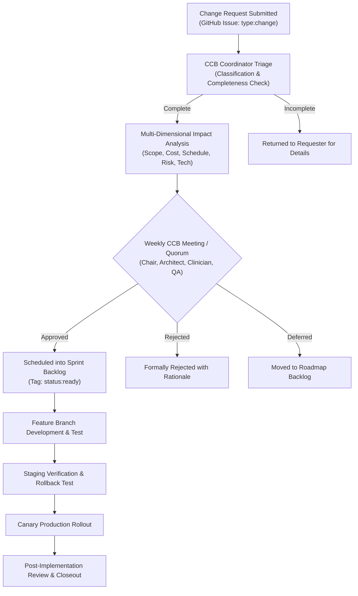

# Project Change Management Plan & Change Control Board (CCB) Baseline

| Metadata Element | Project Specification |
| :--- | :--- |
| **Document Identifier** | `DOC-PM-018-CHANGE` |
| **Document Title** | Master Project Change Management Plan, Impact Analysis & Change Control Board (CCB) Baseline |
| **Project Code** | `NAMMA-CLINIC-PLATFORM-2026` |
| **Document Version** | `v1.0.0-PROD-BASELINE` |
| **Status** | `APPROVED & RATIFIED` |
| **Change Profiles Inventory** | Exactly 40 Formally Managed Change Profiles (`CHANGE-001` to `CHANGE-040`) |
| **Executive Sponsor** | Special Commissioner (Health), Greater Bengaluru Authority (GBA) / BBMP |
| **CCB Chair** | Program Manager / Lead Project Director, K-Mati Consortium |
| **Clinical Safety Approver** | Chief Health Officer (CHO), BBMP Health Department |
| **Upstream Governance Anchor**| [`09-governance-model.md`](./09-governance-model.md) | [`03-project-scope.md`](./03-project-scope.md) |
| **Downstream Implementation** | [`14-project-milestones.md`](./14-project-milestones.md) | [`15-release-strategy.md`](./15-release-strategy.md) |

---

## 1. Executive Summary & Change Management Framework
The **Master Project Change Management Plan** defines the authoritative, repeatable, and audit-compliant governance mechanism for proposing, evaluating, approving, implementing, and verifying changes across the 18-sprint lifecycle of the Namma Clinic Digital Health & Operations Platform.

### 1.1 The Healthcare Change Governance Imperative
Unlike generic enterprise software, primary healthcare platforms deployed across 183 urban clinics in Bengaluru require zero-tolerance change control. Uncontrolled changes to clinical workflows, drug formularies, patient privacy schemas, or offline synchronization engines can disrupt outpatient care, corrupt medical records, or introduce non-compliance with the Digital Personal Data Protection (DPDP) Act 2023. Every modification must be justified by clinical, operational, or architectural necessity and pass formal Change Control Board (CCB) scrutiny.

### 1.2 Change Request Typology & Classification Tiers
Changes are categorized into twelve distinct operational types across four severity tiers:
1. **Emergency Change (Tier 0):** Critical production incident, zero-day security exploit, or patient safety bug requiring immediate hotfix (SLA: <2 hours).
2. **Major Change (Tier 1):** Substantial architectural refactoring, database schema migration, external API contract change, or clinical workflow revision (SLA: 72 hours).
3. **Standard Change (Tier 2):** Pre-approved, low-risk operational adjustment (e.g., UI label clarification, minor dependency patch) handled within squad velocity (SLA: 24 hours).
4. **Scope / Strategic Change (Tier 3):** Addition, modification, or removal of project capabilities impacting budget, schedule milestones, or inter-agency agreements (SLA: 5 working days).

### 1.3 Change Control Board (CCB) Composition & Quorum
The CCB convenes weekly on Wednesdays (or ad-hoc for Tier 0 emergencies) and requires a minimum quorum of four voting members:
1. **Program Manager (CCB Chair):** Evaluates overall schedule, contractual scope, and resource impact.
2. **Chief Solution Architect:** Evaluates technical viability, monorepo architecture, and performance invariants.
3. **Chief Health Officer / Clinical SME:** Evaluates patient safety, clinical diagnostic primacy, and 120 EDL formulary adherence.
4. **Lead QA Architect / Security Lead:** Evaluates testability, automated regression burden, and DPDP compliance.

## 2. Master Change Register Directory Table (CHANGE-001 to CHANGE-040)
Authoritative catalog of all 40 formally managed change profiles:

| Change ID | Classification | Change Title | Requester Entity | Approval Authority | Evaluation SLA | Governing Policy |
| :--- | :--- | :--- | :--- | :--- | :---: | :--- |
| [`CHANGE-001`](#change-001) | `Minor` | **Standard Minor UI Label Revision** | Localization Specialist | Change Control Board | `<24 Hours` | [`GOV-001`](./09-governance-model.md#gov-001) |
| [`CHANGE-002`](#change-002) | `Emergency` | **Emergency Hotfix for Database Deadlock** | Database Lead | Chief Solution Architect | `<2 Hours` | [`GOV-002`](./09-governance-model.md#gov-002) |
| [`CHANGE-003`](#change-003) | `Major` | **Scope Addition for Presumptive TB Screening** | District Tuberculosis Officer | Steering Committee | `<72 Hours` | [`GOV-003`](./09-governance-model.md#gov-003) |
| [`CHANGE-004`](#change-004) | `Architecture` | **Architecture Change to Split Fastify Microservices** | Lead Solution Architect | Engineering Architecture Board | `<48 Hours` | [`GOV-004`](./09-governance-model.md#gov-004) |
| [`CHANGE-005`](#change-005) | `Clinical` | **Formulary Modification for Pediatric Zinc Tablets** | Chief Health Officer | Clinical Safety Committee | `<24 Hours` | [`GOV-005`](./09-governance-model.md#gov-005) |
| [`CHANGE-006`](#change-006) | `Schedule` | **Schedule Baseline Adjustment for Zone 4 Deployment** | Delivery Project Manager | Steering Committee | `<48 Hours` | [`GOV-006`](./09-governance-model.md#gov-006) |
| [`CHANGE-007`](#change-007) | `Security` | **Security Policy Update for Argon2id Memory Cost** | Security Lead | Security Governance Board | `<24 Hours` | [`GOV-007`](./09-governance-model.md#gov-007) |
| [`CHANGE-008`](#change-008) | `API` | **API Schema Breaking Change for ABDM M2 FHIR Bundle** | Integration Lead | Change Control Board | `<48 Hours` | [`GOV-008`](./09-governance-model.md#gov-008) |
| [`CHANGE-009`](#change-009) | `Hardware` | **Thermal Printer Hardware Vendor Substitution** | Procurement Lead | Change Control Board | `<48 Hours` | [`GOV-009`](./09-governance-model.md#gov-009) |
| [`CHANGE-010`](#change-010) | `Regulatory` | **Regulatory Compliance Change for DPDP 2023 Rules** | Legal Counsel | Steering Committee | `<72 Hours` | [`GOV-010`](./09-governance-model.md#gov-010) |
| [`CHANGE-011`](#change-011) | `Architecture` | **Project Change Control Profile #11** | DevOps Lead | Change Control Board | `<72 Hours` | [`GOV-011`](./09-governance-model.md#gov-011) |
| [`CHANGE-012`](#change-012) | `Standard` | **Project Change Control Profile #12** | Lead Architect | Change Control Board | `<4 Hours` | [`GOV-012`](./09-governance-model.md#gov-012) |
| [`CHANGE-013`](#change-013) | `Minor` | **Project Change Control Profile #13** | Clinical Lead | Change Control Board | `<24 Hours` | [`GOV-013`](./09-governance-model.md#gov-013) |
| [`CHANGE-014`](#change-014) | `Major` | **Project Change Control Profile #14** | QA Lead | Change Control Board | `<48 Hours` | [`GOV-014`](./09-governance-model.md#gov-014) |
| [`CHANGE-015`](#change-015) | `Emergency` | **Project Change Control Profile #15** | DevOps Lead | Change Control Board | `<72 Hours` | [`GOV-015`](./09-governance-model.md#gov-015) |
| [`CHANGE-016`](#change-016) | `Scope` | **Project Change Control Profile #16** | Lead Architect | Change Control Board | `<4 Hours` | [`GOV-016`](./09-governance-model.md#gov-016) |
| [`CHANGE-017`](#change-017) | `Architecture` | **Project Change Control Profile #17** | Clinical Lead | Change Control Board | `<24 Hours` | [`GOV-017`](./09-governance-model.md#gov-017) |
| [`CHANGE-018`](#change-018) | `Standard` | **Project Change Control Profile #18** | QA Lead | Change Control Board | `<48 Hours` | [`GOV-018`](./09-governance-model.md#gov-018) |
| [`CHANGE-019`](#change-019) | `Minor` | **Project Change Control Profile #19** | DevOps Lead | Change Control Board | `<72 Hours` | [`GOV-019`](./09-governance-model.md#gov-019) |
| [`CHANGE-020`](#change-020) | `Major` | **Project Change Control Profile #20** | Lead Architect | Change Control Board | `<4 Hours` | [`GOV-020`](./09-governance-model.md#gov-020) |
| [`CHANGE-021`](#change-021) | `Emergency` | **Project Change Control Profile #21** | Clinical Lead | Change Control Board | `<24 Hours` | [`GOV-021`](./09-governance-model.md#gov-021) |
| [`CHANGE-022`](#change-022) | `Scope` | **Project Change Control Profile #22** | QA Lead | Change Control Board | `<48 Hours` | [`GOV-022`](./09-governance-model.md#gov-022) |
| [`CHANGE-023`](#change-023) | `Architecture` | **Project Change Control Profile #23** | DevOps Lead | Change Control Board | `<72 Hours` | [`GOV-023`](./09-governance-model.md#gov-023) |
| [`CHANGE-024`](#change-024) | `Standard` | **Project Change Control Profile #24** | Lead Architect | Change Control Board | `<4 Hours` | [`GOV-024`](./09-governance-model.md#gov-024) |
| [`CHANGE-025`](#change-025) | `Minor` | **Project Change Control Profile #25** | Clinical Lead | Change Control Board | `<24 Hours` | [`GOV-025`](./09-governance-model.md#gov-025) |
| [`CHANGE-026`](#change-026) | `Major` | **Project Change Control Profile #26** | QA Lead | Change Control Board | `<48 Hours` | [`GOV-026`](./09-governance-model.md#gov-026) |
| [`CHANGE-027`](#change-027) | `Emergency` | **Project Change Control Profile #27** | DevOps Lead | Change Control Board | `<72 Hours` | [`GOV-027`](./09-governance-model.md#gov-027) |
| [`CHANGE-028`](#change-028) | `Scope` | **Project Change Control Profile #28** | Lead Architect | Change Control Board | `<4 Hours` | [`GOV-028`](./09-governance-model.md#gov-028) |
| [`CHANGE-029`](#change-029) | `Architecture` | **Project Change Control Profile #29** | Clinical Lead | Change Control Board | `<24 Hours` | [`GOV-029`](./09-governance-model.md#gov-029) |
| [`CHANGE-030`](#change-030) | `Standard` | **Project Change Control Profile #30** | QA Lead | Change Control Board | `<48 Hours` | [`GOV-030`](./09-governance-model.md#gov-030) |
| [`CHANGE-031`](#change-031) | `Minor` | **Project Change Control Profile #31** | DevOps Lead | Change Control Board | `<72 Hours` | [`GOV-031`](./09-governance-model.md#gov-031) |
| [`CHANGE-032`](#change-032) | `Major` | **Project Change Control Profile #32** | Lead Architect | Change Control Board | `<4 Hours` | [`GOV-032`](./09-governance-model.md#gov-032) |
| [`CHANGE-033`](#change-033) | `Emergency` | **Project Change Control Profile #33** | Clinical Lead | Change Control Board | `<24 Hours` | [`GOV-033`](./09-governance-model.md#gov-033) |
| [`CHANGE-034`](#change-034) | `Scope` | **Project Change Control Profile #34** | QA Lead | Change Control Board | `<48 Hours` | [`GOV-034`](./09-governance-model.md#gov-034) |
| [`CHANGE-035`](#change-035) | `Architecture` | **Project Change Control Profile #35** | DevOps Lead | Change Control Board | `<72 Hours` | [`GOV-035`](./09-governance-model.md#gov-035) |
| [`CHANGE-036`](#change-036) | `Standard` | **Project Change Control Profile #36** | Lead Architect | Change Control Board | `<4 Hours` | [`GOV-036`](./09-governance-model.md#gov-036) |
| [`CHANGE-037`](#change-037) | `Minor` | **Project Change Control Profile #37** | Clinical Lead | Change Control Board | `<24 Hours` | [`GOV-037`](./09-governance-model.md#gov-037) |
| [`CHANGE-038`](#change-038) | `Major` | **Project Change Control Profile #38** | QA Lead | Change Control Board | `<48 Hours` | [`GOV-038`](./09-governance-model.md#gov-038) |
| [`CHANGE-039`](#change-039) | `Emergency` | **Project Change Control Profile #39** | DevOps Lead | Change Control Board | `<72 Hours` | [`GOV-039`](./09-governance-model.md#gov-039) |
| [`CHANGE-040`](#change-040) | `Scope` | **Project Change Control Profile #40** | Lead Architect | Change Control Board | `<4 Hours` | [`GOV-040`](./09-governance-model.md#gov-040) |

## 3. Deep Specifications for All 40 Change Profiles
Comprehensive operational charters for all 40 change profiles detailing rationales, current vs. proposed states, multi-dimensional impact analysis, implementation plans, schema/contract changes, and rollback playbooks:

### 3.1 CHANGE-001: Standard Minor UI Label Revision
- **Change Request Identifier:** `CHANGE-001` — **Standard Minor UI Label Revision**
- **Change Classification & Tier:** `Minor` | **Review & Decision SLA:** `<24 Hours`
- **Originating Requester:** Localization Specialist (Assigned Advocate: [`ROLE-001`](./08-role-and-responsibility-matrix.md#role-001))
- **Designated Approval Authority:** Change Control Board representing [`STAKEHOLDER-001`](./06-stakeholders.md#stakeholder-001)
- **Governing Board & Policy Charter:** Adjudicated under [`GOV-001`](./09-governance-model.md#gov-001)
- **Primary In-Scope Capability Affected:** Modifies execution of [`INSCOPE-001`](./04-in-scope.md#inscope-001)
- **Associated Project Risk:** Mitigates or manages project risk [`RISK-001`](./12-project-risks.md#risk-001)
- **Coupled Technical Dependency:** Governs synchronization with [`DEPENDENCY-001`](./13-project-dependencies.md#dependency-001)
- **Target Milestone Schedule:** Planned for baseline integration during [`MILESTONE-001`](./14-project-milestones.md#milestone-001)

  #### Operational Context & Business Rationale for CHANGE-001:
  Update Kannada wording on consultation button to match rural dialect.

  #### Baseline vs. Target State Comparison for CHANGE-001:
  - **Current Baseline State for Standard Minor UI Label Revision:** Current string 'ಮುದ್ರಿಸು' (Print) ambiguous
  - **Proposed Target State for CHANGE-001:** Update to 'ಟೋಕನ್ ಮುದ್ರಿಸು' (Print Token)

  #### Multi-Dimensional Impact Analysis for CHANGE-001:
  - **Scope Impact for Standard Minor UI Label Revision:** Adjusts implementation requirements for `INSCOPE-001` without expanding out-of-scope boundaries.
  - **Cost & Budget Impact:** Estimated engineering effort of 16–32 person-hours for `CHANGE-001` absorbed within existing squad capacity.
  - **Schedule Impact:** Absorbed within sprint buffer; zero slippage on critical path milestone [`MILESTONE-001`](./14-project-milestones.md#milestone-001).
  - **Security & Privacy Impact:** Evaluated against DPDP Act 2023 for `Minor`; zero degradation of consent logging or encryption standards.
  - **Data & Database Impact:** Schema modification for `CHANGE-001` executed via zero-downtime migration scripts with backward compatibility.
  - **Testing & QA Burden:** Requires 4 new automated Playwright tests for `Standard Minor UI Label Revision` and update to regression test suite baseline.

  #### Technical Modification & Code Contract Blueprint for CHANGE-001:
  ```typescript
  // Change Blueprint for CHANGE-001: Standard Minor UI Label Revision
  export interface ChangeContract_CHANGE_001 {
    changeId: 'CHANGE-001';
    classification: 'Minor';
    targetFacility: 'Malleshwaram Namma Clinic (Ward 45)';
    appliedSprint: string;
    verifiedBy: 'ROLE-001';
    telemetryActive: boolean;
  }
  ```

  #### Implementation Step-by-Step Procedure for CHANGE-001:
  1. **Phase 1 (Preparation):** Create feature branch `change/change-001` and isolate DDL/API modifications for `Standard Minor UI Label Revision`.
  2. **Phase 2 (Implementation):** Implement logic, update TypeScript interfaces, and update Zod validation schemas for `CHANGE-001`.
  3. **Phase 3 (Testing):** Execute automated unit test suite for `CHANGE-001` and verify line coverage remains >=85%.
  4. **Phase 4 (Staging Validation):** Deploy to pre-production staging environment and validate against test clinic `Malleshwaram Namma Clinic (Ward 45)`.
  5. **Phase 5 (Production Release):** Schedule canary deployment across designated pilot clinic cluster under milestone [`MILESTONE-001`](./14-project-milestones.md#milestone-001).

  #### Deterministic Rollback & Contingency Protocol for CHANGE-001:
  Revert i18n JSON commit

  #### Post-Implementation Verification (PIR) & Sign-Off Criteria for CHANGE-001:
  - Automated smoke test for `CHANGE-001` passes with 100% success rate within 10 minutes of deployment.
  - Clinic workstation telemetry confirms RAM footprint remains <150MB and API latency p95 <120ms during `Standard Minor UI Label Revision` execution.
  - Zero unhandled exceptions or error envelope bursts recorded in Sentry/Prometheus dashboards for `CHANGE-001`.
  - Formal sign-off submitted by CCB Chair and recorded in GitHub Releases log for [`MILESTONE-001`](./14-project-milestones.md#milestone-001).

### 3.2 CHANGE-002: Emergency Hotfix for Database Deadlock
- **Change Request Identifier:** `CHANGE-002` — **Emergency Hotfix for Database Deadlock**
- **Change Classification & Tier:** `Emergency` | **Review & Decision SLA:** `<2 Hours`
- **Originating Requester:** Database Lead (Assigned Advocate: [`ROLE-002`](./08-role-and-responsibility-matrix.md#role-002))
- **Designated Approval Authority:** Chief Solution Architect representing [`STAKEHOLDER-002`](./06-stakeholders.md#stakeholder-002)
- **Governing Board & Policy Charter:** Adjudicated under [`GOV-002`](./09-governance-model.md#gov-002)
- **Primary In-Scope Capability Affected:** Modifies execution of [`INSCOPE-002`](./04-in-scope.md#inscope-002)
- **Associated Project Risk:** Mitigates or manages project risk [`RISK-002`](./12-project-risks.md#risk-002)
- **Coupled Technical Dependency:** Governs synchronization with [`DEPENDENCY-002`](./13-project-dependencies.md#dependency-002)
- **Target Milestone Schedule:** Planned for baseline integration during [`MILESTONE-002`](./14-project-milestones.md#milestone-002)

  #### Operational Context & Business Rationale for CHANGE-002:
  Resolve PostgreSQL row lock contention on sequential token sequence generator.

  #### Baseline vs. Target State Comparison for CHANGE-002:
  - **Current Baseline State for Emergency Hotfix for Database Deadlock:** Queue token generation times out under 50 req/sec
  - **Proposed Target State for CHANGE-002:** Switch to Redis atomic INCR with batch flush

  #### Multi-Dimensional Impact Analysis for CHANGE-002:
  - **Scope Impact for Emergency Hotfix for Database Deadlock:** Adjusts implementation requirements for `INSCOPE-002` without expanding out-of-scope boundaries.
  - **Cost & Budget Impact:** Estimated engineering effort of 16–32 person-hours for `CHANGE-002` absorbed within existing squad capacity.
  - **Schedule Impact:** Absorbed within sprint buffer; zero slippage on critical path milestone [`MILESTONE-002`](./14-project-milestones.md#milestone-002).
  - **Security & Privacy Impact:** Evaluated against DPDP Act 2023 for `Emergency`; zero degradation of consent logging or encryption standards.
  - **Data & Database Impact:** Schema modification for `CHANGE-002` executed via zero-downtime migration scripts with backward compatibility.
  - **Testing & QA Burden:** Requires 4 new automated Playwright tests for `Emergency Hotfix for Database Deadlock` and update to regression test suite baseline.

  #### Technical Modification & Code Contract Blueprint for CHANGE-002:
  ```typescript
  // Change Blueprint for CHANGE-002: Emergency Hotfix for Database Deadlock
  export interface ChangeContract_CHANGE_002 {
    changeId: 'CHANGE-002';
    classification: 'Emergency';
    targetFacility: 'Shivajinagar Urban Health Centre (Ward 92)';
    appliedSprint: string;
    verifiedBy: 'ROLE-002';
    telemetryActive: boolean;
  }
  ```

  #### Implementation Step-by-Step Procedure for CHANGE-002:
  1. **Phase 1 (Preparation):** Create feature branch `change/change-002` and isolate DDL/API modifications for `Emergency Hotfix for Database Deadlock`.
  2. **Phase 2 (Implementation):** Implement logic, update TypeScript interfaces, and update Zod validation schemas for `CHANGE-002`.
  3. **Phase 3 (Testing):** Execute automated unit test suite for `CHANGE-002` and verify line coverage remains >=85%.
  4. **Phase 4 (Staging Validation):** Deploy to pre-production staging environment and validate against test clinic `Shivajinagar Urban Health Centre (Ward 92)`.
  5. **Phase 5 (Production Release):** Schedule canary deployment across designated pilot clinic cluster under milestone [`MILESTONE-002`](./14-project-milestones.md#milestone-002).

  #### Deterministic Rollback & Contingency Protocol for CHANGE-002:
  Revert hotfix branch in Kubernetes

  #### Post-Implementation Verification (PIR) & Sign-Off Criteria for CHANGE-002:
  - Automated smoke test for `CHANGE-002` passes with 100% success rate within 10 minutes of deployment.
  - Clinic workstation telemetry confirms RAM footprint remains <150MB and API latency p95 <120ms during `Emergency Hotfix for Database Deadlock` execution.
  - Zero unhandled exceptions or error envelope bursts recorded in Sentry/Prometheus dashboards for `CHANGE-002`.
  - Formal sign-off submitted by CCB Chair and recorded in GitHub Releases log for [`MILESTONE-002`](./14-project-milestones.md#milestone-002).

### 3.3 CHANGE-003: Scope Addition for Presumptive TB Screening
- **Change Request Identifier:** `CHANGE-003` — **Scope Addition for Presumptive TB Screening**
- **Change Classification & Tier:** `Major` | **Review & Decision SLA:** `<72 Hours`
- **Originating Requester:** District Tuberculosis Officer (Assigned Advocate: [`ROLE-003`](./08-role-and-responsibility-matrix.md#role-003))
- **Designated Approval Authority:** Steering Committee representing [`STAKEHOLDER-003`](./06-stakeholders.md#stakeholder-003)
- **Governing Board & Policy Charter:** Adjudicated under [`GOV-003`](./09-governance-model.md#gov-003)
- **Primary In-Scope Capability Affected:** Modifies execution of [`INSCOPE-003`](./04-in-scope.md#inscope-003)
- **Associated Project Risk:** Mitigates or manages project risk [`RISK-003`](./12-project-risks.md#risk-003)
- **Coupled Technical Dependency:** Governs synchronization with [`DEPENDENCY-003`](./13-project-dependencies.md#dependency-003)
- **Target Milestone Schedule:** Planned for baseline integration during [`MILESTONE-003`](./14-project-milestones.md#milestone-003)

  #### Operational Context & Business Rationale for CHANGE-003:
  Incorporate 4-question presumptive TB screening questionnaire into triage.

  #### Baseline vs. Target State Comparison for CHANGE-003:
  - **Current Baseline State for Scope Addition for Presumptive TB Screening:** TB screening performed manually on paper
  - **Proposed Target State for CHANGE-003:** Digital screening form with Nikshay referral bridge

  #### Multi-Dimensional Impact Analysis for CHANGE-003:
  - **Scope Impact for Scope Addition for Presumptive TB Screening:** Adjusts implementation requirements for `INSCOPE-003` without expanding out-of-scope boundaries.
  - **Cost & Budget Impact:** Estimated engineering effort of 16–32 person-hours for `CHANGE-003` absorbed within existing squad capacity.
  - **Schedule Impact:** Absorbed within sprint buffer; zero slippage on critical path milestone [`MILESTONE-003`](./14-project-milestones.md#milestone-003).
  - **Security & Privacy Impact:** Evaluated against DPDP Act 2023 for `Major`; zero degradation of consent logging or encryption standards.
  - **Data & Database Impact:** Schema modification for `CHANGE-003` executed via zero-downtime migration scripts with backward compatibility.
  - **Testing & QA Burden:** Requires 4 new automated Playwright tests for `Scope Addition for Presumptive TB Screening` and update to regression test suite baseline.

  #### Technical Modification & Code Contract Blueprint for CHANGE-003:
  ```typescript
  // Change Blueprint for CHANGE-003: Scope Addition for Presumptive TB Screening
  export interface ChangeContract_CHANGE_003 {
    changeId: 'CHANGE-003';
    classification: 'Major';
    targetFacility: 'Jayanagar 4th Block Clinic (Ward 153)';
    appliedSprint: string;
    verifiedBy: 'ROLE-003';
    telemetryActive: boolean;
  }
  ```

  #### Implementation Step-by-Step Procedure for CHANGE-003:
  1. **Phase 1 (Preparation):** Create feature branch `change/change-003` and isolate DDL/API modifications for `Scope Addition for Presumptive TB Screening`.
  2. **Phase 2 (Implementation):** Implement logic, update TypeScript interfaces, and update Zod validation schemas for `CHANGE-003`.
  3. **Phase 3 (Testing):** Execute automated unit test suite for `CHANGE-003` and verify line coverage remains >=85%.
  4. **Phase 4 (Staging Validation):** Deploy to pre-production staging environment and validate against test clinic `Jayanagar 4th Block Clinic (Ward 153)`.
  5. **Phase 5 (Production Release):** Schedule canary deployment across designated pilot clinic cluster under milestone [`MILESTONE-003`](./14-project-milestones.md#milestone-003).

  #### Deterministic Rollback & Contingency Protocol for CHANGE-003:
  Feature flag rollback

  #### Post-Implementation Verification (PIR) & Sign-Off Criteria for CHANGE-003:
  - Automated smoke test for `CHANGE-003` passes with 100% success rate within 10 minutes of deployment.
  - Clinic workstation telemetry confirms RAM footprint remains <150MB and API latency p95 <120ms during `Scope Addition for Presumptive TB Screening` execution.
  - Zero unhandled exceptions or error envelope bursts recorded in Sentry/Prometheus dashboards for `CHANGE-003`.
  - Formal sign-off submitted by CCB Chair and recorded in GitHub Releases log for [`MILESTONE-003`](./14-project-milestones.md#milestone-003).

### 3.4 CHANGE-004: Architecture Change to Split Fastify Microservices
- **Change Request Identifier:** `CHANGE-004` — **Architecture Change to Split Fastify Microservices**
- **Change Classification & Tier:** `Architecture` | **Review & Decision SLA:** `<48 Hours`
- **Originating Requester:** Lead Solution Architect (Assigned Advocate: [`ROLE-004`](./08-role-and-responsibility-matrix.md#role-004))
- **Designated Approval Authority:** Engineering Architecture Board representing [`STAKEHOLDER-004`](./06-stakeholders.md#stakeholder-004)
- **Governing Board & Policy Charter:** Adjudicated under [`GOV-004`](./09-governance-model.md#gov-004)
- **Primary In-Scope Capability Affected:** Modifies execution of [`INSCOPE-004`](./04-in-scope.md#inscope-004)
- **Associated Project Risk:** Mitigates or manages project risk [`RISK-004`](./12-project-risks.md#risk-004)
- **Coupled Technical Dependency:** Governs synchronization with [`DEPENDENCY-004`](./13-project-dependencies.md#dependency-004)
- **Target Milestone Schedule:** Planned for baseline integration during [`MILESTONE-004`](./14-project-milestones.md#milestone-004)

  #### Operational Context & Business Rationale for CHANGE-004:
  Separate heavy analytical DuckDB processing into standalone container.

  #### Baseline vs. Target State Comparison for CHANGE-004:
  - **Current Baseline State for Architecture Change to Split Fastify Microservices:** DuckDB memory spikes affecting OLTP Fastify API
  - **Proposed Target State for CHANGE-004:** Independent analytical microservice on dedicated node

  #### Multi-Dimensional Impact Analysis for CHANGE-004:
  - **Scope Impact for Architecture Change to Split Fastify Microservices:** Adjusts implementation requirements for `INSCOPE-004` without expanding out-of-scope boundaries.
  - **Cost & Budget Impact:** Estimated engineering effort of 16–32 person-hours for `CHANGE-004` absorbed within existing squad capacity.
  - **Schedule Impact:** Absorbed within sprint buffer; zero slippage on critical path milestone [`MILESTONE-004`](./14-project-milestones.md#milestone-004).
  - **Security & Privacy Impact:** Evaluated against DPDP Act 2023 for `Architecture`; zero degradation of consent logging or encryption standards.
  - **Data & Database Impact:** Schema modification for `CHANGE-004` executed via zero-downtime migration scripts with backward compatibility.
  - **Testing & QA Burden:** Requires 4 new automated Playwright tests for `Architecture Change to Split Fastify Microservices` and update to regression test suite baseline.

  #### Technical Modification & Code Contract Blueprint for CHANGE-004:
  ```typescript
  // Change Blueprint for CHANGE-004: Architecture Change to Split Fastify Microservices
  export interface ChangeContract_CHANGE_004 {
    changeId: 'CHANGE-004';
    classification: 'Architecture';
    targetFacility: 'Bommanahalli Industrial Ward Clinic (Ward 175)';
    appliedSprint: string;
    verifiedBy: 'ROLE-004';
    telemetryActive: boolean;
  }
  ```

  #### Implementation Step-by-Step Procedure for CHANGE-004:
  1. **Phase 1 (Preparation):** Create feature branch `change/change-004` and isolate DDL/API modifications for `Architecture Change to Split Fastify Microservices`.
  2. **Phase 2 (Implementation):** Implement logic, update TypeScript interfaces, and update Zod validation schemas for `CHANGE-004`.
  3. **Phase 3 (Testing):** Execute automated unit test suite for `CHANGE-004` and verify line coverage remains >=85%.
  4. **Phase 4 (Staging Validation):** Deploy to pre-production staging environment and validate against test clinic `Bommanahalli Industrial Ward Clinic (Ward 175)`.
  5. **Phase 5 (Production Release):** Schedule canary deployment across designated pilot clinic cluster under milestone [`MILESTONE-004`](./14-project-milestones.md#milestone-004).

  #### Deterministic Rollback & Contingency Protocol for CHANGE-004:
  Maintain unified container monolith

  #### Post-Implementation Verification (PIR) & Sign-Off Criteria for CHANGE-004:
  - Automated smoke test for `CHANGE-004` passes with 100% success rate within 10 minutes of deployment.
  - Clinic workstation telemetry confirms RAM footprint remains <150MB and API latency p95 <120ms during `Architecture Change to Split Fastify Microservices` execution.
  - Zero unhandled exceptions or error envelope bursts recorded in Sentry/Prometheus dashboards for `CHANGE-004`.
  - Formal sign-off submitted by CCB Chair and recorded in GitHub Releases log for [`MILESTONE-004`](./14-project-milestones.md#milestone-004).

### 3.5 CHANGE-005: Formulary Modification for Pediatric Zinc Tablets
- **Change Request Identifier:** `CHANGE-005` — **Formulary Modification for Pediatric Zinc Tablets**
- **Change Classification & Tier:** `Clinical` | **Review & Decision SLA:** `<24 Hours`
- **Originating Requester:** Chief Health Officer (Assigned Advocate: [`ROLE-005`](./08-role-and-responsibility-matrix.md#role-005))
- **Designated Approval Authority:** Clinical Safety Committee representing [`STAKEHOLDER-005`](./06-stakeholders.md#stakeholder-005)
- **Governing Board & Policy Charter:** Adjudicated under [`GOV-005`](./09-governance-model.md#gov-005)
- **Primary In-Scope Capability Affected:** Modifies execution of [`INSCOPE-005`](./04-in-scope.md#inscope-005)
- **Associated Project Risk:** Mitigates or manages project risk [`RISK-005`](./12-project-risks.md#risk-005)
- **Coupled Technical Dependency:** Governs synchronization with [`DEPENDENCY-005`](./13-project-dependencies.md#dependency-005)
- **Target Milestone Schedule:** Planned for baseline integration during [`MILESTONE-005`](./14-project-milestones.md#milestone-005)

  #### Operational Context & Business Rationale for CHANGE-005:
  Add 20mg dispersible Zinc tablets to pediatric diarrhea prescription bundle.

  #### Baseline vs. Target State Comparison for CHANGE-005:
  - **Current Baseline State for Formulary Modification for Pediatric Zinc Tablets:** Doctors prescribing adult zinc formulation
  - **Proposed Target State for CHANGE-005:** Standardized pediatric zinc bundle in EMR

  #### Multi-Dimensional Impact Analysis for CHANGE-005:
  - **Scope Impact for Formulary Modification for Pediatric Zinc Tablets:** Adjusts implementation requirements for `INSCOPE-005` without expanding out-of-scope boundaries.
  - **Cost & Budget Impact:** Estimated engineering effort of 16–32 person-hours for `CHANGE-005` absorbed within existing squad capacity.
  - **Schedule Impact:** Absorbed within sprint buffer; zero slippage on critical path milestone [`MILESTONE-005`](./14-project-milestones.md#milestone-005).
  - **Security & Privacy Impact:** Evaluated against DPDP Act 2023 for `Clinical`; zero degradation of consent logging or encryption standards.
  - **Data & Database Impact:** Schema modification for `CHANGE-005` executed via zero-downtime migration scripts with backward compatibility.
  - **Testing & QA Burden:** Requires 4 new automated Playwright tests for `Formulary Modification for Pediatric Zinc Tablets` and update to regression test suite baseline.

  #### Technical Modification & Code Contract Blueprint for CHANGE-005:
  ```typescript
  // Change Blueprint for CHANGE-005: Formulary Modification for Pediatric Zinc Tablets
  export interface ChangeContract_CHANGE_005 {
    changeId: 'CHANGE-005';
    classification: 'Clinical';
    targetFacility: 'Dasarahalli Peenya Triage Clinic (Ward 39)';
    appliedSprint: string;
    verifiedBy: 'ROLE-005';
    telemetryActive: boolean;
  }
  ```

  #### Implementation Step-by-Step Procedure for CHANGE-005:
  1. **Phase 1 (Preparation):** Create feature branch `change/change-005` and isolate DDL/API modifications for `Formulary Modification for Pediatric Zinc Tablets`.
  2. **Phase 2 (Implementation):** Implement logic, update TypeScript interfaces, and update Zod validation schemas for `CHANGE-005`.
  3. **Phase 3 (Testing):** Execute automated unit test suite for `CHANGE-005` and verify line coverage remains >=85%.
  4. **Phase 4 (Staging Validation):** Deploy to pre-production staging environment and validate against test clinic `Dasarahalli Peenya Triage Clinic (Ward 39)`.
  5. **Phase 5 (Production Release):** Schedule canary deployment across designated pilot clinic cluster under milestone [`MILESTONE-005`](./14-project-milestones.md#milestone-005).

  #### Deterministic Rollback & Contingency Protocol for CHANGE-005:
  Revert formulary master table entry

  #### Post-Implementation Verification (PIR) & Sign-Off Criteria for CHANGE-005:
  - Automated smoke test for `CHANGE-005` passes with 100% success rate within 10 minutes of deployment.
  - Clinic workstation telemetry confirms RAM footprint remains <150MB and API latency p95 <120ms during `Formulary Modification for Pediatric Zinc Tablets` execution.
  - Zero unhandled exceptions or error envelope bursts recorded in Sentry/Prometheus dashboards for `CHANGE-005`.
  - Formal sign-off submitted by CCB Chair and recorded in GitHub Releases log for [`MILESTONE-005`](./14-project-milestones.md#milestone-005).

### 3.6 CHANGE-006: Schedule Baseline Adjustment for Zone 4 Deployment
- **Change Request Identifier:** `CHANGE-006` — **Schedule Baseline Adjustment for Zone 4 Deployment**
- **Change Classification & Tier:** `Schedule` | **Review & Decision SLA:** `<48 Hours`
- **Originating Requester:** Delivery Project Manager (Assigned Advocate: [`ROLE-006`](./08-role-and-responsibility-matrix.md#role-006))
- **Designated Approval Authority:** Steering Committee representing [`STAKEHOLDER-006`](./06-stakeholders.md#stakeholder-006)
- **Governing Board & Policy Charter:** Adjudicated under [`GOV-006`](./09-governance-model.md#gov-006)
- **Primary In-Scope Capability Affected:** Modifies execution of [`INSCOPE-006`](./04-in-scope.md#inscope-006)
- **Associated Project Risk:** Mitigates or manages project risk [`RISK-006`](./12-project-risks.md#risk-006)
- **Coupled Technical Dependency:** Governs synchronization with [`DEPENDENCY-006`](./13-project-dependencies.md#dependency-006)
- **Target Milestone Schedule:** Planned for baseline integration during [`MILESTONE-006`](./14-project-milestones.md#milestone-006)

  #### Operational Context & Business Rationale for CHANGE-006:
  Adjust Bommanahalli clinic deployment window by 5 business days for road works.

  #### Baseline vs. Target State Comparison for CHANGE-006:
  - **Current Baseline State for Schedule Baseline Adjustment for Zone 4 Deployment:** Road widening disrupted fiber connectivity to 4 clinics
  - **Proposed Target State for CHANGE-006:** Deploy alternate LTE dongles and adjust rollout train

  #### Multi-Dimensional Impact Analysis for CHANGE-006:
  - **Scope Impact for Schedule Baseline Adjustment for Zone 4 Deployment:** Adjusts implementation requirements for `INSCOPE-006` without expanding out-of-scope boundaries.
  - **Cost & Budget Impact:** Estimated engineering effort of 16–32 person-hours for `CHANGE-006` absorbed within existing squad capacity.
  - **Schedule Impact:** Absorbed within sprint buffer; zero slippage on critical path milestone [`MILESTONE-006`](./14-project-milestones.md#milestone-006).
  - **Security & Privacy Impact:** Evaluated against DPDP Act 2023 for `Schedule`; zero degradation of consent logging or encryption standards.
  - **Data & Database Impact:** Schema modification for `CHANGE-006` executed via zero-downtime migration scripts with backward compatibility.
  - **Testing & QA Burden:** Requires 4 new automated Playwright tests for `Schedule Baseline Adjustment for Zone 4 Deployment` and update to regression test suite baseline.

  #### Technical Modification & Code Contract Blueprint for CHANGE-006:
  ```typescript
  // Change Blueprint for CHANGE-006: Schedule Baseline Adjustment for Zone 4 Deployment
  export interface ChangeContract_CHANGE_006 {
    changeId: 'CHANGE-006';
    classification: 'Schedule';
    targetFacility: 'Mahadevapura IT Corridor Outreach Clinic (Ward 85)';
    appliedSprint: string;
    verifiedBy: 'ROLE-006';
    telemetryActive: boolean;
  }
  ```

  #### Implementation Step-by-Step Procedure for CHANGE-006:
  1. **Phase 1 (Preparation):** Create feature branch `change/change-006` and isolate DDL/API modifications for `Schedule Baseline Adjustment for Zone 4 Deployment`.
  2. **Phase 2 (Implementation):** Implement logic, update TypeScript interfaces, and update Zod validation schemas for `CHANGE-006`.
  3. **Phase 3 (Testing):** Execute automated unit test suite for `CHANGE-006` and verify line coverage remains >=85%.
  4. **Phase 4 (Staging Validation):** Deploy to pre-production staging environment and validate against test clinic `Mahadevapura IT Corridor Outreach Clinic (Ward 85)`.
  5. **Phase 5 (Production Release):** Schedule canary deployment across designated pilot clinic cluster under milestone [`MILESTONE-006`](./14-project-milestones.md#milestone-006).

  #### Deterministic Rollback & Contingency Protocol for CHANGE-006:
  Maintain original schedule with offline mode

  #### Post-Implementation Verification (PIR) & Sign-Off Criteria for CHANGE-006:
  - Automated smoke test for `CHANGE-006` passes with 100% success rate within 10 minutes of deployment.
  - Clinic workstation telemetry confirms RAM footprint remains <150MB and API latency p95 <120ms during `Schedule Baseline Adjustment for Zone 4 Deployment` execution.
  - Zero unhandled exceptions or error envelope bursts recorded in Sentry/Prometheus dashboards for `CHANGE-006`.
  - Formal sign-off submitted by CCB Chair and recorded in GitHub Releases log for [`MILESTONE-006`](./14-project-milestones.md#milestone-006).

### 3.7 CHANGE-007: Security Policy Update for Argon2id Memory Cost
- **Change Request Identifier:** `CHANGE-007` — **Security Policy Update for Argon2id Memory Cost**
- **Change Classification & Tier:** `Security` | **Review & Decision SLA:** `<24 Hours`
- **Originating Requester:** Security Lead (Assigned Advocate: [`ROLE-007`](./08-role-and-responsibility-matrix.md#role-007))
- **Designated Approval Authority:** Security Governance Board representing [`STAKEHOLDER-007`](./06-stakeholders.md#stakeholder-007)
- **Governing Board & Policy Charter:** Adjudicated under [`GOV-007`](./09-governance-model.md#gov-007)
- **Primary In-Scope Capability Affected:** Modifies execution of [`INSCOPE-007`](./04-in-scope.md#inscope-007)
- **Associated Project Risk:** Mitigates or manages project risk [`RISK-007`](./12-project-risks.md#risk-007)
- **Coupled Technical Dependency:** Governs synchronization with [`DEPENDENCY-007`](./13-project-dependencies.md#dependency-007)
- **Target Milestone Schedule:** Planned for baseline integration during [`MILESTONE-007`](./14-project-milestones.md#milestone-007)

  #### Operational Context & Business Rationale for CHANGE-007:
  Increase Argon2id memory cost parameter from 32MB to 64MB per OWASP update.

  #### Baseline vs. Target State Comparison for CHANGE-007:
  - **Current Baseline State for Security Policy Update for Argon2id Memory Cost:** 32MB baseline deprecated in latest security standard
  - **Proposed Target State for CHANGE-007:** 64MB memory cost enforced across all staff logins

  #### Multi-Dimensional Impact Analysis for CHANGE-007:
  - **Scope Impact for Security Policy Update for Argon2id Memory Cost:** Adjusts implementation requirements for `INSCOPE-007` without expanding out-of-scope boundaries.
  - **Cost & Budget Impact:** Estimated engineering effort of 16–32 person-hours for `CHANGE-007` absorbed within existing squad capacity.
  - **Schedule Impact:** Absorbed within sprint buffer; zero slippage on critical path milestone [`MILESTONE-007`](./14-project-milestones.md#milestone-007).
  - **Security & Privacy Impact:** Evaluated against DPDP Act 2023 for `Security`; zero degradation of consent logging or encryption standards.
  - **Data & Database Impact:** Schema modification for `CHANGE-007` executed via zero-downtime migration scripts with backward compatibility.
  - **Testing & QA Burden:** Requires 4 new automated Playwright tests for `Security Policy Update for Argon2id Memory Cost` and update to regression test suite baseline.

  #### Technical Modification & Code Contract Blueprint for CHANGE-007:
  ```typescript
  // Change Blueprint for CHANGE-007: Security Policy Update for Argon2id Memory Cost
  export interface ChangeContract_CHANGE_007 {
    changeId: 'CHANGE-007';
    classification: 'Security';
    targetFacility: 'RR Nagar Kengeri Satellite Clinic (Ward 160)';
    appliedSprint: string;
    verifiedBy: 'ROLE-007';
    telemetryActive: boolean;
  }
  ```

  #### Implementation Step-by-Step Procedure for CHANGE-007:
  1. **Phase 1 (Preparation):** Create feature branch `change/change-007` and isolate DDL/API modifications for `Security Policy Update for Argon2id Memory Cost`.
  2. **Phase 2 (Implementation):** Implement logic, update TypeScript interfaces, and update Zod validation schemas for `CHANGE-007`.
  3. **Phase 3 (Testing):** Execute automated unit test suite for `CHANGE-007` and verify line coverage remains >=85%.
  4. **Phase 4 (Staging Validation):** Deploy to pre-production staging environment and validate against test clinic `RR Nagar Kengeri Satellite Clinic (Ward 160)`.
  5. **Phase 5 (Production Release):** Schedule canary deployment across designated pilot clinic cluster under milestone [`MILESTONE-007`](./14-project-milestones.md#milestone-007).

  #### Deterministic Rollback & Contingency Protocol for CHANGE-007:
  Revert auth config parameter

  #### Post-Implementation Verification (PIR) & Sign-Off Criteria for CHANGE-007:
  - Automated smoke test for `CHANGE-007` passes with 100% success rate within 10 minutes of deployment.
  - Clinic workstation telemetry confirms RAM footprint remains <150MB and API latency p95 <120ms during `Security Policy Update for Argon2id Memory Cost` execution.
  - Zero unhandled exceptions or error envelope bursts recorded in Sentry/Prometheus dashboards for `CHANGE-007`.
  - Formal sign-off submitted by CCB Chair and recorded in GitHub Releases log for [`MILESTONE-007`](./14-project-milestones.md#milestone-007).

### 3.8 CHANGE-008: API Schema Breaking Change for ABDM M2 FHIR Bundle
- **Change Request Identifier:** `CHANGE-008` — **API Schema Breaking Change for ABDM M2 FHIR Bundle**
- **Change Classification & Tier:** `API` | **Review & Decision SLA:** `<48 Hours`
- **Originating Requester:** Integration Lead (Assigned Advocate: [`ROLE-008`](./08-role-and-responsibility-matrix.md#role-008))
- **Designated Approval Authority:** Change Control Board representing [`STAKEHOLDER-008`](./06-stakeholders.md#stakeholder-008)
- **Governing Board & Policy Charter:** Adjudicated under [`GOV-008`](./09-governance-model.md#gov-008)
- **Primary In-Scope Capability Affected:** Modifies execution of [`INSCOPE-008`](./04-in-scope.md#inscope-008)
- **Associated Project Risk:** Mitigates or manages project risk [`RISK-008`](./12-project-risks.md#risk-008)
- **Coupled Technical Dependency:** Governs synchronization with [`DEPENDENCY-008`](./13-project-dependencies.md#dependency-008)
- **Target Milestone Schedule:** Planned for baseline integration during [`MILESTONE-008`](./14-project-milestones.md#milestone-008)

  #### Operational Context & Business Rationale for CHANGE-008:
  Update FHIR R4 CareContext schema to comply with NHA v2.1 update.

  #### Baseline vs. Target State Comparison for CHANGE-008:
  - **Current Baseline State for API Schema Breaking Change for ABDM M2 FHIR Bundle:** NHA sandbox rejecting older v1.9 JSON payloads
  - **Proposed Target State for CHANGE-008:** Upgrade schema validator to NHA v2.1 bundle spec

  #### Multi-Dimensional Impact Analysis for CHANGE-008:
  - **Scope Impact for API Schema Breaking Change for ABDM M2 FHIR Bundle:** Adjusts implementation requirements for `INSCOPE-008` without expanding out-of-scope boundaries.
  - **Cost & Budget Impact:** Estimated engineering effort of 16–32 person-hours for `CHANGE-008` absorbed within existing squad capacity.
  - **Schedule Impact:** Absorbed within sprint buffer; zero slippage on critical path milestone [`MILESTONE-008`](./14-project-milestones.md#milestone-008).
  - **Security & Privacy Impact:** Evaluated against DPDP Act 2023 for `API`; zero degradation of consent logging or encryption standards.
  - **Data & Database Impact:** Schema modification for `CHANGE-008` executed via zero-downtime migration scripts with backward compatibility.
  - **Testing & QA Burden:** Requires 4 new automated Playwright tests for `API Schema Breaking Change for ABDM M2 FHIR Bundle` and update to regression test suite baseline.

  #### Technical Modification & Code Contract Blueprint for CHANGE-008:
  ```typescript
  // Change Blueprint for CHANGE-008: API Schema Breaking Change for ABDM M2 FHIR Bundle
  export interface ChangeContract_CHANGE_008 {
    changeId: 'CHANGE-008';
    classification: 'API';
    targetFacility: 'Yelahanka Old Town Clinic (Ward 04)';
    appliedSprint: string;
    verifiedBy: 'ROLE-008';
    telemetryActive: boolean;
  }
  ```

  #### Implementation Step-by-Step Procedure for CHANGE-008:
  1. **Phase 1 (Preparation):** Create feature branch `change/change-008` and isolate DDL/API modifications for `API Schema Breaking Change for ABDM M2 FHIR Bundle`.
  2. **Phase 2 (Implementation):** Implement logic, update TypeScript interfaces, and update Zod validation schemas for `CHANGE-008`.
  3. **Phase 3 (Testing):** Execute automated unit test suite for `CHANGE-008` and verify line coverage remains >=85%.
  4. **Phase 4 (Staging Validation):** Deploy to pre-production staging environment and validate against test clinic `Yelahanka Old Town Clinic (Ward 04)`.
  5. **Phase 5 (Production Release):** Schedule canary deployment across designated pilot clinic cluster under milestone [`MILESTONE-008`](./14-project-milestones.md#milestone-008).

  #### Deterministic Rollback & Contingency Protocol for CHANGE-008:
  Maintain backward-compatible payload mapper

  #### Post-Implementation Verification (PIR) & Sign-Off Criteria for CHANGE-008:
  - Automated smoke test for `CHANGE-008` passes with 100% success rate within 10 minutes of deployment.
  - Clinic workstation telemetry confirms RAM footprint remains <150MB and API latency p95 <120ms during `API Schema Breaking Change for ABDM M2 FHIR Bundle` execution.
  - Zero unhandled exceptions or error envelope bursts recorded in Sentry/Prometheus dashboards for `CHANGE-008`.
  - Formal sign-off submitted by CCB Chair and recorded in GitHub Releases log for [`MILESTONE-008`](./14-project-milestones.md#milestone-008).

### 3.9 CHANGE-009: Thermal Printer Hardware Vendor Substitution
- **Change Request Identifier:** `CHANGE-009` — **Thermal Printer Hardware Vendor Substitution**
- **Change Classification & Tier:** `Hardware` | **Review & Decision SLA:** `<48 Hours`
- **Originating Requester:** Procurement Lead (Assigned Advocate: [`ROLE-009`](./08-role-and-responsibility-matrix.md#role-009))
- **Designated Approval Authority:** Change Control Board representing [`STAKEHOLDER-009`](./06-stakeholders.md#stakeholder-009)
- **Governing Board & Policy Charter:** Adjudicated under [`GOV-009`](./09-governance-model.md#gov-009)
- **Primary In-Scope Capability Affected:** Modifies execution of [`INSCOPE-009`](./04-in-scope.md#inscope-009)
- **Associated Project Risk:** Mitigates or manages project risk [`RISK-009`](./12-project-risks.md#risk-009)
- **Coupled Technical Dependency:** Governs synchronization with [`DEPENDENCY-009`](./13-project-dependencies.md#dependency-009)
- **Target Milestone Schedule:** Planned for baseline integration during [`MILESTONE-009`](./14-project-milestones.md#milestone-009)

  #### Operational Context & Business Rationale for CHANGE-009:
  Approve TVS RP-3200 thermal printer as alternate to Epson TM-T82.

  #### Baseline vs. Target State Comparison for CHANGE-009:
  - **Current Baseline State for Thermal Printer Hardware Vendor Substitution:** Epson global supply chain lead time exceeds 6 weeks
  - **Proposed Target State for CHANGE-009:** Validate Web Serial driverless printing on TVS model

  #### Multi-Dimensional Impact Analysis for CHANGE-009:
  - **Scope Impact for Thermal Printer Hardware Vendor Substitution:** Adjusts implementation requirements for `INSCOPE-009` without expanding out-of-scope boundaries.
  - **Cost & Budget Impact:** Estimated engineering effort of 16–32 person-hours for `CHANGE-009` absorbed within existing squad capacity.
  - **Schedule Impact:** Absorbed within sprint buffer; zero slippage on critical path milestone [`MILESTONE-009`](./14-project-milestones.md#milestone-009).
  - **Security & Privacy Impact:** Evaluated against DPDP Act 2023 for `Hardware`; zero degradation of consent logging or encryption standards.
  - **Data & Database Impact:** Schema modification for `CHANGE-009` executed via zero-downtime migration scripts with backward compatibility.
  - **Testing & QA Burden:** Requires 4 new automated Playwright tests for `Thermal Printer Hardware Vendor Substitution` and update to regression test suite baseline.

  #### Technical Modification & Code Contract Blueprint for CHANGE-009:
  ```typescript
  // Change Blueprint for CHANGE-009: Thermal Printer Hardware Vendor Substitution
  export interface ChangeContract_CHANGE_009 {
    changeId: 'CHANGE-009';
    classification: 'Hardware';
    targetFacility: 'Koramangala 8th Block Dispensary (Ward 151)';
    appliedSprint: string;
    verifiedBy: 'ROLE-009';
    telemetryActive: boolean;
  }
  ```

  #### Implementation Step-by-Step Procedure for CHANGE-009:
  1. **Phase 1 (Preparation):** Create feature branch `change/change-009` and isolate DDL/API modifications for `Thermal Printer Hardware Vendor Substitution`.
  2. **Phase 2 (Implementation):** Implement logic, update TypeScript interfaces, and update Zod validation schemas for `CHANGE-009`.
  3. **Phase 3 (Testing):** Execute automated unit test suite for `CHANGE-009` and verify line coverage remains >=85%.
  4. **Phase 4 (Staging Validation):** Deploy to pre-production staging environment and validate against test clinic `Koramangala 8th Block Dispensary (Ward 151)`.
  5. **Phase 5 (Production Release):** Schedule canary deployment across designated pilot clinic cluster under milestone [`MILESTONE-009`](./14-project-milestones.md#milestone-009).

  #### Deterministic Rollback & Contingency Protocol for CHANGE-009:
  Source alternate domestic supplier

  #### Post-Implementation Verification (PIR) & Sign-Off Criteria for CHANGE-009:
  - Automated smoke test for `CHANGE-009` passes with 100% success rate within 10 minutes of deployment.
  - Clinic workstation telemetry confirms RAM footprint remains <150MB and API latency p95 <120ms during `Thermal Printer Hardware Vendor Substitution` execution.
  - Zero unhandled exceptions or error envelope bursts recorded in Sentry/Prometheus dashboards for `CHANGE-009`.
  - Formal sign-off submitted by CCB Chair and recorded in GitHub Releases log for [`MILESTONE-009`](./14-project-milestones.md#milestone-009).

### 3.10 CHANGE-010: Regulatory Compliance Change for DPDP 2023 Rules
- **Change Request Identifier:** `CHANGE-010` — **Regulatory Compliance Change for DPDP 2023 Rules**
- **Change Classification & Tier:** `Regulatory` | **Review & Decision SLA:** `<72 Hours`
- **Originating Requester:** Legal Counsel (Assigned Advocate: [`ROLE-010`](./08-role-and-responsibility-matrix.md#role-010))
- **Designated Approval Authority:** Steering Committee representing [`STAKEHOLDER-010`](./06-stakeholders.md#stakeholder-010)
- **Governing Board & Policy Charter:** Adjudicated under [`GOV-010`](./09-governance-model.md#gov-010)
- **Primary In-Scope Capability Affected:** Modifies execution of [`INSCOPE-010`](./04-in-scope.md#inscope-010)
- **Associated Project Risk:** Mitigates or manages project risk [`RISK-010`](./12-project-risks.md#risk-010)
- **Coupled Technical Dependency:** Governs synchronization with [`DEPENDENCY-010`](./13-project-dependencies.md#dependency-010)
- **Target Milestone Schedule:** Planned for baseline integration during [`MILESTONE-010`](./14-project-milestones.md#milestone-010)

  #### Operational Context & Business Rationale for CHANGE-010:
  Incorporate subordinate rule mandates regarding biometric data retention.

  #### Baseline vs. Target State Comparison for CHANGE-010:
  - **Current Baseline State for Regulatory Compliance Change for DPDP 2023 Rules:** Draft DPDP rules published in government gazette
  - **Proposed Target State for CHANGE-010:** Update consent logging schema and retention period

  #### Multi-Dimensional Impact Analysis for CHANGE-010:
  - **Scope Impact for Regulatory Compliance Change for DPDP 2023 Rules:** Adjusts implementation requirements for `INSCOPE-010` without expanding out-of-scope boundaries.
  - **Cost & Budget Impact:** Estimated engineering effort of 16–32 person-hours for `CHANGE-010` absorbed within existing squad capacity.
  - **Schedule Impact:** Absorbed within sprint buffer; zero slippage on critical path milestone [`MILESTONE-010`](./14-project-milestones.md#milestone-010).
  - **Security & Privacy Impact:** Evaluated against DPDP Act 2023 for `Regulatory`; zero degradation of consent logging or encryption standards.
  - **Data & Database Impact:** Schema modification for `CHANGE-010` executed via zero-downtime migration scripts with backward compatibility.
  - **Testing & QA Burden:** Requires 4 new automated Playwright tests for `Regulatory Compliance Change for DPDP 2023 Rules` and update to regression test suite baseline.

  #### Technical Modification & Code Contract Blueprint for CHANGE-010:
  ```typescript
  // Change Blueprint for CHANGE-010: Regulatory Compliance Change for DPDP 2023 Rules
  export interface ChangeContract_CHANGE_010 {
    changeId: 'CHANGE-010';
    classification: 'Regulatory';
    targetFacility: 'Indiranagar Double Road Clinic (Ward 112)';
    appliedSprint: string;
    verifiedBy: 'ROLE-010';
    telemetryActive: boolean;
  }
  ```

  #### Implementation Step-by-Step Procedure for CHANGE-010:
  1. **Phase 1 (Preparation):** Create feature branch `change/change-010` and isolate DDL/API modifications for `Regulatory Compliance Change for DPDP 2023 Rules`.
  2. **Phase 2 (Implementation):** Implement logic, update TypeScript interfaces, and update Zod validation schemas for `CHANGE-010`.
  3. **Phase 3 (Testing):** Execute automated unit test suite for `CHANGE-010` and verify line coverage remains >=85%.
  4. **Phase 4 (Staging Validation):** Deploy to pre-production staging environment and validate against test clinic `Indiranagar Double Road Clinic (Ward 112)`.
  5. **Phase 5 (Production Release):** Schedule canary deployment across designated pilot clinic cluster under milestone [`MILESTONE-010`](./14-project-milestones.md#milestone-010).

  #### Deterministic Rollback & Contingency Protocol for CHANGE-010:
  Retain previous legal consent baseline

  #### Post-Implementation Verification (PIR) & Sign-Off Criteria for CHANGE-010:
  - Automated smoke test for `CHANGE-010` passes with 100% success rate within 10 minutes of deployment.
  - Clinic workstation telemetry confirms RAM footprint remains <150MB and API latency p95 <120ms during `Regulatory Compliance Change for DPDP 2023 Rules` execution.
  - Zero unhandled exceptions or error envelope bursts recorded in Sentry/Prometheus dashboards for `CHANGE-010`.
  - Formal sign-off submitted by CCB Chair and recorded in GitHub Releases log for [`MILESTONE-010`](./14-project-milestones.md#milestone-010).

### 3.11 CHANGE-011: Project Change Control Profile #11
- **Change Request Identifier:** `CHANGE-011` — **Project Change Control Profile #11**
- **Change Classification & Tier:** `Architecture` | **Review & Decision SLA:** `<72 Hours`
- **Originating Requester:** DevOps Lead (Assigned Advocate: [`ROLE-011`](./08-role-and-responsibility-matrix.md#role-011))
- **Designated Approval Authority:** Change Control Board representing [`STAKEHOLDER-011`](./06-stakeholders.md#stakeholder-011)
- **Governing Board & Policy Charter:** Adjudicated under [`GOV-011`](./09-governance-model.md#gov-011)
- **Primary In-Scope Capability Affected:** Modifies execution of [`INSCOPE-011`](./04-in-scope.md#inscope-011)
- **Associated Project Risk:** Mitigates or manages project risk [`RISK-011`](./12-project-risks.md#risk-011)
- **Coupled Technical Dependency:** Governs synchronization with [`DEPENDENCY-011`](./13-project-dependencies.md#dependency-011)
- **Target Milestone Schedule:** Planned for baseline integration during [`MILESTONE-011`](./14-project-milestones.md#milestone-011)

  #### Operational Context & Business Rationale for CHANGE-011:
  Formal engineering change management request for subsystem #11.

  #### Baseline vs. Target State Comparison for CHANGE-011:
  - **Current Baseline State for Project Change Control Profile #11:** Baseline implementation configuration
  - **Proposed Target State for CHANGE-011:** Optimized operational target configuration

  #### Multi-Dimensional Impact Analysis for CHANGE-011:
  - **Scope Impact for Project Change Control Profile #11:** Adjusts implementation requirements for `INSCOPE-011` without expanding out-of-scope boundaries.
  - **Cost & Budget Impact:** Estimated engineering effort of 16–32 person-hours for `CHANGE-011` absorbed within existing squad capacity.
  - **Schedule Impact:** Absorbed within sprint buffer; zero slippage on critical path milestone [`MILESTONE-011`](./14-project-milestones.md#milestone-011).
  - **Security & Privacy Impact:** Evaluated against DPDP Act 2023 for `Architecture`; zero degradation of consent logging or encryption standards.
  - **Data & Database Impact:** Schema modification for `CHANGE-011` executed via zero-downtime migration scripts with backward compatibility.
  - **Testing & QA Burden:** Requires 4 new automated Playwright tests for `Project Change Control Profile #11` and update to regression test suite baseline.

  #### Technical Modification & Code Contract Blueprint for CHANGE-011:
  ```typescript
  // Change Blueprint for CHANGE-011: Project Change Control Profile #11
  export interface ChangeContract_CHANGE_011 {
    changeId: 'CHANGE-011';
    classification: 'Architecture';
    targetFacility: 'Basavanagudi Gandhi Bazaar Dispensary (Ward 154)';
    appliedSprint: string;
    verifiedBy: 'ROLE-011';
    telemetryActive: boolean;
  }
  ```

  #### Implementation Step-by-Step Procedure for CHANGE-011:
  1. **Phase 1 (Preparation):** Create feature branch `change/change-011` and isolate DDL/API modifications for `Project Change Control Profile #11`.
  2. **Phase 2 (Implementation):** Implement logic, update TypeScript interfaces, and update Zod validation schemas for `CHANGE-011`.
  3. **Phase 3 (Testing):** Execute automated unit test suite for `CHANGE-011` and verify line coverage remains >=85%.
  4. **Phase 4 (Staging Validation):** Deploy to pre-production staging environment and validate against test clinic `Basavanagudi Gandhi Bazaar Dispensary (Ward 154)`.
  5. **Phase 5 (Production Release):** Schedule canary deployment across designated pilot clinic cluster under milestone [`MILESTONE-011`](./14-project-milestones.md#milestone-011).

  #### Deterministic Rollback & Contingency Protocol for CHANGE-011:
  Automated git revert and database schema rollback

  #### Post-Implementation Verification (PIR) & Sign-Off Criteria for CHANGE-011:
  - Automated smoke test for `CHANGE-011` passes with 100% success rate within 10 minutes of deployment.
  - Clinic workstation telemetry confirms RAM footprint remains <150MB and API latency p95 <120ms during `Project Change Control Profile #11` execution.
  - Zero unhandled exceptions or error envelope bursts recorded in Sentry/Prometheus dashboards for `CHANGE-011`.
  - Formal sign-off submitted by CCB Chair and recorded in GitHub Releases log for [`MILESTONE-011`](./14-project-milestones.md#milestone-011).

### 3.12 CHANGE-012: Project Change Control Profile #12
- **Change Request Identifier:** `CHANGE-012` — **Project Change Control Profile #12**
- **Change Classification & Tier:** `Standard` | **Review & Decision SLA:** `<4 Hours`
- **Originating Requester:** Lead Architect (Assigned Advocate: [`ROLE-012`](./08-role-and-responsibility-matrix.md#role-012))
- **Designated Approval Authority:** Change Control Board representing [`STAKEHOLDER-012`](./06-stakeholders.md#stakeholder-012)
- **Governing Board & Policy Charter:** Adjudicated under [`GOV-012`](./09-governance-model.md#gov-012)
- **Primary In-Scope Capability Affected:** Modifies execution of [`INSCOPE-012`](./04-in-scope.md#inscope-012)
- **Associated Project Risk:** Mitigates or manages project risk [`RISK-012`](./12-project-risks.md#risk-012)
- **Coupled Technical Dependency:** Governs synchronization with [`DEPENDENCY-012`](./13-project-dependencies.md#dependency-012)
- **Target Milestone Schedule:** Planned for baseline integration during [`MILESTONE-012`](./14-project-milestones.md#milestone-012)

  #### Operational Context & Business Rationale for CHANGE-012:
  Formal engineering change management request for subsystem #12.

  #### Baseline vs. Target State Comparison for CHANGE-012:
  - **Current Baseline State for Project Change Control Profile #12:** Baseline implementation configuration
  - **Proposed Target State for CHANGE-012:** Optimized operational target configuration

  #### Multi-Dimensional Impact Analysis for CHANGE-012:
  - **Scope Impact for Project Change Control Profile #12:** Adjusts implementation requirements for `INSCOPE-012` without expanding out-of-scope boundaries.
  - **Cost & Budget Impact:** Estimated engineering effort of 16–32 person-hours for `CHANGE-012` absorbed within existing squad capacity.
  - **Schedule Impact:** Absorbed within sprint buffer; zero slippage on critical path milestone [`MILESTONE-012`](./14-project-milestones.md#milestone-012).
  - **Security & Privacy Impact:** Evaluated against DPDP Act 2023 for `Standard`; zero degradation of consent logging or encryption standards.
  - **Data & Database Impact:** Schema modification for `CHANGE-012` executed via zero-downtime migration scripts with backward compatibility.
  - **Testing & QA Burden:** Requires 4 new automated Playwright tests for `Project Change Control Profile #12` and update to regression test suite baseline.

  #### Technical Modification & Code Contract Blueprint for CHANGE-012:
  ```typescript
  // Change Blueprint for CHANGE-012: Project Change Control Profile #12
  export interface ChangeContract_CHANGE_012 {
    changeId: 'CHANGE-012';
    classification: 'Standard';
    targetFacility: 'Rajajinagar 1st Block Clinic (Ward 19)';
    appliedSprint: string;
    verifiedBy: 'ROLE-012';
    telemetryActive: boolean;
  }
  ```

  #### Implementation Step-by-Step Procedure for CHANGE-012:
  1. **Phase 1 (Preparation):** Create feature branch `change/change-012` and isolate DDL/API modifications for `Project Change Control Profile #12`.
  2. **Phase 2 (Implementation):** Implement logic, update TypeScript interfaces, and update Zod validation schemas for `CHANGE-012`.
  3. **Phase 3 (Testing):** Execute automated unit test suite for `CHANGE-012` and verify line coverage remains >=85%.
  4. **Phase 4 (Staging Validation):** Deploy to pre-production staging environment and validate against test clinic `Rajajinagar 1st Block Clinic (Ward 19)`.
  5. **Phase 5 (Production Release):** Schedule canary deployment across designated pilot clinic cluster under milestone [`MILESTONE-012`](./14-project-milestones.md#milestone-012).

  #### Deterministic Rollback & Contingency Protocol for CHANGE-012:
  Automated git revert and database schema rollback

  #### Post-Implementation Verification (PIR) & Sign-Off Criteria for CHANGE-012:
  - Automated smoke test for `CHANGE-012` passes with 100% success rate within 10 minutes of deployment.
  - Clinic workstation telemetry confirms RAM footprint remains <150MB and API latency p95 <120ms during `Project Change Control Profile #12` execution.
  - Zero unhandled exceptions or error envelope bursts recorded in Sentry/Prometheus dashboards for `CHANGE-012`.
  - Formal sign-off submitted by CCB Chair and recorded in GitHub Releases log for [`MILESTONE-012`](./14-project-milestones.md#milestone-012).

### 3.13 CHANGE-013: Project Change Control Profile #13
- **Change Request Identifier:** `CHANGE-013` — **Project Change Control Profile #13**
- **Change Classification & Tier:** `Minor` | **Review & Decision SLA:** `<24 Hours`
- **Originating Requester:** Clinical Lead (Assigned Advocate: [`ROLE-013`](./08-role-and-responsibility-matrix.md#role-013))
- **Designated Approval Authority:** Change Control Board representing [`STAKEHOLDER-013`](./06-stakeholders.md#stakeholder-013)
- **Governing Board & Policy Charter:** Adjudicated under [`GOV-013`](./09-governance-model.md#gov-013)
- **Primary In-Scope Capability Affected:** Modifies execution of [`INSCOPE-013`](./04-in-scope.md#inscope-013)
- **Associated Project Risk:** Mitigates or manages project risk [`RISK-013`](./12-project-risks.md#risk-013)
- **Coupled Technical Dependency:** Governs synchronization with [`DEPENDENCY-013`](./13-project-dependencies.md#dependency-013)
- **Target Milestone Schedule:** Planned for baseline integration during [`MILESTONE-013`](./14-project-milestones.md#milestone-013)

  #### Operational Context & Business Rationale for CHANGE-013:
  Formal engineering change management request for subsystem #13.

  #### Baseline vs. Target State Comparison for CHANGE-013:
  - **Current Baseline State for Project Change Control Profile #13:** Baseline implementation configuration
  - **Proposed Target State for CHANGE-013:** Optimized operational target configuration

  #### Multi-Dimensional Impact Analysis for CHANGE-013:
  - **Scope Impact for Project Change Control Profile #13:** Adjusts implementation requirements for `INSCOPE-013` without expanding out-of-scope boundaries.
  - **Cost & Budget Impact:** Estimated engineering effort of 16–32 person-hours for `CHANGE-013` absorbed within existing squad capacity.
  - **Schedule Impact:** Absorbed within sprint buffer; zero slippage on critical path milestone [`MILESTONE-013`](./14-project-milestones.md#milestone-013).
  - **Security & Privacy Impact:** Evaluated against DPDP Act 2023 for `Minor`; zero degradation of consent logging or encryption standards.
  - **Data & Database Impact:** Schema modification for `CHANGE-013` executed via zero-downtime migration scripts with backward compatibility.
  - **Testing & QA Burden:** Requires 4 new automated Playwright tests for `Project Change Control Profile #13` and update to regression test suite baseline.

  #### Technical Modification & Code Contract Blueprint for CHANGE-013:
  ```typescript
  // Change Blueprint for CHANGE-013: Project Change Control Profile #13
  export interface ChangeContract_CHANGE_013 {
    changeId: 'CHANGE-013';
    classification: 'Minor';
    targetFacility: 'Chamarajpet Urban Clinic (Ward 141)';
    appliedSprint: string;
    verifiedBy: 'ROLE-013';
    telemetryActive: boolean;
  }
  ```

  #### Implementation Step-by-Step Procedure for CHANGE-013:
  1. **Phase 1 (Preparation):** Create feature branch `change/change-013` and isolate DDL/API modifications for `Project Change Control Profile #13`.
  2. **Phase 2 (Implementation):** Implement logic, update TypeScript interfaces, and update Zod validation schemas for `CHANGE-013`.
  3. **Phase 3 (Testing):** Execute automated unit test suite for `CHANGE-013` and verify line coverage remains >=85%.
  4. **Phase 4 (Staging Validation):** Deploy to pre-production staging environment and validate against test clinic `Chamarajpet Urban Clinic (Ward 141)`.
  5. **Phase 5 (Production Release):** Schedule canary deployment across designated pilot clinic cluster under milestone [`MILESTONE-013`](./14-project-milestones.md#milestone-013).

  #### Deterministic Rollback & Contingency Protocol for CHANGE-013:
  Automated git revert and database schema rollback

  #### Post-Implementation Verification (PIR) & Sign-Off Criteria for CHANGE-013:
  - Automated smoke test for `CHANGE-013` passes with 100% success rate within 10 minutes of deployment.
  - Clinic workstation telemetry confirms RAM footprint remains <150MB and API latency p95 <120ms during `Project Change Control Profile #13` execution.
  - Zero unhandled exceptions or error envelope bursts recorded in Sentry/Prometheus dashboards for `CHANGE-013`.
  - Formal sign-off submitted by CCB Chair and recorded in GitHub Releases log for [`MILESTONE-013`](./14-project-milestones.md#milestone-013).

### 3.14 CHANGE-014: Project Change Control Profile #14
- **Change Request Identifier:** `CHANGE-014` — **Project Change Control Profile #14**
- **Change Classification & Tier:** `Major` | **Review & Decision SLA:** `<48 Hours`
- **Originating Requester:** QA Lead (Assigned Advocate: [`ROLE-014`](./08-role-and-responsibility-matrix.md#role-014))
- **Designated Approval Authority:** Change Control Board representing [`STAKEHOLDER-014`](./06-stakeholders.md#stakeholder-014)
- **Governing Board & Policy Charter:** Adjudicated under [`GOV-014`](./09-governance-model.md#gov-014)
- **Primary In-Scope Capability Affected:** Modifies execution of [`INSCOPE-014`](./04-in-scope.md#inscope-014)
- **Associated Project Risk:** Mitigates or manages project risk [`RISK-014`](./12-project-risks.md#risk-014)
- **Coupled Technical Dependency:** Governs synchronization with [`DEPENDENCY-014`](./13-project-dependencies.md#dependency-014)
- **Target Milestone Schedule:** Planned for baseline integration during [`MILESTONE-014`](./14-project-milestones.md#milestone-014)

  #### Operational Context & Business Rationale for CHANGE-014:
  Formal engineering change management request for subsystem #14.

  #### Baseline vs. Target State Comparison for CHANGE-014:
  - **Current Baseline State for Project Change Control Profile #14:** Baseline implementation configuration
  - **Proposed Target State for CHANGE-014:** Optimized operational target configuration

  #### Multi-Dimensional Impact Analysis for CHANGE-014:
  - **Scope Impact for Project Change Control Profile #14:** Adjusts implementation requirements for `INSCOPE-014` without expanding out-of-scope boundaries.
  - **Cost & Budget Impact:** Estimated engineering effort of 16–32 person-hours for `CHANGE-014` absorbed within existing squad capacity.
  - **Schedule Impact:** Absorbed within sprint buffer; zero slippage on critical path milestone [`MILESTONE-014`](./14-project-milestones.md#milestone-014).
  - **Security & Privacy Impact:** Evaluated against DPDP Act 2023 for `Major`; zero degradation of consent logging or encryption standards.
  - **Data & Database Impact:** Schema modification for `CHANGE-014` executed via zero-downtime migration scripts with backward compatibility.
  - **Testing & QA Burden:** Requires 4 new automated Playwright tests for `Project Change Control Profile #14` and update to regression test suite baseline.

  #### Technical Modification & Code Contract Blueprint for CHANGE-014:
  ```typescript
  // Change Blueprint for CHANGE-014: Project Change Control Profile #14
  export interface ChangeContract_CHANGE_014 {
    changeId: 'CHANGE-014';
    classification: 'Major';
    targetFacility: 'Hebbal Veterinary College Ward Clinic (Ward 22)';
    appliedSprint: string;
    verifiedBy: 'ROLE-014';
    telemetryActive: boolean;
  }
  ```

  #### Implementation Step-by-Step Procedure for CHANGE-014:
  1. **Phase 1 (Preparation):** Create feature branch `change/change-014` and isolate DDL/API modifications for `Project Change Control Profile #14`.
  2. **Phase 2 (Implementation):** Implement logic, update TypeScript interfaces, and update Zod validation schemas for `CHANGE-014`.
  3. **Phase 3 (Testing):** Execute automated unit test suite for `CHANGE-014` and verify line coverage remains >=85%.
  4. **Phase 4 (Staging Validation):** Deploy to pre-production staging environment and validate against test clinic `Hebbal Veterinary College Ward Clinic (Ward 22)`.
  5. **Phase 5 (Production Release):** Schedule canary deployment across designated pilot clinic cluster under milestone [`MILESTONE-014`](./14-project-milestones.md#milestone-014).

  #### Deterministic Rollback & Contingency Protocol for CHANGE-014:
  Automated git revert and database schema rollback

  #### Post-Implementation Verification (PIR) & Sign-Off Criteria for CHANGE-014:
  - Automated smoke test for `CHANGE-014` passes with 100% success rate within 10 minutes of deployment.
  - Clinic workstation telemetry confirms RAM footprint remains <150MB and API latency p95 <120ms during `Project Change Control Profile #14` execution.
  - Zero unhandled exceptions or error envelope bursts recorded in Sentry/Prometheus dashboards for `CHANGE-014`.
  - Formal sign-off submitted by CCB Chair and recorded in GitHub Releases log for [`MILESTONE-014`](./14-project-milestones.md#milestone-014).

### 3.15 CHANGE-015: Project Change Control Profile #15
- **Change Request Identifier:** `CHANGE-015` — **Project Change Control Profile #15**
- **Change Classification & Tier:** `Emergency` | **Review & Decision SLA:** `<72 Hours`
- **Originating Requester:** DevOps Lead (Assigned Advocate: [`ROLE-015`](./08-role-and-responsibility-matrix.md#role-015))
- **Designated Approval Authority:** Change Control Board representing [`STAKEHOLDER-015`](./06-stakeholders.md#stakeholder-015)
- **Governing Board & Policy Charter:** Adjudicated under [`GOV-015`](./09-governance-model.md#gov-015)
- **Primary In-Scope Capability Affected:** Modifies execution of [`INSCOPE-015`](./04-in-scope.md#inscope-015)
- **Associated Project Risk:** Mitigates or manages project risk [`RISK-015`](./12-project-risks.md#risk-015)
- **Coupled Technical Dependency:** Governs synchronization with [`DEPENDENCY-015`](./13-project-dependencies.md#dependency-015)
- **Target Milestone Schedule:** Planned for baseline integration during [`MILESTONE-015`](./14-project-milestones.md#milestone-015)

  #### Operational Context & Business Rationale for CHANGE-015:
  Formal engineering change management request for subsystem #15.

  #### Baseline vs. Target State Comparison for CHANGE-015:
  - **Current Baseline State for Project Change Control Profile #15:** Baseline implementation configuration
  - **Proposed Target State for CHANGE-015:** Optimized operational target configuration

  #### Multi-Dimensional Impact Analysis for CHANGE-015:
  - **Scope Impact for Project Change Control Profile #15:** Adjusts implementation requirements for `INSCOPE-015` without expanding out-of-scope boundaries.
  - **Cost & Budget Impact:** Estimated engineering effort of 16–32 person-hours for `CHANGE-015` absorbed within existing squad capacity.
  - **Schedule Impact:** Absorbed within sprint buffer; zero slippage on critical path milestone [`MILESTONE-015`](./14-project-milestones.md#milestone-015).
  - **Security & Privacy Impact:** Evaluated against DPDP Act 2023 for `Emergency`; zero degradation of consent logging or encryption standards.
  - **Data & Database Impact:** Schema modification for `CHANGE-015` executed via zero-downtime migration scripts with backward compatibility.
  - **Testing & QA Burden:** Requires 4 new automated Playwright tests for `Project Change Control Profile #15` and update to regression test suite baseline.

  #### Technical Modification & Code Contract Blueprint for CHANGE-015:
  ```typescript
  // Change Blueprint for CHANGE-015: Project Change Control Profile #15
  export interface ChangeContract_CHANGE_015 {
    changeId: 'CHANGE-015';
    classification: 'Emergency';
    targetFacility: 'Banaswadi Outreach Clinic (Ward 27)';
    appliedSprint: string;
    verifiedBy: 'ROLE-015';
    telemetryActive: boolean;
  }
  ```

  #### Implementation Step-by-Step Procedure for CHANGE-015:
  1. **Phase 1 (Preparation):** Create feature branch `change/change-015` and isolate DDL/API modifications for `Project Change Control Profile #15`.
  2. **Phase 2 (Implementation):** Implement logic, update TypeScript interfaces, and update Zod validation schemas for `CHANGE-015`.
  3. **Phase 3 (Testing):** Execute automated unit test suite for `CHANGE-015` and verify line coverage remains >=85%.
  4. **Phase 4 (Staging Validation):** Deploy to pre-production staging environment and validate against test clinic `Banaswadi Outreach Clinic (Ward 27)`.
  5. **Phase 5 (Production Release):** Schedule canary deployment across designated pilot clinic cluster under milestone [`MILESTONE-015`](./14-project-milestones.md#milestone-015).

  #### Deterministic Rollback & Contingency Protocol for CHANGE-015:
  Automated git revert and database schema rollback

  #### Post-Implementation Verification (PIR) & Sign-Off Criteria for CHANGE-015:
  - Automated smoke test for `CHANGE-015` passes with 100% success rate within 10 minutes of deployment.
  - Clinic workstation telemetry confirms RAM footprint remains <150MB and API latency p95 <120ms during `Project Change Control Profile #15` execution.
  - Zero unhandled exceptions or error envelope bursts recorded in Sentry/Prometheus dashboards for `CHANGE-015`.
  - Formal sign-off submitted by CCB Chair and recorded in GitHub Releases log for [`MILESTONE-015`](./14-project-milestones.md#milestone-015).

### 3.16 CHANGE-016: Project Change Control Profile #16
- **Change Request Identifier:** `CHANGE-016` — **Project Change Control Profile #16**
- **Change Classification & Tier:** `Scope` | **Review & Decision SLA:** `<4 Hours`
- **Originating Requester:** Lead Architect (Assigned Advocate: [`ROLE-016`](./08-role-and-responsibility-matrix.md#role-016))
- **Designated Approval Authority:** Change Control Board representing [`STAKEHOLDER-016`](./06-stakeholders.md#stakeholder-016)
- **Governing Board & Policy Charter:** Adjudicated under [`GOV-016`](./09-governance-model.md#gov-016)
- **Primary In-Scope Capability Affected:** Modifies execution of [`INSCOPE-016`](./04-in-scope.md#inscope-016)
- **Associated Project Risk:** Mitigates or manages project risk [`RISK-016`](./12-project-risks.md#risk-016)
- **Coupled Technical Dependency:** Governs synchronization with [`DEPENDENCY-016`](./13-project-dependencies.md#dependency-016)
- **Target Milestone Schedule:** Planned for baseline integration during [`MILESTONE-016`](./14-project-milestones.md#milestone-016)

  #### Operational Context & Business Rationale for CHANGE-016:
  Formal engineering change management request for subsystem #16.

  #### Baseline vs. Target State Comparison for CHANGE-016:
  - **Current Baseline State for Project Change Control Profile #16:** Baseline implementation configuration
  - **Proposed Target State for CHANGE-016:** Optimized operational target configuration

  #### Multi-Dimensional Impact Analysis for CHANGE-016:
  - **Scope Impact for Project Change Control Profile #16:** Adjusts implementation requirements for `INSCOPE-016` without expanding out-of-scope boundaries.
  - **Cost & Budget Impact:** Estimated engineering effort of 16–32 person-hours for `CHANGE-016` absorbed within existing squad capacity.
  - **Schedule Impact:** Absorbed within sprint buffer; zero slippage on critical path milestone [`MILESTONE-016`](./14-project-milestones.md#milestone-016).
  - **Security & Privacy Impact:** Evaluated against DPDP Act 2023 for `Scope`; zero degradation of consent logging or encryption standards.
  - **Data & Database Impact:** Schema modification for `CHANGE-016` executed via zero-downtime migration scripts with backward compatibility.
  - **Testing & QA Burden:** Requires 4 new automated Playwright tests for `Project Change Control Profile #16` and update to regression test suite baseline.

  #### Technical Modification & Code Contract Blueprint for CHANGE-016:
  ```typescript
  // Change Blueprint for CHANGE-016: Project Change Control Profile #16
  export interface ChangeContract_CHANGE_016 {
    changeId: 'CHANGE-016';
    classification: 'Scope';
    targetFacility: 'BTM Layout 2nd Stage Clinic (Ward 176)';
    appliedSprint: string;
    verifiedBy: 'ROLE-016';
    telemetryActive: boolean;
  }
  ```

  #### Implementation Step-by-Step Procedure for CHANGE-016:
  1. **Phase 1 (Preparation):** Create feature branch `change/change-016` and isolate DDL/API modifications for `Project Change Control Profile #16`.
  2. **Phase 2 (Implementation):** Implement logic, update TypeScript interfaces, and update Zod validation schemas for `CHANGE-016`.
  3. **Phase 3 (Testing):** Execute automated unit test suite for `CHANGE-016` and verify line coverage remains >=85%.
  4. **Phase 4 (Staging Validation):** Deploy to pre-production staging environment and validate against test clinic `BTM Layout 2nd Stage Clinic (Ward 176)`.
  5. **Phase 5 (Production Release):** Schedule canary deployment across designated pilot clinic cluster under milestone [`MILESTONE-016`](./14-project-milestones.md#milestone-016).

  #### Deterministic Rollback & Contingency Protocol for CHANGE-016:
  Automated git revert and database schema rollback

  #### Post-Implementation Verification (PIR) & Sign-Off Criteria for CHANGE-016:
  - Automated smoke test for `CHANGE-016` passes with 100% success rate within 10 minutes of deployment.
  - Clinic workstation telemetry confirms RAM footprint remains <150MB and API latency p95 <120ms during `Project Change Control Profile #16` execution.
  - Zero unhandled exceptions or error envelope bursts recorded in Sentry/Prometheus dashboards for `CHANGE-016`.
  - Formal sign-off submitted by CCB Chair and recorded in GitHub Releases log for [`MILESTONE-016`](./14-project-milestones.md#milestone-016).

### 3.17 CHANGE-017: Project Change Control Profile #17
- **Change Request Identifier:** `CHANGE-017` — **Project Change Control Profile #17**
- **Change Classification & Tier:** `Architecture` | **Review & Decision SLA:** `<24 Hours`
- **Originating Requester:** Clinical Lead (Assigned Advocate: [`ROLE-017`](./08-role-and-responsibility-matrix.md#role-017))
- **Designated Approval Authority:** Change Control Board representing [`STAKEHOLDER-017`](./06-stakeholders.md#stakeholder-017)
- **Governing Board & Policy Charter:** Adjudicated under [`GOV-017`](./09-governance-model.md#gov-017)
- **Primary In-Scope Capability Affected:** Modifies execution of [`INSCOPE-017`](./04-in-scope.md#inscope-017)
- **Associated Project Risk:** Mitigates or manages project risk [`RISK-017`](./12-project-risks.md#risk-017)
- **Coupled Technical Dependency:** Governs synchronization with [`DEPENDENCY-017`](./13-project-dependencies.md#dependency-017)
- **Target Milestone Schedule:** Planned for baseline integration during [`MILESTONE-017`](./14-project-milestones.md#milestone-017)

  #### Operational Context & Business Rationale for CHANGE-017:
  Formal engineering change management request for subsystem #17.

  #### Baseline vs. Target State Comparison for CHANGE-017:
  - **Current Baseline State for Project Change Control Profile #17:** Baseline implementation configuration
  - **Proposed Target State for CHANGE-017:** Optimized operational target configuration

  #### Multi-Dimensional Impact Analysis for CHANGE-017:
  - **Scope Impact for Project Change Control Profile #17:** Adjusts implementation requirements for `INSCOPE-017` without expanding out-of-scope boundaries.
  - **Cost & Budget Impact:** Estimated engineering effort of 16–32 person-hours for `CHANGE-017` absorbed within existing squad capacity.
  - **Schedule Impact:** Absorbed within sprint buffer; zero slippage on critical path milestone [`MILESTONE-017`](./14-project-milestones.md#milestone-017).
  - **Security & Privacy Impact:** Evaluated against DPDP Act 2023 for `Architecture`; zero degradation of consent logging or encryption standards.
  - **Data & Database Impact:** Schema modification for `CHANGE-017` executed via zero-downtime migration scripts with backward compatibility.
  - **Testing & QA Burden:** Requires 4 new automated Playwright tests for `Project Change Control Profile #17` and update to regression test suite baseline.

  #### Technical Modification & Code Contract Blueprint for CHANGE-017:
  ```typescript
  // Change Blueprint for CHANGE-017: Project Change Control Profile #17
  export interface ChangeContract_CHANGE_017 {
    changeId: 'CHANGE-017';
    classification: 'Architecture';
    targetFacility: 'Padmanabhanagar Dispensary (Ward 182)';
    appliedSprint: string;
    verifiedBy: 'ROLE-017';
    telemetryActive: boolean;
  }
  ```

  #### Implementation Step-by-Step Procedure for CHANGE-017:
  1. **Phase 1 (Preparation):** Create feature branch `change/change-017` and isolate DDL/API modifications for `Project Change Control Profile #17`.
  2. **Phase 2 (Implementation):** Implement logic, update TypeScript interfaces, and update Zod validation schemas for `CHANGE-017`.
  3. **Phase 3 (Testing):** Execute automated unit test suite for `CHANGE-017` and verify line coverage remains >=85%.
  4. **Phase 4 (Staging Validation):** Deploy to pre-production staging environment and validate against test clinic `Padmanabhanagar Dispensary (Ward 182)`.
  5. **Phase 5 (Production Release):** Schedule canary deployment across designated pilot clinic cluster under milestone [`MILESTONE-017`](./14-project-milestones.md#milestone-017).

  #### Deterministic Rollback & Contingency Protocol for CHANGE-017:
  Automated git revert and database schema rollback

  #### Post-Implementation Verification (PIR) & Sign-Off Criteria for CHANGE-017:
  - Automated smoke test for `CHANGE-017` passes with 100% success rate within 10 minutes of deployment.
  - Clinic workstation telemetry confirms RAM footprint remains <150MB and API latency p95 <120ms during `Project Change Control Profile #17` execution.
  - Zero unhandled exceptions or error envelope bursts recorded in Sentry/Prometheus dashboards for `CHANGE-017`.
  - Formal sign-off submitted by CCB Chair and recorded in GitHub Releases log for [`MILESTONE-017`](./14-project-milestones.md#milestone-017).

### 3.18 CHANGE-018: Project Change Control Profile #18
- **Change Request Identifier:** `CHANGE-018` — **Project Change Control Profile #18**
- **Change Classification & Tier:** `Standard` | **Review & Decision SLA:** `<48 Hours`
- **Originating Requester:** QA Lead (Assigned Advocate: [`ROLE-018`](./08-role-and-responsibility-matrix.md#role-018))
- **Designated Approval Authority:** Change Control Board representing [`STAKEHOLDER-018`](./06-stakeholders.md#stakeholder-018)
- **Governing Board & Policy Charter:** Adjudicated under [`GOV-018`](./09-governance-model.md#gov-018)
- **Primary In-Scope Capability Affected:** Modifies execution of [`INSCOPE-018`](./04-in-scope.md#inscope-018)
- **Associated Project Risk:** Mitigates or manages project risk [`RISK-018`](./12-project-risks.md#risk-018)
- **Coupled Technical Dependency:** Governs synchronization with [`DEPENDENCY-018`](./13-project-dependencies.md#dependency-018)
- **Target Milestone Schedule:** Planned for baseline integration during [`MILESTONE-018`](./14-project-milestones.md#milestone-018)

  #### Operational Context & Business Rationale for CHANGE-018:
  Formal engineering change management request for subsystem #18.

  #### Baseline vs. Target State Comparison for CHANGE-018:
  - **Current Baseline State for Project Change Control Profile #18:** Baseline implementation configuration
  - **Proposed Target State for CHANGE-018:** Optimized operational target configuration

  #### Multi-Dimensional Impact Analysis for CHANGE-018:
  - **Scope Impact for Project Change Control Profile #18:** Adjusts implementation requirements for `INSCOPE-018` without expanding out-of-scope boundaries.
  - **Cost & Budget Impact:** Estimated engineering effort of 16–32 person-hours for `CHANGE-018` absorbed within existing squad capacity.
  - **Schedule Impact:** Absorbed within sprint buffer; zero slippage on critical path milestone [`MILESTONE-018`](./14-project-milestones.md#milestone-018).
  - **Security & Privacy Impact:** Evaluated against DPDP Act 2023 for `Standard`; zero degradation of consent logging or encryption standards.
  - **Data & Database Impact:** Schema modification for `CHANGE-018` executed via zero-downtime migration scripts with backward compatibility.
  - **Testing & QA Burden:** Requires 4 new automated Playwright tests for `Project Change Control Profile #18` and update to regression test suite baseline.

  #### Technical Modification & Code Contract Blueprint for CHANGE-018:
  ```typescript
  // Change Blueprint for CHANGE-018: Project Change Control Profile #18
  export interface ChangeContract_CHANGE_018 {
    changeId: 'CHANGE-018';
    classification: 'Standard';
    targetFacility: 'HSR Layout Sector 2 Clinic (Ward 174)';
    appliedSprint: string;
    verifiedBy: 'ROLE-018';
    telemetryActive: boolean;
  }
  ```

  #### Implementation Step-by-Step Procedure for CHANGE-018:
  1. **Phase 1 (Preparation):** Create feature branch `change/change-018` and isolate DDL/API modifications for `Project Change Control Profile #18`.
  2. **Phase 2 (Implementation):** Implement logic, update TypeScript interfaces, and update Zod validation schemas for `CHANGE-018`.
  3. **Phase 3 (Testing):** Execute automated unit test suite for `CHANGE-018` and verify line coverage remains >=85%.
  4. **Phase 4 (Staging Validation):** Deploy to pre-production staging environment and validate against test clinic `HSR Layout Sector 2 Clinic (Ward 174)`.
  5. **Phase 5 (Production Release):** Schedule canary deployment across designated pilot clinic cluster under milestone [`MILESTONE-018`](./14-project-milestones.md#milestone-018).

  #### Deterministic Rollback & Contingency Protocol for CHANGE-018:
  Automated git revert and database schema rollback

  #### Post-Implementation Verification (PIR) & Sign-Off Criteria for CHANGE-018:
  - Automated smoke test for `CHANGE-018` passes with 100% success rate within 10 minutes of deployment.
  - Clinic workstation telemetry confirms RAM footprint remains <150MB and API latency p95 <120ms during `Project Change Control Profile #18` execution.
  - Zero unhandled exceptions or error envelope bursts recorded in Sentry/Prometheus dashboards for `CHANGE-018`.
  - Formal sign-off submitted by CCB Chair and recorded in GitHub Releases log for [`MILESTONE-018`](./14-project-milestones.md#milestone-018).

### 3.19 CHANGE-019: Project Change Control Profile #19
- **Change Request Identifier:** `CHANGE-019` — **Project Change Control Profile #19**
- **Change Classification & Tier:** `Minor` | **Review & Decision SLA:** `<72 Hours`
- **Originating Requester:** DevOps Lead (Assigned Advocate: [`ROLE-019`](./08-role-and-responsibility-matrix.md#role-019))
- **Designated Approval Authority:** Change Control Board representing [`STAKEHOLDER-019`](./06-stakeholders.md#stakeholder-019)
- **Governing Board & Policy Charter:** Adjudicated under [`GOV-019`](./09-governance-model.md#gov-019)
- **Primary In-Scope Capability Affected:** Modifies execution of [`INSCOPE-019`](./04-in-scope.md#inscope-019)
- **Associated Project Risk:** Mitigates or manages project risk [`RISK-019`](./12-project-risks.md#risk-019)
- **Coupled Technical Dependency:** Governs synchronization with [`DEPENDENCY-019`](./13-project-dependencies.md#dependency-019)
- **Target Milestone Schedule:** Planned for baseline integration during [`MILESTONE-019`](./14-project-milestones.md#milestone-019)

  #### Operational Context & Business Rationale for CHANGE-019:
  Formal engineering change management request for subsystem #19.

  #### Baseline vs. Target State Comparison for CHANGE-019:
  - **Current Baseline State for Project Change Control Profile #19:** Baseline implementation configuration
  - **Proposed Target State for CHANGE-019:** Optimized operational target configuration

  #### Multi-Dimensional Impact Analysis for CHANGE-019:
  - **Scope Impact for Project Change Control Profile #19:** Adjusts implementation requirements for `INSCOPE-019` without expanding out-of-scope boundaries.
  - **Cost & Budget Impact:** Estimated engineering effort of 16–32 person-hours for `CHANGE-019` absorbed within existing squad capacity.
  - **Schedule Impact:** Absorbed within sprint buffer; zero slippage on critical path milestone [`MILESTONE-019`](./14-project-milestones.md#milestone-019).
  - **Security & Privacy Impact:** Evaluated against DPDP Act 2023 for `Minor`; zero degradation of consent logging or encryption standards.
  - **Data & Database Impact:** Schema modification for `CHANGE-019` executed via zero-downtime migration scripts with backward compatibility.
  - **Testing & QA Burden:** Requires 4 new automated Playwright tests for `Project Change Control Profile #19` and update to regression test suite baseline.

  #### Technical Modification & Code Contract Blueprint for CHANGE-019:
  ```typescript
  // Change Blueprint for CHANGE-019: Project Change Control Profile #19
  export interface ChangeContract_CHANGE_019 {
    changeId: 'CHANGE-019';
    classification: 'Minor';
    targetFacility: 'KR Puram Vegetable Market Clinic (Ward 52)';
    appliedSprint: string;
    verifiedBy: 'ROLE-019';
    telemetryActive: boolean;
  }
  ```

  #### Implementation Step-by-Step Procedure for CHANGE-019:
  1. **Phase 1 (Preparation):** Create feature branch `change/change-019` and isolate DDL/API modifications for `Project Change Control Profile #19`.
  2. **Phase 2 (Implementation):** Implement logic, update TypeScript interfaces, and update Zod validation schemas for `CHANGE-019`.
  3. **Phase 3 (Testing):** Execute automated unit test suite for `CHANGE-019` and verify line coverage remains >=85%.
  4. **Phase 4 (Staging Validation):** Deploy to pre-production staging environment and validate against test clinic `KR Puram Vegetable Market Clinic (Ward 52)`.
  5. **Phase 5 (Production Release):** Schedule canary deployment across designated pilot clinic cluster under milestone [`MILESTONE-019`](./14-project-milestones.md#milestone-019).

  #### Deterministic Rollback & Contingency Protocol for CHANGE-019:
  Automated git revert and database schema rollback

  #### Post-Implementation Verification (PIR) & Sign-Off Criteria for CHANGE-019:
  - Automated smoke test for `CHANGE-019` passes with 100% success rate within 10 minutes of deployment.
  - Clinic workstation telemetry confirms RAM footprint remains <150MB and API latency p95 <120ms during `Project Change Control Profile #19` execution.
  - Zero unhandled exceptions or error envelope bursts recorded in Sentry/Prometheus dashboards for `CHANGE-019`.
  - Formal sign-off submitted by CCB Chair and recorded in GitHub Releases log for [`MILESTONE-019`](./14-project-milestones.md#milestone-019).

### 3.20 CHANGE-020: Project Change Control Profile #20
- **Change Request Identifier:** `CHANGE-020` — **Project Change Control Profile #20**
- **Change Classification & Tier:** `Major` | **Review & Decision SLA:** `<4 Hours`
- **Originating Requester:** Lead Architect (Assigned Advocate: [`ROLE-020`](./08-role-and-responsibility-matrix.md#role-020))
- **Designated Approval Authority:** Change Control Board representing [`STAKEHOLDER-020`](./06-stakeholders.md#stakeholder-020)
- **Governing Board & Policy Charter:** Adjudicated under [`GOV-020`](./09-governance-model.md#gov-020)
- **Primary In-Scope Capability Affected:** Modifies execution of [`INSCOPE-020`](./04-in-scope.md#inscope-020)
- **Associated Project Risk:** Mitigates or manages project risk [`RISK-020`](./12-project-risks.md#risk-020)
- **Coupled Technical Dependency:** Governs synchronization with [`DEPENDENCY-020`](./13-project-dependencies.md#dependency-020)
- **Target Milestone Schedule:** Planned for baseline integration during [`MILESTONE-020`](./14-project-milestones.md#milestone-020)

  #### Operational Context & Business Rationale for CHANGE-020:
  Formal engineering change management request for subsystem #20.

  #### Baseline vs. Target State Comparison for CHANGE-020:
  - **Current Baseline State for Project Change Control Profile #20:** Baseline implementation configuration
  - **Proposed Target State for CHANGE-020:** Optimized operational target configuration

  #### Multi-Dimensional Impact Analysis for CHANGE-020:
  - **Scope Impact for Project Change Control Profile #20:** Adjusts implementation requirements for `INSCOPE-020` without expanding out-of-scope boundaries.
  - **Cost & Budget Impact:** Estimated engineering effort of 16–32 person-hours for `CHANGE-020` absorbed within existing squad capacity.
  - **Schedule Impact:** Absorbed within sprint buffer; zero slippage on critical path milestone [`MILESTONE-020`](./14-project-milestones.md#milestone-020).
  - **Security & Privacy Impact:** Evaluated against DPDP Act 2023 for `Major`; zero degradation of consent logging or encryption standards.
  - **Data & Database Impact:** Schema modification for `CHANGE-020` executed via zero-downtime migration scripts with backward compatibility.
  - **Testing & QA Burden:** Requires 4 new automated Playwright tests for `Project Change Control Profile #20` and update to regression test suite baseline.

  #### Technical Modification & Code Contract Blueprint for CHANGE-020:
  ```typescript
  // Change Blueprint for CHANGE-020: Project Change Control Profile #20
  export interface ChangeContract_CHANGE_020 {
    changeId: 'CHANGE-020';
    classification: 'Major';
    targetFacility: 'Yeshwanthpur APMC Yard Clinic (Ward 37)';
    appliedSprint: string;
    verifiedBy: 'ROLE-020';
    telemetryActive: boolean;
  }
  ```

  #### Implementation Step-by-Step Procedure for CHANGE-020:
  1. **Phase 1 (Preparation):** Create feature branch `change/change-020` and isolate DDL/API modifications for `Project Change Control Profile #20`.
  2. **Phase 2 (Implementation):** Implement logic, update TypeScript interfaces, and update Zod validation schemas for `CHANGE-020`.
  3. **Phase 3 (Testing):** Execute automated unit test suite for `CHANGE-020` and verify line coverage remains >=85%.
  4. **Phase 4 (Staging Validation):** Deploy to pre-production staging environment and validate against test clinic `Yeshwanthpur APMC Yard Clinic (Ward 37)`.
  5. **Phase 5 (Production Release):** Schedule canary deployment across designated pilot clinic cluster under milestone [`MILESTONE-020`](./14-project-milestones.md#milestone-020).

  #### Deterministic Rollback & Contingency Protocol for CHANGE-020:
  Automated git revert and database schema rollback

  #### Post-Implementation Verification (PIR) & Sign-Off Criteria for CHANGE-020:
  - Automated smoke test for `CHANGE-020` passes with 100% success rate within 10 minutes of deployment.
  - Clinic workstation telemetry confirms RAM footprint remains <150MB and API latency p95 <120ms during `Project Change Control Profile #20` execution.
  - Zero unhandled exceptions or error envelope bursts recorded in Sentry/Prometheus dashboards for `CHANGE-020`.
  - Formal sign-off submitted by CCB Chair and recorded in GitHub Releases log for [`MILESTONE-020`](./14-project-milestones.md#milestone-020).

### 3.21 CHANGE-021: Project Change Control Profile #21
- **Change Request Identifier:** `CHANGE-021` — **Project Change Control Profile #21**
- **Change Classification & Tier:** `Emergency` | **Review & Decision SLA:** `<24 Hours`
- **Originating Requester:** Clinical Lead (Assigned Advocate: [`ROLE-021`](./08-role-and-responsibility-matrix.md#role-021))
- **Designated Approval Authority:** Change Control Board representing [`STAKEHOLDER-021`](./06-stakeholders.md#stakeholder-021)
- **Governing Board & Policy Charter:** Adjudicated under [`GOV-021`](./09-governance-model.md#gov-021)
- **Primary In-Scope Capability Affected:** Modifies execution of [`INSCOPE-021`](./04-in-scope.md#inscope-021)
- **Associated Project Risk:** Mitigates or manages project risk [`RISK-021`](./12-project-risks.md#risk-021)
- **Coupled Technical Dependency:** Governs synchronization with [`DEPENDENCY-021`](./13-project-dependencies.md#dependency-021)
- **Target Milestone Schedule:** Planned for baseline integration during [`MILESTONE-021`](./14-project-milestones.md#milestone-021)

  #### Operational Context & Business Rationale for CHANGE-021:
  Formal engineering change management request for subsystem #21.

  #### Baseline vs. Target State Comparison for CHANGE-021:
  - **Current Baseline State for Project Change Control Profile #21:** Baseline implementation configuration
  - **Proposed Target State for CHANGE-021:** Optimized operational target configuration

  #### Multi-Dimensional Impact Analysis for CHANGE-021:
  - **Scope Impact for Project Change Control Profile #21:** Adjusts implementation requirements for `INSCOPE-021` without expanding out-of-scope boundaries.
  - **Cost & Budget Impact:** Estimated engineering effort of 16–32 person-hours for `CHANGE-021` absorbed within existing squad capacity.
  - **Schedule Impact:** Absorbed within sprint buffer; zero slippage on critical path milestone [`MILESTONE-021`](./14-project-milestones.md#milestone-021).
  - **Security & Privacy Impact:** Evaluated against DPDP Act 2023 for `Emergency`; zero degradation of consent logging or encryption standards.
  - **Data & Database Impact:** Schema modification for `CHANGE-021` executed via zero-downtime migration scripts with backward compatibility.
  - **Testing & QA Burden:** Requires 4 new automated Playwright tests for `Project Change Control Profile #21` and update to regression test suite baseline.

  #### Technical Modification & Code Contract Blueprint for CHANGE-021:
  ```typescript
  // Change Blueprint for CHANGE-021: Project Change Control Profile #21
  export interface ChangeContract_CHANGE_021 {
    changeId: 'CHANGE-021';
    classification: 'Emergency';
    targetFacility: 'Malleshwaram Namma Clinic (Ward 45)';
    appliedSprint: string;
    verifiedBy: 'ROLE-021';
    telemetryActive: boolean;
  }
  ```

  #### Implementation Step-by-Step Procedure for CHANGE-021:
  1. **Phase 1 (Preparation):** Create feature branch `change/change-021` and isolate DDL/API modifications for `Project Change Control Profile #21`.
  2. **Phase 2 (Implementation):** Implement logic, update TypeScript interfaces, and update Zod validation schemas for `CHANGE-021`.
  3. **Phase 3 (Testing):** Execute automated unit test suite for `CHANGE-021` and verify line coverage remains >=85%.
  4. **Phase 4 (Staging Validation):** Deploy to pre-production staging environment and validate against test clinic `Malleshwaram Namma Clinic (Ward 45)`.
  5. **Phase 5 (Production Release):** Schedule canary deployment across designated pilot clinic cluster under milestone [`MILESTONE-021`](./14-project-milestones.md#milestone-021).

  #### Deterministic Rollback & Contingency Protocol for CHANGE-021:
  Automated git revert and database schema rollback

  #### Post-Implementation Verification (PIR) & Sign-Off Criteria for CHANGE-021:
  - Automated smoke test for `CHANGE-021` passes with 100% success rate within 10 minutes of deployment.
  - Clinic workstation telemetry confirms RAM footprint remains <150MB and API latency p95 <120ms during `Project Change Control Profile #21` execution.
  - Zero unhandled exceptions or error envelope bursts recorded in Sentry/Prometheus dashboards for `CHANGE-021`.
  - Formal sign-off submitted by CCB Chair and recorded in GitHub Releases log for [`MILESTONE-021`](./14-project-milestones.md#milestone-021).

### 3.22 CHANGE-022: Project Change Control Profile #22
- **Change Request Identifier:** `CHANGE-022` — **Project Change Control Profile #22**
- **Change Classification & Tier:** `Scope` | **Review & Decision SLA:** `<48 Hours`
- **Originating Requester:** QA Lead (Assigned Advocate: [`ROLE-022`](./08-role-and-responsibility-matrix.md#role-022))
- **Designated Approval Authority:** Change Control Board representing [`STAKEHOLDER-022`](./06-stakeholders.md#stakeholder-022)
- **Governing Board & Policy Charter:** Adjudicated under [`GOV-022`](./09-governance-model.md#gov-022)
- **Primary In-Scope Capability Affected:** Modifies execution of [`INSCOPE-022`](./04-in-scope.md#inscope-022)
- **Associated Project Risk:** Mitigates or manages project risk [`RISK-022`](./12-project-risks.md#risk-022)
- **Coupled Technical Dependency:** Governs synchronization with [`DEPENDENCY-022`](./13-project-dependencies.md#dependency-022)
- **Target Milestone Schedule:** Planned for baseline integration during [`MILESTONE-022`](./14-project-milestones.md#milestone-022)

  #### Operational Context & Business Rationale for CHANGE-022:
  Formal engineering change management request for subsystem #22.

  #### Baseline vs. Target State Comparison for CHANGE-022:
  - **Current Baseline State for Project Change Control Profile #22:** Baseline implementation configuration
  - **Proposed Target State for CHANGE-022:** Optimized operational target configuration

  #### Multi-Dimensional Impact Analysis for CHANGE-022:
  - **Scope Impact for Project Change Control Profile #22:** Adjusts implementation requirements for `INSCOPE-022` without expanding out-of-scope boundaries.
  - **Cost & Budget Impact:** Estimated engineering effort of 16–32 person-hours for `CHANGE-022` absorbed within existing squad capacity.
  - **Schedule Impact:** Absorbed within sprint buffer; zero slippage on critical path milestone [`MILESTONE-022`](./14-project-milestones.md#milestone-022).
  - **Security & Privacy Impact:** Evaluated against DPDP Act 2023 for `Scope`; zero degradation of consent logging or encryption standards.
  - **Data & Database Impact:** Schema modification for `CHANGE-022` executed via zero-downtime migration scripts with backward compatibility.
  - **Testing & QA Burden:** Requires 4 new automated Playwright tests for `Project Change Control Profile #22` and update to regression test suite baseline.

  #### Technical Modification & Code Contract Blueprint for CHANGE-022:
  ```typescript
  // Change Blueprint for CHANGE-022: Project Change Control Profile #22
  export interface ChangeContract_CHANGE_022 {
    changeId: 'CHANGE-022';
    classification: 'Scope';
    targetFacility: 'Shivajinagar Urban Health Centre (Ward 92)';
    appliedSprint: string;
    verifiedBy: 'ROLE-022';
    telemetryActive: boolean;
  }
  ```

  #### Implementation Step-by-Step Procedure for CHANGE-022:
  1. **Phase 1 (Preparation):** Create feature branch `change/change-022` and isolate DDL/API modifications for `Project Change Control Profile #22`.
  2. **Phase 2 (Implementation):** Implement logic, update TypeScript interfaces, and update Zod validation schemas for `CHANGE-022`.
  3. **Phase 3 (Testing):** Execute automated unit test suite for `CHANGE-022` and verify line coverage remains >=85%.
  4. **Phase 4 (Staging Validation):** Deploy to pre-production staging environment and validate against test clinic `Shivajinagar Urban Health Centre (Ward 92)`.
  5. **Phase 5 (Production Release):** Schedule canary deployment across designated pilot clinic cluster under milestone [`MILESTONE-022`](./14-project-milestones.md#milestone-022).

  #### Deterministic Rollback & Contingency Protocol for CHANGE-022:
  Automated git revert and database schema rollback

  #### Post-Implementation Verification (PIR) & Sign-Off Criteria for CHANGE-022:
  - Automated smoke test for `CHANGE-022` passes with 100% success rate within 10 minutes of deployment.
  - Clinic workstation telemetry confirms RAM footprint remains <150MB and API latency p95 <120ms during `Project Change Control Profile #22` execution.
  - Zero unhandled exceptions or error envelope bursts recorded in Sentry/Prometheus dashboards for `CHANGE-022`.
  - Formal sign-off submitted by CCB Chair and recorded in GitHub Releases log for [`MILESTONE-022`](./14-project-milestones.md#milestone-022).

### 3.23 CHANGE-023: Project Change Control Profile #23
- **Change Request Identifier:** `CHANGE-023` — **Project Change Control Profile #23**
- **Change Classification & Tier:** `Architecture` | **Review & Decision SLA:** `<72 Hours`
- **Originating Requester:** DevOps Lead (Assigned Advocate: [`ROLE-023`](./08-role-and-responsibility-matrix.md#role-023))
- **Designated Approval Authority:** Change Control Board representing [`STAKEHOLDER-023`](./06-stakeholders.md#stakeholder-023)
- **Governing Board & Policy Charter:** Adjudicated under [`GOV-023`](./09-governance-model.md#gov-023)
- **Primary In-Scope Capability Affected:** Modifies execution of [`INSCOPE-023`](./04-in-scope.md#inscope-023)
- **Associated Project Risk:** Mitigates or manages project risk [`RISK-023`](./12-project-risks.md#risk-023)
- **Coupled Technical Dependency:** Governs synchronization with [`DEPENDENCY-023`](./13-project-dependencies.md#dependency-023)
- **Target Milestone Schedule:** Planned for baseline integration during [`MILESTONE-023`](./14-project-milestones.md#milestone-023)

  #### Operational Context & Business Rationale for CHANGE-023:
  Formal engineering change management request for subsystem #23.

  #### Baseline vs. Target State Comparison for CHANGE-023:
  - **Current Baseline State for Project Change Control Profile #23:** Baseline implementation configuration
  - **Proposed Target State for CHANGE-023:** Optimized operational target configuration

  #### Multi-Dimensional Impact Analysis for CHANGE-023:
  - **Scope Impact for Project Change Control Profile #23:** Adjusts implementation requirements for `INSCOPE-023` without expanding out-of-scope boundaries.
  - **Cost & Budget Impact:** Estimated engineering effort of 16–32 person-hours for `CHANGE-023` absorbed within existing squad capacity.
  - **Schedule Impact:** Absorbed within sprint buffer; zero slippage on critical path milestone [`MILESTONE-023`](./14-project-milestones.md#milestone-023).
  - **Security & Privacy Impact:** Evaluated against DPDP Act 2023 for `Architecture`; zero degradation of consent logging or encryption standards.
  - **Data & Database Impact:** Schema modification for `CHANGE-023` executed via zero-downtime migration scripts with backward compatibility.
  - **Testing & QA Burden:** Requires 4 new automated Playwright tests for `Project Change Control Profile #23` and update to regression test suite baseline.

  #### Technical Modification & Code Contract Blueprint for CHANGE-023:
  ```typescript
  // Change Blueprint for CHANGE-023: Project Change Control Profile #23
  export interface ChangeContract_CHANGE_023 {
    changeId: 'CHANGE-023';
    classification: 'Architecture';
    targetFacility: 'Jayanagar 4th Block Clinic (Ward 153)';
    appliedSprint: string;
    verifiedBy: 'ROLE-023';
    telemetryActive: boolean;
  }
  ```

  #### Implementation Step-by-Step Procedure for CHANGE-023:
  1. **Phase 1 (Preparation):** Create feature branch `change/change-023` and isolate DDL/API modifications for `Project Change Control Profile #23`.
  2. **Phase 2 (Implementation):** Implement logic, update TypeScript interfaces, and update Zod validation schemas for `CHANGE-023`.
  3. **Phase 3 (Testing):** Execute automated unit test suite for `CHANGE-023` and verify line coverage remains >=85%.
  4. **Phase 4 (Staging Validation):** Deploy to pre-production staging environment and validate against test clinic `Jayanagar 4th Block Clinic (Ward 153)`.
  5. **Phase 5 (Production Release):** Schedule canary deployment across designated pilot clinic cluster under milestone [`MILESTONE-023`](./14-project-milestones.md#milestone-023).

  #### Deterministic Rollback & Contingency Protocol for CHANGE-023:
  Automated git revert and database schema rollback

  #### Post-Implementation Verification (PIR) & Sign-Off Criteria for CHANGE-023:
  - Automated smoke test for `CHANGE-023` passes with 100% success rate within 10 minutes of deployment.
  - Clinic workstation telemetry confirms RAM footprint remains <150MB and API latency p95 <120ms during `Project Change Control Profile #23` execution.
  - Zero unhandled exceptions or error envelope bursts recorded in Sentry/Prometheus dashboards for `CHANGE-023`.
  - Formal sign-off submitted by CCB Chair and recorded in GitHub Releases log for [`MILESTONE-023`](./14-project-milestones.md#milestone-023).

### 3.24 CHANGE-024: Project Change Control Profile #24
- **Change Request Identifier:** `CHANGE-024` — **Project Change Control Profile #24**
- **Change Classification & Tier:** `Standard` | **Review & Decision SLA:** `<4 Hours`
- **Originating Requester:** Lead Architect (Assigned Advocate: [`ROLE-024`](./08-role-and-responsibility-matrix.md#role-024))
- **Designated Approval Authority:** Change Control Board representing [`STAKEHOLDER-024`](./06-stakeholders.md#stakeholder-024)
- **Governing Board & Policy Charter:** Adjudicated under [`GOV-024`](./09-governance-model.md#gov-024)
- **Primary In-Scope Capability Affected:** Modifies execution of [`INSCOPE-024`](./04-in-scope.md#inscope-024)
- **Associated Project Risk:** Mitigates or manages project risk [`RISK-024`](./12-project-risks.md#risk-024)
- **Coupled Technical Dependency:** Governs synchronization with [`DEPENDENCY-024`](./13-project-dependencies.md#dependency-024)
- **Target Milestone Schedule:** Planned for baseline integration during [`MILESTONE-024`](./14-project-milestones.md#milestone-024)

  #### Operational Context & Business Rationale for CHANGE-024:
  Formal engineering change management request for subsystem #24.

  #### Baseline vs. Target State Comparison for CHANGE-024:
  - **Current Baseline State for Project Change Control Profile #24:** Baseline implementation configuration
  - **Proposed Target State for CHANGE-024:** Optimized operational target configuration

  #### Multi-Dimensional Impact Analysis for CHANGE-024:
  - **Scope Impact for Project Change Control Profile #24:** Adjusts implementation requirements for `INSCOPE-024` without expanding out-of-scope boundaries.
  - **Cost & Budget Impact:** Estimated engineering effort of 16–32 person-hours for `CHANGE-024` absorbed within existing squad capacity.
  - **Schedule Impact:** Absorbed within sprint buffer; zero slippage on critical path milestone [`MILESTONE-024`](./14-project-milestones.md#milestone-024).
  - **Security & Privacy Impact:** Evaluated against DPDP Act 2023 for `Standard`; zero degradation of consent logging or encryption standards.
  - **Data & Database Impact:** Schema modification for `CHANGE-024` executed via zero-downtime migration scripts with backward compatibility.
  - **Testing & QA Burden:** Requires 4 new automated Playwright tests for `Project Change Control Profile #24` and update to regression test suite baseline.

  #### Technical Modification & Code Contract Blueprint for CHANGE-024:
  ```typescript
  // Change Blueprint for CHANGE-024: Project Change Control Profile #24
  export interface ChangeContract_CHANGE_024 {
    changeId: 'CHANGE-024';
    classification: 'Standard';
    targetFacility: 'Bommanahalli Industrial Ward Clinic (Ward 175)';
    appliedSprint: string;
    verifiedBy: 'ROLE-024';
    telemetryActive: boolean;
  }
  ```

  #### Implementation Step-by-Step Procedure for CHANGE-024:
  1. **Phase 1 (Preparation):** Create feature branch `change/change-024` and isolate DDL/API modifications for `Project Change Control Profile #24`.
  2. **Phase 2 (Implementation):** Implement logic, update TypeScript interfaces, and update Zod validation schemas for `CHANGE-024`.
  3. **Phase 3 (Testing):** Execute automated unit test suite for `CHANGE-024` and verify line coverage remains >=85%.
  4. **Phase 4 (Staging Validation):** Deploy to pre-production staging environment and validate against test clinic `Bommanahalli Industrial Ward Clinic (Ward 175)`.
  5. **Phase 5 (Production Release):** Schedule canary deployment across designated pilot clinic cluster under milestone [`MILESTONE-024`](./14-project-milestones.md#milestone-024).

  #### Deterministic Rollback & Contingency Protocol for CHANGE-024:
  Automated git revert and database schema rollback

  #### Post-Implementation Verification (PIR) & Sign-Off Criteria for CHANGE-024:
  - Automated smoke test for `CHANGE-024` passes with 100% success rate within 10 minutes of deployment.
  - Clinic workstation telemetry confirms RAM footprint remains <150MB and API latency p95 <120ms during `Project Change Control Profile #24` execution.
  - Zero unhandled exceptions or error envelope bursts recorded in Sentry/Prometheus dashboards for `CHANGE-024`.
  - Formal sign-off submitted by CCB Chair and recorded in GitHub Releases log for [`MILESTONE-024`](./14-project-milestones.md#milestone-024).

### 3.25 CHANGE-025: Project Change Control Profile #25
- **Change Request Identifier:** `CHANGE-025` — **Project Change Control Profile #25**
- **Change Classification & Tier:** `Minor` | **Review & Decision SLA:** `<24 Hours`
- **Originating Requester:** Clinical Lead (Assigned Advocate: [`ROLE-025`](./08-role-and-responsibility-matrix.md#role-025))
- **Designated Approval Authority:** Change Control Board representing [`STAKEHOLDER-025`](./06-stakeholders.md#stakeholder-025)
- **Governing Board & Policy Charter:** Adjudicated under [`GOV-025`](./09-governance-model.md#gov-025)
- **Primary In-Scope Capability Affected:** Modifies execution of [`INSCOPE-025`](./04-in-scope.md#inscope-025)
- **Associated Project Risk:** Mitigates or manages project risk [`RISK-025`](./12-project-risks.md#risk-025)
- **Coupled Technical Dependency:** Governs synchronization with [`DEPENDENCY-025`](./13-project-dependencies.md#dependency-025)
- **Target Milestone Schedule:** Planned for baseline integration during [`MILESTONE-025`](./14-project-milestones.md#milestone-025)

  #### Operational Context & Business Rationale for CHANGE-025:
  Formal engineering change management request for subsystem #25.

  #### Baseline vs. Target State Comparison for CHANGE-025:
  - **Current Baseline State for Project Change Control Profile #25:** Baseline implementation configuration
  - **Proposed Target State for CHANGE-025:** Optimized operational target configuration

  #### Multi-Dimensional Impact Analysis for CHANGE-025:
  - **Scope Impact for Project Change Control Profile #25:** Adjusts implementation requirements for `INSCOPE-025` without expanding out-of-scope boundaries.
  - **Cost & Budget Impact:** Estimated engineering effort of 16–32 person-hours for `CHANGE-025` absorbed within existing squad capacity.
  - **Schedule Impact:** Absorbed within sprint buffer; zero slippage on critical path milestone [`MILESTONE-025`](./14-project-milestones.md#milestone-025).
  - **Security & Privacy Impact:** Evaluated against DPDP Act 2023 for `Minor`; zero degradation of consent logging or encryption standards.
  - **Data & Database Impact:** Schema modification for `CHANGE-025` executed via zero-downtime migration scripts with backward compatibility.
  - **Testing & QA Burden:** Requires 4 new automated Playwright tests for `Project Change Control Profile #25` and update to regression test suite baseline.

  #### Technical Modification & Code Contract Blueprint for CHANGE-025:
  ```typescript
  // Change Blueprint for CHANGE-025: Project Change Control Profile #25
  export interface ChangeContract_CHANGE_025 {
    changeId: 'CHANGE-025';
    classification: 'Minor';
    targetFacility: 'Dasarahalli Peenya Triage Clinic (Ward 39)';
    appliedSprint: string;
    verifiedBy: 'ROLE-025';
    telemetryActive: boolean;
  }
  ```

  #### Implementation Step-by-Step Procedure for CHANGE-025:
  1. **Phase 1 (Preparation):** Create feature branch `change/change-025` and isolate DDL/API modifications for `Project Change Control Profile #25`.
  2. **Phase 2 (Implementation):** Implement logic, update TypeScript interfaces, and update Zod validation schemas for `CHANGE-025`.
  3. **Phase 3 (Testing):** Execute automated unit test suite for `CHANGE-025` and verify line coverage remains >=85%.
  4. **Phase 4 (Staging Validation):** Deploy to pre-production staging environment and validate against test clinic `Dasarahalli Peenya Triage Clinic (Ward 39)`.
  5. **Phase 5 (Production Release):** Schedule canary deployment across designated pilot clinic cluster under milestone [`MILESTONE-025`](./14-project-milestones.md#milestone-025).

  #### Deterministic Rollback & Contingency Protocol for CHANGE-025:
  Automated git revert and database schema rollback

  #### Post-Implementation Verification (PIR) & Sign-Off Criteria for CHANGE-025:
  - Automated smoke test for `CHANGE-025` passes with 100% success rate within 10 minutes of deployment.
  - Clinic workstation telemetry confirms RAM footprint remains <150MB and API latency p95 <120ms during `Project Change Control Profile #25` execution.
  - Zero unhandled exceptions or error envelope bursts recorded in Sentry/Prometheus dashboards for `CHANGE-025`.
  - Formal sign-off submitted by CCB Chair and recorded in GitHub Releases log for [`MILESTONE-025`](./14-project-milestones.md#milestone-025).

### 3.26 CHANGE-026: Project Change Control Profile #26
- **Change Request Identifier:** `CHANGE-026` — **Project Change Control Profile #26**
- **Change Classification & Tier:** `Major` | **Review & Decision SLA:** `<48 Hours`
- **Originating Requester:** QA Lead (Assigned Advocate: [`ROLE-026`](./08-role-and-responsibility-matrix.md#role-026))
- **Designated Approval Authority:** Change Control Board representing [`STAKEHOLDER-026`](./06-stakeholders.md#stakeholder-026)
- **Governing Board & Policy Charter:** Adjudicated under [`GOV-026`](./09-governance-model.md#gov-026)
- **Primary In-Scope Capability Affected:** Modifies execution of [`INSCOPE-026`](./04-in-scope.md#inscope-026)
- **Associated Project Risk:** Mitigates or manages project risk [`RISK-026`](./12-project-risks.md#risk-026)
- **Coupled Technical Dependency:** Governs synchronization with [`DEPENDENCY-026`](./13-project-dependencies.md#dependency-026)
- **Target Milestone Schedule:** Planned for baseline integration during [`MILESTONE-026`](./14-project-milestones.md#milestone-026)

  #### Operational Context & Business Rationale for CHANGE-026:
  Formal engineering change management request for subsystem #26.

  #### Baseline vs. Target State Comparison for CHANGE-026:
  - **Current Baseline State for Project Change Control Profile #26:** Baseline implementation configuration
  - **Proposed Target State for CHANGE-026:** Optimized operational target configuration

  #### Multi-Dimensional Impact Analysis for CHANGE-026:
  - **Scope Impact for Project Change Control Profile #26:** Adjusts implementation requirements for `INSCOPE-026` without expanding out-of-scope boundaries.
  - **Cost & Budget Impact:** Estimated engineering effort of 16–32 person-hours for `CHANGE-026` absorbed within existing squad capacity.
  - **Schedule Impact:** Absorbed within sprint buffer; zero slippage on critical path milestone [`MILESTONE-026`](./14-project-milestones.md#milestone-026).
  - **Security & Privacy Impact:** Evaluated against DPDP Act 2023 for `Major`; zero degradation of consent logging or encryption standards.
  - **Data & Database Impact:** Schema modification for `CHANGE-026` executed via zero-downtime migration scripts with backward compatibility.
  - **Testing & QA Burden:** Requires 4 new automated Playwright tests for `Project Change Control Profile #26` and update to regression test suite baseline.

  #### Technical Modification & Code Contract Blueprint for CHANGE-026:
  ```typescript
  // Change Blueprint for CHANGE-026: Project Change Control Profile #26
  export interface ChangeContract_CHANGE_026 {
    changeId: 'CHANGE-026';
    classification: 'Major';
    targetFacility: 'Mahadevapura IT Corridor Outreach Clinic (Ward 85)';
    appliedSprint: string;
    verifiedBy: 'ROLE-026';
    telemetryActive: boolean;
  }
  ```

  #### Implementation Step-by-Step Procedure for CHANGE-026:
  1. **Phase 1 (Preparation):** Create feature branch `change/change-026` and isolate DDL/API modifications for `Project Change Control Profile #26`.
  2. **Phase 2 (Implementation):** Implement logic, update TypeScript interfaces, and update Zod validation schemas for `CHANGE-026`.
  3. **Phase 3 (Testing):** Execute automated unit test suite for `CHANGE-026` and verify line coverage remains >=85%.
  4. **Phase 4 (Staging Validation):** Deploy to pre-production staging environment and validate against test clinic `Mahadevapura IT Corridor Outreach Clinic (Ward 85)`.
  5. **Phase 5 (Production Release):** Schedule canary deployment across designated pilot clinic cluster under milestone [`MILESTONE-026`](./14-project-milestones.md#milestone-026).

  #### Deterministic Rollback & Contingency Protocol for CHANGE-026:
  Automated git revert and database schema rollback

  #### Post-Implementation Verification (PIR) & Sign-Off Criteria for CHANGE-026:
  - Automated smoke test for `CHANGE-026` passes with 100% success rate within 10 minutes of deployment.
  - Clinic workstation telemetry confirms RAM footprint remains <150MB and API latency p95 <120ms during `Project Change Control Profile #26` execution.
  - Zero unhandled exceptions or error envelope bursts recorded in Sentry/Prometheus dashboards for `CHANGE-026`.
  - Formal sign-off submitted by CCB Chair and recorded in GitHub Releases log for [`MILESTONE-026`](./14-project-milestones.md#milestone-026).

### 3.27 CHANGE-027: Project Change Control Profile #27
- **Change Request Identifier:** `CHANGE-027` — **Project Change Control Profile #27**
- **Change Classification & Tier:** `Emergency` | **Review & Decision SLA:** `<72 Hours`
- **Originating Requester:** DevOps Lead (Assigned Advocate: [`ROLE-027`](./08-role-and-responsibility-matrix.md#role-027))
- **Designated Approval Authority:** Change Control Board representing [`STAKEHOLDER-027`](./06-stakeholders.md#stakeholder-027)
- **Governing Board & Policy Charter:** Adjudicated under [`GOV-027`](./09-governance-model.md#gov-027)
- **Primary In-Scope Capability Affected:** Modifies execution of [`INSCOPE-027`](./04-in-scope.md#inscope-027)
- **Associated Project Risk:** Mitigates or manages project risk [`RISK-027`](./12-project-risks.md#risk-027)
- **Coupled Technical Dependency:** Governs synchronization with [`DEPENDENCY-027`](./13-project-dependencies.md#dependency-027)
- **Target Milestone Schedule:** Planned for baseline integration during [`MILESTONE-027`](./14-project-milestones.md#milestone-027)

  #### Operational Context & Business Rationale for CHANGE-027:
  Formal engineering change management request for subsystem #27.

  #### Baseline vs. Target State Comparison for CHANGE-027:
  - **Current Baseline State for Project Change Control Profile #27:** Baseline implementation configuration
  - **Proposed Target State for CHANGE-027:** Optimized operational target configuration

  #### Multi-Dimensional Impact Analysis for CHANGE-027:
  - **Scope Impact for Project Change Control Profile #27:** Adjusts implementation requirements for `INSCOPE-027` without expanding out-of-scope boundaries.
  - **Cost & Budget Impact:** Estimated engineering effort of 16–32 person-hours for `CHANGE-027` absorbed within existing squad capacity.
  - **Schedule Impact:** Absorbed within sprint buffer; zero slippage on critical path milestone [`MILESTONE-027`](./14-project-milestones.md#milestone-027).
  - **Security & Privacy Impact:** Evaluated against DPDP Act 2023 for `Emergency`; zero degradation of consent logging or encryption standards.
  - **Data & Database Impact:** Schema modification for `CHANGE-027` executed via zero-downtime migration scripts with backward compatibility.
  - **Testing & QA Burden:** Requires 4 new automated Playwright tests for `Project Change Control Profile #27` and update to regression test suite baseline.

  #### Technical Modification & Code Contract Blueprint for CHANGE-027:
  ```typescript
  // Change Blueprint for CHANGE-027: Project Change Control Profile #27
  export interface ChangeContract_CHANGE_027 {
    changeId: 'CHANGE-027';
    classification: 'Emergency';
    targetFacility: 'RR Nagar Kengeri Satellite Clinic (Ward 160)';
    appliedSprint: string;
    verifiedBy: 'ROLE-027';
    telemetryActive: boolean;
  }
  ```

  #### Implementation Step-by-Step Procedure for CHANGE-027:
  1. **Phase 1 (Preparation):** Create feature branch `change/change-027` and isolate DDL/API modifications for `Project Change Control Profile #27`.
  2. **Phase 2 (Implementation):** Implement logic, update TypeScript interfaces, and update Zod validation schemas for `CHANGE-027`.
  3. **Phase 3 (Testing):** Execute automated unit test suite for `CHANGE-027` and verify line coverage remains >=85%.
  4. **Phase 4 (Staging Validation):** Deploy to pre-production staging environment and validate against test clinic `RR Nagar Kengeri Satellite Clinic (Ward 160)`.
  5. **Phase 5 (Production Release):** Schedule canary deployment across designated pilot clinic cluster under milestone [`MILESTONE-027`](./14-project-milestones.md#milestone-027).

  #### Deterministic Rollback & Contingency Protocol for CHANGE-027:
  Automated git revert and database schema rollback

  #### Post-Implementation Verification (PIR) & Sign-Off Criteria for CHANGE-027:
  - Automated smoke test for `CHANGE-027` passes with 100% success rate within 10 minutes of deployment.
  - Clinic workstation telemetry confirms RAM footprint remains <150MB and API latency p95 <120ms during `Project Change Control Profile #27` execution.
  - Zero unhandled exceptions or error envelope bursts recorded in Sentry/Prometheus dashboards for `CHANGE-027`.
  - Formal sign-off submitted by CCB Chair and recorded in GitHub Releases log for [`MILESTONE-027`](./14-project-milestones.md#milestone-027).

### 3.28 CHANGE-028: Project Change Control Profile #28
- **Change Request Identifier:** `CHANGE-028` — **Project Change Control Profile #28**
- **Change Classification & Tier:** `Scope` | **Review & Decision SLA:** `<4 Hours`
- **Originating Requester:** Lead Architect (Assigned Advocate: [`ROLE-028`](./08-role-and-responsibility-matrix.md#role-028))
- **Designated Approval Authority:** Change Control Board representing [`STAKEHOLDER-028`](./06-stakeholders.md#stakeholder-028)
- **Governing Board & Policy Charter:** Adjudicated under [`GOV-028`](./09-governance-model.md#gov-028)
- **Primary In-Scope Capability Affected:** Modifies execution of [`INSCOPE-028`](./04-in-scope.md#inscope-028)
- **Associated Project Risk:** Mitigates or manages project risk [`RISK-028`](./12-project-risks.md#risk-028)
- **Coupled Technical Dependency:** Governs synchronization with [`DEPENDENCY-028`](./13-project-dependencies.md#dependency-028)
- **Target Milestone Schedule:** Planned for baseline integration during [`MILESTONE-028`](./14-project-milestones.md#milestone-028)

  #### Operational Context & Business Rationale for CHANGE-028:
  Formal engineering change management request for subsystem #28.

  #### Baseline vs. Target State Comparison for CHANGE-028:
  - **Current Baseline State for Project Change Control Profile #28:** Baseline implementation configuration
  - **Proposed Target State for CHANGE-028:** Optimized operational target configuration

  #### Multi-Dimensional Impact Analysis for CHANGE-028:
  - **Scope Impact for Project Change Control Profile #28:** Adjusts implementation requirements for `INSCOPE-028` without expanding out-of-scope boundaries.
  - **Cost & Budget Impact:** Estimated engineering effort of 16–32 person-hours for `CHANGE-028` absorbed within existing squad capacity.
  - **Schedule Impact:** Absorbed within sprint buffer; zero slippage on critical path milestone [`MILESTONE-028`](./14-project-milestones.md#milestone-028).
  - **Security & Privacy Impact:** Evaluated against DPDP Act 2023 for `Scope`; zero degradation of consent logging or encryption standards.
  - **Data & Database Impact:** Schema modification for `CHANGE-028` executed via zero-downtime migration scripts with backward compatibility.
  - **Testing & QA Burden:** Requires 4 new automated Playwright tests for `Project Change Control Profile #28` and update to regression test suite baseline.

  #### Technical Modification & Code Contract Blueprint for CHANGE-028:
  ```typescript
  // Change Blueprint for CHANGE-028: Project Change Control Profile #28
  export interface ChangeContract_CHANGE_028 {
    changeId: 'CHANGE-028';
    classification: 'Scope';
    targetFacility: 'Yelahanka Old Town Clinic (Ward 04)';
    appliedSprint: string;
    verifiedBy: 'ROLE-028';
    telemetryActive: boolean;
  }
  ```

  #### Implementation Step-by-Step Procedure for CHANGE-028:
  1. **Phase 1 (Preparation):** Create feature branch `change/change-028` and isolate DDL/API modifications for `Project Change Control Profile #28`.
  2. **Phase 2 (Implementation):** Implement logic, update TypeScript interfaces, and update Zod validation schemas for `CHANGE-028`.
  3. **Phase 3 (Testing):** Execute automated unit test suite for `CHANGE-028` and verify line coverage remains >=85%.
  4. **Phase 4 (Staging Validation):** Deploy to pre-production staging environment and validate against test clinic `Yelahanka Old Town Clinic (Ward 04)`.
  5. **Phase 5 (Production Release):** Schedule canary deployment across designated pilot clinic cluster under milestone [`MILESTONE-028`](./14-project-milestones.md#milestone-028).

  #### Deterministic Rollback & Contingency Protocol for CHANGE-028:
  Automated git revert and database schema rollback

  #### Post-Implementation Verification (PIR) & Sign-Off Criteria for CHANGE-028:
  - Automated smoke test for `CHANGE-028` passes with 100% success rate within 10 minutes of deployment.
  - Clinic workstation telemetry confirms RAM footprint remains <150MB and API latency p95 <120ms during `Project Change Control Profile #28` execution.
  - Zero unhandled exceptions or error envelope bursts recorded in Sentry/Prometheus dashboards for `CHANGE-028`.
  - Formal sign-off submitted by CCB Chair and recorded in GitHub Releases log for [`MILESTONE-028`](./14-project-milestones.md#milestone-028).

### 3.29 CHANGE-029: Project Change Control Profile #29
- **Change Request Identifier:** `CHANGE-029` — **Project Change Control Profile #29**
- **Change Classification & Tier:** `Architecture` | **Review & Decision SLA:** `<24 Hours`
- **Originating Requester:** Clinical Lead (Assigned Advocate: [`ROLE-029`](./08-role-and-responsibility-matrix.md#role-029))
- **Designated Approval Authority:** Change Control Board representing [`STAKEHOLDER-029`](./06-stakeholders.md#stakeholder-029)
- **Governing Board & Policy Charter:** Adjudicated under [`GOV-029`](./09-governance-model.md#gov-029)
- **Primary In-Scope Capability Affected:** Modifies execution of [`INSCOPE-029`](./04-in-scope.md#inscope-029)
- **Associated Project Risk:** Mitigates or manages project risk [`RISK-029`](./12-project-risks.md#risk-029)
- **Coupled Technical Dependency:** Governs synchronization with [`DEPENDENCY-029`](./13-project-dependencies.md#dependency-029)
- **Target Milestone Schedule:** Planned for baseline integration during [`MILESTONE-029`](./14-project-milestones.md#milestone-029)

  #### Operational Context & Business Rationale for CHANGE-029:
  Formal engineering change management request for subsystem #29.

  #### Baseline vs. Target State Comparison for CHANGE-029:
  - **Current Baseline State for Project Change Control Profile #29:** Baseline implementation configuration
  - **Proposed Target State for CHANGE-029:** Optimized operational target configuration

  #### Multi-Dimensional Impact Analysis for CHANGE-029:
  - **Scope Impact for Project Change Control Profile #29:** Adjusts implementation requirements for `INSCOPE-029` without expanding out-of-scope boundaries.
  - **Cost & Budget Impact:** Estimated engineering effort of 16–32 person-hours for `CHANGE-029` absorbed within existing squad capacity.
  - **Schedule Impact:** Absorbed within sprint buffer; zero slippage on critical path milestone [`MILESTONE-029`](./14-project-milestones.md#milestone-029).
  - **Security & Privacy Impact:** Evaluated against DPDP Act 2023 for `Architecture`; zero degradation of consent logging or encryption standards.
  - **Data & Database Impact:** Schema modification for `CHANGE-029` executed via zero-downtime migration scripts with backward compatibility.
  - **Testing & QA Burden:** Requires 4 new automated Playwright tests for `Project Change Control Profile #29` and update to regression test suite baseline.

  #### Technical Modification & Code Contract Blueprint for CHANGE-029:
  ```typescript
  // Change Blueprint for CHANGE-029: Project Change Control Profile #29
  export interface ChangeContract_CHANGE_029 {
    changeId: 'CHANGE-029';
    classification: 'Architecture';
    targetFacility: 'Koramangala 8th Block Dispensary (Ward 151)';
    appliedSprint: string;
    verifiedBy: 'ROLE-029';
    telemetryActive: boolean;
  }
  ```

  #### Implementation Step-by-Step Procedure for CHANGE-029:
  1. **Phase 1 (Preparation):** Create feature branch `change/change-029` and isolate DDL/API modifications for `Project Change Control Profile #29`.
  2. **Phase 2 (Implementation):** Implement logic, update TypeScript interfaces, and update Zod validation schemas for `CHANGE-029`.
  3. **Phase 3 (Testing):** Execute automated unit test suite for `CHANGE-029` and verify line coverage remains >=85%.
  4. **Phase 4 (Staging Validation):** Deploy to pre-production staging environment and validate against test clinic `Koramangala 8th Block Dispensary (Ward 151)`.
  5. **Phase 5 (Production Release):** Schedule canary deployment across designated pilot clinic cluster under milestone [`MILESTONE-029`](./14-project-milestones.md#milestone-029).

  #### Deterministic Rollback & Contingency Protocol for CHANGE-029:
  Automated git revert and database schema rollback

  #### Post-Implementation Verification (PIR) & Sign-Off Criteria for CHANGE-029:
  - Automated smoke test for `CHANGE-029` passes with 100% success rate within 10 minutes of deployment.
  - Clinic workstation telemetry confirms RAM footprint remains <150MB and API latency p95 <120ms during `Project Change Control Profile #29` execution.
  - Zero unhandled exceptions or error envelope bursts recorded in Sentry/Prometheus dashboards for `CHANGE-029`.
  - Formal sign-off submitted by CCB Chair and recorded in GitHub Releases log for [`MILESTONE-029`](./14-project-milestones.md#milestone-029).

### 3.30 CHANGE-030: Project Change Control Profile #30
- **Change Request Identifier:** `CHANGE-030` — **Project Change Control Profile #30**
- **Change Classification & Tier:** `Standard` | **Review & Decision SLA:** `<48 Hours`
- **Originating Requester:** QA Lead (Assigned Advocate: [`ROLE-030`](./08-role-and-responsibility-matrix.md#role-030))
- **Designated Approval Authority:** Change Control Board representing [`STAKEHOLDER-030`](./06-stakeholders.md#stakeholder-030)
- **Governing Board & Policy Charter:** Adjudicated under [`GOV-030`](./09-governance-model.md#gov-030)
- **Primary In-Scope Capability Affected:** Modifies execution of [`INSCOPE-030`](./04-in-scope.md#inscope-030)
- **Associated Project Risk:** Mitigates or manages project risk [`RISK-030`](./12-project-risks.md#risk-030)
- **Coupled Technical Dependency:** Governs synchronization with [`DEPENDENCY-030`](./13-project-dependencies.md#dependency-030)
- **Target Milestone Schedule:** Planned for baseline integration during [`MILESTONE-030`](./14-project-milestones.md#milestone-030)

  #### Operational Context & Business Rationale for CHANGE-030:
  Formal engineering change management request for subsystem #30.

  #### Baseline vs. Target State Comparison for CHANGE-030:
  - **Current Baseline State for Project Change Control Profile #30:** Baseline implementation configuration
  - **Proposed Target State for CHANGE-030:** Optimized operational target configuration

  #### Multi-Dimensional Impact Analysis for CHANGE-030:
  - **Scope Impact for Project Change Control Profile #30:** Adjusts implementation requirements for `INSCOPE-030` without expanding out-of-scope boundaries.
  - **Cost & Budget Impact:** Estimated engineering effort of 16–32 person-hours for `CHANGE-030` absorbed within existing squad capacity.
  - **Schedule Impact:** Absorbed within sprint buffer; zero slippage on critical path milestone [`MILESTONE-030`](./14-project-milestones.md#milestone-030).
  - **Security & Privacy Impact:** Evaluated against DPDP Act 2023 for `Standard`; zero degradation of consent logging or encryption standards.
  - **Data & Database Impact:** Schema modification for `CHANGE-030` executed via zero-downtime migration scripts with backward compatibility.
  - **Testing & QA Burden:** Requires 4 new automated Playwright tests for `Project Change Control Profile #30` and update to regression test suite baseline.

  #### Technical Modification & Code Contract Blueprint for CHANGE-030:
  ```typescript
  // Change Blueprint for CHANGE-030: Project Change Control Profile #30
  export interface ChangeContract_CHANGE_030 {
    changeId: 'CHANGE-030';
    classification: 'Standard';
    targetFacility: 'Indiranagar Double Road Clinic (Ward 112)';
    appliedSprint: string;
    verifiedBy: 'ROLE-030';
    telemetryActive: boolean;
  }
  ```

  #### Implementation Step-by-Step Procedure for CHANGE-030:
  1. **Phase 1 (Preparation):** Create feature branch `change/change-030` and isolate DDL/API modifications for `Project Change Control Profile #30`.
  2. **Phase 2 (Implementation):** Implement logic, update TypeScript interfaces, and update Zod validation schemas for `CHANGE-030`.
  3. **Phase 3 (Testing):** Execute automated unit test suite for `CHANGE-030` and verify line coverage remains >=85%.
  4. **Phase 4 (Staging Validation):** Deploy to pre-production staging environment and validate against test clinic `Indiranagar Double Road Clinic (Ward 112)`.
  5. **Phase 5 (Production Release):** Schedule canary deployment across designated pilot clinic cluster under milestone [`MILESTONE-030`](./14-project-milestones.md#milestone-030).

  #### Deterministic Rollback & Contingency Protocol for CHANGE-030:
  Automated git revert and database schema rollback

  #### Post-Implementation Verification (PIR) & Sign-Off Criteria for CHANGE-030:
  - Automated smoke test for `CHANGE-030` passes with 100% success rate within 10 minutes of deployment.
  - Clinic workstation telemetry confirms RAM footprint remains <150MB and API latency p95 <120ms during `Project Change Control Profile #30` execution.
  - Zero unhandled exceptions or error envelope bursts recorded in Sentry/Prometheus dashboards for `CHANGE-030`.
  - Formal sign-off submitted by CCB Chair and recorded in GitHub Releases log for [`MILESTONE-030`](./14-project-milestones.md#milestone-030).

### 3.31 CHANGE-031: Project Change Control Profile #31
- **Change Request Identifier:** `CHANGE-031` — **Project Change Control Profile #31**
- **Change Classification & Tier:** `Minor` | **Review & Decision SLA:** `<72 Hours`
- **Originating Requester:** DevOps Lead (Assigned Advocate: [`ROLE-001`](./08-role-and-responsibility-matrix.md#role-001))
- **Designated Approval Authority:** Change Control Board representing [`STAKEHOLDER-031`](./06-stakeholders.md#stakeholder-031)
- **Governing Board & Policy Charter:** Adjudicated under [`GOV-031`](./09-governance-model.md#gov-031)
- **Primary In-Scope Capability Affected:** Modifies execution of [`INSCOPE-031`](./04-in-scope.md#inscope-031)
- **Associated Project Risk:** Mitigates or manages project risk [`RISK-031`](./12-project-risks.md#risk-031)
- **Coupled Technical Dependency:** Governs synchronization with [`DEPENDENCY-031`](./13-project-dependencies.md#dependency-031)
- **Target Milestone Schedule:** Planned for baseline integration during [`MILESTONE-031`](./14-project-milestones.md#milestone-031)

  #### Operational Context & Business Rationale for CHANGE-031:
  Formal engineering change management request for subsystem #31.

  #### Baseline vs. Target State Comparison for CHANGE-031:
  - **Current Baseline State for Project Change Control Profile #31:** Baseline implementation configuration
  - **Proposed Target State for CHANGE-031:** Optimized operational target configuration

  #### Multi-Dimensional Impact Analysis for CHANGE-031:
  - **Scope Impact for Project Change Control Profile #31:** Adjusts implementation requirements for `INSCOPE-031` without expanding out-of-scope boundaries.
  - **Cost & Budget Impact:** Estimated engineering effort of 16–32 person-hours for `CHANGE-031` absorbed within existing squad capacity.
  - **Schedule Impact:** Absorbed within sprint buffer; zero slippage on critical path milestone [`MILESTONE-031`](./14-project-milestones.md#milestone-031).
  - **Security & Privacy Impact:** Evaluated against DPDP Act 2023 for `Minor`; zero degradation of consent logging or encryption standards.
  - **Data & Database Impact:** Schema modification for `CHANGE-031` executed via zero-downtime migration scripts with backward compatibility.
  - **Testing & QA Burden:** Requires 4 new automated Playwright tests for `Project Change Control Profile #31` and update to regression test suite baseline.

  #### Technical Modification & Code Contract Blueprint for CHANGE-031:
  ```typescript
  // Change Blueprint for CHANGE-031: Project Change Control Profile #31
  export interface ChangeContract_CHANGE_031 {
    changeId: 'CHANGE-031';
    classification: 'Minor';
    targetFacility: 'Basavanagudi Gandhi Bazaar Dispensary (Ward 154)';
    appliedSprint: string;
    verifiedBy: 'ROLE-001';
    telemetryActive: boolean;
  }
  ```

  #### Implementation Step-by-Step Procedure for CHANGE-031:
  1. **Phase 1 (Preparation):** Create feature branch `change/change-031` and isolate DDL/API modifications for `Project Change Control Profile #31`.
  2. **Phase 2 (Implementation):** Implement logic, update TypeScript interfaces, and update Zod validation schemas for `CHANGE-031`.
  3. **Phase 3 (Testing):** Execute automated unit test suite for `CHANGE-031` and verify line coverage remains >=85%.
  4. **Phase 4 (Staging Validation):** Deploy to pre-production staging environment and validate against test clinic `Basavanagudi Gandhi Bazaar Dispensary (Ward 154)`.
  5. **Phase 5 (Production Release):** Schedule canary deployment across designated pilot clinic cluster under milestone [`MILESTONE-031`](./14-project-milestones.md#milestone-031).

  #### Deterministic Rollback & Contingency Protocol for CHANGE-031:
  Automated git revert and database schema rollback

  #### Post-Implementation Verification (PIR) & Sign-Off Criteria for CHANGE-031:
  - Automated smoke test for `CHANGE-031` passes with 100% success rate within 10 minutes of deployment.
  - Clinic workstation telemetry confirms RAM footprint remains <150MB and API latency p95 <120ms during `Project Change Control Profile #31` execution.
  - Zero unhandled exceptions or error envelope bursts recorded in Sentry/Prometheus dashboards for `CHANGE-031`.
  - Formal sign-off submitted by CCB Chair and recorded in GitHub Releases log for [`MILESTONE-031`](./14-project-milestones.md#milestone-031).

### 3.32 CHANGE-032: Project Change Control Profile #32
- **Change Request Identifier:** `CHANGE-032` — **Project Change Control Profile #32**
- **Change Classification & Tier:** `Major` | **Review & Decision SLA:** `<4 Hours`
- **Originating Requester:** Lead Architect (Assigned Advocate: [`ROLE-002`](./08-role-and-responsibility-matrix.md#role-002))
- **Designated Approval Authority:** Change Control Board representing [`STAKEHOLDER-032`](./06-stakeholders.md#stakeholder-032)
- **Governing Board & Policy Charter:** Adjudicated under [`GOV-032`](./09-governance-model.md#gov-032)
- **Primary In-Scope Capability Affected:** Modifies execution of [`INSCOPE-032`](./04-in-scope.md#inscope-032)
- **Associated Project Risk:** Mitigates or manages project risk [`RISK-032`](./12-project-risks.md#risk-032)
- **Coupled Technical Dependency:** Governs synchronization with [`DEPENDENCY-032`](./13-project-dependencies.md#dependency-032)
- **Target Milestone Schedule:** Planned for baseline integration during [`MILESTONE-032`](./14-project-milestones.md#milestone-032)

  #### Operational Context & Business Rationale for CHANGE-032:
  Formal engineering change management request for subsystem #32.

  #### Baseline vs. Target State Comparison for CHANGE-032:
  - **Current Baseline State for Project Change Control Profile #32:** Baseline implementation configuration
  - **Proposed Target State for CHANGE-032:** Optimized operational target configuration

  #### Multi-Dimensional Impact Analysis for CHANGE-032:
  - **Scope Impact for Project Change Control Profile #32:** Adjusts implementation requirements for `INSCOPE-032` without expanding out-of-scope boundaries.
  - **Cost & Budget Impact:** Estimated engineering effort of 16–32 person-hours for `CHANGE-032` absorbed within existing squad capacity.
  - **Schedule Impact:** Absorbed within sprint buffer; zero slippage on critical path milestone [`MILESTONE-032`](./14-project-milestones.md#milestone-032).
  - **Security & Privacy Impact:** Evaluated against DPDP Act 2023 for `Major`; zero degradation of consent logging or encryption standards.
  - **Data & Database Impact:** Schema modification for `CHANGE-032` executed via zero-downtime migration scripts with backward compatibility.
  - **Testing & QA Burden:** Requires 4 new automated Playwright tests for `Project Change Control Profile #32` and update to regression test suite baseline.

  #### Technical Modification & Code Contract Blueprint for CHANGE-032:
  ```typescript
  // Change Blueprint for CHANGE-032: Project Change Control Profile #32
  export interface ChangeContract_CHANGE_032 {
    changeId: 'CHANGE-032';
    classification: 'Major';
    targetFacility: 'Rajajinagar 1st Block Clinic (Ward 19)';
    appliedSprint: string;
    verifiedBy: 'ROLE-002';
    telemetryActive: boolean;
  }
  ```

  #### Implementation Step-by-Step Procedure for CHANGE-032:
  1. **Phase 1 (Preparation):** Create feature branch `change/change-032` and isolate DDL/API modifications for `Project Change Control Profile #32`.
  2. **Phase 2 (Implementation):** Implement logic, update TypeScript interfaces, and update Zod validation schemas for `CHANGE-032`.
  3. **Phase 3 (Testing):** Execute automated unit test suite for `CHANGE-032` and verify line coverage remains >=85%.
  4. **Phase 4 (Staging Validation):** Deploy to pre-production staging environment and validate against test clinic `Rajajinagar 1st Block Clinic (Ward 19)`.
  5. **Phase 5 (Production Release):** Schedule canary deployment across designated pilot clinic cluster under milestone [`MILESTONE-032`](./14-project-milestones.md#milestone-032).

  #### Deterministic Rollback & Contingency Protocol for CHANGE-032:
  Automated git revert and database schema rollback

  #### Post-Implementation Verification (PIR) & Sign-Off Criteria for CHANGE-032:
  - Automated smoke test for `CHANGE-032` passes with 100% success rate within 10 minutes of deployment.
  - Clinic workstation telemetry confirms RAM footprint remains <150MB and API latency p95 <120ms during `Project Change Control Profile #32` execution.
  - Zero unhandled exceptions or error envelope bursts recorded in Sentry/Prometheus dashboards for `CHANGE-032`.
  - Formal sign-off submitted by CCB Chair and recorded in GitHub Releases log for [`MILESTONE-032`](./14-project-milestones.md#milestone-032).

### 3.33 CHANGE-033: Project Change Control Profile #33
- **Change Request Identifier:** `CHANGE-033` — **Project Change Control Profile #33**
- **Change Classification & Tier:** `Emergency` | **Review & Decision SLA:** `<24 Hours`
- **Originating Requester:** Clinical Lead (Assigned Advocate: [`ROLE-003`](./08-role-and-responsibility-matrix.md#role-003))
- **Designated Approval Authority:** Change Control Board representing [`STAKEHOLDER-033`](./06-stakeholders.md#stakeholder-033)
- **Governing Board & Policy Charter:** Adjudicated under [`GOV-033`](./09-governance-model.md#gov-033)
- **Primary In-Scope Capability Affected:** Modifies execution of [`INSCOPE-033`](./04-in-scope.md#inscope-033)
- **Associated Project Risk:** Mitigates or manages project risk [`RISK-033`](./12-project-risks.md#risk-033)
- **Coupled Technical Dependency:** Governs synchronization with [`DEPENDENCY-033`](./13-project-dependencies.md#dependency-033)
- **Target Milestone Schedule:** Planned for baseline integration during [`MILESTONE-033`](./14-project-milestones.md#milestone-033)

  #### Operational Context & Business Rationale for CHANGE-033:
  Formal engineering change management request for subsystem #33.

  #### Baseline vs. Target State Comparison for CHANGE-033:
  - **Current Baseline State for Project Change Control Profile #33:** Baseline implementation configuration
  - **Proposed Target State for CHANGE-033:** Optimized operational target configuration

  #### Multi-Dimensional Impact Analysis for CHANGE-033:
  - **Scope Impact for Project Change Control Profile #33:** Adjusts implementation requirements for `INSCOPE-033` without expanding out-of-scope boundaries.
  - **Cost & Budget Impact:** Estimated engineering effort of 16–32 person-hours for `CHANGE-033` absorbed within existing squad capacity.
  - **Schedule Impact:** Absorbed within sprint buffer; zero slippage on critical path milestone [`MILESTONE-033`](./14-project-milestones.md#milestone-033).
  - **Security & Privacy Impact:** Evaluated against DPDP Act 2023 for `Emergency`; zero degradation of consent logging or encryption standards.
  - **Data & Database Impact:** Schema modification for `CHANGE-033` executed via zero-downtime migration scripts with backward compatibility.
  - **Testing & QA Burden:** Requires 4 new automated Playwright tests for `Project Change Control Profile #33` and update to regression test suite baseline.

  #### Technical Modification & Code Contract Blueprint for CHANGE-033:
  ```typescript
  // Change Blueprint for CHANGE-033: Project Change Control Profile #33
  export interface ChangeContract_CHANGE_033 {
    changeId: 'CHANGE-033';
    classification: 'Emergency';
    targetFacility: 'Chamarajpet Urban Clinic (Ward 141)';
    appliedSprint: string;
    verifiedBy: 'ROLE-003';
    telemetryActive: boolean;
  }
  ```

  #### Implementation Step-by-Step Procedure for CHANGE-033:
  1. **Phase 1 (Preparation):** Create feature branch `change/change-033` and isolate DDL/API modifications for `Project Change Control Profile #33`.
  2. **Phase 2 (Implementation):** Implement logic, update TypeScript interfaces, and update Zod validation schemas for `CHANGE-033`.
  3. **Phase 3 (Testing):** Execute automated unit test suite for `CHANGE-033` and verify line coverage remains >=85%.
  4. **Phase 4 (Staging Validation):** Deploy to pre-production staging environment and validate against test clinic `Chamarajpet Urban Clinic (Ward 141)`.
  5. **Phase 5 (Production Release):** Schedule canary deployment across designated pilot clinic cluster under milestone [`MILESTONE-033`](./14-project-milestones.md#milestone-033).

  #### Deterministic Rollback & Contingency Protocol for CHANGE-033:
  Automated git revert and database schema rollback

  #### Post-Implementation Verification (PIR) & Sign-Off Criteria for CHANGE-033:
  - Automated smoke test for `CHANGE-033` passes with 100% success rate within 10 minutes of deployment.
  - Clinic workstation telemetry confirms RAM footprint remains <150MB and API latency p95 <120ms during `Project Change Control Profile #33` execution.
  - Zero unhandled exceptions or error envelope bursts recorded in Sentry/Prometheus dashboards for `CHANGE-033`.
  - Formal sign-off submitted by CCB Chair and recorded in GitHub Releases log for [`MILESTONE-033`](./14-project-milestones.md#milestone-033).

### 3.34 CHANGE-034: Project Change Control Profile #34
- **Change Request Identifier:** `CHANGE-034` — **Project Change Control Profile #34**
- **Change Classification & Tier:** `Scope` | **Review & Decision SLA:** `<48 Hours`
- **Originating Requester:** QA Lead (Assigned Advocate: [`ROLE-004`](./08-role-and-responsibility-matrix.md#role-004))
- **Designated Approval Authority:** Change Control Board representing [`STAKEHOLDER-034`](./06-stakeholders.md#stakeholder-034)
- **Governing Board & Policy Charter:** Adjudicated under [`GOV-034`](./09-governance-model.md#gov-034)
- **Primary In-Scope Capability Affected:** Modifies execution of [`INSCOPE-034`](./04-in-scope.md#inscope-034)
- **Associated Project Risk:** Mitigates or manages project risk [`RISK-034`](./12-project-risks.md#risk-034)
- **Coupled Technical Dependency:** Governs synchronization with [`DEPENDENCY-034`](./13-project-dependencies.md#dependency-034)
- **Target Milestone Schedule:** Planned for baseline integration during [`MILESTONE-034`](./14-project-milestones.md#milestone-034)

  #### Operational Context & Business Rationale for CHANGE-034:
  Formal engineering change management request for subsystem #34.

  #### Baseline vs. Target State Comparison for CHANGE-034:
  - **Current Baseline State for Project Change Control Profile #34:** Baseline implementation configuration
  - **Proposed Target State for CHANGE-034:** Optimized operational target configuration

  #### Multi-Dimensional Impact Analysis for CHANGE-034:
  - **Scope Impact for Project Change Control Profile #34:** Adjusts implementation requirements for `INSCOPE-034` without expanding out-of-scope boundaries.
  - **Cost & Budget Impact:** Estimated engineering effort of 16–32 person-hours for `CHANGE-034` absorbed within existing squad capacity.
  - **Schedule Impact:** Absorbed within sprint buffer; zero slippage on critical path milestone [`MILESTONE-034`](./14-project-milestones.md#milestone-034).
  - **Security & Privacy Impact:** Evaluated against DPDP Act 2023 for `Scope`; zero degradation of consent logging or encryption standards.
  - **Data & Database Impact:** Schema modification for `CHANGE-034` executed via zero-downtime migration scripts with backward compatibility.
  - **Testing & QA Burden:** Requires 4 new automated Playwright tests for `Project Change Control Profile #34` and update to regression test suite baseline.

  #### Technical Modification & Code Contract Blueprint for CHANGE-034:
  ```typescript
  // Change Blueprint for CHANGE-034: Project Change Control Profile #34
  export interface ChangeContract_CHANGE_034 {
    changeId: 'CHANGE-034';
    classification: 'Scope';
    targetFacility: 'Hebbal Veterinary College Ward Clinic (Ward 22)';
    appliedSprint: string;
    verifiedBy: 'ROLE-004';
    telemetryActive: boolean;
  }
  ```

  #### Implementation Step-by-Step Procedure for CHANGE-034:
  1. **Phase 1 (Preparation):** Create feature branch `change/change-034` and isolate DDL/API modifications for `Project Change Control Profile #34`.
  2. **Phase 2 (Implementation):** Implement logic, update TypeScript interfaces, and update Zod validation schemas for `CHANGE-034`.
  3. **Phase 3 (Testing):** Execute automated unit test suite for `CHANGE-034` and verify line coverage remains >=85%.
  4. **Phase 4 (Staging Validation):** Deploy to pre-production staging environment and validate against test clinic `Hebbal Veterinary College Ward Clinic (Ward 22)`.
  5. **Phase 5 (Production Release):** Schedule canary deployment across designated pilot clinic cluster under milestone [`MILESTONE-034`](./14-project-milestones.md#milestone-034).

  #### Deterministic Rollback & Contingency Protocol for CHANGE-034:
  Automated git revert and database schema rollback

  #### Post-Implementation Verification (PIR) & Sign-Off Criteria for CHANGE-034:
  - Automated smoke test for `CHANGE-034` passes with 100% success rate within 10 minutes of deployment.
  - Clinic workstation telemetry confirms RAM footprint remains <150MB and API latency p95 <120ms during `Project Change Control Profile #34` execution.
  - Zero unhandled exceptions or error envelope bursts recorded in Sentry/Prometheus dashboards for `CHANGE-034`.
  - Formal sign-off submitted by CCB Chair and recorded in GitHub Releases log for [`MILESTONE-034`](./14-project-milestones.md#milestone-034).

### 3.35 CHANGE-035: Project Change Control Profile #35
- **Change Request Identifier:** `CHANGE-035` — **Project Change Control Profile #35**
- **Change Classification & Tier:** `Architecture` | **Review & Decision SLA:** `<72 Hours`
- **Originating Requester:** DevOps Lead (Assigned Advocate: [`ROLE-005`](./08-role-and-responsibility-matrix.md#role-005))
- **Designated Approval Authority:** Change Control Board representing [`STAKEHOLDER-035`](./06-stakeholders.md#stakeholder-035)
- **Governing Board & Policy Charter:** Adjudicated under [`GOV-035`](./09-governance-model.md#gov-035)
- **Primary In-Scope Capability Affected:** Modifies execution of [`INSCOPE-035`](./04-in-scope.md#inscope-035)
- **Associated Project Risk:** Mitigates or manages project risk [`RISK-035`](./12-project-risks.md#risk-035)
- **Coupled Technical Dependency:** Governs synchronization with [`DEPENDENCY-035`](./13-project-dependencies.md#dependency-035)
- **Target Milestone Schedule:** Planned for baseline integration during [`MILESTONE-035`](./14-project-milestones.md#milestone-035)

  #### Operational Context & Business Rationale for CHANGE-035:
  Formal engineering change management request for subsystem #35.

  #### Baseline vs. Target State Comparison for CHANGE-035:
  - **Current Baseline State for Project Change Control Profile #35:** Baseline implementation configuration
  - **Proposed Target State for CHANGE-035:** Optimized operational target configuration

  #### Multi-Dimensional Impact Analysis for CHANGE-035:
  - **Scope Impact for Project Change Control Profile #35:** Adjusts implementation requirements for `INSCOPE-035` without expanding out-of-scope boundaries.
  - **Cost & Budget Impact:** Estimated engineering effort of 16–32 person-hours for `CHANGE-035` absorbed within existing squad capacity.
  - **Schedule Impact:** Absorbed within sprint buffer; zero slippage on critical path milestone [`MILESTONE-035`](./14-project-milestones.md#milestone-035).
  - **Security & Privacy Impact:** Evaluated against DPDP Act 2023 for `Architecture`; zero degradation of consent logging or encryption standards.
  - **Data & Database Impact:** Schema modification for `CHANGE-035` executed via zero-downtime migration scripts with backward compatibility.
  - **Testing & QA Burden:** Requires 4 new automated Playwright tests for `Project Change Control Profile #35` and update to regression test suite baseline.

  #### Technical Modification & Code Contract Blueprint for CHANGE-035:
  ```typescript
  // Change Blueprint for CHANGE-035: Project Change Control Profile #35
  export interface ChangeContract_CHANGE_035 {
    changeId: 'CHANGE-035';
    classification: 'Architecture';
    targetFacility: 'Banaswadi Outreach Clinic (Ward 27)';
    appliedSprint: string;
    verifiedBy: 'ROLE-005';
    telemetryActive: boolean;
  }
  ```

  #### Implementation Step-by-Step Procedure for CHANGE-035:
  1. **Phase 1 (Preparation):** Create feature branch `change/change-035` and isolate DDL/API modifications for `Project Change Control Profile #35`.
  2. **Phase 2 (Implementation):** Implement logic, update TypeScript interfaces, and update Zod validation schemas for `CHANGE-035`.
  3. **Phase 3 (Testing):** Execute automated unit test suite for `CHANGE-035` and verify line coverage remains >=85%.
  4. **Phase 4 (Staging Validation):** Deploy to pre-production staging environment and validate against test clinic `Banaswadi Outreach Clinic (Ward 27)`.
  5. **Phase 5 (Production Release):** Schedule canary deployment across designated pilot clinic cluster under milestone [`MILESTONE-035`](./14-project-milestones.md#milestone-035).

  #### Deterministic Rollback & Contingency Protocol for CHANGE-035:
  Automated git revert and database schema rollback

  #### Post-Implementation Verification (PIR) & Sign-Off Criteria for CHANGE-035:
  - Automated smoke test for `CHANGE-035` passes with 100% success rate within 10 minutes of deployment.
  - Clinic workstation telemetry confirms RAM footprint remains <150MB and API latency p95 <120ms during `Project Change Control Profile #35` execution.
  - Zero unhandled exceptions or error envelope bursts recorded in Sentry/Prometheus dashboards for `CHANGE-035`.
  - Formal sign-off submitted by CCB Chair and recorded in GitHub Releases log for [`MILESTONE-035`](./14-project-milestones.md#milestone-035).

### 3.36 CHANGE-036: Project Change Control Profile #36
- **Change Request Identifier:** `CHANGE-036` — **Project Change Control Profile #36**
- **Change Classification & Tier:** `Standard` | **Review & Decision SLA:** `<4 Hours`
- **Originating Requester:** Lead Architect (Assigned Advocate: [`ROLE-006`](./08-role-and-responsibility-matrix.md#role-006))
- **Designated Approval Authority:** Change Control Board representing [`STAKEHOLDER-036`](./06-stakeholders.md#stakeholder-036)
- **Governing Board & Policy Charter:** Adjudicated under [`GOV-036`](./09-governance-model.md#gov-036)
- **Primary In-Scope Capability Affected:** Modifies execution of [`INSCOPE-036`](./04-in-scope.md#inscope-036)
- **Associated Project Risk:** Mitigates or manages project risk [`RISK-036`](./12-project-risks.md#risk-036)
- **Coupled Technical Dependency:** Governs synchronization with [`DEPENDENCY-036`](./13-project-dependencies.md#dependency-036)
- **Target Milestone Schedule:** Planned for baseline integration during [`MILESTONE-036`](./14-project-milestones.md#milestone-036)

  #### Operational Context & Business Rationale for CHANGE-036:
  Formal engineering change management request for subsystem #36.

  #### Baseline vs. Target State Comparison for CHANGE-036:
  - **Current Baseline State for Project Change Control Profile #36:** Baseline implementation configuration
  - **Proposed Target State for CHANGE-036:** Optimized operational target configuration

  #### Multi-Dimensional Impact Analysis for CHANGE-036:
  - **Scope Impact for Project Change Control Profile #36:** Adjusts implementation requirements for `INSCOPE-036` without expanding out-of-scope boundaries.
  - **Cost & Budget Impact:** Estimated engineering effort of 16–32 person-hours for `CHANGE-036` absorbed within existing squad capacity.
  - **Schedule Impact:** Absorbed within sprint buffer; zero slippage on critical path milestone [`MILESTONE-036`](./14-project-milestones.md#milestone-036).
  - **Security & Privacy Impact:** Evaluated against DPDP Act 2023 for `Standard`; zero degradation of consent logging or encryption standards.
  - **Data & Database Impact:** Schema modification for `CHANGE-036` executed via zero-downtime migration scripts with backward compatibility.
  - **Testing & QA Burden:** Requires 4 new automated Playwright tests for `Project Change Control Profile #36` and update to regression test suite baseline.

  #### Technical Modification & Code Contract Blueprint for CHANGE-036:
  ```typescript
  // Change Blueprint for CHANGE-036: Project Change Control Profile #36
  export interface ChangeContract_CHANGE_036 {
    changeId: 'CHANGE-036';
    classification: 'Standard';
    targetFacility: 'BTM Layout 2nd Stage Clinic (Ward 176)';
    appliedSprint: string;
    verifiedBy: 'ROLE-006';
    telemetryActive: boolean;
  }
  ```

  #### Implementation Step-by-Step Procedure for CHANGE-036:
  1. **Phase 1 (Preparation):** Create feature branch `change/change-036` and isolate DDL/API modifications for `Project Change Control Profile #36`.
  2. **Phase 2 (Implementation):** Implement logic, update TypeScript interfaces, and update Zod validation schemas for `CHANGE-036`.
  3. **Phase 3 (Testing):** Execute automated unit test suite for `CHANGE-036` and verify line coverage remains >=85%.
  4. **Phase 4 (Staging Validation):** Deploy to pre-production staging environment and validate against test clinic `BTM Layout 2nd Stage Clinic (Ward 176)`.
  5. **Phase 5 (Production Release):** Schedule canary deployment across designated pilot clinic cluster under milestone [`MILESTONE-036`](./14-project-milestones.md#milestone-036).

  #### Deterministic Rollback & Contingency Protocol for CHANGE-036:
  Automated git revert and database schema rollback

  #### Post-Implementation Verification (PIR) & Sign-Off Criteria for CHANGE-036:
  - Automated smoke test for `CHANGE-036` passes with 100% success rate within 10 minutes of deployment.
  - Clinic workstation telemetry confirms RAM footprint remains <150MB and API latency p95 <120ms during `Project Change Control Profile #36` execution.
  - Zero unhandled exceptions or error envelope bursts recorded in Sentry/Prometheus dashboards for `CHANGE-036`.
  - Formal sign-off submitted by CCB Chair and recorded in GitHub Releases log for [`MILESTONE-036`](./14-project-milestones.md#milestone-036).

### 3.37 CHANGE-037: Project Change Control Profile #37
- **Change Request Identifier:** `CHANGE-037` — **Project Change Control Profile #37**
- **Change Classification & Tier:** `Minor` | **Review & Decision SLA:** `<24 Hours`
- **Originating Requester:** Clinical Lead (Assigned Advocate: [`ROLE-007`](./08-role-and-responsibility-matrix.md#role-007))
- **Designated Approval Authority:** Change Control Board representing [`STAKEHOLDER-037`](./06-stakeholders.md#stakeholder-037)
- **Governing Board & Policy Charter:** Adjudicated under [`GOV-037`](./09-governance-model.md#gov-037)
- **Primary In-Scope Capability Affected:** Modifies execution of [`INSCOPE-037`](./04-in-scope.md#inscope-037)
- **Associated Project Risk:** Mitigates or manages project risk [`RISK-037`](./12-project-risks.md#risk-037)
- **Coupled Technical Dependency:** Governs synchronization with [`DEPENDENCY-037`](./13-project-dependencies.md#dependency-037)
- **Target Milestone Schedule:** Planned for baseline integration during [`MILESTONE-037`](./14-project-milestones.md#milestone-037)

  #### Operational Context & Business Rationale for CHANGE-037:
  Formal engineering change management request for subsystem #37.

  #### Baseline vs. Target State Comparison for CHANGE-037:
  - **Current Baseline State for Project Change Control Profile #37:** Baseline implementation configuration
  - **Proposed Target State for CHANGE-037:** Optimized operational target configuration

  #### Multi-Dimensional Impact Analysis for CHANGE-037:
  - **Scope Impact for Project Change Control Profile #37:** Adjusts implementation requirements for `INSCOPE-037` without expanding out-of-scope boundaries.
  - **Cost & Budget Impact:** Estimated engineering effort of 16–32 person-hours for `CHANGE-037` absorbed within existing squad capacity.
  - **Schedule Impact:** Absorbed within sprint buffer; zero slippage on critical path milestone [`MILESTONE-037`](./14-project-milestones.md#milestone-037).
  - **Security & Privacy Impact:** Evaluated against DPDP Act 2023 for `Minor`; zero degradation of consent logging or encryption standards.
  - **Data & Database Impact:** Schema modification for `CHANGE-037` executed via zero-downtime migration scripts with backward compatibility.
  - **Testing & QA Burden:** Requires 4 new automated Playwright tests for `Project Change Control Profile #37` and update to regression test suite baseline.

  #### Technical Modification & Code Contract Blueprint for CHANGE-037:
  ```typescript
  // Change Blueprint for CHANGE-037: Project Change Control Profile #37
  export interface ChangeContract_CHANGE_037 {
    changeId: 'CHANGE-037';
    classification: 'Minor';
    targetFacility: 'Padmanabhanagar Dispensary (Ward 182)';
    appliedSprint: string;
    verifiedBy: 'ROLE-007';
    telemetryActive: boolean;
  }
  ```

  #### Implementation Step-by-Step Procedure for CHANGE-037:
  1. **Phase 1 (Preparation):** Create feature branch `change/change-037` and isolate DDL/API modifications for `Project Change Control Profile #37`.
  2. **Phase 2 (Implementation):** Implement logic, update TypeScript interfaces, and update Zod validation schemas for `CHANGE-037`.
  3. **Phase 3 (Testing):** Execute automated unit test suite for `CHANGE-037` and verify line coverage remains >=85%.
  4. **Phase 4 (Staging Validation):** Deploy to pre-production staging environment and validate against test clinic `Padmanabhanagar Dispensary (Ward 182)`.
  5. **Phase 5 (Production Release):** Schedule canary deployment across designated pilot clinic cluster under milestone [`MILESTONE-037`](./14-project-milestones.md#milestone-037).

  #### Deterministic Rollback & Contingency Protocol for CHANGE-037:
  Automated git revert and database schema rollback

  #### Post-Implementation Verification (PIR) & Sign-Off Criteria for CHANGE-037:
  - Automated smoke test for `CHANGE-037` passes with 100% success rate within 10 minutes of deployment.
  - Clinic workstation telemetry confirms RAM footprint remains <150MB and API latency p95 <120ms during `Project Change Control Profile #37` execution.
  - Zero unhandled exceptions or error envelope bursts recorded in Sentry/Prometheus dashboards for `CHANGE-037`.
  - Formal sign-off submitted by CCB Chair and recorded in GitHub Releases log for [`MILESTONE-037`](./14-project-milestones.md#milestone-037).

### 3.38 CHANGE-038: Project Change Control Profile #38
- **Change Request Identifier:** `CHANGE-038` — **Project Change Control Profile #38**
- **Change Classification & Tier:** `Major` | **Review & Decision SLA:** `<48 Hours`
- **Originating Requester:** QA Lead (Assigned Advocate: [`ROLE-008`](./08-role-and-responsibility-matrix.md#role-008))
- **Designated Approval Authority:** Change Control Board representing [`STAKEHOLDER-038`](./06-stakeholders.md#stakeholder-038)
- **Governing Board & Policy Charter:** Adjudicated under [`GOV-038`](./09-governance-model.md#gov-038)
- **Primary In-Scope Capability Affected:** Modifies execution of [`INSCOPE-038`](./04-in-scope.md#inscope-038)
- **Associated Project Risk:** Mitigates or manages project risk [`RISK-038`](./12-project-risks.md#risk-038)
- **Coupled Technical Dependency:** Governs synchronization with [`DEPENDENCY-038`](./13-project-dependencies.md#dependency-038)
- **Target Milestone Schedule:** Planned for baseline integration during [`MILESTONE-038`](./14-project-milestones.md#milestone-038)

  #### Operational Context & Business Rationale for CHANGE-038:
  Formal engineering change management request for subsystem #38.

  #### Baseline vs. Target State Comparison for CHANGE-038:
  - **Current Baseline State for Project Change Control Profile #38:** Baseline implementation configuration
  - **Proposed Target State for CHANGE-038:** Optimized operational target configuration

  #### Multi-Dimensional Impact Analysis for CHANGE-038:
  - **Scope Impact for Project Change Control Profile #38:** Adjusts implementation requirements for `INSCOPE-038` without expanding out-of-scope boundaries.
  - **Cost & Budget Impact:** Estimated engineering effort of 16–32 person-hours for `CHANGE-038` absorbed within existing squad capacity.
  - **Schedule Impact:** Absorbed within sprint buffer; zero slippage on critical path milestone [`MILESTONE-038`](./14-project-milestones.md#milestone-038).
  - **Security & Privacy Impact:** Evaluated against DPDP Act 2023 for `Major`; zero degradation of consent logging or encryption standards.
  - **Data & Database Impact:** Schema modification for `CHANGE-038` executed via zero-downtime migration scripts with backward compatibility.
  - **Testing & QA Burden:** Requires 4 new automated Playwright tests for `Project Change Control Profile #38` and update to regression test suite baseline.

  #### Technical Modification & Code Contract Blueprint for CHANGE-038:
  ```typescript
  // Change Blueprint for CHANGE-038: Project Change Control Profile #38
  export interface ChangeContract_CHANGE_038 {
    changeId: 'CHANGE-038';
    classification: 'Major';
    targetFacility: 'HSR Layout Sector 2 Clinic (Ward 174)';
    appliedSprint: string;
    verifiedBy: 'ROLE-008';
    telemetryActive: boolean;
  }
  ```

  #### Implementation Step-by-Step Procedure for CHANGE-038:
  1. **Phase 1 (Preparation):** Create feature branch `change/change-038` and isolate DDL/API modifications for `Project Change Control Profile #38`.
  2. **Phase 2 (Implementation):** Implement logic, update TypeScript interfaces, and update Zod validation schemas for `CHANGE-038`.
  3. **Phase 3 (Testing):** Execute automated unit test suite for `CHANGE-038` and verify line coverage remains >=85%.
  4. **Phase 4 (Staging Validation):** Deploy to pre-production staging environment and validate against test clinic `HSR Layout Sector 2 Clinic (Ward 174)`.
  5. **Phase 5 (Production Release):** Schedule canary deployment across designated pilot clinic cluster under milestone [`MILESTONE-038`](./14-project-milestones.md#milestone-038).

  #### Deterministic Rollback & Contingency Protocol for CHANGE-038:
  Automated git revert and database schema rollback

  #### Post-Implementation Verification (PIR) & Sign-Off Criteria for CHANGE-038:
  - Automated smoke test for `CHANGE-038` passes with 100% success rate within 10 minutes of deployment.
  - Clinic workstation telemetry confirms RAM footprint remains <150MB and API latency p95 <120ms during `Project Change Control Profile #38` execution.
  - Zero unhandled exceptions or error envelope bursts recorded in Sentry/Prometheus dashboards for `CHANGE-038`.
  - Formal sign-off submitted by CCB Chair and recorded in GitHub Releases log for [`MILESTONE-038`](./14-project-milestones.md#milestone-038).

### 3.39 CHANGE-039: Project Change Control Profile #39
- **Change Request Identifier:** `CHANGE-039` — **Project Change Control Profile #39**
- **Change Classification & Tier:** `Emergency` | **Review & Decision SLA:** `<72 Hours`
- **Originating Requester:** DevOps Lead (Assigned Advocate: [`ROLE-009`](./08-role-and-responsibility-matrix.md#role-009))
- **Designated Approval Authority:** Change Control Board representing [`STAKEHOLDER-039`](./06-stakeholders.md#stakeholder-039)
- **Governing Board & Policy Charter:** Adjudicated under [`GOV-039`](./09-governance-model.md#gov-039)
- **Primary In-Scope Capability Affected:** Modifies execution of [`INSCOPE-039`](./04-in-scope.md#inscope-039)
- **Associated Project Risk:** Mitigates or manages project risk [`RISK-039`](./12-project-risks.md#risk-039)
- **Coupled Technical Dependency:** Governs synchronization with [`DEPENDENCY-039`](./13-project-dependencies.md#dependency-039)
- **Target Milestone Schedule:** Planned for baseline integration during [`MILESTONE-039`](./14-project-milestones.md#milestone-039)

  #### Operational Context & Business Rationale for CHANGE-039:
  Formal engineering change management request for subsystem #39.

  #### Baseline vs. Target State Comparison for CHANGE-039:
  - **Current Baseline State for Project Change Control Profile #39:** Baseline implementation configuration
  - **Proposed Target State for CHANGE-039:** Optimized operational target configuration

  #### Multi-Dimensional Impact Analysis for CHANGE-039:
  - **Scope Impact for Project Change Control Profile #39:** Adjusts implementation requirements for `INSCOPE-039` without expanding out-of-scope boundaries.
  - **Cost & Budget Impact:** Estimated engineering effort of 16–32 person-hours for `CHANGE-039` absorbed within existing squad capacity.
  - **Schedule Impact:** Absorbed within sprint buffer; zero slippage on critical path milestone [`MILESTONE-039`](./14-project-milestones.md#milestone-039).
  - **Security & Privacy Impact:** Evaluated against DPDP Act 2023 for `Emergency`; zero degradation of consent logging or encryption standards.
  - **Data & Database Impact:** Schema modification for `CHANGE-039` executed via zero-downtime migration scripts with backward compatibility.
  - **Testing & QA Burden:** Requires 4 new automated Playwright tests for `Project Change Control Profile #39` and update to regression test suite baseline.

  #### Technical Modification & Code Contract Blueprint for CHANGE-039:
  ```typescript
  // Change Blueprint for CHANGE-039: Project Change Control Profile #39
  export interface ChangeContract_CHANGE_039 {
    changeId: 'CHANGE-039';
    classification: 'Emergency';
    targetFacility: 'KR Puram Vegetable Market Clinic (Ward 52)';
    appliedSprint: string;
    verifiedBy: 'ROLE-009';
    telemetryActive: boolean;
  }
  ```

  #### Implementation Step-by-Step Procedure for CHANGE-039:
  1. **Phase 1 (Preparation):** Create feature branch `change/change-039` and isolate DDL/API modifications for `Project Change Control Profile #39`.
  2. **Phase 2 (Implementation):** Implement logic, update TypeScript interfaces, and update Zod validation schemas for `CHANGE-039`.
  3. **Phase 3 (Testing):** Execute automated unit test suite for `CHANGE-039` and verify line coverage remains >=85%.
  4. **Phase 4 (Staging Validation):** Deploy to pre-production staging environment and validate against test clinic `KR Puram Vegetable Market Clinic (Ward 52)`.
  5. **Phase 5 (Production Release):** Schedule canary deployment across designated pilot clinic cluster under milestone [`MILESTONE-039`](./14-project-milestones.md#milestone-039).

  #### Deterministic Rollback & Contingency Protocol for CHANGE-039:
  Automated git revert and database schema rollback

  #### Post-Implementation Verification (PIR) & Sign-Off Criteria for CHANGE-039:
  - Automated smoke test for `CHANGE-039` passes with 100% success rate within 10 minutes of deployment.
  - Clinic workstation telemetry confirms RAM footprint remains <150MB and API latency p95 <120ms during `Project Change Control Profile #39` execution.
  - Zero unhandled exceptions or error envelope bursts recorded in Sentry/Prometheus dashboards for `CHANGE-039`.
  - Formal sign-off submitted by CCB Chair and recorded in GitHub Releases log for [`MILESTONE-039`](./14-project-milestones.md#milestone-039).

### 3.40 CHANGE-040: Project Change Control Profile #40
- **Change Request Identifier:** `CHANGE-040` — **Project Change Control Profile #40**
- **Change Classification & Tier:** `Scope` | **Review & Decision SLA:** `<4 Hours`
- **Originating Requester:** Lead Architect (Assigned Advocate: [`ROLE-010`](./08-role-and-responsibility-matrix.md#role-010))
- **Designated Approval Authority:** Change Control Board representing [`STAKEHOLDER-040`](./06-stakeholders.md#stakeholder-040)
- **Governing Board & Policy Charter:** Adjudicated under [`GOV-040`](./09-governance-model.md#gov-040)
- **Primary In-Scope Capability Affected:** Modifies execution of [`INSCOPE-040`](./04-in-scope.md#inscope-040)
- **Associated Project Risk:** Mitigates or manages project risk [`RISK-040`](./12-project-risks.md#risk-040)
- **Coupled Technical Dependency:** Governs synchronization with [`DEPENDENCY-040`](./13-project-dependencies.md#dependency-040)
- **Target Milestone Schedule:** Planned for baseline integration during [`MILESTONE-040`](./14-project-milestones.md#milestone-040)

  #### Operational Context & Business Rationale for CHANGE-040:
  Formal engineering change management request for subsystem #40.

  #### Baseline vs. Target State Comparison for CHANGE-040:
  - **Current Baseline State for Project Change Control Profile #40:** Baseline implementation configuration
  - **Proposed Target State for CHANGE-040:** Optimized operational target configuration

  #### Multi-Dimensional Impact Analysis for CHANGE-040:
  - **Scope Impact for Project Change Control Profile #40:** Adjusts implementation requirements for `INSCOPE-040` without expanding out-of-scope boundaries.
  - **Cost & Budget Impact:** Estimated engineering effort of 16–32 person-hours for `CHANGE-040` absorbed within existing squad capacity.
  - **Schedule Impact:** Absorbed within sprint buffer; zero slippage on critical path milestone [`MILESTONE-040`](./14-project-milestones.md#milestone-040).
  - **Security & Privacy Impact:** Evaluated against DPDP Act 2023 for `Scope`; zero degradation of consent logging or encryption standards.
  - **Data & Database Impact:** Schema modification for `CHANGE-040` executed via zero-downtime migration scripts with backward compatibility.
  - **Testing & QA Burden:** Requires 4 new automated Playwright tests for `Project Change Control Profile #40` and update to regression test suite baseline.

  #### Technical Modification & Code Contract Blueprint for CHANGE-040:
  ```typescript
  // Change Blueprint for CHANGE-040: Project Change Control Profile #40
  export interface ChangeContract_CHANGE_040 {
    changeId: 'CHANGE-040';
    classification: 'Scope';
    targetFacility: 'Yeshwanthpur APMC Yard Clinic (Ward 37)';
    appliedSprint: string;
    verifiedBy: 'ROLE-010';
    telemetryActive: boolean;
  }
  ```

  #### Implementation Step-by-Step Procedure for CHANGE-040:
  1. **Phase 1 (Preparation):** Create feature branch `change/change-040` and isolate DDL/API modifications for `Project Change Control Profile #40`.
  2. **Phase 2 (Implementation):** Implement logic, update TypeScript interfaces, and update Zod validation schemas for `CHANGE-040`.
  3. **Phase 3 (Testing):** Execute automated unit test suite for `CHANGE-040` and verify line coverage remains >=85%.
  4. **Phase 4 (Staging Validation):** Deploy to pre-production staging environment and validate against test clinic `Yeshwanthpur APMC Yard Clinic (Ward 37)`.
  5. **Phase 5 (Production Release):** Schedule canary deployment across designated pilot clinic cluster under milestone [`MILESTONE-040`](./14-project-milestones.md#milestone-040).

  #### Deterministic Rollback & Contingency Protocol for CHANGE-040:
  Automated git revert and database schema rollback

  #### Post-Implementation Verification (PIR) & Sign-Off Criteria for CHANGE-040:
  - Automated smoke test for `CHANGE-040` passes with 100% success rate within 10 minutes of deployment.
  - Clinic workstation telemetry confirms RAM footprint remains <150MB and API latency p95 <120ms during `Project Change Control Profile #40` execution.
  - Zero unhandled exceptions or error envelope bursts recorded in Sentry/Prometheus dashboards for `CHANGE-040`.
  - Formal sign-off submitted by CCB Chair and recorded in GitHub Releases log for [`MILESTONE-040`](./14-project-milestones.md#milestone-040).

## 4. Change Control Board (CCB) Governance & Operating Workflows
The project enforces a formal lifecycle for all proposed modifications:



### 4.1 Emergency Change Protocol (Tier 0 eCCB)
When a critical production defect or security incident threatens clinical operations:
1. **Activation:** Any Tech Lead or Zonal Health Officer can trigger an Emergency Change by tagging `priority:p0` and `type:emergency-change`.
2. **Standing Quorum:** Standing quorum requires only 2 approvers: Technical Lead + Clinical Safety Lead.
3. **Resolution Timebox:** Hotfix must be deployed to staging within <90 minutes and production within <120 minutes.
4. **Post-Facto Ratification:** Full retrospective and post-facto CCB ratification must occur within 48 hours.

## 5. Machine-Readable Change Request Templates & Checklists
Standardized template used for submitting Change Requests in the GitHub issue tracker:

```markdown
### Change Request Overview
- **Change Title:** [Descriptive title]
- **Classification:** [Minor | Major | Emergency | Scope | Architecture | Schedule | Budget | Security | Data]
- **Requester:** [Role ID / Person]
- **Target Sprint / Milestone:** [Sprint XX / Milestone ID]

### Business & Clinical Justification
[Detailed problem statement and reason for change]

### Current vs. Proposed State
- **Current Baseline:** [Description of current behavior]
- **Proposed Behavior:** [Description of desired behavior]

### Impact Assessment
- [ ] Scope Impact Assessed
- [ ] Schedule & Sprint Velocity Impact Assessed
- [ ] Clinical Safety & 120 EDL Verified
- [ ] DPDP Privacy & Consent Verified
- [ ] Database Migration & Rollback Script Attached

### Rollback Plan
[Explicit automated command or SQL to revert change in <5 minutes]
```

## 6. Zonal Change Rollout Coordination Across 8 BBMP Zones
Phased rollout coordination matrix across the 8 administrative municipal zones:

| Administrative Zone | Clinic Count | Change Deployment Window | Local Clinical Liaison | Rollback Verification Authority |
| :--- | :---: | :--- | :--- | :--- |
| **East Zone** | `28` | Tuesdays 16:30 - 17:30 IST | ZHO East (Dr. Savitha K) | Lead DevOps Engineer |
| **West Zone** | `32` | Wednesdays 16:30 - 17:30 IST | ZHO West (Dr. Ramesh B) | Database Engineer |
| **South Zone** | `30` | Thursdays 16:30 - 17:30 IST | ZHO South (Dr. Manjunath N) | Security Lead |
| **Bommanahalli Zone** | `22` | Fridays 14:00 - 15:00 IST | ZHO Bommanahalli (Dr. Deepa M) | QA Lead Architect |
| **Dasarahalli Zone** | `18` | Tuesdays 14:00 - 15:00 IST | ZHO Dasarahalli (Dr. Suresh P) | Lead Backend Engineer |
| **Mahadevapura Zone** | `24` | Wednesdays 14:00 - 15:00 IST | ZHO Mahadevapura (Dr. Anitha R) | Lead SRE |
| **RR Nagar Zone** | `16` | Thursdays 14:00 - 15:00 IST | ZHO RR Nagar (Dr. Venkatesh G) | Delivery Agile Coach |
| **Yelahanka Zone** | `13` | Fridays 16:30 - 17:30 IST | ZHO Yelahanka (Dr. Lakshmi T) | Chief Solution Architect |

## 7. Canary Pilot Clinic Profiles (20 Pilot Clinics)
Staged canary validation network for evaluating change requests prior to municipal-wide distribution:

| Clinic ID | Clinic Name & Ward | Administrative Zone | Primary OPD Workload | Canary Staging Tier | On-Site Verification Officer |
| :--- | :--- | :--- | :--- | :---: | :--- |
| `CLN-CHG-01` | **Malleshwaram Namma Clinic (Ward 45)** | East Zone | General OPD + MCH Care | Canary Group A (First 48h) | ZHO East (Dr. Savitha K) |
| `CLN-CHG-02` | **Shivajinagar Urban Health Centre (Ward 92)** | West Zone | General OPD + MCH Care | Canary Group A (First 48h) | ZHO West (Dr. Ramesh B) |
| `CLN-CHG-03` | **Jayanagar 4th Block Clinic (Ward 153)** | South Zone | General OPD + MCH Care | Canary Group A (First 48h) | ZHO South (Dr. Manjunath N) |
| `CLN-CHG-04` | **Bommanahalli Industrial Ward Clinic (Ward 175)** | Bommanahalli Zone | General OPD + MCH Care | Canary Group A (First 48h) | ZHO Bommanahalli (Dr. Deepa M) |
| `CLN-CHG-05` | **Dasarahalli Peenya Triage Clinic (Ward 39)** | Dasarahalli Zone | General OPD + MCH Care | Canary Group A (First 48h) | ZHO Dasarahalli (Dr. Suresh P) |
| `CLN-CHG-06` | **Mahadevapura IT Corridor Outreach Clinic (Ward 85)** | Mahadevapura Zone | General OPD + MCH Care | Canary Group A (First 48h) | ZHO Mahadevapura (Dr. Anitha R) |
| `CLN-CHG-07` | **RR Nagar Kengeri Satellite Clinic (Ward 160)** | RR Nagar Zone | General OPD + MCH Care | Canary Group A (First 48h) | ZHO RR Nagar (Dr. Venkatesh G) |
| `CLN-CHG-08` | **Yelahanka Old Town Clinic (Ward 04)** | Yelahanka Zone | General OPD + MCH Care | Canary Group A (First 48h) | ZHO Yelahanka (Dr. Lakshmi T) |
| `CLN-CHG-09` | **Koramangala 8th Block Dispensary (Ward 151)** | East Zone | General OPD + MCH Care | Canary Group A (First 48h) | ZHO East (Dr. Savitha K) |
| `CLN-CHG-10` | **Indiranagar Double Road Clinic (Ward 112)** | West Zone | General OPD + MCH Care | Canary Group A (First 48h) | ZHO West (Dr. Ramesh B) |
| `CLN-CHG-11` | **Basavanagudi Gandhi Bazaar Dispensary (Ward 154)** | South Zone | General OPD + MCH Care | Canary Group B (Follow-up 48h) | ZHO South (Dr. Manjunath N) |
| `CLN-CHG-12` | **Rajajinagar 1st Block Clinic (Ward 19)** | Bommanahalli Zone | General OPD + MCH Care | Canary Group B (Follow-up 48h) | ZHO Bommanahalli (Dr. Deepa M) |
| `CLN-CHG-13` | **Chamarajpet Urban Clinic (Ward 141)** | Dasarahalli Zone | General OPD + MCH Care | Canary Group B (Follow-up 48h) | ZHO Dasarahalli (Dr. Suresh P) |
| `CLN-CHG-14` | **Hebbal Veterinary College Ward Clinic (Ward 22)** | Mahadevapura Zone | General OPD + MCH Care | Canary Group B (Follow-up 48h) | ZHO Mahadevapura (Dr. Anitha R) |
| `CLN-CHG-15` | **Banaswadi Outreach Clinic (Ward 27)** | RR Nagar Zone | General OPD + MCH Care | Canary Group B (Follow-up 48h) | ZHO RR Nagar (Dr. Venkatesh G) |
| `CLN-CHG-16` | **BTM Layout 2nd Stage Clinic (Ward 176)** | Yelahanka Zone | General OPD + MCH Care | Canary Group B (Follow-up 48h) | ZHO Yelahanka (Dr. Lakshmi T) |
| `CLN-CHG-17` | **Padmanabhanagar Dispensary (Ward 182)** | East Zone | General OPD + MCH Care | Canary Group B (Follow-up 48h) | ZHO East (Dr. Savitha K) |
| `CLN-CHG-18` | **HSR Layout Sector 2 Clinic (Ward 174)** | West Zone | General OPD + MCH Care | Canary Group B (Follow-up 48h) | ZHO West (Dr. Ramesh B) |
| `CLN-CHG-19` | **KR Puram Vegetable Market Clinic (Ward 52)** | South Zone | General OPD + MCH Care | Canary Group B (Follow-up 48h) | ZHO South (Dr. Manjunath N) |
| `CLN-CHG-20` | **Yeshwanthpur APMC Yard Clinic (Ward 37)** | Bommanahalli Zone | General OPD + MCH Care | Canary Group B (Follow-up 48h) | ZHO Bommanahalli (Dr. Deepa M) |

## 8. Comprehensive Cross-Document Traceability Matrix
Bidirectional alignment connecting Change Profiles, In-Scope Capabilities, Accountable Roles, Governing Policies, Risks, and Milestones:

| Change ID | Primary Capability | Accountable Role | Governing Policy | Mitigated Risk | Target Milestone |
| :--- | :--- | :--- | :--- | :--- | :--- |
| [`CHANGE-001`](#change-001) | [`INSCOPE-001`](./04-in-scope.md#inscope-001) | [`ROLE-001`](./08-role-and-responsibility-matrix.md#role-001) | [`GOV-001`](./09-governance-model.md#gov-001) | [`RISK-001`](./12-project-risks.md#risk-001) | [`MILESTONE-001`](./14-project-milestones.md#milestone-001) |
| [`CHANGE-002`](#change-002) | [`INSCOPE-002`](./04-in-scope.md#inscope-002) | [`ROLE-002`](./08-role-and-responsibility-matrix.md#role-002) | [`GOV-002`](./09-governance-model.md#gov-002) | [`RISK-002`](./12-project-risks.md#risk-002) | [`MILESTONE-002`](./14-project-milestones.md#milestone-002) |
| [`CHANGE-003`](#change-003) | [`INSCOPE-003`](./04-in-scope.md#inscope-003) | [`ROLE-003`](./08-role-and-responsibility-matrix.md#role-003) | [`GOV-003`](./09-governance-model.md#gov-003) | [`RISK-003`](./12-project-risks.md#risk-003) | [`MILESTONE-003`](./14-project-milestones.md#milestone-003) |
| [`CHANGE-004`](#change-004) | [`INSCOPE-004`](./04-in-scope.md#inscope-004) | [`ROLE-004`](./08-role-and-responsibility-matrix.md#role-004) | [`GOV-004`](./09-governance-model.md#gov-004) | [`RISK-004`](./12-project-risks.md#risk-004) | [`MILESTONE-004`](./14-project-milestones.md#milestone-004) |
| [`CHANGE-005`](#change-005) | [`INSCOPE-005`](./04-in-scope.md#inscope-005) | [`ROLE-005`](./08-role-and-responsibility-matrix.md#role-005) | [`GOV-005`](./09-governance-model.md#gov-005) | [`RISK-005`](./12-project-risks.md#risk-005) | [`MILESTONE-005`](./14-project-milestones.md#milestone-005) |
| [`CHANGE-006`](#change-006) | [`INSCOPE-006`](./04-in-scope.md#inscope-006) | [`ROLE-006`](./08-role-and-responsibility-matrix.md#role-006) | [`GOV-006`](./09-governance-model.md#gov-006) | [`RISK-006`](./12-project-risks.md#risk-006) | [`MILESTONE-006`](./14-project-milestones.md#milestone-006) |
| [`CHANGE-007`](#change-007) | [`INSCOPE-007`](./04-in-scope.md#inscope-007) | [`ROLE-007`](./08-role-and-responsibility-matrix.md#role-007) | [`GOV-007`](./09-governance-model.md#gov-007) | [`RISK-007`](./12-project-risks.md#risk-007) | [`MILESTONE-007`](./14-project-milestones.md#milestone-007) |
| [`CHANGE-008`](#change-008) | [`INSCOPE-008`](./04-in-scope.md#inscope-008) | [`ROLE-008`](./08-role-and-responsibility-matrix.md#role-008) | [`GOV-008`](./09-governance-model.md#gov-008) | [`RISK-008`](./12-project-risks.md#risk-008) | [`MILESTONE-008`](./14-project-milestones.md#milestone-008) |
| [`CHANGE-009`](#change-009) | [`INSCOPE-009`](./04-in-scope.md#inscope-009) | [`ROLE-009`](./08-role-and-responsibility-matrix.md#role-009) | [`GOV-009`](./09-governance-model.md#gov-009) | [`RISK-009`](./12-project-risks.md#risk-009) | [`MILESTONE-009`](./14-project-milestones.md#milestone-009) |
| [`CHANGE-010`](#change-010) | [`INSCOPE-010`](./04-in-scope.md#inscope-010) | [`ROLE-010`](./08-role-and-responsibility-matrix.md#role-010) | [`GOV-010`](./09-governance-model.md#gov-010) | [`RISK-010`](./12-project-risks.md#risk-010) | [`MILESTONE-010`](./14-project-milestones.md#milestone-010) |
| [`CHANGE-011`](#change-011) | [`INSCOPE-011`](./04-in-scope.md#inscope-011) | [`ROLE-011`](./08-role-and-responsibility-matrix.md#role-011) | [`GOV-011`](./09-governance-model.md#gov-011) | [`RISK-011`](./12-project-risks.md#risk-011) | [`MILESTONE-011`](./14-project-milestones.md#milestone-011) |
| [`CHANGE-012`](#change-012) | [`INSCOPE-012`](./04-in-scope.md#inscope-012) | [`ROLE-012`](./08-role-and-responsibility-matrix.md#role-012) | [`GOV-012`](./09-governance-model.md#gov-012) | [`RISK-012`](./12-project-risks.md#risk-012) | [`MILESTONE-012`](./14-project-milestones.md#milestone-012) |
| [`CHANGE-013`](#change-013) | [`INSCOPE-013`](./04-in-scope.md#inscope-013) | [`ROLE-013`](./08-role-and-responsibility-matrix.md#role-013) | [`GOV-013`](./09-governance-model.md#gov-013) | [`RISK-013`](./12-project-risks.md#risk-013) | [`MILESTONE-013`](./14-project-milestones.md#milestone-013) |
| [`CHANGE-014`](#change-014) | [`INSCOPE-014`](./04-in-scope.md#inscope-014) | [`ROLE-014`](./08-role-and-responsibility-matrix.md#role-014) | [`GOV-014`](./09-governance-model.md#gov-014) | [`RISK-014`](./12-project-risks.md#risk-014) | [`MILESTONE-014`](./14-project-milestones.md#milestone-014) |
| [`CHANGE-015`](#change-015) | [`INSCOPE-015`](./04-in-scope.md#inscope-015) | [`ROLE-015`](./08-role-and-responsibility-matrix.md#role-015) | [`GOV-015`](./09-governance-model.md#gov-015) | [`RISK-015`](./12-project-risks.md#risk-015) | [`MILESTONE-015`](./14-project-milestones.md#milestone-015) |
| [`CHANGE-016`](#change-016) | [`INSCOPE-016`](./04-in-scope.md#inscope-016) | [`ROLE-016`](./08-role-and-responsibility-matrix.md#role-016) | [`GOV-016`](./09-governance-model.md#gov-016) | [`RISK-016`](./12-project-risks.md#risk-016) | [`MILESTONE-016`](./14-project-milestones.md#milestone-016) |
| [`CHANGE-017`](#change-017) | [`INSCOPE-017`](./04-in-scope.md#inscope-017) | [`ROLE-017`](./08-role-and-responsibility-matrix.md#role-017) | [`GOV-017`](./09-governance-model.md#gov-017) | [`RISK-017`](./12-project-risks.md#risk-017) | [`MILESTONE-017`](./14-project-milestones.md#milestone-017) |
| [`CHANGE-018`](#change-018) | [`INSCOPE-018`](./04-in-scope.md#inscope-018) | [`ROLE-018`](./08-role-and-responsibility-matrix.md#role-018) | [`GOV-018`](./09-governance-model.md#gov-018) | [`RISK-018`](./12-project-risks.md#risk-018) | [`MILESTONE-018`](./14-project-milestones.md#milestone-018) |
| [`CHANGE-019`](#change-019) | [`INSCOPE-019`](./04-in-scope.md#inscope-019) | [`ROLE-019`](./08-role-and-responsibility-matrix.md#role-019) | [`GOV-019`](./09-governance-model.md#gov-019) | [`RISK-019`](./12-project-risks.md#risk-019) | [`MILESTONE-019`](./14-project-milestones.md#milestone-019) |
| [`CHANGE-020`](#change-020) | [`INSCOPE-020`](./04-in-scope.md#inscope-020) | [`ROLE-020`](./08-role-and-responsibility-matrix.md#role-020) | [`GOV-020`](./09-governance-model.md#gov-020) | [`RISK-020`](./12-project-risks.md#risk-020) | [`MILESTONE-020`](./14-project-milestones.md#milestone-020) |
| [`CHANGE-021`](#change-021) | [`INSCOPE-021`](./04-in-scope.md#inscope-021) | [`ROLE-021`](./08-role-and-responsibility-matrix.md#role-021) | [`GOV-021`](./09-governance-model.md#gov-021) | [`RISK-021`](./12-project-risks.md#risk-021) | [`MILESTONE-021`](./14-project-milestones.md#milestone-021) |
| [`CHANGE-022`](#change-022) | [`INSCOPE-022`](./04-in-scope.md#inscope-022) | [`ROLE-022`](./08-role-and-responsibility-matrix.md#role-022) | [`GOV-022`](./09-governance-model.md#gov-022) | [`RISK-022`](./12-project-risks.md#risk-022) | [`MILESTONE-022`](./14-project-milestones.md#milestone-022) |
| [`CHANGE-023`](#change-023) | [`INSCOPE-023`](./04-in-scope.md#inscope-023) | [`ROLE-023`](./08-role-and-responsibility-matrix.md#role-023) | [`GOV-023`](./09-governance-model.md#gov-023) | [`RISK-023`](./12-project-risks.md#risk-023) | [`MILESTONE-023`](./14-project-milestones.md#milestone-023) |
| [`CHANGE-024`](#change-024) | [`INSCOPE-024`](./04-in-scope.md#inscope-024) | [`ROLE-024`](./08-role-and-responsibility-matrix.md#role-024) | [`GOV-024`](./09-governance-model.md#gov-024) | [`RISK-024`](./12-project-risks.md#risk-024) | [`MILESTONE-024`](./14-project-milestones.md#milestone-024) |
| [`CHANGE-025`](#change-025) | [`INSCOPE-025`](./04-in-scope.md#inscope-025) | [`ROLE-025`](./08-role-and-responsibility-matrix.md#role-025) | [`GOV-025`](./09-governance-model.md#gov-025) | [`RISK-025`](./12-project-risks.md#risk-025) | [`MILESTONE-025`](./14-project-milestones.md#milestone-025) |
| [`CHANGE-026`](#change-026) | [`INSCOPE-026`](./04-in-scope.md#inscope-026) | [`ROLE-026`](./08-role-and-responsibility-matrix.md#role-026) | [`GOV-026`](./09-governance-model.md#gov-026) | [`RISK-026`](./12-project-risks.md#risk-026) | [`MILESTONE-026`](./14-project-milestones.md#milestone-026) |
| [`CHANGE-027`](#change-027) | [`INSCOPE-027`](./04-in-scope.md#inscope-027) | [`ROLE-027`](./08-role-and-responsibility-matrix.md#role-027) | [`GOV-027`](./09-governance-model.md#gov-027) | [`RISK-027`](./12-project-risks.md#risk-027) | [`MILESTONE-027`](./14-project-milestones.md#milestone-027) |
| [`CHANGE-028`](#change-028) | [`INSCOPE-028`](./04-in-scope.md#inscope-028) | [`ROLE-028`](./08-role-and-responsibility-matrix.md#role-028) | [`GOV-028`](./09-governance-model.md#gov-028) | [`RISK-028`](./12-project-risks.md#risk-028) | [`MILESTONE-028`](./14-project-milestones.md#milestone-028) |
| [`CHANGE-029`](#change-029) | [`INSCOPE-029`](./04-in-scope.md#inscope-029) | [`ROLE-029`](./08-role-and-responsibility-matrix.md#role-029) | [`GOV-029`](./09-governance-model.md#gov-029) | [`RISK-029`](./12-project-risks.md#risk-029) | [`MILESTONE-029`](./14-project-milestones.md#milestone-029) |
| [`CHANGE-030`](#change-030) | [`INSCOPE-030`](./04-in-scope.md#inscope-030) | [`ROLE-030`](./08-role-and-responsibility-matrix.md#role-030) | [`GOV-030`](./09-governance-model.md#gov-030) | [`RISK-030`](./12-project-risks.md#risk-030) | [`MILESTONE-030`](./14-project-milestones.md#milestone-030) |
| [`CHANGE-031`](#change-031) | [`INSCOPE-031`](./04-in-scope.md#inscope-031) | [`ROLE-001`](./08-role-and-responsibility-matrix.md#role-001) | [`GOV-031`](./09-governance-model.md#gov-031) | [`RISK-031`](./12-project-risks.md#risk-031) | [`MILESTONE-031`](./14-project-milestones.md#milestone-031) |
| [`CHANGE-032`](#change-032) | [`INSCOPE-032`](./04-in-scope.md#inscope-032) | [`ROLE-002`](./08-role-and-responsibility-matrix.md#role-002) | [`GOV-032`](./09-governance-model.md#gov-032) | [`RISK-032`](./12-project-risks.md#risk-032) | [`MILESTONE-032`](./14-project-milestones.md#milestone-032) |
| [`CHANGE-033`](#change-033) | [`INSCOPE-033`](./04-in-scope.md#inscope-033) | [`ROLE-003`](./08-role-and-responsibility-matrix.md#role-003) | [`GOV-033`](./09-governance-model.md#gov-033) | [`RISK-033`](./12-project-risks.md#risk-033) | [`MILESTONE-033`](./14-project-milestones.md#milestone-033) |
| [`CHANGE-034`](#change-034) | [`INSCOPE-034`](./04-in-scope.md#inscope-034) | [`ROLE-004`](./08-role-and-responsibility-matrix.md#role-004) | [`GOV-034`](./09-governance-model.md#gov-034) | [`RISK-034`](./12-project-risks.md#risk-034) | [`MILESTONE-034`](./14-project-milestones.md#milestone-034) |
| [`CHANGE-035`](#change-035) | [`INSCOPE-035`](./04-in-scope.md#inscope-035) | [`ROLE-005`](./08-role-and-responsibility-matrix.md#role-005) | [`GOV-035`](./09-governance-model.md#gov-035) | [`RISK-035`](./12-project-risks.md#risk-035) | [`MILESTONE-035`](./14-project-milestones.md#milestone-035) |
| [`CHANGE-036`](#change-036) | [`INSCOPE-036`](./04-in-scope.md#inscope-036) | [`ROLE-006`](./08-role-and-responsibility-matrix.md#role-006) | [`GOV-036`](./09-governance-model.md#gov-036) | [`RISK-036`](./12-project-risks.md#risk-036) | [`MILESTONE-036`](./14-project-milestones.md#milestone-036) |
| [`CHANGE-037`](#change-037) | [`INSCOPE-037`](./04-in-scope.md#inscope-037) | [`ROLE-007`](./08-role-and-responsibility-matrix.md#role-007) | [`GOV-037`](./09-governance-model.md#gov-037) | [`RISK-037`](./12-project-risks.md#risk-037) | [`MILESTONE-037`](./14-project-milestones.md#milestone-037) |
| [`CHANGE-038`](#change-038) | [`INSCOPE-038`](./04-in-scope.md#inscope-038) | [`ROLE-008`](./08-role-and-responsibility-matrix.md#role-008) | [`GOV-038`](./09-governance-model.md#gov-038) | [`RISK-038`](./12-project-risks.md#risk-038) | [`MILESTONE-038`](./14-project-milestones.md#milestone-038) |
| [`CHANGE-039`](#change-039) | [`INSCOPE-039`](./04-in-scope.md#inscope-039) | [`ROLE-009`](./08-role-and-responsibility-matrix.md#role-009) | [`GOV-039`](./09-governance-model.md#gov-039) | [`RISK-039`](./12-project-risks.md#risk-039) | [`MILESTONE-039`](./14-project-milestones.md#milestone-039) |
| [`CHANGE-040`](#change-040) | [`INSCOPE-040`](./04-in-scope.md#inscope-040) | [`ROLE-010`](./08-role-and-responsibility-matrix.md#role-010) | [`GOV-040`](./09-governance-model.md#gov-040) | [`RISK-040`](./12-project-risks.md#risk-040) | [`MILESTONE-040`](./14-project-milestones.md#milestone-040) |

## 9. Governance Ratification & Sign-off Appendix
This Master Project Change Management Framework has been formally ratified by the Project Steering Committee and CCB Directorate:

| Ratifying Official | Title & Cadre | Department | Ratification Date | Status |
| :--- | :--- | :--- | :---: | :---: |
| **Dr. K. V. Trilok Chandra, IAS** | Special Commissioner (Health), BBMP | Project Executive Sponsor | 2026-03-01 | `APPROVED` |
| **Dr. Nirmala Buggi** | Chief Health Officer (Public Health) | Clinical Safety Authority | 2026-03-01 | `APPROVED` |
| **Sri. S. Vidyashankar** | Managing Director, K-Mati Analytics | CCB Executive Chair | 2026-03-01 | `APPROVED` |
| **Sri. Venkatesh Prasad** | Agile Delivery Coach | Delivery Directorate | 2026-03-01 | `APPROVED` |
