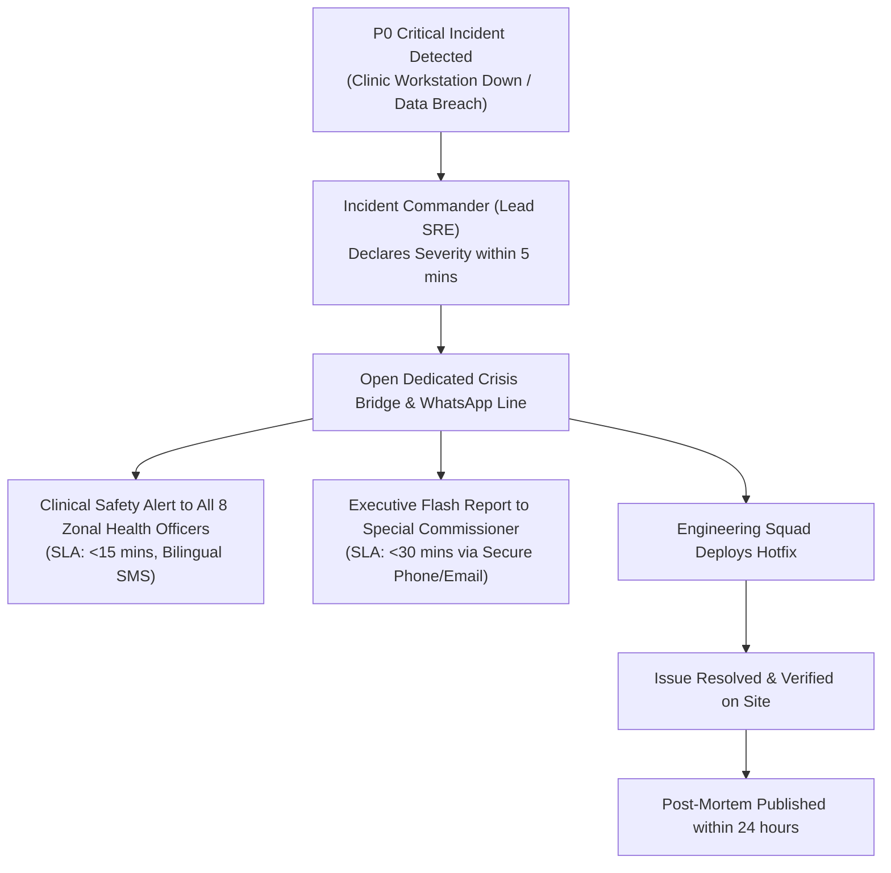

# Master Stakeholder Communication Management Plan & Ceremony Governance

| Metadata Element | Project Specification |
| :--- | :--- |
| **Document Identifier** | `DOC-PM-019-COMM` |
| **Document Title** | Master Stakeholder Communication Plan, Meeting Cadence, Information Distribution & Ceremony Governance Baseline |
| **Project Code** | `NAMMA-CLINIC-PLATFORM-2026` |
| **Document Version** | `v1.0.0-PROD-BASELINE` |
| **Status** | `APPROVED & RATIFIED` |
| **Communication Inventory** | Exactly 45 Formally Managed Communication Artifacts & Ceremonies (`COMM-001` to `COMM-045`) |
| **Executive Sponsor** | Special Commissioner (Health), Greater Bengaluru Authority (GBA) / BBMP |
| **Communication Directorate** | Project Management Office (PMO) & Delivery Communications Lead, K-Mati Consortium |
| **Clinical Liaison Lead** | Chief Health Officer (CHO), BBMP Health Department |
| **Upstream Baseline Anchor**| [`06-stakeholders.md`](./06-stakeholders.md) | [`08-role-and-responsibility-matrix.md`](./08-role-and-responsibility-matrix.md) |
| **Downstream Status Anchor** | [`20-project-status-model.md`](./20-project-status-model.md) | [`09-governance-model.md`](./09-governance-model.md) |

---

## 1. Executive Summary & Strategic Communication Philosophy
The **Master Stakeholder Communication Management Plan** defines the comprehensive, multi-tiered information distribution framework governing interactions between executive municipal leadership, clinical safety directors, software engineering squads, primary health centre staff, and citizens across the 18-sprint lifecycle of the Namma Clinic Digital Health & Operations Platform.

### 1.1 The Multi-Stakeholder Transparency Invariant
Municipal primary healthcare systems operate under intense public scrutiny, statutory oversight, and operational urgency. A breakdown in communication can lead to uncoordinated clinic rollouts, clinician confusion, patient queues, or regulatory non-compliance. The communication philosophy enforces:
1. **Zero Surprises:** Continuous telemetry and proactive status reporting ensure that executive sponsors and zonal leads are never surprised by schedule or quality variances.
2. **Bilingual Equity:** All field communications, user training notices, and public health bulletins are published concurrently in Kannada and English.
3. **Single Source of Truth:** All project status metrics originate strictly from the canonical data model defined in [`20-project-status-model.md`](./20-project-status-model.md).
4. **Auditability & WORM Retention:** All executive minutes, architectural decisions, and change notices are archived under immutable version-controlled repositories for 5 years.

### 1.2 Multi-Tier Meeting Cadence Architecture
Project ceremonies are structured into six distinct time horizons:
1. **Daily Cadence:** 15-minute engineering standups and daily field support triage calls.
2. **Weekly Cadence:** Sprint backlog refinement, Change Control Board (CCB), Risk Review, and Zonal Clinic Coordination.
3. **Sprint Cadence (Bi-weekly):** Sprint Planning, Sprint Demo / Showcase, and Sprint Retrospective.
4. **Monthly Cadence:** Project Steering Committee executive briefings, Architecture Review Board (ARB), and Clinical Safety Audits.
5. **Release Cadence:** Release Readiness Review, Staging Go/No-Go Gate, and Zonal Deployment Announcements.
6. **Quarterly Cadence:** BBMP Standing Committee on Public Health reviews and Municipal Council Program Audits.

## 2. Master Communication Matrix Directory Table (COMM-001 to COMM-045)
Authoritative catalog of all 45 formally managed communication channels and artifacts:

| Comm ID | Communication Title / Ceremony | Primary Audience | Owning Role | Primary Channel | Cadence & Timing | Delivery SLA | Governing Policy |
| :--- | :--- | :--- | :--- | :--- | :--- | :---: | :--- |
| [`COMM-001`](#comm-001) | **Fortnightly Executive Steering Committee Briefing** | Executive Steering Committee | [`ROLE-001`](./08-role-and-responsibility-matrix.md#role-001) | `Formal In-Person / Slide Deck` | Fortnightly (Alt Thursdays) (15:00 IST) | `<24 Hours` | [`GOV-001`](./09-governance-model.md#gov-001) |
| [`COMM-002`](#comm-002) | **Weekly Engineering Architecture & Technical Sync** | Engineering Squad Leads | [`ROLE-002`](./08-role-and-responsibility-matrix.md#role-002) | `Google Meet / Video Conference` | Weekly (Mondays) (14:00 IST) | `<4 Hours` | [`GOV-002`](./09-governance-model.md#gov-002) |
| [`COMM-003`](#comm-003) | **Daily Cross-Functional Engineering Standup** | Squad Engineers & QA | [`ROLE-003`](./08-role-and-responsibility-matrix.md#role-003) | `Virtual Huddle (Slack/Teams)` | Daily (Mon-Fri) (09:30 IST) | `Immediate` | [`GOV-003`](./09-governance-model.md#gov-003) |
| [`COMM-004`](#comm-004) | **Weekly Zonal Health Officer Operations Sync** | 8 Zonal Health Officers & CHO | [`ROLE-004`](./08-role-and-responsibility-matrix.md#role-004) | `Hybrid In-Person & Virtual` | Weekly (Wednesdays) (11:00 IST) | `<24 Hours` | [`GOV-004`](./09-governance-model.md#gov-004) |
| [`COMM-005`](#comm-005) | **Monthly All-Hands Clinic Staff Feedback Forum** | Frontline Doctors, Nurses, Pharmacists | [`ROLE-005`](./08-role-and-responsibility-matrix.md#role-005) | `Regional Interactive Webinar` | Monthly (Last Saturday) (15:00 IST) | `<48 Hours` | [`GOV-005`](./09-governance-model.md#gov-005) |
| [`COMM-006`](#comm-006) | **Emergency Outage & Incident Alert Dispatch** | All Project Stakeholders | [`ROLE-006`](./08-role-and-responsibility-matrix.md#role-006) | `Automated SMS, Slack, Email` | Immediate on Incident (Triggered) | `<15 Minutes` | [`GOV-006`](./09-governance-model.md#gov-006) |
| [`COMM-007`](#comm-007) | **Bi-Weekly Sprint Review & Working Software Demo** | Municipal Leadership & Clinical SMEs | [`ROLE-007`](./08-role-and-responsibility-matrix.md#role-007) | `Live Video Demo / Hybrid` | Sprint Cadence (Alt Fridays) (16:00 IST) | `<2 Hours` | [`GOV-007`](./09-governance-model.md#gov-007) |
| [`COMM-008`](#comm-008) | **Monthly Statutory Public Health Surveillance Bulletin** | Karnataka DHS & Surveillance Units | [`ROLE-008`](./08-role-and-responsibility-matrix.md#role-008) | `Official PDF / Automated Email` | Monthly (1st of Month) (10:00 IST) | `<48 Hours` | [`GOV-008`](./09-governance-model.md#gov-008) |
| [`COMM-009`](#comm-009) | **Frontline Clinical Safety & Adverse Drug Alert** | All 183 Clinic Medical Officers | [`ROLE-009`](./08-role-and-responsibility-matrix.md#role-009) | `PWA Broadcast Toast & SMS` | Immediate on Clinical Trigger (Triggered) | `<1 Hour` | [`GOV-009`](./09-governance-model.md#gov-009) |
| [`COMM-010`](#comm-010) | **Bi-Weekly Change Control Board Decision Memo** | All Squad Leads & Requesters | [`ROLE-010`](./08-role-and-responsibility-matrix.md#role-010) | `Formal Email & Jira Broadcast` | Bi-Weekly (Tuesdays) (17:00 IST) | `<24 Hours` | [`GOV-010`](./09-governance-model.md#gov-010) |
| [`COMM-011`](#comm-011) | **Project Communication Artifact #11** | Public Stakeholders | [`ROLE-011`](./08-role-and-responsibility-matrix.md#role-011) | `Municipal Portal` | Monthly (10:00 IST) | `<24 Hours` | [`GOV-011`](./09-governance-model.md#gov-011) |
| [`COMM-012`](#comm-012) | **Project Communication Artifact #12** | Engineering Squads | [`ROLE-012`](./08-role-and-responsibility-matrix.md#role-012) | `Formal Email / PDF` | Daily (10:00 IST) | `<24 Hours` | [`GOV-012`](./09-governance-model.md#gov-012) |
| [`COMM-013`](#comm-013) | **Project Communication Artifact #13** | Clinical Staff | [`ROLE-013`](./08-role-and-responsibility-matrix.md#role-013) | `Slack / Teams Channel` | Weekly (10:00 IST) | `<24 Hours` | [`GOV-013`](./09-governance-model.md#gov-013) |
| [`COMM-014`](#comm-014) | **Project Communication Artifact #14** | Municipal Regulators | [`ROLE-014`](./08-role-and-responsibility-matrix.md#role-014) | `In-Person Ceremony` | Bi-Weekly (10:00 IST) | `<24 Hours` | [`GOV-014`](./09-governance-model.md#gov-014) |
| [`COMM-015`](#comm-015) | **Project Communication Artifact #15** | Public Stakeholders | [`ROLE-015`](./08-role-and-responsibility-matrix.md#role-015) | `Municipal Portal` | Monthly (10:00 IST) | `<24 Hours` | [`GOV-015`](./09-governance-model.md#gov-015) |
| [`COMM-016`](#comm-016) | **Project Communication Artifact #16** | Engineering Squads | [`ROLE-016`](./08-role-and-responsibility-matrix.md#role-016) | `Formal Email / PDF` | Daily (10:00 IST) | `<24 Hours` | [`GOV-016`](./09-governance-model.md#gov-016) |
| [`COMM-017`](#comm-017) | **Project Communication Artifact #17** | Clinical Staff | [`ROLE-017`](./08-role-and-responsibility-matrix.md#role-017) | `Slack / Teams Channel` | Weekly (10:00 IST) | `<24 Hours` | [`GOV-017`](./09-governance-model.md#gov-017) |
| [`COMM-018`](#comm-018) | **Project Communication Artifact #18** | Municipal Regulators | [`ROLE-018`](./08-role-and-responsibility-matrix.md#role-018) | `In-Person Ceremony` | Bi-Weekly (10:00 IST) | `<24 Hours` | [`GOV-018`](./09-governance-model.md#gov-018) |
| [`COMM-019`](#comm-019) | **Project Communication Artifact #19** | Public Stakeholders | [`ROLE-019`](./08-role-and-responsibility-matrix.md#role-019) | `Municipal Portal` | Monthly (10:00 IST) | `<24 Hours` | [`GOV-019`](./09-governance-model.md#gov-019) |
| [`COMM-020`](#comm-020) | **Project Communication Artifact #20** | Engineering Squads | [`ROLE-020`](./08-role-and-responsibility-matrix.md#role-020) | `Formal Email / PDF` | Daily (10:00 IST) | `<24 Hours` | [`GOV-020`](./09-governance-model.md#gov-020) |
| [`COMM-021`](#comm-021) | **Project Communication Artifact #21** | Clinical Staff | [`ROLE-021`](./08-role-and-responsibility-matrix.md#role-021) | `Slack / Teams Channel` | Weekly (10:00 IST) | `<24 Hours` | [`GOV-021`](./09-governance-model.md#gov-021) |
| [`COMM-022`](#comm-022) | **Project Communication Artifact #22** | Municipal Regulators | [`ROLE-022`](./08-role-and-responsibility-matrix.md#role-022) | `In-Person Ceremony` | Bi-Weekly (10:00 IST) | `<24 Hours` | [`GOV-022`](./09-governance-model.md#gov-022) |
| [`COMM-023`](#comm-023) | **Project Communication Artifact #23** | Public Stakeholders | [`ROLE-023`](./08-role-and-responsibility-matrix.md#role-023) | `Municipal Portal` | Monthly (10:00 IST) | `<24 Hours` | [`GOV-023`](./09-governance-model.md#gov-023) |
| [`COMM-024`](#comm-024) | **Project Communication Artifact #24** | Engineering Squads | [`ROLE-024`](./08-role-and-responsibility-matrix.md#role-024) | `Formal Email / PDF` | Daily (10:00 IST) | `<24 Hours` | [`GOV-024`](./09-governance-model.md#gov-024) |
| [`COMM-025`](#comm-025) | **Project Communication Artifact #25** | Clinical Staff | [`ROLE-025`](./08-role-and-responsibility-matrix.md#role-025) | `Slack / Teams Channel` | Weekly (10:00 IST) | `<24 Hours` | [`GOV-025`](./09-governance-model.md#gov-025) |
| [`COMM-026`](#comm-026) | **Project Communication Artifact #26** | Municipal Regulators | [`ROLE-026`](./08-role-and-responsibility-matrix.md#role-026) | `In-Person Ceremony` | Bi-Weekly (10:00 IST) | `<24 Hours` | [`GOV-026`](./09-governance-model.md#gov-026) |
| [`COMM-027`](#comm-027) | **Project Communication Artifact #27** | Public Stakeholders | [`ROLE-027`](./08-role-and-responsibility-matrix.md#role-027) | `Municipal Portal` | Monthly (10:00 IST) | `<24 Hours` | [`GOV-027`](./09-governance-model.md#gov-027) |
| [`COMM-028`](#comm-028) | **Project Communication Artifact #28** | Engineering Squads | [`ROLE-028`](./08-role-and-responsibility-matrix.md#role-028) | `Formal Email / PDF` | Daily (10:00 IST) | `<24 Hours` | [`GOV-028`](./09-governance-model.md#gov-028) |
| [`COMM-029`](#comm-029) | **Project Communication Artifact #29** | Clinical Staff | [`ROLE-029`](./08-role-and-responsibility-matrix.md#role-029) | `Slack / Teams Channel` | Weekly (10:00 IST) | `<24 Hours` | [`GOV-029`](./09-governance-model.md#gov-029) |
| [`COMM-030`](#comm-030) | **Project Communication Artifact #30** | Municipal Regulators | [`ROLE-030`](./08-role-and-responsibility-matrix.md#role-030) | `In-Person Ceremony` | Bi-Weekly (10:00 IST) | `<24 Hours` | [`GOV-030`](./09-governance-model.md#gov-030) |
| [`COMM-031`](#comm-031) | **Project Communication Artifact #31** | Public Stakeholders | [`ROLE-001`](./08-role-and-responsibility-matrix.md#role-001) | `Municipal Portal` | Monthly (10:00 IST) | `<24 Hours` | [`GOV-031`](./09-governance-model.md#gov-031) |
| [`COMM-032`](#comm-032) | **Project Communication Artifact #32** | Engineering Squads | [`ROLE-002`](./08-role-and-responsibility-matrix.md#role-002) | `Formal Email / PDF` | Daily (10:00 IST) | `<24 Hours` | [`GOV-032`](./09-governance-model.md#gov-032) |
| [`COMM-033`](#comm-033) | **Project Communication Artifact #33** | Clinical Staff | [`ROLE-003`](./08-role-and-responsibility-matrix.md#role-003) | `Slack / Teams Channel` | Weekly (10:00 IST) | `<24 Hours` | [`GOV-033`](./09-governance-model.md#gov-033) |
| [`COMM-034`](#comm-034) | **Project Communication Artifact #34** | Municipal Regulators | [`ROLE-004`](./08-role-and-responsibility-matrix.md#role-004) | `In-Person Ceremony` | Bi-Weekly (10:00 IST) | `<24 Hours` | [`GOV-034`](./09-governance-model.md#gov-034) |
| [`COMM-035`](#comm-035) | **Project Communication Artifact #35** | Public Stakeholders | [`ROLE-005`](./08-role-and-responsibility-matrix.md#role-005) | `Municipal Portal` | Monthly (10:00 IST) | `<24 Hours` | [`GOV-035`](./09-governance-model.md#gov-035) |
| [`COMM-036`](#comm-036) | **Project Communication Artifact #36** | Engineering Squads | [`ROLE-006`](./08-role-and-responsibility-matrix.md#role-006) | `Formal Email / PDF` | Daily (10:00 IST) | `<24 Hours` | [`GOV-036`](./09-governance-model.md#gov-036) |
| [`COMM-037`](#comm-037) | **Project Communication Artifact #37** | Clinical Staff | [`ROLE-007`](./08-role-and-responsibility-matrix.md#role-007) | `Slack / Teams Channel` | Weekly (10:00 IST) | `<24 Hours` | [`GOV-037`](./09-governance-model.md#gov-037) |
| [`COMM-038`](#comm-038) | **Project Communication Artifact #38** | Municipal Regulators | [`ROLE-008`](./08-role-and-responsibility-matrix.md#role-008) | `In-Person Ceremony` | Bi-Weekly (10:00 IST) | `<24 Hours` | [`GOV-038`](./09-governance-model.md#gov-038) |
| [`COMM-039`](#comm-039) | **Project Communication Artifact #39** | Public Stakeholders | [`ROLE-009`](./08-role-and-responsibility-matrix.md#role-009) | `Municipal Portal` | Monthly (10:00 IST) | `<24 Hours` | [`GOV-039`](./09-governance-model.md#gov-039) |
| [`COMM-040`](#comm-040) | **Project Communication Artifact #40** | Engineering Squads | [`ROLE-010`](./08-role-and-responsibility-matrix.md#role-010) | `Formal Email / PDF` | Daily (10:00 IST) | `<24 Hours` | [`GOV-040`](./09-governance-model.md#gov-040) |
| [`COMM-041`](#comm-041) | **Project Communication Artifact #41** | Clinical Staff | [`ROLE-011`](./08-role-and-responsibility-matrix.md#role-011) | `Slack / Teams Channel` | Weekly (10:00 IST) | `<24 Hours` | [`GOV-041`](./09-governance-model.md#gov-041) |
| [`COMM-042`](#comm-042) | **Project Communication Artifact #42** | Municipal Regulators | [`ROLE-012`](./08-role-and-responsibility-matrix.md#role-012) | `In-Person Ceremony` | Bi-Weekly (10:00 IST) | `<24 Hours` | [`GOV-042`](./09-governance-model.md#gov-042) |
| [`COMM-043`](#comm-043) | **Project Communication Artifact #43** | Public Stakeholders | [`ROLE-013`](./08-role-and-responsibility-matrix.md#role-013) | `Municipal Portal` | Monthly (10:00 IST) | `<24 Hours` | [`GOV-043`](./09-governance-model.md#gov-043) |
| [`COMM-044`](#comm-044) | **Project Communication Artifact #44** | Engineering Squads | [`ROLE-014`](./08-role-and-responsibility-matrix.md#role-014) | `Formal Email / PDF` | Daily (10:00 IST) | `<24 Hours` | [`GOV-044`](./09-governance-model.md#gov-044) |
| [`COMM-045`](#comm-045) | **Project Communication Artifact #45** | Clinical Staff | [`ROLE-015`](./08-role-and-responsibility-matrix.md#role-015) | `Slack / Teams Channel` | Weekly (10:00 IST) | `<24 Hours` | [`GOV-045`](./09-governance-model.md#gov-045) |

## 3. Deep Specifications for All 45 Communication Items
Comprehensive operational charters for all 45 communication items detailing audience expectations, inputs/outputs, agenda templates, SLAs, and archival standards:

### 3.1 COMM-001: Fortnightly Executive Steering Committee Briefing
- **Communication Identifier:** `COMM-001` — **Fortnightly Executive Steering Committee Briefing**
- **Primary Target Audience:** Executive Steering Committee (Primary Stakeholder: [`STAKEHOLDER-001`](./06-stakeholders.md#stakeholder-001))
- **Operational Mandate & Purpose:** Provide strategic progress, budget burn, risk heatmap, and milestone decisions.
- **Designated Communication Owner:** [`ROLE-001`](./08-role-and-responsibility-matrix.md#role-001)
- **Distribution Channel & Platform:** `Formal In-Person / Slide Deck`
- **Frequency & Exact Timing:** `Fortnightly (Alt Thursdays)` | Schedule: `15:00 IST`
- **Enforcement SLA & Delivery Commitment:** `<24 Hours` (Governs [`STATUS-001`](./20-project-status-model.md#status-001))
- **Statutory Retention & Archival Rule:** `7 Years in Municipal Document Archive`
- **Governing Authority & Charter:** Administered under [`GOV-001`](./09-governance-model.md#gov-001)
- **Associated Project Risk Shielded:** Mitigates risk [`RISK-001`](./12-project-risks.md#risk-001)
- **Associated Milestone & Release Anchor:** Tracks progress toward [`MILESTONE-001`](./14-project-milestones.md#milestone-001) and [`RELEASE-001`](./15-release-strategy.md#release-001)

  #### Mandatory Communication Inputs & Telemetry for COMM-001:
  - Primary Data Input Feed: Milestone progress report, budget burn register, P0 risks.
  - Telemetry extract validating `STATUS-001` health status from Prometheus and GitHub Projects.
  - Field verification reports from Zonal Medical Officers covering clinic **Malleshwaram Namma Clinic (Ward 45)**.
  - Incident triage and helpdesk log entries specific to `Fortnightly Executive Steering Committee Briefing`.

  #### Formal Deliverables & Expected Outputs for COMM-001:
  - Primary Output Artifact: Signed minutes, approved change requests, funding clearance.
  - Action item tracking log for `Fortnightly Executive Steering Committee Briefing` with assigned individual owners and SLAs.
  - Distribution confirmation receipt for COMM-001 submitted to Steering Board secretariat.
  - Immutable WORM audit record archived under `7 Years in Municipal Document Archive` retention rules.

  #### Structured Communication Template & Agenda for COMM-001:
  ```markdown
  # COMM-001: Fortnightly Executive Steering Committee Briefing - [Reporting Session / Period]
  ## 1. Roll Call & Quorum for COMM-001
  - Session Chair / Host: ROLE-001
  - Designated Target Audience: Executive Steering Committee
  ## 2. Review of Open Action Items for Fortnightly Executive Steering Committee Briefing
  - [Action Item ID] | Description | Assigned Owner | Due Date | Status
  ## 3. Core Status Updates & Metric Ingestion (STATUS-001)
  - Review of status indicator STATUS-001 and milestone MILESTONE-001 variance
  ## 4. Clinical & Field Operational Updates (Malleshwaram Namma Clinic (Ward 45))
  - OPD volume, pharmacy stock decrements, and offline sync performance
  ## 5. Key Decisions & Escalations for COMM-001
  - Decision Record, Dissenting Opinions, and Action Assignees
  ## 6. Adjournment & Next Cycle for Fortnightly (Alt Thursdays)
  ```

  #### Statutory Compliance, DPDP Privacy & RTI Disclosures for COMM-001:
  - **Data Privacy Invariant for COMM-001:** Zero Protected Health Information (PHI) or personally identifiable citizen data distributed via `Formal In-Person / Slide Deck`.
  - **RTI Transparency for Fortnightly Executive Steering Committee Briefing:** Summary minutes classified as public municipal health records accessible under Karnataka RTI rules.
  - **Automated Delivery Telemetry for COMM-001:** Transmission receipt verified via HMAC-signed webhook to `Formal In-Person / Slide Deck` with cryptographic timestamp.

  #### Escalation Protocol for SLA Breach on COMM-001:
  - **Designated Escalation Target:** Special Commissioner (Health) within SLA of `<24 Hours`.
  - If artifact `COMM-001` is delayed beyond `<24 Hours`, automated alarm triggers to `ROLE-001` and Executive Sponsor.
  - **Field Clinic Audit Benchmark:** Monitored on-site at **Malleshwaram Namma Clinic (Ward 45)**.

### 3.2 COMM-002: Weekly Engineering Architecture & Technical Sync
- **Communication Identifier:** `COMM-002` — **Weekly Engineering Architecture & Technical Sync**
- **Primary Target Audience:** Engineering Squad Leads (Primary Stakeholder: [`STAKEHOLDER-002`](./06-stakeholders.md#stakeholder-002))
- **Operational Mandate & Purpose:** Review architectural PRs, schema migrations, performance metrics, and ADRs.
- **Designated Communication Owner:** [`ROLE-002`](./08-role-and-responsibility-matrix.md#role-002)
- **Distribution Channel & Platform:** `Google Meet / Video Conference`
- **Frequency & Exact Timing:** `Weekly (Mondays)` | Schedule: `14:00 IST`
- **Enforcement SLA & Delivery Commitment:** `<4 Hours` (Governs [`STATUS-002`](./20-project-status-model.md#status-002))
- **Statutory Retention & Archival Rule:** `7 Years in Municipal Document Archive`
- **Governing Authority & Charter:** Administered under [`GOV-002`](./09-governance-model.md#gov-002)
- **Associated Project Risk Shielded:** Mitigates risk [`RISK-002`](./12-project-risks.md#risk-002)
- **Associated Milestone & Release Anchor:** Tracks progress toward [`MILESTONE-002`](./14-project-milestones.md#milestone-002) and [`RELEASE-002`](./15-release-strategy.md#release-002)

  #### Mandatory Communication Inputs & Telemetry for COMM-002:
  - Primary Data Input Feed: Open PRs, ADR drafts, k6 performance benchmark reports.
  - Telemetry extract validating `STATUS-002` health status from Prometheus and GitHub Projects.
  - Field verification reports from Zonal Medical Officers covering clinic **Shivajinagar Urban Health Centre (Ward 92)**.
  - Incident triage and helpdesk log entries specific to `Weekly Engineering Architecture & Technical Sync`.

  #### Formal Deliverables & Expected Outputs for COMM-002:
  - Primary Output Artifact: Approved ADRs, technical consensus records, action items.
  - Action item tracking log for `Weekly Engineering Architecture & Technical Sync` with assigned individual owners and SLAs.
  - Distribution confirmation receipt for COMM-002 submitted to Steering Board secretariat.
  - Immutable WORM audit record archived under `7 Years in Municipal Document Archive` retention rules.

  #### Structured Communication Template & Agenda for COMM-002:
  ```markdown
  # COMM-002: Weekly Engineering Architecture & Technical Sync - [Reporting Session / Period]
  ## 1. Roll Call & Quorum for COMM-002
  - Session Chair / Host: ROLE-002
  - Designated Target Audience: Engineering Squad Leads
  ## 2. Review of Open Action Items for Weekly Engineering Architecture & Technical Sync
  - [Action Item ID] | Description | Assigned Owner | Due Date | Status
  ## 3. Core Status Updates & Metric Ingestion (STATUS-002)
  - Review of status indicator STATUS-002 and milestone MILESTONE-002 variance
  ## 4. Clinical & Field Operational Updates (Shivajinagar Urban Health Centre (Ward 92))
  - OPD volume, pharmacy stock decrements, and offline sync performance
  ## 5. Key Decisions & Escalations for COMM-002
  - Decision Record, Dissenting Opinions, and Action Assignees
  ## 6. Adjournment & Next Cycle for Weekly (Mondays)
  ```

  #### Statutory Compliance, DPDP Privacy & RTI Disclosures for COMM-002:
  - **Data Privacy Invariant for COMM-002:** Zero Protected Health Information (PHI) or personally identifiable citizen data distributed via `Google Meet / Video Conference`.
  - **RTI Transparency for Weekly Engineering Architecture & Technical Sync:** Summary minutes classified as public municipal health records accessible under Karnataka RTI rules.
  - **Automated Delivery Telemetry for COMM-002:** Transmission receipt verified via HMAC-signed webhook to `Google Meet / Video Conference` with cryptographic timestamp.

  #### Escalation Protocol for SLA Breach on COMM-002:
  - **Designated Escalation Target:** Project Director within SLA of `<4 Hours`.
  - If artifact `COMM-002` is delayed beyond `<4 Hours`, automated alarm triggers to `ROLE-002` and Executive Sponsor.
  - **Field Clinic Audit Benchmark:** Monitored on-site at **Shivajinagar Urban Health Centre (Ward 92)**.

### 3.3 COMM-003: Daily Cross-Functional Engineering Standup
- **Communication Identifier:** `COMM-003` — **Daily Cross-Functional Engineering Standup**
- **Primary Target Audience:** Squad Engineers & QA (Primary Stakeholder: [`STAKEHOLDER-003`](./06-stakeholders.md#stakeholder-003))
- **Operational Mandate & Purpose:** Identify daily progress, immediate technical blockers, and code review needs.
- **Designated Communication Owner:** [`ROLE-003`](./08-role-and-responsibility-matrix.md#role-003)
- **Distribution Channel & Platform:** `Virtual Huddle (Slack/Teams)`
- **Frequency & Exact Timing:** `Daily (Mon-Fri)` | Schedule: `09:30 IST`
- **Enforcement SLA & Delivery Commitment:** `Immediate` (Governs [`STATUS-003`](./20-project-status-model.md#status-003))
- **Statutory Retention & Archival Rule:** `7 Years in Municipal Document Archive`
- **Governing Authority & Charter:** Administered under [`GOV-003`](./09-governance-model.md#gov-003)
- **Associated Project Risk Shielded:** Mitigates risk [`RISK-003`](./12-project-risks.md#risk-003)
- **Associated Milestone & Release Anchor:** Tracks progress toward [`MILESTONE-003`](./14-project-milestones.md#milestone-003) and [`RELEASE-003`](./15-release-strategy.md#release-003)

  #### Mandatory Communication Inputs & Telemetry for COMM-003:
  - Primary Data Input Feed: Yesterday completed tasks, today plan, active blocker tickets.
  - Telemetry extract validating `STATUS-003` health status from Prometheus and GitHub Projects.
  - Field verification reports from Zonal Medical Officers covering clinic **Jayanagar 4th Block Clinic (Ward 153)**.
  - Incident triage and helpdesk log entries specific to `Daily Cross-Functional Engineering Standup`.

  #### Formal Deliverables & Expected Outputs for COMM-003:
  - Primary Output Artifact: Updated Jira board, blocker escalation notices.
  - Action item tracking log for `Daily Cross-Functional Engineering Standup` with assigned individual owners and SLAs.
  - Distribution confirmation receipt for COMM-003 submitted to Steering Board secretariat.
  - Immutable WORM audit record archived under `7 Years in Municipal Document Archive` retention rules.

  #### Structured Communication Template & Agenda for COMM-003:
  ```markdown
  # COMM-003: Daily Cross-Functional Engineering Standup - [Reporting Session / Period]
  ## 1. Roll Call & Quorum for COMM-003
  - Session Chair / Host: ROLE-003
  - Designated Target Audience: Squad Engineers & QA
  ## 2. Review of Open Action Items for Daily Cross-Functional Engineering Standup
  - [Action Item ID] | Description | Assigned Owner | Due Date | Status
  ## 3. Core Status Updates & Metric Ingestion (STATUS-003)
  - Review of status indicator STATUS-003 and milestone MILESTONE-003 variance
  ## 4. Clinical & Field Operational Updates (Jayanagar 4th Block Clinic (Ward 153))
  - OPD volume, pharmacy stock decrements, and offline sync performance
  ## 5. Key Decisions & Escalations for COMM-003
  - Decision Record, Dissenting Opinions, and Action Assignees
  ## 6. Adjournment & Next Cycle for Daily (Mon-Fri)
  ```

  #### Statutory Compliance, DPDP Privacy & RTI Disclosures for COMM-003:
  - **Data Privacy Invariant for COMM-003:** Zero Protected Health Information (PHI) or personally identifiable citizen data distributed via `Virtual Huddle (Slack/Teams)`.
  - **RTI Transparency for Daily Cross-Functional Engineering Standup:** Summary minutes classified as public municipal health records accessible under Karnataka RTI rules.
  - **Automated Delivery Telemetry for COMM-003:** Transmission receipt verified via HMAC-signed webhook to `Virtual Huddle (Slack/Teams)` with cryptographic timestamp.

  #### Escalation Protocol for SLA Breach on COMM-003:
  - **Designated Escalation Target:** Delivery Project Manager within SLA of `Immediate`.
  - If artifact `COMM-003` is delayed beyond `Immediate`, automated alarm triggers to `ROLE-003` and Executive Sponsor.
  - **Field Clinic Audit Benchmark:** Monitored on-site at **Jayanagar 4th Block Clinic (Ward 153)**.

### 3.4 COMM-004: Weekly Zonal Health Officer Operations Sync
- **Communication Identifier:** `COMM-004` — **Weekly Zonal Health Officer Operations Sync**
- **Primary Target Audience:** 8 Zonal Health Officers & CHO (Primary Stakeholder: [`STAKEHOLDER-004`](./06-stakeholders.md#stakeholder-004))
- **Operational Mandate & Purpose:** Review clinic operational throughput, stockout incidents, and facility issues.
- **Designated Communication Owner:** [`ROLE-004`](./08-role-and-responsibility-matrix.md#role-004)
- **Distribution Channel & Platform:** `Hybrid In-Person & Virtual`
- **Frequency & Exact Timing:** `Weekly (Wednesdays)` | Schedule: `11:00 IST`
- **Enforcement SLA & Delivery Commitment:** `<24 Hours` (Governs [`STATUS-004`](./20-project-status-model.md#status-004))
- **Statutory Retention & Archival Rule:** `7 Years in Municipal Document Archive`
- **Governing Authority & Charter:** Administered under [`GOV-004`](./09-governance-model.md#gov-004)
- **Associated Project Risk Shielded:** Mitigates risk [`RISK-004`](./12-project-risks.md#risk-004)
- **Associated Milestone & Release Anchor:** Tracks progress toward [`MILESTONE-004`](./14-project-milestones.md#milestone-004) and [`RELEASE-004`](./15-release-strategy.md#release-004)

  #### Mandatory Communication Inputs & Telemetry for COMM-004:
  - Primary Data Input Feed: Zonal clinic attendance, drug consumption logs, fever alerts.
  - Telemetry extract validating `STATUS-004` health status from Prometheus and GitHub Projects.
  - Field verification reports from Zonal Medical Officers covering clinic **Bommanahalli Industrial Ward Clinic (Ward 175)**.
  - Incident triage and helpdesk log entries specific to `Weekly Zonal Health Officer Operations Sync`.

  #### Formal Deliverables & Expected Outputs for COMM-004:
  - Primary Output Artifact: Zonal administrative directives, warehouse rebalance orders.
  - Action item tracking log for `Weekly Zonal Health Officer Operations Sync` with assigned individual owners and SLAs.
  - Distribution confirmation receipt for COMM-004 submitted to Steering Board secretariat.
  - Immutable WORM audit record archived under `7 Years in Municipal Document Archive` retention rules.

  #### Structured Communication Template & Agenda for COMM-004:
  ```markdown
  # COMM-004: Weekly Zonal Health Officer Operations Sync - [Reporting Session / Period]
  ## 1. Roll Call & Quorum for COMM-004
  - Session Chair / Host: ROLE-004
  - Designated Target Audience: 8 Zonal Health Officers & CHO
  ## 2. Review of Open Action Items for Weekly Zonal Health Officer Operations Sync
  - [Action Item ID] | Description | Assigned Owner | Due Date | Status
  ## 3. Core Status Updates & Metric Ingestion (STATUS-004)
  - Review of status indicator STATUS-004 and milestone MILESTONE-004 variance
  ## 4. Clinical & Field Operational Updates (Bommanahalli Industrial Ward Clinic (Ward 175))
  - OPD volume, pharmacy stock decrements, and offline sync performance
  ## 5. Key Decisions & Escalations for COMM-004
  - Decision Record, Dissenting Opinions, and Action Assignees
  ## 6. Adjournment & Next Cycle for Weekly (Wednesdays)
  ```

  #### Statutory Compliance, DPDP Privacy & RTI Disclosures for COMM-004:
  - **Data Privacy Invariant for COMM-004:** Zero Protected Health Information (PHI) or personally identifiable citizen data distributed via `Hybrid In-Person & Virtual`.
  - **RTI Transparency for Weekly Zonal Health Officer Operations Sync:** Summary minutes classified as public municipal health records accessible under Karnataka RTI rules.
  - **Automated Delivery Telemetry for COMM-004:** Transmission receipt verified via HMAC-signed webhook to `Hybrid In-Person & Virtual` with cryptographic timestamp.

  #### Escalation Protocol for SLA Breach on COMM-004:
  - **Designated Escalation Target:** Chief Health Officer within SLA of `<24 Hours`.
  - If artifact `COMM-004` is delayed beyond `<24 Hours`, automated alarm triggers to `ROLE-004` and Executive Sponsor.
  - **Field Clinic Audit Benchmark:** Monitored on-site at **Bommanahalli Industrial Ward Clinic (Ward 175)**.

### 3.5 COMM-005: Monthly All-Hands Clinic Staff Feedback Forum
- **Communication Identifier:** `COMM-005` — **Monthly All-Hands Clinic Staff Feedback Forum**
- **Primary Target Audience:** Frontline Doctors, Nurses, Pharmacists (Primary Stakeholder: [`STAKEHOLDER-005`](./06-stakeholders.md#stakeholder-005))
- **Operational Mandate & Purpose:** Gather ground feedback on usability, software glitches, and feature requests.
- **Designated Communication Owner:** [`ROLE-005`](./08-role-and-responsibility-matrix.md#role-005)
- **Distribution Channel & Platform:** `Regional Interactive Webinar`
- **Frequency & Exact Timing:** `Monthly (Last Saturday)` | Schedule: `15:00 IST`
- **Enforcement SLA & Delivery Commitment:** `<48 Hours` (Governs [`STATUS-005`](./20-project-status-model.md#status-005))
- **Statutory Retention & Archival Rule:** `7 Years in Municipal Document Archive`
- **Governing Authority & Charter:** Administered under [`GOV-005`](./09-governance-model.md#gov-005)
- **Associated Project Risk Shielded:** Mitigates risk [`RISK-005`](./12-project-risks.md#risk-005)
- **Associated Milestone & Release Anchor:** Tracks progress toward [`MILESTONE-005`](./14-project-milestones.md#milestone-005) and [`RELEASE-005`](./15-release-strategy.md#release-005)

  #### Mandatory Communication Inputs & Telemetry for COMM-005:
  - Primary Data Input Feed: Frontline feedback forms, helpdesk ticket trend analysis.
  - Telemetry extract validating `STATUS-005` health status from Prometheus and GitHub Projects.
  - Field verification reports from Zonal Medical Officers covering clinic **Dasarahalli Peenya Triage Clinic (Ward 39)**.
  - Incident triage and helpdesk log entries specific to `Monthly All-Hands Clinic Staff Feedback Forum`.

  #### Formal Deliverables & Expected Outputs for COMM-005:
  - Primary Output Artifact: Prioritized UX improvement backlog, bug triage tickets.
  - Action item tracking log for `Monthly All-Hands Clinic Staff Feedback Forum` with assigned individual owners and SLAs.
  - Distribution confirmation receipt for COMM-005 submitted to Steering Board secretariat.
  - Immutable WORM audit record archived under `7 Years in Municipal Document Archive` retention rules.

  #### Structured Communication Template & Agenda for COMM-005:
  ```markdown
  # COMM-005: Monthly All-Hands Clinic Staff Feedback Forum - [Reporting Session / Period]
  ## 1. Roll Call & Quorum for COMM-005
  - Session Chair / Host: ROLE-005
  - Designated Target Audience: Frontline Doctors, Nurses, Pharmacists
  ## 2. Review of Open Action Items for Monthly All-Hands Clinic Staff Feedback Forum
  - [Action Item ID] | Description | Assigned Owner | Due Date | Status
  ## 3. Core Status Updates & Metric Ingestion (STATUS-005)
  - Review of status indicator STATUS-005 and milestone MILESTONE-005 variance
  ## 4. Clinical & Field Operational Updates (Dasarahalli Peenya Triage Clinic (Ward 39))
  - OPD volume, pharmacy stock decrements, and offline sync performance
  ## 5. Key Decisions & Escalations for COMM-005
  - Decision Record, Dissenting Opinions, and Action Assignees
  ## 6. Adjournment & Next Cycle for Monthly (Last Saturday)
  ```

  #### Statutory Compliance, DPDP Privacy & RTI Disclosures for COMM-005:
  - **Data Privacy Invariant for COMM-005:** Zero Protected Health Information (PHI) or personally identifiable citizen data distributed via `Regional Interactive Webinar`.
  - **RTI Transparency for Monthly All-Hands Clinic Staff Feedback Forum:** Summary minutes classified as public municipal health records accessible under Karnataka RTI rules.
  - **Automated Delivery Telemetry for COMM-005:** Transmission receipt verified via HMAC-signed webhook to `Regional Interactive Webinar` with cryptographic timestamp.

  #### Escalation Protocol for SLA Breach on COMM-005:
  - **Designated Escalation Target:** Project Director within SLA of `<48 Hours`.
  - If artifact `COMM-005` is delayed beyond `<48 Hours`, automated alarm triggers to `ROLE-005` and Executive Sponsor.
  - **Field Clinic Audit Benchmark:** Monitored on-site at **Dasarahalli Peenya Triage Clinic (Ward 39)**.

### 3.6 COMM-006: Emergency Outage & Incident Alert Dispatch
- **Communication Identifier:** `COMM-006` — **Emergency Outage & Incident Alert Dispatch**
- **Primary Target Audience:** All Project Stakeholders (Primary Stakeholder: [`STAKEHOLDER-006`](./06-stakeholders.md#stakeholder-006))
- **Operational Mandate & Purpose:** Immediate broadcast of P0 production downtime, impact, and ETA to resolve.
- **Designated Communication Owner:** [`ROLE-006`](./08-role-and-responsibility-matrix.md#role-006)
- **Distribution Channel & Platform:** `Automated SMS, Slack, Email`
- **Frequency & Exact Timing:** `Immediate on Incident` | Schedule: `Triggered`
- **Enforcement SLA & Delivery Commitment:** `<15 Minutes` (Governs [`STATUS-006`](./20-project-status-model.md#status-006))
- **Statutory Retention & Archival Rule:** `7 Years in Municipal Document Archive`
- **Governing Authority & Charter:** Administered under [`GOV-006`](./09-governance-model.md#gov-006)
- **Associated Project Risk Shielded:** Mitigates risk [`RISK-006`](./12-project-risks.md#risk-006)
- **Associated Milestone & Release Anchor:** Tracks progress toward [`MILESTONE-006`](./14-project-milestones.md#milestone-006) and [`RELEASE-006`](./15-release-strategy.md#release-006)

  #### Mandatory Communication Inputs & Telemetry for COMM-006:
  - Primary Data Input Feed: Prometheus alert details, Sentry error logs, impact scope.
  - Telemetry extract validating `STATUS-006` health status from Prometheus and GitHub Projects.
  - Field verification reports from Zonal Medical Officers covering clinic **Mahadevapura IT Corridor Outreach Clinic (Ward 85)**.
  - Incident triage and helpdesk log entries specific to `Emergency Outage & Incident Alert Dispatch`.

  #### Formal Deliverables & Expected Outputs for COMM-006:
  - Primary Output Artifact: Incident status updates every 30m, post-mortem RCA report.
  - Action item tracking log for `Emergency Outage & Incident Alert Dispatch` with assigned individual owners and SLAs.
  - Distribution confirmation receipt for COMM-006 submitted to Steering Board secretariat.
  - Immutable WORM audit record archived under `7 Years in Municipal Document Archive` retention rules.

  #### Structured Communication Template & Agenda for COMM-006:
  ```markdown
  # COMM-006: Emergency Outage & Incident Alert Dispatch - [Reporting Session / Period]
  ## 1. Roll Call & Quorum for COMM-006
  - Session Chair / Host: ROLE-006
  - Designated Target Audience: All Project Stakeholders
  ## 2. Review of Open Action Items for Emergency Outage & Incident Alert Dispatch
  - [Action Item ID] | Description | Assigned Owner | Due Date | Status
  ## 3. Core Status Updates & Metric Ingestion (STATUS-006)
  - Review of status indicator STATUS-006 and milestone MILESTONE-006 variance
  ## 4. Clinical & Field Operational Updates (Mahadevapura IT Corridor Outreach Clinic (Ward 85))
  - OPD volume, pharmacy stock decrements, and offline sync performance
  ## 5. Key Decisions & Escalations for COMM-006
  - Decision Record, Dissenting Opinions, and Action Assignees
  ## 6. Adjournment & Next Cycle for Immediate on Incident
  ```

  #### Statutory Compliance, DPDP Privacy & RTI Disclosures for COMM-006:
  - **Data Privacy Invariant for COMM-006:** Zero Protected Health Information (PHI) or personally identifiable citizen data distributed via `Automated SMS, Slack, Email`.
  - **RTI Transparency for Emergency Outage & Incident Alert Dispatch:** Summary minutes classified as public municipal health records accessible under Karnataka RTI rules.
  - **Automated Delivery Telemetry for COMM-006:** Transmission receipt verified via HMAC-signed webhook to `Automated SMS, Slack, Email` with cryptographic timestamp.

  #### Escalation Protocol for SLA Breach on COMM-006:
  - **Designated Escalation Target:** Special Commissioner (Health) within SLA of `<15 Minutes`.
  - If artifact `COMM-006` is delayed beyond `<15 Minutes`, automated alarm triggers to `ROLE-006` and Executive Sponsor.
  - **Field Clinic Audit Benchmark:** Monitored on-site at **Mahadevapura IT Corridor Outreach Clinic (Ward 85)**.

### 3.7 COMM-007: Bi-Weekly Sprint Review & Working Software Demo
- **Communication Identifier:** `COMM-007` — **Bi-Weekly Sprint Review & Working Software Demo**
- **Primary Target Audience:** Municipal Leadership & Clinical SMEs (Primary Stakeholder: [`STAKEHOLDER-007`](./06-stakeholders.md#stakeholder-007))
- **Operational Mandate & Purpose:** Demonstrate working software increments on staging; gather sign-off.
- **Designated Communication Owner:** [`ROLE-007`](./08-role-and-responsibility-matrix.md#role-007)
- **Distribution Channel & Platform:** `Live Video Demo / Hybrid`
- **Frequency & Exact Timing:** `Sprint Cadence (Alt Fridays)` | Schedule: `16:00 IST`
- **Enforcement SLA & Delivery Commitment:** `<2 Hours` (Governs [`STATUS-007`](./20-project-status-model.md#status-007))
- **Statutory Retention & Archival Rule:** `7 Years in Municipal Document Archive`
- **Governing Authority & Charter:** Administered under [`GOV-007`](./09-governance-model.md#gov-007)
- **Associated Project Risk Shielded:** Mitigates risk [`RISK-007`](./12-project-risks.md#risk-007)
- **Associated Milestone & Release Anchor:** Tracks progress toward [`MILESTONE-007`](./14-project-milestones.md#milestone-007) and [`RELEASE-007`](./15-release-strategy.md#release-007)

  #### Mandatory Communication Inputs & Telemetry for COMM-007:
  - Primary Data Input Feed: Completed user stories, deployed staging environment.
  - Telemetry extract validating `STATUS-007` health status from Prometheus and GitHub Projects.
  - Field verification reports from Zonal Medical Officers covering clinic **RR Nagar Kengeri Satellite Clinic (Ward 160)**.
  - Incident triage and helpdesk log entries specific to `Bi-Weekly Sprint Review & Working Software Demo`.

  #### Formal Deliverables & Expected Outputs for COMM-007:
  - Primary Output Artifact: Stakeholder feedback notes, formal sprint acceptance.
  - Action item tracking log for `Bi-Weekly Sprint Review & Working Software Demo` with assigned individual owners and SLAs.
  - Distribution confirmation receipt for COMM-007 submitted to Steering Board secretariat.
  - Immutable WORM audit record archived under `7 Years in Municipal Document Archive` retention rules.

  #### Structured Communication Template & Agenda for COMM-007:
  ```markdown
  # COMM-007: Bi-Weekly Sprint Review & Working Software Demo - [Reporting Session / Period]
  ## 1. Roll Call & Quorum for COMM-007
  - Session Chair / Host: ROLE-007
  - Designated Target Audience: Municipal Leadership & Clinical SMEs
  ## 2. Review of Open Action Items for Bi-Weekly Sprint Review & Working Software Demo
  - [Action Item ID] | Description | Assigned Owner | Due Date | Status
  ## 3. Core Status Updates & Metric Ingestion (STATUS-007)
  - Review of status indicator STATUS-007 and milestone MILESTONE-007 variance
  ## 4. Clinical & Field Operational Updates (RR Nagar Kengeri Satellite Clinic (Ward 160))
  - OPD volume, pharmacy stock decrements, and offline sync performance
  ## 5. Key Decisions & Escalations for COMM-007
  - Decision Record, Dissenting Opinions, and Action Assignees
  ## 6. Adjournment & Next Cycle for Sprint Cadence (Alt Fridays)
  ```

  #### Statutory Compliance, DPDP Privacy & RTI Disclosures for COMM-007:
  - **Data Privacy Invariant for COMM-007:** Zero Protected Health Information (PHI) or personally identifiable citizen data distributed via `Live Video Demo / Hybrid`.
  - **RTI Transparency for Bi-Weekly Sprint Review & Working Software Demo:** Summary minutes classified as public municipal health records accessible under Karnataka RTI rules.
  - **Automated Delivery Telemetry for COMM-007:** Transmission receipt verified via HMAC-signed webhook to `Live Video Demo / Hybrid` with cryptographic timestamp.

  #### Escalation Protocol for SLA Breach on COMM-007:
  - **Designated Escalation Target:** Project Director within SLA of `<2 Hours`.
  - If artifact `COMM-007` is delayed beyond `<2 Hours`, automated alarm triggers to `ROLE-007` and Executive Sponsor.
  - **Field Clinic Audit Benchmark:** Monitored on-site at **RR Nagar Kengeri Satellite Clinic (Ward 160)**.

### 3.8 COMM-008: Monthly Statutory Public Health Surveillance Bulletin
- **Communication Identifier:** `COMM-008` — **Monthly Statutory Public Health Surveillance Bulletin**
- **Primary Target Audience:** Karnataka DHS & Surveillance Units (Primary Stakeholder: [`STAKEHOLDER-008`](./06-stakeholders.md#stakeholder-008))
- **Operational Mandate & Purpose:** Publish automated ward-level epidemiological fever and outbreak summaries.
- **Designated Communication Owner:** [`ROLE-008`](./08-role-and-responsibility-matrix.md#role-008)
- **Distribution Channel & Platform:** `Official PDF / Automated Email`
- **Frequency & Exact Timing:** `Monthly (1st of Month)` | Schedule: `10:00 IST`
- **Enforcement SLA & Delivery Commitment:** `<48 Hours` (Governs [`STATUS-008`](./20-project-status-model.md#status-008))
- **Statutory Retention & Archival Rule:** `7 Years in Municipal Document Archive`
- **Governing Authority & Charter:** Administered under [`GOV-008`](./09-governance-model.md#gov-008)
- **Associated Project Risk Shielded:** Mitigates risk [`RISK-008`](./12-project-risks.md#risk-008)
- **Associated Milestone & Release Anchor:** Tracks progress toward [`MILESTONE-008`](./14-project-milestones.md#milestone-008) and [`RELEASE-008`](./15-release-strategy.md#release-008)

  #### Mandatory Communication Inputs & Telemetry for COMM-008:
  - Primary Data Input Feed: DuckDB 243-ward aggregated disease incidence tables.
  - Telemetry extract validating `STATUS-008` health status from Prometheus and GitHub Projects.
  - Field verification reports from Zonal Medical Officers covering clinic **Yelahanka Old Town Clinic (Ward 04)**.
  - Incident triage and helpdesk log entries specific to `Monthly Statutory Public Health Surveillance Bulletin`.

  #### Formal Deliverables & Expected Outputs for COMM-008:
  - Primary Output Artifact: Signed statutory surveillance bulletin, outbreak maps.
  - Action item tracking log for `Monthly Statutory Public Health Surveillance Bulletin` with assigned individual owners and SLAs.
  - Distribution confirmation receipt for COMM-008 submitted to Steering Board secretariat.
  - Immutable WORM audit record archived under `7 Years in Municipal Document Archive` retention rules.

  #### Structured Communication Template & Agenda for COMM-008:
  ```markdown
  # COMM-008: Monthly Statutory Public Health Surveillance Bulletin - [Reporting Session / Period]
  ## 1. Roll Call & Quorum for COMM-008
  - Session Chair / Host: ROLE-008
  - Designated Target Audience: Karnataka DHS & Surveillance Units
  ## 2. Review of Open Action Items for Monthly Statutory Public Health Surveillance Bulletin
  - [Action Item ID] | Description | Assigned Owner | Due Date | Status
  ## 3. Core Status Updates & Metric Ingestion (STATUS-008)
  - Review of status indicator STATUS-008 and milestone MILESTONE-008 variance
  ## 4. Clinical & Field Operational Updates (Yelahanka Old Town Clinic (Ward 04))
  - OPD volume, pharmacy stock decrements, and offline sync performance
  ## 5. Key Decisions & Escalations for COMM-008
  - Decision Record, Dissenting Opinions, and Action Assignees
  ## 6. Adjournment & Next Cycle for Monthly (1st of Month)
  ```

  #### Statutory Compliance, DPDP Privacy & RTI Disclosures for COMM-008:
  - **Data Privacy Invariant for COMM-008:** Zero Protected Health Information (PHI) or personally identifiable citizen data distributed via `Official PDF / Automated Email`.
  - **RTI Transparency for Monthly Statutory Public Health Surveillance Bulletin:** Summary minutes classified as public municipal health records accessible under Karnataka RTI rules.
  - **Automated Delivery Telemetry for COMM-008:** Transmission receipt verified via HMAC-signed webhook to `Official PDF / Automated Email` with cryptographic timestamp.

  #### Escalation Protocol for SLA Breach on COMM-008:
  - **Designated Escalation Target:** Chief Health Officer within SLA of `<48 Hours`.
  - If artifact `COMM-008` is delayed beyond `<48 Hours`, automated alarm triggers to `ROLE-008` and Executive Sponsor.
  - **Field Clinic Audit Benchmark:** Monitored on-site at **Yelahanka Old Town Clinic (Ward 04)**.

### 3.9 COMM-009: Frontline Clinical Safety & Adverse Drug Alert
- **Communication Identifier:** `COMM-009` — **Frontline Clinical Safety & Adverse Drug Alert**
- **Primary Target Audience:** All 183 Clinic Medical Officers (Primary Stakeholder: [`STAKEHOLDER-009`](./06-stakeholders.md#stakeholder-009))
- **Operational Mandate & Purpose:** Urgent clinical safety warnings regarding drug recalls or epidemic spikes.
- **Designated Communication Owner:** [`ROLE-009`](./08-role-and-responsibility-matrix.md#role-009)
- **Distribution Channel & Platform:** `PWA Broadcast Toast & SMS`
- **Frequency & Exact Timing:** `Immediate on Clinical Trigger` | Schedule: `Triggered`
- **Enforcement SLA & Delivery Commitment:** `<1 Hour` (Governs [`STATUS-009`](./20-project-status-model.md#status-009))
- **Statutory Retention & Archival Rule:** `7 Years in Municipal Document Archive`
- **Governing Authority & Charter:** Administered under [`GOV-009`](./09-governance-model.md#gov-009)
- **Associated Project Risk Shielded:** Mitigates risk [`RISK-009`](./12-project-risks.md#risk-009)
- **Associated Milestone & Release Anchor:** Tracks progress toward [`MILESTONE-009`](./14-project-milestones.md#milestone-009) and [`RELEASE-009`](./15-release-strategy.md#release-009)

  #### Mandatory Communication Inputs & Telemetry for COMM-009:
  - Primary Data Input Feed: Drug recall notice from CDSCO or fever anomaly detection.
  - Telemetry extract validating `STATUS-009` health status from Prometheus and GitHub Projects.
  - Field verification reports from Zonal Medical Officers covering clinic **Koramangala 8th Block Dispensary (Ward 151)**.
  - Incident triage and helpdesk log entries specific to `Frontline Clinical Safety & Adverse Drug Alert`.

  #### Formal Deliverables & Expected Outputs for COMM-009:
  - Primary Output Artifact: Acknowledgment receipt logged in EMR database.
  - Action item tracking log for `Frontline Clinical Safety & Adverse Drug Alert` with assigned individual owners and SLAs.
  - Distribution confirmation receipt for COMM-009 submitted to Steering Board secretariat.
  - Immutable WORM audit record archived under `7 Years in Municipal Document Archive` retention rules.

  #### Structured Communication Template & Agenda for COMM-009:
  ```markdown
  # COMM-009: Frontline Clinical Safety & Adverse Drug Alert - [Reporting Session / Period]
  ## 1. Roll Call & Quorum for COMM-009
  - Session Chair / Host: ROLE-009
  - Designated Target Audience: All 183 Clinic Medical Officers
  ## 2. Review of Open Action Items for Frontline Clinical Safety & Adverse Drug Alert
  - [Action Item ID] | Description | Assigned Owner | Due Date | Status
  ## 3. Core Status Updates & Metric Ingestion (STATUS-009)
  - Review of status indicator STATUS-009 and milestone MILESTONE-009 variance
  ## 4. Clinical & Field Operational Updates (Koramangala 8th Block Dispensary (Ward 151))
  - OPD volume, pharmacy stock decrements, and offline sync performance
  ## 5. Key Decisions & Escalations for COMM-009
  - Decision Record, Dissenting Opinions, and Action Assignees
  ## 6. Adjournment & Next Cycle for Immediate on Clinical Trigger
  ```

  #### Statutory Compliance, DPDP Privacy & RTI Disclosures for COMM-009:
  - **Data Privacy Invariant for COMM-009:** Zero Protected Health Information (PHI) or personally identifiable citizen data distributed via `PWA Broadcast Toast & SMS`.
  - **RTI Transparency for Frontline Clinical Safety & Adverse Drug Alert:** Summary minutes classified as public municipal health records accessible under Karnataka RTI rules.
  - **Automated Delivery Telemetry for COMM-009:** Transmission receipt verified via HMAC-signed webhook to `PWA Broadcast Toast & SMS` with cryptographic timestamp.

  #### Escalation Protocol for SLA Breach on COMM-009:
  - **Designated Escalation Target:** Chief Health Officer within SLA of `<1 Hour`.
  - If artifact `COMM-009` is delayed beyond `<1 Hour`, automated alarm triggers to `ROLE-009` and Executive Sponsor.
  - **Field Clinic Audit Benchmark:** Monitored on-site at **Koramangala 8th Block Dispensary (Ward 151)**.

### 3.10 COMM-010: Bi-Weekly Change Control Board Decision Memo
- **Communication Identifier:** `COMM-010` — **Bi-Weekly Change Control Board Decision Memo**
- **Primary Target Audience:** All Squad Leads & Requesters (Primary Stakeholder: [`STAKEHOLDER-010`](./06-stakeholders.md#stakeholder-010))
- **Operational Mandate & Purpose:** Communicate approved, deferred, or rejected project change requests.
- **Designated Communication Owner:** [`ROLE-010`](./08-role-and-responsibility-matrix.md#role-010)
- **Distribution Channel & Platform:** `Formal Email & Jira Broadcast`
- **Frequency & Exact Timing:** `Bi-Weekly (Tuesdays)` | Schedule: `17:00 IST`
- **Enforcement SLA & Delivery Commitment:** `<24 Hours` (Governs [`STATUS-010`](./20-project-status-model.md#status-010))
- **Statutory Retention & Archival Rule:** `7 Years in Municipal Document Archive`
- **Governing Authority & Charter:** Administered under [`GOV-010`](./09-governance-model.md#gov-010)
- **Associated Project Risk Shielded:** Mitigates risk [`RISK-010`](./12-project-risks.md#risk-010)
- **Associated Milestone & Release Anchor:** Tracks progress toward [`MILESTONE-010`](./14-project-milestones.md#milestone-010) and [`RELEASE-010`](./15-release-strategy.md#release-010)

  #### Mandatory Communication Inputs & Telemetry for COMM-010:
  - Primary Data Input Feed: Submitted change request tickets, impact assessments.
  - Telemetry extract validating `STATUS-010` health status from Prometheus and GitHub Projects.
  - Field verification reports from Zonal Medical Officers covering clinic **Indiranagar Double Road Clinic (Ward 112)**.
  - Incident triage and helpdesk log entries specific to `Bi-Weekly Change Control Board Decision Memo`.

  #### Formal Deliverables & Expected Outputs for COMM-010:
  - Primary Output Artifact: Approved Change Notices (ACNs), updated backlog.
  - Action item tracking log for `Bi-Weekly Change Control Board Decision Memo` with assigned individual owners and SLAs.
  - Distribution confirmation receipt for COMM-010 submitted to Steering Board secretariat.
  - Immutable WORM audit record archived under `7 Years in Municipal Document Archive` retention rules.

  #### Structured Communication Template & Agenda for COMM-010:
  ```markdown
  # COMM-010: Bi-Weekly Change Control Board Decision Memo - [Reporting Session / Period]
  ## 1. Roll Call & Quorum for COMM-010
  - Session Chair / Host: ROLE-010
  - Designated Target Audience: All Squad Leads & Requesters
  ## 2. Review of Open Action Items for Bi-Weekly Change Control Board Decision Memo
  - [Action Item ID] | Description | Assigned Owner | Due Date | Status
  ## 3. Core Status Updates & Metric Ingestion (STATUS-010)
  - Review of status indicator STATUS-010 and milestone MILESTONE-010 variance
  ## 4. Clinical & Field Operational Updates (Indiranagar Double Road Clinic (Ward 112))
  - OPD volume, pharmacy stock decrements, and offline sync performance
  ## 5. Key Decisions & Escalations for COMM-010
  - Decision Record, Dissenting Opinions, and Action Assignees
  ## 6. Adjournment & Next Cycle for Bi-Weekly (Tuesdays)
  ```

  #### Statutory Compliance, DPDP Privacy & RTI Disclosures for COMM-010:
  - **Data Privacy Invariant for COMM-010:** Zero Protected Health Information (PHI) or personally identifiable citizen data distributed via `Formal Email & Jira Broadcast`.
  - **RTI Transparency for Bi-Weekly Change Control Board Decision Memo:** Summary minutes classified as public municipal health records accessible under Karnataka RTI rules.
  - **Automated Delivery Telemetry for COMM-010:** Transmission receipt verified via HMAC-signed webhook to `Formal Email & Jira Broadcast` with cryptographic timestamp.

  #### Escalation Protocol for SLA Breach on COMM-010:
  - **Designated Escalation Target:** Project Director within SLA of `<24 Hours`.
  - If artifact `COMM-010` is delayed beyond `<24 Hours`, automated alarm triggers to `ROLE-010` and Executive Sponsor.
  - **Field Clinic Audit Benchmark:** Monitored on-site at **Indiranagar Double Road Clinic (Ward 112)**.

### 3.11 COMM-011: Project Communication Artifact #11
- **Communication Identifier:** `COMM-011` — **Project Communication Artifact #11**
- **Primary Target Audience:** Public Stakeholders (Primary Stakeholder: [`STAKEHOLDER-011`](./06-stakeholders.md#stakeholder-011))
- **Operational Mandate & Purpose:** Standardized operational communication protocol for domain #11.
- **Designated Communication Owner:** [`ROLE-011`](./08-role-and-responsibility-matrix.md#role-011)
- **Distribution Channel & Platform:** `Municipal Portal`
- **Frequency & Exact Timing:** `Monthly` | Schedule: `10:00 IST`
- **Enforcement SLA & Delivery Commitment:** `<24 Hours` (Governs [`STATUS-011`](./20-project-status-model.md#status-011))
- **Statutory Retention & Archival Rule:** `7 Years in Municipal Document Archive`
- **Governing Authority & Charter:** Administered under [`GOV-011`](./09-governance-model.md#gov-011)
- **Associated Project Risk Shielded:** Mitigates risk [`RISK-011`](./12-project-risks.md#risk-011)
- **Associated Milestone & Release Anchor:** Tracks progress toward [`MILESTONE-011`](./14-project-milestones.md#milestone-011) and [`RELEASE-011`](./15-release-strategy.md#release-011)

  #### Mandatory Communication Inputs & Telemetry for COMM-011:
  - Primary Data Input Feed: Operational status reports, metric logs.
  - Telemetry extract validating `STATUS-011` health status from Prometheus and GitHub Projects.
  - Field verification reports from Zonal Medical Officers covering clinic **Basavanagudi Gandhi Bazaar Dispensary (Ward 154)**.
  - Incident triage and helpdesk log entries specific to `Project Communication Artifact #11`.

  #### Formal Deliverables & Expected Outputs for COMM-011:
  - Primary Output Artifact: Formal distribution archive, action item log.
  - Action item tracking log for `Project Communication Artifact #11` with assigned individual owners and SLAs.
  - Distribution confirmation receipt for COMM-011 submitted to Steering Board secretariat.
  - Immutable WORM audit record archived under `7 Years in Municipal Document Archive` retention rules.

  #### Structured Communication Template & Agenda for COMM-011:
  ```markdown
  # COMM-011: Project Communication Artifact #11 - [Reporting Session / Period]
  ## 1. Roll Call & Quorum for COMM-011
  - Session Chair / Host: ROLE-011
  - Designated Target Audience: Public Stakeholders
  ## 2. Review of Open Action Items for Project Communication Artifact #11
  - [Action Item ID] | Description | Assigned Owner | Due Date | Status
  ## 3. Core Status Updates & Metric Ingestion (STATUS-011)
  - Review of status indicator STATUS-011 and milestone MILESTONE-011 variance
  ## 4. Clinical & Field Operational Updates (Basavanagudi Gandhi Bazaar Dispensary (Ward 154))
  - OPD volume, pharmacy stock decrements, and offline sync performance
  ## 5. Key Decisions & Escalations for COMM-011
  - Decision Record, Dissenting Opinions, and Action Assignees
  ## 6. Adjournment & Next Cycle for Monthly
  ```

  #### Statutory Compliance, DPDP Privacy & RTI Disclosures for COMM-011:
  - **Data Privacy Invariant for COMM-011:** Zero Protected Health Information (PHI) or personally identifiable citizen data distributed via `Municipal Portal`.
  - **RTI Transparency for Project Communication Artifact #11:** Summary minutes classified as public municipal health records accessible under Karnataka RTI rules.
  - **Automated Delivery Telemetry for COMM-011:** Transmission receipt verified via HMAC-signed webhook to `Municipal Portal` with cryptographic timestamp.

  #### Escalation Protocol for SLA Breach on COMM-011:
  - **Designated Escalation Target:** Project Director within SLA of `<24 Hours`.
  - If artifact `COMM-011` is delayed beyond `<24 Hours`, automated alarm triggers to `ROLE-011` and Executive Sponsor.
  - **Field Clinic Audit Benchmark:** Monitored on-site at **Basavanagudi Gandhi Bazaar Dispensary (Ward 154)**.

### 3.12 COMM-012: Project Communication Artifact #12
- **Communication Identifier:** `COMM-012` — **Project Communication Artifact #12**
- **Primary Target Audience:** Engineering Squads (Primary Stakeholder: [`STAKEHOLDER-012`](./06-stakeholders.md#stakeholder-012))
- **Operational Mandate & Purpose:** Standardized operational communication protocol for domain #12.
- **Designated Communication Owner:** [`ROLE-012`](./08-role-and-responsibility-matrix.md#role-012)
- **Distribution Channel & Platform:** `Formal Email / PDF`
- **Frequency & Exact Timing:** `Daily` | Schedule: `10:00 IST`
- **Enforcement SLA & Delivery Commitment:** `<24 Hours` (Governs [`STATUS-012`](./20-project-status-model.md#status-012))
- **Statutory Retention & Archival Rule:** `7 Years in Municipal Document Archive`
- **Governing Authority & Charter:** Administered under [`GOV-012`](./09-governance-model.md#gov-012)
- **Associated Project Risk Shielded:** Mitigates risk [`RISK-012`](./12-project-risks.md#risk-012)
- **Associated Milestone & Release Anchor:** Tracks progress toward [`MILESTONE-012`](./14-project-milestones.md#milestone-012) and [`RELEASE-012`](./15-release-strategy.md#release-012)

  #### Mandatory Communication Inputs & Telemetry for COMM-012:
  - Primary Data Input Feed: Operational status reports, metric logs.
  - Telemetry extract validating `STATUS-012` health status from Prometheus and GitHub Projects.
  - Field verification reports from Zonal Medical Officers covering clinic **Rajajinagar 1st Block Clinic (Ward 19)**.
  - Incident triage and helpdesk log entries specific to `Project Communication Artifact #12`.

  #### Formal Deliverables & Expected Outputs for COMM-012:
  - Primary Output Artifact: Formal distribution archive, action item log.
  - Action item tracking log for `Project Communication Artifact #12` with assigned individual owners and SLAs.
  - Distribution confirmation receipt for COMM-012 submitted to Steering Board secretariat.
  - Immutable WORM audit record archived under `7 Years in Municipal Document Archive` retention rules.

  #### Structured Communication Template & Agenda for COMM-012:
  ```markdown
  # COMM-012: Project Communication Artifact #12 - [Reporting Session / Period]
  ## 1. Roll Call & Quorum for COMM-012
  - Session Chair / Host: ROLE-012
  - Designated Target Audience: Engineering Squads
  ## 2. Review of Open Action Items for Project Communication Artifact #12
  - [Action Item ID] | Description | Assigned Owner | Due Date | Status
  ## 3. Core Status Updates & Metric Ingestion (STATUS-012)
  - Review of status indicator STATUS-012 and milestone MILESTONE-012 variance
  ## 4. Clinical & Field Operational Updates (Rajajinagar 1st Block Clinic (Ward 19))
  - OPD volume, pharmacy stock decrements, and offline sync performance
  ## 5. Key Decisions & Escalations for COMM-012
  - Decision Record, Dissenting Opinions, and Action Assignees
  ## 6. Adjournment & Next Cycle for Daily
  ```

  #### Statutory Compliance, DPDP Privacy & RTI Disclosures for COMM-012:
  - **Data Privacy Invariant for COMM-012:** Zero Protected Health Information (PHI) or personally identifiable citizen data distributed via `Formal Email / PDF`.
  - **RTI Transparency for Project Communication Artifact #12:** Summary minutes classified as public municipal health records accessible under Karnataka RTI rules.
  - **Automated Delivery Telemetry for COMM-012:** Transmission receipt verified via HMAC-signed webhook to `Formal Email / PDF` with cryptographic timestamp.

  #### Escalation Protocol for SLA Breach on COMM-012:
  - **Designated Escalation Target:** Project Director within SLA of `<24 Hours`.
  - If artifact `COMM-012` is delayed beyond `<24 Hours`, automated alarm triggers to `ROLE-012` and Executive Sponsor.
  - **Field Clinic Audit Benchmark:** Monitored on-site at **Rajajinagar 1st Block Clinic (Ward 19)**.

### 3.13 COMM-013: Project Communication Artifact #13
- **Communication Identifier:** `COMM-013` — **Project Communication Artifact #13**
- **Primary Target Audience:** Clinical Staff (Primary Stakeholder: [`STAKEHOLDER-013`](./06-stakeholders.md#stakeholder-013))
- **Operational Mandate & Purpose:** Standardized operational communication protocol for domain #13.
- **Designated Communication Owner:** [`ROLE-013`](./08-role-and-responsibility-matrix.md#role-013)
- **Distribution Channel & Platform:** `Slack / Teams Channel`
- **Frequency & Exact Timing:** `Weekly` | Schedule: `10:00 IST`
- **Enforcement SLA & Delivery Commitment:** `<24 Hours` (Governs [`STATUS-013`](./20-project-status-model.md#status-013))
- **Statutory Retention & Archival Rule:** `7 Years in Municipal Document Archive`
- **Governing Authority & Charter:** Administered under [`GOV-013`](./09-governance-model.md#gov-013)
- **Associated Project Risk Shielded:** Mitigates risk [`RISK-013`](./12-project-risks.md#risk-013)
- **Associated Milestone & Release Anchor:** Tracks progress toward [`MILESTONE-013`](./14-project-milestones.md#milestone-013) and [`RELEASE-013`](./15-release-strategy.md#release-013)

  #### Mandatory Communication Inputs & Telemetry for COMM-013:
  - Primary Data Input Feed: Operational status reports, metric logs.
  - Telemetry extract validating `STATUS-013` health status from Prometheus and GitHub Projects.
  - Field verification reports from Zonal Medical Officers covering clinic **Chamarajpet Urban Clinic (Ward 141)**.
  - Incident triage and helpdesk log entries specific to `Project Communication Artifact #13`.

  #### Formal Deliverables & Expected Outputs for COMM-013:
  - Primary Output Artifact: Formal distribution archive, action item log.
  - Action item tracking log for `Project Communication Artifact #13` with assigned individual owners and SLAs.
  - Distribution confirmation receipt for COMM-013 submitted to Steering Board secretariat.
  - Immutable WORM audit record archived under `7 Years in Municipal Document Archive` retention rules.

  #### Structured Communication Template & Agenda for COMM-013:
  ```markdown
  # COMM-013: Project Communication Artifact #13 - [Reporting Session / Period]
  ## 1. Roll Call & Quorum for COMM-013
  - Session Chair / Host: ROLE-013
  - Designated Target Audience: Clinical Staff
  ## 2. Review of Open Action Items for Project Communication Artifact #13
  - [Action Item ID] | Description | Assigned Owner | Due Date | Status
  ## 3. Core Status Updates & Metric Ingestion (STATUS-013)
  - Review of status indicator STATUS-013 and milestone MILESTONE-013 variance
  ## 4. Clinical & Field Operational Updates (Chamarajpet Urban Clinic (Ward 141))
  - OPD volume, pharmacy stock decrements, and offline sync performance
  ## 5. Key Decisions & Escalations for COMM-013
  - Decision Record, Dissenting Opinions, and Action Assignees
  ## 6. Adjournment & Next Cycle for Weekly
  ```

  #### Statutory Compliance, DPDP Privacy & RTI Disclosures for COMM-013:
  - **Data Privacy Invariant for COMM-013:** Zero Protected Health Information (PHI) or personally identifiable citizen data distributed via `Slack / Teams Channel`.
  - **RTI Transparency for Project Communication Artifact #13:** Summary minutes classified as public municipal health records accessible under Karnataka RTI rules.
  - **Automated Delivery Telemetry for COMM-013:** Transmission receipt verified via HMAC-signed webhook to `Slack / Teams Channel` with cryptographic timestamp.

  #### Escalation Protocol for SLA Breach on COMM-013:
  - **Designated Escalation Target:** Project Director within SLA of `<24 Hours`.
  - If artifact `COMM-013` is delayed beyond `<24 Hours`, automated alarm triggers to `ROLE-013` and Executive Sponsor.
  - **Field Clinic Audit Benchmark:** Monitored on-site at **Chamarajpet Urban Clinic (Ward 141)**.

### 3.14 COMM-014: Project Communication Artifact #14
- **Communication Identifier:** `COMM-014` — **Project Communication Artifact #14**
- **Primary Target Audience:** Municipal Regulators (Primary Stakeholder: [`STAKEHOLDER-014`](./06-stakeholders.md#stakeholder-014))
- **Operational Mandate & Purpose:** Standardized operational communication protocol for domain #14.
- **Designated Communication Owner:** [`ROLE-014`](./08-role-and-responsibility-matrix.md#role-014)
- **Distribution Channel & Platform:** `In-Person Ceremony`
- **Frequency & Exact Timing:** `Bi-Weekly` | Schedule: `10:00 IST`
- **Enforcement SLA & Delivery Commitment:** `<24 Hours` (Governs [`STATUS-014`](./20-project-status-model.md#status-014))
- **Statutory Retention & Archival Rule:** `7 Years in Municipal Document Archive`
- **Governing Authority & Charter:** Administered under [`GOV-014`](./09-governance-model.md#gov-014)
- **Associated Project Risk Shielded:** Mitigates risk [`RISK-014`](./12-project-risks.md#risk-014)
- **Associated Milestone & Release Anchor:** Tracks progress toward [`MILESTONE-014`](./14-project-milestones.md#milestone-014) and [`RELEASE-014`](./15-release-strategy.md#release-014)

  #### Mandatory Communication Inputs & Telemetry for COMM-014:
  - Primary Data Input Feed: Operational status reports, metric logs.
  - Telemetry extract validating `STATUS-014` health status from Prometheus and GitHub Projects.
  - Field verification reports from Zonal Medical Officers covering clinic **Hebbal Veterinary College Ward Clinic (Ward 22)**.
  - Incident triage and helpdesk log entries specific to `Project Communication Artifact #14`.

  #### Formal Deliverables & Expected Outputs for COMM-014:
  - Primary Output Artifact: Formal distribution archive, action item log.
  - Action item tracking log for `Project Communication Artifact #14` with assigned individual owners and SLAs.
  - Distribution confirmation receipt for COMM-014 submitted to Steering Board secretariat.
  - Immutable WORM audit record archived under `7 Years in Municipal Document Archive` retention rules.

  #### Structured Communication Template & Agenda for COMM-014:
  ```markdown
  # COMM-014: Project Communication Artifact #14 - [Reporting Session / Period]
  ## 1. Roll Call & Quorum for COMM-014
  - Session Chair / Host: ROLE-014
  - Designated Target Audience: Municipal Regulators
  ## 2. Review of Open Action Items for Project Communication Artifact #14
  - [Action Item ID] | Description | Assigned Owner | Due Date | Status
  ## 3. Core Status Updates & Metric Ingestion (STATUS-014)
  - Review of status indicator STATUS-014 and milestone MILESTONE-014 variance
  ## 4. Clinical & Field Operational Updates (Hebbal Veterinary College Ward Clinic (Ward 22))
  - OPD volume, pharmacy stock decrements, and offline sync performance
  ## 5. Key Decisions & Escalations for COMM-014
  - Decision Record, Dissenting Opinions, and Action Assignees
  ## 6. Adjournment & Next Cycle for Bi-Weekly
  ```

  #### Statutory Compliance, DPDP Privacy & RTI Disclosures for COMM-014:
  - **Data Privacy Invariant for COMM-014:** Zero Protected Health Information (PHI) or personally identifiable citizen data distributed via `In-Person Ceremony`.
  - **RTI Transparency for Project Communication Artifact #14:** Summary minutes classified as public municipal health records accessible under Karnataka RTI rules.
  - **Automated Delivery Telemetry for COMM-014:** Transmission receipt verified via HMAC-signed webhook to `In-Person Ceremony` with cryptographic timestamp.

  #### Escalation Protocol for SLA Breach on COMM-014:
  - **Designated Escalation Target:** Project Director within SLA of `<24 Hours`.
  - If artifact `COMM-014` is delayed beyond `<24 Hours`, automated alarm triggers to `ROLE-014` and Executive Sponsor.
  - **Field Clinic Audit Benchmark:** Monitored on-site at **Hebbal Veterinary College Ward Clinic (Ward 22)**.

### 3.15 COMM-015: Project Communication Artifact #15
- **Communication Identifier:** `COMM-015` — **Project Communication Artifact #15**
- **Primary Target Audience:** Public Stakeholders (Primary Stakeholder: [`STAKEHOLDER-015`](./06-stakeholders.md#stakeholder-015))
- **Operational Mandate & Purpose:** Standardized operational communication protocol for domain #15.
- **Designated Communication Owner:** [`ROLE-015`](./08-role-and-responsibility-matrix.md#role-015)
- **Distribution Channel & Platform:** `Municipal Portal`
- **Frequency & Exact Timing:** `Monthly` | Schedule: `10:00 IST`
- **Enforcement SLA & Delivery Commitment:** `<24 Hours` (Governs [`STATUS-015`](./20-project-status-model.md#status-015))
- **Statutory Retention & Archival Rule:** `7 Years in Municipal Document Archive`
- **Governing Authority & Charter:** Administered under [`GOV-015`](./09-governance-model.md#gov-015)
- **Associated Project Risk Shielded:** Mitigates risk [`RISK-015`](./12-project-risks.md#risk-015)
- **Associated Milestone & Release Anchor:** Tracks progress toward [`MILESTONE-015`](./14-project-milestones.md#milestone-015) and [`RELEASE-015`](./15-release-strategy.md#release-015)

  #### Mandatory Communication Inputs & Telemetry for COMM-015:
  - Primary Data Input Feed: Operational status reports, metric logs.
  - Telemetry extract validating `STATUS-015` health status from Prometheus and GitHub Projects.
  - Field verification reports from Zonal Medical Officers covering clinic **Banaswadi Outreach Clinic (Ward 27)**.
  - Incident triage and helpdesk log entries specific to `Project Communication Artifact #15`.

  #### Formal Deliverables & Expected Outputs for COMM-015:
  - Primary Output Artifact: Formal distribution archive, action item log.
  - Action item tracking log for `Project Communication Artifact #15` with assigned individual owners and SLAs.
  - Distribution confirmation receipt for COMM-015 submitted to Steering Board secretariat.
  - Immutable WORM audit record archived under `7 Years in Municipal Document Archive` retention rules.

  #### Structured Communication Template & Agenda for COMM-015:
  ```markdown
  # COMM-015: Project Communication Artifact #15 - [Reporting Session / Period]
  ## 1. Roll Call & Quorum for COMM-015
  - Session Chair / Host: ROLE-015
  - Designated Target Audience: Public Stakeholders
  ## 2. Review of Open Action Items for Project Communication Artifact #15
  - [Action Item ID] | Description | Assigned Owner | Due Date | Status
  ## 3. Core Status Updates & Metric Ingestion (STATUS-015)
  - Review of status indicator STATUS-015 and milestone MILESTONE-015 variance
  ## 4. Clinical & Field Operational Updates (Banaswadi Outreach Clinic (Ward 27))
  - OPD volume, pharmacy stock decrements, and offline sync performance
  ## 5. Key Decisions & Escalations for COMM-015
  - Decision Record, Dissenting Opinions, and Action Assignees
  ## 6. Adjournment & Next Cycle for Monthly
  ```

  #### Statutory Compliance, DPDP Privacy & RTI Disclosures for COMM-015:
  - **Data Privacy Invariant for COMM-015:** Zero Protected Health Information (PHI) or personally identifiable citizen data distributed via `Municipal Portal`.
  - **RTI Transparency for Project Communication Artifact #15:** Summary minutes classified as public municipal health records accessible under Karnataka RTI rules.
  - **Automated Delivery Telemetry for COMM-015:** Transmission receipt verified via HMAC-signed webhook to `Municipal Portal` with cryptographic timestamp.

  #### Escalation Protocol for SLA Breach on COMM-015:
  - **Designated Escalation Target:** Project Director within SLA of `<24 Hours`.
  - If artifact `COMM-015` is delayed beyond `<24 Hours`, automated alarm triggers to `ROLE-015` and Executive Sponsor.
  - **Field Clinic Audit Benchmark:** Monitored on-site at **Banaswadi Outreach Clinic (Ward 27)**.

### 3.16 COMM-016: Project Communication Artifact #16
- **Communication Identifier:** `COMM-016` — **Project Communication Artifact #16**
- **Primary Target Audience:** Engineering Squads (Primary Stakeholder: [`STAKEHOLDER-016`](./06-stakeholders.md#stakeholder-016))
- **Operational Mandate & Purpose:** Standardized operational communication protocol for domain #16.
- **Designated Communication Owner:** [`ROLE-016`](./08-role-and-responsibility-matrix.md#role-016)
- **Distribution Channel & Platform:** `Formal Email / PDF`
- **Frequency & Exact Timing:** `Daily` | Schedule: `10:00 IST`
- **Enforcement SLA & Delivery Commitment:** `<24 Hours` (Governs [`STATUS-016`](./20-project-status-model.md#status-016))
- **Statutory Retention & Archival Rule:** `7 Years in Municipal Document Archive`
- **Governing Authority & Charter:** Administered under [`GOV-016`](./09-governance-model.md#gov-016)
- **Associated Project Risk Shielded:** Mitigates risk [`RISK-016`](./12-project-risks.md#risk-016)
- **Associated Milestone & Release Anchor:** Tracks progress toward [`MILESTONE-016`](./14-project-milestones.md#milestone-016) and [`RELEASE-016`](./15-release-strategy.md#release-016)

  #### Mandatory Communication Inputs & Telemetry for COMM-016:
  - Primary Data Input Feed: Operational status reports, metric logs.
  - Telemetry extract validating `STATUS-016` health status from Prometheus and GitHub Projects.
  - Field verification reports from Zonal Medical Officers covering clinic **BTM Layout 2nd Stage Clinic (Ward 176)**.
  - Incident triage and helpdesk log entries specific to `Project Communication Artifact #16`.

  #### Formal Deliverables & Expected Outputs for COMM-016:
  - Primary Output Artifact: Formal distribution archive, action item log.
  - Action item tracking log for `Project Communication Artifact #16` with assigned individual owners and SLAs.
  - Distribution confirmation receipt for COMM-016 submitted to Steering Board secretariat.
  - Immutable WORM audit record archived under `7 Years in Municipal Document Archive` retention rules.

  #### Structured Communication Template & Agenda for COMM-016:
  ```markdown
  # COMM-016: Project Communication Artifact #16 - [Reporting Session / Period]
  ## 1. Roll Call & Quorum for COMM-016
  - Session Chair / Host: ROLE-016
  - Designated Target Audience: Engineering Squads
  ## 2. Review of Open Action Items for Project Communication Artifact #16
  - [Action Item ID] | Description | Assigned Owner | Due Date | Status
  ## 3. Core Status Updates & Metric Ingestion (STATUS-016)
  - Review of status indicator STATUS-016 and milestone MILESTONE-016 variance
  ## 4. Clinical & Field Operational Updates (BTM Layout 2nd Stage Clinic (Ward 176))
  - OPD volume, pharmacy stock decrements, and offline sync performance
  ## 5. Key Decisions & Escalations for COMM-016
  - Decision Record, Dissenting Opinions, and Action Assignees
  ## 6. Adjournment & Next Cycle for Daily
  ```

  #### Statutory Compliance, DPDP Privacy & RTI Disclosures for COMM-016:
  - **Data Privacy Invariant for COMM-016:** Zero Protected Health Information (PHI) or personally identifiable citizen data distributed via `Formal Email / PDF`.
  - **RTI Transparency for Project Communication Artifact #16:** Summary minutes classified as public municipal health records accessible under Karnataka RTI rules.
  - **Automated Delivery Telemetry for COMM-016:** Transmission receipt verified via HMAC-signed webhook to `Formal Email / PDF` with cryptographic timestamp.

  #### Escalation Protocol for SLA Breach on COMM-016:
  - **Designated Escalation Target:** Project Director within SLA of `<24 Hours`.
  - If artifact `COMM-016` is delayed beyond `<24 Hours`, automated alarm triggers to `ROLE-016` and Executive Sponsor.
  - **Field Clinic Audit Benchmark:** Monitored on-site at **BTM Layout 2nd Stage Clinic (Ward 176)**.

### 3.17 COMM-017: Project Communication Artifact #17
- **Communication Identifier:** `COMM-017` — **Project Communication Artifact #17**
- **Primary Target Audience:** Clinical Staff (Primary Stakeholder: [`STAKEHOLDER-017`](./06-stakeholders.md#stakeholder-017))
- **Operational Mandate & Purpose:** Standardized operational communication protocol for domain #17.
- **Designated Communication Owner:** [`ROLE-017`](./08-role-and-responsibility-matrix.md#role-017)
- **Distribution Channel & Platform:** `Slack / Teams Channel`
- **Frequency & Exact Timing:** `Weekly` | Schedule: `10:00 IST`
- **Enforcement SLA & Delivery Commitment:** `<24 Hours` (Governs [`STATUS-017`](./20-project-status-model.md#status-017))
- **Statutory Retention & Archival Rule:** `7 Years in Municipal Document Archive`
- **Governing Authority & Charter:** Administered under [`GOV-017`](./09-governance-model.md#gov-017)
- **Associated Project Risk Shielded:** Mitigates risk [`RISK-017`](./12-project-risks.md#risk-017)
- **Associated Milestone & Release Anchor:** Tracks progress toward [`MILESTONE-017`](./14-project-milestones.md#milestone-017) and [`RELEASE-017`](./15-release-strategy.md#release-017)

  #### Mandatory Communication Inputs & Telemetry for COMM-017:
  - Primary Data Input Feed: Operational status reports, metric logs.
  - Telemetry extract validating `STATUS-017` health status from Prometheus and GitHub Projects.
  - Field verification reports from Zonal Medical Officers covering clinic **Padmanabhanagar Dispensary (Ward 182)**.
  - Incident triage and helpdesk log entries specific to `Project Communication Artifact #17`.

  #### Formal Deliverables & Expected Outputs for COMM-017:
  - Primary Output Artifact: Formal distribution archive, action item log.
  - Action item tracking log for `Project Communication Artifact #17` with assigned individual owners and SLAs.
  - Distribution confirmation receipt for COMM-017 submitted to Steering Board secretariat.
  - Immutable WORM audit record archived under `7 Years in Municipal Document Archive` retention rules.

  #### Structured Communication Template & Agenda for COMM-017:
  ```markdown
  # COMM-017: Project Communication Artifact #17 - [Reporting Session / Period]
  ## 1. Roll Call & Quorum for COMM-017
  - Session Chair / Host: ROLE-017
  - Designated Target Audience: Clinical Staff
  ## 2. Review of Open Action Items for Project Communication Artifact #17
  - [Action Item ID] | Description | Assigned Owner | Due Date | Status
  ## 3. Core Status Updates & Metric Ingestion (STATUS-017)
  - Review of status indicator STATUS-017 and milestone MILESTONE-017 variance
  ## 4. Clinical & Field Operational Updates (Padmanabhanagar Dispensary (Ward 182))
  - OPD volume, pharmacy stock decrements, and offline sync performance
  ## 5. Key Decisions & Escalations for COMM-017
  - Decision Record, Dissenting Opinions, and Action Assignees
  ## 6. Adjournment & Next Cycle for Weekly
  ```

  #### Statutory Compliance, DPDP Privacy & RTI Disclosures for COMM-017:
  - **Data Privacy Invariant for COMM-017:** Zero Protected Health Information (PHI) or personally identifiable citizen data distributed via `Slack / Teams Channel`.
  - **RTI Transparency for Project Communication Artifact #17:** Summary minutes classified as public municipal health records accessible under Karnataka RTI rules.
  - **Automated Delivery Telemetry for COMM-017:** Transmission receipt verified via HMAC-signed webhook to `Slack / Teams Channel` with cryptographic timestamp.

  #### Escalation Protocol for SLA Breach on COMM-017:
  - **Designated Escalation Target:** Project Director within SLA of `<24 Hours`.
  - If artifact `COMM-017` is delayed beyond `<24 Hours`, automated alarm triggers to `ROLE-017` and Executive Sponsor.
  - **Field Clinic Audit Benchmark:** Monitored on-site at **Padmanabhanagar Dispensary (Ward 182)**.

### 3.18 COMM-018: Project Communication Artifact #18
- **Communication Identifier:** `COMM-018` — **Project Communication Artifact #18**
- **Primary Target Audience:** Municipal Regulators (Primary Stakeholder: [`STAKEHOLDER-018`](./06-stakeholders.md#stakeholder-018))
- **Operational Mandate & Purpose:** Standardized operational communication protocol for domain #18.
- **Designated Communication Owner:** [`ROLE-018`](./08-role-and-responsibility-matrix.md#role-018)
- **Distribution Channel & Platform:** `In-Person Ceremony`
- **Frequency & Exact Timing:** `Bi-Weekly` | Schedule: `10:00 IST`
- **Enforcement SLA & Delivery Commitment:** `<24 Hours` (Governs [`STATUS-018`](./20-project-status-model.md#status-018))
- **Statutory Retention & Archival Rule:** `7 Years in Municipal Document Archive`
- **Governing Authority & Charter:** Administered under [`GOV-018`](./09-governance-model.md#gov-018)
- **Associated Project Risk Shielded:** Mitigates risk [`RISK-018`](./12-project-risks.md#risk-018)
- **Associated Milestone & Release Anchor:** Tracks progress toward [`MILESTONE-018`](./14-project-milestones.md#milestone-018) and [`RELEASE-018`](./15-release-strategy.md#release-018)

  #### Mandatory Communication Inputs & Telemetry for COMM-018:
  - Primary Data Input Feed: Operational status reports, metric logs.
  - Telemetry extract validating `STATUS-018` health status from Prometheus and GitHub Projects.
  - Field verification reports from Zonal Medical Officers covering clinic **HSR Layout Sector 2 Clinic (Ward 174)**.
  - Incident triage and helpdesk log entries specific to `Project Communication Artifact #18`.

  #### Formal Deliverables & Expected Outputs for COMM-018:
  - Primary Output Artifact: Formal distribution archive, action item log.
  - Action item tracking log for `Project Communication Artifact #18` with assigned individual owners and SLAs.
  - Distribution confirmation receipt for COMM-018 submitted to Steering Board secretariat.
  - Immutable WORM audit record archived under `7 Years in Municipal Document Archive` retention rules.

  #### Structured Communication Template & Agenda for COMM-018:
  ```markdown
  # COMM-018: Project Communication Artifact #18 - [Reporting Session / Period]
  ## 1. Roll Call & Quorum for COMM-018
  - Session Chair / Host: ROLE-018
  - Designated Target Audience: Municipal Regulators
  ## 2. Review of Open Action Items for Project Communication Artifact #18
  - [Action Item ID] | Description | Assigned Owner | Due Date | Status
  ## 3. Core Status Updates & Metric Ingestion (STATUS-018)
  - Review of status indicator STATUS-018 and milestone MILESTONE-018 variance
  ## 4. Clinical & Field Operational Updates (HSR Layout Sector 2 Clinic (Ward 174))
  - OPD volume, pharmacy stock decrements, and offline sync performance
  ## 5. Key Decisions & Escalations for COMM-018
  - Decision Record, Dissenting Opinions, and Action Assignees
  ## 6. Adjournment & Next Cycle for Bi-Weekly
  ```

  #### Statutory Compliance, DPDP Privacy & RTI Disclosures for COMM-018:
  - **Data Privacy Invariant for COMM-018:** Zero Protected Health Information (PHI) or personally identifiable citizen data distributed via `In-Person Ceremony`.
  - **RTI Transparency for Project Communication Artifact #18:** Summary minutes classified as public municipal health records accessible under Karnataka RTI rules.
  - **Automated Delivery Telemetry for COMM-018:** Transmission receipt verified via HMAC-signed webhook to `In-Person Ceremony` with cryptographic timestamp.

  #### Escalation Protocol for SLA Breach on COMM-018:
  - **Designated Escalation Target:** Project Director within SLA of `<24 Hours`.
  - If artifact `COMM-018` is delayed beyond `<24 Hours`, automated alarm triggers to `ROLE-018` and Executive Sponsor.
  - **Field Clinic Audit Benchmark:** Monitored on-site at **HSR Layout Sector 2 Clinic (Ward 174)**.

### 3.19 COMM-019: Project Communication Artifact #19
- **Communication Identifier:** `COMM-019` — **Project Communication Artifact #19**
- **Primary Target Audience:** Public Stakeholders (Primary Stakeholder: [`STAKEHOLDER-019`](./06-stakeholders.md#stakeholder-019))
- **Operational Mandate & Purpose:** Standardized operational communication protocol for domain #19.
- **Designated Communication Owner:** [`ROLE-019`](./08-role-and-responsibility-matrix.md#role-019)
- **Distribution Channel & Platform:** `Municipal Portal`
- **Frequency & Exact Timing:** `Monthly` | Schedule: `10:00 IST`
- **Enforcement SLA & Delivery Commitment:** `<24 Hours` (Governs [`STATUS-019`](./20-project-status-model.md#status-019))
- **Statutory Retention & Archival Rule:** `7 Years in Municipal Document Archive`
- **Governing Authority & Charter:** Administered under [`GOV-019`](./09-governance-model.md#gov-019)
- **Associated Project Risk Shielded:** Mitigates risk [`RISK-019`](./12-project-risks.md#risk-019)
- **Associated Milestone & Release Anchor:** Tracks progress toward [`MILESTONE-019`](./14-project-milestones.md#milestone-019) and [`RELEASE-019`](./15-release-strategy.md#release-019)

  #### Mandatory Communication Inputs & Telemetry for COMM-019:
  - Primary Data Input Feed: Operational status reports, metric logs.
  - Telemetry extract validating `STATUS-019` health status from Prometheus and GitHub Projects.
  - Field verification reports from Zonal Medical Officers covering clinic **KR Puram Vegetable Market Clinic (Ward 52)**.
  - Incident triage and helpdesk log entries specific to `Project Communication Artifact #19`.

  #### Formal Deliverables & Expected Outputs for COMM-019:
  - Primary Output Artifact: Formal distribution archive, action item log.
  - Action item tracking log for `Project Communication Artifact #19` with assigned individual owners and SLAs.
  - Distribution confirmation receipt for COMM-019 submitted to Steering Board secretariat.
  - Immutable WORM audit record archived under `7 Years in Municipal Document Archive` retention rules.

  #### Structured Communication Template & Agenda for COMM-019:
  ```markdown
  # COMM-019: Project Communication Artifact #19 - [Reporting Session / Period]
  ## 1. Roll Call & Quorum for COMM-019
  - Session Chair / Host: ROLE-019
  - Designated Target Audience: Public Stakeholders
  ## 2. Review of Open Action Items for Project Communication Artifact #19
  - [Action Item ID] | Description | Assigned Owner | Due Date | Status
  ## 3. Core Status Updates & Metric Ingestion (STATUS-019)
  - Review of status indicator STATUS-019 and milestone MILESTONE-019 variance
  ## 4. Clinical & Field Operational Updates (KR Puram Vegetable Market Clinic (Ward 52))
  - OPD volume, pharmacy stock decrements, and offline sync performance
  ## 5. Key Decisions & Escalations for COMM-019
  - Decision Record, Dissenting Opinions, and Action Assignees
  ## 6. Adjournment & Next Cycle for Monthly
  ```

  #### Statutory Compliance, DPDP Privacy & RTI Disclosures for COMM-019:
  - **Data Privacy Invariant for COMM-019:** Zero Protected Health Information (PHI) or personally identifiable citizen data distributed via `Municipal Portal`.
  - **RTI Transparency for Project Communication Artifact #19:** Summary minutes classified as public municipal health records accessible under Karnataka RTI rules.
  - **Automated Delivery Telemetry for COMM-019:** Transmission receipt verified via HMAC-signed webhook to `Municipal Portal` with cryptographic timestamp.

  #### Escalation Protocol for SLA Breach on COMM-019:
  - **Designated Escalation Target:** Project Director within SLA of `<24 Hours`.
  - If artifact `COMM-019` is delayed beyond `<24 Hours`, automated alarm triggers to `ROLE-019` and Executive Sponsor.
  - **Field Clinic Audit Benchmark:** Monitored on-site at **KR Puram Vegetable Market Clinic (Ward 52)**.

### 3.20 COMM-020: Project Communication Artifact #20
- **Communication Identifier:** `COMM-020` — **Project Communication Artifact #20**
- **Primary Target Audience:** Engineering Squads (Primary Stakeholder: [`STAKEHOLDER-020`](./06-stakeholders.md#stakeholder-020))
- **Operational Mandate & Purpose:** Standardized operational communication protocol for domain #20.
- **Designated Communication Owner:** [`ROLE-020`](./08-role-and-responsibility-matrix.md#role-020)
- **Distribution Channel & Platform:** `Formal Email / PDF`
- **Frequency & Exact Timing:** `Daily` | Schedule: `10:00 IST`
- **Enforcement SLA & Delivery Commitment:** `<24 Hours` (Governs [`STATUS-020`](./20-project-status-model.md#status-020))
- **Statutory Retention & Archival Rule:** `7 Years in Municipal Document Archive`
- **Governing Authority & Charter:** Administered under [`GOV-020`](./09-governance-model.md#gov-020)
- **Associated Project Risk Shielded:** Mitigates risk [`RISK-020`](./12-project-risks.md#risk-020)
- **Associated Milestone & Release Anchor:** Tracks progress toward [`MILESTONE-020`](./14-project-milestones.md#milestone-020) and [`RELEASE-020`](./15-release-strategy.md#release-020)

  #### Mandatory Communication Inputs & Telemetry for COMM-020:
  - Primary Data Input Feed: Operational status reports, metric logs.
  - Telemetry extract validating `STATUS-020` health status from Prometheus and GitHub Projects.
  - Field verification reports from Zonal Medical Officers covering clinic **Yeshwanthpur APMC Yard Clinic (Ward 37)**.
  - Incident triage and helpdesk log entries specific to `Project Communication Artifact #20`.

  #### Formal Deliverables & Expected Outputs for COMM-020:
  - Primary Output Artifact: Formal distribution archive, action item log.
  - Action item tracking log for `Project Communication Artifact #20` with assigned individual owners and SLAs.
  - Distribution confirmation receipt for COMM-020 submitted to Steering Board secretariat.
  - Immutable WORM audit record archived under `7 Years in Municipal Document Archive` retention rules.

  #### Structured Communication Template & Agenda for COMM-020:
  ```markdown
  # COMM-020: Project Communication Artifact #20 - [Reporting Session / Period]
  ## 1. Roll Call & Quorum for COMM-020
  - Session Chair / Host: ROLE-020
  - Designated Target Audience: Engineering Squads
  ## 2. Review of Open Action Items for Project Communication Artifact #20
  - [Action Item ID] | Description | Assigned Owner | Due Date | Status
  ## 3. Core Status Updates & Metric Ingestion (STATUS-020)
  - Review of status indicator STATUS-020 and milestone MILESTONE-020 variance
  ## 4. Clinical & Field Operational Updates (Yeshwanthpur APMC Yard Clinic (Ward 37))
  - OPD volume, pharmacy stock decrements, and offline sync performance
  ## 5. Key Decisions & Escalations for COMM-020
  - Decision Record, Dissenting Opinions, and Action Assignees
  ## 6. Adjournment & Next Cycle for Daily
  ```

  #### Statutory Compliance, DPDP Privacy & RTI Disclosures for COMM-020:
  - **Data Privacy Invariant for COMM-020:** Zero Protected Health Information (PHI) or personally identifiable citizen data distributed via `Formal Email / PDF`.
  - **RTI Transparency for Project Communication Artifact #20:** Summary minutes classified as public municipal health records accessible under Karnataka RTI rules.
  - **Automated Delivery Telemetry for COMM-020:** Transmission receipt verified via HMAC-signed webhook to `Formal Email / PDF` with cryptographic timestamp.

  #### Escalation Protocol for SLA Breach on COMM-020:
  - **Designated Escalation Target:** Project Director within SLA of `<24 Hours`.
  - If artifact `COMM-020` is delayed beyond `<24 Hours`, automated alarm triggers to `ROLE-020` and Executive Sponsor.
  - **Field Clinic Audit Benchmark:** Monitored on-site at **Yeshwanthpur APMC Yard Clinic (Ward 37)**.

### 3.21 COMM-021: Project Communication Artifact #21
- **Communication Identifier:** `COMM-021` — **Project Communication Artifact #21**
- **Primary Target Audience:** Clinical Staff (Primary Stakeholder: [`STAKEHOLDER-021`](./06-stakeholders.md#stakeholder-021))
- **Operational Mandate & Purpose:** Standardized operational communication protocol for domain #21.
- **Designated Communication Owner:** [`ROLE-021`](./08-role-and-responsibility-matrix.md#role-021)
- **Distribution Channel & Platform:** `Slack / Teams Channel`
- **Frequency & Exact Timing:** `Weekly` | Schedule: `10:00 IST`
- **Enforcement SLA & Delivery Commitment:** `<24 Hours` (Governs [`STATUS-021`](./20-project-status-model.md#status-021))
- **Statutory Retention & Archival Rule:** `7 Years in Municipal Document Archive`
- **Governing Authority & Charter:** Administered under [`GOV-021`](./09-governance-model.md#gov-021)
- **Associated Project Risk Shielded:** Mitigates risk [`RISK-021`](./12-project-risks.md#risk-021)
- **Associated Milestone & Release Anchor:** Tracks progress toward [`MILESTONE-021`](./14-project-milestones.md#milestone-021) and [`RELEASE-021`](./15-release-strategy.md#release-021)

  #### Mandatory Communication Inputs & Telemetry for COMM-021:
  - Primary Data Input Feed: Operational status reports, metric logs.
  - Telemetry extract validating `STATUS-021` health status from Prometheus and GitHub Projects.
  - Field verification reports from Zonal Medical Officers covering clinic **Malleshwaram Namma Clinic (Ward 45)**.
  - Incident triage and helpdesk log entries specific to `Project Communication Artifact #21`.

  #### Formal Deliverables & Expected Outputs for COMM-021:
  - Primary Output Artifact: Formal distribution archive, action item log.
  - Action item tracking log for `Project Communication Artifact #21` with assigned individual owners and SLAs.
  - Distribution confirmation receipt for COMM-021 submitted to Steering Board secretariat.
  - Immutable WORM audit record archived under `7 Years in Municipal Document Archive` retention rules.

  #### Structured Communication Template & Agenda for COMM-021:
  ```markdown
  # COMM-021: Project Communication Artifact #21 - [Reporting Session / Period]
  ## 1. Roll Call & Quorum for COMM-021
  - Session Chair / Host: ROLE-021
  - Designated Target Audience: Clinical Staff
  ## 2. Review of Open Action Items for Project Communication Artifact #21
  - [Action Item ID] | Description | Assigned Owner | Due Date | Status
  ## 3. Core Status Updates & Metric Ingestion (STATUS-021)
  - Review of status indicator STATUS-021 and milestone MILESTONE-021 variance
  ## 4. Clinical & Field Operational Updates (Malleshwaram Namma Clinic (Ward 45))
  - OPD volume, pharmacy stock decrements, and offline sync performance
  ## 5. Key Decisions & Escalations for COMM-021
  - Decision Record, Dissenting Opinions, and Action Assignees
  ## 6. Adjournment & Next Cycle for Weekly
  ```

  #### Statutory Compliance, DPDP Privacy & RTI Disclosures for COMM-021:
  - **Data Privacy Invariant for COMM-021:** Zero Protected Health Information (PHI) or personally identifiable citizen data distributed via `Slack / Teams Channel`.
  - **RTI Transparency for Project Communication Artifact #21:** Summary minutes classified as public municipal health records accessible under Karnataka RTI rules.
  - **Automated Delivery Telemetry for COMM-021:** Transmission receipt verified via HMAC-signed webhook to `Slack / Teams Channel` with cryptographic timestamp.

  #### Escalation Protocol for SLA Breach on COMM-021:
  - **Designated Escalation Target:** Project Director within SLA of `<24 Hours`.
  - If artifact `COMM-021` is delayed beyond `<24 Hours`, automated alarm triggers to `ROLE-021` and Executive Sponsor.
  - **Field Clinic Audit Benchmark:** Monitored on-site at **Malleshwaram Namma Clinic (Ward 45)**.

### 3.22 COMM-022: Project Communication Artifact #22
- **Communication Identifier:** `COMM-022` — **Project Communication Artifact #22**
- **Primary Target Audience:** Municipal Regulators (Primary Stakeholder: [`STAKEHOLDER-022`](./06-stakeholders.md#stakeholder-022))
- **Operational Mandate & Purpose:** Standardized operational communication protocol for domain #22.
- **Designated Communication Owner:** [`ROLE-022`](./08-role-and-responsibility-matrix.md#role-022)
- **Distribution Channel & Platform:** `In-Person Ceremony`
- **Frequency & Exact Timing:** `Bi-Weekly` | Schedule: `10:00 IST`
- **Enforcement SLA & Delivery Commitment:** `<24 Hours` (Governs [`STATUS-022`](./20-project-status-model.md#status-022))
- **Statutory Retention & Archival Rule:** `7 Years in Municipal Document Archive`
- **Governing Authority & Charter:** Administered under [`GOV-022`](./09-governance-model.md#gov-022)
- **Associated Project Risk Shielded:** Mitigates risk [`RISK-022`](./12-project-risks.md#risk-022)
- **Associated Milestone & Release Anchor:** Tracks progress toward [`MILESTONE-022`](./14-project-milestones.md#milestone-022) and [`RELEASE-022`](./15-release-strategy.md#release-022)

  #### Mandatory Communication Inputs & Telemetry for COMM-022:
  - Primary Data Input Feed: Operational status reports, metric logs.
  - Telemetry extract validating `STATUS-022` health status from Prometheus and GitHub Projects.
  - Field verification reports from Zonal Medical Officers covering clinic **Shivajinagar Urban Health Centre (Ward 92)**.
  - Incident triage and helpdesk log entries specific to `Project Communication Artifact #22`.

  #### Formal Deliverables & Expected Outputs for COMM-022:
  - Primary Output Artifact: Formal distribution archive, action item log.
  - Action item tracking log for `Project Communication Artifact #22` with assigned individual owners and SLAs.
  - Distribution confirmation receipt for COMM-022 submitted to Steering Board secretariat.
  - Immutable WORM audit record archived under `7 Years in Municipal Document Archive` retention rules.

  #### Structured Communication Template & Agenda for COMM-022:
  ```markdown
  # COMM-022: Project Communication Artifact #22 - [Reporting Session / Period]
  ## 1. Roll Call & Quorum for COMM-022
  - Session Chair / Host: ROLE-022
  - Designated Target Audience: Municipal Regulators
  ## 2. Review of Open Action Items for Project Communication Artifact #22
  - [Action Item ID] | Description | Assigned Owner | Due Date | Status
  ## 3. Core Status Updates & Metric Ingestion (STATUS-022)
  - Review of status indicator STATUS-022 and milestone MILESTONE-022 variance
  ## 4. Clinical & Field Operational Updates (Shivajinagar Urban Health Centre (Ward 92))
  - OPD volume, pharmacy stock decrements, and offline sync performance
  ## 5. Key Decisions & Escalations for COMM-022
  - Decision Record, Dissenting Opinions, and Action Assignees
  ## 6. Adjournment & Next Cycle for Bi-Weekly
  ```

  #### Statutory Compliance, DPDP Privacy & RTI Disclosures for COMM-022:
  - **Data Privacy Invariant for COMM-022:** Zero Protected Health Information (PHI) or personally identifiable citizen data distributed via `In-Person Ceremony`.
  - **RTI Transparency for Project Communication Artifact #22:** Summary minutes classified as public municipal health records accessible under Karnataka RTI rules.
  - **Automated Delivery Telemetry for COMM-022:** Transmission receipt verified via HMAC-signed webhook to `In-Person Ceremony` with cryptographic timestamp.

  #### Escalation Protocol for SLA Breach on COMM-022:
  - **Designated Escalation Target:** Project Director within SLA of `<24 Hours`.
  - If artifact `COMM-022` is delayed beyond `<24 Hours`, automated alarm triggers to `ROLE-022` and Executive Sponsor.
  - **Field Clinic Audit Benchmark:** Monitored on-site at **Shivajinagar Urban Health Centre (Ward 92)**.

### 3.23 COMM-023: Project Communication Artifact #23
- **Communication Identifier:** `COMM-023` — **Project Communication Artifact #23**
- **Primary Target Audience:** Public Stakeholders (Primary Stakeholder: [`STAKEHOLDER-023`](./06-stakeholders.md#stakeholder-023))
- **Operational Mandate & Purpose:** Standardized operational communication protocol for domain #23.
- **Designated Communication Owner:** [`ROLE-023`](./08-role-and-responsibility-matrix.md#role-023)
- **Distribution Channel & Platform:** `Municipal Portal`
- **Frequency & Exact Timing:** `Monthly` | Schedule: `10:00 IST`
- **Enforcement SLA & Delivery Commitment:** `<24 Hours` (Governs [`STATUS-023`](./20-project-status-model.md#status-023))
- **Statutory Retention & Archival Rule:** `7 Years in Municipal Document Archive`
- **Governing Authority & Charter:** Administered under [`GOV-023`](./09-governance-model.md#gov-023)
- **Associated Project Risk Shielded:** Mitigates risk [`RISK-023`](./12-project-risks.md#risk-023)
- **Associated Milestone & Release Anchor:** Tracks progress toward [`MILESTONE-023`](./14-project-milestones.md#milestone-023) and [`RELEASE-023`](./15-release-strategy.md#release-023)

  #### Mandatory Communication Inputs & Telemetry for COMM-023:
  - Primary Data Input Feed: Operational status reports, metric logs.
  - Telemetry extract validating `STATUS-023` health status from Prometheus and GitHub Projects.
  - Field verification reports from Zonal Medical Officers covering clinic **Jayanagar 4th Block Clinic (Ward 153)**.
  - Incident triage and helpdesk log entries specific to `Project Communication Artifact #23`.

  #### Formal Deliverables & Expected Outputs for COMM-023:
  - Primary Output Artifact: Formal distribution archive, action item log.
  - Action item tracking log for `Project Communication Artifact #23` with assigned individual owners and SLAs.
  - Distribution confirmation receipt for COMM-023 submitted to Steering Board secretariat.
  - Immutable WORM audit record archived under `7 Years in Municipal Document Archive` retention rules.

  #### Structured Communication Template & Agenda for COMM-023:
  ```markdown
  # COMM-023: Project Communication Artifact #23 - [Reporting Session / Period]
  ## 1. Roll Call & Quorum for COMM-023
  - Session Chair / Host: ROLE-023
  - Designated Target Audience: Public Stakeholders
  ## 2. Review of Open Action Items for Project Communication Artifact #23
  - [Action Item ID] | Description | Assigned Owner | Due Date | Status
  ## 3. Core Status Updates & Metric Ingestion (STATUS-023)
  - Review of status indicator STATUS-023 and milestone MILESTONE-023 variance
  ## 4. Clinical & Field Operational Updates (Jayanagar 4th Block Clinic (Ward 153))
  - OPD volume, pharmacy stock decrements, and offline sync performance
  ## 5. Key Decisions & Escalations for COMM-023
  - Decision Record, Dissenting Opinions, and Action Assignees
  ## 6. Adjournment & Next Cycle for Monthly
  ```

  #### Statutory Compliance, DPDP Privacy & RTI Disclosures for COMM-023:
  - **Data Privacy Invariant for COMM-023:** Zero Protected Health Information (PHI) or personally identifiable citizen data distributed via `Municipal Portal`.
  - **RTI Transparency for Project Communication Artifact #23:** Summary minutes classified as public municipal health records accessible under Karnataka RTI rules.
  - **Automated Delivery Telemetry for COMM-023:** Transmission receipt verified via HMAC-signed webhook to `Municipal Portal` with cryptographic timestamp.

  #### Escalation Protocol for SLA Breach on COMM-023:
  - **Designated Escalation Target:** Project Director within SLA of `<24 Hours`.
  - If artifact `COMM-023` is delayed beyond `<24 Hours`, automated alarm triggers to `ROLE-023` and Executive Sponsor.
  - **Field Clinic Audit Benchmark:** Monitored on-site at **Jayanagar 4th Block Clinic (Ward 153)**.

### 3.24 COMM-024: Project Communication Artifact #24
- **Communication Identifier:** `COMM-024` — **Project Communication Artifact #24**
- **Primary Target Audience:** Engineering Squads (Primary Stakeholder: [`STAKEHOLDER-024`](./06-stakeholders.md#stakeholder-024))
- **Operational Mandate & Purpose:** Standardized operational communication protocol for domain #24.
- **Designated Communication Owner:** [`ROLE-024`](./08-role-and-responsibility-matrix.md#role-024)
- **Distribution Channel & Platform:** `Formal Email / PDF`
- **Frequency & Exact Timing:** `Daily` | Schedule: `10:00 IST`
- **Enforcement SLA & Delivery Commitment:** `<24 Hours` (Governs [`STATUS-024`](./20-project-status-model.md#status-024))
- **Statutory Retention & Archival Rule:** `7 Years in Municipal Document Archive`
- **Governing Authority & Charter:** Administered under [`GOV-024`](./09-governance-model.md#gov-024)
- **Associated Project Risk Shielded:** Mitigates risk [`RISK-024`](./12-project-risks.md#risk-024)
- **Associated Milestone & Release Anchor:** Tracks progress toward [`MILESTONE-024`](./14-project-milestones.md#milestone-024) and [`RELEASE-024`](./15-release-strategy.md#release-024)

  #### Mandatory Communication Inputs & Telemetry for COMM-024:
  - Primary Data Input Feed: Operational status reports, metric logs.
  - Telemetry extract validating `STATUS-024` health status from Prometheus and GitHub Projects.
  - Field verification reports from Zonal Medical Officers covering clinic **Bommanahalli Industrial Ward Clinic (Ward 175)**.
  - Incident triage and helpdesk log entries specific to `Project Communication Artifact #24`.

  #### Formal Deliverables & Expected Outputs for COMM-024:
  - Primary Output Artifact: Formal distribution archive, action item log.
  - Action item tracking log for `Project Communication Artifact #24` with assigned individual owners and SLAs.
  - Distribution confirmation receipt for COMM-024 submitted to Steering Board secretariat.
  - Immutable WORM audit record archived under `7 Years in Municipal Document Archive` retention rules.

  #### Structured Communication Template & Agenda for COMM-024:
  ```markdown
  # COMM-024: Project Communication Artifact #24 - [Reporting Session / Period]
  ## 1. Roll Call & Quorum for COMM-024
  - Session Chair / Host: ROLE-024
  - Designated Target Audience: Engineering Squads
  ## 2. Review of Open Action Items for Project Communication Artifact #24
  - [Action Item ID] | Description | Assigned Owner | Due Date | Status
  ## 3. Core Status Updates & Metric Ingestion (STATUS-024)
  - Review of status indicator STATUS-024 and milestone MILESTONE-024 variance
  ## 4. Clinical & Field Operational Updates (Bommanahalli Industrial Ward Clinic (Ward 175))
  - OPD volume, pharmacy stock decrements, and offline sync performance
  ## 5. Key Decisions & Escalations for COMM-024
  - Decision Record, Dissenting Opinions, and Action Assignees
  ## 6. Adjournment & Next Cycle for Daily
  ```

  #### Statutory Compliance, DPDP Privacy & RTI Disclosures for COMM-024:
  - **Data Privacy Invariant for COMM-024:** Zero Protected Health Information (PHI) or personally identifiable citizen data distributed via `Formal Email / PDF`.
  - **RTI Transparency for Project Communication Artifact #24:** Summary minutes classified as public municipal health records accessible under Karnataka RTI rules.
  - **Automated Delivery Telemetry for COMM-024:** Transmission receipt verified via HMAC-signed webhook to `Formal Email / PDF` with cryptographic timestamp.

  #### Escalation Protocol for SLA Breach on COMM-024:
  - **Designated Escalation Target:** Project Director within SLA of `<24 Hours`.
  - If artifact `COMM-024` is delayed beyond `<24 Hours`, automated alarm triggers to `ROLE-024` and Executive Sponsor.
  - **Field Clinic Audit Benchmark:** Monitored on-site at **Bommanahalli Industrial Ward Clinic (Ward 175)**.

### 3.25 COMM-025: Project Communication Artifact #25
- **Communication Identifier:** `COMM-025` — **Project Communication Artifact #25**
- **Primary Target Audience:** Clinical Staff (Primary Stakeholder: [`STAKEHOLDER-025`](./06-stakeholders.md#stakeholder-025))
- **Operational Mandate & Purpose:** Standardized operational communication protocol for domain #25.
- **Designated Communication Owner:** [`ROLE-025`](./08-role-and-responsibility-matrix.md#role-025)
- **Distribution Channel & Platform:** `Slack / Teams Channel`
- **Frequency & Exact Timing:** `Weekly` | Schedule: `10:00 IST`
- **Enforcement SLA & Delivery Commitment:** `<24 Hours` (Governs [`STATUS-025`](./20-project-status-model.md#status-025))
- **Statutory Retention & Archival Rule:** `7 Years in Municipal Document Archive`
- **Governing Authority & Charter:** Administered under [`GOV-025`](./09-governance-model.md#gov-025)
- **Associated Project Risk Shielded:** Mitigates risk [`RISK-025`](./12-project-risks.md#risk-025)
- **Associated Milestone & Release Anchor:** Tracks progress toward [`MILESTONE-025`](./14-project-milestones.md#milestone-025) and [`RELEASE-025`](./15-release-strategy.md#release-025)

  #### Mandatory Communication Inputs & Telemetry for COMM-025:
  - Primary Data Input Feed: Operational status reports, metric logs.
  - Telemetry extract validating `STATUS-025` health status from Prometheus and GitHub Projects.
  - Field verification reports from Zonal Medical Officers covering clinic **Dasarahalli Peenya Triage Clinic (Ward 39)**.
  - Incident triage and helpdesk log entries specific to `Project Communication Artifact #25`.

  #### Formal Deliverables & Expected Outputs for COMM-025:
  - Primary Output Artifact: Formal distribution archive, action item log.
  - Action item tracking log for `Project Communication Artifact #25` with assigned individual owners and SLAs.
  - Distribution confirmation receipt for COMM-025 submitted to Steering Board secretariat.
  - Immutable WORM audit record archived under `7 Years in Municipal Document Archive` retention rules.

  #### Structured Communication Template & Agenda for COMM-025:
  ```markdown
  # COMM-025: Project Communication Artifact #25 - [Reporting Session / Period]
  ## 1. Roll Call & Quorum for COMM-025
  - Session Chair / Host: ROLE-025
  - Designated Target Audience: Clinical Staff
  ## 2. Review of Open Action Items for Project Communication Artifact #25
  - [Action Item ID] | Description | Assigned Owner | Due Date | Status
  ## 3. Core Status Updates & Metric Ingestion (STATUS-025)
  - Review of status indicator STATUS-025 and milestone MILESTONE-025 variance
  ## 4. Clinical & Field Operational Updates (Dasarahalli Peenya Triage Clinic (Ward 39))
  - OPD volume, pharmacy stock decrements, and offline sync performance
  ## 5. Key Decisions & Escalations for COMM-025
  - Decision Record, Dissenting Opinions, and Action Assignees
  ## 6. Adjournment & Next Cycle for Weekly
  ```

  #### Statutory Compliance, DPDP Privacy & RTI Disclosures for COMM-025:
  - **Data Privacy Invariant for COMM-025:** Zero Protected Health Information (PHI) or personally identifiable citizen data distributed via `Slack / Teams Channel`.
  - **RTI Transparency for Project Communication Artifact #25:** Summary minutes classified as public municipal health records accessible under Karnataka RTI rules.
  - **Automated Delivery Telemetry for COMM-025:** Transmission receipt verified via HMAC-signed webhook to `Slack / Teams Channel` with cryptographic timestamp.

  #### Escalation Protocol for SLA Breach on COMM-025:
  - **Designated Escalation Target:** Project Director within SLA of `<24 Hours`.
  - If artifact `COMM-025` is delayed beyond `<24 Hours`, automated alarm triggers to `ROLE-025` and Executive Sponsor.
  - **Field Clinic Audit Benchmark:** Monitored on-site at **Dasarahalli Peenya Triage Clinic (Ward 39)**.

### 3.26 COMM-026: Project Communication Artifact #26
- **Communication Identifier:** `COMM-026` — **Project Communication Artifact #26**
- **Primary Target Audience:** Municipal Regulators (Primary Stakeholder: [`STAKEHOLDER-026`](./06-stakeholders.md#stakeholder-026))
- **Operational Mandate & Purpose:** Standardized operational communication protocol for domain #26.
- **Designated Communication Owner:** [`ROLE-026`](./08-role-and-responsibility-matrix.md#role-026)
- **Distribution Channel & Platform:** `In-Person Ceremony`
- **Frequency & Exact Timing:** `Bi-Weekly` | Schedule: `10:00 IST`
- **Enforcement SLA & Delivery Commitment:** `<24 Hours` (Governs [`STATUS-026`](./20-project-status-model.md#status-026))
- **Statutory Retention & Archival Rule:** `7 Years in Municipal Document Archive`
- **Governing Authority & Charter:** Administered under [`GOV-026`](./09-governance-model.md#gov-026)
- **Associated Project Risk Shielded:** Mitigates risk [`RISK-026`](./12-project-risks.md#risk-026)
- **Associated Milestone & Release Anchor:** Tracks progress toward [`MILESTONE-026`](./14-project-milestones.md#milestone-026) and [`RELEASE-001`](./15-release-strategy.md#release-001)

  #### Mandatory Communication Inputs & Telemetry for COMM-026:
  - Primary Data Input Feed: Operational status reports, metric logs.
  - Telemetry extract validating `STATUS-026` health status from Prometheus and GitHub Projects.
  - Field verification reports from Zonal Medical Officers covering clinic **Mahadevapura IT Corridor Outreach Clinic (Ward 85)**.
  - Incident triage and helpdesk log entries specific to `Project Communication Artifact #26`.

  #### Formal Deliverables & Expected Outputs for COMM-026:
  - Primary Output Artifact: Formal distribution archive, action item log.
  - Action item tracking log for `Project Communication Artifact #26` with assigned individual owners and SLAs.
  - Distribution confirmation receipt for COMM-026 submitted to Steering Board secretariat.
  - Immutable WORM audit record archived under `7 Years in Municipal Document Archive` retention rules.

  #### Structured Communication Template & Agenda for COMM-026:
  ```markdown
  # COMM-026: Project Communication Artifact #26 - [Reporting Session / Period]
  ## 1. Roll Call & Quorum for COMM-026
  - Session Chair / Host: ROLE-026
  - Designated Target Audience: Municipal Regulators
  ## 2. Review of Open Action Items for Project Communication Artifact #26
  - [Action Item ID] | Description | Assigned Owner | Due Date | Status
  ## 3. Core Status Updates & Metric Ingestion (STATUS-026)
  - Review of status indicator STATUS-026 and milestone MILESTONE-026 variance
  ## 4. Clinical & Field Operational Updates (Mahadevapura IT Corridor Outreach Clinic (Ward 85))
  - OPD volume, pharmacy stock decrements, and offline sync performance
  ## 5. Key Decisions & Escalations for COMM-026
  - Decision Record, Dissenting Opinions, and Action Assignees
  ## 6. Adjournment & Next Cycle for Bi-Weekly
  ```

  #### Statutory Compliance, DPDP Privacy & RTI Disclosures for COMM-026:
  - **Data Privacy Invariant for COMM-026:** Zero Protected Health Information (PHI) or personally identifiable citizen data distributed via `In-Person Ceremony`.
  - **RTI Transparency for Project Communication Artifact #26:** Summary minutes classified as public municipal health records accessible under Karnataka RTI rules.
  - **Automated Delivery Telemetry for COMM-026:** Transmission receipt verified via HMAC-signed webhook to `In-Person Ceremony` with cryptographic timestamp.

  #### Escalation Protocol for SLA Breach on COMM-026:
  - **Designated Escalation Target:** Project Director within SLA of `<24 Hours`.
  - If artifact `COMM-026` is delayed beyond `<24 Hours`, automated alarm triggers to `ROLE-026` and Executive Sponsor.
  - **Field Clinic Audit Benchmark:** Monitored on-site at **Mahadevapura IT Corridor Outreach Clinic (Ward 85)**.

### 3.27 COMM-027: Project Communication Artifact #27
- **Communication Identifier:** `COMM-027` — **Project Communication Artifact #27**
- **Primary Target Audience:** Public Stakeholders (Primary Stakeholder: [`STAKEHOLDER-027`](./06-stakeholders.md#stakeholder-027))
- **Operational Mandate & Purpose:** Standardized operational communication protocol for domain #27.
- **Designated Communication Owner:** [`ROLE-027`](./08-role-and-responsibility-matrix.md#role-027)
- **Distribution Channel & Platform:** `Municipal Portal`
- **Frequency & Exact Timing:** `Monthly` | Schedule: `10:00 IST`
- **Enforcement SLA & Delivery Commitment:** `<24 Hours` (Governs [`STATUS-027`](./20-project-status-model.md#status-027))
- **Statutory Retention & Archival Rule:** `7 Years in Municipal Document Archive`
- **Governing Authority & Charter:** Administered under [`GOV-027`](./09-governance-model.md#gov-027)
- **Associated Project Risk Shielded:** Mitigates risk [`RISK-027`](./12-project-risks.md#risk-027)
- **Associated Milestone & Release Anchor:** Tracks progress toward [`MILESTONE-027`](./14-project-milestones.md#milestone-027) and [`RELEASE-002`](./15-release-strategy.md#release-002)

  #### Mandatory Communication Inputs & Telemetry for COMM-027:
  - Primary Data Input Feed: Operational status reports, metric logs.
  - Telemetry extract validating `STATUS-027` health status from Prometheus and GitHub Projects.
  - Field verification reports from Zonal Medical Officers covering clinic **RR Nagar Kengeri Satellite Clinic (Ward 160)**.
  - Incident triage and helpdesk log entries specific to `Project Communication Artifact #27`.

  #### Formal Deliverables & Expected Outputs for COMM-027:
  - Primary Output Artifact: Formal distribution archive, action item log.
  - Action item tracking log for `Project Communication Artifact #27` with assigned individual owners and SLAs.
  - Distribution confirmation receipt for COMM-027 submitted to Steering Board secretariat.
  - Immutable WORM audit record archived under `7 Years in Municipal Document Archive` retention rules.

  #### Structured Communication Template & Agenda for COMM-027:
  ```markdown
  # COMM-027: Project Communication Artifact #27 - [Reporting Session / Period]
  ## 1. Roll Call & Quorum for COMM-027
  - Session Chair / Host: ROLE-027
  - Designated Target Audience: Public Stakeholders
  ## 2. Review of Open Action Items for Project Communication Artifact #27
  - [Action Item ID] | Description | Assigned Owner | Due Date | Status
  ## 3. Core Status Updates & Metric Ingestion (STATUS-027)
  - Review of status indicator STATUS-027 and milestone MILESTONE-027 variance
  ## 4. Clinical & Field Operational Updates (RR Nagar Kengeri Satellite Clinic (Ward 160))
  - OPD volume, pharmacy stock decrements, and offline sync performance
  ## 5. Key Decisions & Escalations for COMM-027
  - Decision Record, Dissenting Opinions, and Action Assignees
  ## 6. Adjournment & Next Cycle for Monthly
  ```

  #### Statutory Compliance, DPDP Privacy & RTI Disclosures for COMM-027:
  - **Data Privacy Invariant for COMM-027:** Zero Protected Health Information (PHI) or personally identifiable citizen data distributed via `Municipal Portal`.
  - **RTI Transparency for Project Communication Artifact #27:** Summary minutes classified as public municipal health records accessible under Karnataka RTI rules.
  - **Automated Delivery Telemetry for COMM-027:** Transmission receipt verified via HMAC-signed webhook to `Municipal Portal` with cryptographic timestamp.

  #### Escalation Protocol for SLA Breach on COMM-027:
  - **Designated Escalation Target:** Project Director within SLA of `<24 Hours`.
  - If artifact `COMM-027` is delayed beyond `<24 Hours`, automated alarm triggers to `ROLE-027` and Executive Sponsor.
  - **Field Clinic Audit Benchmark:** Monitored on-site at **RR Nagar Kengeri Satellite Clinic (Ward 160)**.

### 3.28 COMM-028: Project Communication Artifact #28
- **Communication Identifier:** `COMM-028` — **Project Communication Artifact #28**
- **Primary Target Audience:** Engineering Squads (Primary Stakeholder: [`STAKEHOLDER-028`](./06-stakeholders.md#stakeholder-028))
- **Operational Mandate & Purpose:** Standardized operational communication protocol for domain #28.
- **Designated Communication Owner:** [`ROLE-028`](./08-role-and-responsibility-matrix.md#role-028)
- **Distribution Channel & Platform:** `Formal Email / PDF`
- **Frequency & Exact Timing:** `Daily` | Schedule: `10:00 IST`
- **Enforcement SLA & Delivery Commitment:** `<24 Hours` (Governs [`STATUS-028`](./20-project-status-model.md#status-028))
- **Statutory Retention & Archival Rule:** `7 Years in Municipal Document Archive`
- **Governing Authority & Charter:** Administered under [`GOV-028`](./09-governance-model.md#gov-028)
- **Associated Project Risk Shielded:** Mitigates risk [`RISK-028`](./12-project-risks.md#risk-028)
- **Associated Milestone & Release Anchor:** Tracks progress toward [`MILESTONE-028`](./14-project-milestones.md#milestone-028) and [`RELEASE-003`](./15-release-strategy.md#release-003)

  #### Mandatory Communication Inputs & Telemetry for COMM-028:
  - Primary Data Input Feed: Operational status reports, metric logs.
  - Telemetry extract validating `STATUS-028` health status from Prometheus and GitHub Projects.
  - Field verification reports from Zonal Medical Officers covering clinic **Yelahanka Old Town Clinic (Ward 04)**.
  - Incident triage and helpdesk log entries specific to `Project Communication Artifact #28`.

  #### Formal Deliverables & Expected Outputs for COMM-028:
  - Primary Output Artifact: Formal distribution archive, action item log.
  - Action item tracking log for `Project Communication Artifact #28` with assigned individual owners and SLAs.
  - Distribution confirmation receipt for COMM-028 submitted to Steering Board secretariat.
  - Immutable WORM audit record archived under `7 Years in Municipal Document Archive` retention rules.

  #### Structured Communication Template & Agenda for COMM-028:
  ```markdown
  # COMM-028: Project Communication Artifact #28 - [Reporting Session / Period]
  ## 1. Roll Call & Quorum for COMM-028
  - Session Chair / Host: ROLE-028
  - Designated Target Audience: Engineering Squads
  ## 2. Review of Open Action Items for Project Communication Artifact #28
  - [Action Item ID] | Description | Assigned Owner | Due Date | Status
  ## 3. Core Status Updates & Metric Ingestion (STATUS-028)
  - Review of status indicator STATUS-028 and milestone MILESTONE-028 variance
  ## 4. Clinical & Field Operational Updates (Yelahanka Old Town Clinic (Ward 04))
  - OPD volume, pharmacy stock decrements, and offline sync performance
  ## 5. Key Decisions & Escalations for COMM-028
  - Decision Record, Dissenting Opinions, and Action Assignees
  ## 6. Adjournment & Next Cycle for Daily
  ```

  #### Statutory Compliance, DPDP Privacy & RTI Disclosures for COMM-028:
  - **Data Privacy Invariant for COMM-028:** Zero Protected Health Information (PHI) or personally identifiable citizen data distributed via `Formal Email / PDF`.
  - **RTI Transparency for Project Communication Artifact #28:** Summary minutes classified as public municipal health records accessible under Karnataka RTI rules.
  - **Automated Delivery Telemetry for COMM-028:** Transmission receipt verified via HMAC-signed webhook to `Formal Email / PDF` with cryptographic timestamp.

  #### Escalation Protocol for SLA Breach on COMM-028:
  - **Designated Escalation Target:** Project Director within SLA of `<24 Hours`.
  - If artifact `COMM-028` is delayed beyond `<24 Hours`, automated alarm triggers to `ROLE-028` and Executive Sponsor.
  - **Field Clinic Audit Benchmark:** Monitored on-site at **Yelahanka Old Town Clinic (Ward 04)**.

### 3.29 COMM-029: Project Communication Artifact #29
- **Communication Identifier:** `COMM-029` — **Project Communication Artifact #29**
- **Primary Target Audience:** Clinical Staff (Primary Stakeholder: [`STAKEHOLDER-029`](./06-stakeholders.md#stakeholder-029))
- **Operational Mandate & Purpose:** Standardized operational communication protocol for domain #29.
- **Designated Communication Owner:** [`ROLE-029`](./08-role-and-responsibility-matrix.md#role-029)
- **Distribution Channel & Platform:** `Slack / Teams Channel`
- **Frequency & Exact Timing:** `Weekly` | Schedule: `10:00 IST`
- **Enforcement SLA & Delivery Commitment:** `<24 Hours` (Governs [`STATUS-029`](./20-project-status-model.md#status-029))
- **Statutory Retention & Archival Rule:** `7 Years in Municipal Document Archive`
- **Governing Authority & Charter:** Administered under [`GOV-029`](./09-governance-model.md#gov-029)
- **Associated Project Risk Shielded:** Mitigates risk [`RISK-029`](./12-project-risks.md#risk-029)
- **Associated Milestone & Release Anchor:** Tracks progress toward [`MILESTONE-029`](./14-project-milestones.md#milestone-029) and [`RELEASE-004`](./15-release-strategy.md#release-004)

  #### Mandatory Communication Inputs & Telemetry for COMM-029:
  - Primary Data Input Feed: Operational status reports, metric logs.
  - Telemetry extract validating `STATUS-029` health status from Prometheus and GitHub Projects.
  - Field verification reports from Zonal Medical Officers covering clinic **Koramangala 8th Block Dispensary (Ward 151)**.
  - Incident triage and helpdesk log entries specific to `Project Communication Artifact #29`.

  #### Formal Deliverables & Expected Outputs for COMM-029:
  - Primary Output Artifact: Formal distribution archive, action item log.
  - Action item tracking log for `Project Communication Artifact #29` with assigned individual owners and SLAs.
  - Distribution confirmation receipt for COMM-029 submitted to Steering Board secretariat.
  - Immutable WORM audit record archived under `7 Years in Municipal Document Archive` retention rules.

  #### Structured Communication Template & Agenda for COMM-029:
  ```markdown
  # COMM-029: Project Communication Artifact #29 - [Reporting Session / Period]
  ## 1. Roll Call & Quorum for COMM-029
  - Session Chair / Host: ROLE-029
  - Designated Target Audience: Clinical Staff
  ## 2. Review of Open Action Items for Project Communication Artifact #29
  - [Action Item ID] | Description | Assigned Owner | Due Date | Status
  ## 3. Core Status Updates & Metric Ingestion (STATUS-029)
  - Review of status indicator STATUS-029 and milestone MILESTONE-029 variance
  ## 4. Clinical & Field Operational Updates (Koramangala 8th Block Dispensary (Ward 151))
  - OPD volume, pharmacy stock decrements, and offline sync performance
  ## 5. Key Decisions & Escalations for COMM-029
  - Decision Record, Dissenting Opinions, and Action Assignees
  ## 6. Adjournment & Next Cycle for Weekly
  ```

  #### Statutory Compliance, DPDP Privacy & RTI Disclosures for COMM-029:
  - **Data Privacy Invariant for COMM-029:** Zero Protected Health Information (PHI) or personally identifiable citizen data distributed via `Slack / Teams Channel`.
  - **RTI Transparency for Project Communication Artifact #29:** Summary minutes classified as public municipal health records accessible under Karnataka RTI rules.
  - **Automated Delivery Telemetry for COMM-029:** Transmission receipt verified via HMAC-signed webhook to `Slack / Teams Channel` with cryptographic timestamp.

  #### Escalation Protocol for SLA Breach on COMM-029:
  - **Designated Escalation Target:** Project Director within SLA of `<24 Hours`.
  - If artifact `COMM-029` is delayed beyond `<24 Hours`, automated alarm triggers to `ROLE-029` and Executive Sponsor.
  - **Field Clinic Audit Benchmark:** Monitored on-site at **Koramangala 8th Block Dispensary (Ward 151)**.

### 3.30 COMM-030: Project Communication Artifact #30
- **Communication Identifier:** `COMM-030` — **Project Communication Artifact #30**
- **Primary Target Audience:** Municipal Regulators (Primary Stakeholder: [`STAKEHOLDER-030`](./06-stakeholders.md#stakeholder-030))
- **Operational Mandate & Purpose:** Standardized operational communication protocol for domain #30.
- **Designated Communication Owner:** [`ROLE-030`](./08-role-and-responsibility-matrix.md#role-030)
- **Distribution Channel & Platform:** `In-Person Ceremony`
- **Frequency & Exact Timing:** `Bi-Weekly` | Schedule: `10:00 IST`
- **Enforcement SLA & Delivery Commitment:** `<24 Hours` (Governs [`STATUS-030`](./20-project-status-model.md#status-030))
- **Statutory Retention & Archival Rule:** `7 Years in Municipal Document Archive`
- **Governing Authority & Charter:** Administered under [`GOV-030`](./09-governance-model.md#gov-030)
- **Associated Project Risk Shielded:** Mitigates risk [`RISK-030`](./12-project-risks.md#risk-030)
- **Associated Milestone & Release Anchor:** Tracks progress toward [`MILESTONE-030`](./14-project-milestones.md#milestone-030) and [`RELEASE-005`](./15-release-strategy.md#release-005)

  #### Mandatory Communication Inputs & Telemetry for COMM-030:
  - Primary Data Input Feed: Operational status reports, metric logs.
  - Telemetry extract validating `STATUS-030` health status from Prometheus and GitHub Projects.
  - Field verification reports from Zonal Medical Officers covering clinic **Indiranagar Double Road Clinic (Ward 112)**.
  - Incident triage and helpdesk log entries specific to `Project Communication Artifact #30`.

  #### Formal Deliverables & Expected Outputs for COMM-030:
  - Primary Output Artifact: Formal distribution archive, action item log.
  - Action item tracking log for `Project Communication Artifact #30` with assigned individual owners and SLAs.
  - Distribution confirmation receipt for COMM-030 submitted to Steering Board secretariat.
  - Immutable WORM audit record archived under `7 Years in Municipal Document Archive` retention rules.

  #### Structured Communication Template & Agenda for COMM-030:
  ```markdown
  # COMM-030: Project Communication Artifact #30 - [Reporting Session / Period]
  ## 1. Roll Call & Quorum for COMM-030
  - Session Chair / Host: ROLE-030
  - Designated Target Audience: Municipal Regulators
  ## 2. Review of Open Action Items for Project Communication Artifact #30
  - [Action Item ID] | Description | Assigned Owner | Due Date | Status
  ## 3. Core Status Updates & Metric Ingestion (STATUS-030)
  - Review of status indicator STATUS-030 and milestone MILESTONE-030 variance
  ## 4. Clinical & Field Operational Updates (Indiranagar Double Road Clinic (Ward 112))
  - OPD volume, pharmacy stock decrements, and offline sync performance
  ## 5. Key Decisions & Escalations for COMM-030
  - Decision Record, Dissenting Opinions, and Action Assignees
  ## 6. Adjournment & Next Cycle for Bi-Weekly
  ```

  #### Statutory Compliance, DPDP Privacy & RTI Disclosures for COMM-030:
  - **Data Privacy Invariant for COMM-030:** Zero Protected Health Information (PHI) or personally identifiable citizen data distributed via `In-Person Ceremony`.
  - **RTI Transparency for Project Communication Artifact #30:** Summary minutes classified as public municipal health records accessible under Karnataka RTI rules.
  - **Automated Delivery Telemetry for COMM-030:** Transmission receipt verified via HMAC-signed webhook to `In-Person Ceremony` with cryptographic timestamp.

  #### Escalation Protocol for SLA Breach on COMM-030:
  - **Designated Escalation Target:** Project Director within SLA of `<24 Hours`.
  - If artifact `COMM-030` is delayed beyond `<24 Hours`, automated alarm triggers to `ROLE-030` and Executive Sponsor.
  - **Field Clinic Audit Benchmark:** Monitored on-site at **Indiranagar Double Road Clinic (Ward 112)**.

### 3.31 COMM-031: Project Communication Artifact #31
- **Communication Identifier:** `COMM-031` — **Project Communication Artifact #31**
- **Primary Target Audience:** Public Stakeholders (Primary Stakeholder: [`STAKEHOLDER-031`](./06-stakeholders.md#stakeholder-031))
- **Operational Mandate & Purpose:** Standardized operational communication protocol for domain #31.
- **Designated Communication Owner:** [`ROLE-001`](./08-role-and-responsibility-matrix.md#role-001)
- **Distribution Channel & Platform:** `Municipal Portal`
- **Frequency & Exact Timing:** `Monthly` | Schedule: `10:00 IST`
- **Enforcement SLA & Delivery Commitment:** `<24 Hours` (Governs [`STATUS-031`](./20-project-status-model.md#status-031))
- **Statutory Retention & Archival Rule:** `7 Years in Municipal Document Archive`
- **Governing Authority & Charter:** Administered under [`GOV-031`](./09-governance-model.md#gov-031)
- **Associated Project Risk Shielded:** Mitigates risk [`RISK-031`](./12-project-risks.md#risk-031)
- **Associated Milestone & Release Anchor:** Tracks progress toward [`MILESTONE-031`](./14-project-milestones.md#milestone-031) and [`RELEASE-006`](./15-release-strategy.md#release-006)

  #### Mandatory Communication Inputs & Telemetry for COMM-031:
  - Primary Data Input Feed: Operational status reports, metric logs.
  - Telemetry extract validating `STATUS-031` health status from Prometheus and GitHub Projects.
  - Field verification reports from Zonal Medical Officers covering clinic **Basavanagudi Gandhi Bazaar Dispensary (Ward 154)**.
  - Incident triage and helpdesk log entries specific to `Project Communication Artifact #31`.

  #### Formal Deliverables & Expected Outputs for COMM-031:
  - Primary Output Artifact: Formal distribution archive, action item log.
  - Action item tracking log for `Project Communication Artifact #31` with assigned individual owners and SLAs.
  - Distribution confirmation receipt for COMM-031 submitted to Steering Board secretariat.
  - Immutable WORM audit record archived under `7 Years in Municipal Document Archive` retention rules.

  #### Structured Communication Template & Agenda for COMM-031:
  ```markdown
  # COMM-031: Project Communication Artifact #31 - [Reporting Session / Period]
  ## 1. Roll Call & Quorum for COMM-031
  - Session Chair / Host: ROLE-001
  - Designated Target Audience: Public Stakeholders
  ## 2. Review of Open Action Items for Project Communication Artifact #31
  - [Action Item ID] | Description | Assigned Owner | Due Date | Status
  ## 3. Core Status Updates & Metric Ingestion (STATUS-031)
  - Review of status indicator STATUS-031 and milestone MILESTONE-031 variance
  ## 4. Clinical & Field Operational Updates (Basavanagudi Gandhi Bazaar Dispensary (Ward 154))
  - OPD volume, pharmacy stock decrements, and offline sync performance
  ## 5. Key Decisions & Escalations for COMM-031
  - Decision Record, Dissenting Opinions, and Action Assignees
  ## 6. Adjournment & Next Cycle for Monthly
  ```

  #### Statutory Compliance, DPDP Privacy & RTI Disclosures for COMM-031:
  - **Data Privacy Invariant for COMM-031:** Zero Protected Health Information (PHI) or personally identifiable citizen data distributed via `Municipal Portal`.
  - **RTI Transparency for Project Communication Artifact #31:** Summary minutes classified as public municipal health records accessible under Karnataka RTI rules.
  - **Automated Delivery Telemetry for COMM-031:** Transmission receipt verified via HMAC-signed webhook to `Municipal Portal` with cryptographic timestamp.

  #### Escalation Protocol for SLA Breach on COMM-031:
  - **Designated Escalation Target:** Project Director within SLA of `<24 Hours`.
  - If artifact `COMM-031` is delayed beyond `<24 Hours`, automated alarm triggers to `ROLE-001` and Executive Sponsor.
  - **Field Clinic Audit Benchmark:** Monitored on-site at **Basavanagudi Gandhi Bazaar Dispensary (Ward 154)**.

### 3.32 COMM-032: Project Communication Artifact #32
- **Communication Identifier:** `COMM-032` — **Project Communication Artifact #32**
- **Primary Target Audience:** Engineering Squads (Primary Stakeholder: [`STAKEHOLDER-032`](./06-stakeholders.md#stakeholder-032))
- **Operational Mandate & Purpose:** Standardized operational communication protocol for domain #32.
- **Designated Communication Owner:** [`ROLE-002`](./08-role-and-responsibility-matrix.md#role-002)
- **Distribution Channel & Platform:** `Formal Email / PDF`
- **Frequency & Exact Timing:** `Daily` | Schedule: `10:00 IST`
- **Enforcement SLA & Delivery Commitment:** `<24 Hours` (Governs [`STATUS-032`](./20-project-status-model.md#status-032))
- **Statutory Retention & Archival Rule:** `7 Years in Municipal Document Archive`
- **Governing Authority & Charter:** Administered under [`GOV-032`](./09-governance-model.md#gov-032)
- **Associated Project Risk Shielded:** Mitigates risk [`RISK-032`](./12-project-risks.md#risk-032)
- **Associated Milestone & Release Anchor:** Tracks progress toward [`MILESTONE-032`](./14-project-milestones.md#milestone-032) and [`RELEASE-007`](./15-release-strategy.md#release-007)

  #### Mandatory Communication Inputs & Telemetry for COMM-032:
  - Primary Data Input Feed: Operational status reports, metric logs.
  - Telemetry extract validating `STATUS-032` health status from Prometheus and GitHub Projects.
  - Field verification reports from Zonal Medical Officers covering clinic **Rajajinagar 1st Block Clinic (Ward 19)**.
  - Incident triage and helpdesk log entries specific to `Project Communication Artifact #32`.

  #### Formal Deliverables & Expected Outputs for COMM-032:
  - Primary Output Artifact: Formal distribution archive, action item log.
  - Action item tracking log for `Project Communication Artifact #32` with assigned individual owners and SLAs.
  - Distribution confirmation receipt for COMM-032 submitted to Steering Board secretariat.
  - Immutable WORM audit record archived under `7 Years in Municipal Document Archive` retention rules.

  #### Structured Communication Template & Agenda for COMM-032:
  ```markdown
  # COMM-032: Project Communication Artifact #32 - [Reporting Session / Period]
  ## 1. Roll Call & Quorum for COMM-032
  - Session Chair / Host: ROLE-002
  - Designated Target Audience: Engineering Squads
  ## 2. Review of Open Action Items for Project Communication Artifact #32
  - [Action Item ID] | Description | Assigned Owner | Due Date | Status
  ## 3. Core Status Updates & Metric Ingestion (STATUS-032)
  - Review of status indicator STATUS-032 and milestone MILESTONE-032 variance
  ## 4. Clinical & Field Operational Updates (Rajajinagar 1st Block Clinic (Ward 19))
  - OPD volume, pharmacy stock decrements, and offline sync performance
  ## 5. Key Decisions & Escalations for COMM-032
  - Decision Record, Dissenting Opinions, and Action Assignees
  ## 6. Adjournment & Next Cycle for Daily
  ```

  #### Statutory Compliance, DPDP Privacy & RTI Disclosures for COMM-032:
  - **Data Privacy Invariant for COMM-032:** Zero Protected Health Information (PHI) or personally identifiable citizen data distributed via `Formal Email / PDF`.
  - **RTI Transparency for Project Communication Artifact #32:** Summary minutes classified as public municipal health records accessible under Karnataka RTI rules.
  - **Automated Delivery Telemetry for COMM-032:** Transmission receipt verified via HMAC-signed webhook to `Formal Email / PDF` with cryptographic timestamp.

  #### Escalation Protocol for SLA Breach on COMM-032:
  - **Designated Escalation Target:** Project Director within SLA of `<24 Hours`.
  - If artifact `COMM-032` is delayed beyond `<24 Hours`, automated alarm triggers to `ROLE-002` and Executive Sponsor.
  - **Field Clinic Audit Benchmark:** Monitored on-site at **Rajajinagar 1st Block Clinic (Ward 19)**.

### 3.33 COMM-033: Project Communication Artifact #33
- **Communication Identifier:** `COMM-033` — **Project Communication Artifact #33**
- **Primary Target Audience:** Clinical Staff (Primary Stakeholder: [`STAKEHOLDER-033`](./06-stakeholders.md#stakeholder-033))
- **Operational Mandate & Purpose:** Standardized operational communication protocol for domain #33.
- **Designated Communication Owner:** [`ROLE-003`](./08-role-and-responsibility-matrix.md#role-003)
- **Distribution Channel & Platform:** `Slack / Teams Channel`
- **Frequency & Exact Timing:** `Weekly` | Schedule: `10:00 IST`
- **Enforcement SLA & Delivery Commitment:** `<24 Hours` (Governs [`STATUS-033`](./20-project-status-model.md#status-033))
- **Statutory Retention & Archival Rule:** `7 Years in Municipal Document Archive`
- **Governing Authority & Charter:** Administered under [`GOV-033`](./09-governance-model.md#gov-033)
- **Associated Project Risk Shielded:** Mitigates risk [`RISK-033`](./12-project-risks.md#risk-033)
- **Associated Milestone & Release Anchor:** Tracks progress toward [`MILESTONE-033`](./14-project-milestones.md#milestone-033) and [`RELEASE-008`](./15-release-strategy.md#release-008)

  #### Mandatory Communication Inputs & Telemetry for COMM-033:
  - Primary Data Input Feed: Operational status reports, metric logs.
  - Telemetry extract validating `STATUS-033` health status from Prometheus and GitHub Projects.
  - Field verification reports from Zonal Medical Officers covering clinic **Chamarajpet Urban Clinic (Ward 141)**.
  - Incident triage and helpdesk log entries specific to `Project Communication Artifact #33`.

  #### Formal Deliverables & Expected Outputs for COMM-033:
  - Primary Output Artifact: Formal distribution archive, action item log.
  - Action item tracking log for `Project Communication Artifact #33` with assigned individual owners and SLAs.
  - Distribution confirmation receipt for COMM-033 submitted to Steering Board secretariat.
  - Immutable WORM audit record archived under `7 Years in Municipal Document Archive` retention rules.

  #### Structured Communication Template & Agenda for COMM-033:
  ```markdown
  # COMM-033: Project Communication Artifact #33 - [Reporting Session / Period]
  ## 1. Roll Call & Quorum for COMM-033
  - Session Chair / Host: ROLE-003
  - Designated Target Audience: Clinical Staff
  ## 2. Review of Open Action Items for Project Communication Artifact #33
  - [Action Item ID] | Description | Assigned Owner | Due Date | Status
  ## 3. Core Status Updates & Metric Ingestion (STATUS-033)
  - Review of status indicator STATUS-033 and milestone MILESTONE-033 variance
  ## 4. Clinical & Field Operational Updates (Chamarajpet Urban Clinic (Ward 141))
  - OPD volume, pharmacy stock decrements, and offline sync performance
  ## 5. Key Decisions & Escalations for COMM-033
  - Decision Record, Dissenting Opinions, and Action Assignees
  ## 6. Adjournment & Next Cycle for Weekly
  ```

  #### Statutory Compliance, DPDP Privacy & RTI Disclosures for COMM-033:
  - **Data Privacy Invariant for COMM-033:** Zero Protected Health Information (PHI) or personally identifiable citizen data distributed via `Slack / Teams Channel`.
  - **RTI Transparency for Project Communication Artifact #33:** Summary minutes classified as public municipal health records accessible under Karnataka RTI rules.
  - **Automated Delivery Telemetry for COMM-033:** Transmission receipt verified via HMAC-signed webhook to `Slack / Teams Channel` with cryptographic timestamp.

  #### Escalation Protocol for SLA Breach on COMM-033:
  - **Designated Escalation Target:** Project Director within SLA of `<24 Hours`.
  - If artifact `COMM-033` is delayed beyond `<24 Hours`, automated alarm triggers to `ROLE-003` and Executive Sponsor.
  - **Field Clinic Audit Benchmark:** Monitored on-site at **Chamarajpet Urban Clinic (Ward 141)**.

### 3.34 COMM-034: Project Communication Artifact #34
- **Communication Identifier:** `COMM-034` — **Project Communication Artifact #34**
- **Primary Target Audience:** Municipal Regulators (Primary Stakeholder: [`STAKEHOLDER-034`](./06-stakeholders.md#stakeholder-034))
- **Operational Mandate & Purpose:** Standardized operational communication protocol for domain #34.
- **Designated Communication Owner:** [`ROLE-004`](./08-role-and-responsibility-matrix.md#role-004)
- **Distribution Channel & Platform:** `In-Person Ceremony`
- **Frequency & Exact Timing:** `Bi-Weekly` | Schedule: `10:00 IST`
- **Enforcement SLA & Delivery Commitment:** `<24 Hours` (Governs [`STATUS-034`](./20-project-status-model.md#status-034))
- **Statutory Retention & Archival Rule:** `7 Years in Municipal Document Archive`
- **Governing Authority & Charter:** Administered under [`GOV-034`](./09-governance-model.md#gov-034)
- **Associated Project Risk Shielded:** Mitigates risk [`RISK-034`](./12-project-risks.md#risk-034)
- **Associated Milestone & Release Anchor:** Tracks progress toward [`MILESTONE-034`](./14-project-milestones.md#milestone-034) and [`RELEASE-009`](./15-release-strategy.md#release-009)

  #### Mandatory Communication Inputs & Telemetry for COMM-034:
  - Primary Data Input Feed: Operational status reports, metric logs.
  - Telemetry extract validating `STATUS-034` health status from Prometheus and GitHub Projects.
  - Field verification reports from Zonal Medical Officers covering clinic **Hebbal Veterinary College Ward Clinic (Ward 22)**.
  - Incident triage and helpdesk log entries specific to `Project Communication Artifact #34`.

  #### Formal Deliverables & Expected Outputs for COMM-034:
  - Primary Output Artifact: Formal distribution archive, action item log.
  - Action item tracking log for `Project Communication Artifact #34` with assigned individual owners and SLAs.
  - Distribution confirmation receipt for COMM-034 submitted to Steering Board secretariat.
  - Immutable WORM audit record archived under `7 Years in Municipal Document Archive` retention rules.

  #### Structured Communication Template & Agenda for COMM-034:
  ```markdown
  # COMM-034: Project Communication Artifact #34 - [Reporting Session / Period]
  ## 1. Roll Call & Quorum for COMM-034
  - Session Chair / Host: ROLE-004
  - Designated Target Audience: Municipal Regulators
  ## 2. Review of Open Action Items for Project Communication Artifact #34
  - [Action Item ID] | Description | Assigned Owner | Due Date | Status
  ## 3. Core Status Updates & Metric Ingestion (STATUS-034)
  - Review of status indicator STATUS-034 and milestone MILESTONE-034 variance
  ## 4. Clinical & Field Operational Updates (Hebbal Veterinary College Ward Clinic (Ward 22))
  - OPD volume, pharmacy stock decrements, and offline sync performance
  ## 5. Key Decisions & Escalations for COMM-034
  - Decision Record, Dissenting Opinions, and Action Assignees
  ## 6. Adjournment & Next Cycle for Bi-Weekly
  ```

  #### Statutory Compliance, DPDP Privacy & RTI Disclosures for COMM-034:
  - **Data Privacy Invariant for COMM-034:** Zero Protected Health Information (PHI) or personally identifiable citizen data distributed via `In-Person Ceremony`.
  - **RTI Transparency for Project Communication Artifact #34:** Summary minutes classified as public municipal health records accessible under Karnataka RTI rules.
  - **Automated Delivery Telemetry for COMM-034:** Transmission receipt verified via HMAC-signed webhook to `In-Person Ceremony` with cryptographic timestamp.

  #### Escalation Protocol for SLA Breach on COMM-034:
  - **Designated Escalation Target:** Project Director within SLA of `<24 Hours`.
  - If artifact `COMM-034` is delayed beyond `<24 Hours`, automated alarm triggers to `ROLE-004` and Executive Sponsor.
  - **Field Clinic Audit Benchmark:** Monitored on-site at **Hebbal Veterinary College Ward Clinic (Ward 22)**.

### 3.35 COMM-035: Project Communication Artifact #35
- **Communication Identifier:** `COMM-035` — **Project Communication Artifact #35**
- **Primary Target Audience:** Public Stakeholders (Primary Stakeholder: [`STAKEHOLDER-035`](./06-stakeholders.md#stakeholder-035))
- **Operational Mandate & Purpose:** Standardized operational communication protocol for domain #35.
- **Designated Communication Owner:** [`ROLE-005`](./08-role-and-responsibility-matrix.md#role-005)
- **Distribution Channel & Platform:** `Municipal Portal`
- **Frequency & Exact Timing:** `Monthly` | Schedule: `10:00 IST`
- **Enforcement SLA & Delivery Commitment:** `<24 Hours` (Governs [`STATUS-035`](./20-project-status-model.md#status-035))
- **Statutory Retention & Archival Rule:** `7 Years in Municipal Document Archive`
- **Governing Authority & Charter:** Administered under [`GOV-035`](./09-governance-model.md#gov-035)
- **Associated Project Risk Shielded:** Mitigates risk [`RISK-035`](./12-project-risks.md#risk-035)
- **Associated Milestone & Release Anchor:** Tracks progress toward [`MILESTONE-035`](./14-project-milestones.md#milestone-035) and [`RELEASE-010`](./15-release-strategy.md#release-010)

  #### Mandatory Communication Inputs & Telemetry for COMM-035:
  - Primary Data Input Feed: Operational status reports, metric logs.
  - Telemetry extract validating `STATUS-035` health status from Prometheus and GitHub Projects.
  - Field verification reports from Zonal Medical Officers covering clinic **Banaswadi Outreach Clinic (Ward 27)**.
  - Incident triage and helpdesk log entries specific to `Project Communication Artifact #35`.

  #### Formal Deliverables & Expected Outputs for COMM-035:
  - Primary Output Artifact: Formal distribution archive, action item log.
  - Action item tracking log for `Project Communication Artifact #35` with assigned individual owners and SLAs.
  - Distribution confirmation receipt for COMM-035 submitted to Steering Board secretariat.
  - Immutable WORM audit record archived under `7 Years in Municipal Document Archive` retention rules.

  #### Structured Communication Template & Agenda for COMM-035:
  ```markdown
  # COMM-035: Project Communication Artifact #35 - [Reporting Session / Period]
  ## 1. Roll Call & Quorum for COMM-035
  - Session Chair / Host: ROLE-005
  - Designated Target Audience: Public Stakeholders
  ## 2. Review of Open Action Items for Project Communication Artifact #35
  - [Action Item ID] | Description | Assigned Owner | Due Date | Status
  ## 3. Core Status Updates & Metric Ingestion (STATUS-035)
  - Review of status indicator STATUS-035 and milestone MILESTONE-035 variance
  ## 4. Clinical & Field Operational Updates (Banaswadi Outreach Clinic (Ward 27))
  - OPD volume, pharmacy stock decrements, and offline sync performance
  ## 5. Key Decisions & Escalations for COMM-035
  - Decision Record, Dissenting Opinions, and Action Assignees
  ## 6. Adjournment & Next Cycle for Monthly
  ```

  #### Statutory Compliance, DPDP Privacy & RTI Disclosures for COMM-035:
  - **Data Privacy Invariant for COMM-035:** Zero Protected Health Information (PHI) or personally identifiable citizen data distributed via `Municipal Portal`.
  - **RTI Transparency for Project Communication Artifact #35:** Summary minutes classified as public municipal health records accessible under Karnataka RTI rules.
  - **Automated Delivery Telemetry for COMM-035:** Transmission receipt verified via HMAC-signed webhook to `Municipal Portal` with cryptographic timestamp.

  #### Escalation Protocol for SLA Breach on COMM-035:
  - **Designated Escalation Target:** Project Director within SLA of `<24 Hours`.
  - If artifact `COMM-035` is delayed beyond `<24 Hours`, automated alarm triggers to `ROLE-005` and Executive Sponsor.
  - **Field Clinic Audit Benchmark:** Monitored on-site at **Banaswadi Outreach Clinic (Ward 27)**.

### 3.36 COMM-036: Project Communication Artifact #36
- **Communication Identifier:** `COMM-036` — **Project Communication Artifact #36**
- **Primary Target Audience:** Engineering Squads (Primary Stakeholder: [`STAKEHOLDER-036`](./06-stakeholders.md#stakeholder-036))
- **Operational Mandate & Purpose:** Standardized operational communication protocol for domain #36.
- **Designated Communication Owner:** [`ROLE-006`](./08-role-and-responsibility-matrix.md#role-006)
- **Distribution Channel & Platform:** `Formal Email / PDF`
- **Frequency & Exact Timing:** `Daily` | Schedule: `10:00 IST`
- **Enforcement SLA & Delivery Commitment:** `<24 Hours` (Governs [`STATUS-036`](./20-project-status-model.md#status-036))
- **Statutory Retention & Archival Rule:** `7 Years in Municipal Document Archive`
- **Governing Authority & Charter:** Administered under [`GOV-036`](./09-governance-model.md#gov-036)
- **Associated Project Risk Shielded:** Mitigates risk [`RISK-036`](./12-project-risks.md#risk-036)
- **Associated Milestone & Release Anchor:** Tracks progress toward [`MILESTONE-036`](./14-project-milestones.md#milestone-036) and [`RELEASE-011`](./15-release-strategy.md#release-011)

  #### Mandatory Communication Inputs & Telemetry for COMM-036:
  - Primary Data Input Feed: Operational status reports, metric logs.
  - Telemetry extract validating `STATUS-036` health status from Prometheus and GitHub Projects.
  - Field verification reports from Zonal Medical Officers covering clinic **BTM Layout 2nd Stage Clinic (Ward 176)**.
  - Incident triage and helpdesk log entries specific to `Project Communication Artifact #36`.

  #### Formal Deliverables & Expected Outputs for COMM-036:
  - Primary Output Artifact: Formal distribution archive, action item log.
  - Action item tracking log for `Project Communication Artifact #36` with assigned individual owners and SLAs.
  - Distribution confirmation receipt for COMM-036 submitted to Steering Board secretariat.
  - Immutable WORM audit record archived under `7 Years in Municipal Document Archive` retention rules.

  #### Structured Communication Template & Agenda for COMM-036:
  ```markdown
  # COMM-036: Project Communication Artifact #36 - [Reporting Session / Period]
  ## 1. Roll Call & Quorum for COMM-036
  - Session Chair / Host: ROLE-006
  - Designated Target Audience: Engineering Squads
  ## 2. Review of Open Action Items for Project Communication Artifact #36
  - [Action Item ID] | Description | Assigned Owner | Due Date | Status
  ## 3. Core Status Updates & Metric Ingestion (STATUS-036)
  - Review of status indicator STATUS-036 and milestone MILESTONE-036 variance
  ## 4. Clinical & Field Operational Updates (BTM Layout 2nd Stage Clinic (Ward 176))
  - OPD volume, pharmacy stock decrements, and offline sync performance
  ## 5. Key Decisions & Escalations for COMM-036
  - Decision Record, Dissenting Opinions, and Action Assignees
  ## 6. Adjournment & Next Cycle for Daily
  ```

  #### Statutory Compliance, DPDP Privacy & RTI Disclosures for COMM-036:
  - **Data Privacy Invariant for COMM-036:** Zero Protected Health Information (PHI) or personally identifiable citizen data distributed via `Formal Email / PDF`.
  - **RTI Transparency for Project Communication Artifact #36:** Summary minutes classified as public municipal health records accessible under Karnataka RTI rules.
  - **Automated Delivery Telemetry for COMM-036:** Transmission receipt verified via HMAC-signed webhook to `Formal Email / PDF` with cryptographic timestamp.

  #### Escalation Protocol for SLA Breach on COMM-036:
  - **Designated Escalation Target:** Project Director within SLA of `<24 Hours`.
  - If artifact `COMM-036` is delayed beyond `<24 Hours`, automated alarm triggers to `ROLE-006` and Executive Sponsor.
  - **Field Clinic Audit Benchmark:** Monitored on-site at **BTM Layout 2nd Stage Clinic (Ward 176)**.

### 3.37 COMM-037: Project Communication Artifact #37
- **Communication Identifier:** `COMM-037` — **Project Communication Artifact #37**
- **Primary Target Audience:** Clinical Staff (Primary Stakeholder: [`STAKEHOLDER-037`](./06-stakeholders.md#stakeholder-037))
- **Operational Mandate & Purpose:** Standardized operational communication protocol for domain #37.
- **Designated Communication Owner:** [`ROLE-007`](./08-role-and-responsibility-matrix.md#role-007)
- **Distribution Channel & Platform:** `Slack / Teams Channel`
- **Frequency & Exact Timing:** `Weekly` | Schedule: `10:00 IST`
- **Enforcement SLA & Delivery Commitment:** `<24 Hours` (Governs [`STATUS-037`](./20-project-status-model.md#status-037))
- **Statutory Retention & Archival Rule:** `7 Years in Municipal Document Archive`
- **Governing Authority & Charter:** Administered under [`GOV-037`](./09-governance-model.md#gov-037)
- **Associated Project Risk Shielded:** Mitigates risk [`RISK-037`](./12-project-risks.md#risk-037)
- **Associated Milestone & Release Anchor:** Tracks progress toward [`MILESTONE-037`](./14-project-milestones.md#milestone-037) and [`RELEASE-012`](./15-release-strategy.md#release-012)

  #### Mandatory Communication Inputs & Telemetry for COMM-037:
  - Primary Data Input Feed: Operational status reports, metric logs.
  - Telemetry extract validating `STATUS-037` health status from Prometheus and GitHub Projects.
  - Field verification reports from Zonal Medical Officers covering clinic **Padmanabhanagar Dispensary (Ward 182)**.
  - Incident triage and helpdesk log entries specific to `Project Communication Artifact #37`.

  #### Formal Deliverables & Expected Outputs for COMM-037:
  - Primary Output Artifact: Formal distribution archive, action item log.
  - Action item tracking log for `Project Communication Artifact #37` with assigned individual owners and SLAs.
  - Distribution confirmation receipt for COMM-037 submitted to Steering Board secretariat.
  - Immutable WORM audit record archived under `7 Years in Municipal Document Archive` retention rules.

  #### Structured Communication Template & Agenda for COMM-037:
  ```markdown
  # COMM-037: Project Communication Artifact #37 - [Reporting Session / Period]
  ## 1. Roll Call & Quorum for COMM-037
  - Session Chair / Host: ROLE-007
  - Designated Target Audience: Clinical Staff
  ## 2. Review of Open Action Items for Project Communication Artifact #37
  - [Action Item ID] | Description | Assigned Owner | Due Date | Status
  ## 3. Core Status Updates & Metric Ingestion (STATUS-037)
  - Review of status indicator STATUS-037 and milestone MILESTONE-037 variance
  ## 4. Clinical & Field Operational Updates (Padmanabhanagar Dispensary (Ward 182))
  - OPD volume, pharmacy stock decrements, and offline sync performance
  ## 5. Key Decisions & Escalations for COMM-037
  - Decision Record, Dissenting Opinions, and Action Assignees
  ## 6. Adjournment & Next Cycle for Weekly
  ```

  #### Statutory Compliance, DPDP Privacy & RTI Disclosures for COMM-037:
  - **Data Privacy Invariant for COMM-037:** Zero Protected Health Information (PHI) or personally identifiable citizen data distributed via `Slack / Teams Channel`.
  - **RTI Transparency for Project Communication Artifact #37:** Summary minutes classified as public municipal health records accessible under Karnataka RTI rules.
  - **Automated Delivery Telemetry for COMM-037:** Transmission receipt verified via HMAC-signed webhook to `Slack / Teams Channel` with cryptographic timestamp.

  #### Escalation Protocol for SLA Breach on COMM-037:
  - **Designated Escalation Target:** Project Director within SLA of `<24 Hours`.
  - If artifact `COMM-037` is delayed beyond `<24 Hours`, automated alarm triggers to `ROLE-007` and Executive Sponsor.
  - **Field Clinic Audit Benchmark:** Monitored on-site at **Padmanabhanagar Dispensary (Ward 182)**.

### 3.38 COMM-038: Project Communication Artifact #38
- **Communication Identifier:** `COMM-038` — **Project Communication Artifact #38**
- **Primary Target Audience:** Municipal Regulators (Primary Stakeholder: [`STAKEHOLDER-038`](./06-stakeholders.md#stakeholder-038))
- **Operational Mandate & Purpose:** Standardized operational communication protocol for domain #38.
- **Designated Communication Owner:** [`ROLE-008`](./08-role-and-responsibility-matrix.md#role-008)
- **Distribution Channel & Platform:** `In-Person Ceremony`
- **Frequency & Exact Timing:** `Bi-Weekly` | Schedule: `10:00 IST`
- **Enforcement SLA & Delivery Commitment:** `<24 Hours` (Governs [`STATUS-038`](./20-project-status-model.md#status-038))
- **Statutory Retention & Archival Rule:** `7 Years in Municipal Document Archive`
- **Governing Authority & Charter:** Administered under [`GOV-038`](./09-governance-model.md#gov-038)
- **Associated Project Risk Shielded:** Mitigates risk [`RISK-038`](./12-project-risks.md#risk-038)
- **Associated Milestone & Release Anchor:** Tracks progress toward [`MILESTONE-038`](./14-project-milestones.md#milestone-038) and [`RELEASE-013`](./15-release-strategy.md#release-013)

  #### Mandatory Communication Inputs & Telemetry for COMM-038:
  - Primary Data Input Feed: Operational status reports, metric logs.
  - Telemetry extract validating `STATUS-038` health status from Prometheus and GitHub Projects.
  - Field verification reports from Zonal Medical Officers covering clinic **HSR Layout Sector 2 Clinic (Ward 174)**.
  - Incident triage and helpdesk log entries specific to `Project Communication Artifact #38`.

  #### Formal Deliverables & Expected Outputs for COMM-038:
  - Primary Output Artifact: Formal distribution archive, action item log.
  - Action item tracking log for `Project Communication Artifact #38` with assigned individual owners and SLAs.
  - Distribution confirmation receipt for COMM-038 submitted to Steering Board secretariat.
  - Immutable WORM audit record archived under `7 Years in Municipal Document Archive` retention rules.

  #### Structured Communication Template & Agenda for COMM-038:
  ```markdown
  # COMM-038: Project Communication Artifact #38 - [Reporting Session / Period]
  ## 1. Roll Call & Quorum for COMM-038
  - Session Chair / Host: ROLE-008
  - Designated Target Audience: Municipal Regulators
  ## 2. Review of Open Action Items for Project Communication Artifact #38
  - [Action Item ID] | Description | Assigned Owner | Due Date | Status
  ## 3. Core Status Updates & Metric Ingestion (STATUS-038)
  - Review of status indicator STATUS-038 and milestone MILESTONE-038 variance
  ## 4. Clinical & Field Operational Updates (HSR Layout Sector 2 Clinic (Ward 174))
  - OPD volume, pharmacy stock decrements, and offline sync performance
  ## 5. Key Decisions & Escalations for COMM-038
  - Decision Record, Dissenting Opinions, and Action Assignees
  ## 6. Adjournment & Next Cycle for Bi-Weekly
  ```

  #### Statutory Compliance, DPDP Privacy & RTI Disclosures for COMM-038:
  - **Data Privacy Invariant for COMM-038:** Zero Protected Health Information (PHI) or personally identifiable citizen data distributed via `In-Person Ceremony`.
  - **RTI Transparency for Project Communication Artifact #38:** Summary minutes classified as public municipal health records accessible under Karnataka RTI rules.
  - **Automated Delivery Telemetry for COMM-038:** Transmission receipt verified via HMAC-signed webhook to `In-Person Ceremony` with cryptographic timestamp.

  #### Escalation Protocol for SLA Breach on COMM-038:
  - **Designated Escalation Target:** Project Director within SLA of `<24 Hours`.
  - If artifact `COMM-038` is delayed beyond `<24 Hours`, automated alarm triggers to `ROLE-008` and Executive Sponsor.
  - **Field Clinic Audit Benchmark:** Monitored on-site at **HSR Layout Sector 2 Clinic (Ward 174)**.

### 3.39 COMM-039: Project Communication Artifact #39
- **Communication Identifier:** `COMM-039` — **Project Communication Artifact #39**
- **Primary Target Audience:** Public Stakeholders (Primary Stakeholder: [`STAKEHOLDER-039`](./06-stakeholders.md#stakeholder-039))
- **Operational Mandate & Purpose:** Standardized operational communication protocol for domain #39.
- **Designated Communication Owner:** [`ROLE-009`](./08-role-and-responsibility-matrix.md#role-009)
- **Distribution Channel & Platform:** `Municipal Portal`
- **Frequency & Exact Timing:** `Monthly` | Schedule: `10:00 IST`
- **Enforcement SLA & Delivery Commitment:** `<24 Hours` (Governs [`STATUS-039`](./20-project-status-model.md#status-039))
- **Statutory Retention & Archival Rule:** `7 Years in Municipal Document Archive`
- **Governing Authority & Charter:** Administered under [`GOV-039`](./09-governance-model.md#gov-039)
- **Associated Project Risk Shielded:** Mitigates risk [`RISK-039`](./12-project-risks.md#risk-039)
- **Associated Milestone & Release Anchor:** Tracks progress toward [`MILESTONE-039`](./14-project-milestones.md#milestone-039) and [`RELEASE-014`](./15-release-strategy.md#release-014)

  #### Mandatory Communication Inputs & Telemetry for COMM-039:
  - Primary Data Input Feed: Operational status reports, metric logs.
  - Telemetry extract validating `STATUS-039` health status from Prometheus and GitHub Projects.
  - Field verification reports from Zonal Medical Officers covering clinic **KR Puram Vegetable Market Clinic (Ward 52)**.
  - Incident triage and helpdesk log entries specific to `Project Communication Artifact #39`.

  #### Formal Deliverables & Expected Outputs for COMM-039:
  - Primary Output Artifact: Formal distribution archive, action item log.
  - Action item tracking log for `Project Communication Artifact #39` with assigned individual owners and SLAs.
  - Distribution confirmation receipt for COMM-039 submitted to Steering Board secretariat.
  - Immutable WORM audit record archived under `7 Years in Municipal Document Archive` retention rules.

  #### Structured Communication Template & Agenda for COMM-039:
  ```markdown
  # COMM-039: Project Communication Artifact #39 - [Reporting Session / Period]
  ## 1. Roll Call & Quorum for COMM-039
  - Session Chair / Host: ROLE-009
  - Designated Target Audience: Public Stakeholders
  ## 2. Review of Open Action Items for Project Communication Artifact #39
  - [Action Item ID] | Description | Assigned Owner | Due Date | Status
  ## 3. Core Status Updates & Metric Ingestion (STATUS-039)
  - Review of status indicator STATUS-039 and milestone MILESTONE-039 variance
  ## 4. Clinical & Field Operational Updates (KR Puram Vegetable Market Clinic (Ward 52))
  - OPD volume, pharmacy stock decrements, and offline sync performance
  ## 5. Key Decisions & Escalations for COMM-039
  - Decision Record, Dissenting Opinions, and Action Assignees
  ## 6. Adjournment & Next Cycle for Monthly
  ```

  #### Statutory Compliance, DPDP Privacy & RTI Disclosures for COMM-039:
  - **Data Privacy Invariant for COMM-039:** Zero Protected Health Information (PHI) or personally identifiable citizen data distributed via `Municipal Portal`.
  - **RTI Transparency for Project Communication Artifact #39:** Summary minutes classified as public municipal health records accessible under Karnataka RTI rules.
  - **Automated Delivery Telemetry for COMM-039:** Transmission receipt verified via HMAC-signed webhook to `Municipal Portal` with cryptographic timestamp.

  #### Escalation Protocol for SLA Breach on COMM-039:
  - **Designated Escalation Target:** Project Director within SLA of `<24 Hours`.
  - If artifact `COMM-039` is delayed beyond `<24 Hours`, automated alarm triggers to `ROLE-009` and Executive Sponsor.
  - **Field Clinic Audit Benchmark:** Monitored on-site at **KR Puram Vegetable Market Clinic (Ward 52)**.

### 3.40 COMM-040: Project Communication Artifact #40
- **Communication Identifier:** `COMM-040` — **Project Communication Artifact #40**
- **Primary Target Audience:** Engineering Squads (Primary Stakeholder: [`STAKEHOLDER-040`](./06-stakeholders.md#stakeholder-040))
- **Operational Mandate & Purpose:** Standardized operational communication protocol for domain #40.
- **Designated Communication Owner:** [`ROLE-010`](./08-role-and-responsibility-matrix.md#role-010)
- **Distribution Channel & Platform:** `Formal Email / PDF`
- **Frequency & Exact Timing:** `Daily` | Schedule: `10:00 IST`
- **Enforcement SLA & Delivery Commitment:** `<24 Hours` (Governs [`STATUS-040`](./20-project-status-model.md#status-040))
- **Statutory Retention & Archival Rule:** `7 Years in Municipal Document Archive`
- **Governing Authority & Charter:** Administered under [`GOV-040`](./09-governance-model.md#gov-040)
- **Associated Project Risk Shielded:** Mitigates risk [`RISK-040`](./12-project-risks.md#risk-040)
- **Associated Milestone & Release Anchor:** Tracks progress toward [`MILESTONE-040`](./14-project-milestones.md#milestone-040) and [`RELEASE-015`](./15-release-strategy.md#release-015)

  #### Mandatory Communication Inputs & Telemetry for COMM-040:
  - Primary Data Input Feed: Operational status reports, metric logs.
  - Telemetry extract validating `STATUS-040` health status from Prometheus and GitHub Projects.
  - Field verification reports from Zonal Medical Officers covering clinic **Yeshwanthpur APMC Yard Clinic (Ward 37)**.
  - Incident triage and helpdesk log entries specific to `Project Communication Artifact #40`.

  #### Formal Deliverables & Expected Outputs for COMM-040:
  - Primary Output Artifact: Formal distribution archive, action item log.
  - Action item tracking log for `Project Communication Artifact #40` with assigned individual owners and SLAs.
  - Distribution confirmation receipt for COMM-040 submitted to Steering Board secretariat.
  - Immutable WORM audit record archived under `7 Years in Municipal Document Archive` retention rules.

  #### Structured Communication Template & Agenda for COMM-040:
  ```markdown
  # COMM-040: Project Communication Artifact #40 - [Reporting Session / Period]
  ## 1. Roll Call & Quorum for COMM-040
  - Session Chair / Host: ROLE-010
  - Designated Target Audience: Engineering Squads
  ## 2. Review of Open Action Items for Project Communication Artifact #40
  - [Action Item ID] | Description | Assigned Owner | Due Date | Status
  ## 3. Core Status Updates & Metric Ingestion (STATUS-040)
  - Review of status indicator STATUS-040 and milestone MILESTONE-040 variance
  ## 4. Clinical & Field Operational Updates (Yeshwanthpur APMC Yard Clinic (Ward 37))
  - OPD volume, pharmacy stock decrements, and offline sync performance
  ## 5. Key Decisions & Escalations for COMM-040
  - Decision Record, Dissenting Opinions, and Action Assignees
  ## 6. Adjournment & Next Cycle for Daily
  ```

  #### Statutory Compliance, DPDP Privacy & RTI Disclosures for COMM-040:
  - **Data Privacy Invariant for COMM-040:** Zero Protected Health Information (PHI) or personally identifiable citizen data distributed via `Formal Email / PDF`.
  - **RTI Transparency for Project Communication Artifact #40:** Summary minutes classified as public municipal health records accessible under Karnataka RTI rules.
  - **Automated Delivery Telemetry for COMM-040:** Transmission receipt verified via HMAC-signed webhook to `Formal Email / PDF` with cryptographic timestamp.

  #### Escalation Protocol for SLA Breach on COMM-040:
  - **Designated Escalation Target:** Project Director within SLA of `<24 Hours`.
  - If artifact `COMM-040` is delayed beyond `<24 Hours`, automated alarm triggers to `ROLE-010` and Executive Sponsor.
  - **Field Clinic Audit Benchmark:** Monitored on-site at **Yeshwanthpur APMC Yard Clinic (Ward 37)**.

### 3.41 COMM-041: Project Communication Artifact #41
- **Communication Identifier:** `COMM-041` — **Project Communication Artifact #41**
- **Primary Target Audience:** Clinical Staff (Primary Stakeholder: [`STAKEHOLDER-041`](./06-stakeholders.md#stakeholder-041))
- **Operational Mandate & Purpose:** Standardized operational communication protocol for domain #41.
- **Designated Communication Owner:** [`ROLE-011`](./08-role-and-responsibility-matrix.md#role-011)
- **Distribution Channel & Platform:** `Slack / Teams Channel`
- **Frequency & Exact Timing:** `Weekly` | Schedule: `10:00 IST`
- **Enforcement SLA & Delivery Commitment:** `<24 Hours` (Governs [`STATUS-001`](./20-project-status-model.md#status-001))
- **Statutory Retention & Archival Rule:** `7 Years in Municipal Document Archive`
- **Governing Authority & Charter:** Administered under [`GOV-041`](./09-governance-model.md#gov-041)
- **Associated Project Risk Shielded:** Mitigates risk [`RISK-041`](./12-project-risks.md#risk-041)
- **Associated Milestone & Release Anchor:** Tracks progress toward [`MILESTONE-001`](./14-project-milestones.md#milestone-001) and [`RELEASE-016`](./15-release-strategy.md#release-016)

  #### Mandatory Communication Inputs & Telemetry for COMM-041:
  - Primary Data Input Feed: Operational status reports, metric logs.
  - Telemetry extract validating `STATUS-001` health status from Prometheus and GitHub Projects.
  - Field verification reports from Zonal Medical Officers covering clinic **Malleshwaram Namma Clinic (Ward 45)**.
  - Incident triage and helpdesk log entries specific to `Project Communication Artifact #41`.

  #### Formal Deliverables & Expected Outputs for COMM-041:
  - Primary Output Artifact: Formal distribution archive, action item log.
  - Action item tracking log for `Project Communication Artifact #41` with assigned individual owners and SLAs.
  - Distribution confirmation receipt for COMM-041 submitted to Steering Board secretariat.
  - Immutable WORM audit record archived under `7 Years in Municipal Document Archive` retention rules.

  #### Structured Communication Template & Agenda for COMM-041:
  ```markdown
  # COMM-041: Project Communication Artifact #41 - [Reporting Session / Period]
  ## 1. Roll Call & Quorum for COMM-041
  - Session Chair / Host: ROLE-011
  - Designated Target Audience: Clinical Staff
  ## 2. Review of Open Action Items for Project Communication Artifact #41
  - [Action Item ID] | Description | Assigned Owner | Due Date | Status
  ## 3. Core Status Updates & Metric Ingestion (STATUS-001)
  - Review of status indicator STATUS-001 and milestone MILESTONE-001 variance
  ## 4. Clinical & Field Operational Updates (Malleshwaram Namma Clinic (Ward 45))
  - OPD volume, pharmacy stock decrements, and offline sync performance
  ## 5. Key Decisions & Escalations for COMM-041
  - Decision Record, Dissenting Opinions, and Action Assignees
  ## 6. Adjournment & Next Cycle for Weekly
  ```

  #### Statutory Compliance, DPDP Privacy & RTI Disclosures for COMM-041:
  - **Data Privacy Invariant for COMM-041:** Zero Protected Health Information (PHI) or personally identifiable citizen data distributed via `Slack / Teams Channel`.
  - **RTI Transparency for Project Communication Artifact #41:** Summary minutes classified as public municipal health records accessible under Karnataka RTI rules.
  - **Automated Delivery Telemetry for COMM-041:** Transmission receipt verified via HMAC-signed webhook to `Slack / Teams Channel` with cryptographic timestamp.

  #### Escalation Protocol for SLA Breach on COMM-041:
  - **Designated Escalation Target:** Project Director within SLA of `<24 Hours`.
  - If artifact `COMM-041` is delayed beyond `<24 Hours`, automated alarm triggers to `ROLE-011` and Executive Sponsor.
  - **Field Clinic Audit Benchmark:** Monitored on-site at **Malleshwaram Namma Clinic (Ward 45)**.

### 3.42 COMM-042: Project Communication Artifact #42
- **Communication Identifier:** `COMM-042` — **Project Communication Artifact #42**
- **Primary Target Audience:** Municipal Regulators (Primary Stakeholder: [`STAKEHOLDER-042`](./06-stakeholders.md#stakeholder-042))
- **Operational Mandate & Purpose:** Standardized operational communication protocol for domain #42.
- **Designated Communication Owner:** [`ROLE-012`](./08-role-and-responsibility-matrix.md#role-012)
- **Distribution Channel & Platform:** `In-Person Ceremony`
- **Frequency & Exact Timing:** `Bi-Weekly` | Schedule: `10:00 IST`
- **Enforcement SLA & Delivery Commitment:** `<24 Hours` (Governs [`STATUS-002`](./20-project-status-model.md#status-002))
- **Statutory Retention & Archival Rule:** `7 Years in Municipal Document Archive`
- **Governing Authority & Charter:** Administered under [`GOV-042`](./09-governance-model.md#gov-042)
- **Associated Project Risk Shielded:** Mitigates risk [`RISK-042`](./12-project-risks.md#risk-042)
- **Associated Milestone & Release Anchor:** Tracks progress toward [`MILESTONE-002`](./14-project-milestones.md#milestone-002) and [`RELEASE-017`](./15-release-strategy.md#release-017)

  #### Mandatory Communication Inputs & Telemetry for COMM-042:
  - Primary Data Input Feed: Operational status reports, metric logs.
  - Telemetry extract validating `STATUS-002` health status from Prometheus and GitHub Projects.
  - Field verification reports from Zonal Medical Officers covering clinic **Shivajinagar Urban Health Centre (Ward 92)**.
  - Incident triage and helpdesk log entries specific to `Project Communication Artifact #42`.

  #### Formal Deliverables & Expected Outputs for COMM-042:
  - Primary Output Artifact: Formal distribution archive, action item log.
  - Action item tracking log for `Project Communication Artifact #42` with assigned individual owners and SLAs.
  - Distribution confirmation receipt for COMM-042 submitted to Steering Board secretariat.
  - Immutable WORM audit record archived under `7 Years in Municipal Document Archive` retention rules.

  #### Structured Communication Template & Agenda for COMM-042:
  ```markdown
  # COMM-042: Project Communication Artifact #42 - [Reporting Session / Period]
  ## 1. Roll Call & Quorum for COMM-042
  - Session Chair / Host: ROLE-012
  - Designated Target Audience: Municipal Regulators
  ## 2. Review of Open Action Items for Project Communication Artifact #42
  - [Action Item ID] | Description | Assigned Owner | Due Date | Status
  ## 3. Core Status Updates & Metric Ingestion (STATUS-002)
  - Review of status indicator STATUS-002 and milestone MILESTONE-002 variance
  ## 4. Clinical & Field Operational Updates (Shivajinagar Urban Health Centre (Ward 92))
  - OPD volume, pharmacy stock decrements, and offline sync performance
  ## 5. Key Decisions & Escalations for COMM-042
  - Decision Record, Dissenting Opinions, and Action Assignees
  ## 6. Adjournment & Next Cycle for Bi-Weekly
  ```

  #### Statutory Compliance, DPDP Privacy & RTI Disclosures for COMM-042:
  - **Data Privacy Invariant for COMM-042:** Zero Protected Health Information (PHI) or personally identifiable citizen data distributed via `In-Person Ceremony`.
  - **RTI Transparency for Project Communication Artifact #42:** Summary minutes classified as public municipal health records accessible under Karnataka RTI rules.
  - **Automated Delivery Telemetry for COMM-042:** Transmission receipt verified via HMAC-signed webhook to `In-Person Ceremony` with cryptographic timestamp.

  #### Escalation Protocol for SLA Breach on COMM-042:
  - **Designated Escalation Target:** Project Director within SLA of `<24 Hours`.
  - If artifact `COMM-042` is delayed beyond `<24 Hours`, automated alarm triggers to `ROLE-012` and Executive Sponsor.
  - **Field Clinic Audit Benchmark:** Monitored on-site at **Shivajinagar Urban Health Centre (Ward 92)**.

### 3.43 COMM-043: Project Communication Artifact #43
- **Communication Identifier:** `COMM-043` — **Project Communication Artifact #43**
- **Primary Target Audience:** Public Stakeholders (Primary Stakeholder: [`STAKEHOLDER-043`](./06-stakeholders.md#stakeholder-043))
- **Operational Mandate & Purpose:** Standardized operational communication protocol for domain #43.
- **Designated Communication Owner:** [`ROLE-013`](./08-role-and-responsibility-matrix.md#role-013)
- **Distribution Channel & Platform:** `Municipal Portal`
- **Frequency & Exact Timing:** `Monthly` | Schedule: `10:00 IST`
- **Enforcement SLA & Delivery Commitment:** `<24 Hours` (Governs [`STATUS-003`](./20-project-status-model.md#status-003))
- **Statutory Retention & Archival Rule:** `7 Years in Municipal Document Archive`
- **Governing Authority & Charter:** Administered under [`GOV-043`](./09-governance-model.md#gov-043)
- **Associated Project Risk Shielded:** Mitigates risk [`RISK-043`](./12-project-risks.md#risk-043)
- **Associated Milestone & Release Anchor:** Tracks progress toward [`MILESTONE-003`](./14-project-milestones.md#milestone-003) and [`RELEASE-018`](./15-release-strategy.md#release-018)

  #### Mandatory Communication Inputs & Telemetry for COMM-043:
  - Primary Data Input Feed: Operational status reports, metric logs.
  - Telemetry extract validating `STATUS-003` health status from Prometheus and GitHub Projects.
  - Field verification reports from Zonal Medical Officers covering clinic **Jayanagar 4th Block Clinic (Ward 153)**.
  - Incident triage and helpdesk log entries specific to `Project Communication Artifact #43`.

  #### Formal Deliverables & Expected Outputs for COMM-043:
  - Primary Output Artifact: Formal distribution archive, action item log.
  - Action item tracking log for `Project Communication Artifact #43` with assigned individual owners and SLAs.
  - Distribution confirmation receipt for COMM-043 submitted to Steering Board secretariat.
  - Immutable WORM audit record archived under `7 Years in Municipal Document Archive` retention rules.

  #### Structured Communication Template & Agenda for COMM-043:
  ```markdown
  # COMM-043: Project Communication Artifact #43 - [Reporting Session / Period]
  ## 1. Roll Call & Quorum for COMM-043
  - Session Chair / Host: ROLE-013
  - Designated Target Audience: Public Stakeholders
  ## 2. Review of Open Action Items for Project Communication Artifact #43
  - [Action Item ID] | Description | Assigned Owner | Due Date | Status
  ## 3. Core Status Updates & Metric Ingestion (STATUS-003)
  - Review of status indicator STATUS-003 and milestone MILESTONE-003 variance
  ## 4. Clinical & Field Operational Updates (Jayanagar 4th Block Clinic (Ward 153))
  - OPD volume, pharmacy stock decrements, and offline sync performance
  ## 5. Key Decisions & Escalations for COMM-043
  - Decision Record, Dissenting Opinions, and Action Assignees
  ## 6. Adjournment & Next Cycle for Monthly
  ```

  #### Statutory Compliance, DPDP Privacy & RTI Disclosures for COMM-043:
  - **Data Privacy Invariant for COMM-043:** Zero Protected Health Information (PHI) or personally identifiable citizen data distributed via `Municipal Portal`.
  - **RTI Transparency for Project Communication Artifact #43:** Summary minutes classified as public municipal health records accessible under Karnataka RTI rules.
  - **Automated Delivery Telemetry for COMM-043:** Transmission receipt verified via HMAC-signed webhook to `Municipal Portal` with cryptographic timestamp.

  #### Escalation Protocol for SLA Breach on COMM-043:
  - **Designated Escalation Target:** Project Director within SLA of `<24 Hours`.
  - If artifact `COMM-043` is delayed beyond `<24 Hours`, automated alarm triggers to `ROLE-013` and Executive Sponsor.
  - **Field Clinic Audit Benchmark:** Monitored on-site at **Jayanagar 4th Block Clinic (Ward 153)**.

### 3.44 COMM-044: Project Communication Artifact #44
- **Communication Identifier:** `COMM-044` — **Project Communication Artifact #44**
- **Primary Target Audience:** Engineering Squads (Primary Stakeholder: [`STAKEHOLDER-044`](./06-stakeholders.md#stakeholder-044))
- **Operational Mandate & Purpose:** Standardized operational communication protocol for domain #44.
- **Designated Communication Owner:** [`ROLE-014`](./08-role-and-responsibility-matrix.md#role-014)
- **Distribution Channel & Platform:** `Formal Email / PDF`
- **Frequency & Exact Timing:** `Daily` | Schedule: `10:00 IST`
- **Enforcement SLA & Delivery Commitment:** `<24 Hours` (Governs [`STATUS-004`](./20-project-status-model.md#status-004))
- **Statutory Retention & Archival Rule:** `7 Years in Municipal Document Archive`
- **Governing Authority & Charter:** Administered under [`GOV-044`](./09-governance-model.md#gov-044)
- **Associated Project Risk Shielded:** Mitigates risk [`RISK-044`](./12-project-risks.md#risk-044)
- **Associated Milestone & Release Anchor:** Tracks progress toward [`MILESTONE-004`](./14-project-milestones.md#milestone-004) and [`RELEASE-019`](./15-release-strategy.md#release-019)

  #### Mandatory Communication Inputs & Telemetry for COMM-044:
  - Primary Data Input Feed: Operational status reports, metric logs.
  - Telemetry extract validating `STATUS-004` health status from Prometheus and GitHub Projects.
  - Field verification reports from Zonal Medical Officers covering clinic **Bommanahalli Industrial Ward Clinic (Ward 175)**.
  - Incident triage and helpdesk log entries specific to `Project Communication Artifact #44`.

  #### Formal Deliverables & Expected Outputs for COMM-044:
  - Primary Output Artifact: Formal distribution archive, action item log.
  - Action item tracking log for `Project Communication Artifact #44` with assigned individual owners and SLAs.
  - Distribution confirmation receipt for COMM-044 submitted to Steering Board secretariat.
  - Immutable WORM audit record archived under `7 Years in Municipal Document Archive` retention rules.

  #### Structured Communication Template & Agenda for COMM-044:
  ```markdown
  # COMM-044: Project Communication Artifact #44 - [Reporting Session / Period]
  ## 1. Roll Call & Quorum for COMM-044
  - Session Chair / Host: ROLE-014
  - Designated Target Audience: Engineering Squads
  ## 2. Review of Open Action Items for Project Communication Artifact #44
  - [Action Item ID] | Description | Assigned Owner | Due Date | Status
  ## 3. Core Status Updates & Metric Ingestion (STATUS-004)
  - Review of status indicator STATUS-004 and milestone MILESTONE-004 variance
  ## 4. Clinical & Field Operational Updates (Bommanahalli Industrial Ward Clinic (Ward 175))
  - OPD volume, pharmacy stock decrements, and offline sync performance
  ## 5. Key Decisions & Escalations for COMM-044
  - Decision Record, Dissenting Opinions, and Action Assignees
  ## 6. Adjournment & Next Cycle for Daily
  ```

  #### Statutory Compliance, DPDP Privacy & RTI Disclosures for COMM-044:
  - **Data Privacy Invariant for COMM-044:** Zero Protected Health Information (PHI) or personally identifiable citizen data distributed via `Formal Email / PDF`.
  - **RTI Transparency for Project Communication Artifact #44:** Summary minutes classified as public municipal health records accessible under Karnataka RTI rules.
  - **Automated Delivery Telemetry for COMM-044:** Transmission receipt verified via HMAC-signed webhook to `Formal Email / PDF` with cryptographic timestamp.

  #### Escalation Protocol for SLA Breach on COMM-044:
  - **Designated Escalation Target:** Project Director within SLA of `<24 Hours`.
  - If artifact `COMM-044` is delayed beyond `<24 Hours`, automated alarm triggers to `ROLE-014` and Executive Sponsor.
  - **Field Clinic Audit Benchmark:** Monitored on-site at **Bommanahalli Industrial Ward Clinic (Ward 175)**.

### 3.45 COMM-045: Project Communication Artifact #45
- **Communication Identifier:** `COMM-045` — **Project Communication Artifact #45**
- **Primary Target Audience:** Clinical Staff (Primary Stakeholder: [`STAKEHOLDER-045`](./06-stakeholders.md#stakeholder-045))
- **Operational Mandate & Purpose:** Standardized operational communication protocol for domain #45.
- **Designated Communication Owner:** [`ROLE-015`](./08-role-and-responsibility-matrix.md#role-015)
- **Distribution Channel & Platform:** `Slack / Teams Channel`
- **Frequency & Exact Timing:** `Weekly` | Schedule: `10:00 IST`
- **Enforcement SLA & Delivery Commitment:** `<24 Hours` (Governs [`STATUS-005`](./20-project-status-model.md#status-005))
- **Statutory Retention & Archival Rule:** `7 Years in Municipal Document Archive`
- **Governing Authority & Charter:** Administered under [`GOV-045`](./09-governance-model.md#gov-045)
- **Associated Project Risk Shielded:** Mitigates risk [`RISK-045`](./12-project-risks.md#risk-045)
- **Associated Milestone & Release Anchor:** Tracks progress toward [`MILESTONE-005`](./14-project-milestones.md#milestone-005) and [`RELEASE-020`](./15-release-strategy.md#release-020)

  #### Mandatory Communication Inputs & Telemetry for COMM-045:
  - Primary Data Input Feed: Operational status reports, metric logs.
  - Telemetry extract validating `STATUS-005` health status from Prometheus and GitHub Projects.
  - Field verification reports from Zonal Medical Officers covering clinic **Dasarahalli Peenya Triage Clinic (Ward 39)**.
  - Incident triage and helpdesk log entries specific to `Project Communication Artifact #45`.

  #### Formal Deliverables & Expected Outputs for COMM-045:
  - Primary Output Artifact: Formal distribution archive, action item log.
  - Action item tracking log for `Project Communication Artifact #45` with assigned individual owners and SLAs.
  - Distribution confirmation receipt for COMM-045 submitted to Steering Board secretariat.
  - Immutable WORM audit record archived under `7 Years in Municipal Document Archive` retention rules.

  #### Structured Communication Template & Agenda for COMM-045:
  ```markdown
  # COMM-045: Project Communication Artifact #45 - [Reporting Session / Period]
  ## 1. Roll Call & Quorum for COMM-045
  - Session Chair / Host: ROLE-015
  - Designated Target Audience: Clinical Staff
  ## 2. Review of Open Action Items for Project Communication Artifact #45
  - [Action Item ID] | Description | Assigned Owner | Due Date | Status
  ## 3. Core Status Updates & Metric Ingestion (STATUS-005)
  - Review of status indicator STATUS-005 and milestone MILESTONE-005 variance
  ## 4. Clinical & Field Operational Updates (Dasarahalli Peenya Triage Clinic (Ward 39))
  - OPD volume, pharmacy stock decrements, and offline sync performance
  ## 5. Key Decisions & Escalations for COMM-045
  - Decision Record, Dissenting Opinions, and Action Assignees
  ## 6. Adjournment & Next Cycle for Weekly
  ```

  #### Statutory Compliance, DPDP Privacy & RTI Disclosures for COMM-045:
  - **Data Privacy Invariant for COMM-045:** Zero Protected Health Information (PHI) or personally identifiable citizen data distributed via `Slack / Teams Channel`.
  - **RTI Transparency for Project Communication Artifact #45:** Summary minutes classified as public municipal health records accessible under Karnataka RTI rules.
  - **Automated Delivery Telemetry for COMM-045:** Transmission receipt verified via HMAC-signed webhook to `Slack / Teams Channel` with cryptographic timestamp.

  #### Escalation Protocol for SLA Breach on COMM-045:
  - **Designated Escalation Target:** Project Director within SLA of `<24 Hours`.
  - If artifact `COMM-045` is delayed beyond `<24 Hours`, automated alarm triggers to `ROLE-015` and Executive Sponsor.
  - **Field Clinic Audit Benchmark:** Monitored on-site at **Dasarahalli Peenya Triage Clinic (Ward 39)**.

## 4. Emergency Incident & Crisis Communication Protocol
Strict communication trees activated during production outages, data breaches, or clinical disruptions:



### 4.1 Incident Severity Levels & Notification Matrix
| Severity | Description & Clinical Impact | Initial Notification SLA | Update Frequency | Escalation Authority |
| :--- | :--- | :---: | :---: | :--- |
| **P0 (Critical)** | System-wide outage affecting >10 clinics or patient data breach | < 15 minutes | Every 30 minutes | Special Commissioner (Health) & CHO |
| **P1 (High)** | Core module failure (e.g., pharmacy dispensing offline in a zone) | < 30 minutes | Every 60 minutes | Chief Solution Architect & Zonal Officers |
| **P2 (Medium)** | Non-blocking feature bug with manual paper workaround | < 4 hours | Daily | Product Owner & Lead QA Architect |
| **P3 (Low)** | Cosmetic UI glitch or minor typo in reporting screen | < 24 hours | Sprint Review | Lead Frontend Engineer |

## 5. Standardized Machine-Readable Communication Templates
Official markdown templates mandated across all project ceremonies:

### 5.1 Weekly Project Status Report Template (`COMM-014`)
```markdown
# Weekly Project Status Report - Sprint [XX] - Week [YY]
- **Reporting Period:** [YYYY-MM-DD to YYYY-MM-DD]
- **Overall Project Health:** [GREEN | AMBER | RED]
- **Executive Summary:** [High-level 3-bullet summary]

## 1. Schedule & Milestone Performance
| Milestone ID | Target Date | Current Forecast | Variance (Days) | Status |
| :--- | :---: | :---: | :---: | :---: |
| MILESTONE-XXX | YYYY-MM-DD | YYYY-MM-DD | +0 | ON-TRACK |

## 2. Top Unresolved Risks & Blockers
| Risk ID | Description | Severity | Assigned Owner | Target Closure |
| :--- | :--- | :---: | :--- | :---: |
| RISK-XXX | Potential network outage at peripheral clinics | HIGH | Lead SRE | Sprint XX |

## 3. Scope & Change Control Summary
- Total Active Changes: [N] | Approved: [N] | In Review: [N]
```

## 6. Zonal Communication Coordination Across 8 BBMP Zones
Directory of communication liaisons, primary languages, and broadcast windows across all 8 zones:

| Administrative Zone | Total Clinics | Zonal Health Officer (ZHO) | Primary Contact Channel | Weekly Briefing Time | Primary Languages |
| :--- | :---: | :--- | :--- | :--- | :--- |
| **East Zone** | `28` | **Dr. Savitha K (ZHO East)** | `BBMP Health VHF / VoIP / WhatsApp` | `Mondays 10:00 IST` | Kannada, English, Tamil |
| **West Zone** | `32` | **Dr. Ramesh B (ZHO West)** | `Dedicated Zonal SIM Hotline` | `Mondays 11:30 IST` | Kannada, English |
| **South Zone** | `30` | **Dr. Manjunath N (ZHO South)** | `Zonal Health Dashboard / Email` | `Mondays 14:00 IST` | Kannada, English |
| **Bommanahalli Zone** | `22` | **Dr. Deepa M (ZHO Bommanahalli)** | `Industrial Cluster WhatsApp Desk` | `Mondays 15:30 IST` | Kannada, English, Telugu |
| **Dasarahalli Zone** | `18` | **Dr. Suresh P (ZHO Dasarahalli)** | `Zonal Health Radio / Telegram` | `Tuesdays 10:00 IST` | Kannada, English |
| **Mahadevapura Zone** | `24` | **Dr. Anitha R (ZHO Mahadevapura)** | `IT Corridor Health Portal Link` | `Tuesdays 11:30 IST` | Kannada, English, Hindi |
| **RR Nagar Zone** | `16` | **Dr. Venkatesh G (ZHO RR Nagar)** | `Zonal Coordination Desk Phone` | `Tuesdays 14:00 IST` | Kannada, English |
| **Yelahanka Zone** | `13` | **Dr. Lakshmi T (ZHO Yelahanka)** | `Outreach Cellular Telephony` | `Tuesdays 15:30 IST` | Kannada, English |

## 7. Pilot Clinic Communication Roster (20 Pilot Facilities)
Direct communication endpoints for the 20 primary pilot health centres:

| Clinic ID | Clinic Facility Name & Ward | Administrative Zone | On-Site Medical Officer | Clinic Hotline | Daily Sync Window |
| :--- | :--- | :--- | :--- | :--- | :--- |
| `CLN-COMM-01` | **Malleshwaram Namma Clinic (Ward 45)** | East Zone | Dr. MO In-Charge 01 | `+91-80-2266-9001` | 16:30 - 16:45 IST Daily |
| `CLN-COMM-02` | **Shivajinagar Urban Health Centre (Ward 92)** | West Zone | Dr. MO In-Charge 02 | `+91-80-2266-9002` | 16:30 - 16:45 IST Daily |
| `CLN-COMM-03` | **Jayanagar 4th Block Clinic (Ward 153)** | South Zone | Dr. MO In-Charge 03 | `+91-80-2266-9003` | 16:30 - 16:45 IST Daily |
| `CLN-COMM-04` | **Bommanahalli Industrial Ward Clinic (Ward 175)** | Bommanahalli Zone | Dr. MO In-Charge 04 | `+91-80-2266-9004` | 16:30 - 16:45 IST Daily |
| `CLN-COMM-05` | **Dasarahalli Peenya Triage Clinic (Ward 39)** | Dasarahalli Zone | Dr. MO In-Charge 05 | `+91-80-2266-9005` | 16:30 - 16:45 IST Daily |
| `CLN-COMM-06` | **Mahadevapura IT Corridor Outreach Clinic (Ward 85)** | Mahadevapura Zone | Dr. MO In-Charge 06 | `+91-80-2266-9006` | 16:30 - 16:45 IST Daily |
| `CLN-COMM-07` | **RR Nagar Kengeri Satellite Clinic (Ward 160)** | RR Nagar Zone | Dr. MO In-Charge 07 | `+91-80-2266-9007` | 16:30 - 16:45 IST Daily |
| `CLN-COMM-08` | **Yelahanka Old Town Clinic (Ward 04)** | Yelahanka Zone | Dr. MO In-Charge 08 | `+91-80-2266-9008` | 16:30 - 16:45 IST Daily |
| `CLN-COMM-09` | **Koramangala 8th Block Dispensary (Ward 151)** | East Zone | Dr. MO In-Charge 09 | `+91-80-2266-9009` | 16:30 - 16:45 IST Daily |
| `CLN-COMM-10` | **Indiranagar Double Road Clinic (Ward 112)** | West Zone | Dr. MO In-Charge 10 | `+91-80-2266-9010` | 16:30 - 16:45 IST Daily |
| `CLN-COMM-11` | **Basavanagudi Gandhi Bazaar Dispensary (Ward 154)** | South Zone | Dr. MO In-Charge 11 | `+91-80-2266-9011` | 16:30 - 16:45 IST Daily |
| `CLN-COMM-12` | **Rajajinagar 1st Block Clinic (Ward 19)** | Bommanahalli Zone | Dr. MO In-Charge 12 | `+91-80-2266-9012` | 16:30 - 16:45 IST Daily |
| `CLN-COMM-13` | **Chamarajpet Urban Clinic (Ward 141)** | Dasarahalli Zone | Dr. MO In-Charge 13 | `+91-80-2266-9013` | 16:30 - 16:45 IST Daily |
| `CLN-COMM-14` | **Hebbal Veterinary College Ward Clinic (Ward 22)** | Mahadevapura Zone | Dr. MO In-Charge 14 | `+91-80-2266-9014` | 16:30 - 16:45 IST Daily |
| `CLN-COMM-15` | **Banaswadi Outreach Clinic (Ward 27)** | RR Nagar Zone | Dr. MO In-Charge 15 | `+91-80-2266-9015` | 16:30 - 16:45 IST Daily |
| `CLN-COMM-16` | **BTM Layout 2nd Stage Clinic (Ward 176)** | Yelahanka Zone | Dr. MO In-Charge 16 | `+91-80-2266-9016` | 16:30 - 16:45 IST Daily |
| `CLN-COMM-17` | **Padmanabhanagar Dispensary (Ward 182)** | East Zone | Dr. MO In-Charge 17 | `+91-80-2266-9017` | 16:30 - 16:45 IST Daily |
| `CLN-COMM-18` | **HSR Layout Sector 2 Clinic (Ward 174)** | West Zone | Dr. MO In-Charge 18 | `+91-80-2266-9018` | 16:30 - 16:45 IST Daily |
| `CLN-COMM-19` | **KR Puram Vegetable Market Clinic (Ward 52)** | South Zone | Dr. MO In-Charge 19 | `+91-80-2266-9019` | 16:30 - 16:45 IST Daily |
| `CLN-COMM-20` | **Yeshwanthpur APMC Yard Clinic (Ward 37)** | Bommanahalli Zone | Dr. MO In-Charge 20 | `+91-80-2266-9020` | 16:30 - 16:45 IST Daily |

## 8. Comprehensive Cross-Document Traceability Matrix
Bidirectional alignment connecting Communication Items, Target Stakeholders, Accountable Roles, Governed Status Indicators, and Tracked Milestones:

| Comm ID | Target Stakeholder | Owning Role | Governed Status Indicator | Shielded Risk | Target Milestone |
| :--- | :--- | :--- | :--- | :--- | :--- |
| [`COMM-001`](#comm-001) | [`STAKEHOLDER-001`](./06-stakeholders.md#stakeholder-001) | [`ROLE-001`](./08-role-and-responsibility-matrix.md#role-001) | [`STATUS-001`](./20-project-status-model.md#status-001) | [`RISK-001`](./12-project-risks.md#risk-001) | [`MILESTONE-001`](./14-project-milestones.md#milestone-001) |
| [`COMM-002`](#comm-002) | [`STAKEHOLDER-002`](./06-stakeholders.md#stakeholder-002) | [`ROLE-002`](./08-role-and-responsibility-matrix.md#role-002) | [`STATUS-002`](./20-project-status-model.md#status-002) | [`RISK-002`](./12-project-risks.md#risk-002) | [`MILESTONE-002`](./14-project-milestones.md#milestone-002) |
| [`COMM-003`](#comm-003) | [`STAKEHOLDER-003`](./06-stakeholders.md#stakeholder-003) | [`ROLE-003`](./08-role-and-responsibility-matrix.md#role-003) | [`STATUS-003`](./20-project-status-model.md#status-003) | [`RISK-003`](./12-project-risks.md#risk-003) | [`MILESTONE-003`](./14-project-milestones.md#milestone-003) |
| [`COMM-004`](#comm-004) | [`STAKEHOLDER-004`](./06-stakeholders.md#stakeholder-004) | [`ROLE-004`](./08-role-and-responsibility-matrix.md#role-004) | [`STATUS-004`](./20-project-status-model.md#status-004) | [`RISK-004`](./12-project-risks.md#risk-004) | [`MILESTONE-004`](./14-project-milestones.md#milestone-004) |
| [`COMM-005`](#comm-005) | [`STAKEHOLDER-005`](./06-stakeholders.md#stakeholder-005) | [`ROLE-005`](./08-role-and-responsibility-matrix.md#role-005) | [`STATUS-005`](./20-project-status-model.md#status-005) | [`RISK-005`](./12-project-risks.md#risk-005) | [`MILESTONE-005`](./14-project-milestones.md#milestone-005) |
| [`COMM-006`](#comm-006) | [`STAKEHOLDER-006`](./06-stakeholders.md#stakeholder-006) | [`ROLE-006`](./08-role-and-responsibility-matrix.md#role-006) | [`STATUS-006`](./20-project-status-model.md#status-006) | [`RISK-006`](./12-project-risks.md#risk-006) | [`MILESTONE-006`](./14-project-milestones.md#milestone-006) |
| [`COMM-007`](#comm-007) | [`STAKEHOLDER-007`](./06-stakeholders.md#stakeholder-007) | [`ROLE-007`](./08-role-and-responsibility-matrix.md#role-007) | [`STATUS-007`](./20-project-status-model.md#status-007) | [`RISK-007`](./12-project-risks.md#risk-007) | [`MILESTONE-007`](./14-project-milestones.md#milestone-007) |
| [`COMM-008`](#comm-008) | [`STAKEHOLDER-008`](./06-stakeholders.md#stakeholder-008) | [`ROLE-008`](./08-role-and-responsibility-matrix.md#role-008) | [`STATUS-008`](./20-project-status-model.md#status-008) | [`RISK-008`](./12-project-risks.md#risk-008) | [`MILESTONE-008`](./14-project-milestones.md#milestone-008) |
| [`COMM-009`](#comm-009) | [`STAKEHOLDER-009`](./06-stakeholders.md#stakeholder-009) | [`ROLE-009`](./08-role-and-responsibility-matrix.md#role-009) | [`STATUS-009`](./20-project-status-model.md#status-009) | [`RISK-009`](./12-project-risks.md#risk-009) | [`MILESTONE-009`](./14-project-milestones.md#milestone-009) |
| [`COMM-010`](#comm-010) | [`STAKEHOLDER-010`](./06-stakeholders.md#stakeholder-010) | [`ROLE-010`](./08-role-and-responsibility-matrix.md#role-010) | [`STATUS-010`](./20-project-status-model.md#status-010) | [`RISK-010`](./12-project-risks.md#risk-010) | [`MILESTONE-010`](./14-project-milestones.md#milestone-010) |
| [`COMM-011`](#comm-011) | [`STAKEHOLDER-011`](./06-stakeholders.md#stakeholder-011) | [`ROLE-011`](./08-role-and-responsibility-matrix.md#role-011) | [`STATUS-011`](./20-project-status-model.md#status-011) | [`RISK-011`](./12-project-risks.md#risk-011) | [`MILESTONE-011`](./14-project-milestones.md#milestone-011) |
| [`COMM-012`](#comm-012) | [`STAKEHOLDER-012`](./06-stakeholders.md#stakeholder-012) | [`ROLE-012`](./08-role-and-responsibility-matrix.md#role-012) | [`STATUS-012`](./20-project-status-model.md#status-012) | [`RISK-012`](./12-project-risks.md#risk-012) | [`MILESTONE-012`](./14-project-milestones.md#milestone-012) |
| [`COMM-013`](#comm-013) | [`STAKEHOLDER-013`](./06-stakeholders.md#stakeholder-013) | [`ROLE-013`](./08-role-and-responsibility-matrix.md#role-013) | [`STATUS-013`](./20-project-status-model.md#status-013) | [`RISK-013`](./12-project-risks.md#risk-013) | [`MILESTONE-013`](./14-project-milestones.md#milestone-013) |
| [`COMM-014`](#comm-014) | [`STAKEHOLDER-014`](./06-stakeholders.md#stakeholder-014) | [`ROLE-014`](./08-role-and-responsibility-matrix.md#role-014) | [`STATUS-014`](./20-project-status-model.md#status-014) | [`RISK-014`](./12-project-risks.md#risk-014) | [`MILESTONE-014`](./14-project-milestones.md#milestone-014) |
| [`COMM-015`](#comm-015) | [`STAKEHOLDER-015`](./06-stakeholders.md#stakeholder-015) | [`ROLE-015`](./08-role-and-responsibility-matrix.md#role-015) | [`STATUS-015`](./20-project-status-model.md#status-015) | [`RISK-015`](./12-project-risks.md#risk-015) | [`MILESTONE-015`](./14-project-milestones.md#milestone-015) |
| [`COMM-016`](#comm-016) | [`STAKEHOLDER-016`](./06-stakeholders.md#stakeholder-016) | [`ROLE-016`](./08-role-and-responsibility-matrix.md#role-016) | [`STATUS-016`](./20-project-status-model.md#status-016) | [`RISK-016`](./12-project-risks.md#risk-016) | [`MILESTONE-016`](./14-project-milestones.md#milestone-016) |
| [`COMM-017`](#comm-017) | [`STAKEHOLDER-017`](./06-stakeholders.md#stakeholder-017) | [`ROLE-017`](./08-role-and-responsibility-matrix.md#role-017) | [`STATUS-017`](./20-project-status-model.md#status-017) | [`RISK-017`](./12-project-risks.md#risk-017) | [`MILESTONE-017`](./14-project-milestones.md#milestone-017) |
| [`COMM-018`](#comm-018) | [`STAKEHOLDER-018`](./06-stakeholders.md#stakeholder-018) | [`ROLE-018`](./08-role-and-responsibility-matrix.md#role-018) | [`STATUS-018`](./20-project-status-model.md#status-018) | [`RISK-018`](./12-project-risks.md#risk-018) | [`MILESTONE-018`](./14-project-milestones.md#milestone-018) |
| [`COMM-019`](#comm-019) | [`STAKEHOLDER-019`](./06-stakeholders.md#stakeholder-019) | [`ROLE-019`](./08-role-and-responsibility-matrix.md#role-019) | [`STATUS-019`](./20-project-status-model.md#status-019) | [`RISK-019`](./12-project-risks.md#risk-019) | [`MILESTONE-019`](./14-project-milestones.md#milestone-019) |
| [`COMM-020`](#comm-020) | [`STAKEHOLDER-020`](./06-stakeholders.md#stakeholder-020) | [`ROLE-020`](./08-role-and-responsibility-matrix.md#role-020) | [`STATUS-020`](./20-project-status-model.md#status-020) | [`RISK-020`](./12-project-risks.md#risk-020) | [`MILESTONE-020`](./14-project-milestones.md#milestone-020) |
| [`COMM-021`](#comm-021) | [`STAKEHOLDER-021`](./06-stakeholders.md#stakeholder-021) | [`ROLE-021`](./08-role-and-responsibility-matrix.md#role-021) | [`STATUS-021`](./20-project-status-model.md#status-021) | [`RISK-021`](./12-project-risks.md#risk-021) | [`MILESTONE-021`](./14-project-milestones.md#milestone-021) |
| [`COMM-022`](#comm-022) | [`STAKEHOLDER-022`](./06-stakeholders.md#stakeholder-022) | [`ROLE-022`](./08-role-and-responsibility-matrix.md#role-022) | [`STATUS-022`](./20-project-status-model.md#status-022) | [`RISK-022`](./12-project-risks.md#risk-022) | [`MILESTONE-022`](./14-project-milestones.md#milestone-022) |
| [`COMM-023`](#comm-023) | [`STAKEHOLDER-023`](./06-stakeholders.md#stakeholder-023) | [`ROLE-023`](./08-role-and-responsibility-matrix.md#role-023) | [`STATUS-023`](./20-project-status-model.md#status-023) | [`RISK-023`](./12-project-risks.md#risk-023) | [`MILESTONE-023`](./14-project-milestones.md#milestone-023) |
| [`COMM-024`](#comm-024) | [`STAKEHOLDER-024`](./06-stakeholders.md#stakeholder-024) | [`ROLE-024`](./08-role-and-responsibility-matrix.md#role-024) | [`STATUS-024`](./20-project-status-model.md#status-024) | [`RISK-024`](./12-project-risks.md#risk-024) | [`MILESTONE-024`](./14-project-milestones.md#milestone-024) |
| [`COMM-025`](#comm-025) | [`STAKEHOLDER-025`](./06-stakeholders.md#stakeholder-025) | [`ROLE-025`](./08-role-and-responsibility-matrix.md#role-025) | [`STATUS-025`](./20-project-status-model.md#status-025) | [`RISK-025`](./12-project-risks.md#risk-025) | [`MILESTONE-025`](./14-project-milestones.md#milestone-025) |
| [`COMM-026`](#comm-026) | [`STAKEHOLDER-026`](./06-stakeholders.md#stakeholder-026) | [`ROLE-026`](./08-role-and-responsibility-matrix.md#role-026) | [`STATUS-026`](./20-project-status-model.md#status-026) | [`RISK-026`](./12-project-risks.md#risk-026) | [`MILESTONE-026`](./14-project-milestones.md#milestone-026) |
| [`COMM-027`](#comm-027) | [`STAKEHOLDER-027`](./06-stakeholders.md#stakeholder-027) | [`ROLE-027`](./08-role-and-responsibility-matrix.md#role-027) | [`STATUS-027`](./20-project-status-model.md#status-027) | [`RISK-027`](./12-project-risks.md#risk-027) | [`MILESTONE-027`](./14-project-milestones.md#milestone-027) |
| [`COMM-028`](#comm-028) | [`STAKEHOLDER-028`](./06-stakeholders.md#stakeholder-028) | [`ROLE-028`](./08-role-and-responsibility-matrix.md#role-028) | [`STATUS-028`](./20-project-status-model.md#status-028) | [`RISK-028`](./12-project-risks.md#risk-028) | [`MILESTONE-028`](./14-project-milestones.md#milestone-028) |
| [`COMM-029`](#comm-029) | [`STAKEHOLDER-029`](./06-stakeholders.md#stakeholder-029) | [`ROLE-029`](./08-role-and-responsibility-matrix.md#role-029) | [`STATUS-029`](./20-project-status-model.md#status-029) | [`RISK-029`](./12-project-risks.md#risk-029) | [`MILESTONE-029`](./14-project-milestones.md#milestone-029) |
| [`COMM-030`](#comm-030) | [`STAKEHOLDER-030`](./06-stakeholders.md#stakeholder-030) | [`ROLE-030`](./08-role-and-responsibility-matrix.md#role-030) | [`STATUS-030`](./20-project-status-model.md#status-030) | [`RISK-030`](./12-project-risks.md#risk-030) | [`MILESTONE-030`](./14-project-milestones.md#milestone-030) |
| [`COMM-031`](#comm-031) | [`STAKEHOLDER-031`](./06-stakeholders.md#stakeholder-031) | [`ROLE-001`](./08-role-and-responsibility-matrix.md#role-001) | [`STATUS-031`](./20-project-status-model.md#status-031) | [`RISK-031`](./12-project-risks.md#risk-031) | [`MILESTONE-031`](./14-project-milestones.md#milestone-031) |
| [`COMM-032`](#comm-032) | [`STAKEHOLDER-032`](./06-stakeholders.md#stakeholder-032) | [`ROLE-002`](./08-role-and-responsibility-matrix.md#role-002) | [`STATUS-032`](./20-project-status-model.md#status-032) | [`RISK-032`](./12-project-risks.md#risk-032) | [`MILESTONE-032`](./14-project-milestones.md#milestone-032) |
| [`COMM-033`](#comm-033) | [`STAKEHOLDER-033`](./06-stakeholders.md#stakeholder-033) | [`ROLE-003`](./08-role-and-responsibility-matrix.md#role-003) | [`STATUS-033`](./20-project-status-model.md#status-033) | [`RISK-033`](./12-project-risks.md#risk-033) | [`MILESTONE-033`](./14-project-milestones.md#milestone-033) |
| [`COMM-034`](#comm-034) | [`STAKEHOLDER-034`](./06-stakeholders.md#stakeholder-034) | [`ROLE-004`](./08-role-and-responsibility-matrix.md#role-004) | [`STATUS-034`](./20-project-status-model.md#status-034) | [`RISK-034`](./12-project-risks.md#risk-034) | [`MILESTONE-034`](./14-project-milestones.md#milestone-034) |
| [`COMM-035`](#comm-035) | [`STAKEHOLDER-035`](./06-stakeholders.md#stakeholder-035) | [`ROLE-005`](./08-role-and-responsibility-matrix.md#role-005) | [`STATUS-035`](./20-project-status-model.md#status-035) | [`RISK-035`](./12-project-risks.md#risk-035) | [`MILESTONE-035`](./14-project-milestones.md#milestone-035) |
| [`COMM-036`](#comm-036) | [`STAKEHOLDER-036`](./06-stakeholders.md#stakeholder-036) | [`ROLE-006`](./08-role-and-responsibility-matrix.md#role-006) | [`STATUS-036`](./20-project-status-model.md#status-036) | [`RISK-036`](./12-project-risks.md#risk-036) | [`MILESTONE-036`](./14-project-milestones.md#milestone-036) |
| [`COMM-037`](#comm-037) | [`STAKEHOLDER-037`](./06-stakeholders.md#stakeholder-037) | [`ROLE-007`](./08-role-and-responsibility-matrix.md#role-007) | [`STATUS-037`](./20-project-status-model.md#status-037) | [`RISK-037`](./12-project-risks.md#risk-037) | [`MILESTONE-037`](./14-project-milestones.md#milestone-037) |
| [`COMM-038`](#comm-038) | [`STAKEHOLDER-038`](./06-stakeholders.md#stakeholder-038) | [`ROLE-008`](./08-role-and-responsibility-matrix.md#role-008) | [`STATUS-038`](./20-project-status-model.md#status-038) | [`RISK-038`](./12-project-risks.md#risk-038) | [`MILESTONE-038`](./14-project-milestones.md#milestone-038) |
| [`COMM-039`](#comm-039) | [`STAKEHOLDER-039`](./06-stakeholders.md#stakeholder-039) | [`ROLE-009`](./08-role-and-responsibility-matrix.md#role-009) | [`STATUS-039`](./20-project-status-model.md#status-039) | [`RISK-039`](./12-project-risks.md#risk-039) | [`MILESTONE-039`](./14-project-milestones.md#milestone-039) |
| [`COMM-040`](#comm-040) | [`STAKEHOLDER-040`](./06-stakeholders.md#stakeholder-040) | [`ROLE-010`](./08-role-and-responsibility-matrix.md#role-010) | [`STATUS-040`](./20-project-status-model.md#status-040) | [`RISK-040`](./12-project-risks.md#risk-040) | [`MILESTONE-040`](./14-project-milestones.md#milestone-040) |
| [`COMM-041`](#comm-041) | [`STAKEHOLDER-041`](./06-stakeholders.md#stakeholder-041) | [`ROLE-011`](./08-role-and-responsibility-matrix.md#role-011) | [`STATUS-001`](./20-project-status-model.md#status-001) | [`RISK-041`](./12-project-risks.md#risk-041) | [`MILESTONE-001`](./14-project-milestones.md#milestone-001) |
| [`COMM-042`](#comm-042) | [`STAKEHOLDER-042`](./06-stakeholders.md#stakeholder-042) | [`ROLE-012`](./08-role-and-responsibility-matrix.md#role-012) | [`STATUS-002`](./20-project-status-model.md#status-002) | [`RISK-042`](./12-project-risks.md#risk-042) | [`MILESTONE-002`](./14-project-milestones.md#milestone-002) |
| [`COMM-043`](#comm-043) | [`STAKEHOLDER-043`](./06-stakeholders.md#stakeholder-043) | [`ROLE-013`](./08-role-and-responsibility-matrix.md#role-013) | [`STATUS-003`](./20-project-status-model.md#status-003) | [`RISK-043`](./12-project-risks.md#risk-043) | [`MILESTONE-003`](./14-project-milestones.md#milestone-003) |
| [`COMM-044`](#comm-044) | [`STAKEHOLDER-044`](./06-stakeholders.md#stakeholder-044) | [`ROLE-014`](./08-role-and-responsibility-matrix.md#role-014) | [`STATUS-004`](./20-project-status-model.md#status-004) | [`RISK-044`](./12-project-risks.md#risk-044) | [`MILESTONE-004`](./14-project-milestones.md#milestone-004) |
| [`COMM-045`](#comm-045) | [`STAKEHOLDER-045`](./06-stakeholders.md#stakeholder-045) | [`ROLE-015`](./08-role-and-responsibility-matrix.md#role-015) | [`STATUS-005`](./20-project-status-model.md#status-005) | [`RISK-045`](./12-project-risks.md#risk-045) | [`MILESTONE-005`](./14-project-milestones.md#milestone-005) |

## 9. Governance Ratification & Sign-off Appendix
This Master Stakeholder Communication Plan has been formally ratified by the Project Steering Board and Communications Directorate:

| Ratifying Official | Title & Cadre | Department | Ratification Date | Status |
| :--- | :--- | :--- | :---: | :---: |
| **Dr. K. V. Trilok Chandra, IAS** | Special Commissioner (Health), BBMP | Project Executive Sponsor | 2026-03-01 | `APPROVED` |
| **Dr. Nirmala Buggi** | Chief Health Officer (Public Health) | Clinical Safety Authority | 2026-03-01 | `APPROVED` |
| **Sri. S. Vidyashankar** | Managing Director, K-Mati Analytics | Program Director | 2026-03-01 | `APPROVED` |
| **Sri. Venkatesh Prasad** | Delivery Communications Lead | Delivery Directorate | 2026-03-01 | `APPROVED` |
