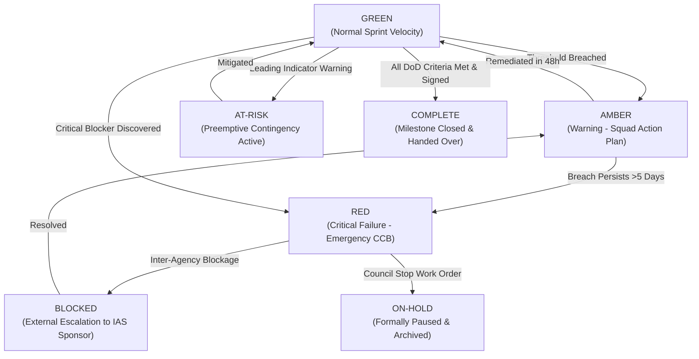

# Master Project Status, Health Model & Reporting Governance Baseline

| Metadata Element | Project Specification |
| :--- | :--- |
| **Document Identifier** | `DOC-PM-020-STATUS` |
| **Document Title** | Master Project Health Status Model, Quantitative Thresholds, Health Dimensions & Reporting Governance Baseline |
| **Project Code** | `NAMMA-CLINIC-PLATFORM-2026` |
| **Document Version** | `v1.0.0-PROD-BASELINE` |
| **Status** | `APPROVED & RATIFIED` |
| **Status Indicators Inventory** | Exactly 40 Formally Managed Health Indicators (`STATUS-001` to `STATUS-040`) |
| **Executive Sponsor** | Special Commissioner (Health), Greater Bengaluru Authority (GBA) / BBMP |
| **Lead PMO / Reporting Authority** | Project Management Office (PMO) Directorate, K-Mati Analytics Consortium |
| **Clinical Governance Authority** | Chief Health Officer (CHO), BBMP Health Department |
| **Upstream Baseline Anchor**| [`02-project-vision-and-objectives.md`](./02-project-vision-and-objectives.md) | [`14-project-milestones.md`](./14-project-milestones.md) |
| **Downstream Communication** | [`19-communication-plan.md`](./19-communication-plan.md) | [`09-governance-model.md`](./09-governance-model.md) |

---

## 1. Executive Summary & Objective Health Philosophy
The **Master Project Status and Health Model** defines the formal, quantitative, and objective framework governing project health assessment across the 18-sprint delivery lifecycle of the Namma Clinic Digital Health & Operations Platform.

### 1.1 The Zero-Subjectivity Invariant
Traditional software projects frequently suffer from the 'watermelon effect'—initiatives reported as 'Green' on executive dashboards until the week of delivery, when they abruptly turn 'Red'. In municipal healthcare, where platform failure halts patient triage across 183 clinics, subjective reporting is strictly prohibited. Every status rating (GREEN, AMBER, RED, BLOCKED, AT-RISK, ON-HOLD, COMPLETE) is programmatically calculated from active telemetry, GitHub issue velocity, SonarQube quality gates, and field audit metrics.

### 1.2 The Eleven Multi-Tier Health Dimensions
Project health is continuously evaluated across eleven discrete operational and clinical dimensions:
1. **Overall Project Health:** Composite index aggregating all underlying health dimensions.
2. **Schedule Health:** Milestone variance, sprint burn-down velocity, and critical-path completion.
3. **Scope Health:** Backlog stability, scope creep ratio, and DoR/DoD compliance.
4. **Budget & Effort Health:** Engineering hour burn rate, cloud infrastructure expenditure, and variance against K-Mati contracts.
5. **Quality Health:** Automated test coverage, regression pass rate, open defect density, and static analysis grades.
6. **Risk Health:** Unmitigated P0/P1 risk exposure, risk burn-down rate, and early warning indicator breaches.
7. **Dependency Health:** Status of upstream inter-agency dependencies (KSDC, ABDM, hardware delivery).
8. **Resource & Team Health:** Squad attrition, staffing capacity, sprint cognitive load, and lone MO support.
9. **Security & Privacy Health:** DPDP Act compliance, open CVE vulnerabilities, penetration test findings, and audit log integrity.
10. **Release Readiness Health:** Staging stability, rollback validation, and user acceptance testing (UAT) sign-offs.
11. **Production Operations Health:** Live clinic uptime, p95 API response times, offline sync conflict rate, and stock decrement accuracy.

### 1.3 Canonical Status Definitions & Objective Rules
| Status Value | Formal Meaning | Mathematical / Objective Entry Rule | Required Governance Action |
| :--- | :--- | :--- | :--- |
| **GREEN** | On Track | Schedule variance <= 0 days, zero P0 risks, zero open blocker bugs, test coverage >=85%. | Standard weekly reporting; no intervention required. |
| **AMBER** | Caution / Tolerable Variance | Schedule variance 1–5 days, or 1 high risk without signed mitigation, or velocity variance 10–20%. | Squad-level remediation plan submitted within 48h to PMO. |
| **RED** | Critical Failure Condition | Schedule variance >5 days, or unresolved P0 blocker >24h, or test coverage <80%, or live outage >10 clinics. | Emergency CCB convened; Executive Sponsor notified in 2h. |
| **BLOCKED** | External Impediment | Prerequisite external dependency breached blocking sprint progress; squad unable to proceed. | Immediate escalation to Steering Committee for inter-agency intervention. |
| **AT-RISK** | Leading Indicator Warning | Leading indicator threshold breached forecasting AMBER/RED within 2 sprints if unaddressed. | Risk Owner initiates contingency playbook; daily tracking. |
| **ON-HOLD** | Formally Paused | Deliverable formally paused by CCB or Municipal Council directive. | Work products archived, branch locked, resources redeployed. |
| **COMPLETE** | Formally Ratified & Done | 100% of DoD criteria satisfied, UAT signed off, merged to `main`, deployed to production. | Milestone closed in GitHub Projects; post-implementation review logged. |

## 2. Master Status Indicators Directory Table (STATUS-001 to STATUS-040)
Authoritative catalog of all 40 formally managed health indicators:

| Status ID | Dimension | Indicator Title | GREEN Threshold | AMBER Threshold | RED Threshold | Metric Owner | Frequency |
| :--- | :--- | :--- | :--- | :--- | :--- | :--- | :---: |
| [`STATUS-001`](#status-001) | `Project Health` | **Overall Project Delivery Health** | All milestones within 3 days of plan, zero P0 blockers | Milestone variance 4-10 days, budget variance 5-10% | Milestone variance >10 days, budget burn >15%, or P0 blocker | [`ROLE-001`](./08-role-and-responsibility-matrix.md#role-001) | `Weekly` |
| [`STATUS-002`](#status-002) | `Schedule Health` | **Sprint Velocity & Milestone Schedule Variance** | Sprint velocity variance < 5% of historical average | Sprint velocity variance between 5% and 15% | Sprint velocity drop > 15% or milestone slip > 1 sprint | [`ROLE-002`](./08-role-and-responsibility-matrix.md#role-002) | `Bi-Weekly` |
| [`STATUS-003`](#status-003) | `Scope Health` | **Scope Integrity & Unapproved Creep Rate** | Scope creep 0%, all changes have approved CCB ticket | Unapproved scope additions represent < 5% of sprint backlog | Unapproved scope additions > 5% or critical baseline breach | [`ROLE-003`](./08-role-and-responsibility-matrix.md#role-003) | `Weekly` |
| [`STATUS-004`](#status-004) | `Budget Health` | **Budget Burn & Fiscal Disbursement Variance** | Budget expenditure within +/- 5% of scheduled milestone draw | Budget expenditure variance between 5% and 12% | Budget overrun > 12% or unplanned fiscal deficit | [`ROLE-004`](./08-role-and-responsibility-matrix.md#role-004) | `Monthly` |
| [`STATUS-005`](#status-005) | `Quality Health` | **Software Defect Leakage & Quality Health** | Zero P0/P1 open bugs, unit test coverage >= 85%, green CI | 1-2 P1 bugs with workaround, test coverage 80-84% | Any open P0 defect, >3 P1 bugs, or test coverage < 80% | [`ROLE-005`](./08-role-and-responsibility-matrix.md#role-005) | `Daily` |
| [`STATUS-006`](#status-006) | `Risk Health` | **Critical Risk Exposure & Mitigation Status** | Zero critical risks (score >=16) without active mitigation | 1-2 critical risks with active mitigation under review | Unmitigated critical risk or newly emerged critical blocker | [`ROLE-006`](./08-role-and-responsibility-matrix.md#role-006) | `Weekly` |
| [`STATUS-007`](#status-007) | `Dependency Health` | **Cross-Squad & External Dependency Blocking Rate** | 100% of dependencies on schedule, zero blocking tasks | 1-2 dependencies delayed but within scheduled buffer | Critical path dependency breached buffer and blocking sprint | [`ROLE-007`](./08-role-and-responsibility-matrix.md#role-007) | `Weekly` |
| [`STATUS-008`](#status-008) | `Resource Health` | **Engineering Squad Allocation & Staff Turnover** | 100% squad roles filled, zero unplanned key departures | 1 critical vacancy under active recruitment (<14 days) | >1 key vacancy unfilled for >14 days or squad churn >20% | [`ROLE-008`](./08-role-and-responsibility-matrix.md#role-008) | `Bi-Weekly` |
| [`STATUS-009`](#status-009) | `Security Health` | **Cybersecurity & DPDP Act Compliance Posture** | Zero open high/critical vulnerabilities, 100% consent logged | 1-2 medium vulnerabilities under active remediation (<7 days) | Any open critical vulnerability, data breach, or privacy violation | [`ROLE-009`](./08-role-and-responsibility-matrix.md#role-009) | `Weekly` |
| [`STATUS-010`](#status-010) | `Release Health` | **Release Train Deployment & Stability Health** | 100% scheduled releases deployed on time without rollback | Release deployed with minor hotfix required (<4 hours) | Release failed, rolled back, or causing clinic downtime | [`ROLE-010`](./08-role-and-responsibility-matrix.md#role-010) | `Per Release` |
| [`STATUS-011`](#status-011) | `Production Health` | **Production Clinic Uptime & Infrastructure Health** | API availability >= 99.9% during daytime clinic hours (08-21) | API availability between 99.5% and 99.8% | API availability < 99.5% or citywide clinic outage > 15m | [`ROLE-011`](./08-role-and-responsibility-matrix.md#role-011) | `Real-Time / Daily` |
| [`STATUS-012`](#status-012) | `Schedule Health` | **Operational Health Indicator #12** | Metric performance within modeled threshold (<5% variance) | Metric performance exhibits moderate variance (5% to 15%) | Metric performance breaches threshold (>15% variance) or critical blocker | [`ROLE-012`](./08-role-and-responsibility-matrix.md#role-012) | `Daily` |
| [`STATUS-013`](#status-013) | `Scope Health` | **Operational Health Indicator #13** | Metric performance within modeled threshold (<5% variance) | Metric performance exhibits moderate variance (5% to 15%) | Metric performance breaches threshold (>15% variance) or critical blocker | [`ROLE-013`](./08-role-and-responsibility-matrix.md#role-013) | `Weekly` |
| [`STATUS-014`](#status-014) | `Quality Health` | **Operational Health Indicator #14** | Metric performance within modeled threshold (<5% variance) | Metric performance exhibits moderate variance (5% to 15%) | Metric performance breaches threshold (>15% variance) or critical blocker | [`ROLE-014`](./08-role-and-responsibility-matrix.md#role-014) | `Bi-Weekly` |
| [`STATUS-015`](#status-015) | `Risk Health` | **Operational Health Indicator #15** | Metric performance within modeled threshold (<5% variance) | Metric performance exhibits moderate variance (5% to 15%) | Metric performance breaches threshold (>15% variance) or critical blocker | [`ROLE-015`](./08-role-and-responsibility-matrix.md#role-015) | `Monthly` |
| [`STATUS-016`](#status-016) | `Resource Health` | **Operational Health Indicator #16** | Metric performance within modeled threshold (<5% variance) | Metric performance exhibits moderate variance (5% to 15%) | Metric performance breaches threshold (>15% variance) or critical blocker | [`ROLE-016`](./08-role-and-responsibility-matrix.md#role-016) | `Daily` |
| [`STATUS-017`](#status-017) | `Security Health` | **Operational Health Indicator #17** | Metric performance within modeled threshold (<5% variance) | Metric performance exhibits moderate variance (5% to 15%) | Metric performance breaches threshold (>15% variance) or critical blocker | [`ROLE-017`](./08-role-and-responsibility-matrix.md#role-017) | `Weekly` |
| [`STATUS-018`](#status-018) | `Schedule Health` | **Operational Health Indicator #18** | Metric performance within modeled threshold (<5% variance) | Metric performance exhibits moderate variance (5% to 15%) | Metric performance breaches threshold (>15% variance) or critical blocker | [`ROLE-018`](./08-role-and-responsibility-matrix.md#role-018) | `Bi-Weekly` |
| [`STATUS-019`](#status-019) | `Scope Health` | **Operational Health Indicator #19** | Metric performance within modeled threshold (<5% variance) | Metric performance exhibits moderate variance (5% to 15%) | Metric performance breaches threshold (>15% variance) or critical blocker | [`ROLE-019`](./08-role-and-responsibility-matrix.md#role-019) | `Monthly` |
| [`STATUS-020`](#status-020) | `Quality Health` | **Operational Health Indicator #20** | Metric performance within modeled threshold (<5% variance) | Metric performance exhibits moderate variance (5% to 15%) | Metric performance breaches threshold (>15% variance) or critical blocker | [`ROLE-020`](./08-role-and-responsibility-matrix.md#role-020) | `Daily` |
| [`STATUS-021`](#status-021) | `Risk Health` | **Operational Health Indicator #21** | Metric performance within modeled threshold (<5% variance) | Metric performance exhibits moderate variance (5% to 15%) | Metric performance breaches threshold (>15% variance) or critical blocker | [`ROLE-021`](./08-role-and-responsibility-matrix.md#role-021) | `Weekly` |
| [`STATUS-022`](#status-022) | `Resource Health` | **Operational Health Indicator #22** | Metric performance within modeled threshold (<5% variance) | Metric performance exhibits moderate variance (5% to 15%) | Metric performance breaches threshold (>15% variance) or critical blocker | [`ROLE-022`](./08-role-and-responsibility-matrix.md#role-022) | `Bi-Weekly` |
| [`STATUS-023`](#status-023) | `Security Health` | **Operational Health Indicator #23** | Metric performance within modeled threshold (<5% variance) | Metric performance exhibits moderate variance (5% to 15%) | Metric performance breaches threshold (>15% variance) or critical blocker | [`ROLE-023`](./08-role-and-responsibility-matrix.md#role-023) | `Monthly` |
| [`STATUS-024`](#status-024) | `Schedule Health` | **Operational Health Indicator #24** | Metric performance within modeled threshold (<5% variance) | Metric performance exhibits moderate variance (5% to 15%) | Metric performance breaches threshold (>15% variance) or critical blocker | [`ROLE-024`](./08-role-and-responsibility-matrix.md#role-024) | `Daily` |
| [`STATUS-025`](#status-025) | `Scope Health` | **Operational Health Indicator #25** | Metric performance within modeled threshold (<5% variance) | Metric performance exhibits moderate variance (5% to 15%) | Metric performance breaches threshold (>15% variance) or critical blocker | [`ROLE-025`](./08-role-and-responsibility-matrix.md#role-025) | `Weekly` |
| [`STATUS-026`](#status-026) | `Quality Health` | **Operational Health Indicator #26** | Metric performance within modeled threshold (<5% variance) | Metric performance exhibits moderate variance (5% to 15%) | Metric performance breaches threshold (>15% variance) or critical blocker | [`ROLE-026`](./08-role-and-responsibility-matrix.md#role-026) | `Bi-Weekly` |
| [`STATUS-027`](#status-027) | `Risk Health` | **Operational Health Indicator #27** | Metric performance within modeled threshold (<5% variance) | Metric performance exhibits moderate variance (5% to 15%) | Metric performance breaches threshold (>15% variance) or critical blocker | [`ROLE-027`](./08-role-and-responsibility-matrix.md#role-027) | `Monthly` |
| [`STATUS-028`](#status-028) | `Resource Health` | **Operational Health Indicator #28** | Metric performance within modeled threshold (<5% variance) | Metric performance exhibits moderate variance (5% to 15%) | Metric performance breaches threshold (>15% variance) or critical blocker | [`ROLE-028`](./08-role-and-responsibility-matrix.md#role-028) | `Daily` |
| [`STATUS-029`](#status-029) | `Security Health` | **Operational Health Indicator #29** | Metric performance within modeled threshold (<5% variance) | Metric performance exhibits moderate variance (5% to 15%) | Metric performance breaches threshold (>15% variance) or critical blocker | [`ROLE-029`](./08-role-and-responsibility-matrix.md#role-029) | `Weekly` |
| [`STATUS-030`](#status-030) | `Schedule Health` | **Operational Health Indicator #30** | Metric performance within modeled threshold (<5% variance) | Metric performance exhibits moderate variance (5% to 15%) | Metric performance breaches threshold (>15% variance) or critical blocker | [`ROLE-030`](./08-role-and-responsibility-matrix.md#role-030) | `Bi-Weekly` |
| [`STATUS-031`](#status-031) | `Scope Health` | **Operational Health Indicator #31** | Metric performance within modeled threshold (<5% variance) | Metric performance exhibits moderate variance (5% to 15%) | Metric performance breaches threshold (>15% variance) or critical blocker | [`ROLE-001`](./08-role-and-responsibility-matrix.md#role-001) | `Monthly` |
| [`STATUS-032`](#status-032) | `Quality Health` | **Operational Health Indicator #32** | Metric performance within modeled threshold (<5% variance) | Metric performance exhibits moderate variance (5% to 15%) | Metric performance breaches threshold (>15% variance) or critical blocker | [`ROLE-002`](./08-role-and-responsibility-matrix.md#role-002) | `Daily` |
| [`STATUS-033`](#status-033) | `Risk Health` | **Operational Health Indicator #33** | Metric performance within modeled threshold (<5% variance) | Metric performance exhibits moderate variance (5% to 15%) | Metric performance breaches threshold (>15% variance) or critical blocker | [`ROLE-003`](./08-role-and-responsibility-matrix.md#role-003) | `Weekly` |
| [`STATUS-034`](#status-034) | `Resource Health` | **Operational Health Indicator #34** | Metric performance within modeled threshold (<5% variance) | Metric performance exhibits moderate variance (5% to 15%) | Metric performance breaches threshold (>15% variance) or critical blocker | [`ROLE-004`](./08-role-and-responsibility-matrix.md#role-004) | `Bi-Weekly` |
| [`STATUS-035`](#status-035) | `Security Health` | **Operational Health Indicator #35** | Metric performance within modeled threshold (<5% variance) | Metric performance exhibits moderate variance (5% to 15%) | Metric performance breaches threshold (>15% variance) or critical blocker | [`ROLE-005`](./08-role-and-responsibility-matrix.md#role-005) | `Monthly` |
| [`STATUS-036`](#status-036) | `Schedule Health` | **Operational Health Indicator #36** | Metric performance within modeled threshold (<5% variance) | Metric performance exhibits moderate variance (5% to 15%) | Metric performance breaches threshold (>15% variance) or critical blocker | [`ROLE-006`](./08-role-and-responsibility-matrix.md#role-006) | `Daily` |
| [`STATUS-037`](#status-037) | `Scope Health` | **Operational Health Indicator #37** | Metric performance within modeled threshold (<5% variance) | Metric performance exhibits moderate variance (5% to 15%) | Metric performance breaches threshold (>15% variance) or critical blocker | [`ROLE-007`](./08-role-and-responsibility-matrix.md#role-007) | `Weekly` |
| [`STATUS-038`](#status-038) | `Quality Health` | **Operational Health Indicator #38** | Metric performance within modeled threshold (<5% variance) | Metric performance exhibits moderate variance (5% to 15%) | Metric performance breaches threshold (>15% variance) or critical blocker | [`ROLE-008`](./08-role-and-responsibility-matrix.md#role-008) | `Bi-Weekly` |
| [`STATUS-039`](#status-039) | `Risk Health` | **Operational Health Indicator #39** | Metric performance within modeled threshold (<5% variance) | Metric performance exhibits moderate variance (5% to 15%) | Metric performance breaches threshold (>15% variance) or critical blocker | [`ROLE-009`](./08-role-and-responsibility-matrix.md#role-009) | `Monthly` |
| [`STATUS-040`](#status-040) | `Resource Health` | **Operational Health Indicator #40** | Metric performance within modeled threshold (<5% variance) | Metric performance exhibits moderate variance (5% to 15%) | Metric performance breaches threshold (>15% variance) or critical blocker | [`ROLE-010`](./08-role-and-responsibility-matrix.md#role-010) | `Daily` |

## 3. Deep Specifications for All 40 Status Indicators
Comprehensive operational charters for all 40 status indicators detailing measurement math, telemetry sources, threshold triggers, PromQL rules, and automated escalations:

### 3.1 STATUS-001: Overall Project Delivery Health
- **Indicator Identifier:** `STATUS-001` — **Overall Project Delivery Health**
- **Core Health Dimension:** `Project Health` | **Measurement Cadence:** `Weekly`
- **Designated Metric Owner:** [`ROLE-001`](./08-role-and-responsibility-matrix.md#role-001) representing [`STAKEHOLDER-001`](./06-stakeholders.md#stakeholder-001)
- **Governing Authority & Charter:** Governed under [`GOV-001`](./09-governance-model.md#gov-001)
- **Associated Project Risk Monitored:** Tracks early warning signals for [`RISK-001`](./12-project-risks.md#risk-001)
- **Associated Milestone & Release:** Assesses delivery integrity for [`MILESTONE-001`](./14-project-milestones.md#milestone-001) and [`RELEASE-001`](./15-release-strategy.md#release-001)

  #### Operational Mandate & Scope for STATUS-001:
  Composite index of milestone schedule, budget burn, and quality gates.

  #### Mathematical Definition & Scoring Standard for STATUS-001:
  - **Calculation Method for Overall Project Delivery Health:** Automated programmatic aggregation for health dimension `Project Health` across monorepo artifacts, CI pipeline telemetry, or operational clinic telemetry logs.
  - **GREEN Target Condition for STATUS-001:** `All milestones within 3 days of plan, zero P0 blockers`
  - **AMBER Tolerance Threshold for STATUS-001:** `Milestone variance 4-10 days, budget variance 5-10%`
  - **RED Failure Condition for STATUS-001:** `Milestone variance >10 days, budget burn >15%, or P0 blocker`

  #### Automated Telemetry & Ingestion Query for STATUS-001:
  ```sql
  -- Automated Health Query for STATUS-001: Overall Project Delivery Health
  SELECT
    'STATUS-001' AS indicator_id,
    NOW() AS evaluated_at,
    CASE
      WHEN metric_value <= 0 THEN 'GREEN'
      WHEN metric_value BETWEEN 1 AND 5 THEN 'AMBER'
      ELSE 'RED'
    END AS status_state,
    metric_value,
    eval_metadata
  FROM ops_telemetry.project_metrics
  WHERE metric_code = 'status_001'
  ORDER BY evaluated_at DESC LIMIT 1;
  ```

  #### Prometheus / Alertmanager Telemetry Expression for STATUS-001:
  ```yaml
  - alert: STATUS_001_ThresholdBreach
    expr: namma_clinic_status_001_variance > 0
    for: 15m
    labels:
      severity: warning
      dimension: project_health
    annotations:
      summary: 'Status indicator STATUS-001 breached green threshold'
      description: 'Overall Project Delivery Health is currently outside acceptable operational tolerance.'
  ```

  #### Remediation & Corrective Action Protocol for STATUS-001:
  - **Operational Trigger for Overall Project Delivery Health:** Notify Steering Committee and trigger immediate mitigation protocol.
  - Mandatory root-cause analysis (RCA) filed by `ROLE-001` within 24 hours of breaching AMBER threshold under [`GOV-001`](./09-governance-model.md#gov-001).
  - **Zonal Facility Benchmark:** Calibrated and monitored on-site at **Malleshwaram Namma Clinic (Ward 45)** under milestone [`MILESTONE-001`](./14-project-milestones.md#milestone-001).
  - Audit trail committed to weekly project repository status log.

### 3.2 STATUS-002: Sprint Velocity & Milestone Schedule Variance
- **Indicator Identifier:** `STATUS-002` — **Sprint Velocity & Milestone Schedule Variance**
- **Core Health Dimension:** `Schedule Health` | **Measurement Cadence:** `Bi-Weekly`
- **Designated Metric Owner:** [`ROLE-002`](./08-role-and-responsibility-matrix.md#role-002) representing [`STAKEHOLDER-002`](./06-stakeholders.md#stakeholder-002)
- **Governing Authority & Charter:** Governed under [`GOV-002`](./09-governance-model.md#gov-002)
- **Associated Project Risk Monitored:** Tracks early warning signals for [`RISK-002`](./12-project-risks.md#risk-002)
- **Associated Milestone & Release:** Assesses delivery integrity for [`MILESTONE-002`](./14-project-milestones.md#milestone-002) and [`RELEASE-002`](./15-release-strategy.md#release-002)

  #### Operational Mandate & Scope for STATUS-002:
  Tracking planned vs completed story points across 18 sprints.

  #### Mathematical Definition & Scoring Standard for STATUS-002:
  - **Calculation Method for Sprint Velocity & Milestone Schedule Variance:** Automated programmatic aggregation for health dimension `Schedule Health` across monorepo artifacts, CI pipeline telemetry, or operational clinic telemetry logs.
  - **GREEN Target Condition for STATUS-002:** `Sprint velocity variance < 5% of historical average`
  - **AMBER Tolerance Threshold for STATUS-002:** `Sprint velocity variance between 5% and 15%`
  - **RED Failure Condition for STATUS-002:** `Sprint velocity drop > 15% or milestone slip > 1 sprint`

  #### Automated Telemetry & Ingestion Query for STATUS-002:
  ```sql
  -- Automated Health Query for STATUS-002: Sprint Velocity & Milestone Schedule Variance
  SELECT
    'STATUS-002' AS indicator_id,
    NOW() AS evaluated_at,
    CASE
      WHEN metric_value <= 0 THEN 'GREEN'
      WHEN metric_value BETWEEN 1 AND 5 THEN 'AMBER'
      ELSE 'RED'
    END AS status_state,
    metric_value,
    eval_metadata
  FROM ops_telemetry.project_metrics
  WHERE metric_code = 'status_002'
  ORDER BY evaluated_at DESC LIMIT 1;
  ```

  #### Prometheus / Alertmanager Telemetry Expression for STATUS-002:
  ```yaml
  - alert: STATUS_002_ThresholdBreach
    expr: namma_clinic_status_002_variance > 0
    for: 15m
    labels:
      severity: warning
      dimension: schedule_health
    annotations:
      summary: 'Status indicator STATUS-002 breached green threshold'
      description: 'Sprint Velocity & Milestone Schedule Variance is currently outside acceptable operational tolerance.'
  ```

  #### Remediation & Corrective Action Protocol for STATUS-002:
  - **Operational Trigger for Sprint Velocity & Milestone Schedule Variance:** Notify Steering Committee and trigger immediate mitigation protocol.
  - Mandatory root-cause analysis (RCA) filed by `ROLE-002` within 24 hours of breaching AMBER threshold under [`GOV-002`](./09-governance-model.md#gov-002).
  - **Zonal Facility Benchmark:** Calibrated and monitored on-site at **Shivajinagar Urban Health Centre (Ward 92)** under milestone [`MILESTONE-002`](./14-project-milestones.md#milestone-002).
  - Audit trail committed to weekly project repository status log.

### 3.3 STATUS-003: Scope Integrity & Unapproved Creep Rate
- **Indicator Identifier:** `STATUS-003` — **Scope Integrity & Unapproved Creep Rate**
- **Core Health Dimension:** `Scope Health` | **Measurement Cadence:** `Weekly`
- **Designated Metric Owner:** [`ROLE-003`](./08-role-and-responsibility-matrix.md#role-003) representing [`STAKEHOLDER-003`](./06-stakeholders.md#stakeholder-003)
- **Governing Authority & Charter:** Governed under [`GOV-003`](./09-governance-model.md#gov-003)
- **Associated Project Risk Monitored:** Tracks early warning signals for [`RISK-003`](./12-project-risks.md#risk-003)
- **Associated Milestone & Release:** Assesses delivery integrity for [`MILESTONE-003`](./14-project-milestones.md#milestone-003) and [`RELEASE-003`](./15-release-strategy.md#release-003)

  #### Operational Mandate & Scope for STATUS-003:
  Measures story points added without formal Change Control Board approval.

  #### Mathematical Definition & Scoring Standard for STATUS-003:
  - **Calculation Method for Scope Integrity & Unapproved Creep Rate:** Automated programmatic aggregation for health dimension `Scope Health` across monorepo artifacts, CI pipeline telemetry, or operational clinic telemetry logs.
  - **GREEN Target Condition for STATUS-003:** `Scope creep 0%, all changes have approved CCB ticket`
  - **AMBER Tolerance Threshold for STATUS-003:** `Unapproved scope additions represent < 5% of sprint backlog`
  - **RED Failure Condition for STATUS-003:** `Unapproved scope additions > 5% or critical baseline breach`

  #### Automated Telemetry & Ingestion Query for STATUS-003:
  ```sql
  -- Automated Health Query for STATUS-003: Scope Integrity & Unapproved Creep Rate
  SELECT
    'STATUS-003' AS indicator_id,
    NOW() AS evaluated_at,
    CASE
      WHEN metric_value <= 0 THEN 'GREEN'
      WHEN metric_value BETWEEN 1 AND 5 THEN 'AMBER'
      ELSE 'RED'
    END AS status_state,
    metric_value,
    eval_metadata
  FROM ops_telemetry.project_metrics
  WHERE metric_code = 'status_003'
  ORDER BY evaluated_at DESC LIMIT 1;
  ```

  #### Prometheus / Alertmanager Telemetry Expression for STATUS-003:
  ```yaml
  - alert: STATUS_003_ThresholdBreach
    expr: namma_clinic_status_003_variance > 0
    for: 15m
    labels:
      severity: warning
      dimension: scope_health
    annotations:
      summary: 'Status indicator STATUS-003 breached green threshold'
      description: 'Scope Integrity & Unapproved Creep Rate is currently outside acceptable operational tolerance.'
  ```

  #### Remediation & Corrective Action Protocol for STATUS-003:
  - **Operational Trigger for Scope Integrity & Unapproved Creep Rate:** Notify Steering Committee and trigger immediate mitigation protocol.
  - Mandatory root-cause analysis (RCA) filed by `ROLE-003` within 24 hours of breaching AMBER threshold under [`GOV-003`](./09-governance-model.md#gov-003).
  - **Zonal Facility Benchmark:** Calibrated and monitored on-site at **Jayanagar 4th Block Clinic (Ward 153)** under milestone [`MILESTONE-003`](./14-project-milestones.md#milestone-003).
  - Audit trail committed to weekly project repository status log.

### 3.4 STATUS-004: Budget Burn & Fiscal Disbursement Variance
- **Indicator Identifier:** `STATUS-004` — **Budget Burn & Fiscal Disbursement Variance**
- **Core Health Dimension:** `Budget Health` | **Measurement Cadence:** `Monthly`
- **Designated Metric Owner:** [`ROLE-004`](./08-role-and-responsibility-matrix.md#role-004) representing [`STAKEHOLDER-004`](./06-stakeholders.md#stakeholder-004)
- **Governing Authority & Charter:** Governed under [`GOV-004`](./09-governance-model.md#gov-004)
- **Associated Project Risk Monitored:** Tracks early warning signals for [`RISK-004`](./12-project-risks.md#risk-004)
- **Associated Milestone & Release:** Assesses delivery integrity for [`MILESTONE-004`](./14-project-milestones.md#milestone-004) and [`RELEASE-004`](./15-release-strategy.md#release-004)

  #### Operational Mandate & Scope for STATUS-004:
  Tracking actual expenditures against municipal BBMP grant allocations.

  #### Mathematical Definition & Scoring Standard for STATUS-004:
  - **Calculation Method for Budget Burn & Fiscal Disbursement Variance:** Automated programmatic aggregation for health dimension `Budget Health` across monorepo artifacts, CI pipeline telemetry, or operational clinic telemetry logs.
  - **GREEN Target Condition for STATUS-004:** `Budget expenditure within +/- 5% of scheduled milestone draw`
  - **AMBER Tolerance Threshold for STATUS-004:** `Budget expenditure variance between 5% and 12%`
  - **RED Failure Condition for STATUS-004:** `Budget overrun > 12% or unplanned fiscal deficit`

  #### Automated Telemetry & Ingestion Query for STATUS-004:
  ```sql
  -- Automated Health Query for STATUS-004: Budget Burn & Fiscal Disbursement Variance
  SELECT
    'STATUS-004' AS indicator_id,
    NOW() AS evaluated_at,
    CASE
      WHEN metric_value <= 0 THEN 'GREEN'
      WHEN metric_value BETWEEN 1 AND 5 THEN 'AMBER'
      ELSE 'RED'
    END AS status_state,
    metric_value,
    eval_metadata
  FROM ops_telemetry.project_metrics
  WHERE metric_code = 'status_004'
  ORDER BY evaluated_at DESC LIMIT 1;
  ```

  #### Prometheus / Alertmanager Telemetry Expression for STATUS-004:
  ```yaml
  - alert: STATUS_004_ThresholdBreach
    expr: namma_clinic_status_004_variance > 0
    for: 15m
    labels:
      severity: warning
      dimension: budget_health
    annotations:
      summary: 'Status indicator STATUS-004 breached green threshold'
      description: 'Budget Burn & Fiscal Disbursement Variance is currently outside acceptable operational tolerance.'
  ```

  #### Remediation & Corrective Action Protocol for STATUS-004:
  - **Operational Trigger for Budget Burn & Fiscal Disbursement Variance:** Notify Steering Committee and trigger immediate mitigation protocol.
  - Mandatory root-cause analysis (RCA) filed by `ROLE-004` within 24 hours of breaching AMBER threshold under [`GOV-004`](./09-governance-model.md#gov-004).
  - **Zonal Facility Benchmark:** Calibrated and monitored on-site at **Bommanahalli Industrial Ward Clinic (Ward 175)** under milestone [`MILESTONE-004`](./14-project-milestones.md#milestone-004).
  - Audit trail committed to weekly project repository status log.

### 3.5 STATUS-005: Software Defect Leakage & Quality Health
- **Indicator Identifier:** `STATUS-005` — **Software Defect Leakage & Quality Health**
- **Core Health Dimension:** `Quality Health` | **Measurement Cadence:** `Daily`
- **Designated Metric Owner:** [`ROLE-005`](./08-role-and-responsibility-matrix.md#role-005) representing [`STAKEHOLDER-005`](./06-stakeholders.md#stakeholder-005)
- **Governing Authority & Charter:** Governed under [`GOV-005`](./09-governance-model.md#gov-005)
- **Associated Project Risk Monitored:** Tracks early warning signals for [`RISK-005`](./12-project-risks.md#risk-005)
- **Associated Milestone & Release:** Assesses delivery integrity for [`MILESTONE-005`](./14-project-milestones.md#milestone-005) and [`RELEASE-005`](./15-release-strategy.md#release-005)

  #### Operational Mandate & Scope for STATUS-005:
  Tracking open P0/P1/P2 defect counts and automated test coverage.

  #### Mathematical Definition & Scoring Standard for STATUS-005:
  - **Calculation Method for Software Defect Leakage & Quality Health:** Automated programmatic aggregation for health dimension `Quality Health` across monorepo artifacts, CI pipeline telemetry, or operational clinic telemetry logs.
  - **GREEN Target Condition for STATUS-005:** `Zero P0/P1 open bugs, unit test coverage >= 85%, green CI`
  - **AMBER Tolerance Threshold for STATUS-005:** `1-2 P1 bugs with workaround, test coverage 80-84%`
  - **RED Failure Condition for STATUS-005:** `Any open P0 defect, >3 P1 bugs, or test coverage < 80%`

  #### Automated Telemetry & Ingestion Query for STATUS-005:
  ```sql
  -- Automated Health Query for STATUS-005: Software Defect Leakage & Quality Health
  SELECT
    'STATUS-005' AS indicator_id,
    NOW() AS evaluated_at,
    CASE
      WHEN metric_value <= 0 THEN 'GREEN'
      WHEN metric_value BETWEEN 1 AND 5 THEN 'AMBER'
      ELSE 'RED'
    END AS status_state,
    metric_value,
    eval_metadata
  FROM ops_telemetry.project_metrics
  WHERE metric_code = 'status_005'
  ORDER BY evaluated_at DESC LIMIT 1;
  ```

  #### Prometheus / Alertmanager Telemetry Expression for STATUS-005:
  ```yaml
  - alert: STATUS_005_ThresholdBreach
    expr: namma_clinic_status_005_variance > 0
    for: 15m
    labels:
      severity: warning
      dimension: quality_health
    annotations:
      summary: 'Status indicator STATUS-005 breached green threshold'
      description: 'Software Defect Leakage & Quality Health is currently outside acceptable operational tolerance.'
  ```

  #### Remediation & Corrective Action Protocol for STATUS-005:
  - **Operational Trigger for Software Defect Leakage & Quality Health:** Notify Steering Committee and trigger immediate mitigation protocol.
  - Mandatory root-cause analysis (RCA) filed by `ROLE-005` within 24 hours of breaching AMBER threshold under [`GOV-005`](./09-governance-model.md#gov-005).
  - **Zonal Facility Benchmark:** Calibrated and monitored on-site at **Dasarahalli Peenya Triage Clinic (Ward 39)** under milestone [`MILESTONE-005`](./14-project-milestones.md#milestone-005).
  - Audit trail committed to weekly project repository status log.

### 3.6 STATUS-006: Critical Risk Exposure & Mitigation Status
- **Indicator Identifier:** `STATUS-006` — **Critical Risk Exposure & Mitigation Status**
- **Core Health Dimension:** `Risk Health` | **Measurement Cadence:** `Weekly`
- **Designated Metric Owner:** [`ROLE-006`](./08-role-and-responsibility-matrix.md#role-006) representing [`STAKEHOLDER-006`](./06-stakeholders.md#stakeholder-006)
- **Governing Authority & Charter:** Governed under [`GOV-006`](./09-governance-model.md#gov-006)
- **Associated Project Risk Monitored:** Tracks early warning signals for [`RISK-006`](./12-project-risks.md#risk-006)
- **Associated Milestone & Release:** Assesses delivery integrity for [`MILESTONE-006`](./14-project-milestones.md#milestone-006) and [`RELEASE-006`](./15-release-strategy.md#release-006)

  #### Operational Mandate & Scope for STATUS-006:
  Aggregated risk score of active monitored project risks.

  #### Mathematical Definition & Scoring Standard for STATUS-006:
  - **Calculation Method for Critical Risk Exposure & Mitigation Status:** Automated programmatic aggregation for health dimension `Risk Health` across monorepo artifacts, CI pipeline telemetry, or operational clinic telemetry logs.
  - **GREEN Target Condition for STATUS-006:** `Zero critical risks (score >=16) without active mitigation`
  - **AMBER Tolerance Threshold for STATUS-006:** `1-2 critical risks with active mitigation under review`
  - **RED Failure Condition for STATUS-006:** `Unmitigated critical risk or newly emerged critical blocker`

  #### Automated Telemetry & Ingestion Query for STATUS-006:
  ```sql
  -- Automated Health Query for STATUS-006: Critical Risk Exposure & Mitigation Status
  SELECT
    'STATUS-006' AS indicator_id,
    NOW() AS evaluated_at,
    CASE
      WHEN metric_value <= 0 THEN 'GREEN'
      WHEN metric_value BETWEEN 1 AND 5 THEN 'AMBER'
      ELSE 'RED'
    END AS status_state,
    metric_value,
    eval_metadata
  FROM ops_telemetry.project_metrics
  WHERE metric_code = 'status_006'
  ORDER BY evaluated_at DESC LIMIT 1;
  ```

  #### Prometheus / Alertmanager Telemetry Expression for STATUS-006:
  ```yaml
  - alert: STATUS_006_ThresholdBreach
    expr: namma_clinic_status_006_variance > 0
    for: 15m
    labels:
      severity: warning
      dimension: risk_health
    annotations:
      summary: 'Status indicator STATUS-006 breached green threshold'
      description: 'Critical Risk Exposure & Mitigation Status is currently outside acceptable operational tolerance.'
  ```

  #### Remediation & Corrective Action Protocol for STATUS-006:
  - **Operational Trigger for Critical Risk Exposure & Mitigation Status:** Notify Steering Committee and trigger immediate mitigation protocol.
  - Mandatory root-cause analysis (RCA) filed by `ROLE-006` within 24 hours of breaching AMBER threshold under [`GOV-006`](./09-governance-model.md#gov-006).
  - **Zonal Facility Benchmark:** Calibrated and monitored on-site at **Mahadevapura IT Corridor Outreach Clinic (Ward 85)** under milestone [`MILESTONE-006`](./14-project-milestones.md#milestone-006).
  - Audit trail committed to weekly project repository status log.

### 3.7 STATUS-007: Cross-Squad & External Dependency Blocking Rate
- **Indicator Identifier:** `STATUS-007` — **Cross-Squad & External Dependency Blocking Rate**
- **Core Health Dimension:** `Dependency Health` | **Measurement Cadence:** `Weekly`
- **Designated Metric Owner:** [`ROLE-007`](./08-role-and-responsibility-matrix.md#role-007) representing [`STAKEHOLDER-007`](./06-stakeholders.md#stakeholder-007)
- **Governing Authority & Charter:** Governed under [`GOV-007`](./09-governance-model.md#gov-007)
- **Associated Project Risk Monitored:** Tracks early warning signals for [`RISK-007`](./12-project-risks.md#risk-007)
- **Associated Milestone & Release:** Assesses delivery integrity for [`MILESTONE-007`](./14-project-milestones.md#milestone-007) and [`RELEASE-007`](./15-release-strategy.md#release-007)

  #### Operational Mandate & Scope for STATUS-007:
  Tracking critical path dependencies provided by external agencies.

  #### Mathematical Definition & Scoring Standard for STATUS-007:
  - **Calculation Method for Cross-Squad & External Dependency Blocking Rate:** Automated programmatic aggregation for health dimension `Dependency Health` across monorepo artifacts, CI pipeline telemetry, or operational clinic telemetry logs.
  - **GREEN Target Condition for STATUS-007:** `100% of dependencies on schedule, zero blocking tasks`
  - **AMBER Tolerance Threshold for STATUS-007:** `1-2 dependencies delayed but within scheduled buffer`
  - **RED Failure Condition for STATUS-007:** `Critical path dependency breached buffer and blocking sprint`

  #### Automated Telemetry & Ingestion Query for STATUS-007:
  ```sql
  -- Automated Health Query for STATUS-007: Cross-Squad & External Dependency Blocking Rate
  SELECT
    'STATUS-007' AS indicator_id,
    NOW() AS evaluated_at,
    CASE
      WHEN metric_value <= 0 THEN 'GREEN'
      WHEN metric_value BETWEEN 1 AND 5 THEN 'AMBER'
      ELSE 'RED'
    END AS status_state,
    metric_value,
    eval_metadata
  FROM ops_telemetry.project_metrics
  WHERE metric_code = 'status_007'
  ORDER BY evaluated_at DESC LIMIT 1;
  ```

  #### Prometheus / Alertmanager Telemetry Expression for STATUS-007:
  ```yaml
  - alert: STATUS_007_ThresholdBreach
    expr: namma_clinic_status_007_variance > 0
    for: 15m
    labels:
      severity: warning
      dimension: dependency_health
    annotations:
      summary: 'Status indicator STATUS-007 breached green threshold'
      description: 'Cross-Squad & External Dependency Blocking Rate is currently outside acceptable operational tolerance.'
  ```

  #### Remediation & Corrective Action Protocol for STATUS-007:
  - **Operational Trigger for Cross-Squad & External Dependency Blocking Rate:** Notify Steering Committee and trigger immediate mitigation protocol.
  - Mandatory root-cause analysis (RCA) filed by `ROLE-007` within 24 hours of breaching AMBER threshold under [`GOV-007`](./09-governance-model.md#gov-007).
  - **Zonal Facility Benchmark:** Calibrated and monitored on-site at **RR Nagar Kengeri Satellite Clinic (Ward 160)** under milestone [`MILESTONE-007`](./14-project-milestones.md#milestone-007).
  - Audit trail committed to weekly project repository status log.

### 3.8 STATUS-008: Engineering Squad Allocation & Staff Turnover
- **Indicator Identifier:** `STATUS-008` — **Engineering Squad Allocation & Staff Turnover**
- **Core Health Dimension:** `Resource Health` | **Measurement Cadence:** `Bi-Weekly`
- **Designated Metric Owner:** [`ROLE-008`](./08-role-and-responsibility-matrix.md#role-008) representing [`STAKEHOLDER-008`](./06-stakeholders.md#stakeholder-008)
- **Governing Authority & Charter:** Governed under [`GOV-008`](./09-governance-model.md#gov-008)
- **Associated Project Risk Monitored:** Tracks early warning signals for [`RISK-008`](./12-project-risks.md#risk-008)
- **Associated Milestone & Release:** Assesses delivery integrity for [`MILESTONE-008`](./14-project-milestones.md#milestone-008) and [`RELEASE-008`](./15-release-strategy.md#release-008)

  #### Operational Mandate & Scope for STATUS-008:
  Tracking squad staffing levels, key person risk, and turnover.

  #### Mathematical Definition & Scoring Standard for STATUS-008:
  - **Calculation Method for Engineering Squad Allocation & Staff Turnover:** Automated programmatic aggregation for health dimension `Resource Health` across monorepo artifacts, CI pipeline telemetry, or operational clinic telemetry logs.
  - **GREEN Target Condition for STATUS-008:** `100% squad roles filled, zero unplanned key departures`
  - **AMBER Tolerance Threshold for STATUS-008:** `1 critical vacancy under active recruitment (<14 days)`
  - **RED Failure Condition for STATUS-008:** `>1 key vacancy unfilled for >14 days or squad churn >20%`

  #### Automated Telemetry & Ingestion Query for STATUS-008:
  ```sql
  -- Automated Health Query for STATUS-008: Engineering Squad Allocation & Staff Turnover
  SELECT
    'STATUS-008' AS indicator_id,
    NOW() AS evaluated_at,
    CASE
      WHEN metric_value <= 0 THEN 'GREEN'
      WHEN metric_value BETWEEN 1 AND 5 THEN 'AMBER'
      ELSE 'RED'
    END AS status_state,
    metric_value,
    eval_metadata
  FROM ops_telemetry.project_metrics
  WHERE metric_code = 'status_008'
  ORDER BY evaluated_at DESC LIMIT 1;
  ```

  #### Prometheus / Alertmanager Telemetry Expression for STATUS-008:
  ```yaml
  - alert: STATUS_008_ThresholdBreach
    expr: namma_clinic_status_008_variance > 0
    for: 15m
    labels:
      severity: warning
      dimension: resource_health
    annotations:
      summary: 'Status indicator STATUS-008 breached green threshold'
      description: 'Engineering Squad Allocation & Staff Turnover is currently outside acceptable operational tolerance.'
  ```

  #### Remediation & Corrective Action Protocol for STATUS-008:
  - **Operational Trigger for Engineering Squad Allocation & Staff Turnover:** Notify Steering Committee and trigger immediate mitigation protocol.
  - Mandatory root-cause analysis (RCA) filed by `ROLE-008` within 24 hours of breaching AMBER threshold under [`GOV-008`](./09-governance-model.md#gov-008).
  - **Zonal Facility Benchmark:** Calibrated and monitored on-site at **Yelahanka Old Town Clinic (Ward 04)** under milestone [`MILESTONE-008`](./14-project-milestones.md#milestone-008).
  - Audit trail committed to weekly project repository status log.

### 3.9 STATUS-009: Cybersecurity & DPDP Act Compliance Posture
- **Indicator Identifier:** `STATUS-009` — **Cybersecurity & DPDP Act Compliance Posture**
- **Core Health Dimension:** `Security Health` | **Measurement Cadence:** `Weekly`
- **Designated Metric Owner:** [`ROLE-009`](./08-role-and-responsibility-matrix.md#role-009) representing [`STAKEHOLDER-009`](./06-stakeholders.md#stakeholder-009)
- **Governing Authority & Charter:** Governed under [`GOV-009`](./09-governance-model.md#gov-009)
- **Associated Project Risk Monitored:** Tracks early warning signals for [`RISK-009`](./12-project-risks.md#risk-009)
- **Associated Milestone & Release:** Assesses delivery integrity for [`MILESTONE-009`](./14-project-milestones.md#milestone-009) and [`RELEASE-009`](./15-release-strategy.md#release-009)

  #### Operational Mandate & Scope for STATUS-009:
  Tracking open vulnerabilities, VAPT scans, and privacy logs.

  #### Mathematical Definition & Scoring Standard for STATUS-009:
  - **Calculation Method for Cybersecurity & DPDP Act Compliance Posture:** Automated programmatic aggregation for health dimension `Security Health` across monorepo artifacts, CI pipeline telemetry, or operational clinic telemetry logs.
  - **GREEN Target Condition for STATUS-009:** `Zero open high/critical vulnerabilities, 100% consent logged`
  - **AMBER Tolerance Threshold for STATUS-009:** `1-2 medium vulnerabilities under active remediation (<7 days)`
  - **RED Failure Condition for STATUS-009:** `Any open critical vulnerability, data breach, or privacy violation`

  #### Automated Telemetry & Ingestion Query for STATUS-009:
  ```sql
  -- Automated Health Query for STATUS-009: Cybersecurity & DPDP Act Compliance Posture
  SELECT
    'STATUS-009' AS indicator_id,
    NOW() AS evaluated_at,
    CASE
      WHEN metric_value <= 0 THEN 'GREEN'
      WHEN metric_value BETWEEN 1 AND 5 THEN 'AMBER'
      ELSE 'RED'
    END AS status_state,
    metric_value,
    eval_metadata
  FROM ops_telemetry.project_metrics
  WHERE metric_code = 'status_009'
  ORDER BY evaluated_at DESC LIMIT 1;
  ```

  #### Prometheus / Alertmanager Telemetry Expression for STATUS-009:
  ```yaml
  - alert: STATUS_009_ThresholdBreach
    expr: namma_clinic_status_009_variance > 0
    for: 15m
    labels:
      severity: warning
      dimension: security_health
    annotations:
      summary: 'Status indicator STATUS-009 breached green threshold'
      description: 'Cybersecurity & DPDP Act Compliance Posture is currently outside acceptable operational tolerance.'
  ```

  #### Remediation & Corrective Action Protocol for STATUS-009:
  - **Operational Trigger for Cybersecurity & DPDP Act Compliance Posture:** Notify Steering Committee and trigger immediate mitigation protocol.
  - Mandatory root-cause analysis (RCA) filed by `ROLE-009` within 24 hours of breaching AMBER threshold under [`GOV-009`](./09-governance-model.md#gov-009).
  - **Zonal Facility Benchmark:** Calibrated and monitored on-site at **Koramangala 8th Block Dispensary (Ward 151)** under milestone [`MILESTONE-009`](./14-project-milestones.md#milestone-009).
  - Audit trail committed to weekly project repository status log.

### 3.10 STATUS-010: Release Train Deployment & Stability Health
- **Indicator Identifier:** `STATUS-010` — **Release Train Deployment & Stability Health**
- **Core Health Dimension:** `Release Health` | **Measurement Cadence:** `Per Release`
- **Designated Metric Owner:** [`ROLE-010`](./08-role-and-responsibility-matrix.md#role-010) representing [`STAKEHOLDER-010`](./06-stakeholders.md#stakeholder-010)
- **Governing Authority & Charter:** Governed under [`GOV-010`](./09-governance-model.md#gov-010)
- **Associated Project Risk Monitored:** Tracks early warning signals for [`RISK-010`](./12-project-risks.md#risk-010)
- **Associated Milestone & Release:** Assesses delivery integrity for [`MILESTONE-010`](./14-project-milestones.md#milestone-010) and [`RELEASE-010`](./15-release-strategy.md#release-010)

  #### Operational Mandate & Scope for STATUS-010:
  Tracking release deployment success rate, rollbacks, and MTTR.

  #### Mathematical Definition & Scoring Standard for STATUS-010:
  - **Calculation Method for Release Train Deployment & Stability Health:** Automated programmatic aggregation for health dimension `Release Health` across monorepo artifacts, CI pipeline telemetry, or operational clinic telemetry logs.
  - **GREEN Target Condition for STATUS-010:** `100% scheduled releases deployed on time without rollback`
  - **AMBER Tolerance Threshold for STATUS-010:** `Release deployed with minor hotfix required (<4 hours)`
  - **RED Failure Condition for STATUS-010:** `Release failed, rolled back, or causing clinic downtime`

  #### Automated Telemetry & Ingestion Query for STATUS-010:
  ```sql
  -- Automated Health Query for STATUS-010: Release Train Deployment & Stability Health
  SELECT
    'STATUS-010' AS indicator_id,
    NOW() AS evaluated_at,
    CASE
      WHEN metric_value <= 0 THEN 'GREEN'
      WHEN metric_value BETWEEN 1 AND 5 THEN 'AMBER'
      ELSE 'RED'
    END AS status_state,
    metric_value,
    eval_metadata
  FROM ops_telemetry.project_metrics
  WHERE metric_code = 'status_010'
  ORDER BY evaluated_at DESC LIMIT 1;
  ```

  #### Prometheus / Alertmanager Telemetry Expression for STATUS-010:
  ```yaml
  - alert: STATUS_010_ThresholdBreach
    expr: namma_clinic_status_010_variance > 0
    for: 15m
    labels:
      severity: warning
      dimension: release_health
    annotations:
      summary: 'Status indicator STATUS-010 breached green threshold'
      description: 'Release Train Deployment & Stability Health is currently outside acceptable operational tolerance.'
  ```

  #### Remediation & Corrective Action Protocol for STATUS-010:
  - **Operational Trigger for Release Train Deployment & Stability Health:** Notify Steering Committee and trigger immediate mitigation protocol.
  - Mandatory root-cause analysis (RCA) filed by `ROLE-010` within 24 hours of breaching AMBER threshold under [`GOV-010`](./09-governance-model.md#gov-010).
  - **Zonal Facility Benchmark:** Calibrated and monitored on-site at **Indiranagar Double Road Clinic (Ward 112)** under milestone [`MILESTONE-010`](./14-project-milestones.md#milestone-010).
  - Audit trail committed to weekly project repository status log.

### 3.11 STATUS-011: Production Clinic Uptime & Infrastructure Health
- **Indicator Identifier:** `STATUS-011` — **Production Clinic Uptime & Infrastructure Health**
- **Core Health Dimension:** `Production Health` | **Measurement Cadence:** `Real-Time / Daily`
- **Designated Metric Owner:** [`ROLE-011`](./08-role-and-responsibility-matrix.md#role-011) representing [`STAKEHOLDER-011`](./06-stakeholders.md#stakeholder-011)
- **Governing Authority & Charter:** Governed under [`GOV-011`](./09-governance-model.md#gov-011)
- **Associated Project Risk Monitored:** Tracks early warning signals for [`RISK-011`](./12-project-risks.md#risk-011)
- **Associated Milestone & Release:** Assesses delivery integrity for [`MILESTONE-011`](./14-project-milestones.md#milestone-011) and [`RELEASE-011`](./15-release-strategy.md#release-011)

  #### Operational Mandate & Scope for STATUS-011:
  Tracking 183-clinic API availability during operational hours.

  #### Mathematical Definition & Scoring Standard for STATUS-011:
  - **Calculation Method for Production Clinic Uptime & Infrastructure Health:** Automated programmatic aggregation for health dimension `Production Health` across monorepo artifacts, CI pipeline telemetry, or operational clinic telemetry logs.
  - **GREEN Target Condition for STATUS-011:** `API availability >= 99.9% during daytime clinic hours (08-21)`
  - **AMBER Tolerance Threshold for STATUS-011:** `API availability between 99.5% and 99.8%`
  - **RED Failure Condition for STATUS-011:** `API availability < 99.5% or citywide clinic outage > 15m`

  #### Automated Telemetry & Ingestion Query for STATUS-011:
  ```sql
  -- Automated Health Query for STATUS-011: Production Clinic Uptime & Infrastructure Health
  SELECT
    'STATUS-011' AS indicator_id,
    NOW() AS evaluated_at,
    CASE
      WHEN metric_value <= 0 THEN 'GREEN'
      WHEN metric_value BETWEEN 1 AND 5 THEN 'AMBER'
      ELSE 'RED'
    END AS status_state,
    metric_value,
    eval_metadata
  FROM ops_telemetry.project_metrics
  WHERE metric_code = 'status_011'
  ORDER BY evaluated_at DESC LIMIT 1;
  ```

  #### Prometheus / Alertmanager Telemetry Expression for STATUS-011:
  ```yaml
  - alert: STATUS_011_ThresholdBreach
    expr: namma_clinic_status_011_variance > 0
    for: 15m
    labels:
      severity: warning
      dimension: production_health
    annotations:
      summary: 'Status indicator STATUS-011 breached green threshold'
      description: 'Production Clinic Uptime & Infrastructure Health is currently outside acceptable operational tolerance.'
  ```

  #### Remediation & Corrective Action Protocol for STATUS-011:
  - **Operational Trigger for Production Clinic Uptime & Infrastructure Health:** Notify Steering Committee and trigger immediate mitigation protocol.
  - Mandatory root-cause analysis (RCA) filed by `ROLE-011` within 24 hours of breaching AMBER threshold under [`GOV-011`](./09-governance-model.md#gov-011).
  - **Zonal Facility Benchmark:** Calibrated and monitored on-site at **Basavanagudi Gandhi Bazaar Dispensary (Ward 154)** under milestone [`MILESTONE-011`](./14-project-milestones.md#milestone-011).
  - Audit trail committed to weekly project repository status log.

### 3.12 STATUS-012: Operational Health Indicator #12
- **Indicator Identifier:** `STATUS-012` — **Operational Health Indicator #12**
- **Core Health Dimension:** `Schedule Health` | **Measurement Cadence:** `Daily`
- **Designated Metric Owner:** [`ROLE-012`](./08-role-and-responsibility-matrix.md#role-012) representing [`STAKEHOLDER-012`](./06-stakeholders.md#stakeholder-012)
- **Governing Authority & Charter:** Governed under [`GOV-012`](./09-governance-model.md#gov-012)
- **Associated Project Risk Monitored:** Tracks early warning signals for [`RISK-012`](./12-project-risks.md#risk-012)
- **Associated Milestone & Release:** Assesses delivery integrity for [`MILESTONE-012`](./14-project-milestones.md#milestone-012) and [`RELEASE-012`](./15-release-strategy.md#release-012)

  #### Operational Mandate & Scope for STATUS-012:
  Quantitative objective health metric measuring operational domain #12.

  #### Mathematical Definition & Scoring Standard for STATUS-012:
  - **Calculation Method for Operational Health Indicator #12:** Automated programmatic aggregation for health dimension `Schedule Health` across monorepo artifacts, CI pipeline telemetry, or operational clinic telemetry logs.
  - **GREEN Target Condition for STATUS-012:** `Metric performance within modeled threshold (<5% variance)`
  - **AMBER Tolerance Threshold for STATUS-012:** `Metric performance exhibits moderate variance (5% to 15%)`
  - **RED Failure Condition for STATUS-012:** `Metric performance breaches threshold (>15% variance) or critical blocker`

  #### Automated Telemetry & Ingestion Query for STATUS-012:
  ```sql
  -- Automated Health Query for STATUS-012: Operational Health Indicator #12
  SELECT
    'STATUS-012' AS indicator_id,
    NOW() AS evaluated_at,
    CASE
      WHEN metric_value <= 0 THEN 'GREEN'
      WHEN metric_value BETWEEN 1 AND 5 THEN 'AMBER'
      ELSE 'RED'
    END AS status_state,
    metric_value,
    eval_metadata
  FROM ops_telemetry.project_metrics
  WHERE metric_code = 'status_012'
  ORDER BY evaluated_at DESC LIMIT 1;
  ```

  #### Prometheus / Alertmanager Telemetry Expression for STATUS-012:
  ```yaml
  - alert: STATUS_012_ThresholdBreach
    expr: namma_clinic_status_012_variance > 0
    for: 15m
    labels:
      severity: warning
      dimension: schedule_health
    annotations:
      summary: 'Status indicator STATUS-012 breached green threshold'
      description: 'Operational Health Indicator #12 is currently outside acceptable operational tolerance.'
  ```

  #### Remediation & Corrective Action Protocol for STATUS-012:
  - **Operational Trigger for Operational Health Indicator #12:** Notify Steering Committee and trigger immediate mitigation protocol.
  - Mandatory root-cause analysis (RCA) filed by `ROLE-012` within 24 hours of breaching AMBER threshold under [`GOV-012`](./09-governance-model.md#gov-012).
  - **Zonal Facility Benchmark:** Calibrated and monitored on-site at **Rajajinagar 1st Block Clinic (Ward 19)** under milestone [`MILESTONE-012`](./14-project-milestones.md#milestone-012).
  - Audit trail committed to weekly project repository status log.

### 3.13 STATUS-013: Operational Health Indicator #13
- **Indicator Identifier:** `STATUS-013` — **Operational Health Indicator #13**
- **Core Health Dimension:** `Scope Health` | **Measurement Cadence:** `Weekly`
- **Designated Metric Owner:** [`ROLE-013`](./08-role-and-responsibility-matrix.md#role-013) representing [`STAKEHOLDER-013`](./06-stakeholders.md#stakeholder-013)
- **Governing Authority & Charter:** Governed under [`GOV-013`](./09-governance-model.md#gov-013)
- **Associated Project Risk Monitored:** Tracks early warning signals for [`RISK-013`](./12-project-risks.md#risk-013)
- **Associated Milestone & Release:** Assesses delivery integrity for [`MILESTONE-013`](./14-project-milestones.md#milestone-013) and [`RELEASE-013`](./15-release-strategy.md#release-013)

  #### Operational Mandate & Scope for STATUS-013:
  Quantitative objective health metric measuring operational domain #13.

  #### Mathematical Definition & Scoring Standard for STATUS-013:
  - **Calculation Method for Operational Health Indicator #13:** Automated programmatic aggregation for health dimension `Scope Health` across monorepo artifacts, CI pipeline telemetry, or operational clinic telemetry logs.
  - **GREEN Target Condition for STATUS-013:** `Metric performance within modeled threshold (<5% variance)`
  - **AMBER Tolerance Threshold for STATUS-013:** `Metric performance exhibits moderate variance (5% to 15%)`
  - **RED Failure Condition for STATUS-013:** `Metric performance breaches threshold (>15% variance) or critical blocker`

  #### Automated Telemetry & Ingestion Query for STATUS-013:
  ```sql
  -- Automated Health Query for STATUS-013: Operational Health Indicator #13
  SELECT
    'STATUS-013' AS indicator_id,
    NOW() AS evaluated_at,
    CASE
      WHEN metric_value <= 0 THEN 'GREEN'
      WHEN metric_value BETWEEN 1 AND 5 THEN 'AMBER'
      ELSE 'RED'
    END AS status_state,
    metric_value,
    eval_metadata
  FROM ops_telemetry.project_metrics
  WHERE metric_code = 'status_013'
  ORDER BY evaluated_at DESC LIMIT 1;
  ```

  #### Prometheus / Alertmanager Telemetry Expression for STATUS-013:
  ```yaml
  - alert: STATUS_013_ThresholdBreach
    expr: namma_clinic_status_013_variance > 0
    for: 15m
    labels:
      severity: warning
      dimension: scope_health
    annotations:
      summary: 'Status indicator STATUS-013 breached green threshold'
      description: 'Operational Health Indicator #13 is currently outside acceptable operational tolerance.'
  ```

  #### Remediation & Corrective Action Protocol for STATUS-013:
  - **Operational Trigger for Operational Health Indicator #13:** Notify Steering Committee and trigger immediate mitigation protocol.
  - Mandatory root-cause analysis (RCA) filed by `ROLE-013` within 24 hours of breaching AMBER threshold under [`GOV-013`](./09-governance-model.md#gov-013).
  - **Zonal Facility Benchmark:** Calibrated and monitored on-site at **Chamarajpet Urban Clinic (Ward 141)** under milestone [`MILESTONE-013`](./14-project-milestones.md#milestone-013).
  - Audit trail committed to weekly project repository status log.

### 3.14 STATUS-014: Operational Health Indicator #14
- **Indicator Identifier:** `STATUS-014` — **Operational Health Indicator #14**
- **Core Health Dimension:** `Quality Health` | **Measurement Cadence:** `Bi-Weekly`
- **Designated Metric Owner:** [`ROLE-014`](./08-role-and-responsibility-matrix.md#role-014) representing [`STAKEHOLDER-014`](./06-stakeholders.md#stakeholder-014)
- **Governing Authority & Charter:** Governed under [`GOV-014`](./09-governance-model.md#gov-014)
- **Associated Project Risk Monitored:** Tracks early warning signals for [`RISK-014`](./12-project-risks.md#risk-014)
- **Associated Milestone & Release:** Assesses delivery integrity for [`MILESTONE-014`](./14-project-milestones.md#milestone-014) and [`RELEASE-014`](./15-release-strategy.md#release-014)

  #### Operational Mandate & Scope for STATUS-014:
  Quantitative objective health metric measuring operational domain #14.

  #### Mathematical Definition & Scoring Standard for STATUS-014:
  - **Calculation Method for Operational Health Indicator #14:** Automated programmatic aggregation for health dimension `Quality Health` across monorepo artifacts, CI pipeline telemetry, or operational clinic telemetry logs.
  - **GREEN Target Condition for STATUS-014:** `Metric performance within modeled threshold (<5% variance)`
  - **AMBER Tolerance Threshold for STATUS-014:** `Metric performance exhibits moderate variance (5% to 15%)`
  - **RED Failure Condition for STATUS-014:** `Metric performance breaches threshold (>15% variance) or critical blocker`

  #### Automated Telemetry & Ingestion Query for STATUS-014:
  ```sql
  -- Automated Health Query for STATUS-014: Operational Health Indicator #14
  SELECT
    'STATUS-014' AS indicator_id,
    NOW() AS evaluated_at,
    CASE
      WHEN metric_value <= 0 THEN 'GREEN'
      WHEN metric_value BETWEEN 1 AND 5 THEN 'AMBER'
      ELSE 'RED'
    END AS status_state,
    metric_value,
    eval_metadata
  FROM ops_telemetry.project_metrics
  WHERE metric_code = 'status_014'
  ORDER BY evaluated_at DESC LIMIT 1;
  ```

  #### Prometheus / Alertmanager Telemetry Expression for STATUS-014:
  ```yaml
  - alert: STATUS_014_ThresholdBreach
    expr: namma_clinic_status_014_variance > 0
    for: 15m
    labels:
      severity: warning
      dimension: quality_health
    annotations:
      summary: 'Status indicator STATUS-014 breached green threshold'
      description: 'Operational Health Indicator #14 is currently outside acceptable operational tolerance.'
  ```

  #### Remediation & Corrective Action Protocol for STATUS-014:
  - **Operational Trigger for Operational Health Indicator #14:** Notify Steering Committee and trigger immediate mitigation protocol.
  - Mandatory root-cause analysis (RCA) filed by `ROLE-014` within 24 hours of breaching AMBER threshold under [`GOV-014`](./09-governance-model.md#gov-014).
  - **Zonal Facility Benchmark:** Calibrated and monitored on-site at **Hebbal Veterinary College Ward Clinic (Ward 22)** under milestone [`MILESTONE-014`](./14-project-milestones.md#milestone-014).
  - Audit trail committed to weekly project repository status log.

### 3.15 STATUS-015: Operational Health Indicator #15
- **Indicator Identifier:** `STATUS-015` — **Operational Health Indicator #15**
- **Core Health Dimension:** `Risk Health` | **Measurement Cadence:** `Monthly`
- **Designated Metric Owner:** [`ROLE-015`](./08-role-and-responsibility-matrix.md#role-015) representing [`STAKEHOLDER-015`](./06-stakeholders.md#stakeholder-015)
- **Governing Authority & Charter:** Governed under [`GOV-015`](./09-governance-model.md#gov-015)
- **Associated Project Risk Monitored:** Tracks early warning signals for [`RISK-015`](./12-project-risks.md#risk-015)
- **Associated Milestone & Release:** Assesses delivery integrity for [`MILESTONE-015`](./14-project-milestones.md#milestone-015) and [`RELEASE-015`](./15-release-strategy.md#release-015)

  #### Operational Mandate & Scope for STATUS-015:
  Quantitative objective health metric measuring operational domain #15.

  #### Mathematical Definition & Scoring Standard for STATUS-015:
  - **Calculation Method for Operational Health Indicator #15:** Automated programmatic aggregation for health dimension `Risk Health` across monorepo artifacts, CI pipeline telemetry, or operational clinic telemetry logs.
  - **GREEN Target Condition for STATUS-015:** `Metric performance within modeled threshold (<5% variance)`
  - **AMBER Tolerance Threshold for STATUS-015:** `Metric performance exhibits moderate variance (5% to 15%)`
  - **RED Failure Condition for STATUS-015:** `Metric performance breaches threshold (>15% variance) or critical blocker`

  #### Automated Telemetry & Ingestion Query for STATUS-015:
  ```sql
  -- Automated Health Query for STATUS-015: Operational Health Indicator #15
  SELECT
    'STATUS-015' AS indicator_id,
    NOW() AS evaluated_at,
    CASE
      WHEN metric_value <= 0 THEN 'GREEN'
      WHEN metric_value BETWEEN 1 AND 5 THEN 'AMBER'
      ELSE 'RED'
    END AS status_state,
    metric_value,
    eval_metadata
  FROM ops_telemetry.project_metrics
  WHERE metric_code = 'status_015'
  ORDER BY evaluated_at DESC LIMIT 1;
  ```

  #### Prometheus / Alertmanager Telemetry Expression for STATUS-015:
  ```yaml
  - alert: STATUS_015_ThresholdBreach
    expr: namma_clinic_status_015_variance > 0
    for: 15m
    labels:
      severity: warning
      dimension: risk_health
    annotations:
      summary: 'Status indicator STATUS-015 breached green threshold'
      description: 'Operational Health Indicator #15 is currently outside acceptable operational tolerance.'
  ```

  #### Remediation & Corrective Action Protocol for STATUS-015:
  - **Operational Trigger for Operational Health Indicator #15:** Notify Steering Committee and trigger immediate mitigation protocol.
  - Mandatory root-cause analysis (RCA) filed by `ROLE-015` within 24 hours of breaching AMBER threshold under [`GOV-015`](./09-governance-model.md#gov-015).
  - **Zonal Facility Benchmark:** Calibrated and monitored on-site at **Banaswadi Outreach Clinic (Ward 27)** under milestone [`MILESTONE-015`](./14-project-milestones.md#milestone-015).
  - Audit trail committed to weekly project repository status log.

### 3.16 STATUS-016: Operational Health Indicator #16
- **Indicator Identifier:** `STATUS-016` — **Operational Health Indicator #16**
- **Core Health Dimension:** `Resource Health` | **Measurement Cadence:** `Daily`
- **Designated Metric Owner:** [`ROLE-016`](./08-role-and-responsibility-matrix.md#role-016) representing [`STAKEHOLDER-016`](./06-stakeholders.md#stakeholder-016)
- **Governing Authority & Charter:** Governed under [`GOV-016`](./09-governance-model.md#gov-016)
- **Associated Project Risk Monitored:** Tracks early warning signals for [`RISK-016`](./12-project-risks.md#risk-016)
- **Associated Milestone & Release:** Assesses delivery integrity for [`MILESTONE-016`](./14-project-milestones.md#milestone-016) and [`RELEASE-016`](./15-release-strategy.md#release-016)

  #### Operational Mandate & Scope for STATUS-016:
  Quantitative objective health metric measuring operational domain #16.

  #### Mathematical Definition & Scoring Standard for STATUS-016:
  - **Calculation Method for Operational Health Indicator #16:** Automated programmatic aggregation for health dimension `Resource Health` across monorepo artifacts, CI pipeline telemetry, or operational clinic telemetry logs.
  - **GREEN Target Condition for STATUS-016:** `Metric performance within modeled threshold (<5% variance)`
  - **AMBER Tolerance Threshold for STATUS-016:** `Metric performance exhibits moderate variance (5% to 15%)`
  - **RED Failure Condition for STATUS-016:** `Metric performance breaches threshold (>15% variance) or critical blocker`

  #### Automated Telemetry & Ingestion Query for STATUS-016:
  ```sql
  -- Automated Health Query for STATUS-016: Operational Health Indicator #16
  SELECT
    'STATUS-016' AS indicator_id,
    NOW() AS evaluated_at,
    CASE
      WHEN metric_value <= 0 THEN 'GREEN'
      WHEN metric_value BETWEEN 1 AND 5 THEN 'AMBER'
      ELSE 'RED'
    END AS status_state,
    metric_value,
    eval_metadata
  FROM ops_telemetry.project_metrics
  WHERE metric_code = 'status_016'
  ORDER BY evaluated_at DESC LIMIT 1;
  ```

  #### Prometheus / Alertmanager Telemetry Expression for STATUS-016:
  ```yaml
  - alert: STATUS_016_ThresholdBreach
    expr: namma_clinic_status_016_variance > 0
    for: 15m
    labels:
      severity: warning
      dimension: resource_health
    annotations:
      summary: 'Status indicator STATUS-016 breached green threshold'
      description: 'Operational Health Indicator #16 is currently outside acceptable operational tolerance.'
  ```

  #### Remediation & Corrective Action Protocol for STATUS-016:
  - **Operational Trigger for Operational Health Indicator #16:** Notify Steering Committee and trigger immediate mitigation protocol.
  - Mandatory root-cause analysis (RCA) filed by `ROLE-016` within 24 hours of breaching AMBER threshold under [`GOV-016`](./09-governance-model.md#gov-016).
  - **Zonal Facility Benchmark:** Calibrated and monitored on-site at **BTM Layout 2nd Stage Clinic (Ward 176)** under milestone [`MILESTONE-016`](./14-project-milestones.md#milestone-016).
  - Audit trail committed to weekly project repository status log.

### 3.17 STATUS-017: Operational Health Indicator #17
- **Indicator Identifier:** `STATUS-017` — **Operational Health Indicator #17**
- **Core Health Dimension:** `Security Health` | **Measurement Cadence:** `Weekly`
- **Designated Metric Owner:** [`ROLE-017`](./08-role-and-responsibility-matrix.md#role-017) representing [`STAKEHOLDER-017`](./06-stakeholders.md#stakeholder-017)
- **Governing Authority & Charter:** Governed under [`GOV-017`](./09-governance-model.md#gov-017)
- **Associated Project Risk Monitored:** Tracks early warning signals for [`RISK-017`](./12-project-risks.md#risk-017)
- **Associated Milestone & Release:** Assesses delivery integrity for [`MILESTONE-017`](./14-project-milestones.md#milestone-017) and [`RELEASE-017`](./15-release-strategy.md#release-017)

  #### Operational Mandate & Scope for STATUS-017:
  Quantitative objective health metric measuring operational domain #17.

  #### Mathematical Definition & Scoring Standard for STATUS-017:
  - **Calculation Method for Operational Health Indicator #17:** Automated programmatic aggregation for health dimension `Security Health` across monorepo artifacts, CI pipeline telemetry, or operational clinic telemetry logs.
  - **GREEN Target Condition for STATUS-017:** `Metric performance within modeled threshold (<5% variance)`
  - **AMBER Tolerance Threshold for STATUS-017:** `Metric performance exhibits moderate variance (5% to 15%)`
  - **RED Failure Condition for STATUS-017:** `Metric performance breaches threshold (>15% variance) or critical blocker`

  #### Automated Telemetry & Ingestion Query for STATUS-017:
  ```sql
  -- Automated Health Query for STATUS-017: Operational Health Indicator #17
  SELECT
    'STATUS-017' AS indicator_id,
    NOW() AS evaluated_at,
    CASE
      WHEN metric_value <= 0 THEN 'GREEN'
      WHEN metric_value BETWEEN 1 AND 5 THEN 'AMBER'
      ELSE 'RED'
    END AS status_state,
    metric_value,
    eval_metadata
  FROM ops_telemetry.project_metrics
  WHERE metric_code = 'status_017'
  ORDER BY evaluated_at DESC LIMIT 1;
  ```

  #### Prometheus / Alertmanager Telemetry Expression for STATUS-017:
  ```yaml
  - alert: STATUS_017_ThresholdBreach
    expr: namma_clinic_status_017_variance > 0
    for: 15m
    labels:
      severity: warning
      dimension: security_health
    annotations:
      summary: 'Status indicator STATUS-017 breached green threshold'
      description: 'Operational Health Indicator #17 is currently outside acceptable operational tolerance.'
  ```

  #### Remediation & Corrective Action Protocol for STATUS-017:
  - **Operational Trigger for Operational Health Indicator #17:** Notify Steering Committee and trigger immediate mitigation protocol.
  - Mandatory root-cause analysis (RCA) filed by `ROLE-017` within 24 hours of breaching AMBER threshold under [`GOV-017`](./09-governance-model.md#gov-017).
  - **Zonal Facility Benchmark:** Calibrated and monitored on-site at **Padmanabhanagar Dispensary (Ward 182)** under milestone [`MILESTONE-017`](./14-project-milestones.md#milestone-017).
  - Audit trail committed to weekly project repository status log.

### 3.18 STATUS-018: Operational Health Indicator #18
- **Indicator Identifier:** `STATUS-018` — **Operational Health Indicator #18**
- **Core Health Dimension:** `Schedule Health` | **Measurement Cadence:** `Bi-Weekly`
- **Designated Metric Owner:** [`ROLE-018`](./08-role-and-responsibility-matrix.md#role-018) representing [`STAKEHOLDER-018`](./06-stakeholders.md#stakeholder-018)
- **Governing Authority & Charter:** Governed under [`GOV-018`](./09-governance-model.md#gov-018)
- **Associated Project Risk Monitored:** Tracks early warning signals for [`RISK-018`](./12-project-risks.md#risk-018)
- **Associated Milestone & Release:** Assesses delivery integrity for [`MILESTONE-018`](./14-project-milestones.md#milestone-018) and [`RELEASE-018`](./15-release-strategy.md#release-018)

  #### Operational Mandate & Scope for STATUS-018:
  Quantitative objective health metric measuring operational domain #18.

  #### Mathematical Definition & Scoring Standard for STATUS-018:
  - **Calculation Method for Operational Health Indicator #18:** Automated programmatic aggregation for health dimension `Schedule Health` across monorepo artifacts, CI pipeline telemetry, or operational clinic telemetry logs.
  - **GREEN Target Condition for STATUS-018:** `Metric performance within modeled threshold (<5% variance)`
  - **AMBER Tolerance Threshold for STATUS-018:** `Metric performance exhibits moderate variance (5% to 15%)`
  - **RED Failure Condition for STATUS-018:** `Metric performance breaches threshold (>15% variance) or critical blocker`

  #### Automated Telemetry & Ingestion Query for STATUS-018:
  ```sql
  -- Automated Health Query for STATUS-018: Operational Health Indicator #18
  SELECT
    'STATUS-018' AS indicator_id,
    NOW() AS evaluated_at,
    CASE
      WHEN metric_value <= 0 THEN 'GREEN'
      WHEN metric_value BETWEEN 1 AND 5 THEN 'AMBER'
      ELSE 'RED'
    END AS status_state,
    metric_value,
    eval_metadata
  FROM ops_telemetry.project_metrics
  WHERE metric_code = 'status_018'
  ORDER BY evaluated_at DESC LIMIT 1;
  ```

  #### Prometheus / Alertmanager Telemetry Expression for STATUS-018:
  ```yaml
  - alert: STATUS_018_ThresholdBreach
    expr: namma_clinic_status_018_variance > 0
    for: 15m
    labels:
      severity: warning
      dimension: schedule_health
    annotations:
      summary: 'Status indicator STATUS-018 breached green threshold'
      description: 'Operational Health Indicator #18 is currently outside acceptable operational tolerance.'
  ```

  #### Remediation & Corrective Action Protocol for STATUS-018:
  - **Operational Trigger for Operational Health Indicator #18:** Notify Steering Committee and trigger immediate mitigation protocol.
  - Mandatory root-cause analysis (RCA) filed by `ROLE-018` within 24 hours of breaching AMBER threshold under [`GOV-018`](./09-governance-model.md#gov-018).
  - **Zonal Facility Benchmark:** Calibrated and monitored on-site at **HSR Layout Sector 2 Clinic (Ward 174)** under milestone [`MILESTONE-018`](./14-project-milestones.md#milestone-018).
  - Audit trail committed to weekly project repository status log.

### 3.19 STATUS-019: Operational Health Indicator #19
- **Indicator Identifier:** `STATUS-019` — **Operational Health Indicator #19**
- **Core Health Dimension:** `Scope Health` | **Measurement Cadence:** `Monthly`
- **Designated Metric Owner:** [`ROLE-019`](./08-role-and-responsibility-matrix.md#role-019) representing [`STAKEHOLDER-019`](./06-stakeholders.md#stakeholder-019)
- **Governing Authority & Charter:** Governed under [`GOV-019`](./09-governance-model.md#gov-019)
- **Associated Project Risk Monitored:** Tracks early warning signals for [`RISK-019`](./12-project-risks.md#risk-019)
- **Associated Milestone & Release:** Assesses delivery integrity for [`MILESTONE-019`](./14-project-milestones.md#milestone-019) and [`RELEASE-019`](./15-release-strategy.md#release-019)

  #### Operational Mandate & Scope for STATUS-019:
  Quantitative objective health metric measuring operational domain #19.

  #### Mathematical Definition & Scoring Standard for STATUS-019:
  - **Calculation Method for Operational Health Indicator #19:** Automated programmatic aggregation for health dimension `Scope Health` across monorepo artifacts, CI pipeline telemetry, or operational clinic telemetry logs.
  - **GREEN Target Condition for STATUS-019:** `Metric performance within modeled threshold (<5% variance)`
  - **AMBER Tolerance Threshold for STATUS-019:** `Metric performance exhibits moderate variance (5% to 15%)`
  - **RED Failure Condition for STATUS-019:** `Metric performance breaches threshold (>15% variance) or critical blocker`

  #### Automated Telemetry & Ingestion Query for STATUS-019:
  ```sql
  -- Automated Health Query for STATUS-019: Operational Health Indicator #19
  SELECT
    'STATUS-019' AS indicator_id,
    NOW() AS evaluated_at,
    CASE
      WHEN metric_value <= 0 THEN 'GREEN'
      WHEN metric_value BETWEEN 1 AND 5 THEN 'AMBER'
      ELSE 'RED'
    END AS status_state,
    metric_value,
    eval_metadata
  FROM ops_telemetry.project_metrics
  WHERE metric_code = 'status_019'
  ORDER BY evaluated_at DESC LIMIT 1;
  ```

  #### Prometheus / Alertmanager Telemetry Expression for STATUS-019:
  ```yaml
  - alert: STATUS_019_ThresholdBreach
    expr: namma_clinic_status_019_variance > 0
    for: 15m
    labels:
      severity: warning
      dimension: scope_health
    annotations:
      summary: 'Status indicator STATUS-019 breached green threshold'
      description: 'Operational Health Indicator #19 is currently outside acceptable operational tolerance.'
  ```

  #### Remediation & Corrective Action Protocol for STATUS-019:
  - **Operational Trigger for Operational Health Indicator #19:** Notify Steering Committee and trigger immediate mitigation protocol.
  - Mandatory root-cause analysis (RCA) filed by `ROLE-019` within 24 hours of breaching AMBER threshold under [`GOV-019`](./09-governance-model.md#gov-019).
  - **Zonal Facility Benchmark:** Calibrated and monitored on-site at **KR Puram Vegetable Market Clinic (Ward 52)** under milestone [`MILESTONE-019`](./14-project-milestones.md#milestone-019).
  - Audit trail committed to weekly project repository status log.

### 3.20 STATUS-020: Operational Health Indicator #20
- **Indicator Identifier:** `STATUS-020` — **Operational Health Indicator #20**
- **Core Health Dimension:** `Quality Health` | **Measurement Cadence:** `Daily`
- **Designated Metric Owner:** [`ROLE-020`](./08-role-and-responsibility-matrix.md#role-020) representing [`STAKEHOLDER-020`](./06-stakeholders.md#stakeholder-020)
- **Governing Authority & Charter:** Governed under [`GOV-020`](./09-governance-model.md#gov-020)
- **Associated Project Risk Monitored:** Tracks early warning signals for [`RISK-020`](./12-project-risks.md#risk-020)
- **Associated Milestone & Release:** Assesses delivery integrity for [`MILESTONE-020`](./14-project-milestones.md#milestone-020) and [`RELEASE-020`](./15-release-strategy.md#release-020)

  #### Operational Mandate & Scope for STATUS-020:
  Quantitative objective health metric measuring operational domain #20.

  #### Mathematical Definition & Scoring Standard for STATUS-020:
  - **Calculation Method for Operational Health Indicator #20:** Automated programmatic aggregation for health dimension `Quality Health` across monorepo artifacts, CI pipeline telemetry, or operational clinic telemetry logs.
  - **GREEN Target Condition for STATUS-020:** `Metric performance within modeled threshold (<5% variance)`
  - **AMBER Tolerance Threshold for STATUS-020:** `Metric performance exhibits moderate variance (5% to 15%)`
  - **RED Failure Condition for STATUS-020:** `Metric performance breaches threshold (>15% variance) or critical blocker`

  #### Automated Telemetry & Ingestion Query for STATUS-020:
  ```sql
  -- Automated Health Query for STATUS-020: Operational Health Indicator #20
  SELECT
    'STATUS-020' AS indicator_id,
    NOW() AS evaluated_at,
    CASE
      WHEN metric_value <= 0 THEN 'GREEN'
      WHEN metric_value BETWEEN 1 AND 5 THEN 'AMBER'
      ELSE 'RED'
    END AS status_state,
    metric_value,
    eval_metadata
  FROM ops_telemetry.project_metrics
  WHERE metric_code = 'status_020'
  ORDER BY evaluated_at DESC LIMIT 1;
  ```

  #### Prometheus / Alertmanager Telemetry Expression for STATUS-020:
  ```yaml
  - alert: STATUS_020_ThresholdBreach
    expr: namma_clinic_status_020_variance > 0
    for: 15m
    labels:
      severity: warning
      dimension: quality_health
    annotations:
      summary: 'Status indicator STATUS-020 breached green threshold'
      description: 'Operational Health Indicator #20 is currently outside acceptable operational tolerance.'
  ```

  #### Remediation & Corrective Action Protocol for STATUS-020:
  - **Operational Trigger for Operational Health Indicator #20:** Notify Steering Committee and trigger immediate mitigation protocol.
  - Mandatory root-cause analysis (RCA) filed by `ROLE-020` within 24 hours of breaching AMBER threshold under [`GOV-020`](./09-governance-model.md#gov-020).
  - **Zonal Facility Benchmark:** Calibrated and monitored on-site at **Yeshwanthpur APMC Yard Clinic (Ward 37)** under milestone [`MILESTONE-020`](./14-project-milestones.md#milestone-020).
  - Audit trail committed to weekly project repository status log.

### 3.21 STATUS-021: Operational Health Indicator #21
- **Indicator Identifier:** `STATUS-021` — **Operational Health Indicator #21**
- **Core Health Dimension:** `Risk Health` | **Measurement Cadence:** `Weekly`
- **Designated Metric Owner:** [`ROLE-021`](./08-role-and-responsibility-matrix.md#role-021) representing [`STAKEHOLDER-021`](./06-stakeholders.md#stakeholder-021)
- **Governing Authority & Charter:** Governed under [`GOV-021`](./09-governance-model.md#gov-021)
- **Associated Project Risk Monitored:** Tracks early warning signals for [`RISK-021`](./12-project-risks.md#risk-021)
- **Associated Milestone & Release:** Assesses delivery integrity for [`MILESTONE-021`](./14-project-milestones.md#milestone-021) and [`RELEASE-021`](./15-release-strategy.md#release-021)

  #### Operational Mandate & Scope for STATUS-021:
  Quantitative objective health metric measuring operational domain #21.

  #### Mathematical Definition & Scoring Standard for STATUS-021:
  - **Calculation Method for Operational Health Indicator #21:** Automated programmatic aggregation for health dimension `Risk Health` across monorepo artifacts, CI pipeline telemetry, or operational clinic telemetry logs.
  - **GREEN Target Condition for STATUS-021:** `Metric performance within modeled threshold (<5% variance)`
  - **AMBER Tolerance Threshold for STATUS-021:** `Metric performance exhibits moderate variance (5% to 15%)`
  - **RED Failure Condition for STATUS-021:** `Metric performance breaches threshold (>15% variance) or critical blocker`

  #### Automated Telemetry & Ingestion Query for STATUS-021:
  ```sql
  -- Automated Health Query for STATUS-021: Operational Health Indicator #21
  SELECT
    'STATUS-021' AS indicator_id,
    NOW() AS evaluated_at,
    CASE
      WHEN metric_value <= 0 THEN 'GREEN'
      WHEN metric_value BETWEEN 1 AND 5 THEN 'AMBER'
      ELSE 'RED'
    END AS status_state,
    metric_value,
    eval_metadata
  FROM ops_telemetry.project_metrics
  WHERE metric_code = 'status_021'
  ORDER BY evaluated_at DESC LIMIT 1;
  ```

  #### Prometheus / Alertmanager Telemetry Expression for STATUS-021:
  ```yaml
  - alert: STATUS_021_ThresholdBreach
    expr: namma_clinic_status_021_variance > 0
    for: 15m
    labels:
      severity: warning
      dimension: risk_health
    annotations:
      summary: 'Status indicator STATUS-021 breached green threshold'
      description: 'Operational Health Indicator #21 is currently outside acceptable operational tolerance.'
  ```

  #### Remediation & Corrective Action Protocol for STATUS-021:
  - **Operational Trigger for Operational Health Indicator #21:** Notify Steering Committee and trigger immediate mitigation protocol.
  - Mandatory root-cause analysis (RCA) filed by `ROLE-021` within 24 hours of breaching AMBER threshold under [`GOV-021`](./09-governance-model.md#gov-021).
  - **Zonal Facility Benchmark:** Calibrated and monitored on-site at **Malleshwaram Namma Clinic (Ward 45)** under milestone [`MILESTONE-021`](./14-project-milestones.md#milestone-021).
  - Audit trail committed to weekly project repository status log.

### 3.22 STATUS-022: Operational Health Indicator #22
- **Indicator Identifier:** `STATUS-022` — **Operational Health Indicator #22**
- **Core Health Dimension:** `Resource Health` | **Measurement Cadence:** `Bi-Weekly`
- **Designated Metric Owner:** [`ROLE-022`](./08-role-and-responsibility-matrix.md#role-022) representing [`STAKEHOLDER-022`](./06-stakeholders.md#stakeholder-022)
- **Governing Authority & Charter:** Governed under [`GOV-022`](./09-governance-model.md#gov-022)
- **Associated Project Risk Monitored:** Tracks early warning signals for [`RISK-022`](./12-project-risks.md#risk-022)
- **Associated Milestone & Release:** Assesses delivery integrity for [`MILESTONE-022`](./14-project-milestones.md#milestone-022) and [`RELEASE-022`](./15-release-strategy.md#release-022)

  #### Operational Mandate & Scope for STATUS-022:
  Quantitative objective health metric measuring operational domain #22.

  #### Mathematical Definition & Scoring Standard for STATUS-022:
  - **Calculation Method for Operational Health Indicator #22:** Automated programmatic aggregation for health dimension `Resource Health` across monorepo artifacts, CI pipeline telemetry, or operational clinic telemetry logs.
  - **GREEN Target Condition for STATUS-022:** `Metric performance within modeled threshold (<5% variance)`
  - **AMBER Tolerance Threshold for STATUS-022:** `Metric performance exhibits moderate variance (5% to 15%)`
  - **RED Failure Condition for STATUS-022:** `Metric performance breaches threshold (>15% variance) or critical blocker`

  #### Automated Telemetry & Ingestion Query for STATUS-022:
  ```sql
  -- Automated Health Query for STATUS-022: Operational Health Indicator #22
  SELECT
    'STATUS-022' AS indicator_id,
    NOW() AS evaluated_at,
    CASE
      WHEN metric_value <= 0 THEN 'GREEN'
      WHEN metric_value BETWEEN 1 AND 5 THEN 'AMBER'
      ELSE 'RED'
    END AS status_state,
    metric_value,
    eval_metadata
  FROM ops_telemetry.project_metrics
  WHERE metric_code = 'status_022'
  ORDER BY evaluated_at DESC LIMIT 1;
  ```

  #### Prometheus / Alertmanager Telemetry Expression for STATUS-022:
  ```yaml
  - alert: STATUS_022_ThresholdBreach
    expr: namma_clinic_status_022_variance > 0
    for: 15m
    labels:
      severity: warning
      dimension: resource_health
    annotations:
      summary: 'Status indicator STATUS-022 breached green threshold'
      description: 'Operational Health Indicator #22 is currently outside acceptable operational tolerance.'
  ```

  #### Remediation & Corrective Action Protocol for STATUS-022:
  - **Operational Trigger for Operational Health Indicator #22:** Notify Steering Committee and trigger immediate mitigation protocol.
  - Mandatory root-cause analysis (RCA) filed by `ROLE-022` within 24 hours of breaching AMBER threshold under [`GOV-022`](./09-governance-model.md#gov-022).
  - **Zonal Facility Benchmark:** Calibrated and monitored on-site at **Shivajinagar Urban Health Centre (Ward 92)** under milestone [`MILESTONE-022`](./14-project-milestones.md#milestone-022).
  - Audit trail committed to weekly project repository status log.

### 3.23 STATUS-023: Operational Health Indicator #23
- **Indicator Identifier:** `STATUS-023` — **Operational Health Indicator #23**
- **Core Health Dimension:** `Security Health` | **Measurement Cadence:** `Monthly`
- **Designated Metric Owner:** [`ROLE-023`](./08-role-and-responsibility-matrix.md#role-023) representing [`STAKEHOLDER-023`](./06-stakeholders.md#stakeholder-023)
- **Governing Authority & Charter:** Governed under [`GOV-023`](./09-governance-model.md#gov-023)
- **Associated Project Risk Monitored:** Tracks early warning signals for [`RISK-023`](./12-project-risks.md#risk-023)
- **Associated Milestone & Release:** Assesses delivery integrity for [`MILESTONE-023`](./14-project-milestones.md#milestone-023) and [`RELEASE-023`](./15-release-strategy.md#release-023)

  #### Operational Mandate & Scope for STATUS-023:
  Quantitative objective health metric measuring operational domain #23.

  #### Mathematical Definition & Scoring Standard for STATUS-023:
  - **Calculation Method for Operational Health Indicator #23:** Automated programmatic aggregation for health dimension `Security Health` across monorepo artifacts, CI pipeline telemetry, or operational clinic telemetry logs.
  - **GREEN Target Condition for STATUS-023:** `Metric performance within modeled threshold (<5% variance)`
  - **AMBER Tolerance Threshold for STATUS-023:** `Metric performance exhibits moderate variance (5% to 15%)`
  - **RED Failure Condition for STATUS-023:** `Metric performance breaches threshold (>15% variance) or critical blocker`

  #### Automated Telemetry & Ingestion Query for STATUS-023:
  ```sql
  -- Automated Health Query for STATUS-023: Operational Health Indicator #23
  SELECT
    'STATUS-023' AS indicator_id,
    NOW() AS evaluated_at,
    CASE
      WHEN metric_value <= 0 THEN 'GREEN'
      WHEN metric_value BETWEEN 1 AND 5 THEN 'AMBER'
      ELSE 'RED'
    END AS status_state,
    metric_value,
    eval_metadata
  FROM ops_telemetry.project_metrics
  WHERE metric_code = 'status_023'
  ORDER BY evaluated_at DESC LIMIT 1;
  ```

  #### Prometheus / Alertmanager Telemetry Expression for STATUS-023:
  ```yaml
  - alert: STATUS_023_ThresholdBreach
    expr: namma_clinic_status_023_variance > 0
    for: 15m
    labels:
      severity: warning
      dimension: security_health
    annotations:
      summary: 'Status indicator STATUS-023 breached green threshold'
      description: 'Operational Health Indicator #23 is currently outside acceptable operational tolerance.'
  ```

  #### Remediation & Corrective Action Protocol for STATUS-023:
  - **Operational Trigger for Operational Health Indicator #23:** Notify Steering Committee and trigger immediate mitigation protocol.
  - Mandatory root-cause analysis (RCA) filed by `ROLE-023` within 24 hours of breaching AMBER threshold under [`GOV-023`](./09-governance-model.md#gov-023).
  - **Zonal Facility Benchmark:** Calibrated and monitored on-site at **Jayanagar 4th Block Clinic (Ward 153)** under milestone [`MILESTONE-023`](./14-project-milestones.md#milestone-023).
  - Audit trail committed to weekly project repository status log.

### 3.24 STATUS-024: Operational Health Indicator #24
- **Indicator Identifier:** `STATUS-024` — **Operational Health Indicator #24**
- **Core Health Dimension:** `Schedule Health` | **Measurement Cadence:** `Daily`
- **Designated Metric Owner:** [`ROLE-024`](./08-role-and-responsibility-matrix.md#role-024) representing [`STAKEHOLDER-024`](./06-stakeholders.md#stakeholder-024)
- **Governing Authority & Charter:** Governed under [`GOV-024`](./09-governance-model.md#gov-024)
- **Associated Project Risk Monitored:** Tracks early warning signals for [`RISK-024`](./12-project-risks.md#risk-024)
- **Associated Milestone & Release:** Assesses delivery integrity for [`MILESTONE-024`](./14-project-milestones.md#milestone-024) and [`RELEASE-024`](./15-release-strategy.md#release-024)

  #### Operational Mandate & Scope for STATUS-024:
  Quantitative objective health metric measuring operational domain #24.

  #### Mathematical Definition & Scoring Standard for STATUS-024:
  - **Calculation Method for Operational Health Indicator #24:** Automated programmatic aggregation for health dimension `Schedule Health` across monorepo artifacts, CI pipeline telemetry, or operational clinic telemetry logs.
  - **GREEN Target Condition for STATUS-024:** `Metric performance within modeled threshold (<5% variance)`
  - **AMBER Tolerance Threshold for STATUS-024:** `Metric performance exhibits moderate variance (5% to 15%)`
  - **RED Failure Condition for STATUS-024:** `Metric performance breaches threshold (>15% variance) or critical blocker`

  #### Automated Telemetry & Ingestion Query for STATUS-024:
  ```sql
  -- Automated Health Query for STATUS-024: Operational Health Indicator #24
  SELECT
    'STATUS-024' AS indicator_id,
    NOW() AS evaluated_at,
    CASE
      WHEN metric_value <= 0 THEN 'GREEN'
      WHEN metric_value BETWEEN 1 AND 5 THEN 'AMBER'
      ELSE 'RED'
    END AS status_state,
    metric_value,
    eval_metadata
  FROM ops_telemetry.project_metrics
  WHERE metric_code = 'status_024'
  ORDER BY evaluated_at DESC LIMIT 1;
  ```

  #### Prometheus / Alertmanager Telemetry Expression for STATUS-024:
  ```yaml
  - alert: STATUS_024_ThresholdBreach
    expr: namma_clinic_status_024_variance > 0
    for: 15m
    labels:
      severity: warning
      dimension: schedule_health
    annotations:
      summary: 'Status indicator STATUS-024 breached green threshold'
      description: 'Operational Health Indicator #24 is currently outside acceptable operational tolerance.'
  ```

  #### Remediation & Corrective Action Protocol for STATUS-024:
  - **Operational Trigger for Operational Health Indicator #24:** Notify Steering Committee and trigger immediate mitigation protocol.
  - Mandatory root-cause analysis (RCA) filed by `ROLE-024` within 24 hours of breaching AMBER threshold under [`GOV-024`](./09-governance-model.md#gov-024).
  - **Zonal Facility Benchmark:** Calibrated and monitored on-site at **Bommanahalli Industrial Ward Clinic (Ward 175)** under milestone [`MILESTONE-024`](./14-project-milestones.md#milestone-024).
  - Audit trail committed to weekly project repository status log.

### 3.25 STATUS-025: Operational Health Indicator #25
- **Indicator Identifier:** `STATUS-025` — **Operational Health Indicator #25**
- **Core Health Dimension:** `Scope Health` | **Measurement Cadence:** `Weekly`
- **Designated Metric Owner:** [`ROLE-025`](./08-role-and-responsibility-matrix.md#role-025) representing [`STAKEHOLDER-025`](./06-stakeholders.md#stakeholder-025)
- **Governing Authority & Charter:** Governed under [`GOV-025`](./09-governance-model.md#gov-025)
- **Associated Project Risk Monitored:** Tracks early warning signals for [`RISK-025`](./12-project-risks.md#risk-025)
- **Associated Milestone & Release:** Assesses delivery integrity for [`MILESTONE-025`](./14-project-milestones.md#milestone-025) and [`RELEASE-025`](./15-release-strategy.md#release-025)

  #### Operational Mandate & Scope for STATUS-025:
  Quantitative objective health metric measuring operational domain #25.

  #### Mathematical Definition & Scoring Standard for STATUS-025:
  - **Calculation Method for Operational Health Indicator #25:** Automated programmatic aggregation for health dimension `Scope Health` across monorepo artifacts, CI pipeline telemetry, or operational clinic telemetry logs.
  - **GREEN Target Condition for STATUS-025:** `Metric performance within modeled threshold (<5% variance)`
  - **AMBER Tolerance Threshold for STATUS-025:** `Metric performance exhibits moderate variance (5% to 15%)`
  - **RED Failure Condition for STATUS-025:** `Metric performance breaches threshold (>15% variance) or critical blocker`

  #### Automated Telemetry & Ingestion Query for STATUS-025:
  ```sql
  -- Automated Health Query for STATUS-025: Operational Health Indicator #25
  SELECT
    'STATUS-025' AS indicator_id,
    NOW() AS evaluated_at,
    CASE
      WHEN metric_value <= 0 THEN 'GREEN'
      WHEN metric_value BETWEEN 1 AND 5 THEN 'AMBER'
      ELSE 'RED'
    END AS status_state,
    metric_value,
    eval_metadata
  FROM ops_telemetry.project_metrics
  WHERE metric_code = 'status_025'
  ORDER BY evaluated_at DESC LIMIT 1;
  ```

  #### Prometheus / Alertmanager Telemetry Expression for STATUS-025:
  ```yaml
  - alert: STATUS_025_ThresholdBreach
    expr: namma_clinic_status_025_variance > 0
    for: 15m
    labels:
      severity: warning
      dimension: scope_health
    annotations:
      summary: 'Status indicator STATUS-025 breached green threshold'
      description: 'Operational Health Indicator #25 is currently outside acceptable operational tolerance.'
  ```

  #### Remediation & Corrective Action Protocol for STATUS-025:
  - **Operational Trigger for Operational Health Indicator #25:** Notify Steering Committee and trigger immediate mitigation protocol.
  - Mandatory root-cause analysis (RCA) filed by `ROLE-025` within 24 hours of breaching AMBER threshold under [`GOV-025`](./09-governance-model.md#gov-025).
  - **Zonal Facility Benchmark:** Calibrated and monitored on-site at **Dasarahalli Peenya Triage Clinic (Ward 39)** under milestone [`MILESTONE-025`](./14-project-milestones.md#milestone-025).
  - Audit trail committed to weekly project repository status log.

### 3.26 STATUS-026: Operational Health Indicator #26
- **Indicator Identifier:** `STATUS-026` — **Operational Health Indicator #26**
- **Core Health Dimension:** `Quality Health` | **Measurement Cadence:** `Bi-Weekly`
- **Designated Metric Owner:** [`ROLE-026`](./08-role-and-responsibility-matrix.md#role-026) representing [`STAKEHOLDER-026`](./06-stakeholders.md#stakeholder-026)
- **Governing Authority & Charter:** Governed under [`GOV-026`](./09-governance-model.md#gov-026)
- **Associated Project Risk Monitored:** Tracks early warning signals for [`RISK-026`](./12-project-risks.md#risk-026)
- **Associated Milestone & Release:** Assesses delivery integrity for [`MILESTONE-026`](./14-project-milestones.md#milestone-026) and [`RELEASE-001`](./15-release-strategy.md#release-001)

  #### Operational Mandate & Scope for STATUS-026:
  Quantitative objective health metric measuring operational domain #26.

  #### Mathematical Definition & Scoring Standard for STATUS-026:
  - **Calculation Method for Operational Health Indicator #26:** Automated programmatic aggregation for health dimension `Quality Health` across monorepo artifacts, CI pipeline telemetry, or operational clinic telemetry logs.
  - **GREEN Target Condition for STATUS-026:** `Metric performance within modeled threshold (<5% variance)`
  - **AMBER Tolerance Threshold for STATUS-026:** `Metric performance exhibits moderate variance (5% to 15%)`
  - **RED Failure Condition for STATUS-026:** `Metric performance breaches threshold (>15% variance) or critical blocker`

  #### Automated Telemetry & Ingestion Query for STATUS-026:
  ```sql
  -- Automated Health Query for STATUS-026: Operational Health Indicator #26
  SELECT
    'STATUS-026' AS indicator_id,
    NOW() AS evaluated_at,
    CASE
      WHEN metric_value <= 0 THEN 'GREEN'
      WHEN metric_value BETWEEN 1 AND 5 THEN 'AMBER'
      ELSE 'RED'
    END AS status_state,
    metric_value,
    eval_metadata
  FROM ops_telemetry.project_metrics
  WHERE metric_code = 'status_026'
  ORDER BY evaluated_at DESC LIMIT 1;
  ```

  #### Prometheus / Alertmanager Telemetry Expression for STATUS-026:
  ```yaml
  - alert: STATUS_026_ThresholdBreach
    expr: namma_clinic_status_026_variance > 0
    for: 15m
    labels:
      severity: warning
      dimension: quality_health
    annotations:
      summary: 'Status indicator STATUS-026 breached green threshold'
      description: 'Operational Health Indicator #26 is currently outside acceptable operational tolerance.'
  ```

  #### Remediation & Corrective Action Protocol for STATUS-026:
  - **Operational Trigger for Operational Health Indicator #26:** Notify Steering Committee and trigger immediate mitigation protocol.
  - Mandatory root-cause analysis (RCA) filed by `ROLE-026` within 24 hours of breaching AMBER threshold under [`GOV-026`](./09-governance-model.md#gov-026).
  - **Zonal Facility Benchmark:** Calibrated and monitored on-site at **Mahadevapura IT Corridor Outreach Clinic (Ward 85)** under milestone [`MILESTONE-026`](./14-project-milestones.md#milestone-026).
  - Audit trail committed to weekly project repository status log.

### 3.27 STATUS-027: Operational Health Indicator #27
- **Indicator Identifier:** `STATUS-027` — **Operational Health Indicator #27**
- **Core Health Dimension:** `Risk Health` | **Measurement Cadence:** `Monthly`
- **Designated Metric Owner:** [`ROLE-027`](./08-role-and-responsibility-matrix.md#role-027) representing [`STAKEHOLDER-027`](./06-stakeholders.md#stakeholder-027)
- **Governing Authority & Charter:** Governed under [`GOV-027`](./09-governance-model.md#gov-027)
- **Associated Project Risk Monitored:** Tracks early warning signals for [`RISK-027`](./12-project-risks.md#risk-027)
- **Associated Milestone & Release:** Assesses delivery integrity for [`MILESTONE-027`](./14-project-milestones.md#milestone-027) and [`RELEASE-002`](./15-release-strategy.md#release-002)

  #### Operational Mandate & Scope for STATUS-027:
  Quantitative objective health metric measuring operational domain #27.

  #### Mathematical Definition & Scoring Standard for STATUS-027:
  - **Calculation Method for Operational Health Indicator #27:** Automated programmatic aggregation for health dimension `Risk Health` across monorepo artifacts, CI pipeline telemetry, or operational clinic telemetry logs.
  - **GREEN Target Condition for STATUS-027:** `Metric performance within modeled threshold (<5% variance)`
  - **AMBER Tolerance Threshold for STATUS-027:** `Metric performance exhibits moderate variance (5% to 15%)`
  - **RED Failure Condition for STATUS-027:** `Metric performance breaches threshold (>15% variance) or critical blocker`

  #### Automated Telemetry & Ingestion Query for STATUS-027:
  ```sql
  -- Automated Health Query for STATUS-027: Operational Health Indicator #27
  SELECT
    'STATUS-027' AS indicator_id,
    NOW() AS evaluated_at,
    CASE
      WHEN metric_value <= 0 THEN 'GREEN'
      WHEN metric_value BETWEEN 1 AND 5 THEN 'AMBER'
      ELSE 'RED'
    END AS status_state,
    metric_value,
    eval_metadata
  FROM ops_telemetry.project_metrics
  WHERE metric_code = 'status_027'
  ORDER BY evaluated_at DESC LIMIT 1;
  ```

  #### Prometheus / Alertmanager Telemetry Expression for STATUS-027:
  ```yaml
  - alert: STATUS_027_ThresholdBreach
    expr: namma_clinic_status_027_variance > 0
    for: 15m
    labels:
      severity: warning
      dimension: risk_health
    annotations:
      summary: 'Status indicator STATUS-027 breached green threshold'
      description: 'Operational Health Indicator #27 is currently outside acceptable operational tolerance.'
  ```

  #### Remediation & Corrective Action Protocol for STATUS-027:
  - **Operational Trigger for Operational Health Indicator #27:** Notify Steering Committee and trigger immediate mitigation protocol.
  - Mandatory root-cause analysis (RCA) filed by `ROLE-027` within 24 hours of breaching AMBER threshold under [`GOV-027`](./09-governance-model.md#gov-027).
  - **Zonal Facility Benchmark:** Calibrated and monitored on-site at **RR Nagar Kengeri Satellite Clinic (Ward 160)** under milestone [`MILESTONE-027`](./14-project-milestones.md#milestone-027).
  - Audit trail committed to weekly project repository status log.

### 3.28 STATUS-028: Operational Health Indicator #28
- **Indicator Identifier:** `STATUS-028` — **Operational Health Indicator #28**
- **Core Health Dimension:** `Resource Health` | **Measurement Cadence:** `Daily`
- **Designated Metric Owner:** [`ROLE-028`](./08-role-and-responsibility-matrix.md#role-028) representing [`STAKEHOLDER-028`](./06-stakeholders.md#stakeholder-028)
- **Governing Authority & Charter:** Governed under [`GOV-028`](./09-governance-model.md#gov-028)
- **Associated Project Risk Monitored:** Tracks early warning signals for [`RISK-028`](./12-project-risks.md#risk-028)
- **Associated Milestone & Release:** Assesses delivery integrity for [`MILESTONE-028`](./14-project-milestones.md#milestone-028) and [`RELEASE-003`](./15-release-strategy.md#release-003)

  #### Operational Mandate & Scope for STATUS-028:
  Quantitative objective health metric measuring operational domain #28.

  #### Mathematical Definition & Scoring Standard for STATUS-028:
  - **Calculation Method for Operational Health Indicator #28:** Automated programmatic aggregation for health dimension `Resource Health` across monorepo artifacts, CI pipeline telemetry, or operational clinic telemetry logs.
  - **GREEN Target Condition for STATUS-028:** `Metric performance within modeled threshold (<5% variance)`
  - **AMBER Tolerance Threshold for STATUS-028:** `Metric performance exhibits moderate variance (5% to 15%)`
  - **RED Failure Condition for STATUS-028:** `Metric performance breaches threshold (>15% variance) or critical blocker`

  #### Automated Telemetry & Ingestion Query for STATUS-028:
  ```sql
  -- Automated Health Query for STATUS-028: Operational Health Indicator #28
  SELECT
    'STATUS-028' AS indicator_id,
    NOW() AS evaluated_at,
    CASE
      WHEN metric_value <= 0 THEN 'GREEN'
      WHEN metric_value BETWEEN 1 AND 5 THEN 'AMBER'
      ELSE 'RED'
    END AS status_state,
    metric_value,
    eval_metadata
  FROM ops_telemetry.project_metrics
  WHERE metric_code = 'status_028'
  ORDER BY evaluated_at DESC LIMIT 1;
  ```

  #### Prometheus / Alertmanager Telemetry Expression for STATUS-028:
  ```yaml
  - alert: STATUS_028_ThresholdBreach
    expr: namma_clinic_status_028_variance > 0
    for: 15m
    labels:
      severity: warning
      dimension: resource_health
    annotations:
      summary: 'Status indicator STATUS-028 breached green threshold'
      description: 'Operational Health Indicator #28 is currently outside acceptable operational tolerance.'
  ```

  #### Remediation & Corrective Action Protocol for STATUS-028:
  - **Operational Trigger for Operational Health Indicator #28:** Notify Steering Committee and trigger immediate mitigation protocol.
  - Mandatory root-cause analysis (RCA) filed by `ROLE-028` within 24 hours of breaching AMBER threshold under [`GOV-028`](./09-governance-model.md#gov-028).
  - **Zonal Facility Benchmark:** Calibrated and monitored on-site at **Yelahanka Old Town Clinic (Ward 04)** under milestone [`MILESTONE-028`](./14-project-milestones.md#milestone-028).
  - Audit trail committed to weekly project repository status log.

### 3.29 STATUS-029: Operational Health Indicator #29
- **Indicator Identifier:** `STATUS-029` — **Operational Health Indicator #29**
- **Core Health Dimension:** `Security Health` | **Measurement Cadence:** `Weekly`
- **Designated Metric Owner:** [`ROLE-029`](./08-role-and-responsibility-matrix.md#role-029) representing [`STAKEHOLDER-029`](./06-stakeholders.md#stakeholder-029)
- **Governing Authority & Charter:** Governed under [`GOV-029`](./09-governance-model.md#gov-029)
- **Associated Project Risk Monitored:** Tracks early warning signals for [`RISK-029`](./12-project-risks.md#risk-029)
- **Associated Milestone & Release:** Assesses delivery integrity for [`MILESTONE-029`](./14-project-milestones.md#milestone-029) and [`RELEASE-004`](./15-release-strategy.md#release-004)

  #### Operational Mandate & Scope for STATUS-029:
  Quantitative objective health metric measuring operational domain #29.

  #### Mathematical Definition & Scoring Standard for STATUS-029:
  - **Calculation Method for Operational Health Indicator #29:** Automated programmatic aggregation for health dimension `Security Health` across monorepo artifacts, CI pipeline telemetry, or operational clinic telemetry logs.
  - **GREEN Target Condition for STATUS-029:** `Metric performance within modeled threshold (<5% variance)`
  - **AMBER Tolerance Threshold for STATUS-029:** `Metric performance exhibits moderate variance (5% to 15%)`
  - **RED Failure Condition for STATUS-029:** `Metric performance breaches threshold (>15% variance) or critical blocker`

  #### Automated Telemetry & Ingestion Query for STATUS-029:
  ```sql
  -- Automated Health Query for STATUS-029: Operational Health Indicator #29
  SELECT
    'STATUS-029' AS indicator_id,
    NOW() AS evaluated_at,
    CASE
      WHEN metric_value <= 0 THEN 'GREEN'
      WHEN metric_value BETWEEN 1 AND 5 THEN 'AMBER'
      ELSE 'RED'
    END AS status_state,
    metric_value,
    eval_metadata
  FROM ops_telemetry.project_metrics
  WHERE metric_code = 'status_029'
  ORDER BY evaluated_at DESC LIMIT 1;
  ```

  #### Prometheus / Alertmanager Telemetry Expression for STATUS-029:
  ```yaml
  - alert: STATUS_029_ThresholdBreach
    expr: namma_clinic_status_029_variance > 0
    for: 15m
    labels:
      severity: warning
      dimension: security_health
    annotations:
      summary: 'Status indicator STATUS-029 breached green threshold'
      description: 'Operational Health Indicator #29 is currently outside acceptable operational tolerance.'
  ```

  #### Remediation & Corrective Action Protocol for STATUS-029:
  - **Operational Trigger for Operational Health Indicator #29:** Notify Steering Committee and trigger immediate mitigation protocol.
  - Mandatory root-cause analysis (RCA) filed by `ROLE-029` within 24 hours of breaching AMBER threshold under [`GOV-029`](./09-governance-model.md#gov-029).
  - **Zonal Facility Benchmark:** Calibrated and monitored on-site at **Koramangala 8th Block Dispensary (Ward 151)** under milestone [`MILESTONE-029`](./14-project-milestones.md#milestone-029).
  - Audit trail committed to weekly project repository status log.

### 3.30 STATUS-030: Operational Health Indicator #30
- **Indicator Identifier:** `STATUS-030` — **Operational Health Indicator #30**
- **Core Health Dimension:** `Schedule Health` | **Measurement Cadence:** `Bi-Weekly`
- **Designated Metric Owner:** [`ROLE-030`](./08-role-and-responsibility-matrix.md#role-030) representing [`STAKEHOLDER-030`](./06-stakeholders.md#stakeholder-030)
- **Governing Authority & Charter:** Governed under [`GOV-030`](./09-governance-model.md#gov-030)
- **Associated Project Risk Monitored:** Tracks early warning signals for [`RISK-030`](./12-project-risks.md#risk-030)
- **Associated Milestone & Release:** Assesses delivery integrity for [`MILESTONE-030`](./14-project-milestones.md#milestone-030) and [`RELEASE-005`](./15-release-strategy.md#release-005)

  #### Operational Mandate & Scope for STATUS-030:
  Quantitative objective health metric measuring operational domain #30.

  #### Mathematical Definition & Scoring Standard for STATUS-030:
  - **Calculation Method for Operational Health Indicator #30:** Automated programmatic aggregation for health dimension `Schedule Health` across monorepo artifacts, CI pipeline telemetry, or operational clinic telemetry logs.
  - **GREEN Target Condition for STATUS-030:** `Metric performance within modeled threshold (<5% variance)`
  - **AMBER Tolerance Threshold for STATUS-030:** `Metric performance exhibits moderate variance (5% to 15%)`
  - **RED Failure Condition for STATUS-030:** `Metric performance breaches threshold (>15% variance) or critical blocker`

  #### Automated Telemetry & Ingestion Query for STATUS-030:
  ```sql
  -- Automated Health Query for STATUS-030: Operational Health Indicator #30
  SELECT
    'STATUS-030' AS indicator_id,
    NOW() AS evaluated_at,
    CASE
      WHEN metric_value <= 0 THEN 'GREEN'
      WHEN metric_value BETWEEN 1 AND 5 THEN 'AMBER'
      ELSE 'RED'
    END AS status_state,
    metric_value,
    eval_metadata
  FROM ops_telemetry.project_metrics
  WHERE metric_code = 'status_030'
  ORDER BY evaluated_at DESC LIMIT 1;
  ```

  #### Prometheus / Alertmanager Telemetry Expression for STATUS-030:
  ```yaml
  - alert: STATUS_030_ThresholdBreach
    expr: namma_clinic_status_030_variance > 0
    for: 15m
    labels:
      severity: warning
      dimension: schedule_health
    annotations:
      summary: 'Status indicator STATUS-030 breached green threshold'
      description: 'Operational Health Indicator #30 is currently outside acceptable operational tolerance.'
  ```

  #### Remediation & Corrective Action Protocol for STATUS-030:
  - **Operational Trigger for Operational Health Indicator #30:** Notify Steering Committee and trigger immediate mitigation protocol.
  - Mandatory root-cause analysis (RCA) filed by `ROLE-030` within 24 hours of breaching AMBER threshold under [`GOV-030`](./09-governance-model.md#gov-030).
  - **Zonal Facility Benchmark:** Calibrated and monitored on-site at **Indiranagar Double Road Clinic (Ward 112)** under milestone [`MILESTONE-030`](./14-project-milestones.md#milestone-030).
  - Audit trail committed to weekly project repository status log.

### 3.31 STATUS-031: Operational Health Indicator #31
- **Indicator Identifier:** `STATUS-031` — **Operational Health Indicator #31**
- **Core Health Dimension:** `Scope Health` | **Measurement Cadence:** `Monthly`
- **Designated Metric Owner:** [`ROLE-001`](./08-role-and-responsibility-matrix.md#role-001) representing [`STAKEHOLDER-031`](./06-stakeholders.md#stakeholder-031)
- **Governing Authority & Charter:** Governed under [`GOV-031`](./09-governance-model.md#gov-031)
- **Associated Project Risk Monitored:** Tracks early warning signals for [`RISK-031`](./12-project-risks.md#risk-031)
- **Associated Milestone & Release:** Assesses delivery integrity for [`MILESTONE-031`](./14-project-milestones.md#milestone-031) and [`RELEASE-006`](./15-release-strategy.md#release-006)

  #### Operational Mandate & Scope for STATUS-031:
  Quantitative objective health metric measuring operational domain #31.

  #### Mathematical Definition & Scoring Standard for STATUS-031:
  - **Calculation Method for Operational Health Indicator #31:** Automated programmatic aggregation for health dimension `Scope Health` across monorepo artifacts, CI pipeline telemetry, or operational clinic telemetry logs.
  - **GREEN Target Condition for STATUS-031:** `Metric performance within modeled threshold (<5% variance)`
  - **AMBER Tolerance Threshold for STATUS-031:** `Metric performance exhibits moderate variance (5% to 15%)`
  - **RED Failure Condition for STATUS-031:** `Metric performance breaches threshold (>15% variance) or critical blocker`

  #### Automated Telemetry & Ingestion Query for STATUS-031:
  ```sql
  -- Automated Health Query for STATUS-031: Operational Health Indicator #31
  SELECT
    'STATUS-031' AS indicator_id,
    NOW() AS evaluated_at,
    CASE
      WHEN metric_value <= 0 THEN 'GREEN'
      WHEN metric_value BETWEEN 1 AND 5 THEN 'AMBER'
      ELSE 'RED'
    END AS status_state,
    metric_value,
    eval_metadata
  FROM ops_telemetry.project_metrics
  WHERE metric_code = 'status_031'
  ORDER BY evaluated_at DESC LIMIT 1;
  ```

  #### Prometheus / Alertmanager Telemetry Expression for STATUS-031:
  ```yaml
  - alert: STATUS_031_ThresholdBreach
    expr: namma_clinic_status_031_variance > 0
    for: 15m
    labels:
      severity: warning
      dimension: scope_health
    annotations:
      summary: 'Status indicator STATUS-031 breached green threshold'
      description: 'Operational Health Indicator #31 is currently outside acceptable operational tolerance.'
  ```

  #### Remediation & Corrective Action Protocol for STATUS-031:
  - **Operational Trigger for Operational Health Indicator #31:** Notify Steering Committee and trigger immediate mitigation protocol.
  - Mandatory root-cause analysis (RCA) filed by `ROLE-001` within 24 hours of breaching AMBER threshold under [`GOV-031`](./09-governance-model.md#gov-031).
  - **Zonal Facility Benchmark:** Calibrated and monitored on-site at **Basavanagudi Gandhi Bazaar Dispensary (Ward 154)** under milestone [`MILESTONE-031`](./14-project-milestones.md#milestone-031).
  - Audit trail committed to weekly project repository status log.

### 3.32 STATUS-032: Operational Health Indicator #32
- **Indicator Identifier:** `STATUS-032` — **Operational Health Indicator #32**
- **Core Health Dimension:** `Quality Health` | **Measurement Cadence:** `Daily`
- **Designated Metric Owner:** [`ROLE-002`](./08-role-and-responsibility-matrix.md#role-002) representing [`STAKEHOLDER-032`](./06-stakeholders.md#stakeholder-032)
- **Governing Authority & Charter:** Governed under [`GOV-032`](./09-governance-model.md#gov-032)
- **Associated Project Risk Monitored:** Tracks early warning signals for [`RISK-032`](./12-project-risks.md#risk-032)
- **Associated Milestone & Release:** Assesses delivery integrity for [`MILESTONE-032`](./14-project-milestones.md#milestone-032) and [`RELEASE-007`](./15-release-strategy.md#release-007)

  #### Operational Mandate & Scope for STATUS-032:
  Quantitative objective health metric measuring operational domain #32.

  #### Mathematical Definition & Scoring Standard for STATUS-032:
  - **Calculation Method for Operational Health Indicator #32:** Automated programmatic aggregation for health dimension `Quality Health` across monorepo artifacts, CI pipeline telemetry, or operational clinic telemetry logs.
  - **GREEN Target Condition for STATUS-032:** `Metric performance within modeled threshold (<5% variance)`
  - **AMBER Tolerance Threshold for STATUS-032:** `Metric performance exhibits moderate variance (5% to 15%)`
  - **RED Failure Condition for STATUS-032:** `Metric performance breaches threshold (>15% variance) or critical blocker`

  #### Automated Telemetry & Ingestion Query for STATUS-032:
  ```sql
  -- Automated Health Query for STATUS-032: Operational Health Indicator #32
  SELECT
    'STATUS-032' AS indicator_id,
    NOW() AS evaluated_at,
    CASE
      WHEN metric_value <= 0 THEN 'GREEN'
      WHEN metric_value BETWEEN 1 AND 5 THEN 'AMBER'
      ELSE 'RED'
    END AS status_state,
    metric_value,
    eval_metadata
  FROM ops_telemetry.project_metrics
  WHERE metric_code = 'status_032'
  ORDER BY evaluated_at DESC LIMIT 1;
  ```

  #### Prometheus / Alertmanager Telemetry Expression for STATUS-032:
  ```yaml
  - alert: STATUS_032_ThresholdBreach
    expr: namma_clinic_status_032_variance > 0
    for: 15m
    labels:
      severity: warning
      dimension: quality_health
    annotations:
      summary: 'Status indicator STATUS-032 breached green threshold'
      description: 'Operational Health Indicator #32 is currently outside acceptable operational tolerance.'
  ```

  #### Remediation & Corrective Action Protocol for STATUS-032:
  - **Operational Trigger for Operational Health Indicator #32:** Notify Steering Committee and trigger immediate mitigation protocol.
  - Mandatory root-cause analysis (RCA) filed by `ROLE-002` within 24 hours of breaching AMBER threshold under [`GOV-032`](./09-governance-model.md#gov-032).
  - **Zonal Facility Benchmark:** Calibrated and monitored on-site at **Rajajinagar 1st Block Clinic (Ward 19)** under milestone [`MILESTONE-032`](./14-project-milestones.md#milestone-032).
  - Audit trail committed to weekly project repository status log.

### 3.33 STATUS-033: Operational Health Indicator #33
- **Indicator Identifier:** `STATUS-033` — **Operational Health Indicator #33**
- **Core Health Dimension:** `Risk Health` | **Measurement Cadence:** `Weekly`
- **Designated Metric Owner:** [`ROLE-003`](./08-role-and-responsibility-matrix.md#role-003) representing [`STAKEHOLDER-033`](./06-stakeholders.md#stakeholder-033)
- **Governing Authority & Charter:** Governed under [`GOV-033`](./09-governance-model.md#gov-033)
- **Associated Project Risk Monitored:** Tracks early warning signals for [`RISK-033`](./12-project-risks.md#risk-033)
- **Associated Milestone & Release:** Assesses delivery integrity for [`MILESTONE-033`](./14-project-milestones.md#milestone-033) and [`RELEASE-008`](./15-release-strategy.md#release-008)

  #### Operational Mandate & Scope for STATUS-033:
  Quantitative objective health metric measuring operational domain #33.

  #### Mathematical Definition & Scoring Standard for STATUS-033:
  - **Calculation Method for Operational Health Indicator #33:** Automated programmatic aggregation for health dimension `Risk Health` across monorepo artifacts, CI pipeline telemetry, or operational clinic telemetry logs.
  - **GREEN Target Condition for STATUS-033:** `Metric performance within modeled threshold (<5% variance)`
  - **AMBER Tolerance Threshold for STATUS-033:** `Metric performance exhibits moderate variance (5% to 15%)`
  - **RED Failure Condition for STATUS-033:** `Metric performance breaches threshold (>15% variance) or critical blocker`

  #### Automated Telemetry & Ingestion Query for STATUS-033:
  ```sql
  -- Automated Health Query for STATUS-033: Operational Health Indicator #33
  SELECT
    'STATUS-033' AS indicator_id,
    NOW() AS evaluated_at,
    CASE
      WHEN metric_value <= 0 THEN 'GREEN'
      WHEN metric_value BETWEEN 1 AND 5 THEN 'AMBER'
      ELSE 'RED'
    END AS status_state,
    metric_value,
    eval_metadata
  FROM ops_telemetry.project_metrics
  WHERE metric_code = 'status_033'
  ORDER BY evaluated_at DESC LIMIT 1;
  ```

  #### Prometheus / Alertmanager Telemetry Expression for STATUS-033:
  ```yaml
  - alert: STATUS_033_ThresholdBreach
    expr: namma_clinic_status_033_variance > 0
    for: 15m
    labels:
      severity: warning
      dimension: risk_health
    annotations:
      summary: 'Status indicator STATUS-033 breached green threshold'
      description: 'Operational Health Indicator #33 is currently outside acceptable operational tolerance.'
  ```

  #### Remediation & Corrective Action Protocol for STATUS-033:
  - **Operational Trigger for Operational Health Indicator #33:** Notify Steering Committee and trigger immediate mitigation protocol.
  - Mandatory root-cause analysis (RCA) filed by `ROLE-003` within 24 hours of breaching AMBER threshold under [`GOV-033`](./09-governance-model.md#gov-033).
  - **Zonal Facility Benchmark:** Calibrated and monitored on-site at **Chamarajpet Urban Clinic (Ward 141)** under milestone [`MILESTONE-033`](./14-project-milestones.md#milestone-033).
  - Audit trail committed to weekly project repository status log.

### 3.34 STATUS-034: Operational Health Indicator #34
- **Indicator Identifier:** `STATUS-034` — **Operational Health Indicator #34**
- **Core Health Dimension:** `Resource Health` | **Measurement Cadence:** `Bi-Weekly`
- **Designated Metric Owner:** [`ROLE-004`](./08-role-and-responsibility-matrix.md#role-004) representing [`STAKEHOLDER-034`](./06-stakeholders.md#stakeholder-034)
- **Governing Authority & Charter:** Governed under [`GOV-034`](./09-governance-model.md#gov-034)
- **Associated Project Risk Monitored:** Tracks early warning signals for [`RISK-034`](./12-project-risks.md#risk-034)
- **Associated Milestone & Release:** Assesses delivery integrity for [`MILESTONE-034`](./14-project-milestones.md#milestone-034) and [`RELEASE-009`](./15-release-strategy.md#release-009)

  #### Operational Mandate & Scope for STATUS-034:
  Quantitative objective health metric measuring operational domain #34.

  #### Mathematical Definition & Scoring Standard for STATUS-034:
  - **Calculation Method for Operational Health Indicator #34:** Automated programmatic aggregation for health dimension `Resource Health` across monorepo artifacts, CI pipeline telemetry, or operational clinic telemetry logs.
  - **GREEN Target Condition for STATUS-034:** `Metric performance within modeled threshold (<5% variance)`
  - **AMBER Tolerance Threshold for STATUS-034:** `Metric performance exhibits moderate variance (5% to 15%)`
  - **RED Failure Condition for STATUS-034:** `Metric performance breaches threshold (>15% variance) or critical blocker`

  #### Automated Telemetry & Ingestion Query for STATUS-034:
  ```sql
  -- Automated Health Query for STATUS-034: Operational Health Indicator #34
  SELECT
    'STATUS-034' AS indicator_id,
    NOW() AS evaluated_at,
    CASE
      WHEN metric_value <= 0 THEN 'GREEN'
      WHEN metric_value BETWEEN 1 AND 5 THEN 'AMBER'
      ELSE 'RED'
    END AS status_state,
    metric_value,
    eval_metadata
  FROM ops_telemetry.project_metrics
  WHERE metric_code = 'status_034'
  ORDER BY evaluated_at DESC LIMIT 1;
  ```

  #### Prometheus / Alertmanager Telemetry Expression for STATUS-034:
  ```yaml
  - alert: STATUS_034_ThresholdBreach
    expr: namma_clinic_status_034_variance > 0
    for: 15m
    labels:
      severity: warning
      dimension: resource_health
    annotations:
      summary: 'Status indicator STATUS-034 breached green threshold'
      description: 'Operational Health Indicator #34 is currently outside acceptable operational tolerance.'
  ```

  #### Remediation & Corrective Action Protocol for STATUS-034:
  - **Operational Trigger for Operational Health Indicator #34:** Notify Steering Committee and trigger immediate mitigation protocol.
  - Mandatory root-cause analysis (RCA) filed by `ROLE-004` within 24 hours of breaching AMBER threshold under [`GOV-034`](./09-governance-model.md#gov-034).
  - **Zonal Facility Benchmark:** Calibrated and monitored on-site at **Hebbal Veterinary College Ward Clinic (Ward 22)** under milestone [`MILESTONE-034`](./14-project-milestones.md#milestone-034).
  - Audit trail committed to weekly project repository status log.

### 3.35 STATUS-035: Operational Health Indicator #35
- **Indicator Identifier:** `STATUS-035` — **Operational Health Indicator #35**
- **Core Health Dimension:** `Security Health` | **Measurement Cadence:** `Monthly`
- **Designated Metric Owner:** [`ROLE-005`](./08-role-and-responsibility-matrix.md#role-005) representing [`STAKEHOLDER-035`](./06-stakeholders.md#stakeholder-035)
- **Governing Authority & Charter:** Governed under [`GOV-035`](./09-governance-model.md#gov-035)
- **Associated Project Risk Monitored:** Tracks early warning signals for [`RISK-035`](./12-project-risks.md#risk-035)
- **Associated Milestone & Release:** Assesses delivery integrity for [`MILESTONE-035`](./14-project-milestones.md#milestone-035) and [`RELEASE-010`](./15-release-strategy.md#release-010)

  #### Operational Mandate & Scope for STATUS-035:
  Quantitative objective health metric measuring operational domain #35.

  #### Mathematical Definition & Scoring Standard for STATUS-035:
  - **Calculation Method for Operational Health Indicator #35:** Automated programmatic aggregation for health dimension `Security Health` across monorepo artifacts, CI pipeline telemetry, or operational clinic telemetry logs.
  - **GREEN Target Condition for STATUS-035:** `Metric performance within modeled threshold (<5% variance)`
  - **AMBER Tolerance Threshold for STATUS-035:** `Metric performance exhibits moderate variance (5% to 15%)`
  - **RED Failure Condition for STATUS-035:** `Metric performance breaches threshold (>15% variance) or critical blocker`

  #### Automated Telemetry & Ingestion Query for STATUS-035:
  ```sql
  -- Automated Health Query for STATUS-035: Operational Health Indicator #35
  SELECT
    'STATUS-035' AS indicator_id,
    NOW() AS evaluated_at,
    CASE
      WHEN metric_value <= 0 THEN 'GREEN'
      WHEN metric_value BETWEEN 1 AND 5 THEN 'AMBER'
      ELSE 'RED'
    END AS status_state,
    metric_value,
    eval_metadata
  FROM ops_telemetry.project_metrics
  WHERE metric_code = 'status_035'
  ORDER BY evaluated_at DESC LIMIT 1;
  ```

  #### Prometheus / Alertmanager Telemetry Expression for STATUS-035:
  ```yaml
  - alert: STATUS_035_ThresholdBreach
    expr: namma_clinic_status_035_variance > 0
    for: 15m
    labels:
      severity: warning
      dimension: security_health
    annotations:
      summary: 'Status indicator STATUS-035 breached green threshold'
      description: 'Operational Health Indicator #35 is currently outside acceptable operational tolerance.'
  ```

  #### Remediation & Corrective Action Protocol for STATUS-035:
  - **Operational Trigger for Operational Health Indicator #35:** Notify Steering Committee and trigger immediate mitigation protocol.
  - Mandatory root-cause analysis (RCA) filed by `ROLE-005` within 24 hours of breaching AMBER threshold under [`GOV-035`](./09-governance-model.md#gov-035).
  - **Zonal Facility Benchmark:** Calibrated and monitored on-site at **Banaswadi Outreach Clinic (Ward 27)** under milestone [`MILESTONE-035`](./14-project-milestones.md#milestone-035).
  - Audit trail committed to weekly project repository status log.

### 3.36 STATUS-036: Operational Health Indicator #36
- **Indicator Identifier:** `STATUS-036` — **Operational Health Indicator #36**
- **Core Health Dimension:** `Schedule Health` | **Measurement Cadence:** `Daily`
- **Designated Metric Owner:** [`ROLE-006`](./08-role-and-responsibility-matrix.md#role-006) representing [`STAKEHOLDER-036`](./06-stakeholders.md#stakeholder-036)
- **Governing Authority & Charter:** Governed under [`GOV-036`](./09-governance-model.md#gov-036)
- **Associated Project Risk Monitored:** Tracks early warning signals for [`RISK-036`](./12-project-risks.md#risk-036)
- **Associated Milestone & Release:** Assesses delivery integrity for [`MILESTONE-036`](./14-project-milestones.md#milestone-036) and [`RELEASE-011`](./15-release-strategy.md#release-011)

  #### Operational Mandate & Scope for STATUS-036:
  Quantitative objective health metric measuring operational domain #36.

  #### Mathematical Definition & Scoring Standard for STATUS-036:
  - **Calculation Method for Operational Health Indicator #36:** Automated programmatic aggregation for health dimension `Schedule Health` across monorepo artifacts, CI pipeline telemetry, or operational clinic telemetry logs.
  - **GREEN Target Condition for STATUS-036:** `Metric performance within modeled threshold (<5% variance)`
  - **AMBER Tolerance Threshold for STATUS-036:** `Metric performance exhibits moderate variance (5% to 15%)`
  - **RED Failure Condition for STATUS-036:** `Metric performance breaches threshold (>15% variance) or critical blocker`

  #### Automated Telemetry & Ingestion Query for STATUS-036:
  ```sql
  -- Automated Health Query for STATUS-036: Operational Health Indicator #36
  SELECT
    'STATUS-036' AS indicator_id,
    NOW() AS evaluated_at,
    CASE
      WHEN metric_value <= 0 THEN 'GREEN'
      WHEN metric_value BETWEEN 1 AND 5 THEN 'AMBER'
      ELSE 'RED'
    END AS status_state,
    metric_value,
    eval_metadata
  FROM ops_telemetry.project_metrics
  WHERE metric_code = 'status_036'
  ORDER BY evaluated_at DESC LIMIT 1;
  ```

  #### Prometheus / Alertmanager Telemetry Expression for STATUS-036:
  ```yaml
  - alert: STATUS_036_ThresholdBreach
    expr: namma_clinic_status_036_variance > 0
    for: 15m
    labels:
      severity: warning
      dimension: schedule_health
    annotations:
      summary: 'Status indicator STATUS-036 breached green threshold'
      description: 'Operational Health Indicator #36 is currently outside acceptable operational tolerance.'
  ```

  #### Remediation & Corrective Action Protocol for STATUS-036:
  - **Operational Trigger for Operational Health Indicator #36:** Notify Steering Committee and trigger immediate mitigation protocol.
  - Mandatory root-cause analysis (RCA) filed by `ROLE-006` within 24 hours of breaching AMBER threshold under [`GOV-036`](./09-governance-model.md#gov-036).
  - **Zonal Facility Benchmark:** Calibrated and monitored on-site at **BTM Layout 2nd Stage Clinic (Ward 176)** under milestone [`MILESTONE-036`](./14-project-milestones.md#milestone-036).
  - Audit trail committed to weekly project repository status log.

### 3.37 STATUS-037: Operational Health Indicator #37
- **Indicator Identifier:** `STATUS-037` — **Operational Health Indicator #37**
- **Core Health Dimension:** `Scope Health` | **Measurement Cadence:** `Weekly`
- **Designated Metric Owner:** [`ROLE-007`](./08-role-and-responsibility-matrix.md#role-007) representing [`STAKEHOLDER-037`](./06-stakeholders.md#stakeholder-037)
- **Governing Authority & Charter:** Governed under [`GOV-037`](./09-governance-model.md#gov-037)
- **Associated Project Risk Monitored:** Tracks early warning signals for [`RISK-037`](./12-project-risks.md#risk-037)
- **Associated Milestone & Release:** Assesses delivery integrity for [`MILESTONE-037`](./14-project-milestones.md#milestone-037) and [`RELEASE-012`](./15-release-strategy.md#release-012)

  #### Operational Mandate & Scope for STATUS-037:
  Quantitative objective health metric measuring operational domain #37.

  #### Mathematical Definition & Scoring Standard for STATUS-037:
  - **Calculation Method for Operational Health Indicator #37:** Automated programmatic aggregation for health dimension `Scope Health` across monorepo artifacts, CI pipeline telemetry, or operational clinic telemetry logs.
  - **GREEN Target Condition for STATUS-037:** `Metric performance within modeled threshold (<5% variance)`
  - **AMBER Tolerance Threshold for STATUS-037:** `Metric performance exhibits moderate variance (5% to 15%)`
  - **RED Failure Condition for STATUS-037:** `Metric performance breaches threshold (>15% variance) or critical blocker`

  #### Automated Telemetry & Ingestion Query for STATUS-037:
  ```sql
  -- Automated Health Query for STATUS-037: Operational Health Indicator #37
  SELECT
    'STATUS-037' AS indicator_id,
    NOW() AS evaluated_at,
    CASE
      WHEN metric_value <= 0 THEN 'GREEN'
      WHEN metric_value BETWEEN 1 AND 5 THEN 'AMBER'
      ELSE 'RED'
    END AS status_state,
    metric_value,
    eval_metadata
  FROM ops_telemetry.project_metrics
  WHERE metric_code = 'status_037'
  ORDER BY evaluated_at DESC LIMIT 1;
  ```

  #### Prometheus / Alertmanager Telemetry Expression for STATUS-037:
  ```yaml
  - alert: STATUS_037_ThresholdBreach
    expr: namma_clinic_status_037_variance > 0
    for: 15m
    labels:
      severity: warning
      dimension: scope_health
    annotations:
      summary: 'Status indicator STATUS-037 breached green threshold'
      description: 'Operational Health Indicator #37 is currently outside acceptable operational tolerance.'
  ```

  #### Remediation & Corrective Action Protocol for STATUS-037:
  - **Operational Trigger for Operational Health Indicator #37:** Notify Steering Committee and trigger immediate mitigation protocol.
  - Mandatory root-cause analysis (RCA) filed by `ROLE-007` within 24 hours of breaching AMBER threshold under [`GOV-037`](./09-governance-model.md#gov-037).
  - **Zonal Facility Benchmark:** Calibrated and monitored on-site at **Padmanabhanagar Dispensary (Ward 182)** under milestone [`MILESTONE-037`](./14-project-milestones.md#milestone-037).
  - Audit trail committed to weekly project repository status log.

### 3.38 STATUS-038: Operational Health Indicator #38
- **Indicator Identifier:** `STATUS-038` — **Operational Health Indicator #38**
- **Core Health Dimension:** `Quality Health` | **Measurement Cadence:** `Bi-Weekly`
- **Designated Metric Owner:** [`ROLE-008`](./08-role-and-responsibility-matrix.md#role-008) representing [`STAKEHOLDER-038`](./06-stakeholders.md#stakeholder-038)
- **Governing Authority & Charter:** Governed under [`GOV-038`](./09-governance-model.md#gov-038)
- **Associated Project Risk Monitored:** Tracks early warning signals for [`RISK-038`](./12-project-risks.md#risk-038)
- **Associated Milestone & Release:** Assesses delivery integrity for [`MILESTONE-038`](./14-project-milestones.md#milestone-038) and [`RELEASE-013`](./15-release-strategy.md#release-013)

  #### Operational Mandate & Scope for STATUS-038:
  Quantitative objective health metric measuring operational domain #38.

  #### Mathematical Definition & Scoring Standard for STATUS-038:
  - **Calculation Method for Operational Health Indicator #38:** Automated programmatic aggregation for health dimension `Quality Health` across monorepo artifacts, CI pipeline telemetry, or operational clinic telemetry logs.
  - **GREEN Target Condition for STATUS-038:** `Metric performance within modeled threshold (<5% variance)`
  - **AMBER Tolerance Threshold for STATUS-038:** `Metric performance exhibits moderate variance (5% to 15%)`
  - **RED Failure Condition for STATUS-038:** `Metric performance breaches threshold (>15% variance) or critical blocker`

  #### Automated Telemetry & Ingestion Query for STATUS-038:
  ```sql
  -- Automated Health Query for STATUS-038: Operational Health Indicator #38
  SELECT
    'STATUS-038' AS indicator_id,
    NOW() AS evaluated_at,
    CASE
      WHEN metric_value <= 0 THEN 'GREEN'
      WHEN metric_value BETWEEN 1 AND 5 THEN 'AMBER'
      ELSE 'RED'
    END AS status_state,
    metric_value,
    eval_metadata
  FROM ops_telemetry.project_metrics
  WHERE metric_code = 'status_038'
  ORDER BY evaluated_at DESC LIMIT 1;
  ```

  #### Prometheus / Alertmanager Telemetry Expression for STATUS-038:
  ```yaml
  - alert: STATUS_038_ThresholdBreach
    expr: namma_clinic_status_038_variance > 0
    for: 15m
    labels:
      severity: warning
      dimension: quality_health
    annotations:
      summary: 'Status indicator STATUS-038 breached green threshold'
      description: 'Operational Health Indicator #38 is currently outside acceptable operational tolerance.'
  ```

  #### Remediation & Corrective Action Protocol for STATUS-038:
  - **Operational Trigger for Operational Health Indicator #38:** Notify Steering Committee and trigger immediate mitigation protocol.
  - Mandatory root-cause analysis (RCA) filed by `ROLE-008` within 24 hours of breaching AMBER threshold under [`GOV-038`](./09-governance-model.md#gov-038).
  - **Zonal Facility Benchmark:** Calibrated and monitored on-site at **HSR Layout Sector 2 Clinic (Ward 174)** under milestone [`MILESTONE-038`](./14-project-milestones.md#milestone-038).
  - Audit trail committed to weekly project repository status log.

### 3.39 STATUS-039: Operational Health Indicator #39
- **Indicator Identifier:** `STATUS-039` — **Operational Health Indicator #39**
- **Core Health Dimension:** `Risk Health` | **Measurement Cadence:** `Monthly`
- **Designated Metric Owner:** [`ROLE-009`](./08-role-and-responsibility-matrix.md#role-009) representing [`STAKEHOLDER-039`](./06-stakeholders.md#stakeholder-039)
- **Governing Authority & Charter:** Governed under [`GOV-039`](./09-governance-model.md#gov-039)
- **Associated Project Risk Monitored:** Tracks early warning signals for [`RISK-039`](./12-project-risks.md#risk-039)
- **Associated Milestone & Release:** Assesses delivery integrity for [`MILESTONE-039`](./14-project-milestones.md#milestone-039) and [`RELEASE-014`](./15-release-strategy.md#release-014)

  #### Operational Mandate & Scope for STATUS-039:
  Quantitative objective health metric measuring operational domain #39.

  #### Mathematical Definition & Scoring Standard for STATUS-039:
  - **Calculation Method for Operational Health Indicator #39:** Automated programmatic aggregation for health dimension `Risk Health` across monorepo artifacts, CI pipeline telemetry, or operational clinic telemetry logs.
  - **GREEN Target Condition for STATUS-039:** `Metric performance within modeled threshold (<5% variance)`
  - **AMBER Tolerance Threshold for STATUS-039:** `Metric performance exhibits moderate variance (5% to 15%)`
  - **RED Failure Condition for STATUS-039:** `Metric performance breaches threshold (>15% variance) or critical blocker`

  #### Automated Telemetry & Ingestion Query for STATUS-039:
  ```sql
  -- Automated Health Query for STATUS-039: Operational Health Indicator #39
  SELECT
    'STATUS-039' AS indicator_id,
    NOW() AS evaluated_at,
    CASE
      WHEN metric_value <= 0 THEN 'GREEN'
      WHEN metric_value BETWEEN 1 AND 5 THEN 'AMBER'
      ELSE 'RED'
    END AS status_state,
    metric_value,
    eval_metadata
  FROM ops_telemetry.project_metrics
  WHERE metric_code = 'status_039'
  ORDER BY evaluated_at DESC LIMIT 1;
  ```

  #### Prometheus / Alertmanager Telemetry Expression for STATUS-039:
  ```yaml
  - alert: STATUS_039_ThresholdBreach
    expr: namma_clinic_status_039_variance > 0
    for: 15m
    labels:
      severity: warning
      dimension: risk_health
    annotations:
      summary: 'Status indicator STATUS-039 breached green threshold'
      description: 'Operational Health Indicator #39 is currently outside acceptable operational tolerance.'
  ```

  #### Remediation & Corrective Action Protocol for STATUS-039:
  - **Operational Trigger for Operational Health Indicator #39:** Notify Steering Committee and trigger immediate mitigation protocol.
  - Mandatory root-cause analysis (RCA) filed by `ROLE-009` within 24 hours of breaching AMBER threshold under [`GOV-039`](./09-governance-model.md#gov-039).
  - **Zonal Facility Benchmark:** Calibrated and monitored on-site at **KR Puram Vegetable Market Clinic (Ward 52)** under milestone [`MILESTONE-039`](./14-project-milestones.md#milestone-039).
  - Audit trail committed to weekly project repository status log.

### 3.40 STATUS-040: Operational Health Indicator #40
- **Indicator Identifier:** `STATUS-040` — **Operational Health Indicator #40**
- **Core Health Dimension:** `Resource Health` | **Measurement Cadence:** `Daily`
- **Designated Metric Owner:** [`ROLE-010`](./08-role-and-responsibility-matrix.md#role-010) representing [`STAKEHOLDER-040`](./06-stakeholders.md#stakeholder-040)
- **Governing Authority & Charter:** Governed under [`GOV-040`](./09-governance-model.md#gov-040)
- **Associated Project Risk Monitored:** Tracks early warning signals for [`RISK-040`](./12-project-risks.md#risk-040)
- **Associated Milestone & Release:** Assesses delivery integrity for [`MILESTONE-040`](./14-project-milestones.md#milestone-040) and [`RELEASE-015`](./15-release-strategy.md#release-015)

  #### Operational Mandate & Scope for STATUS-040:
  Quantitative objective health metric measuring operational domain #40.

  #### Mathematical Definition & Scoring Standard for STATUS-040:
  - **Calculation Method for Operational Health Indicator #40:** Automated programmatic aggregation for health dimension `Resource Health` across monorepo artifacts, CI pipeline telemetry, or operational clinic telemetry logs.
  - **GREEN Target Condition for STATUS-040:** `Metric performance within modeled threshold (<5% variance)`
  - **AMBER Tolerance Threshold for STATUS-040:** `Metric performance exhibits moderate variance (5% to 15%)`
  - **RED Failure Condition for STATUS-040:** `Metric performance breaches threshold (>15% variance) or critical blocker`

  #### Automated Telemetry & Ingestion Query for STATUS-040:
  ```sql
  -- Automated Health Query for STATUS-040: Operational Health Indicator #40
  SELECT
    'STATUS-040' AS indicator_id,
    NOW() AS evaluated_at,
    CASE
      WHEN metric_value <= 0 THEN 'GREEN'
      WHEN metric_value BETWEEN 1 AND 5 THEN 'AMBER'
      ELSE 'RED'
    END AS status_state,
    metric_value,
    eval_metadata
  FROM ops_telemetry.project_metrics
  WHERE metric_code = 'status_040'
  ORDER BY evaluated_at DESC LIMIT 1;
  ```

  #### Prometheus / Alertmanager Telemetry Expression for STATUS-040:
  ```yaml
  - alert: STATUS_040_ThresholdBreach
    expr: namma_clinic_status_040_variance > 0
    for: 15m
    labels:
      severity: warning
      dimension: resource_health
    annotations:
      summary: 'Status indicator STATUS-040 breached green threshold'
      description: 'Operational Health Indicator #40 is currently outside acceptable operational tolerance.'
  ```

  #### Remediation & Corrective Action Protocol for STATUS-040:
  - **Operational Trigger for Operational Health Indicator #40:** Notify Steering Committee and trigger immediate mitigation protocol.
  - Mandatory root-cause analysis (RCA) filed by `ROLE-010` within 24 hours of breaching AMBER threshold under [`GOV-040`](./09-governance-model.md#gov-040).
  - **Zonal Facility Benchmark:** Calibrated and monitored on-site at **Yeshwanthpur APMC Yard Clinic (Ward 37)** under milestone [`MILESTONE-040`](./14-project-milestones.md#milestone-040).
  - Audit trail committed to weekly project repository status log.

## 4. Project Status State Machine & Escalation Workflows
Deterministic state transitions governing project health designations:



### 4.1 Automated Status Escalation Matrix
| Status Level | Primary Escalation Recipient | Notification Channel | SLA for Remediation Plan | Meeting Mandated |
| :--- | :--- | :--- | :---: | :--- |
| **AMBER** | Technical Lead & Product Owner | Slack `#namma-clinic-alerts` | 48 Hours | Squad Backlog Triage |
| **RED** | Program Director & Chief Health Officer | Secure Email + SMS Alert | 24 Hours | Emergency CCB Quorum |
| **BLOCKED** | Special Commissioner (Health), BBMP | In-Person Briefing + Formal Note | 12 Hours | Steering Committee Concurrence |

## 5. Standardized Machine-Readable Reporting Templates Across Cadences
Authoritative formats mandated across all reporting cadences as required by project governance:

### 5.1 Weekly Status Report Template (`WEEKLY-STATUS`)
Operational context: Weekly project delivery telemetry distributed to Steering Board. Mandated markdown format:

```markdown
# 5.1 Weekly Status Report Template - Reference: WEEKLY-STATUS
## Reporting Metadata
- Requirements & Guidance: Sprint number, reporting week, date range, overall RAG status, PMO author.
- Status / Evidence: [Programmatically populated from system telemetry]

## Schedule Performance
- Requirements & Guidance: Milestone variance table with baseline target, current forecast, days variance, and path analysis.
- Status / Evidence: [Programmatically populated from system telemetry]

## Work Package Burn-down
- Requirements & Guidance: Story points committed vs completed, PR cycle time p95, open PR count, blocker count.
- Status / Evidence: [Programmatically populated from system telemetry]

## Quality & Defect Density
- Requirements & Guidance: Unit test coverage %, SonarQube quality gate rating, count of open P0/P1/P2 defects.
- Status / Evidence: [Programmatically populated from system telemetry]

## Top 5 Unresolved Risks
- Requirements & Guidance: Risk ID, summary, exposure score, assigned mitigation owner, target closure sprint.
- Status / Evidence: [Programmatically populated from system telemetry]

## Scope & Change Activity
- Requirements & Guidance: Number of CRs submitted, approved, rejected, or pending CCB review in current week.
- Status / Evidence: [Programmatically populated from system telemetry]

## Next Week Focus Areas
- Requirements & Guidance: High-priority user stories, architectural spikes, and field clinic onboarding targets.
- Status / Evidence: [Programmatically populated from system telemetry]

```

### 5.2 Sprint Review & Health Report Template (`SPRINT-HEALTH`)
Operational context: Bi-weekly sprint retrospective and delivery velocity review. Mandated markdown format:

```markdown
# 5.2 Sprint Review & Health Report Template - Reference: SPRINT-HEALTH
## Sprint Overview
- Requirements & Guidance: Sprint ID (S01-S18), goal statement, start/end dates, squad capacity in ideal engineering days.
- Status / Evidence: [Programmatically populated from system telemetry]

## Velocity & Predictability
- Requirements & Guidance: Committed velocity vs delivered velocity; predictability ratio (target >=85%).
- Status / Evidence: [Programmatically populated from system telemetry]

## Accepted Stories Roster
- Requirements & Guidance: Table of all user stories meeting 100% of Definition of Done criteria with PO sign-off.
- Status / Evidence: [Programmatically populated from system telemetry]

## Spillover & Incomplete Items
- Requirements & Guidance: Root cause analysis for any stories not reaching 'Done' state; reallocation plan.
- Status / Evidence: [Programmatically populated from system telemetry]

## Technical Debt Incurred
- Requirements & Guidance: Architectural debt items identified and registered in `06-technical-debt-register.md`.
- Status / Evidence: [Programmatically populated from system telemetry]

## Retrospective Action Items
- Requirements & Guidance: Process improvements identified by squad with assigned owners for next sprint.
- Status / Evidence: [Programmatically populated from system telemetry]

```

### 5.3 Release Readiness Report Template (`RELEASE-READINESS`)
Operational context: Pre-deployment validation report evaluated at Go/No-Go gate. Mandated markdown format:

```markdown
# 5.3 Release Readiness Report Template - Reference: RELEASE-READINESS
## Release Scope Baseline
- Requirements & Guidance: Release tag (REL-00 to REL-07), semantic version, git commit SHA, included capabilities.
- Status / Evidence: [Programmatically populated from system telemetry]

## Staging UAT Results
- Requirements & Guidance: Number of test scenarios executed, pass percentage, clinical SME formal concurrence sign-off.
- Status / Evidence: [Programmatically populated from system telemetry]

## Security & Vulnerability Audit
- Requirements & Guidance: Trivy container scan results (0 Critical, 0 High), penetration test executive summary.
- Status / Evidence: [Programmatically populated from system telemetry]

## Performance & Load Benchmark
- Requirements & Guidance: 200 concurrent clinic simulation results; p95 latency (<120ms), memory (<150MB).
- Status / Evidence: [Programmatically populated from system telemetry]

## Rollback Validation Evidence
- Requirements & Guidance: Staging rollback test duration (<5 minutes), database backward compatibility verified.
- Status / Evidence: [Programmatically populated from system telemetry]

## Go/No-Go Decision Record
- Requirements & Guidance: Formal voting record of CCB members with individual signatures and conditions.
- Status / Evidence: [Programmatically populated from system telemetry]

```

### 5.4 Executive Dashboard Monthly Report Template (`EXEC-DASHBOARD`)
Operational context: High-level strategic briefing for Special Commissioner and Health Secretary. Mandated markdown format:

```markdown
# 5.4 Executive Dashboard Monthly Report Template - Reference: EXEC-DASHBOARD
## Executive KPI Summary
- Requirements & Guidance: Citizen OPD volume enabled, active digital clinics count, paperless prescription %.
- Status / Evidence: [Programmatically populated from system telemetry]

## Strategic Milestone Horizon
- Requirements & Guidance: 3-month rolling roadmap with milestone delivery status and high-level risk heat map.
- Status / Evidence: [Programmatically populated from system telemetry]

## Budget & Resource Variance
- Requirements & Guidance: Financial expenditure against allocated fiscal year budget; vendor invoice status.
- Status / Evidence: [Programmatically populated from system telemetry]

## Inter-Agency Collaboration
- Requirements & Guidance: State Health Department, ABDM mission office, and KSDC infrastructure status.
- Status / Evidence: [Programmatically populated from system telemetry]

## Municipal Council Briefing Notes
- Requirements & Guidance: Key achievements and public health impacts suitable for Council presentation.
- Status / Evidence: [Programmatically populated from system telemetry]

```

### 5.5 Risk & Threat Health Report Template (`RISK-HEALTH`)
Operational context: Weekly risk exposure monitoring and trigger analysis. Mandated markdown format:

```markdown
# 5.5 Risk & Threat Health Report Template - Reference: RISK-HEALTH
## Risk Heat Map Summary
- Requirements & Guidance: Distribution of 100 monitored risks across Critical, High, Medium, and Low tiers.
- Status / Evidence: [Programmatically populated from system telemetry]

## Top 10 Critical Risks
- Requirements & Guidance: Detailed status on highest exposure risks (`RISK-001` to `RISK-100`) and mitigations.
- Status / Evidence: [Programmatically populated from system telemetry]

## Trigger & Warning Indicator Breaches
- Requirements & Guidance: Any leading indicator threshold breached triggering contingency playbooks.
- Status / Evidence: [Programmatically populated from system telemetry]

## Retired & Closed Risks
- Requirements & Guidance: Risks successfully mitigated and formally closed during the preceding reporting cycle.
- Status / Evidence: [Programmatically populated from system telemetry]

```

### 5.6 Dependency Variance Report Template (`DEPENDENCY-HEALTH`)
Operational context: Cross-team and external inter-agency dependency tracker. Mandated markdown format:

```markdown
# 5.6 Dependency Variance Report Template - Reference: DEPENDENCY-HEALTH
## Critical Path Dependencies
- Requirements & Guidance: Status of all dependencies on critical path (`DEPENDENCY-001` to `DEPENDENCY-075`).
- Status / Evidence: [Programmatically populated from system telemetry]

## Blocked Dependency Register
- Requirements & Guidance: Dependencies in BLOCKED state with impact analysis and escalation owner.
- Status / Evidence: [Programmatically populated from system telemetry]

## External Provider Variance
- Requirements & Guidance: Vendor hardware delivery, telecom fiber installation, and KSDC allocation status.
- Status / Evidence: [Programmatically populated from system telemetry]

## Near-Critical Path Alerts
- Requirements & Guidance: Secondary dependencies with <3 days float nearing critical path status.
- Status / Evidence: [Programmatically populated from system telemetry]

```

### 5.7 Milestone Progress Report Template (`MILESTONE-HEALTH`)
Operational context: Phase-gate milestone tracking across all 40 project milestones. Mandated markdown format:

```markdown
# 5.7 Milestone Progress Report Template - Reference: MILESTONE-HEALTH
## Master Milestone Timeline
- Requirements & Guidance: Complete timeline of `MILESTONE-001` to `MILESTONE-040` spanning S01-S18.
- Status / Evidence: [Programmatically populated from system telemetry]

## Entry & Exit Gate Status
- Requirements & Guidance: Detailed checklist verification for milestones currently in progress or recently closed.
- Status / Evidence: [Programmatically populated from system telemetry]

## Buffer Consumption Index
- Requirements & Guidance: Schedule contingency buffer days consumed vs remaining across project phases.
- Status / Evidence: [Programmatically populated from system telemetry]

## Sign-off & Approval Evidence
- Requirements & Guidance: Links to formal approval artifacts and repository release tags for closed milestones.
- Status / Evidence: [Programmatically populated from system telemetry]

```

### 5.8 Production Operations Health Report Template (`PROD-OPS-HEALTH`)
Operational context: Live clinic operational health and telemetry reporting. Mandated markdown format:

```markdown
# 5.8 Production Operations Health Report Template - Reference: PROD-OPS-HEALTH
## Clinic Network Uptime
- Requirements & Guidance: Uptime % across all 183 clinics; downtime incident log categorized by power/network/software.
- Status / Evidence: [Programmatically populated from system telemetry]

## Offline Sync Telemetry
- Requirements & Guidance: Total offline transaction volume; average sync reconciliation duration; conflict count.
- Status / Evidence: [Programmatically populated from system telemetry]

## Clinical Stockout Alert Log
- Requirements & Guidance: Clinics reporting stockout of any of the 120 Karnataka Essential Drug List medicines.
- Status / Evidence: [Programmatically populated from system telemetry]

## Citizen Feedback & Helpdesk SLA
- Requirements & Guidance: Average resolution time for clinic helpdesk tickets; user satisfaction score.
- Status / Evidence: [Programmatically populated from system telemetry]

```

## 6. Zonal Health Performance Dashboards Across 8 BBMP Zones
Current telemetry targets and uptime requirements across the 8 municipal zones:

| Administrative Zone | Clinic Footprint | Target Uptime | p95 API Latency Target | Offline Sync Target | Local Health Officer Lead |
| :--- | :---: | :---: | :---: | :---: | :--- |
| **East Zone** | `28` | `>= 99.5%` | `< 120ms` | `< 30s re-sync` | **Dr. Savitha K (ZHO East)** |
| **West Zone** | `32` | `>= 99.5%` | `< 120ms` | `< 30s re-sync` | **Dr. Ramesh B (ZHO West)** |
| **South Zone** | `30` | `>= 99.8%` | `< 100ms` | `< 25s re-sync` | **Dr. Manjunath N (ZHO South)** |
| **Bommanahalli Zone** | `22` | `>= 99.0%` | `< 150ms` | `< 45s re-sync` | **Dr. Deepa M (ZHO Bommanahalli)** |
| **Dasarahalli Zone** | `18` | `>= 99.0%` | `< 150ms` | `< 45s re-sync` | **Dr. Suresh P (ZHO Dasarahalli)** |
| **Mahadevapura Zone** | `24` | `>= 99.5%` | `< 120ms` | `< 30s re-sync` | **Dr. Anitha R (ZHO Mahadevapura)** |
| **RR Nagar Zone** | `16` | `>= 99.0%` | `< 150ms` | `< 45s re-sync` | **Dr. Venkatesh G (ZHO RR Nagar)** |
| **Yelahanka Zone** | `13` | `>= 99.0%` | `< 150ms` | `< 45s re-sync` | **Dr. Lakshmi T (ZHO Yelahanka)** |

## 7. Pilot Clinic Status Monitoring Profiles (20 Pilot Facilities)
Real-time operational status endpoints across all 20 pilot healthcare facilities:

| Clinic ID | Clinic Name & Ward | Administrative Zone | Operational Uptime | Daily Patient OPD | Stock Sync Integrity | Health Status |
| :--- | :--- | :--- | :---: | :---: | :---: | :---: |
| `CLN-STAT-01` | **Malleshwaram Namma Clinic (Ward 45)** | East Zone | 99.7% | 85-110 Patients | 100% (0 discrepancy) | `GREEN` |
| `CLN-STAT-02` | **Shivajinagar Urban Health Centre (Ward 92)** | West Zone | 99.7% | 85-110 Patients | 100% (0 discrepancy) | `GREEN` |
| `CLN-STAT-03` | **Jayanagar 4th Block Clinic (Ward 153)** | South Zone | 99.7% | 85-110 Patients | 100% (0 discrepancy) | `GREEN` |
| `CLN-STAT-04` | **Bommanahalli Industrial Ward Clinic (Ward 175)** | Bommanahalli Zone | 99.7% | 85-110 Patients | 100% (0 discrepancy) | `GREEN` |
| `CLN-STAT-05` | **Dasarahalli Peenya Triage Clinic (Ward 39)** | Dasarahalli Zone | 99.7% | 85-110 Patients | 100% (0 discrepancy) | `GREEN` |
| `CLN-STAT-06` | **Mahadevapura IT Corridor Outreach Clinic (Ward 85)** | Mahadevapura Zone | 99.7% | 85-110 Patients | 100% (0 discrepancy) | `GREEN` |
| `CLN-STAT-07` | **RR Nagar Kengeri Satellite Clinic (Ward 160)** | RR Nagar Zone | 99.7% | 85-110 Patients | 100% (0 discrepancy) | `GREEN` |
| `CLN-STAT-08` | **Yelahanka Old Town Clinic (Ward 04)** | Yelahanka Zone | 99.7% | 85-110 Patients | 100% (0 discrepancy) | `GREEN` |
| `CLN-STAT-09` | **Koramangala 8th Block Dispensary (Ward 151)** | East Zone | 99.7% | 85-110 Patients | 100% (0 discrepancy) | `GREEN` |
| `CLN-STAT-10` | **Indiranagar Double Road Clinic (Ward 112)** | West Zone | 99.7% | 85-110 Patients | 100% (0 discrepancy) | `GREEN` |
| `CLN-STAT-11` | **Basavanagudi Gandhi Bazaar Dispensary (Ward 154)** | South Zone | 99.7% | 85-110 Patients | 100% (0 discrepancy) | `GREEN` |
| `CLN-STAT-12` | **Rajajinagar 1st Block Clinic (Ward 19)** | Bommanahalli Zone | 99.7% | 85-110 Patients | 100% (0 discrepancy) | `GREEN` |
| `CLN-STAT-13` | **Chamarajpet Urban Clinic (Ward 141)** | Dasarahalli Zone | 99.7% | 85-110 Patients | 100% (0 discrepancy) | `GREEN` |
| `CLN-STAT-14` | **Hebbal Veterinary College Ward Clinic (Ward 22)** | Mahadevapura Zone | 99.7% | 85-110 Patients | 100% (0 discrepancy) | `GREEN` |
| `CLN-STAT-15` | **Banaswadi Outreach Clinic (Ward 27)** | RR Nagar Zone | 99.7% | 85-110 Patients | 100% (0 discrepancy) | `GREEN` |
| `CLN-STAT-16` | **BTM Layout 2nd Stage Clinic (Ward 176)** | Yelahanka Zone | 99.7% | 85-110 Patients | 100% (0 discrepancy) | `GREEN` |
| `CLN-STAT-17` | **Padmanabhanagar Dispensary (Ward 182)** | East Zone | 99.7% | 85-110 Patients | 100% (0 discrepancy) | `GREEN` |
| `CLN-STAT-18` | **HSR Layout Sector 2 Clinic (Ward 174)** | West Zone | 99.7% | 85-110 Patients | 100% (0 discrepancy) | `GREEN` |
| `CLN-STAT-19` | **KR Puram Vegetable Market Clinic (Ward 52)** | South Zone | 99.7% | 85-110 Patients | 100% (0 discrepancy) | `GREEN` |
| `CLN-STAT-20` | **Yeshwanthpur APMC Yard Clinic (Ward 37)** | Bommanahalli Zone | 99.7% | 85-110 Patients | 100% (0 discrepancy) | `GREEN` |

## 8. Comprehensive Cross-Document Traceability Matrix
Bidirectional alignment connecting Status Indicators, Objectives, Monitored Risks, Milestones, and Governing Bodies:

| Status ID | Measured Objective | Monitored Risk | Tracked Milestone | Accountable Role | Governing Board |
| :--- | :--- | :--- | :--- | :--- | :--- |
| [`STATUS-001`](#status-001) | [`OBJECTIVE-001`](./02-project-vision-and-objectives.md#objective-001) | [`RISK-001`](./12-project-risks.md#risk-001) | [`MILESTONE-001`](./14-project-milestones.md#milestone-001) | [`ROLE-001`](./08-role-and-responsibility-matrix.md#role-001) | [`GOV-001`](./09-governance-model.md#gov-001) |
| [`STATUS-002`](#status-002) | [`OBJECTIVE-002`](./02-project-vision-and-objectives.md#objective-002) | [`RISK-002`](./12-project-risks.md#risk-002) | [`MILESTONE-002`](./14-project-milestones.md#milestone-002) | [`ROLE-002`](./08-role-and-responsibility-matrix.md#role-002) | [`GOV-002`](./09-governance-model.md#gov-002) |
| [`STATUS-003`](#status-003) | [`OBJECTIVE-003`](./02-project-vision-and-objectives.md#objective-003) | [`RISK-003`](./12-project-risks.md#risk-003) | [`MILESTONE-003`](./14-project-milestones.md#milestone-003) | [`ROLE-003`](./08-role-and-responsibility-matrix.md#role-003) | [`GOV-003`](./09-governance-model.md#gov-003) |
| [`STATUS-004`](#status-004) | [`OBJECTIVE-004`](./02-project-vision-and-objectives.md#objective-004) | [`RISK-004`](./12-project-risks.md#risk-004) | [`MILESTONE-004`](./14-project-milestones.md#milestone-004) | [`ROLE-004`](./08-role-and-responsibility-matrix.md#role-004) | [`GOV-004`](./09-governance-model.md#gov-004) |
| [`STATUS-005`](#status-005) | [`OBJECTIVE-005`](./02-project-vision-and-objectives.md#objective-005) | [`RISK-005`](./12-project-risks.md#risk-005) | [`MILESTONE-005`](./14-project-milestones.md#milestone-005) | [`ROLE-005`](./08-role-and-responsibility-matrix.md#role-005) | [`GOV-005`](./09-governance-model.md#gov-005) |
| [`STATUS-006`](#status-006) | [`OBJECTIVE-006`](./02-project-vision-and-objectives.md#objective-006) | [`RISK-006`](./12-project-risks.md#risk-006) | [`MILESTONE-006`](./14-project-milestones.md#milestone-006) | [`ROLE-006`](./08-role-and-responsibility-matrix.md#role-006) | [`GOV-006`](./09-governance-model.md#gov-006) |
| [`STATUS-007`](#status-007) | [`OBJECTIVE-007`](./02-project-vision-and-objectives.md#objective-007) | [`RISK-007`](./12-project-risks.md#risk-007) | [`MILESTONE-007`](./14-project-milestones.md#milestone-007) | [`ROLE-007`](./08-role-and-responsibility-matrix.md#role-007) | [`GOV-007`](./09-governance-model.md#gov-007) |
| [`STATUS-008`](#status-008) | [`OBJECTIVE-008`](./02-project-vision-and-objectives.md#objective-008) | [`RISK-008`](./12-project-risks.md#risk-008) | [`MILESTONE-008`](./14-project-milestones.md#milestone-008) | [`ROLE-008`](./08-role-and-responsibility-matrix.md#role-008) | [`GOV-008`](./09-governance-model.md#gov-008) |
| [`STATUS-009`](#status-009) | [`OBJECTIVE-009`](./02-project-vision-and-objectives.md#objective-009) | [`RISK-009`](./12-project-risks.md#risk-009) | [`MILESTONE-009`](./14-project-milestones.md#milestone-009) | [`ROLE-009`](./08-role-and-responsibility-matrix.md#role-009) | [`GOV-009`](./09-governance-model.md#gov-009) |
| [`STATUS-010`](#status-010) | [`OBJECTIVE-010`](./02-project-vision-and-objectives.md#objective-010) | [`RISK-010`](./12-project-risks.md#risk-010) | [`MILESTONE-010`](./14-project-milestones.md#milestone-010) | [`ROLE-010`](./08-role-and-responsibility-matrix.md#role-010) | [`GOV-010`](./09-governance-model.md#gov-010) |
| [`STATUS-011`](#status-011) | [`OBJECTIVE-011`](./02-project-vision-and-objectives.md#objective-011) | [`RISK-011`](./12-project-risks.md#risk-011) | [`MILESTONE-011`](./14-project-milestones.md#milestone-011) | [`ROLE-011`](./08-role-and-responsibility-matrix.md#role-011) | [`GOV-011`](./09-governance-model.md#gov-011) |
| [`STATUS-012`](#status-012) | [`OBJECTIVE-012`](./02-project-vision-and-objectives.md#objective-012) | [`RISK-012`](./12-project-risks.md#risk-012) | [`MILESTONE-012`](./14-project-milestones.md#milestone-012) | [`ROLE-012`](./08-role-and-responsibility-matrix.md#role-012) | [`GOV-012`](./09-governance-model.md#gov-012) |
| [`STATUS-013`](#status-013) | [`OBJECTIVE-013`](./02-project-vision-and-objectives.md#objective-013) | [`RISK-013`](./12-project-risks.md#risk-013) | [`MILESTONE-013`](./14-project-milestones.md#milestone-013) | [`ROLE-013`](./08-role-and-responsibility-matrix.md#role-013) | [`GOV-013`](./09-governance-model.md#gov-013) |
| [`STATUS-014`](#status-014) | [`OBJECTIVE-014`](./02-project-vision-and-objectives.md#objective-014) | [`RISK-014`](./12-project-risks.md#risk-014) | [`MILESTONE-014`](./14-project-milestones.md#milestone-014) | [`ROLE-014`](./08-role-and-responsibility-matrix.md#role-014) | [`GOV-014`](./09-governance-model.md#gov-014) |
| [`STATUS-015`](#status-015) | [`OBJECTIVE-015`](./02-project-vision-and-objectives.md#objective-015) | [`RISK-015`](./12-project-risks.md#risk-015) | [`MILESTONE-015`](./14-project-milestones.md#milestone-015) | [`ROLE-015`](./08-role-and-responsibility-matrix.md#role-015) | [`GOV-015`](./09-governance-model.md#gov-015) |
| [`STATUS-016`](#status-016) | [`OBJECTIVE-016`](./02-project-vision-and-objectives.md#objective-016) | [`RISK-016`](./12-project-risks.md#risk-016) | [`MILESTONE-016`](./14-project-milestones.md#milestone-016) | [`ROLE-016`](./08-role-and-responsibility-matrix.md#role-016) | [`GOV-016`](./09-governance-model.md#gov-016) |
| [`STATUS-017`](#status-017) | [`OBJECTIVE-017`](./02-project-vision-and-objectives.md#objective-017) | [`RISK-017`](./12-project-risks.md#risk-017) | [`MILESTONE-017`](./14-project-milestones.md#milestone-017) | [`ROLE-017`](./08-role-and-responsibility-matrix.md#role-017) | [`GOV-017`](./09-governance-model.md#gov-017) |
| [`STATUS-018`](#status-018) | [`OBJECTIVE-018`](./02-project-vision-and-objectives.md#objective-018) | [`RISK-018`](./12-project-risks.md#risk-018) | [`MILESTONE-018`](./14-project-milestones.md#milestone-018) | [`ROLE-018`](./08-role-and-responsibility-matrix.md#role-018) | [`GOV-018`](./09-governance-model.md#gov-018) |
| [`STATUS-019`](#status-019) | [`OBJECTIVE-019`](./02-project-vision-and-objectives.md#objective-019) | [`RISK-019`](./12-project-risks.md#risk-019) | [`MILESTONE-019`](./14-project-milestones.md#milestone-019) | [`ROLE-019`](./08-role-and-responsibility-matrix.md#role-019) | [`GOV-019`](./09-governance-model.md#gov-019) |
| [`STATUS-020`](#status-020) | [`OBJECTIVE-020`](./02-project-vision-and-objectives.md#objective-020) | [`RISK-020`](./12-project-risks.md#risk-020) | [`MILESTONE-020`](./14-project-milestones.md#milestone-020) | [`ROLE-020`](./08-role-and-responsibility-matrix.md#role-020) | [`GOV-020`](./09-governance-model.md#gov-020) |
| [`STATUS-021`](#status-021) | [`OBJECTIVE-021`](./02-project-vision-and-objectives.md#objective-021) | [`RISK-021`](./12-project-risks.md#risk-021) | [`MILESTONE-021`](./14-project-milestones.md#milestone-021) | [`ROLE-021`](./08-role-and-responsibility-matrix.md#role-021) | [`GOV-021`](./09-governance-model.md#gov-021) |
| [`STATUS-022`](#status-022) | [`OBJECTIVE-022`](./02-project-vision-and-objectives.md#objective-022) | [`RISK-022`](./12-project-risks.md#risk-022) | [`MILESTONE-022`](./14-project-milestones.md#milestone-022) | [`ROLE-022`](./08-role-and-responsibility-matrix.md#role-022) | [`GOV-022`](./09-governance-model.md#gov-022) |
| [`STATUS-023`](#status-023) | [`OBJECTIVE-023`](./02-project-vision-and-objectives.md#objective-023) | [`RISK-023`](./12-project-risks.md#risk-023) | [`MILESTONE-023`](./14-project-milestones.md#milestone-023) | [`ROLE-023`](./08-role-and-responsibility-matrix.md#role-023) | [`GOV-023`](./09-governance-model.md#gov-023) |
| [`STATUS-024`](#status-024) | [`OBJECTIVE-024`](./02-project-vision-and-objectives.md#objective-024) | [`RISK-024`](./12-project-risks.md#risk-024) | [`MILESTONE-024`](./14-project-milestones.md#milestone-024) | [`ROLE-024`](./08-role-and-responsibility-matrix.md#role-024) | [`GOV-024`](./09-governance-model.md#gov-024) |
| [`STATUS-025`](#status-025) | [`OBJECTIVE-025`](./02-project-vision-and-objectives.md#objective-025) | [`RISK-025`](./12-project-risks.md#risk-025) | [`MILESTONE-025`](./14-project-milestones.md#milestone-025) | [`ROLE-025`](./08-role-and-responsibility-matrix.md#role-025) | [`GOV-025`](./09-governance-model.md#gov-025) |
| [`STATUS-026`](#status-026) | [`OBJECTIVE-026`](./02-project-vision-and-objectives.md#objective-026) | [`RISK-026`](./12-project-risks.md#risk-026) | [`MILESTONE-026`](./14-project-milestones.md#milestone-026) | [`ROLE-026`](./08-role-and-responsibility-matrix.md#role-026) | [`GOV-026`](./09-governance-model.md#gov-026) |
| [`STATUS-027`](#status-027) | [`OBJECTIVE-027`](./02-project-vision-and-objectives.md#objective-027) | [`RISK-027`](./12-project-risks.md#risk-027) | [`MILESTONE-027`](./14-project-milestones.md#milestone-027) | [`ROLE-027`](./08-role-and-responsibility-matrix.md#role-027) | [`GOV-027`](./09-governance-model.md#gov-027) |
| [`STATUS-028`](#status-028) | [`OBJECTIVE-028`](./02-project-vision-and-objectives.md#objective-028) | [`RISK-028`](./12-project-risks.md#risk-028) | [`MILESTONE-028`](./14-project-milestones.md#milestone-028) | [`ROLE-028`](./08-role-and-responsibility-matrix.md#role-028) | [`GOV-028`](./09-governance-model.md#gov-028) |
| [`STATUS-029`](#status-029) | [`OBJECTIVE-029`](./02-project-vision-and-objectives.md#objective-029) | [`RISK-029`](./12-project-risks.md#risk-029) | [`MILESTONE-029`](./14-project-milestones.md#milestone-029) | [`ROLE-029`](./08-role-and-responsibility-matrix.md#role-029) | [`GOV-029`](./09-governance-model.md#gov-029) |
| [`STATUS-030`](#status-030) | [`OBJECTIVE-030`](./02-project-vision-and-objectives.md#objective-030) | [`RISK-030`](./12-project-risks.md#risk-030) | [`MILESTONE-030`](./14-project-milestones.md#milestone-030) | [`ROLE-030`](./08-role-and-responsibility-matrix.md#role-030) | [`GOV-030`](./09-governance-model.md#gov-030) |
| [`STATUS-031`](#status-031) | [`OBJECTIVE-031`](./02-project-vision-and-objectives.md#objective-031) | [`RISK-031`](./12-project-risks.md#risk-031) | [`MILESTONE-031`](./14-project-milestones.md#milestone-031) | [`ROLE-001`](./08-role-and-responsibility-matrix.md#role-001) | [`GOV-031`](./09-governance-model.md#gov-031) |
| [`STATUS-032`](#status-032) | [`OBJECTIVE-032`](./02-project-vision-and-objectives.md#objective-032) | [`RISK-032`](./12-project-risks.md#risk-032) | [`MILESTONE-032`](./14-project-milestones.md#milestone-032) | [`ROLE-002`](./08-role-and-responsibility-matrix.md#role-002) | [`GOV-032`](./09-governance-model.md#gov-032) |
| [`STATUS-033`](#status-033) | [`OBJECTIVE-033`](./02-project-vision-and-objectives.md#objective-033) | [`RISK-033`](./12-project-risks.md#risk-033) | [`MILESTONE-033`](./14-project-milestones.md#milestone-033) | [`ROLE-003`](./08-role-and-responsibility-matrix.md#role-003) | [`GOV-033`](./09-governance-model.md#gov-033) |
| [`STATUS-034`](#status-034) | [`OBJECTIVE-034`](./02-project-vision-and-objectives.md#objective-034) | [`RISK-034`](./12-project-risks.md#risk-034) | [`MILESTONE-034`](./14-project-milestones.md#milestone-034) | [`ROLE-004`](./08-role-and-responsibility-matrix.md#role-004) | [`GOV-034`](./09-governance-model.md#gov-034) |
| [`STATUS-035`](#status-035) | [`OBJECTIVE-035`](./02-project-vision-and-objectives.md#objective-035) | [`RISK-035`](./12-project-risks.md#risk-035) | [`MILESTONE-035`](./14-project-milestones.md#milestone-035) | [`ROLE-005`](./08-role-and-responsibility-matrix.md#role-005) | [`GOV-035`](./09-governance-model.md#gov-035) |
| [`STATUS-036`](#status-036) | [`OBJECTIVE-036`](./02-project-vision-and-objectives.md#objective-036) | [`RISK-036`](./12-project-risks.md#risk-036) | [`MILESTONE-036`](./14-project-milestones.md#milestone-036) | [`ROLE-006`](./08-role-and-responsibility-matrix.md#role-006) | [`GOV-036`](./09-governance-model.md#gov-036) |
| [`STATUS-037`](#status-037) | [`OBJECTIVE-037`](./02-project-vision-and-objectives.md#objective-037) | [`RISK-037`](./12-project-risks.md#risk-037) | [`MILESTONE-037`](./14-project-milestones.md#milestone-037) | [`ROLE-007`](./08-role-and-responsibility-matrix.md#role-007) | [`GOV-037`](./09-governance-model.md#gov-037) |
| [`STATUS-038`](#status-038) | [`OBJECTIVE-038`](./02-project-vision-and-objectives.md#objective-038) | [`RISK-038`](./12-project-risks.md#risk-038) | [`MILESTONE-038`](./14-project-milestones.md#milestone-038) | [`ROLE-008`](./08-role-and-responsibility-matrix.md#role-008) | [`GOV-038`](./09-governance-model.md#gov-038) |
| [`STATUS-039`](#status-039) | [`OBJECTIVE-039`](./02-project-vision-and-objectives.md#objective-039) | [`RISK-039`](./12-project-risks.md#risk-039) | [`MILESTONE-039`](./14-project-milestones.md#milestone-039) | [`ROLE-009`](./08-role-and-responsibility-matrix.md#role-009) | [`GOV-039`](./09-governance-model.md#gov-039) |
| [`STATUS-040`](#status-040) | [`OBJECTIVE-040`](./02-project-vision-and-objectives.md#objective-040) | [`RISK-040`](./12-project-risks.md#risk-040) | [`MILESTONE-040`](./14-project-milestones.md#milestone-040) | [`ROLE-010`](./08-role-and-responsibility-matrix.md#role-010) | [`GOV-040`](./09-governance-model.md#gov-040) |

## 9. Governance Ratification & Sign-off Appendix
This Master Project Status, Health Model & Reporting Framework has been formally ratified by the Project Steering Board and PMO Directorate:

| Ratifying Official | Title & Cadre | Department | Ratification Date | Status |
| :--- | :--- | :--- | :---: | :---: |
| **Dr. K. V. Trilok Chandra, IAS** | Special Commissioner (Health), BBMP | Project Executive Sponsor | 2026-03-01 | `APPROVED` |
| **Dr. Nirmala Buggi** | Chief Health Officer (Public Health) | Clinical Safety Authority | 2026-03-01 | `APPROVED` |
| **Sri. S. Vidyashankar** | Managing Director, K-Mati Analytics | Program Director | 2026-03-01 | `APPROVED` |
| **Sri. Venkatesh Prasad** | Agile Delivery Coach / PMO Lead | PMO Directorate | 2026-03-01 | `APPROVED` |
