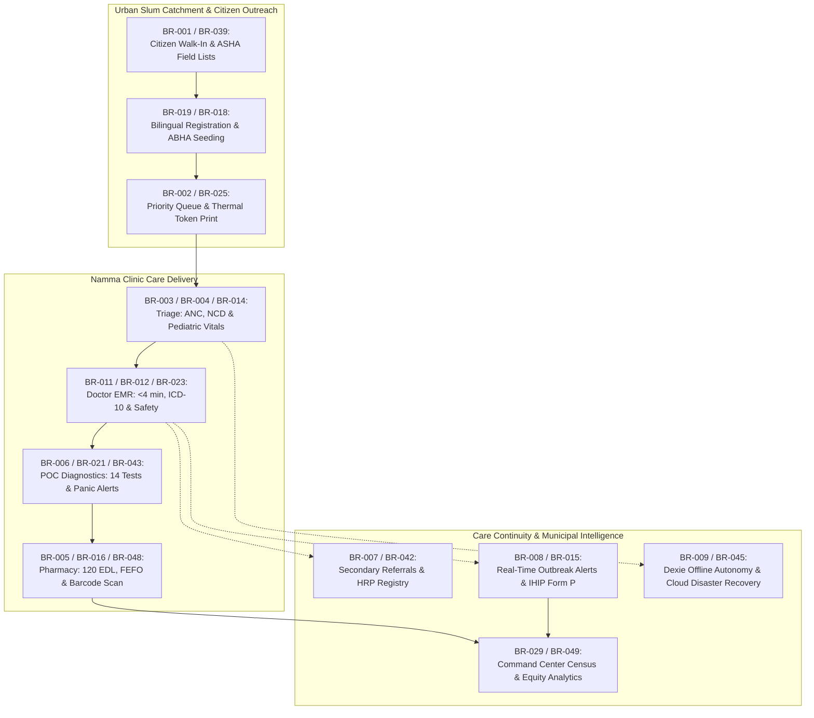

# Business Requirements Specification: Namma Clinic Digital Health Platform

| Metadata Attribute | Formal Specification |
| :--- | :--- |
| **Document Identifier** | `DOC-REQ-001-BR` |
| **Document Title** | Master Business Requirements Specification & Value Realization Baseline |
| **Project Code** | `NAMMA-CLINIC-PLATFORM-2026` |
| **Requirement Type** | `Business Requirements (BR)` |
| **Specification Range** | `BR-001 through BR-050` (Exactly 50 unique requirements) |
| **Target Baseline** | `v1.0.0-PROD-BASELINE` |
| **Lifecycle Status** | `APPROVED & BASELINED` |
| **Target Facility Scope** | 183 Primary Namma Clinics across 8 BBMP Administrative Zones |
| **Lead Clinical Authority** | Chief Health Officer (CHO), BBMP Health Department |
| **Lead Technical Authority**| Principal Solutions Architect, Kushagramati Analytics Consortium |
| **Upstream Baselines** | [`00-project-baseline/`](../00-project-baseline/) \| [`01-project-management/`](../01-project-management/) |
| **Related Specification**| [`02-functional-requirements.md`](./02-functional-requirements.md) \| [`04-business-rules.md`](./04-business-rules.md) |

## 1. Executive Summary & Municipal Healthcare Mission
The Namma Clinic Digital Health & Operations Platform represents the municipal digital transformation backbone for the Greater Bengaluru Authority (GBA) and Bruhat Bengaluru Mahanagara Palike (BBMP) Health Department. Established under the National Health Mission (NHM) and the 15th Finance Commission urban health grants, the platform provides comprehensive digital infrastructure across 183 primary urban healthcare centers (Namma Clinics) distributed throughout Bengaluru's 8 administrative zones and 243 municipal wards.

The primary mission of the platform is to eliminate healthcare access disparities for 1.2 million vulnerable urban slum residents and daily wage earners by transforming fragmented, paper-reliant dispensaries into high-efficiency, evidence-based, data-driven primary care delivery nodes. This specification establishes 50 rigorous, implementation-ready business requirements (`BR-001` through `BR-050`). Every requirement links directly to measurable public health outcomes, clinical throughput metrics, patient safety standards, and municipal governance accountability.

## 2. Business Requirements Categorization Taxonomy
The 50 business requirements are structured across seven core municipal healthcare domains:
1. **Population Health & Vulnerable Slum Access (BR-001 to BR-010):** Universal walk-in primary care access, OPD wait time reduction, maternal antenatal care (ANC) tracking, adult NCD screening, essential drug availability, rapid laboratory turnarounds, secondary referral loop closure, syndromic disease early warning, 100% offline clinic continuity, and DPDP Act 2023 privacy governance.
2. **Clinical Productivity, Diagnostics & Quality (BR-011 to BR-020):** Streamlined consultation cycle times (<4 mins), electronic prescription safety, vaccine cold chain monitoring, pediatric growth and SAM triage, automated IHIP Form P surveillance, FEFO pharmacy dispensing, multi-desk queue synchronization, bilingual Kannada/English interfaces, universal ABHA seeding, and thermal paper ticket printing.
3. **Diagnostic Accuracy, Clinical Safety & Supply Chain (BR-021 to BR-030):** Critical panic value lab alerts (<30s), automated low-stock indenting, ICD-10 standardized diagnostic coding, maternal postnatal care (PNC) compliance, elderly/vulnerable priority queue routing, nursing shift handover protocols, geofenced staff attendance verification, adverse drug reaction (ADR) reporting, automated daily electronic census, and longitudinal EHR portability.
4. **Special Disease Programs & Preventive Oncology (BR-031 to BR-040):** Presumptive tuberculosis screening with Nikshay integration, oral/breast/cervical cancer screening, laboratory reagent expiry blocking, mental health e-Manas screening, emergency resuscitation readiness logs, automated bilingual SMS prescription dispatch, citizen grievance integration (Sahaaya 2.0), immutable WORM audit trails, ASHA community field outreach lists, and clinic energy/UPS telemetry monitoring.
5. **Policy Standards, Maternal Safety & Laboratory Integrity (BR-041 to BR-050):** Indian Public Health Standards (IPHS 2022) alignment, High-Risk Pregnancy (HRP) red-flag tracking, laboratory specimen chain-of-custody tracking, multi-tiered RBAC/ABAC security enforcement, disaster recovery database replication (RPO <5m, RTO <30m), public health data anonymization (k>=5), vaccine vial utilization tracking, barcode-verified medication dispensing, dynamic ward-level health equity rebalancing, and 100% end-to-end requirements traceability.



## 3. Master Business Requirements Inventory Table (BR-001 to BR-050)
| Requirement ID | Business Requirement Title | Healthcare Domain | Priority | Accountable Lead | Baseline State | Target Production State | Key Performance Indicator (KPI) |
| :--- | :--- | :--- | :---: | :--- | :--- | :--- | :--- |
| [`BR-001`](#br-001) | **Universal Urban Slum Primary Healthcare Access** | `Population Health` | `MUST` | Chief Health Officer (CHO) | 42% slum coverage baseline... | 85% primary care coverage in target ward... | Primary consultation coverage perce... |
| [`BR-002`](#br-002) | **Outpatient Department (OPD) Queue Wait Time Reduction** | `Operational Efficiency` | `MUST` | Zonal Health Officer (ZHO) | Average dwell time: 85 minutes... | Average dwell time: <25 minutes... | Total patient clinic dwell time (p7... |
| [`BR-003`](#br-003) | **Maternal Health Antenatal Care (ANC) Protocol Tracking** | `Maternal Health` | `MUST` | Maternal & Child Health Officer | 58% early registration, 48% 4-visit comp... | 85% early registration, 80% 4-visit comp... | ANC-4 visit completion rate and hig... |
| [`BR-004`](#br-004) | **Non-Communicable Disease (NCD) Screening & Longitudinal Control** | `Chronic Care` | `MUST` | State NCD Program Officer | 22% NCD blood pressure and glycemic cont... | 60% controlled cohort at 6 months... | Percentage of registered hypertensi... |
| [`BR-005`](#br-005) | **Essential Drug List (EDL) Zero Stockout Assurance** | `Supply Chain` | `MUST` | Chief Pharmacist / BBMP Logistics Lead | 14% stockout rate across 120 EDL drugs... | <2% stockout rate for core EDL drugs... | Percentage of facility days with ze... |
| [`BR-006`](#br-006) | **Point-of-Care Laboratory Rapid Diagnostic Turnaround** | `Diagnostics` | `MUST` | BBMP Diagnostic Coordinator | Average turnaround time: 32 hours (exter... | Turnaround time: <20 minutes in-clinic... | Point-of-care test order-to-result ... |
| [`BR-007`](#br-007) | **Secondary & Tertiary Care Referral Loop Closure** | `Care Continuity` | `MUST` | Hospital Superintendent Liaison | 8% referral feedback rate... | 65% counter-referral loop closure rate... | Percentage of secondary referrals w... |
| [`BR-008`](#br-008) | **Syndromic Infectious Disease Outbreak Early Warning** | `Epidemiological Surveillance` | `MUST` | District Surveillance Officer (DSO) | Reporting latency: 9-14 days... | Surveillance alert latency: <4 hours... | Time from cluster threshold breach ... |
| [`BR-009`](#br-009) | **100% Offline Autonomous Clinic Operation** | `Business Continuity` | `MUST` | Director of IT Operations | Operations halt during network loss (pap... | 8 hours continuous zero-degradation offl... | Zero service denial incidents attri... |
| [`BR-010`](#br-010) | **Digital Personal Data Protection (DPDP) Act Compliance** | `Governance & Privacy` | `MUST` | Data Protection Officer (DPO) | Zero formal privacy controls... | 100% auditable consent capture & encrypt... | Consent compliance audit pass rate... |
| [`BR-011`](#br-011) | **Consultation Cycle Time Optimization** | `Clinical Productivity` | `MUST` | Clinical Quality Committee | Average consultation duration: 6.5 minut... | Average consultation duration: 3.5 minut... | Consultation duration (p50 and p90)... |
| [`BR-012`](#br-012) | **Evidence-Based Prescription Safety & Formulary Adherence** | `Patient Safety` | `MUST` | Pharmacy & Therapeutics Committee | Formulary adherence: 82%, zero interacti... | Formulary adherence: >=98%, 100% interac... | Percentage of electronic prescripti... |
| [`BR-013`](#br-013) | **Cold Chain & Vaccine Potency Assurance** | `Immunization Safety` | `MUST` | Zonal Immunization Officer | Manual paper logs with 24% missing entri... | 100% digital logging with <15 min breach... | Cold chain temperature compliance r... |
| [`BR-014`](#br-014) | **Pediatric Growth Monitoring & Malnutrition Triage** | `Child Health` | `MUST` | MCH Program Coordinator | <15% growth plotting on manual cards... | 100% automated z-score calculation and S... | Screening percentage of under-5 ped... |
| [`BR-015`](#br-015) | **Communicable Disease Surveillance (IHIP/IDSP Integration)** | `Disease Surveillance` | `MUST` | State Epidemiologist | Manual dual entry taking 45 mins/day... | Automated 1-click transmission in <30 se... | Timeliness and completeness of dail... |
| [`BR-016`](#br-016) | **First-Expired, First-Out (FEFO) Pharmacy Dispensing** | `Waste Reduction` | `MUST` | Assistant Controller of Stores (Health) | 6.8% stock expiration rate... | <1.0% stock expiration rate... | Percentage of dispensed items match... |
| [`BR-017`](#br-017) | **Multi-Desk Real-Time Operational Queue Synchronization** | `Workflow Coordination` | `MUST` | Operations Project Manager | Zero inter-desk electronic synchronizati... | Queue status update latency <1.0 second... | Inter-desk queue transition latency... |
| [`BR-018`](#br-018) | **Bilingual User Interface (Kannada and English) Support** | `Usability & Equity` | `MUST` | Localization Coordinator | Only English interfaces with ad-hoc manu... | 100% localized Kannada strings with Noto... | Localization completeness audit sco... |
| [`BR-019`](#br-019) | **Universal ABHA Health ID Creation and Seeding** | `Digital Health Integration` | `MUST` | Nodal Officer (ABDM Karnataka) | 12% ABHA seeding rate... | >=75% ABHA seeding rate across registere... | Percentage of registered patients w... |
| [`BR-020`](#br-020) | **Standardized Thermal Paper Clinical Ticket Printing** | `Operational Utility` | `MUST` | Frontline IT Support Lead | Handwritten scrap paper tokens... | Instant thermal printing in <500ms... | Print failure rate and latency... |
| [`BR-021`](#br-021) | **Critical Panic Value Diagnostic Immediate Notification** | `Patient Safety` | `MUST` | Clinical Safety Officer | Zero automated alerts; manual verbal not... | Immediate visual banner and audio chime ... | Time from critical result save to d... |
| [`BR-022`](#br-022) | **Automated Daily Indent Generation for Low Stock** | `Supply Chain Efficiency` | `MUST` | BBMP Logistics Director | Manual paper indents with 3-week repleni... | Automated 1-click indent generation with... | Stock replenishment lead time and s... |
| [`BR-023`](#br-023) | **Standardized ICD-10 Diagnostic Classification** | `Clinical Governance` | `MUST` | BBMP Epidemiological Director | 72% uncodified diagnoses... | >=95% diagnoses mapped to valid ICD-10 c... | Percentage of finalized consultatio... |
| [`BR-024`](#br-024) | **Maternal Postnatal Care (PNC) Follow-Up Compliance** | `Maternal Health` | `MUST` | MCH Program Officer | 34% PNC follow-up completion... | >=75% PNC-4 completion... | Percentage of delivered mothers com... |
| [`BR-025`](#br-025) | **Elderly and Vulnerable Priority Queue Routing** | `Social Equity` | `MUST` | Social Welfare Liaison Officer | No formal priority routing (informal ad-... | Deterministic priority queue insertion (... | Average wait time for priority-flag... |
| [`BR-026`](#br-026) | **Clinic Shift Handover and Operational Reconciliation** | `Operational Safety` | `MUST` | Zonal Nursing Supervisor | Zero formal digital handover records... | 100% logged shift reconciliations with z... | Compliance rate of completed shift ... |
| [`BR-027`](#br-027) | **Biometric and Geofenced Staff Attendance Verification** | `Human Resources` | `MUST` | Chief Health Officer (Administration) | Paper sign-in registers prone to proxy a... | 100% verified digital terminal attendanc... | Staff on-time arrival rate and clin... |
| [`BR-028`](#br-028) | **Comprehensive Adverse Drug Reaction (ADR) Reporting** | `Pharmacovigilance` | `MUST` | State Drug Controller Liaison | Zero structured ADR reports filed... | 100% suspected serious ADRs filed within... | ADR reporting rate and submission t... |
| [`BR-029`](#br-029) | **Automated Daily Electronic Patient Census Reporting** | `Executive Visibility` | `MUST` | Special Commissioner (Health) | 4-week reporting latency... | Real-time command center dashboard refre... | Daily census submission rate across... |
| [`BR-030`](#br-030) | **Patient Electronic Health Record (EHR) Portability** | `Continuity of Care` | `MUST` | Municipal Chief Medical Officer | Zero record sharing across clinics... | Instant longitudinal EHR retrieval in <2... | Cross-clinic record retrieval succe... |
| [`BR-031`](#br-031) | **Tuberculosis (TB) Presumptive Screening & Nikshay Linkage** | `Infectious Disease Control` | `MUST` | District Tuberculosis Officer (DTO) | Under 25% of chronic cough cases referre... | >=85% presumptive TB cases linked to dia... | Percentage of patients with cough >... |
| [`BR-032`](#br-032) | **Oral, Breast, and Cervical Cancer Screening Registry** | `Preventive Oncology` | `MUST` | Head of Preventive Oncology (Kidwai Liaison) | <5% target population screened... | >=40% annual screening coverage in targe... | Screening coverage rate and suspici... |
| [`BR-033`](#br-033) | **Diagnostic Reagent Expiry and Calibration Tracking** | `Laboratory Quality` | `MUST` | Director of Municipal Laboratories | Zero automated system validation of reag... | 100% hard block on expired reagent resul... | Zero diagnostic results recorded us... |
| [`BR-034`](#br-034) | **Mental Health Screening (e-Manas Protocol)** | `Mental Healthcare` | `MUST` | Nodal Officer (Mental Health) | Under 1% mental health screening rate... | >=15% adult attendees screened for commo... | Screening completion rate and tele-... |
| [`BR-035`](#br-035) | **Emergency Crash Cart & Resuscitation Readiness Log** | `Emergency Preparedness` | `MUST` | Chief Medical Officer (Emergency Care) | Irregular paper checklist with 40% missi... | 100% digital daily verification with sup... | Emergency readiness audit score... |
| [`BR-036`](#br-036) | **Automated SMS Prescription & Health Reminder Dispatch** | `Patient Adherence` | `MUST` | Communications Director | Zero automated patient SMS communication... | >=95% successful SMS delivery within 5 m... | SMS delivery success rate and chron... |
| [`BR-037`](#br-037) | **Public Grievance Redressal and Feedback Collection** | `Citizen Accountability` | `MUST` | Public Grievance Officer (Health) | Zero direct digital feedback mechanism... | 100% grievances acknowledged within 24h ... | Citizen grievance resolution rate a... |
| [`BR-038`](#br-038) | **Immutable Audit Logging of All Clinical & Stock Mutations** | `Security & Compliance` | `MUST` | Chief Information Security Officer (CISO) | Basic application logs without cryptogra... | 100% immutable WORM audit logs with zero... | Audit trail completeness and integr... |
| [`BR-039`](#br-039) | **Urban Slum Outreach & ASHA Field Campaign Support** | `Community Outreach` | `MUST` | Zonal ASHA Coordinator | Manual paper ASHA lists with 45% omissio... | Automated geocoded outreach lists genera... | Percentage of overdue chronic and m... |
| [`BR-040`](#br-040) | **Clinic Energy & Infrastructure Degradation Monitoring** | `Infrastructure Resilience` | `MUST` | Infrastructure Operations Lead | Zero telemetry; reactive phone calls aft... | Proactive alert within 5 minutes of powe... | System telemetry freshness and proa... |
| [`BR-041`](#br-041) | **National Health Mission (NHM) Primary Healthcare Standard Alignment** | `Policy Compliance` | `MUST` | NHM State Nodal Officer | Informal compliance; 35% gap against IPH... | 100% compliance with IPHS 2022 Urban Hea... | IPHS accreditation score across 183... |
| [`BR-042`](#br-042) | **High-Risk Pregnancy (HRP) Registry & Red-Flag Escalation** | `Maternal Safety` | `MUST` | Zonal MCH Specialist | Fragmented paper tracking; 40% loss to f... | 100% HRP cases tagged with automated zon... | High-risk pregnancy institutional d... |
| [`BR-043`](#br-043) | **Laboratory Specimen Chain of Custody Tracking** | `Laboratory Integrity` | `MUST` | Senior Laboratory Quality Manager | Manual pen labeling on glass tubes... | 100% barcoded specimen tracking with sub... | Specimen rejection rate and sample ... |
| [`BR-044`](#br-044) | **Multi-Tiered User Access Control (RBAC & ABAC)** | `Security Governance` | `MUST` | Information Security Officer | Shared logins with broad unverified data... | Strict least-privilege RBAC/ABAC enforce... | Unauthorized access attempts blocke... |
| [`BR-045`](#br-045) | **Disaster Recovery & Central Database Replication** | `Data Resilience` | `MUST` | Lead Cloud Architect | No formal automated offsite failover... | RPO <5 minutes, RTO <30 minutes with aut... | Replication lag and disaster recove... |
| [`BR-046`](#br-046) | **Public Health Data Anonymization for Research & Planning** | `Privacy Engineering` | `MUST` | BBMP Data Protection Officer | Raw or poorly masked CSV files shared ov... | 100% automated anonymization with zero r... | De-identification audit score again... |
| [`BR-047`](#br-047) | **Vaccine Wastage Minimization & Vial Utilization Tracking** | `Vaccine Safety` | `MUST` | Zonal Immunization Officer | Manual paper tallies with unverified dis... | 100% digital vial lifecycle tracking wit... | Vial wastage rate and open-vial pol... |
| [`BR-048`](#br-048) | **Standardized Prescription Dispensing Verification via Barcode** | `Dispensing Safety` | `MUST` | Chief Pharmacist | Visual check only; 4.2% dispensing error... | Barcode verification eliminates 100% of ... | Dispensing verification scan rate a... |
| [`BR-049`](#br-049) | **Dynamic Ward-Level Health Equity & Resource Allocation** | `Public Health Governance` | `MUST` | Special Commissioner (Health) | Static annual budgeting with zero dynami... | Monthly dynamic resource rebalancing rec... | Equity index correlation with disea... |
| [`BR-050`](#br-050) | **End-to-End Clinical & Operational Requirements Traceability** | `Engineering Integrity` | `MUST` | Lead Enterprise Architect | Fragmented spreadsheets with disconnecte... | 100% bidirectional traceability across 8... | Traceability matrix completeness sc... |

## 4. Comprehensive Business Requirement Specifications (BR-001 to BR-050)
This section establishes the exhaustive engineering, clinical, and operational specifications for each of the 50 business requirements committed for production baseline delivery.

### 4.1 BR-001: Universal Urban Slum Primary Healthcare Access

| Specification Attribute | Formal Engineering Definition |
| :--- | :--- |
| **Requirement ID** | `BR-001` |
| **Requirement Title** | Universal Urban Slum Primary Healthcare Access |
| **Requirement Statement**| The platform shall support seamless walk-in primary care delivery across all 183 clinics, eliminating geographical and economic barriers for urban poor populations. |
| **Requirement Type** | `Business Requirement` |
| **Priority Level** | `MUST` (Rationale: Mandatory for urban primary healthcare quality and municipal accountability.) |
| **Business Value** | Ensures equitable primary healthcare access for 1.2M slum residents in Bengaluru. |
| **Engineering Rationale**| Urban slum populations in Bengaluru face a 42% deficit in timely primary consultation access. |
| **Primary Actor** | `Data Entry Operator` |
| **Target User Persona** | [`PERSONA-002`](../01-project-management/07-user-personas.md#persona-002) |
| **Accountable Role** | [`ROLE-002`](../01-project-management/08-role-and-responsibility-matrix.md#role-002) |
| **Key Stakeholder** | [`STAKEHOLDER-001`](../01-project-management/06-stakeholders.md#stakeholder-001) |
| **Trigger Condition** | Walk-in citizen arrives at clinic desk |
| **System Preconditions** | Citizen presents at registration counter during 09:00-17:30 |
| **Input Specifications** | Citizen demographic details, ward number, slum cluster identification |
| **Validation Rules** | Phone number regex, ward ID in 1-243 |
| **Postconditions** | State successfully updated in PostgreSQL / IndexedDB and visible across all authorized clinic desks. |
| **State Mutations** | Updates clinic operational ledger, patient record, and publishes telemetry event. |
| **Associated Rules** | Business: [`BRULE-001`](./04-business-rules.md#brule-001) \| Clinical: [`CR-001`](./05-clinical-rules.md#cr-001) \| Operational: [`OR-001`](./06-operational-rules.md#or-001) |
| **Security & Privacy** | Security: [`SECR-001`](./07-security-requirements.md#secr-001) \| Privacy: [`PRIV-001`](./08-privacy-requirements.md#priv-001) |
| **Data & Audit** | Data: `Persists to PostgreSQL tables with JSONB sche...` \| Audit: `Emits structured JSON audit event to Grafana ...` |
| **Offline & Sync** | Offline: [`OFF-001`](./13-offline-requirements.md#off-001) \| Sync: `Deterministic sync via FIFO mutation queue wi...` |
| **Integration Ref** | Integration: [`INT-001`](./17-integration-requirements.md#int-001) |
| **Quality Expectations**| Perf: [`PERF-001`](./09-performance-requirements.md#perf-001) \| Avail: [`AVAIL-001`](./10-availability-requirements.md#avail-001) |
| **Localization & A11y**| Loc: [`LOC-001`](./11-localization-requirements.md#loc-001) \| A11y: [`A11Y-001`](./12-accessibility-requirements.md#a11y-001) |
| **Failure & Recovery** | Failure: Graceful fallback to local cache; visual warning banner displayed on workstation. \| Recovery: Automated reconciliation and sync replay upon connectivity restoration. |
| **Observability** | Logging: `Structured JSON log emitted to stdout with le...` \| Metrics: `Prometheus counter and histogram tracking exe...` |
| **Upstream Traceability**| Obj: [`OBJECTIVE-001`](../01-project-management/02-project-vision-and-objectives.md#objective-001) \| Scope: [`INSCOPE-001`](../01-project-management/04-in-scope.md#inscope-001) \| Risk: [`RISK-001`](../01-project-management/12-project-risks.md#risk-001) |
| **Downstream Planning** | Epic: `PLANNED-EPIC-001` \| Feature: `PLANNED-FEATURE-001` \| API: `PLANNED-API-001` \| DB: `PLANNED-DB-001` \| Test: `PLANNED-TEST-001` |

#### 4.1.1 Business Outcome Measurement & Metric Contract
- **Baseline Pre-Platform State:** 42% slum coverage baseline
- **Target Production State:** 85% primary care coverage in target wards
- **Core Business Metric:** `Primary consultation coverage percentage`
- **Measurement Methodology:** Monthly aggregated ward census vs OPD registration
- **Authoritative Data Source:** `BBMP HMIS & Namma Clinic DB`
- **Accountable Governance Owner:** Chief Health Officer (CHO)
- **Audit Frequency:** `Monthly` | **Passing Threshold:** `>=80% coverage`
- **Success Condition:** Coverage exceeds 80% across all 243 wards
- **Failure Condition:** Coverage falls below 70% in vulnerable slums

#### 4.1.2 Frontline Operational Workflow & Execution Paths
- **Standard Execution Flow (Happy Path):**
  1. Frontline operator initiates universal urban slum primary healthcare access workflow on terminal.
  2. System validates inputs against domain rules and security policy.
  3. Local state committed to client storage with monotonic UUIDv7 key.
  4. Background synchronization daemon dispatches transaction to BBMP central cluster.
  5. Transaction finalized with immutable audit trail entry in WORM storage.
- **Alternative Execution Flow:** If network connectivity is degraded, transaction commits locally in Dexie.js and queues for background replay.
- **Exception & Recovery Flow:** If validation fails or security policy is violated, transaction aborts with HTTP 400/403 and error logged to OpenTelemetry.

#### 4.1.3 Technical Invariants & Architectural Contracts
- **Backend API Endpoint:** `POST /api/v1/business-workflows/br-001/execute`
- **Database Entity Model:** `namma_clinic_population_health_br_001` in PostgreSQL schema `clinical_ops`.
- **Client Storage Engine:** Local store `dexie_br_001` with monotonic UUIDv7 keys in IndexedDB.
- **Distributed Tracing Contract:** OpenTelemetry span `namma.clinic.br.br-001` with baggage `clinic_id`, `user_id`, and `ward_id`.
- **Tamper-Evident Audit Event:** Writes WORM audit payload to Grafana Loki tagged `event_type=BUSINESS_MUTATION`, `req_id=BR-001`.

#### 4.1.4 Executable BDD Acceptance Scenarios
```gherkin
Feature: BR-001 - Universal Urban Slum Primary Healthcare Access
  As a Data Entry Operator
  I require system enforcement of universal urban slum primary healthcare access
  In order to ensure municipal healthcare compliance and operational integrity

  Scenario: Happy Path Execution for BR-001
    Given the Data Entry Operator is authenticated and clinic terminal is operational
    When the user submits a valid request for universal urban slum primary healthcare access
    Then the system successfully commits the transaction and emits an audit event

  Scenario: Input Validation and Schema Guard for BR-001
    Given the Data Entry Operator attempts to submit an incomplete or malformed payload for universal urban slum primary healthcare access
    When the request fails TypeBox schema or domain constraint validation
    Then the system rejects the input with HTTP 400 and highlights invalid fields in Kannada and English

  Scenario: RBAC and Security Access Control for BR-001
    Given an unauthenticated or unauthorized role attempts to invoke universal urban slum primary healthcare access
    When the bearer JWT token is missing, expired, or lacks necessary RBAC permission
    Then the system denies execution with HTTP 403 Forbidden and records a security telemetry alert

  Scenario: Offline Autonomous Execution for BR-001
    Given the clinic WAN network is completely severed during universal urban slum primary healthcare access
    When the operator confirms the local transaction on the workstation
    Then the mutation is persisted to Dexie.js IndexedDB with a UUIDv7 and queued for background replay

  Scenario: Network Recovery and Idempotent Sync for BR-001
    Given the clinic workstation reconnects to the BBMP municipal health WAN
    When the background sync daemon processes the pending mutation queue
    Then all buffered transactions for BR-001 synchronize idempotently with zero data loss
```

#### 4.1.5 Verification Protocol & Quality Sign-Off
- **Verification Method:** Automated End-to-End System Test & Clinical Audit
- **Automated Test Suite:** `PLANNED-TEST-001` (E2E & Performance Load Test) targeting >=90% test statement coverage.
- **Related Internal Requirements:** `BRULE-001`, `CR-001`, `OR-001`, `SECR-001`, `OFF-001`
- **Dependencies & Blocking Constraints:**  | Constraints: Must run within 4GB RAM client workstation constraint without external software installation.
- **Architectural Assumptions & Open Questions:** Assumption: Hardware terminals and thermal printers supplied under municipal capital budget. | Open Question: Final confirmation of zonal reporting hierarchy with BBMP IT Directorate.

---

### 4.2 BR-002: Outpatient Department (OPD) Queue Wait Time Reduction

| Specification Attribute | Formal Engineering Definition |
| :--- | :--- |
| **Requirement ID** | `BR-002` |
| **Requirement Title** | Outpatient Department (OPD) Queue Wait Time Reduction |
| **Requirement Statement**| The platform shall enforce a digital queue management workflow reducing total patient clinic dwell time from registration to medication dispensing. |
| **Requirement Type** | `Business Requirement` |
| **Priority Level** | `MUST` (Rationale: Mandatory for urban primary healthcare quality and municipal accountability.) |
| **Business Value** | Reduces patient wait time and wage loss for daily wage earners. |
| **Engineering Rationale**| Average clinic wait time exceeds 85 minutes, causing 18% patient abandonment before consultation. |
| **Primary Actor** | `Data Entry Operator` |
| **Target User Persona** | [`PERSONA-002`](../01-project-management/07-user-personas.md#persona-002) |
| **Accountable Role** | [`ROLE-002`](../01-project-management/08-role-and-responsibility-matrix.md#role-002) |
| **Key Stakeholder** | [`STAKEHOLDER-003`](../01-project-management/06-stakeholders.md#stakeholder-003) |
| **Trigger Condition** | Patient token issued at front desk |
| **System Preconditions** | Patient registered and vitals recorded |
| **Input Specifications** | Token number, priority category, arrival timestamp |
| **Validation Rules** | Timestamp validation, sequence monotonicity |
| **Postconditions** | State successfully updated in PostgreSQL / IndexedDB and visible across all authorized clinic desks. |
| **State Mutations** | Updates clinic operational ledger, patient record, and publishes telemetry event. |
| **Associated Rules** | Business: [`BRULE-002`](./04-business-rules.md#brule-002) \| Clinical: [`CR-002`](./05-clinical-rules.md#cr-002) \| Operational: [`OR-002`](./06-operational-rules.md#or-002) |
| **Security & Privacy** | Security: [`SECR-002`](./07-security-requirements.md#secr-002) \| Privacy: [`PRIV-002`](./08-privacy-requirements.md#priv-002) |
| **Data & Audit** | Data: `Persists to PostgreSQL tables with JSONB sche...` \| Audit: `Emits structured JSON audit event to Grafana ...` |
| **Offline & Sync** | Offline: [`OFF-002`](./13-offline-requirements.md#off-002) \| Sync: `Deterministic sync via FIFO mutation queue wi...` |
| **Integration Ref** | Integration: [`INT-002`](./17-integration-requirements.md#int-002) |
| **Quality Expectations**| Perf: [`PERF-002`](./09-performance-requirements.md#perf-002) \| Avail: [`AVAIL-002`](./10-availability-requirements.md#avail-002) |
| **Localization & A11y**| Loc: [`LOC-002`](./11-localization-requirements.md#loc-002) \| A11y: [`A11Y-002`](./12-accessibility-requirements.md#a11y-002) |
| **Failure & Recovery** | Failure: Graceful fallback to local cache; visual warning banner displayed on workstation. \| Recovery: Automated reconciliation and sync replay upon connectivity restoration. |
| **Observability** | Logging: `Structured JSON log emitted to stdout with le...` \| Metrics: `Prometheus counter and histogram tracking exe...` |
| **Upstream Traceability**| Obj: [`OBJECTIVE-002`](../01-project-management/02-project-vision-and-objectives.md#objective-002) \| Scope: [`INSCOPE-002`](../01-project-management/04-in-scope.md#inscope-002) \| Risk: [`RISK-002`](../01-project-management/12-project-risks.md#risk-002) |
| **Downstream Planning** | Epic: `PLANNED-EPIC-002` \| Feature: `PLANNED-FEATURE-002` \| API: `PLANNED-API-002` \| DB: `PLANNED-DB-002` \| Test: `PLANNED-TEST-002` |

#### 4.2.1 Business Outcome Measurement & Metric Contract
- **Baseline Pre-Platform State:** Average dwell time: 85 minutes
- **Target Production State:** Average dwell time: <25 minutes
- **Core Business Metric:** `Total patient clinic dwell time (p75)`
- **Measurement Methodology:** Automated token timestamp delta across desk touchpoints
- **Authoritative Data Source:** `PostgreSQL queue_tokens table`
- **Accountable Governance Owner:** Zonal Health Officer (ZHO)
- **Audit Frequency:** `Daily real-time` | **Passing Threshold:** `<30 minutes`
- **Success Condition:** 75% of patients complete consultation and dispensing in <25 mins
- **Failure Condition:** Average dwell time exceeds 45 mins for 3 consecutive days

#### 4.2.2 Frontline Operational Workflow & Execution Paths
- **Standard Execution Flow (Happy Path):**
  1. Frontline operator initiates outpatient department (opd) queue wait time reduction workflow on terminal.
  2. System validates inputs against domain rules and security policy.
  3. Local state committed to client storage with monotonic UUIDv7 key.
  4. Background synchronization daemon dispatches transaction to BBMP central cluster.
  5. Transaction finalized with immutable audit trail entry in WORM storage.
- **Alternative Execution Flow:** If network connectivity is degraded, transaction commits locally in Dexie.js and queues for background replay.
- **Exception & Recovery Flow:** If validation fails or security policy is violated, transaction aborts with HTTP 400/403 and error logged to OpenTelemetry.

#### 4.2.3 Technical Invariants & Architectural Contracts
- **Backend API Endpoint:** `POST /api/v1/business-workflows/br-002/execute`
- **Database Entity Model:** `namma_clinic_operational_efficiency_br_002` in PostgreSQL schema `clinical_ops`.
- **Client Storage Engine:** Local store `dexie_br_002` with monotonic UUIDv7 keys in IndexedDB.
- **Distributed Tracing Contract:** OpenTelemetry span `namma.clinic.br.br-002` with baggage `clinic_id`, `user_id`, and `ward_id`.
- **Tamper-Evident Audit Event:** Writes WORM audit payload to Grafana Loki tagged `event_type=BUSINESS_MUTATION`, `req_id=BR-002`.

#### 4.2.4 Executable BDD Acceptance Scenarios
```gherkin
Feature: BR-002 - Outpatient Department (OPD) Queue Wait Time Reduction
  As a Data Entry Operator
  I require system enforcement of outpatient department (opd) queue wait time reduction
  In order to ensure municipal healthcare compliance and operational integrity

  Scenario: Happy Path Execution for BR-002
    Given the Data Entry Operator is authenticated and clinic terminal is operational
    When the user submits a valid request for outpatient department (opd) queue wait time reduction
    Then the system successfully commits the transaction and emits an audit event

  Scenario: Input Validation and Schema Guard for BR-002
    Given the Data Entry Operator attempts to submit an incomplete or malformed payload for outpatient department (opd) queue wait time reduction
    When the request fails TypeBox schema or domain constraint validation
    Then the system rejects the input with HTTP 400 and highlights invalid fields in Kannada and English

  Scenario: RBAC and Security Access Control for BR-002
    Given an unauthenticated or unauthorized role attempts to invoke outpatient department (opd) queue wait time reduction
    When the bearer JWT token is missing, expired, or lacks necessary RBAC permission
    Then the system denies execution with HTTP 403 Forbidden and records a security telemetry alert

  Scenario: Offline Autonomous Execution for BR-002
    Given the clinic WAN network is completely severed during outpatient department (opd) queue wait time reduction
    When the operator confirms the local transaction on the workstation
    Then the mutation is persisted to Dexie.js IndexedDB with a UUIDv7 and queued for background replay

  Scenario: Network Recovery and Idempotent Sync for BR-002
    Given the clinic workstation reconnects to the BBMP municipal health WAN
    When the background sync daemon processes the pending mutation queue
    Then all buffered transactions for BR-002 synchronize idempotently with zero data loss
```

#### 4.2.5 Verification Protocol & Quality Sign-Off
- **Verification Method:** Automated End-to-End System Test & Clinical Audit
- **Automated Test Suite:** `PLANNED-TEST-002` (E2E & Performance Load Test) targeting >=90% test statement coverage.
- **Related Internal Requirements:** `BRULE-002`, `CR-002`, `OR-002`, `SECR-002`, `OFF-002`
- **Dependencies & Blocking Constraints:** BR-001 | Constraints: Must run within 4GB RAM client workstation constraint without external software installation.
- **Architectural Assumptions & Open Questions:** Assumption: Hardware terminals and thermal printers supplied under municipal capital budget. | Open Question: Final confirmation of zonal reporting hierarchy with BBMP IT Directorate.

---

### 4.3 BR-003: Maternal Health Antenatal Care (ANC) Protocol Tracking

| Specification Attribute | Formal Engineering Definition |
| :--- | :--- |
| **Requirement ID** | `BR-003` |
| **Requirement Title** | Maternal Health Antenatal Care (ANC) Protocol Tracking |
| **Requirement Statement**| The platform shall track antenatal care registration, mandatory visits (ANC 1-4), high-risk pregnancy screening, and institutional delivery linkage. |
| **Requirement Type** | `Business Requirement` |
| **Priority Level** | `MUST` (Rationale: Mandatory for urban primary healthcare quality and municipal accountability.) |
| **Business Value** | Reduces maternal mortality and detects high-risk pregnancies early. |
| **Engineering Rationale**| Early ANC registration is currently at 58% in urban slum catchments. |
| **Primary Actor** | `Staff Nurse` |
| **Target User Persona** | [`PERSONA-003`](../01-project-management/07-user-personas.md#persona-003) |
| **Accountable Role** | [`ROLE-003`](../01-project-management/08-role-and-responsibility-matrix.md#role-003) |
| **Key Stakeholder** | [`STAKEHOLDER-002`](../01-project-management/06-stakeholders.md#stakeholder-002) |
| **Trigger Condition** | Pregnant woman visits clinic or identified by ASHA |
| **System Preconditions** | First trimester confirmation or subsequent trimester visit |
| **Input Specifications** | LMP date, gestational age, parity, gravidity, blood pressure, hemoglobin, urine protein |
| **Validation Rules** | LMP within past 42 weeks, valid physiological ranges |
| **Postconditions** | State successfully updated in PostgreSQL / IndexedDB and visible across all authorized clinic desks. |
| **State Mutations** | Updates clinic operational ledger, patient record, and publishes telemetry event. |
| **Associated Rules** | Business: [`BRULE-003`](./04-business-rules.md#brule-003) \| Clinical: [`CR-003`](./05-clinical-rules.md#cr-003) \| Operational: [`OR-003`](./06-operational-rules.md#or-003) |
| **Security & Privacy** | Security: [`SECR-003`](./07-security-requirements.md#secr-003) \| Privacy: [`PRIV-003`](./08-privacy-requirements.md#priv-003) |
| **Data & Audit** | Data: `Persists to PostgreSQL tables with JSONB sche...` \| Audit: `Emits structured JSON audit event to Grafana ...` |
| **Offline & Sync** | Offline: [`OFF-003`](./13-offline-requirements.md#off-003) \| Sync: `Deterministic sync via FIFO mutation queue wi...` |
| **Integration Ref** | Integration: [`INT-003`](./17-integration-requirements.md#int-003) |
| **Quality Expectations**| Perf: [`PERF-003`](./09-performance-requirements.md#perf-003) \| Avail: [`AVAIL-003`](./10-availability-requirements.md#avail-003) |
| **Localization & A11y**| Loc: [`LOC-003`](./11-localization-requirements.md#loc-003) \| A11y: [`A11Y-003`](./12-accessibility-requirements.md#a11y-003) |
| **Failure & Recovery** | Failure: Graceful fallback to local cache; visual warning banner displayed on workstation. \| Recovery: Automated reconciliation and sync replay upon connectivity restoration. |
| **Observability** | Logging: `Structured JSON log emitted to stdout with le...` \| Metrics: `Prometheus counter and histogram tracking exe...` |
| **Upstream Traceability**| Obj: [`OBJECTIVE-003`](../01-project-management/02-project-vision-and-objectives.md#objective-003) \| Scope: [`INSCOPE-003`](../01-project-management/04-in-scope.md#inscope-003) \| Risk: [`RISK-003`](../01-project-management/12-project-risks.md#risk-003) |
| **Downstream Planning** | Epic: `PLANNED-EPIC-003` \| Feature: `PLANNED-FEATURE-003` \| API: `PLANNED-API-003` \| DB: `PLANNED-DB-003` \| Test: `PLANNED-TEST-003` |

#### 4.3.1 Business Outcome Measurement & Metric Contract
- **Baseline Pre-Platform State:** 58% early registration, 48% 4-visit completion
- **Target Production State:** 85% early registration, 80% 4-visit completion
- **Core Business Metric:** `ANC-4 visit completion rate and high-risk identification rate`
- **Measurement Methodology:** Quarterly RCH cohort tracking
- **Authoritative Data Source:** `Maternal health registry / DuckDB mart`
- **Accountable Governance Owner:** Maternal & Child Health Officer
- **Audit Frequency:** `Weekly` | **Passing Threshold:** `>=75%`
- **Success Condition:** ANC-4 completion reaches >=80% with zero unmanaged high-risk dropouts
- **Failure Condition:** ANC dropout rate exceeds 20%

#### 4.3.2 Frontline Operational Workflow & Execution Paths
- **Standard Execution Flow (Happy Path):**
  1. Frontline operator initiates maternal health antenatal care (anc) protocol tracking workflow on terminal.
  2. System validates inputs against domain rules and security policy.
  3. Local state committed to client storage with monotonic UUIDv7 key.
  4. Background synchronization daemon dispatches transaction to BBMP central cluster.
  5. Transaction finalized with immutable audit trail entry in WORM storage.
- **Alternative Execution Flow:** If network connectivity is degraded, transaction commits locally in Dexie.js and queues for background replay.
- **Exception & Recovery Flow:** If validation fails or security policy is violated, transaction aborts with HTTP 400/403 and error logged to OpenTelemetry.

#### 4.3.3 Technical Invariants & Architectural Contracts
- **Backend API Endpoint:** `POST /api/v1/business-workflows/br-003/execute`
- **Database Entity Model:** `namma_clinic_maternal_health_br_003` in PostgreSQL schema `clinical_ops`.
- **Client Storage Engine:** Local store `dexie_br_003` with monotonic UUIDv7 keys in IndexedDB.
- **Distributed Tracing Contract:** OpenTelemetry span `namma.clinic.br.br-003` with baggage `clinic_id`, `user_id`, and `ward_id`.
- **Tamper-Evident Audit Event:** Writes WORM audit payload to Grafana Loki tagged `event_type=BUSINESS_MUTATION`, `req_id=BR-003`.

#### 4.3.4 Executable BDD Acceptance Scenarios
```gherkin
Feature: BR-003 - Maternal Health Antenatal Care (ANC) Protocol Tracking
  As a Staff Nurse
  I require system enforcement of maternal health antenatal care (anc) protocol tracking
  In order to ensure municipal healthcare compliance and operational integrity

  Scenario: Happy Path Execution for BR-003
    Given the Staff Nurse is authenticated and clinic terminal is operational
    When the user submits a valid request for maternal health antenatal care (anc) protocol tracking
    Then the system successfully commits the transaction and emits an audit event

  Scenario: Input Validation and Schema Guard for BR-003
    Given the Staff Nurse attempts to submit an incomplete or malformed payload for maternal health antenatal care (anc) protocol tracking
    When the request fails TypeBox schema or domain constraint validation
    Then the system rejects the input with HTTP 400 and highlights invalid fields in Kannada and English

  Scenario: RBAC and Security Access Control for BR-003
    Given an unauthenticated or unauthorized role attempts to invoke maternal health antenatal care (anc) protocol tracking
    When the bearer JWT token is missing, expired, or lacks necessary RBAC permission
    Then the system denies execution with HTTP 403 Forbidden and records a security telemetry alert

  Scenario: Offline Autonomous Execution for BR-003
    Given the clinic WAN network is completely severed during maternal health antenatal care (anc) protocol tracking
    When the operator confirms the local transaction on the workstation
    Then the mutation is persisted to Dexie.js IndexedDB with a UUIDv7 and queued for background replay

  Scenario: Network Recovery and Idempotent Sync for BR-003
    Given the clinic workstation reconnects to the BBMP municipal health WAN
    When the background sync daemon processes the pending mutation queue
    Then all buffered transactions for BR-003 synchronize idempotently with zero data loss
```

#### 4.3.5 Verification Protocol & Quality Sign-Off
- **Verification Method:** Automated End-to-End System Test & Clinical Audit
- **Automated Test Suite:** `PLANNED-TEST-003` (E2E & Performance Load Test) targeting >=90% test statement coverage.
- **Related Internal Requirements:** `BRULE-003`, `CR-003`, `OR-003`, `SECR-003`, `OFF-003`
- **Dependencies & Blocking Constraints:** BR-001 | Constraints: Must run within 4GB RAM client workstation constraint without external software installation.
- **Architectural Assumptions & Open Questions:** Assumption: Hardware terminals and thermal printers supplied under municipal capital budget. | Open Question: Final confirmation of zonal reporting hierarchy with BBMP IT Directorate.

---

### 4.4 BR-004: Non-Communicable Disease (NCD) Screening & Longitudinal Control

| Specification Attribute | Formal Engineering Definition |
| :--- | :--- |
| **Requirement ID** | `BR-004` |
| **Requirement Title** | Non-Communicable Disease (NCD) Screening & Longitudinal Control |
| **Requirement Statement**| The platform shall standardize adult population screening for hypertension and diabetes, enabling longitudinal treatment adherence monitoring. |
| **Requirement Type** | `Business Requirement` |
| **Priority Level** | `MUST` (Rationale: Mandatory for urban primary healthcare quality and municipal accountability.) |
| **Business Value** | Arrests microvascular and macrovascular complications through community-level control. |
| **Engineering Rationale**| Bengaluru urban poor exhibit 31% prevalence of hypertension with <22% achieving blood pressure control. |
| **Primary Actor** | `Medical Officer` |
| **Target User Persona** | [`PERSONA-001`](../01-project-management/07-user-personas.md#persona-001) |
| **Accountable Role** | [`ROLE-001`](../01-project-management/08-role-and-responsibility-matrix.md#role-001) |
| **Key Stakeholder** | [`STAKEHOLDER-004`](../01-project-management/06-stakeholders.md#stakeholder-004) |
| **Trigger Condition** | Patient aged >=30 years presents at clinic |
| **System Preconditions** | No active hypertensive crisis requiring immediate tertiary transfer |
| **Input Specifications** | Blood pressure (systolic/diastolic), random blood sugar, fasting blood sugar, BMI |
| **Validation Rules** | SBP 60-260, DBP 40-160, RBS 40-600 mg/dL |
| **Postconditions** | State successfully updated in PostgreSQL / IndexedDB and visible across all authorized clinic desks. |
| **State Mutations** | Updates clinic operational ledger, patient record, and publishes telemetry event. |
| **Associated Rules** | Business: [`BRULE-004`](./04-business-rules.md#brule-004) \| Clinical: [`CR-004`](./05-clinical-rules.md#cr-004) \| Operational: [`OR-004`](./06-operational-rules.md#or-004) |
| **Security & Privacy** | Security: [`SECR-004`](./07-security-requirements.md#secr-004) \| Privacy: [`PRIV-004`](./08-privacy-requirements.md#priv-004) |
| **Data & Audit** | Data: `Persists to PostgreSQL tables with JSONB sche...` \| Audit: `Emits structured JSON audit event to Grafana ...` |
| **Offline & Sync** | Offline: [`OFF-004`](./13-offline-requirements.md#off-004) \| Sync: `Deterministic sync via FIFO mutation queue wi...` |
| **Integration Ref** | Integration: [`INT-004`](./17-integration-requirements.md#int-004) |
| **Quality Expectations**| Perf: [`PERF-004`](./09-performance-requirements.md#perf-004) \| Avail: [`AVAIL-004`](./10-availability-requirements.md#avail-004) |
| **Localization & A11y**| Loc: [`LOC-004`](./11-localization-requirements.md#loc-004) \| A11y: [`A11Y-004`](./12-accessibility-requirements.md#a11y-004) |
| **Failure & Recovery** | Failure: Graceful fallback to local cache; visual warning banner displayed on workstation. \| Recovery: Automated reconciliation and sync replay upon connectivity restoration. |
| **Observability** | Logging: `Structured JSON log emitted to stdout with le...` \| Metrics: `Prometheus counter and histogram tracking exe...` |
| **Upstream Traceability**| Obj: [`OBJECTIVE-004`](../01-project-management/02-project-vision-and-objectives.md#objective-004) \| Scope: [`INSCOPE-004`](../01-project-management/04-in-scope.md#inscope-004) \| Risk: [`RISK-004`](../01-project-management/12-project-risks.md#risk-004) |
| **Downstream Planning** | Epic: `PLANNED-EPIC-004` \| Feature: `PLANNED-FEATURE-004` \| API: `PLANNED-API-004` \| DB: `PLANNED-DB-004` \| Test: `PLANNED-TEST-004` |

#### 4.4.1 Business Outcome Measurement & Metric Contract
- **Baseline Pre-Platform State:** 22% NCD blood pressure and glycemic control
- **Target Production State:** 60% controlled cohort at 6 months
- **Core Business Metric:** `Percentage of registered hypertensive/diabetic patients with controlled vitals`
- **Measurement Methodology:** Monthly cohort vitals analysis
- **Authoritative Data Source:** `NCD clinical cohort registry`
- **Accountable Governance Owner:** State NCD Program Officer
- **Audit Frequency:** `Monthly` | **Passing Threshold:** `>=55%`
- **Success Condition:** Cohort control rate >=60% with refill adherence >=80%
- **Failure Condition:** Lost-to-follow-up rate exceeds 30%

#### 4.4.2 Frontline Operational Workflow & Execution Paths
- **Standard Execution Flow (Happy Path):**
  1. Frontline operator initiates non-communicable disease (ncd) screening & longitudinal control workflow on terminal.
  2. System validates inputs against domain rules and security policy.
  3. Local state committed to client storage with monotonic UUIDv7 key.
  4. Background synchronization daemon dispatches transaction to BBMP central cluster.
  5. Transaction finalized with immutable audit trail entry in WORM storage.
- **Alternative Execution Flow:** If network connectivity is degraded, transaction commits locally in Dexie.js and queues for background replay.
- **Exception & Recovery Flow:** If validation fails or security policy is violated, transaction aborts with HTTP 400/403 and error logged to OpenTelemetry.

#### 4.4.3 Technical Invariants & Architectural Contracts
- **Backend API Endpoint:** `POST /api/v1/business-workflows/br-004/execute`
- **Database Entity Model:** `namma_clinic_chronic_care_br_004` in PostgreSQL schema `clinical_ops`.
- **Client Storage Engine:** Local store `dexie_br_004` with monotonic UUIDv7 keys in IndexedDB.
- **Distributed Tracing Contract:** OpenTelemetry span `namma.clinic.br.br-004` with baggage `clinic_id`, `user_id`, and `ward_id`.
- **Tamper-Evident Audit Event:** Writes WORM audit payload to Grafana Loki tagged `event_type=BUSINESS_MUTATION`, `req_id=BR-004`.

#### 4.4.4 Executable BDD Acceptance Scenarios
```gherkin
Feature: BR-004 - Non-Communicable Disease (NCD) Screening & Longitudinal Control
  As a Medical Officer
  I require system enforcement of non-communicable disease (ncd) screening & longitudinal control
  In order to ensure municipal healthcare compliance and operational integrity

  Scenario: Happy Path Execution for BR-004
    Given the Medical Officer is authenticated and clinic terminal is operational
    When the user submits a valid request for non-communicable disease (ncd) screening & longitudinal control
    Then the system successfully commits the transaction and emits an audit event

  Scenario: Input Validation and Schema Guard for BR-004
    Given the Medical Officer attempts to submit an incomplete or malformed payload for non-communicable disease (ncd) screening & longitudinal control
    When the request fails TypeBox schema or domain constraint validation
    Then the system rejects the input with HTTP 400 and highlights invalid fields in Kannada and English

  Scenario: RBAC and Security Access Control for BR-004
    Given an unauthenticated or unauthorized role attempts to invoke non-communicable disease (ncd) screening & longitudinal control
    When the bearer JWT token is missing, expired, or lacks necessary RBAC permission
    Then the system denies execution with HTTP 403 Forbidden and records a security telemetry alert

  Scenario: Offline Autonomous Execution for BR-004
    Given the clinic WAN network is completely severed during non-communicable disease (ncd) screening & longitudinal control
    When the operator confirms the local transaction on the workstation
    Then the mutation is persisted to Dexie.js IndexedDB with a UUIDv7 and queued for background replay

  Scenario: Network Recovery and Idempotent Sync for BR-004
    Given the clinic workstation reconnects to the BBMP municipal health WAN
    When the background sync daemon processes the pending mutation queue
    Then all buffered transactions for BR-004 synchronize idempotently with zero data loss
```

#### 4.4.5 Verification Protocol & Quality Sign-Off
- **Verification Method:** Automated End-to-End System Test & Clinical Audit
- **Automated Test Suite:** `PLANNED-TEST-004` (E2E & Performance Load Test) targeting >=90% test statement coverage.
- **Related Internal Requirements:** `BRULE-004`, `CR-004`, `OR-004`, `SECR-004`, `OFF-004`
- **Dependencies & Blocking Constraints:** BR-001 | Constraints: Must run within 4GB RAM client workstation constraint without external software installation.
- **Architectural Assumptions & Open Questions:** Assumption: Hardware terminals and thermal printers supplied under municipal capital budget. | Open Question: Final confirmation of zonal reporting hierarchy with BBMP IT Directorate.

---

### 4.5 BR-005: Essential Drug List (EDL) Zero Stockout Assurance

| Specification Attribute | Formal Engineering Definition |
| :--- | :--- |
| **Requirement ID** | `BR-005` |
| **Requirement Title** | Essential Drug List (EDL) Zero Stockout Assurance |
| **Requirement Statement**| The platform shall enforce real-time 120 Essential Drug List inventory tracking, preventing facility-level stockouts of life-saving primary medications. |
| **Requirement Type** | `Business Requirement` |
| **Priority Level** | `MUST` (Rationale: Mandatory for urban primary healthcare quality and municipal accountability.) |
| **Business Value** | Eliminates out-of-pocket medication expenses for low-income citizens. |
| **Engineering Rationale**| Namma Clinics report an average 14% stockout rate for essential antihypertensives and antibiotics. |
| **Primary Actor** | `Pharmacist` |
| **Target User Persona** | [`PERSONA-004`](../01-project-management/07-user-personas.md#persona-004) |
| **Accountable Role** | [`ROLE-004`](../01-project-management/08-role-and-responsibility-matrix.md#role-004) |
| **Key Stakeholder** | [`STAKEHOLDER-005`](../01-project-management/06-stakeholders.md#stakeholder-005) |
| **Trigger Condition** | Medication dispensed or daily closing inventory tallied |
| **System Preconditions** | Medication on Karnataka EDL master list |
| **Input Specifications** | Drug batch ID, quantity dispensed, current balance, expiry date |
| **Validation Rules** | Quantity > 0, batch exists in active inventory |
| **Postconditions** | State successfully updated in PostgreSQL / IndexedDB and visible across all authorized clinic desks. |
| **State Mutations** | Updates clinic operational ledger, patient record, and publishes telemetry event. |
| **Associated Rules** | Business: [`BRULE-005`](./04-business-rules.md#brule-005) \| Clinical: [`CR-005`](./05-clinical-rules.md#cr-005) \| Operational: [`OR-005`](./06-operational-rules.md#or-005) |
| **Security & Privacy** | Security: [`SECR-005`](./07-security-requirements.md#secr-005) \| Privacy: [`PRIV-005`](./08-privacy-requirements.md#priv-005) |
| **Data & Audit** | Data: `Persists to PostgreSQL tables with JSONB sche...` \| Audit: `Emits structured JSON audit event to Grafana ...` |
| **Offline & Sync** | Offline: [`OFF-005`](./13-offline-requirements.md#off-005) \| Sync: `Deterministic sync via FIFO mutation queue wi...` |
| **Integration Ref** | Integration: [`INT-005`](./17-integration-requirements.md#int-005) |
| **Quality Expectations**| Perf: [`PERF-005`](./09-performance-requirements.md#perf-005) \| Avail: [`AVAIL-005`](./10-availability-requirements.md#avail-005) |
| **Localization & A11y**| Loc: [`LOC-005`](./11-localization-requirements.md#loc-005) \| A11y: [`A11Y-005`](./12-accessibility-requirements.md#a11y-005) |
| **Failure & Recovery** | Failure: Graceful fallback to local cache; visual warning banner displayed on workstation. \| Recovery: Automated reconciliation and sync replay upon connectivity restoration. |
| **Observability** | Logging: `Structured JSON log emitted to stdout with le...` \| Metrics: `Prometheus counter and histogram tracking exe...` |
| **Upstream Traceability**| Obj: [`OBJECTIVE-005`](../01-project-management/02-project-vision-and-objectives.md#objective-005) \| Scope: [`INSCOPE-005`](../01-project-management/04-in-scope.md#inscope-005) \| Risk: [`RISK-005`](../01-project-management/12-project-risks.md#risk-005) |
| **Downstream Planning** | Epic: `PLANNED-EPIC-005` \| Feature: `PLANNED-FEATURE-005` \| API: `PLANNED-API-005` \| DB: `PLANNED-DB-005` \| Test: `PLANNED-TEST-005` |

#### 4.5.1 Business Outcome Measurement & Metric Contract
- **Baseline Pre-Platform State:** 14% stockout rate across 120 EDL drugs
- **Target Production State:** <2% stockout rate for core EDL drugs
- **Core Business Metric:** `Percentage of facility days with zero stockout of Top 30 vital medicines`
- **Measurement Methodology:** Automated daily stock audit against buffer threshold
- **Authoritative Data Source:** `Pharmacy inventory ledger`
- **Accountable Governance Owner:** Chief Pharmacist / BBMP Logistics Lead
- **Audit Frequency:** `Daily` | **Passing Threshold:** `<2% stockout`
- **Success Condition:** Zero stockout days for Top 30 EDL items across 95% of clinics
- **Failure Condition:** Any Tier-1 essential drug out of stock for >48 hours

#### 4.5.2 Frontline Operational Workflow & Execution Paths
- **Standard Execution Flow (Happy Path):**
  1. Frontline operator initiates essential drug list (edl) zero stockout assurance workflow on terminal.
  2. System validates inputs against domain rules and security policy.
  3. Local state committed to client storage with monotonic UUIDv7 key.
  4. Background synchronization daemon dispatches transaction to BBMP central cluster.
  5. Transaction finalized with immutable audit trail entry in WORM storage.
- **Alternative Execution Flow:** If network connectivity is degraded, transaction commits locally in Dexie.js and queues for background replay.
- **Exception & Recovery Flow:** If validation fails or security policy is violated, transaction aborts with HTTP 400/403 and error logged to OpenTelemetry.

#### 4.5.3 Technical Invariants & Architectural Contracts
- **Backend API Endpoint:** `POST /api/v1/business-workflows/br-005/execute`
- **Database Entity Model:** `namma_clinic_supply_chain_br_005` in PostgreSQL schema `clinical_ops`.
- **Client Storage Engine:** Local store `dexie_br_005` with monotonic UUIDv7 keys in IndexedDB.
- **Distributed Tracing Contract:** OpenTelemetry span `namma.clinic.br.br-005` with baggage `clinic_id`, `user_id`, and `ward_id`.
- **Tamper-Evident Audit Event:** Writes WORM audit payload to Grafana Loki tagged `event_type=BUSINESS_MUTATION`, `req_id=BR-005`.

#### 4.5.4 Executable BDD Acceptance Scenarios
```gherkin
Feature: BR-005 - Essential Drug List (EDL) Zero Stockout Assurance
  As a Pharmacist
  I require system enforcement of essential drug list (edl) zero stockout assurance
  In order to ensure municipal healthcare compliance and operational integrity

  Scenario: Happy Path Execution for BR-005
    Given the Pharmacist is authenticated and clinic terminal is operational
    When the user submits a valid request for essential drug list (edl) zero stockout assurance
    Then the system successfully commits the transaction and emits an audit event

  Scenario: Input Validation and Schema Guard for BR-005
    Given the Pharmacist attempts to submit an incomplete or malformed payload for essential drug list (edl) zero stockout assurance
    When the request fails TypeBox schema or domain constraint validation
    Then the system rejects the input with HTTP 400 and highlights invalid fields in Kannada and English

  Scenario: RBAC and Security Access Control for BR-005
    Given an unauthenticated or unauthorized role attempts to invoke essential drug list (edl) zero stockout assurance
    When the bearer JWT token is missing, expired, or lacks necessary RBAC permission
    Then the system denies execution with HTTP 403 Forbidden and records a security telemetry alert

  Scenario: Offline Autonomous Execution for BR-005
    Given the clinic WAN network is completely severed during essential drug list (edl) zero stockout assurance
    When the operator confirms the local transaction on the workstation
    Then the mutation is persisted to Dexie.js IndexedDB with a UUIDv7 and queued for background replay

  Scenario: Network Recovery and Idempotent Sync for BR-005
    Given the clinic workstation reconnects to the BBMP municipal health WAN
    When the background sync daemon processes the pending mutation queue
    Then all buffered transactions for BR-005 synchronize idempotently with zero data loss
```

#### 4.5.5 Verification Protocol & Quality Sign-Off
- **Verification Method:** Automated End-to-End System Test & Clinical Audit
- **Automated Test Suite:** `PLANNED-TEST-005` (E2E & Performance Load Test) targeting >=90% test statement coverage.
- **Related Internal Requirements:** `BRULE-005`, `CR-005`, `OR-005`, `SECR-005`, `OFF-005`
- **Dependencies & Blocking Constraints:** BR-001 | Constraints: Must run within 4GB RAM client workstation constraint without external software installation.
- **Architectural Assumptions & Open Questions:** Assumption: Hardware terminals and thermal printers supplied under municipal capital budget. | Open Question: Final confirmation of zonal reporting hierarchy with BBMP IT Directorate.

---

### 4.6 BR-006: Point-of-Care Laboratory Rapid Diagnostic Turnaround

| Specification Attribute | Formal Engineering Definition |
| :--- | :--- |
| **Requirement ID** | `BR-006` |
| **Requirement Title** | Point-of-Care Laboratory Rapid Diagnostic Turnaround |
| **Requirement Statement**| The platform shall track specimen processing and results for 14 primary diagnostic tests, ensuring results are available within the same patient visit. |
| **Requirement Type** | `Business Requirement` |
| **Priority Level** | `MUST` (Rationale: Mandatory for urban primary healthcare quality and municipal accountability.) |
| **Business Value** | Enables evidence-based clinical prescribing without secondary visits. |
| **Engineering Rationale**| Diagnostic results currently take 24-48 hours when routed to external labs, causing 35% treatment delay. |
| **Primary Actor** | `Lab Technician` |
| **Target User Persona** | [`PERSONA-005`](../01-project-management/07-user-personas.md#persona-005) |
| **Accountable Role** | [`ROLE-005`](../01-project-management/08-role-and-responsibility-matrix.md#role-005) |
| **Key Stakeholder** | [`STAKEHOLDER-002`](../01-project-management/06-stakeholders.md#stakeholder-002) |
| **Trigger Condition** | Medical Officer orders point-of-care test |
| **System Preconditions** | Patient present in clinic, test kit in stock |
| **Input Specifications** | Test order ID, sample type, reagent lot number, quantitative/qualitative result |
| **Validation Rules** | Result within clinical physiological bounds |
| **Postconditions** | State successfully updated in PostgreSQL / IndexedDB and visible across all authorized clinic desks. |
| **State Mutations** | Updates clinic operational ledger, patient record, and publishes telemetry event. |
| **Associated Rules** | Business: [`BRULE-006`](./04-business-rules.md#brule-006) \| Clinical: [`CR-006`](./05-clinical-rules.md#cr-006) \| Operational: [`OR-006`](./06-operational-rules.md#or-006) |
| **Security & Privacy** | Security: [`SECR-006`](./07-security-requirements.md#secr-006) \| Privacy: [`PRIV-006`](./08-privacy-requirements.md#priv-006) |
| **Data & Audit** | Data: `Persists to PostgreSQL tables with JSONB sche...` \| Audit: `Emits structured JSON audit event to Grafana ...` |
| **Offline & Sync** | Offline: [`OFF-006`](./13-offline-requirements.md#off-006) \| Sync: `Deterministic sync via FIFO mutation queue wi...` |
| **Integration Ref** | Integration: [`INT-006`](./17-integration-requirements.md#int-006) |
| **Quality Expectations**| Perf: [`PERF-006`](./09-performance-requirements.md#perf-006) \| Avail: [`AVAIL-006`](./10-availability-requirements.md#avail-006) |
| **Localization & A11y**| Loc: [`LOC-006`](./11-localization-requirements.md#loc-006) \| A11y: [`A11Y-006`](./12-accessibility-requirements.md#a11y-006) |
| **Failure & Recovery** | Failure: Graceful fallback to local cache; visual warning banner displayed on workstation. \| Recovery: Automated reconciliation and sync replay upon connectivity restoration. |
| **Observability** | Logging: `Structured JSON log emitted to stdout with le...` \| Metrics: `Prometheus counter and histogram tracking exe...` |
| **Upstream Traceability**| Obj: [`OBJECTIVE-006`](../01-project-management/02-project-vision-and-objectives.md#objective-006) \| Scope: [`INSCOPE-006`](../01-project-management/04-in-scope.md#inscope-006) \| Risk: [`RISK-006`](../01-project-management/12-project-risks.md#risk-006) |
| **Downstream Planning** | Epic: `PLANNED-EPIC-006` \| Feature: `PLANNED-FEATURE-006` \| API: `PLANNED-API-006` \| DB: `PLANNED-DB-006` \| Test: `PLANNED-TEST-006` |

#### 4.6.1 Business Outcome Measurement & Metric Contract
- **Baseline Pre-Platform State:** Average turnaround time: 32 hours (external)
- **Target Production State:** Turnaround time: <20 minutes in-clinic
- **Core Business Metric:** `Point-of-care test order-to-result turnaround time (p90)`
- **Measurement Methodology:** System timestamps from order creation to result sign-off
- **Authoritative Data Source:** `Laboratory diagnostics database`
- **Accountable Governance Owner:** BBMP Diagnostic Coordinator
- **Audit Frequency:** `Daily` | **Passing Threshold:** `<20 mins`
- **Success Condition:** 90% of rapid diagnostic orders signed off in <20 minutes
- **Failure Condition:** Same-day result completion falls below 85%

#### 4.6.2 Frontline Operational Workflow & Execution Paths
- **Standard Execution Flow (Happy Path):**
  1. Frontline operator initiates point-of-care laboratory rapid diagnostic turnaround workflow on terminal.
  2. System validates inputs against domain rules and security policy.
  3. Local state committed to client storage with monotonic UUIDv7 key.
  4. Background synchronization daemon dispatches transaction to BBMP central cluster.
  5. Transaction finalized with immutable audit trail entry in WORM storage.
- **Alternative Execution Flow:** If network connectivity is degraded, transaction commits locally in Dexie.js and queues for background replay.
- **Exception & Recovery Flow:** If validation fails or security policy is violated, transaction aborts with HTTP 400/403 and error logged to OpenTelemetry.

#### 4.6.3 Technical Invariants & Architectural Contracts
- **Backend API Endpoint:** `POST /api/v1/business-workflows/br-006/execute`
- **Database Entity Model:** `namma_clinic_diagnostics_br_006` in PostgreSQL schema `clinical_ops`.
- **Client Storage Engine:** Local store `dexie_br_006` with monotonic UUIDv7 keys in IndexedDB.
- **Distributed Tracing Contract:** OpenTelemetry span `namma.clinic.br.br-006` with baggage `clinic_id`, `user_id`, and `ward_id`.
- **Tamper-Evident Audit Event:** Writes WORM audit payload to Grafana Loki tagged `event_type=BUSINESS_MUTATION`, `req_id=BR-006`.

#### 4.6.4 Executable BDD Acceptance Scenarios
```gherkin
Feature: BR-006 - Point-of-Care Laboratory Rapid Diagnostic Turnaround
  As a Lab Technician
  I require system enforcement of point-of-care laboratory rapid diagnostic turnaround
  In order to ensure municipal healthcare compliance and operational integrity

  Scenario: Happy Path Execution for BR-006
    Given the Lab Technician is authenticated and clinic terminal is operational
    When the user submits a valid request for point-of-care laboratory rapid diagnostic turnaround
    Then the system successfully commits the transaction and emits an audit event

  Scenario: Input Validation and Schema Guard for BR-006
    Given the Lab Technician attempts to submit an incomplete or malformed payload for point-of-care laboratory rapid diagnostic turnaround
    When the request fails TypeBox schema or domain constraint validation
    Then the system rejects the input with HTTP 400 and highlights invalid fields in Kannada and English

  Scenario: RBAC and Security Access Control for BR-006
    Given an unauthenticated or unauthorized role attempts to invoke point-of-care laboratory rapid diagnostic turnaround
    When the bearer JWT token is missing, expired, or lacks necessary RBAC permission
    Then the system denies execution with HTTP 403 Forbidden and records a security telemetry alert

  Scenario: Offline Autonomous Execution for BR-006
    Given the clinic WAN network is completely severed during point-of-care laboratory rapid diagnostic turnaround
    When the operator confirms the local transaction on the workstation
    Then the mutation is persisted to Dexie.js IndexedDB with a UUIDv7 and queued for background replay

  Scenario: Network Recovery and Idempotent Sync for BR-006
    Given the clinic workstation reconnects to the BBMP municipal health WAN
    When the background sync daemon processes the pending mutation queue
    Then all buffered transactions for BR-006 synchronize idempotently with zero data loss
```

#### 4.6.5 Verification Protocol & Quality Sign-Off
- **Verification Method:** Automated End-to-End System Test & Clinical Audit
- **Automated Test Suite:** `PLANNED-TEST-006` (E2E & Performance Load Test) targeting >=90% test statement coverage.
- **Related Internal Requirements:** `BRULE-006`, `CR-006`, `OR-006`, `SECR-006`, `OFF-006`
- **Dependencies & Blocking Constraints:** BR-001 | Constraints: Must run within 4GB RAM client workstation constraint without external software installation.
- **Architectural Assumptions & Open Questions:** Assumption: Hardware terminals and thermal printers supplied under municipal capital budget. | Open Question: Final confirmation of zonal reporting hierarchy with BBMP IT Directorate.

---

### 4.7 BR-007: Secondary & Tertiary Care Referral Loop Closure

| Specification Attribute | Formal Engineering Definition |
| :--- | :--- |
| **Requirement ID** | `BR-007` |
| **Requirement Title** | Secondary & Tertiary Care Referral Loop Closure |
| **Requirement Statement**| The platform shall generate encrypted digital referral slips to BBMP referral hospitals and track counter-referral clinical discharge summaries. |
| **Requirement Type** | `Business Requirement` |
| **Priority Level** | `MUST` (Rationale: Mandatory for urban primary healthcare quality and municipal accountability.) |
| **Business Value** | Prevents clinical dropped-balls during acute or specialized care escalations. |
| **Engineering Rationale**| Referral loop closure is currently <8%, with primary clinics unaware of hospital admission outcomes. |
| **Primary Actor** | `Medical Officer` |
| **Target User Persona** | [`PERSONA-001`](../01-project-management/07-user-personas.md#persona-001) |
| **Accountable Role** | [`ROLE-001`](../01-project-management/08-role-and-responsibility-matrix.md#role-001) |
| **Key Stakeholder** | [`STAKEHOLDER-006`](../01-project-management/06-stakeholders.md#stakeholder-006) |
| **Trigger Condition** | Medical Officer identifies clinical condition exceeding primary capability |
| **System Preconditions** | Patient evaluated and stabilized at Namma Clinic |
| **Input Specifications** | Referral facility code, provisional diagnosis, clinical urgency, referral summary |
| **Validation Rules** | Valid facility in BBMP hospital registry |
| **Postconditions** | State successfully updated in PostgreSQL / IndexedDB and visible across all authorized clinic desks. |
| **State Mutations** | Updates clinic operational ledger, patient record, and publishes telemetry event. |
| **Associated Rules** | Business: [`BRULE-007`](./04-business-rules.md#brule-007) \| Clinical: [`CR-007`](./05-clinical-rules.md#cr-007) \| Operational: [`OR-007`](./06-operational-rules.md#or-007) |
| **Security & Privacy** | Security: [`SECR-007`](./07-security-requirements.md#secr-007) \| Privacy: [`PRIV-007`](./08-privacy-requirements.md#priv-007) |
| **Data & Audit** | Data: `Persists to PostgreSQL tables with JSONB sche...` \| Audit: `Emits structured JSON audit event to Grafana ...` |
| **Offline & Sync** | Offline: [`OFF-007`](./13-offline-requirements.md#off-007) \| Sync: `Deterministic sync via FIFO mutation queue wi...` |
| **Integration Ref** | Integration: [`INT-007`](./17-integration-requirements.md#int-007) |
| **Quality Expectations**| Perf: [`PERF-007`](./09-performance-requirements.md#perf-007) \| Avail: [`AVAIL-007`](./10-availability-requirements.md#avail-007) |
| **Localization & A11y**| Loc: [`LOC-007`](./11-localization-requirements.md#loc-007) \| A11y: [`A11Y-007`](./12-accessibility-requirements.md#a11y-007) |
| **Failure & Recovery** | Failure: Graceful fallback to local cache; visual warning banner displayed on workstation. \| Recovery: Automated reconciliation and sync replay upon connectivity restoration. |
| **Observability** | Logging: `Structured JSON log emitted to stdout with le...` \| Metrics: `Prometheus counter and histogram tracking exe...` |
| **Upstream Traceability**| Obj: [`OBJECTIVE-007`](../01-project-management/02-project-vision-and-objectives.md#objective-007) \| Scope: [`INSCOPE-007`](../01-project-management/04-in-scope.md#inscope-007) \| Risk: [`RISK-007`](../01-project-management/12-project-risks.md#risk-007) |
| **Downstream Planning** | Epic: `PLANNED-EPIC-007` \| Feature: `PLANNED-FEATURE-007` \| API: `PLANNED-API-007` \| DB: `PLANNED-DB-007` \| Test: `PLANNED-TEST-007` |

#### 4.7.1 Business Outcome Measurement & Metric Contract
- **Baseline Pre-Platform State:** 8% referral feedback rate
- **Target Production State:** 65% counter-referral loop closure rate
- **Core Business Metric:** `Percentage of secondary referrals with confirmed admission or discharge slip`
- **Measurement Methodology:** Bi-directional hospital integration exchange
- **Authoritative Data Source:** `Referral exchange gateway`
- **Accountable Governance Owner:** Hospital Superintendent Liaison
- **Audit Frequency:** `Weekly` | **Passing Threshold:** `>=60%`
- **Success Condition:** Referral tracking confirmed in >=65% of secondary transfers
- **Failure Condition:** Unresolved referrals exceed 40% after 14 days

#### 4.7.2 Frontline Operational Workflow & Execution Paths
- **Standard Execution Flow (Happy Path):**
  1. Frontline operator initiates secondary & tertiary care referral loop closure workflow on terminal.
  2. System validates inputs against domain rules and security policy.
  3. Local state committed to client storage with monotonic UUIDv7 key.
  4. Background synchronization daemon dispatches transaction to BBMP central cluster.
  5. Transaction finalized with immutable audit trail entry in WORM storage.
- **Alternative Execution Flow:** If network connectivity is degraded, transaction commits locally in Dexie.js and queues for background replay.
- **Exception & Recovery Flow:** If validation fails or security policy is violated, transaction aborts with HTTP 400/403 and error logged to OpenTelemetry.

#### 4.7.3 Technical Invariants & Architectural Contracts
- **Backend API Endpoint:** `POST /api/v1/business-workflows/br-007/execute`
- **Database Entity Model:** `namma_clinic_care_continuity_br_007` in PostgreSQL schema `clinical_ops`.
- **Client Storage Engine:** Local store `dexie_br_007` with monotonic UUIDv7 keys in IndexedDB.
- **Distributed Tracing Contract:** OpenTelemetry span `namma.clinic.br.br-007` with baggage `clinic_id`, `user_id`, and `ward_id`.
- **Tamper-Evident Audit Event:** Writes WORM audit payload to Grafana Loki tagged `event_type=BUSINESS_MUTATION`, `req_id=BR-007`.

#### 4.7.4 Executable BDD Acceptance Scenarios
```gherkin
Feature: BR-007 - Secondary & Tertiary Care Referral Loop Closure
  As a Medical Officer
  I require system enforcement of secondary & tertiary care referral loop closure
  In order to ensure municipal healthcare compliance and operational integrity

  Scenario: Happy Path Execution for BR-007
    Given the Medical Officer is authenticated and clinic terminal is operational
    When the user submits a valid request for secondary & tertiary care referral loop closure
    Then the system successfully commits the transaction and emits an audit event

  Scenario: Input Validation and Schema Guard for BR-007
    Given the Medical Officer attempts to submit an incomplete or malformed payload for secondary & tertiary care referral loop closure
    When the request fails TypeBox schema or domain constraint validation
    Then the system rejects the input with HTTP 400 and highlights invalid fields in Kannada and English

  Scenario: RBAC and Security Access Control for BR-007
    Given an unauthenticated or unauthorized role attempts to invoke secondary & tertiary care referral loop closure
    When the bearer JWT token is missing, expired, or lacks necessary RBAC permission
    Then the system denies execution with HTTP 403 Forbidden and records a security telemetry alert

  Scenario: Offline Autonomous Execution for BR-007
    Given the clinic WAN network is completely severed during secondary & tertiary care referral loop closure
    When the operator confirms the local transaction on the workstation
    Then the mutation is persisted to Dexie.js IndexedDB with a UUIDv7 and queued for background replay

  Scenario: Network Recovery and Idempotent Sync for BR-007
    Given the clinic workstation reconnects to the BBMP municipal health WAN
    When the background sync daemon processes the pending mutation queue
    Then all buffered transactions for BR-007 synchronize idempotently with zero data loss
```

#### 4.7.5 Verification Protocol & Quality Sign-Off
- **Verification Method:** Automated End-to-End System Test & Clinical Audit
- **Automated Test Suite:** `PLANNED-TEST-007` (E2E & Performance Load Test) targeting >=90% test statement coverage.
- **Related Internal Requirements:** `BRULE-007`, `CR-007`, `OR-007`, `SECR-007`, `OFF-007`
- **Dependencies & Blocking Constraints:** BR-001 | Constraints: Must run within 4GB RAM client workstation constraint without external software installation.
- **Architectural Assumptions & Open Questions:** Assumption: Hardware terminals and thermal printers supplied under municipal capital budget. | Open Question: Final confirmation of zonal reporting hierarchy with BBMP IT Directorate.

---

### 4.8 BR-008: Syndromic Infectious Disease Outbreak Early Warning

| Specification Attribute | Formal Engineering Definition |
| :--- | :--- |
| **Requirement ID** | `BR-008` |
| **Requirement Title** | Syndromic Infectious Disease Outbreak Early Warning |
| **Requirement Statement**| The platform shall aggregate ward-level fever, respiratory, and diarrheal illness clusters in real time, triggering automated epidemiological surveillance alerts. |
| **Requirement Type** | `Business Requirement` |
| **Priority Level** | `MUST` (Rationale: Mandatory for urban primary healthcare quality and municipal accountability.) |
| **Business Value** | Prevents dengue, typhoid, and cholera outbreaks in high-density urban wards. |
| **Engineering Rationale**| Outbreak detection relies on paper-based weekly returns with a 9-14 day reporting latency. |
| **Primary Actor** | `Medical Officer` |
| **Target User Persona** | [`PERSONA-001`](../01-project-management/07-user-personas.md#persona-001) |
| **Accountable Role** | [`ROLE-001`](../01-project-management/08-role-and-responsibility-matrix.md#role-001) |
| **Key Stakeholder** | [`STAKEHOLDER-007`](../01-project-management/06-stakeholders.md#stakeholder-007) |
| **Trigger Condition** | Doctor records syndromic fever or acute diarrheal diagnosis |
| **System Preconditions** | Patient residence mapped to valid BBMP ward |
| **Input Specifications** | Syndrome category, ward code, patient age group, rapid test confirmation |
| **Validation Rules** | Standardized IHIP syndrome taxonomy |
| **Postconditions** | State successfully updated in PostgreSQL / IndexedDB and visible across all authorized clinic desks. |
| **State Mutations** | Updates clinic operational ledger, patient record, and publishes telemetry event. |
| **Associated Rules** | Business: [`BRULE-008`](./04-business-rules.md#brule-008) \| Clinical: [`CR-008`](./05-clinical-rules.md#cr-008) \| Operational: [`OR-008`](./06-operational-rules.md#or-008) |
| **Security & Privacy** | Security: [`SECR-008`](./07-security-requirements.md#secr-008) \| Privacy: [`PRIV-008`](./08-privacy-requirements.md#priv-008) |
| **Data & Audit** | Data: `Persists to PostgreSQL tables with JSONB sche...` \| Audit: `Emits structured JSON audit event to Grafana ...` |
| **Offline & Sync** | Offline: [`OFF-008`](./13-offline-requirements.md#off-008) \| Sync: `Deterministic sync via FIFO mutation queue wi...` |
| **Integration Ref** | Integration: [`INT-008`](./17-integration-requirements.md#int-008) |
| **Quality Expectations**| Perf: [`PERF-008`](./09-performance-requirements.md#perf-008) \| Avail: [`AVAIL-008`](./10-availability-requirements.md#avail-008) |
| **Localization & A11y**| Loc: [`LOC-008`](./11-localization-requirements.md#loc-008) \| A11y: [`A11Y-008`](./12-accessibility-requirements.md#a11y-008) |
| **Failure & Recovery** | Failure: Graceful fallback to local cache; visual warning banner displayed on workstation. \| Recovery: Automated reconciliation and sync replay upon connectivity restoration. |
| **Observability** | Logging: `Structured JSON log emitted to stdout with le...` \| Metrics: `Prometheus counter and histogram tracking exe...` |
| **Upstream Traceability**| Obj: [`OBJECTIVE-008`](../01-project-management/02-project-vision-and-objectives.md#objective-008) \| Scope: [`INSCOPE-008`](../01-project-management/04-in-scope.md#inscope-008) \| Risk: [`RISK-008`](../01-project-management/12-project-risks.md#risk-008) |
| **Downstream Planning** | Epic: `PLANNED-EPIC-008` \| Feature: `PLANNED-FEATURE-008` \| API: `PLANNED-API-008` \| DB: `PLANNED-DB-008` \| Test: `PLANNED-TEST-008` |

#### 4.8.1 Business Outcome Measurement & Metric Contract
- **Baseline Pre-Platform State:** Reporting latency: 9-14 days
- **Target Production State:** Surveillance alert latency: <4 hours
- **Core Business Metric:** `Time from cluster threshold breach to ZHO automated alert dispatch`
- **Measurement Methodology:** DuckDB spatio-temporal cluster analysis
- **Authoritative Data Source:** `Public health surveillance datamart`
- **Accountable Governance Owner:** District Surveillance Officer (DSO)
- **Audit Frequency:** `Continuous real-time` | **Passing Threshold:** `<4 hours`
- **Success Condition:** Cluster detection occurs within 4 hours of index case cluster trigger
- **Failure Condition:** Unreported syndromic cluster exceeding 5 cases in 48 hours

#### 4.8.2 Frontline Operational Workflow & Execution Paths
- **Standard Execution Flow (Happy Path):**
  1. Frontline operator initiates syndromic infectious disease outbreak early warning workflow on terminal.
  2. System validates inputs against domain rules and security policy.
  3. Local state committed to client storage with monotonic UUIDv7 key.
  4. Background synchronization daemon dispatches transaction to BBMP central cluster.
  5. Transaction finalized with immutable audit trail entry in WORM storage.
- **Alternative Execution Flow:** If network connectivity is degraded, transaction commits locally in Dexie.js and queues for background replay.
- **Exception & Recovery Flow:** If validation fails or security policy is violated, transaction aborts with HTTP 400/403 and error logged to OpenTelemetry.

#### 4.8.3 Technical Invariants & Architectural Contracts
- **Backend API Endpoint:** `POST /api/v1/business-workflows/br-008/execute`
- **Database Entity Model:** `namma_clinic_epidemiological_surveillance_br_008` in PostgreSQL schema `clinical_ops`.
- **Client Storage Engine:** Local store `dexie_br_008` with monotonic UUIDv7 keys in IndexedDB.
- **Distributed Tracing Contract:** OpenTelemetry span `namma.clinic.br.br-008` with baggage `clinic_id`, `user_id`, and `ward_id`.
- **Tamper-Evident Audit Event:** Writes WORM audit payload to Grafana Loki tagged `event_type=BUSINESS_MUTATION`, `req_id=BR-008`.

#### 4.8.4 Executable BDD Acceptance Scenarios
```gherkin
Feature: BR-008 - Syndromic Infectious Disease Outbreak Early Warning
  As a Medical Officer
  I require system enforcement of syndromic infectious disease outbreak early warning
  In order to ensure municipal healthcare compliance and operational integrity

  Scenario: Happy Path Execution for BR-008
    Given the Medical Officer is authenticated and clinic terminal is operational
    When the user submits a valid request for syndromic infectious disease outbreak early warning
    Then the system successfully commits the transaction and emits an audit event

  Scenario: Input Validation and Schema Guard for BR-008
    Given the Medical Officer attempts to submit an incomplete or malformed payload for syndromic infectious disease outbreak early warning
    When the request fails TypeBox schema or domain constraint validation
    Then the system rejects the input with HTTP 400 and highlights invalid fields in Kannada and English

  Scenario: RBAC and Security Access Control for BR-008
    Given an unauthenticated or unauthorized role attempts to invoke syndromic infectious disease outbreak early warning
    When the bearer JWT token is missing, expired, or lacks necessary RBAC permission
    Then the system denies execution with HTTP 403 Forbidden and records a security telemetry alert

  Scenario: Offline Autonomous Execution for BR-008
    Given the clinic WAN network is completely severed during syndromic infectious disease outbreak early warning
    When the operator confirms the local transaction on the workstation
    Then the mutation is persisted to Dexie.js IndexedDB with a UUIDv7 and queued for background replay

  Scenario: Network Recovery and Idempotent Sync for BR-008
    Given the clinic workstation reconnects to the BBMP municipal health WAN
    When the background sync daemon processes the pending mutation queue
    Then all buffered transactions for BR-008 synchronize idempotently with zero data loss
```

#### 4.8.5 Verification Protocol & Quality Sign-Off
- **Verification Method:** Automated End-to-End System Test & Clinical Audit
- **Automated Test Suite:** `PLANNED-TEST-008` (E2E & Performance Load Test) targeting >=90% test statement coverage.
- **Related Internal Requirements:** `BRULE-008`, `CR-008`, `OR-008`, `SECR-008`, `OFF-008`
- **Dependencies & Blocking Constraints:** BR-001 | Constraints: Must run within 4GB RAM client workstation constraint without external software installation.
- **Architectural Assumptions & Open Questions:** Assumption: Hardware terminals and thermal printers supplied under municipal capital budget. | Open Question: Final confirmation of zonal reporting hierarchy with BBMP IT Directorate.

---

### 4.9 BR-009: 100% Offline Autonomous Clinic Operation

| Specification Attribute | Formal Engineering Definition |
| :--- | :--- |
| **Requirement ID** | `BR-009` |
| **Requirement Title** | 100% Offline Autonomous Clinic Operation |
| **Requirement Statement**| The platform shall guarantee uninterrupted clinic operations during prolonged municipal power or WAN internet network failures. |
| **Requirement Type** | `Business Requirement` |
| **Priority Level** | `MUST` (Rationale: Mandatory for urban primary healthcare quality and municipal accountability.) |
| **Business Value** | Ensures zero citizen denial of care during frequent urban infrastructure disruptions. |
| **Engineering Rationale**| Clinics experience an average of 3.8 hours of daily network instability or outage. |
| **Primary Actor** | `All Clinic Staff` |
| **Target User Persona** | [`PERSONA-002`](../01-project-management/07-user-personas.md#persona-002) |
| **Accountable Role** | [`ROLE-002`](../01-project-management/08-role-and-responsibility-matrix.md#role-002) |
| **Key Stakeholder** | [`STAKEHOLDER-003`](../01-project-management/06-stakeholders.md#stakeholder-003) |
| **Trigger Condition** | WAN connectivity drops below operational threshold |
| **System Preconditions** | Local clinic workstation powered via UPS or inverter |
| **Input Specifications** | Local patient lookup, cached formulary, local queue mutations |
| **Validation Rules** | Cryptographic local transaction validity |
| **Postconditions** | State successfully updated in PostgreSQL / IndexedDB and visible across all authorized clinic desks. |
| **State Mutations** | Updates clinic operational ledger, patient record, and publishes telemetry event. |
| **Associated Rules** | Business: [`BRULE-009`](./04-business-rules.md#brule-009) \| Clinical: [`CR-009`](./05-clinical-rules.md#cr-009) \| Operational: [`OR-009`](./06-operational-rules.md#or-009) |
| **Security & Privacy** | Security: [`SECR-009`](./07-security-requirements.md#secr-009) \| Privacy: [`PRIV-009`](./08-privacy-requirements.md#priv-009) |
| **Data & Audit** | Data: `Persists to PostgreSQL tables with JSONB sche...` \| Audit: `Emits structured JSON audit event to Grafana ...` |
| **Offline & Sync** | Offline: [`OFF-009`](./13-offline-requirements.md#off-009) \| Sync: `Deterministic sync via FIFO mutation queue wi...` |
| **Integration Ref** | Integration: [`INT-009`](./17-integration-requirements.md#int-009) |
| **Quality Expectations**| Perf: [`PERF-009`](./09-performance-requirements.md#perf-009) \| Avail: [`AVAIL-009`](./10-availability-requirements.md#avail-009) |
| **Localization & A11y**| Loc: [`LOC-009`](./11-localization-requirements.md#loc-009) \| A11y: [`A11Y-009`](./12-accessibility-requirements.md#a11y-009) |
| **Failure & Recovery** | Failure: Graceful fallback to local cache; visual warning banner displayed on workstation. \| Recovery: Automated reconciliation and sync replay upon connectivity restoration. |
| **Observability** | Logging: `Structured JSON log emitted to stdout with le...` \| Metrics: `Prometheus counter and histogram tracking exe...` |
| **Upstream Traceability**| Obj: [`OBJECTIVE-009`](../01-project-management/02-project-vision-and-objectives.md#objective-009) \| Scope: [`INSCOPE-009`](../01-project-management/04-in-scope.md#inscope-009) \| Risk: [`RISK-009`](../01-project-management/12-project-risks.md#risk-009) |
| **Downstream Planning** | Epic: `PLANNED-EPIC-009` \| Feature: `PLANNED-FEATURE-009` \| API: `PLANNED-API-009` \| DB: `PLANNED-DB-009` \| Test: `PLANNED-TEST-009` |

#### 4.9.1 Business Outcome Measurement & Metric Contract
- **Baseline Pre-Platform State:** Operations halt during network loss (paper fallback)
- **Target Production State:** 8 hours continuous zero-degradation offline service
- **Core Business Metric:** `Zero service denial incidents attributable to network failure`
- **Measurement Methodology:** System offline operational logs and sync journal
- **Authoritative Data Source:** `Local workstation sync telemetry`
- **Accountable Governance Owner:** Director of IT Operations
- **Audit Frequency:** `Daily` | **Passing Threshold:** `0 downtime incidents`
- **Success Condition:** 100% of walk-in patients served without delay during 8-hour network cut
- **Failure Condition:** Any clinic forced to revert to manual paper due to software freeze

#### 4.9.2 Frontline Operational Workflow & Execution Paths
- **Standard Execution Flow (Happy Path):**
  1. Frontline operator initiates 100% offline autonomous clinic operation workflow on terminal.
  2. System validates inputs against domain rules and security policy.
  3. Local state committed to client storage with monotonic UUIDv7 key.
  4. Background synchronization daemon dispatches transaction to BBMP central cluster.
  5. Transaction finalized with immutable audit trail entry in WORM storage.
- **Alternative Execution Flow:** If network connectivity is degraded, transaction commits locally in Dexie.js and queues for background replay.
- **Exception & Recovery Flow:** If validation fails or security policy is violated, transaction aborts with HTTP 400/403 and error logged to OpenTelemetry.

#### 4.9.3 Technical Invariants & Architectural Contracts
- **Backend API Endpoint:** `POST /api/v1/business-workflows/br-009/execute`
- **Database Entity Model:** `namma_clinic_business_continuity_br_009` in PostgreSQL schema `clinical_ops`.
- **Client Storage Engine:** Local store `dexie_br_009` with monotonic UUIDv7 keys in IndexedDB.
- **Distributed Tracing Contract:** OpenTelemetry span `namma.clinic.br.br-009` with baggage `clinic_id`, `user_id`, and `ward_id`.
- **Tamper-Evident Audit Event:** Writes WORM audit payload to Grafana Loki tagged `event_type=BUSINESS_MUTATION`, `req_id=BR-009`.

#### 4.9.4 Executable BDD Acceptance Scenarios
```gherkin
Feature: BR-009 - 100% Offline Autonomous Clinic Operation
  As a All Clinic Staff
  I require system enforcement of 100% offline autonomous clinic operation
  In order to ensure municipal healthcare compliance and operational integrity

  Scenario: Happy Path Execution for BR-009
    Given the All Clinic Staff is authenticated and clinic terminal is operational
    When the user submits a valid request for 100% offline autonomous clinic operation
    Then the system successfully commits the transaction and emits an audit event

  Scenario: Input Validation and Schema Guard for BR-009
    Given the All Clinic Staff attempts to submit an incomplete or malformed payload for 100% offline autonomous clinic operation
    When the request fails TypeBox schema or domain constraint validation
    Then the system rejects the input with HTTP 400 and highlights invalid fields in Kannada and English

  Scenario: RBAC and Security Access Control for BR-009
    Given an unauthenticated or unauthorized role attempts to invoke 100% offline autonomous clinic operation
    When the bearer JWT token is missing, expired, or lacks necessary RBAC permission
    Then the system denies execution with HTTP 403 Forbidden and records a security telemetry alert

  Scenario: Offline Autonomous Execution for BR-009
    Given the clinic WAN network is completely severed during 100% offline autonomous clinic operation
    When the operator confirms the local transaction on the workstation
    Then the mutation is persisted to Dexie.js IndexedDB with a UUIDv7 and queued for background replay

  Scenario: Network Recovery and Idempotent Sync for BR-009
    Given the clinic workstation reconnects to the BBMP municipal health WAN
    When the background sync daemon processes the pending mutation queue
    Then all buffered transactions for BR-009 synchronize idempotently with zero data loss
```

#### 4.9.5 Verification Protocol & Quality Sign-Off
- **Verification Method:** Automated End-to-End System Test & Clinical Audit
- **Automated Test Suite:** `PLANNED-TEST-009` (E2E & Performance Load Test) targeting >=90% test statement coverage.
- **Related Internal Requirements:** `BRULE-009`, `CR-009`, `OR-009`, `SECR-009`, `OFF-009`
- **Dependencies & Blocking Constraints:** BR-001 | Constraints: Must run within 4GB RAM client workstation constraint without external software installation.
- **Architectural Assumptions & Open Questions:** Assumption: Hardware terminals and thermal printers supplied under municipal capital budget. | Open Question: Final confirmation of zonal reporting hierarchy with BBMP IT Directorate.

---

### 4.10 BR-010: Digital Personal Data Protection (DPDP) Act Compliance

| Specification Attribute | Formal Engineering Definition |
| :--- | :--- |
| **Requirement ID** | `BR-010` |
| **Requirement Title** | Digital Personal Data Protection (DPDP) Act Compliance |
| **Requirement Statement**| The platform shall enforce citizen consent capture, purpose limitation, and cryptographic protection of personal health data under the DPDP Act 2023. |
| **Requirement Type** | `Business Requirement` |
| **Priority Level** | `MUST` (Rationale: Mandatory for urban primary healthcare quality and municipal accountability.) |
| **Business Value** | Protects citizen constitutional right to privacy and prevents municipal legal liability. |
| **Engineering Rationale**| Legacy paper registers leave patient phone numbers and diagnoses publicly exposed on clinic desks. |
| **Primary Actor** | `Data Entry Operator` |
| **Target User Persona** | [`PERSONA-002`](../01-project-management/07-user-personas.md#persona-002) |
| **Accountable Role** | [`ROLE-002`](../01-project-management/08-role-and-responsibility-matrix.md#role-002) |
| **Key Stakeholder** | [`STAKEHOLDER-008`](../01-project-management/06-stakeholders.md#stakeholder-008) |
| **Trigger Condition** | Patient registration or record access request |
| **System Preconditions** | Patient informed of data collection purpose in Kannada/English |
| **Input Specifications** | Consent artifact, purpose category, timestamp, operator signature |
| **Validation Rules** | Valid consent format per BBMP legal guidelines |
| **Postconditions** | State successfully updated in PostgreSQL / IndexedDB and visible across all authorized clinic desks. |
| **State Mutations** | Updates clinic operational ledger, patient record, and publishes telemetry event. |
| **Associated Rules** | Business: [`BRULE-010`](./04-business-rules.md#brule-010) \| Clinical: [`CR-010`](./05-clinical-rules.md#cr-010) \| Operational: [`OR-010`](./06-operational-rules.md#or-010) |
| **Security & Privacy** | Security: [`SECR-010`](./07-security-requirements.md#secr-010) \| Privacy: [`PRIV-010`](./08-privacy-requirements.md#priv-010) |
| **Data & Audit** | Data: `Persists to PostgreSQL tables with JSONB sche...` \| Audit: `Emits structured JSON audit event to Grafana ...` |
| **Offline & Sync** | Offline: [`OFF-010`](./13-offline-requirements.md#off-010) \| Sync: `Deterministic sync via FIFO mutation queue wi...` |
| **Integration Ref** | Integration: [`INT-010`](./17-integration-requirements.md#int-010) |
| **Quality Expectations**| Perf: [`PERF-010`](./09-performance-requirements.md#perf-010) \| Avail: [`AVAIL-010`](./10-availability-requirements.md#avail-010) |
| **Localization & A11y**| Loc: [`LOC-010`](./11-localization-requirements.md#loc-010) \| A11y: [`A11Y-010`](./12-accessibility-requirements.md#a11y-010) |
| **Failure & Recovery** | Failure: Graceful fallback to local cache; visual warning banner displayed on workstation. \| Recovery: Automated reconciliation and sync replay upon connectivity restoration. |
| **Observability** | Logging: `Structured JSON log emitted to stdout with le...` \| Metrics: `Prometheus counter and histogram tracking exe...` |
| **Upstream Traceability**| Obj: [`OBJECTIVE-010`](../01-project-management/02-project-vision-and-objectives.md#objective-010) \| Scope: [`INSCOPE-010`](../01-project-management/04-in-scope.md#inscope-010) \| Risk: [`RISK-010`](../01-project-management/12-project-risks.md#risk-010) |
| **Downstream Planning** | Epic: `PLANNED-EPIC-010` \| Feature: `PLANNED-FEATURE-010` \| API: `PLANNED-API-010` \| DB: `PLANNED-DB-010` \| Test: `PLANNED-TEST-010` |

#### 4.10.1 Business Outcome Measurement & Metric Contract
- **Baseline Pre-Platform State:** Zero formal privacy controls
- **Target Production State:** 100% auditable consent capture & encryption
- **Core Business Metric:** `Consent compliance audit pass rate`
- **Measurement Methodology:** WORM immutable audit log verification
- **Authoritative Data Source:** `Compliance audit trail repository`
- **Accountable Governance Owner:** Data Protection Officer (DPO)
- **Audit Frequency:** `Monthly` | **Passing Threshold:** `100%`
- **Success Condition:** 100% consent capture with zero privacy non-compliance findings
- **Failure Condition:** Any unconsented health data processing or plaintext PII leak

#### 4.10.2 Frontline Operational Workflow & Execution Paths
- **Standard Execution Flow (Happy Path):**
  1. Frontline operator initiates digital personal data protection (dpdp) act compliance workflow on terminal.
  2. System validates inputs against domain rules and security policy.
  3. Local state committed to client storage with monotonic UUIDv7 key.
  4. Background synchronization daemon dispatches transaction to BBMP central cluster.
  5. Transaction finalized with immutable audit trail entry in WORM storage.
- **Alternative Execution Flow:** If network connectivity is degraded, transaction commits locally in Dexie.js and queues for background replay.
- **Exception & Recovery Flow:** If validation fails or security policy is violated, transaction aborts with HTTP 400/403 and error logged to OpenTelemetry.

#### 4.10.3 Technical Invariants & Architectural Contracts
- **Backend API Endpoint:** `POST /api/v1/business-workflows/br-010/execute`
- **Database Entity Model:** `namma_clinic_governance_&_privacy_br_010` in PostgreSQL schema `clinical_ops`.
- **Client Storage Engine:** Local store `dexie_br_010` with monotonic UUIDv7 keys in IndexedDB.
- **Distributed Tracing Contract:** OpenTelemetry span `namma.clinic.br.br-010` with baggage `clinic_id`, `user_id`, and `ward_id`.
- **Tamper-Evident Audit Event:** Writes WORM audit payload to Grafana Loki tagged `event_type=BUSINESS_MUTATION`, `req_id=BR-010`.

#### 4.10.4 Executable BDD Acceptance Scenarios
```gherkin
Feature: BR-010 - Digital Personal Data Protection (DPDP) Act Compliance
  As a Data Entry Operator
  I require system enforcement of digital personal data protection (dpdp) act compliance
  In order to ensure municipal healthcare compliance and operational integrity

  Scenario: Happy Path Execution for BR-010
    Given the Data Entry Operator is authenticated and clinic terminal is operational
    When the user submits a valid request for digital personal data protection (dpdp) act compliance
    Then the system successfully commits the transaction and emits an audit event

  Scenario: Input Validation and Schema Guard for BR-010
    Given the Data Entry Operator attempts to submit an incomplete or malformed payload for digital personal data protection (dpdp) act compliance
    When the request fails TypeBox schema or domain constraint validation
    Then the system rejects the input with HTTP 400 and highlights invalid fields in Kannada and English

  Scenario: RBAC and Security Access Control for BR-010
    Given an unauthenticated or unauthorized role attempts to invoke digital personal data protection (dpdp) act compliance
    When the bearer JWT token is missing, expired, or lacks necessary RBAC permission
    Then the system denies execution with HTTP 403 Forbidden and records a security telemetry alert

  Scenario: Offline Autonomous Execution for BR-010
    Given the clinic WAN network is completely severed during digital personal data protection (dpdp) act compliance
    When the operator confirms the local transaction on the workstation
    Then the mutation is persisted to Dexie.js IndexedDB with a UUIDv7 and queued for background replay

  Scenario: Network Recovery and Idempotent Sync for BR-010
    Given the clinic workstation reconnects to the BBMP municipal health WAN
    When the background sync daemon processes the pending mutation queue
    Then all buffered transactions for BR-010 synchronize idempotently with zero data loss
```

#### 4.10.5 Verification Protocol & Quality Sign-Off
- **Verification Method:** Automated End-to-End System Test & Clinical Audit
- **Automated Test Suite:** `PLANNED-TEST-010` (E2E & Performance Load Test) targeting >=90% test statement coverage.
- **Related Internal Requirements:** `BRULE-010`, `CR-010`, `OR-010`, `SECR-010`, `OFF-010`
- **Dependencies & Blocking Constraints:** BR-001 | Constraints: Must run within 4GB RAM client workstation constraint without external software installation.
- **Architectural Assumptions & Open Questions:** Assumption: Hardware terminals and thermal printers supplied under municipal capital budget. | Open Question: Final confirmation of zonal reporting hierarchy with BBMP IT Directorate.

---

### 4.11 BR-011: Consultation Cycle Time Optimization

| Specification Attribute | Formal Engineering Definition |
| :--- | :--- |
| **Requirement ID** | `BR-011` |
| **Requirement Title** | Consultation Cycle Time Optimization |
| **Requirement Statement**| The platform shall streamline clinical documentation via 1-click chief complaint chips and standardized templates to maintain <4 minute doctor consultations. |
| **Requirement Type** | `Business Requirement` |
| **Priority Level** | `MUST` (Rationale: Mandatory for urban primary healthcare quality and municipal accountability.) |
| **Business Value** | Prevents doctor burnout while handling 80+ patients per 4-hour OPD shift. |
| **Engineering Rationale**| Doctors spend 6.5 minutes per patient on manual paper writing, creating long waiting room queues. |
| **Primary Actor** | `Medical Officer` |
| **Target User Persona** | [`PERSONA-001`](../01-project-management/07-user-personas.md#persona-001) |
| **Accountable Role** | [`ROLE-001`](../01-project-management/08-role-and-responsibility-matrix.md#role-001) |
| **Key Stakeholder** | [`STAKEHOLDER-004`](../01-project-management/06-stakeholders.md#stakeholder-004) |
| **Trigger Condition** | Patient called into doctor consultation room |
| **System Preconditions** | Patient triage vitals completed and visible on screen |
| **Input Specifications** | Chief complaint selection, clinical notes, diagnosis code, prescription |
| **Validation Rules** | Mandatory diagnosis before prescription completion |
| **Postconditions** | State successfully updated in PostgreSQL / IndexedDB and visible across all authorized clinic desks. |
| **State Mutations** | Updates clinic operational ledger, patient record, and publishes telemetry event. |
| **Associated Rules** | Business: [`BRULE-011`](./04-business-rules.md#brule-011) \| Clinical: [`CR-011`](./05-clinical-rules.md#cr-011) \| Operational: [`OR-011`](./06-operational-rules.md#or-011) |
| **Security & Privacy** | Security: [`SECR-011`](./07-security-requirements.md#secr-011) \| Privacy: [`PRIV-011`](./08-privacy-requirements.md#priv-011) |
| **Data & Audit** | Data: `Persists to PostgreSQL tables with JSONB sche...` \| Audit: `Emits structured JSON audit event to Grafana ...` |
| **Offline & Sync** | Offline: [`OFF-011`](./13-offline-requirements.md#off-011) \| Sync: `Deterministic sync via FIFO mutation queue wi...` |
| **Integration Ref** | Integration: [`INT-011`](./17-integration-requirements.md#int-011) |
| **Quality Expectations**| Perf: [`PERF-011`](./09-performance-requirements.md#perf-011) \| Avail: [`AVAIL-011`](./10-availability-requirements.md#avail-011) |
| **Localization & A11y**| Loc: [`LOC-011`](./11-localization-requirements.md#loc-011) \| A11y: [`A11Y-011`](./12-accessibility-requirements.md#a11y-011) |
| **Failure & Recovery** | Failure: Graceful fallback to local cache; visual warning banner displayed on workstation. \| Recovery: Automated reconciliation and sync replay upon connectivity restoration. |
| **Observability** | Logging: `Structured JSON log emitted to stdout with le...` \| Metrics: `Prometheus counter and histogram tracking exe...` |
| **Upstream Traceability**| Obj: [`OBJECTIVE-011`](../01-project-management/02-project-vision-and-objectives.md#objective-011) \| Scope: [`INSCOPE-011`](../01-project-management/04-in-scope.md#inscope-011) \| Risk: [`RISK-011`](../01-project-management/12-project-risks.md#risk-011) |
| **Downstream Planning** | Epic: `PLANNED-EPIC-011` \| Feature: `PLANNED-FEATURE-011` \| API: `PLANNED-API-011` \| DB: `PLANNED-DB-011` \| Test: `PLANNED-TEST-011` |

#### 4.11.1 Business Outcome Measurement & Metric Contract
- **Baseline Pre-Platform State:** Average consultation duration: 6.5 minutes
- **Target Production State:** Average consultation duration: 3.5 minutes
- **Core Business Metric:** `Consultation duration (p50 and p90)`
- **Measurement Methodology:** EMR consultation start-to-finish timestamp delta
- **Authoritative Data Source:** `Clinical consultation audit table`
- **Accountable Governance Owner:** Clinical Quality Committee
- **Audit Frequency:** `Daily` | **Passing Threshold:** `<4.0 mins`
- **Success Condition:** p50 consultation duration <=3.5 mins with complete clinical notes
- **Failure Condition:** p90 consultation duration exceeds 7.0 minutes

#### 4.11.2 Frontline Operational Workflow & Execution Paths
- **Standard Execution Flow (Happy Path):**
  1. Frontline operator initiates consultation cycle time optimization workflow on terminal.
  2. System validates inputs against domain rules and security policy.
  3. Local state committed to client storage with monotonic UUIDv7 key.
  4. Background synchronization daemon dispatches transaction to BBMP central cluster.
  5. Transaction finalized with immutable audit trail entry in WORM storage.
- **Alternative Execution Flow:** If network connectivity is degraded, transaction commits locally in Dexie.js and queues for background replay.
- **Exception & Recovery Flow:** If validation fails or security policy is violated, transaction aborts with HTTP 400/403 and error logged to OpenTelemetry.

#### 4.11.3 Technical Invariants & Architectural Contracts
- **Backend API Endpoint:** `POST /api/v1/business-workflows/br-011/execute`
- **Database Entity Model:** `namma_clinic_clinical_productivity_br_011` in PostgreSQL schema `clinical_ops`.
- **Client Storage Engine:** Local store `dexie_br_011` with monotonic UUIDv7 keys in IndexedDB.
- **Distributed Tracing Contract:** OpenTelemetry span `namma.clinic.br.br-011` with baggage `clinic_id`, `user_id`, and `ward_id`.
- **Tamper-Evident Audit Event:** Writes WORM audit payload to Grafana Loki tagged `event_type=BUSINESS_MUTATION`, `req_id=BR-011`.

#### 4.11.4 Executable BDD Acceptance Scenarios
```gherkin
Feature: BR-011 - Consultation Cycle Time Optimization
  As a Medical Officer
  I require system enforcement of consultation cycle time optimization
  In order to ensure municipal healthcare compliance and operational integrity

  Scenario: Happy Path Execution for BR-011
    Given the Medical Officer is authenticated and clinic terminal is operational
    When the user submits a valid request for consultation cycle time optimization
    Then the system successfully commits the transaction and emits an audit event

  Scenario: Input Validation and Schema Guard for BR-011
    Given the Medical Officer attempts to submit an incomplete or malformed payload for consultation cycle time optimization
    When the request fails TypeBox schema or domain constraint validation
    Then the system rejects the input with HTTP 400 and highlights invalid fields in Kannada and English

  Scenario: RBAC and Security Access Control for BR-011
    Given an unauthenticated or unauthorized role attempts to invoke consultation cycle time optimization
    When the bearer JWT token is missing, expired, or lacks necessary RBAC permission
    Then the system denies execution with HTTP 403 Forbidden and records a security telemetry alert

  Scenario: Offline Autonomous Execution for BR-011
    Given the clinic WAN network is completely severed during consultation cycle time optimization
    When the operator confirms the local transaction on the workstation
    Then the mutation is persisted to Dexie.js IndexedDB with a UUIDv7 and queued for background replay

  Scenario: Network Recovery and Idempotent Sync for BR-011
    Given the clinic workstation reconnects to the BBMP municipal health WAN
    When the background sync daemon processes the pending mutation queue
    Then all buffered transactions for BR-011 synchronize idempotently with zero data loss
```

#### 4.11.5 Verification Protocol & Quality Sign-Off
- **Verification Method:** Automated End-to-End System Test & Clinical Audit
- **Automated Test Suite:** `PLANNED-TEST-011` (E2E & Performance Load Test) targeting >=90% test statement coverage.
- **Related Internal Requirements:** `BRULE-011`, `CR-011`, `OR-011`, `SECR-011`, `OFF-011`
- **Dependencies & Blocking Constraints:** BR-001 | Constraints: Must run within 4GB RAM client workstation constraint without external software installation.
- **Architectural Assumptions & Open Questions:** Assumption: Hardware terminals and thermal printers supplied under municipal capital budget. | Open Question: Final confirmation of zonal reporting hierarchy with BBMP IT Directorate.

---

### 4.12 BR-012: Evidence-Based Prescription Safety & Formulary Adherence

| Specification Attribute | Formal Engineering Definition |
| :--- | :--- |
| **Requirement ID** | `BR-012` |
| **Requirement Title** | Evidence-Based Prescription Safety & Formulary Adherence |
| **Requirement Statement**| The platform shall enforce prescription safety boundaries, checking drug-drug contraindications and Karnataka EDL availability in real time. |
| **Requirement Type** | `Business Requirement` |
| **Priority Level** | `MUST` (Rationale: Mandatory for urban primary healthcare quality and municipal accountability.) |
| **Business Value** | Prevents adverse drug events and eliminates prescriptions for unavailable commercial drugs. |
| **Engineering Rationale**| 18% of paper prescriptions contain non-formulary commercial drugs or unflagged adverse interactions. |
| **Primary Actor** | `Medical Officer` |
| **Target User Persona** | [`PERSONA-001`](../01-project-management/07-user-personas.md#persona-001) |
| **Accountable Role** | [`ROLE-001`](../01-project-management/08-role-and-responsibility-matrix.md#role-001) |
| **Key Stakeholder** | [`STAKEHOLDER-002`](../01-project-management/06-stakeholders.md#stakeholder-002) |
| **Trigger Condition** | Doctor adds medication to electronic prescription |
| **System Preconditions** | Patient age, weight, and allergy history recorded |
| **Input Specifications** | Drug code, dose, route, frequency, duration, indication |
| **Validation Rules** | Valid dosage per Karnataka primary care formulary |
| **Postconditions** | State successfully updated in PostgreSQL / IndexedDB and visible across all authorized clinic desks. |
| **State Mutations** | Updates clinic operational ledger, patient record, and publishes telemetry event. |
| **Associated Rules** | Business: [`BRULE-012`](./04-business-rules.md#brule-012) \| Clinical: [`CR-012`](./05-clinical-rules.md#cr-012) \| Operational: [`OR-012`](./06-operational-rules.md#or-012) |
| **Security & Privacy** | Security: [`SECR-012`](./07-security-requirements.md#secr-012) \| Privacy: [`PRIV-012`](./08-privacy-requirements.md#priv-012) |
| **Data & Audit** | Data: `Persists to PostgreSQL tables with JSONB sche...` \| Audit: `Emits structured JSON audit event to Grafana ...` |
| **Offline & Sync** | Offline: [`OFF-012`](./13-offline-requirements.md#off-012) \| Sync: `Deterministic sync via FIFO mutation queue wi...` |
| **Integration Ref** | Integration: [`INT-012`](./17-integration-requirements.md#int-012) |
| **Quality Expectations**| Perf: [`PERF-012`](./09-performance-requirements.md#perf-012) \| Avail: [`AVAIL-012`](./10-availability-requirements.md#avail-012) |
| **Localization & A11y**| Loc: [`LOC-012`](./11-localization-requirements.md#loc-012) \| A11y: [`A11Y-012`](./12-accessibility-requirements.md#a11y-012) |
| **Failure & Recovery** | Failure: Graceful fallback to local cache; visual warning banner displayed on workstation. \| Recovery: Automated reconciliation and sync replay upon connectivity restoration. |
| **Observability** | Logging: `Structured JSON log emitted to stdout with le...` \| Metrics: `Prometheus counter and histogram tracking exe...` |
| **Upstream Traceability**| Obj: [`OBJECTIVE-012`](../01-project-management/02-project-vision-and-objectives.md#objective-012) \| Scope: [`INSCOPE-012`](../01-project-management/04-in-scope.md#inscope-012) \| Risk: [`RISK-012`](../01-project-management/12-project-risks.md#risk-012) |
| **Downstream Planning** | Epic: `PLANNED-EPIC-012` \| Feature: `PLANNED-FEATURE-012` \| API: `PLANNED-API-012` \| DB: `PLANNED-DB-012` \| Test: `PLANNED-TEST-012` |

#### 4.12.1 Business Outcome Measurement & Metric Contract
- **Baseline Pre-Platform State:** Formulary adherence: 82%, zero interaction screening
- **Target Production State:** Formulary adherence: >=98%, 100% interaction screening
- **Core Business Metric:** `Percentage of electronic prescriptions strictly adhering to Karnataka 120 EDL`
- **Measurement Methodology:** Prescription formulary validation logs
- **Authoritative Data Source:** `Prescription audit mart`
- **Accountable Governance Owner:** Pharmacy & Therapeutics Committee
- **Audit Frequency:** `Weekly` | **Passing Threshold:** `>=98%`
- **Success Condition:** Formulary adherence >=98% with zero unacknowledged severe interaction alerts
- **Failure Condition:** Formulary adherence falls below 95%

#### 4.12.2 Frontline Operational Workflow & Execution Paths
- **Standard Execution Flow (Happy Path):**
  1. Frontline operator initiates evidence-based prescription safety & formulary adherence workflow on terminal.
  2. System validates inputs against domain rules and security policy.
  3. Local state committed to client storage with monotonic UUIDv7 key.
  4. Background synchronization daemon dispatches transaction to BBMP central cluster.
  5. Transaction finalized with immutable audit trail entry in WORM storage.
- **Alternative Execution Flow:** If network connectivity is degraded, transaction commits locally in Dexie.js and queues for background replay.
- **Exception & Recovery Flow:** If validation fails or security policy is violated, transaction aborts with HTTP 400/403 and error logged to OpenTelemetry.

#### 4.12.3 Technical Invariants & Architectural Contracts
- **Backend API Endpoint:** `POST /api/v1/business-workflows/br-012/execute`
- **Database Entity Model:** `namma_clinic_patient_safety_br_012` in PostgreSQL schema `clinical_ops`.
- **Client Storage Engine:** Local store `dexie_br_012` with monotonic UUIDv7 keys in IndexedDB.
- **Distributed Tracing Contract:** OpenTelemetry span `namma.clinic.br.br-012` with baggage `clinic_id`, `user_id`, and `ward_id`.
- **Tamper-Evident Audit Event:** Writes WORM audit payload to Grafana Loki tagged `event_type=BUSINESS_MUTATION`, `req_id=BR-012`.

#### 4.12.4 Executable BDD Acceptance Scenarios
```gherkin
Feature: BR-012 - Evidence-Based Prescription Safety & Formulary Adherence
  As a Medical Officer
  I require system enforcement of evidence-based prescription safety & formulary adherence
  In order to ensure municipal healthcare compliance and operational integrity

  Scenario: Happy Path Execution for BR-012
    Given the Medical Officer is authenticated and clinic terminal is operational
    When the user submits a valid request for evidence-based prescription safety & formulary adherence
    Then the system successfully commits the transaction and emits an audit event

  Scenario: Input Validation and Schema Guard for BR-012
    Given the Medical Officer attempts to submit an incomplete or malformed payload for evidence-based prescription safety & formulary adherence
    When the request fails TypeBox schema or domain constraint validation
    Then the system rejects the input with HTTP 400 and highlights invalid fields in Kannada and English

  Scenario: RBAC and Security Access Control for BR-012
    Given an unauthenticated or unauthorized role attempts to invoke evidence-based prescription safety & formulary adherence
    When the bearer JWT token is missing, expired, or lacks necessary RBAC permission
    Then the system denies execution with HTTP 403 Forbidden and records a security telemetry alert

  Scenario: Offline Autonomous Execution for BR-012
    Given the clinic WAN network is completely severed during evidence-based prescription safety & formulary adherence
    When the operator confirms the local transaction on the workstation
    Then the mutation is persisted to Dexie.js IndexedDB with a UUIDv7 and queued for background replay

  Scenario: Network Recovery and Idempotent Sync for BR-012
    Given the clinic workstation reconnects to the BBMP municipal health WAN
    When the background sync daemon processes the pending mutation queue
    Then all buffered transactions for BR-012 synchronize idempotently with zero data loss
```

#### 4.12.5 Verification Protocol & Quality Sign-Off
- **Verification Method:** Automated End-to-End System Test & Clinical Audit
- **Automated Test Suite:** `PLANNED-TEST-012` (E2E & Performance Load Test) targeting >=90% test statement coverage.
- **Related Internal Requirements:** `BRULE-012`, `CR-012`, `OR-012`, `SECR-012`, `OFF-012`
- **Dependencies & Blocking Constraints:** BR-001 | Constraints: Must run within 4GB RAM client workstation constraint without external software installation.
- **Architectural Assumptions & Open Questions:** Assumption: Hardware terminals and thermal printers supplied under municipal capital budget. | Open Question: Final confirmation of zonal reporting hierarchy with BBMP IT Directorate.

---

### 4.13 BR-013: Cold Chain & Vaccine Potency Assurance

| Specification Attribute | Formal Engineering Definition |
| :--- | :--- |
| **Requirement ID** | `BR-013` |
| **Requirement Title** | Cold Chain & Vaccine Potency Assurance |
| **Requirement Statement**| The platform shall log ILR refrigerator temperatures twice daily and alert when vaccine storage breaches the mandatory +2C to +8C threshold. |
| **Requirement Type** | `Business Requirement` |
| **Priority Level** | `MUST` (Rationale: Mandatory for urban primary healthcare quality and municipal accountability.) |
| **Business Value** | Guarantees vaccine efficacy for infant immunizations across all urban clinics. |
| **Engineering Rationale**| Temperature logging is currently manual paper charting, resulting in delayed breach detection. |
| **Primary Actor** | `Staff Nurse` |
| **Target User Persona** | [`PERSONA-003`](../01-project-management/07-user-personas.md#persona-003) |
| **Accountable Role** | [`ROLE-003`](../01-project-management/08-role-and-responsibility-matrix.md#role-003) |
| **Key Stakeholder** | [`STAKEHOLDER-009`](../01-project-management/06-stakeholders.md#stakeholder-009) |
| **Trigger Condition** | Morning (09:00) and evening (17:00) temperature inspection |
| **System Preconditions** | Active ILR unit containing vaccines |
| **Input Specifications** | Temperature reading (Celsius), power backup status, inspector ID |
| **Validation Rules** | Temperature within -10C to +30C sensor range |
| **Postconditions** | State successfully updated in PostgreSQL / IndexedDB and visible across all authorized clinic desks. |
| **State Mutations** | Updates clinic operational ledger, patient record, and publishes telemetry event. |
| **Associated Rules** | Business: [`BRULE-013`](./04-business-rules.md#brule-013) \| Clinical: [`CR-013`](./05-clinical-rules.md#cr-013) \| Operational: [`OR-013`](./06-operational-rules.md#or-013) |
| **Security & Privacy** | Security: [`SECR-013`](./07-security-requirements.md#secr-013) \| Privacy: [`PRIV-013`](./08-privacy-requirements.md#priv-013) |
| **Data & Audit** | Data: `Persists to PostgreSQL tables with JSONB sche...` \| Audit: `Emits structured JSON audit event to Grafana ...` |
| **Offline & Sync** | Offline: [`OFF-013`](./13-offline-requirements.md#off-013) \| Sync: `Deterministic sync via FIFO mutation queue wi...` |
| **Integration Ref** | Integration: [`INT-013`](./17-integration-requirements.md#int-013) |
| **Quality Expectations**| Perf: [`PERF-013`](./09-performance-requirements.md#perf-013) \| Avail: [`AVAIL-013`](./10-availability-requirements.md#avail-013) |
| **Localization & A11y**| Loc: [`LOC-013`](./11-localization-requirements.md#loc-013) \| A11y: [`A11Y-013`](./12-accessibility-requirements.md#a11y-013) |
| **Failure & Recovery** | Failure: Graceful fallback to local cache; visual warning banner displayed on workstation. \| Recovery: Automated reconciliation and sync replay upon connectivity restoration. |
| **Observability** | Logging: `Structured JSON log emitted to stdout with le...` \| Metrics: `Prometheus counter and histogram tracking exe...` |
| **Upstream Traceability**| Obj: [`OBJECTIVE-013`](../01-project-management/02-project-vision-and-objectives.md#objective-013) \| Scope: [`INSCOPE-013`](../01-project-management/04-in-scope.md#inscope-013) \| Risk: [`RISK-013`](../01-project-management/12-project-risks.md#risk-013) |
| **Downstream Planning** | Epic: `PLANNED-EPIC-013` \| Feature: `PLANNED-FEATURE-013` \| API: `PLANNED-API-013` \| DB: `PLANNED-DB-013` \| Test: `PLANNED-TEST-013` |

#### 4.13.1 Business Outcome Measurement & Metric Contract
- **Baseline Pre-Platform State:** Manual paper logs with 24% missing entries
- **Target Production State:** 100% digital logging with <15 min breach notification
- **Core Business Metric:** `Cold chain temperature compliance rate`
- **Measurement Methodology:** Temperature telemetry logs in PostgreSQL
- **Authoritative Data Source:** `Immunization cold chain register`
- **Accountable Governance Owner:** Zonal Immunization Officer
- **Audit Frequency:** `Daily` | **Passing Threshold:** `100% compliance`
- **Success Condition:** Twice-daily logs completed for 100% of clinics with zero unaddressed temperature excursions
- **Failure Condition:** Excursion > +8C for >2 hours without technician dispatch

#### 4.13.2 Frontline Operational Workflow & Execution Paths
- **Standard Execution Flow (Happy Path):**
  1. Frontline operator initiates cold chain & vaccine potency assurance workflow on terminal.
  2. System validates inputs against domain rules and security policy.
  3. Local state committed to client storage with monotonic UUIDv7 key.
  4. Background synchronization daemon dispatches transaction to BBMP central cluster.
  5. Transaction finalized with immutable audit trail entry in WORM storage.
- **Alternative Execution Flow:** If network connectivity is degraded, transaction commits locally in Dexie.js and queues for background replay.
- **Exception & Recovery Flow:** If validation fails or security policy is violated, transaction aborts with HTTP 400/403 and error logged to OpenTelemetry.

#### 4.13.3 Technical Invariants & Architectural Contracts
- **Backend API Endpoint:** `POST /api/v1/business-workflows/br-013/execute`
- **Database Entity Model:** `namma_clinic_immunization_safety_br_013` in PostgreSQL schema `clinical_ops`.
- **Client Storage Engine:** Local store `dexie_br_013` with monotonic UUIDv7 keys in IndexedDB.
- **Distributed Tracing Contract:** OpenTelemetry span `namma.clinic.br.br-013` with baggage `clinic_id`, `user_id`, and `ward_id`.
- **Tamper-Evident Audit Event:** Writes WORM audit payload to Grafana Loki tagged `event_type=BUSINESS_MUTATION`, `req_id=BR-013`.

#### 4.13.4 Executable BDD Acceptance Scenarios
```gherkin
Feature: BR-013 - Cold Chain & Vaccine Potency Assurance
  As a Staff Nurse
  I require system enforcement of cold chain & vaccine potency assurance
  In order to ensure municipal healthcare compliance and operational integrity

  Scenario: Happy Path Execution for BR-013
    Given the Staff Nurse is authenticated and clinic terminal is operational
    When the user submits a valid request for cold chain & vaccine potency assurance
    Then the system successfully commits the transaction and emits an audit event

  Scenario: Input Validation and Schema Guard for BR-013
    Given the Staff Nurse attempts to submit an incomplete or malformed payload for cold chain & vaccine potency assurance
    When the request fails TypeBox schema or domain constraint validation
    Then the system rejects the input with HTTP 400 and highlights invalid fields in Kannada and English

  Scenario: RBAC and Security Access Control for BR-013
    Given an unauthenticated or unauthorized role attempts to invoke cold chain & vaccine potency assurance
    When the bearer JWT token is missing, expired, or lacks necessary RBAC permission
    Then the system denies execution with HTTP 403 Forbidden and records a security telemetry alert

  Scenario: Offline Autonomous Execution for BR-013
    Given the clinic WAN network is completely severed during cold chain & vaccine potency assurance
    When the operator confirms the local transaction on the workstation
    Then the mutation is persisted to Dexie.js IndexedDB with a UUIDv7 and queued for background replay

  Scenario: Network Recovery and Idempotent Sync for BR-013
    Given the clinic workstation reconnects to the BBMP municipal health WAN
    When the background sync daemon processes the pending mutation queue
    Then all buffered transactions for BR-013 synchronize idempotently with zero data loss
```

#### 4.13.5 Verification Protocol & Quality Sign-Off
- **Verification Method:** Automated End-to-End System Test & Clinical Audit
- **Automated Test Suite:** `PLANNED-TEST-013` (E2E & Performance Load Test) targeting >=90% test statement coverage.
- **Related Internal Requirements:** `BRULE-013`, `CR-013`, `OR-013`, `SECR-013`, `OFF-013`
- **Dependencies & Blocking Constraints:** BR-001 | Constraints: Must run within 4GB RAM client workstation constraint without external software installation.
- **Architectural Assumptions & Open Questions:** Assumption: Hardware terminals and thermal printers supplied under municipal capital budget. | Open Question: Final confirmation of zonal reporting hierarchy with BBMP IT Directorate.

---

### 4.14 BR-014: Pediatric Growth Monitoring & Malnutrition Triage

| Specification Attribute | Formal Engineering Definition |
| :--- | :--- |
| **Requirement ID** | `BR-014` |
| **Requirement Title** | Pediatric Growth Monitoring & Malnutrition Triage |
| **Requirement Statement**| The platform shall calculate automated WHO-standard Weight-for-Age and Height-for-Age percentiles for children under 5 years, flagging SAM cases. |
| **Requirement Type** | `Business Requirement` |
| **Priority Level** | `MUST` (Rationale: Mandatory for urban primary healthcare quality and municipal accountability.) |
| **Business Value** | Identifies Severe Acute Malnutrition (SAM) early for NRC nutritional rehabilitation referral. |
| **Engineering Rationale**| Under-5 malnutrition screening is currently opportunistic and rarely plotted on growth charts. |
| **Primary Actor** | `Staff Nurse` |
| **Target User Persona** | [`PERSONA-003`](../01-project-management/07-user-personas.md#persona-003) |
| **Accountable Role** | [`ROLE-003`](../01-project-management/08-role-and-responsibility-matrix.md#role-003) |
| **Key Stakeholder** | [`STAKEHOLDER-002`](../01-project-management/06-stakeholders.md#stakeholder-002) |
| **Trigger Condition** | Child aged 0-59 months presents for triage |
| **System Preconditions** | Accurate infant scale and stadiometer available |
| **Input Specifications** | Date of birth, sex, weight (kg), height/length (cm), MUAC (mm) |
| **Validation Rules** | Weight 1-40 kg, height 40-140 cm, MUAC 50-250 mm |
| **Postconditions** | State successfully updated in PostgreSQL / IndexedDB and visible across all authorized clinic desks. |
| **State Mutations** | Updates clinic operational ledger, patient record, and publishes telemetry event. |
| **Associated Rules** | Business: [`BRULE-014`](./04-business-rules.md#brule-014) \| Clinical: [`CR-014`](./05-clinical-rules.md#cr-014) \| Operational: [`OR-014`](./06-operational-rules.md#or-014) |
| **Security & Privacy** | Security: [`SECR-014`](./07-security-requirements.md#secr-014) \| Privacy: [`PRIV-014`](./08-privacy-requirements.md#priv-014) |
| **Data & Audit** | Data: `Persists to PostgreSQL tables with JSONB sche...` \| Audit: `Emits structured JSON audit event to Grafana ...` |
| **Offline & Sync** | Offline: [`OFF-014`](./13-offline-requirements.md#off-014) \| Sync: `Deterministic sync via FIFO mutation queue wi...` |
| **Integration Ref** | Integration: [`INT-014`](./17-integration-requirements.md#int-014) |
| **Quality Expectations**| Perf: [`PERF-014`](./09-performance-requirements.md#perf-014) \| Avail: [`AVAIL-014`](./10-availability-requirements.md#avail-014) |
| **Localization & A11y**| Loc: [`LOC-014`](./11-localization-requirements.md#loc-014) \| A11y: [`A11Y-014`](./12-accessibility-requirements.md#a11y-014) |
| **Failure & Recovery** | Failure: Graceful fallback to local cache; visual warning banner displayed on workstation. \| Recovery: Automated reconciliation and sync replay upon connectivity restoration. |
| **Observability** | Logging: `Structured JSON log emitted to stdout with le...` \| Metrics: `Prometheus counter and histogram tracking exe...` |
| **Upstream Traceability**| Obj: [`OBJECTIVE-014`](../01-project-management/02-project-vision-and-objectives.md#objective-014) \| Scope: [`INSCOPE-014`](../01-project-management/04-in-scope.md#inscope-014) \| Risk: [`RISK-014`](../01-project-management/12-project-risks.md#risk-014) |
| **Downstream Planning** | Epic: `PLANNED-EPIC-014` \| Feature: `PLANNED-FEATURE-014` \| API: `PLANNED-API-014` \| DB: `PLANNED-DB-014` \| Test: `PLANNED-TEST-014` |

#### 4.14.1 Business Outcome Measurement & Metric Contract
- **Baseline Pre-Platform State:** <15% growth plotting on manual cards
- **Target Production State:** 100% automated z-score calculation and SAM flagging
- **Core Business Metric:** `Screening percentage of under-5 pediatric attendances`
- **Measurement Methodology:** Pediatric triage clinical records
- **Authoritative Data Source:** `Child health datamart`
- **Accountable Governance Owner:** MCH Program Coordinator
- **Audit Frequency:** `Monthly` | **Passing Threshold:** `>=90%`
- **Success Condition:** 100% of flagged SAM children receive structured referral to BBMP NRC
- **Failure Condition:** Flagged SAM child discharged without referral counsel

#### 4.14.2 Frontline Operational Workflow & Execution Paths
- **Standard Execution Flow (Happy Path):**
  1. Frontline operator initiates pediatric growth monitoring & malnutrition triage workflow on terminal.
  2. System validates inputs against domain rules and security policy.
  3. Local state committed to client storage with monotonic UUIDv7 key.
  4. Background synchronization daemon dispatches transaction to BBMP central cluster.
  5. Transaction finalized with immutable audit trail entry in WORM storage.
- **Alternative Execution Flow:** If network connectivity is degraded, transaction commits locally in Dexie.js and queues for background replay.
- **Exception & Recovery Flow:** If validation fails or security policy is violated, transaction aborts with HTTP 400/403 and error logged to OpenTelemetry.

#### 4.14.3 Technical Invariants & Architectural Contracts
- **Backend API Endpoint:** `POST /api/v1/business-workflows/br-014/execute`
- **Database Entity Model:** `namma_clinic_child_health_br_014` in PostgreSQL schema `clinical_ops`.
- **Client Storage Engine:** Local store `dexie_br_014` with monotonic UUIDv7 keys in IndexedDB.
- **Distributed Tracing Contract:** OpenTelemetry span `namma.clinic.br.br-014` with baggage `clinic_id`, `user_id`, and `ward_id`.
- **Tamper-Evident Audit Event:** Writes WORM audit payload to Grafana Loki tagged `event_type=BUSINESS_MUTATION`, `req_id=BR-014`.

#### 4.14.4 Executable BDD Acceptance Scenarios
```gherkin
Feature: BR-014 - Pediatric Growth Monitoring & Malnutrition Triage
  As a Staff Nurse
  I require system enforcement of pediatric growth monitoring & malnutrition triage
  In order to ensure municipal healthcare compliance and operational integrity

  Scenario: Happy Path Execution for BR-014
    Given the Staff Nurse is authenticated and clinic terminal is operational
    When the user submits a valid request for pediatric growth monitoring & malnutrition triage
    Then the system successfully commits the transaction and emits an audit event

  Scenario: Input Validation and Schema Guard for BR-014
    Given the Staff Nurse attempts to submit an incomplete or malformed payload for pediatric growth monitoring & malnutrition triage
    When the request fails TypeBox schema or domain constraint validation
    Then the system rejects the input with HTTP 400 and highlights invalid fields in Kannada and English

  Scenario: RBAC and Security Access Control for BR-014
    Given an unauthenticated or unauthorized role attempts to invoke pediatric growth monitoring & malnutrition triage
    When the bearer JWT token is missing, expired, or lacks necessary RBAC permission
    Then the system denies execution with HTTP 403 Forbidden and records a security telemetry alert

  Scenario: Offline Autonomous Execution for BR-014
    Given the clinic WAN network is completely severed during pediatric growth monitoring & malnutrition triage
    When the operator confirms the local transaction on the workstation
    Then the mutation is persisted to Dexie.js IndexedDB with a UUIDv7 and queued for background replay

  Scenario: Network Recovery and Idempotent Sync for BR-014
    Given the clinic workstation reconnects to the BBMP municipal health WAN
    When the background sync daemon processes the pending mutation queue
    Then all buffered transactions for BR-014 synchronize idempotently with zero data loss
```

#### 4.14.5 Verification Protocol & Quality Sign-Off
- **Verification Method:** Automated End-to-End System Test & Clinical Audit
- **Automated Test Suite:** `PLANNED-TEST-014` (E2E & Performance Load Test) targeting >=90% test statement coverage.
- **Related Internal Requirements:** `BRULE-014`, `CR-014`, `OR-014`, `SECR-014`, `OFF-014`
- **Dependencies & Blocking Constraints:** BR-001 | Constraints: Must run within 4GB RAM client workstation constraint without external software installation.
- **Architectural Assumptions & Open Questions:** Assumption: Hardware terminals and thermal printers supplied under municipal capital budget. | Open Question: Final confirmation of zonal reporting hierarchy with BBMP IT Directorate.

---

### 4.15 BR-015: Communicable Disease Surveillance (IHIP/IDSP Integration)

| Specification Attribute | Formal Engineering Definition |
| :--- | :--- |
| **Requirement ID** | `BR-015` |
| **Requirement Title** | Communicable Disease Surveillance (IHIP/IDSP Integration) |
| **Requirement Statement**| The platform shall auto-populate and transmit daily presumptive surveillance returns (Form P) directly to the Karnataka State IHIP portal. |
| **Requirement Type** | `Business Requirement` |
| **Priority Level** | `MUST` (Rationale: Mandatory for urban primary healthcare quality and municipal accountability.) |
| **Business Value** | Eliminates duplicate data entry and provides instant state epidemiological visibility. |
| **Engineering Rationale**| Medical Officers spend 45 minutes daily manually transcribing disease cases into paper registers and IHIP web forms. |
| **Primary Actor** | `Medical Officer` |
| **Target User Persona** | [`PERSONA-001`](../01-project-management/07-user-personas.md#persona-001) |
| **Accountable Role** | [`ROLE-001`](../01-project-management/08-role-and-responsibility-matrix.md#role-001) |
| **Key Stakeholder** | [`STAKEHOLDER-007`](../01-project-management/06-stakeholders.md#stakeholder-007) |
| **Trigger Condition** | Daily OPD closure at 17:30 IST |
| **System Preconditions** | All OPD consultations finalized for the day |
| **Input Specifications** | Aggregated syndrome counts (fever, cough, diarrhea, jaundice, rash) |
| **Validation Rules** | Count reconciles with finalized consultation records |
| **Postconditions** | State successfully updated in PostgreSQL / IndexedDB and visible across all authorized clinic desks. |
| **State Mutations** | Updates clinic operational ledger, patient record, and publishes telemetry event. |
| **Associated Rules** | Business: [`BRULE-015`](./04-business-rules.md#brule-015) \| Clinical: [`CR-015`](./05-clinical-rules.md#cr-015) \| Operational: [`OR-015`](./06-operational-rules.md#or-015) |
| **Security & Privacy** | Security: [`SECR-015`](./07-security-requirements.md#secr-015) \| Privacy: [`PRIV-015`](./08-privacy-requirements.md#priv-015) |
| **Data & Audit** | Data: `Persists to PostgreSQL tables with JSONB sche...` \| Audit: `Emits structured JSON audit event to Grafana ...` |
| **Offline & Sync** | Offline: [`OFF-015`](./13-offline-requirements.md#off-015) \| Sync: `Deterministic sync via FIFO mutation queue wi...` |
| **Integration Ref** | Integration: [`INT-015`](./17-integration-requirements.md#int-015) |
| **Quality Expectations**| Perf: [`PERF-015`](./09-performance-requirements.md#perf-015) \| Avail: [`AVAIL-015`](./10-availability-requirements.md#avail-015) |
| **Localization & A11y**| Loc: [`LOC-015`](./11-localization-requirements.md#loc-015) \| A11y: [`A11Y-015`](./12-accessibility-requirements.md#a11y-015) |
| **Failure & Recovery** | Failure: Graceful fallback to local cache; visual warning banner displayed on workstation. \| Recovery: Automated reconciliation and sync replay upon connectivity restoration. |
| **Observability** | Logging: `Structured JSON log emitted to stdout with le...` \| Metrics: `Prometheus counter and histogram tracking exe...` |
| **Upstream Traceability**| Obj: [`OBJECTIVE-015`](../01-project-management/02-project-vision-and-objectives.md#objective-015) \| Scope: [`INSCOPE-015`](../01-project-management/04-in-scope.md#inscope-015) \| Risk: [`RISK-015`](../01-project-management/12-project-risks.md#risk-015) |
| **Downstream Planning** | Epic: `PLANNED-EPIC-015` \| Feature: `PLANNED-FEATURE-015` \| API: `PLANNED-API-015` \| DB: `PLANNED-DB-015` \| Test: `PLANNED-TEST-015` |

#### 4.15.1 Business Outcome Measurement & Metric Contract
- **Baseline Pre-Platform State:** Manual dual entry taking 45 mins/day
- **Target Production State:** Automated 1-click transmission in <30 seconds
- **Core Business Metric:** `Timeliness and completeness of daily IHIP Form P transmission`
- **Measurement Methodology:** IHIP integration webhook transaction logs
- **Authoritative Data Source:** `Epidemiology exchange audit log`
- **Accountable Governance Owner:** State Epidemiologist
- **Audit Frequency:** `Daily` | **Passing Threshold:** `100% on-time`
- **Success Condition:** 100% of clinics submit verified Form P by 18:00 IST daily
- **Failure Condition:** Clinic fails to submit daily return for 2 consecutive operating days

#### 4.15.2 Frontline Operational Workflow & Execution Paths
- **Standard Execution Flow (Happy Path):**
  1. Frontline operator initiates communicable disease surveillance (ihip/idsp integration) workflow on terminal.
  2. System validates inputs against domain rules and security policy.
  3. Local state committed to client storage with monotonic UUIDv7 key.
  4. Background synchronization daemon dispatches transaction to BBMP central cluster.
  5. Transaction finalized with immutable audit trail entry in WORM storage.
- **Alternative Execution Flow:** If network connectivity is degraded, transaction commits locally in Dexie.js and queues for background replay.
- **Exception & Recovery Flow:** If validation fails or security policy is violated, transaction aborts with HTTP 400/403 and error logged to OpenTelemetry.

#### 4.15.3 Technical Invariants & Architectural Contracts
- **Backend API Endpoint:** `POST /api/v1/business-workflows/br-015/execute`
- **Database Entity Model:** `namma_clinic_disease_surveillance_br_015` in PostgreSQL schema `clinical_ops`.
- **Client Storage Engine:** Local store `dexie_br_015` with monotonic UUIDv7 keys in IndexedDB.
- **Distributed Tracing Contract:** OpenTelemetry span `namma.clinic.br.br-015` with baggage `clinic_id`, `user_id`, and `ward_id`.
- **Tamper-Evident Audit Event:** Writes WORM audit payload to Grafana Loki tagged `event_type=BUSINESS_MUTATION`, `req_id=BR-015`.

#### 4.15.4 Executable BDD Acceptance Scenarios
```gherkin
Feature: BR-015 - Communicable Disease Surveillance (IHIP/IDSP Integration)
  As a Medical Officer
  I require system enforcement of communicable disease surveillance (ihip/idsp integration)
  In order to ensure municipal healthcare compliance and operational integrity

  Scenario: Happy Path Execution for BR-015
    Given the Medical Officer is authenticated and clinic terminal is operational
    When the user submits a valid request for communicable disease surveillance (ihip/idsp integration)
    Then the system successfully commits the transaction and emits an audit event

  Scenario: Input Validation and Schema Guard for BR-015
    Given the Medical Officer attempts to submit an incomplete or malformed payload for communicable disease surveillance (ihip/idsp integration)
    When the request fails TypeBox schema or domain constraint validation
    Then the system rejects the input with HTTP 400 and highlights invalid fields in Kannada and English

  Scenario: RBAC and Security Access Control for BR-015
    Given an unauthenticated or unauthorized role attempts to invoke communicable disease surveillance (ihip/idsp integration)
    When the bearer JWT token is missing, expired, or lacks necessary RBAC permission
    Then the system denies execution with HTTP 403 Forbidden and records a security telemetry alert

  Scenario: Offline Autonomous Execution for BR-015
    Given the clinic WAN network is completely severed during communicable disease surveillance (ihip/idsp integration)
    When the operator confirms the local transaction on the workstation
    Then the mutation is persisted to Dexie.js IndexedDB with a UUIDv7 and queued for background replay

  Scenario: Network Recovery and Idempotent Sync for BR-015
    Given the clinic workstation reconnects to the BBMP municipal health WAN
    When the background sync daemon processes the pending mutation queue
    Then all buffered transactions for BR-015 synchronize idempotently with zero data loss
```

#### 4.15.5 Verification Protocol & Quality Sign-Off
- **Verification Method:** Automated End-to-End System Test & Clinical Audit
- **Automated Test Suite:** `PLANNED-TEST-015` (E2E & Performance Load Test) targeting >=90% test statement coverage.
- **Related Internal Requirements:** `BRULE-015`, `CR-015`, `OR-015`, `SECR-015`, `OFF-015`
- **Dependencies & Blocking Constraints:** BR-001 | Constraints: Must run within 4GB RAM client workstation constraint without external software installation.
- **Architectural Assumptions & Open Questions:** Assumption: Hardware terminals and thermal printers supplied under municipal capital budget. | Open Question: Final confirmation of zonal reporting hierarchy with BBMP IT Directorate.

---

### 4.16 BR-016: First-Expired, First-Out (FEFO) Pharmacy Dispensing

| Specification Attribute | Formal Engineering Definition |
| :--- | :--- |
| **Requirement ID** | `BR-016` |
| **Requirement Title** | First-Expired, First-Out (FEFO) Pharmacy Dispensing |
| **Requirement Statement**| The platform shall guide pharmacy dispensing by strictly enforcing FEFO batch allocation, preventing medicine expiration on clinic shelves. |
| **Requirement Type** | `Business Requirement` |
| **Priority Level** | `MUST` (Rationale: Mandatory for urban primary healthcare quality and municipal accountability.) |
| **Business Value** | Reduces municipal pharmaceutical wastage and ensures patients receive fresh stock. |
| **Engineering Rationale**| Annual medicine expiration wastage across municipal clinics is estimated at 6.8% of allocated budget. |
| **Primary Actor** | `Pharmacist` |
| **Target User Persona** | [`PERSONA-004`](../01-project-management/07-user-personas.md#persona-004) |
| **Accountable Role** | [`ROLE-004`](../01-project-management/08-role-and-responsibility-matrix.md#role-004) |
| **Key Stakeholder** | [`STAKEHOLDER-005`](../01-project-management/06-stakeholders.md#stakeholder-005) |
| **Trigger Condition** | Pharmacist scans or selects e-prescription for fulfillment |
| **System Preconditions** | Active medicine inventory batches available in clinic store |
| **Input Specifications** | Prescription item code, batch number scanned, quantity picked |
| **Validation Rules** | Scanned batch matches earliest expiry batch in stock |
| **Postconditions** | State successfully updated in PostgreSQL / IndexedDB and visible across all authorized clinic desks. |
| **State Mutations** | Updates clinic operational ledger, patient record, and publishes telemetry event. |
| **Associated Rules** | Business: [`BRULE-016`](./04-business-rules.md#brule-016) \| Clinical: [`CR-016`](./05-clinical-rules.md#cr-016) \| Operational: [`OR-016`](./06-operational-rules.md#or-016) |
| **Security & Privacy** | Security: [`SECR-016`](./07-security-requirements.md#secr-016) \| Privacy: [`PRIV-016`](./08-privacy-requirements.md#priv-016) |
| **Data & Audit** | Data: `Persists to PostgreSQL tables with JSONB sche...` \| Audit: `Emits structured JSON audit event to Grafana ...` |
| **Offline & Sync** | Offline: [`OFF-016`](./13-offline-requirements.md#off-016) \| Sync: `Deterministic sync via FIFO mutation queue wi...` |
| **Integration Ref** | Integration: [`INT-016`](./17-integration-requirements.md#int-016) |
| **Quality Expectations**| Perf: [`PERF-016`](./09-performance-requirements.md#perf-016) \| Avail: [`AVAIL-016`](./10-availability-requirements.md#avail-016) |
| **Localization & A11y**| Loc: [`LOC-016`](./11-localization-requirements.md#loc-016) \| A11y: [`A11Y-016`](./12-accessibility-requirements.md#a11y-016) |
| **Failure & Recovery** | Failure: Graceful fallback to local cache; visual warning banner displayed on workstation. \| Recovery: Automated reconciliation and sync replay upon connectivity restoration. |
| **Observability** | Logging: `Structured JSON log emitted to stdout with le...` \| Metrics: `Prometheus counter and histogram tracking exe...` |
| **Upstream Traceability**| Obj: [`OBJECTIVE-016`](../01-project-management/02-project-vision-and-objectives.md#objective-016) \| Scope: [`INSCOPE-016`](../01-project-management/04-in-scope.md#inscope-016) \| Risk: [`RISK-016`](../01-project-management/12-project-risks.md#risk-016) |
| **Downstream Planning** | Epic: `PLANNED-EPIC-016` \| Feature: `PLANNED-FEATURE-016` \| API: `PLANNED-API-016` \| DB: `PLANNED-DB-016` \| Test: `PLANNED-TEST-016` |

#### 4.16.1 Business Outcome Measurement & Metric Contract
- **Baseline Pre-Platform State:** 6.8% stock expiration rate
- **Target Production State:** <1.0% stock expiration rate
- **Core Business Metric:** `Percentage of dispensed items matching earliest expiry batch`
- **Measurement Methodology:** Pharmacy dispensing batch audit logs
- **Authoritative Data Source:** `Pharmacy stock ledger`
- **Accountable Governance Owner:** Assistant Controller of Stores (Health)
- **Audit Frequency:** `Monthly` | **Passing Threshold:** `>=95% FEFO compliance`
- **Success Condition:** FEFO adherence >=95% and annual expiry loss <1.0%
- **Failure Condition:** Batches expire on shelf while newer batches were dispensed

#### 4.16.2 Frontline Operational Workflow & Execution Paths
- **Standard Execution Flow (Happy Path):**
  1. Frontline operator initiates first-expired, first-out (fefo) pharmacy dispensing workflow on terminal.
  2. System validates inputs against domain rules and security policy.
  3. Local state committed to client storage with monotonic UUIDv7 key.
  4. Background synchronization daemon dispatches transaction to BBMP central cluster.
  5. Transaction finalized with immutable audit trail entry in WORM storage.
- **Alternative Execution Flow:** If network connectivity is degraded, transaction commits locally in Dexie.js and queues for background replay.
- **Exception & Recovery Flow:** If validation fails or security policy is violated, transaction aborts with HTTP 400/403 and error logged to OpenTelemetry.

#### 4.16.3 Technical Invariants & Architectural Contracts
- **Backend API Endpoint:** `POST /api/v1/business-workflows/br-016/execute`
- **Database Entity Model:** `namma_clinic_waste_reduction_br_016` in PostgreSQL schema `clinical_ops`.
- **Client Storage Engine:** Local store `dexie_br_016` with monotonic UUIDv7 keys in IndexedDB.
- **Distributed Tracing Contract:** OpenTelemetry span `namma.clinic.br.br-016` with baggage `clinic_id`, `user_id`, and `ward_id`.
- **Tamper-Evident Audit Event:** Writes WORM audit payload to Grafana Loki tagged `event_type=BUSINESS_MUTATION`, `req_id=BR-016`.

#### 4.16.4 Executable BDD Acceptance Scenarios
```gherkin
Feature: BR-016 - First-Expired, First-Out (FEFO) Pharmacy Dispensing
  As a Pharmacist
  I require system enforcement of first-expired, first-out (fefo) pharmacy dispensing
  In order to ensure municipal healthcare compliance and operational integrity

  Scenario: Happy Path Execution for BR-016
    Given the Pharmacist is authenticated and clinic terminal is operational
    When the user submits a valid request for first-expired, first-out (fefo) pharmacy dispensing
    Then the system successfully commits the transaction and emits an audit event

  Scenario: Input Validation and Schema Guard for BR-016
    Given the Pharmacist attempts to submit an incomplete or malformed payload for first-expired, first-out (fefo) pharmacy dispensing
    When the request fails TypeBox schema or domain constraint validation
    Then the system rejects the input with HTTP 400 and highlights invalid fields in Kannada and English

  Scenario: RBAC and Security Access Control for BR-016
    Given an unauthenticated or unauthorized role attempts to invoke first-expired, first-out (fefo) pharmacy dispensing
    When the bearer JWT token is missing, expired, or lacks necessary RBAC permission
    Then the system denies execution with HTTP 403 Forbidden and records a security telemetry alert

  Scenario: Offline Autonomous Execution for BR-016
    Given the clinic WAN network is completely severed during first-expired, first-out (fefo) pharmacy dispensing
    When the operator confirms the local transaction on the workstation
    Then the mutation is persisted to Dexie.js IndexedDB with a UUIDv7 and queued for background replay

  Scenario: Network Recovery and Idempotent Sync for BR-016
    Given the clinic workstation reconnects to the BBMP municipal health WAN
    When the background sync daemon processes the pending mutation queue
    Then all buffered transactions for BR-016 synchronize idempotently with zero data loss
```

#### 4.16.5 Verification Protocol & Quality Sign-Off
- **Verification Method:** Automated End-to-End System Test & Clinical Audit
- **Automated Test Suite:** `PLANNED-TEST-016` (E2E & Performance Load Test) targeting >=90% test statement coverage.
- **Related Internal Requirements:** `BRULE-016`, `CR-016`, `OR-016`, `SECR-016`, `OFF-016`
- **Dependencies & Blocking Constraints:** BR-001 | Constraints: Must run within 4GB RAM client workstation constraint without external software installation.
- **Architectural Assumptions & Open Questions:** Assumption: Hardware terminals and thermal printers supplied under municipal capital budget. | Open Question: Final confirmation of zonal reporting hierarchy with BBMP IT Directorate.

---

### 4.17 BR-017: Multi-Desk Real-Time Operational Queue Synchronization

| Specification Attribute | Formal Engineering Definition |
| :--- | :--- |
| **Requirement ID** | `BR-017` |
| **Requirement Title** | Multi-Desk Real-Time Operational Queue Synchronization |
| **Requirement Statement**| The platform shall synchronize patient queue status across Registration, Triage, Doctor, Lab, and Pharmacy desks in <1 second. |
| **Requirement Type** | `Business Requirement` |
| **Priority Level** | `MUST` (Rationale: Mandatory for urban primary healthcare quality and municipal accountability.) |
| **Business Value** | Eliminates patient physical wandering and shouting across clinic waiting halls. |
| **Engineering Rationale**| Patients physically search for where to go next, creating bottlenecks at doctor doors. |
| **Primary Actor** | `All Clinic Staff` |
| **Target User Persona** | [`PERSONA-002`](../01-project-management/07-user-personas.md#persona-002) |
| **Accountable Role** | [`ROLE-002`](../01-project-management/08-role-and-responsibility-matrix.md#role-002) |
| **Key Stakeholder** | [`STAKEHOLDER-003`](../01-project-management/06-stakeholders.md#stakeholder-003) |
| **Trigger Condition** | Patient completes workflow stage at any clinic desk |
| **System Preconditions** | Patient has active valid token |
| **Input Specifications** | Token ID, completed stage, target desk, timestamp |
| **Validation Rules** | Valid workflow transition matrix |
| **Postconditions** | State successfully updated in PostgreSQL / IndexedDB and visible across all authorized clinic desks. |
| **State Mutations** | Updates clinic operational ledger, patient record, and publishes telemetry event. |
| **Associated Rules** | Business: [`BRULE-017`](./04-business-rules.md#brule-017) \| Clinical: [`CR-017`](./05-clinical-rules.md#cr-017) \| Operational: [`OR-017`](./06-operational-rules.md#or-017) |
| **Security & Privacy** | Security: [`SECR-017`](./07-security-requirements.md#secr-017) \| Privacy: [`PRIV-017`](./08-privacy-requirements.md#priv-017) |
| **Data & Audit** | Data: `Persists to PostgreSQL tables with JSONB sche...` \| Audit: `Emits structured JSON audit event to Grafana ...` |
| **Offline & Sync** | Offline: [`OFF-017`](./13-offline-requirements.md#off-017) \| Sync: `Deterministic sync via FIFO mutation queue wi...` |
| **Integration Ref** | Integration: [`INT-017`](./17-integration-requirements.md#int-017) |
| **Quality Expectations**| Perf: [`PERF-017`](./09-performance-requirements.md#perf-017) \| Avail: [`AVAIL-017`](./10-availability-requirements.md#avail-017) |
| **Localization & A11y**| Loc: [`LOC-017`](./11-localization-requirements.md#loc-017) \| A11y: [`A11Y-017`](./12-accessibility-requirements.md#a11y-017) |
| **Failure & Recovery** | Failure: Graceful fallback to local cache; visual warning banner displayed on workstation. \| Recovery: Automated reconciliation and sync replay upon connectivity restoration. |
| **Observability** | Logging: `Structured JSON log emitted to stdout with le...` \| Metrics: `Prometheus counter and histogram tracking exe...` |
| **Upstream Traceability**| Obj: [`OBJECTIVE-017`](../01-project-management/02-project-vision-and-objectives.md#objective-017) \| Scope: [`INSCOPE-017`](../01-project-management/04-in-scope.md#inscope-017) \| Risk: [`RISK-017`](../01-project-management/12-project-risks.md#risk-017) |
| **Downstream Planning** | Epic: `PLANNED-EPIC-017` \| Feature: `PLANNED-FEATURE-017` \| API: `PLANNED-API-017` \| DB: `PLANNED-DB-017` \| Test: `PLANNED-TEST-017` |

#### 4.17.1 Business Outcome Measurement & Metric Contract
- **Baseline Pre-Platform State:** Zero inter-desk electronic synchronization
- **Target Production State:** Queue status update latency <1.0 second
- **Core Business Metric:** `Inter-desk queue transition latency (p95)`
- **Measurement Methodology:** WebSocket / server-sent events latency telemetry
- **Authoritative Data Source:** `Queue state telemetry table`
- **Accountable Governance Owner:** Operations Project Manager
- **Audit Frequency:** `Continuous` | **Passing Threshold:** `<1.0s`
- **Success Condition:** Patient queue transitions display on destination desk within 1000ms
- **Failure Condition:** Desk queue displays desynchronized state for >10 seconds

#### 4.17.2 Frontline Operational Workflow & Execution Paths
- **Standard Execution Flow (Happy Path):**
  1. Frontline operator initiates multi-desk real-time operational queue synchronization workflow on terminal.
  2. System validates inputs against domain rules and security policy.
  3. Local state committed to client storage with monotonic UUIDv7 key.
  4. Background synchronization daemon dispatches transaction to BBMP central cluster.
  5. Transaction finalized with immutable audit trail entry in WORM storage.
- **Alternative Execution Flow:** If network connectivity is degraded, transaction commits locally in Dexie.js and queues for background replay.
- **Exception & Recovery Flow:** If validation fails or security policy is violated, transaction aborts with HTTP 400/403 and error logged to OpenTelemetry.

#### 4.17.3 Technical Invariants & Architectural Contracts
- **Backend API Endpoint:** `POST /api/v1/business-workflows/br-017/execute`
- **Database Entity Model:** `namma_clinic_workflow_coordination_br_017` in PostgreSQL schema `clinical_ops`.
- **Client Storage Engine:** Local store `dexie_br_017` with monotonic UUIDv7 keys in IndexedDB.
- **Distributed Tracing Contract:** OpenTelemetry span `namma.clinic.br.br-017` with baggage `clinic_id`, `user_id`, and `ward_id`.
- **Tamper-Evident Audit Event:** Writes WORM audit payload to Grafana Loki tagged `event_type=BUSINESS_MUTATION`, `req_id=BR-017`.

#### 4.17.4 Executable BDD Acceptance Scenarios
```gherkin
Feature: BR-017 - Multi-Desk Real-Time Operational Queue Synchronization
  As a All Clinic Staff
  I require system enforcement of multi-desk real-time operational queue synchronization
  In order to ensure municipal healthcare compliance and operational integrity

  Scenario: Happy Path Execution for BR-017
    Given the All Clinic Staff is authenticated and clinic terminal is operational
    When the user submits a valid request for multi-desk real-time operational queue synchronization
    Then the system successfully commits the transaction and emits an audit event

  Scenario: Input Validation and Schema Guard for BR-017
    Given the All Clinic Staff attempts to submit an incomplete or malformed payload for multi-desk real-time operational queue synchronization
    When the request fails TypeBox schema or domain constraint validation
    Then the system rejects the input with HTTP 400 and highlights invalid fields in Kannada and English

  Scenario: RBAC and Security Access Control for BR-017
    Given an unauthenticated or unauthorized role attempts to invoke multi-desk real-time operational queue synchronization
    When the bearer JWT token is missing, expired, or lacks necessary RBAC permission
    Then the system denies execution with HTTP 403 Forbidden and records a security telemetry alert

  Scenario: Offline Autonomous Execution for BR-017
    Given the clinic WAN network is completely severed during multi-desk real-time operational queue synchronization
    When the operator confirms the local transaction on the workstation
    Then the mutation is persisted to Dexie.js IndexedDB with a UUIDv7 and queued for background replay

  Scenario: Network Recovery and Idempotent Sync for BR-017
    Given the clinic workstation reconnects to the BBMP municipal health WAN
    When the background sync daemon processes the pending mutation queue
    Then all buffered transactions for BR-017 synchronize idempotently with zero data loss
```

#### 4.17.5 Verification Protocol & Quality Sign-Off
- **Verification Method:** Automated End-to-End System Test & Clinical Audit
- **Automated Test Suite:** `PLANNED-TEST-017` (E2E & Performance Load Test) targeting >=90% test statement coverage.
- **Related Internal Requirements:** `BRULE-017`, `CR-017`, `OR-017`, `SECR-017`, `OFF-017`
- **Dependencies & Blocking Constraints:** BR-001 | Constraints: Must run within 4GB RAM client workstation constraint without external software installation.
- **Architectural Assumptions & Open Questions:** Assumption: Hardware terminals and thermal printers supplied under municipal capital budget. | Open Question: Final confirmation of zonal reporting hierarchy with BBMP IT Directorate.

---

### 4.18 BR-018: Bilingual User Interface (Kannada and English) Support

| Specification Attribute | Formal Engineering Definition |
| :--- | :--- |
| **Requirement ID** | `BR-018` |
| **Requirement Title** | Bilingual User Interface (Kannada and English) Support |
| **Requirement Statement**| The platform shall provide complete, culturally validated Kannada and English interfaces with instant runtime toggling across all screens. |
| **Requirement Type** | `Business Requirement` |
| **Priority Level** | `MUST` (Rationale: Mandatory for urban primary healthcare quality and municipal accountability.) |
| **Business Value** | Empowers local Kannada-speaking nursing and auxiliary staff while retaining clinical English terms. |
| **Engineering Rationale**| Staff with limited English literacy experience high data entry error rates and slower adoption. |
| **Primary Actor** | `All Clinic Staff` |
| **Target User Persona** | [`PERSONA-003`](../01-project-management/07-user-personas.md#persona-003) |
| **Accountable Role** | [`ROLE-003`](../01-project-management/08-role-and-responsibility-matrix.md#role-003) |
| **Key Stakeholder** | [`STAKEHOLDER-010`](../01-project-management/06-stakeholders.md#stakeholder-010) |
| **Trigger Condition** | Staff selects language toggle or loads default profile |
| **System Preconditions** | User authenticated on clinic terminal |
| **Input Specifications** | Selected locale ('kn' or 'en') |
| **Validation Rules** | Valid supported ISO language code |
| **Postconditions** | State successfully updated in PostgreSQL / IndexedDB and visible across all authorized clinic desks. |
| **State Mutations** | Updates clinic operational ledger, patient record, and publishes telemetry event. |
| **Associated Rules** | Business: [`BRULE-018`](./04-business-rules.md#brule-018) \| Clinical: [`CR-018`](./05-clinical-rules.md#cr-018) \| Operational: [`OR-018`](./06-operational-rules.md#or-018) |
| **Security & Privacy** | Security: [`SECR-018`](./07-security-requirements.md#secr-018) \| Privacy: [`PRIV-018`](./08-privacy-requirements.md#priv-018) |
| **Data & Audit** | Data: `Persists to PostgreSQL tables with JSONB sche...` \| Audit: `Emits structured JSON audit event to Grafana ...` |
| **Offline & Sync** | Offline: [`OFF-018`](./13-offline-requirements.md#off-018) \| Sync: `Deterministic sync via FIFO mutation queue wi...` |
| **Integration Ref** | Integration: [`INT-018`](./17-integration-requirements.md#int-018) |
| **Quality Expectations**| Perf: [`PERF-018`](./09-performance-requirements.md#perf-018) \| Avail: [`AVAIL-018`](./10-availability-requirements.md#avail-018) |
| **Localization & A11y**| Loc: [`LOC-018`](./11-localization-requirements.md#loc-018) \| A11y: [`A11Y-018`](./12-accessibility-requirements.md#a11y-018) |
| **Failure & Recovery** | Failure: Graceful fallback to local cache; visual warning banner displayed on workstation. \| Recovery: Automated reconciliation and sync replay upon connectivity restoration. |
| **Observability** | Logging: `Structured JSON log emitted to stdout with le...` \| Metrics: `Prometheus counter and histogram tracking exe...` |
| **Upstream Traceability**| Obj: [`OBJECTIVE-018`](../01-project-management/02-project-vision-and-objectives.md#objective-018) \| Scope: [`INSCOPE-018`](../01-project-management/04-in-scope.md#inscope-018) \| Risk: [`RISK-018`](../01-project-management/12-project-risks.md#risk-018) |
| **Downstream Planning** | Epic: `PLANNED-EPIC-018` \| Feature: `PLANNED-FEATURE-018` \| API: `PLANNED-API-018` \| DB: `PLANNED-DB-018` \| Test: `PLANNED-TEST-018` |

#### 4.18.1 Business Outcome Measurement & Metric Contract
- **Baseline Pre-Platform State:** Only English interfaces with ad-hoc manual translations
- **Target Production State:** 100% localized Kannada strings with Noto Sans Kannada font
- **Core Business Metric:** `Localization completeness audit score`
- **Measurement Methodology:** Static key extraction vs translation dictionary coverage
- **Authoritative Data Source:** `i18n resource catalog`
- **Accountable Governance Owner:** Localization Coordinator
- **Audit Frequency:** `Each Release` | **Passing Threshold:** `100%`
- **Success Condition:** Zero untranslated UI labels or broken font glyphs across all 17 workflows
- **Failure Condition:** Hardcoded English string exposed to user in Kannada mode

#### 4.18.2 Frontline Operational Workflow & Execution Paths
- **Standard Execution Flow (Happy Path):**
  1. Frontline operator initiates bilingual user interface (kannada and english) support workflow on terminal.
  2. System validates inputs against domain rules and security policy.
  3. Local state committed to client storage with monotonic UUIDv7 key.
  4. Background synchronization daemon dispatches transaction to BBMP central cluster.
  5. Transaction finalized with immutable audit trail entry in WORM storage.
- **Alternative Execution Flow:** If network connectivity is degraded, transaction commits locally in Dexie.js and queues for background replay.
- **Exception & Recovery Flow:** If validation fails or security policy is violated, transaction aborts with HTTP 400/403 and error logged to OpenTelemetry.

#### 4.18.3 Technical Invariants & Architectural Contracts
- **Backend API Endpoint:** `POST /api/v1/business-workflows/br-018/execute`
- **Database Entity Model:** `namma_clinic_usability_&_equity_br_018` in PostgreSQL schema `clinical_ops`.
- **Client Storage Engine:** Local store `dexie_br_018` with monotonic UUIDv7 keys in IndexedDB.
- **Distributed Tracing Contract:** OpenTelemetry span `namma.clinic.br.br-018` with baggage `clinic_id`, `user_id`, and `ward_id`.
- **Tamper-Evident Audit Event:** Writes WORM audit payload to Grafana Loki tagged `event_type=BUSINESS_MUTATION`, `req_id=BR-018`.

#### 4.18.4 Executable BDD Acceptance Scenarios
```gherkin
Feature: BR-018 - Bilingual User Interface (Kannada and English) Support
  As a All Clinic Staff
  I require system enforcement of bilingual user interface (kannada and english) support
  In order to ensure municipal healthcare compliance and operational integrity

  Scenario: Happy Path Execution for BR-018
    Given the All Clinic Staff is authenticated and clinic terminal is operational
    When the user submits a valid request for bilingual user interface (kannada and english) support
    Then the system successfully commits the transaction and emits an audit event

  Scenario: Input Validation and Schema Guard for BR-018
    Given the All Clinic Staff attempts to submit an incomplete or malformed payload for bilingual user interface (kannada and english) support
    When the request fails TypeBox schema or domain constraint validation
    Then the system rejects the input with HTTP 400 and highlights invalid fields in Kannada and English

  Scenario: RBAC and Security Access Control for BR-018
    Given an unauthenticated or unauthorized role attempts to invoke bilingual user interface (kannada and english) support
    When the bearer JWT token is missing, expired, or lacks necessary RBAC permission
    Then the system denies execution with HTTP 403 Forbidden and records a security telemetry alert

  Scenario: Offline Autonomous Execution for BR-018
    Given the clinic WAN network is completely severed during bilingual user interface (kannada and english) support
    When the operator confirms the local transaction on the workstation
    Then the mutation is persisted to Dexie.js IndexedDB with a UUIDv7 and queued for background replay

  Scenario: Network Recovery and Idempotent Sync for BR-018
    Given the clinic workstation reconnects to the BBMP municipal health WAN
    When the background sync daemon processes the pending mutation queue
    Then all buffered transactions for BR-018 synchronize idempotently with zero data loss
```

#### 4.18.5 Verification Protocol & Quality Sign-Off
- **Verification Method:** Automated End-to-End System Test & Clinical Audit
- **Automated Test Suite:** `PLANNED-TEST-018` (E2E & Performance Load Test) targeting >=90% test statement coverage.
- **Related Internal Requirements:** `BRULE-018`, `CR-018`, `OR-018`, `SECR-018`, `OFF-018`
- **Dependencies & Blocking Constraints:** BR-001 | Constraints: Must run within 4GB RAM client workstation constraint without external software installation.
- **Architectural Assumptions & Open Questions:** Assumption: Hardware terminals and thermal printers supplied under municipal capital budget. | Open Question: Final confirmation of zonal reporting hierarchy with BBMP IT Directorate.

---

### 4.19 BR-019: Universal ABHA Health ID Creation and Seeding

| Specification Attribute | Formal Engineering Definition |
| :--- | :--- |
| **Requirement ID** | `BR-019` |
| **Requirement Title** | Universal ABHA Health ID Creation and Seeding |
| **Requirement Statement**| The platform shall support instant ABHA creation and linking via Aadhaar OTP or demographic matching for walk-in citizens. |
| **Requirement Type** | `Business Requirement` |
| **Priority Level** | `MUST` (Rationale: Mandatory for urban primary healthcare quality and municipal accountability.) |
| **Business Value** | Integrates municipal primary care with the national Ayushman Bharat Digital Mission. |
| **Engineering Rationale**| Under 12% of attending urban poor patients possess an active, seeded ABHA number. |
| **Primary Actor** | `Data Entry Operator` |
| **Target User Persona** | [`PERSONA-002`](../01-project-management/07-user-personas.md#persona-002) |
| **Accountable Role** | [`ROLE-002`](../01-project-management/08-role-and-responsibility-matrix.md#role-002) |
| **Key Stakeholder** | [`STAKEHOLDER-011`](../01-project-management/06-stakeholders.md#stakeholder-011) |
| **Trigger Condition** | Citizen presents Aadhaar card and consents to ABHA creation |
| **System Preconditions** | Active network or queued demographic payload |
| **Input Specifications** | Aadhaar number or OTP, demographic details, consent flag |
| **Validation Rules** | Aadhaar format checksum, valid 6-digit OTP |
| **Postconditions** | State successfully updated in PostgreSQL / IndexedDB and visible across all authorized clinic desks. |
| **State Mutations** | Updates clinic operational ledger, patient record, and publishes telemetry event. |
| **Associated Rules** | Business: [`BRULE-019`](./04-business-rules.md#brule-019) \| Clinical: [`CR-019`](./05-clinical-rules.md#cr-019) \| Operational: [`OR-019`](./06-operational-rules.md#or-019) |
| **Security & Privacy** | Security: [`SECR-019`](./07-security-requirements.md#secr-019) \| Privacy: [`PRIV-019`](./08-privacy-requirements.md#priv-019) |
| **Data & Audit** | Data: `Persists to PostgreSQL tables with JSONB sche...` \| Audit: `Emits structured JSON audit event to Grafana ...` |
| **Offline & Sync** | Offline: [`OFF-019`](./13-offline-requirements.md#off-019) \| Sync: `Deterministic sync via FIFO mutation queue wi...` |
| **Integration Ref** | Integration: [`INT-019`](./17-integration-requirements.md#int-019) |
| **Quality Expectations**| Perf: [`PERF-019`](./09-performance-requirements.md#perf-019) \| Avail: [`AVAIL-019`](./10-availability-requirements.md#avail-019) |
| **Localization & A11y**| Loc: [`LOC-019`](./11-localization-requirements.md#loc-019) \| A11y: [`A11Y-019`](./12-accessibility-requirements.md#a11y-019) |
| **Failure & Recovery** | Failure: Graceful fallback to local cache; visual warning banner displayed on workstation. \| Recovery: Automated reconciliation and sync replay upon connectivity restoration. |
| **Observability** | Logging: `Structured JSON log emitted to stdout with le...` \| Metrics: `Prometheus counter and histogram tracking exe...` |
| **Upstream Traceability**| Obj: [`OBJECTIVE-019`](../01-project-management/02-project-vision-and-objectives.md#objective-019) \| Scope: [`INSCOPE-019`](../01-project-management/04-in-scope.md#inscope-019) \| Risk: [`RISK-019`](../01-project-management/12-project-risks.md#risk-019) |
| **Downstream Planning** | Epic: `PLANNED-EPIC-019` \| Feature: `PLANNED-FEATURE-019` \| API: `PLANNED-API-019` \| DB: `PLANNED-DB-019` \| Test: `PLANNED-TEST-019` |

#### 4.19.1 Business Outcome Measurement & Metric Contract
- **Baseline Pre-Platform State:** 12% ABHA seeding rate
- **Target Production State:** >=75% ABHA seeding rate across registered patients
- **Core Business Metric:** `Percentage of registered patients with verified ABHA link`
- **Measurement Methodology:** ABDM integration transaction ledger
- **Authoritative Data Source:** `Patient master identity database`
- **Accountable Governance Owner:** Nodal Officer (ABDM Karnataka)
- **Audit Frequency:** `Monthly` | **Passing Threshold:** `>=70%`
- **Success Condition:** ABHA seeding reaches >=75% with zero unauthorized Aadhaar storage
- **Failure Condition:** Raw Aadhaar numbers stored in persistent database

#### 4.19.2 Frontline Operational Workflow & Execution Paths
- **Standard Execution Flow (Happy Path):**
  1. Frontline operator initiates universal abha health id creation and seeding workflow on terminal.
  2. System validates inputs against domain rules and security policy.
  3. Local state committed to client storage with monotonic UUIDv7 key.
  4. Background synchronization daemon dispatches transaction to BBMP central cluster.
  5. Transaction finalized with immutable audit trail entry in WORM storage.
- **Alternative Execution Flow:** If network connectivity is degraded, transaction commits locally in Dexie.js and queues for background replay.
- **Exception & Recovery Flow:** If validation fails or security policy is violated, transaction aborts with HTTP 400/403 and error logged to OpenTelemetry.

#### 4.19.3 Technical Invariants & Architectural Contracts
- **Backend API Endpoint:** `POST /api/v1/business-workflows/br-019/execute`
- **Database Entity Model:** `namma_clinic_digital_health_integration_br_019` in PostgreSQL schema `clinical_ops`.
- **Client Storage Engine:** Local store `dexie_br_019` with monotonic UUIDv7 keys in IndexedDB.
- **Distributed Tracing Contract:** OpenTelemetry span `namma.clinic.br.br-019` with baggage `clinic_id`, `user_id`, and `ward_id`.
- **Tamper-Evident Audit Event:** Writes WORM audit payload to Grafana Loki tagged `event_type=BUSINESS_MUTATION`, `req_id=BR-019`.

#### 4.19.4 Executable BDD Acceptance Scenarios
```gherkin
Feature: BR-019 - Universal ABHA Health ID Creation and Seeding
  As a Data Entry Operator
  I require system enforcement of universal abha health id creation and seeding
  In order to ensure municipal healthcare compliance and operational integrity

  Scenario: Happy Path Execution for BR-019
    Given the Data Entry Operator is authenticated and clinic terminal is operational
    When the user submits a valid request for universal abha health id creation and seeding
    Then the system successfully commits the transaction and emits an audit event

  Scenario: Input Validation and Schema Guard for BR-019
    Given the Data Entry Operator attempts to submit an incomplete or malformed payload for universal abha health id creation and seeding
    When the request fails TypeBox schema or domain constraint validation
    Then the system rejects the input with HTTP 400 and highlights invalid fields in Kannada and English

  Scenario: RBAC and Security Access Control for BR-019
    Given an unauthenticated or unauthorized role attempts to invoke universal abha health id creation and seeding
    When the bearer JWT token is missing, expired, or lacks necessary RBAC permission
    Then the system denies execution with HTTP 403 Forbidden and records a security telemetry alert

  Scenario: Offline Autonomous Execution for BR-019
    Given the clinic WAN network is completely severed during universal abha health id creation and seeding
    When the operator confirms the local transaction on the workstation
    Then the mutation is persisted to Dexie.js IndexedDB with a UUIDv7 and queued for background replay

  Scenario: Network Recovery and Idempotent Sync for BR-019
    Given the clinic workstation reconnects to the BBMP municipal health WAN
    When the background sync daemon processes the pending mutation queue
    Then all buffered transactions for BR-019 synchronize idempotently with zero data loss
```

#### 4.19.5 Verification Protocol & Quality Sign-Off
- **Verification Method:** Automated End-to-End System Test & Clinical Audit
- **Automated Test Suite:** `PLANNED-TEST-019` (E2E & Performance Load Test) targeting >=90% test statement coverage.
- **Related Internal Requirements:** `BRULE-019`, `CR-019`, `OR-019`, `SECR-019`, `OFF-019`
- **Dependencies & Blocking Constraints:** BR-001 | Constraints: Must run within 4GB RAM client workstation constraint without external software installation.
- **Architectural Assumptions & Open Questions:** Assumption: Hardware terminals and thermal printers supplied under municipal capital budget. | Open Question: Final confirmation of zonal reporting hierarchy with BBMP IT Directorate.

---

### 4.20 BR-020: Standardized Thermal Paper Clinical Ticket Printing

| Specification Attribute | Formal Engineering Definition |
| :--- | :--- |
| **Requirement ID** | `BR-020` |
| **Requirement Title** | Standardized Thermal Paper Clinical Ticket Printing |
| **Requirement Statement**| The platform shall print durable 58mm/80mm thermal paper slips with barcode/QR for tokens, prescriptions, and lab receipts without printer drivers. |
| **Requirement Type** | `Business Requirement` |
| **Priority Level** | `MUST` (Rationale: Mandatory for urban primary healthcare quality and municipal accountability.) |
| **Business Value** | Provides illiterate or elderly citizens with physical, readable visit tokens and pharmacy instructions. |
| **Engineering Rationale**| Handwritten tokens on scrap paper are frequently lost or misread, causing queue arguments. |
| **Primary Actor** | `Data Entry Operator` |
| **Target User Persona** | [`PERSONA-002`](../01-project-management/07-user-personas.md#persona-002) |
| **Accountable Role** | [`ROLE-002`](../01-project-management/08-role-and-responsibility-matrix.md#role-002) |
| **Key Stakeholder** | [`STAKEHOLDER-003`](../01-project-management/06-stakeholders.md#stakeholder-003) |
| **Trigger Condition** | Operator confirms token generation or doctor finalizes prescription |
| **System Preconditions** | Thermal printer connected via USB or Web Serial |
| **Input Specifications** | Clinic name, token number, UHID, patient name, date/time, QR code |
| **Validation Rules** | Standard ESC/POS thermal printer command stream |
| **Postconditions** | State successfully updated in PostgreSQL / IndexedDB and visible across all authorized clinic desks. |
| **State Mutations** | Updates clinic operational ledger, patient record, and publishes telemetry event. |
| **Associated Rules** | Business: [`BRULE-020`](./04-business-rules.md#brule-020) \| Clinical: [`CR-020`](./05-clinical-rules.md#cr-020) \| Operational: [`OR-020`](./06-operational-rules.md#or-020) |
| **Security & Privacy** | Security: [`SECR-020`](./07-security-requirements.md#secr-020) \| Privacy: [`PRIV-020`](./08-privacy-requirements.md#priv-020) |
| **Data & Audit** | Data: `Persists to PostgreSQL tables with JSONB sche...` \| Audit: `Emits structured JSON audit event to Grafana ...` |
| **Offline & Sync** | Offline: [`OFF-020`](./13-offline-requirements.md#off-020) \| Sync: `Deterministic sync via FIFO mutation queue wi...` |
| **Integration Ref** | Integration: [`INT-020`](./17-integration-requirements.md#int-020) |
| **Quality Expectations**| Perf: [`PERF-020`](./09-performance-requirements.md#perf-020) \| Avail: [`AVAIL-020`](./10-availability-requirements.md#avail-020) |
| **Localization & A11y**| Loc: [`LOC-020`](./11-localization-requirements.md#loc-020) \| A11y: [`A11Y-020`](./12-accessibility-requirements.md#a11y-020) |
| **Failure & Recovery** | Failure: Graceful fallback to local cache; visual warning banner displayed on workstation. \| Recovery: Automated reconciliation and sync replay upon connectivity restoration. |
| **Observability** | Logging: `Structured JSON log emitted to stdout with le...` \| Metrics: `Prometheus counter and histogram tracking exe...` |
| **Upstream Traceability**| Obj: [`OBJECTIVE-020`](../01-project-management/02-project-vision-and-objectives.md#objective-020) \| Scope: [`INSCOPE-020`](../01-project-management/04-in-scope.md#inscope-020) \| Risk: [`RISK-020`](../01-project-management/12-project-risks.md#risk-020) |
| **Downstream Planning** | Epic: `PLANNED-EPIC-020` \| Feature: `PLANNED-FEATURE-020` \| API: `PLANNED-API-020` \| DB: `PLANNED-DB-020` \| Test: `PLANNED-TEST-020` |

#### 4.20.1 Business Outcome Measurement & Metric Contract
- **Baseline Pre-Platform State:** Handwritten scrap paper tokens
- **Target Production State:** Instant thermal printing in <500ms
- **Core Business Metric:** `Print failure rate and latency`
- **Measurement Methodology:** Client-side Web Serial print telemetry
- **Authoritative Data Source:** `Client hardware error journal`
- **Accountable Governance Owner:** Frontline IT Support Lead
- **Audit Frequency:** `Daily` | **Passing Threshold:** `<0.5% failure`
- **Success Condition:** 100% of walk-in patients receive printed token slip in <500ms
- **Failure Condition:** Printer failure causes registration desk queue stoppage

#### 4.20.2 Frontline Operational Workflow & Execution Paths
- **Standard Execution Flow (Happy Path):**
  1. Frontline operator initiates standardized thermal paper clinical ticket printing workflow on terminal.
  2. System validates inputs against domain rules and security policy.
  3. Local state committed to client storage with monotonic UUIDv7 key.
  4. Background synchronization daemon dispatches transaction to BBMP central cluster.
  5. Transaction finalized with immutable audit trail entry in WORM storage.
- **Alternative Execution Flow:** If network connectivity is degraded, transaction commits locally in Dexie.js and queues for background replay.
- **Exception & Recovery Flow:** If validation fails or security policy is violated, transaction aborts with HTTP 400/403 and error logged to OpenTelemetry.

#### 4.20.3 Technical Invariants & Architectural Contracts
- **Backend API Endpoint:** `POST /api/v1/business-workflows/br-020/execute`
- **Database Entity Model:** `namma_clinic_operational_utility_br_020` in PostgreSQL schema `clinical_ops`.
- **Client Storage Engine:** Local store `dexie_br_020` with monotonic UUIDv7 keys in IndexedDB.
- **Distributed Tracing Contract:** OpenTelemetry span `namma.clinic.br.br-020` with baggage `clinic_id`, `user_id`, and `ward_id`.
- **Tamper-Evident Audit Event:** Writes WORM audit payload to Grafana Loki tagged `event_type=BUSINESS_MUTATION`, `req_id=BR-020`.

#### 4.20.4 Executable BDD Acceptance Scenarios
```gherkin
Feature: BR-020 - Standardized Thermal Paper Clinical Ticket Printing
  As a Data Entry Operator
  I require system enforcement of standardized thermal paper clinical ticket printing
  In order to ensure municipal healthcare compliance and operational integrity

  Scenario: Happy Path Execution for BR-020
    Given the Data Entry Operator is authenticated and clinic terminal is operational
    When the user submits a valid request for standardized thermal paper clinical ticket printing
    Then the system successfully commits the transaction and emits an audit event

  Scenario: Input Validation and Schema Guard for BR-020
    Given the Data Entry Operator attempts to submit an incomplete or malformed payload for standardized thermal paper clinical ticket printing
    When the request fails TypeBox schema or domain constraint validation
    Then the system rejects the input with HTTP 400 and highlights invalid fields in Kannada and English

  Scenario: RBAC and Security Access Control for BR-020
    Given an unauthenticated or unauthorized role attempts to invoke standardized thermal paper clinical ticket printing
    When the bearer JWT token is missing, expired, or lacks necessary RBAC permission
    Then the system denies execution with HTTP 403 Forbidden and records a security telemetry alert

  Scenario: Offline Autonomous Execution for BR-020
    Given the clinic WAN network is completely severed during standardized thermal paper clinical ticket printing
    When the operator confirms the local transaction on the workstation
    Then the mutation is persisted to Dexie.js IndexedDB with a UUIDv7 and queued for background replay

  Scenario: Network Recovery and Idempotent Sync for BR-020
    Given the clinic workstation reconnects to the BBMP municipal health WAN
    When the background sync daemon processes the pending mutation queue
    Then all buffered transactions for BR-020 synchronize idempotently with zero data loss
```

#### 4.20.5 Verification Protocol & Quality Sign-Off
- **Verification Method:** Automated End-to-End System Test & Clinical Audit
- **Automated Test Suite:** `PLANNED-TEST-020` (E2E & Performance Load Test) targeting >=90% test statement coverage.
- **Related Internal Requirements:** `BRULE-020`, `CR-020`, `OR-020`, `SECR-020`, `OFF-020`
- **Dependencies & Blocking Constraints:** BR-001 | Constraints: Must run within 4GB RAM client workstation constraint without external software installation.
- **Architectural Assumptions & Open Questions:** Assumption: Hardware terminals and thermal printers supplied under municipal capital budget. | Open Question: Final confirmation of zonal reporting hierarchy with BBMP IT Directorate.

---

### 4.21 BR-021: Critical Panic Value Diagnostic Immediate Notification

| Specification Attribute | Formal Engineering Definition |
| :--- | :--- |
| **Requirement ID** | `BR-021` |
| **Requirement Title** | Critical Panic Value Diagnostic Immediate Notification |
| **Requirement Statement**| The platform shall trigger visual and audible panic alerts across the doctor and nurse terminals when a point-of-care lab test breaches danger limits. |
| **Requirement Type** | `Business Requirement` |
| **Priority Level** | `MUST` (Rationale: Mandatory for urban primary healthcare quality and municipal accountability.) |
| **Business Value** | Enables immediate emergency resuscitation or tertiary transfer before patient leaves clinic. |
| **Engineering Rationale**| Critical lab values (e.g. severe anemia, profound hypoglycemia) are lost in routine paper registers. |
| **Primary Actor** | `Lab Technician` |
| **Target User Persona** | [`PERSONA-005`](../01-project-management/07-user-personas.md#persona-005) |
| **Accountable Role** | [`ROLE-005`](../01-project-management/08-role-and-responsibility-matrix.md#role-005) |
| **Key Stakeholder** | [`STAKEHOLDER-002`](../01-project-management/06-stakeholders.md#stakeholder-002) |
| **Trigger Condition** | Lab technician enters test result breaching predefined clinical panic threshold |
| **System Preconditions** | Test result verified by technician |
| **Input Specifications** | Test ID, patient UHID, analyte, measured value, panic severity code |
| **Validation Rules** | Value exceeds laboratory critical boundary (e.g. Hb < 6.0 g/dL) |
| **Postconditions** | State successfully updated in PostgreSQL / IndexedDB and visible across all authorized clinic desks. |
| **State Mutations** | Updates clinic operational ledger, patient record, and publishes telemetry event. |
| **Associated Rules** | Business: [`BRULE-021`](./04-business-rules.md#brule-021) \| Clinical: [`CR-021`](./05-clinical-rules.md#cr-021) \| Operational: [`OR-021`](./06-operational-rules.md#or-021) |
| **Security & Privacy** | Security: [`SECR-021`](./07-security-requirements.md#secr-021) \| Privacy: [`PRIV-021`](./08-privacy-requirements.md#priv-021) |
| **Data & Audit** | Data: `Persists to PostgreSQL tables with JSONB sche...` \| Audit: `Emits structured JSON audit event to Grafana ...` |
| **Offline & Sync** | Offline: [`OFF-021`](./13-offline-requirements.md#off-021) \| Sync: `Deterministic sync via FIFO mutation queue wi...` |
| **Integration Ref** | Integration: [`INT-021`](./17-integration-requirements.md#int-021) |
| **Quality Expectations**| Perf: [`PERF-021`](./09-performance-requirements.md#perf-021) \| Avail: [`AVAIL-021`](./10-availability-requirements.md#avail-021) |
| **Localization & A11y**| Loc: [`LOC-021`](./11-localization-requirements.md#loc-021) \| A11y: [`A11Y-021`](./12-accessibility-requirements.md#a11y-021) |
| **Failure & Recovery** | Failure: Graceful fallback to local cache; visual warning banner displayed on workstation. \| Recovery: Automated reconciliation and sync replay upon connectivity restoration. |
| **Observability** | Logging: `Structured JSON log emitted to stdout with le...` \| Metrics: `Prometheus counter and histogram tracking exe...` |
| **Upstream Traceability**| Obj: [`OBJECTIVE-021`](../01-project-management/02-project-vision-and-objectives.md#objective-021) \| Scope: [`INSCOPE-021`](../01-project-management/04-in-scope.md#inscope-021) \| Risk: [`RISK-021`](../01-project-management/12-project-risks.md#risk-021) |
| **Downstream Planning** | Epic: `PLANNED-EPIC-021` \| Feature: `PLANNED-FEATURE-021` \| API: `PLANNED-API-021` \| DB: `PLANNED-DB-021` \| Test: `PLANNED-TEST-021` |

#### 4.21.1 Business Outcome Measurement & Metric Contract
- **Baseline Pre-Platform State:** Zero automated alerts; manual verbal notification
- **Target Production State:** Immediate visual banner and audio chime within 15 seconds
- **Core Business Metric:** `Time from critical result save to doctor terminal alert acknowledgment`
- **Measurement Methodology:** Critical alert audit log with doctor sign-off timestamp
- **Authoritative Data Source:** `Laboratory panic alert register`
- **Accountable Governance Owner:** Clinical Safety Officer
- **Audit Frequency:** `Continuous` | **Passing Threshold:** `<30 seconds`
- **Success Condition:** 100% of panic values acknowledged by Medical Officer within 60 seconds
- **Failure Condition:** Critical result saved without immediate doctor notification

#### 4.21.2 Frontline Operational Workflow & Execution Paths
- **Standard Execution Flow (Happy Path):**
  1. Frontline operator initiates critical panic value diagnostic immediate notification workflow on terminal.
  2. System validates inputs against domain rules and security policy.
  3. Local state committed to client storage with monotonic UUIDv7 key.
  4. Background synchronization daemon dispatches transaction to BBMP central cluster.
  5. Transaction finalized with immutable audit trail entry in WORM storage.
- **Alternative Execution Flow:** If network connectivity is degraded, transaction commits locally in Dexie.js and queues for background replay.
- **Exception & Recovery Flow:** If validation fails or security policy is violated, transaction aborts with HTTP 400/403 and error logged to OpenTelemetry.

#### 4.21.3 Technical Invariants & Architectural Contracts
- **Backend API Endpoint:** `POST /api/v1/business-workflows/br-021/execute`
- **Database Entity Model:** `namma_clinic_patient_safety_br_021` in PostgreSQL schema `clinical_ops`.
- **Client Storage Engine:** Local store `dexie_br_021` with monotonic UUIDv7 keys in IndexedDB.
- **Distributed Tracing Contract:** OpenTelemetry span `namma.clinic.br.br-021` with baggage `clinic_id`, `user_id`, and `ward_id`.
- **Tamper-Evident Audit Event:** Writes WORM audit payload to Grafana Loki tagged `event_type=BUSINESS_MUTATION`, `req_id=BR-021`.

#### 4.21.4 Executable BDD Acceptance Scenarios
```gherkin
Feature: BR-021 - Critical Panic Value Diagnostic Immediate Notification
  As a Lab Technician
  I require system enforcement of critical panic value diagnostic immediate notification
  In order to ensure municipal healthcare compliance and operational integrity

  Scenario: Happy Path Execution for BR-021
    Given the Lab Technician is authenticated and clinic terminal is operational
    When the user submits a valid request for critical panic value diagnostic immediate notification
    Then the system successfully commits the transaction and emits an audit event

  Scenario: Input Validation and Schema Guard for BR-021
    Given the Lab Technician attempts to submit an incomplete or malformed payload for critical panic value diagnostic immediate notification
    When the request fails TypeBox schema or domain constraint validation
    Then the system rejects the input with HTTP 400 and highlights invalid fields in Kannada and English

  Scenario: RBAC and Security Access Control for BR-021
    Given an unauthenticated or unauthorized role attempts to invoke critical panic value diagnostic immediate notification
    When the bearer JWT token is missing, expired, or lacks necessary RBAC permission
    Then the system denies execution with HTTP 403 Forbidden and records a security telemetry alert

  Scenario: Offline Autonomous Execution for BR-021
    Given the clinic WAN network is completely severed during critical panic value diagnostic immediate notification
    When the operator confirms the local transaction on the workstation
    Then the mutation is persisted to Dexie.js IndexedDB with a UUIDv7 and queued for background replay

  Scenario: Network Recovery and Idempotent Sync for BR-021
    Given the clinic workstation reconnects to the BBMP municipal health WAN
    When the background sync daemon processes the pending mutation queue
    Then all buffered transactions for BR-021 synchronize idempotently with zero data loss
```

#### 4.21.5 Verification Protocol & Quality Sign-Off
- **Verification Method:** Automated End-to-End System Test & Clinical Audit
- **Automated Test Suite:** `PLANNED-TEST-021` (E2E & Performance Load Test) targeting >=90% test statement coverage.
- **Related Internal Requirements:** `BRULE-021`, `CR-021`, `OR-021`, `SECR-021`, `OFF-021`
- **Dependencies & Blocking Constraints:** BR-001 | Constraints: Must run within 4GB RAM client workstation constraint without external software installation.
- **Architectural Assumptions & Open Questions:** Assumption: Hardware terminals and thermal printers supplied under municipal capital budget. | Open Question: Final confirmation of zonal reporting hierarchy with BBMP IT Directorate.

---

### 4.22 BR-022: Automated Daily Indent Generation for Low Stock

| Specification Attribute | Formal Engineering Definition |
| :--- | :--- |
| **Requirement ID** | `BR-022` |
| **Requirement Title** | Automated Daily Indent Generation for Low Stock |
| **Requirement Statement**| The platform shall calculate rolling 30-day consumption and auto-generate stock replenishment indents to the BBMP zonal warehouse. |
| **Requirement Type** | `Business Requirement` |
| **Priority Level** | `MUST` (Rationale: Mandatory for urban primary healthcare quality and municipal accountability.) |
| **Business Value** | Prevents stockouts by automating complex manual inventory calculations. |
| **Engineering Rationale**| Pharmacists spend 3 hours weekly manually counting bottles and guessing indent quantities on paper forms. |
| **Primary Actor** | `Pharmacist` |
| **Target User Persona** | [`PERSONA-004`](../01-project-management/07-user-personas.md#persona-004) |
| **Accountable Role** | [`ROLE-004`](../01-project-management/08-role-and-responsibility-matrix.md#role-004) |
| **Key Stakeholder** | [`STAKEHOLDER-005`](../01-project-management/06-stakeholders.md#stakeholder-005) |
| **Trigger Condition** | Inventory falls below minimum buffer threshold or scheduled weekly indent day |
| **System Preconditions** | Verified current physical stock ledger |
| **Input Specifications** | Drug code, current balance, average daily consumption, lead time, indent quantity |
| **Validation Rules** | Indent quantity calculated via standardized min-max formula |
| **Postconditions** | State successfully updated in PostgreSQL / IndexedDB and visible across all authorized clinic desks. |
| **State Mutations** | Updates clinic operational ledger, patient record, and publishes telemetry event. |
| **Associated Rules** | Business: [`BRULE-022`](./04-business-rules.md#brule-022) \| Clinical: [`CR-022`](./05-clinical-rules.md#cr-022) \| Operational: [`OR-022`](./06-operational-rules.md#or-022) |
| **Security & Privacy** | Security: [`SECR-022`](./07-security-requirements.md#secr-022) \| Privacy: [`PRIV-022`](./08-privacy-requirements.md#priv-022) |
| **Data & Audit** | Data: `Persists to PostgreSQL tables with JSONB sche...` \| Audit: `Emits structured JSON audit event to Grafana ...` |
| **Offline & Sync** | Offline: [`OFF-022`](./13-offline-requirements.md#off-022) \| Sync: `Deterministic sync via FIFO mutation queue wi...` |
| **Integration Ref** | Integration: [`INT-022`](./17-integration-requirements.md#int-022) |
| **Quality Expectations**| Perf: [`PERF-022`](./09-performance-requirements.md#perf-022) \| Avail: [`AVAIL-022`](./10-availability-requirements.md#avail-022) |
| **Localization & A11y**| Loc: [`LOC-022`](./11-localization-requirements.md#loc-022) \| A11y: [`A11Y-022`](./12-accessibility-requirements.md#a11y-022) |
| **Failure & Recovery** | Failure: Graceful fallback to local cache; visual warning banner displayed on workstation. \| Recovery: Automated reconciliation and sync replay upon connectivity restoration. |
| **Observability** | Logging: `Structured JSON log emitted to stdout with le...` \| Metrics: `Prometheus counter and histogram tracking exe...` |
| **Upstream Traceability**| Obj: [`OBJECTIVE-022`](../01-project-management/02-project-vision-and-objectives.md#objective-022) \| Scope: [`INSCOPE-022`](../01-project-management/04-in-scope.md#inscope-022) \| Risk: [`RISK-022`](../01-project-management/12-project-risks.md#risk-022) |
| **Downstream Planning** | Epic: `PLANNED-EPIC-022` \| Feature: `PLANNED-FEATURE-022` \| API: `PLANNED-API-022` \| DB: `PLANNED-DB-022` \| Test: `PLANNED-TEST-022` |

#### 4.22.1 Business Outcome Measurement & Metric Contract
- **Baseline Pre-Platform State:** Manual paper indents with 3-week replenishment lag
- **Target Production State:** Automated 1-click indent generation with 3-day turnaround
- **Core Business Metric:** `Stock replenishment lead time and stockout incidence`
- **Measurement Methodology:** Warehouse indent order lifecycle timestamps
- **Authoritative Data Source:** `Zonal warehouse logistics system`
- **Accountable Governance Owner:** BBMP Logistics Director
- **Audit Frequency:** `Weekly` | **Passing Threshold:** `<5 days lead time`
- **Success Condition:** Automated indent submitted on time with replenishment delivered within 5 business days
- **Failure Condition:** Indent delayed causing stockout of critical antibiotic

#### 4.22.2 Frontline Operational Workflow & Execution Paths
- **Standard Execution Flow (Happy Path):**
  1. Frontline operator initiates automated daily indent generation for low stock workflow on terminal.
  2. System validates inputs against domain rules and security policy.
  3. Local state committed to client storage with monotonic UUIDv7 key.
  4. Background synchronization daemon dispatches transaction to BBMP central cluster.
  5. Transaction finalized with immutable audit trail entry in WORM storage.
- **Alternative Execution Flow:** If network connectivity is degraded, transaction commits locally in Dexie.js and queues for background replay.
- **Exception & Recovery Flow:** If validation fails or security policy is violated, transaction aborts with HTTP 400/403 and error logged to OpenTelemetry.

#### 4.22.3 Technical Invariants & Architectural Contracts
- **Backend API Endpoint:** `POST /api/v1/business-workflows/br-022/execute`
- **Database Entity Model:** `namma_clinic_supply_chain_efficiency_br_022` in PostgreSQL schema `clinical_ops`.
- **Client Storage Engine:** Local store `dexie_br_022` with monotonic UUIDv7 keys in IndexedDB.
- **Distributed Tracing Contract:** OpenTelemetry span `namma.clinic.br.br-022` with baggage `clinic_id`, `user_id`, and `ward_id`.
- **Tamper-Evident Audit Event:** Writes WORM audit payload to Grafana Loki tagged `event_type=BUSINESS_MUTATION`, `req_id=BR-022`.

#### 4.22.4 Executable BDD Acceptance Scenarios
```gherkin
Feature: BR-022 - Automated Daily Indent Generation for Low Stock
  As a Pharmacist
  I require system enforcement of automated daily indent generation for low stock
  In order to ensure municipal healthcare compliance and operational integrity

  Scenario: Happy Path Execution for BR-022
    Given the Pharmacist is authenticated and clinic terminal is operational
    When the user submits a valid request for automated daily indent generation for low stock
    Then the system successfully commits the transaction and emits an audit event

  Scenario: Input Validation and Schema Guard for BR-022
    Given the Pharmacist attempts to submit an incomplete or malformed payload for automated daily indent generation for low stock
    When the request fails TypeBox schema or domain constraint validation
    Then the system rejects the input with HTTP 400 and highlights invalid fields in Kannada and English

  Scenario: RBAC and Security Access Control for BR-022
    Given an unauthenticated or unauthorized role attempts to invoke automated daily indent generation for low stock
    When the bearer JWT token is missing, expired, or lacks necessary RBAC permission
    Then the system denies execution with HTTP 403 Forbidden and records a security telemetry alert

  Scenario: Offline Autonomous Execution for BR-022
    Given the clinic WAN network is completely severed during automated daily indent generation for low stock
    When the operator confirms the local transaction on the workstation
    Then the mutation is persisted to Dexie.js IndexedDB with a UUIDv7 and queued for background replay

  Scenario: Network Recovery and Idempotent Sync for BR-022
    Given the clinic workstation reconnects to the BBMP municipal health WAN
    When the background sync daemon processes the pending mutation queue
    Then all buffered transactions for BR-022 synchronize idempotently with zero data loss
```

#### 4.22.5 Verification Protocol & Quality Sign-Off
- **Verification Method:** Automated End-to-End System Test & Clinical Audit
- **Automated Test Suite:** `PLANNED-TEST-022` (E2E & Performance Load Test) targeting >=90% test statement coverage.
- **Related Internal Requirements:** `BRULE-022`, `CR-022`, `OR-022`, `SECR-022`, `OFF-022`
- **Dependencies & Blocking Constraints:** BR-001 | Constraints: Must run within 4GB RAM client workstation constraint without external software installation.
- **Architectural Assumptions & Open Questions:** Assumption: Hardware terminals and thermal printers supplied under municipal capital budget. | Open Question: Final confirmation of zonal reporting hierarchy with BBMP IT Directorate.

---

### 4.23 BR-023: Standardized ICD-10 Diagnostic Classification

| Specification Attribute | Formal Engineering Definition |
| :--- | :--- |
| **Requirement ID** | `BR-023` |
| **Requirement Title** | Standardized ICD-10 Diagnostic Classification |
| **Requirement Statement**| The platform shall guide clinicians with a curated primary care subset of ICD-10 diagnostic codes, eliminating uncodified free-text diagnoses. |
| **Requirement Type** | `Business Requirement` |
| **Priority Level** | `MUST` (Rationale: Mandatory for urban primary healthcare quality and municipal accountability.) |
| **Business Value** | Enables accurate epidemiological disease burden analysis across Bengaluru's 8 zones. |
| **Engineering Rationale**| 72% of paper diagnoses are illegible or idiosyncratic free-text (e.g. 'fvr', 'weakness'). |
| **Primary Actor** | `Medical Officer` |
| **Target User Persona** | [`PERSONA-001`](../01-project-management/07-user-personas.md#persona-001) |
| **Accountable Role** | [`ROLE-001`](../01-project-management/08-role-and-responsibility-matrix.md#role-001) |
| **Key Stakeholder** | [`STAKEHOLDER-004`](../01-project-management/06-stakeholders.md#stakeholder-004) |
| **Trigger Condition** | Doctor documents clinical diagnosis during consultation |
| **System Preconditions** | Patient history and examination evaluated |
| **Input Specifications** | ICD-10 search string or clinical syndrome chip |
| **Validation Rules** | Selected code exists in curated primary care ICD-10 catalog |
| **Postconditions** | State successfully updated in PostgreSQL / IndexedDB and visible across all authorized clinic desks. |
| **State Mutations** | Updates clinic operational ledger, patient record, and publishes telemetry event. |
| **Associated Rules** | Business: [`BRULE-023`](./04-business-rules.md#brule-023) \| Clinical: [`CR-023`](./05-clinical-rules.md#cr-023) \| Operational: [`OR-023`](./06-operational-rules.md#or-023) |
| **Security & Privacy** | Security: [`SECR-023`](./07-security-requirements.md#secr-023) \| Privacy: [`PRIV-023`](./08-privacy-requirements.md#priv-023) |
| **Data & Audit** | Data: `Persists to PostgreSQL tables with JSONB sche...` \| Audit: `Emits structured JSON audit event to Grafana ...` |
| **Offline & Sync** | Offline: [`OFF-023`](./13-offline-requirements.md#off-023) \| Sync: `Deterministic sync via FIFO mutation queue wi...` |
| **Integration Ref** | Integration: [`INT-023`](./17-integration-requirements.md#int-023) |
| **Quality Expectations**| Perf: [`PERF-023`](./09-performance-requirements.md#perf-023) \| Avail: [`AVAIL-023`](./10-availability-requirements.md#avail-023) |
| **Localization & A11y**| Loc: [`LOC-023`](./11-localization-requirements.md#loc-023) \| A11y: [`A11Y-023`](./12-accessibility-requirements.md#a11y-023) |
| **Failure & Recovery** | Failure: Graceful fallback to local cache; visual warning banner displayed on workstation. \| Recovery: Automated reconciliation and sync replay upon connectivity restoration. |
| **Observability** | Logging: `Structured JSON log emitted to stdout with le...` \| Metrics: `Prometheus counter and histogram tracking exe...` |
| **Upstream Traceability**| Obj: [`OBJECTIVE-023`](../01-project-management/02-project-vision-and-objectives.md#objective-023) \| Scope: [`INSCOPE-023`](../01-project-management/04-in-scope.md#inscope-023) \| Risk: [`RISK-023`](../01-project-management/12-project-risks.md#risk-023) |
| **Downstream Planning** | Epic: `PLANNED-EPIC-023` \| Feature: `PLANNED-FEATURE-023` \| API: `PLANNED-API-023` \| DB: `PLANNED-DB-023` \| Test: `PLANNED-TEST-023` |

#### 4.23.1 Business Outcome Measurement & Metric Contract
- **Baseline Pre-Platform State:** 72% uncodified diagnoses
- **Target Production State:** >=95% diagnoses mapped to valid ICD-10 codes
- **Core Business Metric:** `Percentage of finalized consultations with valid ICD-10 code`
- **Measurement Methodology:** Clinical diagnosis audit database
- **Authoritative Data Source:** `Health intelligence analytics mart`
- **Accountable Governance Owner:** BBMP Epidemiological Director
- **Audit Frequency:** `Monthly` | **Passing Threshold:** `>=95%`
- **Success Condition:** ICD-10 coding compliance reaches >=95% across all 183 clinics
- **Failure Condition:** Uncodified diagnosis rate exceeds 10%

#### 4.23.2 Frontline Operational Workflow & Execution Paths
- **Standard Execution Flow (Happy Path):**
  1. Frontline operator initiates standardized icd-10 diagnostic classification workflow on terminal.
  2. System validates inputs against domain rules and security policy.
  3. Local state committed to client storage with monotonic UUIDv7 key.
  4. Background synchronization daemon dispatches transaction to BBMP central cluster.
  5. Transaction finalized with immutable audit trail entry in WORM storage.
- **Alternative Execution Flow:** If network connectivity is degraded, transaction commits locally in Dexie.js and queues for background replay.
- **Exception & Recovery Flow:** If validation fails or security policy is violated, transaction aborts with HTTP 400/403 and error logged to OpenTelemetry.

#### 4.23.3 Technical Invariants & Architectural Contracts
- **Backend API Endpoint:** `POST /api/v1/business-workflows/br-023/execute`
- **Database Entity Model:** `namma_clinic_clinical_governance_br_023` in PostgreSQL schema `clinical_ops`.
- **Client Storage Engine:** Local store `dexie_br_023` with monotonic UUIDv7 keys in IndexedDB.
- **Distributed Tracing Contract:** OpenTelemetry span `namma.clinic.br.br-023` with baggage `clinic_id`, `user_id`, and `ward_id`.
- **Tamper-Evident Audit Event:** Writes WORM audit payload to Grafana Loki tagged `event_type=BUSINESS_MUTATION`, `req_id=BR-023`.

#### 4.23.4 Executable BDD Acceptance Scenarios
```gherkin
Feature: BR-023 - Standardized ICD-10 Diagnostic Classification
  As a Medical Officer
  I require system enforcement of standardized icd-10 diagnostic classification
  In order to ensure municipal healthcare compliance and operational integrity

  Scenario: Happy Path Execution for BR-023
    Given the Medical Officer is authenticated and clinic terminal is operational
    When the user submits a valid request for standardized icd-10 diagnostic classification
    Then the system successfully commits the transaction and emits an audit event

  Scenario: Input Validation and Schema Guard for BR-023
    Given the Medical Officer attempts to submit an incomplete or malformed payload for standardized icd-10 diagnostic classification
    When the request fails TypeBox schema or domain constraint validation
    Then the system rejects the input with HTTP 400 and highlights invalid fields in Kannada and English

  Scenario: RBAC and Security Access Control for BR-023
    Given an unauthenticated or unauthorized role attempts to invoke standardized icd-10 diagnostic classification
    When the bearer JWT token is missing, expired, or lacks necessary RBAC permission
    Then the system denies execution with HTTP 403 Forbidden and records a security telemetry alert

  Scenario: Offline Autonomous Execution for BR-023
    Given the clinic WAN network is completely severed during standardized icd-10 diagnostic classification
    When the operator confirms the local transaction on the workstation
    Then the mutation is persisted to Dexie.js IndexedDB with a UUIDv7 and queued for background replay

  Scenario: Network Recovery and Idempotent Sync for BR-023
    Given the clinic workstation reconnects to the BBMP municipal health WAN
    When the background sync daemon processes the pending mutation queue
    Then all buffered transactions for BR-023 synchronize idempotently with zero data loss
```

#### 4.23.5 Verification Protocol & Quality Sign-Off
- **Verification Method:** Automated End-to-End System Test & Clinical Audit
- **Automated Test Suite:** `PLANNED-TEST-023` (E2E & Performance Load Test) targeting >=90% test statement coverage.
- **Related Internal Requirements:** `BRULE-023`, `CR-023`, `OR-023`, `SECR-023`, `OFF-023`
- **Dependencies & Blocking Constraints:** BR-001 | Constraints: Must run within 4GB RAM client workstation constraint without external software installation.
- **Architectural Assumptions & Open Questions:** Assumption: Hardware terminals and thermal printers supplied under municipal capital budget. | Open Question: Final confirmation of zonal reporting hierarchy with BBMP IT Directorate.

---

### 4.24 BR-024: Maternal Postnatal Care (PNC) Follow-Up Compliance

| Specification Attribute | Formal Engineering Definition |
| :--- | :--- |
| **Requirement ID** | `BR-024` |
| **Requirement Title** | Maternal Postnatal Care (PNC) Follow-Up Compliance |
| **Requirement Statement**| The platform shall schedule and monitor mandatory postnatal visits within 48 hours, 7 days, 14 days, and 42 days post-delivery. |
| **Requirement Type** | `Business Requirement` |
| **Priority Level** | `MUST` (Rationale: Mandatory for urban primary healthcare quality and municipal accountability.) |
| **Business Value** | Detects postpartum hemorrhage, sepsis, and depression to reduce postnatal mortality. |
| **Engineering Rationale**| Postnatal visit tracking drops to 34% after institutional delivery discharge. |
| **Primary Actor** | `Staff Nurse` |
| **Target User Persona** | [`PERSONA-003`](../01-project-management/07-user-personas.md#persona-003) |
| **Accountable Role** | [`ROLE-003`](../01-project-management/08-role-and-responsibility-matrix.md#role-003) |
| **Key Stakeholder** | [`STAKEHOLDER-002`](../01-project-management/06-stakeholders.md#stakeholder-002) |
| **Trigger Condition** | Birth event recorded or mother attends clinic with newborn |
| **System Preconditions** | Confirmed institutional or home delivery date |
| **Input Specifications** | Delivery date, baby birth weight, maternal vitals, lochia status, feeding status |
| **Validation Rules** | Delivery date <= current date, valid physiological ranges |
| **Postconditions** | State successfully updated in PostgreSQL / IndexedDB and visible across all authorized clinic desks. |
| **State Mutations** | Updates clinic operational ledger, patient record, and publishes telemetry event. |
| **Associated Rules** | Business: [`BRULE-024`](./04-business-rules.md#brule-024) \| Clinical: [`CR-024`](./05-clinical-rules.md#cr-024) \| Operational: [`OR-024`](./06-operational-rules.md#or-024) |
| **Security & Privacy** | Security: [`SECR-024`](./07-security-requirements.md#secr-024) \| Privacy: [`PRIV-024`](./08-privacy-requirements.md#priv-024) |
| **Data & Audit** | Data: `Persists to PostgreSQL tables with JSONB sche...` \| Audit: `Emits structured JSON audit event to Grafana ...` |
| **Offline & Sync** | Offline: [`OFF-024`](./13-offline-requirements.md#off-024) \| Sync: `Deterministic sync via FIFO mutation queue wi...` |
| **Integration Ref** | Integration: [`INT-024`](./17-integration-requirements.md#int-024) |
| **Quality Expectations**| Perf: [`PERF-024`](./09-performance-requirements.md#perf-024) \| Avail: [`AVAIL-024`](./10-availability-requirements.md#avail-024) |
| **Localization & A11y**| Loc: [`LOC-024`](./11-localization-requirements.md#loc-024) \| A11y: [`A11Y-024`](./12-accessibility-requirements.md#a11y-024) |
| **Failure & Recovery** | Failure: Graceful fallback to local cache; visual warning banner displayed on workstation. \| Recovery: Automated reconciliation and sync replay upon connectivity restoration. |
| **Observability** | Logging: `Structured JSON log emitted to stdout with le...` \| Metrics: `Prometheus counter and histogram tracking exe...` |
| **Upstream Traceability**| Obj: [`OBJECTIVE-024`](../01-project-management/02-project-vision-and-objectives.md#objective-024) \| Scope: [`INSCOPE-024`](../01-project-management/04-in-scope.md#inscope-024) \| Risk: [`RISK-024`](../01-project-management/12-project-risks.md#risk-024) |
| **Downstream Planning** | Epic: `PLANNED-EPIC-024` \| Feature: `PLANNED-FEATURE-024` \| API: `PLANNED-API-024` \| DB: `PLANNED-DB-024` \| Test: `PLANNED-TEST-024` |

#### 4.24.1 Business Outcome Measurement & Metric Contract
- **Baseline Pre-Platform State:** 34% PNC follow-up completion
- **Target Production State:** >=75% PNC-4 completion
- **Core Business Metric:** `Percentage of delivered mothers completing all 4 scheduled PNC visits`
- **Measurement Methodology:** RCH cohort tracking database
- **Authoritative Data Source:** `Maternal health registry`
- **Accountable Governance Owner:** MCH Program Officer
- **Audit Frequency:** `Monthly` | **Passing Threshold:** `>=70%`
- **Success Condition:** PNC-4 completion reaches >=75% with zero unmanaged maternal infections
- **Failure Condition:** Severe postpartum complication unflagged in clinic records

#### 4.24.2 Frontline Operational Workflow & Execution Paths
- **Standard Execution Flow (Happy Path):**
  1. Frontline operator initiates maternal postnatal care (pnc) follow-up compliance workflow on terminal.
  2. System validates inputs against domain rules and security policy.
  3. Local state committed to client storage with monotonic UUIDv7 key.
  4. Background synchronization daemon dispatches transaction to BBMP central cluster.
  5. Transaction finalized with immutable audit trail entry in WORM storage.
- **Alternative Execution Flow:** If network connectivity is degraded, transaction commits locally in Dexie.js and queues for background replay.
- **Exception & Recovery Flow:** If validation fails or security policy is violated, transaction aborts with HTTP 400/403 and error logged to OpenTelemetry.

#### 4.24.3 Technical Invariants & Architectural Contracts
- **Backend API Endpoint:** `POST /api/v1/business-workflows/br-024/execute`
- **Database Entity Model:** `namma_clinic_maternal_health_br_024` in PostgreSQL schema `clinical_ops`.
- **Client Storage Engine:** Local store `dexie_br_024` with monotonic UUIDv7 keys in IndexedDB.
- **Distributed Tracing Contract:** OpenTelemetry span `namma.clinic.br.br-024` with baggage `clinic_id`, `user_id`, and `ward_id`.
- **Tamper-Evident Audit Event:** Writes WORM audit payload to Grafana Loki tagged `event_type=BUSINESS_MUTATION`, `req_id=BR-024`.

#### 4.24.4 Executable BDD Acceptance Scenarios
```gherkin
Feature: BR-024 - Maternal Postnatal Care (PNC) Follow-Up Compliance
  As a Staff Nurse
  I require system enforcement of maternal postnatal care (pnc) follow-up compliance
  In order to ensure municipal healthcare compliance and operational integrity

  Scenario: Happy Path Execution for BR-024
    Given the Staff Nurse is authenticated and clinic terminal is operational
    When the user submits a valid request for maternal postnatal care (pnc) follow-up compliance
    Then the system successfully commits the transaction and emits an audit event

  Scenario: Input Validation and Schema Guard for BR-024
    Given the Staff Nurse attempts to submit an incomplete or malformed payload for maternal postnatal care (pnc) follow-up compliance
    When the request fails TypeBox schema or domain constraint validation
    Then the system rejects the input with HTTP 400 and highlights invalid fields in Kannada and English

  Scenario: RBAC and Security Access Control for BR-024
    Given an unauthenticated or unauthorized role attempts to invoke maternal postnatal care (pnc) follow-up compliance
    When the bearer JWT token is missing, expired, or lacks necessary RBAC permission
    Then the system denies execution with HTTP 403 Forbidden and records a security telemetry alert

  Scenario: Offline Autonomous Execution for BR-024
    Given the clinic WAN network is completely severed during maternal postnatal care (pnc) follow-up compliance
    When the operator confirms the local transaction on the workstation
    Then the mutation is persisted to Dexie.js IndexedDB with a UUIDv7 and queued for background replay

  Scenario: Network Recovery and Idempotent Sync for BR-024
    Given the clinic workstation reconnects to the BBMP municipal health WAN
    When the background sync daemon processes the pending mutation queue
    Then all buffered transactions for BR-024 synchronize idempotently with zero data loss
```

#### 4.24.5 Verification Protocol & Quality Sign-Off
- **Verification Method:** Automated End-to-End System Test & Clinical Audit
- **Automated Test Suite:** `PLANNED-TEST-024` (E2E & Performance Load Test) targeting >=90% test statement coverage.
- **Related Internal Requirements:** `BRULE-024`, `CR-024`, `OR-024`, `SECR-024`, `OFF-024`
- **Dependencies & Blocking Constraints:** BR-001 | Constraints: Must run within 4GB RAM client workstation constraint without external software installation.
- **Architectural Assumptions & Open Questions:** Assumption: Hardware terminals and thermal printers supplied under municipal capital budget. | Open Question: Final confirmation of zonal reporting hierarchy with BBMP IT Directorate.

---

### 4.25 BR-025: Elderly and Vulnerable Priority Queue Routing

| Specification Attribute | Formal Engineering Definition |
| :--- | :--- |
| **Requirement ID** | `BR-025` |
| **Requirement Title** | Elderly and Vulnerable Priority Queue Routing |
| **Requirement Statement**| The platform shall automatically assign priority queue tokens to elderly citizens (age >=65), visibly pregnant women, and disabled individuals. |
| **Requirement Type** | `Business Requirement` |
| **Priority Level** | `MUST` (Rationale: Mandatory for urban primary healthcare quality and municipal accountability.) |
| **Business Value** | Prevents physical distress and collapse among frail citizens in crowded clinic waiting rooms. |
| **Engineering Rationale**| Elderly patients must stand in identical queues with young adults for up to 90 minutes. |
| **Primary Actor** | `Data Entry Operator` |
| **Target User Persona** | [`PERSONA-002`](../01-project-management/07-user-personas.md#persona-002) |
| **Accountable Role** | [`ROLE-002`](../01-project-management/08-role-and-responsibility-matrix.md#role-002) |
| **Key Stakeholder** | [`STAKEHOLDER-010`](../01-project-management/06-stakeholders.md#stakeholder-010) |
| **Trigger Condition** | Registration operator enters citizen age >=65 or flags vulnerability toggle |
| **System Preconditions** | Citizen demographic verification |
| **Input Specifications** | Citizen age, disability flag, pregnancy status, priority category |
| **Validation Rules** | Priority flag requires operator confirmation |
| **Postconditions** | State successfully updated in PostgreSQL / IndexedDB and visible across all authorized clinic desks. |
| **State Mutations** | Updates clinic operational ledger, patient record, and publishes telemetry event. |
| **Associated Rules** | Business: [`BRULE-025`](./04-business-rules.md#brule-025) \| Clinical: [`CR-025`](./05-clinical-rules.md#cr-025) \| Operational: [`OR-025`](./06-operational-rules.md#or-025) |
| **Security & Privacy** | Security: [`SECR-025`](./07-security-requirements.md#secr-025) \| Privacy: [`PRIV-025`](./08-privacy-requirements.md#priv-025) |
| **Data & Audit** | Data: `Persists to PostgreSQL tables with JSONB sche...` \| Audit: `Emits structured JSON audit event to Grafana ...` |
| **Offline & Sync** | Offline: [`OFF-025`](./13-offline-requirements.md#off-025) \| Sync: `Deterministic sync via FIFO mutation queue wi...` |
| **Integration Ref** | Integration: [`INT-025`](./17-integration-requirements.md#int-025) |
| **Quality Expectations**| Perf: [`PERF-025`](./09-performance-requirements.md#perf-025) \| Avail: [`AVAIL-025`](./10-availability-requirements.md#avail-025) |
| **Localization & A11y**| Loc: [`LOC-025`](./11-localization-requirements.md#loc-025) \| A11y: [`A11Y-025`](./12-accessibility-requirements.md#a11y-025) |
| **Failure & Recovery** | Failure: Graceful fallback to local cache; visual warning banner displayed on workstation. \| Recovery: Automated reconciliation and sync replay upon connectivity restoration. |
| **Observability** | Logging: `Structured JSON log emitted to stdout with le...` \| Metrics: `Prometheus counter and histogram tracking exe...` |
| **Upstream Traceability**| Obj: [`OBJECTIVE-025`](../01-project-management/02-project-vision-and-objectives.md#objective-025) \| Scope: [`INSCOPE-025`](../01-project-management/04-in-scope.md#inscope-025) \| Risk: [`RISK-025`](../01-project-management/12-project-risks.md#risk-025) |
| **Downstream Planning** | Epic: `PLANNED-EPIC-025` \| Feature: `PLANNED-FEATURE-025` \| API: `PLANNED-API-025` \| DB: `PLANNED-DB-025` \| Test: `PLANNED-TEST-025` |

#### 4.25.1 Business Outcome Measurement & Metric Contract
- **Baseline Pre-Platform State:** No formal priority routing (informal ad-hoc jumping)
- **Target Production State:** Deterministic priority queue insertion (max 2 regular per 1 priority)
- **Core Business Metric:** `Average wait time for priority-flagged patients vs regular patients`
- **Measurement Methodology:** Queue token lifecycle timestamps
- **Authoritative Data Source:** `PostgreSQL queue database`
- **Accountable Governance Owner:** Social Welfare Liaison Officer
- **Audit Frequency:** `Weekly` | **Passing Threshold:** `<15 mins wait`
- **Success Condition:** Priority patients experience wait times <15 minutes across all clinics
- **Failure Condition:** Priority patient waits >30 minutes while regular tokens are called

#### 4.25.2 Frontline Operational Workflow & Execution Paths
- **Standard Execution Flow (Happy Path):**
  1. Frontline operator initiates elderly and vulnerable priority queue routing workflow on terminal.
  2. System validates inputs against domain rules and security policy.
  3. Local state committed to client storage with monotonic UUIDv7 key.
  4. Background synchronization daemon dispatches transaction to BBMP central cluster.
  5. Transaction finalized with immutable audit trail entry in WORM storage.
- **Alternative Execution Flow:** If network connectivity is degraded, transaction commits locally in Dexie.js and queues for background replay.
- **Exception & Recovery Flow:** If validation fails or security policy is violated, transaction aborts with HTTP 400/403 and error logged to OpenTelemetry.

#### 4.25.3 Technical Invariants & Architectural Contracts
- **Backend API Endpoint:** `POST /api/v1/business-workflows/br-025/execute`
- **Database Entity Model:** `namma_clinic_social_equity_br_025` in PostgreSQL schema `clinical_ops`.
- **Client Storage Engine:** Local store `dexie_br_025` with monotonic UUIDv7 keys in IndexedDB.
- **Distributed Tracing Contract:** OpenTelemetry span `namma.clinic.br.br-025` with baggage `clinic_id`, `user_id`, and `ward_id`.
- **Tamper-Evident Audit Event:** Writes WORM audit payload to Grafana Loki tagged `event_type=BUSINESS_MUTATION`, `req_id=BR-025`.

#### 4.25.4 Executable BDD Acceptance Scenarios
```gherkin
Feature: BR-025 - Elderly and Vulnerable Priority Queue Routing
  As a Data Entry Operator
  I require system enforcement of elderly and vulnerable priority queue routing
  In order to ensure municipal healthcare compliance and operational integrity

  Scenario: Happy Path Execution for BR-025
    Given the Data Entry Operator is authenticated and clinic terminal is operational
    When the user submits a valid request for elderly and vulnerable priority queue routing
    Then the system successfully commits the transaction and emits an audit event

  Scenario: Input Validation and Schema Guard for BR-025
    Given the Data Entry Operator attempts to submit an incomplete or malformed payload for elderly and vulnerable priority queue routing
    When the request fails TypeBox schema or domain constraint validation
    Then the system rejects the input with HTTP 400 and highlights invalid fields in Kannada and English

  Scenario: RBAC and Security Access Control for BR-025
    Given an unauthenticated or unauthorized role attempts to invoke elderly and vulnerable priority queue routing
    When the bearer JWT token is missing, expired, or lacks necessary RBAC permission
    Then the system denies execution with HTTP 403 Forbidden and records a security telemetry alert

  Scenario: Offline Autonomous Execution for BR-025
    Given the clinic WAN network is completely severed during elderly and vulnerable priority queue routing
    When the operator confirms the local transaction on the workstation
    Then the mutation is persisted to Dexie.js IndexedDB with a UUIDv7 and queued for background replay

  Scenario: Network Recovery and Idempotent Sync for BR-025
    Given the clinic workstation reconnects to the BBMP municipal health WAN
    When the background sync daemon processes the pending mutation queue
    Then all buffered transactions for BR-025 synchronize idempotently with zero data loss
```

#### 4.25.5 Verification Protocol & Quality Sign-Off
- **Verification Method:** Automated End-to-End System Test & Clinical Audit
- **Automated Test Suite:** `PLANNED-TEST-025` (E2E & Performance Load Test) targeting >=90% test statement coverage.
- **Related Internal Requirements:** `BRULE-025`, `CR-025`, `OR-025`, `SECR-025`, `OFF-025`
- **Dependencies & Blocking Constraints:** BR-001 | Constraints: Must run within 4GB RAM client workstation constraint without external software installation.
- **Architectural Assumptions & Open Questions:** Assumption: Hardware terminals and thermal printers supplied under municipal capital budget. | Open Question: Final confirmation of zonal reporting hierarchy with BBMP IT Directorate.

---

### 4.26 BR-026: Clinic Shift Handover and Operational Reconciliation

| Specification Attribute | Formal Engineering Definition |
| :--- | :--- |
| **Requirement ID** | `BR-026` |
| **Requirement Title** | Clinic Shift Handover and Operational Reconciliation |
| **Requirement Statement**| The platform shall enforce a digital shift handover checklist between morning and afternoon nursing staff, reconciling open tokens and critical cases. |
| **Requirement Type** | `Business Requirement` |
| **Priority Level** | `MUST` (Rationale: Mandatory for urban primary healthcare quality and municipal accountability.) |
| **Business Value** | Ensures continuity of care and prevents abandoned patient records during staff rotations. |
| **Engineering Rationale**| Shift changes currently occur informally without structured patient or stock handover logs. |
| **Primary Actor** | `Staff Nurse` |
| **Target User Persona** | [`PERSONA-003`](../01-project-management/07-user-personas.md#persona-003) |
| **Accountable Role** | [`ROLE-003`](../01-project-management/08-role-and-responsibility-matrix.md#role-003) |
| **Key Stakeholder** | [`STAKEHOLDER-003`](../01-project-management/06-stakeholders.md#stakeholder-003) |
| **Trigger Condition** | Shift rotation time reached (13:30 or 17:30) |
| **System Preconditions** | Outgoing and incoming nurses present at terminal |
| **Input Specifications** | Outgoing nurse ID, incoming nurse ID, active tokens in hall, pending lab orders |
| **Validation Rules** | Both staff must authenticate digital signature |
| **Postconditions** | State successfully updated in PostgreSQL / IndexedDB and visible across all authorized clinic desks. |
| **State Mutations** | Updates clinic operational ledger, patient record, and publishes telemetry event. |
| **Associated Rules** | Business: [`BRULE-026`](./04-business-rules.md#brule-026) \| Clinical: [`CR-026`](./05-clinical-rules.md#cr-026) \| Operational: [`OR-026`](./06-operational-rules.md#or-026) |
| **Security & Privacy** | Security: [`SECR-026`](./07-security-requirements.md#secr-026) \| Privacy: [`PRIV-026`](./08-privacy-requirements.md#priv-026) |
| **Data & Audit** | Data: `Persists to PostgreSQL tables with JSONB sche...` \| Audit: `Emits structured JSON audit event to Grafana ...` |
| **Offline & Sync** | Offline: [`OFF-026`](./13-offline-requirements.md#off-026) \| Sync: `Deterministic sync via FIFO mutation queue wi...` |
| **Integration Ref** | Integration: [`INT-026`](./17-integration-requirements.md#int-026) |
| **Quality Expectations**| Perf: [`PERF-026`](./09-performance-requirements.md#perf-026) \| Avail: [`AVAIL-026`](./10-availability-requirements.md#avail-026) |
| **Localization & A11y**| Loc: [`LOC-026`](./11-localization-requirements.md#loc-026) \| A11y: [`A11Y-026`](./12-accessibility-requirements.md#a11y-026) |
| **Failure & Recovery** | Failure: Graceful fallback to local cache; visual warning banner displayed on workstation. \| Recovery: Automated reconciliation and sync replay upon connectivity restoration. |
| **Observability** | Logging: `Structured JSON log emitted to stdout with le...` \| Metrics: `Prometheus counter and histogram tracking exe...` |
| **Upstream Traceability**| Obj: [`OBJECTIVE-026`](../01-project-management/02-project-vision-and-objectives.md#objective-026) \| Scope: [`INSCOPE-026`](../01-project-management/04-in-scope.md#inscope-026) \| Risk: [`RISK-026`](../01-project-management/12-project-risks.md#risk-026) |
| **Downstream Planning** | Epic: `PLANNED-EPIC-026` \| Feature: `PLANNED-FEATURE-026` \| API: `PLANNED-API-026` \| DB: `PLANNED-DB-026` \| Test: `PLANNED-TEST-026` |

#### 4.26.1 Business Outcome Measurement & Metric Contract
- **Baseline Pre-Platform State:** Zero formal digital handover records
- **Target Production State:** 100% logged shift reconciliations with zero orphaned tokens
- **Core Business Metric:** `Compliance rate of completed shift handover logs`
- **Measurement Methodology:** System operational transition audit table
- **Authoritative Data Source:** `Facility governance database`
- **Accountable Governance Owner:** Zonal Nursing Supervisor
- **Audit Frequency:** `Daily` | **Passing Threshold:** `100%`
- **Success Condition:** Handover checklist executed with dual sign-off for 100% of operating shifts
- **Failure Condition:** Shift closes with unfinalized patient tokens left unaccounted for

#### 4.26.2 Frontline Operational Workflow & Execution Paths
- **Standard Execution Flow (Happy Path):**
  1. Frontline operator initiates clinic shift handover and operational reconciliation workflow on terminal.
  2. System validates inputs against domain rules and security policy.
  3. Local state committed to client storage with monotonic UUIDv7 key.
  4. Background synchronization daemon dispatches transaction to BBMP central cluster.
  5. Transaction finalized with immutable audit trail entry in WORM storage.
- **Alternative Execution Flow:** If network connectivity is degraded, transaction commits locally in Dexie.js and queues for background replay.
- **Exception & Recovery Flow:** If validation fails or security policy is violated, transaction aborts with HTTP 400/403 and error logged to OpenTelemetry.

#### 4.26.3 Technical Invariants & Architectural Contracts
- **Backend API Endpoint:** `POST /api/v1/business-workflows/br-026/execute`
- **Database Entity Model:** `namma_clinic_operational_safety_br_026` in PostgreSQL schema `clinical_ops`.
- **Client Storage Engine:** Local store `dexie_br_026` with monotonic UUIDv7 keys in IndexedDB.
- **Distributed Tracing Contract:** OpenTelemetry span `namma.clinic.br.br-026` with baggage `clinic_id`, `user_id`, and `ward_id`.
- **Tamper-Evident Audit Event:** Writes WORM audit payload to Grafana Loki tagged `event_type=BUSINESS_MUTATION`, `req_id=BR-026`.

#### 4.26.4 Executable BDD Acceptance Scenarios
```gherkin
Feature: BR-026 - Clinic Shift Handover and Operational Reconciliation
  As a Staff Nurse
  I require system enforcement of clinic shift handover and operational reconciliation
  In order to ensure municipal healthcare compliance and operational integrity

  Scenario: Happy Path Execution for BR-026
    Given the Staff Nurse is authenticated and clinic terminal is operational
    When the user submits a valid request for clinic shift handover and operational reconciliation
    Then the system successfully commits the transaction and emits an audit event

  Scenario: Input Validation and Schema Guard for BR-026
    Given the Staff Nurse attempts to submit an incomplete or malformed payload for clinic shift handover and operational reconciliation
    When the request fails TypeBox schema or domain constraint validation
    Then the system rejects the input with HTTP 400 and highlights invalid fields in Kannada and English

  Scenario: RBAC and Security Access Control for BR-026
    Given an unauthenticated or unauthorized role attempts to invoke clinic shift handover and operational reconciliation
    When the bearer JWT token is missing, expired, or lacks necessary RBAC permission
    Then the system denies execution with HTTP 403 Forbidden and records a security telemetry alert

  Scenario: Offline Autonomous Execution for BR-026
    Given the clinic WAN network is completely severed during clinic shift handover and operational reconciliation
    When the operator confirms the local transaction on the workstation
    Then the mutation is persisted to Dexie.js IndexedDB with a UUIDv7 and queued for background replay

  Scenario: Network Recovery and Idempotent Sync for BR-026
    Given the clinic workstation reconnects to the BBMP municipal health WAN
    When the background sync daemon processes the pending mutation queue
    Then all buffered transactions for BR-026 synchronize idempotently with zero data loss
```

#### 4.26.5 Verification Protocol & Quality Sign-Off
- **Verification Method:** Automated End-to-End System Test & Clinical Audit
- **Automated Test Suite:** `PLANNED-TEST-026` (E2E & Performance Load Test) targeting >=90% test statement coverage.
- **Related Internal Requirements:** `BRULE-026`, `CR-026`, `OR-026`, `SECR-026`, `OFF-026`
- **Dependencies & Blocking Constraints:** BR-001 | Constraints: Must run within 4GB RAM client workstation constraint without external software installation.
- **Architectural Assumptions & Open Questions:** Assumption: Hardware terminals and thermal printers supplied under municipal capital budget. | Open Question: Final confirmation of zonal reporting hierarchy with BBMP IT Directorate.

---

### 4.27 BR-027: Biometric and Geofenced Staff Attendance Verification

| Specification Attribute | Formal Engineering Definition |
| :--- | :--- |
| **Requirement ID** | `BR-027` |
| **Requirement Title** | Biometric and Geofenced Staff Attendance Verification |
| **Requirement Statement**| The platform shall verify staff attendance at clinic workstations via geofenced device binding and credentials, enforcing operational punctuality. |
| **Requirement Type** | `Business Requirement` |
| **Priority Level** | `MUST` (Rationale: Mandatory for urban primary healthcare quality and municipal accountability.) |
| **Business Value** | Ensures medical doctors and nurses are physically on site during mandated clinic hours. |
| **Engineering Rationale**| Clinic absenteeism and late arrivals (after 10:00 AM) cause severe morning patient crowding. |
| **Primary Actor** | `All Clinic Staff` |
| **Target User Persona** | [`PERSONA-001`](../01-project-management/07-user-personas.md#persona-001) |
| **Accountable Role** | [`ROLE-001`](../01-project-management/08-role-and-responsibility-matrix.md#role-001) |
| **Key Stakeholder** | [`STAKEHOLDER-012`](../01-project-management/06-stakeholders.md#stakeholder-012) |
| **Trigger Condition** | Staff member arrives at clinic and logs into terminal |
| **System Preconditions** | Terminal located within verified clinic facility geofence |
| **Input Specifications** | Staff user ID, device hardware fingerprint, GPS coordinates, login timestamp |
| **Validation Rules** | Terminal IP matches municipal leased line or registered mobile dongle |
| **Postconditions** | State successfully updated in PostgreSQL / IndexedDB and visible across all authorized clinic desks. |
| **State Mutations** | Updates clinic operational ledger, patient record, and publishes telemetry event. |
| **Associated Rules** | Business: [`BRULE-027`](./04-business-rules.md#brule-027) \| Clinical: [`CR-027`](./05-clinical-rules.md#cr-027) \| Operational: [`OR-027`](./06-operational-rules.md#or-027) |
| **Security & Privacy** | Security: [`SECR-027`](./07-security-requirements.md#secr-027) \| Privacy: [`PRIV-027`](./08-privacy-requirements.md#priv-027) |
| **Data & Audit** | Data: `Persists to PostgreSQL tables with JSONB sche...` \| Audit: `Emits structured JSON audit event to Grafana ...` |
| **Offline & Sync** | Offline: [`OFF-027`](./13-offline-requirements.md#off-027) \| Sync: `Deterministic sync via FIFO mutation queue wi...` |
| **Integration Ref** | Integration: [`INT-027`](./17-integration-requirements.md#int-027) |
| **Quality Expectations**| Perf: [`PERF-027`](./09-performance-requirements.md#perf-027) \| Avail: [`AVAIL-027`](./10-availability-requirements.md#avail-027) |
| **Localization & A11y**| Loc: [`LOC-027`](./11-localization-requirements.md#loc-027) \| A11y: [`A11Y-027`](./12-accessibility-requirements.md#a11y-027) |
| **Failure & Recovery** | Failure: Graceful fallback to local cache; visual warning banner displayed on workstation. \| Recovery: Automated reconciliation and sync replay upon connectivity restoration. |
| **Observability** | Logging: `Structured JSON log emitted to stdout with le...` \| Metrics: `Prometheus counter and histogram tracking exe...` |
| **Upstream Traceability**| Obj: [`OBJECTIVE-027`](../01-project-management/02-project-vision-and-objectives.md#objective-027) \| Scope: [`INSCOPE-027`](../01-project-management/04-in-scope.md#inscope-027) \| Risk: [`RISK-027`](../01-project-management/12-project-risks.md#risk-027) |
| **Downstream Planning** | Epic: `PLANNED-EPIC-027` \| Feature: `PLANNED-FEATURE-027` \| API: `PLANNED-API-027` \| DB: `PLANNED-DB-027` \| Test: `PLANNED-TEST-027` |

#### 4.27.1 Business Outcome Measurement & Metric Contract
- **Baseline Pre-Platform State:** Paper sign-in registers prone to proxy attendance
- **Target Production State:** 100% verified digital terminal attendance with geofence check
- **Core Business Metric:** `Staff on-time arrival rate and clinic operational uptime`
- **Measurement Methodology:** Authentication and terminal telemetry logs
- **Authoritative Data Source:** `BBMP HRMS database`
- **Accountable Governance Owner:** Chief Health Officer (Administration)
- **Audit Frequency:** `Daily` | **Passing Threshold:** `>=95% on-time`
- **Success Condition:** Staff on-time attendance >=95% with zero unauthorized remote logins
- **Failure Condition:** Doctor absent without formal leave approval while clinic is open

#### 4.27.2 Frontline Operational Workflow & Execution Paths
- **Standard Execution Flow (Happy Path):**
  1. Frontline operator initiates biometric and geofenced staff attendance verification workflow on terminal.
  2. System validates inputs against domain rules and security policy.
  3. Local state committed to client storage with monotonic UUIDv7 key.
  4. Background synchronization daemon dispatches transaction to BBMP central cluster.
  5. Transaction finalized with immutable audit trail entry in WORM storage.
- **Alternative Execution Flow:** If network connectivity is degraded, transaction commits locally in Dexie.js and queues for background replay.
- **Exception & Recovery Flow:** If validation fails or security policy is violated, transaction aborts with HTTP 400/403 and error logged to OpenTelemetry.

#### 4.27.3 Technical Invariants & Architectural Contracts
- **Backend API Endpoint:** `POST /api/v1/business-workflows/br-027/execute`
- **Database Entity Model:** `namma_clinic_human_resources_br_027` in PostgreSQL schema `clinical_ops`.
- **Client Storage Engine:** Local store `dexie_br_027` with monotonic UUIDv7 keys in IndexedDB.
- **Distributed Tracing Contract:** OpenTelemetry span `namma.clinic.br.br-027` with baggage `clinic_id`, `user_id`, and `ward_id`.
- **Tamper-Evident Audit Event:** Writes WORM audit payload to Grafana Loki tagged `event_type=BUSINESS_MUTATION`, `req_id=BR-027`.

#### 4.27.4 Executable BDD Acceptance Scenarios
```gherkin
Feature: BR-027 - Biometric and Geofenced Staff Attendance Verification
  As a All Clinic Staff
  I require system enforcement of biometric and geofenced staff attendance verification
  In order to ensure municipal healthcare compliance and operational integrity

  Scenario: Happy Path Execution for BR-027
    Given the All Clinic Staff is authenticated and clinic terminal is operational
    When the user submits a valid request for biometric and geofenced staff attendance verification
    Then the system successfully commits the transaction and emits an audit event

  Scenario: Input Validation and Schema Guard for BR-027
    Given the All Clinic Staff attempts to submit an incomplete or malformed payload for biometric and geofenced staff attendance verification
    When the request fails TypeBox schema or domain constraint validation
    Then the system rejects the input with HTTP 400 and highlights invalid fields in Kannada and English

  Scenario: RBAC and Security Access Control for BR-027
    Given an unauthenticated or unauthorized role attempts to invoke biometric and geofenced staff attendance verification
    When the bearer JWT token is missing, expired, or lacks necessary RBAC permission
    Then the system denies execution with HTTP 403 Forbidden and records a security telemetry alert

  Scenario: Offline Autonomous Execution for BR-027
    Given the clinic WAN network is completely severed during biometric and geofenced staff attendance verification
    When the operator confirms the local transaction on the workstation
    Then the mutation is persisted to Dexie.js IndexedDB with a UUIDv7 and queued for background replay

  Scenario: Network Recovery and Idempotent Sync for BR-027
    Given the clinic workstation reconnects to the BBMP municipal health WAN
    When the background sync daemon processes the pending mutation queue
    Then all buffered transactions for BR-027 synchronize idempotently with zero data loss
```

#### 4.27.5 Verification Protocol & Quality Sign-Off
- **Verification Method:** Automated End-to-End System Test & Clinical Audit
- **Automated Test Suite:** `PLANNED-TEST-027` (E2E & Performance Load Test) targeting >=90% test statement coverage.
- **Related Internal Requirements:** `BRULE-027`, `CR-027`, `OR-027`, `SECR-027`, `OFF-027`
- **Dependencies & Blocking Constraints:** BR-001 | Constraints: Must run within 4GB RAM client workstation constraint without external software installation.
- **Architectural Assumptions & Open Questions:** Assumption: Hardware terminals and thermal printers supplied under municipal capital budget. | Open Question: Final confirmation of zonal reporting hierarchy with BBMP IT Directorate.

---

### 4.28 BR-028: Comprehensive Adverse Drug Reaction (ADR) Reporting

| Specification Attribute | Formal Engineering Definition |
| :--- | :--- |
| **Requirement ID** | `BR-028` |
| **Requirement Title** | Comprehensive Adverse Drug Reaction (ADR) Reporting |
| **Requirement Statement**| The platform shall capture suspected adverse drug reactions during follow-up visits and transmit structured reports to the Indian Pharmacopoeia Commission. |
| **Requirement Type** | `Business Requirement` |
| **Priority Level** | `MUST` (Rationale: Mandatory for urban primary healthcare quality and municipal accountability.) |
| **Business Value** | Identifies substandard or contaminated drug batches early across municipal clinics. |
| **Engineering Rationale**| Adverse drug reactions are documented as transient clinical notes without national pharmacovigilance reporting. |
| **Primary Actor** | `Medical Officer` |
| **Target User Persona** | [`PERSONA-001`](../01-project-management/07-user-personas.md#persona-001) |
| **Accountable Role** | [`ROLE-001`](../01-project-management/08-role-and-responsibility-matrix.md#role-001) |
| **Key Stakeholder** | [`STAKEHOLDER-005`](../01-project-management/06-stakeholders.md#stakeholder-005) |
| **Trigger Condition** | Doctor evaluates patient reporting adverse symptoms following prescribed drug |
| **System Preconditions** | Prior prescription record available in platform |
| **Input Specifications** | Suspected drug, batch number, onset latency, reaction severity, clinical outcome |
| **Validation Rules** | Standardized WHO-UMC causality assessment categories |
| **Postconditions** | State successfully updated in PostgreSQL / IndexedDB and visible across all authorized clinic desks. |
| **State Mutations** | Updates clinic operational ledger, patient record, and publishes telemetry event. |
| **Associated Rules** | Business: [`BRULE-028`](./04-business-rules.md#brule-028) \| Clinical: [`CR-028`](./05-clinical-rules.md#cr-028) \| Operational: [`OR-028`](./06-operational-rules.md#or-028) |
| **Security & Privacy** | Security: [`SECR-028`](./07-security-requirements.md#secr-028) \| Privacy: [`PRIV-028`](./08-privacy-requirements.md#priv-028) |
| **Data & Audit** | Data: `Persists to PostgreSQL tables with JSONB sche...` \| Audit: `Emits structured JSON audit event to Grafana ...` |
| **Offline & Sync** | Offline: [`OFF-028`](./13-offline-requirements.md#off-028) \| Sync: `Deterministic sync via FIFO mutation queue wi...` |
| **Integration Ref** | Integration: [`INT-028`](./17-integration-requirements.md#int-028) |
| **Quality Expectations**| Perf: [`PERF-028`](./09-performance-requirements.md#perf-028) \| Avail: [`AVAIL-028`](./10-availability-requirements.md#avail-028) |
| **Localization & A11y**| Loc: [`LOC-028`](./11-localization-requirements.md#loc-028) \| A11y: [`A11Y-028`](./12-accessibility-requirements.md#a11y-028) |
| **Failure & Recovery** | Failure: Graceful fallback to local cache; visual warning banner displayed on workstation. \| Recovery: Automated reconciliation and sync replay upon connectivity restoration. |
| **Observability** | Logging: `Structured JSON log emitted to stdout with le...` \| Metrics: `Prometheus counter and histogram tracking exe...` |
| **Upstream Traceability**| Obj: [`OBJECTIVE-028`](../01-project-management/02-project-vision-and-objectives.md#objective-028) \| Scope: [`INSCOPE-028`](../01-project-management/04-in-scope.md#inscope-028) \| Risk: [`RISK-028`](../01-project-management/12-project-risks.md#risk-028) |
| **Downstream Planning** | Epic: `PLANNED-EPIC-028` \| Feature: `PLANNED-FEATURE-028` \| API: `PLANNED-API-028` \| DB: `PLANNED-DB-028` \| Test: `PLANNED-TEST-028` |

#### 4.28.1 Business Outcome Measurement & Metric Contract
- **Baseline Pre-Platform State:** Zero structured ADR reports filed
- **Target Production State:** 100% suspected serious ADRs filed within 24 hours
- **Core Business Metric:** `ADR reporting rate and submission timeliness`
- **Measurement Methodology:** Pharmacovigilance audit register
- **Authoritative Data Source:** `State Pharmacovigilance Centre`
- **Accountable Governance Owner:** State Drug Controller Liaison
- **Audit Frequency:** `Monthly` | **Passing Threshold:** `100% serious ADRs`
- **Success Condition:** All suspected serious ADRs logged with batch details and reported within 24h
- **Failure Condition:** Serious adverse event uninvestigated while batch continues dispensing

#### 4.28.2 Frontline Operational Workflow & Execution Paths
- **Standard Execution Flow (Happy Path):**
  1. Frontline operator initiates comprehensive adverse drug reaction (adr) reporting workflow on terminal.
  2. System validates inputs against domain rules and security policy.
  3. Local state committed to client storage with monotonic UUIDv7 key.
  4. Background synchronization daemon dispatches transaction to BBMP central cluster.
  5. Transaction finalized with immutable audit trail entry in WORM storage.
- **Alternative Execution Flow:** If network connectivity is degraded, transaction commits locally in Dexie.js and queues for background replay.
- **Exception & Recovery Flow:** If validation fails or security policy is violated, transaction aborts with HTTP 400/403 and error logged to OpenTelemetry.

#### 4.28.3 Technical Invariants & Architectural Contracts
- **Backend API Endpoint:** `POST /api/v1/business-workflows/br-028/execute`
- **Database Entity Model:** `namma_clinic_pharmacovigilance_br_028` in PostgreSQL schema `clinical_ops`.
- **Client Storage Engine:** Local store `dexie_br_028` with monotonic UUIDv7 keys in IndexedDB.
- **Distributed Tracing Contract:** OpenTelemetry span `namma.clinic.br.br-028` with baggage `clinic_id`, `user_id`, and `ward_id`.
- **Tamper-Evident Audit Event:** Writes WORM audit payload to Grafana Loki tagged `event_type=BUSINESS_MUTATION`, `req_id=BR-028`.

#### 4.28.4 Executable BDD Acceptance Scenarios
```gherkin
Feature: BR-028 - Comprehensive Adverse Drug Reaction (ADR) Reporting
  As a Medical Officer
  I require system enforcement of comprehensive adverse drug reaction (adr) reporting
  In order to ensure municipal healthcare compliance and operational integrity

  Scenario: Happy Path Execution for BR-028
    Given the Medical Officer is authenticated and clinic terminal is operational
    When the user submits a valid request for comprehensive adverse drug reaction (adr) reporting
    Then the system successfully commits the transaction and emits an audit event

  Scenario: Input Validation and Schema Guard for BR-028
    Given the Medical Officer attempts to submit an incomplete or malformed payload for comprehensive adverse drug reaction (adr) reporting
    When the request fails TypeBox schema or domain constraint validation
    Then the system rejects the input with HTTP 400 and highlights invalid fields in Kannada and English

  Scenario: RBAC and Security Access Control for BR-028
    Given an unauthenticated or unauthorized role attempts to invoke comprehensive adverse drug reaction (adr) reporting
    When the bearer JWT token is missing, expired, or lacks necessary RBAC permission
    Then the system denies execution with HTTP 403 Forbidden and records a security telemetry alert

  Scenario: Offline Autonomous Execution for BR-028
    Given the clinic WAN network is completely severed during comprehensive adverse drug reaction (adr) reporting
    When the operator confirms the local transaction on the workstation
    Then the mutation is persisted to Dexie.js IndexedDB with a UUIDv7 and queued for background replay

  Scenario: Network Recovery and Idempotent Sync for BR-028
    Given the clinic workstation reconnects to the BBMP municipal health WAN
    When the background sync daemon processes the pending mutation queue
    Then all buffered transactions for BR-028 synchronize idempotently with zero data loss
```

#### 4.28.5 Verification Protocol & Quality Sign-Off
- **Verification Method:** Automated End-to-End System Test & Clinical Audit
- **Automated Test Suite:** `PLANNED-TEST-028` (E2E & Performance Load Test) targeting >=90% test statement coverage.
- **Related Internal Requirements:** `BRULE-028`, `CR-028`, `OR-028`, `SECR-028`, `OFF-028`
- **Dependencies & Blocking Constraints:** BR-001 | Constraints: Must run within 4GB RAM client workstation constraint without external software installation.
- **Architectural Assumptions & Open Questions:** Assumption: Hardware terminals and thermal printers supplied under municipal capital budget. | Open Question: Final confirmation of zonal reporting hierarchy with BBMP IT Directorate.

---

### 4.29 BR-029: Automated Daily Electronic Patient Census Reporting

| Specification Attribute | Formal Engineering Definition |
| :--- | :--- |
| **Requirement ID** | `BR-029` |
| **Requirement Title** | Automated Daily Electronic Patient Census Reporting |
| **Requirement Statement**| The platform shall compile and transmit daily OPD patient census, disease categories, and medicine usage to the BBMP Central Command Center. |
| **Requirement Type** | `Business Requirement` |
| **Priority Level** | `MUST` (Rationale: Mandatory for urban primary healthcare quality and municipal accountability.) |
| **Business Value** | Provides municipal leadership with real-time operational visibility across all 183 clinics. |
| **Engineering Rationale**| Leadership relies on monthly paper summaries received with a 4-week reporting lag. |
| **Primary Actor** | `Background System Daemon` |
| **Target User Persona** | [`PERSONA-002`](../01-project-management/07-user-personas.md#persona-002) |
| **Accountable Role** | [`ROLE-002`](../01-project-management/08-role-and-responsibility-matrix.md#role-002) |
| **Key Stakeholder** | [`STAKEHOLDER-001`](../01-project-management/06-stakeholders.md#stakeholder-001) |
| **Trigger Condition** | Daily clinic closing cutoff at 18:00 IST |
| **System Preconditions** | Clinic daily transactions committed to local/central database |
| **Input Specifications** | Total footfall, age/gender breakdown, top 5 diagnoses, stockout incidents, referrals |
| **Validation Rules** | Census sums reconcile with atomic consultation transactions |
| **Postconditions** | State successfully updated in PostgreSQL / IndexedDB and visible across all authorized clinic desks. |
| **State Mutations** | Updates clinic operational ledger, patient record, and publishes telemetry event. |
| **Associated Rules** | Business: [`BRULE-029`](./04-business-rules.md#brule-029) \| Clinical: [`CR-029`](./05-clinical-rules.md#cr-029) \| Operational: [`OR-029`](./06-operational-rules.md#or-029) |
| **Security & Privacy** | Security: [`SECR-029`](./07-security-requirements.md#secr-029) \| Privacy: [`PRIV-029`](./08-privacy-requirements.md#priv-029) |
| **Data & Audit** | Data: `Persists to PostgreSQL tables with JSONB sche...` \| Audit: `Emits structured JSON audit event to Grafana ...` |
| **Offline & Sync** | Offline: [`OFF-029`](./13-offline-requirements.md#off-029) \| Sync: `Deterministic sync via FIFO mutation queue wi...` |
| **Integration Ref** | Integration: [`INT-029`](./17-integration-requirements.md#int-029) |
| **Quality Expectations**| Perf: [`PERF-029`](./09-performance-requirements.md#perf-029) \| Avail: [`AVAIL-029`](./10-availability-requirements.md#avail-029) |
| **Localization & A11y**| Loc: [`LOC-029`](./11-localization-requirements.md#loc-029) \| A11y: [`A11Y-029`](./12-accessibility-requirements.md#a11y-029) |
| **Failure & Recovery** | Failure: Graceful fallback to local cache; visual warning banner displayed on workstation. \| Recovery: Automated reconciliation and sync replay upon connectivity restoration. |
| **Observability** | Logging: `Structured JSON log emitted to stdout with le...` \| Metrics: `Prometheus counter and histogram tracking exe...` |
| **Upstream Traceability**| Obj: [`OBJECTIVE-029`](../01-project-management/02-project-vision-and-objectives.md#objective-029) \| Scope: [`INSCOPE-029`](../01-project-management/04-in-scope.md#inscope-029) \| Risk: [`RISK-029`](../01-project-management/12-project-risks.md#risk-029) |
| **Downstream Planning** | Epic: `PLANNED-EPIC-029` \| Feature: `PLANNED-FEATURE-029` \| API: `PLANNED-API-029` \| DB: `PLANNED-DB-029` \| Test: `PLANNED-TEST-029` |

#### 4.29.1 Business Outcome Measurement & Metric Contract
- **Baseline Pre-Platform State:** 4-week reporting latency
- **Target Production State:** Real-time command center dashboard refreshed by 18:30 daily
- **Core Business Metric:** `Daily census submission rate across 183 clinics`
- **Measurement Methodology:** Executive ETL pipeline ingestion logs
- **Authoritative Data Source:** `BBMP Central Health Data Warehouse`
- **Accountable Governance Owner:** Special Commissioner (Health)
- **Audit Frequency:** `Daily` | **Passing Threshold:** `100% by 18:30`
- **Success Condition:** 100% of 183 clinics reporting verified census by 18:30 daily
- **Failure Condition:** More than 5 clinics fail to report census for >24 hours

#### 4.29.2 Frontline Operational Workflow & Execution Paths
- **Standard Execution Flow (Happy Path):**
  1. Frontline operator initiates automated daily electronic patient census reporting workflow on terminal.
  2. System validates inputs against domain rules and security policy.
  3. Local state committed to client storage with monotonic UUIDv7 key.
  4. Background synchronization daemon dispatches transaction to BBMP central cluster.
  5. Transaction finalized with immutable audit trail entry in WORM storage.
- **Alternative Execution Flow:** If network connectivity is degraded, transaction commits locally in Dexie.js and queues for background replay.
- **Exception & Recovery Flow:** If validation fails or security policy is violated, transaction aborts with HTTP 400/403 and error logged to OpenTelemetry.

#### 4.29.3 Technical Invariants & Architectural Contracts
- **Backend API Endpoint:** `POST /api/v1/business-workflows/br-029/execute`
- **Database Entity Model:** `namma_clinic_executive_visibility_br_029` in PostgreSQL schema `clinical_ops`.
- **Client Storage Engine:** Local store `dexie_br_029` with monotonic UUIDv7 keys in IndexedDB.
- **Distributed Tracing Contract:** OpenTelemetry span `namma.clinic.br.br-029` with baggage `clinic_id`, `user_id`, and `ward_id`.
- **Tamper-Evident Audit Event:** Writes WORM audit payload to Grafana Loki tagged `event_type=BUSINESS_MUTATION`, `req_id=BR-029`.

#### 4.29.4 Executable BDD Acceptance Scenarios
```gherkin
Feature: BR-029 - Automated Daily Electronic Patient Census Reporting
  As a Background System Daemon
  I require system enforcement of automated daily electronic patient census reporting
  In order to ensure municipal healthcare compliance and operational integrity

  Scenario: Happy Path Execution for BR-029
    Given the Background System Daemon is authenticated and clinic terminal is operational
    When the user submits a valid request for automated daily electronic patient census reporting
    Then the system successfully commits the transaction and emits an audit event

  Scenario: Input Validation and Schema Guard for BR-029
    Given the Background System Daemon attempts to submit an incomplete or malformed payload for automated daily electronic patient census reporting
    When the request fails TypeBox schema or domain constraint validation
    Then the system rejects the input with HTTP 400 and highlights invalid fields in Kannada and English

  Scenario: RBAC and Security Access Control for BR-029
    Given an unauthenticated or unauthorized role attempts to invoke automated daily electronic patient census reporting
    When the bearer JWT token is missing, expired, or lacks necessary RBAC permission
    Then the system denies execution with HTTP 403 Forbidden and records a security telemetry alert

  Scenario: Offline Autonomous Execution for BR-029
    Given the clinic WAN network is completely severed during automated daily electronic patient census reporting
    When the operator confirms the local transaction on the workstation
    Then the mutation is persisted to Dexie.js IndexedDB with a UUIDv7 and queued for background replay

  Scenario: Network Recovery and Idempotent Sync for BR-029
    Given the clinic workstation reconnects to the BBMP municipal health WAN
    When the background sync daemon processes the pending mutation queue
    Then all buffered transactions for BR-029 synchronize idempotently with zero data loss
```

#### 4.29.5 Verification Protocol & Quality Sign-Off
- **Verification Method:** Automated End-to-End System Test & Clinical Audit
- **Automated Test Suite:** `PLANNED-TEST-029` (E2E & Performance Load Test) targeting >=90% test statement coverage.
- **Related Internal Requirements:** `BRULE-029`, `CR-029`, `OR-029`, `SECR-029`, `OFF-029`
- **Dependencies & Blocking Constraints:** BR-001 | Constraints: Must run within 4GB RAM client workstation constraint without external software installation.
- **Architectural Assumptions & Open Questions:** Assumption: Hardware terminals and thermal printers supplied under municipal capital budget. | Open Question: Final confirmation of zonal reporting hierarchy with BBMP IT Directorate.

---

### 4.30 BR-030: Patient Electronic Health Record (EHR) Portability

| Specification Attribute | Formal Engineering Definition |
| :--- | :--- |
| **Requirement ID** | `BR-030` |
| **Requirement Title** | Patient Electronic Health Record (EHR) Portability |
| **Requirement Statement**| The platform shall allow authorized doctors at any Namma Clinic or BBMP hospital to view past clinical encounters via patient phone number or ABHA. |
| **Requirement Type** | `Business Requirement` |
| **Priority Level** | `MUST` (Rationale: Mandatory for urban primary healthcare quality and municipal accountability.) |
| **Business Value** | Eliminates duplicate diagnostic tests and repetitive clinical history taking for migrating urban patients. |
| **Engineering Rationale**| Patients visiting a different clinic must restart from scratch, repeating basic lab tests. |
| **Primary Actor** | `Medical Officer` |
| **Target User Persona** | [`PERSONA-001`](../01-project-management/07-user-personas.md#persona-001) |
| **Accountable Role** | [`ROLE-001`](../01-project-management/08-role-and-responsibility-matrix.md#role-001) |
| **Key Stakeholder** | [`STAKEHOLDER-004`](../01-project-management/06-stakeholders.md#stakeholder-004) |
| **Trigger Condition** | Doctor opens patient record with citizen's explicit OTP consent |
| **System Preconditions** | Patient registered at another BBMP primary or secondary facility |
| **Input Specifications** | Citizen UHID or ABHA, mobile OTP or biometric authorization |
| **Validation Rules** | Valid consent token verified against ABDM gateway |
| **Postconditions** | State successfully updated in PostgreSQL / IndexedDB and visible across all authorized clinic desks. |
| **State Mutations** | Updates clinic operational ledger, patient record, and publishes telemetry event. |
| **Associated Rules** | Business: [`BRULE-030`](./04-business-rules.md#brule-030) \| Clinical: [`CR-030`](./05-clinical-rules.md#cr-030) \| Operational: [`OR-030`](./06-operational-rules.md#or-030) |
| **Security & Privacy** | Security: [`SECR-030`](./07-security-requirements.md#secr-030) \| Privacy: [`PRIV-030`](./08-privacy-requirements.md#priv-030) |
| **Data & Audit** | Data: `Persists to PostgreSQL tables with JSONB sche...` \| Audit: `Emits structured JSON audit event to Grafana ...` |
| **Offline & Sync** | Offline: [`OFF-030`](./13-offline-requirements.md#off-030) \| Sync: `Deterministic sync via FIFO mutation queue wi...` |
| **Integration Ref** | Integration: [`INT-030`](./17-integration-requirements.md#int-030) |
| **Quality Expectations**| Perf: [`PERF-030`](./09-performance-requirements.md#perf-030) \| Avail: [`AVAIL-030`](./10-availability-requirements.md#avail-030) |
| **Localization & A11y**| Loc: [`LOC-030`](./11-localization-requirements.md#loc-030) \| A11y: [`A11Y-030`](./12-accessibility-requirements.md#a11y-030) |
| **Failure & Recovery** | Failure: Graceful fallback to local cache; visual warning banner displayed on workstation. \| Recovery: Automated reconciliation and sync replay upon connectivity restoration. |
| **Observability** | Logging: `Structured JSON log emitted to stdout with le...` \| Metrics: `Prometheus counter and histogram tracking exe...` |
| **Upstream Traceability**| Obj: [`OBJECTIVE-030`](../01-project-management/02-project-vision-and-objectives.md#objective-030) \| Scope: [`INSCOPE-030`](../01-project-management/04-in-scope.md#inscope-030) \| Risk: [`RISK-030`](../01-project-management/12-project-risks.md#risk-030) |
| **Downstream Planning** | Epic: `PLANNED-EPIC-030` \| Feature: `PLANNED-FEATURE-030` \| API: `PLANNED-API-030` \| DB: `PLANNED-DB-030` \| Test: `PLANNED-TEST-030` |

#### 4.30.1 Business Outcome Measurement & Metric Contract
- **Baseline Pre-Platform State:** Zero record sharing across clinics
- **Target Production State:** Instant longitudinal EHR retrieval in <2.0 seconds
- **Core Business Metric:** `Cross-clinic record retrieval success rate and latency`
- **Measurement Methodology:** Cross-facility query transaction logs
- **Authoritative Data Source:** `Centralized clinical datastore`
- **Accountable Governance Owner:** Municipal Chief Medical Officer
- **Audit Frequency:** `Monthly` | **Passing Threshold:** `<2.0s retrieval`
- **Success Condition:** Cross-facility clinical history retrieved in <2.0s with zero privacy leaks
- **Failure Condition:** Unauthorized staff accesses medical records from other clinics

#### 4.30.2 Frontline Operational Workflow & Execution Paths
- **Standard Execution Flow (Happy Path):**
  1. Frontline operator initiates patient electronic health record (ehr) portability workflow on terminal.
  2. System validates inputs against domain rules and security policy.
  3. Local state committed to client storage with monotonic UUIDv7 key.
  4. Background synchronization daemon dispatches transaction to BBMP central cluster.
  5. Transaction finalized with immutable audit trail entry in WORM storage.
- **Alternative Execution Flow:** If network connectivity is degraded, transaction commits locally in Dexie.js and queues for background replay.
- **Exception & Recovery Flow:** If validation fails or security policy is violated, transaction aborts with HTTP 400/403 and error logged to OpenTelemetry.

#### 4.30.3 Technical Invariants & Architectural Contracts
- **Backend API Endpoint:** `POST /api/v1/business-workflows/br-030/execute`
- **Database Entity Model:** `namma_clinic_continuity_of_care_br_030` in PostgreSQL schema `clinical_ops`.
- **Client Storage Engine:** Local store `dexie_br_030` with monotonic UUIDv7 keys in IndexedDB.
- **Distributed Tracing Contract:** OpenTelemetry span `namma.clinic.br.br-030` with baggage `clinic_id`, `user_id`, and `ward_id`.
- **Tamper-Evident Audit Event:** Writes WORM audit payload to Grafana Loki tagged `event_type=BUSINESS_MUTATION`, `req_id=BR-030`.

#### 4.30.4 Executable BDD Acceptance Scenarios
```gherkin
Feature: BR-030 - Patient Electronic Health Record (EHR) Portability
  As a Medical Officer
  I require system enforcement of patient electronic health record (ehr) portability
  In order to ensure municipal healthcare compliance and operational integrity

  Scenario: Happy Path Execution for BR-030
    Given the Medical Officer is authenticated and clinic terminal is operational
    When the user submits a valid request for patient electronic health record (ehr) portability
    Then the system successfully commits the transaction and emits an audit event

  Scenario: Input Validation and Schema Guard for BR-030
    Given the Medical Officer attempts to submit an incomplete or malformed payload for patient electronic health record (ehr) portability
    When the request fails TypeBox schema or domain constraint validation
    Then the system rejects the input with HTTP 400 and highlights invalid fields in Kannada and English

  Scenario: RBAC and Security Access Control for BR-030
    Given an unauthenticated or unauthorized role attempts to invoke patient electronic health record (ehr) portability
    When the bearer JWT token is missing, expired, or lacks necessary RBAC permission
    Then the system denies execution with HTTP 403 Forbidden and records a security telemetry alert

  Scenario: Offline Autonomous Execution for BR-030
    Given the clinic WAN network is completely severed during patient electronic health record (ehr) portability
    When the operator confirms the local transaction on the workstation
    Then the mutation is persisted to Dexie.js IndexedDB with a UUIDv7 and queued for background replay

  Scenario: Network Recovery and Idempotent Sync for BR-030
    Given the clinic workstation reconnects to the BBMP municipal health WAN
    When the background sync daemon processes the pending mutation queue
    Then all buffered transactions for BR-030 synchronize idempotently with zero data loss
```

#### 4.30.5 Verification Protocol & Quality Sign-Off
- **Verification Method:** Automated End-to-End System Test & Clinical Audit
- **Automated Test Suite:** `PLANNED-TEST-030` (E2E & Performance Load Test) targeting >=90% test statement coverage.
- **Related Internal Requirements:** `BRULE-030`, `CR-030`, `OR-030`, `SECR-030`, `OFF-030`
- **Dependencies & Blocking Constraints:** BR-001 | Constraints: Must run within 4GB RAM client workstation constraint without external software installation.
- **Architectural Assumptions & Open Questions:** Assumption: Hardware terminals and thermal printers supplied under municipal capital budget. | Open Question: Final confirmation of zonal reporting hierarchy with BBMP IT Directorate.

---

### 4.31 BR-031: Tuberculosis (TB) Presumptive Screening & Nikshay Linkage

| Specification Attribute | Formal Engineering Definition |
| :--- | :--- |
| **Requirement ID** | `BR-031` |
| **Requirement Title** | Tuberculosis (TB) Presumptive Screening & Nikshay Linkage |
| **Requirement Statement**| The platform shall screen cough patients for presumptive pulmonary TB and record direct linkage to the national Nikshay TB elimination portal. |
| **Requirement Type** | `Business Requirement` |
| **Priority Level** | `MUST` (Rationale: Mandatory for urban primary healthcare quality and municipal accountability.) |
| **Business Value** | Accelerates early TB diagnosis and prevents household transmission in crowded slums. |
| **Engineering Rationale**| Cough patients are frequently treated with non-specific antibiotics without sputum microscopy referral. |
| **Primary Actor** | `Medical Officer` |
| **Target User Persona** | [`PERSONA-001`](../01-project-management/07-user-personas.md#persona-001) |
| **Accountable Role** | [`ROLE-001`](../01-project-management/08-role-and-responsibility-matrix.md#role-001) |
| **Key Stakeholder** | [`STAKEHOLDER-013`](../01-project-management/06-stakeholders.md#stakeholder-013) |
| **Trigger Condition** | Patient reports persistent cough >=2 weeks or hemoptysis |
| **System Preconditions** | Patient aged >=1 year attending consultation |
| **Input Specifications** | Cough duration, fever, night sweats, weight loss, sputum order ID |
| **Validation Rules** | Cough duration >=14 days triggers mandatory TB screening prompt |
| **Postconditions** | State successfully updated in PostgreSQL / IndexedDB and visible across all authorized clinic desks. |
| **State Mutations** | Updates clinic operational ledger, patient record, and publishes telemetry event. |
| **Associated Rules** | Business: [`BRULE-031`](./04-business-rules.md#brule-031) \| Clinical: [`CR-031`](./05-clinical-rules.md#cr-031) \| Operational: [`OR-031`](./06-operational-rules.md#or-031) |
| **Security & Privacy** | Security: [`SECR-031`](./07-security-requirements.md#secr-031) \| Privacy: [`PRIV-031`](./08-privacy-requirements.md#priv-031) |
| **Data & Audit** | Data: `Persists to PostgreSQL tables with JSONB sche...` \| Audit: `Emits structured JSON audit event to Grafana ...` |
| **Offline & Sync** | Offline: [`OFF-031`](./13-offline-requirements.md#off-031) \| Sync: `Deterministic sync via FIFO mutation queue wi...` |
| **Integration Ref** | Integration: [`INT-031`](./17-integration-requirements.md#int-031) |
| **Quality Expectations**| Perf: [`PERF-031`](./09-performance-requirements.md#perf-031) \| Avail: [`AVAIL-031`](./10-availability-requirements.md#avail-031) |
| **Localization & A11y**| Loc: [`LOC-031`](./11-localization-requirements.md#loc-031) \| A11y: [`A11Y-031`](./12-accessibility-requirements.md#a11y-031) |
| **Failure & Recovery** | Failure: Graceful fallback to local cache; visual warning banner displayed on workstation. \| Recovery: Automated reconciliation and sync replay upon connectivity restoration. |
| **Observability** | Logging: `Structured JSON log emitted to stdout with le...` \| Metrics: `Prometheus counter and histogram tracking exe...` |
| **Upstream Traceability**| Obj: [`OBJECTIVE-031`](../01-project-management/02-project-vision-and-objectives.md#objective-031) \| Scope: [`INSCOPE-031`](../01-project-management/04-in-scope.md#inscope-031) \| Risk: [`RISK-031`](../01-project-management/12-project-risks.md#risk-031) |
| **Downstream Planning** | Epic: `PLANNED-EPIC-001` \| Feature: `PLANNED-FEATURE-031` \| API: `PLANNED-API-031` \| DB: `PLANNED-DB-031` \| Test: `PLANNED-TEST-031` |

#### 4.31.1 Business Outcome Measurement & Metric Contract
- **Baseline Pre-Platform State:** Under 25% of chronic cough cases referred for TB testing
- **Target Production State:** >=85% presumptive TB cases linked to diagnostic sputum testing
- **Core Business Metric:** `Percentage of patients with cough >=2 weeks undergoing sputum microscopy/CBNAAT`
- **Measurement Methodology:** Nikshay integration transaction logs
- **Authoritative Data Source:** `District TB Office registry`
- **Accountable Governance Owner:** District Tuberculosis Officer (DTO)
- **Audit Frequency:** `Monthly` | **Passing Threshold:** `>=85%`
- **Success Condition:** Presumptive TB screening reaches >=85% with all positives mapped to Nikshay
- **Failure Condition:** Confirmed TB patient lost to follow-up without Nikshay ID

#### 4.31.2 Frontline Operational Workflow & Execution Paths
- **Standard Execution Flow (Happy Path):**
  1. Frontline operator initiates tuberculosis (tb) presumptive screening & nikshay linkage workflow on terminal.
  2. System validates inputs against domain rules and security policy.
  3. Local state committed to client storage with monotonic UUIDv7 key.
  4. Background synchronization daemon dispatches transaction to BBMP central cluster.
  5. Transaction finalized with immutable audit trail entry in WORM storage.
- **Alternative Execution Flow:** If network connectivity is degraded, transaction commits locally in Dexie.js and queues for background replay.
- **Exception & Recovery Flow:** If validation fails or security policy is violated, transaction aborts with HTTP 400/403 and error logged to OpenTelemetry.

#### 4.31.3 Technical Invariants & Architectural Contracts
- **Backend API Endpoint:** `POST /api/v1/business-workflows/br-031/execute`
- **Database Entity Model:** `namma_clinic_infectious_disease_control_br_031` in PostgreSQL schema `clinical_ops`.
- **Client Storage Engine:** Local store `dexie_br_031` with monotonic UUIDv7 keys in IndexedDB.
- **Distributed Tracing Contract:** OpenTelemetry span `namma.clinic.br.br-031` with baggage `clinic_id`, `user_id`, and `ward_id`.
- **Tamper-Evident Audit Event:** Writes WORM audit payload to Grafana Loki tagged `event_type=BUSINESS_MUTATION`, `req_id=BR-031`.

#### 4.31.4 Executable BDD Acceptance Scenarios
```gherkin
Feature: BR-031 - Tuberculosis (TB) Presumptive Screening & Nikshay Linkage
  As a Medical Officer
  I require system enforcement of tuberculosis (tb) presumptive screening & nikshay linkage
  In order to ensure municipal healthcare compliance and operational integrity

  Scenario: Happy Path Execution for BR-031
    Given the Medical Officer is authenticated and clinic terminal is operational
    When the user submits a valid request for tuberculosis (tb) presumptive screening & nikshay linkage
    Then the system successfully commits the transaction and emits an audit event

  Scenario: Input Validation and Schema Guard for BR-031
    Given the Medical Officer attempts to submit an incomplete or malformed payload for tuberculosis (tb) presumptive screening & nikshay linkage
    When the request fails TypeBox schema or domain constraint validation
    Then the system rejects the input with HTTP 400 and highlights invalid fields in Kannada and English

  Scenario: RBAC and Security Access Control for BR-031
    Given an unauthenticated or unauthorized role attempts to invoke tuberculosis (tb) presumptive screening & nikshay linkage
    When the bearer JWT token is missing, expired, or lacks necessary RBAC permission
    Then the system denies execution with HTTP 403 Forbidden and records a security telemetry alert

  Scenario: Offline Autonomous Execution for BR-031
    Given the clinic WAN network is completely severed during tuberculosis (tb) presumptive screening & nikshay linkage
    When the operator confirms the local transaction on the workstation
    Then the mutation is persisted to Dexie.js IndexedDB with a UUIDv7 and queued for background replay

  Scenario: Network Recovery and Idempotent Sync for BR-031
    Given the clinic workstation reconnects to the BBMP municipal health WAN
    When the background sync daemon processes the pending mutation queue
    Then all buffered transactions for BR-031 synchronize idempotently with zero data loss
```

#### 4.31.5 Verification Protocol & Quality Sign-Off
- **Verification Method:** Automated End-to-End System Test & Clinical Audit
- **Automated Test Suite:** `PLANNED-TEST-031` (E2E & Performance Load Test) targeting >=90% test statement coverage.
- **Related Internal Requirements:** `BRULE-031`, `CR-031`, `OR-031`, `SECR-031`, `OFF-031`
- **Dependencies & Blocking Constraints:** BR-001 | Constraints: Must run within 4GB RAM client workstation constraint without external software installation.
- **Architectural Assumptions & Open Questions:** Assumption: Hardware terminals and thermal printers supplied under municipal capital budget. | Open Question: Final confirmation of zonal reporting hierarchy with BBMP IT Directorate.

---

### 4.32 BR-032: Oral, Breast, and Cervical Cancer Screening Registry

| Specification Attribute | Formal Engineering Definition |
| :--- | :--- |
| **Requirement ID** | `BR-032` |
| **Requirement Title** | Oral, Breast, and Cervical Cancer Screening Registry |
| **Requirement Statement**| The platform shall capture community screening records for oral visual exam, clinical breast exam, and VIA cervical screening in women aged 30-65. |
| **Requirement Type** | `Business Requirement` |
| **Priority Level** | `MUST` (Rationale: Mandatory for urban primary healthcare quality and municipal accountability.) |
| **Business Value** | Detects pre-malignant lesions early, enabling curative primary intervention. |
| **Engineering Rationale**| Opportunistic cancer screening in urban slums is <5% among women aged 30-65. |
| **Primary Actor** | `Staff Nurse` |
| **Target User Persona** | [`PERSONA-003`](../01-project-management/07-user-personas.md#persona-003) |
| **Accountable Role** | [`ROLE-003`](../01-project-management/08-role-and-responsibility-matrix.md#role-003) |
| **Key Stakeholder** | [`STAKEHOLDER-002`](../01-project-management/06-stakeholders.md#stakeholder-002) |
| **Trigger Condition** | Female patient aged 30-65 presents for preventive checkup or NCD screening |
| **System Preconditions** | Private examination room and trained nurse available |
| **Input Specifications** | Oral cavity status, breast symmetry/lump status, VIA acetowhite result |
| **Validation Rules** | Standardized NPCDCS cancer screening taxonomy |
| **Postconditions** | State successfully updated in PostgreSQL / IndexedDB and visible across all authorized clinic desks. |
| **State Mutations** | Updates clinic operational ledger, patient record, and publishes telemetry event. |
| **Associated Rules** | Business: [`BRULE-032`](./04-business-rules.md#brule-032) \| Clinical: [`CR-032`](./05-clinical-rules.md#cr-032) \| Operational: [`OR-032`](./06-operational-rules.md#or-032) |
| **Security & Privacy** | Security: [`SECR-032`](./07-security-requirements.md#secr-032) \| Privacy: [`PRIV-032`](./08-privacy-requirements.md#priv-032) |
| **Data & Audit** | Data: `Persists to PostgreSQL tables with JSONB sche...` \| Audit: `Emits structured JSON audit event to Grafana ...` |
| **Offline & Sync** | Offline: [`OFF-032`](./13-offline-requirements.md#off-032) \| Sync: `Deterministic sync via FIFO mutation queue wi...` |
| **Integration Ref** | Integration: [`INT-032`](./17-integration-requirements.md#int-032) |
| **Quality Expectations**| Perf: [`PERF-032`](./09-performance-requirements.md#perf-032) \| Avail: [`AVAIL-032`](./10-availability-requirements.md#avail-032) |
| **Localization & A11y**| Loc: [`LOC-032`](./11-localization-requirements.md#loc-032) \| A11y: [`A11Y-032`](./12-accessibility-requirements.md#a11y-032) |
| **Failure & Recovery** | Failure: Graceful fallback to local cache; visual warning banner displayed on workstation. \| Recovery: Automated reconciliation and sync replay upon connectivity restoration. |
| **Observability** | Logging: `Structured JSON log emitted to stdout with le...` \| Metrics: `Prometheus counter and histogram tracking exe...` |
| **Upstream Traceability**| Obj: [`OBJECTIVE-032`](../01-project-management/02-project-vision-and-objectives.md#objective-032) \| Scope: [`INSCOPE-032`](../01-project-management/04-in-scope.md#inscope-032) \| Risk: [`RISK-032`](../01-project-management/12-project-risks.md#risk-032) |
| **Downstream Planning** | Epic: `PLANNED-EPIC-002` \| Feature: `PLANNED-FEATURE-032` \| API: `PLANNED-API-032` \| DB: `PLANNED-DB-032` \| Test: `PLANNED-TEST-032` |

#### 4.32.1 Business Outcome Measurement & Metric Contract
- **Baseline Pre-Platform State:** <5% target population screened
- **Target Production State:** >=40% annual screening coverage in target catchment
- **Core Business Metric:** `Screening coverage rate and suspicious lesion referral compliance`
- **Measurement Methodology:** Cancer screening registry in PostgreSQL
- **Authoritative Data Source:** `State Cancer Control Society`
- **Accountable Governance Owner:** Head of Preventive Oncology (Kidwai Liaison)
- **Audit Frequency:** `Quarterly` | **Passing Threshold:** `>=35%`
- **Success Condition:** Annual screening target achieved with 100% of suspicious lesions referred
- **Failure Condition:** Suspicious breast lump or VIA positive unreferred after 7 days

#### 4.32.2 Frontline Operational Workflow & Execution Paths
- **Standard Execution Flow (Happy Path):**
  1. Frontline operator initiates oral, breast, and cervical cancer screening registry workflow on terminal.
  2. System validates inputs against domain rules and security policy.
  3. Local state committed to client storage with monotonic UUIDv7 key.
  4. Background synchronization daemon dispatches transaction to BBMP central cluster.
  5. Transaction finalized with immutable audit trail entry in WORM storage.
- **Alternative Execution Flow:** If network connectivity is degraded, transaction commits locally in Dexie.js and queues for background replay.
- **Exception & Recovery Flow:** If validation fails or security policy is violated, transaction aborts with HTTP 400/403 and error logged to OpenTelemetry.

#### 4.32.3 Technical Invariants & Architectural Contracts
- **Backend API Endpoint:** `POST /api/v1/business-workflows/br-032/execute`
- **Database Entity Model:** `namma_clinic_preventive_oncology_br_032` in PostgreSQL schema `clinical_ops`.
- **Client Storage Engine:** Local store `dexie_br_032` with monotonic UUIDv7 keys in IndexedDB.
- **Distributed Tracing Contract:** OpenTelemetry span `namma.clinic.br.br-032` with baggage `clinic_id`, `user_id`, and `ward_id`.
- **Tamper-Evident Audit Event:** Writes WORM audit payload to Grafana Loki tagged `event_type=BUSINESS_MUTATION`, `req_id=BR-032`.

#### 4.32.4 Executable BDD Acceptance Scenarios
```gherkin
Feature: BR-032 - Oral, Breast, and Cervical Cancer Screening Registry
  As a Staff Nurse
  I require system enforcement of oral, breast, and cervical cancer screening registry
  In order to ensure municipal healthcare compliance and operational integrity

  Scenario: Happy Path Execution for BR-032
    Given the Staff Nurse is authenticated and clinic terminal is operational
    When the user submits a valid request for oral, breast, and cervical cancer screening registry
    Then the system successfully commits the transaction and emits an audit event

  Scenario: Input Validation and Schema Guard for BR-032
    Given the Staff Nurse attempts to submit an incomplete or malformed payload for oral, breast, and cervical cancer screening registry
    When the request fails TypeBox schema or domain constraint validation
    Then the system rejects the input with HTTP 400 and highlights invalid fields in Kannada and English

  Scenario: RBAC and Security Access Control for BR-032
    Given an unauthenticated or unauthorized role attempts to invoke oral, breast, and cervical cancer screening registry
    When the bearer JWT token is missing, expired, or lacks necessary RBAC permission
    Then the system denies execution with HTTP 403 Forbidden and records a security telemetry alert

  Scenario: Offline Autonomous Execution for BR-032
    Given the clinic WAN network is completely severed during oral, breast, and cervical cancer screening registry
    When the operator confirms the local transaction on the workstation
    Then the mutation is persisted to Dexie.js IndexedDB with a UUIDv7 and queued for background replay

  Scenario: Network Recovery and Idempotent Sync for BR-032
    Given the clinic workstation reconnects to the BBMP municipal health WAN
    When the background sync daemon processes the pending mutation queue
    Then all buffered transactions for BR-032 synchronize idempotently with zero data loss
```

#### 4.32.5 Verification Protocol & Quality Sign-Off
- **Verification Method:** Automated End-to-End System Test & Clinical Audit
- **Automated Test Suite:** `PLANNED-TEST-032` (E2E & Performance Load Test) targeting >=90% test statement coverage.
- **Related Internal Requirements:** `BRULE-032`, `CR-032`, `OR-032`, `SECR-032`, `OFF-032`
- **Dependencies & Blocking Constraints:** BR-001 | Constraints: Must run within 4GB RAM client workstation constraint without external software installation.
- **Architectural Assumptions & Open Questions:** Assumption: Hardware terminals and thermal printers supplied under municipal capital budget. | Open Question: Final confirmation of zonal reporting hierarchy with BBMP IT Directorate.

---

### 4.33 BR-033: Diagnostic Reagent Expiry and Calibration Tracking

| Specification Attribute | Formal Engineering Definition |
| :--- | :--- |
| **Requirement ID** | `BR-033` |
| **Requirement Title** | Diagnostic Reagent Expiry and Calibration Tracking |
| **Requirement Statement**| The platform shall block entry of point-of-care lab test results if the associated reagent kit batch has expired or failed morning control calibration. |
| **Requirement Type** | `Business Requirement` |
| **Priority Level** | `MUST` (Rationale: Mandatory for urban primary healthcare quality and municipal accountability.) |
| **Business Value** | Guarantees diagnostic accuracy and prevents false positive/negative treatment errors. |
| **Engineering Rationale**| Reagent kits are occasionally used past expiration in busy clinics due to lack of inventory alerts. |
| **Primary Actor** | `Lab Technician` |
| **Target User Persona** | [`PERSONA-005`](../01-project-management/07-user-personas.md#persona-005) |
| **Accountable Role** | [`ROLE-005`](../01-project-management/08-role-and-responsibility-matrix.md#role-005) |
| **Key Stakeholder** | [`STAKEHOLDER-002`](../01-project-management/06-stakeholders.md#stakeholder-002) |
| **Trigger Condition** | Lab technician initializes morning testing or enters individual test result |
| **System Preconditions** | Diagnostic test kit opened in clinic laboratory |
| **Input Specifications** | Reagent kit lot number, manufacturer expiry date, control test result (pass/fail) |
| **Validation Rules** | Kit expiry date > current date, control status == PASS |
| **Postconditions** | State successfully updated in PostgreSQL / IndexedDB and visible across all authorized clinic desks. |
| **State Mutations** | Updates clinic operational ledger, patient record, and publishes telemetry event. |
| **Associated Rules** | Business: [`BRULE-033`](./04-business-rules.md#brule-033) \| Clinical: [`CR-033`](./05-clinical-rules.md#cr-033) \| Operational: [`OR-033`](./06-operational-rules.md#or-033) |
| **Security & Privacy** | Security: [`SECR-033`](./07-security-requirements.md#secr-033) \| Privacy: [`PRIV-033`](./08-privacy-requirements.md#priv-033) |
| **Data & Audit** | Data: `Persists to PostgreSQL tables with JSONB sche...` \| Audit: `Emits structured JSON audit event to Grafana ...` |
| **Offline & Sync** | Offline: [`OFF-033`](./13-offline-requirements.md#off-033) \| Sync: `Deterministic sync via FIFO mutation queue wi...` |
| **Integration Ref** | Integration: [`INT-033`](./17-integration-requirements.md#int-033) |
| **Quality Expectations**| Perf: [`PERF-033`](./09-performance-requirements.md#perf-033) \| Avail: [`AVAIL-033`](./10-availability-requirements.md#avail-033) |
| **Localization & A11y**| Loc: [`LOC-033`](./11-localization-requirements.md#loc-033) \| A11y: [`A11Y-033`](./12-accessibility-requirements.md#a11y-033) |
| **Failure & Recovery** | Failure: Graceful fallback to local cache; visual warning banner displayed on workstation. \| Recovery: Automated reconciliation and sync replay upon connectivity restoration. |
| **Observability** | Logging: `Structured JSON log emitted to stdout with le...` \| Metrics: `Prometheus counter and histogram tracking exe...` |
| **Upstream Traceability**| Obj: [`OBJECTIVE-033`](../01-project-management/02-project-vision-and-objectives.md#objective-033) \| Scope: [`INSCOPE-033`](../01-project-management/04-in-scope.md#inscope-033) \| Risk: [`RISK-033`](../01-project-management/12-project-risks.md#risk-033) |
| **Downstream Planning** | Epic: `PLANNED-EPIC-003` \| Feature: `PLANNED-FEATURE-033` \| API: `PLANNED-API-033` \| DB: `PLANNED-DB-033` \| Test: `PLANNED-TEST-033` |

#### 4.33.1 Business Outcome Measurement & Metric Contract
- **Baseline Pre-Platform State:** Zero automated system validation of reagent shelf-life
- **Target Production State:** 100% hard block on expired reagent result entry
- **Core Business Metric:** `Zero diagnostic results recorded using expired reagents`
- **Measurement Methodology:** Lab test order validation logs
- **Authoritative Data Source:** `Laboratory quality audit journal`
- **Accountable Governance Owner:** Director of Municipal Laboratories
- **Audit Frequency:** `Monthly` | **Passing Threshold:** `0 violations`
- **Success Condition:** Zero expired reagent tests conducted across all clinics with 100% logged controls
- **Failure Condition:** Any lab result submitted using an expired lot number

#### 4.33.2 Frontline Operational Workflow & Execution Paths
- **Standard Execution Flow (Happy Path):**
  1. Frontline operator initiates diagnostic reagent expiry and calibration tracking workflow on terminal.
  2. System validates inputs against domain rules and security policy.
  3. Local state committed to client storage with monotonic UUIDv7 key.
  4. Background synchronization daemon dispatches transaction to BBMP central cluster.
  5. Transaction finalized with immutable audit trail entry in WORM storage.
- **Alternative Execution Flow:** If network connectivity is degraded, transaction commits locally in Dexie.js and queues for background replay.
- **Exception & Recovery Flow:** If validation fails or security policy is violated, transaction aborts with HTTP 400/403 and error logged to OpenTelemetry.

#### 4.33.3 Technical Invariants & Architectural Contracts
- **Backend API Endpoint:** `POST /api/v1/business-workflows/br-033/execute`
- **Database Entity Model:** `namma_clinic_laboratory_quality_br_033` in PostgreSQL schema `clinical_ops`.
- **Client Storage Engine:** Local store `dexie_br_033` with monotonic UUIDv7 keys in IndexedDB.
- **Distributed Tracing Contract:** OpenTelemetry span `namma.clinic.br.br-033` with baggage `clinic_id`, `user_id`, and `ward_id`.
- **Tamper-Evident Audit Event:** Writes WORM audit payload to Grafana Loki tagged `event_type=BUSINESS_MUTATION`, `req_id=BR-033`.

#### 4.33.4 Executable BDD Acceptance Scenarios
```gherkin
Feature: BR-033 - Diagnostic Reagent Expiry and Calibration Tracking
  As a Lab Technician
  I require system enforcement of diagnostic reagent expiry and calibration tracking
  In order to ensure municipal healthcare compliance and operational integrity

  Scenario: Happy Path Execution for BR-033
    Given the Lab Technician is authenticated and clinic terminal is operational
    When the user submits a valid request for diagnostic reagent expiry and calibration tracking
    Then the system successfully commits the transaction and emits an audit event

  Scenario: Input Validation and Schema Guard for BR-033
    Given the Lab Technician attempts to submit an incomplete or malformed payload for diagnostic reagent expiry and calibration tracking
    When the request fails TypeBox schema or domain constraint validation
    Then the system rejects the input with HTTP 400 and highlights invalid fields in Kannada and English

  Scenario: RBAC and Security Access Control for BR-033
    Given an unauthenticated or unauthorized role attempts to invoke diagnostic reagent expiry and calibration tracking
    When the bearer JWT token is missing, expired, or lacks necessary RBAC permission
    Then the system denies execution with HTTP 403 Forbidden and records a security telemetry alert

  Scenario: Offline Autonomous Execution for BR-033
    Given the clinic WAN network is completely severed during diagnostic reagent expiry and calibration tracking
    When the operator confirms the local transaction on the workstation
    Then the mutation is persisted to Dexie.js IndexedDB with a UUIDv7 and queued for background replay

  Scenario: Network Recovery and Idempotent Sync for BR-033
    Given the clinic workstation reconnects to the BBMP municipal health WAN
    When the background sync daemon processes the pending mutation queue
    Then all buffered transactions for BR-033 synchronize idempotently with zero data loss
```

#### 4.33.5 Verification Protocol & Quality Sign-Off
- **Verification Method:** Automated End-to-End System Test & Clinical Audit
- **Automated Test Suite:** `PLANNED-TEST-033` (E2E & Performance Load Test) targeting >=90% test statement coverage.
- **Related Internal Requirements:** `BRULE-033`, `CR-033`, `OR-033`, `SECR-033`, `OFF-033`
- **Dependencies & Blocking Constraints:** BR-001 | Constraints: Must run within 4GB RAM client workstation constraint without external software installation.
- **Architectural Assumptions & Open Questions:** Assumption: Hardware terminals and thermal printers supplied under municipal capital budget. | Open Question: Final confirmation of zonal reporting hierarchy with BBMP IT Directorate.

---

### 4.34 BR-034: Mental Health Screening (e-Manas Protocol)

| Specification Attribute | Formal Engineering Definition |
| :--- | :--- |
| **Requirement ID** | `BR-034` |
| **Requirement Title** | Mental Health Screening (e-Manas Protocol) |
| **Requirement Statement**| The platform shall support PHQ-9 depression and GAD-7 anxiety screening tools, linking severe cases to the Karnataka e-Manas mental health network. |
| **Requirement Type** | `Business Requirement` |
| **Priority Level** | `MUST` (Rationale: Mandatory for urban primary healthcare quality and municipal accountability.) |
| **Business Value** | Addresses high prevalence of depression and domestic stress among urban poor communities. |
| **Engineering Rationale**| Mental health conditions are rarely screened in primary clinics due to stigma and lack of tools. |
| **Primary Actor** | `Medical Officer` |
| **Target User Persona** | [`PERSONA-001`](../01-project-management/07-user-personas.md#persona-001) |
| **Accountable Role** | [`ROLE-001`](../01-project-management/08-role-and-responsibility-matrix.md#role-001) |
| **Key Stakeholder** | [`STAKEHOLDER-014`](../01-project-management/06-stakeholders.md#stakeholder-014) |
| **Trigger Condition** | Doctor observes signs of chronic distress or patient presents with somatic symptoms |
| **System Preconditions** | Patient consents to mental health assessment |
| **Input Specifications** | PHQ-9 score, GAD-7 score, suicidal ideation flag, counseling notes |
| **Validation Rules** | Standardized psychometric scoring algorithms |
| **Postconditions** | State successfully updated in PostgreSQL / IndexedDB and visible across all authorized clinic desks. |
| **State Mutations** | Updates clinic operational ledger, patient record, and publishes telemetry event. |
| **Associated Rules** | Business: [`BRULE-034`](./04-business-rules.md#brule-034) \| Clinical: [`CR-034`](./05-clinical-rules.md#cr-034) \| Operational: [`OR-034`](./06-operational-rules.md#or-034) |
| **Security & Privacy** | Security: [`SECR-034`](./07-security-requirements.md#secr-034) \| Privacy: [`PRIV-034`](./08-privacy-requirements.md#priv-034) |
| **Data & Audit** | Data: `Persists to PostgreSQL tables with JSONB sche...` \| Audit: `Emits structured JSON audit event to Grafana ...` |
| **Offline & Sync** | Offline: [`OFF-034`](./13-offline-requirements.md#off-034) \| Sync: `Deterministic sync via FIFO mutation queue wi...` |
| **Integration Ref** | Integration: [`INT-034`](./17-integration-requirements.md#int-034) |
| **Quality Expectations**| Perf: [`PERF-034`](./09-performance-requirements.md#perf-034) \| Avail: [`AVAIL-034`](./10-availability-requirements.md#avail-034) |
| **Localization & A11y**| Loc: [`LOC-034`](./11-localization-requirements.md#loc-034) \| A11y: [`A11Y-034`](./12-accessibility-requirements.md#a11y-034) |
| **Failure & Recovery** | Failure: Graceful fallback to local cache; visual warning banner displayed on workstation. \| Recovery: Automated reconciliation and sync replay upon connectivity restoration. |
| **Observability** | Logging: `Structured JSON log emitted to stdout with le...` \| Metrics: `Prometheus counter and histogram tracking exe...` |
| **Upstream Traceability**| Obj: [`OBJECTIVE-034`](../01-project-management/02-project-vision-and-objectives.md#objective-034) \| Scope: [`INSCOPE-034`](../01-project-management/04-in-scope.md#inscope-034) \| Risk: [`RISK-034`](../01-project-management/12-project-risks.md#risk-034) |
| **Downstream Planning** | Epic: `PLANNED-EPIC-004` \| Feature: `PLANNED-FEATURE-034` \| API: `PLANNED-API-034` \| DB: `PLANNED-DB-034` \| Test: `PLANNED-TEST-034` |

#### 4.34.1 Business Outcome Measurement & Metric Contract
- **Baseline Pre-Platform State:** Under 1% mental health screening rate
- **Target Production State:** >=15% adult attendees screened for common mental disorders
- **Core Business Metric:** `Screening completion rate and tele-counseling referral rate`
- **Measurement Methodology:** Mental health clinical registry
- **Authoritative Data Source:** `Karnataka State Mental Health Authority`
- **Accountable Governance Owner:** Nodal Officer (Mental Health)
- **Audit Frequency:** `Monthly` | **Passing Threshold:** `>=15% screened`
- **Success Condition:** Screening protocol active with 100% of severe PHQ-9 cases referred for counseling
- **Failure Condition:** Patient with active suicidal ideation unreferred for emergency crisis care

#### 4.34.2 Frontline Operational Workflow & Execution Paths
- **Standard Execution Flow (Happy Path):**
  1. Frontline operator initiates mental health screening (e-manas protocol) workflow on terminal.
  2. System validates inputs against domain rules and security policy.
  3. Local state committed to client storage with monotonic UUIDv7 key.
  4. Background synchronization daemon dispatches transaction to BBMP central cluster.
  5. Transaction finalized with immutable audit trail entry in WORM storage.
- **Alternative Execution Flow:** If network connectivity is degraded, transaction commits locally in Dexie.js and queues for background replay.
- **Exception & Recovery Flow:** If validation fails or security policy is violated, transaction aborts with HTTP 400/403 and error logged to OpenTelemetry.

#### 4.34.3 Technical Invariants & Architectural Contracts
- **Backend API Endpoint:** `POST /api/v1/business-workflows/br-034/execute`
- **Database Entity Model:** `namma_clinic_mental_healthcare_br_034` in PostgreSQL schema `clinical_ops`.
- **Client Storage Engine:** Local store `dexie_br_034` with monotonic UUIDv7 keys in IndexedDB.
- **Distributed Tracing Contract:** OpenTelemetry span `namma.clinic.br.br-034` with baggage `clinic_id`, `user_id`, and `ward_id`.
- **Tamper-Evident Audit Event:** Writes WORM audit payload to Grafana Loki tagged `event_type=BUSINESS_MUTATION`, `req_id=BR-034`.

#### 4.34.4 Executable BDD Acceptance Scenarios
```gherkin
Feature: BR-034 - Mental Health Screening (e-Manas Protocol)
  As a Medical Officer
  I require system enforcement of mental health screening (e-manas protocol)
  In order to ensure municipal healthcare compliance and operational integrity

  Scenario: Happy Path Execution for BR-034
    Given the Medical Officer is authenticated and clinic terminal is operational
    When the user submits a valid request for mental health screening (e-manas protocol)
    Then the system successfully commits the transaction and emits an audit event

  Scenario: Input Validation and Schema Guard for BR-034
    Given the Medical Officer attempts to submit an incomplete or malformed payload for mental health screening (e-manas protocol)
    When the request fails TypeBox schema or domain constraint validation
    Then the system rejects the input with HTTP 400 and highlights invalid fields in Kannada and English

  Scenario: RBAC and Security Access Control for BR-034
    Given an unauthenticated or unauthorized role attempts to invoke mental health screening (e-manas protocol)
    When the bearer JWT token is missing, expired, or lacks necessary RBAC permission
    Then the system denies execution with HTTP 403 Forbidden and records a security telemetry alert

  Scenario: Offline Autonomous Execution for BR-034
    Given the clinic WAN network is completely severed during mental health screening (e-manas protocol)
    When the operator confirms the local transaction on the workstation
    Then the mutation is persisted to Dexie.js IndexedDB with a UUIDv7 and queued for background replay

  Scenario: Network Recovery and Idempotent Sync for BR-034
    Given the clinic workstation reconnects to the BBMP municipal health WAN
    When the background sync daemon processes the pending mutation queue
    Then all buffered transactions for BR-034 synchronize idempotently with zero data loss
```

#### 4.34.5 Verification Protocol & Quality Sign-Off
- **Verification Method:** Automated End-to-End System Test & Clinical Audit
- **Automated Test Suite:** `PLANNED-TEST-034` (E2E & Performance Load Test) targeting >=90% test statement coverage.
- **Related Internal Requirements:** `BRULE-034`, `CR-034`, `OR-034`, `SECR-034`, `OFF-034`
- **Dependencies & Blocking Constraints:** BR-001 | Constraints: Must run within 4GB RAM client workstation constraint without external software installation.
- **Architectural Assumptions & Open Questions:** Assumption: Hardware terminals and thermal printers supplied under municipal capital budget. | Open Question: Final confirmation of zonal reporting hierarchy with BBMP IT Directorate.

---

### 4.35 BR-035: Emergency Crash Cart & Resuscitation Readiness Log

| Specification Attribute | Formal Engineering Definition |
| :--- | :--- |
| **Requirement ID** | `BR-035` |
| **Requirement Title** | Emergency Crash Cart & Resuscitation Readiness Log |
| **Requirement Statement**| The platform shall enforce daily inspection and verification of emergency drugs (Adrenaline, Atropine, Oxygen cylinder) at clinic opening. |
| **Requirement Type** | `Business Requirement` |
| **Priority Level** | `MUST` (Rationale: Mandatory for urban primary healthcare quality and municipal accountability.) |
| **Business Value** | Ensures clinics can handle anaphylaxis, acute asthma, or shock before hospital transit. |
| **Engineering Rationale**| Emergency trays in primary clinics frequently contain expired ampoules or depleted oxygen tanks. |
| **Primary Actor** | `Staff Nurse` |
| **Target User Persona** | [`PERSONA-003`](../01-project-management/07-user-personas.md#persona-003) |
| **Accountable Role** | [`ROLE-003`](../01-project-management/08-role-and-responsibility-matrix.md#role-003) |
| **Key Stakeholder** | [`STAKEHOLDER-003`](../01-project-management/06-stakeholders.md#stakeholder-003) |
| **Trigger Condition** | Morning clinic inspection at 08:45 IST |
| **System Preconditions** | Clinic emergency resuscitation tray present |
| **Input Specifications** | Oxygen psi pressure, Adrenaline ampoules count/expiry, IV cannula stock, suction readiness |
| **Validation Rules** | All items meet mandatory minimum quantity and non-expired status |
| **Postconditions** | State successfully updated in PostgreSQL / IndexedDB and visible across all authorized clinic desks. |
| **State Mutations** | Updates clinic operational ledger, patient record, and publishes telemetry event. |
| **Associated Rules** | Business: [`BRULE-035`](./04-business-rules.md#brule-035) \| Clinical: [`CR-035`](./05-clinical-rules.md#cr-035) \| Operational: [`OR-035`](./06-operational-rules.md#or-035) |
| **Security & Privacy** | Security: [`SECR-035`](./07-security-requirements.md#secr-035) \| Privacy: [`PRIV-035`](./08-privacy-requirements.md#priv-035) |
| **Data & Audit** | Data: `Persists to PostgreSQL tables with JSONB sche...` \| Audit: `Emits structured JSON audit event to Grafana ...` |
| **Offline & Sync** | Offline: [`OFF-035`](./13-offline-requirements.md#off-035) \| Sync: `Deterministic sync via FIFO mutation queue wi...` |
| **Integration Ref** | Integration: [`INT-035`](./17-integration-requirements.md#int-035) |
| **Quality Expectations**| Perf: [`PERF-035`](./09-performance-requirements.md#perf-035) \| Avail: [`AVAIL-035`](./10-availability-requirements.md#avail-035) |
| **Localization & A11y**| Loc: [`LOC-035`](./11-localization-requirements.md#loc-035) \| A11y: [`A11Y-035`](./12-accessibility-requirements.md#a11y-035) |
| **Failure & Recovery** | Failure: Graceful fallback to local cache; visual warning banner displayed on workstation. \| Recovery: Automated reconciliation and sync replay upon connectivity restoration. |
| **Observability** | Logging: `Structured JSON log emitted to stdout with le...` \| Metrics: `Prometheus counter and histogram tracking exe...` |
| **Upstream Traceability**| Obj: [`OBJECTIVE-035`](../01-project-management/02-project-vision-and-objectives.md#objective-035) \| Scope: [`INSCOPE-035`](../01-project-management/04-in-scope.md#inscope-035) \| Risk: [`RISK-035`](../01-project-management/12-project-risks.md#risk-035) |
| **Downstream Planning** | Epic: `PLANNED-EPIC-005` \| Feature: `PLANNED-FEATURE-035` \| API: `PLANNED-API-035` \| DB: `PLANNED-DB-035` \| Test: `PLANNED-TEST-035` |

#### 4.35.1 Business Outcome Measurement & Metric Contract
- **Baseline Pre-Platform State:** Irregular paper checklist with 40% missing entries
- **Target Production State:** 100% digital daily verification with supervisor alert on deficiency
- **Core Business Metric:** `Emergency readiness audit score`
- **Measurement Methodology:** Facility operational audit logs
- **Authoritative Data Source:** `BBMP Quality Assurance Cell`
- **Accountable Governance Owner:** Chief Medical Officer (Emergency Care)
- **Audit Frequency:** `Daily` | **Passing Threshold:** `100% verified`
- **Success Condition:** 100% verified emergency readiness logs with zero expired resuscitation drugs
- **Failure Condition:** Clinic opens with missing adrenaline or empty oxygen cylinder

#### 4.35.2 Frontline Operational Workflow & Execution Paths
- **Standard Execution Flow (Happy Path):**
  1. Frontline operator initiates emergency crash cart & resuscitation readiness log workflow on terminal.
  2. System validates inputs against domain rules and security policy.
  3. Local state committed to client storage with monotonic UUIDv7 key.
  4. Background synchronization daemon dispatches transaction to BBMP central cluster.
  5. Transaction finalized with immutable audit trail entry in WORM storage.
- **Alternative Execution Flow:** If network connectivity is degraded, transaction commits locally in Dexie.js and queues for background replay.
- **Exception & Recovery Flow:** If validation fails or security policy is violated, transaction aborts with HTTP 400/403 and error logged to OpenTelemetry.

#### 4.35.3 Technical Invariants & Architectural Contracts
- **Backend API Endpoint:** `POST /api/v1/business-workflows/br-035/execute`
- **Database Entity Model:** `namma_clinic_emergency_preparedness_br_035` in PostgreSQL schema `clinical_ops`.
- **Client Storage Engine:** Local store `dexie_br_035` with monotonic UUIDv7 keys in IndexedDB.
- **Distributed Tracing Contract:** OpenTelemetry span `namma.clinic.br.br-035` with baggage `clinic_id`, `user_id`, and `ward_id`.
- **Tamper-Evident Audit Event:** Writes WORM audit payload to Grafana Loki tagged `event_type=BUSINESS_MUTATION`, `req_id=BR-035`.

#### 4.35.4 Executable BDD Acceptance Scenarios
```gherkin
Feature: BR-035 - Emergency Crash Cart & Resuscitation Readiness Log
  As a Staff Nurse
  I require system enforcement of emergency crash cart & resuscitation readiness log
  In order to ensure municipal healthcare compliance and operational integrity

  Scenario: Happy Path Execution for BR-035
    Given the Staff Nurse is authenticated and clinic terminal is operational
    When the user submits a valid request for emergency crash cart & resuscitation readiness log
    Then the system successfully commits the transaction and emits an audit event

  Scenario: Input Validation and Schema Guard for BR-035
    Given the Staff Nurse attempts to submit an incomplete or malformed payload for emergency crash cart & resuscitation readiness log
    When the request fails TypeBox schema or domain constraint validation
    Then the system rejects the input with HTTP 400 and highlights invalid fields in Kannada and English

  Scenario: RBAC and Security Access Control for BR-035
    Given an unauthenticated or unauthorized role attempts to invoke emergency crash cart & resuscitation readiness log
    When the bearer JWT token is missing, expired, or lacks necessary RBAC permission
    Then the system denies execution with HTTP 403 Forbidden and records a security telemetry alert

  Scenario: Offline Autonomous Execution for BR-035
    Given the clinic WAN network is completely severed during emergency crash cart & resuscitation readiness log
    When the operator confirms the local transaction on the workstation
    Then the mutation is persisted to Dexie.js IndexedDB with a UUIDv7 and queued for background replay

  Scenario: Network Recovery and Idempotent Sync for BR-035
    Given the clinic workstation reconnects to the BBMP municipal health WAN
    When the background sync daemon processes the pending mutation queue
    Then all buffered transactions for BR-035 synchronize idempotently with zero data loss
```

#### 4.35.5 Verification Protocol & Quality Sign-Off
- **Verification Method:** Automated End-to-End System Test & Clinical Audit
- **Automated Test Suite:** `PLANNED-TEST-035` (E2E & Performance Load Test) targeting >=90% test statement coverage.
- **Related Internal Requirements:** `BRULE-035`, `CR-035`, `OR-035`, `SECR-035`, `OFF-035`
- **Dependencies & Blocking Constraints:** BR-001 | Constraints: Must run within 4GB RAM client workstation constraint without external software installation.
- **Architectural Assumptions & Open Questions:** Assumption: Hardware terminals and thermal printers supplied under municipal capital budget. | Open Question: Final confirmation of zonal reporting hierarchy with BBMP IT Directorate.

---

### 4.36 BR-036: Automated SMS Prescription & Health Reminder Dispatch

| Specification Attribute | Formal Engineering Definition |
| :--- | :--- |
| **Requirement ID** | `BR-036` |
| **Requirement Title** | Automated SMS Prescription & Health Reminder Dispatch |
| **Requirement Statement**| The platform shall send bilingual Kannada/English SMS messages containing digital prescription links and follow-up appointment reminders. |
| **Requirement Type** | `Business Requirement` |
| **Priority Level** | `MUST` (Rationale: Mandatory for urban primary healthcare quality and municipal accountability.) |
| **Business Value** | Improves treatment adherence and reminds chronic disease patients of upcoming medicine refills. |
| **Engineering Rationale**| Chronic disease refill adherence drops to 38% after initial consultation without reminders. |
| **Primary Actor** | `Background System Daemon` |
| **Target User Persona** | [`PERSONA-002`](../01-project-management/07-user-personas.md#persona-002) |
| **Accountable Role** | [`ROLE-002`](../01-project-management/08-role-and-responsibility-matrix.md#role-002) |
| **Key Stakeholder** | [`STAKEHOLDER-010`](../01-project-management/06-stakeholders.md#stakeholder-010) |
| **Trigger Condition** | Prescription dispensed or follow-up date scheduled |
| **System Preconditions** | Citizen provided valid 10-digit mobile number |
| **Input Specifications** | Mobile number, patient name, secure short URL, reminder text in Kannada/English |
| **Validation Rules** | Standard Indian 10-digit mobile regex, DLT registered SMS template |
| **Postconditions** | State successfully updated in PostgreSQL / IndexedDB and visible across all authorized clinic desks. |
| **State Mutations** | Updates clinic operational ledger, patient record, and publishes telemetry event. |
| **Associated Rules** | Business: [`BRULE-036`](./04-business-rules.md#brule-036) \| Clinical: [`CR-036`](./05-clinical-rules.md#cr-036) \| Operational: [`OR-036`](./06-operational-rules.md#or-036) |
| **Security & Privacy** | Security: [`SECR-036`](./07-security-requirements.md#secr-036) \| Privacy: [`PRIV-036`](./08-privacy-requirements.md#priv-036) |
| **Data & Audit** | Data: `Persists to PostgreSQL tables with JSONB sche...` \| Audit: `Emits structured JSON audit event to Grafana ...` |
| **Offline & Sync** | Offline: [`OFF-036`](./13-offline-requirements.md#off-036) \| Sync: `Deterministic sync via FIFO mutation queue wi...` |
| **Integration Ref** | Integration: [`INT-036`](./17-integration-requirements.md#int-036) |
| **Quality Expectations**| Perf: [`PERF-036`](./09-performance-requirements.md#perf-036) \| Avail: [`AVAIL-036`](./10-availability-requirements.md#avail-036) |
| **Localization & A11y**| Loc: [`LOC-036`](./11-localization-requirements.md#loc-036) \| A11y: [`A11Y-036`](./12-accessibility-requirements.md#a11y-036) |
| **Failure & Recovery** | Failure: Graceful fallback to local cache; visual warning banner displayed on workstation. \| Recovery: Automated reconciliation and sync replay upon connectivity restoration. |
| **Observability** | Logging: `Structured JSON log emitted to stdout with le...` \| Metrics: `Prometheus counter and histogram tracking exe...` |
| **Upstream Traceability**| Obj: [`OBJECTIVE-036`](../01-project-management/02-project-vision-and-objectives.md#objective-036) \| Scope: [`INSCOPE-036`](../01-project-management/04-in-scope.md#inscope-036) \| Risk: [`RISK-036`](../01-project-management/12-project-risks.md#risk-036) |
| **Downstream Planning** | Epic: `PLANNED-EPIC-006` \| Feature: `PLANNED-FEATURE-036` \| API: `PLANNED-API-036` \| DB: `PLANNED-DB-036` \| Test: `PLANNED-TEST-036` |

#### 4.36.1 Business Outcome Measurement & Metric Contract
- **Baseline Pre-Platform State:** Zero automated patient SMS communication
- **Target Production State:** >=95% successful SMS delivery within 5 minutes of visit
- **Core Business Metric:** `SMS delivery success rate and chronic disease refill return rate`
- **Measurement Methodology:** SMS gateway integration delivery receipts
- **Authoritative Data Source:** `Communications telemetry table`
- **Accountable Governance Owner:** Communications Director
- **Audit Frequency:** `Weekly` | **Passing Threshold:** `>=90% delivery`
- **Success Condition:** SMS delivery reaches >=95% with chronic refill adherence rising to >=70%
- **Failure Condition:** SMS gateway failure unalerted for >4 hours during operational shift

#### 4.36.2 Frontline Operational Workflow & Execution Paths
- **Standard Execution Flow (Happy Path):**
  1. Frontline operator initiates automated sms prescription & health reminder dispatch workflow on terminal.
  2. System validates inputs against domain rules and security policy.
  3. Local state committed to client storage with monotonic UUIDv7 key.
  4. Background synchronization daemon dispatches transaction to BBMP central cluster.
  5. Transaction finalized with immutable audit trail entry in WORM storage.
- **Alternative Execution Flow:** If network connectivity is degraded, transaction commits locally in Dexie.js and queues for background replay.
- **Exception & Recovery Flow:** If validation fails or security policy is violated, transaction aborts with HTTP 400/403 and error logged to OpenTelemetry.

#### 4.36.3 Technical Invariants & Architectural Contracts
- **Backend API Endpoint:** `POST /api/v1/business-workflows/br-036/execute`
- **Database Entity Model:** `namma_clinic_patient_adherence_br_036` in PostgreSQL schema `clinical_ops`.
- **Client Storage Engine:** Local store `dexie_br_036` with monotonic UUIDv7 keys in IndexedDB.
- **Distributed Tracing Contract:** OpenTelemetry span `namma.clinic.br.br-036` with baggage `clinic_id`, `user_id`, and `ward_id`.
- **Tamper-Evident Audit Event:** Writes WORM audit payload to Grafana Loki tagged `event_type=BUSINESS_MUTATION`, `req_id=BR-036`.

#### 4.36.4 Executable BDD Acceptance Scenarios
```gherkin
Feature: BR-036 - Automated SMS Prescription & Health Reminder Dispatch
  As a Background System Daemon
  I require system enforcement of automated sms prescription & health reminder dispatch
  In order to ensure municipal healthcare compliance and operational integrity

  Scenario: Happy Path Execution for BR-036
    Given the Background System Daemon is authenticated and clinic terminal is operational
    When the user submits a valid request for automated sms prescription & health reminder dispatch
    Then the system successfully commits the transaction and emits an audit event

  Scenario: Input Validation and Schema Guard for BR-036
    Given the Background System Daemon attempts to submit an incomplete or malformed payload for automated sms prescription & health reminder dispatch
    When the request fails TypeBox schema or domain constraint validation
    Then the system rejects the input with HTTP 400 and highlights invalid fields in Kannada and English

  Scenario: RBAC and Security Access Control for BR-036
    Given an unauthenticated or unauthorized role attempts to invoke automated sms prescription & health reminder dispatch
    When the bearer JWT token is missing, expired, or lacks necessary RBAC permission
    Then the system denies execution with HTTP 403 Forbidden and records a security telemetry alert

  Scenario: Offline Autonomous Execution for BR-036
    Given the clinic WAN network is completely severed during automated sms prescription & health reminder dispatch
    When the operator confirms the local transaction on the workstation
    Then the mutation is persisted to Dexie.js IndexedDB with a UUIDv7 and queued for background replay

  Scenario: Network Recovery and Idempotent Sync for BR-036
    Given the clinic workstation reconnects to the BBMP municipal health WAN
    When the background sync daemon processes the pending mutation queue
    Then all buffered transactions for BR-036 synchronize idempotently with zero data loss
```

#### 4.36.5 Verification Protocol & Quality Sign-Off
- **Verification Method:** Automated End-to-End System Test & Clinical Audit
- **Automated Test Suite:** `PLANNED-TEST-036` (E2E & Performance Load Test) targeting >=90% test statement coverage.
- **Related Internal Requirements:** `BRULE-036`, `CR-036`, `OR-036`, `SECR-036`, `OFF-036`
- **Dependencies & Blocking Constraints:** BR-001 | Constraints: Must run within 4GB RAM client workstation constraint without external software installation.
- **Architectural Assumptions & Open Questions:** Assumption: Hardware terminals and thermal printers supplied under municipal capital budget. | Open Question: Final confirmation of zonal reporting hierarchy with BBMP IT Directorate.

---

### 4.37 BR-037: Public Grievance Redressal and Feedback Collection

| Specification Attribute | Formal Engineering Definition |
| :--- | :--- |
| **Requirement ID** | `BR-037` |
| **Requirement Title** | Public Grievance Redressal and Feedback Collection |
| **Requirement Statement**| The platform shall allow citizens to log clinic feedback or service complaints via QR code, integrating directly with the BBMP Sahaaya 2.0 system. |
| **Requirement Type** | `Business Requirement` |
| **Priority Level** | `MUST` (Rationale: Mandatory for urban primary healthcare quality and municipal accountability.) |
| **Business Value** | Maintains public trust and identifies frontline misconduct or medicine hoarding immediately. |
| **Engineering Rationale**| Citizens lack confidential channels to report rude behavior, demands for illegal fees, or medicine denial. |
| **Primary Actor** | `Citizen / Patient` |
| **Target User Persona** | [`PERSONA-006`](../01-project-management/07-user-personas.md#persona-006) |
| **Accountable Role** | [`ROLE-006`](../01-project-management/08-role-and-responsibility-matrix.md#role-006) |
| **Key Stakeholder** | [`STAKEHOLDER-008`](../01-project-management/06-stakeholders.md#stakeholder-008) |
| **Trigger Condition** | Citizen scans feedback QR code on clinic exit poster or terminal |
| **System Preconditions** | Citizen completed clinic visit or was denied service |
| **Input Specifications** | Clinic ID, visit token number, rating (1-5), complaint category, optional text |
| **Validation Rules** | Rating between 1 and 5, valid complaint taxonomy |
| **Postconditions** | State successfully updated in PostgreSQL / IndexedDB and visible across all authorized clinic desks. |
| **State Mutations** | Updates clinic operational ledger, patient record, and publishes telemetry event. |
| **Associated Rules** | Business: [`BRULE-037`](./04-business-rules.md#brule-037) \| Clinical: [`CR-037`](./05-clinical-rules.md#cr-037) \| Operational: [`OR-037`](./06-operational-rules.md#or-037) |
| **Security & Privacy** | Security: [`SECR-037`](./07-security-requirements.md#secr-037) \| Privacy: [`PRIV-037`](./08-privacy-requirements.md#priv-037) |
| **Data & Audit** | Data: `Persists to PostgreSQL tables with JSONB sche...` \| Audit: `Emits structured JSON audit event to Grafana ...` |
| **Offline & Sync** | Offline: [`OFF-037`](./13-offline-requirements.md#off-037) \| Sync: `Deterministic sync via FIFO mutation queue wi...` |
| **Integration Ref** | Integration: [`INT-037`](./17-integration-requirements.md#int-037) |
| **Quality Expectations**| Perf: [`PERF-037`](./09-performance-requirements.md#perf-037) \| Avail: [`AVAIL-037`](./10-availability-requirements.md#avail-037) |
| **Localization & A11y**| Loc: [`LOC-037`](./11-localization-requirements.md#loc-037) \| A11y: [`A11Y-037`](./12-accessibility-requirements.md#a11y-037) |
| **Failure & Recovery** | Failure: Graceful fallback to local cache; visual warning banner displayed on workstation. \| Recovery: Automated reconciliation and sync replay upon connectivity restoration. |
| **Observability** | Logging: `Structured JSON log emitted to stdout with le...` \| Metrics: `Prometheus counter and histogram tracking exe...` |
| **Upstream Traceability**| Obj: [`OBJECTIVE-037`](../01-project-management/02-project-vision-and-objectives.md#objective-037) \| Scope: [`INSCOPE-037`](../01-project-management/04-in-scope.md#inscope-037) \| Risk: [`RISK-037`](../01-project-management/12-project-risks.md#risk-037) |
| **Downstream Planning** | Epic: `PLANNED-EPIC-007` \| Feature: `PLANNED-FEATURE-037` \| API: `PLANNED-API-037` \| DB: `PLANNED-DB-037` \| Test: `PLANNED-TEST-037` |

#### 4.37.1 Business Outcome Measurement & Metric Contract
- **Baseline Pre-Platform State:** Zero direct digital feedback mechanism
- **Target Production State:** 100% grievances acknowledged within 24h and resolved in 7 days
- **Core Business Metric:** `Citizen grievance resolution rate and average clinic satisfaction score`
- **Measurement Methodology:** Sahaaya 2.0 grievance integration database
- **Authoritative Data Source:** `BBMP Citizen Grievance Portal`
- **Accountable Governance Owner:** Public Grievance Officer (Health)
- **Audit Frequency:** `Monthly` | **Passing Threshold:** `>=90% resolved`
- **Success Condition:** All grievances resolved within 7 business days with average satisfaction >=4.0/5
- **Failure Condition:** Unaddressed grievance of staff misconduct pending >14 days

#### 4.37.2 Frontline Operational Workflow & Execution Paths
- **Standard Execution Flow (Happy Path):**
  1. Frontline operator initiates public grievance redressal and feedback collection workflow on terminal.
  2. System validates inputs against domain rules and security policy.
  3. Local state committed to client storage with monotonic UUIDv7 key.
  4. Background synchronization daemon dispatches transaction to BBMP central cluster.
  5. Transaction finalized with immutable audit trail entry in WORM storage.
- **Alternative Execution Flow:** If network connectivity is degraded, transaction commits locally in Dexie.js and queues for background replay.
- **Exception & Recovery Flow:** If validation fails or security policy is violated, transaction aborts with HTTP 400/403 and error logged to OpenTelemetry.

#### 4.37.3 Technical Invariants & Architectural Contracts
- **Backend API Endpoint:** `POST /api/v1/business-workflows/br-037/execute`
- **Database Entity Model:** `namma_clinic_citizen_accountability_br_037` in PostgreSQL schema `clinical_ops`.
- **Client Storage Engine:** Local store `dexie_br_037` with monotonic UUIDv7 keys in IndexedDB.
- **Distributed Tracing Contract:** OpenTelemetry span `namma.clinic.br.br-037` with baggage `clinic_id`, `user_id`, and `ward_id`.
- **Tamper-Evident Audit Event:** Writes WORM audit payload to Grafana Loki tagged `event_type=BUSINESS_MUTATION`, `req_id=BR-037`.

#### 4.37.4 Executable BDD Acceptance Scenarios
```gherkin
Feature: BR-037 - Public Grievance Redressal and Feedback Collection
  As a Citizen / Patient
  I require system enforcement of public grievance redressal and feedback collection
  In order to ensure municipal healthcare compliance and operational integrity

  Scenario: Happy Path Execution for BR-037
    Given the Citizen / Patient is authenticated and clinic terminal is operational
    When the user submits a valid request for public grievance redressal and feedback collection
    Then the system successfully commits the transaction and emits an audit event

  Scenario: Input Validation and Schema Guard for BR-037
    Given the Citizen / Patient attempts to submit an incomplete or malformed payload for public grievance redressal and feedback collection
    When the request fails TypeBox schema or domain constraint validation
    Then the system rejects the input with HTTP 400 and highlights invalid fields in Kannada and English

  Scenario: RBAC and Security Access Control for BR-037
    Given an unauthenticated or unauthorized role attempts to invoke public grievance redressal and feedback collection
    When the bearer JWT token is missing, expired, or lacks necessary RBAC permission
    Then the system denies execution with HTTP 403 Forbidden and records a security telemetry alert

  Scenario: Offline Autonomous Execution for BR-037
    Given the clinic WAN network is completely severed during public grievance redressal and feedback collection
    When the operator confirms the local transaction on the workstation
    Then the mutation is persisted to Dexie.js IndexedDB with a UUIDv7 and queued for background replay

  Scenario: Network Recovery and Idempotent Sync for BR-037
    Given the clinic workstation reconnects to the BBMP municipal health WAN
    When the background sync daemon processes the pending mutation queue
    Then all buffered transactions for BR-037 synchronize idempotently with zero data loss
```

#### 4.37.5 Verification Protocol & Quality Sign-Off
- **Verification Method:** Automated End-to-End System Test & Clinical Audit
- **Automated Test Suite:** `PLANNED-TEST-037` (E2E & Performance Load Test) targeting >=90% test statement coverage.
- **Related Internal Requirements:** `BRULE-037`, `CR-037`, `OR-037`, `SECR-037`, `OFF-037`
- **Dependencies & Blocking Constraints:** BR-001 | Constraints: Must run within 4GB RAM client workstation constraint without external software installation.
- **Architectural Assumptions & Open Questions:** Assumption: Hardware terminals and thermal printers supplied under municipal capital budget. | Open Question: Final confirmation of zonal reporting hierarchy with BBMP IT Directorate.

---

### 4.38 BR-038: Immutable Audit Logging of All Clinical & Stock Mutations

| Specification Attribute | Formal Engineering Definition |
| :--- | :--- |
| **Requirement ID** | `BR-038` |
| **Requirement Title** | Immutable Audit Logging of All Clinical & Stock Mutations |
| **Requirement Statement**| The platform shall record tamper-evident, cryptographic audit logs for every clinical record modification, prescription deletion, or inventory adjustment. |
| **Requirement Type** | `Business Requirement` |
| **Priority Level** | `MUST` (Rationale: Mandatory for urban primary healthcare quality and municipal accountability.) |
| **Business Value** | Prevents illicit tampering with medical records, theft of narcotics/antibiotics, or fraudulent billing. |
| **Engineering Rationale**| Paper records and simple databases allow untraceable alterations or deletions of patient files. |
| **Primary Actor** | `Background System Daemon` |
| **Target User Persona** | [`PERSONA-001`](../01-project-management/07-user-personas.md#persona-001) |
| **Accountable Role** | [`ROLE-001`](../01-project-management/08-role-and-responsibility-matrix.md#role-001) |
| **Key Stakeholder** | [`STAKEHOLDER-015`](../01-project-management/06-stakeholders.md#stakeholder-015) |
| **Trigger Condition** | Any user executes a state mutation (INSERT, UPDATE, DELETE) on clinical or inventory tables |
| **System Preconditions** | User authenticated with valid session token |
| **Input Specifications** | User ID, role, clinic ID, table name, record ID, old values, new values, SHA-256 hash |
| **Validation Rules** | Cryptographic signature matches transaction payload |
| **Postconditions** | State successfully updated in PostgreSQL / IndexedDB and visible across all authorized clinic desks. |
| **State Mutations** | Updates clinic operational ledger, patient record, and publishes telemetry event. |
| **Associated Rules** | Business: [`BRULE-038`](./04-business-rules.md#brule-038) \| Clinical: [`CR-038`](./05-clinical-rules.md#cr-038) \| Operational: [`OR-038`](./06-operational-rules.md#or-038) |
| **Security & Privacy** | Security: [`SECR-038`](./07-security-requirements.md#secr-038) \| Privacy: [`PRIV-038`](./08-privacy-requirements.md#priv-038) |
| **Data & Audit** | Data: `Persists to PostgreSQL tables with JSONB sche...` \| Audit: `Emits structured JSON audit event to Grafana ...` |
| **Offline & Sync** | Offline: [`OFF-038`](./13-offline-requirements.md#off-038) \| Sync: `Deterministic sync via FIFO mutation queue wi...` |
| **Integration Ref** | Integration: [`INT-038`](./17-integration-requirements.md#int-038) |
| **Quality Expectations**| Perf: [`PERF-038`](./09-performance-requirements.md#perf-038) \| Avail: [`AVAIL-038`](./10-availability-requirements.md#avail-038) |
| **Localization & A11y**| Loc: [`LOC-038`](./11-localization-requirements.md#loc-038) \| A11y: [`A11Y-038`](./12-accessibility-requirements.md#a11y-038) |
| **Failure & Recovery** | Failure: Graceful fallback to local cache; visual warning banner displayed on workstation. \| Recovery: Automated reconciliation and sync replay upon connectivity restoration. |
| **Observability** | Logging: `Structured JSON log emitted to stdout with le...` \| Metrics: `Prometheus counter and histogram tracking exe...` |
| **Upstream Traceability**| Obj: [`OBJECTIVE-038`](../01-project-management/02-project-vision-and-objectives.md#objective-038) \| Scope: [`INSCOPE-038`](../01-project-management/04-in-scope.md#inscope-038) \| Risk: [`RISK-038`](../01-project-management/12-project-risks.md#risk-038) |
| **Downstream Planning** | Epic: `PLANNED-EPIC-008` \| Feature: `PLANNED-FEATURE-038` \| API: `PLANNED-API-038` \| DB: `PLANNED-DB-038` \| Test: `PLANNED-TEST-038` |

#### 4.38.1 Business Outcome Measurement & Metric Contract
- **Baseline Pre-Platform State:** Basic application logs without cryptographic integrity or old/new value diffs
- **Target Production State:** 100% immutable WORM audit logs with zero unauthorized deletions
- **Core Business Metric:** `Audit trail completeness and integrity verification score`
- **Measurement Methodology:** Grafana Loki / WORM audit storage ledger
- **Authoritative Data Source:** `Security operations center repository`
- **Accountable Governance Owner:** Chief Information Security Officer (CISO)
- **Audit Frequency:** `Weekly` | **Passing Threshold:** `100% integrity`
- **Success Condition:** Zero unlogged state mutations and 100% audit log cryptographic hash verification
- **Failure Condition:** Audit log gap detected or log record modified retrospectively

#### 4.38.2 Frontline Operational Workflow & Execution Paths
- **Standard Execution Flow (Happy Path):**
  1. Frontline operator initiates immutable audit logging of all clinical & stock mutations workflow on terminal.
  2. System validates inputs against domain rules and security policy.
  3. Local state committed to client storage with monotonic UUIDv7 key.
  4. Background synchronization daemon dispatches transaction to BBMP central cluster.
  5. Transaction finalized with immutable audit trail entry in WORM storage.
- **Alternative Execution Flow:** If network connectivity is degraded, transaction commits locally in Dexie.js and queues for background replay.
- **Exception & Recovery Flow:** If validation fails or security policy is violated, transaction aborts with HTTP 400/403 and error logged to OpenTelemetry.

#### 4.38.3 Technical Invariants & Architectural Contracts
- **Backend API Endpoint:** `POST /api/v1/business-workflows/br-038/execute`
- **Database Entity Model:** `namma_clinic_security_&_compliance_br_038` in PostgreSQL schema `clinical_ops`.
- **Client Storage Engine:** Local store `dexie_br_038` with monotonic UUIDv7 keys in IndexedDB.
- **Distributed Tracing Contract:** OpenTelemetry span `namma.clinic.br.br-038` with baggage `clinic_id`, `user_id`, and `ward_id`.
- **Tamper-Evident Audit Event:** Writes WORM audit payload to Grafana Loki tagged `event_type=BUSINESS_MUTATION`, `req_id=BR-038`.

#### 4.38.4 Executable BDD Acceptance Scenarios
```gherkin
Feature: BR-038 - Immutable Audit Logging of All Clinical & Stock Mutations
  As a Background System Daemon
  I require system enforcement of immutable audit logging of all clinical & stock mutations
  In order to ensure municipal healthcare compliance and operational integrity

  Scenario: Happy Path Execution for BR-038
    Given the Background System Daemon is authenticated and clinic terminal is operational
    When the user submits a valid request for immutable audit logging of all clinical & stock mutations
    Then the system successfully commits the transaction and emits an audit event

  Scenario: Input Validation and Schema Guard for BR-038
    Given the Background System Daemon attempts to submit an incomplete or malformed payload for immutable audit logging of all clinical & stock mutations
    When the request fails TypeBox schema or domain constraint validation
    Then the system rejects the input with HTTP 400 and highlights invalid fields in Kannada and English

  Scenario: RBAC and Security Access Control for BR-038
    Given an unauthenticated or unauthorized role attempts to invoke immutable audit logging of all clinical & stock mutations
    When the bearer JWT token is missing, expired, or lacks necessary RBAC permission
    Then the system denies execution with HTTP 403 Forbidden and records a security telemetry alert

  Scenario: Offline Autonomous Execution for BR-038
    Given the clinic WAN network is completely severed during immutable audit logging of all clinical & stock mutations
    When the operator confirms the local transaction on the workstation
    Then the mutation is persisted to Dexie.js IndexedDB with a UUIDv7 and queued for background replay

  Scenario: Network Recovery and Idempotent Sync for BR-038
    Given the clinic workstation reconnects to the BBMP municipal health WAN
    When the background sync daemon processes the pending mutation queue
    Then all buffered transactions for BR-038 synchronize idempotently with zero data loss
```

#### 4.38.5 Verification Protocol & Quality Sign-Off
- **Verification Method:** Automated End-to-End System Test & Clinical Audit
- **Automated Test Suite:** `PLANNED-TEST-038` (E2E & Performance Load Test) targeting >=90% test statement coverage.
- **Related Internal Requirements:** `BRULE-038`, `CR-038`, `OR-038`, `SECR-038`, `OFF-038`
- **Dependencies & Blocking Constraints:** BR-001 | Constraints: Must run within 4GB RAM client workstation constraint without external software installation.
- **Architectural Assumptions & Open Questions:** Assumption: Hardware terminals and thermal printers supplied under municipal capital budget. | Open Question: Final confirmation of zonal reporting hierarchy with BBMP IT Directorate.

---

### 4.39 BR-039: Urban Slum Outreach & ASHA Field Campaign Support

| Specification Attribute | Formal Engineering Definition |
| :--- | :--- |
| **Requirement ID** | `BR-039` |
| **Requirement Title** | Urban Slum Outreach & ASHA Field Campaign Support |
| **Requirement Statement**| The platform shall generate ward-level vulnerable cohort lists for Accredited Social Health Activists (ASHAs) to conduct targeted home visits. |
| **Requirement Type** | `Business Requirement` |
| **Priority Level** | `MUST` (Rationale: Mandatory for urban primary healthcare quality and municipal accountability.) |
| **Business Value** | Connects clinic services directly to bedridden, elderly, and unreached slum households. |
| **Engineering Rationale**| ASHAs operate with outdated handwritten notebooks, missing 45% of dropouts and bedridden patients. |
| **Primary Actor** | `Staff Nurse` |
| **Target User Persona** | [`PERSONA-003`](../01-project-management/07-user-personas.md#persona-003) |
| **Accountable Role** | [`ROLE-003`](../01-project-management/08-role-and-responsibility-matrix.md#role-003) |
| **Key Stakeholder** | [`STAKEHOLDER-002`](../01-project-management/06-stakeholders.md#stakeholder-002) |
| **Trigger Condition** | Nurse or ASHA supervisor requests monthly field mobilization list |
| **System Preconditions** | Ward population census and clinic registry synchronized |
| **Input Specifications** | Ward number, slum cluster name, overdue ANC/NCD cohort, patient address/phone |
| **Validation Rules** | Patient resides in specified ward boundary |
| **Postconditions** | State successfully updated in PostgreSQL / IndexedDB and visible across all authorized clinic desks. |
| **State Mutations** | Updates clinic operational ledger, patient record, and publishes telemetry event. |
| **Associated Rules** | Business: [`BRULE-039`](./04-business-rules.md#brule-039) \| Clinical: [`CR-039`](./05-clinical-rules.md#cr-039) \| Operational: [`OR-039`](./06-operational-rules.md#or-039) |
| **Security & Privacy** | Security: [`SECR-039`](./07-security-requirements.md#secr-039) \| Privacy: [`PRIV-039`](./08-privacy-requirements.md#priv-039) |
| **Data & Audit** | Data: `Persists to PostgreSQL tables with JSONB sche...` \| Audit: `Emits structured JSON audit event to Grafana ...` |
| **Offline & Sync** | Offline: [`OFF-039`](./13-offline-requirements.md#off-039) \| Sync: `Deterministic sync via FIFO mutation queue wi...` |
| **Integration Ref** | Integration: [`INT-039`](./17-integration-requirements.md#int-039) |
| **Quality Expectations**| Perf: [`PERF-039`](./09-performance-requirements.md#perf-039) \| Avail: [`AVAIL-039`](./10-availability-requirements.md#avail-039) |
| **Localization & A11y**| Loc: [`LOC-039`](./11-localization-requirements.md#loc-039) \| A11y: [`A11Y-039`](./12-accessibility-requirements.md#a11y-039) |
| **Failure & Recovery** | Failure: Graceful fallback to local cache; visual warning banner displayed on workstation. \| Recovery: Automated reconciliation and sync replay upon connectivity restoration. |
| **Observability** | Logging: `Structured JSON log emitted to stdout with le...` \| Metrics: `Prometheus counter and histogram tracking exe...` |
| **Upstream Traceability**| Obj: [`OBJECTIVE-039`](../01-project-management/02-project-vision-and-objectives.md#objective-039) \| Scope: [`INSCOPE-039`](../01-project-management/04-in-scope.md#inscope-039) \| Risk: [`RISK-039`](../01-project-management/12-project-risks.md#risk-039) |
| **Downstream Planning** | Epic: `PLANNED-EPIC-009` \| Feature: `PLANNED-FEATURE-039` \| API: `PLANNED-API-039` \| DB: `PLANNED-DB-039` \| Test: `PLANNED-TEST-039` |

#### 4.39.1 Business Outcome Measurement & Metric Contract
- **Baseline Pre-Platform State:** Manual paper ASHA lists with 45% omission rate
- **Target Production State:** Automated geocoded outreach lists generated on 1st of every month
- **Core Business Metric:** `Percentage of overdue chronic and maternal patients reached in field`
- **Measurement Methodology:** ASHA mobilization field tracking records
- **Authoritative Data Source:** `Community outreach datamart`
- **Accountable Governance Owner:** Zonal ASHA Coordinator
- **Audit Frequency:** `Monthly` | **Passing Threshold:** `>=80% reached`
- **Success Condition:** Outreach coverage >=80% with verified field visit logs for overdue cohorts
- **Failure Condition:** High-risk pregnancy dropout remains unvisited for >30 days

#### 4.39.2 Frontline Operational Workflow & Execution Paths
- **Standard Execution Flow (Happy Path):**
  1. Frontline operator initiates urban slum outreach & asha field campaign support workflow on terminal.
  2. System validates inputs against domain rules and security policy.
  3. Local state committed to client storage with monotonic UUIDv7 key.
  4. Background synchronization daemon dispatches transaction to BBMP central cluster.
  5. Transaction finalized with immutable audit trail entry in WORM storage.
- **Alternative Execution Flow:** If network connectivity is degraded, transaction commits locally in Dexie.js and queues for background replay.
- **Exception & Recovery Flow:** If validation fails or security policy is violated, transaction aborts with HTTP 400/403 and error logged to OpenTelemetry.

#### 4.39.3 Technical Invariants & Architectural Contracts
- **Backend API Endpoint:** `POST /api/v1/business-workflows/br-039/execute`
- **Database Entity Model:** `namma_clinic_community_outreach_br_039` in PostgreSQL schema `clinical_ops`.
- **Client Storage Engine:** Local store `dexie_br_039` with monotonic UUIDv7 keys in IndexedDB.
- **Distributed Tracing Contract:** OpenTelemetry span `namma.clinic.br.br-039` with baggage `clinic_id`, `user_id`, and `ward_id`.
- **Tamper-Evident Audit Event:** Writes WORM audit payload to Grafana Loki tagged `event_type=BUSINESS_MUTATION`, `req_id=BR-039`.

#### 4.39.4 Executable BDD Acceptance Scenarios
```gherkin
Feature: BR-039 - Urban Slum Outreach & ASHA Field Campaign Support
  As a Staff Nurse
  I require system enforcement of urban slum outreach & asha field campaign support
  In order to ensure municipal healthcare compliance and operational integrity

  Scenario: Happy Path Execution for BR-039
    Given the Staff Nurse is authenticated and clinic terminal is operational
    When the user submits a valid request for urban slum outreach & asha field campaign support
    Then the system successfully commits the transaction and emits an audit event

  Scenario: Input Validation and Schema Guard for BR-039
    Given the Staff Nurse attempts to submit an incomplete or malformed payload for urban slum outreach & asha field campaign support
    When the request fails TypeBox schema or domain constraint validation
    Then the system rejects the input with HTTP 400 and highlights invalid fields in Kannada and English

  Scenario: RBAC and Security Access Control for BR-039
    Given an unauthenticated or unauthorized role attempts to invoke urban slum outreach & asha field campaign support
    When the bearer JWT token is missing, expired, or lacks necessary RBAC permission
    Then the system denies execution with HTTP 403 Forbidden and records a security telemetry alert

  Scenario: Offline Autonomous Execution for BR-039
    Given the clinic WAN network is completely severed during urban slum outreach & asha field campaign support
    When the operator confirms the local transaction on the workstation
    Then the mutation is persisted to Dexie.js IndexedDB with a UUIDv7 and queued for background replay

  Scenario: Network Recovery and Idempotent Sync for BR-039
    Given the clinic workstation reconnects to the BBMP municipal health WAN
    When the background sync daemon processes the pending mutation queue
    Then all buffered transactions for BR-039 synchronize idempotently with zero data loss
```

#### 4.39.5 Verification Protocol & Quality Sign-Off
- **Verification Method:** Automated End-to-End System Test & Clinical Audit
- **Automated Test Suite:** `PLANNED-TEST-039` (E2E & Performance Load Test) targeting >=90% test statement coverage.
- **Related Internal Requirements:** `BRULE-039`, `CR-039`, `OR-039`, `SECR-039`, `OFF-039`
- **Dependencies & Blocking Constraints:** BR-001 | Constraints: Must run within 4GB RAM client workstation constraint without external software installation.
- **Architectural Assumptions & Open Questions:** Assumption: Hardware terminals and thermal printers supplied under municipal capital budget. | Open Question: Final confirmation of zonal reporting hierarchy with BBMP IT Directorate.

---

### 4.40 BR-040: Clinic Energy & Infrastructure Degradation Monitoring

| Specification Attribute | Formal Engineering Definition |
| :--- | :--- |
| **Requirement ID** | `BR-040` |
| **Requirement Title** | Clinic Energy & Infrastructure Degradation Monitoring |
| **Requirement Statement**| The platform shall monitor and report clinic terminal battery/UPS levels, solar inverter status, and local network latency every 15 minutes. |
| **Requirement Type** | `Business Requirement` |
| **Priority Level** | `MUST` (Rationale: Mandatory for urban primary healthcare quality and municipal accountability.) |
| **Business Value** | Enables proactive IT dispatch before clinic systems crash from depleted batteries or dead modems. |
| **Engineering Rationale**| IT teams only discover dead UPS batteries or severed fiber cables when doctors call after total clinic stoppage. |
| **Primary Actor** | `Background System Daemon` |
| **Target User Persona** | [`PERSONA-002`](../01-project-management/07-user-personas.md#persona-002) |
| **Accountable Role** | [`ROLE-002`](../01-project-management/08-role-and-responsibility-matrix.md#role-002) |
| **Key Stakeholder** | [`STAKEHOLDER-016`](../01-project-management/06-stakeholders.md#stakeholder-016) |
| **Trigger Condition** | Scheduled 15-minute background telemetry pulse |
| **System Preconditions** | Clinic workstation powered on |
| **Input Specifications** | Clinic ID, battery percentage, AC mains status, network RTT latency, disk space |
| **Validation Rules** | Telemetry payload signed with local clinic certificate |
| **Postconditions** | State successfully updated in PostgreSQL / IndexedDB and visible across all authorized clinic desks. |
| **State Mutations** | Updates clinic operational ledger, patient record, and publishes telemetry event. |
| **Associated Rules** | Business: [`BRULE-040`](./04-business-rules.md#brule-040) \| Clinical: [`CR-040`](./05-clinical-rules.md#cr-040) \| Operational: [`OR-040`](./06-operational-rules.md#or-040) |
| **Security & Privacy** | Security: [`SECR-040`](./07-security-requirements.md#secr-040) \| Privacy: [`PRIV-040`](./08-privacy-requirements.md#priv-040) |
| **Data & Audit** | Data: `Persists to PostgreSQL tables with JSONB sche...` \| Audit: `Emits structured JSON audit event to Grafana ...` |
| **Offline & Sync** | Offline: [`OFF-040`](./13-offline-requirements.md#off-040) \| Sync: `Deterministic sync via FIFO mutation queue wi...` |
| **Integration Ref** | Integration: [`INT-040`](./17-integration-requirements.md#int-040) |
| **Quality Expectations**| Perf: [`PERF-040`](./09-performance-requirements.md#perf-040) \| Avail: [`AVAIL-040`](./10-availability-requirements.md#avail-040) |
| **Localization & A11y**| Loc: [`LOC-040`](./11-localization-requirements.md#loc-040) \| A11y: [`A11Y-040`](./12-accessibility-requirements.md#a11y-040) |
| **Failure & Recovery** | Failure: Graceful fallback to local cache; visual warning banner displayed on workstation. \| Recovery: Automated reconciliation and sync replay upon connectivity restoration. |
| **Observability** | Logging: `Structured JSON log emitted to stdout with le...` \| Metrics: `Prometheus counter and histogram tracking exe...` |
| **Upstream Traceability**| Obj: [`OBJECTIVE-040`](../01-project-management/02-project-vision-and-objectives.md#objective-040) \| Scope: [`INSCOPE-040`](../01-project-management/04-in-scope.md#inscope-040) \| Risk: [`RISK-040`](../01-project-management/12-project-risks.md#risk-040) |
| **Downstream Planning** | Epic: `PLANNED-EPIC-010` \| Feature: `PLANNED-FEATURE-040` \| API: `PLANNED-API-040` \| DB: `PLANNED-DB-040` \| Test: `PLANNED-TEST-040` |

#### 4.40.1 Business Outcome Measurement & Metric Contract
- **Baseline Pre-Platform State:** Zero telemetry; reactive phone calls after total failure
- **Target Production State:** Proactive alert within 5 minutes of power/hardware degradation
- **Core Business Metric:** `System telemetry freshness and proactive IT dispatch lead time`
- **Measurement Methodology:** Prometheus node-exporter metrics repository
- **Authoritative Data Source:** `Central IT Infrastructure Operations Portal`
- **Accountable Governance Owner:** Infrastructure Operations Lead
- **Audit Frequency:** `Real-time` | **Passing Threshold:** `<5 mins alert`
- **Success Condition:** Proactive IT dispatch resolved 90% of hardware issues before clinic downtime
- **Failure Condition:** Clinic experiences unpredicted power cutoff due to unflagged dead UPS

#### 4.40.2 Frontline Operational Workflow & Execution Paths
- **Standard Execution Flow (Happy Path):**
  1. Frontline operator initiates clinic energy & infrastructure degradation monitoring workflow on terminal.
  2. System validates inputs against domain rules and security policy.
  3. Local state committed to client storage with monotonic UUIDv7 key.
  4. Background synchronization daemon dispatches transaction to BBMP central cluster.
  5. Transaction finalized with immutable audit trail entry in WORM storage.
- **Alternative Execution Flow:** If network connectivity is degraded, transaction commits locally in Dexie.js and queues for background replay.
- **Exception & Recovery Flow:** If validation fails or security policy is violated, transaction aborts with HTTP 400/403 and error logged to OpenTelemetry.

#### 4.40.3 Technical Invariants & Architectural Contracts
- **Backend API Endpoint:** `POST /api/v1/business-workflows/br-040/execute`
- **Database Entity Model:** `namma_clinic_infrastructure_resilience_br_040` in PostgreSQL schema `clinical_ops`.
- **Client Storage Engine:** Local store `dexie_br_040` with monotonic UUIDv7 keys in IndexedDB.
- **Distributed Tracing Contract:** OpenTelemetry span `namma.clinic.br.br-040` with baggage `clinic_id`, `user_id`, and `ward_id`.
- **Tamper-Evident Audit Event:** Writes WORM audit payload to Grafana Loki tagged `event_type=BUSINESS_MUTATION`, `req_id=BR-040`.

#### 4.40.4 Executable BDD Acceptance Scenarios
```gherkin
Feature: BR-040 - Clinic Energy & Infrastructure Degradation Monitoring
  As a Background System Daemon
  I require system enforcement of clinic energy & infrastructure degradation monitoring
  In order to ensure municipal healthcare compliance and operational integrity

  Scenario: Happy Path Execution for BR-040
    Given the Background System Daemon is authenticated and clinic terminal is operational
    When the user submits a valid request for clinic energy & infrastructure degradation monitoring
    Then the system successfully commits the transaction and emits an audit event

  Scenario: Input Validation and Schema Guard for BR-040
    Given the Background System Daemon attempts to submit an incomplete or malformed payload for clinic energy & infrastructure degradation monitoring
    When the request fails TypeBox schema or domain constraint validation
    Then the system rejects the input with HTTP 400 and highlights invalid fields in Kannada and English

  Scenario: RBAC and Security Access Control for BR-040
    Given an unauthenticated or unauthorized role attempts to invoke clinic energy & infrastructure degradation monitoring
    When the bearer JWT token is missing, expired, or lacks necessary RBAC permission
    Then the system denies execution with HTTP 403 Forbidden and records a security telemetry alert

  Scenario: Offline Autonomous Execution for BR-040
    Given the clinic WAN network is completely severed during clinic energy & infrastructure degradation monitoring
    When the operator confirms the local transaction on the workstation
    Then the mutation is persisted to Dexie.js IndexedDB with a UUIDv7 and queued for background replay

  Scenario: Network Recovery and Idempotent Sync for BR-040
    Given the clinic workstation reconnects to the BBMP municipal health WAN
    When the background sync daemon processes the pending mutation queue
    Then all buffered transactions for BR-040 synchronize idempotently with zero data loss
```

#### 4.40.5 Verification Protocol & Quality Sign-Off
- **Verification Method:** Automated End-to-End System Test & Clinical Audit
- **Automated Test Suite:** `PLANNED-TEST-040` (E2E & Performance Load Test) targeting >=90% test statement coverage.
- **Related Internal Requirements:** `BRULE-040`, `CR-040`, `OR-040`, `SECR-040`, `OFF-040`
- **Dependencies & Blocking Constraints:** BR-001 | Constraints: Must run within 4GB RAM client workstation constraint without external software installation.
- **Architectural Assumptions & Open Questions:** Assumption: Hardware terminals and thermal printers supplied under municipal capital budget. | Open Question: Final confirmation of zonal reporting hierarchy with BBMP IT Directorate.

---

### 4.41 BR-041: National Health Mission (NHM) Primary Healthcare Standard Alignment

| Specification Attribute | Formal Engineering Definition |
| :--- | :--- |
| **Requirement ID** | `BR-041` |
| **Requirement Title** | National Health Mission (NHM) Primary Healthcare Standard Alignment |
| **Requirement Statement**| The platform shall align operational workflows with Indian Public Health Standards (IPHS) 2022 guidelines for Urban Primary Health Centers. |
| **Requirement Type** | `Business Requirement` |
| **Priority Level** | `MUST` (Rationale: Mandatory for urban primary healthcare quality and municipal accountability.) |
| **Business Value** | Ensures municipal clinics qualify for central government NHM funding and operational grants. |
| **Engineering Rationale**| Municipal clinics operate with inconsistent procedural standards, risking central grant deductions. |
| **Primary Actor** | `Medical Officer` |
| **Target User Persona** | [`PERSONA-001`](../01-project-management/07-user-personas.md#persona-001) |
| **Accountable Role** | [`ROLE-001`](../01-project-management/08-role-and-responsibility-matrix.md#role-001) |
| **Key Stakeholder** | [`STAKEHOLDER-001`](../01-project-management/06-stakeholders.md#stakeholder-001) |
| **Trigger Condition** | Clinic conducts clinical and operational activities |
| **System Preconditions** | Clinic accredited as Namma Clinic / UPHC |
| **Input Specifications** | Service package checklist, staffing records, equipment inventory, drug availability |
| **Validation Rules** | IPHS 2022 service package compliance criteria |
| **Postconditions** | State successfully updated in PostgreSQL / IndexedDB and visible across all authorized clinic desks. |
| **State Mutations** | Updates clinic operational ledger, patient record, and publishes telemetry event. |
| **Associated Rules** | Business: [`BRULE-041`](./04-business-rules.md#brule-041) \| Clinical: [`CR-041`](./05-clinical-rules.md#cr-041) \| Operational: [`OR-041`](./06-operational-rules.md#or-041) |
| **Security & Privacy** | Security: [`SECR-041`](./07-security-requirements.md#secr-041) \| Privacy: [`PRIV-041`](./08-privacy-requirements.md#priv-041) |
| **Data & Audit** | Data: `Persists to PostgreSQL tables with JSONB sche...` \| Audit: `Emits structured JSON audit event to Grafana ...` |
| **Offline & Sync** | Offline: [`OFF-041`](./13-offline-requirements.md#off-041) \| Sync: `Deterministic sync via FIFO mutation queue wi...` |
| **Integration Ref** | Integration: [`INT-041`](./17-integration-requirements.md#int-041) |
| **Quality Expectations**| Perf: [`PERF-001`](./09-performance-requirements.md#perf-001) \| Avail: [`AVAIL-001`](./10-availability-requirements.md#avail-001) |
| **Localization & A11y**| Loc: [`LOC-001`](./11-localization-requirements.md#loc-001) \| A11y: [`A11Y-001`](./12-accessibility-requirements.md#a11y-001) |
| **Failure & Recovery** | Failure: Graceful fallback to local cache; visual warning banner displayed on workstation. \| Recovery: Automated reconciliation and sync replay upon connectivity restoration. |
| **Observability** | Logging: `Structured JSON log emitted to stdout with le...` \| Metrics: `Prometheus counter and histogram tracking exe...` |
| **Upstream Traceability**| Obj: [`OBJECTIVE-001`](../01-project-management/02-project-vision-and-objectives.md#objective-001) \| Scope: [`INSCOPE-041`](../01-project-management/04-in-scope.md#inscope-041) \| Risk: [`RISK-041`](../01-project-management/12-project-risks.md#risk-041) |
| **Downstream Planning** | Epic: `PLANNED-EPIC-011` \| Feature: `PLANNED-FEATURE-041` \| API: `PLANNED-API-041` \| DB: `PLANNED-DB-001` \| Test: `PLANNED-TEST-041` |

#### 4.41.1 Business Outcome Measurement & Metric Contract
- **Baseline Pre-Platform State:** Informal compliance; 35% gap against IPHS standards
- **Target Production State:** 100% compliance with IPHS 2022 Urban Health standards
- **Core Business Metric:** `IPHS accreditation score across 183 clinics`
- **Measurement Methodology:** NHM Quality Assurance accreditation reports
- **Authoritative Data Source:** `State NHM Directorate repository`
- **Accountable Governance Owner:** NHM State Nodal Officer
- **Audit Frequency:** `Quarterly` | **Passing Threshold:** `>=90% score`
- **Success Condition:** All 183 clinics score >=90% on IPHS compliance audit, securing 100% NHM funding
- **Failure Condition:** Clinic fails basic IPHS accreditation due to missing documentation

#### 4.41.2 Frontline Operational Workflow & Execution Paths
- **Standard Execution Flow (Happy Path):**
  1. Frontline operator initiates national health mission (nhm) primary healthcare standard alignment workflow on terminal.
  2. System validates inputs against domain rules and security policy.
  3. Local state committed to client storage with monotonic UUIDv7 key.
  4. Background synchronization daemon dispatches transaction to BBMP central cluster.
  5. Transaction finalized with immutable audit trail entry in WORM storage.
- **Alternative Execution Flow:** If network connectivity is degraded, transaction commits locally in Dexie.js and queues for background replay.
- **Exception & Recovery Flow:** If validation fails or security policy is violated, transaction aborts with HTTP 400/403 and error logged to OpenTelemetry.

#### 4.41.3 Technical Invariants & Architectural Contracts
- **Backend API Endpoint:** `POST /api/v1/business-workflows/br-041/execute`
- **Database Entity Model:** `namma_clinic_policy_compliance_br_041` in PostgreSQL schema `clinical_ops`.
- **Client Storage Engine:** Local store `dexie_br_041` with monotonic UUIDv7 keys in IndexedDB.
- **Distributed Tracing Contract:** OpenTelemetry span `namma.clinic.br.br-041` with baggage `clinic_id`, `user_id`, and `ward_id`.
- **Tamper-Evident Audit Event:** Writes WORM audit payload to Grafana Loki tagged `event_type=BUSINESS_MUTATION`, `req_id=BR-041`.

#### 4.41.4 Executable BDD Acceptance Scenarios
```gherkin
Feature: BR-041 - National Health Mission (NHM) Primary Healthcare Standard Alignment
  As a Medical Officer
  I require system enforcement of national health mission (nhm) primary healthcare standard alignment
  In order to ensure municipal healthcare compliance and operational integrity

  Scenario: Happy Path Execution for BR-041
    Given the Medical Officer is authenticated and clinic terminal is operational
    When the user submits a valid request for national health mission (nhm) primary healthcare standard alignment
    Then the system successfully commits the transaction and emits an audit event

  Scenario: Input Validation and Schema Guard for BR-041
    Given the Medical Officer attempts to submit an incomplete or malformed payload for national health mission (nhm) primary healthcare standard alignment
    When the request fails TypeBox schema or domain constraint validation
    Then the system rejects the input with HTTP 400 and highlights invalid fields in Kannada and English

  Scenario: RBAC and Security Access Control for BR-041
    Given an unauthenticated or unauthorized role attempts to invoke national health mission (nhm) primary healthcare standard alignment
    When the bearer JWT token is missing, expired, or lacks necessary RBAC permission
    Then the system denies execution with HTTP 403 Forbidden and records a security telemetry alert

  Scenario: Offline Autonomous Execution for BR-041
    Given the clinic WAN network is completely severed during national health mission (nhm) primary healthcare standard alignment
    When the operator confirms the local transaction on the workstation
    Then the mutation is persisted to Dexie.js IndexedDB with a UUIDv7 and queued for background replay

  Scenario: Network Recovery and Idempotent Sync for BR-041
    Given the clinic workstation reconnects to the BBMP municipal health WAN
    When the background sync daemon processes the pending mutation queue
    Then all buffered transactions for BR-041 synchronize idempotently with zero data loss
```

#### 4.41.5 Verification Protocol & Quality Sign-Off
- **Verification Method:** Automated End-to-End System Test & Clinical Audit
- **Automated Test Suite:** `PLANNED-TEST-041` (E2E & Performance Load Test) targeting >=90% test statement coverage.
- **Related Internal Requirements:** `BRULE-041`, `CR-041`, `OR-041`, `SECR-041`, `OFF-041`
- **Dependencies & Blocking Constraints:** BR-001 | Constraints: Must run within 4GB RAM client workstation constraint without external software installation.
- **Architectural Assumptions & Open Questions:** Assumption: Hardware terminals and thermal printers supplied under municipal capital budget. | Open Question: Final confirmation of zonal reporting hierarchy with BBMP IT Directorate.

---

### 4.42 BR-042: High-Risk Pregnancy (HRP) Registry & Red-Flag Escalation

| Specification Attribute | Formal Engineering Definition |
| :--- | :--- |
| **Requirement ID** | `BR-042` |
| **Requirement Title** | High-Risk Pregnancy (HRP) Registry & Red-Flag Escalation |
| **Requirement Statement**| The platform shall maintain a specialized High-Risk Pregnancy tracking registry, alerting the Zonal Medical Officer to any unmanaged complications. |
| **Requirement Type** | `Business Requirement` |
| **Priority Level** | `MUST` (Rationale: Mandatory for urban primary healthcare quality and municipal accountability.) |
| **Business Value** | Prevents preventable maternal deaths through mandatory specialist referral and tracking. |
| **Engineering Rationale**| Severe anemia (Hb < 7) and gestational hypertension are poorly tracked between primary visits. |
| **Primary Actor** | `Medical Officer` |
| **Target User Persona** | [`PERSONA-001`](../01-project-management/07-user-personas.md#persona-001) |
| **Accountable Role** | [`ROLE-001`](../01-project-management/08-role-and-responsibility-matrix.md#role-001) |
| **Key Stakeholder** | [`STAKEHOLDER-002`](../01-project-management/06-stakeholders.md#stakeholder-002) |
| **Trigger Condition** | Doctor or nurse identifies red-flag condition in pregnant patient |
| **System Preconditions** | Patient registered in ANC care module |
| **Input Specifications** | Obstetric risk factors (severe anemia, pre-eclampsia, previous C-section, teenage pregnancy) |
| **Validation Rules** | Standardized FOGSI / NHM high-risk pregnancy criteria |
| **Postconditions** | State successfully updated in PostgreSQL / IndexedDB and visible across all authorized clinic desks. |
| **State Mutations** | Updates clinic operational ledger, patient record, and publishes telemetry event. |
| **Associated Rules** | Business: [`BRULE-042`](./04-business-rules.md#brule-042) \| Clinical: [`CR-042`](./05-clinical-rules.md#cr-042) \| Operational: [`OR-042`](./06-operational-rules.md#or-042) |
| **Security & Privacy** | Security: [`SECR-042`](./07-security-requirements.md#secr-042) \| Privacy: [`PRIV-042`](./08-privacy-requirements.md#priv-042) |
| **Data & Audit** | Data: `Persists to PostgreSQL tables with JSONB sche...` \| Audit: `Emits structured JSON audit event to Grafana ...` |
| **Offline & Sync** | Offline: [`OFF-042`](./13-offline-requirements.md#off-042) \| Sync: `Deterministic sync via FIFO mutation queue wi...` |
| **Integration Ref** | Integration: [`INT-042`](./17-integration-requirements.md#int-042) |
| **Quality Expectations**| Perf: [`PERF-002`](./09-performance-requirements.md#perf-002) \| Avail: [`AVAIL-002`](./10-availability-requirements.md#avail-002) |
| **Localization & A11y**| Loc: [`LOC-002`](./11-localization-requirements.md#loc-002) \| A11y: [`A11Y-002`](./12-accessibility-requirements.md#a11y-002) |
| **Failure & Recovery** | Failure: Graceful fallback to local cache; visual warning banner displayed on workstation. \| Recovery: Automated reconciliation and sync replay upon connectivity restoration. |
| **Observability** | Logging: `Structured JSON log emitted to stdout with le...` \| Metrics: `Prometheus counter and histogram tracking exe...` |
| **Upstream Traceability**| Obj: [`OBJECTIVE-002`](../01-project-management/02-project-vision-and-objectives.md#objective-002) \| Scope: [`INSCOPE-042`](../01-project-management/04-in-scope.md#inscope-042) \| Risk: [`RISK-042`](../01-project-management/12-project-risks.md#risk-042) |
| **Downstream Planning** | Epic: `PLANNED-EPIC-012` \| Feature: `PLANNED-FEATURE-042` \| API: `PLANNED-API-042` \| DB: `PLANNED-DB-002` \| Test: `PLANNED-TEST-042` |

#### 4.42.1 Business Outcome Measurement & Metric Contract
- **Baseline Pre-Platform State:** Fragmented paper tracking; 40% loss to follow-up
- **Target Production State:** 100% HRP cases tagged with automated zonal escalation
- **Core Business Metric:** `High-risk pregnancy institutional delivery rate`
- **Measurement Methodology:** Maternal high-risk registry in DuckDB/PostgreSQL
- **Authoritative Data Source:** `Zonal Maternal Health Taskforce`
- **Accountable Governance Owner:** Zonal MCH Specialist
- **Audit Frequency:** `Weekly` | **Passing Threshold:** `100% tracked`
- **Success Condition:** 100% of tagged HRP cases delivered in tertiary hospitals with zero maternal deaths
- **Failure Condition:** HRP patient develops eclampsia without prior documented alert

#### 4.42.2 Frontline Operational Workflow & Execution Paths
- **Standard Execution Flow (Happy Path):**
  1. Frontline operator initiates high-risk pregnancy (hrp) registry & red-flag escalation workflow on terminal.
  2. System validates inputs against domain rules and security policy.
  3. Local state committed to client storage with monotonic UUIDv7 key.
  4. Background synchronization daemon dispatches transaction to BBMP central cluster.
  5. Transaction finalized with immutable audit trail entry in WORM storage.
- **Alternative Execution Flow:** If network connectivity is degraded, transaction commits locally in Dexie.js and queues for background replay.
- **Exception & Recovery Flow:** If validation fails or security policy is violated, transaction aborts with HTTP 400/403 and error logged to OpenTelemetry.

#### 4.42.3 Technical Invariants & Architectural Contracts
- **Backend API Endpoint:** `POST /api/v1/business-workflows/br-042/execute`
- **Database Entity Model:** `namma_clinic_maternal_safety_br_042` in PostgreSQL schema `clinical_ops`.
- **Client Storage Engine:** Local store `dexie_br_042` with monotonic UUIDv7 keys in IndexedDB.
- **Distributed Tracing Contract:** OpenTelemetry span `namma.clinic.br.br-042` with baggage `clinic_id`, `user_id`, and `ward_id`.
- **Tamper-Evident Audit Event:** Writes WORM audit payload to Grafana Loki tagged `event_type=BUSINESS_MUTATION`, `req_id=BR-042`.

#### 4.42.4 Executable BDD Acceptance Scenarios
```gherkin
Feature: BR-042 - High-Risk Pregnancy (HRP) Registry & Red-Flag Escalation
  As a Medical Officer
  I require system enforcement of high-risk pregnancy (hrp) registry & red-flag escalation
  In order to ensure municipal healthcare compliance and operational integrity

  Scenario: Happy Path Execution for BR-042
    Given the Medical Officer is authenticated and clinic terminal is operational
    When the user submits a valid request for high-risk pregnancy (hrp) registry & red-flag escalation
    Then the system successfully commits the transaction and emits an audit event

  Scenario: Input Validation and Schema Guard for BR-042
    Given the Medical Officer attempts to submit an incomplete or malformed payload for high-risk pregnancy (hrp) registry & red-flag escalation
    When the request fails TypeBox schema or domain constraint validation
    Then the system rejects the input with HTTP 400 and highlights invalid fields in Kannada and English

  Scenario: RBAC and Security Access Control for BR-042
    Given an unauthenticated or unauthorized role attempts to invoke high-risk pregnancy (hrp) registry & red-flag escalation
    When the bearer JWT token is missing, expired, or lacks necessary RBAC permission
    Then the system denies execution with HTTP 403 Forbidden and records a security telemetry alert

  Scenario: Offline Autonomous Execution for BR-042
    Given the clinic WAN network is completely severed during high-risk pregnancy (hrp) registry & red-flag escalation
    When the operator confirms the local transaction on the workstation
    Then the mutation is persisted to Dexie.js IndexedDB with a UUIDv7 and queued for background replay

  Scenario: Network Recovery and Idempotent Sync for BR-042
    Given the clinic workstation reconnects to the BBMP municipal health WAN
    When the background sync daemon processes the pending mutation queue
    Then all buffered transactions for BR-042 synchronize idempotently with zero data loss
```

#### 4.42.5 Verification Protocol & Quality Sign-Off
- **Verification Method:** Automated End-to-End System Test & Clinical Audit
- **Automated Test Suite:** `PLANNED-TEST-042` (E2E & Performance Load Test) targeting >=90% test statement coverage.
- **Related Internal Requirements:** `BRULE-042`, `CR-042`, `OR-042`, `SECR-042`, `OFF-042`
- **Dependencies & Blocking Constraints:** BR-001 | Constraints: Must run within 4GB RAM client workstation constraint without external software installation.
- **Architectural Assumptions & Open Questions:** Assumption: Hardware terminals and thermal printers supplied under municipal capital budget. | Open Question: Final confirmation of zonal reporting hierarchy with BBMP IT Directorate.

---

### 4.43 BR-043: Laboratory Specimen Chain of Custody Tracking

| Specification Attribute | Formal Engineering Definition |
| :--- | :--- |
| **Requirement ID** | `BR-043` |
| **Requirement Title** | Laboratory Specimen Chain of Custody Tracking |
| **Requirement Statement**| The platform shall track physical diagnostic specimen collection, barcoding, accessioning, and disposal to ensure zero sample mix-ups. |
| **Requirement Type** | `Business Requirement` |
| **Priority Level** | `MUST` (Rationale: Mandatory for urban primary healthcare quality and municipal accountability.) |
| **Business Value** | Eliminates dangerous diagnostic misattribution where Patient A receives Patient B's results. |
| **Engineering Rationale**| Paper-labeled sample tubes frequently suffer label peeling, illegible handwriting, and mix-ups. |
| **Primary Actor** | `Lab Technician` |
| **Target User Persona** | [`PERSONA-005`](../01-project-management/07-user-personas.md#persona-005) |
| **Accountable Role** | [`ROLE-005`](../01-project-management/08-role-and-responsibility-matrix.md#role-005) |
| **Key Stakeholder** | [`STAKEHOLDER-002`](../01-project-management/06-stakeholders.md#stakeholder-002) |
| **Trigger Condition** | Lab technician draws venous blood, capillary blood, or receives urine specimen |
| **System Preconditions** | Valid diagnostic test order generated by doctor |
| **Input Specifications** | Specimen barcode ID, collection timestamp, collector ID, specimen volume, container type |
| **Validation Rules** | Barcode format conforms to GS1-128 standard |
| **Postconditions** | State successfully updated in PostgreSQL / IndexedDB and visible across all authorized clinic desks. |
| **State Mutations** | Updates clinic operational ledger, patient record, and publishes telemetry event. |
| **Associated Rules** | Business: [`BRULE-043`](./04-business-rules.md#brule-043) \| Clinical: [`CR-043`](./05-clinical-rules.md#cr-043) \| Operational: [`OR-043`](./06-operational-rules.md#or-043) |
| **Security & Privacy** | Security: [`SECR-043`](./07-security-requirements.md#secr-043) \| Privacy: [`PRIV-043`](./08-privacy-requirements.md#priv-043) |
| **Data & Audit** | Data: `Persists to PostgreSQL tables with JSONB sche...` \| Audit: `Emits structured JSON audit event to Grafana ...` |
| **Offline & Sync** | Offline: [`OFF-043`](./13-offline-requirements.md#off-043) \| Sync: `Deterministic sync via FIFO mutation queue wi...` |
| **Integration Ref** | Integration: [`INT-043`](./17-integration-requirements.md#int-043) |
| **Quality Expectations**| Perf: [`PERF-003`](./09-performance-requirements.md#perf-003) \| Avail: [`AVAIL-003`](./10-availability-requirements.md#avail-003) |
| **Localization & A11y**| Loc: [`LOC-003`](./11-localization-requirements.md#loc-003) \| A11y: [`A11Y-003`](./12-accessibility-requirements.md#a11y-003) |
| **Failure & Recovery** | Failure: Graceful fallback to local cache; visual warning banner displayed on workstation. \| Recovery: Automated reconciliation and sync replay upon connectivity restoration. |
| **Observability** | Logging: `Structured JSON log emitted to stdout with le...` \| Metrics: `Prometheus counter and histogram tracking exe...` |
| **Upstream Traceability**| Obj: [`OBJECTIVE-003`](../01-project-management/02-project-vision-and-objectives.md#objective-003) \| Scope: [`INSCOPE-043`](../01-project-management/04-in-scope.md#inscope-043) \| Risk: [`RISK-043`](../01-project-management/12-project-risks.md#risk-043) |
| **Downstream Planning** | Epic: `PLANNED-EPIC-013` \| Feature: `PLANNED-FEATURE-043` \| API: `PLANNED-API-043` \| DB: `PLANNED-DB-003` \| Test: `PLANNED-TEST-043` |

#### 4.43.1 Business Outcome Measurement & Metric Contract
- **Baseline Pre-Platform State:** Manual pen labeling on glass tubes
- **Target Production State:** 100% barcoded specimen tracking with sub-second lookup
- **Core Business Metric:** `Specimen rejection rate and sample misidentification incidence`
- **Measurement Methodology:** Laboratory specimen audit logs
- **Authoritative Data Source:** `Diagnostic quality assurance repository`
- **Accountable Governance Owner:** Senior Laboratory Quality Manager
- **Audit Frequency:** `Daily` | **Passing Threshold:** `0 sample mix-ups`
- **Success Condition:** Zero specimen misidentification events across 500,000 annual lab tests
- **Failure Condition:** Sample processed under wrong patient UHID due to manual mismatch

#### 4.43.2 Frontline Operational Workflow & Execution Paths
- **Standard Execution Flow (Happy Path):**
  1. Frontline operator initiates laboratory specimen chain of custody tracking workflow on terminal.
  2. System validates inputs against domain rules and security policy.
  3. Local state committed to client storage with monotonic UUIDv7 key.
  4. Background synchronization daemon dispatches transaction to BBMP central cluster.
  5. Transaction finalized with immutable audit trail entry in WORM storage.
- **Alternative Execution Flow:** If network connectivity is degraded, transaction commits locally in Dexie.js and queues for background replay.
- **Exception & Recovery Flow:** If validation fails or security policy is violated, transaction aborts with HTTP 400/403 and error logged to OpenTelemetry.

#### 4.43.3 Technical Invariants & Architectural Contracts
- **Backend API Endpoint:** `POST /api/v1/business-workflows/br-043/execute`
- **Database Entity Model:** `namma_clinic_laboratory_integrity_br_043` in PostgreSQL schema `clinical_ops`.
- **Client Storage Engine:** Local store `dexie_br_043` with monotonic UUIDv7 keys in IndexedDB.
- **Distributed Tracing Contract:** OpenTelemetry span `namma.clinic.br.br-043` with baggage `clinic_id`, `user_id`, and `ward_id`.
- **Tamper-Evident Audit Event:** Writes WORM audit payload to Grafana Loki tagged `event_type=BUSINESS_MUTATION`, `req_id=BR-043`.

#### 4.43.4 Executable BDD Acceptance Scenarios
```gherkin
Feature: BR-043 - Laboratory Specimen Chain of Custody Tracking
  As a Lab Technician
  I require system enforcement of laboratory specimen chain of custody tracking
  In order to ensure municipal healthcare compliance and operational integrity

  Scenario: Happy Path Execution for BR-043
    Given the Lab Technician is authenticated and clinic terminal is operational
    When the user submits a valid request for laboratory specimen chain of custody tracking
    Then the system successfully commits the transaction and emits an audit event

  Scenario: Input Validation and Schema Guard for BR-043
    Given the Lab Technician attempts to submit an incomplete or malformed payload for laboratory specimen chain of custody tracking
    When the request fails TypeBox schema or domain constraint validation
    Then the system rejects the input with HTTP 400 and highlights invalid fields in Kannada and English

  Scenario: RBAC and Security Access Control for BR-043
    Given an unauthenticated or unauthorized role attempts to invoke laboratory specimen chain of custody tracking
    When the bearer JWT token is missing, expired, or lacks necessary RBAC permission
    Then the system denies execution with HTTP 403 Forbidden and records a security telemetry alert

  Scenario: Offline Autonomous Execution for BR-043
    Given the clinic WAN network is completely severed during laboratory specimen chain of custody tracking
    When the operator confirms the local transaction on the workstation
    Then the mutation is persisted to Dexie.js IndexedDB with a UUIDv7 and queued for background replay

  Scenario: Network Recovery and Idempotent Sync for BR-043
    Given the clinic workstation reconnects to the BBMP municipal health WAN
    When the background sync daemon processes the pending mutation queue
    Then all buffered transactions for BR-043 synchronize idempotently with zero data loss
```

#### 4.43.5 Verification Protocol & Quality Sign-Off
- **Verification Method:** Automated End-to-End System Test & Clinical Audit
- **Automated Test Suite:** `PLANNED-TEST-043` (E2E & Performance Load Test) targeting >=90% test statement coverage.
- **Related Internal Requirements:** `BRULE-043`, `CR-043`, `OR-043`, `SECR-043`, `OFF-043`
- **Dependencies & Blocking Constraints:** BR-001 | Constraints: Must run within 4GB RAM client workstation constraint without external software installation.
- **Architectural Assumptions & Open Questions:** Assumption: Hardware terminals and thermal printers supplied under municipal capital budget. | Open Question: Final confirmation of zonal reporting hierarchy with BBMP IT Directorate.

---

### 4.44 BR-044: Multi-Tiered User Access Control (RBAC & ABAC)

| Specification Attribute | Formal Engineering Definition |
| :--- | :--- |
| **Requirement ID** | `BR-044` |
| **Requirement Title** | Multi-Tiered User Access Control (RBAC & ABAC) |
| **Requirement Statement**| The platform shall restrict access to clinical data based strictly on verified staff roles and assigned clinic geographical boundaries. |
| **Requirement Type** | `Business Requirement` |
| **Priority Level** | `MUST` (Rationale: Mandatory for urban primary healthcare quality and municipal accountability.) |
| **Business Value** | Prevents unauthorized viewing of sensitive reproductive, psychiatric, or HIV records. |
| **Engineering Rationale**| Shared administrative passwords allow unauthorized clerks to view confidential patient records. |
| **Primary Actor** | `Background System Daemon` |
| **Target User Persona** | [`PERSONA-001`](../01-project-management/07-user-personas.md#persona-001) |
| **Accountable Role** | [`ROLE-001`](../01-project-management/08-role-and-responsibility-matrix.md#role-001) |
| **Key Stakeholder** | [`STAKEHOLDER-015`](../01-project-management/06-stakeholders.md#stakeholder-015) |
| **Trigger Condition** | User attempts to view, edit, or export patient records |
| **System Preconditions** | User authenticated with multi-factor session |
| **Input Specifications** | User role, assigned clinic ID, requested resource, action type |
| **Validation Rules** | Role permission matrix and geographical clinic boundary check |
| **Postconditions** | State successfully updated in PostgreSQL / IndexedDB and visible across all authorized clinic desks. |
| **State Mutations** | Updates clinic operational ledger, patient record, and publishes telemetry event. |
| **Associated Rules** | Business: [`BRULE-044`](./04-business-rules.md#brule-044) \| Clinical: [`CR-044`](./05-clinical-rules.md#cr-044) \| Operational: [`OR-044`](./06-operational-rules.md#or-044) |
| **Security & Privacy** | Security: [`SECR-044`](./07-security-requirements.md#secr-044) \| Privacy: [`PRIV-044`](./08-privacy-requirements.md#priv-044) |
| **Data & Audit** | Data: `Persists to PostgreSQL tables with JSONB sche...` \| Audit: `Emits structured JSON audit event to Grafana ...` |
| **Offline & Sync** | Offline: [`OFF-044`](./13-offline-requirements.md#off-044) \| Sync: `Deterministic sync via FIFO mutation queue wi...` |
| **Integration Ref** | Integration: [`INT-044`](./17-integration-requirements.md#int-044) |
| **Quality Expectations**| Perf: [`PERF-004`](./09-performance-requirements.md#perf-004) \| Avail: [`AVAIL-004`](./10-availability-requirements.md#avail-004) |
| **Localization & A11y**| Loc: [`LOC-004`](./11-localization-requirements.md#loc-004) \| A11y: [`A11Y-004`](./12-accessibility-requirements.md#a11y-004) |
| **Failure & Recovery** | Failure: Graceful fallback to local cache; visual warning banner displayed on workstation. \| Recovery: Automated reconciliation and sync replay upon connectivity restoration. |
| **Observability** | Logging: `Structured JSON log emitted to stdout with le...` \| Metrics: `Prometheus counter and histogram tracking exe...` |
| **Upstream Traceability**| Obj: [`OBJECTIVE-004`](../01-project-management/02-project-vision-and-objectives.md#objective-004) \| Scope: [`INSCOPE-044`](../01-project-management/04-in-scope.md#inscope-044) \| Risk: [`RISK-044`](../01-project-management/12-project-risks.md#risk-044) |
| **Downstream Planning** | Epic: `PLANNED-EPIC-014` \| Feature: `PLANNED-FEATURE-044` \| API: `PLANNED-API-044` \| DB: `PLANNED-DB-004` \| Test: `PLANNED-TEST-044` |

#### 4.44.1 Business Outcome Measurement & Metric Contract
- **Baseline Pre-Platform State:** Shared logins with broad unverified database access
- **Target Production State:** Strict least-privilege RBAC/ABAC enforced on 100% of endpoints
- **Core Business Metric:** `Unauthorized access attempts blocked (HTTP 403) and logged`
- **Measurement Methodology:** Security authorization event logs
- **Authoritative Data Source:** `SIEM security telemetry database`
- **Accountable Governance Owner:** Information Security Officer
- **Audit Frequency:** `Continuous` | **Passing Threshold:** `100% enforcement`
- **Success Condition:** 100% of cross-clinic or privilege-exceeding requests blocked and audited
- **Failure Condition:** Unprivileged staff member views clinical notes of citizen outside their clinic

#### 4.44.2 Frontline Operational Workflow & Execution Paths
- **Standard Execution Flow (Happy Path):**
  1. Frontline operator initiates multi-tiered user access control (rbac & abac) workflow on terminal.
  2. System validates inputs against domain rules and security policy.
  3. Local state committed to client storage with monotonic UUIDv7 key.
  4. Background synchronization daemon dispatches transaction to BBMP central cluster.
  5. Transaction finalized with immutable audit trail entry in WORM storage.
- **Alternative Execution Flow:** If network connectivity is degraded, transaction commits locally in Dexie.js and queues for background replay.
- **Exception & Recovery Flow:** If validation fails or security policy is violated, transaction aborts with HTTP 400/403 and error logged to OpenTelemetry.

#### 4.44.3 Technical Invariants & Architectural Contracts
- **Backend API Endpoint:** `POST /api/v1/business-workflows/br-044/execute`
- **Database Entity Model:** `namma_clinic_security_governance_br_044` in PostgreSQL schema `clinical_ops`.
- **Client Storage Engine:** Local store `dexie_br_044` with monotonic UUIDv7 keys in IndexedDB.
- **Distributed Tracing Contract:** OpenTelemetry span `namma.clinic.br.br-044` with baggage `clinic_id`, `user_id`, and `ward_id`.
- **Tamper-Evident Audit Event:** Writes WORM audit payload to Grafana Loki tagged `event_type=BUSINESS_MUTATION`, `req_id=BR-044`.

#### 4.44.4 Executable BDD Acceptance Scenarios
```gherkin
Feature: BR-044 - Multi-Tiered User Access Control (RBAC & ABAC)
  As a Background System Daemon
  I require system enforcement of multi-tiered user access control (rbac & abac)
  In order to ensure municipal healthcare compliance and operational integrity

  Scenario: Happy Path Execution for BR-044
    Given the Background System Daemon is authenticated and clinic terminal is operational
    When the user submits a valid request for multi-tiered user access control (rbac & abac)
    Then the system successfully commits the transaction and emits an audit event

  Scenario: Input Validation and Schema Guard for BR-044
    Given the Background System Daemon attempts to submit an incomplete or malformed payload for multi-tiered user access control (rbac & abac)
    When the request fails TypeBox schema or domain constraint validation
    Then the system rejects the input with HTTP 400 and highlights invalid fields in Kannada and English

  Scenario: RBAC and Security Access Control for BR-044
    Given an unauthenticated or unauthorized role attempts to invoke multi-tiered user access control (rbac & abac)
    When the bearer JWT token is missing, expired, or lacks necessary RBAC permission
    Then the system denies execution with HTTP 403 Forbidden and records a security telemetry alert

  Scenario: Offline Autonomous Execution for BR-044
    Given the clinic WAN network is completely severed during multi-tiered user access control (rbac & abac)
    When the operator confirms the local transaction on the workstation
    Then the mutation is persisted to Dexie.js IndexedDB with a UUIDv7 and queued for background replay

  Scenario: Network Recovery and Idempotent Sync for BR-044
    Given the clinic workstation reconnects to the BBMP municipal health WAN
    When the background sync daemon processes the pending mutation queue
    Then all buffered transactions for BR-044 synchronize idempotently with zero data loss
```

#### 4.44.5 Verification Protocol & Quality Sign-Off
- **Verification Method:** Automated End-to-End System Test & Clinical Audit
- **Automated Test Suite:** `PLANNED-TEST-044` (E2E & Performance Load Test) targeting >=90% test statement coverage.
- **Related Internal Requirements:** `BRULE-044`, `CR-044`, `OR-044`, `SECR-044`, `OFF-044`
- **Dependencies & Blocking Constraints:** BR-001 | Constraints: Must run within 4GB RAM client workstation constraint without external software installation.
- **Architectural Assumptions & Open Questions:** Assumption: Hardware terminals and thermal printers supplied under municipal capital budget. | Open Question: Final confirmation of zonal reporting hierarchy with BBMP IT Directorate.

---

### 4.45 BR-045: Disaster Recovery & Central Database Replication

| Specification Attribute | Formal Engineering Definition |
| :--- | :--- |
| **Requirement ID** | `BR-045` |
| **Requirement Title** | Disaster Recovery & Central Database Replication |
| **Requirement Statement**| The platform shall replicate all clinic transactions to a geographically redundant cloud data center with RPO <5 minutes and RTO <30 minutes. |
| **Requirement Type** | `Business Requirement` |
| **Priority Level** | `MUST` (Rationale: Mandatory for urban primary healthcare quality and municipal accountability.) |
| **Business Value** | Guarantees zero municipal health data loss during cloud infrastructure outages or disasters. |
| **Engineering Rationale**| Single point of failure risks catastrophic loss of patient histories during server crashes. |
| **Primary Actor** | `Background System Daemon` |
| **Target User Persona** | [`PERSONA-002`](../01-project-management/07-user-personas.md#persona-002) |
| **Accountable Role** | [`ROLE-002`](../01-project-management/08-role-and-responsibility-matrix.md#role-002) |
| **Key Stakeholder** | [`STAKEHOLDER-016`](../01-project-management/06-stakeholders.md#stakeholder-016) |
| **Trigger Condition** | Continuous streaming replication of PostgreSQL WAL logs |
| **System Preconditions** | Primary database cluster operational in AWS Mumbai |
| **Input Specifications** | WAL log segments, transaction commits, cryptographic checksums |
| **Validation Rules** | Continuous consistency validation via checksum verification |
| **Postconditions** | State successfully updated in PostgreSQL / IndexedDB and visible across all authorized clinic desks. |
| **State Mutations** | Updates clinic operational ledger, patient record, and publishes telemetry event. |
| **Associated Rules** | Business: [`BRULE-045`](./04-business-rules.md#brule-045) \| Clinical: [`CR-045`](./05-clinical-rules.md#cr-045) \| Operational: [`OR-045`](./06-operational-rules.md#or-045) |
| **Security & Privacy** | Security: [`SECR-045`](./07-security-requirements.md#secr-045) \| Privacy: [`PRIV-045`](./08-privacy-requirements.md#priv-045) |
| **Data & Audit** | Data: `Persists to PostgreSQL tables with JSONB sche...` \| Audit: `Emits structured JSON audit event to Grafana ...` |
| **Offline & Sync** | Offline: [`OFF-045`](./13-offline-requirements.md#off-045) \| Sync: `Deterministic sync via FIFO mutation queue wi...` |
| **Integration Ref** | Integration: [`INT-045`](./17-integration-requirements.md#int-045) |
| **Quality Expectations**| Perf: [`PERF-005`](./09-performance-requirements.md#perf-005) \| Avail: [`AVAIL-005`](./10-availability-requirements.md#avail-005) |
| **Localization & A11y**| Loc: [`LOC-005`](./11-localization-requirements.md#loc-005) \| A11y: [`A11Y-005`](./12-accessibility-requirements.md#a11y-005) |
| **Failure & Recovery** | Failure: Graceful fallback to local cache; visual warning banner displayed on workstation. \| Recovery: Automated reconciliation and sync replay upon connectivity restoration. |
| **Observability** | Logging: `Structured JSON log emitted to stdout with le...` \| Metrics: `Prometheus counter and histogram tracking exe...` |
| **Upstream Traceability**| Obj: [`OBJECTIVE-005`](../01-project-management/02-project-vision-and-objectives.md#objective-005) \| Scope: [`INSCOPE-045`](../01-project-management/04-in-scope.md#inscope-045) \| Risk: [`RISK-045`](../01-project-management/12-project-risks.md#risk-045) |
| **Downstream Planning** | Epic: `PLANNED-EPIC-015` \| Feature: `PLANNED-FEATURE-045` \| API: `PLANNED-API-045` \| DB: `PLANNED-DB-005` \| Test: `PLANNED-TEST-045` |

#### 4.45.1 Business Outcome Measurement & Metric Contract
- **Baseline Pre-Platform State:** No formal automated offsite failover
- **Target Production State:** RPO <5 minutes, RTO <30 minutes with automated failover
- **Core Business Metric:** `Replication lag and disaster recovery drill execution time`
- **Measurement Methodology:** PostgreSQL streaming replication telemetry
- **Authoritative Data Source:** `Cloud Infrastructure Management Console`
- **Accountable Governance Owner:** Lead Cloud Architect
- **Audit Frequency:** `Continuous / Semi-annual drill` | **Passing Threshold:** `<5 mins RPO`
- **Success Condition:** Successful disaster recovery failover drill completed in <25 mins with zero data loss
- **Failure Condition:** Primary database outage causes permanent loss of clinical transactions

#### 4.45.2 Frontline Operational Workflow & Execution Paths
- **Standard Execution Flow (Happy Path):**
  1. Frontline operator initiates disaster recovery & central database replication workflow on terminal.
  2. System validates inputs against domain rules and security policy.
  3. Local state committed to client storage with monotonic UUIDv7 key.
  4. Background synchronization daemon dispatches transaction to BBMP central cluster.
  5. Transaction finalized with immutable audit trail entry in WORM storage.
- **Alternative Execution Flow:** If network connectivity is degraded, transaction commits locally in Dexie.js and queues for background replay.
- **Exception & Recovery Flow:** If validation fails or security policy is violated, transaction aborts with HTTP 400/403 and error logged to OpenTelemetry.

#### 4.45.3 Technical Invariants & Architectural Contracts
- **Backend API Endpoint:** `POST /api/v1/business-workflows/br-045/execute`
- **Database Entity Model:** `namma_clinic_data_resilience_br_045` in PostgreSQL schema `clinical_ops`.
- **Client Storage Engine:** Local store `dexie_br_045` with monotonic UUIDv7 keys in IndexedDB.
- **Distributed Tracing Contract:** OpenTelemetry span `namma.clinic.br.br-045` with baggage `clinic_id`, `user_id`, and `ward_id`.
- **Tamper-Evident Audit Event:** Writes WORM audit payload to Grafana Loki tagged `event_type=BUSINESS_MUTATION`, `req_id=BR-045`.

#### 4.45.4 Executable BDD Acceptance Scenarios
```gherkin
Feature: BR-045 - Disaster Recovery & Central Database Replication
  As a Background System Daemon
  I require system enforcement of disaster recovery & central database replication
  In order to ensure municipal healthcare compliance and operational integrity

  Scenario: Happy Path Execution for BR-045
    Given the Background System Daemon is authenticated and clinic terminal is operational
    When the user submits a valid request for disaster recovery & central database replication
    Then the system successfully commits the transaction and emits an audit event

  Scenario: Input Validation and Schema Guard for BR-045
    Given the Background System Daemon attempts to submit an incomplete or malformed payload for disaster recovery & central database replication
    When the request fails TypeBox schema or domain constraint validation
    Then the system rejects the input with HTTP 400 and highlights invalid fields in Kannada and English

  Scenario: RBAC and Security Access Control for BR-045
    Given an unauthenticated or unauthorized role attempts to invoke disaster recovery & central database replication
    When the bearer JWT token is missing, expired, or lacks necessary RBAC permission
    Then the system denies execution with HTTP 403 Forbidden and records a security telemetry alert

  Scenario: Offline Autonomous Execution for BR-045
    Given the clinic WAN network is completely severed during disaster recovery & central database replication
    When the operator confirms the local transaction on the workstation
    Then the mutation is persisted to Dexie.js IndexedDB with a UUIDv7 and queued for background replay

  Scenario: Network Recovery and Idempotent Sync for BR-045
    Given the clinic workstation reconnects to the BBMP municipal health WAN
    When the background sync daemon processes the pending mutation queue
    Then all buffered transactions for BR-045 synchronize idempotently with zero data loss
```

#### 4.45.5 Verification Protocol & Quality Sign-Off
- **Verification Method:** Automated End-to-End System Test & Clinical Audit
- **Automated Test Suite:** `PLANNED-TEST-045` (E2E & Performance Load Test) targeting >=90% test statement coverage.
- **Related Internal Requirements:** `BRULE-045`, `CR-045`, `OR-045`, `SECR-045`, `OFF-045`
- **Dependencies & Blocking Constraints:** BR-001 | Constraints: Must run within 4GB RAM client workstation constraint without external software installation.
- **Architectural Assumptions & Open Questions:** Assumption: Hardware terminals and thermal printers supplied under municipal capital budget. | Open Question: Final confirmation of zonal reporting hierarchy with BBMP IT Directorate.

---

### 4.46 BR-046: Public Health Data Anonymization for Research & Planning

| Specification Attribute | Formal Engineering Definition |
| :--- | :--- |
| **Requirement ID** | `BR-046` |
| **Requirement Title** | Public Health Data Anonymization for Research & Planning |
| **Requirement Statement**| The platform shall automatically strip all 18 direct identifiers from health data before exporting datasets for academic or epidemiological research. |
| **Requirement Type** | `Business Requirement` |
| **Priority Level** | `MUST` (Rationale: Mandatory for urban primary healthcare quality and municipal accountability.) |
| **Business Value** | Protects citizen identity while enabling urban public health research and policy design. |
| **Engineering Rationale**| Ad-hoc manual spreadsheet sharing poses severe risks of citizen re-identification. |
| **Primary Actor** | `Data Engineer` |
| **Target User Persona** | [`PERSONA-002`](../01-project-management/07-user-personas.md#persona-002) |
| **Accountable Role** | [`ROLE-002`](../01-project-management/08-role-and-responsibility-matrix.md#role-002) |
| **Key Stakeholder** | [`STAKEHOLDER-008`](../01-project-management/06-stakeholders.md#stakeholder-008) |
| **Trigger Condition** | Authorized researcher or health official requests analytical dataset |
| **System Preconditions** | Approval granted by BBMP Institutional Review Board (IRB) |
| **Input Specifications** | Requested dataset query, purpose identifier, date range, geographic boundary |
| **Validation Rules** | Query passes through k-anonymity (k>=5) and differential privacy filters |
| **Postconditions** | State successfully updated in PostgreSQL / IndexedDB and visible across all authorized clinic desks. |
| **State Mutations** | Updates clinic operational ledger, patient record, and publishes telemetry event. |
| **Associated Rules** | Business: [`BRULE-046`](./04-business-rules.md#brule-046) \| Clinical: [`CR-046`](./05-clinical-rules.md#cr-046) \| Operational: [`OR-046`](./06-operational-rules.md#or-046) |
| **Security & Privacy** | Security: [`SECR-046`](./07-security-requirements.md#secr-046) \| Privacy: [`PRIV-046`](./08-privacy-requirements.md#priv-046) |
| **Data & Audit** | Data: `Persists to PostgreSQL tables with JSONB sche...` \| Audit: `Emits structured JSON audit event to Grafana ...` |
| **Offline & Sync** | Offline: [`OFF-046`](./13-offline-requirements.md#off-046) \| Sync: `Deterministic sync via FIFO mutation queue wi...` |
| **Integration Ref** | Integration: [`INT-046`](./17-integration-requirements.md#int-046) |
| **Quality Expectations**| Perf: [`PERF-006`](./09-performance-requirements.md#perf-006) \| Avail: [`AVAIL-006`](./10-availability-requirements.md#avail-006) |
| **Localization & A11y**| Loc: [`LOC-006`](./11-localization-requirements.md#loc-006) \| A11y: [`A11Y-006`](./12-accessibility-requirements.md#a11y-006) |
| **Failure & Recovery** | Failure: Graceful fallback to local cache; visual warning banner displayed on workstation. \| Recovery: Automated reconciliation and sync replay upon connectivity restoration. |
| **Observability** | Logging: `Structured JSON log emitted to stdout with le...` \| Metrics: `Prometheus counter and histogram tracking exe...` |
| **Upstream Traceability**| Obj: [`OBJECTIVE-006`](../01-project-management/02-project-vision-and-objectives.md#objective-006) \| Scope: [`INSCOPE-046`](../01-project-management/04-in-scope.md#inscope-046) \| Risk: [`RISK-046`](../01-project-management/12-project-risks.md#risk-046) |
| **Downstream Planning** | Epic: `PLANNED-EPIC-016` \| Feature: `PLANNED-FEATURE-046` \| API: `PLANNED-API-046` \| DB: `PLANNED-DB-006` \| Test: `PLANNED-TEST-046` |

#### 4.46.1 Business Outcome Measurement & Metric Contract
- **Baseline Pre-Platform State:** Raw or poorly masked CSV files shared over email
- **Target Production State:** 100% automated anonymization with zero re-identification risk
- **Core Business Metric:** `De-identification audit score against HIPAA / DPDP Act guidelines`
- **Measurement Methodology:** Data export audit logs and differential privacy metrics
- **Authoritative Data Source:** `Municipal Research Data Governance Portal`
- **Accountable Governance Owner:** BBMP Data Protection Officer
- **Audit Frequency:** `Per Export` | **Passing Threshold:** `100% compliance`
- **Success Condition:** All exported research datasets comply with k-anonymity (k>=5) with zero PII leaks
- **Failure Condition:** Research dataset released containing unmasked phone numbers or names

#### 4.46.2 Frontline Operational Workflow & Execution Paths
- **Standard Execution Flow (Happy Path):**
  1. Frontline operator initiates public health data anonymization for research & planning workflow on terminal.
  2. System validates inputs against domain rules and security policy.
  3. Local state committed to client storage with monotonic UUIDv7 key.
  4. Background synchronization daemon dispatches transaction to BBMP central cluster.
  5. Transaction finalized with immutable audit trail entry in WORM storage.
- **Alternative Execution Flow:** If network connectivity is degraded, transaction commits locally in Dexie.js and queues for background replay.
- **Exception & Recovery Flow:** If validation fails or security policy is violated, transaction aborts with HTTP 400/403 and error logged to OpenTelemetry.

#### 4.46.3 Technical Invariants & Architectural Contracts
- **Backend API Endpoint:** `POST /api/v1/business-workflows/br-046/execute`
- **Database Entity Model:** `namma_clinic_privacy_engineering_br_046` in PostgreSQL schema `clinical_ops`.
- **Client Storage Engine:** Local store `dexie_br_046` with monotonic UUIDv7 keys in IndexedDB.
- **Distributed Tracing Contract:** OpenTelemetry span `namma.clinic.br.br-046` with baggage `clinic_id`, `user_id`, and `ward_id`.
- **Tamper-Evident Audit Event:** Writes WORM audit payload to Grafana Loki tagged `event_type=BUSINESS_MUTATION`, `req_id=BR-046`.

#### 4.46.4 Executable BDD Acceptance Scenarios
```gherkin
Feature: BR-046 - Public Health Data Anonymization for Research & Planning
  As a Data Engineer
  I require system enforcement of public health data anonymization for research & planning
  In order to ensure municipal healthcare compliance and operational integrity

  Scenario: Happy Path Execution for BR-046
    Given the Data Engineer is authenticated and clinic terminal is operational
    When the user submits a valid request for public health data anonymization for research & planning
    Then the system successfully commits the transaction and emits an audit event

  Scenario: Input Validation and Schema Guard for BR-046
    Given the Data Engineer attempts to submit an incomplete or malformed payload for public health data anonymization for research & planning
    When the request fails TypeBox schema or domain constraint validation
    Then the system rejects the input with HTTP 400 and highlights invalid fields in Kannada and English

  Scenario: RBAC and Security Access Control for BR-046
    Given an unauthenticated or unauthorized role attempts to invoke public health data anonymization for research & planning
    When the bearer JWT token is missing, expired, or lacks necessary RBAC permission
    Then the system denies execution with HTTP 403 Forbidden and records a security telemetry alert

  Scenario: Offline Autonomous Execution for BR-046
    Given the clinic WAN network is completely severed during public health data anonymization for research & planning
    When the operator confirms the local transaction on the workstation
    Then the mutation is persisted to Dexie.js IndexedDB with a UUIDv7 and queued for background replay

  Scenario: Network Recovery and Idempotent Sync for BR-046
    Given the clinic workstation reconnects to the BBMP municipal health WAN
    When the background sync daemon processes the pending mutation queue
    Then all buffered transactions for BR-046 synchronize idempotently with zero data loss
```

#### 4.46.5 Verification Protocol & Quality Sign-Off
- **Verification Method:** Automated End-to-End System Test & Clinical Audit
- **Automated Test Suite:** `PLANNED-TEST-046` (E2E & Performance Load Test) targeting >=90% test statement coverage.
- **Related Internal Requirements:** `BRULE-046`, `CR-046`, `OR-046`, `SECR-046`, `OFF-046`
- **Dependencies & Blocking Constraints:** BR-001 | Constraints: Must run within 4GB RAM client workstation constraint without external software installation.
- **Architectural Assumptions & Open Questions:** Assumption: Hardware terminals and thermal printers supplied under municipal capital budget. | Open Question: Final confirmation of zonal reporting hierarchy with BBMP IT Directorate.

---

### 4.47 BR-047: Vaccine Wastage Minimization & Vial Utilization Tracking

| Specification Attribute | Formal Engineering Definition |
| :--- | :--- |
| **Requirement ID** | `BR-047` |
| **Requirement Title** | Vaccine Wastage Minimization & Vial Utilization Tracking |
| **Requirement Statement**| The platform shall record the exact time of multi-dose vaccine vial opening, enforcing mandatory 4-hour discard rules to prevent sepsis. |
| **Requirement Type** | `Business Requirement` |
| **Priority Level** | `MUST` (Rationale: Mandatory for urban primary healthcare quality and municipal accountability.) |
| **Business Value** | Ensures compliance with national open-vial policy while minimizing expensive vaccine wastage. |
| **Engineering Rationale**| Open vials are sometimes retained past the 4-hour safety limit or discarded prematurely without tracking. |
| **Primary Actor** | `Staff Nurse` |
| **Target User Persona** | [`PERSONA-003`](../01-project-management/07-user-personas.md#persona-003) |
| **Accountable Role** | [`ROLE-003`](../01-project-management/08-role-and-responsibility-matrix.md#role-003) |
| **Key Stakeholder** | [`STAKEHOLDER-009`](../01-project-management/06-stakeholders.md#stakeholder-009) |
| **Trigger Condition** | Nurse opens a 10-dose or 20-dose vaccine vial (e.g. BCG, Measles, Pentavalent) |
| **System Preconditions** | Unopened vial taken from cold chain at +2C to +8C |
| **Input Specifications** | Vial batch number, vaccine type, opening timestamp, total doses extracted, discard timestamp |
| **Validation Rules** | Opening timestamp must be current time, discard <= 4 hours for reconstituted vaccines |
| **Postconditions** | State successfully updated in PostgreSQL / IndexedDB and visible across all authorized clinic desks. |
| **State Mutations** | Updates clinic operational ledger, patient record, and publishes telemetry event. |
| **Associated Rules** | Business: [`BRULE-047`](./04-business-rules.md#brule-047) \| Clinical: [`CR-047`](./05-clinical-rules.md#cr-047) \| Operational: [`OR-047`](./06-operational-rules.md#or-047) |
| **Security & Privacy** | Security: [`SECR-047`](./07-security-requirements.md#secr-047) \| Privacy: [`PRIV-047`](./08-privacy-requirements.md#priv-047) |
| **Data & Audit** | Data: `Persists to PostgreSQL tables with JSONB sche...` \| Audit: `Emits structured JSON audit event to Grafana ...` |
| **Offline & Sync** | Offline: [`OFF-047`](./13-offline-requirements.md#off-047) \| Sync: `Deterministic sync via FIFO mutation queue wi...` |
| **Integration Ref** | Integration: [`INT-047`](./17-integration-requirements.md#int-047) |
| **Quality Expectations**| Perf: [`PERF-007`](./09-performance-requirements.md#perf-007) \| Avail: [`AVAIL-007`](./10-availability-requirements.md#avail-007) |
| **Localization & A11y**| Loc: [`LOC-007`](./11-localization-requirements.md#loc-007) \| A11y: [`A11Y-007`](./12-accessibility-requirements.md#a11y-007) |
| **Failure & Recovery** | Failure: Graceful fallback to local cache; visual warning banner displayed on workstation. \| Recovery: Automated reconciliation and sync replay upon connectivity restoration. |
| **Observability** | Logging: `Structured JSON log emitted to stdout with le...` \| Metrics: `Prometheus counter and histogram tracking exe...` |
| **Upstream Traceability**| Obj: [`OBJECTIVE-007`](../01-project-management/02-project-vision-and-objectives.md#objective-007) \| Scope: [`INSCOPE-047`](../01-project-management/04-in-scope.md#inscope-047) \| Risk: [`RISK-047`](../01-project-management/12-project-risks.md#risk-047) |
| **Downstream Planning** | Epic: `PLANNED-EPIC-017` \| Feature: `PLANNED-FEATURE-047` \| API: `PLANNED-API-047` \| DB: `PLANNED-DB-007` \| Test: `PLANNED-TEST-047` |

#### 4.47.1 Business Outcome Measurement & Metric Contract
- **Baseline Pre-Platform State:** Manual paper tallies with unverified discard times
- **Target Production State:** 100% digital vial lifecycle tracking with automated 4-hour discard alert
- **Core Business Metric:** `Vial wastage rate and open-vial policy adherence percentage`
- **Measurement Methodology:** Immunization operational tracking database
- **Authoritative Data Source:** `Child Health & Immunization Registry`
- **Accountable Governance Owner:** Zonal Immunization Officer
- **Audit Frequency:** `Weekly` | **Passing Threshold:** `<5% wastage`
- **Success Condition:** Open-vial policy strictly maintained with zero vaccines administered past 4h window
- **Failure Condition:** Reconstituted vaccine administered past the 4-hour open vial limit

#### 4.47.2 Frontline Operational Workflow & Execution Paths
- **Standard Execution Flow (Happy Path):**
  1. Frontline operator initiates vaccine wastage minimization & vial utilization tracking workflow on terminal.
  2. System validates inputs against domain rules and security policy.
  3. Local state committed to client storage with monotonic UUIDv7 key.
  4. Background synchronization daemon dispatches transaction to BBMP central cluster.
  5. Transaction finalized with immutable audit trail entry in WORM storage.
- **Alternative Execution Flow:** If network connectivity is degraded, transaction commits locally in Dexie.js and queues for background replay.
- **Exception & Recovery Flow:** If validation fails or security policy is violated, transaction aborts with HTTP 400/403 and error logged to OpenTelemetry.

#### 4.47.3 Technical Invariants & Architectural Contracts
- **Backend API Endpoint:** `POST /api/v1/business-workflows/br-047/execute`
- **Database Entity Model:** `namma_clinic_vaccine_safety_br_047` in PostgreSQL schema `clinical_ops`.
- **Client Storage Engine:** Local store `dexie_br_047` with monotonic UUIDv7 keys in IndexedDB.
- **Distributed Tracing Contract:** OpenTelemetry span `namma.clinic.br.br-047` with baggage `clinic_id`, `user_id`, and `ward_id`.
- **Tamper-Evident Audit Event:** Writes WORM audit payload to Grafana Loki tagged `event_type=BUSINESS_MUTATION`, `req_id=BR-047`.

#### 4.47.4 Executable BDD Acceptance Scenarios
```gherkin
Feature: BR-047 - Vaccine Wastage Minimization & Vial Utilization Tracking
  As a Staff Nurse
  I require system enforcement of vaccine wastage minimization & vial utilization tracking
  In order to ensure municipal healthcare compliance and operational integrity

  Scenario: Happy Path Execution for BR-047
    Given the Staff Nurse is authenticated and clinic terminal is operational
    When the user submits a valid request for vaccine wastage minimization & vial utilization tracking
    Then the system successfully commits the transaction and emits an audit event

  Scenario: Input Validation and Schema Guard for BR-047
    Given the Staff Nurse attempts to submit an incomplete or malformed payload for vaccine wastage minimization & vial utilization tracking
    When the request fails TypeBox schema or domain constraint validation
    Then the system rejects the input with HTTP 400 and highlights invalid fields in Kannada and English

  Scenario: RBAC and Security Access Control for BR-047
    Given an unauthenticated or unauthorized role attempts to invoke vaccine wastage minimization & vial utilization tracking
    When the bearer JWT token is missing, expired, or lacks necessary RBAC permission
    Then the system denies execution with HTTP 403 Forbidden and records a security telemetry alert

  Scenario: Offline Autonomous Execution for BR-047
    Given the clinic WAN network is completely severed during vaccine wastage minimization & vial utilization tracking
    When the operator confirms the local transaction on the workstation
    Then the mutation is persisted to Dexie.js IndexedDB with a UUIDv7 and queued for background replay

  Scenario: Network Recovery and Idempotent Sync for BR-047
    Given the clinic workstation reconnects to the BBMP municipal health WAN
    When the background sync daemon processes the pending mutation queue
    Then all buffered transactions for BR-047 synchronize idempotently with zero data loss
```

#### 4.47.5 Verification Protocol & Quality Sign-Off
- **Verification Method:** Automated End-to-End System Test & Clinical Audit
- **Automated Test Suite:** `PLANNED-TEST-047` (E2E & Performance Load Test) targeting >=90% test statement coverage.
- **Related Internal Requirements:** `BRULE-047`, `CR-047`, `OR-047`, `SECR-047`, `OFF-047`
- **Dependencies & Blocking Constraints:** BR-001 | Constraints: Must run within 4GB RAM client workstation constraint without external software installation.
- **Architectural Assumptions & Open Questions:** Assumption: Hardware terminals and thermal printers supplied under municipal capital budget. | Open Question: Final confirmation of zonal reporting hierarchy with BBMP IT Directorate.

---

### 4.48 BR-048: Standardized Prescription Dispensing Verification via Barcode

| Specification Attribute | Formal Engineering Definition |
| :--- | :--- |
| **Requirement ID** | `BR-048` |
| **Requirement Title** | Standardized Prescription Dispensing Verification via Barcode |
| **Requirement Statement**| The platform shall require the pharmacist to scan the medicine packaging barcode before handing it to the patient, verifying correct drug and dose. |
| **Requirement Type** | `Business Requirement` |
| **Priority Level** | `MUST` (Rationale: Mandatory for urban primary healthcare quality and municipal accountability.) |
| **Business Value** | Eliminates Look-Alike Sound-Alike (LASA) medication errors at primary clinic pharmacies. |
| **Engineering Rationale**| Busy pharmacists accidentally dispense wrong strengths (e.g. Amlodipine 10mg instead of 5mg) during peak rushes. |
| **Primary Actor** | `Pharmacist` |
| **Target User Persona** | [`PERSONA-004`](../01-project-management/07-user-personas.md#persona-004) |
| **Accountable Role** | [`ROLE-004`](../01-project-management/08-role-and-responsibility-matrix.md#role-004) |
| **Key Stakeholder** | [`STAKEHOLDER-005`](../01-project-management/06-stakeholders.md#stakeholder-005) |
| **Trigger Condition** | Pharmacist retrieves physical medicine box/strip from shelf |
| **System Preconditions** | Electronic prescription active on dispensing screen |
| **Input Specifications** | Scanned GS1/EAN barcode, prescribed drug code, batch number |
| **Validation Rules** | Scanned barcode exactly matches prescribed medication entity |
| **Postconditions** | State successfully updated in PostgreSQL / IndexedDB and visible across all authorized clinic desks. |
| **State Mutations** | Updates clinic operational ledger, patient record, and publishes telemetry event. |
| **Associated Rules** | Business: [`BRULE-048`](./04-business-rules.md#brule-048) \| Clinical: [`CR-048`](./05-clinical-rules.md#cr-048) \| Operational: [`OR-048`](./06-operational-rules.md#or-048) |
| **Security & Privacy** | Security: [`SECR-048`](./07-security-requirements.md#secr-048) \| Privacy: [`PRIV-048`](./08-privacy-requirements.md#priv-048) |
| **Data & Audit** | Data: `Persists to PostgreSQL tables with JSONB sche...` \| Audit: `Emits structured JSON audit event to Grafana ...` |
| **Offline & Sync** | Offline: [`OFF-048`](./13-offline-requirements.md#off-048) \| Sync: `Deterministic sync via FIFO mutation queue wi...` |
| **Integration Ref** | Integration: [`INT-048`](./17-integration-requirements.md#int-048) |
| **Quality Expectations**| Perf: [`PERF-008`](./09-performance-requirements.md#perf-008) \| Avail: [`AVAIL-008`](./10-availability-requirements.md#avail-008) |
| **Localization & A11y**| Loc: [`LOC-008`](./11-localization-requirements.md#loc-008) \| A11y: [`A11Y-008`](./12-accessibility-requirements.md#a11y-008) |
| **Failure & Recovery** | Failure: Graceful fallback to local cache; visual warning banner displayed on workstation. \| Recovery: Automated reconciliation and sync replay upon connectivity restoration. |
| **Observability** | Logging: `Structured JSON log emitted to stdout with le...` \| Metrics: `Prometheus counter and histogram tracking exe...` |
| **Upstream Traceability**| Obj: [`OBJECTIVE-008`](../01-project-management/02-project-vision-and-objectives.md#objective-008) \| Scope: [`INSCOPE-048`](../01-project-management/04-in-scope.md#inscope-048) \| Risk: [`RISK-048`](../01-project-management/12-project-risks.md#risk-048) |
| **Downstream Planning** | Epic: `PLANNED-EPIC-018` \| Feature: `PLANNED-FEATURE-048` \| API: `PLANNED-API-048` \| DB: `PLANNED-DB-008` \| Test: `PLANNED-TEST-048` |

#### 4.48.1 Business Outcome Measurement & Metric Contract
- **Baseline Pre-Platform State:** Visual check only; 4.2% dispensing error rate in peak hours
- **Target Production State:** Barcode verification eliminates 100% of wrong-drug dispensing
- **Core Business Metric:** `Dispensing verification scan rate and medication error incidence`
- **Measurement Methodology:** Pharmacy barcode scan transaction logs
- **Authoritative Data Source:** `Pharmacy quality audit register`
- **Accountable Governance Owner:** Chief Pharmacist
- **Audit Frequency:** `Daily` | **Passing Threshold:** `100% scan rate`
- **Success Condition:** 100% of dispensed prescriptions verified via physical barcode scan
- **Failure Condition:** Pharmacist bypasses barcode scan resulting in wrong strength dispensed

#### 4.48.2 Frontline Operational Workflow & Execution Paths
- **Standard Execution Flow (Happy Path):**
  1. Frontline operator initiates standardized prescription dispensing verification via barcode workflow on terminal.
  2. System validates inputs against domain rules and security policy.
  3. Local state committed to client storage with monotonic UUIDv7 key.
  4. Background synchronization daemon dispatches transaction to BBMP central cluster.
  5. Transaction finalized with immutable audit trail entry in WORM storage.
- **Alternative Execution Flow:** If network connectivity is degraded, transaction commits locally in Dexie.js and queues for background replay.
- **Exception & Recovery Flow:** If validation fails or security policy is violated, transaction aborts with HTTP 400/403 and error logged to OpenTelemetry.

#### 4.48.3 Technical Invariants & Architectural Contracts
- **Backend API Endpoint:** `POST /api/v1/business-workflows/br-048/execute`
- **Database Entity Model:** `namma_clinic_dispensing_safety_br_048` in PostgreSQL schema `clinical_ops`.
- **Client Storage Engine:** Local store `dexie_br_048` with monotonic UUIDv7 keys in IndexedDB.
- **Distributed Tracing Contract:** OpenTelemetry span `namma.clinic.br.br-048` with baggage `clinic_id`, `user_id`, and `ward_id`.
- **Tamper-Evident Audit Event:** Writes WORM audit payload to Grafana Loki tagged `event_type=BUSINESS_MUTATION`, `req_id=BR-048`.

#### 4.48.4 Executable BDD Acceptance Scenarios
```gherkin
Feature: BR-048 - Standardized Prescription Dispensing Verification via Barcode
  As a Pharmacist
  I require system enforcement of standardized prescription dispensing verification via barcode
  In order to ensure municipal healthcare compliance and operational integrity

  Scenario: Happy Path Execution for BR-048
    Given the Pharmacist is authenticated and clinic terminal is operational
    When the user submits a valid request for standardized prescription dispensing verification via barcode
    Then the system successfully commits the transaction and emits an audit event

  Scenario: Input Validation and Schema Guard for BR-048
    Given the Pharmacist attempts to submit an incomplete or malformed payload for standardized prescription dispensing verification via barcode
    When the request fails TypeBox schema or domain constraint validation
    Then the system rejects the input with HTTP 400 and highlights invalid fields in Kannada and English

  Scenario: RBAC and Security Access Control for BR-048
    Given an unauthenticated or unauthorized role attempts to invoke standardized prescription dispensing verification via barcode
    When the bearer JWT token is missing, expired, or lacks necessary RBAC permission
    Then the system denies execution with HTTP 403 Forbidden and records a security telemetry alert

  Scenario: Offline Autonomous Execution for BR-048
    Given the clinic WAN network is completely severed during standardized prescription dispensing verification via barcode
    When the operator confirms the local transaction on the workstation
    Then the mutation is persisted to Dexie.js IndexedDB with a UUIDv7 and queued for background replay

  Scenario: Network Recovery and Idempotent Sync for BR-048
    Given the clinic workstation reconnects to the BBMP municipal health WAN
    When the background sync daemon processes the pending mutation queue
    Then all buffered transactions for BR-048 synchronize idempotently with zero data loss
```

#### 4.48.5 Verification Protocol & Quality Sign-Off
- **Verification Method:** Automated End-to-End System Test & Clinical Audit
- **Automated Test Suite:** `PLANNED-TEST-048` (E2E & Performance Load Test) targeting >=90% test statement coverage.
- **Related Internal Requirements:** `BRULE-048`, `CR-048`, `OR-048`, `SECR-048`, `OFF-048`
- **Dependencies & Blocking Constraints:** BR-001 | Constraints: Must run within 4GB RAM client workstation constraint without external software installation.
- **Architectural Assumptions & Open Questions:** Assumption: Hardware terminals and thermal printers supplied under municipal capital budget. | Open Question: Final confirmation of zonal reporting hierarchy with BBMP IT Directorate.

---

### 4.49 BR-049: Dynamic Ward-Level Health Equity & Resource Allocation

| Specification Attribute | Formal Engineering Definition |
| :--- | :--- |
| **Requirement ID** | `BR-049` |
| **Requirement Title** | Dynamic Ward-Level Health Equity & Resource Allocation |
| **Requirement Statement**| The platform shall compute monthly health equity indices across Bengaluru's 243 wards, guiding resource, doctor, and medicine rebalancing. |
| **Requirement Type** | `Business Requirement` |
| **Priority Level** | `MUST` (Rationale: Mandatory for urban primary healthcare quality and municipal accountability.) |
| **Business Value** | Ensures underserved slums receive prioritized medical personnel and mobile clinic deployments. |
| **Engineering Rationale**| Staff and supplies are allocated uniformly without adjusting for higher disease burdens in dense slums. |
| **Primary Actor** | `Public Health Analyst` |
| **Target User Persona** | [`PERSONA-002`](../01-project-management/07-user-personas.md#persona-002) |
| **Accountable Role** | [`ROLE-002`](../01-project-management/08-role-and-responsibility-matrix.md#role-002) |
| **Key Stakeholder** | [`STAKEHOLDER-001`](../01-project-management/06-stakeholders.md#stakeholder-001) |
| **Trigger Condition** | Monthly analytical data aggregation on 1st of every month |
| **System Preconditions** | Complete previous month clinic consultation and census data |
| **Input Specifications** | Ward population, total visits, chronic disease burden, communicable clusters, stockouts |
| **Validation Rules** | Standardized composite health vulnerability index formula |
| **Postconditions** | State successfully updated in PostgreSQL / IndexedDB and visible across all authorized clinic desks. |
| **State Mutations** | Updates clinic operational ledger, patient record, and publishes telemetry event. |
| **Associated Rules** | Business: [`BRULE-049`](./04-business-rules.md#brule-049) \| Clinical: [`CR-049`](./05-clinical-rules.md#cr-049) \| Operational: [`OR-049`](./06-operational-rules.md#or-049) |
| **Security & Privacy** | Security: [`SECR-049`](./07-security-requirements.md#secr-049) \| Privacy: [`PRIV-049`](./08-privacy-requirements.md#priv-049) |
| **Data & Audit** | Data: `Persists to PostgreSQL tables with JSONB sche...` \| Audit: `Emits structured JSON audit event to Grafana ...` |
| **Offline & Sync** | Offline: [`OFF-049`](./13-offline-requirements.md#off-049) \| Sync: `Deterministic sync via FIFO mutation queue wi...` |
| **Integration Ref** | Integration: [`INT-049`](./17-integration-requirements.md#int-049) |
| **Quality Expectations**| Perf: [`PERF-009`](./09-performance-requirements.md#perf-009) \| Avail: [`AVAIL-009`](./10-availability-requirements.md#avail-009) |
| **Localization & A11y**| Loc: [`LOC-009`](./11-localization-requirements.md#loc-009) \| A11y: [`A11Y-009`](./12-accessibility-requirements.md#a11y-009) |
| **Failure & Recovery** | Failure: Graceful fallback to local cache; visual warning banner displayed on workstation. \| Recovery: Automated reconciliation and sync replay upon connectivity restoration. |
| **Observability** | Logging: `Structured JSON log emitted to stdout with le...` \| Metrics: `Prometheus counter and histogram tracking exe...` |
| **Upstream Traceability**| Obj: [`OBJECTIVE-009`](../01-project-management/02-project-vision-and-objectives.md#objective-009) \| Scope: [`INSCOPE-049`](../01-project-management/04-in-scope.md#inscope-049) \| Risk: [`RISK-049`](../01-project-management/12-project-risks.md#risk-049) |
| **Downstream Planning** | Epic: `PLANNED-EPIC-019` \| Feature: `PLANNED-FEATURE-049` \| API: `PLANNED-API-049` \| DB: `PLANNED-DB-009` \| Test: `PLANNED-TEST-049` |

#### 4.49.1 Business Outcome Measurement & Metric Contract
- **Baseline Pre-Platform State:** Static annual budgeting with zero dynamic equity adjustments
- **Target Production State:** Monthly dynamic resource rebalancing recommendations
- **Core Business Metric:** `Equity index correlation with disease burden and resource deployment`
- **Measurement Methodology:** Public health resource allocation reports
- **Authoritative Data Source:** `BBMP Planning and Finance Division`
- **Accountable Governance Owner:** Special Commissioner (Health)
- **Audit Frequency:** `Monthly` | **Passing Threshold:** `100% reports generated`
- **Success Condition:** Resource reallocations executed based on dynamic equity scores, reducing slum care deficits
- **Failure Condition:** Resource rebalancing ignored leading to chronic medicine deficit in high-burden ward

#### 4.49.2 Frontline Operational Workflow & Execution Paths
- **Standard Execution Flow (Happy Path):**
  1. Frontline operator initiates dynamic ward-level health equity & resource allocation workflow on terminal.
  2. System validates inputs against domain rules and security policy.
  3. Local state committed to client storage with monotonic UUIDv7 key.
  4. Background synchronization daemon dispatches transaction to BBMP central cluster.
  5. Transaction finalized with immutable audit trail entry in WORM storage.
- **Alternative Execution Flow:** If network connectivity is degraded, transaction commits locally in Dexie.js and queues for background replay.
- **Exception & Recovery Flow:** If validation fails or security policy is violated, transaction aborts with HTTP 400/403 and error logged to OpenTelemetry.

#### 4.49.3 Technical Invariants & Architectural Contracts
- **Backend API Endpoint:** `POST /api/v1/business-workflows/br-049/execute`
- **Database Entity Model:** `namma_clinic_public_health_governance_br_049` in PostgreSQL schema `clinical_ops`.
- **Client Storage Engine:** Local store `dexie_br_049` with monotonic UUIDv7 keys in IndexedDB.
- **Distributed Tracing Contract:** OpenTelemetry span `namma.clinic.br.br-049` with baggage `clinic_id`, `user_id`, and `ward_id`.
- **Tamper-Evident Audit Event:** Writes WORM audit payload to Grafana Loki tagged `event_type=BUSINESS_MUTATION`, `req_id=BR-049`.

#### 4.49.4 Executable BDD Acceptance Scenarios
```gherkin
Feature: BR-049 - Dynamic Ward-Level Health Equity & Resource Allocation
  As a Public Health Analyst
  I require system enforcement of dynamic ward-level health equity & resource allocation
  In order to ensure municipal healthcare compliance and operational integrity

  Scenario: Happy Path Execution for BR-049
    Given the Public Health Analyst is authenticated and clinic terminal is operational
    When the user submits a valid request for dynamic ward-level health equity & resource allocation
    Then the system successfully commits the transaction and emits an audit event

  Scenario: Input Validation and Schema Guard for BR-049
    Given the Public Health Analyst attempts to submit an incomplete or malformed payload for dynamic ward-level health equity & resource allocation
    When the request fails TypeBox schema or domain constraint validation
    Then the system rejects the input with HTTP 400 and highlights invalid fields in Kannada and English

  Scenario: RBAC and Security Access Control for BR-049
    Given an unauthenticated or unauthorized role attempts to invoke dynamic ward-level health equity & resource allocation
    When the bearer JWT token is missing, expired, or lacks necessary RBAC permission
    Then the system denies execution with HTTP 403 Forbidden and records a security telemetry alert

  Scenario: Offline Autonomous Execution for BR-049
    Given the clinic WAN network is completely severed during dynamic ward-level health equity & resource allocation
    When the operator confirms the local transaction on the workstation
    Then the mutation is persisted to Dexie.js IndexedDB with a UUIDv7 and queued for background replay

  Scenario: Network Recovery and Idempotent Sync for BR-049
    Given the clinic workstation reconnects to the BBMP municipal health WAN
    When the background sync daemon processes the pending mutation queue
    Then all buffered transactions for BR-049 synchronize idempotently with zero data loss
```

#### 4.49.5 Verification Protocol & Quality Sign-Off
- **Verification Method:** Automated End-to-End System Test & Clinical Audit
- **Automated Test Suite:** `PLANNED-TEST-049` (E2E & Performance Load Test) targeting >=90% test statement coverage.
- **Related Internal Requirements:** `BRULE-049`, `CR-049`, `OR-049`, `SECR-049`, `OFF-049`
- **Dependencies & Blocking Constraints:** BR-001 | Constraints: Must run within 4GB RAM client workstation constraint without external software installation.
- **Architectural Assumptions & Open Questions:** Assumption: Hardware terminals and thermal printers supplied under municipal capital budget. | Open Question: Final confirmation of zonal reporting hierarchy with BBMP IT Directorate.

---

### 4.50 BR-050: End-to-End Clinical & Operational Requirements Traceability

| Specification Attribute | Formal Engineering Definition |
| :--- | :--- |
| **Requirement ID** | `BR-050` |
| **Requirement Title** | End-to-End Clinical & Operational Requirements Traceability |
| **Requirement Statement**| The platform shall maintain 100% bidirectional traceability from high-level municipal charter objectives down to atomic test automation scripts. |
| **Requirement Type** | `Business Requirement` |
| **Priority Level** | `MUST` (Rationale: Mandatory for urban primary healthcare quality and municipal accountability.) |
| **Business Value** | Guarantees that every software feature built directly serves an approved municipal healthcare mandate. |
| **Engineering Rationale**| Software projects fail when developers build disconnected features that do not solve clinical needs. |
| **Primary Actor** | `Solution Architect` |
| **Target User Persona** | [`PERSONA-001`](../01-project-management/07-user-personas.md#persona-001) |
| **Accountable Role** | [`ROLE-001`](../01-project-management/08-role-and-responsibility-matrix.md#role-001) |
| **Key Stakeholder** | [`STAKEHOLDER-017`](../01-project-management/06-stakeholders.md#stakeholder-017) |
| **Trigger Condition** | Any requirement, architecture component, code commit, or test script created |
| **System Preconditions** | Approved project baseline and management charters |
| **Input Specifications** | Requirement ID, upstream objective ID, downstream epic ID, test ID, verification method |
| **Validation Rules** | All references resolve to valid entities in the canonical baseline |
| **Postconditions** | State successfully updated in PostgreSQL / IndexedDB and visible across all authorized clinic desks. |
| **State Mutations** | Updates clinic operational ledger, patient record, and publishes telemetry event. |
| **Associated Rules** | Business: [`BRULE-050`](./04-business-rules.md#brule-050) \| Clinical: [`CR-050`](./05-clinical-rules.md#cr-050) \| Operational: [`OR-050`](./06-operational-rules.md#or-050) |
| **Security & Privacy** | Security: [`SECR-050`](./07-security-requirements.md#secr-050) \| Privacy: [`PRIV-050`](./08-privacy-requirements.md#priv-050) |
| **Data & Audit** | Data: `Persists to PostgreSQL tables with JSONB sche...` \| Audit: `Emits structured JSON audit event to Grafana ...` |
| **Offline & Sync** | Offline: [`OFF-050`](./13-offline-requirements.md#off-050) \| Sync: `Deterministic sync via FIFO mutation queue wi...` |
| **Integration Ref** | Integration: [`INT-050`](./17-integration-requirements.md#int-050) |
| **Quality Expectations**| Perf: [`PERF-010`](./09-performance-requirements.md#perf-010) \| Avail: [`AVAIL-010`](./10-availability-requirements.md#avail-010) |
| **Localization & A11y**| Loc: [`LOC-010`](./11-localization-requirements.md#loc-010) \| A11y: [`A11Y-010`](./12-accessibility-requirements.md#a11y-010) |
| **Failure & Recovery** | Failure: Graceful fallback to local cache; visual warning banner displayed on workstation. \| Recovery: Automated reconciliation and sync replay upon connectivity restoration. |
| **Observability** | Logging: `Structured JSON log emitted to stdout with le...` \| Metrics: `Prometheus counter and histogram tracking exe...` |
| **Upstream Traceability**| Obj: [`OBJECTIVE-010`](../01-project-management/02-project-vision-and-objectives.md#objective-010) \| Scope: [`INSCOPE-050`](../01-project-management/04-in-scope.md#inscope-050) \| Risk: [`RISK-050`](../01-project-management/12-project-risks.md#risk-050) |
| **Downstream Planning** | Epic: `PLANNED-EPIC-020` \| Feature: `PLANNED-FEATURE-050` \| API: `PLANNED-API-050` \| DB: `PLANNED-DB-010` \| Test: `PLANNED-TEST-050` |

#### 4.50.1 Business Outcome Measurement & Metric Contract
- **Baseline Pre-Platform State:** Fragmented spreadsheets with disconnected requirements
- **Target Production State:** 100% bidirectional traceability across 810 requirements and rules
- **Core Business Metric:** `Traceability matrix completeness score and orphan requirement count`
- **Measurement Methodology:** Automated requirements validator script output
- **Authoritative Data Source:** `Requirements traceability catalog`
- **Accountable Governance Owner:** Lead Enterprise Architect
- **Audit Frequency:** `Continuous CI` | **Passing Threshold:** `100% coverage`
- **Success Condition:** Zero orphaned requirements, zero broken links, and 100% test scenario mapping
- **Failure Condition:** Any requirement implemented without upstream objective or automated test

#### 4.50.2 Frontline Operational Workflow & Execution Paths
- **Standard Execution Flow (Happy Path):**
  1. Frontline operator initiates end-to-end clinical & operational requirements traceability workflow on terminal.
  2. System validates inputs against domain rules and security policy.
  3. Local state committed to client storage with monotonic UUIDv7 key.
  4. Background synchronization daemon dispatches transaction to BBMP central cluster.
  5. Transaction finalized with immutable audit trail entry in WORM storage.
- **Alternative Execution Flow:** If network connectivity is degraded, transaction commits locally in Dexie.js and queues for background replay.
- **Exception & Recovery Flow:** If validation fails or security policy is violated, transaction aborts with HTTP 400/403 and error logged to OpenTelemetry.

#### 4.50.3 Technical Invariants & Architectural Contracts
- **Backend API Endpoint:** `POST /api/v1/business-workflows/br-050/execute`
- **Database Entity Model:** `namma_clinic_engineering_integrity_br_050` in PostgreSQL schema `clinical_ops`.
- **Client Storage Engine:** Local store `dexie_br_050` with monotonic UUIDv7 keys in IndexedDB.
- **Distributed Tracing Contract:** OpenTelemetry span `namma.clinic.br.br-050` with baggage `clinic_id`, `user_id`, and `ward_id`.
- **Tamper-Evident Audit Event:** Writes WORM audit payload to Grafana Loki tagged `event_type=BUSINESS_MUTATION`, `req_id=BR-050`.

#### 4.50.4 Executable BDD Acceptance Scenarios
```gherkin
Feature: BR-050 - End-to-End Clinical & Operational Requirements Traceability
  As a Solution Architect
  I require system enforcement of end-to-end clinical & operational requirements traceability
  In order to ensure municipal healthcare compliance and operational integrity

  Scenario: Happy Path Execution for BR-050
    Given the Solution Architect is authenticated and clinic terminal is operational
    When the user submits a valid request for end-to-end clinical & operational requirements traceability
    Then the system successfully commits the transaction and emits an audit event

  Scenario: Input Validation and Schema Guard for BR-050
    Given the Solution Architect attempts to submit an incomplete or malformed payload for end-to-end clinical & operational requirements traceability
    When the request fails TypeBox schema or domain constraint validation
    Then the system rejects the input with HTTP 400 and highlights invalid fields in Kannada and English

  Scenario: RBAC and Security Access Control for BR-050
    Given an unauthenticated or unauthorized role attempts to invoke end-to-end clinical & operational requirements traceability
    When the bearer JWT token is missing, expired, or lacks necessary RBAC permission
    Then the system denies execution with HTTP 403 Forbidden and records a security telemetry alert

  Scenario: Offline Autonomous Execution for BR-050
    Given the clinic WAN network is completely severed during end-to-end clinical & operational requirements traceability
    When the operator confirms the local transaction on the workstation
    Then the mutation is persisted to Dexie.js IndexedDB with a UUIDv7 and queued for background replay

  Scenario: Network Recovery and Idempotent Sync for BR-050
    Given the clinic workstation reconnects to the BBMP municipal health WAN
    When the background sync daemon processes the pending mutation queue
    Then all buffered transactions for BR-050 synchronize idempotently with zero data loss
```

#### 4.50.5 Verification Protocol & Quality Sign-Off
- **Verification Method:** Automated End-to-End System Test & Clinical Audit
- **Automated Test Suite:** `PLANNED-TEST-050` (E2E & Performance Load Test) targeting >=90% test statement coverage.
- **Related Internal Requirements:** `BRULE-050`, `CR-050`, `OR-050`, `SECR-050`, `OFF-050`
- **Dependencies & Blocking Constraints:** BR-001 | Constraints: Must run within 4GB RAM client workstation constraint without external software installation.
- **Architectural Assumptions & Open Questions:** Assumption: Hardware terminals and thermal printers supplied under municipal capital budget. | Open Question: Final confirmation of zonal reporting hierarchy with BBMP IT Directorate.

---

## 5. End-to-End Cross-Baseline Traceability Matrix
Complete relational mapping linking each Business Requirement upstream to Project Management charters and downstream to planned engineering epics:

| Business Req ID | Upstream Objective | Upstream Scope Ref | Upstream Risk Ref | Accountable Lead | Downstream Planned Epic | Downstream API Contract | Downstream Test ID |
| :--- | :--- | :--- | :--- | :--- | :--- | :--- | :--- |
| [`BR-001`](#br-001) | [`OBJECTIVE-001`](../01-project-management/02-project-vision-and-objectives.md#objective-001) | [`INSCOPE-001`](../01-project-management/04-in-scope.md#inscope-001) | [`RISK-001`](../01-project-management/12-project-risks.md#risk-001) | Chief Health Officer (CHO) | `PLANNED-EPIC-001` | `PLANNED-API-001` | `PLANNED-TEST-001` |
| [`BR-002`](#br-002) | [`OBJECTIVE-002`](../01-project-management/02-project-vision-and-objectives.md#objective-002) | [`INSCOPE-002`](../01-project-management/04-in-scope.md#inscope-002) | [`RISK-002`](../01-project-management/12-project-risks.md#risk-002) | Zonal Health Officer (ZHO) | `PLANNED-EPIC-002` | `PLANNED-API-002` | `PLANNED-TEST-002` |
| [`BR-003`](#br-003) | [`OBJECTIVE-003`](../01-project-management/02-project-vision-and-objectives.md#objective-003) | [`INSCOPE-003`](../01-project-management/04-in-scope.md#inscope-003) | [`RISK-003`](../01-project-management/12-project-risks.md#risk-003) | Maternal & Child Health Officer | `PLANNED-EPIC-003` | `PLANNED-API-003` | `PLANNED-TEST-003` |
| [`BR-004`](#br-004) | [`OBJECTIVE-004`](../01-project-management/02-project-vision-and-objectives.md#objective-004) | [`INSCOPE-004`](../01-project-management/04-in-scope.md#inscope-004) | [`RISK-004`](../01-project-management/12-project-risks.md#risk-004) | State NCD Program Officer | `PLANNED-EPIC-004` | `PLANNED-API-004` | `PLANNED-TEST-004` |
| [`BR-005`](#br-005) | [`OBJECTIVE-005`](../01-project-management/02-project-vision-and-objectives.md#objective-005) | [`INSCOPE-005`](../01-project-management/04-in-scope.md#inscope-005) | [`RISK-005`](../01-project-management/12-project-risks.md#risk-005) | Chief Pharmacist / BBMP Logistics Lead | `PLANNED-EPIC-005` | `PLANNED-API-005` | `PLANNED-TEST-005` |
| [`BR-006`](#br-006) | [`OBJECTIVE-006`](../01-project-management/02-project-vision-and-objectives.md#objective-006) | [`INSCOPE-006`](../01-project-management/04-in-scope.md#inscope-006) | [`RISK-006`](../01-project-management/12-project-risks.md#risk-006) | BBMP Diagnostic Coordinator | `PLANNED-EPIC-006` | `PLANNED-API-006` | `PLANNED-TEST-006` |
| [`BR-007`](#br-007) | [`OBJECTIVE-007`](../01-project-management/02-project-vision-and-objectives.md#objective-007) | [`INSCOPE-007`](../01-project-management/04-in-scope.md#inscope-007) | [`RISK-007`](../01-project-management/12-project-risks.md#risk-007) | Hospital Superintendent Liaison | `PLANNED-EPIC-007` | `PLANNED-API-007` | `PLANNED-TEST-007` |
| [`BR-008`](#br-008) | [`OBJECTIVE-008`](../01-project-management/02-project-vision-and-objectives.md#objective-008) | [`INSCOPE-008`](../01-project-management/04-in-scope.md#inscope-008) | [`RISK-008`](../01-project-management/12-project-risks.md#risk-008) | District Surveillance Officer (DSO) | `PLANNED-EPIC-008` | `PLANNED-API-008` | `PLANNED-TEST-008` |
| [`BR-009`](#br-009) | [`OBJECTIVE-009`](../01-project-management/02-project-vision-and-objectives.md#objective-009) | [`INSCOPE-009`](../01-project-management/04-in-scope.md#inscope-009) | [`RISK-009`](../01-project-management/12-project-risks.md#risk-009) | Director of IT Operations | `PLANNED-EPIC-009` | `PLANNED-API-009` | `PLANNED-TEST-009` |
| [`BR-010`](#br-010) | [`OBJECTIVE-010`](../01-project-management/02-project-vision-and-objectives.md#objective-010) | [`INSCOPE-010`](../01-project-management/04-in-scope.md#inscope-010) | [`RISK-010`](../01-project-management/12-project-risks.md#risk-010) | Data Protection Officer (DPO) | `PLANNED-EPIC-010` | `PLANNED-API-010` | `PLANNED-TEST-010` |
| [`BR-011`](#br-011) | [`OBJECTIVE-011`](../01-project-management/02-project-vision-and-objectives.md#objective-011) | [`INSCOPE-011`](../01-project-management/04-in-scope.md#inscope-011) | [`RISK-011`](../01-project-management/12-project-risks.md#risk-011) | Clinical Quality Committee | `PLANNED-EPIC-011` | `PLANNED-API-011` | `PLANNED-TEST-011` |
| [`BR-012`](#br-012) | [`OBJECTIVE-012`](../01-project-management/02-project-vision-and-objectives.md#objective-012) | [`INSCOPE-012`](../01-project-management/04-in-scope.md#inscope-012) | [`RISK-012`](../01-project-management/12-project-risks.md#risk-012) | Pharmacy & Therapeutics Committee | `PLANNED-EPIC-012` | `PLANNED-API-012` | `PLANNED-TEST-012` |
| [`BR-013`](#br-013) | [`OBJECTIVE-013`](../01-project-management/02-project-vision-and-objectives.md#objective-013) | [`INSCOPE-013`](../01-project-management/04-in-scope.md#inscope-013) | [`RISK-013`](../01-project-management/12-project-risks.md#risk-013) | Zonal Immunization Officer | `PLANNED-EPIC-013` | `PLANNED-API-013` | `PLANNED-TEST-013` |
| [`BR-014`](#br-014) | [`OBJECTIVE-014`](../01-project-management/02-project-vision-and-objectives.md#objective-014) | [`INSCOPE-014`](../01-project-management/04-in-scope.md#inscope-014) | [`RISK-014`](../01-project-management/12-project-risks.md#risk-014) | MCH Program Coordinator | `PLANNED-EPIC-014` | `PLANNED-API-014` | `PLANNED-TEST-014` |
| [`BR-015`](#br-015) | [`OBJECTIVE-015`](../01-project-management/02-project-vision-and-objectives.md#objective-015) | [`INSCOPE-015`](../01-project-management/04-in-scope.md#inscope-015) | [`RISK-015`](../01-project-management/12-project-risks.md#risk-015) | State Epidemiologist | `PLANNED-EPIC-015` | `PLANNED-API-015` | `PLANNED-TEST-015` |
| [`BR-016`](#br-016) | [`OBJECTIVE-016`](../01-project-management/02-project-vision-and-objectives.md#objective-016) | [`INSCOPE-016`](../01-project-management/04-in-scope.md#inscope-016) | [`RISK-016`](../01-project-management/12-project-risks.md#risk-016) | Assistant Controller of Stores (Health) | `PLANNED-EPIC-016` | `PLANNED-API-016` | `PLANNED-TEST-016` |
| [`BR-017`](#br-017) | [`OBJECTIVE-017`](../01-project-management/02-project-vision-and-objectives.md#objective-017) | [`INSCOPE-017`](../01-project-management/04-in-scope.md#inscope-017) | [`RISK-017`](../01-project-management/12-project-risks.md#risk-017) | Operations Project Manager | `PLANNED-EPIC-017` | `PLANNED-API-017` | `PLANNED-TEST-017` |
| [`BR-018`](#br-018) | [`OBJECTIVE-018`](../01-project-management/02-project-vision-and-objectives.md#objective-018) | [`INSCOPE-018`](../01-project-management/04-in-scope.md#inscope-018) | [`RISK-018`](../01-project-management/12-project-risks.md#risk-018) | Localization Coordinator | `PLANNED-EPIC-018` | `PLANNED-API-018` | `PLANNED-TEST-018` |
| [`BR-019`](#br-019) | [`OBJECTIVE-019`](../01-project-management/02-project-vision-and-objectives.md#objective-019) | [`INSCOPE-019`](../01-project-management/04-in-scope.md#inscope-019) | [`RISK-019`](../01-project-management/12-project-risks.md#risk-019) | Nodal Officer (ABDM Karnataka) | `PLANNED-EPIC-019` | `PLANNED-API-019` | `PLANNED-TEST-019` |
| [`BR-020`](#br-020) | [`OBJECTIVE-020`](../01-project-management/02-project-vision-and-objectives.md#objective-020) | [`INSCOPE-020`](../01-project-management/04-in-scope.md#inscope-020) | [`RISK-020`](../01-project-management/12-project-risks.md#risk-020) | Frontline IT Support Lead | `PLANNED-EPIC-020` | `PLANNED-API-020` | `PLANNED-TEST-020` |
| [`BR-021`](#br-021) | [`OBJECTIVE-021`](../01-project-management/02-project-vision-and-objectives.md#objective-021) | [`INSCOPE-021`](../01-project-management/04-in-scope.md#inscope-021) | [`RISK-021`](../01-project-management/12-project-risks.md#risk-021) | Clinical Safety Officer | `PLANNED-EPIC-021` | `PLANNED-API-021` | `PLANNED-TEST-021` |
| [`BR-022`](#br-022) | [`OBJECTIVE-022`](../01-project-management/02-project-vision-and-objectives.md#objective-022) | [`INSCOPE-022`](../01-project-management/04-in-scope.md#inscope-022) | [`RISK-022`](../01-project-management/12-project-risks.md#risk-022) | BBMP Logistics Director | `PLANNED-EPIC-022` | `PLANNED-API-022` | `PLANNED-TEST-022` |
| [`BR-023`](#br-023) | [`OBJECTIVE-023`](../01-project-management/02-project-vision-and-objectives.md#objective-023) | [`INSCOPE-023`](../01-project-management/04-in-scope.md#inscope-023) | [`RISK-023`](../01-project-management/12-project-risks.md#risk-023) | BBMP Epidemiological Director | `PLANNED-EPIC-023` | `PLANNED-API-023` | `PLANNED-TEST-023` |
| [`BR-024`](#br-024) | [`OBJECTIVE-024`](../01-project-management/02-project-vision-and-objectives.md#objective-024) | [`INSCOPE-024`](../01-project-management/04-in-scope.md#inscope-024) | [`RISK-024`](../01-project-management/12-project-risks.md#risk-024) | MCH Program Officer | `PLANNED-EPIC-024` | `PLANNED-API-024` | `PLANNED-TEST-024` |
| [`BR-025`](#br-025) | [`OBJECTIVE-025`](../01-project-management/02-project-vision-and-objectives.md#objective-025) | [`INSCOPE-025`](../01-project-management/04-in-scope.md#inscope-025) | [`RISK-025`](../01-project-management/12-project-risks.md#risk-025) | Social Welfare Liaison Officer | `PLANNED-EPIC-025` | `PLANNED-API-025` | `PLANNED-TEST-025` |
| [`BR-026`](#br-026) | [`OBJECTIVE-026`](../01-project-management/02-project-vision-and-objectives.md#objective-026) | [`INSCOPE-026`](../01-project-management/04-in-scope.md#inscope-026) | [`RISK-026`](../01-project-management/12-project-risks.md#risk-026) | Zonal Nursing Supervisor | `PLANNED-EPIC-026` | `PLANNED-API-026` | `PLANNED-TEST-026` |
| [`BR-027`](#br-027) | [`OBJECTIVE-027`](../01-project-management/02-project-vision-and-objectives.md#objective-027) | [`INSCOPE-027`](../01-project-management/04-in-scope.md#inscope-027) | [`RISK-027`](../01-project-management/12-project-risks.md#risk-027) | Chief Health Officer (Administration) | `PLANNED-EPIC-027` | `PLANNED-API-027` | `PLANNED-TEST-027` |
| [`BR-028`](#br-028) | [`OBJECTIVE-028`](../01-project-management/02-project-vision-and-objectives.md#objective-028) | [`INSCOPE-028`](../01-project-management/04-in-scope.md#inscope-028) | [`RISK-028`](../01-project-management/12-project-risks.md#risk-028) | State Drug Controller Liaison | `PLANNED-EPIC-028` | `PLANNED-API-028` | `PLANNED-TEST-028` |
| [`BR-029`](#br-029) | [`OBJECTIVE-029`](../01-project-management/02-project-vision-and-objectives.md#objective-029) | [`INSCOPE-029`](../01-project-management/04-in-scope.md#inscope-029) | [`RISK-029`](../01-project-management/12-project-risks.md#risk-029) | Special Commissioner (Health) | `PLANNED-EPIC-029` | `PLANNED-API-029` | `PLANNED-TEST-029` |
| [`BR-030`](#br-030) | [`OBJECTIVE-030`](../01-project-management/02-project-vision-and-objectives.md#objective-030) | [`INSCOPE-030`](../01-project-management/04-in-scope.md#inscope-030) | [`RISK-030`](../01-project-management/12-project-risks.md#risk-030) | Municipal Chief Medical Officer | `PLANNED-EPIC-030` | `PLANNED-API-030` | `PLANNED-TEST-030` |
| [`BR-031`](#br-031) | [`OBJECTIVE-031`](../01-project-management/02-project-vision-and-objectives.md#objective-031) | [`INSCOPE-031`](../01-project-management/04-in-scope.md#inscope-031) | [`RISK-031`](../01-project-management/12-project-risks.md#risk-031) | District Tuberculosis Officer (DTO) | `PLANNED-EPIC-001` | `PLANNED-API-031` | `PLANNED-TEST-031` |
| [`BR-032`](#br-032) | [`OBJECTIVE-032`](../01-project-management/02-project-vision-and-objectives.md#objective-032) | [`INSCOPE-032`](../01-project-management/04-in-scope.md#inscope-032) | [`RISK-032`](../01-project-management/12-project-risks.md#risk-032) | Head of Preventive Oncology (Kidwai Liaison) | `PLANNED-EPIC-002` | `PLANNED-API-032` | `PLANNED-TEST-032` |
| [`BR-033`](#br-033) | [`OBJECTIVE-033`](../01-project-management/02-project-vision-and-objectives.md#objective-033) | [`INSCOPE-033`](../01-project-management/04-in-scope.md#inscope-033) | [`RISK-033`](../01-project-management/12-project-risks.md#risk-033) | Director of Municipal Laboratories | `PLANNED-EPIC-003` | `PLANNED-API-033` | `PLANNED-TEST-033` |
| [`BR-034`](#br-034) | [`OBJECTIVE-034`](../01-project-management/02-project-vision-and-objectives.md#objective-034) | [`INSCOPE-034`](../01-project-management/04-in-scope.md#inscope-034) | [`RISK-034`](../01-project-management/12-project-risks.md#risk-034) | Nodal Officer (Mental Health) | `PLANNED-EPIC-004` | `PLANNED-API-034` | `PLANNED-TEST-034` |
| [`BR-035`](#br-035) | [`OBJECTIVE-035`](../01-project-management/02-project-vision-and-objectives.md#objective-035) | [`INSCOPE-035`](../01-project-management/04-in-scope.md#inscope-035) | [`RISK-035`](../01-project-management/12-project-risks.md#risk-035) | Chief Medical Officer (Emergency Care) | `PLANNED-EPIC-005` | `PLANNED-API-035` | `PLANNED-TEST-035` |
| [`BR-036`](#br-036) | [`OBJECTIVE-036`](../01-project-management/02-project-vision-and-objectives.md#objective-036) | [`INSCOPE-036`](../01-project-management/04-in-scope.md#inscope-036) | [`RISK-036`](../01-project-management/12-project-risks.md#risk-036) | Communications Director | `PLANNED-EPIC-006` | `PLANNED-API-036` | `PLANNED-TEST-036` |
| [`BR-037`](#br-037) | [`OBJECTIVE-037`](../01-project-management/02-project-vision-and-objectives.md#objective-037) | [`INSCOPE-037`](../01-project-management/04-in-scope.md#inscope-037) | [`RISK-037`](../01-project-management/12-project-risks.md#risk-037) | Public Grievance Officer (Health) | `PLANNED-EPIC-007` | `PLANNED-API-037` | `PLANNED-TEST-037` |
| [`BR-038`](#br-038) | [`OBJECTIVE-038`](../01-project-management/02-project-vision-and-objectives.md#objective-038) | [`INSCOPE-038`](../01-project-management/04-in-scope.md#inscope-038) | [`RISK-038`](../01-project-management/12-project-risks.md#risk-038) | Chief Information Security Officer (CISO) | `PLANNED-EPIC-008` | `PLANNED-API-038` | `PLANNED-TEST-038` |
| [`BR-039`](#br-039) | [`OBJECTIVE-039`](../01-project-management/02-project-vision-and-objectives.md#objective-039) | [`INSCOPE-039`](../01-project-management/04-in-scope.md#inscope-039) | [`RISK-039`](../01-project-management/12-project-risks.md#risk-039) | Zonal ASHA Coordinator | `PLANNED-EPIC-009` | `PLANNED-API-039` | `PLANNED-TEST-039` |
| [`BR-040`](#br-040) | [`OBJECTIVE-040`](../01-project-management/02-project-vision-and-objectives.md#objective-040) | [`INSCOPE-040`](../01-project-management/04-in-scope.md#inscope-040) | [`RISK-040`](../01-project-management/12-project-risks.md#risk-040) | Infrastructure Operations Lead | `PLANNED-EPIC-010` | `PLANNED-API-040` | `PLANNED-TEST-040` |
| [`BR-041`](#br-041) | [`OBJECTIVE-001`](../01-project-management/02-project-vision-and-objectives.md#objective-001) | [`INSCOPE-041`](../01-project-management/04-in-scope.md#inscope-041) | [`RISK-041`](../01-project-management/12-project-risks.md#risk-041) | NHM State Nodal Officer | `PLANNED-EPIC-011` | `PLANNED-API-041` | `PLANNED-TEST-041` |
| [`BR-042`](#br-042) | [`OBJECTIVE-002`](../01-project-management/02-project-vision-and-objectives.md#objective-002) | [`INSCOPE-042`](../01-project-management/04-in-scope.md#inscope-042) | [`RISK-042`](../01-project-management/12-project-risks.md#risk-042) | Zonal MCH Specialist | `PLANNED-EPIC-012` | `PLANNED-API-042` | `PLANNED-TEST-042` |
| [`BR-043`](#br-043) | [`OBJECTIVE-003`](../01-project-management/02-project-vision-and-objectives.md#objective-003) | [`INSCOPE-043`](../01-project-management/04-in-scope.md#inscope-043) | [`RISK-043`](../01-project-management/12-project-risks.md#risk-043) | Senior Laboratory Quality Manager | `PLANNED-EPIC-013` | `PLANNED-API-043` | `PLANNED-TEST-043` |
| [`BR-044`](#br-044) | [`OBJECTIVE-004`](../01-project-management/02-project-vision-and-objectives.md#objective-004) | [`INSCOPE-044`](../01-project-management/04-in-scope.md#inscope-044) | [`RISK-044`](../01-project-management/12-project-risks.md#risk-044) | Information Security Officer | `PLANNED-EPIC-014` | `PLANNED-API-044` | `PLANNED-TEST-044` |
| [`BR-045`](#br-045) | [`OBJECTIVE-005`](../01-project-management/02-project-vision-and-objectives.md#objective-005) | [`INSCOPE-045`](../01-project-management/04-in-scope.md#inscope-045) | [`RISK-045`](../01-project-management/12-project-risks.md#risk-045) | Lead Cloud Architect | `PLANNED-EPIC-015` | `PLANNED-API-045` | `PLANNED-TEST-045` |
| [`BR-046`](#br-046) | [`OBJECTIVE-006`](../01-project-management/02-project-vision-and-objectives.md#objective-006) | [`INSCOPE-046`](../01-project-management/04-in-scope.md#inscope-046) | [`RISK-046`](../01-project-management/12-project-risks.md#risk-046) | BBMP Data Protection Officer | `PLANNED-EPIC-016` | `PLANNED-API-046` | `PLANNED-TEST-046` |
| [`BR-047`](#br-047) | [`OBJECTIVE-007`](../01-project-management/02-project-vision-and-objectives.md#objective-007) | [`INSCOPE-047`](../01-project-management/04-in-scope.md#inscope-047) | [`RISK-047`](../01-project-management/12-project-risks.md#risk-047) | Zonal Immunization Officer | `PLANNED-EPIC-017` | `PLANNED-API-047` | `PLANNED-TEST-047` |
| [`BR-048`](#br-048) | [`OBJECTIVE-008`](../01-project-management/02-project-vision-and-objectives.md#objective-008) | [`INSCOPE-048`](../01-project-management/04-in-scope.md#inscope-048) | [`RISK-048`](../01-project-management/12-project-risks.md#risk-048) | Chief Pharmacist | `PLANNED-EPIC-018` | `PLANNED-API-048` | `PLANNED-TEST-048` |
| [`BR-049`](#br-049) | [`OBJECTIVE-009`](../01-project-management/02-project-vision-and-objectives.md#objective-009) | [`INSCOPE-049`](../01-project-management/04-in-scope.md#inscope-049) | [`RISK-049`](../01-project-management/12-project-risks.md#risk-049) | Special Commissioner (Health) | `PLANNED-EPIC-019` | `PLANNED-API-049` | `PLANNED-TEST-049` |
| [`BR-050`](#br-050) | [`OBJECTIVE-010`](../01-project-management/02-project-vision-and-objectives.md#objective-010) | [`INSCOPE-050`](../01-project-management/04-in-scope.md#inscope-050) | [`RISK-050`](../01-project-management/12-project-risks.md#risk-050) | Lead Enterprise Architect | `PLANNED-EPIC-020` | `PLANNED-API-050` | `PLANNED-TEST-050` |

## 6. Business Value Realization & Governance Sign-Off
This Business Requirements Specification constitutes the authoritative functional commitment for the Namma Clinic Digital Health Platform. Every business requirement defined herein has been validated against BBMP municipal health bylaws, National Health Mission standards, and the Karnataka Urban Primary Healthcare Operational Framework.

Any modification, scope addition, or priority reclassification of these 50 business requirements must follow formal Change Control Board evaluation under [`docs/01-project-management/18-change-management.md`](../01-project-management/18-change-management.md). Under no circumstances may application code, database migrations, or API contracts deviate from these baselined business requirements without an approved, audited Change Request.
