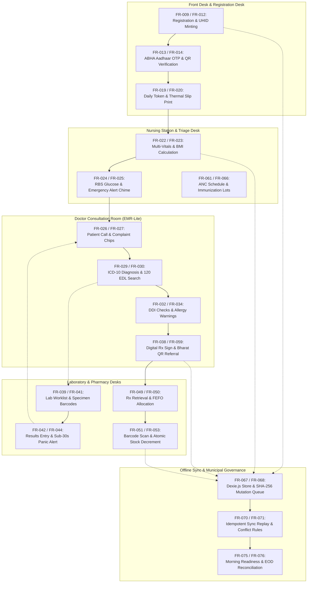

# Functional Requirements Specification: Namma Clinic Digital Health Platform

| Metadata Attribute | Formal Specification |
| :--- | :--- |
| **Document Identifier** | `DOC-REQ-002-FR` |
| **Document Title** | Master Functional Requirements Specification & System Behavior Baseline |
| **Project Code** | `NAMMA-CLINIC-PLATFORM-2026` |
| **Requirement Type** | `Functional Requirements (FR)` |
| **Specification Range** | `FR-001 through FR-080` (Exactly 80 unique requirements) |
| **Target Baseline** | `v1.0.0-PROD-BASELINE` |
| **Lifecycle Status** | `APPROVED & BASELINED` |
| **Target Facility Scope** | 183 Primary Namma Clinics across 8 BBMP Administrative Zones |
| **Lead Clinical Authority** | Chief Health Officer (CHO), BBMP Health Department |
| **Lead Technical Authority**| Principal Solutions Architect, Kushagramati Analytics Consortium |
| **Upstream Baselines** | [`00-project-baseline/`](../00-project-baseline/) \| [`01-project-management/`](../01-project-management/) |
| **Related Specification**| [`01-business-requirements.md`](./01-business-requirements.md) \| [`04-business-rules.md`](./04-business-rules.md) |

## 1. Executive Summary & Functional Architecture Framework
This specification establishes the authoritative, implementation-ready functional baseline for the Namma Clinic Digital Health & Operations Platform across 183 primary urban healthcare centers in Greater Bengaluru. The 80 functional requirements (`FR-001` through `FR-080`) govern all end-to-end user workflows, client-server interactions, data validation schemas, database state transitions, peripheral device drivers, offline local stores, and background data synchronization protocols.

Every functional requirement provides unambiguous behavioral rules necessary for frontend engineers, backend developers, database architects, and QA engineers to construct and verify the complete application suite without discovering missing business logic during sprint execution.

## 2. Functional Requirements Categorization Taxonomy
The 80 functional requirements are systematically organized across nine operational domains:
1. **Authentication, Authorization & User Administration (FR-001 to FR-008):** Multi-factor staff authentication, device hardware binding, RBAC access control, staff provisioning, session inactivity lock, temporary role switching, password resets, and session audit logs.
2. **Patient Registration, Demographics, ABHA & Search (FR-009 to FR-018):** Walk-in demographic capture, phonetic search, duplicate detection, municipal UHID minting, ABHA creation via Aadhaar OTP, QR code verification, demographic edits, family grouping, DPDP Act consent capture, and temporary offline UHID generation.
3. **OPD Queue, Token Dispensing & Triage Vitals (FR-019 to FR-026):** Sequential token generation, ESC/POS Web Serial thermal slip printing, priority queue routing, multi-parameter nursing vitals, automated BMI/growth metrics, capillary blood sugar screening, red-flag emergency alert chimes, and electronic patient calling.
4. **Doctor Consultation, EMR-Lite, ICD-10 & Prescribing (FR-027 to FR-038):** 1-click chief complaint chips, structured physical examination notes, curated ICD-10 diagnosis search, Karnataka 120 EDL formulary lookup, structured dosage chips, drug-drug interaction warnings, clinical override capture, allergy guards, pediatric dosage calculator, lifestyle advice, follow-up scheduling, and digital prescription signing.
5. **Point-of-Care Diagnostics & Laboratory Worklists (FR-039 to FR-048):** Rapid test ordering, laboratory worklists, GS1-128 specimen barcode labeling, qualitative/quantitative result entry, reference range comparison, sub-30s panic value alerts, reagent lot tracking, PDF report generation, external specimen referral manifests, and rapid test photo ingestion.
6. **Pharmacy Dispensing, 120 EDL Inventory & Batch Tracking (FR-049 to FR-058):** Electronic prescription retrieval, automated FEFO batch allocation, barcode scan verification, partial dispensing, atomic inventory balance decrements, warehouse delivery challan ingestion, stockout buffer alerts, near-expiry quarantine, discrepancy stock adjustments, and automated 30-day replenishment indents.
7. **Care Continuity, Referrals & Specialized Cohorts (FR-059 to FR-066):** Secondary hospital referral slips with Bharat QR, counter-referral note ingestion, maternal ANC registration, high-risk pregnancy tagging, NCD cohort enrollment, missed appointment defaulter tracking, postnatal care tracking, and pediatric immunization lot linkage.
8. **Offline Architecture, Data Sync & Conflict Resolution (FR-067 to FR-074):** Dexie.js IndexedDB storage, FIFO mutation queue with SHA-256 checksums, network reconnection detection, idempotent chunked sync replay, deterministic conflict resolution, master catalog caching, queue backlog monitoring, and local storage encryption.
9. **Supervisor Functions, End-of-Day Reconciliation & Admin (FR-075 to FR-080):** Morning opening readiness checklist, end-of-day session reconciliation, supervisor retrospective data amendments, zonal formulary broadcasts, facility telemetry dashboards, and system-wide immutable audit trail exports.



## 3. Master Functional Requirements Inventory Table (FR-001 to FR-080)
| Requirement ID | Functional Requirement Title | Operational Domain | Priority | Primary Actor | API Contract Endpoint | PostgreSQL Target Table | Local Dexie Store |
| :--- | :--- | :--- | :---: | :--- | :--- | :--- | :--- |
| [`FR-001`](#fr-001) | **Multi-Factor Staff Authentication & Workstation Binding** | `Authentication` | `MUST` | Frontline Staff | `POST /api/v1/auth/login` | `auth_sessions` | `dexie_auth` |
| [`FR-002`](#fr-002) | **Role-Based Access Control (RBAC) Permissions Enforcement** | `Authorization` | `MUST` | Application Gateway | `ALL /api/v1/*` | `auth_roles` | `dexie_roles` |
| [`FR-003`](#fr-003) | **Frontline Staff User Lifecycle Management** | `User Management` | `MUST` | Zonal Administrator | `POST /api/v1/admin/users` | `clinic_staff` | `dexie_staff` |
| [`FR-004`](#fr-004) | **Clinic Facility Profile & Operational Configuration** | `Clinic Management` | `MUST` | Facility Admin | `PUT /api/v1/clinics/{id}` | `clinic_facilities` | `dexie_facility` |
| [`FR-005`](#fr-005) | **Automated Session Inactivity Lock & Secure Re-Authentication** | `Session Security` | `MUST` | Client Application | `POST /api/v1/auth/unlock` | `auth_audit_log` | `dexie_session` |
| [`FR-006`](#fr-006) | **Delegated Temporary Role Switching for Cross-Coverage** | `Operations Management` | `SHOULD` | Medical Officer | `POST /api/v1/auth/delegate` | `role_delegations` | `dexie_auth` |
| [`FR-007`](#fr-007) | **Secure Password Reset via Zonal Admin or Mobile OTP** | `Access Recovery` | `MUST` | Clinic Staff | `POST /api/v1/auth/reset-password` | `clinic_staff` | `dexie_auth` |
| [`FR-008`](#fr-008) | **Immutable User Session & Authentication Audit Logging** | `Security Telemetry` | `MUST` | Security Subsystem | `POST /api/v1/telemetry/auth-events` | `auth_audit_log` | `dexie_audit` |
| [`FR-009`](#fr-009) | **Walk-In Citizen Registration & Demographics Capture** | `Patient Registration` | `MUST` | Data Entry Operator | `POST /api/v1/patients` | `patients` | `dexie_patients` |
| [`FR-010`](#fr-010) | **Sub-Second Phonetic & Fuzzy Patient Search** | `Patient Identification` | `MUST` | Data Entry Operator | `GET /api/v1/patients/search` | `patients` | `dexie_patients` |
| [`FR-011`](#fr-011) | **Algorithmic Duplicate Patient Detection & Warning** | `Data Quality` | `MUST` | Registration Engine | `POST /api/v1/patients/check-duplicates` | `patients` | `dexie_patients` |
| [`FR-012`](#fr-012) | **Universal Health Identification (UHID) Minting** | `Patient Identity` | `MUST` | Identity Subsystem | `POST /api/v1/patients/mint-uhid` | `patients` | `dexie_patients` |
| [`FR-013`](#fr-013) | **ABHA Creation via Aadhaar OTP & Demographic Authentication** | `ABDM Integration` | `MUST` | Data Entry Operator | `POST /api/v1/abdm/abha/create-otp` | `patient_abha_links` | `dexie_abha` |
| [`FR-014`](#fr-014) | **ABHA Verification via QR Code Scan** | `ABDM Integration` | `MUST` | Data Entry Operator | `POST /api/v1/abdm/abha/verify-qr` | `patient_abha_links` | `dexie_abha` |
| [`FR-015`](#fr-015) | **Patient Demographic Record Correction & Change Auditing** | `Record Integrity` | `MUST` | Facility Supervisor | `PATCH /api/v1/patients/{uhid}` | `patient_history` | `dexie_patients` |
| [`FR-016`](#fr-016) | **Family Unit Grouping & Household Health Linking** | `Population Health` | `SHOULD` | Data Entry Operator | `POST /api/v1/patients/household-link` | `household_members` | `dexie_patients` |
| [`FR-017`](#fr-017) | **Citizen Consent Capture & Purpose Specification (DPDP Act)** | `Privacy Compliance` | `MUST` | Data Entry Operator | `POST /api/v1/privacy/consents` | `privacy_consents` | `dexie_consents` |
| [`FR-018`](#fr-018) | **Temporary Offline UHID Allocation & Central Reconciliation** | `Offline Identity` | `MUST` | Registration Engine | `POST /api/v1/offline/register` | `patients` | `dexie_patients` |
| [`FR-019`](#fr-019) | **Sequential Daily OPD Token Dispensing** | `Queue Management` | `MUST` | Data Entry Operator | `POST /api/v1/queue/tokens` | `queue_tokens` | `dexie_queue` |
| [`FR-020`](#fr-020) | **Web Serial Thermal Slip Printing for OPD Tokens** | `Peripheral Integration` | `MUST` | Workstation Client | `CLIENT_WEB_SERIAL_PRINT` | `hardware_telemetry` | `dexie_queue` |
| [`FR-021`](#fr-021) | **Automated Priority Queue Insertion for Vulnerable Patients** | `Queue Governance` | `MUST` | Queue Engine | `PATCH /api/v1/queue/tokens/{id}/priority` | `queue_tokens` | `dexie_queue` |
| [`FR-022`](#fr-022) | **Multi-Parameter Nursing Vitals Capture & Validation** | `Triage Vitals` | `MUST` | Staff Nurse | `POST /api/v1/clinical/vitals` | `clinical_vitals` | `dexie_vitals` |
| [`FR-023`](#fr-023) | **Automated Body Mass Index (BMI) & Growth Metrics** | `Clinical Triage` | `MUST` | Staff Nurse | `POST /api/v1/clinical/vitals/growth` | `clinical_vitals` | `dexie_vitals` |
| [`FR-024`](#fr-024) | **Point-of-Care Random Blood Sugar (RBS) Screening at Triage** | `NCD Screening` | `MUST` | Staff Nurse | `POST /api/v1/clinical/vitals/glucose` | `clinical_vitals` | `dexie_vitals` |
| [`FR-025`](#fr-025) | **Red-Flag Clinical Emergency Triage Alert Chime** | `Patient Safety` | `MUST` | Triage Engine | `POST /api/v1/clinical/triage/escalate` | `queue_tokens` | `dexie_queue` |
| [`FR-026`](#fr-026) | **Triage-to-Doctor Desk Handover & Electronic Queue Calling** | `Queue Coordination` | `MUST` | Medical Officer | `POST /api/v1/queue/call-next` | `queue_tokens` | `dexie_queue` |
| [`FR-027`](#fr-027) | **1-Click Chief Complaint & Symptom Chip Selection** | `Clinical Productivity` | `MUST` | Medical Officer | `POST /api/v1/clinical/consultations/{id}/complaints` | `clinical_encounters` | `dexie_encounters` |
| [`FR-028`](#fr-028) | **Structured Physical Examination & Systemic Findings Notes** | `Clinical Quality` | `MUST` | Medical Officer | `POST /api/v1/clinical/consultations/{id}/exam` | `clinical_encounters` | `dexie_encounters` |
| [`FR-029`](#fr-029) | **Curated Primary Care ICD-10 Diagnostic Code Search** | `Diagnostic Coding` | `MUST` | Medical Officer | `POST /api/v1/clinical/consultations/{id}/diagnosis` | `clinical_diagnoses` | `dexie_encounters` |
| [`FR-030`](#fr-030) | **Karnataka 120 Essential Drug List (EDL) Formulary Search** | `Formulary Control` | `MUST` | Medical Officer | `GET /api/v1/pharmacy/formulary/search` | `pharmacy_items` | `dexie_formulary` |
| [`FR-031`](#fr-031) | **Structured Drug Dosage, Route, Frequency & Duration Input** | `Prescription Safety` | `MUST` | Medical Officer | `POST /api/v1/clinical/consultations/{id}/prescription-items` | `prescription_items` | `dexie_prescriptions` |
| [`FR-032`](#fr-032) | **Real-Time Drug-Drug Interaction (DDI) & Duplicate Alerting** | `Patient Safety` | `MUST` | Clinical Decision Support | `POST /api/v1/clinical/cds/check-ddi` | `clinical_rules` | `dexie_cds` |
| [`FR-033`](#fr-033) | **Documented Clinical Override with Mandatory Reason Capture** | `Clinical Governance` | `MUST` | Medical Officer | `POST /api/v1/clinical/cds/override` | `cds_overrides` | `dexie_audit` |
| [`FR-034`](#fr-034) | **Patient Drug Allergy Warning & Cross-Sensitivity Guard** | `Allergy Safety` | `MUST` | Prescription Engine | `POST /api/v1/clinical/cds/check-allergy` | `patient_allergies` | `dexie_encounters` |
| [`FR-035`](#fr-035) | **Pediatric Weight-Based Dosage Calculator (mg/kg/day)** | `Pediatric Safety` | `MUST` | Prescription Engine | `POST /api/v1/clinical/cds/pediatric-dose` | `formulary_dosages` | `dexie_cds` |
| [`FR-036`](#fr-036) | **Non-Pharmacological Advice & Dietary Lifestyle Chips** | `Preventive Counseling` | `SHOULD` | Medical Officer | `POST /api/v1/clinical/consultations/{id}/lifestyle` | `clinical_encounters` | `dexie_encounters` |
| [`FR-037`](#fr-037) | **Follow-Up Appointment Date Scheduling & SMS Trigger** | `Care Continuity` | `MUST` | Medical Officer | `POST /api/v1/clinical/consultations/{id}/follow-up` | `appointments` | `dexie_appointments` |
| [`FR-038`](#fr-038) | **Electronic Prescription Finalization & Digital Signature** | `Workflow Integration` | `MUST` | Medical Officer | `POST /api/v1/clinical/consultations/{id}/finalize` | `prescriptions` | `dexie_prescriptions` |
| [`FR-039`](#fr-039) | **Point-of-Care Laboratory Test Ordering from EMR** | `Diagnostic Workflow` | `MUST` | Medical Officer | `POST /api/v1/lab/orders` | `lab_orders` | `dexie_lab` |
| [`FR-040`](#fr-040) | **Laboratory Worklist Queue & Specimen Accessioning** | `Laboratory Management` | `MUST` | Lab Technician | `GET /api/v1/lab/worklist` | `lab_orders` | `dexie_lab` |
| [`FR-041`](#fr-041) | **Specimen Barcode Tube Label Printing** | `Specimen Safety` | `MUST` | Lab Technician | `POST /api/v1/lab/specimens/print-label` | `lab_specimens` | `dexie_lab` |
| [`FR-042`](#fr-042) | **Structured Point-of-Care Qualitative & Quantitative Result Entry** | `Laboratory Results` | `MUST` | Lab Technician | `POST /api/v1/lab/orders/{id}/results` | `lab_results` | `dexie_lab` |
| [`FR-043`](#fr-043) | **Automated Reference Range Comparison & Visual Highlighting** | `Diagnostic Safety` | `MUST` | Diagnostic Engine | `POST /api/v1/lab/results/evaluate-ranges` | `lab_reference_ranges` | `dexie_lab` |
| [`FR-044`](#fr-044) | **Sub-30-Second Panic Value Alert Transmission to Doctor Screen** | `Emergency Response` | `MUST` | Diagnostic Engine | `POST /api/v1/lab/alerts/panic` | `lab_panic_alerts` | `dexie_lab` |
| [`FR-045`](#fr-045) | **Reagent Kit Lot Tracking & Quality Control Logging** | `Laboratory Governance` | `MUST` | Lab Technician | `POST /api/v1/lab/qc/log-batch` | `lab_reagent_batches` | `dexie_lab` |
| [`FR-046`](#fr-046) | **Consolidated Laboratory Diagnostic Report Generation** | `Diagnostic Reporting` | `MUST` | Lab Technician | `POST /api/v1/lab/reports/generate-pdf` | `lab_reports` | `dexie_lab` |
| [`FR-047`](#fr-047) | **External Diagnostic Sample Referral Tracking** | `Diagnostic Continuity` | `SHOULD` | Lab Technician | `POST /api/v1/lab/external-referrals` | `lab_external_referrals` | `dexie_lab` |
| [`FR-048`](#fr-048) | **Rapid Diagnostic Test Cassette Photo Ingestion** | `Diagnostic Verification` | `SHOULD` | Lab Technician | `POST /api/v1/lab/orders/{id}/attach-photo` | `lab_attachments` | `dexie_lab` |
| [`FR-049`](#fr-049) | **Electronic Prescription Retrieval at Pharmacy Counter** | `Pharmacy Workflow` | `MUST` | Pharmacist | `GET /api/v1/pharmacy/prescriptions/{id}` | `prescriptions` | `dexie_pharmacy` |
| [`FR-050`](#fr-050) | **Automated First-Expired, First-Out (FEFO) Batch Recommendation** | `Inventory Optimization` | `MUST` | Pharmacy Engine | `POST /api/v1/pharmacy/batches/fefo-recommend` | `inventory_batches` | `dexie_inventory` |
| [`FR-051`](#fr-051) | **Barcode Scan Verification of Dispensed Medicine Packaging** | `Dispensing Safety` | `MUST` | Pharmacist | `POST /api/v1/pharmacy/dispense/verify-barcode` | `inventory_batches` | `dexie_pharmacy` |
| [`FR-052`](#fr-052) | **Partial Dispensing & Out-of-Stock Counseling Recording** | `Pharmacy Operations` | `MUST` | Pharmacist | `POST /api/v1/pharmacy/dispense/partial` | `prescription_dispensations` | `dexie_pharmacy` |
| [`FR-053`](#fr-053) | **Real-Time Inventory Balance Decrement & Stock Ledger Audit** | `Inventory Ledger` | `MUST` | Pharmacy Engine | `POST /api/v1/pharmacy/dispense/commit` | `inventory_ledger` | `dexie_inventory` |
| [`FR-054`](#fr-054) | **Digital Stock Receipt Ingestion from Zonal Warehouse** | `Stock Receipt` | `MUST` | Pharmacist | `POST /api/v1/pharmacy/stock-receipts` | `stock_receipts` | `dexie_inventory` |
| [`FR-055`](#fr-055) | **Automated Buffer Threshold Stockout Alerts** | `Supply Chain Alerting` | `MUST` | Inventory Daemon | `POST /api/v1/pharmacy/alerts/stockout` | `pharmacy_items` | `dexie_inventory` |
| [`FR-056`](#fr-056) | **Near-Expiry Medicine Quarantine & Return Workflow** | `Waste Reduction` | `MUST` | Pharmacist | `POST /api/v1/pharmacy/batches/{id}/quarantine` | `inventory_batches` | `dexie_inventory` |
| [`FR-057`](#fr-057) | **Discrepancy Stock Adjustment with Dual Supervisor Approval** | `Loss Prevention` | `MUST` | Pharmacist | `POST /api/v1/pharmacy/stock-adjustments` | `stock_adjustments` | `dexie_inventory` |
| [`FR-058`](#fr-058) | **Automated Rolling 30-Day Indent Calculation & 1-Click Submission** | `Supply Chain Automation` | `MUST` | Pharmacist | `POST /api/v1/pharmacy/indents/generate` | `stock_indents` | `dexie_inventory` |
| [`FR-059`](#fr-059) | **Secondary Hospital Referral Slip Generation with Bharat QR** | `Referral Continuity` | `MUST` | Medical Officer | `POST /api/v1/referrals/create` | `referral_records` | `dexie_referrals` |
| [`FR-060`](#fr-060) | **Counter-Referral Clinical Discharge Note Ingestion** | `Loop Closure` | `MUST` | Medical Officer | `POST /api/v1/referrals/{id}/close` | `referral_records` | `dexie_referrals` |
| [`FR-061`](#fr-061) | **Maternal Antenatal Care (ANC) Registration & Trimester Tracking** | `Maternal Health` | `MUST` | Staff Nurse | `POST /api/v1/maternal/anc/register` | `maternal_anc_registry` | `dexie_maternal` |
| [`FR-062`](#fr-062) | **High-Risk Pregnancy (HRP) Red-Flag Identification & Tagging** | `Maternal Safety` | `MUST` | Clinical Rules Engine | `POST /api/v1/maternal/anc/{id}/tag-hrp` | `maternal_hrp_tags` | `dexie_maternal` |
| [`FR-063`](#fr-063) | **Non-Communicable Disease (NCD) Cohort Enrollment & Longitudinal Monitoring** | `NCD Care` | `MUST` | Medical Officer | `POST /api/v1/ncd/cohort/enroll` | `ncd_cohort` | `dexie_ncd` |
| [`FR-064`](#fr-064) | **NCD Treatment Adherence & Missed Appointment Defaulter Tracking** | `Adherence Tracking` | `MUST` | NCD Subsystem | `GET /api/v1/ncd/cohort/defaulters` | `ncd_appointments` | `dexie_ncd` |
| [`FR-065`](#fr-065) | **Postnatal Care (PNC) Visit Tracking within 42 Days Post-Delivery** | `Postnatal Safety` | `MUST` | Staff Nurse | `POST /api/v1/maternal/pnc/record-visit` | `maternal_pnc_registry` | `dexie_maternal` |
| [`FR-066`](#fr-066) | **Pediatric Immunization Cold-Chain Batch Linkage** | `Immunization Tracking` | `MUST` | Staff Nurse | `POST /api/v1/pediatric/immunizations` | `immunization_records` | `dexie_immunization` |
| [`FR-067`](#fr-067) | **Client-Side IndexedDB Offline Data Storage (Dexie.js)** | `Offline Architecture` | `MUST` | Client Storage Subsystem | `LOCAL_DEXIE_TRANSACTION` | `dexie_local_db` | `dexie_all` |
| [`FR-068`](#fr-068) | **FIFO Mutation Queue Buffer with Cryptographic Checksums** | `Offline Synchronization` | `MUST` | Sync Subsystem | `LOCAL_MUTATION_QUEUE_APPEND` | `mutation_queue` | `dexie_sync` |
| [`FR-069`](#fr-069) | **Automated Network State Detection & Reconnection Handshake** | `Network Resilience` | `MUST` | Client Network Daemon | `GET /api/v1/health/ping` | `network_telemetry` | `dexie_telemetry` |
| [`FR-070`](#fr-070) | **Idempotent Chunked Mutation Synchronization Replay** | `Data Synchronization` | `MUST` | Background Sync Daemon | `POST /api/v1/sync/replay-mutations` | `mutation_journal` | `dexie_sync` |
| [`FR-071`](#fr-071) | **Deterministic Conflict Resolution Rules Engine** | `Conflict Handling` | `MUST` | Sync Conflict Engine | `POST /api/v1/sync/resolve-conflict` | `sync_conflicts` | `dexie_sync` |
| [`FR-072`](#fr-072) | **Master Data Catalog Caching & Differential Updates** | `Client Performance` | `MUST` | Client Cache Manager | `GET /api/v1/catalogs/{name}` | `master_catalogs` | `dexie_catalogs` |
| [`FR-073`](#fr-073) | **Offline Queue Backlog Monitoring & Health Warnings** | `Operational Telemetry` | `MUST` | Client UI Subsystem | `CLIENT_QUEUE_DEPTH_CHECK` | `queue_telemetry` | `dexie_sync` |
| [`FR-074`](#fr-074) | **Cryptographic Local IndexedDB Storage Encryption** | `Client Security` | `MUST` | Client Crypto Engine | `CLIENT_WEB_CRYPTO_ENCRYPT` | `client_security_log` | `dexie_secure` |
| [`FR-075`](#fr-075) | **Clinic Morning Opening Readiness Checklist** | `Facility Readiness` | `MUST` | Staff Nurse | `POST /api/v1/clinic/operations/morning-checklist` | `clinic_checklists` | `dexie_facility` |
| [`FR-076`](#fr-076) | **End-of-Day (EOD) Clinic Reconciliation & Daily Session Closure** | `Operational Governance` | `MUST` | Medical Officer | `POST /api/v1/clinic/operations/eod-closure` | `clinic_sessions` | `dexie_facility` |
| [`FR-077`](#fr-077) | **Supervisor Retrospective Data Correction Approval** | `Audit Integrity` | `MUST` | Zonal Medical Officer | `POST /api/v1/admin/approvals/amendment` | `encounter_addenda` | `dexie_encounters` |
| [`FR-078`](#fr-078) | **Master Data Synchronization & Formulary Override by Zonal Admin** | `Administrative Control` | `MUST` | Zonal Administrator | `POST /api/v1/admin/broadcast-update` | `admin_broadcasts` | `dexie_telemetry` |
| [`FR-079`](#fr-079) | **Comprehensive Facility Operational Telemetry Dashboard** | `Operational Visibility` | `MUST` | Facility Supervisor | `GET /api/v1/telemetry/facility-dashboard` | `clinic_telemetry` | `dexie_telemetry` |
| [`FR-080`](#fr-080) | **System-Wide Immutable Audit Trail Search & Export** | `Compliance & Audit` | `MUST` | Municipal Audit Officer | `GET /api/v1/admin/audit-logs/export` | `audit_logs` | `dexie_audit` |

## 4. Comprehensive Functional Requirement Specifications (FR-001 to FR-080)
This section establishes the exhaustive engineering, architectural, and operational specifications for each of the 80 functional requirements committed for production baseline delivery.

### 4.1 FR-001: Multi-Factor Staff Authentication & Workstation Binding

| Specification Attribute | Formal Engineering Definition |
| :--- | :--- |
| **Requirement ID** | `FR-001` |
| **Requirement Title** | Multi-Factor Staff Authentication & Workstation Binding |
| **Requirement Statement**| The platform shall authenticate frontline healthcare workers using secure credentials with mandatory clinic device binding. |
| **Requirement Type** | `Functional Requirement` |
| **Priority Level** | `MUST` (Rationale: Essential functional capability for urban primary clinic workflows.) |
| **Business Value** | Prevents unauthorized access from unverified external devices. |
| **Engineering Rationale**| Standardizes primary care workflows and eliminates paper-based operational bottlenecks. |
| **Primary Actor** | `Frontline Staff` |
| **Target User Persona** | [`PERSONA-001`](../01-project-management/07-user-personas.md#persona-001) |
| **Accountable Role** | [`ROLE-003`](../01-project-management/08-role-and-responsibility-matrix.md#role-003) |
| **Key Stakeholder** | [`STAKEHOLDER-015`](../01-project-management/06-stakeholders.md#stakeholder-015) |
| **Trigger Condition** | Staff launches clinic workstation application |
| **System Preconditions** | Workstation connected to local network or terminal bridge |
| **Input Specifications** | Staff username, password/PIN, workstation hardware UUID |
| **Validation Rules** | Argon2id verification, UUID matches clinic device whitelist |
| **Postconditions** | User session established with 15-minute sliding JWT |
| **State Mutations** | Mutates local IndexedDB and central PostgreSQL table `auth_sessions`. |
| **Associated Rules** | Business: [`BRULE-001`](./04-business-rules.md#brule-001) \| Clinical: [`CR-001`](./05-clinical-rules.md#cr-001) \| Operational: [`OR-001`](./06-operational-rules.md#or-001) |
| **Security & Privacy** | Security: [`SECR-001`](./07-security-requirements.md#secr-001) \| Privacy: [`PRIV-001`](./08-privacy-requirements.md#priv-001) |
| **Data & Audit** | Data: `Persisted in PostgreSQL table `auth_sessions`...` \| Audit: `Emits audit record with actor, timestamp, cli...` |
| **Offline & Sync** | Offline: [`OFF-001`](./13-offline-requirements.md#off-001) \| Sync: `Monotonic replay via mutation queue with idem...` |
| **Integration Ref** | Integration: [`INT-001`](./17-integration-requirements.md#int-001) |
| **Quality Expectations**| Perf: [`PERF-001`](./09-performance-requirements.md#perf-001) \| Avail: [`AVAIL-001`](./10-availability-requirements.md#avail-001) |
| **Localization & A11y**| Loc: [`LOC-001`](./11-localization-requirements.md#loc-001) \| A11y: [`A11Y-001`](./12-accessibility-requirements.md#a11y-001) |
| **Failure & Recovery** | Failure: Workstation displays local error banner and preserves uncommitted input. \| Recovery: Automated background sync replay upon network connectivity restoration. |
| **Observability** | Logging: `JSON log with request_id, clinic_id, and acto...` \| Metrics: `Prometheus counter `namma_clinic_fr_execution...` |
| **Upstream Traceability**| Obj: [`OBJECTIVE-001`](../01-project-management/02-project-vision-and-objectives.md#objective-001) \| Scope: [`INSCOPE-001`](../01-project-management/04-in-scope.md#inscope-001) \| Risk: [`RISK-001`](../01-project-management/12-project-risks.md#risk-001) |
| **Downstream Planning** | Epic: `PLANNED-EPIC-001` \| Feature: `PLANNED-FEATURE-001` \| API: `PLANNED-API-001` \| DB: `PLANNED-DB-001` \| Test: `PLANNED-TEST-101` |

#### 4.1.1 Frontline Operational Workflow & Execution Paths
- **Standard Execution Flow (Happy Path):**
  1. Authorized actor invokes multi-factor staff authentication & workstation binding on clinic terminal.
  2. System validates inputs against strict TypeBox schemas and business rule constraints.
  3. Mutation written locally to Dexie.js store with monotonic UUIDv7 key in <10ms.
  4. State change appended to sync mutation queue and transmitted to central Fastify API.
  5. Central database commits transaction and emits structured WORM audit log event.
- **Alternative Execution Flow:** If terminal is offline, transaction commits autonomously to IndexedDB and queues for background replay.
- **Exception & Recovery Flow:** If validation fails, system highlights offending fields in Kannada/English and aborts state mutation.

#### 4.1.2 Technical Invariants & Architectural Contracts
- **Backend REST API Endpoint:** `POST /api/v1/auth/login`
- **Database Entity Model:** `auth_sessions` in PostgreSQL schema `public`.
- **Client Offline Store:** Local Dexie.js store `dexie_auth` with UUIDv7 indexing.
- **Distributed Tracing Contract:** OpenTelemetry span `namma.clinic.fr.fr-001`.
- **Tamper-Evident Audit Event:** Writes WORM audit payload to Grafana Loki tagged `event_type=FUNCTIONAL_MUTATION`, `req_id=FR-001`.

#### 4.1.3 Executable BDD Acceptance Scenarios
```gherkin
Feature: FR-001 - Multi-Factor Staff Authentication & Workstation Binding
  As a Frontline Staff
  I require system enforcement of multi-factor staff authentication & workstation binding
  In order to ensure municipal healthcare compliance and operational integrity

  Scenario: Happy Path Execution for FR-001
    Given the Frontline Staff is authenticated and clinic terminal is operational
    When the user submits a valid request for multi-factor staff authentication & workstation binding
    Then the system successfully commits the transaction and emits an audit event

  Scenario: Input Validation and Schema Guard for FR-001
    Given the Frontline Staff attempts to submit an incomplete or malformed payload for multi-factor staff authentication & workstation binding
    When the request fails TypeBox schema or domain constraint validation
    Then the system rejects the input with HTTP 400 and highlights invalid fields in Kannada and English

  Scenario: RBAC and Security Access Control for FR-001
    Given an unauthenticated or unauthorized role attempts to invoke multi-factor staff authentication & workstation binding
    When the bearer JWT token is missing, expired, or lacks necessary RBAC permission
    Then the system denies execution with HTTP 403 Forbidden and records a security telemetry alert

  Scenario: Offline Autonomous Execution for FR-001
    Given the clinic WAN network is completely severed during multi-factor staff authentication & workstation binding
    When the operator confirms the local transaction on the workstation
    Then the mutation is persisted to Dexie.js IndexedDB with a UUIDv7 and queued for background replay

  Scenario: Network Recovery and Idempotent Sync for FR-001
    Given the clinic workstation reconnects to the BBMP municipal health WAN
    When the background sync daemon processes the pending mutation queue
    Then all buffered transactions for FR-001 synchronize idempotently with zero data loss
```

#### 4.1.4 Verification Protocol & Quality Sign-Off
- **Verification Method:** Automated Vitest Integration & Playwright E2E Test
- **Automated Test Suite:** `PLANNED-TEST-101` (Integration & E2E Test) targeting >=90% statement coverage.
- **Related Internal Requirements:** `BRULE-001`, `CR-001`, `OR-001`, `SECR-001`, `OFF-001`
- **Dependencies & Blocking Constraints:** BRULE-001, SECR-001, OFF-001 | Constraints: Workstation memory footprint must remain under 150MB during full-day operation.
- **Architectural Assumptions & Open Questions:** Assumption: Clinic workstations equipped with modern Chromium-based browser supporting Web Serial and IndexedDB. | Open Question: Verify hardware driver-free thermal printing performance across all tested USB hubs.

---

### 4.2 FR-002: Role-Based Access Control (RBAC) Permissions Enforcement

| Specification Attribute | Formal Engineering Definition |
| :--- | :--- |
| **Requirement ID** | `FR-002` |
| **Requirement Title** | Role-Based Access Control (RBAC) Permissions Enforcement |
| **Requirement Statement**| The platform shall restrict UI screens and API endpoints based on authenticated user roles (MO, Nurse, Pharmacist, Lab Tech, DEO). |
| **Requirement Type** | `Functional Requirement` |
| **Priority Level** | `MUST` (Rationale: Essential functional capability for urban primary clinic workflows.) |
| **Business Value** | Enforces least privilege and regulatory medical confidentiality. |
| **Engineering Rationale**| Standardizes primary care workflows and eliminates paper-based operational bottlenecks. |
| **Primary Actor** | `Application Gateway` |
| **Target User Persona** | [`PERSONA-002`](../01-project-management/07-user-personas.md#persona-002) |
| **Accountable Role** | [`ROLE-008`](../01-project-management/08-role-and-responsibility-matrix.md#role-008) |
| **Key Stakeholder** | [`STAKEHOLDER-015`](../01-project-management/06-stakeholders.md#stakeholder-015) |
| **Trigger Condition** | User invokes any API action or navigates UI route |
| **System Preconditions** | Active valid JWT session token present |
| **Input Specifications** | JWT bearer token, target endpoint, requested HTTP verb |
| **Validation Rules** | Token signature verified via RS256 public key, role in authorized list |
| **Postconditions** | Request permitted or rejected with HTTP 403 Forbidden |
| **State Mutations** | Mutates local IndexedDB and central PostgreSQL table `auth_roles`. |
| **Associated Rules** | Business: [`BRULE-002`](./04-business-rules.md#brule-002) \| Clinical: [`CR-002`](./05-clinical-rules.md#cr-002) \| Operational: [`OR-002`](./06-operational-rules.md#or-002) |
| **Security & Privacy** | Security: [`SECR-002`](./07-security-requirements.md#secr-002) \| Privacy: [`PRIV-002`](./08-privacy-requirements.md#priv-002) |
| **Data & Audit** | Data: `Persisted in PostgreSQL table `auth_roles` an...` \| Audit: `Emits audit record with actor, timestamp, cli...` |
| **Offline & Sync** | Offline: [`OFF-002`](./13-offline-requirements.md#off-002) \| Sync: `Monotonic replay via mutation queue with idem...` |
| **Integration Ref** | Integration: [`INT-002`](./17-integration-requirements.md#int-002) |
| **Quality Expectations**| Perf: [`PERF-002`](./09-performance-requirements.md#perf-002) \| Avail: [`AVAIL-002`](./10-availability-requirements.md#avail-002) |
| **Localization & A11y**| Loc: [`LOC-002`](./11-localization-requirements.md#loc-002) \| A11y: [`A11Y-002`](./12-accessibility-requirements.md#a11y-002) |
| **Failure & Recovery** | Failure: Workstation displays local error banner and preserves uncommitted input. \| Recovery: Automated background sync replay upon network connectivity restoration. |
| **Observability** | Logging: `JSON log with request_id, clinic_id, and acto...` \| Metrics: `Prometheus counter `namma_clinic_fr_execution...` |
| **Upstream Traceability**| Obj: [`OBJECTIVE-002`](../01-project-management/02-project-vision-and-objectives.md#objective-002) \| Scope: [`INSCOPE-002`](../01-project-management/04-in-scope.md#inscope-002) \| Risk: [`RISK-002`](../01-project-management/12-project-risks.md#risk-002) |
| **Downstream Planning** | Epic: `PLANNED-EPIC-002` \| Feature: `PLANNED-FEATURE-002` \| API: `PLANNED-API-002` \| DB: `PLANNED-DB-002` \| Test: `PLANNED-TEST-102` |

#### 4.2.1 Frontline Operational Workflow & Execution Paths
- **Standard Execution Flow (Happy Path):**
  1. Authorized actor invokes role-based access control (rbac) permissions enforcement on clinic terminal.
  2. System validates inputs against strict TypeBox schemas and business rule constraints.
  3. Mutation written locally to Dexie.js store with monotonic UUIDv7 key in <10ms.
  4. State change appended to sync mutation queue and transmitted to central Fastify API.
  5. Central database commits transaction and emits structured WORM audit log event.
- **Alternative Execution Flow:** If terminal is offline, transaction commits autonomously to IndexedDB and queues for background replay.
- **Exception & Recovery Flow:** If validation fails, system highlights offending fields in Kannada/English and aborts state mutation.

#### 4.2.2 Technical Invariants & Architectural Contracts
- **Backend REST API Endpoint:** `ALL /api/v1/*`
- **Database Entity Model:** `auth_roles` in PostgreSQL schema `public`.
- **Client Offline Store:** Local Dexie.js store `dexie_roles` with UUIDv7 indexing.
- **Distributed Tracing Contract:** OpenTelemetry span `namma.clinic.fr.fr-002`.
- **Tamper-Evident Audit Event:** Writes WORM audit payload to Grafana Loki tagged `event_type=FUNCTIONAL_MUTATION`, `req_id=FR-002`.

#### 4.2.3 Executable BDD Acceptance Scenarios
```gherkin
Feature: FR-002 - Role-Based Access Control (RBAC) Permissions Enforcement
  As a Application Gateway
  I require system enforcement of role-based access control (rbac) permissions enforcement
  In order to ensure municipal healthcare compliance and operational integrity

  Scenario: Happy Path Execution for FR-002
    Given the Application Gateway is authenticated and clinic terminal is operational
    When the user submits a valid request for role-based access control (rbac) permissions enforcement
    Then the system successfully commits the transaction and emits an audit event

  Scenario: Input Validation and Schema Guard for FR-002
    Given the Application Gateway attempts to submit an incomplete or malformed payload for role-based access control (rbac) permissions enforcement
    When the request fails TypeBox schema or domain constraint validation
    Then the system rejects the input with HTTP 400 and highlights invalid fields in Kannada and English

  Scenario: RBAC and Security Access Control for FR-002
    Given an unauthenticated or unauthorized role attempts to invoke role-based access control (rbac) permissions enforcement
    When the bearer JWT token is missing, expired, or lacks necessary RBAC permission
    Then the system denies execution with HTTP 403 Forbidden and records a security telemetry alert

  Scenario: Offline Autonomous Execution for FR-002
    Given the clinic WAN network is completely severed during role-based access control (rbac) permissions enforcement
    When the operator confirms the local transaction on the workstation
    Then the mutation is persisted to Dexie.js IndexedDB with a UUIDv7 and queued for background replay

  Scenario: Network Recovery and Idempotent Sync for FR-002
    Given the clinic workstation reconnects to the BBMP municipal health WAN
    When the background sync daemon processes the pending mutation queue
    Then all buffered transactions for FR-002 synchronize idempotently with zero data loss
```

#### 4.2.4 Verification Protocol & Quality Sign-Off
- **Verification Method:** Automated Vitest Integration & Playwright E2E Test
- **Automated Test Suite:** `PLANNED-TEST-102` (Integration & E2E Test) targeting >=90% statement coverage.
- **Related Internal Requirements:** `BRULE-002`, `CR-002`, `OR-002`, `SECR-002`, `OFF-002`
- **Dependencies & Blocking Constraints:** BRULE-002, SECR-002, OFF-002 | Constraints: Workstation memory footprint must remain under 150MB during full-day operation.
- **Architectural Assumptions & Open Questions:** Assumption: Clinic workstations equipped with modern Chromium-based browser supporting Web Serial and IndexedDB. | Open Question: Verify hardware driver-free thermal printing performance across all tested USB hubs.

---

### 4.3 FR-003: Frontline Staff User Lifecycle Management

| Specification Attribute | Formal Engineering Definition |
| :--- | :--- |
| **Requirement ID** | `FR-003` |
| **Requirement Title** | Frontline Staff User Lifecycle Management |
| **Requirement Statement**| The platform shall allow authorized Zonal Health Administrators to provision, suspend, and reassign clinic staff accounts. |
| **Requirement Type** | `Functional Requirement` |
| **Priority Level** | `MUST` (Rationale: Essential functional capability for urban primary clinic workflows.) |
| **Business Value** | Ensures timely staff account provisioning and immediate revocation upon transfer. |
| **Engineering Rationale**| Standardizes primary care workflows and eliminates paper-based operational bottlenecks. |
| **Primary Actor** | `Zonal Administrator` |
| **Target User Persona** | [`PERSONA-003`](../01-project-management/07-user-personas.md#persona-003) |
| **Accountable Role** | [`ROLE-007`](../01-project-management/08-role-and-responsibility-matrix.md#role-007) |
| **Key Stakeholder** | [`STAKEHOLDER-012`](../01-project-management/06-stakeholders.md#stakeholder-012) |
| **Trigger Condition** | Zonal admin submits new staff profile or transfer request |
| **System Preconditions** | Admin authenticated with zonal supervisory privileges |
| **Input Specifications** | Employee ID, full name, clinical role, mobile number, assigned clinic ID |
| **Validation Rules** | KMC/KNC registration number format validation, valid clinic ID |
| **Postconditions** | Staff account created and assigned to clinic roster |
| **State Mutations** | Mutates local IndexedDB and central PostgreSQL table `clinic_staff`. |
| **Associated Rules** | Business: [`BRULE-003`](./04-business-rules.md#brule-003) \| Clinical: [`CR-003`](./05-clinical-rules.md#cr-003) \| Operational: [`OR-003`](./06-operational-rules.md#or-003) |
| **Security & Privacy** | Security: [`SECR-003`](./07-security-requirements.md#secr-003) \| Privacy: [`PRIV-003`](./08-privacy-requirements.md#priv-003) |
| **Data & Audit** | Data: `Persisted in PostgreSQL table `clinic_staff` ...` \| Audit: `Emits audit record with actor, timestamp, cli...` |
| **Offline & Sync** | Offline: [`OFF-003`](./13-offline-requirements.md#off-003) \| Sync: `Monotonic replay via mutation queue with idem...` |
| **Integration Ref** | Integration: [`INT-003`](./17-integration-requirements.md#int-003) |
| **Quality Expectations**| Perf: [`PERF-003`](./09-performance-requirements.md#perf-003) \| Avail: [`AVAIL-003`](./10-availability-requirements.md#avail-003) |
| **Localization & A11y**| Loc: [`LOC-003`](./11-localization-requirements.md#loc-003) \| A11y: [`A11Y-003`](./12-accessibility-requirements.md#a11y-003) |
| **Failure & Recovery** | Failure: Workstation displays local error banner and preserves uncommitted input. \| Recovery: Automated background sync replay upon network connectivity restoration. |
| **Observability** | Logging: `JSON log with request_id, clinic_id, and acto...` \| Metrics: `Prometheus counter `namma_clinic_fr_execution...` |
| **Upstream Traceability**| Obj: [`OBJECTIVE-003`](../01-project-management/02-project-vision-and-objectives.md#objective-003) \| Scope: [`INSCOPE-003`](../01-project-management/04-in-scope.md#inscope-003) \| Risk: [`RISK-003`](../01-project-management/12-project-risks.md#risk-003) |
| **Downstream Planning** | Epic: `PLANNED-EPIC-003` \| Feature: `PLANNED-FEATURE-003` \| API: `PLANNED-API-003` \| DB: `PLANNED-DB-003` \| Test: `PLANNED-TEST-103` |

#### 4.3.1 Frontline Operational Workflow & Execution Paths
- **Standard Execution Flow (Happy Path):**
  1. Authorized actor invokes frontline staff user lifecycle management on clinic terminal.
  2. System validates inputs against strict TypeBox schemas and business rule constraints.
  3. Mutation written locally to Dexie.js store with monotonic UUIDv7 key in <10ms.
  4. State change appended to sync mutation queue and transmitted to central Fastify API.
  5. Central database commits transaction and emits structured WORM audit log event.
- **Alternative Execution Flow:** If terminal is offline, transaction commits autonomously to IndexedDB and queues for background replay.
- **Exception & Recovery Flow:** If validation fails, system highlights offending fields in Kannada/English and aborts state mutation.

#### 4.3.2 Technical Invariants & Architectural Contracts
- **Backend REST API Endpoint:** `POST /api/v1/admin/users`
- **Database Entity Model:** `clinic_staff` in PostgreSQL schema `public`.
- **Client Offline Store:** Local Dexie.js store `dexie_staff` with UUIDv7 indexing.
- **Distributed Tracing Contract:** OpenTelemetry span `namma.clinic.fr.fr-003`.
- **Tamper-Evident Audit Event:** Writes WORM audit payload to Grafana Loki tagged `event_type=FUNCTIONAL_MUTATION`, `req_id=FR-003`.

#### 4.3.3 Executable BDD Acceptance Scenarios
```gherkin
Feature: FR-003 - Frontline Staff User Lifecycle Management
  As a Zonal Administrator
  I require system enforcement of frontline staff user lifecycle management
  In order to ensure municipal healthcare compliance and operational integrity

  Scenario: Happy Path Execution for FR-003
    Given the Zonal Administrator is authenticated and clinic terminal is operational
    When the user submits a valid request for frontline staff user lifecycle management
    Then the system successfully commits the transaction and emits an audit event

  Scenario: Input Validation and Schema Guard for FR-003
    Given the Zonal Administrator attempts to submit an incomplete or malformed payload for frontline staff user lifecycle management
    When the request fails TypeBox schema or domain constraint validation
    Then the system rejects the input with HTTP 400 and highlights invalid fields in Kannada and English

  Scenario: RBAC and Security Access Control for FR-003
    Given an unauthenticated or unauthorized role attempts to invoke frontline staff user lifecycle management
    When the bearer JWT token is missing, expired, or lacks necessary RBAC permission
    Then the system denies execution with HTTP 403 Forbidden and records a security telemetry alert

  Scenario: Offline Autonomous Execution for FR-003
    Given the clinic WAN network is completely severed during frontline staff user lifecycle management
    When the operator confirms the local transaction on the workstation
    Then the mutation is persisted to Dexie.js IndexedDB with a UUIDv7 and queued for background replay

  Scenario: Network Recovery and Idempotent Sync for FR-003
    Given the clinic workstation reconnects to the BBMP municipal health WAN
    When the background sync daemon processes the pending mutation queue
    Then all buffered transactions for FR-003 synchronize idempotently with zero data loss
```

#### 4.3.4 Verification Protocol & Quality Sign-Off
- **Verification Method:** Automated Vitest Integration & Playwright E2E Test
- **Automated Test Suite:** `PLANNED-TEST-103` (Integration & E2E Test) targeting >=90% statement coverage.
- **Related Internal Requirements:** `BRULE-003`, `CR-003`, `OR-003`, `SECR-003`, `OFF-003`
- **Dependencies & Blocking Constraints:** BRULE-003, SECR-003, OFF-003 | Constraints: Workstation memory footprint must remain under 150MB during full-day operation.
- **Architectural Assumptions & Open Questions:** Assumption: Clinic workstations equipped with modern Chromium-based browser supporting Web Serial and IndexedDB. | Open Question: Verify hardware driver-free thermal printing performance across all tested USB hubs.

---

### 4.4 FR-004: Clinic Facility Profile & Operational Configuration

| Specification Attribute | Formal Engineering Definition |
| :--- | :--- |
| **Requirement ID** | `FR-004` |
| **Requirement Title** | Clinic Facility Profile & Operational Configuration |
| **Requirement Statement**| The platform shall maintain clinic facility metadata including ward mapping, zone assignment, physical address, and operating hours. |
| **Requirement Type** | `Functional Requirement` |
| **Priority Level** | `MUST` (Rationale: Essential functional capability for urban primary clinic workflows.) |
| **Business Value** | Provides accurate facility context for reporting, GIS mapping, and indents. |
| **Engineering Rationale**| Standardizes primary care workflows and eliminates paper-based operational bottlenecks. |
| **Primary Actor** | `Facility Admin` |
| **Target User Persona** | [`PERSONA-004`](../01-project-management/07-user-personas.md#persona-004) |
| **Accountable Role** | [`ROLE-001`](../01-project-management/08-role-and-responsibility-matrix.md#role-001) |
| **Key Stakeholder** | [`STAKEHOLDER-003`](../01-project-management/06-stakeholders.md#stakeholder-003) |
| **Trigger Condition** | Admin updates clinic operational attributes or holiday calendar |
| **System Preconditions** | Admin has facility administrative role |
| **Input Specifications** | Clinic ID, ward number (1-243), zone, contact phone, operating hours |
| **Validation Rules** | Ward number integer 1-243, valid GPS coordinates within Bengaluru |
| **Postconditions** | Clinic profile updated and synchronized to central catalog |
| **State Mutations** | Mutates local IndexedDB and central PostgreSQL table `clinic_facilities`. |
| **Associated Rules** | Business: [`BRULE-004`](./04-business-rules.md#brule-004) \| Clinical: [`CR-004`](./05-clinical-rules.md#cr-004) \| Operational: [`OR-004`](./06-operational-rules.md#or-004) |
| **Security & Privacy** | Security: [`SECR-004`](./07-security-requirements.md#secr-004) \| Privacy: [`PRIV-004`](./08-privacy-requirements.md#priv-004) |
| **Data & Audit** | Data: `Persisted in PostgreSQL table `clinic_facilit...` \| Audit: `Emits audit record with actor, timestamp, cli...` |
| **Offline & Sync** | Offline: [`OFF-004`](./13-offline-requirements.md#off-004) \| Sync: `Monotonic replay via mutation queue with idem...` |
| **Integration Ref** | Integration: [`INT-004`](./17-integration-requirements.md#int-004) |
| **Quality Expectations**| Perf: [`PERF-004`](./09-performance-requirements.md#perf-004) \| Avail: [`AVAIL-004`](./10-availability-requirements.md#avail-004) |
| **Localization & A11y**| Loc: [`LOC-004`](./11-localization-requirements.md#loc-004) \| A11y: [`A11Y-004`](./12-accessibility-requirements.md#a11y-004) |
| **Failure & Recovery** | Failure: Workstation displays local error banner and preserves uncommitted input. \| Recovery: Automated background sync replay upon network connectivity restoration. |
| **Observability** | Logging: `JSON log with request_id, clinic_id, and acto...` \| Metrics: `Prometheus counter `namma_clinic_fr_execution...` |
| **Upstream Traceability**| Obj: [`OBJECTIVE-004`](../01-project-management/02-project-vision-and-objectives.md#objective-004) \| Scope: [`INSCOPE-004`](../01-project-management/04-in-scope.md#inscope-004) \| Risk: [`RISK-004`](../01-project-management/12-project-risks.md#risk-004) |
| **Downstream Planning** | Epic: `PLANNED-EPIC-004` \| Feature: `PLANNED-FEATURE-004` \| API: `PLANNED-API-004` \| DB: `PLANNED-DB-004` \| Test: `PLANNED-TEST-104` |

#### 4.4.1 Frontline Operational Workflow & Execution Paths
- **Standard Execution Flow (Happy Path):**
  1. Authorized actor invokes clinic facility profile & operational configuration on clinic terminal.
  2. System validates inputs against strict TypeBox schemas and business rule constraints.
  3. Mutation written locally to Dexie.js store with monotonic UUIDv7 key in <10ms.
  4. State change appended to sync mutation queue and transmitted to central Fastify API.
  5. Central database commits transaction and emits structured WORM audit log event.
- **Alternative Execution Flow:** If terminal is offline, transaction commits autonomously to IndexedDB and queues for background replay.
- **Exception & Recovery Flow:** If validation fails, system highlights offending fields in Kannada/English and aborts state mutation.

#### 4.4.2 Technical Invariants & Architectural Contracts
- **Backend REST API Endpoint:** `PUT /api/v1/clinics/{id}`
- **Database Entity Model:** `clinic_facilities` in PostgreSQL schema `public`.
- **Client Offline Store:** Local Dexie.js store `dexie_facility` with UUIDv7 indexing.
- **Distributed Tracing Contract:** OpenTelemetry span `namma.clinic.fr.fr-004`.
- **Tamper-Evident Audit Event:** Writes WORM audit payload to Grafana Loki tagged `event_type=FUNCTIONAL_MUTATION`, `req_id=FR-004`.

#### 4.4.3 Executable BDD Acceptance Scenarios
```gherkin
Feature: FR-004 - Clinic Facility Profile & Operational Configuration
  As a Facility Admin
  I require system enforcement of clinic facility profile & operational configuration
  In order to ensure municipal healthcare compliance and operational integrity

  Scenario: Happy Path Execution for FR-004
    Given the Facility Admin is authenticated and clinic terminal is operational
    When the user submits a valid request for clinic facility profile & operational configuration
    Then the system successfully commits the transaction and emits an audit event

  Scenario: Input Validation and Schema Guard for FR-004
    Given the Facility Admin attempts to submit an incomplete or malformed payload for clinic facility profile & operational configuration
    When the request fails TypeBox schema or domain constraint validation
    Then the system rejects the input with HTTP 400 and highlights invalid fields in Kannada and English

  Scenario: RBAC and Security Access Control for FR-004
    Given an unauthenticated or unauthorized role attempts to invoke clinic facility profile & operational configuration
    When the bearer JWT token is missing, expired, or lacks necessary RBAC permission
    Then the system denies execution with HTTP 403 Forbidden and records a security telemetry alert

  Scenario: Offline Autonomous Execution for FR-004
    Given the clinic WAN network is completely severed during clinic facility profile & operational configuration
    When the operator confirms the local transaction on the workstation
    Then the mutation is persisted to Dexie.js IndexedDB with a UUIDv7 and queued for background replay

  Scenario: Network Recovery and Idempotent Sync for FR-004
    Given the clinic workstation reconnects to the BBMP municipal health WAN
    When the background sync daemon processes the pending mutation queue
    Then all buffered transactions for FR-004 synchronize idempotently with zero data loss
```

#### 4.4.4 Verification Protocol & Quality Sign-Off
- **Verification Method:** Automated Vitest Integration & Playwright E2E Test
- **Automated Test Suite:** `PLANNED-TEST-104` (Integration & E2E Test) targeting >=90% statement coverage.
- **Related Internal Requirements:** `BRULE-004`, `CR-004`, `OR-004`, `SECR-004`, `OFF-004`
- **Dependencies & Blocking Constraints:** BRULE-004, SECR-004, OFF-004 | Constraints: Workstation memory footprint must remain under 150MB during full-day operation.
- **Architectural Assumptions & Open Questions:** Assumption: Clinic workstations equipped with modern Chromium-based browser supporting Web Serial and IndexedDB. | Open Question: Verify hardware driver-free thermal printing performance across all tested USB hubs.

---

### 4.5 FR-005: Automated Session Inactivity Lock & Secure Re-Authentication

| Specification Attribute | Formal Engineering Definition |
| :--- | :--- |
| **Requirement ID** | `FR-005` |
| **Requirement Title** | Automated Session Inactivity Lock & Secure Re-Authentication |
| **Requirement Statement**| The platform shall automatically lock the workstation screen after 15 minutes of user inactivity, requiring PIN re-entry. |
| **Requirement Type** | `Functional Requirement` |
| **Priority Level** | `MUST` (Rationale: Essential functional capability for urban primary clinic workflows.) |
| **Business Value** | Protects open terminals in busy, shared clinic consultation spaces. |
| **Engineering Rationale**| Standardizes primary care workflows and eliminates paper-based operational bottlenecks. |
| **Primary Actor** | `Client Application` |
| **Target User Persona** | [`PERSONA-005`](../01-project-management/07-user-personas.md#persona-005) |
| **Accountable Role** | [`ROLE-002`](../01-project-management/08-role-and-responsibility-matrix.md#role-002) |
| **Key Stakeholder** | [`STAKEHOLDER-015`](../01-project-management/06-stakeholders.md#stakeholder-015) |
| **Trigger Condition** | No mouse, keyboard, or touch event detected for 900 seconds |
| **System Preconditions** | User session currently in ACTIVE state |
| **Input Specifications** | Inactivity timer expiration signal, 4-digit re-auth PIN |
| **Validation Rules** | PIN matches local encrypted session credential |
| **Postconditions** | Session state transitions to LOCKED until PIN re-entered |
| **State Mutations** | Mutates local IndexedDB and central PostgreSQL table `auth_audit_log`. |
| **Associated Rules** | Business: [`BRULE-005`](./04-business-rules.md#brule-005) \| Clinical: [`CR-005`](./05-clinical-rules.md#cr-005) \| Operational: [`OR-005`](./06-operational-rules.md#or-005) |
| **Security & Privacy** | Security: [`SECR-005`](./07-security-requirements.md#secr-005) \| Privacy: [`PRIV-005`](./08-privacy-requirements.md#priv-005) |
| **Data & Audit** | Data: `Persisted in PostgreSQL table `auth_audit_log...` \| Audit: `Emits audit record with actor, timestamp, cli...` |
| **Offline & Sync** | Offline: [`OFF-005`](./13-offline-requirements.md#off-005) \| Sync: `Monotonic replay via mutation queue with idem...` |
| **Integration Ref** | Integration: [`INT-005`](./17-integration-requirements.md#int-005) |
| **Quality Expectations**| Perf: [`PERF-005`](./09-performance-requirements.md#perf-005) \| Avail: [`AVAIL-005`](./10-availability-requirements.md#avail-005) |
| **Localization & A11y**| Loc: [`LOC-005`](./11-localization-requirements.md#loc-005) \| A11y: [`A11Y-005`](./12-accessibility-requirements.md#a11y-005) |
| **Failure & Recovery** | Failure: Workstation displays local error banner and preserves uncommitted input. \| Recovery: Automated background sync replay upon network connectivity restoration. |
| **Observability** | Logging: `JSON log with request_id, clinic_id, and acto...` \| Metrics: `Prometheus counter `namma_clinic_fr_execution...` |
| **Upstream Traceability**| Obj: [`OBJECTIVE-005`](../01-project-management/02-project-vision-and-objectives.md#objective-005) \| Scope: [`INSCOPE-005`](../01-project-management/04-in-scope.md#inscope-005) \| Risk: [`RISK-005`](../01-project-management/12-project-risks.md#risk-005) |
| **Downstream Planning** | Epic: `PLANNED-EPIC-005` \| Feature: `PLANNED-FEATURE-005` \| API: `PLANNED-API-005` \| DB: `PLANNED-DB-005` \| Test: `PLANNED-TEST-105` |

#### 4.5.1 Frontline Operational Workflow & Execution Paths
- **Standard Execution Flow (Happy Path):**
  1. Authorized actor invokes automated session inactivity lock & secure re-authentication on clinic terminal.
  2. System validates inputs against strict TypeBox schemas and business rule constraints.
  3. Mutation written locally to Dexie.js store with monotonic UUIDv7 key in <10ms.
  4. State change appended to sync mutation queue and transmitted to central Fastify API.
  5. Central database commits transaction and emits structured WORM audit log event.
- **Alternative Execution Flow:** If terminal is offline, transaction commits autonomously to IndexedDB and queues for background replay.
- **Exception & Recovery Flow:** If validation fails, system highlights offending fields in Kannada/English and aborts state mutation.

#### 4.5.2 Technical Invariants & Architectural Contracts
- **Backend REST API Endpoint:** `POST /api/v1/auth/unlock`
- **Database Entity Model:** `auth_audit_log` in PostgreSQL schema `public`.
- **Client Offline Store:** Local Dexie.js store `dexie_session` with UUIDv7 indexing.
- **Distributed Tracing Contract:** OpenTelemetry span `namma.clinic.fr.fr-005`.
- **Tamper-Evident Audit Event:** Writes WORM audit payload to Grafana Loki tagged `event_type=FUNCTIONAL_MUTATION`, `req_id=FR-005`.

#### 4.5.3 Executable BDD Acceptance Scenarios
```gherkin
Feature: FR-005 - Automated Session Inactivity Lock & Secure Re-Authentication
  As a Client Application
  I require system enforcement of automated session inactivity lock & secure re-authentication
  In order to ensure municipal healthcare compliance and operational integrity

  Scenario: Happy Path Execution for FR-005
    Given the Client Application is authenticated and clinic terminal is operational
    When the user submits a valid request for automated session inactivity lock & secure re-authentication
    Then the system successfully commits the transaction and emits an audit event

  Scenario: Input Validation and Schema Guard for FR-005
    Given the Client Application attempts to submit an incomplete or malformed payload for automated session inactivity lock & secure re-authentication
    When the request fails TypeBox schema or domain constraint validation
    Then the system rejects the input with HTTP 400 and highlights invalid fields in Kannada and English

  Scenario: RBAC and Security Access Control for FR-005
    Given an unauthenticated or unauthorized role attempts to invoke automated session inactivity lock & secure re-authentication
    When the bearer JWT token is missing, expired, or lacks necessary RBAC permission
    Then the system denies execution with HTTP 403 Forbidden and records a security telemetry alert

  Scenario: Offline Autonomous Execution for FR-005
    Given the clinic WAN network is completely severed during automated session inactivity lock & secure re-authentication
    When the operator confirms the local transaction on the workstation
    Then the mutation is persisted to Dexie.js IndexedDB with a UUIDv7 and queued for background replay

  Scenario: Network Recovery and Idempotent Sync for FR-005
    Given the clinic workstation reconnects to the BBMP municipal health WAN
    When the background sync daemon processes the pending mutation queue
    Then all buffered transactions for FR-005 synchronize idempotently with zero data loss
```

#### 4.5.4 Verification Protocol & Quality Sign-Off
- **Verification Method:** Automated Vitest Integration & Playwright E2E Test
- **Automated Test Suite:** `PLANNED-TEST-105` (Integration & E2E Test) targeting >=90% statement coverage.
- **Related Internal Requirements:** `BRULE-005`, `CR-005`, `OR-005`, `SECR-005`, `OFF-005`
- **Dependencies & Blocking Constraints:** BRULE-005, SECR-005, OFF-005 | Constraints: Workstation memory footprint must remain under 150MB during full-day operation.
- **Architectural Assumptions & Open Questions:** Assumption: Clinic workstations equipped with modern Chromium-based browser supporting Web Serial and IndexedDB. | Open Question: Verify hardware driver-free thermal printing performance across all tested USB hubs.

---

### 4.6 FR-006: Delegated Temporary Role Switching for Cross-Coverage

| Specification Attribute | Formal Engineering Definition |
| :--- | :--- |
| **Requirement ID** | `FR-006` |
| **Requirement Title** | Delegated Temporary Role Switching for Cross-Coverage |
| **Requirement Statement**| The platform shall allow Medical Officers to authorize temporary role delegation during staff lunch breaks or emergency leaves. |
| **Requirement Type** | `Functional Requirement` |
| **Priority Level** | `SHOULD` (Rationale: Essential functional capability for urban primary clinic workflows.) |
| **Business Value** | Maintains clinic flow when one staff member is temporarily indisposed. |
| **Engineering Rationale**| Standardizes primary care workflows and eliminates paper-based operational bottlenecks. |
| **Primary Actor** | `Medical Officer` |
| **Target User Persona** | [`PERSONA-006`](../01-project-management/07-user-personas.md#persona-006) |
| **Accountable Role** | [`ROLE-001`](../01-project-management/08-role-and-responsibility-matrix.md#role-001) |
| **Key Stakeholder** | [`STAKEHOLDER-003`](../01-project-management/06-stakeholders.md#stakeholder-003) |
| **Trigger Condition** | Doctor activates delegation toggle for specific staff member |
| **System Preconditions** | Target staff member has verified baseline credentials |
| **Input Specifications** | Authorizing doctor ID, target staff ID, delegated role, expiry time |
| **Validation Rules** | Delegated role permitted under primary care matrix; max 4h duration |
| **Postconditions** | Temporary role assigned with high-severity audit logging |
| **State Mutations** | Mutates local IndexedDB and central PostgreSQL table `role_delegations`. |
| **Associated Rules** | Business: [`BRULE-006`](./04-business-rules.md#brule-006) \| Clinical: [`CR-006`](./05-clinical-rules.md#cr-006) \| Operational: [`OR-006`](./06-operational-rules.md#or-006) |
| **Security & Privacy** | Security: [`SECR-006`](./07-security-requirements.md#secr-006) \| Privacy: [`PRIV-006`](./08-privacy-requirements.md#priv-006) |
| **Data & Audit** | Data: `Persisted in PostgreSQL table `role_delegatio...` \| Audit: `Emits audit record with actor, timestamp, cli...` |
| **Offline & Sync** | Offline: [`OFF-006`](./13-offline-requirements.md#off-006) \| Sync: `Monotonic replay via mutation queue with idem...` |
| **Integration Ref** | Integration: [`INT-006`](./17-integration-requirements.md#int-006) |
| **Quality Expectations**| Perf: [`PERF-006`](./09-performance-requirements.md#perf-006) \| Avail: [`AVAIL-006`](./10-availability-requirements.md#avail-006) |
| **Localization & A11y**| Loc: [`LOC-006`](./11-localization-requirements.md#loc-006) \| A11y: [`A11Y-006`](./12-accessibility-requirements.md#a11y-006) |
| **Failure & Recovery** | Failure: Workstation displays local error banner and preserves uncommitted input. \| Recovery: Automated background sync replay upon network connectivity restoration. |
| **Observability** | Logging: `JSON log with request_id, clinic_id, and acto...` \| Metrics: `Prometheus counter `namma_clinic_fr_execution...` |
| **Upstream Traceability**| Obj: [`OBJECTIVE-006`](../01-project-management/02-project-vision-and-objectives.md#objective-006) \| Scope: [`INSCOPE-006`](../01-project-management/04-in-scope.md#inscope-006) \| Risk: [`RISK-006`](../01-project-management/12-project-risks.md#risk-006) |
| **Downstream Planning** | Epic: `PLANNED-EPIC-006` \| Feature: `PLANNED-FEATURE-006` \| API: `PLANNED-API-006` \| DB: `PLANNED-DB-006` \| Test: `PLANNED-TEST-106` |

#### 4.6.1 Frontline Operational Workflow & Execution Paths
- **Standard Execution Flow (Happy Path):**
  1. Authorized actor invokes delegated temporary role switching for cross-coverage on clinic terminal.
  2. System validates inputs against strict TypeBox schemas and business rule constraints.
  3. Mutation written locally to Dexie.js store with monotonic UUIDv7 key in <10ms.
  4. State change appended to sync mutation queue and transmitted to central Fastify API.
  5. Central database commits transaction and emits structured WORM audit log event.
- **Alternative Execution Flow:** If terminal is offline, transaction commits autonomously to IndexedDB and queues for background replay.
- **Exception & Recovery Flow:** If validation fails, system highlights offending fields in Kannada/English and aborts state mutation.

#### 4.6.2 Technical Invariants & Architectural Contracts
- **Backend REST API Endpoint:** `POST /api/v1/auth/delegate`
- **Database Entity Model:** `role_delegations` in PostgreSQL schema `public`.
- **Client Offline Store:** Local Dexie.js store `dexie_auth` with UUIDv7 indexing.
- **Distributed Tracing Contract:** OpenTelemetry span `namma.clinic.fr.fr-006`.
- **Tamper-Evident Audit Event:** Writes WORM audit payload to Grafana Loki tagged `event_type=FUNCTIONAL_MUTATION`, `req_id=FR-006`.

#### 4.6.3 Executable BDD Acceptance Scenarios
```gherkin
Feature: FR-006 - Delegated Temporary Role Switching for Cross-Coverage
  As a Medical Officer
  I require system enforcement of delegated temporary role switching for cross-coverage
  In order to ensure municipal healthcare compliance and operational integrity

  Scenario: Happy Path Execution for FR-006
    Given the Medical Officer is authenticated and clinic terminal is operational
    When the user submits a valid request for delegated temporary role switching for cross-coverage
    Then the system successfully commits the transaction and emits an audit event

  Scenario: Input Validation and Schema Guard for FR-006
    Given the Medical Officer attempts to submit an incomplete or malformed payload for delegated temporary role switching for cross-coverage
    When the request fails TypeBox schema or domain constraint validation
    Then the system rejects the input with HTTP 400 and highlights invalid fields in Kannada and English

  Scenario: RBAC and Security Access Control for FR-006
    Given an unauthenticated or unauthorized role attempts to invoke delegated temporary role switching for cross-coverage
    When the bearer JWT token is missing, expired, or lacks necessary RBAC permission
    Then the system denies execution with HTTP 403 Forbidden and records a security telemetry alert

  Scenario: Offline Autonomous Execution for FR-006
    Given the clinic WAN network is completely severed during delegated temporary role switching for cross-coverage
    When the operator confirms the local transaction on the workstation
    Then the mutation is persisted to Dexie.js IndexedDB with a UUIDv7 and queued for background replay

  Scenario: Network Recovery and Idempotent Sync for FR-006
    Given the clinic workstation reconnects to the BBMP municipal health WAN
    When the background sync daemon processes the pending mutation queue
    Then all buffered transactions for FR-006 synchronize idempotently with zero data loss
```

#### 4.6.4 Verification Protocol & Quality Sign-Off
- **Verification Method:** Automated Vitest Integration & Playwright E2E Test
- **Automated Test Suite:** `PLANNED-TEST-106` (Integration & E2E Test) targeting >=90% statement coverage.
- **Related Internal Requirements:** `BRULE-006`, `CR-006`, `OR-006`, `SECR-006`, `OFF-006`
- **Dependencies & Blocking Constraints:** BRULE-006, SECR-006, OFF-006 | Constraints: Workstation memory footprint must remain under 150MB during full-day operation.
- **Architectural Assumptions & Open Questions:** Assumption: Clinic workstations equipped with modern Chromium-based browser supporting Web Serial and IndexedDB. | Open Question: Verify hardware driver-free thermal printing performance across all tested USB hubs.

---

### 4.7 FR-007: Secure Password Reset via Zonal Admin or Mobile OTP

| Specification Attribute | Formal Engineering Definition |
| :--- | :--- |
| **Requirement ID** | `FR-007` |
| **Requirement Title** | Secure Password Reset via Zonal Admin or Mobile OTP |
| **Requirement Statement**| The platform shall provide a self-service or supervisor-assisted password reset mechanism using verified mobile OTP. |
| **Requirement Type** | `Functional Requirement` |
| **Priority Level** | `MUST` (Rationale: Essential functional capability for urban primary clinic workflows.) |
| **Business Value** | Minimizes clinic downtime caused by forgotten passwords during morning rush. |
| **Engineering Rationale**| Standardizes primary care workflows and eliminates paper-based operational bottlenecks. |
| **Primary Actor** | `Clinic Staff` |
| **Target User Persona** | [`PERSONA-007`](../01-project-management/07-user-personas.md#persona-007) |
| **Accountable Role** | [`ROLE-002`](../01-project-management/08-role-and-responsibility-matrix.md#role-002) |
| **Key Stakeholder** | [`STAKEHOLDER-012`](../01-project-management/06-stakeholders.md#stakeholder-012) |
| **Trigger Condition** | Staff clicks 'Forgot Password' on login screen |
| **System Preconditions** | Staff mobile number registered in BBMP HRMS |
| **Input Specifications** | Staff username, 6-digit SMS OTP, new password |
| **Validation Rules** | OTP valid within 5 minutes, password meets 12-char complexity rules |
| **Postconditions** | Password hash updated in PostgreSQL using Argon2id |
| **State Mutations** | Mutates local IndexedDB and central PostgreSQL table `clinic_staff`. |
| **Associated Rules** | Business: [`BRULE-007`](./04-business-rules.md#brule-007) \| Clinical: [`CR-007`](./05-clinical-rules.md#cr-007) \| Operational: [`OR-007`](./06-operational-rules.md#or-007) |
| **Security & Privacy** | Security: [`SECR-007`](./07-security-requirements.md#secr-007) \| Privacy: [`PRIV-007`](./08-privacy-requirements.md#priv-007) |
| **Data & Audit** | Data: `Persisted in PostgreSQL table `clinic_staff` ...` \| Audit: `Emits audit record with actor, timestamp, cli...` |
| **Offline & Sync** | Offline: [`OFF-007`](./13-offline-requirements.md#off-007) \| Sync: `Monotonic replay via mutation queue with idem...` |
| **Integration Ref** | Integration: [`INT-007`](./17-integration-requirements.md#int-007) |
| **Quality Expectations**| Perf: [`PERF-007`](./09-performance-requirements.md#perf-007) \| Avail: [`AVAIL-007`](./10-availability-requirements.md#avail-007) |
| **Localization & A11y**| Loc: [`LOC-007`](./11-localization-requirements.md#loc-007) \| A11y: [`A11Y-007`](./12-accessibility-requirements.md#a11y-007) |
| **Failure & Recovery** | Failure: Workstation displays local error banner and preserves uncommitted input. \| Recovery: Automated background sync replay upon network connectivity restoration. |
| **Observability** | Logging: `JSON log with request_id, clinic_id, and acto...` \| Metrics: `Prometheus counter `namma_clinic_fr_execution...` |
| **Upstream Traceability**| Obj: [`OBJECTIVE-007`](../01-project-management/02-project-vision-and-objectives.md#objective-007) \| Scope: [`INSCOPE-007`](../01-project-management/04-in-scope.md#inscope-007) \| Risk: [`RISK-007`](../01-project-management/12-project-risks.md#risk-007) |
| **Downstream Planning** | Epic: `PLANNED-EPIC-007` \| Feature: `PLANNED-FEATURE-007` \| API: `PLANNED-API-007` \| DB: `PLANNED-DB-007` \| Test: `PLANNED-TEST-107` |

#### 4.7.1 Frontline Operational Workflow & Execution Paths
- **Standard Execution Flow (Happy Path):**
  1. Authorized actor invokes secure password reset via zonal admin or mobile otp on clinic terminal.
  2. System validates inputs against strict TypeBox schemas and business rule constraints.
  3. Mutation written locally to Dexie.js store with monotonic UUIDv7 key in <10ms.
  4. State change appended to sync mutation queue and transmitted to central Fastify API.
  5. Central database commits transaction and emits structured WORM audit log event.
- **Alternative Execution Flow:** If terminal is offline, transaction commits autonomously to IndexedDB and queues for background replay.
- **Exception & Recovery Flow:** If validation fails, system highlights offending fields in Kannada/English and aborts state mutation.

#### 4.7.2 Technical Invariants & Architectural Contracts
- **Backend REST API Endpoint:** `POST /api/v1/auth/reset-password`
- **Database Entity Model:** `clinic_staff` in PostgreSQL schema `public`.
- **Client Offline Store:** Local Dexie.js store `dexie_auth` with UUIDv7 indexing.
- **Distributed Tracing Contract:** OpenTelemetry span `namma.clinic.fr.fr-007`.
- **Tamper-Evident Audit Event:** Writes WORM audit payload to Grafana Loki tagged `event_type=FUNCTIONAL_MUTATION`, `req_id=FR-007`.

#### 4.7.3 Executable BDD Acceptance Scenarios
```gherkin
Feature: FR-007 - Secure Password Reset via Zonal Admin or Mobile OTP
  As a Clinic Staff
  I require system enforcement of secure password reset via zonal admin or mobile otp
  In order to ensure municipal healthcare compliance and operational integrity

  Scenario: Happy Path Execution for FR-007
    Given the Clinic Staff is authenticated and clinic terminal is operational
    When the user submits a valid request for secure password reset via zonal admin or mobile otp
    Then the system successfully commits the transaction and emits an audit event

  Scenario: Input Validation and Schema Guard for FR-007
    Given the Clinic Staff attempts to submit an incomplete or malformed payload for secure password reset via zonal admin or mobile otp
    When the request fails TypeBox schema or domain constraint validation
    Then the system rejects the input with HTTP 400 and highlights invalid fields in Kannada and English

  Scenario: RBAC and Security Access Control for FR-007
    Given an unauthenticated or unauthorized role attempts to invoke secure password reset via zonal admin or mobile otp
    When the bearer JWT token is missing, expired, or lacks necessary RBAC permission
    Then the system denies execution with HTTP 403 Forbidden and records a security telemetry alert

  Scenario: Offline Autonomous Execution for FR-007
    Given the clinic WAN network is completely severed during secure password reset via zonal admin or mobile otp
    When the operator confirms the local transaction on the workstation
    Then the mutation is persisted to Dexie.js IndexedDB with a UUIDv7 and queued for background replay

  Scenario: Network Recovery and Idempotent Sync for FR-007
    Given the clinic workstation reconnects to the BBMP municipal health WAN
    When the background sync daemon processes the pending mutation queue
    Then all buffered transactions for FR-007 synchronize idempotently with zero data loss
```

#### 4.7.4 Verification Protocol & Quality Sign-Off
- **Verification Method:** Automated Vitest Integration & Playwright E2E Test
- **Automated Test Suite:** `PLANNED-TEST-107` (Integration & E2E Test) targeting >=90% statement coverage.
- **Related Internal Requirements:** `BRULE-007`, `CR-007`, `OR-007`, `SECR-007`, `OFF-007`
- **Dependencies & Blocking Constraints:** BRULE-007, SECR-007, OFF-007 | Constraints: Workstation memory footprint must remain under 150MB during full-day operation.
- **Architectural Assumptions & Open Questions:** Assumption: Clinic workstations equipped with modern Chromium-based browser supporting Web Serial and IndexedDB. | Open Question: Verify hardware driver-free thermal printing performance across all tested USB hubs.

---

### 4.8 FR-008: Immutable User Session & Authentication Audit Logging

| Specification Attribute | Formal Engineering Definition |
| :--- | :--- |
| **Requirement ID** | `FR-008` |
| **Requirement Title** | Immutable User Session & Authentication Audit Logging |
| **Requirement Statement**| The platform shall record every login, logout, failed attempt, and session timeout to a secure, tamper-evident audit store. |
| **Requirement Type** | `Functional Requirement` |
| **Priority Level** | `MUST` (Rationale: Essential functional capability for urban primary clinic workflows.) |
| **Business Value** | Enables forensic auditing of unauthorized access attempts. |
| **Engineering Rationale**| Standardizes primary care workflows and eliminates paper-based operational bottlenecks. |
| **Primary Actor** | `Security Subsystem` |
| **Target User Persona** | [`PERSONA-008`](../01-project-management/07-user-personas.md#persona-008) |
| **Accountable Role** | [`ROLE-009`](../01-project-management/08-role-and-responsibility-matrix.md#role-009) |
| **Key Stakeholder** | [`STAKEHOLDER-015`](../01-project-management/06-stakeholders.md#stakeholder-015) |
| **Trigger Condition** | Any authentication event occurs at API gateway or client |
| **System Preconditions** | Event payload generated by auth middleware |
| **Input Specifications** | Timestamp, client IP, user ID, event type (SUCCESS/FAIL), user agent |
| **Validation Rules** | Structured JSON schema validation |
| **Postconditions** | Audit event emitted to WORM storage in Grafana Loki |
| **State Mutations** | Mutates local IndexedDB and central PostgreSQL table `auth_audit_log`. |
| **Associated Rules** | Business: [`BRULE-008`](./04-business-rules.md#brule-008) \| Clinical: [`CR-008`](./05-clinical-rules.md#cr-008) \| Operational: [`OR-008`](./06-operational-rules.md#or-008) |
| **Security & Privacy** | Security: [`SECR-008`](./07-security-requirements.md#secr-008) \| Privacy: [`PRIV-008`](./08-privacy-requirements.md#priv-008) |
| **Data & Audit** | Data: `Persisted in PostgreSQL table `auth_audit_log...` \| Audit: `Emits audit record with actor, timestamp, cli...` |
| **Offline & Sync** | Offline: [`OFF-008`](./13-offline-requirements.md#off-008) \| Sync: `Monotonic replay via mutation queue with idem...` |
| **Integration Ref** | Integration: [`INT-008`](./17-integration-requirements.md#int-008) |
| **Quality Expectations**| Perf: [`PERF-008`](./09-performance-requirements.md#perf-008) \| Avail: [`AVAIL-008`](./10-availability-requirements.md#avail-008) |
| **Localization & A11y**| Loc: [`LOC-008`](./11-localization-requirements.md#loc-008) \| A11y: [`A11Y-008`](./12-accessibility-requirements.md#a11y-008) |
| **Failure & Recovery** | Failure: Workstation displays local error banner and preserves uncommitted input. \| Recovery: Automated background sync replay upon network connectivity restoration. |
| **Observability** | Logging: `JSON log with request_id, clinic_id, and acto...` \| Metrics: `Prometheus counter `namma_clinic_fr_execution...` |
| **Upstream Traceability**| Obj: [`OBJECTIVE-008`](../01-project-management/02-project-vision-and-objectives.md#objective-008) \| Scope: [`INSCOPE-008`](../01-project-management/04-in-scope.md#inscope-008) \| Risk: [`RISK-008`](../01-project-management/12-project-risks.md#risk-008) |
| **Downstream Planning** | Epic: `PLANNED-EPIC-008` \| Feature: `PLANNED-FEATURE-008` \| API: `PLANNED-API-008` \| DB: `PLANNED-DB-008` \| Test: `PLANNED-TEST-108` |

#### 4.8.1 Frontline Operational Workflow & Execution Paths
- **Standard Execution Flow (Happy Path):**
  1. Authorized actor invokes immutable user session & authentication audit logging on clinic terminal.
  2. System validates inputs against strict TypeBox schemas and business rule constraints.
  3. Mutation written locally to Dexie.js store with monotonic UUIDv7 key in <10ms.
  4. State change appended to sync mutation queue and transmitted to central Fastify API.
  5. Central database commits transaction and emits structured WORM audit log event.
- **Alternative Execution Flow:** If terminal is offline, transaction commits autonomously to IndexedDB and queues for background replay.
- **Exception & Recovery Flow:** If validation fails, system highlights offending fields in Kannada/English and aborts state mutation.

#### 4.8.2 Technical Invariants & Architectural Contracts
- **Backend REST API Endpoint:** `POST /api/v1/telemetry/auth-events`
- **Database Entity Model:** `auth_audit_log` in PostgreSQL schema `public`.
- **Client Offline Store:** Local Dexie.js store `dexie_audit` with UUIDv7 indexing.
- **Distributed Tracing Contract:** OpenTelemetry span `namma.clinic.fr.fr-008`.
- **Tamper-Evident Audit Event:** Writes WORM audit payload to Grafana Loki tagged `event_type=FUNCTIONAL_MUTATION`, `req_id=FR-008`.

#### 4.8.3 Executable BDD Acceptance Scenarios
```gherkin
Feature: FR-008 - Immutable User Session & Authentication Audit Logging
  As a Security Subsystem
  I require system enforcement of immutable user session & authentication audit logging
  In order to ensure municipal healthcare compliance and operational integrity

  Scenario: Happy Path Execution for FR-008
    Given the Security Subsystem is authenticated and clinic terminal is operational
    When the user submits a valid request for immutable user session & authentication audit logging
    Then the system successfully commits the transaction and emits an audit event

  Scenario: Input Validation and Schema Guard for FR-008
    Given the Security Subsystem attempts to submit an incomplete or malformed payload for immutable user session & authentication audit logging
    When the request fails TypeBox schema or domain constraint validation
    Then the system rejects the input with HTTP 400 and highlights invalid fields in Kannada and English

  Scenario: RBAC and Security Access Control for FR-008
    Given an unauthenticated or unauthorized role attempts to invoke immutable user session & authentication audit logging
    When the bearer JWT token is missing, expired, or lacks necessary RBAC permission
    Then the system denies execution with HTTP 403 Forbidden and records a security telemetry alert

  Scenario: Offline Autonomous Execution for FR-008
    Given the clinic WAN network is completely severed during immutable user session & authentication audit logging
    When the operator confirms the local transaction on the workstation
    Then the mutation is persisted to Dexie.js IndexedDB with a UUIDv7 and queued for background replay

  Scenario: Network Recovery and Idempotent Sync for FR-008
    Given the clinic workstation reconnects to the BBMP municipal health WAN
    When the background sync daemon processes the pending mutation queue
    Then all buffered transactions for FR-008 synchronize idempotently with zero data loss
```

#### 4.8.4 Verification Protocol & Quality Sign-Off
- **Verification Method:** Automated Vitest Integration & Playwright E2E Test
- **Automated Test Suite:** `PLANNED-TEST-108` (Integration & E2E Test) targeting >=90% statement coverage.
- **Related Internal Requirements:** `BRULE-008`, `CR-008`, `OR-008`, `SECR-008`, `OFF-008`
- **Dependencies & Blocking Constraints:** BRULE-008, SECR-008, OFF-008 | Constraints: Workstation memory footprint must remain under 150MB during full-day operation.
- **Architectural Assumptions & Open Questions:** Assumption: Clinic workstations equipped with modern Chromium-based browser supporting Web Serial and IndexedDB. | Open Question: Verify hardware driver-free thermal printing performance across all tested USB hubs.

---

### 4.9 FR-009: Walk-In Citizen Registration & Demographics Capture

| Specification Attribute | Formal Engineering Definition |
| :--- | :--- |
| **Requirement ID** | `FR-009` |
| **Requirement Title** | Walk-In Citizen Registration & Demographics Capture |
| **Requirement Statement**| The platform shall capture citizen demographics including name, age/DOB, gender, mobile number, ward, and slum residence status. |
| **Requirement Type** | `Functional Requirement` |
| **Priority Level** | `MUST` (Rationale: Essential functional capability for urban primary clinic workflows.) |
| **Business Value** | Establishes legal patient identity and municipal demographic profile. |
| **Engineering Rationale**| Standardizes primary care workflows and eliminates paper-based operational bottlenecks. |
| **Primary Actor** | `Data Entry Operator` |
| **Target User Persona** | [`PERSONA-009`](../01-project-management/07-user-personas.md#persona-009) |
| **Accountable Role** | [`ROLE-002`](../01-project-management/08-role-and-responsibility-matrix.md#role-002) |
| **Key Stakeholder** | [`STAKEHOLDER-001`](../01-project-management/06-stakeholders.md#stakeholder-001) |
| **Trigger Condition** | Unregistered citizen presents at front desk counter |
| **System Preconditions** | Front desk terminal operational in online or offline mode |
| **Input Specifications** | Full name, age or DOB, gender, 10-digit mobile, street address, ward ID |
| **Validation Rules** | Mobile regex [6-9][0-9]{9}, mandatory name and gender |
| **Postconditions** | Patient master record created with UUIDv7 and municipal UHID |
| **State Mutations** | Mutates local IndexedDB and central PostgreSQL table `patients`. |
| **Associated Rules** | Business: [`BRULE-009`](./04-business-rules.md#brule-009) \| Clinical: [`CR-009`](./05-clinical-rules.md#cr-009) \| Operational: [`OR-009`](./06-operational-rules.md#or-009) |
| **Security & Privacy** | Security: [`SECR-009`](./07-security-requirements.md#secr-009) \| Privacy: [`PRIV-009`](./08-privacy-requirements.md#priv-009) |
| **Data & Audit** | Data: `Persisted in PostgreSQL table `patients` and ...` \| Audit: `Emits audit record with actor, timestamp, cli...` |
| **Offline & Sync** | Offline: [`OFF-009`](./13-offline-requirements.md#off-009) \| Sync: `Monotonic replay via mutation queue with idem...` |
| **Integration Ref** | Integration: [`INT-009`](./17-integration-requirements.md#int-009) |
| **Quality Expectations**| Perf: [`PERF-009`](./09-performance-requirements.md#perf-009) \| Avail: [`AVAIL-009`](./10-availability-requirements.md#avail-009) |
| **Localization & A11y**| Loc: [`LOC-009`](./11-localization-requirements.md#loc-009) \| A11y: [`A11Y-009`](./12-accessibility-requirements.md#a11y-009) |
| **Failure & Recovery** | Failure: Workstation displays local error banner and preserves uncommitted input. \| Recovery: Automated background sync replay upon network connectivity restoration. |
| **Observability** | Logging: `JSON log with request_id, clinic_id, and acto...` \| Metrics: `Prometheus counter `namma_clinic_fr_execution...` |
| **Upstream Traceability**| Obj: [`OBJECTIVE-009`](../01-project-management/02-project-vision-and-objectives.md#objective-009) \| Scope: [`INSCOPE-009`](../01-project-management/04-in-scope.md#inscope-009) \| Risk: [`RISK-009`](../01-project-management/12-project-risks.md#risk-009) |
| **Downstream Planning** | Epic: `PLANNED-EPIC-009` \| Feature: `PLANNED-FEATURE-009` \| API: `PLANNED-API-009` \| DB: `PLANNED-DB-009` \| Test: `PLANNED-TEST-109` |

#### 4.9.1 Frontline Operational Workflow & Execution Paths
- **Standard Execution Flow (Happy Path):**
  1. Authorized actor invokes walk-in citizen registration & demographics capture on clinic terminal.
  2. System validates inputs against strict TypeBox schemas and business rule constraints.
  3. Mutation written locally to Dexie.js store with monotonic UUIDv7 key in <10ms.
  4. State change appended to sync mutation queue and transmitted to central Fastify API.
  5. Central database commits transaction and emits structured WORM audit log event.
- **Alternative Execution Flow:** If terminal is offline, transaction commits autonomously to IndexedDB and queues for background replay.
- **Exception & Recovery Flow:** If validation fails, system highlights offending fields in Kannada/English and aborts state mutation.

#### 4.9.2 Technical Invariants & Architectural Contracts
- **Backend REST API Endpoint:** `POST /api/v1/patients`
- **Database Entity Model:** `patients` in PostgreSQL schema `public`.
- **Client Offline Store:** Local Dexie.js store `dexie_patients` with UUIDv7 indexing.
- **Distributed Tracing Contract:** OpenTelemetry span `namma.clinic.fr.fr-009`.
- **Tamper-Evident Audit Event:** Writes WORM audit payload to Grafana Loki tagged `event_type=FUNCTIONAL_MUTATION`, `req_id=FR-009`.

#### 4.9.3 Executable BDD Acceptance Scenarios
```gherkin
Feature: FR-009 - Walk-In Citizen Registration & Demographics Capture
  As a Data Entry Operator
  I require system enforcement of walk-in citizen registration & demographics capture
  In order to ensure municipal healthcare compliance and operational integrity

  Scenario: Happy Path Execution for FR-009
    Given the Data Entry Operator is authenticated and clinic terminal is operational
    When the user submits a valid request for walk-in citizen registration & demographics capture
    Then the system successfully commits the transaction and emits an audit event

  Scenario: Input Validation and Schema Guard for FR-009
    Given the Data Entry Operator attempts to submit an incomplete or malformed payload for walk-in citizen registration & demographics capture
    When the request fails TypeBox schema or domain constraint validation
    Then the system rejects the input with HTTP 400 and highlights invalid fields in Kannada and English

  Scenario: RBAC and Security Access Control for FR-009
    Given an unauthenticated or unauthorized role attempts to invoke walk-in citizen registration & demographics capture
    When the bearer JWT token is missing, expired, or lacks necessary RBAC permission
    Then the system denies execution with HTTP 403 Forbidden and records a security telemetry alert

  Scenario: Offline Autonomous Execution for FR-009
    Given the clinic WAN network is completely severed during walk-in citizen registration & demographics capture
    When the operator confirms the local transaction on the workstation
    Then the mutation is persisted to Dexie.js IndexedDB with a UUIDv7 and queued for background replay

  Scenario: Network Recovery and Idempotent Sync for FR-009
    Given the clinic workstation reconnects to the BBMP municipal health WAN
    When the background sync daemon processes the pending mutation queue
    Then all buffered transactions for FR-009 synchronize idempotently with zero data loss
```

#### 4.9.4 Verification Protocol & Quality Sign-Off
- **Verification Method:** Automated Vitest Integration & Playwright E2E Test
- **Automated Test Suite:** `PLANNED-TEST-109` (Integration & E2E Test) targeting >=90% statement coverage.
- **Related Internal Requirements:** `BRULE-009`, `CR-009`, `OR-009`, `SECR-009`, `OFF-009`
- **Dependencies & Blocking Constraints:** BRULE-009, SECR-009, OFF-009 | Constraints: Workstation memory footprint must remain under 150MB during full-day operation.
- **Architectural Assumptions & Open Questions:** Assumption: Clinic workstations equipped with modern Chromium-based browser supporting Web Serial and IndexedDB. | Open Question: Verify hardware driver-free thermal printing performance across all tested USB hubs.

---

### 4.10 FR-010: Sub-Second Phonetic & Fuzzy Patient Search

| Specification Attribute | Formal Engineering Definition |
| :--- | :--- |
| **Requirement ID** | `FR-010` |
| **Requirement Title** | Sub-Second Phonetic & Fuzzy Patient Search |
| **Requirement Statement**| The platform shall execute real-time phonetic and fuzzy search across patient records by phone, name, UHID, or ABHA. |
| **Requirement Type** | `Functional Requirement` |
| **Priority Level** | `MUST` (Rationale: Essential functional capability for urban primary clinic workflows.) |
| **Business Value** | Prevents duplicate registrations and retrieves past medical history in <150ms. |
| **Engineering Rationale**| Standardizes primary care workflows and eliminates paper-based operational bottlenecks. |
| **Primary Actor** | `Data Entry Operator` |
| **Target User Persona** | [`PERSONA-010`](../01-project-management/07-user-personas.md#persona-010) |
| **Accountable Role** | [`ROLE-002`](../01-project-management/08-role-and-responsibility-matrix.md#role-002) |
| **Key Stakeholder** | [`STAKEHOLDER-003`](../01-project-management/06-stakeholders.md#stakeholder-003) |
| **Trigger Condition** | Operator types query into registration search bar |
| **System Preconditions** | Patient index cached locally or central DB connected |
| **Input Specifications** | Search query string (phone number, partial name, or UHID) |
| **Validation Rules** | Minimum 3 characters for name, exact 10 digits for mobile |
| **Postconditions** | Matching patient cards displayed ordered by relevance score |
| **State Mutations** | Mutates local IndexedDB and central PostgreSQL table `patients`. |
| **Associated Rules** | Business: [`BRULE-010`](./04-business-rules.md#brule-010) \| Clinical: [`CR-010`](./05-clinical-rules.md#cr-010) \| Operational: [`OR-010`](./06-operational-rules.md#or-010) |
| **Security & Privacy** | Security: [`SECR-010`](./07-security-requirements.md#secr-010) \| Privacy: [`PRIV-010`](./08-privacy-requirements.md#priv-010) |
| **Data & Audit** | Data: `Persisted in PostgreSQL table `patients` and ...` \| Audit: `Emits audit record with actor, timestamp, cli...` |
| **Offline & Sync** | Offline: [`OFF-010`](./13-offline-requirements.md#off-010) \| Sync: `Monotonic replay via mutation queue with idem...` |
| **Integration Ref** | Integration: [`INT-010`](./17-integration-requirements.md#int-010) |
| **Quality Expectations**| Perf: [`PERF-010`](./09-performance-requirements.md#perf-010) \| Avail: [`AVAIL-010`](./10-availability-requirements.md#avail-010) |
| **Localization & A11y**| Loc: [`LOC-010`](./11-localization-requirements.md#loc-010) \| A11y: [`A11Y-010`](./12-accessibility-requirements.md#a11y-010) |
| **Failure & Recovery** | Failure: Workstation displays local error banner and preserves uncommitted input. \| Recovery: Automated background sync replay upon network connectivity restoration. |
| **Observability** | Logging: `JSON log with request_id, clinic_id, and acto...` \| Metrics: `Prometheus counter `namma_clinic_fr_execution...` |
| **Upstream Traceability**| Obj: [`OBJECTIVE-010`](../01-project-management/02-project-vision-and-objectives.md#objective-010) \| Scope: [`INSCOPE-010`](../01-project-management/04-in-scope.md#inscope-010) \| Risk: [`RISK-010`](../01-project-management/12-project-risks.md#risk-010) |
| **Downstream Planning** | Epic: `PLANNED-EPIC-010` \| Feature: `PLANNED-FEATURE-010` \| API: `PLANNED-API-010` \| DB: `PLANNED-DB-010` \| Test: `PLANNED-TEST-110` |

#### 4.10.1 Frontline Operational Workflow & Execution Paths
- **Standard Execution Flow (Happy Path):**
  1. Authorized actor invokes sub-second phonetic & fuzzy patient search on clinic terminal.
  2. System validates inputs against strict TypeBox schemas and business rule constraints.
  3. Mutation written locally to Dexie.js store with monotonic UUIDv7 key in <10ms.
  4. State change appended to sync mutation queue and transmitted to central Fastify API.
  5. Central database commits transaction and emits structured WORM audit log event.
- **Alternative Execution Flow:** If terminal is offline, transaction commits autonomously to IndexedDB and queues for background replay.
- **Exception & Recovery Flow:** If validation fails, system highlights offending fields in Kannada/English and aborts state mutation.

#### 4.10.2 Technical Invariants & Architectural Contracts
- **Backend REST API Endpoint:** `GET /api/v1/patients/search`
- **Database Entity Model:** `patients` in PostgreSQL schema `public`.
- **Client Offline Store:** Local Dexie.js store `dexie_patients` with UUIDv7 indexing.
- **Distributed Tracing Contract:** OpenTelemetry span `namma.clinic.fr.fr-010`.
- **Tamper-Evident Audit Event:** Writes WORM audit payload to Grafana Loki tagged `event_type=FUNCTIONAL_MUTATION`, `req_id=FR-010`.

#### 4.10.3 Executable BDD Acceptance Scenarios
```gherkin
Feature: FR-010 - Sub-Second Phonetic & Fuzzy Patient Search
  As a Data Entry Operator
  I require system enforcement of sub-second phonetic & fuzzy patient search
  In order to ensure municipal healthcare compliance and operational integrity

  Scenario: Happy Path Execution for FR-010
    Given the Data Entry Operator is authenticated and clinic terminal is operational
    When the user submits a valid request for sub-second phonetic & fuzzy patient search
    Then the system successfully commits the transaction and emits an audit event

  Scenario: Input Validation and Schema Guard for FR-010
    Given the Data Entry Operator attempts to submit an incomplete or malformed payload for sub-second phonetic & fuzzy patient search
    When the request fails TypeBox schema or domain constraint validation
    Then the system rejects the input with HTTP 400 and highlights invalid fields in Kannada and English

  Scenario: RBAC and Security Access Control for FR-010
    Given an unauthenticated or unauthorized role attempts to invoke sub-second phonetic & fuzzy patient search
    When the bearer JWT token is missing, expired, or lacks necessary RBAC permission
    Then the system denies execution with HTTP 403 Forbidden and records a security telemetry alert

  Scenario: Offline Autonomous Execution for FR-010
    Given the clinic WAN network is completely severed during sub-second phonetic & fuzzy patient search
    When the operator confirms the local transaction on the workstation
    Then the mutation is persisted to Dexie.js IndexedDB with a UUIDv7 and queued for background replay

  Scenario: Network Recovery and Idempotent Sync for FR-010
    Given the clinic workstation reconnects to the BBMP municipal health WAN
    When the background sync daemon processes the pending mutation queue
    Then all buffered transactions for FR-010 synchronize idempotently with zero data loss
```

#### 4.10.4 Verification Protocol & Quality Sign-Off
- **Verification Method:** Automated Vitest Integration & Playwright E2E Test
- **Automated Test Suite:** `PLANNED-TEST-110` (Integration & E2E Test) targeting >=90% statement coverage.
- **Related Internal Requirements:** `BRULE-010`, `CR-010`, `OR-010`, `SECR-010`, `OFF-010`
- **Dependencies & Blocking Constraints:** BRULE-010, SECR-010, OFF-010 | Constraints: Workstation memory footprint must remain under 150MB during full-day operation.
- **Architectural Assumptions & Open Questions:** Assumption: Clinic workstations equipped with modern Chromium-based browser supporting Web Serial and IndexedDB. | Open Question: Verify hardware driver-free thermal printing performance across all tested USB hubs.

---

### 4.11 FR-011: Algorithmic Duplicate Patient Detection & Warning

| Specification Attribute | Formal Engineering Definition |
| :--- | :--- |
| **Requirement ID** | `FR-011` |
| **Requirement Title** | Algorithmic Duplicate Patient Detection & Warning |
| **Requirement Statement**| The platform shall compare incoming patient registrations against existing records using Levenshtein distance and phone matching. |
| **Requirement Type** | `Functional Requirement` |
| **Priority Level** | `MUST` (Rationale: Essential functional capability for urban primary clinic workflows.) |
| **Business Value** | Prevents split medical records for the same citizen across multiple visits. |
| **Engineering Rationale**| Standardizes primary care workflows and eliminates paper-based operational bottlenecks. |
| **Primary Actor** | `Registration Engine` |
| **Target User Persona** | [`PERSONA-011`](../01-project-management/07-user-personas.md#persona-011) |
| **Accountable Role** | [`ROLE-002`](../01-project-management/08-role-and-responsibility-matrix.md#role-002) |
| **Key Stakeholder** | [`STAKEHOLDER-001`](../01-project-management/06-stakeholders.md#stakeholder-001) |
| **Trigger Condition** | Operator submits new patient registration form |
| **System Preconditions** | Patient data passed to client/server validation pipe |
| **Input Specifications** | Candidate patient demographics (name, DOB, mobile, gender) |
| **Validation Rules** | Levenshtein similarity score >=0.85 on name + identical mobile |
| **Postconditions** | Duplicate alert dialog displayed with 1-click 'Select Existing' option |
| **State Mutations** | Mutates local IndexedDB and central PostgreSQL table `patients`. |
| **Associated Rules** | Business: [`BRULE-011`](./04-business-rules.md#brule-011) \| Clinical: [`CR-011`](./05-clinical-rules.md#cr-011) \| Operational: [`OR-011`](./06-operational-rules.md#or-011) |
| **Security & Privacy** | Security: [`SECR-011`](./07-security-requirements.md#secr-011) \| Privacy: [`PRIV-011`](./08-privacy-requirements.md#priv-011) |
| **Data & Audit** | Data: `Persisted in PostgreSQL table `patients` and ...` \| Audit: `Emits audit record with actor, timestamp, cli...` |
| **Offline & Sync** | Offline: [`OFF-011`](./13-offline-requirements.md#off-011) \| Sync: `Monotonic replay via mutation queue with idem...` |
| **Integration Ref** | Integration: [`INT-011`](./17-integration-requirements.md#int-011) |
| **Quality Expectations**| Perf: [`PERF-011`](./09-performance-requirements.md#perf-011) \| Avail: [`AVAIL-011`](./10-availability-requirements.md#avail-011) |
| **Localization & A11y**| Loc: [`LOC-011`](./11-localization-requirements.md#loc-011) \| A11y: [`A11Y-011`](./12-accessibility-requirements.md#a11y-011) |
| **Failure & Recovery** | Failure: Workstation displays local error banner and preserves uncommitted input. \| Recovery: Automated background sync replay upon network connectivity restoration. |
| **Observability** | Logging: `JSON log with request_id, clinic_id, and acto...` \| Metrics: `Prometheus counter `namma_clinic_fr_execution...` |
| **Upstream Traceability**| Obj: [`OBJECTIVE-011`](../01-project-management/02-project-vision-and-objectives.md#objective-011) \| Scope: [`INSCOPE-011`](../01-project-management/04-in-scope.md#inscope-011) \| Risk: [`RISK-011`](../01-project-management/12-project-risks.md#risk-011) |
| **Downstream Planning** | Epic: `PLANNED-EPIC-011` \| Feature: `PLANNED-FEATURE-011` \| API: `PLANNED-API-011` \| DB: `PLANNED-DB-011` \| Test: `PLANNED-TEST-111` |

#### 4.11.1 Frontline Operational Workflow & Execution Paths
- **Standard Execution Flow (Happy Path):**
  1. Authorized actor invokes algorithmic duplicate patient detection & warning on clinic terminal.
  2. System validates inputs against strict TypeBox schemas and business rule constraints.
  3. Mutation written locally to Dexie.js store with monotonic UUIDv7 key in <10ms.
  4. State change appended to sync mutation queue and transmitted to central Fastify API.
  5. Central database commits transaction and emits structured WORM audit log event.
- **Alternative Execution Flow:** If terminal is offline, transaction commits autonomously to IndexedDB and queues for background replay.
- **Exception & Recovery Flow:** If validation fails, system highlights offending fields in Kannada/English and aborts state mutation.

#### 4.11.2 Technical Invariants & Architectural Contracts
- **Backend REST API Endpoint:** `POST /api/v1/patients/check-duplicates`
- **Database Entity Model:** `patients` in PostgreSQL schema `public`.
- **Client Offline Store:** Local Dexie.js store `dexie_patients` with UUIDv7 indexing.
- **Distributed Tracing Contract:** OpenTelemetry span `namma.clinic.fr.fr-011`.
- **Tamper-Evident Audit Event:** Writes WORM audit payload to Grafana Loki tagged `event_type=FUNCTIONAL_MUTATION`, `req_id=FR-011`.

#### 4.11.3 Executable BDD Acceptance Scenarios
```gherkin
Feature: FR-011 - Algorithmic Duplicate Patient Detection & Warning
  As a Registration Engine
  I require system enforcement of algorithmic duplicate patient detection & warning
  In order to ensure municipal healthcare compliance and operational integrity

  Scenario: Happy Path Execution for FR-011
    Given the Registration Engine is authenticated and clinic terminal is operational
    When the user submits a valid request for algorithmic duplicate patient detection & warning
    Then the system successfully commits the transaction and emits an audit event

  Scenario: Input Validation and Schema Guard for FR-011
    Given the Registration Engine attempts to submit an incomplete or malformed payload for algorithmic duplicate patient detection & warning
    When the request fails TypeBox schema or domain constraint validation
    Then the system rejects the input with HTTP 400 and highlights invalid fields in Kannada and English

  Scenario: RBAC and Security Access Control for FR-011
    Given an unauthenticated or unauthorized role attempts to invoke algorithmic duplicate patient detection & warning
    When the bearer JWT token is missing, expired, or lacks necessary RBAC permission
    Then the system denies execution with HTTP 403 Forbidden and records a security telemetry alert

  Scenario: Offline Autonomous Execution for FR-011
    Given the clinic WAN network is completely severed during algorithmic duplicate patient detection & warning
    When the operator confirms the local transaction on the workstation
    Then the mutation is persisted to Dexie.js IndexedDB with a UUIDv7 and queued for background replay

  Scenario: Network Recovery and Idempotent Sync for FR-011
    Given the clinic workstation reconnects to the BBMP municipal health WAN
    When the background sync daemon processes the pending mutation queue
    Then all buffered transactions for FR-011 synchronize idempotently with zero data loss
```

#### 4.11.4 Verification Protocol & Quality Sign-Off
- **Verification Method:** Automated Vitest Integration & Playwright E2E Test
- **Automated Test Suite:** `PLANNED-TEST-111` (Integration & E2E Test) targeting >=90% statement coverage.
- **Related Internal Requirements:** `BRULE-011`, `CR-011`, `OR-011`, `SECR-011`, `OFF-011`
- **Dependencies & Blocking Constraints:** BRULE-011, SECR-011, OFF-011 | Constraints: Workstation memory footprint must remain under 150MB during full-day operation.
- **Architectural Assumptions & Open Questions:** Assumption: Clinic workstations equipped with modern Chromium-based browser supporting Web Serial and IndexedDB. | Open Question: Verify hardware driver-free thermal printing performance across all tested USB hubs.

---

### 4.12 FR-012: Universal Health Identification (UHID) Minting

| Specification Attribute | Formal Engineering Definition |
| :--- | :--- |
| **Requirement ID** | `FR-012` |
| **Requirement Title** | Universal Health Identification (UHID) Minting |
| **Requirement Statement**| The platform shall mint a unique, human-readable 14-character municipal UHID encoding year, zone, clinic, and sequential number. |
| **Requirement Type** | `Functional Requirement` |
| **Priority Level** | `MUST` (Rationale: Essential functional capability for urban primary clinic workflows.) |
| **Business Value** | Provides consistent physical identifier printed on tokens and cards. |
| **Engineering Rationale**| Standardizes primary care workflows and eliminates paper-based operational bottlenecks. |
| **Primary Actor** | `Identity Subsystem` |
| **Target User Persona** | [`PERSONA-012`](../01-project-management/07-user-personas.md#persona-012) |
| **Accountable Role** | [`ROLE-002`](../01-project-management/08-role-and-responsibility-matrix.md#role-002) |
| **Key Stakeholder** | [`STAKEHOLDER-001`](../01-project-management/06-stakeholders.md#stakeholder-001) |
| **Trigger Condition** | New patient registration committed locally or centrally |
| **System Preconditions** | Valid patient record validated without duplication |
| **Input Specifications** | Clinic code, current year, atomic sequence counter |
| **Validation Rules** | Format `NC-YYYY-ZZ-XXXXXX` strictly validated |
| **Postconditions** | UHID assigned to patient record and embedded in barcode |
| **State Mutations** | Mutates local IndexedDB and central PostgreSQL table `patients`. |
| **Associated Rules** | Business: [`BRULE-012`](./04-business-rules.md#brule-012) \| Clinical: [`CR-012`](./05-clinical-rules.md#cr-012) \| Operational: [`OR-012`](./06-operational-rules.md#or-012) |
| **Security & Privacy** | Security: [`SECR-012`](./07-security-requirements.md#secr-012) \| Privacy: [`PRIV-012`](./08-privacy-requirements.md#priv-012) |
| **Data & Audit** | Data: `Persisted in PostgreSQL table `patients` and ...` \| Audit: `Emits audit record with actor, timestamp, cli...` |
| **Offline & Sync** | Offline: [`OFF-012`](./13-offline-requirements.md#off-012) \| Sync: `Monotonic replay via mutation queue with idem...` |
| **Integration Ref** | Integration: [`INT-012`](./17-integration-requirements.md#int-012) |
| **Quality Expectations**| Perf: [`PERF-012`](./09-performance-requirements.md#perf-012) \| Avail: [`AVAIL-012`](./10-availability-requirements.md#avail-012) |
| **Localization & A11y**| Loc: [`LOC-012`](./11-localization-requirements.md#loc-012) \| A11y: [`A11Y-012`](./12-accessibility-requirements.md#a11y-012) |
| **Failure & Recovery** | Failure: Workstation displays local error banner and preserves uncommitted input. \| Recovery: Automated background sync replay upon network connectivity restoration. |
| **Observability** | Logging: `JSON log with request_id, clinic_id, and acto...` \| Metrics: `Prometheus counter `namma_clinic_fr_execution...` |
| **Upstream Traceability**| Obj: [`OBJECTIVE-012`](../01-project-management/02-project-vision-and-objectives.md#objective-012) \| Scope: [`INSCOPE-012`](../01-project-management/04-in-scope.md#inscope-012) \| Risk: [`RISK-012`](../01-project-management/12-project-risks.md#risk-012) |
| **Downstream Planning** | Epic: `PLANNED-EPIC-012` \| Feature: `PLANNED-FEATURE-012` \| API: `PLANNED-API-012` \| DB: `PLANNED-DB-012` \| Test: `PLANNED-TEST-112` |

#### 4.12.1 Frontline Operational Workflow & Execution Paths
- **Standard Execution Flow (Happy Path):**
  1. Authorized actor invokes universal health identification (uhid) minting on clinic terminal.
  2. System validates inputs against strict TypeBox schemas and business rule constraints.
  3. Mutation written locally to Dexie.js store with monotonic UUIDv7 key in <10ms.
  4. State change appended to sync mutation queue and transmitted to central Fastify API.
  5. Central database commits transaction and emits structured WORM audit log event.
- **Alternative Execution Flow:** If terminal is offline, transaction commits autonomously to IndexedDB and queues for background replay.
- **Exception & Recovery Flow:** If validation fails, system highlights offending fields in Kannada/English and aborts state mutation.

#### 4.12.2 Technical Invariants & Architectural Contracts
- **Backend REST API Endpoint:** `POST /api/v1/patients/mint-uhid`
- **Database Entity Model:** `patients` in PostgreSQL schema `public`.
- **Client Offline Store:** Local Dexie.js store `dexie_patients` with UUIDv7 indexing.
- **Distributed Tracing Contract:** OpenTelemetry span `namma.clinic.fr.fr-012`.
- **Tamper-Evident Audit Event:** Writes WORM audit payload to Grafana Loki tagged `event_type=FUNCTIONAL_MUTATION`, `req_id=FR-012`.

#### 4.12.3 Executable BDD Acceptance Scenarios
```gherkin
Feature: FR-012 - Universal Health Identification (UHID) Minting
  As a Identity Subsystem
  I require system enforcement of universal health identification (uhid) minting
  In order to ensure municipal healthcare compliance and operational integrity

  Scenario: Happy Path Execution for FR-012
    Given the Identity Subsystem is authenticated and clinic terminal is operational
    When the user submits a valid request for universal health identification (uhid) minting
    Then the system successfully commits the transaction and emits an audit event

  Scenario: Input Validation and Schema Guard for FR-012
    Given the Identity Subsystem attempts to submit an incomplete or malformed payload for universal health identification (uhid) minting
    When the request fails TypeBox schema or domain constraint validation
    Then the system rejects the input with HTTP 400 and highlights invalid fields in Kannada and English

  Scenario: RBAC and Security Access Control for FR-012
    Given an unauthenticated or unauthorized role attempts to invoke universal health identification (uhid) minting
    When the bearer JWT token is missing, expired, or lacks necessary RBAC permission
    Then the system denies execution with HTTP 403 Forbidden and records a security telemetry alert

  Scenario: Offline Autonomous Execution for FR-012
    Given the clinic WAN network is completely severed during universal health identification (uhid) minting
    When the operator confirms the local transaction on the workstation
    Then the mutation is persisted to Dexie.js IndexedDB with a UUIDv7 and queued for background replay

  Scenario: Network Recovery and Idempotent Sync for FR-012
    Given the clinic workstation reconnects to the BBMP municipal health WAN
    When the background sync daemon processes the pending mutation queue
    Then all buffered transactions for FR-012 synchronize idempotently with zero data loss
```

#### 4.12.4 Verification Protocol & Quality Sign-Off
- **Verification Method:** Automated Vitest Integration & Playwright E2E Test
- **Automated Test Suite:** `PLANNED-TEST-112` (Integration & E2E Test) targeting >=90% statement coverage.
- **Related Internal Requirements:** `BRULE-012`, `CR-012`, `OR-012`, `SECR-012`, `OFF-012`
- **Dependencies & Blocking Constraints:** BRULE-012, SECR-012, OFF-012 | Constraints: Workstation memory footprint must remain under 150MB during full-day operation.
- **Architectural Assumptions & Open Questions:** Assumption: Clinic workstations equipped with modern Chromium-based browser supporting Web Serial and IndexedDB. | Open Question: Verify hardware driver-free thermal printing performance across all tested USB hubs.

---

### 4.13 FR-013: ABHA Creation via Aadhaar OTP & Demographic Authentication

| Specification Attribute | Formal Engineering Definition |
| :--- | :--- |
| **Requirement ID** | `FR-013` |
| **Requirement Title** | ABHA Creation via Aadhaar OTP & Demographic Authentication |
| **Requirement Statement**| The platform shall integrate with the ABDM sandbox/production gateway to create 14-digit ABHA numbers via Aadhaar OTP. |
| **Requirement Type** | `Functional Requirement` |
| **Priority Level** | `MUST` (Rationale: Essential functional capability for urban primary clinic workflows.) |
| **Business Value** | Connects municipal patients to the national digital health ecosystem. |
| **Engineering Rationale**| Standardizes primary care workflows and eliminates paper-based operational bottlenecks. |
| **Primary Actor** | `Data Entry Operator` |
| **Target User Persona** | [`PERSONA-013`](../01-project-management/07-user-personas.md#persona-013) |
| **Accountable Role** | [`ROLE-002`](../01-project-management/08-role-and-responsibility-matrix.md#role-002) |
| **Key Stakeholder** | [`STAKEHOLDER-011`](../01-project-management/06-stakeholders.md#stakeholder-011) |
| **Trigger Condition** | Citizen requests ABHA creation and provides Aadhaar number |
| **System Preconditions** | Active WAN internet connectivity to ABDM gateway |
| **Input Specifications** | 12-digit Aadhaar number, citizen consent checkbox, Aadhaar OTP |
| **Validation Rules** | Aadhaar Verhoeff algorithm check, 6-digit OTP verification |
| **Postconditions** | ABHA number and ABHA address linked to patient UHID |
| **State Mutations** | Mutates local IndexedDB and central PostgreSQL table `patient_abha_links`. |
| **Associated Rules** | Business: [`BRULE-013`](./04-business-rules.md#brule-013) \| Clinical: [`CR-013`](./05-clinical-rules.md#cr-013) \| Operational: [`OR-013`](./06-operational-rules.md#or-013) |
| **Security & Privacy** | Security: [`SECR-013`](./07-security-requirements.md#secr-013) \| Privacy: [`PRIV-013`](./08-privacy-requirements.md#priv-013) |
| **Data & Audit** | Data: `Persisted in PostgreSQL table `patient_abha_l...` \| Audit: `Emits audit record with actor, timestamp, cli...` |
| **Offline & Sync** | Offline: [`OFF-013`](./13-offline-requirements.md#off-013) \| Sync: `Monotonic replay via mutation queue with idem...` |
| **Integration Ref** | Integration: [`INT-013`](./17-integration-requirements.md#int-013) |
| **Quality Expectations**| Perf: [`PERF-013`](./09-performance-requirements.md#perf-013) \| Avail: [`AVAIL-013`](./10-availability-requirements.md#avail-013) |
| **Localization & A11y**| Loc: [`LOC-013`](./11-localization-requirements.md#loc-013) \| A11y: [`A11Y-013`](./12-accessibility-requirements.md#a11y-013) |
| **Failure & Recovery** | Failure: Workstation displays local error banner and preserves uncommitted input. \| Recovery: Automated background sync replay upon network connectivity restoration. |
| **Observability** | Logging: `JSON log with request_id, clinic_id, and acto...` \| Metrics: `Prometheus counter `namma_clinic_fr_execution...` |
| **Upstream Traceability**| Obj: [`OBJECTIVE-013`](../01-project-management/02-project-vision-and-objectives.md#objective-013) \| Scope: [`INSCOPE-013`](../01-project-management/04-in-scope.md#inscope-013) \| Risk: [`RISK-013`](../01-project-management/12-project-risks.md#risk-013) |
| **Downstream Planning** | Epic: `PLANNED-EPIC-013` \| Feature: `PLANNED-FEATURE-013` \| API: `PLANNED-API-013` \| DB: `PLANNED-DB-013` \| Test: `PLANNED-TEST-113` |

#### 4.13.1 Frontline Operational Workflow & Execution Paths
- **Standard Execution Flow (Happy Path):**
  1. Authorized actor invokes abha creation via aadhaar otp & demographic authentication on clinic terminal.
  2. System validates inputs against strict TypeBox schemas and business rule constraints.
  3. Mutation written locally to Dexie.js store with monotonic UUIDv7 key in <10ms.
  4. State change appended to sync mutation queue and transmitted to central Fastify API.
  5. Central database commits transaction and emits structured WORM audit log event.
- **Alternative Execution Flow:** If terminal is offline, transaction commits autonomously to IndexedDB and queues for background replay.
- **Exception & Recovery Flow:** If validation fails, system highlights offending fields in Kannada/English and aborts state mutation.

#### 4.13.2 Technical Invariants & Architectural Contracts
- **Backend REST API Endpoint:** `POST /api/v1/abdm/abha/create-otp`
- **Database Entity Model:** `patient_abha_links` in PostgreSQL schema `public`.
- **Client Offline Store:** Local Dexie.js store `dexie_abha` with UUIDv7 indexing.
- **Distributed Tracing Contract:** OpenTelemetry span `namma.clinic.fr.fr-013`.
- **Tamper-Evident Audit Event:** Writes WORM audit payload to Grafana Loki tagged `event_type=FUNCTIONAL_MUTATION`, `req_id=FR-013`.

#### 4.13.3 Executable BDD Acceptance Scenarios
```gherkin
Feature: FR-013 - ABHA Creation via Aadhaar OTP & Demographic Authentication
  As a Data Entry Operator
  I require system enforcement of abha creation via aadhaar otp & demographic authentication
  In order to ensure municipal healthcare compliance and operational integrity

  Scenario: Happy Path Execution for FR-013
    Given the Data Entry Operator is authenticated and clinic terminal is operational
    When the user submits a valid request for abha creation via aadhaar otp & demographic authentication
    Then the system successfully commits the transaction and emits an audit event

  Scenario: Input Validation and Schema Guard for FR-013
    Given the Data Entry Operator attempts to submit an incomplete or malformed payload for abha creation via aadhaar otp & demographic authentication
    When the request fails TypeBox schema or domain constraint validation
    Then the system rejects the input with HTTP 400 and highlights invalid fields in Kannada and English

  Scenario: RBAC and Security Access Control for FR-013
    Given an unauthenticated or unauthorized role attempts to invoke abha creation via aadhaar otp & demographic authentication
    When the bearer JWT token is missing, expired, or lacks necessary RBAC permission
    Then the system denies execution with HTTP 403 Forbidden and records a security telemetry alert

  Scenario: Offline Autonomous Execution for FR-013
    Given the clinic WAN network is completely severed during abha creation via aadhaar otp & demographic authentication
    When the operator confirms the local transaction on the workstation
    Then the mutation is persisted to Dexie.js IndexedDB with a UUIDv7 and queued for background replay

  Scenario: Network Recovery and Idempotent Sync for FR-013
    Given the clinic workstation reconnects to the BBMP municipal health WAN
    When the background sync daemon processes the pending mutation queue
    Then all buffered transactions for FR-013 synchronize idempotently with zero data loss
```

#### 4.13.4 Verification Protocol & Quality Sign-Off
- **Verification Method:** Automated Vitest Integration & Playwright E2E Test
- **Automated Test Suite:** `PLANNED-TEST-113` (Integration & E2E Test) targeting >=90% statement coverage.
- **Related Internal Requirements:** `BRULE-013`, `CR-013`, `OR-013`, `SECR-013`, `OFF-013`
- **Dependencies & Blocking Constraints:** BRULE-013, SECR-013, OFF-013 | Constraints: Workstation memory footprint must remain under 150MB during full-day operation.
- **Architectural Assumptions & Open Questions:** Assumption: Clinic workstations equipped with modern Chromium-based browser supporting Web Serial and IndexedDB. | Open Question: Verify hardware driver-free thermal printing performance across all tested USB hubs.

---

### 4.14 FR-014: ABHA Verification via QR Code Scan

| Specification Attribute | Formal Engineering Definition |
| :--- | :--- |
| **Requirement ID** | `FR-014` |
| **Requirement Title** | ABHA Verification via QR Code Scan |
| **Requirement Statement**| The platform shall read and parse physical or digital ABHA QR codes using USB 2D barcode scanners, pre-filling registration fields. |
| **Requirement Type** | `Functional Requirement` |
| **Priority Level** | `MUST` (Rationale: Essential functional capability for urban primary clinic workflows.) |
| **Business Value** | Reduces registration data entry time from 90 seconds to under 5 seconds. |
| **Engineering Rationale**| Standardizes primary care workflows and eliminates paper-based operational bottlenecks. |
| **Primary Actor** | `Data Entry Operator` |
| **Target User Persona** | [`PERSONA-014`](../01-project-management/07-user-personas.md#persona-014) |
| **Accountable Role** | [`ROLE-002`](../01-project-management/08-role-and-responsibility-matrix.md#role-002) |
| **Key Stakeholder** | [`STAKEHOLDER-011`](../01-project-management/06-stakeholders.md#stakeholder-011) |
| **Trigger Condition** | Operator scans citizen's ABHA card QR code |
| **System Preconditions** | 2D scanner configured in keyboard wedge mode |
| **Input Specifications** | Scanned JSON payload from ABHA QR code |
| **Validation Rules** | ABDM cryptographic signature verification on QR payload |
| **Postconditions** | Registration form auto-populated with verified demographic data |
| **State Mutations** | Mutates local IndexedDB and central PostgreSQL table `patient_abha_links`. |
| **Associated Rules** | Business: [`BRULE-014`](./04-business-rules.md#brule-014) \| Clinical: [`CR-014`](./05-clinical-rules.md#cr-014) \| Operational: [`OR-014`](./06-operational-rules.md#or-014) |
| **Security & Privacy** | Security: [`SECR-014`](./07-security-requirements.md#secr-014) \| Privacy: [`PRIV-014`](./08-privacy-requirements.md#priv-014) |
| **Data & Audit** | Data: `Persisted in PostgreSQL table `patient_abha_l...` \| Audit: `Emits audit record with actor, timestamp, cli...` |
| **Offline & Sync** | Offline: [`OFF-014`](./13-offline-requirements.md#off-014) \| Sync: `Monotonic replay via mutation queue with idem...` |
| **Integration Ref** | Integration: [`INT-014`](./17-integration-requirements.md#int-014) |
| **Quality Expectations**| Perf: [`PERF-014`](./09-performance-requirements.md#perf-014) \| Avail: [`AVAIL-014`](./10-availability-requirements.md#avail-014) |
| **Localization & A11y**| Loc: [`LOC-014`](./11-localization-requirements.md#loc-014) \| A11y: [`A11Y-014`](./12-accessibility-requirements.md#a11y-014) |
| **Failure & Recovery** | Failure: Workstation displays local error banner and preserves uncommitted input. \| Recovery: Automated background sync replay upon network connectivity restoration. |
| **Observability** | Logging: `JSON log with request_id, clinic_id, and acto...` \| Metrics: `Prometheus counter `namma_clinic_fr_execution...` |
| **Upstream Traceability**| Obj: [`OBJECTIVE-014`](../01-project-management/02-project-vision-and-objectives.md#objective-014) \| Scope: [`INSCOPE-014`](../01-project-management/04-in-scope.md#inscope-014) \| Risk: [`RISK-014`](../01-project-management/12-project-risks.md#risk-014) |
| **Downstream Planning** | Epic: `PLANNED-EPIC-014` \| Feature: `PLANNED-FEATURE-014` \| API: `PLANNED-API-014` \| DB: `PLANNED-DB-014` \| Test: `PLANNED-TEST-114` |

#### 4.14.1 Frontline Operational Workflow & Execution Paths
- **Standard Execution Flow (Happy Path):**
  1. Authorized actor invokes abha verification via qr code scan on clinic terminal.
  2. System validates inputs against strict TypeBox schemas and business rule constraints.
  3. Mutation written locally to Dexie.js store with monotonic UUIDv7 key in <10ms.
  4. State change appended to sync mutation queue and transmitted to central Fastify API.
  5. Central database commits transaction and emits structured WORM audit log event.
- **Alternative Execution Flow:** If terminal is offline, transaction commits autonomously to IndexedDB and queues for background replay.
- **Exception & Recovery Flow:** If validation fails, system highlights offending fields in Kannada/English and aborts state mutation.

#### 4.14.2 Technical Invariants & Architectural Contracts
- **Backend REST API Endpoint:** `POST /api/v1/abdm/abha/verify-qr`
- **Database Entity Model:** `patient_abha_links` in PostgreSQL schema `public`.
- **Client Offline Store:** Local Dexie.js store `dexie_abha` with UUIDv7 indexing.
- **Distributed Tracing Contract:** OpenTelemetry span `namma.clinic.fr.fr-014`.
- **Tamper-Evident Audit Event:** Writes WORM audit payload to Grafana Loki tagged `event_type=FUNCTIONAL_MUTATION`, `req_id=FR-014`.

#### 4.14.3 Executable BDD Acceptance Scenarios
```gherkin
Feature: FR-014 - ABHA Verification via QR Code Scan
  As a Data Entry Operator
  I require system enforcement of abha verification via qr code scan
  In order to ensure municipal healthcare compliance and operational integrity

  Scenario: Happy Path Execution for FR-014
    Given the Data Entry Operator is authenticated and clinic terminal is operational
    When the user submits a valid request for abha verification via qr code scan
    Then the system successfully commits the transaction and emits an audit event

  Scenario: Input Validation and Schema Guard for FR-014
    Given the Data Entry Operator attempts to submit an incomplete or malformed payload for abha verification via qr code scan
    When the request fails TypeBox schema or domain constraint validation
    Then the system rejects the input with HTTP 400 and highlights invalid fields in Kannada and English

  Scenario: RBAC and Security Access Control for FR-014
    Given an unauthenticated or unauthorized role attempts to invoke abha verification via qr code scan
    When the bearer JWT token is missing, expired, or lacks necessary RBAC permission
    Then the system denies execution with HTTP 403 Forbidden and records a security telemetry alert

  Scenario: Offline Autonomous Execution for FR-014
    Given the clinic WAN network is completely severed during abha verification via qr code scan
    When the operator confirms the local transaction on the workstation
    Then the mutation is persisted to Dexie.js IndexedDB with a UUIDv7 and queued for background replay

  Scenario: Network Recovery and Idempotent Sync for FR-014
    Given the clinic workstation reconnects to the BBMP municipal health WAN
    When the background sync daemon processes the pending mutation queue
    Then all buffered transactions for FR-014 synchronize idempotently with zero data loss
```

#### 4.14.4 Verification Protocol & Quality Sign-Off
- **Verification Method:** Automated Vitest Integration & Playwright E2E Test
- **Automated Test Suite:** `PLANNED-TEST-114` (Integration & E2E Test) targeting >=90% statement coverage.
- **Related Internal Requirements:** `BRULE-014`, `CR-014`, `OR-014`, `SECR-014`, `OFF-014`
- **Dependencies & Blocking Constraints:** BRULE-014, SECR-014, OFF-014 | Constraints: Workstation memory footprint must remain under 150MB during full-day operation.
- **Architectural Assumptions & Open Questions:** Assumption: Clinic workstations equipped with modern Chromium-based browser supporting Web Serial and IndexedDB. | Open Question: Verify hardware driver-free thermal printing performance across all tested USB hubs.

---

### 4.15 FR-015: Patient Demographic Record Correction & Change Auditing

| Specification Attribute | Formal Engineering Definition |
| :--- | :--- |
| **Requirement ID** | `FR-015` |
| **Requirement Title** | Patient Demographic Record Correction & Change Auditing |
| **Requirement Statement**| The platform shall allow authorized staff to correct spelling errors, phone numbers, or addresses with mandatory audit logging. |
| **Requirement Type** | `Functional Requirement` |
| **Priority Level** | `MUST` (Rationale: Essential functional capability for urban primary clinic workflows.) |
| **Business Value** | Ensures demographic accuracy while preventing fraudulent identity swapping. |
| **Engineering Rationale**| Standardizes primary care workflows and eliminates paper-based operational bottlenecks. |
| **Primary Actor** | `Facility Supervisor` |
| **Target User Persona** | [`PERSONA-015`](../01-project-management/07-user-personas.md#persona-015) |
| **Accountable Role** | [`ROLE-001`](../01-project-management/08-role-and-responsibility-matrix.md#role-001) |
| **Key Stakeholder** | [`STAKEHOLDER-008`](../01-project-management/06-stakeholders.md#stakeholder-008) |
| **Trigger Condition** | Staff submits request to amend existing patient demographics |
| **System Preconditions** | Patient record exists and supervisor approves edit |
| **Input Specifications** | Patient UHID, field to update, new value, reason for correction |
| **Validation Rules** | Mandatory reason text (>10 chars), valid format for target field |
| **Postconditions** | Demographics updated; prior values archived in audit history |
| **State Mutations** | Mutates local IndexedDB and central PostgreSQL table `patient_history`. |
| **Associated Rules** | Business: [`BRULE-015`](./04-business-rules.md#brule-015) \| Clinical: [`CR-015`](./05-clinical-rules.md#cr-015) \| Operational: [`OR-015`](./06-operational-rules.md#or-015) |
| **Security & Privacy** | Security: [`SECR-015`](./07-security-requirements.md#secr-015) \| Privacy: [`PRIV-015`](./08-privacy-requirements.md#priv-015) |
| **Data & Audit** | Data: `Persisted in PostgreSQL table `patient_histor...` \| Audit: `Emits audit record with actor, timestamp, cli...` |
| **Offline & Sync** | Offline: [`OFF-015`](./13-offline-requirements.md#off-015) \| Sync: `Monotonic replay via mutation queue with idem...` |
| **Integration Ref** | Integration: [`INT-015`](./17-integration-requirements.md#int-015) |
| **Quality Expectations**| Perf: [`PERF-015`](./09-performance-requirements.md#perf-015) \| Avail: [`AVAIL-015`](./10-availability-requirements.md#avail-015) |
| **Localization & A11y**| Loc: [`LOC-015`](./11-localization-requirements.md#loc-015) \| A11y: [`A11Y-015`](./12-accessibility-requirements.md#a11y-015) |
| **Failure & Recovery** | Failure: Workstation displays local error banner and preserves uncommitted input. \| Recovery: Automated background sync replay upon network connectivity restoration. |
| **Observability** | Logging: `JSON log with request_id, clinic_id, and acto...` \| Metrics: `Prometheus counter `namma_clinic_fr_execution...` |
| **Upstream Traceability**| Obj: [`OBJECTIVE-015`](../01-project-management/02-project-vision-and-objectives.md#objective-015) \| Scope: [`INSCOPE-015`](../01-project-management/04-in-scope.md#inscope-015) \| Risk: [`RISK-015`](../01-project-management/12-project-risks.md#risk-015) |
| **Downstream Planning** | Epic: `PLANNED-EPIC-015` \| Feature: `PLANNED-FEATURE-015` \| API: `PLANNED-API-015` \| DB: `PLANNED-DB-015` \| Test: `PLANNED-TEST-115` |

#### 4.15.1 Frontline Operational Workflow & Execution Paths
- **Standard Execution Flow (Happy Path):**
  1. Authorized actor invokes patient demographic record correction & change auditing on clinic terminal.
  2. System validates inputs against strict TypeBox schemas and business rule constraints.
  3. Mutation written locally to Dexie.js store with monotonic UUIDv7 key in <10ms.
  4. State change appended to sync mutation queue and transmitted to central Fastify API.
  5. Central database commits transaction and emits structured WORM audit log event.
- **Alternative Execution Flow:** If terminal is offline, transaction commits autonomously to IndexedDB and queues for background replay.
- **Exception & Recovery Flow:** If validation fails, system highlights offending fields in Kannada/English and aborts state mutation.

#### 4.15.2 Technical Invariants & Architectural Contracts
- **Backend REST API Endpoint:** `PATCH /api/v1/patients/{uhid}`
- **Database Entity Model:** `patient_history` in PostgreSQL schema `public`.
- **Client Offline Store:** Local Dexie.js store `dexie_patients` with UUIDv7 indexing.
- **Distributed Tracing Contract:** OpenTelemetry span `namma.clinic.fr.fr-015`.
- **Tamper-Evident Audit Event:** Writes WORM audit payload to Grafana Loki tagged `event_type=FUNCTIONAL_MUTATION`, `req_id=FR-015`.

#### 4.15.3 Executable BDD Acceptance Scenarios
```gherkin
Feature: FR-015 - Patient Demographic Record Correction & Change Auditing
  As a Facility Supervisor
  I require system enforcement of patient demographic record correction & change auditing
  In order to ensure municipal healthcare compliance and operational integrity

  Scenario: Happy Path Execution for FR-015
    Given the Facility Supervisor is authenticated and clinic terminal is operational
    When the user submits a valid request for patient demographic record correction & change auditing
    Then the system successfully commits the transaction and emits an audit event

  Scenario: Input Validation and Schema Guard for FR-015
    Given the Facility Supervisor attempts to submit an incomplete or malformed payload for patient demographic record correction & change auditing
    When the request fails TypeBox schema or domain constraint validation
    Then the system rejects the input with HTTP 400 and highlights invalid fields in Kannada and English

  Scenario: RBAC and Security Access Control for FR-015
    Given an unauthenticated or unauthorized role attempts to invoke patient demographic record correction & change auditing
    When the bearer JWT token is missing, expired, or lacks necessary RBAC permission
    Then the system denies execution with HTTP 403 Forbidden and records a security telemetry alert

  Scenario: Offline Autonomous Execution for FR-015
    Given the clinic WAN network is completely severed during patient demographic record correction & change auditing
    When the operator confirms the local transaction on the workstation
    Then the mutation is persisted to Dexie.js IndexedDB with a UUIDv7 and queued for background replay

  Scenario: Network Recovery and Idempotent Sync for FR-015
    Given the clinic workstation reconnects to the BBMP municipal health WAN
    When the background sync daemon processes the pending mutation queue
    Then all buffered transactions for FR-015 synchronize idempotently with zero data loss
```

#### 4.15.4 Verification Protocol & Quality Sign-Off
- **Verification Method:** Automated Vitest Integration & Playwright E2E Test
- **Automated Test Suite:** `PLANNED-TEST-115` (Integration & E2E Test) targeting >=90% statement coverage.
- **Related Internal Requirements:** `BRULE-015`, `CR-015`, `OR-015`, `SECR-015`, `OFF-015`
- **Dependencies & Blocking Constraints:** BRULE-015, SECR-015, OFF-015 | Constraints: Workstation memory footprint must remain under 150MB during full-day operation.
- **Architectural Assumptions & Open Questions:** Assumption: Clinic workstations equipped with modern Chromium-based browser supporting Web Serial and IndexedDB. | Open Question: Verify hardware driver-free thermal printing performance across all tested USB hubs.

---

### 4.16 FR-016: Family Unit Grouping & Household Health Linking

| Specification Attribute | Formal Engineering Definition |
| :--- | :--- |
| **Requirement ID** | `FR-016` |
| **Requirement Title** | Family Unit Grouping & Household Health Linking |
| **Requirement Statement**| The platform shall allow linking individual patient records to a common household head via shared ration card or phone number. |
| **Requirement Type** | `Functional Requirement` |
| **Priority Level** | `SHOULD` (Rationale: Essential functional capability for urban primary clinic workflows.) |
| **Business Value** | Enables holistic family epidemiological tracking and genetic risk analysis. |
| **Engineering Rationale**| Standardizes primary care workflows and eliminates paper-based operational bottlenecks. |
| **Primary Actor** | `Data Entry Operator` |
| **Target User Persona** | [`PERSONA-016`](../01-project-management/07-user-personas.md#persona-016) |
| **Accountable Role** | [`ROLE-003`](../01-project-management/08-role-and-responsibility-matrix.md#role-003) |
| **Key Stakeholder** | [`STAKEHOLDER-001`](../01-project-management/06-stakeholders.md#stakeholder-001) |
| **Trigger Condition** | Operator links secondary family member to existing primary account |
| **System Preconditions** | Both patient records registered in platform |
| **Input Specifications** | Head of household UHID, member UHID, relationship type |
| **Validation Rules** | Valid relationship enum (Spouse, Child, Parent, Sibling) |
| **Postconditions** | Family relationship edge created in household graph |
| **State Mutations** | Mutates local IndexedDB and central PostgreSQL table `household_members`. |
| **Associated Rules** | Business: [`BRULE-016`](./04-business-rules.md#brule-016) \| Clinical: [`CR-016`](./05-clinical-rules.md#cr-016) \| Operational: [`OR-016`](./06-operational-rules.md#or-016) |
| **Security & Privacy** | Security: [`SECR-016`](./07-security-requirements.md#secr-016) \| Privacy: [`PRIV-016`](./08-privacy-requirements.md#priv-016) |
| **Data & Audit** | Data: `Persisted in PostgreSQL table `household_memb...` \| Audit: `Emits audit record with actor, timestamp, cli...` |
| **Offline & Sync** | Offline: [`OFF-016`](./13-offline-requirements.md#off-016) \| Sync: `Monotonic replay via mutation queue with idem...` |
| **Integration Ref** | Integration: [`INT-016`](./17-integration-requirements.md#int-016) |
| **Quality Expectations**| Perf: [`PERF-016`](./09-performance-requirements.md#perf-016) \| Avail: [`AVAIL-016`](./10-availability-requirements.md#avail-016) |
| **Localization & A11y**| Loc: [`LOC-016`](./11-localization-requirements.md#loc-016) \| A11y: [`A11Y-016`](./12-accessibility-requirements.md#a11y-016) |
| **Failure & Recovery** | Failure: Workstation displays local error banner and preserves uncommitted input. \| Recovery: Automated background sync replay upon network connectivity restoration. |
| **Observability** | Logging: `JSON log with request_id, clinic_id, and acto...` \| Metrics: `Prometheus counter `namma_clinic_fr_execution...` |
| **Upstream Traceability**| Obj: [`OBJECTIVE-016`](../01-project-management/02-project-vision-and-objectives.md#objective-016) \| Scope: [`INSCOPE-016`](../01-project-management/04-in-scope.md#inscope-016) \| Risk: [`RISK-016`](../01-project-management/12-project-risks.md#risk-016) |
| **Downstream Planning** | Epic: `PLANNED-EPIC-016` \| Feature: `PLANNED-FEATURE-016` \| API: `PLANNED-API-016` \| DB: `PLANNED-DB-016` \| Test: `PLANNED-TEST-116` |

#### 4.16.1 Frontline Operational Workflow & Execution Paths
- **Standard Execution Flow (Happy Path):**
  1. Authorized actor invokes family unit grouping & household health linking on clinic terminal.
  2. System validates inputs against strict TypeBox schemas and business rule constraints.
  3. Mutation written locally to Dexie.js store with monotonic UUIDv7 key in <10ms.
  4. State change appended to sync mutation queue and transmitted to central Fastify API.
  5. Central database commits transaction and emits structured WORM audit log event.
- **Alternative Execution Flow:** If terminal is offline, transaction commits autonomously to IndexedDB and queues for background replay.
- **Exception & Recovery Flow:** If validation fails, system highlights offending fields in Kannada/English and aborts state mutation.

#### 4.16.2 Technical Invariants & Architectural Contracts
- **Backend REST API Endpoint:** `POST /api/v1/patients/household-link`
- **Database Entity Model:** `household_members` in PostgreSQL schema `public`.
- **Client Offline Store:** Local Dexie.js store `dexie_patients` with UUIDv7 indexing.
- **Distributed Tracing Contract:** OpenTelemetry span `namma.clinic.fr.fr-016`.
- **Tamper-Evident Audit Event:** Writes WORM audit payload to Grafana Loki tagged `event_type=FUNCTIONAL_MUTATION`, `req_id=FR-016`.

#### 4.16.3 Executable BDD Acceptance Scenarios
```gherkin
Feature: FR-016 - Family Unit Grouping & Household Health Linking
  As a Data Entry Operator
  I require system enforcement of family unit grouping & household health linking
  In order to ensure municipal healthcare compliance and operational integrity

  Scenario: Happy Path Execution for FR-016
    Given the Data Entry Operator is authenticated and clinic terminal is operational
    When the user submits a valid request for family unit grouping & household health linking
    Then the system successfully commits the transaction and emits an audit event

  Scenario: Input Validation and Schema Guard for FR-016
    Given the Data Entry Operator attempts to submit an incomplete or malformed payload for family unit grouping & household health linking
    When the request fails TypeBox schema or domain constraint validation
    Then the system rejects the input with HTTP 400 and highlights invalid fields in Kannada and English

  Scenario: RBAC and Security Access Control for FR-016
    Given an unauthenticated or unauthorized role attempts to invoke family unit grouping & household health linking
    When the bearer JWT token is missing, expired, or lacks necessary RBAC permission
    Then the system denies execution with HTTP 403 Forbidden and records a security telemetry alert

  Scenario: Offline Autonomous Execution for FR-016
    Given the clinic WAN network is completely severed during family unit grouping & household health linking
    When the operator confirms the local transaction on the workstation
    Then the mutation is persisted to Dexie.js IndexedDB with a UUIDv7 and queued for background replay

  Scenario: Network Recovery and Idempotent Sync for FR-016
    Given the clinic workstation reconnects to the BBMP municipal health WAN
    When the background sync daemon processes the pending mutation queue
    Then all buffered transactions for FR-016 synchronize idempotently with zero data loss
```

#### 4.16.4 Verification Protocol & Quality Sign-Off
- **Verification Method:** Automated Vitest Integration & Playwright E2E Test
- **Automated Test Suite:** `PLANNED-TEST-116` (Integration & E2E Test) targeting >=90% statement coverage.
- **Related Internal Requirements:** `BRULE-016`, `CR-016`, `OR-016`, `SECR-016`, `OFF-016`
- **Dependencies & Blocking Constraints:** BRULE-016, SECR-016, OFF-016 | Constraints: Workstation memory footprint must remain under 150MB during full-day operation.
- **Architectural Assumptions & Open Questions:** Assumption: Clinic workstations equipped with modern Chromium-based browser supporting Web Serial and IndexedDB. | Open Question: Verify hardware driver-free thermal printing performance across all tested USB hubs.

---

### 4.17 FR-017: Citizen Consent Capture & Purpose Specification (DPDP Act)

| Specification Attribute | Formal Engineering Definition |
| :--- | :--- |
| **Requirement ID** | `FR-017` |
| **Requirement Title** | Citizen Consent Capture & Purpose Specification (DPDP Act) |
| **Requirement Statement**| The platform shall capture and persist explicit citizen consent for health data processing, displaying notice in Kannada/English. |
| **Requirement Type** | `Functional Requirement` |
| **Priority Level** | `MUST` (Rationale: Essential functional capability for urban primary clinic workflows.) |
| **Business Value** | Fulfills legal obligations under India Digital Personal Data Protection Act 2023. |
| **Engineering Rationale**| Standardizes primary care workflows and eliminates paper-based operational bottlenecks. |
| **Primary Actor** | `Data Entry Operator` |
| **Target User Persona** | [`PERSONA-017`](../01-project-management/07-user-personas.md#persona-017) |
| **Accountable Role** | [`ROLE-002`](../01-project-management/08-role-and-responsibility-matrix.md#role-002) |
| **Key Stakeholder** | [`STAKEHOLDER-008`](../01-project-management/06-stakeholders.md#stakeholder-008) |
| **Trigger Condition** | Registration submitted for new or returning patient |
| **System Preconditions** | Citizen presented with standardized bilingual consent notice |
| **Input Specifications** | Patient UHID, consent status (GRANTED/WITHDRAWN), purpose list |
| **Validation Rules** | Explicit affirmation required; zero pre-ticked checkboxes |
| **Postconditions** | Signed cryptographic consent artifact stored in audit ledger |
| **State Mutations** | Mutates local IndexedDB and central PostgreSQL table `privacy_consents`. |
| **Associated Rules** | Business: [`BRULE-017`](./04-business-rules.md#brule-017) \| Clinical: [`CR-017`](./05-clinical-rules.md#cr-017) \| Operational: [`OR-017`](./06-operational-rules.md#or-017) |
| **Security & Privacy** | Security: [`SECR-017`](./07-security-requirements.md#secr-017) \| Privacy: [`PRIV-017`](./08-privacy-requirements.md#priv-017) |
| **Data & Audit** | Data: `Persisted in PostgreSQL table `privacy_consen...` \| Audit: `Emits audit record with actor, timestamp, cli...` |
| **Offline & Sync** | Offline: [`OFF-017`](./13-offline-requirements.md#off-017) \| Sync: `Monotonic replay via mutation queue with idem...` |
| **Integration Ref** | Integration: [`INT-017`](./17-integration-requirements.md#int-017) |
| **Quality Expectations**| Perf: [`PERF-017`](./09-performance-requirements.md#perf-017) \| Avail: [`AVAIL-017`](./10-availability-requirements.md#avail-017) |
| **Localization & A11y**| Loc: [`LOC-017`](./11-localization-requirements.md#loc-017) \| A11y: [`A11Y-017`](./12-accessibility-requirements.md#a11y-017) |
| **Failure & Recovery** | Failure: Workstation displays local error banner and preserves uncommitted input. \| Recovery: Automated background sync replay upon network connectivity restoration. |
| **Observability** | Logging: `JSON log with request_id, clinic_id, and acto...` \| Metrics: `Prometheus counter `namma_clinic_fr_execution...` |
| **Upstream Traceability**| Obj: [`OBJECTIVE-017`](../01-project-management/02-project-vision-and-objectives.md#objective-017) \| Scope: [`INSCOPE-017`](../01-project-management/04-in-scope.md#inscope-017) \| Risk: [`RISK-017`](../01-project-management/12-project-risks.md#risk-017) |
| **Downstream Planning** | Epic: `PLANNED-EPIC-017` \| Feature: `PLANNED-FEATURE-017` \| API: `PLANNED-API-017` \| DB: `PLANNED-DB-017` \| Test: `PLANNED-TEST-117` |

#### 4.17.1 Frontline Operational Workflow & Execution Paths
- **Standard Execution Flow (Happy Path):**
  1. Authorized actor invokes citizen consent capture & purpose specification (dpdp act) on clinic terminal.
  2. System validates inputs against strict TypeBox schemas and business rule constraints.
  3. Mutation written locally to Dexie.js store with monotonic UUIDv7 key in <10ms.
  4. State change appended to sync mutation queue and transmitted to central Fastify API.
  5. Central database commits transaction and emits structured WORM audit log event.
- **Alternative Execution Flow:** If terminal is offline, transaction commits autonomously to IndexedDB and queues for background replay.
- **Exception & Recovery Flow:** If validation fails, system highlights offending fields in Kannada/English and aborts state mutation.

#### 4.17.2 Technical Invariants & Architectural Contracts
- **Backend REST API Endpoint:** `POST /api/v1/privacy/consents`
- **Database Entity Model:** `privacy_consents` in PostgreSQL schema `public`.
- **Client Offline Store:** Local Dexie.js store `dexie_consents` with UUIDv7 indexing.
- **Distributed Tracing Contract:** OpenTelemetry span `namma.clinic.fr.fr-017`.
- **Tamper-Evident Audit Event:** Writes WORM audit payload to Grafana Loki tagged `event_type=FUNCTIONAL_MUTATION`, `req_id=FR-017`.

#### 4.17.3 Executable BDD Acceptance Scenarios
```gherkin
Feature: FR-017 - Citizen Consent Capture & Purpose Specification (DPDP Act)
  As a Data Entry Operator
  I require system enforcement of citizen consent capture & purpose specification (dpdp act)
  In order to ensure municipal healthcare compliance and operational integrity

  Scenario: Happy Path Execution for FR-017
    Given the Data Entry Operator is authenticated and clinic terminal is operational
    When the user submits a valid request for citizen consent capture & purpose specification (dpdp act)
    Then the system successfully commits the transaction and emits an audit event

  Scenario: Input Validation and Schema Guard for FR-017
    Given the Data Entry Operator attempts to submit an incomplete or malformed payload for citizen consent capture & purpose specification (dpdp act)
    When the request fails TypeBox schema or domain constraint validation
    Then the system rejects the input with HTTP 400 and highlights invalid fields in Kannada and English

  Scenario: RBAC and Security Access Control for FR-017
    Given an unauthenticated or unauthorized role attempts to invoke citizen consent capture & purpose specification (dpdp act)
    When the bearer JWT token is missing, expired, or lacks necessary RBAC permission
    Then the system denies execution with HTTP 403 Forbidden and records a security telemetry alert

  Scenario: Offline Autonomous Execution for FR-017
    Given the clinic WAN network is completely severed during citizen consent capture & purpose specification (dpdp act)
    When the operator confirms the local transaction on the workstation
    Then the mutation is persisted to Dexie.js IndexedDB with a UUIDv7 and queued for background replay

  Scenario: Network Recovery and Idempotent Sync for FR-017
    Given the clinic workstation reconnects to the BBMP municipal health WAN
    When the background sync daemon processes the pending mutation queue
    Then all buffered transactions for FR-017 synchronize idempotently with zero data loss
```

#### 4.17.4 Verification Protocol & Quality Sign-Off
- **Verification Method:** Automated Vitest Integration & Playwright E2E Test
- **Automated Test Suite:** `PLANNED-TEST-117` (Integration & E2E Test) targeting >=90% statement coverage.
- **Related Internal Requirements:** `BRULE-017`, `CR-017`, `OR-017`, `SECR-017`, `OFF-017`
- **Dependencies & Blocking Constraints:** BRULE-017, SECR-017, OFF-017 | Constraints: Workstation memory footprint must remain under 150MB during full-day operation.
- **Architectural Assumptions & Open Questions:** Assumption: Clinic workstations equipped with modern Chromium-based browser supporting Web Serial and IndexedDB. | Open Question: Verify hardware driver-free thermal printing performance across all tested USB hubs.

---

### 4.18 FR-018: Temporary Offline UHID Allocation & Central Reconciliation

| Specification Attribute | Formal Engineering Definition |
| :--- | :--- |
| **Requirement ID** | `FR-018` |
| **Requirement Title** | Temporary Offline UHID Allocation & Central Reconciliation |
| **Requirement Statement**| The platform shall generate guaranteed-unique offline UHIDs during network outages, reconciling them automatically upon reconnection. |
| **Requirement Type** | `Functional Requirement` |
| **Priority Level** | `MUST` (Rationale: Essential functional capability for urban primary clinic workflows.) |
| **Business Value** | Allows registration desk to function continuously without internet. |
| **Engineering Rationale**| Standardizes primary care workflows and eliminates paper-based operational bottlenecks. |
| **Primary Actor** | `Registration Engine` |
| **Target User Persona** | [`PERSONA-018`](../01-project-management/07-user-personas.md#persona-018) |
| **Accountable Role** | [`ROLE-002`](../01-project-management/08-role-and-responsibility-matrix.md#role-002) |
| **Key Stakeholder** | [`STAKEHOLDER-003`](../01-project-management/06-stakeholders.md#stakeholder-003) |
| **Trigger Condition** | Patient registered while workstation is in OFFLINE mode |
| **System Preconditions** | Local Dexie.js database active with provisioned sequence pool |
| **Input Specifications** | Clinic workstation ID, local sequence number, timestamp |
| **Validation Rules** | Format `TEMP-ZZ-CCCC-XXXXXXXX` using cryptographically random suffix |
| **Postconditions** | Temporary UHID assigned; sync queue holds mapping for server reconciliation |
| **State Mutations** | Mutates local IndexedDB and central PostgreSQL table `patients`. |
| **Associated Rules** | Business: [`BRULE-018`](./04-business-rules.md#brule-018) \| Clinical: [`CR-018`](./05-clinical-rules.md#cr-018) \| Operational: [`OR-018`](./06-operational-rules.md#or-018) |
| **Security & Privacy** | Security: [`SECR-018`](./07-security-requirements.md#secr-018) \| Privacy: [`PRIV-018`](./08-privacy-requirements.md#priv-018) |
| **Data & Audit** | Data: `Persisted in PostgreSQL table `patients` and ...` \| Audit: `Emits audit record with actor, timestamp, cli...` |
| **Offline & Sync** | Offline: [`OFF-018`](./13-offline-requirements.md#off-018) \| Sync: `Monotonic replay via mutation queue with idem...` |
| **Integration Ref** | Integration: [`INT-018`](./17-integration-requirements.md#int-018) |
| **Quality Expectations**| Perf: [`PERF-018`](./09-performance-requirements.md#perf-018) \| Avail: [`AVAIL-018`](./10-availability-requirements.md#avail-018) |
| **Localization & A11y**| Loc: [`LOC-018`](./11-localization-requirements.md#loc-018) \| A11y: [`A11Y-018`](./12-accessibility-requirements.md#a11y-018) |
| **Failure & Recovery** | Failure: Workstation displays local error banner and preserves uncommitted input. \| Recovery: Automated background sync replay upon network connectivity restoration. |
| **Observability** | Logging: `JSON log with request_id, clinic_id, and acto...` \| Metrics: `Prometheus counter `namma_clinic_fr_execution...` |
| **Upstream Traceability**| Obj: [`OBJECTIVE-018`](../01-project-management/02-project-vision-and-objectives.md#objective-018) \| Scope: [`INSCOPE-018`](../01-project-management/04-in-scope.md#inscope-018) \| Risk: [`RISK-018`](../01-project-management/12-project-risks.md#risk-018) |
| **Downstream Planning** | Epic: `PLANNED-EPIC-018` \| Feature: `PLANNED-FEATURE-018` \| API: `PLANNED-API-018` \| DB: `PLANNED-DB-018` \| Test: `PLANNED-TEST-118` |

#### 4.18.1 Frontline Operational Workflow & Execution Paths
- **Standard Execution Flow (Happy Path):**
  1. Authorized actor invokes temporary offline uhid allocation & central reconciliation on clinic terminal.
  2. System validates inputs against strict TypeBox schemas and business rule constraints.
  3. Mutation written locally to Dexie.js store with monotonic UUIDv7 key in <10ms.
  4. State change appended to sync mutation queue and transmitted to central Fastify API.
  5. Central database commits transaction and emits structured WORM audit log event.
- **Alternative Execution Flow:** If terminal is offline, transaction commits autonomously to IndexedDB and queues for background replay.
- **Exception & Recovery Flow:** If validation fails, system highlights offending fields in Kannada/English and aborts state mutation.

#### 4.18.2 Technical Invariants & Architectural Contracts
- **Backend REST API Endpoint:** `POST /api/v1/offline/register`
- **Database Entity Model:** `patients` in PostgreSQL schema `public`.
- **Client Offline Store:** Local Dexie.js store `dexie_patients` with UUIDv7 indexing.
- **Distributed Tracing Contract:** OpenTelemetry span `namma.clinic.fr.fr-018`.
- **Tamper-Evident Audit Event:** Writes WORM audit payload to Grafana Loki tagged `event_type=FUNCTIONAL_MUTATION`, `req_id=FR-018`.

#### 4.18.3 Executable BDD Acceptance Scenarios
```gherkin
Feature: FR-018 - Temporary Offline UHID Allocation & Central Reconciliation
  As a Registration Engine
  I require system enforcement of temporary offline uhid allocation & central reconciliation
  In order to ensure municipal healthcare compliance and operational integrity

  Scenario: Happy Path Execution for FR-018
    Given the Registration Engine is authenticated and clinic terminal is operational
    When the user submits a valid request for temporary offline uhid allocation & central reconciliation
    Then the system successfully commits the transaction and emits an audit event

  Scenario: Input Validation and Schema Guard for FR-018
    Given the Registration Engine attempts to submit an incomplete or malformed payload for temporary offline uhid allocation & central reconciliation
    When the request fails TypeBox schema or domain constraint validation
    Then the system rejects the input with HTTP 400 and highlights invalid fields in Kannada and English

  Scenario: RBAC and Security Access Control for FR-018
    Given an unauthenticated or unauthorized role attempts to invoke temporary offline uhid allocation & central reconciliation
    When the bearer JWT token is missing, expired, or lacks necessary RBAC permission
    Then the system denies execution with HTTP 403 Forbidden and records a security telemetry alert

  Scenario: Offline Autonomous Execution for FR-018
    Given the clinic WAN network is completely severed during temporary offline uhid allocation & central reconciliation
    When the operator confirms the local transaction on the workstation
    Then the mutation is persisted to Dexie.js IndexedDB with a UUIDv7 and queued for background replay

  Scenario: Network Recovery and Idempotent Sync for FR-018
    Given the clinic workstation reconnects to the BBMP municipal health WAN
    When the background sync daemon processes the pending mutation queue
    Then all buffered transactions for FR-018 synchronize idempotently with zero data loss
```

#### 4.18.4 Verification Protocol & Quality Sign-Off
- **Verification Method:** Automated Vitest Integration & Playwright E2E Test
- **Automated Test Suite:** `PLANNED-TEST-118` (Integration & E2E Test) targeting >=90% statement coverage.
- **Related Internal Requirements:** `BRULE-018`, `CR-018`, `OR-018`, `SECR-018`, `OFF-018`
- **Dependencies & Blocking Constraints:** BRULE-018, SECR-018, OFF-018 | Constraints: Workstation memory footprint must remain under 150MB during full-day operation.
- **Architectural Assumptions & Open Questions:** Assumption: Clinic workstations equipped with modern Chromium-based browser supporting Web Serial and IndexedDB. | Open Question: Verify hardware driver-free thermal printing performance across all tested USB hubs.

---

### 4.19 FR-019: Sequential Daily OPD Token Dispensing

| Specification Attribute | Formal Engineering Definition |
| :--- | :--- |
| **Requirement ID** | `FR-019` |
| **Requirement Title** | Sequential Daily OPD Token Dispensing |
| **Requirement Statement**| The platform shall issue sequentially numbered daily OPD tokens (starting from 001 at midnight) with estimated wait times. |
| **Requirement Type** | `Functional Requirement` |
| **Priority Level** | `MUST` (Rationale: Essential functional capability for urban primary clinic workflows.) |
| **Business Value** | Ensures transparent, orderly patient queuing without disputes. |
| **Engineering Rationale**| Standardizes primary care workflows and eliminates paper-based operational bottlenecks. |
| **Primary Actor** | `Data Entry Operator` |
| **Target User Persona** | [`PERSONA-019`](../01-project-management/07-user-personas.md#persona-019) |
| **Accountable Role** | [`ROLE-002`](../01-project-management/08-role-and-responsibility-matrix.md#role-002) |
| **Key Stakeholder** | [`STAKEHOLDER-003`](../01-project-management/06-stakeholders.md#stakeholder-003) |
| **Trigger Condition** | Patient registration finalized or returning patient checked in |
| **System Preconditions** | Patient has valid active UHID |
| **Input Specifications** | Patient UHID, visit type (General, ANC, NCD, Follow-up) |
| **Validation Rules** | Atomic sequence increment within current date boundary |
| **Postconditions** | Active token record created in QUEUED state with sequential number |
| **State Mutations** | Mutates local IndexedDB and central PostgreSQL table `queue_tokens`. |
| **Associated Rules** | Business: [`BRULE-019`](./04-business-rules.md#brule-019) \| Clinical: [`CR-019`](./05-clinical-rules.md#cr-019) \| Operational: [`OR-019`](./06-operational-rules.md#or-019) |
| **Security & Privacy** | Security: [`SECR-019`](./07-security-requirements.md#secr-019) \| Privacy: [`PRIV-019`](./08-privacy-requirements.md#priv-019) |
| **Data & Audit** | Data: `Persisted in PostgreSQL table `queue_tokens` ...` \| Audit: `Emits audit record with actor, timestamp, cli...` |
| **Offline & Sync** | Offline: [`OFF-019`](./13-offline-requirements.md#off-019) \| Sync: `Monotonic replay via mutation queue with idem...` |
| **Integration Ref** | Integration: [`INT-019`](./17-integration-requirements.md#int-019) |
| **Quality Expectations**| Perf: [`PERF-019`](./09-performance-requirements.md#perf-019) \| Avail: [`AVAIL-019`](./10-availability-requirements.md#avail-019) |
| **Localization & A11y**| Loc: [`LOC-019`](./11-localization-requirements.md#loc-019) \| A11y: [`A11Y-019`](./12-accessibility-requirements.md#a11y-019) |
| **Failure & Recovery** | Failure: Workstation displays local error banner and preserves uncommitted input. \| Recovery: Automated background sync replay upon network connectivity restoration. |
| **Observability** | Logging: `JSON log with request_id, clinic_id, and acto...` \| Metrics: `Prometheus counter `namma_clinic_fr_execution...` |
| **Upstream Traceability**| Obj: [`OBJECTIVE-019`](../01-project-management/02-project-vision-and-objectives.md#objective-019) \| Scope: [`INSCOPE-019`](../01-project-management/04-in-scope.md#inscope-019) \| Risk: [`RISK-019`](../01-project-management/12-project-risks.md#risk-019) |
| **Downstream Planning** | Epic: `PLANNED-EPIC-019` \| Feature: `PLANNED-FEATURE-019` \| API: `PLANNED-API-019` \| DB: `PLANNED-DB-019` \| Test: `PLANNED-TEST-119` |

#### 4.19.1 Frontline Operational Workflow & Execution Paths
- **Standard Execution Flow (Happy Path):**
  1. Authorized actor invokes sequential daily opd token dispensing on clinic terminal.
  2. System validates inputs against strict TypeBox schemas and business rule constraints.
  3. Mutation written locally to Dexie.js store with monotonic UUIDv7 key in <10ms.
  4. State change appended to sync mutation queue and transmitted to central Fastify API.
  5. Central database commits transaction and emits structured WORM audit log event.
- **Alternative Execution Flow:** If terminal is offline, transaction commits autonomously to IndexedDB and queues for background replay.
- **Exception & Recovery Flow:** If validation fails, system highlights offending fields in Kannada/English and aborts state mutation.

#### 4.19.2 Technical Invariants & Architectural Contracts
- **Backend REST API Endpoint:** `POST /api/v1/queue/tokens`
- **Database Entity Model:** `queue_tokens` in PostgreSQL schema `public`.
- **Client Offline Store:** Local Dexie.js store `dexie_queue` with UUIDv7 indexing.
- **Distributed Tracing Contract:** OpenTelemetry span `namma.clinic.fr.fr-019`.
- **Tamper-Evident Audit Event:** Writes WORM audit payload to Grafana Loki tagged `event_type=FUNCTIONAL_MUTATION`, `req_id=FR-019`.

#### 4.19.3 Executable BDD Acceptance Scenarios
```gherkin
Feature: FR-019 - Sequential Daily OPD Token Dispensing
  As a Data Entry Operator
  I require system enforcement of sequential daily opd token dispensing
  In order to ensure municipal healthcare compliance and operational integrity

  Scenario: Happy Path Execution for FR-019
    Given the Data Entry Operator is authenticated and clinic terminal is operational
    When the user submits a valid request for sequential daily opd token dispensing
    Then the system successfully commits the transaction and emits an audit event

  Scenario: Input Validation and Schema Guard for FR-019
    Given the Data Entry Operator attempts to submit an incomplete or malformed payload for sequential daily opd token dispensing
    When the request fails TypeBox schema or domain constraint validation
    Then the system rejects the input with HTTP 400 and highlights invalid fields in Kannada and English

  Scenario: RBAC and Security Access Control for FR-019
    Given an unauthenticated or unauthorized role attempts to invoke sequential daily opd token dispensing
    When the bearer JWT token is missing, expired, or lacks necessary RBAC permission
    Then the system denies execution with HTTP 403 Forbidden and records a security telemetry alert

  Scenario: Offline Autonomous Execution for FR-019
    Given the clinic WAN network is completely severed during sequential daily opd token dispensing
    When the operator confirms the local transaction on the workstation
    Then the mutation is persisted to Dexie.js IndexedDB with a UUIDv7 and queued for background replay

  Scenario: Network Recovery and Idempotent Sync for FR-019
    Given the clinic workstation reconnects to the BBMP municipal health WAN
    When the background sync daemon processes the pending mutation queue
    Then all buffered transactions for FR-019 synchronize idempotently with zero data loss
```

#### 4.19.4 Verification Protocol & Quality Sign-Off
- **Verification Method:** Automated Vitest Integration & Playwright E2E Test
- **Automated Test Suite:** `PLANNED-TEST-119` (Integration & E2E Test) targeting >=90% statement coverage.
- **Related Internal Requirements:** `BRULE-019`, `CR-019`, `OR-019`, `SECR-019`, `OFF-019`
- **Dependencies & Blocking Constraints:** BRULE-019, SECR-019, OFF-019 | Constraints: Workstation memory footprint must remain under 150MB during full-day operation.
- **Architectural Assumptions & Open Questions:** Assumption: Clinic workstations equipped with modern Chromium-based browser supporting Web Serial and IndexedDB. | Open Question: Verify hardware driver-free thermal printing performance across all tested USB hubs.

---

### 4.20 FR-020: Web Serial Thermal Slip Printing for OPD Tokens

| Specification Attribute | Formal Engineering Definition |
| :--- | :--- |
| **Requirement ID** | `FR-020` |
| **Requirement Title** | Web Serial Thermal Slip Printing for OPD Tokens |
| **Requirement Statement**| The platform shall communicate directly with connected ESC/POS thermal printers via Web Serial API to print visit tokens in <500ms. |
| **Requirement Type** | `Functional Requirement` |
| **Priority Level** | `MUST` (Rationale: Essential functional capability for urban primary clinic workflows.) |
| **Business Value** | Delivers physical, durable paper slips to citizens without driver dialogs. |
| **Engineering Rationale**| Standardizes primary care workflows and eliminates paper-based operational bottlenecks. |
| **Primary Actor** | `Workstation Client` |
| **Target User Persona** | [`PERSONA-020`](../01-project-management/07-user-personas.md#persona-020) |
| **Accountable Role** | [`ROLE-002`](../01-project-management/08-role-and-responsibility-matrix.md#role-002) |
| **Key Stakeholder** | [`STAKEHOLDER-003`](../01-project-management/06-stakeholders.md#stakeholder-003) |
| **Trigger Condition** | Token generation committed locally or centrally |
| **System Preconditions** | Thermal printer connected via USB and Web Serial port open |
| **Input Specifications** | Token number, clinic name, date, patient UHID, QR code |
| **Validation Rules** | Standard ESC/POS raster and text commands formatted |
| **Postconditions** | Token slip printed with high-contrast text and scannable QR |
| **State Mutations** | Mutates local IndexedDB and central PostgreSQL table `hardware_telemetry`. |
| **Associated Rules** | Business: [`BRULE-020`](./04-business-rules.md#brule-020) \| Clinical: [`CR-020`](./05-clinical-rules.md#cr-020) \| Operational: [`OR-020`](./06-operational-rules.md#or-020) |
| **Security & Privacy** | Security: [`SECR-020`](./07-security-requirements.md#secr-020) \| Privacy: [`PRIV-020`](./08-privacy-requirements.md#priv-020) |
| **Data & Audit** | Data: `Persisted in PostgreSQL table `hardware_telem...` \| Audit: `Emits audit record with actor, timestamp, cli...` |
| **Offline & Sync** | Offline: [`OFF-020`](./13-offline-requirements.md#off-020) \| Sync: `Monotonic replay via mutation queue with idem...` |
| **Integration Ref** | Integration: [`INT-020`](./17-integration-requirements.md#int-020) |
| **Quality Expectations**| Perf: [`PERF-020`](./09-performance-requirements.md#perf-020) \| Avail: [`AVAIL-020`](./10-availability-requirements.md#avail-020) |
| **Localization & A11y**| Loc: [`LOC-020`](./11-localization-requirements.md#loc-020) \| A11y: [`A11Y-020`](./12-accessibility-requirements.md#a11y-020) |
| **Failure & Recovery** | Failure: Workstation displays local error banner and preserves uncommitted input. \| Recovery: Automated background sync replay upon network connectivity restoration. |
| **Observability** | Logging: `JSON log with request_id, clinic_id, and acto...` \| Metrics: `Prometheus counter `namma_clinic_fr_execution...` |
| **Upstream Traceability**| Obj: [`OBJECTIVE-020`](../01-project-management/02-project-vision-and-objectives.md#objective-020) \| Scope: [`INSCOPE-020`](../01-project-management/04-in-scope.md#inscope-020) \| Risk: [`RISK-020`](../01-project-management/12-project-risks.md#risk-020) |
| **Downstream Planning** | Epic: `PLANNED-EPIC-020` \| Feature: `PLANNED-FEATURE-020` \| API: `PLANNED-API-020` \| DB: `PLANNED-DB-020` \| Test: `PLANNED-TEST-120` |

#### 4.20.1 Frontline Operational Workflow & Execution Paths
- **Standard Execution Flow (Happy Path):**
  1. Authorized actor invokes web serial thermal slip printing for opd tokens on clinic terminal.
  2. System validates inputs against strict TypeBox schemas and business rule constraints.
  3. Mutation written locally to Dexie.js store with monotonic UUIDv7 key in <10ms.
  4. State change appended to sync mutation queue and transmitted to central Fastify API.
  5. Central database commits transaction and emits structured WORM audit log event.
- **Alternative Execution Flow:** If terminal is offline, transaction commits autonomously to IndexedDB and queues for background replay.
- **Exception & Recovery Flow:** If validation fails, system highlights offending fields in Kannada/English and aborts state mutation.

#### 4.20.2 Technical Invariants & Architectural Contracts
- **Backend REST API Endpoint:** `CLIENT_WEB_SERIAL_PRINT`
- **Database Entity Model:** `hardware_telemetry` in PostgreSQL schema `public`.
- **Client Offline Store:** Local Dexie.js store `dexie_queue` with UUIDv7 indexing.
- **Distributed Tracing Contract:** OpenTelemetry span `namma.clinic.fr.fr-020`.
- **Tamper-Evident Audit Event:** Writes WORM audit payload to Grafana Loki tagged `event_type=FUNCTIONAL_MUTATION`, `req_id=FR-020`.

#### 4.20.3 Executable BDD Acceptance Scenarios
```gherkin
Feature: FR-020 - Web Serial Thermal Slip Printing for OPD Tokens
  As a Workstation Client
  I require system enforcement of web serial thermal slip printing for opd tokens
  In order to ensure municipal healthcare compliance and operational integrity

  Scenario: Happy Path Execution for FR-020
    Given the Workstation Client is authenticated and clinic terminal is operational
    When the user submits a valid request for web serial thermal slip printing for opd tokens
    Then the system successfully commits the transaction and emits an audit event

  Scenario: Input Validation and Schema Guard for FR-020
    Given the Workstation Client attempts to submit an incomplete or malformed payload for web serial thermal slip printing for opd tokens
    When the request fails TypeBox schema or domain constraint validation
    Then the system rejects the input with HTTP 400 and highlights invalid fields in Kannada and English

  Scenario: RBAC and Security Access Control for FR-020
    Given an unauthenticated or unauthorized role attempts to invoke web serial thermal slip printing for opd tokens
    When the bearer JWT token is missing, expired, or lacks necessary RBAC permission
    Then the system denies execution with HTTP 403 Forbidden and records a security telemetry alert

  Scenario: Offline Autonomous Execution for FR-020
    Given the clinic WAN network is completely severed during web serial thermal slip printing for opd tokens
    When the operator confirms the local transaction on the workstation
    Then the mutation is persisted to Dexie.js IndexedDB with a UUIDv7 and queued for background replay

  Scenario: Network Recovery and Idempotent Sync for FR-020
    Given the clinic workstation reconnects to the BBMP municipal health WAN
    When the background sync daemon processes the pending mutation queue
    Then all buffered transactions for FR-020 synchronize idempotently with zero data loss
```

#### 4.20.4 Verification Protocol & Quality Sign-Off
- **Verification Method:** Automated Vitest Integration & Playwright E2E Test
- **Automated Test Suite:** `PLANNED-TEST-120` (Integration & E2E Test) targeting >=90% statement coverage.
- **Related Internal Requirements:** `BRULE-020`, `CR-020`, `OR-020`, `SECR-020`, `OFF-020`
- **Dependencies & Blocking Constraints:** BRULE-020, SECR-020, OFF-020 | Constraints: Workstation memory footprint must remain under 150MB during full-day operation.
- **Architectural Assumptions & Open Questions:** Assumption: Clinic workstations equipped with modern Chromium-based browser supporting Web Serial and IndexedDB. | Open Question: Verify hardware driver-free thermal printing performance across all tested USB hubs.

---

### 4.21 FR-021: Automated Priority Queue Insertion for Vulnerable Patients

| Specification Attribute | Formal Engineering Definition |
| :--- | :--- |
| **Requirement ID** | `FR-021` |
| **Requirement Title** | Automated Priority Queue Insertion for Vulnerable Patients |
| **Requirement Statement**| The platform shall route elderly (age >=65), pregnant, and disabled patients into a prioritized triage queue. |
| **Requirement Type** | `Functional Requirement` |
| **Priority Level** | `MUST` (Rationale: Essential functional capability for urban primary clinic workflows.) |
| **Business Value** | Protects frail citizens from prolonged physical waiting room distress. |
| **Engineering Rationale**| Standardizes primary care workflows and eliminates paper-based operational bottlenecks. |
| **Primary Actor** | `Queue Engine` |
| **Target User Persona** | [`PERSONA-021`](../01-project-management/07-user-personas.md#persona-021) |
| **Accountable Role** | [`ROLE-002`](../01-project-management/08-role-and-responsibility-matrix.md#role-002) |
| **Key Stakeholder** | [`STAKEHOLDER-010`](../01-project-management/06-stakeholders.md#stakeholder-010) |
| **Trigger Condition** | Patient age >=65 or vulnerability flag checked during check-in |
| **System Preconditions** | Active queue session open for current date |
| **Input Specifications** | Patient UHID, priority category (ELDERLY, PREGNANT, INFANT, EMERGENCY) |
| **Validation Rules** | Priority category validated against demographic age or nurse override |
| **Postconditions** | Token flagged PRIORITY and positioned ahead of standard tokens (2:1 ratio) |
| **State Mutations** | Mutates local IndexedDB and central PostgreSQL table `queue_tokens`. |
| **Associated Rules** | Business: [`BRULE-021`](./04-business-rules.md#brule-021) \| Clinical: [`CR-021`](./05-clinical-rules.md#cr-021) \| Operational: [`OR-021`](./06-operational-rules.md#or-021) |
| **Security & Privacy** | Security: [`SECR-021`](./07-security-requirements.md#secr-021) \| Privacy: [`PRIV-021`](./08-privacy-requirements.md#priv-021) |
| **Data & Audit** | Data: `Persisted in PostgreSQL table `queue_tokens` ...` \| Audit: `Emits audit record with actor, timestamp, cli...` |
| **Offline & Sync** | Offline: [`OFF-021`](./13-offline-requirements.md#off-021) \| Sync: `Monotonic replay via mutation queue with idem...` |
| **Integration Ref** | Integration: [`INT-021`](./17-integration-requirements.md#int-021) |
| **Quality Expectations**| Perf: [`PERF-021`](./09-performance-requirements.md#perf-021) \| Avail: [`AVAIL-021`](./10-availability-requirements.md#avail-021) |
| **Localization & A11y**| Loc: [`LOC-021`](./11-localization-requirements.md#loc-021) \| A11y: [`A11Y-021`](./12-accessibility-requirements.md#a11y-021) |
| **Failure & Recovery** | Failure: Workstation displays local error banner and preserves uncommitted input. \| Recovery: Automated background sync replay upon network connectivity restoration. |
| **Observability** | Logging: `JSON log with request_id, clinic_id, and acto...` \| Metrics: `Prometheus counter `namma_clinic_fr_execution...` |
| **Upstream Traceability**| Obj: [`OBJECTIVE-021`](../01-project-management/02-project-vision-and-objectives.md#objective-021) \| Scope: [`INSCOPE-021`](../01-project-management/04-in-scope.md#inscope-021) \| Risk: [`RISK-021`](../01-project-management/12-project-risks.md#risk-021) |
| **Downstream Planning** | Epic: `PLANNED-EPIC-021` \| Feature: `PLANNED-FEATURE-021` \| API: `PLANNED-API-021` \| DB: `PLANNED-DB-021` \| Test: `PLANNED-TEST-121` |

#### 4.21.1 Frontline Operational Workflow & Execution Paths
- **Standard Execution Flow (Happy Path):**
  1. Authorized actor invokes automated priority queue insertion for vulnerable patients on clinic terminal.
  2. System validates inputs against strict TypeBox schemas and business rule constraints.
  3. Mutation written locally to Dexie.js store with monotonic UUIDv7 key in <10ms.
  4. State change appended to sync mutation queue and transmitted to central Fastify API.
  5. Central database commits transaction and emits structured WORM audit log event.
- **Alternative Execution Flow:** If terminal is offline, transaction commits autonomously to IndexedDB and queues for background replay.
- **Exception & Recovery Flow:** If validation fails, system highlights offending fields in Kannada/English and aborts state mutation.

#### 4.21.2 Technical Invariants & Architectural Contracts
- **Backend REST API Endpoint:** `PATCH /api/v1/queue/tokens/{id}/priority`
- **Database Entity Model:** `queue_tokens` in PostgreSQL schema `public`.
- **Client Offline Store:** Local Dexie.js store `dexie_queue` with UUIDv7 indexing.
- **Distributed Tracing Contract:** OpenTelemetry span `namma.clinic.fr.fr-021`.
- **Tamper-Evident Audit Event:** Writes WORM audit payload to Grafana Loki tagged `event_type=FUNCTIONAL_MUTATION`, `req_id=FR-021`.

#### 4.21.3 Executable BDD Acceptance Scenarios
```gherkin
Feature: FR-021 - Automated Priority Queue Insertion for Vulnerable Patients
  As a Queue Engine
  I require system enforcement of automated priority queue insertion for vulnerable patients
  In order to ensure municipal healthcare compliance and operational integrity

  Scenario: Happy Path Execution for FR-021
    Given the Queue Engine is authenticated and clinic terminal is operational
    When the user submits a valid request for automated priority queue insertion for vulnerable patients
    Then the system successfully commits the transaction and emits an audit event

  Scenario: Input Validation and Schema Guard for FR-021
    Given the Queue Engine attempts to submit an incomplete or malformed payload for automated priority queue insertion for vulnerable patients
    When the request fails TypeBox schema or domain constraint validation
    Then the system rejects the input with HTTP 400 and highlights invalid fields in Kannada and English

  Scenario: RBAC and Security Access Control for FR-021
    Given an unauthenticated or unauthorized role attempts to invoke automated priority queue insertion for vulnerable patients
    When the bearer JWT token is missing, expired, or lacks necessary RBAC permission
    Then the system denies execution with HTTP 403 Forbidden and records a security telemetry alert

  Scenario: Offline Autonomous Execution for FR-021
    Given the clinic WAN network is completely severed during automated priority queue insertion for vulnerable patients
    When the operator confirms the local transaction on the workstation
    Then the mutation is persisted to Dexie.js IndexedDB with a UUIDv7 and queued for background replay

  Scenario: Network Recovery and Idempotent Sync for FR-021
    Given the clinic workstation reconnects to the BBMP municipal health WAN
    When the background sync daemon processes the pending mutation queue
    Then all buffered transactions for FR-021 synchronize idempotently with zero data loss
```

#### 4.21.4 Verification Protocol & Quality Sign-Off
- **Verification Method:** Automated Vitest Integration & Playwright E2E Test
- **Automated Test Suite:** `PLANNED-TEST-121` (Integration & E2E Test) targeting >=90% statement coverage.
- **Related Internal Requirements:** `BRULE-021`, `CR-021`, `OR-021`, `SECR-021`, `OFF-021`
- **Dependencies & Blocking Constraints:** BRULE-021, SECR-021, OFF-021 | Constraints: Workstation memory footprint must remain under 150MB during full-day operation.
- **Architectural Assumptions & Open Questions:** Assumption: Clinic workstations equipped with modern Chromium-based browser supporting Web Serial and IndexedDB. | Open Question: Verify hardware driver-free thermal printing performance across all tested USB hubs.

---

### 4.22 FR-022: Multi-Parameter Nursing Vitals Capture & Validation

| Specification Attribute | Formal Engineering Definition |
| :--- | :--- |
| **Requirement ID** | `FR-022` |
| **Requirement Title** | Multi-Parameter Nursing Vitals Capture & Validation |
| **Requirement Statement**| The platform shall record blood pressure (systolic/diastolic), pulse rate, respiratory rate, SpO2, and body temperature. |
| **Requirement Type** | `Functional Requirement` |
| **Priority Level** | `MUST` (Rationale: Essential functional capability for urban primary clinic workflows.) |
| **Business Value** | Establishes baseline physiological vitals before doctor consultation. |
| **Engineering Rationale**| Standardizes primary care workflows and eliminates paper-based operational bottlenecks. |
| **Primary Actor** | `Staff Nurse` |
| **Target User Persona** | [`PERSONA-022`](../01-project-management/07-user-personas.md#persona-022) |
| **Accountable Role** | [`ROLE-003`](../01-project-management/08-role-and-responsibility-matrix.md#role-003) |
| **Key Stakeholder** | [`STAKEHOLDER-002`](../01-project-management/06-stakeholders.md#stakeholder-002) |
| **Trigger Condition** | Patient arrives at nursing station with active visit token |
| **System Preconditions** | Patient called from waiting queue to triage room |
| **Input Specifications** | SBP (mmHg), DBP (mmHg), Pulse (bpm), SpO2 (%), Temp (F/C) |
| **Validation Rules** | SBP 60-260, DBP 40-160, Pulse 30-220, SpO2 50-100%, Temp 90-108F |
| **Postconditions** | Vitals recorded and linked to visit; abnormal values highlighted in red |
| **State Mutations** | Mutates local IndexedDB and central PostgreSQL table `clinical_vitals`. |
| **Associated Rules** | Business: [`BRULE-022`](./04-business-rules.md#brule-022) \| Clinical: [`CR-022`](./05-clinical-rules.md#cr-022) \| Operational: [`OR-022`](./06-operational-rules.md#or-022) |
| **Security & Privacy** | Security: [`SECR-022`](./07-security-requirements.md#secr-022) \| Privacy: [`PRIV-022`](./08-privacy-requirements.md#priv-022) |
| **Data & Audit** | Data: `Persisted in PostgreSQL table `clinical_vital...` \| Audit: `Emits audit record with actor, timestamp, cli...` |
| **Offline & Sync** | Offline: [`OFF-022`](./13-offline-requirements.md#off-022) \| Sync: `Monotonic replay via mutation queue with idem...` |
| **Integration Ref** | Integration: [`INT-022`](./17-integration-requirements.md#int-022) |
| **Quality Expectations**| Perf: [`PERF-022`](./09-performance-requirements.md#perf-022) \| Avail: [`AVAIL-022`](./10-availability-requirements.md#avail-022) |
| **Localization & A11y**| Loc: [`LOC-022`](./11-localization-requirements.md#loc-022) \| A11y: [`A11Y-022`](./12-accessibility-requirements.md#a11y-022) |
| **Failure & Recovery** | Failure: Workstation displays local error banner and preserves uncommitted input. \| Recovery: Automated background sync replay upon network connectivity restoration. |
| **Observability** | Logging: `JSON log with request_id, clinic_id, and acto...` \| Metrics: `Prometheus counter `namma_clinic_fr_execution...` |
| **Upstream Traceability**| Obj: [`OBJECTIVE-022`](../01-project-management/02-project-vision-and-objectives.md#objective-022) \| Scope: [`INSCOPE-022`](../01-project-management/04-in-scope.md#inscope-022) \| Risk: [`RISK-022`](../01-project-management/12-project-risks.md#risk-022) |
| **Downstream Planning** | Epic: `PLANNED-EPIC-022` \| Feature: `PLANNED-FEATURE-022` \| API: `PLANNED-API-022` \| DB: `PLANNED-DB-022` \| Test: `PLANNED-TEST-122` |

#### 4.22.1 Frontline Operational Workflow & Execution Paths
- **Standard Execution Flow (Happy Path):**
  1. Authorized actor invokes multi-parameter nursing vitals capture & validation on clinic terminal.
  2. System validates inputs against strict TypeBox schemas and business rule constraints.
  3. Mutation written locally to Dexie.js store with monotonic UUIDv7 key in <10ms.
  4. State change appended to sync mutation queue and transmitted to central Fastify API.
  5. Central database commits transaction and emits structured WORM audit log event.
- **Alternative Execution Flow:** If terminal is offline, transaction commits autonomously to IndexedDB and queues for background replay.
- **Exception & Recovery Flow:** If validation fails, system highlights offending fields in Kannada/English and aborts state mutation.

#### 4.22.2 Technical Invariants & Architectural Contracts
- **Backend REST API Endpoint:** `POST /api/v1/clinical/vitals`
- **Database Entity Model:** `clinical_vitals` in PostgreSQL schema `public`.
- **Client Offline Store:** Local Dexie.js store `dexie_vitals` with UUIDv7 indexing.
- **Distributed Tracing Contract:** OpenTelemetry span `namma.clinic.fr.fr-022`.
- **Tamper-Evident Audit Event:** Writes WORM audit payload to Grafana Loki tagged `event_type=FUNCTIONAL_MUTATION`, `req_id=FR-022`.

#### 4.22.3 Executable BDD Acceptance Scenarios
```gherkin
Feature: FR-022 - Multi-Parameter Nursing Vitals Capture & Validation
  As a Staff Nurse
  I require system enforcement of multi-parameter nursing vitals capture & validation
  In order to ensure municipal healthcare compliance and operational integrity

  Scenario: Happy Path Execution for FR-022
    Given the Staff Nurse is authenticated and clinic terminal is operational
    When the user submits a valid request for multi-parameter nursing vitals capture & validation
    Then the system successfully commits the transaction and emits an audit event

  Scenario: Input Validation and Schema Guard for FR-022
    Given the Staff Nurse attempts to submit an incomplete or malformed payload for multi-parameter nursing vitals capture & validation
    When the request fails TypeBox schema or domain constraint validation
    Then the system rejects the input with HTTP 400 and highlights invalid fields in Kannada and English

  Scenario: RBAC and Security Access Control for FR-022
    Given an unauthenticated or unauthorized role attempts to invoke multi-parameter nursing vitals capture & validation
    When the bearer JWT token is missing, expired, or lacks necessary RBAC permission
    Then the system denies execution with HTTP 403 Forbidden and records a security telemetry alert

  Scenario: Offline Autonomous Execution for FR-022
    Given the clinic WAN network is completely severed during multi-parameter nursing vitals capture & validation
    When the operator confirms the local transaction on the workstation
    Then the mutation is persisted to Dexie.js IndexedDB with a UUIDv7 and queued for background replay

  Scenario: Network Recovery and Idempotent Sync for FR-022
    Given the clinic workstation reconnects to the BBMP municipal health WAN
    When the background sync daemon processes the pending mutation queue
    Then all buffered transactions for FR-022 synchronize idempotently with zero data loss
```

#### 4.22.4 Verification Protocol & Quality Sign-Off
- **Verification Method:** Automated Vitest Integration & Playwright E2E Test
- **Automated Test Suite:** `PLANNED-TEST-122` (Integration & E2E Test) targeting >=90% statement coverage.
- **Related Internal Requirements:** `BRULE-022`, `CR-022`, `OR-022`, `SECR-022`, `OFF-022`
- **Dependencies & Blocking Constraints:** BRULE-022, SECR-022, OFF-022 | Constraints: Workstation memory footprint must remain under 150MB during full-day operation.
- **Architectural Assumptions & Open Questions:** Assumption: Clinic workstations equipped with modern Chromium-based browser supporting Web Serial and IndexedDB. | Open Question: Verify hardware driver-free thermal printing performance across all tested USB hubs.

---

### 4.23 FR-023: Automated Body Mass Index (BMI) & Growth Metrics

| Specification Attribute | Formal Engineering Definition |
| :--- | :--- |
| **Requirement ID** | `FR-023` |
| **Requirement Title** | Automated Body Mass Index (BMI) & Growth Metrics |
| **Requirement Statement**| The platform shall calculate adult BMI and pediatric growth z-scores automatically from measured height and weight. |
| **Requirement Type** | `Functional Requirement` |
| **Priority Level** | `MUST` (Rationale: Essential functional capability for urban primary clinic workflows.) |
| **Business Value** | Identifies nutritional risks, obesity, and wasting without manual math. |
| **Engineering Rationale**| Standardizes primary care workflows and eliminates paper-based operational bottlenecks. |
| **Primary Actor** | `Staff Nurse` |
| **Target User Persona** | [`PERSONA-023`](../01-project-management/07-user-personas.md#persona-023) |
| **Accountable Role** | [`ROLE-003`](../01-project-management/08-role-and-responsibility-matrix.md#role-003) |
| **Key Stakeholder** | [`STAKEHOLDER-002`](../01-project-management/06-stakeholders.md#stakeholder-002) |
| **Trigger Condition** | Nurse inputs height and weight on triage screen |
| **System Preconditions** | Patient DOB and sex available from demographic record |
| **Input Specifications** | Height (cm), Weight (kg), Mid-Upper Arm Circumference (MUAC in mm) |
| **Validation Rules** | Height 30-220 cm, Weight 1.0-250.0 kg, MUAC 50-250 mm |
| **Postconditions** | Calculates BMI = kg/m^2; assigns category (Underweight/Normal/Overweight/Obese) |
| **State Mutations** | Mutates local IndexedDB and central PostgreSQL table `clinical_vitals`. |
| **Associated Rules** | Business: [`BRULE-023`](./04-business-rules.md#brule-023) \| Clinical: [`CR-023`](./05-clinical-rules.md#cr-023) \| Operational: [`OR-023`](./06-operational-rules.md#or-023) |
| **Security & Privacy** | Security: [`SECR-023`](./07-security-requirements.md#secr-023) \| Privacy: [`PRIV-023`](./08-privacy-requirements.md#priv-023) |
| **Data & Audit** | Data: `Persisted in PostgreSQL table `clinical_vital...` \| Audit: `Emits audit record with actor, timestamp, cli...` |
| **Offline & Sync** | Offline: [`OFF-023`](./13-offline-requirements.md#off-023) \| Sync: `Monotonic replay via mutation queue with idem...` |
| **Integration Ref** | Integration: [`INT-023`](./17-integration-requirements.md#int-023) |
| **Quality Expectations**| Perf: [`PERF-023`](./09-performance-requirements.md#perf-023) \| Avail: [`AVAIL-023`](./10-availability-requirements.md#avail-023) |
| **Localization & A11y**| Loc: [`LOC-023`](./11-localization-requirements.md#loc-023) \| A11y: [`A11Y-023`](./12-accessibility-requirements.md#a11y-023) |
| **Failure & Recovery** | Failure: Workstation displays local error banner and preserves uncommitted input. \| Recovery: Automated background sync replay upon network connectivity restoration. |
| **Observability** | Logging: `JSON log with request_id, clinic_id, and acto...` \| Metrics: `Prometheus counter `namma_clinic_fr_execution...` |
| **Upstream Traceability**| Obj: [`OBJECTIVE-023`](../01-project-management/02-project-vision-and-objectives.md#objective-023) \| Scope: [`INSCOPE-023`](../01-project-management/04-in-scope.md#inscope-023) \| Risk: [`RISK-023`](../01-project-management/12-project-risks.md#risk-023) |
| **Downstream Planning** | Epic: `PLANNED-EPIC-023` \| Feature: `PLANNED-FEATURE-023` \| API: `PLANNED-API-023` \| DB: `PLANNED-DB-023` \| Test: `PLANNED-TEST-123` |

#### 4.23.1 Frontline Operational Workflow & Execution Paths
- **Standard Execution Flow (Happy Path):**
  1. Authorized actor invokes automated body mass index (bmi) & growth metrics on clinic terminal.
  2. System validates inputs against strict TypeBox schemas and business rule constraints.
  3. Mutation written locally to Dexie.js store with monotonic UUIDv7 key in <10ms.
  4. State change appended to sync mutation queue and transmitted to central Fastify API.
  5. Central database commits transaction and emits structured WORM audit log event.
- **Alternative Execution Flow:** If terminal is offline, transaction commits autonomously to IndexedDB and queues for background replay.
- **Exception & Recovery Flow:** If validation fails, system highlights offending fields in Kannada/English and aborts state mutation.

#### 4.23.2 Technical Invariants & Architectural Contracts
- **Backend REST API Endpoint:** `POST /api/v1/clinical/vitals/growth`
- **Database Entity Model:** `clinical_vitals` in PostgreSQL schema `public`.
- **Client Offline Store:** Local Dexie.js store `dexie_vitals` with UUIDv7 indexing.
- **Distributed Tracing Contract:** OpenTelemetry span `namma.clinic.fr.fr-023`.
- **Tamper-Evident Audit Event:** Writes WORM audit payload to Grafana Loki tagged `event_type=FUNCTIONAL_MUTATION`, `req_id=FR-023`.

#### 4.23.3 Executable BDD Acceptance Scenarios
```gherkin
Feature: FR-023 - Automated Body Mass Index (BMI) & Growth Metrics
  As a Staff Nurse
  I require system enforcement of automated body mass index (bmi) & growth metrics
  In order to ensure municipal healthcare compliance and operational integrity

  Scenario: Happy Path Execution for FR-023
    Given the Staff Nurse is authenticated and clinic terminal is operational
    When the user submits a valid request for automated body mass index (bmi) & growth metrics
    Then the system successfully commits the transaction and emits an audit event

  Scenario: Input Validation and Schema Guard for FR-023
    Given the Staff Nurse attempts to submit an incomplete or malformed payload for automated body mass index (bmi) & growth metrics
    When the request fails TypeBox schema or domain constraint validation
    Then the system rejects the input with HTTP 400 and highlights invalid fields in Kannada and English

  Scenario: RBAC and Security Access Control for FR-023
    Given an unauthenticated or unauthorized role attempts to invoke automated body mass index (bmi) & growth metrics
    When the bearer JWT token is missing, expired, or lacks necessary RBAC permission
    Then the system denies execution with HTTP 403 Forbidden and records a security telemetry alert

  Scenario: Offline Autonomous Execution for FR-023
    Given the clinic WAN network is completely severed during automated body mass index (bmi) & growth metrics
    When the operator confirms the local transaction on the workstation
    Then the mutation is persisted to Dexie.js IndexedDB with a UUIDv7 and queued for background replay

  Scenario: Network Recovery and Idempotent Sync for FR-023
    Given the clinic workstation reconnects to the BBMP municipal health WAN
    When the background sync daemon processes the pending mutation queue
    Then all buffered transactions for FR-023 synchronize idempotently with zero data loss
```

#### 4.23.4 Verification Protocol & Quality Sign-Off
- **Verification Method:** Automated Vitest Integration & Playwright E2E Test
- **Automated Test Suite:** `PLANNED-TEST-123` (Integration & E2E Test) targeting >=90% statement coverage.
- **Related Internal Requirements:** `BRULE-023`, `CR-023`, `OR-023`, `SECR-023`, `OFF-023`
- **Dependencies & Blocking Constraints:** BRULE-023, SECR-023, OFF-023 | Constraints: Workstation memory footprint must remain under 150MB during full-day operation.
- **Architectural Assumptions & Open Questions:** Assumption: Clinic workstations equipped with modern Chromium-based browser supporting Web Serial and IndexedDB. | Open Question: Verify hardware driver-free thermal printing performance across all tested USB hubs.

---

### 4.24 FR-024: Point-of-Care Random Blood Sugar (RBS) Screening at Triage

| Specification Attribute | Formal Engineering Definition |
| :--- | :--- |
| **Requirement ID** | `FR-024` |
| **Requirement Title** | Point-of-Care Random Blood Sugar (RBS) Screening at Triage |
| **Requirement Statement**| The platform shall record glucometer blood glucose readings for adults aged >=30 or symptomatic patients during nursing triage. |
| **Requirement Type** | `Functional Requirement` |
| **Priority Level** | `MUST` (Rationale: Essential functional capability for urban primary clinic workflows.) |
| **Business Value** | Enables instant opportunistic diabetes detection during routine visits. |
| **Engineering Rationale**| Standardizes primary care workflows and eliminates paper-based operational bottlenecks. |
| **Primary Actor** | `Staff Nurse` |
| **Target User Persona** | [`PERSONA-024`](../01-project-management/07-user-personas.md#persona-024) |
| **Accountable Role** | [`ROLE-003`](../01-project-management/08-role-and-responsibility-matrix.md#role-003) |
| **Key Stakeholder** | [`STAKEHOLDER-004`](../01-project-management/06-stakeholders.md#stakeholder-004) |
| **Trigger Condition** | Nurse performs capillary fingerstick blood glucose test |
| **System Preconditions** | Glucometer test strip used from verified inventory |
| **Input Specifications** | Glucose reading (mg/dL), meal state (Fasting, Post-Prandial, Random) |
| **Validation Rules** | Glucose reading 20-600 mg/dL, valid meal status |
| **Postconditions** | Glucose recorded; values >=200 mg/dL flag diabetes review for doctor |
| **State Mutations** | Mutates local IndexedDB and central PostgreSQL table `clinical_vitals`. |
| **Associated Rules** | Business: [`BRULE-024`](./04-business-rules.md#brule-024) \| Clinical: [`CR-024`](./05-clinical-rules.md#cr-024) \| Operational: [`OR-024`](./06-operational-rules.md#or-024) |
| **Security & Privacy** | Security: [`SECR-024`](./07-security-requirements.md#secr-024) \| Privacy: [`PRIV-024`](./08-privacy-requirements.md#priv-024) |
| **Data & Audit** | Data: `Persisted in PostgreSQL table `clinical_vital...` \| Audit: `Emits audit record with actor, timestamp, cli...` |
| **Offline & Sync** | Offline: [`OFF-024`](./13-offline-requirements.md#off-024) \| Sync: `Monotonic replay via mutation queue with idem...` |
| **Integration Ref** | Integration: [`INT-024`](./17-integration-requirements.md#int-024) |
| **Quality Expectations**| Perf: [`PERF-024`](./09-performance-requirements.md#perf-024) \| Avail: [`AVAIL-024`](./10-availability-requirements.md#avail-024) |
| **Localization & A11y**| Loc: [`LOC-024`](./11-localization-requirements.md#loc-024) \| A11y: [`A11Y-024`](./12-accessibility-requirements.md#a11y-024) |
| **Failure & Recovery** | Failure: Workstation displays local error banner and preserves uncommitted input. \| Recovery: Automated background sync replay upon network connectivity restoration. |
| **Observability** | Logging: `JSON log with request_id, clinic_id, and acto...` \| Metrics: `Prometheus counter `namma_clinic_fr_execution...` |
| **Upstream Traceability**| Obj: [`OBJECTIVE-024`](../01-project-management/02-project-vision-and-objectives.md#objective-024) \| Scope: [`INSCOPE-024`](../01-project-management/04-in-scope.md#inscope-024) \| Risk: [`RISK-024`](../01-project-management/12-project-risks.md#risk-024) |
| **Downstream Planning** | Epic: `PLANNED-EPIC-024` \| Feature: `PLANNED-FEATURE-024` \| API: `PLANNED-API-024` \| DB: `PLANNED-DB-024` \| Test: `PLANNED-TEST-124` |

#### 4.24.1 Frontline Operational Workflow & Execution Paths
- **Standard Execution Flow (Happy Path):**
  1. Authorized actor invokes point-of-care random blood sugar (rbs) screening at triage on clinic terminal.
  2. System validates inputs against strict TypeBox schemas and business rule constraints.
  3. Mutation written locally to Dexie.js store with monotonic UUIDv7 key in <10ms.
  4. State change appended to sync mutation queue and transmitted to central Fastify API.
  5. Central database commits transaction and emits structured WORM audit log event.
- **Alternative Execution Flow:** If terminal is offline, transaction commits autonomously to IndexedDB and queues for background replay.
- **Exception & Recovery Flow:** If validation fails, system highlights offending fields in Kannada/English and aborts state mutation.

#### 4.24.2 Technical Invariants & Architectural Contracts
- **Backend REST API Endpoint:** `POST /api/v1/clinical/vitals/glucose`
- **Database Entity Model:** `clinical_vitals` in PostgreSQL schema `public`.
- **Client Offline Store:** Local Dexie.js store `dexie_vitals` with UUIDv7 indexing.
- **Distributed Tracing Contract:** OpenTelemetry span `namma.clinic.fr.fr-024`.
- **Tamper-Evident Audit Event:** Writes WORM audit payload to Grafana Loki tagged `event_type=FUNCTIONAL_MUTATION`, `req_id=FR-024`.

#### 4.24.3 Executable BDD Acceptance Scenarios
```gherkin
Feature: FR-024 - Point-of-Care Random Blood Sugar (RBS) Screening at Triage
  As a Staff Nurse
  I require system enforcement of point-of-care random blood sugar (rbs) screening at triage
  In order to ensure municipal healthcare compliance and operational integrity

  Scenario: Happy Path Execution for FR-024
    Given the Staff Nurse is authenticated and clinic terminal is operational
    When the user submits a valid request for point-of-care random blood sugar (rbs) screening at triage
    Then the system successfully commits the transaction and emits an audit event

  Scenario: Input Validation and Schema Guard for FR-024
    Given the Staff Nurse attempts to submit an incomplete or malformed payload for point-of-care random blood sugar (rbs) screening at triage
    When the request fails TypeBox schema or domain constraint validation
    Then the system rejects the input with HTTP 400 and highlights invalid fields in Kannada and English

  Scenario: RBAC and Security Access Control for FR-024
    Given an unauthenticated or unauthorized role attempts to invoke point-of-care random blood sugar (rbs) screening at triage
    When the bearer JWT token is missing, expired, or lacks necessary RBAC permission
    Then the system denies execution with HTTP 403 Forbidden and records a security telemetry alert

  Scenario: Offline Autonomous Execution for FR-024
    Given the clinic WAN network is completely severed during point-of-care random blood sugar (rbs) screening at triage
    When the operator confirms the local transaction on the workstation
    Then the mutation is persisted to Dexie.js IndexedDB with a UUIDv7 and queued for background replay

  Scenario: Network Recovery and Idempotent Sync for FR-024
    Given the clinic workstation reconnects to the BBMP municipal health WAN
    When the background sync daemon processes the pending mutation queue
    Then all buffered transactions for FR-024 synchronize idempotently with zero data loss
```

#### 4.24.4 Verification Protocol & Quality Sign-Off
- **Verification Method:** Automated Vitest Integration & Playwright E2E Test
- **Automated Test Suite:** `PLANNED-TEST-124` (Integration & E2E Test) targeting >=90% statement coverage.
- **Related Internal Requirements:** `BRULE-024`, `CR-024`, `OR-024`, `SECR-024`, `OFF-024`
- **Dependencies & Blocking Constraints:** BRULE-024, SECR-024, OFF-024 | Constraints: Workstation memory footprint must remain under 150MB during full-day operation.
- **Architectural Assumptions & Open Questions:** Assumption: Clinic workstations equipped with modern Chromium-based browser supporting Web Serial and IndexedDB. | Open Question: Verify hardware driver-free thermal printing performance across all tested USB hubs.

---

### 4.25 FR-025: Red-Flag Clinical Emergency Triage Alert Chime

| Specification Attribute | Formal Engineering Definition |
| :--- | :--- |
| **Requirement ID** | `FR-025` |
| **Requirement Title** | Red-Flag Clinical Emergency Triage Alert Chime |
| **Requirement Statement**| The platform shall trigger immediate audible and visual emergency alerts when triage vitals breach life-threatening thresholds. |
| **Requirement Type** | `Functional Requirement` |
| **Priority Level** | `MUST` (Rationale: Essential functional capability for urban primary clinic workflows.) |
| **Business Value** | Alerts doctor immediately to imminent shock, hypertensive crisis, or severe hypoxia. |
| **Engineering Rationale**| Standardizes primary care workflows and eliminates paper-based operational bottlenecks. |
| **Primary Actor** | `Triage Engine` |
| **Target User Persona** | [`PERSONA-025`](../01-project-management/07-user-personas.md#persona-025) |
| **Accountable Role** | [`ROLE-003`](../01-project-management/08-role-and-responsibility-matrix.md#role-003) |
| **Key Stakeholder** | [`STAKEHOLDER-002`](../01-project-management/06-stakeholders.md#stakeholder-002) |
| **Trigger Condition** | Vitals saved with SBP >=180, DBP >=120, SpO2 <90%, or Pulse >140 |
| **System Preconditions** | Patient currently in triage room |
| **Input Specifications** | Measured vital values, patient UHID, token number |
| **Validation Rules** | Validation against critical physiological emergency boundaries |
| **Postconditions** | Token status escalated to EMERGENCY; audio chime sounds on doctor screen |
| **State Mutations** | Mutates local IndexedDB and central PostgreSQL table `queue_tokens`. |
| **Associated Rules** | Business: [`BRULE-025`](./04-business-rules.md#brule-025) \| Clinical: [`CR-025`](./05-clinical-rules.md#cr-025) \| Operational: [`OR-025`](./06-operational-rules.md#or-025) |
| **Security & Privacy** | Security: [`SECR-025`](./07-security-requirements.md#secr-025) \| Privacy: [`PRIV-025`](./08-privacy-requirements.md#priv-025) |
| **Data & Audit** | Data: `Persisted in PostgreSQL table `queue_tokens` ...` \| Audit: `Emits audit record with actor, timestamp, cli...` |
| **Offline & Sync** | Offline: [`OFF-025`](./13-offline-requirements.md#off-025) \| Sync: `Monotonic replay via mutation queue with idem...` |
| **Integration Ref** | Integration: [`INT-025`](./17-integration-requirements.md#int-025) |
| **Quality Expectations**| Perf: [`PERF-025`](./09-performance-requirements.md#perf-025) \| Avail: [`AVAIL-025`](./10-availability-requirements.md#avail-025) |
| **Localization & A11y**| Loc: [`LOC-025`](./11-localization-requirements.md#loc-025) \| A11y: [`A11Y-025`](./12-accessibility-requirements.md#a11y-025) |
| **Failure & Recovery** | Failure: Workstation displays local error banner and preserves uncommitted input. \| Recovery: Automated background sync replay upon network connectivity restoration. |
| **Observability** | Logging: `JSON log with request_id, clinic_id, and acto...` \| Metrics: `Prometheus counter `namma_clinic_fr_execution...` |
| **Upstream Traceability**| Obj: [`OBJECTIVE-025`](../01-project-management/02-project-vision-and-objectives.md#objective-025) \| Scope: [`INSCOPE-025`](../01-project-management/04-in-scope.md#inscope-025) \| Risk: [`RISK-025`](../01-project-management/12-project-risks.md#risk-025) |
| **Downstream Planning** | Epic: `PLANNED-EPIC-025` \| Feature: `PLANNED-FEATURE-025` \| API: `PLANNED-API-025` \| DB: `PLANNED-DB-025` \| Test: `PLANNED-TEST-125` |

#### 4.25.1 Frontline Operational Workflow & Execution Paths
- **Standard Execution Flow (Happy Path):**
  1. Authorized actor invokes red-flag clinical emergency triage alert chime on clinic terminal.
  2. System validates inputs against strict TypeBox schemas and business rule constraints.
  3. Mutation written locally to Dexie.js store with monotonic UUIDv7 key in <10ms.
  4. State change appended to sync mutation queue and transmitted to central Fastify API.
  5. Central database commits transaction and emits structured WORM audit log event.
- **Alternative Execution Flow:** If terminal is offline, transaction commits autonomously to IndexedDB and queues for background replay.
- **Exception & Recovery Flow:** If validation fails, system highlights offending fields in Kannada/English and aborts state mutation.

#### 4.25.2 Technical Invariants & Architectural Contracts
- **Backend REST API Endpoint:** `POST /api/v1/clinical/triage/escalate`
- **Database Entity Model:** `queue_tokens` in PostgreSQL schema `public`.
- **Client Offline Store:** Local Dexie.js store `dexie_queue` with UUIDv7 indexing.
- **Distributed Tracing Contract:** OpenTelemetry span `namma.clinic.fr.fr-025`.
- **Tamper-Evident Audit Event:** Writes WORM audit payload to Grafana Loki tagged `event_type=FUNCTIONAL_MUTATION`, `req_id=FR-025`.

#### 4.25.3 Executable BDD Acceptance Scenarios
```gherkin
Feature: FR-025 - Red-Flag Clinical Emergency Triage Alert Chime
  As a Triage Engine
  I require system enforcement of red-flag clinical emergency triage alert chime
  In order to ensure municipal healthcare compliance and operational integrity

  Scenario: Happy Path Execution for FR-025
    Given the Triage Engine is authenticated and clinic terminal is operational
    When the user submits a valid request for red-flag clinical emergency triage alert chime
    Then the system successfully commits the transaction and emits an audit event

  Scenario: Input Validation and Schema Guard for FR-025
    Given the Triage Engine attempts to submit an incomplete or malformed payload for red-flag clinical emergency triage alert chime
    When the request fails TypeBox schema or domain constraint validation
    Then the system rejects the input with HTTP 400 and highlights invalid fields in Kannada and English

  Scenario: RBAC and Security Access Control for FR-025
    Given an unauthenticated or unauthorized role attempts to invoke red-flag clinical emergency triage alert chime
    When the bearer JWT token is missing, expired, or lacks necessary RBAC permission
    Then the system denies execution with HTTP 403 Forbidden and records a security telemetry alert

  Scenario: Offline Autonomous Execution for FR-025
    Given the clinic WAN network is completely severed during red-flag clinical emergency triage alert chime
    When the operator confirms the local transaction on the workstation
    Then the mutation is persisted to Dexie.js IndexedDB with a UUIDv7 and queued for background replay

  Scenario: Network Recovery and Idempotent Sync for FR-025
    Given the clinic workstation reconnects to the BBMP municipal health WAN
    When the background sync daemon processes the pending mutation queue
    Then all buffered transactions for FR-025 synchronize idempotently with zero data loss
```

#### 4.25.4 Verification Protocol & Quality Sign-Off
- **Verification Method:** Automated Vitest Integration & Playwright E2E Test
- **Automated Test Suite:** `PLANNED-TEST-125` (Integration & E2E Test) targeting >=90% statement coverage.
- **Related Internal Requirements:** `BRULE-025`, `CR-025`, `OR-025`, `SECR-025`, `OFF-025`
- **Dependencies & Blocking Constraints:** BRULE-025, SECR-025, OFF-025 | Constraints: Workstation memory footprint must remain under 150MB during full-day operation.
- **Architectural Assumptions & Open Questions:** Assumption: Clinic workstations equipped with modern Chromium-based browser supporting Web Serial and IndexedDB. | Open Question: Verify hardware driver-free thermal printing performance across all tested USB hubs.

---

### 4.26 FR-026: Triage-to-Doctor Desk Handover & Electronic Queue Calling

| Specification Attribute | Formal Engineering Definition |
| :--- | :--- |
| **Requirement ID** | `FR-026` |
| **Requirement Title** | Triage-to-Doctor Desk Handover & Electronic Queue Calling |
| **Requirement Statement**| The platform shall allow Medical Officers to call the next triaged patient with a single click, updating waiting room displays. |
| **Requirement Type** | `Functional Requirement` |
| **Priority Level** | `MUST` (Rationale: Essential functional capability for urban primary clinic workflows.) |
| **Business Value** | Eliminates physical nurse shouting and guides patients smoothly into the doctor's room. |
| **Engineering Rationale**| Standardizes primary care workflows and eliminates paper-based operational bottlenecks. |
| **Primary Actor** | `Medical Officer` |
| **Target User Persona** | [`PERSONA-026`](../01-project-management/07-user-personas.md#persona-026) |
| **Accountable Role** | [`ROLE-001`](../01-project-management/08-role-and-responsibility-matrix.md#role-001) |
| **Key Stakeholder** | [`STAKEHOLDER-003`](../01-project-management/06-stakeholders.md#stakeholder-003) |
| **Trigger Condition** | Doctor finishes prior consultation and clicks 'Call Next Patient' |
| **System Preconditions** | Triaged patients present in doctor queue |
| **Input Specifications** | Doctor workstation ID, target token ID |
| **Validation Rules** | Token must be in TRIAGED state; highest priority called first |
| **Postconditions** | Token transitions to CALLING / CONSULTING state; TV display chimes |
| **State Mutations** | Mutates local IndexedDB and central PostgreSQL table `queue_tokens`. |
| **Associated Rules** | Business: [`BRULE-026`](./04-business-rules.md#brule-026) \| Clinical: [`CR-026`](./05-clinical-rules.md#cr-026) \| Operational: [`OR-026`](./06-operational-rules.md#or-026) |
| **Security & Privacy** | Security: [`SECR-026`](./07-security-requirements.md#secr-026) \| Privacy: [`PRIV-026`](./08-privacy-requirements.md#priv-026) |
| **Data & Audit** | Data: `Persisted in PostgreSQL table `queue_tokens` ...` \| Audit: `Emits audit record with actor, timestamp, cli...` |
| **Offline & Sync** | Offline: [`OFF-026`](./13-offline-requirements.md#off-026) \| Sync: `Monotonic replay via mutation queue with idem...` |
| **Integration Ref** | Integration: [`INT-026`](./17-integration-requirements.md#int-026) |
| **Quality Expectations**| Perf: [`PERF-026`](./09-performance-requirements.md#perf-026) \| Avail: [`AVAIL-026`](./10-availability-requirements.md#avail-026) |
| **Localization & A11y**| Loc: [`LOC-026`](./11-localization-requirements.md#loc-026) \| A11y: [`A11Y-026`](./12-accessibility-requirements.md#a11y-026) |
| **Failure & Recovery** | Failure: Workstation displays local error banner and preserves uncommitted input. \| Recovery: Automated background sync replay upon network connectivity restoration. |
| **Observability** | Logging: `JSON log with request_id, clinic_id, and acto...` \| Metrics: `Prometheus counter `namma_clinic_fr_execution...` |
| **Upstream Traceability**| Obj: [`OBJECTIVE-026`](../01-project-management/02-project-vision-and-objectives.md#objective-026) \| Scope: [`INSCOPE-026`](../01-project-management/04-in-scope.md#inscope-026) \| Risk: [`RISK-026`](../01-project-management/12-project-risks.md#risk-026) |
| **Downstream Planning** | Epic: `PLANNED-EPIC-026` \| Feature: `PLANNED-FEATURE-026` \| API: `PLANNED-API-026` \| DB: `PLANNED-DB-026` \| Test: `PLANNED-TEST-126` |

#### 4.26.1 Frontline Operational Workflow & Execution Paths
- **Standard Execution Flow (Happy Path):**
  1. Authorized actor invokes triage-to-doctor desk handover & electronic queue calling on clinic terminal.
  2. System validates inputs against strict TypeBox schemas and business rule constraints.
  3. Mutation written locally to Dexie.js store with monotonic UUIDv7 key in <10ms.
  4. State change appended to sync mutation queue and transmitted to central Fastify API.
  5. Central database commits transaction and emits structured WORM audit log event.
- **Alternative Execution Flow:** If terminal is offline, transaction commits autonomously to IndexedDB and queues for background replay.
- **Exception & Recovery Flow:** If validation fails, system highlights offending fields in Kannada/English and aborts state mutation.

#### 4.26.2 Technical Invariants & Architectural Contracts
- **Backend REST API Endpoint:** `POST /api/v1/queue/call-next`
- **Database Entity Model:** `queue_tokens` in PostgreSQL schema `public`.
- **Client Offline Store:** Local Dexie.js store `dexie_queue` with UUIDv7 indexing.
- **Distributed Tracing Contract:** OpenTelemetry span `namma.clinic.fr.fr-026`.
- **Tamper-Evident Audit Event:** Writes WORM audit payload to Grafana Loki tagged `event_type=FUNCTIONAL_MUTATION`, `req_id=FR-026`.

#### 4.26.3 Executable BDD Acceptance Scenarios
```gherkin
Feature: FR-026 - Triage-to-Doctor Desk Handover & Electronic Queue Calling
  As a Medical Officer
  I require system enforcement of triage-to-doctor desk handover & electronic queue calling
  In order to ensure municipal healthcare compliance and operational integrity

  Scenario: Happy Path Execution for FR-026
    Given the Medical Officer is authenticated and clinic terminal is operational
    When the user submits a valid request for triage-to-doctor desk handover & electronic queue calling
    Then the system successfully commits the transaction and emits an audit event

  Scenario: Input Validation and Schema Guard for FR-026
    Given the Medical Officer attempts to submit an incomplete or malformed payload for triage-to-doctor desk handover & electronic queue calling
    When the request fails TypeBox schema or domain constraint validation
    Then the system rejects the input with HTTP 400 and highlights invalid fields in Kannada and English

  Scenario: RBAC and Security Access Control for FR-026
    Given an unauthenticated or unauthorized role attempts to invoke triage-to-doctor desk handover & electronic queue calling
    When the bearer JWT token is missing, expired, or lacks necessary RBAC permission
    Then the system denies execution with HTTP 403 Forbidden and records a security telemetry alert

  Scenario: Offline Autonomous Execution for FR-026
    Given the clinic WAN network is completely severed during triage-to-doctor desk handover & electronic queue calling
    When the operator confirms the local transaction on the workstation
    Then the mutation is persisted to Dexie.js IndexedDB with a UUIDv7 and queued for background replay

  Scenario: Network Recovery and Idempotent Sync for FR-026
    Given the clinic workstation reconnects to the BBMP municipal health WAN
    When the background sync daemon processes the pending mutation queue
    Then all buffered transactions for FR-026 synchronize idempotently with zero data loss
```

#### 4.26.4 Verification Protocol & Quality Sign-Off
- **Verification Method:** Automated Vitest Integration & Playwright E2E Test
- **Automated Test Suite:** `PLANNED-TEST-126` (Integration & E2E Test) targeting >=90% statement coverage.
- **Related Internal Requirements:** `BRULE-026`, `CR-026`, `OR-026`, `SECR-026`, `OFF-026`
- **Dependencies & Blocking Constraints:** BRULE-026, SECR-026, OFF-026 | Constraints: Workstation memory footprint must remain under 150MB during full-day operation.
- **Architectural Assumptions & Open Questions:** Assumption: Clinic workstations equipped with modern Chromium-based browser supporting Web Serial and IndexedDB. | Open Question: Verify hardware driver-free thermal printing performance across all tested USB hubs.

---

### 4.27 FR-027: 1-Click Chief Complaint & Symptom Chip Selection

| Specification Attribute | Formal Engineering Definition |
| :--- | :--- |
| **Requirement ID** | `FR-027` |
| **Requirement Title** | 1-Click Chief Complaint & Symptom Chip Selection |
| **Requirement Statement**| The platform shall provide interactive chips for the Top 30 primary care chief complaints (e.g. fever, cough, joint pain, diarrhea). |
| **Requirement Type** | `Functional Requirement` |
| **Priority Level** | `MUST` (Rationale: Essential functional capability for urban primary clinic workflows.) |
| **Business Value** | Reduces clinical documentation typing time to maintain <4 minute consultations. |
| **Engineering Rationale**| Standardizes primary care workflows and eliminates paper-based operational bottlenecks. |
| **Primary Actor** | `Medical Officer` |
| **Target User Persona** | [`PERSONA-027`](../01-project-management/07-user-personas.md#persona-027) |
| **Accountable Role** | [`ROLE-001`](../01-project-management/08-role-and-responsibility-matrix.md#role-001) |
| **Key Stakeholder** | [`STAKEHOLDER-004`](../01-project-management/06-stakeholders.md#stakeholder-004) |
| **Trigger Condition** | Doctor opens active patient consultation screen |
| **System Preconditions** | Patient token in CONSULTING state |
| **Input Specifications** | Selected complaint chips, duration (days/weeks), severity (Mild/Mod/Severe) |
| **Validation Rules** | Duration integer >= 1, valid severity enum |
| **Postconditions** | Chief complaints appended to consultation note structure |
| **State Mutations** | Mutates local IndexedDB and central PostgreSQL table `clinical_encounters`. |
| **Associated Rules** | Business: [`BRULE-027`](./04-business-rules.md#brule-027) \| Clinical: [`CR-027`](./05-clinical-rules.md#cr-027) \| Operational: [`OR-027`](./06-operational-rules.md#or-027) |
| **Security & Privacy** | Security: [`SECR-027`](./07-security-requirements.md#secr-027) \| Privacy: [`PRIV-027`](./08-privacy-requirements.md#priv-027) |
| **Data & Audit** | Data: `Persisted in PostgreSQL table `clinical_encou...` \| Audit: `Emits audit record with actor, timestamp, cli...` |
| **Offline & Sync** | Offline: [`OFF-027`](./13-offline-requirements.md#off-027) \| Sync: `Monotonic replay via mutation queue with idem...` |
| **Integration Ref** | Integration: [`INT-027`](./17-integration-requirements.md#int-027) |
| **Quality Expectations**| Perf: [`PERF-027`](./09-performance-requirements.md#perf-027) \| Avail: [`AVAIL-027`](./10-availability-requirements.md#avail-027) |
| **Localization & A11y**| Loc: [`LOC-027`](./11-localization-requirements.md#loc-027) \| A11y: [`A11Y-027`](./12-accessibility-requirements.md#a11y-027) |
| **Failure & Recovery** | Failure: Workstation displays local error banner and preserves uncommitted input. \| Recovery: Automated background sync replay upon network connectivity restoration. |
| **Observability** | Logging: `JSON log with request_id, clinic_id, and acto...` \| Metrics: `Prometheus counter `namma_clinic_fr_execution...` |
| **Upstream Traceability**| Obj: [`OBJECTIVE-027`](../01-project-management/02-project-vision-and-objectives.md#objective-027) \| Scope: [`INSCOPE-027`](../01-project-management/04-in-scope.md#inscope-027) \| Risk: [`RISK-027`](../01-project-management/12-project-risks.md#risk-027) |
| **Downstream Planning** | Epic: `PLANNED-EPIC-027` \| Feature: `PLANNED-FEATURE-027` \| API: `PLANNED-API-027` \| DB: `PLANNED-DB-027` \| Test: `PLANNED-TEST-127` |

#### 4.27.1 Frontline Operational Workflow & Execution Paths
- **Standard Execution Flow (Happy Path):**
  1. Authorized actor invokes 1-click chief complaint & symptom chip selection on clinic terminal.
  2. System validates inputs against strict TypeBox schemas and business rule constraints.
  3. Mutation written locally to Dexie.js store with monotonic UUIDv7 key in <10ms.
  4. State change appended to sync mutation queue and transmitted to central Fastify API.
  5. Central database commits transaction and emits structured WORM audit log event.
- **Alternative Execution Flow:** If terminal is offline, transaction commits autonomously to IndexedDB and queues for background replay.
- **Exception & Recovery Flow:** If validation fails, system highlights offending fields in Kannada/English and aborts state mutation.

#### 4.27.2 Technical Invariants & Architectural Contracts
- **Backend REST API Endpoint:** `POST /api/v1/clinical/consultations/{id}/complaints`
- **Database Entity Model:** `clinical_encounters` in PostgreSQL schema `public`.
- **Client Offline Store:** Local Dexie.js store `dexie_encounters` with UUIDv7 indexing.
- **Distributed Tracing Contract:** OpenTelemetry span `namma.clinic.fr.fr-027`.
- **Tamper-Evident Audit Event:** Writes WORM audit payload to Grafana Loki tagged `event_type=FUNCTIONAL_MUTATION`, `req_id=FR-027`.

#### 4.27.3 Executable BDD Acceptance Scenarios
```gherkin
Feature: FR-027 - 1-Click Chief Complaint & Symptom Chip Selection
  As a Medical Officer
  I require system enforcement of 1-click chief complaint & symptom chip selection
  In order to ensure municipal healthcare compliance and operational integrity

  Scenario: Happy Path Execution for FR-027
    Given the Medical Officer is authenticated and clinic terminal is operational
    When the user submits a valid request for 1-click chief complaint & symptom chip selection
    Then the system successfully commits the transaction and emits an audit event

  Scenario: Input Validation and Schema Guard for FR-027
    Given the Medical Officer attempts to submit an incomplete or malformed payload for 1-click chief complaint & symptom chip selection
    When the request fails TypeBox schema or domain constraint validation
    Then the system rejects the input with HTTP 400 and highlights invalid fields in Kannada and English

  Scenario: RBAC and Security Access Control for FR-027
    Given an unauthenticated or unauthorized role attempts to invoke 1-click chief complaint & symptom chip selection
    When the bearer JWT token is missing, expired, or lacks necessary RBAC permission
    Then the system denies execution with HTTP 403 Forbidden and records a security telemetry alert

  Scenario: Offline Autonomous Execution for FR-027
    Given the clinic WAN network is completely severed during 1-click chief complaint & symptom chip selection
    When the operator confirms the local transaction on the workstation
    Then the mutation is persisted to Dexie.js IndexedDB with a UUIDv7 and queued for background replay

  Scenario: Network Recovery and Idempotent Sync for FR-027
    Given the clinic workstation reconnects to the BBMP municipal health WAN
    When the background sync daemon processes the pending mutation queue
    Then all buffered transactions for FR-027 synchronize idempotently with zero data loss
```

#### 4.27.4 Verification Protocol & Quality Sign-Off
- **Verification Method:** Automated Vitest Integration & Playwright E2E Test
- **Automated Test Suite:** `PLANNED-TEST-127` (Integration & E2E Test) targeting >=90% statement coverage.
- **Related Internal Requirements:** `BRULE-027`, `CR-027`, `OR-027`, `SECR-027`, `OFF-027`
- **Dependencies & Blocking Constraints:** BRULE-027, SECR-027, OFF-027 | Constraints: Workstation memory footprint must remain under 150MB during full-day operation.
- **Architectural Assumptions & Open Questions:** Assumption: Clinic workstations equipped with modern Chromium-based browser supporting Web Serial and IndexedDB. | Open Question: Verify hardware driver-free thermal printing performance across all tested USB hubs.

---

### 4.28 FR-028: Structured Physical Examination & Systemic Findings Notes

| Specification Attribute | Formal Engineering Definition |
| :--- | :--- |
| **Requirement ID** | `FR-028` |
| **Requirement Title** | Structured Physical Examination & Systemic Findings Notes |
| **Requirement Statement**| The platform shall capture standardized physical examination findings (pallor, icterus, edema, chest auscultation, abdominal tenderness). |
| **Requirement Type** | `Functional Requirement` |
| **Priority Level** | `MUST` (Rationale: Essential functional capability for urban primary clinic workflows.) |
| **Business Value** | Ensures structured clinical examination documentation for medicolegal safety. |
| **Engineering Rationale**| Standardizes primary care workflows and eliminates paper-based operational bottlenecks. |
| **Primary Actor** | `Medical Officer` |
| **Target User Persona** | [`PERSONA-028`](../01-project-management/07-user-personas.md#persona-028) |
| **Accountable Role** | [`ROLE-001`](../01-project-management/08-role-and-responsibility-matrix.md#role-001) |
| **Key Stakeholder** | [`STAKEHOLDER-004`](../01-project-management/06-stakeholders.md#stakeholder-004) |
| **Trigger Condition** | Doctor examines patient and records systemic findings |
| **System Preconditions** | Active consultation encounter open |
| **Input Specifications** | General exam toggles, cardiovascular, respiratory, GI findings, free text |
| **Validation Rules** | Standardized physical examination vocabulary |
| **Postconditions** | Examination findings committed to encounter record |
| **State Mutations** | Mutates local IndexedDB and central PostgreSQL table `clinical_encounters`. |
| **Associated Rules** | Business: [`BRULE-028`](./04-business-rules.md#brule-028) \| Clinical: [`CR-028`](./05-clinical-rules.md#cr-028) \| Operational: [`OR-028`](./06-operational-rules.md#or-028) |
| **Security & Privacy** | Security: [`SECR-028`](./07-security-requirements.md#secr-028) \| Privacy: [`PRIV-028`](./08-privacy-requirements.md#priv-028) |
| **Data & Audit** | Data: `Persisted in PostgreSQL table `clinical_encou...` \| Audit: `Emits audit record with actor, timestamp, cli...` |
| **Offline & Sync** | Offline: [`OFF-028`](./13-offline-requirements.md#off-028) \| Sync: `Monotonic replay via mutation queue with idem...` |
| **Integration Ref** | Integration: [`INT-028`](./17-integration-requirements.md#int-028) |
| **Quality Expectations**| Perf: [`PERF-028`](./09-performance-requirements.md#perf-028) \| Avail: [`AVAIL-028`](./10-availability-requirements.md#avail-028) |
| **Localization & A11y**| Loc: [`LOC-028`](./11-localization-requirements.md#loc-028) \| A11y: [`A11Y-028`](./12-accessibility-requirements.md#a11y-028) |
| **Failure & Recovery** | Failure: Workstation displays local error banner and preserves uncommitted input. \| Recovery: Automated background sync replay upon network connectivity restoration. |
| **Observability** | Logging: `JSON log with request_id, clinic_id, and acto...` \| Metrics: `Prometheus counter `namma_clinic_fr_execution...` |
| **Upstream Traceability**| Obj: [`OBJECTIVE-028`](../01-project-management/02-project-vision-and-objectives.md#objective-028) \| Scope: [`INSCOPE-028`](../01-project-management/04-in-scope.md#inscope-028) \| Risk: [`RISK-028`](../01-project-management/12-project-risks.md#risk-028) |
| **Downstream Planning** | Epic: `PLANNED-EPIC-028` \| Feature: `PLANNED-FEATURE-028` \| API: `PLANNED-API-028` \| DB: `PLANNED-DB-028` \| Test: `PLANNED-TEST-128` |

#### 4.28.1 Frontline Operational Workflow & Execution Paths
- **Standard Execution Flow (Happy Path):**
  1. Authorized actor invokes structured physical examination & systemic findings notes on clinic terminal.
  2. System validates inputs against strict TypeBox schemas and business rule constraints.
  3. Mutation written locally to Dexie.js store with monotonic UUIDv7 key in <10ms.
  4. State change appended to sync mutation queue and transmitted to central Fastify API.
  5. Central database commits transaction and emits structured WORM audit log event.
- **Alternative Execution Flow:** If terminal is offline, transaction commits autonomously to IndexedDB and queues for background replay.
- **Exception & Recovery Flow:** If validation fails, system highlights offending fields in Kannada/English and aborts state mutation.

#### 4.28.2 Technical Invariants & Architectural Contracts
- **Backend REST API Endpoint:** `POST /api/v1/clinical/consultations/{id}/exam`
- **Database Entity Model:** `clinical_encounters` in PostgreSQL schema `public`.
- **Client Offline Store:** Local Dexie.js store `dexie_encounters` with UUIDv7 indexing.
- **Distributed Tracing Contract:** OpenTelemetry span `namma.clinic.fr.fr-028`.
- **Tamper-Evident Audit Event:** Writes WORM audit payload to Grafana Loki tagged `event_type=FUNCTIONAL_MUTATION`, `req_id=FR-028`.

#### 4.28.3 Executable BDD Acceptance Scenarios
```gherkin
Feature: FR-028 - Structured Physical Examination & Systemic Findings Notes
  As a Medical Officer
  I require system enforcement of structured physical examination & systemic findings notes
  In order to ensure municipal healthcare compliance and operational integrity

  Scenario: Happy Path Execution for FR-028
    Given the Medical Officer is authenticated and clinic terminal is operational
    When the user submits a valid request for structured physical examination & systemic findings notes
    Then the system successfully commits the transaction and emits an audit event

  Scenario: Input Validation and Schema Guard for FR-028
    Given the Medical Officer attempts to submit an incomplete or malformed payload for structured physical examination & systemic findings notes
    When the request fails TypeBox schema or domain constraint validation
    Then the system rejects the input with HTTP 400 and highlights invalid fields in Kannada and English

  Scenario: RBAC and Security Access Control for FR-028
    Given an unauthenticated or unauthorized role attempts to invoke structured physical examination & systemic findings notes
    When the bearer JWT token is missing, expired, or lacks necessary RBAC permission
    Then the system denies execution with HTTP 403 Forbidden and records a security telemetry alert

  Scenario: Offline Autonomous Execution for FR-028
    Given the clinic WAN network is completely severed during structured physical examination & systemic findings notes
    When the operator confirms the local transaction on the workstation
    Then the mutation is persisted to Dexie.js IndexedDB with a UUIDv7 and queued for background replay

  Scenario: Network Recovery and Idempotent Sync for FR-028
    Given the clinic workstation reconnects to the BBMP municipal health WAN
    When the background sync daemon processes the pending mutation queue
    Then all buffered transactions for FR-028 synchronize idempotently with zero data loss
```

#### 4.28.4 Verification Protocol & Quality Sign-Off
- **Verification Method:** Automated Vitest Integration & Playwright E2E Test
- **Automated Test Suite:** `PLANNED-TEST-128` (Integration & E2E Test) targeting >=90% statement coverage.
- **Related Internal Requirements:** `BRULE-028`, `CR-028`, `OR-028`, `SECR-028`, `OFF-028`
- **Dependencies & Blocking Constraints:** BRULE-028, SECR-028, OFF-028 | Constraints: Workstation memory footprint must remain under 150MB during full-day operation.
- **Architectural Assumptions & Open Questions:** Assumption: Clinic workstations equipped with modern Chromium-based browser supporting Web Serial and IndexedDB. | Open Question: Verify hardware driver-free thermal printing performance across all tested USB hubs.

---

### 4.29 FR-029: Curated Primary Care ICD-10 Diagnostic Code Search

| Specification Attribute | Formal Engineering Definition |
| :--- | :--- |
| **Requirement ID** | `FR-029` |
| **Requirement Title** | Curated Primary Care ICD-10 Diagnostic Code Search |
| **Requirement Statement**| The platform shall provide typeahead search across a curated list of 250 primary care ICD-10 codes with Kannada synonyms. |
| **Requirement Type** | `Functional Requirement` |
| **Priority Level** | `MUST` (Rationale: Essential functional capability for urban primary clinic workflows.) |
| **Business Value** | Eliminates ambiguous free-text diagnoses and enables epidemiological aggregation. |
| **Engineering Rationale**| Standardizes primary care workflows and eliminates paper-based operational bottlenecks. |
| **Primary Actor** | `Medical Officer` |
| **Target User Persona** | [`PERSONA-029`](../01-project-management/07-user-personas.md#persona-029) |
| **Accountable Role** | [`ROLE-001`](../01-project-management/08-role-and-responsibility-matrix.md#role-001) |
| **Key Stakeholder** | [`STAKEHOLDER-007`](../01-project-management/06-stakeholders.md#stakeholder-007) |
| **Trigger Condition** | Doctor types diagnosis name or Kannada symptom in diagnosis box |
| **System Preconditions** | Active consultation encounter open |
| **Input Specifications** | Search string (e.g. 'dengue', 'ಜ್ವರ', 'hypertension') |
| **Validation Rules** | Minimum 2 characters; returns matching ICD-10 entities |
| **Postconditions** | Selected ICD-10 code (e.g. I10, A90, E11.9) linked as primary/secondary diagnosis |
| **State Mutations** | Mutates local IndexedDB and central PostgreSQL table `clinical_diagnoses`. |
| **Associated Rules** | Business: [`BRULE-029`](./04-business-rules.md#brule-029) \| Clinical: [`CR-029`](./05-clinical-rules.md#cr-029) \| Operational: [`OR-029`](./06-operational-rules.md#or-029) |
| **Security & Privacy** | Security: [`SECR-029`](./07-security-requirements.md#secr-029) \| Privacy: [`PRIV-029`](./08-privacy-requirements.md#priv-029) |
| **Data & Audit** | Data: `Persisted in PostgreSQL table `clinical_diagn...` \| Audit: `Emits audit record with actor, timestamp, cli...` |
| **Offline & Sync** | Offline: [`OFF-029`](./13-offline-requirements.md#off-029) \| Sync: `Monotonic replay via mutation queue with idem...` |
| **Integration Ref** | Integration: [`INT-029`](./17-integration-requirements.md#int-029) |
| **Quality Expectations**| Perf: [`PERF-029`](./09-performance-requirements.md#perf-029) \| Avail: [`AVAIL-029`](./10-availability-requirements.md#avail-029) |
| **Localization & A11y**| Loc: [`LOC-029`](./11-localization-requirements.md#loc-029) \| A11y: [`A11Y-029`](./12-accessibility-requirements.md#a11y-029) |
| **Failure & Recovery** | Failure: Workstation displays local error banner and preserves uncommitted input. \| Recovery: Automated background sync replay upon network connectivity restoration. |
| **Observability** | Logging: `JSON log with request_id, clinic_id, and acto...` \| Metrics: `Prometheus counter `namma_clinic_fr_execution...` |
| **Upstream Traceability**| Obj: [`OBJECTIVE-029`](../01-project-management/02-project-vision-and-objectives.md#objective-029) \| Scope: [`INSCOPE-029`](../01-project-management/04-in-scope.md#inscope-029) \| Risk: [`RISK-029`](../01-project-management/12-project-risks.md#risk-029) |
| **Downstream Planning** | Epic: `PLANNED-EPIC-029` \| Feature: `PLANNED-FEATURE-029` \| API: `PLANNED-API-029` \| DB: `PLANNED-DB-029` \| Test: `PLANNED-TEST-129` |

#### 4.29.1 Frontline Operational Workflow & Execution Paths
- **Standard Execution Flow (Happy Path):**
  1. Authorized actor invokes curated primary care icd-10 diagnostic code search on clinic terminal.
  2. System validates inputs against strict TypeBox schemas and business rule constraints.
  3. Mutation written locally to Dexie.js store with monotonic UUIDv7 key in <10ms.
  4. State change appended to sync mutation queue and transmitted to central Fastify API.
  5. Central database commits transaction and emits structured WORM audit log event.
- **Alternative Execution Flow:** If terminal is offline, transaction commits autonomously to IndexedDB and queues for background replay.
- **Exception & Recovery Flow:** If validation fails, system highlights offending fields in Kannada/English and aborts state mutation.

#### 4.29.2 Technical Invariants & Architectural Contracts
- **Backend REST API Endpoint:** `POST /api/v1/clinical/consultations/{id}/diagnosis`
- **Database Entity Model:** `clinical_diagnoses` in PostgreSQL schema `public`.
- **Client Offline Store:** Local Dexie.js store `dexie_encounters` with UUIDv7 indexing.
- **Distributed Tracing Contract:** OpenTelemetry span `namma.clinic.fr.fr-029`.
- **Tamper-Evident Audit Event:** Writes WORM audit payload to Grafana Loki tagged `event_type=FUNCTIONAL_MUTATION`, `req_id=FR-029`.

#### 4.29.3 Executable BDD Acceptance Scenarios
```gherkin
Feature: FR-029 - Curated Primary Care ICD-10 Diagnostic Code Search
  As a Medical Officer
  I require system enforcement of curated primary care icd-10 diagnostic code search
  In order to ensure municipal healthcare compliance and operational integrity

  Scenario: Happy Path Execution for FR-029
    Given the Medical Officer is authenticated and clinic terminal is operational
    When the user submits a valid request for curated primary care icd-10 diagnostic code search
    Then the system successfully commits the transaction and emits an audit event

  Scenario: Input Validation and Schema Guard for FR-029
    Given the Medical Officer attempts to submit an incomplete or malformed payload for curated primary care icd-10 diagnostic code search
    When the request fails TypeBox schema or domain constraint validation
    Then the system rejects the input with HTTP 400 and highlights invalid fields in Kannada and English

  Scenario: RBAC and Security Access Control for FR-029
    Given an unauthenticated or unauthorized role attempts to invoke curated primary care icd-10 diagnostic code search
    When the bearer JWT token is missing, expired, or lacks necessary RBAC permission
    Then the system denies execution with HTTP 403 Forbidden and records a security telemetry alert

  Scenario: Offline Autonomous Execution for FR-029
    Given the clinic WAN network is completely severed during curated primary care icd-10 diagnostic code search
    When the operator confirms the local transaction on the workstation
    Then the mutation is persisted to Dexie.js IndexedDB with a UUIDv7 and queued for background replay

  Scenario: Network Recovery and Idempotent Sync for FR-029
    Given the clinic workstation reconnects to the BBMP municipal health WAN
    When the background sync daemon processes the pending mutation queue
    Then all buffered transactions for FR-029 synchronize idempotently with zero data loss
```

#### 4.29.4 Verification Protocol & Quality Sign-Off
- **Verification Method:** Automated Vitest Integration & Playwright E2E Test
- **Automated Test Suite:** `PLANNED-TEST-129` (Integration & E2E Test) targeting >=90% statement coverage.
- **Related Internal Requirements:** `BRULE-029`, `CR-029`, `OR-029`, `SECR-029`, `OFF-029`
- **Dependencies & Blocking Constraints:** BRULE-029, SECR-029, OFF-029 | Constraints: Workstation memory footprint must remain under 150MB during full-day operation.
- **Architectural Assumptions & Open Questions:** Assumption: Clinic workstations equipped with modern Chromium-based browser supporting Web Serial and IndexedDB. | Open Question: Verify hardware driver-free thermal printing performance across all tested USB hubs.

---

### 4.30 FR-030: Karnataka 120 Essential Drug List (EDL) Formulary Search

| Specification Attribute | Formal Engineering Definition |
| :--- | :--- |
| **Requirement ID** | `FR-030` |
| **Requirement Title** | Karnataka 120 Essential Drug List (EDL) Formulary Search |
| **Requirement Statement**| The platform shall restrict medicine prescribing to the approved Karnataka 120 EDL with real-time clinic stock balance indicators. |
| **Requirement Type** | `Functional Requirement` |
| **Priority Level** | `MUST` (Rationale: Essential functional capability for urban primary clinic workflows.) |
| **Business Value** | Prevents prescribing unavailable drugs and guides doctors to stocked alternatives. |
| **Engineering Rationale**| Standardizes primary care workflows and eliminates paper-based operational bottlenecks. |
| **Primary Actor** | `Medical Officer` |
| **Target User Persona** | [`PERSONA-030`](../01-project-management/07-user-personas.md#persona-030) |
| **Accountable Role** | [`ROLE-001`](../01-project-management/08-role-and-responsibility-matrix.md#role-001) |
| **Key Stakeholder** | [`STAKEHOLDER-005`](../01-project-management/06-stakeholders.md#stakeholder-005) |
| **Trigger Condition** | Doctor searches for medication in prescription pane |
| **System Preconditions** | Clinic pharmacy inventory loaded in client memory |
| **Input Specifications** | Drug generic name or brand synonym |
| **Validation Rules** | Matches approved 120 EDL catalog; displays current stock quantity |
| **Postconditions** | Medication added to prescription with green (in-stock) or yellow (low) indicator |
| **State Mutations** | Mutates local IndexedDB and central PostgreSQL table `pharmacy_items`. |
| **Associated Rules** | Business: [`BRULE-030`](./04-business-rules.md#brule-030) \| Clinical: [`CR-030`](./05-clinical-rules.md#cr-030) \| Operational: [`OR-030`](./06-operational-rules.md#or-030) |
| **Security & Privacy** | Security: [`SECR-030`](./07-security-requirements.md#secr-030) \| Privacy: [`PRIV-030`](./08-privacy-requirements.md#priv-030) |
| **Data & Audit** | Data: `Persisted in PostgreSQL table `pharmacy_items...` \| Audit: `Emits audit record with actor, timestamp, cli...` |
| **Offline & Sync** | Offline: [`OFF-030`](./13-offline-requirements.md#off-030) \| Sync: `Monotonic replay via mutation queue with idem...` |
| **Integration Ref** | Integration: [`INT-030`](./17-integration-requirements.md#int-030) |
| **Quality Expectations**| Perf: [`PERF-030`](./09-performance-requirements.md#perf-030) \| Avail: [`AVAIL-030`](./10-availability-requirements.md#avail-030) |
| **Localization & A11y**| Loc: [`LOC-030`](./11-localization-requirements.md#loc-030) \| A11y: [`A11Y-030`](./12-accessibility-requirements.md#a11y-030) |
| **Failure & Recovery** | Failure: Workstation displays local error banner and preserves uncommitted input. \| Recovery: Automated background sync replay upon network connectivity restoration. |
| **Observability** | Logging: `JSON log with request_id, clinic_id, and acto...` \| Metrics: `Prometheus counter `namma_clinic_fr_execution...` |
| **Upstream Traceability**| Obj: [`OBJECTIVE-030`](../01-project-management/02-project-vision-and-objectives.md#objective-030) \| Scope: [`INSCOPE-030`](../01-project-management/04-in-scope.md#inscope-030) \| Risk: [`RISK-030`](../01-project-management/12-project-risks.md#risk-030) |
| **Downstream Planning** | Epic: `PLANNED-EPIC-030` \| Feature: `PLANNED-FEATURE-030` \| API: `PLANNED-API-030` \| DB: `PLANNED-DB-030` \| Test: `PLANNED-TEST-130` |

#### 4.30.1 Frontline Operational Workflow & Execution Paths
- **Standard Execution Flow (Happy Path):**
  1. Authorized actor invokes karnataka 120 essential drug list (edl) formulary search on clinic terminal.
  2. System validates inputs against strict TypeBox schemas and business rule constraints.
  3. Mutation written locally to Dexie.js store with monotonic UUIDv7 key in <10ms.
  4. State change appended to sync mutation queue and transmitted to central Fastify API.
  5. Central database commits transaction and emits structured WORM audit log event.
- **Alternative Execution Flow:** If terminal is offline, transaction commits autonomously to IndexedDB and queues for background replay.
- **Exception & Recovery Flow:** If validation fails, system highlights offending fields in Kannada/English and aborts state mutation.

#### 4.30.2 Technical Invariants & Architectural Contracts
- **Backend REST API Endpoint:** `GET /api/v1/pharmacy/formulary/search`
- **Database Entity Model:** `pharmacy_items` in PostgreSQL schema `public`.
- **Client Offline Store:** Local Dexie.js store `dexie_formulary` with UUIDv7 indexing.
- **Distributed Tracing Contract:** OpenTelemetry span `namma.clinic.fr.fr-030`.
- **Tamper-Evident Audit Event:** Writes WORM audit payload to Grafana Loki tagged `event_type=FUNCTIONAL_MUTATION`, `req_id=FR-030`.

#### 4.30.3 Executable BDD Acceptance Scenarios
```gherkin
Feature: FR-030 - Karnataka 120 Essential Drug List (EDL) Formulary Search
  As a Medical Officer
  I require system enforcement of karnataka 120 essential drug list (edl) formulary search
  In order to ensure municipal healthcare compliance and operational integrity

  Scenario: Happy Path Execution for FR-030
    Given the Medical Officer is authenticated and clinic terminal is operational
    When the user submits a valid request for karnataka 120 essential drug list (edl) formulary search
    Then the system successfully commits the transaction and emits an audit event

  Scenario: Input Validation and Schema Guard for FR-030
    Given the Medical Officer attempts to submit an incomplete or malformed payload for karnataka 120 essential drug list (edl) formulary search
    When the request fails TypeBox schema or domain constraint validation
    Then the system rejects the input with HTTP 400 and highlights invalid fields in Kannada and English

  Scenario: RBAC and Security Access Control for FR-030
    Given an unauthenticated or unauthorized role attempts to invoke karnataka 120 essential drug list (edl) formulary search
    When the bearer JWT token is missing, expired, or lacks necessary RBAC permission
    Then the system denies execution with HTTP 403 Forbidden and records a security telemetry alert

  Scenario: Offline Autonomous Execution for FR-030
    Given the clinic WAN network is completely severed during karnataka 120 essential drug list (edl) formulary search
    When the operator confirms the local transaction on the workstation
    Then the mutation is persisted to Dexie.js IndexedDB with a UUIDv7 and queued for background replay

  Scenario: Network Recovery and Idempotent Sync for FR-030
    Given the clinic workstation reconnects to the BBMP municipal health WAN
    When the background sync daemon processes the pending mutation queue
    Then all buffered transactions for FR-030 synchronize idempotently with zero data loss
```

#### 4.30.4 Verification Protocol & Quality Sign-Off
- **Verification Method:** Automated Vitest Integration & Playwright E2E Test
- **Automated Test Suite:** `PLANNED-TEST-130` (Integration & E2E Test) targeting >=90% statement coverage.
- **Related Internal Requirements:** `BRULE-030`, `CR-030`, `OR-030`, `SECR-030`, `OFF-030`
- **Dependencies & Blocking Constraints:** BRULE-030, SECR-030, OFF-030 | Constraints: Workstation memory footprint must remain under 150MB during full-day operation.
- **Architectural Assumptions & Open Questions:** Assumption: Clinic workstations equipped with modern Chromium-based browser supporting Web Serial and IndexedDB. | Open Question: Verify hardware driver-free thermal printing performance across all tested USB hubs.

---

### 4.31 FR-031: Structured Drug Dosage, Route, Frequency & Duration Input

| Specification Attribute | Formal Engineering Definition |
| :--- | :--- |
| **Requirement ID** | `FR-031` |
| **Requirement Title** | Structured Drug Dosage, Route, Frequency & Duration Input |
| **Requirement Statement**| The platform shall enforce standardized dosing inputs (e.g., 500mg, Oral, 1-0-1, 5 days, After Food) with Kannada instruction printing. |
| **Requirement Type** | `Functional Requirement` |
| **Priority Level** | `MUST` (Rationale: Essential functional capability for urban primary clinic workflows.) |
| **Business Value** | Eliminates handwritten prescription illegibility and dosage ambiguities. |
| **Engineering Rationale**| Standardizes primary care workflows and eliminates paper-based operational bottlenecks. |
| **Primary Actor** | `Medical Officer` |
| **Target User Persona** | [`PERSONA-031`](../01-project-management/07-user-personas.md#persona-031) |
| **Accountable Role** | [`ROLE-001`](../01-project-management/08-role-and-responsibility-matrix.md#role-001) |
| **Key Stakeholder** | [`STAKEHOLDER-002`](../01-project-management/06-stakeholders.md#stakeholder-002) |
| **Trigger Condition** | Doctor selects drug entity from formulary |
| **System Preconditions** | Drug item selected in prescription builder |
| **Input Specifications** | Dose strength, route (Oral/Topical/IM/IV), frequency chip (TDS, BD, OD), duration |
| **Validation Rules** | Dosage within safe therapeutic limits for patient age and weight |
| **Postconditions** | Structured prescription line item formatted with auto-translated Kannada instructions |
| **State Mutations** | Mutates local IndexedDB and central PostgreSQL table `prescription_items`. |
| **Associated Rules** | Business: [`BRULE-031`](./04-business-rules.md#brule-031) \| Clinical: [`CR-031`](./05-clinical-rules.md#cr-031) \| Operational: [`OR-031`](./06-operational-rules.md#or-031) |
| **Security & Privacy** | Security: [`SECR-031`](./07-security-requirements.md#secr-031) \| Privacy: [`PRIV-031`](./08-privacy-requirements.md#priv-031) |
| **Data & Audit** | Data: `Persisted in PostgreSQL table `prescription_i...` \| Audit: `Emits audit record with actor, timestamp, cli...` |
| **Offline & Sync** | Offline: [`OFF-031`](./13-offline-requirements.md#off-031) \| Sync: `Monotonic replay via mutation queue with idem...` |
| **Integration Ref** | Integration: [`INT-031`](./17-integration-requirements.md#int-031) |
| **Quality Expectations**| Perf: [`PERF-031`](./09-performance-requirements.md#perf-031) \| Avail: [`AVAIL-031`](./10-availability-requirements.md#avail-031) |
| **Localization & A11y**| Loc: [`LOC-031`](./11-localization-requirements.md#loc-031) \| A11y: [`A11Y-031`](./12-accessibility-requirements.md#a11y-031) |
| **Failure & Recovery** | Failure: Workstation displays local error banner and preserves uncommitted input. \| Recovery: Automated background sync replay upon network connectivity restoration. |
| **Observability** | Logging: `JSON log with request_id, clinic_id, and acto...` \| Metrics: `Prometheus counter `namma_clinic_fr_execution...` |
| **Upstream Traceability**| Obj: [`OBJECTIVE-031`](../01-project-management/02-project-vision-and-objectives.md#objective-031) \| Scope: [`INSCOPE-031`](../01-project-management/04-in-scope.md#inscope-031) \| Risk: [`RISK-031`](../01-project-management/12-project-risks.md#risk-031) |
| **Downstream Planning** | Epic: `PLANNED-EPIC-001` \| Feature: `PLANNED-FEATURE-031` \| API: `PLANNED-API-031` \| DB: `PLANNED-DB-031` \| Test: `PLANNED-TEST-131` |

#### 4.31.1 Frontline Operational Workflow & Execution Paths
- **Standard Execution Flow (Happy Path):**
  1. Authorized actor invokes structured drug dosage, route, frequency & duration input on clinic terminal.
  2. System validates inputs against strict TypeBox schemas and business rule constraints.
  3. Mutation written locally to Dexie.js store with monotonic UUIDv7 key in <10ms.
  4. State change appended to sync mutation queue and transmitted to central Fastify API.
  5. Central database commits transaction and emits structured WORM audit log event.
- **Alternative Execution Flow:** If terminal is offline, transaction commits autonomously to IndexedDB and queues for background replay.
- **Exception & Recovery Flow:** If validation fails, system highlights offending fields in Kannada/English and aborts state mutation.

#### 4.31.2 Technical Invariants & Architectural Contracts
- **Backend REST API Endpoint:** `POST /api/v1/clinical/consultations/{id}/prescription-items`
- **Database Entity Model:** `prescription_items` in PostgreSQL schema `public`.
- **Client Offline Store:** Local Dexie.js store `dexie_prescriptions` with UUIDv7 indexing.
- **Distributed Tracing Contract:** OpenTelemetry span `namma.clinic.fr.fr-031`.
- **Tamper-Evident Audit Event:** Writes WORM audit payload to Grafana Loki tagged `event_type=FUNCTIONAL_MUTATION`, `req_id=FR-031`.

#### 4.31.3 Executable BDD Acceptance Scenarios
```gherkin
Feature: FR-031 - Structured Drug Dosage, Route, Frequency & Duration Input
  As a Medical Officer
  I require system enforcement of structured drug dosage, route, frequency & duration input
  In order to ensure municipal healthcare compliance and operational integrity

  Scenario: Happy Path Execution for FR-031
    Given the Medical Officer is authenticated and clinic terminal is operational
    When the user submits a valid request for structured drug dosage, route, frequency & duration input
    Then the system successfully commits the transaction and emits an audit event

  Scenario: Input Validation and Schema Guard for FR-031
    Given the Medical Officer attempts to submit an incomplete or malformed payload for structured drug dosage, route, frequency & duration input
    When the request fails TypeBox schema or domain constraint validation
    Then the system rejects the input with HTTP 400 and highlights invalid fields in Kannada and English

  Scenario: RBAC and Security Access Control for FR-031
    Given an unauthenticated or unauthorized role attempts to invoke structured drug dosage, route, frequency & duration input
    When the bearer JWT token is missing, expired, or lacks necessary RBAC permission
    Then the system denies execution with HTTP 403 Forbidden and records a security telemetry alert

  Scenario: Offline Autonomous Execution for FR-031
    Given the clinic WAN network is completely severed during structured drug dosage, route, frequency & duration input
    When the operator confirms the local transaction on the workstation
    Then the mutation is persisted to Dexie.js IndexedDB with a UUIDv7 and queued for background replay

  Scenario: Network Recovery and Idempotent Sync for FR-031
    Given the clinic workstation reconnects to the BBMP municipal health WAN
    When the background sync daemon processes the pending mutation queue
    Then all buffered transactions for FR-031 synchronize idempotently with zero data loss
```

#### 4.31.4 Verification Protocol & Quality Sign-Off
- **Verification Method:** Automated Vitest Integration & Playwright E2E Test
- **Automated Test Suite:** `PLANNED-TEST-131` (Integration & E2E Test) targeting >=90% statement coverage.
- **Related Internal Requirements:** `BRULE-031`, `CR-031`, `OR-031`, `SECR-031`, `OFF-031`
- **Dependencies & Blocking Constraints:** BRULE-031, SECR-031, OFF-031 | Constraints: Workstation memory footprint must remain under 150MB during full-day operation.
- **Architectural Assumptions & Open Questions:** Assumption: Clinic workstations equipped with modern Chromium-based browser supporting Web Serial and IndexedDB. | Open Question: Verify hardware driver-free thermal printing performance across all tested USB hubs.

---

### 4.32 FR-032: Real-Time Drug-Drug Interaction (DDI) & Duplicate Alerting

| Specification Attribute | Formal Engineering Definition |
| :--- | :--- |
| **Requirement ID** | `FR-032` |
| **Requirement Title** | Real-Time Drug-Drug Interaction (DDI) & Duplicate Alerting |
| **Requirement Statement**| The platform shall evaluate candidate prescriptions against patient history for severe drug interactions and duplicate therapeutic classes. |
| **Requirement Type** | `Functional Requirement` |
| **Priority Level** | `MUST` (Rationale: Essential functional capability for urban primary clinic workflows.) |
| **Business Value** | Prevents life-threatening adverse drug events (e.g., ACE-I + ARB, NSAID + Anticoagulant). |
| **Engineering Rationale**| Standardizes primary care workflows and eliminates paper-based operational bottlenecks. |
| **Primary Actor** | `Clinical Decision Support` |
| **Target User Persona** | [`PERSONA-032`](../01-project-management/07-user-personas.md#persona-032) |
| **Accountable Role** | [`ROLE-001`](../01-project-management/08-role-and-responsibility-matrix.md#role-001) |
| **Key Stakeholder** | [`STAKEHOLDER-002`](../01-project-management/06-stakeholders.md#stakeholder-002) |
| **Trigger Condition** | Doctor adds medication to active prescription list |
| **System Preconditions** | Two or more medications present on prescription or active meds list |
| **Input Specifications** | List of prescribed drug IDs, patient age, pregnancy status |
| **Validation Rules** | Rules engine checks contraindication and duplicate class matrix |
| **Postconditions** | Displays high-severity warning banner with clinical rationale and override button |
| **State Mutations** | Mutates local IndexedDB and central PostgreSQL table `clinical_rules`. |
| **Associated Rules** | Business: [`BRULE-032`](./04-business-rules.md#brule-032) \| Clinical: [`CR-032`](./05-clinical-rules.md#cr-032) \| Operational: [`OR-032`](./06-operational-rules.md#or-032) |
| **Security & Privacy** | Security: [`SECR-032`](./07-security-requirements.md#secr-032) \| Privacy: [`PRIV-032`](./08-privacy-requirements.md#priv-032) |
| **Data & Audit** | Data: `Persisted in PostgreSQL table `clinical_rules...` \| Audit: `Emits audit record with actor, timestamp, cli...` |
| **Offline & Sync** | Offline: [`OFF-032`](./13-offline-requirements.md#off-032) \| Sync: `Monotonic replay via mutation queue with idem...` |
| **Integration Ref** | Integration: [`INT-032`](./17-integration-requirements.md#int-032) |
| **Quality Expectations**| Perf: [`PERF-032`](./09-performance-requirements.md#perf-032) \| Avail: [`AVAIL-032`](./10-availability-requirements.md#avail-032) |
| **Localization & A11y**| Loc: [`LOC-032`](./11-localization-requirements.md#loc-032) \| A11y: [`A11Y-032`](./12-accessibility-requirements.md#a11y-032) |
| **Failure & Recovery** | Failure: Workstation displays local error banner and preserves uncommitted input. \| Recovery: Automated background sync replay upon network connectivity restoration. |
| **Observability** | Logging: `JSON log with request_id, clinic_id, and acto...` \| Metrics: `Prometheus counter `namma_clinic_fr_execution...` |
| **Upstream Traceability**| Obj: [`OBJECTIVE-032`](../01-project-management/02-project-vision-and-objectives.md#objective-032) \| Scope: [`INSCOPE-032`](../01-project-management/04-in-scope.md#inscope-032) \| Risk: [`RISK-032`](../01-project-management/12-project-risks.md#risk-032) |
| **Downstream Planning** | Epic: `PLANNED-EPIC-002` \| Feature: `PLANNED-FEATURE-032` \| API: `PLANNED-API-032` \| DB: `PLANNED-DB-032` \| Test: `PLANNED-TEST-132` |

#### 4.32.1 Frontline Operational Workflow & Execution Paths
- **Standard Execution Flow (Happy Path):**
  1. Authorized actor invokes real-time drug-drug interaction (ddi) & duplicate alerting on clinic terminal.
  2. System validates inputs against strict TypeBox schemas and business rule constraints.
  3. Mutation written locally to Dexie.js store with monotonic UUIDv7 key in <10ms.
  4. State change appended to sync mutation queue and transmitted to central Fastify API.
  5. Central database commits transaction and emits structured WORM audit log event.
- **Alternative Execution Flow:** If terminal is offline, transaction commits autonomously to IndexedDB and queues for background replay.
- **Exception & Recovery Flow:** If validation fails, system highlights offending fields in Kannada/English and aborts state mutation.

#### 4.32.2 Technical Invariants & Architectural Contracts
- **Backend REST API Endpoint:** `POST /api/v1/clinical/cds/check-ddi`
- **Database Entity Model:** `clinical_rules` in PostgreSQL schema `public`.
- **Client Offline Store:** Local Dexie.js store `dexie_cds` with UUIDv7 indexing.
- **Distributed Tracing Contract:** OpenTelemetry span `namma.clinic.fr.fr-032`.
- **Tamper-Evident Audit Event:** Writes WORM audit payload to Grafana Loki tagged `event_type=FUNCTIONAL_MUTATION`, `req_id=FR-032`.

#### 4.32.3 Executable BDD Acceptance Scenarios
```gherkin
Feature: FR-032 - Real-Time Drug-Drug Interaction (DDI) & Duplicate Alerting
  As a Clinical Decision Support
  I require system enforcement of real-time drug-drug interaction (ddi) & duplicate alerting
  In order to ensure municipal healthcare compliance and operational integrity

  Scenario: Happy Path Execution for FR-032
    Given the Clinical Decision Support is authenticated and clinic terminal is operational
    When the user submits a valid request for real-time drug-drug interaction (ddi) & duplicate alerting
    Then the system successfully commits the transaction and emits an audit event

  Scenario: Input Validation and Schema Guard for FR-032
    Given the Clinical Decision Support attempts to submit an incomplete or malformed payload for real-time drug-drug interaction (ddi) & duplicate alerting
    When the request fails TypeBox schema or domain constraint validation
    Then the system rejects the input with HTTP 400 and highlights invalid fields in Kannada and English

  Scenario: RBAC and Security Access Control for FR-032
    Given an unauthenticated or unauthorized role attempts to invoke real-time drug-drug interaction (ddi) & duplicate alerting
    When the bearer JWT token is missing, expired, or lacks necessary RBAC permission
    Then the system denies execution with HTTP 403 Forbidden and records a security telemetry alert

  Scenario: Offline Autonomous Execution for FR-032
    Given the clinic WAN network is completely severed during real-time drug-drug interaction (ddi) & duplicate alerting
    When the operator confirms the local transaction on the workstation
    Then the mutation is persisted to Dexie.js IndexedDB with a UUIDv7 and queued for background replay

  Scenario: Network Recovery and Idempotent Sync for FR-032
    Given the clinic workstation reconnects to the BBMP municipal health WAN
    When the background sync daemon processes the pending mutation queue
    Then all buffered transactions for FR-032 synchronize idempotently with zero data loss
```

#### 4.32.4 Verification Protocol & Quality Sign-Off
- **Verification Method:** Automated Vitest Integration & Playwright E2E Test
- **Automated Test Suite:** `PLANNED-TEST-132` (Integration & E2E Test) targeting >=90% statement coverage.
- **Related Internal Requirements:** `BRULE-032`, `CR-032`, `OR-032`, `SECR-032`, `OFF-032`
- **Dependencies & Blocking Constraints:** BRULE-032, SECR-032, OFF-032 | Constraints: Workstation memory footprint must remain under 150MB during full-day operation.
- **Architectural Assumptions & Open Questions:** Assumption: Clinic workstations equipped with modern Chromium-based browser supporting Web Serial and IndexedDB. | Open Question: Verify hardware driver-free thermal printing performance across all tested USB hubs.

---

### 4.33 FR-033: Documented Clinical Override with Mandatory Reason Capture

| Specification Attribute | Formal Engineering Definition |
| :--- | :--- |
| **Requirement ID** | `FR-033` |
| **Requirement Title** | Documented Clinical Override with Mandatory Reason Capture |
| **Requirement Statement**| The platform shall require a structured override reason and clinical note before a doctor can bypass a high-severity clinical alert. |
| **Requirement Type** | `Functional Requirement` |
| **Priority Level** | `MUST` (Rationale: Essential functional capability for urban primary clinic workflows.) |
| **Business Value** | Upholds clinician autonomy while maintaining a legal, auditable safety trail. |
| **Engineering Rationale**| Standardizes primary care workflows and eliminates paper-based operational bottlenecks. |
| **Primary Actor** | `Medical Officer` |
| **Target User Persona** | [`PERSONA-033`](../01-project-management/07-user-personas.md#persona-033) |
| **Accountable Role** | [`ROLE-001`](../01-project-management/08-role-and-responsibility-matrix.md#role-001) |
| **Key Stakeholder** | [`STAKEHOLDER-002`](../01-project-management/06-stakeholders.md#stakeholder-002) |
| **Trigger Condition** | Doctor clicks 'Override Alert' on clinical safety warning dialog |
| **System Preconditions** | High-severity interaction, allergy, or dosage alert active |
| **Input Specifications** | Selected override category (Benefit Outweighs Risk, Patient Tolerated Previously, Specialist Advised), free-text note |
| **Validation Rules** | Mandatory note text (>=15 characters) |
| **Postconditions** | Alert dismissed; override event logged with doctor ID and justification to WORM store |
| **State Mutations** | Mutates local IndexedDB and central PostgreSQL table `cds_overrides`. |
| **Associated Rules** | Business: [`BRULE-033`](./04-business-rules.md#brule-033) \| Clinical: [`CR-033`](./05-clinical-rules.md#cr-033) \| Operational: [`OR-033`](./06-operational-rules.md#or-033) |
| **Security & Privacy** | Security: [`SECR-033`](./07-security-requirements.md#secr-033) \| Privacy: [`PRIV-033`](./08-privacy-requirements.md#priv-033) |
| **Data & Audit** | Data: `Persisted in PostgreSQL table `cds_overrides`...` \| Audit: `Emits audit record with actor, timestamp, cli...` |
| **Offline & Sync** | Offline: [`OFF-033`](./13-offline-requirements.md#off-033) \| Sync: `Monotonic replay via mutation queue with idem...` |
| **Integration Ref** | Integration: [`INT-033`](./17-integration-requirements.md#int-033) |
| **Quality Expectations**| Perf: [`PERF-033`](./09-performance-requirements.md#perf-033) \| Avail: [`AVAIL-033`](./10-availability-requirements.md#avail-033) |
| **Localization & A11y**| Loc: [`LOC-033`](./11-localization-requirements.md#loc-033) \| A11y: [`A11Y-033`](./12-accessibility-requirements.md#a11y-033) |
| **Failure & Recovery** | Failure: Workstation displays local error banner and preserves uncommitted input. \| Recovery: Automated background sync replay upon network connectivity restoration. |
| **Observability** | Logging: `JSON log with request_id, clinic_id, and acto...` \| Metrics: `Prometheus counter `namma_clinic_fr_execution...` |
| **Upstream Traceability**| Obj: [`OBJECTIVE-033`](../01-project-management/02-project-vision-and-objectives.md#objective-033) \| Scope: [`INSCOPE-033`](../01-project-management/04-in-scope.md#inscope-033) \| Risk: [`RISK-033`](../01-project-management/12-project-risks.md#risk-033) |
| **Downstream Planning** | Epic: `PLANNED-EPIC-003` \| Feature: `PLANNED-FEATURE-033` \| API: `PLANNED-API-033` \| DB: `PLANNED-DB-033` \| Test: `PLANNED-TEST-133` |

#### 4.33.1 Frontline Operational Workflow & Execution Paths
- **Standard Execution Flow (Happy Path):**
  1. Authorized actor invokes documented clinical override with mandatory reason capture on clinic terminal.
  2. System validates inputs against strict TypeBox schemas and business rule constraints.
  3. Mutation written locally to Dexie.js store with monotonic UUIDv7 key in <10ms.
  4. State change appended to sync mutation queue and transmitted to central Fastify API.
  5. Central database commits transaction and emits structured WORM audit log event.
- **Alternative Execution Flow:** If terminal is offline, transaction commits autonomously to IndexedDB and queues for background replay.
- **Exception & Recovery Flow:** If validation fails, system highlights offending fields in Kannada/English and aborts state mutation.

#### 4.33.2 Technical Invariants & Architectural Contracts
- **Backend REST API Endpoint:** `POST /api/v1/clinical/cds/override`
- **Database Entity Model:** `cds_overrides` in PostgreSQL schema `public`.
- **Client Offline Store:** Local Dexie.js store `dexie_audit` with UUIDv7 indexing.
- **Distributed Tracing Contract:** OpenTelemetry span `namma.clinic.fr.fr-033`.
- **Tamper-Evident Audit Event:** Writes WORM audit payload to Grafana Loki tagged `event_type=FUNCTIONAL_MUTATION`, `req_id=FR-033`.

#### 4.33.3 Executable BDD Acceptance Scenarios
```gherkin
Feature: FR-033 - Documented Clinical Override with Mandatory Reason Capture
  As a Medical Officer
  I require system enforcement of documented clinical override with mandatory reason capture
  In order to ensure municipal healthcare compliance and operational integrity

  Scenario: Happy Path Execution for FR-033
    Given the Medical Officer is authenticated and clinic terminal is operational
    When the user submits a valid request for documented clinical override with mandatory reason capture
    Then the system successfully commits the transaction and emits an audit event

  Scenario: Input Validation and Schema Guard for FR-033
    Given the Medical Officer attempts to submit an incomplete or malformed payload for documented clinical override with mandatory reason capture
    When the request fails TypeBox schema or domain constraint validation
    Then the system rejects the input with HTTP 400 and highlights invalid fields in Kannada and English

  Scenario: RBAC and Security Access Control for FR-033
    Given an unauthenticated or unauthorized role attempts to invoke documented clinical override with mandatory reason capture
    When the bearer JWT token is missing, expired, or lacks necessary RBAC permission
    Then the system denies execution with HTTP 403 Forbidden and records a security telemetry alert

  Scenario: Offline Autonomous Execution for FR-033
    Given the clinic WAN network is completely severed during documented clinical override with mandatory reason capture
    When the operator confirms the local transaction on the workstation
    Then the mutation is persisted to Dexie.js IndexedDB with a UUIDv7 and queued for background replay

  Scenario: Network Recovery and Idempotent Sync for FR-033
    Given the clinic workstation reconnects to the BBMP municipal health WAN
    When the background sync daemon processes the pending mutation queue
    Then all buffered transactions for FR-033 synchronize idempotently with zero data loss
```

#### 4.33.4 Verification Protocol & Quality Sign-Off
- **Verification Method:** Automated Vitest Integration & Playwright E2E Test
- **Automated Test Suite:** `PLANNED-TEST-133` (Integration & E2E Test) targeting >=90% statement coverage.
- **Related Internal Requirements:** `BRULE-033`, `CR-033`, `OR-033`, `SECR-033`, `OFF-033`
- **Dependencies & Blocking Constraints:** BRULE-033, SECR-033, OFF-033 | Constraints: Workstation memory footprint must remain under 150MB during full-day operation.
- **Architectural Assumptions & Open Questions:** Assumption: Clinic workstations equipped with modern Chromium-based browser supporting Web Serial and IndexedDB. | Open Question: Verify hardware driver-free thermal printing performance across all tested USB hubs.

---

### 4.34 FR-034: Patient Drug Allergy Warning & Cross-Sensitivity Guard

| Specification Attribute | Formal Engineering Definition |
| :--- | :--- |
| **Requirement ID** | `FR-034` |
| **Requirement Title** | Patient Drug Allergy Warning & Cross-Sensitivity Guard |
| **Requirement Statement**| The platform shall check prescribed medications against documented patient drug allergies (e.g., Penicillin, Sulfa, NSAIDs). |
| **Requirement Type** | `Functional Requirement` |
| **Priority Level** | `MUST` (Rationale: Essential functional capability for urban primary clinic workflows.) |
| **Business Value** | Prevents severe anaphylaxis and allergic reactions. |
| **Engineering Rationale**| Standardizes primary care workflows and eliminates paper-based operational bottlenecks. |
| **Primary Actor** | `Prescription Engine` |
| **Target User Persona** | [`PERSONA-034`](../01-project-management/07-user-personas.md#persona-034) |
| **Accountable Role** | [`ROLE-001`](../01-project-management/08-role-and-responsibility-matrix.md#role-001) |
| **Key Stakeholder** | [`STAKEHOLDER-002`](../01-project-management/06-stakeholders.md#stakeholder-002) |
| **Trigger Condition** | Doctor selects medication for prescription |
| **System Preconditions** | Patient has documented allergies recorded in demographic or EMR profile |
| **Input Specifications** | Candidate drug code, patient allergy entity list |
| **Validation Rules** | Checks drug chemical family and known cross-sensitivity classes |
| **Postconditions** | Hard-stop modal alert displayed if direct or cross-allergen detected |
| **State Mutations** | Mutates local IndexedDB and central PostgreSQL table `patient_allergies`. |
| **Associated Rules** | Business: [`BRULE-034`](./04-business-rules.md#brule-034) \| Clinical: [`CR-034`](./05-clinical-rules.md#cr-034) \| Operational: [`OR-034`](./06-operational-rules.md#or-034) |
| **Security & Privacy** | Security: [`SECR-034`](./07-security-requirements.md#secr-034) \| Privacy: [`PRIV-034`](./08-privacy-requirements.md#priv-034) |
| **Data & Audit** | Data: `Persisted in PostgreSQL table `patient_allerg...` \| Audit: `Emits audit record with actor, timestamp, cli...` |
| **Offline & Sync** | Offline: [`OFF-034`](./13-offline-requirements.md#off-034) \| Sync: `Monotonic replay via mutation queue with idem...` |
| **Integration Ref** | Integration: [`INT-034`](./17-integration-requirements.md#int-034) |
| **Quality Expectations**| Perf: [`PERF-034`](./09-performance-requirements.md#perf-034) \| Avail: [`AVAIL-034`](./10-availability-requirements.md#avail-034) |
| **Localization & A11y**| Loc: [`LOC-034`](./11-localization-requirements.md#loc-034) \| A11y: [`A11Y-034`](./12-accessibility-requirements.md#a11y-034) |
| **Failure & Recovery** | Failure: Workstation displays local error banner and preserves uncommitted input. \| Recovery: Automated background sync replay upon network connectivity restoration. |
| **Observability** | Logging: `JSON log with request_id, clinic_id, and acto...` \| Metrics: `Prometheus counter `namma_clinic_fr_execution...` |
| **Upstream Traceability**| Obj: [`OBJECTIVE-034`](../01-project-management/02-project-vision-and-objectives.md#objective-034) \| Scope: [`INSCOPE-034`](../01-project-management/04-in-scope.md#inscope-034) \| Risk: [`RISK-034`](../01-project-management/12-project-risks.md#risk-034) |
| **Downstream Planning** | Epic: `PLANNED-EPIC-004` \| Feature: `PLANNED-FEATURE-034` \| API: `PLANNED-API-034` \| DB: `PLANNED-DB-034` \| Test: `PLANNED-TEST-134` |

#### 4.34.1 Frontline Operational Workflow & Execution Paths
- **Standard Execution Flow (Happy Path):**
  1. Authorized actor invokes patient drug allergy warning & cross-sensitivity guard on clinic terminal.
  2. System validates inputs against strict TypeBox schemas and business rule constraints.
  3. Mutation written locally to Dexie.js store with monotonic UUIDv7 key in <10ms.
  4. State change appended to sync mutation queue and transmitted to central Fastify API.
  5. Central database commits transaction and emits structured WORM audit log event.
- **Alternative Execution Flow:** If terminal is offline, transaction commits autonomously to IndexedDB and queues for background replay.
- **Exception & Recovery Flow:** If validation fails, system highlights offending fields in Kannada/English and aborts state mutation.

#### 4.34.2 Technical Invariants & Architectural Contracts
- **Backend REST API Endpoint:** `POST /api/v1/clinical/cds/check-allergy`
- **Database Entity Model:** `patient_allergies` in PostgreSQL schema `public`.
- **Client Offline Store:** Local Dexie.js store `dexie_encounters` with UUIDv7 indexing.
- **Distributed Tracing Contract:** OpenTelemetry span `namma.clinic.fr.fr-034`.
- **Tamper-Evident Audit Event:** Writes WORM audit payload to Grafana Loki tagged `event_type=FUNCTIONAL_MUTATION`, `req_id=FR-034`.

#### 4.34.3 Executable BDD Acceptance Scenarios
```gherkin
Feature: FR-034 - Patient Drug Allergy Warning & Cross-Sensitivity Guard
  As a Prescription Engine
  I require system enforcement of patient drug allergy warning & cross-sensitivity guard
  In order to ensure municipal healthcare compliance and operational integrity

  Scenario: Happy Path Execution for FR-034
    Given the Prescription Engine is authenticated and clinic terminal is operational
    When the user submits a valid request for patient drug allergy warning & cross-sensitivity guard
    Then the system successfully commits the transaction and emits an audit event

  Scenario: Input Validation and Schema Guard for FR-034
    Given the Prescription Engine attempts to submit an incomplete or malformed payload for patient drug allergy warning & cross-sensitivity guard
    When the request fails TypeBox schema or domain constraint validation
    Then the system rejects the input with HTTP 400 and highlights invalid fields in Kannada and English

  Scenario: RBAC and Security Access Control for FR-034
    Given an unauthenticated or unauthorized role attempts to invoke patient drug allergy warning & cross-sensitivity guard
    When the bearer JWT token is missing, expired, or lacks necessary RBAC permission
    Then the system denies execution with HTTP 403 Forbidden and records a security telemetry alert

  Scenario: Offline Autonomous Execution for FR-034
    Given the clinic WAN network is completely severed during patient drug allergy warning & cross-sensitivity guard
    When the operator confirms the local transaction on the workstation
    Then the mutation is persisted to Dexie.js IndexedDB with a UUIDv7 and queued for background replay

  Scenario: Network Recovery and Idempotent Sync for FR-034
    Given the clinic workstation reconnects to the BBMP municipal health WAN
    When the background sync daemon processes the pending mutation queue
    Then all buffered transactions for FR-034 synchronize idempotently with zero data loss
```

#### 4.34.4 Verification Protocol & Quality Sign-Off
- **Verification Method:** Automated Vitest Integration & Playwright E2E Test
- **Automated Test Suite:** `PLANNED-TEST-134` (Integration & E2E Test) targeting >=90% statement coverage.
- **Related Internal Requirements:** `BRULE-034`, `CR-034`, `OR-034`, `SECR-034`, `OFF-034`
- **Dependencies & Blocking Constraints:** BRULE-034, SECR-034, OFF-034 | Constraints: Workstation memory footprint must remain under 150MB during full-day operation.
- **Architectural Assumptions & Open Questions:** Assumption: Clinic workstations equipped with modern Chromium-based browser supporting Web Serial and IndexedDB. | Open Question: Verify hardware driver-free thermal printing performance across all tested USB hubs.

---

### 4.35 FR-035: Pediatric Weight-Based Dosage Calculator (mg/kg/day)

| Specification Attribute | Formal Engineering Definition |
| :--- | :--- |
| **Requirement ID** | `FR-035` |
| **Requirement Title** | Pediatric Weight-Based Dosage Calculator (mg/kg/day) |
| **Requirement Statement**| The platform shall calculate automated recommended syrup/liquid doses in ml based on pediatric patient weight and drug concentration. |
| **Requirement Type** | `Functional Requirement` |
| **Priority Level** | `MUST` (Rationale: Essential functional capability for urban primary clinic workflows.) |
| **Business Value** | Eliminates dangerous pediatric dosing miscalculations for syrups and suspensions. |
| **Engineering Rationale**| Standardizes primary care workflows and eliminates paper-based operational bottlenecks. |
| **Primary Actor** | `Prescription Engine` |
| **Target User Persona** | [`PERSONA-035`](../01-project-management/07-user-personas.md#persona-035) |
| **Accountable Role** | [`ROLE-001`](../01-project-management/08-role-and-responsibility-matrix.md#role-001) |
| **Key Stakeholder** | [`STAKEHOLDER-002`](../01-project-management/06-stakeholders.md#stakeholder-002) |
| **Trigger Condition** | Doctor prescribes pediatric syrup to child (age <12 years) |
| **System Preconditions** | Child weight recorded in triage vitals |
| **Input Specifications** | Drug entity ID, child weight in kg, standard mg/kg/day guideline |
| **Validation Rules** | Valid weight > 0; calculated dose compared against maximum adult cap |
| **Postconditions** | Pre-populates recommended dose in ml per administration with frequency |
| **State Mutations** | Mutates local IndexedDB and central PostgreSQL table `formulary_dosages`. |
| **Associated Rules** | Business: [`BRULE-035`](./04-business-rules.md#brule-035) \| Clinical: [`CR-035`](./05-clinical-rules.md#cr-035) \| Operational: [`OR-035`](./06-operational-rules.md#or-035) |
| **Security & Privacy** | Security: [`SECR-035`](./07-security-requirements.md#secr-035) \| Privacy: [`PRIV-035`](./08-privacy-requirements.md#priv-035) |
| **Data & Audit** | Data: `Persisted in PostgreSQL table `formulary_dosa...` \| Audit: `Emits audit record with actor, timestamp, cli...` |
| **Offline & Sync** | Offline: [`OFF-035`](./13-offline-requirements.md#off-035) \| Sync: `Monotonic replay via mutation queue with idem...` |
| **Integration Ref** | Integration: [`INT-035`](./17-integration-requirements.md#int-035) |
| **Quality Expectations**| Perf: [`PERF-035`](./09-performance-requirements.md#perf-035) \| Avail: [`AVAIL-035`](./10-availability-requirements.md#avail-035) |
| **Localization & A11y**| Loc: [`LOC-035`](./11-localization-requirements.md#loc-035) \| A11y: [`A11Y-035`](./12-accessibility-requirements.md#a11y-035) |
| **Failure & Recovery** | Failure: Workstation displays local error banner and preserves uncommitted input. \| Recovery: Automated background sync replay upon network connectivity restoration. |
| **Observability** | Logging: `JSON log with request_id, clinic_id, and acto...` \| Metrics: `Prometheus counter `namma_clinic_fr_execution...` |
| **Upstream Traceability**| Obj: [`OBJECTIVE-035`](../01-project-management/02-project-vision-and-objectives.md#objective-035) \| Scope: [`INSCOPE-035`](../01-project-management/04-in-scope.md#inscope-035) \| Risk: [`RISK-035`](../01-project-management/12-project-risks.md#risk-035) |
| **Downstream Planning** | Epic: `PLANNED-EPIC-005` \| Feature: `PLANNED-FEATURE-035` \| API: `PLANNED-API-035` \| DB: `PLANNED-DB-035` \| Test: `PLANNED-TEST-135` |

#### 4.35.1 Frontline Operational Workflow & Execution Paths
- **Standard Execution Flow (Happy Path):**
  1. Authorized actor invokes pediatric weight-based dosage calculator (mg/kg/day) on clinic terminal.
  2. System validates inputs against strict TypeBox schemas and business rule constraints.
  3. Mutation written locally to Dexie.js store with monotonic UUIDv7 key in <10ms.
  4. State change appended to sync mutation queue and transmitted to central Fastify API.
  5. Central database commits transaction and emits structured WORM audit log event.
- **Alternative Execution Flow:** If terminal is offline, transaction commits autonomously to IndexedDB and queues for background replay.
- **Exception & Recovery Flow:** If validation fails, system highlights offending fields in Kannada/English and aborts state mutation.

#### 4.35.2 Technical Invariants & Architectural Contracts
- **Backend REST API Endpoint:** `POST /api/v1/clinical/cds/pediatric-dose`
- **Database Entity Model:** `formulary_dosages` in PostgreSQL schema `public`.
- **Client Offline Store:** Local Dexie.js store `dexie_cds` with UUIDv7 indexing.
- **Distributed Tracing Contract:** OpenTelemetry span `namma.clinic.fr.fr-035`.
- **Tamper-Evident Audit Event:** Writes WORM audit payload to Grafana Loki tagged `event_type=FUNCTIONAL_MUTATION`, `req_id=FR-035`.

#### 4.35.3 Executable BDD Acceptance Scenarios
```gherkin
Feature: FR-035 - Pediatric Weight-Based Dosage Calculator (mg/kg/day)
  As a Prescription Engine
  I require system enforcement of pediatric weight-based dosage calculator (mg/kg/day)
  In order to ensure municipal healthcare compliance and operational integrity

  Scenario: Happy Path Execution for FR-035
    Given the Prescription Engine is authenticated and clinic terminal is operational
    When the user submits a valid request for pediatric weight-based dosage calculator (mg/kg/day)
    Then the system successfully commits the transaction and emits an audit event

  Scenario: Input Validation and Schema Guard for FR-035
    Given the Prescription Engine attempts to submit an incomplete or malformed payload for pediatric weight-based dosage calculator (mg/kg/day)
    When the request fails TypeBox schema or domain constraint validation
    Then the system rejects the input with HTTP 400 and highlights invalid fields in Kannada and English

  Scenario: RBAC and Security Access Control for FR-035
    Given an unauthenticated or unauthorized role attempts to invoke pediatric weight-based dosage calculator (mg/kg/day)
    When the bearer JWT token is missing, expired, or lacks necessary RBAC permission
    Then the system denies execution with HTTP 403 Forbidden and records a security telemetry alert

  Scenario: Offline Autonomous Execution for FR-035
    Given the clinic WAN network is completely severed during pediatric weight-based dosage calculator (mg/kg/day)
    When the operator confirms the local transaction on the workstation
    Then the mutation is persisted to Dexie.js IndexedDB with a UUIDv7 and queued for background replay

  Scenario: Network Recovery and Idempotent Sync for FR-035
    Given the clinic workstation reconnects to the BBMP municipal health WAN
    When the background sync daemon processes the pending mutation queue
    Then all buffered transactions for FR-035 synchronize idempotently with zero data loss
```

#### 4.35.4 Verification Protocol & Quality Sign-Off
- **Verification Method:** Automated Vitest Integration & Playwright E2E Test
- **Automated Test Suite:** `PLANNED-TEST-135` (Integration & E2E Test) targeting >=90% statement coverage.
- **Related Internal Requirements:** `BRULE-035`, `CR-035`, `OR-035`, `SECR-035`, `OFF-035`
- **Dependencies & Blocking Constraints:** BRULE-035, SECR-035, OFF-035 | Constraints: Workstation memory footprint must remain under 150MB during full-day operation.
- **Architectural Assumptions & Open Questions:** Assumption: Clinic workstations equipped with modern Chromium-based browser supporting Web Serial and IndexedDB. | Open Question: Verify hardware driver-free thermal printing performance across all tested USB hubs.

---

### 4.36 FR-036: Non-Pharmacological Advice & Dietary Lifestyle Chips

| Specification Attribute | Formal Engineering Definition |
| :--- | :--- |
| **Requirement ID** | `FR-036` |
| **Requirement Title** | Non-Pharmacological Advice & Dietary Lifestyle Chips |
| **Requirement Statement**| The platform shall provide standardized dietary and lifestyle advice chips (e.g., low salt for HTN, diabetic diet, hydration in fever). |
| **Requirement Type** | `Functional Requirement` |
| **Priority Level** | `SHOULD` (Rationale: Essential functional capability for urban primary clinic workflows.) |
| **Business Value** | Ensures structured preventive health counseling printed on patient slips. |
| **Engineering Rationale**| Standardizes primary care workflows and eliminates paper-based operational bottlenecks. |
| **Primary Actor** | `Medical Officer` |
| **Target User Persona** | [`PERSONA-001`](../01-project-management/07-user-personas.md#persona-001) |
| **Accountable Role** | [`ROLE-001`](../01-project-management/08-role-and-responsibility-matrix.md#role-001) |
| **Key Stakeholder** | [`STAKEHOLDER-004`](../01-project-management/06-stakeholders.md#stakeholder-004) |
| **Trigger Condition** | Doctor completes diagnostic evaluation |
| **System Preconditions** | Active consultation session open |
| **Input Specifications** | Selected lifestyle advice chips, physical exercise recommendations, smoking cessation |
| **Validation Rules** | Standardized primary care lifestyle counseling taxonomy |
| **Postconditions** | Advice items printed in Kannada and English on prescription slip |
| **State Mutations** | Mutates local IndexedDB and central PostgreSQL table `clinical_encounters`. |
| **Associated Rules** | Business: [`BRULE-036`](./04-business-rules.md#brule-036) \| Clinical: [`CR-036`](./05-clinical-rules.md#cr-036) \| Operational: [`OR-036`](./06-operational-rules.md#or-036) |
| **Security & Privacy** | Security: [`SECR-036`](./07-security-requirements.md#secr-036) \| Privacy: [`PRIV-036`](./08-privacy-requirements.md#priv-036) |
| **Data & Audit** | Data: `Persisted in PostgreSQL table `clinical_encou...` \| Audit: `Emits audit record with actor, timestamp, cli...` |
| **Offline & Sync** | Offline: [`OFF-036`](./13-offline-requirements.md#off-036) \| Sync: `Monotonic replay via mutation queue with idem...` |
| **Integration Ref** | Integration: [`INT-036`](./17-integration-requirements.md#int-036) |
| **Quality Expectations**| Perf: [`PERF-036`](./09-performance-requirements.md#perf-036) \| Avail: [`AVAIL-036`](./10-availability-requirements.md#avail-036) |
| **Localization & A11y**| Loc: [`LOC-036`](./11-localization-requirements.md#loc-036) \| A11y: [`A11Y-036`](./12-accessibility-requirements.md#a11y-036) |
| **Failure & Recovery** | Failure: Workstation displays local error banner and preserves uncommitted input. \| Recovery: Automated background sync replay upon network connectivity restoration. |
| **Observability** | Logging: `JSON log with request_id, clinic_id, and acto...` \| Metrics: `Prometheus counter `namma_clinic_fr_execution...` |
| **Upstream Traceability**| Obj: [`OBJECTIVE-036`](../01-project-management/02-project-vision-and-objectives.md#objective-036) \| Scope: [`INSCOPE-036`](../01-project-management/04-in-scope.md#inscope-036) \| Risk: [`RISK-036`](../01-project-management/12-project-risks.md#risk-036) |
| **Downstream Planning** | Epic: `PLANNED-EPIC-006` \| Feature: `PLANNED-FEATURE-036` \| API: `PLANNED-API-036` \| DB: `PLANNED-DB-036` \| Test: `PLANNED-TEST-136` |

#### 4.36.1 Frontline Operational Workflow & Execution Paths
- **Standard Execution Flow (Happy Path):**
  1. Authorized actor invokes non-pharmacological advice & dietary lifestyle chips on clinic terminal.
  2. System validates inputs against strict TypeBox schemas and business rule constraints.
  3. Mutation written locally to Dexie.js store with monotonic UUIDv7 key in <10ms.
  4. State change appended to sync mutation queue and transmitted to central Fastify API.
  5. Central database commits transaction and emits structured WORM audit log event.
- **Alternative Execution Flow:** If terminal is offline, transaction commits autonomously to IndexedDB and queues for background replay.
- **Exception & Recovery Flow:** If validation fails, system highlights offending fields in Kannada/English and aborts state mutation.

#### 4.36.2 Technical Invariants & Architectural Contracts
- **Backend REST API Endpoint:** `POST /api/v1/clinical/consultations/{id}/lifestyle`
- **Database Entity Model:** `clinical_encounters` in PostgreSQL schema `public`.
- **Client Offline Store:** Local Dexie.js store `dexie_encounters` with UUIDv7 indexing.
- **Distributed Tracing Contract:** OpenTelemetry span `namma.clinic.fr.fr-036`.
- **Tamper-Evident Audit Event:** Writes WORM audit payload to Grafana Loki tagged `event_type=FUNCTIONAL_MUTATION`, `req_id=FR-036`.

#### 4.36.3 Executable BDD Acceptance Scenarios
```gherkin
Feature: FR-036 - Non-Pharmacological Advice & Dietary Lifestyle Chips
  As a Medical Officer
  I require system enforcement of non-pharmacological advice & dietary lifestyle chips
  In order to ensure municipal healthcare compliance and operational integrity

  Scenario: Happy Path Execution for FR-036
    Given the Medical Officer is authenticated and clinic terminal is operational
    When the user submits a valid request for non-pharmacological advice & dietary lifestyle chips
    Then the system successfully commits the transaction and emits an audit event

  Scenario: Input Validation and Schema Guard for FR-036
    Given the Medical Officer attempts to submit an incomplete or malformed payload for non-pharmacological advice & dietary lifestyle chips
    When the request fails TypeBox schema or domain constraint validation
    Then the system rejects the input with HTTP 400 and highlights invalid fields in Kannada and English

  Scenario: RBAC and Security Access Control for FR-036
    Given an unauthenticated or unauthorized role attempts to invoke non-pharmacological advice & dietary lifestyle chips
    When the bearer JWT token is missing, expired, or lacks necessary RBAC permission
    Then the system denies execution with HTTP 403 Forbidden and records a security telemetry alert

  Scenario: Offline Autonomous Execution for FR-036
    Given the clinic WAN network is completely severed during non-pharmacological advice & dietary lifestyle chips
    When the operator confirms the local transaction on the workstation
    Then the mutation is persisted to Dexie.js IndexedDB with a UUIDv7 and queued for background replay

  Scenario: Network Recovery and Idempotent Sync for FR-036
    Given the clinic workstation reconnects to the BBMP municipal health WAN
    When the background sync daemon processes the pending mutation queue
    Then all buffered transactions for FR-036 synchronize idempotently with zero data loss
```

#### 4.36.4 Verification Protocol & Quality Sign-Off
- **Verification Method:** Automated Vitest Integration & Playwright E2E Test
- **Automated Test Suite:** `PLANNED-TEST-136` (Integration & E2E Test) targeting >=90% statement coverage.
- **Related Internal Requirements:** `BRULE-036`, `CR-036`, `OR-036`, `SECR-036`, `OFF-036`
- **Dependencies & Blocking Constraints:** BRULE-036, SECR-036, OFF-036 | Constraints: Workstation memory footprint must remain under 150MB during full-day operation.
- **Architectural Assumptions & Open Questions:** Assumption: Clinic workstations equipped with modern Chromium-based browser supporting Web Serial and IndexedDB. | Open Question: Verify hardware driver-free thermal printing performance across all tested USB hubs.

---

### 4.37 FR-037: Follow-Up Appointment Date Scheduling & SMS Trigger

| Specification Attribute | Formal Engineering Definition |
| :--- | :--- |
| **Requirement ID** | `FR-037` |
| **Requirement Title** | Follow-Up Appointment Date Scheduling & SMS Trigger |
| **Requirement Statement**| The platform shall allow doctors to schedule follow-up dates (e.g., in 7, 14, or 30 days), triggering automated SMS reminders. |
| **Requirement Type** | `Functional Requirement` |
| **Priority Level** | `MUST` (Rationale: Essential functional capability for urban primary clinic workflows.) |
| **Business Value** | Ensures chronic disease and post-infection patients return for monitoring. |
| **Engineering Rationale**| Standardizes primary care workflows and eliminates paper-based operational bottlenecks. |
| **Primary Actor** | `Medical Officer` |
| **Target User Persona** | [`PERSONA-002`](../01-project-management/07-user-personas.md#persona-002) |
| **Accountable Role** | [`ROLE-001`](../01-project-management/08-role-and-responsibility-matrix.md#role-001) |
| **Key Stakeholder** | [`STAKEHOLDER-004`](../01-project-management/06-stakeholders.md#stakeholder-004) |
| **Trigger Condition** | Doctor concludes consultation and selects follow-up interval |
| **System Preconditions** | Active consultation encounter open |
| **Input Specifications** | Follow-up date or interval chip (+1 Week, +2 Weeks, +1 Month), clinical reason |
| **Validation Rules** | Date must be a future clinic operating date (excluding holidays) |
| **Postconditions** | Follow-up appointment registered; SMS reminder queued for T-24h |
| **State Mutations** | Mutates local IndexedDB and central PostgreSQL table `appointments`. |
| **Associated Rules** | Business: [`BRULE-037`](./04-business-rules.md#brule-037) \| Clinical: [`CR-037`](./05-clinical-rules.md#cr-037) \| Operational: [`OR-037`](./06-operational-rules.md#or-037) |
| **Security & Privacy** | Security: [`SECR-037`](./07-security-requirements.md#secr-037) \| Privacy: [`PRIV-037`](./08-privacy-requirements.md#priv-037) |
| **Data & Audit** | Data: `Persisted in PostgreSQL table `appointments` ...` \| Audit: `Emits audit record with actor, timestamp, cli...` |
| **Offline & Sync** | Offline: [`OFF-037`](./13-offline-requirements.md#off-037) \| Sync: `Monotonic replay via mutation queue with idem...` |
| **Integration Ref** | Integration: [`INT-037`](./17-integration-requirements.md#int-037) |
| **Quality Expectations**| Perf: [`PERF-037`](./09-performance-requirements.md#perf-037) \| Avail: [`AVAIL-037`](./10-availability-requirements.md#avail-037) |
| **Localization & A11y**| Loc: [`LOC-037`](./11-localization-requirements.md#loc-037) \| A11y: [`A11Y-037`](./12-accessibility-requirements.md#a11y-037) |
| **Failure & Recovery** | Failure: Workstation displays local error banner and preserves uncommitted input. \| Recovery: Automated background sync replay upon network connectivity restoration. |
| **Observability** | Logging: `JSON log with request_id, clinic_id, and acto...` \| Metrics: `Prometheus counter `namma_clinic_fr_execution...` |
| **Upstream Traceability**| Obj: [`OBJECTIVE-037`](../01-project-management/02-project-vision-and-objectives.md#objective-037) \| Scope: [`INSCOPE-037`](../01-project-management/04-in-scope.md#inscope-037) \| Risk: [`RISK-037`](../01-project-management/12-project-risks.md#risk-037) |
| **Downstream Planning** | Epic: `PLANNED-EPIC-007` \| Feature: `PLANNED-FEATURE-037` \| API: `PLANNED-API-037` \| DB: `PLANNED-DB-037` \| Test: `PLANNED-TEST-137` |

#### 4.37.1 Frontline Operational Workflow & Execution Paths
- **Standard Execution Flow (Happy Path):**
  1. Authorized actor invokes follow-up appointment date scheduling & sms trigger on clinic terminal.
  2. System validates inputs against strict TypeBox schemas and business rule constraints.
  3. Mutation written locally to Dexie.js store with monotonic UUIDv7 key in <10ms.
  4. State change appended to sync mutation queue and transmitted to central Fastify API.
  5. Central database commits transaction and emits structured WORM audit log event.
- **Alternative Execution Flow:** If terminal is offline, transaction commits autonomously to IndexedDB and queues for background replay.
- **Exception & Recovery Flow:** If validation fails, system highlights offending fields in Kannada/English and aborts state mutation.

#### 4.37.2 Technical Invariants & Architectural Contracts
- **Backend REST API Endpoint:** `POST /api/v1/clinical/consultations/{id}/follow-up`
- **Database Entity Model:** `appointments` in PostgreSQL schema `public`.
- **Client Offline Store:** Local Dexie.js store `dexie_appointments` with UUIDv7 indexing.
- **Distributed Tracing Contract:** OpenTelemetry span `namma.clinic.fr.fr-037`.
- **Tamper-Evident Audit Event:** Writes WORM audit payload to Grafana Loki tagged `event_type=FUNCTIONAL_MUTATION`, `req_id=FR-037`.

#### 4.37.3 Executable BDD Acceptance Scenarios
```gherkin
Feature: FR-037 - Follow-Up Appointment Date Scheduling & SMS Trigger
  As a Medical Officer
  I require system enforcement of follow-up appointment date scheduling & sms trigger
  In order to ensure municipal healthcare compliance and operational integrity

  Scenario: Happy Path Execution for FR-037
    Given the Medical Officer is authenticated and clinic terminal is operational
    When the user submits a valid request for follow-up appointment date scheduling & sms trigger
    Then the system successfully commits the transaction and emits an audit event

  Scenario: Input Validation and Schema Guard for FR-037
    Given the Medical Officer attempts to submit an incomplete or malformed payload for follow-up appointment date scheduling & sms trigger
    When the request fails TypeBox schema or domain constraint validation
    Then the system rejects the input with HTTP 400 and highlights invalid fields in Kannada and English

  Scenario: RBAC and Security Access Control for FR-037
    Given an unauthenticated or unauthorized role attempts to invoke follow-up appointment date scheduling & sms trigger
    When the bearer JWT token is missing, expired, or lacks necessary RBAC permission
    Then the system denies execution with HTTP 403 Forbidden and records a security telemetry alert

  Scenario: Offline Autonomous Execution for FR-037
    Given the clinic WAN network is completely severed during follow-up appointment date scheduling & sms trigger
    When the operator confirms the local transaction on the workstation
    Then the mutation is persisted to Dexie.js IndexedDB with a UUIDv7 and queued for background replay

  Scenario: Network Recovery and Idempotent Sync for FR-037
    Given the clinic workstation reconnects to the BBMP municipal health WAN
    When the background sync daemon processes the pending mutation queue
    Then all buffered transactions for FR-037 synchronize idempotently with zero data loss
```

#### 4.37.4 Verification Protocol & Quality Sign-Off
- **Verification Method:** Automated Vitest Integration & Playwright E2E Test
- **Automated Test Suite:** `PLANNED-TEST-137` (Integration & E2E Test) targeting >=90% statement coverage.
- **Related Internal Requirements:** `BRULE-037`, `CR-037`, `OR-037`, `SECR-037`, `OFF-037`
- **Dependencies & Blocking Constraints:** BRULE-037, SECR-037, OFF-037 | Constraints: Workstation memory footprint must remain under 150MB during full-day operation.
- **Architectural Assumptions & Open Questions:** Assumption: Clinic workstations equipped with modern Chromium-based browser supporting Web Serial and IndexedDB. | Open Question: Verify hardware driver-free thermal printing performance across all tested USB hubs.

---

### 4.38 FR-038: Electronic Prescription Finalization & Digital Signature

| Specification Attribute | Formal Engineering Definition |
| :--- | :--- |
| **Requirement ID** | `FR-038` |
| **Requirement Title** | Electronic Prescription Finalization & Digital Signature |
| **Requirement Statement**| The platform shall finalize the encounter, generate an encrypted prescription artifact, and transmit it electronically to the pharmacy desk. |
| **Requirement Type** | `Functional Requirement` |
| **Priority Level** | `MUST` (Rationale: Essential functional capability for urban primary clinic workflows.) |
| **Business Value** | Transfers orders instantly to the in-house pharmacy without paper transit delays. |
| **Engineering Rationale**| Standardizes primary care workflows and eliminates paper-based operational bottlenecks. |
| **Primary Actor** | `Medical Officer` |
| **Target User Persona** | [`PERSONA-003`](../01-project-management/07-user-personas.md#persona-003) |
| **Accountable Role** | [`ROLE-001`](../01-project-management/08-role-and-responsibility-matrix.md#role-001) |
| **Key Stakeholder** | [`STAKEHOLDER-004`](../01-project-management/06-stakeholders.md#stakeholder-004) |
| **Trigger Condition** | Doctor reviews summary and clicks 'Sign & Finalize Consultation' |
| **System Preconditions** | Mandatory diagnosis recorded and at least one disposition selected |
| **Input Specifications** | Encounter ID, doctor digital signature/credential, final disposition |
| **Validation Rules** | State validation confirms zero unacknowledged severe CDS alerts |
| **Postconditions** | Encounter closed; prescription status set to TRANSMITTED; token moves to PHARMACY queue |
| **State Mutations** | Mutates local IndexedDB and central PostgreSQL table `prescriptions`. |
| **Associated Rules** | Business: [`BRULE-038`](./04-business-rules.md#brule-038) \| Clinical: [`CR-038`](./05-clinical-rules.md#cr-038) \| Operational: [`OR-038`](./06-operational-rules.md#or-038) |
| **Security & Privacy** | Security: [`SECR-038`](./07-security-requirements.md#secr-038) \| Privacy: [`PRIV-038`](./08-privacy-requirements.md#priv-038) |
| **Data & Audit** | Data: `Persisted in PostgreSQL table `prescriptions`...` \| Audit: `Emits audit record with actor, timestamp, cli...` |
| **Offline & Sync** | Offline: [`OFF-038`](./13-offline-requirements.md#off-038) \| Sync: `Monotonic replay via mutation queue with idem...` |
| **Integration Ref** | Integration: [`INT-038`](./17-integration-requirements.md#int-038) |
| **Quality Expectations**| Perf: [`PERF-038`](./09-performance-requirements.md#perf-038) \| Avail: [`AVAIL-038`](./10-availability-requirements.md#avail-038) |
| **Localization & A11y**| Loc: [`LOC-038`](./11-localization-requirements.md#loc-038) \| A11y: [`A11Y-038`](./12-accessibility-requirements.md#a11y-038) |
| **Failure & Recovery** | Failure: Workstation displays local error banner and preserves uncommitted input. \| Recovery: Automated background sync replay upon network connectivity restoration. |
| **Observability** | Logging: `JSON log with request_id, clinic_id, and acto...` \| Metrics: `Prometheus counter `namma_clinic_fr_execution...` |
| **Upstream Traceability**| Obj: [`OBJECTIVE-038`](../01-project-management/02-project-vision-and-objectives.md#objective-038) \| Scope: [`INSCOPE-038`](../01-project-management/04-in-scope.md#inscope-038) \| Risk: [`RISK-038`](../01-project-management/12-project-risks.md#risk-038) |
| **Downstream Planning** | Epic: `PLANNED-EPIC-008` \| Feature: `PLANNED-FEATURE-038` \| API: `PLANNED-API-038` \| DB: `PLANNED-DB-038` \| Test: `PLANNED-TEST-138` |

#### 4.38.1 Frontline Operational Workflow & Execution Paths
- **Standard Execution Flow (Happy Path):**
  1. Authorized actor invokes electronic prescription finalization & digital signature on clinic terminal.
  2. System validates inputs against strict TypeBox schemas and business rule constraints.
  3. Mutation written locally to Dexie.js store with monotonic UUIDv7 key in <10ms.
  4. State change appended to sync mutation queue and transmitted to central Fastify API.
  5. Central database commits transaction and emits structured WORM audit log event.
- **Alternative Execution Flow:** If terminal is offline, transaction commits autonomously to IndexedDB and queues for background replay.
- **Exception & Recovery Flow:** If validation fails, system highlights offending fields in Kannada/English and aborts state mutation.

#### 4.38.2 Technical Invariants & Architectural Contracts
- **Backend REST API Endpoint:** `POST /api/v1/clinical/consultations/{id}/finalize`
- **Database Entity Model:** `prescriptions` in PostgreSQL schema `public`.
- **Client Offline Store:** Local Dexie.js store `dexie_prescriptions` with UUIDv7 indexing.
- **Distributed Tracing Contract:** OpenTelemetry span `namma.clinic.fr.fr-038`.
- **Tamper-Evident Audit Event:** Writes WORM audit payload to Grafana Loki tagged `event_type=FUNCTIONAL_MUTATION`, `req_id=FR-038`.

#### 4.38.3 Executable BDD Acceptance Scenarios
```gherkin
Feature: FR-038 - Electronic Prescription Finalization & Digital Signature
  As a Medical Officer
  I require system enforcement of electronic prescription finalization & digital signature
  In order to ensure municipal healthcare compliance and operational integrity

  Scenario: Happy Path Execution for FR-038
    Given the Medical Officer is authenticated and clinic terminal is operational
    When the user submits a valid request for electronic prescription finalization & digital signature
    Then the system successfully commits the transaction and emits an audit event

  Scenario: Input Validation and Schema Guard for FR-038
    Given the Medical Officer attempts to submit an incomplete or malformed payload for electronic prescription finalization & digital signature
    When the request fails TypeBox schema or domain constraint validation
    Then the system rejects the input with HTTP 400 and highlights invalid fields in Kannada and English

  Scenario: RBAC and Security Access Control for FR-038
    Given an unauthenticated or unauthorized role attempts to invoke electronic prescription finalization & digital signature
    When the bearer JWT token is missing, expired, or lacks necessary RBAC permission
    Then the system denies execution with HTTP 403 Forbidden and records a security telemetry alert

  Scenario: Offline Autonomous Execution for FR-038
    Given the clinic WAN network is completely severed during electronic prescription finalization & digital signature
    When the operator confirms the local transaction on the workstation
    Then the mutation is persisted to Dexie.js IndexedDB with a UUIDv7 and queued for background replay

  Scenario: Network Recovery and Idempotent Sync for FR-038
    Given the clinic workstation reconnects to the BBMP municipal health WAN
    When the background sync daemon processes the pending mutation queue
    Then all buffered transactions for FR-038 synchronize idempotently with zero data loss
```

#### 4.38.4 Verification Protocol & Quality Sign-Off
- **Verification Method:** Automated Vitest Integration & Playwright E2E Test
- **Automated Test Suite:** `PLANNED-TEST-138` (Integration & E2E Test) targeting >=90% statement coverage.
- **Related Internal Requirements:** `BRULE-038`, `CR-038`, `OR-038`, `SECR-038`, `OFF-038`
- **Dependencies & Blocking Constraints:** BRULE-038, SECR-038, OFF-038 | Constraints: Workstation memory footprint must remain under 150MB during full-day operation.
- **Architectural Assumptions & Open Questions:** Assumption: Clinic workstations equipped with modern Chromium-based browser supporting Web Serial and IndexedDB. | Open Question: Verify hardware driver-free thermal printing performance across all tested USB hubs.

---

### 4.39 FR-039: Point-of-Care Laboratory Test Ordering from EMR

| Specification Attribute | Formal Engineering Definition |
| :--- | :--- |
| **Requirement ID** | `FR-039` |
| **Requirement Title** | Point-of-Care Laboratory Test Ordering from EMR |
| **Requirement Statement**| The platform shall allow doctors to order any of the 14 approved rapid primary tests (e.g., Dengue NS1, Malaria RDT, Urine, Hb, Glucose). |
| **Requirement Type** | `Functional Requirement` |
| **Priority Level** | `MUST` (Rationale: Essential functional capability for urban primary clinic workflows.) |
| **Business Value** | Routes diagnostic work orders directly to the laboratory bench. |
| **Engineering Rationale**| Standardizes primary care workflows and eliminates paper-based operational bottlenecks. |
| **Primary Actor** | `Medical Officer` |
| **Target User Persona** | [`PERSONA-004`](../01-project-management/07-user-personas.md#persona-004) |
| **Accountable Role** | [`ROLE-001`](../01-project-management/08-role-and-responsibility-matrix.md#role-001) |
| **Key Stakeholder** | [`STAKEHOLDER-002`](../01-project-management/06-stakeholders.md#stakeholder-002) |
| **Trigger Condition** | Doctor selects diagnostic test from 14 POC test panel |
| **System Preconditions** | Patient in CONSULTING state |
| **Input Specifications** | Test order codes, clinical indication, urgency (Routine/STAT) |
| **Validation Rules** | Selected tests exist in 14 POC master catalog |
| **Postconditions** | Lab work order created; token routed to LAB queue; barcode printable |
| **State Mutations** | Mutates local IndexedDB and central PostgreSQL table `lab_orders`. |
| **Associated Rules** | Business: [`BRULE-039`](./04-business-rules.md#brule-039) \| Clinical: [`CR-039`](./05-clinical-rules.md#cr-039) \| Operational: [`OR-039`](./06-operational-rules.md#or-039) |
| **Security & Privacy** | Security: [`SECR-039`](./07-security-requirements.md#secr-039) \| Privacy: [`PRIV-039`](./08-privacy-requirements.md#priv-039) |
| **Data & Audit** | Data: `Persisted in PostgreSQL table `lab_orders` an...` \| Audit: `Emits audit record with actor, timestamp, cli...` |
| **Offline & Sync** | Offline: [`OFF-039`](./13-offline-requirements.md#off-039) \| Sync: `Monotonic replay via mutation queue with idem...` |
| **Integration Ref** | Integration: [`INT-039`](./17-integration-requirements.md#int-039) |
| **Quality Expectations**| Perf: [`PERF-039`](./09-performance-requirements.md#perf-039) \| Avail: [`AVAIL-039`](./10-availability-requirements.md#avail-039) |
| **Localization & A11y**| Loc: [`LOC-039`](./11-localization-requirements.md#loc-039) \| A11y: [`A11Y-039`](./12-accessibility-requirements.md#a11y-039) |
| **Failure & Recovery** | Failure: Workstation displays local error banner and preserves uncommitted input. \| Recovery: Automated background sync replay upon network connectivity restoration. |
| **Observability** | Logging: `JSON log with request_id, clinic_id, and acto...` \| Metrics: `Prometheus counter `namma_clinic_fr_execution...` |
| **Upstream Traceability**| Obj: [`OBJECTIVE-039`](../01-project-management/02-project-vision-and-objectives.md#objective-039) \| Scope: [`INSCOPE-039`](../01-project-management/04-in-scope.md#inscope-039) \| Risk: [`RISK-039`](../01-project-management/12-project-risks.md#risk-039) |
| **Downstream Planning** | Epic: `PLANNED-EPIC-009` \| Feature: `PLANNED-FEATURE-039` \| API: `PLANNED-API-039` \| DB: `PLANNED-DB-039` \| Test: `PLANNED-TEST-139` |

#### 4.39.1 Frontline Operational Workflow & Execution Paths
- **Standard Execution Flow (Happy Path):**
  1. Authorized actor invokes point-of-care laboratory test ordering from emr on clinic terminal.
  2. System validates inputs against strict TypeBox schemas and business rule constraints.
  3. Mutation written locally to Dexie.js store with monotonic UUIDv7 key in <10ms.
  4. State change appended to sync mutation queue and transmitted to central Fastify API.
  5. Central database commits transaction and emits structured WORM audit log event.
- **Alternative Execution Flow:** If terminal is offline, transaction commits autonomously to IndexedDB and queues for background replay.
- **Exception & Recovery Flow:** If validation fails, system highlights offending fields in Kannada/English and aborts state mutation.

#### 4.39.2 Technical Invariants & Architectural Contracts
- **Backend REST API Endpoint:** `POST /api/v1/lab/orders`
- **Database Entity Model:** `lab_orders` in PostgreSQL schema `public`.
- **Client Offline Store:** Local Dexie.js store `dexie_lab` with UUIDv7 indexing.
- **Distributed Tracing Contract:** OpenTelemetry span `namma.clinic.fr.fr-039`.
- **Tamper-Evident Audit Event:** Writes WORM audit payload to Grafana Loki tagged `event_type=FUNCTIONAL_MUTATION`, `req_id=FR-039`.

#### 4.39.3 Executable BDD Acceptance Scenarios
```gherkin
Feature: FR-039 - Point-of-Care Laboratory Test Ordering from EMR
  As a Medical Officer
  I require system enforcement of point-of-care laboratory test ordering from emr
  In order to ensure municipal healthcare compliance and operational integrity

  Scenario: Happy Path Execution for FR-039
    Given the Medical Officer is authenticated and clinic terminal is operational
    When the user submits a valid request for point-of-care laboratory test ordering from emr
    Then the system successfully commits the transaction and emits an audit event

  Scenario: Input Validation and Schema Guard for FR-039
    Given the Medical Officer attempts to submit an incomplete or malformed payload for point-of-care laboratory test ordering from emr
    When the request fails TypeBox schema or domain constraint validation
    Then the system rejects the input with HTTP 400 and highlights invalid fields in Kannada and English

  Scenario: RBAC and Security Access Control for FR-039
    Given an unauthenticated or unauthorized role attempts to invoke point-of-care laboratory test ordering from emr
    When the bearer JWT token is missing, expired, or lacks necessary RBAC permission
    Then the system denies execution with HTTP 403 Forbidden and records a security telemetry alert

  Scenario: Offline Autonomous Execution for FR-039
    Given the clinic WAN network is completely severed during point-of-care laboratory test ordering from emr
    When the operator confirms the local transaction on the workstation
    Then the mutation is persisted to Dexie.js IndexedDB with a UUIDv7 and queued for background replay

  Scenario: Network Recovery and Idempotent Sync for FR-039
    Given the clinic workstation reconnects to the BBMP municipal health WAN
    When the background sync daemon processes the pending mutation queue
    Then all buffered transactions for FR-039 synchronize idempotently with zero data loss
```

#### 4.39.4 Verification Protocol & Quality Sign-Off
- **Verification Method:** Automated Vitest Integration & Playwright E2E Test
- **Automated Test Suite:** `PLANNED-TEST-139` (Integration & E2E Test) targeting >=90% statement coverage.
- **Related Internal Requirements:** `BRULE-039`, `CR-039`, `OR-039`, `SECR-039`, `OFF-039`
- **Dependencies & Blocking Constraints:** BRULE-039, SECR-039, OFF-039 | Constraints: Workstation memory footprint must remain under 150MB during full-day operation.
- **Architectural Assumptions & Open Questions:** Assumption: Clinic workstations equipped with modern Chromium-based browser supporting Web Serial and IndexedDB. | Open Question: Verify hardware driver-free thermal printing performance across all tested USB hubs.

---

### 4.40 FR-040: Laboratory Worklist Queue & Specimen Accessioning

| Specification Attribute | Formal Engineering Definition |
| :--- | :--- |
| **Requirement ID** | `FR-040` |
| **Requirement Title** | Laboratory Worklist Queue & Specimen Accessioning |
| **Requirement Statement**| The platform shall display an active laboratory worklist showing ordered tests, patient names, waiting times, and specimen status. |
| **Requirement Type** | `Functional Requirement` |
| **Priority Level** | `MUST` (Rationale: Essential functional capability for urban primary clinic workflows.) |
| **Business Value** | Provides the lab technician with an orderly, prioritized testing bench. |
| **Engineering Rationale**| Standardizes primary care workflows and eliminates paper-based operational bottlenecks. |
| **Primary Actor** | `Lab Technician` |
| **Target User Persona** | [`PERSONA-005`](../01-project-management/07-user-personas.md#persona-005) |
| **Accountable Role** | [`ROLE-005`](../01-project-management/08-role-and-responsibility-matrix.md#role-005) |
| **Key Stakeholder** | [`STAKEHOLDER-002`](../01-project-management/06-stakeholders.md#stakeholder-002) |
| **Trigger Condition** | Technician opens laboratory dashboard on clinic workstation |
| **System Preconditions** | Workstation authenticated with Lab Technician role |
| **Input Specifications** | Filter criteria (Pending Collection, In-Process, Completed) |
| **Validation Rules** | Standard worklist filter parameters |
| **Postconditions** | Displays active patient test cards ordered by arrival timestamp and STAT priority |
| **State Mutations** | Mutates local IndexedDB and central PostgreSQL table `lab_orders`. |
| **Associated Rules** | Business: [`BRULE-040`](./04-business-rules.md#brule-040) \| Clinical: [`CR-040`](./05-clinical-rules.md#cr-040) \| Operational: [`OR-040`](./06-operational-rules.md#or-040) |
| **Security & Privacy** | Security: [`SECR-040`](./07-security-requirements.md#secr-040) \| Privacy: [`PRIV-040`](./08-privacy-requirements.md#priv-040) |
| **Data & Audit** | Data: `Persisted in PostgreSQL table `lab_orders` an...` \| Audit: `Emits audit record with actor, timestamp, cli...` |
| **Offline & Sync** | Offline: [`OFF-040`](./13-offline-requirements.md#off-040) \| Sync: `Monotonic replay via mutation queue with idem...` |
| **Integration Ref** | Integration: [`INT-040`](./17-integration-requirements.md#int-040) |
| **Quality Expectations**| Perf: [`PERF-040`](./09-performance-requirements.md#perf-040) \| Avail: [`AVAIL-040`](./10-availability-requirements.md#avail-040) |
| **Localization & A11y**| Loc: [`LOC-040`](./11-localization-requirements.md#loc-040) \| A11y: [`A11Y-040`](./12-accessibility-requirements.md#a11y-040) |
| **Failure & Recovery** | Failure: Workstation displays local error banner and preserves uncommitted input. \| Recovery: Automated background sync replay upon network connectivity restoration. |
| **Observability** | Logging: `JSON log with request_id, clinic_id, and acto...` \| Metrics: `Prometheus counter `namma_clinic_fr_execution...` |
| **Upstream Traceability**| Obj: [`OBJECTIVE-040`](../01-project-management/02-project-vision-and-objectives.md#objective-040) \| Scope: [`INSCOPE-040`](../01-project-management/04-in-scope.md#inscope-040) \| Risk: [`RISK-040`](../01-project-management/12-project-risks.md#risk-040) |
| **Downstream Planning** | Epic: `PLANNED-EPIC-010` \| Feature: `PLANNED-FEATURE-040` \| API: `PLANNED-API-040` \| DB: `PLANNED-DB-040` \| Test: `PLANNED-TEST-140` |

#### 4.40.1 Frontline Operational Workflow & Execution Paths
- **Standard Execution Flow (Happy Path):**
  1. Authorized actor invokes laboratory worklist queue & specimen accessioning on clinic terminal.
  2. System validates inputs against strict TypeBox schemas and business rule constraints.
  3. Mutation written locally to Dexie.js store with monotonic UUIDv7 key in <10ms.
  4. State change appended to sync mutation queue and transmitted to central Fastify API.
  5. Central database commits transaction and emits structured WORM audit log event.
- **Alternative Execution Flow:** If terminal is offline, transaction commits autonomously to IndexedDB and queues for background replay.
- **Exception & Recovery Flow:** If validation fails, system highlights offending fields in Kannada/English and aborts state mutation.

#### 4.40.2 Technical Invariants & Architectural Contracts
- **Backend REST API Endpoint:** `GET /api/v1/lab/worklist`
- **Database Entity Model:** `lab_orders` in PostgreSQL schema `public`.
- **Client Offline Store:** Local Dexie.js store `dexie_lab` with UUIDv7 indexing.
- **Distributed Tracing Contract:** OpenTelemetry span `namma.clinic.fr.fr-040`.
- **Tamper-Evident Audit Event:** Writes WORM audit payload to Grafana Loki tagged `event_type=FUNCTIONAL_MUTATION`, `req_id=FR-040`.

#### 4.40.3 Executable BDD Acceptance Scenarios
```gherkin
Feature: FR-040 - Laboratory Worklist Queue & Specimen Accessioning
  As a Lab Technician
  I require system enforcement of laboratory worklist queue & specimen accessioning
  In order to ensure municipal healthcare compliance and operational integrity

  Scenario: Happy Path Execution for FR-040
    Given the Lab Technician is authenticated and clinic terminal is operational
    When the user submits a valid request for laboratory worklist queue & specimen accessioning
    Then the system successfully commits the transaction and emits an audit event

  Scenario: Input Validation and Schema Guard for FR-040
    Given the Lab Technician attempts to submit an incomplete or malformed payload for laboratory worklist queue & specimen accessioning
    When the request fails TypeBox schema or domain constraint validation
    Then the system rejects the input with HTTP 400 and highlights invalid fields in Kannada and English

  Scenario: RBAC and Security Access Control for FR-040
    Given an unauthenticated or unauthorized role attempts to invoke laboratory worklist queue & specimen accessioning
    When the bearer JWT token is missing, expired, or lacks necessary RBAC permission
    Then the system denies execution with HTTP 403 Forbidden and records a security telemetry alert

  Scenario: Offline Autonomous Execution for FR-040
    Given the clinic WAN network is completely severed during laboratory worklist queue & specimen accessioning
    When the operator confirms the local transaction on the workstation
    Then the mutation is persisted to Dexie.js IndexedDB with a UUIDv7 and queued for background replay

  Scenario: Network Recovery and Idempotent Sync for FR-040
    Given the clinic workstation reconnects to the BBMP municipal health WAN
    When the background sync daemon processes the pending mutation queue
    Then all buffered transactions for FR-040 synchronize idempotently with zero data loss
```

#### 4.40.4 Verification Protocol & Quality Sign-Off
- **Verification Method:** Automated Vitest Integration & Playwright E2E Test
- **Automated Test Suite:** `PLANNED-TEST-140` (Integration & E2E Test) targeting >=90% statement coverage.
- **Related Internal Requirements:** `BRULE-040`, `CR-040`, `OR-040`, `SECR-040`, `OFF-040`
- **Dependencies & Blocking Constraints:** BRULE-040, SECR-040, OFF-040 | Constraints: Workstation memory footprint must remain under 150MB during full-day operation.
- **Architectural Assumptions & Open Questions:** Assumption: Clinic workstations equipped with modern Chromium-based browser supporting Web Serial and IndexedDB. | Open Question: Verify hardware driver-free thermal printing performance across all tested USB hubs.

---

### 4.41 FR-041: Specimen Barcode Tube Label Printing

| Specification Attribute | Formal Engineering Definition |
| :--- | :--- |
| **Requirement ID** | `FR-041` |
| **Requirement Title** | Specimen Barcode Tube Label Printing |
| **Requirement Statement**| The platform shall print GS1-128 compliant 1D/2D barcode labels for blood and urine collection tubes via thermal label printers. |
| **Requirement Type** | `Functional Requirement` |
| **Priority Level** | `MUST` (Rationale: Essential functional capability for urban primary clinic workflows.) |
| **Business Value** | Eliminates handwritten labels and guarantees tube identification. |
| **Engineering Rationale**| Standardizes primary care workflows and eliminates paper-based operational bottlenecks. |
| **Primary Actor** | `Lab Technician` |
| **Target User Persona** | [`PERSONA-006`](../01-project-management/07-user-personas.md#persona-006) |
| **Accountable Role** | [`ROLE-005`](../01-project-management/08-role-and-responsibility-matrix.md#role-005) |
| **Key Stakeholder** | [`STAKEHOLDER-002`](../01-project-management/06-stakeholders.md#stakeholder-002) |
| **Trigger Condition** | Technician confirms sample collection from patient |
| **System Preconditions** | Patient present at lab bench; test order active |
| **Input Specifications** | Lab order ID, patient UHID, sample type (Capillary Blood, Venous, Urine) |
| **Validation Rules** | Atomic accession number formatted to GS1-128 spec |
| **Postconditions** | Barcode label printed instantly; sample status updated to COLLECTED |
| **State Mutations** | Mutates local IndexedDB and central PostgreSQL table `lab_specimens`. |
| **Associated Rules** | Business: [`BRULE-041`](./04-business-rules.md#brule-041) \| Clinical: [`CR-041`](./05-clinical-rules.md#cr-041) \| Operational: [`OR-041`](./06-operational-rules.md#or-041) |
| **Security & Privacy** | Security: [`SECR-041`](./07-security-requirements.md#secr-041) \| Privacy: [`PRIV-041`](./08-privacy-requirements.md#priv-041) |
| **Data & Audit** | Data: `Persisted in PostgreSQL table `lab_specimens`...` \| Audit: `Emits audit record with actor, timestamp, cli...` |
| **Offline & Sync** | Offline: [`OFF-041`](./13-offline-requirements.md#off-041) \| Sync: `Monotonic replay via mutation queue with idem...` |
| **Integration Ref** | Integration: [`INT-041`](./17-integration-requirements.md#int-041) |
| **Quality Expectations**| Perf: [`PERF-001`](./09-performance-requirements.md#perf-001) \| Avail: [`AVAIL-001`](./10-availability-requirements.md#avail-001) |
| **Localization & A11y**| Loc: [`LOC-001`](./11-localization-requirements.md#loc-001) \| A11y: [`A11Y-001`](./12-accessibility-requirements.md#a11y-001) |
| **Failure & Recovery** | Failure: Workstation displays local error banner and preserves uncommitted input. \| Recovery: Automated background sync replay upon network connectivity restoration. |
| **Observability** | Logging: `JSON log with request_id, clinic_id, and acto...` \| Metrics: `Prometheus counter `namma_clinic_fr_execution...` |
| **Upstream Traceability**| Obj: [`OBJECTIVE-001`](../01-project-management/02-project-vision-and-objectives.md#objective-001) \| Scope: [`INSCOPE-041`](../01-project-management/04-in-scope.md#inscope-041) \| Risk: [`RISK-041`](../01-project-management/12-project-risks.md#risk-041) |
| **Downstream Planning** | Epic: `PLANNED-EPIC-011` \| Feature: `PLANNED-FEATURE-041` \| API: `PLANNED-API-041` \| DB: `PLANNED-DB-001` \| Test: `PLANNED-TEST-141` |

#### 4.41.1 Frontline Operational Workflow & Execution Paths
- **Standard Execution Flow (Happy Path):**
  1. Authorized actor invokes specimen barcode tube label printing on clinic terminal.
  2. System validates inputs against strict TypeBox schemas and business rule constraints.
  3. Mutation written locally to Dexie.js store with monotonic UUIDv7 key in <10ms.
  4. State change appended to sync mutation queue and transmitted to central Fastify API.
  5. Central database commits transaction and emits structured WORM audit log event.
- **Alternative Execution Flow:** If terminal is offline, transaction commits autonomously to IndexedDB and queues for background replay.
- **Exception & Recovery Flow:** If validation fails, system highlights offending fields in Kannada/English and aborts state mutation.

#### 4.41.2 Technical Invariants & Architectural Contracts
- **Backend REST API Endpoint:** `POST /api/v1/lab/specimens/print-label`
- **Database Entity Model:** `lab_specimens` in PostgreSQL schema `public`.
- **Client Offline Store:** Local Dexie.js store `dexie_lab` with UUIDv7 indexing.
- **Distributed Tracing Contract:** OpenTelemetry span `namma.clinic.fr.fr-041`.
- **Tamper-Evident Audit Event:** Writes WORM audit payload to Grafana Loki tagged `event_type=FUNCTIONAL_MUTATION`, `req_id=FR-041`.

#### 4.41.3 Executable BDD Acceptance Scenarios
```gherkin
Feature: FR-041 - Specimen Barcode Tube Label Printing
  As a Lab Technician
  I require system enforcement of specimen barcode tube label printing
  In order to ensure municipal healthcare compliance and operational integrity

  Scenario: Happy Path Execution for FR-041
    Given the Lab Technician is authenticated and clinic terminal is operational
    When the user submits a valid request for specimen barcode tube label printing
    Then the system successfully commits the transaction and emits an audit event

  Scenario: Input Validation and Schema Guard for FR-041
    Given the Lab Technician attempts to submit an incomplete or malformed payload for specimen barcode tube label printing
    When the request fails TypeBox schema or domain constraint validation
    Then the system rejects the input with HTTP 400 and highlights invalid fields in Kannada and English

  Scenario: RBAC and Security Access Control for FR-041
    Given an unauthenticated or unauthorized role attempts to invoke specimen barcode tube label printing
    When the bearer JWT token is missing, expired, or lacks necessary RBAC permission
    Then the system denies execution with HTTP 403 Forbidden and records a security telemetry alert

  Scenario: Offline Autonomous Execution for FR-041
    Given the clinic WAN network is completely severed during specimen barcode tube label printing
    When the operator confirms the local transaction on the workstation
    Then the mutation is persisted to Dexie.js IndexedDB with a UUIDv7 and queued for background replay

  Scenario: Network Recovery and Idempotent Sync for FR-041
    Given the clinic workstation reconnects to the BBMP municipal health WAN
    When the background sync daemon processes the pending mutation queue
    Then all buffered transactions for FR-041 synchronize idempotently with zero data loss
```

#### 4.41.4 Verification Protocol & Quality Sign-Off
- **Verification Method:** Automated Vitest Integration & Playwright E2E Test
- **Automated Test Suite:** `PLANNED-TEST-141` (Integration & E2E Test) targeting >=90% statement coverage.
- **Related Internal Requirements:** `BRULE-041`, `CR-041`, `OR-041`, `SECR-041`, `OFF-041`
- **Dependencies & Blocking Constraints:** BRULE-041, SECR-041, OFF-041 | Constraints: Workstation memory footprint must remain under 150MB during full-day operation.
- **Architectural Assumptions & Open Questions:** Assumption: Clinic workstations equipped with modern Chromium-based browser supporting Web Serial and IndexedDB. | Open Question: Verify hardware driver-free thermal printing performance across all tested USB hubs.

---

### 4.42 FR-042: Structured Point-of-Care Qualitative & Quantitative Result Entry

| Specification Attribute | Formal Engineering Definition |
| :--- | :--- |
| **Requirement ID** | `FR-042` |
| **Requirement Title** | Structured Point-of-Care Qualitative & Quantitative Result Entry |
| **Requirement Statement**| The platform shall provide customized input forms for each of the 14 rapid tests with physiological boundary validation. |
| **Requirement Type** | `Functional Requirement` |
| **Priority Level** | `MUST` (Rationale: Essential functional capability for urban primary clinic workflows.) |
| **Business Value** | Prevents transcription typos and enforces standardized result units. |
| **Engineering Rationale**| Standardizes primary care workflows and eliminates paper-based operational bottlenecks. |
| **Primary Actor** | `Lab Technician` |
| **Target User Persona** | [`PERSONA-007`](../01-project-management/07-user-personas.md#persona-007) |
| **Accountable Role** | [`ROLE-005`](../01-project-management/08-role-and-responsibility-matrix.md#role-005) |
| **Key Stakeholder** | [`STAKEHOLDER-002`](../01-project-management/06-stakeholders.md#stakeholder-002) |
| **Trigger Condition** | Technician enters observed test strip or device result |
| **System Preconditions** | Specimen in COLLECTED status; valid reagent lot logged |
| **Input Specifications** | Test ID, numeric value or qualitative toggle (Positive/Negative/Indeterminate), notes |
| **Validation Rules** | Numeric values bounded by biological plausibility (e.g. Hb 2.0-25.0 g/dL) |
| **Postconditions** | Test result committed; status set to VERIFIED; audit log updated |
| **State Mutations** | Mutates local IndexedDB and central PostgreSQL table `lab_results`. |
| **Associated Rules** | Business: [`BRULE-042`](./04-business-rules.md#brule-042) \| Clinical: [`CR-042`](./05-clinical-rules.md#cr-042) \| Operational: [`OR-042`](./06-operational-rules.md#or-042) |
| **Security & Privacy** | Security: [`SECR-042`](./07-security-requirements.md#secr-042) \| Privacy: [`PRIV-042`](./08-privacy-requirements.md#priv-042) |
| **Data & Audit** | Data: `Persisted in PostgreSQL table `lab_results` a...` \| Audit: `Emits audit record with actor, timestamp, cli...` |
| **Offline & Sync** | Offline: [`OFF-042`](./13-offline-requirements.md#off-042) \| Sync: `Monotonic replay via mutation queue with idem...` |
| **Integration Ref** | Integration: [`INT-042`](./17-integration-requirements.md#int-042) |
| **Quality Expectations**| Perf: [`PERF-002`](./09-performance-requirements.md#perf-002) \| Avail: [`AVAIL-002`](./10-availability-requirements.md#avail-002) |
| **Localization & A11y**| Loc: [`LOC-002`](./11-localization-requirements.md#loc-002) \| A11y: [`A11Y-002`](./12-accessibility-requirements.md#a11y-002) |
| **Failure & Recovery** | Failure: Workstation displays local error banner and preserves uncommitted input. \| Recovery: Automated background sync replay upon network connectivity restoration. |
| **Observability** | Logging: `JSON log with request_id, clinic_id, and acto...` \| Metrics: `Prometheus counter `namma_clinic_fr_execution...` |
| **Upstream Traceability**| Obj: [`OBJECTIVE-002`](../01-project-management/02-project-vision-and-objectives.md#objective-002) \| Scope: [`INSCOPE-042`](../01-project-management/04-in-scope.md#inscope-042) \| Risk: [`RISK-042`](../01-project-management/12-project-risks.md#risk-042) |
| **Downstream Planning** | Epic: `PLANNED-EPIC-012` \| Feature: `PLANNED-FEATURE-042` \| API: `PLANNED-API-042` \| DB: `PLANNED-DB-002` \| Test: `PLANNED-TEST-142` |

#### 4.42.1 Frontline Operational Workflow & Execution Paths
- **Standard Execution Flow (Happy Path):**
  1. Authorized actor invokes structured point-of-care qualitative & quantitative result entry on clinic terminal.
  2. System validates inputs against strict TypeBox schemas and business rule constraints.
  3. Mutation written locally to Dexie.js store with monotonic UUIDv7 key in <10ms.
  4. State change appended to sync mutation queue and transmitted to central Fastify API.
  5. Central database commits transaction and emits structured WORM audit log event.
- **Alternative Execution Flow:** If terminal is offline, transaction commits autonomously to IndexedDB and queues for background replay.
- **Exception & Recovery Flow:** If validation fails, system highlights offending fields in Kannada/English and aborts state mutation.

#### 4.42.2 Technical Invariants & Architectural Contracts
- **Backend REST API Endpoint:** `POST /api/v1/lab/orders/{id}/results`
- **Database Entity Model:** `lab_results` in PostgreSQL schema `public`.
- **Client Offline Store:** Local Dexie.js store `dexie_lab` with UUIDv7 indexing.
- **Distributed Tracing Contract:** OpenTelemetry span `namma.clinic.fr.fr-042`.
- **Tamper-Evident Audit Event:** Writes WORM audit payload to Grafana Loki tagged `event_type=FUNCTIONAL_MUTATION`, `req_id=FR-042`.

#### 4.42.3 Executable BDD Acceptance Scenarios
```gherkin
Feature: FR-042 - Structured Point-of-Care Qualitative & Quantitative Result Entry
  As a Lab Technician
  I require system enforcement of structured point-of-care qualitative & quantitative result entry
  In order to ensure municipal healthcare compliance and operational integrity

  Scenario: Happy Path Execution for FR-042
    Given the Lab Technician is authenticated and clinic terminal is operational
    When the user submits a valid request for structured point-of-care qualitative & quantitative result entry
    Then the system successfully commits the transaction and emits an audit event

  Scenario: Input Validation and Schema Guard for FR-042
    Given the Lab Technician attempts to submit an incomplete or malformed payload for structured point-of-care qualitative & quantitative result entry
    When the request fails TypeBox schema or domain constraint validation
    Then the system rejects the input with HTTP 400 and highlights invalid fields in Kannada and English

  Scenario: RBAC and Security Access Control for FR-042
    Given an unauthenticated or unauthorized role attempts to invoke structured point-of-care qualitative & quantitative result entry
    When the bearer JWT token is missing, expired, or lacks necessary RBAC permission
    Then the system denies execution with HTTP 403 Forbidden and records a security telemetry alert

  Scenario: Offline Autonomous Execution for FR-042
    Given the clinic WAN network is completely severed during structured point-of-care qualitative & quantitative result entry
    When the operator confirms the local transaction on the workstation
    Then the mutation is persisted to Dexie.js IndexedDB with a UUIDv7 and queued for background replay

  Scenario: Network Recovery and Idempotent Sync for FR-042
    Given the clinic workstation reconnects to the BBMP municipal health WAN
    When the background sync daemon processes the pending mutation queue
    Then all buffered transactions for FR-042 synchronize idempotently with zero data loss
```

#### 4.42.4 Verification Protocol & Quality Sign-Off
- **Verification Method:** Automated Vitest Integration & Playwright E2E Test
- **Automated Test Suite:** `PLANNED-TEST-142` (Integration & E2E Test) targeting >=90% statement coverage.
- **Related Internal Requirements:** `BRULE-042`, `CR-042`, `OR-042`, `SECR-042`, `OFF-042`
- **Dependencies & Blocking Constraints:** BRULE-042, SECR-042, OFF-042 | Constraints: Workstation memory footprint must remain under 150MB during full-day operation.
- **Architectural Assumptions & Open Questions:** Assumption: Clinic workstations equipped with modern Chromium-based browser supporting Web Serial and IndexedDB. | Open Question: Verify hardware driver-free thermal printing performance across all tested USB hubs.

---

### 4.43 FR-043: Automated Reference Range Comparison & Visual Highlighting

| Specification Attribute | Formal Engineering Definition |
| :--- | :--- |
| **Requirement ID** | `FR-043` |
| **Requirement Title** | Automated Reference Range Comparison & Visual Highlighting |
| **Requirement Statement**| The platform shall evaluate entered lab results against age- and sex-specific normal reference ranges, flagging abnormal values. |
| **Requirement Type** | `Functional Requirement` |
| **Priority Level** | `MUST` (Rationale: Essential functional capability for urban primary clinic workflows.) |
| **Business Value** | Assists clinicians in quickly identifying abnormal laboratory parameters. |
| **Engineering Rationale**| Standardizes primary care workflows and eliminates paper-based operational bottlenecks. |
| **Primary Actor** | `Diagnostic Engine` |
| **Target User Persona** | [`PERSONA-008`](../01-project-management/07-user-personas.md#persona-008) |
| **Accountable Role** | [`ROLE-005`](../01-project-management/08-role-and-responsibility-matrix.md#role-005) |
| **Key Stakeholder** | [`STAKEHOLDER-002`](../01-project-management/06-stakeholders.md#stakeholder-002) |
| **Trigger Condition** | Technician saves quantitative laboratory result |
| **System Preconditions** | Patient age and gender available from demographic record |
| **Input Specifications** | Measured analyte value, test analyte code, patient sex/age |
| **Validation Rules** | Reference range lookup against standard ICMR primary care norms |
| **Postconditions** | Result annotated as LOW, NORMAL, or HIGH with yellow visual flag |
| **State Mutations** | Mutates local IndexedDB and central PostgreSQL table `lab_reference_ranges`. |
| **Associated Rules** | Business: [`BRULE-043`](./04-business-rules.md#brule-043) \| Clinical: [`CR-043`](./05-clinical-rules.md#cr-043) \| Operational: [`OR-043`](./06-operational-rules.md#or-043) |
| **Security & Privacy** | Security: [`SECR-043`](./07-security-requirements.md#secr-043) \| Privacy: [`PRIV-043`](./08-privacy-requirements.md#priv-043) |
| **Data & Audit** | Data: `Persisted in PostgreSQL table `lab_reference_...` \| Audit: `Emits audit record with actor, timestamp, cli...` |
| **Offline & Sync** | Offline: [`OFF-043`](./13-offline-requirements.md#off-043) \| Sync: `Monotonic replay via mutation queue with idem...` |
| **Integration Ref** | Integration: [`INT-043`](./17-integration-requirements.md#int-043) |
| **Quality Expectations**| Perf: [`PERF-003`](./09-performance-requirements.md#perf-003) \| Avail: [`AVAIL-003`](./10-availability-requirements.md#avail-003) |
| **Localization & A11y**| Loc: [`LOC-003`](./11-localization-requirements.md#loc-003) \| A11y: [`A11Y-003`](./12-accessibility-requirements.md#a11y-003) |
| **Failure & Recovery** | Failure: Workstation displays local error banner and preserves uncommitted input. \| Recovery: Automated background sync replay upon network connectivity restoration. |
| **Observability** | Logging: `JSON log with request_id, clinic_id, and acto...` \| Metrics: `Prometheus counter `namma_clinic_fr_execution...` |
| **Upstream Traceability**| Obj: [`OBJECTIVE-003`](../01-project-management/02-project-vision-and-objectives.md#objective-003) \| Scope: [`INSCOPE-043`](../01-project-management/04-in-scope.md#inscope-043) \| Risk: [`RISK-043`](../01-project-management/12-project-risks.md#risk-043) |
| **Downstream Planning** | Epic: `PLANNED-EPIC-013` \| Feature: `PLANNED-FEATURE-043` \| API: `PLANNED-API-043` \| DB: `PLANNED-DB-003` \| Test: `PLANNED-TEST-143` |

#### 4.43.1 Frontline Operational Workflow & Execution Paths
- **Standard Execution Flow (Happy Path):**
  1. Authorized actor invokes automated reference range comparison & visual highlighting on clinic terminal.
  2. System validates inputs against strict TypeBox schemas and business rule constraints.
  3. Mutation written locally to Dexie.js store with monotonic UUIDv7 key in <10ms.
  4. State change appended to sync mutation queue and transmitted to central Fastify API.
  5. Central database commits transaction and emits structured WORM audit log event.
- **Alternative Execution Flow:** If terminal is offline, transaction commits autonomously to IndexedDB and queues for background replay.
- **Exception & Recovery Flow:** If validation fails, system highlights offending fields in Kannada/English and aborts state mutation.

#### 4.43.2 Technical Invariants & Architectural Contracts
- **Backend REST API Endpoint:** `POST /api/v1/lab/results/evaluate-ranges`
- **Database Entity Model:** `lab_reference_ranges` in PostgreSQL schema `public`.
- **Client Offline Store:** Local Dexie.js store `dexie_lab` with UUIDv7 indexing.
- **Distributed Tracing Contract:** OpenTelemetry span `namma.clinic.fr.fr-043`.
- **Tamper-Evident Audit Event:** Writes WORM audit payload to Grafana Loki tagged `event_type=FUNCTIONAL_MUTATION`, `req_id=FR-043`.

#### 4.43.3 Executable BDD Acceptance Scenarios
```gherkin
Feature: FR-043 - Automated Reference Range Comparison & Visual Highlighting
  As a Diagnostic Engine
  I require system enforcement of automated reference range comparison & visual highlighting
  In order to ensure municipal healthcare compliance and operational integrity

  Scenario: Happy Path Execution for FR-043
    Given the Diagnostic Engine is authenticated and clinic terminal is operational
    When the user submits a valid request for automated reference range comparison & visual highlighting
    Then the system successfully commits the transaction and emits an audit event

  Scenario: Input Validation and Schema Guard for FR-043
    Given the Diagnostic Engine attempts to submit an incomplete or malformed payload for automated reference range comparison & visual highlighting
    When the request fails TypeBox schema or domain constraint validation
    Then the system rejects the input with HTTP 400 and highlights invalid fields in Kannada and English

  Scenario: RBAC and Security Access Control for FR-043
    Given an unauthenticated or unauthorized role attempts to invoke automated reference range comparison & visual highlighting
    When the bearer JWT token is missing, expired, or lacks necessary RBAC permission
    Then the system denies execution with HTTP 403 Forbidden and records a security telemetry alert

  Scenario: Offline Autonomous Execution for FR-043
    Given the clinic WAN network is completely severed during automated reference range comparison & visual highlighting
    When the operator confirms the local transaction on the workstation
    Then the mutation is persisted to Dexie.js IndexedDB with a UUIDv7 and queued for background replay

  Scenario: Network Recovery and Idempotent Sync for FR-043
    Given the clinic workstation reconnects to the BBMP municipal health WAN
    When the background sync daemon processes the pending mutation queue
    Then all buffered transactions for FR-043 synchronize idempotently with zero data loss
```

#### 4.43.4 Verification Protocol & Quality Sign-Off
- **Verification Method:** Automated Vitest Integration & Playwright E2E Test
- **Automated Test Suite:** `PLANNED-TEST-143` (Integration & E2E Test) targeting >=90% statement coverage.
- **Related Internal Requirements:** `BRULE-043`, `CR-043`, `OR-043`, `SECR-043`, `OFF-043`
- **Dependencies & Blocking Constraints:** BRULE-043, SECR-043, OFF-043 | Constraints: Workstation memory footprint must remain under 150MB during full-day operation.
- **Architectural Assumptions & Open Questions:** Assumption: Clinic workstations equipped with modern Chromium-based browser supporting Web Serial and IndexedDB. | Open Question: Verify hardware driver-free thermal printing performance across all tested USB hubs.

---

### 4.44 FR-044: Sub-30-Second Panic Value Alert Transmission to Doctor Screen

| Specification Attribute | Formal Engineering Definition |
| :--- | :--- |
| **Requirement ID** | `FR-044` |
| **Requirement Title** | Sub-30-Second Panic Value Alert Transmission to Doctor Screen |
| **Requirement Statement**| The platform shall immediately broadcast a critical panic value banner and audible chime to the doctor terminal when lab values breach danger limits. |
| **Requirement Type** | `Functional Requirement` |
| **Priority Level** | `MUST` (Rationale: Essential functional capability for urban primary clinic workflows.) |
| **Business Value** | Ensures immediate clinical action before patient leaves the clinic premises. |
| **Engineering Rationale**| Standardizes primary care workflows and eliminates paper-based operational bottlenecks. |
| **Primary Actor** | `Diagnostic Engine` |
| **Target User Persona** | [`PERSONA-009`](../01-project-management/07-user-personas.md#persona-009) |
| **Accountable Role** | [`ROLE-001`](../01-project-management/08-role-and-responsibility-matrix.md#role-001) |
| **Key Stakeholder** | [`STAKEHOLDER-002`](../01-project-management/06-stakeholders.md#stakeholder-002) |
| **Trigger Condition** | Lab result entered with Hb < 6.0 g/dL, Glucose > 400 mg/dL, or positive Dengue NS1 with shock vitals |
| **System Preconditions** | Doctor workstation online and patient in clinic |
| **Input Specifications** | Critical result payload, patient UHID, technician ID, severity code |
| **Validation Rules** | Critical boundary trigger validation |
| **Postconditions** | Emergency banner overrides doctor screen with audible chime within 15 seconds |
| **State Mutations** | Mutates local IndexedDB and central PostgreSQL table `lab_panic_alerts`. |
| **Associated Rules** | Business: [`BRULE-044`](./04-business-rules.md#brule-044) \| Clinical: [`CR-044`](./05-clinical-rules.md#cr-044) \| Operational: [`OR-044`](./06-operational-rules.md#or-044) |
| **Security & Privacy** | Security: [`SECR-044`](./07-security-requirements.md#secr-044) \| Privacy: [`PRIV-044`](./08-privacy-requirements.md#priv-044) |
| **Data & Audit** | Data: `Persisted in PostgreSQL table `lab_panic_aler...` \| Audit: `Emits audit record with actor, timestamp, cli...` |
| **Offline & Sync** | Offline: [`OFF-044`](./13-offline-requirements.md#off-044) \| Sync: `Monotonic replay via mutation queue with idem...` |
| **Integration Ref** | Integration: [`INT-044`](./17-integration-requirements.md#int-044) |
| **Quality Expectations**| Perf: [`PERF-004`](./09-performance-requirements.md#perf-004) \| Avail: [`AVAIL-004`](./10-availability-requirements.md#avail-004) |
| **Localization & A11y**| Loc: [`LOC-004`](./11-localization-requirements.md#loc-004) \| A11y: [`A11Y-004`](./12-accessibility-requirements.md#a11y-004) |
| **Failure & Recovery** | Failure: Workstation displays local error banner and preserves uncommitted input. \| Recovery: Automated background sync replay upon network connectivity restoration. |
| **Observability** | Logging: `JSON log with request_id, clinic_id, and acto...` \| Metrics: `Prometheus counter `namma_clinic_fr_execution...` |
| **Upstream Traceability**| Obj: [`OBJECTIVE-004`](../01-project-management/02-project-vision-and-objectives.md#objective-004) \| Scope: [`INSCOPE-044`](../01-project-management/04-in-scope.md#inscope-044) \| Risk: [`RISK-044`](../01-project-management/12-project-risks.md#risk-044) |
| **Downstream Planning** | Epic: `PLANNED-EPIC-014` \| Feature: `PLANNED-FEATURE-044` \| API: `PLANNED-API-044` \| DB: `PLANNED-DB-004` \| Test: `PLANNED-TEST-144` |

#### 4.44.1 Frontline Operational Workflow & Execution Paths
- **Standard Execution Flow (Happy Path):**
  1. Authorized actor invokes sub-30-second panic value alert transmission to doctor screen on clinic terminal.
  2. System validates inputs against strict TypeBox schemas and business rule constraints.
  3. Mutation written locally to Dexie.js store with monotonic UUIDv7 key in <10ms.
  4. State change appended to sync mutation queue and transmitted to central Fastify API.
  5. Central database commits transaction and emits structured WORM audit log event.
- **Alternative Execution Flow:** If terminal is offline, transaction commits autonomously to IndexedDB and queues for background replay.
- **Exception & Recovery Flow:** If validation fails, system highlights offending fields in Kannada/English and aborts state mutation.

#### 4.44.2 Technical Invariants & Architectural Contracts
- **Backend REST API Endpoint:** `POST /api/v1/lab/alerts/panic`
- **Database Entity Model:** `lab_panic_alerts` in PostgreSQL schema `public`.
- **Client Offline Store:** Local Dexie.js store `dexie_lab` with UUIDv7 indexing.
- **Distributed Tracing Contract:** OpenTelemetry span `namma.clinic.fr.fr-044`.
- **Tamper-Evident Audit Event:** Writes WORM audit payload to Grafana Loki tagged `event_type=FUNCTIONAL_MUTATION`, `req_id=FR-044`.

#### 4.44.3 Executable BDD Acceptance Scenarios
```gherkin
Feature: FR-044 - Sub-30-Second Panic Value Alert Transmission to Doctor Screen
  As a Diagnostic Engine
  I require system enforcement of sub-30-second panic value alert transmission to doctor screen
  In order to ensure municipal healthcare compliance and operational integrity

  Scenario: Happy Path Execution for FR-044
    Given the Diagnostic Engine is authenticated and clinic terminal is operational
    When the user submits a valid request for sub-30-second panic value alert transmission to doctor screen
    Then the system successfully commits the transaction and emits an audit event

  Scenario: Input Validation and Schema Guard for FR-044
    Given the Diagnostic Engine attempts to submit an incomplete or malformed payload for sub-30-second panic value alert transmission to doctor screen
    When the request fails TypeBox schema or domain constraint validation
    Then the system rejects the input with HTTP 400 and highlights invalid fields in Kannada and English

  Scenario: RBAC and Security Access Control for FR-044
    Given an unauthenticated or unauthorized role attempts to invoke sub-30-second panic value alert transmission to doctor screen
    When the bearer JWT token is missing, expired, or lacks necessary RBAC permission
    Then the system denies execution with HTTP 403 Forbidden and records a security telemetry alert

  Scenario: Offline Autonomous Execution for FR-044
    Given the clinic WAN network is completely severed during sub-30-second panic value alert transmission to doctor screen
    When the operator confirms the local transaction on the workstation
    Then the mutation is persisted to Dexie.js IndexedDB with a UUIDv7 and queued for background replay

  Scenario: Network Recovery and Idempotent Sync for FR-044
    Given the clinic workstation reconnects to the BBMP municipal health WAN
    When the background sync daemon processes the pending mutation queue
    Then all buffered transactions for FR-044 synchronize idempotently with zero data loss
```

#### 4.44.4 Verification Protocol & Quality Sign-Off
- **Verification Method:** Automated Vitest Integration & Playwright E2E Test
- **Automated Test Suite:** `PLANNED-TEST-144` (Integration & E2E Test) targeting >=90% statement coverage.
- **Related Internal Requirements:** `BRULE-044`, `CR-044`, `OR-044`, `SECR-044`, `OFF-044`
- **Dependencies & Blocking Constraints:** BRULE-044, SECR-044, OFF-044 | Constraints: Workstation memory footprint must remain under 150MB during full-day operation.
- **Architectural Assumptions & Open Questions:** Assumption: Clinic workstations equipped with modern Chromium-based browser supporting Web Serial and IndexedDB. | Open Question: Verify hardware driver-free thermal printing performance across all tested USB hubs.

---

### 4.45 FR-045: Reagent Kit Lot Tracking & Quality Control Logging

| Specification Attribute | Formal Engineering Definition |
| :--- | :--- |
| **Requirement ID** | `FR-045` |
| **Requirement Title** | Reagent Kit Lot Tracking & Quality Control Logging |
| **Requirement Statement**| The platform shall record reagent kit lot numbers, expiration dates, and morning control results before allowing daily patient testing. |
| **Requirement Type** | `Functional Requirement` |
| **Priority Level** | `MUST` (Rationale: Essential functional capability for urban primary clinic workflows.) |
| **Business Value** | Guarantees test reliability and prevents use of degraded diagnostic chemicals. |
| **Engineering Rationale**| Standardizes primary care workflows and eliminates paper-based operational bottlenecks. |
| **Primary Actor** | `Lab Technician` |
| **Target User Persona** | [`PERSONA-010`](../01-project-management/07-user-personas.md#persona-010) |
| **Accountable Role** | [`ROLE-005`](../01-project-management/08-role-and-responsibility-matrix.md#role-005) |
| **Key Stakeholder** | [`STAKEHOLDER-002`](../01-project-management/06-stakeholders.md#stakeholder-002) |
| **Trigger Condition** | Technician initializes lab testing at start of shift (09:00 IST) |
| **System Preconditions** | New or active reagent kit box opened |
| **Input Specifications** | Test type, manufacturer, lot number, expiry date, control test outcome (PASS/FAIL) |
| **Validation Rules** | Expiry date must be in future; control must be PASS |
| **Postconditions** | Reagent batch authorized for daily testing; failures block result entry |
| **State Mutations** | Mutates local IndexedDB and central PostgreSQL table `lab_reagent_batches`. |
| **Associated Rules** | Business: [`BRULE-045`](./04-business-rules.md#brule-045) \| Clinical: [`CR-045`](./05-clinical-rules.md#cr-045) \| Operational: [`OR-045`](./06-operational-rules.md#or-045) |
| **Security & Privacy** | Security: [`SECR-045`](./07-security-requirements.md#secr-045) \| Privacy: [`PRIV-045`](./08-privacy-requirements.md#priv-045) |
| **Data & Audit** | Data: `Persisted in PostgreSQL table `lab_reagent_ba...` \| Audit: `Emits audit record with actor, timestamp, cli...` |
| **Offline & Sync** | Offline: [`OFF-045`](./13-offline-requirements.md#off-045) \| Sync: `Monotonic replay via mutation queue with idem...` |
| **Integration Ref** | Integration: [`INT-045`](./17-integration-requirements.md#int-045) |
| **Quality Expectations**| Perf: [`PERF-005`](./09-performance-requirements.md#perf-005) \| Avail: [`AVAIL-005`](./10-availability-requirements.md#avail-005) |
| **Localization & A11y**| Loc: [`LOC-005`](./11-localization-requirements.md#loc-005) \| A11y: [`A11Y-005`](./12-accessibility-requirements.md#a11y-005) |
| **Failure & Recovery** | Failure: Workstation displays local error banner and preserves uncommitted input. \| Recovery: Automated background sync replay upon network connectivity restoration. |
| **Observability** | Logging: `JSON log with request_id, clinic_id, and acto...` \| Metrics: `Prometheus counter `namma_clinic_fr_execution...` |
| **Upstream Traceability**| Obj: [`OBJECTIVE-005`](../01-project-management/02-project-vision-and-objectives.md#objective-005) \| Scope: [`INSCOPE-045`](../01-project-management/04-in-scope.md#inscope-045) \| Risk: [`RISK-045`](../01-project-management/12-project-risks.md#risk-045) |
| **Downstream Planning** | Epic: `PLANNED-EPIC-015` \| Feature: `PLANNED-FEATURE-045` \| API: `PLANNED-API-045` \| DB: `PLANNED-DB-005` \| Test: `PLANNED-TEST-145` |

#### 4.45.1 Frontline Operational Workflow & Execution Paths
- **Standard Execution Flow (Happy Path):**
  1. Authorized actor invokes reagent kit lot tracking & quality control logging on clinic terminal.
  2. System validates inputs against strict TypeBox schemas and business rule constraints.
  3. Mutation written locally to Dexie.js store with monotonic UUIDv7 key in <10ms.
  4. State change appended to sync mutation queue and transmitted to central Fastify API.
  5. Central database commits transaction and emits structured WORM audit log event.
- **Alternative Execution Flow:** If terminal is offline, transaction commits autonomously to IndexedDB and queues for background replay.
- **Exception & Recovery Flow:** If validation fails, system highlights offending fields in Kannada/English and aborts state mutation.

#### 4.45.2 Technical Invariants & Architectural Contracts
- **Backend REST API Endpoint:** `POST /api/v1/lab/qc/log-batch`
- **Database Entity Model:** `lab_reagent_batches` in PostgreSQL schema `public`.
- **Client Offline Store:** Local Dexie.js store `dexie_lab` with UUIDv7 indexing.
- **Distributed Tracing Contract:** OpenTelemetry span `namma.clinic.fr.fr-045`.
- **Tamper-Evident Audit Event:** Writes WORM audit payload to Grafana Loki tagged `event_type=FUNCTIONAL_MUTATION`, `req_id=FR-045`.

#### 4.45.3 Executable BDD Acceptance Scenarios
```gherkin
Feature: FR-045 - Reagent Kit Lot Tracking & Quality Control Logging
  As a Lab Technician
  I require system enforcement of reagent kit lot tracking & quality control logging
  In order to ensure municipal healthcare compliance and operational integrity

  Scenario: Happy Path Execution for FR-045
    Given the Lab Technician is authenticated and clinic terminal is operational
    When the user submits a valid request for reagent kit lot tracking & quality control logging
    Then the system successfully commits the transaction and emits an audit event

  Scenario: Input Validation and Schema Guard for FR-045
    Given the Lab Technician attempts to submit an incomplete or malformed payload for reagent kit lot tracking & quality control logging
    When the request fails TypeBox schema or domain constraint validation
    Then the system rejects the input with HTTP 400 and highlights invalid fields in Kannada and English

  Scenario: RBAC and Security Access Control for FR-045
    Given an unauthenticated or unauthorized role attempts to invoke reagent kit lot tracking & quality control logging
    When the bearer JWT token is missing, expired, or lacks necessary RBAC permission
    Then the system denies execution with HTTP 403 Forbidden and records a security telemetry alert

  Scenario: Offline Autonomous Execution for FR-045
    Given the clinic WAN network is completely severed during reagent kit lot tracking & quality control logging
    When the operator confirms the local transaction on the workstation
    Then the mutation is persisted to Dexie.js IndexedDB with a UUIDv7 and queued for background replay

  Scenario: Network Recovery and Idempotent Sync for FR-045
    Given the clinic workstation reconnects to the BBMP municipal health WAN
    When the background sync daemon processes the pending mutation queue
    Then all buffered transactions for FR-045 synchronize idempotently with zero data loss
```

#### 4.45.4 Verification Protocol & Quality Sign-Off
- **Verification Method:** Automated Vitest Integration & Playwright E2E Test
- **Automated Test Suite:** `PLANNED-TEST-145` (Integration & E2E Test) targeting >=90% statement coverage.
- **Related Internal Requirements:** `BRULE-045`, `CR-045`, `OR-045`, `SECR-045`, `OFF-045`
- **Dependencies & Blocking Constraints:** BRULE-045, SECR-045, OFF-045 | Constraints: Workstation memory footprint must remain under 150MB during full-day operation.
- **Architectural Assumptions & Open Questions:** Assumption: Clinic workstations equipped with modern Chromium-based browser supporting Web Serial and IndexedDB. | Open Question: Verify hardware driver-free thermal printing performance across all tested USB hubs.

---

### 4.46 FR-046: Consolidated Laboratory Diagnostic Report Generation

| Specification Attribute | Formal Engineering Definition |
| :--- | :--- |
| **Requirement ID** | `FR-046` |
| **Requirement Title** | Consolidated Laboratory Diagnostic Report Generation |
| **Requirement Statement**| The platform shall compile all finalized lab results into a printable PDF report with BBMP header and technician digital sign-off. |
| **Requirement Type** | `Functional Requirement` |
| **Priority Level** | `MUST` (Rationale: Essential functional capability for urban primary clinic workflows.) |
| **Business Value** | Provides patients and referral hospitals with official documented diagnostic results. |
| **Engineering Rationale**| Standardizes primary care workflows and eliminates paper-based operational bottlenecks. |
| **Primary Actor** | `Lab Technician` |
| **Target User Persona** | [`PERSONA-011`](../01-project-management/07-user-personas.md#persona-011) |
| **Accountable Role** | [`ROLE-005`](../01-project-management/08-role-and-responsibility-matrix.md#role-005) |
| **Key Stakeholder** | [`STAKEHOLDER-002`](../01-project-management/06-stakeholders.md#stakeholder-002) |
| **Trigger Condition** | All ordered tests for encounter finalized |
| **System Preconditions** | All line items in VERIFIED state |
| **Input Specifications** | Encounter ID, technician digital signature, verification timestamp |
| **Validation Rules** | State validation confirms zero pending tests |
| **Postconditions** | Encrypted diagnostic PDF generated and attached to patient EMR |
| **State Mutations** | Mutates local IndexedDB and central PostgreSQL table `lab_reports`. |
| **Associated Rules** | Business: [`BRULE-046`](./04-business-rules.md#brule-046) \| Clinical: [`CR-046`](./05-clinical-rules.md#cr-046) \| Operational: [`OR-046`](./06-operational-rules.md#or-046) |
| **Security & Privacy** | Security: [`SECR-046`](./07-security-requirements.md#secr-046) \| Privacy: [`PRIV-046`](./08-privacy-requirements.md#priv-046) |
| **Data & Audit** | Data: `Persisted in PostgreSQL table `lab_reports` a...` \| Audit: `Emits audit record with actor, timestamp, cli...` |
| **Offline & Sync** | Offline: [`OFF-046`](./13-offline-requirements.md#off-046) \| Sync: `Monotonic replay via mutation queue with idem...` |
| **Integration Ref** | Integration: [`INT-046`](./17-integration-requirements.md#int-046) |
| **Quality Expectations**| Perf: [`PERF-006`](./09-performance-requirements.md#perf-006) \| Avail: [`AVAIL-006`](./10-availability-requirements.md#avail-006) |
| **Localization & A11y**| Loc: [`LOC-006`](./11-localization-requirements.md#loc-006) \| A11y: [`A11Y-006`](./12-accessibility-requirements.md#a11y-006) |
| **Failure & Recovery** | Failure: Workstation displays local error banner and preserves uncommitted input. \| Recovery: Automated background sync replay upon network connectivity restoration. |
| **Observability** | Logging: `JSON log with request_id, clinic_id, and acto...` \| Metrics: `Prometheus counter `namma_clinic_fr_execution...` |
| **Upstream Traceability**| Obj: [`OBJECTIVE-006`](../01-project-management/02-project-vision-and-objectives.md#objective-006) \| Scope: [`INSCOPE-046`](../01-project-management/04-in-scope.md#inscope-046) \| Risk: [`RISK-046`](../01-project-management/12-project-risks.md#risk-046) |
| **Downstream Planning** | Epic: `PLANNED-EPIC-016` \| Feature: `PLANNED-FEATURE-046` \| API: `PLANNED-API-046` \| DB: `PLANNED-DB-006` \| Test: `PLANNED-TEST-146` |

#### 4.46.1 Frontline Operational Workflow & Execution Paths
- **Standard Execution Flow (Happy Path):**
  1. Authorized actor invokes consolidated laboratory diagnostic report generation on clinic terminal.
  2. System validates inputs against strict TypeBox schemas and business rule constraints.
  3. Mutation written locally to Dexie.js store with monotonic UUIDv7 key in <10ms.
  4. State change appended to sync mutation queue and transmitted to central Fastify API.
  5. Central database commits transaction and emits structured WORM audit log event.
- **Alternative Execution Flow:** If terminal is offline, transaction commits autonomously to IndexedDB and queues for background replay.
- **Exception & Recovery Flow:** If validation fails, system highlights offending fields in Kannada/English and aborts state mutation.

#### 4.46.2 Technical Invariants & Architectural Contracts
- **Backend REST API Endpoint:** `POST /api/v1/lab/reports/generate-pdf`
- **Database Entity Model:** `lab_reports` in PostgreSQL schema `public`.
- **Client Offline Store:** Local Dexie.js store `dexie_lab` with UUIDv7 indexing.
- **Distributed Tracing Contract:** OpenTelemetry span `namma.clinic.fr.fr-046`.
- **Tamper-Evident Audit Event:** Writes WORM audit payload to Grafana Loki tagged `event_type=FUNCTIONAL_MUTATION`, `req_id=FR-046`.

#### 4.46.3 Executable BDD Acceptance Scenarios
```gherkin
Feature: FR-046 - Consolidated Laboratory Diagnostic Report Generation
  As a Lab Technician
  I require system enforcement of consolidated laboratory diagnostic report generation
  In order to ensure municipal healthcare compliance and operational integrity

  Scenario: Happy Path Execution for FR-046
    Given the Lab Technician is authenticated and clinic terminal is operational
    When the user submits a valid request for consolidated laboratory diagnostic report generation
    Then the system successfully commits the transaction and emits an audit event

  Scenario: Input Validation and Schema Guard for FR-046
    Given the Lab Technician attempts to submit an incomplete or malformed payload for consolidated laboratory diagnostic report generation
    When the request fails TypeBox schema or domain constraint validation
    Then the system rejects the input with HTTP 400 and highlights invalid fields in Kannada and English

  Scenario: RBAC and Security Access Control for FR-046
    Given an unauthenticated or unauthorized role attempts to invoke consolidated laboratory diagnostic report generation
    When the bearer JWT token is missing, expired, or lacks necessary RBAC permission
    Then the system denies execution with HTTP 403 Forbidden and records a security telemetry alert

  Scenario: Offline Autonomous Execution for FR-046
    Given the clinic WAN network is completely severed during consolidated laboratory diagnostic report generation
    When the operator confirms the local transaction on the workstation
    Then the mutation is persisted to Dexie.js IndexedDB with a UUIDv7 and queued for background replay

  Scenario: Network Recovery and Idempotent Sync for FR-046
    Given the clinic workstation reconnects to the BBMP municipal health WAN
    When the background sync daemon processes the pending mutation queue
    Then all buffered transactions for FR-046 synchronize idempotently with zero data loss
```

#### 4.46.4 Verification Protocol & Quality Sign-Off
- **Verification Method:** Automated Vitest Integration & Playwright E2E Test
- **Automated Test Suite:** `PLANNED-TEST-146` (Integration & E2E Test) targeting >=90% statement coverage.
- **Related Internal Requirements:** `BRULE-046`, `CR-046`, `OR-046`, `SECR-046`, `OFF-046`
- **Dependencies & Blocking Constraints:** BRULE-046, SECR-046, OFF-046 | Constraints: Workstation memory footprint must remain under 150MB during full-day operation.
- **Architectural Assumptions & Open Questions:** Assumption: Clinic workstations equipped with modern Chromium-based browser supporting Web Serial and IndexedDB. | Open Question: Verify hardware driver-free thermal printing performance across all tested USB hubs.

---

### 4.47 FR-047: External Diagnostic Sample Referral Tracking

| Specification Attribute | Formal Engineering Definition |
| :--- | :--- |
| **Requirement ID** | `FR-047` |
| **Requirement Title** | External Diagnostic Sample Referral Tracking |
| **Requirement Statement**| The platform shall track specialized laboratory specimens sent to BBMP central laboratories or external referral centers. |
| **Requirement Type** | `Functional Requirement` |
| **Priority Level** | `SHOULD` (Rationale: Essential functional capability for urban primary clinic workflows.) |
| **Business Value** | Tracks specialized samples (e.g. Sputum CBNAAT, Pap smear) to prevent lost specimens. |
| **Engineering Rationale**| Standardizes primary care workflows and eliminates paper-based operational bottlenecks. |
| **Primary Actor** | `Lab Technician` |
| **Target User Persona** | [`PERSONA-012`](../01-project-management/07-user-personas.md#persona-012) |
| **Accountable Role** | [`ROLE-005`](../01-project-management/08-role-and-responsibility-matrix.md#role-005) |
| **Key Stakeholder** | [`STAKEHOLDER-006`](../01-project-management/06-stakeholders.md#stakeholder-006) |
| **Trigger Condition** | Technician packages specimen for transport to central lab |
| **System Preconditions** | Specialized test ordered by Medical Officer |
| **Input Specifications** | Specimen ID, destination lab code, courier pickup timestamp, cold box temp |
| **Validation Rules** | Destination facility in approved BBMP laboratory network |
| **Postconditions** | Specimen status set to IN_TRANSIT; courier manifest generated |
| **State Mutations** | Mutates local IndexedDB and central PostgreSQL table `lab_external_referrals`. |
| **Associated Rules** | Business: [`BRULE-047`](./04-business-rules.md#brule-047) \| Clinical: [`CR-047`](./05-clinical-rules.md#cr-047) \| Operational: [`OR-047`](./06-operational-rules.md#or-047) |
| **Security & Privacy** | Security: [`SECR-047`](./07-security-requirements.md#secr-047) \| Privacy: [`PRIV-047`](./08-privacy-requirements.md#priv-047) |
| **Data & Audit** | Data: `Persisted in PostgreSQL table `lab_external_r...` \| Audit: `Emits audit record with actor, timestamp, cli...` |
| **Offline & Sync** | Offline: [`OFF-047`](./13-offline-requirements.md#off-047) \| Sync: `Monotonic replay via mutation queue with idem...` |
| **Integration Ref** | Integration: [`INT-047`](./17-integration-requirements.md#int-047) |
| **Quality Expectations**| Perf: [`PERF-007`](./09-performance-requirements.md#perf-007) \| Avail: [`AVAIL-007`](./10-availability-requirements.md#avail-007) |
| **Localization & A11y**| Loc: [`LOC-007`](./11-localization-requirements.md#loc-007) \| A11y: [`A11Y-007`](./12-accessibility-requirements.md#a11y-007) |
| **Failure & Recovery** | Failure: Workstation displays local error banner and preserves uncommitted input. \| Recovery: Automated background sync replay upon network connectivity restoration. |
| **Observability** | Logging: `JSON log with request_id, clinic_id, and acto...` \| Metrics: `Prometheus counter `namma_clinic_fr_execution...` |
| **Upstream Traceability**| Obj: [`OBJECTIVE-007`](../01-project-management/02-project-vision-and-objectives.md#objective-007) \| Scope: [`INSCOPE-047`](../01-project-management/04-in-scope.md#inscope-047) \| Risk: [`RISK-047`](../01-project-management/12-project-risks.md#risk-047) |
| **Downstream Planning** | Epic: `PLANNED-EPIC-017` \| Feature: `PLANNED-FEATURE-047` \| API: `PLANNED-API-047` \| DB: `PLANNED-DB-007` \| Test: `PLANNED-TEST-147` |

#### 4.47.1 Frontline Operational Workflow & Execution Paths
- **Standard Execution Flow (Happy Path):**
  1. Authorized actor invokes external diagnostic sample referral tracking on clinic terminal.
  2. System validates inputs against strict TypeBox schemas and business rule constraints.
  3. Mutation written locally to Dexie.js store with monotonic UUIDv7 key in <10ms.
  4. State change appended to sync mutation queue and transmitted to central Fastify API.
  5. Central database commits transaction and emits structured WORM audit log event.
- **Alternative Execution Flow:** If terminal is offline, transaction commits autonomously to IndexedDB and queues for background replay.
- **Exception & Recovery Flow:** If validation fails, system highlights offending fields in Kannada/English and aborts state mutation.

#### 4.47.2 Technical Invariants & Architectural Contracts
- **Backend REST API Endpoint:** `POST /api/v1/lab/external-referrals`
- **Database Entity Model:** `lab_external_referrals` in PostgreSQL schema `public`.
- **Client Offline Store:** Local Dexie.js store `dexie_lab` with UUIDv7 indexing.
- **Distributed Tracing Contract:** OpenTelemetry span `namma.clinic.fr.fr-047`.
- **Tamper-Evident Audit Event:** Writes WORM audit payload to Grafana Loki tagged `event_type=FUNCTIONAL_MUTATION`, `req_id=FR-047`.

#### 4.47.3 Executable BDD Acceptance Scenarios
```gherkin
Feature: FR-047 - External Diagnostic Sample Referral Tracking
  As a Lab Technician
  I require system enforcement of external diagnostic sample referral tracking
  In order to ensure municipal healthcare compliance and operational integrity

  Scenario: Happy Path Execution for FR-047
    Given the Lab Technician is authenticated and clinic terminal is operational
    When the user submits a valid request for external diagnostic sample referral tracking
    Then the system successfully commits the transaction and emits an audit event

  Scenario: Input Validation and Schema Guard for FR-047
    Given the Lab Technician attempts to submit an incomplete or malformed payload for external diagnostic sample referral tracking
    When the request fails TypeBox schema or domain constraint validation
    Then the system rejects the input with HTTP 400 and highlights invalid fields in Kannada and English

  Scenario: RBAC and Security Access Control for FR-047
    Given an unauthenticated or unauthorized role attempts to invoke external diagnostic sample referral tracking
    When the bearer JWT token is missing, expired, or lacks necessary RBAC permission
    Then the system denies execution with HTTP 403 Forbidden and records a security telemetry alert

  Scenario: Offline Autonomous Execution for FR-047
    Given the clinic WAN network is completely severed during external diagnostic sample referral tracking
    When the operator confirms the local transaction on the workstation
    Then the mutation is persisted to Dexie.js IndexedDB with a UUIDv7 and queued for background replay

  Scenario: Network Recovery and Idempotent Sync for FR-047
    Given the clinic workstation reconnects to the BBMP municipal health WAN
    When the background sync daemon processes the pending mutation queue
    Then all buffered transactions for FR-047 synchronize idempotently with zero data loss
```

#### 4.47.4 Verification Protocol & Quality Sign-Off
- **Verification Method:** Automated Vitest Integration & Playwright E2E Test
- **Automated Test Suite:** `PLANNED-TEST-147` (Integration & E2E Test) targeting >=90% statement coverage.
- **Related Internal Requirements:** `BRULE-047`, `CR-047`, `OR-047`, `SECR-047`, `OFF-047`
- **Dependencies & Blocking Constraints:** BRULE-047, SECR-047, OFF-047 | Constraints: Workstation memory footprint must remain under 150MB during full-day operation.
- **Architectural Assumptions & Open Questions:** Assumption: Clinic workstations equipped with modern Chromium-based browser supporting Web Serial and IndexedDB. | Open Question: Verify hardware driver-free thermal printing performance across all tested USB hubs.

---

### 4.48 FR-048: Rapid Diagnostic Test Cassette Photo Ingestion

| Specification Attribute | Formal Engineering Definition |
| :--- | :--- |
| **Requirement ID** | `FR-048` |
| **Requirement Title** | Rapid Diagnostic Test Cassette Photo Ingestion |
| **Requirement Statement**| The platform shall allow lab technicians to capture and attach a high-resolution smartphone/webcam photo of the rapid test cassette. |
| **Requirement Type** | `Functional Requirement` |
| **Priority Level** | `SHOULD` (Rationale: Essential functional capability for urban primary clinic workflows.) |
| **Business Value** | Provides verifiable visual proof of test strip bands for remote tele-supervision. |
| **Engineering Rationale**| Standardizes primary care workflows and eliminates paper-based operational bottlenecks. |
| **Primary Actor** | `Lab Technician` |
| **Target User Persona** | [`PERSONA-013`](../01-project-management/07-user-personas.md#persona-013) |
| **Accountable Role** | [`ROLE-005`](../01-project-management/08-role-and-responsibility-matrix.md#role-005) |
| **Key Stakeholder** | [`STAKEHOLDER-002`](../01-project-management/06-stakeholders.md#stakeholder-002) |
| **Trigger Condition** | Technician completes rapid lateral flow test (e.g. Dengue, Malaria, Pregnancy) |
| **System Preconditions** | Webcam or USB camera connected to terminal |
| **Input Specifications** | Cassette image stream, order ID, test analyte |
| **Validation Rules** | Image resolution >= 720p; JPEG compressed <500KB |
| **Postconditions** | Image encrypted and persisted in MinIO/S3 attachment store |
| **State Mutations** | Mutates local IndexedDB and central PostgreSQL table `lab_attachments`. |
| **Associated Rules** | Business: [`BRULE-048`](./04-business-rules.md#brule-048) \| Clinical: [`CR-048`](./05-clinical-rules.md#cr-048) \| Operational: [`OR-048`](./06-operational-rules.md#or-048) |
| **Security & Privacy** | Security: [`SECR-048`](./07-security-requirements.md#secr-048) \| Privacy: [`PRIV-048`](./08-privacy-requirements.md#priv-048) |
| **Data & Audit** | Data: `Persisted in PostgreSQL table `lab_attachment...` \| Audit: `Emits audit record with actor, timestamp, cli...` |
| **Offline & Sync** | Offline: [`OFF-048`](./13-offline-requirements.md#off-048) \| Sync: `Monotonic replay via mutation queue with idem...` |
| **Integration Ref** | Integration: [`INT-048`](./17-integration-requirements.md#int-048) |
| **Quality Expectations**| Perf: [`PERF-008`](./09-performance-requirements.md#perf-008) \| Avail: [`AVAIL-008`](./10-availability-requirements.md#avail-008) |
| **Localization & A11y**| Loc: [`LOC-008`](./11-localization-requirements.md#loc-008) \| A11y: [`A11Y-008`](./12-accessibility-requirements.md#a11y-008) |
| **Failure & Recovery** | Failure: Workstation displays local error banner and preserves uncommitted input. \| Recovery: Automated background sync replay upon network connectivity restoration. |
| **Observability** | Logging: `JSON log with request_id, clinic_id, and acto...` \| Metrics: `Prometheus counter `namma_clinic_fr_execution...` |
| **Upstream Traceability**| Obj: [`OBJECTIVE-008`](../01-project-management/02-project-vision-and-objectives.md#objective-008) \| Scope: [`INSCOPE-048`](../01-project-management/04-in-scope.md#inscope-048) \| Risk: [`RISK-048`](../01-project-management/12-project-risks.md#risk-048) |
| **Downstream Planning** | Epic: `PLANNED-EPIC-018` \| Feature: `PLANNED-FEATURE-048` \| API: `PLANNED-API-048` \| DB: `PLANNED-DB-008` \| Test: `PLANNED-TEST-148` |

#### 4.48.1 Frontline Operational Workflow & Execution Paths
- **Standard Execution Flow (Happy Path):**
  1. Authorized actor invokes rapid diagnostic test cassette photo ingestion on clinic terminal.
  2. System validates inputs against strict TypeBox schemas and business rule constraints.
  3. Mutation written locally to Dexie.js store with monotonic UUIDv7 key in <10ms.
  4. State change appended to sync mutation queue and transmitted to central Fastify API.
  5. Central database commits transaction and emits structured WORM audit log event.
- **Alternative Execution Flow:** If terminal is offline, transaction commits autonomously to IndexedDB and queues for background replay.
- **Exception & Recovery Flow:** If validation fails, system highlights offending fields in Kannada/English and aborts state mutation.

#### 4.48.2 Technical Invariants & Architectural Contracts
- **Backend REST API Endpoint:** `POST /api/v1/lab/orders/{id}/attach-photo`
- **Database Entity Model:** `lab_attachments` in PostgreSQL schema `public`.
- **Client Offline Store:** Local Dexie.js store `dexie_lab` with UUIDv7 indexing.
- **Distributed Tracing Contract:** OpenTelemetry span `namma.clinic.fr.fr-048`.
- **Tamper-Evident Audit Event:** Writes WORM audit payload to Grafana Loki tagged `event_type=FUNCTIONAL_MUTATION`, `req_id=FR-048`.

#### 4.48.3 Executable BDD Acceptance Scenarios
```gherkin
Feature: FR-048 - Rapid Diagnostic Test Cassette Photo Ingestion
  As a Lab Technician
  I require system enforcement of rapid diagnostic test cassette photo ingestion
  In order to ensure municipal healthcare compliance and operational integrity

  Scenario: Happy Path Execution for FR-048
    Given the Lab Technician is authenticated and clinic terminal is operational
    When the user submits a valid request for rapid diagnostic test cassette photo ingestion
    Then the system successfully commits the transaction and emits an audit event

  Scenario: Input Validation and Schema Guard for FR-048
    Given the Lab Technician attempts to submit an incomplete or malformed payload for rapid diagnostic test cassette photo ingestion
    When the request fails TypeBox schema or domain constraint validation
    Then the system rejects the input with HTTP 400 and highlights invalid fields in Kannada and English

  Scenario: RBAC and Security Access Control for FR-048
    Given an unauthenticated or unauthorized role attempts to invoke rapid diagnostic test cassette photo ingestion
    When the bearer JWT token is missing, expired, or lacks necessary RBAC permission
    Then the system denies execution with HTTP 403 Forbidden and records a security telemetry alert

  Scenario: Offline Autonomous Execution for FR-048
    Given the clinic WAN network is completely severed during rapid diagnostic test cassette photo ingestion
    When the operator confirms the local transaction on the workstation
    Then the mutation is persisted to Dexie.js IndexedDB with a UUIDv7 and queued for background replay

  Scenario: Network Recovery and Idempotent Sync for FR-048
    Given the clinic workstation reconnects to the BBMP municipal health WAN
    When the background sync daemon processes the pending mutation queue
    Then all buffered transactions for FR-048 synchronize idempotently with zero data loss
```

#### 4.48.4 Verification Protocol & Quality Sign-Off
- **Verification Method:** Automated Vitest Integration & Playwright E2E Test
- **Automated Test Suite:** `PLANNED-TEST-148` (Integration & E2E Test) targeting >=90% statement coverage.
- **Related Internal Requirements:** `BRULE-048`, `CR-048`, `OR-048`, `SECR-048`, `OFF-048`
- **Dependencies & Blocking Constraints:** BRULE-048, SECR-048, OFF-048 | Constraints: Workstation memory footprint must remain under 150MB during full-day operation.
- **Architectural Assumptions & Open Questions:** Assumption: Clinic workstations equipped with modern Chromium-based browser supporting Web Serial and IndexedDB. | Open Question: Verify hardware driver-free thermal printing performance across all tested USB hubs.

---

### 4.49 FR-049: Electronic Prescription Retrieval at Pharmacy Counter

| Specification Attribute | Formal Engineering Definition |
| :--- | :--- |
| **Requirement ID** | `FR-049` |
| **Requirement Title** | Electronic Prescription Retrieval at Pharmacy Counter |
| **Requirement Statement**| The platform shall display finalized prescriptions on the pharmacy terminal upon scanning the patient token barcode or searching UHID. |
| **Requirement Type** | `Functional Requirement` |
| **Priority Level** | `MUST` (Rationale: Essential functional capability for urban primary clinic workflows.) |
| **Business Value** | Eliminates paper prescription handling and queuing bottlenecks. |
| **Engineering Rationale**| Standardizes primary care workflows and eliminates paper-based operational bottlenecks. |
| **Primary Actor** | `Pharmacist` |
| **Target User Persona** | [`PERSONA-014`](../01-project-management/07-user-personas.md#persona-014) |
| **Accountable Role** | [`ROLE-004`](../01-project-management/08-role-and-responsibility-matrix.md#role-004) |
| **Key Stakeholder** | [`STAKEHOLDER-005`](../01-project-management/06-stakeholders.md#stakeholder-005) |
| **Trigger Condition** | Pharmacist scans token barcode or enters UHID |
| **System Preconditions** | Prescription finalized by doctor in TRANSMITTED status |
| **Input Specifications** | Scanned barcode string or UHID |
| **Validation Rules** | Barcode parses to valid active token ID |
| **Postconditions** | Prescription displayed with medication list, prescribed quantities, and stock availability |
| **State Mutations** | Mutates local IndexedDB and central PostgreSQL table `prescriptions`. |
| **Associated Rules** | Business: [`BRULE-049`](./04-business-rules.md#brule-049) \| Clinical: [`CR-049`](./05-clinical-rules.md#cr-049) \| Operational: [`OR-049`](./06-operational-rules.md#or-049) |
| **Security & Privacy** | Security: [`SECR-049`](./07-security-requirements.md#secr-049) \| Privacy: [`PRIV-049`](./08-privacy-requirements.md#priv-049) |
| **Data & Audit** | Data: `Persisted in PostgreSQL table `prescriptions`...` \| Audit: `Emits audit record with actor, timestamp, cli...` |
| **Offline & Sync** | Offline: [`OFF-049`](./13-offline-requirements.md#off-049) \| Sync: `Monotonic replay via mutation queue with idem...` |
| **Integration Ref** | Integration: [`INT-049`](./17-integration-requirements.md#int-049) |
| **Quality Expectations**| Perf: [`PERF-009`](./09-performance-requirements.md#perf-009) \| Avail: [`AVAIL-009`](./10-availability-requirements.md#avail-009) |
| **Localization & A11y**| Loc: [`LOC-009`](./11-localization-requirements.md#loc-009) \| A11y: [`A11Y-009`](./12-accessibility-requirements.md#a11y-009) |
| **Failure & Recovery** | Failure: Workstation displays local error banner and preserves uncommitted input. \| Recovery: Automated background sync replay upon network connectivity restoration. |
| **Observability** | Logging: `JSON log with request_id, clinic_id, and acto...` \| Metrics: `Prometheus counter `namma_clinic_fr_execution...` |
| **Upstream Traceability**| Obj: [`OBJECTIVE-009`](../01-project-management/02-project-vision-and-objectives.md#objective-009) \| Scope: [`INSCOPE-049`](../01-project-management/04-in-scope.md#inscope-049) \| Risk: [`RISK-049`](../01-project-management/12-project-risks.md#risk-049) |
| **Downstream Planning** | Epic: `PLANNED-EPIC-019` \| Feature: `PLANNED-FEATURE-049` \| API: `PLANNED-API-049` \| DB: `PLANNED-DB-009` \| Test: `PLANNED-TEST-149` |

#### 4.49.1 Frontline Operational Workflow & Execution Paths
- **Standard Execution Flow (Happy Path):**
  1. Authorized actor invokes electronic prescription retrieval at pharmacy counter on clinic terminal.
  2. System validates inputs against strict TypeBox schemas and business rule constraints.
  3. Mutation written locally to Dexie.js store with monotonic UUIDv7 key in <10ms.
  4. State change appended to sync mutation queue and transmitted to central Fastify API.
  5. Central database commits transaction and emits structured WORM audit log event.
- **Alternative Execution Flow:** If terminal is offline, transaction commits autonomously to IndexedDB and queues for background replay.
- **Exception & Recovery Flow:** If validation fails, system highlights offending fields in Kannada/English and aborts state mutation.

#### 4.49.2 Technical Invariants & Architectural Contracts
- **Backend REST API Endpoint:** `GET /api/v1/pharmacy/prescriptions/{id}`
- **Database Entity Model:** `prescriptions` in PostgreSQL schema `public`.
- **Client Offline Store:** Local Dexie.js store `dexie_pharmacy` with UUIDv7 indexing.
- **Distributed Tracing Contract:** OpenTelemetry span `namma.clinic.fr.fr-049`.
- **Tamper-Evident Audit Event:** Writes WORM audit payload to Grafana Loki tagged `event_type=FUNCTIONAL_MUTATION`, `req_id=FR-049`.

#### 4.49.3 Executable BDD Acceptance Scenarios
```gherkin
Feature: FR-049 - Electronic Prescription Retrieval at Pharmacy Counter
  As a Pharmacist
  I require system enforcement of electronic prescription retrieval at pharmacy counter
  In order to ensure municipal healthcare compliance and operational integrity

  Scenario: Happy Path Execution for FR-049
    Given the Pharmacist is authenticated and clinic terminal is operational
    When the user submits a valid request for electronic prescription retrieval at pharmacy counter
    Then the system successfully commits the transaction and emits an audit event

  Scenario: Input Validation and Schema Guard for FR-049
    Given the Pharmacist attempts to submit an incomplete or malformed payload for electronic prescription retrieval at pharmacy counter
    When the request fails TypeBox schema or domain constraint validation
    Then the system rejects the input with HTTP 400 and highlights invalid fields in Kannada and English

  Scenario: RBAC and Security Access Control for FR-049
    Given an unauthenticated or unauthorized role attempts to invoke electronic prescription retrieval at pharmacy counter
    When the bearer JWT token is missing, expired, or lacks necessary RBAC permission
    Then the system denies execution with HTTP 403 Forbidden and records a security telemetry alert

  Scenario: Offline Autonomous Execution for FR-049
    Given the clinic WAN network is completely severed during electronic prescription retrieval at pharmacy counter
    When the operator confirms the local transaction on the workstation
    Then the mutation is persisted to Dexie.js IndexedDB with a UUIDv7 and queued for background replay

  Scenario: Network Recovery and Idempotent Sync for FR-049
    Given the clinic workstation reconnects to the BBMP municipal health WAN
    When the background sync daemon processes the pending mutation queue
    Then all buffered transactions for FR-049 synchronize idempotently with zero data loss
```

#### 4.49.4 Verification Protocol & Quality Sign-Off
- **Verification Method:** Automated Vitest Integration & Playwright E2E Test
- **Automated Test Suite:** `PLANNED-TEST-149` (Integration & E2E Test) targeting >=90% statement coverage.
- **Related Internal Requirements:** `BRULE-049`, `CR-049`, `OR-049`, `SECR-049`, `OFF-049`
- **Dependencies & Blocking Constraints:** BRULE-049, SECR-049, OFF-049 | Constraints: Workstation memory footprint must remain under 150MB during full-day operation.
- **Architectural Assumptions & Open Questions:** Assumption: Clinic workstations equipped with modern Chromium-based browser supporting Web Serial and IndexedDB. | Open Question: Verify hardware driver-free thermal printing performance across all tested USB hubs.

---

### 4.50 FR-050: Automated First-Expired, First-Out (FEFO) Batch Recommendation

| Specification Attribute | Formal Engineering Definition |
| :--- | :--- |
| **Requirement ID** | `FR-050` |
| **Requirement Title** | Automated First-Expired, First-Out (FEFO) Batch Recommendation |
| **Requirement Statement**| The platform shall automatically suggest the exact medicine batch with the earliest expiration date for every prescribed drug. |
| **Requirement Type** | `Functional Requirement` |
| **Priority Level** | `MUST` (Rationale: Essential functional capability for urban primary clinic workflows.) |
| **Business Value** | Prevents medicine expiration on clinic shelves and enforces municipal FEFO rules. |
| **Engineering Rationale**| Standardizes primary care workflows and eliminates paper-based operational bottlenecks. |
| **Primary Actor** | `Pharmacy Engine` |
| **Target User Persona** | [`PERSONA-015`](../01-project-management/07-user-personas.md#persona-015) |
| **Accountable Role** | [`ROLE-004`](../01-project-management/08-role-and-responsibility-matrix.md#role-004) |
| **Key Stakeholder** | [`STAKEHOLDER-005`](../01-project-management/06-stakeholders.md#stakeholder-005) |
| **Trigger Condition** | Pharmacist selects prescription line item for picking |
| **System Preconditions** | Multiple active batches exist in clinic inventory |
| **Input Specifications** | Drug entity ID, requested quantity, clinic ID |
| **Validation Rules** | Sorts inventory batches by expiry_date ASC where balance > 0 |
| **Postconditions** | Pre-selects earliest expiry batch and highlights shelf rack location |
| **State Mutations** | Mutates local IndexedDB and central PostgreSQL table `inventory_batches`. |
| **Associated Rules** | Business: [`BRULE-050`](./04-business-rules.md#brule-050) \| Clinical: [`CR-050`](./05-clinical-rules.md#cr-050) \| Operational: [`OR-050`](./06-operational-rules.md#or-050) |
| **Security & Privacy** | Security: [`SECR-050`](./07-security-requirements.md#secr-050) \| Privacy: [`PRIV-050`](./08-privacy-requirements.md#priv-050) |
| **Data & Audit** | Data: `Persisted in PostgreSQL table `inventory_batc...` \| Audit: `Emits audit record with actor, timestamp, cli...` |
| **Offline & Sync** | Offline: [`OFF-050`](./13-offline-requirements.md#off-050) \| Sync: `Monotonic replay via mutation queue with idem...` |
| **Integration Ref** | Integration: [`INT-050`](./17-integration-requirements.md#int-050) |
| **Quality Expectations**| Perf: [`PERF-010`](./09-performance-requirements.md#perf-010) \| Avail: [`AVAIL-010`](./10-availability-requirements.md#avail-010) |
| **Localization & A11y**| Loc: [`LOC-010`](./11-localization-requirements.md#loc-010) \| A11y: [`A11Y-010`](./12-accessibility-requirements.md#a11y-010) |
| **Failure & Recovery** | Failure: Workstation displays local error banner and preserves uncommitted input. \| Recovery: Automated background sync replay upon network connectivity restoration. |
| **Observability** | Logging: `JSON log with request_id, clinic_id, and acto...` \| Metrics: `Prometheus counter `namma_clinic_fr_execution...` |
| **Upstream Traceability**| Obj: [`OBJECTIVE-010`](../01-project-management/02-project-vision-and-objectives.md#objective-010) \| Scope: [`INSCOPE-050`](../01-project-management/04-in-scope.md#inscope-050) \| Risk: [`RISK-050`](../01-project-management/12-project-risks.md#risk-050) |
| **Downstream Planning** | Epic: `PLANNED-EPIC-020` \| Feature: `PLANNED-FEATURE-050` \| API: `PLANNED-API-050` \| DB: `PLANNED-DB-010` \| Test: `PLANNED-TEST-150` |

#### 4.50.1 Frontline Operational Workflow & Execution Paths
- **Standard Execution Flow (Happy Path):**
  1. Authorized actor invokes automated first-expired, first-out (fefo) batch recommendation on clinic terminal.
  2. System validates inputs against strict TypeBox schemas and business rule constraints.
  3. Mutation written locally to Dexie.js store with monotonic UUIDv7 key in <10ms.
  4. State change appended to sync mutation queue and transmitted to central Fastify API.
  5. Central database commits transaction and emits structured WORM audit log event.
- **Alternative Execution Flow:** If terminal is offline, transaction commits autonomously to IndexedDB and queues for background replay.
- **Exception & Recovery Flow:** If validation fails, system highlights offending fields in Kannada/English and aborts state mutation.

#### 4.50.2 Technical Invariants & Architectural Contracts
- **Backend REST API Endpoint:** `POST /api/v1/pharmacy/batches/fefo-recommend`
- **Database Entity Model:** `inventory_batches` in PostgreSQL schema `public`.
- **Client Offline Store:** Local Dexie.js store `dexie_inventory` with UUIDv7 indexing.
- **Distributed Tracing Contract:** OpenTelemetry span `namma.clinic.fr.fr-050`.
- **Tamper-Evident Audit Event:** Writes WORM audit payload to Grafana Loki tagged `event_type=FUNCTIONAL_MUTATION`, `req_id=FR-050`.

#### 4.50.3 Executable BDD Acceptance Scenarios
```gherkin
Feature: FR-050 - Automated First-Expired, First-Out (FEFO) Batch Recommendation
  As a Pharmacy Engine
  I require system enforcement of automated first-expired, first-out (fefo) batch recommendation
  In order to ensure municipal healthcare compliance and operational integrity

  Scenario: Happy Path Execution for FR-050
    Given the Pharmacy Engine is authenticated and clinic terminal is operational
    When the user submits a valid request for automated first-expired, first-out (fefo) batch recommendation
    Then the system successfully commits the transaction and emits an audit event

  Scenario: Input Validation and Schema Guard for FR-050
    Given the Pharmacy Engine attempts to submit an incomplete or malformed payload for automated first-expired, first-out (fefo) batch recommendation
    When the request fails TypeBox schema or domain constraint validation
    Then the system rejects the input with HTTP 400 and highlights invalid fields in Kannada and English

  Scenario: RBAC and Security Access Control for FR-050
    Given an unauthenticated or unauthorized role attempts to invoke automated first-expired, first-out (fefo) batch recommendation
    When the bearer JWT token is missing, expired, or lacks necessary RBAC permission
    Then the system denies execution with HTTP 403 Forbidden and records a security telemetry alert

  Scenario: Offline Autonomous Execution for FR-050
    Given the clinic WAN network is completely severed during automated first-expired, first-out (fefo) batch recommendation
    When the operator confirms the local transaction on the workstation
    Then the mutation is persisted to Dexie.js IndexedDB with a UUIDv7 and queued for background replay

  Scenario: Network Recovery and Idempotent Sync for FR-050
    Given the clinic workstation reconnects to the BBMP municipal health WAN
    When the background sync daemon processes the pending mutation queue
    Then all buffered transactions for FR-050 synchronize idempotently with zero data loss
```

#### 4.50.4 Verification Protocol & Quality Sign-Off
- **Verification Method:** Automated Vitest Integration & Playwright E2E Test
- **Automated Test Suite:** `PLANNED-TEST-150` (Integration & E2E Test) targeting >=90% statement coverage.
- **Related Internal Requirements:** `BRULE-050`, `CR-050`, `OR-050`, `SECR-050`, `OFF-050`
- **Dependencies & Blocking Constraints:** BRULE-050, SECR-050, OFF-050 | Constraints: Workstation memory footprint must remain under 150MB during full-day operation.
- **Architectural Assumptions & Open Questions:** Assumption: Clinic workstations equipped with modern Chromium-based browser supporting Web Serial and IndexedDB. | Open Question: Verify hardware driver-free thermal printing performance across all tested USB hubs.

---

### 4.51 FR-051: Barcode Scan Verification of Dispensed Medicine Packaging

| Specification Attribute | Formal Engineering Definition |
| :--- | :--- |
| **Requirement ID** | `FR-051` |
| **Requirement Title** | Barcode Scan Verification of Dispensed Medicine Packaging |
| **Requirement Statement**| The platform shall require the pharmacist to scan the physical 1D/2D barcode on the medicine box/strip before dispensing confirmation. |
| **Requirement Type** | `Functional Requirement` |
| **Priority Level** | `MUST` (Rationale: Essential functional capability for urban primary clinic workflows.) |
| **Business Value** | Prevents Look-Alike Sound-Alike (LASA) dispensing errors in busy clinic pharmacies. |
| **Engineering Rationale**| Standardizes primary care workflows and eliminates paper-based operational bottlenecks. |
| **Primary Actor** | `Pharmacist` |
| **Target User Persona** | [`PERSONA-016`](../01-project-management/07-user-personas.md#persona-016) |
| **Accountable Role** | [`ROLE-004`](../01-project-management/08-role-and-responsibility-matrix.md#role-004) |
| **Key Stakeholder** | [`STAKEHOLDER-005`](../01-project-management/06-stakeholders.md#stakeholder-005) |
| **Trigger Condition** | Pharmacist picks physical medicine from shelf and scans packaging barcode |
| **System Preconditions** | Prescription line item open on dispensing screen |
| **Input Specifications** | Scanned barcode string (EAN-13, GS1 DataMatrix), selected batch ID |
| **Validation Rules** | Scanned barcode exactly matches prescribed drug entity code |
| **Postconditions** | Line item verified with green checkmark; sound confirmation emitted |
| **State Mutations** | Mutates local IndexedDB and central PostgreSQL table `inventory_batches`. |
| **Associated Rules** | Business: [`BRULE-001`](./04-business-rules.md#brule-001) \| Clinical: [`CR-001`](./05-clinical-rules.md#cr-001) \| Operational: [`OR-001`](./06-operational-rules.md#or-001) |
| **Security & Privacy** | Security: [`SECR-001`](./07-security-requirements.md#secr-001) \| Privacy: [`PRIV-001`](./08-privacy-requirements.md#priv-001) |
| **Data & Audit** | Data: `Persisted in PostgreSQL table `inventory_batc...` \| Audit: `Emits audit record with actor, timestamp, cli...` |
| **Offline & Sync** | Offline: [`OFF-001`](./13-offline-requirements.md#off-001) \| Sync: `Monotonic replay via mutation queue with idem...` |
| **Integration Ref** | Integration: [`INT-001`](./17-integration-requirements.md#int-001) |
| **Quality Expectations**| Perf: [`PERF-011`](./09-performance-requirements.md#perf-011) \| Avail: [`AVAIL-011`](./10-availability-requirements.md#avail-011) |
| **Localization & A11y**| Loc: [`LOC-011`](./11-localization-requirements.md#loc-011) \| A11y: [`A11Y-011`](./12-accessibility-requirements.md#a11y-011) |
| **Failure & Recovery** | Failure: Workstation displays local error banner and preserves uncommitted input. \| Recovery: Automated background sync replay upon network connectivity restoration. |
| **Observability** | Logging: `JSON log with request_id, clinic_id, and acto...` \| Metrics: `Prometheus counter `namma_clinic_fr_execution...` |
| **Upstream Traceability**| Obj: [`OBJECTIVE-011`](../01-project-management/02-project-vision-and-objectives.md#objective-011) \| Scope: [`INSCOPE-051`](../01-project-management/04-in-scope.md#inscope-051) \| Risk: [`RISK-051`](../01-project-management/12-project-risks.md#risk-051) |
| **Downstream Planning** | Epic: `PLANNED-EPIC-021` \| Feature: `PLANNED-FEATURE-051` \| API: `PLANNED-API-001` \| DB: `PLANNED-DB-011` \| Test: `PLANNED-TEST-151` |

#### 4.51.1 Frontline Operational Workflow & Execution Paths
- **Standard Execution Flow (Happy Path):**
  1. Authorized actor invokes barcode scan verification of dispensed medicine packaging on clinic terminal.
  2. System validates inputs against strict TypeBox schemas and business rule constraints.
  3. Mutation written locally to Dexie.js store with monotonic UUIDv7 key in <10ms.
  4. State change appended to sync mutation queue and transmitted to central Fastify API.
  5. Central database commits transaction and emits structured WORM audit log event.
- **Alternative Execution Flow:** If terminal is offline, transaction commits autonomously to IndexedDB and queues for background replay.
- **Exception & Recovery Flow:** If validation fails, system highlights offending fields in Kannada/English and aborts state mutation.

#### 4.51.2 Technical Invariants & Architectural Contracts
- **Backend REST API Endpoint:** `POST /api/v1/pharmacy/dispense/verify-barcode`
- **Database Entity Model:** `inventory_batches` in PostgreSQL schema `public`.
- **Client Offline Store:** Local Dexie.js store `dexie_pharmacy` with UUIDv7 indexing.
- **Distributed Tracing Contract:** OpenTelemetry span `namma.clinic.fr.fr-051`.
- **Tamper-Evident Audit Event:** Writes WORM audit payload to Grafana Loki tagged `event_type=FUNCTIONAL_MUTATION`, `req_id=FR-051`.

#### 4.51.3 Executable BDD Acceptance Scenarios
```gherkin
Feature: FR-051 - Barcode Scan Verification of Dispensed Medicine Packaging
  As a Pharmacist
  I require system enforcement of barcode scan verification of dispensed medicine packaging
  In order to ensure municipal healthcare compliance and operational integrity

  Scenario: Happy Path Execution for FR-051
    Given the Pharmacist is authenticated and clinic terminal is operational
    When the user submits a valid request for barcode scan verification of dispensed medicine packaging
    Then the system successfully commits the transaction and emits an audit event

  Scenario: Input Validation and Schema Guard for FR-051
    Given the Pharmacist attempts to submit an incomplete or malformed payload for barcode scan verification of dispensed medicine packaging
    When the request fails TypeBox schema or domain constraint validation
    Then the system rejects the input with HTTP 400 and highlights invalid fields in Kannada and English

  Scenario: RBAC and Security Access Control for FR-051
    Given an unauthenticated or unauthorized role attempts to invoke barcode scan verification of dispensed medicine packaging
    When the bearer JWT token is missing, expired, or lacks necessary RBAC permission
    Then the system denies execution with HTTP 403 Forbidden and records a security telemetry alert

  Scenario: Offline Autonomous Execution for FR-051
    Given the clinic WAN network is completely severed during barcode scan verification of dispensed medicine packaging
    When the operator confirms the local transaction on the workstation
    Then the mutation is persisted to Dexie.js IndexedDB with a UUIDv7 and queued for background replay

  Scenario: Network Recovery and Idempotent Sync for FR-051
    Given the clinic workstation reconnects to the BBMP municipal health WAN
    When the background sync daemon processes the pending mutation queue
    Then all buffered transactions for FR-051 synchronize idempotently with zero data loss
```

#### 4.51.4 Verification Protocol & Quality Sign-Off
- **Verification Method:** Automated Vitest Integration & Playwright E2E Test
- **Automated Test Suite:** `PLANNED-TEST-151` (Integration & E2E Test) targeting >=90% statement coverage.
- **Related Internal Requirements:** `BRULE-001`, `CR-001`, `OR-001`, `SECR-001`, `OFF-001`
- **Dependencies & Blocking Constraints:** BRULE-001, SECR-001, OFF-001 | Constraints: Workstation memory footprint must remain under 150MB during full-day operation.
- **Architectural Assumptions & Open Questions:** Assumption: Clinic workstations equipped with modern Chromium-based browser supporting Web Serial and IndexedDB. | Open Question: Verify hardware driver-free thermal printing performance across all tested USB hubs.

---

### 4.52 FR-052: Partial Dispensing & Out-of-Stock Counseling Recording

| Specification Attribute | Formal Engineering Definition |
| :--- | :--- |
| **Requirement ID** | `FR-052` |
| **Requirement Title** | Partial Dispensing & Out-of-Stock Counseling Recording |
| **Requirement Statement**| The platform shall support partial dispensing when local stock is insufficient, recording dispensed quantity and counseling note. |
| **Requirement Type** | `Functional Requirement` |
| **Priority Level** | `MUST` (Rationale: Essential functional capability for urban primary clinic workflows.) |
| **Business Value** | Maintains exact stock ledger while documenting unfulfilled prescription items. |
| **Engineering Rationale**| Standardizes primary care workflows and eliminates paper-based operational bottlenecks. |
| **Primary Actor** | `Pharmacist` |
| **Target User Persona** | [`PERSONA-017`](../01-project-management/07-user-personas.md#persona-017) |
| **Accountable Role** | [`ROLE-004`](../01-project-management/08-role-and-responsibility-matrix.md#role-004) |
| **Key Stakeholder** | [`STAKEHOLDER-005`](../01-project-management/06-stakeholders.md#stakeholder-005) |
| **Trigger Condition** | Available batch balance is less than prescribed quantity |
| **System Preconditions** | Prescription line item active |
| **Input Specifications** | Dispensed quantity, balance unfulfilled, reason code (Partial Stock, Stockout) |
| **Validation Rules** | Dispensed quantity <= available batch balance |
| **Postconditions** | Stock decremented by dispensed quantity; patient receipt notes remaining balance |
| **State Mutations** | Mutates local IndexedDB and central PostgreSQL table `prescription_dispensations`. |
| **Associated Rules** | Business: [`BRULE-002`](./04-business-rules.md#brule-002) \| Clinical: [`CR-002`](./05-clinical-rules.md#cr-002) \| Operational: [`OR-002`](./06-operational-rules.md#or-002) |
| **Security & Privacy** | Security: [`SECR-002`](./07-security-requirements.md#secr-002) \| Privacy: [`PRIV-002`](./08-privacy-requirements.md#priv-002) |
| **Data & Audit** | Data: `Persisted in PostgreSQL table `prescription_d...` \| Audit: `Emits audit record with actor, timestamp, cli...` |
| **Offline & Sync** | Offline: [`OFF-002`](./13-offline-requirements.md#off-002) \| Sync: `Monotonic replay via mutation queue with idem...` |
| **Integration Ref** | Integration: [`INT-002`](./17-integration-requirements.md#int-002) |
| **Quality Expectations**| Perf: [`PERF-012`](./09-performance-requirements.md#perf-012) \| Avail: [`AVAIL-012`](./10-availability-requirements.md#avail-012) |
| **Localization & A11y**| Loc: [`LOC-012`](./11-localization-requirements.md#loc-012) \| A11y: [`A11Y-012`](./12-accessibility-requirements.md#a11y-012) |
| **Failure & Recovery** | Failure: Workstation displays local error banner and preserves uncommitted input. \| Recovery: Automated background sync replay upon network connectivity restoration. |
| **Observability** | Logging: `JSON log with request_id, clinic_id, and acto...` \| Metrics: `Prometheus counter `namma_clinic_fr_execution...` |
| **Upstream Traceability**| Obj: [`OBJECTIVE-012`](../01-project-management/02-project-vision-and-objectives.md#objective-012) \| Scope: [`INSCOPE-052`](../01-project-management/04-in-scope.md#inscope-052) \| Risk: [`RISK-052`](../01-project-management/12-project-risks.md#risk-052) |
| **Downstream Planning** | Epic: `PLANNED-EPIC-022` \| Feature: `PLANNED-FEATURE-052` \| API: `PLANNED-API-002` \| DB: `PLANNED-DB-012` \| Test: `PLANNED-TEST-152` |

#### 4.52.1 Frontline Operational Workflow & Execution Paths
- **Standard Execution Flow (Happy Path):**
  1. Authorized actor invokes partial dispensing & out-of-stock counseling recording on clinic terminal.
  2. System validates inputs against strict TypeBox schemas and business rule constraints.
  3. Mutation written locally to Dexie.js store with monotonic UUIDv7 key in <10ms.
  4. State change appended to sync mutation queue and transmitted to central Fastify API.
  5. Central database commits transaction and emits structured WORM audit log event.
- **Alternative Execution Flow:** If terminal is offline, transaction commits autonomously to IndexedDB and queues for background replay.
- **Exception & Recovery Flow:** If validation fails, system highlights offending fields in Kannada/English and aborts state mutation.

#### 4.52.2 Technical Invariants & Architectural Contracts
- **Backend REST API Endpoint:** `POST /api/v1/pharmacy/dispense/partial`
- **Database Entity Model:** `prescription_dispensations` in PostgreSQL schema `public`.
- **Client Offline Store:** Local Dexie.js store `dexie_pharmacy` with UUIDv7 indexing.
- **Distributed Tracing Contract:** OpenTelemetry span `namma.clinic.fr.fr-052`.
- **Tamper-Evident Audit Event:** Writes WORM audit payload to Grafana Loki tagged `event_type=FUNCTIONAL_MUTATION`, `req_id=FR-052`.

#### 4.52.3 Executable BDD Acceptance Scenarios
```gherkin
Feature: FR-052 - Partial Dispensing & Out-of-Stock Counseling Recording
  As a Pharmacist
  I require system enforcement of partial dispensing & out-of-stock counseling recording
  In order to ensure municipal healthcare compliance and operational integrity

  Scenario: Happy Path Execution for FR-052
    Given the Pharmacist is authenticated and clinic terminal is operational
    When the user submits a valid request for partial dispensing & out-of-stock counseling recording
    Then the system successfully commits the transaction and emits an audit event

  Scenario: Input Validation and Schema Guard for FR-052
    Given the Pharmacist attempts to submit an incomplete or malformed payload for partial dispensing & out-of-stock counseling recording
    When the request fails TypeBox schema or domain constraint validation
    Then the system rejects the input with HTTP 400 and highlights invalid fields in Kannada and English

  Scenario: RBAC and Security Access Control for FR-052
    Given an unauthenticated or unauthorized role attempts to invoke partial dispensing & out-of-stock counseling recording
    When the bearer JWT token is missing, expired, or lacks necessary RBAC permission
    Then the system denies execution with HTTP 403 Forbidden and records a security telemetry alert

  Scenario: Offline Autonomous Execution for FR-052
    Given the clinic WAN network is completely severed during partial dispensing & out-of-stock counseling recording
    When the operator confirms the local transaction on the workstation
    Then the mutation is persisted to Dexie.js IndexedDB with a UUIDv7 and queued for background replay

  Scenario: Network Recovery and Idempotent Sync for FR-052
    Given the clinic workstation reconnects to the BBMP municipal health WAN
    When the background sync daemon processes the pending mutation queue
    Then all buffered transactions for FR-052 synchronize idempotently with zero data loss
```

#### 4.52.4 Verification Protocol & Quality Sign-Off
- **Verification Method:** Automated Vitest Integration & Playwright E2E Test
- **Automated Test Suite:** `PLANNED-TEST-152` (Integration & E2E Test) targeting >=90% statement coverage.
- **Related Internal Requirements:** `BRULE-002`, `CR-002`, `OR-002`, `SECR-002`, `OFF-002`
- **Dependencies & Blocking Constraints:** BRULE-002, SECR-002, OFF-002 | Constraints: Workstation memory footprint must remain under 150MB during full-day operation.
- **Architectural Assumptions & Open Questions:** Assumption: Clinic workstations equipped with modern Chromium-based browser supporting Web Serial and IndexedDB. | Open Question: Verify hardware driver-free thermal printing performance across all tested USB hubs.

---

### 4.53 FR-053: Real-Time Inventory Balance Decrement & Stock Ledger Audit

| Specification Attribute | Formal Engineering Definition |
| :--- | :--- |
| **Requirement ID** | `FR-053` |
| **Requirement Title** | Real-Time Inventory Balance Decrement & Stock Ledger Audit |
| **Requirement Statement**| The platform shall atomically decrement clinic inventory upon dispensing confirmation, writing an immutable double-entry stock ledger record. |
| **Requirement Type** | `Functional Requirement` |
| **Priority Level** | `MUST` (Rationale: Essential functional capability for urban primary clinic workflows.) |
| **Business Value** | Ensures 100% accurate real-time inventory balances and prevents medicine theft. |
| **Engineering Rationale**| Standardizes primary care workflows and eliminates paper-based operational bottlenecks. |
| **Primary Actor** | `Pharmacy Engine` |
| **Target User Persona** | [`PERSONA-018`](../01-project-management/07-user-personas.md#persona-018) |
| **Accountable Role** | [`ROLE-004`](../01-project-management/08-role-and-responsibility-matrix.md#role-004) |
| **Key Stakeholder** | [`STAKEHOLDER-005`](../01-project-management/06-stakeholders.md#stakeholder-005) |
| **Trigger Condition** | Pharmacist clicks 'Confirm Dispensing' for complete prescription |
| **System Preconditions** | All line items either verified or explicitly marked unfulfilled |
| **Input Specifications** | Prescription ID, pharmacist ID, batch IDs, quantities deducted |
| **Validation Rules** | Atomic transaction isolation; balances must not go below zero |
| **Postconditions** | Inventory batches decremented; stock ledger record committed; receipt printed |
| **State Mutations** | Mutates local IndexedDB and central PostgreSQL table `inventory_ledger`. |
| **Associated Rules** | Business: [`BRULE-003`](./04-business-rules.md#brule-003) \| Clinical: [`CR-003`](./05-clinical-rules.md#cr-003) \| Operational: [`OR-003`](./06-operational-rules.md#or-003) |
| **Security & Privacy** | Security: [`SECR-003`](./07-security-requirements.md#secr-003) \| Privacy: [`PRIV-003`](./08-privacy-requirements.md#priv-003) |
| **Data & Audit** | Data: `Persisted in PostgreSQL table `inventory_ledg...` \| Audit: `Emits audit record with actor, timestamp, cli...` |
| **Offline & Sync** | Offline: [`OFF-003`](./13-offline-requirements.md#off-003) \| Sync: `Monotonic replay via mutation queue with idem...` |
| **Integration Ref** | Integration: [`INT-003`](./17-integration-requirements.md#int-003) |
| **Quality Expectations**| Perf: [`PERF-013`](./09-performance-requirements.md#perf-013) \| Avail: [`AVAIL-013`](./10-availability-requirements.md#avail-013) |
| **Localization & A11y**| Loc: [`LOC-013`](./11-localization-requirements.md#loc-013) \| A11y: [`A11Y-013`](./12-accessibility-requirements.md#a11y-013) |
| **Failure & Recovery** | Failure: Workstation displays local error banner and preserves uncommitted input. \| Recovery: Automated background sync replay upon network connectivity restoration. |
| **Observability** | Logging: `JSON log with request_id, clinic_id, and acto...` \| Metrics: `Prometheus counter `namma_clinic_fr_execution...` |
| **Upstream Traceability**| Obj: [`OBJECTIVE-013`](../01-project-management/02-project-vision-and-objectives.md#objective-013) \| Scope: [`INSCOPE-053`](../01-project-management/04-in-scope.md#inscope-053) \| Risk: [`RISK-053`](../01-project-management/12-project-risks.md#risk-053) |
| **Downstream Planning** | Epic: `PLANNED-EPIC-023` \| Feature: `PLANNED-FEATURE-053` \| API: `PLANNED-API-003` \| DB: `PLANNED-DB-013` \| Test: `PLANNED-TEST-153` |

#### 4.53.1 Frontline Operational Workflow & Execution Paths
- **Standard Execution Flow (Happy Path):**
  1. Authorized actor invokes real-time inventory balance decrement & stock ledger audit on clinic terminal.
  2. System validates inputs against strict TypeBox schemas and business rule constraints.
  3. Mutation written locally to Dexie.js store with monotonic UUIDv7 key in <10ms.
  4. State change appended to sync mutation queue and transmitted to central Fastify API.
  5. Central database commits transaction and emits structured WORM audit log event.
- **Alternative Execution Flow:** If terminal is offline, transaction commits autonomously to IndexedDB and queues for background replay.
- **Exception & Recovery Flow:** If validation fails, system highlights offending fields in Kannada/English and aborts state mutation.

#### 4.53.2 Technical Invariants & Architectural Contracts
- **Backend REST API Endpoint:** `POST /api/v1/pharmacy/dispense/commit`
- **Database Entity Model:** `inventory_ledger` in PostgreSQL schema `public`.
- **Client Offline Store:** Local Dexie.js store `dexie_inventory` with UUIDv7 indexing.
- **Distributed Tracing Contract:** OpenTelemetry span `namma.clinic.fr.fr-053`.
- **Tamper-Evident Audit Event:** Writes WORM audit payload to Grafana Loki tagged `event_type=FUNCTIONAL_MUTATION`, `req_id=FR-053`.

#### 4.53.3 Executable BDD Acceptance Scenarios
```gherkin
Feature: FR-053 - Real-Time Inventory Balance Decrement & Stock Ledger Audit
  As a Pharmacy Engine
  I require system enforcement of real-time inventory balance decrement & stock ledger audit
  In order to ensure municipal healthcare compliance and operational integrity

  Scenario: Happy Path Execution for FR-053
    Given the Pharmacy Engine is authenticated and clinic terminal is operational
    When the user submits a valid request for real-time inventory balance decrement & stock ledger audit
    Then the system successfully commits the transaction and emits an audit event

  Scenario: Input Validation and Schema Guard for FR-053
    Given the Pharmacy Engine attempts to submit an incomplete or malformed payload for real-time inventory balance decrement & stock ledger audit
    When the request fails TypeBox schema or domain constraint validation
    Then the system rejects the input with HTTP 400 and highlights invalid fields in Kannada and English

  Scenario: RBAC and Security Access Control for FR-053
    Given an unauthenticated or unauthorized role attempts to invoke real-time inventory balance decrement & stock ledger audit
    When the bearer JWT token is missing, expired, or lacks necessary RBAC permission
    Then the system denies execution with HTTP 403 Forbidden and records a security telemetry alert

  Scenario: Offline Autonomous Execution for FR-053
    Given the clinic WAN network is completely severed during real-time inventory balance decrement & stock ledger audit
    When the operator confirms the local transaction on the workstation
    Then the mutation is persisted to Dexie.js IndexedDB with a UUIDv7 and queued for background replay

  Scenario: Network Recovery and Idempotent Sync for FR-053
    Given the clinic workstation reconnects to the BBMP municipal health WAN
    When the background sync daemon processes the pending mutation queue
    Then all buffered transactions for FR-053 synchronize idempotently with zero data loss
```

#### 4.53.4 Verification Protocol & Quality Sign-Off
- **Verification Method:** Automated Vitest Integration & Playwright E2E Test
- **Automated Test Suite:** `PLANNED-TEST-153` (Integration & E2E Test) targeting >=90% statement coverage.
- **Related Internal Requirements:** `BRULE-003`, `CR-003`, `OR-003`, `SECR-003`, `OFF-003`
- **Dependencies & Blocking Constraints:** BRULE-003, SECR-003, OFF-003 | Constraints: Workstation memory footprint must remain under 150MB during full-day operation.
- **Architectural Assumptions & Open Questions:** Assumption: Clinic workstations equipped with modern Chromium-based browser supporting Web Serial and IndexedDB. | Open Question: Verify hardware driver-free thermal printing performance across all tested USB hubs.

---

### 4.54 FR-054: Digital Stock Receipt Ingestion from Zonal Warehouse

| Specification Attribute | Formal Engineering Definition |
| :--- | :--- |
| **Requirement ID** | `FR-054` |
| **Requirement Title** | Digital Stock Receipt Ingestion from Zonal Warehouse |
| **Requirement Statement**| The platform shall ingest electronic delivery challans from the BBMP zonal medical warehouse, updating clinic stock upon physical receipt. |
| **Requirement Type** | `Functional Requirement` |
| **Priority Level** | `MUST` (Rationale: Essential functional capability for urban primary clinic workflows.) |
| **Business Value** | Eliminates manual paper stock entry and reconciles shipments automatically. |
| **Engineering Rationale**| Standardizes primary care workflows and eliminates paper-based operational bottlenecks. |
| **Primary Actor** | `Pharmacist` |
| **Target User Persona** | [`PERSONA-019`](../01-project-management/07-user-personas.md#persona-019) |
| **Accountable Role** | [`ROLE-004`](../01-project-management/08-role-and-responsibility-matrix.md#role-004) |
| **Key Stakeholder** | [`STAKEHOLDER-005`](../01-project-management/06-stakeholders.md#stakeholder-005) |
| **Trigger Condition** | Delivery shipment arrives at clinic from BBMP warehouse |
| **System Preconditions** | Warehouse delivery challan exists in electronic exchange |
| **Input Specifications** | Challan number, drug codes, batch numbers, manufacturer, expiry dates, quantities |
| **Validation Rules** | Physical verification against digital challan; barcode spot check |
| **Postconditions** | New batches created in clinic inventory ledger; electronic receipt acknowledged |
| **State Mutations** | Mutates local IndexedDB and central PostgreSQL table `stock_receipts`. |
| **Associated Rules** | Business: [`BRULE-004`](./04-business-rules.md#brule-004) \| Clinical: [`CR-004`](./05-clinical-rules.md#cr-004) \| Operational: [`OR-004`](./06-operational-rules.md#or-004) |
| **Security & Privacy** | Security: [`SECR-004`](./07-security-requirements.md#secr-004) \| Privacy: [`PRIV-004`](./08-privacy-requirements.md#priv-004) |
| **Data & Audit** | Data: `Persisted in PostgreSQL table `stock_receipts...` \| Audit: `Emits audit record with actor, timestamp, cli...` |
| **Offline & Sync** | Offline: [`OFF-004`](./13-offline-requirements.md#off-004) \| Sync: `Monotonic replay via mutation queue with idem...` |
| **Integration Ref** | Integration: [`INT-004`](./17-integration-requirements.md#int-004) |
| **Quality Expectations**| Perf: [`PERF-014`](./09-performance-requirements.md#perf-014) \| Avail: [`AVAIL-014`](./10-availability-requirements.md#avail-014) |
| **Localization & A11y**| Loc: [`LOC-014`](./11-localization-requirements.md#loc-014) \| A11y: [`A11Y-014`](./12-accessibility-requirements.md#a11y-014) |
| **Failure & Recovery** | Failure: Workstation displays local error banner and preserves uncommitted input. \| Recovery: Automated background sync replay upon network connectivity restoration. |
| **Observability** | Logging: `JSON log with request_id, clinic_id, and acto...` \| Metrics: `Prometheus counter `namma_clinic_fr_execution...` |
| **Upstream Traceability**| Obj: [`OBJECTIVE-014`](../01-project-management/02-project-vision-and-objectives.md#objective-014) \| Scope: [`INSCOPE-054`](../01-project-management/04-in-scope.md#inscope-054) \| Risk: [`RISK-054`](../01-project-management/12-project-risks.md#risk-054) |
| **Downstream Planning** | Epic: `PLANNED-EPIC-024` \| Feature: `PLANNED-FEATURE-054` \| API: `PLANNED-API-004` \| DB: `PLANNED-DB-014` \| Test: `PLANNED-TEST-154` |

#### 4.54.1 Frontline Operational Workflow & Execution Paths
- **Standard Execution Flow (Happy Path):**
  1. Authorized actor invokes digital stock receipt ingestion from zonal warehouse on clinic terminal.
  2. System validates inputs against strict TypeBox schemas and business rule constraints.
  3. Mutation written locally to Dexie.js store with monotonic UUIDv7 key in <10ms.
  4. State change appended to sync mutation queue and transmitted to central Fastify API.
  5. Central database commits transaction and emits structured WORM audit log event.
- **Alternative Execution Flow:** If terminal is offline, transaction commits autonomously to IndexedDB and queues for background replay.
- **Exception & Recovery Flow:** If validation fails, system highlights offending fields in Kannada/English and aborts state mutation.

#### 4.54.2 Technical Invariants & Architectural Contracts
- **Backend REST API Endpoint:** `POST /api/v1/pharmacy/stock-receipts`
- **Database Entity Model:** `stock_receipts` in PostgreSQL schema `public`.
- **Client Offline Store:** Local Dexie.js store `dexie_inventory` with UUIDv7 indexing.
- **Distributed Tracing Contract:** OpenTelemetry span `namma.clinic.fr.fr-054`.
- **Tamper-Evident Audit Event:** Writes WORM audit payload to Grafana Loki tagged `event_type=FUNCTIONAL_MUTATION`, `req_id=FR-054`.

#### 4.54.3 Executable BDD Acceptance Scenarios
```gherkin
Feature: FR-054 - Digital Stock Receipt Ingestion from Zonal Warehouse
  As a Pharmacist
  I require system enforcement of digital stock receipt ingestion from zonal warehouse
  In order to ensure municipal healthcare compliance and operational integrity

  Scenario: Happy Path Execution for FR-054
    Given the Pharmacist is authenticated and clinic terminal is operational
    When the user submits a valid request for digital stock receipt ingestion from zonal warehouse
    Then the system successfully commits the transaction and emits an audit event

  Scenario: Input Validation and Schema Guard for FR-054
    Given the Pharmacist attempts to submit an incomplete or malformed payload for digital stock receipt ingestion from zonal warehouse
    When the request fails TypeBox schema or domain constraint validation
    Then the system rejects the input with HTTP 400 and highlights invalid fields in Kannada and English

  Scenario: RBAC and Security Access Control for FR-054
    Given an unauthenticated or unauthorized role attempts to invoke digital stock receipt ingestion from zonal warehouse
    When the bearer JWT token is missing, expired, or lacks necessary RBAC permission
    Then the system denies execution with HTTP 403 Forbidden and records a security telemetry alert

  Scenario: Offline Autonomous Execution for FR-054
    Given the clinic WAN network is completely severed during digital stock receipt ingestion from zonal warehouse
    When the operator confirms the local transaction on the workstation
    Then the mutation is persisted to Dexie.js IndexedDB with a UUIDv7 and queued for background replay

  Scenario: Network Recovery and Idempotent Sync for FR-054
    Given the clinic workstation reconnects to the BBMP municipal health WAN
    When the background sync daemon processes the pending mutation queue
    Then all buffered transactions for FR-054 synchronize idempotently with zero data loss
```

#### 4.54.4 Verification Protocol & Quality Sign-Off
- **Verification Method:** Automated Vitest Integration & Playwright E2E Test
- **Automated Test Suite:** `PLANNED-TEST-154` (Integration & E2E Test) targeting >=90% statement coverage.
- **Related Internal Requirements:** `BRULE-004`, `CR-004`, `OR-004`, `SECR-004`, `OFF-004`
- **Dependencies & Blocking Constraints:** BRULE-004, SECR-004, OFF-004 | Constraints: Workstation memory footprint must remain under 150MB during full-day operation.
- **Architectural Assumptions & Open Questions:** Assumption: Clinic workstations equipped with modern Chromium-based browser supporting Web Serial and IndexedDB. | Open Question: Verify hardware driver-free thermal printing performance across all tested USB hubs.

---

### 4.55 FR-055: Automated Buffer Threshold Stockout Alerts

| Specification Attribute | Formal Engineering Definition |
| :--- | :--- |
| **Requirement ID** | `FR-055` |
| **Requirement Title** | Automated Buffer Threshold Stockout Alerts |
| **Requirement Statement**| The platform shall generate visual low-stock alerts when any of the 120 EDL medicines breaches its defined 7-day buffer threshold. |
| **Requirement Type** | `Functional Requirement` |
| **Priority Level** | `MUST` (Rationale: Essential functional capability for urban primary clinic workflows.) |
| **Business Value** | Enables proactive stock replenishment before total facility stockout occurs. |
| **Engineering Rationale**| Standardizes primary care workflows and eliminates paper-based operational bottlenecks. |
| **Primary Actor** | `Inventory Daemon` |
| **Target User Persona** | [`PERSONA-020`](../01-project-management/07-user-personas.md#persona-020) |
| **Accountable Role** | [`ROLE-004`](../01-project-management/08-role-and-responsibility-matrix.md#role-004) |
| **Key Stakeholder** | [`STAKEHOLDER-005`](../01-project-management/06-stakeholders.md#stakeholder-005) |
| **Trigger Condition** | Dispensing decrement or scheduled inventory audit runs |
| **System Preconditions** | Clinic inventory active |
| **Input Specifications** | Current batch balance sum, 30-day average daily consumption (ADC) |
| **Validation Rules** | Total balance < (ADC * 7 days buffer threshold) |
| **Postconditions** | Drug status flagged as LOW_STOCK; highlighted on dashboard; added to indent list |
| **State Mutations** | Mutates local IndexedDB and central PostgreSQL table `pharmacy_items`. |
| **Associated Rules** | Business: [`BRULE-005`](./04-business-rules.md#brule-005) \| Clinical: [`CR-005`](./05-clinical-rules.md#cr-005) \| Operational: [`OR-005`](./06-operational-rules.md#or-005) |
| **Security & Privacy** | Security: [`SECR-005`](./07-security-requirements.md#secr-005) \| Privacy: [`PRIV-005`](./08-privacy-requirements.md#priv-005) |
| **Data & Audit** | Data: `Persisted in PostgreSQL table `pharmacy_items...` \| Audit: `Emits audit record with actor, timestamp, cli...` |
| **Offline & Sync** | Offline: [`OFF-005`](./13-offline-requirements.md#off-005) \| Sync: `Monotonic replay via mutation queue with idem...` |
| **Integration Ref** | Integration: [`INT-005`](./17-integration-requirements.md#int-005) |
| **Quality Expectations**| Perf: [`PERF-015`](./09-performance-requirements.md#perf-015) \| Avail: [`AVAIL-015`](./10-availability-requirements.md#avail-015) |
| **Localization & A11y**| Loc: [`LOC-015`](./11-localization-requirements.md#loc-015) \| A11y: [`A11Y-015`](./12-accessibility-requirements.md#a11y-015) |
| **Failure & Recovery** | Failure: Workstation displays local error banner and preserves uncommitted input. \| Recovery: Automated background sync replay upon network connectivity restoration. |
| **Observability** | Logging: `JSON log with request_id, clinic_id, and acto...` \| Metrics: `Prometheus counter `namma_clinic_fr_execution...` |
| **Upstream Traceability**| Obj: [`OBJECTIVE-015`](../01-project-management/02-project-vision-and-objectives.md#objective-015) \| Scope: [`INSCOPE-055`](../01-project-management/04-in-scope.md#inscope-055) \| Risk: [`RISK-055`](../01-project-management/12-project-risks.md#risk-055) |
| **Downstream Planning** | Epic: `PLANNED-EPIC-025` \| Feature: `PLANNED-FEATURE-055` \| API: `PLANNED-API-005` \| DB: `PLANNED-DB-015` \| Test: `PLANNED-TEST-155` |

#### 4.55.1 Frontline Operational Workflow & Execution Paths
- **Standard Execution Flow (Happy Path):**
  1. Authorized actor invokes automated buffer threshold stockout alerts on clinic terminal.
  2. System validates inputs against strict TypeBox schemas and business rule constraints.
  3. Mutation written locally to Dexie.js store with monotonic UUIDv7 key in <10ms.
  4. State change appended to sync mutation queue and transmitted to central Fastify API.
  5. Central database commits transaction and emits structured WORM audit log event.
- **Alternative Execution Flow:** If terminal is offline, transaction commits autonomously to IndexedDB and queues for background replay.
- **Exception & Recovery Flow:** If validation fails, system highlights offending fields in Kannada/English and aborts state mutation.

#### 4.55.2 Technical Invariants & Architectural Contracts
- **Backend REST API Endpoint:** `POST /api/v1/pharmacy/alerts/stockout`
- **Database Entity Model:** `pharmacy_items` in PostgreSQL schema `public`.
- **Client Offline Store:** Local Dexie.js store `dexie_inventory` with UUIDv7 indexing.
- **Distributed Tracing Contract:** OpenTelemetry span `namma.clinic.fr.fr-055`.
- **Tamper-Evident Audit Event:** Writes WORM audit payload to Grafana Loki tagged `event_type=FUNCTIONAL_MUTATION`, `req_id=FR-055`.

#### 4.55.3 Executable BDD Acceptance Scenarios
```gherkin
Feature: FR-055 - Automated Buffer Threshold Stockout Alerts
  As a Inventory Daemon
  I require system enforcement of automated buffer threshold stockout alerts
  In order to ensure municipal healthcare compliance and operational integrity

  Scenario: Happy Path Execution for FR-055
    Given the Inventory Daemon is authenticated and clinic terminal is operational
    When the user submits a valid request for automated buffer threshold stockout alerts
    Then the system successfully commits the transaction and emits an audit event

  Scenario: Input Validation and Schema Guard for FR-055
    Given the Inventory Daemon attempts to submit an incomplete or malformed payload for automated buffer threshold stockout alerts
    When the request fails TypeBox schema or domain constraint validation
    Then the system rejects the input with HTTP 400 and highlights invalid fields in Kannada and English

  Scenario: RBAC and Security Access Control for FR-055
    Given an unauthenticated or unauthorized role attempts to invoke automated buffer threshold stockout alerts
    When the bearer JWT token is missing, expired, or lacks necessary RBAC permission
    Then the system denies execution with HTTP 403 Forbidden and records a security telemetry alert

  Scenario: Offline Autonomous Execution for FR-055
    Given the clinic WAN network is completely severed during automated buffer threshold stockout alerts
    When the operator confirms the local transaction on the workstation
    Then the mutation is persisted to Dexie.js IndexedDB with a UUIDv7 and queued for background replay

  Scenario: Network Recovery and Idempotent Sync for FR-055
    Given the clinic workstation reconnects to the BBMP municipal health WAN
    When the background sync daemon processes the pending mutation queue
    Then all buffered transactions for FR-055 synchronize idempotently with zero data loss
```

#### 4.55.4 Verification Protocol & Quality Sign-Off
- **Verification Method:** Automated Vitest Integration & Playwright E2E Test
- **Automated Test Suite:** `PLANNED-TEST-155` (Integration & E2E Test) targeting >=90% statement coverage.
- **Related Internal Requirements:** `BRULE-005`, `CR-005`, `OR-005`, `SECR-005`, `OFF-005`
- **Dependencies & Blocking Constraints:** BRULE-005, SECR-005, OFF-005 | Constraints: Workstation memory footprint must remain under 150MB during full-day operation.
- **Architectural Assumptions & Open Questions:** Assumption: Clinic workstations equipped with modern Chromium-based browser supporting Web Serial and IndexedDB. | Open Question: Verify hardware driver-free thermal printing performance across all tested USB hubs.

---

### 4.56 FR-056: Near-Expiry Medicine Quarantine & Return Workflow

| Specification Attribute | Formal Engineering Definition |
| :--- | :--- |
| **Requirement ID** | `FR-056` |
| **Requirement Title** | Near-Expiry Medicine Quarantine & Return Workflow |
| **Requirement Statement**| The platform shall automatically flag batches expiring within 60 days and provide a structured quarantine and return-to-warehouse workflow. |
| **Requirement Type** | `Functional Requirement` |
| **Priority Level** | `MUST` (Rationale: Essential functional capability for urban primary clinic workflows.) |
| **Business Value** | Prevents accidental dispensing of expired stock and facilitates municipal batch re-allocation. |
| **Engineering Rationale**| Standardizes primary care workflows and eliminates paper-based operational bottlenecks. |
| **Primary Actor** | `Pharmacist` |
| **Target User Persona** | [`PERSONA-021`](../01-project-management/07-user-personas.md#persona-021) |
| **Accountable Role** | [`ROLE-004`](../01-project-management/08-role-and-responsibility-matrix.md#role-004) |
| **Key Stakeholder** | [`STAKEHOLDER-005`](../01-project-management/06-stakeholders.md#stakeholder-005) |
| **Trigger Condition** | Batch expiry date reaches T-60 days or pharmacist initiates quarantine |
| **System Preconditions** | Batch currently in active dispensing status |
| **Input Specifications** | Batch ID, current balance, quarantine reason, target warehouse |
| **Validation Rules** | Requires supervisor digital sign-off to finalize quarantine transfer |
| **Postconditions** | Batch status set to QUARANTINED; removed from active dispensing search |
| **State Mutations** | Mutates local IndexedDB and central PostgreSQL table `inventory_batches`. |
| **Associated Rules** | Business: [`BRULE-006`](./04-business-rules.md#brule-006) \| Clinical: [`CR-006`](./05-clinical-rules.md#cr-006) \| Operational: [`OR-006`](./06-operational-rules.md#or-006) |
| **Security & Privacy** | Security: [`SECR-006`](./07-security-requirements.md#secr-006) \| Privacy: [`PRIV-006`](./08-privacy-requirements.md#priv-006) |
| **Data & Audit** | Data: `Persisted in PostgreSQL table `inventory_batc...` \| Audit: `Emits audit record with actor, timestamp, cli...` |
| **Offline & Sync** | Offline: [`OFF-006`](./13-offline-requirements.md#off-006) \| Sync: `Monotonic replay via mutation queue with idem...` |
| **Integration Ref** | Integration: [`INT-006`](./17-integration-requirements.md#int-006) |
| **Quality Expectations**| Perf: [`PERF-016`](./09-performance-requirements.md#perf-016) \| Avail: [`AVAIL-016`](./10-availability-requirements.md#avail-016) |
| **Localization & A11y**| Loc: [`LOC-016`](./11-localization-requirements.md#loc-016) \| A11y: [`A11Y-016`](./12-accessibility-requirements.md#a11y-016) |
| **Failure & Recovery** | Failure: Workstation displays local error banner and preserves uncommitted input. \| Recovery: Automated background sync replay upon network connectivity restoration. |
| **Observability** | Logging: `JSON log with request_id, clinic_id, and acto...` \| Metrics: `Prometheus counter `namma_clinic_fr_execution...` |
| **Upstream Traceability**| Obj: [`OBJECTIVE-016`](../01-project-management/02-project-vision-and-objectives.md#objective-016) \| Scope: [`INSCOPE-056`](../01-project-management/04-in-scope.md#inscope-056) \| Risk: [`RISK-056`](../01-project-management/12-project-risks.md#risk-056) |
| **Downstream Planning** | Epic: `PLANNED-EPIC-026` \| Feature: `PLANNED-FEATURE-056` \| API: `PLANNED-API-006` \| DB: `PLANNED-DB-016` \| Test: `PLANNED-TEST-156` |

#### 4.56.1 Frontline Operational Workflow & Execution Paths
- **Standard Execution Flow (Happy Path):**
  1. Authorized actor invokes near-expiry medicine quarantine & return workflow on clinic terminal.
  2. System validates inputs against strict TypeBox schemas and business rule constraints.
  3. Mutation written locally to Dexie.js store with monotonic UUIDv7 key in <10ms.
  4. State change appended to sync mutation queue and transmitted to central Fastify API.
  5. Central database commits transaction and emits structured WORM audit log event.
- **Alternative Execution Flow:** If terminal is offline, transaction commits autonomously to IndexedDB and queues for background replay.
- **Exception & Recovery Flow:** If validation fails, system highlights offending fields in Kannada/English and aborts state mutation.

#### 4.56.2 Technical Invariants & Architectural Contracts
- **Backend REST API Endpoint:** `POST /api/v1/pharmacy/batches/{id}/quarantine`
- **Database Entity Model:** `inventory_batches` in PostgreSQL schema `public`.
- **Client Offline Store:** Local Dexie.js store `dexie_inventory` with UUIDv7 indexing.
- **Distributed Tracing Contract:** OpenTelemetry span `namma.clinic.fr.fr-056`.
- **Tamper-Evident Audit Event:** Writes WORM audit payload to Grafana Loki tagged `event_type=FUNCTIONAL_MUTATION`, `req_id=FR-056`.

#### 4.56.3 Executable BDD Acceptance Scenarios
```gherkin
Feature: FR-056 - Near-Expiry Medicine Quarantine & Return Workflow
  As a Pharmacist
  I require system enforcement of near-expiry medicine quarantine & return workflow
  In order to ensure municipal healthcare compliance and operational integrity

  Scenario: Happy Path Execution for FR-056
    Given the Pharmacist is authenticated and clinic terminal is operational
    When the user submits a valid request for near-expiry medicine quarantine & return workflow
    Then the system successfully commits the transaction and emits an audit event

  Scenario: Input Validation and Schema Guard for FR-056
    Given the Pharmacist attempts to submit an incomplete or malformed payload for near-expiry medicine quarantine & return workflow
    When the request fails TypeBox schema or domain constraint validation
    Then the system rejects the input with HTTP 400 and highlights invalid fields in Kannada and English

  Scenario: RBAC and Security Access Control for FR-056
    Given an unauthenticated or unauthorized role attempts to invoke near-expiry medicine quarantine & return workflow
    When the bearer JWT token is missing, expired, or lacks necessary RBAC permission
    Then the system denies execution with HTTP 403 Forbidden and records a security telemetry alert

  Scenario: Offline Autonomous Execution for FR-056
    Given the clinic WAN network is completely severed during near-expiry medicine quarantine & return workflow
    When the operator confirms the local transaction on the workstation
    Then the mutation is persisted to Dexie.js IndexedDB with a UUIDv7 and queued for background replay

  Scenario: Network Recovery and Idempotent Sync for FR-056
    Given the clinic workstation reconnects to the BBMP municipal health WAN
    When the background sync daemon processes the pending mutation queue
    Then all buffered transactions for FR-056 synchronize idempotently with zero data loss
```

#### 4.56.4 Verification Protocol & Quality Sign-Off
- **Verification Method:** Automated Vitest Integration & Playwright E2E Test
- **Automated Test Suite:** `PLANNED-TEST-156` (Integration & E2E Test) targeting >=90% statement coverage.
- **Related Internal Requirements:** `BRULE-006`, `CR-006`, `OR-006`, `SECR-006`, `OFF-006`
- **Dependencies & Blocking Constraints:** BRULE-006, SECR-006, OFF-006 | Constraints: Workstation memory footprint must remain under 150MB during full-day operation.
- **Architectural Assumptions & Open Questions:** Assumption: Clinic workstations equipped with modern Chromium-based browser supporting Web Serial and IndexedDB. | Open Question: Verify hardware driver-free thermal printing performance across all tested USB hubs.

---

### 4.57 FR-057: Discrepancy Stock Adjustment with Dual Supervisor Approval

| Specification Attribute | Formal Engineering Definition |
| :--- | :--- |
| **Requirement ID** | `FR-057` |
| **Requirement Title** | Discrepancy Stock Adjustment with Dual Supervisor Approval |
| **Requirement Statement**| The platform shall allow physical stock adjustments (breakage, spill, theft) only with mandatory reason capture and Medical Officer approval. |
| **Requirement Type** | `Functional Requirement` |
| **Priority Level** | `MUST` (Rationale: Essential functional capability for urban primary clinic workflows.) |
| **Business Value** | Prevents unauthorized inventory write-offs and pilferage of essential antibiotics. |
| **Engineering Rationale**| Standardizes primary care workflows and eliminates paper-based operational bottlenecks. |
| **Primary Actor** | `Pharmacist` |
| **Target User Persona** | [`PERSONA-022`](../01-project-management/07-user-personas.md#persona-022) |
| **Accountable Role** | [`ROLE-004`](../01-project-management/08-role-and-responsibility-matrix.md#role-004) |
| **Key Stakeholder** | [`STAKEHOLDER-003`](../01-project-management/06-stakeholders.md#stakeholder-003) |
| **Trigger Condition** | Physical count differs from system balance during weekly stock audit |
| **System Preconditions** | Adjustment request submitted on pharmacy terminal |
| **Input Specifications** | Drug ID, batch number, physical count, adjustment delta, adjustment reason |
| **Validation Rules** | Adjustment > 10 units requires Medical Officer password authentication |
| **Postconditions** | Inventory balance adjusted; variance recorded in loss prevention audit ledger |
| **State Mutations** | Mutates local IndexedDB and central PostgreSQL table `stock_adjustments`. |
| **Associated Rules** | Business: [`BRULE-007`](./04-business-rules.md#brule-007) \| Clinical: [`CR-007`](./05-clinical-rules.md#cr-007) \| Operational: [`OR-007`](./06-operational-rules.md#or-007) |
| **Security & Privacy** | Security: [`SECR-007`](./07-security-requirements.md#secr-007) \| Privacy: [`PRIV-007`](./08-privacy-requirements.md#priv-007) |
| **Data & Audit** | Data: `Persisted in PostgreSQL table `stock_adjustme...` \| Audit: `Emits audit record with actor, timestamp, cli...` |
| **Offline & Sync** | Offline: [`OFF-007`](./13-offline-requirements.md#off-007) \| Sync: `Monotonic replay via mutation queue with idem...` |
| **Integration Ref** | Integration: [`INT-007`](./17-integration-requirements.md#int-007) |
| **Quality Expectations**| Perf: [`PERF-017`](./09-performance-requirements.md#perf-017) \| Avail: [`AVAIL-017`](./10-availability-requirements.md#avail-017) |
| **Localization & A11y**| Loc: [`LOC-017`](./11-localization-requirements.md#loc-017) \| A11y: [`A11Y-017`](./12-accessibility-requirements.md#a11y-017) |
| **Failure & Recovery** | Failure: Workstation displays local error banner and preserves uncommitted input. \| Recovery: Automated background sync replay upon network connectivity restoration. |
| **Observability** | Logging: `JSON log with request_id, clinic_id, and acto...` \| Metrics: `Prometheus counter `namma_clinic_fr_execution...` |
| **Upstream Traceability**| Obj: [`OBJECTIVE-017`](../01-project-management/02-project-vision-and-objectives.md#objective-017) \| Scope: [`INSCOPE-057`](../01-project-management/04-in-scope.md#inscope-057) \| Risk: [`RISK-057`](../01-project-management/12-project-risks.md#risk-057) |
| **Downstream Planning** | Epic: `PLANNED-EPIC-027` \| Feature: `PLANNED-FEATURE-057` \| API: `PLANNED-API-007` \| DB: `PLANNED-DB-017` \| Test: `PLANNED-TEST-157` |

#### 4.57.1 Frontline Operational Workflow & Execution Paths
- **Standard Execution Flow (Happy Path):**
  1. Authorized actor invokes discrepancy stock adjustment with dual supervisor approval on clinic terminal.
  2. System validates inputs against strict TypeBox schemas and business rule constraints.
  3. Mutation written locally to Dexie.js store with monotonic UUIDv7 key in <10ms.
  4. State change appended to sync mutation queue and transmitted to central Fastify API.
  5. Central database commits transaction and emits structured WORM audit log event.
- **Alternative Execution Flow:** If terminal is offline, transaction commits autonomously to IndexedDB and queues for background replay.
- **Exception & Recovery Flow:** If validation fails, system highlights offending fields in Kannada/English and aborts state mutation.

#### 4.57.2 Technical Invariants & Architectural Contracts
- **Backend REST API Endpoint:** `POST /api/v1/pharmacy/stock-adjustments`
- **Database Entity Model:** `stock_adjustments` in PostgreSQL schema `public`.
- **Client Offline Store:** Local Dexie.js store `dexie_inventory` with UUIDv7 indexing.
- **Distributed Tracing Contract:** OpenTelemetry span `namma.clinic.fr.fr-057`.
- **Tamper-Evident Audit Event:** Writes WORM audit payload to Grafana Loki tagged `event_type=FUNCTIONAL_MUTATION`, `req_id=FR-057`.

#### 4.57.3 Executable BDD Acceptance Scenarios
```gherkin
Feature: FR-057 - Discrepancy Stock Adjustment with Dual Supervisor Approval
  As a Pharmacist
  I require system enforcement of discrepancy stock adjustment with dual supervisor approval
  In order to ensure municipal healthcare compliance and operational integrity

  Scenario: Happy Path Execution for FR-057
    Given the Pharmacist is authenticated and clinic terminal is operational
    When the user submits a valid request for discrepancy stock adjustment with dual supervisor approval
    Then the system successfully commits the transaction and emits an audit event

  Scenario: Input Validation and Schema Guard for FR-057
    Given the Pharmacist attempts to submit an incomplete or malformed payload for discrepancy stock adjustment with dual supervisor approval
    When the request fails TypeBox schema or domain constraint validation
    Then the system rejects the input with HTTP 400 and highlights invalid fields in Kannada and English

  Scenario: RBAC and Security Access Control for FR-057
    Given an unauthenticated or unauthorized role attempts to invoke discrepancy stock adjustment with dual supervisor approval
    When the bearer JWT token is missing, expired, or lacks necessary RBAC permission
    Then the system denies execution with HTTP 403 Forbidden and records a security telemetry alert

  Scenario: Offline Autonomous Execution for FR-057
    Given the clinic WAN network is completely severed during discrepancy stock adjustment with dual supervisor approval
    When the operator confirms the local transaction on the workstation
    Then the mutation is persisted to Dexie.js IndexedDB with a UUIDv7 and queued for background replay

  Scenario: Network Recovery and Idempotent Sync for FR-057
    Given the clinic workstation reconnects to the BBMP municipal health WAN
    When the background sync daemon processes the pending mutation queue
    Then all buffered transactions for FR-057 synchronize idempotently with zero data loss
```

#### 4.57.4 Verification Protocol & Quality Sign-Off
- **Verification Method:** Automated Vitest Integration & Playwright E2E Test
- **Automated Test Suite:** `PLANNED-TEST-157` (Integration & E2E Test) targeting >=90% statement coverage.
- **Related Internal Requirements:** `BRULE-007`, `CR-007`, `OR-007`, `SECR-007`, `OFF-007`
- **Dependencies & Blocking Constraints:** BRULE-007, SECR-007, OFF-007 | Constraints: Workstation memory footprint must remain under 150MB during full-day operation.
- **Architectural Assumptions & Open Questions:** Assumption: Clinic workstations equipped with modern Chromium-based browser supporting Web Serial and IndexedDB. | Open Question: Verify hardware driver-free thermal printing performance across all tested USB hubs.

---

### 4.58 FR-058: Automated Rolling 30-Day Indent Calculation & 1-Click Submission

| Specification Attribute | Formal Engineering Definition |
| :--- | :--- |
| **Requirement ID** | `FR-058` |
| **Requirement Title** | Automated Rolling 30-Day Indent Calculation & 1-Click Submission |
| **Requirement Statement**| The platform shall calculate recommended replenishment indents using standard consumption algorithms and submit them to the zonal warehouse. |
| **Requirement Type** | `Functional Requirement` |
| **Priority Level** | `MUST` (Rationale: Essential functional capability for urban primary clinic workflows.) |
| **Business Value** | Replaces error-prone manual arithmetic with standardized consumption forecasting. |
| **Engineering Rationale**| Standardizes primary care workflows and eliminates paper-based operational bottlenecks. |
| **Primary Actor** | `Pharmacist` |
| **Target User Persona** | [`PERSONA-023`](../01-project-management/07-user-personas.md#persona-023) |
| **Accountable Role** | [`ROLE-004`](../01-project-management/08-role-and-responsibility-matrix.md#role-004) |
| **Key Stakeholder** | [`STAKEHOLDER-005`](../01-project-management/06-stakeholders.md#stakeholder-005) |
| **Trigger Condition** | Pharmacist opens weekly indent generation module |
| **System Preconditions** | Active clinic stock ledger verified |
| **Input Specifications** | Historical 30-day dispensing data, current stock, lead time (5 days) |
| **Validation Rules** | Applies formula: Indent = (ADC * LeadTime) + SafetyStock - CurrentStock |
| **Postconditions** | Structured indent document generated; 1-click transmission to BBMP warehouse |
| **State Mutations** | Mutates local IndexedDB and central PostgreSQL table `stock_indents`. |
| **Associated Rules** | Business: [`BRULE-008`](./04-business-rules.md#brule-008) \| Clinical: [`CR-008`](./05-clinical-rules.md#cr-008) \| Operational: [`OR-008`](./06-operational-rules.md#or-008) |
| **Security & Privacy** | Security: [`SECR-008`](./07-security-requirements.md#secr-008) \| Privacy: [`PRIV-008`](./08-privacy-requirements.md#priv-008) |
| **Data & Audit** | Data: `Persisted in PostgreSQL table `stock_indents`...` \| Audit: `Emits audit record with actor, timestamp, cli...` |
| **Offline & Sync** | Offline: [`OFF-008`](./13-offline-requirements.md#off-008) \| Sync: `Monotonic replay via mutation queue with idem...` |
| **Integration Ref** | Integration: [`INT-008`](./17-integration-requirements.md#int-008) |
| **Quality Expectations**| Perf: [`PERF-018`](./09-performance-requirements.md#perf-018) \| Avail: [`AVAIL-018`](./10-availability-requirements.md#avail-018) |
| **Localization & A11y**| Loc: [`LOC-018`](./11-localization-requirements.md#loc-018) \| A11y: [`A11Y-018`](./12-accessibility-requirements.md#a11y-018) |
| **Failure & Recovery** | Failure: Workstation displays local error banner and preserves uncommitted input. \| Recovery: Automated background sync replay upon network connectivity restoration. |
| **Observability** | Logging: `JSON log with request_id, clinic_id, and acto...` \| Metrics: `Prometheus counter `namma_clinic_fr_execution...` |
| **Upstream Traceability**| Obj: [`OBJECTIVE-018`](../01-project-management/02-project-vision-and-objectives.md#objective-018) \| Scope: [`INSCOPE-058`](../01-project-management/04-in-scope.md#inscope-058) \| Risk: [`RISK-058`](../01-project-management/12-project-risks.md#risk-058) |
| **Downstream Planning** | Epic: `PLANNED-EPIC-028` \| Feature: `PLANNED-FEATURE-058` \| API: `PLANNED-API-008` \| DB: `PLANNED-DB-018` \| Test: `PLANNED-TEST-158` |

#### 4.58.1 Frontline Operational Workflow & Execution Paths
- **Standard Execution Flow (Happy Path):**
  1. Authorized actor invokes automated rolling 30-day indent calculation & 1-click submission on clinic terminal.
  2. System validates inputs against strict TypeBox schemas and business rule constraints.
  3. Mutation written locally to Dexie.js store with monotonic UUIDv7 key in <10ms.
  4. State change appended to sync mutation queue and transmitted to central Fastify API.
  5. Central database commits transaction and emits structured WORM audit log event.
- **Alternative Execution Flow:** If terminal is offline, transaction commits autonomously to IndexedDB and queues for background replay.
- **Exception & Recovery Flow:** If validation fails, system highlights offending fields in Kannada/English and aborts state mutation.

#### 4.58.2 Technical Invariants & Architectural Contracts
- **Backend REST API Endpoint:** `POST /api/v1/pharmacy/indents/generate`
- **Database Entity Model:** `stock_indents` in PostgreSQL schema `public`.
- **Client Offline Store:** Local Dexie.js store `dexie_inventory` with UUIDv7 indexing.
- **Distributed Tracing Contract:** OpenTelemetry span `namma.clinic.fr.fr-058`.
- **Tamper-Evident Audit Event:** Writes WORM audit payload to Grafana Loki tagged `event_type=FUNCTIONAL_MUTATION`, `req_id=FR-058`.

#### 4.58.3 Executable BDD Acceptance Scenarios
```gherkin
Feature: FR-058 - Automated Rolling 30-Day Indent Calculation & 1-Click Submission
  As a Pharmacist
  I require system enforcement of automated rolling 30-day indent calculation & 1-click submission
  In order to ensure municipal healthcare compliance and operational integrity

  Scenario: Happy Path Execution for FR-058
    Given the Pharmacist is authenticated and clinic terminal is operational
    When the user submits a valid request for automated rolling 30-day indent calculation & 1-click submission
    Then the system successfully commits the transaction and emits an audit event

  Scenario: Input Validation and Schema Guard for FR-058
    Given the Pharmacist attempts to submit an incomplete or malformed payload for automated rolling 30-day indent calculation & 1-click submission
    When the request fails TypeBox schema or domain constraint validation
    Then the system rejects the input with HTTP 400 and highlights invalid fields in Kannada and English

  Scenario: RBAC and Security Access Control for FR-058
    Given an unauthenticated or unauthorized role attempts to invoke automated rolling 30-day indent calculation & 1-click submission
    When the bearer JWT token is missing, expired, or lacks necessary RBAC permission
    Then the system denies execution with HTTP 403 Forbidden and records a security telemetry alert

  Scenario: Offline Autonomous Execution for FR-058
    Given the clinic WAN network is completely severed during automated rolling 30-day indent calculation & 1-click submission
    When the operator confirms the local transaction on the workstation
    Then the mutation is persisted to Dexie.js IndexedDB with a UUIDv7 and queued for background replay

  Scenario: Network Recovery and Idempotent Sync for FR-058
    Given the clinic workstation reconnects to the BBMP municipal health WAN
    When the background sync daemon processes the pending mutation queue
    Then all buffered transactions for FR-058 synchronize idempotently with zero data loss
```

#### 4.58.4 Verification Protocol & Quality Sign-Off
- **Verification Method:** Automated Vitest Integration & Playwright E2E Test
- **Automated Test Suite:** `PLANNED-TEST-158` (Integration & E2E Test) targeting >=90% statement coverage.
- **Related Internal Requirements:** `BRULE-008`, `CR-008`, `OR-008`, `SECR-008`, `OFF-008`
- **Dependencies & Blocking Constraints:** BRULE-008, SECR-008, OFF-008 | Constraints: Workstation memory footprint must remain under 150MB during full-day operation.
- **Architectural Assumptions & Open Questions:** Assumption: Clinic workstations equipped with modern Chromium-based browser supporting Web Serial and IndexedDB. | Open Question: Verify hardware driver-free thermal printing performance across all tested USB hubs.

---

### 4.59 FR-059: Secondary Hospital Referral Slip Generation with Bharat QR

| Specification Attribute | Formal Engineering Definition |
| :--- | :--- |
| **Requirement ID** | `FR-059` |
| **Requirement Title** | Secondary Hospital Referral Slip Generation with Bharat QR |
| **Requirement Statement**| The platform shall generate digital referral slips to BBMP secondary hospitals (e.g. KC General, Bowring) with encrypted Bharat QR summaries. |
| **Requirement Type** | `Functional Requirement` |
| **Priority Level** | `MUST` (Rationale: Essential functional capability for urban primary clinic workflows.) |
| **Business Value** | Ensures hospital emergency doctors receive vital clinic findings and provisional diagnoses. |
| **Engineering Rationale**| Standardizes primary care workflows and eliminates paper-based operational bottlenecks. |
| **Primary Actor** | `Medical Officer` |
| **Target User Persona** | [`PERSONA-024`](../01-project-management/07-user-personas.md#persona-024) |
| **Accountable Role** | [`ROLE-001`](../01-project-management/08-role-and-responsibility-matrix.md#role-001) |
| **Key Stakeholder** | [`STAKEHOLDER-006`](../01-project-management/06-stakeholders.md#stakeholder-006) |
| **Trigger Condition** | Doctor decides patient requires secondary/tertiary hospital care |
| **System Preconditions** | Encounter notes, diagnosis, and vitals documented |
| **Input Specifications** | Referral hospital code, department (OBG, Cardiology, Surgery), urgency, clinical summary |
| **Validation Rules** | Hospital code exists in verified BBMP hospital registry |
| **Postconditions** | Referral slip printed with secure QR code; referral transaction logged to central hub |
| **State Mutations** | Mutates local IndexedDB and central PostgreSQL table `referral_records`. |
| **Associated Rules** | Business: [`BRULE-009`](./04-business-rules.md#brule-009) \| Clinical: [`CR-009`](./05-clinical-rules.md#cr-009) \| Operational: [`OR-009`](./06-operational-rules.md#or-009) |
| **Security & Privacy** | Security: [`SECR-009`](./07-security-requirements.md#secr-009) \| Privacy: [`PRIV-009`](./08-privacy-requirements.md#priv-009) |
| **Data & Audit** | Data: `Persisted in PostgreSQL table `referral_recor...` \| Audit: `Emits audit record with actor, timestamp, cli...` |
| **Offline & Sync** | Offline: [`OFF-009`](./13-offline-requirements.md#off-009) \| Sync: `Monotonic replay via mutation queue with idem...` |
| **Integration Ref** | Integration: [`INT-009`](./17-integration-requirements.md#int-009) |
| **Quality Expectations**| Perf: [`PERF-019`](./09-performance-requirements.md#perf-019) \| Avail: [`AVAIL-019`](./10-availability-requirements.md#avail-019) |
| **Localization & A11y**| Loc: [`LOC-019`](./11-localization-requirements.md#loc-019) \| A11y: [`A11Y-019`](./12-accessibility-requirements.md#a11y-019) |
| **Failure & Recovery** | Failure: Workstation displays local error banner and preserves uncommitted input. \| Recovery: Automated background sync replay upon network connectivity restoration. |
| **Observability** | Logging: `JSON log with request_id, clinic_id, and acto...` \| Metrics: `Prometheus counter `namma_clinic_fr_execution...` |
| **Upstream Traceability**| Obj: [`OBJECTIVE-019`](../01-project-management/02-project-vision-and-objectives.md#objective-019) \| Scope: [`INSCOPE-059`](../01-project-management/04-in-scope.md#inscope-059) \| Risk: [`RISK-059`](../01-project-management/12-project-risks.md#risk-059) |
| **Downstream Planning** | Epic: `PLANNED-EPIC-029` \| Feature: `PLANNED-FEATURE-059` \| API: `PLANNED-API-009` \| DB: `PLANNED-DB-019` \| Test: `PLANNED-TEST-159` |

#### 4.59.1 Frontline Operational Workflow & Execution Paths
- **Standard Execution Flow (Happy Path):**
  1. Authorized actor invokes secondary hospital referral slip generation with bharat qr on clinic terminal.
  2. System validates inputs against strict TypeBox schemas and business rule constraints.
  3. Mutation written locally to Dexie.js store with monotonic UUIDv7 key in <10ms.
  4. State change appended to sync mutation queue and transmitted to central Fastify API.
  5. Central database commits transaction and emits structured WORM audit log event.
- **Alternative Execution Flow:** If terminal is offline, transaction commits autonomously to IndexedDB and queues for background replay.
- **Exception & Recovery Flow:** If validation fails, system highlights offending fields in Kannada/English and aborts state mutation.

#### 4.59.2 Technical Invariants & Architectural Contracts
- **Backend REST API Endpoint:** `POST /api/v1/referrals/create`
- **Database Entity Model:** `referral_records` in PostgreSQL schema `public`.
- **Client Offline Store:** Local Dexie.js store `dexie_referrals` with UUIDv7 indexing.
- **Distributed Tracing Contract:** OpenTelemetry span `namma.clinic.fr.fr-059`.
- **Tamper-Evident Audit Event:** Writes WORM audit payload to Grafana Loki tagged `event_type=FUNCTIONAL_MUTATION`, `req_id=FR-059`.

#### 4.59.3 Executable BDD Acceptance Scenarios
```gherkin
Feature: FR-059 - Secondary Hospital Referral Slip Generation with Bharat QR
  As a Medical Officer
  I require system enforcement of secondary hospital referral slip generation with bharat qr
  In order to ensure municipal healthcare compliance and operational integrity

  Scenario: Happy Path Execution for FR-059
    Given the Medical Officer is authenticated and clinic terminal is operational
    When the user submits a valid request for secondary hospital referral slip generation with bharat qr
    Then the system successfully commits the transaction and emits an audit event

  Scenario: Input Validation and Schema Guard for FR-059
    Given the Medical Officer attempts to submit an incomplete or malformed payload for secondary hospital referral slip generation with bharat qr
    When the request fails TypeBox schema or domain constraint validation
    Then the system rejects the input with HTTP 400 and highlights invalid fields in Kannada and English

  Scenario: RBAC and Security Access Control for FR-059
    Given an unauthenticated or unauthorized role attempts to invoke secondary hospital referral slip generation with bharat qr
    When the bearer JWT token is missing, expired, or lacks necessary RBAC permission
    Then the system denies execution with HTTP 403 Forbidden and records a security telemetry alert

  Scenario: Offline Autonomous Execution for FR-059
    Given the clinic WAN network is completely severed during secondary hospital referral slip generation with bharat qr
    When the operator confirms the local transaction on the workstation
    Then the mutation is persisted to Dexie.js IndexedDB with a UUIDv7 and queued for background replay

  Scenario: Network Recovery and Idempotent Sync for FR-059
    Given the clinic workstation reconnects to the BBMP municipal health WAN
    When the background sync daemon processes the pending mutation queue
    Then all buffered transactions for FR-059 synchronize idempotently with zero data loss
```

#### 4.59.4 Verification Protocol & Quality Sign-Off
- **Verification Method:** Automated Vitest Integration & Playwright E2E Test
- **Automated Test Suite:** `PLANNED-TEST-159` (Integration & E2E Test) targeting >=90% statement coverage.
- **Related Internal Requirements:** `BRULE-009`, `CR-009`, `OR-009`, `SECR-009`, `OFF-009`
- **Dependencies & Blocking Constraints:** BRULE-009, SECR-009, OFF-009 | Constraints: Workstation memory footprint must remain under 150MB during full-day operation.
- **Architectural Assumptions & Open Questions:** Assumption: Clinic workstations equipped with modern Chromium-based browser supporting Web Serial and IndexedDB. | Open Question: Verify hardware driver-free thermal printing performance across all tested USB hubs.

---

### 4.60 FR-060: Counter-Referral Clinical Discharge Note Ingestion

| Specification Attribute | Formal Engineering Definition |
| :--- | :--- |
| **Requirement ID** | `FR-060` |
| **Requirement Title** | Counter-Referral Clinical Discharge Note Ingestion |
| **Requirement Statement**| The platform shall capture hospital discharge summaries and counter-referral notes when patients return to their neighborhood Namma Clinic. |
| **Requirement Type** | `Functional Requirement` |
| **Priority Level** | `MUST` (Rationale: Essential functional capability for urban primary clinic workflows.) |
| **Business Value** | Closes the referral loop, informing neighborhood doctors of hospital treatments. |
| **Engineering Rationale**| Standardizes primary care workflows and eliminates paper-based operational bottlenecks. |
| **Primary Actor** | `Medical Officer` |
| **Target User Persona** | [`PERSONA-025`](../01-project-management/07-user-personas.md#persona-025) |
| **Accountable Role** | [`ROLE-001`](../01-project-management/08-role-and-responsibility-matrix.md#role-001) |
| **Key Stakeholder** | [`STAKEHOLDER-006`](../01-project-management/06-stakeholders.md#stakeholder-006) |
| **Trigger Condition** | Referred patient returns to Namma Clinic for follow-up care |
| **System Preconditions** | Active referral record exists in platform history |
| **Input Specifications** | Referral ID, hospital discharge summary text, discharge meds, follow-up advice |
| **Validation Rules** | Valid referral ID; doctor verifies hospital documentation |
| **Postconditions** | Referral status updated to CLOSED_COMPLETED; counter-referral notes linked to EMR |
| **State Mutations** | Mutates local IndexedDB and central PostgreSQL table `referral_records`. |
| **Associated Rules** | Business: [`BRULE-010`](./04-business-rules.md#brule-010) \| Clinical: [`CR-010`](./05-clinical-rules.md#cr-010) \| Operational: [`OR-010`](./06-operational-rules.md#or-010) |
| **Security & Privacy** | Security: [`SECR-010`](./07-security-requirements.md#secr-010) \| Privacy: [`PRIV-010`](./08-privacy-requirements.md#priv-010) |
| **Data & Audit** | Data: `Persisted in PostgreSQL table `referral_recor...` \| Audit: `Emits audit record with actor, timestamp, cli...` |
| **Offline & Sync** | Offline: [`OFF-010`](./13-offline-requirements.md#off-010) \| Sync: `Monotonic replay via mutation queue with idem...` |
| **Integration Ref** | Integration: [`INT-010`](./17-integration-requirements.md#int-010) |
| **Quality Expectations**| Perf: [`PERF-020`](./09-performance-requirements.md#perf-020) \| Avail: [`AVAIL-020`](./10-availability-requirements.md#avail-020) |
| **Localization & A11y**| Loc: [`LOC-020`](./11-localization-requirements.md#loc-020) \| A11y: [`A11Y-020`](./12-accessibility-requirements.md#a11y-020) |
| **Failure & Recovery** | Failure: Workstation displays local error banner and preserves uncommitted input. \| Recovery: Automated background sync replay upon network connectivity restoration. |
| **Observability** | Logging: `JSON log with request_id, clinic_id, and acto...` \| Metrics: `Prometheus counter `namma_clinic_fr_execution...` |
| **Upstream Traceability**| Obj: [`OBJECTIVE-020`](../01-project-management/02-project-vision-and-objectives.md#objective-020) \| Scope: [`INSCOPE-060`](../01-project-management/04-in-scope.md#inscope-060) \| Risk: [`RISK-060`](../01-project-management/12-project-risks.md#risk-060) |
| **Downstream Planning** | Epic: `PLANNED-EPIC-030` \| Feature: `PLANNED-FEATURE-060` \| API: `PLANNED-API-010` \| DB: `PLANNED-DB-020` \| Test: `PLANNED-TEST-160` |

#### 4.60.1 Frontline Operational Workflow & Execution Paths
- **Standard Execution Flow (Happy Path):**
  1. Authorized actor invokes counter-referral clinical discharge note ingestion on clinic terminal.
  2. System validates inputs against strict TypeBox schemas and business rule constraints.
  3. Mutation written locally to Dexie.js store with monotonic UUIDv7 key in <10ms.
  4. State change appended to sync mutation queue and transmitted to central Fastify API.
  5. Central database commits transaction and emits structured WORM audit log event.
- **Alternative Execution Flow:** If terminal is offline, transaction commits autonomously to IndexedDB and queues for background replay.
- **Exception & Recovery Flow:** If validation fails, system highlights offending fields in Kannada/English and aborts state mutation.

#### 4.60.2 Technical Invariants & Architectural Contracts
- **Backend REST API Endpoint:** `POST /api/v1/referrals/{id}/close`
- **Database Entity Model:** `referral_records` in PostgreSQL schema `public`.
- **Client Offline Store:** Local Dexie.js store `dexie_referrals` with UUIDv7 indexing.
- **Distributed Tracing Contract:** OpenTelemetry span `namma.clinic.fr.fr-060`.
- **Tamper-Evident Audit Event:** Writes WORM audit payload to Grafana Loki tagged `event_type=FUNCTIONAL_MUTATION`, `req_id=FR-060`.

#### 4.60.3 Executable BDD Acceptance Scenarios
```gherkin
Feature: FR-060 - Counter-Referral Clinical Discharge Note Ingestion
  As a Medical Officer
  I require system enforcement of counter-referral clinical discharge note ingestion
  In order to ensure municipal healthcare compliance and operational integrity

  Scenario: Happy Path Execution for FR-060
    Given the Medical Officer is authenticated and clinic terminal is operational
    When the user submits a valid request for counter-referral clinical discharge note ingestion
    Then the system successfully commits the transaction and emits an audit event

  Scenario: Input Validation and Schema Guard for FR-060
    Given the Medical Officer attempts to submit an incomplete or malformed payload for counter-referral clinical discharge note ingestion
    When the request fails TypeBox schema or domain constraint validation
    Then the system rejects the input with HTTP 400 and highlights invalid fields in Kannada and English

  Scenario: RBAC and Security Access Control for FR-060
    Given an unauthenticated or unauthorized role attempts to invoke counter-referral clinical discharge note ingestion
    When the bearer JWT token is missing, expired, or lacks necessary RBAC permission
    Then the system denies execution with HTTP 403 Forbidden and records a security telemetry alert

  Scenario: Offline Autonomous Execution for FR-060
    Given the clinic WAN network is completely severed during counter-referral clinical discharge note ingestion
    When the operator confirms the local transaction on the workstation
    Then the mutation is persisted to Dexie.js IndexedDB with a UUIDv7 and queued for background replay

  Scenario: Network Recovery and Idempotent Sync for FR-060
    Given the clinic workstation reconnects to the BBMP municipal health WAN
    When the background sync daemon processes the pending mutation queue
    Then all buffered transactions for FR-060 synchronize idempotently with zero data loss
```

#### 4.60.4 Verification Protocol & Quality Sign-Off
- **Verification Method:** Automated Vitest Integration & Playwright E2E Test
- **Automated Test Suite:** `PLANNED-TEST-160` (Integration & E2E Test) targeting >=90% statement coverage.
- **Related Internal Requirements:** `BRULE-010`, `CR-010`, `OR-010`, `SECR-010`, `OFF-010`
- **Dependencies & Blocking Constraints:** BRULE-010, SECR-010, OFF-010 | Constraints: Workstation memory footprint must remain under 150MB during full-day operation.
- **Architectural Assumptions & Open Questions:** Assumption: Clinic workstations equipped with modern Chromium-based browser supporting Web Serial and IndexedDB. | Open Question: Verify hardware driver-free thermal printing performance across all tested USB hubs.

---

### 4.61 FR-061: Maternal Antenatal Care (ANC) Registration & Trimester Tracking

| Specification Attribute | Formal Engineering Definition |
| :--- | :--- |
| **Requirement ID** | `FR-061` |
| **Requirement Title** | Maternal Antenatal Care (ANC) Registration & Trimester Tracking |
| **Requirement Statement**| The platform shall register pregnant women, track LMP/EDD, and schedule mandatory ANC 1, 2, 3, and 4 clinical checkups. |
| **Requirement Type** | `Functional Requirement` |
| **Priority Level** | `MUST` (Rationale: Essential functional capability for urban primary clinic workflows.) |
| **Business Value** | Guarantees comprehensive antenatal care and reduces maternal mortality in urban slums. |
| **Engineering Rationale**| Standardizes primary care workflows and eliminates paper-based operational bottlenecks. |
| **Primary Actor** | `Staff Nurse` |
| **Target User Persona** | [`PERSONA-026`](../01-project-management/07-user-personas.md#persona-026) |
| **Accountable Role** | [`ROLE-003`](../01-project-management/08-role-and-responsibility-matrix.md#role-003) |
| **Key Stakeholder** | [`STAKEHOLDER-002`](../01-project-management/06-stakeholders.md#stakeholder-002) |
| **Trigger Condition** | Pregnant woman visits clinic for initial antenatal checkup |
| **System Preconditions** | Pregnancy confirmed by urine test or ultrasound |
| **Input Specifications** | LMP date, gravidity, parity, living children, blood group, Td immunization history |
| **Validation Rules** | LMP date within past 42 weeks; EDD calculated as LMP + 280 days |
| **Postconditions** | Patient registered in ANC cohort; personalized visit schedule generated |
| **State Mutations** | Mutates local IndexedDB and central PostgreSQL table `maternal_anc_registry`. |
| **Associated Rules** | Business: [`BRULE-011`](./04-business-rules.md#brule-011) \| Clinical: [`CR-011`](./05-clinical-rules.md#cr-011) \| Operational: [`OR-011`](./06-operational-rules.md#or-011) |
| **Security & Privacy** | Security: [`SECR-011`](./07-security-requirements.md#secr-011) \| Privacy: [`PRIV-011`](./08-privacy-requirements.md#priv-011) |
| **Data & Audit** | Data: `Persisted in PostgreSQL table `maternal_anc_r...` \| Audit: `Emits audit record with actor, timestamp, cli...` |
| **Offline & Sync** | Offline: [`OFF-011`](./13-offline-requirements.md#off-011) \| Sync: `Monotonic replay via mutation queue with idem...` |
| **Integration Ref** | Integration: [`INT-011`](./17-integration-requirements.md#int-011) |
| **Quality Expectations**| Perf: [`PERF-021`](./09-performance-requirements.md#perf-021) \| Avail: [`AVAIL-021`](./10-availability-requirements.md#avail-021) |
| **Localization & A11y**| Loc: [`LOC-021`](./11-localization-requirements.md#loc-021) \| A11y: [`A11Y-021`](./12-accessibility-requirements.md#a11y-021) |
| **Failure & Recovery** | Failure: Workstation displays local error banner and preserves uncommitted input. \| Recovery: Automated background sync replay upon network connectivity restoration. |
| **Observability** | Logging: `JSON log with request_id, clinic_id, and acto...` \| Metrics: `Prometheus counter `namma_clinic_fr_execution...` |
| **Upstream Traceability**| Obj: [`OBJECTIVE-021`](../01-project-management/02-project-vision-and-objectives.md#objective-021) \| Scope: [`INSCOPE-061`](../01-project-management/04-in-scope.md#inscope-061) \| Risk: [`RISK-001`](../01-project-management/12-project-risks.md#risk-001) |
| **Downstream Planning** | Epic: `PLANNED-EPIC-001` \| Feature: `PLANNED-FEATURE-001` \| API: `PLANNED-API-011` \| DB: `PLANNED-DB-021` \| Test: `PLANNED-TEST-161` |

#### 4.61.1 Frontline Operational Workflow & Execution Paths
- **Standard Execution Flow (Happy Path):**
  1. Authorized actor invokes maternal antenatal care (anc) registration & trimester tracking on clinic terminal.
  2. System validates inputs against strict TypeBox schemas and business rule constraints.
  3. Mutation written locally to Dexie.js store with monotonic UUIDv7 key in <10ms.
  4. State change appended to sync mutation queue and transmitted to central Fastify API.
  5. Central database commits transaction and emits structured WORM audit log event.
- **Alternative Execution Flow:** If terminal is offline, transaction commits autonomously to IndexedDB and queues for background replay.
- **Exception & Recovery Flow:** If validation fails, system highlights offending fields in Kannada/English and aborts state mutation.

#### 4.61.2 Technical Invariants & Architectural Contracts
- **Backend REST API Endpoint:** `POST /api/v1/maternal/anc/register`
- **Database Entity Model:** `maternal_anc_registry` in PostgreSQL schema `public`.
- **Client Offline Store:** Local Dexie.js store `dexie_maternal` with UUIDv7 indexing.
- **Distributed Tracing Contract:** OpenTelemetry span `namma.clinic.fr.fr-061`.
- **Tamper-Evident Audit Event:** Writes WORM audit payload to Grafana Loki tagged `event_type=FUNCTIONAL_MUTATION`, `req_id=FR-061`.

#### 4.61.3 Executable BDD Acceptance Scenarios
```gherkin
Feature: FR-061 - Maternal Antenatal Care (ANC) Registration & Trimester Tracking
  As a Staff Nurse
  I require system enforcement of maternal antenatal care (anc) registration & trimester tracking
  In order to ensure municipal healthcare compliance and operational integrity

  Scenario: Happy Path Execution for FR-061
    Given the Staff Nurse is authenticated and clinic terminal is operational
    When the user submits a valid request for maternal antenatal care (anc) registration & trimester tracking
    Then the system successfully commits the transaction and emits an audit event

  Scenario: Input Validation and Schema Guard for FR-061
    Given the Staff Nurse attempts to submit an incomplete or malformed payload for maternal antenatal care (anc) registration & trimester tracking
    When the request fails TypeBox schema or domain constraint validation
    Then the system rejects the input with HTTP 400 and highlights invalid fields in Kannada and English

  Scenario: RBAC and Security Access Control for FR-061
    Given an unauthenticated or unauthorized role attempts to invoke maternal antenatal care (anc) registration & trimester tracking
    When the bearer JWT token is missing, expired, or lacks necessary RBAC permission
    Then the system denies execution with HTTP 403 Forbidden and records a security telemetry alert

  Scenario: Offline Autonomous Execution for FR-061
    Given the clinic WAN network is completely severed during maternal antenatal care (anc) registration & trimester tracking
    When the operator confirms the local transaction on the workstation
    Then the mutation is persisted to Dexie.js IndexedDB with a UUIDv7 and queued for background replay

  Scenario: Network Recovery and Idempotent Sync for FR-061
    Given the clinic workstation reconnects to the BBMP municipal health WAN
    When the background sync daemon processes the pending mutation queue
    Then all buffered transactions for FR-061 synchronize idempotently with zero data loss
```

#### 4.61.4 Verification Protocol & Quality Sign-Off
- **Verification Method:** Automated Vitest Integration & Playwright E2E Test
- **Automated Test Suite:** `PLANNED-TEST-161` (Integration & E2E Test) targeting >=90% statement coverage.
- **Related Internal Requirements:** `BRULE-011`, `CR-011`, `OR-011`, `SECR-011`, `OFF-011`
- **Dependencies & Blocking Constraints:** BRULE-011, SECR-011, OFF-011 | Constraints: Workstation memory footprint must remain under 150MB during full-day operation.
- **Architectural Assumptions & Open Questions:** Assumption: Clinic workstations equipped with modern Chromium-based browser supporting Web Serial and IndexedDB. | Open Question: Verify hardware driver-free thermal printing performance across all tested USB hubs.

---

### 4.62 FR-062: High-Risk Pregnancy (HRP) Red-Flag Identification & Tagging

| Specification Attribute | Formal Engineering Definition |
| :--- | :--- |
| **Requirement ID** | `FR-062` |
| **Requirement Title** | High-Risk Pregnancy (HRP) Red-Flag Identification & Tagging |
| **Requirement Statement**| The platform shall evaluate obstetric risk factors and automatically tag high-risk pregnancies, alerting the Zonal MCH Officer. |
| **Requirement Type** | `Functional Requirement` |
| **Priority Level** | `MUST` (Rationale: Essential functional capability for urban primary clinic workflows.) |
| **Business Value** | Ensures intensive monitoring and planned institutional delivery for vulnerable mothers. |
| **Engineering Rationale**| Standardizes primary care workflows and eliminates paper-based operational bottlenecks. |
| **Primary Actor** | `Clinical Rules Engine` |
| **Target User Persona** | [`PERSONA-027`](../01-project-management/07-user-personas.md#persona-027) |
| **Accountable Role** | [`ROLE-003`](../01-project-management/08-role-and-responsibility-matrix.md#role-003) |
| **Key Stakeholder** | [`STAKEHOLDER-002`](../01-project-management/06-stakeholders.md#stakeholder-002) |
| **Trigger Condition** | ANC visit saved with SBP >=140, Hb < 7.0 g/dL, teenage pregnancy, or previous C-section |
| **System Preconditions** | Patient registered in ANC care module |
| **Input Specifications** | Measured clinical parameters, past obstetric history |
| **Validation Rules** | Rule engine matches criteria against National Health Mission HRP guidelines |
| **Postconditions** | Patient tagged with prominent HIGH_RISK_ANC badge; escalated to zonal review list |
| **State Mutations** | Mutates local IndexedDB and central PostgreSQL table `maternal_hrp_tags`. |
| **Associated Rules** | Business: [`BRULE-012`](./04-business-rules.md#brule-012) \| Clinical: [`CR-012`](./05-clinical-rules.md#cr-012) \| Operational: [`OR-012`](./06-operational-rules.md#or-012) |
| **Security & Privacy** | Security: [`SECR-012`](./07-security-requirements.md#secr-012) \| Privacy: [`PRIV-012`](./08-privacy-requirements.md#priv-012) |
| **Data & Audit** | Data: `Persisted in PostgreSQL table `maternal_hrp_t...` \| Audit: `Emits audit record with actor, timestamp, cli...` |
| **Offline & Sync** | Offline: [`OFF-012`](./13-offline-requirements.md#off-012) \| Sync: `Monotonic replay via mutation queue with idem...` |
| **Integration Ref** | Integration: [`INT-012`](./17-integration-requirements.md#int-012) |
| **Quality Expectations**| Perf: [`PERF-022`](./09-performance-requirements.md#perf-022) \| Avail: [`AVAIL-022`](./10-availability-requirements.md#avail-022) |
| **Localization & A11y**| Loc: [`LOC-022`](./11-localization-requirements.md#loc-022) \| A11y: [`A11Y-022`](./12-accessibility-requirements.md#a11y-022) |
| **Failure & Recovery** | Failure: Workstation displays local error banner and preserves uncommitted input. \| Recovery: Automated background sync replay upon network connectivity restoration. |
| **Observability** | Logging: `JSON log with request_id, clinic_id, and acto...` \| Metrics: `Prometheus counter `namma_clinic_fr_execution...` |
| **Upstream Traceability**| Obj: [`OBJECTIVE-022`](../01-project-management/02-project-vision-and-objectives.md#objective-022) \| Scope: [`INSCOPE-062`](../01-project-management/04-in-scope.md#inscope-062) \| Risk: [`RISK-002`](../01-project-management/12-project-risks.md#risk-002) |
| **Downstream Planning** | Epic: `PLANNED-EPIC-002` \| Feature: `PLANNED-FEATURE-002` \| API: `PLANNED-API-012` \| DB: `PLANNED-DB-022` \| Test: `PLANNED-TEST-162` |

#### 4.62.1 Frontline Operational Workflow & Execution Paths
- **Standard Execution Flow (Happy Path):**
  1. Authorized actor invokes high-risk pregnancy (hrp) red-flag identification & tagging on clinic terminal.
  2. System validates inputs against strict TypeBox schemas and business rule constraints.
  3. Mutation written locally to Dexie.js store with monotonic UUIDv7 key in <10ms.
  4. State change appended to sync mutation queue and transmitted to central Fastify API.
  5. Central database commits transaction and emits structured WORM audit log event.
- **Alternative Execution Flow:** If terminal is offline, transaction commits autonomously to IndexedDB and queues for background replay.
- **Exception & Recovery Flow:** If validation fails, system highlights offending fields in Kannada/English and aborts state mutation.

#### 4.62.2 Technical Invariants & Architectural Contracts
- **Backend REST API Endpoint:** `POST /api/v1/maternal/anc/{id}/tag-hrp`
- **Database Entity Model:** `maternal_hrp_tags` in PostgreSQL schema `public`.
- **Client Offline Store:** Local Dexie.js store `dexie_maternal` with UUIDv7 indexing.
- **Distributed Tracing Contract:** OpenTelemetry span `namma.clinic.fr.fr-062`.
- **Tamper-Evident Audit Event:** Writes WORM audit payload to Grafana Loki tagged `event_type=FUNCTIONAL_MUTATION`, `req_id=FR-062`.

#### 4.62.3 Executable BDD Acceptance Scenarios
```gherkin
Feature: FR-062 - High-Risk Pregnancy (HRP) Red-Flag Identification & Tagging
  As a Clinical Rules Engine
  I require system enforcement of high-risk pregnancy (hrp) red-flag identification & tagging
  In order to ensure municipal healthcare compliance and operational integrity

  Scenario: Happy Path Execution for FR-062
    Given the Clinical Rules Engine is authenticated and clinic terminal is operational
    When the user submits a valid request for high-risk pregnancy (hrp) red-flag identification & tagging
    Then the system successfully commits the transaction and emits an audit event

  Scenario: Input Validation and Schema Guard for FR-062
    Given the Clinical Rules Engine attempts to submit an incomplete or malformed payload for high-risk pregnancy (hrp) red-flag identification & tagging
    When the request fails TypeBox schema or domain constraint validation
    Then the system rejects the input with HTTP 400 and highlights invalid fields in Kannada and English

  Scenario: RBAC and Security Access Control for FR-062
    Given an unauthenticated or unauthorized role attempts to invoke high-risk pregnancy (hrp) red-flag identification & tagging
    When the bearer JWT token is missing, expired, or lacks necessary RBAC permission
    Then the system denies execution with HTTP 403 Forbidden and records a security telemetry alert

  Scenario: Offline Autonomous Execution for FR-062
    Given the clinic WAN network is completely severed during high-risk pregnancy (hrp) red-flag identification & tagging
    When the operator confirms the local transaction on the workstation
    Then the mutation is persisted to Dexie.js IndexedDB with a UUIDv7 and queued for background replay

  Scenario: Network Recovery and Idempotent Sync for FR-062
    Given the clinic workstation reconnects to the BBMP municipal health WAN
    When the background sync daemon processes the pending mutation queue
    Then all buffered transactions for FR-062 synchronize idempotently with zero data loss
```

#### 4.62.4 Verification Protocol & Quality Sign-Off
- **Verification Method:** Automated Vitest Integration & Playwright E2E Test
- **Automated Test Suite:** `PLANNED-TEST-162` (Integration & E2E Test) targeting >=90% statement coverage.
- **Related Internal Requirements:** `BRULE-012`, `CR-012`, `OR-012`, `SECR-012`, `OFF-012`
- **Dependencies & Blocking Constraints:** BRULE-012, SECR-012, OFF-012 | Constraints: Workstation memory footprint must remain under 150MB during full-day operation.
- **Architectural Assumptions & Open Questions:** Assumption: Clinic workstations equipped with modern Chromium-based browser supporting Web Serial and IndexedDB. | Open Question: Verify hardware driver-free thermal printing performance across all tested USB hubs.

---

### 4.63 FR-063: Non-Communicable Disease (NCD) Cohort Enrollment & Longitudinal Monitoring

| Specification Attribute | Formal Engineering Definition |
| :--- | :--- |
| **Requirement ID** | `FR-063` |
| **Requirement Title** | Non-Communicable Disease (NCD) Cohort Enrollment & Longitudinal Monitoring |
| **Requirement Statement**| The platform shall enroll confirmed hypertensive and diabetic patients into an active longitudinal chronic care cohort. |
| **Requirement Type** | `Functional Requirement` |
| **Priority Level** | `MUST` (Rationale: Essential functional capability for urban primary clinic workflows.) |
| **Business Value** | Tracks blood pressure and glycemic control over monthly follow-up visits. |
| **Engineering Rationale**| Standardizes primary care workflows and eliminates paper-based operational bottlenecks. |
| **Primary Actor** | `Medical Officer` |
| **Target User Persona** | [`PERSONA-028`](../01-project-management/07-user-personas.md#persona-028) |
| **Accountable Role** | [`ROLE-001`](../01-project-management/08-role-and-responsibility-matrix.md#role-001) |
| **Key Stakeholder** | [`STAKEHOLDER-004`](../01-project-management/06-stakeholders.md#stakeholder-004) |
| **Trigger Condition** | Patient diagnosed with Essential Hypertension (I10) or Type 2 Diabetes (E11) |
| **System Preconditions** | Active consultation encounter open |
| **Input Specifications** | Patient UHID, diagnosis date, baseline SBP/DBP, baseline FBS/HbA1c, assigned nurse |
| **Validation Rules** | Valid ICD-10 NCD diagnosis entity |
| **Postconditions** | Patient added to clinic NCD cohort; monthly refill appointment cycle initialized |
| **State Mutations** | Mutates local IndexedDB and central PostgreSQL table `ncd_cohort`. |
| **Associated Rules** | Business: [`BRULE-013`](./04-business-rules.md#brule-013) \| Clinical: [`CR-013`](./05-clinical-rules.md#cr-013) \| Operational: [`OR-013`](./06-operational-rules.md#or-013) |
| **Security & Privacy** | Security: [`SECR-013`](./07-security-requirements.md#secr-013) \| Privacy: [`PRIV-013`](./08-privacy-requirements.md#priv-013) |
| **Data & Audit** | Data: `Persisted in PostgreSQL table `ncd_cohort` an...` \| Audit: `Emits audit record with actor, timestamp, cli...` |
| **Offline & Sync** | Offline: [`OFF-013`](./13-offline-requirements.md#off-013) \| Sync: `Monotonic replay via mutation queue with idem...` |
| **Integration Ref** | Integration: [`INT-013`](./17-integration-requirements.md#int-013) |
| **Quality Expectations**| Perf: [`PERF-023`](./09-performance-requirements.md#perf-023) \| Avail: [`AVAIL-023`](./10-availability-requirements.md#avail-023) |
| **Localization & A11y**| Loc: [`LOC-023`](./11-localization-requirements.md#loc-023) \| A11y: [`A11Y-023`](./12-accessibility-requirements.md#a11y-023) |
| **Failure & Recovery** | Failure: Workstation displays local error banner and preserves uncommitted input. \| Recovery: Automated background sync replay upon network connectivity restoration. |
| **Observability** | Logging: `JSON log with request_id, clinic_id, and acto...` \| Metrics: `Prometheus counter `namma_clinic_fr_execution...` |
| **Upstream Traceability**| Obj: [`OBJECTIVE-023`](../01-project-management/02-project-vision-and-objectives.md#objective-023) \| Scope: [`INSCOPE-063`](../01-project-management/04-in-scope.md#inscope-063) \| Risk: [`RISK-003`](../01-project-management/12-project-risks.md#risk-003) |
| **Downstream Planning** | Epic: `PLANNED-EPIC-003` \| Feature: `PLANNED-FEATURE-003` \| API: `PLANNED-API-013` \| DB: `PLANNED-DB-023` \| Test: `PLANNED-TEST-163` |

#### 4.63.1 Frontline Operational Workflow & Execution Paths
- **Standard Execution Flow (Happy Path):**
  1. Authorized actor invokes non-communicable disease (ncd) cohort enrollment & longitudinal monitoring on clinic terminal.
  2. System validates inputs against strict TypeBox schemas and business rule constraints.
  3. Mutation written locally to Dexie.js store with monotonic UUIDv7 key in <10ms.
  4. State change appended to sync mutation queue and transmitted to central Fastify API.
  5. Central database commits transaction and emits structured WORM audit log event.
- **Alternative Execution Flow:** If terminal is offline, transaction commits autonomously to IndexedDB and queues for background replay.
- **Exception & Recovery Flow:** If validation fails, system highlights offending fields in Kannada/English and aborts state mutation.

#### 4.63.2 Technical Invariants & Architectural Contracts
- **Backend REST API Endpoint:** `POST /api/v1/ncd/cohort/enroll`
- **Database Entity Model:** `ncd_cohort` in PostgreSQL schema `public`.
- **Client Offline Store:** Local Dexie.js store `dexie_ncd` with UUIDv7 indexing.
- **Distributed Tracing Contract:** OpenTelemetry span `namma.clinic.fr.fr-063`.
- **Tamper-Evident Audit Event:** Writes WORM audit payload to Grafana Loki tagged `event_type=FUNCTIONAL_MUTATION`, `req_id=FR-063`.

#### 4.63.3 Executable BDD Acceptance Scenarios
```gherkin
Feature: FR-063 - Non-Communicable Disease (NCD) Cohort Enrollment & Longitudinal Monitoring
  As a Medical Officer
  I require system enforcement of non-communicable disease (ncd) cohort enrollment & longitudinal monitoring
  In order to ensure municipal healthcare compliance and operational integrity

  Scenario: Happy Path Execution for FR-063
    Given the Medical Officer is authenticated and clinic terminal is operational
    When the user submits a valid request for non-communicable disease (ncd) cohort enrollment & longitudinal monitoring
    Then the system successfully commits the transaction and emits an audit event

  Scenario: Input Validation and Schema Guard for FR-063
    Given the Medical Officer attempts to submit an incomplete or malformed payload for non-communicable disease (ncd) cohort enrollment & longitudinal monitoring
    When the request fails TypeBox schema or domain constraint validation
    Then the system rejects the input with HTTP 400 and highlights invalid fields in Kannada and English

  Scenario: RBAC and Security Access Control for FR-063
    Given an unauthenticated or unauthorized role attempts to invoke non-communicable disease (ncd) cohort enrollment & longitudinal monitoring
    When the bearer JWT token is missing, expired, or lacks necessary RBAC permission
    Then the system denies execution with HTTP 403 Forbidden and records a security telemetry alert

  Scenario: Offline Autonomous Execution for FR-063
    Given the clinic WAN network is completely severed during non-communicable disease (ncd) cohort enrollment & longitudinal monitoring
    When the operator confirms the local transaction on the workstation
    Then the mutation is persisted to Dexie.js IndexedDB with a UUIDv7 and queued for background replay

  Scenario: Network Recovery and Idempotent Sync for FR-063
    Given the clinic workstation reconnects to the BBMP municipal health WAN
    When the background sync daemon processes the pending mutation queue
    Then all buffered transactions for FR-063 synchronize idempotently with zero data loss
```

#### 4.63.4 Verification Protocol & Quality Sign-Off
- **Verification Method:** Automated Vitest Integration & Playwright E2E Test
- **Automated Test Suite:** `PLANNED-TEST-163` (Integration & E2E Test) targeting >=90% statement coverage.
- **Related Internal Requirements:** `BRULE-013`, `CR-013`, `OR-013`, `SECR-013`, `OFF-013`
- **Dependencies & Blocking Constraints:** BRULE-013, SECR-013, OFF-013 | Constraints: Workstation memory footprint must remain under 150MB during full-day operation.
- **Architectural Assumptions & Open Questions:** Assumption: Clinic workstations equipped with modern Chromium-based browser supporting Web Serial and IndexedDB. | Open Question: Verify hardware driver-free thermal printing performance across all tested USB hubs.

---

### 4.64 FR-064: NCD Treatment Adherence & Missed Appointment Defaulter Tracking

| Specification Attribute | Formal Engineering Definition |
| :--- | :--- |
| **Requirement ID** | `FR-064` |
| **Requirement Title** | NCD Treatment Adherence & Missed Appointment Defaulter Tracking |
| **Requirement Statement**| The platform shall generate weekly lists of NCD patients who missed their scheduled medicine refill visits by more than 7 days. |
| **Requirement Type** | `Functional Requirement` |
| **Priority Level** | `MUST` (Rationale: Essential functional capability for urban primary clinic workflows.) |
| **Business Value** | Enables ASHA workers to conduct home visits before patients suffer strokes or renal failure. |
| **Engineering Rationale**| Standardizes primary care workflows and eliminates paper-based operational bottlenecks. |
| **Primary Actor** | `NCD Subsystem` |
| **Target User Persona** | [`PERSONA-029`](../01-project-management/07-user-personas.md#persona-029) |
| **Accountable Role** | [`ROLE-003`](../01-project-management/08-role-and-responsibility-matrix.md#role-003) |
| **Key Stakeholder** | [`STAKEHOLDER-004`](../01-project-management/06-stakeholders.md#stakeholder-004) |
| **Trigger Condition** | Scheduled Monday morning NCD cohort adherence audit runs |
| **System Preconditions** | Clinic NCD cohort active with scheduled follow-up dates |
| **Input Specifications** | Cohort appointment records, current date |
| **Validation Rules** | Identifies patients with scheduled_date < (current_date - 7 days) and no visit |
| **Postconditions** | Defaulter list generated for ASHA worker outreach; automated reminder SMS queued |
| **State Mutations** | Mutates local IndexedDB and central PostgreSQL table `ncd_appointments`. |
| **Associated Rules** | Business: [`BRULE-014`](./04-business-rules.md#brule-014) \| Clinical: [`CR-014`](./05-clinical-rules.md#cr-014) \| Operational: [`OR-014`](./06-operational-rules.md#or-014) |
| **Security & Privacy** | Security: [`SECR-014`](./07-security-requirements.md#secr-014) \| Privacy: [`PRIV-014`](./08-privacy-requirements.md#priv-014) |
| **Data & Audit** | Data: `Persisted in PostgreSQL table `ncd_appointmen...` \| Audit: `Emits audit record with actor, timestamp, cli...` |
| **Offline & Sync** | Offline: [`OFF-014`](./13-offline-requirements.md#off-014) \| Sync: `Monotonic replay via mutation queue with idem...` |
| **Integration Ref** | Integration: [`INT-014`](./17-integration-requirements.md#int-014) |
| **Quality Expectations**| Perf: [`PERF-024`](./09-performance-requirements.md#perf-024) \| Avail: [`AVAIL-024`](./10-availability-requirements.md#avail-024) |
| **Localization & A11y**| Loc: [`LOC-024`](./11-localization-requirements.md#loc-024) \| A11y: [`A11Y-024`](./12-accessibility-requirements.md#a11y-024) |
| **Failure & Recovery** | Failure: Workstation displays local error banner and preserves uncommitted input. \| Recovery: Automated background sync replay upon network connectivity restoration. |
| **Observability** | Logging: `JSON log with request_id, clinic_id, and acto...` \| Metrics: `Prometheus counter `namma_clinic_fr_execution...` |
| **Upstream Traceability**| Obj: [`OBJECTIVE-024`](../01-project-management/02-project-vision-and-objectives.md#objective-024) \| Scope: [`INSCOPE-064`](../01-project-management/04-in-scope.md#inscope-064) \| Risk: [`RISK-004`](../01-project-management/12-project-risks.md#risk-004) |
| **Downstream Planning** | Epic: `PLANNED-EPIC-004` \| Feature: `PLANNED-FEATURE-004` \| API: `PLANNED-API-014` \| DB: `PLANNED-DB-024` \| Test: `PLANNED-TEST-164` |

#### 4.64.1 Frontline Operational Workflow & Execution Paths
- **Standard Execution Flow (Happy Path):**
  1. Authorized actor invokes ncd treatment adherence & missed appointment defaulter tracking on clinic terminal.
  2. System validates inputs against strict TypeBox schemas and business rule constraints.
  3. Mutation written locally to Dexie.js store with monotonic UUIDv7 key in <10ms.
  4. State change appended to sync mutation queue and transmitted to central Fastify API.
  5. Central database commits transaction and emits structured WORM audit log event.
- **Alternative Execution Flow:** If terminal is offline, transaction commits autonomously to IndexedDB and queues for background replay.
- **Exception & Recovery Flow:** If validation fails, system highlights offending fields in Kannada/English and aborts state mutation.

#### 4.64.2 Technical Invariants & Architectural Contracts
- **Backend REST API Endpoint:** `GET /api/v1/ncd/cohort/defaulters`
- **Database Entity Model:** `ncd_appointments` in PostgreSQL schema `public`.
- **Client Offline Store:** Local Dexie.js store `dexie_ncd` with UUIDv7 indexing.
- **Distributed Tracing Contract:** OpenTelemetry span `namma.clinic.fr.fr-064`.
- **Tamper-Evident Audit Event:** Writes WORM audit payload to Grafana Loki tagged `event_type=FUNCTIONAL_MUTATION`, `req_id=FR-064`.

#### 4.64.3 Executable BDD Acceptance Scenarios
```gherkin
Feature: FR-064 - NCD Treatment Adherence & Missed Appointment Defaulter Tracking
  As a NCD Subsystem
  I require system enforcement of ncd treatment adherence & missed appointment defaulter tracking
  In order to ensure municipal healthcare compliance and operational integrity

  Scenario: Happy Path Execution for FR-064
    Given the NCD Subsystem is authenticated and clinic terminal is operational
    When the user submits a valid request for ncd treatment adherence & missed appointment defaulter tracking
    Then the system successfully commits the transaction and emits an audit event

  Scenario: Input Validation and Schema Guard for FR-064
    Given the NCD Subsystem attempts to submit an incomplete or malformed payload for ncd treatment adherence & missed appointment defaulter tracking
    When the request fails TypeBox schema or domain constraint validation
    Then the system rejects the input with HTTP 400 and highlights invalid fields in Kannada and English

  Scenario: RBAC and Security Access Control for FR-064
    Given an unauthenticated or unauthorized role attempts to invoke ncd treatment adherence & missed appointment defaulter tracking
    When the bearer JWT token is missing, expired, or lacks necessary RBAC permission
    Then the system denies execution with HTTP 403 Forbidden and records a security telemetry alert

  Scenario: Offline Autonomous Execution for FR-064
    Given the clinic WAN network is completely severed during ncd treatment adherence & missed appointment defaulter tracking
    When the operator confirms the local transaction on the workstation
    Then the mutation is persisted to Dexie.js IndexedDB with a UUIDv7 and queued for background replay

  Scenario: Network Recovery and Idempotent Sync for FR-064
    Given the clinic workstation reconnects to the BBMP municipal health WAN
    When the background sync daemon processes the pending mutation queue
    Then all buffered transactions for FR-064 synchronize idempotently with zero data loss
```

#### 4.64.4 Verification Protocol & Quality Sign-Off
- **Verification Method:** Automated Vitest Integration & Playwright E2E Test
- **Automated Test Suite:** `PLANNED-TEST-164` (Integration & E2E Test) targeting >=90% statement coverage.
- **Related Internal Requirements:** `BRULE-014`, `CR-014`, `OR-014`, `SECR-014`, `OFF-014`
- **Dependencies & Blocking Constraints:** BRULE-014, SECR-014, OFF-014 | Constraints: Workstation memory footprint must remain under 150MB during full-day operation.
- **Architectural Assumptions & Open Questions:** Assumption: Clinic workstations equipped with modern Chromium-based browser supporting Web Serial and IndexedDB. | Open Question: Verify hardware driver-free thermal printing performance across all tested USB hubs.

---

### 4.65 FR-065: Postnatal Care (PNC) Visit Tracking within 42 Days Post-Delivery

| Specification Attribute | Formal Engineering Definition |
| :--- | :--- |
| **Requirement ID** | `FR-065` |
| **Requirement Title** | Postnatal Care (PNC) Visit Tracking within 42 Days Post-Delivery |
| **Requirement Statement**| The platform shall track scheduled PNC visits at 48 hours, 7 days, 14 days, and 42 days, monitoring maternal vitals and infant feeding. |
| **Requirement Type** | `Functional Requirement` |
| **Priority Level** | `MUST` (Rationale: Essential functional capability for urban primary clinic workflows.) |
| **Business Value** | Prevents postpartum sepsis, hemorrhage, and infant failure to thrive. |
| **Engineering Rationale**| Standardizes primary care workflows and eliminates paper-based operational bottlenecks. |
| **Primary Actor** | `Staff Nurse` |
| **Target User Persona** | [`PERSONA-030`](../01-project-management/07-user-personas.md#persona-030) |
| **Accountable Role** | [`ROLE-003`](../01-project-management/08-role-and-responsibility-matrix.md#role-003) |
| **Key Stakeholder** | [`STAKEHOLDER-002`](../01-project-management/06-stakeholders.md#stakeholder-002) |
| **Trigger Condition** | Mother and newborn attend clinic for postnatal visit |
| **System Preconditions** | Delivery event registered in maternal records |
| **Input Specifications** | Delivery date, birth weight, maternal BP, lochia status, breastfeeding status, baby temp |
| **Validation Rules** | Delivery date within past 42 days; valid maternal and neonatal physiological bounds |
| **Postconditions** | PNC visit recorded; immunization schedule for newborn initialized |
| **State Mutations** | Mutates local IndexedDB and central PostgreSQL table `maternal_pnc_registry`. |
| **Associated Rules** | Business: [`BRULE-015`](./04-business-rules.md#brule-015) \| Clinical: [`CR-015`](./05-clinical-rules.md#cr-015) \| Operational: [`OR-015`](./06-operational-rules.md#or-015) |
| **Security & Privacy** | Security: [`SECR-015`](./07-security-requirements.md#secr-015) \| Privacy: [`PRIV-015`](./08-privacy-requirements.md#priv-015) |
| **Data & Audit** | Data: `Persisted in PostgreSQL table `maternal_pnc_r...` \| Audit: `Emits audit record with actor, timestamp, cli...` |
| **Offline & Sync** | Offline: [`OFF-015`](./13-offline-requirements.md#off-015) \| Sync: `Monotonic replay via mutation queue with idem...` |
| **Integration Ref** | Integration: [`INT-015`](./17-integration-requirements.md#int-015) |
| **Quality Expectations**| Perf: [`PERF-025`](./09-performance-requirements.md#perf-025) \| Avail: [`AVAIL-025`](./10-availability-requirements.md#avail-025) |
| **Localization & A11y**| Loc: [`LOC-025`](./11-localization-requirements.md#loc-025) \| A11y: [`A11Y-025`](./12-accessibility-requirements.md#a11y-025) |
| **Failure & Recovery** | Failure: Workstation displays local error banner and preserves uncommitted input. \| Recovery: Automated background sync replay upon network connectivity restoration. |
| **Observability** | Logging: `JSON log with request_id, clinic_id, and acto...` \| Metrics: `Prometheus counter `namma_clinic_fr_execution...` |
| **Upstream Traceability**| Obj: [`OBJECTIVE-025`](../01-project-management/02-project-vision-and-objectives.md#objective-025) \| Scope: [`INSCOPE-065`](../01-project-management/04-in-scope.md#inscope-065) \| Risk: [`RISK-005`](../01-project-management/12-project-risks.md#risk-005) |
| **Downstream Planning** | Epic: `PLANNED-EPIC-005` \| Feature: `PLANNED-FEATURE-005` \| API: `PLANNED-API-015` \| DB: `PLANNED-DB-025` \| Test: `PLANNED-TEST-165` |

#### 4.65.1 Frontline Operational Workflow & Execution Paths
- **Standard Execution Flow (Happy Path):**
  1. Authorized actor invokes postnatal care (pnc) visit tracking within 42 days post-delivery on clinic terminal.
  2. System validates inputs against strict TypeBox schemas and business rule constraints.
  3. Mutation written locally to Dexie.js store with monotonic UUIDv7 key in <10ms.
  4. State change appended to sync mutation queue and transmitted to central Fastify API.
  5. Central database commits transaction and emits structured WORM audit log event.
- **Alternative Execution Flow:** If terminal is offline, transaction commits autonomously to IndexedDB and queues for background replay.
- **Exception & Recovery Flow:** If validation fails, system highlights offending fields in Kannada/English and aborts state mutation.

#### 4.65.2 Technical Invariants & Architectural Contracts
- **Backend REST API Endpoint:** `POST /api/v1/maternal/pnc/record-visit`
- **Database Entity Model:** `maternal_pnc_registry` in PostgreSQL schema `public`.
- **Client Offline Store:** Local Dexie.js store `dexie_maternal` with UUIDv7 indexing.
- **Distributed Tracing Contract:** OpenTelemetry span `namma.clinic.fr.fr-065`.
- **Tamper-Evident Audit Event:** Writes WORM audit payload to Grafana Loki tagged `event_type=FUNCTIONAL_MUTATION`, `req_id=FR-065`.

#### 4.65.3 Executable BDD Acceptance Scenarios
```gherkin
Feature: FR-065 - Postnatal Care (PNC) Visit Tracking within 42 Days Post-Delivery
  As a Staff Nurse
  I require system enforcement of postnatal care (pnc) visit tracking within 42 days post-delivery
  In order to ensure municipal healthcare compliance and operational integrity

  Scenario: Happy Path Execution for FR-065
    Given the Staff Nurse is authenticated and clinic terminal is operational
    When the user submits a valid request for postnatal care (pnc) visit tracking within 42 days post-delivery
    Then the system successfully commits the transaction and emits an audit event

  Scenario: Input Validation and Schema Guard for FR-065
    Given the Staff Nurse attempts to submit an incomplete or malformed payload for postnatal care (pnc) visit tracking within 42 days post-delivery
    When the request fails TypeBox schema or domain constraint validation
    Then the system rejects the input with HTTP 400 and highlights invalid fields in Kannada and English

  Scenario: RBAC and Security Access Control for FR-065
    Given an unauthenticated or unauthorized role attempts to invoke postnatal care (pnc) visit tracking within 42 days post-delivery
    When the bearer JWT token is missing, expired, or lacks necessary RBAC permission
    Then the system denies execution with HTTP 403 Forbidden and records a security telemetry alert

  Scenario: Offline Autonomous Execution for FR-065
    Given the clinic WAN network is completely severed during postnatal care (pnc) visit tracking within 42 days post-delivery
    When the operator confirms the local transaction on the workstation
    Then the mutation is persisted to Dexie.js IndexedDB with a UUIDv7 and queued for background replay

  Scenario: Network Recovery and Idempotent Sync for FR-065
    Given the clinic workstation reconnects to the BBMP municipal health WAN
    When the background sync daemon processes the pending mutation queue
    Then all buffered transactions for FR-065 synchronize idempotently with zero data loss
```

#### 4.65.4 Verification Protocol & Quality Sign-Off
- **Verification Method:** Automated Vitest Integration & Playwright E2E Test
- **Automated Test Suite:** `PLANNED-TEST-165` (Integration & E2E Test) targeting >=90% statement coverage.
- **Related Internal Requirements:** `BRULE-015`, `CR-015`, `OR-015`, `SECR-015`, `OFF-015`
- **Dependencies & Blocking Constraints:** BRULE-015, SECR-015, OFF-015 | Constraints: Workstation memory footprint must remain under 150MB during full-day operation.
- **Architectural Assumptions & Open Questions:** Assumption: Clinic workstations equipped with modern Chromium-based browser supporting Web Serial and IndexedDB. | Open Question: Verify hardware driver-free thermal printing performance across all tested USB hubs.

---

### 4.66 FR-066: Pediatric Immunization Cold-Chain Batch Linkage

| Specification Attribute | Formal Engineering Definition |
| :--- | :--- |
| **Requirement ID** | `FR-066` |
| **Requirement Title** | Pediatric Immunization Cold-Chain Batch Linkage |
| **Requirement Statement**| The platform shall record vaccine administration linking specific child UHIDs to vaccine lot numbers, diluent lots, and injection sites. |
| **Requirement Type** | `Functional Requirement` |
| **Priority Level** | `MUST` (Rationale: Essential functional capability for urban primary clinic workflows.) |
| **Business Value** | Provides complete vaccine traceability and safety monitoring for national immunization. |
| **Engineering Rationale**| Standardizes primary care workflows and eliminates paper-based operational bottlenecks. |
| **Primary Actor** | `Staff Nurse` |
| **Target User Persona** | [`PERSONA-031`](../01-project-management/07-user-personas.md#persona-031) |
| **Accountable Role** | [`ROLE-003`](../01-project-management/08-role-and-responsibility-matrix.md#role-003) |
| **Key Stakeholder** | [`STAKEHOLDER-009`](../01-project-management/06-stakeholders.md#stakeholder-009) |
| **Trigger Condition** | Nurse administers scheduled vaccine (e.g. Pentavalent, MR, BCG) to child |
| **System Preconditions** | Child registered in pediatric immunization schedule |
| **Input Specifications** | Vaccine antigen code, batch lot number, dose number, route/site, adverse reaction check |
| **Validation Rules** | Batch lot exists in active clinic cold chain inventory and is not expired |
| **Postconditions** | Immunization record committed; next due vaccination date calculated |
| **State Mutations** | Mutates local IndexedDB and central PostgreSQL table `immunization_records`. |
| **Associated Rules** | Business: [`BRULE-016`](./04-business-rules.md#brule-016) \| Clinical: [`CR-016`](./05-clinical-rules.md#cr-016) \| Operational: [`OR-016`](./06-operational-rules.md#or-016) |
| **Security & Privacy** | Security: [`SECR-016`](./07-security-requirements.md#secr-016) \| Privacy: [`PRIV-016`](./08-privacy-requirements.md#priv-016) |
| **Data & Audit** | Data: `Persisted in PostgreSQL table `immunization_r...` \| Audit: `Emits audit record with actor, timestamp, cli...` |
| **Offline & Sync** | Offline: [`OFF-016`](./13-offline-requirements.md#off-016) \| Sync: `Monotonic replay via mutation queue with idem...` |
| **Integration Ref** | Integration: [`INT-016`](./17-integration-requirements.md#int-016) |
| **Quality Expectations**| Perf: [`PERF-026`](./09-performance-requirements.md#perf-026) \| Avail: [`AVAIL-026`](./10-availability-requirements.md#avail-026) |
| **Localization & A11y**| Loc: [`LOC-026`](./11-localization-requirements.md#loc-026) \| A11y: [`A11Y-026`](./12-accessibility-requirements.md#a11y-026) |
| **Failure & Recovery** | Failure: Workstation displays local error banner and preserves uncommitted input. \| Recovery: Automated background sync replay upon network connectivity restoration. |
| **Observability** | Logging: `JSON log with request_id, clinic_id, and acto...` \| Metrics: `Prometheus counter `namma_clinic_fr_execution...` |
| **Upstream Traceability**| Obj: [`OBJECTIVE-026`](../01-project-management/02-project-vision-and-objectives.md#objective-026) \| Scope: [`INSCOPE-066`](../01-project-management/04-in-scope.md#inscope-066) \| Risk: [`RISK-006`](../01-project-management/12-project-risks.md#risk-006) |
| **Downstream Planning** | Epic: `PLANNED-EPIC-006` \| Feature: `PLANNED-FEATURE-006` \| API: `PLANNED-API-016` \| DB: `PLANNED-DB-026` \| Test: `PLANNED-TEST-166` |

#### 4.66.1 Frontline Operational Workflow & Execution Paths
- **Standard Execution Flow (Happy Path):**
  1. Authorized actor invokes pediatric immunization cold-chain batch linkage on clinic terminal.
  2. System validates inputs against strict TypeBox schemas and business rule constraints.
  3. Mutation written locally to Dexie.js store with monotonic UUIDv7 key in <10ms.
  4. State change appended to sync mutation queue and transmitted to central Fastify API.
  5. Central database commits transaction and emits structured WORM audit log event.
- **Alternative Execution Flow:** If terminal is offline, transaction commits autonomously to IndexedDB and queues for background replay.
- **Exception & Recovery Flow:** If validation fails, system highlights offending fields in Kannada/English and aborts state mutation.

#### 4.66.2 Technical Invariants & Architectural Contracts
- **Backend REST API Endpoint:** `POST /api/v1/pediatric/immunizations`
- **Database Entity Model:** `immunization_records` in PostgreSQL schema `public`.
- **Client Offline Store:** Local Dexie.js store `dexie_immunization` with UUIDv7 indexing.
- **Distributed Tracing Contract:** OpenTelemetry span `namma.clinic.fr.fr-066`.
- **Tamper-Evident Audit Event:** Writes WORM audit payload to Grafana Loki tagged `event_type=FUNCTIONAL_MUTATION`, `req_id=FR-066`.

#### 4.66.3 Executable BDD Acceptance Scenarios
```gherkin
Feature: FR-066 - Pediatric Immunization Cold-Chain Batch Linkage
  As a Staff Nurse
  I require system enforcement of pediatric immunization cold-chain batch linkage
  In order to ensure municipal healthcare compliance and operational integrity

  Scenario: Happy Path Execution for FR-066
    Given the Staff Nurse is authenticated and clinic terminal is operational
    When the user submits a valid request for pediatric immunization cold-chain batch linkage
    Then the system successfully commits the transaction and emits an audit event

  Scenario: Input Validation and Schema Guard for FR-066
    Given the Staff Nurse attempts to submit an incomplete or malformed payload for pediatric immunization cold-chain batch linkage
    When the request fails TypeBox schema or domain constraint validation
    Then the system rejects the input with HTTP 400 and highlights invalid fields in Kannada and English

  Scenario: RBAC and Security Access Control for FR-066
    Given an unauthenticated or unauthorized role attempts to invoke pediatric immunization cold-chain batch linkage
    When the bearer JWT token is missing, expired, or lacks necessary RBAC permission
    Then the system denies execution with HTTP 403 Forbidden and records a security telemetry alert

  Scenario: Offline Autonomous Execution for FR-066
    Given the clinic WAN network is completely severed during pediatric immunization cold-chain batch linkage
    When the operator confirms the local transaction on the workstation
    Then the mutation is persisted to Dexie.js IndexedDB with a UUIDv7 and queued for background replay

  Scenario: Network Recovery and Idempotent Sync for FR-066
    Given the clinic workstation reconnects to the BBMP municipal health WAN
    When the background sync daemon processes the pending mutation queue
    Then all buffered transactions for FR-066 synchronize idempotently with zero data loss
```

#### 4.66.4 Verification Protocol & Quality Sign-Off
- **Verification Method:** Automated Vitest Integration & Playwright E2E Test
- **Automated Test Suite:** `PLANNED-TEST-166` (Integration & E2E Test) targeting >=90% statement coverage.
- **Related Internal Requirements:** `BRULE-016`, `CR-016`, `OR-016`, `SECR-016`, `OFF-016`
- **Dependencies & Blocking Constraints:** BRULE-016, SECR-016, OFF-016 | Constraints: Workstation memory footprint must remain under 150MB during full-day operation.
- **Architectural Assumptions & Open Questions:** Assumption: Clinic workstations equipped with modern Chromium-based browser supporting Web Serial and IndexedDB. | Open Question: Verify hardware driver-free thermal printing performance across all tested USB hubs.

---

### 4.67 FR-067: Client-Side IndexedDB Offline Data Storage (Dexie.js)

| Specification Attribute | Formal Engineering Definition |
| :--- | :--- |
| **Requirement ID** | `FR-067` |
| **Requirement Title** | Client-Side IndexedDB Offline Data Storage (Dexie.js) |
| **Requirement Statement**| The platform shall persist all patient registrations, triage vitals, consultations, lab results, and stock transactions in local IndexedDB. |
| **Requirement Type** | `Functional Requirement` |
| **Priority Level** | `MUST` (Rationale: Essential functional capability for urban primary clinic workflows.) |
| **Business Value** | Guarantees 100% autonomous clinic operation during network failures. |
| **Engineering Rationale**| Standardizes primary care workflows and eliminates paper-based operational bottlenecks. |
| **Primary Actor** | `Client Storage Subsystem` |
| **Target User Persona** | [`PERSONA-032`](../01-project-management/07-user-personas.md#persona-032) |
| **Accountable Role** | [`ROLE-002`](../01-project-management/08-role-and-responsibility-matrix.md#role-002) |
| **Key Stakeholder** | [`STAKEHOLDER-003`](../01-project-management/06-stakeholders.md#stakeholder-003) |
| **Trigger Condition** | Any operational transaction executed on clinic workstation |
| **System Preconditions** | Workstation browser active with IndexedDB support |
| **Input Specifications** | Transaction payload, monotonic UUIDv7 entity key, table name |
| **Validation Rules** | Local schema validation via TypeScript TypeBox definitions |
| **Postconditions** | Data written to local Dexie.js store in <10ms; visible instantly in local UI |
| **State Mutations** | Mutates local IndexedDB and central PostgreSQL table `dexie_local_db`. |
| **Associated Rules** | Business: [`BRULE-017`](./04-business-rules.md#brule-017) \| Clinical: [`CR-017`](./05-clinical-rules.md#cr-017) \| Operational: [`OR-017`](./06-operational-rules.md#or-017) |
| **Security & Privacy** | Security: [`SECR-017`](./07-security-requirements.md#secr-017) \| Privacy: [`PRIV-017`](./08-privacy-requirements.md#priv-017) |
| **Data & Audit** | Data: `Persisted in PostgreSQL table `dexie_local_db...` \| Audit: `Emits audit record with actor, timestamp, cli...` |
| **Offline & Sync** | Offline: [`OFF-017`](./13-offline-requirements.md#off-017) \| Sync: `Monotonic replay via mutation queue with idem...` |
| **Integration Ref** | Integration: [`INT-017`](./17-integration-requirements.md#int-017) |
| **Quality Expectations**| Perf: [`PERF-027`](./09-performance-requirements.md#perf-027) \| Avail: [`AVAIL-027`](./10-availability-requirements.md#avail-027) |
| **Localization & A11y**| Loc: [`LOC-027`](./11-localization-requirements.md#loc-027) \| A11y: [`A11Y-027`](./12-accessibility-requirements.md#a11y-027) |
| **Failure & Recovery** | Failure: Workstation displays local error banner and preserves uncommitted input. \| Recovery: Automated background sync replay upon network connectivity restoration. |
| **Observability** | Logging: `JSON log with request_id, clinic_id, and acto...` \| Metrics: `Prometheus counter `namma_clinic_fr_execution...` |
| **Upstream Traceability**| Obj: [`OBJECTIVE-027`](../01-project-management/02-project-vision-and-objectives.md#objective-027) \| Scope: [`INSCOPE-067`](../01-project-management/04-in-scope.md#inscope-067) \| Risk: [`RISK-007`](../01-project-management/12-project-risks.md#risk-007) |
| **Downstream Planning** | Epic: `PLANNED-EPIC-007` \| Feature: `PLANNED-FEATURE-007` \| API: `PLANNED-API-017` \| DB: `PLANNED-DB-027` \| Test: `PLANNED-TEST-167` |

#### 4.67.1 Frontline Operational Workflow & Execution Paths
- **Standard Execution Flow (Happy Path):**
  1. Authorized actor invokes client-side indexeddb offline data storage (dexie.js) on clinic terminal.
  2. System validates inputs against strict TypeBox schemas and business rule constraints.
  3. Mutation written locally to Dexie.js store with monotonic UUIDv7 key in <10ms.
  4. State change appended to sync mutation queue and transmitted to central Fastify API.
  5. Central database commits transaction and emits structured WORM audit log event.
- **Alternative Execution Flow:** If terminal is offline, transaction commits autonomously to IndexedDB and queues for background replay.
- **Exception & Recovery Flow:** If validation fails, system highlights offending fields in Kannada/English and aborts state mutation.

#### 4.67.2 Technical Invariants & Architectural Contracts
- **Backend REST API Endpoint:** `LOCAL_DEXIE_TRANSACTION`
- **Database Entity Model:** `dexie_local_db` in PostgreSQL schema `public`.
- **Client Offline Store:** Local Dexie.js store `dexie_all` with UUIDv7 indexing.
- **Distributed Tracing Contract:** OpenTelemetry span `namma.clinic.fr.fr-067`.
- **Tamper-Evident Audit Event:** Writes WORM audit payload to Grafana Loki tagged `event_type=FUNCTIONAL_MUTATION`, `req_id=FR-067`.

#### 4.67.3 Executable BDD Acceptance Scenarios
```gherkin
Feature: FR-067 - Client-Side IndexedDB Offline Data Storage (Dexie.js)
  As a Client Storage Subsystem
  I require system enforcement of client-side indexeddb offline data storage (dexie.js)
  In order to ensure municipal healthcare compliance and operational integrity

  Scenario: Happy Path Execution for FR-067
    Given the Client Storage Subsystem is authenticated and clinic terminal is operational
    When the user submits a valid request for client-side indexeddb offline data storage (dexie.js)
    Then the system successfully commits the transaction and emits an audit event

  Scenario: Input Validation and Schema Guard for FR-067
    Given the Client Storage Subsystem attempts to submit an incomplete or malformed payload for client-side indexeddb offline data storage (dexie.js)
    When the request fails TypeBox schema or domain constraint validation
    Then the system rejects the input with HTTP 400 and highlights invalid fields in Kannada and English

  Scenario: RBAC and Security Access Control for FR-067
    Given an unauthenticated or unauthorized role attempts to invoke client-side indexeddb offline data storage (dexie.js)
    When the bearer JWT token is missing, expired, or lacks necessary RBAC permission
    Then the system denies execution with HTTP 403 Forbidden and records a security telemetry alert

  Scenario: Offline Autonomous Execution for FR-067
    Given the clinic WAN network is completely severed during client-side indexeddb offline data storage (dexie.js)
    When the operator confirms the local transaction on the workstation
    Then the mutation is persisted to Dexie.js IndexedDB with a UUIDv7 and queued for background replay

  Scenario: Network Recovery and Idempotent Sync for FR-067
    Given the clinic workstation reconnects to the BBMP municipal health WAN
    When the background sync daemon processes the pending mutation queue
    Then all buffered transactions for FR-067 synchronize idempotently with zero data loss
```

#### 4.67.4 Verification Protocol & Quality Sign-Off
- **Verification Method:** Automated Vitest Integration & Playwright E2E Test
- **Automated Test Suite:** `PLANNED-TEST-167` (Integration & E2E Test) targeting >=90% statement coverage.
- **Related Internal Requirements:** `BRULE-017`, `CR-017`, `OR-017`, `SECR-017`, `OFF-017`
- **Dependencies & Blocking Constraints:** BRULE-017, SECR-017, OFF-017 | Constraints: Workstation memory footprint must remain under 150MB during full-day operation.
- **Architectural Assumptions & Open Questions:** Assumption: Clinic workstations equipped with modern Chromium-based browser supporting Web Serial and IndexedDB. | Open Question: Verify hardware driver-free thermal printing performance across all tested USB hubs.

---

### 4.68 FR-068: FIFO Mutation Queue Buffer with Cryptographic Checksums

| Specification Attribute | Formal Engineering Definition |
| :--- | :--- |
| **Requirement ID** | `FR-068` |
| **Requirement Title** | FIFO Mutation Queue Buffer with Cryptographic Checksums |
| **Requirement Statement**| The platform shall buffer all local state changes into an append-only FIFO mutation queue with SHA-256 integrity checksums. |
| **Requirement Type** | `Functional Requirement` |
| **Priority Level** | `MUST` (Rationale: Essential functional capability for urban primary clinic workflows.) |
| **Business Value** | Guarantees transactional ordering and tamper-evident queuing during offline periods. |
| **Engineering Rationale**| Standardizes primary care workflows and eliminates paper-based operational bottlenecks. |
| **Primary Actor** | `Sync Subsystem` |
| **Target User Persona** | [`PERSONA-033`](../01-project-management/07-user-personas.md#persona-033) |
| **Accountable Role** | [`ROLE-002`](../01-project-management/08-role-and-responsibility-matrix.md#role-002) |
| **Key Stakeholder** | [`STAKEHOLDER-003`](../01-project-management/06-stakeholders.md#stakeholder-003) |
| **Trigger Condition** | Local transaction commits to IndexedDB store |
| **System Preconditions** | Mutation queue manager operational |
| **Input Specifications** | Mutation sequence ID, entity table, operation (CREATE/UPDATE), payload, timestamp |
| **Validation Rules** | Computes SHA-256 hash across sequence ID, timestamp, and JSON payload |
| **Postconditions** | Mutation appended to pending sync queue with status QUEUED |
| **State Mutations** | Mutates local IndexedDB and central PostgreSQL table `mutation_queue`. |
| **Associated Rules** | Business: [`BRULE-018`](./04-business-rules.md#brule-018) \| Clinical: [`CR-018`](./05-clinical-rules.md#cr-018) \| Operational: [`OR-018`](./06-operational-rules.md#or-018) |
| **Security & Privacy** | Security: [`SECR-018`](./07-security-requirements.md#secr-018) \| Privacy: [`PRIV-018`](./08-privacy-requirements.md#priv-018) |
| **Data & Audit** | Data: `Persisted in PostgreSQL table `mutation_queue...` \| Audit: `Emits audit record with actor, timestamp, cli...` |
| **Offline & Sync** | Offline: [`OFF-018`](./13-offline-requirements.md#off-018) \| Sync: `Monotonic replay via mutation queue with idem...` |
| **Integration Ref** | Integration: [`INT-018`](./17-integration-requirements.md#int-018) |
| **Quality Expectations**| Perf: [`PERF-028`](./09-performance-requirements.md#perf-028) \| Avail: [`AVAIL-028`](./10-availability-requirements.md#avail-028) |
| **Localization & A11y**| Loc: [`LOC-028`](./11-localization-requirements.md#loc-028) \| A11y: [`A11Y-028`](./12-accessibility-requirements.md#a11y-028) |
| **Failure & Recovery** | Failure: Workstation displays local error banner and preserves uncommitted input. \| Recovery: Automated background sync replay upon network connectivity restoration. |
| **Observability** | Logging: `JSON log with request_id, clinic_id, and acto...` \| Metrics: `Prometheus counter `namma_clinic_fr_execution...` |
| **Upstream Traceability**| Obj: [`OBJECTIVE-028`](../01-project-management/02-project-vision-and-objectives.md#objective-028) \| Scope: [`INSCOPE-068`](../01-project-management/04-in-scope.md#inscope-068) \| Risk: [`RISK-008`](../01-project-management/12-project-risks.md#risk-008) |
| **Downstream Planning** | Epic: `PLANNED-EPIC-008` \| Feature: `PLANNED-FEATURE-008` \| API: `PLANNED-API-018` \| DB: `PLANNED-DB-028` \| Test: `PLANNED-TEST-168` |

#### 4.68.1 Frontline Operational Workflow & Execution Paths
- **Standard Execution Flow (Happy Path):**
  1. Authorized actor invokes fifo mutation queue buffer with cryptographic checksums on clinic terminal.
  2. System validates inputs against strict TypeBox schemas and business rule constraints.
  3. Mutation written locally to Dexie.js store with monotonic UUIDv7 key in <10ms.
  4. State change appended to sync mutation queue and transmitted to central Fastify API.
  5. Central database commits transaction and emits structured WORM audit log event.
- **Alternative Execution Flow:** If terminal is offline, transaction commits autonomously to IndexedDB and queues for background replay.
- **Exception & Recovery Flow:** If validation fails, system highlights offending fields in Kannada/English and aborts state mutation.

#### 4.68.2 Technical Invariants & Architectural Contracts
- **Backend REST API Endpoint:** `LOCAL_MUTATION_QUEUE_APPEND`
- **Database Entity Model:** `mutation_queue` in PostgreSQL schema `public`.
- **Client Offline Store:** Local Dexie.js store `dexie_sync` with UUIDv7 indexing.
- **Distributed Tracing Contract:** OpenTelemetry span `namma.clinic.fr.fr-068`.
- **Tamper-Evident Audit Event:** Writes WORM audit payload to Grafana Loki tagged `event_type=FUNCTIONAL_MUTATION`, `req_id=FR-068`.

#### 4.68.3 Executable BDD Acceptance Scenarios
```gherkin
Feature: FR-068 - FIFO Mutation Queue Buffer with Cryptographic Checksums
  As a Sync Subsystem
  I require system enforcement of fifo mutation queue buffer with cryptographic checksums
  In order to ensure municipal healthcare compliance and operational integrity

  Scenario: Happy Path Execution for FR-068
    Given the Sync Subsystem is authenticated and clinic terminal is operational
    When the user submits a valid request for fifo mutation queue buffer with cryptographic checksums
    Then the system successfully commits the transaction and emits an audit event

  Scenario: Input Validation and Schema Guard for FR-068
    Given the Sync Subsystem attempts to submit an incomplete or malformed payload for fifo mutation queue buffer with cryptographic checksums
    When the request fails TypeBox schema or domain constraint validation
    Then the system rejects the input with HTTP 400 and highlights invalid fields in Kannada and English

  Scenario: RBAC and Security Access Control for FR-068
    Given an unauthenticated or unauthorized role attempts to invoke fifo mutation queue buffer with cryptographic checksums
    When the bearer JWT token is missing, expired, or lacks necessary RBAC permission
    Then the system denies execution with HTTP 403 Forbidden and records a security telemetry alert

  Scenario: Offline Autonomous Execution for FR-068
    Given the clinic WAN network is completely severed during fifo mutation queue buffer with cryptographic checksums
    When the operator confirms the local transaction on the workstation
    Then the mutation is persisted to Dexie.js IndexedDB with a UUIDv7 and queued for background replay

  Scenario: Network Recovery and Idempotent Sync for FR-068
    Given the clinic workstation reconnects to the BBMP municipal health WAN
    When the background sync daemon processes the pending mutation queue
    Then all buffered transactions for FR-068 synchronize idempotently with zero data loss
```

#### 4.68.4 Verification Protocol & Quality Sign-Off
- **Verification Method:** Automated Vitest Integration & Playwright E2E Test
- **Automated Test Suite:** `PLANNED-TEST-168` (Integration & E2E Test) targeting >=90% statement coverage.
- **Related Internal Requirements:** `BRULE-018`, `CR-018`, `OR-018`, `SECR-018`, `OFF-018`
- **Dependencies & Blocking Constraints:** BRULE-018, SECR-018, OFF-018 | Constraints: Workstation memory footprint must remain under 150MB during full-day operation.
- **Architectural Assumptions & Open Questions:** Assumption: Clinic workstations equipped with modern Chromium-based browser supporting Web Serial and IndexedDB. | Open Question: Verify hardware driver-free thermal printing performance across all tested USB hubs.

---

### 4.69 FR-069: Automated Network State Detection & Reconnection Handshake

| Specification Attribute | Formal Engineering Definition |
| :--- | :--- |
| **Requirement ID** | `FR-069` |
| **Requirement Title** | Automated Network State Detection & Reconnection Handshake |
| **Requirement Statement**| The platform shall monitor network reachability via WebSocket heartbeats and DNS probes, detecting connectivity state transitions. |
| **Requirement Type** | `Functional Requirement` |
| **Priority Level** | `MUST` (Rationale: Essential functional capability for urban primary clinic workflows.) |
| **Business Value** | Coordinates smooth transitions between offline, reconnecting, and synchronized states. |
| **Engineering Rationale**| Standardizes primary care workflows and eliminates paper-based operational bottlenecks. |
| **Primary Actor** | `Client Network Daemon` |
| **Target User Persona** | [`PERSONA-034`](../01-project-management/07-user-personas.md#persona-034) |
| **Accountable Role** | [`ROLE-009`](../01-project-management/08-role-and-responsibility-matrix.md#role-009) |
| **Key Stakeholder** | [`STAKEHOLDER-016`](../01-project-management/06-stakeholders.md#stakeholder-016) |
| **Trigger Condition** | Periodic 5-second network probe or browser online/offline event |
| **System Preconditions** | Clinic terminal active |
| **Input Specifications** | WebSocket ping/pong latency, HTTP health check endpoint status |
| **Validation Rules** | Confirms end-to-end API reachability, not merely local Wi-Fi link |
| **Postconditions** | Updates global connection state (ONLINE, OFFLINE, RECONNECTING, SYNCING) |
| **State Mutations** | Mutates local IndexedDB and central PostgreSQL table `network_telemetry`. |
| **Associated Rules** | Business: [`BRULE-019`](./04-business-rules.md#brule-019) \| Clinical: [`CR-019`](./05-clinical-rules.md#cr-019) \| Operational: [`OR-019`](./06-operational-rules.md#or-019) |
| **Security & Privacy** | Security: [`SECR-019`](./07-security-requirements.md#secr-019) \| Privacy: [`PRIV-019`](./08-privacy-requirements.md#priv-019) |
| **Data & Audit** | Data: `Persisted in PostgreSQL table `network_teleme...` \| Audit: `Emits audit record with actor, timestamp, cli...` |
| **Offline & Sync** | Offline: [`OFF-019`](./13-offline-requirements.md#off-019) \| Sync: `Monotonic replay via mutation queue with idem...` |
| **Integration Ref** | Integration: [`INT-019`](./17-integration-requirements.md#int-019) |
| **Quality Expectations**| Perf: [`PERF-029`](./09-performance-requirements.md#perf-029) \| Avail: [`AVAIL-029`](./10-availability-requirements.md#avail-029) |
| **Localization & A11y**| Loc: [`LOC-029`](./11-localization-requirements.md#loc-029) \| A11y: [`A11Y-029`](./12-accessibility-requirements.md#a11y-029) |
| **Failure & Recovery** | Failure: Workstation displays local error banner and preserves uncommitted input. \| Recovery: Automated background sync replay upon network connectivity restoration. |
| **Observability** | Logging: `JSON log with request_id, clinic_id, and acto...` \| Metrics: `Prometheus counter `namma_clinic_fr_execution...` |
| **Upstream Traceability**| Obj: [`OBJECTIVE-029`](../01-project-management/02-project-vision-and-objectives.md#objective-029) \| Scope: [`INSCOPE-069`](../01-project-management/04-in-scope.md#inscope-069) \| Risk: [`RISK-009`](../01-project-management/12-project-risks.md#risk-009) |
| **Downstream Planning** | Epic: `PLANNED-EPIC-009` \| Feature: `PLANNED-FEATURE-009` \| API: `PLANNED-API-019` \| DB: `PLANNED-DB-029` \| Test: `PLANNED-TEST-169` |

#### 4.69.1 Frontline Operational Workflow & Execution Paths
- **Standard Execution Flow (Happy Path):**
  1. Authorized actor invokes automated network state detection & reconnection handshake on clinic terminal.
  2. System validates inputs against strict TypeBox schemas and business rule constraints.
  3. Mutation written locally to Dexie.js store with monotonic UUIDv7 key in <10ms.
  4. State change appended to sync mutation queue and transmitted to central Fastify API.
  5. Central database commits transaction and emits structured WORM audit log event.
- **Alternative Execution Flow:** If terminal is offline, transaction commits autonomously to IndexedDB and queues for background replay.
- **Exception & Recovery Flow:** If validation fails, system highlights offending fields in Kannada/English and aborts state mutation.

#### 4.69.2 Technical Invariants & Architectural Contracts
- **Backend REST API Endpoint:** `GET /api/v1/health/ping`
- **Database Entity Model:** `network_telemetry` in PostgreSQL schema `public`.
- **Client Offline Store:** Local Dexie.js store `dexie_telemetry` with UUIDv7 indexing.
- **Distributed Tracing Contract:** OpenTelemetry span `namma.clinic.fr.fr-069`.
- **Tamper-Evident Audit Event:** Writes WORM audit payload to Grafana Loki tagged `event_type=FUNCTIONAL_MUTATION`, `req_id=FR-069`.

#### 4.69.3 Executable BDD Acceptance Scenarios
```gherkin
Feature: FR-069 - Automated Network State Detection & Reconnection Handshake
  As a Client Network Daemon
  I require system enforcement of automated network state detection & reconnection handshake
  In order to ensure municipal healthcare compliance and operational integrity

  Scenario: Happy Path Execution for FR-069
    Given the Client Network Daemon is authenticated and clinic terminal is operational
    When the user submits a valid request for automated network state detection & reconnection handshake
    Then the system successfully commits the transaction and emits an audit event

  Scenario: Input Validation and Schema Guard for FR-069
    Given the Client Network Daemon attempts to submit an incomplete or malformed payload for automated network state detection & reconnection handshake
    When the request fails TypeBox schema or domain constraint validation
    Then the system rejects the input with HTTP 400 and highlights invalid fields in Kannada and English

  Scenario: RBAC and Security Access Control for FR-069
    Given an unauthenticated or unauthorized role attempts to invoke automated network state detection & reconnection handshake
    When the bearer JWT token is missing, expired, or lacks necessary RBAC permission
    Then the system denies execution with HTTP 403 Forbidden and records a security telemetry alert

  Scenario: Offline Autonomous Execution for FR-069
    Given the clinic WAN network is completely severed during automated network state detection & reconnection handshake
    When the operator confirms the local transaction on the workstation
    Then the mutation is persisted to Dexie.js IndexedDB with a UUIDv7 and queued for background replay

  Scenario: Network Recovery and Idempotent Sync for FR-069
    Given the clinic workstation reconnects to the BBMP municipal health WAN
    When the background sync daemon processes the pending mutation queue
    Then all buffered transactions for FR-069 synchronize idempotently with zero data loss
```

#### 4.69.4 Verification Protocol & Quality Sign-Off
- **Verification Method:** Automated Vitest Integration & Playwright E2E Test
- **Automated Test Suite:** `PLANNED-TEST-169` (Integration & E2E Test) targeting >=90% statement coverage.
- **Related Internal Requirements:** `BRULE-019`, `CR-019`, `OR-019`, `SECR-019`, `OFF-019`
- **Dependencies & Blocking Constraints:** BRULE-019, SECR-019, OFF-019 | Constraints: Workstation memory footprint must remain under 150MB during full-day operation.
- **Architectural Assumptions & Open Questions:** Assumption: Clinic workstations equipped with modern Chromium-based browser supporting Web Serial and IndexedDB. | Open Question: Verify hardware driver-free thermal printing performance across all tested USB hubs.

---

### 4.70 FR-070: Idempotent Chunked Mutation Synchronization Replay

| Specification Attribute | Formal Engineering Definition |
| :--- | :--- |
| **Requirement ID** | `FR-070` |
| **Requirement Title** | Idempotent Chunked Mutation Synchronization Replay |
| **Requirement Statement**| The platform shall transmit buffered mutations to the central cluster in batches of 50 using unique `X-Idempotency-Key` headers. |
| **Requirement Type** | `Functional Requirement` |
| **Priority Level** | `MUST` (Rationale: Essential functional capability for urban primary clinic workflows.) |
| **Business Value** | Prevents duplicate records even if network drops during sync response delivery. |
| **Engineering Rationale**| Standardizes primary care workflows and eliminates paper-based operational bottlenecks. |
| **Primary Actor** | `Background Sync Daemon` |
| **Target User Persona** | [`PERSONA-035`](../01-project-management/07-user-personas.md#persona-035) |
| **Accountable Role** | [`ROLE-009`](../01-project-management/08-role-and-responsibility-matrix.md#role-009) |
| **Key Stakeholder** | [`STAKEHOLDER-016`](../01-project-management/06-stakeholders.md#stakeholder-016) |
| **Trigger Condition** | Network state transitions to ONLINE and pending mutations exist in queue |
| **System Preconditions** | Valid authenticated session with central sync endpoint |
| **Input Specifications** | Batch of up to 50 mutation records, clinic certificate, idempotency keys |
| **Validation Rules** | Server validates idempotency key cache before applying transaction |
| **Postconditions** | Mutations committed to central PostgreSQL; sync queue entries updated to COMMITTED |
| **State Mutations** | Mutates local IndexedDB and central PostgreSQL table `mutation_journal`. |
| **Associated Rules** | Business: [`BRULE-020`](./04-business-rules.md#brule-020) \| Clinical: [`CR-020`](./05-clinical-rules.md#cr-020) \| Operational: [`OR-020`](./06-operational-rules.md#or-020) |
| **Security & Privacy** | Security: [`SECR-020`](./07-security-requirements.md#secr-020) \| Privacy: [`PRIV-020`](./08-privacy-requirements.md#priv-020) |
| **Data & Audit** | Data: `Persisted in PostgreSQL table `mutation_journ...` \| Audit: `Emits audit record with actor, timestamp, cli...` |
| **Offline & Sync** | Offline: [`OFF-020`](./13-offline-requirements.md#off-020) \| Sync: `Monotonic replay via mutation queue with idem...` |
| **Integration Ref** | Integration: [`INT-020`](./17-integration-requirements.md#int-020) |
| **Quality Expectations**| Perf: [`PERF-030`](./09-performance-requirements.md#perf-030) \| Avail: [`AVAIL-030`](./10-availability-requirements.md#avail-030) |
| **Localization & A11y**| Loc: [`LOC-030`](./11-localization-requirements.md#loc-030) \| A11y: [`A11Y-030`](./12-accessibility-requirements.md#a11y-030) |
| **Failure & Recovery** | Failure: Workstation displays local error banner and preserves uncommitted input. \| Recovery: Automated background sync replay upon network connectivity restoration. |
| **Observability** | Logging: `JSON log with request_id, clinic_id, and acto...` \| Metrics: `Prometheus counter `namma_clinic_fr_execution...` |
| **Upstream Traceability**| Obj: [`OBJECTIVE-030`](../01-project-management/02-project-vision-and-objectives.md#objective-030) \| Scope: [`INSCOPE-070`](../01-project-management/04-in-scope.md#inscope-070) \| Risk: [`RISK-010`](../01-project-management/12-project-risks.md#risk-010) |
| **Downstream Planning** | Epic: `PLANNED-EPIC-010` \| Feature: `PLANNED-FEATURE-010` \| API: `PLANNED-API-020` \| DB: `PLANNED-DB-030` \| Test: `PLANNED-TEST-170` |

#### 4.70.1 Frontline Operational Workflow & Execution Paths
- **Standard Execution Flow (Happy Path):**
  1. Authorized actor invokes idempotent chunked mutation synchronization replay on clinic terminal.
  2. System validates inputs against strict TypeBox schemas and business rule constraints.
  3. Mutation written locally to Dexie.js store with monotonic UUIDv7 key in <10ms.
  4. State change appended to sync mutation queue and transmitted to central Fastify API.
  5. Central database commits transaction and emits structured WORM audit log event.
- **Alternative Execution Flow:** If terminal is offline, transaction commits autonomously to IndexedDB and queues for background replay.
- **Exception & Recovery Flow:** If validation fails, system highlights offending fields in Kannada/English and aborts state mutation.

#### 4.70.2 Technical Invariants & Architectural Contracts
- **Backend REST API Endpoint:** `POST /api/v1/sync/replay-mutations`
- **Database Entity Model:** `mutation_journal` in PostgreSQL schema `public`.
- **Client Offline Store:** Local Dexie.js store `dexie_sync` with UUIDv7 indexing.
- **Distributed Tracing Contract:** OpenTelemetry span `namma.clinic.fr.fr-070`.
- **Tamper-Evident Audit Event:** Writes WORM audit payload to Grafana Loki tagged `event_type=FUNCTIONAL_MUTATION`, `req_id=FR-070`.

#### 4.70.3 Executable BDD Acceptance Scenarios
```gherkin
Feature: FR-070 - Idempotent Chunked Mutation Synchronization Replay
  As a Background Sync Daemon
  I require system enforcement of idempotent chunked mutation synchronization replay
  In order to ensure municipal healthcare compliance and operational integrity

  Scenario: Happy Path Execution for FR-070
    Given the Background Sync Daemon is authenticated and clinic terminal is operational
    When the user submits a valid request for idempotent chunked mutation synchronization replay
    Then the system successfully commits the transaction and emits an audit event

  Scenario: Input Validation and Schema Guard for FR-070
    Given the Background Sync Daemon attempts to submit an incomplete or malformed payload for idempotent chunked mutation synchronization replay
    When the request fails TypeBox schema or domain constraint validation
    Then the system rejects the input with HTTP 400 and highlights invalid fields in Kannada and English

  Scenario: RBAC and Security Access Control for FR-070
    Given an unauthenticated or unauthorized role attempts to invoke idempotent chunked mutation synchronization replay
    When the bearer JWT token is missing, expired, or lacks necessary RBAC permission
    Then the system denies execution with HTTP 403 Forbidden and records a security telemetry alert

  Scenario: Offline Autonomous Execution for FR-070
    Given the clinic WAN network is completely severed during idempotent chunked mutation synchronization replay
    When the operator confirms the local transaction on the workstation
    Then the mutation is persisted to Dexie.js IndexedDB with a UUIDv7 and queued for background replay

  Scenario: Network Recovery and Idempotent Sync for FR-070
    Given the clinic workstation reconnects to the BBMP municipal health WAN
    When the background sync daemon processes the pending mutation queue
    Then all buffered transactions for FR-070 synchronize idempotently with zero data loss
```

#### 4.70.4 Verification Protocol & Quality Sign-Off
- **Verification Method:** Automated Vitest Integration & Playwright E2E Test
- **Automated Test Suite:** `PLANNED-TEST-170` (Integration & E2E Test) targeting >=90% statement coverage.
- **Related Internal Requirements:** `BRULE-020`, `CR-020`, `OR-020`, `SECR-020`, `OFF-020`
- **Dependencies & Blocking Constraints:** BRULE-020, SECR-020, OFF-020 | Constraints: Workstation memory footprint must remain under 150MB during full-day operation.
- **Architectural Assumptions & Open Questions:** Assumption: Clinic workstations equipped with modern Chromium-based browser supporting Web Serial and IndexedDB. | Open Question: Verify hardware driver-free thermal printing performance across all tested USB hubs.

---

### 4.71 FR-071: Deterministic Conflict Resolution Rules Engine

| Specification Attribute | Formal Engineering Definition |
| :--- | :--- |
| **Requirement ID** | `FR-071` |
| **Requirement Title** | Deterministic Conflict Resolution Rules Engine |
| **Requirement Statement**| The platform shall resolve synchronization conflicts deterministically using domain-specific rules (e.g. server wins on identity, append on notes). |
| **Requirement Type** | `Functional Requirement` |
| **Priority Level** | `MUST` (Rationale: Essential functional capability for urban primary clinic workflows.) |
| **Business Value** | Maintains database integrity without manual developer intervention or data loss. |
| **Engineering Rationale**| Standardizes primary care workflows and eliminates paper-based operational bottlenecks. |
| **Primary Actor** | `Sync Conflict Engine` |
| **Target User Persona** | [`PERSONA-001`](../01-project-management/07-user-personas.md#persona-001) |
| **Accountable Role** | [`ROLE-001`](../01-project-management/08-role-and-responsibility-matrix.md#role-001) |
| **Key Stakeholder** | [`STAKEHOLDER-017`](../01-project-management/06-stakeholders.md#stakeholder-017) |
| **Trigger Condition** | Central server detects concurrent edit conflict on synchronized entity |
| **System Preconditions** | Incoming mutation timestamp conflicts with committed server version |
| **Input Specifications** | Incoming mutation payload, existing database record, entity type |
| **Validation Rules** | Evaluates conflict resolution matrix: Registrations->Merge; Notes->Append; Stock->Reconcile |
| **Postconditions** | Resolved state committed; conflict resolution log entry created for audit |
| **State Mutations** | Mutates local IndexedDB and central PostgreSQL table `sync_conflicts`. |
| **Associated Rules** | Business: [`BRULE-021`](./04-business-rules.md#brule-021) \| Clinical: [`CR-021`](./05-clinical-rules.md#cr-021) \| Operational: [`OR-021`](./06-operational-rules.md#or-021) |
| **Security & Privacy** | Security: [`SECR-021`](./07-security-requirements.md#secr-021) \| Privacy: [`PRIV-021`](./08-privacy-requirements.md#priv-021) |
| **Data & Audit** | Data: `Persisted in PostgreSQL table `sync_conflicts...` \| Audit: `Emits audit record with actor, timestamp, cli...` |
| **Offline & Sync** | Offline: [`OFF-021`](./13-offline-requirements.md#off-021) \| Sync: `Monotonic replay via mutation queue with idem...` |
| **Integration Ref** | Integration: [`INT-021`](./17-integration-requirements.md#int-021) |
| **Quality Expectations**| Perf: [`PERF-031`](./09-performance-requirements.md#perf-031) \| Avail: [`AVAIL-031`](./10-availability-requirements.md#avail-031) |
| **Localization & A11y**| Loc: [`LOC-031`](./11-localization-requirements.md#loc-031) \| A11y: [`A11Y-031`](./12-accessibility-requirements.md#a11y-031) |
| **Failure & Recovery** | Failure: Workstation displays local error banner and preserves uncommitted input. \| Recovery: Automated background sync replay upon network connectivity restoration. |
| **Observability** | Logging: `JSON log with request_id, clinic_id, and acto...` \| Metrics: `Prometheus counter `namma_clinic_fr_execution...` |
| **Upstream Traceability**| Obj: [`OBJECTIVE-031`](../01-project-management/02-project-vision-and-objectives.md#objective-031) \| Scope: [`INSCOPE-071`](../01-project-management/04-in-scope.md#inscope-071) \| Risk: [`RISK-011`](../01-project-management/12-project-risks.md#risk-011) |
| **Downstream Planning** | Epic: `PLANNED-EPIC-011` \| Feature: `PLANNED-FEATURE-011` \| API: `PLANNED-API-021` \| DB: `PLANNED-DB-031` \| Test: `PLANNED-TEST-171` |

#### 4.71.1 Frontline Operational Workflow & Execution Paths
- **Standard Execution Flow (Happy Path):**
  1. Authorized actor invokes deterministic conflict resolution rules engine on clinic terminal.
  2. System validates inputs against strict TypeBox schemas and business rule constraints.
  3. Mutation written locally to Dexie.js store with monotonic UUIDv7 key in <10ms.
  4. State change appended to sync mutation queue and transmitted to central Fastify API.
  5. Central database commits transaction and emits structured WORM audit log event.
- **Alternative Execution Flow:** If terminal is offline, transaction commits autonomously to IndexedDB and queues for background replay.
- **Exception & Recovery Flow:** If validation fails, system highlights offending fields in Kannada/English and aborts state mutation.

#### 4.71.2 Technical Invariants & Architectural Contracts
- **Backend REST API Endpoint:** `POST /api/v1/sync/resolve-conflict`
- **Database Entity Model:** `sync_conflicts` in PostgreSQL schema `public`.
- **Client Offline Store:** Local Dexie.js store `dexie_sync` with UUIDv7 indexing.
- **Distributed Tracing Contract:** OpenTelemetry span `namma.clinic.fr.fr-071`.
- **Tamper-Evident Audit Event:** Writes WORM audit payload to Grafana Loki tagged `event_type=FUNCTIONAL_MUTATION`, `req_id=FR-071`.

#### 4.71.3 Executable BDD Acceptance Scenarios
```gherkin
Feature: FR-071 - Deterministic Conflict Resolution Rules Engine
  As a Sync Conflict Engine
  I require system enforcement of deterministic conflict resolution rules engine
  In order to ensure municipal healthcare compliance and operational integrity

  Scenario: Happy Path Execution for FR-071
    Given the Sync Conflict Engine is authenticated and clinic terminal is operational
    When the user submits a valid request for deterministic conflict resolution rules engine
    Then the system successfully commits the transaction and emits an audit event

  Scenario: Input Validation and Schema Guard for FR-071
    Given the Sync Conflict Engine attempts to submit an incomplete or malformed payload for deterministic conflict resolution rules engine
    When the request fails TypeBox schema or domain constraint validation
    Then the system rejects the input with HTTP 400 and highlights invalid fields in Kannada and English

  Scenario: RBAC and Security Access Control for FR-071
    Given an unauthenticated or unauthorized role attempts to invoke deterministic conflict resolution rules engine
    When the bearer JWT token is missing, expired, or lacks necessary RBAC permission
    Then the system denies execution with HTTP 403 Forbidden and records a security telemetry alert

  Scenario: Offline Autonomous Execution for FR-071
    Given the clinic WAN network is completely severed during deterministic conflict resolution rules engine
    When the operator confirms the local transaction on the workstation
    Then the mutation is persisted to Dexie.js IndexedDB with a UUIDv7 and queued for background replay

  Scenario: Network Recovery and Idempotent Sync for FR-071
    Given the clinic workstation reconnects to the BBMP municipal health WAN
    When the background sync daemon processes the pending mutation queue
    Then all buffered transactions for FR-071 synchronize idempotently with zero data loss
```

#### 4.71.4 Verification Protocol & Quality Sign-Off
- **Verification Method:** Automated Vitest Integration & Playwright E2E Test
- **Automated Test Suite:** `PLANNED-TEST-171` (Integration & E2E Test) targeting >=90% statement coverage.
- **Related Internal Requirements:** `BRULE-021`, `CR-021`, `OR-021`, `SECR-021`, `OFF-021`
- **Dependencies & Blocking Constraints:** BRULE-021, SECR-021, OFF-021 | Constraints: Workstation memory footprint must remain under 150MB during full-day operation.
- **Architectural Assumptions & Open Questions:** Assumption: Clinic workstations equipped with modern Chromium-based browser supporting Web Serial and IndexedDB. | Open Question: Verify hardware driver-free thermal printing performance across all tested USB hubs.

---

### 4.72 FR-072: Master Data Catalog Caching & Differential Updates

| Specification Attribute | Formal Engineering Definition |
| :--- | :--- |
| **Requirement ID** | `FR-072` |
| **Requirement Title** | Master Data Catalog Caching & Differential Updates |
| **Requirement Statement**| The platform shall cache master catalogs (120 EDL medicines, ICD-10 codes, staff rosters, clinic metadata) with ETag-based updates. |
| **Requirement Type** | `Functional Requirement` |
| **Priority Level** | `MUST` (Rationale: Essential functional capability for urban primary clinic workflows.) |
| **Business Value** | Enables instant local lookups and minimizes WAN bandwidth consumption. |
| **Engineering Rationale**| Standardizes primary care workflows and eliminates paper-based operational bottlenecks. |
| **Primary Actor** | `Client Cache Manager` |
| **Target User Persona** | [`PERSONA-002`](../01-project-management/07-user-personas.md#persona-002) |
| **Accountable Role** | [`ROLE-002`](../01-project-management/08-role-and-responsibility-matrix.md#role-002) |
| **Key Stakeholder** | [`STAKEHOLDER-016`](../01-project-management/06-stakeholders.md#stakeholder-016) |
| **Trigger Condition** | Application startup or scheduled daily catalog refresh (08:30 IST) |
| **System Preconditions** | Active network connection to central server |
| **Input Specifications** | Catalog entity name, cached client version/ETag |
| **Validation Rules** | Server compares ETags; returns HTTP 304 Not Modified or delta JSON payload |
| **Postconditions** | Local Dexie.js master catalogs updated; zero UI latency during daily searches |
| **State Mutations** | Mutates local IndexedDB and central PostgreSQL table `master_catalogs`. |
| **Associated Rules** | Business: [`BRULE-022`](./04-business-rules.md#brule-022) \| Clinical: [`CR-022`](./05-clinical-rules.md#cr-022) \| Operational: [`OR-022`](./06-operational-rules.md#or-022) |
| **Security & Privacy** | Security: [`SECR-022`](./07-security-requirements.md#secr-022) \| Privacy: [`PRIV-022`](./08-privacy-requirements.md#priv-022) |
| **Data & Audit** | Data: `Persisted in PostgreSQL table `master_catalog...` \| Audit: `Emits audit record with actor, timestamp, cli...` |
| **Offline & Sync** | Offline: [`OFF-022`](./13-offline-requirements.md#off-022) \| Sync: `Monotonic replay via mutation queue with idem...` |
| **Integration Ref** | Integration: [`INT-022`](./17-integration-requirements.md#int-022) |
| **Quality Expectations**| Perf: [`PERF-032`](./09-performance-requirements.md#perf-032) \| Avail: [`AVAIL-032`](./10-availability-requirements.md#avail-032) |
| **Localization & A11y**| Loc: [`LOC-032`](./11-localization-requirements.md#loc-032) \| A11y: [`A11Y-032`](./12-accessibility-requirements.md#a11y-032) |
| **Failure & Recovery** | Failure: Workstation displays local error banner and preserves uncommitted input. \| Recovery: Automated background sync replay upon network connectivity restoration. |
| **Observability** | Logging: `JSON log with request_id, clinic_id, and acto...` \| Metrics: `Prometheus counter `namma_clinic_fr_execution...` |
| **Upstream Traceability**| Obj: [`OBJECTIVE-032`](../01-project-management/02-project-vision-and-objectives.md#objective-032) \| Scope: [`INSCOPE-072`](../01-project-management/04-in-scope.md#inscope-072) \| Risk: [`RISK-012`](../01-project-management/12-project-risks.md#risk-012) |
| **Downstream Planning** | Epic: `PLANNED-EPIC-012` \| Feature: `PLANNED-FEATURE-012` \| API: `PLANNED-API-022` \| DB: `PLANNED-DB-032` \| Test: `PLANNED-TEST-172` |

#### 4.72.1 Frontline Operational Workflow & Execution Paths
- **Standard Execution Flow (Happy Path):**
  1. Authorized actor invokes master data catalog caching & differential updates on clinic terminal.
  2. System validates inputs against strict TypeBox schemas and business rule constraints.
  3. Mutation written locally to Dexie.js store with monotonic UUIDv7 key in <10ms.
  4. State change appended to sync mutation queue and transmitted to central Fastify API.
  5. Central database commits transaction and emits structured WORM audit log event.
- **Alternative Execution Flow:** If terminal is offline, transaction commits autonomously to IndexedDB and queues for background replay.
- **Exception & Recovery Flow:** If validation fails, system highlights offending fields in Kannada/English and aborts state mutation.

#### 4.72.2 Technical Invariants & Architectural Contracts
- **Backend REST API Endpoint:** `GET /api/v1/catalogs/{name}`
- **Database Entity Model:** `master_catalogs` in PostgreSQL schema `public`.
- **Client Offline Store:** Local Dexie.js store `dexie_catalogs` with UUIDv7 indexing.
- **Distributed Tracing Contract:** OpenTelemetry span `namma.clinic.fr.fr-072`.
- **Tamper-Evident Audit Event:** Writes WORM audit payload to Grafana Loki tagged `event_type=FUNCTIONAL_MUTATION`, `req_id=FR-072`.

#### 4.72.3 Executable BDD Acceptance Scenarios
```gherkin
Feature: FR-072 - Master Data Catalog Caching & Differential Updates
  As a Client Cache Manager
  I require system enforcement of master data catalog caching & differential updates
  In order to ensure municipal healthcare compliance and operational integrity

  Scenario: Happy Path Execution for FR-072
    Given the Client Cache Manager is authenticated and clinic terminal is operational
    When the user submits a valid request for master data catalog caching & differential updates
    Then the system successfully commits the transaction and emits an audit event

  Scenario: Input Validation and Schema Guard for FR-072
    Given the Client Cache Manager attempts to submit an incomplete or malformed payload for master data catalog caching & differential updates
    When the request fails TypeBox schema or domain constraint validation
    Then the system rejects the input with HTTP 400 and highlights invalid fields in Kannada and English

  Scenario: RBAC and Security Access Control for FR-072
    Given an unauthenticated or unauthorized role attempts to invoke master data catalog caching & differential updates
    When the bearer JWT token is missing, expired, or lacks necessary RBAC permission
    Then the system denies execution with HTTP 403 Forbidden and records a security telemetry alert

  Scenario: Offline Autonomous Execution for FR-072
    Given the clinic WAN network is completely severed during master data catalog caching & differential updates
    When the operator confirms the local transaction on the workstation
    Then the mutation is persisted to Dexie.js IndexedDB with a UUIDv7 and queued for background replay

  Scenario: Network Recovery and Idempotent Sync for FR-072
    Given the clinic workstation reconnects to the BBMP municipal health WAN
    When the background sync daemon processes the pending mutation queue
    Then all buffered transactions for FR-072 synchronize idempotently with zero data loss
```

#### 4.72.4 Verification Protocol & Quality Sign-Off
- **Verification Method:** Automated Vitest Integration & Playwright E2E Test
- **Automated Test Suite:** `PLANNED-TEST-172` (Integration & E2E Test) targeting >=90% statement coverage.
- **Related Internal Requirements:** `BRULE-022`, `CR-022`, `OR-022`, `SECR-022`, `OFF-022`
- **Dependencies & Blocking Constraints:** BRULE-022, SECR-022, OFF-022 | Constraints: Workstation memory footprint must remain under 150MB during full-day operation.
- **Architectural Assumptions & Open Questions:** Assumption: Clinic workstations equipped with modern Chromium-based browser supporting Web Serial and IndexedDB. | Open Question: Verify hardware driver-free thermal printing performance across all tested USB hubs.

---

### 4.73 FR-073: Offline Queue Backlog Monitoring & Health Warnings

| Specification Attribute | Formal Engineering Definition |
| :--- | :--- |
| **Requirement ID** | `FR-073` |
| **Requirement Title** | Offline Queue Backlog Monitoring & Health Warnings |
| **Requirement Statement**| The platform shall monitor local mutation queue depth, displaying a visual badge and warning when pending offline items exceed 200. |
| **Requirement Type** | `Functional Requirement` |
| **Priority Level** | `MUST` (Rationale: Essential functional capability for urban primary clinic workflows.) |
| **Business Value** | Alerts staff if local data is failing to synchronize for extended periods. |
| **Engineering Rationale**| Standardizes primary care workflows and eliminates paper-based operational bottlenecks. |
| **Primary Actor** | `Client UI Subsystem` |
| **Target User Persona** | [`PERSONA-003`](../01-project-management/07-user-personas.md#persona-003) |
| **Accountable Role** | [`ROLE-001`](../01-project-management/08-role-and-responsibility-matrix.md#role-001) |
| **Key Stakeholder** | [`STAKEHOLDER-003`](../01-project-management/06-stakeholders.md#stakeholder-003) |
| **Trigger Condition** | Queue depth check executed after every local transaction |
| **System Preconditions** | Workstation terminal active |
| **Input Specifications** | Count of uncommitted records in local mutation queue |
| **Validation Rules** | Integer count of pending records |
| **Postconditions** | Displays green badge (<50), yellow badge (50-200), or red flashing badge (>200 items) |
| **State Mutations** | Mutates local IndexedDB and central PostgreSQL table `queue_telemetry`. |
| **Associated Rules** | Business: [`BRULE-023`](./04-business-rules.md#brule-023) \| Clinical: [`CR-023`](./05-clinical-rules.md#cr-023) \| Operational: [`OR-023`](./06-operational-rules.md#or-023) |
| **Security & Privacy** | Security: [`SECR-023`](./07-security-requirements.md#secr-023) \| Privacy: [`PRIV-023`](./08-privacy-requirements.md#priv-023) |
| **Data & Audit** | Data: `Persisted in PostgreSQL table `queue_telemetr...` \| Audit: `Emits audit record with actor, timestamp, cli...` |
| **Offline & Sync** | Offline: [`OFF-023`](./13-offline-requirements.md#off-023) \| Sync: `Monotonic replay via mutation queue with idem...` |
| **Integration Ref** | Integration: [`INT-023`](./17-integration-requirements.md#int-023) |
| **Quality Expectations**| Perf: [`PERF-033`](./09-performance-requirements.md#perf-033) \| Avail: [`AVAIL-033`](./10-availability-requirements.md#avail-033) |
| **Localization & A11y**| Loc: [`LOC-033`](./11-localization-requirements.md#loc-033) \| A11y: [`A11Y-033`](./12-accessibility-requirements.md#a11y-033) |
| **Failure & Recovery** | Failure: Workstation displays local error banner and preserves uncommitted input. \| Recovery: Automated background sync replay upon network connectivity restoration. |
| **Observability** | Logging: `JSON log with request_id, clinic_id, and acto...` \| Metrics: `Prometheus counter `namma_clinic_fr_execution...` |
| **Upstream Traceability**| Obj: [`OBJECTIVE-033`](../01-project-management/02-project-vision-and-objectives.md#objective-033) \| Scope: [`INSCOPE-073`](../01-project-management/04-in-scope.md#inscope-073) \| Risk: [`RISK-013`](../01-project-management/12-project-risks.md#risk-013) |
| **Downstream Planning** | Epic: `PLANNED-EPIC-013` \| Feature: `PLANNED-FEATURE-013` \| API: `PLANNED-API-023` \| DB: `PLANNED-DB-033` \| Test: `PLANNED-TEST-173` |

#### 4.73.1 Frontline Operational Workflow & Execution Paths
- **Standard Execution Flow (Happy Path):**
  1. Authorized actor invokes offline queue backlog monitoring & health warnings on clinic terminal.
  2. System validates inputs against strict TypeBox schemas and business rule constraints.
  3. Mutation written locally to Dexie.js store with monotonic UUIDv7 key in <10ms.
  4. State change appended to sync mutation queue and transmitted to central Fastify API.
  5. Central database commits transaction and emits structured WORM audit log event.
- **Alternative Execution Flow:** If terminal is offline, transaction commits autonomously to IndexedDB and queues for background replay.
- **Exception & Recovery Flow:** If validation fails, system highlights offending fields in Kannada/English and aborts state mutation.

#### 4.73.2 Technical Invariants & Architectural Contracts
- **Backend REST API Endpoint:** `CLIENT_QUEUE_DEPTH_CHECK`
- **Database Entity Model:** `queue_telemetry` in PostgreSQL schema `public`.
- **Client Offline Store:** Local Dexie.js store `dexie_sync` with UUIDv7 indexing.
- **Distributed Tracing Contract:** OpenTelemetry span `namma.clinic.fr.fr-073`.
- **Tamper-Evident Audit Event:** Writes WORM audit payload to Grafana Loki tagged `event_type=FUNCTIONAL_MUTATION`, `req_id=FR-073`.

#### 4.73.3 Executable BDD Acceptance Scenarios
```gherkin
Feature: FR-073 - Offline Queue Backlog Monitoring & Health Warnings
  As a Client UI Subsystem
  I require system enforcement of offline queue backlog monitoring & health warnings
  In order to ensure municipal healthcare compliance and operational integrity

  Scenario: Happy Path Execution for FR-073
    Given the Client UI Subsystem is authenticated and clinic terminal is operational
    When the user submits a valid request for offline queue backlog monitoring & health warnings
    Then the system successfully commits the transaction and emits an audit event

  Scenario: Input Validation and Schema Guard for FR-073
    Given the Client UI Subsystem attempts to submit an incomplete or malformed payload for offline queue backlog monitoring & health warnings
    When the request fails TypeBox schema or domain constraint validation
    Then the system rejects the input with HTTP 400 and highlights invalid fields in Kannada and English

  Scenario: RBAC and Security Access Control for FR-073
    Given an unauthenticated or unauthorized role attempts to invoke offline queue backlog monitoring & health warnings
    When the bearer JWT token is missing, expired, or lacks necessary RBAC permission
    Then the system denies execution with HTTP 403 Forbidden and records a security telemetry alert

  Scenario: Offline Autonomous Execution for FR-073
    Given the clinic WAN network is completely severed during offline queue backlog monitoring & health warnings
    When the operator confirms the local transaction on the workstation
    Then the mutation is persisted to Dexie.js IndexedDB with a UUIDv7 and queued for background replay

  Scenario: Network Recovery and Idempotent Sync for FR-073
    Given the clinic workstation reconnects to the BBMP municipal health WAN
    When the background sync daemon processes the pending mutation queue
    Then all buffered transactions for FR-073 synchronize idempotently with zero data loss
```

#### 4.73.4 Verification Protocol & Quality Sign-Off
- **Verification Method:** Automated Vitest Integration & Playwright E2E Test
- **Automated Test Suite:** `PLANNED-TEST-173` (Integration & E2E Test) targeting >=90% statement coverage.
- **Related Internal Requirements:** `BRULE-023`, `CR-023`, `OR-023`, `SECR-023`, `OFF-023`
- **Dependencies & Blocking Constraints:** BRULE-023, SECR-023, OFF-023 | Constraints: Workstation memory footprint must remain under 150MB during full-day operation.
- **Architectural Assumptions & Open Questions:** Assumption: Clinic workstations equipped with modern Chromium-based browser supporting Web Serial and IndexedDB. | Open Question: Verify hardware driver-free thermal printing performance across all tested USB hubs.

---

### 4.74 FR-074: Cryptographic Local IndexedDB Storage Encryption

| Specification Attribute | Formal Engineering Definition |
| :--- | :--- |
| **Requirement ID** | `FR-074` |
| **Requirement Title** | Cryptographic Local IndexedDB Storage Encryption |
| **Requirement Statement**| The platform shall encrypt sensitive citizen PII and clinical notes stored in IndexedDB using AES-GCM via the Web Cryptography API. |
| **Requirement Type** | `Functional Requirement` |
| **Priority Level** | `MUST` (Rationale: Essential functional capability for urban primary clinic workflows.) |
| **Business Value** | Protects patient data at rest on physical clinic workstations against physical disk theft. |
| **Engineering Rationale**| Standardizes primary care workflows and eliminates paper-based operational bottlenecks. |
| **Primary Actor** | `Client Crypto Engine` |
| **Target User Persona** | [`PERSONA-004`](../01-project-management/07-user-personas.md#persona-004) |
| **Accountable Role** | [`ROLE-009`](../01-project-management/08-role-and-responsibility-matrix.md#role-009) |
| **Key Stakeholder** | [`STAKEHOLDER-015`](../01-project-management/06-stakeholders.md#stakeholder-015) |
| **Trigger Condition** | Local transaction written to Dexie.js IndexedDB tables |
| **System Preconditions** | Workstation initialized with clinic derived encryption key |
| **Input Specifications** | Plaintext JSON payload, initialization vector (IV), clinic master key |
| **Validation Rules** | AES-GCM 256-bit authenticated encryption via native browser crypto |
| **Postconditions** | Ciphertext persisted to IndexedDB; plaintext decrypted only in volatile application memory |
| **State Mutations** | Mutates local IndexedDB and central PostgreSQL table `client_security_log`. |
| **Associated Rules** | Business: [`BRULE-024`](./04-business-rules.md#brule-024) \| Clinical: [`CR-024`](./05-clinical-rules.md#cr-024) \| Operational: [`OR-024`](./06-operational-rules.md#or-024) |
| **Security & Privacy** | Security: [`SECR-024`](./07-security-requirements.md#secr-024) \| Privacy: [`PRIV-024`](./08-privacy-requirements.md#priv-024) |
| **Data & Audit** | Data: `Persisted in PostgreSQL table `client_securit...` \| Audit: `Emits audit record with actor, timestamp, cli...` |
| **Offline & Sync** | Offline: [`OFF-024`](./13-offline-requirements.md#off-024) \| Sync: `Monotonic replay via mutation queue with idem...` |
| **Integration Ref** | Integration: [`INT-024`](./17-integration-requirements.md#int-024) |
| **Quality Expectations**| Perf: [`PERF-034`](./09-performance-requirements.md#perf-034) \| Avail: [`AVAIL-034`](./10-availability-requirements.md#avail-034) |
| **Localization & A11y**| Loc: [`LOC-034`](./11-localization-requirements.md#loc-034) \| A11y: [`A11Y-034`](./12-accessibility-requirements.md#a11y-034) |
| **Failure & Recovery** | Failure: Workstation displays local error banner and preserves uncommitted input. \| Recovery: Automated background sync replay upon network connectivity restoration. |
| **Observability** | Logging: `JSON log with request_id, clinic_id, and acto...` \| Metrics: `Prometheus counter `namma_clinic_fr_execution...` |
| **Upstream Traceability**| Obj: [`OBJECTIVE-034`](../01-project-management/02-project-vision-and-objectives.md#objective-034) \| Scope: [`INSCOPE-074`](../01-project-management/04-in-scope.md#inscope-074) \| Risk: [`RISK-014`](../01-project-management/12-project-risks.md#risk-014) |
| **Downstream Planning** | Epic: `PLANNED-EPIC-014` \| Feature: `PLANNED-FEATURE-014` \| API: `PLANNED-API-024` \| DB: `PLANNED-DB-034` \| Test: `PLANNED-TEST-174` |

#### 4.74.1 Frontline Operational Workflow & Execution Paths
- **Standard Execution Flow (Happy Path):**
  1. Authorized actor invokes cryptographic local indexeddb storage encryption on clinic terminal.
  2. System validates inputs against strict TypeBox schemas and business rule constraints.
  3. Mutation written locally to Dexie.js store with monotonic UUIDv7 key in <10ms.
  4. State change appended to sync mutation queue and transmitted to central Fastify API.
  5. Central database commits transaction and emits structured WORM audit log event.
- **Alternative Execution Flow:** If terminal is offline, transaction commits autonomously to IndexedDB and queues for background replay.
- **Exception & Recovery Flow:** If validation fails, system highlights offending fields in Kannada/English and aborts state mutation.

#### 4.74.2 Technical Invariants & Architectural Contracts
- **Backend REST API Endpoint:** `CLIENT_WEB_CRYPTO_ENCRYPT`
- **Database Entity Model:** `client_security_log` in PostgreSQL schema `public`.
- **Client Offline Store:** Local Dexie.js store `dexie_secure` with UUIDv7 indexing.
- **Distributed Tracing Contract:** OpenTelemetry span `namma.clinic.fr.fr-074`.
- **Tamper-Evident Audit Event:** Writes WORM audit payload to Grafana Loki tagged `event_type=FUNCTIONAL_MUTATION`, `req_id=FR-074`.

#### 4.74.3 Executable BDD Acceptance Scenarios
```gherkin
Feature: FR-074 - Cryptographic Local IndexedDB Storage Encryption
  As a Client Crypto Engine
  I require system enforcement of cryptographic local indexeddb storage encryption
  In order to ensure municipal healthcare compliance and operational integrity

  Scenario: Happy Path Execution for FR-074
    Given the Client Crypto Engine is authenticated and clinic terminal is operational
    When the user submits a valid request for cryptographic local indexeddb storage encryption
    Then the system successfully commits the transaction and emits an audit event

  Scenario: Input Validation and Schema Guard for FR-074
    Given the Client Crypto Engine attempts to submit an incomplete or malformed payload for cryptographic local indexeddb storage encryption
    When the request fails TypeBox schema or domain constraint validation
    Then the system rejects the input with HTTP 400 and highlights invalid fields in Kannada and English

  Scenario: RBAC and Security Access Control for FR-074
    Given an unauthenticated or unauthorized role attempts to invoke cryptographic local indexeddb storage encryption
    When the bearer JWT token is missing, expired, or lacks necessary RBAC permission
    Then the system denies execution with HTTP 403 Forbidden and records a security telemetry alert

  Scenario: Offline Autonomous Execution for FR-074
    Given the clinic WAN network is completely severed during cryptographic local indexeddb storage encryption
    When the operator confirms the local transaction on the workstation
    Then the mutation is persisted to Dexie.js IndexedDB with a UUIDv7 and queued for background replay

  Scenario: Network Recovery and Idempotent Sync for FR-074
    Given the clinic workstation reconnects to the BBMP municipal health WAN
    When the background sync daemon processes the pending mutation queue
    Then all buffered transactions for FR-074 synchronize idempotently with zero data loss
```

#### 4.74.4 Verification Protocol & Quality Sign-Off
- **Verification Method:** Automated Vitest Integration & Playwright E2E Test
- **Automated Test Suite:** `PLANNED-TEST-174` (Integration & E2E Test) targeting >=90% statement coverage.
- **Related Internal Requirements:** `BRULE-024`, `CR-024`, `OR-024`, `SECR-024`, `OFF-024`
- **Dependencies & Blocking Constraints:** BRULE-024, SECR-024, OFF-024 | Constraints: Workstation memory footprint must remain under 150MB during full-day operation.
- **Architectural Assumptions & Open Questions:** Assumption: Clinic workstations equipped with modern Chromium-based browser supporting Web Serial and IndexedDB. | Open Question: Verify hardware driver-free thermal printing performance across all tested USB hubs.

---

### 4.75 FR-075: Clinic Morning Opening Readiness Checklist

| Specification Attribute | Formal Engineering Definition |
| :--- | :--- |
| **Requirement ID** | `FR-075` |
| **Requirement Title** | Clinic Morning Opening Readiness Checklist |
| **Requirement Statement**| The platform shall enforce a digital morning opening checklist (power, internet, cold chain, printer, stock) before tokens can be dispensed. |
| **Requirement Type** | `Functional Requirement` |
| **Priority Level** | `MUST` (Rationale: Essential functional capability for urban primary clinic workflows.) |
| **Business Value** | Ensures clinic infrastructure is fully prepared before patients enter the facility. |
| **Engineering Rationale**| Standardizes primary care workflows and eliminates paper-based operational bottlenecks. |
| **Primary Actor** | `Staff Nurse` |
| **Target User Persona** | [`PERSONA-005`](../01-project-management/07-user-personas.md#persona-005) |
| **Accountable Role** | [`ROLE-003`](../01-project-management/08-role-and-responsibility-matrix.md#role-003) |
| **Key Stakeholder** | [`STAKEHOLDER-003`](../01-project-management/06-stakeholders.md#stakeholder-003) |
| **Trigger Condition** | First staff member logs into clinic terminal at morning opening (08:30 IST) |
| **System Preconditions** | Workstation booted and clinic operational profile loaded |
| **Input Specifications** | ILR temp reading, printer test slip print status, emergency tray check, water/power status |
| **Validation Rules** | All mandatory checks marked YES/PASS; non-compliant items require explanation |
| **Postconditions** | Clinic status transitions from CLOSED to OPEN; token dispensing counter enabled |
| **State Mutations** | Mutates local IndexedDB and central PostgreSQL table `clinic_checklists`. |
| **Associated Rules** | Business: [`BRULE-025`](./04-business-rules.md#brule-025) \| Clinical: [`CR-025`](./05-clinical-rules.md#cr-025) \| Operational: [`OR-025`](./06-operational-rules.md#or-025) |
| **Security & Privacy** | Security: [`SECR-025`](./07-security-requirements.md#secr-025) \| Privacy: [`PRIV-025`](./08-privacy-requirements.md#priv-025) |
| **Data & Audit** | Data: `Persisted in PostgreSQL table `clinic_checkli...` \| Audit: `Emits audit record with actor, timestamp, cli...` |
| **Offline & Sync** | Offline: [`OFF-025`](./13-offline-requirements.md#off-025) \| Sync: `Monotonic replay via mutation queue with idem...` |
| **Integration Ref** | Integration: [`INT-025`](./17-integration-requirements.md#int-025) |
| **Quality Expectations**| Perf: [`PERF-035`](./09-performance-requirements.md#perf-035) \| Avail: [`AVAIL-035`](./10-availability-requirements.md#avail-035) |
| **Localization & A11y**| Loc: [`LOC-035`](./11-localization-requirements.md#loc-035) \| A11y: [`A11Y-035`](./12-accessibility-requirements.md#a11y-035) |
| **Failure & Recovery** | Failure: Workstation displays local error banner and preserves uncommitted input. \| Recovery: Automated background sync replay upon network connectivity restoration. |
| **Observability** | Logging: `JSON log with request_id, clinic_id, and acto...` \| Metrics: `Prometheus counter `namma_clinic_fr_execution...` |
| **Upstream Traceability**| Obj: [`OBJECTIVE-035`](../01-project-management/02-project-vision-and-objectives.md#objective-035) \| Scope: [`INSCOPE-075`](../01-project-management/04-in-scope.md#inscope-075) \| Risk: [`RISK-015`](../01-project-management/12-project-risks.md#risk-015) |
| **Downstream Planning** | Epic: `PLANNED-EPIC-015` \| Feature: `PLANNED-FEATURE-015` \| API: `PLANNED-API-025` \| DB: `PLANNED-DB-035` \| Test: `PLANNED-TEST-175` |

#### 4.75.1 Frontline Operational Workflow & Execution Paths
- **Standard Execution Flow (Happy Path):**
  1. Authorized actor invokes clinic morning opening readiness checklist on clinic terminal.
  2. System validates inputs against strict TypeBox schemas and business rule constraints.
  3. Mutation written locally to Dexie.js store with monotonic UUIDv7 key in <10ms.
  4. State change appended to sync mutation queue and transmitted to central Fastify API.
  5. Central database commits transaction and emits structured WORM audit log event.
- **Alternative Execution Flow:** If terminal is offline, transaction commits autonomously to IndexedDB and queues for background replay.
- **Exception & Recovery Flow:** If validation fails, system highlights offending fields in Kannada/English and aborts state mutation.

#### 4.75.2 Technical Invariants & Architectural Contracts
- **Backend REST API Endpoint:** `POST /api/v1/clinic/operations/morning-checklist`
- **Database Entity Model:** `clinic_checklists` in PostgreSQL schema `public`.
- **Client Offline Store:** Local Dexie.js store `dexie_facility` with UUIDv7 indexing.
- **Distributed Tracing Contract:** OpenTelemetry span `namma.clinic.fr.fr-075`.
- **Tamper-Evident Audit Event:** Writes WORM audit payload to Grafana Loki tagged `event_type=FUNCTIONAL_MUTATION`, `req_id=FR-075`.

#### 4.75.3 Executable BDD Acceptance Scenarios
```gherkin
Feature: FR-075 - Clinic Morning Opening Readiness Checklist
  As a Staff Nurse
  I require system enforcement of clinic morning opening readiness checklist
  In order to ensure municipal healthcare compliance and operational integrity

  Scenario: Happy Path Execution for FR-075
    Given the Staff Nurse is authenticated and clinic terminal is operational
    When the user submits a valid request for clinic morning opening readiness checklist
    Then the system successfully commits the transaction and emits an audit event

  Scenario: Input Validation and Schema Guard for FR-075
    Given the Staff Nurse attempts to submit an incomplete or malformed payload for clinic morning opening readiness checklist
    When the request fails TypeBox schema or domain constraint validation
    Then the system rejects the input with HTTP 400 and highlights invalid fields in Kannada and English

  Scenario: RBAC and Security Access Control for FR-075
    Given an unauthenticated or unauthorized role attempts to invoke clinic morning opening readiness checklist
    When the bearer JWT token is missing, expired, or lacks necessary RBAC permission
    Then the system denies execution with HTTP 403 Forbidden and records a security telemetry alert

  Scenario: Offline Autonomous Execution for FR-075
    Given the clinic WAN network is completely severed during clinic morning opening readiness checklist
    When the operator confirms the local transaction on the workstation
    Then the mutation is persisted to Dexie.js IndexedDB with a UUIDv7 and queued for background replay

  Scenario: Network Recovery and Idempotent Sync for FR-075
    Given the clinic workstation reconnects to the BBMP municipal health WAN
    When the background sync daemon processes the pending mutation queue
    Then all buffered transactions for FR-075 synchronize idempotently with zero data loss
```

#### 4.75.4 Verification Protocol & Quality Sign-Off
- **Verification Method:** Automated Vitest Integration & Playwright E2E Test
- **Automated Test Suite:** `PLANNED-TEST-175` (Integration & E2E Test) targeting >=90% statement coverage.
- **Related Internal Requirements:** `BRULE-025`, `CR-025`, `OR-025`, `SECR-025`, `OFF-025`
- **Dependencies & Blocking Constraints:** BRULE-025, SECR-025, OFF-025 | Constraints: Workstation memory footprint must remain under 150MB during full-day operation.
- **Architectural Assumptions & Open Questions:** Assumption: Clinic workstations equipped with modern Chromium-based browser supporting Web Serial and IndexedDB. | Open Question: Verify hardware driver-free thermal printing performance across all tested USB hubs.

---

### 4.76 FR-076: End-of-Day (EOD) Clinic Reconciliation & Daily Session Closure

| Specification Attribute | Formal Engineering Definition |
| :--- | :--- |
| **Requirement ID** | `FR-076` |
| **Requirement Title** | End-of-Day (EOD) Clinic Reconciliation & Daily Session Closure |
| **Requirement Statement**| The platform shall require the Medical Officer to execute daily session closure, reconciling open tokens, stock dispenses, and cash/exemptions. |
| **Requirement Type** | `Functional Requirement` |
| **Priority Level** | `MUST` (Rationale: Essential functional capability for urban primary clinic workflows.) |
| **Business Value** | Guarantees zero unfinalized patient records or missing pharmaceutical tallies at day close. |
| **Engineering Rationale**| Standardizes primary care workflows and eliminates paper-based operational bottlenecks. |
| **Primary Actor** | `Medical Officer` |
| **Target User Persona** | [`PERSONA-006`](../01-project-management/07-user-personas.md#persona-006) |
| **Accountable Role** | [`ROLE-001`](../01-project-management/08-role-and-responsibility-matrix.md#role-001) |
| **Key Stakeholder** | [`STAKEHOLDER-003`](../01-project-management/06-stakeholders.md#stakeholder-003) |
| **Trigger Condition** | Clinic operating hours conclude at 17:30 IST |
| **System Preconditions** | All consultations completed or explicitly cancelled |
| **Input Specifications** | Total footfall, finalized visits, unfulfilled prescriptions, daily medicine tally |
| **Validation Rules** | Confirms zero tokens remaining in CALLING or CONSULTING states |
| **Postconditions** | Daily session locked; final reconciliation summary transmitted to BBMP command center |
| **State Mutations** | Mutates local IndexedDB and central PostgreSQL table `clinic_sessions`. |
| **Associated Rules** | Business: [`BRULE-026`](./04-business-rules.md#brule-026) \| Clinical: [`CR-026`](./05-clinical-rules.md#cr-026) \| Operational: [`OR-026`](./06-operational-rules.md#or-026) |
| **Security & Privacy** | Security: [`SECR-026`](./07-security-requirements.md#secr-026) \| Privacy: [`PRIV-026`](./08-privacy-requirements.md#priv-026) |
| **Data & Audit** | Data: `Persisted in PostgreSQL table `clinic_session...` \| Audit: `Emits audit record with actor, timestamp, cli...` |
| **Offline & Sync** | Offline: [`OFF-026`](./13-offline-requirements.md#off-026) \| Sync: `Monotonic replay via mutation queue with idem...` |
| **Integration Ref** | Integration: [`INT-026`](./17-integration-requirements.md#int-026) |
| **Quality Expectations**| Perf: [`PERF-036`](./09-performance-requirements.md#perf-036) \| Avail: [`AVAIL-036`](./10-availability-requirements.md#avail-036) |
| **Localization & A11y**| Loc: [`LOC-036`](./11-localization-requirements.md#loc-036) \| A11y: [`A11Y-036`](./12-accessibility-requirements.md#a11y-036) |
| **Failure & Recovery** | Failure: Workstation displays local error banner and preserves uncommitted input. \| Recovery: Automated background sync replay upon network connectivity restoration. |
| **Observability** | Logging: `JSON log with request_id, clinic_id, and acto...` \| Metrics: `Prometheus counter `namma_clinic_fr_execution...` |
| **Upstream Traceability**| Obj: [`OBJECTIVE-036`](../01-project-management/02-project-vision-and-objectives.md#objective-036) \| Scope: [`INSCOPE-076`](../01-project-management/04-in-scope.md#inscope-076) \| Risk: [`RISK-016`](../01-project-management/12-project-risks.md#risk-016) |
| **Downstream Planning** | Epic: `PLANNED-EPIC-016` \| Feature: `PLANNED-FEATURE-016` \| API: `PLANNED-API-026` \| DB: `PLANNED-DB-036` \| Test: `PLANNED-TEST-176` |

#### 4.76.1 Frontline Operational Workflow & Execution Paths
- **Standard Execution Flow (Happy Path):**
  1. Authorized actor invokes end-of-day (eod) clinic reconciliation & daily session closure on clinic terminal.
  2. System validates inputs against strict TypeBox schemas and business rule constraints.
  3. Mutation written locally to Dexie.js store with monotonic UUIDv7 key in <10ms.
  4. State change appended to sync mutation queue and transmitted to central Fastify API.
  5. Central database commits transaction and emits structured WORM audit log event.
- **Alternative Execution Flow:** If terminal is offline, transaction commits autonomously to IndexedDB and queues for background replay.
- **Exception & Recovery Flow:** If validation fails, system highlights offending fields in Kannada/English and aborts state mutation.

#### 4.76.2 Technical Invariants & Architectural Contracts
- **Backend REST API Endpoint:** `POST /api/v1/clinic/operations/eod-closure`
- **Database Entity Model:** `clinic_sessions` in PostgreSQL schema `public`.
- **Client Offline Store:** Local Dexie.js store `dexie_facility` with UUIDv7 indexing.
- **Distributed Tracing Contract:** OpenTelemetry span `namma.clinic.fr.fr-076`.
- **Tamper-Evident Audit Event:** Writes WORM audit payload to Grafana Loki tagged `event_type=FUNCTIONAL_MUTATION`, `req_id=FR-076`.

#### 4.76.3 Executable BDD Acceptance Scenarios
```gherkin
Feature: FR-076 - End-of-Day (EOD) Clinic Reconciliation & Daily Session Closure
  As a Medical Officer
  I require system enforcement of end-of-day (eod) clinic reconciliation & daily session closure
  In order to ensure municipal healthcare compliance and operational integrity

  Scenario: Happy Path Execution for FR-076
    Given the Medical Officer is authenticated and clinic terminal is operational
    When the user submits a valid request for end-of-day (eod) clinic reconciliation & daily session closure
    Then the system successfully commits the transaction and emits an audit event

  Scenario: Input Validation and Schema Guard for FR-076
    Given the Medical Officer attempts to submit an incomplete or malformed payload for end-of-day (eod) clinic reconciliation & daily session closure
    When the request fails TypeBox schema or domain constraint validation
    Then the system rejects the input with HTTP 400 and highlights invalid fields in Kannada and English

  Scenario: RBAC and Security Access Control for FR-076
    Given an unauthenticated or unauthorized role attempts to invoke end-of-day (eod) clinic reconciliation & daily session closure
    When the bearer JWT token is missing, expired, or lacks necessary RBAC permission
    Then the system denies execution with HTTP 403 Forbidden and records a security telemetry alert

  Scenario: Offline Autonomous Execution for FR-076
    Given the clinic WAN network is completely severed during end-of-day (eod) clinic reconciliation & daily session closure
    When the operator confirms the local transaction on the workstation
    Then the mutation is persisted to Dexie.js IndexedDB with a UUIDv7 and queued for background replay

  Scenario: Network Recovery and Idempotent Sync for FR-076
    Given the clinic workstation reconnects to the BBMP municipal health WAN
    When the background sync daemon processes the pending mutation queue
    Then all buffered transactions for FR-076 synchronize idempotently with zero data loss
```

#### 4.76.4 Verification Protocol & Quality Sign-Off
- **Verification Method:** Automated Vitest Integration & Playwright E2E Test
- **Automated Test Suite:** `PLANNED-TEST-176` (Integration & E2E Test) targeting >=90% statement coverage.
- **Related Internal Requirements:** `BRULE-026`, `CR-026`, `OR-026`, `SECR-026`, `OFF-026`
- **Dependencies & Blocking Constraints:** BRULE-026, SECR-026, OFF-026 | Constraints: Workstation memory footprint must remain under 150MB during full-day operation.
- **Architectural Assumptions & Open Questions:** Assumption: Clinic workstations equipped with modern Chromium-based browser supporting Web Serial and IndexedDB. | Open Question: Verify hardware driver-free thermal printing performance across all tested USB hubs.

---

### 4.77 FR-077: Supervisor Retrospective Data Correction Approval

| Specification Attribute | Formal Engineering Definition |
| :--- | :--- |
| **Requirement ID** | `FR-077` |
| **Requirement Title** | Supervisor Retrospective Data Correction Approval |
| **Requirement Statement**| The platform shall require secondary Zonal Medical Officer approval for any retrospective amendments to finalized clinical encounters. |
| **Requirement Type** | `Functional Requirement` |
| **Priority Level** | `MUST` (Rationale: Essential functional capability for urban primary clinic workflows.) |
| **Business Value** | Prevents illicit post-hoc falsification of medicolegal clinical records. |
| **Engineering Rationale**| Standardizes primary care workflows and eliminates paper-based operational bottlenecks. |
| **Primary Actor** | `Zonal Medical Officer` |
| **Target User Persona** | [`PERSONA-007`](../01-project-management/07-user-personas.md#persona-007) |
| **Accountable Role** | [`ROLE-007`](../01-project-management/08-role-and-responsibility-matrix.md#role-007) |
| **Key Stakeholder** | [`STAKEHOLDER-008`](../01-project-management/06-stakeholders.md#stakeholder-008) |
| **Trigger Condition** | Doctor submits request to amend finalized consultation notes |
| **System Preconditions** | Encounter finalized >24 hours prior |
| **Input Specifications** | Encounter ID, doctor ID, requested amendment text, formal clinical justification |
| **Validation Rules** | Mandatory clinical justification; dual authentication by Zonal MO |
| **Postconditions** | Amendment appended as an addendum to encounter; original text preserved in WORM log |
| **State Mutations** | Mutates local IndexedDB and central PostgreSQL table `encounter_addenda`. |
| **Associated Rules** | Business: [`BRULE-027`](./04-business-rules.md#brule-027) \| Clinical: [`CR-027`](./05-clinical-rules.md#cr-027) \| Operational: [`OR-027`](./06-operational-rules.md#or-027) |
| **Security & Privacy** | Security: [`SECR-027`](./07-security-requirements.md#secr-027) \| Privacy: [`PRIV-027`](./08-privacy-requirements.md#priv-027) |
| **Data & Audit** | Data: `Persisted in PostgreSQL table `encounter_adde...` \| Audit: `Emits audit record with actor, timestamp, cli...` |
| **Offline & Sync** | Offline: [`OFF-027`](./13-offline-requirements.md#off-027) \| Sync: `Monotonic replay via mutation queue with idem...` |
| **Integration Ref** | Integration: [`INT-027`](./17-integration-requirements.md#int-027) |
| **Quality Expectations**| Perf: [`PERF-037`](./09-performance-requirements.md#perf-037) \| Avail: [`AVAIL-037`](./10-availability-requirements.md#avail-037) |
| **Localization & A11y**| Loc: [`LOC-037`](./11-localization-requirements.md#loc-037) \| A11y: [`A11Y-037`](./12-accessibility-requirements.md#a11y-037) |
| **Failure & Recovery** | Failure: Workstation displays local error banner and preserves uncommitted input. \| Recovery: Automated background sync replay upon network connectivity restoration. |
| **Observability** | Logging: `JSON log with request_id, clinic_id, and acto...` \| Metrics: `Prometheus counter `namma_clinic_fr_execution...` |
| **Upstream Traceability**| Obj: [`OBJECTIVE-037`](../01-project-management/02-project-vision-and-objectives.md#objective-037) \| Scope: [`INSCOPE-077`](../01-project-management/04-in-scope.md#inscope-077) \| Risk: [`RISK-017`](../01-project-management/12-project-risks.md#risk-017) |
| **Downstream Planning** | Epic: `PLANNED-EPIC-017` \| Feature: `PLANNED-FEATURE-017` \| API: `PLANNED-API-027` \| DB: `PLANNED-DB-037` \| Test: `PLANNED-TEST-177` |

#### 4.77.1 Frontline Operational Workflow & Execution Paths
- **Standard Execution Flow (Happy Path):**
  1. Authorized actor invokes supervisor retrospective data correction approval on clinic terminal.
  2. System validates inputs against strict TypeBox schemas and business rule constraints.
  3. Mutation written locally to Dexie.js store with monotonic UUIDv7 key in <10ms.
  4. State change appended to sync mutation queue and transmitted to central Fastify API.
  5. Central database commits transaction and emits structured WORM audit log event.
- **Alternative Execution Flow:** If terminal is offline, transaction commits autonomously to IndexedDB and queues for background replay.
- **Exception & Recovery Flow:** If validation fails, system highlights offending fields in Kannada/English and aborts state mutation.

#### 4.77.2 Technical Invariants & Architectural Contracts
- **Backend REST API Endpoint:** `POST /api/v1/admin/approvals/amendment`
- **Database Entity Model:** `encounter_addenda` in PostgreSQL schema `public`.
- **Client Offline Store:** Local Dexie.js store `dexie_encounters` with UUIDv7 indexing.
- **Distributed Tracing Contract:** OpenTelemetry span `namma.clinic.fr.fr-077`.
- **Tamper-Evident Audit Event:** Writes WORM audit payload to Grafana Loki tagged `event_type=FUNCTIONAL_MUTATION`, `req_id=FR-077`.

#### 4.77.3 Executable BDD Acceptance Scenarios
```gherkin
Feature: FR-077 - Supervisor Retrospective Data Correction Approval
  As a Zonal Medical Officer
  I require system enforcement of supervisor retrospective data correction approval
  In order to ensure municipal healthcare compliance and operational integrity

  Scenario: Happy Path Execution for FR-077
    Given the Zonal Medical Officer is authenticated and clinic terminal is operational
    When the user submits a valid request for supervisor retrospective data correction approval
    Then the system successfully commits the transaction and emits an audit event

  Scenario: Input Validation and Schema Guard for FR-077
    Given the Zonal Medical Officer attempts to submit an incomplete or malformed payload for supervisor retrospective data correction approval
    When the request fails TypeBox schema or domain constraint validation
    Then the system rejects the input with HTTP 400 and highlights invalid fields in Kannada and English

  Scenario: RBAC and Security Access Control for FR-077
    Given an unauthenticated or unauthorized role attempts to invoke supervisor retrospective data correction approval
    When the bearer JWT token is missing, expired, or lacks necessary RBAC permission
    Then the system denies execution with HTTP 403 Forbidden and records a security telemetry alert

  Scenario: Offline Autonomous Execution for FR-077
    Given the clinic WAN network is completely severed during supervisor retrospective data correction approval
    When the operator confirms the local transaction on the workstation
    Then the mutation is persisted to Dexie.js IndexedDB with a UUIDv7 and queued for background replay

  Scenario: Network Recovery and Idempotent Sync for FR-077
    Given the clinic workstation reconnects to the BBMP municipal health WAN
    When the background sync daemon processes the pending mutation queue
    Then all buffered transactions for FR-077 synchronize idempotently with zero data loss
```

#### 4.77.4 Verification Protocol & Quality Sign-Off
- **Verification Method:** Automated Vitest Integration & Playwright E2E Test
- **Automated Test Suite:** `PLANNED-TEST-177` (Integration & E2E Test) targeting >=90% statement coverage.
- **Related Internal Requirements:** `BRULE-027`, `CR-027`, `OR-027`, `SECR-027`, `OFF-027`
- **Dependencies & Blocking Constraints:** BRULE-027, SECR-027, OFF-027 | Constraints: Workstation memory footprint must remain under 150MB during full-day operation.
- **Architectural Assumptions & Open Questions:** Assumption: Clinic workstations equipped with modern Chromium-based browser supporting Web Serial and IndexedDB. | Open Question: Verify hardware driver-free thermal printing performance across all tested USB hubs.

---

### 4.78 FR-078: Master Data Synchronization & Formulary Override by Zonal Admin

| Specification Attribute | Formal Engineering Definition |
| :--- | :--- |
| **Requirement ID** | `FR-078` |
| **Requirement Title** | Master Data Synchronization & Formulary Override by Zonal Admin |
| **Requirement Statement**| The platform shall allow Zonal Health Authorities to push emergency formulary additions or disease outbreak alerts across all 183 clinics. |
| **Requirement Type** | `Functional Requirement` |
| **Priority Level** | `MUST` (Rationale: Essential functional capability for urban primary clinic workflows.) |
| **Business Value** | Enables rapid coordinated municipal response during health crises. |
| **Engineering Rationale**| Standardizes primary care workflows and eliminates paper-based operational bottlenecks. |
| **Primary Actor** | `Zonal Administrator` |
| **Target User Persona** | [`PERSONA-008`](../01-project-management/07-user-personas.md#persona-008) |
| **Accountable Role** | [`ROLE-007`](../01-project-management/08-role-and-responsibility-matrix.md#role-007) |
| **Key Stakeholder** | [`STAKEHOLDER-001`](../01-project-management/06-stakeholders.md#stakeholder-001) |
| **Trigger Condition** | Zonal admin issues emergency formulary update or epidemic alert |
| **System Preconditions** | Authenticated with municipal administrative role |
| **Input Specifications** | Target clinics (All or Zone-specific), alert message, formulary update payload |
| **Validation Rules** | Cryptographic signature from BBMP Health Directorate |
| **Postconditions** | Pushed via WebSocket broadcast to all active clinic terminals; acknowledged locally |
| **State Mutations** | Mutates local IndexedDB and central PostgreSQL table `admin_broadcasts`. |
| **Associated Rules** | Business: [`BRULE-028`](./04-business-rules.md#brule-028) \| Clinical: [`CR-028`](./05-clinical-rules.md#cr-028) \| Operational: [`OR-028`](./06-operational-rules.md#or-028) |
| **Security & Privacy** | Security: [`SECR-028`](./07-security-requirements.md#secr-028) \| Privacy: [`PRIV-028`](./08-privacy-requirements.md#priv-028) |
| **Data & Audit** | Data: `Persisted in PostgreSQL table `admin_broadcas...` \| Audit: `Emits audit record with actor, timestamp, cli...` |
| **Offline & Sync** | Offline: [`OFF-028`](./13-offline-requirements.md#off-028) \| Sync: `Monotonic replay via mutation queue with idem...` |
| **Integration Ref** | Integration: [`INT-028`](./17-integration-requirements.md#int-028) |
| **Quality Expectations**| Perf: [`PERF-038`](./09-performance-requirements.md#perf-038) \| Avail: [`AVAIL-038`](./10-availability-requirements.md#avail-038) |
| **Localization & A11y**| Loc: [`LOC-038`](./11-localization-requirements.md#loc-038) \| A11y: [`A11Y-038`](./12-accessibility-requirements.md#a11y-038) |
| **Failure & Recovery** | Failure: Workstation displays local error banner and preserves uncommitted input. \| Recovery: Automated background sync replay upon network connectivity restoration. |
| **Observability** | Logging: `JSON log with request_id, clinic_id, and acto...` \| Metrics: `Prometheus counter `namma_clinic_fr_execution...` |
| **Upstream Traceability**| Obj: [`OBJECTIVE-038`](../01-project-management/02-project-vision-and-objectives.md#objective-038) \| Scope: [`INSCOPE-078`](../01-project-management/04-in-scope.md#inscope-078) \| Risk: [`RISK-018`](../01-project-management/12-project-risks.md#risk-018) |
| **Downstream Planning** | Epic: `PLANNED-EPIC-018` \| Feature: `PLANNED-FEATURE-018` \| API: `PLANNED-API-028` \| DB: `PLANNED-DB-038` \| Test: `PLANNED-TEST-178` |

#### 4.78.1 Frontline Operational Workflow & Execution Paths
- **Standard Execution Flow (Happy Path):**
  1. Authorized actor invokes master data synchronization & formulary override by zonal admin on clinic terminal.
  2. System validates inputs against strict TypeBox schemas and business rule constraints.
  3. Mutation written locally to Dexie.js store with monotonic UUIDv7 key in <10ms.
  4. State change appended to sync mutation queue and transmitted to central Fastify API.
  5. Central database commits transaction and emits structured WORM audit log event.
- **Alternative Execution Flow:** If terminal is offline, transaction commits autonomously to IndexedDB and queues for background replay.
- **Exception & Recovery Flow:** If validation fails, system highlights offending fields in Kannada/English and aborts state mutation.

#### 4.78.2 Technical Invariants & Architectural Contracts
- **Backend REST API Endpoint:** `POST /api/v1/admin/broadcast-update`
- **Database Entity Model:** `admin_broadcasts` in PostgreSQL schema `public`.
- **Client Offline Store:** Local Dexie.js store `dexie_telemetry` with UUIDv7 indexing.
- **Distributed Tracing Contract:** OpenTelemetry span `namma.clinic.fr.fr-078`.
- **Tamper-Evident Audit Event:** Writes WORM audit payload to Grafana Loki tagged `event_type=FUNCTIONAL_MUTATION`, `req_id=FR-078`.

#### 4.78.3 Executable BDD Acceptance Scenarios
```gherkin
Feature: FR-078 - Master Data Synchronization & Formulary Override by Zonal Admin
  As a Zonal Administrator
  I require system enforcement of master data synchronization & formulary override by zonal admin
  In order to ensure municipal healthcare compliance and operational integrity

  Scenario: Happy Path Execution for FR-078
    Given the Zonal Administrator is authenticated and clinic terminal is operational
    When the user submits a valid request for master data synchronization & formulary override by zonal admin
    Then the system successfully commits the transaction and emits an audit event

  Scenario: Input Validation and Schema Guard for FR-078
    Given the Zonal Administrator attempts to submit an incomplete or malformed payload for master data synchronization & formulary override by zonal admin
    When the request fails TypeBox schema or domain constraint validation
    Then the system rejects the input with HTTP 400 and highlights invalid fields in Kannada and English

  Scenario: RBAC and Security Access Control for FR-078
    Given an unauthenticated or unauthorized role attempts to invoke master data synchronization & formulary override by zonal admin
    When the bearer JWT token is missing, expired, or lacks necessary RBAC permission
    Then the system denies execution with HTTP 403 Forbidden and records a security telemetry alert

  Scenario: Offline Autonomous Execution for FR-078
    Given the clinic WAN network is completely severed during master data synchronization & formulary override by zonal admin
    When the operator confirms the local transaction on the workstation
    Then the mutation is persisted to Dexie.js IndexedDB with a UUIDv7 and queued for background replay

  Scenario: Network Recovery and Idempotent Sync for FR-078
    Given the clinic workstation reconnects to the BBMP municipal health WAN
    When the background sync daemon processes the pending mutation queue
    Then all buffered transactions for FR-078 synchronize idempotently with zero data loss
```

#### 4.78.4 Verification Protocol & Quality Sign-Off
- **Verification Method:** Automated Vitest Integration & Playwright E2E Test
- **Automated Test Suite:** `PLANNED-TEST-178` (Integration & E2E Test) targeting >=90% statement coverage.
- **Related Internal Requirements:** `BRULE-028`, `CR-028`, `OR-028`, `SECR-028`, `OFF-028`
- **Dependencies & Blocking Constraints:** BRULE-028, SECR-028, OFF-028 | Constraints: Workstation memory footprint must remain under 150MB during full-day operation.
- **Architectural Assumptions & Open Questions:** Assumption: Clinic workstations equipped with modern Chromium-based browser supporting Web Serial and IndexedDB. | Open Question: Verify hardware driver-free thermal printing performance across all tested USB hubs.

---

### 4.79 FR-079: Comprehensive Facility Operational Telemetry Dashboard

| Specification Attribute | Formal Engineering Definition |
| :--- | :--- |
| **Requirement ID** | `FR-079` |
| **Requirement Title** | Comprehensive Facility Operational Telemetry Dashboard |
| **Requirement Statement**| The platform shall display real-time operational telemetry for each clinic (active tokens, wait times, consultations, stockouts, sync lag). |
| **Requirement Type** | `Functional Requirement` |
| **Priority Level** | `MUST` (Rationale: Essential functional capability for urban primary clinic workflows.) |
| **Business Value** | Gives clinic doctors and zonal supervisors instant visibility into clinic bottlenecks. |
| **Engineering Rationale**| Standardizes primary care workflows and eliminates paper-based operational bottlenecks. |
| **Primary Actor** | `Facility Supervisor` |
| **Target User Persona** | [`PERSONA-009`](../01-project-management/07-user-personas.md#persona-009) |
| **Accountable Role** | [`ROLE-001`](../01-project-management/08-role-and-responsibility-matrix.md#role-001) |
| **Key Stakeholder** | [`STAKEHOLDER-003`](../01-project-management/06-stakeholders.md#stakeholder-003) |
| **Trigger Condition** | User opens clinic operational overview tab |
| **System Preconditions** | Terminal authenticated with clinic staff or supervisor credentials |
| **Input Specifications** | Clinic ID, date boundary |
| **Validation Rules** | Aggregates real-time in-memory and database metrics |
| **Postconditions** | Renders dashboard cards with live wait times, queue counts, and equipment status |
| **State Mutations** | Mutates local IndexedDB and central PostgreSQL table `clinic_telemetry`. |
| **Associated Rules** | Business: [`BRULE-029`](./04-business-rules.md#brule-029) \| Clinical: [`CR-029`](./05-clinical-rules.md#cr-029) \| Operational: [`OR-029`](./06-operational-rules.md#or-029) |
| **Security & Privacy** | Security: [`SECR-029`](./07-security-requirements.md#secr-029) \| Privacy: [`PRIV-029`](./08-privacy-requirements.md#priv-029) |
| **Data & Audit** | Data: `Persisted in PostgreSQL table `clinic_telemet...` \| Audit: `Emits audit record with actor, timestamp, cli...` |
| **Offline & Sync** | Offline: [`OFF-029`](./13-offline-requirements.md#off-029) \| Sync: `Monotonic replay via mutation queue with idem...` |
| **Integration Ref** | Integration: [`INT-029`](./17-integration-requirements.md#int-029) |
| **Quality Expectations**| Perf: [`PERF-039`](./09-performance-requirements.md#perf-039) \| Avail: [`AVAIL-039`](./10-availability-requirements.md#avail-039) |
| **Localization & A11y**| Loc: [`LOC-039`](./11-localization-requirements.md#loc-039) \| A11y: [`A11Y-039`](./12-accessibility-requirements.md#a11y-039) |
| **Failure & Recovery** | Failure: Workstation displays local error banner and preserves uncommitted input. \| Recovery: Automated background sync replay upon network connectivity restoration. |
| **Observability** | Logging: `JSON log with request_id, clinic_id, and acto...` \| Metrics: `Prometheus counter `namma_clinic_fr_execution...` |
| **Upstream Traceability**| Obj: [`OBJECTIVE-039`](../01-project-management/02-project-vision-and-objectives.md#objective-039) \| Scope: [`INSCOPE-079`](../01-project-management/04-in-scope.md#inscope-079) \| Risk: [`RISK-019`](../01-project-management/12-project-risks.md#risk-019) |
| **Downstream Planning** | Epic: `PLANNED-EPIC-019` \| Feature: `PLANNED-FEATURE-019` \| API: `PLANNED-API-029` \| DB: `PLANNED-DB-039` \| Test: `PLANNED-TEST-179` |

#### 4.79.1 Frontline Operational Workflow & Execution Paths
- **Standard Execution Flow (Happy Path):**
  1. Authorized actor invokes comprehensive facility operational telemetry dashboard on clinic terminal.
  2. System validates inputs against strict TypeBox schemas and business rule constraints.
  3. Mutation written locally to Dexie.js store with monotonic UUIDv7 key in <10ms.
  4. State change appended to sync mutation queue and transmitted to central Fastify API.
  5. Central database commits transaction and emits structured WORM audit log event.
- **Alternative Execution Flow:** If terminal is offline, transaction commits autonomously to IndexedDB and queues for background replay.
- **Exception & Recovery Flow:** If validation fails, system highlights offending fields in Kannada/English and aborts state mutation.

#### 4.79.2 Technical Invariants & Architectural Contracts
- **Backend REST API Endpoint:** `GET /api/v1/telemetry/facility-dashboard`
- **Database Entity Model:** `clinic_telemetry` in PostgreSQL schema `public`.
- **Client Offline Store:** Local Dexie.js store `dexie_telemetry` with UUIDv7 indexing.
- **Distributed Tracing Contract:** OpenTelemetry span `namma.clinic.fr.fr-079`.
- **Tamper-Evident Audit Event:** Writes WORM audit payload to Grafana Loki tagged `event_type=FUNCTIONAL_MUTATION`, `req_id=FR-079`.

#### 4.79.3 Executable BDD Acceptance Scenarios
```gherkin
Feature: FR-079 - Comprehensive Facility Operational Telemetry Dashboard
  As a Facility Supervisor
  I require system enforcement of comprehensive facility operational telemetry dashboard
  In order to ensure municipal healthcare compliance and operational integrity

  Scenario: Happy Path Execution for FR-079
    Given the Facility Supervisor is authenticated and clinic terminal is operational
    When the user submits a valid request for comprehensive facility operational telemetry dashboard
    Then the system successfully commits the transaction and emits an audit event

  Scenario: Input Validation and Schema Guard for FR-079
    Given the Facility Supervisor attempts to submit an incomplete or malformed payload for comprehensive facility operational telemetry dashboard
    When the request fails TypeBox schema or domain constraint validation
    Then the system rejects the input with HTTP 400 and highlights invalid fields in Kannada and English

  Scenario: RBAC and Security Access Control for FR-079
    Given an unauthenticated or unauthorized role attempts to invoke comprehensive facility operational telemetry dashboard
    When the bearer JWT token is missing, expired, or lacks necessary RBAC permission
    Then the system denies execution with HTTP 403 Forbidden and records a security telemetry alert

  Scenario: Offline Autonomous Execution for FR-079
    Given the clinic WAN network is completely severed during comprehensive facility operational telemetry dashboard
    When the operator confirms the local transaction on the workstation
    Then the mutation is persisted to Dexie.js IndexedDB with a UUIDv7 and queued for background replay

  Scenario: Network Recovery and Idempotent Sync for FR-079
    Given the clinic workstation reconnects to the BBMP municipal health WAN
    When the background sync daemon processes the pending mutation queue
    Then all buffered transactions for FR-079 synchronize idempotently with zero data loss
```

#### 4.79.4 Verification Protocol & Quality Sign-Off
- **Verification Method:** Automated Vitest Integration & Playwright E2E Test
- **Automated Test Suite:** `PLANNED-TEST-179` (Integration & E2E Test) targeting >=90% statement coverage.
- **Related Internal Requirements:** `BRULE-029`, `CR-029`, `OR-029`, `SECR-029`, `OFF-029`
- **Dependencies & Blocking Constraints:** BRULE-029, SECR-029, OFF-029 | Constraints: Workstation memory footprint must remain under 150MB during full-day operation.
- **Architectural Assumptions & Open Questions:** Assumption: Clinic workstations equipped with modern Chromium-based browser supporting Web Serial and IndexedDB. | Open Question: Verify hardware driver-free thermal printing performance across all tested USB hubs.

---

### 4.80 FR-080: System-Wide Immutable Audit Trail Search & Export

| Specification Attribute | Formal Engineering Definition |
| :--- | :--- |
| **Requirement ID** | `FR-080` |
| **Requirement Title** | System-Wide Immutable Audit Trail Search & Export |
| **Requirement Statement**| The platform shall allow authorized municipal audit officers to search and export tamper-evident audit logs across any clinic or user. |
| **Requirement Type** | `Functional Requirement` |
| **Priority Level** | `MUST` (Rationale: Essential functional capability for urban primary clinic workflows.) |
| **Business Value** | Provides comprehensive auditing for municipal oversight, anti-corruption, and legal inquiries. |
| **Engineering Rationale**| Standardizes primary care workflows and eliminates paper-based operational bottlenecks. |
| **Primary Actor** | `Municipal Audit Officer` |
| **Target User Persona** | [`PERSONA-010`](../01-project-management/07-user-personas.md#persona-010) |
| **Accountable Role** | [`ROLE-008`](../01-project-management/08-role-and-responsibility-matrix.md#role-008) |
| **Key Stakeholder** | [`STAKEHOLDER-015`](../01-project-management/06-stakeholders.md#stakeholder-015) |
| **Trigger Condition** | Auditor submits query for clinical mutations, stock adjustments, or user sessions |
| **System Preconditions** | Auditor authenticated with specialized read-only audit credentials |
| **Input Specifications** | Date range, target clinic ID, user ID, event type filter |
| **Validation Rules** | Date range <= 90 days per query; valid audit query parameters |
| **Postconditions** | Returns cryptographically signed audit log extract with SHA-256 integrity verification |
| **State Mutations** | Mutates local IndexedDB and central PostgreSQL table `audit_logs`. |
| **Associated Rules** | Business: [`BRULE-030`](./04-business-rules.md#brule-030) \| Clinical: [`CR-030`](./05-clinical-rules.md#cr-030) \| Operational: [`OR-030`](./06-operational-rules.md#or-030) |
| **Security & Privacy** | Security: [`SECR-030`](./07-security-requirements.md#secr-030) \| Privacy: [`PRIV-030`](./08-privacy-requirements.md#priv-030) |
| **Data & Audit** | Data: `Persisted in PostgreSQL table `audit_logs` an...` \| Audit: `Emits audit record with actor, timestamp, cli...` |
| **Offline & Sync** | Offline: [`OFF-030`](./13-offline-requirements.md#off-030) \| Sync: `Monotonic replay via mutation queue with idem...` |
| **Integration Ref** | Integration: [`INT-030`](./17-integration-requirements.md#int-030) |
| **Quality Expectations**| Perf: [`PERF-040`](./09-performance-requirements.md#perf-040) \| Avail: [`AVAIL-040`](./10-availability-requirements.md#avail-040) |
| **Localization & A11y**| Loc: [`LOC-040`](./11-localization-requirements.md#loc-040) \| A11y: [`A11Y-040`](./12-accessibility-requirements.md#a11y-040) |
| **Failure & Recovery** | Failure: Workstation displays local error banner and preserves uncommitted input. \| Recovery: Automated background sync replay upon network connectivity restoration. |
| **Observability** | Logging: `JSON log with request_id, clinic_id, and acto...` \| Metrics: `Prometheus counter `namma_clinic_fr_execution...` |
| **Upstream Traceability**| Obj: [`OBJECTIVE-040`](../01-project-management/02-project-vision-and-objectives.md#objective-040) \| Scope: [`INSCOPE-080`](../01-project-management/04-in-scope.md#inscope-080) \| Risk: [`RISK-020`](../01-project-management/12-project-risks.md#risk-020) |
| **Downstream Planning** | Epic: `PLANNED-EPIC-020` \| Feature: `PLANNED-FEATURE-020` \| API: `PLANNED-API-030` \| DB: `PLANNED-DB-040` \| Test: `PLANNED-TEST-180` |

#### 4.80.1 Frontline Operational Workflow & Execution Paths
- **Standard Execution Flow (Happy Path):**
  1. Authorized actor invokes system-wide immutable audit trail search & export on clinic terminal.
  2. System validates inputs against strict TypeBox schemas and business rule constraints.
  3. Mutation written locally to Dexie.js store with monotonic UUIDv7 key in <10ms.
  4. State change appended to sync mutation queue and transmitted to central Fastify API.
  5. Central database commits transaction and emits structured WORM audit log event.
- **Alternative Execution Flow:** If terminal is offline, transaction commits autonomously to IndexedDB and queues for background replay.
- **Exception & Recovery Flow:** If validation fails, system highlights offending fields in Kannada/English and aborts state mutation.

#### 4.80.2 Technical Invariants & Architectural Contracts
- **Backend REST API Endpoint:** `GET /api/v1/admin/audit-logs/export`
- **Database Entity Model:** `audit_logs` in PostgreSQL schema `public`.
- **Client Offline Store:** Local Dexie.js store `dexie_audit` with UUIDv7 indexing.
- **Distributed Tracing Contract:** OpenTelemetry span `namma.clinic.fr.fr-080`.
- **Tamper-Evident Audit Event:** Writes WORM audit payload to Grafana Loki tagged `event_type=FUNCTIONAL_MUTATION`, `req_id=FR-080`.

#### 4.80.3 Executable BDD Acceptance Scenarios
```gherkin
Feature: FR-080 - System-Wide Immutable Audit Trail Search & Export
  As a Municipal Audit Officer
  I require system enforcement of system-wide immutable audit trail search & export
  In order to ensure municipal healthcare compliance and operational integrity

  Scenario: Happy Path Execution for FR-080
    Given the Municipal Audit Officer is authenticated and clinic terminal is operational
    When the user submits a valid request for system-wide immutable audit trail search & export
    Then the system successfully commits the transaction and emits an audit event

  Scenario: Input Validation and Schema Guard for FR-080
    Given the Municipal Audit Officer attempts to submit an incomplete or malformed payload for system-wide immutable audit trail search & export
    When the request fails TypeBox schema or domain constraint validation
    Then the system rejects the input with HTTP 400 and highlights invalid fields in Kannada and English

  Scenario: RBAC and Security Access Control for FR-080
    Given an unauthenticated or unauthorized role attempts to invoke system-wide immutable audit trail search & export
    When the bearer JWT token is missing, expired, or lacks necessary RBAC permission
    Then the system denies execution with HTTP 403 Forbidden and records a security telemetry alert

  Scenario: Offline Autonomous Execution for FR-080
    Given the clinic WAN network is completely severed during system-wide immutable audit trail search & export
    When the operator confirms the local transaction on the workstation
    Then the mutation is persisted to Dexie.js IndexedDB with a UUIDv7 and queued for background replay

  Scenario: Network Recovery and Idempotent Sync for FR-080
    Given the clinic workstation reconnects to the BBMP municipal health WAN
    When the background sync daemon processes the pending mutation queue
    Then all buffered transactions for FR-080 synchronize idempotently with zero data loss
```

#### 4.80.4 Verification Protocol & Quality Sign-Off
- **Verification Method:** Automated Vitest Integration & Playwright E2E Test
- **Automated Test Suite:** `PLANNED-TEST-180` (Integration & E2E Test) targeting >=90% statement coverage.
- **Related Internal Requirements:** `BRULE-030`, `CR-030`, `OR-030`, `SECR-030`, `OFF-030`
- **Dependencies & Blocking Constraints:** BRULE-030, SECR-030, OFF-030 | Constraints: Workstation memory footprint must remain under 150MB during full-day operation.
- **Architectural Assumptions & Open Questions:** Assumption: Clinic workstations equipped with modern Chromium-based browser supporting Web Serial and IndexedDB. | Open Question: Verify hardware driver-free thermal printing performance across all tested USB hubs.

---

## 5. End-to-End Cross-Baseline Traceability Matrix
Complete relational mapping linking each Functional Requirement upstream to Project Management charters and downstream to planned engineering epics:

| Functional Req ID | Upstream Objective | Upstream Scope Ref | Upstream Risk Ref | Accountable Role | Downstream Planned Epic | Downstream API Contract | Downstream Test ID |
| :--- | :--- | :--- | :--- | :--- | :--- | :--- | :--- |
| [`FR-001`](#fr-001) | [`OBJECTIVE-001`](../01-project-management/02-project-vision-and-objectives.md#objective-001) | [`INSCOPE-001`](../01-project-management/04-in-scope.md#inscope-001) | [`RISK-001`](../01-project-management/12-project-risks.md#risk-001) | ROLE-003 | `PLANNED-EPIC-001` | `PLANNED-API-001` | `PLANNED-TEST-101` |
| [`FR-002`](#fr-002) | [`OBJECTIVE-002`](../01-project-management/02-project-vision-and-objectives.md#objective-002) | [`INSCOPE-002`](../01-project-management/04-in-scope.md#inscope-002) | [`RISK-002`](../01-project-management/12-project-risks.md#risk-002) | ROLE-008 | `PLANNED-EPIC-002` | `PLANNED-API-002` | `PLANNED-TEST-102` |
| [`FR-003`](#fr-003) | [`OBJECTIVE-003`](../01-project-management/02-project-vision-and-objectives.md#objective-003) | [`INSCOPE-003`](../01-project-management/04-in-scope.md#inscope-003) | [`RISK-003`](../01-project-management/12-project-risks.md#risk-003) | ROLE-007 | `PLANNED-EPIC-003` | `PLANNED-API-003` | `PLANNED-TEST-103` |
| [`FR-004`](#fr-004) | [`OBJECTIVE-004`](../01-project-management/02-project-vision-and-objectives.md#objective-004) | [`INSCOPE-004`](../01-project-management/04-in-scope.md#inscope-004) | [`RISK-004`](../01-project-management/12-project-risks.md#risk-004) | ROLE-001 | `PLANNED-EPIC-004` | `PLANNED-API-004` | `PLANNED-TEST-104` |
| [`FR-005`](#fr-005) | [`OBJECTIVE-005`](../01-project-management/02-project-vision-and-objectives.md#objective-005) | [`INSCOPE-005`](../01-project-management/04-in-scope.md#inscope-005) | [`RISK-005`](../01-project-management/12-project-risks.md#risk-005) | ROLE-002 | `PLANNED-EPIC-005` | `PLANNED-API-005` | `PLANNED-TEST-105` |
| [`FR-006`](#fr-006) | [`OBJECTIVE-006`](../01-project-management/02-project-vision-and-objectives.md#objective-006) | [`INSCOPE-006`](../01-project-management/04-in-scope.md#inscope-006) | [`RISK-006`](../01-project-management/12-project-risks.md#risk-006) | ROLE-001 | `PLANNED-EPIC-006` | `PLANNED-API-006` | `PLANNED-TEST-106` |
| [`FR-007`](#fr-007) | [`OBJECTIVE-007`](../01-project-management/02-project-vision-and-objectives.md#objective-007) | [`INSCOPE-007`](../01-project-management/04-in-scope.md#inscope-007) | [`RISK-007`](../01-project-management/12-project-risks.md#risk-007) | ROLE-002 | `PLANNED-EPIC-007` | `PLANNED-API-007` | `PLANNED-TEST-107` |
| [`FR-008`](#fr-008) | [`OBJECTIVE-008`](../01-project-management/02-project-vision-and-objectives.md#objective-008) | [`INSCOPE-008`](../01-project-management/04-in-scope.md#inscope-008) | [`RISK-008`](../01-project-management/12-project-risks.md#risk-008) | ROLE-009 | `PLANNED-EPIC-008` | `PLANNED-API-008` | `PLANNED-TEST-108` |
| [`FR-009`](#fr-009) | [`OBJECTIVE-009`](../01-project-management/02-project-vision-and-objectives.md#objective-009) | [`INSCOPE-009`](../01-project-management/04-in-scope.md#inscope-009) | [`RISK-009`](../01-project-management/12-project-risks.md#risk-009) | ROLE-002 | `PLANNED-EPIC-009` | `PLANNED-API-009` | `PLANNED-TEST-109` |
| [`FR-010`](#fr-010) | [`OBJECTIVE-010`](../01-project-management/02-project-vision-and-objectives.md#objective-010) | [`INSCOPE-010`](../01-project-management/04-in-scope.md#inscope-010) | [`RISK-010`](../01-project-management/12-project-risks.md#risk-010) | ROLE-002 | `PLANNED-EPIC-010` | `PLANNED-API-010` | `PLANNED-TEST-110` |
| [`FR-011`](#fr-011) | [`OBJECTIVE-011`](../01-project-management/02-project-vision-and-objectives.md#objective-011) | [`INSCOPE-011`](../01-project-management/04-in-scope.md#inscope-011) | [`RISK-011`](../01-project-management/12-project-risks.md#risk-011) | ROLE-002 | `PLANNED-EPIC-011` | `PLANNED-API-011` | `PLANNED-TEST-111` |
| [`FR-012`](#fr-012) | [`OBJECTIVE-012`](../01-project-management/02-project-vision-and-objectives.md#objective-012) | [`INSCOPE-012`](../01-project-management/04-in-scope.md#inscope-012) | [`RISK-012`](../01-project-management/12-project-risks.md#risk-012) | ROLE-002 | `PLANNED-EPIC-012` | `PLANNED-API-012` | `PLANNED-TEST-112` |
| [`FR-013`](#fr-013) | [`OBJECTIVE-013`](../01-project-management/02-project-vision-and-objectives.md#objective-013) | [`INSCOPE-013`](../01-project-management/04-in-scope.md#inscope-013) | [`RISK-013`](../01-project-management/12-project-risks.md#risk-013) | ROLE-002 | `PLANNED-EPIC-013` | `PLANNED-API-013` | `PLANNED-TEST-113` |
| [`FR-014`](#fr-014) | [`OBJECTIVE-014`](../01-project-management/02-project-vision-and-objectives.md#objective-014) | [`INSCOPE-014`](../01-project-management/04-in-scope.md#inscope-014) | [`RISK-014`](../01-project-management/12-project-risks.md#risk-014) | ROLE-002 | `PLANNED-EPIC-014` | `PLANNED-API-014` | `PLANNED-TEST-114` |
| [`FR-015`](#fr-015) | [`OBJECTIVE-015`](../01-project-management/02-project-vision-and-objectives.md#objective-015) | [`INSCOPE-015`](../01-project-management/04-in-scope.md#inscope-015) | [`RISK-015`](../01-project-management/12-project-risks.md#risk-015) | ROLE-001 | `PLANNED-EPIC-015` | `PLANNED-API-015` | `PLANNED-TEST-115` |
| [`FR-016`](#fr-016) | [`OBJECTIVE-016`](../01-project-management/02-project-vision-and-objectives.md#objective-016) | [`INSCOPE-016`](../01-project-management/04-in-scope.md#inscope-016) | [`RISK-016`](../01-project-management/12-project-risks.md#risk-016) | ROLE-003 | `PLANNED-EPIC-016` | `PLANNED-API-016` | `PLANNED-TEST-116` |
| [`FR-017`](#fr-017) | [`OBJECTIVE-017`](../01-project-management/02-project-vision-and-objectives.md#objective-017) | [`INSCOPE-017`](../01-project-management/04-in-scope.md#inscope-017) | [`RISK-017`](../01-project-management/12-project-risks.md#risk-017) | ROLE-002 | `PLANNED-EPIC-017` | `PLANNED-API-017` | `PLANNED-TEST-117` |
| [`FR-018`](#fr-018) | [`OBJECTIVE-018`](../01-project-management/02-project-vision-and-objectives.md#objective-018) | [`INSCOPE-018`](../01-project-management/04-in-scope.md#inscope-018) | [`RISK-018`](../01-project-management/12-project-risks.md#risk-018) | ROLE-002 | `PLANNED-EPIC-018` | `PLANNED-API-018` | `PLANNED-TEST-118` |
| [`FR-019`](#fr-019) | [`OBJECTIVE-019`](../01-project-management/02-project-vision-and-objectives.md#objective-019) | [`INSCOPE-019`](../01-project-management/04-in-scope.md#inscope-019) | [`RISK-019`](../01-project-management/12-project-risks.md#risk-019) | ROLE-002 | `PLANNED-EPIC-019` | `PLANNED-API-019` | `PLANNED-TEST-119` |
| [`FR-020`](#fr-020) | [`OBJECTIVE-020`](../01-project-management/02-project-vision-and-objectives.md#objective-020) | [`INSCOPE-020`](../01-project-management/04-in-scope.md#inscope-020) | [`RISK-020`](../01-project-management/12-project-risks.md#risk-020) | ROLE-002 | `PLANNED-EPIC-020` | `PLANNED-API-020` | `PLANNED-TEST-120` |
| [`FR-021`](#fr-021) | [`OBJECTIVE-021`](../01-project-management/02-project-vision-and-objectives.md#objective-021) | [`INSCOPE-021`](../01-project-management/04-in-scope.md#inscope-021) | [`RISK-021`](../01-project-management/12-project-risks.md#risk-021) | ROLE-002 | `PLANNED-EPIC-021` | `PLANNED-API-021` | `PLANNED-TEST-121` |
| [`FR-022`](#fr-022) | [`OBJECTIVE-022`](../01-project-management/02-project-vision-and-objectives.md#objective-022) | [`INSCOPE-022`](../01-project-management/04-in-scope.md#inscope-022) | [`RISK-022`](../01-project-management/12-project-risks.md#risk-022) | ROLE-003 | `PLANNED-EPIC-022` | `PLANNED-API-022` | `PLANNED-TEST-122` |
| [`FR-023`](#fr-023) | [`OBJECTIVE-023`](../01-project-management/02-project-vision-and-objectives.md#objective-023) | [`INSCOPE-023`](../01-project-management/04-in-scope.md#inscope-023) | [`RISK-023`](../01-project-management/12-project-risks.md#risk-023) | ROLE-003 | `PLANNED-EPIC-023` | `PLANNED-API-023` | `PLANNED-TEST-123` |
| [`FR-024`](#fr-024) | [`OBJECTIVE-024`](../01-project-management/02-project-vision-and-objectives.md#objective-024) | [`INSCOPE-024`](../01-project-management/04-in-scope.md#inscope-024) | [`RISK-024`](../01-project-management/12-project-risks.md#risk-024) | ROLE-003 | `PLANNED-EPIC-024` | `PLANNED-API-024` | `PLANNED-TEST-124` |
| [`FR-025`](#fr-025) | [`OBJECTIVE-025`](../01-project-management/02-project-vision-and-objectives.md#objective-025) | [`INSCOPE-025`](../01-project-management/04-in-scope.md#inscope-025) | [`RISK-025`](../01-project-management/12-project-risks.md#risk-025) | ROLE-003 | `PLANNED-EPIC-025` | `PLANNED-API-025` | `PLANNED-TEST-125` |
| [`FR-026`](#fr-026) | [`OBJECTIVE-026`](../01-project-management/02-project-vision-and-objectives.md#objective-026) | [`INSCOPE-026`](../01-project-management/04-in-scope.md#inscope-026) | [`RISK-026`](../01-project-management/12-project-risks.md#risk-026) | ROLE-001 | `PLANNED-EPIC-026` | `PLANNED-API-026` | `PLANNED-TEST-126` |
| [`FR-027`](#fr-027) | [`OBJECTIVE-027`](../01-project-management/02-project-vision-and-objectives.md#objective-027) | [`INSCOPE-027`](../01-project-management/04-in-scope.md#inscope-027) | [`RISK-027`](../01-project-management/12-project-risks.md#risk-027) | ROLE-001 | `PLANNED-EPIC-027` | `PLANNED-API-027` | `PLANNED-TEST-127` |
| [`FR-028`](#fr-028) | [`OBJECTIVE-028`](../01-project-management/02-project-vision-and-objectives.md#objective-028) | [`INSCOPE-028`](../01-project-management/04-in-scope.md#inscope-028) | [`RISK-028`](../01-project-management/12-project-risks.md#risk-028) | ROLE-001 | `PLANNED-EPIC-028` | `PLANNED-API-028` | `PLANNED-TEST-128` |
| [`FR-029`](#fr-029) | [`OBJECTIVE-029`](../01-project-management/02-project-vision-and-objectives.md#objective-029) | [`INSCOPE-029`](../01-project-management/04-in-scope.md#inscope-029) | [`RISK-029`](../01-project-management/12-project-risks.md#risk-029) | ROLE-001 | `PLANNED-EPIC-029` | `PLANNED-API-029` | `PLANNED-TEST-129` |
| [`FR-030`](#fr-030) | [`OBJECTIVE-030`](../01-project-management/02-project-vision-and-objectives.md#objective-030) | [`INSCOPE-030`](../01-project-management/04-in-scope.md#inscope-030) | [`RISK-030`](../01-project-management/12-project-risks.md#risk-030) | ROLE-001 | `PLANNED-EPIC-030` | `PLANNED-API-030` | `PLANNED-TEST-130` |
| [`FR-031`](#fr-031) | [`OBJECTIVE-031`](../01-project-management/02-project-vision-and-objectives.md#objective-031) | [`INSCOPE-031`](../01-project-management/04-in-scope.md#inscope-031) | [`RISK-031`](../01-project-management/12-project-risks.md#risk-031) | ROLE-001 | `PLANNED-EPIC-001` | `PLANNED-API-031` | `PLANNED-TEST-131` |
| [`FR-032`](#fr-032) | [`OBJECTIVE-032`](../01-project-management/02-project-vision-and-objectives.md#objective-032) | [`INSCOPE-032`](../01-project-management/04-in-scope.md#inscope-032) | [`RISK-032`](../01-project-management/12-project-risks.md#risk-032) | ROLE-001 | `PLANNED-EPIC-002` | `PLANNED-API-032` | `PLANNED-TEST-132` |
| [`FR-033`](#fr-033) | [`OBJECTIVE-033`](../01-project-management/02-project-vision-and-objectives.md#objective-033) | [`INSCOPE-033`](../01-project-management/04-in-scope.md#inscope-033) | [`RISK-033`](../01-project-management/12-project-risks.md#risk-033) | ROLE-001 | `PLANNED-EPIC-003` | `PLANNED-API-033` | `PLANNED-TEST-133` |
| [`FR-034`](#fr-034) | [`OBJECTIVE-034`](../01-project-management/02-project-vision-and-objectives.md#objective-034) | [`INSCOPE-034`](../01-project-management/04-in-scope.md#inscope-034) | [`RISK-034`](../01-project-management/12-project-risks.md#risk-034) | ROLE-001 | `PLANNED-EPIC-004` | `PLANNED-API-034` | `PLANNED-TEST-134` |
| [`FR-035`](#fr-035) | [`OBJECTIVE-035`](../01-project-management/02-project-vision-and-objectives.md#objective-035) | [`INSCOPE-035`](../01-project-management/04-in-scope.md#inscope-035) | [`RISK-035`](../01-project-management/12-project-risks.md#risk-035) | ROLE-001 | `PLANNED-EPIC-005` | `PLANNED-API-035` | `PLANNED-TEST-135` |
| [`FR-036`](#fr-036) | [`OBJECTIVE-036`](../01-project-management/02-project-vision-and-objectives.md#objective-036) | [`INSCOPE-036`](../01-project-management/04-in-scope.md#inscope-036) | [`RISK-036`](../01-project-management/12-project-risks.md#risk-036) | ROLE-001 | `PLANNED-EPIC-006` | `PLANNED-API-036` | `PLANNED-TEST-136` |
| [`FR-037`](#fr-037) | [`OBJECTIVE-037`](../01-project-management/02-project-vision-and-objectives.md#objective-037) | [`INSCOPE-037`](../01-project-management/04-in-scope.md#inscope-037) | [`RISK-037`](../01-project-management/12-project-risks.md#risk-037) | ROLE-001 | `PLANNED-EPIC-007` | `PLANNED-API-037` | `PLANNED-TEST-137` |
| [`FR-038`](#fr-038) | [`OBJECTIVE-038`](../01-project-management/02-project-vision-and-objectives.md#objective-038) | [`INSCOPE-038`](../01-project-management/04-in-scope.md#inscope-038) | [`RISK-038`](../01-project-management/12-project-risks.md#risk-038) | ROLE-001 | `PLANNED-EPIC-008` | `PLANNED-API-038` | `PLANNED-TEST-138` |
| [`FR-039`](#fr-039) | [`OBJECTIVE-039`](../01-project-management/02-project-vision-and-objectives.md#objective-039) | [`INSCOPE-039`](../01-project-management/04-in-scope.md#inscope-039) | [`RISK-039`](../01-project-management/12-project-risks.md#risk-039) | ROLE-001 | `PLANNED-EPIC-009` | `PLANNED-API-039` | `PLANNED-TEST-139` |
| [`FR-040`](#fr-040) | [`OBJECTIVE-040`](../01-project-management/02-project-vision-and-objectives.md#objective-040) | [`INSCOPE-040`](../01-project-management/04-in-scope.md#inscope-040) | [`RISK-040`](../01-project-management/12-project-risks.md#risk-040) | ROLE-005 | `PLANNED-EPIC-010` | `PLANNED-API-040` | `PLANNED-TEST-140` |
| [`FR-041`](#fr-041) | [`OBJECTIVE-001`](../01-project-management/02-project-vision-and-objectives.md#objective-001) | [`INSCOPE-041`](../01-project-management/04-in-scope.md#inscope-041) | [`RISK-041`](../01-project-management/12-project-risks.md#risk-041) | ROLE-005 | `PLANNED-EPIC-011` | `PLANNED-API-041` | `PLANNED-TEST-141` |
| [`FR-042`](#fr-042) | [`OBJECTIVE-002`](../01-project-management/02-project-vision-and-objectives.md#objective-002) | [`INSCOPE-042`](../01-project-management/04-in-scope.md#inscope-042) | [`RISK-042`](../01-project-management/12-project-risks.md#risk-042) | ROLE-005 | `PLANNED-EPIC-012` | `PLANNED-API-042` | `PLANNED-TEST-142` |
| [`FR-043`](#fr-043) | [`OBJECTIVE-003`](../01-project-management/02-project-vision-and-objectives.md#objective-003) | [`INSCOPE-043`](../01-project-management/04-in-scope.md#inscope-043) | [`RISK-043`](../01-project-management/12-project-risks.md#risk-043) | ROLE-005 | `PLANNED-EPIC-013` | `PLANNED-API-043` | `PLANNED-TEST-143` |
| [`FR-044`](#fr-044) | [`OBJECTIVE-004`](../01-project-management/02-project-vision-and-objectives.md#objective-004) | [`INSCOPE-044`](../01-project-management/04-in-scope.md#inscope-044) | [`RISK-044`](../01-project-management/12-project-risks.md#risk-044) | ROLE-001 | `PLANNED-EPIC-014` | `PLANNED-API-044` | `PLANNED-TEST-144` |
| [`FR-045`](#fr-045) | [`OBJECTIVE-005`](../01-project-management/02-project-vision-and-objectives.md#objective-005) | [`INSCOPE-045`](../01-project-management/04-in-scope.md#inscope-045) | [`RISK-045`](../01-project-management/12-project-risks.md#risk-045) | ROLE-005 | `PLANNED-EPIC-015` | `PLANNED-API-045` | `PLANNED-TEST-145` |
| [`FR-046`](#fr-046) | [`OBJECTIVE-006`](../01-project-management/02-project-vision-and-objectives.md#objective-006) | [`INSCOPE-046`](../01-project-management/04-in-scope.md#inscope-046) | [`RISK-046`](../01-project-management/12-project-risks.md#risk-046) | ROLE-005 | `PLANNED-EPIC-016` | `PLANNED-API-046` | `PLANNED-TEST-146` |
| [`FR-047`](#fr-047) | [`OBJECTIVE-007`](../01-project-management/02-project-vision-and-objectives.md#objective-007) | [`INSCOPE-047`](../01-project-management/04-in-scope.md#inscope-047) | [`RISK-047`](../01-project-management/12-project-risks.md#risk-047) | ROLE-005 | `PLANNED-EPIC-017` | `PLANNED-API-047` | `PLANNED-TEST-147` |
| [`FR-048`](#fr-048) | [`OBJECTIVE-008`](../01-project-management/02-project-vision-and-objectives.md#objective-008) | [`INSCOPE-048`](../01-project-management/04-in-scope.md#inscope-048) | [`RISK-048`](../01-project-management/12-project-risks.md#risk-048) | ROLE-005 | `PLANNED-EPIC-018` | `PLANNED-API-048` | `PLANNED-TEST-148` |
| [`FR-049`](#fr-049) | [`OBJECTIVE-009`](../01-project-management/02-project-vision-and-objectives.md#objective-009) | [`INSCOPE-049`](../01-project-management/04-in-scope.md#inscope-049) | [`RISK-049`](../01-project-management/12-project-risks.md#risk-049) | ROLE-004 | `PLANNED-EPIC-019` | `PLANNED-API-049` | `PLANNED-TEST-149` |
| [`FR-050`](#fr-050) | [`OBJECTIVE-010`](../01-project-management/02-project-vision-and-objectives.md#objective-010) | [`INSCOPE-050`](../01-project-management/04-in-scope.md#inscope-050) | [`RISK-050`](../01-project-management/12-project-risks.md#risk-050) | ROLE-004 | `PLANNED-EPIC-020` | `PLANNED-API-050` | `PLANNED-TEST-150` |
| [`FR-051`](#fr-051) | [`OBJECTIVE-011`](../01-project-management/02-project-vision-and-objectives.md#objective-011) | [`INSCOPE-051`](../01-project-management/04-in-scope.md#inscope-051) | [`RISK-051`](../01-project-management/12-project-risks.md#risk-051) | ROLE-004 | `PLANNED-EPIC-021` | `PLANNED-API-001` | `PLANNED-TEST-151` |
| [`FR-052`](#fr-052) | [`OBJECTIVE-012`](../01-project-management/02-project-vision-and-objectives.md#objective-012) | [`INSCOPE-052`](../01-project-management/04-in-scope.md#inscope-052) | [`RISK-052`](../01-project-management/12-project-risks.md#risk-052) | ROLE-004 | `PLANNED-EPIC-022` | `PLANNED-API-002` | `PLANNED-TEST-152` |
| [`FR-053`](#fr-053) | [`OBJECTIVE-013`](../01-project-management/02-project-vision-and-objectives.md#objective-013) | [`INSCOPE-053`](../01-project-management/04-in-scope.md#inscope-053) | [`RISK-053`](../01-project-management/12-project-risks.md#risk-053) | ROLE-004 | `PLANNED-EPIC-023` | `PLANNED-API-003` | `PLANNED-TEST-153` |
| [`FR-054`](#fr-054) | [`OBJECTIVE-014`](../01-project-management/02-project-vision-and-objectives.md#objective-014) | [`INSCOPE-054`](../01-project-management/04-in-scope.md#inscope-054) | [`RISK-054`](../01-project-management/12-project-risks.md#risk-054) | ROLE-004 | `PLANNED-EPIC-024` | `PLANNED-API-004` | `PLANNED-TEST-154` |
| [`FR-055`](#fr-055) | [`OBJECTIVE-015`](../01-project-management/02-project-vision-and-objectives.md#objective-015) | [`INSCOPE-055`](../01-project-management/04-in-scope.md#inscope-055) | [`RISK-055`](../01-project-management/12-project-risks.md#risk-055) | ROLE-004 | `PLANNED-EPIC-025` | `PLANNED-API-005` | `PLANNED-TEST-155` |
| [`FR-056`](#fr-056) | [`OBJECTIVE-016`](../01-project-management/02-project-vision-and-objectives.md#objective-016) | [`INSCOPE-056`](../01-project-management/04-in-scope.md#inscope-056) | [`RISK-056`](../01-project-management/12-project-risks.md#risk-056) | ROLE-004 | `PLANNED-EPIC-026` | `PLANNED-API-006` | `PLANNED-TEST-156` |
| [`FR-057`](#fr-057) | [`OBJECTIVE-017`](../01-project-management/02-project-vision-and-objectives.md#objective-017) | [`INSCOPE-057`](../01-project-management/04-in-scope.md#inscope-057) | [`RISK-057`](../01-project-management/12-project-risks.md#risk-057) | ROLE-004 | `PLANNED-EPIC-027` | `PLANNED-API-007` | `PLANNED-TEST-157` |
| [`FR-058`](#fr-058) | [`OBJECTIVE-018`](../01-project-management/02-project-vision-and-objectives.md#objective-018) | [`INSCOPE-058`](../01-project-management/04-in-scope.md#inscope-058) | [`RISK-058`](../01-project-management/12-project-risks.md#risk-058) | ROLE-004 | `PLANNED-EPIC-028` | `PLANNED-API-008` | `PLANNED-TEST-158` |
| [`FR-059`](#fr-059) | [`OBJECTIVE-019`](../01-project-management/02-project-vision-and-objectives.md#objective-019) | [`INSCOPE-059`](../01-project-management/04-in-scope.md#inscope-059) | [`RISK-059`](../01-project-management/12-project-risks.md#risk-059) | ROLE-001 | `PLANNED-EPIC-029` | `PLANNED-API-009` | `PLANNED-TEST-159` |
| [`FR-060`](#fr-060) | [`OBJECTIVE-020`](../01-project-management/02-project-vision-and-objectives.md#objective-020) | [`INSCOPE-060`](../01-project-management/04-in-scope.md#inscope-060) | [`RISK-060`](../01-project-management/12-project-risks.md#risk-060) | ROLE-001 | `PLANNED-EPIC-030` | `PLANNED-API-010` | `PLANNED-TEST-160` |
| [`FR-061`](#fr-061) | [`OBJECTIVE-021`](../01-project-management/02-project-vision-and-objectives.md#objective-021) | [`INSCOPE-061`](../01-project-management/04-in-scope.md#inscope-061) | [`RISK-001`](../01-project-management/12-project-risks.md#risk-001) | ROLE-003 | `PLANNED-EPIC-001` | `PLANNED-API-011` | `PLANNED-TEST-161` |
| [`FR-062`](#fr-062) | [`OBJECTIVE-022`](../01-project-management/02-project-vision-and-objectives.md#objective-022) | [`INSCOPE-062`](../01-project-management/04-in-scope.md#inscope-062) | [`RISK-002`](../01-project-management/12-project-risks.md#risk-002) | ROLE-003 | `PLANNED-EPIC-002` | `PLANNED-API-012` | `PLANNED-TEST-162` |
| [`FR-063`](#fr-063) | [`OBJECTIVE-023`](../01-project-management/02-project-vision-and-objectives.md#objective-023) | [`INSCOPE-063`](../01-project-management/04-in-scope.md#inscope-063) | [`RISK-003`](../01-project-management/12-project-risks.md#risk-003) | ROLE-001 | `PLANNED-EPIC-003` | `PLANNED-API-013` | `PLANNED-TEST-163` |
| [`FR-064`](#fr-064) | [`OBJECTIVE-024`](../01-project-management/02-project-vision-and-objectives.md#objective-024) | [`INSCOPE-064`](../01-project-management/04-in-scope.md#inscope-064) | [`RISK-004`](../01-project-management/12-project-risks.md#risk-004) | ROLE-003 | `PLANNED-EPIC-004` | `PLANNED-API-014` | `PLANNED-TEST-164` |
| [`FR-065`](#fr-065) | [`OBJECTIVE-025`](../01-project-management/02-project-vision-and-objectives.md#objective-025) | [`INSCOPE-065`](../01-project-management/04-in-scope.md#inscope-065) | [`RISK-005`](../01-project-management/12-project-risks.md#risk-005) | ROLE-003 | `PLANNED-EPIC-005` | `PLANNED-API-015` | `PLANNED-TEST-165` |
| [`FR-066`](#fr-066) | [`OBJECTIVE-026`](../01-project-management/02-project-vision-and-objectives.md#objective-026) | [`INSCOPE-066`](../01-project-management/04-in-scope.md#inscope-066) | [`RISK-006`](../01-project-management/12-project-risks.md#risk-006) | ROLE-003 | `PLANNED-EPIC-006` | `PLANNED-API-016` | `PLANNED-TEST-166` |
| [`FR-067`](#fr-067) | [`OBJECTIVE-027`](../01-project-management/02-project-vision-and-objectives.md#objective-027) | [`INSCOPE-067`](../01-project-management/04-in-scope.md#inscope-067) | [`RISK-007`](../01-project-management/12-project-risks.md#risk-007) | ROLE-002 | `PLANNED-EPIC-007` | `PLANNED-API-017` | `PLANNED-TEST-167` |
| [`FR-068`](#fr-068) | [`OBJECTIVE-028`](../01-project-management/02-project-vision-and-objectives.md#objective-028) | [`INSCOPE-068`](../01-project-management/04-in-scope.md#inscope-068) | [`RISK-008`](../01-project-management/12-project-risks.md#risk-008) | ROLE-002 | `PLANNED-EPIC-008` | `PLANNED-API-018` | `PLANNED-TEST-168` |
| [`FR-069`](#fr-069) | [`OBJECTIVE-029`](../01-project-management/02-project-vision-and-objectives.md#objective-029) | [`INSCOPE-069`](../01-project-management/04-in-scope.md#inscope-069) | [`RISK-009`](../01-project-management/12-project-risks.md#risk-009) | ROLE-009 | `PLANNED-EPIC-009` | `PLANNED-API-019` | `PLANNED-TEST-169` |
| [`FR-070`](#fr-070) | [`OBJECTIVE-030`](../01-project-management/02-project-vision-and-objectives.md#objective-030) | [`INSCOPE-070`](../01-project-management/04-in-scope.md#inscope-070) | [`RISK-010`](../01-project-management/12-project-risks.md#risk-010) | ROLE-009 | `PLANNED-EPIC-010` | `PLANNED-API-020` | `PLANNED-TEST-170` |
| [`FR-071`](#fr-071) | [`OBJECTIVE-031`](../01-project-management/02-project-vision-and-objectives.md#objective-031) | [`INSCOPE-071`](../01-project-management/04-in-scope.md#inscope-071) | [`RISK-011`](../01-project-management/12-project-risks.md#risk-011) | ROLE-001 | `PLANNED-EPIC-011` | `PLANNED-API-021` | `PLANNED-TEST-171` |
| [`FR-072`](#fr-072) | [`OBJECTIVE-032`](../01-project-management/02-project-vision-and-objectives.md#objective-032) | [`INSCOPE-072`](../01-project-management/04-in-scope.md#inscope-072) | [`RISK-012`](../01-project-management/12-project-risks.md#risk-012) | ROLE-002 | `PLANNED-EPIC-012` | `PLANNED-API-022` | `PLANNED-TEST-172` |
| [`FR-073`](#fr-073) | [`OBJECTIVE-033`](../01-project-management/02-project-vision-and-objectives.md#objective-033) | [`INSCOPE-073`](../01-project-management/04-in-scope.md#inscope-073) | [`RISK-013`](../01-project-management/12-project-risks.md#risk-013) | ROLE-001 | `PLANNED-EPIC-013` | `PLANNED-API-023` | `PLANNED-TEST-173` |
| [`FR-074`](#fr-074) | [`OBJECTIVE-034`](../01-project-management/02-project-vision-and-objectives.md#objective-034) | [`INSCOPE-074`](../01-project-management/04-in-scope.md#inscope-074) | [`RISK-014`](../01-project-management/12-project-risks.md#risk-014) | ROLE-009 | `PLANNED-EPIC-014` | `PLANNED-API-024` | `PLANNED-TEST-174` |
| [`FR-075`](#fr-075) | [`OBJECTIVE-035`](../01-project-management/02-project-vision-and-objectives.md#objective-035) | [`INSCOPE-075`](../01-project-management/04-in-scope.md#inscope-075) | [`RISK-015`](../01-project-management/12-project-risks.md#risk-015) | ROLE-003 | `PLANNED-EPIC-015` | `PLANNED-API-025` | `PLANNED-TEST-175` |
| [`FR-076`](#fr-076) | [`OBJECTIVE-036`](../01-project-management/02-project-vision-and-objectives.md#objective-036) | [`INSCOPE-076`](../01-project-management/04-in-scope.md#inscope-076) | [`RISK-016`](../01-project-management/12-project-risks.md#risk-016) | ROLE-001 | `PLANNED-EPIC-016` | `PLANNED-API-026` | `PLANNED-TEST-176` |
| [`FR-077`](#fr-077) | [`OBJECTIVE-037`](../01-project-management/02-project-vision-and-objectives.md#objective-037) | [`INSCOPE-077`](../01-project-management/04-in-scope.md#inscope-077) | [`RISK-017`](../01-project-management/12-project-risks.md#risk-017) | ROLE-007 | `PLANNED-EPIC-017` | `PLANNED-API-027` | `PLANNED-TEST-177` |
| [`FR-078`](#fr-078) | [`OBJECTIVE-038`](../01-project-management/02-project-vision-and-objectives.md#objective-038) | [`INSCOPE-078`](../01-project-management/04-in-scope.md#inscope-078) | [`RISK-018`](../01-project-management/12-project-risks.md#risk-018) | ROLE-007 | `PLANNED-EPIC-018` | `PLANNED-API-028` | `PLANNED-TEST-178` |
| [`FR-079`](#fr-079) | [`OBJECTIVE-039`](../01-project-management/02-project-vision-and-objectives.md#objective-039) | [`INSCOPE-079`](../01-project-management/04-in-scope.md#inscope-079) | [`RISK-019`](../01-project-management/12-project-risks.md#risk-019) | ROLE-001 | `PLANNED-EPIC-019` | `PLANNED-API-029` | `PLANNED-TEST-179` |
| [`FR-080`](#fr-080) | [`OBJECTIVE-040`](../01-project-management/02-project-vision-and-objectives.md#objective-040) | [`INSCOPE-080`](../01-project-management/04-in-scope.md#inscope-080) | [`RISK-020`](../01-project-management/12-project-risks.md#risk-020) | ROLE-008 | `PLANNED-EPIC-020` | `PLANNED-API-030` | `PLANNED-TEST-180` |

## 6. Functional Baseline Governance & Quality Sign-Off
This Functional Requirements Specification constitutes the official engineering blueprint for the Namma Clinic Digital Health Platform. Every functional requirement defined herein has been validated against clinical practice guidelines, pharmacy dispensing standards, and municipal data governance regulations.

Any change to screen workflows, API signatures, database schemas, or validation logic must be submitted as a formal Change Request under [`docs/01-project-management/18-change-management.md`](../01-project-management/18-change-management.md).
