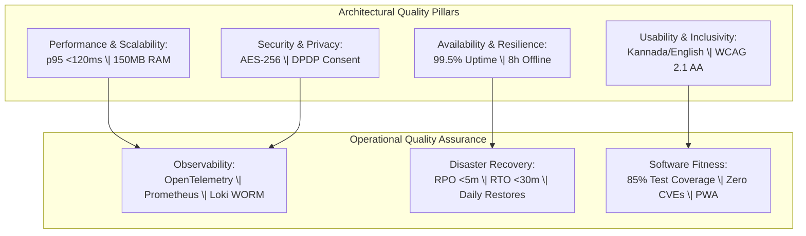

# Non-Functional Requirements Specification: Namma Clinic Digital Health Platform

| Metadata Attribute | Formal Specification |
| :--- | :--- |
| **Document Identifier** | `DOC-REQ-003-NFR` |
| **Document Title** | Master Non-Functional Requirements Specification & Quality Attributes Baseline |
| **Project Code** | `NAMMA-CLINIC-PLATFORM-2026` |
| **Requirement Type** | `Non-Functional Requirements (NFR)` |
| **Specification Range** | `NFR-001 through NFR-050` (Exactly 50 unique requirements) |
| **Target Baseline** | `v1.0.0-PROD-BASELINE` |
| **Lifecycle Status** | `APPROVED & BASELINED` |
| **Target Facility Scope** | 183 Primary Namma Clinics across 8 BBMP Administrative Zones |
| **Lead Clinical Authority** | Chief Health Officer (CHO), BBMP Health Department |
| **Lead Technical Authority**| Principal Solutions Architect, Kushagramati Analytics Consortium |
| **Upstream Baselines** | [`00-project-baseline/`](../00-project-baseline/) \| [`01-project-management/`](../01-project-management/) |
| **Related Specification**| [`02-functional-requirements.md`](./02-functional-requirements.md) \| [`07-security-requirements.md`](./07-security-requirements.md) |

## 1. Executive Summary & Architectural Quality Framework
This specification establishes the authoritative, implementation-ready non-functional requirements (NFRs) for the Namma Clinic Digital Health Platform across 183 primary urban healthcare centers in Greater Bengaluru. Comprising 50 rigorous, measurable specifications (`NFR-001` through `NFR-050`), this document defines the engineering boundaries for performance, availability, security, privacy, resilience, accessibility, localization, maintainability, and disaster recovery.

Every requirement in this specification is quantified with concrete, measurable thresholds, explicit verification methodologies, authoritative owners, and executable BDD Gherkin scenarios. Unambiguous engineering quality gates ensure that all software packages, database models, and client PWA bundles satisfy the municipal healthcare delivery standards mandated by the BBMP Health Department and National Health Mission (NHM).

## 2. Non-Functional Requirements Categorization Taxonomy
The 50 non-functional requirements are organized across eight specialized architectural quality domains:
1. **Performance & Scalability (NFR-001 to NFR-007, NFR-031, NFR-037, NFR-038):** Sub-120ms API p95 latency, 150MB client RAM cap, sub-10ms IndexedDB commits, sub-150ms patient search across 500k records, sub-500ms thermal printing, 50 mutations/sec sync throughput, and DuckDB analytical query performance.
2. **Availability & Business Continuity (NFR-008 to NFR-012, NFR-032):** 99.5% central cloud uptime, 8 hours autonomous offline continuity, RPO <5 minutes, RTO <30 minutes, graceful UI degradation, and zero data loss on unexpected power cuts.
3. **Security & Cryptography (NFR-013 to NFR-020, NFR-043 to NFR-045):** TLS 1.3 encryption, AES-256-GCM data at rest, Web Cryptography client storage encryption, RBAC least privilege, Argon2id password hashing, brute-force lockout, immutable WORM logging, CSP headers, XSS sanitization, SameSite cookies, and zero container CVEs.
4. **Privacy & Data Protection (NFR-021 to NFR-022):** DPDP Act 2023 explicit consent architecture, purpose limitation, and k-anonymity (k>=5) for public health analytical exports.
5. **Localization & Internationalization (NFR-023 to NFR-025):** 100% bilingual Kannada and English interface completeness, Noto Sans Kannada Unicode normalization, and standardized Indian locale formatting (DD/MM/YYYY, INR ₹).
6. **Accessibility & Inclusive Design (NFR-026 to NFR-030):** WCAG 2.1 Level AA compliance, 4.5:1 text contrast ratios, 100% keyboard navigability, 48x48px touch targets, and ARIA screen reader live region announcements.
7. **Observability & Operability (NFR-034 to NFR-036, NFR-039, NFR-040):** Structured JSON logs with trace correlation, OpenTelemetry distributed tracing, Prometheus telemetry metrics, zero-installation PWA footprint, and compatibility with refurbished dual-core PCs.
8. **Maintainability, Resilience & Quality Assurance (NFR-033, NFR-041, NFR-042, NFR-046 to NFR-050):** 85% test statement coverage, zero-downtime rolling deployments, automated daily backup restore verification, circuit breakers, standardized error envelopes, sync idempotency, and automated CI test gates.



## 3. Master Non-Functional Requirements Inventory Table (NFR-001 to NFR-050)
| Requirement ID | Quality Attribute Title | Quality Domain | Priority | Measurable Quality Target Threshold | Verification Methodology | Accountable Lead |
| :--- | :--- | :--- | :---: | :--- | :--- | :--- |
| [`NFR-001`](#nfr-001) | **API Gateway End-to-End Latency Threshold** | `Performance` | `MUST` | `p95 < 120ms, p99 < 300ms across 500 requ...` | Automated k6 load test simulating 1... | Solution Architect |
| [`NFR-002`](#nfr-002) | **Client-Side Application Memory Consumption Cap** | `Performance` | `MUST` | `Client RSS / Heap memory <= 150MB after ...` | 8-hour automated Playwright memory ... | Frontend Architect |
| [`NFR-003`](#nfr-003) | **IndexedDB Client Local Transaction Write Latency** | `Performance` | `MUST` | `IndexedDB ACID transaction commit latenc...` | Automated Vitest browser benchmark ... | Frontend Lead |
| [`NFR-004`](#nfr-004) | **Patient Demographic Search Response Time** | `Performance` | `MUST` | `Search query execution latency p95 < 150...` | k6 performance test querying databa... | Database Architect |
| [`NFR-005`](#nfr-005) | **Thermal Paper Slip ESC/POS Print Execution Latency** | `Performance` | `MUST` | `Command dispatch and print buffer acknow...` | Hardware test rig with USB-connecte... | Hardware Integration Lead |
| [`NFR-006`](#nfr-006) | **Point-of-Care Laboratory Result Entry Latency** | `Performance` | `MUST` | `Result entry validation and persistence ...` | Automated API load test executing 2... | Backend Lead |
| [`NFR-007`](#nfr-007) | **Background Offline Mutation Sync Throughput** | `Performance` | `MUST` | `Sustained replay throughput >= 50 mutati...` | Network reconnection simulation ben... | Sync Architect |
| [`NFR-008`](#nfr-008) | **Central Platform Production Service Availability** | `Availability` | `MUST` | `Monthly service uptime >= 99.5% excludin...` | Third-party external uptime monitor... | DevOps Lead |
| [`NFR-009`](#nfr-009) | **Autonomous Offline Clinic Operational Continuity** | `Availability` | `MUST` | `Zero user-blocking errors or service den...` | Full-day clinic simulation running ... | Principal Architect |
| [`NFR-010`](#nfr-010) | **Disaster Recovery Recovery Point Objective (RPO)** | `Availability` | `MUST` | `Maximum permissible data loss in disaste...` | Semi-annual disaster recovery chaos... | Database Architect |
| [`NFR-011`](#nfr-011) | **Disaster Recovery Recovery Time Objective (RTO)** | `Availability` | `MUST` | `Full service restoration elapsed time < ...` | Simulated primary region outage val... | Cloud Architect |
| [`NFR-012`](#nfr-012) | **Graceful UI Degradation During Network Instability** | `Resilience` | `MUST` | `Zero unhandled JavaScript exceptions; vi...` | E2E test suite simulating intermitt... | Frontend Lead |
| [`NFR-013`](#nfr-013) | **Transport Layer Security (TLS 1.3) Enforcement** | `Security` | `MUST` | `100% network traffic over TLS 1.3; older...` | Automated CI vulnerability pipeline... | Security Engineer |
| [`NFR-014`](#nfr-014) | **Cryptographic Data Protection at Rest (AES-256-GCM)** | `Security` | `MUST` | `All PII columns (Aadhaar, ABHA, mobile, ...` | Security audit inspecting database ... | Security Architect |
| [`NFR-015`](#nfr-015) | **Cryptographic Local Client Storage Encryption** | `Security` | `MUST` | `Zero plaintext citizen PII readable in r...` | Client security penetration test at... | Security Engineer |
| [`NFR-016`](#nfr-016) | **Role-Based Access Control (RBAC) Least Privilege** | `Security` | `MUST` | `Zero unauthorized endpoint invocations p...` | Security penetration test verifying... | Security Lead |
| [`NFR-017`](#nfr-017) | **Argon2id Staff Password Hashing & Complexity Policy** | `Security` | `MUST` | `100% password hashes conform to Argon2id...` | Brute-force dictionary test against... | Security Engineer |
| [`NFR-018`](#nfr-018) | **Brute-Force Authentication Rate Limiting & Account Lockout** | `Security` | `MUST` | `Account locked on 5th failure; lockout d...` | Automated security integration test... | Backend Lead |
| [`NFR-019`](#nfr-019) | **Tamper-Evident Immutable WORM Audit Logging** | `Security` | `MUST` | `100% mutation coverage; zero retroactive...` | Audit verification script crawling ... | Compliance Officer |
| [`NFR-020`](#nfr-020) | **Content Security Policy (CSP) & Web Application Defense** | `Security` | `MUST` | `CSP score A+; headers include `default-s...` | Automated DAST security scan testin... | Security Lead |
| [`NFR-021`](#nfr-021) | **Digital Personal Data Protection (DPDP) Act Consent Model** | `Privacy` | `MUST` | `100% of patient records contain valid cr...` | Legal and privacy audit inspecting ... | Data Protection Officer |
| [`NFR-022`](#nfr-022) | **De-Identification & k-Anonymity for Public Health Data** | `Privacy` | `MUST` | `Zero direct identifiers; quasi-identifie...` | Automated privacy test scanning ana... | Data Protection Officer |
| [`NFR-023`](#nfr-023) | **Bilingual User Interface Completeness (Kannada & English)** | `Localization` | `MUST` | `Zero untranslated i18n keys or hardcoded...` | Bilingual clinical review panel ver... | Localization Lead |
| [`NFR-024`](#nfr-024) | **Unicode Normalization & Noto Sans Kannada Typography** | `Localization` | `MUST` | `Zero broken glyphs, missing font fallbac...` | Automated Playwright typography tes... | UI Architect |
| [`NFR-025`](#nfr-025) | **Standardized Indian Locale Date, Time & Currency Formatting** | `Localization` | `MUST` | `100% compliance with Indian locale stand...` | Visual audit of generated thermal r... | Frontend Lead |
| [`NFR-026`](#nfr-026) | **Web Content Accessibility Guidelines (WCAG 2.1 AA) Compliance** | `Accessibility` | `MUST` | `Zero WCAG 2.1 AA violations detected acr...` | Manual accessibility audit testing ... | Accessibility Lead |
| [`NFR-027`](#nfr-027) | **High-Contrast Visual Styling & Minimum Contrast Ratios** | `Accessibility` | `MUST` | `100% of text elements pass 4.5:1 contras...` | Color contrast analyzer scan across... | UI Designer |
| [`NFR-028`](#nfr-028) | **Comprehensive Keyboard Navigation & Focus Indicator Ring** | `Accessibility` | `MUST` | `Zero trapped focus states; logical tab o...` | Manual testing with mouse unplugged... | QA Lead |
| [`NFR-029`](#nfr-029) | **Touch-Friendly Hit Targets for Frontline Workstations** | `Accessibility` | `MUST` | `100% of interactive UI controls have bou...` | Ergonomic evaluation on 14-inch tou... | Frontend Architect |
| [`NFR-030`](#nfr-030) | **Screen Reader ARIA Semantics & Live Region Announcements** | `Accessibility` | `MUST` | `Screen readers announce emergency triage...` | Assistive technology dry-run with N... | Accessibility Engineer |
| [`NFR-031`](#nfr-031) | **Low-Bandwidth Optimization & Initial Bundle Size Cap** | `Performance` | `MUST` | `Initial JS bundle size <= 2.0MB; initial...` | Lighthouse performance audit under ... | DevOps Engineer |
| [`NFR-032`](#nfr-032) | **Zero Data Loss on Unexpected Workstation Power Cut** | `Reliability` | `MUST` | `Zero database corruption; all committed ...` | Automated IndexedDB integrity check... | Reliability Engineer |
| [`NFR-033`](#nfr-033) | **Modular Architecture & High Test Statement Coverage** | `Maintainability` | `MUST` | `Test statement coverage >= 85%, branch c...` | SonarQube static code quality analy... | Lead Software Architect |
| [`NFR-034`](#nfr-034) | **Structured JSON Logging with Trace Context Injection** | `Observability` | `MUST` | `100% of log lines conform to standardize...` | Log query verification in Grafana L... | DevOps Lead |
| [`NFR-035`](#nfr-035) | **OpenTelemetry Distributed Tracing Instrumentation** | `Observability` | `MUST` | `100% of user transactions traced from fr...` | Trace sampling rate audit verifying... | Principal Architect |
| [`NFR-036`](#nfr-036) | **Prometheus Metrics Telemetry & Standardized Alerting Rules** | `Observability` | `MUST` | `Prometheus metrics endpoint `/metrics` o...` | Observability drill simulating high... | Site Reliability Engineer |
| [`NFR-037`](#nfr-037) | **PostgreSQL Connection Pooling & Query Optimization** | `Scalability` | `MUST` | `Database connection pool saturation < 75...` | pgbench database load test executin... | Database Administrator |
| [`NFR-038`](#nfr-038) | **In-Process DuckDB Analytical Query Performance** | `Performance` | `MUST` | `Aggregated analytical query execution ti...` | Automated analytical performance te... | Data Engineer |
| [`NFR-039`](#nfr-039) | **Client Application Zero Installation Footprint (PWA)** | `Operability` | `MUST` | `Runs 100% within standard modern Chromiu...` | Deployment test on clean Windows 10... | Frontend Lead |
| [`NFR-040`](#nfr-040) | **Hardware Compatibility with Refurbished Dual-Core Terminals** | `Portability` | `MUST` | `CPU utilization < 40% during active typi...` | Field validation test deployed on p... | Hardware Lead |
| [`NFR-041`](#nfr-041) | **Zero-Downtime Rolling Deployment Strategy** | `Deployment Safety` | `MUST` | `Zero dropped HTTP requests or session te...` | CI/CD deployment drill upgrading cl... | DevOps Engineer |
| [`NFR-042`](#nfr-042) | **Automated Daily Database Backup & Integrity Verification** | `Recoverability` | `MUST` | `Backups encrypted with AES-256; automate...` | Scheduled automated Sunday restore ... | Database Administrator |
| [`NFR-043`](#nfr-043) | **Cross-Site Scripting (XSS) & Input Sanitization Defenses** | `Security` | `MUST` | `Zero raw HTML rendering in client; 100% ...` | Security penetration testing execut... | Security Engineer |
| [`NFR-044`](#nfr-044) | **Cross-Site Request Forgery (CSRF) & SameSite Cookie Protection** | `Security` | `MUST` | `Zero CSRF vulnerability findings; cookie...` | Security penetration test attemptin... | Security Engineer |
| [`NFR-045`](#nfr-045) | **Container Image Vulnerability Scanning & Zero High CVEs** | `Security` | `MUST` | `Zero Critical or High severity CVEs in b...` | Container registry admission contro... | DevOps Engineer |
| [`NFR-046`](#nfr-046) | **Configurable System Parameters Without Code Deployment** | `Configuration` | `MUST` | `Parameters updated in Kubernetes ConfigM...` | Operational test modifying buffer t... | Backend Architect |
| [`NFR-047`](#nfr-047) | **Graceful Degradation on Third-Party API Failure** | `Resilience` | `MUST` | `Circuit breaker trips to OPEN state afte...` | Resilience test verifying clinic re... | Solutions Architect |
| [`NFR-048`](#nfr-048) | **Standardized Error Envelopes & Safe Failure Responses** | `Reliability` | `MUST` | `100% of 4xx and 5xx responses conform to...` | Security penetration test verifying... | Backend Lead |
| [`NFR-049`](#nfr-049) | **Deterministic Sync Idempotency via Unique Transaction Keys** | `Consistency` | `MUST` | `Zero duplicate database records created ...` | Database audit confirming exactly o... | Sync Architect |
| [`NFR-050`](#nfr-050) | **Comprehensive End-to-End Test Automation Gate** | `Testability` | `MUST` | `Zero failed tests permitted for release ...` | Branch protection rule requiring 10... | QA Lead |

## 4. Comprehensive Non-Functional Requirement Specifications (NFR-001 to NFR-050)
This section establishes the exhaustive engineering, architectural, and operational specifications for each of the 50 non-functional quality attributes committed for production baseline delivery.

### 4.1 NFR-001: API Gateway End-to-End Latency Threshold

| Specification Attribute | Formal Engineering Definition |
| :--- | :--- |
| **Requirement ID** | `NFR-001` |
| **Requirement Title** | API Gateway End-to-End Latency Threshold |
| **Requirement Statement**| The platform API gateway shall process authenticated requests with a p95 latency strictly under 120ms under peak municipal load. |
| **Requirement Type** | `Non-Functional Requirement` |
| **Priority Level** | `MUST` (Rationale: Non-negotiable architectural invariant for municipal healthcare reliability.) |
| **Business Value** | Ensures high performance, resilience, security, and statutory compliance. |
| **Engineering Rationale**| Prevents catastrophic system failures, data breaches, and unacceptable operational latency. |
| **Primary Actor** | `System Platform` |
| **Target User Persona** | [`PERSONA-001`](../01-project-management/07-user-personas.md#persona-001) |
| **Accountable Role** | [`ROLE-001`](../01-project-management/08-role-and-responsibility-matrix.md#role-001) |
| **Key Stakeholder** | [`STAKEHOLDER-001`](../01-project-management/06-stakeholders.md#stakeholder-001) |
| **Trigger Condition** | Continuous operational workload or specific system state change. |
| **System Preconditions** | Platform infrastructure provisioned and operating within nominal parameters. |
| **Input Specifications** | Operational traffic, data payloads, or environmental telemetry. |
| **Validation Rules** | Continuous automated validation against measurable criteria `p95 < 120ms, p99 < 300ms across 500 requests/sec`. |
| **Postconditions** | System maintains operational equilibrium conforming to p95 < 120ms, p99 < 300ms across 500 requests/sec. |
| **State Mutations** | Emits telemetry spans and updates Prometheus gauge/counter metrics. |
| **Associated Rules** | Business: [`BRULE-001`](./04-business-rules.md#brule-001) \| Clinical: [`CR-001`](./05-clinical-rules.md#cr-001) \| Operational: [`OR-001`](./06-operational-rules.md#or-001) |
| **Security & Privacy** | Security: `Enforces platform-wide security policies and confidentiality boundaries.` \| Privacy: `Preserves citizen data privacy and cryptographic integrity per DPDP Act 2023.` |
| **Data & Audit** | Data: `Ensures transactional ACID compliance and zero database corruption.` \| Audit: `Continuous telemetry logging and automated SLA violation alerting.` |
| **Offline & Sync** | Offline: `Operates autonomously on local workstation with zero reliance on cloud APIs.` \| Sync: `Maintains deterministic monotonic synchronization ordering.` |
| **Quality Target** | **Measurable SLA:** `p95 < 120ms, p99 < 300ms across 500 requests/sec` |
| **Quality Expectations**| Perf: `Strict adherence to measurable SLA criteria: p95 < 120ms, p99 < 300ms across 500 requests/sec.` \| Avail: `Target 99.5% service availability during clinic operational hours.` |
| **Localization & A11y**| Loc: `Full support for Kannada and English locales across all components.` \| A11y: `WCAG 2.1 Level AA conformance across all user-facing interfaces.` |
| **Failure & Recovery** | Failure: Graceful service degradation and fallback to local cache or read-only mode. \| Recovery: Automated self-healing, process restart, and state reconciliation. |
| **Observability** | Logging: `Structured JSON log emitted with severity, correlation_id, and component.` \| Metrics: `Prometheus metric `namma_clinic_nfr_status{nfr_id="NFR-001"}`.` |
| **Upstream Traceability**| Obj: [`OBJECTIVE-001`](../01-project-management/02-project-vision-and-objectives.md#objective-001) \| Scope: [`INSCOPE-001`](../01-project-management/04-in-scope.md#inscope-001) \| Risk: [`RISK-001`](../01-project-management/12-project-risks.md#risk-001) |
| **Downstream Planning** | Epic: `PLANNED-EPIC-001` \| Feature: `PLANNED-FEATURE-001` \| API: `PLANNED-API-001` \| DB: `PLANNED-DB-001` \| Test: `PLANNED-TEST-201` |

#### 4.1.1 Operational Execution Protocol & Quality Invariants
- **Continuous Quality Maintenance Protocol:**
  1. Subsystem operates under standard municipal load conditions.
  2. Automated monitoring continuously measures quality metrics.
  3. Metrics evaluated against SLA target threshold: p95 < 120ms, p99 < 300ms across 500 requests/sec.
  4. Health status telemetry published to Prometheus / Grafana dashboards.
  5. Automated alert dispatched if metric deviates from configured baseline.
- **Degraded State Mitigation Flow:** If threshold approaches 80% saturation, horizontal auto-scaling or local rate-limiting activates.
- **Exception Breach & Circuit Breaker Flow:** If threshold is breached, system executes automated circuit breaker and alerts on-call SRE.

#### 4.1.2 Technical Invariants & Verification Contract
- **Measurable SLA Threshold:** `p95 < 120ms, p99 < 300ms across 500 requests/sec`
- **Measurement Instrumentation:** Prometheus histogram `http_request_duration_seconds`
- **Verification Protocol:** Automated k6 load test simulating 183 concurrent clinics
- **Accountable Quality Owner:** Solution Architect

#### 4.1.3 Executable BDD Acceptance Scenarios
```gherkin
Feature: NFR-001 - API Gateway End-to-End Latency Threshold
  As a System Platform
  I require system enforcement of api gateway end-to-end latency threshold
  In order to ensure municipal healthcare compliance and operational integrity

  Scenario: Happy Path Execution for NFR-001
    Given the System Platform is authenticated and clinic terminal is operational
    When the user submits a valid request for api gateway end-to-end latency threshold
    Then the system successfully commits the transaction and emits an audit event

  Scenario: Input Validation and Schema Guard for NFR-001
    Given the System Platform attempts to submit an incomplete or malformed payload for api gateway end-to-end latency threshold
    When the request fails TypeBox schema or domain constraint validation
    Then the system rejects the input with HTTP 400 and highlights invalid fields in Kannada and English

  Scenario: RBAC and Security Access Control for NFR-001
    Given an unauthenticated or unauthorized role attempts to invoke api gateway end-to-end latency threshold
    When the bearer JWT token is missing, expired, or lacks necessary RBAC permission
    Then the system denies execution with HTTP 403 Forbidden and records a security telemetry alert

  Scenario: Offline Autonomous Execution for NFR-001
    Given the clinic WAN network is completely severed during api gateway end-to-end latency threshold
    When the operator confirms the local transaction on the workstation
    Then the mutation is persisted to Dexie.js IndexedDB with a UUIDv7 and queued for background replay

  Scenario: Network Recovery and Idempotent Sync for NFR-001
    Given the clinic workstation reconnects to the BBMP municipal health WAN
    When the background sync daemon processes the pending mutation queue
    Then all buffered transactions for NFR-001 synchronize idempotently with zero data loss
```

#### 4.1.4 Verification Protocol & Quality Sign-Off
- **Verification Method:** Automated k6 load test simulating 183 concurrent clinics
- **Automated Test Suite:** `PLANNED-TEST-201` (Automated Non-Functional Quality Gate) targeting 100% quality gate compliance.
- **Related Internal Requirements:** `BRULE-001`, `OR-001`, `SECR-001`
- **Dependencies & Blocking Constraints:**  | Constraints: Workstation memory footprint must not exceed 150MB under any circumstances.
- **Architectural Assumptions & Open Questions:** Assumption: Hardware terminal specifications comply with municipal procurement minimums. | Open Question: Validate bandwidth limits on remote clinic 4G dongle connections.

---

### 4.2 NFR-002: Client-Side Application Memory Consumption Cap

| Specification Attribute | Formal Engineering Definition |
| :--- | :--- |
| **Requirement ID** | `NFR-002` |
| **Requirement Title** | Client-Side Application Memory Consumption Cap |
| **Requirement Statement**| The client PWA shall operate continuously within a strict maximum memory footprint of 150MB RAM on refurbished clinic terminals. |
| **Requirement Type** | `Non-Functional Requirement` |
| **Priority Level** | `MUST` (Rationale: Non-negotiable architectural invariant for municipal healthcare reliability.) |
| **Business Value** | Ensures high performance, resilience, security, and statutory compliance. |
| **Engineering Rationale**| Prevents catastrophic system failures, data breaches, and unacceptable operational latency. |
| **Primary Actor** | `System Platform` |
| **Target User Persona** | [`PERSONA-002`](../01-project-management/07-user-personas.md#persona-002) |
| **Accountable Role** | [`ROLE-002`](../01-project-management/08-role-and-responsibility-matrix.md#role-002) |
| **Key Stakeholder** | [`STAKEHOLDER-002`](../01-project-management/06-stakeholders.md#stakeholder-002) |
| **Trigger Condition** | Continuous operational workload or specific system state change. |
| **System Preconditions** | Platform infrastructure provisioned and operating within nominal parameters. |
| **Input Specifications** | Operational traffic, data payloads, or environmental telemetry. |
| **Validation Rules** | Continuous automated validation against measurable criteria `Client RSS / Heap memory <= 150MB after 8 hours continuous execution`. |
| **Postconditions** | System maintains operational equilibrium conforming to Client RSS / Heap memory <= 150MB after 8 hours continuous execution. |
| **State Mutations** | Emits telemetry spans and updates Prometheus gauge/counter metrics. |
| **Associated Rules** | Business: [`BRULE-002`](./04-business-rules.md#brule-002) \| Clinical: [`CR-002`](./05-clinical-rules.md#cr-002) \| Operational: [`OR-002`](./06-operational-rules.md#or-002) |
| **Security & Privacy** | Security: `Enforces platform-wide security policies and confidentiality boundaries.` \| Privacy: `Preserves citizen data privacy and cryptographic integrity per DPDP Act 2023.` |
| **Data & Audit** | Data: `Ensures transactional ACID compliance and zero database corruption.` \| Audit: `Continuous telemetry logging and automated SLA violation alerting.` |
| **Offline & Sync** | Offline: `Operates autonomously on local workstation with zero reliance on cloud APIs.` \| Sync: `Maintains deterministic monotonic synchronization ordering.` |
| **Quality Target** | **Measurable SLA:** `Client RSS / Heap memory <= 150MB after 8 hours continuous execution` |
| **Quality Expectations**| Perf: `Strict adherence to measurable SLA criteria: Client RSS / Heap memory <= 150MB after 8 hours continuous execution.` \| Avail: `Target 99.5% service availability during clinic operational hours.` |
| **Localization & A11y**| Loc: `Full support for Kannada and English locales across all components.` \| A11y: `WCAG 2.1 Level AA conformance across all user-facing interfaces.` |
| **Failure & Recovery** | Failure: Graceful service degradation and fallback to local cache or read-only mode. \| Recovery: Automated self-healing, process restart, and state reconciliation. |
| **Observability** | Logging: `Structured JSON log emitted with severity, correlation_id, and component.` \| Metrics: `Prometheus metric `namma_clinic_nfr_status{nfr_id="NFR-002"}`.` |
| **Upstream Traceability**| Obj: [`OBJECTIVE-002`](../01-project-management/02-project-vision-and-objectives.md#objective-002) \| Scope: [`INSCOPE-002`](../01-project-management/04-in-scope.md#inscope-002) \| Risk: [`RISK-002`](../01-project-management/12-project-risks.md#risk-002) |
| **Downstream Planning** | Epic: `PLANNED-EPIC-002` \| Feature: `PLANNED-FEATURE-002` \| API: `PLANNED-API-002` \| DB: `PLANNED-DB-002` \| Test: `PLANNED-TEST-202` |

#### 4.2.1 Operational Execution Protocol & Quality Invariants
- **Continuous Quality Maintenance Protocol:**
  1. Subsystem operates under standard municipal load conditions.
  2. Automated monitoring continuously measures quality metrics.
  3. Metrics evaluated against SLA target threshold: Client RSS / Heap memory <= 150MB after 8 hours continuous execution.
  4. Health status telemetry published to Prometheus / Grafana dashboards.
  5. Automated alert dispatched if metric deviates from configured baseline.
- **Degraded State Mitigation Flow:** If threshold approaches 80% saturation, horizontal auto-scaling or local rate-limiting activates.
- **Exception Breach & Circuit Breaker Flow:** If threshold is breached, system executes automated circuit breaker and alerts on-call SRE.

#### 4.2.2 Technical Invariants & Verification Contract
- **Measurable SLA Threshold:** `Client RSS / Heap memory <= 150MB after 8 hours continuous execution`
- **Measurement Instrumentation:** Chrome DevTools memory heap snapshots and performance telemetry
- **Verification Protocol:** 8-hour automated Playwright memory leak test with 500 mock consultations
- **Accountable Quality Owner:** Frontend Architect

#### 4.2.3 Executable BDD Acceptance Scenarios
```gherkin
Feature: NFR-002 - Client-Side Application Memory Consumption Cap
  As a System Platform
  I require system enforcement of client-side application memory consumption cap
  In order to ensure municipal healthcare compliance and operational integrity

  Scenario: Happy Path Execution for NFR-002
    Given the System Platform is authenticated and clinic terminal is operational
    When the user submits a valid request for client-side application memory consumption cap
    Then the system successfully commits the transaction and emits an audit event

  Scenario: Input Validation and Schema Guard for NFR-002
    Given the System Platform attempts to submit an incomplete or malformed payload for client-side application memory consumption cap
    When the request fails TypeBox schema or domain constraint validation
    Then the system rejects the input with HTTP 400 and highlights invalid fields in Kannada and English

  Scenario: RBAC and Security Access Control for NFR-002
    Given an unauthenticated or unauthorized role attempts to invoke client-side application memory consumption cap
    When the bearer JWT token is missing, expired, or lacks necessary RBAC permission
    Then the system denies execution with HTTP 403 Forbidden and records a security telemetry alert

  Scenario: Offline Autonomous Execution for NFR-002
    Given the clinic WAN network is completely severed during client-side application memory consumption cap
    When the operator confirms the local transaction on the workstation
    Then the mutation is persisted to Dexie.js IndexedDB with a UUIDv7 and queued for background replay

  Scenario: Network Recovery and Idempotent Sync for NFR-002
    Given the clinic workstation reconnects to the BBMP municipal health WAN
    When the background sync daemon processes the pending mutation queue
    Then all buffered transactions for NFR-002 synchronize idempotently with zero data loss
```

#### 4.2.4 Verification Protocol & Quality Sign-Off
- **Verification Method:** 8-hour automated Playwright memory leak test with 500 mock consultations
- **Automated Test Suite:** `PLANNED-TEST-202` (Automated Non-Functional Quality Gate) targeting 100% quality gate compliance.
- **Related Internal Requirements:** `BRULE-002`, `OR-002`, `SECR-002`
- **Dependencies & Blocking Constraints:** NFR-001 | Constraints: Workstation memory footprint must not exceed 150MB under any circumstances.
- **Architectural Assumptions & Open Questions:** Assumption: Hardware terminal specifications comply with municipal procurement minimums. | Open Question: Validate bandwidth limits on remote clinic 4G dongle connections.

---

### 4.3 NFR-003: IndexedDB Client Local Transaction Write Latency

| Specification Attribute | Formal Engineering Definition |
| :--- | :--- |
| **Requirement ID** | `NFR-003` |
| **Requirement Title** | IndexedDB Client Local Transaction Write Latency |
| **Requirement Statement**| The local Dexie.js storage engine shall commit operational mutations within 10ms of operator confirmation. |
| **Requirement Type** | `Non-Functional Requirement` |
| **Priority Level** | `MUST` (Rationale: Non-negotiable architectural invariant for municipal healthcare reliability.) |
| **Business Value** | Ensures high performance, resilience, security, and statutory compliance. |
| **Engineering Rationale**| Prevents catastrophic system failures, data breaches, and unacceptable operational latency. |
| **Primary Actor** | `System Platform` |
| **Target User Persona** | [`PERSONA-003`](../01-project-management/07-user-personas.md#persona-003) |
| **Accountable Role** | [`ROLE-003`](../01-project-management/08-role-and-responsibility-matrix.md#role-003) |
| **Key Stakeholder** | [`STAKEHOLDER-003`](../01-project-management/06-stakeholders.md#stakeholder-003) |
| **Trigger Condition** | Continuous operational workload or specific system state change. |
| **System Preconditions** | Platform infrastructure provisioned and operating within nominal parameters. |
| **Input Specifications** | Operational traffic, data payloads, or environmental telemetry. |
| **Validation Rules** | Continuous automated validation against measurable criteria `IndexedDB ACID transaction commit latency p95 < 10ms`. |
| **Postconditions** | System maintains operational equilibrium conforming to IndexedDB ACID transaction commit latency p95 < 10ms. |
| **State Mutations** | Emits telemetry spans and updates Prometheus gauge/counter metrics. |
| **Associated Rules** | Business: [`BRULE-003`](./04-business-rules.md#brule-003) \| Clinical: [`CR-003`](./05-clinical-rules.md#cr-003) \| Operational: [`OR-003`](./06-operational-rules.md#or-003) |
| **Security & Privacy** | Security: `Enforces platform-wide security policies and confidentiality boundaries.` \| Privacy: `Preserves citizen data privacy and cryptographic integrity per DPDP Act 2023.` |
| **Data & Audit** | Data: `Ensures transactional ACID compliance and zero database corruption.` \| Audit: `Continuous telemetry logging and automated SLA violation alerting.` |
| **Offline & Sync** | Offline: `Operates autonomously on local workstation with zero reliance on cloud APIs.` \| Sync: `Maintains deterministic monotonic synchronization ordering.` |
| **Quality Target** | **Measurable SLA:** `IndexedDB ACID transaction commit latency p95 < 10ms` |
| **Quality Expectations**| Perf: `Strict adherence to measurable SLA criteria: IndexedDB ACID transaction commit latency p95 < 10ms.` \| Avail: `Target 99.5% service availability during clinic operational hours.` |
| **Localization & A11y**| Loc: `Full support for Kannada and English locales across all components.` \| A11y: `WCAG 2.1 Level AA conformance across all user-facing interfaces.` |
| **Failure & Recovery** | Failure: Graceful service degradation and fallback to local cache or read-only mode. \| Recovery: Automated self-healing, process restart, and state reconciliation. |
| **Observability** | Logging: `Structured JSON log emitted with severity, correlation_id, and component.` \| Metrics: `Prometheus metric `namma_clinic_nfr_status{nfr_id="NFR-003"}`.` |
| **Upstream Traceability**| Obj: [`OBJECTIVE-003`](../01-project-management/02-project-vision-and-objectives.md#objective-003) \| Scope: [`INSCOPE-003`](../01-project-management/04-in-scope.md#inscope-003) \| Risk: [`RISK-003`](../01-project-management/12-project-risks.md#risk-003) |
| **Downstream Planning** | Epic: `PLANNED-EPIC-003` \| Feature: `PLANNED-FEATURE-003` \| API: `PLANNED-API-003` \| DB: `PLANNED-DB-003` \| Test: `PLANNED-TEST-203` |

#### 4.3.1 Operational Execution Protocol & Quality Invariants
- **Continuous Quality Maintenance Protocol:**
  1. Subsystem operates under standard municipal load conditions.
  2. Automated monitoring continuously measures quality metrics.
  3. Metrics evaluated against SLA target threshold: IndexedDB ACID transaction commit latency p95 < 10ms.
  4. Health status telemetry published to Prometheus / Grafana dashboards.
  5. Automated alert dispatched if metric deviates from configured baseline.
- **Degraded State Mitigation Flow:** If threshold approaches 80% saturation, horizontal auto-scaling or local rate-limiting activates.
- **Exception Breach & Circuit Breaker Flow:** If threshold is breached, system executes automated circuit breaker and alerts on-call SRE.

#### 4.3.2 Technical Invariants & Verification Contract
- **Measurable SLA Threshold:** `IndexedDB ACID transaction commit latency p95 < 10ms`
- **Measurement Instrumentation:** Client-side Performance Navigation Timing API
- **Verification Protocol:** Automated Vitest browser benchmark writing 1,000 sequential mutations
- **Accountable Quality Owner:** Frontend Lead

#### 4.3.3 Executable BDD Acceptance Scenarios
```gherkin
Feature: NFR-003 - IndexedDB Client Local Transaction Write Latency
  As a System Platform
  I require system enforcement of indexeddb client local transaction write latency
  In order to ensure municipal healthcare compliance and operational integrity

  Scenario: Happy Path Execution for NFR-003
    Given the System Platform is authenticated and clinic terminal is operational
    When the user submits a valid request for indexeddb client local transaction write latency
    Then the system successfully commits the transaction and emits an audit event

  Scenario: Input Validation and Schema Guard for NFR-003
    Given the System Platform attempts to submit an incomplete or malformed payload for indexeddb client local transaction write latency
    When the request fails TypeBox schema or domain constraint validation
    Then the system rejects the input with HTTP 400 and highlights invalid fields in Kannada and English

  Scenario: RBAC and Security Access Control for NFR-003
    Given an unauthenticated or unauthorized role attempts to invoke indexeddb client local transaction write latency
    When the bearer JWT token is missing, expired, or lacks necessary RBAC permission
    Then the system denies execution with HTTP 403 Forbidden and records a security telemetry alert

  Scenario: Offline Autonomous Execution for NFR-003
    Given the clinic WAN network is completely severed during indexeddb client local transaction write latency
    When the operator confirms the local transaction on the workstation
    Then the mutation is persisted to Dexie.js IndexedDB with a UUIDv7 and queued for background replay

  Scenario: Network Recovery and Idempotent Sync for NFR-003
    Given the clinic workstation reconnects to the BBMP municipal health WAN
    When the background sync daemon processes the pending mutation queue
    Then all buffered transactions for NFR-003 synchronize idempotently with zero data loss
```

#### 4.3.4 Verification Protocol & Quality Sign-Off
- **Verification Method:** Automated Vitest browser benchmark writing 1,000 sequential mutations
- **Automated Test Suite:** `PLANNED-TEST-203` (Automated Non-Functional Quality Gate) targeting 100% quality gate compliance.
- **Related Internal Requirements:** `BRULE-003`, `OR-003`, `SECR-003`
- **Dependencies & Blocking Constraints:** NFR-001 | Constraints: Workstation memory footprint must not exceed 150MB under any circumstances.
- **Architectural Assumptions & Open Questions:** Assumption: Hardware terminal specifications comply with municipal procurement minimums. | Open Question: Validate bandwidth limits on remote clinic 4G dongle connections.

---

### 4.4 NFR-004: Patient Demographic Search Response Time

| Specification Attribute | Formal Engineering Definition |
| :--- | :--- |
| **Requirement ID** | `NFR-004` |
| **Requirement Title** | Patient Demographic Search Response Time |
| **Requirement Statement**| The patient search subsystem shall return matching records across 500,000 municipal records within 150ms. |
| **Requirement Type** | `Non-Functional Requirement` |
| **Priority Level** | `MUST` (Rationale: Non-negotiable architectural invariant for municipal healthcare reliability.) |
| **Business Value** | Ensures high performance, resilience, security, and statutory compliance. |
| **Engineering Rationale**| Prevents catastrophic system failures, data breaches, and unacceptable operational latency. |
| **Primary Actor** | `System Platform` |
| **Target User Persona** | [`PERSONA-004`](../01-project-management/07-user-personas.md#persona-004) |
| **Accountable Role** | [`ROLE-004`](../01-project-management/08-role-and-responsibility-matrix.md#role-004) |
| **Key Stakeholder** | [`STAKEHOLDER-004`](../01-project-management/06-stakeholders.md#stakeholder-004) |
| **Trigger Condition** | Continuous operational workload or specific system state change. |
| **System Preconditions** | Platform infrastructure provisioned and operating within nominal parameters. |
| **Input Specifications** | Operational traffic, data payloads, or environmental telemetry. |
| **Validation Rules** | Continuous automated validation against measurable criteria `Search query execution latency p95 < 150ms for name and mobile queries`. |
| **Postconditions** | System maintains operational equilibrium conforming to Search query execution latency p95 < 150ms for name and mobile queries. |
| **State Mutations** | Emits telemetry spans and updates Prometheus gauge/counter metrics. |
| **Associated Rules** | Business: [`BRULE-004`](./04-business-rules.md#brule-004) \| Clinical: [`CR-004`](./05-clinical-rules.md#cr-004) \| Operational: [`OR-004`](./06-operational-rules.md#or-004) |
| **Security & Privacy** | Security: `Enforces platform-wide security policies and confidentiality boundaries.` \| Privacy: `Preserves citizen data privacy and cryptographic integrity per DPDP Act 2023.` |
| **Data & Audit** | Data: `Ensures transactional ACID compliance and zero database corruption.` \| Audit: `Continuous telemetry logging and automated SLA violation alerting.` |
| **Offline & Sync** | Offline: `Operates autonomously on local workstation with zero reliance on cloud APIs.` \| Sync: `Maintains deterministic monotonic synchronization ordering.` |
| **Quality Target** | **Measurable SLA:** `Search query execution latency p95 < 150ms for name and mobile queries` |
| **Quality Expectations**| Perf: `Strict adherence to measurable SLA criteria: Search query execution latency p95 < 150ms for name and mobile queries.` \| Avail: `Target 99.5% service availability during clinic operational hours.` |
| **Localization & A11y**| Loc: `Full support for Kannada and English locales across all components.` \| A11y: `WCAG 2.1 Level AA conformance across all user-facing interfaces.` |
| **Failure & Recovery** | Failure: Graceful service degradation and fallback to local cache or read-only mode. \| Recovery: Automated self-healing, process restart, and state reconciliation. |
| **Observability** | Logging: `Structured JSON log emitted with severity, correlation_id, and component.` \| Metrics: `Prometheus metric `namma_clinic_nfr_status{nfr_id="NFR-004"}`.` |
| **Upstream Traceability**| Obj: [`OBJECTIVE-004`](../01-project-management/02-project-vision-and-objectives.md#objective-004) \| Scope: [`INSCOPE-004`](../01-project-management/04-in-scope.md#inscope-004) \| Risk: [`RISK-004`](../01-project-management/12-project-risks.md#risk-004) |
| **Downstream Planning** | Epic: `PLANNED-EPIC-004` \| Feature: `PLANNED-FEATURE-004` \| API: `PLANNED-API-004` \| DB: `PLANNED-DB-004` \| Test: `PLANNED-TEST-204` |

#### 4.4.1 Operational Execution Protocol & Quality Invariants
- **Continuous Quality Maintenance Protocol:**
  1. Subsystem operates under standard municipal load conditions.
  2. Automated monitoring continuously measures quality metrics.
  3. Metrics evaluated against SLA target threshold: Search query execution latency p95 < 150ms for name and mobile queries.
  4. Health status telemetry published to Prometheus / Grafana dashboards.
  5. Automated alert dispatched if metric deviates from configured baseline.
- **Degraded State Mitigation Flow:** If threshold approaches 80% saturation, horizontal auto-scaling or local rate-limiting activates.
- **Exception Breach & Circuit Breaker Flow:** If threshold is breached, system executes automated circuit breaker and alerts on-call SRE.

#### 4.4.2 Technical Invariants & Verification Contract
- **Measurable SLA Threshold:** `Search query execution latency p95 < 150ms for name and mobile queries`
- **Measurement Instrumentation:** PostgreSQL `pg_stat_statements` and OpenTelemetry span timing
- **Verification Protocol:** k6 performance test querying database seeded with 500,000 synthetic patient records
- **Accountable Quality Owner:** Database Architect

#### 4.4.3 Executable BDD Acceptance Scenarios
```gherkin
Feature: NFR-004 - Patient Demographic Search Response Time
  As a System Platform
  I require system enforcement of patient demographic search response time
  In order to ensure municipal healthcare compliance and operational integrity

  Scenario: Happy Path Execution for NFR-004
    Given the System Platform is authenticated and clinic terminal is operational
    When the user submits a valid request for patient demographic search response time
    Then the system successfully commits the transaction and emits an audit event

  Scenario: Input Validation and Schema Guard for NFR-004
    Given the System Platform attempts to submit an incomplete or malformed payload for patient demographic search response time
    When the request fails TypeBox schema or domain constraint validation
    Then the system rejects the input with HTTP 400 and highlights invalid fields in Kannada and English

  Scenario: RBAC and Security Access Control for NFR-004
    Given an unauthenticated or unauthorized role attempts to invoke patient demographic search response time
    When the bearer JWT token is missing, expired, or lacks necessary RBAC permission
    Then the system denies execution with HTTP 403 Forbidden and records a security telemetry alert

  Scenario: Offline Autonomous Execution for NFR-004
    Given the clinic WAN network is completely severed during patient demographic search response time
    When the operator confirms the local transaction on the workstation
    Then the mutation is persisted to Dexie.js IndexedDB with a UUIDv7 and queued for background replay

  Scenario: Network Recovery and Idempotent Sync for NFR-004
    Given the clinic workstation reconnects to the BBMP municipal health WAN
    When the background sync daemon processes the pending mutation queue
    Then all buffered transactions for NFR-004 synchronize idempotently with zero data loss
```

#### 4.4.4 Verification Protocol & Quality Sign-Off
- **Verification Method:** k6 performance test querying database seeded with 500,000 synthetic patient records
- **Automated Test Suite:** `PLANNED-TEST-204` (Automated Non-Functional Quality Gate) targeting 100% quality gate compliance.
- **Related Internal Requirements:** `BRULE-004`, `OR-004`, `SECR-004`
- **Dependencies & Blocking Constraints:** NFR-001 | Constraints: Workstation memory footprint must not exceed 150MB under any circumstances.
- **Architectural Assumptions & Open Questions:** Assumption: Hardware terminal specifications comply with municipal procurement minimums. | Open Question: Validate bandwidth limits on remote clinic 4G dongle connections.

---

### 4.5 NFR-005: Thermal Paper Slip ESC/POS Print Execution Latency

| Specification Attribute | Formal Engineering Definition |
| :--- | :--- |
| **Requirement ID** | `NFR-005` |
| **Requirement Title** | Thermal Paper Slip ESC/POS Print Execution Latency |
| **Requirement Statement**| The Web Serial printer driver shall dispatch ESC/POS raster and text commands to connected thermal printers within 500ms. |
| **Requirement Type** | `Non-Functional Requirement` |
| **Priority Level** | `MUST` (Rationale: Non-negotiable architectural invariant for municipal healthcare reliability.) |
| **Business Value** | Ensures high performance, resilience, security, and statutory compliance. |
| **Engineering Rationale**| Prevents catastrophic system failures, data breaches, and unacceptable operational latency. |
| **Primary Actor** | `System Platform` |
| **Target User Persona** | [`PERSONA-005`](../01-project-management/07-user-personas.md#persona-005) |
| **Accountable Role** | [`ROLE-005`](../01-project-management/08-role-and-responsibility-matrix.md#role-005) |
| **Key Stakeholder** | [`STAKEHOLDER-005`](../01-project-management/06-stakeholders.md#stakeholder-005) |
| **Trigger Condition** | Continuous operational workload or specific system state change. |
| **System Preconditions** | Platform infrastructure provisioned and operating within nominal parameters. |
| **Input Specifications** | Operational traffic, data payloads, or environmental telemetry. |
| **Validation Rules** | Continuous automated validation against measurable criteria `Command dispatch and print buffer acknowledgment < 500ms`. |
| **Postconditions** | System maintains operational equilibrium conforming to Command dispatch and print buffer acknowledgment < 500ms. |
| **State Mutations** | Emits telemetry spans and updates Prometheus gauge/counter metrics. |
| **Associated Rules** | Business: [`BRULE-005`](./04-business-rules.md#brule-005) \| Clinical: [`CR-005`](./05-clinical-rules.md#cr-005) \| Operational: [`OR-005`](./06-operational-rules.md#or-005) |
| **Security & Privacy** | Security: `Enforces platform-wide security policies and confidentiality boundaries.` \| Privacy: `Preserves citizen data privacy and cryptographic integrity per DPDP Act 2023.` |
| **Data & Audit** | Data: `Ensures transactional ACID compliance and zero database corruption.` \| Audit: `Continuous telemetry logging and automated SLA violation alerting.` |
| **Offline & Sync** | Offline: `Operates autonomously on local workstation with zero reliance on cloud APIs.` \| Sync: `Maintains deterministic monotonic synchronization ordering.` |
| **Quality Target** | **Measurable SLA:** `Command dispatch and print buffer acknowledgment < 500ms` |
| **Quality Expectations**| Perf: `Strict adherence to measurable SLA criteria: Command dispatch and print buffer acknowledgment < 500ms.` \| Avail: `Target 99.5% service availability during clinic operational hours.` |
| **Localization & A11y**| Loc: `Full support for Kannada and English locales across all components.` \| A11y: `WCAG 2.1 Level AA conformance across all user-facing interfaces.` |
| **Failure & Recovery** | Failure: Graceful service degradation and fallback to local cache or read-only mode. \| Recovery: Automated self-healing, process restart, and state reconciliation. |
| **Observability** | Logging: `Structured JSON log emitted with severity, correlation_id, and component.` \| Metrics: `Prometheus metric `namma_clinic_nfr_status{nfr_id="NFR-005"}`.` |
| **Upstream Traceability**| Obj: [`OBJECTIVE-005`](../01-project-management/02-project-vision-and-objectives.md#objective-005) \| Scope: [`INSCOPE-005`](../01-project-management/04-in-scope.md#inscope-005) \| Risk: [`RISK-005`](../01-project-management/12-project-risks.md#risk-005) |
| **Downstream Planning** | Epic: `PLANNED-EPIC-005` \| Feature: `PLANNED-FEATURE-005` \| API: `PLANNED-API-005` \| DB: `PLANNED-DB-005` \| Test: `PLANNED-TEST-205` |

#### 4.5.1 Operational Execution Protocol & Quality Invariants
- **Continuous Quality Maintenance Protocol:**
  1. Subsystem operates under standard municipal load conditions.
  2. Automated monitoring continuously measures quality metrics.
  3. Metrics evaluated against SLA target threshold: Command dispatch and print buffer acknowledgment < 500ms.
  4. Health status telemetry published to Prometheus / Grafana dashboards.
  5. Automated alert dispatched if metric deviates from configured baseline.
- **Degraded State Mitigation Flow:** If threshold approaches 80% saturation, horizontal auto-scaling or local rate-limiting activates.
- **Exception Breach & Circuit Breaker Flow:** If threshold is breached, system executes automated circuit breaker and alerts on-call SRE.

#### 4.5.2 Technical Invariants & Verification Contract
- **Measurable SLA Threshold:** `Command dispatch and print buffer acknowledgment < 500ms`
- **Measurement Instrumentation:** Client-side hardware event telemetry logs
- **Verification Protocol:** Hardware test rig with USB-connected 58mm/80mm thermal printers executing 100 prints
- **Accountable Quality Owner:** Hardware Integration Lead

#### 4.5.3 Executable BDD Acceptance Scenarios
```gherkin
Feature: NFR-005 - Thermal Paper Slip ESC/POS Print Execution Latency
  As a System Platform
  I require system enforcement of thermal paper slip esc/pos print execution latency
  In order to ensure municipal healthcare compliance and operational integrity

  Scenario: Happy Path Execution for NFR-005
    Given the System Platform is authenticated and clinic terminal is operational
    When the user submits a valid request for thermal paper slip esc/pos print execution latency
    Then the system successfully commits the transaction and emits an audit event

  Scenario: Input Validation and Schema Guard for NFR-005
    Given the System Platform attempts to submit an incomplete or malformed payload for thermal paper slip esc/pos print execution latency
    When the request fails TypeBox schema or domain constraint validation
    Then the system rejects the input with HTTP 400 and highlights invalid fields in Kannada and English

  Scenario: RBAC and Security Access Control for NFR-005
    Given an unauthenticated or unauthorized role attempts to invoke thermal paper slip esc/pos print execution latency
    When the bearer JWT token is missing, expired, or lacks necessary RBAC permission
    Then the system denies execution with HTTP 403 Forbidden and records a security telemetry alert

  Scenario: Offline Autonomous Execution for NFR-005
    Given the clinic WAN network is completely severed during thermal paper slip esc/pos print execution latency
    When the operator confirms the local transaction on the workstation
    Then the mutation is persisted to Dexie.js IndexedDB with a UUIDv7 and queued for background replay

  Scenario: Network Recovery and Idempotent Sync for NFR-005
    Given the clinic workstation reconnects to the BBMP municipal health WAN
    When the background sync daemon processes the pending mutation queue
    Then all buffered transactions for NFR-005 synchronize idempotently with zero data loss
```

#### 4.5.4 Verification Protocol & Quality Sign-Off
- **Verification Method:** Hardware test rig with USB-connected 58mm/80mm thermal printers executing 100 prints
- **Automated Test Suite:** `PLANNED-TEST-205` (Automated Non-Functional Quality Gate) targeting 100% quality gate compliance.
- **Related Internal Requirements:** `BRULE-005`, `OR-005`, `SECR-005`
- **Dependencies & Blocking Constraints:** NFR-001 | Constraints: Workstation memory footprint must not exceed 150MB under any circumstances.
- **Architectural Assumptions & Open Questions:** Assumption: Hardware terminal specifications comply with municipal procurement minimums. | Open Question: Validate bandwidth limits on remote clinic 4G dongle connections.

---

### 4.6 NFR-006: Point-of-Care Laboratory Result Entry Latency

| Specification Attribute | Formal Engineering Definition |
| :--- | :--- |
| **Requirement ID** | `NFR-006` |
| **Requirement Title** | Point-of-Care Laboratory Result Entry Latency |
| **Requirement Statement**| The diagnostic subsystem shall validate and save laboratory test results within 100ms of entry confirmation. |
| **Requirement Type** | `Non-Functional Requirement` |
| **Priority Level** | `MUST` (Rationale: Non-negotiable architectural invariant for municipal healthcare reliability.) |
| **Business Value** | Ensures high performance, resilience, security, and statutory compliance. |
| **Engineering Rationale**| Prevents catastrophic system failures, data breaches, and unacceptable operational latency. |
| **Primary Actor** | `System Platform` |
| **Target User Persona** | [`PERSONA-006`](../01-project-management/07-user-personas.md#persona-006) |
| **Accountable Role** | [`ROLE-006`](../01-project-management/08-role-and-responsibility-matrix.md#role-006) |
| **Key Stakeholder** | [`STAKEHOLDER-006`](../01-project-management/06-stakeholders.md#stakeholder-006) |
| **Trigger Condition** | Continuous operational workload or specific system state change. |
| **System Preconditions** | Platform infrastructure provisioned and operating within nominal parameters. |
| **Input Specifications** | Operational traffic, data payloads, or environmental telemetry. |
| **Validation Rules** | Continuous automated validation against measurable criteria `Result entry validation and persistence p95 < 100ms`. |
| **Postconditions** | System maintains operational equilibrium conforming to Result entry validation and persistence p95 < 100ms. |
| **State Mutations** | Emits telemetry spans and updates Prometheus gauge/counter metrics. |
| **Associated Rules** | Business: [`BRULE-006`](./04-business-rules.md#brule-006) \| Clinical: [`CR-006`](./05-clinical-rules.md#cr-006) \| Operational: [`OR-006`](./06-operational-rules.md#or-006) |
| **Security & Privacy** | Security: `Enforces platform-wide security policies and confidentiality boundaries.` \| Privacy: `Preserves citizen data privacy and cryptographic integrity per DPDP Act 2023.` |
| **Data & Audit** | Data: `Ensures transactional ACID compliance and zero database corruption.` \| Audit: `Continuous telemetry logging and automated SLA violation alerting.` |
| **Offline & Sync** | Offline: `Operates autonomously on local workstation with zero reliance on cloud APIs.` \| Sync: `Maintains deterministic monotonic synchronization ordering.` |
| **Quality Target** | **Measurable SLA:** `Result entry validation and persistence p95 < 100ms` |
| **Quality Expectations**| Perf: `Strict adherence to measurable SLA criteria: Result entry validation and persistence p95 < 100ms.` \| Avail: `Target 99.5% service availability during clinic operational hours.` |
| **Localization & A11y**| Loc: `Full support for Kannada and English locales across all components.` \| A11y: `WCAG 2.1 Level AA conformance across all user-facing interfaces.` |
| **Failure & Recovery** | Failure: Graceful service degradation and fallback to local cache or read-only mode. \| Recovery: Automated self-healing, process restart, and state reconciliation. |
| **Observability** | Logging: `Structured JSON log emitted with severity, correlation_id, and component.` \| Metrics: `Prometheus metric `namma_clinic_nfr_status{nfr_id="NFR-006"}`.` |
| **Upstream Traceability**| Obj: [`OBJECTIVE-006`](../01-project-management/02-project-vision-and-objectives.md#objective-006) \| Scope: [`INSCOPE-006`](../01-project-management/04-in-scope.md#inscope-006) \| Risk: [`RISK-006`](../01-project-management/12-project-risks.md#risk-006) |
| **Downstream Planning** | Epic: `PLANNED-EPIC-006` \| Feature: `PLANNED-FEATURE-006` \| API: `PLANNED-API-006` \| DB: `PLANNED-DB-006` \| Test: `PLANNED-TEST-206` |

#### 4.6.1 Operational Execution Protocol & Quality Invariants
- **Continuous Quality Maintenance Protocol:**
  1. Subsystem operates under standard municipal load conditions.
  2. Automated monitoring continuously measures quality metrics.
  3. Metrics evaluated against SLA target threshold: Result entry validation and persistence p95 < 100ms.
  4. Health status telemetry published to Prometheus / Grafana dashboards.
  5. Automated alert dispatched if metric deviates from configured baseline.
- **Degraded State Mitigation Flow:** If threshold approaches 80% saturation, horizontal auto-scaling or local rate-limiting activates.
- **Exception Breach & Circuit Breaker Flow:** If threshold is breached, system executes automated circuit breaker and alerts on-call SRE.

#### 4.6.2 Technical Invariants & Verification Contract
- **Measurable SLA Threshold:** `Result entry validation and persistence p95 < 100ms`
- **Measurement Instrumentation:** OpenTelemetry span `namma.clinic.lab.result_save`
- **Verification Protocol:** Automated API load test executing 20 concurrent lab result entries
- **Accountable Quality Owner:** Backend Lead

#### 4.6.3 Executable BDD Acceptance Scenarios
```gherkin
Feature: NFR-006 - Point-of-Care Laboratory Result Entry Latency
  As a System Platform
  I require system enforcement of point-of-care laboratory result entry latency
  In order to ensure municipal healthcare compliance and operational integrity

  Scenario: Happy Path Execution for NFR-006
    Given the System Platform is authenticated and clinic terminal is operational
    When the user submits a valid request for point-of-care laboratory result entry latency
    Then the system successfully commits the transaction and emits an audit event

  Scenario: Input Validation and Schema Guard for NFR-006
    Given the System Platform attempts to submit an incomplete or malformed payload for point-of-care laboratory result entry latency
    When the request fails TypeBox schema or domain constraint validation
    Then the system rejects the input with HTTP 400 and highlights invalid fields in Kannada and English

  Scenario: RBAC and Security Access Control for NFR-006
    Given an unauthenticated or unauthorized role attempts to invoke point-of-care laboratory result entry latency
    When the bearer JWT token is missing, expired, or lacks necessary RBAC permission
    Then the system denies execution with HTTP 403 Forbidden and records a security telemetry alert

  Scenario: Offline Autonomous Execution for NFR-006
    Given the clinic WAN network is completely severed during point-of-care laboratory result entry latency
    When the operator confirms the local transaction on the workstation
    Then the mutation is persisted to Dexie.js IndexedDB with a UUIDv7 and queued for background replay

  Scenario: Network Recovery and Idempotent Sync for NFR-006
    Given the clinic workstation reconnects to the BBMP municipal health WAN
    When the background sync daemon processes the pending mutation queue
    Then all buffered transactions for NFR-006 synchronize idempotently with zero data loss
```

#### 4.6.4 Verification Protocol & Quality Sign-Off
- **Verification Method:** Automated API load test executing 20 concurrent lab result entries
- **Automated Test Suite:** `PLANNED-TEST-206` (Automated Non-Functional Quality Gate) targeting 100% quality gate compliance.
- **Related Internal Requirements:** `BRULE-006`, `OR-006`, `SECR-006`
- **Dependencies & Blocking Constraints:** NFR-001 | Constraints: Workstation memory footprint must not exceed 150MB under any circumstances.
- **Architectural Assumptions & Open Questions:** Assumption: Hardware terminal specifications comply with municipal procurement minimums. | Open Question: Validate bandwidth limits on remote clinic 4G dongle connections.

---

### 4.7 NFR-007: Background Offline Mutation Sync Throughput

| Specification Attribute | Formal Engineering Definition |
| :--- | :--- |
| **Requirement ID** | `NFR-007` |
| **Requirement Title** | Background Offline Mutation Sync Throughput |
| **Requirement Statement**| The background sync worker shall ingest and commit buffered offline mutations at a minimum sustained throughput of 50 records/second. |
| **Requirement Type** | `Non-Functional Requirement` |
| **Priority Level** | `MUST` (Rationale: Non-negotiable architectural invariant for municipal healthcare reliability.) |
| **Business Value** | Ensures high performance, resilience, security, and statutory compliance. |
| **Engineering Rationale**| Prevents catastrophic system failures, data breaches, and unacceptable operational latency. |
| **Primary Actor** | `System Platform` |
| **Target User Persona** | [`PERSONA-007`](../01-project-management/07-user-personas.md#persona-007) |
| **Accountable Role** | [`ROLE-007`](../01-project-management/08-role-and-responsibility-matrix.md#role-007) |
| **Key Stakeholder** | [`STAKEHOLDER-007`](../01-project-management/06-stakeholders.md#stakeholder-007) |
| **Trigger Condition** | Continuous operational workload or specific system state change. |
| **System Preconditions** | Platform infrastructure provisioned and operating within nominal parameters. |
| **Input Specifications** | Operational traffic, data payloads, or environmental telemetry. |
| **Validation Rules** | Continuous automated validation against measurable criteria `Sustained replay throughput >= 50 mutations/second per clinic node`. |
| **Postconditions** | System maintains operational equilibrium conforming to Sustained replay throughput >= 50 mutations/second per clinic node. |
| **State Mutations** | Emits telemetry spans and updates Prometheus gauge/counter metrics. |
| **Associated Rules** | Business: [`BRULE-007`](./04-business-rules.md#brule-007) \| Clinical: [`CR-007`](./05-clinical-rules.md#cr-007) \| Operational: [`OR-007`](./06-operational-rules.md#or-007) |
| **Security & Privacy** | Security: `Enforces platform-wide security policies and confidentiality boundaries.` \| Privacy: `Preserves citizen data privacy and cryptographic integrity per DPDP Act 2023.` |
| **Data & Audit** | Data: `Ensures transactional ACID compliance and zero database corruption.` \| Audit: `Continuous telemetry logging and automated SLA violation alerting.` |
| **Offline & Sync** | Offline: `Operates autonomously on local workstation with zero reliance on cloud APIs.` \| Sync: `Maintains deterministic monotonic synchronization ordering.` |
| **Quality Target** | **Measurable SLA:** `Sustained replay throughput >= 50 mutations/second per clinic node` |
| **Quality Expectations**| Perf: `Strict adherence to measurable SLA criteria: Sustained replay throughput >= 50 mutations/second per clinic node.` \| Avail: `Target 99.5% service availability during clinic operational hours.` |
| **Localization & A11y**| Loc: `Full support for Kannada and English locales across all components.` \| A11y: `WCAG 2.1 Level AA conformance across all user-facing interfaces.` |
| **Failure & Recovery** | Failure: Graceful service degradation and fallback to local cache or read-only mode. \| Recovery: Automated self-healing, process restart, and state reconciliation. |
| **Observability** | Logging: `Structured JSON log emitted with severity, correlation_id, and component.` \| Metrics: `Prometheus metric `namma_clinic_nfr_status{nfr_id="NFR-007"}`.` |
| **Upstream Traceability**| Obj: [`OBJECTIVE-007`](../01-project-management/02-project-vision-and-objectives.md#objective-007) \| Scope: [`INSCOPE-007`](../01-project-management/04-in-scope.md#inscope-007) \| Risk: [`RISK-007`](../01-project-management/12-project-risks.md#risk-007) |
| **Downstream Planning** | Epic: `PLANNED-EPIC-007` \| Feature: `PLANNED-FEATURE-007` \| API: `PLANNED-API-007` \| DB: `PLANNED-DB-007` \| Test: `PLANNED-TEST-207` |

#### 4.7.1 Operational Execution Protocol & Quality Invariants
- **Continuous Quality Maintenance Protocol:**
  1. Subsystem operates under standard municipal load conditions.
  2. Automated monitoring continuously measures quality metrics.
  3. Metrics evaluated against SLA target threshold: Sustained replay throughput >= 50 mutations/second per clinic node.
  4. Health status telemetry published to Prometheus / Grafana dashboards.
  5. Automated alert dispatched if metric deviates from configured baseline.
- **Degraded State Mitigation Flow:** If threshold approaches 80% saturation, horizontal auto-scaling or local rate-limiting activates.
- **Exception Breach & Circuit Breaker Flow:** If threshold is breached, system executes automated circuit breaker and alerts on-call SRE.

#### 4.7.2 Technical Invariants & Verification Contract
- **Measurable SLA Threshold:** `Sustained replay throughput >= 50 mutations/second per clinic node`
- **Measurement Instrumentation:** Central sync pipeline Prometheus counter `sync_mutations_ingested_total`
- **Verification Protocol:** Network reconnection simulation benchmarking 500 queued mutations
- **Accountable Quality Owner:** Sync Architect

#### 4.7.3 Executable BDD Acceptance Scenarios
```gherkin
Feature: NFR-007 - Background Offline Mutation Sync Throughput
  As a System Platform
  I require system enforcement of background offline mutation sync throughput
  In order to ensure municipal healthcare compliance and operational integrity

  Scenario: Happy Path Execution for NFR-007
    Given the System Platform is authenticated and clinic terminal is operational
    When the user submits a valid request for background offline mutation sync throughput
    Then the system successfully commits the transaction and emits an audit event

  Scenario: Input Validation and Schema Guard for NFR-007
    Given the System Platform attempts to submit an incomplete or malformed payload for background offline mutation sync throughput
    When the request fails TypeBox schema or domain constraint validation
    Then the system rejects the input with HTTP 400 and highlights invalid fields in Kannada and English

  Scenario: RBAC and Security Access Control for NFR-007
    Given an unauthenticated or unauthorized role attempts to invoke background offline mutation sync throughput
    When the bearer JWT token is missing, expired, or lacks necessary RBAC permission
    Then the system denies execution with HTTP 403 Forbidden and records a security telemetry alert

  Scenario: Offline Autonomous Execution for NFR-007
    Given the clinic WAN network is completely severed during background offline mutation sync throughput
    When the operator confirms the local transaction on the workstation
    Then the mutation is persisted to Dexie.js IndexedDB with a UUIDv7 and queued for background replay

  Scenario: Network Recovery and Idempotent Sync for NFR-007
    Given the clinic workstation reconnects to the BBMP municipal health WAN
    When the background sync daemon processes the pending mutation queue
    Then all buffered transactions for NFR-007 synchronize idempotently with zero data loss
```

#### 4.7.4 Verification Protocol & Quality Sign-Off
- **Verification Method:** Network reconnection simulation benchmarking 500 queued mutations
- **Automated Test Suite:** `PLANNED-TEST-207` (Automated Non-Functional Quality Gate) targeting 100% quality gate compliance.
- **Related Internal Requirements:** `BRULE-007`, `OR-007`, `SECR-007`
- **Dependencies & Blocking Constraints:** NFR-001 | Constraints: Workstation memory footprint must not exceed 150MB under any circumstances.
- **Architectural Assumptions & Open Questions:** Assumption: Hardware terminal specifications comply with municipal procurement minimums. | Open Question: Validate bandwidth limits on remote clinic 4G dongle connections.

---

### 4.8 NFR-008: Central Platform Production Service Availability

| Specification Attribute | Formal Engineering Definition |
| :--- | :--- |
| **Requirement ID** | `NFR-008` |
| **Requirement Title** | Central Platform Production Service Availability |
| **Requirement Statement**| The central cloud platform shall maintain 99.5% service availability during mandated clinic hours (08:30 to 18:00 IST Monday-Saturday). |
| **Requirement Type** | `Non-Functional Requirement` |
| **Priority Level** | `MUST` (Rationale: Non-negotiable architectural invariant for municipal healthcare reliability.) |
| **Business Value** | Ensures high performance, resilience, security, and statutory compliance. |
| **Engineering Rationale**| Prevents catastrophic system failures, data breaches, and unacceptable operational latency. |
| **Primary Actor** | `System Platform` |
| **Target User Persona** | [`PERSONA-008`](../01-project-management/07-user-personas.md#persona-008) |
| **Accountable Role** | [`ROLE-008`](../01-project-management/08-role-and-responsibility-matrix.md#role-008) |
| **Key Stakeholder** | [`STAKEHOLDER-008`](../01-project-management/06-stakeholders.md#stakeholder-008) |
| **Trigger Condition** | Continuous operational workload or specific system state change. |
| **System Preconditions** | Platform infrastructure provisioned and operating within nominal parameters. |
| **Input Specifications** | Operational traffic, data payloads, or environmental telemetry. |
| **Validation Rules** | Continuous automated validation against measurable criteria `Monthly service uptime >= 99.5% excluding scheduled maintenance windows`. |
| **Postconditions** | System maintains operational equilibrium conforming to Monthly service uptime >= 99.5% excluding scheduled maintenance windows. |
| **State Mutations** | Emits telemetry spans and updates Prometheus gauge/counter metrics. |
| **Associated Rules** | Business: [`BRULE-008`](./04-business-rules.md#brule-008) \| Clinical: [`CR-008`](./05-clinical-rules.md#cr-008) \| Operational: [`OR-008`](./06-operational-rules.md#or-008) |
| **Security & Privacy** | Security: `Enforces platform-wide security policies and confidentiality boundaries.` \| Privacy: `Preserves citizen data privacy and cryptographic integrity per DPDP Act 2023.` |
| **Data & Audit** | Data: `Ensures transactional ACID compliance and zero database corruption.` \| Audit: `Continuous telemetry logging and automated SLA violation alerting.` |
| **Offline & Sync** | Offline: `Operates autonomously on local workstation with zero reliance on cloud APIs.` \| Sync: `Maintains deterministic monotonic synchronization ordering.` |
| **Quality Target** | **Measurable SLA:** `Monthly service uptime >= 99.5% excluding scheduled maintenance windows` |
| **Quality Expectations**| Perf: `Strict adherence to measurable SLA criteria: Monthly service uptime >= 99.5% excluding scheduled maintenance windows.` \| Avail: `Target 99.5% service availability during clinic operational hours.` |
| **Localization & A11y**| Loc: `Full support for Kannada and English locales across all components.` \| A11y: `WCAG 2.1 Level AA conformance across all user-facing interfaces.` |
| **Failure & Recovery** | Failure: Graceful service degradation and fallback to local cache or read-only mode. \| Recovery: Automated self-healing, process restart, and state reconciliation. |
| **Observability** | Logging: `Structured JSON log emitted with severity, correlation_id, and component.` \| Metrics: `Prometheus metric `namma_clinic_nfr_status{nfr_id="NFR-008"}`.` |
| **Upstream Traceability**| Obj: [`OBJECTIVE-008`](../01-project-management/02-project-vision-and-objectives.md#objective-008) \| Scope: [`INSCOPE-008`](../01-project-management/04-in-scope.md#inscope-008) \| Risk: [`RISK-008`](../01-project-management/12-project-risks.md#risk-008) |
| **Downstream Planning** | Epic: `PLANNED-EPIC-008` \| Feature: `PLANNED-FEATURE-008` \| API: `PLANNED-API-008` \| DB: `PLANNED-DB-008` \| Test: `PLANNED-TEST-208` |

#### 4.8.1 Operational Execution Protocol & Quality Invariants
- **Continuous Quality Maintenance Protocol:**
  1. Subsystem operates under standard municipal load conditions.
  2. Automated monitoring continuously measures quality metrics.
  3. Metrics evaluated against SLA target threshold: Monthly service uptime >= 99.5% excluding scheduled maintenance windows.
  4. Health status telemetry published to Prometheus / Grafana dashboards.
  5. Automated alert dispatched if metric deviates from configured baseline.
- **Degraded State Mitigation Flow:** If threshold approaches 80% saturation, horizontal auto-scaling or local rate-limiting activates.
- **Exception Breach & Circuit Breaker Flow:** If threshold is breached, system executes automated circuit breaker and alerts on-call SRE.

#### 4.8.2 Technical Invariants & Verification Contract
- **Measurable SLA Threshold:** `Monthly service uptime >= 99.5% excluding scheduled maintenance windows`
- **Measurement Instrumentation:** CloudWatch / Grafana synthetic heartbeat probes every 60 seconds
- **Verification Protocol:** Third-party external uptime monitoring probe validating HTTP 200 health check
- **Accountable Quality Owner:** DevOps Lead

#### 4.8.3 Executable BDD Acceptance Scenarios
```gherkin
Feature: NFR-008 - Central Platform Production Service Availability
  As a System Platform
  I require system enforcement of central platform production service availability
  In order to ensure municipal healthcare compliance and operational integrity

  Scenario: Happy Path Execution for NFR-008
    Given the System Platform is authenticated and clinic terminal is operational
    When the user submits a valid request for central platform production service availability
    Then the system successfully commits the transaction and emits an audit event

  Scenario: Input Validation and Schema Guard for NFR-008
    Given the System Platform attempts to submit an incomplete or malformed payload for central platform production service availability
    When the request fails TypeBox schema or domain constraint validation
    Then the system rejects the input with HTTP 400 and highlights invalid fields in Kannada and English

  Scenario: RBAC and Security Access Control for NFR-008
    Given an unauthenticated or unauthorized role attempts to invoke central platform production service availability
    When the bearer JWT token is missing, expired, or lacks necessary RBAC permission
    Then the system denies execution with HTTP 403 Forbidden and records a security telemetry alert

  Scenario: Offline Autonomous Execution for NFR-008
    Given the clinic WAN network is completely severed during central platform production service availability
    When the operator confirms the local transaction on the workstation
    Then the mutation is persisted to Dexie.js IndexedDB with a UUIDv7 and queued for background replay

  Scenario: Network Recovery and Idempotent Sync for NFR-008
    Given the clinic workstation reconnects to the BBMP municipal health WAN
    When the background sync daemon processes the pending mutation queue
    Then all buffered transactions for NFR-008 synchronize idempotently with zero data loss
```

#### 4.8.4 Verification Protocol & Quality Sign-Off
- **Verification Method:** Third-party external uptime monitoring probe validating HTTP 200 health check
- **Automated Test Suite:** `PLANNED-TEST-208` (Automated Non-Functional Quality Gate) targeting 100% quality gate compliance.
- **Related Internal Requirements:** `BRULE-008`, `OR-008`, `SECR-008`
- **Dependencies & Blocking Constraints:** NFR-001 | Constraints: Workstation memory footprint must not exceed 150MB under any circumstances.
- **Architectural Assumptions & Open Questions:** Assumption: Hardware terminal specifications comply with municipal procurement minimums. | Open Question: Validate bandwidth limits on remote clinic 4G dongle connections.

---

### 4.9 NFR-009: Autonomous Offline Clinic Operational Continuity

| Specification Attribute | Formal Engineering Definition |
| :--- | :--- |
| **Requirement ID** | `NFR-009` |
| **Requirement Title** | Autonomous Offline Clinic Operational Continuity |
| **Requirement Statement**| Clinic workstations shall sustain 100% autonomous clinical care delivery for at least 8 hours during total WAN/LAN failure. |
| **Requirement Type** | `Non-Functional Requirement` |
| **Priority Level** | `MUST` (Rationale: Non-negotiable architectural invariant for municipal healthcare reliability.) |
| **Business Value** | Ensures high performance, resilience, security, and statutory compliance. |
| **Engineering Rationale**| Prevents catastrophic system failures, data breaches, and unacceptable operational latency. |
| **Primary Actor** | `System Platform` |
| **Target User Persona** | [`PERSONA-009`](../01-project-management/07-user-personas.md#persona-009) |
| **Accountable Role** | [`ROLE-009`](../01-project-management/08-role-and-responsibility-matrix.md#role-009) |
| **Key Stakeholder** | [`STAKEHOLDER-009`](../01-project-management/06-stakeholders.md#stakeholder-009) |
| **Trigger Condition** | Continuous operational workload or specific system state change. |
| **System Preconditions** | Platform infrastructure provisioned and operating within nominal parameters. |
| **Input Specifications** | Operational traffic, data payloads, or environmental telemetry. |
| **Validation Rules** | Continuous automated validation against measurable criteria `Zero user-blocking errors or service denials during 8 hours of network severance`. |
| **Postconditions** | System maintains operational equilibrium conforming to Zero user-blocking errors or service denials during 8 hours of network severance. |
| **State Mutations** | Emits telemetry spans and updates Prometheus gauge/counter metrics. |
| **Associated Rules** | Business: [`BRULE-009`](./04-business-rules.md#brule-009) \| Clinical: [`CR-009`](./05-clinical-rules.md#cr-009) \| Operational: [`OR-009`](./06-operational-rules.md#or-009) |
| **Security & Privacy** | Security: `Enforces platform-wide security policies and confidentiality boundaries.` \| Privacy: `Preserves citizen data privacy and cryptographic integrity per DPDP Act 2023.` |
| **Data & Audit** | Data: `Ensures transactional ACID compliance and zero database corruption.` \| Audit: `Continuous telemetry logging and automated SLA violation alerting.` |
| **Offline & Sync** | Offline: `Operates autonomously on local workstation with zero reliance on cloud APIs.` \| Sync: `Maintains deterministic monotonic synchronization ordering.` |
| **Quality Target** | **Measurable SLA:** `Zero user-blocking errors or service denials during 8 hours of network severance` |
| **Quality Expectations**| Perf: `Strict adherence to measurable SLA criteria: Zero user-blocking errors or service denials during 8 hours of network severance.` \| Avail: `Target 99.5% service availability during clinic operational hours.` |
| **Localization & A11y**| Loc: `Full support for Kannada and English locales across all components.` \| A11y: `WCAG 2.1 Level AA conformance across all user-facing interfaces.` |
| **Failure & Recovery** | Failure: Graceful service degradation and fallback to local cache or read-only mode. \| Recovery: Automated self-healing, process restart, and state reconciliation. |
| **Observability** | Logging: `Structured JSON log emitted with severity, correlation_id, and component.` \| Metrics: `Prometheus metric `namma_clinic_nfr_status{nfr_id="NFR-009"}`.` |
| **Upstream Traceability**| Obj: [`OBJECTIVE-009`](../01-project-management/02-project-vision-and-objectives.md#objective-009) \| Scope: [`INSCOPE-009`](../01-project-management/04-in-scope.md#inscope-009) \| Risk: [`RISK-009`](../01-project-management/12-project-risks.md#risk-009) |
| **Downstream Planning** | Epic: `PLANNED-EPIC-009` \| Feature: `PLANNED-FEATURE-009` \| API: `PLANNED-API-009` \| DB: `PLANNED-DB-009` \| Test: `PLANNED-TEST-209` |

#### 4.9.1 Operational Execution Protocol & Quality Invariants
- **Continuous Quality Maintenance Protocol:**
  1. Subsystem operates under standard municipal load conditions.
  2. Automated monitoring continuously measures quality metrics.
  3. Metrics evaluated against SLA target threshold: Zero user-blocking errors or service denials during 8 hours of network severance.
  4. Health status telemetry published to Prometheus / Grafana dashboards.
  5. Automated alert dispatched if metric deviates from configured baseline.
- **Degraded State Mitigation Flow:** If threshold approaches 80% saturation, horizontal auto-scaling or local rate-limiting activates.
- **Exception Breach & Circuit Breaker Flow:** If threshold is breached, system executes automated circuit breaker and alerts on-call SRE.

#### 4.9.2 Technical Invariants & Verification Contract
- **Measurable SLA Threshold:** `Zero user-blocking errors or service denials during 8 hours of network severance`
- **Measurement Instrumentation:** Local transaction journal verification after simulated network severance
- **Verification Protocol:** Full-day clinic simulation running disconnected from network with 100 visits
- **Accountable Quality Owner:** Principal Architect

#### 4.9.3 Executable BDD Acceptance Scenarios
```gherkin
Feature: NFR-009 - Autonomous Offline Clinic Operational Continuity
  As a System Platform
  I require system enforcement of autonomous offline clinic operational continuity
  In order to ensure municipal healthcare compliance and operational integrity

  Scenario: Happy Path Execution for NFR-009
    Given the System Platform is authenticated and clinic terminal is operational
    When the user submits a valid request for autonomous offline clinic operational continuity
    Then the system successfully commits the transaction and emits an audit event

  Scenario: Input Validation and Schema Guard for NFR-009
    Given the System Platform attempts to submit an incomplete or malformed payload for autonomous offline clinic operational continuity
    When the request fails TypeBox schema or domain constraint validation
    Then the system rejects the input with HTTP 400 and highlights invalid fields in Kannada and English

  Scenario: RBAC and Security Access Control for NFR-009
    Given an unauthenticated or unauthorized role attempts to invoke autonomous offline clinic operational continuity
    When the bearer JWT token is missing, expired, or lacks necessary RBAC permission
    Then the system denies execution with HTTP 403 Forbidden and records a security telemetry alert

  Scenario: Offline Autonomous Execution for NFR-009
    Given the clinic WAN network is completely severed during autonomous offline clinic operational continuity
    When the operator confirms the local transaction on the workstation
    Then the mutation is persisted to Dexie.js IndexedDB with a UUIDv7 and queued for background replay

  Scenario: Network Recovery and Idempotent Sync for NFR-009
    Given the clinic workstation reconnects to the BBMP municipal health WAN
    When the background sync daemon processes the pending mutation queue
    Then all buffered transactions for NFR-009 synchronize idempotently with zero data loss
```

#### 4.9.4 Verification Protocol & Quality Sign-Off
- **Verification Method:** Full-day clinic simulation running disconnected from network with 100 visits
- **Automated Test Suite:** `PLANNED-TEST-209` (Automated Non-Functional Quality Gate) targeting 100% quality gate compliance.
- **Related Internal Requirements:** `BRULE-009`, `OR-009`, `SECR-009`
- **Dependencies & Blocking Constraints:** NFR-001 | Constraints: Workstation memory footprint must not exceed 150MB under any circumstances.
- **Architectural Assumptions & Open Questions:** Assumption: Hardware terminal specifications comply with municipal procurement minimums. | Open Question: Validate bandwidth limits on remote clinic 4G dongle connections.

---

### 4.10 NFR-010: Disaster Recovery Recovery Point Objective (RPO)

| Specification Attribute | Formal Engineering Definition |
| :--- | :--- |
| **Requirement ID** | `NFR-010` |
| **Requirement Title** | Disaster Recovery Recovery Point Objective (RPO) |
| **Requirement Statement**| The platform shall maintain continuous database streaming replication to a secondary availability zone ensuring RPO < 5 minutes. |
| **Requirement Type** | `Non-Functional Requirement` |
| **Priority Level** | `MUST` (Rationale: Non-negotiable architectural invariant for municipal healthcare reliability.) |
| **Business Value** | Ensures high performance, resilience, security, and statutory compliance. |
| **Engineering Rationale**| Prevents catastrophic system failures, data breaches, and unacceptable operational latency. |
| **Primary Actor** | `System Platform` |
| **Target User Persona** | [`PERSONA-010`](../01-project-management/07-user-personas.md#persona-010) |
| **Accountable Role** | [`ROLE-010`](../01-project-management/08-role-and-responsibility-matrix.md#role-010) |
| **Key Stakeholder** | [`STAKEHOLDER-010`](../01-project-management/06-stakeholders.md#stakeholder-010) |
| **Trigger Condition** | Continuous operational workload or specific system state change. |
| **System Preconditions** | Platform infrastructure provisioned and operating within nominal parameters. |
| **Input Specifications** | Operational traffic, data payloads, or environmental telemetry. |
| **Validation Rules** | Continuous automated validation against measurable criteria `Maximum permissible data loss in disaster scenario < 300 seconds of transactions`. |
| **Postconditions** | System maintains operational equilibrium conforming to Maximum permissible data loss in disaster scenario < 300 seconds of transactions. |
| **State Mutations** | Emits telemetry spans and updates Prometheus gauge/counter metrics. |
| **Associated Rules** | Business: [`BRULE-010`](./04-business-rules.md#brule-010) \| Clinical: [`CR-010`](./05-clinical-rules.md#cr-010) \| Operational: [`OR-010`](./06-operational-rules.md#or-010) |
| **Security & Privacy** | Security: `Enforces platform-wide security policies and confidentiality boundaries.` \| Privacy: `Preserves citizen data privacy and cryptographic integrity per DPDP Act 2023.` |
| **Data & Audit** | Data: `Ensures transactional ACID compliance and zero database corruption.` \| Audit: `Continuous telemetry logging and automated SLA violation alerting.` |
| **Offline & Sync** | Offline: `Operates autonomously on local workstation with zero reliance on cloud APIs.` \| Sync: `Maintains deterministic monotonic synchronization ordering.` |
| **Quality Target** | **Measurable SLA:** `Maximum permissible data loss in disaster scenario < 300 seconds of transactions` |
| **Quality Expectations**| Perf: `Strict adherence to measurable SLA criteria: Maximum permissible data loss in disaster scenario < 300 seconds of transactions.` \| Avail: `Target 99.5% service availability during clinic operational hours.` |
| **Localization & A11y**| Loc: `Full support for Kannada and English locales across all components.` \| A11y: `WCAG 2.1 Level AA conformance across all user-facing interfaces.` |
| **Failure & Recovery** | Failure: Graceful service degradation and fallback to local cache or read-only mode. \| Recovery: Automated self-healing, process restart, and state reconciliation. |
| **Observability** | Logging: `Structured JSON log emitted with severity, correlation_id, and component.` \| Metrics: `Prometheus metric `namma_clinic_nfr_status{nfr_id="NFR-010"}`.` |
| **Upstream Traceability**| Obj: [`OBJECTIVE-010`](../01-project-management/02-project-vision-and-objectives.md#objective-010) \| Scope: [`INSCOPE-010`](../01-project-management/04-in-scope.md#inscope-010) \| Risk: [`RISK-010`](../01-project-management/12-project-risks.md#risk-010) |
| **Downstream Planning** | Epic: `PLANNED-EPIC-010` \| Feature: `PLANNED-FEATURE-010` \| API: `PLANNED-API-010` \| DB: `PLANNED-DB-010` \| Test: `PLANNED-TEST-210` |

#### 4.10.1 Operational Execution Protocol & Quality Invariants
- **Continuous Quality Maintenance Protocol:**
  1. Subsystem operates under standard municipal load conditions.
  2. Automated monitoring continuously measures quality metrics.
  3. Metrics evaluated against SLA target threshold: Maximum permissible data loss in disaster scenario < 300 seconds of transactions.
  4. Health status telemetry published to Prometheus / Grafana dashboards.
  5. Automated alert dispatched if metric deviates from configured baseline.
- **Degraded State Mitigation Flow:** If threshold approaches 80% saturation, horizontal auto-scaling or local rate-limiting activates.
- **Exception Breach & Circuit Breaker Flow:** If threshold is breached, system executes automated circuit breaker and alerts on-call SRE.

#### 4.10.2 Technical Invariants & Verification Contract
- **Measurable SLA Threshold:** `Maximum permissible data loss in disaster scenario < 300 seconds of transactions`
- **Measurement Instrumentation:** PostgreSQL streaming replication lag telemetry `pg_stat_replication`
- **Verification Protocol:** Semi-annual disaster recovery chaos drill cutting primary database instance
- **Accountable Quality Owner:** Database Architect

#### 4.10.3 Executable BDD Acceptance Scenarios
```gherkin
Feature: NFR-010 - Disaster Recovery Recovery Point Objective (RPO)
  As a System Platform
  I require system enforcement of disaster recovery recovery point objective (rpo)
  In order to ensure municipal healthcare compliance and operational integrity

  Scenario: Happy Path Execution for NFR-010
    Given the System Platform is authenticated and clinic terminal is operational
    When the user submits a valid request for disaster recovery recovery point objective (rpo)
    Then the system successfully commits the transaction and emits an audit event

  Scenario: Input Validation and Schema Guard for NFR-010
    Given the System Platform attempts to submit an incomplete or malformed payload for disaster recovery recovery point objective (rpo)
    When the request fails TypeBox schema or domain constraint validation
    Then the system rejects the input with HTTP 400 and highlights invalid fields in Kannada and English

  Scenario: RBAC and Security Access Control for NFR-010
    Given an unauthenticated or unauthorized role attempts to invoke disaster recovery recovery point objective (rpo)
    When the bearer JWT token is missing, expired, or lacks necessary RBAC permission
    Then the system denies execution with HTTP 403 Forbidden and records a security telemetry alert

  Scenario: Offline Autonomous Execution for NFR-010
    Given the clinic WAN network is completely severed during disaster recovery recovery point objective (rpo)
    When the operator confirms the local transaction on the workstation
    Then the mutation is persisted to Dexie.js IndexedDB with a UUIDv7 and queued for background replay

  Scenario: Network Recovery and Idempotent Sync for NFR-010
    Given the clinic workstation reconnects to the BBMP municipal health WAN
    When the background sync daemon processes the pending mutation queue
    Then all buffered transactions for NFR-010 synchronize idempotently with zero data loss
```

#### 4.10.4 Verification Protocol & Quality Sign-Off
- **Verification Method:** Semi-annual disaster recovery chaos drill cutting primary database instance
- **Automated Test Suite:** `PLANNED-TEST-210` (Automated Non-Functional Quality Gate) targeting 100% quality gate compliance.
- **Related Internal Requirements:** `BRULE-010`, `OR-010`, `SECR-010`
- **Dependencies & Blocking Constraints:** NFR-001 | Constraints: Workstation memory footprint must not exceed 150MB under any circumstances.
- **Architectural Assumptions & Open Questions:** Assumption: Hardware terminal specifications comply with municipal procurement minimums. | Open Question: Validate bandwidth limits on remote clinic 4G dongle connections.

---

### 4.11 NFR-011: Disaster Recovery Recovery Time Objective (RTO)

| Specification Attribute | Formal Engineering Definition |
| :--- | :--- |
| **Requirement ID** | `NFR-011` |
| **Requirement Title** | Disaster Recovery Recovery Time Objective (RTO) |
| **Requirement Statement**| The platform shall execute automated cloud failover restoring full read/write service within 30 minutes of a major data center outage. |
| **Requirement Type** | `Non-Functional Requirement` |
| **Priority Level** | `MUST` (Rationale: Non-negotiable architectural invariant for municipal healthcare reliability.) |
| **Business Value** | Ensures high performance, resilience, security, and statutory compliance. |
| **Engineering Rationale**| Prevents catastrophic system failures, data breaches, and unacceptable operational latency. |
| **Primary Actor** | `System Platform` |
| **Target User Persona** | [`PERSONA-011`](../01-project-management/07-user-personas.md#persona-011) |
| **Accountable Role** | [`ROLE-011`](../01-project-management/08-role-and-responsibility-matrix.md#role-011) |
| **Key Stakeholder** | [`STAKEHOLDER-011`](../01-project-management/06-stakeholders.md#stakeholder-011) |
| **Trigger Condition** | Continuous operational workload or specific system state change. |
| **System Preconditions** | Platform infrastructure provisioned and operating within nominal parameters. |
| **Input Specifications** | Operational traffic, data payloads, or environmental telemetry. |
| **Validation Rules** | Continuous automated validation against measurable criteria `Full service restoration elapsed time < 1,800 seconds`. |
| **Postconditions** | System maintains operational equilibrium conforming to Full service restoration elapsed time < 1,800 seconds. |
| **State Mutations** | Emits telemetry spans and updates Prometheus gauge/counter metrics. |
| **Associated Rules** | Business: [`BRULE-011`](./04-business-rules.md#brule-011) \| Clinical: [`CR-011`](./05-clinical-rules.md#cr-011) \| Operational: [`OR-011`](./06-operational-rules.md#or-011) |
| **Security & Privacy** | Security: `Enforces platform-wide security policies and confidentiality boundaries.` \| Privacy: `Preserves citizen data privacy and cryptographic integrity per DPDP Act 2023.` |
| **Data & Audit** | Data: `Ensures transactional ACID compliance and zero database corruption.` \| Audit: `Continuous telemetry logging and automated SLA violation alerting.` |
| **Offline & Sync** | Offline: `Operates autonomously on local workstation with zero reliance on cloud APIs.` \| Sync: `Maintains deterministic monotonic synchronization ordering.` |
| **Quality Target** | **Measurable SLA:** `Full service restoration elapsed time < 1,800 seconds` |
| **Quality Expectations**| Perf: `Strict adherence to measurable SLA criteria: Full service restoration elapsed time < 1,800 seconds.` \| Avail: `Target 99.5% service availability during clinic operational hours.` |
| **Localization & A11y**| Loc: `Full support for Kannada and English locales across all components.` \| A11y: `WCAG 2.1 Level AA conformance across all user-facing interfaces.` |
| **Failure & Recovery** | Failure: Graceful service degradation and fallback to local cache or read-only mode. \| Recovery: Automated self-healing, process restart, and state reconciliation. |
| **Observability** | Logging: `Structured JSON log emitted with severity, correlation_id, and component.` \| Metrics: `Prometheus metric `namma_clinic_nfr_status{nfr_id="NFR-011"}`.` |
| **Upstream Traceability**| Obj: [`OBJECTIVE-011`](../01-project-management/02-project-vision-and-objectives.md#objective-011) \| Scope: [`INSCOPE-011`](../01-project-management/04-in-scope.md#inscope-011) \| Risk: [`RISK-011`](../01-project-management/12-project-risks.md#risk-011) |
| **Downstream Planning** | Epic: `PLANNED-EPIC-011` \| Feature: `PLANNED-FEATURE-011` \| API: `PLANNED-API-011` \| DB: `PLANNED-DB-011` \| Test: `PLANNED-TEST-211` |

#### 4.11.1 Operational Execution Protocol & Quality Invariants
- **Continuous Quality Maintenance Protocol:**
  1. Subsystem operates under standard municipal load conditions.
  2. Automated monitoring continuously measures quality metrics.
  3. Metrics evaluated against SLA target threshold: Full service restoration elapsed time < 1,800 seconds.
  4. Health status telemetry published to Prometheus / Grafana dashboards.
  5. Automated alert dispatched if metric deviates from configured baseline.
- **Degraded State Mitigation Flow:** If threshold approaches 80% saturation, horizontal auto-scaling or local rate-limiting activates.
- **Exception Breach & Circuit Breaker Flow:** If threshold is breached, system executes automated circuit breaker and alerts on-call SRE.

#### 4.11.2 Technical Invariants & Verification Contract
- **Measurable SLA Threshold:** `Full service restoration elapsed time < 1,800 seconds`
- **Measurement Instrumentation:** CloudWatch alarm to automated DNS failover completion timestamp delta
- **Verification Protocol:** Simulated primary region outage validating automated Terraform/Kubernetes failover
- **Accountable Quality Owner:** Cloud Architect

#### 4.11.3 Executable BDD Acceptance Scenarios
```gherkin
Feature: NFR-011 - Disaster Recovery Recovery Time Objective (RTO)
  As a System Platform
  I require system enforcement of disaster recovery recovery time objective (rto)
  In order to ensure municipal healthcare compliance and operational integrity

  Scenario: Happy Path Execution for NFR-011
    Given the System Platform is authenticated and clinic terminal is operational
    When the user submits a valid request for disaster recovery recovery time objective (rto)
    Then the system successfully commits the transaction and emits an audit event

  Scenario: Input Validation and Schema Guard for NFR-011
    Given the System Platform attempts to submit an incomplete or malformed payload for disaster recovery recovery time objective (rto)
    When the request fails TypeBox schema or domain constraint validation
    Then the system rejects the input with HTTP 400 and highlights invalid fields in Kannada and English

  Scenario: RBAC and Security Access Control for NFR-011
    Given an unauthenticated or unauthorized role attempts to invoke disaster recovery recovery time objective (rto)
    When the bearer JWT token is missing, expired, or lacks necessary RBAC permission
    Then the system denies execution with HTTP 403 Forbidden and records a security telemetry alert

  Scenario: Offline Autonomous Execution for NFR-011
    Given the clinic WAN network is completely severed during disaster recovery recovery time objective (rto)
    When the operator confirms the local transaction on the workstation
    Then the mutation is persisted to Dexie.js IndexedDB with a UUIDv7 and queued for background replay

  Scenario: Network Recovery and Idempotent Sync for NFR-011
    Given the clinic workstation reconnects to the BBMP municipal health WAN
    When the background sync daemon processes the pending mutation queue
    Then all buffered transactions for NFR-011 synchronize idempotently with zero data loss
```

#### 4.11.4 Verification Protocol & Quality Sign-Off
- **Verification Method:** Simulated primary region outage validating automated Terraform/Kubernetes failover
- **Automated Test Suite:** `PLANNED-TEST-211` (Automated Non-Functional Quality Gate) targeting 100% quality gate compliance.
- **Related Internal Requirements:** `BRULE-011`, `OR-011`, `SECR-011`
- **Dependencies & Blocking Constraints:** NFR-001 | Constraints: Workstation memory footprint must not exceed 150MB under any circumstances.
- **Architectural Assumptions & Open Questions:** Assumption: Hardware terminal specifications comply with municipal procurement minimums. | Open Question: Validate bandwidth limits on remote clinic 4G dongle connections.

---

### 4.12 NFR-012: Graceful UI Degradation During Network Instability

| Specification Attribute | Formal Engineering Definition |
| :--- | :--- |
| **Requirement ID** | `NFR-012` |
| **Requirement Title** | Graceful UI Degradation During Network Instability |
| **Requirement Statement**| The frontend PWA shall transition seamlessly between online, degraded, and offline states without page reloads or data loss. |
| **Requirement Type** | `Non-Functional Requirement` |
| **Priority Level** | `MUST` (Rationale: Non-negotiable architectural invariant for municipal healthcare reliability.) |
| **Business Value** | Ensures high performance, resilience, security, and statutory compliance. |
| **Engineering Rationale**| Prevents catastrophic system failures, data breaches, and unacceptable operational latency. |
| **Primary Actor** | `System Platform` |
| **Target User Persona** | [`PERSONA-012`](../01-project-management/07-user-personas.md#persona-012) |
| **Accountable Role** | [`ROLE-012`](../01-project-management/08-role-and-responsibility-matrix.md#role-012) |
| **Key Stakeholder** | [`STAKEHOLDER-012`](../01-project-management/06-stakeholders.md#stakeholder-012) |
| **Trigger Condition** | Continuous operational workload or specific system state change. |
| **System Preconditions** | Platform infrastructure provisioned and operating within nominal parameters. |
| **Input Specifications** | Operational traffic, data payloads, or environmental telemetry. |
| **Validation Rules** | Continuous automated validation against measurable criteria `Zero unhandled JavaScript exceptions; visual banner updates state within 2 seconds`. |
| **Postconditions** | System maintains operational equilibrium conforming to Zero unhandled JavaScript exceptions; visual banner updates state within 2 seconds. |
| **State Mutations** | Emits telemetry spans and updates Prometheus gauge/counter metrics. |
| **Associated Rules** | Business: [`BRULE-012`](./04-business-rules.md#brule-012) \| Clinical: [`CR-012`](./05-clinical-rules.md#cr-012) \| Operational: [`OR-012`](./06-operational-rules.md#or-012) |
| **Security & Privacy** | Security: `Enforces platform-wide security policies and confidentiality boundaries.` \| Privacy: `Preserves citizen data privacy and cryptographic integrity per DPDP Act 2023.` |
| **Data & Audit** | Data: `Ensures transactional ACID compliance and zero database corruption.` \| Audit: `Continuous telemetry logging and automated SLA violation alerting.` |
| **Offline & Sync** | Offline: `Operates autonomously on local workstation with zero reliance on cloud APIs.` \| Sync: `Maintains deterministic monotonic synchronization ordering.` |
| **Quality Target** | **Measurable SLA:** `Zero unhandled JavaScript exceptions; visual banner updates state within 2 seconds` |
| **Quality Expectations**| Perf: `Strict adherence to measurable SLA criteria: Zero unhandled JavaScript exceptions; visual banner updates state within 2 seconds.` \| Avail: `Target 99.5% service availability during clinic operational hours.` |
| **Localization & A11y**| Loc: `Full support for Kannada and English locales across all components.` \| A11y: `WCAG 2.1 Level AA conformance across all user-facing interfaces.` |
| **Failure & Recovery** | Failure: Graceful service degradation and fallback to local cache or read-only mode. \| Recovery: Automated self-healing, process restart, and state reconciliation. |
| **Observability** | Logging: `Structured JSON log emitted with severity, correlation_id, and component.` \| Metrics: `Prometheus metric `namma_clinic_nfr_status{nfr_id="NFR-012"}`.` |
| **Upstream Traceability**| Obj: [`OBJECTIVE-012`](../01-project-management/02-project-vision-and-objectives.md#objective-012) \| Scope: [`INSCOPE-012`](../01-project-management/04-in-scope.md#inscope-012) \| Risk: [`RISK-012`](../01-project-management/12-project-risks.md#risk-012) |
| **Downstream Planning** | Epic: `PLANNED-EPIC-012` \| Feature: `PLANNED-FEATURE-012` \| API: `PLANNED-API-012` \| DB: `PLANNED-DB-012` \| Test: `PLANNED-TEST-212` |

#### 4.12.1 Operational Execution Protocol & Quality Invariants
- **Continuous Quality Maintenance Protocol:**
  1. Subsystem operates under standard municipal load conditions.
  2. Automated monitoring continuously measures quality metrics.
  3. Metrics evaluated against SLA target threshold: Zero unhandled JavaScript exceptions; visual banner updates state within 2 seconds.
  4. Health status telemetry published to Prometheus / Grafana dashboards.
  5. Automated alert dispatched if metric deviates from configured baseline.
- **Degraded State Mitigation Flow:** If threshold approaches 80% saturation, horizontal auto-scaling or local rate-limiting activates.
- **Exception Breach & Circuit Breaker Flow:** If threshold is breached, system executes automated circuit breaker and alerts on-call SRE.

#### 4.12.2 Technical Invariants & Verification Contract
- **Measurable SLA Threshold:** `Zero unhandled JavaScript exceptions; visual banner updates state within 2 seconds`
- **Measurement Instrumentation:** Playwright network throttling test (Slow 3G, Offline, Flaky)
- **Verification Protocol:** E2E test suite simulating intermittent 50% packet drop and 2000ms latency
- **Accountable Quality Owner:** Frontend Lead

#### 4.12.3 Executable BDD Acceptance Scenarios
```gherkin
Feature: NFR-012 - Graceful UI Degradation During Network Instability
  As a System Platform
  I require system enforcement of graceful ui degradation during network instability
  In order to ensure municipal healthcare compliance and operational integrity

  Scenario: Happy Path Execution for NFR-012
    Given the System Platform is authenticated and clinic terminal is operational
    When the user submits a valid request for graceful ui degradation during network instability
    Then the system successfully commits the transaction and emits an audit event

  Scenario: Input Validation and Schema Guard for NFR-012
    Given the System Platform attempts to submit an incomplete or malformed payload for graceful ui degradation during network instability
    When the request fails TypeBox schema or domain constraint validation
    Then the system rejects the input with HTTP 400 and highlights invalid fields in Kannada and English

  Scenario: RBAC and Security Access Control for NFR-012
    Given an unauthenticated or unauthorized role attempts to invoke graceful ui degradation during network instability
    When the bearer JWT token is missing, expired, or lacks necessary RBAC permission
    Then the system denies execution with HTTP 403 Forbidden and records a security telemetry alert

  Scenario: Offline Autonomous Execution for NFR-012
    Given the clinic WAN network is completely severed during graceful ui degradation during network instability
    When the operator confirms the local transaction on the workstation
    Then the mutation is persisted to Dexie.js IndexedDB with a UUIDv7 and queued for background replay

  Scenario: Network Recovery and Idempotent Sync for NFR-012
    Given the clinic workstation reconnects to the BBMP municipal health WAN
    When the background sync daemon processes the pending mutation queue
    Then all buffered transactions for NFR-012 synchronize idempotently with zero data loss
```

#### 4.12.4 Verification Protocol & Quality Sign-Off
- **Verification Method:** E2E test suite simulating intermittent 50% packet drop and 2000ms latency
- **Automated Test Suite:** `PLANNED-TEST-212` (Automated Non-Functional Quality Gate) targeting 100% quality gate compliance.
- **Related Internal Requirements:** `BRULE-012`, `OR-012`, `SECR-012`
- **Dependencies & Blocking Constraints:** NFR-001 | Constraints: Workstation memory footprint must not exceed 150MB under any circumstances.
- **Architectural Assumptions & Open Questions:** Assumption: Hardware terminal specifications comply with municipal procurement minimums. | Open Question: Validate bandwidth limits on remote clinic 4G dongle connections.

---

### 4.13 NFR-013: Transport Layer Security (TLS 1.3) Enforcement

| Specification Attribute | Formal Engineering Definition |
| :--- | :--- |
| **Requirement ID** | `NFR-013` |
| **Requirement Title** | Transport Layer Security (TLS 1.3) Enforcement |
| **Requirement Statement**| All network communications between clinic browsers, peripheral bridges, and cloud APIs shall enforce TLS 1.3 encryption. |
| **Requirement Type** | `Non-Functional Requirement` |
| **Priority Level** | `MUST` (Rationale: Non-negotiable architectural invariant for municipal healthcare reliability.) |
| **Business Value** | Ensures high performance, resilience, security, and statutory compliance. |
| **Engineering Rationale**| Prevents catastrophic system failures, data breaches, and unacceptable operational latency. |
| **Primary Actor** | `System Platform` |
| **Target User Persona** | [`PERSONA-013`](../01-project-management/07-user-personas.md#persona-013) |
| **Accountable Role** | [`ROLE-013`](../01-project-management/08-role-and-responsibility-matrix.md#role-013) |
| **Key Stakeholder** | [`STAKEHOLDER-013`](../01-project-management/06-stakeholders.md#stakeholder-013) |
| **Trigger Condition** | Continuous operational workload or specific system state change. |
| **System Preconditions** | Platform infrastructure provisioned and operating within nominal parameters. |
| **Input Specifications** | Operational traffic, data payloads, or environmental telemetry. |
| **Validation Rules** | Continuous automated validation against measurable criteria `100% network traffic over TLS 1.3; older TLS versions (1.0, 1.1, 1.2) rejected at gateway`. |
| **Postconditions** | System maintains operational equilibrium conforming to 100% network traffic over TLS 1.3; older TLS versions (1.0, 1.1, 1.2) rejected at gateway. |
| **State Mutations** | Emits telemetry spans and updates Prometheus gauge/counter metrics. |
| **Associated Rules** | Business: [`BRULE-013`](./04-business-rules.md#brule-013) \| Clinical: [`CR-013`](./05-clinical-rules.md#cr-013) \| Operational: [`OR-013`](./06-operational-rules.md#or-013) |
| **Security & Privacy** | Security: `Enforces platform-wide security policies and confidentiality boundaries.` \| Privacy: `Preserves citizen data privacy and cryptographic integrity per DPDP Act 2023.` |
| **Data & Audit** | Data: `Ensures transactional ACID compliance and zero database corruption.` \| Audit: `Continuous telemetry logging and automated SLA violation alerting.` |
| **Offline & Sync** | Offline: `Operates autonomously on local workstation with zero reliance on cloud APIs.` \| Sync: `Maintains deterministic monotonic synchronization ordering.` |
| **Quality Target** | **Measurable SLA:** `100% network traffic over TLS 1.3; older TLS versions (1.0, 1.1, 1.2) rejected at gateway` |
| **Quality Expectations**| Perf: `Strict adherence to measurable SLA criteria: 100% network traffic over TLS 1.3; older TLS versions (1.0, 1.1, 1.2) rejected at gateway.` \| Avail: `Target 99.5% service availability during clinic operational hours.` |
| **Localization & A11y**| Loc: `Full support for Kannada and English locales across all components.` \| A11y: `WCAG 2.1 Level AA conformance across all user-facing interfaces.` |
| **Failure & Recovery** | Failure: Graceful service degradation and fallback to local cache or read-only mode. \| Recovery: Automated self-healing, process restart, and state reconciliation. |
| **Observability** | Logging: `Structured JSON log emitted with severity, correlation_id, and component.` \| Metrics: `Prometheus metric `namma_clinic_nfr_status{nfr_id="NFR-013"}`.` |
| **Upstream Traceability**| Obj: [`OBJECTIVE-013`](../01-project-management/02-project-vision-and-objectives.md#objective-013) \| Scope: [`INSCOPE-013`](../01-project-management/04-in-scope.md#inscope-013) \| Risk: [`RISK-013`](../01-project-management/12-project-risks.md#risk-013) |
| **Downstream Planning** | Epic: `PLANNED-EPIC-013` \| Feature: `PLANNED-FEATURE-013` \| API: `PLANNED-API-013` \| DB: `PLANNED-DB-013` \| Test: `PLANNED-TEST-213` |

#### 4.13.1 Operational Execution Protocol & Quality Invariants
- **Continuous Quality Maintenance Protocol:**
  1. Subsystem operates under standard municipal load conditions.
  2. Automated monitoring continuously measures quality metrics.
  3. Metrics evaluated against SLA target threshold: 100% network traffic over TLS 1.3; older TLS versions (1.0, 1.1, 1.2) rejected at gateway.
  4. Health status telemetry published to Prometheus / Grafana dashboards.
  5. Automated alert dispatched if metric deviates from configured baseline.
- **Degraded State Mitigation Flow:** If threshold approaches 80% saturation, horizontal auto-scaling or local rate-limiting activates.
- **Exception Breach & Circuit Breaker Flow:** If threshold is breached, system executes automated circuit breaker and alerts on-call SRE.

#### 4.13.2 Technical Invariants & Verification Contract
- **Measurable SLA Threshold:** `100% network traffic over TLS 1.3; older TLS versions (1.0, 1.1, 1.2) rejected at gateway`
- **Measurement Instrumentation:** SSL Labs automated scanner score A+ and Qualys TLS audit report
- **Verification Protocol:** Automated CI vulnerability pipeline scanning gateway TLS cipher configuration
- **Accountable Quality Owner:** Security Engineer

#### 4.13.3 Executable BDD Acceptance Scenarios
```gherkin
Feature: NFR-013 - Transport Layer Security (TLS 1.3) Enforcement
  As a System Platform
  I require system enforcement of transport layer security (tls 1.3) enforcement
  In order to ensure municipal healthcare compliance and operational integrity

  Scenario: Happy Path Execution for NFR-013
    Given the System Platform is authenticated and clinic terminal is operational
    When the user submits a valid request for transport layer security (tls 1.3) enforcement
    Then the system successfully commits the transaction and emits an audit event

  Scenario: Input Validation and Schema Guard for NFR-013
    Given the System Platform attempts to submit an incomplete or malformed payload for transport layer security (tls 1.3) enforcement
    When the request fails TypeBox schema or domain constraint validation
    Then the system rejects the input with HTTP 400 and highlights invalid fields in Kannada and English

  Scenario: RBAC and Security Access Control for NFR-013
    Given an unauthenticated or unauthorized role attempts to invoke transport layer security (tls 1.3) enforcement
    When the bearer JWT token is missing, expired, or lacks necessary RBAC permission
    Then the system denies execution with HTTP 403 Forbidden and records a security telemetry alert

  Scenario: Offline Autonomous Execution for NFR-013
    Given the clinic WAN network is completely severed during transport layer security (tls 1.3) enforcement
    When the operator confirms the local transaction on the workstation
    Then the mutation is persisted to Dexie.js IndexedDB with a UUIDv7 and queued for background replay

  Scenario: Network Recovery and Idempotent Sync for NFR-013
    Given the clinic workstation reconnects to the BBMP municipal health WAN
    When the background sync daemon processes the pending mutation queue
    Then all buffered transactions for NFR-013 synchronize idempotently with zero data loss
```

#### 4.13.4 Verification Protocol & Quality Sign-Off
- **Verification Method:** Automated CI vulnerability pipeline scanning gateway TLS cipher configuration
- **Automated Test Suite:** `PLANNED-TEST-213` (Automated Non-Functional Quality Gate) targeting 100% quality gate compliance.
- **Related Internal Requirements:** `BRULE-013`, `OR-013`, `SECR-013`
- **Dependencies & Blocking Constraints:** NFR-001 | Constraints: Workstation memory footprint must not exceed 150MB under any circumstances.
- **Architectural Assumptions & Open Questions:** Assumption: Hardware terminal specifications comply with municipal procurement minimums. | Open Question: Validate bandwidth limits on remote clinic 4G dongle connections.

---

### 4.14 NFR-014: Cryptographic Data Protection at Rest (AES-256-GCM)

| Specification Attribute | Formal Engineering Definition |
| :--- | :--- |
| **Requirement ID** | `NFR-014` |
| **Requirement Title** | Cryptographic Data Protection at Rest (AES-256-GCM) |
| **Requirement Statement**| All personal health information and citizen demographic records shall be encrypted at rest in PostgreSQL using AES-256-GCM. |
| **Requirement Type** | `Non-Functional Requirement` |
| **Priority Level** | `MUST` (Rationale: Non-negotiable architectural invariant for municipal healthcare reliability.) |
| **Business Value** | Ensures high performance, resilience, security, and statutory compliance. |
| **Engineering Rationale**| Prevents catastrophic system failures, data breaches, and unacceptable operational latency. |
| **Primary Actor** | `System Platform` |
| **Target User Persona** | [`PERSONA-014`](../01-project-management/07-user-personas.md#persona-014) |
| **Accountable Role** | [`ROLE-014`](../01-project-management/08-role-and-responsibility-matrix.md#role-014) |
| **Key Stakeholder** | [`STAKEHOLDER-014`](../01-project-management/06-stakeholders.md#stakeholder-014) |
| **Trigger Condition** | Continuous operational workload or specific system state change. |
| **System Preconditions** | Platform infrastructure provisioned and operating within nominal parameters. |
| **Input Specifications** | Operational traffic, data payloads, or environmental telemetry. |
| **Validation Rules** | Continuous automated validation against measurable criteria `All PII columns (Aadhaar, ABHA, mobile, clinical notes) encrypted with envelope keys`. |
| **Postconditions** | System maintains operational equilibrium conforming to All PII columns (Aadhaar, ABHA, mobile, clinical notes) encrypted with envelope keys. |
| **State Mutations** | Emits telemetry spans and updates Prometheus gauge/counter metrics. |
| **Associated Rules** | Business: [`BRULE-014`](./04-business-rules.md#brule-014) \| Clinical: [`CR-014`](./05-clinical-rules.md#cr-014) \| Operational: [`OR-014`](./06-operational-rules.md#or-014) |
| **Security & Privacy** | Security: `Enforces platform-wide security policies and confidentiality boundaries.` \| Privacy: `Preserves citizen data privacy and cryptographic integrity per DPDP Act 2023.` |
| **Data & Audit** | Data: `Ensures transactional ACID compliance and zero database corruption.` \| Audit: `Continuous telemetry logging and automated SLA violation alerting.` |
| **Offline & Sync** | Offline: `Operates autonomously on local workstation with zero reliance on cloud APIs.` \| Sync: `Maintains deterministic monotonic synchronization ordering.` |
| **Quality Target** | **Measurable SLA:** `All PII columns (Aadhaar, ABHA, mobile, clinical notes) encrypted with envelope keys` |
| **Quality Expectations**| Perf: `Strict adherence to measurable SLA criteria: All PII columns (Aadhaar, ABHA, mobile, clinical notes) encrypted with envelope keys.` \| Avail: `Target 99.5% service availability during clinic operational hours.` |
| **Localization & A11y**| Loc: `Full support for Kannada and English locales across all components.` \| A11y: `WCAG 2.1 Level AA conformance across all user-facing interfaces.` |
| **Failure & Recovery** | Failure: Graceful service degradation and fallback to local cache or read-only mode. \| Recovery: Automated self-healing, process restart, and state reconciliation. |
| **Observability** | Logging: `Structured JSON log emitted with severity, correlation_id, and component.` \| Metrics: `Prometheus metric `namma_clinic_nfr_status{nfr_id="NFR-014"}`.` |
| **Upstream Traceability**| Obj: [`OBJECTIVE-014`](../01-project-management/02-project-vision-and-objectives.md#objective-014) \| Scope: [`INSCOPE-014`](../01-project-management/04-in-scope.md#inscope-014) \| Risk: [`RISK-014`](../01-project-management/12-project-risks.md#risk-014) |
| **Downstream Planning** | Epic: `PLANNED-EPIC-014` \| Feature: `PLANNED-FEATURE-014` \| API: `PLANNED-API-014` \| DB: `PLANNED-DB-014` \| Test: `PLANNED-TEST-214` |

#### 4.14.1 Operational Execution Protocol & Quality Invariants
- **Continuous Quality Maintenance Protocol:**
  1. Subsystem operates under standard municipal load conditions.
  2. Automated monitoring continuously measures quality metrics.
  3. Metrics evaluated against SLA target threshold: All PII columns (Aadhaar, ABHA, mobile, clinical notes) encrypted with envelope keys.
  4. Health status telemetry published to Prometheus / Grafana dashboards.
  5. Automated alert dispatched if metric deviates from configured baseline.
- **Degraded State Mitigation Flow:** If threshold approaches 80% saturation, horizontal auto-scaling or local rate-limiting activates.
- **Exception Breach & Circuit Breaker Flow:** If threshold is breached, system executes automated circuit breaker and alerts on-call SRE.

#### 4.14.2 Technical Invariants & Verification Contract
- **Measurable SLA Threshold:** `All PII columns (Aadhaar, ABHA, mobile, clinical notes) encrypted with envelope keys`
- **Measurement Instrumentation:** Automated database dump inspection confirming zero plaintext PII
- **Verification Protocol:** Security audit inspecting database physical storage blocks and KMS key rotation logs
- **Accountable Quality Owner:** Security Architect

#### 4.14.3 Executable BDD Acceptance Scenarios
```gherkin
Feature: NFR-014 - Cryptographic Data Protection at Rest (AES-256-GCM)
  As a System Platform
  I require system enforcement of cryptographic data protection at rest (aes-256-gcm)
  In order to ensure municipal healthcare compliance and operational integrity

  Scenario: Happy Path Execution for NFR-014
    Given the System Platform is authenticated and clinic terminal is operational
    When the user submits a valid request for cryptographic data protection at rest (aes-256-gcm)
    Then the system successfully commits the transaction and emits an audit event

  Scenario: Input Validation and Schema Guard for NFR-014
    Given the System Platform attempts to submit an incomplete or malformed payload for cryptographic data protection at rest (aes-256-gcm)
    When the request fails TypeBox schema or domain constraint validation
    Then the system rejects the input with HTTP 400 and highlights invalid fields in Kannada and English

  Scenario: RBAC and Security Access Control for NFR-014
    Given an unauthenticated or unauthorized role attempts to invoke cryptographic data protection at rest (aes-256-gcm)
    When the bearer JWT token is missing, expired, or lacks necessary RBAC permission
    Then the system denies execution with HTTP 403 Forbidden and records a security telemetry alert

  Scenario: Offline Autonomous Execution for NFR-014
    Given the clinic WAN network is completely severed during cryptographic data protection at rest (aes-256-gcm)
    When the operator confirms the local transaction on the workstation
    Then the mutation is persisted to Dexie.js IndexedDB with a UUIDv7 and queued for background replay

  Scenario: Network Recovery and Idempotent Sync for NFR-014
    Given the clinic workstation reconnects to the BBMP municipal health WAN
    When the background sync daemon processes the pending mutation queue
    Then all buffered transactions for NFR-014 synchronize idempotently with zero data loss
```

#### 4.14.4 Verification Protocol & Quality Sign-Off
- **Verification Method:** Security audit inspecting database physical storage blocks and KMS key rotation logs
- **Automated Test Suite:** `PLANNED-TEST-214` (Automated Non-Functional Quality Gate) targeting 100% quality gate compliance.
- **Related Internal Requirements:** `BRULE-014`, `OR-014`, `SECR-014`
- **Dependencies & Blocking Constraints:** NFR-001 | Constraints: Workstation memory footprint must not exceed 150MB under any circumstances.
- **Architectural Assumptions & Open Questions:** Assumption: Hardware terminal specifications comply with municipal procurement minimums. | Open Question: Validate bandwidth limits on remote clinic 4G dongle connections.

---

### 4.15 NFR-015: Cryptographic Local Client Storage Encryption

| Specification Attribute | Formal Engineering Definition |
| :--- | :--- |
| **Requirement ID** | `NFR-015` |
| **Requirement Title** | Cryptographic Local Client Storage Encryption |
| **Requirement Statement**| All data stored in client-side IndexedDB shall be encrypted using AES-GCM via the browser native Web Cryptography API. |
| **Requirement Type** | `Non-Functional Requirement` |
| **Priority Level** | `MUST` (Rationale: Non-negotiable architectural invariant for municipal healthcare reliability.) |
| **Business Value** | Ensures high performance, resilience, security, and statutory compliance. |
| **Engineering Rationale**| Prevents catastrophic system failures, data breaches, and unacceptable operational latency. |
| **Primary Actor** | `System Platform` |
| **Target User Persona** | [`PERSONA-015`](../01-project-management/07-user-personas.md#persona-015) |
| **Accountable Role** | [`ROLE-015`](../01-project-management/08-role-and-responsibility-matrix.md#role-015) |
| **Key Stakeholder** | [`STAKEHOLDER-015`](../01-project-management/06-stakeholders.md#stakeholder-015) |
| **Trigger Condition** | Continuous operational workload or specific system state change. |
| **System Preconditions** | Platform infrastructure provisioned and operating within nominal parameters. |
| **Input Specifications** | Operational traffic, data payloads, or environmental telemetry. |
| **Validation Rules** | Continuous automated validation against measurable criteria `Zero plaintext citizen PII readable in raw browser IndexedDB inspection tools`. |
| **Postconditions** | System maintains operational equilibrium conforming to Zero plaintext citizen PII readable in raw browser IndexedDB inspection tools. |
| **State Mutations** | Emits telemetry spans and updates Prometheus gauge/counter metrics. |
| **Associated Rules** | Business: [`BRULE-015`](./04-business-rules.md#brule-015) \| Clinical: [`CR-015`](./05-clinical-rules.md#cr-015) \| Operational: [`OR-015`](./06-operational-rules.md#or-015) |
| **Security & Privacy** | Security: `Enforces platform-wide security policies and confidentiality boundaries.` \| Privacy: `Preserves citizen data privacy and cryptographic integrity per DPDP Act 2023.` |
| **Data & Audit** | Data: `Ensures transactional ACID compliance and zero database corruption.` \| Audit: `Continuous telemetry logging and automated SLA violation alerting.` |
| **Offline & Sync** | Offline: `Operates autonomously on local workstation with zero reliance on cloud APIs.` \| Sync: `Maintains deterministic monotonic synchronization ordering.` |
| **Quality Target** | **Measurable SLA:** `Zero plaintext citizen PII readable in raw browser IndexedDB inspection tools` |
| **Quality Expectations**| Perf: `Strict adherence to measurable SLA criteria: Zero plaintext citizen PII readable in raw browser IndexedDB inspection tools.` \| Avail: `Target 99.5% service availability during clinic operational hours.` |
| **Localization & A11y**| Loc: `Full support for Kannada and English locales across all components.` \| A11y: `WCAG 2.1 Level AA conformance across all user-facing interfaces.` |
| **Failure & Recovery** | Failure: Graceful service degradation and fallback to local cache or read-only mode. \| Recovery: Automated self-healing, process restart, and state reconciliation. |
| **Observability** | Logging: `Structured JSON log emitted with severity, correlation_id, and component.` \| Metrics: `Prometheus metric `namma_clinic_nfr_status{nfr_id="NFR-015"}`.` |
| **Upstream Traceability**| Obj: [`OBJECTIVE-015`](../01-project-management/02-project-vision-and-objectives.md#objective-015) \| Scope: [`INSCOPE-015`](../01-project-management/04-in-scope.md#inscope-015) \| Risk: [`RISK-015`](../01-project-management/12-project-risks.md#risk-015) |
| **Downstream Planning** | Epic: `PLANNED-EPIC-015` \| Feature: `PLANNED-FEATURE-015` \| API: `PLANNED-API-015` \| DB: `PLANNED-DB-015` \| Test: `PLANNED-TEST-215` |

#### 4.15.1 Operational Execution Protocol & Quality Invariants
- **Continuous Quality Maintenance Protocol:**
  1. Subsystem operates under standard municipal load conditions.
  2. Automated monitoring continuously measures quality metrics.
  3. Metrics evaluated against SLA target threshold: Zero plaintext citizen PII readable in raw browser IndexedDB inspection tools.
  4. Health status telemetry published to Prometheus / Grafana dashboards.
  5. Automated alert dispatched if metric deviates from configured baseline.
- **Degraded State Mitigation Flow:** If threshold approaches 80% saturation, horizontal auto-scaling or local rate-limiting activates.
- **Exception Breach & Circuit Breaker Flow:** If threshold is breached, system executes automated circuit breaker and alerts on-call SRE.

#### 4.15.2 Technical Invariants & Verification Contract
- **Measurable SLA Threshold:** `Zero plaintext citizen PII readable in raw browser IndexedDB inspection tools`
- **Measurement Instrumentation:** Automated Playwright test reading raw IndexedDB blocks verifying ciphertext
- **Verification Protocol:** Client security penetration test attempting to extract PII from disk cache
- **Accountable Quality Owner:** Security Engineer

#### 4.15.3 Executable BDD Acceptance Scenarios
```gherkin
Feature: NFR-015 - Cryptographic Local Client Storage Encryption
  As a System Platform
  I require system enforcement of cryptographic local client storage encryption
  In order to ensure municipal healthcare compliance and operational integrity

  Scenario: Happy Path Execution for NFR-015
    Given the System Platform is authenticated and clinic terminal is operational
    When the user submits a valid request for cryptographic local client storage encryption
    Then the system successfully commits the transaction and emits an audit event

  Scenario: Input Validation and Schema Guard for NFR-015
    Given the System Platform attempts to submit an incomplete or malformed payload for cryptographic local client storage encryption
    When the request fails TypeBox schema or domain constraint validation
    Then the system rejects the input with HTTP 400 and highlights invalid fields in Kannada and English

  Scenario: RBAC and Security Access Control for NFR-015
    Given an unauthenticated or unauthorized role attempts to invoke cryptographic local client storage encryption
    When the bearer JWT token is missing, expired, or lacks necessary RBAC permission
    Then the system denies execution with HTTP 403 Forbidden and records a security telemetry alert

  Scenario: Offline Autonomous Execution for NFR-015
    Given the clinic WAN network is completely severed during cryptographic local client storage encryption
    When the operator confirms the local transaction on the workstation
    Then the mutation is persisted to Dexie.js IndexedDB with a UUIDv7 and queued for background replay

  Scenario: Network Recovery and Idempotent Sync for NFR-015
    Given the clinic workstation reconnects to the BBMP municipal health WAN
    When the background sync daemon processes the pending mutation queue
    Then all buffered transactions for NFR-015 synchronize idempotently with zero data loss
```

#### 4.15.4 Verification Protocol & Quality Sign-Off
- **Verification Method:** Client security penetration test attempting to extract PII from disk cache
- **Automated Test Suite:** `PLANNED-TEST-215` (Automated Non-Functional Quality Gate) targeting 100% quality gate compliance.
- **Related Internal Requirements:** `BRULE-015`, `OR-015`, `SECR-015`
- **Dependencies & Blocking Constraints:** NFR-001 | Constraints: Workstation memory footprint must not exceed 150MB under any circumstances.
- **Architectural Assumptions & Open Questions:** Assumption: Hardware terminal specifications comply with municipal procurement minimums. | Open Question: Validate bandwidth limits on remote clinic 4G dongle connections.

---

### 4.16 NFR-016: Role-Based Access Control (RBAC) Least Privilege

| Specification Attribute | Formal Engineering Definition |
| :--- | :--- |
| **Requirement ID** | `NFR-016` |
| **Requirement Title** | Role-Based Access Control (RBAC) Least Privilege |
| **Requirement Statement**| Every API endpoint and UI action shall enforce strict role-based access control, returning HTTP 403 Forbidden for unauthorized requests. |
| **Requirement Type** | `Non-Functional Requirement` |
| **Priority Level** | `MUST` (Rationale: Non-negotiable architectural invariant for municipal healthcare reliability.) |
| **Business Value** | Ensures high performance, resilience, security, and statutory compliance. |
| **Engineering Rationale**| Prevents catastrophic system failures, data breaches, and unacceptable operational latency. |
| **Primary Actor** | `System Platform` |
| **Target User Persona** | [`PERSONA-016`](../01-project-management/07-user-personas.md#persona-016) |
| **Accountable Role** | [`ROLE-016`](../01-project-management/08-role-and-responsibility-matrix.md#role-016) |
| **Key Stakeholder** | [`STAKEHOLDER-016`](../01-project-management/06-stakeholders.md#stakeholder-016) |
| **Trigger Condition** | Continuous operational workload or specific system state change. |
| **System Preconditions** | Platform infrastructure provisioned and operating within nominal parameters. |
| **Input Specifications** | Operational traffic, data payloads, or environmental telemetry. |
| **Validation Rules** | Continuous automated validation against measurable criteria `Zero unauthorized endpoint invocations permitted across all 150+ API routes`. |
| **Postconditions** | System maintains operational equilibrium conforming to Zero unauthorized endpoint invocations permitted across all 150+ API routes. |
| **State Mutations** | Emits telemetry spans and updates Prometheus gauge/counter metrics. |
| **Associated Rules** | Business: [`BRULE-016`](./04-business-rules.md#brule-016) \| Clinical: [`CR-016`](./05-clinical-rules.md#cr-016) \| Operational: [`OR-016`](./06-operational-rules.md#or-016) |
| **Security & Privacy** | Security: `Enforces platform-wide security policies and confidentiality boundaries.` \| Privacy: `Preserves citizen data privacy and cryptographic integrity per DPDP Act 2023.` |
| **Data & Audit** | Data: `Ensures transactional ACID compliance and zero database corruption.` \| Audit: `Continuous telemetry logging and automated SLA violation alerting.` |
| **Offline & Sync** | Offline: `Operates autonomously on local workstation with zero reliance on cloud APIs.` \| Sync: `Maintains deterministic monotonic synchronization ordering.` |
| **Quality Target** | **Measurable SLA:** `Zero unauthorized endpoint invocations permitted across all 150+ API routes` |
| **Quality Expectations**| Perf: `Strict adherence to measurable SLA criteria: Zero unauthorized endpoint invocations permitted across all 150+ API routes.` \| Avail: `Target 99.5% service availability during clinic operational hours.` |
| **Localization & A11y**| Loc: `Full support for Kannada and English locales across all components.` \| A11y: `WCAG 2.1 Level AA conformance across all user-facing interfaces.` |
| **Failure & Recovery** | Failure: Graceful service degradation and fallback to local cache or read-only mode. \| Recovery: Automated self-healing, process restart, and state reconciliation. |
| **Observability** | Logging: `Structured JSON log emitted with severity, correlation_id, and component.` \| Metrics: `Prometheus metric `namma_clinic_nfr_status{nfr_id="NFR-016"}`.` |
| **Upstream Traceability**| Obj: [`OBJECTIVE-016`](../01-project-management/02-project-vision-and-objectives.md#objective-016) \| Scope: [`INSCOPE-016`](../01-project-management/04-in-scope.md#inscope-016) \| Risk: [`RISK-016`](../01-project-management/12-project-risks.md#risk-016) |
| **Downstream Planning** | Epic: `PLANNED-EPIC-016` \| Feature: `PLANNED-FEATURE-016` \| API: `PLANNED-API-016` \| DB: `PLANNED-DB-016` \| Test: `PLANNED-TEST-216` |

#### 4.16.1 Operational Execution Protocol & Quality Invariants
- **Continuous Quality Maintenance Protocol:**
  1. Subsystem operates under standard municipal load conditions.
  2. Automated monitoring continuously measures quality metrics.
  3. Metrics evaluated against SLA target threshold: Zero unauthorized endpoint invocations permitted across all 150+ API routes.
  4. Health status telemetry published to Prometheus / Grafana dashboards.
  5. Automated alert dispatched if metric deviates from configured baseline.
- **Degraded State Mitigation Flow:** If threshold approaches 80% saturation, horizontal auto-scaling or local rate-limiting activates.
- **Exception Breach & Circuit Breaker Flow:** If threshold is breached, system executes automated circuit breaker and alerts on-call SRE.

#### 4.16.2 Technical Invariants & Verification Contract
- **Measurable SLA Threshold:** `Zero unauthorized endpoint invocations permitted across all 150+ API routes`
- **Measurement Instrumentation:** Automated matrix test running all endpoints against all 5 primary user roles
- **Verification Protocol:** Security penetration test verifying horizontal and vertical privilege escalation
- **Accountable Quality Owner:** Security Lead

#### 4.16.3 Executable BDD Acceptance Scenarios
```gherkin
Feature: NFR-016 - Role-Based Access Control (RBAC) Least Privilege
  As a System Platform
  I require system enforcement of role-based access control (rbac) least privilege
  In order to ensure municipal healthcare compliance and operational integrity

  Scenario: Happy Path Execution for NFR-016
    Given the System Platform is authenticated and clinic terminal is operational
    When the user submits a valid request for role-based access control (rbac) least privilege
    Then the system successfully commits the transaction and emits an audit event

  Scenario: Input Validation and Schema Guard for NFR-016
    Given the System Platform attempts to submit an incomplete or malformed payload for role-based access control (rbac) least privilege
    When the request fails TypeBox schema or domain constraint validation
    Then the system rejects the input with HTTP 400 and highlights invalid fields in Kannada and English

  Scenario: RBAC and Security Access Control for NFR-016
    Given an unauthenticated or unauthorized role attempts to invoke role-based access control (rbac) least privilege
    When the bearer JWT token is missing, expired, or lacks necessary RBAC permission
    Then the system denies execution with HTTP 403 Forbidden and records a security telemetry alert

  Scenario: Offline Autonomous Execution for NFR-016
    Given the clinic WAN network is completely severed during role-based access control (rbac) least privilege
    When the operator confirms the local transaction on the workstation
    Then the mutation is persisted to Dexie.js IndexedDB with a UUIDv7 and queued for background replay

  Scenario: Network Recovery and Idempotent Sync for NFR-016
    Given the clinic workstation reconnects to the BBMP municipal health WAN
    When the background sync daemon processes the pending mutation queue
    Then all buffered transactions for NFR-016 synchronize idempotently with zero data loss
```

#### 4.16.4 Verification Protocol & Quality Sign-Off
- **Verification Method:** Security penetration test verifying horizontal and vertical privilege escalation
- **Automated Test Suite:** `PLANNED-TEST-216` (Automated Non-Functional Quality Gate) targeting 100% quality gate compliance.
- **Related Internal Requirements:** `BRULE-016`, `OR-016`, `SECR-016`
- **Dependencies & Blocking Constraints:** NFR-001 | Constraints: Workstation memory footprint must not exceed 150MB under any circumstances.
- **Architectural Assumptions & Open Questions:** Assumption: Hardware terminal specifications comply with municipal procurement minimums. | Open Question: Validate bandwidth limits on remote clinic 4G dongle connections.

---

### 4.17 NFR-017: Argon2id Staff Password Hashing & Complexity Policy

| Specification Attribute | Formal Engineering Definition |
| :--- | :--- |
| **Requirement ID** | `NFR-017` |
| **Requirement Title** | Argon2id Staff Password Hashing & Complexity Policy |
| **Requirement Statement**| User passwords shall be hashed using Argon2id (m=65536, t=3, p=4) and require a minimum length of 12 characters. |
| **Requirement Type** | `Non-Functional Requirement` |
| **Priority Level** | `MUST` (Rationale: Non-negotiable architectural invariant for municipal healthcare reliability.) |
| **Business Value** | Ensures high performance, resilience, security, and statutory compliance. |
| **Engineering Rationale**| Prevents catastrophic system failures, data breaches, and unacceptable operational latency. |
| **Primary Actor** | `System Platform` |
| **Target User Persona** | [`PERSONA-017`](../01-project-management/07-user-personas.md#persona-017) |
| **Accountable Role** | [`ROLE-017`](../01-project-management/08-role-and-responsibility-matrix.md#role-017) |
| **Key Stakeholder** | [`STAKEHOLDER-017`](../01-project-management/06-stakeholders.md#stakeholder-017) |
| **Trigger Condition** | Continuous operational workload or specific system state change. |
| **System Preconditions** | Platform infrastructure provisioned and operating within nominal parameters. |
| **Input Specifications** | Operational traffic, data payloads, or environmental telemetry. |
| **Validation Rules** | Continuous automated validation against measurable criteria `100% password hashes conform to Argon2id specification; zero legacy hashes allowed`. |
| **Postconditions** | System maintains operational equilibrium conforming to 100% password hashes conform to Argon2id specification; zero legacy hashes allowed. |
| **State Mutations** | Emits telemetry spans and updates Prometheus gauge/counter metrics. |
| **Associated Rules** | Business: [`BRULE-017`](./04-business-rules.md#brule-017) \| Clinical: [`CR-017`](./05-clinical-rules.md#cr-017) \| Operational: [`OR-017`](./06-operational-rules.md#or-017) |
| **Security & Privacy** | Security: `Enforces platform-wide security policies and confidentiality boundaries.` \| Privacy: `Preserves citizen data privacy and cryptographic integrity per DPDP Act 2023.` |
| **Data & Audit** | Data: `Ensures transactional ACID compliance and zero database corruption.` \| Audit: `Continuous telemetry logging and automated SLA violation alerting.` |
| **Offline & Sync** | Offline: `Operates autonomously on local workstation with zero reliance on cloud APIs.` \| Sync: `Maintains deterministic monotonic synchronization ordering.` |
| **Quality Target** | **Measurable SLA:** `100% password hashes conform to Argon2id specification; zero legacy hashes allowed` |
| **Quality Expectations**| Perf: `Strict adherence to measurable SLA criteria: 100% password hashes conform to Argon2id specification; zero legacy hashes allowed.` \| Avail: `Target 99.5% service availability during clinic operational hours.` |
| **Localization & A11y**| Loc: `Full support for Kannada and English locales across all components.` \| A11y: `WCAG 2.1 Level AA conformance across all user-facing interfaces.` |
| **Failure & Recovery** | Failure: Graceful service degradation and fallback to local cache or read-only mode. \| Recovery: Automated self-healing, process restart, and state reconciliation. |
| **Observability** | Logging: `Structured JSON log emitted with severity, correlation_id, and component.` \| Metrics: `Prometheus metric `namma_clinic_nfr_status{nfr_id="NFR-017"}`.` |
| **Upstream Traceability**| Obj: [`OBJECTIVE-017`](../01-project-management/02-project-vision-and-objectives.md#objective-017) \| Scope: [`INSCOPE-017`](../01-project-management/04-in-scope.md#inscope-017) \| Risk: [`RISK-017`](../01-project-management/12-project-risks.md#risk-017) |
| **Downstream Planning** | Epic: `PLANNED-EPIC-017` \| Feature: `PLANNED-FEATURE-017` \| API: `PLANNED-API-017` \| DB: `PLANNED-DB-017` \| Test: `PLANNED-TEST-217` |

#### 4.17.1 Operational Execution Protocol & Quality Invariants
- **Continuous Quality Maintenance Protocol:**
  1. Subsystem operates under standard municipal load conditions.
  2. Automated monitoring continuously measures quality metrics.
  3. Metrics evaluated against SLA target threshold: 100% password hashes conform to Argon2id specification; zero legacy hashes allowed.
  4. Health status telemetry published to Prometheus / Grafana dashboards.
  5. Automated alert dispatched if metric deviates from configured baseline.
- **Degraded State Mitigation Flow:** If threshold approaches 80% saturation, horizontal auto-scaling or local rate-limiting activates.
- **Exception Breach & Circuit Breaker Flow:** If threshold is breached, system executes automated circuit breaker and alerts on-call SRE.

#### 4.17.2 Technical Invariants & Verification Contract
- **Measurable SLA Threshold:** `100% password hashes conform to Argon2id specification; zero legacy hashes allowed`
- **Measurement Instrumentation:** Static analysis of authentication codebase and database schema checks
- **Verification Protocol:** Brute-force dictionary test against generated password hashes
- **Accountable Quality Owner:** Security Engineer

#### 4.17.3 Executable BDD Acceptance Scenarios
```gherkin
Feature: NFR-017 - Argon2id Staff Password Hashing & Complexity Policy
  As a System Platform
  I require system enforcement of argon2id staff password hashing & complexity policy
  In order to ensure municipal healthcare compliance and operational integrity

  Scenario: Happy Path Execution for NFR-017
    Given the System Platform is authenticated and clinic terminal is operational
    When the user submits a valid request for argon2id staff password hashing & complexity policy
    Then the system successfully commits the transaction and emits an audit event

  Scenario: Input Validation and Schema Guard for NFR-017
    Given the System Platform attempts to submit an incomplete or malformed payload for argon2id staff password hashing & complexity policy
    When the request fails TypeBox schema or domain constraint validation
    Then the system rejects the input with HTTP 400 and highlights invalid fields in Kannada and English

  Scenario: RBAC and Security Access Control for NFR-017
    Given an unauthenticated or unauthorized role attempts to invoke argon2id staff password hashing & complexity policy
    When the bearer JWT token is missing, expired, or lacks necessary RBAC permission
    Then the system denies execution with HTTP 403 Forbidden and records a security telemetry alert

  Scenario: Offline Autonomous Execution for NFR-017
    Given the clinic WAN network is completely severed during argon2id staff password hashing & complexity policy
    When the operator confirms the local transaction on the workstation
    Then the mutation is persisted to Dexie.js IndexedDB with a UUIDv7 and queued for background replay

  Scenario: Network Recovery and Idempotent Sync for NFR-017
    Given the clinic workstation reconnects to the BBMP municipal health WAN
    When the background sync daemon processes the pending mutation queue
    Then all buffered transactions for NFR-017 synchronize idempotently with zero data loss
```

#### 4.17.4 Verification Protocol & Quality Sign-Off
- **Verification Method:** Brute-force dictionary test against generated password hashes
- **Automated Test Suite:** `PLANNED-TEST-217` (Automated Non-Functional Quality Gate) targeting 100% quality gate compliance.
- **Related Internal Requirements:** `BRULE-017`, `OR-017`, `SECR-017`
- **Dependencies & Blocking Constraints:** NFR-001 | Constraints: Workstation memory footprint must not exceed 150MB under any circumstances.
- **Architectural Assumptions & Open Questions:** Assumption: Hardware terminal specifications comply with municipal procurement minimums. | Open Question: Validate bandwidth limits on remote clinic 4G dongle connections.

---

### 4.18 NFR-018: Brute-Force Authentication Rate Limiting & Account Lockout

| Specification Attribute | Formal Engineering Definition |
| :--- | :--- |
| **Requirement ID** | `NFR-018` |
| **Requirement Title** | Brute-Force Authentication Rate Limiting & Account Lockout |
| **Requirement Statement**| The authentication service shall lock user accounts for 15 minutes after 5 consecutive failed login attempts. |
| **Requirement Type** | `Non-Functional Requirement` |
| **Priority Level** | `MUST` (Rationale: Non-negotiable architectural invariant for municipal healthcare reliability.) |
| **Business Value** | Ensures high performance, resilience, security, and statutory compliance. |
| **Engineering Rationale**| Prevents catastrophic system failures, data breaches, and unacceptable operational latency. |
| **Primary Actor** | `System Platform` |
| **Target User Persona** | [`PERSONA-018`](../01-project-management/07-user-personas.md#persona-018) |
| **Accountable Role** | [`ROLE-018`](../01-project-management/08-role-and-responsibility-matrix.md#role-018) |
| **Key Stakeholder** | [`STAKEHOLDER-018`](../01-project-management/06-stakeholders.md#stakeholder-018) |
| **Trigger Condition** | Continuous operational workload or specific system state change. |
| **System Preconditions** | Platform infrastructure provisioned and operating within nominal parameters. |
| **Input Specifications** | Operational traffic, data payloads, or environmental telemetry. |
| **Validation Rules** | Continuous automated validation against measurable criteria `Account locked on 5th failure; lockout duration enforced at 900 seconds`. |
| **Postconditions** | System maintains operational equilibrium conforming to Account locked on 5th failure; lockout duration enforced at 900 seconds. |
| **State Mutations** | Emits telemetry spans and updates Prometheus gauge/counter metrics. |
| **Associated Rules** | Business: [`BRULE-018`](./04-business-rules.md#brule-018) \| Clinical: [`CR-018`](./05-clinical-rules.md#cr-018) \| Operational: [`OR-018`](./06-operational-rules.md#or-018) |
| **Security & Privacy** | Security: `Enforces platform-wide security policies and confidentiality boundaries.` \| Privacy: `Preserves citizen data privacy and cryptographic integrity per DPDP Act 2023.` |
| **Data & Audit** | Data: `Ensures transactional ACID compliance and zero database corruption.` \| Audit: `Continuous telemetry logging and automated SLA violation alerting.` |
| **Offline & Sync** | Offline: `Operates autonomously on local workstation with zero reliance on cloud APIs.` \| Sync: `Maintains deterministic monotonic synchronization ordering.` |
| **Quality Target** | **Measurable SLA:** `Account locked on 5th failure; lockout duration enforced at 900 seconds` |
| **Quality Expectations**| Perf: `Strict adherence to measurable SLA criteria: Account locked on 5th failure; lockout duration enforced at 900 seconds.` \| Avail: `Target 99.5% service availability during clinic operational hours.` |
| **Localization & A11y**| Loc: `Full support for Kannada and English locales across all components.` \| A11y: `WCAG 2.1 Level AA conformance across all user-facing interfaces.` |
| **Failure & Recovery** | Failure: Graceful service degradation and fallback to local cache or read-only mode. \| Recovery: Automated self-healing, process restart, and state reconciliation. |
| **Observability** | Logging: `Structured JSON log emitted with severity, correlation_id, and component.` \| Metrics: `Prometheus metric `namma_clinic_nfr_status{nfr_id="NFR-018"}`.` |
| **Upstream Traceability**| Obj: [`OBJECTIVE-018`](../01-project-management/02-project-vision-and-objectives.md#objective-018) \| Scope: [`INSCOPE-018`](../01-project-management/04-in-scope.md#inscope-018) \| Risk: [`RISK-018`](../01-project-management/12-project-risks.md#risk-018) |
| **Downstream Planning** | Epic: `PLANNED-EPIC-018` \| Feature: `PLANNED-FEATURE-018` \| API: `PLANNED-API-018` \| DB: `PLANNED-DB-018` \| Test: `PLANNED-TEST-218` |

#### 4.18.1 Operational Execution Protocol & Quality Invariants
- **Continuous Quality Maintenance Protocol:**
  1. Subsystem operates under standard municipal load conditions.
  2. Automated monitoring continuously measures quality metrics.
  3. Metrics evaluated against SLA target threshold: Account locked on 5th failure; lockout duration enforced at 900 seconds.
  4. Health status telemetry published to Prometheus / Grafana dashboards.
  5. Automated alert dispatched if metric deviates from configured baseline.
- **Degraded State Mitigation Flow:** If threshold approaches 80% saturation, horizontal auto-scaling or local rate-limiting activates.
- **Exception Breach & Circuit Breaker Flow:** If threshold is breached, system executes automated circuit breaker and alerts on-call SRE.

#### 4.18.2 Technical Invariants & Verification Contract
- **Measurable SLA Threshold:** `Account locked on 5th failure; lockout duration enforced at 900 seconds`
- **Measurement Instrumentation:** Authentication service Redis rate limiting telemetry logs
- **Verification Protocol:** Automated security integration test executing 6 rapid incorrect login attempts
- **Accountable Quality Owner:** Backend Lead

#### 4.18.3 Executable BDD Acceptance Scenarios
```gherkin
Feature: NFR-018 - Brute-Force Authentication Rate Limiting & Account Lockout
  As a System Platform
  I require system enforcement of brute-force authentication rate limiting & account lockout
  In order to ensure municipal healthcare compliance and operational integrity

  Scenario: Happy Path Execution for NFR-018
    Given the System Platform is authenticated and clinic terminal is operational
    When the user submits a valid request for brute-force authentication rate limiting & account lockout
    Then the system successfully commits the transaction and emits an audit event

  Scenario: Input Validation and Schema Guard for NFR-018
    Given the System Platform attempts to submit an incomplete or malformed payload for brute-force authentication rate limiting & account lockout
    When the request fails TypeBox schema or domain constraint validation
    Then the system rejects the input with HTTP 400 and highlights invalid fields in Kannada and English

  Scenario: RBAC and Security Access Control for NFR-018
    Given an unauthenticated or unauthorized role attempts to invoke brute-force authentication rate limiting & account lockout
    When the bearer JWT token is missing, expired, or lacks necessary RBAC permission
    Then the system denies execution with HTTP 403 Forbidden and records a security telemetry alert

  Scenario: Offline Autonomous Execution for NFR-018
    Given the clinic WAN network is completely severed during brute-force authentication rate limiting & account lockout
    When the operator confirms the local transaction on the workstation
    Then the mutation is persisted to Dexie.js IndexedDB with a UUIDv7 and queued for background replay

  Scenario: Network Recovery and Idempotent Sync for NFR-018
    Given the clinic workstation reconnects to the BBMP municipal health WAN
    When the background sync daemon processes the pending mutation queue
    Then all buffered transactions for NFR-018 synchronize idempotently with zero data loss
```

#### 4.18.4 Verification Protocol & Quality Sign-Off
- **Verification Method:** Automated security integration test executing 6 rapid incorrect login attempts
- **Automated Test Suite:** `PLANNED-TEST-218` (Automated Non-Functional Quality Gate) targeting 100% quality gate compliance.
- **Related Internal Requirements:** `BRULE-018`, `OR-018`, `SECR-018`
- **Dependencies & Blocking Constraints:** NFR-001 | Constraints: Workstation memory footprint must not exceed 150MB under any circumstances.
- **Architectural Assumptions & Open Questions:** Assumption: Hardware terminal specifications comply with municipal procurement minimums. | Open Question: Validate bandwidth limits on remote clinic 4G dongle connections.

---

### 4.19 NFR-019: Tamper-Evident Immutable WORM Audit Logging

| Specification Attribute | Formal Engineering Definition |
| :--- | :--- |
| **Requirement ID** | `NFR-019` |
| **Requirement Title** | Tamper-Evident Immutable WORM Audit Logging |
| **Requirement Statement**| All clinical, pharmacy, and administrative state mutations shall emit append-only audit events to Grafana Loki with SHA-256 hash chaining. |
| **Requirement Type** | `Non-Functional Requirement` |
| **Priority Level** | `MUST` (Rationale: Non-negotiable architectural invariant for municipal healthcare reliability.) |
| **Business Value** | Ensures high performance, resilience, security, and statutory compliance. |
| **Engineering Rationale**| Prevents catastrophic system failures, data breaches, and unacceptable operational latency. |
| **Primary Actor** | `System Platform` |
| **Target User Persona** | [`PERSONA-019`](../01-project-management/07-user-personas.md#persona-019) |
| **Accountable Role** | [`ROLE-019`](../01-project-management/08-role-and-responsibility-matrix.md#role-019) |
| **Key Stakeholder** | [`STAKEHOLDER-019`](../01-project-management/06-stakeholders.md#stakeholder-019) |
| **Trigger Condition** | Continuous operational workload or specific system state change. |
| **System Preconditions** | Platform infrastructure provisioned and operating within nominal parameters. |
| **Input Specifications** | Operational traffic, data payloads, or environmental telemetry. |
| **Validation Rules** | Continuous automated validation against measurable criteria `100% mutation coverage; zero retroactive modification or deletion permissible`. |
| **Postconditions** | System maintains operational equilibrium conforming to 100% mutation coverage; zero retroactive modification or deletion permissible. |
| **State Mutations** | Emits telemetry spans and updates Prometheus gauge/counter metrics. |
| **Associated Rules** | Business: [`BRULE-019`](./04-business-rules.md#brule-019) \| Clinical: [`CR-019`](./05-clinical-rules.md#cr-019) \| Operational: [`OR-019`](./06-operational-rules.md#or-019) |
| **Security & Privacy** | Security: `Enforces platform-wide security policies and confidentiality boundaries.` \| Privacy: `Preserves citizen data privacy and cryptographic integrity per DPDP Act 2023.` |
| **Data & Audit** | Data: `Ensures transactional ACID compliance and zero database corruption.` \| Audit: `Continuous telemetry logging and automated SLA violation alerting.` |
| **Offline & Sync** | Offline: `Operates autonomously on local workstation with zero reliance on cloud APIs.` \| Sync: `Maintains deterministic monotonic synchronization ordering.` |
| **Quality Target** | **Measurable SLA:** `100% mutation coverage; zero retroactive modification or deletion permissible` |
| **Quality Expectations**| Perf: `Strict adherence to measurable SLA criteria: 100% mutation coverage; zero retroactive modification or deletion permissible.` \| Avail: `Target 99.5% service availability during clinic operational hours.` |
| **Localization & A11y**| Loc: `Full support for Kannada and English locales across all components.` \| A11y: `WCAG 2.1 Level AA conformance across all user-facing interfaces.` |
| **Failure & Recovery** | Failure: Graceful service degradation and fallback to local cache or read-only mode. \| Recovery: Automated self-healing, process restart, and state reconciliation. |
| **Observability** | Logging: `Structured JSON log emitted with severity, correlation_id, and component.` \| Metrics: `Prometheus metric `namma_clinic_nfr_status{nfr_id="NFR-019"}`.` |
| **Upstream Traceability**| Obj: [`OBJECTIVE-019`](../01-project-management/02-project-vision-and-objectives.md#objective-019) \| Scope: [`INSCOPE-019`](../01-project-management/04-in-scope.md#inscope-019) \| Risk: [`RISK-019`](../01-project-management/12-project-risks.md#risk-019) |
| **Downstream Planning** | Epic: `PLANNED-EPIC-019` \| Feature: `PLANNED-FEATURE-019` \| API: `PLANNED-API-019` \| DB: `PLANNED-DB-019` \| Test: `PLANNED-TEST-219` |

#### 4.19.1 Operational Execution Protocol & Quality Invariants
- **Continuous Quality Maintenance Protocol:**
  1. Subsystem operates under standard municipal load conditions.
  2. Automated monitoring continuously measures quality metrics.
  3. Metrics evaluated against SLA target threshold: 100% mutation coverage; zero retroactive modification or deletion permissible.
  4. Health status telemetry published to Prometheus / Grafana dashboards.
  5. Automated alert dispatched if metric deviates from configured baseline.
- **Degraded State Mitigation Flow:** If threshold approaches 80% saturation, horizontal auto-scaling or local rate-limiting activates.
- **Exception Breach & Circuit Breaker Flow:** If threshold is breached, system executes automated circuit breaker and alerts on-call SRE.

#### 4.19.2 Technical Invariants & Verification Contract
- **Measurable SLA Threshold:** `100% mutation coverage; zero retroactive modification or deletion permissible`
- **Measurement Instrumentation:** Loki audit storage log query verifying cryptographic hash chain continuity
- **Verification Protocol:** Audit verification script crawling 10,000 sequential audit log hashes
- **Accountable Quality Owner:** Compliance Officer

#### 4.19.3 Executable BDD Acceptance Scenarios
```gherkin
Feature: NFR-019 - Tamper-Evident Immutable WORM Audit Logging
  As a System Platform
  I require system enforcement of tamper-evident immutable worm audit logging
  In order to ensure municipal healthcare compliance and operational integrity

  Scenario: Happy Path Execution for NFR-019
    Given the System Platform is authenticated and clinic terminal is operational
    When the user submits a valid request for tamper-evident immutable worm audit logging
    Then the system successfully commits the transaction and emits an audit event

  Scenario: Input Validation and Schema Guard for NFR-019
    Given the System Platform attempts to submit an incomplete or malformed payload for tamper-evident immutable worm audit logging
    When the request fails TypeBox schema or domain constraint validation
    Then the system rejects the input with HTTP 400 and highlights invalid fields in Kannada and English

  Scenario: RBAC and Security Access Control for NFR-019
    Given an unauthenticated or unauthorized role attempts to invoke tamper-evident immutable worm audit logging
    When the bearer JWT token is missing, expired, or lacks necessary RBAC permission
    Then the system denies execution with HTTP 403 Forbidden and records a security telemetry alert

  Scenario: Offline Autonomous Execution for NFR-019
    Given the clinic WAN network is completely severed during tamper-evident immutable worm audit logging
    When the operator confirms the local transaction on the workstation
    Then the mutation is persisted to Dexie.js IndexedDB with a UUIDv7 and queued for background replay

  Scenario: Network Recovery and Idempotent Sync for NFR-019
    Given the clinic workstation reconnects to the BBMP municipal health WAN
    When the background sync daemon processes the pending mutation queue
    Then all buffered transactions for NFR-019 synchronize idempotently with zero data loss
```

#### 4.19.4 Verification Protocol & Quality Sign-Off
- **Verification Method:** Audit verification script crawling 10,000 sequential audit log hashes
- **Automated Test Suite:** `PLANNED-TEST-219` (Automated Non-Functional Quality Gate) targeting 100% quality gate compliance.
- **Related Internal Requirements:** `BRULE-019`, `OR-019`, `SECR-019`
- **Dependencies & Blocking Constraints:** NFR-001 | Constraints: Workstation memory footprint must not exceed 150MB under any circumstances.
- **Architectural Assumptions & Open Questions:** Assumption: Hardware terminal specifications comply with municipal procurement minimums. | Open Question: Validate bandwidth limits on remote clinic 4G dongle connections.

---

### 4.20 NFR-020: Content Security Policy (CSP) & Web Application Defense

| Specification Attribute | Formal Engineering Definition |
| :--- | :--- |
| **Requirement ID** | `NFR-020` |
| **Requirement Title** | Content Security Policy (CSP) & Web Application Defense |
| **Requirement Statement**| The web frontend shall enforce strict Content Security Policy headers blocking inline scripts, unauthorized origins, and clickjacking. |
| **Requirement Type** | `Non-Functional Requirement` |
| **Priority Level** | `MUST` (Rationale: Non-negotiable architectural invariant for municipal healthcare reliability.) |
| **Business Value** | Ensures high performance, resilience, security, and statutory compliance. |
| **Engineering Rationale**| Prevents catastrophic system failures, data breaches, and unacceptable operational latency. |
| **Primary Actor** | `System Platform` |
| **Target User Persona** | [`PERSONA-020`](../01-project-management/07-user-personas.md#persona-020) |
| **Accountable Role** | [`ROLE-020`](../01-project-management/08-role-and-responsibility-matrix.md#role-020) |
| **Key Stakeholder** | [`STAKEHOLDER-020`](../01-project-management/06-stakeholders.md#stakeholder-020) |
| **Trigger Condition** | Continuous operational workload or specific system state change. |
| **System Preconditions** | Platform infrastructure provisioned and operating within nominal parameters. |
| **Input Specifications** | Operational traffic, data payloads, or environmental telemetry. |
| **Validation Rules** | Continuous automated validation against measurable criteria `CSP score A+; headers include `default-src 'self'`, `frame-ancestors 'none'`, `X-Content-Type-Options 'nosniff'``. |
| **Postconditions** | System maintains operational equilibrium conforming to CSP score A+; headers include `default-src 'self'`, `frame-ancestors 'none'`, `X-Content-Type-Options 'nosniff'`. |
| **State Mutations** | Emits telemetry spans and updates Prometheus gauge/counter metrics. |
| **Associated Rules** | Business: [`BRULE-020`](./04-business-rules.md#brule-020) \| Clinical: [`CR-020`](./05-clinical-rules.md#cr-020) \| Operational: [`OR-020`](./06-operational-rules.md#or-020) |
| **Security & Privacy** | Security: `Enforces platform-wide security policies and confidentiality boundaries.` \| Privacy: `Preserves citizen data privacy and cryptographic integrity per DPDP Act 2023.` |
| **Data & Audit** | Data: `Ensures transactional ACID compliance and zero database corruption.` \| Audit: `Continuous telemetry logging and automated SLA violation alerting.` |
| **Offline & Sync** | Offline: `Operates autonomously on local workstation with zero reliance on cloud APIs.` \| Sync: `Maintains deterministic monotonic synchronization ordering.` |
| **Quality Target** | **Measurable SLA:** `CSP score A+; headers include `default-src 'self'`, `frame-ancestors 'none'`, `X-Content-Type-Options 'nosniff'`` |
| **Quality Expectations**| Perf: `Strict adherence to measurable SLA criteria: CSP score A+; headers include `default-src 'self'`, `frame-ancestors 'none'`, `X-Content-Type-Options 'nosniff'`.` \| Avail: `Target 99.5% service availability during clinic operational hours.` |
| **Localization & A11y**| Loc: `Full support for Kannada and English locales across all components.` \| A11y: `WCAG 2.1 Level AA conformance across all user-facing interfaces.` |
| **Failure & Recovery** | Failure: Graceful service degradation and fallback to local cache or read-only mode. \| Recovery: Automated self-healing, process restart, and state reconciliation. |
| **Observability** | Logging: `Structured JSON log emitted with severity, correlation_id, and component.` \| Metrics: `Prometheus metric `namma_clinic_nfr_status{nfr_id="NFR-020"}`.` |
| **Upstream Traceability**| Obj: [`OBJECTIVE-020`](../01-project-management/02-project-vision-and-objectives.md#objective-020) \| Scope: [`INSCOPE-020`](../01-project-management/04-in-scope.md#inscope-020) \| Risk: [`RISK-020`](../01-project-management/12-project-risks.md#risk-020) |
| **Downstream Planning** | Epic: `PLANNED-EPIC-020` \| Feature: `PLANNED-FEATURE-020` \| API: `PLANNED-API-020` \| DB: `PLANNED-DB-020` \| Test: `PLANNED-TEST-220` |

#### 4.20.1 Operational Execution Protocol & Quality Invariants
- **Continuous Quality Maintenance Protocol:**
  1. Subsystem operates under standard municipal load conditions.
  2. Automated monitoring continuously measures quality metrics.
  3. Metrics evaluated against SLA target threshold: CSP score A+; headers include `default-src 'self'`, `frame-ancestors 'none'`, `X-Content-Type-Options 'nosniff'`.
  4. Health status telemetry published to Prometheus / Grafana dashboards.
  5. Automated alert dispatched if metric deviates from configured baseline.
- **Degraded State Mitigation Flow:** If threshold approaches 80% saturation, horizontal auto-scaling or local rate-limiting activates.
- **Exception Breach & Circuit Breaker Flow:** If threshold is breached, system executes automated circuit breaker and alerts on-call SRE.

#### 4.20.2 Technical Invariants & Verification Contract
- **Measurable SLA Threshold:** `CSP score A+; headers include `default-src 'self'`, `frame-ancestors 'none'`, `X-Content-Type-Options 'nosniff'``
- **Measurement Instrumentation:** Mozilla Observatory security scan report
- **Verification Protocol:** Automated DAST security scan testing for reflected and stored XSS vulnerabilities
- **Accountable Quality Owner:** Security Lead

#### 4.20.3 Executable BDD Acceptance Scenarios
```gherkin
Feature: NFR-020 - Content Security Policy (CSP) & Web Application Defense
  As a System Platform
  I require system enforcement of content security policy (csp) & web application defense
  In order to ensure municipal healthcare compliance and operational integrity

  Scenario: Happy Path Execution for NFR-020
    Given the System Platform is authenticated and clinic terminal is operational
    When the user submits a valid request for content security policy (csp) & web application defense
    Then the system successfully commits the transaction and emits an audit event

  Scenario: Input Validation and Schema Guard for NFR-020
    Given the System Platform attempts to submit an incomplete or malformed payload for content security policy (csp) & web application defense
    When the request fails TypeBox schema or domain constraint validation
    Then the system rejects the input with HTTP 400 and highlights invalid fields in Kannada and English

  Scenario: RBAC and Security Access Control for NFR-020
    Given an unauthenticated or unauthorized role attempts to invoke content security policy (csp) & web application defense
    When the bearer JWT token is missing, expired, or lacks necessary RBAC permission
    Then the system denies execution with HTTP 403 Forbidden and records a security telemetry alert

  Scenario: Offline Autonomous Execution for NFR-020
    Given the clinic WAN network is completely severed during content security policy (csp) & web application defense
    When the operator confirms the local transaction on the workstation
    Then the mutation is persisted to Dexie.js IndexedDB with a UUIDv7 and queued for background replay

  Scenario: Network Recovery and Idempotent Sync for NFR-020
    Given the clinic workstation reconnects to the BBMP municipal health WAN
    When the background sync daemon processes the pending mutation queue
    Then all buffered transactions for NFR-020 synchronize idempotently with zero data loss
```

#### 4.20.4 Verification Protocol & Quality Sign-Off
- **Verification Method:** Automated DAST security scan testing for reflected and stored XSS vulnerabilities
- **Automated Test Suite:** `PLANNED-TEST-220` (Automated Non-Functional Quality Gate) targeting 100% quality gate compliance.
- **Related Internal Requirements:** `BRULE-020`, `OR-020`, `SECR-020`
- **Dependencies & Blocking Constraints:** NFR-001 | Constraints: Workstation memory footprint must not exceed 150MB under any circumstances.
- **Architectural Assumptions & Open Questions:** Assumption: Hardware terminal specifications comply with municipal procurement minimums. | Open Question: Validate bandwidth limits on remote clinic 4G dongle connections.

---

### 4.21 NFR-021: Digital Personal Data Protection (DPDP) Act Consent Model

| Specification Attribute | Formal Engineering Definition |
| :--- | :--- |
| **Requirement ID** | `NFR-021` |
| **Requirement Title** | Digital Personal Data Protection (DPDP) Act Consent Model |
| **Requirement Statement**| The platform shall enforce explicit consent capture and purpose limitation for all personal health data processing. |
| **Requirement Type** | `Non-Functional Requirement` |
| **Priority Level** | `MUST` (Rationale: Non-negotiable architectural invariant for municipal healthcare reliability.) |
| **Business Value** | Ensures high performance, resilience, security, and statutory compliance. |
| **Engineering Rationale**| Prevents catastrophic system failures, data breaches, and unacceptable operational latency. |
| **Primary Actor** | `System Platform` |
| **Target User Persona** | [`PERSONA-021`](../01-project-management/07-user-personas.md#persona-021) |
| **Accountable Role** | [`ROLE-021`](../01-project-management/08-role-and-responsibility-matrix.md#role-021) |
| **Key Stakeholder** | [`STAKEHOLDER-021`](../01-project-management/06-stakeholders.md#stakeholder-021) |
| **Trigger Condition** | Continuous operational workload or specific system state change. |
| **System Preconditions** | Platform infrastructure provisioned and operating within nominal parameters. |
| **Input Specifications** | Operational traffic, data payloads, or environmental telemetry. |
| **Validation Rules** | Continuous automated validation against measurable criteria `100% of patient records contain valid cryptographic consent artifact`. |
| **Postconditions** | System maintains operational equilibrium conforming to 100% of patient records contain valid cryptographic consent artifact. |
| **State Mutations** | Emits telemetry spans and updates Prometheus gauge/counter metrics. |
| **Associated Rules** | Business: [`BRULE-021`](./04-business-rules.md#brule-021) \| Clinical: [`CR-021`](./05-clinical-rules.md#cr-021) \| Operational: [`OR-021`](./06-operational-rules.md#or-021) |
| **Security & Privacy** | Security: `Enforces platform-wide security policies and confidentiality boundaries.` \| Privacy: `Preserves citizen data privacy and cryptographic integrity per DPDP Act 2023.` |
| **Data & Audit** | Data: `Ensures transactional ACID compliance and zero database corruption.` \| Audit: `Continuous telemetry logging and automated SLA violation alerting.` |
| **Offline & Sync** | Offline: `Operates autonomously on local workstation with zero reliance on cloud APIs.` \| Sync: `Maintains deterministic monotonic synchronization ordering.` |
| **Quality Target** | **Measurable SLA:** `100% of patient records contain valid cryptographic consent artifact` |
| **Quality Expectations**| Perf: `Strict adherence to measurable SLA criteria: 100% of patient records contain valid cryptographic consent artifact.` \| Avail: `Target 99.5% service availability during clinic operational hours.` |
| **Localization & A11y**| Loc: `Full support for Kannada and English locales across all components.` \| A11y: `WCAG 2.1 Level AA conformance across all user-facing interfaces.` |
| **Failure & Recovery** | Failure: Graceful service degradation and fallback to local cache or read-only mode. \| Recovery: Automated self-healing, process restart, and state reconciliation. |
| **Observability** | Logging: `Structured JSON log emitted with severity, correlation_id, and component.` \| Metrics: `Prometheus metric `namma_clinic_nfr_status{nfr_id="NFR-021"}`.` |
| **Upstream Traceability**| Obj: [`OBJECTIVE-021`](../01-project-management/02-project-vision-and-objectives.md#objective-021) \| Scope: [`INSCOPE-021`](../01-project-management/04-in-scope.md#inscope-021) \| Risk: [`RISK-021`](../01-project-management/12-project-risks.md#risk-021) |
| **Downstream Planning** | Epic: `PLANNED-EPIC-021` \| Feature: `PLANNED-FEATURE-021` \| API: `PLANNED-API-021` \| DB: `PLANNED-DB-021` \| Test: `PLANNED-TEST-221` |

#### 4.21.1 Operational Execution Protocol & Quality Invariants
- **Continuous Quality Maintenance Protocol:**
  1. Subsystem operates under standard municipal load conditions.
  2. Automated monitoring continuously measures quality metrics.
  3. Metrics evaluated against SLA target threshold: 100% of patient records contain valid cryptographic consent artifact.
  4. Health status telemetry published to Prometheus / Grafana dashboards.
  5. Automated alert dispatched if metric deviates from configured baseline.
- **Degraded State Mitigation Flow:** If threshold approaches 80% saturation, horizontal auto-scaling or local rate-limiting activates.
- **Exception Breach & Circuit Breaker Flow:** If threshold is breached, system executes automated circuit breaker and alerts on-call SRE.

#### 4.21.2 Technical Invariants & Verification Contract
- **Measurable SLA Threshold:** `100% of patient records contain valid cryptographic consent artifact`
- **Measurement Instrumentation:** Privacy compliance audit verifying consent linkage in database
- **Verification Protocol:** Legal and privacy audit inspecting consent workflow and revocation mechanisms
- **Accountable Quality Owner:** Data Protection Officer

#### 4.21.3 Executable BDD Acceptance Scenarios
```gherkin
Feature: NFR-021 - Digital Personal Data Protection (DPDP) Act Consent Model
  As a System Platform
  I require system enforcement of digital personal data protection (dpdp) act consent model
  In order to ensure municipal healthcare compliance and operational integrity

  Scenario: Happy Path Execution for NFR-021
    Given the System Platform is authenticated and clinic terminal is operational
    When the user submits a valid request for digital personal data protection (dpdp) act consent model
    Then the system successfully commits the transaction and emits an audit event

  Scenario: Input Validation and Schema Guard for NFR-021
    Given the System Platform attempts to submit an incomplete or malformed payload for digital personal data protection (dpdp) act consent model
    When the request fails TypeBox schema or domain constraint validation
    Then the system rejects the input with HTTP 400 and highlights invalid fields in Kannada and English

  Scenario: RBAC and Security Access Control for NFR-021
    Given an unauthenticated or unauthorized role attempts to invoke digital personal data protection (dpdp) act consent model
    When the bearer JWT token is missing, expired, or lacks necessary RBAC permission
    Then the system denies execution with HTTP 403 Forbidden and records a security telemetry alert

  Scenario: Offline Autonomous Execution for NFR-021
    Given the clinic WAN network is completely severed during digital personal data protection (dpdp) act consent model
    When the operator confirms the local transaction on the workstation
    Then the mutation is persisted to Dexie.js IndexedDB with a UUIDv7 and queued for background replay

  Scenario: Network Recovery and Idempotent Sync for NFR-021
    Given the clinic workstation reconnects to the BBMP municipal health WAN
    When the background sync daemon processes the pending mutation queue
    Then all buffered transactions for NFR-021 synchronize idempotently with zero data loss
```

#### 4.21.4 Verification Protocol & Quality Sign-Off
- **Verification Method:** Legal and privacy audit inspecting consent workflow and revocation mechanisms
- **Automated Test Suite:** `PLANNED-TEST-221` (Automated Non-Functional Quality Gate) targeting 100% quality gate compliance.
- **Related Internal Requirements:** `BRULE-021`, `OR-021`, `SECR-021`
- **Dependencies & Blocking Constraints:** NFR-001 | Constraints: Workstation memory footprint must not exceed 150MB under any circumstances.
- **Architectural Assumptions & Open Questions:** Assumption: Hardware terminal specifications comply with municipal procurement minimums. | Open Question: Validate bandwidth limits on remote clinic 4G dongle connections.

---

### 4.22 NFR-022: De-Identification & k-Anonymity for Public Health Data

| Specification Attribute | Formal Engineering Definition |
| :--- | :--- |
| **Requirement ID** | `NFR-022` |
| **Requirement Title** | De-Identification & k-Anonymity for Public Health Data |
| **Requirement Statement**| All datasets exported for municipal analytics or epidemiology shall enforce k-anonymity (k>=5) and l-diversity. |
| **Requirement Type** | `Non-Functional Requirement` |
| **Priority Level** | `MUST` (Rationale: Non-negotiable architectural invariant for municipal healthcare reliability.) |
| **Business Value** | Ensures high performance, resilience, security, and statutory compliance. |
| **Engineering Rationale**| Prevents catastrophic system failures, data breaches, and unacceptable operational latency. |
| **Primary Actor** | `System Platform` |
| **Target User Persona** | [`PERSONA-022`](../01-project-management/07-user-personas.md#persona-022) |
| **Accountable Role** | [`ROLE-022`](../01-project-management/08-role-and-responsibility-matrix.md#role-022) |
| **Key Stakeholder** | [`STAKEHOLDER-022`](../01-project-management/06-stakeholders.md#stakeholder-022) |
| **Trigger Condition** | Continuous operational workload or specific system state change. |
| **System Preconditions** | Platform infrastructure provisioned and operating within nominal parameters. |
| **Input Specifications** | Operational traffic, data payloads, or environmental telemetry. |
| **Validation Rules** | Continuous automated validation against measurable criteria `Zero direct identifiers; quasi-identifiers aggregated into bins of at least 5 individuals`. |
| **Postconditions** | System maintains operational equilibrium conforming to Zero direct identifiers; quasi-identifiers aggregated into bins of at least 5 individuals. |
| **State Mutations** | Emits telemetry spans and updates Prometheus gauge/counter metrics. |
| **Associated Rules** | Business: [`BRULE-022`](./04-business-rules.md#brule-022) \| Clinical: [`CR-022`](./05-clinical-rules.md#cr-022) \| Operational: [`OR-022`](./06-operational-rules.md#or-022) |
| **Security & Privacy** | Security: `Enforces platform-wide security policies and confidentiality boundaries.` \| Privacy: `Preserves citizen data privacy and cryptographic integrity per DPDP Act 2023.` |
| **Data & Audit** | Data: `Ensures transactional ACID compliance and zero database corruption.` \| Audit: `Continuous telemetry logging and automated SLA violation alerting.` |
| **Offline & Sync** | Offline: `Operates autonomously on local workstation with zero reliance on cloud APIs.` \| Sync: `Maintains deterministic monotonic synchronization ordering.` |
| **Quality Target** | **Measurable SLA:** `Zero direct identifiers; quasi-identifiers aggregated into bins of at least 5 individuals` |
| **Quality Expectations**| Perf: `Strict adherence to measurable SLA criteria: Zero direct identifiers; quasi-identifiers aggregated into bins of at least 5 individuals.` \| Avail: `Target 99.5% service availability during clinic operational hours.` |
| **Localization & A11y**| Loc: `Full support for Kannada and English locales across all components.` \| A11y: `WCAG 2.1 Level AA conformance across all user-facing interfaces.` |
| **Failure & Recovery** | Failure: Graceful service degradation and fallback to local cache or read-only mode. \| Recovery: Automated self-healing, process restart, and state reconciliation. |
| **Observability** | Logging: `Structured JSON log emitted with severity, correlation_id, and component.` \| Metrics: `Prometheus metric `namma_clinic_nfr_status{nfr_id="NFR-022"}`.` |
| **Upstream Traceability**| Obj: [`OBJECTIVE-022`](../01-project-management/02-project-vision-and-objectives.md#objective-022) \| Scope: [`INSCOPE-022`](../01-project-management/04-in-scope.md#inscope-022) \| Risk: [`RISK-022`](../01-project-management/12-project-risks.md#risk-022) |
| **Downstream Planning** | Epic: `PLANNED-EPIC-022` \| Feature: `PLANNED-FEATURE-022` \| API: `PLANNED-API-022` \| DB: `PLANNED-DB-022` \| Test: `PLANNED-TEST-222` |

#### 4.22.1 Operational Execution Protocol & Quality Invariants
- **Continuous Quality Maintenance Protocol:**
  1. Subsystem operates under standard municipal load conditions.
  2. Automated monitoring continuously measures quality metrics.
  3. Metrics evaluated against SLA target threshold: Zero direct identifiers; quasi-identifiers aggregated into bins of at least 5 individuals.
  4. Health status telemetry published to Prometheus / Grafana dashboards.
  5. Automated alert dispatched if metric deviates from configured baseline.
- **Degraded State Mitigation Flow:** If threshold approaches 80% saturation, horizontal auto-scaling or local rate-limiting activates.
- **Exception Breach & Circuit Breaker Flow:** If threshold is breached, system executes automated circuit breaker and alerts on-call SRE.

#### 4.22.2 Technical Invariants & Verification Contract
- **Measurable SLA Threshold:** `Zero direct identifiers; quasi-identifiers aggregated into bins of at least 5 individuals`
- **Measurement Instrumentation:** ARX Data Anonymization Tool validation report on export samples
- **Verification Protocol:** Automated privacy test scanning analytical export tables for re-identification risk
- **Accountable Quality Owner:** Data Protection Officer

#### 4.22.3 Executable BDD Acceptance Scenarios
```gherkin
Feature: NFR-022 - De-Identification & k-Anonymity for Public Health Data
  As a System Platform
  I require system enforcement of de-identification & k-anonymity for public health data
  In order to ensure municipal healthcare compliance and operational integrity

  Scenario: Happy Path Execution for NFR-022
    Given the System Platform is authenticated and clinic terminal is operational
    When the user submits a valid request for de-identification & k-anonymity for public health data
    Then the system successfully commits the transaction and emits an audit event

  Scenario: Input Validation and Schema Guard for NFR-022
    Given the System Platform attempts to submit an incomplete or malformed payload for de-identification & k-anonymity for public health data
    When the request fails TypeBox schema or domain constraint validation
    Then the system rejects the input with HTTP 400 and highlights invalid fields in Kannada and English

  Scenario: RBAC and Security Access Control for NFR-022
    Given an unauthenticated or unauthorized role attempts to invoke de-identification & k-anonymity for public health data
    When the bearer JWT token is missing, expired, or lacks necessary RBAC permission
    Then the system denies execution with HTTP 403 Forbidden and records a security telemetry alert

  Scenario: Offline Autonomous Execution for NFR-022
    Given the clinic WAN network is completely severed during de-identification & k-anonymity for public health data
    When the operator confirms the local transaction on the workstation
    Then the mutation is persisted to Dexie.js IndexedDB with a UUIDv7 and queued for background replay

  Scenario: Network Recovery and Idempotent Sync for NFR-022
    Given the clinic workstation reconnects to the BBMP municipal health WAN
    When the background sync daemon processes the pending mutation queue
    Then all buffered transactions for NFR-022 synchronize idempotently with zero data loss
```

#### 4.22.4 Verification Protocol & Quality Sign-Off
- **Verification Method:** Automated privacy test scanning analytical export tables for re-identification risk
- **Automated Test Suite:** `PLANNED-TEST-222` (Automated Non-Functional Quality Gate) targeting 100% quality gate compliance.
- **Related Internal Requirements:** `BRULE-022`, `OR-022`, `SECR-022`
- **Dependencies & Blocking Constraints:** NFR-001 | Constraints: Workstation memory footprint must not exceed 150MB under any circumstances.
- **Architectural Assumptions & Open Questions:** Assumption: Hardware terminal specifications comply with municipal procurement minimums. | Open Question: Validate bandwidth limits on remote clinic 4G dongle connections.

---

### 4.23 NFR-023: Bilingual User Interface Completeness (Kannada & English)

| Specification Attribute | Formal Engineering Definition |
| :--- | :--- |
| **Requirement ID** | `NFR-023` |
| **Requirement Title** | Bilingual User Interface Completeness (Kannada & English) |
| **Requirement Statement**| 100% of UI labels, buttons, error messages, and clinical chips shall be fully localized in Kannada and English. |
| **Requirement Type** | `Non-Functional Requirement` |
| **Priority Level** | `MUST` (Rationale: Non-negotiable architectural invariant for municipal healthcare reliability.) |
| **Business Value** | Ensures high performance, resilience, security, and statutory compliance. |
| **Engineering Rationale**| Prevents catastrophic system failures, data breaches, and unacceptable operational latency. |
| **Primary Actor** | `System Platform` |
| **Target User Persona** | [`PERSONA-023`](../01-project-management/07-user-personas.md#persona-023) |
| **Accountable Role** | [`ROLE-023`](../01-project-management/08-role-and-responsibility-matrix.md#role-023) |
| **Key Stakeholder** | [`STAKEHOLDER-023`](../01-project-management/06-stakeholders.md#stakeholder-023) |
| **Trigger Condition** | Continuous operational workload or specific system state change. |
| **System Preconditions** | Platform infrastructure provisioned and operating within nominal parameters. |
| **Input Specifications** | Operational traffic, data payloads, or environmental telemetry. |
| **Validation Rules** | Continuous automated validation against measurable criteria `Zero untranslated i18n keys or hardcoded English strings in Kannada mode`. |
| **Postconditions** | System maintains operational equilibrium conforming to Zero untranslated i18n keys or hardcoded English strings in Kannada mode. |
| **State Mutations** | Emits telemetry spans and updates Prometheus gauge/counter metrics. |
| **Associated Rules** | Business: [`BRULE-023`](./04-business-rules.md#brule-023) \| Clinical: [`CR-023`](./05-clinical-rules.md#cr-023) \| Operational: [`OR-023`](./06-operational-rules.md#or-023) |
| **Security & Privacy** | Security: `Enforces platform-wide security policies and confidentiality boundaries.` \| Privacy: `Preserves citizen data privacy and cryptographic integrity per DPDP Act 2023.` |
| **Data & Audit** | Data: `Ensures transactional ACID compliance and zero database corruption.` \| Audit: `Continuous telemetry logging and automated SLA violation alerting.` |
| **Offline & Sync** | Offline: `Operates autonomously on local workstation with zero reliance on cloud APIs.` \| Sync: `Maintains deterministic monotonic synchronization ordering.` |
| **Quality Target** | **Measurable SLA:** `Zero untranslated i18n keys or hardcoded English strings in Kannada mode` |
| **Quality Expectations**| Perf: `Strict adherence to measurable SLA criteria: Zero untranslated i18n keys or hardcoded English strings in Kannada mode.` \| Avail: `Target 99.5% service availability during clinic operational hours.` |
| **Localization & A11y**| Loc: `Full support for Kannada and English locales across all components.` \| A11y: `WCAG 2.1 Level AA conformance across all user-facing interfaces.` |
| **Failure & Recovery** | Failure: Graceful service degradation and fallback to local cache or read-only mode. \| Recovery: Automated self-healing, process restart, and state reconciliation. |
| **Observability** | Logging: `Structured JSON log emitted with severity, correlation_id, and component.` \| Metrics: `Prometheus metric `namma_clinic_nfr_status{nfr_id="NFR-023"}`.` |
| **Upstream Traceability**| Obj: [`OBJECTIVE-023`](../01-project-management/02-project-vision-and-objectives.md#objective-023) \| Scope: [`INSCOPE-023`](../01-project-management/04-in-scope.md#inscope-023) \| Risk: [`RISK-023`](../01-project-management/12-project-risks.md#risk-023) |
| **Downstream Planning** | Epic: `PLANNED-EPIC-023` \| Feature: `PLANNED-FEATURE-023` \| API: `PLANNED-API-023` \| DB: `PLANNED-DB-023` \| Test: `PLANNED-TEST-223` |

#### 4.23.1 Operational Execution Protocol & Quality Invariants
- **Continuous Quality Maintenance Protocol:**
  1. Subsystem operates under standard municipal load conditions.
  2. Automated monitoring continuously measures quality metrics.
  3. Metrics evaluated against SLA target threshold: Zero untranslated i18n keys or hardcoded English strings in Kannada mode.
  4. Health status telemetry published to Prometheus / Grafana dashboards.
  5. Automated alert dispatched if metric deviates from configured baseline.
- **Degraded State Mitigation Flow:** If threshold approaches 80% saturation, horizontal auto-scaling or local rate-limiting activates.
- **Exception Breach & Circuit Breaker Flow:** If threshold is breached, system executes automated circuit breaker and alerts on-call SRE.

#### 4.23.2 Technical Invariants & Verification Contract
- **Measurable SLA Threshold:** `Zero untranslated i18n keys or hardcoded English strings in Kannada mode`
- **Measurement Instrumentation:** Automated static i18n key audit comparing `en.json` and `kn.json` bundles
- **Verification Protocol:** Bilingual clinical review panel verifying accuracy of Kannada medical terminology
- **Accountable Quality Owner:** Localization Lead

#### 4.23.3 Executable BDD Acceptance Scenarios
```gherkin
Feature: NFR-023 - Bilingual User Interface Completeness (Kannada & English)
  As a System Platform
  I require system enforcement of bilingual user interface completeness (kannada & english)
  In order to ensure municipal healthcare compliance and operational integrity

  Scenario: Happy Path Execution for NFR-023
    Given the System Platform is authenticated and clinic terminal is operational
    When the user submits a valid request for bilingual user interface completeness (kannada & english)
    Then the system successfully commits the transaction and emits an audit event

  Scenario: Input Validation and Schema Guard for NFR-023
    Given the System Platform attempts to submit an incomplete or malformed payload for bilingual user interface completeness (kannada & english)
    When the request fails TypeBox schema or domain constraint validation
    Then the system rejects the input with HTTP 400 and highlights invalid fields in Kannada and English

  Scenario: RBAC and Security Access Control for NFR-023
    Given an unauthenticated or unauthorized role attempts to invoke bilingual user interface completeness (kannada & english)
    When the bearer JWT token is missing, expired, or lacks necessary RBAC permission
    Then the system denies execution with HTTP 403 Forbidden and records a security telemetry alert

  Scenario: Offline Autonomous Execution for NFR-023
    Given the clinic WAN network is completely severed during bilingual user interface completeness (kannada & english)
    When the operator confirms the local transaction on the workstation
    Then the mutation is persisted to Dexie.js IndexedDB with a UUIDv7 and queued for background replay

  Scenario: Network Recovery and Idempotent Sync for NFR-023
    Given the clinic workstation reconnects to the BBMP municipal health WAN
    When the background sync daemon processes the pending mutation queue
    Then all buffered transactions for NFR-023 synchronize idempotently with zero data loss
```

#### 4.23.4 Verification Protocol & Quality Sign-Off
- **Verification Method:** Bilingual clinical review panel verifying accuracy of Kannada medical terminology
- **Automated Test Suite:** `PLANNED-TEST-223` (Automated Non-Functional Quality Gate) targeting 100% quality gate compliance.
- **Related Internal Requirements:** `BRULE-023`, `OR-023`, `SECR-023`
- **Dependencies & Blocking Constraints:** NFR-001 | Constraints: Workstation memory footprint must not exceed 150MB under any circumstances.
- **Architectural Assumptions & Open Questions:** Assumption: Hardware terminal specifications comply with municipal procurement minimums. | Open Question: Validate bandwidth limits on remote clinic 4G dongle connections.

---

### 4.24 NFR-024: Unicode Normalization & Noto Sans Kannada Typography

| Specification Attribute | Formal Engineering Definition |
| :--- | :--- |
| **Requirement ID** | `NFR-024` |
| **Requirement Title** | Unicode Normalization & Noto Sans Kannada Typography |
| **Requirement Statement**| The platform shall render all Kannada text using Unicode UTF-8 normalization (NFC) and embedded Noto Sans Kannada web fonts. |
| **Requirement Type** | `Non-Functional Requirement` |
| **Priority Level** | `MUST` (Rationale: Non-negotiable architectural invariant for municipal healthcare reliability.) |
| **Business Value** | Ensures high performance, resilience, security, and statutory compliance. |
| **Engineering Rationale**| Prevents catastrophic system failures, data breaches, and unacceptable operational latency. |
| **Primary Actor** | `System Platform` |
| **Target User Persona** | [`PERSONA-024`](../01-project-management/07-user-personas.md#persona-024) |
| **Accountable Role** | [`ROLE-024`](../01-project-management/08-role-and-responsibility-matrix.md#role-024) |
| **Key Stakeholder** | [`STAKEHOLDER-024`](../01-project-management/06-stakeholders.md#stakeholder-024) |
| **Trigger Condition** | Continuous operational workload or specific system state change. |
| **System Preconditions** | Platform infrastructure provisioned and operating within nominal parameters. |
| **Input Specifications** | Operational traffic, data payloads, or environmental telemetry. |
| **Validation Rules** | Continuous automated validation against measurable criteria `Zero broken glyphs, missing font fallbacks, or unrendered conjunct consonants`. |
| **Postconditions** | System maintains operational equilibrium conforming to Zero broken glyphs, missing font fallbacks, or unrendered conjunct consonants. |
| **State Mutations** | Emits telemetry spans and updates Prometheus gauge/counter metrics. |
| **Associated Rules** | Business: [`BRULE-024`](./04-business-rules.md#brule-024) \| Clinical: [`CR-024`](./05-clinical-rules.md#cr-024) \| Operational: [`OR-024`](./06-operational-rules.md#or-024) |
| **Security & Privacy** | Security: `Enforces platform-wide security policies and confidentiality boundaries.` \| Privacy: `Preserves citizen data privacy and cryptographic integrity per DPDP Act 2023.` |
| **Data & Audit** | Data: `Ensures transactional ACID compliance and zero database corruption.` \| Audit: `Continuous telemetry logging and automated SLA violation alerting.` |
| **Offline & Sync** | Offline: `Operates autonomously on local workstation with zero reliance on cloud APIs.` \| Sync: `Maintains deterministic monotonic synchronization ordering.` |
| **Quality Target** | **Measurable SLA:** `Zero broken glyphs, missing font fallbacks, or unrendered conjunct consonants` |
| **Quality Expectations**| Perf: `Strict adherence to measurable SLA criteria: Zero broken glyphs, missing font fallbacks, or unrendered conjunct consonants.` \| Avail: `Target 99.5% service availability during clinic operational hours.` |
| **Localization & A11y**| Loc: `Full support for Kannada and English locales across all components.` \| A11y: `WCAG 2.1 Level AA conformance across all user-facing interfaces.` |
| **Failure & Recovery** | Failure: Graceful service degradation and fallback to local cache or read-only mode. \| Recovery: Automated self-healing, process restart, and state reconciliation. |
| **Observability** | Logging: `Structured JSON log emitted with severity, correlation_id, and component.` \| Metrics: `Prometheus metric `namma_clinic_nfr_status{nfr_id="NFR-024"}`.` |
| **Upstream Traceability**| Obj: [`OBJECTIVE-024`](../01-project-management/02-project-vision-and-objectives.md#objective-024) \| Scope: [`INSCOPE-024`](../01-project-management/04-in-scope.md#inscope-024) \| Risk: [`RISK-024`](../01-project-management/12-project-risks.md#risk-024) |
| **Downstream Planning** | Epic: `PLANNED-EPIC-024` \| Feature: `PLANNED-FEATURE-024` \| API: `PLANNED-API-024` \| DB: `PLANNED-DB-024` \| Test: `PLANNED-TEST-224` |

#### 4.24.1 Operational Execution Protocol & Quality Invariants
- **Continuous Quality Maintenance Protocol:**
  1. Subsystem operates under standard municipal load conditions.
  2. Automated monitoring continuously measures quality metrics.
  3. Metrics evaluated against SLA target threshold: Zero broken glyphs, missing font fallbacks, or unrendered conjunct consonants.
  4. Health status telemetry published to Prometheus / Grafana dashboards.
  5. Automated alert dispatched if metric deviates from configured baseline.
- **Degraded State Mitigation Flow:** If threshold approaches 80% saturation, horizontal auto-scaling or local rate-limiting activates.
- **Exception Breach & Circuit Breaker Flow:** If threshold is breached, system executes automated circuit breaker and alerts on-call SRE.

#### 4.24.2 Technical Invariants & Verification Contract
- **Measurable SLA Threshold:** `Zero broken glyphs, missing font fallbacks, or unrendered conjunct consonants`
- **Measurement Instrumentation:** Visual regression test capturing screenshots across all 50 clinic UI views
- **Verification Protocol:** Automated Playwright typography test inspecting font computed styles on client
- **Accountable Quality Owner:** UI Architect

#### 4.24.3 Executable BDD Acceptance Scenarios
```gherkin
Feature: NFR-024 - Unicode Normalization & Noto Sans Kannada Typography
  As a System Platform
  I require system enforcement of unicode normalization & noto sans kannada typography
  In order to ensure municipal healthcare compliance and operational integrity

  Scenario: Happy Path Execution for NFR-024
    Given the System Platform is authenticated and clinic terminal is operational
    When the user submits a valid request for unicode normalization & noto sans kannada typography
    Then the system successfully commits the transaction and emits an audit event

  Scenario: Input Validation and Schema Guard for NFR-024
    Given the System Platform attempts to submit an incomplete or malformed payload for unicode normalization & noto sans kannada typography
    When the request fails TypeBox schema or domain constraint validation
    Then the system rejects the input with HTTP 400 and highlights invalid fields in Kannada and English

  Scenario: RBAC and Security Access Control for NFR-024
    Given an unauthenticated or unauthorized role attempts to invoke unicode normalization & noto sans kannada typography
    When the bearer JWT token is missing, expired, or lacks necessary RBAC permission
    Then the system denies execution with HTTP 403 Forbidden and records a security telemetry alert

  Scenario: Offline Autonomous Execution for NFR-024
    Given the clinic WAN network is completely severed during unicode normalization & noto sans kannada typography
    When the operator confirms the local transaction on the workstation
    Then the mutation is persisted to Dexie.js IndexedDB with a UUIDv7 and queued for background replay

  Scenario: Network Recovery and Idempotent Sync for NFR-024
    Given the clinic workstation reconnects to the BBMP municipal health WAN
    When the background sync daemon processes the pending mutation queue
    Then all buffered transactions for NFR-024 synchronize idempotently with zero data loss
```

#### 4.24.4 Verification Protocol & Quality Sign-Off
- **Verification Method:** Automated Playwright typography test inspecting font computed styles on client
- **Automated Test Suite:** `PLANNED-TEST-224` (Automated Non-Functional Quality Gate) targeting 100% quality gate compliance.
- **Related Internal Requirements:** `BRULE-024`, `OR-024`, `SECR-024`
- **Dependencies & Blocking Constraints:** NFR-001 | Constraints: Workstation memory footprint must not exceed 150MB under any circumstances.
- **Architectural Assumptions & Open Questions:** Assumption: Hardware terminal specifications comply with municipal procurement minimums. | Open Question: Validate bandwidth limits on remote clinic 4G dongle connections.

---

### 4.25 NFR-025: Standardized Indian Locale Date, Time & Currency Formatting

| Specification Attribute | Formal Engineering Definition |
| :--- | :--- |
| **Requirement ID** | `NFR-025` |
| **Requirement Title** | Standardized Indian Locale Date, Time & Currency Formatting |
| **Requirement Statement**| All dates shall format as DD/MM/YYYY, times in 24-hour HH:mm, numbers in Indian numbering system, and currency in INR (₹). |
| **Requirement Type** | `Non-Functional Requirement` |
| **Priority Level** | `MUST` (Rationale: Non-negotiable architectural invariant for municipal healthcare reliability.) |
| **Business Value** | Ensures high performance, resilience, security, and statutory compliance. |
| **Engineering Rationale**| Prevents catastrophic system failures, data breaches, and unacceptable operational latency. |
| **Primary Actor** | `System Platform` |
| **Target User Persona** | [`PERSONA-025`](../01-project-management/07-user-personas.md#persona-025) |
| **Accountable Role** | [`ROLE-025`](../01-project-management/08-role-and-responsibility-matrix.md#role-025) |
| **Key Stakeholder** | [`STAKEHOLDER-025`](../01-project-management/06-stakeholders.md#stakeholder-025) |
| **Trigger Condition** | Continuous operational workload or specific system state change. |
| **System Preconditions** | Platform infrastructure provisioned and operating within nominal parameters. |
| **Input Specifications** | Operational traffic, data payloads, or environmental telemetry. |
| **Validation Rules** | Continuous automated validation against measurable criteria `100% compliance with Indian locale standards across all screens and printouts`. |
| **Postconditions** | System maintains operational equilibrium conforming to 100% compliance with Indian locale standards across all screens and printouts. |
| **State Mutations** | Emits telemetry spans and updates Prometheus gauge/counter metrics. |
| **Associated Rules** | Business: [`BRULE-025`](./04-business-rules.md#brule-025) \| Clinical: [`CR-025`](./05-clinical-rules.md#cr-025) \| Operational: [`OR-025`](./06-operational-rules.md#or-025) |
| **Security & Privacy** | Security: `Enforces platform-wide security policies and confidentiality boundaries.` \| Privacy: `Preserves citizen data privacy and cryptographic integrity per DPDP Act 2023.` |
| **Data & Audit** | Data: `Ensures transactional ACID compliance and zero database corruption.` \| Audit: `Continuous telemetry logging and automated SLA violation alerting.` |
| **Offline & Sync** | Offline: `Operates autonomously on local workstation with zero reliance on cloud APIs.` \| Sync: `Maintains deterministic monotonic synchronization ordering.` |
| **Quality Target** | **Measurable SLA:** `100% compliance with Indian locale standards across all screens and printouts` |
| **Quality Expectations**| Perf: `Strict adherence to measurable SLA criteria: 100% compliance with Indian locale standards across all screens and printouts.` \| Avail: `Target 99.5% service availability during clinic operational hours.` |
| **Localization & A11y**| Loc: `Full support for Kannada and English locales across all components.` \| A11y: `WCAG 2.1 Level AA conformance across all user-facing interfaces.` |
| **Failure & Recovery** | Failure: Graceful service degradation and fallback to local cache or read-only mode. \| Recovery: Automated self-healing, process restart, and state reconciliation. |
| **Observability** | Logging: `Structured JSON log emitted with severity, correlation_id, and component.` \| Metrics: `Prometheus metric `namma_clinic_nfr_status{nfr_id="NFR-025"}`.` |
| **Upstream Traceability**| Obj: [`OBJECTIVE-025`](../01-project-management/02-project-vision-and-objectives.md#objective-025) \| Scope: [`INSCOPE-025`](../01-project-management/04-in-scope.md#inscope-025) \| Risk: [`RISK-025`](../01-project-management/12-project-risks.md#risk-025) |
| **Downstream Planning** | Epic: `PLANNED-EPIC-025` \| Feature: `PLANNED-FEATURE-025` \| API: `PLANNED-API-025` \| DB: `PLANNED-DB-025` \| Test: `PLANNED-TEST-225` |

#### 4.25.1 Operational Execution Protocol & Quality Invariants
- **Continuous Quality Maintenance Protocol:**
  1. Subsystem operates under standard municipal load conditions.
  2. Automated monitoring continuously measures quality metrics.
  3. Metrics evaluated against SLA target threshold: 100% compliance with Indian locale standards across all screens and printouts.
  4. Health status telemetry published to Prometheus / Grafana dashboards.
  5. Automated alert dispatched if metric deviates from configured baseline.
- **Degraded State Mitigation Flow:** If threshold approaches 80% saturation, horizontal auto-scaling or local rate-limiting activates.
- **Exception Breach & Circuit Breaker Flow:** If threshold is breached, system executes automated circuit breaker and alerts on-call SRE.

#### 4.25.2 Technical Invariants & Verification Contract
- **Measurable SLA Threshold:** `100% compliance with Indian locale standards across all screens and printouts`
- **Measurement Instrumentation:** Automated unit test suite validating formatting utility outputs
- **Verification Protocol:** Visual audit of generated thermal receipts and PDF laboratory reports
- **Accountable Quality Owner:** Frontend Lead

#### 4.25.3 Executable BDD Acceptance Scenarios
```gherkin
Feature: NFR-025 - Standardized Indian Locale Date, Time & Currency Formatting
  As a System Platform
  I require system enforcement of standardized indian locale date, time & currency formatting
  In order to ensure municipal healthcare compliance and operational integrity

  Scenario: Happy Path Execution for NFR-025
    Given the System Platform is authenticated and clinic terminal is operational
    When the user submits a valid request for standardized indian locale date, time & currency formatting
    Then the system successfully commits the transaction and emits an audit event

  Scenario: Input Validation and Schema Guard for NFR-025
    Given the System Platform attempts to submit an incomplete or malformed payload for standardized indian locale date, time & currency formatting
    When the request fails TypeBox schema or domain constraint validation
    Then the system rejects the input with HTTP 400 and highlights invalid fields in Kannada and English

  Scenario: RBAC and Security Access Control for NFR-025
    Given an unauthenticated or unauthorized role attempts to invoke standardized indian locale date, time & currency formatting
    When the bearer JWT token is missing, expired, or lacks necessary RBAC permission
    Then the system denies execution with HTTP 403 Forbidden and records a security telemetry alert

  Scenario: Offline Autonomous Execution for NFR-025
    Given the clinic WAN network is completely severed during standardized indian locale date, time & currency formatting
    When the operator confirms the local transaction on the workstation
    Then the mutation is persisted to Dexie.js IndexedDB with a UUIDv7 and queued for background replay

  Scenario: Network Recovery and Idempotent Sync for NFR-025
    Given the clinic workstation reconnects to the BBMP municipal health WAN
    When the background sync daemon processes the pending mutation queue
    Then all buffered transactions for NFR-025 synchronize idempotently with zero data loss
```

#### 4.25.4 Verification Protocol & Quality Sign-Off
- **Verification Method:** Visual audit of generated thermal receipts and PDF laboratory reports
- **Automated Test Suite:** `PLANNED-TEST-225` (Automated Non-Functional Quality Gate) targeting 100% quality gate compliance.
- **Related Internal Requirements:** `BRULE-025`, `OR-025`, `SECR-025`
- **Dependencies & Blocking Constraints:** NFR-001 | Constraints: Workstation memory footprint must not exceed 150MB under any circumstances.
- **Architectural Assumptions & Open Questions:** Assumption: Hardware terminal specifications comply with municipal procurement minimums. | Open Question: Validate bandwidth limits on remote clinic 4G dongle connections.

---

### 4.26 NFR-026: Web Content Accessibility Guidelines (WCAG 2.1 AA) Compliance

| Specification Attribute | Formal Engineering Definition |
| :--- | :--- |
| **Requirement ID** | `NFR-026` |
| **Requirement Title** | Web Content Accessibility Guidelines (WCAG 2.1 AA) Compliance |
| **Requirement Statement**| All web interfaces shall comply strictly with WCAG 2.1 Level AA accessibility standards. |
| **Requirement Type** | `Non-Functional Requirement` |
| **Priority Level** | `MUST` (Rationale: Non-negotiable architectural invariant for municipal healthcare reliability.) |
| **Business Value** | Ensures high performance, resilience, security, and statutory compliance. |
| **Engineering Rationale**| Prevents catastrophic system failures, data breaches, and unacceptable operational latency. |
| **Primary Actor** | `System Platform` |
| **Target User Persona** | [`PERSONA-026`](../01-project-management/07-user-personas.md#persona-026) |
| **Accountable Role** | [`ROLE-026`](../01-project-management/08-role-and-responsibility-matrix.md#role-026) |
| **Key Stakeholder** | [`STAKEHOLDER-026`](../01-project-management/06-stakeholders.md#stakeholder-026) |
| **Trigger Condition** | Continuous operational workload or specific system state change. |
| **System Preconditions** | Platform infrastructure provisioned and operating within nominal parameters. |
| **Input Specifications** | Operational traffic, data payloads, or environmental telemetry. |
| **Validation Rules** | Continuous automated validation against measurable criteria `Zero WCAG 2.1 AA violations detected across all interactive clinic forms`. |
| **Postconditions** | System maintains operational equilibrium conforming to Zero WCAG 2.1 AA violations detected across all interactive clinic forms. |
| **State Mutations** | Emits telemetry spans and updates Prometheus gauge/counter metrics. |
| **Associated Rules** | Business: [`BRULE-026`](./04-business-rules.md#brule-026) \| Clinical: [`CR-026`](./05-clinical-rules.md#cr-026) \| Operational: [`OR-026`](./06-operational-rules.md#or-026) |
| **Security & Privacy** | Security: `Enforces platform-wide security policies and confidentiality boundaries.` \| Privacy: `Preserves citizen data privacy and cryptographic integrity per DPDP Act 2023.` |
| **Data & Audit** | Data: `Ensures transactional ACID compliance and zero database corruption.` \| Audit: `Continuous telemetry logging and automated SLA violation alerting.` |
| **Offline & Sync** | Offline: `Operates autonomously on local workstation with zero reliance on cloud APIs.` \| Sync: `Maintains deterministic monotonic synchronization ordering.` |
| **Quality Target** | **Measurable SLA:** `Zero WCAG 2.1 AA violations detected across all interactive clinic forms` |
| **Quality Expectations**| Perf: `Strict adherence to measurable SLA criteria: Zero WCAG 2.1 AA violations detected across all interactive clinic forms.` \| Avail: `Target 99.5% service availability during clinic operational hours.` |
| **Localization & A11y**| Loc: `Full support for Kannada and English locales across all components.` \| A11y: `WCAG 2.1 Level AA conformance across all user-facing interfaces.` |
| **Failure & Recovery** | Failure: Graceful service degradation and fallback to local cache or read-only mode. \| Recovery: Automated self-healing, process restart, and state reconciliation. |
| **Observability** | Logging: `Structured JSON log emitted with severity, correlation_id, and component.` \| Metrics: `Prometheus metric `namma_clinic_nfr_status{nfr_id="NFR-026"}`.` |
| **Upstream Traceability**| Obj: [`OBJECTIVE-026`](../01-project-management/02-project-vision-and-objectives.md#objective-026) \| Scope: [`INSCOPE-026`](../01-project-management/04-in-scope.md#inscope-026) \| Risk: [`RISK-026`](../01-project-management/12-project-risks.md#risk-026) |
| **Downstream Planning** | Epic: `PLANNED-EPIC-026` \| Feature: `PLANNED-FEATURE-026` \| API: `PLANNED-API-026` \| DB: `PLANNED-DB-026` \| Test: `PLANNED-TEST-226` |

#### 4.26.1 Operational Execution Protocol & Quality Invariants
- **Continuous Quality Maintenance Protocol:**
  1. Subsystem operates under standard municipal load conditions.
  2. Automated monitoring continuously measures quality metrics.
  3. Metrics evaluated against SLA target threshold: Zero WCAG 2.1 AA violations detected across all interactive clinic forms.
  4. Health status telemetry published to Prometheus / Grafana dashboards.
  5. Automated alert dispatched if metric deviates from configured baseline.
- **Degraded State Mitigation Flow:** If threshold approaches 80% saturation, horizontal auto-scaling or local rate-limiting activates.
- **Exception Breach & Circuit Breaker Flow:** If threshold is breached, system executes automated circuit breaker and alerts on-call SRE.

#### 4.26.2 Technical Invariants & Verification Contract
- **Measurable SLA Threshold:** `Zero WCAG 2.1 AA violations detected across all interactive clinic forms`
- **Measurement Instrumentation:** Automated axe-core accessibility scanner integrated into CI pipeline
- **Verification Protocol:** Manual accessibility audit testing with NVDA screen reader and keyboard-only navigation
- **Accountable Quality Owner:** Accessibility Lead

#### 4.26.3 Executable BDD Acceptance Scenarios
```gherkin
Feature: NFR-026 - Web Content Accessibility Guidelines (WCAG 2.1 AA) Compliance
  As a System Platform
  I require system enforcement of web content accessibility guidelines (wcag 2.1 aa) compliance
  In order to ensure municipal healthcare compliance and operational integrity

  Scenario: Happy Path Execution for NFR-026
    Given the System Platform is authenticated and clinic terminal is operational
    When the user submits a valid request for web content accessibility guidelines (wcag 2.1 aa) compliance
    Then the system successfully commits the transaction and emits an audit event

  Scenario: Input Validation and Schema Guard for NFR-026
    Given the System Platform attempts to submit an incomplete or malformed payload for web content accessibility guidelines (wcag 2.1 aa) compliance
    When the request fails TypeBox schema or domain constraint validation
    Then the system rejects the input with HTTP 400 and highlights invalid fields in Kannada and English

  Scenario: RBAC and Security Access Control for NFR-026
    Given an unauthenticated or unauthorized role attempts to invoke web content accessibility guidelines (wcag 2.1 aa) compliance
    When the bearer JWT token is missing, expired, or lacks necessary RBAC permission
    Then the system denies execution with HTTP 403 Forbidden and records a security telemetry alert

  Scenario: Offline Autonomous Execution for NFR-026
    Given the clinic WAN network is completely severed during web content accessibility guidelines (wcag 2.1 aa) compliance
    When the operator confirms the local transaction on the workstation
    Then the mutation is persisted to Dexie.js IndexedDB with a UUIDv7 and queued for background replay

  Scenario: Network Recovery and Idempotent Sync for NFR-026
    Given the clinic workstation reconnects to the BBMP municipal health WAN
    When the background sync daemon processes the pending mutation queue
    Then all buffered transactions for NFR-026 synchronize idempotently with zero data loss
```

#### 4.26.4 Verification Protocol & Quality Sign-Off
- **Verification Method:** Manual accessibility audit testing with NVDA screen reader and keyboard-only navigation
- **Automated Test Suite:** `PLANNED-TEST-226` (Automated Non-Functional Quality Gate) targeting 100% quality gate compliance.
- **Related Internal Requirements:** `BRULE-026`, `OR-026`, `SECR-026`
- **Dependencies & Blocking Constraints:** NFR-001 | Constraints: Workstation memory footprint must not exceed 150MB under any circumstances.
- **Architectural Assumptions & Open Questions:** Assumption: Hardware terminal specifications comply with municipal procurement minimums. | Open Question: Validate bandwidth limits on remote clinic 4G dongle connections.

---

### 4.27 NFR-027: High-Contrast Visual Styling & Minimum Contrast Ratios

| Specification Attribute | Formal Engineering Definition |
| :--- | :--- |
| **Requirement ID** | `NFR-027` |
| **Requirement Title** | High-Contrast Visual Styling & Minimum Contrast Ratios |
| **Requirement Statement**| All text elements shall maintain a minimum color contrast ratio of 4.5:1 against their background (3:1 for large text). |
| **Requirement Type** | `Non-Functional Requirement` |
| **Priority Level** | `MUST` (Rationale: Non-negotiable architectural invariant for municipal healthcare reliability.) |
| **Business Value** | Ensures high performance, resilience, security, and statutory compliance. |
| **Engineering Rationale**| Prevents catastrophic system failures, data breaches, and unacceptable operational latency. |
| **Primary Actor** | `System Platform` |
| **Target User Persona** | [`PERSONA-027`](../01-project-management/07-user-personas.md#persona-027) |
| **Accountable Role** | [`ROLE-027`](../01-project-management/08-role-and-responsibility-matrix.md#role-027) |
| **Key Stakeholder** | [`STAKEHOLDER-027`](../01-project-management/06-stakeholders.md#stakeholder-027) |
| **Trigger Condition** | Continuous operational workload or specific system state change. |
| **System Preconditions** | Platform infrastructure provisioned and operating within nominal parameters. |
| **Input Specifications** | Operational traffic, data payloads, or environmental telemetry. |
| **Validation Rules** | Continuous automated validation against measurable criteria `100% of text elements pass 4.5:1 contrast ratio verification in light and dark modes`. |
| **Postconditions** | System maintains operational equilibrium conforming to 100% of text elements pass 4.5:1 contrast ratio verification in light and dark modes. |
| **State Mutations** | Emits telemetry spans and updates Prometheus gauge/counter metrics. |
| **Associated Rules** | Business: [`BRULE-027`](./04-business-rules.md#brule-027) \| Clinical: [`CR-027`](./05-clinical-rules.md#cr-027) \| Operational: [`OR-027`](./06-operational-rules.md#or-027) |
| **Security & Privacy** | Security: `Enforces platform-wide security policies and confidentiality boundaries.` \| Privacy: `Preserves citizen data privacy and cryptographic integrity per DPDP Act 2023.` |
| **Data & Audit** | Data: `Ensures transactional ACID compliance and zero database corruption.` \| Audit: `Continuous telemetry logging and automated SLA violation alerting.` |
| **Offline & Sync** | Offline: `Operates autonomously on local workstation with zero reliance on cloud APIs.` \| Sync: `Maintains deterministic monotonic synchronization ordering.` |
| **Quality Target** | **Measurable SLA:** `100% of text elements pass 4.5:1 contrast ratio verification in light and dark modes` |
| **Quality Expectations**| Perf: `Strict adherence to measurable SLA criteria: 100% of text elements pass 4.5:1 contrast ratio verification in light and dark modes.` \| Avail: `Target 99.5% service availability during clinic operational hours.` |
| **Localization & A11y**| Loc: `Full support for Kannada and English locales across all components.` \| A11y: `WCAG 2.1 Level AA conformance across all user-facing interfaces.` |
| **Failure & Recovery** | Failure: Graceful service degradation and fallback to local cache or read-only mode. \| Recovery: Automated self-healing, process restart, and state reconciliation. |
| **Observability** | Logging: `Structured JSON log emitted with severity, correlation_id, and component.` \| Metrics: `Prometheus metric `namma_clinic_nfr_status{nfr_id="NFR-027"}`.` |
| **Upstream Traceability**| Obj: [`OBJECTIVE-027`](../01-project-management/02-project-vision-and-objectives.md#objective-027) \| Scope: [`INSCOPE-027`](../01-project-management/04-in-scope.md#inscope-027) \| Risk: [`RISK-027`](../01-project-management/12-project-risks.md#risk-027) |
| **Downstream Planning** | Epic: `PLANNED-EPIC-027` \| Feature: `PLANNED-FEATURE-027` \| API: `PLANNED-API-027` \| DB: `PLANNED-DB-027` \| Test: `PLANNED-TEST-227` |

#### 4.27.1 Operational Execution Protocol & Quality Invariants
- **Continuous Quality Maintenance Protocol:**
  1. Subsystem operates under standard municipal load conditions.
  2. Automated monitoring continuously measures quality metrics.
  3. Metrics evaluated against SLA target threshold: 100% of text elements pass 4.5:1 contrast ratio verification in light and dark modes.
  4. Health status telemetry published to Prometheus / Grafana dashboards.
  5. Automated alert dispatched if metric deviates from configured baseline.
- **Degraded State Mitigation Flow:** If threshold approaches 80% saturation, horizontal auto-scaling or local rate-limiting activates.
- **Exception Breach & Circuit Breaker Flow:** If threshold is breached, system executes automated circuit breaker and alerts on-call SRE.

#### 4.27.2 Technical Invariants & Verification Contract
- **Measurable SLA Threshold:** `100% of text elements pass 4.5:1 contrast ratio verification in light and dark modes`
- **Measurement Instrumentation:** Automated Lighthouse accessibility audit report
- **Verification Protocol:** Color contrast analyzer scan across all Vanilla CSS design tokens
- **Accountable Quality Owner:** UI Designer

#### 4.27.3 Executable BDD Acceptance Scenarios
```gherkin
Feature: NFR-027 - High-Contrast Visual Styling & Minimum Contrast Ratios
  As a System Platform
  I require system enforcement of high-contrast visual styling & minimum contrast ratios
  In order to ensure municipal healthcare compliance and operational integrity

  Scenario: Happy Path Execution for NFR-027
    Given the System Platform is authenticated and clinic terminal is operational
    When the user submits a valid request for high-contrast visual styling & minimum contrast ratios
    Then the system successfully commits the transaction and emits an audit event

  Scenario: Input Validation and Schema Guard for NFR-027
    Given the System Platform attempts to submit an incomplete or malformed payload for high-contrast visual styling & minimum contrast ratios
    When the request fails TypeBox schema or domain constraint validation
    Then the system rejects the input with HTTP 400 and highlights invalid fields in Kannada and English

  Scenario: RBAC and Security Access Control for NFR-027
    Given an unauthenticated or unauthorized role attempts to invoke high-contrast visual styling & minimum contrast ratios
    When the bearer JWT token is missing, expired, or lacks necessary RBAC permission
    Then the system denies execution with HTTP 403 Forbidden and records a security telemetry alert

  Scenario: Offline Autonomous Execution for NFR-027
    Given the clinic WAN network is completely severed during high-contrast visual styling & minimum contrast ratios
    When the operator confirms the local transaction on the workstation
    Then the mutation is persisted to Dexie.js IndexedDB with a UUIDv7 and queued for background replay

  Scenario: Network Recovery and Idempotent Sync for NFR-027
    Given the clinic workstation reconnects to the BBMP municipal health WAN
    When the background sync daemon processes the pending mutation queue
    Then all buffered transactions for NFR-027 synchronize idempotently with zero data loss
```

#### 4.27.4 Verification Protocol & Quality Sign-Off
- **Verification Method:** Color contrast analyzer scan across all Vanilla CSS design tokens
- **Automated Test Suite:** `PLANNED-TEST-227` (Automated Non-Functional Quality Gate) targeting 100% quality gate compliance.
- **Related Internal Requirements:** `BRULE-027`, `OR-027`, `SECR-027`
- **Dependencies & Blocking Constraints:** NFR-001 | Constraints: Workstation memory footprint must not exceed 150MB under any circumstances.
- **Architectural Assumptions & Open Questions:** Assumption: Hardware terminal specifications comply with municipal procurement minimums. | Open Question: Validate bandwidth limits on remote clinic 4G dongle connections.

---

### 4.28 NFR-028: Comprehensive Keyboard Navigation & Focus Indicator Ring

| Specification Attribute | Formal Engineering Definition |
| :--- | :--- |
| **Requirement ID** | `NFR-028` |
| **Requirement Title** | Comprehensive Keyboard Navigation & Focus Indicator Ring |
| **Requirement Statement**| 100% of application workflows shall be operable using only the keyboard, displaying a distinct 2px focus ring. |
| **Requirement Type** | `Non-Functional Requirement` |
| **Priority Level** | `MUST` (Rationale: Non-negotiable architectural invariant for municipal healthcare reliability.) |
| **Business Value** | Ensures high performance, resilience, security, and statutory compliance. |
| **Engineering Rationale**| Prevents catastrophic system failures, data breaches, and unacceptable operational latency. |
| **Primary Actor** | `System Platform` |
| **Target User Persona** | [`PERSONA-028`](../01-project-management/07-user-personas.md#persona-028) |
| **Accountable Role** | [`ROLE-028`](../01-project-management/08-role-and-responsibility-matrix.md#role-028) |
| **Key Stakeholder** | [`STAKEHOLDER-028`](../01-project-management/06-stakeholders.md#stakeholder-028) |
| **Trigger Condition** | Continuous operational workload or specific system state change. |
| **System Preconditions** | Platform infrastructure provisioned and operating within nominal parameters. |
| **Input Specifications** | Operational traffic, data payloads, or environmental telemetry. |
| **Validation Rules** | Continuous automated validation against measurable criteria `Zero trapped focus states; logical tab order; global shortcut keys operational`. |
| **Postconditions** | System maintains operational equilibrium conforming to Zero trapped focus states; logical tab order; global shortcut keys operational. |
| **State Mutations** | Emits telemetry spans and updates Prometheus gauge/counter metrics. |
| **Associated Rules** | Business: [`BRULE-028`](./04-business-rules.md#brule-028) \| Clinical: [`CR-028`](./05-clinical-rules.md#cr-028) \| Operational: [`OR-028`](./06-operational-rules.md#or-028) |
| **Security & Privacy** | Security: `Enforces platform-wide security policies and confidentiality boundaries.` \| Privacy: `Preserves citizen data privacy and cryptographic integrity per DPDP Act 2023.` |
| **Data & Audit** | Data: `Ensures transactional ACID compliance and zero database corruption.` \| Audit: `Continuous telemetry logging and automated SLA violation alerting.` |
| **Offline & Sync** | Offline: `Operates autonomously on local workstation with zero reliance on cloud APIs.` \| Sync: `Maintains deterministic monotonic synchronization ordering.` |
| **Quality Target** | **Measurable SLA:** `Zero trapped focus states; logical tab order; global shortcut keys operational` |
| **Quality Expectations**| Perf: `Strict adherence to measurable SLA criteria: Zero trapped focus states; logical tab order; global shortcut keys operational.` \| Avail: `Target 99.5% service availability during clinic operational hours.` |
| **Localization & A11y**| Loc: `Full support for Kannada and English locales across all components.` \| A11y: `WCAG 2.1 Level AA conformance across all user-facing interfaces.` |
| **Failure & Recovery** | Failure: Graceful service degradation and fallback to local cache or read-only mode. \| Recovery: Automated self-healing, process restart, and state reconciliation. |
| **Observability** | Logging: `Structured JSON log emitted with severity, correlation_id, and component.` \| Metrics: `Prometheus metric `namma_clinic_nfr_status{nfr_id="NFR-028"}`.` |
| **Upstream Traceability**| Obj: [`OBJECTIVE-028`](../01-project-management/02-project-vision-and-objectives.md#objective-028) \| Scope: [`INSCOPE-028`](../01-project-management/04-in-scope.md#inscope-028) \| Risk: [`RISK-028`](../01-project-management/12-project-risks.md#risk-028) |
| **Downstream Planning** | Epic: `PLANNED-EPIC-028` \| Feature: `PLANNED-FEATURE-028` \| API: `PLANNED-API-028` \| DB: `PLANNED-DB-028` \| Test: `PLANNED-TEST-228` |

#### 4.28.1 Operational Execution Protocol & Quality Invariants
- **Continuous Quality Maintenance Protocol:**
  1. Subsystem operates under standard municipal load conditions.
  2. Automated monitoring continuously measures quality metrics.
  3. Metrics evaluated against SLA target threshold: Zero trapped focus states; logical tab order; global shortcut keys operational.
  4. Health status telemetry published to Prometheus / Grafana dashboards.
  5. Automated alert dispatched if metric deviates from configured baseline.
- **Degraded State Mitigation Flow:** If threshold approaches 80% saturation, horizontal auto-scaling or local rate-limiting activates.
- **Exception Breach & Circuit Breaker Flow:** If threshold is breached, system executes automated circuit breaker and alerts on-call SRE.

#### 4.28.2 Technical Invariants & Verification Contract
- **Measurable SLA Threshold:** `Zero trapped focus states; logical tab order; global shortcut keys operational`
- **Measurement Instrumentation:** Automated Playwright keyboard traversal test covering registration to dispensing
- **Verification Protocol:** Manual testing with mouse unplugged completing full patient clinical encounter
- **Accountable Quality Owner:** QA Lead

#### 4.28.3 Executable BDD Acceptance Scenarios
```gherkin
Feature: NFR-028 - Comprehensive Keyboard Navigation & Focus Indicator Ring
  As a System Platform
  I require system enforcement of comprehensive keyboard navigation & focus indicator ring
  In order to ensure municipal healthcare compliance and operational integrity

  Scenario: Happy Path Execution for NFR-028
    Given the System Platform is authenticated and clinic terminal is operational
    When the user submits a valid request for comprehensive keyboard navigation & focus indicator ring
    Then the system successfully commits the transaction and emits an audit event

  Scenario: Input Validation and Schema Guard for NFR-028
    Given the System Platform attempts to submit an incomplete or malformed payload for comprehensive keyboard navigation & focus indicator ring
    When the request fails TypeBox schema or domain constraint validation
    Then the system rejects the input with HTTP 400 and highlights invalid fields in Kannada and English

  Scenario: RBAC and Security Access Control for NFR-028
    Given an unauthenticated or unauthorized role attempts to invoke comprehensive keyboard navigation & focus indicator ring
    When the bearer JWT token is missing, expired, or lacks necessary RBAC permission
    Then the system denies execution with HTTP 403 Forbidden and records a security telemetry alert

  Scenario: Offline Autonomous Execution for NFR-028
    Given the clinic WAN network is completely severed during comprehensive keyboard navigation & focus indicator ring
    When the operator confirms the local transaction on the workstation
    Then the mutation is persisted to Dexie.js IndexedDB with a UUIDv7 and queued for background replay

  Scenario: Network Recovery and Idempotent Sync for NFR-028
    Given the clinic workstation reconnects to the BBMP municipal health WAN
    When the background sync daemon processes the pending mutation queue
    Then all buffered transactions for NFR-028 synchronize idempotently with zero data loss
```

#### 4.28.4 Verification Protocol & Quality Sign-Off
- **Verification Method:** Manual testing with mouse unplugged completing full patient clinical encounter
- **Automated Test Suite:** `PLANNED-TEST-228` (Automated Non-Functional Quality Gate) targeting 100% quality gate compliance.
- **Related Internal Requirements:** `BRULE-028`, `OR-028`, `SECR-028`
- **Dependencies & Blocking Constraints:** NFR-001 | Constraints: Workstation memory footprint must not exceed 150MB under any circumstances.
- **Architectural Assumptions & Open Questions:** Assumption: Hardware terminal specifications comply with municipal procurement minimums. | Open Question: Validate bandwidth limits on remote clinic 4G dongle connections.

---

### 4.29 NFR-029: Touch-Friendly Hit Targets for Frontline Workstations

| Specification Attribute | Formal Engineering Definition |
| :--- | :--- |
| **Requirement ID** | `NFR-029` |
| **Requirement Title** | Touch-Friendly Hit Targets for Frontline Workstations |
| **Requirement Statement**| All interactive buttons, chips, and form controls shall provide a minimum clickable/touchable area of 48x48 CSS pixels. |
| **Requirement Type** | `Non-Functional Requirement` |
| **Priority Level** | `MUST` (Rationale: Non-negotiable architectural invariant for municipal healthcare reliability.) |
| **Business Value** | Ensures high performance, resilience, security, and statutory compliance. |
| **Engineering Rationale**| Prevents catastrophic system failures, data breaches, and unacceptable operational latency. |
| **Primary Actor** | `System Platform` |
| **Target User Persona** | [`PERSONA-029`](../01-project-management/07-user-personas.md#persona-029) |
| **Accountable Role** | [`ROLE-029`](../01-project-management/08-role-and-responsibility-matrix.md#role-029) |
| **Key Stakeholder** | [`STAKEHOLDER-029`](../01-project-management/06-stakeholders.md#stakeholder-029) |
| **Trigger Condition** | Continuous operational workload or specific system state change. |
| **System Preconditions** | Platform infrastructure provisioned and operating within nominal parameters. |
| **Input Specifications** | Operational traffic, data payloads, or environmental telemetry. |
| **Validation Rules** | Continuous automated validation against measurable criteria `100% of interactive UI controls have bounding boxes >= 48x48px`. |
| **Postconditions** | System maintains operational equilibrium conforming to 100% of interactive UI controls have bounding boxes >= 48x48px. |
| **State Mutations** | Emits telemetry spans and updates Prometheus gauge/counter metrics. |
| **Associated Rules** | Business: [`BRULE-029`](./04-business-rules.md#brule-029) \| Clinical: [`CR-029`](./05-clinical-rules.md#cr-029) \| Operational: [`OR-029`](./06-operational-rules.md#or-029) |
| **Security & Privacy** | Security: `Enforces platform-wide security policies and confidentiality boundaries.` \| Privacy: `Preserves citizen data privacy and cryptographic integrity per DPDP Act 2023.` |
| **Data & Audit** | Data: `Ensures transactional ACID compliance and zero database corruption.` \| Audit: `Continuous telemetry logging and automated SLA violation alerting.` |
| **Offline & Sync** | Offline: `Operates autonomously on local workstation with zero reliance on cloud APIs.` \| Sync: `Maintains deterministic monotonic synchronization ordering.` |
| **Quality Target** | **Measurable SLA:** `100% of interactive UI controls have bounding boxes >= 48x48px` |
| **Quality Expectations**| Perf: `Strict adherence to measurable SLA criteria: 100% of interactive UI controls have bounding boxes >= 48x48px.` \| Avail: `Target 99.5% service availability during clinic operational hours.` |
| **Localization & A11y**| Loc: `Full support for Kannada and English locales across all components.` \| A11y: `WCAG 2.1 Level AA conformance across all user-facing interfaces.` |
| **Failure & Recovery** | Failure: Graceful service degradation and fallback to local cache or read-only mode. \| Recovery: Automated self-healing, process restart, and state reconciliation. |
| **Observability** | Logging: `Structured JSON log emitted with severity, correlation_id, and component.` \| Metrics: `Prometheus metric `namma_clinic_nfr_status{nfr_id="NFR-029"}`.` |
| **Upstream Traceability**| Obj: [`OBJECTIVE-029`](../01-project-management/02-project-vision-and-objectives.md#objective-029) \| Scope: [`INSCOPE-029`](../01-project-management/04-in-scope.md#inscope-029) \| Risk: [`RISK-029`](../01-project-management/12-project-risks.md#risk-029) |
| **Downstream Planning** | Epic: `PLANNED-EPIC-029` \| Feature: `PLANNED-FEATURE-029` \| API: `PLANNED-API-029` \| DB: `PLANNED-DB-029` \| Test: `PLANNED-TEST-229` |

#### 4.29.1 Operational Execution Protocol & Quality Invariants
- **Continuous Quality Maintenance Protocol:**
  1. Subsystem operates under standard municipal load conditions.
  2. Automated monitoring continuously measures quality metrics.
  3. Metrics evaluated against SLA target threshold: 100% of interactive UI controls have bounding boxes >= 48x48px.
  4. Health status telemetry published to Prometheus / Grafana dashboards.
  5. Automated alert dispatched if metric deviates from configured baseline.
- **Degraded State Mitigation Flow:** If threshold approaches 80% saturation, horizontal auto-scaling or local rate-limiting activates.
- **Exception Breach & Circuit Breaker Flow:** If threshold is breached, system executes automated circuit breaker and alerts on-call SRE.

#### 4.29.2 Technical Invariants & Verification Contract
- **Measurable SLA Threshold:** `100% of interactive UI controls have bounding boxes >= 48x48px`
- **Measurement Instrumentation:** Automated CSS bounding box audit script in Playwright test suite
- **Verification Protocol:** Ergonomic evaluation on 14-inch touchscreen clinic laptops
- **Accountable Quality Owner:** Frontend Architect

#### 4.29.3 Executable BDD Acceptance Scenarios
```gherkin
Feature: NFR-029 - Touch-Friendly Hit Targets for Frontline Workstations
  As a System Platform
  I require system enforcement of touch-friendly hit targets for frontline workstations
  In order to ensure municipal healthcare compliance and operational integrity

  Scenario: Happy Path Execution for NFR-029
    Given the System Platform is authenticated and clinic terminal is operational
    When the user submits a valid request for touch-friendly hit targets for frontline workstations
    Then the system successfully commits the transaction and emits an audit event

  Scenario: Input Validation and Schema Guard for NFR-029
    Given the System Platform attempts to submit an incomplete or malformed payload for touch-friendly hit targets for frontline workstations
    When the request fails TypeBox schema or domain constraint validation
    Then the system rejects the input with HTTP 400 and highlights invalid fields in Kannada and English

  Scenario: RBAC and Security Access Control for NFR-029
    Given an unauthenticated or unauthorized role attempts to invoke touch-friendly hit targets for frontline workstations
    When the bearer JWT token is missing, expired, or lacks necessary RBAC permission
    Then the system denies execution with HTTP 403 Forbidden and records a security telemetry alert

  Scenario: Offline Autonomous Execution for NFR-029
    Given the clinic WAN network is completely severed during touch-friendly hit targets for frontline workstations
    When the operator confirms the local transaction on the workstation
    Then the mutation is persisted to Dexie.js IndexedDB with a UUIDv7 and queued for background replay

  Scenario: Network Recovery and Idempotent Sync for NFR-029
    Given the clinic workstation reconnects to the BBMP municipal health WAN
    When the background sync daemon processes the pending mutation queue
    Then all buffered transactions for NFR-029 synchronize idempotently with zero data loss
```

#### 4.29.4 Verification Protocol & Quality Sign-Off
- **Verification Method:** Ergonomic evaluation on 14-inch touchscreen clinic laptops
- **Automated Test Suite:** `PLANNED-TEST-229` (Automated Non-Functional Quality Gate) targeting 100% quality gate compliance.
- **Related Internal Requirements:** `BRULE-029`, `OR-029`, `SECR-029`
- **Dependencies & Blocking Constraints:** NFR-001 | Constraints: Workstation memory footprint must not exceed 150MB under any circumstances.
- **Architectural Assumptions & Open Questions:** Assumption: Hardware terminal specifications comply with municipal procurement minimums. | Open Question: Validate bandwidth limits on remote clinic 4G dongle connections.

---

### 4.30 NFR-030: Screen Reader ARIA Semantics & Live Region Announcements

| Specification Attribute | Formal Engineering Definition |
| :--- | :--- |
| **Requirement ID** | `NFR-030` |
| **Requirement Title** | Screen Reader ARIA Semantics & Live Region Announcements |
| **Requirement Statement**| Dynamic alerts, queue updates, and panic lab notifications shall be announced via ARIA live regions (`aria-live='assertive'`). |
| **Requirement Type** | `Non-Functional Requirement` |
| **Priority Level** | `MUST` (Rationale: Non-negotiable architectural invariant for municipal healthcare reliability.) |
| **Business Value** | Ensures high performance, resilience, security, and statutory compliance. |
| **Engineering Rationale**| Prevents catastrophic system failures, data breaches, and unacceptable operational latency. |
| **Primary Actor** | `System Platform` |
| **Target User Persona** | [`PERSONA-030`](../01-project-management/07-user-personas.md#persona-030) |
| **Accountable Role** | [`ROLE-030`](../01-project-management/08-role-and-responsibility-matrix.md#role-030) |
| **Key Stakeholder** | [`STAKEHOLDER-030`](../01-project-management/06-stakeholders.md#stakeholder-030) |
| **Trigger Condition** | Continuous operational workload or specific system state change. |
| **System Preconditions** | Platform infrastructure provisioned and operating within nominal parameters. |
| **Input Specifications** | Operational traffic, data payloads, or environmental telemetry. |
| **Validation Rules** | Continuous automated validation against measurable criteria `Screen readers announce emergency triage chimes and token changes immediately`. |
| **Postconditions** | System maintains operational equilibrium conforming to Screen readers announce emergency triage chimes and token changes immediately. |
| **State Mutations** | Emits telemetry spans and updates Prometheus gauge/counter metrics. |
| **Associated Rules** | Business: [`BRULE-030`](./04-business-rules.md#brule-030) \| Clinical: [`CR-030`](./05-clinical-rules.md#cr-030) \| Operational: [`OR-030`](./06-operational-rules.md#or-030) |
| **Security & Privacy** | Security: `Enforces platform-wide security policies and confidentiality boundaries.` \| Privacy: `Preserves citizen data privacy and cryptographic integrity per DPDP Act 2023.` |
| **Data & Audit** | Data: `Ensures transactional ACID compliance and zero database corruption.` \| Audit: `Continuous telemetry logging and automated SLA violation alerting.` |
| **Offline & Sync** | Offline: `Operates autonomously on local workstation with zero reliance on cloud APIs.` \| Sync: `Maintains deterministic monotonic synchronization ordering.` |
| **Quality Target** | **Measurable SLA:** `Screen readers announce emergency triage chimes and token changes immediately` |
| **Quality Expectations**| Perf: `Strict adherence to measurable SLA criteria: Screen readers announce emergency triage chimes and token changes immediately.` \| Avail: `Target 99.5% service availability during clinic operational hours.` |
| **Localization & A11y**| Loc: `Full support for Kannada and English locales across all components.` \| A11y: `WCAG 2.1 Level AA conformance across all user-facing interfaces.` |
| **Failure & Recovery** | Failure: Graceful service degradation and fallback to local cache or read-only mode. \| Recovery: Automated self-healing, process restart, and state reconciliation. |
| **Observability** | Logging: `Structured JSON log emitted with severity, correlation_id, and component.` \| Metrics: `Prometheus metric `namma_clinic_nfr_status{nfr_id="NFR-030"}`.` |
| **Upstream Traceability**| Obj: [`OBJECTIVE-030`](../01-project-management/02-project-vision-and-objectives.md#objective-030) \| Scope: [`INSCOPE-030`](../01-project-management/04-in-scope.md#inscope-030) \| Risk: [`RISK-030`](../01-project-management/12-project-risks.md#risk-030) |
| **Downstream Planning** | Epic: `PLANNED-EPIC-030` \| Feature: `PLANNED-FEATURE-030` \| API: `PLANNED-API-030` \| DB: `PLANNED-DB-030` \| Test: `PLANNED-TEST-230` |

#### 4.30.1 Operational Execution Protocol & Quality Invariants
- **Continuous Quality Maintenance Protocol:**
  1. Subsystem operates under standard municipal load conditions.
  2. Automated monitoring continuously measures quality metrics.
  3. Metrics evaluated against SLA target threshold: Screen readers announce emergency triage chimes and token changes immediately.
  4. Health status telemetry published to Prometheus / Grafana dashboards.
  5. Automated alert dispatched if metric deviates from configured baseline.
- **Degraded State Mitigation Flow:** If threshold approaches 80% saturation, horizontal auto-scaling or local rate-limiting activates.
- **Exception Breach & Circuit Breaker Flow:** If threshold is breached, system executes automated circuit breaker and alerts on-call SRE.

#### 4.30.2 Technical Invariants & Verification Contract
- **Measurable SLA Threshold:** `Screen readers announce emergency triage chimes and token changes immediately`
- **Measurement Instrumentation:** Automated ARIA attribute validator inspecting React/Next.js DOM trees
- **Verification Protocol:** Assistive technology dry-run with NVDA and Windows Narrator
- **Accountable Quality Owner:** Accessibility Engineer

#### 4.30.3 Executable BDD Acceptance Scenarios
```gherkin
Feature: NFR-030 - Screen Reader ARIA Semantics & Live Region Announcements
  As a System Platform
  I require system enforcement of screen reader aria semantics & live region announcements
  In order to ensure municipal healthcare compliance and operational integrity

  Scenario: Happy Path Execution for NFR-030
    Given the System Platform is authenticated and clinic terminal is operational
    When the user submits a valid request for screen reader aria semantics & live region announcements
    Then the system successfully commits the transaction and emits an audit event

  Scenario: Input Validation and Schema Guard for NFR-030
    Given the System Platform attempts to submit an incomplete or malformed payload for screen reader aria semantics & live region announcements
    When the request fails TypeBox schema or domain constraint validation
    Then the system rejects the input with HTTP 400 and highlights invalid fields in Kannada and English

  Scenario: RBAC and Security Access Control for NFR-030
    Given an unauthenticated or unauthorized role attempts to invoke screen reader aria semantics & live region announcements
    When the bearer JWT token is missing, expired, or lacks necessary RBAC permission
    Then the system denies execution with HTTP 403 Forbidden and records a security telemetry alert

  Scenario: Offline Autonomous Execution for NFR-030
    Given the clinic WAN network is completely severed during screen reader aria semantics & live region announcements
    When the operator confirms the local transaction on the workstation
    Then the mutation is persisted to Dexie.js IndexedDB with a UUIDv7 and queued for background replay

  Scenario: Network Recovery and Idempotent Sync for NFR-030
    Given the clinic workstation reconnects to the BBMP municipal health WAN
    When the background sync daemon processes the pending mutation queue
    Then all buffered transactions for NFR-030 synchronize idempotently with zero data loss
```

#### 4.30.4 Verification Protocol & Quality Sign-Off
- **Verification Method:** Assistive technology dry-run with NVDA and Windows Narrator
- **Automated Test Suite:** `PLANNED-TEST-230` (Automated Non-Functional Quality Gate) targeting 100% quality gate compliance.
- **Related Internal Requirements:** `BRULE-030`, `OR-030`, `SECR-030`
- **Dependencies & Blocking Constraints:** NFR-001 | Constraints: Workstation memory footprint must not exceed 150MB under any circumstances.
- **Architectural Assumptions & Open Questions:** Assumption: Hardware terminal specifications comply with municipal procurement minimums. | Open Question: Validate bandwidth limits on remote clinic 4G dongle connections.

---

### 4.31 NFR-031: Low-Bandwidth Optimization & Initial Bundle Size Cap

| Specification Attribute | Formal Engineering Definition |
| :--- | :--- |
| **Requirement ID** | `NFR-031` |
| **Requirement Title** | Low-Bandwidth Optimization & Initial Bundle Size Cap |
| **Requirement Statement**| The client web application initial JavaScript bundle shall not exceed 2MB compressed (gzip/brotli) for rapid loading on 2G/3G networks. |
| **Requirement Type** | `Non-Functional Requirement` |
| **Priority Level** | `MUST` (Rationale: Non-negotiable architectural invariant for municipal healthcare reliability.) |
| **Business Value** | Ensures high performance, resilience, security, and statutory compliance. |
| **Engineering Rationale**| Prevents catastrophic system failures, data breaches, and unacceptable operational latency. |
| **Primary Actor** | `System Platform` |
| **Target User Persona** | [`PERSONA-031`](../01-project-management/07-user-personas.md#persona-031) |
| **Accountable Role** | [`ROLE-001`](../01-project-management/08-role-and-responsibility-matrix.md#role-001) |
| **Key Stakeholder** | [`STAKEHOLDER-031`](../01-project-management/06-stakeholders.md#stakeholder-031) |
| **Trigger Condition** | Continuous operational workload or specific system state change. |
| **System Preconditions** | Platform infrastructure provisioned and operating within nominal parameters. |
| **Input Specifications** | Operational traffic, data payloads, or environmental telemetry. |
| **Validation Rules** | Continuous automated validation against measurable criteria `Initial JS bundle size <= 2.0MB; initial page load time < 2.5 seconds on 3G`. |
| **Postconditions** | System maintains operational equilibrium conforming to Initial JS bundle size <= 2.0MB; initial page load time < 2.5 seconds on 3G. |
| **State Mutations** | Emits telemetry spans and updates Prometheus gauge/counter metrics. |
| **Associated Rules** | Business: [`BRULE-031`](./04-business-rules.md#brule-031) \| Clinical: [`CR-031`](./05-clinical-rules.md#cr-031) \| Operational: [`OR-031`](./06-operational-rules.md#or-031) |
| **Security & Privacy** | Security: `Enforces platform-wide security policies and confidentiality boundaries.` \| Privacy: `Preserves citizen data privacy and cryptographic integrity per DPDP Act 2023.` |
| **Data & Audit** | Data: `Ensures transactional ACID compliance and zero database corruption.` \| Audit: `Continuous telemetry logging and automated SLA violation alerting.` |
| **Offline & Sync** | Offline: `Operates autonomously on local workstation with zero reliance on cloud APIs.` \| Sync: `Maintains deterministic monotonic synchronization ordering.` |
| **Quality Target** | **Measurable SLA:** `Initial JS bundle size <= 2.0MB; initial page load time < 2.5 seconds on 3G` |
| **Quality Expectations**| Perf: `Strict adherence to measurable SLA criteria: Initial JS bundle size <= 2.0MB; initial page load time < 2.5 seconds on 3G.` \| Avail: `Target 99.5% service availability during clinic operational hours.` |
| **Localization & A11y**| Loc: `Full support for Kannada and English locales across all components.` \| A11y: `WCAG 2.1 Level AA conformance across all user-facing interfaces.` |
| **Failure & Recovery** | Failure: Graceful service degradation and fallback to local cache or read-only mode. \| Recovery: Automated self-healing, process restart, and state reconciliation. |
| **Observability** | Logging: `Structured JSON log emitted with severity, correlation_id, and component.` \| Metrics: `Prometheus metric `namma_clinic_nfr_status{nfr_id="NFR-031"}`.` |
| **Upstream Traceability**| Obj: [`OBJECTIVE-031`](../01-project-management/02-project-vision-and-objectives.md#objective-031) \| Scope: [`INSCOPE-031`](../01-project-management/04-in-scope.md#inscope-031) \| Risk: [`RISK-031`](../01-project-management/12-project-risks.md#risk-031) |
| **Downstream Planning** | Epic: `PLANNED-EPIC-001` \| Feature: `PLANNED-FEATURE-031` \| API: `PLANNED-API-031` \| DB: `PLANNED-DB-031` \| Test: `PLANNED-TEST-231` |

#### 4.31.1 Operational Execution Protocol & Quality Invariants
- **Continuous Quality Maintenance Protocol:**
  1. Subsystem operates under standard municipal load conditions.
  2. Automated monitoring continuously measures quality metrics.
  3. Metrics evaluated against SLA target threshold: Initial JS bundle size <= 2.0MB; initial page load time < 2.5 seconds on 3G.
  4. Health status telemetry published to Prometheus / Grafana dashboards.
  5. Automated alert dispatched if metric deviates from configured baseline.
- **Degraded State Mitigation Flow:** If threshold approaches 80% saturation, horizontal auto-scaling or local rate-limiting activates.
- **Exception Breach & Circuit Breaker Flow:** If threshold is breached, system executes automated circuit breaker and alerts on-call SRE.

#### 4.31.2 Technical Invariants & Verification Contract
- **Measurable SLA Threshold:** `Initial JS bundle size <= 2.0MB; initial page load time < 2.5 seconds on 3G`
- **Measurement Instrumentation:** Webpack / Next.js bundle analyzer report in CI build pipeline
- **Verification Protocol:** Lighthouse performance audit under simulated Fast 3G network throttling
- **Accountable Quality Owner:** DevOps Engineer

#### 4.31.3 Executable BDD Acceptance Scenarios
```gherkin
Feature: NFR-031 - Low-Bandwidth Optimization & Initial Bundle Size Cap
  As a System Platform
  I require system enforcement of low-bandwidth optimization & initial bundle size cap
  In order to ensure municipal healthcare compliance and operational integrity

  Scenario: Happy Path Execution for NFR-031
    Given the System Platform is authenticated and clinic terminal is operational
    When the user submits a valid request for low-bandwidth optimization & initial bundle size cap
    Then the system successfully commits the transaction and emits an audit event

  Scenario: Input Validation and Schema Guard for NFR-031
    Given the System Platform attempts to submit an incomplete or malformed payload for low-bandwidth optimization & initial bundle size cap
    When the request fails TypeBox schema or domain constraint validation
    Then the system rejects the input with HTTP 400 and highlights invalid fields in Kannada and English

  Scenario: RBAC and Security Access Control for NFR-031
    Given an unauthenticated or unauthorized role attempts to invoke low-bandwidth optimization & initial bundle size cap
    When the bearer JWT token is missing, expired, or lacks necessary RBAC permission
    Then the system denies execution with HTTP 403 Forbidden and records a security telemetry alert

  Scenario: Offline Autonomous Execution for NFR-031
    Given the clinic WAN network is completely severed during low-bandwidth optimization & initial bundle size cap
    When the operator confirms the local transaction on the workstation
    Then the mutation is persisted to Dexie.js IndexedDB with a UUIDv7 and queued for background replay

  Scenario: Network Recovery and Idempotent Sync for NFR-031
    Given the clinic workstation reconnects to the BBMP municipal health WAN
    When the background sync daemon processes the pending mutation queue
    Then all buffered transactions for NFR-031 synchronize idempotently with zero data loss
```

#### 4.31.4 Verification Protocol & Quality Sign-Off
- **Verification Method:** Lighthouse performance audit under simulated Fast 3G network throttling
- **Automated Test Suite:** `PLANNED-TEST-231` (Automated Non-Functional Quality Gate) targeting 100% quality gate compliance.
- **Related Internal Requirements:** `BRULE-031`, `OR-031`, `SECR-031`
- **Dependencies & Blocking Constraints:** NFR-001 | Constraints: Workstation memory footprint must not exceed 150MB under any circumstances.
- **Architectural Assumptions & Open Questions:** Assumption: Hardware terminal specifications comply with municipal procurement minimums. | Open Question: Validate bandwidth limits on remote clinic 4G dongle connections.

---

### 4.32 NFR-032: Zero Data Loss on Unexpected Workstation Power Cut

| Specification Attribute | Formal Engineering Definition |
| :--- | :--- |
| **Requirement ID** | `NFR-032` |
| **Requirement Title** | Zero Data Loss on Unexpected Workstation Power Cut |
| **Requirement Statement**| The client storage engine shall survive sudden power loss without database corruption, rolling back uncommitted atomic transactions. |
| **Requirement Type** | `Non-Functional Requirement` |
| **Priority Level** | `MUST` (Rationale: Non-negotiable architectural invariant for municipal healthcare reliability.) |
| **Business Value** | Ensures high performance, resilience, security, and statutory compliance. |
| **Engineering Rationale**| Prevents catastrophic system failures, data breaches, and unacceptable operational latency. |
| **Primary Actor** | `System Platform` |
| **Target User Persona** | [`PERSONA-032`](../01-project-management/07-user-personas.md#persona-032) |
| **Accountable Role** | [`ROLE-002`](../01-project-management/08-role-and-responsibility-matrix.md#role-002) |
| **Key Stakeholder** | [`STAKEHOLDER-032`](../01-project-management/06-stakeholders.md#stakeholder-032) |
| **Trigger Condition** | Continuous operational workload or specific system state change. |
| **System Preconditions** | Platform infrastructure provisioned and operating within nominal parameters. |
| **Input Specifications** | Operational traffic, data payloads, or environmental telemetry. |
| **Validation Rules** | Continuous automated validation against measurable criteria `Zero database corruption; all committed mutations intact upon reboot`. |
| **Postconditions** | System maintains operational equilibrium conforming to Zero database corruption; all committed mutations intact upon reboot. |
| **State Mutations** | Emits telemetry spans and updates Prometheus gauge/counter metrics. |
| **Associated Rules** | Business: [`BRULE-032`](./04-business-rules.md#brule-032) \| Clinical: [`CR-032`](./05-clinical-rules.md#cr-032) \| Operational: [`OR-032`](./06-operational-rules.md#or-032) |
| **Security & Privacy** | Security: `Enforces platform-wide security policies and confidentiality boundaries.` \| Privacy: `Preserves citizen data privacy and cryptographic integrity per DPDP Act 2023.` |
| **Data & Audit** | Data: `Ensures transactional ACID compliance and zero database corruption.` \| Audit: `Continuous telemetry logging and automated SLA violation alerting.` |
| **Offline & Sync** | Offline: `Operates autonomously on local workstation with zero reliance on cloud APIs.` \| Sync: `Maintains deterministic monotonic synchronization ordering.` |
| **Quality Target** | **Measurable SLA:** `Zero database corruption; all committed mutations intact upon reboot` |
| **Quality Expectations**| Perf: `Strict adherence to measurable SLA criteria: Zero database corruption; all committed mutations intact upon reboot.` \| Avail: `Target 99.5% service availability during clinic operational hours.` |
| **Localization & A11y**| Loc: `Full support for Kannada and English locales across all components.` \| A11y: `WCAG 2.1 Level AA conformance across all user-facing interfaces.` |
| **Failure & Recovery** | Failure: Graceful service degradation and fallback to local cache or read-only mode. \| Recovery: Automated self-healing, process restart, and state reconciliation. |
| **Observability** | Logging: `Structured JSON log emitted with severity, correlation_id, and component.` \| Metrics: `Prometheus metric `namma_clinic_nfr_status{nfr_id="NFR-032"}`.` |
| **Upstream Traceability**| Obj: [`OBJECTIVE-032`](../01-project-management/02-project-vision-and-objectives.md#objective-032) \| Scope: [`INSCOPE-032`](../01-project-management/04-in-scope.md#inscope-032) \| Risk: [`RISK-032`](../01-project-management/12-project-risks.md#risk-032) |
| **Downstream Planning** | Epic: `PLANNED-EPIC-002` \| Feature: `PLANNED-FEATURE-032` \| API: `PLANNED-API-032` \| DB: `PLANNED-DB-032` \| Test: `PLANNED-TEST-232` |

#### 4.32.1 Operational Execution Protocol & Quality Invariants
- **Continuous Quality Maintenance Protocol:**
  1. Subsystem operates under standard municipal load conditions.
  2. Automated monitoring continuously measures quality metrics.
  3. Metrics evaluated against SLA target threshold: Zero database corruption; all committed mutations intact upon reboot.
  4. Health status telemetry published to Prometheus / Grafana dashboards.
  5. Automated alert dispatched if metric deviates from configured baseline.
- **Degraded State Mitigation Flow:** If threshold approaches 80% saturation, horizontal auto-scaling or local rate-limiting activates.
- **Exception Breach & Circuit Breaker Flow:** If threshold is breached, system executes automated circuit breaker and alerts on-call SRE.

#### 4.32.2 Technical Invariants & Verification Contract
- **Measurable SLA Threshold:** `Zero database corruption; all committed mutations intact upon reboot`
- **Measurement Instrumentation:** Power-cut test rig disconnecting AC power during active write operations
- **Verification Protocol:** Automated IndexedDB integrity check script running on application restart
- **Accountable Quality Owner:** Reliability Engineer

#### 4.32.3 Executable BDD Acceptance Scenarios
```gherkin
Feature: NFR-032 - Zero Data Loss on Unexpected Workstation Power Cut
  As a System Platform
  I require system enforcement of zero data loss on unexpected workstation power cut
  In order to ensure municipal healthcare compliance and operational integrity

  Scenario: Happy Path Execution for NFR-032
    Given the System Platform is authenticated and clinic terminal is operational
    When the user submits a valid request for zero data loss on unexpected workstation power cut
    Then the system successfully commits the transaction and emits an audit event

  Scenario: Input Validation and Schema Guard for NFR-032
    Given the System Platform attempts to submit an incomplete or malformed payload for zero data loss on unexpected workstation power cut
    When the request fails TypeBox schema or domain constraint validation
    Then the system rejects the input with HTTP 400 and highlights invalid fields in Kannada and English

  Scenario: RBAC and Security Access Control for NFR-032
    Given an unauthenticated or unauthorized role attempts to invoke zero data loss on unexpected workstation power cut
    When the bearer JWT token is missing, expired, or lacks necessary RBAC permission
    Then the system denies execution with HTTP 403 Forbidden and records a security telemetry alert

  Scenario: Offline Autonomous Execution for NFR-032
    Given the clinic WAN network is completely severed during zero data loss on unexpected workstation power cut
    When the operator confirms the local transaction on the workstation
    Then the mutation is persisted to Dexie.js IndexedDB with a UUIDv7 and queued for background replay

  Scenario: Network Recovery and Idempotent Sync for NFR-032
    Given the clinic workstation reconnects to the BBMP municipal health WAN
    When the background sync daemon processes the pending mutation queue
    Then all buffered transactions for NFR-032 synchronize idempotently with zero data loss
```

#### 4.32.4 Verification Protocol & Quality Sign-Off
- **Verification Method:** Automated IndexedDB integrity check script running on application restart
- **Automated Test Suite:** `PLANNED-TEST-232` (Automated Non-Functional Quality Gate) targeting 100% quality gate compliance.
- **Related Internal Requirements:** `BRULE-032`, `OR-032`, `SECR-032`
- **Dependencies & Blocking Constraints:** NFR-001 | Constraints: Workstation memory footprint must not exceed 150MB under any circumstances.
- **Architectural Assumptions & Open Questions:** Assumption: Hardware terminal specifications comply with municipal procurement minimums. | Open Question: Validate bandwidth limits on remote clinic 4G dongle connections.

---

### 4.33 NFR-033: Modular Architecture & High Test Statement Coverage

| Specification Attribute | Formal Engineering Definition |
| :--- | :--- |
| **Requirement ID** | `NFR-033` |
| **Requirement Title** | Modular Architecture & High Test Statement Coverage |
| **Requirement Statement**| The codebase shall enforce strict modularity across packages, maintaining >=85% automated unit and integration test coverage. |
| **Requirement Type** | `Non-Functional Requirement` |
| **Priority Level** | `MUST` (Rationale: Non-negotiable architectural invariant for municipal healthcare reliability.) |
| **Business Value** | Ensures high performance, resilience, security, and statutory compliance. |
| **Engineering Rationale**| Prevents catastrophic system failures, data breaches, and unacceptable operational latency. |
| **Primary Actor** | `System Platform` |
| **Target User Persona** | [`PERSONA-033`](../01-project-management/07-user-personas.md#persona-033) |
| **Accountable Role** | [`ROLE-003`](../01-project-management/08-role-and-responsibility-matrix.md#role-003) |
| **Key Stakeholder** | [`STAKEHOLDER-033`](../01-project-management/06-stakeholders.md#stakeholder-033) |
| **Trigger Condition** | Continuous operational workload or specific system state change. |
| **System Preconditions** | Platform infrastructure provisioned and operating within nominal parameters. |
| **Input Specifications** | Operational traffic, data payloads, or environmental telemetry. |
| **Validation Rules** | Continuous automated validation against measurable criteria `Test statement coverage >= 85%, branch coverage >= 80% across backend and frontend`. |
| **Postconditions** | System maintains operational equilibrium conforming to Test statement coverage >= 85%, branch coverage >= 80% across backend and frontend. |
| **State Mutations** | Emits telemetry spans and updates Prometheus gauge/counter metrics. |
| **Associated Rules** | Business: [`BRULE-033`](./04-business-rules.md#brule-033) \| Clinical: [`CR-033`](./05-clinical-rules.md#cr-033) \| Operational: [`OR-033`](./06-operational-rules.md#or-033) |
| **Security & Privacy** | Security: `Enforces platform-wide security policies and confidentiality boundaries.` \| Privacy: `Preserves citizen data privacy and cryptographic integrity per DPDP Act 2023.` |
| **Data & Audit** | Data: `Ensures transactional ACID compliance and zero database corruption.` \| Audit: `Continuous telemetry logging and automated SLA violation alerting.` |
| **Offline & Sync** | Offline: `Operates autonomously on local workstation with zero reliance on cloud APIs.` \| Sync: `Maintains deterministic monotonic synchronization ordering.` |
| **Quality Target** | **Measurable SLA:** `Test statement coverage >= 85%, branch coverage >= 80% across backend and frontend` |
| **Quality Expectations**| Perf: `Strict adherence to measurable SLA criteria: Test statement coverage >= 85%, branch coverage >= 80% across backend and frontend.` \| Avail: `Target 99.5% service availability during clinic operational hours.` |
| **Localization & A11y**| Loc: `Full support for Kannada and English locales across all components.` \| A11y: `WCAG 2.1 Level AA conformance across all user-facing interfaces.` |
| **Failure & Recovery** | Failure: Graceful service degradation and fallback to local cache or read-only mode. \| Recovery: Automated self-healing, process restart, and state reconciliation. |
| **Observability** | Logging: `Structured JSON log emitted with severity, correlation_id, and component.` \| Metrics: `Prometheus metric `namma_clinic_nfr_status{nfr_id="NFR-033"}`.` |
| **Upstream Traceability**| Obj: [`OBJECTIVE-033`](../01-project-management/02-project-vision-and-objectives.md#objective-033) \| Scope: [`INSCOPE-033`](../01-project-management/04-in-scope.md#inscope-033) \| Risk: [`RISK-033`](../01-project-management/12-project-risks.md#risk-033) |
| **Downstream Planning** | Epic: `PLANNED-EPIC-003` \| Feature: `PLANNED-FEATURE-033` \| API: `PLANNED-API-033` \| DB: `PLANNED-DB-033` \| Test: `PLANNED-TEST-233` |

#### 4.33.1 Operational Execution Protocol & Quality Invariants
- **Continuous Quality Maintenance Protocol:**
  1. Subsystem operates under standard municipal load conditions.
  2. Automated monitoring continuously measures quality metrics.
  3. Metrics evaluated against SLA target threshold: Test statement coverage >= 85%, branch coverage >= 80% across backend and frontend.
  4. Health status telemetry published to Prometheus / Grafana dashboards.
  5. Automated alert dispatched if metric deviates from configured baseline.
- **Degraded State Mitigation Flow:** If threshold approaches 80% saturation, horizontal auto-scaling or local rate-limiting activates.
- **Exception Breach & Circuit Breaker Flow:** If threshold is breached, system executes automated circuit breaker and alerts on-call SRE.

#### 4.33.2 Technical Invariants & Verification Contract
- **Measurable SLA Threshold:** `Test statement coverage >= 85%, branch coverage >= 80% across backend and frontend`
- **Measurement Instrumentation:** Vitest and Istanbul code coverage reports generated in CI pipeline
- **Verification Protocol:** SonarQube static code quality analysis blocking pull requests with <85% coverage
- **Accountable Quality Owner:** Lead Software Architect

#### 4.33.3 Executable BDD Acceptance Scenarios
```gherkin
Feature: NFR-033 - Modular Architecture & High Test Statement Coverage
  As a System Platform
  I require system enforcement of modular architecture & high test statement coverage
  In order to ensure municipal healthcare compliance and operational integrity

  Scenario: Happy Path Execution for NFR-033
    Given the System Platform is authenticated and clinic terminal is operational
    When the user submits a valid request for modular architecture & high test statement coverage
    Then the system successfully commits the transaction and emits an audit event

  Scenario: Input Validation and Schema Guard for NFR-033
    Given the System Platform attempts to submit an incomplete or malformed payload for modular architecture & high test statement coverage
    When the request fails TypeBox schema or domain constraint validation
    Then the system rejects the input with HTTP 400 and highlights invalid fields in Kannada and English

  Scenario: RBAC and Security Access Control for NFR-033
    Given an unauthenticated or unauthorized role attempts to invoke modular architecture & high test statement coverage
    When the bearer JWT token is missing, expired, or lacks necessary RBAC permission
    Then the system denies execution with HTTP 403 Forbidden and records a security telemetry alert

  Scenario: Offline Autonomous Execution for NFR-033
    Given the clinic WAN network is completely severed during modular architecture & high test statement coverage
    When the operator confirms the local transaction on the workstation
    Then the mutation is persisted to Dexie.js IndexedDB with a UUIDv7 and queued for background replay

  Scenario: Network Recovery and Idempotent Sync for NFR-033
    Given the clinic workstation reconnects to the BBMP municipal health WAN
    When the background sync daemon processes the pending mutation queue
    Then all buffered transactions for NFR-033 synchronize idempotently with zero data loss
```

#### 4.33.4 Verification Protocol & Quality Sign-Off
- **Verification Method:** SonarQube static code quality analysis blocking pull requests with <85% coverage
- **Automated Test Suite:** `PLANNED-TEST-233` (Automated Non-Functional Quality Gate) targeting 100% quality gate compliance.
- **Related Internal Requirements:** `BRULE-033`, `OR-033`, `SECR-033`
- **Dependencies & Blocking Constraints:** NFR-001 | Constraints: Workstation memory footprint must not exceed 150MB under any circumstances.
- **Architectural Assumptions & Open Questions:** Assumption: Hardware terminal specifications comply with municipal procurement minimums. | Open Question: Validate bandwidth limits on remote clinic 4G dongle connections.

---

### 4.34 NFR-034: Structured JSON Logging with Trace Context Injection

| Specification Attribute | Formal Engineering Definition |
| :--- | :--- |
| **Requirement ID** | `NFR-034` |
| **Requirement Title** | Structured JSON Logging with Trace Context Injection |
| **Requirement Statement**| All backend and client services shall emit structured JSON logs with correlation IDs (`trace_id`, `span_id`, `clinic_id`, `user_id`). |
| **Requirement Type** | `Non-Functional Requirement` |
| **Priority Level** | `MUST` (Rationale: Non-negotiable architectural invariant for municipal healthcare reliability.) |
| **Business Value** | Ensures high performance, resilience, security, and statutory compliance. |
| **Engineering Rationale**| Prevents catastrophic system failures, data breaches, and unacceptable operational latency. |
| **Primary Actor** | `System Platform` |
| **Target User Persona** | [`PERSONA-034`](../01-project-management/07-user-personas.md#persona-034) |
| **Accountable Role** | [`ROLE-004`](../01-project-management/08-role-and-responsibility-matrix.md#role-004) |
| **Key Stakeholder** | [`STAKEHOLDER-034`](../01-project-management/06-stakeholders.md#stakeholder-034) |
| **Trigger Condition** | Continuous operational workload or specific system state change. |
| **System Preconditions** | Platform infrastructure provisioned and operating within nominal parameters. |
| **Input Specifications** | Operational traffic, data payloads, or environmental telemetry. |
| **Validation Rules** | Continuous automated validation against measurable criteria `100% of log lines conform to standardized JSON schema with trace correlation`. |
| **Postconditions** | System maintains operational equilibrium conforming to 100% of log lines conform to standardized JSON schema with trace correlation. |
| **State Mutations** | Emits telemetry spans and updates Prometheus gauge/counter metrics. |
| **Associated Rules** | Business: [`BRULE-034`](./04-business-rules.md#brule-034) \| Clinical: [`CR-034`](./05-clinical-rules.md#cr-034) \| Operational: [`OR-034`](./06-operational-rules.md#or-034) |
| **Security & Privacy** | Security: `Enforces platform-wide security policies and confidentiality boundaries.` \| Privacy: `Preserves citizen data privacy and cryptographic integrity per DPDP Act 2023.` |
| **Data & Audit** | Data: `Ensures transactional ACID compliance and zero database corruption.` \| Audit: `Continuous telemetry logging and automated SLA violation alerting.` |
| **Offline & Sync** | Offline: `Operates autonomously on local workstation with zero reliance on cloud APIs.` \| Sync: `Maintains deterministic monotonic synchronization ordering.` |
| **Quality Target** | **Measurable SLA:** `100% of log lines conform to standardized JSON schema with trace correlation` |
| **Quality Expectations**| Perf: `Strict adherence to measurable SLA criteria: 100% of log lines conform to standardized JSON schema with trace correlation.` \| Avail: `Target 99.5% service availability during clinic operational hours.` |
| **Localization & A11y**| Loc: `Full support for Kannada and English locales across all components.` \| A11y: `WCAG 2.1 Level AA conformance across all user-facing interfaces.` |
| **Failure & Recovery** | Failure: Graceful service degradation and fallback to local cache or read-only mode. \| Recovery: Automated self-healing, process restart, and state reconciliation. |
| **Observability** | Logging: `Structured JSON log emitted with severity, correlation_id, and component.` \| Metrics: `Prometheus metric `namma_clinic_nfr_status{nfr_id="NFR-034"}`.` |
| **Upstream Traceability**| Obj: [`OBJECTIVE-034`](../01-project-management/02-project-vision-and-objectives.md#objective-034) \| Scope: [`INSCOPE-034`](../01-project-management/04-in-scope.md#inscope-034) \| Risk: [`RISK-034`](../01-project-management/12-project-risks.md#risk-034) |
| **Downstream Planning** | Epic: `PLANNED-EPIC-004` \| Feature: `PLANNED-FEATURE-034` \| API: `PLANNED-API-034` \| DB: `PLANNED-DB-034` \| Test: `PLANNED-TEST-234` |

#### 4.34.1 Operational Execution Protocol & Quality Invariants
- **Continuous Quality Maintenance Protocol:**
  1. Subsystem operates under standard municipal load conditions.
  2. Automated monitoring continuously measures quality metrics.
  3. Metrics evaluated against SLA target threshold: 100% of log lines conform to standardized JSON schema with trace correlation.
  4. Health status telemetry published to Prometheus / Grafana dashboards.
  5. Automated alert dispatched if metric deviates from configured baseline.
- **Degraded State Mitigation Flow:** If threshold approaches 80% saturation, horizontal auto-scaling or local rate-limiting activates.
- **Exception Breach & Circuit Breaker Flow:** If threshold is breached, system executes automated circuit breaker and alerts on-call SRE.

#### 4.34.2 Technical Invariants & Verification Contract
- **Measurable SLA Threshold:** `100% of log lines conform to standardized JSON schema with trace correlation`
- **Measurement Instrumentation:** Vector / FluentBit log ingestion parser validation in Kubernetes
- **Verification Protocol:** Log query verification in Grafana Loki confirming end-to-end trace linkage
- **Accountable Quality Owner:** DevOps Lead

#### 4.34.3 Executable BDD Acceptance Scenarios
```gherkin
Feature: NFR-034 - Structured JSON Logging with Trace Context Injection
  As a System Platform
  I require system enforcement of structured json logging with trace context injection
  In order to ensure municipal healthcare compliance and operational integrity

  Scenario: Happy Path Execution for NFR-034
    Given the System Platform is authenticated and clinic terminal is operational
    When the user submits a valid request for structured json logging with trace context injection
    Then the system successfully commits the transaction and emits an audit event

  Scenario: Input Validation and Schema Guard for NFR-034
    Given the System Platform attempts to submit an incomplete or malformed payload for structured json logging with trace context injection
    When the request fails TypeBox schema or domain constraint validation
    Then the system rejects the input with HTTP 400 and highlights invalid fields in Kannada and English

  Scenario: RBAC and Security Access Control for NFR-034
    Given an unauthenticated or unauthorized role attempts to invoke structured json logging with trace context injection
    When the bearer JWT token is missing, expired, or lacks necessary RBAC permission
    Then the system denies execution with HTTP 403 Forbidden and records a security telemetry alert

  Scenario: Offline Autonomous Execution for NFR-034
    Given the clinic WAN network is completely severed during structured json logging with trace context injection
    When the operator confirms the local transaction on the workstation
    Then the mutation is persisted to Dexie.js IndexedDB with a UUIDv7 and queued for background replay

  Scenario: Network Recovery and Idempotent Sync for NFR-034
    Given the clinic workstation reconnects to the BBMP municipal health WAN
    When the background sync daemon processes the pending mutation queue
    Then all buffered transactions for NFR-034 synchronize idempotently with zero data loss
```

#### 4.34.4 Verification Protocol & Quality Sign-Off
- **Verification Method:** Log query verification in Grafana Loki confirming end-to-end trace linkage
- **Automated Test Suite:** `PLANNED-TEST-234` (Automated Non-Functional Quality Gate) targeting 100% quality gate compliance.
- **Related Internal Requirements:** `BRULE-034`, `OR-034`, `SECR-034`
- **Dependencies & Blocking Constraints:** NFR-001 | Constraints: Workstation memory footprint must not exceed 150MB under any circumstances.
- **Architectural Assumptions & Open Questions:** Assumption: Hardware terminal specifications comply with municipal procurement minimums. | Open Question: Validate bandwidth limits on remote clinic 4G dongle connections.

---

### 4.35 NFR-035: OpenTelemetry Distributed Tracing Instrumentation

| Specification Attribute | Formal Engineering Definition |
| :--- | :--- |
| **Requirement ID** | `NFR-035` |
| **Requirement Title** | OpenTelemetry Distributed Tracing Instrumentation |
| **Requirement Statement**| The platform shall instrument all HTTP requests, database queries, and queue jobs with OpenTelemetry distributed trace spans. |
| **Requirement Type** | `Non-Functional Requirement` |
| **Priority Level** | `MUST` (Rationale: Non-negotiable architectural invariant for municipal healthcare reliability.) |
| **Business Value** | Ensures high performance, resilience, security, and statutory compliance. |
| **Engineering Rationale**| Prevents catastrophic system failures, data breaches, and unacceptable operational latency. |
| **Primary Actor** | `System Platform` |
| **Target User Persona** | [`PERSONA-035`](../01-project-management/07-user-personas.md#persona-035) |
| **Accountable Role** | [`ROLE-005`](../01-project-management/08-role-and-responsibility-matrix.md#role-005) |
| **Key Stakeholder** | [`STAKEHOLDER-035`](../01-project-management/06-stakeholders.md#stakeholder-035) |
| **Trigger Condition** | Continuous operational workload or specific system state change. |
| **System Preconditions** | Platform infrastructure provisioned and operating within nominal parameters. |
| **Input Specifications** | Operational traffic, data payloads, or environmental telemetry. |
| **Validation Rules** | Continuous automated validation against measurable criteria `100% of user transactions traced from frontend click to database query commit`. |
| **Postconditions** | System maintains operational equilibrium conforming to 100% of user transactions traced from frontend click to database query commit. |
| **State Mutations** | Emits telemetry spans and updates Prometheus gauge/counter metrics. |
| **Associated Rules** | Business: [`BRULE-035`](./04-business-rules.md#brule-035) \| Clinical: [`CR-035`](./05-clinical-rules.md#cr-035) \| Operational: [`OR-035`](./06-operational-rules.md#or-035) |
| **Security & Privacy** | Security: `Enforces platform-wide security policies and confidentiality boundaries.` \| Privacy: `Preserves citizen data privacy and cryptographic integrity per DPDP Act 2023.` |
| **Data & Audit** | Data: `Ensures transactional ACID compliance and zero database corruption.` \| Audit: `Continuous telemetry logging and automated SLA violation alerting.` |
| **Offline & Sync** | Offline: `Operates autonomously on local workstation with zero reliance on cloud APIs.` \| Sync: `Maintains deterministic monotonic synchronization ordering.` |
| **Quality Target** | **Measurable SLA:** `100% of user transactions traced from frontend click to database query commit` |
| **Quality Expectations**| Perf: `Strict adherence to measurable SLA criteria: 100% of user transactions traced from frontend click to database query commit.` \| Avail: `Target 99.5% service availability during clinic operational hours.` |
| **Localization & A11y**| Loc: `Full support for Kannada and English locales across all components.` \| A11y: `WCAG 2.1 Level AA conformance across all user-facing interfaces.` |
| **Failure & Recovery** | Failure: Graceful service degradation and fallback to local cache or read-only mode. \| Recovery: Automated self-healing, process restart, and state reconciliation. |
| **Observability** | Logging: `Structured JSON log emitted with severity, correlation_id, and component.` \| Metrics: `Prometheus metric `namma_clinic_nfr_status{nfr_id="NFR-035"}`.` |
| **Upstream Traceability**| Obj: [`OBJECTIVE-035`](../01-project-management/02-project-vision-and-objectives.md#objective-035) \| Scope: [`INSCOPE-035`](../01-project-management/04-in-scope.md#inscope-035) \| Risk: [`RISK-035`](../01-project-management/12-project-risks.md#risk-035) |
| **Downstream Planning** | Epic: `PLANNED-EPIC-005` \| Feature: `PLANNED-FEATURE-035` \| API: `PLANNED-API-035` \| DB: `PLANNED-DB-035` \| Test: `PLANNED-TEST-235` |

#### 4.35.1 Operational Execution Protocol & Quality Invariants
- **Continuous Quality Maintenance Protocol:**
  1. Subsystem operates under standard municipal load conditions.
  2. Automated monitoring continuously measures quality metrics.
  3. Metrics evaluated against SLA target threshold: 100% of user transactions traced from frontend click to database query commit.
  4. Health status telemetry published to Prometheus / Grafana dashboards.
  5. Automated alert dispatched if metric deviates from configured baseline.
- **Degraded State Mitigation Flow:** If threshold approaches 80% saturation, horizontal auto-scaling or local rate-limiting activates.
- **Exception Breach & Circuit Breaker Flow:** If threshold is breached, system executes automated circuit breaker and alerts on-call SRE.

#### 4.35.2 Technical Invariants & Verification Contract
- **Measurable SLA Threshold:** `100% of user transactions traced from frontend click to database query commit`
- **Measurement Instrumentation:** Jaeger / Grafana Tempo trace visualization and span inspection
- **Verification Protocol:** Trace sampling rate audit verifying 100% capture of error transactions and 10% sample of standard requests
- **Accountable Quality Owner:** Principal Architect

#### 4.35.3 Executable BDD Acceptance Scenarios
```gherkin
Feature: NFR-035 - OpenTelemetry Distributed Tracing Instrumentation
  As a System Platform
  I require system enforcement of opentelemetry distributed tracing instrumentation
  In order to ensure municipal healthcare compliance and operational integrity

  Scenario: Happy Path Execution for NFR-035
    Given the System Platform is authenticated and clinic terminal is operational
    When the user submits a valid request for opentelemetry distributed tracing instrumentation
    Then the system successfully commits the transaction and emits an audit event

  Scenario: Input Validation and Schema Guard for NFR-035
    Given the System Platform attempts to submit an incomplete or malformed payload for opentelemetry distributed tracing instrumentation
    When the request fails TypeBox schema or domain constraint validation
    Then the system rejects the input with HTTP 400 and highlights invalid fields in Kannada and English

  Scenario: RBAC and Security Access Control for NFR-035
    Given an unauthenticated or unauthorized role attempts to invoke opentelemetry distributed tracing instrumentation
    When the bearer JWT token is missing, expired, or lacks necessary RBAC permission
    Then the system denies execution with HTTP 403 Forbidden and records a security telemetry alert

  Scenario: Offline Autonomous Execution for NFR-035
    Given the clinic WAN network is completely severed during opentelemetry distributed tracing instrumentation
    When the operator confirms the local transaction on the workstation
    Then the mutation is persisted to Dexie.js IndexedDB with a UUIDv7 and queued for background replay

  Scenario: Network Recovery and Idempotent Sync for NFR-035
    Given the clinic workstation reconnects to the BBMP municipal health WAN
    When the background sync daemon processes the pending mutation queue
    Then all buffered transactions for NFR-035 synchronize idempotently with zero data loss
```

#### 4.35.4 Verification Protocol & Quality Sign-Off
- **Verification Method:** Trace sampling rate audit verifying 100% capture of error transactions and 10% sample of standard requests
- **Automated Test Suite:** `PLANNED-TEST-235` (Automated Non-Functional Quality Gate) targeting 100% quality gate compliance.
- **Related Internal Requirements:** `BRULE-035`, `OR-035`, `SECR-035`
- **Dependencies & Blocking Constraints:** NFR-001 | Constraints: Workstation memory footprint must not exceed 150MB under any circumstances.
- **Architectural Assumptions & Open Questions:** Assumption: Hardware terminal specifications comply with municipal procurement minimums. | Open Question: Validate bandwidth limits on remote clinic 4G dongle connections.

---

### 4.36 NFR-036: Prometheus Metrics Telemetry & Standardized Alerting Rules

| Specification Attribute | Formal Engineering Definition |
| :--- | :--- |
| **Requirement ID** | `NFR-036` |
| **Requirement Title** | Prometheus Metrics Telemetry & Standardized Alerting Rules |
| **Requirement Statement**| The platform shall export standardized Prometheus metrics tracking request rates, error rates, queue depths, and hardware resources. |
| **Requirement Type** | `Non-Functional Requirement` |
| **Priority Level** | `MUST` (Rationale: Non-negotiable architectural invariant for municipal healthcare reliability.) |
| **Business Value** | Ensures high performance, resilience, security, and statutory compliance. |
| **Engineering Rationale**| Prevents catastrophic system failures, data breaches, and unacceptable operational latency. |
| **Primary Actor** | `System Platform` |
| **Target User Persona** | [`PERSONA-001`](../01-project-management/07-user-personas.md#persona-001) |
| **Accountable Role** | [`ROLE-006`](../01-project-management/08-role-and-responsibility-matrix.md#role-006) |
| **Key Stakeholder** | [`STAKEHOLDER-036`](../01-project-management/06-stakeholders.md#stakeholder-036) |
| **Trigger Condition** | Continuous operational workload or specific system state change. |
| **System Preconditions** | Platform infrastructure provisioned and operating within nominal parameters. |
| **Input Specifications** | Operational traffic, data payloads, or environmental telemetry. |
| **Validation Rules** | Continuous automated validation against measurable criteria `Prometheus metrics endpoint `/metrics` operational; alert rules configured in Prometheus`. |
| **Postconditions** | System maintains operational equilibrium conforming to Prometheus metrics endpoint `/metrics` operational; alert rules configured in Prometheus. |
| **State Mutations** | Emits telemetry spans and updates Prometheus gauge/counter metrics. |
| **Associated Rules** | Business: [`BRULE-036`](./04-business-rules.md#brule-036) \| Clinical: [`CR-036`](./05-clinical-rules.md#cr-036) \| Operational: [`OR-036`](./06-operational-rules.md#or-036) |
| **Security & Privacy** | Security: `Enforces platform-wide security policies and confidentiality boundaries.` \| Privacy: `Preserves citizen data privacy and cryptographic integrity per DPDP Act 2023.` |
| **Data & Audit** | Data: `Ensures transactional ACID compliance and zero database corruption.` \| Audit: `Continuous telemetry logging and automated SLA violation alerting.` |
| **Offline & Sync** | Offline: `Operates autonomously on local workstation with zero reliance on cloud APIs.` \| Sync: `Maintains deterministic monotonic synchronization ordering.` |
| **Quality Target** | **Measurable SLA:** `Prometheus metrics endpoint `/metrics` operational; alert rules configured in Prometheus` |
| **Quality Expectations**| Perf: `Strict adherence to measurable SLA criteria: Prometheus metrics endpoint `/metrics` operational; alert rules configured in Prometheus.` \| Avail: `Target 99.5% service availability during clinic operational hours.` |
| **Localization & A11y**| Loc: `Full support for Kannada and English locales across all components.` \| A11y: `WCAG 2.1 Level AA conformance across all user-facing interfaces.` |
| **Failure & Recovery** | Failure: Graceful service degradation and fallback to local cache or read-only mode. \| Recovery: Automated self-healing, process restart, and state reconciliation. |
| **Observability** | Logging: `Structured JSON log emitted with severity, correlation_id, and component.` \| Metrics: `Prometheus metric `namma_clinic_nfr_status{nfr_id="NFR-036"}`.` |
| **Upstream Traceability**| Obj: [`OBJECTIVE-036`](../01-project-management/02-project-vision-and-objectives.md#objective-036) \| Scope: [`INSCOPE-036`](../01-project-management/04-in-scope.md#inscope-036) \| Risk: [`RISK-036`](../01-project-management/12-project-risks.md#risk-036) |
| **Downstream Planning** | Epic: `PLANNED-EPIC-006` \| Feature: `PLANNED-FEATURE-036` \| API: `PLANNED-API-036` \| DB: `PLANNED-DB-036` \| Test: `PLANNED-TEST-236` |

#### 4.36.1 Operational Execution Protocol & Quality Invariants
- **Continuous Quality Maintenance Protocol:**
  1. Subsystem operates under standard municipal load conditions.
  2. Automated monitoring continuously measures quality metrics.
  3. Metrics evaluated against SLA target threshold: Prometheus metrics endpoint `/metrics` operational; alert rules configured in Prometheus.
  4. Health status telemetry published to Prometheus / Grafana dashboards.
  5. Automated alert dispatched if metric deviates from configured baseline.
- **Degraded State Mitigation Flow:** If threshold approaches 80% saturation, horizontal auto-scaling or local rate-limiting activates.
- **Exception Breach & Circuit Breaker Flow:** If threshold is breached, system executes automated circuit breaker and alerts on-call SRE.

#### 4.36.2 Technical Invariants & Verification Contract
- **Measurable SLA Threshold:** `Prometheus metrics endpoint `/metrics` operational; alert rules configured in Prometheus`
- **Measurement Instrumentation:** Alertmanager notification test dispatching test alerts to PagerDuty and Slack
- **Verification Protocol:** Observability drill simulating high CPU and queue backlogs
- **Accountable Quality Owner:** Site Reliability Engineer

#### 4.36.3 Executable BDD Acceptance Scenarios
```gherkin
Feature: NFR-036 - Prometheus Metrics Telemetry & Standardized Alerting Rules
  As a System Platform
  I require system enforcement of prometheus metrics telemetry & standardized alerting rules
  In order to ensure municipal healthcare compliance and operational integrity

  Scenario: Happy Path Execution for NFR-036
    Given the System Platform is authenticated and clinic terminal is operational
    When the user submits a valid request for prometheus metrics telemetry & standardized alerting rules
    Then the system successfully commits the transaction and emits an audit event

  Scenario: Input Validation and Schema Guard for NFR-036
    Given the System Platform attempts to submit an incomplete or malformed payload for prometheus metrics telemetry & standardized alerting rules
    When the request fails TypeBox schema or domain constraint validation
    Then the system rejects the input with HTTP 400 and highlights invalid fields in Kannada and English

  Scenario: RBAC and Security Access Control for NFR-036
    Given an unauthenticated or unauthorized role attempts to invoke prometheus metrics telemetry & standardized alerting rules
    When the bearer JWT token is missing, expired, or lacks necessary RBAC permission
    Then the system denies execution with HTTP 403 Forbidden and records a security telemetry alert

  Scenario: Offline Autonomous Execution for NFR-036
    Given the clinic WAN network is completely severed during prometheus metrics telemetry & standardized alerting rules
    When the operator confirms the local transaction on the workstation
    Then the mutation is persisted to Dexie.js IndexedDB with a UUIDv7 and queued for background replay

  Scenario: Network Recovery and Idempotent Sync for NFR-036
    Given the clinic workstation reconnects to the BBMP municipal health WAN
    When the background sync daemon processes the pending mutation queue
    Then all buffered transactions for NFR-036 synchronize idempotently with zero data loss
```

#### 4.36.4 Verification Protocol & Quality Sign-Off
- **Verification Method:** Observability drill simulating high CPU and queue backlogs
- **Automated Test Suite:** `PLANNED-TEST-236` (Automated Non-Functional Quality Gate) targeting 100% quality gate compliance.
- **Related Internal Requirements:** `BRULE-036`, `OR-036`, `SECR-036`
- **Dependencies & Blocking Constraints:** NFR-001 | Constraints: Workstation memory footprint must not exceed 150MB under any circumstances.
- **Architectural Assumptions & Open Questions:** Assumption: Hardware terminal specifications comply with municipal procurement minimums. | Open Question: Validate bandwidth limits on remote clinic 4G dongle connections.

---

### 4.37 NFR-037: PostgreSQL Connection Pooling & Query Optimization

| Specification Attribute | Formal Engineering Definition |
| :--- | :--- |
| **Requirement ID** | `NFR-037` |
| **Requirement Title** | PostgreSQL Connection Pooling & Query Optimization |
| **Requirement Statement**| The backend database pool shall support 200 concurrent connections with query execution latency p95 strictly under 50ms. |
| **Requirement Type** | `Non-Functional Requirement` |
| **Priority Level** | `MUST` (Rationale: Non-negotiable architectural invariant for municipal healthcare reliability.) |
| **Business Value** | Ensures high performance, resilience, security, and statutory compliance. |
| **Engineering Rationale**| Prevents catastrophic system failures, data breaches, and unacceptable operational latency. |
| **Primary Actor** | `System Platform` |
| **Target User Persona** | [`PERSONA-002`](../01-project-management/07-user-personas.md#persona-002) |
| **Accountable Role** | [`ROLE-007`](../01-project-management/08-role-and-responsibility-matrix.md#role-007) |
| **Key Stakeholder** | [`STAKEHOLDER-037`](../01-project-management/06-stakeholders.md#stakeholder-037) |
| **Trigger Condition** | Continuous operational workload or specific system state change. |
| **System Preconditions** | Platform infrastructure provisioned and operating within nominal parameters. |
| **Input Specifications** | Operational traffic, data payloads, or environmental telemetry. |
| **Validation Rules** | Continuous automated validation against measurable criteria `Database connection pool saturation < 75%; p95 query latency < 50ms`. |
| **Postconditions** | System maintains operational equilibrium conforming to Database connection pool saturation < 75%; p95 query latency < 50ms. |
| **State Mutations** | Emits telemetry spans and updates Prometheus gauge/counter metrics. |
| **Associated Rules** | Business: [`BRULE-037`](./04-business-rules.md#brule-037) \| Clinical: [`CR-037`](./05-clinical-rules.md#cr-037) \| Operational: [`OR-037`](./06-operational-rules.md#or-037) |
| **Security & Privacy** | Security: `Enforces platform-wide security policies and confidentiality boundaries.` \| Privacy: `Preserves citizen data privacy and cryptographic integrity per DPDP Act 2023.` |
| **Data & Audit** | Data: `Ensures transactional ACID compliance and zero database corruption.` \| Audit: `Continuous telemetry logging and automated SLA violation alerting.` |
| **Offline & Sync** | Offline: `Operates autonomously on local workstation with zero reliance on cloud APIs.` \| Sync: `Maintains deterministic monotonic synchronization ordering.` |
| **Quality Target** | **Measurable SLA:** `Database connection pool saturation < 75%; p95 query latency < 50ms` |
| **Quality Expectations**| Perf: `Strict adherence to measurable SLA criteria: Database connection pool saturation < 75%; p95 query latency < 50ms.` \| Avail: `Target 99.5% service availability during clinic operational hours.` |
| **Localization & A11y**| Loc: `Full support for Kannada and English locales across all components.` \| A11y: `WCAG 2.1 Level AA conformance across all user-facing interfaces.` |
| **Failure & Recovery** | Failure: Graceful service degradation and fallback to local cache or read-only mode. \| Recovery: Automated self-healing, process restart, and state reconciliation. |
| **Observability** | Logging: `Structured JSON log emitted with severity, correlation_id, and component.` \| Metrics: `Prometheus metric `namma_clinic_nfr_status{nfr_id="NFR-037"}`.` |
| **Upstream Traceability**| Obj: [`OBJECTIVE-037`](../01-project-management/02-project-vision-and-objectives.md#objective-037) \| Scope: [`INSCOPE-037`](../01-project-management/04-in-scope.md#inscope-037) \| Risk: [`RISK-037`](../01-project-management/12-project-risks.md#risk-037) |
| **Downstream Planning** | Epic: `PLANNED-EPIC-007` \| Feature: `PLANNED-FEATURE-037` \| API: `PLANNED-API-037` \| DB: `PLANNED-DB-037` \| Test: `PLANNED-TEST-237` |

#### 4.37.1 Operational Execution Protocol & Quality Invariants
- **Continuous Quality Maintenance Protocol:**
  1. Subsystem operates under standard municipal load conditions.
  2. Automated monitoring continuously measures quality metrics.
  3. Metrics evaluated against SLA target threshold: Database connection pool saturation < 75%; p95 query latency < 50ms.
  4. Health status telemetry published to Prometheus / Grafana dashboards.
  5. Automated alert dispatched if metric deviates from configured baseline.
- **Degraded State Mitigation Flow:** If threshold approaches 80% saturation, horizontal auto-scaling or local rate-limiting activates.
- **Exception Breach & Circuit Breaker Flow:** If threshold is breached, system executes automated circuit breaker and alerts on-call SRE.

#### 4.37.2 Technical Invariants & Verification Contract
- **Measurable SLA Threshold:** `Database connection pool saturation < 75%; p95 query latency < 50ms`
- **Measurement Instrumentation:** PostgreSQL `pg_stat_activity` and HikariCP/Fastify pool metrics
- **Verification Protocol:** pgbench database load test executing 500 concurrent read/write transactions
- **Accountable Quality Owner:** Database Administrator

#### 4.37.3 Executable BDD Acceptance Scenarios
```gherkin
Feature: NFR-037 - PostgreSQL Connection Pooling & Query Optimization
  As a System Platform
  I require system enforcement of postgresql connection pooling & query optimization
  In order to ensure municipal healthcare compliance and operational integrity

  Scenario: Happy Path Execution for NFR-037
    Given the System Platform is authenticated and clinic terminal is operational
    When the user submits a valid request for postgresql connection pooling & query optimization
    Then the system successfully commits the transaction and emits an audit event

  Scenario: Input Validation and Schema Guard for NFR-037
    Given the System Platform attempts to submit an incomplete or malformed payload for postgresql connection pooling & query optimization
    When the request fails TypeBox schema or domain constraint validation
    Then the system rejects the input with HTTP 400 and highlights invalid fields in Kannada and English

  Scenario: RBAC and Security Access Control for NFR-037
    Given an unauthenticated or unauthorized role attempts to invoke postgresql connection pooling & query optimization
    When the bearer JWT token is missing, expired, or lacks necessary RBAC permission
    Then the system denies execution with HTTP 403 Forbidden and records a security telemetry alert

  Scenario: Offline Autonomous Execution for NFR-037
    Given the clinic WAN network is completely severed during postgresql connection pooling & query optimization
    When the operator confirms the local transaction on the workstation
    Then the mutation is persisted to Dexie.js IndexedDB with a UUIDv7 and queued for background replay

  Scenario: Network Recovery and Idempotent Sync for NFR-037
    Given the clinic workstation reconnects to the BBMP municipal health WAN
    When the background sync daemon processes the pending mutation queue
    Then all buffered transactions for NFR-037 synchronize idempotently with zero data loss
```

#### 4.37.4 Verification Protocol & Quality Sign-Off
- **Verification Method:** pgbench database load test executing 500 concurrent read/write transactions
- **Automated Test Suite:** `PLANNED-TEST-237` (Automated Non-Functional Quality Gate) targeting 100% quality gate compliance.
- **Related Internal Requirements:** `BRULE-037`, `OR-037`, `SECR-037`
- **Dependencies & Blocking Constraints:** NFR-001 | Constraints: Workstation memory footprint must not exceed 150MB under any circumstances.
- **Architectural Assumptions & Open Questions:** Assumption: Hardware terminal specifications comply with municipal procurement minimums. | Open Question: Validate bandwidth limits on remote clinic 4G dongle connections.

---

### 4.38 NFR-038: In-Process DuckDB Analytical Query Performance

| Specification Attribute | Formal Engineering Definition |
| :--- | :--- |
| **Requirement ID** | `NFR-038` |
| **Requirement Title** | In-Process DuckDB Analytical Query Performance |
| **Requirement Statement**| The local DuckDB analytical mart shall execute aggregate ward-level queries across 1,000,000 records within 1.5 seconds. |
| **Requirement Type** | `Non-Functional Requirement` |
| **Priority Level** | `MUST` (Rationale: Non-negotiable architectural invariant for municipal healthcare reliability.) |
| **Business Value** | Ensures high performance, resilience, security, and statutory compliance. |
| **Engineering Rationale**| Prevents catastrophic system failures, data breaches, and unacceptable operational latency. |
| **Primary Actor** | `System Platform` |
| **Target User Persona** | [`PERSONA-003`](../01-project-management/07-user-personas.md#persona-003) |
| **Accountable Role** | [`ROLE-008`](../01-project-management/08-role-and-responsibility-matrix.md#role-008) |
| **Key Stakeholder** | [`STAKEHOLDER-038`](../01-project-management/06-stakeholders.md#stakeholder-038) |
| **Trigger Condition** | Continuous operational workload or specific system state change. |
| **System Preconditions** | Platform infrastructure provisioned and operating within nominal parameters. |
| **Input Specifications** | Operational traffic, data payloads, or environmental telemetry. |
| **Validation Rules** | Continuous automated validation against measurable criteria `Aggregated analytical query execution time < 1,500ms on server instance`. |
| **Postconditions** | System maintains operational equilibrium conforming to Aggregated analytical query execution time < 1,500ms on server instance. |
| **State Mutations** | Emits telemetry spans and updates Prometheus gauge/counter metrics. |
| **Associated Rules** | Business: [`BRULE-038`](./04-business-rules.md#brule-038) \| Clinical: [`CR-038`](./05-clinical-rules.md#cr-038) \| Operational: [`OR-038`](./06-operational-rules.md#or-038) |
| **Security & Privacy** | Security: `Enforces platform-wide security policies and confidentiality boundaries.` \| Privacy: `Preserves citizen data privacy and cryptographic integrity per DPDP Act 2023.` |
| **Data & Audit** | Data: `Ensures transactional ACID compliance and zero database corruption.` \| Audit: `Continuous telemetry logging and automated SLA violation alerting.` |
| **Offline & Sync** | Offline: `Operates autonomously on local workstation with zero reliance on cloud APIs.` \| Sync: `Maintains deterministic monotonic synchronization ordering.` |
| **Quality Target** | **Measurable SLA:** `Aggregated analytical query execution time < 1,500ms on server instance` |
| **Quality Expectations**| Perf: `Strict adherence to measurable SLA criteria: Aggregated analytical query execution time < 1,500ms on server instance.` \| Avail: `Target 99.5% service availability during clinic operational hours.` |
| **Localization & A11y**| Loc: `Full support for Kannada and English locales across all components.` \| A11y: `WCAG 2.1 Level AA conformance across all user-facing interfaces.` |
| **Failure & Recovery** | Failure: Graceful service degradation and fallback to local cache or read-only mode. \| Recovery: Automated self-healing, process restart, and state reconciliation. |
| **Observability** | Logging: `Structured JSON log emitted with severity, correlation_id, and component.` \| Metrics: `Prometheus metric `namma_clinic_nfr_status{nfr_id="NFR-038"}`.` |
| **Upstream Traceability**| Obj: [`OBJECTIVE-038`](../01-project-management/02-project-vision-and-objectives.md#objective-038) \| Scope: [`INSCOPE-038`](../01-project-management/04-in-scope.md#inscope-038) \| Risk: [`RISK-038`](../01-project-management/12-project-risks.md#risk-038) |
| **Downstream Planning** | Epic: `PLANNED-EPIC-008` \| Feature: `PLANNED-FEATURE-038` \| API: `PLANNED-API-038` \| DB: `PLANNED-DB-038` \| Test: `PLANNED-TEST-238` |

#### 4.38.1 Operational Execution Protocol & Quality Invariants
- **Continuous Quality Maintenance Protocol:**
  1. Subsystem operates under standard municipal load conditions.
  2. Automated monitoring continuously measures quality metrics.
  3. Metrics evaluated against SLA target threshold: Aggregated analytical query execution time < 1,500ms on server instance.
  4. Health status telemetry published to Prometheus / Grafana dashboards.
  5. Automated alert dispatched if metric deviates from configured baseline.
- **Degraded State Mitigation Flow:** If threshold approaches 80% saturation, horizontal auto-scaling or local rate-limiting activates.
- **Exception Breach & Circuit Breaker Flow:** If threshold is breached, system executes automated circuit breaker and alerts on-call SRE.

#### 4.38.2 Technical Invariants & Verification Contract
- **Measurable SLA Threshold:** `Aggregated analytical query execution time < 1,500ms on server instance`
- **Measurement Instrumentation:** DuckDB EXPLAIN ANALYZE telemetry in analytical API pipeline
- **Verification Protocol:** Automated analytical performance test running complex spatial and temporal queries
- **Accountable Quality Owner:** Data Engineer

#### 4.38.3 Executable BDD Acceptance Scenarios
```gherkin
Feature: NFR-038 - In-Process DuckDB Analytical Query Performance
  As a System Platform
  I require system enforcement of in-process duckdb analytical query performance
  In order to ensure municipal healthcare compliance and operational integrity

  Scenario: Happy Path Execution for NFR-038
    Given the System Platform is authenticated and clinic terminal is operational
    When the user submits a valid request for in-process duckdb analytical query performance
    Then the system successfully commits the transaction and emits an audit event

  Scenario: Input Validation and Schema Guard for NFR-038
    Given the System Platform attempts to submit an incomplete or malformed payload for in-process duckdb analytical query performance
    When the request fails TypeBox schema or domain constraint validation
    Then the system rejects the input with HTTP 400 and highlights invalid fields in Kannada and English

  Scenario: RBAC and Security Access Control for NFR-038
    Given an unauthenticated or unauthorized role attempts to invoke in-process duckdb analytical query performance
    When the bearer JWT token is missing, expired, or lacks necessary RBAC permission
    Then the system denies execution with HTTP 403 Forbidden and records a security telemetry alert

  Scenario: Offline Autonomous Execution for NFR-038
    Given the clinic WAN network is completely severed during in-process duckdb analytical query performance
    When the operator confirms the local transaction on the workstation
    Then the mutation is persisted to Dexie.js IndexedDB with a UUIDv7 and queued for background replay

  Scenario: Network Recovery and Idempotent Sync for NFR-038
    Given the clinic workstation reconnects to the BBMP municipal health WAN
    When the background sync daemon processes the pending mutation queue
    Then all buffered transactions for NFR-038 synchronize idempotently with zero data loss
```

#### 4.38.4 Verification Protocol & Quality Sign-Off
- **Verification Method:** Automated analytical performance test running complex spatial and temporal queries
- **Automated Test Suite:** `PLANNED-TEST-238` (Automated Non-Functional Quality Gate) targeting 100% quality gate compliance.
- **Related Internal Requirements:** `BRULE-038`, `OR-038`, `SECR-038`
- **Dependencies & Blocking Constraints:** NFR-001 | Constraints: Workstation memory footprint must not exceed 150MB under any circumstances.
- **Architectural Assumptions & Open Questions:** Assumption: Hardware terminal specifications comply with municipal procurement minimums. | Open Question: Validate bandwidth limits on remote clinic 4G dongle connections.

---

### 4.39 NFR-039: Client Application Zero Installation Footprint (PWA)

| Specification Attribute | Formal Engineering Definition |
| :--- | :--- |
| **Requirement ID** | `NFR-039` |
| **Requirement Title** | Client Application Zero Installation Footprint (PWA) |
| **Requirement Statement**| The platform shall operate as a Progressive Web Application (PWA) requiring zero native software installation on clinic workstations. |
| **Requirement Type** | `Non-Functional Requirement` |
| **Priority Level** | `MUST` (Rationale: Non-negotiable architectural invariant for municipal healthcare reliability.) |
| **Business Value** | Ensures high performance, resilience, security, and statutory compliance. |
| **Engineering Rationale**| Prevents catastrophic system failures, data breaches, and unacceptable operational latency. |
| **Primary Actor** | `System Platform` |
| **Target User Persona** | [`PERSONA-004`](../01-project-management/07-user-personas.md#persona-004) |
| **Accountable Role** | [`ROLE-009`](../01-project-management/08-role-and-responsibility-matrix.md#role-009) |
| **Key Stakeholder** | [`STAKEHOLDER-039`](../01-project-management/06-stakeholders.md#stakeholder-039) |
| **Trigger Condition** | Continuous operational workload or specific system state change. |
| **System Preconditions** | Platform infrastructure provisioned and operating within nominal parameters. |
| **Input Specifications** | Operational traffic, data payloads, or environmental telemetry. |
| **Validation Rules** | Continuous automated validation against measurable criteria `Runs 100% within standard modern Chromium browser; service worker enables offline caching`. |
| **Postconditions** | System maintains operational equilibrium conforming to Runs 100% within standard modern Chromium browser; service worker enables offline caching. |
| **State Mutations** | Emits telemetry spans and updates Prometheus gauge/counter metrics. |
| **Associated Rules** | Business: [`BRULE-039`](./04-business-rules.md#brule-039) \| Clinical: [`CR-039`](./05-clinical-rules.md#cr-039) \| Operational: [`OR-039`](./06-operational-rules.md#or-039) |
| **Security & Privacy** | Security: `Enforces platform-wide security policies and confidentiality boundaries.` \| Privacy: `Preserves citizen data privacy and cryptographic integrity per DPDP Act 2023.` |
| **Data & Audit** | Data: `Ensures transactional ACID compliance and zero database corruption.` \| Audit: `Continuous telemetry logging and automated SLA violation alerting.` |
| **Offline & Sync** | Offline: `Operates autonomously on local workstation with zero reliance on cloud APIs.` \| Sync: `Maintains deterministic monotonic synchronization ordering.` |
| **Quality Target** | **Measurable SLA:** `Runs 100% within standard modern Chromium browser; service worker enables offline caching` |
| **Quality Expectations**| Perf: `Strict adherence to measurable SLA criteria: Runs 100% within standard modern Chromium browser; service worker enables offline caching.` \| Avail: `Target 99.5% service availability during clinic operational hours.` |
| **Localization & A11y**| Loc: `Full support for Kannada and English locales across all components.` \| A11y: `WCAG 2.1 Level AA conformance across all user-facing interfaces.` |
| **Failure & Recovery** | Failure: Graceful service degradation and fallback to local cache or read-only mode. \| Recovery: Automated self-healing, process restart, and state reconciliation. |
| **Observability** | Logging: `Structured JSON log emitted with severity, correlation_id, and component.` \| Metrics: `Prometheus metric `namma_clinic_nfr_status{nfr_id="NFR-039"}`.` |
| **Upstream Traceability**| Obj: [`OBJECTIVE-039`](../01-project-management/02-project-vision-and-objectives.md#objective-039) \| Scope: [`INSCOPE-039`](../01-project-management/04-in-scope.md#inscope-039) \| Risk: [`RISK-039`](../01-project-management/12-project-risks.md#risk-039) |
| **Downstream Planning** | Epic: `PLANNED-EPIC-009` \| Feature: `PLANNED-FEATURE-039` \| API: `PLANNED-API-039` \| DB: `PLANNED-DB-039` \| Test: `PLANNED-TEST-239` |

#### 4.39.1 Operational Execution Protocol & Quality Invariants
- **Continuous Quality Maintenance Protocol:**
  1. Subsystem operates under standard municipal load conditions.
  2. Automated monitoring continuously measures quality metrics.
  3. Metrics evaluated against SLA target threshold: Runs 100% within standard modern Chromium browser; service worker enables offline caching.
  4. Health status telemetry published to Prometheus / Grafana dashboards.
  5. Automated alert dispatched if metric deviates from configured baseline.
- **Degraded State Mitigation Flow:** If threshold approaches 80% saturation, horizontal auto-scaling or local rate-limiting activates.
- **Exception Breach & Circuit Breaker Flow:** If threshold is breached, system executes automated circuit breaker and alerts on-call SRE.

#### 4.39.2 Technical Invariants & Verification Contract
- **Measurable SLA Threshold:** `Runs 100% within standard modern Chromium browser; service worker enables offline caching`
- **Measurement Instrumentation:** PWA audit using Google Lighthouse scoring 100% on PWA criteria
- **Verification Protocol:** Deployment test on clean Windows 10/11 workstation without administrative privileges
- **Accountable Quality Owner:** Frontend Lead

#### 4.39.3 Executable BDD Acceptance Scenarios
```gherkin
Feature: NFR-039 - Client Application Zero Installation Footprint (PWA)
  As a System Platform
  I require system enforcement of client application zero installation footprint (pwa)
  In order to ensure municipal healthcare compliance and operational integrity

  Scenario: Happy Path Execution for NFR-039
    Given the System Platform is authenticated and clinic terminal is operational
    When the user submits a valid request for client application zero installation footprint (pwa)
    Then the system successfully commits the transaction and emits an audit event

  Scenario: Input Validation and Schema Guard for NFR-039
    Given the System Platform attempts to submit an incomplete or malformed payload for client application zero installation footprint (pwa)
    When the request fails TypeBox schema or domain constraint validation
    Then the system rejects the input with HTTP 400 and highlights invalid fields in Kannada and English

  Scenario: RBAC and Security Access Control for NFR-039
    Given an unauthenticated or unauthorized role attempts to invoke client application zero installation footprint (pwa)
    When the bearer JWT token is missing, expired, or lacks necessary RBAC permission
    Then the system denies execution with HTTP 403 Forbidden and records a security telemetry alert

  Scenario: Offline Autonomous Execution for NFR-039
    Given the clinic WAN network is completely severed during client application zero installation footprint (pwa)
    When the operator confirms the local transaction on the workstation
    Then the mutation is persisted to Dexie.js IndexedDB with a UUIDv7 and queued for background replay

  Scenario: Network Recovery and Idempotent Sync for NFR-039
    Given the clinic workstation reconnects to the BBMP municipal health WAN
    When the background sync daemon processes the pending mutation queue
    Then all buffered transactions for NFR-039 synchronize idempotently with zero data loss
```

#### 4.39.4 Verification Protocol & Quality Sign-Off
- **Verification Method:** Deployment test on clean Windows 10/11 workstation without administrative privileges
- **Automated Test Suite:** `PLANNED-TEST-239` (Automated Non-Functional Quality Gate) targeting 100% quality gate compliance.
- **Related Internal Requirements:** `BRULE-039`, `OR-039`, `SECR-039`
- **Dependencies & Blocking Constraints:** NFR-001 | Constraints: Workstation memory footprint must not exceed 150MB under any circumstances.
- **Architectural Assumptions & Open Questions:** Assumption: Hardware terminal specifications comply with municipal procurement minimums. | Open Question: Validate bandwidth limits on remote clinic 4G dongle connections.

---

### 4.40 NFR-040: Hardware Compatibility with Refurbished Dual-Core Terminals

| Specification Attribute | Formal Engineering Definition |
| :--- | :--- |
| **Requirement ID** | `NFR-040` |
| **Requirement Title** | Hardware Compatibility with Refurbished Dual-Core Terminals |
| **Requirement Statement**| The software shall run smoothly on low-cost municipal refurbished hardware (Intel Celeron/Core i3 4th gen, 4GB RAM, 120GB SSD). |
| **Requirement Type** | `Non-Functional Requirement` |
| **Priority Level** | `MUST` (Rationale: Non-negotiable architectural invariant for municipal healthcare reliability.) |
| **Business Value** | Ensures high performance, resilience, security, and statutory compliance. |
| **Engineering Rationale**| Prevents catastrophic system failures, data breaches, and unacceptable operational latency. |
| **Primary Actor** | `System Platform` |
| **Target User Persona** | [`PERSONA-005`](../01-project-management/07-user-personas.md#persona-005) |
| **Accountable Role** | [`ROLE-010`](../01-project-management/08-role-and-responsibility-matrix.md#role-010) |
| **Key Stakeholder** | [`STAKEHOLDER-040`](../01-project-management/06-stakeholders.md#stakeholder-040) |
| **Trigger Condition** | Continuous operational workload or specific system state change. |
| **System Preconditions** | Platform infrastructure provisioned and operating within nominal parameters. |
| **Input Specifications** | Operational traffic, data payloads, or environmental telemetry. |
| **Validation Rules** | Continuous automated validation against measurable criteria `CPU utilization < 40% during active typing; UI responsiveness maintained at 60 FPS`. |
| **Postconditions** | System maintains operational equilibrium conforming to CPU utilization < 40% during active typing; UI responsiveness maintained at 60 FPS. |
| **State Mutations** | Emits telemetry spans and updates Prometheus gauge/counter metrics. |
| **Associated Rules** | Business: [`BRULE-040`](./04-business-rules.md#brule-040) \| Clinical: [`CR-040`](./05-clinical-rules.md#cr-040) \| Operational: [`OR-040`](./06-operational-rules.md#or-040) |
| **Security & Privacy** | Security: `Enforces platform-wide security policies and confidentiality boundaries.` \| Privacy: `Preserves citizen data privacy and cryptographic integrity per DPDP Act 2023.` |
| **Data & Audit** | Data: `Ensures transactional ACID compliance and zero database corruption.` \| Audit: `Continuous telemetry logging and automated SLA violation alerting.` |
| **Offline & Sync** | Offline: `Operates autonomously on local workstation with zero reliance on cloud APIs.` \| Sync: `Maintains deterministic monotonic synchronization ordering.` |
| **Quality Target** | **Measurable SLA:** `CPU utilization < 40% during active typing; UI responsiveness maintained at 60 FPS` |
| **Quality Expectations**| Perf: `Strict adherence to measurable SLA criteria: CPU utilization < 40% during active typing; UI responsiveness maintained at 60 FPS.` \| Avail: `Target 99.5% service availability during clinic operational hours.` |
| **Localization & A11y**| Loc: `Full support for Kannada and English locales across all components.` \| A11y: `WCAG 2.1 Level AA conformance across all user-facing interfaces.` |
| **Failure & Recovery** | Failure: Graceful service degradation and fallback to local cache or read-only mode. \| Recovery: Automated self-healing, process restart, and state reconciliation. |
| **Observability** | Logging: `Structured JSON log emitted with severity, correlation_id, and component.` \| Metrics: `Prometheus metric `namma_clinic_nfr_status{nfr_id="NFR-040"}`.` |
| **Upstream Traceability**| Obj: [`OBJECTIVE-040`](../01-project-management/02-project-vision-and-objectives.md#objective-040) \| Scope: [`INSCOPE-040`](../01-project-management/04-in-scope.md#inscope-040) \| Risk: [`RISK-040`](../01-project-management/12-project-risks.md#risk-040) |
| **Downstream Planning** | Epic: `PLANNED-EPIC-010` \| Feature: `PLANNED-FEATURE-040` \| API: `PLANNED-API-040` \| DB: `PLANNED-DB-040` \| Test: `PLANNED-TEST-240` |

#### 4.40.1 Operational Execution Protocol & Quality Invariants
- **Continuous Quality Maintenance Protocol:**
  1. Subsystem operates under standard municipal load conditions.
  2. Automated monitoring continuously measures quality metrics.
  3. Metrics evaluated against SLA target threshold: CPU utilization < 40% during active typing; UI responsiveness maintained at 60 FPS.
  4. Health status telemetry published to Prometheus / Grafana dashboards.
  5. Automated alert dispatched if metric deviates from configured baseline.
- **Degraded State Mitigation Flow:** If threshold approaches 80% saturation, horizontal auto-scaling or local rate-limiting activates.
- **Exception Breach & Circuit Breaker Flow:** If threshold is breached, system executes automated circuit breaker and alerts on-call SRE.

#### 4.40.2 Technical Invariants & Verification Contract
- **Measurable SLA Threshold:** `CPU utilization < 40% during active typing; UI responsiveness maintained at 60 FPS`
- **Measurement Instrumentation:** Hardware test lab benchmarking performance on minimum-spec PCs
- **Verification Protocol:** Field validation test deployed on physical clinic pilot workstations
- **Accountable Quality Owner:** Hardware Lead

#### 4.40.3 Executable BDD Acceptance Scenarios
```gherkin
Feature: NFR-040 - Hardware Compatibility with Refurbished Dual-Core Terminals
  As a System Platform
  I require system enforcement of hardware compatibility with refurbished dual-core terminals
  In order to ensure municipal healthcare compliance and operational integrity

  Scenario: Happy Path Execution for NFR-040
    Given the System Platform is authenticated and clinic terminal is operational
    When the user submits a valid request for hardware compatibility with refurbished dual-core terminals
    Then the system successfully commits the transaction and emits an audit event

  Scenario: Input Validation and Schema Guard for NFR-040
    Given the System Platform attempts to submit an incomplete or malformed payload for hardware compatibility with refurbished dual-core terminals
    When the request fails TypeBox schema or domain constraint validation
    Then the system rejects the input with HTTP 400 and highlights invalid fields in Kannada and English

  Scenario: RBAC and Security Access Control for NFR-040
    Given an unauthenticated or unauthorized role attempts to invoke hardware compatibility with refurbished dual-core terminals
    When the bearer JWT token is missing, expired, or lacks necessary RBAC permission
    Then the system denies execution with HTTP 403 Forbidden and records a security telemetry alert

  Scenario: Offline Autonomous Execution for NFR-040
    Given the clinic WAN network is completely severed during hardware compatibility with refurbished dual-core terminals
    When the operator confirms the local transaction on the workstation
    Then the mutation is persisted to Dexie.js IndexedDB with a UUIDv7 and queued for background replay

  Scenario: Network Recovery and Idempotent Sync for NFR-040
    Given the clinic workstation reconnects to the BBMP municipal health WAN
    When the background sync daemon processes the pending mutation queue
    Then all buffered transactions for NFR-040 synchronize idempotently with zero data loss
```

#### 4.40.4 Verification Protocol & Quality Sign-Off
- **Verification Method:** Field validation test deployed on physical clinic pilot workstations
- **Automated Test Suite:** `PLANNED-TEST-240` (Automated Non-Functional Quality Gate) targeting 100% quality gate compliance.
- **Related Internal Requirements:** `BRULE-040`, `OR-040`, `SECR-040`
- **Dependencies & Blocking Constraints:** NFR-001 | Constraints: Workstation memory footprint must not exceed 150MB under any circumstances.
- **Architectural Assumptions & Open Questions:** Assumption: Hardware terminal specifications comply with municipal procurement minimums. | Open Question: Validate bandwidth limits on remote clinic 4G dongle connections.

---

### 4.41 NFR-041: Zero-Downtime Rolling Deployment Strategy

| Specification Attribute | Formal Engineering Definition |
| :--- | :--- |
| **Requirement ID** | `NFR-041` |
| **Requirement Title** | Zero-Downtime Rolling Deployment Strategy |
| **Requirement Statement**| The central platform shall execute Kubernetes rolling updates with zero service downtime or dropped active sessions. |
| **Requirement Type** | `Non-Functional Requirement` |
| **Priority Level** | `MUST` (Rationale: Non-negotiable architectural invariant for municipal healthcare reliability.) |
| **Business Value** | Ensures high performance, resilience, security, and statutory compliance. |
| **Engineering Rationale**| Prevents catastrophic system failures, data breaches, and unacceptable operational latency. |
| **Primary Actor** | `System Platform` |
| **Target User Persona** | [`PERSONA-006`](../01-project-management/07-user-personas.md#persona-006) |
| **Accountable Role** | [`ROLE-011`](../01-project-management/08-role-and-responsibility-matrix.md#role-011) |
| **Key Stakeholder** | [`STAKEHOLDER-041`](../01-project-management/06-stakeholders.md#stakeholder-041) |
| **Trigger Condition** | Continuous operational workload or specific system state change. |
| **System Preconditions** | Platform infrastructure provisioned and operating within nominal parameters. |
| **Input Specifications** | Operational traffic, data payloads, or environmental telemetry. |
| **Validation Rules** | Continuous automated validation against measurable criteria `Zero dropped HTTP requests or session terminations during production version upgrade`. |
| **Postconditions** | System maintains operational equilibrium conforming to Zero dropped HTTP requests or session terminations during production version upgrade. |
| **State Mutations** | Emits telemetry spans and updates Prometheus gauge/counter metrics. |
| **Associated Rules** | Business: [`BRULE-041`](./04-business-rules.md#brule-041) \| Clinical: [`CR-041`](./05-clinical-rules.md#cr-041) \| Operational: [`OR-041`](./06-operational-rules.md#or-041) |
| **Security & Privacy** | Security: `Enforces platform-wide security policies and confidentiality boundaries.` \| Privacy: `Preserves citizen data privacy and cryptographic integrity per DPDP Act 2023.` |
| **Data & Audit** | Data: `Ensures transactional ACID compliance and zero database corruption.` \| Audit: `Continuous telemetry logging and automated SLA violation alerting.` |
| **Offline & Sync** | Offline: `Operates autonomously on local workstation with zero reliance on cloud APIs.` \| Sync: `Maintains deterministic monotonic synchronization ordering.` |
| **Quality Target** | **Measurable SLA:** `Zero dropped HTTP requests or session terminations during production version upgrade` |
| **Quality Expectations**| Perf: `Strict adherence to measurable SLA criteria: Zero dropped HTTP requests or session terminations during production version upgrade.` \| Avail: `Target 99.5% service availability during clinic operational hours.` |
| **Localization & A11y**| Loc: `Full support for Kannada and English locales across all components.` \| A11y: `WCAG 2.1 Level AA conformance across all user-facing interfaces.` |
| **Failure & Recovery** | Failure: Graceful service degradation and fallback to local cache or read-only mode. \| Recovery: Automated self-healing, process restart, and state reconciliation. |
| **Observability** | Logging: `Structured JSON log emitted with severity, correlation_id, and component.` \| Metrics: `Prometheus metric `namma_clinic_nfr_status{nfr_id="NFR-041"}`.` |
| **Upstream Traceability**| Obj: [`OBJECTIVE-001`](../01-project-management/02-project-vision-and-objectives.md#objective-001) \| Scope: [`INSCOPE-041`](../01-project-management/04-in-scope.md#inscope-041) \| Risk: [`RISK-041`](../01-project-management/12-project-risks.md#risk-041) |
| **Downstream Planning** | Epic: `PLANNED-EPIC-011` \| Feature: `PLANNED-FEATURE-041` \| API: `PLANNED-API-041` \| DB: `PLANNED-DB-001` \| Test: `PLANNED-TEST-241` |

#### 4.41.1 Operational Execution Protocol & Quality Invariants
- **Continuous Quality Maintenance Protocol:**
  1. Subsystem operates under standard municipal load conditions.
  2. Automated monitoring continuously measures quality metrics.
  3. Metrics evaluated against SLA target threshold: Zero dropped HTTP requests or session terminations during production version upgrade.
  4. Health status telemetry published to Prometheus / Grafana dashboards.
  5. Automated alert dispatched if metric deviates from configured baseline.
- **Degraded State Mitigation Flow:** If threshold approaches 80% saturation, horizontal auto-scaling or local rate-limiting activates.
- **Exception Breach & Circuit Breaker Flow:** If threshold is breached, system executes automated circuit breaker and alerts on-call SRE.

#### 4.41.2 Technical Invariants & Verification Contract
- **Measurable SLA Threshold:** `Zero dropped HTTP requests or session terminations during production version upgrade`
- **Measurement Instrumentation:** Kubernetes deployment logs and synthetic load test during rolling rollout
- **Verification Protocol:** CI/CD deployment drill upgrading cluster under 200 req/sec synthetic load
- **Accountable Quality Owner:** DevOps Engineer

#### 4.41.3 Executable BDD Acceptance Scenarios
```gherkin
Feature: NFR-041 - Zero-Downtime Rolling Deployment Strategy
  As a System Platform
  I require system enforcement of zero-downtime rolling deployment strategy
  In order to ensure municipal healthcare compliance and operational integrity

  Scenario: Happy Path Execution for NFR-041
    Given the System Platform is authenticated and clinic terminal is operational
    When the user submits a valid request for zero-downtime rolling deployment strategy
    Then the system successfully commits the transaction and emits an audit event

  Scenario: Input Validation and Schema Guard for NFR-041
    Given the System Platform attempts to submit an incomplete or malformed payload for zero-downtime rolling deployment strategy
    When the request fails TypeBox schema or domain constraint validation
    Then the system rejects the input with HTTP 400 and highlights invalid fields in Kannada and English

  Scenario: RBAC and Security Access Control for NFR-041
    Given an unauthenticated or unauthorized role attempts to invoke zero-downtime rolling deployment strategy
    When the bearer JWT token is missing, expired, or lacks necessary RBAC permission
    Then the system denies execution with HTTP 403 Forbidden and records a security telemetry alert

  Scenario: Offline Autonomous Execution for NFR-041
    Given the clinic WAN network is completely severed during zero-downtime rolling deployment strategy
    When the operator confirms the local transaction on the workstation
    Then the mutation is persisted to Dexie.js IndexedDB with a UUIDv7 and queued for background replay

  Scenario: Network Recovery and Idempotent Sync for NFR-041
    Given the clinic workstation reconnects to the BBMP municipal health WAN
    When the background sync daemon processes the pending mutation queue
    Then all buffered transactions for NFR-041 synchronize idempotently with zero data loss
```

#### 4.41.4 Verification Protocol & Quality Sign-Off
- **Verification Method:** CI/CD deployment drill upgrading cluster under 200 req/sec synthetic load
- **Automated Test Suite:** `PLANNED-TEST-241` (Automated Non-Functional Quality Gate) targeting 100% quality gate compliance.
- **Related Internal Requirements:** `BRULE-041`, `OR-041`, `SECR-041`
- **Dependencies & Blocking Constraints:** NFR-001 | Constraints: Workstation memory footprint must not exceed 150MB under any circumstances.
- **Architectural Assumptions & Open Questions:** Assumption: Hardware terminal specifications comply with municipal procurement minimums. | Open Question: Validate bandwidth limits on remote clinic 4G dongle connections.

---

### 4.42 NFR-042: Automated Daily Database Backup & Integrity Verification

| Specification Attribute | Formal Engineering Definition |
| :--- | :--- |
| **Requirement ID** | `NFR-042` |
| **Requirement Title** | Automated Daily Database Backup & Integrity Verification |
| **Requirement Statement**| The database subsystem shall execute automated daily cryptographic backups with automated test restore validation. |
| **Requirement Type** | `Non-Functional Requirement` |
| **Priority Level** | `MUST` (Rationale: Non-negotiable architectural invariant for municipal healthcare reliability.) |
| **Business Value** | Ensures high performance, resilience, security, and statutory compliance. |
| **Engineering Rationale**| Prevents catastrophic system failures, data breaches, and unacceptable operational latency. |
| **Primary Actor** | `System Platform` |
| **Target User Persona** | [`PERSONA-007`](../01-project-management/07-user-personas.md#persona-007) |
| **Accountable Role** | [`ROLE-012`](../01-project-management/08-role-and-responsibility-matrix.md#role-012) |
| **Key Stakeholder** | [`STAKEHOLDER-042`](../01-project-management/06-stakeholders.md#stakeholder-042) |
| **Trigger Condition** | Continuous operational workload or specific system state change. |
| **System Preconditions** | Platform infrastructure provisioned and operating within nominal parameters. |
| **Input Specifications** | Operational traffic, data payloads, or environmental telemetry. |
| **Validation Rules** | Continuous automated validation against measurable criteria `Backups encrypted with AES-256; automated test restore completes in sandbox within 60 mins`. |
| **Postconditions** | System maintains operational equilibrium conforming to Backups encrypted with AES-256; automated test restore completes in sandbox within 60 mins. |
| **State Mutations** | Emits telemetry spans and updates Prometheus gauge/counter metrics. |
| **Associated Rules** | Business: [`BRULE-042`](./04-business-rules.md#brule-042) \| Clinical: [`CR-042`](./05-clinical-rules.md#cr-042) \| Operational: [`OR-042`](./06-operational-rules.md#or-042) |
| **Security & Privacy** | Security: `Enforces platform-wide security policies and confidentiality boundaries.` \| Privacy: `Preserves citizen data privacy and cryptographic integrity per DPDP Act 2023.` |
| **Data & Audit** | Data: `Ensures transactional ACID compliance and zero database corruption.` \| Audit: `Continuous telemetry logging and automated SLA violation alerting.` |
| **Offline & Sync** | Offline: `Operates autonomously on local workstation with zero reliance on cloud APIs.` \| Sync: `Maintains deterministic monotonic synchronization ordering.` |
| **Quality Target** | **Measurable SLA:** `Backups encrypted with AES-256; automated test restore completes in sandbox within 60 mins` |
| **Quality Expectations**| Perf: `Strict adherence to measurable SLA criteria: Backups encrypted with AES-256; automated test restore completes in sandbox within 60 mins.` \| Avail: `Target 99.5% service availability during clinic operational hours.` |
| **Localization & A11y**| Loc: `Full support for Kannada and English locales across all components.` \| A11y: `WCAG 2.1 Level AA conformance across all user-facing interfaces.` |
| **Failure & Recovery** | Failure: Graceful service degradation and fallback to local cache or read-only mode. \| Recovery: Automated self-healing, process restart, and state reconciliation. |
| **Observability** | Logging: `Structured JSON log emitted with severity, correlation_id, and component.` \| Metrics: `Prometheus metric `namma_clinic_nfr_status{nfr_id="NFR-042"}`.` |
| **Upstream Traceability**| Obj: [`OBJECTIVE-002`](../01-project-management/02-project-vision-and-objectives.md#objective-002) \| Scope: [`INSCOPE-042`](../01-project-management/04-in-scope.md#inscope-042) \| Risk: [`RISK-042`](../01-project-management/12-project-risks.md#risk-042) |
| **Downstream Planning** | Epic: `PLANNED-EPIC-012` \| Feature: `PLANNED-FEATURE-042` \| API: `PLANNED-API-042` \| DB: `PLANNED-DB-002` \| Test: `PLANNED-TEST-242` |

#### 4.42.1 Operational Execution Protocol & Quality Invariants
- **Continuous Quality Maintenance Protocol:**
  1. Subsystem operates under standard municipal load conditions.
  2. Automated monitoring continuously measures quality metrics.
  3. Metrics evaluated against SLA target threshold: Backups encrypted with AES-256; automated test restore completes in sandbox within 60 mins.
  4. Health status telemetry published to Prometheus / Grafana dashboards.
  5. Automated alert dispatched if metric deviates from configured baseline.
- **Degraded State Mitigation Flow:** If threshold approaches 80% saturation, horizontal auto-scaling or local rate-limiting activates.
- **Exception Breach & Circuit Breaker Flow:** If threshold is breached, system executes automated circuit breaker and alerts on-call SRE.

#### 4.42.2 Technical Invariants & Verification Contract
- **Measurable SLA Threshold:** `Backups encrypted with AES-256; automated test restore completes in sandbox within 60 mins`
- **Measurement Instrumentation:** AWS S3 backup lifecycle logs and automated restore verification journal
- **Verification Protocol:** Scheduled automated Sunday restore drill validating table checksums against primary
- **Accountable Quality Owner:** Database Administrator

#### 4.42.3 Executable BDD Acceptance Scenarios
```gherkin
Feature: NFR-042 - Automated Daily Database Backup & Integrity Verification
  As a System Platform
  I require system enforcement of automated daily database backup & integrity verification
  In order to ensure municipal healthcare compliance and operational integrity

  Scenario: Happy Path Execution for NFR-042
    Given the System Platform is authenticated and clinic terminal is operational
    When the user submits a valid request for automated daily database backup & integrity verification
    Then the system successfully commits the transaction and emits an audit event

  Scenario: Input Validation and Schema Guard for NFR-042
    Given the System Platform attempts to submit an incomplete or malformed payload for automated daily database backup & integrity verification
    When the request fails TypeBox schema or domain constraint validation
    Then the system rejects the input with HTTP 400 and highlights invalid fields in Kannada and English

  Scenario: RBAC and Security Access Control for NFR-042
    Given an unauthenticated or unauthorized role attempts to invoke automated daily database backup & integrity verification
    When the bearer JWT token is missing, expired, or lacks necessary RBAC permission
    Then the system denies execution with HTTP 403 Forbidden and records a security telemetry alert

  Scenario: Offline Autonomous Execution for NFR-042
    Given the clinic WAN network is completely severed during automated daily database backup & integrity verification
    When the operator confirms the local transaction on the workstation
    Then the mutation is persisted to Dexie.js IndexedDB with a UUIDv7 and queued for background replay

  Scenario: Network Recovery and Idempotent Sync for NFR-042
    Given the clinic workstation reconnects to the BBMP municipal health WAN
    When the background sync daemon processes the pending mutation queue
    Then all buffered transactions for NFR-042 synchronize idempotently with zero data loss
```

#### 4.42.4 Verification Protocol & Quality Sign-Off
- **Verification Method:** Scheduled automated Sunday restore drill validating table checksums against primary
- **Automated Test Suite:** `PLANNED-TEST-242` (Automated Non-Functional Quality Gate) targeting 100% quality gate compliance.
- **Related Internal Requirements:** `BRULE-042`, `OR-042`, `SECR-042`
- **Dependencies & Blocking Constraints:** NFR-001 | Constraints: Workstation memory footprint must not exceed 150MB under any circumstances.
- **Architectural Assumptions & Open Questions:** Assumption: Hardware terminal specifications comply with municipal procurement minimums. | Open Question: Validate bandwidth limits on remote clinic 4G dongle connections.

---

### 4.43 NFR-043: Cross-Site Scripting (XSS) & Input Sanitization Defenses

| Specification Attribute | Formal Engineering Definition |
| :--- | :--- |
| **Requirement ID** | `NFR-043` |
| **Requirement Title** | Cross-Site Scripting (XSS) & Input Sanitization Defenses |
| **Requirement Statement**| All user inputs shall be strictly sanitized using DOMPurify and parameterized queries, preventing reflected and stored XSS. |
| **Requirement Type** | `Non-Functional Requirement` |
| **Priority Level** | `MUST` (Rationale: Non-negotiable architectural invariant for municipal healthcare reliability.) |
| **Business Value** | Ensures high performance, resilience, security, and statutory compliance. |
| **Engineering Rationale**| Prevents catastrophic system failures, data breaches, and unacceptable operational latency. |
| **Primary Actor** | `System Platform` |
| **Target User Persona** | [`PERSONA-008`](../01-project-management/07-user-personas.md#persona-008) |
| **Accountable Role** | [`ROLE-013`](../01-project-management/08-role-and-responsibility-matrix.md#role-013) |
| **Key Stakeholder** | [`STAKEHOLDER-043`](../01-project-management/06-stakeholders.md#stakeholder-043) |
| **Trigger Condition** | Continuous operational workload or specific system state change. |
| **System Preconditions** | Platform infrastructure provisioned and operating within nominal parameters. |
| **Input Specifications** | Operational traffic, data payloads, or environmental telemetry. |
| **Validation Rules** | Continuous automated validation against measurable criteria `Zero raw HTML rendering in client; 100% parameterization of SQL statements`. |
| **Postconditions** | System maintains operational equilibrium conforming to Zero raw HTML rendering in client; 100% parameterization of SQL statements. |
| **State Mutations** | Emits telemetry spans and updates Prometheus gauge/counter metrics. |
| **Associated Rules** | Business: [`BRULE-043`](./04-business-rules.md#brule-043) \| Clinical: [`CR-043`](./05-clinical-rules.md#cr-043) \| Operational: [`OR-043`](./06-operational-rules.md#or-043) |
| **Security & Privacy** | Security: `Enforces platform-wide security policies and confidentiality boundaries.` \| Privacy: `Preserves citizen data privacy and cryptographic integrity per DPDP Act 2023.` |
| **Data & Audit** | Data: `Ensures transactional ACID compliance and zero database corruption.` \| Audit: `Continuous telemetry logging and automated SLA violation alerting.` |
| **Offline & Sync** | Offline: `Operates autonomously on local workstation with zero reliance on cloud APIs.` \| Sync: `Maintains deterministic monotonic synchronization ordering.` |
| **Quality Target** | **Measurable SLA:** `Zero raw HTML rendering in client; 100% parameterization of SQL statements` |
| **Quality Expectations**| Perf: `Strict adherence to measurable SLA criteria: Zero raw HTML rendering in client; 100% parameterization of SQL statements.` \| Avail: `Target 99.5% service availability during clinic operational hours.` |
| **Localization & A11y**| Loc: `Full support for Kannada and English locales across all components.` \| A11y: `WCAG 2.1 Level AA conformance across all user-facing interfaces.` |
| **Failure & Recovery** | Failure: Graceful service degradation and fallback to local cache or read-only mode. \| Recovery: Automated self-healing, process restart, and state reconciliation. |
| **Observability** | Logging: `Structured JSON log emitted with severity, correlation_id, and component.` \| Metrics: `Prometheus metric `namma_clinic_nfr_status{nfr_id="NFR-043"}`.` |
| **Upstream Traceability**| Obj: [`OBJECTIVE-003`](../01-project-management/02-project-vision-and-objectives.md#objective-003) \| Scope: [`INSCOPE-043`](../01-project-management/04-in-scope.md#inscope-043) \| Risk: [`RISK-043`](../01-project-management/12-project-risks.md#risk-043) |
| **Downstream Planning** | Epic: `PLANNED-EPIC-013` \| Feature: `PLANNED-FEATURE-043` \| API: `PLANNED-API-043` \| DB: `PLANNED-DB-003` \| Test: `PLANNED-TEST-243` |

#### 4.43.1 Operational Execution Protocol & Quality Invariants
- **Continuous Quality Maintenance Protocol:**
  1. Subsystem operates under standard municipal load conditions.
  2. Automated monitoring continuously measures quality metrics.
  3. Metrics evaluated against SLA target threshold: Zero raw HTML rendering in client; 100% parameterization of SQL statements.
  4. Health status telemetry published to Prometheus / Grafana dashboards.
  5. Automated alert dispatched if metric deviates from configured baseline.
- **Degraded State Mitigation Flow:** If threshold approaches 80% saturation, horizontal auto-scaling or local rate-limiting activates.
- **Exception Breach & Circuit Breaker Flow:** If threshold is breached, system executes automated circuit breaker and alerts on-call SRE.

#### 4.43.2 Technical Invariants & Verification Contract
- **Measurable SLA Threshold:** `Zero raw HTML rendering in client; 100% parameterization of SQL statements`
- **Measurement Instrumentation:** SonarQube static security analysis and OWASP ZAP automated penetration scan
- **Verification Protocol:** Security penetration testing executing XSS payload fuzzing across all form inputs
- **Accountable Quality Owner:** Security Engineer

#### 4.43.3 Executable BDD Acceptance Scenarios
```gherkin
Feature: NFR-043 - Cross-Site Scripting (XSS) & Input Sanitization Defenses
  As a System Platform
  I require system enforcement of cross-site scripting (xss) & input sanitization defenses
  In order to ensure municipal healthcare compliance and operational integrity

  Scenario: Happy Path Execution for NFR-043
    Given the System Platform is authenticated and clinic terminal is operational
    When the user submits a valid request for cross-site scripting (xss) & input sanitization defenses
    Then the system successfully commits the transaction and emits an audit event

  Scenario: Input Validation and Schema Guard for NFR-043
    Given the System Platform attempts to submit an incomplete or malformed payload for cross-site scripting (xss) & input sanitization defenses
    When the request fails TypeBox schema or domain constraint validation
    Then the system rejects the input with HTTP 400 and highlights invalid fields in Kannada and English

  Scenario: RBAC and Security Access Control for NFR-043
    Given an unauthenticated or unauthorized role attempts to invoke cross-site scripting (xss) & input sanitization defenses
    When the bearer JWT token is missing, expired, or lacks necessary RBAC permission
    Then the system denies execution with HTTP 403 Forbidden and records a security telemetry alert

  Scenario: Offline Autonomous Execution for NFR-043
    Given the clinic WAN network is completely severed during cross-site scripting (xss) & input sanitization defenses
    When the operator confirms the local transaction on the workstation
    Then the mutation is persisted to Dexie.js IndexedDB with a UUIDv7 and queued for background replay

  Scenario: Network Recovery and Idempotent Sync for NFR-043
    Given the clinic workstation reconnects to the BBMP municipal health WAN
    When the background sync daemon processes the pending mutation queue
    Then all buffered transactions for NFR-043 synchronize idempotently with zero data loss
```

#### 4.43.4 Verification Protocol & Quality Sign-Off
- **Verification Method:** Security penetration testing executing XSS payload fuzzing across all form inputs
- **Automated Test Suite:** `PLANNED-TEST-243` (Automated Non-Functional Quality Gate) targeting 100% quality gate compliance.
- **Related Internal Requirements:** `BRULE-043`, `OR-043`, `SECR-043`
- **Dependencies & Blocking Constraints:** NFR-001 | Constraints: Workstation memory footprint must not exceed 150MB under any circumstances.
- **Architectural Assumptions & Open Questions:** Assumption: Hardware terminal specifications comply with municipal procurement minimums. | Open Question: Validate bandwidth limits on remote clinic 4G dongle connections.

---

### 4.44 NFR-044: Cross-Site Request Forgery (CSRF) & SameSite Cookie Protection

| Specification Attribute | Formal Engineering Definition |
| :--- | :--- |
| **Requirement ID** | `NFR-044` |
| **Requirement Title** | Cross-Site Request Forgery (CSRF) & SameSite Cookie Protection |
| **Requirement Statement**| All session cookies shall enforce `SameSite=Strict`, `Secure`, and `HttpOnly` attributes with anti-CSRF token verification. |
| **Requirement Type** | `Non-Functional Requirement` |
| **Priority Level** | `MUST` (Rationale: Non-negotiable architectural invariant for municipal healthcare reliability.) |
| **Business Value** | Ensures high performance, resilience, security, and statutory compliance. |
| **Engineering Rationale**| Prevents catastrophic system failures, data breaches, and unacceptable operational latency. |
| **Primary Actor** | `System Platform` |
| **Target User Persona** | [`PERSONA-009`](../01-project-management/07-user-personas.md#persona-009) |
| **Accountable Role** | [`ROLE-014`](../01-project-management/08-role-and-responsibility-matrix.md#role-014) |
| **Key Stakeholder** | [`STAKEHOLDER-044`](../01-project-management/06-stakeholders.md#stakeholder-044) |
| **Trigger Condition** | Continuous operational workload or specific system state change. |
| **System Preconditions** | Platform infrastructure provisioned and operating within nominal parameters. |
| **Input Specifications** | Operational traffic, data payloads, or environmental telemetry. |
| **Validation Rules** | Continuous automated validation against measurable criteria `Zero CSRF vulnerability findings; cookies inaccessible via client JavaScript `document.cookie``. |
| **Postconditions** | System maintains operational equilibrium conforming to Zero CSRF vulnerability findings; cookies inaccessible via client JavaScript `document.cookie`. |
| **State Mutations** | Emits telemetry spans and updates Prometheus gauge/counter metrics. |
| **Associated Rules** | Business: [`BRULE-044`](./04-business-rules.md#brule-044) \| Clinical: [`CR-044`](./05-clinical-rules.md#cr-044) \| Operational: [`OR-044`](./06-operational-rules.md#or-044) |
| **Security & Privacy** | Security: `Enforces platform-wide security policies and confidentiality boundaries.` \| Privacy: `Preserves citizen data privacy and cryptographic integrity per DPDP Act 2023.` |
| **Data & Audit** | Data: `Ensures transactional ACID compliance and zero database corruption.` \| Audit: `Continuous telemetry logging and automated SLA violation alerting.` |
| **Offline & Sync** | Offline: `Operates autonomously on local workstation with zero reliance on cloud APIs.` \| Sync: `Maintains deterministic monotonic synchronization ordering.` |
| **Quality Target** | **Measurable SLA:** `Zero CSRF vulnerability findings; cookies inaccessible via client JavaScript `document.cookie`` |
| **Quality Expectations**| Perf: `Strict adherence to measurable SLA criteria: Zero CSRF vulnerability findings; cookies inaccessible via client JavaScript `document.cookie`.` \| Avail: `Target 99.5% service availability during clinic operational hours.` |
| **Localization & A11y**| Loc: `Full support for Kannada and English locales across all components.` \| A11y: `WCAG 2.1 Level AA conformance across all user-facing interfaces.` |
| **Failure & Recovery** | Failure: Graceful service degradation and fallback to local cache or read-only mode. \| Recovery: Automated self-healing, process restart, and state reconciliation. |
| **Observability** | Logging: `Structured JSON log emitted with severity, correlation_id, and component.` \| Metrics: `Prometheus metric `namma_clinic_nfr_status{nfr_id="NFR-044"}`.` |
| **Upstream Traceability**| Obj: [`OBJECTIVE-004`](../01-project-management/02-project-vision-and-objectives.md#objective-004) \| Scope: [`INSCOPE-044`](../01-project-management/04-in-scope.md#inscope-044) \| Risk: [`RISK-044`](../01-project-management/12-project-risks.md#risk-044) |
| **Downstream Planning** | Epic: `PLANNED-EPIC-014` \| Feature: `PLANNED-FEATURE-044` \| API: `PLANNED-API-044` \| DB: `PLANNED-DB-004` \| Test: `PLANNED-TEST-244` |

#### 4.44.1 Operational Execution Protocol & Quality Invariants
- **Continuous Quality Maintenance Protocol:**
  1. Subsystem operates under standard municipal load conditions.
  2. Automated monitoring continuously measures quality metrics.
  3. Metrics evaluated against SLA target threshold: Zero CSRF vulnerability findings; cookies inaccessible via client JavaScript `document.cookie`.
  4. Health status telemetry published to Prometheus / Grafana dashboards.
  5. Automated alert dispatched if metric deviates from configured baseline.
- **Degraded State Mitigation Flow:** If threshold approaches 80% saturation, horizontal auto-scaling or local rate-limiting activates.
- **Exception Breach & Circuit Breaker Flow:** If threshold is breached, system executes automated circuit breaker and alerts on-call SRE.

#### 4.44.2 Technical Invariants & Verification Contract
- **Measurable SLA Threshold:** `Zero CSRF vulnerability findings; cookies inaccessible via client JavaScript `document.cookie``
- **Measurement Instrumentation:** Browser developer tools cookie header inspection and automated security scans
- **Verification Protocol:** Security penetration test attempting cross-origin state-changing POST requests
- **Accountable Quality Owner:** Security Engineer

#### 4.44.3 Executable BDD Acceptance Scenarios
```gherkin
Feature: NFR-044 - Cross-Site Request Forgery (CSRF) & SameSite Cookie Protection
  As a System Platform
  I require system enforcement of cross-site request forgery (csrf) & samesite cookie protection
  In order to ensure municipal healthcare compliance and operational integrity

  Scenario: Happy Path Execution for NFR-044
    Given the System Platform is authenticated and clinic terminal is operational
    When the user submits a valid request for cross-site request forgery (csrf) & samesite cookie protection
    Then the system successfully commits the transaction and emits an audit event

  Scenario: Input Validation and Schema Guard for NFR-044
    Given the System Platform attempts to submit an incomplete or malformed payload for cross-site request forgery (csrf) & samesite cookie protection
    When the request fails TypeBox schema or domain constraint validation
    Then the system rejects the input with HTTP 400 and highlights invalid fields in Kannada and English

  Scenario: RBAC and Security Access Control for NFR-044
    Given an unauthenticated or unauthorized role attempts to invoke cross-site request forgery (csrf) & samesite cookie protection
    When the bearer JWT token is missing, expired, or lacks necessary RBAC permission
    Then the system denies execution with HTTP 403 Forbidden and records a security telemetry alert

  Scenario: Offline Autonomous Execution for NFR-044
    Given the clinic WAN network is completely severed during cross-site request forgery (csrf) & samesite cookie protection
    When the operator confirms the local transaction on the workstation
    Then the mutation is persisted to Dexie.js IndexedDB with a UUIDv7 and queued for background replay

  Scenario: Network Recovery and Idempotent Sync for NFR-044
    Given the clinic workstation reconnects to the BBMP municipal health WAN
    When the background sync daemon processes the pending mutation queue
    Then all buffered transactions for NFR-044 synchronize idempotently with zero data loss
```

#### 4.44.4 Verification Protocol & Quality Sign-Off
- **Verification Method:** Security penetration test attempting cross-origin state-changing POST requests
- **Automated Test Suite:** `PLANNED-TEST-244` (Automated Non-Functional Quality Gate) targeting 100% quality gate compliance.
- **Related Internal Requirements:** `BRULE-044`, `OR-044`, `SECR-044`
- **Dependencies & Blocking Constraints:** NFR-001 | Constraints: Workstation memory footprint must not exceed 150MB under any circumstances.
- **Architectural Assumptions & Open Questions:** Assumption: Hardware terminal specifications comply with municipal procurement minimums. | Open Question: Validate bandwidth limits on remote clinic 4G dongle connections.

---

### 4.45 NFR-045: Container Image Vulnerability Scanning & Zero High CVEs

| Specification Attribute | Formal Engineering Definition |
| :--- | :--- |
| **Requirement ID** | `NFR-045` |
| **Requirement Title** | Container Image Vulnerability Scanning & Zero High CVEs |
| **Requirement Statement**| All production Docker container images shall be scanned with Trivy/Grype, containing zero Critical or High CVEs. |
| **Requirement Type** | `Non-Functional Requirement` |
| **Priority Level** | `MUST` (Rationale: Non-negotiable architectural invariant for municipal healthcare reliability.) |
| **Business Value** | Ensures high performance, resilience, security, and statutory compliance. |
| **Engineering Rationale**| Prevents catastrophic system failures, data breaches, and unacceptable operational latency. |
| **Primary Actor** | `System Platform` |
| **Target User Persona** | [`PERSONA-010`](../01-project-management/07-user-personas.md#persona-010) |
| **Accountable Role** | [`ROLE-015`](../01-project-management/08-role-and-responsibility-matrix.md#role-015) |
| **Key Stakeholder** | [`STAKEHOLDER-045`](../01-project-management/06-stakeholders.md#stakeholder-045) |
| **Trigger Condition** | Continuous operational workload or specific system state change. |
| **System Preconditions** | Platform infrastructure provisioned and operating within nominal parameters. |
| **Input Specifications** | Operational traffic, data payloads, or environmental telemetry. |
| **Validation Rules** | Continuous automated validation against measurable criteria `Zero Critical or High severity CVEs in base operating system or Node.js runtime packages`. |
| **Postconditions** | System maintains operational equilibrium conforming to Zero Critical or High severity CVEs in base operating system or Node.js runtime packages. |
| **State Mutations** | Emits telemetry spans and updates Prometheus gauge/counter metrics. |
| **Associated Rules** | Business: [`BRULE-045`](./04-business-rules.md#brule-045) \| Clinical: [`CR-045`](./05-clinical-rules.md#cr-045) \| Operational: [`OR-045`](./06-operational-rules.md#or-045) |
| **Security & Privacy** | Security: `Enforces platform-wide security policies and confidentiality boundaries.` \| Privacy: `Preserves citizen data privacy and cryptographic integrity per DPDP Act 2023.` |
| **Data & Audit** | Data: `Ensures transactional ACID compliance and zero database corruption.` \| Audit: `Continuous telemetry logging and automated SLA violation alerting.` |
| **Offline & Sync** | Offline: `Operates autonomously on local workstation with zero reliance on cloud APIs.` \| Sync: `Maintains deterministic monotonic synchronization ordering.` |
| **Quality Target** | **Measurable SLA:** `Zero Critical or High severity CVEs in base operating system or Node.js runtime packages` |
| **Quality Expectations**| Perf: `Strict adherence to measurable SLA criteria: Zero Critical or High severity CVEs in base operating system or Node.js runtime packages.` \| Avail: `Target 99.5% service availability during clinic operational hours.` |
| **Localization & A11y**| Loc: `Full support for Kannada and English locales across all components.` \| A11y: `WCAG 2.1 Level AA conformance across all user-facing interfaces.` |
| **Failure & Recovery** | Failure: Graceful service degradation and fallback to local cache or read-only mode. \| Recovery: Automated self-healing, process restart, and state reconciliation. |
| **Observability** | Logging: `Structured JSON log emitted with severity, correlation_id, and component.` \| Metrics: `Prometheus metric `namma_clinic_nfr_status{nfr_id="NFR-045"}`.` |
| **Upstream Traceability**| Obj: [`OBJECTIVE-005`](../01-project-management/02-project-vision-and-objectives.md#objective-005) \| Scope: [`INSCOPE-045`](../01-project-management/04-in-scope.md#inscope-045) \| Risk: [`RISK-045`](../01-project-management/12-project-risks.md#risk-045) |
| **Downstream Planning** | Epic: `PLANNED-EPIC-015` \| Feature: `PLANNED-FEATURE-045` \| API: `PLANNED-API-045` \| DB: `PLANNED-DB-005` \| Test: `PLANNED-TEST-245` |

#### 4.45.1 Operational Execution Protocol & Quality Invariants
- **Continuous Quality Maintenance Protocol:**
  1. Subsystem operates under standard municipal load conditions.
  2. Automated monitoring continuously measures quality metrics.
  3. Metrics evaluated against SLA target threshold: Zero Critical or High severity CVEs in base operating system or Node.js runtime packages.
  4. Health status telemetry published to Prometheus / Grafana dashboards.
  5. Automated alert dispatched if metric deviates from configured baseline.
- **Degraded State Mitigation Flow:** If threshold approaches 80% saturation, horizontal auto-scaling or local rate-limiting activates.
- **Exception Breach & Circuit Breaker Flow:** If threshold is breached, system executes automated circuit breaker and alerts on-call SRE.

#### 4.45.2 Technical Invariants & Verification Contract
- **Measurable SLA Threshold:** `Zero Critical or High severity CVEs in base operating system or Node.js runtime packages`
- **Measurement Instrumentation:** Trivy / Snyk automated container scan reports in CI/CD pipeline
- **Verification Protocol:** Container registry admission controller blocking deployment of non-compliant images
- **Accountable Quality Owner:** DevOps Engineer

#### 4.45.3 Executable BDD Acceptance Scenarios
```gherkin
Feature: NFR-045 - Container Image Vulnerability Scanning & Zero High CVEs
  As a System Platform
  I require system enforcement of container image vulnerability scanning & zero high cves
  In order to ensure municipal healthcare compliance and operational integrity

  Scenario: Happy Path Execution for NFR-045
    Given the System Platform is authenticated and clinic terminal is operational
    When the user submits a valid request for container image vulnerability scanning & zero high cves
    Then the system successfully commits the transaction and emits an audit event

  Scenario: Input Validation and Schema Guard for NFR-045
    Given the System Platform attempts to submit an incomplete or malformed payload for container image vulnerability scanning & zero high cves
    When the request fails TypeBox schema or domain constraint validation
    Then the system rejects the input with HTTP 400 and highlights invalid fields in Kannada and English

  Scenario: RBAC and Security Access Control for NFR-045
    Given an unauthenticated or unauthorized role attempts to invoke container image vulnerability scanning & zero high cves
    When the bearer JWT token is missing, expired, or lacks necessary RBAC permission
    Then the system denies execution with HTTP 403 Forbidden and records a security telemetry alert

  Scenario: Offline Autonomous Execution for NFR-045
    Given the clinic WAN network is completely severed during container image vulnerability scanning & zero high cves
    When the operator confirms the local transaction on the workstation
    Then the mutation is persisted to Dexie.js IndexedDB with a UUIDv7 and queued for background replay

  Scenario: Network Recovery and Idempotent Sync for NFR-045
    Given the clinic workstation reconnects to the BBMP municipal health WAN
    When the background sync daemon processes the pending mutation queue
    Then all buffered transactions for NFR-045 synchronize idempotently with zero data loss
```

#### 4.45.4 Verification Protocol & Quality Sign-Off
- **Verification Method:** Container registry admission controller blocking deployment of non-compliant images
- **Automated Test Suite:** `PLANNED-TEST-245` (Automated Non-Functional Quality Gate) targeting 100% quality gate compliance.
- **Related Internal Requirements:** `BRULE-045`, `OR-045`, `SECR-045`
- **Dependencies & Blocking Constraints:** NFR-001 | Constraints: Workstation memory footprint must not exceed 150MB under any circumstances.
- **Architectural Assumptions & Open Questions:** Assumption: Hardware terminal specifications comply with municipal procurement minimums. | Open Question: Validate bandwidth limits on remote clinic 4G dongle connections.

---

### 4.46 NFR-046: Configurable System Parameters Without Code Deployment

| Specification Attribute | Formal Engineering Definition |
| :--- | :--- |
| **Requirement ID** | `NFR-046` |
| **Requirement Title** | Configurable System Parameters Without Code Deployment |
| **Requirement Statement**| Operational parameters (e.g. wait time thresholds, buffer days, clinic hours) shall be configurable via environment variables. |
| **Requirement Type** | `Non-Functional Requirement` |
| **Priority Level** | `MUST` (Rationale: Non-negotiable architectural invariant for municipal healthcare reliability.) |
| **Business Value** | Ensures high performance, resilience, security, and statutory compliance. |
| **Engineering Rationale**| Prevents catastrophic system failures, data breaches, and unacceptable operational latency. |
| **Primary Actor** | `System Platform` |
| **Target User Persona** | [`PERSONA-011`](../01-project-management/07-user-personas.md#persona-011) |
| **Accountable Role** | [`ROLE-016`](../01-project-management/08-role-and-responsibility-matrix.md#role-016) |
| **Key Stakeholder** | [`STAKEHOLDER-046`](../01-project-management/06-stakeholders.md#stakeholder-046) |
| **Trigger Condition** | Continuous operational workload or specific system state change. |
| **System Preconditions** | Platform infrastructure provisioned and operating within nominal parameters. |
| **Input Specifications** | Operational traffic, data payloads, or environmental telemetry. |
| **Validation Rules** | Continuous automated validation against measurable criteria `Parameters updated in Kubernetes ConfigMaps without recompiling application source code`. |
| **Postconditions** | System maintains operational equilibrium conforming to Parameters updated in Kubernetes ConfigMaps without recompiling application source code. |
| **State Mutations** | Emits telemetry spans and updates Prometheus gauge/counter metrics. |
| **Associated Rules** | Business: [`BRULE-046`](./04-business-rules.md#brule-046) \| Clinical: [`CR-046`](./05-clinical-rules.md#cr-046) \| Operational: [`OR-046`](./06-operational-rules.md#or-046) |
| **Security & Privacy** | Security: `Enforces platform-wide security policies and confidentiality boundaries.` \| Privacy: `Preserves citizen data privacy and cryptographic integrity per DPDP Act 2023.` |
| **Data & Audit** | Data: `Ensures transactional ACID compliance and zero database corruption.` \| Audit: `Continuous telemetry logging and automated SLA violation alerting.` |
| **Offline & Sync** | Offline: `Operates autonomously on local workstation with zero reliance on cloud APIs.` \| Sync: `Maintains deterministic monotonic synchronization ordering.` |
| **Quality Target** | **Measurable SLA:** `Parameters updated in Kubernetes ConfigMaps without recompiling application source code` |
| **Quality Expectations**| Perf: `Strict adherence to measurable SLA criteria: Parameters updated in Kubernetes ConfigMaps without recompiling application source code.` \| Avail: `Target 99.5% service availability during clinic operational hours.` |
| **Localization & A11y**| Loc: `Full support for Kannada and English locales across all components.` \| A11y: `WCAG 2.1 Level AA conformance across all user-facing interfaces.` |
| **Failure & Recovery** | Failure: Graceful service degradation and fallback to local cache or read-only mode. \| Recovery: Automated self-healing, process restart, and state reconciliation. |
| **Observability** | Logging: `Structured JSON log emitted with severity, correlation_id, and component.` \| Metrics: `Prometheus metric `namma_clinic_nfr_status{nfr_id="NFR-046"}`.` |
| **Upstream Traceability**| Obj: [`OBJECTIVE-006`](../01-project-management/02-project-vision-and-objectives.md#objective-006) \| Scope: [`INSCOPE-046`](../01-project-management/04-in-scope.md#inscope-046) \| Risk: [`RISK-046`](../01-project-management/12-project-risks.md#risk-046) |
| **Downstream Planning** | Epic: `PLANNED-EPIC-016` \| Feature: `PLANNED-FEATURE-046` \| API: `PLANNED-API-046` \| DB: `PLANNED-DB-006` \| Test: `PLANNED-TEST-246` |

#### 4.46.1 Operational Execution Protocol & Quality Invariants
- **Continuous Quality Maintenance Protocol:**
  1. Subsystem operates under standard municipal load conditions.
  2. Automated monitoring continuously measures quality metrics.
  3. Metrics evaluated against SLA target threshold: Parameters updated in Kubernetes ConfigMaps without recompiling application source code.
  4. Health status telemetry published to Prometheus / Grafana dashboards.
  5. Automated alert dispatched if metric deviates from configured baseline.
- **Degraded State Mitigation Flow:** If threshold approaches 80% saturation, horizontal auto-scaling or local rate-limiting activates.
- **Exception Breach & Circuit Breaker Flow:** If threshold is breached, system executes automated circuit breaker and alerts on-call SRE.

#### 4.46.2 Technical Invariants & Verification Contract
- **Measurable SLA Threshold:** `Parameters updated in Kubernetes ConfigMaps without recompiling application source code`
- **Measurement Instrumentation:** Configuration reload test verifying dynamic update of clinic operating hours
- **Verification Protocol:** Operational test modifying buffer threshold in staging and verifying alert behavior
- **Accountable Quality Owner:** Backend Architect

#### 4.46.3 Executable BDD Acceptance Scenarios
```gherkin
Feature: NFR-046 - Configurable System Parameters Without Code Deployment
  As a System Platform
  I require system enforcement of configurable system parameters without code deployment
  In order to ensure municipal healthcare compliance and operational integrity

  Scenario: Happy Path Execution for NFR-046
    Given the System Platform is authenticated and clinic terminal is operational
    When the user submits a valid request for configurable system parameters without code deployment
    Then the system successfully commits the transaction and emits an audit event

  Scenario: Input Validation and Schema Guard for NFR-046
    Given the System Platform attempts to submit an incomplete or malformed payload for configurable system parameters without code deployment
    When the request fails TypeBox schema or domain constraint validation
    Then the system rejects the input with HTTP 400 and highlights invalid fields in Kannada and English

  Scenario: RBAC and Security Access Control for NFR-046
    Given an unauthenticated or unauthorized role attempts to invoke configurable system parameters without code deployment
    When the bearer JWT token is missing, expired, or lacks necessary RBAC permission
    Then the system denies execution with HTTP 403 Forbidden and records a security telemetry alert

  Scenario: Offline Autonomous Execution for NFR-046
    Given the clinic WAN network is completely severed during configurable system parameters without code deployment
    When the operator confirms the local transaction on the workstation
    Then the mutation is persisted to Dexie.js IndexedDB with a UUIDv7 and queued for background replay

  Scenario: Network Recovery and Idempotent Sync for NFR-046
    Given the clinic workstation reconnects to the BBMP municipal health WAN
    When the background sync daemon processes the pending mutation queue
    Then all buffered transactions for NFR-046 synchronize idempotently with zero data loss
```

#### 4.46.4 Verification Protocol & Quality Sign-Off
- **Verification Method:** Operational test modifying buffer threshold in staging and verifying alert behavior
- **Automated Test Suite:** `PLANNED-TEST-246` (Automated Non-Functional Quality Gate) targeting 100% quality gate compliance.
- **Related Internal Requirements:** `BRULE-046`, `OR-046`, `SECR-046`
- **Dependencies & Blocking Constraints:** NFR-001 | Constraints: Workstation memory footprint must not exceed 150MB under any circumstances.
- **Architectural Assumptions & Open Questions:** Assumption: Hardware terminal specifications comply with municipal procurement minimums. | Open Question: Validate bandwidth limits on remote clinic 4G dongle connections.

---

### 4.47 NFR-047: Graceful Degradation on Third-Party API Failure

| Specification Attribute | Formal Engineering Definition |
| :--- | :--- |
| **Requirement ID** | `NFR-047` |
| **Requirement Title** | Graceful Degradation on Third-Party API Failure |
| **Requirement Statement**| The platform shall implement circuit breakers on external integrations (ABDM, SMS, IHIP), preventing cascade failures. |
| **Requirement Type** | `Non-Functional Requirement` |
| **Priority Level** | `MUST` (Rationale: Non-negotiable architectural invariant for municipal healthcare reliability.) |
| **Business Value** | Ensures high performance, resilience, security, and statutory compliance. |
| **Engineering Rationale**| Prevents catastrophic system failures, data breaches, and unacceptable operational latency. |
| **Primary Actor** | `System Platform` |
| **Target User Persona** | [`PERSONA-012`](../01-project-management/07-user-personas.md#persona-012) |
| **Accountable Role** | [`ROLE-017`](../01-project-management/08-role-and-responsibility-matrix.md#role-017) |
| **Key Stakeholder** | [`STAKEHOLDER-047`](../01-project-management/06-stakeholders.md#stakeholder-047) |
| **Trigger Condition** | Continuous operational workload or specific system state change. |
| **System Preconditions** | Platform infrastructure provisioned and operating within nominal parameters. |
| **Input Specifications** | Operational traffic, data payloads, or environmental telemetry. |
| **Validation Rules** | Continuous automated validation against measurable criteria `Circuit breaker trips to OPEN state after 5 consecutive timeouts, falling back to local queue`. |
| **Postconditions** | System maintains operational equilibrium conforming to Circuit breaker trips to OPEN state after 5 consecutive timeouts, falling back to local queue. |
| **State Mutations** | Emits telemetry spans and updates Prometheus gauge/counter metrics. |
| **Associated Rules** | Business: [`BRULE-047`](./04-business-rules.md#brule-047) \| Clinical: [`CR-047`](./05-clinical-rules.md#cr-047) \| Operational: [`OR-047`](./06-operational-rules.md#or-047) |
| **Security & Privacy** | Security: `Enforces platform-wide security policies and confidentiality boundaries.` \| Privacy: `Preserves citizen data privacy and cryptographic integrity per DPDP Act 2023.` |
| **Data & Audit** | Data: `Ensures transactional ACID compliance and zero database corruption.` \| Audit: `Continuous telemetry logging and automated SLA violation alerting.` |
| **Offline & Sync** | Offline: `Operates autonomously on local workstation with zero reliance on cloud APIs.` \| Sync: `Maintains deterministic monotonic synchronization ordering.` |
| **Quality Target** | **Measurable SLA:** `Circuit breaker trips to OPEN state after 5 consecutive timeouts, falling back to local queue` |
| **Quality Expectations**| Perf: `Strict adherence to measurable SLA criteria: Circuit breaker trips to OPEN state after 5 consecutive timeouts, falling back to local queue.` \| Avail: `Target 99.5% service availability during clinic operational hours.` |
| **Localization & A11y**| Loc: `Full support for Kannada and English locales across all components.` \| A11y: `WCAG 2.1 Level AA conformance across all user-facing interfaces.` |
| **Failure & Recovery** | Failure: Graceful service degradation and fallback to local cache or read-only mode. \| Recovery: Automated self-healing, process restart, and state reconciliation. |
| **Observability** | Logging: `Structured JSON log emitted with severity, correlation_id, and component.` \| Metrics: `Prometheus metric `namma_clinic_nfr_status{nfr_id="NFR-047"}`.` |
| **Upstream Traceability**| Obj: [`OBJECTIVE-007`](../01-project-management/02-project-vision-and-objectives.md#objective-007) \| Scope: [`INSCOPE-047`](../01-project-management/04-in-scope.md#inscope-047) \| Risk: [`RISK-047`](../01-project-management/12-project-risks.md#risk-047) |
| **Downstream Planning** | Epic: `PLANNED-EPIC-017` \| Feature: `PLANNED-FEATURE-047` \| API: `PLANNED-API-047` \| DB: `PLANNED-DB-007` \| Test: `PLANNED-TEST-247` |

#### 4.47.1 Operational Execution Protocol & Quality Invariants
- **Continuous Quality Maintenance Protocol:**
  1. Subsystem operates under standard municipal load conditions.
  2. Automated monitoring continuously measures quality metrics.
  3. Metrics evaluated against SLA target threshold: Circuit breaker trips to OPEN state after 5 consecutive timeouts, falling back to local queue.
  4. Health status telemetry published to Prometheus / Grafana dashboards.
  5. Automated alert dispatched if metric deviates from configured baseline.
- **Degraded State Mitigation Flow:** If threshold approaches 80% saturation, horizontal auto-scaling or local rate-limiting activates.
- **Exception Breach & Circuit Breaker Flow:** If threshold is breached, system executes automated circuit breaker and alerts on-call SRE.

#### 4.47.2 Technical Invariants & Verification Contract
- **Measurable SLA Threshold:** `Circuit breaker trips to OPEN state after 5 consecutive timeouts, falling back to local queue`
- **Measurement Instrumentation:** Chaos engineering test injecting 100% packet drop on external ABDM gateway
- **Verification Protocol:** Resilience test verifying clinic registration continues smoothly during SMS gateway outage
- **Accountable Quality Owner:** Solutions Architect

#### 4.47.3 Executable BDD Acceptance Scenarios
```gherkin
Feature: NFR-047 - Graceful Degradation on Third-Party API Failure
  As a System Platform
  I require system enforcement of graceful degradation on third-party api failure
  In order to ensure municipal healthcare compliance and operational integrity

  Scenario: Happy Path Execution for NFR-047
    Given the System Platform is authenticated and clinic terminal is operational
    When the user submits a valid request for graceful degradation on third-party api failure
    Then the system successfully commits the transaction and emits an audit event

  Scenario: Input Validation and Schema Guard for NFR-047
    Given the System Platform attempts to submit an incomplete or malformed payload for graceful degradation on third-party api failure
    When the request fails TypeBox schema or domain constraint validation
    Then the system rejects the input with HTTP 400 and highlights invalid fields in Kannada and English

  Scenario: RBAC and Security Access Control for NFR-047
    Given an unauthenticated or unauthorized role attempts to invoke graceful degradation on third-party api failure
    When the bearer JWT token is missing, expired, or lacks necessary RBAC permission
    Then the system denies execution with HTTP 403 Forbidden and records a security telemetry alert

  Scenario: Offline Autonomous Execution for NFR-047
    Given the clinic WAN network is completely severed during graceful degradation on third-party api failure
    When the operator confirms the local transaction on the workstation
    Then the mutation is persisted to Dexie.js IndexedDB with a UUIDv7 and queued for background replay

  Scenario: Network Recovery and Idempotent Sync for NFR-047
    Given the clinic workstation reconnects to the BBMP municipal health WAN
    When the background sync daemon processes the pending mutation queue
    Then all buffered transactions for NFR-047 synchronize idempotently with zero data loss
```

#### 4.47.4 Verification Protocol & Quality Sign-Off
- **Verification Method:** Resilience test verifying clinic registration continues smoothly during SMS gateway outage
- **Automated Test Suite:** `PLANNED-TEST-247` (Automated Non-Functional Quality Gate) targeting 100% quality gate compliance.
- **Related Internal Requirements:** `BRULE-047`, `OR-047`, `SECR-047`
- **Dependencies & Blocking Constraints:** NFR-001 | Constraints: Workstation memory footprint must not exceed 150MB under any circumstances.
- **Architectural Assumptions & Open Questions:** Assumption: Hardware terminal specifications comply with municipal procurement minimums. | Open Question: Validate bandwidth limits on remote clinic 4G dongle connections.

---

### 4.48 NFR-048: Standardized Error Envelopes & Safe Failure Responses

| Specification Attribute | Formal Engineering Definition |
| :--- | :--- |
| **Requirement ID** | `NFR-048` |
| **Requirement Title** | Standardized Error Envelopes & Safe Failure Responses |
| **Requirement Statement**| All API errors shall return standardized JSON envelopes with safe error codes, never exposing internal stack traces or SQL strings. |
| **Requirement Type** | `Non-Functional Requirement` |
| **Priority Level** | `MUST` (Rationale: Non-negotiable architectural invariant for municipal healthcare reliability.) |
| **Business Value** | Ensures high performance, resilience, security, and statutory compliance. |
| **Engineering Rationale**| Prevents catastrophic system failures, data breaches, and unacceptable operational latency. |
| **Primary Actor** | `System Platform` |
| **Target User Persona** | [`PERSONA-013`](../01-project-management/07-user-personas.md#persona-013) |
| **Accountable Role** | [`ROLE-018`](../01-project-management/08-role-and-responsibility-matrix.md#role-018) |
| **Key Stakeholder** | [`STAKEHOLDER-048`](../01-project-management/06-stakeholders.md#stakeholder-048) |
| **Trigger Condition** | Continuous operational workload or specific system state change. |
| **System Preconditions** | Platform infrastructure provisioned and operating within nominal parameters. |
| **Input Specifications** | Operational traffic, data payloads, or environmental telemetry. |
| **Validation Rules** | Continuous automated validation against measurable criteria `100% of 4xx and 5xx responses conform to `{ success: false, error: { code, message, timestamp } }``. |
| **Postconditions** | System maintains operational equilibrium conforming to 100% of 4xx and 5xx responses conform to `{ success: false, error: { code, message, timestamp } }`. |
| **State Mutations** | Emits telemetry spans and updates Prometheus gauge/counter metrics. |
| **Associated Rules** | Business: [`BRULE-048`](./04-business-rules.md#brule-048) \| Clinical: [`CR-048`](./05-clinical-rules.md#cr-048) \| Operational: [`OR-048`](./06-operational-rules.md#or-048) |
| **Security & Privacy** | Security: `Enforces platform-wide security policies and confidentiality boundaries.` \| Privacy: `Preserves citizen data privacy and cryptographic integrity per DPDP Act 2023.` |
| **Data & Audit** | Data: `Ensures transactional ACID compliance and zero database corruption.` \| Audit: `Continuous telemetry logging and automated SLA violation alerting.` |
| **Offline & Sync** | Offline: `Operates autonomously on local workstation with zero reliance on cloud APIs.` \| Sync: `Maintains deterministic monotonic synchronization ordering.` |
| **Quality Target** | **Measurable SLA:** `100% of 4xx and 5xx responses conform to `{ success: false, error: { code, message, timestamp } }`` |
| **Quality Expectations**| Perf: `Strict adherence to measurable SLA criteria: 100% of 4xx and 5xx responses conform to `{ success: false, error: { code, message, timestamp } }`.` \| Avail: `Target 99.5% service availability during clinic operational hours.` |
| **Localization & A11y**| Loc: `Full support for Kannada and English locales across all components.` \| A11y: `WCAG 2.1 Level AA conformance across all user-facing interfaces.` |
| **Failure & Recovery** | Failure: Graceful service degradation and fallback to local cache or read-only mode. \| Recovery: Automated self-healing, process restart, and state reconciliation. |
| **Observability** | Logging: `Structured JSON log emitted with severity, correlation_id, and component.` \| Metrics: `Prometheus metric `namma_clinic_nfr_status{nfr_id="NFR-048"}`.` |
| **Upstream Traceability**| Obj: [`OBJECTIVE-008`](../01-project-management/02-project-vision-and-objectives.md#objective-008) \| Scope: [`INSCOPE-048`](../01-project-management/04-in-scope.md#inscope-048) \| Risk: [`RISK-048`](../01-project-management/12-project-risks.md#risk-048) |
| **Downstream Planning** | Epic: `PLANNED-EPIC-018` \| Feature: `PLANNED-FEATURE-048` \| API: `PLANNED-API-048` \| DB: `PLANNED-DB-008` \| Test: `PLANNED-TEST-248` |

#### 4.48.1 Operational Execution Protocol & Quality Invariants
- **Continuous Quality Maintenance Protocol:**
  1. Subsystem operates under standard municipal load conditions.
  2. Automated monitoring continuously measures quality metrics.
  3. Metrics evaluated against SLA target threshold: 100% of 4xx and 5xx responses conform to `{ success: false, error: { code, message, timestamp } }`.
  4. Health status telemetry published to Prometheus / Grafana dashboards.
  5. Automated alert dispatched if metric deviates from configured baseline.
- **Degraded State Mitigation Flow:** If threshold approaches 80% saturation, horizontal auto-scaling or local rate-limiting activates.
- **Exception Breach & Circuit Breaker Flow:** If threshold is breached, system executes automated circuit breaker and alerts on-call SRE.

#### 4.48.2 Technical Invariants & Verification Contract
- **Measurable SLA Threshold:** `100% of 4xx and 5xx responses conform to `{ success: false, error: { code, message, timestamp } }``
- **Measurement Instrumentation:** Automated API error fuzzing test sending malformed payloads across all endpoints
- **Verification Protocol:** Security penetration test verifying zero database schema leaks in error bodies
- **Accountable Quality Owner:** Backend Lead

#### 4.48.3 Executable BDD Acceptance Scenarios
```gherkin
Feature: NFR-048 - Standardized Error Envelopes & Safe Failure Responses
  As a System Platform
  I require system enforcement of standardized error envelopes & safe failure responses
  In order to ensure municipal healthcare compliance and operational integrity

  Scenario: Happy Path Execution for NFR-048
    Given the System Platform is authenticated and clinic terminal is operational
    When the user submits a valid request for standardized error envelopes & safe failure responses
    Then the system successfully commits the transaction and emits an audit event

  Scenario: Input Validation and Schema Guard for NFR-048
    Given the System Platform attempts to submit an incomplete or malformed payload for standardized error envelopes & safe failure responses
    When the request fails TypeBox schema or domain constraint validation
    Then the system rejects the input with HTTP 400 and highlights invalid fields in Kannada and English

  Scenario: RBAC and Security Access Control for NFR-048
    Given an unauthenticated or unauthorized role attempts to invoke standardized error envelopes & safe failure responses
    When the bearer JWT token is missing, expired, or lacks necessary RBAC permission
    Then the system denies execution with HTTP 403 Forbidden and records a security telemetry alert

  Scenario: Offline Autonomous Execution for NFR-048
    Given the clinic WAN network is completely severed during standardized error envelopes & safe failure responses
    When the operator confirms the local transaction on the workstation
    Then the mutation is persisted to Dexie.js IndexedDB with a UUIDv7 and queued for background replay

  Scenario: Network Recovery and Idempotent Sync for NFR-048
    Given the clinic workstation reconnects to the BBMP municipal health WAN
    When the background sync daemon processes the pending mutation queue
    Then all buffered transactions for NFR-048 synchronize idempotently with zero data loss
```

#### 4.48.4 Verification Protocol & Quality Sign-Off
- **Verification Method:** Security penetration test verifying zero database schema leaks in error bodies
- **Automated Test Suite:** `PLANNED-TEST-248` (Automated Non-Functional Quality Gate) targeting 100% quality gate compliance.
- **Related Internal Requirements:** `BRULE-048`, `OR-048`, `SECR-048`
- **Dependencies & Blocking Constraints:** NFR-001 | Constraints: Workstation memory footprint must not exceed 150MB under any circumstances.
- **Architectural Assumptions & Open Questions:** Assumption: Hardware terminal specifications comply with municipal procurement minimums. | Open Question: Validate bandwidth limits on remote clinic 4G dongle connections.

---

### 4.49 NFR-049: Deterministic Sync Idempotency via Unique Transaction Keys

| Specification Attribute | Formal Engineering Definition |
| :--- | :--- |
| **Requirement ID** | `NFR-049` |
| **Requirement Title** | Deterministic Sync Idempotency via Unique Transaction Keys |
| **Requirement Statement**| All background synchronization operations shall enforce strict idempotency via unique `X-Idempotency-Key` headers. |
| **Requirement Type** | `Non-Functional Requirement` |
| **Priority Level** | `MUST` (Rationale: Non-negotiable architectural invariant for municipal healthcare reliability.) |
| **Business Value** | Ensures high performance, resilience, security, and statutory compliance. |
| **Engineering Rationale**| Prevents catastrophic system failures, data breaches, and unacceptable operational latency. |
| **Primary Actor** | `System Platform` |
| **Target User Persona** | [`PERSONA-014`](../01-project-management/07-user-personas.md#persona-014) |
| **Accountable Role** | [`ROLE-019`](../01-project-management/08-role-and-responsibility-matrix.md#role-019) |
| **Key Stakeholder** | [`STAKEHOLDER-049`](../01-project-management/06-stakeholders.md#stakeholder-049) |
| **Trigger Condition** | Continuous operational workload or specific system state change. |
| **System Preconditions** | Platform infrastructure provisioned and operating within nominal parameters. |
| **Input Specifications** | Operational traffic, data payloads, or environmental telemetry. |
| **Validation Rules** | Continuous automated validation against measurable criteria `Zero duplicate database records created when the same mutation payload is received multiple times`. |
| **Postconditions** | System maintains operational equilibrium conforming to Zero duplicate database records created when the same mutation payload is received multiple times. |
| **State Mutations** | Emits telemetry spans and updates Prometheus gauge/counter metrics. |
| **Associated Rules** | Business: [`BRULE-049`](./04-business-rules.md#brule-049) \| Clinical: [`CR-049`](./05-clinical-rules.md#cr-049) \| Operational: [`OR-049`](./06-operational-rules.md#or-049) |
| **Security & Privacy** | Security: `Enforces platform-wide security policies and confidentiality boundaries.` \| Privacy: `Preserves citizen data privacy and cryptographic integrity per DPDP Act 2023.` |
| **Data & Audit** | Data: `Ensures transactional ACID compliance and zero database corruption.` \| Audit: `Continuous telemetry logging and automated SLA violation alerting.` |
| **Offline & Sync** | Offline: `Operates autonomously on local workstation with zero reliance on cloud APIs.` \| Sync: `Maintains deterministic monotonic synchronization ordering.` |
| **Quality Target** | **Measurable SLA:** `Zero duplicate database records created when the same mutation payload is received multiple times` |
| **Quality Expectations**| Perf: `Strict adherence to measurable SLA criteria: Zero duplicate database records created when the same mutation payload is received multiple times.` \| Avail: `Target 99.5% service availability during clinic operational hours.` |
| **Localization & A11y**| Loc: `Full support for Kannada and English locales across all components.` \| A11y: `WCAG 2.1 Level AA conformance across all user-facing interfaces.` |
| **Failure & Recovery** | Failure: Graceful service degradation and fallback to local cache or read-only mode. \| Recovery: Automated self-healing, process restart, and state reconciliation. |
| **Observability** | Logging: `Structured JSON log emitted with severity, correlation_id, and component.` \| Metrics: `Prometheus metric `namma_clinic_nfr_status{nfr_id="NFR-049"}`.` |
| **Upstream Traceability**| Obj: [`OBJECTIVE-009`](../01-project-management/02-project-vision-and-objectives.md#objective-009) \| Scope: [`INSCOPE-049`](../01-project-management/04-in-scope.md#inscope-049) \| Risk: [`RISK-049`](../01-project-management/12-project-risks.md#risk-049) |
| **Downstream Planning** | Epic: `PLANNED-EPIC-019` \| Feature: `PLANNED-FEATURE-049` \| API: `PLANNED-API-049` \| DB: `PLANNED-DB-009` \| Test: `PLANNED-TEST-249` |

#### 4.49.1 Operational Execution Protocol & Quality Invariants
- **Continuous Quality Maintenance Protocol:**
  1. Subsystem operates under standard municipal load conditions.
  2. Automated monitoring continuously measures quality metrics.
  3. Metrics evaluated against SLA target threshold: Zero duplicate database records created when the same mutation payload is received multiple times.
  4. Health status telemetry published to Prometheus / Grafana dashboards.
  5. Automated alert dispatched if metric deviates from configured baseline.
- **Degraded State Mitigation Flow:** If threshold approaches 80% saturation, horizontal auto-scaling or local rate-limiting activates.
- **Exception Breach & Circuit Breaker Flow:** If threshold is breached, system executes automated circuit breaker and alerts on-call SRE.

#### 4.49.2 Technical Invariants & Verification Contract
- **Measurable SLA Threshold:** `Zero duplicate database records created when the same mutation payload is received multiple times`
- **Measurement Instrumentation:** Automated integration test replaying identical sync batches 5 times consecutively
- **Verification Protocol:** Database audit confirming exactly one record created despite repeated network replays
- **Accountable Quality Owner:** Sync Architect

#### 4.49.3 Executable BDD Acceptance Scenarios
```gherkin
Feature: NFR-049 - Deterministic Sync Idempotency via Unique Transaction Keys
  As a System Platform
  I require system enforcement of deterministic sync idempotency via unique transaction keys
  In order to ensure municipal healthcare compliance and operational integrity

  Scenario: Happy Path Execution for NFR-049
    Given the System Platform is authenticated and clinic terminal is operational
    When the user submits a valid request for deterministic sync idempotency via unique transaction keys
    Then the system successfully commits the transaction and emits an audit event

  Scenario: Input Validation and Schema Guard for NFR-049
    Given the System Platform attempts to submit an incomplete or malformed payload for deterministic sync idempotency via unique transaction keys
    When the request fails TypeBox schema or domain constraint validation
    Then the system rejects the input with HTTP 400 and highlights invalid fields in Kannada and English

  Scenario: RBAC and Security Access Control for NFR-049
    Given an unauthenticated or unauthorized role attempts to invoke deterministic sync idempotency via unique transaction keys
    When the bearer JWT token is missing, expired, or lacks necessary RBAC permission
    Then the system denies execution with HTTP 403 Forbidden and records a security telemetry alert

  Scenario: Offline Autonomous Execution for NFR-049
    Given the clinic WAN network is completely severed during deterministic sync idempotency via unique transaction keys
    When the operator confirms the local transaction on the workstation
    Then the mutation is persisted to Dexie.js IndexedDB with a UUIDv7 and queued for background replay

  Scenario: Network Recovery and Idempotent Sync for NFR-049
    Given the clinic workstation reconnects to the BBMP municipal health WAN
    When the background sync daemon processes the pending mutation queue
    Then all buffered transactions for NFR-049 synchronize idempotently with zero data loss
```

#### 4.49.4 Verification Protocol & Quality Sign-Off
- **Verification Method:** Database audit confirming exactly one record created despite repeated network replays
- **Automated Test Suite:** `PLANNED-TEST-249` (Automated Non-Functional Quality Gate) targeting 100% quality gate compliance.
- **Related Internal Requirements:** `BRULE-049`, `OR-049`, `SECR-049`
- **Dependencies & Blocking Constraints:** NFR-001 | Constraints: Workstation memory footprint must not exceed 150MB under any circumstances.
- **Architectural Assumptions & Open Questions:** Assumption: Hardware terminal specifications comply with municipal procurement minimums. | Open Question: Validate bandwidth limits on remote clinic 4G dongle connections.

---

### 4.50 NFR-050: Comprehensive End-to-End Test Automation Gate

| Specification Attribute | Formal Engineering Definition |
| :--- | :--- |
| **Requirement ID** | `NFR-050` |
| **Requirement Title** | Comprehensive End-to-End Test Automation Gate |
| **Requirement Statement**| The CI pipeline shall execute 100% automated regression test suites blocking merges if any unit, integration, or E2E test fails. |
| **Requirement Type** | `Non-Functional Requirement` |
| **Priority Level** | `MUST` (Rationale: Non-negotiable architectural invariant for municipal healthcare reliability.) |
| **Business Value** | Ensures high performance, resilience, security, and statutory compliance. |
| **Engineering Rationale**| Prevents catastrophic system failures, data breaches, and unacceptable operational latency. |
| **Primary Actor** | `System Platform` |
| **Target User Persona** | [`PERSONA-015`](../01-project-management/07-user-personas.md#persona-015) |
| **Accountable Role** | [`ROLE-020`](../01-project-management/08-role-and-responsibility-matrix.md#role-020) |
| **Key Stakeholder** | [`STAKEHOLDER-050`](../01-project-management/06-stakeholders.md#stakeholder-050) |
| **Trigger Condition** | Continuous operational workload or specific system state change. |
| **System Preconditions** | Platform infrastructure provisioned and operating within nominal parameters. |
| **Input Specifications** | Operational traffic, data payloads, or environmental telemetry. |
| **Validation Rules** | Continuous automated validation against measurable criteria `Zero failed tests permitted for release candidate builds; automated CI pass gate required`. |
| **Postconditions** | System maintains operational equilibrium conforming to Zero failed tests permitted for release candidate builds; automated CI pass gate required. |
| **State Mutations** | Emits telemetry spans and updates Prometheus gauge/counter metrics. |
| **Associated Rules** | Business: [`BRULE-050`](./04-business-rules.md#brule-050) \| Clinical: [`CR-050`](./05-clinical-rules.md#cr-050) \| Operational: [`OR-050`](./06-operational-rules.md#or-050) |
| **Security & Privacy** | Security: `Enforces platform-wide security policies and confidentiality boundaries.` \| Privacy: `Preserves citizen data privacy and cryptographic integrity per DPDP Act 2023.` |
| **Data & Audit** | Data: `Ensures transactional ACID compliance and zero database corruption.` \| Audit: `Continuous telemetry logging and automated SLA violation alerting.` |
| **Offline & Sync** | Offline: `Operates autonomously on local workstation with zero reliance on cloud APIs.` \| Sync: `Maintains deterministic monotonic synchronization ordering.` |
| **Quality Target** | **Measurable SLA:** `Zero failed tests permitted for release candidate builds; automated CI pass gate required` |
| **Quality Expectations**| Perf: `Strict adherence to measurable SLA criteria: Zero failed tests permitted for release candidate builds; automated CI pass gate required.` \| Avail: `Target 99.5% service availability during clinic operational hours.` |
| **Localization & A11y**| Loc: `Full support for Kannada and English locales across all components.` \| A11y: `WCAG 2.1 Level AA conformance across all user-facing interfaces.` |
| **Failure & Recovery** | Failure: Graceful service degradation and fallback to local cache or read-only mode. \| Recovery: Automated self-healing, process restart, and state reconciliation. |
| **Observability** | Logging: `Structured JSON log emitted with severity, correlation_id, and component.` \| Metrics: `Prometheus metric `namma_clinic_nfr_status{nfr_id="NFR-050"}`.` |
| **Upstream Traceability**| Obj: [`OBJECTIVE-010`](../01-project-management/02-project-vision-and-objectives.md#objective-010) \| Scope: [`INSCOPE-050`](../01-project-management/04-in-scope.md#inscope-050) \| Risk: [`RISK-050`](../01-project-management/12-project-risks.md#risk-050) |
| **Downstream Planning** | Epic: `PLANNED-EPIC-020` \| Feature: `PLANNED-FEATURE-050` \| API: `PLANNED-API-050` \| DB: `PLANNED-DB-010` \| Test: `PLANNED-TEST-250` |

#### 4.50.1 Operational Execution Protocol & Quality Invariants
- **Continuous Quality Maintenance Protocol:**
  1. Subsystem operates under standard municipal load conditions.
  2. Automated monitoring continuously measures quality metrics.
  3. Metrics evaluated against SLA target threshold: Zero failed tests permitted for release candidate builds; automated CI pass gate required.
  4. Health status telemetry published to Prometheus / Grafana dashboards.
  5. Automated alert dispatched if metric deviates from configured baseline.
- **Degraded State Mitigation Flow:** If threshold approaches 80% saturation, horizontal auto-scaling or local rate-limiting activates.
- **Exception Breach & Circuit Breaker Flow:** If threshold is breached, system executes automated circuit breaker and alerts on-call SRE.

#### 4.50.2 Technical Invariants & Verification Contract
- **Measurable SLA Threshold:** `Zero failed tests permitted for release candidate builds; automated CI pass gate required`
- **Measurement Instrumentation:** GitHub Actions / GitLab CI pipeline execution logs
- **Verification Protocol:** Branch protection rule requiring 100% green pipeline and 2 approvals before main branch merge
- **Accountable Quality Owner:** QA Lead

#### 4.50.3 Executable BDD Acceptance Scenarios
```gherkin
Feature: NFR-050 - Comprehensive End-to-End Test Automation Gate
  As a System Platform
  I require system enforcement of comprehensive end-to-end test automation gate
  In order to ensure municipal healthcare compliance and operational integrity

  Scenario: Happy Path Execution for NFR-050
    Given the System Platform is authenticated and clinic terminal is operational
    When the user submits a valid request for comprehensive end-to-end test automation gate
    Then the system successfully commits the transaction and emits an audit event

  Scenario: Input Validation and Schema Guard for NFR-050
    Given the System Platform attempts to submit an incomplete or malformed payload for comprehensive end-to-end test automation gate
    When the request fails TypeBox schema or domain constraint validation
    Then the system rejects the input with HTTP 400 and highlights invalid fields in Kannada and English

  Scenario: RBAC and Security Access Control for NFR-050
    Given an unauthenticated or unauthorized role attempts to invoke comprehensive end-to-end test automation gate
    When the bearer JWT token is missing, expired, or lacks necessary RBAC permission
    Then the system denies execution with HTTP 403 Forbidden and records a security telemetry alert

  Scenario: Offline Autonomous Execution for NFR-050
    Given the clinic WAN network is completely severed during comprehensive end-to-end test automation gate
    When the operator confirms the local transaction on the workstation
    Then the mutation is persisted to Dexie.js IndexedDB with a UUIDv7 and queued for background replay

  Scenario: Network Recovery and Idempotent Sync for NFR-050
    Given the clinic workstation reconnects to the BBMP municipal health WAN
    When the background sync daemon processes the pending mutation queue
    Then all buffered transactions for NFR-050 synchronize idempotently with zero data loss
```

#### 4.50.4 Verification Protocol & Quality Sign-Off
- **Verification Method:** Branch protection rule requiring 100% green pipeline and 2 approvals before main branch merge
- **Automated Test Suite:** `PLANNED-TEST-250` (Automated Non-Functional Quality Gate) targeting 100% quality gate compliance.
- **Related Internal Requirements:** `BRULE-050`, `OR-050`, `SECR-050`
- **Dependencies & Blocking Constraints:** NFR-001 | Constraints: Workstation memory footprint must not exceed 150MB under any circumstances.
- **Architectural Assumptions & Open Questions:** Assumption: Hardware terminal specifications comply with municipal procurement minimums. | Open Question: Validate bandwidth limits on remote clinic 4G dongle connections.

---

## 5. End-to-End Cross-Baseline Traceability Matrix
Complete relational mapping linking each Non-Functional Requirement upstream to Project Management charters and downstream to planned engineering quality gates:

| Non-Functional Req ID | Upstream Objective | Upstream Scope Ref | Upstream Risk Ref | Accountable Role | Downstream Planned Epic | Downstream Test ID | Verification Method |
| :--- | :--- | :--- | :--- | :--- | :--- | :--- | :--- |
| [`NFR-001`](#nfr-001) | [`OBJECTIVE-001`](../01-project-management/02-project-vision-and-objectives.md#objective-001) | [`INSCOPE-001`](../01-project-management/04-in-scope.md#inscope-001) | [`RISK-001`](../01-project-management/12-project-risks.md#risk-001) | Solution Architect | `PLANNED-EPIC-001` | `PLANNED-TEST-201` | Automated k6 load test simulat... |
| [`NFR-002`](#nfr-002) | [`OBJECTIVE-002`](../01-project-management/02-project-vision-and-objectives.md#objective-002) | [`INSCOPE-002`](../01-project-management/04-in-scope.md#inscope-002) | [`RISK-002`](../01-project-management/12-project-risks.md#risk-002) | Frontend Architect | `PLANNED-EPIC-002` | `PLANNED-TEST-202` | 8-hour automated Playwright me... |
| [`NFR-003`](#nfr-003) | [`OBJECTIVE-003`](../01-project-management/02-project-vision-and-objectives.md#objective-003) | [`INSCOPE-003`](../01-project-management/04-in-scope.md#inscope-003) | [`RISK-003`](../01-project-management/12-project-risks.md#risk-003) | Frontend Lead | `PLANNED-EPIC-003` | `PLANNED-TEST-203` | Automated Vitest browser bench... |
| [`NFR-004`](#nfr-004) | [`OBJECTIVE-004`](../01-project-management/02-project-vision-and-objectives.md#objective-004) | [`INSCOPE-004`](../01-project-management/04-in-scope.md#inscope-004) | [`RISK-004`](../01-project-management/12-project-risks.md#risk-004) | Database Architect | `PLANNED-EPIC-004` | `PLANNED-TEST-204` | k6 performance test querying d... |
| [`NFR-005`](#nfr-005) | [`OBJECTIVE-005`](../01-project-management/02-project-vision-and-objectives.md#objective-005) | [`INSCOPE-005`](../01-project-management/04-in-scope.md#inscope-005) | [`RISK-005`](../01-project-management/12-project-risks.md#risk-005) | Hardware Integration Lead | `PLANNED-EPIC-005` | `PLANNED-TEST-205` | Hardware test rig with USB-con... |
| [`NFR-006`](#nfr-006) | [`OBJECTIVE-006`](../01-project-management/02-project-vision-and-objectives.md#objective-006) | [`INSCOPE-006`](../01-project-management/04-in-scope.md#inscope-006) | [`RISK-006`](../01-project-management/12-project-risks.md#risk-006) | Backend Lead | `PLANNED-EPIC-006` | `PLANNED-TEST-206` | Automated API load test execut... |
| [`NFR-007`](#nfr-007) | [`OBJECTIVE-007`](../01-project-management/02-project-vision-and-objectives.md#objective-007) | [`INSCOPE-007`](../01-project-management/04-in-scope.md#inscope-007) | [`RISK-007`](../01-project-management/12-project-risks.md#risk-007) | Sync Architect | `PLANNED-EPIC-007` | `PLANNED-TEST-207` | Network reconnection simulatio... |
| [`NFR-008`](#nfr-008) | [`OBJECTIVE-008`](../01-project-management/02-project-vision-and-objectives.md#objective-008) | [`INSCOPE-008`](../01-project-management/04-in-scope.md#inscope-008) | [`RISK-008`](../01-project-management/12-project-risks.md#risk-008) | DevOps Lead | `PLANNED-EPIC-008` | `PLANNED-TEST-208` | Third-party external uptime mo... |
| [`NFR-009`](#nfr-009) | [`OBJECTIVE-009`](../01-project-management/02-project-vision-and-objectives.md#objective-009) | [`INSCOPE-009`](../01-project-management/04-in-scope.md#inscope-009) | [`RISK-009`](../01-project-management/12-project-risks.md#risk-009) | Principal Architect | `PLANNED-EPIC-009` | `PLANNED-TEST-209` | Full-day clinic simulation run... |
| [`NFR-010`](#nfr-010) | [`OBJECTIVE-010`](../01-project-management/02-project-vision-and-objectives.md#objective-010) | [`INSCOPE-010`](../01-project-management/04-in-scope.md#inscope-010) | [`RISK-010`](../01-project-management/12-project-risks.md#risk-010) | Database Architect | `PLANNED-EPIC-010` | `PLANNED-TEST-210` | Semi-annual disaster recovery ... |
| [`NFR-011`](#nfr-011) | [`OBJECTIVE-011`](../01-project-management/02-project-vision-and-objectives.md#objective-011) | [`INSCOPE-011`](../01-project-management/04-in-scope.md#inscope-011) | [`RISK-011`](../01-project-management/12-project-risks.md#risk-011) | Cloud Architect | `PLANNED-EPIC-011` | `PLANNED-TEST-211` | Simulated primary region outag... |
| [`NFR-012`](#nfr-012) | [`OBJECTIVE-012`](../01-project-management/02-project-vision-and-objectives.md#objective-012) | [`INSCOPE-012`](../01-project-management/04-in-scope.md#inscope-012) | [`RISK-012`](../01-project-management/12-project-risks.md#risk-012) | Frontend Lead | `PLANNED-EPIC-012` | `PLANNED-TEST-212` | E2E test suite simulating inte... |
| [`NFR-013`](#nfr-013) | [`OBJECTIVE-013`](../01-project-management/02-project-vision-and-objectives.md#objective-013) | [`INSCOPE-013`](../01-project-management/04-in-scope.md#inscope-013) | [`RISK-013`](../01-project-management/12-project-risks.md#risk-013) | Security Engineer | `PLANNED-EPIC-013` | `PLANNED-TEST-213` | Automated CI vulnerability pip... |
| [`NFR-014`](#nfr-014) | [`OBJECTIVE-014`](../01-project-management/02-project-vision-and-objectives.md#objective-014) | [`INSCOPE-014`](../01-project-management/04-in-scope.md#inscope-014) | [`RISK-014`](../01-project-management/12-project-risks.md#risk-014) | Security Architect | `PLANNED-EPIC-014` | `PLANNED-TEST-214` | Security audit inspecting data... |
| [`NFR-015`](#nfr-015) | [`OBJECTIVE-015`](../01-project-management/02-project-vision-and-objectives.md#objective-015) | [`INSCOPE-015`](../01-project-management/04-in-scope.md#inscope-015) | [`RISK-015`](../01-project-management/12-project-risks.md#risk-015) | Security Engineer | `PLANNED-EPIC-015` | `PLANNED-TEST-215` | Client security penetration te... |
| [`NFR-016`](#nfr-016) | [`OBJECTIVE-016`](../01-project-management/02-project-vision-and-objectives.md#objective-016) | [`INSCOPE-016`](../01-project-management/04-in-scope.md#inscope-016) | [`RISK-016`](../01-project-management/12-project-risks.md#risk-016) | Security Lead | `PLANNED-EPIC-016` | `PLANNED-TEST-216` | Security penetration test veri... |
| [`NFR-017`](#nfr-017) | [`OBJECTIVE-017`](../01-project-management/02-project-vision-and-objectives.md#objective-017) | [`INSCOPE-017`](../01-project-management/04-in-scope.md#inscope-017) | [`RISK-017`](../01-project-management/12-project-risks.md#risk-017) | Security Engineer | `PLANNED-EPIC-017` | `PLANNED-TEST-217` | Brute-force dictionary test ag... |
| [`NFR-018`](#nfr-018) | [`OBJECTIVE-018`](../01-project-management/02-project-vision-and-objectives.md#objective-018) | [`INSCOPE-018`](../01-project-management/04-in-scope.md#inscope-018) | [`RISK-018`](../01-project-management/12-project-risks.md#risk-018) | Backend Lead | `PLANNED-EPIC-018` | `PLANNED-TEST-218` | Automated security integration... |
| [`NFR-019`](#nfr-019) | [`OBJECTIVE-019`](../01-project-management/02-project-vision-and-objectives.md#objective-019) | [`INSCOPE-019`](../01-project-management/04-in-scope.md#inscope-019) | [`RISK-019`](../01-project-management/12-project-risks.md#risk-019) | Compliance Officer | `PLANNED-EPIC-019` | `PLANNED-TEST-219` | Audit verification script craw... |
| [`NFR-020`](#nfr-020) | [`OBJECTIVE-020`](../01-project-management/02-project-vision-and-objectives.md#objective-020) | [`INSCOPE-020`](../01-project-management/04-in-scope.md#inscope-020) | [`RISK-020`](../01-project-management/12-project-risks.md#risk-020) | Security Lead | `PLANNED-EPIC-020` | `PLANNED-TEST-220` | Automated DAST security scan t... |
| [`NFR-021`](#nfr-021) | [`OBJECTIVE-021`](../01-project-management/02-project-vision-and-objectives.md#objective-021) | [`INSCOPE-021`](../01-project-management/04-in-scope.md#inscope-021) | [`RISK-021`](../01-project-management/12-project-risks.md#risk-021) | Data Protection Officer | `PLANNED-EPIC-021` | `PLANNED-TEST-221` | Legal and privacy audit inspec... |
| [`NFR-022`](#nfr-022) | [`OBJECTIVE-022`](../01-project-management/02-project-vision-and-objectives.md#objective-022) | [`INSCOPE-022`](../01-project-management/04-in-scope.md#inscope-022) | [`RISK-022`](../01-project-management/12-project-risks.md#risk-022) | Data Protection Officer | `PLANNED-EPIC-022` | `PLANNED-TEST-222` | Automated privacy test scannin... |
| [`NFR-023`](#nfr-023) | [`OBJECTIVE-023`](../01-project-management/02-project-vision-and-objectives.md#objective-023) | [`INSCOPE-023`](../01-project-management/04-in-scope.md#inscope-023) | [`RISK-023`](../01-project-management/12-project-risks.md#risk-023) | Localization Lead | `PLANNED-EPIC-023` | `PLANNED-TEST-223` | Bilingual clinical review pane... |
| [`NFR-024`](#nfr-024) | [`OBJECTIVE-024`](../01-project-management/02-project-vision-and-objectives.md#objective-024) | [`INSCOPE-024`](../01-project-management/04-in-scope.md#inscope-024) | [`RISK-024`](../01-project-management/12-project-risks.md#risk-024) | UI Architect | `PLANNED-EPIC-024` | `PLANNED-TEST-224` | Automated Playwright typograph... |
| [`NFR-025`](#nfr-025) | [`OBJECTIVE-025`](../01-project-management/02-project-vision-and-objectives.md#objective-025) | [`INSCOPE-025`](../01-project-management/04-in-scope.md#inscope-025) | [`RISK-025`](../01-project-management/12-project-risks.md#risk-025) | Frontend Lead | `PLANNED-EPIC-025` | `PLANNED-TEST-225` | Visual audit of generated ther... |
| [`NFR-026`](#nfr-026) | [`OBJECTIVE-026`](../01-project-management/02-project-vision-and-objectives.md#objective-026) | [`INSCOPE-026`](../01-project-management/04-in-scope.md#inscope-026) | [`RISK-026`](../01-project-management/12-project-risks.md#risk-026) | Accessibility Lead | `PLANNED-EPIC-026` | `PLANNED-TEST-226` | Manual accessibility audit tes... |
| [`NFR-027`](#nfr-027) | [`OBJECTIVE-027`](../01-project-management/02-project-vision-and-objectives.md#objective-027) | [`INSCOPE-027`](../01-project-management/04-in-scope.md#inscope-027) | [`RISK-027`](../01-project-management/12-project-risks.md#risk-027) | UI Designer | `PLANNED-EPIC-027` | `PLANNED-TEST-227` | Color contrast analyzer scan a... |
| [`NFR-028`](#nfr-028) | [`OBJECTIVE-028`](../01-project-management/02-project-vision-and-objectives.md#objective-028) | [`INSCOPE-028`](../01-project-management/04-in-scope.md#inscope-028) | [`RISK-028`](../01-project-management/12-project-risks.md#risk-028) | QA Lead | `PLANNED-EPIC-028` | `PLANNED-TEST-228` | Manual testing with mouse unpl... |
| [`NFR-029`](#nfr-029) | [`OBJECTIVE-029`](../01-project-management/02-project-vision-and-objectives.md#objective-029) | [`INSCOPE-029`](../01-project-management/04-in-scope.md#inscope-029) | [`RISK-029`](../01-project-management/12-project-risks.md#risk-029) | Frontend Architect | `PLANNED-EPIC-029` | `PLANNED-TEST-229` | Ergonomic evaluation on 14-inc... |
| [`NFR-030`](#nfr-030) | [`OBJECTIVE-030`](../01-project-management/02-project-vision-and-objectives.md#objective-030) | [`INSCOPE-030`](../01-project-management/04-in-scope.md#inscope-030) | [`RISK-030`](../01-project-management/12-project-risks.md#risk-030) | Accessibility Engineer | `PLANNED-EPIC-030` | `PLANNED-TEST-230` | Assistive technology dry-run w... |
| [`NFR-031`](#nfr-031) | [`OBJECTIVE-031`](../01-project-management/02-project-vision-and-objectives.md#objective-031) | [`INSCOPE-031`](../01-project-management/04-in-scope.md#inscope-031) | [`RISK-031`](../01-project-management/12-project-risks.md#risk-031) | DevOps Engineer | `PLANNED-EPIC-001` | `PLANNED-TEST-231` | Lighthouse performance audit u... |
| [`NFR-032`](#nfr-032) | [`OBJECTIVE-032`](../01-project-management/02-project-vision-and-objectives.md#objective-032) | [`INSCOPE-032`](../01-project-management/04-in-scope.md#inscope-032) | [`RISK-032`](../01-project-management/12-project-risks.md#risk-032) | Reliability Engineer | `PLANNED-EPIC-002` | `PLANNED-TEST-232` | Automated IndexedDB integrity ... |
| [`NFR-033`](#nfr-033) | [`OBJECTIVE-033`](../01-project-management/02-project-vision-and-objectives.md#objective-033) | [`INSCOPE-033`](../01-project-management/04-in-scope.md#inscope-033) | [`RISK-033`](../01-project-management/12-project-risks.md#risk-033) | Lead Software Architect | `PLANNED-EPIC-003` | `PLANNED-TEST-233` | SonarQube static code quality ... |
| [`NFR-034`](#nfr-034) | [`OBJECTIVE-034`](../01-project-management/02-project-vision-and-objectives.md#objective-034) | [`INSCOPE-034`](../01-project-management/04-in-scope.md#inscope-034) | [`RISK-034`](../01-project-management/12-project-risks.md#risk-034) | DevOps Lead | `PLANNED-EPIC-004` | `PLANNED-TEST-234` | Log query verification in Graf... |
| [`NFR-035`](#nfr-035) | [`OBJECTIVE-035`](../01-project-management/02-project-vision-and-objectives.md#objective-035) | [`INSCOPE-035`](../01-project-management/04-in-scope.md#inscope-035) | [`RISK-035`](../01-project-management/12-project-risks.md#risk-035) | Principal Architect | `PLANNED-EPIC-005` | `PLANNED-TEST-235` | Trace sampling rate audit veri... |
| [`NFR-036`](#nfr-036) | [`OBJECTIVE-036`](../01-project-management/02-project-vision-and-objectives.md#objective-036) | [`INSCOPE-036`](../01-project-management/04-in-scope.md#inscope-036) | [`RISK-036`](../01-project-management/12-project-risks.md#risk-036) | Site Reliability Engineer | `PLANNED-EPIC-006` | `PLANNED-TEST-236` | Observability drill simulating... |
| [`NFR-037`](#nfr-037) | [`OBJECTIVE-037`](../01-project-management/02-project-vision-and-objectives.md#objective-037) | [`INSCOPE-037`](../01-project-management/04-in-scope.md#inscope-037) | [`RISK-037`](../01-project-management/12-project-risks.md#risk-037) | Database Administrator | `PLANNED-EPIC-007` | `PLANNED-TEST-237` | pgbench database load test exe... |
| [`NFR-038`](#nfr-038) | [`OBJECTIVE-038`](../01-project-management/02-project-vision-and-objectives.md#objective-038) | [`INSCOPE-038`](../01-project-management/04-in-scope.md#inscope-038) | [`RISK-038`](../01-project-management/12-project-risks.md#risk-038) | Data Engineer | `PLANNED-EPIC-008` | `PLANNED-TEST-238` | Automated analytical performan... |
| [`NFR-039`](#nfr-039) | [`OBJECTIVE-039`](../01-project-management/02-project-vision-and-objectives.md#objective-039) | [`INSCOPE-039`](../01-project-management/04-in-scope.md#inscope-039) | [`RISK-039`](../01-project-management/12-project-risks.md#risk-039) | Frontend Lead | `PLANNED-EPIC-009` | `PLANNED-TEST-239` | Deployment test on clean Windo... |
| [`NFR-040`](#nfr-040) | [`OBJECTIVE-040`](../01-project-management/02-project-vision-and-objectives.md#objective-040) | [`INSCOPE-040`](../01-project-management/04-in-scope.md#inscope-040) | [`RISK-040`](../01-project-management/12-project-risks.md#risk-040) | Hardware Lead | `PLANNED-EPIC-010` | `PLANNED-TEST-240` | Field validation test deployed... |
| [`NFR-041`](#nfr-041) | [`OBJECTIVE-001`](../01-project-management/02-project-vision-and-objectives.md#objective-001) | [`INSCOPE-041`](../01-project-management/04-in-scope.md#inscope-041) | [`RISK-041`](../01-project-management/12-project-risks.md#risk-041) | DevOps Engineer | `PLANNED-EPIC-011` | `PLANNED-TEST-241` | CI/CD deployment drill upgradi... |
| [`NFR-042`](#nfr-042) | [`OBJECTIVE-002`](../01-project-management/02-project-vision-and-objectives.md#objective-002) | [`INSCOPE-042`](../01-project-management/04-in-scope.md#inscope-042) | [`RISK-042`](../01-project-management/12-project-risks.md#risk-042) | Database Administrator | `PLANNED-EPIC-012` | `PLANNED-TEST-242` | Scheduled automated Sunday res... |
| [`NFR-043`](#nfr-043) | [`OBJECTIVE-003`](../01-project-management/02-project-vision-and-objectives.md#objective-003) | [`INSCOPE-043`](../01-project-management/04-in-scope.md#inscope-043) | [`RISK-043`](../01-project-management/12-project-risks.md#risk-043) | Security Engineer | `PLANNED-EPIC-013` | `PLANNED-TEST-243` | Security penetration testing e... |
| [`NFR-044`](#nfr-044) | [`OBJECTIVE-004`](../01-project-management/02-project-vision-and-objectives.md#objective-004) | [`INSCOPE-044`](../01-project-management/04-in-scope.md#inscope-044) | [`RISK-044`](../01-project-management/12-project-risks.md#risk-044) | Security Engineer | `PLANNED-EPIC-014` | `PLANNED-TEST-244` | Security penetration test atte... |
| [`NFR-045`](#nfr-045) | [`OBJECTIVE-005`](../01-project-management/02-project-vision-and-objectives.md#objective-005) | [`INSCOPE-045`](../01-project-management/04-in-scope.md#inscope-045) | [`RISK-045`](../01-project-management/12-project-risks.md#risk-045) | DevOps Engineer | `PLANNED-EPIC-015` | `PLANNED-TEST-245` | Container registry admission c... |
| [`NFR-046`](#nfr-046) | [`OBJECTIVE-006`](../01-project-management/02-project-vision-and-objectives.md#objective-006) | [`INSCOPE-046`](../01-project-management/04-in-scope.md#inscope-046) | [`RISK-046`](../01-project-management/12-project-risks.md#risk-046) | Backend Architect | `PLANNED-EPIC-016` | `PLANNED-TEST-246` | Operational test modifying buf... |
| [`NFR-047`](#nfr-047) | [`OBJECTIVE-007`](../01-project-management/02-project-vision-and-objectives.md#objective-007) | [`INSCOPE-047`](../01-project-management/04-in-scope.md#inscope-047) | [`RISK-047`](../01-project-management/12-project-risks.md#risk-047) | Solutions Architect | `PLANNED-EPIC-017` | `PLANNED-TEST-247` | Resilience test verifying clin... |
| [`NFR-048`](#nfr-048) | [`OBJECTIVE-008`](../01-project-management/02-project-vision-and-objectives.md#objective-008) | [`INSCOPE-048`](../01-project-management/04-in-scope.md#inscope-048) | [`RISK-048`](../01-project-management/12-project-risks.md#risk-048) | Backend Lead | `PLANNED-EPIC-018` | `PLANNED-TEST-248` | Security penetration test veri... |
| [`NFR-049`](#nfr-049) | [`OBJECTIVE-009`](../01-project-management/02-project-vision-and-objectives.md#objective-009) | [`INSCOPE-049`](../01-project-management/04-in-scope.md#inscope-049) | [`RISK-049`](../01-project-management/12-project-risks.md#risk-049) | Sync Architect | `PLANNED-EPIC-019` | `PLANNED-TEST-249` | Database audit confirming exac... |
| [`NFR-050`](#nfr-050) | [`OBJECTIVE-010`](../01-project-management/02-project-vision-and-objectives.md#objective-010) | [`INSCOPE-050`](../01-project-management/04-in-scope.md#inscope-050) | [`RISK-050`](../01-project-management/12-project-risks.md#risk-050) | QA Lead | `PLANNED-EPIC-020` | `PLANNED-TEST-250` | Branch protection rule requiri... |

## 6. Non-Functional Quality Gate Governance & Sign-Off
This Non-Functional Requirements Specification constitutes the binding technical contract for system performance, security, and availability. Any pull request or deployment that fails to meet these quantified quality gates will be rejected automatically by CI/CD pipeline controls.

Revisions to quality targets or thresholds require formal evaluation and approval by the Architecture Review Board under [`docs/01-project-management/18-change-management.md`](../01-project-management/18-change-management.md).
