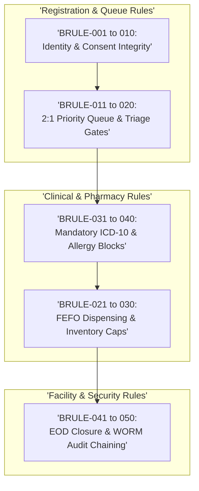

# Business Rules Specification: Namma Clinic Digital Health Platform

| Metadata Attribute | Formal Specification |
| :--- | :--- |
| **Document Identifier** | `DOC-REQ-004-BRULE` |
| **Document Title** | Master Business Rules Specification & Operational Decision Logic Baseline |
| **Project Code** | `NAMMA-CLINIC-PLATFORM-2026` |
| **Requirement Type** | `Business Rules (BRULE)` |
| **Specification Range** | `BRULE-001 through BRULE-050` (Exactly 50 unique requirements) |
| **Target Baseline** | `v1.0.0-PROD-BASELINE` |
| **Lifecycle Status** | `APPROVED & BASELINED` |
| **Target Facility Scope** | 183 Primary Namma Clinics across 8 BBMP Administrative Zones |
| **Lead Clinical Authority** | Chief Health Officer (CHO), BBMP Health Department |
| **Lead Technical Authority**| Principal Solutions Architect, Kushagramati Analytics Consortium |
| **Upstream Baselines** | [`00-project-baseline/`](../00-project-baseline/) \| [`01-project-management/`](../01-project-management/) |
| **Related Specification**| [`01-business-requirements.md`](./01-business-requirements.md) \| [`06-operational-rules.md`](./06-operational-rules.md) |

## 1. Executive Summary & Business Rule Governance Framework
This specification establishes the authoritative, implementation-ready catalog of 50 business rules (`BRULE-001` through `BRULE-050`) governing the Namma Clinic Digital Health & Operations Platform across 183 primary urban healthcare centers in Greater Bengaluru. Business rules define the mandatory operational constraints, decision logic, authorization gates, and data integrity boundaries that dictate how clinical, pharmacy, queue, and administrative workflows execute.

Every rule in this specification is atomic, deterministic, and testable. In accordance with municipal health bylaws and statutory medical regulations, business rules eliminate operational ambiguity, enforce fraud prevention, guarantee patient equity, and protect municipal healthcare assets from administrative misuse.

## 2. Business Rules Categorization Taxonomy
The 50 business rules are organized across five operational domains:
1. **Patient Registration & Identity Governance (BRULE-001 to BRULE-010):** Universal walk-in eligibility, shared household phone limits (max 8), mandatory demographic fields, emergency ABHA bypass, age derivation from DOB, 72-hour offline UHID reconciliation, demographic correction audits, household linking consent, DPDP consent withdrawal, and permanent soft-deletion tombstoning.
2. **OPD Queue & Triage Workflow Governance (BRULE-011 to BRULE-020):** Midnight sequence resets (001), 2:1 priority queue interleaving, 24-hour token expiration, multi-doctor queue load balancing, 150-token waiting hall ceiling, 45-minute uncalled token cancellation, mandatory triage before consultation, red-flag emergency elevation, resuscitation queue bypass, and 2-time shift patient recall limits.
3. **Pharmacy Dispensing & Inventory Control (BRULE-021 to BRULE-030):** Strict FEFO batch picking, emergency stock adjustment cap (max 10 units), T-60 day near-expiry quarantine, zero dispensing without electronic prescription, partial dispensing rules, restricted antibiotic 7-day limits, dual approval for >50 unit discrepancies, weekly physical inventory audits, 7-day buffer stock reorder indents, and delivery challan barcode scanning.
4. **Clinical Documentation & Prescription Boundaries (BRULE-031 to BRULE-040):** Mandatory ICD-10 diagnosis before consultation sign-off, commercial drug blocking, max 6 items per prescription, mandatory DDI override justification, documented drug allergy hard blocks, chronic medication 30-day supply caps, mandatory pediatric weight for syrups, 90-day follow-up date horizon, secondary referral justifications, and counter-referral doctor verification.
5. **Facility Operations, Security & Administrative Control (BRULE-041 to BRULE-050):** Clinic closure blocked with active unfinalized tokens, daily 18:00 IST sync cutoff, retrospective encounter amendment dual approval, emergency formulary broadcast acknowledgment, shift handover dual digital signatures, biometric geofenced logins, 15-minute inactivity screen locks, role privilege escalation blocks, cold chain breach escalation within 15 minutes, and mandatory cryptographic WORM audit chaining.



## 3. Master Business Rules Inventory Table (BRULE-001 to BRULE-050)
| Rule ID | Business Rule Title | Primary Actor | Approval Requirement | Decision Trigger | Allowed Operational Outcome |
| :--- | :--- | :--- | :--- | :--- | :--- |
| [`BRULE-001`](#brule-001) | **Universal Patient Registration Eligibility** | Data Entry Operator | None (Direct registration) | Citizen presents at registrati... | Patient master record created and m... |
| [`BRULE-002`](#brule-002) | **Shared Family Mobile Number Permissibility** | Data Entry Operator | Facility Supervisor if count exceeds 8 | Registration operator enters e... | New UHID created and linked to shar... |
| [`BRULE-003`](#brule-003) | **Mandatory Demographic Attributes Verification** | Data Entry Operator | None | Operator clicks 'Save Patient'... | Patient demographic record committe... |
| [`BRULE-004`](#brule-004) | **Emergency Care Unconditional Bypass of ABHA/ID** | Staff Nurse | Medical Officer immediate sign-off | Patient arrives with emergency... | Immediate emergency token issued; r... |
| [`BRULE-005`](#brule-005) | **Automated Age Derivation from Date of Birth** | Data Entry Operator | None | Operator enters DOB or changes... | Calculates exact age; auto-populate... |
| [`BRULE-006`](#brule-006) | **Temporary Offline UHID 72-Hour Reconciliation Window** | Background Sync Daemon | Zonal IT Administrator if conflict unresolved | Clinic terminal reconnects to ... | Temporary UHID mapped to permanent ... |
| [`BRULE-007`](#brule-007) | **Demographic Modification Mandatory Reason Logging** | Medical Officer | Medical Officer or Facility Admin | Staff submits edit to existing... | Demographics updated; prior snapsho... |
| [`BRULE-008`](#brule-008) | **Household Linking Consent & Authorization** | Data Entry Operator | Staff Nurse or MO review | Staff attempts to link seconda... | Household graph updated; shared pho... |
| [`BRULE-009`](#brule-009) | **DPDP Act Consent Withdrawal Right Enforcement** | Data Entry Operator | Data Protection Officer (DPO) | Citizen requests consent revoc... | Consent status updated to WITHDRAWN... |
| [`BRULE-010`](#brule-010) | **Patient Record Archiving vs Deletion Boundary** | System Administrator | BBMP Legal Advisor & Chief Health Officer | Administrator submits record d... | Record hidden from routine clinic s... |
| [`BRULE-011`](#brule-011) | **OPD Token Daily Numbering Reset at Midnight** | Queue Management Subsystem | None (Automated engine) | Midnight chron trigger or firs... | New daily sequence initialized at 0... |
| [`BRULE-012`](#brule-012) | **Priority Queue Slot Allocation Ratio (2:1 Regular-to-Priority)** | Queue Calling Engine | Medical Officer override | Doctor or nurse clicks 'Call N... | Calls next priority patient; resets... |
| [`BRULE-013`](#brule-013) | **OPD Token Automatic Expiration After 24 Hours** | Background Queue Daemon | None | Daily midnight maintenance wor... | Token status set to EXPIRED; remove... |
| [`BRULE-014`](#brule-014) | **Multi-Doctor Consultation Queue Load Balancing** | Queue Routing Engine | Medical Officer / Nurse manual re-routing | Nurse completes patient triage... | Token assigned to specific doctor q... |
| [`BRULE-015`](#brule-015) | **Maximum Active Clinic Waiting Room Capacity Cap** | Registration Engine | Medical Officer & Zonal Health Officer | Token generation requested at ... | Issues token but alerts Zonal Healt... |
| [`BRULE-016`](#brule-016) | **Uncalled Token Cancellation Protocol** | Medical Officer / Nurse | Staff Nurse confirmation | Doctor or nurse calls token fo... | Token marked NO_SHOW; next patient ... |
| [`BRULE-017`](#brule-017) | **Mandatory Triage Vitals Prior to Doctor Consultation** | Triage Engine | Medical Officer emergency override | Doctor consultation list refre... | Patient appears on doctor consultat... |
| [`BRULE-018`](#brule-018) | **Red-Flag Triage Vitals Immediate Priority Escalation** | Clinical Triage Subsystem | Medical Officer immediate evaluation | Nurse saves vital signs... | Token moves to #1 queue position; a... |
| [`BRULE-019`](#brule-019) | **Registration Counter Queue Bypass for Resuscitation** | Any Clinic Staff | Medical Officer | Staff identifies collapsing, s... | Clinical care starts immediately; t... |
| [`BRULE-020`](#brule-020) | **Doctor Patient Recall Limit within Same Shift** | Medical Officer | Medical Officer | Doctor clicks 'Recall Patient ... | Token called back into consultation... |
| [`BRULE-021`](#brule-021) | **Strict FEFO (First-Expired, First-Out) Pharmacy Allocation** | Pharmacist | Medical Officer dual sign-off for FEFO override | Pharmacist opens prescription ... | Earliest batch dispensed; stock led... |
| [`BRULE-022`](#brule-022) | **Emergency Stock Adjustment Limit (Max 10 Units)** | Pharmacist | Medical Officer for adjustments > 10 units | Pharmacist submits stock adjus... | Inventory ledger adjusted by reques... |
| [`BRULE-023`](#brule-023) | **Near-Expiry Drug Mandatory Quarantine at T-60 Days** | Inventory Subsystem | Chief Pharmacist & Medical Officer | Daily midnight inventory audit... | Batch status set to QUARANTINED; re... |
| [`BRULE-024`](#brule-024) | **Zero Dispensing Without Verified Electronic Prescription** | Pharmacist | Medical Officer | Citizen presents at pharmacy w... | Dispensing workflow enabled for pha... |
| [`BRULE-025`](#brule-025) | **Partial Prescription Dispensing Ledger Integrity** | Pharmacist | None | Pharmacist enters dispensed qu... | Patient given partial supply with c... |
| [`BRULE-026`](#brule-026) | **Controlled Antibiotic Dispensing Duration Boundary** | Medical Officer | Medical Officer | Doctor enters antibiotic presc... | Prescription approved if duration <... |
| [`BRULE-027`](#brule-027) | **Discrepancy Stock Adjustment Dual Authorization** | Pharmacist & Medical Officer | Zonal Supervisory Pharmacist | Stock audit reveals large inve... | Stock reconciled in database; forma... |
| [`BRULE-028`](#brule-028) | **Mandatory Weekly Physical Inventory Reconciliation** | Pharmacist | Medical Officer sign-off | Saturday 12:00 IST operational... | Weekly stock audit certified; inven... |
| [`BRULE-029`](#brule-029) | **Minimum Buffer Stock Automated Reorder Threshold** | Inventory Subsystem | Pharmacist confirmation | Daily closing stock tally calc... | Item flagged LOW_STOCK; auto-popula... |
| [`BRULE-030`](#brule-030) | **Stock Delivery Challan Barcode Verification** | Pharmacist | Medical Officer confirmation | Pharmacist ingests electronic ... | Stock committed to local dispensing... |
| [`BRULE-031`](#brule-031) | **Mandatory Diagnosis Before Consultation Finalization** | Medical Officer | Medical Officer | Doctor clicks 'Sign & Finalize... | Encounter signed; prescription tran... |
| [`BRULE-032`](#brule-032) | **Restricted Non-Formulary Commercial Drug Blocking** | Medical Officer | None (System formulary lock) | Doctor searches for drug in pr... | Formulary drug added with generic n... |
| [`BRULE-033`](#brule-033) | **Single Encounter Prescription Item Limit (Max 6 Medications)** | Medical Officer | Medical Officer | Doctor adds medication to pres... | Medication added if count <= 6... |
| [`BRULE-034`](#brule-034) | **High-Severity Drug-Drug Interaction Mandatory Override Note** | Medical Officer | Medical Officer | Doctor clicks 'Override Warnin... | Alert dismissed; override event wri... |
| [`BRULE-035`](#brule-035) | **Documented Patient Drug Allergy Absolute Block** | Prescription Subsystem | Medical Officer formal allergy revocation | Doctor selects medication for ... | Prescription rejected; prominent re... |
| [`BRULE-036`](#brule-036) | **Chronic Disease Prescription Maximum Duration (30 Days)** | Medical Officer | Medical Officer | Doctor enters duration for chr... | Duration set to 30 days; follow-up ... |
| [`BRULE-037`](#brule-037) | **Mandatory Pediatric Weight for Liquid Formulations** | Prescription Engine | Staff Nurse / MO weight entry | Doctor prescribes pediatric sy... | Prescription item enabled once nurs... |
| [`BRULE-038`](#brule-038) | **Follow-Up Appointment Date Horizon Limit (90 Days)** | Medical Officer | Medical Officer | Doctor selects future follow-u... | Follow-up appointment registered; S... |
| [`BRULE-039`](#brule-039) | **Secondary Hospital Referral Clinical Justification Mandate** | Medical Officer | Medical Officer | Doctor initiates secondary hos... | Digital referral slip generated wit... |
| [`BRULE-040`](#brule-040) | **Counter-Referral Note Doctor Verification Requirement** | Medical Officer | Medical Officer | Staff ingests discharge summar... | Hospital discharge summary integrat... |
| [`BRULE-041`](#brule-041) | **Clinic Closure Blocked with Active Unfinalized Consultations** | Medical Officer | Medical Officer | Medical Officer initiates End-... | Daily session locked; final census ... |
| [`BRULE-042`](#brule-042) | **Daily Data Sync Cutoff at 18:00 IST** | Background Sync Subsystem | Facility IT Administrator | 18:00 IST operational trigger... | Daily clinic sync certified; data r... |
| [`BRULE-043`](#brule-043) | **Retrospective Encounter Amendment Supervisor Dual Approval** | Medical Officer & Zonal Health Officer | Zonal Health Officer | Doctor submits addendum reques... | Addendum appended to encounter reco... |
| [`BRULE-044`](#brule-044) | **Emergency Zonal Formulary Broadcast Mandatory Acknowledgment** | All Clinic Staff | Frontline Staff acknowledgment | Central administrative broadca... | Modal dismissed and normal workflow... |
| [`BRULE-045`](#brule-045) | **Shift Handover Dual Staff Digital Signature Mandate** | Frontline Staff | Incoming and Outgoing Staff | Outgoing staff initiates shift... | Shift handover certified; terminal ... |
| [`BRULE-046`](#brule-046) | **Biometric & Geofenced Terminal Attendance Enforcement** | Authentication Subsystem | Facility Administrator | Staff submits login credential... | User authenticated with clinic loca... |
| [`BRULE-047`](#brule-047) | **Automatic Workstation Session Lock at 15 Minutes Inactivity** | Client Application Engine | Authenticated User | Inactivity timer reaches 900 s... | Screen locked behind PIN dialog; on... |
| [`BRULE-048`](#brule-048) | **Role Privilege Escalation Hard-Stop Prevention** | Application Gateway | System Administrator | User session attempts invocati... | Execution permitted only for verifi... |
| [`BRULE-049`](#brule-049) | **Cold Chain Refrigerator Temperature Excursion Mandatory Escalation** | Staff Nurse / IoT Daemon | Zonal Immunization Officer | Nurse logs daily temperature o... | Visual flashing alert displayed on ... |
| [`BRULE-050`](#brule-050) | **Mandatory Cryptographic WORM Chaining for All State Mutations** | Database Audit Subsystem | Chief Information Security Officer (CISO) | Any database INSERT, UPDATE, o... | Audit record committed; cryptograph... |

## 4. Comprehensive Business Rule Specifications (BRULE-001 to BRULE-050)
This section establishes the exhaustive engineering, decision logic, and operational specifications for each of the 50 business rules committed for production baseline delivery.

### 4.1 BRULE-001: Universal Patient Registration Eligibility

| Specification Attribute | Formal Engineering Definition |
| :--- | :--- |
| **Rule ID** | `BRULE-001` |
| **Rule Title** | Universal Patient Registration Eligibility |
| **Rule Statement** | Any citizen presenting at a Namma Clinic counter is eligible for primary care registration regardless of municipal ward of residence. |
| **Rule Type** | `Business Rule` |
| **Priority Level** | `MUST` (Rationale: Mandatory operational constraint for municipal clinic workflow integrity.) |
| **Business Value** | Ensures policy compliance, fairness, fraud prevention, and clinical safety. |
| **Policy Rationale** | Municipal health charter guarantees universal access without territorial exclusion. |
| **Primary Actor** | `Data Entry Operator` |
| **Target User Persona** | [`PERSONA-001`](../01-project-management/07-user-personas.md#persona-001) |
| **Accountable Role** | [`ROLE-001`](../01-project-management/08-role-and-responsibility-matrix.md#role-001) |
| **Key Stakeholder** | [`STAKEHOLDER-001`](../01-project-management/06-stakeholders.md#stakeholder-001) |
| **Trigger Condition** | Citizen presents at registration desk |
| **Decision Logic** | `IF citizen provides name and valid gender THEN allow registration ELSE prompt for missing mandatory attributes` |
| **Allowed Outcome** | Patient master record created and municipal UHID minted |
| **Rejected Outcome** | Registration blocked until mandatory fields completed |
| **Exception Condition**| Emergency trauma or unconscious patients registered under emergency placeholder UHID |
| **Approval Required** | None (Direct registration) |
| **Audit Requirement** | `Emits REGISTRATION_COMMITTED audit event` |
| **Associated Rules** | Clinical: [`CR-001`](./05-clinical-rules.md#cr-001) \| Operational: [`OR-001`](./06-operational-rules.md#or-001) |
| **Security & Privacy** | Security: `Enforces authorization boundaries and prevents bypass.` \| Privacy: `Ensures lawful data processing and consent adherence.` |
| **Data & Offline** | Data: `Preserves relational integrity and audit trail.` \| Offline: `Enforced identically in local Dexie.js offline engine.` |
| **Upstream Traceability**| Obj: [`OBJECTIVE-001`](../01-project-management/02-project-vision-and-objectives.md#objective-001) \| Scope: [`INSCOPE-001`](../01-project-management/04-in-scope.md#inscope-001) \| Risk: [`RISK-001`](../01-project-management/12-project-risks.md#risk-001) |
| **Downstream Planning** | Epic: `PLANNED-EPIC-001` \| Feature: `PLANNED-FEATURE-001` \| API: `PLANNED-API-001` \| Test: `PLANNED-TEST-301` |

#### 4.1.1 Operational Execution Protocol & Decision Flow
- **Standard Execution Flow (Happy Path):**
  1. Actor triggers operational action: citizen presents at registration desk.
  2. System evaluates business rule logic: IF citizen provides name and valid gender THEN allow registration ELSE prompt for missing mandatory attributes.
  3. IF logic passes: Patient master record created and municipal UHID minted.
  4. IF logic fails: Registration blocked until mandatory fields completed.
  5. Audit event emitted to tamper-evident WORM log: Emits REGISTRATION_COMMITTED audit event.
- **Exception Flow & Supervisor Escalation:** If rule condition permits exception (Emergency trauma or unconscious patients registered under emergency placeholder UHID), secondary authorization is prompted.
- **Rejection & Error Handling Flow:** If rule is violated without approved exception, operation is rejected with HTTP 422 Unprocessable Entity.

#### 4.1.2 Technical Invariants & Verification Contract
- **Decision Logic Code Contract:** `IF citizen provides name and valid gender THEN allow registration ELSE prompt for missing mandatory attributes`
- **Allowed State Mutation:** Patient master record created and municipal UHID minted
- **Rejected State Protection:** Registration blocked until mandatory fields completed
- **Mandatory Audit Event:** `Emits REGISTRATION_COMMITTED audit event`

#### 4.1.3 Executable BDD Acceptance Scenarios
```gherkin
Feature: BRULE-001 - Universal Patient Registration Eligibility
  As a Data Entry Operator
  I require system enforcement of universal patient registration eligibility
  In order to ensure municipal healthcare compliance and operational integrity

  Scenario: Happy Path Execution for BRULE-001
    Given the Data Entry Operator is authenticated and clinic terminal is operational
    When the user submits a valid request for universal patient registration eligibility
    Then the system successfully commits the transaction and emits an audit event

  Scenario: Input Validation and Schema Guard for BRULE-001
    Given the Data Entry Operator attempts to submit an incomplete or malformed payload for universal patient registration eligibility
    When the request fails TypeBox schema or domain constraint validation
    Then the system rejects the input with HTTP 400 and highlights invalid fields in Kannada and English

  Scenario: RBAC and Security Access Control for BRULE-001
    Given an unauthenticated or unauthorized role attempts to invoke universal patient registration eligibility
    When the bearer JWT token is missing, expired, or lacks necessary RBAC permission
    Then the system denies execution with HTTP 403 Forbidden and records a security telemetry alert

  Scenario: Offline Autonomous Execution for BRULE-001
    Given the clinic WAN network is completely severed during universal patient registration eligibility
    When the operator confirms the local transaction on the workstation
    Then the mutation is persisted to Dexie.js IndexedDB with a UUIDv7 and queued for background replay

  Scenario: Network Recovery and Idempotent Sync for BRULE-001
    Given the clinic workstation reconnects to the BBMP municipal health WAN
    When the background sync daemon processes the pending mutation queue
    Then all buffered transactions for BRULE-001 synchronize idempotently with zero data loss
```

#### 4.1.4 Verification Protocol & Quality Sign-Off
- **Verification Method:** Automated Vitest Business Logic & Unit Test
- **Automated Test Suite:** `PLANNED-TEST-301` (Unit & Integration Rule Test) targeting 100% decision branch coverage.
- **Related Internal Requirements:** `FR-001`, `OR-001`
- **Dependencies & Blocking Constraints:** BR-001 | Constraints: Rule evaluation logic must be synchronous and sub-millisecond.
- **Architectural Assumptions & Open Questions:** Assumption: Clinic staff trained in standard municipal operational procedures. | Open Question: Confirm seasonal policy exceptions with BBMP Legal Division.

---

### 4.2 BRULE-002: Shared Family Mobile Number Permissibility

| Specification Attribute | Formal Engineering Definition |
| :--- | :--- |
| **Rule ID** | `BRULE-002` |
| **Rule Title** | Shared Family Mobile Number Permissibility |
| **Rule Statement** | Up to 8 individual family members may share the same primary mobile phone number under household linking rules. |
| **Rule Type** | `Business Rule` |
| **Priority Level** | `MUST` (Rationale: Mandatory operational constraint for municipal clinic workflow integrity.) |
| **Business Value** | Ensures policy compliance, fairness, fraud prevention, and clinical safety. |
| **Policy Rationale** | Low-income urban slum households frequently share a single mobile phone handset. |
| **Primary Actor** | `Data Entry Operator` |
| **Target User Persona** | [`PERSONA-002`](../01-project-management/07-user-personas.md#persona-002) |
| **Accountable Role** | [`ROLE-002`](../01-project-management/08-role-and-responsibility-matrix.md#role-002) |
| **Key Stakeholder** | [`STAKEHOLDER-002`](../01-project-management/06-stakeholders.md#stakeholder-002) |
| **Trigger Condition** | Registration operator enters existing phone number |
| **Decision Logic** | `IF mobile exists AND relation confirmed (Spouse, Child, Parent) AND count < 8 THEN link ELSE prompt duplicate review` |
| **Allowed Outcome** | New UHID created and linked to shared household phone group |
| **Rejected Outcome** | Phone rejected if shared across >8 distinct individuals without admin override |
| **Exception Condition**| Hostel or orphanage group registrations may exceed 8 with Medical Officer sign-off |
| **Approval Required** | Facility Supervisor if count exceeds 8 |
| **Audit Requirement** | `Logs HOUSEHOLD_PHONE_SHARED event` |
| **Associated Rules** | Clinical: [`CR-002`](./05-clinical-rules.md#cr-002) \| Operational: [`OR-002`](./06-operational-rules.md#or-002) |
| **Security & Privacy** | Security: `Enforces authorization boundaries and prevents bypass.` \| Privacy: `Ensures lawful data processing and consent adherence.` |
| **Data & Offline** | Data: `Preserves relational integrity and audit trail.` \| Offline: `Enforced identically in local Dexie.js offline engine.` |
| **Upstream Traceability**| Obj: [`OBJECTIVE-002`](../01-project-management/02-project-vision-and-objectives.md#objective-002) \| Scope: [`INSCOPE-002`](../01-project-management/04-in-scope.md#inscope-002) \| Risk: [`RISK-002`](../01-project-management/12-project-risks.md#risk-002) |
| **Downstream Planning** | Epic: `PLANNED-EPIC-002` \| Feature: `PLANNED-FEATURE-002` \| API: `PLANNED-API-002` \| Test: `PLANNED-TEST-302` |

#### 4.2.1 Operational Execution Protocol & Decision Flow
- **Standard Execution Flow (Happy Path):**
  1. Actor triggers operational action: registration operator enters existing phone number.
  2. System evaluates business rule logic: IF mobile exists AND relation confirmed (Spouse, Child, Parent) AND count < 8 THEN link ELSE prompt duplicate review.
  3. IF logic passes: New UHID created and linked to shared household phone group.
  4. IF logic fails: Phone rejected if shared across >8 distinct individuals without admin override.
  5. Audit event emitted to tamper-evident WORM log: Logs HOUSEHOLD_PHONE_SHARED event.
- **Exception Flow & Supervisor Escalation:** If rule condition permits exception (Hostel or orphanage group registrations may exceed 8 with Medical Officer sign-off), secondary authorization is prompted.
- **Rejection & Error Handling Flow:** If rule is violated without approved exception, operation is rejected with HTTP 422 Unprocessable Entity.

#### 4.2.2 Technical Invariants & Verification Contract
- **Decision Logic Code Contract:** `IF mobile exists AND relation confirmed (Spouse, Child, Parent) AND count < 8 THEN link ELSE prompt duplicate review`
- **Allowed State Mutation:** New UHID created and linked to shared household phone group
- **Rejected State Protection:** Phone rejected if shared across >8 distinct individuals without admin override
- **Mandatory Audit Event:** `Logs HOUSEHOLD_PHONE_SHARED event`

#### 4.2.3 Executable BDD Acceptance Scenarios
```gherkin
Feature: BRULE-002 - Shared Family Mobile Number Permissibility
  As a Data Entry Operator
  I require system enforcement of shared family mobile number permissibility
  In order to ensure municipal healthcare compliance and operational integrity

  Scenario: Happy Path Execution for BRULE-002
    Given the Data Entry Operator is authenticated and clinic terminal is operational
    When the user submits a valid request for shared family mobile number permissibility
    Then the system successfully commits the transaction and emits an audit event

  Scenario: Input Validation and Schema Guard for BRULE-002
    Given the Data Entry Operator attempts to submit an incomplete or malformed payload for shared family mobile number permissibility
    When the request fails TypeBox schema or domain constraint validation
    Then the system rejects the input with HTTP 400 and highlights invalid fields in Kannada and English

  Scenario: RBAC and Security Access Control for BRULE-002
    Given an unauthenticated or unauthorized role attempts to invoke shared family mobile number permissibility
    When the bearer JWT token is missing, expired, or lacks necessary RBAC permission
    Then the system denies execution with HTTP 403 Forbidden and records a security telemetry alert

  Scenario: Offline Autonomous Execution for BRULE-002
    Given the clinic WAN network is completely severed during shared family mobile number permissibility
    When the operator confirms the local transaction on the workstation
    Then the mutation is persisted to Dexie.js IndexedDB with a UUIDv7 and queued for background replay

  Scenario: Network Recovery and Idempotent Sync for BRULE-002
    Given the clinic workstation reconnects to the BBMP municipal health WAN
    When the background sync daemon processes the pending mutation queue
    Then all buffered transactions for BRULE-002 synchronize idempotently with zero data loss
```

#### 4.2.4 Verification Protocol & Quality Sign-Off
- **Verification Method:** Automated Vitest Business Logic & Unit Test
- **Automated Test Suite:** `PLANNED-TEST-302` (Unit & Integration Rule Test) targeting 100% decision branch coverage.
- **Related Internal Requirements:** `FR-002`, `OR-002`
- **Dependencies & Blocking Constraints:** BR-002 | Constraints: Rule evaluation logic must be synchronous and sub-millisecond.
- **Architectural Assumptions & Open Questions:** Assumption: Clinic staff trained in standard municipal operational procedures. | Open Question: Confirm seasonal policy exceptions with BBMP Legal Division.

---

### 4.3 BRULE-003: Mandatory Demographic Attributes Verification

| Specification Attribute | Formal Engineering Definition |
| :--- | :--- |
| **Rule ID** | `BRULE-003` |
| **Rule Title** | Mandatory Demographic Attributes Verification |
| **Rule Statement** | Patient registration cannot be finalized without full name, biological gender, and either age or verified date of birth. |
| **Rule Type** | `Business Rule` |
| **Priority Level** | `MUST` (Rationale: Mandatory operational constraint for municipal clinic workflow integrity.) |
| **Business Value** | Ensures policy compliance, fairness, fraud prevention, and clinical safety. |
| **Policy Rationale** | Prevents anonymous or corrupted patient indices in municipal registry. |
| **Primary Actor** | `Data Entry Operator` |
| **Target User Persona** | [`PERSONA-003`](../01-project-management/07-user-personas.md#persona-003) |
| **Accountable Role** | [`ROLE-003`](../01-project-management/08-role-and-responsibility-matrix.md#role-003) |
| **Key Stakeholder** | [`STAKEHOLDER-003`](../01-project-management/06-stakeholders.md#stakeholder-003) |
| **Trigger Condition** | Operator clicks 'Save Patient' |
| **Decision Logic** | `IF length(name) >= 2 AND gender IN ('M', 'F', 'T') AND (age > 0 OR dob != NULL) THEN PASS ELSE FAIL` |
| **Allowed Outcome** | Patient demographic record committed to database |
| **Rejected Outcome** | Form submission blocked; missing fields highlighted in red |
| **Exception Condition**| Unidentified emergency patients registered under `UNKNOWN-MALE/FEMALE-TIMESTAMP` |
| **Approval Required** | None |
| **Audit Requirement** | `Logs VALIDATION_FAILURE event if rejected` |
| **Associated Rules** | Clinical: [`CR-003`](./05-clinical-rules.md#cr-003) \| Operational: [`OR-003`](./06-operational-rules.md#or-003) |
| **Security & Privacy** | Security: `Enforces authorization boundaries and prevents bypass.` \| Privacy: `Ensures lawful data processing and consent adherence.` |
| **Data & Offline** | Data: `Preserves relational integrity and audit trail.` \| Offline: `Enforced identically in local Dexie.js offline engine.` |
| **Upstream Traceability**| Obj: [`OBJECTIVE-003`](../01-project-management/02-project-vision-and-objectives.md#objective-003) \| Scope: [`INSCOPE-003`](../01-project-management/04-in-scope.md#inscope-003) \| Risk: [`RISK-003`](../01-project-management/12-project-risks.md#risk-003) |
| **Downstream Planning** | Epic: `PLANNED-EPIC-003` \| Feature: `PLANNED-FEATURE-003` \| API: `PLANNED-API-003` \| Test: `PLANNED-TEST-303` |

#### 4.3.1 Operational Execution Protocol & Decision Flow
- **Standard Execution Flow (Happy Path):**
  1. Actor triggers operational action: operator clicks 'save patient'.
  2. System evaluates business rule logic: IF length(name) >= 2 AND gender IN ('M', 'F', 'T') AND (age > 0 OR dob != NULL) THEN PASS ELSE FAIL.
  3. IF logic passes: Patient demographic record committed to database.
  4. IF logic fails: Form submission blocked; missing fields highlighted in red.
  5. Audit event emitted to tamper-evident WORM log: Logs VALIDATION_FAILURE event if rejected.
- **Exception Flow & Supervisor Escalation:** If rule condition permits exception (Unidentified emergency patients registered under `UNKNOWN-MALE/FEMALE-TIMESTAMP`), secondary authorization is prompted.
- **Rejection & Error Handling Flow:** If rule is violated without approved exception, operation is rejected with HTTP 422 Unprocessable Entity.

#### 4.3.2 Technical Invariants & Verification Contract
- **Decision Logic Code Contract:** `IF length(name) >= 2 AND gender IN ('M', 'F', 'T') AND (age > 0 OR dob != NULL) THEN PASS ELSE FAIL`
- **Allowed State Mutation:** Patient demographic record committed to database
- **Rejected State Protection:** Form submission blocked; missing fields highlighted in red
- **Mandatory Audit Event:** `Logs VALIDATION_FAILURE event if rejected`

#### 4.3.3 Executable BDD Acceptance Scenarios
```gherkin
Feature: BRULE-003 - Mandatory Demographic Attributes Verification
  As a Data Entry Operator
  I require system enforcement of mandatory demographic attributes verification
  In order to ensure municipal healthcare compliance and operational integrity

  Scenario: Happy Path Execution for BRULE-003
    Given the Data Entry Operator is authenticated and clinic terminal is operational
    When the user submits a valid request for mandatory demographic attributes verification
    Then the system successfully commits the transaction and emits an audit event

  Scenario: Input Validation and Schema Guard for BRULE-003
    Given the Data Entry Operator attempts to submit an incomplete or malformed payload for mandatory demographic attributes verification
    When the request fails TypeBox schema or domain constraint validation
    Then the system rejects the input with HTTP 400 and highlights invalid fields in Kannada and English

  Scenario: RBAC and Security Access Control for BRULE-003
    Given an unauthenticated or unauthorized role attempts to invoke mandatory demographic attributes verification
    When the bearer JWT token is missing, expired, or lacks necessary RBAC permission
    Then the system denies execution with HTTP 403 Forbidden and records a security telemetry alert

  Scenario: Offline Autonomous Execution for BRULE-003
    Given the clinic WAN network is completely severed during mandatory demographic attributes verification
    When the operator confirms the local transaction on the workstation
    Then the mutation is persisted to Dexie.js IndexedDB with a UUIDv7 and queued for background replay

  Scenario: Network Recovery and Idempotent Sync for BRULE-003
    Given the clinic workstation reconnects to the BBMP municipal health WAN
    When the background sync daemon processes the pending mutation queue
    Then all buffered transactions for BRULE-003 synchronize idempotently with zero data loss
```

#### 4.3.4 Verification Protocol & Quality Sign-Off
- **Verification Method:** Automated Vitest Business Logic & Unit Test
- **Automated Test Suite:** `PLANNED-TEST-303` (Unit & Integration Rule Test) targeting 100% decision branch coverage.
- **Related Internal Requirements:** `FR-003`, `OR-003`
- **Dependencies & Blocking Constraints:** BR-003 | Constraints: Rule evaluation logic must be synchronous and sub-millisecond.
- **Architectural Assumptions & Open Questions:** Assumption: Clinic staff trained in standard municipal operational procedures. | Open Question: Confirm seasonal policy exceptions with BBMP Legal Division.

---

### 4.4 BRULE-004: Emergency Care Unconditional Bypass of ABHA/ID

| Specification Attribute | Formal Engineering Definition |
| :--- | :--- |
| **Rule ID** | `BRULE-004` |
| **Rule Title** | Emergency Care Unconditional Bypass of ABHA/ID |
| **Rule Statement** | Emergency patients experiencing acute distress shall never be denied triage or care due to lack of Aadhaar, ABHA, or identification. |
| **Rule Type** | `Business Rule` |
| **Priority Level** | `MUST` (Rationale: Mandatory operational constraint for municipal clinic workflow integrity.) |
| **Business Value** | Ensures policy compliance, fairness, fraud prevention, and clinical safety. |
| **Policy Rationale** | Preservation of human life strictly supersedes administrative data collection. |
| **Primary Actor** | `Staff Nurse` |
| **Target User Persona** | [`PERSONA-004`](../01-project-management/07-user-personas.md#persona-004) |
| **Accountable Role** | [`ROLE-004`](../01-project-management/08-role-and-responsibility-matrix.md#role-004) |
| **Key Stakeholder** | [`STAKEHOLDER-004`](../01-project-management/06-stakeholders.md#stakeholder-004) |
| **Trigger Condition** | Patient arrives with emergency condition (shock, acute trauma, dyspnea) |
| **Decision Logic** | `IF emergency_flag == TRUE THEN bypass ABHA, phone verification, and address capture` |
| **Allowed Outcome** | Immediate emergency token issued; routed directly to Medical Officer desk |
| **Rejected Outcome** | Care cannot be blocked or delayed for paperwork |
| **Exception Condition**| Standard demographics must be collected retrospectively upon clinical stabilization |
| **Approval Required** | Medical Officer immediate sign-off |
| **Audit Requirement** | `Emits EMERGENCY_BYPASS_AUDIT with doctor ID` |
| **Associated Rules** | Clinical: [`CR-004`](./05-clinical-rules.md#cr-004) \| Operational: [`OR-004`](./06-operational-rules.md#or-004) |
| **Security & Privacy** | Security: `Enforces authorization boundaries and prevents bypass.` \| Privacy: `Ensures lawful data processing and consent adherence.` |
| **Data & Offline** | Data: `Preserves relational integrity and audit trail.` \| Offline: `Enforced identically in local Dexie.js offline engine.` |
| **Upstream Traceability**| Obj: [`OBJECTIVE-004`](../01-project-management/02-project-vision-and-objectives.md#objective-004) \| Scope: [`INSCOPE-004`](../01-project-management/04-in-scope.md#inscope-004) \| Risk: [`RISK-004`](../01-project-management/12-project-risks.md#risk-004) |
| **Downstream Planning** | Epic: `PLANNED-EPIC-004` \| Feature: `PLANNED-FEATURE-004` \| API: `PLANNED-API-004` \| Test: `PLANNED-TEST-304` |

#### 4.4.1 Operational Execution Protocol & Decision Flow
- **Standard Execution Flow (Happy Path):**
  1. Actor triggers operational action: patient arrives with emergency condition (shock, acute trauma, dyspnea).
  2. System evaluates business rule logic: IF emergency_flag == TRUE THEN bypass ABHA, phone verification, and address capture.
  3. IF logic passes: Immediate emergency token issued; routed directly to Medical Officer desk.
  4. IF logic fails: Care cannot be blocked or delayed for paperwork.
  5. Audit event emitted to tamper-evident WORM log: Emits EMERGENCY_BYPASS_AUDIT with doctor ID.
- **Exception Flow & Supervisor Escalation:** If rule condition permits exception (Standard demographics must be collected retrospectively upon clinical stabilization), secondary authorization is prompted.
- **Rejection & Error Handling Flow:** If rule is violated without approved exception, operation is rejected with HTTP 422 Unprocessable Entity.

#### 4.4.2 Technical Invariants & Verification Contract
- **Decision Logic Code Contract:** `IF emergency_flag == TRUE THEN bypass ABHA, phone verification, and address capture`
- **Allowed State Mutation:** Immediate emergency token issued; routed directly to Medical Officer desk
- **Rejected State Protection:** Care cannot be blocked or delayed for paperwork
- **Mandatory Audit Event:** `Emits EMERGENCY_BYPASS_AUDIT with doctor ID`

#### 4.4.3 Executable BDD Acceptance Scenarios
```gherkin
Feature: BRULE-004 - Emergency Care Unconditional Bypass of ABHA/ID
  As a Staff Nurse
  I require system enforcement of emergency care unconditional bypass of abha/id
  In order to ensure municipal healthcare compliance and operational integrity

  Scenario: Happy Path Execution for BRULE-004
    Given the Staff Nurse is authenticated and clinic terminal is operational
    When the user submits a valid request for emergency care unconditional bypass of abha/id
    Then the system successfully commits the transaction and emits an audit event

  Scenario: Input Validation and Schema Guard for BRULE-004
    Given the Staff Nurse attempts to submit an incomplete or malformed payload for emergency care unconditional bypass of abha/id
    When the request fails TypeBox schema or domain constraint validation
    Then the system rejects the input with HTTP 400 and highlights invalid fields in Kannada and English

  Scenario: RBAC and Security Access Control for BRULE-004
    Given an unauthenticated or unauthorized role attempts to invoke emergency care unconditional bypass of abha/id
    When the bearer JWT token is missing, expired, or lacks necessary RBAC permission
    Then the system denies execution with HTTP 403 Forbidden and records a security telemetry alert

  Scenario: Offline Autonomous Execution for BRULE-004
    Given the clinic WAN network is completely severed during emergency care unconditional bypass of abha/id
    When the operator confirms the local transaction on the workstation
    Then the mutation is persisted to Dexie.js IndexedDB with a UUIDv7 and queued for background replay

  Scenario: Network Recovery and Idempotent Sync for BRULE-004
    Given the clinic workstation reconnects to the BBMP municipal health WAN
    When the background sync daemon processes the pending mutation queue
    Then all buffered transactions for BRULE-004 synchronize idempotently with zero data loss
```

#### 4.4.4 Verification Protocol & Quality Sign-Off
- **Verification Method:** Automated Vitest Business Logic & Unit Test
- **Automated Test Suite:** `PLANNED-TEST-304` (Unit & Integration Rule Test) targeting 100% decision branch coverage.
- **Related Internal Requirements:** `FR-004`, `OR-004`
- **Dependencies & Blocking Constraints:** BR-004 | Constraints: Rule evaluation logic must be synchronous and sub-millisecond.
- **Architectural Assumptions & Open Questions:** Assumption: Clinic staff trained in standard municipal operational procedures. | Open Question: Confirm seasonal policy exceptions with BBMP Legal Division.

---

### 4.5 BRULE-005: Automated Age Derivation from Date of Birth

| Specification Attribute | Formal Engineering Definition |
| :--- | :--- |
| **Rule ID** | `BRULE-005` |
| **Rule Title** | Automated Age Derivation from Date of Birth |
| **Rule Statement** | When exact date of birth is supplied, age in years, months, and days shall be derived dynamically at runtime. |
| **Rule Type** | `Business Rule` |
| **Priority Level** | `MUST` (Rationale: Mandatory operational constraint for municipal clinic workflow integrity.) |
| **Business Value** | Ensures policy compliance, fairness, fraud prevention, and clinical safety. |
| **Policy Rationale** | Prevents static age staleness in pediatric and maternal registries. |
| **Primary Actor** | `Data Entry Operator` |
| **Target User Persona** | [`PERSONA-005`](../01-project-management/07-user-personas.md#persona-005) |
| **Accountable Role** | [`ROLE-005`](../01-project-management/08-role-and-responsibility-matrix.md#role-005) |
| **Key Stakeholder** | [`STAKEHOLDER-005`](../01-project-management/06-stakeholders.md#stakeholder-005) |
| **Trigger Condition** | Operator enters DOB or changes birth date |
| **Decision Logic** | `derived_age = current_date - date_of_birth; IF derived_age < 0 THEN FAIL` |
| **Allowed Outcome** | Calculates exact age; auto-populates pediatric growth or geriatric flags |
| **Rejected Outcome** | Rejects future dates of birth with HTTP 400 |
| **Exception Condition**| Approximate age accepted when exact birth date is unknown to illiterate citizens |
| **Approval Required** | None |
| **Audit Requirement** | `Logs DEMOGRAPHIC_AGE_DERIVED` |
| **Associated Rules** | Clinical: [`CR-005`](./05-clinical-rules.md#cr-005) \| Operational: [`OR-005`](./06-operational-rules.md#or-005) |
| **Security & Privacy** | Security: `Enforces authorization boundaries and prevents bypass.` \| Privacy: `Ensures lawful data processing and consent adherence.` |
| **Data & Offline** | Data: `Preserves relational integrity and audit trail.` \| Offline: `Enforced identically in local Dexie.js offline engine.` |
| **Upstream Traceability**| Obj: [`OBJECTIVE-005`](../01-project-management/02-project-vision-and-objectives.md#objective-005) \| Scope: [`INSCOPE-005`](../01-project-management/04-in-scope.md#inscope-005) \| Risk: [`RISK-005`](../01-project-management/12-project-risks.md#risk-005) |
| **Downstream Planning** | Epic: `PLANNED-EPIC-005` \| Feature: `PLANNED-FEATURE-005` \| API: `PLANNED-API-005` \| Test: `PLANNED-TEST-305` |

#### 4.5.1 Operational Execution Protocol & Decision Flow
- **Standard Execution Flow (Happy Path):**
  1. Actor triggers operational action: operator enters dob or changes birth date.
  2. System evaluates business rule logic: derived_age = current_date - date_of_birth; IF derived_age < 0 THEN FAIL.
  3. IF logic passes: Calculates exact age; auto-populates pediatric growth or geriatric flags.
  4. IF logic fails: Rejects future dates of birth with HTTP 400.
  5. Audit event emitted to tamper-evident WORM log: Logs DEMOGRAPHIC_AGE_DERIVED.
- **Exception Flow & Supervisor Escalation:** If rule condition permits exception (Approximate age accepted when exact birth date is unknown to illiterate citizens), secondary authorization is prompted.
- **Rejection & Error Handling Flow:** If rule is violated without approved exception, operation is rejected with HTTP 422 Unprocessable Entity.

#### 4.5.2 Technical Invariants & Verification Contract
- **Decision Logic Code Contract:** `derived_age = current_date - date_of_birth; IF derived_age < 0 THEN FAIL`
- **Allowed State Mutation:** Calculates exact age; auto-populates pediatric growth or geriatric flags
- **Rejected State Protection:** Rejects future dates of birth with HTTP 400
- **Mandatory Audit Event:** `Logs DEMOGRAPHIC_AGE_DERIVED`

#### 4.5.3 Executable BDD Acceptance Scenarios
```gherkin
Feature: BRULE-005 - Automated Age Derivation from Date of Birth
  As a Data Entry Operator
  I require system enforcement of automated age derivation from date of birth
  In order to ensure municipal healthcare compliance and operational integrity

  Scenario: Happy Path Execution for BRULE-005
    Given the Data Entry Operator is authenticated and clinic terminal is operational
    When the user submits a valid request for automated age derivation from date of birth
    Then the system successfully commits the transaction and emits an audit event

  Scenario: Input Validation and Schema Guard for BRULE-005
    Given the Data Entry Operator attempts to submit an incomplete or malformed payload for automated age derivation from date of birth
    When the request fails TypeBox schema or domain constraint validation
    Then the system rejects the input with HTTP 400 and highlights invalid fields in Kannada and English

  Scenario: RBAC and Security Access Control for BRULE-005
    Given an unauthenticated or unauthorized role attempts to invoke automated age derivation from date of birth
    When the bearer JWT token is missing, expired, or lacks necessary RBAC permission
    Then the system denies execution with HTTP 403 Forbidden and records a security telemetry alert

  Scenario: Offline Autonomous Execution for BRULE-005
    Given the clinic WAN network is completely severed during automated age derivation from date of birth
    When the operator confirms the local transaction on the workstation
    Then the mutation is persisted to Dexie.js IndexedDB with a UUIDv7 and queued for background replay

  Scenario: Network Recovery and Idempotent Sync for BRULE-005
    Given the clinic workstation reconnects to the BBMP municipal health WAN
    When the background sync daemon processes the pending mutation queue
    Then all buffered transactions for BRULE-005 synchronize idempotently with zero data loss
```

#### 4.5.4 Verification Protocol & Quality Sign-Off
- **Verification Method:** Automated Vitest Business Logic & Unit Test
- **Automated Test Suite:** `PLANNED-TEST-305` (Unit & Integration Rule Test) targeting 100% decision branch coverage.
- **Related Internal Requirements:** `FR-005`, `OR-005`
- **Dependencies & Blocking Constraints:** BR-005 | Constraints: Rule evaluation logic must be synchronous and sub-millisecond.
- **Architectural Assumptions & Open Questions:** Assumption: Clinic staff trained in standard municipal operational procedures. | Open Question: Confirm seasonal policy exceptions with BBMP Legal Division.

---

### 4.6 BRULE-006: Temporary Offline UHID 72-Hour Reconciliation Window

| Specification Attribute | Formal Engineering Definition |
| :--- | :--- |
| **Rule ID** | `BRULE-006` |
| **Rule Title** | Temporary Offline UHID 72-Hour Reconciliation Window |
| **Rule Statement** | Temporary UHIDs minted during offline network operation must be reconciled with central cloud registry within 72 hours. |
| **Rule Type** | `Business Rule` |
| **Priority Level** | `MUST` (Rationale: Mandatory operational constraint for municipal clinic workflow integrity.) |
| **Business Value** | Ensures policy compliance, fairness, fraud prevention, and clinical safety. |
| **Policy Rationale** | Prevents unmerged duplicate patient records from diverging across clinics. |
| **Primary Actor** | `Background Sync Daemon` |
| **Target User Persona** | [`PERSONA-006`](../01-project-management/07-user-personas.md#persona-006) |
| **Accountable Role** | [`ROLE-006`](../01-project-management/08-role-and-responsibility-matrix.md#role-006) |
| **Key Stakeholder** | [`STAKEHOLDER-006`](../01-project-management/06-stakeholders.md#stakeholder-006) |
| **Trigger Condition** | Clinic terminal reconnects to municipal WAN |
| **Decision Logic** | `IF central record matches mobile and name THEN merge to existing UHID ELSE mint permanent UHID` |
| **Allowed Outcome** | Temporary UHID mapped to permanent central UHID; clinical records repointed |
| **Rejected Outcome** | Unreconciled after 72h triggers supervisory audit alert |
| **Exception Condition**| Extended offline period (>72h) preserves temporary UHID until manual zonal review |
| **Approval Required** | Zonal IT Administrator if conflict unresolved |
| **Audit Requirement** | `Emits UHID_RECONCILIATION_LOG` |
| **Associated Rules** | Clinical: [`CR-006`](./05-clinical-rules.md#cr-006) \| Operational: [`OR-006`](./06-operational-rules.md#or-006) |
| **Security & Privacy** | Security: `Enforces authorization boundaries and prevents bypass.` \| Privacy: `Ensures lawful data processing and consent adherence.` |
| **Data & Offline** | Data: `Preserves relational integrity and audit trail.` \| Offline: `Enforced identically in local Dexie.js offline engine.` |
| **Upstream Traceability**| Obj: [`OBJECTIVE-006`](../01-project-management/02-project-vision-and-objectives.md#objective-006) \| Scope: [`INSCOPE-006`](../01-project-management/04-in-scope.md#inscope-006) \| Risk: [`RISK-006`](../01-project-management/12-project-risks.md#risk-006) |
| **Downstream Planning** | Epic: `PLANNED-EPIC-006` \| Feature: `PLANNED-FEATURE-006` \| API: `PLANNED-API-006` \| Test: `PLANNED-TEST-306` |

#### 4.6.1 Operational Execution Protocol & Decision Flow
- **Standard Execution Flow (Happy Path):**
  1. Actor triggers operational action: clinic terminal reconnects to municipal wan.
  2. System evaluates business rule logic: IF central record matches mobile and name THEN merge to existing UHID ELSE mint permanent UHID.
  3. IF logic passes: Temporary UHID mapped to permanent central UHID; clinical records repointed.
  4. IF logic fails: Unreconciled after 72h triggers supervisory audit alert.
  5. Audit event emitted to tamper-evident WORM log: Emits UHID_RECONCILIATION_LOG.
- **Exception Flow & Supervisor Escalation:** If rule condition permits exception (Extended offline period (>72h) preserves temporary UHID until manual zonal review), secondary authorization is prompted.
- **Rejection & Error Handling Flow:** If rule is violated without approved exception, operation is rejected with HTTP 422 Unprocessable Entity.

#### 4.6.2 Technical Invariants & Verification Contract
- **Decision Logic Code Contract:** `IF central record matches mobile and name THEN merge to existing UHID ELSE mint permanent UHID`
- **Allowed State Mutation:** Temporary UHID mapped to permanent central UHID; clinical records repointed
- **Rejected State Protection:** Unreconciled after 72h triggers supervisory audit alert
- **Mandatory Audit Event:** `Emits UHID_RECONCILIATION_LOG`

#### 4.6.3 Executable BDD Acceptance Scenarios
```gherkin
Feature: BRULE-006 - Temporary Offline UHID 72-Hour Reconciliation Window
  As a Background Sync Daemon
  I require system enforcement of temporary offline uhid 72-hour reconciliation window
  In order to ensure municipal healthcare compliance and operational integrity

  Scenario: Happy Path Execution for BRULE-006
    Given the Background Sync Daemon is authenticated and clinic terminal is operational
    When the user submits a valid request for temporary offline uhid 72-hour reconciliation window
    Then the system successfully commits the transaction and emits an audit event

  Scenario: Input Validation and Schema Guard for BRULE-006
    Given the Background Sync Daemon attempts to submit an incomplete or malformed payload for temporary offline uhid 72-hour reconciliation window
    When the request fails TypeBox schema or domain constraint validation
    Then the system rejects the input with HTTP 400 and highlights invalid fields in Kannada and English

  Scenario: RBAC and Security Access Control for BRULE-006
    Given an unauthenticated or unauthorized role attempts to invoke temporary offline uhid 72-hour reconciliation window
    When the bearer JWT token is missing, expired, or lacks necessary RBAC permission
    Then the system denies execution with HTTP 403 Forbidden and records a security telemetry alert

  Scenario: Offline Autonomous Execution for BRULE-006
    Given the clinic WAN network is completely severed during temporary offline uhid 72-hour reconciliation window
    When the operator confirms the local transaction on the workstation
    Then the mutation is persisted to Dexie.js IndexedDB with a UUIDv7 and queued for background replay

  Scenario: Network Recovery and Idempotent Sync for BRULE-006
    Given the clinic workstation reconnects to the BBMP municipal health WAN
    When the background sync daemon processes the pending mutation queue
    Then all buffered transactions for BRULE-006 synchronize idempotently with zero data loss
```

#### 4.6.4 Verification Protocol & Quality Sign-Off
- **Verification Method:** Automated Vitest Business Logic & Unit Test
- **Automated Test Suite:** `PLANNED-TEST-306` (Unit & Integration Rule Test) targeting 100% decision branch coverage.
- **Related Internal Requirements:** `FR-006`, `OR-006`
- **Dependencies & Blocking Constraints:** BR-006 | Constraints: Rule evaluation logic must be synchronous and sub-millisecond.
- **Architectural Assumptions & Open Questions:** Assumption: Clinic staff trained in standard municipal operational procedures. | Open Question: Confirm seasonal policy exceptions with BBMP Legal Division.

---

### 4.7 BRULE-007: Demographic Modification Mandatory Reason Logging

| Specification Attribute | Formal Engineering Definition |
| :--- | :--- |
| **Rule ID** | `BRULE-007` |
| **Rule Title** | Demographic Modification Mandatory Reason Logging |
| **Rule Statement** | Any amendment to a patient's name, gender, or date of birth requires a mandatory justification note (>10 characters). |
| **Rule Type** | `Business Rule` |
| **Priority Level** | `MUST` (Rationale: Mandatory operational constraint for municipal clinic workflow integrity.) |
| **Business Value** | Ensures policy compliance, fairness, fraud prevention, and clinical safety. |
| **Policy Rationale** | Prevents fraudulent identity swapping and accidental record corruption. |
| **Primary Actor** | `Medical Officer` |
| **Target User Persona** | [`PERSONA-007`](../01-project-management/07-user-personas.md#persona-007) |
| **Accountable Role** | [`ROLE-007`](../01-project-management/08-role-and-responsibility-matrix.md#role-007) |
| **Key Stakeholder** | [`STAKEHOLDER-007`](../01-project-management/06-stakeholders.md#stakeholder-007) |
| **Trigger Condition** | Staff submits edit to existing patient demographic profile |
| **Decision Logic** | `IF length(justification_text) >= 10 AND user_role IN ('MO', 'FACILITY_ADMIN') THEN ALLOW` |
| **Allowed Outcome** | Demographics updated; prior snapshot archived in `patient_history` table |
| **Rejected Outcome** | Submission blocked if justification note is missing or too short |
| **Exception Condition**| Minor spelling typo corrections (<2 characters) permitted by DEO within 2 hours of registration |
| **Approval Required** | Medical Officer or Facility Admin |
| **Audit Requirement** | `Emits DEMOGRAPHIC_AMENDMENT_AUDIT` |
| **Associated Rules** | Clinical: [`CR-007`](./05-clinical-rules.md#cr-007) \| Operational: [`OR-007`](./06-operational-rules.md#or-007) |
| **Security & Privacy** | Security: `Enforces authorization boundaries and prevents bypass.` \| Privacy: `Ensures lawful data processing and consent adherence.` |
| **Data & Offline** | Data: `Preserves relational integrity and audit trail.` \| Offline: `Enforced identically in local Dexie.js offline engine.` |
| **Upstream Traceability**| Obj: [`OBJECTIVE-007`](../01-project-management/02-project-vision-and-objectives.md#objective-007) \| Scope: [`INSCOPE-007`](../01-project-management/04-in-scope.md#inscope-007) \| Risk: [`RISK-007`](../01-project-management/12-project-risks.md#risk-007) |
| **Downstream Planning** | Epic: `PLANNED-EPIC-007` \| Feature: `PLANNED-FEATURE-007` \| API: `PLANNED-API-007` \| Test: `PLANNED-TEST-307` |

#### 4.7.1 Operational Execution Protocol & Decision Flow
- **Standard Execution Flow (Happy Path):**
  1. Actor triggers operational action: staff submits edit to existing patient demographic profile.
  2. System evaluates business rule logic: IF length(justification_text) >= 10 AND user_role IN ('MO', 'FACILITY_ADMIN') THEN ALLOW.
  3. IF logic passes: Demographics updated; prior snapshot archived in `patient_history` table.
  4. IF logic fails: Submission blocked if justification note is missing or too short.
  5. Audit event emitted to tamper-evident WORM log: Emits DEMOGRAPHIC_AMENDMENT_AUDIT.
- **Exception Flow & Supervisor Escalation:** If rule condition permits exception (Minor spelling typo corrections (<2 characters) permitted by DEO within 2 hours of registration), secondary authorization is prompted.
- **Rejection & Error Handling Flow:** If rule is violated without approved exception, operation is rejected with HTTP 422 Unprocessable Entity.

#### 4.7.2 Technical Invariants & Verification Contract
- **Decision Logic Code Contract:** `IF length(justification_text) >= 10 AND user_role IN ('MO', 'FACILITY_ADMIN') THEN ALLOW`
- **Allowed State Mutation:** Demographics updated; prior snapshot archived in `patient_history` table
- **Rejected State Protection:** Submission blocked if justification note is missing or too short
- **Mandatory Audit Event:** `Emits DEMOGRAPHIC_AMENDMENT_AUDIT`

#### 4.7.3 Executable BDD Acceptance Scenarios
```gherkin
Feature: BRULE-007 - Demographic Modification Mandatory Reason Logging
  As a Medical Officer
  I require system enforcement of demographic modification mandatory reason logging
  In order to ensure municipal healthcare compliance and operational integrity

  Scenario: Happy Path Execution for BRULE-007
    Given the Medical Officer is authenticated and clinic terminal is operational
    When the user submits a valid request for demographic modification mandatory reason logging
    Then the system successfully commits the transaction and emits an audit event

  Scenario: Input Validation and Schema Guard for BRULE-007
    Given the Medical Officer attempts to submit an incomplete or malformed payload for demographic modification mandatory reason logging
    When the request fails TypeBox schema or domain constraint validation
    Then the system rejects the input with HTTP 400 and highlights invalid fields in Kannada and English

  Scenario: RBAC and Security Access Control for BRULE-007
    Given an unauthenticated or unauthorized role attempts to invoke demographic modification mandatory reason logging
    When the bearer JWT token is missing, expired, or lacks necessary RBAC permission
    Then the system denies execution with HTTP 403 Forbidden and records a security telemetry alert

  Scenario: Offline Autonomous Execution for BRULE-007
    Given the clinic WAN network is completely severed during demographic modification mandatory reason logging
    When the operator confirms the local transaction on the workstation
    Then the mutation is persisted to Dexie.js IndexedDB with a UUIDv7 and queued for background replay

  Scenario: Network Recovery and Idempotent Sync for BRULE-007
    Given the clinic workstation reconnects to the BBMP municipal health WAN
    When the background sync daemon processes the pending mutation queue
    Then all buffered transactions for BRULE-007 synchronize idempotently with zero data loss
```

#### 4.7.4 Verification Protocol & Quality Sign-Off
- **Verification Method:** Automated Vitest Business Logic & Unit Test
- **Automated Test Suite:** `PLANNED-TEST-307` (Unit & Integration Rule Test) targeting 100% decision branch coverage.
- **Related Internal Requirements:** `FR-007`, `OR-007`
- **Dependencies & Blocking Constraints:** BR-007 | Constraints: Rule evaluation logic must be synchronous and sub-millisecond.
- **Architectural Assumptions & Open Questions:** Assumption: Clinic staff trained in standard municipal operational procedures. | Open Question: Confirm seasonal policy exceptions with BBMP Legal Division.

---

### 4.8 BRULE-008: Household Linking Consent & Authorization

| Specification Attribute | Formal Engineering Definition |
| :--- | :--- |
| **Rule ID** | `BRULE-008` |
| **Rule Title** | Household Linking Consent & Authorization |
| **Rule Statement** | Linking a patient to an existing family head requires confirmation from the head or verified ration card documentation. |
| **Rule Type** | `Business Rule` |
| **Priority Level** | `MUST` (Rationale: Mandatory operational constraint for municipal clinic workflow integrity.) |
| **Business Value** | Ensures policy compliance, fairness, fraud prevention, and clinical safety. |
| **Policy Rationale** | Protects citizen privacy and prevents unauthorized aggregation of health records. |
| **Primary Actor** | `Data Entry Operator` |
| **Target User Persona** | [`PERSONA-008`](../01-project-management/07-user-personas.md#persona-008) |
| **Accountable Role** | [`ROLE-008`](../01-project-management/08-role-and-responsibility-matrix.md#role-008) |
| **Key Stakeholder** | [`STAKEHOLDER-008`](../01-project-management/06-stakeholders.md#stakeholder-008) |
| **Trigger Condition** | Staff attempts to link secondary patient to household head |
| **Decision Logic** | `IF relationship verified AND head consent logged THEN commit household edge` |
| **Allowed Outcome** | Household graph updated; shared phone alerts enabled for appointment reminders |
| **Rejected Outcome** | Linking rejected; patient remains independent record |
| **Exception Condition**| Immediate biological children under 12 years linked without separate documentation |
| **Approval Required** | Staff Nurse or MO review |
| **Audit Requirement** | `Logs HOUSEHOLD_LINK_CREATED` |
| **Associated Rules** | Clinical: [`CR-008`](./05-clinical-rules.md#cr-008) \| Operational: [`OR-008`](./06-operational-rules.md#or-008) |
| **Security & Privacy** | Security: `Enforces authorization boundaries and prevents bypass.` \| Privacy: `Ensures lawful data processing and consent adherence.` |
| **Data & Offline** | Data: `Preserves relational integrity and audit trail.` \| Offline: `Enforced identically in local Dexie.js offline engine.` |
| **Upstream Traceability**| Obj: [`OBJECTIVE-008`](../01-project-management/02-project-vision-and-objectives.md#objective-008) \| Scope: [`INSCOPE-008`](../01-project-management/04-in-scope.md#inscope-008) \| Risk: [`RISK-008`](../01-project-management/12-project-risks.md#risk-008) |
| **Downstream Planning** | Epic: `PLANNED-EPIC-008` \| Feature: `PLANNED-FEATURE-008` \| API: `PLANNED-API-008` \| Test: `PLANNED-TEST-308` |

#### 4.8.1 Operational Execution Protocol & Decision Flow
- **Standard Execution Flow (Happy Path):**
  1. Actor triggers operational action: staff attempts to link secondary patient to household head.
  2. System evaluates business rule logic: IF relationship verified AND head consent logged THEN commit household edge.
  3. IF logic passes: Household graph updated; shared phone alerts enabled for appointment reminders.
  4. IF logic fails: Linking rejected; patient remains independent record.
  5. Audit event emitted to tamper-evident WORM log: Logs HOUSEHOLD_LINK_CREATED.
- **Exception Flow & Supervisor Escalation:** If rule condition permits exception (Immediate biological children under 12 years linked without separate documentation), secondary authorization is prompted.
- **Rejection & Error Handling Flow:** If rule is violated without approved exception, operation is rejected with HTTP 422 Unprocessable Entity.

#### 4.8.2 Technical Invariants & Verification Contract
- **Decision Logic Code Contract:** `IF relationship verified AND head consent logged THEN commit household edge`
- **Allowed State Mutation:** Household graph updated; shared phone alerts enabled for appointment reminders
- **Rejected State Protection:** Linking rejected; patient remains independent record
- **Mandatory Audit Event:** `Logs HOUSEHOLD_LINK_CREATED`

#### 4.8.3 Executable BDD Acceptance Scenarios
```gherkin
Feature: BRULE-008 - Household Linking Consent & Authorization
  As a Data Entry Operator
  I require system enforcement of household linking consent & authorization
  In order to ensure municipal healthcare compliance and operational integrity

  Scenario: Happy Path Execution for BRULE-008
    Given the Data Entry Operator is authenticated and clinic terminal is operational
    When the user submits a valid request for household linking consent & authorization
    Then the system successfully commits the transaction and emits an audit event

  Scenario: Input Validation and Schema Guard for BRULE-008
    Given the Data Entry Operator attempts to submit an incomplete or malformed payload for household linking consent & authorization
    When the request fails TypeBox schema or domain constraint validation
    Then the system rejects the input with HTTP 400 and highlights invalid fields in Kannada and English

  Scenario: RBAC and Security Access Control for BRULE-008
    Given an unauthenticated or unauthorized role attempts to invoke household linking consent & authorization
    When the bearer JWT token is missing, expired, or lacks necessary RBAC permission
    Then the system denies execution with HTTP 403 Forbidden and records a security telemetry alert

  Scenario: Offline Autonomous Execution for BRULE-008
    Given the clinic WAN network is completely severed during household linking consent & authorization
    When the operator confirms the local transaction on the workstation
    Then the mutation is persisted to Dexie.js IndexedDB with a UUIDv7 and queued for background replay

  Scenario: Network Recovery and Idempotent Sync for BRULE-008
    Given the clinic workstation reconnects to the BBMP municipal health WAN
    When the background sync daemon processes the pending mutation queue
    Then all buffered transactions for BRULE-008 synchronize idempotently with zero data loss
```

#### 4.8.4 Verification Protocol & Quality Sign-Off
- **Verification Method:** Automated Vitest Business Logic & Unit Test
- **Automated Test Suite:** `PLANNED-TEST-308` (Unit & Integration Rule Test) targeting 100% decision branch coverage.
- **Related Internal Requirements:** `FR-008`, `OR-008`
- **Dependencies & Blocking Constraints:** BR-008 | Constraints: Rule evaluation logic must be synchronous and sub-millisecond.
- **Architectural Assumptions & Open Questions:** Assumption: Clinic staff trained in standard municipal operational procedures. | Open Question: Confirm seasonal policy exceptions with BBMP Legal Division.

---

### 4.9 BRULE-009: DPDP Act Consent Withdrawal Right Enforcement

| Specification Attribute | Formal Engineering Definition |
| :--- | :--- |
| **Rule ID** | `BRULE-009` |
| **Rule Title** | DPDP Act Consent Withdrawal Right Enforcement |
| **Rule Statement** | A citizen may withdraw consent for data processing at any time, halting non-essential communications while retaining clinical records. |
| **Rule Type** | `Business Rule` |
| **Priority Level** | `MUST` (Rationale: Mandatory operational constraint for municipal clinic workflow integrity.) |
| **Business Value** | Ensures policy compliance, fairness, fraud prevention, and clinical safety. |
| **Policy Rationale** | Mandated under India Digital Personal Data Protection Act 2023. |
| **Primary Actor** | `Data Entry Operator` |
| **Target User Persona** | [`PERSONA-009`](../01-project-management/07-user-personas.md#persona-009) |
| **Accountable Role** | [`ROLE-009`](../01-project-management/08-role-and-responsibility-matrix.md#role-009) |
| **Key Stakeholder** | [`STAKEHOLDER-009`](../01-project-management/06-stakeholders.md#stakeholder-009) |
| **Trigger Condition** | Citizen requests consent revocation at registration desk |
| **Decision Logic** | `IF consent_withdrawn == TRUE THEN disable SMS, research exports, and ABHA sync; RETAIN clinical care archive per medical laws` |
| **Allowed Outcome** | Consent status updated to WITHDRAWN; external data sharing halted |
| **Rejected Outcome** | Cannot delete historical medical treatment records mandated by NMC regulations |
| **Exception Condition**| Medical treatment records retained for 10-year statutory period despite consent revocation |
| **Approval Required** | Data Protection Officer (DPO) |
| **Audit Requirement** | `Emits DPDP_CONSENT_WITHDRAWN_AUDIT` |
| **Associated Rules** | Clinical: [`CR-009`](./05-clinical-rules.md#cr-009) \| Operational: [`OR-009`](./06-operational-rules.md#or-009) |
| **Security & Privacy** | Security: `Enforces authorization boundaries and prevents bypass.` \| Privacy: `Ensures lawful data processing and consent adherence.` |
| **Data & Offline** | Data: `Preserves relational integrity and audit trail.` \| Offline: `Enforced identically in local Dexie.js offline engine.` |
| **Upstream Traceability**| Obj: [`OBJECTIVE-009`](../01-project-management/02-project-vision-and-objectives.md#objective-009) \| Scope: [`INSCOPE-009`](../01-project-management/04-in-scope.md#inscope-009) \| Risk: [`RISK-009`](../01-project-management/12-project-risks.md#risk-009) |
| **Downstream Planning** | Epic: `PLANNED-EPIC-009` \| Feature: `PLANNED-FEATURE-009` \| API: `PLANNED-API-009` \| Test: `PLANNED-TEST-309` |

#### 4.9.1 Operational Execution Protocol & Decision Flow
- **Standard Execution Flow (Happy Path):**
  1. Actor triggers operational action: citizen requests consent revocation at registration desk.
  2. System evaluates business rule logic: IF consent_withdrawn == TRUE THEN disable SMS, research exports, and ABHA sync; RETAIN clinical care archive per medical laws.
  3. IF logic passes: Consent status updated to WITHDRAWN; external data sharing halted.
  4. IF logic fails: Cannot delete historical medical treatment records mandated by NMC regulations.
  5. Audit event emitted to tamper-evident WORM log: Emits DPDP_CONSENT_WITHDRAWN_AUDIT.
- **Exception Flow & Supervisor Escalation:** If rule condition permits exception (Medical treatment records retained for 10-year statutory period despite consent revocation), secondary authorization is prompted.
- **Rejection & Error Handling Flow:** If rule is violated without approved exception, operation is rejected with HTTP 422 Unprocessable Entity.

#### 4.9.2 Technical Invariants & Verification Contract
- **Decision Logic Code Contract:** `IF consent_withdrawn == TRUE THEN disable SMS, research exports, and ABHA sync; RETAIN clinical care archive per medical laws`
- **Allowed State Mutation:** Consent status updated to WITHDRAWN; external data sharing halted
- **Rejected State Protection:** Cannot delete historical medical treatment records mandated by NMC regulations
- **Mandatory Audit Event:** `Emits DPDP_CONSENT_WITHDRAWN_AUDIT`

#### 4.9.3 Executable BDD Acceptance Scenarios
```gherkin
Feature: BRULE-009 - DPDP Act Consent Withdrawal Right Enforcement
  As a Data Entry Operator
  I require system enforcement of dpdp act consent withdrawal right enforcement
  In order to ensure municipal healthcare compliance and operational integrity

  Scenario: Happy Path Execution for BRULE-009
    Given the Data Entry Operator is authenticated and clinic terminal is operational
    When the user submits a valid request for dpdp act consent withdrawal right enforcement
    Then the system successfully commits the transaction and emits an audit event

  Scenario: Input Validation and Schema Guard for BRULE-009
    Given the Data Entry Operator attempts to submit an incomplete or malformed payload for dpdp act consent withdrawal right enforcement
    When the request fails TypeBox schema or domain constraint validation
    Then the system rejects the input with HTTP 400 and highlights invalid fields in Kannada and English

  Scenario: RBAC and Security Access Control for BRULE-009
    Given an unauthenticated or unauthorized role attempts to invoke dpdp act consent withdrawal right enforcement
    When the bearer JWT token is missing, expired, or lacks necessary RBAC permission
    Then the system denies execution with HTTP 403 Forbidden and records a security telemetry alert

  Scenario: Offline Autonomous Execution for BRULE-009
    Given the clinic WAN network is completely severed during dpdp act consent withdrawal right enforcement
    When the operator confirms the local transaction on the workstation
    Then the mutation is persisted to Dexie.js IndexedDB with a UUIDv7 and queued for background replay

  Scenario: Network Recovery and Idempotent Sync for BRULE-009
    Given the clinic workstation reconnects to the BBMP municipal health WAN
    When the background sync daemon processes the pending mutation queue
    Then all buffered transactions for BRULE-009 synchronize idempotently with zero data loss
```

#### 4.9.4 Verification Protocol & Quality Sign-Off
- **Verification Method:** Automated Vitest Business Logic & Unit Test
- **Automated Test Suite:** `PLANNED-TEST-309` (Unit & Integration Rule Test) targeting 100% decision branch coverage.
- **Related Internal Requirements:** `FR-009`, `OR-009`
- **Dependencies & Blocking Constraints:** BR-009 | Constraints: Rule evaluation logic must be synchronous and sub-millisecond.
- **Architectural Assumptions & Open Questions:** Assumption: Clinic staff trained in standard municipal operational procedures. | Open Question: Confirm seasonal policy exceptions with BBMP Legal Division.

---

### 4.10 BRULE-010: Patient Record Archiving vs Deletion Boundary

| Specification Attribute | Formal Engineering Definition |
| :--- | :--- |
| **Rule ID** | `BRULE-010` |
| **Rule Title** | Patient Record Archiving vs Deletion Boundary |
| **Rule Statement** | Clinical records in the Namma Clinic platform shall never be permanently hard-deleted; soft-deletion with tombstoning is enforced. |
| **Rule Type** | `Business Rule` |
| **Priority Level** | `MUST` (Rationale: Mandatory operational constraint for municipal clinic workflow integrity.) |
| **Business Value** | Ensures policy compliance, fairness, fraud prevention, and clinical safety. |
| **Policy Rationale** | Ensures medicolegal accountability and compliance with National Medical Commission rules. |
| **Primary Actor** | `System Administrator` |
| **Target User Persona** | [`PERSONA-010`](../01-project-management/07-user-personas.md#persona-010) |
| **Accountable Role** | [`ROLE-010`](../01-project-management/08-role-and-responsibility-matrix.md#role-010) |
| **Key Stakeholder** | [`STAKEHOLDER-010`](../01-project-management/06-stakeholders.md#stakeholder-010) |
| **Trigger Condition** | Administrator submits record deletion request |
| **Decision Logic** | `IF request_type == 'DELETE' THEN set is_deleted=TRUE, deleted_at=NOW(), preserve raw row payload` |
| **Allowed Outcome** | Record hidden from routine clinic searches; preserved in forensic database audit tables |
| **Rejected Outcome** | Hard DELETE query rejected by PostgreSQL row-level security policy |
| **Exception Condition**| Zero exceptions; hard database deletion strictly prohibited in production |
| **Approval Required** | BBMP Legal Advisor & Chief Health Officer |
| **Audit Requirement** | `Emits SECURITY_WORM_TOMBSTONE_LOG` |
| **Associated Rules** | Clinical: [`CR-010`](./05-clinical-rules.md#cr-010) \| Operational: [`OR-010`](./06-operational-rules.md#or-010) |
| **Security & Privacy** | Security: `Enforces authorization boundaries and prevents bypass.` \| Privacy: `Ensures lawful data processing and consent adherence.` |
| **Data & Offline** | Data: `Preserves relational integrity and audit trail.` \| Offline: `Enforced identically in local Dexie.js offline engine.` |
| **Upstream Traceability**| Obj: [`OBJECTIVE-010`](../01-project-management/02-project-vision-and-objectives.md#objective-010) \| Scope: [`INSCOPE-010`](../01-project-management/04-in-scope.md#inscope-010) \| Risk: [`RISK-010`](../01-project-management/12-project-risks.md#risk-010) |
| **Downstream Planning** | Epic: `PLANNED-EPIC-010` \| Feature: `PLANNED-FEATURE-010` \| API: `PLANNED-API-010` \| Test: `PLANNED-TEST-310` |

#### 4.10.1 Operational Execution Protocol & Decision Flow
- **Standard Execution Flow (Happy Path):**
  1. Actor triggers operational action: administrator submits record deletion request.
  2. System evaluates business rule logic: IF request_type == 'DELETE' THEN set is_deleted=TRUE, deleted_at=NOW(), preserve raw row payload.
  3. IF logic passes: Record hidden from routine clinic searches; preserved in forensic database audit tables.
  4. IF logic fails: Hard DELETE query rejected by PostgreSQL row-level security policy.
  5. Audit event emitted to tamper-evident WORM log: Emits SECURITY_WORM_TOMBSTONE_LOG.
- **Exception Flow & Supervisor Escalation:** If rule condition permits exception (Zero exceptions; hard database deletion strictly prohibited in production), secondary authorization is prompted.
- **Rejection & Error Handling Flow:** If rule is violated without approved exception, operation is rejected with HTTP 422 Unprocessable Entity.

#### 4.10.2 Technical Invariants & Verification Contract
- **Decision Logic Code Contract:** `IF request_type == 'DELETE' THEN set is_deleted=TRUE, deleted_at=NOW(), preserve raw row payload`
- **Allowed State Mutation:** Record hidden from routine clinic searches; preserved in forensic database audit tables
- **Rejected State Protection:** Hard DELETE query rejected by PostgreSQL row-level security policy
- **Mandatory Audit Event:** `Emits SECURITY_WORM_TOMBSTONE_LOG`

#### 4.10.3 Executable BDD Acceptance Scenarios
```gherkin
Feature: BRULE-010 - Patient Record Archiving vs Deletion Boundary
  As a System Administrator
  I require system enforcement of patient record archiving vs deletion boundary
  In order to ensure municipal healthcare compliance and operational integrity

  Scenario: Happy Path Execution for BRULE-010
    Given the System Administrator is authenticated and clinic terminal is operational
    When the user submits a valid request for patient record archiving vs deletion boundary
    Then the system successfully commits the transaction and emits an audit event

  Scenario: Input Validation and Schema Guard for BRULE-010
    Given the System Administrator attempts to submit an incomplete or malformed payload for patient record archiving vs deletion boundary
    When the request fails TypeBox schema or domain constraint validation
    Then the system rejects the input with HTTP 400 and highlights invalid fields in Kannada and English

  Scenario: RBAC and Security Access Control for BRULE-010
    Given an unauthenticated or unauthorized role attempts to invoke patient record archiving vs deletion boundary
    When the bearer JWT token is missing, expired, or lacks necessary RBAC permission
    Then the system denies execution with HTTP 403 Forbidden and records a security telemetry alert

  Scenario: Offline Autonomous Execution for BRULE-010
    Given the clinic WAN network is completely severed during patient record archiving vs deletion boundary
    When the operator confirms the local transaction on the workstation
    Then the mutation is persisted to Dexie.js IndexedDB with a UUIDv7 and queued for background replay

  Scenario: Network Recovery and Idempotent Sync for BRULE-010
    Given the clinic workstation reconnects to the BBMP municipal health WAN
    When the background sync daemon processes the pending mutation queue
    Then all buffered transactions for BRULE-010 synchronize idempotently with zero data loss
```

#### 4.10.4 Verification Protocol & Quality Sign-Off
- **Verification Method:** Automated Vitest Business Logic & Unit Test
- **Automated Test Suite:** `PLANNED-TEST-310` (Unit & Integration Rule Test) targeting 100% decision branch coverage.
- **Related Internal Requirements:** `FR-010`, `OR-010`
- **Dependencies & Blocking Constraints:** BR-010 | Constraints: Rule evaluation logic must be synchronous and sub-millisecond.
- **Architectural Assumptions & Open Questions:** Assumption: Clinic staff trained in standard municipal operational procedures. | Open Question: Confirm seasonal policy exceptions with BBMP Legal Division.

---

### 4.11 BRULE-011: OPD Token Daily Numbering Reset at Midnight

| Specification Attribute | Formal Engineering Definition |
| :--- | :--- |
| **Rule ID** | `BRULE-011` |
| **Rule Title** | OPD Token Daily Numbering Reset at Midnight |
| **Rule Statement** | OPD visit tokens shall reset to sequence number 001 at exactly 00:00:00 IST for every clinic facility. |
| **Rule Type** | `Business Rule` |
| **Priority Level** | `MUST` (Rationale: Mandatory operational constraint for municipal clinic workflow integrity.) |
| **Business Value** | Ensures policy compliance, fairness, fraud prevention, and clinical safety. |
| **Policy Rationale** | Provides intuitive daily token numbers (1, 2, 3...) for clinic staff and patients. |
| **Primary Actor** | `Queue Management Subsystem` |
| **Target User Persona** | [`PERSONA-011`](../01-project-management/07-user-personas.md#persona-011) |
| **Accountable Role** | [`ROLE-011`](../01-project-management/08-role-and-responsibility-matrix.md#role-011) |
| **Key Stakeholder** | [`STAKEHOLDER-011`](../01-project-management/06-stakeholders.md#stakeholder-011) |
| **Trigger Condition** | Midnight chron trigger or first token request of new calendar date |
| **Decision Logic** | `IF current_date > last_token_date THEN current_sequence = 1` |
| **Allowed Outcome** | New daily sequence initialized at 001; prior day tokens archived as COMPLETED/EXPIRED |
| **Rejected Outcome** | Cannot issue yesterday's token numbers |
| **Exception Condition**| Clinics operating emergency night shifts continue sequential sequence until morning handover |
| **Approval Required** | None (Automated engine) |
| **Audit Requirement** | `Logs QUEUE_DAILY_RESET_EVENT` |
| **Associated Rules** | Clinical: [`CR-011`](./05-clinical-rules.md#cr-011) \| Operational: [`OR-011`](./06-operational-rules.md#or-011) |
| **Security & Privacy** | Security: `Enforces authorization boundaries and prevents bypass.` \| Privacy: `Ensures lawful data processing and consent adherence.` |
| **Data & Offline** | Data: `Preserves relational integrity and audit trail.` \| Offline: `Enforced identically in local Dexie.js offline engine.` |
| **Upstream Traceability**| Obj: [`OBJECTIVE-011`](../01-project-management/02-project-vision-and-objectives.md#objective-011) \| Scope: [`INSCOPE-011`](../01-project-management/04-in-scope.md#inscope-011) \| Risk: [`RISK-011`](../01-project-management/12-project-risks.md#risk-011) |
| **Downstream Planning** | Epic: `PLANNED-EPIC-011` \| Feature: `PLANNED-FEATURE-011` \| API: `PLANNED-API-011` \| Test: `PLANNED-TEST-311` |

#### 4.11.1 Operational Execution Protocol & Decision Flow
- **Standard Execution Flow (Happy Path):**
  1. Actor triggers operational action: midnight chron trigger or first token request of new calendar date.
  2. System evaluates business rule logic: IF current_date > last_token_date THEN current_sequence = 1.
  3. IF logic passes: New daily sequence initialized at 001; prior day tokens archived as COMPLETED/EXPIRED.
  4. IF logic fails: Cannot issue yesterday's token numbers.
  5. Audit event emitted to tamper-evident WORM log: Logs QUEUE_DAILY_RESET_EVENT.
- **Exception Flow & Supervisor Escalation:** If rule condition permits exception (Clinics operating emergency night shifts continue sequential sequence until morning handover), secondary authorization is prompted.
- **Rejection & Error Handling Flow:** If rule is violated without approved exception, operation is rejected with HTTP 422 Unprocessable Entity.

#### 4.11.2 Technical Invariants & Verification Contract
- **Decision Logic Code Contract:** `IF current_date > last_token_date THEN current_sequence = 1`
- **Allowed State Mutation:** New daily sequence initialized at 001; prior day tokens archived as COMPLETED/EXPIRED
- **Rejected State Protection:** Cannot issue yesterday's token numbers
- **Mandatory Audit Event:** `Logs QUEUE_DAILY_RESET_EVENT`

#### 4.11.3 Executable BDD Acceptance Scenarios
```gherkin
Feature: BRULE-011 - OPD Token Daily Numbering Reset at Midnight
  As a Queue Management Subsystem
  I require system enforcement of opd token daily numbering reset at midnight
  In order to ensure municipal healthcare compliance and operational integrity

  Scenario: Happy Path Execution for BRULE-011
    Given the Queue Management Subsystem is authenticated and clinic terminal is operational
    When the user submits a valid request for opd token daily numbering reset at midnight
    Then the system successfully commits the transaction and emits an audit event

  Scenario: Input Validation and Schema Guard for BRULE-011
    Given the Queue Management Subsystem attempts to submit an incomplete or malformed payload for opd token daily numbering reset at midnight
    When the request fails TypeBox schema or domain constraint validation
    Then the system rejects the input with HTTP 400 and highlights invalid fields in Kannada and English

  Scenario: RBAC and Security Access Control for BRULE-011
    Given an unauthenticated or unauthorized role attempts to invoke opd token daily numbering reset at midnight
    When the bearer JWT token is missing, expired, or lacks necessary RBAC permission
    Then the system denies execution with HTTP 403 Forbidden and records a security telemetry alert

  Scenario: Offline Autonomous Execution for BRULE-011
    Given the clinic WAN network is completely severed during opd token daily numbering reset at midnight
    When the operator confirms the local transaction on the workstation
    Then the mutation is persisted to Dexie.js IndexedDB with a UUIDv7 and queued for background replay

  Scenario: Network Recovery and Idempotent Sync for BRULE-011
    Given the clinic workstation reconnects to the BBMP municipal health WAN
    When the background sync daemon processes the pending mutation queue
    Then all buffered transactions for BRULE-011 synchronize idempotently with zero data loss
```

#### 4.11.4 Verification Protocol & Quality Sign-Off
- **Verification Method:** Automated Vitest Business Logic & Unit Test
- **Automated Test Suite:** `PLANNED-TEST-311` (Unit & Integration Rule Test) targeting 100% decision branch coverage.
- **Related Internal Requirements:** `FR-011`, `OR-011`
- **Dependencies & Blocking Constraints:** BR-011 | Constraints: Rule evaluation logic must be synchronous and sub-millisecond.
- **Architectural Assumptions & Open Questions:** Assumption: Clinic staff trained in standard municipal operational procedures. | Open Question: Confirm seasonal policy exceptions with BBMP Legal Division.

---

### 4.12 BRULE-012: Priority Queue Slot Allocation Ratio (2:1 Regular-to-Priority)

| Specification Attribute | Formal Engineering Definition |
| :--- | :--- |
| **Rule ID** | `BRULE-012` |
| **Rule Title** | Priority Queue Slot Allocation Ratio (2:1 Regular-to-Priority) |
| **Rule Statement** | The automated calling engine shall interleave priority tokens at a maximum ratio of 2 regular tokens per 1 priority token. |
| **Rule Type** | `Business Rule` |
| **Priority Level** | `MUST` (Rationale: Mandatory operational constraint for municipal clinic workflow integrity.) |
| **Business Value** | Ensures policy compliance, fairness, fraud prevention, and clinical safety. |
| **Policy Rationale** | Balances urgent needs of frail patients with fair waiting times for regular attendees. |
| **Primary Actor** | `Queue Calling Engine` |
| **Target User Persona** | [`PERSONA-012`](../01-project-management/07-user-personas.md#persona-012) |
| **Accountable Role** | [`ROLE-012`](../01-project-management/08-role-and-responsibility-matrix.md#role-012) |
| **Key Stakeholder** | [`STAKEHOLDER-012`](../01-project-management/06-stakeholders.md#stakeholder-012) |
| **Trigger Condition** | Doctor or nurse clicks 'Call Next Patient' |
| **Decision Logic** | `IF priority_queue.count > 0 AND regular_served_counter >= 2 THEN call priority ELSE call regular` |
| **Allowed Outcome** | Calls next priority patient; resets regular served counter |
| **Rejected Outcome** | Priority tokens cannot completely starve regular queue unless marked EMERGENCY |
| **Exception Condition**| Emergency red-flag tokens immediately take top slot (0 wait) |
| **Approval Required** | Medical Officer override |
| **Audit Requirement** | `Logs QUEUE_CALL_DISPATCHED` |
| **Associated Rules** | Clinical: [`CR-012`](./05-clinical-rules.md#cr-012) \| Operational: [`OR-012`](./06-operational-rules.md#or-012) |
| **Security & Privacy** | Security: `Enforces authorization boundaries and prevents bypass.` \| Privacy: `Ensures lawful data processing and consent adherence.` |
| **Data & Offline** | Data: `Preserves relational integrity and audit trail.` \| Offline: `Enforced identically in local Dexie.js offline engine.` |
| **Upstream Traceability**| Obj: [`OBJECTIVE-012`](../01-project-management/02-project-vision-and-objectives.md#objective-012) \| Scope: [`INSCOPE-012`](../01-project-management/04-in-scope.md#inscope-012) \| Risk: [`RISK-012`](../01-project-management/12-project-risks.md#risk-012) |
| **Downstream Planning** | Epic: `PLANNED-EPIC-012` \| Feature: `PLANNED-FEATURE-012` \| API: `PLANNED-API-012` \| Test: `PLANNED-TEST-312` |

#### 4.12.1 Operational Execution Protocol & Decision Flow
- **Standard Execution Flow (Happy Path):**
  1. Actor triggers operational action: doctor or nurse clicks 'call next patient'.
  2. System evaluates business rule logic: IF priority_queue.count > 0 AND regular_served_counter >= 2 THEN call priority ELSE call regular.
  3. IF logic passes: Calls next priority patient; resets regular served counter.
  4. IF logic fails: Priority tokens cannot completely starve regular queue unless marked EMERGENCY.
  5. Audit event emitted to tamper-evident WORM log: Logs QUEUE_CALL_DISPATCHED.
- **Exception Flow & Supervisor Escalation:** If rule condition permits exception (Emergency red-flag tokens immediately take top slot (0 wait)), secondary authorization is prompted.
- **Rejection & Error Handling Flow:** If rule is violated without approved exception, operation is rejected with HTTP 422 Unprocessable Entity.

#### 4.12.2 Technical Invariants & Verification Contract
- **Decision Logic Code Contract:** `IF priority_queue.count > 0 AND regular_served_counter >= 2 THEN call priority ELSE call regular`
- **Allowed State Mutation:** Calls next priority patient; resets regular served counter
- **Rejected State Protection:** Priority tokens cannot completely starve regular queue unless marked EMERGENCY
- **Mandatory Audit Event:** `Logs QUEUE_CALL_DISPATCHED`

#### 4.12.3 Executable BDD Acceptance Scenarios
```gherkin
Feature: BRULE-012 - Priority Queue Slot Allocation Ratio (2:1 Regular-to-Priority)
  As a Queue Calling Engine
  I require system enforcement of priority queue slot allocation ratio (2:1 regular-to-priority)
  In order to ensure municipal healthcare compliance and operational integrity

  Scenario: Happy Path Execution for BRULE-012
    Given the Queue Calling Engine is authenticated and clinic terminal is operational
    When the user submits a valid request for priority queue slot allocation ratio (2:1 regular-to-priority)
    Then the system successfully commits the transaction and emits an audit event

  Scenario: Input Validation and Schema Guard for BRULE-012
    Given the Queue Calling Engine attempts to submit an incomplete or malformed payload for priority queue slot allocation ratio (2:1 regular-to-priority)
    When the request fails TypeBox schema or domain constraint validation
    Then the system rejects the input with HTTP 400 and highlights invalid fields in Kannada and English

  Scenario: RBAC and Security Access Control for BRULE-012
    Given an unauthenticated or unauthorized role attempts to invoke priority queue slot allocation ratio (2:1 regular-to-priority)
    When the bearer JWT token is missing, expired, or lacks necessary RBAC permission
    Then the system denies execution with HTTP 403 Forbidden and records a security telemetry alert

  Scenario: Offline Autonomous Execution for BRULE-012
    Given the clinic WAN network is completely severed during priority queue slot allocation ratio (2:1 regular-to-priority)
    When the operator confirms the local transaction on the workstation
    Then the mutation is persisted to Dexie.js IndexedDB with a UUIDv7 and queued for background replay

  Scenario: Network Recovery and Idempotent Sync for BRULE-012
    Given the clinic workstation reconnects to the BBMP municipal health WAN
    When the background sync daemon processes the pending mutation queue
    Then all buffered transactions for BRULE-012 synchronize idempotently with zero data loss
```

#### 4.12.4 Verification Protocol & Quality Sign-Off
- **Verification Method:** Automated Vitest Business Logic & Unit Test
- **Automated Test Suite:** `PLANNED-TEST-312` (Unit & Integration Rule Test) targeting 100% decision branch coverage.
- **Related Internal Requirements:** `FR-012`, `OR-012`
- **Dependencies & Blocking Constraints:** BR-012 | Constraints: Rule evaluation logic must be synchronous and sub-millisecond.
- **Architectural Assumptions & Open Questions:** Assumption: Clinic staff trained in standard municipal operational procedures. | Open Question: Confirm seasonal policy exceptions with BBMP Legal Division.

---

### 4.13 BRULE-013: OPD Token Automatic Expiration After 24 Hours

| Specification Attribute | Formal Engineering Definition |
| :--- | :--- |
| **Rule ID** | `BRULE-013` |
| **Rule Title** | OPD Token Automatic Expiration After 24 Hours |
| **Rule Statement** | Any token remaining in QUEUED or CALLING state after 24 hours shall be automatically transitioned to EXPIRED status. |
| **Rule Type** | `Business Rule` |
| **Priority Level** | `MUST` (Rationale: Mandatory operational constraint for municipal clinic workflow integrity.) |
| **Business Value** | Ensures policy compliance, fairness, fraud prevention, and clinical safety. |
| **Policy Rationale** | Prevents abandoned or ghost tokens from cluttering subsequent day queues. |
| **Primary Actor** | `Background Queue Daemon` |
| **Target User Persona** | [`PERSONA-013`](../01-project-management/07-user-personas.md#persona-013) |
| **Accountable Role** | [`ROLE-013`](../01-project-management/08-role-and-responsibility-matrix.md#role-013) |
| **Key Stakeholder** | [`STAKEHOLDER-013`](../01-project-management/06-stakeholders.md#stakeholder-013) |
| **Trigger Condition** | Daily midnight maintenance worker runs |
| **Decision Logic** | `IF token.status IN ('QUEUED', 'CALLING') AND token.created_at < NOW() - INTERVAL '24 HOURS' THEN status = 'EXPIRED'` |
| **Allowed Outcome** | Token status set to EXPIRED; removed from active waiting displays |
| **Rejected Outcome** | Expired tokens cannot be called by doctors without re-checkin |
| **Exception Condition**| Patients returning next morning issued fresh token linked to prior encounter |
| **Approval Required** | None |
| **Audit Requirement** | `Logs TOKEN_AUTO_EXPIRED_EVENT` |
| **Associated Rules** | Clinical: [`CR-013`](./05-clinical-rules.md#cr-013) \| Operational: [`OR-013`](./06-operational-rules.md#or-013) |
| **Security & Privacy** | Security: `Enforces authorization boundaries and prevents bypass.` \| Privacy: `Ensures lawful data processing and consent adherence.` |
| **Data & Offline** | Data: `Preserves relational integrity and audit trail.` \| Offline: `Enforced identically in local Dexie.js offline engine.` |
| **Upstream Traceability**| Obj: [`OBJECTIVE-013`](../01-project-management/02-project-vision-and-objectives.md#objective-013) \| Scope: [`INSCOPE-013`](../01-project-management/04-in-scope.md#inscope-013) \| Risk: [`RISK-013`](../01-project-management/12-project-risks.md#risk-013) |
| **Downstream Planning** | Epic: `PLANNED-EPIC-013` \| Feature: `PLANNED-FEATURE-013` \| API: `PLANNED-API-013` \| Test: `PLANNED-TEST-313` |

#### 4.13.1 Operational Execution Protocol & Decision Flow
- **Standard Execution Flow (Happy Path):**
  1. Actor triggers operational action: daily midnight maintenance worker runs.
  2. System evaluates business rule logic: IF token.status IN ('QUEUED', 'CALLING') AND token.created_at < NOW() - INTERVAL '24 HOURS' THEN status = 'EXPIRED'.
  3. IF logic passes: Token status set to EXPIRED; removed from active waiting displays.
  4. IF logic fails: Expired tokens cannot be called by doctors without re-checkin.
  5. Audit event emitted to tamper-evident WORM log: Logs TOKEN_AUTO_EXPIRED_EVENT.
- **Exception Flow & Supervisor Escalation:** If rule condition permits exception (Patients returning next morning issued fresh token linked to prior encounter), secondary authorization is prompted.
- **Rejection & Error Handling Flow:** If rule is violated without approved exception, operation is rejected with HTTP 422 Unprocessable Entity.

#### 4.13.2 Technical Invariants & Verification Contract
- **Decision Logic Code Contract:** `IF token.status IN ('QUEUED', 'CALLING') AND token.created_at < NOW() - INTERVAL '24 HOURS' THEN status = 'EXPIRED'`
- **Allowed State Mutation:** Token status set to EXPIRED; removed from active waiting displays
- **Rejected State Protection:** Expired tokens cannot be called by doctors without re-checkin
- **Mandatory Audit Event:** `Logs TOKEN_AUTO_EXPIRED_EVENT`

#### 4.13.3 Executable BDD Acceptance Scenarios
```gherkin
Feature: BRULE-013 - OPD Token Automatic Expiration After 24 Hours
  As a Background Queue Daemon
  I require system enforcement of opd token automatic expiration after 24 hours
  In order to ensure municipal healthcare compliance and operational integrity

  Scenario: Happy Path Execution for BRULE-013
    Given the Background Queue Daemon is authenticated and clinic terminal is operational
    When the user submits a valid request for opd token automatic expiration after 24 hours
    Then the system successfully commits the transaction and emits an audit event

  Scenario: Input Validation and Schema Guard for BRULE-013
    Given the Background Queue Daemon attempts to submit an incomplete or malformed payload for opd token automatic expiration after 24 hours
    When the request fails TypeBox schema or domain constraint validation
    Then the system rejects the input with HTTP 400 and highlights invalid fields in Kannada and English

  Scenario: RBAC and Security Access Control for BRULE-013
    Given an unauthenticated or unauthorized role attempts to invoke opd token automatic expiration after 24 hours
    When the bearer JWT token is missing, expired, or lacks necessary RBAC permission
    Then the system denies execution with HTTP 403 Forbidden and records a security telemetry alert

  Scenario: Offline Autonomous Execution for BRULE-013
    Given the clinic WAN network is completely severed during opd token automatic expiration after 24 hours
    When the operator confirms the local transaction on the workstation
    Then the mutation is persisted to Dexie.js IndexedDB with a UUIDv7 and queued for background replay

  Scenario: Network Recovery and Idempotent Sync for BRULE-013
    Given the clinic workstation reconnects to the BBMP municipal health WAN
    When the background sync daemon processes the pending mutation queue
    Then all buffered transactions for BRULE-013 synchronize idempotently with zero data loss
```

#### 4.13.4 Verification Protocol & Quality Sign-Off
- **Verification Method:** Automated Vitest Business Logic & Unit Test
- **Automated Test Suite:** `PLANNED-TEST-313` (Unit & Integration Rule Test) targeting 100% decision branch coverage.
- **Related Internal Requirements:** `FR-013`, `OR-013`
- **Dependencies & Blocking Constraints:** BR-013 | Constraints: Rule evaluation logic must be synchronous and sub-millisecond.
- **Architectural Assumptions & Open Questions:** Assumption: Clinic staff trained in standard municipal operational procedures. | Open Question: Confirm seasonal policy exceptions with BBMP Legal Division.

---

### 4.14 BRULE-014: Multi-Doctor Consultation Queue Load Balancing

| Specification Attribute | Formal Engineering Definition |
| :--- | :--- |
| **Rule ID** | `BRULE-014` |
| **Rule Title** | Multi-Doctor Consultation Queue Load Balancing |
| **Rule Statement** | In multi-doctor clinics, triaged patients shall be routed to the doctor room with the shortest estimated waiting dwell time. |
| **Rule Type** | `Business Rule` |
| **Priority Level** | `MUST` (Rationale: Mandatory operational constraint for municipal clinic workflow integrity.) |
| **Business Value** | Ensures policy compliance, fairness, fraud prevention, and clinical safety. |
| **Policy Rationale** | Optimizes clinic throughput and prevents uneven doctor workloads. |
| **Primary Actor** | `Queue Routing Engine` |
| **Target User Persona** | [`PERSONA-014`](../01-project-management/07-user-personas.md#persona-014) |
| **Accountable Role** | [`ROLE-014`](../01-project-management/08-role-and-responsibility-matrix.md#role-014) |
| **Key Stakeholder** | [`STAKEHOLDER-014`](../01-project-management/06-stakeholders.md#stakeholder-014) |
| **Trigger Condition** | Nurse completes patient triage vitals |
| **Decision Logic** | `target_doctor = doctor_with_min(active_tokens + estimated_consultation_time)` |
| **Allowed Outcome** | Token assigned to specific doctor queue; patient directed to corresponding door |
| **Rejected Outcome** | Cannot assign to doctor marked ON_BREAK or LOGGED_OUT |
| **Exception Condition**| Patient requesting specific gender physician honored where clinically feasible |
| **Approval Required** | Medical Officer / Nurse manual re-routing |
| **Audit Requirement** | `Logs QUEUE_LOAD_BALANCED_EVENT` |
| **Associated Rules** | Clinical: [`CR-014`](./05-clinical-rules.md#cr-014) \| Operational: [`OR-014`](./06-operational-rules.md#or-014) |
| **Security & Privacy** | Security: `Enforces authorization boundaries and prevents bypass.` \| Privacy: `Ensures lawful data processing and consent adherence.` |
| **Data & Offline** | Data: `Preserves relational integrity and audit trail.` \| Offline: `Enforced identically in local Dexie.js offline engine.` |
| **Upstream Traceability**| Obj: [`OBJECTIVE-014`](../01-project-management/02-project-vision-and-objectives.md#objective-014) \| Scope: [`INSCOPE-014`](../01-project-management/04-in-scope.md#inscope-014) \| Risk: [`RISK-014`](../01-project-management/12-project-risks.md#risk-014) |
| **Downstream Planning** | Epic: `PLANNED-EPIC-014` \| Feature: `PLANNED-FEATURE-014` \| API: `PLANNED-API-014` \| Test: `PLANNED-TEST-314` |

#### 4.14.1 Operational Execution Protocol & Decision Flow
- **Standard Execution Flow (Happy Path):**
  1. Actor triggers operational action: nurse completes patient triage vitals.
  2. System evaluates business rule logic: target_doctor = doctor_with_min(active_tokens + estimated_consultation_time).
  3. IF logic passes: Token assigned to specific doctor queue; patient directed to corresponding door.
  4. IF logic fails: Cannot assign to doctor marked ON_BREAK or LOGGED_OUT.
  5. Audit event emitted to tamper-evident WORM log: Logs QUEUE_LOAD_BALANCED_EVENT.
- **Exception Flow & Supervisor Escalation:** If rule condition permits exception (Patient requesting specific gender physician honored where clinically feasible), secondary authorization is prompted.
- **Rejection & Error Handling Flow:** If rule is violated without approved exception, operation is rejected with HTTP 422 Unprocessable Entity.

#### 4.14.2 Technical Invariants & Verification Contract
- **Decision Logic Code Contract:** `target_doctor = doctor_with_min(active_tokens + estimated_consultation_time)`
- **Allowed State Mutation:** Token assigned to specific doctor queue; patient directed to corresponding door
- **Rejected State Protection:** Cannot assign to doctor marked ON_BREAK or LOGGED_OUT
- **Mandatory Audit Event:** `Logs QUEUE_LOAD_BALANCED_EVENT`

#### 4.14.3 Executable BDD Acceptance Scenarios
```gherkin
Feature: BRULE-014 - Multi-Doctor Consultation Queue Load Balancing
  As a Queue Routing Engine
  I require system enforcement of multi-doctor consultation queue load balancing
  In order to ensure municipal healthcare compliance and operational integrity

  Scenario: Happy Path Execution for BRULE-014
    Given the Queue Routing Engine is authenticated and clinic terminal is operational
    When the user submits a valid request for multi-doctor consultation queue load balancing
    Then the system successfully commits the transaction and emits an audit event

  Scenario: Input Validation and Schema Guard for BRULE-014
    Given the Queue Routing Engine attempts to submit an incomplete or malformed payload for multi-doctor consultation queue load balancing
    When the request fails TypeBox schema or domain constraint validation
    Then the system rejects the input with HTTP 400 and highlights invalid fields in Kannada and English

  Scenario: RBAC and Security Access Control for BRULE-014
    Given an unauthenticated or unauthorized role attempts to invoke multi-doctor consultation queue load balancing
    When the bearer JWT token is missing, expired, or lacks necessary RBAC permission
    Then the system denies execution with HTTP 403 Forbidden and records a security telemetry alert

  Scenario: Offline Autonomous Execution for BRULE-014
    Given the clinic WAN network is completely severed during multi-doctor consultation queue load balancing
    When the operator confirms the local transaction on the workstation
    Then the mutation is persisted to Dexie.js IndexedDB with a UUIDv7 and queued for background replay

  Scenario: Network Recovery and Idempotent Sync for BRULE-014
    Given the clinic workstation reconnects to the BBMP municipal health WAN
    When the background sync daemon processes the pending mutation queue
    Then all buffered transactions for BRULE-014 synchronize idempotently with zero data loss
```

#### 4.14.4 Verification Protocol & Quality Sign-Off
- **Verification Method:** Automated Vitest Business Logic & Unit Test
- **Automated Test Suite:** `PLANNED-TEST-314` (Unit & Integration Rule Test) targeting 100% decision branch coverage.
- **Related Internal Requirements:** `FR-014`, `OR-014`
- **Dependencies & Blocking Constraints:** BR-014 | Constraints: Rule evaluation logic must be synchronous and sub-millisecond.
- **Architectural Assumptions & Open Questions:** Assumption: Clinic staff trained in standard municipal operational procedures. | Open Question: Confirm seasonal policy exceptions with BBMP Legal Division.

---

### 4.15 BRULE-015: Maximum Active Clinic Waiting Room Capacity Cap

| Specification Attribute | Formal Engineering Definition |
| :--- | :--- |
| **Rule ID** | `BRULE-015` |
| **Rule Title** | Maximum Active Clinic Waiting Room Capacity Cap |
| **Rule Statement** | A clinic queue shall not exceed 150 active uncalled tokens simultaneously without triggering supervisory crowd alerts. |
| **Rule Type** | `Business Rule` |
| **Priority Level** | `MUST` (Rationale: Mandatory operational constraint for municipal clinic workflow integrity.) |
| **Business Value** | Ensures policy compliance, fairness, fraud prevention, and clinical safety. |
| **Policy Rationale** | Maintains waiting room physical safety and prevents dangerous overcrowding. |
| **Primary Actor** | `Registration Engine` |
| **Target User Persona** | [`PERSONA-015`](../01-project-management/07-user-personas.md#persona-015) |
| **Accountable Role** | [`ROLE-015`](../01-project-management/08-role-and-responsibility-matrix.md#role-015) |
| **Key Stakeholder** | [`STAKEHOLDER-015`](../01-project-management/06-stakeholders.md#stakeholder-015) |
| **Trigger Condition** | Token generation requested at front desk |
| **Decision Logic** | `IF active_tokens >= 150 THEN trigger CROWD_ALERT; prompt operator to notify Medical Officer` |
| **Allowed Outcome** | Issues token but alerts Zonal Health Officer of high clinic surge |
| **Rejected Outcome** | Does not deny patient care; escalates operational support |
| **Exception Condition**| Mass casualty or epidemic surge mode disables crowd cap with ZHO authorization |
| **Approval Required** | Medical Officer & Zonal Health Officer |
| **Audit Requirement** | `Logs FACILITY_OVERCROWDING_ALERT` |
| **Associated Rules** | Clinical: [`CR-015`](./05-clinical-rules.md#cr-015) \| Operational: [`OR-015`](./06-operational-rules.md#or-015) |
| **Security & Privacy** | Security: `Enforces authorization boundaries and prevents bypass.` \| Privacy: `Ensures lawful data processing and consent adherence.` |
| **Data & Offline** | Data: `Preserves relational integrity and audit trail.` \| Offline: `Enforced identically in local Dexie.js offline engine.` |
| **Upstream Traceability**| Obj: [`OBJECTIVE-015`](../01-project-management/02-project-vision-and-objectives.md#objective-015) \| Scope: [`INSCOPE-015`](../01-project-management/04-in-scope.md#inscope-015) \| Risk: [`RISK-015`](../01-project-management/12-project-risks.md#risk-015) |
| **Downstream Planning** | Epic: `PLANNED-EPIC-015` \| Feature: `PLANNED-FEATURE-015` \| API: `PLANNED-API-015` \| Test: `PLANNED-TEST-315` |

#### 4.15.1 Operational Execution Protocol & Decision Flow
- **Standard Execution Flow (Happy Path):**
  1. Actor triggers operational action: token generation requested at front desk.
  2. System evaluates business rule logic: IF active_tokens >= 150 THEN trigger CROWD_ALERT; prompt operator to notify Medical Officer.
  3. IF logic passes: Issues token but alerts Zonal Health Officer of high clinic surge.
  4. IF logic fails: Does not deny patient care; escalates operational support.
  5. Audit event emitted to tamper-evident WORM log: Logs FACILITY_OVERCROWDING_ALERT.
- **Exception Flow & Supervisor Escalation:** If rule condition permits exception (Mass casualty or epidemic surge mode disables crowd cap with ZHO authorization), secondary authorization is prompted.
- **Rejection & Error Handling Flow:** If rule is violated without approved exception, operation is rejected with HTTP 422 Unprocessable Entity.

#### 4.15.2 Technical Invariants & Verification Contract
- **Decision Logic Code Contract:** `IF active_tokens >= 150 THEN trigger CROWD_ALERT; prompt operator to notify Medical Officer`
- **Allowed State Mutation:** Issues token but alerts Zonal Health Officer of high clinic surge
- **Rejected State Protection:** Does not deny patient care; escalates operational support
- **Mandatory Audit Event:** `Logs FACILITY_OVERCROWDING_ALERT`

#### 4.15.3 Executable BDD Acceptance Scenarios
```gherkin
Feature: BRULE-015 - Maximum Active Clinic Waiting Room Capacity Cap
  As a Registration Engine
  I require system enforcement of maximum active clinic waiting room capacity cap
  In order to ensure municipal healthcare compliance and operational integrity

  Scenario: Happy Path Execution for BRULE-015
    Given the Registration Engine is authenticated and clinic terminal is operational
    When the user submits a valid request for maximum active clinic waiting room capacity cap
    Then the system successfully commits the transaction and emits an audit event

  Scenario: Input Validation and Schema Guard for BRULE-015
    Given the Registration Engine attempts to submit an incomplete or malformed payload for maximum active clinic waiting room capacity cap
    When the request fails TypeBox schema or domain constraint validation
    Then the system rejects the input with HTTP 400 and highlights invalid fields in Kannada and English

  Scenario: RBAC and Security Access Control for BRULE-015
    Given an unauthenticated or unauthorized role attempts to invoke maximum active clinic waiting room capacity cap
    When the bearer JWT token is missing, expired, or lacks necessary RBAC permission
    Then the system denies execution with HTTP 403 Forbidden and records a security telemetry alert

  Scenario: Offline Autonomous Execution for BRULE-015
    Given the clinic WAN network is completely severed during maximum active clinic waiting room capacity cap
    When the operator confirms the local transaction on the workstation
    Then the mutation is persisted to Dexie.js IndexedDB with a UUIDv7 and queued for background replay

  Scenario: Network Recovery and Idempotent Sync for BRULE-015
    Given the clinic workstation reconnects to the BBMP municipal health WAN
    When the background sync daemon processes the pending mutation queue
    Then all buffered transactions for BRULE-015 synchronize idempotently with zero data loss
```

#### 4.15.4 Verification Protocol & Quality Sign-Off
- **Verification Method:** Automated Vitest Business Logic & Unit Test
- **Automated Test Suite:** `PLANNED-TEST-315` (Unit & Integration Rule Test) targeting 100% decision branch coverage.
- **Related Internal Requirements:** `FR-015`, `OR-015`
- **Dependencies & Blocking Constraints:** BR-015 | Constraints: Rule evaluation logic must be synchronous and sub-millisecond.
- **Architectural Assumptions & Open Questions:** Assumption: Clinic staff trained in standard municipal operational procedures. | Open Question: Confirm seasonal policy exceptions with BBMP Legal Division.

---

### 4.16 BRULE-016: Uncalled Token Cancellation Protocol

| Specification Attribute | Formal Engineering Definition |
| :--- | :--- |
| **Rule ID** | `BRULE-016` |
| **Rule Title** | Uncalled Token Cancellation Protocol |
| **Rule Statement** | Tokens called 3 consecutive times with no patient response after 45 minutes shall transition to NO_SHOW status. |
| **Rule Type** | `Business Rule` |
| **Priority Level** | `MUST` (Rationale: Mandatory operational constraint for municipal clinic workflow integrity.) |
| **Business Value** | Ensures policy compliance, fairness, fraud prevention, and clinical safety. |
| **Policy Rationale** | Clears queue of patients who departed clinic without notifying staff. |
| **Primary Actor** | `Medical Officer / Nurse` |
| **Target User Persona** | [`PERSONA-016`](../01-project-management/07-user-personas.md#persona-016) |
| **Accountable Role** | [`ROLE-016`](../01-project-management/08-role-and-responsibility-matrix.md#role-016) |
| **Key Stakeholder** | [`STAKEHOLDER-016`](../01-project-management/06-stakeholders.md#stakeholder-016) |
| **Trigger Condition** | Doctor or nurse calls token for 3rd time with zero response |
| **Decision Logic** | `IF call_count >= 3 AND elapsed_time >= 45m THEN status = 'NO_SHOW'` |
| **Allowed Outcome** | Token marked NO_SHOW; next patient called immediately |
| **Rejected Outcome** | Patient cannot reclaim old queue slot without re-queuing at front desk |
| **Exception Condition**| Patient returning within same operating shift may be reinstated to priority queue by nurse |
| **Approval Required** | Staff Nurse confirmation |
| **Audit Requirement** | `Logs TOKEN_NO_SHOW_EVENT` |
| **Associated Rules** | Clinical: [`CR-016`](./05-clinical-rules.md#cr-016) \| Operational: [`OR-016`](./06-operational-rules.md#or-016) |
| **Security & Privacy** | Security: `Enforces authorization boundaries and prevents bypass.` \| Privacy: `Ensures lawful data processing and consent adherence.` |
| **Data & Offline** | Data: `Preserves relational integrity and audit trail.` \| Offline: `Enforced identically in local Dexie.js offline engine.` |
| **Upstream Traceability**| Obj: [`OBJECTIVE-016`](../01-project-management/02-project-vision-and-objectives.md#objective-016) \| Scope: [`INSCOPE-016`](../01-project-management/04-in-scope.md#inscope-016) \| Risk: [`RISK-016`](../01-project-management/12-project-risks.md#risk-016) |
| **Downstream Planning** | Epic: `PLANNED-EPIC-016` \| Feature: `PLANNED-FEATURE-016` \| API: `PLANNED-API-016` \| Test: `PLANNED-TEST-316` |

#### 4.16.1 Operational Execution Protocol & Decision Flow
- **Standard Execution Flow (Happy Path):**
  1. Actor triggers operational action: doctor or nurse calls token for 3rd time with zero response.
  2. System evaluates business rule logic: IF call_count >= 3 AND elapsed_time >= 45m THEN status = 'NO_SHOW'.
  3. IF logic passes: Token marked NO_SHOW; next patient called immediately.
  4. IF logic fails: Patient cannot reclaim old queue slot without re-queuing at front desk.
  5. Audit event emitted to tamper-evident WORM log: Logs TOKEN_NO_SHOW_EVENT.
- **Exception Flow & Supervisor Escalation:** If rule condition permits exception (Patient returning within same operating shift may be reinstated to priority queue by nurse), secondary authorization is prompted.
- **Rejection & Error Handling Flow:** If rule is violated without approved exception, operation is rejected with HTTP 422 Unprocessable Entity.

#### 4.16.2 Technical Invariants & Verification Contract
- **Decision Logic Code Contract:** `IF call_count >= 3 AND elapsed_time >= 45m THEN status = 'NO_SHOW'`
- **Allowed State Mutation:** Token marked NO_SHOW; next patient called immediately
- **Rejected State Protection:** Patient cannot reclaim old queue slot without re-queuing at front desk
- **Mandatory Audit Event:** `Logs TOKEN_NO_SHOW_EVENT`

#### 4.16.3 Executable BDD Acceptance Scenarios
```gherkin
Feature: BRULE-016 - Uncalled Token Cancellation Protocol
  As a Medical Officer / Nurse
  I require system enforcement of uncalled token cancellation protocol
  In order to ensure municipal healthcare compliance and operational integrity

  Scenario: Happy Path Execution for BRULE-016
    Given the Medical Officer / Nurse is authenticated and clinic terminal is operational
    When the user submits a valid request for uncalled token cancellation protocol
    Then the system successfully commits the transaction and emits an audit event

  Scenario: Input Validation and Schema Guard for BRULE-016
    Given the Medical Officer / Nurse attempts to submit an incomplete or malformed payload for uncalled token cancellation protocol
    When the request fails TypeBox schema or domain constraint validation
    Then the system rejects the input with HTTP 400 and highlights invalid fields in Kannada and English

  Scenario: RBAC and Security Access Control for BRULE-016
    Given an unauthenticated or unauthorized role attempts to invoke uncalled token cancellation protocol
    When the bearer JWT token is missing, expired, or lacks necessary RBAC permission
    Then the system denies execution with HTTP 403 Forbidden and records a security telemetry alert

  Scenario: Offline Autonomous Execution for BRULE-016
    Given the clinic WAN network is completely severed during uncalled token cancellation protocol
    When the operator confirms the local transaction on the workstation
    Then the mutation is persisted to Dexie.js IndexedDB with a UUIDv7 and queued for background replay

  Scenario: Network Recovery and Idempotent Sync for BRULE-016
    Given the clinic workstation reconnects to the BBMP municipal health WAN
    When the background sync daemon processes the pending mutation queue
    Then all buffered transactions for BRULE-016 synchronize idempotently with zero data loss
```

#### 4.16.4 Verification Protocol & Quality Sign-Off
- **Verification Method:** Automated Vitest Business Logic & Unit Test
- **Automated Test Suite:** `PLANNED-TEST-316` (Unit & Integration Rule Test) targeting 100% decision branch coverage.
- **Related Internal Requirements:** `FR-016`, `OR-016`
- **Dependencies & Blocking Constraints:** BR-016 | Constraints: Rule evaluation logic must be synchronous and sub-millisecond.
- **Architectural Assumptions & Open Questions:** Assumption: Clinic staff trained in standard municipal operational procedures. | Open Question: Confirm seasonal policy exceptions with BBMP Legal Division.

---

### 4.17 BRULE-017: Mandatory Triage Vitals Prior to Doctor Consultation

| Specification Attribute | Formal Engineering Definition |
| :--- | :--- |
| **Rule ID** | `BRULE-017` |
| **Rule Title** | Mandatory Triage Vitals Prior to Doctor Consultation |
| **Rule Statement** | Patients must complete nursing triage vitals (BP, Pulse, Temp) before their token becomes visible on the doctor consultation list. |
| **Rule Type** | `Business Rule` |
| **Priority Level** | `MUST` (Rationale: Mandatory operational constraint for municipal clinic workflow integrity.) |
| **Business Value** | Ensures policy compliance, fairness, fraud prevention, and clinical safety. |
| **Policy Rationale** | Guarantees clinician has objective vital signs before initiating diagnosis. |
| **Primary Actor** | `Triage Engine` |
| **Target User Persona** | [`PERSONA-017`](../01-project-management/07-user-personas.md#persona-017) |
| **Accountable Role** | [`ROLE-017`](../01-project-management/08-role-and-responsibility-matrix.md#role-017) |
| **Key Stakeholder** | [`STAKEHOLDER-017`](../01-project-management/06-stakeholders.md#stakeholder-017) |
| **Trigger Condition** | Doctor consultation list refreshed |
| **Decision Logic** | `IF vitals.recorded == TRUE THEN token.status = 'TRIAGED' (visible to doctor) ELSE status = 'WAITING_TRIAGE'` |
| **Allowed Outcome** | Patient appears on doctor consultation screen |
| **Rejected Outcome** | Doctor cannot select un-triaged patient from standard queue |
| **Exception Condition**| Emergency trauma bypass allows doctor to enter vitals retrospectively |
| **Approval Required** | Medical Officer emergency override |
| **Audit Requirement** | `Logs TRIAGE_GATE_ENFORCED` |
| **Associated Rules** | Clinical: [`CR-017`](./05-clinical-rules.md#cr-017) \| Operational: [`OR-017`](./06-operational-rules.md#or-017) |
| **Security & Privacy** | Security: `Enforces authorization boundaries and prevents bypass.` \| Privacy: `Ensures lawful data processing and consent adherence.` |
| **Data & Offline** | Data: `Preserves relational integrity and audit trail.` \| Offline: `Enforced identically in local Dexie.js offline engine.` |
| **Upstream Traceability**| Obj: [`OBJECTIVE-017`](../01-project-management/02-project-vision-and-objectives.md#objective-017) \| Scope: [`INSCOPE-017`](../01-project-management/04-in-scope.md#inscope-017) \| Risk: [`RISK-017`](../01-project-management/12-project-risks.md#risk-017) |
| **Downstream Planning** | Epic: `PLANNED-EPIC-017` \| Feature: `PLANNED-FEATURE-017` \| API: `PLANNED-API-017` \| Test: `PLANNED-TEST-317` |

#### 4.17.1 Operational Execution Protocol & Decision Flow
- **Standard Execution Flow (Happy Path):**
  1. Actor triggers operational action: doctor consultation list refreshed.
  2. System evaluates business rule logic: IF vitals.recorded == TRUE THEN token.status = 'TRIAGED' (visible to doctor) ELSE status = 'WAITING_TRIAGE'.
  3. IF logic passes: Patient appears on doctor consultation screen.
  4. IF logic fails: Doctor cannot select un-triaged patient from standard queue.
  5. Audit event emitted to tamper-evident WORM log: Logs TRIAGE_GATE_ENFORCED.
- **Exception Flow & Supervisor Escalation:** If rule condition permits exception (Emergency trauma bypass allows doctor to enter vitals retrospectively), secondary authorization is prompted.
- **Rejection & Error Handling Flow:** If rule is violated without approved exception, operation is rejected with HTTP 422 Unprocessable Entity.

#### 4.17.2 Technical Invariants & Verification Contract
- **Decision Logic Code Contract:** `IF vitals.recorded == TRUE THEN token.status = 'TRIAGED' (visible to doctor) ELSE status = 'WAITING_TRIAGE'`
- **Allowed State Mutation:** Patient appears on doctor consultation screen
- **Rejected State Protection:** Doctor cannot select un-triaged patient from standard queue
- **Mandatory Audit Event:** `Logs TRIAGE_GATE_ENFORCED`

#### 4.17.3 Executable BDD Acceptance Scenarios
```gherkin
Feature: BRULE-017 - Mandatory Triage Vitals Prior to Doctor Consultation
  As a Triage Engine
  I require system enforcement of mandatory triage vitals prior to doctor consultation
  In order to ensure municipal healthcare compliance and operational integrity

  Scenario: Happy Path Execution for BRULE-017
    Given the Triage Engine is authenticated and clinic terminal is operational
    When the user submits a valid request for mandatory triage vitals prior to doctor consultation
    Then the system successfully commits the transaction and emits an audit event

  Scenario: Input Validation and Schema Guard for BRULE-017
    Given the Triage Engine attempts to submit an incomplete or malformed payload for mandatory triage vitals prior to doctor consultation
    When the request fails TypeBox schema or domain constraint validation
    Then the system rejects the input with HTTP 400 and highlights invalid fields in Kannada and English

  Scenario: RBAC and Security Access Control for BRULE-017
    Given an unauthenticated or unauthorized role attempts to invoke mandatory triage vitals prior to doctor consultation
    When the bearer JWT token is missing, expired, or lacks necessary RBAC permission
    Then the system denies execution with HTTP 403 Forbidden and records a security telemetry alert

  Scenario: Offline Autonomous Execution for BRULE-017
    Given the clinic WAN network is completely severed during mandatory triage vitals prior to doctor consultation
    When the operator confirms the local transaction on the workstation
    Then the mutation is persisted to Dexie.js IndexedDB with a UUIDv7 and queued for background replay

  Scenario: Network Recovery and Idempotent Sync for BRULE-017
    Given the clinic workstation reconnects to the BBMP municipal health WAN
    When the background sync daemon processes the pending mutation queue
    Then all buffered transactions for BRULE-017 synchronize idempotently with zero data loss
```

#### 4.17.4 Verification Protocol & Quality Sign-Off
- **Verification Method:** Automated Vitest Business Logic & Unit Test
- **Automated Test Suite:** `PLANNED-TEST-317` (Unit & Integration Rule Test) targeting 100% decision branch coverage.
- **Related Internal Requirements:** `FR-017`, `OR-017`
- **Dependencies & Blocking Constraints:** BR-017 | Constraints: Rule evaluation logic must be synchronous and sub-millisecond.
- **Architectural Assumptions & Open Questions:** Assumption: Clinic staff trained in standard municipal operational procedures. | Open Question: Confirm seasonal policy exceptions with BBMP Legal Division.

---

### 4.18 BRULE-018: Red-Flag Triage Vitals Immediate Priority Escalation

| Specification Attribute | Formal Engineering Definition |
| :--- | :--- |
| **Rule ID** | `BRULE-018` |
| **Rule Title** | Red-Flag Triage Vitals Immediate Priority Escalation |
| **Rule Statement** | Any patient whose triage vitals trigger red-flag emergency criteria shall be automatically elevated to top priority. |
| **Rule Type** | `Business Rule` |
| **Priority Level** | `MUST` (Rationale: Mandatory operational constraint for municipal clinic workflow integrity.) |
| **Business Value** | Ensures policy compliance, fairness, fraud prevention, and clinical safety. |
| **Policy Rationale** | Prevents patient deterioration or cardiac arrest in the waiting hall. |
| **Primary Actor** | `Clinical Triage Subsystem` |
| **Target User Persona** | [`PERSONA-018`](../01-project-management/07-user-personas.md#persona-018) |
| **Accountable Role** | [`ROLE-018`](../01-project-management/08-role-and-responsibility-matrix.md#role-018) |
| **Key Stakeholder** | [`STAKEHOLDER-018`](../01-project-management/06-stakeholders.md#stakeholder-018) |
| **Trigger Condition** | Nurse saves vital signs |
| **Decision Logic** | `IF SBP>=180 OR DBP>=120 OR SpO2<90% OR Pulse>140 THEN escalate token to EMERGENCY` |
| **Allowed Outcome** | Token moves to #1 queue position; audible alert chimes on doctor workstation |
| **Rejected Outcome** | Cannot be deprioritized by regular tokens |
| **Exception Condition**| Zero exceptions for red-flag vital triggers |
| **Approval Required** | Medical Officer immediate evaluation |
| **Audit Requirement** | `Logs RED_FLAG_ESCALATION_EVENT` |
| **Associated Rules** | Clinical: [`CR-018`](./05-clinical-rules.md#cr-018) \| Operational: [`OR-018`](./06-operational-rules.md#or-018) |
| **Security & Privacy** | Security: `Enforces authorization boundaries and prevents bypass.` \| Privacy: `Ensures lawful data processing and consent adherence.` |
| **Data & Offline** | Data: `Preserves relational integrity and audit trail.` \| Offline: `Enforced identically in local Dexie.js offline engine.` |
| **Upstream Traceability**| Obj: [`OBJECTIVE-018`](../01-project-management/02-project-vision-and-objectives.md#objective-018) \| Scope: [`INSCOPE-018`](../01-project-management/04-in-scope.md#inscope-018) \| Risk: [`RISK-018`](../01-project-management/12-project-risks.md#risk-018) |
| **Downstream Planning** | Epic: `PLANNED-EPIC-018` \| Feature: `PLANNED-FEATURE-018` \| API: `PLANNED-API-018` \| Test: `PLANNED-TEST-318` |

#### 4.18.1 Operational Execution Protocol & Decision Flow
- **Standard Execution Flow (Happy Path):**
  1. Actor triggers operational action: nurse saves vital signs.
  2. System evaluates business rule logic: IF SBP>=180 OR DBP>=120 OR SpO2<90% OR Pulse>140 THEN escalate token to EMERGENCY.
  3. IF logic passes: Token moves to #1 queue position; audible alert chimes on doctor workstation.
  4. IF logic fails: Cannot be deprioritized by regular tokens.
  5. Audit event emitted to tamper-evident WORM log: Logs RED_FLAG_ESCALATION_EVENT.
- **Exception Flow & Supervisor Escalation:** If rule condition permits exception (Zero exceptions for red-flag vital triggers), secondary authorization is prompted.
- **Rejection & Error Handling Flow:** If rule is violated without approved exception, operation is rejected with HTTP 422 Unprocessable Entity.

#### 4.18.2 Technical Invariants & Verification Contract
- **Decision Logic Code Contract:** `IF SBP>=180 OR DBP>=120 OR SpO2<90% OR Pulse>140 THEN escalate token to EMERGENCY`
- **Allowed State Mutation:** Token moves to #1 queue position; audible alert chimes on doctor workstation
- **Rejected State Protection:** Cannot be deprioritized by regular tokens
- **Mandatory Audit Event:** `Logs RED_FLAG_ESCALATION_EVENT`

#### 4.18.3 Executable BDD Acceptance Scenarios
```gherkin
Feature: BRULE-018 - Red-Flag Triage Vitals Immediate Priority Escalation
  As a Clinical Triage Subsystem
  I require system enforcement of red-flag triage vitals immediate priority escalation
  In order to ensure municipal healthcare compliance and operational integrity

  Scenario: Happy Path Execution for BRULE-018
    Given the Clinical Triage Subsystem is authenticated and clinic terminal is operational
    When the user submits a valid request for red-flag triage vitals immediate priority escalation
    Then the system successfully commits the transaction and emits an audit event

  Scenario: Input Validation and Schema Guard for BRULE-018
    Given the Clinical Triage Subsystem attempts to submit an incomplete or malformed payload for red-flag triage vitals immediate priority escalation
    When the request fails TypeBox schema or domain constraint validation
    Then the system rejects the input with HTTP 400 and highlights invalid fields in Kannada and English

  Scenario: RBAC and Security Access Control for BRULE-018
    Given an unauthenticated or unauthorized role attempts to invoke red-flag triage vitals immediate priority escalation
    When the bearer JWT token is missing, expired, or lacks necessary RBAC permission
    Then the system denies execution with HTTP 403 Forbidden and records a security telemetry alert

  Scenario: Offline Autonomous Execution for BRULE-018
    Given the clinic WAN network is completely severed during red-flag triage vitals immediate priority escalation
    When the operator confirms the local transaction on the workstation
    Then the mutation is persisted to Dexie.js IndexedDB with a UUIDv7 and queued for background replay

  Scenario: Network Recovery and Idempotent Sync for BRULE-018
    Given the clinic workstation reconnects to the BBMP municipal health WAN
    When the background sync daemon processes the pending mutation queue
    Then all buffered transactions for BRULE-018 synchronize idempotently with zero data loss
```

#### 4.18.4 Verification Protocol & Quality Sign-Off
- **Verification Method:** Automated Vitest Business Logic & Unit Test
- **Automated Test Suite:** `PLANNED-TEST-318` (Unit & Integration Rule Test) targeting 100% decision branch coverage.
- **Related Internal Requirements:** `FR-018`, `OR-018`
- **Dependencies & Blocking Constraints:** BR-018 | Constraints: Rule evaluation logic must be synchronous and sub-millisecond.
- **Architectural Assumptions & Open Questions:** Assumption: Clinic staff trained in standard municipal operational procedures. | Open Question: Confirm seasonal policy exceptions with BBMP Legal Division.

---

### 4.19 BRULE-019: Registration Counter Queue Bypass for Resuscitation

| Specification Attribute | Formal Engineering Definition |
| :--- | :--- |
| **Rule ID** | `BRULE-019` |
| **Rule Title** | Registration Counter Queue Bypass for Resuscitation |
| **Rule Statement** | Staff members escorting actively collapsing patients may bypass registration directly into the doctor or procedure room. |
| **Rule Type** | `Business Rule` |
| **Priority Level** | `MUST` (Rationale: Mandatory operational constraint for municipal clinic workflow integrity.) |
| **Business Value** | Ensures policy compliance, fairness, fraud prevention, and clinical safety. |
| **Policy Rationale** | Preserves the golden hour in acute medical emergencies. |
| **Primary Actor** | `Any Clinic Staff` |
| **Target User Persona** | [`PERSONA-019`](../01-project-management/07-user-personas.md#persona-019) |
| **Accountable Role** | [`ROLE-019`](../01-project-management/08-role-and-responsibility-matrix.md#role-019) |
| **Key Stakeholder** | [`STAKEHOLDER-019`](../01-project-management/06-stakeholders.md#stakeholder-019) |
| **Trigger Condition** | Staff identifies collapsing, seizing, or unconscious patient |
| **Decision Logic** | `IF patient.condition == 'COLLAPSED' THEN direct entry to resuscitation bed` |
| **Allowed Outcome** | Clinical care starts immediately; temporary emergency token generated by nurse |
| **Rejected Outcome** | Front desk registration deferred until stabilization |
| **Exception Condition**| Mandatory retrospective documentation within 2 hours of stabilization |
| **Approval Required** | Medical Officer |
| **Audit Requirement** | `Logs EMERGENCY_RESUSCITATION_BYPASS` |
| **Associated Rules** | Clinical: [`CR-019`](./05-clinical-rules.md#cr-019) \| Operational: [`OR-019`](./06-operational-rules.md#or-019) |
| **Security & Privacy** | Security: `Enforces authorization boundaries and prevents bypass.` \| Privacy: `Ensures lawful data processing and consent adherence.` |
| **Data & Offline** | Data: `Preserves relational integrity and audit trail.` \| Offline: `Enforced identically in local Dexie.js offline engine.` |
| **Upstream Traceability**| Obj: [`OBJECTIVE-019`](../01-project-management/02-project-vision-and-objectives.md#objective-019) \| Scope: [`INSCOPE-019`](../01-project-management/04-in-scope.md#inscope-019) \| Risk: [`RISK-019`](../01-project-management/12-project-risks.md#risk-019) |
| **Downstream Planning** | Epic: `PLANNED-EPIC-019` \| Feature: `PLANNED-FEATURE-019` \| API: `PLANNED-API-019` \| Test: `PLANNED-TEST-319` |

#### 4.19.1 Operational Execution Protocol & Decision Flow
- **Standard Execution Flow (Happy Path):**
  1. Actor triggers operational action: staff identifies collapsing, seizing, or unconscious patient.
  2. System evaluates business rule logic: IF patient.condition == 'COLLAPSED' THEN direct entry to resuscitation bed.
  3. IF logic passes: Clinical care starts immediately; temporary emergency token generated by nurse.
  4. IF logic fails: Front desk registration deferred until stabilization.
  5. Audit event emitted to tamper-evident WORM log: Logs EMERGENCY_RESUSCITATION_BYPASS.
- **Exception Flow & Supervisor Escalation:** If rule condition permits exception (Mandatory retrospective documentation within 2 hours of stabilization), secondary authorization is prompted.
- **Rejection & Error Handling Flow:** If rule is violated without approved exception, operation is rejected with HTTP 422 Unprocessable Entity.

#### 4.19.2 Technical Invariants & Verification Contract
- **Decision Logic Code Contract:** `IF patient.condition == 'COLLAPSED' THEN direct entry to resuscitation bed`
- **Allowed State Mutation:** Clinical care starts immediately; temporary emergency token generated by nurse
- **Rejected State Protection:** Front desk registration deferred until stabilization
- **Mandatory Audit Event:** `Logs EMERGENCY_RESUSCITATION_BYPASS`

#### 4.19.3 Executable BDD Acceptance Scenarios
```gherkin
Feature: BRULE-019 - Registration Counter Queue Bypass for Resuscitation
  As a Any Clinic Staff
  I require system enforcement of registration counter queue bypass for resuscitation
  In order to ensure municipal healthcare compliance and operational integrity

  Scenario: Happy Path Execution for BRULE-019
    Given the Any Clinic Staff is authenticated and clinic terminal is operational
    When the user submits a valid request for registration counter queue bypass for resuscitation
    Then the system successfully commits the transaction and emits an audit event

  Scenario: Input Validation and Schema Guard for BRULE-019
    Given the Any Clinic Staff attempts to submit an incomplete or malformed payload for registration counter queue bypass for resuscitation
    When the request fails TypeBox schema or domain constraint validation
    Then the system rejects the input with HTTP 400 and highlights invalid fields in Kannada and English

  Scenario: RBAC and Security Access Control for BRULE-019
    Given an unauthenticated or unauthorized role attempts to invoke registration counter queue bypass for resuscitation
    When the bearer JWT token is missing, expired, or lacks necessary RBAC permission
    Then the system denies execution with HTTP 403 Forbidden and records a security telemetry alert

  Scenario: Offline Autonomous Execution for BRULE-019
    Given the clinic WAN network is completely severed during registration counter queue bypass for resuscitation
    When the operator confirms the local transaction on the workstation
    Then the mutation is persisted to Dexie.js IndexedDB with a UUIDv7 and queued for background replay

  Scenario: Network Recovery and Idempotent Sync for BRULE-019
    Given the clinic workstation reconnects to the BBMP municipal health WAN
    When the background sync daemon processes the pending mutation queue
    Then all buffered transactions for BRULE-019 synchronize idempotently with zero data loss
```

#### 4.19.4 Verification Protocol & Quality Sign-Off
- **Verification Method:** Automated Vitest Business Logic & Unit Test
- **Automated Test Suite:** `PLANNED-TEST-319` (Unit & Integration Rule Test) targeting 100% decision branch coverage.
- **Related Internal Requirements:** `FR-019`, `OR-019`
- **Dependencies & Blocking Constraints:** BR-019 | Constraints: Rule evaluation logic must be synchronous and sub-millisecond.
- **Architectural Assumptions & Open Questions:** Assumption: Clinic staff trained in standard municipal operational procedures. | Open Question: Confirm seasonal policy exceptions with BBMP Legal Division.

---

### 4.20 BRULE-020: Doctor Patient Recall Limit within Same Shift

| Specification Attribute | Formal Engineering Definition |
| :--- | :--- |
| **Rule ID** | `BRULE-020` |
| **Rule Title** | Doctor Patient Recall Limit within Same Shift |
| **Rule Statement** | A doctor may recall a previously consulted patient (e.g. to review lab results) up to 2 times within the same operating shift. |
| **Rule Type** | `Business Rule` |
| **Priority Level** | `MUST` (Rationale: Mandatory operational constraint for municipal clinic workflow integrity.) |
| **Business Value** | Ensures policy compliance, fairness, fraud prevention, and clinical safety. |
| **Policy Rationale** | Facilitates lab result review without requiring the patient to re-register. |
| **Primary Actor** | `Medical Officer` |
| **Target User Persona** | [`PERSONA-020`](../01-project-management/07-user-personas.md#persona-020) |
| **Accountable Role** | [`ROLE-020`](../01-project-management/08-role-and-responsibility-matrix.md#role-020) |
| **Key Stakeholder** | [`STAKEHOLDER-020`](../01-project-management/06-stakeholders.md#stakeholder-020) |
| **Trigger Condition** | Doctor clicks 'Recall Patient for Lab Review' |
| **Decision Logic** | `IF recall_count < 2 AND encounter.date == TODAY THEN place in doctor recall queue` |
| **Allowed Outcome** | Token called back into consultation room; past encounter opened in edit/append mode |
| **Rejected Outcome** | Recall blocked if patient visit was on a prior calendar date |
| **Exception Condition**| Subsequent date visits require fresh registration and consultation encounter |
| **Approval Required** | Medical Officer |
| **Audit Requirement** | `Logs PATIENT_RECALL_EVENT` |
| **Associated Rules** | Clinical: [`CR-020`](./05-clinical-rules.md#cr-020) \| Operational: [`OR-020`](./06-operational-rules.md#or-020) |
| **Security & Privacy** | Security: `Enforces authorization boundaries and prevents bypass.` \| Privacy: `Ensures lawful data processing and consent adherence.` |
| **Data & Offline** | Data: `Preserves relational integrity and audit trail.` \| Offline: `Enforced identically in local Dexie.js offline engine.` |
| **Upstream Traceability**| Obj: [`OBJECTIVE-020`](../01-project-management/02-project-vision-and-objectives.md#objective-020) \| Scope: [`INSCOPE-020`](../01-project-management/04-in-scope.md#inscope-020) \| Risk: [`RISK-020`](../01-project-management/12-project-risks.md#risk-020) |
| **Downstream Planning** | Epic: `PLANNED-EPIC-020` \| Feature: `PLANNED-FEATURE-020` \| API: `PLANNED-API-020` \| Test: `PLANNED-TEST-320` |

#### 4.20.1 Operational Execution Protocol & Decision Flow
- **Standard Execution Flow (Happy Path):**
  1. Actor triggers operational action: doctor clicks 'recall patient for lab review'.
  2. System evaluates business rule logic: IF recall_count < 2 AND encounter.date == TODAY THEN place in doctor recall queue.
  3. IF logic passes: Token called back into consultation room; past encounter opened in edit/append mode.
  4. IF logic fails: Recall blocked if patient visit was on a prior calendar date.
  5. Audit event emitted to tamper-evident WORM log: Logs PATIENT_RECALL_EVENT.
- **Exception Flow & Supervisor Escalation:** If rule condition permits exception (Subsequent date visits require fresh registration and consultation encounter), secondary authorization is prompted.
- **Rejection & Error Handling Flow:** If rule is violated without approved exception, operation is rejected with HTTP 422 Unprocessable Entity.

#### 4.20.2 Technical Invariants & Verification Contract
- **Decision Logic Code Contract:** `IF recall_count < 2 AND encounter.date == TODAY THEN place in doctor recall queue`
- **Allowed State Mutation:** Token called back into consultation room; past encounter opened in edit/append mode
- **Rejected State Protection:** Recall blocked if patient visit was on a prior calendar date
- **Mandatory Audit Event:** `Logs PATIENT_RECALL_EVENT`

#### 4.20.3 Executable BDD Acceptance Scenarios
```gherkin
Feature: BRULE-020 - Doctor Patient Recall Limit within Same Shift
  As a Medical Officer
  I require system enforcement of doctor patient recall limit within same shift
  In order to ensure municipal healthcare compliance and operational integrity

  Scenario: Happy Path Execution for BRULE-020
    Given the Medical Officer is authenticated and clinic terminal is operational
    When the user submits a valid request for doctor patient recall limit within same shift
    Then the system successfully commits the transaction and emits an audit event

  Scenario: Input Validation and Schema Guard for BRULE-020
    Given the Medical Officer attempts to submit an incomplete or malformed payload for doctor patient recall limit within same shift
    When the request fails TypeBox schema or domain constraint validation
    Then the system rejects the input with HTTP 400 and highlights invalid fields in Kannada and English

  Scenario: RBAC and Security Access Control for BRULE-020
    Given an unauthenticated or unauthorized role attempts to invoke doctor patient recall limit within same shift
    When the bearer JWT token is missing, expired, or lacks necessary RBAC permission
    Then the system denies execution with HTTP 403 Forbidden and records a security telemetry alert

  Scenario: Offline Autonomous Execution for BRULE-020
    Given the clinic WAN network is completely severed during doctor patient recall limit within same shift
    When the operator confirms the local transaction on the workstation
    Then the mutation is persisted to Dexie.js IndexedDB with a UUIDv7 and queued for background replay

  Scenario: Network Recovery and Idempotent Sync for BRULE-020
    Given the clinic workstation reconnects to the BBMP municipal health WAN
    When the background sync daemon processes the pending mutation queue
    Then all buffered transactions for BRULE-020 synchronize idempotently with zero data loss
```

#### 4.20.4 Verification Protocol & Quality Sign-Off
- **Verification Method:** Automated Vitest Business Logic & Unit Test
- **Automated Test Suite:** `PLANNED-TEST-320` (Unit & Integration Rule Test) targeting 100% decision branch coverage.
- **Related Internal Requirements:** `FR-020`, `OR-020`
- **Dependencies & Blocking Constraints:** BR-020 | Constraints: Rule evaluation logic must be synchronous and sub-millisecond.
- **Architectural Assumptions & Open Questions:** Assumption: Clinic staff trained in standard municipal operational procedures. | Open Question: Confirm seasonal policy exceptions with BBMP Legal Division.

---

### 4.21 BRULE-021: Strict FEFO (First-Expired, First-Out) Pharmacy Allocation

| Specification Attribute | Formal Engineering Definition |
| :--- | :--- |
| **Rule ID** | `BRULE-021` |
| **Rule Title** | Strict FEFO (First-Expired, First-Out) Pharmacy Allocation |
| **Rule Statement** | The dispensing system shall mandate allocation of medicine batches with the earliest expiry date; newer batches cannot be picked. |
| **Rule Type** | `Business Rule` |
| **Priority Level** | `MUST` (Rationale: Mandatory operational constraint for municipal clinic workflow integrity.) |
| **Business Value** | Ensures policy compliance, fairness, fraud prevention, and clinical safety. |
| **Policy Rationale** | Eliminates medicine expiration on clinic shelves and enforces municipal drug policy. |
| **Primary Actor** | `Pharmacist` |
| **Target User Persona** | [`PERSONA-021`](../01-project-management/07-user-personas.md#persona-021) |
| **Accountable Role** | [`ROLE-021`](../01-project-management/08-role-and-responsibility-matrix.md#role-021) |
| **Key Stakeholder** | [`STAKEHOLDER-021`](../01-project-management/06-stakeholders.md#stakeholder-021) |
| **Trigger Condition** | Pharmacist opens prescription line item for dispensing |
| **Decision Logic** | `allocated_batch = batch_with_min(expiry_date); IF scanned_batch != allocated_batch THEN BLOCK` |
| **Allowed Outcome** | Earliest batch dispensed; stock ledger decremented |
| **Rejected Outcome** | Dispensing of newer batch rejected with error banner |
| **Exception Condition**| Pharmacist may override FEFO only if earliest batch is damaged/recalled with mandatory justification |
| **Approval Required** | Medical Officer dual sign-off for FEFO override |
| **Audit Requirement** | `Logs FEFO_VIOLATION_OVERRIDE` |
| **Associated Rules** | Clinical: [`CR-021`](./05-clinical-rules.md#cr-021) \| Operational: [`OR-021`](./06-operational-rules.md#or-021) |
| **Security & Privacy** | Security: `Enforces authorization boundaries and prevents bypass.` \| Privacy: `Ensures lawful data processing and consent adherence.` |
| **Data & Offline** | Data: `Preserves relational integrity and audit trail.` \| Offline: `Enforced identically in local Dexie.js offline engine.` |
| **Upstream Traceability**| Obj: [`OBJECTIVE-021`](../01-project-management/02-project-vision-and-objectives.md#objective-021) \| Scope: [`INSCOPE-021`](../01-project-management/04-in-scope.md#inscope-021) \| Risk: [`RISK-021`](../01-project-management/12-project-risks.md#risk-021) |
| **Downstream Planning** | Epic: `PLANNED-EPIC-021` \| Feature: `PLANNED-FEATURE-021` \| API: `PLANNED-API-021` \| Test: `PLANNED-TEST-321` |

#### 4.21.1 Operational Execution Protocol & Decision Flow
- **Standard Execution Flow (Happy Path):**
  1. Actor triggers operational action: pharmacist opens prescription line item for dispensing.
  2. System evaluates business rule logic: allocated_batch = batch_with_min(expiry_date); IF scanned_batch != allocated_batch THEN BLOCK.
  3. IF logic passes: Earliest batch dispensed; stock ledger decremented.
  4. IF logic fails: Dispensing of newer batch rejected with error banner.
  5. Audit event emitted to tamper-evident WORM log: Logs FEFO_VIOLATION_OVERRIDE.
- **Exception Flow & Supervisor Escalation:** If rule condition permits exception (Pharmacist may override FEFO only if earliest batch is damaged/recalled with mandatory justification), secondary authorization is prompted.
- **Rejection & Error Handling Flow:** If rule is violated without approved exception, operation is rejected with HTTP 422 Unprocessable Entity.

#### 4.21.2 Technical Invariants & Verification Contract
- **Decision Logic Code Contract:** `allocated_batch = batch_with_min(expiry_date); IF scanned_batch != allocated_batch THEN BLOCK`
- **Allowed State Mutation:** Earliest batch dispensed; stock ledger decremented
- **Rejected State Protection:** Dispensing of newer batch rejected with error banner
- **Mandatory Audit Event:** `Logs FEFO_VIOLATION_OVERRIDE`

#### 4.21.3 Executable BDD Acceptance Scenarios
```gherkin
Feature: BRULE-021 - Strict FEFO (First-Expired, First-Out) Pharmacy Allocation
  As a Pharmacist
  I require system enforcement of strict fefo (first-expired, first-out) pharmacy allocation
  In order to ensure municipal healthcare compliance and operational integrity

  Scenario: Happy Path Execution for BRULE-021
    Given the Pharmacist is authenticated and clinic terminal is operational
    When the user submits a valid request for strict fefo (first-expired, first-out) pharmacy allocation
    Then the system successfully commits the transaction and emits an audit event

  Scenario: Input Validation and Schema Guard for BRULE-021
    Given the Pharmacist attempts to submit an incomplete or malformed payload for strict fefo (first-expired, first-out) pharmacy allocation
    When the request fails TypeBox schema or domain constraint validation
    Then the system rejects the input with HTTP 400 and highlights invalid fields in Kannada and English

  Scenario: RBAC and Security Access Control for BRULE-021
    Given an unauthenticated or unauthorized role attempts to invoke strict fefo (first-expired, first-out) pharmacy allocation
    When the bearer JWT token is missing, expired, or lacks necessary RBAC permission
    Then the system denies execution with HTTP 403 Forbidden and records a security telemetry alert

  Scenario: Offline Autonomous Execution for BRULE-021
    Given the clinic WAN network is completely severed during strict fefo (first-expired, first-out) pharmacy allocation
    When the operator confirms the local transaction on the workstation
    Then the mutation is persisted to Dexie.js IndexedDB with a UUIDv7 and queued for background replay

  Scenario: Network Recovery and Idempotent Sync for BRULE-021
    Given the clinic workstation reconnects to the BBMP municipal health WAN
    When the background sync daemon processes the pending mutation queue
    Then all buffered transactions for BRULE-021 synchronize idempotently with zero data loss
```

#### 4.21.4 Verification Protocol & Quality Sign-Off
- **Verification Method:** Automated Vitest Business Logic & Unit Test
- **Automated Test Suite:** `PLANNED-TEST-321` (Unit & Integration Rule Test) targeting 100% decision branch coverage.
- **Related Internal Requirements:** `FR-021`, `OR-021`
- **Dependencies & Blocking Constraints:** BR-021 | Constraints: Rule evaluation logic must be synchronous and sub-millisecond.
- **Architectural Assumptions & Open Questions:** Assumption: Clinic staff trained in standard municipal operational procedures. | Open Question: Confirm seasonal policy exceptions with BBMP Legal Division.

---

### 4.22 BRULE-022: Emergency Stock Adjustment Limit (Max 10 Units)

| Specification Attribute | Formal Engineering Definition |
| :--- | :--- |
| **Rule ID** | `BRULE-022` |
| **Rule Title** | Emergency Stock Adjustment Limit (Max 10 Units) |
| **Rule Statement** | A pharmacist may adjust stock downwards for broken or contaminated ampoules/tablets up to a maximum of 10 units without supervisor approval. |
| **Rule Type** | `Business Rule` |
| **Priority Level** | `MUST` (Rationale: Mandatory operational constraint for municipal clinic workflow integrity.) |
| **Business Value** | Ensures policy compliance, fairness, fraud prevention, and clinical safety. |
| **Policy Rationale** | Allows routine loss write-offs while preventing large-scale inventory diversion. |
| **Primary Actor** | `Pharmacist` |
| **Target User Persona** | [`PERSONA-022`](../01-project-management/07-user-personas.md#persona-022) |
| **Accountable Role** | [`ROLE-022`](../01-project-management/08-role-and-responsibility-matrix.md#role-022) |
| **Key Stakeholder** | [`STAKEHOLDER-022`](../01-project-management/06-stakeholders.md#stakeholder-022) |
| **Trigger Condition** | Pharmacist submits stock adjustment for broken vial |
| **Decision Logic** | `IF quantity <= 10 AND reason IN ('BROKEN', 'SPILLED') THEN auto-approve ELSE require supervisor` |
| **Allowed Outcome** | Inventory ledger adjusted by requested units |
| **Rejected Outcome** | Adjustments > 10 units blocked pending Medical Officer approval |
| **Exception Condition**| Total cumulative daily unapproved adjustments across clinic cannot exceed 25 units |
| **Approval Required** | Medical Officer for adjustments > 10 units |
| **Audit Requirement** | `Logs STOCK_ADJUSTMENT_EXECUTED` |
| **Associated Rules** | Clinical: [`CR-022`](./05-clinical-rules.md#cr-022) \| Operational: [`OR-022`](./06-operational-rules.md#or-022) |
| **Security & Privacy** | Security: `Enforces authorization boundaries and prevents bypass.` \| Privacy: `Ensures lawful data processing and consent adherence.` |
| **Data & Offline** | Data: `Preserves relational integrity and audit trail.` \| Offline: `Enforced identically in local Dexie.js offline engine.` |
| **Upstream Traceability**| Obj: [`OBJECTIVE-022`](../01-project-management/02-project-vision-and-objectives.md#objective-022) \| Scope: [`INSCOPE-022`](../01-project-management/04-in-scope.md#inscope-022) \| Risk: [`RISK-022`](../01-project-management/12-project-risks.md#risk-022) |
| **Downstream Planning** | Epic: `PLANNED-EPIC-022` \| Feature: `PLANNED-FEATURE-022` \| API: `PLANNED-API-022` \| Test: `PLANNED-TEST-322` |

#### 4.22.1 Operational Execution Protocol & Decision Flow
- **Standard Execution Flow (Happy Path):**
  1. Actor triggers operational action: pharmacist submits stock adjustment for broken vial.
  2. System evaluates business rule logic: IF quantity <= 10 AND reason IN ('BROKEN', 'SPILLED') THEN auto-approve ELSE require supervisor.
  3. IF logic passes: Inventory ledger adjusted by requested units.
  4. IF logic fails: Adjustments > 10 units blocked pending Medical Officer approval.
  5. Audit event emitted to tamper-evident WORM log: Logs STOCK_ADJUSTMENT_EXECUTED.
- **Exception Flow & Supervisor Escalation:** If rule condition permits exception (Total cumulative daily unapproved adjustments across clinic cannot exceed 25 units), secondary authorization is prompted.
- **Rejection & Error Handling Flow:** If rule is violated without approved exception, operation is rejected with HTTP 422 Unprocessable Entity.

#### 4.22.2 Technical Invariants & Verification Contract
- **Decision Logic Code Contract:** `IF quantity <= 10 AND reason IN ('BROKEN', 'SPILLED') THEN auto-approve ELSE require supervisor`
- **Allowed State Mutation:** Inventory ledger adjusted by requested units
- **Rejected State Protection:** Adjustments > 10 units blocked pending Medical Officer approval
- **Mandatory Audit Event:** `Logs STOCK_ADJUSTMENT_EXECUTED`

#### 4.22.3 Executable BDD Acceptance Scenarios
```gherkin
Feature: BRULE-022 - Emergency Stock Adjustment Limit (Max 10 Units)
  As a Pharmacist
  I require system enforcement of emergency stock adjustment limit (max 10 units)
  In order to ensure municipal healthcare compliance and operational integrity

  Scenario: Happy Path Execution for BRULE-022
    Given the Pharmacist is authenticated and clinic terminal is operational
    When the user submits a valid request for emergency stock adjustment limit (max 10 units)
    Then the system successfully commits the transaction and emits an audit event

  Scenario: Input Validation and Schema Guard for BRULE-022
    Given the Pharmacist attempts to submit an incomplete or malformed payload for emergency stock adjustment limit (max 10 units)
    When the request fails TypeBox schema or domain constraint validation
    Then the system rejects the input with HTTP 400 and highlights invalid fields in Kannada and English

  Scenario: RBAC and Security Access Control for BRULE-022
    Given an unauthenticated or unauthorized role attempts to invoke emergency stock adjustment limit (max 10 units)
    When the bearer JWT token is missing, expired, or lacks necessary RBAC permission
    Then the system denies execution with HTTP 403 Forbidden and records a security telemetry alert

  Scenario: Offline Autonomous Execution for BRULE-022
    Given the clinic WAN network is completely severed during emergency stock adjustment limit (max 10 units)
    When the operator confirms the local transaction on the workstation
    Then the mutation is persisted to Dexie.js IndexedDB with a UUIDv7 and queued for background replay

  Scenario: Network Recovery and Idempotent Sync for BRULE-022
    Given the clinic workstation reconnects to the BBMP municipal health WAN
    When the background sync daemon processes the pending mutation queue
    Then all buffered transactions for BRULE-022 synchronize idempotently with zero data loss
```

#### 4.22.4 Verification Protocol & Quality Sign-Off
- **Verification Method:** Automated Vitest Business Logic & Unit Test
- **Automated Test Suite:** `PLANNED-TEST-322` (Unit & Integration Rule Test) targeting 100% decision branch coverage.
- **Related Internal Requirements:** `FR-022`, `OR-022`
- **Dependencies & Blocking Constraints:** BR-022 | Constraints: Rule evaluation logic must be synchronous and sub-millisecond.
- **Architectural Assumptions & Open Questions:** Assumption: Clinic staff trained in standard municipal operational procedures. | Open Question: Confirm seasonal policy exceptions with BBMP Legal Division.

---

### 4.23 BRULE-023: Near-Expiry Drug Mandatory Quarantine at T-60 Days

| Specification Attribute | Formal Engineering Definition |
| :--- | :--- |
| **Rule ID** | `BRULE-023` |
| **Rule Title** | Near-Expiry Drug Mandatory Quarantine at T-60 Days |
| **Rule Statement** | Medicine batches expiring within 60 calendar days shall be automatically quarantined and barred from routine prescription dispensing. |
| **Rule Type** | `Business Rule` |
| **Priority Level** | `MUST` (Rationale: Mandatory operational constraint for municipal clinic workflow integrity.) |
| **Business Value** | Ensures policy compliance, fairness, fraud prevention, and clinical safety. |
| **Policy Rationale** | Prevents patients from receiving medications that expire mid-treatment. |
| **Primary Actor** | `Inventory Subsystem` |
| **Target User Persona** | [`PERSONA-023`](../01-project-management/07-user-personas.md#persona-023) |
| **Accountable Role** | [`ROLE-023`](../01-project-management/08-role-and-responsibility-matrix.md#role-023) |
| **Key Stakeholder** | [`STAKEHOLDER-023`](../01-project-management/06-stakeholders.md#stakeholder-023) |
| **Trigger Condition** | Daily midnight inventory audit worker runs |
| **Decision Logic** | `IF batch.expiry_date <= NOW() + INTERVAL '60 DAYS' THEN batch.status = 'QUARANTINED'` |
| **Allowed Outcome** | Batch status set to QUARANTINED; removed from doctor prescribing and pharmacy picking search |
| **Rejected Outcome** | Cannot be dispensed to patients |
| **Exception Condition**| Batch may be transferred back to central warehouse or utilized in high-volume camp with ZHO approval |
| **Approval Required** | Chief Pharmacist & Medical Officer |
| **Audit Requirement** | `Logs BATCH_QUARANTINE_AUTO_EVENT` |
| **Associated Rules** | Clinical: [`CR-023`](./05-clinical-rules.md#cr-023) \| Operational: [`OR-023`](./06-operational-rules.md#or-023) |
| **Security & Privacy** | Security: `Enforces authorization boundaries and prevents bypass.` \| Privacy: `Ensures lawful data processing and consent adherence.` |
| **Data & Offline** | Data: `Preserves relational integrity and audit trail.` \| Offline: `Enforced identically in local Dexie.js offline engine.` |
| **Upstream Traceability**| Obj: [`OBJECTIVE-023`](../01-project-management/02-project-vision-and-objectives.md#objective-023) \| Scope: [`INSCOPE-023`](../01-project-management/04-in-scope.md#inscope-023) \| Risk: [`RISK-023`](../01-project-management/12-project-risks.md#risk-023) |
| **Downstream Planning** | Epic: `PLANNED-EPIC-023` \| Feature: `PLANNED-FEATURE-023` \| API: `PLANNED-API-023` \| Test: `PLANNED-TEST-323` |

#### 4.23.1 Operational Execution Protocol & Decision Flow
- **Standard Execution Flow (Happy Path):**
  1. Actor triggers operational action: daily midnight inventory audit worker runs.
  2. System evaluates business rule logic: IF batch.expiry_date <= NOW() + INTERVAL '60 DAYS' THEN batch.status = 'QUARANTINED'.
  3. IF logic passes: Batch status set to QUARANTINED; removed from doctor prescribing and pharmacy picking search.
  4. IF logic fails: Cannot be dispensed to patients.
  5. Audit event emitted to tamper-evident WORM log: Logs BATCH_QUARANTINE_AUTO_EVENT.
- **Exception Flow & Supervisor Escalation:** If rule condition permits exception (Batch may be transferred back to central warehouse or utilized in high-volume camp with ZHO approval), secondary authorization is prompted.
- **Rejection & Error Handling Flow:** If rule is violated without approved exception, operation is rejected with HTTP 422 Unprocessable Entity.

#### 4.23.2 Technical Invariants & Verification Contract
- **Decision Logic Code Contract:** `IF batch.expiry_date <= NOW() + INTERVAL '60 DAYS' THEN batch.status = 'QUARANTINED'`
- **Allowed State Mutation:** Batch status set to QUARANTINED; removed from doctor prescribing and pharmacy picking search
- **Rejected State Protection:** Cannot be dispensed to patients
- **Mandatory Audit Event:** `Logs BATCH_QUARANTINE_AUTO_EVENT`

#### 4.23.3 Executable BDD Acceptance Scenarios
```gherkin
Feature: BRULE-023 - Near-Expiry Drug Mandatory Quarantine at T-60 Days
  As a Inventory Subsystem
  I require system enforcement of near-expiry drug mandatory quarantine at t-60 days
  In order to ensure municipal healthcare compliance and operational integrity

  Scenario: Happy Path Execution for BRULE-023
    Given the Inventory Subsystem is authenticated and clinic terminal is operational
    When the user submits a valid request for near-expiry drug mandatory quarantine at t-60 days
    Then the system successfully commits the transaction and emits an audit event

  Scenario: Input Validation and Schema Guard for BRULE-023
    Given the Inventory Subsystem attempts to submit an incomplete or malformed payload for near-expiry drug mandatory quarantine at t-60 days
    When the request fails TypeBox schema or domain constraint validation
    Then the system rejects the input with HTTP 400 and highlights invalid fields in Kannada and English

  Scenario: RBAC and Security Access Control for BRULE-023
    Given an unauthenticated or unauthorized role attempts to invoke near-expiry drug mandatory quarantine at t-60 days
    When the bearer JWT token is missing, expired, or lacks necessary RBAC permission
    Then the system denies execution with HTTP 403 Forbidden and records a security telemetry alert

  Scenario: Offline Autonomous Execution for BRULE-023
    Given the clinic WAN network is completely severed during near-expiry drug mandatory quarantine at t-60 days
    When the operator confirms the local transaction on the workstation
    Then the mutation is persisted to Dexie.js IndexedDB with a UUIDv7 and queued for background replay

  Scenario: Network Recovery and Idempotent Sync for BRULE-023
    Given the clinic workstation reconnects to the BBMP municipal health WAN
    When the background sync daemon processes the pending mutation queue
    Then all buffered transactions for BRULE-023 synchronize idempotently with zero data loss
```

#### 4.23.4 Verification Protocol & Quality Sign-Off
- **Verification Method:** Automated Vitest Business Logic & Unit Test
- **Automated Test Suite:** `PLANNED-TEST-323` (Unit & Integration Rule Test) targeting 100% decision branch coverage.
- **Related Internal Requirements:** `FR-023`, `OR-023`
- **Dependencies & Blocking Constraints:** BR-023 | Constraints: Rule evaluation logic must be synchronous and sub-millisecond.
- **Architectural Assumptions & Open Questions:** Assumption: Clinic staff trained in standard municipal operational procedures. | Open Question: Confirm seasonal policy exceptions with BBMP Legal Division.

---

### 4.24 BRULE-024: Zero Dispensing Without Verified Electronic Prescription

| Specification Attribute | Formal Engineering Definition |
| :--- | :--- |
| **Rule ID** | `BRULE-024` |
| **Rule Title** | Zero Dispensing Without Verified Electronic Prescription |
| **Rule Statement** | No medication from the Karnataka 120 EDL shall be dispensed without a cryptographically signed electronic prescription in the system. |
| **Rule Type** | `Business Rule` |
| **Priority Level** | `MUST` (Rationale: Mandatory operational constraint for municipal clinic workflow integrity.) |
| **Business Value** | Ensures policy compliance, fairness, fraud prevention, and clinical safety. |
| **Policy Rationale** | Prevents unauthorized medicine leakage, informal dispensing, and drug abuse. |
| **Primary Actor** | `Pharmacist` |
| **Target User Persona** | [`PERSONA-024`](../01-project-management/07-user-personas.md#persona-024) |
| **Accountable Role** | [`ROLE-024`](../01-project-management/08-role-and-responsibility-matrix.md#role-024) |
| **Key Stakeholder** | [`STAKEHOLDER-024`](../01-project-management/06-stakeholders.md#stakeholder-024) |
| **Trigger Condition** | Citizen presents at pharmacy window requesting medicines |
| **Decision Logic** | `IF valid_electronic_prescription_exists(token_id) == TRUE THEN display items ELSE reject` |
| **Allowed Outcome** | Dispensing workflow enabled for pharmacist |
| **Rejected Outcome** | Dispensing completely blocked; citizen directed to consultation desk |
| **Exception Condition**| Emergency resuscitation drugs administered under doctor verbal order documented within 30 mins |
| **Approval Required** | Medical Officer |
| **Audit Requirement** | `Logs UNAUTHORIZED_DISPENSE_BLOCKED` |
| **Associated Rules** | Clinical: [`CR-024`](./05-clinical-rules.md#cr-024) \| Operational: [`OR-024`](./06-operational-rules.md#or-024) |
| **Security & Privacy** | Security: `Enforces authorization boundaries and prevents bypass.` \| Privacy: `Ensures lawful data processing and consent adherence.` |
| **Data & Offline** | Data: `Preserves relational integrity and audit trail.` \| Offline: `Enforced identically in local Dexie.js offline engine.` |
| **Upstream Traceability**| Obj: [`OBJECTIVE-024`](../01-project-management/02-project-vision-and-objectives.md#objective-024) \| Scope: [`INSCOPE-024`](../01-project-management/04-in-scope.md#inscope-024) \| Risk: [`RISK-024`](../01-project-management/12-project-risks.md#risk-024) |
| **Downstream Planning** | Epic: `PLANNED-EPIC-024` \| Feature: `PLANNED-FEATURE-024` \| API: `PLANNED-API-024` \| Test: `PLANNED-TEST-324` |

#### 4.24.1 Operational Execution Protocol & Decision Flow
- **Standard Execution Flow (Happy Path):**
  1. Actor triggers operational action: citizen presents at pharmacy window requesting medicines.
  2. System evaluates business rule logic: IF valid_electronic_prescription_exists(token_id) == TRUE THEN display items ELSE reject.
  3. IF logic passes: Dispensing workflow enabled for pharmacist.
  4. IF logic fails: Dispensing completely blocked; citizen directed to consultation desk.
  5. Audit event emitted to tamper-evident WORM log: Logs UNAUTHORIZED_DISPENSE_BLOCKED.
- **Exception Flow & Supervisor Escalation:** If rule condition permits exception (Emergency resuscitation drugs administered under doctor verbal order documented within 30 mins), secondary authorization is prompted.
- **Rejection & Error Handling Flow:** If rule is violated without approved exception, operation is rejected with HTTP 422 Unprocessable Entity.

#### 4.24.2 Technical Invariants & Verification Contract
- **Decision Logic Code Contract:** `IF valid_electronic_prescription_exists(token_id) == TRUE THEN display items ELSE reject`
- **Allowed State Mutation:** Dispensing workflow enabled for pharmacist
- **Rejected State Protection:** Dispensing completely blocked; citizen directed to consultation desk
- **Mandatory Audit Event:** `Logs UNAUTHORIZED_DISPENSE_BLOCKED`

#### 4.24.3 Executable BDD Acceptance Scenarios
```gherkin
Feature: BRULE-024 - Zero Dispensing Without Verified Electronic Prescription
  As a Pharmacist
  I require system enforcement of zero dispensing without verified electronic prescription
  In order to ensure municipal healthcare compliance and operational integrity

  Scenario: Happy Path Execution for BRULE-024
    Given the Pharmacist is authenticated and clinic terminal is operational
    When the user submits a valid request for zero dispensing without verified electronic prescription
    Then the system successfully commits the transaction and emits an audit event

  Scenario: Input Validation and Schema Guard for BRULE-024
    Given the Pharmacist attempts to submit an incomplete or malformed payload for zero dispensing without verified electronic prescription
    When the request fails TypeBox schema or domain constraint validation
    Then the system rejects the input with HTTP 400 and highlights invalid fields in Kannada and English

  Scenario: RBAC and Security Access Control for BRULE-024
    Given an unauthenticated or unauthorized role attempts to invoke zero dispensing without verified electronic prescription
    When the bearer JWT token is missing, expired, or lacks necessary RBAC permission
    Then the system denies execution with HTTP 403 Forbidden and records a security telemetry alert

  Scenario: Offline Autonomous Execution for BRULE-024
    Given the clinic WAN network is completely severed during zero dispensing without verified electronic prescription
    When the operator confirms the local transaction on the workstation
    Then the mutation is persisted to Dexie.js IndexedDB with a UUIDv7 and queued for background replay

  Scenario: Network Recovery and Idempotent Sync for BRULE-024
    Given the clinic workstation reconnects to the BBMP municipal health WAN
    When the background sync daemon processes the pending mutation queue
    Then all buffered transactions for BRULE-024 synchronize idempotently with zero data loss
```

#### 4.24.4 Verification Protocol & Quality Sign-Off
- **Verification Method:** Automated Vitest Business Logic & Unit Test
- **Automated Test Suite:** `PLANNED-TEST-324` (Unit & Integration Rule Test) targeting 100% decision branch coverage.
- **Related Internal Requirements:** `FR-024`, `OR-024`
- **Dependencies & Blocking Constraints:** BR-024 | Constraints: Rule evaluation logic must be synchronous and sub-millisecond.
- **Architectural Assumptions & Open Questions:** Assumption: Clinic staff trained in standard municipal operational procedures. | Open Question: Confirm seasonal policy exceptions with BBMP Legal Division.

---

### 4.25 BRULE-025: Partial Prescription Dispensing Ledger Integrity

| Specification Attribute | Formal Engineering Definition |
| :--- | :--- |
| **Rule ID** | `BRULE-025` |
| **Rule Title** | Partial Prescription Dispensing Ledger Integrity |
| **Rule Statement** | When stock is insufficient for a full 30-day course, pharmacist must record exact dispensed quantity; balance cannot be dispensed later. |
| **Rule Type** | `Business Rule` |
| **Priority Level** | `MUST` (Rationale: Mandatory operational constraint for municipal clinic workflow integrity.) |
| **Business Value** | Ensures policy compliance, fairness, fraud prevention, and clinical safety. |
| **Policy Rationale** | Maintains exact accounting; prevents phantom claims for unsupplied medicines. |
| **Primary Actor** | `Pharmacist` |
| **Target User Persona** | [`PERSONA-025`](../01-project-management/07-user-personas.md#persona-025) |
| **Accountable Role** | [`ROLE-025`](../01-project-management/08-role-and-responsibility-matrix.md#role-025) |
| **Key Stakeholder** | [`STAKEHOLDER-025`](../01-project-management/06-stakeholders.md#stakeholder-025) |
| **Trigger Condition** | Pharmacist enters dispensed quantity less than prescribed |
| **Decision Logic** | `IF dispensed_qty < prescribed_qty THEN record partial_dispense; set prescription.status = 'PARTIALLY_FULFILLED'` |
| **Allowed Outcome** | Patient given partial supply with clear label; stock decremented by exact dispensed amount |
| **Rejected Outcome** | Patient cannot return days later for remaining balance without re-evaluation |
| **Exception Condition**| Follow-up refill date adjusted earlier based on partial days of supply provided |
| **Approval Required** | None |
| **Audit Requirement** | `Logs PARTIAL_DISPENSE_EVENT` |
| **Associated Rules** | Clinical: [`CR-025`](./05-clinical-rules.md#cr-025) \| Operational: [`OR-025`](./06-operational-rules.md#or-025) |
| **Security & Privacy** | Security: `Enforces authorization boundaries and prevents bypass.` \| Privacy: `Ensures lawful data processing and consent adherence.` |
| **Data & Offline** | Data: `Preserves relational integrity and audit trail.` \| Offline: `Enforced identically in local Dexie.js offline engine.` |
| **Upstream Traceability**| Obj: [`OBJECTIVE-025`](../01-project-management/02-project-vision-and-objectives.md#objective-025) \| Scope: [`INSCOPE-025`](../01-project-management/04-in-scope.md#inscope-025) \| Risk: [`RISK-025`](../01-project-management/12-project-risks.md#risk-025) |
| **Downstream Planning** | Epic: `PLANNED-EPIC-025` \| Feature: `PLANNED-FEATURE-025` \| API: `PLANNED-API-025` \| Test: `PLANNED-TEST-325` |

#### 4.25.1 Operational Execution Protocol & Decision Flow
- **Standard Execution Flow (Happy Path):**
  1. Actor triggers operational action: pharmacist enters dispensed quantity less than prescribed.
  2. System evaluates business rule logic: IF dispensed_qty < prescribed_qty THEN record partial_dispense; set prescription.status = 'PARTIALLY_FULFILLED'.
  3. IF logic passes: Patient given partial supply with clear label; stock decremented by exact dispensed amount.
  4. IF logic fails: Patient cannot return days later for remaining balance without re-evaluation.
  5. Audit event emitted to tamper-evident WORM log: Logs PARTIAL_DISPENSE_EVENT.
- **Exception Flow & Supervisor Escalation:** If rule condition permits exception (Follow-up refill date adjusted earlier based on partial days of supply provided), secondary authorization is prompted.
- **Rejection & Error Handling Flow:** If rule is violated without approved exception, operation is rejected with HTTP 422 Unprocessable Entity.

#### 4.25.2 Technical Invariants & Verification Contract
- **Decision Logic Code Contract:** `IF dispensed_qty < prescribed_qty THEN record partial_dispense; set prescription.status = 'PARTIALLY_FULFILLED'`
- **Allowed State Mutation:** Patient given partial supply with clear label; stock decremented by exact dispensed amount
- **Rejected State Protection:** Patient cannot return days later for remaining balance without re-evaluation
- **Mandatory Audit Event:** `Logs PARTIAL_DISPENSE_EVENT`

#### 4.25.3 Executable BDD Acceptance Scenarios
```gherkin
Feature: BRULE-025 - Partial Prescription Dispensing Ledger Integrity
  As a Pharmacist
  I require system enforcement of partial prescription dispensing ledger integrity
  In order to ensure municipal healthcare compliance and operational integrity

  Scenario: Happy Path Execution for BRULE-025
    Given the Pharmacist is authenticated and clinic terminal is operational
    When the user submits a valid request for partial prescription dispensing ledger integrity
    Then the system successfully commits the transaction and emits an audit event

  Scenario: Input Validation and Schema Guard for BRULE-025
    Given the Pharmacist attempts to submit an incomplete or malformed payload for partial prescription dispensing ledger integrity
    When the request fails TypeBox schema or domain constraint validation
    Then the system rejects the input with HTTP 400 and highlights invalid fields in Kannada and English

  Scenario: RBAC and Security Access Control for BRULE-025
    Given an unauthenticated or unauthorized role attempts to invoke partial prescription dispensing ledger integrity
    When the bearer JWT token is missing, expired, or lacks necessary RBAC permission
    Then the system denies execution with HTTP 403 Forbidden and records a security telemetry alert

  Scenario: Offline Autonomous Execution for BRULE-025
    Given the clinic WAN network is completely severed during partial prescription dispensing ledger integrity
    When the operator confirms the local transaction on the workstation
    Then the mutation is persisted to Dexie.js IndexedDB with a UUIDv7 and queued for background replay

  Scenario: Network Recovery and Idempotent Sync for BRULE-025
    Given the clinic workstation reconnects to the BBMP municipal health WAN
    When the background sync daemon processes the pending mutation queue
    Then all buffered transactions for BRULE-025 synchronize idempotently with zero data loss
```

#### 4.25.4 Verification Protocol & Quality Sign-Off
- **Verification Method:** Automated Vitest Business Logic & Unit Test
- **Automated Test Suite:** `PLANNED-TEST-325` (Unit & Integration Rule Test) targeting 100% decision branch coverage.
- **Related Internal Requirements:** `FR-025`, `OR-025`
- **Dependencies & Blocking Constraints:** BR-025 | Constraints: Rule evaluation logic must be synchronous and sub-millisecond.
- **Architectural Assumptions & Open Questions:** Assumption: Clinic staff trained in standard municipal operational procedures. | Open Question: Confirm seasonal policy exceptions with BBMP Legal Division.

---

### 4.26 BRULE-026: Controlled Antibiotic Dispensing Duration Boundary

| Specification Attribute | Formal Engineering Definition |
| :--- | :--- |
| **Rule ID** | `BRULE-026` |
| **Rule Title** | Controlled Antibiotic Dispensing Duration Boundary |
| **Rule Statement** | Broad-spectrum Tier-2 antibiotics (e.g. Amoxiclav, Ciprofloxacin, Cefixime) shall not be prescribed for duration exceeding 7 days. |
| **Rule Type** | `Business Rule` |
| **Priority Level** | `MUST` (Rationale: Mandatory operational constraint for municipal clinic workflow integrity.) |
| **Business Value** | Ensures policy compliance, fairness, fraud prevention, and clinical safety. |
| **Policy Rationale** | Enforces national antimicrobial stewardship and combats antibiotic resistance. |
| **Primary Actor** | `Medical Officer` |
| **Target User Persona** | [`PERSONA-026`](../01-project-management/07-user-personas.md#persona-026) |
| **Accountable Role** | [`ROLE-026`](../01-project-management/08-role-and-responsibility-matrix.md#role-026) |
| **Key Stakeholder** | [`STAKEHOLDER-026`](../01-project-management/06-stakeholders.md#stakeholder-026) |
| **Trigger Condition** | Doctor enters antibiotic prescription item |
| **Decision Logic** | `IF drug.category == 'RESTRICTED_ANTIBIOTIC' AND duration > 7 THEN BLOCK prescription` |
| **Allowed Outcome** | Prescription approved if duration <= 7 days |
| **Rejected Outcome** | Prescription blocked; doctor prompted to reduce duration or refer |
| **Exception Condition**| Chronic osteomyelitis or specialized infections require documented specialist recommendation note |
| **Approval Required** | Medical Officer |
| **Audit Requirement** | `Logs ANTIBIOTIC_STEWARDSHIP_WARNING` |
| **Associated Rules** | Clinical: [`CR-026`](./05-clinical-rules.md#cr-026) \| Operational: [`OR-026`](./06-operational-rules.md#or-026) |
| **Security & Privacy** | Security: `Enforces authorization boundaries and prevents bypass.` \| Privacy: `Ensures lawful data processing and consent adherence.` |
| **Data & Offline** | Data: `Preserves relational integrity and audit trail.` \| Offline: `Enforced identically in local Dexie.js offline engine.` |
| **Upstream Traceability**| Obj: [`OBJECTIVE-026`](../01-project-management/02-project-vision-and-objectives.md#objective-026) \| Scope: [`INSCOPE-026`](../01-project-management/04-in-scope.md#inscope-026) \| Risk: [`RISK-026`](../01-project-management/12-project-risks.md#risk-026) |
| **Downstream Planning** | Epic: `PLANNED-EPIC-026` \| Feature: `PLANNED-FEATURE-026` \| API: `PLANNED-API-026` \| Test: `PLANNED-TEST-326` |

#### 4.26.1 Operational Execution Protocol & Decision Flow
- **Standard Execution Flow (Happy Path):**
  1. Actor triggers operational action: doctor enters antibiotic prescription item.
  2. System evaluates business rule logic: IF drug.category == 'RESTRICTED_ANTIBIOTIC' AND duration > 7 THEN BLOCK prescription.
  3. IF logic passes: Prescription approved if duration <= 7 days.
  4. IF logic fails: Prescription blocked; doctor prompted to reduce duration or refer.
  5. Audit event emitted to tamper-evident WORM log: Logs ANTIBIOTIC_STEWARDSHIP_WARNING.
- **Exception Flow & Supervisor Escalation:** If rule condition permits exception (Chronic osteomyelitis or specialized infections require documented specialist recommendation note), secondary authorization is prompted.
- **Rejection & Error Handling Flow:** If rule is violated without approved exception, operation is rejected with HTTP 422 Unprocessable Entity.

#### 4.26.2 Technical Invariants & Verification Contract
- **Decision Logic Code Contract:** `IF drug.category == 'RESTRICTED_ANTIBIOTIC' AND duration > 7 THEN BLOCK prescription`
- **Allowed State Mutation:** Prescription approved if duration <= 7 days
- **Rejected State Protection:** Prescription blocked; doctor prompted to reduce duration or refer
- **Mandatory Audit Event:** `Logs ANTIBIOTIC_STEWARDSHIP_WARNING`

#### 4.26.3 Executable BDD Acceptance Scenarios
```gherkin
Feature: BRULE-026 - Controlled Antibiotic Dispensing Duration Boundary
  As a Medical Officer
  I require system enforcement of controlled antibiotic dispensing duration boundary
  In order to ensure municipal healthcare compliance and operational integrity

  Scenario: Happy Path Execution for BRULE-026
    Given the Medical Officer is authenticated and clinic terminal is operational
    When the user submits a valid request for controlled antibiotic dispensing duration boundary
    Then the system successfully commits the transaction and emits an audit event

  Scenario: Input Validation and Schema Guard for BRULE-026
    Given the Medical Officer attempts to submit an incomplete or malformed payload for controlled antibiotic dispensing duration boundary
    When the request fails TypeBox schema or domain constraint validation
    Then the system rejects the input with HTTP 400 and highlights invalid fields in Kannada and English

  Scenario: RBAC and Security Access Control for BRULE-026
    Given an unauthenticated or unauthorized role attempts to invoke controlled antibiotic dispensing duration boundary
    When the bearer JWT token is missing, expired, or lacks necessary RBAC permission
    Then the system denies execution with HTTP 403 Forbidden and records a security telemetry alert

  Scenario: Offline Autonomous Execution for BRULE-026
    Given the clinic WAN network is completely severed during controlled antibiotic dispensing duration boundary
    When the operator confirms the local transaction on the workstation
    Then the mutation is persisted to Dexie.js IndexedDB with a UUIDv7 and queued for background replay

  Scenario: Network Recovery and Idempotent Sync for BRULE-026
    Given the clinic workstation reconnects to the BBMP municipal health WAN
    When the background sync daemon processes the pending mutation queue
    Then all buffered transactions for BRULE-026 synchronize idempotently with zero data loss
```

#### 4.26.4 Verification Protocol & Quality Sign-Off
- **Verification Method:** Automated Vitest Business Logic & Unit Test
- **Automated Test Suite:** `PLANNED-TEST-326` (Unit & Integration Rule Test) targeting 100% decision branch coverage.
- **Related Internal Requirements:** `FR-026`, `OR-026`
- **Dependencies & Blocking Constraints:** BR-026 | Constraints: Rule evaluation logic must be synchronous and sub-millisecond.
- **Architectural Assumptions & Open Questions:** Assumption: Clinic staff trained in standard municipal operational procedures. | Open Question: Confirm seasonal policy exceptions with BBMP Legal Division.

---

### 4.27 BRULE-027: Discrepancy Stock Adjustment Dual Authorization

| Specification Attribute | Formal Engineering Definition |
| :--- | :--- |
| **Rule ID** | `BRULE-027` |
| **Rule Title** | Discrepancy Stock Adjustment Dual Authorization |
| **Rule Statement** | Any negative stock adjustment exceeding 50 units or value > ₹500 requires dual biometric/password approval from MO and Zonal Pharmacist. |
| **Rule Type** | `Business Rule` |
| **Priority Level** | `MUST` (Rationale: Mandatory operational constraint for municipal clinic workflow integrity.) |
| **Business Value** | Ensures policy compliance, fairness, fraud prevention, and clinical safety. |
| **Policy Rationale** | Protects municipal assets against systematic pharmaceutical diversion. |
| **Primary Actor** | `Pharmacist & Medical Officer` |
| **Target User Persona** | [`PERSONA-027`](../01-project-management/07-user-personas.md#persona-027) |
| **Accountable Role** | [`ROLE-027`](../01-project-management/08-role-and-responsibility-matrix.md#role-027) |
| **Key Stakeholder** | [`STAKEHOLDER-027`](../01-project-management/06-stakeholders.md#stakeholder-027) |
| **Trigger Condition** | Stock audit reveals large inventory variance |
| **Decision Logic** | `IF discrepancy_quantity > 50 OR value > 500 THEN require dual authentication` |
| **Allowed Outcome** | Stock reconciled in database; formal incident report generated for BBMP Audit |
| **Rejected Outcome** | Adjustment blocked until secondary supervisor signs off |
| **Exception Condition**| Zero exceptions; unapproved variances remain open investigation items |
| **Approval Required** | Zonal Supervisory Pharmacist |
| **Audit Requirement** | `Logs MAJOR_STOCK_DISCREPANCY_AUDIT` |
| **Associated Rules** | Clinical: [`CR-027`](./05-clinical-rules.md#cr-027) \| Operational: [`OR-027`](./06-operational-rules.md#or-027) |
| **Security & Privacy** | Security: `Enforces authorization boundaries and prevents bypass.` \| Privacy: `Ensures lawful data processing and consent adherence.` |
| **Data & Offline** | Data: `Preserves relational integrity and audit trail.` \| Offline: `Enforced identically in local Dexie.js offline engine.` |
| **Upstream Traceability**| Obj: [`OBJECTIVE-027`](../01-project-management/02-project-vision-and-objectives.md#objective-027) \| Scope: [`INSCOPE-027`](../01-project-management/04-in-scope.md#inscope-027) \| Risk: [`RISK-027`](../01-project-management/12-project-risks.md#risk-027) |
| **Downstream Planning** | Epic: `PLANNED-EPIC-027` \| Feature: `PLANNED-FEATURE-027` \| API: `PLANNED-API-027` \| Test: `PLANNED-TEST-327` |

#### 4.27.1 Operational Execution Protocol & Decision Flow
- **Standard Execution Flow (Happy Path):**
  1. Actor triggers operational action: stock audit reveals large inventory variance.
  2. System evaluates business rule logic: IF discrepancy_quantity > 50 OR value > 500 THEN require dual authentication.
  3. IF logic passes: Stock reconciled in database; formal incident report generated for BBMP Audit.
  4. IF logic fails: Adjustment blocked until secondary supervisor signs off.
  5. Audit event emitted to tamper-evident WORM log: Logs MAJOR_STOCK_DISCREPANCY_AUDIT.
- **Exception Flow & Supervisor Escalation:** If rule condition permits exception (Zero exceptions; unapproved variances remain open investigation items), secondary authorization is prompted.
- **Rejection & Error Handling Flow:** If rule is violated without approved exception, operation is rejected with HTTP 422 Unprocessable Entity.

#### 4.27.2 Technical Invariants & Verification Contract
- **Decision Logic Code Contract:** `IF discrepancy_quantity > 50 OR value > 500 THEN require dual authentication`
- **Allowed State Mutation:** Stock reconciled in database; formal incident report generated for BBMP Audit
- **Rejected State Protection:** Adjustment blocked until secondary supervisor signs off
- **Mandatory Audit Event:** `Logs MAJOR_STOCK_DISCREPANCY_AUDIT`

#### 4.27.3 Executable BDD Acceptance Scenarios
```gherkin
Feature: BRULE-027 - Discrepancy Stock Adjustment Dual Authorization
  As a Pharmacist & Medical Officer
  I require system enforcement of discrepancy stock adjustment dual authorization
  In order to ensure municipal healthcare compliance and operational integrity

  Scenario: Happy Path Execution for BRULE-027
    Given the Pharmacist & Medical Officer is authenticated and clinic terminal is operational
    When the user submits a valid request for discrepancy stock adjustment dual authorization
    Then the system successfully commits the transaction and emits an audit event

  Scenario: Input Validation and Schema Guard for BRULE-027
    Given the Pharmacist & Medical Officer attempts to submit an incomplete or malformed payload for discrepancy stock adjustment dual authorization
    When the request fails TypeBox schema or domain constraint validation
    Then the system rejects the input with HTTP 400 and highlights invalid fields in Kannada and English

  Scenario: RBAC and Security Access Control for BRULE-027
    Given an unauthenticated or unauthorized role attempts to invoke discrepancy stock adjustment dual authorization
    When the bearer JWT token is missing, expired, or lacks necessary RBAC permission
    Then the system denies execution with HTTP 403 Forbidden and records a security telemetry alert

  Scenario: Offline Autonomous Execution for BRULE-027
    Given the clinic WAN network is completely severed during discrepancy stock adjustment dual authorization
    When the operator confirms the local transaction on the workstation
    Then the mutation is persisted to Dexie.js IndexedDB with a UUIDv7 and queued for background replay

  Scenario: Network Recovery and Idempotent Sync for BRULE-027
    Given the clinic workstation reconnects to the BBMP municipal health WAN
    When the background sync daemon processes the pending mutation queue
    Then all buffered transactions for BRULE-027 synchronize idempotently with zero data loss
```

#### 4.27.4 Verification Protocol & Quality Sign-Off
- **Verification Method:** Automated Vitest Business Logic & Unit Test
- **Automated Test Suite:** `PLANNED-TEST-327` (Unit & Integration Rule Test) targeting 100% decision branch coverage.
- **Related Internal Requirements:** `FR-027`, `OR-027`
- **Dependencies & Blocking Constraints:** BR-027 | Constraints: Rule evaluation logic must be synchronous and sub-millisecond.
- **Architectural Assumptions & Open Questions:** Assumption: Clinic staff trained in standard municipal operational procedures. | Open Question: Confirm seasonal policy exceptions with BBMP Legal Division.

---

### 4.28 BRULE-028: Mandatory Weekly Physical Inventory Reconciliation

| Specification Attribute | Formal Engineering Definition |
| :--- | :--- |
| **Rule ID** | `BRULE-028` |
| **Rule Title** | Mandatory Weekly Physical Inventory Reconciliation |
| **Rule Statement** | Clinics must complete a physical inventory count of all 120 EDL medicines every Saturday before 14:00 IST. |
| **Rule Type** | `Business Rule` |
| **Priority Level** | `MUST` (Rationale: Mandatory operational constraint for municipal clinic workflow integrity.) |
| **Business Value** | Ensures policy compliance, fairness, fraud prevention, and clinical safety. |
| **Policy Rationale** | Maintains high data fidelity between physical shelf stock and digital ledger. |
| **Primary Actor** | `Pharmacist` |
| **Target User Persona** | [`PERSONA-028`](../01-project-management/07-user-personas.md#persona-028) |
| **Accountable Role** | [`ROLE-028`](../01-project-management/08-role-and-responsibility-matrix.md#role-028) |
| **Key Stakeholder** | [`STAKEHOLDER-028`](../01-project-management/06-stakeholders.md#stakeholder-028) |
| **Trigger Condition** | Saturday 12:00 IST operational trigger |
| **Decision Logic** | `IF physical_count == system_balance THEN ledger verified ELSE log variance` |
| **Allowed Outcome** | Weekly stock audit certified; inventory snapshot archived |
| **Rejected Outcome** | Clinic cannot finalize Saturday session without completing audit |
| **Exception Condition**| Public health emergency camp allows 24-hour extension with ZHO approval |
| **Approval Required** | Medical Officer sign-off |
| **Audit Requirement** | `Logs WEEKLY_STOCK_AUDIT_CERTIFIED` |
| **Associated Rules** | Clinical: [`CR-028`](./05-clinical-rules.md#cr-028) \| Operational: [`OR-028`](./06-operational-rules.md#or-028) |
| **Security & Privacy** | Security: `Enforces authorization boundaries and prevents bypass.` \| Privacy: `Ensures lawful data processing and consent adherence.` |
| **Data & Offline** | Data: `Preserves relational integrity and audit trail.` \| Offline: `Enforced identically in local Dexie.js offline engine.` |
| **Upstream Traceability**| Obj: [`OBJECTIVE-028`](../01-project-management/02-project-vision-and-objectives.md#objective-028) \| Scope: [`INSCOPE-028`](../01-project-management/04-in-scope.md#inscope-028) \| Risk: [`RISK-028`](../01-project-management/12-project-risks.md#risk-028) |
| **Downstream Planning** | Epic: `PLANNED-EPIC-028` \| Feature: `PLANNED-FEATURE-028` \| API: `PLANNED-API-028` \| Test: `PLANNED-TEST-328` |

#### 4.28.1 Operational Execution Protocol & Decision Flow
- **Standard Execution Flow (Happy Path):**
  1. Actor triggers operational action: saturday 12:00 ist operational trigger.
  2. System evaluates business rule logic: IF physical_count == system_balance THEN ledger verified ELSE log variance.
  3. IF logic passes: Weekly stock audit certified; inventory snapshot archived.
  4. IF logic fails: Clinic cannot finalize Saturday session without completing audit.
  5. Audit event emitted to tamper-evident WORM log: Logs WEEKLY_STOCK_AUDIT_CERTIFIED.
- **Exception Flow & Supervisor Escalation:** If rule condition permits exception (Public health emergency camp allows 24-hour extension with ZHO approval), secondary authorization is prompted.
- **Rejection & Error Handling Flow:** If rule is violated without approved exception, operation is rejected with HTTP 422 Unprocessable Entity.

#### 4.28.2 Technical Invariants & Verification Contract
- **Decision Logic Code Contract:** `IF physical_count == system_balance THEN ledger verified ELSE log variance`
- **Allowed State Mutation:** Weekly stock audit certified; inventory snapshot archived
- **Rejected State Protection:** Clinic cannot finalize Saturday session without completing audit
- **Mandatory Audit Event:** `Logs WEEKLY_STOCK_AUDIT_CERTIFIED`

#### 4.28.3 Executable BDD Acceptance Scenarios
```gherkin
Feature: BRULE-028 - Mandatory Weekly Physical Inventory Reconciliation
  As a Pharmacist
  I require system enforcement of mandatory weekly physical inventory reconciliation
  In order to ensure municipal healthcare compliance and operational integrity

  Scenario: Happy Path Execution for BRULE-028
    Given the Pharmacist is authenticated and clinic terminal is operational
    When the user submits a valid request for mandatory weekly physical inventory reconciliation
    Then the system successfully commits the transaction and emits an audit event

  Scenario: Input Validation and Schema Guard for BRULE-028
    Given the Pharmacist attempts to submit an incomplete or malformed payload for mandatory weekly physical inventory reconciliation
    When the request fails TypeBox schema or domain constraint validation
    Then the system rejects the input with HTTP 400 and highlights invalid fields in Kannada and English

  Scenario: RBAC and Security Access Control for BRULE-028
    Given an unauthenticated or unauthorized role attempts to invoke mandatory weekly physical inventory reconciliation
    When the bearer JWT token is missing, expired, or lacks necessary RBAC permission
    Then the system denies execution with HTTP 403 Forbidden and records a security telemetry alert

  Scenario: Offline Autonomous Execution for BRULE-028
    Given the clinic WAN network is completely severed during mandatory weekly physical inventory reconciliation
    When the operator confirms the local transaction on the workstation
    Then the mutation is persisted to Dexie.js IndexedDB with a UUIDv7 and queued for background replay

  Scenario: Network Recovery and Idempotent Sync for BRULE-028
    Given the clinic workstation reconnects to the BBMP municipal health WAN
    When the background sync daemon processes the pending mutation queue
    Then all buffered transactions for BRULE-028 synchronize idempotently with zero data loss
```

#### 4.28.4 Verification Protocol & Quality Sign-Off
- **Verification Method:** Automated Vitest Business Logic & Unit Test
- **Automated Test Suite:** `PLANNED-TEST-328` (Unit & Integration Rule Test) targeting 100% decision branch coverage.
- **Related Internal Requirements:** `FR-028`, `OR-028`
- **Dependencies & Blocking Constraints:** BR-028 | Constraints: Rule evaluation logic must be synchronous and sub-millisecond.
- **Architectural Assumptions & Open Questions:** Assumption: Clinic staff trained in standard municipal operational procedures. | Open Question: Confirm seasonal policy exceptions with BBMP Legal Division.

---

### 4.29 BRULE-029: Minimum Buffer Stock Automated Reorder Threshold

| Specification Attribute | Formal Engineering Definition |
| :--- | :--- |
| **Rule ID** | `BRULE-029` |
| **Rule Title** | Minimum Buffer Stock Automated Reorder Threshold |
| **Rule Statement** | An automated replenishment indent shall be generated whenever total clinic stock falls below 7 days of Average Daily Consumption. |
| **Rule Type** | `Business Rule` |
| **Priority Level** | `MUST` (Rationale: Mandatory operational constraint for municipal clinic workflow integrity.) |
| **Business Value** | Ensures policy compliance, fairness, fraud prevention, and clinical safety. |
| **Policy Rationale** | Guarantees proactive municipal supply chain replenishment before stockouts occur. |
| **Primary Actor** | `Inventory Subsystem` |
| **Target User Persona** | [`PERSONA-029`](../01-project-management/07-user-personas.md#persona-029) |
| **Accountable Role** | [`ROLE-029`](../01-project-management/08-role-and-responsibility-matrix.md#role-029) |
| **Key Stakeholder** | [`STAKEHOLDER-029`](../01-project-management/06-stakeholders.md#stakeholder-029) |
| **Trigger Condition** | Daily closing stock tally calculated |
| **Decision Logic** | `IF current_stock < (ADC * 7) THEN add item to weekly warehouse indent list` |
| **Allowed Outcome** | Item flagged LOW_STOCK; auto-populated on indent submission screen |
| **Rejected Outcome** | Items above buffer threshold excluded from routine indents |
| **Exception Condition**| Pharmacist may add emergency items to indent with documented surge rationale |
| **Approval Required** | Pharmacist confirmation |
| **Audit Requirement** | `Logs INDENT_BUFFER_TRIGGERED` |
| **Associated Rules** | Clinical: [`CR-029`](./05-clinical-rules.md#cr-029) \| Operational: [`OR-029`](./06-operational-rules.md#or-029) |
| **Security & Privacy** | Security: `Enforces authorization boundaries and prevents bypass.` \| Privacy: `Ensures lawful data processing and consent adherence.` |
| **Data & Offline** | Data: `Preserves relational integrity and audit trail.` \| Offline: `Enforced identically in local Dexie.js offline engine.` |
| **Upstream Traceability**| Obj: [`OBJECTIVE-029`](../01-project-management/02-project-vision-and-objectives.md#objective-029) \| Scope: [`INSCOPE-029`](../01-project-management/04-in-scope.md#inscope-029) \| Risk: [`RISK-029`](../01-project-management/12-project-risks.md#risk-029) |
| **Downstream Planning** | Epic: `PLANNED-EPIC-029` \| Feature: `PLANNED-FEATURE-029` \| API: `PLANNED-API-029` \| Test: `PLANNED-TEST-329` |

#### 4.29.1 Operational Execution Protocol & Decision Flow
- **Standard Execution Flow (Happy Path):**
  1. Actor triggers operational action: daily closing stock tally calculated.
  2. System evaluates business rule logic: IF current_stock < (ADC * 7) THEN add item to weekly warehouse indent list.
  3. IF logic passes: Item flagged LOW_STOCK; auto-populated on indent submission screen.
  4. IF logic fails: Items above buffer threshold excluded from routine indents.
  5. Audit event emitted to tamper-evident WORM log: Logs INDENT_BUFFER_TRIGGERED.
- **Exception Flow & Supervisor Escalation:** If rule condition permits exception (Pharmacist may add emergency items to indent with documented surge rationale), secondary authorization is prompted.
- **Rejection & Error Handling Flow:** If rule is violated without approved exception, operation is rejected with HTTP 422 Unprocessable Entity.

#### 4.29.2 Technical Invariants & Verification Contract
- **Decision Logic Code Contract:** `IF current_stock < (ADC * 7) THEN add item to weekly warehouse indent list`
- **Allowed State Mutation:** Item flagged LOW_STOCK; auto-populated on indent submission screen
- **Rejected State Protection:** Items above buffer threshold excluded from routine indents
- **Mandatory Audit Event:** `Logs INDENT_BUFFER_TRIGGERED`

#### 4.29.3 Executable BDD Acceptance Scenarios
```gherkin
Feature: BRULE-029 - Minimum Buffer Stock Automated Reorder Threshold
  As a Inventory Subsystem
  I require system enforcement of minimum buffer stock automated reorder threshold
  In order to ensure municipal healthcare compliance and operational integrity

  Scenario: Happy Path Execution for BRULE-029
    Given the Inventory Subsystem is authenticated and clinic terminal is operational
    When the user submits a valid request for minimum buffer stock automated reorder threshold
    Then the system successfully commits the transaction and emits an audit event

  Scenario: Input Validation and Schema Guard for BRULE-029
    Given the Inventory Subsystem attempts to submit an incomplete or malformed payload for minimum buffer stock automated reorder threshold
    When the request fails TypeBox schema or domain constraint validation
    Then the system rejects the input with HTTP 400 and highlights invalid fields in Kannada and English

  Scenario: RBAC and Security Access Control for BRULE-029
    Given an unauthenticated or unauthorized role attempts to invoke minimum buffer stock automated reorder threshold
    When the bearer JWT token is missing, expired, or lacks necessary RBAC permission
    Then the system denies execution with HTTP 403 Forbidden and records a security telemetry alert

  Scenario: Offline Autonomous Execution for BRULE-029
    Given the clinic WAN network is completely severed during minimum buffer stock automated reorder threshold
    When the operator confirms the local transaction on the workstation
    Then the mutation is persisted to Dexie.js IndexedDB with a UUIDv7 and queued for background replay

  Scenario: Network Recovery and Idempotent Sync for BRULE-029
    Given the clinic workstation reconnects to the BBMP municipal health WAN
    When the background sync daemon processes the pending mutation queue
    Then all buffered transactions for BRULE-029 synchronize idempotently with zero data loss
```

#### 4.29.4 Verification Protocol & Quality Sign-Off
- **Verification Method:** Automated Vitest Business Logic & Unit Test
- **Automated Test Suite:** `PLANNED-TEST-329` (Unit & Integration Rule Test) targeting 100% decision branch coverage.
- **Related Internal Requirements:** `FR-029`, `OR-029`
- **Dependencies & Blocking Constraints:** BR-029 | Constraints: Rule evaluation logic must be synchronous and sub-millisecond.
- **Architectural Assumptions & Open Questions:** Assumption: Clinic staff trained in standard municipal operational procedures. | Open Question: Confirm seasonal policy exceptions with BBMP Legal Division.

---

### 4.30 BRULE-030: Stock Delivery Challan Barcode Verification

| Specification Attribute | Formal Engineering Definition |
| :--- | :--- |
| **Rule ID** | `BRULE-030` |
| **Rule Title** | Stock Delivery Challan Barcode Verification |
| **Rule Statement** | Incoming stock deliveries from BBMP warehouse must have at least 20% of received boxes scanned via barcode before acceptance. |
| **Rule Type** | `Business Rule` |
| **Priority Level** | `MUST` (Rationale: Mandatory operational constraint for municipal clinic workflow integrity.) |
| **Business Value** | Ensures policy compliance, fairness, fraud prevention, and clinical safety. |
| **Policy Rationale** | Ensures correct batch numbers and expiry dates are committed to local inventory. |
| **Primary Actor** | `Pharmacist` |
| **Target User Persona** | [`PERSONA-030`](../01-project-management/07-user-personas.md#persona-030) |
| **Accountable Role** | [`ROLE-030`](../01-project-management/08-role-and-responsibility-matrix.md#role-030) |
| **Key Stakeholder** | [`STAKEHOLDER-030`](../01-project-management/06-stakeholders.md#stakeholder-030) |
| **Trigger Condition** | Pharmacist ingests electronic delivery challan |
| **Decision Logic** | `IF verified_barcode_count >= (total_boxes * 0.20) THEN allow challan receipt ELSE block` |
| **Allowed Outcome** | Stock committed to local dispensing ledger; receipt acknowledged to warehouse |
| **Rejected Outcome** | Challan receipt blocked until physical scanning quota is met |
| **Exception Condition**| Emergency single-item deliveries allow 100% manual entry with MO sign-off |
| **Approval Required** | Medical Officer confirmation |
| **Audit Requirement** | `Logs STOCK_DELIVERY_ACCEPTED` |
| **Associated Rules** | Clinical: [`CR-030`](./05-clinical-rules.md#cr-030) \| Operational: [`OR-030`](./06-operational-rules.md#or-030) |
| **Security & Privacy** | Security: `Enforces authorization boundaries and prevents bypass.` \| Privacy: `Ensures lawful data processing and consent adherence.` |
| **Data & Offline** | Data: `Preserves relational integrity and audit trail.` \| Offline: `Enforced identically in local Dexie.js offline engine.` |
| **Upstream Traceability**| Obj: [`OBJECTIVE-030`](../01-project-management/02-project-vision-and-objectives.md#objective-030) \| Scope: [`INSCOPE-030`](../01-project-management/04-in-scope.md#inscope-030) \| Risk: [`RISK-030`](../01-project-management/12-project-risks.md#risk-030) |
| **Downstream Planning** | Epic: `PLANNED-EPIC-030` \| Feature: `PLANNED-FEATURE-030` \| API: `PLANNED-API-030` \| Test: `PLANNED-TEST-330` |

#### 4.30.1 Operational Execution Protocol & Decision Flow
- **Standard Execution Flow (Happy Path):**
  1. Actor triggers operational action: pharmacist ingests electronic delivery challan.
  2. System evaluates business rule logic: IF verified_barcode_count >= (total_boxes * 0.20) THEN allow challan receipt ELSE block.
  3. IF logic passes: Stock committed to local dispensing ledger; receipt acknowledged to warehouse.
  4. IF logic fails: Challan receipt blocked until physical scanning quota is met.
  5. Audit event emitted to tamper-evident WORM log: Logs STOCK_DELIVERY_ACCEPTED.
- **Exception Flow & Supervisor Escalation:** If rule condition permits exception (Emergency single-item deliveries allow 100% manual entry with MO sign-off), secondary authorization is prompted.
- **Rejection & Error Handling Flow:** If rule is violated without approved exception, operation is rejected with HTTP 422 Unprocessable Entity.

#### 4.30.2 Technical Invariants & Verification Contract
- **Decision Logic Code Contract:** `IF verified_barcode_count >= (total_boxes * 0.20) THEN allow challan receipt ELSE block`
- **Allowed State Mutation:** Stock committed to local dispensing ledger; receipt acknowledged to warehouse
- **Rejected State Protection:** Challan receipt blocked until physical scanning quota is met
- **Mandatory Audit Event:** `Logs STOCK_DELIVERY_ACCEPTED`

#### 4.30.3 Executable BDD Acceptance Scenarios
```gherkin
Feature: BRULE-030 - Stock Delivery Challan Barcode Verification
  As a Pharmacist
  I require system enforcement of stock delivery challan barcode verification
  In order to ensure municipal healthcare compliance and operational integrity

  Scenario: Happy Path Execution for BRULE-030
    Given the Pharmacist is authenticated and clinic terminal is operational
    When the user submits a valid request for stock delivery challan barcode verification
    Then the system successfully commits the transaction and emits an audit event

  Scenario: Input Validation and Schema Guard for BRULE-030
    Given the Pharmacist attempts to submit an incomplete or malformed payload for stock delivery challan barcode verification
    When the request fails TypeBox schema or domain constraint validation
    Then the system rejects the input with HTTP 400 and highlights invalid fields in Kannada and English

  Scenario: RBAC and Security Access Control for BRULE-030
    Given an unauthenticated or unauthorized role attempts to invoke stock delivery challan barcode verification
    When the bearer JWT token is missing, expired, or lacks necessary RBAC permission
    Then the system denies execution with HTTP 403 Forbidden and records a security telemetry alert

  Scenario: Offline Autonomous Execution for BRULE-030
    Given the clinic WAN network is completely severed during stock delivery challan barcode verification
    When the operator confirms the local transaction on the workstation
    Then the mutation is persisted to Dexie.js IndexedDB with a UUIDv7 and queued for background replay

  Scenario: Network Recovery and Idempotent Sync for BRULE-030
    Given the clinic workstation reconnects to the BBMP municipal health WAN
    When the background sync daemon processes the pending mutation queue
    Then all buffered transactions for BRULE-030 synchronize idempotently with zero data loss
```

#### 4.30.4 Verification Protocol & Quality Sign-Off
- **Verification Method:** Automated Vitest Business Logic & Unit Test
- **Automated Test Suite:** `PLANNED-TEST-330` (Unit & Integration Rule Test) targeting 100% decision branch coverage.
- **Related Internal Requirements:** `FR-030`, `OR-030`
- **Dependencies & Blocking Constraints:** BR-030 | Constraints: Rule evaluation logic must be synchronous and sub-millisecond.
- **Architectural Assumptions & Open Questions:** Assumption: Clinic staff trained in standard municipal operational procedures. | Open Question: Confirm seasonal policy exceptions with BBMP Legal Division.

---

### 4.31 BRULE-031: Mandatory Diagnosis Before Consultation Finalization

| Specification Attribute | Formal Engineering Definition |
| :--- | :--- |
| **Rule ID** | `BRULE-031` |
| **Rule Title** | Mandatory Diagnosis Before Consultation Finalization |
| **Rule Statement** | A clinical encounter cannot be signed or finalized without at least one primary ICD-10 diagnostic code or codified symptom. |
| **Rule Type** | `Business Rule` |
| **Priority Level** | `MUST` (Rationale: Mandatory operational constraint for municipal clinic workflow integrity.) |
| **Business Value** | Ensures policy compliance, fairness, fraud prevention, and clinical safety. |
| **Policy Rationale** | Ensures medicolegal documentation completeness and epidemiological visibility. |
| **Primary Actor** | `Medical Officer` |
| **Target User Persona** | [`PERSONA-031`](../01-project-management/07-user-personas.md#persona-031) |
| **Accountable Role** | [`ROLE-001`](../01-project-management/08-role-and-responsibility-matrix.md#role-001) |
| **Key Stakeholder** | [`STAKEHOLDER-031`](../01-project-management/06-stakeholders.md#stakeholder-031) |
| **Trigger Condition** | Doctor clicks 'Sign & Finalize Consultation' |
| **Decision Logic** | `IF count(encounter.diagnoses) >= 1 THEN allow finalization ELSE block` |
| **Allowed Outcome** | Encounter signed; prescription transmitted to pharmacy; token moved to PHARMACY queue |
| **Rejected Outcome** | Finalization blocked; doctor prompted to select diagnosis |
| **Exception Condition**| Zero exceptions; every consultation must have at least one diagnostic classification |
| **Approval Required** | Medical Officer |
| **Audit Requirement** | `Logs ENCOUNTER_FINALIZATION_ATTEMPT` |
| **Associated Rules** | Clinical: [`CR-031`](./05-clinical-rules.md#cr-031) \| Operational: [`OR-031`](./06-operational-rules.md#or-031) |
| **Security & Privacy** | Security: `Enforces authorization boundaries and prevents bypass.` \| Privacy: `Ensures lawful data processing and consent adherence.` |
| **Data & Offline** | Data: `Preserves relational integrity and audit trail.` \| Offline: `Enforced identically in local Dexie.js offline engine.` |
| **Upstream Traceability**| Obj: [`OBJECTIVE-031`](../01-project-management/02-project-vision-and-objectives.md#objective-031) \| Scope: [`INSCOPE-031`](../01-project-management/04-in-scope.md#inscope-031) \| Risk: [`RISK-031`](../01-project-management/12-project-risks.md#risk-031) |
| **Downstream Planning** | Epic: `PLANNED-EPIC-001` \| Feature: `PLANNED-FEATURE-031` \| API: `PLANNED-API-031` \| Test: `PLANNED-TEST-331` |

#### 4.31.1 Operational Execution Protocol & Decision Flow
- **Standard Execution Flow (Happy Path):**
  1. Actor triggers operational action: doctor clicks 'sign & finalize consultation'.
  2. System evaluates business rule logic: IF count(encounter.diagnoses) >= 1 THEN allow finalization ELSE block.
  3. IF logic passes: Encounter signed; prescription transmitted to pharmacy; token moved to PHARMACY queue.
  4. IF logic fails: Finalization blocked; doctor prompted to select diagnosis.
  5. Audit event emitted to tamper-evident WORM log: Logs ENCOUNTER_FINALIZATION_ATTEMPT.
- **Exception Flow & Supervisor Escalation:** If rule condition permits exception (Zero exceptions; every consultation must have at least one diagnostic classification), secondary authorization is prompted.
- **Rejection & Error Handling Flow:** If rule is violated without approved exception, operation is rejected with HTTP 422 Unprocessable Entity.

#### 4.31.2 Technical Invariants & Verification Contract
- **Decision Logic Code Contract:** `IF count(encounter.diagnoses) >= 1 THEN allow finalization ELSE block`
- **Allowed State Mutation:** Encounter signed; prescription transmitted to pharmacy; token moved to PHARMACY queue
- **Rejected State Protection:** Finalization blocked; doctor prompted to select diagnosis
- **Mandatory Audit Event:** `Logs ENCOUNTER_FINALIZATION_ATTEMPT`

#### 4.31.3 Executable BDD Acceptance Scenarios
```gherkin
Feature: BRULE-031 - Mandatory Diagnosis Before Consultation Finalization
  As a Medical Officer
  I require system enforcement of mandatory diagnosis before consultation finalization
  In order to ensure municipal healthcare compliance and operational integrity

  Scenario: Happy Path Execution for BRULE-031
    Given the Medical Officer is authenticated and clinic terminal is operational
    When the user submits a valid request for mandatory diagnosis before consultation finalization
    Then the system successfully commits the transaction and emits an audit event

  Scenario: Input Validation and Schema Guard for BRULE-031
    Given the Medical Officer attempts to submit an incomplete or malformed payload for mandatory diagnosis before consultation finalization
    When the request fails TypeBox schema or domain constraint validation
    Then the system rejects the input with HTTP 400 and highlights invalid fields in Kannada and English

  Scenario: RBAC and Security Access Control for BRULE-031
    Given an unauthenticated or unauthorized role attempts to invoke mandatory diagnosis before consultation finalization
    When the bearer JWT token is missing, expired, or lacks necessary RBAC permission
    Then the system denies execution with HTTP 403 Forbidden and records a security telemetry alert

  Scenario: Offline Autonomous Execution for BRULE-031
    Given the clinic WAN network is completely severed during mandatory diagnosis before consultation finalization
    When the operator confirms the local transaction on the workstation
    Then the mutation is persisted to Dexie.js IndexedDB with a UUIDv7 and queued for background replay

  Scenario: Network Recovery and Idempotent Sync for BRULE-031
    Given the clinic workstation reconnects to the BBMP municipal health WAN
    When the background sync daemon processes the pending mutation queue
    Then all buffered transactions for BRULE-031 synchronize idempotently with zero data loss
```

#### 4.31.4 Verification Protocol & Quality Sign-Off
- **Verification Method:** Automated Vitest Business Logic & Unit Test
- **Automated Test Suite:** `PLANNED-TEST-331` (Unit & Integration Rule Test) targeting 100% decision branch coverage.
- **Related Internal Requirements:** `FR-031`, `OR-031`
- **Dependencies & Blocking Constraints:** BR-031 | Constraints: Rule evaluation logic must be synchronous and sub-millisecond.
- **Architectural Assumptions & Open Questions:** Assumption: Clinic staff trained in standard municipal operational procedures. | Open Question: Confirm seasonal policy exceptions with BBMP Legal Division.

---

### 4.32 BRULE-032: Restricted Non-Formulary Commercial Drug Blocking

| Specification Attribute | Formal Engineering Definition |
| :--- | :--- |
| **Rule ID** | `BRULE-032` |
| **Rule Title** | Restricted Non-Formulary Commercial Drug Blocking |
| **Rule Statement** | Doctors shall not prescribe commercial trade brand names not included in the approved Karnataka 120 EDL catalog. |
| **Rule Type** | `Business Rule` |
| **Priority Level** | `MUST` (Rationale: Mandatory operational constraint for municipal clinic workflow integrity.) |
| **Business Value** | Ensures policy compliance, fairness, fraud prevention, and clinical safety. |
| **Policy Rationale** | Eliminates out-of-pocket patient expenditures at private commercial pharmacies. |
| **Primary Actor** | `Medical Officer` |
| **Target User Persona** | [`PERSONA-032`](../01-project-management/07-user-personas.md#persona-032) |
| **Accountable Role** | [`ROLE-002`](../01-project-management/08-role-and-responsibility-matrix.md#role-002) |
| **Key Stakeholder** | [`STAKEHOLDER-032`](../01-project-management/06-stakeholders.md#stakeholder-032) |
| **Trigger Condition** | Doctor searches for drug in prescription pane |
| **Decision Logic** | `IF candidate_drug NOT IN karnataka_120_edl_catalog THEN block from prescription builder` |
| **Allowed Outcome** | Formulary drug added with generic name and strength |
| **Rejected Outcome** | Commercial non-EDL drug blocked; alert displays stocked therapeutic alternative |
| **Exception Condition**| Specialist referral hospitals may prescribe specialized non-EDL drugs upon counter-referral |
| **Approval Required** | None (System formulary lock) |
| **Audit Requirement** | `Logs NON_FORMULARY_PRESCRIBE_BLOCKED` |
| **Associated Rules** | Clinical: [`CR-032`](./05-clinical-rules.md#cr-032) \| Operational: [`OR-032`](./06-operational-rules.md#or-032) |
| **Security & Privacy** | Security: `Enforces authorization boundaries and prevents bypass.` \| Privacy: `Ensures lawful data processing and consent adherence.` |
| **Data & Offline** | Data: `Preserves relational integrity and audit trail.` \| Offline: `Enforced identically in local Dexie.js offline engine.` |
| **Upstream Traceability**| Obj: [`OBJECTIVE-032`](../01-project-management/02-project-vision-and-objectives.md#objective-032) \| Scope: [`INSCOPE-032`](../01-project-management/04-in-scope.md#inscope-032) \| Risk: [`RISK-032`](../01-project-management/12-project-risks.md#risk-032) |
| **Downstream Planning** | Epic: `PLANNED-EPIC-002` \| Feature: `PLANNED-FEATURE-032` \| API: `PLANNED-API-032` \| Test: `PLANNED-TEST-332` |

#### 4.32.1 Operational Execution Protocol & Decision Flow
- **Standard Execution Flow (Happy Path):**
  1. Actor triggers operational action: doctor searches for drug in prescription pane.
  2. System evaluates business rule logic: IF candidate_drug NOT IN karnataka_120_edl_catalog THEN block from prescription builder.
  3. IF logic passes: Formulary drug added with generic name and strength.
  4. IF logic fails: Commercial non-EDL drug blocked; alert displays stocked therapeutic alternative.
  5. Audit event emitted to tamper-evident WORM log: Logs NON_FORMULARY_PRESCRIBE_BLOCKED.
- **Exception Flow & Supervisor Escalation:** If rule condition permits exception (Specialist referral hospitals may prescribe specialized non-EDL drugs upon counter-referral), secondary authorization is prompted.
- **Rejection & Error Handling Flow:** If rule is violated without approved exception, operation is rejected with HTTP 422 Unprocessable Entity.

#### 4.32.2 Technical Invariants & Verification Contract
- **Decision Logic Code Contract:** `IF candidate_drug NOT IN karnataka_120_edl_catalog THEN block from prescription builder`
- **Allowed State Mutation:** Formulary drug added with generic name and strength
- **Rejected State Protection:** Commercial non-EDL drug blocked; alert displays stocked therapeutic alternative
- **Mandatory Audit Event:** `Logs NON_FORMULARY_PRESCRIBE_BLOCKED`

#### 4.32.3 Executable BDD Acceptance Scenarios
```gherkin
Feature: BRULE-032 - Restricted Non-Formulary Commercial Drug Blocking
  As a Medical Officer
  I require system enforcement of restricted non-formulary commercial drug blocking
  In order to ensure municipal healthcare compliance and operational integrity

  Scenario: Happy Path Execution for BRULE-032
    Given the Medical Officer is authenticated and clinic terminal is operational
    When the user submits a valid request for restricted non-formulary commercial drug blocking
    Then the system successfully commits the transaction and emits an audit event

  Scenario: Input Validation and Schema Guard for BRULE-032
    Given the Medical Officer attempts to submit an incomplete or malformed payload for restricted non-formulary commercial drug blocking
    When the request fails TypeBox schema or domain constraint validation
    Then the system rejects the input with HTTP 400 and highlights invalid fields in Kannada and English

  Scenario: RBAC and Security Access Control for BRULE-032
    Given an unauthenticated or unauthorized role attempts to invoke restricted non-formulary commercial drug blocking
    When the bearer JWT token is missing, expired, or lacks necessary RBAC permission
    Then the system denies execution with HTTP 403 Forbidden and records a security telemetry alert

  Scenario: Offline Autonomous Execution for BRULE-032
    Given the clinic WAN network is completely severed during restricted non-formulary commercial drug blocking
    When the operator confirms the local transaction on the workstation
    Then the mutation is persisted to Dexie.js IndexedDB with a UUIDv7 and queued for background replay

  Scenario: Network Recovery and Idempotent Sync for BRULE-032
    Given the clinic workstation reconnects to the BBMP municipal health WAN
    When the background sync daemon processes the pending mutation queue
    Then all buffered transactions for BRULE-032 synchronize idempotently with zero data loss
```

#### 4.32.4 Verification Protocol & Quality Sign-Off
- **Verification Method:** Automated Vitest Business Logic & Unit Test
- **Automated Test Suite:** `PLANNED-TEST-332` (Unit & Integration Rule Test) targeting 100% decision branch coverage.
- **Related Internal Requirements:** `FR-032`, `OR-032`
- **Dependencies & Blocking Constraints:** BR-032 | Constraints: Rule evaluation logic must be synchronous and sub-millisecond.
- **Architectural Assumptions & Open Questions:** Assumption: Clinic staff trained in standard municipal operational procedures. | Open Question: Confirm seasonal policy exceptions with BBMP Legal Division.

---

### 4.33 BRULE-033: Single Encounter Prescription Item Limit (Max 6 Medications)

| Specification Attribute | Formal Engineering Definition |
| :--- | :--- |
| **Rule ID** | `BRULE-033` |
| **Rule Title** | Single Encounter Prescription Item Limit (Max 6 Medications) |
| **Rule Statement** | A single primary care consultation prescription shall contain a maximum of 6 distinct pharmaceutical line items. |
| **Rule Type** | `Business Rule` |
| **Priority Level** | `MUST` (Rationale: Mandatory operational constraint for municipal clinic workflow integrity.) |
| **Business Value** | Ensures policy compliance, fairness, fraud prevention, and clinical safety. |
| **Policy Rationale** | Prevents dangerous polypharmacy and excessive drug burden in primary care patients. |
| **Primary Actor** | `Medical Officer` |
| **Target User Persona** | [`PERSONA-033`](../01-project-management/07-user-personas.md#persona-033) |
| **Accountable Role** | [`ROLE-003`](../01-project-management/08-role-and-responsibility-matrix.md#role-003) |
| **Key Stakeholder** | [`STAKEHOLDER-033`](../01-project-management/06-stakeholders.md#stakeholder-033) |
| **Trigger Condition** | Doctor adds medication to prescription list |
| **Decision Logic** | `IF count(prescription.items) > 6 THEN block addition; require clinical justification` |
| **Allowed Outcome** | Medication added if count <= 6 |
| **Rejected Outcome** | 7th medication blocked; alert prompts review for polypharmacy |
| **Exception Condition**| Complex multimorbid elderly patients may prescribe up to 8 items with documented note |
| **Approval Required** | Medical Officer |
| **Audit Requirement** | `Logs POLYPHARMACY_LIMIT_WARNING` |
| **Associated Rules** | Clinical: [`CR-033`](./05-clinical-rules.md#cr-033) \| Operational: [`OR-033`](./06-operational-rules.md#or-033) |
| **Security & Privacy** | Security: `Enforces authorization boundaries and prevents bypass.` \| Privacy: `Ensures lawful data processing and consent adherence.` |
| **Data & Offline** | Data: `Preserves relational integrity and audit trail.` \| Offline: `Enforced identically in local Dexie.js offline engine.` |
| **Upstream Traceability**| Obj: [`OBJECTIVE-033`](../01-project-management/02-project-vision-and-objectives.md#objective-033) \| Scope: [`INSCOPE-033`](../01-project-management/04-in-scope.md#inscope-033) \| Risk: [`RISK-033`](../01-project-management/12-project-risks.md#risk-033) |
| **Downstream Planning** | Epic: `PLANNED-EPIC-003` \| Feature: `PLANNED-FEATURE-033` \| API: `PLANNED-API-033` \| Test: `PLANNED-TEST-333` |

#### 4.33.1 Operational Execution Protocol & Decision Flow
- **Standard Execution Flow (Happy Path):**
  1. Actor triggers operational action: doctor adds medication to prescription list.
  2. System evaluates business rule logic: IF count(prescription.items) > 6 THEN block addition; require clinical justification.
  3. IF logic passes: Medication added if count <= 6.
  4. IF logic fails: 7th medication blocked; alert prompts review for polypharmacy.
  5. Audit event emitted to tamper-evident WORM log: Logs POLYPHARMACY_LIMIT_WARNING.
- **Exception Flow & Supervisor Escalation:** If rule condition permits exception (Complex multimorbid elderly patients may prescribe up to 8 items with documented note), secondary authorization is prompted.
- **Rejection & Error Handling Flow:** If rule is violated without approved exception, operation is rejected with HTTP 422 Unprocessable Entity.

#### 4.33.2 Technical Invariants & Verification Contract
- **Decision Logic Code Contract:** `IF count(prescription.items) > 6 THEN block addition; require clinical justification`
- **Allowed State Mutation:** Medication added if count <= 6
- **Rejected State Protection:** 7th medication blocked; alert prompts review for polypharmacy
- **Mandatory Audit Event:** `Logs POLYPHARMACY_LIMIT_WARNING`

#### 4.33.3 Executable BDD Acceptance Scenarios
```gherkin
Feature: BRULE-033 - Single Encounter Prescription Item Limit (Max 6 Medications)
  As a Medical Officer
  I require system enforcement of single encounter prescription item limit (max 6 medications)
  In order to ensure municipal healthcare compliance and operational integrity

  Scenario: Happy Path Execution for BRULE-033
    Given the Medical Officer is authenticated and clinic terminal is operational
    When the user submits a valid request for single encounter prescription item limit (max 6 medications)
    Then the system successfully commits the transaction and emits an audit event

  Scenario: Input Validation and Schema Guard for BRULE-033
    Given the Medical Officer attempts to submit an incomplete or malformed payload for single encounter prescription item limit (max 6 medications)
    When the request fails TypeBox schema or domain constraint validation
    Then the system rejects the input with HTTP 400 and highlights invalid fields in Kannada and English

  Scenario: RBAC and Security Access Control for BRULE-033
    Given an unauthenticated or unauthorized role attempts to invoke single encounter prescription item limit (max 6 medications)
    When the bearer JWT token is missing, expired, or lacks necessary RBAC permission
    Then the system denies execution with HTTP 403 Forbidden and records a security telemetry alert

  Scenario: Offline Autonomous Execution for BRULE-033
    Given the clinic WAN network is completely severed during single encounter prescription item limit (max 6 medications)
    When the operator confirms the local transaction on the workstation
    Then the mutation is persisted to Dexie.js IndexedDB with a UUIDv7 and queued for background replay

  Scenario: Network Recovery and Idempotent Sync for BRULE-033
    Given the clinic workstation reconnects to the BBMP municipal health WAN
    When the background sync daemon processes the pending mutation queue
    Then all buffered transactions for BRULE-033 synchronize idempotently with zero data loss
```

#### 4.33.4 Verification Protocol & Quality Sign-Off
- **Verification Method:** Automated Vitest Business Logic & Unit Test
- **Automated Test Suite:** `PLANNED-TEST-333` (Unit & Integration Rule Test) targeting 100% decision branch coverage.
- **Related Internal Requirements:** `FR-033`, `OR-033`
- **Dependencies & Blocking Constraints:** BR-033 | Constraints: Rule evaluation logic must be synchronous and sub-millisecond.
- **Architectural Assumptions & Open Questions:** Assumption: Clinic staff trained in standard municipal operational procedures. | Open Question: Confirm seasonal policy exceptions with BBMP Legal Division.

---

### 4.34 BRULE-034: High-Severity Drug-Drug Interaction Mandatory Override Note

| Specification Attribute | Formal Engineering Definition |
| :--- | :--- |
| **Rule ID** | `BRULE-034` |
| **Rule Title** | High-Severity Drug-Drug Interaction Mandatory Override Note |
| **Rule Statement** | Bypassing a high-severity contraindication alert requires a documented clinical override reason of at least 15 characters. |
| **Rule Type** | `Business Rule` |
| **Priority Level** | `MUST` (Rationale: Mandatory operational constraint for municipal clinic workflow integrity.) |
| **Business Value** | Ensures policy compliance, fairness, fraud prevention, and clinical safety. |
| **Policy Rationale** | Ensures clinician actively deliberates life-threatening drug contraindications. |
| **Primary Actor** | `Medical Officer` |
| **Target User Persona** | [`PERSONA-034`](../01-project-management/07-user-personas.md#persona-034) |
| **Accountable Role** | [`ROLE-004`](../01-project-management/08-role-and-responsibility-matrix.md#role-004) |
| **Key Stakeholder** | [`STAKEHOLDER-034`](../01-project-management/06-stakeholders.md#stakeholder-034) |
| **Trigger Condition** | Doctor clicks 'Override Warning' on severe DDI alert |
| **Decision Logic** | `IF length(override_text) >= 15 AND category IN ('BENEFIT_EXCEEDS_RISK', 'MONITORED_TOLERATED') THEN ALLOW` |
| **Allowed Outcome** | Alert dismissed; override event written to immutable WORM audit store |
| **Rejected Outcome** | Override blocked until meaningful justification is typed |
| **Exception Condition**| Zero exceptions for Level-1 severe contraindications |
| **Approval Required** | Medical Officer |
| **Audit Requirement** | `Logs CLINICAL_OVERRIDE_RECORDED` |
| **Associated Rules** | Clinical: [`CR-034`](./05-clinical-rules.md#cr-034) \| Operational: [`OR-034`](./06-operational-rules.md#or-034) |
| **Security & Privacy** | Security: `Enforces authorization boundaries and prevents bypass.` \| Privacy: `Ensures lawful data processing and consent adherence.` |
| **Data & Offline** | Data: `Preserves relational integrity and audit trail.` \| Offline: `Enforced identically in local Dexie.js offline engine.` |
| **Upstream Traceability**| Obj: [`OBJECTIVE-034`](../01-project-management/02-project-vision-and-objectives.md#objective-034) \| Scope: [`INSCOPE-034`](../01-project-management/04-in-scope.md#inscope-034) \| Risk: [`RISK-034`](../01-project-management/12-project-risks.md#risk-034) |
| **Downstream Planning** | Epic: `PLANNED-EPIC-004` \| Feature: `PLANNED-FEATURE-034` \| API: `PLANNED-API-034` \| Test: `PLANNED-TEST-334` |

#### 4.34.1 Operational Execution Protocol & Decision Flow
- **Standard Execution Flow (Happy Path):**
  1. Actor triggers operational action: doctor clicks 'override warning' on severe ddi alert.
  2. System evaluates business rule logic: IF length(override_text) >= 15 AND category IN ('BENEFIT_EXCEEDS_RISK', 'MONITORED_TOLERATED') THEN ALLOW.
  3. IF logic passes: Alert dismissed; override event written to immutable WORM audit store.
  4. IF logic fails: Override blocked until meaningful justification is typed.
  5. Audit event emitted to tamper-evident WORM log: Logs CLINICAL_OVERRIDE_RECORDED.
- **Exception Flow & Supervisor Escalation:** If rule condition permits exception (Zero exceptions for Level-1 severe contraindications), secondary authorization is prompted.
- **Rejection & Error Handling Flow:** If rule is violated without approved exception, operation is rejected with HTTP 422 Unprocessable Entity.

#### 4.34.2 Technical Invariants & Verification Contract
- **Decision Logic Code Contract:** `IF length(override_text) >= 15 AND category IN ('BENEFIT_EXCEEDS_RISK', 'MONITORED_TOLERATED') THEN ALLOW`
- **Allowed State Mutation:** Alert dismissed; override event written to immutable WORM audit store
- **Rejected State Protection:** Override blocked until meaningful justification is typed
- **Mandatory Audit Event:** `Logs CLINICAL_OVERRIDE_RECORDED`

#### 4.34.3 Executable BDD Acceptance Scenarios
```gherkin
Feature: BRULE-034 - High-Severity Drug-Drug Interaction Mandatory Override Note
  As a Medical Officer
  I require system enforcement of high-severity drug-drug interaction mandatory override note
  In order to ensure municipal healthcare compliance and operational integrity

  Scenario: Happy Path Execution for BRULE-034
    Given the Medical Officer is authenticated and clinic terminal is operational
    When the user submits a valid request for high-severity drug-drug interaction mandatory override note
    Then the system successfully commits the transaction and emits an audit event

  Scenario: Input Validation and Schema Guard for BRULE-034
    Given the Medical Officer attempts to submit an incomplete or malformed payload for high-severity drug-drug interaction mandatory override note
    When the request fails TypeBox schema or domain constraint validation
    Then the system rejects the input with HTTP 400 and highlights invalid fields in Kannada and English

  Scenario: RBAC and Security Access Control for BRULE-034
    Given an unauthenticated or unauthorized role attempts to invoke high-severity drug-drug interaction mandatory override note
    When the bearer JWT token is missing, expired, or lacks necessary RBAC permission
    Then the system denies execution with HTTP 403 Forbidden and records a security telemetry alert

  Scenario: Offline Autonomous Execution for BRULE-034
    Given the clinic WAN network is completely severed during high-severity drug-drug interaction mandatory override note
    When the operator confirms the local transaction on the workstation
    Then the mutation is persisted to Dexie.js IndexedDB with a UUIDv7 and queued for background replay

  Scenario: Network Recovery and Idempotent Sync for BRULE-034
    Given the clinic workstation reconnects to the BBMP municipal health WAN
    When the background sync daemon processes the pending mutation queue
    Then all buffered transactions for BRULE-034 synchronize idempotently with zero data loss
```

#### 4.34.4 Verification Protocol & Quality Sign-Off
- **Verification Method:** Automated Vitest Business Logic & Unit Test
- **Automated Test Suite:** `PLANNED-TEST-334` (Unit & Integration Rule Test) targeting 100% decision branch coverage.
- **Related Internal Requirements:** `FR-034`, `OR-034`
- **Dependencies & Blocking Constraints:** BR-034 | Constraints: Rule evaluation logic must be synchronous and sub-millisecond.
- **Architectural Assumptions & Open Questions:** Assumption: Clinic staff trained in standard municipal operational procedures. | Open Question: Confirm seasonal policy exceptions with BBMP Legal Division.

---

### 4.35 BRULE-035: Documented Patient Drug Allergy Absolute Block

| Specification Attribute | Formal Engineering Definition |
| :--- | :--- |
| **Rule ID** | `BRULE-035` |
| **Rule Title** | Documented Patient Drug Allergy Absolute Block |
| **Rule Statement** | The system shall completely block prescribing of a medication to which the patient has a documented severe anaphylactic allergy. |
| **Rule Type** | `Business Rule` |
| **Priority Level** | `MUST` (Rationale: Mandatory operational constraint for municipal clinic workflow integrity.) |
| **Business Value** | Ensures policy compliance, fairness, fraud prevention, and clinical safety. |
| **Policy Rationale** | Prevents fatal in-clinic anaphylactic shock events. |
| **Primary Actor** | `Prescription Subsystem` |
| **Target User Persona** | [`PERSONA-035`](../01-project-management/07-user-personas.md#persona-035) |
| **Accountable Role** | [`ROLE-005`](../01-project-management/08-role-and-responsibility-matrix.md#role-005) |
| **Key Stakeholder** | [`STAKEHOLDER-035`](../01-project-management/06-stakeholders.md#stakeholder-035) |
| **Trigger Condition** | Doctor selects medication for prescription |
| **Decision Logic** | `IF candidate_drug.class IN patient.severe_allergies THEN HARD_BLOCK` |
| **Allowed Outcome** | Prescription rejected; prominent red alert displays allergic reaction history |
| **Rejected Outcome** | Cannot be bypassed via routine override; requires allergy deletion |
| **Exception Condition**| If documented allergy was misdiagnosed, allergy record must be formally revoked by MO |
| **Approval Required** | Medical Officer formal allergy revocation |
| **Audit Requirement** | `Logs ALLERGY_HARD_BLOCK_EVENT` |
| **Associated Rules** | Clinical: [`CR-035`](./05-clinical-rules.md#cr-035) \| Operational: [`OR-035`](./06-operational-rules.md#or-035) |
| **Security & Privacy** | Security: `Enforces authorization boundaries and prevents bypass.` \| Privacy: `Ensures lawful data processing and consent adherence.` |
| **Data & Offline** | Data: `Preserves relational integrity and audit trail.` \| Offline: `Enforced identically in local Dexie.js offline engine.` |
| **Upstream Traceability**| Obj: [`OBJECTIVE-035`](../01-project-management/02-project-vision-and-objectives.md#objective-035) \| Scope: [`INSCOPE-035`](../01-project-management/04-in-scope.md#inscope-035) \| Risk: [`RISK-035`](../01-project-management/12-project-risks.md#risk-035) |
| **Downstream Planning** | Epic: `PLANNED-EPIC-005` \| Feature: `PLANNED-FEATURE-035` \| API: `PLANNED-API-035` \| Test: `PLANNED-TEST-335` |

#### 4.35.1 Operational Execution Protocol & Decision Flow
- **Standard Execution Flow (Happy Path):**
  1. Actor triggers operational action: doctor selects medication for prescription.
  2. System evaluates business rule logic: IF candidate_drug.class IN patient.severe_allergies THEN HARD_BLOCK.
  3. IF logic passes: Prescription rejected; prominent red alert displays allergic reaction history.
  4. IF logic fails: Cannot be bypassed via routine override; requires allergy deletion.
  5. Audit event emitted to tamper-evident WORM log: Logs ALLERGY_HARD_BLOCK_EVENT.
- **Exception Flow & Supervisor Escalation:** If rule condition permits exception (If documented allergy was misdiagnosed, allergy record must be formally revoked by MO), secondary authorization is prompted.
- **Rejection & Error Handling Flow:** If rule is violated without approved exception, operation is rejected with HTTP 422 Unprocessable Entity.

#### 4.35.2 Technical Invariants & Verification Contract
- **Decision Logic Code Contract:** `IF candidate_drug.class IN patient.severe_allergies THEN HARD_BLOCK`
- **Allowed State Mutation:** Prescription rejected; prominent red alert displays allergic reaction history
- **Rejected State Protection:** Cannot be bypassed via routine override; requires allergy deletion
- **Mandatory Audit Event:** `Logs ALLERGY_HARD_BLOCK_EVENT`

#### 4.35.3 Executable BDD Acceptance Scenarios
```gherkin
Feature: BRULE-035 - Documented Patient Drug Allergy Absolute Block
  As a Prescription Subsystem
  I require system enforcement of documented patient drug allergy absolute block
  In order to ensure municipal healthcare compliance and operational integrity

  Scenario: Happy Path Execution for BRULE-035
    Given the Prescription Subsystem is authenticated and clinic terminal is operational
    When the user submits a valid request for documented patient drug allergy absolute block
    Then the system successfully commits the transaction and emits an audit event

  Scenario: Input Validation and Schema Guard for BRULE-035
    Given the Prescription Subsystem attempts to submit an incomplete or malformed payload for documented patient drug allergy absolute block
    When the request fails TypeBox schema or domain constraint validation
    Then the system rejects the input with HTTP 400 and highlights invalid fields in Kannada and English

  Scenario: RBAC and Security Access Control for BRULE-035
    Given an unauthenticated or unauthorized role attempts to invoke documented patient drug allergy absolute block
    When the bearer JWT token is missing, expired, or lacks necessary RBAC permission
    Then the system denies execution with HTTP 403 Forbidden and records a security telemetry alert

  Scenario: Offline Autonomous Execution for BRULE-035
    Given the clinic WAN network is completely severed during documented patient drug allergy absolute block
    When the operator confirms the local transaction on the workstation
    Then the mutation is persisted to Dexie.js IndexedDB with a UUIDv7 and queued for background replay

  Scenario: Network Recovery and Idempotent Sync for BRULE-035
    Given the clinic workstation reconnects to the BBMP municipal health WAN
    When the background sync daemon processes the pending mutation queue
    Then all buffered transactions for BRULE-035 synchronize idempotently with zero data loss
```

#### 4.35.4 Verification Protocol & Quality Sign-Off
- **Verification Method:** Automated Vitest Business Logic & Unit Test
- **Automated Test Suite:** `PLANNED-TEST-335` (Unit & Integration Rule Test) targeting 100% decision branch coverage.
- **Related Internal Requirements:** `FR-035`, `OR-035`
- **Dependencies & Blocking Constraints:** BR-035 | Constraints: Rule evaluation logic must be synchronous and sub-millisecond.
- **Architectural Assumptions & Open Questions:** Assumption: Clinic staff trained in standard municipal operational procedures. | Open Question: Confirm seasonal policy exceptions with BBMP Legal Division.

---

### 4.36 BRULE-036: Chronic Disease Prescription Maximum Duration (30 Days)

| Specification Attribute | Formal Engineering Definition |
| :--- | :--- |
| **Rule ID** | `BRULE-036` |
| **Rule Title** | Chronic Disease Prescription Maximum Duration (30 Days) |
| **Rule Statement** | Prescriptions for chronic NCD medications (antihypertensives, antidiabetics) shall not exceed a 30-day supply per encounter. |
| **Rule Type** | `Business Rule` |
| **Priority Level** | `MUST` (Rationale: Mandatory operational constraint for municipal clinic workflow integrity.) |
| **Business Value** | Ensures policy compliance, fairness, fraud prevention, and clinical safety. |
| **Policy Rationale** | Enforces mandatory monthly clinical monitoring of blood pressure and blood sugar. |
| **Primary Actor** | `Medical Officer` |
| **Target User Persona** | [`PERSONA-001`](../01-project-management/07-user-personas.md#persona-001) |
| **Accountable Role** | [`ROLE-006`](../01-project-management/08-role-and-responsibility-matrix.md#role-006) |
| **Key Stakeholder** | [`STAKEHOLDER-036`](../01-project-management/06-stakeholders.md#stakeholder-036) |
| **Trigger Condition** | Doctor enters duration for chronic medication |
| **Decision Logic** | `IF drug.is_chronic == TRUE AND duration > 30 THEN cap duration at 30 days` |
| **Allowed Outcome** | Duration set to 30 days; follow-up scheduled for Day 28 |
| **Rejected Outcome** | Durations >30 days rejected with clinical guideline prompt |
| **Exception Condition**| Patients traveling outside state may receive 60-day supply with MO documented note |
| **Approval Required** | Medical Officer |
| **Audit Requirement** | `Logs CHRONIC_DURATION_CAPPED` |
| **Associated Rules** | Clinical: [`CR-036`](./05-clinical-rules.md#cr-036) \| Operational: [`OR-036`](./06-operational-rules.md#or-036) |
| **Security & Privacy** | Security: `Enforces authorization boundaries and prevents bypass.` \| Privacy: `Ensures lawful data processing and consent adherence.` |
| **Data & Offline** | Data: `Preserves relational integrity and audit trail.` \| Offline: `Enforced identically in local Dexie.js offline engine.` |
| **Upstream Traceability**| Obj: [`OBJECTIVE-036`](../01-project-management/02-project-vision-and-objectives.md#objective-036) \| Scope: [`INSCOPE-036`](../01-project-management/04-in-scope.md#inscope-036) \| Risk: [`RISK-036`](../01-project-management/12-project-risks.md#risk-036) |
| **Downstream Planning** | Epic: `PLANNED-EPIC-006` \| Feature: `PLANNED-FEATURE-036` \| API: `PLANNED-API-036` \| Test: `PLANNED-TEST-336` |

#### 4.36.1 Operational Execution Protocol & Decision Flow
- **Standard Execution Flow (Happy Path):**
  1. Actor triggers operational action: doctor enters duration for chronic medication.
  2. System evaluates business rule logic: IF drug.is_chronic == TRUE AND duration > 30 THEN cap duration at 30 days.
  3. IF logic passes: Duration set to 30 days; follow-up scheduled for Day 28.
  4. IF logic fails: Durations >30 days rejected with clinical guideline prompt.
  5. Audit event emitted to tamper-evident WORM log: Logs CHRONIC_DURATION_CAPPED.
- **Exception Flow & Supervisor Escalation:** If rule condition permits exception (Patients traveling outside state may receive 60-day supply with MO documented note), secondary authorization is prompted.
- **Rejection & Error Handling Flow:** If rule is violated without approved exception, operation is rejected with HTTP 422 Unprocessable Entity.

#### 4.36.2 Technical Invariants & Verification Contract
- **Decision Logic Code Contract:** `IF drug.is_chronic == TRUE AND duration > 30 THEN cap duration at 30 days`
- **Allowed State Mutation:** Duration set to 30 days; follow-up scheduled for Day 28
- **Rejected State Protection:** Durations >30 days rejected with clinical guideline prompt
- **Mandatory Audit Event:** `Logs CHRONIC_DURATION_CAPPED`

#### 4.36.3 Executable BDD Acceptance Scenarios
```gherkin
Feature: BRULE-036 - Chronic Disease Prescription Maximum Duration (30 Days)
  As a Medical Officer
  I require system enforcement of chronic disease prescription maximum duration (30 days)
  In order to ensure municipal healthcare compliance and operational integrity

  Scenario: Happy Path Execution for BRULE-036
    Given the Medical Officer is authenticated and clinic terminal is operational
    When the user submits a valid request for chronic disease prescription maximum duration (30 days)
    Then the system successfully commits the transaction and emits an audit event

  Scenario: Input Validation and Schema Guard for BRULE-036
    Given the Medical Officer attempts to submit an incomplete or malformed payload for chronic disease prescription maximum duration (30 days)
    When the request fails TypeBox schema or domain constraint validation
    Then the system rejects the input with HTTP 400 and highlights invalid fields in Kannada and English

  Scenario: RBAC and Security Access Control for BRULE-036
    Given an unauthenticated or unauthorized role attempts to invoke chronic disease prescription maximum duration (30 days)
    When the bearer JWT token is missing, expired, or lacks necessary RBAC permission
    Then the system denies execution with HTTP 403 Forbidden and records a security telemetry alert

  Scenario: Offline Autonomous Execution for BRULE-036
    Given the clinic WAN network is completely severed during chronic disease prescription maximum duration (30 days)
    When the operator confirms the local transaction on the workstation
    Then the mutation is persisted to Dexie.js IndexedDB with a UUIDv7 and queued for background replay

  Scenario: Network Recovery and Idempotent Sync for BRULE-036
    Given the clinic workstation reconnects to the BBMP municipal health WAN
    When the background sync daemon processes the pending mutation queue
    Then all buffered transactions for BRULE-036 synchronize idempotently with zero data loss
```

#### 4.36.4 Verification Protocol & Quality Sign-Off
- **Verification Method:** Automated Vitest Business Logic & Unit Test
- **Automated Test Suite:** `PLANNED-TEST-336` (Unit & Integration Rule Test) targeting 100% decision branch coverage.
- **Related Internal Requirements:** `FR-036`, `OR-036`
- **Dependencies & Blocking Constraints:** BR-036 | Constraints: Rule evaluation logic must be synchronous and sub-millisecond.
- **Architectural Assumptions & Open Questions:** Assumption: Clinic staff trained in standard municipal operational procedures. | Open Question: Confirm seasonal policy exceptions with BBMP Legal Division.

---

### 4.37 BRULE-037: Mandatory Pediatric Weight for Liquid Formulations

| Specification Attribute | Formal Engineering Definition |
| :--- | :--- |
| **Rule ID** | `BRULE-037` |
| **Rule Title** | Mandatory Pediatric Weight for Liquid Formulations |
| **Rule Statement** | Liquid suspensions and syrups cannot be prescribed for children under 12 years without a recorded weight in the current visit. |
| **Rule Type** | `Business Rule` |
| **Priority Level** | `MUST` (Rationale: Mandatory operational constraint for municipal clinic workflow integrity.) |
| **Business Value** | Ensures policy compliance, fairness, fraud prevention, and clinical safety. |
| **Policy Rationale** | Prevents dangerous pediatric under-dosing or toxic overdosing. |
| **Primary Actor** | `Prescription Engine` |
| **Target User Persona** | [`PERSONA-002`](../01-project-management/07-user-personas.md#persona-002) |
| **Accountable Role** | [`ROLE-007`](../01-project-management/08-role-and-responsibility-matrix.md#role-007) |
| **Key Stakeholder** | [`STAKEHOLDER-037`](../01-project-management/06-stakeholders.md#stakeholder-037) |
| **Trigger Condition** | Doctor prescribes pediatric syrup to child |
| **Decision Logic** | `IF patient.age < 12 AND triage.weight == NULL THEN BLOCK prescription line` |
| **Allowed Outcome** | Prescription item enabled once nurse or doctor enters measured weight |
| **Rejected Outcome** | Blocked until weight entered; prompts user to record weight |
| **Exception Condition**| If child is uncooperative for scale, approximate weight estimation flag requires MO sign-off |
| **Approval Required** | Staff Nurse / MO weight entry |
| **Audit Requirement** | `Logs PEDIATRIC_WEIGHT_GATE_ENFORCED` |
| **Associated Rules** | Clinical: [`CR-037`](./05-clinical-rules.md#cr-037) \| Operational: [`OR-037`](./06-operational-rules.md#or-037) |
| **Security & Privacy** | Security: `Enforces authorization boundaries and prevents bypass.` \| Privacy: `Ensures lawful data processing and consent adherence.` |
| **Data & Offline** | Data: `Preserves relational integrity and audit trail.` \| Offline: `Enforced identically in local Dexie.js offline engine.` |
| **Upstream Traceability**| Obj: [`OBJECTIVE-037`](../01-project-management/02-project-vision-and-objectives.md#objective-037) \| Scope: [`INSCOPE-037`](../01-project-management/04-in-scope.md#inscope-037) \| Risk: [`RISK-037`](../01-project-management/12-project-risks.md#risk-037) |
| **Downstream Planning** | Epic: `PLANNED-EPIC-007` \| Feature: `PLANNED-FEATURE-037` \| API: `PLANNED-API-037` \| Test: `PLANNED-TEST-337` |

#### 4.37.1 Operational Execution Protocol & Decision Flow
- **Standard Execution Flow (Happy Path):**
  1. Actor triggers operational action: doctor prescribes pediatric syrup to child.
  2. System evaluates business rule logic: IF patient.age < 12 AND triage.weight == NULL THEN BLOCK prescription line.
  3. IF logic passes: Prescription item enabled once nurse or doctor enters measured weight.
  4. IF logic fails: Blocked until weight entered; prompts user to record weight.
  5. Audit event emitted to tamper-evident WORM log: Logs PEDIATRIC_WEIGHT_GATE_ENFORCED.
- **Exception Flow & Supervisor Escalation:** If rule condition permits exception (If child is uncooperative for scale, approximate weight estimation flag requires MO sign-off), secondary authorization is prompted.
- **Rejection & Error Handling Flow:** If rule is violated without approved exception, operation is rejected with HTTP 422 Unprocessable Entity.

#### 4.37.2 Technical Invariants & Verification Contract
- **Decision Logic Code Contract:** `IF patient.age < 12 AND triage.weight == NULL THEN BLOCK prescription line`
- **Allowed State Mutation:** Prescription item enabled once nurse or doctor enters measured weight
- **Rejected State Protection:** Blocked until weight entered; prompts user to record weight
- **Mandatory Audit Event:** `Logs PEDIATRIC_WEIGHT_GATE_ENFORCED`

#### 4.37.3 Executable BDD Acceptance Scenarios
```gherkin
Feature: BRULE-037 - Mandatory Pediatric Weight for Liquid Formulations
  As a Prescription Engine
  I require system enforcement of mandatory pediatric weight for liquid formulations
  In order to ensure municipal healthcare compliance and operational integrity

  Scenario: Happy Path Execution for BRULE-037
    Given the Prescription Engine is authenticated and clinic terminal is operational
    When the user submits a valid request for mandatory pediatric weight for liquid formulations
    Then the system successfully commits the transaction and emits an audit event

  Scenario: Input Validation and Schema Guard for BRULE-037
    Given the Prescription Engine attempts to submit an incomplete or malformed payload for mandatory pediatric weight for liquid formulations
    When the request fails TypeBox schema or domain constraint validation
    Then the system rejects the input with HTTP 400 and highlights invalid fields in Kannada and English

  Scenario: RBAC and Security Access Control for BRULE-037
    Given an unauthenticated or unauthorized role attempts to invoke mandatory pediatric weight for liquid formulations
    When the bearer JWT token is missing, expired, or lacks necessary RBAC permission
    Then the system denies execution with HTTP 403 Forbidden and records a security telemetry alert

  Scenario: Offline Autonomous Execution for BRULE-037
    Given the clinic WAN network is completely severed during mandatory pediatric weight for liquid formulations
    When the operator confirms the local transaction on the workstation
    Then the mutation is persisted to Dexie.js IndexedDB with a UUIDv7 and queued for background replay

  Scenario: Network Recovery and Idempotent Sync for BRULE-037
    Given the clinic workstation reconnects to the BBMP municipal health WAN
    When the background sync daemon processes the pending mutation queue
    Then all buffered transactions for BRULE-037 synchronize idempotently with zero data loss
```

#### 4.37.4 Verification Protocol & Quality Sign-Off
- **Verification Method:** Automated Vitest Business Logic & Unit Test
- **Automated Test Suite:** `PLANNED-TEST-337` (Unit & Integration Rule Test) targeting 100% decision branch coverage.
- **Related Internal Requirements:** `FR-037`, `OR-037`
- **Dependencies & Blocking Constraints:** BR-037 | Constraints: Rule evaluation logic must be synchronous and sub-millisecond.
- **Architectural Assumptions & Open Questions:** Assumption: Clinic staff trained in standard municipal operational procedures. | Open Question: Confirm seasonal policy exceptions with BBMP Legal Division.

---

### 4.38 BRULE-038: Follow-Up Appointment Date Horizon Limit (90 Days)

| Specification Attribute | Formal Engineering Definition |
| :--- | :--- |
| **Rule ID** | `BRULE-038` |
| **Rule Title** | Follow-Up Appointment Date Horizon Limit (90 Days) |
| **Rule Statement** | Scheduled follow-up appointment dates shall not exceed 90 calendar days from the date of the current consultation encounter. |
| **Rule Type** | `Business Rule` |
| **Priority Level** | `MUST` (Rationale: Mandatory operational constraint for municipal clinic workflow integrity.) |
| **Business Value** | Ensures policy compliance, fairness, fraud prevention, and clinical safety. |
| **Policy Rationale** | Ensures primary care patients remain actively linked to municipal health monitoring. |
| **Primary Actor** | `Medical Officer` |
| **Target User Persona** | [`PERSONA-003`](../01-project-management/07-user-personas.md#persona-003) |
| **Accountable Role** | [`ROLE-008`](../01-project-management/08-role-and-responsibility-matrix.md#role-008) |
| **Key Stakeholder** | [`STAKEHOLDER-038`](../01-project-management/06-stakeholders.md#stakeholder-038) |
| **Trigger Condition** | Doctor selects future follow-up date |
| **Decision Logic** | `IF follow_up_date > (current_date + 90 days) THEN reject date selection` |
| **Allowed Outcome** | Follow-up appointment registered; SMS reminder scheduled |
| **Rejected Outcome** | Date selection rejected; doctor prompted to select date within 90 days |
| **Exception Condition**| Annual cancer screening follow-ups logged in specialized screening registry, not OPD appointments |
| **Approval Required** | Medical Officer |
| **Audit Requirement** | `Logs FOLLOW_UP_HORIZON_VALIDATED` |
| **Associated Rules** | Clinical: [`CR-038`](./05-clinical-rules.md#cr-038) \| Operational: [`OR-038`](./06-operational-rules.md#or-038) |
| **Security & Privacy** | Security: `Enforces authorization boundaries and prevents bypass.` \| Privacy: `Ensures lawful data processing and consent adherence.` |
| **Data & Offline** | Data: `Preserves relational integrity and audit trail.` \| Offline: `Enforced identically in local Dexie.js offline engine.` |
| **Upstream Traceability**| Obj: [`OBJECTIVE-038`](../01-project-management/02-project-vision-and-objectives.md#objective-038) \| Scope: [`INSCOPE-038`](../01-project-management/04-in-scope.md#inscope-038) \| Risk: [`RISK-038`](../01-project-management/12-project-risks.md#risk-038) |
| **Downstream Planning** | Epic: `PLANNED-EPIC-008` \| Feature: `PLANNED-FEATURE-038` \| API: `PLANNED-API-038` \| Test: `PLANNED-TEST-338` |

#### 4.38.1 Operational Execution Protocol & Decision Flow
- **Standard Execution Flow (Happy Path):**
  1. Actor triggers operational action: doctor selects future follow-up date.
  2. System evaluates business rule logic: IF follow_up_date > (current_date + 90 days) THEN reject date selection.
  3. IF logic passes: Follow-up appointment registered; SMS reminder scheduled.
  4. IF logic fails: Date selection rejected; doctor prompted to select date within 90 days.
  5. Audit event emitted to tamper-evident WORM log: Logs FOLLOW_UP_HORIZON_VALIDATED.
- **Exception Flow & Supervisor Escalation:** If rule condition permits exception (Annual cancer screening follow-ups logged in specialized screening registry, not OPD appointments), secondary authorization is prompted.
- **Rejection & Error Handling Flow:** If rule is violated without approved exception, operation is rejected with HTTP 422 Unprocessable Entity.

#### 4.38.2 Technical Invariants & Verification Contract
- **Decision Logic Code Contract:** `IF follow_up_date > (current_date + 90 days) THEN reject date selection`
- **Allowed State Mutation:** Follow-up appointment registered; SMS reminder scheduled
- **Rejected State Protection:** Date selection rejected; doctor prompted to select date within 90 days
- **Mandatory Audit Event:** `Logs FOLLOW_UP_HORIZON_VALIDATED`

#### 4.38.3 Executable BDD Acceptance Scenarios
```gherkin
Feature: BRULE-038 - Follow-Up Appointment Date Horizon Limit (90 Days)
  As a Medical Officer
  I require system enforcement of follow-up appointment date horizon limit (90 days)
  In order to ensure municipal healthcare compliance and operational integrity

  Scenario: Happy Path Execution for BRULE-038
    Given the Medical Officer is authenticated and clinic terminal is operational
    When the user submits a valid request for follow-up appointment date horizon limit (90 days)
    Then the system successfully commits the transaction and emits an audit event

  Scenario: Input Validation and Schema Guard for BRULE-038
    Given the Medical Officer attempts to submit an incomplete or malformed payload for follow-up appointment date horizon limit (90 days)
    When the request fails TypeBox schema or domain constraint validation
    Then the system rejects the input with HTTP 400 and highlights invalid fields in Kannada and English

  Scenario: RBAC and Security Access Control for BRULE-038
    Given an unauthenticated or unauthorized role attempts to invoke follow-up appointment date horizon limit (90 days)
    When the bearer JWT token is missing, expired, or lacks necessary RBAC permission
    Then the system denies execution with HTTP 403 Forbidden and records a security telemetry alert

  Scenario: Offline Autonomous Execution for BRULE-038
    Given the clinic WAN network is completely severed during follow-up appointment date horizon limit (90 days)
    When the operator confirms the local transaction on the workstation
    Then the mutation is persisted to Dexie.js IndexedDB with a UUIDv7 and queued for background replay

  Scenario: Network Recovery and Idempotent Sync for BRULE-038
    Given the clinic workstation reconnects to the BBMP municipal health WAN
    When the background sync daemon processes the pending mutation queue
    Then all buffered transactions for BRULE-038 synchronize idempotently with zero data loss
```

#### 4.38.4 Verification Protocol & Quality Sign-Off
- **Verification Method:** Automated Vitest Business Logic & Unit Test
- **Automated Test Suite:** `PLANNED-TEST-338` (Unit & Integration Rule Test) targeting 100% decision branch coverage.
- **Related Internal Requirements:** `FR-038`, `OR-038`
- **Dependencies & Blocking Constraints:** BR-038 | Constraints: Rule evaluation logic must be synchronous and sub-millisecond.
- **Architectural Assumptions & Open Questions:** Assumption: Clinic staff trained in standard municipal operational procedures. | Open Question: Confirm seasonal policy exceptions with BBMP Legal Division.

---

### 4.39 BRULE-039: Secondary Hospital Referral Clinical Justification Mandate

| Specification Attribute | Formal Engineering Definition |
| :--- | :--- |
| **Rule ID** | `BRULE-039` |
| **Rule Title** | Secondary Hospital Referral Clinical Justification Mandate |
| **Rule Statement** | Referrals to BBMP secondary hospitals (KC General, Bowring) must include a provisional diagnosis and clinical reason for transfer. |
| **Rule Type** | `Business Rule` |
| **Priority Level** | `MUST` (Rationale: Mandatory operational constraint for municipal clinic workflow integrity.) |
| **Business Value** | Ensures policy compliance, fairness, fraud prevention, and clinical safety. |
| **Policy Rationale** | Prevents unnecessary overcrowding of tertiary hospitals with routine primary conditions. |
| **Primary Actor** | `Medical Officer` |
| **Target User Persona** | [`PERSONA-004`](../01-project-management/07-user-personas.md#persona-004) |
| **Accountable Role** | [`ROLE-009`](../01-project-management/08-role-and-responsibility-matrix.md#role-009) |
| **Key Stakeholder** | [`STAKEHOLDER-039`](../01-project-management/06-stakeholders.md#stakeholder-039) |
| **Trigger Condition** | Doctor initiates secondary hospital referral |
| **Decision Logic** | `IF length(referral_reason) >= 15 AND target_hospital IN bbmp_hospital_registry THEN ALLOW` |
| **Allowed Outcome** | Digital referral slip generated with secure QR code |
| **Rejected Outcome** | Referral blocked until clinical transfer justification is documented |
| **Exception Condition**| Emergency trauma transfers may select quick-action pre-set chips (e.g. 'ACUTE_CORONARY_SYNDROME') |
| **Approval Required** | Medical Officer |
| **Audit Requirement** | `Logs SECONDARY_REFERRAL_CREATED` |
| **Associated Rules** | Clinical: [`CR-039`](./05-clinical-rules.md#cr-039) \| Operational: [`OR-039`](./06-operational-rules.md#or-039) |
| **Security & Privacy** | Security: `Enforces authorization boundaries and prevents bypass.` \| Privacy: `Ensures lawful data processing and consent adherence.` |
| **Data & Offline** | Data: `Preserves relational integrity and audit trail.` \| Offline: `Enforced identically in local Dexie.js offline engine.` |
| **Upstream Traceability**| Obj: [`OBJECTIVE-039`](../01-project-management/02-project-vision-and-objectives.md#objective-039) \| Scope: [`INSCOPE-039`](../01-project-management/04-in-scope.md#inscope-039) \| Risk: [`RISK-039`](../01-project-management/12-project-risks.md#risk-039) |
| **Downstream Planning** | Epic: `PLANNED-EPIC-009` \| Feature: `PLANNED-FEATURE-039` \| API: `PLANNED-API-039` \| Test: `PLANNED-TEST-339` |

#### 4.39.1 Operational Execution Protocol & Decision Flow
- **Standard Execution Flow (Happy Path):**
  1. Actor triggers operational action: doctor initiates secondary hospital referral.
  2. System evaluates business rule logic: IF length(referral_reason) >= 15 AND target_hospital IN bbmp_hospital_registry THEN ALLOW.
  3. IF logic passes: Digital referral slip generated with secure QR code.
  4. IF logic fails: Referral blocked until clinical transfer justification is documented.
  5. Audit event emitted to tamper-evident WORM log: Logs SECONDARY_REFERRAL_CREATED.
- **Exception Flow & Supervisor Escalation:** If rule condition permits exception (Emergency trauma transfers may select quick-action pre-set chips (e.g. 'ACUTE_CORONARY_SYNDROME')), secondary authorization is prompted.
- **Rejection & Error Handling Flow:** If rule is violated without approved exception, operation is rejected with HTTP 422 Unprocessable Entity.

#### 4.39.2 Technical Invariants & Verification Contract
- **Decision Logic Code Contract:** `IF length(referral_reason) >= 15 AND target_hospital IN bbmp_hospital_registry THEN ALLOW`
- **Allowed State Mutation:** Digital referral slip generated with secure QR code
- **Rejected State Protection:** Referral blocked until clinical transfer justification is documented
- **Mandatory Audit Event:** `Logs SECONDARY_REFERRAL_CREATED`

#### 4.39.3 Executable BDD Acceptance Scenarios
```gherkin
Feature: BRULE-039 - Secondary Hospital Referral Clinical Justification Mandate
  As a Medical Officer
  I require system enforcement of secondary hospital referral clinical justification mandate
  In order to ensure municipal healthcare compliance and operational integrity

  Scenario: Happy Path Execution for BRULE-039
    Given the Medical Officer is authenticated and clinic terminal is operational
    When the user submits a valid request for secondary hospital referral clinical justification mandate
    Then the system successfully commits the transaction and emits an audit event

  Scenario: Input Validation and Schema Guard for BRULE-039
    Given the Medical Officer attempts to submit an incomplete or malformed payload for secondary hospital referral clinical justification mandate
    When the request fails TypeBox schema or domain constraint validation
    Then the system rejects the input with HTTP 400 and highlights invalid fields in Kannada and English

  Scenario: RBAC and Security Access Control for BRULE-039
    Given an unauthenticated or unauthorized role attempts to invoke secondary hospital referral clinical justification mandate
    When the bearer JWT token is missing, expired, or lacks necessary RBAC permission
    Then the system denies execution with HTTP 403 Forbidden and records a security telemetry alert

  Scenario: Offline Autonomous Execution for BRULE-039
    Given the clinic WAN network is completely severed during secondary hospital referral clinical justification mandate
    When the operator confirms the local transaction on the workstation
    Then the mutation is persisted to Dexie.js IndexedDB with a UUIDv7 and queued for background replay

  Scenario: Network Recovery and Idempotent Sync for BRULE-039
    Given the clinic workstation reconnects to the BBMP municipal health WAN
    When the background sync daemon processes the pending mutation queue
    Then all buffered transactions for BRULE-039 synchronize idempotently with zero data loss
```

#### 4.39.4 Verification Protocol & Quality Sign-Off
- **Verification Method:** Automated Vitest Business Logic & Unit Test
- **Automated Test Suite:** `PLANNED-TEST-339` (Unit & Integration Rule Test) targeting 100% decision branch coverage.
- **Related Internal Requirements:** `FR-039`, `OR-039`
- **Dependencies & Blocking Constraints:** BR-039 | Constraints: Rule evaluation logic must be synchronous and sub-millisecond.
- **Architectural Assumptions & Open Questions:** Assumption: Clinic staff trained in standard municipal operational procedures. | Open Question: Confirm seasonal policy exceptions with BBMP Legal Division.

---

### 4.40 BRULE-040: Counter-Referral Note Doctor Verification Requirement

| Specification Attribute | Formal Engineering Definition |
| :--- | :--- |
| **Rule ID** | `BRULE-040` |
| **Rule Title** | Counter-Referral Note Doctor Verification Requirement |
| **Rule Statement** | Counter-referral clinical notes received from tertiary hospitals must be reviewed and verified by a Medical Officer before EMR filing. |
| **Rule Type** | `Business Rule` |
| **Priority Level** | `MUST` (Rationale: Mandatory operational constraint for municipal clinic workflow integrity.) |
| **Business Value** | Ensures policy compliance, fairness, fraud prevention, and clinical safety. |
| **Policy Rationale** | Guarantees that post-hospital discharge treatment plans are vetted by the neighborhood physician. |
| **Primary Actor** | `Medical Officer` |
| **Target User Persona** | [`PERSONA-005`](../01-project-management/07-user-personas.md#persona-005) |
| **Accountable Role** | [`ROLE-010`](../01-project-management/08-role-and-responsibility-matrix.md#role-010) |
| **Key Stakeholder** | [`STAKEHOLDER-040`](../01-project-management/06-stakeholders.md#stakeholder-040) |
| **Trigger Condition** | Staff ingests discharge summary document |
| **Decision Logic** | `IF doctor.reviews_and_signs == TRUE THEN status = 'COUNTER_REFERRAL_VERIFIED'` |
| **Allowed Outcome** | Hospital discharge summary integrated into patient longitudinal timeline |
| **Rejected Outcome** | Notes remain in PENDING_REVIEW status; cannot alter active medication list |
| **Exception Condition**| Zero exceptions; clinical vetting mandatory before changing ongoing primary therapy |
| **Approval Required** | Medical Officer |
| **Audit Requirement** | `Logs COUNTER_REFERRAL_VERIFIED` |
| **Associated Rules** | Clinical: [`CR-040`](./05-clinical-rules.md#cr-040) \| Operational: [`OR-040`](./06-operational-rules.md#or-040) |
| **Security & Privacy** | Security: `Enforces authorization boundaries and prevents bypass.` \| Privacy: `Ensures lawful data processing and consent adherence.` |
| **Data & Offline** | Data: `Preserves relational integrity and audit trail.` \| Offline: `Enforced identically in local Dexie.js offline engine.` |
| **Upstream Traceability**| Obj: [`OBJECTIVE-040`](../01-project-management/02-project-vision-and-objectives.md#objective-040) \| Scope: [`INSCOPE-040`](../01-project-management/04-in-scope.md#inscope-040) \| Risk: [`RISK-040`](../01-project-management/12-project-risks.md#risk-040) |
| **Downstream Planning** | Epic: `PLANNED-EPIC-010` \| Feature: `PLANNED-FEATURE-040` \| API: `PLANNED-API-040` \| Test: `PLANNED-TEST-340` |

#### 4.40.1 Operational Execution Protocol & Decision Flow
- **Standard Execution Flow (Happy Path):**
  1. Actor triggers operational action: staff ingests discharge summary document.
  2. System evaluates business rule logic: IF doctor.reviews_and_signs == TRUE THEN status = 'COUNTER_REFERRAL_VERIFIED'.
  3. IF logic passes: Hospital discharge summary integrated into patient longitudinal timeline.
  4. IF logic fails: Notes remain in PENDING_REVIEW status; cannot alter active medication list.
  5. Audit event emitted to tamper-evident WORM log: Logs COUNTER_REFERRAL_VERIFIED.
- **Exception Flow & Supervisor Escalation:** If rule condition permits exception (Zero exceptions; clinical vetting mandatory before changing ongoing primary therapy), secondary authorization is prompted.
- **Rejection & Error Handling Flow:** If rule is violated without approved exception, operation is rejected with HTTP 422 Unprocessable Entity.

#### 4.40.2 Technical Invariants & Verification Contract
- **Decision Logic Code Contract:** `IF doctor.reviews_and_signs == TRUE THEN status = 'COUNTER_REFERRAL_VERIFIED'`
- **Allowed State Mutation:** Hospital discharge summary integrated into patient longitudinal timeline
- **Rejected State Protection:** Notes remain in PENDING_REVIEW status; cannot alter active medication list
- **Mandatory Audit Event:** `Logs COUNTER_REFERRAL_VERIFIED`

#### 4.40.3 Executable BDD Acceptance Scenarios
```gherkin
Feature: BRULE-040 - Counter-Referral Note Doctor Verification Requirement
  As a Medical Officer
  I require system enforcement of counter-referral note doctor verification requirement
  In order to ensure municipal healthcare compliance and operational integrity

  Scenario: Happy Path Execution for BRULE-040
    Given the Medical Officer is authenticated and clinic terminal is operational
    When the user submits a valid request for counter-referral note doctor verification requirement
    Then the system successfully commits the transaction and emits an audit event

  Scenario: Input Validation and Schema Guard for BRULE-040
    Given the Medical Officer attempts to submit an incomplete or malformed payload for counter-referral note doctor verification requirement
    When the request fails TypeBox schema or domain constraint validation
    Then the system rejects the input with HTTP 400 and highlights invalid fields in Kannada and English

  Scenario: RBAC and Security Access Control for BRULE-040
    Given an unauthenticated or unauthorized role attempts to invoke counter-referral note doctor verification requirement
    When the bearer JWT token is missing, expired, or lacks necessary RBAC permission
    Then the system denies execution with HTTP 403 Forbidden and records a security telemetry alert

  Scenario: Offline Autonomous Execution for BRULE-040
    Given the clinic WAN network is completely severed during counter-referral note doctor verification requirement
    When the operator confirms the local transaction on the workstation
    Then the mutation is persisted to Dexie.js IndexedDB with a UUIDv7 and queued for background replay

  Scenario: Network Recovery and Idempotent Sync for BRULE-040
    Given the clinic workstation reconnects to the BBMP municipal health WAN
    When the background sync daemon processes the pending mutation queue
    Then all buffered transactions for BRULE-040 synchronize idempotently with zero data loss
```

#### 4.40.4 Verification Protocol & Quality Sign-Off
- **Verification Method:** Automated Vitest Business Logic & Unit Test
- **Automated Test Suite:** `PLANNED-TEST-340` (Unit & Integration Rule Test) targeting 100% decision branch coverage.
- **Related Internal Requirements:** `FR-040`, `OR-040`
- **Dependencies & Blocking Constraints:** BR-040 | Constraints: Rule evaluation logic must be synchronous and sub-millisecond.
- **Architectural Assumptions & Open Questions:** Assumption: Clinic staff trained in standard municipal operational procedures. | Open Question: Confirm seasonal policy exceptions with BBMP Legal Division.

---

### 4.41 BRULE-041: Clinic Closure Blocked with Active Unfinalized Consultations

| Specification Attribute | Formal Engineering Definition |
| :--- | :--- |
| **Rule ID** | `BRULE-041` |
| **Rule Title** | Clinic Closure Blocked with Active Unfinalized Consultations |
| **Rule Statement** | Daily clinic closure (17:30 IST) cannot be finalized while patients remain in CALLING or CONSULTING states. |
| **Rule Type** | `Business Rule` |
| **Priority Level** | `MUST` (Rationale: Mandatory operational constraint for municipal clinic workflow integrity.) |
| **Business Value** | Ensures policy compliance, fairness, fraud prevention, and clinical safety. |
| **Policy Rationale** | Guarantees no patient is left abandoned in the doctor's room or waiting queue. |
| **Primary Actor** | `Medical Officer` |
| **Target User Persona** | [`PERSONA-006`](../01-project-management/07-user-personas.md#persona-006) |
| **Accountable Role** | [`ROLE-011`](../01-project-management/08-role-and-responsibility-matrix.md#role-011) |
| **Key Stakeholder** | [`STAKEHOLDER-041`](../01-project-management/06-stakeholders.md#stakeholder-041) |
| **Trigger Condition** | Medical Officer initiates End-of-Day clinic closure |
| **Decision Logic** | `IF count(tokens WHERE status IN ('CALLING', 'CONSULTING')) == 0 THEN ALLOW closure ELSE BLOCK` |
| **Allowed Outcome** | Daily session locked; final census submitted to BBMP command center |
| **Rejected Outcome** | Closure blocked; lists unfinalized tokens requiring resolution |
| **Exception Condition**| Unresponsive patients can be marked NO_SHOW or CANCELLED to clear queue |
| **Approval Required** | Medical Officer |
| **Audit Requirement** | `Logs EOD_CLOSURE_BLOCKED_ALERT` |
| **Associated Rules** | Clinical: [`CR-041`](./05-clinical-rules.md#cr-041) \| Operational: [`OR-041`](./06-operational-rules.md#or-041) |
| **Security & Privacy** | Security: `Enforces authorization boundaries and prevents bypass.` \| Privacy: `Ensures lawful data processing and consent adherence.` |
| **Data & Offline** | Data: `Preserves relational integrity and audit trail.` \| Offline: `Enforced identically in local Dexie.js offline engine.` |
| **Upstream Traceability**| Obj: [`OBJECTIVE-001`](../01-project-management/02-project-vision-and-objectives.md#objective-001) \| Scope: [`INSCOPE-041`](../01-project-management/04-in-scope.md#inscope-041) \| Risk: [`RISK-041`](../01-project-management/12-project-risks.md#risk-041) |
| **Downstream Planning** | Epic: `PLANNED-EPIC-011` \| Feature: `PLANNED-FEATURE-041` \| API: `PLANNED-API-041` \| Test: `PLANNED-TEST-341` |

#### 4.41.1 Operational Execution Protocol & Decision Flow
- **Standard Execution Flow (Happy Path):**
  1. Actor triggers operational action: medical officer initiates end-of-day clinic closure.
  2. System evaluates business rule logic: IF count(tokens WHERE status IN ('CALLING', 'CONSULTING')) == 0 THEN ALLOW closure ELSE BLOCK.
  3. IF logic passes: Daily session locked; final census submitted to BBMP command center.
  4. IF logic fails: Closure blocked; lists unfinalized tokens requiring resolution.
  5. Audit event emitted to tamper-evident WORM log: Logs EOD_CLOSURE_BLOCKED_ALERT.
- **Exception Flow & Supervisor Escalation:** If rule condition permits exception (Unresponsive patients can be marked NO_SHOW or CANCELLED to clear queue), secondary authorization is prompted.
- **Rejection & Error Handling Flow:** If rule is violated without approved exception, operation is rejected with HTTP 422 Unprocessable Entity.

#### 4.41.2 Technical Invariants & Verification Contract
- **Decision Logic Code Contract:** `IF count(tokens WHERE status IN ('CALLING', 'CONSULTING')) == 0 THEN ALLOW closure ELSE BLOCK`
- **Allowed State Mutation:** Daily session locked; final census submitted to BBMP command center
- **Rejected State Protection:** Closure blocked; lists unfinalized tokens requiring resolution
- **Mandatory Audit Event:** `Logs EOD_CLOSURE_BLOCKED_ALERT`

#### 4.41.3 Executable BDD Acceptance Scenarios
```gherkin
Feature: BRULE-041 - Clinic Closure Blocked with Active Unfinalized Consultations
  As a Medical Officer
  I require system enforcement of clinic closure blocked with active unfinalized consultations
  In order to ensure municipal healthcare compliance and operational integrity

  Scenario: Happy Path Execution for BRULE-041
    Given the Medical Officer is authenticated and clinic terminal is operational
    When the user submits a valid request for clinic closure blocked with active unfinalized consultations
    Then the system successfully commits the transaction and emits an audit event

  Scenario: Input Validation and Schema Guard for BRULE-041
    Given the Medical Officer attempts to submit an incomplete or malformed payload for clinic closure blocked with active unfinalized consultations
    When the request fails TypeBox schema or domain constraint validation
    Then the system rejects the input with HTTP 400 and highlights invalid fields in Kannada and English

  Scenario: RBAC and Security Access Control for BRULE-041
    Given an unauthenticated or unauthorized role attempts to invoke clinic closure blocked with active unfinalized consultations
    When the bearer JWT token is missing, expired, or lacks necessary RBAC permission
    Then the system denies execution with HTTP 403 Forbidden and records a security telemetry alert

  Scenario: Offline Autonomous Execution for BRULE-041
    Given the clinic WAN network is completely severed during clinic closure blocked with active unfinalized consultations
    When the operator confirms the local transaction on the workstation
    Then the mutation is persisted to Dexie.js IndexedDB with a UUIDv7 and queued for background replay

  Scenario: Network Recovery and Idempotent Sync for BRULE-041
    Given the clinic workstation reconnects to the BBMP municipal health WAN
    When the background sync daemon processes the pending mutation queue
    Then all buffered transactions for BRULE-041 synchronize idempotently with zero data loss
```

#### 4.41.4 Verification Protocol & Quality Sign-Off
- **Verification Method:** Automated Vitest Business Logic & Unit Test
- **Automated Test Suite:** `PLANNED-TEST-341` (Unit & Integration Rule Test) targeting 100% decision branch coverage.
- **Related Internal Requirements:** `FR-041`, `OR-041`
- **Dependencies & Blocking Constraints:** BR-041 | Constraints: Rule evaluation logic must be synchronous and sub-millisecond.
- **Architectural Assumptions & Open Questions:** Assumption: Clinic staff trained in standard municipal operational procedures. | Open Question: Confirm seasonal policy exceptions with BBMP Legal Division.

---

### 4.42 BRULE-042: Daily Data Sync Cutoff at 18:00 IST

| Specification Attribute | Formal Engineering Definition |
| :--- | :--- |
| **Rule ID** | `BRULE-042` |
| **Rule Title** | Daily Data Sync Cutoff at 18:00 IST |
| **Rule Statement** | All clinic workstations must complete synchronization of daily mutation queues to central cloud by 18:00 IST daily. |
| **Rule Type** | `Business Rule` |
| **Priority Level** | `MUST` (Rationale: Mandatory operational constraint for municipal clinic workflow integrity.) |
| **Business Value** | Ensures policy compliance, fairness, fraud prevention, and clinical safety. |
| **Policy Rationale** | Provides accurate, consolidated daily health data for municipal executive dashboards. |
| **Primary Actor** | `Background Sync Subsystem` |
| **Target User Persona** | [`PERSONA-007`](../01-project-management/07-user-personas.md#persona-007) |
| **Accountable Role** | [`ROLE-012`](../01-project-management/08-role-and-responsibility-matrix.md#role-012) |
| **Key Stakeholder** | [`STAKEHOLDER-042`](../01-project-management/06-stakeholders.md#stakeholder-042) |
| **Trigger Condition** | 18:00 IST operational trigger |
| **Decision Logic** | `IF pending_mutations == 0 THEN emit SYNC_RECONCILED ELSE trigger SYNC_LAG_ALERT` |
| **Allowed Outcome** | Daily clinic sync certified; data reflected in municipal command center |
| **Rejected Outcome** | Workstations with pending sync highlight flashing red alert |
| **Exception Condition**| Prolonged network outage permits automatic sync catch-up upon network return |
| **Approval Required** | Facility IT Administrator |
| **Audit Requirement** | `Logs DAILY_SYNC_CUTOFF_AUDIT` |
| **Associated Rules** | Clinical: [`CR-042`](./05-clinical-rules.md#cr-042) \| Operational: [`OR-042`](./06-operational-rules.md#or-042) |
| **Security & Privacy** | Security: `Enforces authorization boundaries and prevents bypass.` \| Privacy: `Ensures lawful data processing and consent adherence.` |
| **Data & Offline** | Data: `Preserves relational integrity and audit trail.` \| Offline: `Enforced identically in local Dexie.js offline engine.` |
| **Upstream Traceability**| Obj: [`OBJECTIVE-002`](../01-project-management/02-project-vision-and-objectives.md#objective-002) \| Scope: [`INSCOPE-042`](../01-project-management/04-in-scope.md#inscope-042) \| Risk: [`RISK-042`](../01-project-management/12-project-risks.md#risk-042) |
| **Downstream Planning** | Epic: `PLANNED-EPIC-012` \| Feature: `PLANNED-FEATURE-042` \| API: `PLANNED-API-042` \| Test: `PLANNED-TEST-342` |

#### 4.42.1 Operational Execution Protocol & Decision Flow
- **Standard Execution Flow (Happy Path):**
  1. Actor triggers operational action: 18:00 ist operational trigger.
  2. System evaluates business rule logic: IF pending_mutations == 0 THEN emit SYNC_RECONCILED ELSE trigger SYNC_LAG_ALERT.
  3. IF logic passes: Daily clinic sync certified; data reflected in municipal command center.
  4. IF logic fails: Workstations with pending sync highlight flashing red alert.
  5. Audit event emitted to tamper-evident WORM log: Logs DAILY_SYNC_CUTOFF_AUDIT.
- **Exception Flow & Supervisor Escalation:** If rule condition permits exception (Prolonged network outage permits automatic sync catch-up upon network return), secondary authorization is prompted.
- **Rejection & Error Handling Flow:** If rule is violated without approved exception, operation is rejected with HTTP 422 Unprocessable Entity.

#### 4.42.2 Technical Invariants & Verification Contract
- **Decision Logic Code Contract:** `IF pending_mutations == 0 THEN emit SYNC_RECONCILED ELSE trigger SYNC_LAG_ALERT`
- **Allowed State Mutation:** Daily clinic sync certified; data reflected in municipal command center
- **Rejected State Protection:** Workstations with pending sync highlight flashing red alert
- **Mandatory Audit Event:** `Logs DAILY_SYNC_CUTOFF_AUDIT`

#### 4.42.3 Executable BDD Acceptance Scenarios
```gherkin
Feature: BRULE-042 - Daily Data Sync Cutoff at 18:00 IST
  As a Background Sync Subsystem
  I require system enforcement of daily data sync cutoff at 18:00 ist
  In order to ensure municipal healthcare compliance and operational integrity

  Scenario: Happy Path Execution for BRULE-042
    Given the Background Sync Subsystem is authenticated and clinic terminal is operational
    When the user submits a valid request for daily data sync cutoff at 18:00 ist
    Then the system successfully commits the transaction and emits an audit event

  Scenario: Input Validation and Schema Guard for BRULE-042
    Given the Background Sync Subsystem attempts to submit an incomplete or malformed payload for daily data sync cutoff at 18:00 ist
    When the request fails TypeBox schema or domain constraint validation
    Then the system rejects the input with HTTP 400 and highlights invalid fields in Kannada and English

  Scenario: RBAC and Security Access Control for BRULE-042
    Given an unauthenticated or unauthorized role attempts to invoke daily data sync cutoff at 18:00 ist
    When the bearer JWT token is missing, expired, or lacks necessary RBAC permission
    Then the system denies execution with HTTP 403 Forbidden and records a security telemetry alert

  Scenario: Offline Autonomous Execution for BRULE-042
    Given the clinic WAN network is completely severed during daily data sync cutoff at 18:00 ist
    When the operator confirms the local transaction on the workstation
    Then the mutation is persisted to Dexie.js IndexedDB with a UUIDv7 and queued for background replay

  Scenario: Network Recovery and Idempotent Sync for BRULE-042
    Given the clinic workstation reconnects to the BBMP municipal health WAN
    When the background sync daemon processes the pending mutation queue
    Then all buffered transactions for BRULE-042 synchronize idempotently with zero data loss
```

#### 4.42.4 Verification Protocol & Quality Sign-Off
- **Verification Method:** Automated Vitest Business Logic & Unit Test
- **Automated Test Suite:** `PLANNED-TEST-342` (Unit & Integration Rule Test) targeting 100% decision branch coverage.
- **Related Internal Requirements:** `FR-042`, `OR-042`
- **Dependencies & Blocking Constraints:** BR-042 | Constraints: Rule evaluation logic must be synchronous and sub-millisecond.
- **Architectural Assumptions & Open Questions:** Assumption: Clinic staff trained in standard municipal operational procedures. | Open Question: Confirm seasonal policy exceptions with BBMP Legal Division.

---

### 4.43 BRULE-043: Retrospective Encounter Amendment Supervisor Dual Approval

| Specification Attribute | Formal Engineering Definition |
| :--- | :--- |
| **Rule ID** | `BRULE-043` |
| **Rule Title** | Retrospective Encounter Amendment Supervisor Dual Approval |
| **Rule Statement** | Amending clinical encounter notes finalized more than 24 hours prior requires secondary authorization from Zonal Health Officer. |
| **Rule Type** | `Business Rule` |
| **Priority Level** | `MUST` (Rationale: Mandatory operational constraint for municipal clinic workflow integrity.) |
| **Business Value** | Ensures policy compliance, fairness, fraud prevention, and clinical safety. |
| **Policy Rationale** | Prevents post-hoc tampering with medicolegal patient records. |
| **Primary Actor** | `Medical Officer & Zonal Health Officer` |
| **Target User Persona** | [`PERSONA-008`](../01-project-management/07-user-personas.md#persona-008) |
| **Accountable Role** | [`ROLE-013`](../01-project-management/08-role-and-responsibility-matrix.md#role-013) |
| **Key Stakeholder** | [`STAKEHOLDER-043`](../01-project-management/06-stakeholders.md#stakeholder-043) |
| **Trigger Condition** | Doctor submits addendum request for historic consultation |
| **Decision Logic** | `IF (NOW() - encounter.finalized_at) > 24 HOURS THEN require ZHO dual signature` |
| **Allowed Outcome** | Addendum appended to encounter record with audit trail |
| **Rejected Outcome** | Amendment blocked pending zonal supervisor review |
| **Exception Condition**| Zero exceptions; medical notes locked after 24 hours without administrative approval |
| **Approval Required** | Zonal Health Officer |
| **Audit Requirement** | `Logs HISTORIC_AMENDMENT_DUAL_AUTH` |
| **Associated Rules** | Clinical: [`CR-043`](./05-clinical-rules.md#cr-043) \| Operational: [`OR-043`](./06-operational-rules.md#or-043) |
| **Security & Privacy** | Security: `Enforces authorization boundaries and prevents bypass.` \| Privacy: `Ensures lawful data processing and consent adherence.` |
| **Data & Offline** | Data: `Preserves relational integrity and audit trail.` \| Offline: `Enforced identically in local Dexie.js offline engine.` |
| **Upstream Traceability**| Obj: [`OBJECTIVE-003`](../01-project-management/02-project-vision-and-objectives.md#objective-003) \| Scope: [`INSCOPE-043`](../01-project-management/04-in-scope.md#inscope-043) \| Risk: [`RISK-043`](../01-project-management/12-project-risks.md#risk-043) |
| **Downstream Planning** | Epic: `PLANNED-EPIC-013` \| Feature: `PLANNED-FEATURE-043` \| API: `PLANNED-API-043` \| Test: `PLANNED-TEST-343` |

#### 4.43.1 Operational Execution Protocol & Decision Flow
- **Standard Execution Flow (Happy Path):**
  1. Actor triggers operational action: doctor submits addendum request for historic consultation.
  2. System evaluates business rule logic: IF (NOW() - encounter.finalized_at) > 24 HOURS THEN require ZHO dual signature.
  3. IF logic passes: Addendum appended to encounter record with audit trail.
  4. IF logic fails: Amendment blocked pending zonal supervisor review.
  5. Audit event emitted to tamper-evident WORM log: Logs HISTORIC_AMENDMENT_DUAL_AUTH.
- **Exception Flow & Supervisor Escalation:** If rule condition permits exception (Zero exceptions; medical notes locked after 24 hours without administrative approval), secondary authorization is prompted.
- **Rejection & Error Handling Flow:** If rule is violated without approved exception, operation is rejected with HTTP 422 Unprocessable Entity.

#### 4.43.2 Technical Invariants & Verification Contract
- **Decision Logic Code Contract:** `IF (NOW() - encounter.finalized_at) > 24 HOURS THEN require ZHO dual signature`
- **Allowed State Mutation:** Addendum appended to encounter record with audit trail
- **Rejected State Protection:** Amendment blocked pending zonal supervisor review
- **Mandatory Audit Event:** `Logs HISTORIC_AMENDMENT_DUAL_AUTH`

#### 4.43.3 Executable BDD Acceptance Scenarios
```gherkin
Feature: BRULE-043 - Retrospective Encounter Amendment Supervisor Dual Approval
  As a Medical Officer & Zonal Health Officer
  I require system enforcement of retrospective encounter amendment supervisor dual approval
  In order to ensure municipal healthcare compliance and operational integrity

  Scenario: Happy Path Execution for BRULE-043
    Given the Medical Officer & Zonal Health Officer is authenticated and clinic terminal is operational
    When the user submits a valid request for retrospective encounter amendment supervisor dual approval
    Then the system successfully commits the transaction and emits an audit event

  Scenario: Input Validation and Schema Guard for BRULE-043
    Given the Medical Officer & Zonal Health Officer attempts to submit an incomplete or malformed payload for retrospective encounter amendment supervisor dual approval
    When the request fails TypeBox schema or domain constraint validation
    Then the system rejects the input with HTTP 400 and highlights invalid fields in Kannada and English

  Scenario: RBAC and Security Access Control for BRULE-043
    Given an unauthenticated or unauthorized role attempts to invoke retrospective encounter amendment supervisor dual approval
    When the bearer JWT token is missing, expired, or lacks necessary RBAC permission
    Then the system denies execution with HTTP 403 Forbidden and records a security telemetry alert

  Scenario: Offline Autonomous Execution for BRULE-043
    Given the clinic WAN network is completely severed during retrospective encounter amendment supervisor dual approval
    When the operator confirms the local transaction on the workstation
    Then the mutation is persisted to Dexie.js IndexedDB with a UUIDv7 and queued for background replay

  Scenario: Network Recovery and Idempotent Sync for BRULE-043
    Given the clinic workstation reconnects to the BBMP municipal health WAN
    When the background sync daemon processes the pending mutation queue
    Then all buffered transactions for BRULE-043 synchronize idempotently with zero data loss
```

#### 4.43.4 Verification Protocol & Quality Sign-Off
- **Verification Method:** Automated Vitest Business Logic & Unit Test
- **Automated Test Suite:** `PLANNED-TEST-343` (Unit & Integration Rule Test) targeting 100% decision branch coverage.
- **Related Internal Requirements:** `FR-043`, `OR-043`
- **Dependencies & Blocking Constraints:** BR-043 | Constraints: Rule evaluation logic must be synchronous and sub-millisecond.
- **Architectural Assumptions & Open Questions:** Assumption: Clinic staff trained in standard municipal operational procedures. | Open Question: Confirm seasonal policy exceptions with BBMP Legal Division.

---

### 4.44 BRULE-044: Emergency Zonal Formulary Broadcast Mandatory Acknowledgment

| Specification Attribute | Formal Engineering Definition |
| :--- | :--- |
| **Rule ID** | `BRULE-044` |
| **Rule Title** | Emergency Zonal Formulary Broadcast Mandatory Acknowledgment |
| **Rule Statement** | When the Chief Health Officer issues an emergency formulary alert (e.g. drug recall), clinic staff must acknowledge before proceeding. |
| **Rule Type** | `Business Rule` |
| **Priority Level** | `MUST` (Rationale: Mandatory operational constraint for municipal clinic workflow integrity.) |
| **Business Value** | Ensures policy compliance, fairness, fraud prevention, and clinical safety. |
| **Policy Rationale** | Ensures immediate frontline compliance with critical safety recalls and epidemic notices. |
| **Primary Actor** | `All Clinic Staff` |
| **Target User Persona** | [`PERSONA-009`](../01-project-management/07-user-personas.md#persona-009) |
| **Accountable Role** | [`ROLE-014`](../01-project-management/08-role-and-responsibility-matrix.md#role-014) |
| **Key Stakeholder** | [`STAKEHOLDER-044`](../01-project-management/06-stakeholders.md#stakeholder-044) |
| **Trigger Condition** | Central administrative broadcast received on clinic terminal |
| **Decision Logic** | `IF broadcast.acknowledged == FALSE THEN display modal lock across all screens` |
| **Allowed Outcome** | Modal dismissed and normal workflow restored once staff clicks 'Acknowledge' |
| **Rejected Outcome** | Terminal screens locked behind broadcast modal until acknowledged |
| **Exception Condition**| Zero exceptions; safety broadcasts take absolute precedence over routine workflows |
| **Approval Required** | Frontline Staff acknowledgment |
| **Audit Requirement** | `Logs BROADCAST_ACKNOWLEDGED_EVENT` |
| **Associated Rules** | Clinical: [`CR-044`](./05-clinical-rules.md#cr-044) \| Operational: [`OR-044`](./06-operational-rules.md#or-044) |
| **Security & Privacy** | Security: `Enforces authorization boundaries and prevents bypass.` \| Privacy: `Ensures lawful data processing and consent adherence.` |
| **Data & Offline** | Data: `Preserves relational integrity and audit trail.` \| Offline: `Enforced identically in local Dexie.js offline engine.` |
| **Upstream Traceability**| Obj: [`OBJECTIVE-004`](../01-project-management/02-project-vision-and-objectives.md#objective-004) \| Scope: [`INSCOPE-044`](../01-project-management/04-in-scope.md#inscope-044) \| Risk: [`RISK-044`](../01-project-management/12-project-risks.md#risk-044) |
| **Downstream Planning** | Epic: `PLANNED-EPIC-014` \| Feature: `PLANNED-FEATURE-044` \| API: `PLANNED-API-044` \| Test: `PLANNED-TEST-344` |

#### 4.44.1 Operational Execution Protocol & Decision Flow
- **Standard Execution Flow (Happy Path):**
  1. Actor triggers operational action: central administrative broadcast received on clinic terminal.
  2. System evaluates business rule logic: IF broadcast.acknowledged == FALSE THEN display modal lock across all screens.
  3. IF logic passes: Modal dismissed and normal workflow restored once staff clicks 'Acknowledge'.
  4. IF logic fails: Terminal screens locked behind broadcast modal until acknowledged.
  5. Audit event emitted to tamper-evident WORM log: Logs BROADCAST_ACKNOWLEDGED_EVENT.
- **Exception Flow & Supervisor Escalation:** If rule condition permits exception (Zero exceptions; safety broadcasts take absolute precedence over routine workflows), secondary authorization is prompted.
- **Rejection & Error Handling Flow:** If rule is violated without approved exception, operation is rejected with HTTP 422 Unprocessable Entity.

#### 4.44.2 Technical Invariants & Verification Contract
- **Decision Logic Code Contract:** `IF broadcast.acknowledged == FALSE THEN display modal lock across all screens`
- **Allowed State Mutation:** Modal dismissed and normal workflow restored once staff clicks 'Acknowledge'
- **Rejected State Protection:** Terminal screens locked behind broadcast modal until acknowledged
- **Mandatory Audit Event:** `Logs BROADCAST_ACKNOWLEDGED_EVENT`

#### 4.44.3 Executable BDD Acceptance Scenarios
```gherkin
Feature: BRULE-044 - Emergency Zonal Formulary Broadcast Mandatory Acknowledgment
  As a All Clinic Staff
  I require system enforcement of emergency zonal formulary broadcast mandatory acknowledgment
  In order to ensure municipal healthcare compliance and operational integrity

  Scenario: Happy Path Execution for BRULE-044
    Given the All Clinic Staff is authenticated and clinic terminal is operational
    When the user submits a valid request for emergency zonal formulary broadcast mandatory acknowledgment
    Then the system successfully commits the transaction and emits an audit event

  Scenario: Input Validation and Schema Guard for BRULE-044
    Given the All Clinic Staff attempts to submit an incomplete or malformed payload for emergency zonal formulary broadcast mandatory acknowledgment
    When the request fails TypeBox schema or domain constraint validation
    Then the system rejects the input with HTTP 400 and highlights invalid fields in Kannada and English

  Scenario: RBAC and Security Access Control for BRULE-044
    Given an unauthenticated or unauthorized role attempts to invoke emergency zonal formulary broadcast mandatory acknowledgment
    When the bearer JWT token is missing, expired, or lacks necessary RBAC permission
    Then the system denies execution with HTTP 403 Forbidden and records a security telemetry alert

  Scenario: Offline Autonomous Execution for BRULE-044
    Given the clinic WAN network is completely severed during emergency zonal formulary broadcast mandatory acknowledgment
    When the operator confirms the local transaction on the workstation
    Then the mutation is persisted to Dexie.js IndexedDB with a UUIDv7 and queued for background replay

  Scenario: Network Recovery and Idempotent Sync for BRULE-044
    Given the clinic workstation reconnects to the BBMP municipal health WAN
    When the background sync daemon processes the pending mutation queue
    Then all buffered transactions for BRULE-044 synchronize idempotently with zero data loss
```

#### 4.44.4 Verification Protocol & Quality Sign-Off
- **Verification Method:** Automated Vitest Business Logic & Unit Test
- **Automated Test Suite:** `PLANNED-TEST-344` (Unit & Integration Rule Test) targeting 100% decision branch coverage.
- **Related Internal Requirements:** `FR-044`, `OR-044`
- **Dependencies & Blocking Constraints:** BR-044 | Constraints: Rule evaluation logic must be synchronous and sub-millisecond.
- **Architectural Assumptions & Open Questions:** Assumption: Clinic staff trained in standard municipal operational procedures. | Open Question: Confirm seasonal policy exceptions with BBMP Legal Division.

---

### 4.45 BRULE-045: Shift Handover Dual Staff Digital Signature Mandate

| Specification Attribute | Formal Engineering Definition |
| :--- | :--- |
| **Rule ID** | `BRULE-045` |
| **Rule Title** | Shift Handover Dual Staff Digital Signature Mandate |
| **Rule Statement** | Staff shift rotation cannot be finalized without mutual digital signature from both outgoing and incoming staff members. |
| **Rule Type** | `Business Rule` |
| **Priority Level** | `MUST` (Rationale: Mandatory operational constraint for municipal clinic workflow integrity.) |
| **Business Value** | Ensures policy compliance, fairness, fraud prevention, and clinical safety. |
| **Policy Rationale** | Eliminates lost patient tokens and undocumented medication counts across shifts. |
| **Primary Actor** | `Frontline Staff` |
| **Target User Persona** | [`PERSONA-010`](../01-project-management/07-user-personas.md#persona-010) |
| **Accountable Role** | [`ROLE-015`](../01-project-management/08-role-and-responsibility-matrix.md#role-015) |
| **Key Stakeholder** | [`STAKEHOLDER-045`](../01-project-management/06-stakeholders.md#stakeholder-045) |
| **Trigger Condition** | Outgoing staff initiates shift handover checklist |
| **Decision Logic** | `IF outgoing_signed == TRUE AND incoming_signed == TRUE THEN transition shift` |
| **Allowed Outcome** | Shift handover certified; terminal credentials switched to incoming staff |
| **Rejected Outcome** | Handover incomplete; prior staff session remains legally accountable |
| **Exception Condition**| Single-staff clinics execute solo EOD closure rather than shift handover |
| **Approval Required** | Incoming and Outgoing Staff |
| **Audit Requirement** | `Logs SHIFT_HANDOVER_CERTIFIED` |
| **Associated Rules** | Clinical: [`CR-045`](./05-clinical-rules.md#cr-045) \| Operational: [`OR-045`](./06-operational-rules.md#or-045) |
| **Security & Privacy** | Security: `Enforces authorization boundaries and prevents bypass.` \| Privacy: `Ensures lawful data processing and consent adherence.` |
| **Data & Offline** | Data: `Preserves relational integrity and audit trail.` \| Offline: `Enforced identically in local Dexie.js offline engine.` |
| **Upstream Traceability**| Obj: [`OBJECTIVE-005`](../01-project-management/02-project-vision-and-objectives.md#objective-005) \| Scope: [`INSCOPE-045`](../01-project-management/04-in-scope.md#inscope-045) \| Risk: [`RISK-045`](../01-project-management/12-project-risks.md#risk-045) |
| **Downstream Planning** | Epic: `PLANNED-EPIC-015` \| Feature: `PLANNED-FEATURE-045` \| API: `PLANNED-API-045` \| Test: `PLANNED-TEST-345` |

#### 4.45.1 Operational Execution Protocol & Decision Flow
- **Standard Execution Flow (Happy Path):**
  1. Actor triggers operational action: outgoing staff initiates shift handover checklist.
  2. System evaluates business rule logic: IF outgoing_signed == TRUE AND incoming_signed == TRUE THEN transition shift.
  3. IF logic passes: Shift handover certified; terminal credentials switched to incoming staff.
  4. IF logic fails: Handover incomplete; prior staff session remains legally accountable.
  5. Audit event emitted to tamper-evident WORM log: Logs SHIFT_HANDOVER_CERTIFIED.
- **Exception Flow & Supervisor Escalation:** If rule condition permits exception (Single-staff clinics execute solo EOD closure rather than shift handover), secondary authorization is prompted.
- **Rejection & Error Handling Flow:** If rule is violated without approved exception, operation is rejected with HTTP 422 Unprocessable Entity.

#### 4.45.2 Technical Invariants & Verification Contract
- **Decision Logic Code Contract:** `IF outgoing_signed == TRUE AND incoming_signed == TRUE THEN transition shift`
- **Allowed State Mutation:** Shift handover certified; terminal credentials switched to incoming staff
- **Rejected State Protection:** Handover incomplete; prior staff session remains legally accountable
- **Mandatory Audit Event:** `Logs SHIFT_HANDOVER_CERTIFIED`

#### 4.45.3 Executable BDD Acceptance Scenarios
```gherkin
Feature: BRULE-045 - Shift Handover Dual Staff Digital Signature Mandate
  As a Frontline Staff
  I require system enforcement of shift handover dual staff digital signature mandate
  In order to ensure municipal healthcare compliance and operational integrity

  Scenario: Happy Path Execution for BRULE-045
    Given the Frontline Staff is authenticated and clinic terminal is operational
    When the user submits a valid request for shift handover dual staff digital signature mandate
    Then the system successfully commits the transaction and emits an audit event

  Scenario: Input Validation and Schema Guard for BRULE-045
    Given the Frontline Staff attempts to submit an incomplete or malformed payload for shift handover dual staff digital signature mandate
    When the request fails TypeBox schema or domain constraint validation
    Then the system rejects the input with HTTP 400 and highlights invalid fields in Kannada and English

  Scenario: RBAC and Security Access Control for BRULE-045
    Given an unauthenticated or unauthorized role attempts to invoke shift handover dual staff digital signature mandate
    When the bearer JWT token is missing, expired, or lacks necessary RBAC permission
    Then the system denies execution with HTTP 403 Forbidden and records a security telemetry alert

  Scenario: Offline Autonomous Execution for BRULE-045
    Given the clinic WAN network is completely severed during shift handover dual staff digital signature mandate
    When the operator confirms the local transaction on the workstation
    Then the mutation is persisted to Dexie.js IndexedDB with a UUIDv7 and queued for background replay

  Scenario: Network Recovery and Idempotent Sync for BRULE-045
    Given the clinic workstation reconnects to the BBMP municipal health WAN
    When the background sync daemon processes the pending mutation queue
    Then all buffered transactions for BRULE-045 synchronize idempotently with zero data loss
```

#### 4.45.4 Verification Protocol & Quality Sign-Off
- **Verification Method:** Automated Vitest Business Logic & Unit Test
- **Automated Test Suite:** `PLANNED-TEST-345` (Unit & Integration Rule Test) targeting 100% decision branch coverage.
- **Related Internal Requirements:** `FR-045`, `OR-045`
- **Dependencies & Blocking Constraints:** BR-045 | Constraints: Rule evaluation logic must be synchronous and sub-millisecond.
- **Architectural Assumptions & Open Questions:** Assumption: Clinic staff trained in standard municipal operational procedures. | Open Question: Confirm seasonal policy exceptions with BBMP Legal Division.

---

### 4.46 BRULE-046: Biometric & Geofenced Terminal Attendance Enforcement

| Specification Attribute | Formal Engineering Definition |
| :--- | :--- |
| **Rule ID** | `BRULE-046` |
| **Rule Title** | Biometric & Geofenced Terminal Attendance Enforcement |
| **Rule Statement** | Staff login is permitted only from verified clinic workstations located within the registered facility geofence. |
| **Rule Type** | `Business Rule` |
| **Priority Level** | `MUST` (Rationale: Mandatory operational constraint for municipal clinic workflow integrity.) |
| **Business Value** | Ensures policy compliance, fairness, fraud prevention, and clinical safety. |
| **Policy Rationale** | Prevents proxy attendance and ensures medical personnel are physically present. |
| **Primary Actor** | `Authentication Subsystem` |
| **Target User Persona** | [`PERSONA-011`](../01-project-management/07-user-personas.md#persona-011) |
| **Accountable Role** | [`ROLE-016`](../01-project-management/08-role-and-responsibility-matrix.md#role-016) |
| **Key Stakeholder** | [`STAKEHOLDER-046`](../01-project-management/06-stakeholders.md#stakeholder-046) |
| **Trigger Condition** | Staff submits login credentials |
| **Decision Logic** | `IF distance(terminal_gps, clinic_gps) <= 100 meters THEN permit login ELSE reject` |
| **Allowed Outcome** | User authenticated with clinic location verified |
| **Rejected Outcome** | Login rejected with 'Out of Bounds' security warning |
| **Exception Condition**| Remote administrative accounts (ZHO, IT) exempted from physical geofence check |
| **Approval Required** | Facility Administrator |
| **Audit Requirement** | `Logs ATTENDANCE_GEOFENCE_VERIFIED` |
| **Associated Rules** | Clinical: [`CR-046`](./05-clinical-rules.md#cr-046) \| Operational: [`OR-046`](./06-operational-rules.md#or-046) |
| **Security & Privacy** | Security: `Enforces authorization boundaries and prevents bypass.` \| Privacy: `Ensures lawful data processing and consent adherence.` |
| **Data & Offline** | Data: `Preserves relational integrity and audit trail.` \| Offline: `Enforced identically in local Dexie.js offline engine.` |
| **Upstream Traceability**| Obj: [`OBJECTIVE-006`](../01-project-management/02-project-vision-and-objectives.md#objective-006) \| Scope: [`INSCOPE-046`](../01-project-management/04-in-scope.md#inscope-046) \| Risk: [`RISK-046`](../01-project-management/12-project-risks.md#risk-046) |
| **Downstream Planning** | Epic: `PLANNED-EPIC-016` \| Feature: `PLANNED-FEATURE-046` \| API: `PLANNED-API-046` \| Test: `PLANNED-TEST-346` |

#### 4.46.1 Operational Execution Protocol & Decision Flow
- **Standard Execution Flow (Happy Path):**
  1. Actor triggers operational action: staff submits login credentials.
  2. System evaluates business rule logic: IF distance(terminal_gps, clinic_gps) <= 100 meters THEN permit login ELSE reject.
  3. IF logic passes: User authenticated with clinic location verified.
  4. IF logic fails: Login rejected with 'Out of Bounds' security warning.
  5. Audit event emitted to tamper-evident WORM log: Logs ATTENDANCE_GEOFENCE_VERIFIED.
- **Exception Flow & Supervisor Escalation:** If rule condition permits exception (Remote administrative accounts (ZHO, IT) exempted from physical geofence check), secondary authorization is prompted.
- **Rejection & Error Handling Flow:** If rule is violated without approved exception, operation is rejected with HTTP 422 Unprocessable Entity.

#### 4.46.2 Technical Invariants & Verification Contract
- **Decision Logic Code Contract:** `IF distance(terminal_gps, clinic_gps) <= 100 meters THEN permit login ELSE reject`
- **Allowed State Mutation:** User authenticated with clinic location verified
- **Rejected State Protection:** Login rejected with 'Out of Bounds' security warning
- **Mandatory Audit Event:** `Logs ATTENDANCE_GEOFENCE_VERIFIED`

#### 4.46.3 Executable BDD Acceptance Scenarios
```gherkin
Feature: BRULE-046 - Biometric & Geofenced Terminal Attendance Enforcement
  As a Authentication Subsystem
  I require system enforcement of biometric & geofenced terminal attendance enforcement
  In order to ensure municipal healthcare compliance and operational integrity

  Scenario: Happy Path Execution for BRULE-046
    Given the Authentication Subsystem is authenticated and clinic terminal is operational
    When the user submits a valid request for biometric & geofenced terminal attendance enforcement
    Then the system successfully commits the transaction and emits an audit event

  Scenario: Input Validation and Schema Guard for BRULE-046
    Given the Authentication Subsystem attempts to submit an incomplete or malformed payload for biometric & geofenced terminal attendance enforcement
    When the request fails TypeBox schema or domain constraint validation
    Then the system rejects the input with HTTP 400 and highlights invalid fields in Kannada and English

  Scenario: RBAC and Security Access Control for BRULE-046
    Given an unauthenticated or unauthorized role attempts to invoke biometric & geofenced terminal attendance enforcement
    When the bearer JWT token is missing, expired, or lacks necessary RBAC permission
    Then the system denies execution with HTTP 403 Forbidden and records a security telemetry alert

  Scenario: Offline Autonomous Execution for BRULE-046
    Given the clinic WAN network is completely severed during biometric & geofenced terminal attendance enforcement
    When the operator confirms the local transaction on the workstation
    Then the mutation is persisted to Dexie.js IndexedDB with a UUIDv7 and queued for background replay

  Scenario: Network Recovery and Idempotent Sync for BRULE-046
    Given the clinic workstation reconnects to the BBMP municipal health WAN
    When the background sync daemon processes the pending mutation queue
    Then all buffered transactions for BRULE-046 synchronize idempotently with zero data loss
```

#### 4.46.4 Verification Protocol & Quality Sign-Off
- **Verification Method:** Automated Vitest Business Logic & Unit Test
- **Automated Test Suite:** `PLANNED-TEST-346` (Unit & Integration Rule Test) targeting 100% decision branch coverage.
- **Related Internal Requirements:** `FR-046`, `OR-046`
- **Dependencies & Blocking Constraints:** BR-046 | Constraints: Rule evaluation logic must be synchronous and sub-millisecond.
- **Architectural Assumptions & Open Questions:** Assumption: Clinic staff trained in standard municipal operational procedures. | Open Question: Confirm seasonal policy exceptions with BBMP Legal Division.

---

### 4.47 BRULE-047: Automatic Workstation Session Lock at 15 Minutes Inactivity

| Specification Attribute | Formal Engineering Definition |
| :--- | :--- |
| **Rule ID** | `BRULE-047` |
| **Rule Title** | Automatic Workstation Session Lock at 15 Minutes Inactivity |
| **Rule Statement** | Terminals left unattended for 15 consecutive minutes shall automatically lock the screen, requiring staff PIN re-entry. |
| **Rule Type** | `Business Rule` |
| **Priority Level** | `MUST` (Rationale: Mandatory operational constraint for municipal clinic workflow integrity.) |
| **Business Value** | Ensures policy compliance, fairness, fraud prevention, and clinical safety. |
| **Policy Rationale** | Protects open medical charts from unauthorized viewing by patients or visitors. |
| **Primary Actor** | `Client Application Engine` |
| **Target User Persona** | [`PERSONA-012`](../01-project-management/07-user-personas.md#persona-012) |
| **Accountable Role** | [`ROLE-017`](../01-project-management/08-role-and-responsibility-matrix.md#role-017) |
| **Key Stakeholder** | [`STAKEHOLDER-047`](../01-project-management/06-stakeholders.md#stakeholder-047) |
| **Trigger Condition** | Inactivity timer reaches 900 seconds |
| **Decision Logic** | `IF (NOW() - last_activity) >= 15m THEN lock UI screen; require 4-digit PIN` |
| **Allowed Outcome** | Screen locked behind PIN dialog; ongoing unsaved clinical inputs preserved |
| **Rejected Outcome** | User cannot interact with medical records until PIN is re-entered |
| **Exception Condition**| Active video or telemetry stream does not prevent inactivity lock |
| **Approval Required** | Authenticated User |
| **Audit Requirement** | `Logs SESSION_INACTIVITY_LOCK_EVENT` |
| **Associated Rules** | Clinical: [`CR-047`](./05-clinical-rules.md#cr-047) \| Operational: [`OR-047`](./06-operational-rules.md#or-047) |
| **Security & Privacy** | Security: `Enforces authorization boundaries and prevents bypass.` \| Privacy: `Ensures lawful data processing and consent adherence.` |
| **Data & Offline** | Data: `Preserves relational integrity and audit trail.` \| Offline: `Enforced identically in local Dexie.js offline engine.` |
| **Upstream Traceability**| Obj: [`OBJECTIVE-007`](../01-project-management/02-project-vision-and-objectives.md#objective-007) \| Scope: [`INSCOPE-047`](../01-project-management/04-in-scope.md#inscope-047) \| Risk: [`RISK-047`](../01-project-management/12-project-risks.md#risk-047) |
| **Downstream Planning** | Epic: `PLANNED-EPIC-017` \| Feature: `PLANNED-FEATURE-047` \| API: `PLANNED-API-047` \| Test: `PLANNED-TEST-347` |

#### 4.47.1 Operational Execution Protocol & Decision Flow
- **Standard Execution Flow (Happy Path):**
  1. Actor triggers operational action: inactivity timer reaches 900 seconds.
  2. System evaluates business rule logic: IF (NOW() - last_activity) >= 15m THEN lock UI screen; require 4-digit PIN.
  3. IF logic passes: Screen locked behind PIN dialog; ongoing unsaved clinical inputs preserved.
  4. IF logic fails: User cannot interact with medical records until PIN is re-entered.
  5. Audit event emitted to tamper-evident WORM log: Logs SESSION_INACTIVITY_LOCK_EVENT.
- **Exception Flow & Supervisor Escalation:** If rule condition permits exception (Active video or telemetry stream does not prevent inactivity lock), secondary authorization is prompted.
- **Rejection & Error Handling Flow:** If rule is violated without approved exception, operation is rejected with HTTP 422 Unprocessable Entity.

#### 4.47.2 Technical Invariants & Verification Contract
- **Decision Logic Code Contract:** `IF (NOW() - last_activity) >= 15m THEN lock UI screen; require 4-digit PIN`
- **Allowed State Mutation:** Screen locked behind PIN dialog; ongoing unsaved clinical inputs preserved
- **Rejected State Protection:** User cannot interact with medical records until PIN is re-entered
- **Mandatory Audit Event:** `Logs SESSION_INACTIVITY_LOCK_EVENT`

#### 4.47.3 Executable BDD Acceptance Scenarios
```gherkin
Feature: BRULE-047 - Automatic Workstation Session Lock at 15 Minutes Inactivity
  As a Client Application Engine
  I require system enforcement of automatic workstation session lock at 15 minutes inactivity
  In order to ensure municipal healthcare compliance and operational integrity

  Scenario: Happy Path Execution for BRULE-047
    Given the Client Application Engine is authenticated and clinic terminal is operational
    When the user submits a valid request for automatic workstation session lock at 15 minutes inactivity
    Then the system successfully commits the transaction and emits an audit event

  Scenario: Input Validation and Schema Guard for BRULE-047
    Given the Client Application Engine attempts to submit an incomplete or malformed payload for automatic workstation session lock at 15 minutes inactivity
    When the request fails TypeBox schema or domain constraint validation
    Then the system rejects the input with HTTP 400 and highlights invalid fields in Kannada and English

  Scenario: RBAC and Security Access Control for BRULE-047
    Given an unauthenticated or unauthorized role attempts to invoke automatic workstation session lock at 15 minutes inactivity
    When the bearer JWT token is missing, expired, or lacks necessary RBAC permission
    Then the system denies execution with HTTP 403 Forbidden and records a security telemetry alert

  Scenario: Offline Autonomous Execution for BRULE-047
    Given the clinic WAN network is completely severed during automatic workstation session lock at 15 minutes inactivity
    When the operator confirms the local transaction on the workstation
    Then the mutation is persisted to Dexie.js IndexedDB with a UUIDv7 and queued for background replay

  Scenario: Network Recovery and Idempotent Sync for BRULE-047
    Given the clinic workstation reconnects to the BBMP municipal health WAN
    When the background sync daemon processes the pending mutation queue
    Then all buffered transactions for BRULE-047 synchronize idempotently with zero data loss
```

#### 4.47.4 Verification Protocol & Quality Sign-Off
- **Verification Method:** Automated Vitest Business Logic & Unit Test
- **Automated Test Suite:** `PLANNED-TEST-347` (Unit & Integration Rule Test) targeting 100% decision branch coverage.
- **Related Internal Requirements:** `FR-047`, `OR-047`
- **Dependencies & Blocking Constraints:** BR-047 | Constraints: Rule evaluation logic must be synchronous and sub-millisecond.
- **Architectural Assumptions & Open Questions:** Assumption: Clinic staff trained in standard municipal operational procedures. | Open Question: Confirm seasonal policy exceptions with BBMP Legal Division.

---

### 4.48 BRULE-048: Role Privilege Escalation Hard-Stop Prevention

| Specification Attribute | Formal Engineering Definition |
| :--- | :--- |
| **Rule ID** | `BRULE-048` |
| **Rule Title** | Role Privilege Escalation Hard-Stop Prevention |
| **Rule Statement** | Under no circumstances shall a non-medical role (DEO, Pharmacist, Lab Tech) be granted prescription signing or diagnosis authority. |
| **Rule Type** | `Business Rule` |
| **Priority Level** | `MUST` (Rationale: Mandatory operational constraint for municipal clinic workflow integrity.) |
| **Business Value** | Ensures policy compliance, fairness, fraud prevention, and clinical safety. |
| **Policy Rationale** | Protects patient safety and enforces medical practitioner licensing boundaries. |
| **Primary Actor** | `Application Gateway` |
| **Target User Persona** | [`PERSONA-013`](../01-project-management/07-user-personas.md#persona-013) |
| **Accountable Role** | [`ROLE-018`](../01-project-management/08-role-and-responsibility-matrix.md#role-018) |
| **Key Stakeholder** | [`STAKEHOLDER-048`](../01-project-management/06-stakeholders.md#stakeholder-048) |
| **Trigger Condition** | User session attempts invocation of clinical prescription API |
| **Decision Logic** | `IF user.role != 'MEDICAL_OFFICER' THEN return HTTP 403 Forbidden; log security event` |
| **Allowed Outcome** | Execution permitted only for verified Medical Officers with valid KMC registration |
| **Rejected Outcome** | Execution blocked; security alert dispatched to CISO |
| **Exception Condition**| Zero exceptions; delegation cannot bridge across licensed clinical practice boundaries |
| **Approval Required** | System Administrator |
| **Audit Requirement** | `Logs PRIVILEGE_ESCALATION_BLOCKED` |
| **Associated Rules** | Clinical: [`CR-048`](./05-clinical-rules.md#cr-048) \| Operational: [`OR-048`](./06-operational-rules.md#or-048) |
| **Security & Privacy** | Security: `Enforces authorization boundaries and prevents bypass.` \| Privacy: `Ensures lawful data processing and consent adherence.` |
| **Data & Offline** | Data: `Preserves relational integrity and audit trail.` \| Offline: `Enforced identically in local Dexie.js offline engine.` |
| **Upstream Traceability**| Obj: [`OBJECTIVE-008`](../01-project-management/02-project-vision-and-objectives.md#objective-008) \| Scope: [`INSCOPE-048`](../01-project-management/04-in-scope.md#inscope-048) \| Risk: [`RISK-048`](../01-project-management/12-project-risks.md#risk-048) |
| **Downstream Planning** | Epic: `PLANNED-EPIC-018` \| Feature: `PLANNED-FEATURE-048` \| API: `PLANNED-API-048` \| Test: `PLANNED-TEST-348` |

#### 4.48.1 Operational Execution Protocol & Decision Flow
- **Standard Execution Flow (Happy Path):**
  1. Actor triggers operational action: user session attempts invocation of clinical prescription api.
  2. System evaluates business rule logic: IF user.role != 'MEDICAL_OFFICER' THEN return HTTP 403 Forbidden; log security event.
  3. IF logic passes: Execution permitted only for verified Medical Officers with valid KMC registration.
  4. IF logic fails: Execution blocked; security alert dispatched to CISO.
  5. Audit event emitted to tamper-evident WORM log: Logs PRIVILEGE_ESCALATION_BLOCKED.
- **Exception Flow & Supervisor Escalation:** If rule condition permits exception (Zero exceptions; delegation cannot bridge across licensed clinical practice boundaries), secondary authorization is prompted.
- **Rejection & Error Handling Flow:** If rule is violated without approved exception, operation is rejected with HTTP 422 Unprocessable Entity.

#### 4.48.2 Technical Invariants & Verification Contract
- **Decision Logic Code Contract:** `IF user.role != 'MEDICAL_OFFICER' THEN return HTTP 403 Forbidden; log security event`
- **Allowed State Mutation:** Execution permitted only for verified Medical Officers with valid KMC registration
- **Rejected State Protection:** Execution blocked; security alert dispatched to CISO
- **Mandatory Audit Event:** `Logs PRIVILEGE_ESCALATION_BLOCKED`

#### 4.48.3 Executable BDD Acceptance Scenarios
```gherkin
Feature: BRULE-048 - Role Privilege Escalation Hard-Stop Prevention
  As a Application Gateway
  I require system enforcement of role privilege escalation hard-stop prevention
  In order to ensure municipal healthcare compliance and operational integrity

  Scenario: Happy Path Execution for BRULE-048
    Given the Application Gateway is authenticated and clinic terminal is operational
    When the user submits a valid request for role privilege escalation hard-stop prevention
    Then the system successfully commits the transaction and emits an audit event

  Scenario: Input Validation and Schema Guard for BRULE-048
    Given the Application Gateway attempts to submit an incomplete or malformed payload for role privilege escalation hard-stop prevention
    When the request fails TypeBox schema or domain constraint validation
    Then the system rejects the input with HTTP 400 and highlights invalid fields in Kannada and English

  Scenario: RBAC and Security Access Control for BRULE-048
    Given an unauthenticated or unauthorized role attempts to invoke role privilege escalation hard-stop prevention
    When the bearer JWT token is missing, expired, or lacks necessary RBAC permission
    Then the system denies execution with HTTP 403 Forbidden and records a security telemetry alert

  Scenario: Offline Autonomous Execution for BRULE-048
    Given the clinic WAN network is completely severed during role privilege escalation hard-stop prevention
    When the operator confirms the local transaction on the workstation
    Then the mutation is persisted to Dexie.js IndexedDB with a UUIDv7 and queued for background replay

  Scenario: Network Recovery and Idempotent Sync for BRULE-048
    Given the clinic workstation reconnects to the BBMP municipal health WAN
    When the background sync daemon processes the pending mutation queue
    Then all buffered transactions for BRULE-048 synchronize idempotently with zero data loss
```

#### 4.48.4 Verification Protocol & Quality Sign-Off
- **Verification Method:** Automated Vitest Business Logic & Unit Test
- **Automated Test Suite:** `PLANNED-TEST-348` (Unit & Integration Rule Test) targeting 100% decision branch coverage.
- **Related Internal Requirements:** `FR-048`, `OR-048`
- **Dependencies & Blocking Constraints:** BR-048 | Constraints: Rule evaluation logic must be synchronous and sub-millisecond.
- **Architectural Assumptions & Open Questions:** Assumption: Clinic staff trained in standard municipal operational procedures. | Open Question: Confirm seasonal policy exceptions with BBMP Legal Division.

---

### 4.49 BRULE-049: Cold Chain Refrigerator Temperature Excursion Mandatory Escalation

| Specification Attribute | Formal Engineering Definition |
| :--- | :--- |
| **Rule ID** | `BRULE-049` |
| **Rule Title** | Cold Chain Refrigerator Temperature Excursion Mandatory Escalation |
| **Rule Statement** | Any ILR refrigerator temperature reading outside +2C to +8C shall trigger an urgent alert to the Zonal Immunization Officer within 15 minutes. |
| **Rule Type** | `Business Rule` |
| **Priority Level** | `MUST` (Rationale: Mandatory operational constraint for municipal clinic workflow integrity.) |
| **Business Value** | Ensures policy compliance, fairness, fraud prevention, and clinical safety. |
| **Policy Rationale** | Guarantees vaccine potency and prevents administration of denatured biologics. |
| **Primary Actor** | `Staff Nurse / IoT Daemon` |
| **Target User Persona** | [`PERSONA-014`](../01-project-management/07-user-personas.md#persona-014) |
| **Accountable Role** | [`ROLE-019`](../01-project-management/08-role-and-responsibility-matrix.md#role-019) |
| **Key Stakeholder** | [`STAKEHOLDER-049`](../01-project-management/06-stakeholders.md#stakeholder-049) |
| **Trigger Condition** | Nurse logs daily temperature or digital sensor telemetry updates |
| **Decision Logic** | `IF temp < 2.0 OR temp > 8.0 THEN status = 'BREACH'; dispatch SMS/Email escalation` |
| **Allowed Outcome** | Visual flashing alert displayed on nursing desk; notification dispatched to ZIO |
| **Rejected Outcome** | Cannot clear alert without logging corrective action note |
| **Exception Condition**| Minor transient opening excursion (<10 mins during restocking) must be annotated |
| **Approval Required** | Zonal Immunization Officer |
| **Audit Requirement** | `Logs COLD_CHAIN_BREACH_ALERT` |
| **Associated Rules** | Clinical: [`CR-049`](./05-clinical-rules.md#cr-049) \| Operational: [`OR-049`](./06-operational-rules.md#or-049) |
| **Security & Privacy** | Security: `Enforces authorization boundaries and prevents bypass.` \| Privacy: `Ensures lawful data processing and consent adherence.` |
| **Data & Offline** | Data: `Preserves relational integrity and audit trail.` \| Offline: `Enforced identically in local Dexie.js offline engine.` |
| **Upstream Traceability**| Obj: [`OBJECTIVE-009`](../01-project-management/02-project-vision-and-objectives.md#objective-009) \| Scope: [`INSCOPE-049`](../01-project-management/04-in-scope.md#inscope-049) \| Risk: [`RISK-049`](../01-project-management/12-project-risks.md#risk-049) |
| **Downstream Planning** | Epic: `PLANNED-EPIC-019` \| Feature: `PLANNED-FEATURE-049` \| API: `PLANNED-API-049` \| Test: `PLANNED-TEST-349` |

#### 4.49.1 Operational Execution Protocol & Decision Flow
- **Standard Execution Flow (Happy Path):**
  1. Actor triggers operational action: nurse logs daily temperature or digital sensor telemetry updates.
  2. System evaluates business rule logic: IF temp < 2.0 OR temp > 8.0 THEN status = 'BREACH'; dispatch SMS/Email escalation.
  3. IF logic passes: Visual flashing alert displayed on nursing desk; notification dispatched to ZIO.
  4. IF logic fails: Cannot clear alert without logging corrective action note.
  5. Audit event emitted to tamper-evident WORM log: Logs COLD_CHAIN_BREACH_ALERT.
- **Exception Flow & Supervisor Escalation:** If rule condition permits exception (Minor transient opening excursion (<10 mins during restocking) must be annotated), secondary authorization is prompted.
- **Rejection & Error Handling Flow:** If rule is violated without approved exception, operation is rejected with HTTP 422 Unprocessable Entity.

#### 4.49.2 Technical Invariants & Verification Contract
- **Decision Logic Code Contract:** `IF temp < 2.0 OR temp > 8.0 THEN status = 'BREACH'; dispatch SMS/Email escalation`
- **Allowed State Mutation:** Visual flashing alert displayed on nursing desk; notification dispatched to ZIO
- **Rejected State Protection:** Cannot clear alert without logging corrective action note
- **Mandatory Audit Event:** `Logs COLD_CHAIN_BREACH_ALERT`

#### 4.49.3 Executable BDD Acceptance Scenarios
```gherkin
Feature: BRULE-049 - Cold Chain Refrigerator Temperature Excursion Mandatory Escalation
  As a Staff Nurse / IoT Daemon
  I require system enforcement of cold chain refrigerator temperature excursion mandatory escalation
  In order to ensure municipal healthcare compliance and operational integrity

  Scenario: Happy Path Execution for BRULE-049
    Given the Staff Nurse / IoT Daemon is authenticated and clinic terminal is operational
    When the user submits a valid request for cold chain refrigerator temperature excursion mandatory escalation
    Then the system successfully commits the transaction and emits an audit event

  Scenario: Input Validation and Schema Guard for BRULE-049
    Given the Staff Nurse / IoT Daemon attempts to submit an incomplete or malformed payload for cold chain refrigerator temperature excursion mandatory escalation
    When the request fails TypeBox schema or domain constraint validation
    Then the system rejects the input with HTTP 400 and highlights invalid fields in Kannada and English

  Scenario: RBAC and Security Access Control for BRULE-049
    Given an unauthenticated or unauthorized role attempts to invoke cold chain refrigerator temperature excursion mandatory escalation
    When the bearer JWT token is missing, expired, or lacks necessary RBAC permission
    Then the system denies execution with HTTP 403 Forbidden and records a security telemetry alert

  Scenario: Offline Autonomous Execution for BRULE-049
    Given the clinic WAN network is completely severed during cold chain refrigerator temperature excursion mandatory escalation
    When the operator confirms the local transaction on the workstation
    Then the mutation is persisted to Dexie.js IndexedDB with a UUIDv7 and queued for background replay

  Scenario: Network Recovery and Idempotent Sync for BRULE-049
    Given the clinic workstation reconnects to the BBMP municipal health WAN
    When the background sync daemon processes the pending mutation queue
    Then all buffered transactions for BRULE-049 synchronize idempotently with zero data loss
```

#### 4.49.4 Verification Protocol & Quality Sign-Off
- **Verification Method:** Automated Vitest Business Logic & Unit Test
- **Automated Test Suite:** `PLANNED-TEST-349` (Unit & Integration Rule Test) targeting 100% decision branch coverage.
- **Related Internal Requirements:** `FR-049`, `OR-049`
- **Dependencies & Blocking Constraints:** BR-049 | Constraints: Rule evaluation logic must be synchronous and sub-millisecond.
- **Architectural Assumptions & Open Questions:** Assumption: Clinic staff trained in standard municipal operational procedures. | Open Question: Confirm seasonal policy exceptions with BBMP Legal Division.

---

### 4.50 BRULE-050: Mandatory Cryptographic WORM Chaining for All State Mutations

| Specification Attribute | Formal Engineering Definition |
| :--- | :--- |
| **Rule ID** | `BRULE-050` |
| **Rule Title** | Mandatory Cryptographic WORM Chaining for All State Mutations |
| **Rule Statement** | Every clinical, pharmacy, and queue state mutation must be chained into an append-only WORM log with a verifiable SHA-256 hash. |
| **Rule Type** | `Business Rule` |
| **Priority Level** | `MUST` (Rationale: Mandatory operational constraint for municipal clinic workflow integrity.) |
| **Business Value** | Ensures policy compliance, fairness, fraud prevention, and clinical safety. |
| **Policy Rationale** | Guarantees absolute tamper evidence for all municipal healthcare transactions. |
| **Primary Actor** | `Database Audit Subsystem` |
| **Target User Persona** | [`PERSONA-015`](../01-project-management/07-user-personas.md#persona-015) |
| **Accountable Role** | [`ROLE-020`](../01-project-management/08-role-and-responsibility-matrix.md#role-020) |
| **Key Stakeholder** | [`STAKEHOLDER-050`](../01-project-management/06-stakeholders.md#stakeholder-050) |
| **Trigger Condition** | Any database INSERT, UPDATE, or SOFT_DELETE transaction commits |
| **Decision Logic** | `current_hash = SHA256(prior_hash + timestamp + transaction_payload); write to Loki` |
| **Allowed Outcome** | Audit record committed; cryptographic chain extended monotonically |
| **Rejected Outcome** | Transaction aborted if audit logging pipe is unreachable or fails |
| **Exception Condition**| Offline mode caches audit chain locally in Dexie.js for batch verification upon reconnection |
| **Approval Required** | Chief Information Security Officer (CISO) |
| **Audit Requirement** | `Logs WORM_AUDIT_CHAIN_EXTENDED` |
| **Associated Rules** | Clinical: [`CR-050`](./05-clinical-rules.md#cr-050) \| Operational: [`OR-050`](./06-operational-rules.md#or-050) |
| **Security & Privacy** | Security: `Enforces authorization boundaries and prevents bypass.` \| Privacy: `Ensures lawful data processing and consent adherence.` |
| **Data & Offline** | Data: `Preserves relational integrity and audit trail.` \| Offline: `Enforced identically in local Dexie.js offline engine.` |
| **Upstream Traceability**| Obj: [`OBJECTIVE-010`](../01-project-management/02-project-vision-and-objectives.md#objective-010) \| Scope: [`INSCOPE-050`](../01-project-management/04-in-scope.md#inscope-050) \| Risk: [`RISK-050`](../01-project-management/12-project-risks.md#risk-050) |
| **Downstream Planning** | Epic: `PLANNED-EPIC-020` \| Feature: `PLANNED-FEATURE-050` \| API: `PLANNED-API-050` \| Test: `PLANNED-TEST-350` |

#### 4.50.1 Operational Execution Protocol & Decision Flow
- **Standard Execution Flow (Happy Path):**
  1. Actor triggers operational action: any database insert, update, or soft_delete transaction commits.
  2. System evaluates business rule logic: current_hash = SHA256(prior_hash + timestamp + transaction_payload); write to Loki.
  3. IF logic passes: Audit record committed; cryptographic chain extended monotonically.
  4. IF logic fails: Transaction aborted if audit logging pipe is unreachable or fails.
  5. Audit event emitted to tamper-evident WORM log: Logs WORM_AUDIT_CHAIN_EXTENDED.
- **Exception Flow & Supervisor Escalation:** If rule condition permits exception (Offline mode caches audit chain locally in Dexie.js for batch verification upon reconnection), secondary authorization is prompted.
- **Rejection & Error Handling Flow:** If rule is violated without approved exception, operation is rejected with HTTP 422 Unprocessable Entity.

#### 4.50.2 Technical Invariants & Verification Contract
- **Decision Logic Code Contract:** `current_hash = SHA256(prior_hash + timestamp + transaction_payload); write to Loki`
- **Allowed State Mutation:** Audit record committed; cryptographic chain extended monotonically
- **Rejected State Protection:** Transaction aborted if audit logging pipe is unreachable or fails
- **Mandatory Audit Event:** `Logs WORM_AUDIT_CHAIN_EXTENDED`

#### 4.50.3 Executable BDD Acceptance Scenarios
```gherkin
Feature: BRULE-050 - Mandatory Cryptographic WORM Chaining for All State Mutations
  As a Database Audit Subsystem
  I require system enforcement of mandatory cryptographic worm chaining for all state mutations
  In order to ensure municipal healthcare compliance and operational integrity

  Scenario: Happy Path Execution for BRULE-050
    Given the Database Audit Subsystem is authenticated and clinic terminal is operational
    When the user submits a valid request for mandatory cryptographic worm chaining for all state mutations
    Then the system successfully commits the transaction and emits an audit event

  Scenario: Input Validation and Schema Guard for BRULE-050
    Given the Database Audit Subsystem attempts to submit an incomplete or malformed payload for mandatory cryptographic worm chaining for all state mutations
    When the request fails TypeBox schema or domain constraint validation
    Then the system rejects the input with HTTP 400 and highlights invalid fields in Kannada and English

  Scenario: RBAC and Security Access Control for BRULE-050
    Given an unauthenticated or unauthorized role attempts to invoke mandatory cryptographic worm chaining for all state mutations
    When the bearer JWT token is missing, expired, or lacks necessary RBAC permission
    Then the system denies execution with HTTP 403 Forbidden and records a security telemetry alert

  Scenario: Offline Autonomous Execution for BRULE-050
    Given the clinic WAN network is completely severed during mandatory cryptographic worm chaining for all state mutations
    When the operator confirms the local transaction on the workstation
    Then the mutation is persisted to Dexie.js IndexedDB with a UUIDv7 and queued for background replay

  Scenario: Network Recovery and Idempotent Sync for BRULE-050
    Given the clinic workstation reconnects to the BBMP municipal health WAN
    When the background sync daemon processes the pending mutation queue
    Then all buffered transactions for BRULE-050 synchronize idempotently with zero data loss
```

#### 4.50.4 Verification Protocol & Quality Sign-Off
- **Verification Method:** Automated Vitest Business Logic & Unit Test
- **Automated Test Suite:** `PLANNED-TEST-350` (Unit & Integration Rule Test) targeting 100% decision branch coverage.
- **Related Internal Requirements:** `FR-050`, `OR-050`
- **Dependencies & Blocking Constraints:** BR-050 | Constraints: Rule evaluation logic must be synchronous and sub-millisecond.
- **Architectural Assumptions & Open Questions:** Assumption: Clinic staff trained in standard municipal operational procedures. | Open Question: Confirm seasonal policy exceptions with BBMP Legal Division.

---

## 5. End-to-End Cross-Baseline Traceability Matrix
Complete relational mapping linking each Business Rule upstream to Project Management charters and downstream to planned engineering epics:

| Business Rule ID | Upstream Objective | Upstream Scope Ref | Upstream Risk Ref | Accountable Role | Downstream Planned Epic | Downstream Test ID | Verification Method |
| :--- | :--- | :--- | :--- | :--- | :--- | :--- | :--- |
| [`BRULE-001`](#brule-001) | [`OBJECTIVE-001`](../01-project-management/02-project-vision-and-objectives.md#objective-001) | [`INSCOPE-001`](../01-project-management/04-in-scope.md#inscope-001) | [`RISK-001`](../01-project-management/12-project-risks.md#risk-001) | ROLE-001 | `PLANNED-EPIC-001` | `PLANNED-TEST-301` | Automated Vitest Business Logi... |
| [`BRULE-002`](#brule-002) | [`OBJECTIVE-002`](../01-project-management/02-project-vision-and-objectives.md#objective-002) | [`INSCOPE-002`](../01-project-management/04-in-scope.md#inscope-002) | [`RISK-002`](../01-project-management/12-project-risks.md#risk-002) | ROLE-002 | `PLANNED-EPIC-002` | `PLANNED-TEST-302` | Automated Vitest Business Logi... |
| [`BRULE-003`](#brule-003) | [`OBJECTIVE-003`](../01-project-management/02-project-vision-and-objectives.md#objective-003) | [`INSCOPE-003`](../01-project-management/04-in-scope.md#inscope-003) | [`RISK-003`](../01-project-management/12-project-risks.md#risk-003) | ROLE-003 | `PLANNED-EPIC-003` | `PLANNED-TEST-303` | Automated Vitest Business Logi... |
| [`BRULE-004`](#brule-004) | [`OBJECTIVE-004`](../01-project-management/02-project-vision-and-objectives.md#objective-004) | [`INSCOPE-004`](../01-project-management/04-in-scope.md#inscope-004) | [`RISK-004`](../01-project-management/12-project-risks.md#risk-004) | ROLE-004 | `PLANNED-EPIC-004` | `PLANNED-TEST-304` | Automated Vitest Business Logi... |
| [`BRULE-005`](#brule-005) | [`OBJECTIVE-005`](../01-project-management/02-project-vision-and-objectives.md#objective-005) | [`INSCOPE-005`](../01-project-management/04-in-scope.md#inscope-005) | [`RISK-005`](../01-project-management/12-project-risks.md#risk-005) | ROLE-005 | `PLANNED-EPIC-005` | `PLANNED-TEST-305` | Automated Vitest Business Logi... |
| [`BRULE-006`](#brule-006) | [`OBJECTIVE-006`](../01-project-management/02-project-vision-and-objectives.md#objective-006) | [`INSCOPE-006`](../01-project-management/04-in-scope.md#inscope-006) | [`RISK-006`](../01-project-management/12-project-risks.md#risk-006) | ROLE-006 | `PLANNED-EPIC-006` | `PLANNED-TEST-306` | Automated Vitest Business Logi... |
| [`BRULE-007`](#brule-007) | [`OBJECTIVE-007`](../01-project-management/02-project-vision-and-objectives.md#objective-007) | [`INSCOPE-007`](../01-project-management/04-in-scope.md#inscope-007) | [`RISK-007`](../01-project-management/12-project-risks.md#risk-007) | ROLE-007 | `PLANNED-EPIC-007` | `PLANNED-TEST-307` | Automated Vitest Business Logi... |
| [`BRULE-008`](#brule-008) | [`OBJECTIVE-008`](../01-project-management/02-project-vision-and-objectives.md#objective-008) | [`INSCOPE-008`](../01-project-management/04-in-scope.md#inscope-008) | [`RISK-008`](../01-project-management/12-project-risks.md#risk-008) | ROLE-008 | `PLANNED-EPIC-008` | `PLANNED-TEST-308` | Automated Vitest Business Logi... |
| [`BRULE-009`](#brule-009) | [`OBJECTIVE-009`](../01-project-management/02-project-vision-and-objectives.md#objective-009) | [`INSCOPE-009`](../01-project-management/04-in-scope.md#inscope-009) | [`RISK-009`](../01-project-management/12-project-risks.md#risk-009) | ROLE-009 | `PLANNED-EPIC-009` | `PLANNED-TEST-309` | Automated Vitest Business Logi... |
| [`BRULE-010`](#brule-010) | [`OBJECTIVE-010`](../01-project-management/02-project-vision-and-objectives.md#objective-010) | [`INSCOPE-010`](../01-project-management/04-in-scope.md#inscope-010) | [`RISK-010`](../01-project-management/12-project-risks.md#risk-010) | ROLE-010 | `PLANNED-EPIC-010` | `PLANNED-TEST-310` | Automated Vitest Business Logi... |
| [`BRULE-011`](#brule-011) | [`OBJECTIVE-011`](../01-project-management/02-project-vision-and-objectives.md#objective-011) | [`INSCOPE-011`](../01-project-management/04-in-scope.md#inscope-011) | [`RISK-011`](../01-project-management/12-project-risks.md#risk-011) | ROLE-011 | `PLANNED-EPIC-011` | `PLANNED-TEST-311` | Automated Vitest Business Logi... |
| [`BRULE-012`](#brule-012) | [`OBJECTIVE-012`](../01-project-management/02-project-vision-and-objectives.md#objective-012) | [`INSCOPE-012`](../01-project-management/04-in-scope.md#inscope-012) | [`RISK-012`](../01-project-management/12-project-risks.md#risk-012) | ROLE-012 | `PLANNED-EPIC-012` | `PLANNED-TEST-312` | Automated Vitest Business Logi... |
| [`BRULE-013`](#brule-013) | [`OBJECTIVE-013`](../01-project-management/02-project-vision-and-objectives.md#objective-013) | [`INSCOPE-013`](../01-project-management/04-in-scope.md#inscope-013) | [`RISK-013`](../01-project-management/12-project-risks.md#risk-013) | ROLE-013 | `PLANNED-EPIC-013` | `PLANNED-TEST-313` | Automated Vitest Business Logi... |
| [`BRULE-014`](#brule-014) | [`OBJECTIVE-014`](../01-project-management/02-project-vision-and-objectives.md#objective-014) | [`INSCOPE-014`](../01-project-management/04-in-scope.md#inscope-014) | [`RISK-014`](../01-project-management/12-project-risks.md#risk-014) | ROLE-014 | `PLANNED-EPIC-014` | `PLANNED-TEST-314` | Automated Vitest Business Logi... |
| [`BRULE-015`](#brule-015) | [`OBJECTIVE-015`](../01-project-management/02-project-vision-and-objectives.md#objective-015) | [`INSCOPE-015`](../01-project-management/04-in-scope.md#inscope-015) | [`RISK-015`](../01-project-management/12-project-risks.md#risk-015) | ROLE-015 | `PLANNED-EPIC-015` | `PLANNED-TEST-315` | Automated Vitest Business Logi... |
| [`BRULE-016`](#brule-016) | [`OBJECTIVE-016`](../01-project-management/02-project-vision-and-objectives.md#objective-016) | [`INSCOPE-016`](../01-project-management/04-in-scope.md#inscope-016) | [`RISK-016`](../01-project-management/12-project-risks.md#risk-016) | ROLE-016 | `PLANNED-EPIC-016` | `PLANNED-TEST-316` | Automated Vitest Business Logi... |
| [`BRULE-017`](#brule-017) | [`OBJECTIVE-017`](../01-project-management/02-project-vision-and-objectives.md#objective-017) | [`INSCOPE-017`](../01-project-management/04-in-scope.md#inscope-017) | [`RISK-017`](../01-project-management/12-project-risks.md#risk-017) | ROLE-017 | `PLANNED-EPIC-017` | `PLANNED-TEST-317` | Automated Vitest Business Logi... |
| [`BRULE-018`](#brule-018) | [`OBJECTIVE-018`](../01-project-management/02-project-vision-and-objectives.md#objective-018) | [`INSCOPE-018`](../01-project-management/04-in-scope.md#inscope-018) | [`RISK-018`](../01-project-management/12-project-risks.md#risk-018) | ROLE-018 | `PLANNED-EPIC-018` | `PLANNED-TEST-318` | Automated Vitest Business Logi... |
| [`BRULE-019`](#brule-019) | [`OBJECTIVE-019`](../01-project-management/02-project-vision-and-objectives.md#objective-019) | [`INSCOPE-019`](../01-project-management/04-in-scope.md#inscope-019) | [`RISK-019`](../01-project-management/12-project-risks.md#risk-019) | ROLE-019 | `PLANNED-EPIC-019` | `PLANNED-TEST-319` | Automated Vitest Business Logi... |
| [`BRULE-020`](#brule-020) | [`OBJECTIVE-020`](../01-project-management/02-project-vision-and-objectives.md#objective-020) | [`INSCOPE-020`](../01-project-management/04-in-scope.md#inscope-020) | [`RISK-020`](../01-project-management/12-project-risks.md#risk-020) | ROLE-020 | `PLANNED-EPIC-020` | `PLANNED-TEST-320` | Automated Vitest Business Logi... |
| [`BRULE-021`](#brule-021) | [`OBJECTIVE-021`](../01-project-management/02-project-vision-and-objectives.md#objective-021) | [`INSCOPE-021`](../01-project-management/04-in-scope.md#inscope-021) | [`RISK-021`](../01-project-management/12-project-risks.md#risk-021) | ROLE-021 | `PLANNED-EPIC-021` | `PLANNED-TEST-321` | Automated Vitest Business Logi... |
| [`BRULE-022`](#brule-022) | [`OBJECTIVE-022`](../01-project-management/02-project-vision-and-objectives.md#objective-022) | [`INSCOPE-022`](../01-project-management/04-in-scope.md#inscope-022) | [`RISK-022`](../01-project-management/12-project-risks.md#risk-022) | ROLE-022 | `PLANNED-EPIC-022` | `PLANNED-TEST-322` | Automated Vitest Business Logi... |
| [`BRULE-023`](#brule-023) | [`OBJECTIVE-023`](../01-project-management/02-project-vision-and-objectives.md#objective-023) | [`INSCOPE-023`](../01-project-management/04-in-scope.md#inscope-023) | [`RISK-023`](../01-project-management/12-project-risks.md#risk-023) | ROLE-023 | `PLANNED-EPIC-023` | `PLANNED-TEST-323` | Automated Vitest Business Logi... |
| [`BRULE-024`](#brule-024) | [`OBJECTIVE-024`](../01-project-management/02-project-vision-and-objectives.md#objective-024) | [`INSCOPE-024`](../01-project-management/04-in-scope.md#inscope-024) | [`RISK-024`](../01-project-management/12-project-risks.md#risk-024) | ROLE-024 | `PLANNED-EPIC-024` | `PLANNED-TEST-324` | Automated Vitest Business Logi... |
| [`BRULE-025`](#brule-025) | [`OBJECTIVE-025`](../01-project-management/02-project-vision-and-objectives.md#objective-025) | [`INSCOPE-025`](../01-project-management/04-in-scope.md#inscope-025) | [`RISK-025`](../01-project-management/12-project-risks.md#risk-025) | ROLE-025 | `PLANNED-EPIC-025` | `PLANNED-TEST-325` | Automated Vitest Business Logi... |
| [`BRULE-026`](#brule-026) | [`OBJECTIVE-026`](../01-project-management/02-project-vision-and-objectives.md#objective-026) | [`INSCOPE-026`](../01-project-management/04-in-scope.md#inscope-026) | [`RISK-026`](../01-project-management/12-project-risks.md#risk-026) | ROLE-026 | `PLANNED-EPIC-026` | `PLANNED-TEST-326` | Automated Vitest Business Logi... |
| [`BRULE-027`](#brule-027) | [`OBJECTIVE-027`](../01-project-management/02-project-vision-and-objectives.md#objective-027) | [`INSCOPE-027`](../01-project-management/04-in-scope.md#inscope-027) | [`RISK-027`](../01-project-management/12-project-risks.md#risk-027) | ROLE-027 | `PLANNED-EPIC-027` | `PLANNED-TEST-327` | Automated Vitest Business Logi... |
| [`BRULE-028`](#brule-028) | [`OBJECTIVE-028`](../01-project-management/02-project-vision-and-objectives.md#objective-028) | [`INSCOPE-028`](../01-project-management/04-in-scope.md#inscope-028) | [`RISK-028`](../01-project-management/12-project-risks.md#risk-028) | ROLE-028 | `PLANNED-EPIC-028` | `PLANNED-TEST-328` | Automated Vitest Business Logi... |
| [`BRULE-029`](#brule-029) | [`OBJECTIVE-029`](../01-project-management/02-project-vision-and-objectives.md#objective-029) | [`INSCOPE-029`](../01-project-management/04-in-scope.md#inscope-029) | [`RISK-029`](../01-project-management/12-project-risks.md#risk-029) | ROLE-029 | `PLANNED-EPIC-029` | `PLANNED-TEST-329` | Automated Vitest Business Logi... |
| [`BRULE-030`](#brule-030) | [`OBJECTIVE-030`](../01-project-management/02-project-vision-and-objectives.md#objective-030) | [`INSCOPE-030`](../01-project-management/04-in-scope.md#inscope-030) | [`RISK-030`](../01-project-management/12-project-risks.md#risk-030) | ROLE-030 | `PLANNED-EPIC-030` | `PLANNED-TEST-330` | Automated Vitest Business Logi... |
| [`BRULE-031`](#brule-031) | [`OBJECTIVE-031`](../01-project-management/02-project-vision-and-objectives.md#objective-031) | [`INSCOPE-031`](../01-project-management/04-in-scope.md#inscope-031) | [`RISK-031`](../01-project-management/12-project-risks.md#risk-031) | ROLE-001 | `PLANNED-EPIC-001` | `PLANNED-TEST-331` | Automated Vitest Business Logi... |
| [`BRULE-032`](#brule-032) | [`OBJECTIVE-032`](../01-project-management/02-project-vision-and-objectives.md#objective-032) | [`INSCOPE-032`](../01-project-management/04-in-scope.md#inscope-032) | [`RISK-032`](../01-project-management/12-project-risks.md#risk-032) | ROLE-002 | `PLANNED-EPIC-002` | `PLANNED-TEST-332` | Automated Vitest Business Logi... |
| [`BRULE-033`](#brule-033) | [`OBJECTIVE-033`](../01-project-management/02-project-vision-and-objectives.md#objective-033) | [`INSCOPE-033`](../01-project-management/04-in-scope.md#inscope-033) | [`RISK-033`](../01-project-management/12-project-risks.md#risk-033) | ROLE-003 | `PLANNED-EPIC-003` | `PLANNED-TEST-333` | Automated Vitest Business Logi... |
| [`BRULE-034`](#brule-034) | [`OBJECTIVE-034`](../01-project-management/02-project-vision-and-objectives.md#objective-034) | [`INSCOPE-034`](../01-project-management/04-in-scope.md#inscope-034) | [`RISK-034`](../01-project-management/12-project-risks.md#risk-034) | ROLE-004 | `PLANNED-EPIC-004` | `PLANNED-TEST-334` | Automated Vitest Business Logi... |
| [`BRULE-035`](#brule-035) | [`OBJECTIVE-035`](../01-project-management/02-project-vision-and-objectives.md#objective-035) | [`INSCOPE-035`](../01-project-management/04-in-scope.md#inscope-035) | [`RISK-035`](../01-project-management/12-project-risks.md#risk-035) | ROLE-005 | `PLANNED-EPIC-005` | `PLANNED-TEST-335` | Automated Vitest Business Logi... |
| [`BRULE-036`](#brule-036) | [`OBJECTIVE-036`](../01-project-management/02-project-vision-and-objectives.md#objective-036) | [`INSCOPE-036`](../01-project-management/04-in-scope.md#inscope-036) | [`RISK-036`](../01-project-management/12-project-risks.md#risk-036) | ROLE-006 | `PLANNED-EPIC-006` | `PLANNED-TEST-336` | Automated Vitest Business Logi... |
| [`BRULE-037`](#brule-037) | [`OBJECTIVE-037`](../01-project-management/02-project-vision-and-objectives.md#objective-037) | [`INSCOPE-037`](../01-project-management/04-in-scope.md#inscope-037) | [`RISK-037`](../01-project-management/12-project-risks.md#risk-037) | ROLE-007 | `PLANNED-EPIC-007` | `PLANNED-TEST-337` | Automated Vitest Business Logi... |
| [`BRULE-038`](#brule-038) | [`OBJECTIVE-038`](../01-project-management/02-project-vision-and-objectives.md#objective-038) | [`INSCOPE-038`](../01-project-management/04-in-scope.md#inscope-038) | [`RISK-038`](../01-project-management/12-project-risks.md#risk-038) | ROLE-008 | `PLANNED-EPIC-008` | `PLANNED-TEST-338` | Automated Vitest Business Logi... |
| [`BRULE-039`](#brule-039) | [`OBJECTIVE-039`](../01-project-management/02-project-vision-and-objectives.md#objective-039) | [`INSCOPE-039`](../01-project-management/04-in-scope.md#inscope-039) | [`RISK-039`](../01-project-management/12-project-risks.md#risk-039) | ROLE-009 | `PLANNED-EPIC-009` | `PLANNED-TEST-339` | Automated Vitest Business Logi... |
| [`BRULE-040`](#brule-040) | [`OBJECTIVE-040`](../01-project-management/02-project-vision-and-objectives.md#objective-040) | [`INSCOPE-040`](../01-project-management/04-in-scope.md#inscope-040) | [`RISK-040`](../01-project-management/12-project-risks.md#risk-040) | ROLE-010 | `PLANNED-EPIC-010` | `PLANNED-TEST-340` | Automated Vitest Business Logi... |
| [`BRULE-041`](#brule-041) | [`OBJECTIVE-001`](../01-project-management/02-project-vision-and-objectives.md#objective-001) | [`INSCOPE-041`](../01-project-management/04-in-scope.md#inscope-041) | [`RISK-041`](../01-project-management/12-project-risks.md#risk-041) | ROLE-011 | `PLANNED-EPIC-011` | `PLANNED-TEST-341` | Automated Vitest Business Logi... |
| [`BRULE-042`](#brule-042) | [`OBJECTIVE-002`](../01-project-management/02-project-vision-and-objectives.md#objective-002) | [`INSCOPE-042`](../01-project-management/04-in-scope.md#inscope-042) | [`RISK-042`](../01-project-management/12-project-risks.md#risk-042) | ROLE-012 | `PLANNED-EPIC-012` | `PLANNED-TEST-342` | Automated Vitest Business Logi... |
| [`BRULE-043`](#brule-043) | [`OBJECTIVE-003`](../01-project-management/02-project-vision-and-objectives.md#objective-003) | [`INSCOPE-043`](../01-project-management/04-in-scope.md#inscope-043) | [`RISK-043`](../01-project-management/12-project-risks.md#risk-043) | ROLE-013 | `PLANNED-EPIC-013` | `PLANNED-TEST-343` | Automated Vitest Business Logi... |
| [`BRULE-044`](#brule-044) | [`OBJECTIVE-004`](../01-project-management/02-project-vision-and-objectives.md#objective-004) | [`INSCOPE-044`](../01-project-management/04-in-scope.md#inscope-044) | [`RISK-044`](../01-project-management/12-project-risks.md#risk-044) | ROLE-014 | `PLANNED-EPIC-014` | `PLANNED-TEST-344` | Automated Vitest Business Logi... |
| [`BRULE-045`](#brule-045) | [`OBJECTIVE-005`](../01-project-management/02-project-vision-and-objectives.md#objective-005) | [`INSCOPE-045`](../01-project-management/04-in-scope.md#inscope-045) | [`RISK-045`](../01-project-management/12-project-risks.md#risk-045) | ROLE-015 | `PLANNED-EPIC-015` | `PLANNED-TEST-345` | Automated Vitest Business Logi... |
| [`BRULE-046`](#brule-046) | [`OBJECTIVE-006`](../01-project-management/02-project-vision-and-objectives.md#objective-006) | [`INSCOPE-046`](../01-project-management/04-in-scope.md#inscope-046) | [`RISK-046`](../01-project-management/12-project-risks.md#risk-046) | ROLE-016 | `PLANNED-EPIC-016` | `PLANNED-TEST-346` | Automated Vitest Business Logi... |
| [`BRULE-047`](#brule-047) | [`OBJECTIVE-007`](../01-project-management/02-project-vision-and-objectives.md#objective-007) | [`INSCOPE-047`](../01-project-management/04-in-scope.md#inscope-047) | [`RISK-047`](../01-project-management/12-project-risks.md#risk-047) | ROLE-017 | `PLANNED-EPIC-017` | `PLANNED-TEST-347` | Automated Vitest Business Logi... |
| [`BRULE-048`](#brule-048) | [`OBJECTIVE-008`](../01-project-management/02-project-vision-and-objectives.md#objective-008) | [`INSCOPE-048`](../01-project-management/04-in-scope.md#inscope-048) | [`RISK-048`](../01-project-management/12-project-risks.md#risk-048) | ROLE-018 | `PLANNED-EPIC-018` | `PLANNED-TEST-348` | Automated Vitest Business Logi... |
| [`BRULE-049`](#brule-049) | [`OBJECTIVE-009`](../01-project-management/02-project-vision-and-objectives.md#objective-009) | [`INSCOPE-049`](../01-project-management/04-in-scope.md#inscope-049) | [`RISK-049`](../01-project-management/12-project-risks.md#risk-049) | ROLE-019 | `PLANNED-EPIC-019` | `PLANNED-TEST-349` | Automated Vitest Business Logi... |
| [`BRULE-050`](#brule-050) | [`OBJECTIVE-010`](../01-project-management/02-project-vision-and-objectives.md#objective-010) | [`INSCOPE-050`](../01-project-management/04-in-scope.md#inscope-050) | [`RISK-050`](../01-project-management/12-project-risks.md#risk-050) | ROLE-020 | `PLANNED-EPIC-020` | `PLANNED-TEST-350` | Automated Vitest Business Logi... |

## 6. Business Rule Governance & Sign-Off
This Business Rules Specification constitutes the official regulatory and operational constraint baseline for the Namma Clinic Digital Health Platform. Every rule defined herein has been validated against BBMP municipal bylaws, clinical protocols, and pharmacy regulations.

Any change to business rule decision logic or approval workflows requires formal submission to the Change Control Board under [`docs/01-project-management/18-change-management.md`](../01-project-management/18-change-management.md).
