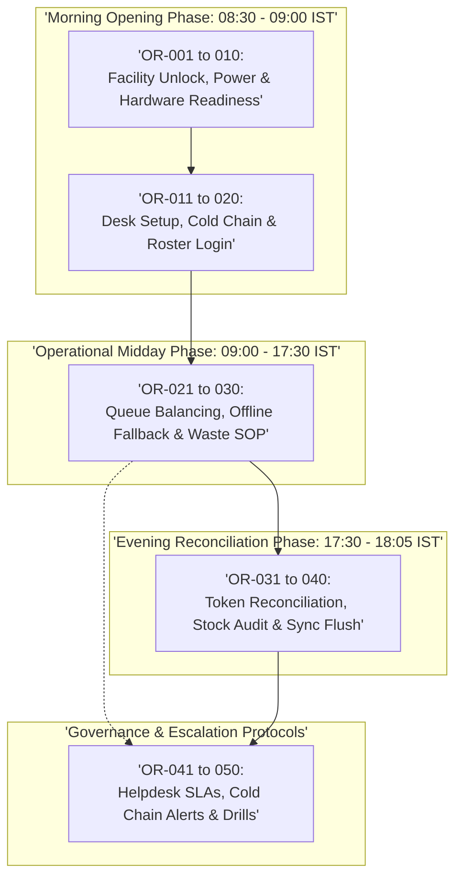

# Operational Rules Specification: Namma Clinic Digital Health Platform

| Metadata Attribute | Formal Specification |
| :--- | :--- |
| **Document Identifier** | `DOC-REQ-006-OR` |
| **Document Title** | Master Operational Rules Specification & Facility Governance Baseline |
| **Project Code** | `NAMMA-CLINIC-PLATFORM-2026` |
| **Requirement Type** | `Operational Rules (OR)` |
| **Specification Range** | `OR-001 through OR-050` (Exactly 50 unique requirements) |
| **Target Baseline** | `v1.0.0-PROD-BASELINE` |
| **Lifecycle Status** | `APPROVED & BASELINED` |
| **Target Facility Scope** | 183 Primary Namma Clinics across 8 BBMP Administrative Zones |
| **Lead Clinical Authority** | Chief Health Officer (CHO), BBMP Health Department |
| **Lead Technical Authority**| Principal Solutions Architect, Kushagramati Analytics Consortium |
| **Upstream Baselines** | [`00-project-baseline/`](../00-project-baseline/) \| [`01-project-management/`](../01-project-management/) |
| **Related Specification**| [`01-business-requirements.md`](./01-business-requirements.md) \| [`04-business-rules.md`](./04-business-rules.md) |

## 1. Executive Summary & Facility Governance Framework
This specification establishes the authoritative standard operating procedures (SOPs) and operational rules (`OR-001` through `OR-050`) governing the daily operation, hardware readiness, shift handovers, emergency escalations, and end-of-day reconciliations across all 183 Namma Clinics in Greater Bengaluru. Operational rules bridge software capabilities with physical facility discipline, ensuring that computers, power backups, cold-chain refrigerators, thermal printers, diagnostic reagents, and staff rosters maintain continuous operational readiness.

Every operational rule defines explicit pre-flight trigger events, standard operating protocols, hardware verification checks, offline resilience protocols, shift handover mandates, daily reconciliation requirements, supervisor sign-off gates, and tamper-evident audit trails.

## 2. Operational Rules Categorization Taxonomy
The 50 operational rules are structured across five specialized facility operational domains:
1. **Morning Opening & Hardware Readiness Protocols (OR-001 to OR-010):** 08:30 IST facility unlocking, crash cart verification, cold chain temperature check (+2C to +8C), thermal printer test slip, dual-desk hardware verification, IndexedDB database integrity check, pending sync queue backlog verification, 2D barcode scanner calibration, potable water inspection, and biometric roster attendance.
2. **Clinical Desk Preparation & Session Initialization (OR-011 to OR-020):** Daily token pool start (001), nursing diagnostic kit setup, doctor KMC credential verification, lab reagent temperature check, pharmacy scanner activation, battery/UPS status check, network DNS baseline probe, master formulary differential sync, daily token ceiling configuration, and wheelchair accessibility verification.
3. **Midday Operational Management & Queue Balancing (OR-021 to OR-030):** 13:00 IST queue load balancing, midday pharmacy stock spot-checks, staggered lunch rotations, sudden network outage offline mode activation, extended power outage battery conservation, emergency patient fast-track protocol, biomedical waste color-coded segregation, sharps container 75% fill replacement, lab waste chemical decontamination, and midday facility sanitation.
4. **Evening Facility Closure & Reconciliation (OR-031 to OR-040):** 17:30 IST closure checklist, open patient token reconciliation, unfulfilled prescription review, physical pharmacy count vs digital ledger audit, near-expiry quarantine verification, lab specimen clearance, daily OPD census sign-off, daily IHIP Form P surveillance submission, final sync queue flushing (18:00 IST cutoff), and terminal lockdown.
5. **Escalations, Maintenance & Supervisory Audits (OR-041 to OR-050):** IT helpdesk 30-minute breakdown escalation, cold chain breach 15-minute escalation, emergency drug stockout indenting, staff conflict de-escalation, infrastructure failure hospital divert, weekly deep cleaning and autoclaving, bi-weekly fire safety inspection, monthly offline restoration drills, quarterly zonal inspection readiness, and mandatory 3-year archival of signed reconciliation slips.



## 3. Master Operational Rules Inventory Table (OR-001 to OR-050)
| Rule ID | Operational Rule Title | Milestone Trigger | Standard Operational Protocol | Hardware Readiness Expectation | Supervisor Approval Gate |
| :--- | :--- | :--- | :--- | :--- | :--- |
| [`OR-001`](#or-001) | **Morning Clinic Facility Opening Protocol (08:30 IST)** | 08:30 IST scheduled opening... | First arriving staff member unlocks... | Workstations, thermal printers, and... | Facility Medical Officer signs... |
| [`OR-002`](#or-002) | **Emergency Resuscitation Tray Daily Inspection** | 08:45 IST daily pre-clinic ins... | Staff nurse physically verifies eme... | Oxygen cylinder pressure reads >= 1... | Staff Nurse and Medical Office... |
| [`OR-003`](#or-003) | **Cold Chain Refrigerator Morning Temperature Check** | 09:00 IST morning temperature ... | Nurse reads digital/stem thermomete... | Thermometer calibrated; ILR mains p... | Zonal Immunization Officer not... |
| [`OR-004`](#or-004) | **Thermal Printer Paper Roll & Print Test Verification** | 08:45 IST terminal startup... | Data entry operator inspects paper ... | Thermal printer connected via USB; ... | Facility Administrator.... |
| [`OR-005`](#or-005) | **Dual-Desk Workstation Hardware Health Verification** | 08:45 IST terminal boot... | Front desk and doctor desk workstat... | Available disk storage >= 10GB; RAM... | Clinic IT Focal Point.... |
| [`OR-006`](#or-006) | **Local IndexedDB Database Integrity Check** | Browser application initializa... | PWA service worker runs automated D... | Local IndexedDB database opens clea... | Automated PWA engine.... |
| [`OR-007`](#or-007) | **Pending Offline Mutation Queue Backlog Verification** | 08:50 IST pre-flight check... | Operator checks pending mutation qu... | Network connection verified active;... | Facility IT Administrator.... |
| [`OR-008`](#or-008) | **1D/2D Barcode Scanner Calibration Verification** | 08:50 IST registration desk se... | Operator scans standard test barcod... | USB barcode scanner connected and b... | Data Entry Operator.... |
| [`OR-009`](#or-009) | **Facility Potable Water & Hand Hygiene Inspection** | 08:45 IST facility sanitation ... | Auxiliary staff verifies running wa... | Water taps functional; liquid soap ... | Facility In-Charge.... |
| [`OR-010`](#or-010) | **Frontline Staff Attendance & Morning Roster Verification** | 09:00 IST clinic operational k... | All rostered staff members (MO, Nur... | Geofence verified; staff profiles a... | Medical Officer in-charge.... |
| [`OR-011`](#or-011) | **Registration Counter Daily Token Pool Initialization** | 09:00 IST OPD opening... | Data entry operator initializes dai... | Token printer paper loaded; sequenc... | Data Entry Operator.... |
| [`OR-012`](#or-012) | **Nursing Triage Station Diagnostic Kit Preparation** | 08:50 IST nursing station setu... | Staff nurse calibrates digital BP m... | Digital BP monitor battery tested; ... | Staff Nurse.... |
| [`OR-013`](#or-013) | **Doctor Consultation Desk Digital Certificate Validation** | 08:55 IST doctor room startup... | Medical Officer verifies active dig... | KMC registration active; digital si... | Medical Officer.... |
| [`OR-014`](#or-014) | **Laboratory Diagnostic Reagent Temperature Verification** | 08:50 IST laboratory bench set... | Lab technician verifies rapid diagn... | Room thermometer reads within safe ... | Lab Technician.... |
| [`OR-015`](#or-015) | **Pharmacy Dispensing Counter Barcode Scanner Activation** | 08:55 IST pharmacy setup... | Pharmacist activates 2D barcode sca... | Barcode scanner functional; dispens... | Pharmacist.... |
| [`OR-016`](#or-016) | **Workstation Battery & UPS Inverter Status Inspection** | 09:00 IST electrical check... | Facility staff inspects clinic sola... | UPS battery indicator green; invert... | Facility In-Charge.... |
| [`OR-017`](#or-017) | **Network Connectivity & DNS Probe Baseline Test** | 08:45 IST network verification... | Clinic terminal executes automated ... | Round-trip latency < 150ms; packet ... | Facility IT Focal Point.... |
| [`OR-018`](#or-018) | **Master Formulary Cache Differential Synchronization** | 08:40 IST background sync... | Terminal sync daemon checks for upd... | ETag compared against central cloud... | Automated Cache Engine.... |
| [`OR-019`](#or-019) | **Daily Queue Ceiling & Token Pool Allocation** | 09:00 IST queue configuration... | Medical Officer verifies clinic dai... | Token pool configured in queue mana... | Medical Officer.... |
| [`OR-020`](#or-020) | **Priority Seating & Wheelchair Access Verification** | 08:45 IST waiting hall inspect... | Front desk staff verifies dedicated... | Wheelchair ramp clear of obstructio... | Auxiliary Health Staff.... |
| [`OR-021`](#or-021) | **Midday Queue Load Balancing Protocol (13:00 IST)** | 13:00 IST midday operational r... | Medical Officer reviews waiting que... | Waiting room display updated; estim... | Medical Officer.... |
| [`OR-022`](#or-022) | **Midday Pharmacy Stock Tally for High-Velocity Drugs** | 13:30 IST pharmacy check... | Pharmacist conducts spot count of T... | Physical count verified against cur... | Pharmacist.... |
| [`OR-023`](#or-023) | **Staggered Lunch Rotation & Continuous Desk Coverage** | 13:00 - 14:30 IST lunch window... | Staff rotates for 30-minute lunch b... | Designated cross-covering staff mem... | Medical Officer.... |
| [`OR-024`](#or-024) | **Sudden Network Outage Offline Mode Activation** | Instantaneous upon WAN loss... | Terminal network monitor detects WA... | Local storage active; zero modal er... | Client Network Daemon.... |
| [`OR-025`](#or-025) | **Extended Power Outage Inverter Conservation Protocol** | Power outage exceeding 60 minu... | Facility staff switches off non-cri... | Inverter voltage monitored every 30... | Facility Administrator.... |
| [`OR-026`](#or-026) | **Emergency Patient Rapid Triage Fast-Track Protocol** | Immediate upon acute patient a... | Frontline staff escorts collapsing ... | Crash cart and oxygen mask placed a... | Medical Officer and Staff Nurs... |
| [`OR-027`](#or-027) | **Hazardous Biomedical Waste Segregation Verification** | 14:00 IST waste audit... | Staff nurse inspects color-coded bi... | Bins lined with non-chlorinated col... | Staff Nurse.... |
| [`OR-028`](#or-028) | **Sharps Container Replacement at 3/4th Full Capacity** | Sharps container reaches fill ... | Staff nurse permanently seals punct... | Replacement puncture-proof sharps c... | Staff Nurse.... |
| [`OR-029`](#or-029) | **Point-of-Care Laboratory Waste Disposal Protocol** | End of morning testing run (13... | Lab technician immerses used lancet... | Chemical disinfectant fresh (<24 ho... | Lab Technician.... |
| [`OR-030`](#or-030) | **Midday Facility Sanitation & Disinfection Inspection** | 14:00 IST midday cleaning roun... | Sanitation worker mops waiting hall... | Floor clean and dry; hand contact s... | Facility Supervisor.... |
| [`OR-031`](#or-031) | **Evening Clinic Facility Closure Protocol (17:30 IST)** | 17:30 IST scheduled closing... | Medical Officer initiates daily cli... | OPD registration window closed; ent... | Medical Officer.... |
| [`OR-032`](#or-032) | **Open Patient Token End-of-Day Reconciliation** | 17:35 IST closure workflow... | Registration operator reviews queue... | All issued tokens marked COMPLETED,... | Data Entry Operator and MO.... |
| [`OR-033`](#or-033) | **Unfulfilled Prescription Review & Patient Follow-up** | 17:40 IST pharmacy closing... | Pharmacist reviews prescriptions ma... | Out-of-stock items compiled into em... | Pharmacist.... |
| [`OR-034`](#or-034) | **Physical Pharmacy Stock Count vs System Ledger Audit** | 17:45 IST pharmacy closing... | Pharmacist reconciles physical coun... | Physical blister packs and bottles ... | Pharmacist and MO.... |
| [`OR-035`](#or-035) | **Near-Expiry Stock Flagging & Quarantine Action** | 17:50 IST pharmacy closing... | Pharmacist inspects quarantine shel... | Quarantined batches marked with red... | Pharmacist.... |
| [`OR-036`](#or-036) | **Laboratory Specimen Clearance & Reagent Restock** | 17:35 IST lab closing... | Lab technician verifies all blood a... | Zero pending specimens remaining in... | Lab Technician.... |
| [`OR-037`](#or-037) | **Daily OPD Census Reconciliation & Supervisor Sign-Off** | 17:50 IST administrative closi... | Medical Officer reviews aggregated ... | Daily census figures verified again... | Medical Officer.... |
| [`OR-038`](#or-038) | **Daily Disease Surveillance (IHIP Form P) Generation** | 17:55 IST surveillance closing... | Medical Officer reviews auto-popula... | Aggregated syndrome cases (fever, a... | Medical Officer.... |
| [`OR-039`](#or-039) | **Final Mutation Sync Queue Flushing to Central Cloud** | 18:00 IST final sync deadline... | Background sync daemon executes fin... | Broadband modem active; sync daemon... | Facility IT Focal Point.... |
| [`OR-040`](#or-040) | **End-of-Day Terminal Power Down & Security Lockdown** | 18:05 IST final facility lockd... | All workstation terminals safely po... | AC mains switches turned off; UPS p... | Medical Officer and Security G... |
| [`OR-041`](#or-041) | **IT Helpdesk Breakdown Escalation Protocol (<30 Mins)** | Hardware or software breakdown... | Staff logs critical failure ticket ... | Ticket number generated; remote sup... | Facility In-Charge.... |
| [`OR-042`](#or-042) | **Cold Chain Temperature Breach Urgent Escalation (<15 Mins)** | ILR temperature breaches +8C o... | Nurse immediately reports breach to... | Vaccine carriers with conditioned i... | Staff Nurse and ZIO.... |
| [`OR-043`](#or-043) | **Municipal Drug Stockout Emergency Indent Protocol** | Critical EDL medicine balance ... | Pharmacist files emergency requisit... | Emergency indent flagged with URGEN... | Pharmacist and Zonal Logistics... |
| [`OR-044`](#or-044) | **Frontline Staff Conflict & De-Escalation Protocol** | Agitated or disruptive patient... | Staff executes verbal de-escalation... | Security guard present in waiting h... | Medical Officer.... |
| [`OR-045`](#or-045) | **Critical Infrastructure Failure Hospital Divert Protocol** | Catastrophic power cut, floodi... | Medical Officer declares temporary ... | Divert notice posted at entrance an... | Chief Health Officer (BBMP).... |
| [`OR-046`](#or-046) | **Periodic Weekly Deep Cleaning & Disinfection Day** | Every Saturday 14:00 - 17:00 I... | Comprehensive deep cleaning of faci... | Autoclave chemical indicator strips... | Staff Nurse and Facility Admin... |
| [`OR-047`](#or-047) | **Bi-Weekly Fire Extinguisher & Safety Inspection** | 1st and 15th of every month... | Facility in-charge inspects ABC dry... | Fire extinguisher pressure gauge gr... | Facility In-Charge.... |
| [`OR-048`](#or-048) | **Monthly Backup Restoration & Offline Drill Execution** | Last Friday of every month at ... | Facility IT focal point disconnects... | Offline drill executes with zero da... | Zonal IT Supervisor.... |
| [`OR-049`](#or-049) | **Zonal Supervisory Facility Inspection Readiness** | Quarterly scheduled or unannou... | Clinic maintains operational regist... | All digital dashboards up to date; ... | Zonal Health Officer (ZHO).... |
| [`OR-050`](#or-050) | **Mandatory Archival of Daily Reconciliation Slips** | Daily end-of-day operational c... | Printed daily reconciliation summar... | Physical binder stored in locked ad... | Medical Officer and Facility A... |

## 4. Comprehensive Operational Rule Specifications (OR-001 to OR-050)
This section establishes the exhaustive standard operating procedures, hardware readiness expectations, offline behavior, and audit requirements for each of the 50 operational facility rules.

### 4.1 OR-001: Morning Clinic Facility Opening Protocol (08:30 IST)

| Specification Attribute | Formal Engineering Definition |
| :--- | :--- |
| **Rule ID** | `OR-001` |
| **Rule Title** | Morning Clinic Facility Opening Protocol (08:30 IST) |
| **Rule Statement** | The clinic facility SHALL enforce morning clinic facility opening protocol (08:30 ist) whenever 08:30 ist scheduled opening, executing standard operational protocol: First arriving staff member unlocks facility, inspects physical premises, switches on mains power, and boots workstations.. |
| **Rule Type** | `Operational Rule` |
| **Priority Level** | `MUST` (Rationale: Mandatory standard operating procedure for facility safety and municipal accountability.) |
| **Business Value** | Ensures uninterrupted facility readiness, supply chain continuity, and staff discipline. |
| **Operational Rationale**| Standardizes clinic day-to-day operations and prevents infrastructure degradation. |
| **Trigger Condition** | 08:30 IST scheduled opening |
| **Standard Operating Protocol**| First arriving staff member unlocks facility, inspects physical premises, switches on mains power, and boots workstations. |
| **Hardware Readiness** | Workstations, thermal printers, and network routers powered and verified. |
| **Offline Mode Behavior**| Workstation operates in local Dexie.js offline mode if broadband modem is down. |
| **Shift Handover Mandate**| Handover key retrieved from facility secure lockbox. |
| **Daily Reconciliation** | Verifies zero unfinalized tokens remaining from prior calendar day. |
| **Supervisor Approval Gate**| Facility Medical Officer signs morning facility opening log. |
| **Primary Actor** | `Clinic Operational Staff` |
| **Accountable Role** | [`ROLE-001`](../01-project-management/08-role-and-responsibility-matrix.md#role-001) |
| **Key Stakeholder** | [`STAKEHOLDER-003`](../01-project-management/06-stakeholders.md#stakeholder-003) |
| **Audit Requirement** | `Logs FACILITY_OPENING_VERIFIED to operational audit journal` |
| **Associated Rules** | Business: [`BRULE-001`](./04-business-rules.md#brule-001) \| Clinical: [`CR-001`](./05-clinical-rules.md#cr-001) |
| **Security & Privacy** | Security: `Staff must authenticate with verified personal credentials.` \| Privacy: `Physical facility logs must not expose patient names to waiting room visitors.` |
| **Data & Offline** | Data: `Checklists and telemetry persisted in `clinic_operations` schema.` \| Sync: `Operational logs buffered in Dexie.js and synced upon connection.` |
| **Upstream Traceability**| Obj: [`OBJECTIVE-001`](../01-project-management/02-project-vision-and-objectives.md#objective-001) \| Scope: [`INSCOPE-001`](../01-project-management/04-in-scope.md#inscope-001) \| Risk: [`RISK-001`](../01-project-management/12-project-risks.md#risk-001) |
| **Downstream Planning** | Epic: `PLANNED-EPIC-001` \| Feature: `PLANNED-FEATURE-001` \| API: `PLANNED-API-001` \| Test: `PLANNED-TEST-501` |

#### 4.1.1 Standard Operating Procedure & Execution Sequence
- **Standard Execution Flow (Happy Path):**
  1. Operational milestone triggered: 08:30 ist scheduled opening.
  2. Staff executes protocol: First arriving staff member unlocks facility, inspects physical premises, switches on mains power, and boots workstations..
  3. Hardware readiness verified: Workstations, thermal printers, and network routers powered and verified..
  4. Reconciliation and supervisor sign-off logged: Facility Medical Officer signs morning facility opening log..
  5. Immutable operational audit event recorded: Logs FACILITY_OPENING_VERIFIED to operational audit journal.
- **Offline Fallback Execution Flow:** If equipment or network failure occurs, execute offline fallback: Workstation operates in local Dexie.js offline mode if broadband modem is down..
- **Deficiency Escalation Flow:** If operational protocol fails or breaches threshold, escalate to Zonal Health Officer within 30 mins.

#### 4.1.2 Technical Invariants & Hardware Readiness Contract
- **Hardware Readiness Mandate:** Workstations, thermal printers, and network routers powered and verified.
- **Offline Resilience Protocol:** Workstation operates in local Dexie.js offline mode if broadband modem is down.
- **Supervisor Sign-Off Gate:** Facility Medical Officer signs morning facility opening log.
- **Mandatory Audit Event:** `Logs FACILITY_OPENING_VERIFIED to operational audit journal`

#### 4.1.3 Executable BDD Acceptance Scenarios
```gherkin
Feature: OR-001 - Morning Clinic Facility Opening Protocol (08:30 IST)
  As a Clinic Operational Staff
  I require system enforcement of morning clinic facility opening protocol (08:30 ist)
  In order to ensure municipal healthcare compliance and operational integrity

  Scenario: Happy Path Execution for OR-001
    Given the Clinic Operational Staff is authenticated and clinic terminal is operational
    When the user submits a valid request for morning clinic facility opening protocol (08:30 ist)
    Then the system successfully commits the transaction and emits an audit event

  Scenario: Input Validation and Schema Guard for OR-001
    Given the Clinic Operational Staff attempts to submit an incomplete or malformed payload for morning clinic facility opening protocol (08:30 ist)
    When the request fails TypeBox schema or domain constraint validation
    Then the system rejects the input with HTTP 400 and highlights invalid fields in Kannada and English

  Scenario: RBAC and Security Access Control for OR-001
    Given an unauthenticated or unauthorized role attempts to invoke morning clinic facility opening protocol (08:30 ist)
    When the bearer JWT token is missing, expired, or lacks necessary RBAC permission
    Then the system denies execution with HTTP 403 Forbidden and records a security telemetry alert

  Scenario: Offline Autonomous Execution for OR-001
    Given the clinic WAN network is completely severed during morning clinic facility opening protocol (08:30 ist)
    When the operator confirms the local transaction on the workstation
    Then the mutation is persisted to Dexie.js IndexedDB with a UUIDv7 and queued for background replay

  Scenario: Network Recovery and Idempotent Sync for OR-001
    Given the clinic workstation reconnects to the BBMP municipal health WAN
    When the background sync daemon processes the pending mutation queue
    Then all buffered transactions for OR-001 synchronize idempotently with zero data loss
```

#### 4.1.4 Verification Protocol & Quality Sign-Off
- **Verification Method:** Facility Operational Audit & Daily Checklist Review
- **Automated Test Suite:** `PLANNED-TEST-501` (Operational Workflow & Integration Test) targeting 100% facility SOP compliance.
- **Related Internal Requirements:** `FR-001`, `BRULE-001`
- **Dependencies & Blocking Constraints:** BR-001 | Constraints: Checklist execution must not delay emergency patient care.
- **Architectural Assumptions & Open Questions:** Assumption: Clinic facilities equipped with functional power backup and internet dongles. | Open Question: Quarterly review of facility checklist items by BBMP Quality Assurance Cell.

---

### 4.2 OR-002: Emergency Resuscitation Tray Daily Inspection

| Specification Attribute | Formal Engineering Definition |
| :--- | :--- |
| **Rule ID** | `OR-002` |
| **Rule Title** | Emergency Resuscitation Tray Daily Inspection |
| **Rule Statement** | The clinic facility SHALL enforce emergency resuscitation tray daily inspection whenever 08:45 ist daily pre-clinic inspection, executing standard operational protocol: Staff nurse physically verifies emergency drugs (Adrenaline, Atropine, Hydrocortisone) and oxygen cylinder pressure.. |
| **Rule Type** | `Operational Rule` |
| **Priority Level** | `MUST` (Rationale: Mandatory standard operating procedure for facility safety and municipal accountability.) |
| **Business Value** | Ensures uninterrupted facility readiness, supply chain continuity, and staff discipline. |
| **Operational Rationale**| Standardizes clinic day-to-day operations and prevents infrastructure degradation. |
| **Trigger Condition** | 08:45 IST daily pre-clinic inspection |
| **Standard Operating Protocol**| Staff nurse physically verifies emergency drugs (Adrenaline, Atropine, Hydrocortisone) and oxygen cylinder pressure. |
| **Hardware Readiness** | Oxygen cylinder pressure reads >= 1500 psi; suction apparatus tested. |
| **Offline Mode Behavior**| Offline inspection checklist completed on local terminal. |
| **Shift Handover Mandate**| Nurse inspects drug ampoule seals and lot expiry dates. |
| **Daily Reconciliation** | Reconciles used emergency ampoules against replacement stock. |
| **Supervisor Approval Gate**| Staff Nurse and Medical Officer dual sign-off. |
| **Primary Actor** | `Clinic Operational Staff` |
| **Accountable Role** | [`ROLE-002`](../01-project-management/08-role-and-responsibility-matrix.md#role-002) |
| **Key Stakeholder** | [`STAKEHOLDER-003`](../01-project-management/06-stakeholders.md#stakeholder-003) |
| **Audit Requirement** | `Logs EMERGENCY_TRAY_VERIFIED with oxygen pressure reading` |
| **Associated Rules** | Business: [`BRULE-002`](./04-business-rules.md#brule-002) \| Clinical: [`CR-002`](./05-clinical-rules.md#cr-002) |
| **Security & Privacy** | Security: `Staff must authenticate with verified personal credentials.` \| Privacy: `Physical facility logs must not expose patient names to waiting room visitors.` |
| **Data & Offline** | Data: `Checklists and telemetry persisted in `clinic_operations` schema.` \| Sync: `Operational logs buffered in Dexie.js and synced upon connection.` |
| **Upstream Traceability**| Obj: [`OBJECTIVE-002`](../01-project-management/02-project-vision-and-objectives.md#objective-002) \| Scope: [`INSCOPE-002`](../01-project-management/04-in-scope.md#inscope-002) \| Risk: [`RISK-002`](../01-project-management/12-project-risks.md#risk-002) |
| **Downstream Planning** | Epic: `PLANNED-EPIC-002` \| Feature: `PLANNED-FEATURE-002` \| API: `PLANNED-API-002` \| Test: `PLANNED-TEST-502` |

#### 4.2.1 Standard Operating Procedure & Execution Sequence
- **Standard Execution Flow (Happy Path):**
  1. Operational milestone triggered: 08:45 ist daily pre-clinic inspection.
  2. Staff executes protocol: Staff nurse physically verifies emergency drugs (Adrenaline, Atropine, Hydrocortisone) and oxygen cylinder pressure..
  3. Hardware readiness verified: Oxygen cylinder pressure reads >= 1500 psi; suction apparatus tested..
  4. Reconciliation and supervisor sign-off logged: Staff Nurse and Medical Officer dual sign-off..
  5. Immutable operational audit event recorded: Logs EMERGENCY_TRAY_VERIFIED with oxygen pressure reading.
- **Offline Fallback Execution Flow:** If equipment or network failure occurs, execute offline fallback: Offline inspection checklist completed on local terminal..
- **Deficiency Escalation Flow:** If operational protocol fails or breaches threshold, escalate to Zonal Health Officer within 30 mins.

#### 4.2.2 Technical Invariants & Hardware Readiness Contract
- **Hardware Readiness Mandate:** Oxygen cylinder pressure reads >= 1500 psi; suction apparatus tested.
- **Offline Resilience Protocol:** Offline inspection checklist completed on local terminal.
- **Supervisor Sign-Off Gate:** Staff Nurse and Medical Officer dual sign-off.
- **Mandatory Audit Event:** `Logs EMERGENCY_TRAY_VERIFIED with oxygen pressure reading`

#### 4.2.3 Executable BDD Acceptance Scenarios
```gherkin
Feature: OR-002 - Emergency Resuscitation Tray Daily Inspection
  As a Clinic Operational Staff
  I require system enforcement of emergency resuscitation tray daily inspection
  In order to ensure municipal healthcare compliance and operational integrity

  Scenario: Happy Path Execution for OR-002
    Given the Clinic Operational Staff is authenticated and clinic terminal is operational
    When the user submits a valid request for emergency resuscitation tray daily inspection
    Then the system successfully commits the transaction and emits an audit event

  Scenario: Input Validation and Schema Guard for OR-002
    Given the Clinic Operational Staff attempts to submit an incomplete or malformed payload for emergency resuscitation tray daily inspection
    When the request fails TypeBox schema or domain constraint validation
    Then the system rejects the input with HTTP 400 and highlights invalid fields in Kannada and English

  Scenario: RBAC and Security Access Control for OR-002
    Given an unauthenticated or unauthorized role attempts to invoke emergency resuscitation tray daily inspection
    When the bearer JWT token is missing, expired, or lacks necessary RBAC permission
    Then the system denies execution with HTTP 403 Forbidden and records a security telemetry alert

  Scenario: Offline Autonomous Execution for OR-002
    Given the clinic WAN network is completely severed during emergency resuscitation tray daily inspection
    When the operator confirms the local transaction on the workstation
    Then the mutation is persisted to Dexie.js IndexedDB with a UUIDv7 and queued for background replay

  Scenario: Network Recovery and Idempotent Sync for OR-002
    Given the clinic workstation reconnects to the BBMP municipal health WAN
    When the background sync daemon processes the pending mutation queue
    Then all buffered transactions for OR-002 synchronize idempotently with zero data loss
```

#### 4.2.4 Verification Protocol & Quality Sign-Off
- **Verification Method:** Facility Operational Audit & Daily Checklist Review
- **Automated Test Suite:** `PLANNED-TEST-502` (Operational Workflow & Integration Test) targeting 100% facility SOP compliance.
- **Related Internal Requirements:** `FR-002`, `BRULE-002`
- **Dependencies & Blocking Constraints:** BR-002 | Constraints: Checklist execution must not delay emergency patient care.
- **Architectural Assumptions & Open Questions:** Assumption: Clinic facilities equipped with functional power backup and internet dongles. | Open Question: Quarterly review of facility checklist items by BBMP Quality Assurance Cell.

---

### 4.3 OR-003: Cold Chain Refrigerator Morning Temperature Check

| Specification Attribute | Formal Engineering Definition |
| :--- | :--- |
| **Rule ID** | `OR-003` |
| **Rule Title** | Cold Chain Refrigerator Morning Temperature Check |
| **Rule Statement** | The clinic facility SHALL enforce cold chain refrigerator morning temperature check whenever 09:00 ist morning temperature audit, executing standard operational protocol: Nurse reads digital/stem thermometer inside ILR vaccine refrigerator, verifying temperature between +2C and +8C.. |
| **Rule Type** | `Operational Rule` |
| **Priority Level** | `MUST` (Rationale: Mandatory standard operating procedure for facility safety and municipal accountability.) |
| **Business Value** | Ensures uninterrupted facility readiness, supply chain continuity, and staff discipline. |
| **Operational Rationale**| Standardizes clinic day-to-day operations and prevents infrastructure degradation. |
| **Trigger Condition** | 09:00 IST morning temperature audit |
| **Standard Operating Protocol**| Nurse reads digital/stem thermometer inside ILR vaccine refrigerator, verifying temperature between +2C and +8C. |
| **Hardware Readiness** | Thermometer calibrated; ILR mains power indicator verified active. |
| **Offline Mode Behavior**| Temperature recorded locally in Dexie.js if network connection is absent. |
| **Shift Handover Mandate**| Nurse notes any overnight temperature excursions on physical card. |
| **Daily Reconciliation** | Reconciles physical dial reading against digital telemetry sensor. |
| **Supervisor Approval Gate**| Zonal Immunization Officer notified automatically if temperature breaches +8C. |
| **Primary Actor** | `Clinic Operational Staff` |
| **Accountable Role** | [`ROLE-003`](../01-project-management/08-role-and-responsibility-matrix.md#role-003) |
| **Key Stakeholder** | [`STAKEHOLDER-003`](../01-project-management/06-stakeholders.md#stakeholder-003) |
| **Audit Requirement** | `Logs COLD_CHAIN_TEMPERATURE_LOGGED with exact Celsius reading` |
| **Associated Rules** | Business: [`BRULE-003`](./04-business-rules.md#brule-003) \| Clinical: [`CR-003`](./05-clinical-rules.md#cr-003) |
| **Security & Privacy** | Security: `Staff must authenticate with verified personal credentials.` \| Privacy: `Physical facility logs must not expose patient names to waiting room visitors.` |
| **Data & Offline** | Data: `Checklists and telemetry persisted in `clinic_operations` schema.` \| Sync: `Operational logs buffered in Dexie.js and synced upon connection.` |
| **Upstream Traceability**| Obj: [`OBJECTIVE-003`](../01-project-management/02-project-vision-and-objectives.md#objective-003) \| Scope: [`INSCOPE-003`](../01-project-management/04-in-scope.md#inscope-003) \| Risk: [`RISK-003`](../01-project-management/12-project-risks.md#risk-003) |
| **Downstream Planning** | Epic: `PLANNED-EPIC-003` \| Feature: `PLANNED-FEATURE-003` \| API: `PLANNED-API-003` \| Test: `PLANNED-TEST-503` |

#### 4.3.1 Standard Operating Procedure & Execution Sequence
- **Standard Execution Flow (Happy Path):**
  1. Operational milestone triggered: 09:00 ist morning temperature audit.
  2. Staff executes protocol: Nurse reads digital/stem thermometer inside ILR vaccine refrigerator, verifying temperature between +2C and +8C..
  3. Hardware readiness verified: Thermometer calibrated; ILR mains power indicator verified active..
  4. Reconciliation and supervisor sign-off logged: Zonal Immunization Officer notified automatically if temperature breaches +8C..
  5. Immutable operational audit event recorded: Logs COLD_CHAIN_TEMPERATURE_LOGGED with exact Celsius reading.
- **Offline Fallback Execution Flow:** If equipment or network failure occurs, execute offline fallback: Temperature recorded locally in Dexie.js if network connection is absent..
- **Deficiency Escalation Flow:** If operational protocol fails or breaches threshold, escalate to Zonal Health Officer within 30 mins.

#### 4.3.2 Technical Invariants & Hardware Readiness Contract
- **Hardware Readiness Mandate:** Thermometer calibrated; ILR mains power indicator verified active.
- **Offline Resilience Protocol:** Temperature recorded locally in Dexie.js if network connection is absent.
- **Supervisor Sign-Off Gate:** Zonal Immunization Officer notified automatically if temperature breaches +8C.
- **Mandatory Audit Event:** `Logs COLD_CHAIN_TEMPERATURE_LOGGED with exact Celsius reading`

#### 4.3.3 Executable BDD Acceptance Scenarios
```gherkin
Feature: OR-003 - Cold Chain Refrigerator Morning Temperature Check
  As a Clinic Operational Staff
  I require system enforcement of cold chain refrigerator morning temperature check
  In order to ensure municipal healthcare compliance and operational integrity

  Scenario: Happy Path Execution for OR-003
    Given the Clinic Operational Staff is authenticated and clinic terminal is operational
    When the user submits a valid request for cold chain refrigerator morning temperature check
    Then the system successfully commits the transaction and emits an audit event

  Scenario: Input Validation and Schema Guard for OR-003
    Given the Clinic Operational Staff attempts to submit an incomplete or malformed payload for cold chain refrigerator morning temperature check
    When the request fails TypeBox schema or domain constraint validation
    Then the system rejects the input with HTTP 400 and highlights invalid fields in Kannada and English

  Scenario: RBAC and Security Access Control for OR-003
    Given an unauthenticated or unauthorized role attempts to invoke cold chain refrigerator morning temperature check
    When the bearer JWT token is missing, expired, or lacks necessary RBAC permission
    Then the system denies execution with HTTP 403 Forbidden and records a security telemetry alert

  Scenario: Offline Autonomous Execution for OR-003
    Given the clinic WAN network is completely severed during cold chain refrigerator morning temperature check
    When the operator confirms the local transaction on the workstation
    Then the mutation is persisted to Dexie.js IndexedDB with a UUIDv7 and queued for background replay

  Scenario: Network Recovery and Idempotent Sync for OR-003
    Given the clinic workstation reconnects to the BBMP municipal health WAN
    When the background sync daemon processes the pending mutation queue
    Then all buffered transactions for OR-003 synchronize idempotently with zero data loss
```

#### 4.3.4 Verification Protocol & Quality Sign-Off
- **Verification Method:** Facility Operational Audit & Daily Checklist Review
- **Automated Test Suite:** `PLANNED-TEST-503` (Operational Workflow & Integration Test) targeting 100% facility SOP compliance.
- **Related Internal Requirements:** `FR-003`, `BRULE-003`
- **Dependencies & Blocking Constraints:** BR-003 | Constraints: Checklist execution must not delay emergency patient care.
- **Architectural Assumptions & Open Questions:** Assumption: Clinic facilities equipped with functional power backup and internet dongles. | Open Question: Quarterly review of facility checklist items by BBMP Quality Assurance Cell.

---

### 4.4 OR-004: Thermal Printer Paper Roll & Print Test Verification

| Specification Attribute | Formal Engineering Definition |
| :--- | :--- |
| **Rule ID** | `OR-004` |
| **Rule Title** | Thermal Printer Paper Roll & Print Test Verification |
| **Rule Statement** | The clinic facility SHALL enforce thermal printer paper roll & print test verification whenever 08:45 ist terminal startup, executing standard operational protocol: Data entry operator inspects paper roll in thermal receipt printer and executes diagnostic self-test print.. |
| **Rule Type** | `Operational Rule` |
| **Priority Level** | `MUST` (Rationale: Mandatory standard operating procedure for facility safety and municipal accountability.) |
| **Business Value** | Ensures uninterrupted facility readiness, supply chain continuity, and staff discipline. |
| **Operational Rationale**| Standardizes clinic day-to-day operations and prevents infrastructure degradation. |
| **Trigger Condition** | 08:45 IST terminal startup |
| **Standard Operating Protocol**| Data entry operator inspects paper roll in thermal receipt printer and executes diagnostic self-test print. |
| **Hardware Readiness** | Thermal printer connected via USB; green ready LED illuminated. |
| **Offline Mode Behavior**| Prints local test slip without central cloud connection via Web Serial. |
| **Shift Handover Mandate**| Operator replaces paper roll if remaining diameter < 15mm. |
| **Daily Reconciliation** | Reconciles paper roll inventory count in clinic utility store. |
| **Supervisor Approval Gate**| Facility Administrator. |
| **Primary Actor** | `Clinic Operational Staff` |
| **Accountable Role** | [`ROLE-004`](../01-project-management/08-role-and-responsibility-matrix.md#role-004) |
| **Key Stakeholder** | [`STAKEHOLDER-003`](../01-project-management/06-stakeholders.md#stakeholder-003) |
| **Audit Requirement** | `Logs PRINTER_READINESS_VERIFIED with terminal hardware ID` |
| **Associated Rules** | Business: [`BRULE-004`](./04-business-rules.md#brule-004) \| Clinical: [`CR-004`](./05-clinical-rules.md#cr-004) |
| **Security & Privacy** | Security: `Staff must authenticate with verified personal credentials.` \| Privacy: `Physical facility logs must not expose patient names to waiting room visitors.` |
| **Data & Offline** | Data: `Checklists and telemetry persisted in `clinic_operations` schema.` \| Sync: `Operational logs buffered in Dexie.js and synced upon connection.` |
| **Upstream Traceability**| Obj: [`OBJECTIVE-004`](../01-project-management/02-project-vision-and-objectives.md#objective-004) \| Scope: [`INSCOPE-004`](../01-project-management/04-in-scope.md#inscope-004) \| Risk: [`RISK-004`](../01-project-management/12-project-risks.md#risk-004) |
| **Downstream Planning** | Epic: `PLANNED-EPIC-004` \| Feature: `PLANNED-FEATURE-004` \| API: `PLANNED-API-004` \| Test: `PLANNED-TEST-504` |

#### 4.4.1 Standard Operating Procedure & Execution Sequence
- **Standard Execution Flow (Happy Path):**
  1. Operational milestone triggered: 08:45 ist terminal startup.
  2. Staff executes protocol: Data entry operator inspects paper roll in thermal receipt printer and executes diagnostic self-test print..
  3. Hardware readiness verified: Thermal printer connected via USB; green ready LED illuminated..
  4. Reconciliation and supervisor sign-off logged: Facility Administrator..
  5. Immutable operational audit event recorded: Logs PRINTER_READINESS_VERIFIED with terminal hardware ID.
- **Offline Fallback Execution Flow:** If equipment or network failure occurs, execute offline fallback: Prints local test slip without central cloud connection via Web Serial..
- **Deficiency Escalation Flow:** If operational protocol fails or breaches threshold, escalate to Zonal Health Officer within 30 mins.

#### 4.4.2 Technical Invariants & Hardware Readiness Contract
- **Hardware Readiness Mandate:** Thermal printer connected via USB; green ready LED illuminated.
- **Offline Resilience Protocol:** Prints local test slip without central cloud connection via Web Serial.
- **Supervisor Sign-Off Gate:** Facility Administrator.
- **Mandatory Audit Event:** `Logs PRINTER_READINESS_VERIFIED with terminal hardware ID`

#### 4.4.3 Executable BDD Acceptance Scenarios
```gherkin
Feature: OR-004 - Thermal Printer Paper Roll & Print Test Verification
  As a Clinic Operational Staff
  I require system enforcement of thermal printer paper roll & print test verification
  In order to ensure municipal healthcare compliance and operational integrity

  Scenario: Happy Path Execution for OR-004
    Given the Clinic Operational Staff is authenticated and clinic terminal is operational
    When the user submits a valid request for thermal printer paper roll & print test verification
    Then the system successfully commits the transaction and emits an audit event

  Scenario: Input Validation and Schema Guard for OR-004
    Given the Clinic Operational Staff attempts to submit an incomplete or malformed payload for thermal printer paper roll & print test verification
    When the request fails TypeBox schema or domain constraint validation
    Then the system rejects the input with HTTP 400 and highlights invalid fields in Kannada and English

  Scenario: RBAC and Security Access Control for OR-004
    Given an unauthenticated or unauthorized role attempts to invoke thermal printer paper roll & print test verification
    When the bearer JWT token is missing, expired, or lacks necessary RBAC permission
    Then the system denies execution with HTTP 403 Forbidden and records a security telemetry alert

  Scenario: Offline Autonomous Execution for OR-004
    Given the clinic WAN network is completely severed during thermal printer paper roll & print test verification
    When the operator confirms the local transaction on the workstation
    Then the mutation is persisted to Dexie.js IndexedDB with a UUIDv7 and queued for background replay

  Scenario: Network Recovery and Idempotent Sync for OR-004
    Given the clinic workstation reconnects to the BBMP municipal health WAN
    When the background sync daemon processes the pending mutation queue
    Then all buffered transactions for OR-004 synchronize idempotently with zero data loss
```

#### 4.4.4 Verification Protocol & Quality Sign-Off
- **Verification Method:** Facility Operational Audit & Daily Checklist Review
- **Automated Test Suite:** `PLANNED-TEST-504` (Operational Workflow & Integration Test) targeting 100% facility SOP compliance.
- **Related Internal Requirements:** `FR-004`, `BRULE-004`
- **Dependencies & Blocking Constraints:** BR-004 | Constraints: Checklist execution must not delay emergency patient care.
- **Architectural Assumptions & Open Questions:** Assumption: Clinic facilities equipped with functional power backup and internet dongles. | Open Question: Quarterly review of facility checklist items by BBMP Quality Assurance Cell.

---

### 4.5 OR-005: Dual-Desk Workstation Hardware Health Verification

| Specification Attribute | Formal Engineering Definition |
| :--- | :--- |
| **Rule ID** | `OR-005` |
| **Rule Title** | Dual-Desk Workstation Hardware Health Verification |
| **Rule Statement** | The clinic facility SHALL enforce dual-desk workstation hardware health verification whenever 08:45 ist terminal boot, executing standard operational protocol: Front desk and doctor desk workstations booted, verified free of disk space warnings, and display calibrated.. |
| **Rule Type** | `Operational Rule` |
| **Priority Level** | `MUST` (Rationale: Mandatory standard operating procedure for facility safety and municipal accountability.) |
| **Business Value** | Ensures uninterrupted facility readiness, supply chain continuity, and staff discipline. |
| **Operational Rationale**| Standardizes clinic day-to-day operations and prevents infrastructure degradation. |
| **Trigger Condition** | 08:45 IST terminal boot |
| **Standard Operating Protocol**| Front desk and doctor desk workstations booted, verified free of disk space warnings, and display calibrated. |
| **Hardware Readiness** | Available disk storage >= 10GB; RAM utilization < 50% at startup. |
| **Offline Mode Behavior**| Terminal operates fully functional in local offline browser profile. |
| **Shift Handover Mandate**| Hardware inventory tags verified against municipal asset register. |
| **Daily Reconciliation** | System telemetry health ping dispatched to IT operations portal. |
| **Supervisor Approval Gate**| Clinic IT Focal Point. |
| **Primary Actor** | `Clinic Operational Staff` |
| **Accountable Role** | [`ROLE-005`](../01-project-management/08-role-and-responsibility-matrix.md#role-005) |
| **Key Stakeholder** | [`STAKEHOLDER-003`](../01-project-management/06-stakeholders.md#stakeholder-003) |
| **Audit Requirement** | `Logs WORKSTATION_HEALTH_VERIFIED to central telemetry mart` |
| **Associated Rules** | Business: [`BRULE-005`](./04-business-rules.md#brule-005) \| Clinical: [`CR-005`](./05-clinical-rules.md#cr-005) |
| **Security & Privacy** | Security: `Staff must authenticate with verified personal credentials.` \| Privacy: `Physical facility logs must not expose patient names to waiting room visitors.` |
| **Data & Offline** | Data: `Checklists and telemetry persisted in `clinic_operations` schema.` \| Sync: `Operational logs buffered in Dexie.js and synced upon connection.` |
| **Upstream Traceability**| Obj: [`OBJECTIVE-005`](../01-project-management/02-project-vision-and-objectives.md#objective-005) \| Scope: [`INSCOPE-005`](../01-project-management/04-in-scope.md#inscope-005) \| Risk: [`RISK-005`](../01-project-management/12-project-risks.md#risk-005) |
| **Downstream Planning** | Epic: `PLANNED-EPIC-005` \| Feature: `PLANNED-FEATURE-005` \| API: `PLANNED-API-005` \| Test: `PLANNED-TEST-505` |

#### 4.5.1 Standard Operating Procedure & Execution Sequence
- **Standard Execution Flow (Happy Path):**
  1. Operational milestone triggered: 08:45 ist terminal boot.
  2. Staff executes protocol: Front desk and doctor desk workstations booted, verified free of disk space warnings, and display calibrated..
  3. Hardware readiness verified: Available disk storage >= 10GB; RAM utilization < 50% at startup..
  4. Reconciliation and supervisor sign-off logged: Clinic IT Focal Point..
  5. Immutable operational audit event recorded: Logs WORKSTATION_HEALTH_VERIFIED to central telemetry mart.
- **Offline Fallback Execution Flow:** If equipment or network failure occurs, execute offline fallback: Terminal operates fully functional in local offline browser profile..
- **Deficiency Escalation Flow:** If operational protocol fails or breaches threshold, escalate to Zonal Health Officer within 30 mins.

#### 4.5.2 Technical Invariants & Hardware Readiness Contract
- **Hardware Readiness Mandate:** Available disk storage >= 10GB; RAM utilization < 50% at startup.
- **Offline Resilience Protocol:** Terminal operates fully functional in local offline browser profile.
- **Supervisor Sign-Off Gate:** Clinic IT Focal Point.
- **Mandatory Audit Event:** `Logs WORKSTATION_HEALTH_VERIFIED to central telemetry mart`

#### 4.5.3 Executable BDD Acceptance Scenarios
```gherkin
Feature: OR-005 - Dual-Desk Workstation Hardware Health Verification
  As a Clinic Operational Staff
  I require system enforcement of dual-desk workstation hardware health verification
  In order to ensure municipal healthcare compliance and operational integrity

  Scenario: Happy Path Execution for OR-005
    Given the Clinic Operational Staff is authenticated and clinic terminal is operational
    When the user submits a valid request for dual-desk workstation hardware health verification
    Then the system successfully commits the transaction and emits an audit event

  Scenario: Input Validation and Schema Guard for OR-005
    Given the Clinic Operational Staff attempts to submit an incomplete or malformed payload for dual-desk workstation hardware health verification
    When the request fails TypeBox schema or domain constraint validation
    Then the system rejects the input with HTTP 400 and highlights invalid fields in Kannada and English

  Scenario: RBAC and Security Access Control for OR-005
    Given an unauthenticated or unauthorized role attempts to invoke dual-desk workstation hardware health verification
    When the bearer JWT token is missing, expired, or lacks necessary RBAC permission
    Then the system denies execution with HTTP 403 Forbidden and records a security telemetry alert

  Scenario: Offline Autonomous Execution for OR-005
    Given the clinic WAN network is completely severed during dual-desk workstation hardware health verification
    When the operator confirms the local transaction on the workstation
    Then the mutation is persisted to Dexie.js IndexedDB with a UUIDv7 and queued for background replay

  Scenario: Network Recovery and Idempotent Sync for OR-005
    Given the clinic workstation reconnects to the BBMP municipal health WAN
    When the background sync daemon processes the pending mutation queue
    Then all buffered transactions for OR-005 synchronize idempotently with zero data loss
```

#### 4.5.4 Verification Protocol & Quality Sign-Off
- **Verification Method:** Facility Operational Audit & Daily Checklist Review
- **Automated Test Suite:** `PLANNED-TEST-505` (Operational Workflow & Integration Test) targeting 100% facility SOP compliance.
- **Related Internal Requirements:** `FR-005`, `BRULE-005`
- **Dependencies & Blocking Constraints:** BR-005 | Constraints: Checklist execution must not delay emergency patient care.
- **Architectural Assumptions & Open Questions:** Assumption: Clinic facilities equipped with functional power backup and internet dongles. | Open Question: Quarterly review of facility checklist items by BBMP Quality Assurance Cell.

---

### 4.6 OR-006: Local IndexedDB Database Integrity Check

| Specification Attribute | Formal Engineering Definition |
| :--- | :--- |
| **Rule ID** | `OR-006` |
| **Rule Title** | Local IndexedDB Database Integrity Check |
| **Rule Statement** | The clinic facility SHALL enforce local indexeddb database integrity check whenever browser application initialization, executing standard operational protocol: PWA service worker runs automated Dexie.js schema and transaction integrity check during startup.. |
| **Rule Type** | `Operational Rule` |
| **Priority Level** | `MUST` (Rationale: Mandatory standard operating procedure for facility safety and municipal accountability.) |
| **Business Value** | Ensures uninterrupted facility readiness, supply chain continuity, and staff discipline. |
| **Operational Rationale**| Standardizes clinic day-to-day operations and prevents infrastructure degradation. |
| **Trigger Condition** | Browser application initialization |
| **Standard Operating Protocol**| PWA service worker runs automated Dexie.js schema and transaction integrity check during startup. |
| **Hardware Readiness** | Local IndexedDB database opens cleanly without corruption errors. |
| **Offline Mode Behavior**| Validates presence of cached master catalogs and mutation queue. |
| **Shift Handover Mandate**| Terminal retains prior session state and pending mutations. |
| **Daily Reconciliation** | Reconciles local mutation sequence numbers against central server sync pointer. |
| **Supervisor Approval Gate**| Automated PWA engine. |
| **Primary Actor** | `Clinic Operational Staff` |
| **Accountable Role** | [`ROLE-006`](../01-project-management/08-role-and-responsibility-matrix.md#role-006) |
| **Key Stakeholder** | [`STAKEHOLDER-003`](../01-project-management/06-stakeholders.md#stakeholder-003) |
| **Audit Requirement** | `Logs CLIENT_STORAGE_INTEGRITY_CHECK to client diagnostic log` |
| **Associated Rules** | Business: [`BRULE-006`](./04-business-rules.md#brule-006) \| Clinical: [`CR-006`](./05-clinical-rules.md#cr-006) |
| **Security & Privacy** | Security: `Staff must authenticate with verified personal credentials.` \| Privacy: `Physical facility logs must not expose patient names to waiting room visitors.` |
| **Data & Offline** | Data: `Checklists and telemetry persisted in `clinic_operations` schema.` \| Sync: `Operational logs buffered in Dexie.js and synced upon connection.` |
| **Upstream Traceability**| Obj: [`OBJECTIVE-006`](../01-project-management/02-project-vision-and-objectives.md#objective-006) \| Scope: [`INSCOPE-006`](../01-project-management/04-in-scope.md#inscope-006) \| Risk: [`RISK-006`](../01-project-management/12-project-risks.md#risk-006) |
| **Downstream Planning** | Epic: `PLANNED-EPIC-006` \| Feature: `PLANNED-FEATURE-006` \| API: `PLANNED-API-006` \| Test: `PLANNED-TEST-506` |

#### 4.6.1 Standard Operating Procedure & Execution Sequence
- **Standard Execution Flow (Happy Path):**
  1. Operational milestone triggered: browser application initialization.
  2. Staff executes protocol: PWA service worker runs automated Dexie.js schema and transaction integrity check during startup..
  3. Hardware readiness verified: Local IndexedDB database opens cleanly without corruption errors..
  4. Reconciliation and supervisor sign-off logged: Automated PWA engine..
  5. Immutable operational audit event recorded: Logs CLIENT_STORAGE_INTEGRITY_CHECK to client diagnostic log.
- **Offline Fallback Execution Flow:** If equipment or network failure occurs, execute offline fallback: Validates presence of cached master catalogs and mutation queue..
- **Deficiency Escalation Flow:** If operational protocol fails or breaches threshold, escalate to Zonal Health Officer within 30 mins.

#### 4.6.2 Technical Invariants & Hardware Readiness Contract
- **Hardware Readiness Mandate:** Local IndexedDB database opens cleanly without corruption errors.
- **Offline Resilience Protocol:** Validates presence of cached master catalogs and mutation queue.
- **Supervisor Sign-Off Gate:** Automated PWA engine.
- **Mandatory Audit Event:** `Logs CLIENT_STORAGE_INTEGRITY_CHECK to client diagnostic log`

#### 4.6.3 Executable BDD Acceptance Scenarios
```gherkin
Feature: OR-006 - Local IndexedDB Database Integrity Check
  As a Clinic Operational Staff
  I require system enforcement of local indexeddb database integrity check
  In order to ensure municipal healthcare compliance and operational integrity

  Scenario: Happy Path Execution for OR-006
    Given the Clinic Operational Staff is authenticated and clinic terminal is operational
    When the user submits a valid request for local indexeddb database integrity check
    Then the system successfully commits the transaction and emits an audit event

  Scenario: Input Validation and Schema Guard for OR-006
    Given the Clinic Operational Staff attempts to submit an incomplete or malformed payload for local indexeddb database integrity check
    When the request fails TypeBox schema or domain constraint validation
    Then the system rejects the input with HTTP 400 and highlights invalid fields in Kannada and English

  Scenario: RBAC and Security Access Control for OR-006
    Given an unauthenticated or unauthorized role attempts to invoke local indexeddb database integrity check
    When the bearer JWT token is missing, expired, or lacks necessary RBAC permission
    Then the system denies execution with HTTP 403 Forbidden and records a security telemetry alert

  Scenario: Offline Autonomous Execution for OR-006
    Given the clinic WAN network is completely severed during local indexeddb database integrity check
    When the operator confirms the local transaction on the workstation
    Then the mutation is persisted to Dexie.js IndexedDB with a UUIDv7 and queued for background replay

  Scenario: Network Recovery and Idempotent Sync for OR-006
    Given the clinic workstation reconnects to the BBMP municipal health WAN
    When the background sync daemon processes the pending mutation queue
    Then all buffered transactions for OR-006 synchronize idempotently with zero data loss
```

#### 4.6.4 Verification Protocol & Quality Sign-Off
- **Verification Method:** Facility Operational Audit & Daily Checklist Review
- **Automated Test Suite:** `PLANNED-TEST-506` (Operational Workflow & Integration Test) targeting 100% facility SOP compliance.
- **Related Internal Requirements:** `FR-006`, `BRULE-006`
- **Dependencies & Blocking Constraints:** BR-006 | Constraints: Checklist execution must not delay emergency patient care.
- **Architectural Assumptions & Open Questions:** Assumption: Clinic facilities equipped with functional power backup and internet dongles. | Open Question: Quarterly review of facility checklist items by BBMP Quality Assurance Cell.

---

### 4.7 OR-007: Pending Offline Mutation Queue Backlog Verification

| Specification Attribute | Formal Engineering Definition |
| :--- | :--- |
| **Rule ID** | `OR-007` |
| **Rule Title** | Pending Offline Mutation Queue Backlog Verification |
| **Rule Statement** | The clinic facility SHALL enforce pending offline mutation queue backlog verification whenever 08:50 ist pre-flight check, executing standard operational protocol: Operator checks pending mutation queue depth; if >50 items pending from prior day, trigger manual sync flush.. |
| **Rule Type** | `Operational Rule` |
| **Priority Level** | `MUST` (Rationale: Mandatory standard operating procedure for facility safety and municipal accountability.) |
| **Business Value** | Ensures uninterrupted facility readiness, supply chain continuity, and staff discipline. |
| **Operational Rationale**| Standardizes clinic day-to-day operations and prevents infrastructure degradation. |
| **Trigger Condition** | 08:50 IST pre-flight check |
| **Standard Operating Protocol**| Operator checks pending mutation queue depth; if >50 items pending from prior day, trigger manual sync flush. |
| **Hardware Readiness** | Network connection verified active; sync bridge operational. |
| **Offline Mode Behavior**| Displays yellow warning badge if queue > 50 items during offline mode. |
| **Shift Handover Mandate**| Outgoing staff flags pending sync backlog to incoming shift. |
| **Daily Reconciliation** | Reconciles pending local transactions against committed cloud journal. |
| **Supervisor Approval Gate**| Facility IT Administrator. |
| **Primary Actor** | `Clinic Operational Staff` |
| **Accountable Role** | [`ROLE-007`](../01-project-management/08-role-and-responsibility-matrix.md#role-007) |
| **Key Stakeholder** | [`STAKEHOLDER-003`](../01-project-management/06-stakeholders.md#stakeholder-003) |
| **Audit Requirement** | `Logs SYNC_QUEUE_BACKLOG_AUDIT with count of uncommitted mutations` |
| **Associated Rules** | Business: [`BRULE-007`](./04-business-rules.md#brule-007) \| Clinical: [`CR-007`](./05-clinical-rules.md#cr-007) |
| **Security & Privacy** | Security: `Staff must authenticate with verified personal credentials.` \| Privacy: `Physical facility logs must not expose patient names to waiting room visitors.` |
| **Data & Offline** | Data: `Checklists and telemetry persisted in `clinic_operations` schema.` \| Sync: `Operational logs buffered in Dexie.js and synced upon connection.` |
| **Upstream Traceability**| Obj: [`OBJECTIVE-007`](../01-project-management/02-project-vision-and-objectives.md#objective-007) \| Scope: [`INSCOPE-007`](../01-project-management/04-in-scope.md#inscope-007) \| Risk: [`RISK-007`](../01-project-management/12-project-risks.md#risk-007) |
| **Downstream Planning** | Epic: `PLANNED-EPIC-007` \| Feature: `PLANNED-FEATURE-007` \| API: `PLANNED-API-007` \| Test: `PLANNED-TEST-507` |

#### 4.7.1 Standard Operating Procedure & Execution Sequence
- **Standard Execution Flow (Happy Path):**
  1. Operational milestone triggered: 08:50 ist pre-flight check.
  2. Staff executes protocol: Operator checks pending mutation queue depth; if >50 items pending from prior day, trigger manual sync flush..
  3. Hardware readiness verified: Network connection verified active; sync bridge operational..
  4. Reconciliation and supervisor sign-off logged: Facility IT Administrator..
  5. Immutable operational audit event recorded: Logs SYNC_QUEUE_BACKLOG_AUDIT with count of uncommitted mutations.
- **Offline Fallback Execution Flow:** If equipment or network failure occurs, execute offline fallback: Displays yellow warning badge if queue > 50 items during offline mode..
- **Deficiency Escalation Flow:** If operational protocol fails or breaches threshold, escalate to Zonal Health Officer within 30 mins.

#### 4.7.2 Technical Invariants & Hardware Readiness Contract
- **Hardware Readiness Mandate:** Network connection verified active; sync bridge operational.
- **Offline Resilience Protocol:** Displays yellow warning badge if queue > 50 items during offline mode.
- **Supervisor Sign-Off Gate:** Facility IT Administrator.
- **Mandatory Audit Event:** `Logs SYNC_QUEUE_BACKLOG_AUDIT with count of uncommitted mutations`

#### 4.7.3 Executable BDD Acceptance Scenarios
```gherkin
Feature: OR-007 - Pending Offline Mutation Queue Backlog Verification
  As a Clinic Operational Staff
  I require system enforcement of pending offline mutation queue backlog verification
  In order to ensure municipal healthcare compliance and operational integrity

  Scenario: Happy Path Execution for OR-007
    Given the Clinic Operational Staff is authenticated and clinic terminal is operational
    When the user submits a valid request for pending offline mutation queue backlog verification
    Then the system successfully commits the transaction and emits an audit event

  Scenario: Input Validation and Schema Guard for OR-007
    Given the Clinic Operational Staff attempts to submit an incomplete or malformed payload for pending offline mutation queue backlog verification
    When the request fails TypeBox schema or domain constraint validation
    Then the system rejects the input with HTTP 400 and highlights invalid fields in Kannada and English

  Scenario: RBAC and Security Access Control for OR-007
    Given an unauthenticated or unauthorized role attempts to invoke pending offline mutation queue backlog verification
    When the bearer JWT token is missing, expired, or lacks necessary RBAC permission
    Then the system denies execution with HTTP 403 Forbidden and records a security telemetry alert

  Scenario: Offline Autonomous Execution for OR-007
    Given the clinic WAN network is completely severed during pending offline mutation queue backlog verification
    When the operator confirms the local transaction on the workstation
    Then the mutation is persisted to Dexie.js IndexedDB with a UUIDv7 and queued for background replay

  Scenario: Network Recovery and Idempotent Sync for OR-007
    Given the clinic workstation reconnects to the BBMP municipal health WAN
    When the background sync daemon processes the pending mutation queue
    Then all buffered transactions for OR-007 synchronize idempotently with zero data loss
```

#### 4.7.4 Verification Protocol & Quality Sign-Off
- **Verification Method:** Facility Operational Audit & Daily Checklist Review
- **Automated Test Suite:** `PLANNED-TEST-507` (Operational Workflow & Integration Test) targeting 100% facility SOP compliance.
- **Related Internal Requirements:** `FR-007`, `BRULE-007`
- **Dependencies & Blocking Constraints:** BR-007 | Constraints: Checklist execution must not delay emergency patient care.
- **Architectural Assumptions & Open Questions:** Assumption: Clinic facilities equipped with functional power backup and internet dongles. | Open Question: Quarterly review of facility checklist items by BBMP Quality Assurance Cell.

---

### 4.8 OR-008: 1D/2D Barcode Scanner Calibration Verification

| Specification Attribute | Formal Engineering Definition |
| :--- | :--- |
| **Rule ID** | `OR-008` |
| **Rule Title** | 1D/2D Barcode Scanner Calibration Verification |
| **Rule Statement** | The clinic facility SHALL enforce 1d/2d barcode scanner calibration verification whenever 08:50 ist registration desk setup, executing standard operational protocol: Operator scans standard test barcode on desk placard to verify scanner decoding and keyboard wedge input.. |
| **Rule Type** | `Operational Rule` |
| **Priority Level** | `MUST` (Rationale: Mandatory standard operating procedure for facility safety and municipal accountability.) |
| **Business Value** | Ensures uninterrupted facility readiness, supply chain continuity, and staff discipline. |
| **Operational Rationale**| Standardizes clinic day-to-day operations and prevents infrastructure degradation. |
| **Trigger Condition** | 08:50 IST registration desk setup |
| **Standard Operating Protocol**| Operator scans standard test barcode on desk placard to verify scanner decoding and keyboard wedge input. |
| **Hardware Readiness** | USB barcode scanner connected and beeps upon test decode. |
| **Offline Mode Behavior**| Scanner inputs decoded alphanumeric string directly into local browser form. |
| **Shift Handover Mandate**| Scanner wiped with disinfectant cloth between shifts. |
| **Daily Reconciliation** | Reconciles scanner serial number with clinic asset record. |
| **Supervisor Approval Gate**| Data Entry Operator. |
| **Primary Actor** | `Clinic Operational Staff` |
| **Accountable Role** | [`ROLE-008`](../01-project-management/08-role-and-responsibility-matrix.md#role-008) |
| **Key Stakeholder** | [`STAKEHOLDER-003`](../01-project-management/06-stakeholders.md#stakeholder-003) |
| **Audit Requirement** | `Logs SCANNER_READINESS_VERIFIED to operational journal` |
| **Associated Rules** | Business: [`BRULE-008`](./04-business-rules.md#brule-008) \| Clinical: [`CR-008`](./05-clinical-rules.md#cr-008) |
| **Security & Privacy** | Security: `Staff must authenticate with verified personal credentials.` \| Privacy: `Physical facility logs must not expose patient names to waiting room visitors.` |
| **Data & Offline** | Data: `Checklists and telemetry persisted in `clinic_operations` schema.` \| Sync: `Operational logs buffered in Dexie.js and synced upon connection.` |
| **Upstream Traceability**| Obj: [`OBJECTIVE-008`](../01-project-management/02-project-vision-and-objectives.md#objective-008) \| Scope: [`INSCOPE-008`](../01-project-management/04-in-scope.md#inscope-008) \| Risk: [`RISK-008`](../01-project-management/12-project-risks.md#risk-008) |
| **Downstream Planning** | Epic: `PLANNED-EPIC-008` \| Feature: `PLANNED-FEATURE-008` \| API: `PLANNED-API-008` \| Test: `PLANNED-TEST-508` |

#### 4.8.1 Standard Operating Procedure & Execution Sequence
- **Standard Execution Flow (Happy Path):**
  1. Operational milestone triggered: 08:50 ist registration desk setup.
  2. Staff executes protocol: Operator scans standard test barcode on desk placard to verify scanner decoding and keyboard wedge input..
  3. Hardware readiness verified: USB barcode scanner connected and beeps upon test decode..
  4. Reconciliation and supervisor sign-off logged: Data Entry Operator..
  5. Immutable operational audit event recorded: Logs SCANNER_READINESS_VERIFIED to operational journal.
- **Offline Fallback Execution Flow:** If equipment or network failure occurs, execute offline fallback: Scanner inputs decoded alphanumeric string directly into local browser form..
- **Deficiency Escalation Flow:** If operational protocol fails or breaches threshold, escalate to Zonal Health Officer within 30 mins.

#### 4.8.2 Technical Invariants & Hardware Readiness Contract
- **Hardware Readiness Mandate:** USB barcode scanner connected and beeps upon test decode.
- **Offline Resilience Protocol:** Scanner inputs decoded alphanumeric string directly into local browser form.
- **Supervisor Sign-Off Gate:** Data Entry Operator.
- **Mandatory Audit Event:** `Logs SCANNER_READINESS_VERIFIED to operational journal`

#### 4.8.3 Executable BDD Acceptance Scenarios
```gherkin
Feature: OR-008 - 1D/2D Barcode Scanner Calibration Verification
  As a Clinic Operational Staff
  I require system enforcement of 1d/2d barcode scanner calibration verification
  In order to ensure municipal healthcare compliance and operational integrity

  Scenario: Happy Path Execution for OR-008
    Given the Clinic Operational Staff is authenticated and clinic terminal is operational
    When the user submits a valid request for 1d/2d barcode scanner calibration verification
    Then the system successfully commits the transaction and emits an audit event

  Scenario: Input Validation and Schema Guard for OR-008
    Given the Clinic Operational Staff attempts to submit an incomplete or malformed payload for 1d/2d barcode scanner calibration verification
    When the request fails TypeBox schema or domain constraint validation
    Then the system rejects the input with HTTP 400 and highlights invalid fields in Kannada and English

  Scenario: RBAC and Security Access Control for OR-008
    Given an unauthenticated or unauthorized role attempts to invoke 1d/2d barcode scanner calibration verification
    When the bearer JWT token is missing, expired, or lacks necessary RBAC permission
    Then the system denies execution with HTTP 403 Forbidden and records a security telemetry alert

  Scenario: Offline Autonomous Execution for OR-008
    Given the clinic WAN network is completely severed during 1d/2d barcode scanner calibration verification
    When the operator confirms the local transaction on the workstation
    Then the mutation is persisted to Dexie.js IndexedDB with a UUIDv7 and queued for background replay

  Scenario: Network Recovery and Idempotent Sync for OR-008
    Given the clinic workstation reconnects to the BBMP municipal health WAN
    When the background sync daemon processes the pending mutation queue
    Then all buffered transactions for OR-008 synchronize idempotently with zero data loss
```

#### 4.8.4 Verification Protocol & Quality Sign-Off
- **Verification Method:** Facility Operational Audit & Daily Checklist Review
- **Automated Test Suite:** `PLANNED-TEST-508` (Operational Workflow & Integration Test) targeting 100% facility SOP compliance.
- **Related Internal Requirements:** `FR-008`, `BRULE-008`
- **Dependencies & Blocking Constraints:** BR-008 | Constraints: Checklist execution must not delay emergency patient care.
- **Architectural Assumptions & Open Questions:** Assumption: Clinic facilities equipped with functional power backup and internet dongles. | Open Question: Quarterly review of facility checklist items by BBMP Quality Assurance Cell.

---

### 4.9 OR-009: Facility Potable Water & Hand Hygiene Inspection

| Specification Attribute | Formal Engineering Definition |
| :--- | :--- |
| **Rule ID** | `OR-009` |
| **Rule Title** | Facility Potable Water & Hand Hygiene Inspection |
| **Rule Statement** | The clinic facility SHALL enforce facility potable water & hand hygiene inspection whenever 08:45 ist facility sanitation round, executing standard operational protocol: Auxiliary staff verifies running water at scrub sinks, liquid soap dispensers filled, and clean drinking water available for patients.. |
| **Rule Type** | `Operational Rule` |
| **Priority Level** | `MUST` (Rationale: Mandatory standard operating procedure for facility safety and municipal accountability.) |
| **Business Value** | Ensures uninterrupted facility readiness, supply chain continuity, and staff discipline. |
| **Operational Rationale**| Standardizes clinic day-to-day operations and prevents infrastructure degradation. |
| **Trigger Condition** | 08:45 IST facility sanitation round |
| **Standard Operating Protocol**| Auxiliary staff verifies running water at scrub sinks, liquid soap dispensers filled, and clean drinking water available for patients. |
| **Hardware Readiness** | Water taps functional; liquid soap and alcohol hand rub present at all desks. |
| **Offline Mode Behavior**| Sanitation checklist logged on mobile or terminal offline form. |
| **Shift Handover Mandate**| Sanitation log signed off by cleaning supervisor. |
| **Daily Reconciliation** | Reconciles water filter cartridge replacement date against municipal schedule. |
| **Supervisor Approval Gate**| Facility In-Charge. |
| **Primary Actor** | `Clinic Operational Staff` |
| **Accountable Role** | [`ROLE-009`](../01-project-management/08-role-and-responsibility-matrix.md#role-009) |
| **Key Stakeholder** | [`STAKEHOLDER-003`](../01-project-management/06-stakeholders.md#stakeholder-003) |
| **Audit Requirement** | `Logs SANITATION_READINESS_VERIFIED to facility maintenance journal` |
| **Associated Rules** | Business: [`BRULE-009`](./04-business-rules.md#brule-009) \| Clinical: [`CR-009`](./05-clinical-rules.md#cr-009) |
| **Security & Privacy** | Security: `Staff must authenticate with verified personal credentials.` \| Privacy: `Physical facility logs must not expose patient names to waiting room visitors.` |
| **Data & Offline** | Data: `Checklists and telemetry persisted in `clinic_operations` schema.` \| Sync: `Operational logs buffered in Dexie.js and synced upon connection.` |
| **Upstream Traceability**| Obj: [`OBJECTIVE-009`](../01-project-management/02-project-vision-and-objectives.md#objective-009) \| Scope: [`INSCOPE-009`](../01-project-management/04-in-scope.md#inscope-009) \| Risk: [`RISK-009`](../01-project-management/12-project-risks.md#risk-009) |
| **Downstream Planning** | Epic: `PLANNED-EPIC-009` \| Feature: `PLANNED-FEATURE-009` \| API: `PLANNED-API-009` \| Test: `PLANNED-TEST-509` |

#### 4.9.1 Standard Operating Procedure & Execution Sequence
- **Standard Execution Flow (Happy Path):**
  1. Operational milestone triggered: 08:45 ist facility sanitation round.
  2. Staff executes protocol: Auxiliary staff verifies running water at scrub sinks, liquid soap dispensers filled, and clean drinking water available for patients..
  3. Hardware readiness verified: Water taps functional; liquid soap and alcohol hand rub present at all desks..
  4. Reconciliation and supervisor sign-off logged: Facility In-Charge..
  5. Immutable operational audit event recorded: Logs SANITATION_READINESS_VERIFIED to facility maintenance journal.
- **Offline Fallback Execution Flow:** If equipment or network failure occurs, execute offline fallback: Sanitation checklist logged on mobile or terminal offline form..
- **Deficiency Escalation Flow:** If operational protocol fails or breaches threshold, escalate to Zonal Health Officer within 30 mins.

#### 4.9.2 Technical Invariants & Hardware Readiness Contract
- **Hardware Readiness Mandate:** Water taps functional; liquid soap and alcohol hand rub present at all desks.
- **Offline Resilience Protocol:** Sanitation checklist logged on mobile or terminal offline form.
- **Supervisor Sign-Off Gate:** Facility In-Charge.
- **Mandatory Audit Event:** `Logs SANITATION_READINESS_VERIFIED to facility maintenance journal`

#### 4.9.3 Executable BDD Acceptance Scenarios
```gherkin
Feature: OR-009 - Facility Potable Water & Hand Hygiene Inspection
  As a Clinic Operational Staff
  I require system enforcement of facility potable water & hand hygiene inspection
  In order to ensure municipal healthcare compliance and operational integrity

  Scenario: Happy Path Execution for OR-009
    Given the Clinic Operational Staff is authenticated and clinic terminal is operational
    When the user submits a valid request for facility potable water & hand hygiene inspection
    Then the system successfully commits the transaction and emits an audit event

  Scenario: Input Validation and Schema Guard for OR-009
    Given the Clinic Operational Staff attempts to submit an incomplete or malformed payload for facility potable water & hand hygiene inspection
    When the request fails TypeBox schema or domain constraint validation
    Then the system rejects the input with HTTP 400 and highlights invalid fields in Kannada and English

  Scenario: RBAC and Security Access Control for OR-009
    Given an unauthenticated or unauthorized role attempts to invoke facility potable water & hand hygiene inspection
    When the bearer JWT token is missing, expired, or lacks necessary RBAC permission
    Then the system denies execution with HTTP 403 Forbidden and records a security telemetry alert

  Scenario: Offline Autonomous Execution for OR-009
    Given the clinic WAN network is completely severed during facility potable water & hand hygiene inspection
    When the operator confirms the local transaction on the workstation
    Then the mutation is persisted to Dexie.js IndexedDB with a UUIDv7 and queued for background replay

  Scenario: Network Recovery and Idempotent Sync for OR-009
    Given the clinic workstation reconnects to the BBMP municipal health WAN
    When the background sync daemon processes the pending mutation queue
    Then all buffered transactions for OR-009 synchronize idempotently with zero data loss
```

#### 4.9.4 Verification Protocol & Quality Sign-Off
- **Verification Method:** Facility Operational Audit & Daily Checklist Review
- **Automated Test Suite:** `PLANNED-TEST-509` (Operational Workflow & Integration Test) targeting 100% facility SOP compliance.
- **Related Internal Requirements:** `FR-009`, `BRULE-009`
- **Dependencies & Blocking Constraints:** BR-009 | Constraints: Checklist execution must not delay emergency patient care.
- **Architectural Assumptions & Open Questions:** Assumption: Clinic facilities equipped with functional power backup and internet dongles. | Open Question: Quarterly review of facility checklist items by BBMP Quality Assurance Cell.

---

### 4.10 OR-010: Frontline Staff Attendance & Morning Roster Verification

| Specification Attribute | Formal Engineering Definition |
| :--- | :--- |
| **Rule ID** | `OR-010` |
| **Rule Title** | Frontline Staff Attendance & Morning Roster Verification |
| **Rule Statement** | The clinic facility SHALL enforce frontline staff attendance & morning roster verification whenever 09:00 ist clinic operational kickoff, executing standard operational protocol: All rostered staff members (MO, Nurse, Pharmacist, Lab Tech, DEO) log into clinic terminals with biometric/PIN authentication.. |
| **Rule Type** | `Operational Rule` |
| **Priority Level** | `MUST` (Rationale: Mandatory standard operating procedure for facility safety and municipal accountability.) |
| **Business Value** | Ensures uninterrupted facility readiness, supply chain continuity, and staff discipline. |
| **Operational Rationale**| Standardizes clinic day-to-day operations and prevents infrastructure degradation. |
| **Trigger Condition** | 09:00 IST clinic operational kickoff |
| **Standard Operating Protocol**| All rostered staff members (MO, Nurse, Pharmacist, Lab Tech, DEO) log into clinic terminals with biometric/PIN authentication. |
| **Hardware Readiness** | Geofence verified; staff profiles authenticated on terminal. |
| **Offline Mode Behavior**| Offline biometric login validated against cached local credentials. |
| **Shift Handover Mandate**| Absence of any rostered staff immediately reported to Zonal Health Officer. |
| **Daily Reconciliation** | Reconciles physical presence with BBMP HRMS biometric attendance. |
| **Supervisor Approval Gate**| Medical Officer in-charge. |
| **Primary Actor** | `Clinic Operational Staff` |
| **Accountable Role** | [`ROLE-010`](../01-project-management/08-role-and-responsibility-matrix.md#role-010) |
| **Key Stakeholder** | [`STAKEHOLDER-003`](../01-project-management/06-stakeholders.md#stakeholder-003) |
| **Audit Requirement** | `Logs ROSTER_ATTENDANCE_COMMITTED to municipal HRMS database` |
| **Associated Rules** | Business: [`BRULE-010`](./04-business-rules.md#brule-010) \| Clinical: [`CR-010`](./05-clinical-rules.md#cr-010) |
| **Security & Privacy** | Security: `Staff must authenticate with verified personal credentials.` \| Privacy: `Physical facility logs must not expose patient names to waiting room visitors.` |
| **Data & Offline** | Data: `Checklists and telemetry persisted in `clinic_operations` schema.` \| Sync: `Operational logs buffered in Dexie.js and synced upon connection.` |
| **Upstream Traceability**| Obj: [`OBJECTIVE-010`](../01-project-management/02-project-vision-and-objectives.md#objective-010) \| Scope: [`INSCOPE-010`](../01-project-management/04-in-scope.md#inscope-010) \| Risk: [`RISK-010`](../01-project-management/12-project-risks.md#risk-010) |
| **Downstream Planning** | Epic: `PLANNED-EPIC-010` \| Feature: `PLANNED-FEATURE-010` \| API: `PLANNED-API-010` \| Test: `PLANNED-TEST-510` |

#### 4.10.1 Standard Operating Procedure & Execution Sequence
- **Standard Execution Flow (Happy Path):**
  1. Operational milestone triggered: 09:00 ist clinic operational kickoff.
  2. Staff executes protocol: All rostered staff members (MO, Nurse, Pharmacist, Lab Tech, DEO) log into clinic terminals with biometric/PIN authentication..
  3. Hardware readiness verified: Geofence verified; staff profiles authenticated on terminal..
  4. Reconciliation and supervisor sign-off logged: Medical Officer in-charge..
  5. Immutable operational audit event recorded: Logs ROSTER_ATTENDANCE_COMMITTED to municipal HRMS database.
- **Offline Fallback Execution Flow:** If equipment or network failure occurs, execute offline fallback: Offline biometric login validated against cached local credentials..
- **Deficiency Escalation Flow:** If operational protocol fails or breaches threshold, escalate to Zonal Health Officer within 30 mins.

#### 4.10.2 Technical Invariants & Hardware Readiness Contract
- **Hardware Readiness Mandate:** Geofence verified; staff profiles authenticated on terminal.
- **Offline Resilience Protocol:** Offline biometric login validated against cached local credentials.
- **Supervisor Sign-Off Gate:** Medical Officer in-charge.
- **Mandatory Audit Event:** `Logs ROSTER_ATTENDANCE_COMMITTED to municipal HRMS database`

#### 4.10.3 Executable BDD Acceptance Scenarios
```gherkin
Feature: OR-010 - Frontline Staff Attendance & Morning Roster Verification
  As a Clinic Operational Staff
  I require system enforcement of frontline staff attendance & morning roster verification
  In order to ensure municipal healthcare compliance and operational integrity

  Scenario: Happy Path Execution for OR-010
    Given the Clinic Operational Staff is authenticated and clinic terminal is operational
    When the user submits a valid request for frontline staff attendance & morning roster verification
    Then the system successfully commits the transaction and emits an audit event

  Scenario: Input Validation and Schema Guard for OR-010
    Given the Clinic Operational Staff attempts to submit an incomplete or malformed payload for frontline staff attendance & morning roster verification
    When the request fails TypeBox schema or domain constraint validation
    Then the system rejects the input with HTTP 400 and highlights invalid fields in Kannada and English

  Scenario: RBAC and Security Access Control for OR-010
    Given an unauthenticated or unauthorized role attempts to invoke frontline staff attendance & morning roster verification
    When the bearer JWT token is missing, expired, or lacks necessary RBAC permission
    Then the system denies execution with HTTP 403 Forbidden and records a security telemetry alert

  Scenario: Offline Autonomous Execution for OR-010
    Given the clinic WAN network is completely severed during frontline staff attendance & morning roster verification
    When the operator confirms the local transaction on the workstation
    Then the mutation is persisted to Dexie.js IndexedDB with a UUIDv7 and queued for background replay

  Scenario: Network Recovery and Idempotent Sync for OR-010
    Given the clinic workstation reconnects to the BBMP municipal health WAN
    When the background sync daemon processes the pending mutation queue
    Then all buffered transactions for OR-010 synchronize idempotently with zero data loss
```

#### 4.10.4 Verification Protocol & Quality Sign-Off
- **Verification Method:** Facility Operational Audit & Daily Checklist Review
- **Automated Test Suite:** `PLANNED-TEST-510` (Operational Workflow & Integration Test) targeting 100% facility SOP compliance.
- **Related Internal Requirements:** `FR-010`, `BRULE-010`
- **Dependencies & Blocking Constraints:** BR-010 | Constraints: Checklist execution must not delay emergency patient care.
- **Architectural Assumptions & Open Questions:** Assumption: Clinic facilities equipped with functional power backup and internet dongles. | Open Question: Quarterly review of facility checklist items by BBMP Quality Assurance Cell.

---

### 4.11 OR-011: Registration Counter Daily Token Pool Initialization

| Specification Attribute | Formal Engineering Definition |
| :--- | :--- |
| **Rule ID** | `OR-011` |
| **Rule Title** | Registration Counter Daily Token Pool Initialization |
| **Rule Statement** | The clinic facility SHALL enforce registration counter daily token pool initialization whenever 09:00 ist opd opening, executing standard operational protocol: Data entry operator initializes daily token dispensing engine, confirming sequence starts at 001.. |
| **Rule Type** | `Operational Rule` |
| **Priority Level** | `MUST` (Rationale: Mandatory standard operating procedure for facility safety and municipal accountability.) |
| **Business Value** | Ensures uninterrupted facility readiness, supply chain continuity, and staff discipline. |
| **Operational Rationale**| Standardizes clinic day-to-day operations and prevents infrastructure degradation. |
| **Trigger Condition** | 09:00 IST OPD opening |
| **Standard Operating Protocol**| Data entry operator initializes daily token dispensing engine, confirming sequence starts at 001. |
| **Hardware Readiness** | Token printer paper loaded; sequence counter verified reset. |
| **Offline Mode Behavior**| Tokens issue sequentially in offline mode using local sequence counter. |
| **Shift Handover Mandate**| Registration counter desk handover checklist verified. |
| **Daily Reconciliation** | Reconciles token issuance counts with end-of-day register. |
| **Supervisor Approval Gate**| Data Entry Operator. |
| **Primary Actor** | `Clinic Operational Staff` |
| **Accountable Role** | [`ROLE-011`](../01-project-management/08-role-and-responsibility-matrix.md#role-011) |
| **Key Stakeholder** | [`STAKEHOLDER-003`](../01-project-management/06-stakeholders.md#stakeholder-003) |
| **Audit Requirement** | `Logs TOKEN_POOL_INITIALIZED with start sequence number 001` |
| **Associated Rules** | Business: [`BRULE-011`](./04-business-rules.md#brule-011) \| Clinical: [`CR-011`](./05-clinical-rules.md#cr-011) |
| **Security & Privacy** | Security: `Staff must authenticate with verified personal credentials.` \| Privacy: `Physical facility logs must not expose patient names to waiting room visitors.` |
| **Data & Offline** | Data: `Checklists and telemetry persisted in `clinic_operations` schema.` \| Sync: `Operational logs buffered in Dexie.js and synced upon connection.` |
| **Upstream Traceability**| Obj: [`OBJECTIVE-011`](../01-project-management/02-project-vision-and-objectives.md#objective-011) \| Scope: [`INSCOPE-011`](../01-project-management/04-in-scope.md#inscope-011) \| Risk: [`RISK-011`](../01-project-management/12-project-risks.md#risk-011) |
| **Downstream Planning** | Epic: `PLANNED-EPIC-011` \| Feature: `PLANNED-FEATURE-011` \| API: `PLANNED-API-011` \| Test: `PLANNED-TEST-511` |

#### 4.11.1 Standard Operating Procedure & Execution Sequence
- **Standard Execution Flow (Happy Path):**
  1. Operational milestone triggered: 09:00 ist opd opening.
  2. Staff executes protocol: Data entry operator initializes daily token dispensing engine, confirming sequence starts at 001..
  3. Hardware readiness verified: Token printer paper loaded; sequence counter verified reset..
  4. Reconciliation and supervisor sign-off logged: Data Entry Operator..
  5. Immutable operational audit event recorded: Logs TOKEN_POOL_INITIALIZED with start sequence number 001.
- **Offline Fallback Execution Flow:** If equipment or network failure occurs, execute offline fallback: Tokens issue sequentially in offline mode using local sequence counter..
- **Deficiency Escalation Flow:** If operational protocol fails or breaches threshold, escalate to Zonal Health Officer within 30 mins.

#### 4.11.2 Technical Invariants & Hardware Readiness Contract
- **Hardware Readiness Mandate:** Token printer paper loaded; sequence counter verified reset.
- **Offline Resilience Protocol:** Tokens issue sequentially in offline mode using local sequence counter.
- **Supervisor Sign-Off Gate:** Data Entry Operator.
- **Mandatory Audit Event:** `Logs TOKEN_POOL_INITIALIZED with start sequence number 001`

#### 4.11.3 Executable BDD Acceptance Scenarios
```gherkin
Feature: OR-011 - Registration Counter Daily Token Pool Initialization
  As a Clinic Operational Staff
  I require system enforcement of registration counter daily token pool initialization
  In order to ensure municipal healthcare compliance and operational integrity

  Scenario: Happy Path Execution for OR-011
    Given the Clinic Operational Staff is authenticated and clinic terminal is operational
    When the user submits a valid request for registration counter daily token pool initialization
    Then the system successfully commits the transaction and emits an audit event

  Scenario: Input Validation and Schema Guard for OR-011
    Given the Clinic Operational Staff attempts to submit an incomplete or malformed payload for registration counter daily token pool initialization
    When the request fails TypeBox schema or domain constraint validation
    Then the system rejects the input with HTTP 400 and highlights invalid fields in Kannada and English

  Scenario: RBAC and Security Access Control for OR-011
    Given an unauthenticated or unauthorized role attempts to invoke registration counter daily token pool initialization
    When the bearer JWT token is missing, expired, or lacks necessary RBAC permission
    Then the system denies execution with HTTP 403 Forbidden and records a security telemetry alert

  Scenario: Offline Autonomous Execution for OR-011
    Given the clinic WAN network is completely severed during registration counter daily token pool initialization
    When the operator confirms the local transaction on the workstation
    Then the mutation is persisted to Dexie.js IndexedDB with a UUIDv7 and queued for background replay

  Scenario: Network Recovery and Idempotent Sync for OR-011
    Given the clinic workstation reconnects to the BBMP municipal health WAN
    When the background sync daemon processes the pending mutation queue
    Then all buffered transactions for OR-011 synchronize idempotently with zero data loss
```

#### 4.11.4 Verification Protocol & Quality Sign-Off
- **Verification Method:** Facility Operational Audit & Daily Checklist Review
- **Automated Test Suite:** `PLANNED-TEST-511` (Operational Workflow & Integration Test) targeting 100% facility SOP compliance.
- **Related Internal Requirements:** `FR-011`, `BRULE-011`
- **Dependencies & Blocking Constraints:** BR-011 | Constraints: Checklist execution must not delay emergency patient care.
- **Architectural Assumptions & Open Questions:** Assumption: Clinic facilities equipped with functional power backup and internet dongles. | Open Question: Quarterly review of facility checklist items by BBMP Quality Assurance Cell.

---

### 4.12 OR-012: Nursing Triage Station Diagnostic Kit Preparation

| Specification Attribute | Formal Engineering Definition |
| :--- | :--- |
| **Rule ID** | `OR-012` |
| **Rule Title** | Nursing Triage Station Diagnostic Kit Preparation |
| **Rule Statement** | The clinic facility SHALL enforce nursing triage station diagnostic kit preparation whenever 08:50 ist nursing station setup, executing standard operational protocol: Staff nurse calibrates digital BP monitor, replaces glucometer strip drum, and prepares disposable lancets and alcohol swabs.. |
| **Rule Type** | `Operational Rule` |
| **Priority Level** | `MUST` (Rationale: Mandatory standard operating procedure for facility safety and municipal accountability.) |
| **Business Value** | Ensures uninterrupted facility readiness, supply chain continuity, and staff discipline. |
| **Operational Rationale**| Standardizes clinic day-to-day operations and prevents infrastructure degradation. |
| **Trigger Condition** | 08:50 IST nursing station setup |
| **Standard Operating Protocol**| Staff nurse calibrates digital BP monitor, replaces glucometer strip drum, and prepares disposable lancets and alcohol swabs. |
| **Hardware Readiness** | Digital BP monitor battery tested; glucometer code chip verified. |
| **Offline Mode Behavior**| Triage station functional in offline mode with paper backup available. |
| **Shift Handover Mandate**| Nurse stocks disposable gloves and surgical masks for shift. |
| **Daily Reconciliation** | Reconciles glucometer test strip count with pharmacy stock balance. |
| **Supervisor Approval Gate**| Staff Nurse. |
| **Primary Actor** | `Clinic Operational Staff` |
| **Accountable Role** | [`ROLE-012`](../01-project-management/08-role-and-responsibility-matrix.md#role-012) |
| **Key Stakeholder** | [`STAKEHOLDER-003`](../01-project-management/06-stakeholders.md#stakeholder-003) |
| **Audit Requirement** | `Logs TRIAGE_STATION_PREPARED with diagnostic kit batch IDs` |
| **Associated Rules** | Business: [`BRULE-012`](./04-business-rules.md#brule-012) \| Clinical: [`CR-012`](./05-clinical-rules.md#cr-012) |
| **Security & Privacy** | Security: `Staff must authenticate with verified personal credentials.` \| Privacy: `Physical facility logs must not expose patient names to waiting room visitors.` |
| **Data & Offline** | Data: `Checklists and telemetry persisted in `clinic_operations` schema.` \| Sync: `Operational logs buffered in Dexie.js and synced upon connection.` |
| **Upstream Traceability**| Obj: [`OBJECTIVE-012`](../01-project-management/02-project-vision-and-objectives.md#objective-012) \| Scope: [`INSCOPE-012`](../01-project-management/04-in-scope.md#inscope-012) \| Risk: [`RISK-012`](../01-project-management/12-project-risks.md#risk-012) |
| **Downstream Planning** | Epic: `PLANNED-EPIC-012` \| Feature: `PLANNED-FEATURE-012` \| API: `PLANNED-API-012` \| Test: `PLANNED-TEST-512` |

#### 4.12.1 Standard Operating Procedure & Execution Sequence
- **Standard Execution Flow (Happy Path):**
  1. Operational milestone triggered: 08:50 ist nursing station setup.
  2. Staff executes protocol: Staff nurse calibrates digital BP monitor, replaces glucometer strip drum, and prepares disposable lancets and alcohol swabs..
  3. Hardware readiness verified: Digital BP monitor battery tested; glucometer code chip verified..
  4. Reconciliation and supervisor sign-off logged: Staff Nurse..
  5. Immutable operational audit event recorded: Logs TRIAGE_STATION_PREPARED with diagnostic kit batch IDs.
- **Offline Fallback Execution Flow:** If equipment or network failure occurs, execute offline fallback: Triage station functional in offline mode with paper backup available..
- **Deficiency Escalation Flow:** If operational protocol fails or breaches threshold, escalate to Zonal Health Officer within 30 mins.

#### 4.12.2 Technical Invariants & Hardware Readiness Contract
- **Hardware Readiness Mandate:** Digital BP monitor battery tested; glucometer code chip verified.
- **Offline Resilience Protocol:** Triage station functional in offline mode with paper backup available.
- **Supervisor Sign-Off Gate:** Staff Nurse.
- **Mandatory Audit Event:** `Logs TRIAGE_STATION_PREPARED with diagnostic kit batch IDs`

#### 4.12.3 Executable BDD Acceptance Scenarios
```gherkin
Feature: OR-012 - Nursing Triage Station Diagnostic Kit Preparation
  As a Clinic Operational Staff
  I require system enforcement of nursing triage station diagnostic kit preparation
  In order to ensure municipal healthcare compliance and operational integrity

  Scenario: Happy Path Execution for OR-012
    Given the Clinic Operational Staff is authenticated and clinic terminal is operational
    When the user submits a valid request for nursing triage station diagnostic kit preparation
    Then the system successfully commits the transaction and emits an audit event

  Scenario: Input Validation and Schema Guard for OR-012
    Given the Clinic Operational Staff attempts to submit an incomplete or malformed payload for nursing triage station diagnostic kit preparation
    When the request fails TypeBox schema or domain constraint validation
    Then the system rejects the input with HTTP 400 and highlights invalid fields in Kannada and English

  Scenario: RBAC and Security Access Control for OR-012
    Given an unauthenticated or unauthorized role attempts to invoke nursing triage station diagnostic kit preparation
    When the bearer JWT token is missing, expired, or lacks necessary RBAC permission
    Then the system denies execution with HTTP 403 Forbidden and records a security telemetry alert

  Scenario: Offline Autonomous Execution for OR-012
    Given the clinic WAN network is completely severed during nursing triage station diagnostic kit preparation
    When the operator confirms the local transaction on the workstation
    Then the mutation is persisted to Dexie.js IndexedDB with a UUIDv7 and queued for background replay

  Scenario: Network Recovery and Idempotent Sync for OR-012
    Given the clinic workstation reconnects to the BBMP municipal health WAN
    When the background sync daemon processes the pending mutation queue
    Then all buffered transactions for OR-012 synchronize idempotently with zero data loss
```

#### 4.12.4 Verification Protocol & Quality Sign-Off
- **Verification Method:** Facility Operational Audit & Daily Checklist Review
- **Automated Test Suite:** `PLANNED-TEST-512` (Operational Workflow & Integration Test) targeting 100% facility SOP compliance.
- **Related Internal Requirements:** `FR-012`, `BRULE-012`
- **Dependencies & Blocking Constraints:** BR-012 | Constraints: Checklist execution must not delay emergency patient care.
- **Architectural Assumptions & Open Questions:** Assumption: Clinic facilities equipped with functional power backup and internet dongles. | Open Question: Quarterly review of facility checklist items by BBMP Quality Assurance Cell.

---

### 4.13 OR-013: Doctor Consultation Desk Digital Certificate Validation

| Specification Attribute | Formal Engineering Definition |
| :--- | :--- |
| **Rule ID** | `OR-013` |
| **Rule Title** | Doctor Consultation Desk Digital Certificate Validation |
| **Rule Statement** | The clinic facility SHALL enforce doctor consultation desk digital certificate validation whenever 08:55 ist doctor room startup, executing standard operational protocol: Medical Officer verifies active digital signature certificate and Karnataka Medical Council (KMC) credential status.. |
| **Rule Type** | `Operational Rule` |
| **Priority Level** | `MUST` (Rationale: Mandatory standard operating procedure for facility safety and municipal accountability.) |
| **Business Value** | Ensures uninterrupted facility readiness, supply chain continuity, and staff discipline. |
| **Operational Rationale**| Standardizes clinic day-to-day operations and prevents infrastructure degradation. |
| **Trigger Condition** | 08:55 IST doctor room startup |
| **Standard Operating Protocol**| Medical Officer verifies active digital signature certificate and Karnataka Medical Council (KMC) credential status. |
| **Hardware Readiness** | KMC registration active; digital signature token accessible. |
| **Offline Mode Behavior**| Doctor can sign prescriptions offline using local cryptographic keys. |
| **Shift Handover Mandate**| Doctor reviews pending lab results from prior day shift. |
| **Daily Reconciliation** | Reconciles assigned patient queue with nursing triage flow. |
| **Supervisor Approval Gate**| Medical Officer. |
| **Primary Actor** | `Clinic Operational Staff` |
| **Accountable Role** | [`ROLE-013`](../01-project-management/08-role-and-responsibility-matrix.md#role-013) |
| **Key Stakeholder** | [`STAKEHOLDER-003`](../01-project-management/06-stakeholders.md#stakeholder-003) |
| **Audit Requirement** | `Logs CLINICIAN_CREDENTIAL_VERIFIED to security audit store` |
| **Associated Rules** | Business: [`BRULE-013`](./04-business-rules.md#brule-013) \| Clinical: [`CR-013`](./05-clinical-rules.md#cr-013) |
| **Security & Privacy** | Security: `Staff must authenticate with verified personal credentials.` \| Privacy: `Physical facility logs must not expose patient names to waiting room visitors.` |
| **Data & Offline** | Data: `Checklists and telemetry persisted in `clinic_operations` schema.` \| Sync: `Operational logs buffered in Dexie.js and synced upon connection.` |
| **Upstream Traceability**| Obj: [`OBJECTIVE-013`](../01-project-management/02-project-vision-and-objectives.md#objective-013) \| Scope: [`INSCOPE-013`](../01-project-management/04-in-scope.md#inscope-013) \| Risk: [`RISK-013`](../01-project-management/12-project-risks.md#risk-013) |
| **Downstream Planning** | Epic: `PLANNED-EPIC-013` \| Feature: `PLANNED-FEATURE-013` \| API: `PLANNED-API-013` \| Test: `PLANNED-TEST-513` |

#### 4.13.1 Standard Operating Procedure & Execution Sequence
- **Standard Execution Flow (Happy Path):**
  1. Operational milestone triggered: 08:55 ist doctor room startup.
  2. Staff executes protocol: Medical Officer verifies active digital signature certificate and Karnataka Medical Council (KMC) credential status..
  3. Hardware readiness verified: KMC registration active; digital signature token accessible..
  4. Reconciliation and supervisor sign-off logged: Medical Officer..
  5. Immutable operational audit event recorded: Logs CLINICIAN_CREDENTIAL_VERIFIED to security audit store.
- **Offline Fallback Execution Flow:** If equipment or network failure occurs, execute offline fallback: Doctor can sign prescriptions offline using local cryptographic keys..
- **Deficiency Escalation Flow:** If operational protocol fails or breaches threshold, escalate to Zonal Health Officer within 30 mins.

#### 4.13.2 Technical Invariants & Hardware Readiness Contract
- **Hardware Readiness Mandate:** KMC registration active; digital signature token accessible.
- **Offline Resilience Protocol:** Doctor can sign prescriptions offline using local cryptographic keys.
- **Supervisor Sign-Off Gate:** Medical Officer.
- **Mandatory Audit Event:** `Logs CLINICIAN_CREDENTIAL_VERIFIED to security audit store`

#### 4.13.3 Executable BDD Acceptance Scenarios
```gherkin
Feature: OR-013 - Doctor Consultation Desk Digital Certificate Validation
  As a Clinic Operational Staff
  I require system enforcement of doctor consultation desk digital certificate validation
  In order to ensure municipal healthcare compliance and operational integrity

  Scenario: Happy Path Execution for OR-013
    Given the Clinic Operational Staff is authenticated and clinic terminal is operational
    When the user submits a valid request for doctor consultation desk digital certificate validation
    Then the system successfully commits the transaction and emits an audit event

  Scenario: Input Validation and Schema Guard for OR-013
    Given the Clinic Operational Staff attempts to submit an incomplete or malformed payload for doctor consultation desk digital certificate validation
    When the request fails TypeBox schema or domain constraint validation
    Then the system rejects the input with HTTP 400 and highlights invalid fields in Kannada and English

  Scenario: RBAC and Security Access Control for OR-013
    Given an unauthenticated or unauthorized role attempts to invoke doctor consultation desk digital certificate validation
    When the bearer JWT token is missing, expired, or lacks necessary RBAC permission
    Then the system denies execution with HTTP 403 Forbidden and records a security telemetry alert

  Scenario: Offline Autonomous Execution for OR-013
    Given the clinic WAN network is completely severed during doctor consultation desk digital certificate validation
    When the operator confirms the local transaction on the workstation
    Then the mutation is persisted to Dexie.js IndexedDB with a UUIDv7 and queued for background replay

  Scenario: Network Recovery and Idempotent Sync for OR-013
    Given the clinic workstation reconnects to the BBMP municipal health WAN
    When the background sync daemon processes the pending mutation queue
    Then all buffered transactions for OR-013 synchronize idempotently with zero data loss
```

#### 4.13.4 Verification Protocol & Quality Sign-Off
- **Verification Method:** Facility Operational Audit & Daily Checklist Review
- **Automated Test Suite:** `PLANNED-TEST-513` (Operational Workflow & Integration Test) targeting 100% facility SOP compliance.
- **Related Internal Requirements:** `FR-013`, `BRULE-013`
- **Dependencies & Blocking Constraints:** BR-013 | Constraints: Checklist execution must not delay emergency patient care.
- **Architectural Assumptions & Open Questions:** Assumption: Clinic facilities equipped with functional power backup and internet dongles. | Open Question: Quarterly review of facility checklist items by BBMP Quality Assurance Cell.

---

### 4.14 OR-014: Laboratory Diagnostic Reagent Temperature Verification

| Specification Attribute | Formal Engineering Definition |
| :--- | :--- |
| **Rule ID** | `OR-014` |
| **Rule Title** | Laboratory Diagnostic Reagent Temperature Verification |
| **Rule Statement** | The clinic facility SHALL enforce laboratory diagnostic reagent temperature verification whenever 08:50 ist laboratory bench setup, executing standard operational protocol: Lab technician verifies rapid diagnostic test kits (Dengue, Malaria, Urine strips) are stored between +15C and +30C.. |
| **Rule Type** | `Operational Rule` |
| **Priority Level** | `MUST` (Rationale: Mandatory standard operating procedure for facility safety and municipal accountability.) |
| **Business Value** | Ensures uninterrupted facility readiness, supply chain continuity, and staff discipline. |
| **Operational Rationale**| Standardizes clinic day-to-day operations and prevents infrastructure degradation. |
| **Trigger Condition** | 08:50 IST laboratory bench setup |
| **Standard Operating Protocol**| Lab technician verifies rapid diagnostic test kits (Dengue, Malaria, Urine strips) are stored between +15C and +30C. |
| **Hardware Readiness** | Room thermometer reads within safe storage range; air conditioning active. |
| **Offline Mode Behavior**| Lab result entry available in local Dexie store without internet. |
| **Shift Handover Mandate**| Technician inspects desiccant indicators in test strip canisters. |
| **Daily Reconciliation** | Reconciles opened kit counts with laboratory daily consumption ledger. |
| **Supervisor Approval Gate**| Lab Technician. |
| **Primary Actor** | `Clinic Operational Staff` |
| **Accountable Role** | [`ROLE-014`](../01-project-management/08-role-and-responsibility-matrix.md#role-014) |
| **Key Stakeholder** | [`STAKEHOLDER-003`](../01-project-management/06-stakeholders.md#stakeholder-003) |
| **Audit Requirement** | `Logs LAB_REAGENT_ENVIRONMENT_VERIFIED to diagnostic journal` |
| **Associated Rules** | Business: [`BRULE-014`](./04-business-rules.md#brule-014) \| Clinical: [`CR-014`](./05-clinical-rules.md#cr-014) |
| **Security & Privacy** | Security: `Staff must authenticate with verified personal credentials.` \| Privacy: `Physical facility logs must not expose patient names to waiting room visitors.` |
| **Data & Offline** | Data: `Checklists and telemetry persisted in `clinic_operations` schema.` \| Sync: `Operational logs buffered in Dexie.js and synced upon connection.` |
| **Upstream Traceability**| Obj: [`OBJECTIVE-014`](../01-project-management/02-project-vision-and-objectives.md#objective-014) \| Scope: [`INSCOPE-014`](../01-project-management/04-in-scope.md#inscope-014) \| Risk: [`RISK-014`](../01-project-management/12-project-risks.md#risk-014) |
| **Downstream Planning** | Epic: `PLANNED-EPIC-014` \| Feature: `PLANNED-FEATURE-014` \| API: `PLANNED-API-014` \| Test: `PLANNED-TEST-514` |

#### 4.14.1 Standard Operating Procedure & Execution Sequence
- **Standard Execution Flow (Happy Path):**
  1. Operational milestone triggered: 08:50 ist laboratory bench setup.
  2. Staff executes protocol: Lab technician verifies rapid diagnostic test kits (Dengue, Malaria, Urine strips) are stored between +15C and +30C..
  3. Hardware readiness verified: Room thermometer reads within safe storage range; air conditioning active..
  4. Reconciliation and supervisor sign-off logged: Lab Technician..
  5. Immutable operational audit event recorded: Logs LAB_REAGENT_ENVIRONMENT_VERIFIED to diagnostic journal.
- **Offline Fallback Execution Flow:** If equipment or network failure occurs, execute offline fallback: Lab result entry available in local Dexie store without internet..
- **Deficiency Escalation Flow:** If operational protocol fails or breaches threshold, escalate to Zonal Health Officer within 30 mins.

#### 4.14.2 Technical Invariants & Hardware Readiness Contract
- **Hardware Readiness Mandate:** Room thermometer reads within safe storage range; air conditioning active.
- **Offline Resilience Protocol:** Lab result entry available in local Dexie store without internet.
- **Supervisor Sign-Off Gate:** Lab Technician.
- **Mandatory Audit Event:** `Logs LAB_REAGENT_ENVIRONMENT_VERIFIED to diagnostic journal`

#### 4.14.3 Executable BDD Acceptance Scenarios
```gherkin
Feature: OR-014 - Laboratory Diagnostic Reagent Temperature Verification
  As a Clinic Operational Staff
  I require system enforcement of laboratory diagnostic reagent temperature verification
  In order to ensure municipal healthcare compliance and operational integrity

  Scenario: Happy Path Execution for OR-014
    Given the Clinic Operational Staff is authenticated and clinic terminal is operational
    When the user submits a valid request for laboratory diagnostic reagent temperature verification
    Then the system successfully commits the transaction and emits an audit event

  Scenario: Input Validation and Schema Guard for OR-014
    Given the Clinic Operational Staff attempts to submit an incomplete or malformed payload for laboratory diagnostic reagent temperature verification
    When the request fails TypeBox schema or domain constraint validation
    Then the system rejects the input with HTTP 400 and highlights invalid fields in Kannada and English

  Scenario: RBAC and Security Access Control for OR-014
    Given an unauthenticated or unauthorized role attempts to invoke laboratory diagnostic reagent temperature verification
    When the bearer JWT token is missing, expired, or lacks necessary RBAC permission
    Then the system denies execution with HTTP 403 Forbidden and records a security telemetry alert

  Scenario: Offline Autonomous Execution for OR-014
    Given the clinic WAN network is completely severed during laboratory diagnostic reagent temperature verification
    When the operator confirms the local transaction on the workstation
    Then the mutation is persisted to Dexie.js IndexedDB with a UUIDv7 and queued for background replay

  Scenario: Network Recovery and Idempotent Sync for OR-014
    Given the clinic workstation reconnects to the BBMP municipal health WAN
    When the background sync daemon processes the pending mutation queue
    Then all buffered transactions for OR-014 synchronize idempotently with zero data loss
```

#### 4.14.4 Verification Protocol & Quality Sign-Off
- **Verification Method:** Facility Operational Audit & Daily Checklist Review
- **Automated Test Suite:** `PLANNED-TEST-514` (Operational Workflow & Integration Test) targeting 100% facility SOP compliance.
- **Related Internal Requirements:** `FR-014`, `BRULE-014`
- **Dependencies & Blocking Constraints:** BR-014 | Constraints: Checklist execution must not delay emergency patient care.
- **Architectural Assumptions & Open Questions:** Assumption: Clinic facilities equipped with functional power backup and internet dongles. | Open Question: Quarterly review of facility checklist items by BBMP Quality Assurance Cell.

---

### 4.15 OR-015: Pharmacy Dispensing Counter Barcode Scanner Activation

| Specification Attribute | Formal Engineering Definition |
| :--- | :--- |
| **Rule ID** | `OR-015` |
| **Rule Title** | Pharmacy Dispensing Counter Barcode Scanner Activation |
| **Rule Statement** | The clinic facility SHALL enforce pharmacy dispensing counter barcode scanner activation whenever 08:55 ist pharmacy setup, executing standard operational protocol: Pharmacist activates 2D barcode scanner, opens electronic prescription retrieval queue, and tests FEFO recommendation view.. |
| **Rule Type** | `Operational Rule` |
| **Priority Level** | `MUST` (Rationale: Mandatory standard operating procedure for facility safety and municipal accountability.) |
| **Business Value** | Ensures uninterrupted facility readiness, supply chain continuity, and staff discipline. |
| **Operational Rationale**| Standardizes clinic day-to-day operations and prevents infrastructure degradation. |
| **Trigger Condition** | 08:55 IST pharmacy setup |
| **Standard Operating Protocol**| Pharmacist activates 2D barcode scanner, opens electronic prescription retrieval queue, and tests FEFO recommendation view. |
| **Hardware Readiness** | Barcode scanner functional; dispensing display active. |
| **Offline Mode Behavior**| Pharmacy operates offline using cached inventory balances and local batches. |
| **Shift Handover Mandate**| Pharmacist reviews near-expiry alerts flagged by overnight audit. |
| **Daily Reconciliation** | Reconciles physical cash/exemption receipts from prior operating day. |
| **Supervisor Approval Gate**| Pharmacist. |
| **Primary Actor** | `Clinic Operational Staff` |
| **Accountable Role** | [`ROLE-015`](../01-project-management/08-role-and-responsibility-matrix.md#role-015) |
| **Key Stakeholder** | [`STAKEHOLDER-003`](../01-project-management/06-stakeholders.md#stakeholder-003) |
| **Audit Requirement** | `Logs PHARMACY_COUNTER_ACTIVATED with hardware device serial` |
| **Associated Rules** | Business: [`BRULE-015`](./04-business-rules.md#brule-015) \| Clinical: [`CR-015`](./05-clinical-rules.md#cr-015) |
| **Security & Privacy** | Security: `Staff must authenticate with verified personal credentials.` \| Privacy: `Physical facility logs must not expose patient names to waiting room visitors.` |
| **Data & Offline** | Data: `Checklists and telemetry persisted in `clinic_operations` schema.` \| Sync: `Operational logs buffered in Dexie.js and synced upon connection.` |
| **Upstream Traceability**| Obj: [`OBJECTIVE-015`](../01-project-management/02-project-vision-and-objectives.md#objective-015) \| Scope: [`INSCOPE-015`](../01-project-management/04-in-scope.md#inscope-015) \| Risk: [`RISK-015`](../01-project-management/12-project-risks.md#risk-015) |
| **Downstream Planning** | Epic: `PLANNED-EPIC-015` \| Feature: `PLANNED-FEATURE-015` \| API: `PLANNED-API-015` \| Test: `PLANNED-TEST-515` |

#### 4.15.1 Standard Operating Procedure & Execution Sequence
- **Standard Execution Flow (Happy Path):**
  1. Operational milestone triggered: 08:55 ist pharmacy setup.
  2. Staff executes protocol: Pharmacist activates 2D barcode scanner, opens electronic prescription retrieval queue, and tests FEFO recommendation view..
  3. Hardware readiness verified: Barcode scanner functional; dispensing display active..
  4. Reconciliation and supervisor sign-off logged: Pharmacist..
  5. Immutable operational audit event recorded: Logs PHARMACY_COUNTER_ACTIVATED with hardware device serial.
- **Offline Fallback Execution Flow:** If equipment or network failure occurs, execute offline fallback: Pharmacy operates offline using cached inventory balances and local batches..
- **Deficiency Escalation Flow:** If operational protocol fails or breaches threshold, escalate to Zonal Health Officer within 30 mins.

#### 4.15.2 Technical Invariants & Hardware Readiness Contract
- **Hardware Readiness Mandate:** Barcode scanner functional; dispensing display active.
- **Offline Resilience Protocol:** Pharmacy operates offline using cached inventory balances and local batches.
- **Supervisor Sign-Off Gate:** Pharmacist.
- **Mandatory Audit Event:** `Logs PHARMACY_COUNTER_ACTIVATED with hardware device serial`

#### 4.15.3 Executable BDD Acceptance Scenarios
```gherkin
Feature: OR-015 - Pharmacy Dispensing Counter Barcode Scanner Activation
  As a Clinic Operational Staff
  I require system enforcement of pharmacy dispensing counter barcode scanner activation
  In order to ensure municipal healthcare compliance and operational integrity

  Scenario: Happy Path Execution for OR-015
    Given the Clinic Operational Staff is authenticated and clinic terminal is operational
    When the user submits a valid request for pharmacy dispensing counter barcode scanner activation
    Then the system successfully commits the transaction and emits an audit event

  Scenario: Input Validation and Schema Guard for OR-015
    Given the Clinic Operational Staff attempts to submit an incomplete or malformed payload for pharmacy dispensing counter barcode scanner activation
    When the request fails TypeBox schema or domain constraint validation
    Then the system rejects the input with HTTP 400 and highlights invalid fields in Kannada and English

  Scenario: RBAC and Security Access Control for OR-015
    Given an unauthenticated or unauthorized role attempts to invoke pharmacy dispensing counter barcode scanner activation
    When the bearer JWT token is missing, expired, or lacks necessary RBAC permission
    Then the system denies execution with HTTP 403 Forbidden and records a security telemetry alert

  Scenario: Offline Autonomous Execution for OR-015
    Given the clinic WAN network is completely severed during pharmacy dispensing counter barcode scanner activation
    When the operator confirms the local transaction on the workstation
    Then the mutation is persisted to Dexie.js IndexedDB with a UUIDv7 and queued for background replay

  Scenario: Network Recovery and Idempotent Sync for OR-015
    Given the clinic workstation reconnects to the BBMP municipal health WAN
    When the background sync daemon processes the pending mutation queue
    Then all buffered transactions for OR-015 synchronize idempotently with zero data loss
```

#### 4.15.4 Verification Protocol & Quality Sign-Off
- **Verification Method:** Facility Operational Audit & Daily Checklist Review
- **Automated Test Suite:** `PLANNED-TEST-515` (Operational Workflow & Integration Test) targeting 100% facility SOP compliance.
- **Related Internal Requirements:** `FR-015`, `BRULE-015`
- **Dependencies & Blocking Constraints:** BR-015 | Constraints: Checklist execution must not delay emergency patient care.
- **Architectural Assumptions & Open Questions:** Assumption: Clinic facilities equipped with functional power backup and internet dongles. | Open Question: Quarterly review of facility checklist items by BBMP Quality Assurance Cell.

---

### 4.16 OR-016: Workstation Battery & UPS Inverter Status Inspection

| Specification Attribute | Formal Engineering Definition |
| :--- | :--- |
| **Rule ID** | `OR-016` |
| **Rule Title** | Workstation Battery & UPS Inverter Status Inspection |
| **Rule Statement** | The clinic facility SHALL enforce workstation battery & ups inverter status inspection whenever 09:00 ist electrical check, executing standard operational protocol: Facility staff inspects clinic solar/inverter battery levels and verifies UPS provides at least 30 minutes runtime.. |
| **Rule Type** | `Operational Rule` |
| **Priority Level** | `MUST` (Rationale: Mandatory standard operating procedure for facility safety and municipal accountability.) |
| **Business Value** | Ensures uninterrupted facility readiness, supply chain continuity, and staff discipline. |
| **Operational Rationale**| Standardizes clinic day-to-day operations and prevents infrastructure degradation. |
| **Trigger Condition** | 09:00 IST electrical check |
| **Standard Operating Protocol**| Facility staff inspects clinic solar/inverter battery levels and verifies UPS provides at least 30 minutes runtime. |
| **Hardware Readiness** | UPS battery indicator green; inverter voltage reads >= 220V AC. |
| **Offline Mode Behavior**| Battery conservation mode dims screen if AC mains power drops. |
| **Shift Handover Mandate**| Inverter maintenance log updated with water levels and battery health. |
| **Daily Reconciliation** | Reconciles power outage duration logs against municipal electricity bills. |
| **Supervisor Approval Gate**| Facility In-Charge. |
| **Primary Actor** | `Clinic Operational Staff` |
| **Accountable Role** | [`ROLE-016`](../01-project-management/08-role-and-responsibility-matrix.md#role-016) |
| **Key Stakeholder** | [`STAKEHOLDER-003`](../01-project-management/06-stakeholders.md#stakeholder-003) |
| **Audit Requirement** | `Logs POWER_BACKUP_STATUS_VERIFIED with battery voltage readings` |
| **Associated Rules** | Business: [`BRULE-016`](./04-business-rules.md#brule-016) \| Clinical: [`CR-016`](./05-clinical-rules.md#cr-016) |
| **Security & Privacy** | Security: `Staff must authenticate with verified personal credentials.` \| Privacy: `Physical facility logs must not expose patient names to waiting room visitors.` |
| **Data & Offline** | Data: `Checklists and telemetry persisted in `clinic_operations` schema.` \| Sync: `Operational logs buffered in Dexie.js and synced upon connection.` |
| **Upstream Traceability**| Obj: [`OBJECTIVE-016`](../01-project-management/02-project-vision-and-objectives.md#objective-016) \| Scope: [`INSCOPE-016`](../01-project-management/04-in-scope.md#inscope-016) \| Risk: [`RISK-016`](../01-project-management/12-project-risks.md#risk-016) |
| **Downstream Planning** | Epic: `PLANNED-EPIC-016` \| Feature: `PLANNED-FEATURE-016` \| API: `PLANNED-API-016` \| Test: `PLANNED-TEST-516` |

#### 4.16.1 Standard Operating Procedure & Execution Sequence
- **Standard Execution Flow (Happy Path):**
  1. Operational milestone triggered: 09:00 ist electrical check.
  2. Staff executes protocol: Facility staff inspects clinic solar/inverter battery levels and verifies UPS provides at least 30 minutes runtime..
  3. Hardware readiness verified: UPS battery indicator green; inverter voltage reads >= 220V AC..
  4. Reconciliation and supervisor sign-off logged: Facility In-Charge..
  5. Immutable operational audit event recorded: Logs POWER_BACKUP_STATUS_VERIFIED with battery voltage readings.
- **Offline Fallback Execution Flow:** If equipment or network failure occurs, execute offline fallback: Battery conservation mode dims screen if AC mains power drops..
- **Deficiency Escalation Flow:** If operational protocol fails or breaches threshold, escalate to Zonal Health Officer within 30 mins.

#### 4.16.2 Technical Invariants & Hardware Readiness Contract
- **Hardware Readiness Mandate:** UPS battery indicator green; inverter voltage reads >= 220V AC.
- **Offline Resilience Protocol:** Battery conservation mode dims screen if AC mains power drops.
- **Supervisor Sign-Off Gate:** Facility In-Charge.
- **Mandatory Audit Event:** `Logs POWER_BACKUP_STATUS_VERIFIED with battery voltage readings`

#### 4.16.3 Executable BDD Acceptance Scenarios
```gherkin
Feature: OR-016 - Workstation Battery & UPS Inverter Status Inspection
  As a Clinic Operational Staff
  I require system enforcement of workstation battery & ups inverter status inspection
  In order to ensure municipal healthcare compliance and operational integrity

  Scenario: Happy Path Execution for OR-016
    Given the Clinic Operational Staff is authenticated and clinic terminal is operational
    When the user submits a valid request for workstation battery & ups inverter status inspection
    Then the system successfully commits the transaction and emits an audit event

  Scenario: Input Validation and Schema Guard for OR-016
    Given the Clinic Operational Staff attempts to submit an incomplete or malformed payload for workstation battery & ups inverter status inspection
    When the request fails TypeBox schema or domain constraint validation
    Then the system rejects the input with HTTP 400 and highlights invalid fields in Kannada and English

  Scenario: RBAC and Security Access Control for OR-016
    Given an unauthenticated or unauthorized role attempts to invoke workstation battery & ups inverter status inspection
    When the bearer JWT token is missing, expired, or lacks necessary RBAC permission
    Then the system denies execution with HTTP 403 Forbidden and records a security telemetry alert

  Scenario: Offline Autonomous Execution for OR-016
    Given the clinic WAN network is completely severed during workstation battery & ups inverter status inspection
    When the operator confirms the local transaction on the workstation
    Then the mutation is persisted to Dexie.js IndexedDB with a UUIDv7 and queued for background replay

  Scenario: Network Recovery and Idempotent Sync for OR-016
    Given the clinic workstation reconnects to the BBMP municipal health WAN
    When the background sync daemon processes the pending mutation queue
    Then all buffered transactions for OR-016 synchronize idempotently with zero data loss
```

#### 4.16.4 Verification Protocol & Quality Sign-Off
- **Verification Method:** Facility Operational Audit & Daily Checklist Review
- **Automated Test Suite:** `PLANNED-TEST-516` (Operational Workflow & Integration Test) targeting 100% facility SOP compliance.
- **Related Internal Requirements:** `FR-016`, `BRULE-016`
- **Dependencies & Blocking Constraints:** BR-016 | Constraints: Checklist execution must not delay emergency patient care.
- **Architectural Assumptions & Open Questions:** Assumption: Clinic facilities equipped with functional power backup and internet dongles. | Open Question: Quarterly review of facility checklist items by BBMP Quality Assurance Cell.

---

### 4.17 OR-017: Network Connectivity & DNS Probe Baseline Test

| Specification Attribute | Formal Engineering Definition |
| :--- | :--- |
| **Rule ID** | `OR-017` |
| **Rule Title** | Network Connectivity & DNS Probe Baseline Test |
| **Rule Statement** | The clinic facility SHALL enforce network connectivity & dns probe baseline test whenever 08:45 ist network verification, executing standard operational protocol: Clinic terminal executes automated HTTP ping and DNS resolution test to BBMP health cloud gateway.. |
| **Rule Type** | `Operational Rule` |
| **Priority Level** | `MUST` (Rationale: Mandatory standard operating procedure for facility safety and municipal accountability.) |
| **Business Value** | Ensures uninterrupted facility readiness, supply chain continuity, and staff discipline. |
| **Operational Rationale**| Standardizes clinic day-to-day operations and prevents infrastructure degradation. |
| **Trigger Condition** | 08:45 IST network verification |
| **Standard Operating Protocol**| Clinic terminal executes automated HTTP ping and DNS resolution test to BBMP health cloud gateway. |
| **Hardware Readiness** | Round-trip latency < 150ms; packet loss < 2%. |
| **Offline Mode Behavior**| Transitions to OFFLINE mode if ping fails for 3 consecutive probes. |
| **Shift Handover Mandate**| Modem reboot protocol executed if latency exceeds 1000ms. |
| **Daily Reconciliation** | Reconciles monthly broadband data usage against municipal plan limit. |
| **Supervisor Approval Gate**| Facility IT Focal Point. |
| **Primary Actor** | `Clinic Operational Staff` |
| **Accountable Role** | [`ROLE-017`](../01-project-management/08-role-and-responsibility-matrix.md#role-017) |
| **Key Stakeholder** | [`STAKEHOLDER-003`](../01-project-management/06-stakeholders.md#stakeholder-003) |
| **Audit Requirement** | `Logs NETWORK_BASELINE_PROBE with RTT latency and packet loss` |
| **Associated Rules** | Business: [`BRULE-017`](./04-business-rules.md#brule-017) \| Clinical: [`CR-017`](./05-clinical-rules.md#cr-017) |
| **Security & Privacy** | Security: `Staff must authenticate with verified personal credentials.` \| Privacy: `Physical facility logs must not expose patient names to waiting room visitors.` |
| **Data & Offline** | Data: `Checklists and telemetry persisted in `clinic_operations` schema.` \| Sync: `Operational logs buffered in Dexie.js and synced upon connection.` |
| **Upstream Traceability**| Obj: [`OBJECTIVE-017`](../01-project-management/02-project-vision-and-objectives.md#objective-017) \| Scope: [`INSCOPE-017`](../01-project-management/04-in-scope.md#inscope-017) \| Risk: [`RISK-017`](../01-project-management/12-project-risks.md#risk-017) |
| **Downstream Planning** | Epic: `PLANNED-EPIC-017` \| Feature: `PLANNED-FEATURE-017` \| API: `PLANNED-API-017` \| Test: `PLANNED-TEST-517` |

#### 4.17.1 Standard Operating Procedure & Execution Sequence
- **Standard Execution Flow (Happy Path):**
  1. Operational milestone triggered: 08:45 ist network verification.
  2. Staff executes protocol: Clinic terminal executes automated HTTP ping and DNS resolution test to BBMP health cloud gateway..
  3. Hardware readiness verified: Round-trip latency < 150ms; packet loss < 2%..
  4. Reconciliation and supervisor sign-off logged: Facility IT Focal Point..
  5. Immutable operational audit event recorded: Logs NETWORK_BASELINE_PROBE with RTT latency and packet loss.
- **Offline Fallback Execution Flow:** If equipment or network failure occurs, execute offline fallback: Transitions to OFFLINE mode if ping fails for 3 consecutive probes..
- **Deficiency Escalation Flow:** If operational protocol fails or breaches threshold, escalate to Zonal Health Officer within 30 mins.

#### 4.17.2 Technical Invariants & Hardware Readiness Contract
- **Hardware Readiness Mandate:** Round-trip latency < 150ms; packet loss < 2%.
- **Offline Resilience Protocol:** Transitions to OFFLINE mode if ping fails for 3 consecutive probes.
- **Supervisor Sign-Off Gate:** Facility IT Focal Point.
- **Mandatory Audit Event:** `Logs NETWORK_BASELINE_PROBE with RTT latency and packet loss`

#### 4.17.3 Executable BDD Acceptance Scenarios
```gherkin
Feature: OR-017 - Network Connectivity & DNS Probe Baseline Test
  As a Clinic Operational Staff
  I require system enforcement of network connectivity & dns probe baseline test
  In order to ensure municipal healthcare compliance and operational integrity

  Scenario: Happy Path Execution for OR-017
    Given the Clinic Operational Staff is authenticated and clinic terminal is operational
    When the user submits a valid request for network connectivity & dns probe baseline test
    Then the system successfully commits the transaction and emits an audit event

  Scenario: Input Validation and Schema Guard for OR-017
    Given the Clinic Operational Staff attempts to submit an incomplete or malformed payload for network connectivity & dns probe baseline test
    When the request fails TypeBox schema or domain constraint validation
    Then the system rejects the input with HTTP 400 and highlights invalid fields in Kannada and English

  Scenario: RBAC and Security Access Control for OR-017
    Given an unauthenticated or unauthorized role attempts to invoke network connectivity & dns probe baseline test
    When the bearer JWT token is missing, expired, or lacks necessary RBAC permission
    Then the system denies execution with HTTP 403 Forbidden and records a security telemetry alert

  Scenario: Offline Autonomous Execution for OR-017
    Given the clinic WAN network is completely severed during network connectivity & dns probe baseline test
    When the operator confirms the local transaction on the workstation
    Then the mutation is persisted to Dexie.js IndexedDB with a UUIDv7 and queued for background replay

  Scenario: Network Recovery and Idempotent Sync for OR-017
    Given the clinic workstation reconnects to the BBMP municipal health WAN
    When the background sync daemon processes the pending mutation queue
    Then all buffered transactions for OR-017 synchronize idempotently with zero data loss
```

#### 4.17.4 Verification Protocol & Quality Sign-Off
- **Verification Method:** Facility Operational Audit & Daily Checklist Review
- **Automated Test Suite:** `PLANNED-TEST-517` (Operational Workflow & Integration Test) targeting 100% facility SOP compliance.
- **Related Internal Requirements:** `FR-017`, `BRULE-017`
- **Dependencies & Blocking Constraints:** BR-017 | Constraints: Checklist execution must not delay emergency patient care.
- **Architectural Assumptions & Open Questions:** Assumption: Clinic facilities equipped with functional power backup and internet dongles. | Open Question: Quarterly review of facility checklist items by BBMP Quality Assurance Cell.

---

### 4.18 OR-018: Master Formulary Cache Differential Synchronization

| Specification Attribute | Formal Engineering Definition |
| :--- | :--- |
| **Rule ID** | `OR-018` |
| **Rule Title** | Master Formulary Cache Differential Synchronization |
| **Rule Statement** | The clinic facility SHALL enforce master formulary cache differential synchronization whenever 08:40 ist background sync, executing standard operational protocol: Terminal sync daemon checks for updated Karnataka 120 EDL drug catalogs and ICD-10 sets, pulling delta JSON payloads.. |
| **Rule Type** | `Operational Rule` |
| **Priority Level** | `MUST` (Rationale: Mandatory standard operating procedure for facility safety and municipal accountability.) |
| **Business Value** | Ensures uninterrupted facility readiness, supply chain continuity, and staff discipline. |
| **Operational Rationale**| Standardizes clinic day-to-day operations and prevents infrastructure degradation. |
| **Trigger Condition** | 08:40 IST background sync |
| **Standard Operating Protocol**| Terminal sync daemon checks for updated Karnataka 120 EDL drug catalogs and ICD-10 sets, pulling delta JSON payloads. |
| **Hardware Readiness** | ETag compared against central cloud master version. |
| **Offline Mode Behavior**| Retains existing cached formulary if network is unavailable during boot. |
| **Shift Handover Mandate**| Updated formulary changes highlighted on doctor terminal. |
| **Daily Reconciliation** | Reconciles local catalog version checksum against central release manifest. |
| **Supervisor Approval Gate**| Automated Cache Engine. |
| **Primary Actor** | `Clinic Operational Staff` |
| **Accountable Role** | [`ROLE-018`](../01-project-management/08-role-and-responsibility-matrix.md#role-018) |
| **Key Stakeholder** | [`STAKEHOLDER-003`](../01-project-management/06-stakeholders.md#stakeholder-003) |
| **Audit Requirement** | `Logs CATALOG_DIFFERENTIAL_SYNC with new entity version tag` |
| **Associated Rules** | Business: [`BRULE-018`](./04-business-rules.md#brule-018) \| Clinical: [`CR-018`](./05-clinical-rules.md#cr-018) |
| **Security & Privacy** | Security: `Staff must authenticate with verified personal credentials.` \| Privacy: `Physical facility logs must not expose patient names to waiting room visitors.` |
| **Data & Offline** | Data: `Checklists and telemetry persisted in `clinic_operations` schema.` \| Sync: `Operational logs buffered in Dexie.js and synced upon connection.` |
| **Upstream Traceability**| Obj: [`OBJECTIVE-018`](../01-project-management/02-project-vision-and-objectives.md#objective-018) \| Scope: [`INSCOPE-018`](../01-project-management/04-in-scope.md#inscope-018) \| Risk: [`RISK-018`](../01-project-management/12-project-risks.md#risk-018) |
| **Downstream Planning** | Epic: `PLANNED-EPIC-018` \| Feature: `PLANNED-FEATURE-018` \| API: `PLANNED-API-018` \| Test: `PLANNED-TEST-518` |

#### 4.18.1 Standard Operating Procedure & Execution Sequence
- **Standard Execution Flow (Happy Path):**
  1. Operational milestone triggered: 08:40 ist background sync.
  2. Staff executes protocol: Terminal sync daemon checks for updated Karnataka 120 EDL drug catalogs and ICD-10 sets, pulling delta JSON payloads..
  3. Hardware readiness verified: ETag compared against central cloud master version..
  4. Reconciliation and supervisor sign-off logged: Automated Cache Engine..
  5. Immutable operational audit event recorded: Logs CATALOG_DIFFERENTIAL_SYNC with new entity version tag.
- **Offline Fallback Execution Flow:** If equipment or network failure occurs, execute offline fallback: Retains existing cached formulary if network is unavailable during boot..
- **Deficiency Escalation Flow:** If operational protocol fails or breaches threshold, escalate to Zonal Health Officer within 30 mins.

#### 4.18.2 Technical Invariants & Hardware Readiness Contract
- **Hardware Readiness Mandate:** ETag compared against central cloud master version.
- **Offline Resilience Protocol:** Retains existing cached formulary if network is unavailable during boot.
- **Supervisor Sign-Off Gate:** Automated Cache Engine.
- **Mandatory Audit Event:** `Logs CATALOG_DIFFERENTIAL_SYNC with new entity version tag`

#### 4.18.3 Executable BDD Acceptance Scenarios
```gherkin
Feature: OR-018 - Master Formulary Cache Differential Synchronization
  As a Clinic Operational Staff
  I require system enforcement of master formulary cache differential synchronization
  In order to ensure municipal healthcare compliance and operational integrity

  Scenario: Happy Path Execution for OR-018
    Given the Clinic Operational Staff is authenticated and clinic terminal is operational
    When the user submits a valid request for master formulary cache differential synchronization
    Then the system successfully commits the transaction and emits an audit event

  Scenario: Input Validation and Schema Guard for OR-018
    Given the Clinic Operational Staff attempts to submit an incomplete or malformed payload for master formulary cache differential synchronization
    When the request fails TypeBox schema or domain constraint validation
    Then the system rejects the input with HTTP 400 and highlights invalid fields in Kannada and English

  Scenario: RBAC and Security Access Control for OR-018
    Given an unauthenticated or unauthorized role attempts to invoke master formulary cache differential synchronization
    When the bearer JWT token is missing, expired, or lacks necessary RBAC permission
    Then the system denies execution with HTTP 403 Forbidden and records a security telemetry alert

  Scenario: Offline Autonomous Execution for OR-018
    Given the clinic WAN network is completely severed during master formulary cache differential synchronization
    When the operator confirms the local transaction on the workstation
    Then the mutation is persisted to Dexie.js IndexedDB with a UUIDv7 and queued for background replay

  Scenario: Network Recovery and Idempotent Sync for OR-018
    Given the clinic workstation reconnects to the BBMP municipal health WAN
    When the background sync daemon processes the pending mutation queue
    Then all buffered transactions for OR-018 synchronize idempotently with zero data loss
```

#### 4.18.4 Verification Protocol & Quality Sign-Off
- **Verification Method:** Facility Operational Audit & Daily Checklist Review
- **Automated Test Suite:** `PLANNED-TEST-518` (Operational Workflow & Integration Test) targeting 100% facility SOP compliance.
- **Related Internal Requirements:** `FR-018`, `BRULE-018`
- **Dependencies & Blocking Constraints:** BR-018 | Constraints: Checklist execution must not delay emergency patient care.
- **Architectural Assumptions & Open Questions:** Assumption: Clinic facilities equipped with functional power backup and internet dongles. | Open Question: Quarterly review of facility checklist items by BBMP Quality Assurance Cell.

---

### 4.19 OR-019: Daily Queue Ceiling & Token Pool Allocation

| Specification Attribute | Formal Engineering Definition |
| :--- | :--- |
| **Rule ID** | `OR-019` |
| **Rule Title** | Daily Queue Ceiling & Token Pool Allocation |
| **Rule Statement** | The clinic facility SHALL enforce daily queue ceiling & token pool allocation whenever 09:00 ist queue configuration, executing standard operational protocol: Medical Officer verifies clinic daily token capacity ceiling based on available staffing (standard 120 tokens per doctor).. |
| **Rule Type** | `Operational Rule` |
| **Priority Level** | `MUST` (Rationale: Mandatory standard operating procedure for facility safety and municipal accountability.) |
| **Business Value** | Ensures uninterrupted facility readiness, supply chain continuity, and staff discipline. |
| **Operational Rationale**| Standardizes clinic day-to-day operations and prevents infrastructure degradation. |
| **Trigger Condition** | 09:00 IST queue configuration |
| **Standard Operating Protocol**| Medical Officer verifies clinic daily token capacity ceiling based on available staffing (standard 120 tokens per doctor). |
| **Hardware Readiness** | Token pool configured in queue management settings. |
| **Offline Mode Behavior**| Queue engine maintains token limit locally in IndexedDB. |
| **Shift Handover Mandate**| Token ceiling adjustments communicated to front desk operator. |
| **Daily Reconciliation** | Reconciles issued tokens against physician consultation throughput. |
| **Supervisor Approval Gate**| Medical Officer. |
| **Primary Actor** | `Clinic Operational Staff` |
| **Accountable Role** | [`ROLE-019`](../01-project-management/08-role-and-responsibility-matrix.md#role-019) |
| **Key Stakeholder** | [`STAKEHOLDER-003`](../01-project-management/06-stakeholders.md#stakeholder-003) |
| **Audit Requirement** | `Logs TOKEN_CEILING_CONFIGURED with maximum token allocation` |
| **Associated Rules** | Business: [`BRULE-019`](./04-business-rules.md#brule-019) \| Clinical: [`CR-019`](./05-clinical-rules.md#cr-019) |
| **Security & Privacy** | Security: `Staff must authenticate with verified personal credentials.` \| Privacy: `Physical facility logs must not expose patient names to waiting room visitors.` |
| **Data & Offline** | Data: `Checklists and telemetry persisted in `clinic_operations` schema.` \| Sync: `Operational logs buffered in Dexie.js and synced upon connection.` |
| **Upstream Traceability**| Obj: [`OBJECTIVE-019`](../01-project-management/02-project-vision-and-objectives.md#objective-019) \| Scope: [`INSCOPE-019`](../01-project-management/04-in-scope.md#inscope-019) \| Risk: [`RISK-019`](../01-project-management/12-project-risks.md#risk-019) |
| **Downstream Planning** | Epic: `PLANNED-EPIC-019` \| Feature: `PLANNED-FEATURE-019` \| API: `PLANNED-API-019` \| Test: `PLANNED-TEST-519` |

#### 4.19.1 Standard Operating Procedure & Execution Sequence
- **Standard Execution Flow (Happy Path):**
  1. Operational milestone triggered: 09:00 ist queue configuration.
  2. Staff executes protocol: Medical Officer verifies clinic daily token capacity ceiling based on available staffing (standard 120 tokens per doctor)..
  3. Hardware readiness verified: Token pool configured in queue management settings..
  4. Reconciliation and supervisor sign-off logged: Medical Officer..
  5. Immutable operational audit event recorded: Logs TOKEN_CEILING_CONFIGURED with maximum token allocation.
- **Offline Fallback Execution Flow:** If equipment or network failure occurs, execute offline fallback: Queue engine maintains token limit locally in IndexedDB..
- **Deficiency Escalation Flow:** If operational protocol fails or breaches threshold, escalate to Zonal Health Officer within 30 mins.

#### 4.19.2 Technical Invariants & Hardware Readiness Contract
- **Hardware Readiness Mandate:** Token pool configured in queue management settings.
- **Offline Resilience Protocol:** Queue engine maintains token limit locally in IndexedDB.
- **Supervisor Sign-Off Gate:** Medical Officer.
- **Mandatory Audit Event:** `Logs TOKEN_CEILING_CONFIGURED with maximum token allocation`

#### 4.19.3 Executable BDD Acceptance Scenarios
```gherkin
Feature: OR-019 - Daily Queue Ceiling & Token Pool Allocation
  As a Clinic Operational Staff
  I require system enforcement of daily queue ceiling & token pool allocation
  In order to ensure municipal healthcare compliance and operational integrity

  Scenario: Happy Path Execution for OR-019
    Given the Clinic Operational Staff is authenticated and clinic terminal is operational
    When the user submits a valid request for daily queue ceiling & token pool allocation
    Then the system successfully commits the transaction and emits an audit event

  Scenario: Input Validation and Schema Guard for OR-019
    Given the Clinic Operational Staff attempts to submit an incomplete or malformed payload for daily queue ceiling & token pool allocation
    When the request fails TypeBox schema or domain constraint validation
    Then the system rejects the input with HTTP 400 and highlights invalid fields in Kannada and English

  Scenario: RBAC and Security Access Control for OR-019
    Given an unauthenticated or unauthorized role attempts to invoke daily queue ceiling & token pool allocation
    When the bearer JWT token is missing, expired, or lacks necessary RBAC permission
    Then the system denies execution with HTTP 403 Forbidden and records a security telemetry alert

  Scenario: Offline Autonomous Execution for OR-019
    Given the clinic WAN network is completely severed during daily queue ceiling & token pool allocation
    When the operator confirms the local transaction on the workstation
    Then the mutation is persisted to Dexie.js IndexedDB with a UUIDv7 and queued for background replay

  Scenario: Network Recovery and Idempotent Sync for OR-019
    Given the clinic workstation reconnects to the BBMP municipal health WAN
    When the background sync daemon processes the pending mutation queue
    Then all buffered transactions for OR-019 synchronize idempotently with zero data loss
```

#### 4.19.4 Verification Protocol & Quality Sign-Off
- **Verification Method:** Facility Operational Audit & Daily Checklist Review
- **Automated Test Suite:** `PLANNED-TEST-519` (Operational Workflow & Integration Test) targeting 100% facility SOP compliance.
- **Related Internal Requirements:** `FR-019`, `BRULE-019`
- **Dependencies & Blocking Constraints:** BR-019 | Constraints: Checklist execution must not delay emergency patient care.
- **Architectural Assumptions & Open Questions:** Assumption: Clinic facilities equipped with functional power backup and internet dongles. | Open Question: Quarterly review of facility checklist items by BBMP Quality Assurance Cell.

---

### 4.20 OR-020: Priority Seating & Wheelchair Access Verification

| Specification Attribute | Formal Engineering Definition |
| :--- | :--- |
| **Rule ID** | `OR-020` |
| **Rule Title** | Priority Seating & Wheelchair Access Verification |
| **Rule Statement** | The clinic facility SHALL enforce priority seating & wheelchair access verification whenever 08:45 ist waiting hall inspection, executing standard operational protocol: Front desk staff verifies dedicated priority seating benches for pregnant, elderly, and disabled patients are clean and accessible.. |
| **Rule Type** | `Operational Rule` |
| **Priority Level** | `MUST` (Rationale: Mandatory standard operating procedure for facility safety and municipal accountability.) |
| **Business Value** | Ensures uninterrupted facility readiness, supply chain continuity, and staff discipline. |
| **Operational Rationale**| Standardizes clinic day-to-day operations and prevents infrastructure degradation. |
| **Trigger Condition** | 08:45 IST waiting hall inspection |
| **Standard Operating Protocol**| Front desk staff verifies dedicated priority seating benches for pregnant, elderly, and disabled patients are clean and accessible. |
| **Hardware Readiness** | Wheelchair ramp clear of obstructions; clinic wheelchair operational. |
| **Offline Mode Behavior**| Priority patient check-in accessible via mobile tablet if patient cannot walk. |
| **Shift Handover Mandate**| Staff assists frail patients directly from entrance to triage room. |
| **Daily Reconciliation** | Reconciles accessibility complaints logged in Sahaaya feedback portal. |
| **Supervisor Approval Gate**| Auxiliary Health Staff. |
| **Primary Actor** | `Clinic Operational Staff` |
| **Accountable Role** | [`ROLE-020`](../01-project-management/08-role-and-responsibility-matrix.md#role-020) |
| **Key Stakeholder** | [`STAKEHOLDER-003`](../01-project-management/06-stakeholders.md#stakeholder-003) |
| **Audit Requirement** | `Logs ACCESSIBILITY_INSPECTION_COMPLETED to facility journal` |
| **Associated Rules** | Business: [`BRULE-020`](./04-business-rules.md#brule-020) \| Clinical: [`CR-020`](./05-clinical-rules.md#cr-020) |
| **Security & Privacy** | Security: `Staff must authenticate with verified personal credentials.` \| Privacy: `Physical facility logs must not expose patient names to waiting room visitors.` |
| **Data & Offline** | Data: `Checklists and telemetry persisted in `clinic_operations` schema.` \| Sync: `Operational logs buffered in Dexie.js and synced upon connection.` |
| **Upstream Traceability**| Obj: [`OBJECTIVE-020`](../01-project-management/02-project-vision-and-objectives.md#objective-020) \| Scope: [`INSCOPE-020`](../01-project-management/04-in-scope.md#inscope-020) \| Risk: [`RISK-020`](../01-project-management/12-project-risks.md#risk-020) |
| **Downstream Planning** | Epic: `PLANNED-EPIC-020` \| Feature: `PLANNED-FEATURE-020` \| API: `PLANNED-API-020` \| Test: `PLANNED-TEST-520` |

#### 4.20.1 Standard Operating Procedure & Execution Sequence
- **Standard Execution Flow (Happy Path):**
  1. Operational milestone triggered: 08:45 ist waiting hall inspection.
  2. Staff executes protocol: Front desk staff verifies dedicated priority seating benches for pregnant, elderly, and disabled patients are clean and accessible..
  3. Hardware readiness verified: Wheelchair ramp clear of obstructions; clinic wheelchair operational..
  4. Reconciliation and supervisor sign-off logged: Auxiliary Health Staff..
  5. Immutable operational audit event recorded: Logs ACCESSIBILITY_INSPECTION_COMPLETED to facility journal.
- **Offline Fallback Execution Flow:** If equipment or network failure occurs, execute offline fallback: Priority patient check-in accessible via mobile tablet if patient cannot walk..
- **Deficiency Escalation Flow:** If operational protocol fails or breaches threshold, escalate to Zonal Health Officer within 30 mins.

#### 4.20.2 Technical Invariants & Hardware Readiness Contract
- **Hardware Readiness Mandate:** Wheelchair ramp clear of obstructions; clinic wheelchair operational.
- **Offline Resilience Protocol:** Priority patient check-in accessible via mobile tablet if patient cannot walk.
- **Supervisor Sign-Off Gate:** Auxiliary Health Staff.
- **Mandatory Audit Event:** `Logs ACCESSIBILITY_INSPECTION_COMPLETED to facility journal`

#### 4.20.3 Executable BDD Acceptance Scenarios
```gherkin
Feature: OR-020 - Priority Seating & Wheelchair Access Verification
  As a Clinic Operational Staff
  I require system enforcement of priority seating & wheelchair access verification
  In order to ensure municipal healthcare compliance and operational integrity

  Scenario: Happy Path Execution for OR-020
    Given the Clinic Operational Staff is authenticated and clinic terminal is operational
    When the user submits a valid request for priority seating & wheelchair access verification
    Then the system successfully commits the transaction and emits an audit event

  Scenario: Input Validation and Schema Guard for OR-020
    Given the Clinic Operational Staff attempts to submit an incomplete or malformed payload for priority seating & wheelchair access verification
    When the request fails TypeBox schema or domain constraint validation
    Then the system rejects the input with HTTP 400 and highlights invalid fields in Kannada and English

  Scenario: RBAC and Security Access Control for OR-020
    Given an unauthenticated or unauthorized role attempts to invoke priority seating & wheelchair access verification
    When the bearer JWT token is missing, expired, or lacks necessary RBAC permission
    Then the system denies execution with HTTP 403 Forbidden and records a security telemetry alert

  Scenario: Offline Autonomous Execution for OR-020
    Given the clinic WAN network is completely severed during priority seating & wheelchair access verification
    When the operator confirms the local transaction on the workstation
    Then the mutation is persisted to Dexie.js IndexedDB with a UUIDv7 and queued for background replay

  Scenario: Network Recovery and Idempotent Sync for OR-020
    Given the clinic workstation reconnects to the BBMP municipal health WAN
    When the background sync daemon processes the pending mutation queue
    Then all buffered transactions for OR-020 synchronize idempotently with zero data loss
```

#### 4.20.4 Verification Protocol & Quality Sign-Off
- **Verification Method:** Facility Operational Audit & Daily Checklist Review
- **Automated Test Suite:** `PLANNED-TEST-520` (Operational Workflow & Integration Test) targeting 100% facility SOP compliance.
- **Related Internal Requirements:** `FR-020`, `BRULE-020`
- **Dependencies & Blocking Constraints:** BR-020 | Constraints: Checklist execution must not delay emergency patient care.
- **Architectural Assumptions & Open Questions:** Assumption: Clinic facilities equipped with functional power backup and internet dongles. | Open Question: Quarterly review of facility checklist items by BBMP Quality Assurance Cell.

---

### 4.21 OR-021: Midday Queue Load Balancing Protocol (13:00 IST)

| Specification Attribute | Formal Engineering Definition |
| :--- | :--- |
| **Rule ID** | `OR-021` |
| **Rule Title** | Midday Queue Load Balancing Protocol (13:00 IST) |
| **Rule Statement** | The clinic facility SHALL enforce midday queue load balancing protocol (13:00 ist) whenever 13:00 ist midday operational review, executing standard operational protocol: Medical Officer reviews waiting queue length; if >30 patients waiting, reallocates triage nurse to assist with rapid consultations.. |
| **Rule Type** | `Operational Rule` |
| **Priority Level** | `MUST` (Rationale: Mandatory standard operating procedure for facility safety and municipal accountability.) |
| **Business Value** | Ensures uninterrupted facility readiness, supply chain continuity, and staff discipline. |
| **Operational Rationale**| Standardizes clinic day-to-day operations and prevents infrastructure degradation. |
| **Trigger Condition** | 13:00 IST midday operational review |
| **Standard Operating Protocol**| Medical Officer reviews waiting queue length; if >30 patients waiting, reallocates triage nurse to assist with rapid consultations. |
| **Hardware Readiness** | Waiting room display updated; estimated wait times recalculated. |
| **Offline Mode Behavior**| Queue state visible across all desks in local offline mesh. |
| **Shift Handover Mandate**| Doctor coordinates short staggered lunch breaks without closing rooms. |
| **Daily Reconciliation** | Reconciles morning throughput against daily target. |
| **Supervisor Approval Gate**| Medical Officer. |
| **Primary Actor** | `Clinic Operational Staff` |
| **Accountable Role** | [`ROLE-021`](../01-project-management/08-role-and-responsibility-matrix.md#role-021) |
| **Key Stakeholder** | [`STAKEHOLDER-003`](../01-project-management/06-stakeholders.md#stakeholder-003) |
| **Audit Requirement** | `Logs MIDDAY_QUEUE_REVIEW with current queue depth and wait times` |
| **Associated Rules** | Business: [`BRULE-021`](./04-business-rules.md#brule-021) \| Clinical: [`CR-021`](./05-clinical-rules.md#cr-021) |
| **Security & Privacy** | Security: `Staff must authenticate with verified personal credentials.` \| Privacy: `Physical facility logs must not expose patient names to waiting room visitors.` |
| **Data & Offline** | Data: `Checklists and telemetry persisted in `clinic_operations` schema.` \| Sync: `Operational logs buffered in Dexie.js and synced upon connection.` |
| **Upstream Traceability**| Obj: [`OBJECTIVE-021`](../01-project-management/02-project-vision-and-objectives.md#objective-021) \| Scope: [`INSCOPE-021`](../01-project-management/04-in-scope.md#inscope-021) \| Risk: [`RISK-021`](../01-project-management/12-project-risks.md#risk-021) |
| **Downstream Planning** | Epic: `PLANNED-EPIC-021` \| Feature: `PLANNED-FEATURE-021` \| API: `PLANNED-API-021` \| Test: `PLANNED-TEST-521` |

#### 4.21.1 Standard Operating Procedure & Execution Sequence
- **Standard Execution Flow (Happy Path):**
  1. Operational milestone triggered: 13:00 ist midday operational review.
  2. Staff executes protocol: Medical Officer reviews waiting queue length; if >30 patients waiting, reallocates triage nurse to assist with rapid consultations..
  3. Hardware readiness verified: Waiting room display updated; estimated wait times recalculated..
  4. Reconciliation and supervisor sign-off logged: Medical Officer..
  5. Immutable operational audit event recorded: Logs MIDDAY_QUEUE_REVIEW with current queue depth and wait times.
- **Offline Fallback Execution Flow:** If equipment or network failure occurs, execute offline fallback: Queue state visible across all desks in local offline mesh..
- **Deficiency Escalation Flow:** If operational protocol fails or breaches threshold, escalate to Zonal Health Officer within 30 mins.

#### 4.21.2 Technical Invariants & Hardware Readiness Contract
- **Hardware Readiness Mandate:** Waiting room display updated; estimated wait times recalculated.
- **Offline Resilience Protocol:** Queue state visible across all desks in local offline mesh.
- **Supervisor Sign-Off Gate:** Medical Officer.
- **Mandatory Audit Event:** `Logs MIDDAY_QUEUE_REVIEW with current queue depth and wait times`

#### 4.21.3 Executable BDD Acceptance Scenarios
```gherkin
Feature: OR-021 - Midday Queue Load Balancing Protocol (13:00 IST)
  As a Clinic Operational Staff
  I require system enforcement of midday queue load balancing protocol (13:00 ist)
  In order to ensure municipal healthcare compliance and operational integrity

  Scenario: Happy Path Execution for OR-021
    Given the Clinic Operational Staff is authenticated and clinic terminal is operational
    When the user submits a valid request for midday queue load balancing protocol (13:00 ist)
    Then the system successfully commits the transaction and emits an audit event

  Scenario: Input Validation and Schema Guard for OR-021
    Given the Clinic Operational Staff attempts to submit an incomplete or malformed payload for midday queue load balancing protocol (13:00 ist)
    When the request fails TypeBox schema or domain constraint validation
    Then the system rejects the input with HTTP 400 and highlights invalid fields in Kannada and English

  Scenario: RBAC and Security Access Control for OR-021
    Given an unauthenticated or unauthorized role attempts to invoke midday queue load balancing protocol (13:00 ist)
    When the bearer JWT token is missing, expired, or lacks necessary RBAC permission
    Then the system denies execution with HTTP 403 Forbidden and records a security telemetry alert

  Scenario: Offline Autonomous Execution for OR-021
    Given the clinic WAN network is completely severed during midday queue load balancing protocol (13:00 ist)
    When the operator confirms the local transaction on the workstation
    Then the mutation is persisted to Dexie.js IndexedDB with a UUIDv7 and queued for background replay

  Scenario: Network Recovery and Idempotent Sync for OR-021
    Given the clinic workstation reconnects to the BBMP municipal health WAN
    When the background sync daemon processes the pending mutation queue
    Then all buffered transactions for OR-021 synchronize idempotently with zero data loss
```

#### 4.21.4 Verification Protocol & Quality Sign-Off
- **Verification Method:** Facility Operational Audit & Daily Checklist Review
- **Automated Test Suite:** `PLANNED-TEST-521` (Operational Workflow & Integration Test) targeting 100% facility SOP compliance.
- **Related Internal Requirements:** `FR-021`, `BRULE-021`
- **Dependencies & Blocking Constraints:** BR-021 | Constraints: Checklist execution must not delay emergency patient care.
- **Architectural Assumptions & Open Questions:** Assumption: Clinic facilities equipped with functional power backup and internet dongles. | Open Question: Quarterly review of facility checklist items by BBMP Quality Assurance Cell.

---

### 4.22 OR-022: Midday Pharmacy Stock Tally for High-Velocity Drugs

| Specification Attribute | Formal Engineering Definition |
| :--- | :--- |
| **Rule ID** | `OR-022` |
| **Rule Title** | Midday Pharmacy Stock Tally for High-Velocity Drugs |
| **Rule Statement** | The clinic facility SHALL enforce midday pharmacy stock tally for high-velocity drugs whenever 13:30 ist pharmacy check, executing standard operational protocol: Pharmacist conducts spot count of Top 5 fast-moving drugs (Paracetamol, Amlodipine, Metformin, ORS, Cetirizine).. |
| **Rule Type** | `Operational Rule` |
| **Priority Level** | `MUST` (Rationale: Mandatory standard operating procedure for facility safety and municipal accountability.) |
| **Business Value** | Ensures uninterrupted facility readiness, supply chain continuity, and staff discipline. |
| **Operational Rationale**| Standardizes clinic day-to-day operations and prevents infrastructure degradation. |
| **Trigger Condition** | 13:30 IST pharmacy check |
| **Standard Operating Protocol**| Pharmacist conducts spot count of Top 5 fast-moving drugs (Paracetamol, Amlodipine, Metformin, ORS, Cetirizine). |
| **Hardware Readiness** | Physical count verified against current digital stock ledger. |
| **Offline Mode Behavior**| Tally recorded in local Dexie pharmacy store. |
| **Shift Handover Mandate**| Discrepancies investigated immediately before afternoon rush. |
| **Daily Reconciliation** | Reconciles morning prescriptions dispensed against shelf bottle deductions. |
| **Supervisor Approval Gate**| Pharmacist. |
| **Primary Actor** | `Clinic Operational Staff` |
| **Accountable Role** | [`ROLE-022`](../01-project-management/08-role-and-responsibility-matrix.md#role-022) |
| **Key Stakeholder** | [`STAKEHOLDER-003`](../01-project-management/06-stakeholders.md#stakeholder-003) |
| **Audit Requirement** | `Logs MIDDAY_STOCK_SPOTCHECK with counts of Top 5 medications` |
| **Associated Rules** | Business: [`BRULE-022`](./04-business-rules.md#brule-022) \| Clinical: [`CR-022`](./05-clinical-rules.md#cr-022) |
| **Security & Privacy** | Security: `Staff must authenticate with verified personal credentials.` \| Privacy: `Physical facility logs must not expose patient names to waiting room visitors.` |
| **Data & Offline** | Data: `Checklists and telemetry persisted in `clinic_operations` schema.` \| Sync: `Operational logs buffered in Dexie.js and synced upon connection.` |
| **Upstream Traceability**| Obj: [`OBJECTIVE-022`](../01-project-management/02-project-vision-and-objectives.md#objective-022) \| Scope: [`INSCOPE-022`](../01-project-management/04-in-scope.md#inscope-022) \| Risk: [`RISK-022`](../01-project-management/12-project-risks.md#risk-022) |
| **Downstream Planning** | Epic: `PLANNED-EPIC-022` \| Feature: `PLANNED-FEATURE-022` \| API: `PLANNED-API-022` \| Test: `PLANNED-TEST-522` |

#### 4.22.1 Standard Operating Procedure & Execution Sequence
- **Standard Execution Flow (Happy Path):**
  1. Operational milestone triggered: 13:30 ist pharmacy check.
  2. Staff executes protocol: Pharmacist conducts spot count of Top 5 fast-moving drugs (Paracetamol, Amlodipine, Metformin, ORS, Cetirizine)..
  3. Hardware readiness verified: Physical count verified against current digital stock ledger..
  4. Reconciliation and supervisor sign-off logged: Pharmacist..
  5. Immutable operational audit event recorded: Logs MIDDAY_STOCK_SPOTCHECK with counts of Top 5 medications.
- **Offline Fallback Execution Flow:** If equipment or network failure occurs, execute offline fallback: Tally recorded in local Dexie pharmacy store..
- **Deficiency Escalation Flow:** If operational protocol fails or breaches threshold, escalate to Zonal Health Officer within 30 mins.

#### 4.22.2 Technical Invariants & Hardware Readiness Contract
- **Hardware Readiness Mandate:** Physical count verified against current digital stock ledger.
- **Offline Resilience Protocol:** Tally recorded in local Dexie pharmacy store.
- **Supervisor Sign-Off Gate:** Pharmacist.
- **Mandatory Audit Event:** `Logs MIDDAY_STOCK_SPOTCHECK with counts of Top 5 medications`

#### 4.22.3 Executable BDD Acceptance Scenarios
```gherkin
Feature: OR-022 - Midday Pharmacy Stock Tally for High-Velocity Drugs
  As a Clinic Operational Staff
  I require system enforcement of midday pharmacy stock tally for high-velocity drugs
  In order to ensure municipal healthcare compliance and operational integrity

  Scenario: Happy Path Execution for OR-022
    Given the Clinic Operational Staff is authenticated and clinic terminal is operational
    When the user submits a valid request for midday pharmacy stock tally for high-velocity drugs
    Then the system successfully commits the transaction and emits an audit event

  Scenario: Input Validation and Schema Guard for OR-022
    Given the Clinic Operational Staff attempts to submit an incomplete or malformed payload for midday pharmacy stock tally for high-velocity drugs
    When the request fails TypeBox schema or domain constraint validation
    Then the system rejects the input with HTTP 400 and highlights invalid fields in Kannada and English

  Scenario: RBAC and Security Access Control for OR-022
    Given an unauthenticated or unauthorized role attempts to invoke midday pharmacy stock tally for high-velocity drugs
    When the bearer JWT token is missing, expired, or lacks necessary RBAC permission
    Then the system denies execution with HTTP 403 Forbidden and records a security telemetry alert

  Scenario: Offline Autonomous Execution for OR-022
    Given the clinic WAN network is completely severed during midday pharmacy stock tally for high-velocity drugs
    When the operator confirms the local transaction on the workstation
    Then the mutation is persisted to Dexie.js IndexedDB with a UUIDv7 and queued for background replay

  Scenario: Network Recovery and Idempotent Sync for OR-022
    Given the clinic workstation reconnects to the BBMP municipal health WAN
    When the background sync daemon processes the pending mutation queue
    Then all buffered transactions for OR-022 synchronize idempotently with zero data loss
```

#### 4.22.4 Verification Protocol & Quality Sign-Off
- **Verification Method:** Facility Operational Audit & Daily Checklist Review
- **Automated Test Suite:** `PLANNED-TEST-522` (Operational Workflow & Integration Test) targeting 100% facility SOP compliance.
- **Related Internal Requirements:** `FR-022`, `BRULE-022`
- **Dependencies & Blocking Constraints:** BR-022 | Constraints: Checklist execution must not delay emergency patient care.
- **Architectural Assumptions & Open Questions:** Assumption: Clinic facilities equipped with functional power backup and internet dongles. | Open Question: Quarterly review of facility checklist items by BBMP Quality Assurance Cell.

---

### 4.23 OR-023: Staggered Lunch Rotation & Continuous Desk Coverage

| Specification Attribute | Formal Engineering Definition |
| :--- | :--- |
| **Rule ID** | `OR-023` |
| **Rule Title** | Staggered Lunch Rotation & Continuous Desk Coverage |
| **Rule Statement** | The clinic facility SHALL enforce staggered lunch rotation & continuous desk coverage whenever 13:00 - 14:30 ist lunch window, executing standard operational protocol: Staff rotates for 30-minute lunch breaks ensuring registration, nursing triage, and doctor desks remain continuously manned.. |
| **Rule Type** | `Operational Rule` |
| **Priority Level** | `MUST` (Rationale: Mandatory standard operating procedure for facility safety and municipal accountability.) |
| **Business Value** | Ensures uninterrupted facility readiness, supply chain continuity, and staff discipline. |
| **Operational Rationale**| Standardizes clinic day-to-day operations and prevents infrastructure degradation. |
| **Trigger Condition** | 13:00 - 14:30 IST lunch window |
| **Standard Operating Protocol**| Staff rotates for 30-minute lunch breaks ensuring registration, nursing triage, and doctor desks remain continuously manned. |
| **Hardware Readiness** | Designated cross-covering staff member logged into terminal. |
| **Offline Mode Behavior**| Temporary role delegation active per BRULE-006 / FR-006. |
| **Shift Handover Mandate**| Staff hands over active tokens and open charts before departure. |
| **Daily Reconciliation** | Reconciles patient continuous flow; zero queue stoppage permitted. |
| **Supervisor Approval Gate**| Medical Officer. |
| **Primary Actor** | `Clinic Operational Staff` |
| **Accountable Role** | [`ROLE-023`](../01-project-management/08-role-and-responsibility-matrix.md#role-023) |
| **Key Stakeholder** | [`STAKEHOLDER-003`](../01-project-management/06-stakeholders.md#stakeholder-003) |
| **Audit Requirement** | `Logs LUNCH_ROTATION_STAGGERED with active coverage assignments` |
| **Associated Rules** | Business: [`BRULE-023`](./04-business-rules.md#brule-023) \| Clinical: [`CR-023`](./05-clinical-rules.md#cr-023) |
| **Security & Privacy** | Security: `Staff must authenticate with verified personal credentials.` \| Privacy: `Physical facility logs must not expose patient names to waiting room visitors.` |
| **Data & Offline** | Data: `Checklists and telemetry persisted in `clinic_operations` schema.` \| Sync: `Operational logs buffered in Dexie.js and synced upon connection.` |
| **Upstream Traceability**| Obj: [`OBJECTIVE-023`](../01-project-management/02-project-vision-and-objectives.md#objective-023) \| Scope: [`INSCOPE-023`](../01-project-management/04-in-scope.md#inscope-023) \| Risk: [`RISK-023`](../01-project-management/12-project-risks.md#risk-023) |
| **Downstream Planning** | Epic: `PLANNED-EPIC-023` \| Feature: `PLANNED-FEATURE-023` \| API: `PLANNED-API-023` \| Test: `PLANNED-TEST-523` |

#### 4.23.1 Standard Operating Procedure & Execution Sequence
- **Standard Execution Flow (Happy Path):**
  1. Operational milestone triggered: 13:00 - 14:30 ist lunch window.
  2. Staff executes protocol: Staff rotates for 30-minute lunch breaks ensuring registration, nursing triage, and doctor desks remain continuously manned..
  3. Hardware readiness verified: Designated cross-covering staff member logged into terminal..
  4. Reconciliation and supervisor sign-off logged: Medical Officer..
  5. Immutable operational audit event recorded: Logs LUNCH_ROTATION_STAGGERED with active coverage assignments.
- **Offline Fallback Execution Flow:** If equipment or network failure occurs, execute offline fallback: Temporary role delegation active per BRULE-006 / FR-006..
- **Deficiency Escalation Flow:** If operational protocol fails or breaches threshold, escalate to Zonal Health Officer within 30 mins.

#### 4.23.2 Technical Invariants & Hardware Readiness Contract
- **Hardware Readiness Mandate:** Designated cross-covering staff member logged into terminal.
- **Offline Resilience Protocol:** Temporary role delegation active per BRULE-006 / FR-006.
- **Supervisor Sign-Off Gate:** Medical Officer.
- **Mandatory Audit Event:** `Logs LUNCH_ROTATION_STAGGERED with active coverage assignments`

#### 4.23.3 Executable BDD Acceptance Scenarios
```gherkin
Feature: OR-023 - Staggered Lunch Rotation & Continuous Desk Coverage
  As a Clinic Operational Staff
  I require system enforcement of staggered lunch rotation & continuous desk coverage
  In order to ensure municipal healthcare compliance and operational integrity

  Scenario: Happy Path Execution for OR-023
    Given the Clinic Operational Staff is authenticated and clinic terminal is operational
    When the user submits a valid request for staggered lunch rotation & continuous desk coverage
    Then the system successfully commits the transaction and emits an audit event

  Scenario: Input Validation and Schema Guard for OR-023
    Given the Clinic Operational Staff attempts to submit an incomplete or malformed payload for staggered lunch rotation & continuous desk coverage
    When the request fails TypeBox schema or domain constraint validation
    Then the system rejects the input with HTTP 400 and highlights invalid fields in Kannada and English

  Scenario: RBAC and Security Access Control for OR-023
    Given an unauthenticated or unauthorized role attempts to invoke staggered lunch rotation & continuous desk coverage
    When the bearer JWT token is missing, expired, or lacks necessary RBAC permission
    Then the system denies execution with HTTP 403 Forbidden and records a security telemetry alert

  Scenario: Offline Autonomous Execution for OR-023
    Given the clinic WAN network is completely severed during staggered lunch rotation & continuous desk coverage
    When the operator confirms the local transaction on the workstation
    Then the mutation is persisted to Dexie.js IndexedDB with a UUIDv7 and queued for background replay

  Scenario: Network Recovery and Idempotent Sync for OR-023
    Given the clinic workstation reconnects to the BBMP municipal health WAN
    When the background sync daemon processes the pending mutation queue
    Then all buffered transactions for OR-023 synchronize idempotently with zero data loss
```

#### 4.23.4 Verification Protocol & Quality Sign-Off
- **Verification Method:** Facility Operational Audit & Daily Checklist Review
- **Automated Test Suite:** `PLANNED-TEST-523` (Operational Workflow & Integration Test) targeting 100% facility SOP compliance.
- **Related Internal Requirements:** `FR-023`, `BRULE-023`
- **Dependencies & Blocking Constraints:** BR-023 | Constraints: Checklist execution must not delay emergency patient care.
- **Architectural Assumptions & Open Questions:** Assumption: Clinic facilities equipped with functional power backup and internet dongles. | Open Question: Quarterly review of facility checklist items by BBMP Quality Assurance Cell.

---

### 4.24 OR-024: Sudden Network Outage Offline Mode Activation

| Specification Attribute | Formal Engineering Definition |
| :--- | :--- |
| **Rule ID** | `OR-024` |
| **Rule Title** | Sudden Network Outage Offline Mode Activation |
| **Rule Statement** | The clinic facility SHALL enforce sudden network outage offline mode activation whenever instantaneous upon wan loss, executing standard operational protocol: Terminal network monitor detects WAN failure, prompts visual orange OFFLINE badge, and redirects queries to IndexedDB.. |
| **Rule Type** | `Operational Rule` |
| **Priority Level** | `MUST` (Rationale: Mandatory standard operating procedure for facility safety and municipal accountability.) |
| **Business Value** | Ensures uninterrupted facility readiness, supply chain continuity, and staff discipline. |
| **Operational Rationale**| Standardizes clinic day-to-day operations and prevents infrastructure degradation. |
| **Trigger Condition** | Instantaneous upon WAN loss |
| **Standard Operating Protocol**| Terminal network monitor detects WAN failure, prompts visual orange OFFLINE badge, and redirects queries to IndexedDB. |
| **Hardware Readiness** | Local storage active; zero modal error popups or software freezes. |
| **Offline Mode Behavior**| Full read/write functionality maintained using local cached data. |
| **Shift Handover Mandate**| Staff notified to continue normal registrations and consultations. |
| **Daily Reconciliation** | Reconciles offline mutation queue upon subsequent network reconnection. |
| **Supervisor Approval Gate**| Client Network Daemon. |
| **Primary Actor** | `Clinic Operational Staff` |
| **Accountable Role** | [`ROLE-024`](../01-project-management/08-role-and-responsibility-matrix.md#role-024) |
| **Key Stakeholder** | [`STAKEHOLDER-003`](../01-project-management/06-stakeholders.md#stakeholder-003) |
| **Audit Requirement** | `Logs OFFLINE_MODE_TRANSITION with timestamp and disconnection cause` |
| **Associated Rules** | Business: [`BRULE-024`](./04-business-rules.md#brule-024) \| Clinical: [`CR-024`](./05-clinical-rules.md#cr-024) |
| **Security & Privacy** | Security: `Staff must authenticate with verified personal credentials.` \| Privacy: `Physical facility logs must not expose patient names to waiting room visitors.` |
| **Data & Offline** | Data: `Checklists and telemetry persisted in `clinic_operations` schema.` \| Sync: `Operational logs buffered in Dexie.js and synced upon connection.` |
| **Upstream Traceability**| Obj: [`OBJECTIVE-024`](../01-project-management/02-project-vision-and-objectives.md#objective-024) \| Scope: [`INSCOPE-024`](../01-project-management/04-in-scope.md#inscope-024) \| Risk: [`RISK-024`](../01-project-management/12-project-risks.md#risk-024) |
| **Downstream Planning** | Epic: `PLANNED-EPIC-024` \| Feature: `PLANNED-FEATURE-024` \| API: `PLANNED-API-024` \| Test: `PLANNED-TEST-524` |

#### 4.24.1 Standard Operating Procedure & Execution Sequence
- **Standard Execution Flow (Happy Path):**
  1. Operational milestone triggered: instantaneous upon wan loss.
  2. Staff executes protocol: Terminal network monitor detects WAN failure, prompts visual orange OFFLINE badge, and redirects queries to IndexedDB..
  3. Hardware readiness verified: Local storage active; zero modal error popups or software freezes..
  4. Reconciliation and supervisor sign-off logged: Client Network Daemon..
  5. Immutable operational audit event recorded: Logs OFFLINE_MODE_TRANSITION with timestamp and disconnection cause.
- **Offline Fallback Execution Flow:** If equipment or network failure occurs, execute offline fallback: Full read/write functionality maintained using local cached data..
- **Deficiency Escalation Flow:** If operational protocol fails or breaches threshold, escalate to Zonal Health Officer within 30 mins.

#### 4.24.2 Technical Invariants & Hardware Readiness Contract
- **Hardware Readiness Mandate:** Local storage active; zero modal error popups or software freezes.
- **Offline Resilience Protocol:** Full read/write functionality maintained using local cached data.
- **Supervisor Sign-Off Gate:** Client Network Daemon.
- **Mandatory Audit Event:** `Logs OFFLINE_MODE_TRANSITION with timestamp and disconnection cause`

#### 4.24.3 Executable BDD Acceptance Scenarios
```gherkin
Feature: OR-024 - Sudden Network Outage Offline Mode Activation
  As a Clinic Operational Staff
  I require system enforcement of sudden network outage offline mode activation
  In order to ensure municipal healthcare compliance and operational integrity

  Scenario: Happy Path Execution for OR-024
    Given the Clinic Operational Staff is authenticated and clinic terminal is operational
    When the user submits a valid request for sudden network outage offline mode activation
    Then the system successfully commits the transaction and emits an audit event

  Scenario: Input Validation and Schema Guard for OR-024
    Given the Clinic Operational Staff attempts to submit an incomplete or malformed payload for sudden network outage offline mode activation
    When the request fails TypeBox schema or domain constraint validation
    Then the system rejects the input with HTTP 400 and highlights invalid fields in Kannada and English

  Scenario: RBAC and Security Access Control for OR-024
    Given an unauthenticated or unauthorized role attempts to invoke sudden network outage offline mode activation
    When the bearer JWT token is missing, expired, or lacks necessary RBAC permission
    Then the system denies execution with HTTP 403 Forbidden and records a security telemetry alert

  Scenario: Offline Autonomous Execution for OR-024
    Given the clinic WAN network is completely severed during sudden network outage offline mode activation
    When the operator confirms the local transaction on the workstation
    Then the mutation is persisted to Dexie.js IndexedDB with a UUIDv7 and queued for background replay

  Scenario: Network Recovery and Idempotent Sync for OR-024
    Given the clinic workstation reconnects to the BBMP municipal health WAN
    When the background sync daemon processes the pending mutation queue
    Then all buffered transactions for OR-024 synchronize idempotently with zero data loss
```

#### 4.24.4 Verification Protocol & Quality Sign-Off
- **Verification Method:** Facility Operational Audit & Daily Checklist Review
- **Automated Test Suite:** `PLANNED-TEST-524` (Operational Workflow & Integration Test) targeting 100% facility SOP compliance.
- **Related Internal Requirements:** `FR-024`, `BRULE-024`
- **Dependencies & Blocking Constraints:** BR-024 | Constraints: Checklist execution must not delay emergency patient care.
- **Architectural Assumptions & Open Questions:** Assumption: Clinic facilities equipped with functional power backup and internet dongles. | Open Question: Quarterly review of facility checklist items by BBMP Quality Assurance Cell.

---

### 4.25 OR-025: Extended Power Outage Inverter Conservation Protocol

| Specification Attribute | Formal Engineering Definition |
| :--- | :--- |
| **Rule ID** | `OR-025` |
| **Rule Title** | Extended Power Outage Inverter Conservation Protocol |
| **Rule Statement** | The clinic facility SHALL enforce extended power outage inverter conservation protocol whenever power outage exceeding 60 minutes, executing standard operational protocol: Facility staff switches off non-critical ceiling fans and secondary lights, preserving battery for ILR refrigerator and workstations.. |
| **Rule Type** | `Operational Rule` |
| **Priority Level** | `MUST` (Rationale: Mandatory standard operating procedure for facility safety and municipal accountability.) |
| **Business Value** | Ensures uninterrupted facility readiness, supply chain continuity, and staff discipline. |
| **Operational Rationale**| Standardizes clinic day-to-day operations and prevents infrastructure degradation. |
| **Trigger Condition** | Power outage exceeding 60 minutes |
| **Standard Operating Protocol**| Facility staff switches off non-critical ceiling fans and secondary lights, preserving battery for ILR refrigerator and workstations. |
| **Hardware Readiness** | Inverter voltage monitored every 30 minutes; non-essential loads severed. |
| **Offline Mode Behavior**| Workstation screen brightness dimmed to 40% to extend battery life. |
| **Shift Handover Mandate**| Staff prepares manual cold packs if ILR power backup is threatened. |
| **Daily Reconciliation** | Reconciles generator/inverter fuel and power availability logs. |
| **Supervisor Approval Gate**| Facility Administrator. |
| **Primary Actor** | `Clinic Operational Staff` |
| **Accountable Role** | [`ROLE-025`](../01-project-management/08-role-and-responsibility-matrix.md#role-025) |
| **Key Stakeholder** | [`STAKEHOLDER-003`](../01-project-management/06-stakeholders.md#stakeholder-003) |
| **Audit Requirement** | `Logs POWER_CONSERVATION_ACTIVE with battery reserve percentage` |
| **Associated Rules** | Business: [`BRULE-025`](./04-business-rules.md#brule-025) \| Clinical: [`CR-025`](./05-clinical-rules.md#cr-025) |
| **Security & Privacy** | Security: `Staff must authenticate with verified personal credentials.` \| Privacy: `Physical facility logs must not expose patient names to waiting room visitors.` |
| **Data & Offline** | Data: `Checklists and telemetry persisted in `clinic_operations` schema.` \| Sync: `Operational logs buffered in Dexie.js and synced upon connection.` |
| **Upstream Traceability**| Obj: [`OBJECTIVE-025`](../01-project-management/02-project-vision-and-objectives.md#objective-025) \| Scope: [`INSCOPE-025`](../01-project-management/04-in-scope.md#inscope-025) \| Risk: [`RISK-025`](../01-project-management/12-project-risks.md#risk-025) |
| **Downstream Planning** | Epic: `PLANNED-EPIC-025` \| Feature: `PLANNED-FEATURE-025` \| API: `PLANNED-API-025` \| Test: `PLANNED-TEST-525` |

#### 4.25.1 Standard Operating Procedure & Execution Sequence
- **Standard Execution Flow (Happy Path):**
  1. Operational milestone triggered: power outage exceeding 60 minutes.
  2. Staff executes protocol: Facility staff switches off non-critical ceiling fans and secondary lights, preserving battery for ILR refrigerator and workstations..
  3. Hardware readiness verified: Inverter voltage monitored every 30 minutes; non-essential loads severed..
  4. Reconciliation and supervisor sign-off logged: Facility Administrator..
  5. Immutable operational audit event recorded: Logs POWER_CONSERVATION_ACTIVE with battery reserve percentage.
- **Offline Fallback Execution Flow:** If equipment or network failure occurs, execute offline fallback: Workstation screen brightness dimmed to 40% to extend battery life..
- **Deficiency Escalation Flow:** If operational protocol fails or breaches threshold, escalate to Zonal Health Officer within 30 mins.

#### 4.25.2 Technical Invariants & Hardware Readiness Contract
- **Hardware Readiness Mandate:** Inverter voltage monitored every 30 minutes; non-essential loads severed.
- **Offline Resilience Protocol:** Workstation screen brightness dimmed to 40% to extend battery life.
- **Supervisor Sign-Off Gate:** Facility Administrator.
- **Mandatory Audit Event:** `Logs POWER_CONSERVATION_ACTIVE with battery reserve percentage`

#### 4.25.3 Executable BDD Acceptance Scenarios
```gherkin
Feature: OR-025 - Extended Power Outage Inverter Conservation Protocol
  As a Clinic Operational Staff
  I require system enforcement of extended power outage inverter conservation protocol
  In order to ensure municipal healthcare compliance and operational integrity

  Scenario: Happy Path Execution for OR-025
    Given the Clinic Operational Staff is authenticated and clinic terminal is operational
    When the user submits a valid request for extended power outage inverter conservation protocol
    Then the system successfully commits the transaction and emits an audit event

  Scenario: Input Validation and Schema Guard for OR-025
    Given the Clinic Operational Staff attempts to submit an incomplete or malformed payload for extended power outage inverter conservation protocol
    When the request fails TypeBox schema or domain constraint validation
    Then the system rejects the input with HTTP 400 and highlights invalid fields in Kannada and English

  Scenario: RBAC and Security Access Control for OR-025
    Given an unauthenticated or unauthorized role attempts to invoke extended power outage inverter conservation protocol
    When the bearer JWT token is missing, expired, or lacks necessary RBAC permission
    Then the system denies execution with HTTP 403 Forbidden and records a security telemetry alert

  Scenario: Offline Autonomous Execution for OR-025
    Given the clinic WAN network is completely severed during extended power outage inverter conservation protocol
    When the operator confirms the local transaction on the workstation
    Then the mutation is persisted to Dexie.js IndexedDB with a UUIDv7 and queued for background replay

  Scenario: Network Recovery and Idempotent Sync for OR-025
    Given the clinic workstation reconnects to the BBMP municipal health WAN
    When the background sync daemon processes the pending mutation queue
    Then all buffered transactions for OR-025 synchronize idempotently with zero data loss
```

#### 4.25.4 Verification Protocol & Quality Sign-Off
- **Verification Method:** Facility Operational Audit & Daily Checklist Review
- **Automated Test Suite:** `PLANNED-TEST-525` (Operational Workflow & Integration Test) targeting 100% facility SOP compliance.
- **Related Internal Requirements:** `FR-025`, `BRULE-025`
- **Dependencies & Blocking Constraints:** BR-025 | Constraints: Checklist execution must not delay emergency patient care.
- **Architectural Assumptions & Open Questions:** Assumption: Clinic facilities equipped with functional power backup and internet dongles. | Open Question: Quarterly review of facility checklist items by BBMP Quality Assurance Cell.

---

### 4.26 OR-026: Emergency Patient Rapid Triage Fast-Track Protocol

| Specification Attribute | Formal Engineering Definition |
| :--- | :--- |
| **Rule ID** | `OR-026` |
| **Rule Title** | Emergency Patient Rapid Triage Fast-Track Protocol |
| **Rule Statement** | The clinic facility SHALL enforce emergency patient rapid triage fast-track protocol whenever immediate upon acute patient arrival, executing standard operational protocol: Frontline staff escorts collapsing or seizing patient past registration queue directly to doctor or procedure room.. |
| **Rule Type** | `Operational Rule` |
| **Priority Level** | `MUST` (Rationale: Mandatory standard operating procedure for facility safety and municipal accountability.) |
| **Business Value** | Ensures uninterrupted facility readiness, supply chain continuity, and staff discipline. |
| **Operational Rationale**| Standardizes clinic day-to-day operations and prevents infrastructure degradation. |
| **Trigger Condition** | Immediate upon acute patient arrival |
| **Standard Operating Protocol**| Frontline staff escorts collapsing or seizing patient past registration queue directly to doctor or procedure room. |
| **Hardware Readiness** | Crash cart and oxygen mask placed at bedside; vital signs taken immediately. |
| **Offline Mode Behavior**| Emergency encounter created locally without waiting for demographic details. |
| **Shift Handover Mandate**| Nurse coordinates emergency ambulance dispatch via 108 helpline. |
| **Daily Reconciliation** | Reconciles emergency patient demographic records retrospectively. |
| **Supervisor Approval Gate**| Medical Officer and Staff Nurse. |
| **Primary Actor** | `Clinic Operational Staff` |
| **Accountable Role** | [`ROLE-026`](../01-project-management/08-role-and-responsibility-matrix.md#role-026) |
| **Key Stakeholder** | [`STAKEHOLDER-003`](../01-project-management/06-stakeholders.md#stakeholder-003) |
| **Audit Requirement** | `Logs EMERGENCY_FASTTRACK_ACTIVATED with clinical disposition` |
| **Associated Rules** | Business: [`BRULE-026`](./04-business-rules.md#brule-026) \| Clinical: [`CR-026`](./05-clinical-rules.md#cr-026) |
| **Security & Privacy** | Security: `Staff must authenticate with verified personal credentials.` \| Privacy: `Physical facility logs must not expose patient names to waiting room visitors.` |
| **Data & Offline** | Data: `Checklists and telemetry persisted in `clinic_operations` schema.` \| Sync: `Operational logs buffered in Dexie.js and synced upon connection.` |
| **Upstream Traceability**| Obj: [`OBJECTIVE-026`](../01-project-management/02-project-vision-and-objectives.md#objective-026) \| Scope: [`INSCOPE-026`](../01-project-management/04-in-scope.md#inscope-026) \| Risk: [`RISK-026`](../01-project-management/12-project-risks.md#risk-026) |
| **Downstream Planning** | Epic: `PLANNED-EPIC-026` \| Feature: `PLANNED-FEATURE-026` \| API: `PLANNED-API-026` \| Test: `PLANNED-TEST-526` |

#### 4.26.1 Standard Operating Procedure & Execution Sequence
- **Standard Execution Flow (Happy Path):**
  1. Operational milestone triggered: immediate upon acute patient arrival.
  2. Staff executes protocol: Frontline staff escorts collapsing or seizing patient past registration queue directly to doctor or procedure room..
  3. Hardware readiness verified: Crash cart and oxygen mask placed at bedside; vital signs taken immediately..
  4. Reconciliation and supervisor sign-off logged: Medical Officer and Staff Nurse..
  5. Immutable operational audit event recorded: Logs EMERGENCY_FASTTRACK_ACTIVATED with clinical disposition.
- **Offline Fallback Execution Flow:** If equipment or network failure occurs, execute offline fallback: Emergency encounter created locally without waiting for demographic details..
- **Deficiency Escalation Flow:** If operational protocol fails or breaches threshold, escalate to Zonal Health Officer within 30 mins.

#### 4.26.2 Technical Invariants & Hardware Readiness Contract
- **Hardware Readiness Mandate:** Crash cart and oxygen mask placed at bedside; vital signs taken immediately.
- **Offline Resilience Protocol:** Emergency encounter created locally without waiting for demographic details.
- **Supervisor Sign-Off Gate:** Medical Officer and Staff Nurse.
- **Mandatory Audit Event:** `Logs EMERGENCY_FASTTRACK_ACTIVATED with clinical disposition`

#### 4.26.3 Executable BDD Acceptance Scenarios
```gherkin
Feature: OR-026 - Emergency Patient Rapid Triage Fast-Track Protocol
  As a Clinic Operational Staff
  I require system enforcement of emergency patient rapid triage fast-track protocol
  In order to ensure municipal healthcare compliance and operational integrity

  Scenario: Happy Path Execution for OR-026
    Given the Clinic Operational Staff is authenticated and clinic terminal is operational
    When the user submits a valid request for emergency patient rapid triage fast-track protocol
    Then the system successfully commits the transaction and emits an audit event

  Scenario: Input Validation and Schema Guard for OR-026
    Given the Clinic Operational Staff attempts to submit an incomplete or malformed payload for emergency patient rapid triage fast-track protocol
    When the request fails TypeBox schema or domain constraint validation
    Then the system rejects the input with HTTP 400 and highlights invalid fields in Kannada and English

  Scenario: RBAC and Security Access Control for OR-026
    Given an unauthenticated or unauthorized role attempts to invoke emergency patient rapid triage fast-track protocol
    When the bearer JWT token is missing, expired, or lacks necessary RBAC permission
    Then the system denies execution with HTTP 403 Forbidden and records a security telemetry alert

  Scenario: Offline Autonomous Execution for OR-026
    Given the clinic WAN network is completely severed during emergency patient rapid triage fast-track protocol
    When the operator confirms the local transaction on the workstation
    Then the mutation is persisted to Dexie.js IndexedDB with a UUIDv7 and queued for background replay

  Scenario: Network Recovery and Idempotent Sync for OR-026
    Given the clinic workstation reconnects to the BBMP municipal health WAN
    When the background sync daemon processes the pending mutation queue
    Then all buffered transactions for OR-026 synchronize idempotently with zero data loss
```

#### 4.26.4 Verification Protocol & Quality Sign-Off
- **Verification Method:** Facility Operational Audit & Daily Checklist Review
- **Automated Test Suite:** `PLANNED-TEST-526` (Operational Workflow & Integration Test) targeting 100% facility SOP compliance.
- **Related Internal Requirements:** `FR-026`, `BRULE-026`
- **Dependencies & Blocking Constraints:** BR-026 | Constraints: Checklist execution must not delay emergency patient care.
- **Architectural Assumptions & Open Questions:** Assumption: Clinic facilities equipped with functional power backup and internet dongles. | Open Question: Quarterly review of facility checklist items by BBMP Quality Assurance Cell.

---

### 4.27 OR-027: Hazardous Biomedical Waste Segregation Verification

| Specification Attribute | Formal Engineering Definition |
| :--- | :--- |
| **Rule ID** | `OR-027` |
| **Rule Title** | Hazardous Biomedical Waste Segregation Verification |
| **Rule Statement** | The clinic facility SHALL enforce hazardous biomedical waste segregation verification whenever 14:00 ist waste audit, executing standard operational protocol: Staff nurse inspects color-coded biomedical waste bins (Yellow, Red, White sharps, Blue glassware) for correct segregation.. |
| **Rule Type** | `Operational Rule` |
| **Priority Level** | `MUST` (Rationale: Mandatory standard operating procedure for facility safety and municipal accountability.) |
| **Business Value** | Ensures uninterrupted facility readiness, supply chain continuity, and staff discipline. |
| **Operational Rationale**| Standardizes clinic day-to-day operations and prevents infrastructure degradation. |
| **Trigger Condition** | 14:00 IST waste audit |
| **Standard Operating Protocol**| Staff nurse inspects color-coded biomedical waste bins (Yellow, Red, White sharps, Blue glassware) for correct segregation. |
| **Hardware Readiness** | Bins lined with non-chlorinated color-coded plastic bags with biohazard symbol. |
| **Offline Mode Behavior**| Waste log updated on clinic sanitation mobile form. |
| **Shift Handover Mandate**| Barcoded waste bags sealed when 3/4th full per BMW Rules 2016. |
| **Daily Reconciliation** | Reconciles daily biomedical waste weights with municipal collection agency. |
| **Supervisor Approval Gate**| Staff Nurse. |
| **Primary Actor** | `Clinic Operational Staff` |
| **Accountable Role** | [`ROLE-027`](../01-project-management/08-role-and-responsibility-matrix.md#role-027) |
| **Key Stakeholder** | [`STAKEHOLDER-003`](../01-project-management/06-stakeholders.md#stakeholder-003) |
| **Audit Requirement** | `Logs BIOMEDICAL_WASTE_VERIFIED with bag barcode IDs` |
| **Associated Rules** | Business: [`BRULE-027`](./04-business-rules.md#brule-027) \| Clinical: [`CR-027`](./05-clinical-rules.md#cr-027) |
| **Security & Privacy** | Security: `Staff must authenticate with verified personal credentials.` \| Privacy: `Physical facility logs must not expose patient names to waiting room visitors.` |
| **Data & Offline** | Data: `Checklists and telemetry persisted in `clinic_operations` schema.` \| Sync: `Operational logs buffered in Dexie.js and synced upon connection.` |
| **Upstream Traceability**| Obj: [`OBJECTIVE-027`](../01-project-management/02-project-vision-and-objectives.md#objective-027) \| Scope: [`INSCOPE-027`](../01-project-management/04-in-scope.md#inscope-027) \| Risk: [`RISK-027`](../01-project-management/12-project-risks.md#risk-027) |
| **Downstream Planning** | Epic: `PLANNED-EPIC-027` \| Feature: `PLANNED-FEATURE-027` \| API: `PLANNED-API-027` \| Test: `PLANNED-TEST-527` |

#### 4.27.1 Standard Operating Procedure & Execution Sequence
- **Standard Execution Flow (Happy Path):**
  1. Operational milestone triggered: 14:00 ist waste audit.
  2. Staff executes protocol: Staff nurse inspects color-coded biomedical waste bins (Yellow, Red, White sharps, Blue glassware) for correct segregation..
  3. Hardware readiness verified: Bins lined with non-chlorinated color-coded plastic bags with biohazard symbol..
  4. Reconciliation and supervisor sign-off logged: Staff Nurse..
  5. Immutable operational audit event recorded: Logs BIOMEDICAL_WASTE_VERIFIED with bag barcode IDs.
- **Offline Fallback Execution Flow:** If equipment or network failure occurs, execute offline fallback: Waste log updated on clinic sanitation mobile form..
- **Deficiency Escalation Flow:** If operational protocol fails or breaches threshold, escalate to Zonal Health Officer within 30 mins.

#### 4.27.2 Technical Invariants & Hardware Readiness Contract
- **Hardware Readiness Mandate:** Bins lined with non-chlorinated color-coded plastic bags with biohazard symbol.
- **Offline Resilience Protocol:** Waste log updated on clinic sanitation mobile form.
- **Supervisor Sign-Off Gate:** Staff Nurse.
- **Mandatory Audit Event:** `Logs BIOMEDICAL_WASTE_VERIFIED with bag barcode IDs`

#### 4.27.3 Executable BDD Acceptance Scenarios
```gherkin
Feature: OR-027 - Hazardous Biomedical Waste Segregation Verification
  As a Clinic Operational Staff
  I require system enforcement of hazardous biomedical waste segregation verification
  In order to ensure municipal healthcare compliance and operational integrity

  Scenario: Happy Path Execution for OR-027
    Given the Clinic Operational Staff is authenticated and clinic terminal is operational
    When the user submits a valid request for hazardous biomedical waste segregation verification
    Then the system successfully commits the transaction and emits an audit event

  Scenario: Input Validation and Schema Guard for OR-027
    Given the Clinic Operational Staff attempts to submit an incomplete or malformed payload for hazardous biomedical waste segregation verification
    When the request fails TypeBox schema or domain constraint validation
    Then the system rejects the input with HTTP 400 and highlights invalid fields in Kannada and English

  Scenario: RBAC and Security Access Control for OR-027
    Given an unauthenticated or unauthorized role attempts to invoke hazardous biomedical waste segregation verification
    When the bearer JWT token is missing, expired, or lacks necessary RBAC permission
    Then the system denies execution with HTTP 403 Forbidden and records a security telemetry alert

  Scenario: Offline Autonomous Execution for OR-027
    Given the clinic WAN network is completely severed during hazardous biomedical waste segregation verification
    When the operator confirms the local transaction on the workstation
    Then the mutation is persisted to Dexie.js IndexedDB with a UUIDv7 and queued for background replay

  Scenario: Network Recovery and Idempotent Sync for OR-027
    Given the clinic workstation reconnects to the BBMP municipal health WAN
    When the background sync daemon processes the pending mutation queue
    Then all buffered transactions for OR-027 synchronize idempotently with zero data loss
```

#### 4.27.4 Verification Protocol & Quality Sign-Off
- **Verification Method:** Facility Operational Audit & Daily Checklist Review
- **Automated Test Suite:** `PLANNED-TEST-527` (Operational Workflow & Integration Test) targeting 100% facility SOP compliance.
- **Related Internal Requirements:** `FR-027`, `BRULE-027`
- **Dependencies & Blocking Constraints:** BR-027 | Constraints: Checklist execution must not delay emergency patient care.
- **Architectural Assumptions & Open Questions:** Assumption: Clinic facilities equipped with functional power backup and internet dongles. | Open Question: Quarterly review of facility checklist items by BBMP Quality Assurance Cell.

---

### 4.28 OR-028: Sharps Container Replacement at 3/4th Full Capacity

| Specification Attribute | Formal Engineering Definition |
| :--- | :--- |
| **Rule ID** | `OR-028` |
| **Rule Title** | Sharps Container Replacement at 3/4th Full Capacity |
| **Rule Statement** | The clinic facility SHALL enforce sharps container replacement at 3/4th full capacity whenever sharps container reaches fill line, executing standard operational protocol: Staff nurse permanently seals puncture-proof translucent sharps container when needles and scalpels reach 75% volume.. |
| **Rule Type** | `Operational Rule` |
| **Priority Level** | `MUST` (Rationale: Mandatory standard operating procedure for facility safety and municipal accountability.) |
| **Business Value** | Ensures uninterrupted facility readiness, supply chain continuity, and staff discipline. |
| **Operational Rationale**| Standardizes clinic day-to-day operations and prevents infrastructure degradation. |
| **Trigger Condition** | Sharps container reaches fill line |
| **Standard Operating Protocol**| Staff nurse permanently seals puncture-proof translucent sharps container when needles and scalpels reach 75% volume. |
| **Hardware Readiness** | Replacement puncture-proof sharps container deployed immediately at nursing desk. |
| **Offline Mode Behavior**| Sharps replacement event logged in facility safety journal. |
| **Shift Handover Mandate**| Used sharps container locked with tamper-evident seal. |
| **Daily Reconciliation** | Reconciles sharps container serial numbers with hazardous waste manifest. |
| **Supervisor Approval Gate**| Staff Nurse. |
| **Primary Actor** | `Clinic Operational Staff` |
| **Accountable Role** | [`ROLE-028`](../01-project-management/08-role-and-responsibility-matrix.md#role-028) |
| **Key Stakeholder** | [`STAKEHOLDER-003`](../01-project-management/06-stakeholders.md#stakeholder-003) |
| **Audit Requirement** | `Logs SHARPS_CONTAINER_SEALED with unique container barcode` |
| **Associated Rules** | Business: [`BRULE-028`](./04-business-rules.md#brule-028) \| Clinical: [`CR-028`](./05-clinical-rules.md#cr-028) |
| **Security & Privacy** | Security: `Staff must authenticate with verified personal credentials.` \| Privacy: `Physical facility logs must not expose patient names to waiting room visitors.` |
| **Data & Offline** | Data: `Checklists and telemetry persisted in `clinic_operations` schema.` \| Sync: `Operational logs buffered in Dexie.js and synced upon connection.` |
| **Upstream Traceability**| Obj: [`OBJECTIVE-028`](../01-project-management/02-project-vision-and-objectives.md#objective-028) \| Scope: [`INSCOPE-028`](../01-project-management/04-in-scope.md#inscope-028) \| Risk: [`RISK-028`](../01-project-management/12-project-risks.md#risk-028) |
| **Downstream Planning** | Epic: `PLANNED-EPIC-028` \| Feature: `PLANNED-FEATURE-028` \| API: `PLANNED-API-028` \| Test: `PLANNED-TEST-528` |

#### 4.28.1 Standard Operating Procedure & Execution Sequence
- **Standard Execution Flow (Happy Path):**
  1. Operational milestone triggered: sharps container reaches fill line.
  2. Staff executes protocol: Staff nurse permanently seals puncture-proof translucent sharps container when needles and scalpels reach 75% volume..
  3. Hardware readiness verified: Replacement puncture-proof sharps container deployed immediately at nursing desk..
  4. Reconciliation and supervisor sign-off logged: Staff Nurse..
  5. Immutable operational audit event recorded: Logs SHARPS_CONTAINER_SEALED with unique container barcode.
- **Offline Fallback Execution Flow:** If equipment or network failure occurs, execute offline fallback: Sharps replacement event logged in facility safety journal..
- **Deficiency Escalation Flow:** If operational protocol fails or breaches threshold, escalate to Zonal Health Officer within 30 mins.

#### 4.28.2 Technical Invariants & Hardware Readiness Contract
- **Hardware Readiness Mandate:** Replacement puncture-proof sharps container deployed immediately at nursing desk.
- **Offline Resilience Protocol:** Sharps replacement event logged in facility safety journal.
- **Supervisor Sign-Off Gate:** Staff Nurse.
- **Mandatory Audit Event:** `Logs SHARPS_CONTAINER_SEALED with unique container barcode`

#### 4.28.3 Executable BDD Acceptance Scenarios
```gherkin
Feature: OR-028 - Sharps Container Replacement at 3/4th Full Capacity
  As a Clinic Operational Staff
  I require system enforcement of sharps container replacement at 3/4th full capacity
  In order to ensure municipal healthcare compliance and operational integrity

  Scenario: Happy Path Execution for OR-028
    Given the Clinic Operational Staff is authenticated and clinic terminal is operational
    When the user submits a valid request for sharps container replacement at 3/4th full capacity
    Then the system successfully commits the transaction and emits an audit event

  Scenario: Input Validation and Schema Guard for OR-028
    Given the Clinic Operational Staff attempts to submit an incomplete or malformed payload for sharps container replacement at 3/4th full capacity
    When the request fails TypeBox schema or domain constraint validation
    Then the system rejects the input with HTTP 400 and highlights invalid fields in Kannada and English

  Scenario: RBAC and Security Access Control for OR-028
    Given an unauthenticated or unauthorized role attempts to invoke sharps container replacement at 3/4th full capacity
    When the bearer JWT token is missing, expired, or lacks necessary RBAC permission
    Then the system denies execution with HTTP 403 Forbidden and records a security telemetry alert

  Scenario: Offline Autonomous Execution for OR-028
    Given the clinic WAN network is completely severed during sharps container replacement at 3/4th full capacity
    When the operator confirms the local transaction on the workstation
    Then the mutation is persisted to Dexie.js IndexedDB with a UUIDv7 and queued for background replay

  Scenario: Network Recovery and Idempotent Sync for OR-028
    Given the clinic workstation reconnects to the BBMP municipal health WAN
    When the background sync daemon processes the pending mutation queue
    Then all buffered transactions for OR-028 synchronize idempotently with zero data loss
```

#### 4.28.4 Verification Protocol & Quality Sign-Off
- **Verification Method:** Facility Operational Audit & Daily Checklist Review
- **Automated Test Suite:** `PLANNED-TEST-528` (Operational Workflow & Integration Test) targeting 100% facility SOP compliance.
- **Related Internal Requirements:** `FR-028`, `BRULE-028`
- **Dependencies & Blocking Constraints:** BR-028 | Constraints: Checklist execution must not delay emergency patient care.
- **Architectural Assumptions & Open Questions:** Assumption: Clinic facilities equipped with functional power backup and internet dongles. | Open Question: Quarterly review of facility checklist items by BBMP Quality Assurance Cell.

---

### 4.29 OR-029: Point-of-Care Laboratory Waste Disposal Protocol

| Specification Attribute | Formal Engineering Definition |
| :--- | :--- |
| **Rule ID** | `OR-029` |
| **Rule Title** | Point-of-Care Laboratory Waste Disposal Protocol |
| **Rule Statement** | The clinic facility SHALL enforce point-of-care laboratory waste disposal protocol whenever end of morning testing run (13:30 ist), executing standard operational protocol: Lab technician immerses used lancets, test strips, and capillary tubes in 0.5% sodium hypochlorite solution for 30 minutes before bagging.. |
| **Rule Type** | `Operational Rule` |
| **Priority Level** | `MUST` (Rationale: Mandatory standard operating procedure for facility safety and municipal accountability.) |
| **Business Value** | Ensures uninterrupted facility readiness, supply chain continuity, and staff discipline. |
| **Operational Rationale**| Standardizes clinic day-to-day operations and prevents infrastructure degradation. |
| **Trigger Condition** | End of morning testing run (13:30 IST) |
| **Standard Operating Protocol**| Lab technician immerses used lancets, test strips, and capillary tubes in 0.5% sodium hypochlorite solution for 30 minutes before bagging. |
| **Hardware Readiness** | Chemical disinfectant fresh (<24 hours old); biohazard yellow bag ready. |
| **Offline Mode Behavior**| Disinfection protocol recorded in laboratory decontamination register. |
| **Shift Handover Mandate**| Decontaminated waste transferred to sealed yellow biohazard bin. |
| **Daily Reconciliation** | Reconciles chemical disinfectant usage against laboratory supply ledger. |
| **Supervisor Approval Gate**| Lab Technician. |
| **Primary Actor** | `Clinic Operational Staff` |
| **Accountable Role** | [`ROLE-029`](../01-project-management/08-role-and-responsibility-matrix.md#role-029) |
| **Key Stakeholder** | [`STAKEHOLDER-003`](../01-project-management/06-stakeholders.md#stakeholder-003) |
| **Audit Requirement** | `Logs LAB_WASTE_DECONTAMINATED with disinfectant concentration check` |
| **Associated Rules** | Business: [`BRULE-029`](./04-business-rules.md#brule-029) \| Clinical: [`CR-029`](./05-clinical-rules.md#cr-029) |
| **Security & Privacy** | Security: `Staff must authenticate with verified personal credentials.` \| Privacy: `Physical facility logs must not expose patient names to waiting room visitors.` |
| **Data & Offline** | Data: `Checklists and telemetry persisted in `clinic_operations` schema.` \| Sync: `Operational logs buffered in Dexie.js and synced upon connection.` |
| **Upstream Traceability**| Obj: [`OBJECTIVE-029`](../01-project-management/02-project-vision-and-objectives.md#objective-029) \| Scope: [`INSCOPE-029`](../01-project-management/04-in-scope.md#inscope-029) \| Risk: [`RISK-029`](../01-project-management/12-project-risks.md#risk-029) |
| **Downstream Planning** | Epic: `PLANNED-EPIC-029` \| Feature: `PLANNED-FEATURE-029` \| API: `PLANNED-API-029` \| Test: `PLANNED-TEST-529` |

#### 4.29.1 Standard Operating Procedure & Execution Sequence
- **Standard Execution Flow (Happy Path):**
  1. Operational milestone triggered: end of morning testing run (13:30 ist).
  2. Staff executes protocol: Lab technician immerses used lancets, test strips, and capillary tubes in 0.5% sodium hypochlorite solution for 30 minutes before bagging..
  3. Hardware readiness verified: Chemical disinfectant fresh (<24 hours old); biohazard yellow bag ready..
  4. Reconciliation and supervisor sign-off logged: Lab Technician..
  5. Immutable operational audit event recorded: Logs LAB_WASTE_DECONTAMINATED with disinfectant concentration check.
- **Offline Fallback Execution Flow:** If equipment or network failure occurs, execute offline fallback: Disinfection protocol recorded in laboratory decontamination register..
- **Deficiency Escalation Flow:** If operational protocol fails or breaches threshold, escalate to Zonal Health Officer within 30 mins.

#### 4.29.2 Technical Invariants & Hardware Readiness Contract
- **Hardware Readiness Mandate:** Chemical disinfectant fresh (<24 hours old); biohazard yellow bag ready.
- **Offline Resilience Protocol:** Disinfection protocol recorded in laboratory decontamination register.
- **Supervisor Sign-Off Gate:** Lab Technician.
- **Mandatory Audit Event:** `Logs LAB_WASTE_DECONTAMINATED with disinfectant concentration check`

#### 4.29.3 Executable BDD Acceptance Scenarios
```gherkin
Feature: OR-029 - Point-of-Care Laboratory Waste Disposal Protocol
  As a Clinic Operational Staff
  I require system enforcement of point-of-care laboratory waste disposal protocol
  In order to ensure municipal healthcare compliance and operational integrity

  Scenario: Happy Path Execution for OR-029
    Given the Clinic Operational Staff is authenticated and clinic terminal is operational
    When the user submits a valid request for point-of-care laboratory waste disposal protocol
    Then the system successfully commits the transaction and emits an audit event

  Scenario: Input Validation and Schema Guard for OR-029
    Given the Clinic Operational Staff attempts to submit an incomplete or malformed payload for point-of-care laboratory waste disposal protocol
    When the request fails TypeBox schema or domain constraint validation
    Then the system rejects the input with HTTP 400 and highlights invalid fields in Kannada and English

  Scenario: RBAC and Security Access Control for OR-029
    Given an unauthenticated or unauthorized role attempts to invoke point-of-care laboratory waste disposal protocol
    When the bearer JWT token is missing, expired, or lacks necessary RBAC permission
    Then the system denies execution with HTTP 403 Forbidden and records a security telemetry alert

  Scenario: Offline Autonomous Execution for OR-029
    Given the clinic WAN network is completely severed during point-of-care laboratory waste disposal protocol
    When the operator confirms the local transaction on the workstation
    Then the mutation is persisted to Dexie.js IndexedDB with a UUIDv7 and queued for background replay

  Scenario: Network Recovery and Idempotent Sync for OR-029
    Given the clinic workstation reconnects to the BBMP municipal health WAN
    When the background sync daemon processes the pending mutation queue
    Then all buffered transactions for OR-029 synchronize idempotently with zero data loss
```

#### 4.29.4 Verification Protocol & Quality Sign-Off
- **Verification Method:** Facility Operational Audit & Daily Checklist Review
- **Automated Test Suite:** `PLANNED-TEST-529` (Operational Workflow & Integration Test) targeting 100% facility SOP compliance.
- **Related Internal Requirements:** `FR-029`, `BRULE-029`
- **Dependencies & Blocking Constraints:** BR-029 | Constraints: Checklist execution must not delay emergency patient care.
- **Architectural Assumptions & Open Questions:** Assumption: Clinic facilities equipped with functional power backup and internet dongles. | Open Question: Quarterly review of facility checklist items by BBMP Quality Assurance Cell.

---

### 4.30 OR-030: Midday Facility Sanitation & Disinfection Inspection

| Specification Attribute | Formal Engineering Definition |
| :--- | :--- |
| **Rule ID** | `OR-030` |
| **Rule Title** | Midday Facility Sanitation & Disinfection Inspection |
| **Rule Statement** | The clinic facility SHALL enforce midday facility sanitation & disinfection inspection whenever 14:00 ist midday cleaning round, executing standard operational protocol: Sanitation worker mops waiting hall and consultation rooms with 1% sodium hypochlorite; surfaces wiped with alcohol disinfectant.. |
| **Rule Type** | `Operational Rule` |
| **Priority Level** | `MUST` (Rationale: Mandatory standard operating procedure for facility safety and municipal accountability.) |
| **Business Value** | Ensures uninterrupted facility readiness, supply chain continuity, and staff discipline. |
| **Operational Rationale**| Standardizes clinic day-to-day operations and prevents infrastructure degradation. |
| **Trigger Condition** | 14:00 IST midday cleaning round |
| **Standard Operating Protocol**| Sanitation worker mops waiting hall and consultation rooms with 1% sodium hypochlorite; surfaces wiped with alcohol disinfectant. |
| **Hardware Readiness** | Floor clean and dry; hand contact surfaces (door handles, desk surfaces) sanitized. |
| **Offline Mode Behavior**| Sanitation sign-off card updated on facility entrance notice board. |
| **Shift Handover Mandate**| Cleaning worker signs digital checklist on facility terminal. |
| **Daily Reconciliation** | Reconciles sanitation supply consumption with municipal store ledger. |
| **Supervisor Approval Gate**| Facility Supervisor. |
| **Primary Actor** | `Clinic Operational Staff` |
| **Accountable Role** | [`ROLE-030`](../01-project-management/08-role-and-responsibility-matrix.md#role-030) |
| **Key Stakeholder** | [`STAKEHOLDER-003`](../01-project-management/06-stakeholders.md#stakeholder-003) |
| **Audit Requirement** | `Logs MIDDAY_SANITATION_COMPLETED to facility operational journal` |
| **Associated Rules** | Business: [`BRULE-030`](./04-business-rules.md#brule-030) \| Clinical: [`CR-030`](./05-clinical-rules.md#cr-030) |
| **Security & Privacy** | Security: `Staff must authenticate with verified personal credentials.` \| Privacy: `Physical facility logs must not expose patient names to waiting room visitors.` |
| **Data & Offline** | Data: `Checklists and telemetry persisted in `clinic_operations` schema.` \| Sync: `Operational logs buffered in Dexie.js and synced upon connection.` |
| **Upstream Traceability**| Obj: [`OBJECTIVE-030`](../01-project-management/02-project-vision-and-objectives.md#objective-030) \| Scope: [`INSCOPE-030`](../01-project-management/04-in-scope.md#inscope-030) \| Risk: [`RISK-030`](../01-project-management/12-project-risks.md#risk-030) |
| **Downstream Planning** | Epic: `PLANNED-EPIC-030` \| Feature: `PLANNED-FEATURE-030` \| API: `PLANNED-API-030` \| Test: `PLANNED-TEST-530` |

#### 4.30.1 Standard Operating Procedure & Execution Sequence
- **Standard Execution Flow (Happy Path):**
  1. Operational milestone triggered: 14:00 ist midday cleaning round.
  2. Staff executes protocol: Sanitation worker mops waiting hall and consultation rooms with 1% sodium hypochlorite; surfaces wiped with alcohol disinfectant..
  3. Hardware readiness verified: Floor clean and dry; hand contact surfaces (door handles, desk surfaces) sanitized..
  4. Reconciliation and supervisor sign-off logged: Facility Supervisor..
  5. Immutable operational audit event recorded: Logs MIDDAY_SANITATION_COMPLETED to facility operational journal.
- **Offline Fallback Execution Flow:** If equipment or network failure occurs, execute offline fallback: Sanitation sign-off card updated on facility entrance notice board..
- **Deficiency Escalation Flow:** If operational protocol fails or breaches threshold, escalate to Zonal Health Officer within 30 mins.

#### 4.30.2 Technical Invariants & Hardware Readiness Contract
- **Hardware Readiness Mandate:** Floor clean and dry; hand contact surfaces (door handles, desk surfaces) sanitized.
- **Offline Resilience Protocol:** Sanitation sign-off card updated on facility entrance notice board.
- **Supervisor Sign-Off Gate:** Facility Supervisor.
- **Mandatory Audit Event:** `Logs MIDDAY_SANITATION_COMPLETED to facility operational journal`

#### 4.30.3 Executable BDD Acceptance Scenarios
```gherkin
Feature: OR-030 - Midday Facility Sanitation & Disinfection Inspection
  As a Clinic Operational Staff
  I require system enforcement of midday facility sanitation & disinfection inspection
  In order to ensure municipal healthcare compliance and operational integrity

  Scenario: Happy Path Execution for OR-030
    Given the Clinic Operational Staff is authenticated and clinic terminal is operational
    When the user submits a valid request for midday facility sanitation & disinfection inspection
    Then the system successfully commits the transaction and emits an audit event

  Scenario: Input Validation and Schema Guard for OR-030
    Given the Clinic Operational Staff attempts to submit an incomplete or malformed payload for midday facility sanitation & disinfection inspection
    When the request fails TypeBox schema or domain constraint validation
    Then the system rejects the input with HTTP 400 and highlights invalid fields in Kannada and English

  Scenario: RBAC and Security Access Control for OR-030
    Given an unauthenticated or unauthorized role attempts to invoke midday facility sanitation & disinfection inspection
    When the bearer JWT token is missing, expired, or lacks necessary RBAC permission
    Then the system denies execution with HTTP 403 Forbidden and records a security telemetry alert

  Scenario: Offline Autonomous Execution for OR-030
    Given the clinic WAN network is completely severed during midday facility sanitation & disinfection inspection
    When the operator confirms the local transaction on the workstation
    Then the mutation is persisted to Dexie.js IndexedDB with a UUIDv7 and queued for background replay

  Scenario: Network Recovery and Idempotent Sync for OR-030
    Given the clinic workstation reconnects to the BBMP municipal health WAN
    When the background sync daemon processes the pending mutation queue
    Then all buffered transactions for OR-030 synchronize idempotently with zero data loss
```

#### 4.30.4 Verification Protocol & Quality Sign-Off
- **Verification Method:** Facility Operational Audit & Daily Checklist Review
- **Automated Test Suite:** `PLANNED-TEST-530` (Operational Workflow & Integration Test) targeting 100% facility SOP compliance.
- **Related Internal Requirements:** `FR-030`, `BRULE-030`
- **Dependencies & Blocking Constraints:** BR-030 | Constraints: Checklist execution must not delay emergency patient care.
- **Architectural Assumptions & Open Questions:** Assumption: Clinic facilities equipped with functional power backup and internet dongles. | Open Question: Quarterly review of facility checklist items by BBMP Quality Assurance Cell.

---

### 4.31 OR-031: Evening Clinic Facility Closure Protocol (17:30 IST)

| Specification Attribute | Formal Engineering Definition |
| :--- | :--- |
| **Rule ID** | `OR-031` |
| **Rule Title** | Evening Clinic Facility Closure Protocol (17:30 IST) |
| **Rule Statement** | The clinic facility SHALL enforce evening clinic facility closure protocol (17:30 ist) whenever 17:30 ist scheduled closing, executing standard operational protocol: Medical Officer initiates daily clinic closure checklist, verifying all rooms are cleared and patients served.. |
| **Rule Type** | `Operational Rule` |
| **Priority Level** | `MUST` (Rationale: Mandatory standard operating procedure for facility safety and municipal accountability.) |
| **Business Value** | Ensures uninterrupted facility readiness, supply chain continuity, and staff discipline. |
| **Operational Rationale**| Standardizes clinic day-to-day operations and prevents infrastructure degradation. |
| **Trigger Condition** | 17:30 IST scheduled closing |
| **Standard Operating Protocol**| Medical Officer initiates daily clinic closure checklist, verifying all rooms are cleared and patients served. |
| **Hardware Readiness** | OPD registration window closed; entrance gate transitioned to exit-only. |
| **Offline Mode Behavior**| Offline mutations flushed to cloud before terminal shutdown. |
| **Shift Handover Mandate**| All staff complete desk-specific end-of-day reconciliation logs. |
| **Daily Reconciliation** | Reconciles daily operational achievements against municipal standards. |
| **Supervisor Approval Gate**| Medical Officer. |
| **Primary Actor** | `Clinic Operational Staff` |
| **Accountable Role** | [`ROLE-001`](../01-project-management/08-role-and-responsibility-matrix.md#role-001) |
| **Key Stakeholder** | [`STAKEHOLDER-003`](../01-project-management/06-stakeholders.md#stakeholder-003) |
| **Audit Requirement** | `Logs EVENING_CLOSURE_INITIATED with daily attendance summary` |
| **Associated Rules** | Business: [`BRULE-031`](./04-business-rules.md#brule-031) \| Clinical: [`CR-031`](./05-clinical-rules.md#cr-031) |
| **Security & Privacy** | Security: `Staff must authenticate with verified personal credentials.` \| Privacy: `Physical facility logs must not expose patient names to waiting room visitors.` |
| **Data & Offline** | Data: `Checklists and telemetry persisted in `clinic_operations` schema.` \| Sync: `Operational logs buffered in Dexie.js and synced upon connection.` |
| **Upstream Traceability**| Obj: [`OBJECTIVE-031`](../01-project-management/02-project-vision-and-objectives.md#objective-031) \| Scope: [`INSCOPE-031`](../01-project-management/04-in-scope.md#inscope-031) \| Risk: [`RISK-031`](../01-project-management/12-project-risks.md#risk-031) |
| **Downstream Planning** | Epic: `PLANNED-EPIC-001` \| Feature: `PLANNED-FEATURE-031` \| API: `PLANNED-API-031` \| Test: `PLANNED-TEST-531` |

#### 4.31.1 Standard Operating Procedure & Execution Sequence
- **Standard Execution Flow (Happy Path):**
  1. Operational milestone triggered: 17:30 ist scheduled closing.
  2. Staff executes protocol: Medical Officer initiates daily clinic closure checklist, verifying all rooms are cleared and patients served..
  3. Hardware readiness verified: OPD registration window closed; entrance gate transitioned to exit-only..
  4. Reconciliation and supervisor sign-off logged: Medical Officer..
  5. Immutable operational audit event recorded: Logs EVENING_CLOSURE_INITIATED with daily attendance summary.
- **Offline Fallback Execution Flow:** If equipment or network failure occurs, execute offline fallback: Offline mutations flushed to cloud before terminal shutdown..
- **Deficiency Escalation Flow:** If operational protocol fails or breaches threshold, escalate to Zonal Health Officer within 30 mins.

#### 4.31.2 Technical Invariants & Hardware Readiness Contract
- **Hardware Readiness Mandate:** OPD registration window closed; entrance gate transitioned to exit-only.
- **Offline Resilience Protocol:** Offline mutations flushed to cloud before terminal shutdown.
- **Supervisor Sign-Off Gate:** Medical Officer.
- **Mandatory Audit Event:** `Logs EVENING_CLOSURE_INITIATED with daily attendance summary`

#### 4.31.3 Executable BDD Acceptance Scenarios
```gherkin
Feature: OR-031 - Evening Clinic Facility Closure Protocol (17:30 IST)
  As a Clinic Operational Staff
  I require system enforcement of evening clinic facility closure protocol (17:30 ist)
  In order to ensure municipal healthcare compliance and operational integrity

  Scenario: Happy Path Execution for OR-031
    Given the Clinic Operational Staff is authenticated and clinic terminal is operational
    When the user submits a valid request for evening clinic facility closure protocol (17:30 ist)
    Then the system successfully commits the transaction and emits an audit event

  Scenario: Input Validation and Schema Guard for OR-031
    Given the Clinic Operational Staff attempts to submit an incomplete or malformed payload for evening clinic facility closure protocol (17:30 ist)
    When the request fails TypeBox schema or domain constraint validation
    Then the system rejects the input with HTTP 400 and highlights invalid fields in Kannada and English

  Scenario: RBAC and Security Access Control for OR-031
    Given an unauthenticated or unauthorized role attempts to invoke evening clinic facility closure protocol (17:30 ist)
    When the bearer JWT token is missing, expired, or lacks necessary RBAC permission
    Then the system denies execution with HTTP 403 Forbidden and records a security telemetry alert

  Scenario: Offline Autonomous Execution for OR-031
    Given the clinic WAN network is completely severed during evening clinic facility closure protocol (17:30 ist)
    When the operator confirms the local transaction on the workstation
    Then the mutation is persisted to Dexie.js IndexedDB with a UUIDv7 and queued for background replay

  Scenario: Network Recovery and Idempotent Sync for OR-031
    Given the clinic workstation reconnects to the BBMP municipal health WAN
    When the background sync daemon processes the pending mutation queue
    Then all buffered transactions for OR-031 synchronize idempotently with zero data loss
```

#### 4.31.4 Verification Protocol & Quality Sign-Off
- **Verification Method:** Facility Operational Audit & Daily Checklist Review
- **Automated Test Suite:** `PLANNED-TEST-531` (Operational Workflow & Integration Test) targeting 100% facility SOP compliance.
- **Related Internal Requirements:** `FR-031`, `BRULE-031`
- **Dependencies & Blocking Constraints:** BR-031 | Constraints: Checklist execution must not delay emergency patient care.
- **Architectural Assumptions & Open Questions:** Assumption: Clinic facilities equipped with functional power backup and internet dongles. | Open Question: Quarterly review of facility checklist items by BBMP Quality Assurance Cell.

---

### 4.32 OR-032: Open Patient Token End-of-Day Reconciliation

| Specification Attribute | Formal Engineering Definition |
| :--- | :--- |
| **Rule ID** | `OR-032` |
| **Rule Title** | Open Patient Token End-of-Day Reconciliation |
| **Rule Statement** | The clinic facility SHALL enforce open patient token end-of-day reconciliation whenever 17:35 ist closure workflow, executing standard operational protocol: Registration operator reviews queue dashboard, confirming zero tokens remain in QUEUED, CALLING, or CONSULTING states.. |
| **Rule Type** | `Operational Rule` |
| **Priority Level** | `MUST` (Rationale: Mandatory standard operating procedure for facility safety and municipal accountability.) |
| **Business Value** | Ensures uninterrupted facility readiness, supply chain continuity, and staff discipline. |
| **Operational Rationale**| Standardizes clinic day-to-day operations and prevents infrastructure degradation. |
| **Trigger Condition** | 17:35 IST closure workflow |
| **Standard Operating Protocol**| Registration operator reviews queue dashboard, confirming zero tokens remain in QUEUED, CALLING, or CONSULTING states. |
| **Hardware Readiness** | All issued tokens marked COMPLETED, NO_SHOW, or CANCELLED. |
| **Offline Mode Behavior**| Token status changes committed locally in Dexie database. |
| **Shift Handover Mandate**| Any uncalled patient accounted for and contacted or rescheduled. |
| **Daily Reconciliation** | Reconciles total tokens issued against total doctor consultations completed. |
| **Supervisor Approval Gate**| Data Entry Operator and MO. |
| **Primary Actor** | `Clinic Operational Staff` |
| **Accountable Role** | [`ROLE-002`](../01-project-management/08-role-and-responsibility-matrix.md#role-002) |
| **Key Stakeholder** | [`STAKEHOLDER-003`](../01-project-management/06-stakeholders.md#stakeholder-003) |
| **Audit Requirement** | `Logs OPEN_TOKENS_RECONCILED with final count of served patients` |
| **Associated Rules** | Business: [`BRULE-032`](./04-business-rules.md#brule-032) \| Clinical: [`CR-032`](./05-clinical-rules.md#cr-032) |
| **Security & Privacy** | Security: `Staff must authenticate with verified personal credentials.` \| Privacy: `Physical facility logs must not expose patient names to waiting room visitors.` |
| **Data & Offline** | Data: `Checklists and telemetry persisted in `clinic_operations` schema.` \| Sync: `Operational logs buffered in Dexie.js and synced upon connection.` |
| **Upstream Traceability**| Obj: [`OBJECTIVE-032`](../01-project-management/02-project-vision-and-objectives.md#objective-032) \| Scope: [`INSCOPE-032`](../01-project-management/04-in-scope.md#inscope-032) \| Risk: [`RISK-032`](../01-project-management/12-project-risks.md#risk-032) |
| **Downstream Planning** | Epic: `PLANNED-EPIC-002` \| Feature: `PLANNED-FEATURE-032` \| API: `PLANNED-API-032` \| Test: `PLANNED-TEST-532` |

#### 4.32.1 Standard Operating Procedure & Execution Sequence
- **Standard Execution Flow (Happy Path):**
  1. Operational milestone triggered: 17:35 ist closure workflow.
  2. Staff executes protocol: Registration operator reviews queue dashboard, confirming zero tokens remain in QUEUED, CALLING, or CONSULTING states..
  3. Hardware readiness verified: All issued tokens marked COMPLETED, NO_SHOW, or CANCELLED..
  4. Reconciliation and supervisor sign-off logged: Data Entry Operator and MO..
  5. Immutable operational audit event recorded: Logs OPEN_TOKENS_RECONCILED with final count of served patients.
- **Offline Fallback Execution Flow:** If equipment or network failure occurs, execute offline fallback: Token status changes committed locally in Dexie database..
- **Deficiency Escalation Flow:** If operational protocol fails or breaches threshold, escalate to Zonal Health Officer within 30 mins.

#### 4.32.2 Technical Invariants & Hardware Readiness Contract
- **Hardware Readiness Mandate:** All issued tokens marked COMPLETED, NO_SHOW, or CANCELLED.
- **Offline Resilience Protocol:** Token status changes committed locally in Dexie database.
- **Supervisor Sign-Off Gate:** Data Entry Operator and MO.
- **Mandatory Audit Event:** `Logs OPEN_TOKENS_RECONCILED with final count of served patients`

#### 4.32.3 Executable BDD Acceptance Scenarios
```gherkin
Feature: OR-032 - Open Patient Token End-of-Day Reconciliation
  As a Clinic Operational Staff
  I require system enforcement of open patient token end-of-day reconciliation
  In order to ensure municipal healthcare compliance and operational integrity

  Scenario: Happy Path Execution for OR-032
    Given the Clinic Operational Staff is authenticated and clinic terminal is operational
    When the user submits a valid request for open patient token end-of-day reconciliation
    Then the system successfully commits the transaction and emits an audit event

  Scenario: Input Validation and Schema Guard for OR-032
    Given the Clinic Operational Staff attempts to submit an incomplete or malformed payload for open patient token end-of-day reconciliation
    When the request fails TypeBox schema or domain constraint validation
    Then the system rejects the input with HTTP 400 and highlights invalid fields in Kannada and English

  Scenario: RBAC and Security Access Control for OR-032
    Given an unauthenticated or unauthorized role attempts to invoke open patient token end-of-day reconciliation
    When the bearer JWT token is missing, expired, or lacks necessary RBAC permission
    Then the system denies execution with HTTP 403 Forbidden and records a security telemetry alert

  Scenario: Offline Autonomous Execution for OR-032
    Given the clinic WAN network is completely severed during open patient token end-of-day reconciliation
    When the operator confirms the local transaction on the workstation
    Then the mutation is persisted to Dexie.js IndexedDB with a UUIDv7 and queued for background replay

  Scenario: Network Recovery and Idempotent Sync for OR-032
    Given the clinic workstation reconnects to the BBMP municipal health WAN
    When the background sync daemon processes the pending mutation queue
    Then all buffered transactions for OR-032 synchronize idempotently with zero data loss
```

#### 4.32.4 Verification Protocol & Quality Sign-Off
- **Verification Method:** Facility Operational Audit & Daily Checklist Review
- **Automated Test Suite:** `PLANNED-TEST-532` (Operational Workflow & Integration Test) targeting 100% facility SOP compliance.
- **Related Internal Requirements:** `FR-032`, `BRULE-032`
- **Dependencies & Blocking Constraints:** BR-032 | Constraints: Checklist execution must not delay emergency patient care.
- **Architectural Assumptions & Open Questions:** Assumption: Clinic facilities equipped with functional power backup and internet dongles. | Open Question: Quarterly review of facility checklist items by BBMP Quality Assurance Cell.

---

### 4.33 OR-033: Unfulfilled Prescription Review & Patient Follow-up

| Specification Attribute | Formal Engineering Definition |
| :--- | :--- |
| **Rule ID** | `OR-033` |
| **Rule Title** | Unfulfilled Prescription Review & Patient Follow-up |
| **Rule Statement** | The clinic facility SHALL enforce unfulfilled prescription review & patient follow-up whenever 17:40 ist pharmacy closing, executing standard operational protocol: Pharmacist reviews prescriptions marked PARTIALLY_FULFILLED or OUT_OF_STOCK, noting urgent items requiring emergency replenishment.. |
| **Rule Type** | `Operational Rule` |
| **Priority Level** | `MUST` (Rationale: Mandatory standard operating procedure for facility safety and municipal accountability.) |
| **Business Value** | Ensures uninterrupted facility readiness, supply chain continuity, and staff discipline. |
| **Operational Rationale**| Standardizes clinic day-to-day operations and prevents infrastructure degradation. |
| **Trigger Condition** | 17:40 IST pharmacy closing |
| **Standard Operating Protocol**| Pharmacist reviews prescriptions marked PARTIALLY_FULFILLED or OUT_OF_STOCK, noting urgent items requiring emergency replenishment. |
| **Hardware Readiness** | Out-of-stock items compiled into emergency warehouse indent request. |
| **Offline Mode Behavior**| Patient contact phone numbers flagged for SMS notification upon stock arrival. |
| **Shift Handover Mandate**| Pharmacist communicates critical stockouts to Medical Officer. |
| **Daily Reconciliation** | Reconciles unfulfilled prescriptions against clinic stock balances. |
| **Supervisor Approval Gate**| Pharmacist. |
| **Primary Actor** | `Clinic Operational Staff` |
| **Accountable Role** | [`ROLE-003`](../01-project-management/08-role-and-responsibility-matrix.md#role-003) |
| **Key Stakeholder** | [`STAKEHOLDER-003`](../01-project-management/06-stakeholders.md#stakeholder-003) |
| **Audit Requirement** | `Logs UNFULFILLED_RX_REVIEW with list of pending medicine items` |
| **Associated Rules** | Business: [`BRULE-033`](./04-business-rules.md#brule-033) \| Clinical: [`CR-033`](./05-clinical-rules.md#cr-033) |
| **Security & Privacy** | Security: `Staff must authenticate with verified personal credentials.` \| Privacy: `Physical facility logs must not expose patient names to waiting room visitors.` |
| **Data & Offline** | Data: `Checklists and telemetry persisted in `clinic_operations` schema.` \| Sync: `Operational logs buffered in Dexie.js and synced upon connection.` |
| **Upstream Traceability**| Obj: [`OBJECTIVE-033`](../01-project-management/02-project-vision-and-objectives.md#objective-033) \| Scope: [`INSCOPE-033`](../01-project-management/04-in-scope.md#inscope-033) \| Risk: [`RISK-033`](../01-project-management/12-project-risks.md#risk-033) |
| **Downstream Planning** | Epic: `PLANNED-EPIC-003` \| Feature: `PLANNED-FEATURE-033` \| API: `PLANNED-API-033` \| Test: `PLANNED-TEST-533` |

#### 4.33.1 Standard Operating Procedure & Execution Sequence
- **Standard Execution Flow (Happy Path):**
  1. Operational milestone triggered: 17:40 ist pharmacy closing.
  2. Staff executes protocol: Pharmacist reviews prescriptions marked PARTIALLY_FULFILLED or OUT_OF_STOCK, noting urgent items requiring emergency replenishment..
  3. Hardware readiness verified: Out-of-stock items compiled into emergency warehouse indent request..
  4. Reconciliation and supervisor sign-off logged: Pharmacist..
  5. Immutable operational audit event recorded: Logs UNFULFILLED_RX_REVIEW with list of pending medicine items.
- **Offline Fallback Execution Flow:** If equipment or network failure occurs, execute offline fallback: Patient contact phone numbers flagged for SMS notification upon stock arrival..
- **Deficiency Escalation Flow:** If operational protocol fails or breaches threshold, escalate to Zonal Health Officer within 30 mins.

#### 4.33.2 Technical Invariants & Hardware Readiness Contract
- **Hardware Readiness Mandate:** Out-of-stock items compiled into emergency warehouse indent request.
- **Offline Resilience Protocol:** Patient contact phone numbers flagged for SMS notification upon stock arrival.
- **Supervisor Sign-Off Gate:** Pharmacist.
- **Mandatory Audit Event:** `Logs UNFULFILLED_RX_REVIEW with list of pending medicine items`

#### 4.33.3 Executable BDD Acceptance Scenarios
```gherkin
Feature: OR-033 - Unfulfilled Prescription Review & Patient Follow-up
  As a Clinic Operational Staff
  I require system enforcement of unfulfilled prescription review & patient follow-up
  In order to ensure municipal healthcare compliance and operational integrity

  Scenario: Happy Path Execution for OR-033
    Given the Clinic Operational Staff is authenticated and clinic terminal is operational
    When the user submits a valid request for unfulfilled prescription review & patient follow-up
    Then the system successfully commits the transaction and emits an audit event

  Scenario: Input Validation and Schema Guard for OR-033
    Given the Clinic Operational Staff attempts to submit an incomplete or malformed payload for unfulfilled prescription review & patient follow-up
    When the request fails TypeBox schema or domain constraint validation
    Then the system rejects the input with HTTP 400 and highlights invalid fields in Kannada and English

  Scenario: RBAC and Security Access Control for OR-033
    Given an unauthenticated or unauthorized role attempts to invoke unfulfilled prescription review & patient follow-up
    When the bearer JWT token is missing, expired, or lacks necessary RBAC permission
    Then the system denies execution with HTTP 403 Forbidden and records a security telemetry alert

  Scenario: Offline Autonomous Execution for OR-033
    Given the clinic WAN network is completely severed during unfulfilled prescription review & patient follow-up
    When the operator confirms the local transaction on the workstation
    Then the mutation is persisted to Dexie.js IndexedDB with a UUIDv7 and queued for background replay

  Scenario: Network Recovery and Idempotent Sync for OR-033
    Given the clinic workstation reconnects to the BBMP municipal health WAN
    When the background sync daemon processes the pending mutation queue
    Then all buffered transactions for OR-033 synchronize idempotently with zero data loss
```

#### 4.33.4 Verification Protocol & Quality Sign-Off
- **Verification Method:** Facility Operational Audit & Daily Checklist Review
- **Automated Test Suite:** `PLANNED-TEST-533` (Operational Workflow & Integration Test) targeting 100% facility SOP compliance.
- **Related Internal Requirements:** `FR-033`, `BRULE-033`
- **Dependencies & Blocking Constraints:** BR-033 | Constraints: Checklist execution must not delay emergency patient care.
- **Architectural Assumptions & Open Questions:** Assumption: Clinic facilities equipped with functional power backup and internet dongles. | Open Question: Quarterly review of facility checklist items by BBMP Quality Assurance Cell.

---

### 4.34 OR-034: Physical Pharmacy Stock Count vs System Ledger Audit

| Specification Attribute | Formal Engineering Definition |
| :--- | :--- |
| **Rule ID** | `OR-034` |
| **Rule Title** | Physical Pharmacy Stock Count vs System Ledger Audit |
| **Rule Statement** | The clinic facility SHALL enforce physical pharmacy stock count vs system ledger audit whenever 17:45 ist pharmacy closing, executing standard operational protocol: Pharmacist reconciles physical counts of high-value and controlled antibiotics against end-of-day system ledger balances.. |
| **Rule Type** | `Operational Rule` |
| **Priority Level** | `MUST` (Rationale: Mandatory standard operating procedure for facility safety and municipal accountability.) |
| **Business Value** | Ensures uninterrupted facility readiness, supply chain continuity, and staff discipline. |
| **Operational Rationale**| Standardizes clinic day-to-day operations and prevents infrastructure degradation. |
| **Trigger Condition** | 17:45 IST pharmacy closing |
| **Standard Operating Protocol**| Pharmacist reconciles physical counts of high-value and controlled antibiotics against end-of-day system ledger balances. |
| **Hardware Readiness** | Physical blister packs and bottles match exact digital balance within 0 variance. |
| **Offline Mode Behavior**| Stock ledger balance locked for current calendar date in database. |
| **Shift Handover Mandate**| Any variance >1 unit documented with incident investigation report. |
| **Daily Reconciliation** | Reconciles daily medicine consumption against total dispensed prescriptions. |
| **Supervisor Approval Gate**| Pharmacist and MO. |
| **Primary Actor** | `Clinic Operational Staff` |
| **Accountable Role** | [`ROLE-004`](../01-project-management/08-role-and-responsibility-matrix.md#role-004) |
| **Key Stakeholder** | [`STAKEHOLDER-003`](../01-project-management/06-stakeholders.md#stakeholder-003) |
| **Audit Requirement** | `Logs DAILY_STOCK_LEDGER_CERTIFIED with zero variance sign-off` |
| **Associated Rules** | Business: [`BRULE-034`](./04-business-rules.md#brule-034) \| Clinical: [`CR-034`](./05-clinical-rules.md#cr-034) |
| **Security & Privacy** | Security: `Staff must authenticate with verified personal credentials.` \| Privacy: `Physical facility logs must not expose patient names to waiting room visitors.` |
| **Data & Offline** | Data: `Checklists and telemetry persisted in `clinic_operations` schema.` \| Sync: `Operational logs buffered in Dexie.js and synced upon connection.` |
| **Upstream Traceability**| Obj: [`OBJECTIVE-034`](../01-project-management/02-project-vision-and-objectives.md#objective-034) \| Scope: [`INSCOPE-034`](../01-project-management/04-in-scope.md#inscope-034) \| Risk: [`RISK-034`](../01-project-management/12-project-risks.md#risk-034) |
| **Downstream Planning** | Epic: `PLANNED-EPIC-004` \| Feature: `PLANNED-FEATURE-034` \| API: `PLANNED-API-034` \| Test: `PLANNED-TEST-534` |

#### 4.34.1 Standard Operating Procedure & Execution Sequence
- **Standard Execution Flow (Happy Path):**
  1. Operational milestone triggered: 17:45 ist pharmacy closing.
  2. Staff executes protocol: Pharmacist reconciles physical counts of high-value and controlled antibiotics against end-of-day system ledger balances..
  3. Hardware readiness verified: Physical blister packs and bottles match exact digital balance within 0 variance..
  4. Reconciliation and supervisor sign-off logged: Pharmacist and MO..
  5. Immutable operational audit event recorded: Logs DAILY_STOCK_LEDGER_CERTIFIED with zero variance sign-off.
- **Offline Fallback Execution Flow:** If equipment or network failure occurs, execute offline fallback: Stock ledger balance locked for current calendar date in database..
- **Deficiency Escalation Flow:** If operational protocol fails or breaches threshold, escalate to Zonal Health Officer within 30 mins.

#### 4.34.2 Technical Invariants & Hardware Readiness Contract
- **Hardware Readiness Mandate:** Physical blister packs and bottles match exact digital balance within 0 variance.
- **Offline Resilience Protocol:** Stock ledger balance locked for current calendar date in database.
- **Supervisor Sign-Off Gate:** Pharmacist and MO.
- **Mandatory Audit Event:** `Logs DAILY_STOCK_LEDGER_CERTIFIED with zero variance sign-off`

#### 4.34.3 Executable BDD Acceptance Scenarios
```gherkin
Feature: OR-034 - Physical Pharmacy Stock Count vs System Ledger Audit
  As a Clinic Operational Staff
  I require system enforcement of physical pharmacy stock count vs system ledger audit
  In order to ensure municipal healthcare compliance and operational integrity

  Scenario: Happy Path Execution for OR-034
    Given the Clinic Operational Staff is authenticated and clinic terminal is operational
    When the user submits a valid request for physical pharmacy stock count vs system ledger audit
    Then the system successfully commits the transaction and emits an audit event

  Scenario: Input Validation and Schema Guard for OR-034
    Given the Clinic Operational Staff attempts to submit an incomplete or malformed payload for physical pharmacy stock count vs system ledger audit
    When the request fails TypeBox schema or domain constraint validation
    Then the system rejects the input with HTTP 400 and highlights invalid fields in Kannada and English

  Scenario: RBAC and Security Access Control for OR-034
    Given an unauthenticated or unauthorized role attempts to invoke physical pharmacy stock count vs system ledger audit
    When the bearer JWT token is missing, expired, or lacks necessary RBAC permission
    Then the system denies execution with HTTP 403 Forbidden and records a security telemetry alert

  Scenario: Offline Autonomous Execution for OR-034
    Given the clinic WAN network is completely severed during physical pharmacy stock count vs system ledger audit
    When the operator confirms the local transaction on the workstation
    Then the mutation is persisted to Dexie.js IndexedDB with a UUIDv7 and queued for background replay

  Scenario: Network Recovery and Idempotent Sync for OR-034
    Given the clinic workstation reconnects to the BBMP municipal health WAN
    When the background sync daemon processes the pending mutation queue
    Then all buffered transactions for OR-034 synchronize idempotently with zero data loss
```

#### 4.34.4 Verification Protocol & Quality Sign-Off
- **Verification Method:** Facility Operational Audit & Daily Checklist Review
- **Automated Test Suite:** `PLANNED-TEST-534` (Operational Workflow & Integration Test) targeting 100% facility SOP compliance.
- **Related Internal Requirements:** `FR-034`, `BRULE-034`
- **Dependencies & Blocking Constraints:** BR-034 | Constraints: Checklist execution must not delay emergency patient care.
- **Architectural Assumptions & Open Questions:** Assumption: Clinic facilities equipped with functional power backup and internet dongles. | Open Question: Quarterly review of facility checklist items by BBMP Quality Assurance Cell.

---

### 4.35 OR-035: Near-Expiry Stock Flagging & Quarantine Action

| Specification Attribute | Formal Engineering Definition |
| :--- | :--- |
| **Rule ID** | `OR-035` |
| **Rule Title** | Near-Expiry Stock Flagging & Quarantine Action |
| **Rule Statement** | The clinic facility SHALL enforce near-expiry stock flagging & quarantine action whenever 17:50 ist pharmacy closing, executing standard operational protocol: Pharmacist inspects quarantine shelf, verifying all batches within 60 days of expiry are physically isolated from dispensing racks.. |
| **Rule Type** | `Operational Rule` |
| **Priority Level** | `MUST` (Rationale: Mandatory standard operating procedure for facility safety and municipal accountability.) |
| **Business Value** | Ensures uninterrupted facility readiness, supply chain continuity, and staff discipline. |
| **Operational Rationale**| Standardizes clinic day-to-day operations and prevents infrastructure degradation. |
| **Trigger Condition** | 17:50 IST pharmacy closing |
| **Standard Operating Protocol**| Pharmacist inspects quarantine shelf, verifying all batches within 60 days of expiry are physically isolated from dispensing racks. |
| **Hardware Readiness** | Quarantined batches marked with red warning tape and locked in separate cupboard. |
| **Offline Mode Behavior**| Batch status updated to QUARANTINED in digital pharmacy inventory. |
| **Shift Handover Mandate**| Quarantine transfer documentation prepared for zonal warehouse pickup. |
| **Daily Reconciliation** | Reconciles quarantined stock value against municipal loss prevention ledger. |
| **Supervisor Approval Gate**| Pharmacist. |
| **Primary Actor** | `Clinic Operational Staff` |
| **Accountable Role** | [`ROLE-005`](../01-project-management/08-role-and-responsibility-matrix.md#role-005) |
| **Key Stakeholder** | [`STAKEHOLDER-003`](../01-project-management/06-stakeholders.md#stakeholder-003) |
| **Audit Requirement** | `Logs QUARANTINE_SHELF_VERIFIED with list of isolated batch IDs` |
| **Associated Rules** | Business: [`BRULE-035`](./04-business-rules.md#brule-035) \| Clinical: [`CR-035`](./05-clinical-rules.md#cr-035) |
| **Security & Privacy** | Security: `Staff must authenticate with verified personal credentials.` \| Privacy: `Physical facility logs must not expose patient names to waiting room visitors.` |
| **Data & Offline** | Data: `Checklists and telemetry persisted in `clinic_operations` schema.` \| Sync: `Operational logs buffered in Dexie.js and synced upon connection.` |
| **Upstream Traceability**| Obj: [`OBJECTIVE-035`](../01-project-management/02-project-vision-and-objectives.md#objective-035) \| Scope: [`INSCOPE-035`](../01-project-management/04-in-scope.md#inscope-035) \| Risk: [`RISK-035`](../01-project-management/12-project-risks.md#risk-035) |
| **Downstream Planning** | Epic: `PLANNED-EPIC-005` \| Feature: `PLANNED-FEATURE-035` \| API: `PLANNED-API-035` \| Test: `PLANNED-TEST-535` |

#### 4.35.1 Standard Operating Procedure & Execution Sequence
- **Standard Execution Flow (Happy Path):**
  1. Operational milestone triggered: 17:50 ist pharmacy closing.
  2. Staff executes protocol: Pharmacist inspects quarantine shelf, verifying all batches within 60 days of expiry are physically isolated from dispensing racks..
  3. Hardware readiness verified: Quarantined batches marked with red warning tape and locked in separate cupboard..
  4. Reconciliation and supervisor sign-off logged: Pharmacist..
  5. Immutable operational audit event recorded: Logs QUARANTINE_SHELF_VERIFIED with list of isolated batch IDs.
- **Offline Fallback Execution Flow:** If equipment or network failure occurs, execute offline fallback: Batch status updated to QUARANTINED in digital pharmacy inventory..
- **Deficiency Escalation Flow:** If operational protocol fails or breaches threshold, escalate to Zonal Health Officer within 30 mins.

#### 4.35.2 Technical Invariants & Hardware Readiness Contract
- **Hardware Readiness Mandate:** Quarantined batches marked with red warning tape and locked in separate cupboard.
- **Offline Resilience Protocol:** Batch status updated to QUARANTINED in digital pharmacy inventory.
- **Supervisor Sign-Off Gate:** Pharmacist.
- **Mandatory Audit Event:** `Logs QUARANTINE_SHELF_VERIFIED with list of isolated batch IDs`

#### 4.35.3 Executable BDD Acceptance Scenarios
```gherkin
Feature: OR-035 - Near-Expiry Stock Flagging & Quarantine Action
  As a Clinic Operational Staff
  I require system enforcement of near-expiry stock flagging & quarantine action
  In order to ensure municipal healthcare compliance and operational integrity

  Scenario: Happy Path Execution for OR-035
    Given the Clinic Operational Staff is authenticated and clinic terminal is operational
    When the user submits a valid request for near-expiry stock flagging & quarantine action
    Then the system successfully commits the transaction and emits an audit event

  Scenario: Input Validation and Schema Guard for OR-035
    Given the Clinic Operational Staff attempts to submit an incomplete or malformed payload for near-expiry stock flagging & quarantine action
    When the request fails TypeBox schema or domain constraint validation
    Then the system rejects the input with HTTP 400 and highlights invalid fields in Kannada and English

  Scenario: RBAC and Security Access Control for OR-035
    Given an unauthenticated or unauthorized role attempts to invoke near-expiry stock flagging & quarantine action
    When the bearer JWT token is missing, expired, or lacks necessary RBAC permission
    Then the system denies execution with HTTP 403 Forbidden and records a security telemetry alert

  Scenario: Offline Autonomous Execution for OR-035
    Given the clinic WAN network is completely severed during near-expiry stock flagging & quarantine action
    When the operator confirms the local transaction on the workstation
    Then the mutation is persisted to Dexie.js IndexedDB with a UUIDv7 and queued for background replay

  Scenario: Network Recovery and Idempotent Sync for OR-035
    Given the clinic workstation reconnects to the BBMP municipal health WAN
    When the background sync daemon processes the pending mutation queue
    Then all buffered transactions for OR-035 synchronize idempotently with zero data loss
```

#### 4.35.4 Verification Protocol & Quality Sign-Off
- **Verification Method:** Facility Operational Audit & Daily Checklist Review
- **Automated Test Suite:** `PLANNED-TEST-535` (Operational Workflow & Integration Test) targeting 100% facility SOP compliance.
- **Related Internal Requirements:** `FR-035`, `BRULE-035`
- **Dependencies & Blocking Constraints:** BR-035 | Constraints: Checklist execution must not delay emergency patient care.
- **Architectural Assumptions & Open Questions:** Assumption: Clinic facilities equipped with functional power backup and internet dongles. | Open Question: Quarterly review of facility checklist items by BBMP Quality Assurance Cell.

---

### 4.36 OR-036: Laboratory Specimen Clearance & Reagent Restock

| Specification Attribute | Formal Engineering Definition |
| :--- | :--- |
| **Rule ID** | `OR-036` |
| **Rule Title** | Laboratory Specimen Clearance & Reagent Restock |
| **Rule Statement** | The clinic facility SHALL enforce laboratory specimen clearance & reagent restock whenever 17:35 ist lab closing, executing standard operational protocol: Lab technician verifies all blood and urine specimens have been processed, results signed off, and reagents restocked in refrigerator.. |
| **Rule Type** | `Operational Rule` |
| **Priority Level** | `MUST` (Rationale: Mandatory standard operating procedure for facility safety and municipal accountability.) |
| **Business Value** | Ensures uninterrupted facility readiness, supply chain continuity, and staff discipline. |
| **Operational Rationale**| Standardizes clinic day-to-day operations and prevents infrastructure degradation. |
| **Trigger Condition** | 17:35 IST lab closing |
| **Standard Operating Protocol**| Lab technician verifies all blood and urine specimens have been processed, results signed off, and reagents restocked in refrigerator. |
| **Hardware Readiness** | Zero pending specimens remaining in accessioning rack; workspace disinfected. |
| **Offline Mode Behavior**| All lab orders updated to VERIFIED status in local Dexie database. |
| **Shift Handover Mandate**| Technician powers down diagnostic glucometers and centrifuges. |
| **Daily Reconciliation** | Reconciles daily test counts against diagnostic reagent consumption. |
| **Supervisor Approval Gate**| Lab Technician. |
| **Primary Actor** | `Clinic Operational Staff` |
| **Accountable Role** | [`ROLE-006`](../01-project-management/08-role-and-responsibility-matrix.md#role-006) |
| **Key Stakeholder** | [`STAKEHOLDER-003`](../01-project-management/06-stakeholders.md#stakeholder-003) |
| **Audit Requirement** | `Logs LAB_SPECIMENS_CLEARED with total daily test count` |
| **Associated Rules** | Business: [`BRULE-036`](./04-business-rules.md#brule-036) \| Clinical: [`CR-036`](./05-clinical-rules.md#cr-036) |
| **Security & Privacy** | Security: `Staff must authenticate with verified personal credentials.` \| Privacy: `Physical facility logs must not expose patient names to waiting room visitors.` |
| **Data & Offline** | Data: `Checklists and telemetry persisted in `clinic_operations` schema.` \| Sync: `Operational logs buffered in Dexie.js and synced upon connection.` |
| **Upstream Traceability**| Obj: [`OBJECTIVE-036`](../01-project-management/02-project-vision-and-objectives.md#objective-036) \| Scope: [`INSCOPE-036`](../01-project-management/04-in-scope.md#inscope-036) \| Risk: [`RISK-036`](../01-project-management/12-project-risks.md#risk-036) |
| **Downstream Planning** | Epic: `PLANNED-EPIC-006` \| Feature: `PLANNED-FEATURE-036` \| API: `PLANNED-API-036` \| Test: `PLANNED-TEST-536` |

#### 4.36.1 Standard Operating Procedure & Execution Sequence
- **Standard Execution Flow (Happy Path):**
  1. Operational milestone triggered: 17:35 ist lab closing.
  2. Staff executes protocol: Lab technician verifies all blood and urine specimens have been processed, results signed off, and reagents restocked in refrigerator..
  3. Hardware readiness verified: Zero pending specimens remaining in accessioning rack; workspace disinfected..
  4. Reconciliation and supervisor sign-off logged: Lab Technician..
  5. Immutable operational audit event recorded: Logs LAB_SPECIMENS_CLEARED with total daily test count.
- **Offline Fallback Execution Flow:** If equipment or network failure occurs, execute offline fallback: All lab orders updated to VERIFIED status in local Dexie database..
- **Deficiency Escalation Flow:** If operational protocol fails or breaches threshold, escalate to Zonal Health Officer within 30 mins.

#### 4.36.2 Technical Invariants & Hardware Readiness Contract
- **Hardware Readiness Mandate:** Zero pending specimens remaining in accessioning rack; workspace disinfected.
- **Offline Resilience Protocol:** All lab orders updated to VERIFIED status in local Dexie database.
- **Supervisor Sign-Off Gate:** Lab Technician.
- **Mandatory Audit Event:** `Logs LAB_SPECIMENS_CLEARED with total daily test count`

#### 4.36.3 Executable BDD Acceptance Scenarios
```gherkin
Feature: OR-036 - Laboratory Specimen Clearance & Reagent Restock
  As a Clinic Operational Staff
  I require system enforcement of laboratory specimen clearance & reagent restock
  In order to ensure municipal healthcare compliance and operational integrity

  Scenario: Happy Path Execution for OR-036
    Given the Clinic Operational Staff is authenticated and clinic terminal is operational
    When the user submits a valid request for laboratory specimen clearance & reagent restock
    Then the system successfully commits the transaction and emits an audit event

  Scenario: Input Validation and Schema Guard for OR-036
    Given the Clinic Operational Staff attempts to submit an incomplete or malformed payload for laboratory specimen clearance & reagent restock
    When the request fails TypeBox schema or domain constraint validation
    Then the system rejects the input with HTTP 400 and highlights invalid fields in Kannada and English

  Scenario: RBAC and Security Access Control for OR-036
    Given an unauthenticated or unauthorized role attempts to invoke laboratory specimen clearance & reagent restock
    When the bearer JWT token is missing, expired, or lacks necessary RBAC permission
    Then the system denies execution with HTTP 403 Forbidden and records a security telemetry alert

  Scenario: Offline Autonomous Execution for OR-036
    Given the clinic WAN network is completely severed during laboratory specimen clearance & reagent restock
    When the operator confirms the local transaction on the workstation
    Then the mutation is persisted to Dexie.js IndexedDB with a UUIDv7 and queued for background replay

  Scenario: Network Recovery and Idempotent Sync for OR-036
    Given the clinic workstation reconnects to the BBMP municipal health WAN
    When the background sync daemon processes the pending mutation queue
    Then all buffered transactions for OR-036 synchronize idempotently with zero data loss
```

#### 4.36.4 Verification Protocol & Quality Sign-Off
- **Verification Method:** Facility Operational Audit & Daily Checklist Review
- **Automated Test Suite:** `PLANNED-TEST-536` (Operational Workflow & Integration Test) targeting 100% facility SOP compliance.
- **Related Internal Requirements:** `FR-036`, `BRULE-036`
- **Dependencies & Blocking Constraints:** BR-036 | Constraints: Checklist execution must not delay emergency patient care.
- **Architectural Assumptions & Open Questions:** Assumption: Clinic facilities equipped with functional power backup and internet dongles. | Open Question: Quarterly review of facility checklist items by BBMP Quality Assurance Cell.

---

### 4.37 OR-037: Daily OPD Census Reconciliation & Supervisor Sign-Off

| Specification Attribute | Formal Engineering Definition |
| :--- | :--- |
| **Rule ID** | `OR-037` |
| **Rule Title** | Daily OPD Census Reconciliation & Supervisor Sign-Off |
| **Rule Statement** | The clinic facility SHALL enforce daily opd census reconciliation & supervisor sign-off whenever 17:50 ist administrative closing, executing standard operational protocol: Medical Officer reviews aggregated daily census (total footfall, demographics, top diagnoses, referrals) and provides digital sign-off.. |
| **Rule Type** | `Operational Rule` |
| **Priority Level** | `MUST` (Rationale: Mandatory standard operating procedure for facility safety and municipal accountability.) |
| **Business Value** | Ensures uninterrupted facility readiness, supply chain continuity, and staff discipline. |
| **Operational Rationale**| Standardizes clinic day-to-day operations and prevents infrastructure degradation. |
| **Trigger Condition** | 17:50 IST administrative closing |
| **Standard Operating Protocol**| Medical Officer reviews aggregated daily census (total footfall, demographics, top diagnoses, referrals) and provides digital sign-off. |
| **Hardware Readiness** | Daily census figures verified against individual consultation records. |
| **Offline Mode Behavior**| Daily census summary exported as cryptographically signed PDF artifact. |
| **Shift Handover Mandate**| Summary submitted electronically to BBMP Central Command Center. |
| **Daily Reconciliation** | Reconciles clinical diagnoses against ICD-10 codification standards. |
| **Supervisor Approval Gate**| Medical Officer. |
| **Primary Actor** | `Clinic Operational Staff` |
| **Accountable Role** | [`ROLE-007`](../01-project-management/08-role-and-responsibility-matrix.md#role-007) |
| **Key Stakeholder** | [`STAKEHOLDER-003`](../01-project-management/06-stakeholders.md#stakeholder-003) |
| **Audit Requirement** | `Logs DAILY_CENSUS_CERTIFIED with doctor digital signature` |
| **Associated Rules** | Business: [`BRULE-037`](./04-business-rules.md#brule-037) \| Clinical: [`CR-037`](./05-clinical-rules.md#cr-037) |
| **Security & Privacy** | Security: `Staff must authenticate with verified personal credentials.` \| Privacy: `Physical facility logs must not expose patient names to waiting room visitors.` |
| **Data & Offline** | Data: `Checklists and telemetry persisted in `clinic_operations` schema.` \| Sync: `Operational logs buffered in Dexie.js and synced upon connection.` |
| **Upstream Traceability**| Obj: [`OBJECTIVE-037`](../01-project-management/02-project-vision-and-objectives.md#objective-037) \| Scope: [`INSCOPE-037`](../01-project-management/04-in-scope.md#inscope-037) \| Risk: [`RISK-037`](../01-project-management/12-project-risks.md#risk-037) |
| **Downstream Planning** | Epic: `PLANNED-EPIC-007` \| Feature: `PLANNED-FEATURE-037` \| API: `PLANNED-API-037` \| Test: `PLANNED-TEST-537` |

#### 4.37.1 Standard Operating Procedure & Execution Sequence
- **Standard Execution Flow (Happy Path):**
  1. Operational milestone triggered: 17:50 ist administrative closing.
  2. Staff executes protocol: Medical Officer reviews aggregated daily census (total footfall, demographics, top diagnoses, referrals) and provides digital sign-off..
  3. Hardware readiness verified: Daily census figures verified against individual consultation records..
  4. Reconciliation and supervisor sign-off logged: Medical Officer..
  5. Immutable operational audit event recorded: Logs DAILY_CENSUS_CERTIFIED with doctor digital signature.
- **Offline Fallback Execution Flow:** If equipment or network failure occurs, execute offline fallback: Daily census summary exported as cryptographically signed PDF artifact..
- **Deficiency Escalation Flow:** If operational protocol fails or breaches threshold, escalate to Zonal Health Officer within 30 mins.

#### 4.37.2 Technical Invariants & Hardware Readiness Contract
- **Hardware Readiness Mandate:** Daily census figures verified against individual consultation records.
- **Offline Resilience Protocol:** Daily census summary exported as cryptographically signed PDF artifact.
- **Supervisor Sign-Off Gate:** Medical Officer.
- **Mandatory Audit Event:** `Logs DAILY_CENSUS_CERTIFIED with doctor digital signature`

#### 4.37.3 Executable BDD Acceptance Scenarios
```gherkin
Feature: OR-037 - Daily OPD Census Reconciliation & Supervisor Sign-Off
  As a Clinic Operational Staff
  I require system enforcement of daily opd census reconciliation & supervisor sign-off
  In order to ensure municipal healthcare compliance and operational integrity

  Scenario: Happy Path Execution for OR-037
    Given the Clinic Operational Staff is authenticated and clinic terminal is operational
    When the user submits a valid request for daily opd census reconciliation & supervisor sign-off
    Then the system successfully commits the transaction and emits an audit event

  Scenario: Input Validation and Schema Guard for OR-037
    Given the Clinic Operational Staff attempts to submit an incomplete or malformed payload for daily opd census reconciliation & supervisor sign-off
    When the request fails TypeBox schema or domain constraint validation
    Then the system rejects the input with HTTP 400 and highlights invalid fields in Kannada and English

  Scenario: RBAC and Security Access Control for OR-037
    Given an unauthenticated or unauthorized role attempts to invoke daily opd census reconciliation & supervisor sign-off
    When the bearer JWT token is missing, expired, or lacks necessary RBAC permission
    Then the system denies execution with HTTP 403 Forbidden and records a security telemetry alert

  Scenario: Offline Autonomous Execution for OR-037
    Given the clinic WAN network is completely severed during daily opd census reconciliation & supervisor sign-off
    When the operator confirms the local transaction on the workstation
    Then the mutation is persisted to Dexie.js IndexedDB with a UUIDv7 and queued for background replay

  Scenario: Network Recovery and Idempotent Sync for OR-037
    Given the clinic workstation reconnects to the BBMP municipal health WAN
    When the background sync daemon processes the pending mutation queue
    Then all buffered transactions for OR-037 synchronize idempotently with zero data loss
```

#### 4.37.4 Verification Protocol & Quality Sign-Off
- **Verification Method:** Facility Operational Audit & Daily Checklist Review
- **Automated Test Suite:** `PLANNED-TEST-537` (Operational Workflow & Integration Test) targeting 100% facility SOP compliance.
- **Related Internal Requirements:** `FR-037`, `BRULE-037`
- **Dependencies & Blocking Constraints:** BR-037 | Constraints: Checklist execution must not delay emergency patient care.
- **Architectural Assumptions & Open Questions:** Assumption: Clinic facilities equipped with functional power backup and internet dongles. | Open Question: Quarterly review of facility checklist items by BBMP Quality Assurance Cell.

---

### 4.38 OR-038: Daily Disease Surveillance (IHIP Form P) Generation

| Specification Attribute | Formal Engineering Definition |
| :--- | :--- |
| **Rule ID** | `OR-038` |
| **Rule Title** | Daily Disease Surveillance (IHIP Form P) Generation |
| **Rule Statement** | The clinic facility SHALL enforce daily disease surveillance (ihip form p) generation whenever 17:55 ist surveillance closing, executing standard operational protocol: Medical Officer reviews auto-populated IHIP Form P presumptive fever and disease syndromic returns and authorizes transmission.. |
| **Rule Type** | `Operational Rule` |
| **Priority Level** | `MUST` (Rationale: Mandatory standard operating procedure for facility safety and municipal accountability.) |
| **Business Value** | Ensures uninterrupted facility readiness, supply chain continuity, and staff discipline. |
| **Operational Rationale**| Standardizes clinic day-to-day operations and prevents infrastructure degradation. |
| **Trigger Condition** | 17:55 IST surveillance closing |
| **Standard Operating Protocol**| Medical Officer reviews auto-populated IHIP Form P presumptive fever and disease syndromic returns and authorizes transmission. |
| **Hardware Readiness** | Aggregated syndrome cases (fever, acute diarrhea, jaundice, ARI) verified. |
| **Offline Mode Behavior**| Form P payload transmitted directly to Karnataka State IHIP API. |
| **Shift Handover Mandate**| Confirms transmission receipt from state health portal. |
| **Daily Reconciliation** | Reconciles presumptive syndromic cases with confirmed rapid test results. |
| **Supervisor Approval Gate**| Medical Officer. |
| **Primary Actor** | `Clinic Operational Staff` |
| **Accountable Role** | [`ROLE-008`](../01-project-management/08-role-and-responsibility-matrix.md#role-008) |
| **Key Stakeholder** | [`STAKEHOLDER-003`](../01-project-management/06-stakeholders.md#stakeholder-003) |
| **Audit Requirement** | `Logs IHIP_FORM_P_TRANSMITTED with state transaction confirmation ID` |
| **Associated Rules** | Business: [`BRULE-038`](./04-business-rules.md#brule-038) \| Clinical: [`CR-038`](./05-clinical-rules.md#cr-038) |
| **Security & Privacy** | Security: `Staff must authenticate with verified personal credentials.` \| Privacy: `Physical facility logs must not expose patient names to waiting room visitors.` |
| **Data & Offline** | Data: `Checklists and telemetry persisted in `clinic_operations` schema.` \| Sync: `Operational logs buffered in Dexie.js and synced upon connection.` |
| **Upstream Traceability**| Obj: [`OBJECTIVE-038`](../01-project-management/02-project-vision-and-objectives.md#objective-038) \| Scope: [`INSCOPE-038`](../01-project-management/04-in-scope.md#inscope-038) \| Risk: [`RISK-038`](../01-project-management/12-project-risks.md#risk-038) |
| **Downstream Planning** | Epic: `PLANNED-EPIC-008` \| Feature: `PLANNED-FEATURE-038` \| API: `PLANNED-API-038` \| Test: `PLANNED-TEST-538` |

#### 4.38.1 Standard Operating Procedure & Execution Sequence
- **Standard Execution Flow (Happy Path):**
  1. Operational milestone triggered: 17:55 ist surveillance closing.
  2. Staff executes protocol: Medical Officer reviews auto-populated IHIP Form P presumptive fever and disease syndromic returns and authorizes transmission..
  3. Hardware readiness verified: Aggregated syndrome cases (fever, acute diarrhea, jaundice, ARI) verified..
  4. Reconciliation and supervisor sign-off logged: Medical Officer..
  5. Immutable operational audit event recorded: Logs IHIP_FORM_P_TRANSMITTED with state transaction confirmation ID.
- **Offline Fallback Execution Flow:** If equipment or network failure occurs, execute offline fallback: Form P payload transmitted directly to Karnataka State IHIP API..
- **Deficiency Escalation Flow:** If operational protocol fails or breaches threshold, escalate to Zonal Health Officer within 30 mins.

#### 4.38.2 Technical Invariants & Hardware Readiness Contract
- **Hardware Readiness Mandate:** Aggregated syndrome cases (fever, acute diarrhea, jaundice, ARI) verified.
- **Offline Resilience Protocol:** Form P payload transmitted directly to Karnataka State IHIP API.
- **Supervisor Sign-Off Gate:** Medical Officer.
- **Mandatory Audit Event:** `Logs IHIP_FORM_P_TRANSMITTED with state transaction confirmation ID`

#### 4.38.3 Executable BDD Acceptance Scenarios
```gherkin
Feature: OR-038 - Daily Disease Surveillance (IHIP Form P) Generation
  As a Clinic Operational Staff
  I require system enforcement of daily disease surveillance (ihip form p) generation
  In order to ensure municipal healthcare compliance and operational integrity

  Scenario: Happy Path Execution for OR-038
    Given the Clinic Operational Staff is authenticated and clinic terminal is operational
    When the user submits a valid request for daily disease surveillance (ihip form p) generation
    Then the system successfully commits the transaction and emits an audit event

  Scenario: Input Validation and Schema Guard for OR-038
    Given the Clinic Operational Staff attempts to submit an incomplete or malformed payload for daily disease surveillance (ihip form p) generation
    When the request fails TypeBox schema or domain constraint validation
    Then the system rejects the input with HTTP 400 and highlights invalid fields in Kannada and English

  Scenario: RBAC and Security Access Control for OR-038
    Given an unauthenticated or unauthorized role attempts to invoke daily disease surveillance (ihip form p) generation
    When the bearer JWT token is missing, expired, or lacks necessary RBAC permission
    Then the system denies execution with HTTP 403 Forbidden and records a security telemetry alert

  Scenario: Offline Autonomous Execution for OR-038
    Given the clinic WAN network is completely severed during daily disease surveillance (ihip form p) generation
    When the operator confirms the local transaction on the workstation
    Then the mutation is persisted to Dexie.js IndexedDB with a UUIDv7 and queued for background replay

  Scenario: Network Recovery and Idempotent Sync for OR-038
    Given the clinic workstation reconnects to the BBMP municipal health WAN
    When the background sync daemon processes the pending mutation queue
    Then all buffered transactions for OR-038 synchronize idempotently with zero data loss
```

#### 4.38.4 Verification Protocol & Quality Sign-Off
- **Verification Method:** Facility Operational Audit & Daily Checklist Review
- **Automated Test Suite:** `PLANNED-TEST-538` (Operational Workflow & Integration Test) targeting 100% facility SOP compliance.
- **Related Internal Requirements:** `FR-038`, `BRULE-038`
- **Dependencies & Blocking Constraints:** BR-038 | Constraints: Checklist execution must not delay emergency patient care.
- **Architectural Assumptions & Open Questions:** Assumption: Clinic facilities equipped with functional power backup and internet dongles. | Open Question: Quarterly review of facility checklist items by BBMP Quality Assurance Cell.

---

### 4.39 OR-039: Final Mutation Sync Queue Flushing to Central Cloud

| Specification Attribute | Formal Engineering Definition |
| :--- | :--- |
| **Rule ID** | `OR-039` |
| **Rule Title** | Final Mutation Sync Queue Flushing to Central Cloud |
| **Rule Statement** | The clinic facility SHALL enforce final mutation sync queue flushing to central cloud whenever 18:00 ist final sync deadline, executing standard operational protocol: Background sync daemon executes final blocking sync flush, transmitting all pending Dexie mutations to central PostgreSQL cluster.. |
| **Rule Type** | `Operational Rule` |
| **Priority Level** | `MUST` (Rationale: Mandatory standard operating procedure for facility safety and municipal accountability.) |
| **Business Value** | Ensures uninterrupted facility readiness, supply chain continuity, and staff discipline. |
| **Operational Rationale**| Standardizes clinic day-to-day operations and prevents infrastructure degradation. |
| **Trigger Condition** | 18:00 IST final sync deadline |
| **Standard Operating Protocol**| Background sync daemon executes final blocking sync flush, transmitting all pending Dexie mutations to central PostgreSQL cluster. |
| **Hardware Readiness** | Broadband modem active; sync daemon displays GREEN status. |
| **Offline Mode Behavior**| Sync queue depth reaches 0; all local mutations acknowledged by server. |
| **Shift Handover Mandate**| Flashing red alert displayed if mutations remain uncommitted past 18:05. |
| **Daily Reconciliation** | Reconciles local workstation transaction counter with cloud transaction journal. |
| **Supervisor Approval Gate**| Facility IT Focal Point. |
| **Primary Actor** | `Clinic Operational Staff` |
| **Accountable Role** | [`ROLE-009`](../01-project-management/08-role-and-responsibility-matrix.md#role-009) |
| **Key Stakeholder** | [`STAKEHOLDER-003`](../01-project-management/06-stakeholders.md#stakeholder-003) |
| **Audit Requirement** | `Logs FINAL_SYNC_FLUSH_COMPLETED with zero remaining queue depth` |
| **Associated Rules** | Business: [`BRULE-039`](./04-business-rules.md#brule-039) \| Clinical: [`CR-039`](./05-clinical-rules.md#cr-039) |
| **Security & Privacy** | Security: `Staff must authenticate with verified personal credentials.` \| Privacy: `Physical facility logs must not expose patient names to waiting room visitors.` |
| **Data & Offline** | Data: `Checklists and telemetry persisted in `clinic_operations` schema.` \| Sync: `Operational logs buffered in Dexie.js and synced upon connection.` |
| **Upstream Traceability**| Obj: [`OBJECTIVE-039`](../01-project-management/02-project-vision-and-objectives.md#objective-039) \| Scope: [`INSCOPE-039`](../01-project-management/04-in-scope.md#inscope-039) \| Risk: [`RISK-039`](../01-project-management/12-project-risks.md#risk-039) |
| **Downstream Planning** | Epic: `PLANNED-EPIC-009` \| Feature: `PLANNED-FEATURE-039` \| API: `PLANNED-API-039` \| Test: `PLANNED-TEST-539` |

#### 4.39.1 Standard Operating Procedure & Execution Sequence
- **Standard Execution Flow (Happy Path):**
  1. Operational milestone triggered: 18:00 ist final sync deadline.
  2. Staff executes protocol: Background sync daemon executes final blocking sync flush, transmitting all pending Dexie mutations to central PostgreSQL cluster..
  3. Hardware readiness verified: Broadband modem active; sync daemon displays GREEN status..
  4. Reconciliation and supervisor sign-off logged: Facility IT Focal Point..
  5. Immutable operational audit event recorded: Logs FINAL_SYNC_FLUSH_COMPLETED with zero remaining queue depth.
- **Offline Fallback Execution Flow:** If equipment or network failure occurs, execute offline fallback: Sync queue depth reaches 0; all local mutations acknowledged by server..
- **Deficiency Escalation Flow:** If operational protocol fails or breaches threshold, escalate to Zonal Health Officer within 30 mins.

#### 4.39.2 Technical Invariants & Hardware Readiness Contract
- **Hardware Readiness Mandate:** Broadband modem active; sync daemon displays GREEN status.
- **Offline Resilience Protocol:** Sync queue depth reaches 0; all local mutations acknowledged by server.
- **Supervisor Sign-Off Gate:** Facility IT Focal Point.
- **Mandatory Audit Event:** `Logs FINAL_SYNC_FLUSH_COMPLETED with zero remaining queue depth`

#### 4.39.3 Executable BDD Acceptance Scenarios
```gherkin
Feature: OR-039 - Final Mutation Sync Queue Flushing to Central Cloud
  As a Clinic Operational Staff
  I require system enforcement of final mutation sync queue flushing to central cloud
  In order to ensure municipal healthcare compliance and operational integrity

  Scenario: Happy Path Execution for OR-039
    Given the Clinic Operational Staff is authenticated and clinic terminal is operational
    When the user submits a valid request for final mutation sync queue flushing to central cloud
    Then the system successfully commits the transaction and emits an audit event

  Scenario: Input Validation and Schema Guard for OR-039
    Given the Clinic Operational Staff attempts to submit an incomplete or malformed payload for final mutation sync queue flushing to central cloud
    When the request fails TypeBox schema or domain constraint validation
    Then the system rejects the input with HTTP 400 and highlights invalid fields in Kannada and English

  Scenario: RBAC and Security Access Control for OR-039
    Given an unauthenticated or unauthorized role attempts to invoke final mutation sync queue flushing to central cloud
    When the bearer JWT token is missing, expired, or lacks necessary RBAC permission
    Then the system denies execution with HTTP 403 Forbidden and records a security telemetry alert

  Scenario: Offline Autonomous Execution for OR-039
    Given the clinic WAN network is completely severed during final mutation sync queue flushing to central cloud
    When the operator confirms the local transaction on the workstation
    Then the mutation is persisted to Dexie.js IndexedDB with a UUIDv7 and queued for background replay

  Scenario: Network Recovery and Idempotent Sync for OR-039
    Given the clinic workstation reconnects to the BBMP municipal health WAN
    When the background sync daemon processes the pending mutation queue
    Then all buffered transactions for OR-039 synchronize idempotently with zero data loss
```

#### 4.39.4 Verification Protocol & Quality Sign-Off
- **Verification Method:** Facility Operational Audit & Daily Checklist Review
- **Automated Test Suite:** `PLANNED-TEST-539` (Operational Workflow & Integration Test) targeting 100% facility SOP compliance.
- **Related Internal Requirements:** `FR-039`, `BRULE-039`
- **Dependencies & Blocking Constraints:** BR-039 | Constraints: Checklist execution must not delay emergency patient care.
- **Architectural Assumptions & Open Questions:** Assumption: Clinic facilities equipped with functional power backup and internet dongles. | Open Question: Quarterly review of facility checklist items by BBMP Quality Assurance Cell.

---

### 4.40 OR-040: End-of-Day Terminal Power Down & Security Lockdown

| Specification Attribute | Formal Engineering Definition |
| :--- | :--- |
| **Rule ID** | `OR-040` |
| **Rule Title** | End-of-Day Terminal Power Down & Security Lockdown |
| **Rule Statement** | The clinic facility SHALL enforce end-of-day terminal power down & security lockdown whenever 18:05 ist final facility lockdown, executing standard operational protocol: All workstation terminals safely powered down, peripheral USB cables secured, examination lights switched off, and facility locked.. |
| **Rule Type** | `Operational Rule` |
| **Priority Level** | `MUST` (Rationale: Mandatory standard operating procedure for facility safety and municipal accountability.) |
| **Business Value** | Ensures uninterrupted facility readiness, supply chain continuity, and staff discipline. |
| **Operational Rationale**| Standardizes clinic day-to-day operations and prevents infrastructure degradation. |
| **Trigger Condition** | 18:05 IST final facility lockdown |
| **Standard Operating Protocol**| All workstation terminals safely powered down, peripheral USB cables secured, examination lights switched off, and facility locked. |
| **Hardware Readiness** | AC mains switches turned off; UPS power maintained for ILR refrigerator. |
| **Offline Mode Behavior**| Terminals locked with physical cable locks; windows latched. |
| **Shift Handover Mandate**| Keys returned to facility lockbox; burglar alarm armed. |
| **Daily Reconciliation** | Reconciles facility physical security checklist. |
| **Supervisor Approval Gate**| Medical Officer and Security Guard. |
| **Primary Actor** | `Clinic Operational Staff` |
| **Accountable Role** | [`ROLE-010`](../01-project-management/08-role-and-responsibility-matrix.md#role-010) |
| **Key Stakeholder** | [`STAKEHOLDER-003`](../01-project-management/06-stakeholders.md#stakeholder-003) |
| **Audit Requirement** | `Logs FACILITY_LOCKDOWN_COMPLETED with departure timestamp` |
| **Associated Rules** | Business: [`BRULE-040`](./04-business-rules.md#brule-040) \| Clinical: [`CR-040`](./05-clinical-rules.md#cr-040) |
| **Security & Privacy** | Security: `Staff must authenticate with verified personal credentials.` \| Privacy: `Physical facility logs must not expose patient names to waiting room visitors.` |
| **Data & Offline** | Data: `Checklists and telemetry persisted in `clinic_operations` schema.` \| Sync: `Operational logs buffered in Dexie.js and synced upon connection.` |
| **Upstream Traceability**| Obj: [`OBJECTIVE-040`](../01-project-management/02-project-vision-and-objectives.md#objective-040) \| Scope: [`INSCOPE-040`](../01-project-management/04-in-scope.md#inscope-040) \| Risk: [`RISK-040`](../01-project-management/12-project-risks.md#risk-040) |
| **Downstream Planning** | Epic: `PLANNED-EPIC-010` \| Feature: `PLANNED-FEATURE-040` \| API: `PLANNED-API-040` \| Test: `PLANNED-TEST-540` |

#### 4.40.1 Standard Operating Procedure & Execution Sequence
- **Standard Execution Flow (Happy Path):**
  1. Operational milestone triggered: 18:05 ist final facility lockdown.
  2. Staff executes protocol: All workstation terminals safely powered down, peripheral USB cables secured, examination lights switched off, and facility locked..
  3. Hardware readiness verified: AC mains switches turned off; UPS power maintained for ILR refrigerator..
  4. Reconciliation and supervisor sign-off logged: Medical Officer and Security Guard..
  5. Immutable operational audit event recorded: Logs FACILITY_LOCKDOWN_COMPLETED with departure timestamp.
- **Offline Fallback Execution Flow:** If equipment or network failure occurs, execute offline fallback: Terminals locked with physical cable locks; windows latched..
- **Deficiency Escalation Flow:** If operational protocol fails or breaches threshold, escalate to Zonal Health Officer within 30 mins.

#### 4.40.2 Technical Invariants & Hardware Readiness Contract
- **Hardware Readiness Mandate:** AC mains switches turned off; UPS power maintained for ILR refrigerator.
- **Offline Resilience Protocol:** Terminals locked with physical cable locks; windows latched.
- **Supervisor Sign-Off Gate:** Medical Officer and Security Guard.
- **Mandatory Audit Event:** `Logs FACILITY_LOCKDOWN_COMPLETED with departure timestamp`

#### 4.40.3 Executable BDD Acceptance Scenarios
```gherkin
Feature: OR-040 - End-of-Day Terminal Power Down & Security Lockdown
  As a Clinic Operational Staff
  I require system enforcement of end-of-day terminal power down & security lockdown
  In order to ensure municipal healthcare compliance and operational integrity

  Scenario: Happy Path Execution for OR-040
    Given the Clinic Operational Staff is authenticated and clinic terminal is operational
    When the user submits a valid request for end-of-day terminal power down & security lockdown
    Then the system successfully commits the transaction and emits an audit event

  Scenario: Input Validation and Schema Guard for OR-040
    Given the Clinic Operational Staff attempts to submit an incomplete or malformed payload for end-of-day terminal power down & security lockdown
    When the request fails TypeBox schema or domain constraint validation
    Then the system rejects the input with HTTP 400 and highlights invalid fields in Kannada and English

  Scenario: RBAC and Security Access Control for OR-040
    Given an unauthenticated or unauthorized role attempts to invoke end-of-day terminal power down & security lockdown
    When the bearer JWT token is missing, expired, or lacks necessary RBAC permission
    Then the system denies execution with HTTP 403 Forbidden and records a security telemetry alert

  Scenario: Offline Autonomous Execution for OR-040
    Given the clinic WAN network is completely severed during end-of-day terminal power down & security lockdown
    When the operator confirms the local transaction on the workstation
    Then the mutation is persisted to Dexie.js IndexedDB with a UUIDv7 and queued for background replay

  Scenario: Network Recovery and Idempotent Sync for OR-040
    Given the clinic workstation reconnects to the BBMP municipal health WAN
    When the background sync daemon processes the pending mutation queue
    Then all buffered transactions for OR-040 synchronize idempotently with zero data loss
```

#### 4.40.4 Verification Protocol & Quality Sign-Off
- **Verification Method:** Facility Operational Audit & Daily Checklist Review
- **Automated Test Suite:** `PLANNED-TEST-540` (Operational Workflow & Integration Test) targeting 100% facility SOP compliance.
- **Related Internal Requirements:** `FR-040`, `BRULE-040`
- **Dependencies & Blocking Constraints:** BR-040 | Constraints: Checklist execution must not delay emergency patient care.
- **Architectural Assumptions & Open Questions:** Assumption: Clinic facilities equipped with functional power backup and internet dongles. | Open Question: Quarterly review of facility checklist items by BBMP Quality Assurance Cell.

---

### 4.41 OR-041: IT Helpdesk Breakdown Escalation Protocol (<30 Mins)

| Specification Attribute | Formal Engineering Definition |
| :--- | :--- |
| **Rule ID** | `OR-041` |
| **Rule Title** | IT Helpdesk Breakdown Escalation Protocol (<30 Mins) |
| **Rule Statement** | The clinic facility SHALL enforce it helpdesk breakdown escalation protocol (<30 mins) whenever hardware or software breakdown, executing standard operational protocol: Staff logs critical failure ticket via mobile app or telephone to BBMP IT Helpdesk; SLA mandates technician response in 30 mins.. |
| **Rule Type** | `Operational Rule` |
| **Priority Level** | `MUST` (Rationale: Mandatory standard operating procedure for facility safety and municipal accountability.) |
| **Business Value** | Ensures uninterrupted facility readiness, supply chain continuity, and staff discipline. |
| **Operational Rationale**| Standardizes clinic day-to-day operations and prevents infrastructure degradation. |
| **Trigger Condition** | Hardware or software breakdown |
| **Standard Operating Protocol**| Staff logs critical failure ticket via mobile app or telephone to BBMP IT Helpdesk; SLA mandates technician response in 30 mins. |
| **Hardware Readiness** | Ticket number generated; remote support technician assigned. |
| **Offline Mode Behavior**| Clinic switches to offline mode or backup laptop during workstation failure. |
| **Shift Handover Mandate**| Doctor notifies Zonal Health Officer if clinic operations are compromised. |
| **Daily Reconciliation** | Reconciles technician arrival time and resolution timestamp. |
| **Supervisor Approval Gate**| Facility In-Charge. |
| **Primary Actor** | `Clinic Operational Staff` |
| **Accountable Role** | [`ROLE-011`](../01-project-management/08-role-and-responsibility-matrix.md#role-011) |
| **Key Stakeholder** | [`STAKEHOLDER-003`](../01-project-management/06-stakeholders.md#stakeholder-003) |
| **Audit Requirement** | `Logs IT_HELP_DESK_TICKET_RAISED with ticket ID and priority` |
| **Associated Rules** | Business: [`BRULE-041`](./04-business-rules.md#brule-041) \| Clinical: [`CR-041`](./05-clinical-rules.md#cr-041) |
| **Security & Privacy** | Security: `Staff must authenticate with verified personal credentials.` \| Privacy: `Physical facility logs must not expose patient names to waiting room visitors.` |
| **Data & Offline** | Data: `Checklists and telemetry persisted in `clinic_operations` schema.` \| Sync: `Operational logs buffered in Dexie.js and synced upon connection.` |
| **Upstream Traceability**| Obj: [`OBJECTIVE-001`](../01-project-management/02-project-vision-and-objectives.md#objective-001) \| Scope: [`INSCOPE-041`](../01-project-management/04-in-scope.md#inscope-041) \| Risk: [`RISK-041`](../01-project-management/12-project-risks.md#risk-041) |
| **Downstream Planning** | Epic: `PLANNED-EPIC-011` \| Feature: `PLANNED-FEATURE-041` \| API: `PLANNED-API-041` \| Test: `PLANNED-TEST-541` |

#### 4.41.1 Standard Operating Procedure & Execution Sequence
- **Standard Execution Flow (Happy Path):**
  1. Operational milestone triggered: hardware or software breakdown.
  2. Staff executes protocol: Staff logs critical failure ticket via mobile app or telephone to BBMP IT Helpdesk; SLA mandates technician response in 30 mins..
  3. Hardware readiness verified: Ticket number generated; remote support technician assigned..
  4. Reconciliation and supervisor sign-off logged: Facility In-Charge..
  5. Immutable operational audit event recorded: Logs IT_HELP_DESK_TICKET_RAISED with ticket ID and priority.
- **Offline Fallback Execution Flow:** If equipment or network failure occurs, execute offline fallback: Clinic switches to offline mode or backup laptop during workstation failure..
- **Deficiency Escalation Flow:** If operational protocol fails or breaches threshold, escalate to Zonal Health Officer within 30 mins.

#### 4.41.2 Technical Invariants & Hardware Readiness Contract
- **Hardware Readiness Mandate:** Ticket number generated; remote support technician assigned.
- **Offline Resilience Protocol:** Clinic switches to offline mode or backup laptop during workstation failure.
- **Supervisor Sign-Off Gate:** Facility In-Charge.
- **Mandatory Audit Event:** `Logs IT_HELP_DESK_TICKET_RAISED with ticket ID and priority`

#### 4.41.3 Executable BDD Acceptance Scenarios
```gherkin
Feature: OR-041 - IT Helpdesk Breakdown Escalation Protocol (<30 Mins)
  As a Clinic Operational Staff
  I require system enforcement of it helpdesk breakdown escalation protocol (<30 mins)
  In order to ensure municipal healthcare compliance and operational integrity

  Scenario: Happy Path Execution for OR-041
    Given the Clinic Operational Staff is authenticated and clinic terminal is operational
    When the user submits a valid request for it helpdesk breakdown escalation protocol (<30 mins)
    Then the system successfully commits the transaction and emits an audit event

  Scenario: Input Validation and Schema Guard for OR-041
    Given the Clinic Operational Staff attempts to submit an incomplete or malformed payload for it helpdesk breakdown escalation protocol (<30 mins)
    When the request fails TypeBox schema or domain constraint validation
    Then the system rejects the input with HTTP 400 and highlights invalid fields in Kannada and English

  Scenario: RBAC and Security Access Control for OR-041
    Given an unauthenticated or unauthorized role attempts to invoke it helpdesk breakdown escalation protocol (<30 mins)
    When the bearer JWT token is missing, expired, or lacks necessary RBAC permission
    Then the system denies execution with HTTP 403 Forbidden and records a security telemetry alert

  Scenario: Offline Autonomous Execution for OR-041
    Given the clinic WAN network is completely severed during it helpdesk breakdown escalation protocol (<30 mins)
    When the operator confirms the local transaction on the workstation
    Then the mutation is persisted to Dexie.js IndexedDB with a UUIDv7 and queued for background replay

  Scenario: Network Recovery and Idempotent Sync for OR-041
    Given the clinic workstation reconnects to the BBMP municipal health WAN
    When the background sync daemon processes the pending mutation queue
    Then all buffered transactions for OR-041 synchronize idempotently with zero data loss
```

#### 4.41.4 Verification Protocol & Quality Sign-Off
- **Verification Method:** Facility Operational Audit & Daily Checklist Review
- **Automated Test Suite:** `PLANNED-TEST-541` (Operational Workflow & Integration Test) targeting 100% facility SOP compliance.
- **Related Internal Requirements:** `FR-041`, `BRULE-041`
- **Dependencies & Blocking Constraints:** BR-041 | Constraints: Checklist execution must not delay emergency patient care.
- **Architectural Assumptions & Open Questions:** Assumption: Clinic facilities equipped with functional power backup and internet dongles. | Open Question: Quarterly review of facility checklist items by BBMP Quality Assurance Cell.

---

### 4.42 OR-042: Cold Chain Temperature Breach Urgent Escalation (<15 Mins)

| Specification Attribute | Formal Engineering Definition |
| :--- | :--- |
| **Rule ID** | `OR-042` |
| **Rule Title** | Cold Chain Temperature Breach Urgent Escalation (<15 Mins) |
| **Rule Statement** | The clinic facility SHALL enforce cold chain temperature breach urgent escalation (<15 mins) whenever ilr temperature breaches +8c or falls below +2c, executing standard operational protocol: Nurse immediately reports breach to Zonal Immunization Officer and transfers vaccines to pre-conditioned ice packs in vaccine carrier.. |
| **Rule Type** | `Operational Rule` |
| **Priority Level** | `MUST` (Rationale: Mandatory standard operating procedure for facility safety and municipal accountability.) |
| **Business Value** | Ensures uninterrupted facility readiness, supply chain continuity, and staff discipline. |
| **Operational Rationale**| Standardizes clinic day-to-day operations and prevents infrastructure degradation. |
| **Trigger Condition** | ILR temperature breaches +8C or falls below +2C |
| **Standard Operating Protocol**| Nurse immediately reports breach to Zonal Immunization Officer and transfers vaccines to pre-conditioned ice packs in vaccine carrier. |
| **Hardware Readiness** | Vaccine carriers with conditioned ice packs deployed within 10 minutes. |
| **Offline Mode Behavior**| Temperature excursion logged on local terminal and physical chart. |
| **Shift Handover Mandate**| Technician dispatched to inspect refrigerator compressor within 60 mins. |
| **Daily Reconciliation** | Reconciles vaccine vials transferred against cold chain inventory. |
| **Supervisor Approval Gate**| Staff Nurse and ZIO. |
| **Primary Actor** | `Clinic Operational Staff` |
| **Accountable Role** | [`ROLE-012`](../01-project-management/08-role-and-responsibility-matrix.md#role-012) |
| **Key Stakeholder** | [`STAKEHOLDER-003`](../01-project-management/06-stakeholders.md#stakeholder-003) |
| **Audit Requirement** | `Logs COLD_CHAIN_ESCALATION_ACTIVE with notification timestamp` |
| **Associated Rules** | Business: [`BRULE-042`](./04-business-rules.md#brule-042) \| Clinical: [`CR-042`](./05-clinical-rules.md#cr-042) |
| **Security & Privacy** | Security: `Staff must authenticate with verified personal credentials.` \| Privacy: `Physical facility logs must not expose patient names to waiting room visitors.` |
| **Data & Offline** | Data: `Checklists and telemetry persisted in `clinic_operations` schema.` \| Sync: `Operational logs buffered in Dexie.js and synced upon connection.` |
| **Upstream Traceability**| Obj: [`OBJECTIVE-002`](../01-project-management/02-project-vision-and-objectives.md#objective-002) \| Scope: [`INSCOPE-042`](../01-project-management/04-in-scope.md#inscope-042) \| Risk: [`RISK-042`](../01-project-management/12-project-risks.md#risk-042) |
| **Downstream Planning** | Epic: `PLANNED-EPIC-012` \| Feature: `PLANNED-FEATURE-042` \| API: `PLANNED-API-042` \| Test: `PLANNED-TEST-542` |

#### 4.42.1 Standard Operating Procedure & Execution Sequence
- **Standard Execution Flow (Happy Path):**
  1. Operational milestone triggered: ilr temperature breaches +8c or falls below +2c.
  2. Staff executes protocol: Nurse immediately reports breach to Zonal Immunization Officer and transfers vaccines to pre-conditioned ice packs in vaccine carrier..
  3. Hardware readiness verified: Vaccine carriers with conditioned ice packs deployed within 10 minutes..
  4. Reconciliation and supervisor sign-off logged: Staff Nurse and ZIO..
  5. Immutable operational audit event recorded: Logs COLD_CHAIN_ESCALATION_ACTIVE with notification timestamp.
- **Offline Fallback Execution Flow:** If equipment or network failure occurs, execute offline fallback: Temperature excursion logged on local terminal and physical chart..
- **Deficiency Escalation Flow:** If operational protocol fails or breaches threshold, escalate to Zonal Health Officer within 30 mins.

#### 4.42.2 Technical Invariants & Hardware Readiness Contract
- **Hardware Readiness Mandate:** Vaccine carriers with conditioned ice packs deployed within 10 minutes.
- **Offline Resilience Protocol:** Temperature excursion logged on local terminal and physical chart.
- **Supervisor Sign-Off Gate:** Staff Nurse and ZIO.
- **Mandatory Audit Event:** `Logs COLD_CHAIN_ESCALATION_ACTIVE with notification timestamp`

#### 4.42.3 Executable BDD Acceptance Scenarios
```gherkin
Feature: OR-042 - Cold Chain Temperature Breach Urgent Escalation (<15 Mins)
  As a Clinic Operational Staff
  I require system enforcement of cold chain temperature breach urgent escalation (<15 mins)
  In order to ensure municipal healthcare compliance and operational integrity

  Scenario: Happy Path Execution for OR-042
    Given the Clinic Operational Staff is authenticated and clinic terminal is operational
    When the user submits a valid request for cold chain temperature breach urgent escalation (<15 mins)
    Then the system successfully commits the transaction and emits an audit event

  Scenario: Input Validation and Schema Guard for OR-042
    Given the Clinic Operational Staff attempts to submit an incomplete or malformed payload for cold chain temperature breach urgent escalation (<15 mins)
    When the request fails TypeBox schema or domain constraint validation
    Then the system rejects the input with HTTP 400 and highlights invalid fields in Kannada and English

  Scenario: RBAC and Security Access Control for OR-042
    Given an unauthenticated or unauthorized role attempts to invoke cold chain temperature breach urgent escalation (<15 mins)
    When the bearer JWT token is missing, expired, or lacks necessary RBAC permission
    Then the system denies execution with HTTP 403 Forbidden and records a security telemetry alert

  Scenario: Offline Autonomous Execution for OR-042
    Given the clinic WAN network is completely severed during cold chain temperature breach urgent escalation (<15 mins)
    When the operator confirms the local transaction on the workstation
    Then the mutation is persisted to Dexie.js IndexedDB with a UUIDv7 and queued for background replay

  Scenario: Network Recovery and Idempotent Sync for OR-042
    Given the clinic workstation reconnects to the BBMP municipal health WAN
    When the background sync daemon processes the pending mutation queue
    Then all buffered transactions for OR-042 synchronize idempotently with zero data loss
```

#### 4.42.4 Verification Protocol & Quality Sign-Off
- **Verification Method:** Facility Operational Audit & Daily Checklist Review
- **Automated Test Suite:** `PLANNED-TEST-542` (Operational Workflow & Integration Test) targeting 100% facility SOP compliance.
- **Related Internal Requirements:** `FR-042`, `BRULE-042`
- **Dependencies & Blocking Constraints:** BR-042 | Constraints: Checklist execution must not delay emergency patient care.
- **Architectural Assumptions & Open Questions:** Assumption: Clinic facilities equipped with functional power backup and internet dongles. | Open Question: Quarterly review of facility checklist items by BBMP Quality Assurance Cell.

---

### 4.43 OR-043: Municipal Drug Stockout Emergency Indent Protocol

| Specification Attribute | Formal Engineering Definition |
| :--- | :--- |
| **Rule ID** | `OR-043` |
| **Rule Title** | Municipal Drug Stockout Emergency Indent Protocol |
| **Rule Statement** | The clinic facility SHALL enforce municipal drug stockout emergency indent protocol whenever critical edl medicine balance reaches zero, executing standard operational protocol: Pharmacist files emergency requisition on BBMP logistics portal; zonal warehouse dispatches buffer supply within 24 hours.. |
| **Rule Type** | `Operational Rule` |
| **Priority Level** | `MUST` (Rationale: Mandatory standard operating procedure for facility safety and municipal accountability.) |
| **Business Value** | Ensures uninterrupted facility readiness, supply chain continuity, and staff discipline. |
| **Operational Rationale**| Standardizes clinic day-to-day operations and prevents infrastructure degradation. |
| **Trigger Condition** | Critical EDL medicine balance reaches zero |
| **Standard Operating Protocol**| Pharmacist files emergency requisition on BBMP logistics portal; zonal warehouse dispatches buffer supply within 24 hours. |
| **Hardware Readiness** | Emergency indent flagged with URGENT priority in supply chain system. |
| **Offline Mode Behavior**| Pharmacist directs patients to nearest neighboring Namma Clinic in interim. |
| **Shift Handover Mandate**| Medical Officer informed to prescribe alternative formulary antibiotic. |
| **Daily Reconciliation** | Reconciles emergency delivery receipt against stock ledger upon arrival. |
| **Supervisor Approval Gate**| Pharmacist and Zonal Logistics Lead. |
| **Primary Actor** | `Clinic Operational Staff` |
| **Accountable Role** | [`ROLE-013`](../01-project-management/08-role-and-responsibility-matrix.md#role-013) |
| **Key Stakeholder** | [`STAKEHOLDER-003`](../01-project-management/06-stakeholders.md#stakeholder-003) |
| **Audit Requirement** | `Logs EMERGENCY_INDENT_RAISED with drug code and requested quantity` |
| **Associated Rules** | Business: [`BRULE-043`](./04-business-rules.md#brule-043) \| Clinical: [`CR-043`](./05-clinical-rules.md#cr-043) |
| **Security & Privacy** | Security: `Staff must authenticate with verified personal credentials.` \| Privacy: `Physical facility logs must not expose patient names to waiting room visitors.` |
| **Data & Offline** | Data: `Checklists and telemetry persisted in `clinic_operations` schema.` \| Sync: `Operational logs buffered in Dexie.js and synced upon connection.` |
| **Upstream Traceability**| Obj: [`OBJECTIVE-003`](../01-project-management/02-project-vision-and-objectives.md#objective-003) \| Scope: [`INSCOPE-043`](../01-project-management/04-in-scope.md#inscope-043) \| Risk: [`RISK-043`](../01-project-management/12-project-risks.md#risk-043) |
| **Downstream Planning** | Epic: `PLANNED-EPIC-013` \| Feature: `PLANNED-FEATURE-043` \| API: `PLANNED-API-043` \| Test: `PLANNED-TEST-543` |

#### 4.43.1 Standard Operating Procedure & Execution Sequence
- **Standard Execution Flow (Happy Path):**
  1. Operational milestone triggered: critical edl medicine balance reaches zero.
  2. Staff executes protocol: Pharmacist files emergency requisition on BBMP logistics portal; zonal warehouse dispatches buffer supply within 24 hours..
  3. Hardware readiness verified: Emergency indent flagged with URGENT priority in supply chain system..
  4. Reconciliation and supervisor sign-off logged: Pharmacist and Zonal Logistics Lead..
  5. Immutable operational audit event recorded: Logs EMERGENCY_INDENT_RAISED with drug code and requested quantity.
- **Offline Fallback Execution Flow:** If equipment or network failure occurs, execute offline fallback: Pharmacist directs patients to nearest neighboring Namma Clinic in interim..
- **Deficiency Escalation Flow:** If operational protocol fails or breaches threshold, escalate to Zonal Health Officer within 30 mins.

#### 4.43.2 Technical Invariants & Hardware Readiness Contract
- **Hardware Readiness Mandate:** Emergency indent flagged with URGENT priority in supply chain system.
- **Offline Resilience Protocol:** Pharmacist directs patients to nearest neighboring Namma Clinic in interim.
- **Supervisor Sign-Off Gate:** Pharmacist and Zonal Logistics Lead.
- **Mandatory Audit Event:** `Logs EMERGENCY_INDENT_RAISED with drug code and requested quantity`

#### 4.43.3 Executable BDD Acceptance Scenarios
```gherkin
Feature: OR-043 - Municipal Drug Stockout Emergency Indent Protocol
  As a Clinic Operational Staff
  I require system enforcement of municipal drug stockout emergency indent protocol
  In order to ensure municipal healthcare compliance and operational integrity

  Scenario: Happy Path Execution for OR-043
    Given the Clinic Operational Staff is authenticated and clinic terminal is operational
    When the user submits a valid request for municipal drug stockout emergency indent protocol
    Then the system successfully commits the transaction and emits an audit event

  Scenario: Input Validation and Schema Guard for OR-043
    Given the Clinic Operational Staff attempts to submit an incomplete or malformed payload for municipal drug stockout emergency indent protocol
    When the request fails TypeBox schema or domain constraint validation
    Then the system rejects the input with HTTP 400 and highlights invalid fields in Kannada and English

  Scenario: RBAC and Security Access Control for OR-043
    Given an unauthenticated or unauthorized role attempts to invoke municipal drug stockout emergency indent protocol
    When the bearer JWT token is missing, expired, or lacks necessary RBAC permission
    Then the system denies execution with HTTP 403 Forbidden and records a security telemetry alert

  Scenario: Offline Autonomous Execution for OR-043
    Given the clinic WAN network is completely severed during municipal drug stockout emergency indent protocol
    When the operator confirms the local transaction on the workstation
    Then the mutation is persisted to Dexie.js IndexedDB with a UUIDv7 and queued for background replay

  Scenario: Network Recovery and Idempotent Sync for OR-043
    Given the clinic workstation reconnects to the BBMP municipal health WAN
    When the background sync daemon processes the pending mutation queue
    Then all buffered transactions for OR-043 synchronize idempotently with zero data loss
```

#### 4.43.4 Verification Protocol & Quality Sign-Off
- **Verification Method:** Facility Operational Audit & Daily Checklist Review
- **Automated Test Suite:** `PLANNED-TEST-543` (Operational Workflow & Integration Test) targeting 100% facility SOP compliance.
- **Related Internal Requirements:** `FR-043`, `BRULE-043`
- **Dependencies & Blocking Constraints:** BR-043 | Constraints: Checklist execution must not delay emergency patient care.
- **Architectural Assumptions & Open Questions:** Assumption: Clinic facilities equipped with functional power backup and internet dongles. | Open Question: Quarterly review of facility checklist items by BBMP Quality Assurance Cell.

---

### 4.44 OR-044: Frontline Staff Conflict & De-Escalation Protocol

| Specification Attribute | Formal Engineering Definition |
| :--- | :--- |
| **Rule ID** | `OR-044` |
| **Rule Title** | Frontline Staff Conflict & De-Escalation Protocol |
| **Rule Statement** | The clinic facility SHALL enforce frontline staff conflict & de-escalation protocol whenever agitated or disruptive patient in clinic, executing standard operational protocol: Staff executes verbal de-escalation; moves patient to private counseling room; summons security guard if physical safety threatened.. |
| **Rule Type** | `Operational Rule` |
| **Priority Level** | `MUST` (Rationale: Mandatory standard operating procedure for facility safety and municipal accountability.) |
| **Business Value** | Ensures uninterrupted facility readiness, supply chain continuity, and staff discipline. |
| **Operational Rationale**| Standardizes clinic day-to-day operations and prevents infrastructure degradation. |
| **Trigger Condition** | Agitated or disruptive patient in clinic |
| **Standard Operating Protocol**| Staff executes verbal de-escalation; moves patient to private counseling room; summons security guard if physical safety threatened. |
| **Hardware Readiness** | Security guard present in waiting hall; panic button accessible at desk. |
| **Offline Mode Behavior**| Incident documented in clinic administrative safety journal. |
| **Shift Handover Mandate**| Medical Officer evaluates if psychiatric distress or hypoxia is present. |
| **Daily Reconciliation** | Reconciles incident report with local jurisdictional police station if violence occurs. |
| **Supervisor Approval Gate**| Medical Officer. |
| **Primary Actor** | `Clinic Operational Staff` |
| **Accountable Role** | [`ROLE-014`](../01-project-management/08-role-and-responsibility-matrix.md#role-014) |
| **Key Stakeholder** | [`STAKEHOLDER-003`](../01-project-management/06-stakeholders.md#stakeholder-003) |
| **Audit Requirement** | `Logs SECURITY_INCIDENT_REPORTED with detailed narrative` |
| **Associated Rules** | Business: [`BRULE-044`](./04-business-rules.md#brule-044) \| Clinical: [`CR-044`](./05-clinical-rules.md#cr-044) |
| **Security & Privacy** | Security: `Staff must authenticate with verified personal credentials.` \| Privacy: `Physical facility logs must not expose patient names to waiting room visitors.` |
| **Data & Offline** | Data: `Checklists and telemetry persisted in `clinic_operations` schema.` \| Sync: `Operational logs buffered in Dexie.js and synced upon connection.` |
| **Upstream Traceability**| Obj: [`OBJECTIVE-004`](../01-project-management/02-project-vision-and-objectives.md#objective-004) \| Scope: [`INSCOPE-044`](../01-project-management/04-in-scope.md#inscope-044) \| Risk: [`RISK-044`](../01-project-management/12-project-risks.md#risk-044) |
| **Downstream Planning** | Epic: `PLANNED-EPIC-014` \| Feature: `PLANNED-FEATURE-044` \| API: `PLANNED-API-044` \| Test: `PLANNED-TEST-544` |

#### 4.44.1 Standard Operating Procedure & Execution Sequence
- **Standard Execution Flow (Happy Path):**
  1. Operational milestone triggered: agitated or disruptive patient in clinic.
  2. Staff executes protocol: Staff executes verbal de-escalation; moves patient to private counseling room; summons security guard if physical safety threatened..
  3. Hardware readiness verified: Security guard present in waiting hall; panic button accessible at desk..
  4. Reconciliation and supervisor sign-off logged: Medical Officer..
  5. Immutable operational audit event recorded: Logs SECURITY_INCIDENT_REPORTED with detailed narrative.
- **Offline Fallback Execution Flow:** If equipment or network failure occurs, execute offline fallback: Incident documented in clinic administrative safety journal..
- **Deficiency Escalation Flow:** If operational protocol fails or breaches threshold, escalate to Zonal Health Officer within 30 mins.

#### 4.44.2 Technical Invariants & Hardware Readiness Contract
- **Hardware Readiness Mandate:** Security guard present in waiting hall; panic button accessible at desk.
- **Offline Resilience Protocol:** Incident documented in clinic administrative safety journal.
- **Supervisor Sign-Off Gate:** Medical Officer.
- **Mandatory Audit Event:** `Logs SECURITY_INCIDENT_REPORTED with detailed narrative`

#### 4.44.3 Executable BDD Acceptance Scenarios
```gherkin
Feature: OR-044 - Frontline Staff Conflict & De-Escalation Protocol
  As a Clinic Operational Staff
  I require system enforcement of frontline staff conflict & de-escalation protocol
  In order to ensure municipal healthcare compliance and operational integrity

  Scenario: Happy Path Execution for OR-044
    Given the Clinic Operational Staff is authenticated and clinic terminal is operational
    When the user submits a valid request for frontline staff conflict & de-escalation protocol
    Then the system successfully commits the transaction and emits an audit event

  Scenario: Input Validation and Schema Guard for OR-044
    Given the Clinic Operational Staff attempts to submit an incomplete or malformed payload for frontline staff conflict & de-escalation protocol
    When the request fails TypeBox schema or domain constraint validation
    Then the system rejects the input with HTTP 400 and highlights invalid fields in Kannada and English

  Scenario: RBAC and Security Access Control for OR-044
    Given an unauthenticated or unauthorized role attempts to invoke frontline staff conflict & de-escalation protocol
    When the bearer JWT token is missing, expired, or lacks necessary RBAC permission
    Then the system denies execution with HTTP 403 Forbidden and records a security telemetry alert

  Scenario: Offline Autonomous Execution for OR-044
    Given the clinic WAN network is completely severed during frontline staff conflict & de-escalation protocol
    When the operator confirms the local transaction on the workstation
    Then the mutation is persisted to Dexie.js IndexedDB with a UUIDv7 and queued for background replay

  Scenario: Network Recovery and Idempotent Sync for OR-044
    Given the clinic workstation reconnects to the BBMP municipal health WAN
    When the background sync daemon processes the pending mutation queue
    Then all buffered transactions for OR-044 synchronize idempotently with zero data loss
```

#### 4.44.4 Verification Protocol & Quality Sign-Off
- **Verification Method:** Facility Operational Audit & Daily Checklist Review
- **Automated Test Suite:** `PLANNED-TEST-544` (Operational Workflow & Integration Test) targeting 100% facility SOP compliance.
- **Related Internal Requirements:** `FR-044`, `BRULE-044`
- **Dependencies & Blocking Constraints:** BR-044 | Constraints: Checklist execution must not delay emergency patient care.
- **Architectural Assumptions & Open Questions:** Assumption: Clinic facilities equipped with functional power backup and internet dongles. | Open Question: Quarterly review of facility checklist items by BBMP Quality Assurance Cell.

---

### 4.45 OR-045: Critical Infrastructure Failure Hospital Divert Protocol

| Specification Attribute | Formal Engineering Definition |
| :--- | :--- |
| **Rule ID** | `OR-045` |
| **Rule Title** | Critical Infrastructure Failure Hospital Divert Protocol |
| **Rule Statement** | The clinic facility SHALL enforce critical infrastructure failure hospital divert protocol whenever catastrophic power cut, flooding, or structure damage, executing standard operational protocol: Medical Officer declares temporary clinic divert; patients redirected to designated secondary municipal referral hospital.. |
| **Rule Type** | `Operational Rule` |
| **Priority Level** | `MUST` (Rationale: Mandatory standard operating procedure for facility safety and municipal accountability.) |
| **Business Value** | Ensures uninterrupted facility readiness, supply chain continuity, and staff discipline. |
| **Operational Rationale**| Standardizes clinic day-to-day operations and prevents infrastructure degradation. |
| **Trigger Condition** | Catastrophic power cut, flooding, or structure damage |
| **Standard Operating Protocol**| Medical Officer declares temporary clinic divert; patients redirected to designated secondary municipal referral hospital. |
| **Hardware Readiness** | Divert notice posted at entrance and transmitted to BBMP Command Center. |
| **Offline Mode Behavior**| Active appointments notified via automated emergency SMS blast. |
| **Shift Handover Mandate**| Emergency equipment secured and biologicals transferred to mobile carrier. |
| **Daily Reconciliation** | Reconciles facility restoration timeline with municipal engineering division. |
| **Supervisor Approval Gate**| Chief Health Officer (BBMP). |
| **Primary Actor** | `Clinic Operational Staff` |
| **Accountable Role** | [`ROLE-015`](../01-project-management/08-role-and-responsibility-matrix.md#role-015) |
| **Key Stakeholder** | [`STAKEHOLDER-003`](../01-project-management/06-stakeholders.md#stakeholder-003) |
| **Audit Requirement** | `Logs CLINIC_DIVERT_DECLARED with authorized closure order ID` |
| **Associated Rules** | Business: [`BRULE-045`](./04-business-rules.md#brule-045) \| Clinical: [`CR-045`](./05-clinical-rules.md#cr-045) |
| **Security & Privacy** | Security: `Staff must authenticate with verified personal credentials.` \| Privacy: `Physical facility logs must not expose patient names to waiting room visitors.` |
| **Data & Offline** | Data: `Checklists and telemetry persisted in `clinic_operations` schema.` \| Sync: `Operational logs buffered in Dexie.js and synced upon connection.` |
| **Upstream Traceability**| Obj: [`OBJECTIVE-005`](../01-project-management/02-project-vision-and-objectives.md#objective-005) \| Scope: [`INSCOPE-045`](../01-project-management/04-in-scope.md#inscope-045) \| Risk: [`RISK-045`](../01-project-management/12-project-risks.md#risk-045) |
| **Downstream Planning** | Epic: `PLANNED-EPIC-015` \| Feature: `PLANNED-FEATURE-045` \| API: `PLANNED-API-045` \| Test: `PLANNED-TEST-545` |

#### 4.45.1 Standard Operating Procedure & Execution Sequence
- **Standard Execution Flow (Happy Path):**
  1. Operational milestone triggered: catastrophic power cut, flooding, or structure damage.
  2. Staff executes protocol: Medical Officer declares temporary clinic divert; patients redirected to designated secondary municipal referral hospital..
  3. Hardware readiness verified: Divert notice posted at entrance and transmitted to BBMP Command Center..
  4. Reconciliation and supervisor sign-off logged: Chief Health Officer (BBMP)..
  5. Immutable operational audit event recorded: Logs CLINIC_DIVERT_DECLARED with authorized closure order ID.
- **Offline Fallback Execution Flow:** If equipment or network failure occurs, execute offline fallback: Active appointments notified via automated emergency SMS blast..
- **Deficiency Escalation Flow:** If operational protocol fails or breaches threshold, escalate to Zonal Health Officer within 30 mins.

#### 4.45.2 Technical Invariants & Hardware Readiness Contract
- **Hardware Readiness Mandate:** Divert notice posted at entrance and transmitted to BBMP Command Center.
- **Offline Resilience Protocol:** Active appointments notified via automated emergency SMS blast.
- **Supervisor Sign-Off Gate:** Chief Health Officer (BBMP).
- **Mandatory Audit Event:** `Logs CLINIC_DIVERT_DECLARED with authorized closure order ID`

#### 4.45.3 Executable BDD Acceptance Scenarios
```gherkin
Feature: OR-045 - Critical Infrastructure Failure Hospital Divert Protocol
  As a Clinic Operational Staff
  I require system enforcement of critical infrastructure failure hospital divert protocol
  In order to ensure municipal healthcare compliance and operational integrity

  Scenario: Happy Path Execution for OR-045
    Given the Clinic Operational Staff is authenticated and clinic terminal is operational
    When the user submits a valid request for critical infrastructure failure hospital divert protocol
    Then the system successfully commits the transaction and emits an audit event

  Scenario: Input Validation and Schema Guard for OR-045
    Given the Clinic Operational Staff attempts to submit an incomplete or malformed payload for critical infrastructure failure hospital divert protocol
    When the request fails TypeBox schema or domain constraint validation
    Then the system rejects the input with HTTP 400 and highlights invalid fields in Kannada and English

  Scenario: RBAC and Security Access Control for OR-045
    Given an unauthenticated or unauthorized role attempts to invoke critical infrastructure failure hospital divert protocol
    When the bearer JWT token is missing, expired, or lacks necessary RBAC permission
    Then the system denies execution with HTTP 403 Forbidden and records a security telemetry alert

  Scenario: Offline Autonomous Execution for OR-045
    Given the clinic WAN network is completely severed during critical infrastructure failure hospital divert protocol
    When the operator confirms the local transaction on the workstation
    Then the mutation is persisted to Dexie.js IndexedDB with a UUIDv7 and queued for background replay

  Scenario: Network Recovery and Idempotent Sync for OR-045
    Given the clinic workstation reconnects to the BBMP municipal health WAN
    When the background sync daemon processes the pending mutation queue
    Then all buffered transactions for OR-045 synchronize idempotently with zero data loss
```

#### 4.45.4 Verification Protocol & Quality Sign-Off
- **Verification Method:** Facility Operational Audit & Daily Checklist Review
- **Automated Test Suite:** `PLANNED-TEST-545` (Operational Workflow & Integration Test) targeting 100% facility SOP compliance.
- **Related Internal Requirements:** `FR-045`, `BRULE-045`
- **Dependencies & Blocking Constraints:** BR-045 | Constraints: Checklist execution must not delay emergency patient care.
- **Architectural Assumptions & Open Questions:** Assumption: Clinic facilities equipped with functional power backup and internet dongles. | Open Question: Quarterly review of facility checklist items by BBMP Quality Assurance Cell.

---

### 4.46 OR-046: Periodic Weekly Deep Cleaning & Disinfection Day

| Specification Attribute | Formal Engineering Definition |
| :--- | :--- |
| **Rule ID** | `OR-046` |
| **Rule Title** | Periodic Weekly Deep Cleaning & Disinfection Day |
| **Rule Statement** | The clinic facility SHALL enforce periodic weekly deep cleaning & disinfection day whenever every saturday 14:00 - 17:00 ist, executing standard operational protocol: Comprehensive deep cleaning of facility including autoclave sterilization of surgical trays, window washing, and pest barrier check.. |
| **Rule Type** | `Operational Rule` |
| **Priority Level** | `MUST` (Rationale: Mandatory standard operating procedure for facility safety and municipal accountability.) |
| **Business Value** | Ensures uninterrupted facility readiness, supply chain continuity, and staff discipline. |
| **Operational Rationale**| Standardizes clinic day-to-day operations and prevents infrastructure degradation. |
| **Trigger Condition** | Every Saturday 14:00 - 17:00 IST |
| **Standard Operating Protocol**| Comprehensive deep cleaning of facility including autoclave sterilization of surgical trays, window washing, and pest barrier check. |
| **Hardware Readiness** | Autoclave chemical indicator strips turn black, confirming sterilization. |
| **Offline Mode Behavior**| Sterilization log signed by staff nurse and filed in quality binder. |
| **Shift Handover Mandate**| Instruments stored in sterile double-wrap packs with 7-day shelf life. |
| **Daily Reconciliation** | Reconciles autoclave cycle temperature (121C at 15 psi for 20 mins). |
| **Supervisor Approval Gate**| Staff Nurse and Facility Admin. |
| **Primary Actor** | `Clinic Operational Staff` |
| **Accountable Role** | [`ROLE-016`](../01-project-management/08-role-and-responsibility-matrix.md#role-016) |
| **Key Stakeholder** | [`STAKEHOLDER-003`](../01-project-management/06-stakeholders.md#stakeholder-003) |
| **Audit Requirement** | `Logs WEEKLY_DEEP_CLEAN_COMPLETED with autoclave cycle records` |
| **Associated Rules** | Business: [`BRULE-046`](./04-business-rules.md#brule-046) \| Clinical: [`CR-046`](./05-clinical-rules.md#cr-046) |
| **Security & Privacy** | Security: `Staff must authenticate with verified personal credentials.` \| Privacy: `Physical facility logs must not expose patient names to waiting room visitors.` |
| **Data & Offline** | Data: `Checklists and telemetry persisted in `clinic_operations` schema.` \| Sync: `Operational logs buffered in Dexie.js and synced upon connection.` |
| **Upstream Traceability**| Obj: [`OBJECTIVE-006`](../01-project-management/02-project-vision-and-objectives.md#objective-006) \| Scope: [`INSCOPE-046`](../01-project-management/04-in-scope.md#inscope-046) \| Risk: [`RISK-046`](../01-project-management/12-project-risks.md#risk-046) |
| **Downstream Planning** | Epic: `PLANNED-EPIC-016` \| Feature: `PLANNED-FEATURE-046` \| API: `PLANNED-API-046` \| Test: `PLANNED-TEST-546` |

#### 4.46.1 Standard Operating Procedure & Execution Sequence
- **Standard Execution Flow (Happy Path):**
  1. Operational milestone triggered: every saturday 14:00 - 17:00 ist.
  2. Staff executes protocol: Comprehensive deep cleaning of facility including autoclave sterilization of surgical trays, window washing, and pest barrier check..
  3. Hardware readiness verified: Autoclave chemical indicator strips turn black, confirming sterilization..
  4. Reconciliation and supervisor sign-off logged: Staff Nurse and Facility Admin..
  5. Immutable operational audit event recorded: Logs WEEKLY_DEEP_CLEAN_COMPLETED with autoclave cycle records.
- **Offline Fallback Execution Flow:** If equipment or network failure occurs, execute offline fallback: Sterilization log signed by staff nurse and filed in quality binder..
- **Deficiency Escalation Flow:** If operational protocol fails or breaches threshold, escalate to Zonal Health Officer within 30 mins.

#### 4.46.2 Technical Invariants & Hardware Readiness Contract
- **Hardware Readiness Mandate:** Autoclave chemical indicator strips turn black, confirming sterilization.
- **Offline Resilience Protocol:** Sterilization log signed by staff nurse and filed in quality binder.
- **Supervisor Sign-Off Gate:** Staff Nurse and Facility Admin.
- **Mandatory Audit Event:** `Logs WEEKLY_DEEP_CLEAN_COMPLETED with autoclave cycle records`

#### 4.46.3 Executable BDD Acceptance Scenarios
```gherkin
Feature: OR-046 - Periodic Weekly Deep Cleaning & Disinfection Day
  As a Clinic Operational Staff
  I require system enforcement of periodic weekly deep cleaning & disinfection day
  In order to ensure municipal healthcare compliance and operational integrity

  Scenario: Happy Path Execution for OR-046
    Given the Clinic Operational Staff is authenticated and clinic terminal is operational
    When the user submits a valid request for periodic weekly deep cleaning & disinfection day
    Then the system successfully commits the transaction and emits an audit event

  Scenario: Input Validation and Schema Guard for OR-046
    Given the Clinic Operational Staff attempts to submit an incomplete or malformed payload for periodic weekly deep cleaning & disinfection day
    When the request fails TypeBox schema or domain constraint validation
    Then the system rejects the input with HTTP 400 and highlights invalid fields in Kannada and English

  Scenario: RBAC and Security Access Control for OR-046
    Given an unauthenticated or unauthorized role attempts to invoke periodic weekly deep cleaning & disinfection day
    When the bearer JWT token is missing, expired, or lacks necessary RBAC permission
    Then the system denies execution with HTTP 403 Forbidden and records a security telemetry alert

  Scenario: Offline Autonomous Execution for OR-046
    Given the clinic WAN network is completely severed during periodic weekly deep cleaning & disinfection day
    When the operator confirms the local transaction on the workstation
    Then the mutation is persisted to Dexie.js IndexedDB with a UUIDv7 and queued for background replay

  Scenario: Network Recovery and Idempotent Sync for OR-046
    Given the clinic workstation reconnects to the BBMP municipal health WAN
    When the background sync daemon processes the pending mutation queue
    Then all buffered transactions for OR-046 synchronize idempotently with zero data loss
```

#### 4.46.4 Verification Protocol & Quality Sign-Off
- **Verification Method:** Facility Operational Audit & Daily Checklist Review
- **Automated Test Suite:** `PLANNED-TEST-546` (Operational Workflow & Integration Test) targeting 100% facility SOP compliance.
- **Related Internal Requirements:** `FR-046`, `BRULE-046`
- **Dependencies & Blocking Constraints:** BR-046 | Constraints: Checklist execution must not delay emergency patient care.
- **Architectural Assumptions & Open Questions:** Assumption: Clinic facilities equipped with functional power backup and internet dongles. | Open Question: Quarterly review of facility checklist items by BBMP Quality Assurance Cell.

---

### 4.47 OR-047: Bi-Weekly Fire Extinguisher & Safety Inspection

| Specification Attribute | Formal Engineering Definition |
| :--- | :--- |
| **Rule ID** | `OR-047` |
| **Rule Title** | Bi-Weekly Fire Extinguisher & Safety Inspection |
| **Rule Statement** | The clinic facility SHALL enforce bi-weekly fire extinguisher & safety inspection whenever 1st and 15th of every month, executing standard operational protocol: Facility in-charge inspects ABC dry chemical fire extinguishers, verifying pressure gauge in green zone and nozzle unblocked.. |
| **Rule Type** | `Operational Rule` |
| **Priority Level** | `MUST` (Rationale: Mandatory standard operating procedure for facility safety and municipal accountability.) |
| **Business Value** | Ensures uninterrupted facility readiness, supply chain continuity, and staff discipline. |
| **Operational Rationale**| Standardizes clinic day-to-day operations and prevents infrastructure degradation. |
| **Trigger Condition** | 1st and 15th of every month |
| **Standard Operating Protocol**| Facility in-charge inspects ABC dry chemical fire extinguishers, verifying pressure gauge in green zone and nozzle unblocked. |
| **Hardware Readiness** | Fire extinguisher pressure gauge green; safety pin and seal intact. |
| **Offline Mode Behavior**| Inspection tag signed and dated on extinguisher cylinder. |
| **Shift Handover Mandate**| Fire exit door checked for unhindered emergency egress. |
| **Daily Reconciliation** | Reconciles extinguisher annual refilling schedule with BBMP Fire Cell. |
| **Supervisor Approval Gate**| Facility In-Charge. |
| **Primary Actor** | `Clinic Operational Staff` |
| **Accountable Role** | [`ROLE-017`](../01-project-management/08-role-and-responsibility-matrix.md#role-017) |
| **Key Stakeholder** | [`STAKEHOLDER-003`](../01-project-management/06-stakeholders.md#stakeholder-003) |
| **Audit Requirement** | `Logs FIRE_SAFETY_INSPECTION_CERTIFIED with extinguisher serial numbers` |
| **Associated Rules** | Business: [`BRULE-047`](./04-business-rules.md#brule-047) \| Clinical: [`CR-047`](./05-clinical-rules.md#cr-047) |
| **Security & Privacy** | Security: `Staff must authenticate with verified personal credentials.` \| Privacy: `Physical facility logs must not expose patient names to waiting room visitors.` |
| **Data & Offline** | Data: `Checklists and telemetry persisted in `clinic_operations` schema.` \| Sync: `Operational logs buffered in Dexie.js and synced upon connection.` |
| **Upstream Traceability**| Obj: [`OBJECTIVE-007`](../01-project-management/02-project-vision-and-objectives.md#objective-007) \| Scope: [`INSCOPE-047`](../01-project-management/04-in-scope.md#inscope-047) \| Risk: [`RISK-047`](../01-project-management/12-project-risks.md#risk-047) |
| **Downstream Planning** | Epic: `PLANNED-EPIC-017` \| Feature: `PLANNED-FEATURE-047` \| API: `PLANNED-API-047` \| Test: `PLANNED-TEST-547` |

#### 4.47.1 Standard Operating Procedure & Execution Sequence
- **Standard Execution Flow (Happy Path):**
  1. Operational milestone triggered: 1st and 15th of every month.
  2. Staff executes protocol: Facility in-charge inspects ABC dry chemical fire extinguishers, verifying pressure gauge in green zone and nozzle unblocked..
  3. Hardware readiness verified: Fire extinguisher pressure gauge green; safety pin and seal intact..
  4. Reconciliation and supervisor sign-off logged: Facility In-Charge..
  5. Immutable operational audit event recorded: Logs FIRE_SAFETY_INSPECTION_CERTIFIED with extinguisher serial numbers.
- **Offline Fallback Execution Flow:** If equipment or network failure occurs, execute offline fallback: Inspection tag signed and dated on extinguisher cylinder..
- **Deficiency Escalation Flow:** If operational protocol fails or breaches threshold, escalate to Zonal Health Officer within 30 mins.

#### 4.47.2 Technical Invariants & Hardware Readiness Contract
- **Hardware Readiness Mandate:** Fire extinguisher pressure gauge green; safety pin and seal intact.
- **Offline Resilience Protocol:** Inspection tag signed and dated on extinguisher cylinder.
- **Supervisor Sign-Off Gate:** Facility In-Charge.
- **Mandatory Audit Event:** `Logs FIRE_SAFETY_INSPECTION_CERTIFIED with extinguisher serial numbers`

#### 4.47.3 Executable BDD Acceptance Scenarios
```gherkin
Feature: OR-047 - Bi-Weekly Fire Extinguisher & Safety Inspection
  As a Clinic Operational Staff
  I require system enforcement of bi-weekly fire extinguisher & safety inspection
  In order to ensure municipal healthcare compliance and operational integrity

  Scenario: Happy Path Execution for OR-047
    Given the Clinic Operational Staff is authenticated and clinic terminal is operational
    When the user submits a valid request for bi-weekly fire extinguisher & safety inspection
    Then the system successfully commits the transaction and emits an audit event

  Scenario: Input Validation and Schema Guard for OR-047
    Given the Clinic Operational Staff attempts to submit an incomplete or malformed payload for bi-weekly fire extinguisher & safety inspection
    When the request fails TypeBox schema or domain constraint validation
    Then the system rejects the input with HTTP 400 and highlights invalid fields in Kannada and English

  Scenario: RBAC and Security Access Control for OR-047
    Given an unauthenticated or unauthorized role attempts to invoke bi-weekly fire extinguisher & safety inspection
    When the bearer JWT token is missing, expired, or lacks necessary RBAC permission
    Then the system denies execution with HTTP 403 Forbidden and records a security telemetry alert

  Scenario: Offline Autonomous Execution for OR-047
    Given the clinic WAN network is completely severed during bi-weekly fire extinguisher & safety inspection
    When the operator confirms the local transaction on the workstation
    Then the mutation is persisted to Dexie.js IndexedDB with a UUIDv7 and queued for background replay

  Scenario: Network Recovery and Idempotent Sync for OR-047
    Given the clinic workstation reconnects to the BBMP municipal health WAN
    When the background sync daemon processes the pending mutation queue
    Then all buffered transactions for OR-047 synchronize idempotently with zero data loss
```

#### 4.47.4 Verification Protocol & Quality Sign-Off
- **Verification Method:** Facility Operational Audit & Daily Checklist Review
- **Automated Test Suite:** `PLANNED-TEST-547` (Operational Workflow & Integration Test) targeting 100% facility SOP compliance.
- **Related Internal Requirements:** `FR-047`, `BRULE-047`
- **Dependencies & Blocking Constraints:** BR-047 | Constraints: Checklist execution must not delay emergency patient care.
- **Architectural Assumptions & Open Questions:** Assumption: Clinic facilities equipped with functional power backup and internet dongles. | Open Question: Quarterly review of facility checklist items by BBMP Quality Assurance Cell.

---

### 4.48 OR-048: Monthly Backup Restoration & Offline Drill Execution

| Specification Attribute | Formal Engineering Definition |
| :--- | :--- |
| **Rule ID** | `OR-048` |
| **Rule Title** | Monthly Backup Restoration & Offline Drill Execution |
| **Rule Statement** | The clinic facility SHALL enforce monthly backup restoration & offline drill execution whenever last friday of every month at 16:00 ist, executing standard operational protocol: Facility IT focal point disconnects WAN router, executes full mock patient registration and consultation, and verifies sync upon reconnection.. |
| **Rule Type** | `Operational Rule` |
| **Priority Level** | `MUST` (Rationale: Mandatory standard operating procedure for facility safety and municipal accountability.) |
| **Business Value** | Ensures uninterrupted facility readiness, supply chain continuity, and staff discipline. |
| **Operational Rationale**| Standardizes clinic day-to-day operations and prevents infrastructure degradation. |
| **Trigger Condition** | Last Friday of every month at 16:00 IST |
| **Standard Operating Protocol**| Facility IT focal point disconnects WAN router, executes full mock patient registration and consultation, and verifies sync upon reconnection. |
| **Hardware Readiness** | Offline drill executes with zero data loss; transaction syncs in <30 seconds. |
| **Offline Mode Behavior**| Drill findings documented in municipal IT quality report. |
| **Shift Handover Mandate**| Staff refreshed on offline emergency procedures. |
| **Daily Reconciliation** | Reconciles mock patient records; cancels test tokens cleanly. |
| **Supervisor Approval Gate**| Zonal IT Supervisor. |
| **Primary Actor** | `Clinic Operational Staff` |
| **Accountable Role** | [`ROLE-018`](../01-project-management/08-role-and-responsibility-matrix.md#role-018) |
| **Key Stakeholder** | [`STAKEHOLDER-003`](../01-project-management/06-stakeholders.md#stakeholder-003) |
| **Audit Requirement** | `Logs OFFLINE_DRILL_EXECUTED with simulation metrics and sync latency` |
| **Associated Rules** | Business: [`BRULE-048`](./04-business-rules.md#brule-048) \| Clinical: [`CR-048`](./05-clinical-rules.md#cr-048) |
| **Security & Privacy** | Security: `Staff must authenticate with verified personal credentials.` \| Privacy: `Physical facility logs must not expose patient names to waiting room visitors.` |
| **Data & Offline** | Data: `Checklists and telemetry persisted in `clinic_operations` schema.` \| Sync: `Operational logs buffered in Dexie.js and synced upon connection.` |
| **Upstream Traceability**| Obj: [`OBJECTIVE-008`](../01-project-management/02-project-vision-and-objectives.md#objective-008) \| Scope: [`INSCOPE-048`](../01-project-management/04-in-scope.md#inscope-048) \| Risk: [`RISK-048`](../01-project-management/12-project-risks.md#risk-048) |
| **Downstream Planning** | Epic: `PLANNED-EPIC-018` \| Feature: `PLANNED-FEATURE-048` \| API: `PLANNED-API-048` \| Test: `PLANNED-TEST-548` |

#### 4.48.1 Standard Operating Procedure & Execution Sequence
- **Standard Execution Flow (Happy Path):**
  1. Operational milestone triggered: last friday of every month at 16:00 ist.
  2. Staff executes protocol: Facility IT focal point disconnects WAN router, executes full mock patient registration and consultation, and verifies sync upon reconnection..
  3. Hardware readiness verified: Offline drill executes with zero data loss; transaction syncs in <30 seconds..
  4. Reconciliation and supervisor sign-off logged: Zonal IT Supervisor..
  5. Immutable operational audit event recorded: Logs OFFLINE_DRILL_EXECUTED with simulation metrics and sync latency.
- **Offline Fallback Execution Flow:** If equipment or network failure occurs, execute offline fallback: Drill findings documented in municipal IT quality report..
- **Deficiency Escalation Flow:** If operational protocol fails or breaches threshold, escalate to Zonal Health Officer within 30 mins.

#### 4.48.2 Technical Invariants & Hardware Readiness Contract
- **Hardware Readiness Mandate:** Offline drill executes with zero data loss; transaction syncs in <30 seconds.
- **Offline Resilience Protocol:** Drill findings documented in municipal IT quality report.
- **Supervisor Sign-Off Gate:** Zonal IT Supervisor.
- **Mandatory Audit Event:** `Logs OFFLINE_DRILL_EXECUTED with simulation metrics and sync latency`

#### 4.48.3 Executable BDD Acceptance Scenarios
```gherkin
Feature: OR-048 - Monthly Backup Restoration & Offline Drill Execution
  As a Clinic Operational Staff
  I require system enforcement of monthly backup restoration & offline drill execution
  In order to ensure municipal healthcare compliance and operational integrity

  Scenario: Happy Path Execution for OR-048
    Given the Clinic Operational Staff is authenticated and clinic terminal is operational
    When the user submits a valid request for monthly backup restoration & offline drill execution
    Then the system successfully commits the transaction and emits an audit event

  Scenario: Input Validation and Schema Guard for OR-048
    Given the Clinic Operational Staff attempts to submit an incomplete or malformed payload for monthly backup restoration & offline drill execution
    When the request fails TypeBox schema or domain constraint validation
    Then the system rejects the input with HTTP 400 and highlights invalid fields in Kannada and English

  Scenario: RBAC and Security Access Control for OR-048
    Given an unauthenticated or unauthorized role attempts to invoke monthly backup restoration & offline drill execution
    When the bearer JWT token is missing, expired, or lacks necessary RBAC permission
    Then the system denies execution with HTTP 403 Forbidden and records a security telemetry alert

  Scenario: Offline Autonomous Execution for OR-048
    Given the clinic WAN network is completely severed during monthly backup restoration & offline drill execution
    When the operator confirms the local transaction on the workstation
    Then the mutation is persisted to Dexie.js IndexedDB with a UUIDv7 and queued for background replay

  Scenario: Network Recovery and Idempotent Sync for OR-048
    Given the clinic workstation reconnects to the BBMP municipal health WAN
    When the background sync daemon processes the pending mutation queue
    Then all buffered transactions for OR-048 synchronize idempotently with zero data loss
```

#### 4.48.4 Verification Protocol & Quality Sign-Off
- **Verification Method:** Facility Operational Audit & Daily Checklist Review
- **Automated Test Suite:** `PLANNED-TEST-548` (Operational Workflow & Integration Test) targeting 100% facility SOP compliance.
- **Related Internal Requirements:** `FR-048`, `BRULE-048`
- **Dependencies & Blocking Constraints:** BR-048 | Constraints: Checklist execution must not delay emergency patient care.
- **Architectural Assumptions & Open Questions:** Assumption: Clinic facilities equipped with functional power backup and internet dongles. | Open Question: Quarterly review of facility checklist items by BBMP Quality Assurance Cell.

---

### 4.49 OR-049: Zonal Supervisory Facility Inspection Readiness

| Specification Attribute | Formal Engineering Definition |
| :--- | :--- |
| **Rule ID** | `OR-049` |
| **Rule Title** | Zonal Supervisory Facility Inspection Readiness |
| **Rule Statement** | The clinic facility SHALL enforce zonal supervisory facility inspection readiness whenever quarterly scheduled or unannounced audit, executing standard operational protocol: Clinic maintains operational registers, quality checklists, and drug logs in continuous inspection-ready state for ZHO inspection.. |
| **Rule Type** | `Operational Rule` |
| **Priority Level** | `MUST` (Rationale: Mandatory standard operating procedure for facility safety and municipal accountability.) |
| **Business Value** | Ensures uninterrupted facility readiness, supply chain continuity, and staff discipline. |
| **Operational Rationale**| Standardizes clinic day-to-day operations and prevents infrastructure degradation. |
| **Trigger Condition** | Quarterly scheduled or unannounced audit |
| **Standard Operating Protocol**| Clinic maintains operational registers, quality checklists, and drug logs in continuous inspection-ready state for ZHO inspection. |
| **Hardware Readiness** | All digital dashboards up to date; physical clinic clean and compliant. |
| **Offline Mode Behavior**| ZHO accesses supervisory audit view on municipal tablet. |
| **Shift Handover Mandate**| Inspector executes random audit of 5 clinical charts and 5 stock batches. |
| **Daily Reconciliation** | Reconciles inspection score against Indian Public Health Standards (IPHS). |
| **Supervisor Approval Gate**| Zonal Health Officer (ZHO). |
| **Primary Actor** | `Clinic Operational Staff` |
| **Accountable Role** | [`ROLE-019`](../01-project-management/08-role-and-responsibility-matrix.md#role-019) |
| **Key Stakeholder** | [`STAKEHOLDER-003`](../01-project-management/06-stakeholders.md#stakeholder-003) |
| **Audit Requirement** | `Logs ZONAL_INSPECTION_COMPLETED with audit score and action items` |
| **Associated Rules** | Business: [`BRULE-049`](./04-business-rules.md#brule-049) \| Clinical: [`CR-049`](./05-clinical-rules.md#cr-049) |
| **Security & Privacy** | Security: `Staff must authenticate with verified personal credentials.` \| Privacy: `Physical facility logs must not expose patient names to waiting room visitors.` |
| **Data & Offline** | Data: `Checklists and telemetry persisted in `clinic_operations` schema.` \| Sync: `Operational logs buffered in Dexie.js and synced upon connection.` |
| **Upstream Traceability**| Obj: [`OBJECTIVE-009`](../01-project-management/02-project-vision-and-objectives.md#objective-009) \| Scope: [`INSCOPE-049`](../01-project-management/04-in-scope.md#inscope-049) \| Risk: [`RISK-049`](../01-project-management/12-project-risks.md#risk-049) |
| **Downstream Planning** | Epic: `PLANNED-EPIC-019` \| Feature: `PLANNED-FEATURE-049` \| API: `PLANNED-API-049` \| Test: `PLANNED-TEST-549` |

#### 4.49.1 Standard Operating Procedure & Execution Sequence
- **Standard Execution Flow (Happy Path):**
  1. Operational milestone triggered: quarterly scheduled or unannounced audit.
  2. Staff executes protocol: Clinic maintains operational registers, quality checklists, and drug logs in continuous inspection-ready state for ZHO inspection..
  3. Hardware readiness verified: All digital dashboards up to date; physical clinic clean and compliant..
  4. Reconciliation and supervisor sign-off logged: Zonal Health Officer (ZHO)..
  5. Immutable operational audit event recorded: Logs ZONAL_INSPECTION_COMPLETED with audit score and action items.
- **Offline Fallback Execution Flow:** If equipment or network failure occurs, execute offline fallback: ZHO accesses supervisory audit view on municipal tablet..
- **Deficiency Escalation Flow:** If operational protocol fails or breaches threshold, escalate to Zonal Health Officer within 30 mins.

#### 4.49.2 Technical Invariants & Hardware Readiness Contract
- **Hardware Readiness Mandate:** All digital dashboards up to date; physical clinic clean and compliant.
- **Offline Resilience Protocol:** ZHO accesses supervisory audit view on municipal tablet.
- **Supervisor Sign-Off Gate:** Zonal Health Officer (ZHO).
- **Mandatory Audit Event:** `Logs ZONAL_INSPECTION_COMPLETED with audit score and action items`

#### 4.49.3 Executable BDD Acceptance Scenarios
```gherkin
Feature: OR-049 - Zonal Supervisory Facility Inspection Readiness
  As a Clinic Operational Staff
  I require system enforcement of zonal supervisory facility inspection readiness
  In order to ensure municipal healthcare compliance and operational integrity

  Scenario: Happy Path Execution for OR-049
    Given the Clinic Operational Staff is authenticated and clinic terminal is operational
    When the user submits a valid request for zonal supervisory facility inspection readiness
    Then the system successfully commits the transaction and emits an audit event

  Scenario: Input Validation and Schema Guard for OR-049
    Given the Clinic Operational Staff attempts to submit an incomplete or malformed payload for zonal supervisory facility inspection readiness
    When the request fails TypeBox schema or domain constraint validation
    Then the system rejects the input with HTTP 400 and highlights invalid fields in Kannada and English

  Scenario: RBAC and Security Access Control for OR-049
    Given an unauthenticated or unauthorized role attempts to invoke zonal supervisory facility inspection readiness
    When the bearer JWT token is missing, expired, or lacks necessary RBAC permission
    Then the system denies execution with HTTP 403 Forbidden and records a security telemetry alert

  Scenario: Offline Autonomous Execution for OR-049
    Given the clinic WAN network is completely severed during zonal supervisory facility inspection readiness
    When the operator confirms the local transaction on the workstation
    Then the mutation is persisted to Dexie.js IndexedDB with a UUIDv7 and queued for background replay

  Scenario: Network Recovery and Idempotent Sync for OR-049
    Given the clinic workstation reconnects to the BBMP municipal health WAN
    When the background sync daemon processes the pending mutation queue
    Then all buffered transactions for OR-049 synchronize idempotently with zero data loss
```

#### 4.49.4 Verification Protocol & Quality Sign-Off
- **Verification Method:** Facility Operational Audit & Daily Checklist Review
- **Automated Test Suite:** `PLANNED-TEST-549` (Operational Workflow & Integration Test) targeting 100% facility SOP compliance.
- **Related Internal Requirements:** `FR-049`, `BRULE-049`
- **Dependencies & Blocking Constraints:** BR-049 | Constraints: Checklist execution must not delay emergency patient care.
- **Architectural Assumptions & Open Questions:** Assumption: Clinic facilities equipped with functional power backup and internet dongles. | Open Question: Quarterly review of facility checklist items by BBMP Quality Assurance Cell.

---

### 4.50 OR-050: Mandatory Archival of Daily Reconciliation Slips

| Specification Attribute | Formal Engineering Definition |
| :--- | :--- |
| **Rule ID** | `OR-050` |
| **Rule Title** | Mandatory Archival of Daily Reconciliation Slips |
| **Rule Statement** | The clinic facility SHALL enforce mandatory archival of daily reconciliation slips whenever daily end-of-day operational closure, executing standard operational protocol: Printed daily reconciliation summary slip signed by Medical Officer is filed in chronological physical audit binder and stored for 3 years.. |
| **Rule Type** | `Operational Rule` |
| **Priority Level** | `MUST` (Rationale: Mandatory standard operating procedure for facility safety and municipal accountability.) |
| **Business Value** | Ensures uninterrupted facility readiness, supply chain continuity, and staff discipline. |
| **Operational Rationale**| Standardizes clinic day-to-day operations and prevents infrastructure degradation. |
| **Trigger Condition** | Daily end-of-day operational closure |
| **Standard Operating Protocol**| Printed daily reconciliation summary slip signed by Medical Officer is filed in chronological physical audit binder and stored for 3 years. |
| **Hardware Readiness** | Physical binder stored in locked administrative cabinet. |
| **Offline Mode Behavior**| Digital scan of signed slip uploaded to municipal administrative portal. |
| **Shift Handover Mandate**| Reconciliation slips audited annually by BBMP Principal Auditor. |
| **Daily Reconciliation** | Reconciles physical slips against digital database session archives. |
| **Supervisor Approval Gate**| Medical Officer and Facility Administrator. |
| **Primary Actor** | `Clinic Operational Staff` |
| **Accountable Role** | [`ROLE-020`](../01-project-management/08-role-and-responsibility-matrix.md#role-020) |
| **Key Stakeholder** | [`STAKEHOLDER-003`](../01-project-management/06-stakeholders.md#stakeholder-003) |
| **Audit Requirement** | `Logs RECONCILIATION_SLIP_ARCHIVED with physical binder index number` |
| **Associated Rules** | Business: [`BRULE-050`](./04-business-rules.md#brule-050) \| Clinical: [`CR-050`](./05-clinical-rules.md#cr-050) |
| **Security & Privacy** | Security: `Staff must authenticate with verified personal credentials.` \| Privacy: `Physical facility logs must not expose patient names to waiting room visitors.` |
| **Data & Offline** | Data: `Checklists and telemetry persisted in `clinic_operations` schema.` \| Sync: `Operational logs buffered in Dexie.js and synced upon connection.` |
| **Upstream Traceability**| Obj: [`OBJECTIVE-010`](../01-project-management/02-project-vision-and-objectives.md#objective-010) \| Scope: [`INSCOPE-050`](../01-project-management/04-in-scope.md#inscope-050) \| Risk: [`RISK-050`](../01-project-management/12-project-risks.md#risk-050) |
| **Downstream Planning** | Epic: `PLANNED-EPIC-020` \| Feature: `PLANNED-FEATURE-050` \| API: `PLANNED-API-050` \| Test: `PLANNED-TEST-550` |

#### 4.50.1 Standard Operating Procedure & Execution Sequence
- **Standard Execution Flow (Happy Path):**
  1. Operational milestone triggered: daily end-of-day operational closure.
  2. Staff executes protocol: Printed daily reconciliation summary slip signed by Medical Officer is filed in chronological physical audit binder and stored for 3 years..
  3. Hardware readiness verified: Physical binder stored in locked administrative cabinet..
  4. Reconciliation and supervisor sign-off logged: Medical Officer and Facility Administrator..
  5. Immutable operational audit event recorded: Logs RECONCILIATION_SLIP_ARCHIVED with physical binder index number.
- **Offline Fallback Execution Flow:** If equipment or network failure occurs, execute offline fallback: Digital scan of signed slip uploaded to municipal administrative portal..
- **Deficiency Escalation Flow:** If operational protocol fails or breaches threshold, escalate to Zonal Health Officer within 30 mins.

#### 4.50.2 Technical Invariants & Hardware Readiness Contract
- **Hardware Readiness Mandate:** Physical binder stored in locked administrative cabinet.
- **Offline Resilience Protocol:** Digital scan of signed slip uploaded to municipal administrative portal.
- **Supervisor Sign-Off Gate:** Medical Officer and Facility Administrator.
- **Mandatory Audit Event:** `Logs RECONCILIATION_SLIP_ARCHIVED with physical binder index number`

#### 4.50.3 Executable BDD Acceptance Scenarios
```gherkin
Feature: OR-050 - Mandatory Archival of Daily Reconciliation Slips
  As a Clinic Operational Staff
  I require system enforcement of mandatory archival of daily reconciliation slips
  In order to ensure municipal healthcare compliance and operational integrity

  Scenario: Happy Path Execution for OR-050
    Given the Clinic Operational Staff is authenticated and clinic terminal is operational
    When the user submits a valid request for mandatory archival of daily reconciliation slips
    Then the system successfully commits the transaction and emits an audit event

  Scenario: Input Validation and Schema Guard for OR-050
    Given the Clinic Operational Staff attempts to submit an incomplete or malformed payload for mandatory archival of daily reconciliation slips
    When the request fails TypeBox schema or domain constraint validation
    Then the system rejects the input with HTTP 400 and highlights invalid fields in Kannada and English

  Scenario: RBAC and Security Access Control for OR-050
    Given an unauthenticated or unauthorized role attempts to invoke mandatory archival of daily reconciliation slips
    When the bearer JWT token is missing, expired, or lacks necessary RBAC permission
    Then the system denies execution with HTTP 403 Forbidden and records a security telemetry alert

  Scenario: Offline Autonomous Execution for OR-050
    Given the clinic WAN network is completely severed during mandatory archival of daily reconciliation slips
    When the operator confirms the local transaction on the workstation
    Then the mutation is persisted to Dexie.js IndexedDB with a UUIDv7 and queued for background replay

  Scenario: Network Recovery and Idempotent Sync for OR-050
    Given the clinic workstation reconnects to the BBMP municipal health WAN
    When the background sync daemon processes the pending mutation queue
    Then all buffered transactions for OR-050 synchronize idempotently with zero data loss
```

#### 4.50.4 Verification Protocol & Quality Sign-Off
- **Verification Method:** Facility Operational Audit & Daily Checklist Review
- **Automated Test Suite:** `PLANNED-TEST-550` (Operational Workflow & Integration Test) targeting 100% facility SOP compliance.
- **Related Internal Requirements:** `FR-050`, `BRULE-050`
- **Dependencies & Blocking Constraints:** BR-050 | Constraints: Checklist execution must not delay emergency patient care.
- **Architectural Assumptions & Open Questions:** Assumption: Clinic facilities equipped with functional power backup and internet dongles. | Open Question: Quarterly review of facility checklist items by BBMP Quality Assurance Cell.

---

## 5. End-to-End Cross-Baseline Traceability Matrix
Complete relational mapping linking each Operational Rule upstream to Project Management charters and downstream to planned engineering epics:

| Operational Rule ID | Upstream Objective | Upstream Scope Ref | Upstream Risk Ref | Accountable Role | Downstream Planned Epic | Downstream Test ID | Verification Method |
| :--- | :--- | :--- | :--- | :--- | :--- | :--- | :--- |
| [`OR-001`](#or-001) | [`OBJECTIVE-001`](../01-project-management/02-project-vision-and-objectives.md#objective-001) | [`INSCOPE-001`](../01-project-management/04-in-scope.md#inscope-001) | [`RISK-001`](../01-project-management/12-project-risks.md#risk-001) | ROLE-001 | `PLANNED-EPIC-001` | `PLANNED-TEST-501` | Facility Operational Audit & D... |
| [`OR-002`](#or-002) | [`OBJECTIVE-002`](../01-project-management/02-project-vision-and-objectives.md#objective-002) | [`INSCOPE-002`](../01-project-management/04-in-scope.md#inscope-002) | [`RISK-002`](../01-project-management/12-project-risks.md#risk-002) | ROLE-002 | `PLANNED-EPIC-002` | `PLANNED-TEST-502` | Facility Operational Audit & D... |
| [`OR-003`](#or-003) | [`OBJECTIVE-003`](../01-project-management/02-project-vision-and-objectives.md#objective-003) | [`INSCOPE-003`](../01-project-management/04-in-scope.md#inscope-003) | [`RISK-003`](../01-project-management/12-project-risks.md#risk-003) | ROLE-003 | `PLANNED-EPIC-003` | `PLANNED-TEST-503` | Facility Operational Audit & D... |
| [`OR-004`](#or-004) | [`OBJECTIVE-004`](../01-project-management/02-project-vision-and-objectives.md#objective-004) | [`INSCOPE-004`](../01-project-management/04-in-scope.md#inscope-004) | [`RISK-004`](../01-project-management/12-project-risks.md#risk-004) | ROLE-004 | `PLANNED-EPIC-004` | `PLANNED-TEST-504` | Facility Operational Audit & D... |
| [`OR-005`](#or-005) | [`OBJECTIVE-005`](../01-project-management/02-project-vision-and-objectives.md#objective-005) | [`INSCOPE-005`](../01-project-management/04-in-scope.md#inscope-005) | [`RISK-005`](../01-project-management/12-project-risks.md#risk-005) | ROLE-005 | `PLANNED-EPIC-005` | `PLANNED-TEST-505` | Facility Operational Audit & D... |
| [`OR-006`](#or-006) | [`OBJECTIVE-006`](../01-project-management/02-project-vision-and-objectives.md#objective-006) | [`INSCOPE-006`](../01-project-management/04-in-scope.md#inscope-006) | [`RISK-006`](../01-project-management/12-project-risks.md#risk-006) | ROLE-006 | `PLANNED-EPIC-006` | `PLANNED-TEST-506` | Facility Operational Audit & D... |
| [`OR-007`](#or-007) | [`OBJECTIVE-007`](../01-project-management/02-project-vision-and-objectives.md#objective-007) | [`INSCOPE-007`](../01-project-management/04-in-scope.md#inscope-007) | [`RISK-007`](../01-project-management/12-project-risks.md#risk-007) | ROLE-007 | `PLANNED-EPIC-007` | `PLANNED-TEST-507` | Facility Operational Audit & D... |
| [`OR-008`](#or-008) | [`OBJECTIVE-008`](../01-project-management/02-project-vision-and-objectives.md#objective-008) | [`INSCOPE-008`](../01-project-management/04-in-scope.md#inscope-008) | [`RISK-008`](../01-project-management/12-project-risks.md#risk-008) | ROLE-008 | `PLANNED-EPIC-008` | `PLANNED-TEST-508` | Facility Operational Audit & D... |
| [`OR-009`](#or-009) | [`OBJECTIVE-009`](../01-project-management/02-project-vision-and-objectives.md#objective-009) | [`INSCOPE-009`](../01-project-management/04-in-scope.md#inscope-009) | [`RISK-009`](../01-project-management/12-project-risks.md#risk-009) | ROLE-009 | `PLANNED-EPIC-009` | `PLANNED-TEST-509` | Facility Operational Audit & D... |
| [`OR-010`](#or-010) | [`OBJECTIVE-010`](../01-project-management/02-project-vision-and-objectives.md#objective-010) | [`INSCOPE-010`](../01-project-management/04-in-scope.md#inscope-010) | [`RISK-010`](../01-project-management/12-project-risks.md#risk-010) | ROLE-010 | `PLANNED-EPIC-010` | `PLANNED-TEST-510` | Facility Operational Audit & D... |
| [`OR-011`](#or-011) | [`OBJECTIVE-011`](../01-project-management/02-project-vision-and-objectives.md#objective-011) | [`INSCOPE-011`](../01-project-management/04-in-scope.md#inscope-011) | [`RISK-011`](../01-project-management/12-project-risks.md#risk-011) | ROLE-011 | `PLANNED-EPIC-011` | `PLANNED-TEST-511` | Facility Operational Audit & D... |
| [`OR-012`](#or-012) | [`OBJECTIVE-012`](../01-project-management/02-project-vision-and-objectives.md#objective-012) | [`INSCOPE-012`](../01-project-management/04-in-scope.md#inscope-012) | [`RISK-012`](../01-project-management/12-project-risks.md#risk-012) | ROLE-012 | `PLANNED-EPIC-012` | `PLANNED-TEST-512` | Facility Operational Audit & D... |
| [`OR-013`](#or-013) | [`OBJECTIVE-013`](../01-project-management/02-project-vision-and-objectives.md#objective-013) | [`INSCOPE-013`](../01-project-management/04-in-scope.md#inscope-013) | [`RISK-013`](../01-project-management/12-project-risks.md#risk-013) | ROLE-013 | `PLANNED-EPIC-013` | `PLANNED-TEST-513` | Facility Operational Audit & D... |
| [`OR-014`](#or-014) | [`OBJECTIVE-014`](../01-project-management/02-project-vision-and-objectives.md#objective-014) | [`INSCOPE-014`](../01-project-management/04-in-scope.md#inscope-014) | [`RISK-014`](../01-project-management/12-project-risks.md#risk-014) | ROLE-014 | `PLANNED-EPIC-014` | `PLANNED-TEST-514` | Facility Operational Audit & D... |
| [`OR-015`](#or-015) | [`OBJECTIVE-015`](../01-project-management/02-project-vision-and-objectives.md#objective-015) | [`INSCOPE-015`](../01-project-management/04-in-scope.md#inscope-015) | [`RISK-015`](../01-project-management/12-project-risks.md#risk-015) | ROLE-015 | `PLANNED-EPIC-015` | `PLANNED-TEST-515` | Facility Operational Audit & D... |
| [`OR-016`](#or-016) | [`OBJECTIVE-016`](../01-project-management/02-project-vision-and-objectives.md#objective-016) | [`INSCOPE-016`](../01-project-management/04-in-scope.md#inscope-016) | [`RISK-016`](../01-project-management/12-project-risks.md#risk-016) | ROLE-016 | `PLANNED-EPIC-016` | `PLANNED-TEST-516` | Facility Operational Audit & D... |
| [`OR-017`](#or-017) | [`OBJECTIVE-017`](../01-project-management/02-project-vision-and-objectives.md#objective-017) | [`INSCOPE-017`](../01-project-management/04-in-scope.md#inscope-017) | [`RISK-017`](../01-project-management/12-project-risks.md#risk-017) | ROLE-017 | `PLANNED-EPIC-017` | `PLANNED-TEST-517` | Facility Operational Audit & D... |
| [`OR-018`](#or-018) | [`OBJECTIVE-018`](../01-project-management/02-project-vision-and-objectives.md#objective-018) | [`INSCOPE-018`](../01-project-management/04-in-scope.md#inscope-018) | [`RISK-018`](../01-project-management/12-project-risks.md#risk-018) | ROLE-018 | `PLANNED-EPIC-018` | `PLANNED-TEST-518` | Facility Operational Audit & D... |
| [`OR-019`](#or-019) | [`OBJECTIVE-019`](../01-project-management/02-project-vision-and-objectives.md#objective-019) | [`INSCOPE-019`](../01-project-management/04-in-scope.md#inscope-019) | [`RISK-019`](../01-project-management/12-project-risks.md#risk-019) | ROLE-019 | `PLANNED-EPIC-019` | `PLANNED-TEST-519` | Facility Operational Audit & D... |
| [`OR-020`](#or-020) | [`OBJECTIVE-020`](../01-project-management/02-project-vision-and-objectives.md#objective-020) | [`INSCOPE-020`](../01-project-management/04-in-scope.md#inscope-020) | [`RISK-020`](../01-project-management/12-project-risks.md#risk-020) | ROLE-020 | `PLANNED-EPIC-020` | `PLANNED-TEST-520` | Facility Operational Audit & D... |
| [`OR-021`](#or-021) | [`OBJECTIVE-021`](../01-project-management/02-project-vision-and-objectives.md#objective-021) | [`INSCOPE-021`](../01-project-management/04-in-scope.md#inscope-021) | [`RISK-021`](../01-project-management/12-project-risks.md#risk-021) | ROLE-021 | `PLANNED-EPIC-021` | `PLANNED-TEST-521` | Facility Operational Audit & D... |
| [`OR-022`](#or-022) | [`OBJECTIVE-022`](../01-project-management/02-project-vision-and-objectives.md#objective-022) | [`INSCOPE-022`](../01-project-management/04-in-scope.md#inscope-022) | [`RISK-022`](../01-project-management/12-project-risks.md#risk-022) | ROLE-022 | `PLANNED-EPIC-022` | `PLANNED-TEST-522` | Facility Operational Audit & D... |
| [`OR-023`](#or-023) | [`OBJECTIVE-023`](../01-project-management/02-project-vision-and-objectives.md#objective-023) | [`INSCOPE-023`](../01-project-management/04-in-scope.md#inscope-023) | [`RISK-023`](../01-project-management/12-project-risks.md#risk-023) | ROLE-023 | `PLANNED-EPIC-023` | `PLANNED-TEST-523` | Facility Operational Audit & D... |
| [`OR-024`](#or-024) | [`OBJECTIVE-024`](../01-project-management/02-project-vision-and-objectives.md#objective-024) | [`INSCOPE-024`](../01-project-management/04-in-scope.md#inscope-024) | [`RISK-024`](../01-project-management/12-project-risks.md#risk-024) | ROLE-024 | `PLANNED-EPIC-024` | `PLANNED-TEST-524` | Facility Operational Audit & D... |
| [`OR-025`](#or-025) | [`OBJECTIVE-025`](../01-project-management/02-project-vision-and-objectives.md#objective-025) | [`INSCOPE-025`](../01-project-management/04-in-scope.md#inscope-025) | [`RISK-025`](../01-project-management/12-project-risks.md#risk-025) | ROLE-025 | `PLANNED-EPIC-025` | `PLANNED-TEST-525` | Facility Operational Audit & D... |
| [`OR-026`](#or-026) | [`OBJECTIVE-026`](../01-project-management/02-project-vision-and-objectives.md#objective-026) | [`INSCOPE-026`](../01-project-management/04-in-scope.md#inscope-026) | [`RISK-026`](../01-project-management/12-project-risks.md#risk-026) | ROLE-026 | `PLANNED-EPIC-026` | `PLANNED-TEST-526` | Facility Operational Audit & D... |
| [`OR-027`](#or-027) | [`OBJECTIVE-027`](../01-project-management/02-project-vision-and-objectives.md#objective-027) | [`INSCOPE-027`](../01-project-management/04-in-scope.md#inscope-027) | [`RISK-027`](../01-project-management/12-project-risks.md#risk-027) | ROLE-027 | `PLANNED-EPIC-027` | `PLANNED-TEST-527` | Facility Operational Audit & D... |
| [`OR-028`](#or-028) | [`OBJECTIVE-028`](../01-project-management/02-project-vision-and-objectives.md#objective-028) | [`INSCOPE-028`](../01-project-management/04-in-scope.md#inscope-028) | [`RISK-028`](../01-project-management/12-project-risks.md#risk-028) | ROLE-028 | `PLANNED-EPIC-028` | `PLANNED-TEST-528` | Facility Operational Audit & D... |
| [`OR-029`](#or-029) | [`OBJECTIVE-029`](../01-project-management/02-project-vision-and-objectives.md#objective-029) | [`INSCOPE-029`](../01-project-management/04-in-scope.md#inscope-029) | [`RISK-029`](../01-project-management/12-project-risks.md#risk-029) | ROLE-029 | `PLANNED-EPIC-029` | `PLANNED-TEST-529` | Facility Operational Audit & D... |
| [`OR-030`](#or-030) | [`OBJECTIVE-030`](../01-project-management/02-project-vision-and-objectives.md#objective-030) | [`INSCOPE-030`](../01-project-management/04-in-scope.md#inscope-030) | [`RISK-030`](../01-project-management/12-project-risks.md#risk-030) | ROLE-030 | `PLANNED-EPIC-030` | `PLANNED-TEST-530` | Facility Operational Audit & D... |
| [`OR-031`](#or-031) | [`OBJECTIVE-031`](../01-project-management/02-project-vision-and-objectives.md#objective-031) | [`INSCOPE-031`](../01-project-management/04-in-scope.md#inscope-031) | [`RISK-031`](../01-project-management/12-project-risks.md#risk-031) | ROLE-001 | `PLANNED-EPIC-001` | `PLANNED-TEST-531` | Facility Operational Audit & D... |
| [`OR-032`](#or-032) | [`OBJECTIVE-032`](../01-project-management/02-project-vision-and-objectives.md#objective-032) | [`INSCOPE-032`](../01-project-management/04-in-scope.md#inscope-032) | [`RISK-032`](../01-project-management/12-project-risks.md#risk-032) | ROLE-002 | `PLANNED-EPIC-002` | `PLANNED-TEST-532` | Facility Operational Audit & D... |
| [`OR-033`](#or-033) | [`OBJECTIVE-033`](../01-project-management/02-project-vision-and-objectives.md#objective-033) | [`INSCOPE-033`](../01-project-management/04-in-scope.md#inscope-033) | [`RISK-033`](../01-project-management/12-project-risks.md#risk-033) | ROLE-003 | `PLANNED-EPIC-003` | `PLANNED-TEST-533` | Facility Operational Audit & D... |
| [`OR-034`](#or-034) | [`OBJECTIVE-034`](../01-project-management/02-project-vision-and-objectives.md#objective-034) | [`INSCOPE-034`](../01-project-management/04-in-scope.md#inscope-034) | [`RISK-034`](../01-project-management/12-project-risks.md#risk-034) | ROLE-004 | `PLANNED-EPIC-004` | `PLANNED-TEST-534` | Facility Operational Audit & D... |
| [`OR-035`](#or-035) | [`OBJECTIVE-035`](../01-project-management/02-project-vision-and-objectives.md#objective-035) | [`INSCOPE-035`](../01-project-management/04-in-scope.md#inscope-035) | [`RISK-035`](../01-project-management/12-project-risks.md#risk-035) | ROLE-005 | `PLANNED-EPIC-005` | `PLANNED-TEST-535` | Facility Operational Audit & D... |
| [`OR-036`](#or-036) | [`OBJECTIVE-036`](../01-project-management/02-project-vision-and-objectives.md#objective-036) | [`INSCOPE-036`](../01-project-management/04-in-scope.md#inscope-036) | [`RISK-036`](../01-project-management/12-project-risks.md#risk-036) | ROLE-006 | `PLANNED-EPIC-006` | `PLANNED-TEST-536` | Facility Operational Audit & D... |
| [`OR-037`](#or-037) | [`OBJECTIVE-037`](../01-project-management/02-project-vision-and-objectives.md#objective-037) | [`INSCOPE-037`](../01-project-management/04-in-scope.md#inscope-037) | [`RISK-037`](../01-project-management/12-project-risks.md#risk-037) | ROLE-007 | `PLANNED-EPIC-007` | `PLANNED-TEST-537` | Facility Operational Audit & D... |
| [`OR-038`](#or-038) | [`OBJECTIVE-038`](../01-project-management/02-project-vision-and-objectives.md#objective-038) | [`INSCOPE-038`](../01-project-management/04-in-scope.md#inscope-038) | [`RISK-038`](../01-project-management/12-project-risks.md#risk-038) | ROLE-008 | `PLANNED-EPIC-008` | `PLANNED-TEST-538` | Facility Operational Audit & D... |
| [`OR-039`](#or-039) | [`OBJECTIVE-039`](../01-project-management/02-project-vision-and-objectives.md#objective-039) | [`INSCOPE-039`](../01-project-management/04-in-scope.md#inscope-039) | [`RISK-039`](../01-project-management/12-project-risks.md#risk-039) | ROLE-009 | `PLANNED-EPIC-009` | `PLANNED-TEST-539` | Facility Operational Audit & D... |
| [`OR-040`](#or-040) | [`OBJECTIVE-040`](../01-project-management/02-project-vision-and-objectives.md#objective-040) | [`INSCOPE-040`](../01-project-management/04-in-scope.md#inscope-040) | [`RISK-040`](../01-project-management/12-project-risks.md#risk-040) | ROLE-010 | `PLANNED-EPIC-010` | `PLANNED-TEST-540` | Facility Operational Audit & D... |
| [`OR-041`](#or-041) | [`OBJECTIVE-001`](../01-project-management/02-project-vision-and-objectives.md#objective-001) | [`INSCOPE-041`](../01-project-management/04-in-scope.md#inscope-041) | [`RISK-041`](../01-project-management/12-project-risks.md#risk-041) | ROLE-011 | `PLANNED-EPIC-011` | `PLANNED-TEST-541` | Facility Operational Audit & D... |
| [`OR-042`](#or-042) | [`OBJECTIVE-002`](../01-project-management/02-project-vision-and-objectives.md#objective-002) | [`INSCOPE-042`](../01-project-management/04-in-scope.md#inscope-042) | [`RISK-042`](../01-project-management/12-project-risks.md#risk-042) | ROLE-012 | `PLANNED-EPIC-012` | `PLANNED-TEST-542` | Facility Operational Audit & D... |
| [`OR-043`](#or-043) | [`OBJECTIVE-003`](../01-project-management/02-project-vision-and-objectives.md#objective-003) | [`INSCOPE-043`](../01-project-management/04-in-scope.md#inscope-043) | [`RISK-043`](../01-project-management/12-project-risks.md#risk-043) | ROLE-013 | `PLANNED-EPIC-013` | `PLANNED-TEST-543` | Facility Operational Audit & D... |
| [`OR-044`](#or-044) | [`OBJECTIVE-004`](../01-project-management/02-project-vision-and-objectives.md#objective-004) | [`INSCOPE-044`](../01-project-management/04-in-scope.md#inscope-044) | [`RISK-044`](../01-project-management/12-project-risks.md#risk-044) | ROLE-014 | `PLANNED-EPIC-014` | `PLANNED-TEST-544` | Facility Operational Audit & D... |
| [`OR-045`](#or-045) | [`OBJECTIVE-005`](../01-project-management/02-project-vision-and-objectives.md#objective-005) | [`INSCOPE-045`](../01-project-management/04-in-scope.md#inscope-045) | [`RISK-045`](../01-project-management/12-project-risks.md#risk-045) | ROLE-015 | `PLANNED-EPIC-015` | `PLANNED-TEST-545` | Facility Operational Audit & D... |
| [`OR-046`](#or-046) | [`OBJECTIVE-006`](../01-project-management/02-project-vision-and-objectives.md#objective-006) | [`INSCOPE-046`](../01-project-management/04-in-scope.md#inscope-046) | [`RISK-046`](../01-project-management/12-project-risks.md#risk-046) | ROLE-016 | `PLANNED-EPIC-016` | `PLANNED-TEST-546` | Facility Operational Audit & D... |
| [`OR-047`](#or-047) | [`OBJECTIVE-007`](../01-project-management/02-project-vision-and-objectives.md#objective-007) | [`INSCOPE-047`](../01-project-management/04-in-scope.md#inscope-047) | [`RISK-047`](../01-project-management/12-project-risks.md#risk-047) | ROLE-017 | `PLANNED-EPIC-017` | `PLANNED-TEST-547` | Facility Operational Audit & D... |
| [`OR-048`](#or-048) | [`OBJECTIVE-008`](../01-project-management/02-project-vision-and-objectives.md#objective-008) | [`INSCOPE-048`](../01-project-management/04-in-scope.md#inscope-048) | [`RISK-048`](../01-project-management/12-project-risks.md#risk-048) | ROLE-018 | `PLANNED-EPIC-018` | `PLANNED-TEST-548` | Facility Operational Audit & D... |
| [`OR-049`](#or-049) | [`OBJECTIVE-009`](../01-project-management/02-project-vision-and-objectives.md#objective-009) | [`INSCOPE-049`](../01-project-management/04-in-scope.md#inscope-049) | [`RISK-049`](../01-project-management/12-project-risks.md#risk-049) | ROLE-019 | `PLANNED-EPIC-019` | `PLANNED-TEST-549` | Facility Operational Audit & D... |
| [`OR-050`](#or-050) | [`OBJECTIVE-010`](../01-project-management/02-project-vision-and-objectives.md#objective-010) | [`INSCOPE-050`](../01-project-management/04-in-scope.md#inscope-050) | [`RISK-050`](../01-project-management/12-project-risks.md#risk-050) | ROLE-020 | `PLANNED-EPIC-020` | `PLANNED-TEST-550` | Facility Operational Audit & D... |

## 6. Facility Operational Governance & Quality Sign-Off
This Operational Rules Specification constitutes the authoritative standard operating procedure baseline for all 183 primary Namma Clinics in Greater Bengaluru. Compliance with these rules is subject to random inspection audits by BBMP Zonal Health Officers.

Revisions to facility operational checklists, cold chain thresholds, or daily closing protocols must follow formal Change Control Board evaluation under [`docs/01-project-management/18-change-management.md`](../01-project-management/18-change-management.md).
