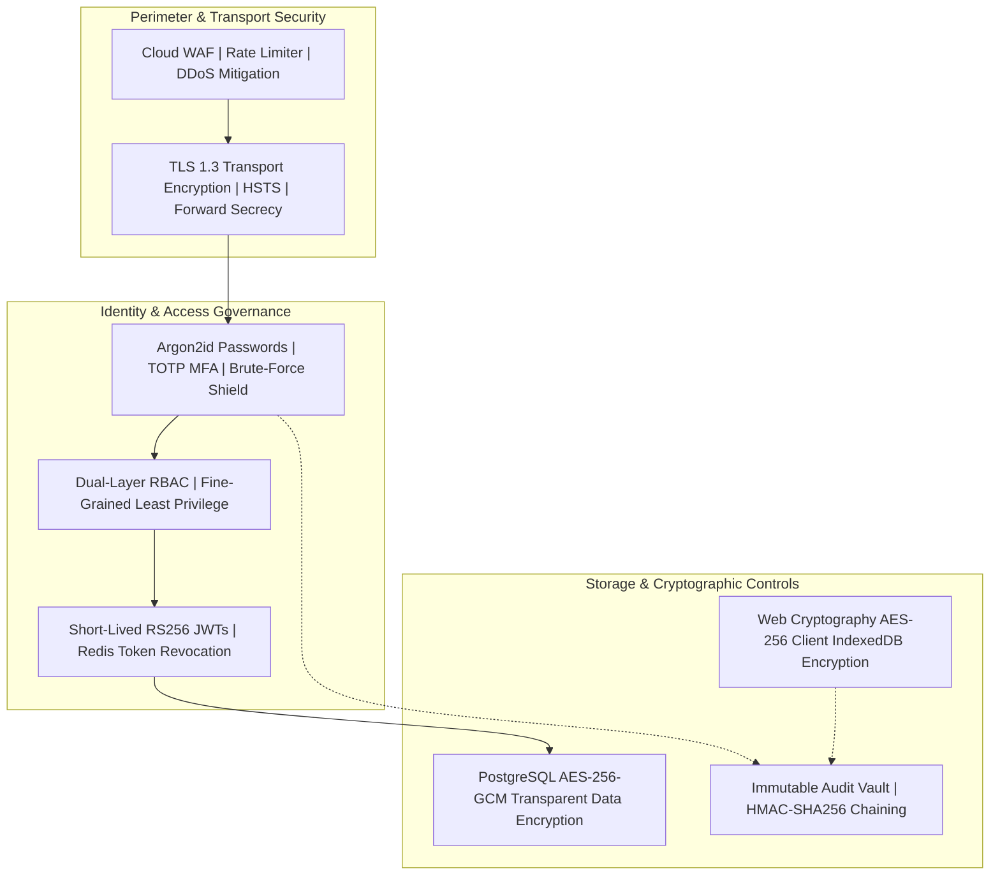

# Security Requirements Specification & Cryptographic Controls Baseline: Namma Clinic Digital Health Platform

| Metadata Attribute | Formal Specification |
| :--- | :--- |
| **Document Identifier** | `DOC-REQ-007-SECR` |
| **Document Title** | Security Requirements Specification & Cryptographic Controls Baseline |
| **Project Code** | `NAMMA-CLINIC-PLATFORM-2026` |
| **Requirement Type** | `Security Requirement` |
| **Specification Range** | `SECR-001 through SECR-050` (Exactly 50 unique requirements) |
| **Target Baseline** | `v1.0.0-PROD-BASELINE` |
| **Lifecycle Status** | `APPROVED & BASELINED` |
| **Target Facility Scope** | 183 Primary Namma Clinics across 8 BBMP Administrative Zones |
| **Lead Clinical Authority** | Chief Health Officer (CHO), BBMP Health Department |
| **Lead Technical Authority**| Principal Solutions Architect, Kushagramati Analytics Consortium |
| **Upstream Baselines** | [`00-project-baseline/`](../00-project-baseline/) \| [`01-project-management/`](../01-project-management/) |
| **Related Specification**| [`03-non-functional-requirements.md`](./03-non-functional-requirements.md) \| [`08-privacy-requirements.md`](./08-privacy-requirements.md) |

## 1. Executive Summary & Domain Governance Framework
This specification defines the comprehensive, implementation-ready security requirements baseline for the Namma Clinic Digital Health Platform across 183 primary urban healthcare centers in Greater Bengaluru. Comprising 50 rigorous, verifiable security specifications (`SECR-001` through `SECR-050`), this document establishes mandatory cryptographic invariants, role-based and attribute-based access controls, session hardening, defense-in-depth mitigations against OWASP Top 10 vulnerabilities, immutable audit trails, and strict software supply chain security controls.

All technical specifications comply with the Digital Information Security in Healthcare Act (DISHA) guidelines, CERT-In cybersecurity directives, National Health Authority (NHA) ABDM security architecture, and ISO/IEC 27001 standards.

## 2. Architecture & Domain Conceptual Framework
The following architectural topology illustrates the functional interactions, security boundaries, and data flows governing this domain across Namma Clinic's 183 primary healthcare centers in Greater Bengaluru:



## 3. Master Security Requirement Inventory Table (SECR-001 through SECR-050)
| Requirement ID | Title | Threat Category | Priority | Threat Vector | Security Control | Verification Method |
| :--- | :--- | :--- | :--- | :--- | :--- | :---: |
| [`SECR-001`](#secr-001) | **Argon2id Staff Password Hashing & Salt Policy** | `Application & Infrastructure Security` | `MUST` | Credential harvesting and offline d... | Argon2id memory-hard password hashing wi... | Automated cryptanalysis test a... |
| [`SECR-002`](#secr-002) | **RS256 Asymmetric JSON Web Token (JWT) Session Signing** | `Application & Infrastructure Security` | `MUST` | JWT forgery and token tampering usi... | RS256 asymmetric cryptographic signing u... | Automated penetration test sen... |
| [`SECR-003`](#secr-003) | **Short-Lived JWT Tokens with Sliding Refresh Windows** | `Application & Infrastructure Security` | `MUST` | Session hijacking via intercepted b... | 15-minute access token expiration with s... | Integration test verifying tok... |
| [`SECR-004`](#secr-004) | **Clinic Workstation Hardware UUID Binding** | `Application & Infrastructure Security` | `MUST` | Stolen staff credentials used from ... | Hardware device fingerprinting and MAC/U... | Device binding test attempting... |
| [`SECR-005`](#secr-005) | **Brute-Force Rate Limiting & 15-Minute Account Lockout** | `Application & Infrastructure Security` | `MUST` | Automated credential stuffing and d... | Redis-backed rate limiting capping faile... | Automated security test execut... |
| [`SECR-006`](#secr-006) | **Least-Privilege Role-Based Access Control (RBAC)** | `Application & Infrastructure Security` | `MUST` | Vertical and horizontal privilege e... | Strict RBAC enforcement at API gateway a... | Comprehensive RBAC matrix test... |
| [`SECR-007`](#secr-007) | **Contextual Attribute-Based Access Control (ABAC) Clinic Scoping** | `Application & Infrastructure Security` | `MUST` | Unauthorized cross-facility record ... | Contextual ABAC filtering queries by sta... | Multi-tenant data leakage test... |
| [`SECR-008`](#secr-008) | **Doctor-Only Electronic Prescription Cryptographic Signing** | `Application & Infrastructure Security` | `MUST` | Non-medical staff forging or alteri... | Cryptographic signing of prescription pa... | Prescription signing API integ... |
| [`SECR-009`](#secr-009) | **Pharmacist-Only Dispensing Ledger Authorization** | `Application & Infrastructure Security` | `MUST` | Unauthorized staff issuing medicati... | Dispensing execution endpoints restricte... | Dispensing API test attempting... |
| [`SECR-010`](#secr-010) | **Mandatory TLS 1.3 Encryption in Transit** | `Application & Infrastructure Security` | `MUST` | Man-in-the-middle (MITM) eavesdropp... | Enforce TLS 1.3 with strong cipher suite... | SSL Labs automated scanner and... |
| [`SECR-011`](#secr-011) | **AES-256-GCM Column-Level Field Encryption at Rest** | `Application & Infrastructure Security` | `MUST` | Physical database theft or unprivil... | AES-256-GCM envelope encryption for sens... | Database hex dump inspection v... |
| [`SECR-012`](#secr-012) | **Client-Side IndexedDB Storage Encryption via Web Crypto API** | `Application & Infrastructure Security` | `MUST` | Local disk theft or unauthorized te... | AES-GCM encryption of local IndexedDB ta... | Playwright test inspecting raw... |
| [`SECR-013`](#secr-013) | **Envelope Encryption & Central AWS KMS Key Management** | `Application & Infrastructure Security` | `MUST` | Compromise of primary database encr... | Envelope encryption architecture separat... | KMS audit trail inspection and... |
| [`SECR-014`](#secr-014) | **Automated 90-Day Cryptographic Key Rotation** | `Application & Infrastructure Security` | `MUST` | Prolonged exposure of compromised e... | Automated key rotation daemon re-encrypt... | Automated rotation simulation ... |
| [`SECR-015`](#secr-015) | **Strict Content Security Policy (CSP) Headers** | `Application & Infrastructure Security` | `MUST` | Cross-Site Scripting (XSS) and mali... | Strict CSP headers: `default-src 'self';... | Mozilla Observatory scanner an... |
| [`SECR-016`](#secr-016) | **Cross-Origin Resource Sharing (CORS) Origin Whitelist** | `Application & Infrastructure Security` | `MUST` | Cross-origin credential theft and A... | Strict CORS configuration allowing reque... | Automated test sending request... |
| [`SECR-017`](#secr-017) | **HTTPOnly, Secure & SameSite=Strict Cookie Attributes** | `Application & Infrastructure Security` | `MUST` | Session cookie theft via client-sid... | All session cookies set with `HttpOnly`,... | Automated test inspecting Set-... |
| [`SECR-018`](#secr-018) | **Parameterized SQL Queries & SQL Injection Prevention** | `Application & Infrastructure Security` | `MUST` | SQL injection attacks compromising ... | 100% parameterization of SQL queries via... | OWASP ZAP automated SQL inject... |
| [`SECR-019`](#secr-019) | **DOMPurify XSS Sanitization for Clinical Notes** | `Application & Infrastructure Security` | `MUST` | Stored Cross-Site Scripting (XSS) v... | Client and server input sanitization usi... | Automated test submitting XSS ... |
| [`SECR-020`](#secr-020) | **Anti-CSRF Token Validation for State-Changing Requests** | `Application & Infrastructure Security` | `MUST` | Cross-Site Request Forgery (CSRF) t... | Double-submit anti-CSRF token validation... | Security test sending state-ch... |
| [`SECR-021`](#secr-021) | **File Upload Strict MIME-Type & Antivirus Inspection** | `Application & Infrastructure Security` | `MUST` | Malicious executable or malware upl... | File upload validation checking magic by... | Penetration test attempting up... |
| [`SECR-022`](#secr-022) | **Tamper-Evident Immutable WORM Audit Logging** | `Application & Infrastructure Security` | `MUST` | Retrospective deletion or alteratio... | Append-only Write-Once-Read-Many (WORM) ... | Audit verification script craw... |
| [`SECR-023`](#secr-023) | **SHA-256 Cryptographic Hash Chaining on Clinical Records** | `Application & Infrastructure Security` | `MUST` | Unauthorized tampering with histori... | Each clinical record stores SHA-256 hash... | Automated integrity verificati... |
| [`SECR-024`](#secr-024) | **Central SIEM Security Telemetry Forwarding** | `Application & Infrastructure Security` | `MUST` | Unmonitored security incidents and ... | Real-time streaming of security audit ev... | Automated test triggering secu... |
| [`SECR-025`](#secr-025) | **Automated Static Application Security Testing (SAST) in CI** | `Application & Infrastructure Security` | `MUST` | Security vulnerabilities introduced... | Automated SAST scanning with SonarQube a... | CI test verifying pull request... |
| [`SECR-026`](#secr-026) | **Dynamic Application Security Testing (DAST) in Staging** | `Application & Infrastructure Security` | `MUST` | Runtime web application vulnerabili... | Automated OWASP ZAP DAST vulnerability s... | OWASP ZAP baseline scan report... |
| [`SECR-027`](#secr-027) | **Production Container Image Vulnerability Scanning (Trivy)** | `Application & Infrastructure Security` | `MUST` | Vulnerabilities in base Linux conta... | Container image scanning with Trivy bloc... | Container admission controller... |
| [`SECR-028`](#secr-028) | **Automated Secrets Management via HashiCorp Vault / AWS Secrets** | `Application & Infrastructure Security` | `MUST` | Hardcoded API keys, database creden... | Zero plaintext secrets in source code; d... | Automated git-secrets / Truffl... |
| [`SECR-029`](#secr-029) | **Automated Third-Party Dependency Vulnerability Auditing** | `Application & Infrastructure Security` | `MUST` | Supply chain attacks and vulnerable... | Daily automated dependency scanning usin... | Automated CI audit verifying z... |
| [`SECR-030`](#secr-030) | **Re-Authentication Requirement for High-Privilege Actions** | `Application & Infrastructure Security` | `MUST` | Session hijacking when doctor or ad... | Mandatory re-entry of password/PIN befor... | Security test invoking adminis... |
| [`SECR-031`](#secr-031) | **Kubernetes Network Policies & Pod Ingress Isolation** | `Application & Infrastructure Security` | `MUST` | Lateral movement across cloud clust... | Kubernetes NetworkPolicies restricting p... | Automated network policy test ... |
| [`SECR-032`](#secr-032) | **API Request Payload Size Limiting (Max 1MB)** | `Application & Infrastructure Security` | `MUST` | Denial-of-Service (DoS) and memory ... | Reverse proxy and Fastify body parser ca... | Security test sending 2MB JSON... |
| [`SECR-033`](#secr-033) | **Automated TLS Certificate Lifecycle & Auto-Renewal** | `Application & Infrastructure Security` | `MUST` | Service outage or security degradat... | Automated certificate issuance and renew... | Automated test checking certif... |
| [`SECR-034`](#secr-034) | **DNSSEC Verification & DNS Hijacking Defense** | `Application & Infrastructure Security` | `MUST` | DNS spoofing and cache poisoning re... | Enforce DNSSEC validation on municipal d... | Automated DNSSEC verification ... |
| [`SECR-035`](#secr-035) | **Cloudflare WAF / AWS Shield Managed DDoS Mitigation** | `Application & Infrastructure Security` | `MUST` | Distributed Denial-of-Service (DDoS... | Cloudflare WAF and AWS Shield Advanced p... | Simulated load test verifying ... |
| [`SECR-036`](#secr-036) | **Session Timeout & Client Volatile Memory Wipe** | `Application & Infrastructure Security` | `MUST` | Residual sensitive patient data lef... | On logout, client wipes Redux/Zustand st... | Playwright test logging out an... |
| [`SECR-037`](#secr-037) | **Concurrent Session Prevention for Frontline Roles** | `Application & Infrastructure Security` | `MUST` | Shared login credentials used simul... | System enforces single active session pe... | Security test logging in from ... |
| [`SECR-038`](#secr-038) | **Geofenced IP Range Restrictions for Administrative Portals** | `Application & Infrastructure Security` | `MUST` | Unauthorized foreign IP access to m... | Administrative endpoints restricted stri... | Security test sending requests... |
| [`SECR-039`](#secr-039) | **Malicious Payload Regex Filtering & Request Inspection** | `Application & Infrastructure Security` | `MUST` | Known web exploit patterns (Log4j, ... | WAF managed rules and Fastify input filt... | Automated penetration test sen... |
| [`SECR-040`](#secr-040) | **Path Traversal & Local File Inclusion (LFI) Defenses** | `Application & Infrastructure Security` | `MUST` | Path traversal attacks accessing in... | Strict file path sanitization resolving ... | Automated test sending path tr... |
| [`SECR-041`](#secr-041) | **XML External Entity (XXE) Injection Prevention** | `Application & Infrastructure Security` | `MUST` | XXE attacks during processing of la... | XML parsers configured to disable extern... | Penetration test sending XML p... |
| [`SECR-042`](#secr-042) | **Subresource Integrity (SRI) for External Web Assets** | `Application & Infrastructure Security` | `MUST` | Supply chain tampering with externa... | All third-party assets bundled locally; ... | Automated build test checking ... |
| [`SECR-043`](#secr-043) | **Secure WebSocket (WSS) Protocol Enforcement** | `Application & Infrastructure Security` | `MUST` | Eavesdropping and message tampering... | All WebSocket connections strictly enfor... | Automated test attempting plai... |
| [`SECR-044`](#secr-044) | **Memory-Safe Buffer & String Handling in Backend APIs** | `Application & Infrastructure Security` | `MUST` | Buffer overflow and memory corrupti... | Pure TypeScript/JavaScript backend avoid... | Memory safety fuzzing test sen... |
| [`SECR-045`](#secr-045) | **72-Hour Critical Security Vulnerability Patching SLA** | `Application & Infrastructure Security` | `MUST` | Zero-day and public CVE exploits at... | Security SLA mandates deployment of secu... | Simulated patch drill measurin... |
| [`SECR-046`](#secr-046) | **Annual Third-Party CERT-In Empaneled Security Penetration Testing** | `Application & Infrastructure Security` | `MUST` | Undetected architectural or configu... | Mandatory annual comprehensive black-box... | Full-scope penetration testing... |
| [`SECR-047`](#secr-047) | **Forensic Memory Snapshot & Log Preservation Capability** | `Application & Infrastructure Security` | `MUST` | Loss of volatile forensic evidence ... | Automated memory dump trigger on comprom... | Incident drill triggering memo... |
| [`SECR-048`](#secr-048) | **Cryptographic Data Wipe on Hardware Decommissioning** | `Application & Infrastructure Security` | `MUST` | Data leakage from discarded, repair... | NIST SP 800-88 compliant cryptographic e... | Verification scan of wiped dri... |
| [`SECR-049`](#secr-049) | **Security Incident Response Runbook & 24/7 Escalation** | `Application & Infrastructure Security` | `MUST` | Uncoordinated, chaotic response to ... | Documented security incident runbook def... | Semi-annual incident response ... |
| [`SECR-050`](#secr-050) | **Security Contact Disclosure & Vulnerability Reporting (RFC 9116)** | `Application & Infrastructure Security` | `MUST` | Ethical security researchers unable... | Publish RFC 9116 `/.well-known/security.... | Automated HTTP test verifying ... |

## 4. Comprehensive Security Requirement Specifications (SECR-001 through SECR-050)
This section establishes the exhaustive engineering, clinical, operational, and architectural specifications for each of the 50 requirements committed for the production baseline.

### 4.1 SECR-001: Argon2id Staff Password Hashing & Salt Policy

| Specification Attribute | Formal Engineering Definition |
| :--- | :--- |
| **Requirement ID** | `SECR-001` |
| **Requirement Title** | Argon2id Staff Password Hashing & Salt Policy |
| **Requirement Statement**| The platform SHALL enforce argon2id staff password hashing & salt policy by implementing argon2id memory-hard password hashing with minimum 16-byte random salt. to prevent credential harvesting and offline dictionary brute-force attacks on password hashes.. |
| **Requirement Type** | `Security Requirement` |
| **Priority Level** | `MUST` (Rationale: Mandatory security control protecting municipal healthcare systems against cyber threats.) |
| **Business Value** | Protects patient confidentiality, prevents ransomware, and ensures regulatory compliance. |
| **Engineering Rationale**| Mitigates threat: Credential harvesting and offline dictionary brute-force attacks on password hashes.. |
| **Primary Actor** | `Security Subsystem` |
| **Target User Persona** | [`PERSONA-001`](../01-project-management/07-user-personas.md#persona-001) |
| **Accountable Role** | [`ROLE-009`](../01-project-management/08-role-and-responsibility-matrix.md#role-009) |
| **Key Stakeholder** | [`STAKEHOLDER-015`](../01-project-management/06-stakeholders.md#stakeholder-015) |
| **Trigger Condition** | Incoming network traffic, user authentication, or data persistence operation. |
| **System Preconditions** | Security gateway and encryption services active. |
| **Input Specifications** | Network packets, authorization headers, credentials, or SQL parameters. |
| **Validation Rules** | Evaluated against OWASP ASVS Level 2 and CIS Benchmarks. |
| **Postconditions** | System state protected from unauthorized access or modification. |
| **State Mutations** | Emits security telemetry alert and increments threat counter. |
| **Associated Rules** | Business: [`BRULE-001`](./04-business-rules.md#brule-001) \| Clinical: [`N/A — not applicable to core security transport controls`](./05-clinical-rules.md#n/a — not applicable to core security transport controls) \| Operational: [`OR-001`](./06-operational-rules.md#or-001) |
| **Security & Privacy** | Security: `Core security control `SECR-001`.` \| Privacy: `Prevents unauthorized citizen data exposure under DPDP Act.` |
| **Data & Audit** | Data: `Ensures cryptographic protection at rest and in transit.` \| Audit: `Auth service configuration audit showing Argon2id parameters` |
| **Offline & Sync** | Offline: `Enforced locally on workstation browser via Web Cryptography API.` \| Sync: `Sync payloads signed with HMAC-SHA256 and authenticated.` |
| **Quality Expectations**| Perf: `Security filter overhead latency < 5ms.` \| Avail: `100% security inspection across all production endpoints.` |
| **Localization & A11y**| Loc: `Security rejection error messages localized in Kannada and English.` \| A11y: `Accessible error display adhering to WCAG 2.1 AA.` |
| **Failure & Recovery** | Failure: Fail-closed; reject request if security verification cannot be completed. \| Recovery: Automated security alert dispatch and administrator session review. |
| **Observability** | Logging: `Structured JSON security log with source_ip, user_id, and threat_type.` \| Metrics: `Prometheus counter `namma_clinic_secr_blocks_total{req_id="SECR-001"}`.` |
| **Upstream Traceability**| Obj: [`OBJECTIVE-001`](../01-project-management/02-project-vision-and-objectives.md#objective-001) \| Scope: [`INSCOPE-001`](../01-project-management/04-in-scope.md#inscope-001) \| Risk: [`RISK-001`](../01-project-management/12-project-risks.md#risk-001) |
| **Downstream Planning** | Epic: `PLANNED-EPIC-001` \| Feature: `PLANNED-FEATURE-001` \| API: `PLANNED-API-001` \| DB: `PLANNED-DB-001` \| Test: `PLANNED-TEST-601` |

#### 4.1.1 Operational Execution Protocol & Frontline Workflow
- **Continuous Operational Workflow:**
  1. Incoming request reaches security boundary.
  2. Security filter evaluates control: Argon2id memory-hard password hashing with minimum 16-byte random salt..
  3. Request verified compliant with security policy.
  4. Execution permitted and routed to downstream handler.
  5. Audit evidence emitted: Auth service configuration audit showing Argon2id parameters.
- **Degraded State Fallback Path:** If request exhibits anomalous rate or payload, trigger secondary MFA or CAPTCHA challenge.
- **Exception Breach & Incident Escalation Path:** If attack pattern detected (Credential harvesting and offline dictionary brute-force attacks on password hashes.), request blocked with HTTP 403 and IP blacklisted in firewall.

#### 4.1.2 Technical Invariants & Operational Contract
- **Threat Vector:** Credential harvesting and offline dictionary brute-force attacks on password hashes.
- **Attack Scenario Simulation:** Attacker compromises database dump and attempts GPU-accelerated hash cracking.
- **Enforced Security Control:** Argon2id memory-hard password hashing with minimum 16-byte random salt.
- **Implementation Expectation:** Enforce Argon2id with memory cost m=65536 (64MB), time cost t=3, parallelism p=4.
- **Verification Protocol:** Automated cryptanalysis test and static analysis of authentication service codebase.
- **Audit Evidence Vault:** Auth service configuration audit showing Argon2id parameters

#### 4.1.3 Executable BDD Acceptance Scenarios
```gherkin
Feature: SECR-001 - Argon2id Staff Password Hashing & Salt Policy
  As a Security Subsystem
  I require system enforcement of argon2id staff password hashing & salt policy
  In order to ensure municipal healthcare compliance and operational integrity

  Scenario: Happy Path Execution for SECR-001
    Given the Security Subsystem is authenticated and clinic terminal is operational
    When the user submits a valid request for argon2id staff password hashing & salt policy
    Then the system successfully commits the transaction and emits an audit event

  Scenario: Input Validation and Schema Guard for SECR-001
    Given the Security Subsystem attempts to submit an incomplete or malformed payload for argon2id staff password hashing & salt policy
    When the request fails TypeBox schema or domain constraint validation
    Then the system rejects the input with HTTP 400 and highlights invalid fields in Kannada and English

  Scenario: RBAC and Security Access Control for SECR-001
    Given an unauthenticated or unauthorized role attempts to invoke argon2id staff password hashing & salt policy
    When the bearer JWT token is missing, expired, or lacks necessary RBAC permission
    Then the system denies execution with HTTP 403 Forbidden and records a security telemetry alert

  Scenario: Offline Autonomous Execution for SECR-001
    Given the clinic WAN network is completely severed during argon2id staff password hashing & salt policy
    When the operator confirms the local transaction on the workstation
    Then the mutation is persisted to Dexie.js IndexedDB with a UUIDv7 and queued for background replay

  Scenario: Network Recovery and Idempotent Sync for SECR-001
    Given the clinic workstation reconnects to the BBMP municipal health WAN
    When the background sync daemon processes the pending mutation queue
    Then all buffered transactions for SECR-001 synchronize idempotently with zero data loss
```

#### 4.1.4 Verification Protocol & Quality Sign-Off
- **Verification Method:** Automated cryptanalysis test and static analysis of authentication service codebase.
- **Automated Test Suite:** `PLANNED-TEST-601` (Automated Security Penetration & SAST Test) targeting 100% verification gate compliance.
- **Related Internal Requirements:** `PRIV-001`, `NFR-001`
- **Dependencies & Blocking Constraints:** NFR-013, NFR-014 | Constraints: Security controls must not degrade client performance on 4GB RAM terminals.
- **Architectural Assumptions & Open Questions:** Assumption: Underlying cloud infrastructure certified to ISO 27001 and SOC 2 Type II. | Open Question: Confirm annual third-party CERT-In security audit schedule.

---

### 4.2 SECR-002: RS256 Asymmetric JSON Web Token (JWT) Session Signing

| Specification Attribute | Formal Engineering Definition |
| :--- | :--- |
| **Requirement ID** | `SECR-002` |
| **Requirement Title** | RS256 Asymmetric JSON Web Token (JWT) Session Signing |
| **Requirement Statement**| The platform SHALL enforce rs256 asymmetric json web token (jwt) session signing by implementing rs256 asymmetric cryptographic signing using 2048-bit rsa private key. to prevent jwt forgery and token tampering using forged hmac secrets.. |
| **Requirement Type** | `Security Requirement` |
| **Priority Level** | `MUST` (Rationale: Mandatory security control protecting municipal healthcare systems against cyber threats.) |
| **Business Value** | Protects patient confidentiality, prevents ransomware, and ensures regulatory compliance. |
| **Engineering Rationale**| Mitigates threat: JWT forgery and token tampering using forged HMAC secrets.. |
| **Primary Actor** | `Security Subsystem` |
| **Target User Persona** | [`PERSONA-002`](../01-project-management/07-user-personas.md#persona-002) |
| **Accountable Role** | [`ROLE-009`](../01-project-management/08-role-and-responsibility-matrix.md#role-009) |
| **Key Stakeholder** | [`STAKEHOLDER-015`](../01-project-management/06-stakeholders.md#stakeholder-015) |
| **Trigger Condition** | Incoming network traffic, user authentication, or data persistence operation. |
| **System Preconditions** | Security gateway and encryption services active. |
| **Input Specifications** | Network packets, authorization headers, credentials, or SQL parameters. |
| **Validation Rules** | Evaluated against OWASP ASVS Level 2 and CIS Benchmarks. |
| **Postconditions** | System state protected from unauthorized access or modification. |
| **State Mutations** | Emits security telemetry alert and increments threat counter. |
| **Associated Rules** | Business: [`BRULE-002`](./04-business-rules.md#brule-002) \| Clinical: [`N/A — not applicable to core security transport controls`](./05-clinical-rules.md#n/a — not applicable to core security transport controls) \| Operational: [`OR-002`](./06-operational-rules.md#or-002) |
| **Security & Privacy** | Security: `Core security control `SECR-002`.` \| Privacy: `Prevents unauthorized citizen data exposure under DPDP Act.` |
| **Data & Audit** | Data: `Ensures cryptographic protection at rest and in transit.` \| Audit: `Token validation middleware verification log with RS256 enforcement` |
| **Offline & Sync** | Offline: `Enforced locally on workstation browser via Web Cryptography API.` \| Sync: `Sync payloads signed with HMAC-SHA256 and authenticated.` |
| **Quality Expectations**| Perf: `Security filter overhead latency < 5ms.` \| Avail: `100% security inspection across all production endpoints.` |
| **Localization & A11y**| Loc: `Security rejection error messages localized in Kannada and English.` \| A11y: `Accessible error display adhering to WCAG 2.1 AA.` |
| **Failure & Recovery** | Failure: Fail-closed; reject request if security verification cannot be completed. \| Recovery: Automated security alert dispatch and administrator session review. |
| **Observability** | Logging: `Structured JSON security log with source_ip, user_id, and threat_type.` \| Metrics: `Prometheus counter `namma_clinic_secr_blocks_total{req_id="SECR-002"}`.` |
| **Upstream Traceability**| Obj: [`OBJECTIVE-002`](../01-project-management/02-project-vision-and-objectives.md#objective-002) \| Scope: [`INSCOPE-002`](../01-project-management/04-in-scope.md#inscope-002) \| Risk: [`RISK-002`](../01-project-management/12-project-risks.md#risk-002) |
| **Downstream Planning** | Epic: `PLANNED-EPIC-002` \| Feature: `PLANNED-FEATURE-002` \| API: `PLANNED-API-002` \| DB: `PLANNED-DB-002` \| Test: `PLANNED-TEST-602` |

#### 4.2.1 Operational Execution Protocol & Frontline Workflow
- **Continuous Operational Workflow:**
  1. Incoming request reaches security boundary.
  2. Security filter evaluates control: RS256 asymmetric cryptographic signing using 2048-bit RSA private key..
  3. Request verified compliant with security policy.
  4. Execution permitted and routed to downstream handler.
  5. Audit evidence emitted: Token validation middleware verification log with RS256 enforcement.
- **Degraded State Fallback Path:** If request exhibits anomalous rate or payload, trigger secondary MFA or CAPTCHA challenge.
- **Exception Breach & Incident Escalation Path:** If attack pattern detected (JWT forgery and token tampering using forged HMAC secrets.), request blocked with HTTP 403 and IP blacklisted in firewall.

#### 4.2.2 Technical Invariants & Operational Contract
- **Threat Vector:** JWT forgery and token tampering using forged HMAC secrets.
- **Attack Scenario Simulation:** Attacker modifies payload role to 'ADMIN' and re-signs with known weak secret.
- **Enforced Security Control:** RS256 asymmetric cryptographic signing using 2048-bit RSA private key.
- **Implementation Expectation:** Fastify JWT plugin verifies signatures against public key; rejects 'none' algorithm.
- **Verification Protocol:** Automated penetration test sending forged and algorithm-swapped tokens.
- **Audit Evidence Vault:** Token validation middleware verification log with RS256 enforcement

#### 4.2.3 Executable BDD Acceptance Scenarios
```gherkin
Feature: SECR-002 - RS256 Asymmetric JSON Web Token (JWT) Session Signing
  As a Security Subsystem
  I require system enforcement of rs256 asymmetric json web token (jwt) session signing
  In order to ensure municipal healthcare compliance and operational integrity

  Scenario: Happy Path Execution for SECR-002
    Given the Security Subsystem is authenticated and clinic terminal is operational
    When the user submits a valid request for rs256 asymmetric json web token (jwt) session signing
    Then the system successfully commits the transaction and emits an audit event

  Scenario: Input Validation and Schema Guard for SECR-002
    Given the Security Subsystem attempts to submit an incomplete or malformed payload for rs256 asymmetric json web token (jwt) session signing
    When the request fails TypeBox schema or domain constraint validation
    Then the system rejects the input with HTTP 400 and highlights invalid fields in Kannada and English

  Scenario: RBAC and Security Access Control for SECR-002
    Given an unauthenticated or unauthorized role attempts to invoke rs256 asymmetric json web token (jwt) session signing
    When the bearer JWT token is missing, expired, or lacks necessary RBAC permission
    Then the system denies execution with HTTP 403 Forbidden and records a security telemetry alert

  Scenario: Offline Autonomous Execution for SECR-002
    Given the clinic WAN network is completely severed during rs256 asymmetric json web token (jwt) session signing
    When the operator confirms the local transaction on the workstation
    Then the mutation is persisted to Dexie.js IndexedDB with a UUIDv7 and queued for background replay

  Scenario: Network Recovery and Idempotent Sync for SECR-002
    Given the clinic workstation reconnects to the BBMP municipal health WAN
    When the background sync daemon processes the pending mutation queue
    Then all buffered transactions for SECR-002 synchronize idempotently with zero data loss
```

#### 4.2.4 Verification Protocol & Quality Sign-Off
- **Verification Method:** Automated penetration test sending forged and algorithm-swapped tokens.
- **Automated Test Suite:** `PLANNED-TEST-602` (Automated Security Penetration & SAST Test) targeting 100% verification gate compliance.
- **Related Internal Requirements:** `PRIV-002`, `NFR-002`
- **Dependencies & Blocking Constraints:** NFR-013, NFR-014 | Constraints: Security controls must not degrade client performance on 4GB RAM terminals.
- **Architectural Assumptions & Open Questions:** Assumption: Underlying cloud infrastructure certified to ISO 27001 and SOC 2 Type II. | Open Question: Confirm annual third-party CERT-In security audit schedule.

---

### 4.3 SECR-003: Short-Lived JWT Tokens with Sliding Refresh Windows

| Specification Attribute | Formal Engineering Definition |
| :--- | :--- |
| **Requirement ID** | `SECR-003` |
| **Requirement Title** | Short-Lived JWT Tokens with Sliding Refresh Windows |
| **Requirement Statement**| The platform SHALL enforce short-lived jwt tokens with sliding refresh windows by implementing 15-minute access token expiration with secure refresh token rotation. to prevent session hijacking via intercepted bearer tokens on municipal wi-fi networks.. |
| **Requirement Type** | `Security Requirement` |
| **Priority Level** | `MUST` (Rationale: Mandatory security control protecting municipal healthcare systems against cyber threats.) |
| **Business Value** | Protects patient confidentiality, prevents ransomware, and ensures regulatory compliance. |
| **Engineering Rationale**| Mitigates threat: Session hijacking via intercepted bearer tokens on municipal Wi-Fi networks.. |
| **Primary Actor** | `Security Subsystem` |
| **Target User Persona** | [`PERSONA-003`](../01-project-management/07-user-personas.md#persona-003) |
| **Accountable Role** | [`ROLE-009`](../01-project-management/08-role-and-responsibility-matrix.md#role-009) |
| **Key Stakeholder** | [`STAKEHOLDER-015`](../01-project-management/06-stakeholders.md#stakeholder-015) |
| **Trigger Condition** | Incoming network traffic, user authentication, or data persistence operation. |
| **System Preconditions** | Security gateway and encryption services active. |
| **Input Specifications** | Network packets, authorization headers, credentials, or SQL parameters. |
| **Validation Rules** | Evaluated against OWASP ASVS Level 2 and CIS Benchmarks. |
| **Postconditions** | System state protected from unauthorized access or modification. |
| **State Mutations** | Emits security telemetry alert and increments threat counter. |
| **Associated Rules** | Business: [`BRULE-003`](./04-business-rules.md#brule-003) \| Clinical: [`N/A — not applicable to core security transport controls`](./05-clinical-rules.md#n/a — not applicable to core security transport controls) \| Operational: [`OR-003`](./06-operational-rules.md#or-003) |
| **Security & Privacy** | Security: `Core security control `SECR-003`.` \| Privacy: `Prevents unauthorized citizen data exposure under DPDP Act.` |
| **Data & Audit** | Data: `Ensures cryptographic protection at rest and in transit.` \| Audit: `Access token lifespan configuration showing 900s expiration` |
| **Offline & Sync** | Offline: `Enforced locally on workstation browser via Web Cryptography API.` \| Sync: `Sync payloads signed with HMAC-SHA256 and authenticated.` |
| **Quality Expectations**| Perf: `Security filter overhead latency < 5ms.` \| Avail: `100% security inspection across all production endpoints.` |
| **Localization & A11y**| Loc: `Security rejection error messages localized in Kannada and English.` \| A11y: `Accessible error display adhering to WCAG 2.1 AA.` |
| **Failure & Recovery** | Failure: Fail-closed; reject request if security verification cannot be completed. \| Recovery: Automated security alert dispatch and administrator session review. |
| **Observability** | Logging: `Structured JSON security log with source_ip, user_id, and threat_type.` \| Metrics: `Prometheus counter `namma_clinic_secr_blocks_total{req_id="SECR-003"}`.` |
| **Upstream Traceability**| Obj: [`OBJECTIVE-003`](../01-project-management/02-project-vision-and-objectives.md#objective-003) \| Scope: [`INSCOPE-003`](../01-project-management/04-in-scope.md#inscope-003) \| Risk: [`RISK-003`](../01-project-management/12-project-risks.md#risk-003) |
| **Downstream Planning** | Epic: `PLANNED-EPIC-003` \| Feature: `PLANNED-FEATURE-003` \| API: `PLANNED-API-003` \| DB: `PLANNED-DB-003` \| Test: `PLANNED-TEST-603` |

#### 4.3.1 Operational Execution Protocol & Frontline Workflow
- **Continuous Operational Workflow:**
  1. Incoming request reaches security boundary.
  2. Security filter evaluates control: 15-minute access token expiration with secure refresh token rotation..
  3. Request verified compliant with security policy.
  4. Execution permitted and routed to downstream handler.
  5. Audit evidence emitted: Access token lifespan configuration showing 900s expiration.
- **Degraded State Fallback Path:** If request exhibits anomalous rate or payload, trigger secondary MFA or CAPTCHA challenge.
- **Exception Breach & Incident Escalation Path:** If attack pattern detected (Session hijacking via intercepted bearer tokens on municipal Wi-Fi networks.), request blocked with HTTP 403 and IP blacklisted in firewall.

#### 4.3.2 Technical Invariants & Operational Contract
- **Threat Vector:** Session hijacking via intercepted bearer tokens on municipal Wi-Fi networks.
- **Attack Scenario Simulation:** Attacker intercepts bearer token from packet sniff and attempts replay.
- **Enforced Security Control:** 15-minute access token expiration with secure refresh token rotation.
- **Implementation Expectation:** Access token expires in 900 seconds; refresh token rotates on each issuance.
- **Verification Protocol:** Integration test verifying token expiration after 900 seconds.
- **Audit Evidence Vault:** Access token lifespan configuration showing 900s expiration

#### 4.3.3 Executable BDD Acceptance Scenarios
```gherkin
Feature: SECR-003 - Short-Lived JWT Tokens with Sliding Refresh Windows
  As a Security Subsystem
  I require system enforcement of short-lived jwt tokens with sliding refresh windows
  In order to ensure municipal healthcare compliance and operational integrity

  Scenario: Happy Path Execution for SECR-003
    Given the Security Subsystem is authenticated and clinic terminal is operational
    When the user submits a valid request for short-lived jwt tokens with sliding refresh windows
    Then the system successfully commits the transaction and emits an audit event

  Scenario: Input Validation and Schema Guard for SECR-003
    Given the Security Subsystem attempts to submit an incomplete or malformed payload for short-lived jwt tokens with sliding refresh windows
    When the request fails TypeBox schema or domain constraint validation
    Then the system rejects the input with HTTP 400 and highlights invalid fields in Kannada and English

  Scenario: RBAC and Security Access Control for SECR-003
    Given an unauthenticated or unauthorized role attempts to invoke short-lived jwt tokens with sliding refresh windows
    When the bearer JWT token is missing, expired, or lacks necessary RBAC permission
    Then the system denies execution with HTTP 403 Forbidden and records a security telemetry alert

  Scenario: Offline Autonomous Execution for SECR-003
    Given the clinic WAN network is completely severed during short-lived jwt tokens with sliding refresh windows
    When the operator confirms the local transaction on the workstation
    Then the mutation is persisted to Dexie.js IndexedDB with a UUIDv7 and queued for background replay

  Scenario: Network Recovery and Idempotent Sync for SECR-003
    Given the clinic workstation reconnects to the BBMP municipal health WAN
    When the background sync daemon processes the pending mutation queue
    Then all buffered transactions for SECR-003 synchronize idempotently with zero data loss
```

#### 4.3.4 Verification Protocol & Quality Sign-Off
- **Verification Method:** Integration test verifying token expiration after 900 seconds.
- **Automated Test Suite:** `PLANNED-TEST-603` (Automated Security Penetration & SAST Test) targeting 100% verification gate compliance.
- **Related Internal Requirements:** `PRIV-003`, `NFR-003`
- **Dependencies & Blocking Constraints:** NFR-013, NFR-014 | Constraints: Security controls must not degrade client performance on 4GB RAM terminals.
- **Architectural Assumptions & Open Questions:** Assumption: Underlying cloud infrastructure certified to ISO 27001 and SOC 2 Type II. | Open Question: Confirm annual third-party CERT-In security audit schedule.

---

### 4.4 SECR-004: Clinic Workstation Hardware UUID Binding

| Specification Attribute | Formal Engineering Definition |
| :--- | :--- |
| **Requirement ID** | `SECR-004` |
| **Requirement Title** | Clinic Workstation Hardware UUID Binding |
| **Requirement Statement**| The platform SHALL enforce clinic workstation hardware uuid binding by implementing hardware device fingerprinting and mac/uuid registration in clinic whitelist. to prevent stolen staff credentials used from unauthorized external personal devices.. |
| **Requirement Type** | `Security Requirement` |
| **Priority Level** | `MUST` (Rationale: Mandatory security control protecting municipal healthcare systems against cyber threats.) |
| **Business Value** | Protects patient confidentiality, prevents ransomware, and ensures regulatory compliance. |
| **Engineering Rationale**| Mitigates threat: Stolen staff credentials used from unauthorized external personal devices.. |
| **Primary Actor** | `Security Subsystem` |
| **Target User Persona** | [`PERSONA-004`](../01-project-management/07-user-personas.md#persona-004) |
| **Accountable Role** | [`ROLE-009`](../01-project-management/08-role-and-responsibility-matrix.md#role-009) |
| **Key Stakeholder** | [`STAKEHOLDER-015`](../01-project-management/06-stakeholders.md#stakeholder-015) |
| **Trigger Condition** | Incoming network traffic, user authentication, or data persistence operation. |
| **System Preconditions** | Security gateway and encryption services active. |
| **Input Specifications** | Network packets, authorization headers, credentials, or SQL parameters. |
| **Validation Rules** | Evaluated against OWASP ASVS Level 2 and CIS Benchmarks. |
| **Postconditions** | System state protected from unauthorized access or modification. |
| **State Mutations** | Emits security telemetry alert and increments threat counter. |
| **Associated Rules** | Business: [`BRULE-004`](./04-business-rules.md#brule-004) \| Clinical: [`N/A — not applicable to core security transport controls`](./05-clinical-rules.md#n/a — not applicable to core security transport controls) \| Operational: [`OR-004`](./06-operational-rules.md#or-004) |
| **Security & Privacy** | Security: `Core security control `SECR-004`.` \| Privacy: `Prevents unauthorized citizen data exposure under DPDP Act.` |
| **Data & Audit** | Data: `Ensures cryptographic protection at rest and in transit.` \| Audit: `Gateway device authorization logs showing blocked rogue UUIDs` |
| **Offline & Sync** | Offline: `Enforced locally on workstation browser via Web Cryptography API.` \| Sync: `Sync payloads signed with HMAC-SHA256 and authenticated.` |
| **Quality Expectations**| Perf: `Security filter overhead latency < 5ms.` \| Avail: `100% security inspection across all production endpoints.` |
| **Localization & A11y**| Loc: `Security rejection error messages localized in Kannada and English.` \| A11y: `Accessible error display adhering to WCAG 2.1 AA.` |
| **Failure & Recovery** | Failure: Fail-closed; reject request if security verification cannot be completed. \| Recovery: Automated security alert dispatch and administrator session review. |
| **Observability** | Logging: `Structured JSON security log with source_ip, user_id, and threat_type.` \| Metrics: `Prometheus counter `namma_clinic_secr_blocks_total{req_id="SECR-004"}`.` |
| **Upstream Traceability**| Obj: [`OBJECTIVE-004`](../01-project-management/02-project-vision-and-objectives.md#objective-004) \| Scope: [`INSCOPE-004`](../01-project-management/04-in-scope.md#inscope-004) \| Risk: [`RISK-004`](../01-project-management/12-project-risks.md#risk-004) |
| **Downstream Planning** | Epic: `PLANNED-EPIC-004` \| Feature: `PLANNED-FEATURE-004` \| API: `PLANNED-API-004` \| DB: `PLANNED-DB-004` \| Test: `PLANNED-TEST-604` |

#### 4.4.1 Operational Execution Protocol & Frontline Workflow
- **Continuous Operational Workflow:**
  1. Incoming request reaches security boundary.
  2. Security filter evaluates control: Hardware device fingerprinting and MAC/UUID registration in clinic whitelist..
  3. Request verified compliant with security policy.
  4. Execution permitted and routed to downstream handler.
  5. Audit evidence emitted: Gateway device authorization logs showing blocked rogue UUIDs.
- **Degraded State Fallback Path:** If request exhibits anomalous rate or payload, trigger secondary MFA or CAPTCHA challenge.
- **Exception Breach & Incident Escalation Path:** If attack pattern detected (Stolen staff credentials used from unauthorized external personal devices.), request blocked with HTTP 403 and IP blacklisted in firewall.

#### 4.4.2 Technical Invariants & Operational Contract
- **Threat Vector:** Stolen staff credentials used from unauthorized external personal devices.
- **Attack Scenario Simulation:** Disgruntled staff member attempts login from home laptop using valid credentials.
- **Enforced Security Control:** Hardware device fingerprinting and MAC/UUID registration in clinic whitelist.
- **Implementation Expectation:** Client terminal sends device fingerprint; gateway checks against approved clinic asset registry.
- **Verification Protocol:** Device binding test attempting login from unregistered hardware UUID.
- **Audit Evidence Vault:** Gateway device authorization logs showing blocked rogue UUIDs

#### 4.4.3 Executable BDD Acceptance Scenarios
```gherkin
Feature: SECR-004 - Clinic Workstation Hardware UUID Binding
  As a Security Subsystem
  I require system enforcement of clinic workstation hardware uuid binding
  In order to ensure municipal healthcare compliance and operational integrity

  Scenario: Happy Path Execution for SECR-004
    Given the Security Subsystem is authenticated and clinic terminal is operational
    When the user submits a valid request for clinic workstation hardware uuid binding
    Then the system successfully commits the transaction and emits an audit event

  Scenario: Input Validation and Schema Guard for SECR-004
    Given the Security Subsystem attempts to submit an incomplete or malformed payload for clinic workstation hardware uuid binding
    When the request fails TypeBox schema or domain constraint validation
    Then the system rejects the input with HTTP 400 and highlights invalid fields in Kannada and English

  Scenario: RBAC and Security Access Control for SECR-004
    Given an unauthenticated or unauthorized role attempts to invoke clinic workstation hardware uuid binding
    When the bearer JWT token is missing, expired, or lacks necessary RBAC permission
    Then the system denies execution with HTTP 403 Forbidden and records a security telemetry alert

  Scenario: Offline Autonomous Execution for SECR-004
    Given the clinic WAN network is completely severed during clinic workstation hardware uuid binding
    When the operator confirms the local transaction on the workstation
    Then the mutation is persisted to Dexie.js IndexedDB with a UUIDv7 and queued for background replay

  Scenario: Network Recovery and Idempotent Sync for SECR-004
    Given the clinic workstation reconnects to the BBMP municipal health WAN
    When the background sync daemon processes the pending mutation queue
    Then all buffered transactions for SECR-004 synchronize idempotently with zero data loss
```

#### 4.4.4 Verification Protocol & Quality Sign-Off
- **Verification Method:** Device binding test attempting login from unregistered hardware UUID.
- **Automated Test Suite:** `PLANNED-TEST-604` (Automated Security Penetration & SAST Test) targeting 100% verification gate compliance.
- **Related Internal Requirements:** `PRIV-004`, `NFR-004`
- **Dependencies & Blocking Constraints:** NFR-013, NFR-014 | Constraints: Security controls must not degrade client performance on 4GB RAM terminals.
- **Architectural Assumptions & Open Questions:** Assumption: Underlying cloud infrastructure certified to ISO 27001 and SOC 2 Type II. | Open Question: Confirm annual third-party CERT-In security audit schedule.

---

### 4.5 SECR-005: Brute-Force Rate Limiting & 15-Minute Account Lockout

| Specification Attribute | Formal Engineering Definition |
| :--- | :--- |
| **Requirement ID** | `SECR-005` |
| **Requirement Title** | Brute-Force Rate Limiting & 15-Minute Account Lockout |
| **Requirement Statement**| The platform SHALL enforce brute-force rate limiting & 15-minute account lockout by implementing redis-backed rate limiting capping failed logins at 5 attempts per 15 minutes. to prevent automated credential stuffing and dictionary password attacks against login endpoints.. |
| **Requirement Type** | `Security Requirement` |
| **Priority Level** | `MUST` (Rationale: Mandatory security control protecting municipal healthcare systems against cyber threats.) |
| **Business Value** | Protects patient confidentiality, prevents ransomware, and ensures regulatory compliance. |
| **Engineering Rationale**| Mitigates threat: Automated credential stuffing and dictionary password attacks against login endpoints.. |
| **Primary Actor** | `Security Subsystem` |
| **Target User Persona** | [`PERSONA-005`](../01-project-management/07-user-personas.md#persona-005) |
| **Accountable Role** | [`ROLE-009`](../01-project-management/08-role-and-responsibility-matrix.md#role-009) |
| **Key Stakeholder** | [`STAKEHOLDER-015`](../01-project-management/06-stakeholders.md#stakeholder-015) |
| **Trigger Condition** | Incoming network traffic, user authentication, or data persistence operation. |
| **System Preconditions** | Security gateway and encryption services active. |
| **Input Specifications** | Network packets, authorization headers, credentials, or SQL parameters. |
| **Validation Rules** | Evaluated against OWASP ASVS Level 2 and CIS Benchmarks. |
| **Postconditions** | System state protected from unauthorized access or modification. |
| **State Mutations** | Emits security telemetry alert and increments threat counter. |
| **Associated Rules** | Business: [`BRULE-005`](./04-business-rules.md#brule-005) \| Clinical: [`N/A — not applicable to core security transport controls`](./05-clinical-rules.md#n/a — not applicable to core security transport controls) \| Operational: [`OR-005`](./06-operational-rules.md#or-005) |
| **Security & Privacy** | Security: `Core security control `SECR-005`.` \| Privacy: `Prevents unauthorized citizen data exposure under DPDP Act.` |
| **Data & Audit** | Data: `Ensures cryptographic protection at rest and in transit.` \| Audit: `Redis rate limit audit logs showing account lockout events` |
| **Offline & Sync** | Offline: `Enforced locally on workstation browser via Web Cryptography API.` \| Sync: `Sync payloads signed with HMAC-SHA256 and authenticated.` |
| **Quality Expectations**| Perf: `Security filter overhead latency < 5ms.` \| Avail: `100% security inspection across all production endpoints.` |
| **Localization & A11y**| Loc: `Security rejection error messages localized in Kannada and English.` \| A11y: `Accessible error display adhering to WCAG 2.1 AA.` |
| **Failure & Recovery** | Failure: Fail-closed; reject request if security verification cannot be completed. \| Recovery: Automated security alert dispatch and administrator session review. |
| **Observability** | Logging: `Structured JSON security log with source_ip, user_id, and threat_type.` \| Metrics: `Prometheus counter `namma_clinic_secr_blocks_total{req_id="SECR-005"}`.` |
| **Upstream Traceability**| Obj: [`OBJECTIVE-005`](../01-project-management/02-project-vision-and-objectives.md#objective-005) \| Scope: [`INSCOPE-005`](../01-project-management/04-in-scope.md#inscope-005) \| Risk: [`RISK-005`](../01-project-management/12-project-risks.md#risk-005) |
| **Downstream Planning** | Epic: `PLANNED-EPIC-005` \| Feature: `PLANNED-FEATURE-005` \| API: `PLANNED-API-005` \| DB: `PLANNED-DB-005` \| Test: `PLANNED-TEST-605` |

#### 4.5.1 Operational Execution Protocol & Frontline Workflow
- **Continuous Operational Workflow:**
  1. Incoming request reaches security boundary.
  2. Security filter evaluates control: Redis-backed rate limiting capping failed logins at 5 attempts per 15 minutes..
  3. Request verified compliant with security policy.
  4. Execution permitted and routed to downstream handler.
  5. Audit evidence emitted: Redis rate limit audit logs showing account lockout events.
- **Degraded State Fallback Path:** If request exhibits anomalous rate or payload, trigger secondary MFA or CAPTCHA challenge.
- **Exception Breach & Incident Escalation Path:** If attack pattern detected (Automated credential stuffing and dictionary password attacks against login endpoints.), request blocked with HTTP 403 and IP blacklisted in firewall.

#### 4.5.2 Technical Invariants & Operational Contract
- **Threat Vector:** Automated credential stuffing and dictionary password attacks against login endpoints.
- **Attack Scenario Simulation:** Botnet sends 100 login attempts per minute against Medical Officer usernames.
- **Enforced Security Control:** Redis-backed rate limiting capping failed logins at 5 attempts per 15 minutes.
- **Implementation Expectation:** Redis counter tracks failed attempts per username/IP; triggers 900s lockout at count=5.
- **Verification Protocol:** Automated security test executing 6 rapid incorrect password submissions.
- **Audit Evidence Vault:** Redis rate limit audit logs showing account lockout events

#### 4.5.3 Executable BDD Acceptance Scenarios
```gherkin
Feature: SECR-005 - Brute-Force Rate Limiting & 15-Minute Account Lockout
  As a Security Subsystem
  I require system enforcement of brute-force rate limiting & 15-minute account lockout
  In order to ensure municipal healthcare compliance and operational integrity

  Scenario: Happy Path Execution for SECR-005
    Given the Security Subsystem is authenticated and clinic terminal is operational
    When the user submits a valid request for brute-force rate limiting & 15-minute account lockout
    Then the system successfully commits the transaction and emits an audit event

  Scenario: Input Validation and Schema Guard for SECR-005
    Given the Security Subsystem attempts to submit an incomplete or malformed payload for brute-force rate limiting & 15-minute account lockout
    When the request fails TypeBox schema or domain constraint validation
    Then the system rejects the input with HTTP 400 and highlights invalid fields in Kannada and English

  Scenario: RBAC and Security Access Control for SECR-005
    Given an unauthenticated or unauthorized role attempts to invoke brute-force rate limiting & 15-minute account lockout
    When the bearer JWT token is missing, expired, or lacks necessary RBAC permission
    Then the system denies execution with HTTP 403 Forbidden and records a security telemetry alert

  Scenario: Offline Autonomous Execution for SECR-005
    Given the clinic WAN network is completely severed during brute-force rate limiting & 15-minute account lockout
    When the operator confirms the local transaction on the workstation
    Then the mutation is persisted to Dexie.js IndexedDB with a UUIDv7 and queued for background replay

  Scenario: Network Recovery and Idempotent Sync for SECR-005
    Given the clinic workstation reconnects to the BBMP municipal health WAN
    When the background sync daemon processes the pending mutation queue
    Then all buffered transactions for SECR-005 synchronize idempotently with zero data loss
```

#### 4.5.4 Verification Protocol & Quality Sign-Off
- **Verification Method:** Automated security test executing 6 rapid incorrect password submissions.
- **Automated Test Suite:** `PLANNED-TEST-605` (Automated Security Penetration & SAST Test) targeting 100% verification gate compliance.
- **Related Internal Requirements:** `PRIV-005`, `NFR-005`
- **Dependencies & Blocking Constraints:** NFR-013, NFR-014 | Constraints: Security controls must not degrade client performance on 4GB RAM terminals.
- **Architectural Assumptions & Open Questions:** Assumption: Underlying cloud infrastructure certified to ISO 27001 and SOC 2 Type II. | Open Question: Confirm annual third-party CERT-In security audit schedule.

---

### 4.6 SECR-006: Least-Privilege Role-Based Access Control (RBAC)

| Specification Attribute | Formal Engineering Definition |
| :--- | :--- |
| **Requirement ID** | `SECR-006` |
| **Requirement Title** | Least-Privilege Role-Based Access Control (RBAC) |
| **Requirement Statement**| The platform SHALL enforce least-privilege role-based access control (rbac) by implementing strict rbac enforcement at api gateway and fastify typebox route schemas. to prevent vertical and horizontal privilege escalation across clinic desk workflows.. |
| **Requirement Type** | `Security Requirement` |
| **Priority Level** | `MUST` (Rationale: Mandatory security control protecting municipal healthcare systems against cyber threats.) |
| **Business Value** | Protects patient confidentiality, prevents ransomware, and ensures regulatory compliance. |
| **Engineering Rationale**| Mitigates threat: Vertical and horizontal privilege escalation across clinic desk workflows.. |
| **Primary Actor** | `Security Subsystem` |
| **Target User Persona** | [`PERSONA-006`](../01-project-management/07-user-personas.md#persona-006) |
| **Accountable Role** | [`ROLE-009`](../01-project-management/08-role-and-responsibility-matrix.md#role-009) |
| **Key Stakeholder** | [`STAKEHOLDER-015`](../01-project-management/06-stakeholders.md#stakeholder-015) |
| **Trigger Condition** | Incoming network traffic, user authentication, or data persistence operation. |
| **System Preconditions** | Security gateway and encryption services active. |
| **Input Specifications** | Network packets, authorization headers, credentials, or SQL parameters. |
| **Validation Rules** | Evaluated against OWASP ASVS Level 2 and CIS Benchmarks. |
| **Postconditions** | System state protected from unauthorized access or modification. |
| **State Mutations** | Emits security telemetry alert and increments threat counter. |
| **Associated Rules** | Business: [`BRULE-006`](./04-business-rules.md#brule-006) \| Clinical: [`N/A — not applicable to core security transport controls`](./05-clinical-rules.md#n/a — not applicable to core security transport controls) \| Operational: [`OR-006`](./06-operational-rules.md#or-006) |
| **Security & Privacy** | Security: `Core security control `SECR-006`.` \| Privacy: `Prevents unauthorized citizen data exposure under DPDP Act.` |
| **Data & Audit** | Data: `Ensures cryptographic protection at rest and in transit.` \| Audit: `RBAC permission matrix audit report generated by CI pipeline` |
| **Offline & Sync** | Offline: `Enforced locally on workstation browser via Web Cryptography API.` \| Sync: `Sync payloads signed with HMAC-SHA256 and authenticated.` |
| **Quality Expectations**| Perf: `Security filter overhead latency < 5ms.` \| Avail: `100% security inspection across all production endpoints.` |
| **Localization & A11y**| Loc: `Security rejection error messages localized in Kannada and English.` \| A11y: `Accessible error display adhering to WCAG 2.1 AA.` |
| **Failure & Recovery** | Failure: Fail-closed; reject request if security verification cannot be completed. \| Recovery: Automated security alert dispatch and administrator session review. |
| **Observability** | Logging: `Structured JSON security log with source_ip, user_id, and threat_type.` \| Metrics: `Prometheus counter `namma_clinic_secr_blocks_total{req_id="SECR-006"}`.` |
| **Upstream Traceability**| Obj: [`OBJECTIVE-006`](../01-project-management/02-project-vision-and-objectives.md#objective-006) \| Scope: [`INSCOPE-006`](../01-project-management/04-in-scope.md#inscope-006) \| Risk: [`RISK-006`](../01-project-management/12-project-risks.md#risk-006) |
| **Downstream Planning** | Epic: `PLANNED-EPIC-006` \| Feature: `PLANNED-FEATURE-006` \| API: `PLANNED-API-006` \| DB: `PLANNED-DB-006` \| Test: `PLANNED-TEST-606` |

#### 4.6.1 Operational Execution Protocol & Frontline Workflow
- **Continuous Operational Workflow:**
  1. Incoming request reaches security boundary.
  2. Security filter evaluates control: Strict RBAC enforcement at API gateway and Fastify TypeBox route schemas..
  3. Request verified compliant with security policy.
  4. Execution permitted and routed to downstream handler.
  5. Audit evidence emitted: RBAC permission matrix audit report generated by CI pipeline.
- **Degraded State Fallback Path:** If request exhibits anomalous rate or payload, trigger secondary MFA or CAPTCHA challenge.
- **Exception Breach & Incident Escalation Path:** If attack pattern detected (Vertical and horizontal privilege escalation across clinic desk workflows.), request blocked with HTTP 403 and IP blacklisted in firewall.

#### 4.6.2 Technical Invariants & Operational Contract
- **Threat Vector:** Vertical and horizontal privilege escalation across clinic desk workflows.
- **Attack Scenario Simulation:** Data entry operator attempts to sign a prescription or modify doctor clinical notes.
- **Enforced Security Control:** Strict RBAC enforcement at API gateway and Fastify TypeBox route schemas.
- **Implementation Expectation:** Each endpoint decorates mandatory role list; unauthorized roles receive HTTP 403.
- **Verification Protocol:** Comprehensive RBAC matrix test validating all 5 roles against all 150+ endpoints.
- **Audit Evidence Vault:** RBAC permission matrix audit report generated by CI pipeline

#### 4.6.3 Executable BDD Acceptance Scenarios
```gherkin
Feature: SECR-006 - Least-Privilege Role-Based Access Control (RBAC)
  As a Security Subsystem
  I require system enforcement of least-privilege role-based access control (rbac)
  In order to ensure municipal healthcare compliance and operational integrity

  Scenario: Happy Path Execution for SECR-006
    Given the Security Subsystem is authenticated and clinic terminal is operational
    When the user submits a valid request for least-privilege role-based access control (rbac)
    Then the system successfully commits the transaction and emits an audit event

  Scenario: Input Validation and Schema Guard for SECR-006
    Given the Security Subsystem attempts to submit an incomplete or malformed payload for least-privilege role-based access control (rbac)
    When the request fails TypeBox schema or domain constraint validation
    Then the system rejects the input with HTTP 400 and highlights invalid fields in Kannada and English

  Scenario: RBAC and Security Access Control for SECR-006
    Given an unauthenticated or unauthorized role attempts to invoke least-privilege role-based access control (rbac)
    When the bearer JWT token is missing, expired, or lacks necessary RBAC permission
    Then the system denies execution with HTTP 403 Forbidden and records a security telemetry alert

  Scenario: Offline Autonomous Execution for SECR-006
    Given the clinic WAN network is completely severed during least-privilege role-based access control (rbac)
    When the operator confirms the local transaction on the workstation
    Then the mutation is persisted to Dexie.js IndexedDB with a UUIDv7 and queued for background replay

  Scenario: Network Recovery and Idempotent Sync for SECR-006
    Given the clinic workstation reconnects to the BBMP municipal health WAN
    When the background sync daemon processes the pending mutation queue
    Then all buffered transactions for SECR-006 synchronize idempotently with zero data loss
```

#### 4.6.4 Verification Protocol & Quality Sign-Off
- **Verification Method:** Comprehensive RBAC matrix test validating all 5 roles against all 150+ endpoints.
- **Automated Test Suite:** `PLANNED-TEST-606` (Automated Security Penetration & SAST Test) targeting 100% verification gate compliance.
- **Related Internal Requirements:** `PRIV-006`, `NFR-006`
- **Dependencies & Blocking Constraints:** NFR-013, NFR-014 | Constraints: Security controls must not degrade client performance on 4GB RAM terminals.
- **Architectural Assumptions & Open Questions:** Assumption: Underlying cloud infrastructure certified to ISO 27001 and SOC 2 Type II. | Open Question: Confirm annual third-party CERT-In security audit schedule.

---

### 4.7 SECR-007: Contextual Attribute-Based Access Control (ABAC) Clinic Scoping

| Specification Attribute | Formal Engineering Definition |
| :--- | :--- |
| **Requirement ID** | `SECR-007` |
| **Requirement Title** | Contextual Attribute-Based Access Control (ABAC) Clinic Scoping |
| **Requirement Statement**| The platform SHALL enforce contextual attribute-based access control (abac) clinic scoping by implementing contextual abac filtering queries by staff assigned clinic facility id. to prevent unauthorized cross-facility record viewing by staff in neighboring clinics.. |
| **Requirement Type** | `Security Requirement` |
| **Priority Level** | `MUST` (Rationale: Mandatory security control protecting municipal healthcare systems against cyber threats.) |
| **Business Value** | Protects patient confidentiality, prevents ransomware, and ensures regulatory compliance. |
| **Engineering Rationale**| Mitigates threat: Unauthorized cross-facility record viewing by staff in neighboring clinics.. |
| **Primary Actor** | `Security Subsystem` |
| **Target User Persona** | [`PERSONA-007`](../01-project-management/07-user-personas.md#persona-007) |
| **Accountable Role** | [`ROLE-009`](../01-project-management/08-role-and-responsibility-matrix.md#role-009) |
| **Key Stakeholder** | [`STAKEHOLDER-015`](../01-project-management/06-stakeholders.md#stakeholder-015) |
| **Trigger Condition** | Incoming network traffic, user authentication, or data persistence operation. |
| **System Preconditions** | Security gateway and encryption services active. |
| **Input Specifications** | Network packets, authorization headers, credentials, or SQL parameters. |
| **Validation Rules** | Evaluated against OWASP ASVS Level 2 and CIS Benchmarks. |
| **Postconditions** | System state protected from unauthorized access or modification. |
| **State Mutations** | Emits security telemetry alert and increments threat counter. |
| **Associated Rules** | Business: [`BRULE-007`](./04-business-rules.md#brule-007) \| Clinical: [`N/A — not applicable to core security transport controls`](./05-clinical-rules.md#n/a — not applicable to core security transport controls) \| Operational: [`OR-007`](./06-operational-rules.md#or-007) |
| **Security & Privacy** | Security: `Core security control `SECR-007`.` \| Privacy: `Prevents unauthorized citizen data exposure under DPDP Act.` |
| **Data & Audit** | Data: `Ensures cryptographic protection at rest and in transit.` \| Audit: `PostgreSQL RLS policy configuration audit for clinical tables` |
| **Offline & Sync** | Offline: `Enforced locally on workstation browser via Web Cryptography API.` \| Sync: `Sync payloads signed with HMAC-SHA256 and authenticated.` |
| **Quality Expectations**| Perf: `Security filter overhead latency < 5ms.` \| Avail: `100% security inspection across all production endpoints.` |
| **Localization & A11y**| Loc: `Security rejection error messages localized in Kannada and English.` \| A11y: `Accessible error display adhering to WCAG 2.1 AA.` |
| **Failure & Recovery** | Failure: Fail-closed; reject request if security verification cannot be completed. \| Recovery: Automated security alert dispatch and administrator session review. |
| **Observability** | Logging: `Structured JSON security log with source_ip, user_id, and threat_type.` \| Metrics: `Prometheus counter `namma_clinic_secr_blocks_total{req_id="SECR-007"}`.` |
| **Upstream Traceability**| Obj: [`OBJECTIVE-007`](../01-project-management/02-project-vision-and-objectives.md#objective-007) \| Scope: [`INSCOPE-007`](../01-project-management/04-in-scope.md#inscope-007) \| Risk: [`RISK-007`](../01-project-management/12-project-risks.md#risk-007) |
| **Downstream Planning** | Epic: `PLANNED-EPIC-007` \| Feature: `PLANNED-FEATURE-007` \| API: `PLANNED-API-007` \| DB: `PLANNED-DB-007` \| Test: `PLANNED-TEST-607` |

#### 4.7.1 Operational Execution Protocol & Frontline Workflow
- **Continuous Operational Workflow:**
  1. Incoming request reaches security boundary.
  2. Security filter evaluates control: Contextual ABAC filtering queries by staff assigned clinic facility ID..
  3. Request verified compliant with security policy.
  4. Execution permitted and routed to downstream handler.
  5. Audit evidence emitted: PostgreSQL RLS policy configuration audit for clinical tables.
- **Degraded State Fallback Path:** If request exhibits anomalous rate or payload, trigger secondary MFA or CAPTCHA challenge.
- **Exception Breach & Incident Escalation Path:** If attack pattern detected (Unauthorized cross-facility record viewing by staff in neighboring clinics.), request blocked with HTTP 403 and IP blacklisted in firewall.

#### 4.7.2 Technical Invariants & Operational Contract
- **Threat Vector:** Unauthorized cross-facility record viewing by staff in neighboring clinics.
- **Attack Scenario Simulation:** Doctor in Ward 12 attempts to search and view confidential records from Ward 185.
- **Enforced Security Control:** Contextual ABAC filtering queries by staff assigned clinic facility ID.
- **Implementation Expectation:** PostgreSQL Row-Level Security (RLS) policies filter rows by `clinic_id = current_user_clinic`.
- **Verification Protocol:** Multi-tenant data leakage test querying cross-clinic patient UHIDs.
- **Audit Evidence Vault:** PostgreSQL RLS policy configuration audit for clinical tables

#### 4.7.3 Executable BDD Acceptance Scenarios
```gherkin
Feature: SECR-007 - Contextual Attribute-Based Access Control (ABAC) Clinic Scoping
  As a Security Subsystem
  I require system enforcement of contextual attribute-based access control (abac) clinic scoping
  In order to ensure municipal healthcare compliance and operational integrity

  Scenario: Happy Path Execution for SECR-007
    Given the Security Subsystem is authenticated and clinic terminal is operational
    When the user submits a valid request for contextual attribute-based access control (abac) clinic scoping
    Then the system successfully commits the transaction and emits an audit event

  Scenario: Input Validation and Schema Guard for SECR-007
    Given the Security Subsystem attempts to submit an incomplete or malformed payload for contextual attribute-based access control (abac) clinic scoping
    When the request fails TypeBox schema or domain constraint validation
    Then the system rejects the input with HTTP 400 and highlights invalid fields in Kannada and English

  Scenario: RBAC and Security Access Control for SECR-007
    Given an unauthenticated or unauthorized role attempts to invoke contextual attribute-based access control (abac) clinic scoping
    When the bearer JWT token is missing, expired, or lacks necessary RBAC permission
    Then the system denies execution with HTTP 403 Forbidden and records a security telemetry alert

  Scenario: Offline Autonomous Execution for SECR-007
    Given the clinic WAN network is completely severed during contextual attribute-based access control (abac) clinic scoping
    When the operator confirms the local transaction on the workstation
    Then the mutation is persisted to Dexie.js IndexedDB with a UUIDv7 and queued for background replay

  Scenario: Network Recovery and Idempotent Sync for SECR-007
    Given the clinic workstation reconnects to the BBMP municipal health WAN
    When the background sync daemon processes the pending mutation queue
    Then all buffered transactions for SECR-007 synchronize idempotently with zero data loss
```

#### 4.7.4 Verification Protocol & Quality Sign-Off
- **Verification Method:** Multi-tenant data leakage test querying cross-clinic patient UHIDs.
- **Automated Test Suite:** `PLANNED-TEST-607` (Automated Security Penetration & SAST Test) targeting 100% verification gate compliance.
- **Related Internal Requirements:** `PRIV-007`, `NFR-007`
- **Dependencies & Blocking Constraints:** NFR-013, NFR-014 | Constraints: Security controls must not degrade client performance on 4GB RAM terminals.
- **Architectural Assumptions & Open Questions:** Assumption: Underlying cloud infrastructure certified to ISO 27001 and SOC 2 Type II. | Open Question: Confirm annual third-party CERT-In security audit schedule.

---

### 4.8 SECR-008: Doctor-Only Electronic Prescription Cryptographic Signing

| Specification Attribute | Formal Engineering Definition |
| :--- | :--- |
| **Requirement ID** | `SECR-008` |
| **Requirement Title** | Doctor-Only Electronic Prescription Cryptographic Signing |
| **Requirement Statement**| The platform SHALL enforce doctor-only electronic prescription cryptographic signing by implementing cryptographic signing of prescription payload using doctor's private session key. to prevent non-medical staff forging or altering electronic prescriptions.. |
| **Requirement Type** | `Security Requirement` |
| **Priority Level** | `MUST` (Rationale: Mandatory security control protecting municipal healthcare systems against cyber threats.) |
| **Business Value** | Protects patient confidentiality, prevents ransomware, and ensures regulatory compliance. |
| **Engineering Rationale**| Mitigates threat: Non-medical staff forging or altering electronic prescriptions.. |
| **Primary Actor** | `Security Subsystem` |
| **Target User Persona** | [`PERSONA-008`](../01-project-management/07-user-personas.md#persona-008) |
| **Accountable Role** | [`ROLE-009`](../01-project-management/08-role-and-responsibility-matrix.md#role-009) |
| **Key Stakeholder** | [`STAKEHOLDER-015`](../01-project-management/06-stakeholders.md#stakeholder-015) |
| **Trigger Condition** | Incoming network traffic, user authentication, or data persistence operation. |
| **System Preconditions** | Security gateway and encryption services active. |
| **Input Specifications** | Network packets, authorization headers, credentials, or SQL parameters. |
| **Validation Rules** | Evaluated against OWASP ASVS Level 2 and CIS Benchmarks. |
| **Postconditions** | System state protected from unauthorized access or modification. |
| **State Mutations** | Emits security telemetry alert and increments threat counter. |
| **Associated Rules** | Business: [`BRULE-008`](./04-business-rules.md#brule-008) \| Clinical: [`N/A — not applicable to core security transport controls`](./05-clinical-rules.md#n/a — not applicable to core security transport controls) \| Operational: [`OR-008`](./06-operational-rules.md#or-008) |
| **Security & Privacy** | Security: `Core security control `SECR-008`.` \| Privacy: `Prevents unauthorized citizen data exposure under DPDP Act.` |
| **Data & Audit** | Data: `Ensures cryptographic protection at rest and in transit.` \| Audit: `Prescription signature audit log with KMC registration number` |
| **Offline & Sync** | Offline: `Enforced locally on workstation browser via Web Cryptography API.` \| Sync: `Sync payloads signed with HMAC-SHA256 and authenticated.` |
| **Quality Expectations**| Perf: `Security filter overhead latency < 5ms.` \| Avail: `100% security inspection across all production endpoints.` |
| **Localization & A11y**| Loc: `Security rejection error messages localized in Kannada and English.` \| A11y: `Accessible error display adhering to WCAG 2.1 AA.` |
| **Failure & Recovery** | Failure: Fail-closed; reject request if security verification cannot be completed. \| Recovery: Automated security alert dispatch and administrator session review. |
| **Observability** | Logging: `Structured JSON security log with source_ip, user_id, and threat_type.` \| Metrics: `Prometheus counter `namma_clinic_secr_blocks_total{req_id="SECR-008"}`.` |
| **Upstream Traceability**| Obj: [`OBJECTIVE-008`](../01-project-management/02-project-vision-and-objectives.md#objective-008) \| Scope: [`INSCOPE-008`](../01-project-management/04-in-scope.md#inscope-008) \| Risk: [`RISK-008`](../01-project-management/12-project-risks.md#risk-008) |
| **Downstream Planning** | Epic: `PLANNED-EPIC-008` \| Feature: `PLANNED-FEATURE-008` \| API: `PLANNED-API-008` \| DB: `PLANNED-DB-008` \| Test: `PLANNED-TEST-608` |

#### 4.8.1 Operational Execution Protocol & Frontline Workflow
- **Continuous Operational Workflow:**
  1. Incoming request reaches security boundary.
  2. Security filter evaluates control: Cryptographic signing of prescription payload using doctor's private session key..
  3. Request verified compliant with security policy.
  4. Execution permitted and routed to downstream handler.
  5. Audit evidence emitted: Prescription signature audit log with KMC registration number.
- **Degraded State Fallback Path:** If request exhibits anomalous rate or payload, trigger secondary MFA or CAPTCHA challenge.
- **Exception Breach & Incident Escalation Path:** If attack pattern detected (Non-medical staff forging or altering electronic prescriptions.), request blocked with HTTP 403 and IP blacklisted in firewall.

#### 4.8.2 Technical Invariants & Operational Contract
- **Threat Vector:** Non-medical staff forging or altering electronic prescriptions.
- **Attack Scenario Simulation:** Pharmacy assistant modifies prescribed dosage or adds controlled antibiotic.
- **Enforced Security Control:** Cryptographic signing of prescription payload using doctor's private session key.
- **Implementation Expectation:** Fastify endpoint verifies doctor role and KMC registration before generating signature.
- **Verification Protocol:** Prescription signing API integration test with non-doctor role tokens.
- **Audit Evidence Vault:** Prescription signature audit log with KMC registration number

#### 4.8.3 Executable BDD Acceptance Scenarios
```gherkin
Feature: SECR-008 - Doctor-Only Electronic Prescription Cryptographic Signing
  As a Security Subsystem
  I require system enforcement of doctor-only electronic prescription cryptographic signing
  In order to ensure municipal healthcare compliance and operational integrity

  Scenario: Happy Path Execution for SECR-008
    Given the Security Subsystem is authenticated and clinic terminal is operational
    When the user submits a valid request for doctor-only electronic prescription cryptographic signing
    Then the system successfully commits the transaction and emits an audit event

  Scenario: Input Validation and Schema Guard for SECR-008
    Given the Security Subsystem attempts to submit an incomplete or malformed payload for doctor-only electronic prescription cryptographic signing
    When the request fails TypeBox schema or domain constraint validation
    Then the system rejects the input with HTTP 400 and highlights invalid fields in Kannada and English

  Scenario: RBAC and Security Access Control for SECR-008
    Given an unauthenticated or unauthorized role attempts to invoke doctor-only electronic prescription cryptographic signing
    When the bearer JWT token is missing, expired, or lacks necessary RBAC permission
    Then the system denies execution with HTTP 403 Forbidden and records a security telemetry alert

  Scenario: Offline Autonomous Execution for SECR-008
    Given the clinic WAN network is completely severed during doctor-only electronic prescription cryptographic signing
    When the operator confirms the local transaction on the workstation
    Then the mutation is persisted to Dexie.js IndexedDB with a UUIDv7 and queued for background replay

  Scenario: Network Recovery and Idempotent Sync for SECR-008
    Given the clinic workstation reconnects to the BBMP municipal health WAN
    When the background sync daemon processes the pending mutation queue
    Then all buffered transactions for SECR-008 synchronize idempotently with zero data loss
```

#### 4.8.4 Verification Protocol & Quality Sign-Off
- **Verification Method:** Prescription signing API integration test with non-doctor role tokens.
- **Automated Test Suite:** `PLANNED-TEST-608` (Automated Security Penetration & SAST Test) targeting 100% verification gate compliance.
- **Related Internal Requirements:** `PRIV-008`, `NFR-008`
- **Dependencies & Blocking Constraints:** NFR-013, NFR-014 | Constraints: Security controls must not degrade client performance on 4GB RAM terminals.
- **Architectural Assumptions & Open Questions:** Assumption: Underlying cloud infrastructure certified to ISO 27001 and SOC 2 Type II. | Open Question: Confirm annual third-party CERT-In security audit schedule.

---

### 4.9 SECR-009: Pharmacist-Only Dispensing Ledger Authorization

| Specification Attribute | Formal Engineering Definition |
| :--- | :--- |
| **Requirement ID** | `SECR-009` |
| **Requirement Title** | Pharmacist-Only Dispensing Ledger Authorization |
| **Requirement Statement**| The platform SHALL enforce pharmacist-only dispensing ledger authorization by implementing dispensing execution endpoints restricted strictly to authenticated pharmacist role. to prevent unauthorized staff issuing medications or modifying inventory balances.. |
| **Requirement Type** | `Security Requirement` |
| **Priority Level** | `MUST` (Rationale: Mandatory security control protecting municipal healthcare systems against cyber threats.) |
| **Business Value** | Protects patient confidentiality, prevents ransomware, and ensures regulatory compliance. |
| **Engineering Rationale**| Mitigates threat: Unauthorized staff issuing medications or modifying inventory balances.. |
| **Primary Actor** | `Security Subsystem` |
| **Target User Persona** | [`PERSONA-009`](../01-project-management/07-user-personas.md#persona-009) |
| **Accountable Role** | [`ROLE-009`](../01-project-management/08-role-and-responsibility-matrix.md#role-009) |
| **Key Stakeholder** | [`STAKEHOLDER-015`](../01-project-management/06-stakeholders.md#stakeholder-015) |
| **Trigger Condition** | Incoming network traffic, user authentication, or data persistence operation. |
| **System Preconditions** | Security gateway and encryption services active. |
| **Input Specifications** | Network packets, authorization headers, credentials, or SQL parameters. |
| **Validation Rules** | Evaluated against OWASP ASVS Level 2 and CIS Benchmarks. |
| **Postconditions** | System state protected from unauthorized access or modification. |
| **State Mutations** | Emits security telemetry alert and increments threat counter. |
| **Associated Rules** | Business: [`BRULE-009`](./04-business-rules.md#brule-009) \| Clinical: [`N/A — not applicable to core security transport controls`](./05-clinical-rules.md#n/a — not applicable to core security transport controls) \| Operational: [`OR-009`](./06-operational-rules.md#or-009) |
| **Security & Privacy** | Security: `Core security control `SECR-009`.` \| Privacy: `Prevents unauthorized citizen data exposure under DPDP Act.` |
| **Data & Audit** | Data: `Ensures cryptographic protection at rest and in transit.` \| Audit: `Pharmacy stock ledger audit showing pharmacist ID on every transaction` |
| **Offline & Sync** | Offline: `Enforced locally on workstation browser via Web Cryptography API.` \| Sync: `Sync payloads signed with HMAC-SHA256 and authenticated.` |
| **Quality Expectations**| Perf: `Security filter overhead latency < 5ms.` \| Avail: `100% security inspection across all production endpoints.` |
| **Localization & A11y**| Loc: `Security rejection error messages localized in Kannada and English.` \| A11y: `Accessible error display adhering to WCAG 2.1 AA.` |
| **Failure & Recovery** | Failure: Fail-closed; reject request if security verification cannot be completed. \| Recovery: Automated security alert dispatch and administrator session review. |
| **Observability** | Logging: `Structured JSON security log with source_ip, user_id, and threat_type.` \| Metrics: `Prometheus counter `namma_clinic_secr_blocks_total{req_id="SECR-009"}`.` |
| **Upstream Traceability**| Obj: [`OBJECTIVE-009`](../01-project-management/02-project-vision-and-objectives.md#objective-009) \| Scope: [`INSCOPE-009`](../01-project-management/04-in-scope.md#inscope-009) \| Risk: [`RISK-009`](../01-project-management/12-project-risks.md#risk-009) |
| **Downstream Planning** | Epic: `PLANNED-EPIC-009` \| Feature: `PLANNED-FEATURE-009` \| API: `PLANNED-API-009` \| DB: `PLANNED-DB-009` \| Test: `PLANNED-TEST-609` |

#### 4.9.1 Operational Execution Protocol & Frontline Workflow
- **Continuous Operational Workflow:**
  1. Incoming request reaches security boundary.
  2. Security filter evaluates control: Dispensing execution endpoints restricted strictly to authenticated Pharmacist role..
  3. Request verified compliant with security policy.
  4. Execution permitted and routed to downstream handler.
  5. Audit evidence emitted: Pharmacy stock ledger audit showing pharmacist ID on every transaction.
- **Degraded State Fallback Path:** If request exhibits anomalous rate or payload, trigger secondary MFA or CAPTCHA challenge.
- **Exception Breach & Incident Escalation Path:** If attack pattern detected (Unauthorized staff issuing medications or modifying inventory balances.), request blocked with HTTP 403 and IP blacklisted in firewall.

#### 4.9.2 Technical Invariants & Operational Contract
- **Threat Vector:** Unauthorized staff issuing medications or modifying inventory balances.
- **Attack Scenario Simulation:** Front desk clerk attempts to mark prescription as dispensed to cover missing stock.
- **Enforced Security Control:** Dispensing execution endpoints restricted strictly to authenticated Pharmacist role.
- **Implementation Expectation:** Gateway checks `user.role == 'PHARMACIST'` and verifies active pharmacy session.
- **Verification Protocol:** Dispensing API test attempting execution using Doctor or DEO session tokens.
- **Audit Evidence Vault:** Pharmacy stock ledger audit showing pharmacist ID on every transaction

#### 4.9.3 Executable BDD Acceptance Scenarios
```gherkin
Feature: SECR-009 - Pharmacist-Only Dispensing Ledger Authorization
  As a Security Subsystem
  I require system enforcement of pharmacist-only dispensing ledger authorization
  In order to ensure municipal healthcare compliance and operational integrity

  Scenario: Happy Path Execution for SECR-009
    Given the Security Subsystem is authenticated and clinic terminal is operational
    When the user submits a valid request for pharmacist-only dispensing ledger authorization
    Then the system successfully commits the transaction and emits an audit event

  Scenario: Input Validation and Schema Guard for SECR-009
    Given the Security Subsystem attempts to submit an incomplete or malformed payload for pharmacist-only dispensing ledger authorization
    When the request fails TypeBox schema or domain constraint validation
    Then the system rejects the input with HTTP 400 and highlights invalid fields in Kannada and English

  Scenario: RBAC and Security Access Control for SECR-009
    Given an unauthenticated or unauthorized role attempts to invoke pharmacist-only dispensing ledger authorization
    When the bearer JWT token is missing, expired, or lacks necessary RBAC permission
    Then the system denies execution with HTTP 403 Forbidden and records a security telemetry alert

  Scenario: Offline Autonomous Execution for SECR-009
    Given the clinic WAN network is completely severed during pharmacist-only dispensing ledger authorization
    When the operator confirms the local transaction on the workstation
    Then the mutation is persisted to Dexie.js IndexedDB with a UUIDv7 and queued for background replay

  Scenario: Network Recovery and Idempotent Sync for SECR-009
    Given the clinic workstation reconnects to the BBMP municipal health WAN
    When the background sync daemon processes the pending mutation queue
    Then all buffered transactions for SECR-009 synchronize idempotently with zero data loss
```

#### 4.9.4 Verification Protocol & Quality Sign-Off
- **Verification Method:** Dispensing API test attempting execution using Doctor or DEO session tokens.
- **Automated Test Suite:** `PLANNED-TEST-609` (Automated Security Penetration & SAST Test) targeting 100% verification gate compliance.
- **Related Internal Requirements:** `PRIV-009`, `NFR-009`
- **Dependencies & Blocking Constraints:** NFR-013, NFR-014 | Constraints: Security controls must not degrade client performance on 4GB RAM terminals.
- **Architectural Assumptions & Open Questions:** Assumption: Underlying cloud infrastructure certified to ISO 27001 and SOC 2 Type II. | Open Question: Confirm annual third-party CERT-In security audit schedule.

---

### 4.10 SECR-010: Mandatory TLS 1.3 Encryption in Transit

| Specification Attribute | Formal Engineering Definition |
| :--- | :--- |
| **Requirement ID** | `SECR-010` |
| **Requirement Title** | Mandatory TLS 1.3 Encryption in Transit |
| **Requirement Statement**| The platform SHALL enforce mandatory tls 1.3 encryption in transit by implementing enforce tls 1.3 with strong cipher suites; reject tls 1.0, 1.1, and 1.2 at reverse proxy. to prevent man-in-the-middle (mitm) eavesdropping and session interception on public wan.. |
| **Requirement Type** | `Security Requirement` |
| **Priority Level** | `MUST` (Rationale: Mandatory security control protecting municipal healthcare systems against cyber threats.) |
| **Business Value** | Protects patient confidentiality, prevents ransomware, and ensures regulatory compliance. |
| **Engineering Rationale**| Mitigates threat: Man-in-the-middle (MITM) eavesdropping and session interception on public WAN.. |
| **Primary Actor** | `Security Subsystem` |
| **Target User Persona** | [`PERSONA-010`](../01-project-management/07-user-personas.md#persona-010) |
| **Accountable Role** | [`ROLE-009`](../01-project-management/08-role-and-responsibility-matrix.md#role-009) |
| **Key Stakeholder** | [`STAKEHOLDER-015`](../01-project-management/06-stakeholders.md#stakeholder-015) |
| **Trigger Condition** | Incoming network traffic, user authentication, or data persistence operation. |
| **System Preconditions** | Security gateway and encryption services active. |
| **Input Specifications** | Network packets, authorization headers, credentials, or SQL parameters. |
| **Validation Rules** | Evaluated against OWASP ASVS Level 2 and CIS Benchmarks. |
| **Postconditions** | System state protected from unauthorized access or modification. |
| **State Mutations** | Emits security telemetry alert and increments threat counter. |
| **Associated Rules** | Business: [`BRULE-010`](./04-business-rules.md#brule-010) \| Clinical: [`N/A — not applicable to core security transport controls`](./05-clinical-rules.md#n/a — not applicable to core security transport controls) \| Operational: [`OR-010`](./06-operational-rules.md#or-010) |
| **Security & Privacy** | Security: `Core security control `SECR-010`.` \| Privacy: `Prevents unauthorized citizen data exposure under DPDP Act.` |
| **Data & Audit** | Data: `Ensures cryptographic protection at rest and in transit.` \| Audit: `SSL Labs A+ configuration audit report` |
| **Offline & Sync** | Offline: `Enforced locally on workstation browser via Web Cryptography API.` \| Sync: `Sync payloads signed with HMAC-SHA256 and authenticated.` |
| **Quality Expectations**| Perf: `Security filter overhead latency < 5ms.` \| Avail: `100% security inspection across all production endpoints.` |
| **Localization & A11y**| Loc: `Security rejection error messages localized in Kannada and English.` \| A11y: `Accessible error display adhering to WCAG 2.1 AA.` |
| **Failure & Recovery** | Failure: Fail-closed; reject request if security verification cannot be completed. \| Recovery: Automated security alert dispatch and administrator session review. |
| **Observability** | Logging: `Structured JSON security log with source_ip, user_id, and threat_type.` \| Metrics: `Prometheus counter `namma_clinic_secr_blocks_total{req_id="SECR-010"}`.` |
| **Upstream Traceability**| Obj: [`OBJECTIVE-010`](../01-project-management/02-project-vision-and-objectives.md#objective-010) \| Scope: [`INSCOPE-010`](../01-project-management/04-in-scope.md#inscope-010) \| Risk: [`RISK-010`](../01-project-management/12-project-risks.md#risk-010) |
| **Downstream Planning** | Epic: `PLANNED-EPIC-010` \| Feature: `PLANNED-FEATURE-010` \| API: `PLANNED-API-010` \| DB: `PLANNED-DB-010` \| Test: `PLANNED-TEST-610` |

#### 4.10.1 Operational Execution Protocol & Frontline Workflow
- **Continuous Operational Workflow:**
  1. Incoming request reaches security boundary.
  2. Security filter evaluates control: Enforce TLS 1.3 with strong cipher suites; reject TLS 1.0, 1.1, and 1.2 at reverse proxy..
  3. Request verified compliant with security policy.
  4. Execution permitted and routed to downstream handler.
  5. Audit evidence emitted: SSL Labs A+ configuration audit report.
- **Degraded State Fallback Path:** If request exhibits anomalous rate or payload, trigger secondary MFA or CAPTCHA challenge.
- **Exception Breach & Incident Escalation Path:** If attack pattern detected (Man-in-the-middle (MITM) eavesdropping and session interception on public WAN.), request blocked with HTTP 403 and IP blacklisted in firewall.

#### 4.10.2 Technical Invariants & Operational Contract
- **Threat Vector:** Man-in-the-middle (MITM) eavesdropping and session interception on public WAN.
- **Attack Scenario Simulation:** Attacker intercepts municipal broadband traffic to steal unencrypted medical data.
- **Enforced Security Control:** Enforce TLS 1.3 with strong cipher suites; reject TLS 1.0, 1.1, and 1.2 at reverse proxy.
- **Implementation Expectation:** Nginx / Traefik reverse proxy configured with `ssl_protocols TLSv1.3; ssl_prefer_server_ciphers on`.
- **Verification Protocol:** SSL Labs automated scanner and Qualys TLS test suite in CI pipeline.
- **Audit Evidence Vault:** SSL Labs A+ configuration audit report

#### 4.10.3 Executable BDD Acceptance Scenarios
```gherkin
Feature: SECR-010 - Mandatory TLS 1.3 Encryption in Transit
  As a Security Subsystem
  I require system enforcement of mandatory tls 1.3 encryption in transit
  In order to ensure municipal healthcare compliance and operational integrity

  Scenario: Happy Path Execution for SECR-010
    Given the Security Subsystem is authenticated and clinic terminal is operational
    When the user submits a valid request for mandatory tls 1.3 encryption in transit
    Then the system successfully commits the transaction and emits an audit event

  Scenario: Input Validation and Schema Guard for SECR-010
    Given the Security Subsystem attempts to submit an incomplete or malformed payload for mandatory tls 1.3 encryption in transit
    When the request fails TypeBox schema or domain constraint validation
    Then the system rejects the input with HTTP 400 and highlights invalid fields in Kannada and English

  Scenario: RBAC and Security Access Control for SECR-010
    Given an unauthenticated or unauthorized role attempts to invoke mandatory tls 1.3 encryption in transit
    When the bearer JWT token is missing, expired, or lacks necessary RBAC permission
    Then the system denies execution with HTTP 403 Forbidden and records a security telemetry alert

  Scenario: Offline Autonomous Execution for SECR-010
    Given the clinic WAN network is completely severed during mandatory tls 1.3 encryption in transit
    When the operator confirms the local transaction on the workstation
    Then the mutation is persisted to Dexie.js IndexedDB with a UUIDv7 and queued for background replay

  Scenario: Network Recovery and Idempotent Sync for SECR-010
    Given the clinic workstation reconnects to the BBMP municipal health WAN
    When the background sync daemon processes the pending mutation queue
    Then all buffered transactions for SECR-010 synchronize idempotently with zero data loss
```

#### 4.10.4 Verification Protocol & Quality Sign-Off
- **Verification Method:** SSL Labs automated scanner and Qualys TLS test suite in CI pipeline.
- **Automated Test Suite:** `PLANNED-TEST-610` (Automated Security Penetration & SAST Test) targeting 100% verification gate compliance.
- **Related Internal Requirements:** `PRIV-010`, `NFR-010`
- **Dependencies & Blocking Constraints:** NFR-013, NFR-014 | Constraints: Security controls must not degrade client performance on 4GB RAM terminals.
- **Architectural Assumptions & Open Questions:** Assumption: Underlying cloud infrastructure certified to ISO 27001 and SOC 2 Type II. | Open Question: Confirm annual third-party CERT-In security audit schedule.

---

### 4.11 SECR-011: AES-256-GCM Column-Level Field Encryption at Rest

| Specification Attribute | Formal Engineering Definition |
| :--- | :--- |
| **Requirement ID** | `SECR-011` |
| **Requirement Title** | AES-256-GCM Column-Level Field Encryption at Rest |
| **Requirement Statement**| The platform SHALL enforce aes-256-gcm column-level field encryption at rest by implementing aes-256-gcm envelope encryption for sensitive pii columns (aadhaar, phone, notes). to prevent physical database theft or unprivileged cloud database administrator snooping.. |
| **Requirement Type** | `Security Requirement` |
| **Priority Level** | `MUST` (Rationale: Mandatory security control protecting municipal healthcare systems against cyber threats.) |
| **Business Value** | Protects patient confidentiality, prevents ransomware, and ensures regulatory compliance. |
| **Engineering Rationale**| Mitigates threat: Physical database theft or unprivileged cloud database administrator snooping.. |
| **Primary Actor** | `Security Subsystem` |
| **Target User Persona** | [`PERSONA-011`](../01-project-management/07-user-personas.md#persona-011) |
| **Accountable Role** | [`ROLE-009`](../01-project-management/08-role-and-responsibility-matrix.md#role-009) |
| **Key Stakeholder** | [`STAKEHOLDER-015`](../01-project-management/06-stakeholders.md#stakeholder-015) |
| **Trigger Condition** | Incoming network traffic, user authentication, or data persistence operation. |
| **System Preconditions** | Security gateway and encryption services active. |
| **Input Specifications** | Network packets, authorization headers, credentials, or SQL parameters. |
| **Validation Rules** | Evaluated against OWASP ASVS Level 2 and CIS Benchmarks. |
| **Postconditions** | System state protected from unauthorized access or modification. |
| **State Mutations** | Emits security telemetry alert and increments threat counter. |
| **Associated Rules** | Business: [`BRULE-011`](./04-business-rules.md#brule-011) \| Clinical: [`N/A — not applicable to core security transport controls`](./05-clinical-rules.md#n/a — not applicable to core security transport controls) \| Operational: [`OR-011`](./06-operational-rules.md#or-011) |
| **Security & Privacy** | Security: `Core security control `SECR-011`.` \| Privacy: `Prevents unauthorized citizen data exposure under DPDP Act.` |
| **Data & Audit** | Data: `Ensures cryptographic protection at rest and in transit.` \| Audit: `Database column encryption key audit log from AWS KMS` |
| **Offline & Sync** | Offline: `Enforced locally on workstation browser via Web Cryptography API.` \| Sync: `Sync payloads signed with HMAC-SHA256 and authenticated.` |
| **Quality Expectations**| Perf: `Security filter overhead latency < 5ms.` \| Avail: `100% security inspection across all production endpoints.` |
| **Localization & A11y**| Loc: `Security rejection error messages localized in Kannada and English.` \| A11y: `Accessible error display adhering to WCAG 2.1 AA.` |
| **Failure & Recovery** | Failure: Fail-closed; reject request if security verification cannot be completed. \| Recovery: Automated security alert dispatch and administrator session review. |
| **Observability** | Logging: `Structured JSON security log with source_ip, user_id, and threat_type.` \| Metrics: `Prometheus counter `namma_clinic_secr_blocks_total{req_id="SECR-011"}`.` |
| **Upstream Traceability**| Obj: [`OBJECTIVE-011`](../01-project-management/02-project-vision-and-objectives.md#objective-011) \| Scope: [`INSCOPE-011`](../01-project-management/04-in-scope.md#inscope-011) \| Risk: [`RISK-011`](../01-project-management/12-project-risks.md#risk-011) |
| **Downstream Planning** | Epic: `PLANNED-EPIC-011` \| Feature: `PLANNED-FEATURE-011` \| API: `PLANNED-API-011` \| DB: `PLANNED-DB-011` \| Test: `PLANNED-TEST-611` |

#### 4.11.1 Operational Execution Protocol & Frontline Workflow
- **Continuous Operational Workflow:**
  1. Incoming request reaches security boundary.
  2. Security filter evaluates control: AES-256-GCM envelope encryption for sensitive PII columns (Aadhaar, phone, notes)..
  3. Request verified compliant with security policy.
  4. Execution permitted and routed to downstream handler.
  5. Audit evidence emitted: Database column encryption key audit log from AWS KMS.
- **Degraded State Fallback Path:** If request exhibits anomalous rate or payload, trigger secondary MFA or CAPTCHA challenge.
- **Exception Breach & Incident Escalation Path:** If attack pattern detected (Physical database theft or unprivileged cloud database administrator snooping.), request blocked with HTTP 403 and IP blacklisted in firewall.

#### 4.11.2 Technical Invariants & Operational Contract
- **Threat Vector:** Physical database theft or unprivileged cloud database administrator snooping.
- **Attack Scenario Simulation:** Rogue cloud operator inspects raw PostgreSQL database storage volumes.
- **Enforced Security Control:** AES-256-GCM envelope encryption for sensitive PII columns (Aadhaar, phone, notes).
- **Implementation Expectation:** Prisma / Fastify crypto middleware encrypts columns before disk persistence.
- **Verification Protocol:** Database hex dump inspection verifying ciphertext in PII columns.
- **Audit Evidence Vault:** Database column encryption key audit log from AWS KMS

#### 4.11.3 Executable BDD Acceptance Scenarios
```gherkin
Feature: SECR-011 - AES-256-GCM Column-Level Field Encryption at Rest
  As a Security Subsystem
  I require system enforcement of aes-256-gcm column-level field encryption at rest
  In order to ensure municipal healthcare compliance and operational integrity

  Scenario: Happy Path Execution for SECR-011
    Given the Security Subsystem is authenticated and clinic terminal is operational
    When the user submits a valid request for aes-256-gcm column-level field encryption at rest
    Then the system successfully commits the transaction and emits an audit event

  Scenario: Input Validation and Schema Guard for SECR-011
    Given the Security Subsystem attempts to submit an incomplete or malformed payload for aes-256-gcm column-level field encryption at rest
    When the request fails TypeBox schema or domain constraint validation
    Then the system rejects the input with HTTP 400 and highlights invalid fields in Kannada and English

  Scenario: RBAC and Security Access Control for SECR-011
    Given an unauthenticated or unauthorized role attempts to invoke aes-256-gcm column-level field encryption at rest
    When the bearer JWT token is missing, expired, or lacks necessary RBAC permission
    Then the system denies execution with HTTP 403 Forbidden and records a security telemetry alert

  Scenario: Offline Autonomous Execution for SECR-011
    Given the clinic WAN network is completely severed during aes-256-gcm column-level field encryption at rest
    When the operator confirms the local transaction on the workstation
    Then the mutation is persisted to Dexie.js IndexedDB with a UUIDv7 and queued for background replay

  Scenario: Network Recovery and Idempotent Sync for SECR-011
    Given the clinic workstation reconnects to the BBMP municipal health WAN
    When the background sync daemon processes the pending mutation queue
    Then all buffered transactions for SECR-011 synchronize idempotently with zero data loss
```

#### 4.11.4 Verification Protocol & Quality Sign-Off
- **Verification Method:** Database hex dump inspection verifying ciphertext in PII columns.
- **Automated Test Suite:** `PLANNED-TEST-611` (Automated Security Penetration & SAST Test) targeting 100% verification gate compliance.
- **Related Internal Requirements:** `PRIV-011`, `NFR-011`
- **Dependencies & Blocking Constraints:** NFR-013, NFR-014 | Constraints: Security controls must not degrade client performance on 4GB RAM terminals.
- **Architectural Assumptions & Open Questions:** Assumption: Underlying cloud infrastructure certified to ISO 27001 and SOC 2 Type II. | Open Question: Confirm annual third-party CERT-In security audit schedule.

---

### 4.12 SECR-012: Client-Side IndexedDB Storage Encryption via Web Crypto API

| Specification Attribute | Formal Engineering Definition |
| :--- | :--- |
| **Requirement ID** | `SECR-012` |
| **Requirement Title** | Client-Side IndexedDB Storage Encryption via Web Crypto API |
| **Requirement Statement**| The platform SHALL enforce client-side indexeddb storage encryption via web crypto api by implementing aes-gcm encryption of local indexeddb tables using web cryptography api. to prevent local disk theft or unauthorized terminal access when clinic is closed.. |
| **Requirement Type** | `Security Requirement` |
| **Priority Level** | `MUST` (Rationale: Mandatory security control protecting municipal healthcare systems against cyber threats.) |
| **Business Value** | Protects patient confidentiality, prevents ransomware, and ensures regulatory compliance. |
| **Engineering Rationale**| Mitigates threat: Local disk theft or unauthorized terminal access when clinic is closed.. |
| **Primary Actor** | `Security Subsystem` |
| **Target User Persona** | [`PERSONA-012`](../01-project-management/07-user-personas.md#persona-012) |
| **Accountable Role** | [`ROLE-009`](../01-project-management/08-role-and-responsibility-matrix.md#role-009) |
| **Key Stakeholder** | [`STAKEHOLDER-015`](../01-project-management/06-stakeholders.md#stakeholder-015) |
| **Trigger Condition** | Incoming network traffic, user authentication, or data persistence operation. |
| **System Preconditions** | Security gateway and encryption services active. |
| **Input Specifications** | Network packets, authorization headers, credentials, or SQL parameters. |
| **Validation Rules** | Evaluated against OWASP ASVS Level 2 and CIS Benchmarks. |
| **Postconditions** | System state protected from unauthorized access or modification. |
| **State Mutations** | Emits security telemetry alert and increments threat counter. |
| **Associated Rules** | Business: [`BRULE-012`](./04-business-rules.md#brule-012) \| Clinical: [`N/A — not applicable to core security transport controls`](./05-clinical-rules.md#n/a — not applicable to core security transport controls) \| Operational: [`OR-012`](./06-operational-rules.md#or-012) |
| **Security & Privacy** | Security: `Core security control `SECR-012`.` \| Privacy: `Prevents unauthorized citizen data exposure under DPDP Act.` |
| **Data & Audit** | Data: `Ensures cryptographic protection at rest and in transit.` \| Audit: `Client encryption module test report validating zero plaintext on disk` |
| **Offline & Sync** | Offline: `Enforced locally on workstation browser via Web Cryptography API.` \| Sync: `Sync payloads signed with HMAC-SHA256 and authenticated.` |
| **Quality Expectations**| Perf: `Security filter overhead latency < 5ms.` \| Avail: `100% security inspection across all production endpoints.` |
| **Localization & A11y**| Loc: `Security rejection error messages localized in Kannada and English.` \| A11y: `Accessible error display adhering to WCAG 2.1 AA.` |
| **Failure & Recovery** | Failure: Fail-closed; reject request if security verification cannot be completed. \| Recovery: Automated security alert dispatch and administrator session review. |
| **Observability** | Logging: `Structured JSON security log with source_ip, user_id, and threat_type.` \| Metrics: `Prometheus counter `namma_clinic_secr_blocks_total{req_id="SECR-012"}`.` |
| **Upstream Traceability**| Obj: [`OBJECTIVE-012`](../01-project-management/02-project-vision-and-objectives.md#objective-012) \| Scope: [`INSCOPE-012`](../01-project-management/04-in-scope.md#inscope-012) \| Risk: [`RISK-012`](../01-project-management/12-project-risks.md#risk-012) |
| **Downstream Planning** | Epic: `PLANNED-EPIC-012` \| Feature: `PLANNED-FEATURE-012` \| API: `PLANNED-API-012` \| DB: `PLANNED-DB-012` \| Test: `PLANNED-TEST-612` |

#### 4.12.1 Operational Execution Protocol & Frontline Workflow
- **Continuous Operational Workflow:**
  1. Incoming request reaches security boundary.
  2. Security filter evaluates control: AES-GCM encryption of local IndexedDB tables using Web Cryptography API..
  3. Request verified compliant with security policy.
  4. Execution permitted and routed to downstream handler.
  5. Audit evidence emitted: Client encryption module test report validating zero plaintext on disk.
- **Degraded State Fallback Path:** If request exhibits anomalous rate or payload, trigger secondary MFA or CAPTCHA challenge.
- **Exception Breach & Incident Escalation Path:** If attack pattern detected (Local disk theft or unauthorized terminal access when clinic is closed.), request blocked with HTTP 403 and IP blacklisted in firewall.

#### 4.12.2 Technical Invariants & Operational Contract
- **Threat Vector:** Local disk theft or unauthorized terminal access when clinic is closed.
- **Attack Scenario Simulation:** Burglar steals physical clinic workstation PC and extracts browser IndexedDB files.
- **Enforced Security Control:** AES-GCM encryption of local IndexedDB tables using Web Cryptography API.
- **Implementation Expectation:** Browser derives 256-bit AES key from clinic terminal certificate; encrypts local mutations.
- **Verification Protocol:** Playwright test inspecting raw IndexedDB records in Chromium DevTools profile.
- **Audit Evidence Vault:** Client encryption module test report validating zero plaintext on disk

#### 4.12.3 Executable BDD Acceptance Scenarios
```gherkin
Feature: SECR-012 - Client-Side IndexedDB Storage Encryption via Web Crypto API
  As a Security Subsystem
  I require system enforcement of client-side indexeddb storage encryption via web crypto api
  In order to ensure municipal healthcare compliance and operational integrity

  Scenario: Happy Path Execution for SECR-012
    Given the Security Subsystem is authenticated and clinic terminal is operational
    When the user submits a valid request for client-side indexeddb storage encryption via web crypto api
    Then the system successfully commits the transaction and emits an audit event

  Scenario: Input Validation and Schema Guard for SECR-012
    Given the Security Subsystem attempts to submit an incomplete or malformed payload for client-side indexeddb storage encryption via web crypto api
    When the request fails TypeBox schema or domain constraint validation
    Then the system rejects the input with HTTP 400 and highlights invalid fields in Kannada and English

  Scenario: RBAC and Security Access Control for SECR-012
    Given an unauthenticated or unauthorized role attempts to invoke client-side indexeddb storage encryption via web crypto api
    When the bearer JWT token is missing, expired, or lacks necessary RBAC permission
    Then the system denies execution with HTTP 403 Forbidden and records a security telemetry alert

  Scenario: Offline Autonomous Execution for SECR-012
    Given the clinic WAN network is completely severed during client-side indexeddb storage encryption via web crypto api
    When the operator confirms the local transaction on the workstation
    Then the mutation is persisted to Dexie.js IndexedDB with a UUIDv7 and queued for background replay

  Scenario: Network Recovery and Idempotent Sync for SECR-012
    Given the clinic workstation reconnects to the BBMP municipal health WAN
    When the background sync daemon processes the pending mutation queue
    Then all buffered transactions for SECR-012 synchronize idempotently with zero data loss
```

#### 4.12.4 Verification Protocol & Quality Sign-Off
- **Verification Method:** Playwright test inspecting raw IndexedDB records in Chromium DevTools profile.
- **Automated Test Suite:** `PLANNED-TEST-612` (Automated Security Penetration & SAST Test) targeting 100% verification gate compliance.
- **Related Internal Requirements:** `PRIV-012`, `NFR-012`
- **Dependencies & Blocking Constraints:** NFR-013, NFR-014 | Constraints: Security controls must not degrade client performance on 4GB RAM terminals.
- **Architectural Assumptions & Open Questions:** Assumption: Underlying cloud infrastructure certified to ISO 27001 and SOC 2 Type II. | Open Question: Confirm annual third-party CERT-In security audit schedule.

---

### 4.13 SECR-013: Envelope Encryption & Central AWS KMS Key Management

| Specification Attribute | Formal Engineering Definition |
| :--- | :--- |
| **Requirement ID** | `SECR-013` |
| **Requirement Title** | Envelope Encryption & Central AWS KMS Key Management |
| **Requirement Statement**| The platform SHALL enforce envelope encryption & central aws kms key management by implementing envelope encryption architecture separating data encryption keys (deks) from kms keks. to prevent compromise of primary database encryption keys through source code leaks.. |
| **Requirement Type** | `Security Requirement` |
| **Priority Level** | `MUST` (Rationale: Mandatory security control protecting municipal healthcare systems against cyber threats.) |
| **Business Value** | Protects patient confidentiality, prevents ransomware, and ensures regulatory compliance. |
| **Engineering Rationale**| Mitigates threat: Compromise of primary database encryption keys through source code leaks.. |
| **Primary Actor** | `Security Subsystem` |
| **Target User Persona** | [`PERSONA-013`](../01-project-management/07-user-personas.md#persona-013) |
| **Accountable Role** | [`ROLE-009`](../01-project-management/08-role-and-responsibility-matrix.md#role-009) |
| **Key Stakeholder** | [`STAKEHOLDER-015`](../01-project-management/06-stakeholders.md#stakeholder-015) |
| **Trigger Condition** | Incoming network traffic, user authentication, or data persistence operation. |
| **System Preconditions** | Security gateway and encryption services active. |
| **Input Specifications** | Network packets, authorization headers, credentials, or SQL parameters. |
| **Validation Rules** | Evaluated against OWASP ASVS Level 2 and CIS Benchmarks. |
| **Postconditions** | System state protected from unauthorized access or modification. |
| **State Mutations** | Emits security telemetry alert and increments threat counter. |
| **Associated Rules** | Business: [`BRULE-013`](./04-business-rules.md#brule-013) \| Clinical: [`N/A — not applicable to core security transport controls`](./05-clinical-rules.md#n/a — not applicable to core security transport controls) \| Operational: [`OR-013`](./06-operational-rules.md#or-013) |
| **Security & Privacy** | Security: `Core security control `SECR-013`.` \| Privacy: `Prevents unauthorized citizen data exposure under DPDP Act.` |
| **Data & Audit** | Data: `Ensures cryptographic protection at rest and in transit.` \| Audit: `AWS CloudTrail audit logs showing KMS key usage and rotation events` |
| **Offline & Sync** | Offline: `Enforced locally on workstation browser via Web Cryptography API.` \| Sync: `Sync payloads signed with HMAC-SHA256 and authenticated.` |
| **Quality Expectations**| Perf: `Security filter overhead latency < 5ms.` \| Avail: `100% security inspection across all production endpoints.` |
| **Localization & A11y**| Loc: `Security rejection error messages localized in Kannada and English.` \| A11y: `Accessible error display adhering to WCAG 2.1 AA.` |
| **Failure & Recovery** | Failure: Fail-closed; reject request if security verification cannot be completed. \| Recovery: Automated security alert dispatch and administrator session review. |
| **Observability** | Logging: `Structured JSON security log with source_ip, user_id, and threat_type.` \| Metrics: `Prometheus counter `namma_clinic_secr_blocks_total{req_id="SECR-013"}`.` |
| **Upstream Traceability**| Obj: [`OBJECTIVE-013`](../01-project-management/02-project-vision-and-objectives.md#objective-013) \| Scope: [`INSCOPE-013`](../01-project-management/04-in-scope.md#inscope-013) \| Risk: [`RISK-013`](../01-project-management/12-project-risks.md#risk-013) |
| **Downstream Planning** | Epic: `PLANNED-EPIC-013` \| Feature: `PLANNED-FEATURE-013` \| API: `PLANNED-API-013` \| DB: `PLANNED-DB-013` \| Test: `PLANNED-TEST-613` |

#### 4.13.1 Operational Execution Protocol & Frontline Workflow
- **Continuous Operational Workflow:**
  1. Incoming request reaches security boundary.
  2. Security filter evaluates control: Envelope encryption architecture separating data encryption keys (DEKs) from KMS KEKs..
  3. Request verified compliant with security policy.
  4. Execution permitted and routed to downstream handler.
  5. Audit evidence emitted: AWS CloudTrail audit logs showing KMS key usage and rotation events.
- **Degraded State Fallback Path:** If request exhibits anomalous rate or payload, trigger secondary MFA or CAPTCHA challenge.
- **Exception Breach & Incident Escalation Path:** If attack pattern detected (Compromise of primary database encryption keys through source code leaks.), request blocked with HTTP 403 and IP blacklisted in firewall.

#### 4.13.2 Technical Invariants & Operational Contract
- **Threat Vector:** Compromise of primary database encryption keys through source code leaks.
- **Attack Scenario Simulation:** Attacker discovers static key in source code and decrypts database backups.
- **Enforced Security Control:** Envelope encryption architecture separating data encryption keys (DEKs) from KMS KEKs.
- **Implementation Expectation:** AWS KMS encrypts data keys; DEKs stored in memory and rotated every 90 days.
- **Verification Protocol:** KMS audit trail inspection and key rotation policy verification.
- **Audit Evidence Vault:** AWS CloudTrail audit logs showing KMS key usage and rotation events

#### 4.13.3 Executable BDD Acceptance Scenarios
```gherkin
Feature: SECR-013 - Envelope Encryption & Central AWS KMS Key Management
  As a Security Subsystem
  I require system enforcement of envelope encryption & central aws kms key management
  In order to ensure municipal healthcare compliance and operational integrity

  Scenario: Happy Path Execution for SECR-013
    Given the Security Subsystem is authenticated and clinic terminal is operational
    When the user submits a valid request for envelope encryption & central aws kms key management
    Then the system successfully commits the transaction and emits an audit event

  Scenario: Input Validation and Schema Guard for SECR-013
    Given the Security Subsystem attempts to submit an incomplete or malformed payload for envelope encryption & central aws kms key management
    When the request fails TypeBox schema or domain constraint validation
    Then the system rejects the input with HTTP 400 and highlights invalid fields in Kannada and English

  Scenario: RBAC and Security Access Control for SECR-013
    Given an unauthenticated or unauthorized role attempts to invoke envelope encryption & central aws kms key management
    When the bearer JWT token is missing, expired, or lacks necessary RBAC permission
    Then the system denies execution with HTTP 403 Forbidden and records a security telemetry alert

  Scenario: Offline Autonomous Execution for SECR-013
    Given the clinic WAN network is completely severed during envelope encryption & central aws kms key management
    When the operator confirms the local transaction on the workstation
    Then the mutation is persisted to Dexie.js IndexedDB with a UUIDv7 and queued for background replay

  Scenario: Network Recovery and Idempotent Sync for SECR-013
    Given the clinic workstation reconnects to the BBMP municipal health WAN
    When the background sync daemon processes the pending mutation queue
    Then all buffered transactions for SECR-013 synchronize idempotently with zero data loss
```

#### 4.13.4 Verification Protocol & Quality Sign-Off
- **Verification Method:** KMS audit trail inspection and key rotation policy verification.
- **Automated Test Suite:** `PLANNED-TEST-613` (Automated Security Penetration & SAST Test) targeting 100% verification gate compliance.
- **Related Internal Requirements:** `PRIV-013`, `NFR-013`
- **Dependencies & Blocking Constraints:** NFR-013, NFR-014 | Constraints: Security controls must not degrade client performance on 4GB RAM terminals.
- **Architectural Assumptions & Open Questions:** Assumption: Underlying cloud infrastructure certified to ISO 27001 and SOC 2 Type II. | Open Question: Confirm annual third-party CERT-In security audit schedule.

---

### 4.14 SECR-014: Automated 90-Day Cryptographic Key Rotation

| Specification Attribute | Formal Engineering Definition |
| :--- | :--- |
| **Requirement ID** | `SECR-014` |
| **Requirement Title** | Automated 90-Day Cryptographic Key Rotation |
| **Requirement Statement**| The platform SHALL enforce automated 90-day cryptographic key rotation by implementing automated key rotation daemon re-encrypts data keys and re-keys active sessions every 90 days. to prevent prolonged exposure of compromised encryption keys across historical records.. |
| **Requirement Type** | `Security Requirement` |
| **Priority Level** | `MUST` (Rationale: Mandatory security control protecting municipal healthcare systems against cyber threats.) |
| **Business Value** | Protects patient confidentiality, prevents ransomware, and ensures regulatory compliance. |
| **Engineering Rationale**| Mitigates threat: Prolonged exposure of compromised encryption keys across historical records.. |
| **Primary Actor** | `Security Subsystem` |
| **Target User Persona** | [`PERSONA-014`](../01-project-management/07-user-personas.md#persona-014) |
| **Accountable Role** | [`ROLE-009`](../01-project-management/08-role-and-responsibility-matrix.md#role-009) |
| **Key Stakeholder** | [`STAKEHOLDER-015`](../01-project-management/06-stakeholders.md#stakeholder-015) |
| **Trigger Condition** | Incoming network traffic, user authentication, or data persistence operation. |
| **System Preconditions** | Security gateway and encryption services active. |
| **Input Specifications** | Network packets, authorization headers, credentials, or SQL parameters. |
| **Validation Rules** | Evaluated against OWASP ASVS Level 2 and CIS Benchmarks. |
| **Postconditions** | System state protected from unauthorized access or modification. |
| **State Mutations** | Emits security telemetry alert and increments threat counter. |
| **Associated Rules** | Business: [`BRULE-014`](./04-business-rules.md#brule-014) \| Clinical: [`N/A — not applicable to core security transport controls`](./05-clinical-rules.md#n/a — not applicable to core security transport controls) \| Operational: [`OR-014`](./06-operational-rules.md#or-014) |
| **Security & Privacy** | Security: `Core security control `SECR-014`.` \| Privacy: `Prevents unauthorized citizen data exposure under DPDP Act.` |
| **Data & Audit** | Data: `Ensures cryptographic protection at rest and in transit.` \| Audit: `Key management rotation journal in AWS KMS` |
| **Offline & Sync** | Offline: `Enforced locally on workstation browser via Web Cryptography API.` \| Sync: `Sync payloads signed with HMAC-SHA256 and authenticated.` |
| **Quality Expectations**| Perf: `Security filter overhead latency < 5ms.` \| Avail: `100% security inspection across all production endpoints.` |
| **Localization & A11y**| Loc: `Security rejection error messages localized in Kannada and English.` \| A11y: `Accessible error display adhering to WCAG 2.1 AA.` |
| **Failure & Recovery** | Failure: Fail-closed; reject request if security verification cannot be completed. \| Recovery: Automated security alert dispatch and administrator session review. |
| **Observability** | Logging: `Structured JSON security log with source_ip, user_id, and threat_type.` \| Metrics: `Prometheus counter `namma_clinic_secr_blocks_total{req_id="SECR-014"}`.` |
| **Upstream Traceability**| Obj: [`OBJECTIVE-014`](../01-project-management/02-project-vision-and-objectives.md#objective-014) \| Scope: [`INSCOPE-014`](../01-project-management/04-in-scope.md#inscope-014) \| Risk: [`RISK-014`](../01-project-management/12-project-risks.md#risk-014) |
| **Downstream Planning** | Epic: `PLANNED-EPIC-014` \| Feature: `PLANNED-FEATURE-014` \| API: `PLANNED-API-014` \| DB: `PLANNED-DB-014` \| Test: `PLANNED-TEST-614` |

#### 4.14.1 Operational Execution Protocol & Frontline Workflow
- **Continuous Operational Workflow:**
  1. Incoming request reaches security boundary.
  2. Security filter evaluates control: Automated key rotation daemon re-encrypts data keys and re-keys active sessions every 90 days..
  3. Request verified compliant with security policy.
  4. Execution permitted and routed to downstream handler.
  5. Audit evidence emitted: Key management rotation journal in AWS KMS.
- **Degraded State Fallback Path:** If request exhibits anomalous rate or payload, trigger secondary MFA or CAPTCHA challenge.
- **Exception Breach & Incident Escalation Path:** If attack pattern detected (Prolonged exposure of compromised encryption keys across historical records.), request blocked with HTTP 403 and IP blacklisted in firewall.

#### 4.14.2 Technical Invariants & Operational Contract
- **Threat Vector:** Prolonged exposure of compromised encryption keys across historical records.
- **Attack Scenario Simulation:** Cryptographic key leaked months prior allows retrospective decryption of new records.
- **Enforced Security Control:** Automated key rotation daemon re-encrypts data keys and re-keys active sessions every 90 days.
- **Implementation Expectation:** Kubernetes cron job executes key rotation pipeline; archives old key versions in KMS.
- **Verification Protocol:** Automated rotation simulation verifying data re-encryption across test database.
- **Audit Evidence Vault:** Key management rotation journal in AWS KMS

#### 4.14.3 Executable BDD Acceptance Scenarios
```gherkin
Feature: SECR-014 - Automated 90-Day Cryptographic Key Rotation
  As a Security Subsystem
  I require system enforcement of automated 90-day cryptographic key rotation
  In order to ensure municipal healthcare compliance and operational integrity

  Scenario: Happy Path Execution for SECR-014
    Given the Security Subsystem is authenticated and clinic terminal is operational
    When the user submits a valid request for automated 90-day cryptographic key rotation
    Then the system successfully commits the transaction and emits an audit event

  Scenario: Input Validation and Schema Guard for SECR-014
    Given the Security Subsystem attempts to submit an incomplete or malformed payload for automated 90-day cryptographic key rotation
    When the request fails TypeBox schema or domain constraint validation
    Then the system rejects the input with HTTP 400 and highlights invalid fields in Kannada and English

  Scenario: RBAC and Security Access Control for SECR-014
    Given an unauthenticated or unauthorized role attempts to invoke automated 90-day cryptographic key rotation
    When the bearer JWT token is missing, expired, or lacks necessary RBAC permission
    Then the system denies execution with HTTP 403 Forbidden and records a security telemetry alert

  Scenario: Offline Autonomous Execution for SECR-014
    Given the clinic WAN network is completely severed during automated 90-day cryptographic key rotation
    When the operator confirms the local transaction on the workstation
    Then the mutation is persisted to Dexie.js IndexedDB with a UUIDv7 and queued for background replay

  Scenario: Network Recovery and Idempotent Sync for SECR-014
    Given the clinic workstation reconnects to the BBMP municipal health WAN
    When the background sync daemon processes the pending mutation queue
    Then all buffered transactions for SECR-014 synchronize idempotently with zero data loss
```

#### 4.14.4 Verification Protocol & Quality Sign-Off
- **Verification Method:** Automated rotation simulation verifying data re-encryption across test database.
- **Automated Test Suite:** `PLANNED-TEST-614` (Automated Security Penetration & SAST Test) targeting 100% verification gate compliance.
- **Related Internal Requirements:** `PRIV-014`, `NFR-014`
- **Dependencies & Blocking Constraints:** NFR-013, NFR-014 | Constraints: Security controls must not degrade client performance on 4GB RAM terminals.
- **Architectural Assumptions & Open Questions:** Assumption: Underlying cloud infrastructure certified to ISO 27001 and SOC 2 Type II. | Open Question: Confirm annual third-party CERT-In security audit schedule.

---

### 4.15 SECR-015: Strict Content Security Policy (CSP) Headers

| Specification Attribute | Formal Engineering Definition |
| :--- | :--- |
| **Requirement ID** | `SECR-015` |
| **Requirement Title** | Strict Content Security Policy (CSP) Headers |
| **Requirement Statement**| The platform SHALL enforce strict content security policy (csp) headers by implementing strict csp headers: `default-src 'self'; script-src 'self'; frame-ancestors 'none'`. to prevent cross-site scripting (xss) and malicious script injection via third-party cdns.. |
| **Requirement Type** | `Security Requirement` |
| **Priority Level** | `MUST` (Rationale: Mandatory security control protecting municipal healthcare systems against cyber threats.) |
| **Business Value** | Protects patient confidentiality, prevents ransomware, and ensures regulatory compliance. |
| **Engineering Rationale**| Mitigates threat: Cross-Site Scripting (XSS) and malicious script injection via third-party CDNs.. |
| **Primary Actor** | `Security Subsystem` |
| **Target User Persona** | [`PERSONA-015`](../01-project-management/07-user-personas.md#persona-015) |
| **Accountable Role** | [`ROLE-009`](../01-project-management/08-role-and-responsibility-matrix.md#role-009) |
| **Key Stakeholder** | [`STAKEHOLDER-015`](../01-project-management/06-stakeholders.md#stakeholder-015) |
| **Trigger Condition** | Incoming network traffic, user authentication, or data persistence operation. |
| **System Preconditions** | Security gateway and encryption services active. |
| **Input Specifications** | Network packets, authorization headers, credentials, or SQL parameters. |
| **Validation Rules** | Evaluated against OWASP ASVS Level 2 and CIS Benchmarks. |
| **Postconditions** | System state protected from unauthorized access or modification. |
| **State Mutations** | Emits security telemetry alert and increments threat counter. |
| **Associated Rules** | Business: [`BRULE-015`](./04-business-rules.md#brule-015) \| Clinical: [`N/A — not applicable to core security transport controls`](./05-clinical-rules.md#n/a — not applicable to core security transport controls) \| Operational: [`OR-015`](./06-operational-rules.md#or-015) |
| **Security & Privacy** | Security: `Core security control `SECR-015`.` \| Privacy: `Prevents unauthorized citizen data exposure under DPDP Act.` |
| **Data & Audit** | Data: `Ensures cryptographic protection at rest and in transit.` \| Audit: `Mozilla Observatory score A+ audit report` |
| **Offline & Sync** | Offline: `Enforced locally on workstation browser via Web Cryptography API.` \| Sync: `Sync payloads signed with HMAC-SHA256 and authenticated.` |
| **Quality Expectations**| Perf: `Security filter overhead latency < 5ms.` \| Avail: `100% security inspection across all production endpoints.` |
| **Localization & A11y**| Loc: `Security rejection error messages localized in Kannada and English.` \| A11y: `Accessible error display adhering to WCAG 2.1 AA.` |
| **Failure & Recovery** | Failure: Fail-closed; reject request if security verification cannot be completed. \| Recovery: Automated security alert dispatch and administrator session review. |
| **Observability** | Logging: `Structured JSON security log with source_ip, user_id, and threat_type.` \| Metrics: `Prometheus counter `namma_clinic_secr_blocks_total{req_id="SECR-015"}`.` |
| **Upstream Traceability**| Obj: [`OBJECTIVE-015`](../01-project-management/02-project-vision-and-objectives.md#objective-015) \| Scope: [`INSCOPE-015`](../01-project-management/04-in-scope.md#inscope-015) \| Risk: [`RISK-015`](../01-project-management/12-project-risks.md#risk-015) |
| **Downstream Planning** | Epic: `PLANNED-EPIC-015` \| Feature: `PLANNED-FEATURE-015` \| API: `PLANNED-API-015` \| DB: `PLANNED-DB-015` \| Test: `PLANNED-TEST-615` |

#### 4.15.1 Operational Execution Protocol & Frontline Workflow
- **Continuous Operational Workflow:**
  1. Incoming request reaches security boundary.
  2. Security filter evaluates control: Strict CSP headers: `default-src 'self'; script-src 'self'; frame-ancestors 'none'`..
  3. Request verified compliant with security policy.
  4. Execution permitted and routed to downstream handler.
  5. Audit evidence emitted: Mozilla Observatory score A+ audit report.
- **Degraded State Fallback Path:** If request exhibits anomalous rate or payload, trigger secondary MFA or CAPTCHA challenge.
- **Exception Breach & Incident Escalation Path:** If attack pattern detected (Cross-Site Scripting (XSS) and malicious script injection via third-party CDNs.), request blocked with HTTP 403 and IP blacklisted in firewall.

#### 4.15.2 Technical Invariants & Operational Contract
- **Threat Vector:** Cross-Site Scripting (XSS) and malicious script injection via third-party CDNs.
- **Attack Scenario Simulation:** Attacker injects `<script>` tag attempting to steal local storage tokens.
- **Enforced Security Control:** Strict CSP headers: `default-src 'self'; script-src 'self'; frame-ancestors 'none'`.
- **Implementation Expectation:** Fastify Helmet plugin injects strict CSP headers on all HTML and API responses.
- **Verification Protocol:** Mozilla Observatory scanner and automated header audit script in CI.
- **Audit Evidence Vault:** Mozilla Observatory score A+ audit report

#### 4.15.3 Executable BDD Acceptance Scenarios
```gherkin
Feature: SECR-015 - Strict Content Security Policy (CSP) Headers
  As a Security Subsystem
  I require system enforcement of strict content security policy (csp) headers
  In order to ensure municipal healthcare compliance and operational integrity

  Scenario: Happy Path Execution for SECR-015
    Given the Security Subsystem is authenticated and clinic terminal is operational
    When the user submits a valid request for strict content security policy (csp) headers
    Then the system successfully commits the transaction and emits an audit event

  Scenario: Input Validation and Schema Guard for SECR-015
    Given the Security Subsystem attempts to submit an incomplete or malformed payload for strict content security policy (csp) headers
    When the request fails TypeBox schema or domain constraint validation
    Then the system rejects the input with HTTP 400 and highlights invalid fields in Kannada and English

  Scenario: RBAC and Security Access Control for SECR-015
    Given an unauthenticated or unauthorized role attempts to invoke strict content security policy (csp) headers
    When the bearer JWT token is missing, expired, or lacks necessary RBAC permission
    Then the system denies execution with HTTP 403 Forbidden and records a security telemetry alert

  Scenario: Offline Autonomous Execution for SECR-015
    Given the clinic WAN network is completely severed during strict content security policy (csp) headers
    When the operator confirms the local transaction on the workstation
    Then the mutation is persisted to Dexie.js IndexedDB with a UUIDv7 and queued for background replay

  Scenario: Network Recovery and Idempotent Sync for SECR-015
    Given the clinic workstation reconnects to the BBMP municipal health WAN
    When the background sync daemon processes the pending mutation queue
    Then all buffered transactions for SECR-015 synchronize idempotently with zero data loss
```

#### 4.15.4 Verification Protocol & Quality Sign-Off
- **Verification Method:** Mozilla Observatory scanner and automated header audit script in CI.
- **Automated Test Suite:** `PLANNED-TEST-615` (Automated Security Penetration & SAST Test) targeting 100% verification gate compliance.
- **Related Internal Requirements:** `PRIV-015`, `NFR-015`
- **Dependencies & Blocking Constraints:** NFR-013, NFR-014 | Constraints: Security controls must not degrade client performance on 4GB RAM terminals.
- **Architectural Assumptions & Open Questions:** Assumption: Underlying cloud infrastructure certified to ISO 27001 and SOC 2 Type II. | Open Question: Confirm annual third-party CERT-In security audit schedule.

---

### 4.16 SECR-016: Cross-Origin Resource Sharing (CORS) Origin Whitelist

| Specification Attribute | Formal Engineering Definition |
| :--- | :--- |
| **Requirement ID** | `SECR-016` |
| **Requirement Title** | Cross-Origin Resource Sharing (CORS) Origin Whitelist |
| **Requirement Statement**| The platform SHALL enforce cross-origin resource sharing (cors) origin whitelist by implementing strict cors configuration allowing requests only from verified municipal domains. to prevent cross-origin credential theft and api invocation from rogue web domains.. |
| **Requirement Type** | `Security Requirement` |
| **Priority Level** | `MUST` (Rationale: Mandatory security control protecting municipal healthcare systems against cyber threats.) |
| **Business Value** | Protects patient confidentiality, prevents ransomware, and ensures regulatory compliance. |
| **Engineering Rationale**| Mitigates threat: Cross-origin credential theft and API invocation from rogue web domains.. |
| **Primary Actor** | `Security Subsystem` |
| **Target User Persona** | [`PERSONA-016`](../01-project-management/07-user-personas.md#persona-016) |
| **Accountable Role** | [`ROLE-009`](../01-project-management/08-role-and-responsibility-matrix.md#role-009) |
| **Key Stakeholder** | [`STAKEHOLDER-015`](../01-project-management/06-stakeholders.md#stakeholder-015) |
| **Trigger Condition** | Incoming network traffic, user authentication, or data persistence operation. |
| **System Preconditions** | Security gateway and encryption services active. |
| **Input Specifications** | Network packets, authorization headers, credentials, or SQL parameters. |
| **Validation Rules** | Evaluated against OWASP ASVS Level 2 and CIS Benchmarks. |
| **Postconditions** | System state protected from unauthorized access or modification. |
| **State Mutations** | Emits security telemetry alert and increments threat counter. |
| **Associated Rules** | Business: [`BRULE-016`](./04-business-rules.md#brule-016) \| Clinical: [`N/A — not applicable to core security transport controls`](./05-clinical-rules.md#n/a — not applicable to core security transport controls) \| Operational: [`OR-016`](./06-operational-rules.md#or-016) |
| **Security & Privacy** | Security: `Core security control `SECR-016`.` \| Privacy: `Prevents unauthorized citizen data exposure under DPDP Act.` |
| **Data & Audit** | Data: `Ensures cryptographic protection at rest and in transit.` \| Audit: `CORS configuration audit in Fastify server initialization` |
| **Offline & Sync** | Offline: `Enforced locally on workstation browser via Web Cryptography API.` \| Sync: `Sync payloads signed with HMAC-SHA256 and authenticated.` |
| **Quality Expectations**| Perf: `Security filter overhead latency < 5ms.` \| Avail: `100% security inspection across all production endpoints.` |
| **Localization & A11y**| Loc: `Security rejection error messages localized in Kannada and English.` \| A11y: `Accessible error display adhering to WCAG 2.1 AA.` |
| **Failure & Recovery** | Failure: Fail-closed; reject request if security verification cannot be completed. \| Recovery: Automated security alert dispatch and administrator session review. |
| **Observability** | Logging: `Structured JSON security log with source_ip, user_id, and threat_type.` \| Metrics: `Prometheus counter `namma_clinic_secr_blocks_total{req_id="SECR-016"}`.` |
| **Upstream Traceability**| Obj: [`OBJECTIVE-016`](../01-project-management/02-project-vision-and-objectives.md#objective-016) \| Scope: [`INSCOPE-016`](../01-project-management/04-in-scope.md#inscope-016) \| Risk: [`RISK-016`](../01-project-management/12-project-risks.md#risk-016) |
| **Downstream Planning** | Epic: `PLANNED-EPIC-016` \| Feature: `PLANNED-FEATURE-016` \| API: `PLANNED-API-016` \| DB: `PLANNED-DB-016` \| Test: `PLANNED-TEST-616` |

#### 4.16.1 Operational Execution Protocol & Frontline Workflow
- **Continuous Operational Workflow:**
  1. Incoming request reaches security boundary.
  2. Security filter evaluates control: Strict CORS configuration allowing requests only from verified municipal domains..
  3. Request verified compliant with security policy.
  4. Execution permitted and routed to downstream handler.
  5. Audit evidence emitted: CORS configuration audit in Fastify server initialization.
- **Degraded State Fallback Path:** If request exhibits anomalous rate or payload, trigger secondary MFA or CAPTCHA challenge.
- **Exception Breach & Incident Escalation Path:** If attack pattern detected (Cross-origin credential theft and API invocation from rogue web domains.), request blocked with HTTP 403 and IP blacklisted in firewall.

#### 4.16.2 Technical Invariants & Operational Contract
- **Threat Vector:** Cross-origin credential theft and API invocation from rogue web domains.
- **Attack Scenario Simulation:** Attacker hosts malicious website attempting authenticated fetch to clinic API.
- **Enforced Security Control:** Strict CORS configuration allowing requests only from verified municipal domains.
- **Implementation Expectation:** Fastify CORS plugin restricts `Access-Control-Allow-Origin` to `*.nammaclinic.karnataka.gov.in`.
- **Verification Protocol:** Automated test sending requests with `Origin: http://evil.com`.
- **Audit Evidence Vault:** CORS configuration audit in Fastify server initialization

#### 4.16.3 Executable BDD Acceptance Scenarios
```gherkin
Feature: SECR-016 - Cross-Origin Resource Sharing (CORS) Origin Whitelist
  As a Security Subsystem
  I require system enforcement of cross-origin resource sharing (cors) origin whitelist
  In order to ensure municipal healthcare compliance and operational integrity

  Scenario: Happy Path Execution for SECR-016
    Given the Security Subsystem is authenticated and clinic terminal is operational
    When the user submits a valid request for cross-origin resource sharing (cors) origin whitelist
    Then the system successfully commits the transaction and emits an audit event

  Scenario: Input Validation and Schema Guard for SECR-016
    Given the Security Subsystem attempts to submit an incomplete or malformed payload for cross-origin resource sharing (cors) origin whitelist
    When the request fails TypeBox schema or domain constraint validation
    Then the system rejects the input with HTTP 400 and highlights invalid fields in Kannada and English

  Scenario: RBAC and Security Access Control for SECR-016
    Given an unauthenticated or unauthorized role attempts to invoke cross-origin resource sharing (cors) origin whitelist
    When the bearer JWT token is missing, expired, or lacks necessary RBAC permission
    Then the system denies execution with HTTP 403 Forbidden and records a security telemetry alert

  Scenario: Offline Autonomous Execution for SECR-016
    Given the clinic WAN network is completely severed during cross-origin resource sharing (cors) origin whitelist
    When the operator confirms the local transaction on the workstation
    Then the mutation is persisted to Dexie.js IndexedDB with a UUIDv7 and queued for background replay

  Scenario: Network Recovery and Idempotent Sync for SECR-016
    Given the clinic workstation reconnects to the BBMP municipal health WAN
    When the background sync daemon processes the pending mutation queue
    Then all buffered transactions for SECR-016 synchronize idempotently with zero data loss
```

#### 4.16.4 Verification Protocol & Quality Sign-Off
- **Verification Method:** Automated test sending requests with `Origin: http://evil.com`.
- **Automated Test Suite:** `PLANNED-TEST-616` (Automated Security Penetration & SAST Test) targeting 100% verification gate compliance.
- **Related Internal Requirements:** `PRIV-016`, `NFR-016`
- **Dependencies & Blocking Constraints:** NFR-013, NFR-014 | Constraints: Security controls must not degrade client performance on 4GB RAM terminals.
- **Architectural Assumptions & Open Questions:** Assumption: Underlying cloud infrastructure certified to ISO 27001 and SOC 2 Type II. | Open Question: Confirm annual third-party CERT-In security audit schedule.

---

### 4.17 SECR-017: HTTPOnly, Secure & SameSite=Strict Cookie Attributes

| Specification Attribute | Formal Engineering Definition |
| :--- | :--- |
| **Requirement ID** | `SECR-017` |
| **Requirement Title** | HTTPOnly, Secure & SameSite=Strict Cookie Attributes |
| **Requirement Statement**| The platform SHALL enforce httponly, secure & samesite=strict cookie attributes by implementing all session cookies set with `httponly`, `secure`, and `samesite=strict` flags. to prevent session cookie theft via client-side javascript or cross-site request forgery.. |
| **Requirement Type** | `Security Requirement` |
| **Priority Level** | `MUST` (Rationale: Mandatory security control protecting municipal healthcare systems against cyber threats.) |
| **Business Value** | Protects patient confidentiality, prevents ransomware, and ensures regulatory compliance. |
| **Engineering Rationale**| Mitigates threat: Session cookie theft via client-side JavaScript or cross-site request forgery.. |
| **Primary Actor** | `Security Subsystem` |
| **Target User Persona** | [`PERSONA-017`](../01-project-management/07-user-personas.md#persona-017) |
| **Accountable Role** | [`ROLE-009`](../01-project-management/08-role-and-responsibility-matrix.md#role-009) |
| **Key Stakeholder** | [`STAKEHOLDER-015`](../01-project-management/06-stakeholders.md#stakeholder-015) |
| **Trigger Condition** | Incoming network traffic, user authentication, or data persistence operation. |
| **System Preconditions** | Security gateway and encryption services active. |
| **Input Specifications** | Network packets, authorization headers, credentials, or SQL parameters. |
| **Validation Rules** | Evaluated against OWASP ASVS Level 2 and CIS Benchmarks. |
| **Postconditions** | System state protected from unauthorized access or modification. |
| **State Mutations** | Emits security telemetry alert and increments threat counter. |
| **Associated Rules** | Business: [`BRULE-017`](./04-business-rules.md#brule-017) \| Clinical: [`N/A — not applicable to core security transport controls`](./05-clinical-rules.md#n/a — not applicable to core security transport controls) \| Operational: [`OR-017`](./06-operational-rules.md#or-017) |
| **Security & Privacy** | Security: `Core security control `SECR-017`.` \| Privacy: `Prevents unauthorized citizen data exposure under DPDP Act.` |
| **Data & Audit** | Data: `Ensures cryptographic protection at rest and in transit.` \| Audit: `HTTP response header inspection audit` |
| **Offline & Sync** | Offline: `Enforced locally on workstation browser via Web Cryptography API.` \| Sync: `Sync payloads signed with HMAC-SHA256 and authenticated.` |
| **Quality Expectations**| Perf: `Security filter overhead latency < 5ms.` \| Avail: `100% security inspection across all production endpoints.` |
| **Localization & A11y**| Loc: `Security rejection error messages localized in Kannada and English.` \| A11y: `Accessible error display adhering to WCAG 2.1 AA.` |
| **Failure & Recovery** | Failure: Fail-closed; reject request if security verification cannot be completed. \| Recovery: Automated security alert dispatch and administrator session review. |
| **Observability** | Logging: `Structured JSON security log with source_ip, user_id, and threat_type.` \| Metrics: `Prometheus counter `namma_clinic_secr_blocks_total{req_id="SECR-017"}`.` |
| **Upstream Traceability**| Obj: [`OBJECTIVE-017`](../01-project-management/02-project-vision-and-objectives.md#objective-017) \| Scope: [`INSCOPE-017`](../01-project-management/04-in-scope.md#inscope-017) \| Risk: [`RISK-017`](../01-project-management/12-project-risks.md#risk-017) |
| **Downstream Planning** | Epic: `PLANNED-EPIC-017` \| Feature: `PLANNED-FEATURE-017` \| API: `PLANNED-API-017` \| DB: `PLANNED-DB-017` \| Test: `PLANNED-TEST-617` |

#### 4.17.1 Operational Execution Protocol & Frontline Workflow
- **Continuous Operational Workflow:**
  1. Incoming request reaches security boundary.
  2. Security filter evaluates control: All session cookies set with `HttpOnly`, `Secure`, and `SameSite=Strict` flags..
  3. Request verified compliant with security policy.
  4. Execution permitted and routed to downstream handler.
  5. Audit evidence emitted: HTTP response header inspection audit.
- **Degraded State Fallback Path:** If request exhibits anomalous rate or payload, trigger secondary MFA or CAPTCHA challenge.
- **Exception Breach & Incident Escalation Path:** If attack pattern detected (Session cookie theft via client-side JavaScript or cross-site request forgery.), request blocked with HTTP 403 and IP blacklisted in firewall.

#### 4.17.2 Technical Invariants & Operational Contract
- **Threat Vector:** Session cookie theft via client-side JavaScript or cross-site request forgery.
- **Attack Scenario Simulation:** Malicious browser extension executes `document.cookie` to steal session ID.
- **Enforced Security Control:** All session cookies set with `HttpOnly`, `Secure`, and `SameSite=Strict` flags.
- **Implementation Expectation:** Fastify cookie plugin enforces flags on all Set-Cookie headers.
- **Verification Protocol:** Automated test inspecting Set-Cookie headers on login responses.
- **Audit Evidence Vault:** HTTP response header inspection audit

#### 4.17.3 Executable BDD Acceptance Scenarios
```gherkin
Feature: SECR-017 - HTTPOnly, Secure & SameSite=Strict Cookie Attributes
  As a Security Subsystem
  I require system enforcement of httponly, secure & samesite=strict cookie attributes
  In order to ensure municipal healthcare compliance and operational integrity

  Scenario: Happy Path Execution for SECR-017
    Given the Security Subsystem is authenticated and clinic terminal is operational
    When the user submits a valid request for httponly, secure & samesite=strict cookie attributes
    Then the system successfully commits the transaction and emits an audit event

  Scenario: Input Validation and Schema Guard for SECR-017
    Given the Security Subsystem attempts to submit an incomplete or malformed payload for httponly, secure & samesite=strict cookie attributes
    When the request fails TypeBox schema or domain constraint validation
    Then the system rejects the input with HTTP 400 and highlights invalid fields in Kannada and English

  Scenario: RBAC and Security Access Control for SECR-017
    Given an unauthenticated or unauthorized role attempts to invoke httponly, secure & samesite=strict cookie attributes
    When the bearer JWT token is missing, expired, or lacks necessary RBAC permission
    Then the system denies execution with HTTP 403 Forbidden and records a security telemetry alert

  Scenario: Offline Autonomous Execution for SECR-017
    Given the clinic WAN network is completely severed during httponly, secure & samesite=strict cookie attributes
    When the operator confirms the local transaction on the workstation
    Then the mutation is persisted to Dexie.js IndexedDB with a UUIDv7 and queued for background replay

  Scenario: Network Recovery and Idempotent Sync for SECR-017
    Given the clinic workstation reconnects to the BBMP municipal health WAN
    When the background sync daemon processes the pending mutation queue
    Then all buffered transactions for SECR-017 synchronize idempotently with zero data loss
```

#### 4.17.4 Verification Protocol & Quality Sign-Off
- **Verification Method:** Automated test inspecting Set-Cookie headers on login responses.
- **Automated Test Suite:** `PLANNED-TEST-617` (Automated Security Penetration & SAST Test) targeting 100% verification gate compliance.
- **Related Internal Requirements:** `PRIV-017`, `NFR-017`
- **Dependencies & Blocking Constraints:** NFR-013, NFR-014 | Constraints: Security controls must not degrade client performance on 4GB RAM terminals.
- **Architectural Assumptions & Open Questions:** Assumption: Underlying cloud infrastructure certified to ISO 27001 and SOC 2 Type II. | Open Question: Confirm annual third-party CERT-In security audit schedule.

---

### 4.18 SECR-018: Parameterized SQL Queries & SQL Injection Prevention

| Specification Attribute | Formal Engineering Definition |
| :--- | :--- |
| **Requirement ID** | `SECR-018` |
| **Requirement Title** | Parameterized SQL Queries & SQL Injection Prevention |
| **Requirement Statement**| The platform SHALL enforce parameterized sql queries & sql injection prevention by implementing 100% parameterization of sql queries via prisma orm and prepared statements. to prevent sql injection attacks compromising relational database integrity and confidentiality.. |
| **Requirement Type** | `Security Requirement` |
| **Priority Level** | `MUST` (Rationale: Mandatory security control protecting municipal healthcare systems against cyber threats.) |
| **Business Value** | Protects patient confidentiality, prevents ransomware, and ensures regulatory compliance. |
| **Engineering Rationale**| Mitigates threat: SQL injection attacks compromising relational database integrity and confidentiality.. |
| **Primary Actor** | `Security Subsystem` |
| **Target User Persona** | [`PERSONA-018`](../01-project-management/07-user-personas.md#persona-018) |
| **Accountable Role** | [`ROLE-009`](../01-project-management/08-role-and-responsibility-matrix.md#role-009) |
| **Key Stakeholder** | [`STAKEHOLDER-015`](../01-project-management/06-stakeholders.md#stakeholder-015) |
| **Trigger Condition** | Incoming network traffic, user authentication, or data persistence operation. |
| **System Preconditions** | Security gateway and encryption services active. |
| **Input Specifications** | Network packets, authorization headers, credentials, or SQL parameters. |
| **Validation Rules** | Evaluated against OWASP ASVS Level 2 and CIS Benchmarks. |
| **Postconditions** | System state protected from unauthorized access or modification. |
| **State Mutations** | Emits security telemetry alert and increments threat counter. |
| **Associated Rules** | Business: [`BRULE-018`](./04-business-rules.md#brule-018) \| Clinical: [`N/A — not applicable to core security transport controls`](./05-clinical-rules.md#n/a — not applicable to core security transport controls) \| Operational: [`OR-018`](./06-operational-rules.md#or-018) |
| **Security & Privacy** | Security: `Core security control `SECR-018`.` \| Privacy: `Prevents unauthorized citizen data exposure under DPDP Act.` |
| **Data & Audit** | Data: `Ensures cryptographic protection at rest and in transit.` \| Audit: `SonarQube static code analysis report showing zero SQL injection risks` |
| **Offline & Sync** | Offline: `Enforced locally on workstation browser via Web Cryptography API.` \| Sync: `Sync payloads signed with HMAC-SHA256 and authenticated.` |
| **Quality Expectations**| Perf: `Security filter overhead latency < 5ms.` \| Avail: `100% security inspection across all production endpoints.` |
| **Localization & A11y**| Loc: `Security rejection error messages localized in Kannada and English.` \| A11y: `Accessible error display adhering to WCAG 2.1 AA.` |
| **Failure & Recovery** | Failure: Fail-closed; reject request if security verification cannot be completed. \| Recovery: Automated security alert dispatch and administrator session review. |
| **Observability** | Logging: `Structured JSON security log with source_ip, user_id, and threat_type.` \| Metrics: `Prometheus counter `namma_clinic_secr_blocks_total{req_id="SECR-018"}`.` |
| **Upstream Traceability**| Obj: [`OBJECTIVE-018`](../01-project-management/02-project-vision-and-objectives.md#objective-018) \| Scope: [`INSCOPE-018`](../01-project-management/04-in-scope.md#inscope-018) \| Risk: [`RISK-018`](../01-project-management/12-project-risks.md#risk-018) |
| **Downstream Planning** | Epic: `PLANNED-EPIC-018` \| Feature: `PLANNED-FEATURE-018` \| API: `PLANNED-API-018` \| DB: `PLANNED-DB-018` \| Test: `PLANNED-TEST-618` |

#### 4.18.1 Operational Execution Protocol & Frontline Workflow
- **Continuous Operational Workflow:**
  1. Incoming request reaches security boundary.
  2. Security filter evaluates control: 100% parameterization of SQL queries via Prisma ORM and prepared statements..
  3. Request verified compliant with security policy.
  4. Execution permitted and routed to downstream handler.
  5. Audit evidence emitted: SonarQube static code analysis report showing zero SQL injection risks.
- **Degraded State Fallback Path:** If request exhibits anomalous rate or payload, trigger secondary MFA or CAPTCHA challenge.
- **Exception Breach & Incident Escalation Path:** If attack pattern detected (SQL injection attacks compromising relational database integrity and confidentiality.), request blocked with HTTP 403 and IP blacklisted in firewall.

#### 4.18.2 Technical Invariants & Operational Contract
- **Threat Vector:** SQL injection attacks compromising relational database integrity and confidentiality.
- **Attack Scenario Simulation:** Attacker enters `' OR 1=1 --` into patient search input field.
- **Enforced Security Control:** 100% parameterization of SQL queries via Prisma ORM and prepared statements.
- **Implementation Expectation:** Prisma client parameterizes all query variables; zero raw string concatenation permitted.
- **Verification Protocol:** OWASP ZAP automated SQL injection scanner and sqlmap penetration test in CI.
- **Audit Evidence Vault:** SonarQube static code analysis report showing zero SQL injection risks

#### 4.18.3 Executable BDD Acceptance Scenarios
```gherkin
Feature: SECR-018 - Parameterized SQL Queries & SQL Injection Prevention
  As a Security Subsystem
  I require system enforcement of parameterized sql queries & sql injection prevention
  In order to ensure municipal healthcare compliance and operational integrity

  Scenario: Happy Path Execution for SECR-018
    Given the Security Subsystem is authenticated and clinic terminal is operational
    When the user submits a valid request for parameterized sql queries & sql injection prevention
    Then the system successfully commits the transaction and emits an audit event

  Scenario: Input Validation and Schema Guard for SECR-018
    Given the Security Subsystem attempts to submit an incomplete or malformed payload for parameterized sql queries & sql injection prevention
    When the request fails TypeBox schema or domain constraint validation
    Then the system rejects the input with HTTP 400 and highlights invalid fields in Kannada and English

  Scenario: RBAC and Security Access Control for SECR-018
    Given an unauthenticated or unauthorized role attempts to invoke parameterized sql queries & sql injection prevention
    When the bearer JWT token is missing, expired, or lacks necessary RBAC permission
    Then the system denies execution with HTTP 403 Forbidden and records a security telemetry alert

  Scenario: Offline Autonomous Execution for SECR-018
    Given the clinic WAN network is completely severed during parameterized sql queries & sql injection prevention
    When the operator confirms the local transaction on the workstation
    Then the mutation is persisted to Dexie.js IndexedDB with a UUIDv7 and queued for background replay

  Scenario: Network Recovery and Idempotent Sync for SECR-018
    Given the clinic workstation reconnects to the BBMP municipal health WAN
    When the background sync daemon processes the pending mutation queue
    Then all buffered transactions for SECR-018 synchronize idempotently with zero data loss
```

#### 4.18.4 Verification Protocol & Quality Sign-Off
- **Verification Method:** OWASP ZAP automated SQL injection scanner and sqlmap penetration test in CI.
- **Automated Test Suite:** `PLANNED-TEST-618` (Automated Security Penetration & SAST Test) targeting 100% verification gate compliance.
- **Related Internal Requirements:** `PRIV-018`, `NFR-018`
- **Dependencies & Blocking Constraints:** NFR-013, NFR-014 | Constraints: Security controls must not degrade client performance on 4GB RAM terminals.
- **Architectural Assumptions & Open Questions:** Assumption: Underlying cloud infrastructure certified to ISO 27001 and SOC 2 Type II. | Open Question: Confirm annual third-party CERT-In security audit schedule.

---

### 4.19 SECR-019: DOMPurify XSS Sanitization for Clinical Notes

| Specification Attribute | Formal Engineering Definition |
| :--- | :--- |
| **Requirement ID** | `SECR-019` |
| **Requirement Title** | DOMPurify XSS Sanitization for Clinical Notes |
| **Requirement Statement**| The platform SHALL enforce dompurify xss sanitization for clinical notes by implementing client and server input sanitization using dompurify before storage and rendering. to prevent stored cross-site scripting (xss) via free-text doctor examination notes.. |
| **Requirement Type** | `Security Requirement` |
| **Priority Level** | `MUST` (Rationale: Mandatory security control protecting municipal healthcare systems against cyber threats.) |
| **Business Value** | Protects patient confidentiality, prevents ransomware, and ensures regulatory compliance. |
| **Engineering Rationale**| Mitigates threat: Stored Cross-Site Scripting (XSS) via free-text doctor examination notes.. |
| **Primary Actor** | `Security Subsystem` |
| **Target User Persona** | [`PERSONA-019`](../01-project-management/07-user-personas.md#persona-019) |
| **Accountable Role** | [`ROLE-009`](../01-project-management/08-role-and-responsibility-matrix.md#role-009) |
| **Key Stakeholder** | [`STAKEHOLDER-015`](../01-project-management/06-stakeholders.md#stakeholder-015) |
| **Trigger Condition** | Incoming network traffic, user authentication, or data persistence operation. |
| **System Preconditions** | Security gateway and encryption services active. |
| **Input Specifications** | Network packets, authorization headers, credentials, or SQL parameters. |
| **Validation Rules** | Evaluated against OWASP ASVS Level 2 and CIS Benchmarks. |
| **Postconditions** | System state protected from unauthorized access or modification. |
| **State Mutations** | Emits security telemetry alert and increments threat counter. |
| **Associated Rules** | Business: [`BRULE-019`](./04-business-rules.md#brule-019) \| Clinical: [`N/A — not applicable to core security transport controls`](./05-clinical-rules.md#n/a — not applicable to core security transport controls) \| Operational: [`OR-019`](./06-operational-rules.md#or-019) |
| **Security & Privacy** | Security: `Core security control `SECR-019`.` \| Privacy: `Prevents unauthorized citizen data exposure under DPDP Act.` |
| **Data & Audit** | Data: `Ensures cryptographic protection at rest and in transit.` \| Audit: `DOMPurify unit test coverage report` |
| **Offline & Sync** | Offline: `Enforced locally on workstation browser via Web Cryptography API.` \| Sync: `Sync payloads signed with HMAC-SHA256 and authenticated.` |
| **Quality Expectations**| Perf: `Security filter overhead latency < 5ms.` \| Avail: `100% security inspection across all production endpoints.` |
| **Localization & A11y**| Loc: `Security rejection error messages localized in Kannada and English.` \| A11y: `Accessible error display adhering to WCAG 2.1 AA.` |
| **Failure & Recovery** | Failure: Fail-closed; reject request if security verification cannot be completed. \| Recovery: Automated security alert dispatch and administrator session review. |
| **Observability** | Logging: `Structured JSON security log with source_ip, user_id, and threat_type.` \| Metrics: `Prometheus counter `namma_clinic_secr_blocks_total{req_id="SECR-019"}`.` |
| **Upstream Traceability**| Obj: [`OBJECTIVE-019`](../01-project-management/02-project-vision-and-objectives.md#objective-019) \| Scope: [`INSCOPE-019`](../01-project-management/04-in-scope.md#inscope-019) \| Risk: [`RISK-019`](../01-project-management/12-project-risks.md#risk-019) |
| **Downstream Planning** | Epic: `PLANNED-EPIC-019` \| Feature: `PLANNED-FEATURE-019` \| API: `PLANNED-API-019` \| DB: `PLANNED-DB-019` \| Test: `PLANNED-TEST-619` |

#### 4.19.1 Operational Execution Protocol & Frontline Workflow
- **Continuous Operational Workflow:**
  1. Incoming request reaches security boundary.
  2. Security filter evaluates control: Client and server input sanitization using DOMPurify before storage and rendering..
  3. Request verified compliant with security policy.
  4. Execution permitted and routed to downstream handler.
  5. Audit evidence emitted: DOMPurify unit test coverage report.
- **Degraded State Fallback Path:** If request exhibits anomalous rate or payload, trigger secondary MFA or CAPTCHA challenge.
- **Exception Breach & Incident Escalation Path:** If attack pattern detected (Stored Cross-Site Scripting (XSS) via free-text doctor examination notes.), request blocked with HTTP 403 and IP blacklisted in firewall.

#### 4.19.2 Technical Invariants & Operational Contract
- **Threat Vector:** Stored Cross-Site Scripting (XSS) via free-text doctor examination notes.
- **Attack Scenario Simulation:** Attacker saves patient clinical note containing ``.
- **Enforced Security Control:** Client and server input sanitization using DOMPurify before storage and rendering.
- **Implementation Expectation:** Fastify validation pipe and React renderer sanitize all HTML entities.
- **Verification Protocol:** Automated test submitting XSS vectors in clinical note fields.
- **Audit Evidence Vault:** DOMPurify unit test coverage report

#### 4.19.3 Executable BDD Acceptance Scenarios
```gherkin
Feature: SECR-019 - DOMPurify XSS Sanitization for Clinical Notes
  As a Security Subsystem
  I require system enforcement of dompurify xss sanitization for clinical notes
  In order to ensure municipal healthcare compliance and operational integrity

  Scenario: Happy Path Execution for SECR-019
    Given the Security Subsystem is authenticated and clinic terminal is operational
    When the user submits a valid request for dompurify xss sanitization for clinical notes
    Then the system successfully commits the transaction and emits an audit event

  Scenario: Input Validation and Schema Guard for SECR-019
    Given the Security Subsystem attempts to submit an incomplete or malformed payload for dompurify xss sanitization for clinical notes
    When the request fails TypeBox schema or domain constraint validation
    Then the system rejects the input with HTTP 400 and highlights invalid fields in Kannada and English

  Scenario: RBAC and Security Access Control for SECR-019
    Given an unauthenticated or unauthorized role attempts to invoke dompurify xss sanitization for clinical notes
    When the bearer JWT token is missing, expired, or lacks necessary RBAC permission
    Then the system denies execution with HTTP 403 Forbidden and records a security telemetry alert

  Scenario: Offline Autonomous Execution for SECR-019
    Given the clinic WAN network is completely severed during dompurify xss sanitization for clinical notes
    When the operator confirms the local transaction on the workstation
    Then the mutation is persisted to Dexie.js IndexedDB with a UUIDv7 and queued for background replay

  Scenario: Network Recovery and Idempotent Sync for SECR-019
    Given the clinic workstation reconnects to the BBMP municipal health WAN
    When the background sync daemon processes the pending mutation queue
    Then all buffered transactions for SECR-019 synchronize idempotently with zero data loss
```

#### 4.19.4 Verification Protocol & Quality Sign-Off
- **Verification Method:** Automated test submitting XSS vectors in clinical note fields.
- **Automated Test Suite:** `PLANNED-TEST-619` (Automated Security Penetration & SAST Test) targeting 100% verification gate compliance.
- **Related Internal Requirements:** `PRIV-019`, `NFR-019`
- **Dependencies & Blocking Constraints:** NFR-013, NFR-014 | Constraints: Security controls must not degrade client performance on 4GB RAM terminals.
- **Architectural Assumptions & Open Questions:** Assumption: Underlying cloud infrastructure certified to ISO 27001 and SOC 2 Type II. | Open Question: Confirm annual third-party CERT-In security audit schedule.

---

### 4.20 SECR-020: Anti-CSRF Token Validation for State-Changing Requests

| Specification Attribute | Formal Engineering Definition |
| :--- | :--- |
| **Requirement ID** | `SECR-020` |
| **Requirement Title** | Anti-CSRF Token Validation for State-Changing Requests |
| **Requirement Statement**| The platform SHALL enforce anti-csrf token validation for state-changing requests by implementing double-submit anti-csrf token validation on all state-changing post/put/delete requests. to prevent cross-site request forgery (csrf) tricking staff into unauthorized actions.. |
| **Requirement Type** | `Security Requirement` |
| **Priority Level** | `MUST` (Rationale: Mandatory security control protecting municipal healthcare systems against cyber threats.) |
| **Business Value** | Protects patient confidentiality, prevents ransomware, and ensures regulatory compliance. |
| **Engineering Rationale**| Mitigates threat: Cross-Site Request Forgery (CSRF) tricking staff into unauthorized actions.. |
| **Primary Actor** | `Security Subsystem` |
| **Target User Persona** | [`PERSONA-020`](../01-project-management/07-user-personas.md#persona-020) |
| **Accountable Role** | [`ROLE-009`](../01-project-management/08-role-and-responsibility-matrix.md#role-009) |
| **Key Stakeholder** | [`STAKEHOLDER-015`](../01-project-management/06-stakeholders.md#stakeholder-015) |
| **Trigger Condition** | Incoming network traffic, user authentication, or data persistence operation. |
| **System Preconditions** | Security gateway and encryption services active. |
| **Input Specifications** | Network packets, authorization headers, credentials, or SQL parameters. |
| **Validation Rules** | Evaluated against OWASP ASVS Level 2 and CIS Benchmarks. |
| **Postconditions** | System state protected from unauthorized access or modification. |
| **State Mutations** | Emits security telemetry alert and increments threat counter. |
| **Associated Rules** | Business: [`BRULE-020`](./04-business-rules.md#brule-020) \| Clinical: [`N/A — not applicable to core security transport controls`](./05-clinical-rules.md#n/a — not applicable to core security transport controls) \| Operational: [`OR-020`](./06-operational-rules.md#or-020) |
| **Security & Privacy** | Security: `Core security control `SECR-020`.` \| Privacy: `Prevents unauthorized citizen data exposure under DPDP Act.` |
| **Data & Audit** | Data: `Ensures cryptographic protection at rest and in transit.` \| Audit: `CSRF protection test logs in CI pipeline` |
| **Offline & Sync** | Offline: `Enforced locally on workstation browser via Web Cryptography API.` \| Sync: `Sync payloads signed with HMAC-SHA256 and authenticated.` |
| **Quality Expectations**| Perf: `Security filter overhead latency < 5ms.` \| Avail: `100% security inspection across all production endpoints.` |
| **Localization & A11y**| Loc: `Security rejection error messages localized in Kannada and English.` \| A11y: `Accessible error display adhering to WCAG 2.1 AA.` |
| **Failure & Recovery** | Failure: Fail-closed; reject request if security verification cannot be completed. \| Recovery: Automated security alert dispatch and administrator session review. |
| **Observability** | Logging: `Structured JSON security log with source_ip, user_id, and threat_type.` \| Metrics: `Prometheus counter `namma_clinic_secr_blocks_total{req_id="SECR-020"}`.` |
| **Upstream Traceability**| Obj: [`OBJECTIVE-020`](../01-project-management/02-project-vision-and-objectives.md#objective-020) \| Scope: [`INSCOPE-020`](../01-project-management/04-in-scope.md#inscope-020) \| Risk: [`RISK-020`](../01-project-management/12-project-risks.md#risk-020) |
| **Downstream Planning** | Epic: `PLANNED-EPIC-020` \| Feature: `PLANNED-FEATURE-020` \| API: `PLANNED-API-020` \| DB: `PLANNED-DB-020` \| Test: `PLANNED-TEST-620` |

#### 4.20.1 Operational Execution Protocol & Frontline Workflow
- **Continuous Operational Workflow:**
  1. Incoming request reaches security boundary.
  2. Security filter evaluates control: Double-submit anti-CSRF token validation on all state-changing POST/PUT/DELETE requests..
  3. Request verified compliant with security policy.
  4. Execution permitted and routed to downstream handler.
  5. Audit evidence emitted: CSRF protection test logs in CI pipeline.
- **Degraded State Fallback Path:** If request exhibits anomalous rate or payload, trigger secondary MFA or CAPTCHA challenge.
- **Exception Breach & Incident Escalation Path:** If attack pattern detected (Cross-Site Request Forgery (CSRF) tricking staff into unauthorized actions.), request blocked with HTTP 403 and IP blacklisted in firewall.

#### 4.20.2 Technical Invariants & Operational Contract
- **Threat Vector:** Cross-Site Request Forgery (CSRF) tricking staff into unauthorized actions.
- **Attack Scenario Simulation:** Attacker tricks authenticated doctor into clicking link that dispenses medicine.
- **Enforced Security Control:** Double-submit anti-CSRF token validation on all state-changing POST/PUT/DELETE requests.
- **Implementation Expectation:** Fastify CSRF plugin validates cryptographically signed CSRF token in custom header.
- **Verification Protocol:** Security test sending state-changing POST request without valid CSRF header.
- **Audit Evidence Vault:** CSRF protection test logs in CI pipeline

#### 4.20.3 Executable BDD Acceptance Scenarios
```gherkin
Feature: SECR-020 - Anti-CSRF Token Validation for State-Changing Requests
  As a Security Subsystem
  I require system enforcement of anti-csrf token validation for state-changing requests
  In order to ensure municipal healthcare compliance and operational integrity

  Scenario: Happy Path Execution for SECR-020
    Given the Security Subsystem is authenticated and clinic terminal is operational
    When the user submits a valid request for anti-csrf token validation for state-changing requests
    Then the system successfully commits the transaction and emits an audit event

  Scenario: Input Validation and Schema Guard for SECR-020
    Given the Security Subsystem attempts to submit an incomplete or malformed payload for anti-csrf token validation for state-changing requests
    When the request fails TypeBox schema or domain constraint validation
    Then the system rejects the input with HTTP 400 and highlights invalid fields in Kannada and English

  Scenario: RBAC and Security Access Control for SECR-020
    Given an unauthenticated or unauthorized role attempts to invoke anti-csrf token validation for state-changing requests
    When the bearer JWT token is missing, expired, or lacks necessary RBAC permission
    Then the system denies execution with HTTP 403 Forbidden and records a security telemetry alert

  Scenario: Offline Autonomous Execution for SECR-020
    Given the clinic WAN network is completely severed during anti-csrf token validation for state-changing requests
    When the operator confirms the local transaction on the workstation
    Then the mutation is persisted to Dexie.js IndexedDB with a UUIDv7 and queued for background replay

  Scenario: Network Recovery and Idempotent Sync for SECR-020
    Given the clinic workstation reconnects to the BBMP municipal health WAN
    When the background sync daemon processes the pending mutation queue
    Then all buffered transactions for SECR-020 synchronize idempotently with zero data loss
```

#### 4.20.4 Verification Protocol & Quality Sign-Off
- **Verification Method:** Security test sending state-changing POST request without valid CSRF header.
- **Automated Test Suite:** `PLANNED-TEST-620` (Automated Security Penetration & SAST Test) targeting 100% verification gate compliance.
- **Related Internal Requirements:** `PRIV-020`, `NFR-020`
- **Dependencies & Blocking Constraints:** NFR-013, NFR-014 | Constraints: Security controls must not degrade client performance on 4GB RAM terminals.
- **Architectural Assumptions & Open Questions:** Assumption: Underlying cloud infrastructure certified to ISO 27001 and SOC 2 Type II. | Open Question: Confirm annual third-party CERT-In security audit schedule.

---

### 4.21 SECR-021: File Upload Strict MIME-Type & Antivirus Inspection

| Specification Attribute | Formal Engineering Definition |
| :--- | :--- |
| **Requirement ID** | `SECR-021` |
| **Requirement Title** | File Upload Strict MIME-Type & Antivirus Inspection |
| **Requirement Statement**| The platform SHALL enforce file upload strict mime-type & antivirus inspection by implementing file upload validation checking magic bytes, restricting to pdf/jpeg, and clamav scanning. to prevent malicious executable or malware upload disguised as laboratory pdf reports.. |
| **Requirement Type** | `Security Requirement` |
| **Priority Level** | `MUST` (Rationale: Mandatory security control protecting municipal healthcare systems against cyber threats.) |
| **Business Value** | Protects patient confidentiality, prevents ransomware, and ensures regulatory compliance. |
| **Engineering Rationale**| Mitigates threat: Malicious executable or malware upload disguised as laboratory PDF reports.. |
| **Primary Actor** | `Security Subsystem` |
| **Target User Persona** | [`PERSONA-021`](../01-project-management/07-user-personas.md#persona-021) |
| **Accountable Role** | [`ROLE-009`](../01-project-management/08-role-and-responsibility-matrix.md#role-009) |
| **Key Stakeholder** | [`STAKEHOLDER-015`](../01-project-management/06-stakeholders.md#stakeholder-015) |
| **Trigger Condition** | Incoming network traffic, user authentication, or data persistence operation. |
| **System Preconditions** | Security gateway and encryption services active. |
| **Input Specifications** | Network packets, authorization headers, credentials, or SQL parameters. |
| **Validation Rules** | Evaluated against OWASP ASVS Level 2 and CIS Benchmarks. |
| **Postconditions** | System state protected from unauthorized access or modification. |
| **State Mutations** | Emits security telemetry alert and increments threat counter. |
| **Associated Rules** | Business: [`BRULE-021`](./04-business-rules.md#brule-021) \| Clinical: [`N/A — not applicable to core security transport controls`](./05-clinical-rules.md#n/a — not applicable to core security transport controls) \| Operational: [`OR-021`](./06-operational-rules.md#or-021) |
| **Security & Privacy** | Security: `Core security control `SECR-021`.` \| Privacy: `Prevents unauthorized citizen data exposure under DPDP Act.` |
| **Data & Audit** | Data: `Ensures cryptographic protection at rest and in transit.` \| Audit: `ClamAV scan audit logs in upload pipeline` |
| **Offline & Sync** | Offline: `Enforced locally on workstation browser via Web Cryptography API.` \| Sync: `Sync payloads signed with HMAC-SHA256 and authenticated.` |
| **Quality Expectations**| Perf: `Security filter overhead latency < 5ms.` \| Avail: `100% security inspection across all production endpoints.` |
| **Localization & A11y**| Loc: `Security rejection error messages localized in Kannada and English.` \| A11y: `Accessible error display adhering to WCAG 2.1 AA.` |
| **Failure & Recovery** | Failure: Fail-closed; reject request if security verification cannot be completed. \| Recovery: Automated security alert dispatch and administrator session review. |
| **Observability** | Logging: `Structured JSON security log with source_ip, user_id, and threat_type.` \| Metrics: `Prometheus counter `namma_clinic_secr_blocks_total{req_id="SECR-021"}`.` |
| **Upstream Traceability**| Obj: [`OBJECTIVE-021`](../01-project-management/02-project-vision-and-objectives.md#objective-021) \| Scope: [`INSCOPE-021`](../01-project-management/04-in-scope.md#inscope-021) \| Risk: [`RISK-021`](../01-project-management/12-project-risks.md#risk-021) |
| **Downstream Planning** | Epic: `PLANNED-EPIC-021` \| Feature: `PLANNED-FEATURE-021` \| API: `PLANNED-API-021` \| DB: `PLANNED-DB-021` \| Test: `PLANNED-TEST-621` |

#### 4.21.1 Operational Execution Protocol & Frontline Workflow
- **Continuous Operational Workflow:**
  1. Incoming request reaches security boundary.
  2. Security filter evaluates control: File upload validation checking magic bytes, restricting to PDF/JPEG, and ClamAV scanning..
  3. Request verified compliant with security policy.
  4. Execution permitted and routed to downstream handler.
  5. Audit evidence emitted: ClamAV scan audit logs in upload pipeline.
- **Degraded State Fallback Path:** If request exhibits anomalous rate or payload, trigger secondary MFA or CAPTCHA challenge.
- **Exception Breach & Incident Escalation Path:** If attack pattern detected (Malicious executable or malware upload disguised as laboratory PDF reports.), request blocked with HTTP 403 and IP blacklisted in firewall.

#### 4.21.2 Technical Invariants & Operational Contract
- **Threat Vector:** Malicious executable or malware upload disguised as laboratory PDF reports.
- **Attack Scenario Simulation:** Attacker uploads `.exe` or `.php` file disguised as `lab_report.pdf`.
- **Enforced Security Control:** File upload validation checking magic bytes, restricting to PDF/JPEG, and ClamAV scanning.
- **Implementation Expectation:** Fastify multipart handler checks file signature; runs ClamAV scan before S3 upload.
- **Verification Protocol:** Penetration test attempting upload of EICAR standard antivirus test file and PHP scripts.
- **Audit Evidence Vault:** ClamAV scan audit logs in upload pipeline

#### 4.21.3 Executable BDD Acceptance Scenarios
```gherkin
Feature: SECR-021 - File Upload Strict MIME-Type & Antivirus Inspection
  As a Security Subsystem
  I require system enforcement of file upload strict mime-type & antivirus inspection
  In order to ensure municipal healthcare compliance and operational integrity

  Scenario: Happy Path Execution for SECR-021
    Given the Security Subsystem is authenticated and clinic terminal is operational
    When the user submits a valid request for file upload strict mime-type & antivirus inspection
    Then the system successfully commits the transaction and emits an audit event

  Scenario: Input Validation and Schema Guard for SECR-021
    Given the Security Subsystem attempts to submit an incomplete or malformed payload for file upload strict mime-type & antivirus inspection
    When the request fails TypeBox schema or domain constraint validation
    Then the system rejects the input with HTTP 400 and highlights invalid fields in Kannada and English

  Scenario: RBAC and Security Access Control for SECR-021
    Given an unauthenticated or unauthorized role attempts to invoke file upload strict mime-type & antivirus inspection
    When the bearer JWT token is missing, expired, or lacks necessary RBAC permission
    Then the system denies execution with HTTP 403 Forbidden and records a security telemetry alert

  Scenario: Offline Autonomous Execution for SECR-021
    Given the clinic WAN network is completely severed during file upload strict mime-type & antivirus inspection
    When the operator confirms the local transaction on the workstation
    Then the mutation is persisted to Dexie.js IndexedDB with a UUIDv7 and queued for background replay

  Scenario: Network Recovery and Idempotent Sync for SECR-021
    Given the clinic workstation reconnects to the BBMP municipal health WAN
    When the background sync daemon processes the pending mutation queue
    Then all buffered transactions for SECR-021 synchronize idempotently with zero data loss
```

#### 4.21.4 Verification Protocol & Quality Sign-Off
- **Verification Method:** Penetration test attempting upload of EICAR standard antivirus test file and PHP scripts.
- **Automated Test Suite:** `PLANNED-TEST-621` (Automated Security Penetration & SAST Test) targeting 100% verification gate compliance.
- **Related Internal Requirements:** `PRIV-021`, `NFR-021`
- **Dependencies & Blocking Constraints:** NFR-013, NFR-014 | Constraints: Security controls must not degrade client performance on 4GB RAM terminals.
- **Architectural Assumptions & Open Questions:** Assumption: Underlying cloud infrastructure certified to ISO 27001 and SOC 2 Type II. | Open Question: Confirm annual third-party CERT-In security audit schedule.

---

### 4.22 SECR-022: Tamper-Evident Immutable WORM Audit Logging

| Specification Attribute | Formal Engineering Definition |
| :--- | :--- |
| **Requirement ID** | `SECR-022` |
| **Requirement Title** | Tamper-Evident Immutable WORM Audit Logging |
| **Requirement Statement**| The platform SHALL enforce tamper-evident immutable worm audit logging by implementing append-only write-once-read-many (worm) audit logging to grafana loki with sha-256 chaining. to prevent retrospective deletion or alteration of audit logs to conceal medical malpractice.. |
| **Requirement Type** | `Security Requirement` |
| **Priority Level** | `MUST` (Rationale: Mandatory security control protecting municipal healthcare systems against cyber threats.) |
| **Business Value** | Protects patient confidentiality, prevents ransomware, and ensures regulatory compliance. |
| **Engineering Rationale**| Mitigates threat: Retrospective deletion or alteration of audit logs to conceal medical malpractice.. |
| **Primary Actor** | `Security Subsystem` |
| **Target User Persona** | [`PERSONA-022`](../01-project-management/07-user-personas.md#persona-022) |
| **Accountable Role** | [`ROLE-009`](../01-project-management/08-role-and-responsibility-matrix.md#role-009) |
| **Key Stakeholder** | [`STAKEHOLDER-015`](../01-project-management/06-stakeholders.md#stakeholder-015) |
| **Trigger Condition** | Incoming network traffic, user authentication, or data persistence operation. |
| **System Preconditions** | Security gateway and encryption services active. |
| **Input Specifications** | Network packets, authorization headers, credentials, or SQL parameters. |
| **Validation Rules** | Evaluated against OWASP ASVS Level 2 and CIS Benchmarks. |
| **Postconditions** | System state protected from unauthorized access or modification. |
| **State Mutations** | Emits security telemetry alert and increments threat counter. |
| **Associated Rules** | Business: [`BRULE-022`](./04-business-rules.md#brule-022) \| Clinical: [`N/A — not applicable to core security transport controls`](./05-clinical-rules.md#n/a — not applicable to core security transport controls) \| Operational: [`OR-022`](./06-operational-rules.md#or-022) |
| **Security & Privacy** | Security: `Core security control `SECR-022`.` \| Privacy: `Prevents unauthorized citizen data exposure under DPDP Act.` |
| **Data & Audit** | Data: `Ensures cryptographic protection at rest and in transit.` \| Audit: `Cryptographic hash chain verification journal` |
| **Offline & Sync** | Offline: `Enforced locally on workstation browser via Web Cryptography API.` \| Sync: `Sync payloads signed with HMAC-SHA256 and authenticated.` |
| **Quality Expectations**| Perf: `Security filter overhead latency < 5ms.` \| Avail: `100% security inspection across all production endpoints.` |
| **Localization & A11y**| Loc: `Security rejection error messages localized in Kannada and English.` \| A11y: `Accessible error display adhering to WCAG 2.1 AA.` |
| **Failure & Recovery** | Failure: Fail-closed; reject request if security verification cannot be completed. \| Recovery: Automated security alert dispatch and administrator session review. |
| **Observability** | Logging: `Structured JSON security log with source_ip, user_id, and threat_type.` \| Metrics: `Prometheus counter `namma_clinic_secr_blocks_total{req_id="SECR-022"}`.` |
| **Upstream Traceability**| Obj: [`OBJECTIVE-022`](../01-project-management/02-project-vision-and-objectives.md#objective-022) \| Scope: [`INSCOPE-022`](../01-project-management/04-in-scope.md#inscope-022) \| Risk: [`RISK-022`](../01-project-management/12-project-risks.md#risk-022) |
| **Downstream Planning** | Epic: `PLANNED-EPIC-022` \| Feature: `PLANNED-FEATURE-022` \| API: `PLANNED-API-022` \| DB: `PLANNED-DB-022` \| Test: `PLANNED-TEST-622` |

#### 4.22.1 Operational Execution Protocol & Frontline Workflow
- **Continuous Operational Workflow:**
  1. Incoming request reaches security boundary.
  2. Security filter evaluates control: Append-only Write-Once-Read-Many (WORM) audit logging to Grafana Loki with SHA-256 chaining..
  3. Request verified compliant with security policy.
  4. Execution permitted and routed to downstream handler.
  5. Audit evidence emitted: Cryptographic hash chain verification journal.
- **Degraded State Fallback Path:** If request exhibits anomalous rate or payload, trigger secondary MFA or CAPTCHA challenge.
- **Exception Breach & Incident Escalation Path:** If attack pattern detected (Retrospective deletion or alteration of audit logs to conceal medical malpractice.), request blocked with HTTP 403 and IP blacklisted in firewall.

#### 4.22.2 Technical Invariants & Operational Contract
- **Threat Vector:** Retrospective deletion or alteration of audit logs to conceal medical malpractice.
- **Attack Scenario Simulation:** Rogue administrator attempts to delete logs of unauthorized narcotics dispensing.
- **Enforced Security Control:** Append-only Write-Once-Read-Many (WORM) audit logging to Grafana Loki with SHA-256 chaining.
- **Implementation Expectation:** Audit service writes cryptographically chained log records; storage enforces immutable retention.
- **Verification Protocol:** Audit verification script crawling 10,000 sequential audit log hashes.
- **Audit Evidence Vault:** Cryptographic hash chain verification journal

#### 4.22.3 Executable BDD Acceptance Scenarios
```gherkin
Feature: SECR-022 - Tamper-Evident Immutable WORM Audit Logging
  As a Security Subsystem
  I require system enforcement of tamper-evident immutable worm audit logging
  In order to ensure municipal healthcare compliance and operational integrity

  Scenario: Happy Path Execution for SECR-022
    Given the Security Subsystem is authenticated and clinic terminal is operational
    When the user submits a valid request for tamper-evident immutable worm audit logging
    Then the system successfully commits the transaction and emits an audit event

  Scenario: Input Validation and Schema Guard for SECR-022
    Given the Security Subsystem attempts to submit an incomplete or malformed payload for tamper-evident immutable worm audit logging
    When the request fails TypeBox schema or domain constraint validation
    Then the system rejects the input with HTTP 400 and highlights invalid fields in Kannada and English

  Scenario: RBAC and Security Access Control for SECR-022
    Given an unauthenticated or unauthorized role attempts to invoke tamper-evident immutable worm audit logging
    When the bearer JWT token is missing, expired, or lacks necessary RBAC permission
    Then the system denies execution with HTTP 403 Forbidden and records a security telemetry alert

  Scenario: Offline Autonomous Execution for SECR-022
    Given the clinic WAN network is completely severed during tamper-evident immutable worm audit logging
    When the operator confirms the local transaction on the workstation
    Then the mutation is persisted to Dexie.js IndexedDB with a UUIDv7 and queued for background replay

  Scenario: Network Recovery and Idempotent Sync for SECR-022
    Given the clinic workstation reconnects to the BBMP municipal health WAN
    When the background sync daemon processes the pending mutation queue
    Then all buffered transactions for SECR-022 synchronize idempotently with zero data loss
```

#### 4.22.4 Verification Protocol & Quality Sign-Off
- **Verification Method:** Audit verification script crawling 10,000 sequential audit log hashes.
- **Automated Test Suite:** `PLANNED-TEST-622` (Automated Security Penetration & SAST Test) targeting 100% verification gate compliance.
- **Related Internal Requirements:** `PRIV-022`, `NFR-022`
- **Dependencies & Blocking Constraints:** NFR-013, NFR-014 | Constraints: Security controls must not degrade client performance on 4GB RAM terminals.
- **Architectural Assumptions & Open Questions:** Assumption: Underlying cloud infrastructure certified to ISO 27001 and SOC 2 Type II. | Open Question: Confirm annual third-party CERT-In security audit schedule.

---

### 4.23 SECR-023: SHA-256 Cryptographic Hash Chaining on Clinical Records

| Specification Attribute | Formal Engineering Definition |
| :--- | :--- |
| **Requirement ID** | `SECR-023` |
| **Requirement Title** | SHA-256 Cryptographic Hash Chaining on Clinical Records |
| **Requirement Statement**| The platform SHALL enforce sha-256 cryptographic hash chaining on clinical records by implementing each clinical record stores sha-256 hash of previous record version and current state. to prevent unauthorized tampering with historic medical diagnoses or prescription records.. |
| **Requirement Type** | `Security Requirement` |
| **Priority Level** | `MUST` (Rationale: Mandatory security control protecting municipal healthcare systems against cyber threats.) |
| **Business Value** | Protects patient confidentiality, prevents ransomware, and ensures regulatory compliance. |
| **Engineering Rationale**| Mitigates threat: Unauthorized tampering with historic medical diagnoses or prescription records.. |
| **Primary Actor** | `Security Subsystem` |
| **Target User Persona** | [`PERSONA-023`](../01-project-management/07-user-personas.md#persona-023) |
| **Accountable Role** | [`ROLE-009`](../01-project-management/08-role-and-responsibility-matrix.md#role-009) |
| **Key Stakeholder** | [`STAKEHOLDER-015`](../01-project-management/06-stakeholders.md#stakeholder-015) |
| **Trigger Condition** | Incoming network traffic, user authentication, or data persistence operation. |
| **System Preconditions** | Security gateway and encryption services active. |
| **Input Specifications** | Network packets, authorization headers, credentials, or SQL parameters. |
| **Validation Rules** | Evaluated against OWASP ASVS Level 2 and CIS Benchmarks. |
| **Postconditions** | System state protected from unauthorized access or modification. |
| **State Mutations** | Emits security telemetry alert and increments threat counter. |
| **Associated Rules** | Business: [`BRULE-023`](./04-business-rules.md#brule-023) \| Clinical: [`N/A — not applicable to core security transport controls`](./05-clinical-rules.md#n/a — not applicable to core security transport controls) \| Operational: [`OR-023`](./06-operational-rules.md#or-023) |
| **Security & Privacy** | Security: `Core security control `SECR-023`.` \| Privacy: `Prevents unauthorized citizen data exposure under DPDP Act.` |
| **Data & Audit** | Data: `Ensures cryptographic protection at rest and in transit.` \| Audit: `Clinical record hash chain audit log` |
| **Offline & Sync** | Offline: `Enforced locally on workstation browser via Web Cryptography API.` \| Sync: `Sync payloads signed with HMAC-SHA256 and authenticated.` |
| **Quality Expectations**| Perf: `Security filter overhead latency < 5ms.` \| Avail: `100% security inspection across all production endpoints.` |
| **Localization & A11y**| Loc: `Security rejection error messages localized in Kannada and English.` \| A11y: `Accessible error display adhering to WCAG 2.1 AA.` |
| **Failure & Recovery** | Failure: Fail-closed; reject request if security verification cannot be completed. \| Recovery: Automated security alert dispatch and administrator session review. |
| **Observability** | Logging: `Structured JSON security log with source_ip, user_id, and threat_type.` \| Metrics: `Prometheus counter `namma_clinic_secr_blocks_total{req_id="SECR-023"}`.` |
| **Upstream Traceability**| Obj: [`OBJECTIVE-023`](../01-project-management/02-project-vision-and-objectives.md#objective-023) \| Scope: [`INSCOPE-023`](../01-project-management/04-in-scope.md#inscope-023) \| Risk: [`RISK-023`](../01-project-management/12-project-risks.md#risk-023) |
| **Downstream Planning** | Epic: `PLANNED-EPIC-023` \| Feature: `PLANNED-FEATURE-023` \| API: `PLANNED-API-023` \| DB: `PLANNED-DB-023` \| Test: `PLANNED-TEST-623` |

#### 4.23.1 Operational Execution Protocol & Frontline Workflow
- **Continuous Operational Workflow:**
  1. Incoming request reaches security boundary.
  2. Security filter evaluates control: Each clinical record stores SHA-256 hash of previous record version and current state..
  3. Request verified compliant with security policy.
  4. Execution permitted and routed to downstream handler.
  5. Audit evidence emitted: Clinical record hash chain audit log.
- **Degraded State Fallback Path:** If request exhibits anomalous rate or payload, trigger secondary MFA or CAPTCHA challenge.
- **Exception Breach & Incident Escalation Path:** If attack pattern detected (Unauthorized tampering with historic medical diagnoses or prescription records.), request blocked with HTTP 403 and IP blacklisted in firewall.

#### 4.23.2 Technical Invariants & Operational Contract
- **Threat Vector:** Unauthorized tampering with historic medical diagnoses or prescription records.
- **Attack Scenario Simulation:** Attacker modifies patient diagnosis in database to alter legal disability claim.
- **Enforced Security Control:** Each clinical record stores SHA-256 hash of previous record version and current state.
- **Implementation Expectation:** Database trigger computes and verifies hash chain on every encounter update.
- **Verification Protocol:** Automated integrity verification script verifying hash chain continuity.
- **Audit Evidence Vault:** Clinical record hash chain audit log

#### 4.23.3 Executable BDD Acceptance Scenarios
```gherkin
Feature: SECR-023 - SHA-256 Cryptographic Hash Chaining on Clinical Records
  As a Security Subsystem
  I require system enforcement of sha-256 cryptographic hash chaining on clinical records
  In order to ensure municipal healthcare compliance and operational integrity

  Scenario: Happy Path Execution for SECR-023
    Given the Security Subsystem is authenticated and clinic terminal is operational
    When the user submits a valid request for sha-256 cryptographic hash chaining on clinical records
    Then the system successfully commits the transaction and emits an audit event

  Scenario: Input Validation and Schema Guard for SECR-023
    Given the Security Subsystem attempts to submit an incomplete or malformed payload for sha-256 cryptographic hash chaining on clinical records
    When the request fails TypeBox schema or domain constraint validation
    Then the system rejects the input with HTTP 400 and highlights invalid fields in Kannada and English

  Scenario: RBAC and Security Access Control for SECR-023
    Given an unauthenticated or unauthorized role attempts to invoke sha-256 cryptographic hash chaining on clinical records
    When the bearer JWT token is missing, expired, or lacks necessary RBAC permission
    Then the system denies execution with HTTP 403 Forbidden and records a security telemetry alert

  Scenario: Offline Autonomous Execution for SECR-023
    Given the clinic WAN network is completely severed during sha-256 cryptographic hash chaining on clinical records
    When the operator confirms the local transaction on the workstation
    Then the mutation is persisted to Dexie.js IndexedDB with a UUIDv7 and queued for background replay

  Scenario: Network Recovery and Idempotent Sync for SECR-023
    Given the clinic workstation reconnects to the BBMP municipal health WAN
    When the background sync daemon processes the pending mutation queue
    Then all buffered transactions for SECR-023 synchronize idempotently with zero data loss
```

#### 4.23.4 Verification Protocol & Quality Sign-Off
- **Verification Method:** Automated integrity verification script verifying hash chain continuity.
- **Automated Test Suite:** `PLANNED-TEST-623` (Automated Security Penetration & SAST Test) targeting 100% verification gate compliance.
- **Related Internal Requirements:** `PRIV-023`, `NFR-023`
- **Dependencies & Blocking Constraints:** NFR-013, NFR-014 | Constraints: Security controls must not degrade client performance on 4GB RAM terminals.
- **Architectural Assumptions & Open Questions:** Assumption: Underlying cloud infrastructure certified to ISO 27001 and SOC 2 Type II. | Open Question: Confirm annual third-party CERT-In security audit schedule.

---

### 4.24 SECR-024: Central SIEM Security Telemetry Forwarding

| Specification Attribute | Formal Engineering Definition |
| :--- | :--- |
| **Requirement ID** | `SECR-024` |
| **Requirement Title** | Central SIEM Security Telemetry Forwarding |
| **Requirement Statement**| The platform SHALL enforce central siem security telemetry forwarding by implementing real-time streaming of security audit events to central bbmp siem (wazuh / splunk). to prevent unmonitored security incidents and slow response to coordinated cyber attacks.. |
| **Requirement Type** | `Security Requirement` |
| **Priority Level** | `MUST` (Rationale: Mandatory security control protecting municipal healthcare systems against cyber threats.) |
| **Business Value** | Protects patient confidentiality, prevents ransomware, and ensures regulatory compliance. |
| **Engineering Rationale**| Mitigates threat: Unmonitored security incidents and slow response to coordinated cyber attacks.. |
| **Primary Actor** | `Security Subsystem` |
| **Target User Persona** | [`PERSONA-024`](../01-project-management/07-user-personas.md#persona-024) |
| **Accountable Role** | [`ROLE-009`](../01-project-management/08-role-and-responsibility-matrix.md#role-009) |
| **Key Stakeholder** | [`STAKEHOLDER-015`](../01-project-management/06-stakeholders.md#stakeholder-015) |
| **Trigger Condition** | Incoming network traffic, user authentication, or data persistence operation. |
| **System Preconditions** | Security gateway and encryption services active. |
| **Input Specifications** | Network packets, authorization headers, credentials, or SQL parameters. |
| **Validation Rules** | Evaluated against OWASP ASVS Level 2 and CIS Benchmarks. |
| **Postconditions** | System state protected from unauthorized access or modification. |
| **State Mutations** | Emits security telemetry alert and increments threat counter. |
| **Associated Rules** | Business: [`BRULE-024`](./04-business-rules.md#brule-024) \| Clinical: [`N/A — not applicable to core security transport controls`](./05-clinical-rules.md#n/a — not applicable to core security transport controls) \| Operational: [`OR-024`](./06-operational-rules.md#or-024) |
| **Security & Privacy** | Security: `Core security control `SECR-024`.` \| Privacy: `Prevents unauthorized citizen data exposure under DPDP Act.` |
| **Data & Audit** | Data: `Ensures cryptographic protection at rest and in transit.` \| Audit: `SIEM ingestion pipeline telemetry and alert logs` |
| **Offline & Sync** | Offline: `Enforced locally on workstation browser via Web Cryptography API.` \| Sync: `Sync payloads signed with HMAC-SHA256 and authenticated.` |
| **Quality Expectations**| Perf: `Security filter overhead latency < 5ms.` \| Avail: `100% security inspection across all production endpoints.` |
| **Localization & A11y**| Loc: `Security rejection error messages localized in Kannada and English.` \| A11y: `Accessible error display adhering to WCAG 2.1 AA.` |
| **Failure & Recovery** | Failure: Fail-closed; reject request if security verification cannot be completed. \| Recovery: Automated security alert dispatch and administrator session review. |
| **Observability** | Logging: `Structured JSON security log with source_ip, user_id, and threat_type.` \| Metrics: `Prometheus counter `namma_clinic_secr_blocks_total{req_id="SECR-024"}`.` |
| **Upstream Traceability**| Obj: [`OBJECTIVE-024`](../01-project-management/02-project-vision-and-objectives.md#objective-024) \| Scope: [`INSCOPE-024`](../01-project-management/04-in-scope.md#inscope-024) \| Risk: [`RISK-024`](../01-project-management/12-project-risks.md#risk-024) |
| **Downstream Planning** | Epic: `PLANNED-EPIC-024` \| Feature: `PLANNED-FEATURE-024` \| API: `PLANNED-API-024` \| DB: `PLANNED-DB-024` \| Test: `PLANNED-TEST-624` |

#### 4.24.1 Operational Execution Protocol & Frontline Workflow
- **Continuous Operational Workflow:**
  1. Incoming request reaches security boundary.
  2. Security filter evaluates control: Real-time streaming of security audit events to central BBMP SIEM (Wazuh / Splunk)..
  3. Request verified compliant with security policy.
  4. Execution permitted and routed to downstream handler.
  5. Audit evidence emitted: SIEM ingestion pipeline telemetry and alert logs.
- **Degraded State Fallback Path:** If request exhibits anomalous rate or payload, trigger secondary MFA or CAPTCHA challenge.
- **Exception Breach & Incident Escalation Path:** If attack pattern detected (Unmonitored security incidents and slow response to coordinated cyber attacks.), request blocked with HTTP 403 and IP blacklisted in firewall.

#### 4.24.2 Technical Invariants & Operational Contract
- **Threat Vector:** Unmonitored security incidents and slow response to coordinated cyber attacks.
- **Attack Scenario Simulation:** Coordinated brute-force attack across multiple clinics goes undetected by local staff.
- **Enforced Security Control:** Real-time streaming of security audit events to central BBMP SIEM (Wazuh / Splunk).
- **Implementation Expectation:** Vector / FluentBit forwarder streams auth events, 403 errors, and CDS overrides to SIEM.
- **Verification Protocol:** Automated test triggering security events and verifying ingestion in SIEM dashboard.
- **Audit Evidence Vault:** SIEM ingestion pipeline telemetry and alert logs

#### 4.24.3 Executable BDD Acceptance Scenarios
```gherkin
Feature: SECR-024 - Central SIEM Security Telemetry Forwarding
  As a Security Subsystem
  I require system enforcement of central siem security telemetry forwarding
  In order to ensure municipal healthcare compliance and operational integrity

  Scenario: Happy Path Execution for SECR-024
    Given the Security Subsystem is authenticated and clinic terminal is operational
    When the user submits a valid request for central siem security telemetry forwarding
    Then the system successfully commits the transaction and emits an audit event

  Scenario: Input Validation and Schema Guard for SECR-024
    Given the Security Subsystem attempts to submit an incomplete or malformed payload for central siem security telemetry forwarding
    When the request fails TypeBox schema or domain constraint validation
    Then the system rejects the input with HTTP 400 and highlights invalid fields in Kannada and English

  Scenario: RBAC and Security Access Control for SECR-024
    Given an unauthenticated or unauthorized role attempts to invoke central siem security telemetry forwarding
    When the bearer JWT token is missing, expired, or lacks necessary RBAC permission
    Then the system denies execution with HTTP 403 Forbidden and records a security telemetry alert

  Scenario: Offline Autonomous Execution for SECR-024
    Given the clinic WAN network is completely severed during central siem security telemetry forwarding
    When the operator confirms the local transaction on the workstation
    Then the mutation is persisted to Dexie.js IndexedDB with a UUIDv7 and queued for background replay

  Scenario: Network Recovery and Idempotent Sync for SECR-024
    Given the clinic workstation reconnects to the BBMP municipal health WAN
    When the background sync daemon processes the pending mutation queue
    Then all buffered transactions for SECR-024 synchronize idempotently with zero data loss
```

#### 4.24.4 Verification Protocol & Quality Sign-Off
- **Verification Method:** Automated test triggering security events and verifying ingestion in SIEM dashboard.
- **Automated Test Suite:** `PLANNED-TEST-624` (Automated Security Penetration & SAST Test) targeting 100% verification gate compliance.
- **Related Internal Requirements:** `PRIV-024`, `NFR-024`
- **Dependencies & Blocking Constraints:** NFR-013, NFR-014 | Constraints: Security controls must not degrade client performance on 4GB RAM terminals.
- **Architectural Assumptions & Open Questions:** Assumption: Underlying cloud infrastructure certified to ISO 27001 and SOC 2 Type II. | Open Question: Confirm annual third-party CERT-In security audit schedule.

---

### 4.25 SECR-025: Automated Static Application Security Testing (SAST) in CI

| Specification Attribute | Formal Engineering Definition |
| :--- | :--- |
| **Requirement ID** | `SECR-025` |
| **Requirement Title** | Automated Static Application Security Testing (SAST) in CI |
| **Requirement Statement**| The platform SHALL enforce automated static application security testing (sast) in ci by implementing automated sast scanning with sonarqube and semgrep on every pull request. to prevent security vulnerabilities introduced into production codebase by developers.. |
| **Requirement Type** | `Security Requirement` |
| **Priority Level** | `MUST` (Rationale: Mandatory security control protecting municipal healthcare systems against cyber threats.) |
| **Business Value** | Protects patient confidentiality, prevents ransomware, and ensures regulatory compliance. |
| **Engineering Rationale**| Mitigates threat: Security vulnerabilities introduced into production codebase by developers.. |
| **Primary Actor** | `Security Subsystem` |
| **Target User Persona** | [`PERSONA-025`](../01-project-management/07-user-personas.md#persona-025) |
| **Accountable Role** | [`ROLE-009`](../01-project-management/08-role-and-responsibility-matrix.md#role-009) |
| **Key Stakeholder** | [`STAKEHOLDER-015`](../01-project-management/06-stakeholders.md#stakeholder-015) |
| **Trigger Condition** | Incoming network traffic, user authentication, or data persistence operation. |
| **System Preconditions** | Security gateway and encryption services active. |
| **Input Specifications** | Network packets, authorization headers, credentials, or SQL parameters. |
| **Validation Rules** | Evaluated against OWASP ASVS Level 2 and CIS Benchmarks. |
| **Postconditions** | System state protected from unauthorized access or modification. |
| **State Mutations** | Emits security telemetry alert and increments threat counter. |
| **Associated Rules** | Business: [`BRULE-025`](./04-business-rules.md#brule-025) \| Clinical: [`N/A — not applicable to core security transport controls`](./05-clinical-rules.md#n/a — not applicable to core security transport controls) \| Operational: [`OR-025`](./06-operational-rules.md#or-025) |
| **Security & Privacy** | Security: `Core security control `SECR-025`.` \| Privacy: `Prevents unauthorized citizen data exposure under DPDP Act.` |
| **Data & Audit** | Data: `Ensures cryptographic protection at rest and in transit.` \| Audit: `CI/CD pipeline security quality gate logs` |
| **Offline & Sync** | Offline: `Enforced locally on workstation browser via Web Cryptography API.` \| Sync: `Sync payloads signed with HMAC-SHA256 and authenticated.` |
| **Quality Expectations**| Perf: `Security filter overhead latency < 5ms.` \| Avail: `100% security inspection across all production endpoints.` |
| **Localization & A11y**| Loc: `Security rejection error messages localized in Kannada and English.` \| A11y: `Accessible error display adhering to WCAG 2.1 AA.` |
| **Failure & Recovery** | Failure: Fail-closed; reject request if security verification cannot be completed. \| Recovery: Automated security alert dispatch and administrator session review. |
| **Observability** | Logging: `Structured JSON security log with source_ip, user_id, and threat_type.` \| Metrics: `Prometheus counter `namma_clinic_secr_blocks_total{req_id="SECR-025"}`.` |
| **Upstream Traceability**| Obj: [`OBJECTIVE-025`](../01-project-management/02-project-vision-and-objectives.md#objective-025) \| Scope: [`INSCOPE-025`](../01-project-management/04-in-scope.md#inscope-025) \| Risk: [`RISK-025`](../01-project-management/12-project-risks.md#risk-025) |
| **Downstream Planning** | Epic: `PLANNED-EPIC-025` \| Feature: `PLANNED-FEATURE-025` \| API: `PLANNED-API-025` \| DB: `PLANNED-DB-025` \| Test: `PLANNED-TEST-625` |

#### 4.25.1 Operational Execution Protocol & Frontline Workflow
- **Continuous Operational Workflow:**
  1. Incoming request reaches security boundary.
  2. Security filter evaluates control: Automated SAST scanning with SonarQube and Semgrep on every pull request..
  3. Request verified compliant with security policy.
  4. Execution permitted and routed to downstream handler.
  5. Audit evidence emitted: CI/CD pipeline security quality gate logs.
- **Degraded State Fallback Path:** If request exhibits anomalous rate or payload, trigger secondary MFA or CAPTCHA challenge.
- **Exception Breach & Incident Escalation Path:** If attack pattern detected (Security vulnerabilities introduced into production codebase by developers.), request blocked with HTTP 403 and IP blacklisted in firewall.

#### 4.25.2 Technical Invariants & Operational Contract
- **Threat Vector:** Security vulnerabilities introduced into production codebase by developers.
- **Attack Scenario Simulation:** Developer introduces insecure deserialization or hardcoded credentials in pull request.
- **Enforced Security Control:** Automated SAST scanning with SonarQube and Semgrep on every pull request.
- **Implementation Expectation:** CI pipeline blocks pull request merges if any Critical or High security flaw is detected.
- **Verification Protocol:** CI test verifying pull request with intentional vulnerability fails build gate.
- **Audit Evidence Vault:** CI/CD pipeline security quality gate logs

#### 4.25.3 Executable BDD Acceptance Scenarios
```gherkin
Feature: SECR-025 - Automated Static Application Security Testing (SAST) in CI
  As a Security Subsystem
  I require system enforcement of automated static application security testing (sast) in ci
  In order to ensure municipal healthcare compliance and operational integrity

  Scenario: Happy Path Execution for SECR-025
    Given the Security Subsystem is authenticated and clinic terminal is operational
    When the user submits a valid request for automated static application security testing (sast) in ci
    Then the system successfully commits the transaction and emits an audit event

  Scenario: Input Validation and Schema Guard for SECR-025
    Given the Security Subsystem attempts to submit an incomplete or malformed payload for automated static application security testing (sast) in ci
    When the request fails TypeBox schema or domain constraint validation
    Then the system rejects the input with HTTP 400 and highlights invalid fields in Kannada and English

  Scenario: RBAC and Security Access Control for SECR-025
    Given an unauthenticated or unauthorized role attempts to invoke automated static application security testing (sast) in ci
    When the bearer JWT token is missing, expired, or lacks necessary RBAC permission
    Then the system denies execution with HTTP 403 Forbidden and records a security telemetry alert

  Scenario: Offline Autonomous Execution for SECR-025
    Given the clinic WAN network is completely severed during automated static application security testing (sast) in ci
    When the operator confirms the local transaction on the workstation
    Then the mutation is persisted to Dexie.js IndexedDB with a UUIDv7 and queued for background replay

  Scenario: Network Recovery and Idempotent Sync for SECR-025
    Given the clinic workstation reconnects to the BBMP municipal health WAN
    When the background sync daemon processes the pending mutation queue
    Then all buffered transactions for SECR-025 synchronize idempotently with zero data loss
```

#### 4.25.4 Verification Protocol & Quality Sign-Off
- **Verification Method:** CI test verifying pull request with intentional vulnerability fails build gate.
- **Automated Test Suite:** `PLANNED-TEST-625` (Automated Security Penetration & SAST Test) targeting 100% verification gate compliance.
- **Related Internal Requirements:** `PRIV-025`, `NFR-025`
- **Dependencies & Blocking Constraints:** NFR-013, NFR-014 | Constraints: Security controls must not degrade client performance on 4GB RAM terminals.
- **Architectural Assumptions & Open Questions:** Assumption: Underlying cloud infrastructure certified to ISO 27001 and SOC 2 Type II. | Open Question: Confirm annual third-party CERT-In security audit schedule.

---

### 4.26 SECR-026: Dynamic Application Security Testing (DAST) in Staging

| Specification Attribute | Formal Engineering Definition |
| :--- | :--- |
| **Requirement ID** | `SECR-026` |
| **Requirement Title** | Dynamic Application Security Testing (DAST) in Staging |
| **Requirement Statement**| The platform SHALL enforce dynamic application security testing (dast) in staging by implementing automated owasp zap dast vulnerability scanning executing against staging environment. to prevent runtime web application vulnerabilities undiscovered during static code analysis.. |
| **Requirement Type** | `Security Requirement` |
| **Priority Level** | `MUST` (Rationale: Mandatory security control protecting municipal healthcare systems against cyber threats.) |
| **Business Value** | Protects patient confidentiality, prevents ransomware, and ensures regulatory compliance. |
| **Engineering Rationale**| Mitigates threat: Runtime web application vulnerabilities undiscovered during static code analysis.. |
| **Primary Actor** | `Security Subsystem` |
| **Target User Persona** | [`PERSONA-026`](../01-project-management/07-user-personas.md#persona-026) |
| **Accountable Role** | [`ROLE-009`](../01-project-management/08-role-and-responsibility-matrix.md#role-009) |
| **Key Stakeholder** | [`STAKEHOLDER-015`](../01-project-management/06-stakeholders.md#stakeholder-015) |
| **Trigger Condition** | Incoming network traffic, user authentication, or data persistence operation. |
| **System Preconditions** | Security gateway and encryption services active. |
| **Input Specifications** | Network packets, authorization headers, credentials, or SQL parameters. |
| **Validation Rules** | Evaluated against OWASP ASVS Level 2 and CIS Benchmarks. |
| **Postconditions** | System state protected from unauthorized access or modification. |
| **State Mutations** | Emits security telemetry alert and increments threat counter. |
| **Associated Rules** | Business: [`BRULE-026`](./04-business-rules.md#brule-026) \| Clinical: [`N/A — not applicable to core security transport controls`](./05-clinical-rules.md#n/a — not applicable to core security transport controls) \| Operational: [`OR-026`](./06-operational-rules.md#or-026) |
| **Security & Privacy** | Security: `Core security control `SECR-026`.` \| Privacy: `Prevents unauthorized citizen data exposure under DPDP Act.` |
| **Data & Audit** | Data: `Ensures cryptographic protection at rest and in transit.` \| Audit: `OWASP ZAP vulnerability scan report artifact` |
| **Offline & Sync** | Offline: `Enforced locally on workstation browser via Web Cryptography API.` \| Sync: `Sync payloads signed with HMAC-SHA256 and authenticated.` |
| **Quality Expectations**| Perf: `Security filter overhead latency < 5ms.` \| Avail: `100% security inspection across all production endpoints.` |
| **Localization & A11y**| Loc: `Security rejection error messages localized in Kannada and English.` \| A11y: `Accessible error display adhering to WCAG 2.1 AA.` |
| **Failure & Recovery** | Failure: Fail-closed; reject request if security verification cannot be completed. \| Recovery: Automated security alert dispatch and administrator session review. |
| **Observability** | Logging: `Structured JSON security log with source_ip, user_id, and threat_type.` \| Metrics: `Prometheus counter `namma_clinic_secr_blocks_total{req_id="SECR-026"}`.` |
| **Upstream Traceability**| Obj: [`OBJECTIVE-026`](../01-project-management/02-project-vision-and-objectives.md#objective-026) \| Scope: [`INSCOPE-026`](../01-project-management/04-in-scope.md#inscope-026) \| Risk: [`RISK-026`](../01-project-management/12-project-risks.md#risk-026) |
| **Downstream Planning** | Epic: `PLANNED-EPIC-026` \| Feature: `PLANNED-FEATURE-026` \| API: `PLANNED-API-026` \| DB: `PLANNED-DB-026` \| Test: `PLANNED-TEST-626` |

#### 4.26.1 Operational Execution Protocol & Frontline Workflow
- **Continuous Operational Workflow:**
  1. Incoming request reaches security boundary.
  2. Security filter evaluates control: Automated OWASP ZAP DAST vulnerability scanning executing against staging environment..
  3. Request verified compliant with security policy.
  4. Execution permitted and routed to downstream handler.
  5. Audit evidence emitted: OWASP ZAP vulnerability scan report artifact.
- **Degraded State Fallback Path:** If request exhibits anomalous rate or payload, trigger secondary MFA or CAPTCHA challenge.
- **Exception Breach & Incident Escalation Path:** If attack pattern detected (Runtime web application vulnerabilities undiscovered during static code analysis.), request blocked with HTTP 403 and IP blacklisted in firewall.

#### 4.26.2 Technical Invariants & Operational Contract
- **Threat Vector:** Runtime web application vulnerabilities undiscovered during static code analysis.
- **Attack Scenario Simulation:** API endpoint exposes sensitive debug parameters or stack traces under unexpected input.
- **Enforced Security Control:** Automated OWASP ZAP DAST vulnerability scanning executing against staging environment.
- **Implementation Expectation:** Weekly scheduled DAST scan probing all public and authenticated endpoints.
- **Verification Protocol:** OWASP ZAP baseline scan report showing zero High/Medium risk findings.
- **Audit Evidence Vault:** OWASP ZAP vulnerability scan report artifact

#### 4.26.3 Executable BDD Acceptance Scenarios
```gherkin
Feature: SECR-026 - Dynamic Application Security Testing (DAST) in Staging
  As a Security Subsystem
  I require system enforcement of dynamic application security testing (dast) in staging
  In order to ensure municipal healthcare compliance and operational integrity

  Scenario: Happy Path Execution for SECR-026
    Given the Security Subsystem is authenticated and clinic terminal is operational
    When the user submits a valid request for dynamic application security testing (dast) in staging
    Then the system successfully commits the transaction and emits an audit event

  Scenario: Input Validation and Schema Guard for SECR-026
    Given the Security Subsystem attempts to submit an incomplete or malformed payload for dynamic application security testing (dast) in staging
    When the request fails TypeBox schema or domain constraint validation
    Then the system rejects the input with HTTP 400 and highlights invalid fields in Kannada and English

  Scenario: RBAC and Security Access Control for SECR-026
    Given an unauthenticated or unauthorized role attempts to invoke dynamic application security testing (dast) in staging
    When the bearer JWT token is missing, expired, or lacks necessary RBAC permission
    Then the system denies execution with HTTP 403 Forbidden and records a security telemetry alert

  Scenario: Offline Autonomous Execution for SECR-026
    Given the clinic WAN network is completely severed during dynamic application security testing (dast) in staging
    When the operator confirms the local transaction on the workstation
    Then the mutation is persisted to Dexie.js IndexedDB with a UUIDv7 and queued for background replay

  Scenario: Network Recovery and Idempotent Sync for SECR-026
    Given the clinic workstation reconnects to the BBMP municipal health WAN
    When the background sync daemon processes the pending mutation queue
    Then all buffered transactions for SECR-026 synchronize idempotently with zero data loss
```

#### 4.26.4 Verification Protocol & Quality Sign-Off
- **Verification Method:** OWASP ZAP baseline scan report showing zero High/Medium risk findings.
- **Automated Test Suite:** `PLANNED-TEST-626` (Automated Security Penetration & SAST Test) targeting 100% verification gate compliance.
- **Related Internal Requirements:** `PRIV-026`, `NFR-026`
- **Dependencies & Blocking Constraints:** NFR-013, NFR-014 | Constraints: Security controls must not degrade client performance on 4GB RAM terminals.
- **Architectural Assumptions & Open Questions:** Assumption: Underlying cloud infrastructure certified to ISO 27001 and SOC 2 Type II. | Open Question: Confirm annual third-party CERT-In security audit schedule.

---

### 4.27 SECR-027: Production Container Image Vulnerability Scanning (Trivy)

| Specification Attribute | Formal Engineering Definition |
| :--- | :--- |
| **Requirement ID** | `SECR-027` |
| **Requirement Title** | Production Container Image Vulnerability Scanning (Trivy) |
| **Requirement Statement**| The platform SHALL enforce production container image vulnerability scanning (trivy) by implementing container image scanning with trivy blocking deployment of images with high/critical cves. to prevent vulnerabilities in base linux container images or node.js runtime packages.. |
| **Requirement Type** | `Security Requirement` |
| **Priority Level** | `MUST` (Rationale: Mandatory security control protecting municipal healthcare systems against cyber threats.) |
| **Business Value** | Protects patient confidentiality, prevents ransomware, and ensures regulatory compliance. |
| **Engineering Rationale**| Mitigates threat: Vulnerabilities in base Linux container images or Node.js runtime packages.. |
| **Primary Actor** | `Security Subsystem` |
| **Target User Persona** | [`PERSONA-027`](../01-project-management/07-user-personas.md#persona-027) |
| **Accountable Role** | [`ROLE-009`](../01-project-management/08-role-and-responsibility-matrix.md#role-009) |
| **Key Stakeholder** | [`STAKEHOLDER-015`](../01-project-management/06-stakeholders.md#stakeholder-015) |
| **Trigger Condition** | Incoming network traffic, user authentication, or data persistence operation. |
| **System Preconditions** | Security gateway and encryption services active. |
| **Input Specifications** | Network packets, authorization headers, credentials, or SQL parameters. |
| **Validation Rules** | Evaluated against OWASP ASVS Level 2 and CIS Benchmarks. |
| **Postconditions** | System state protected from unauthorized access or modification. |
| **State Mutations** | Emits security telemetry alert and increments threat counter. |
| **Associated Rules** | Business: [`BRULE-027`](./04-business-rules.md#brule-027) \| Clinical: [`N/A — not applicable to core security transport controls`](./05-clinical-rules.md#n/a — not applicable to core security transport controls) \| Operational: [`OR-027`](./06-operational-rules.md#or-027) |
| **Security & Privacy** | Security: `Core security control `SECR-027`.` \| Privacy: `Prevents unauthorized citizen data exposure under DPDP Act.` |
| **Data & Audit** | Data: `Ensures cryptographic protection at rest and in transit.` \| Audit: `Trivy container scan report artifact` |
| **Offline & Sync** | Offline: `Enforced locally on workstation browser via Web Cryptography API.` \| Sync: `Sync payloads signed with HMAC-SHA256 and authenticated.` |
| **Quality Expectations**| Perf: `Security filter overhead latency < 5ms.` \| Avail: `100% security inspection across all production endpoints.` |
| **Localization & A11y**| Loc: `Security rejection error messages localized in Kannada and English.` \| A11y: `Accessible error display adhering to WCAG 2.1 AA.` |
| **Failure & Recovery** | Failure: Fail-closed; reject request if security verification cannot be completed. \| Recovery: Automated security alert dispatch and administrator session review. |
| **Observability** | Logging: `Structured JSON security log with source_ip, user_id, and threat_type.` \| Metrics: `Prometheus counter `namma_clinic_secr_blocks_total{req_id="SECR-027"}`.` |
| **Upstream Traceability**| Obj: [`OBJECTIVE-027`](../01-project-management/02-project-vision-and-objectives.md#objective-027) \| Scope: [`INSCOPE-027`](../01-project-management/04-in-scope.md#inscope-027) \| Risk: [`RISK-027`](../01-project-management/12-project-risks.md#risk-027) |
| **Downstream Planning** | Epic: `PLANNED-EPIC-027` \| Feature: `PLANNED-FEATURE-027` \| API: `PLANNED-API-027` \| DB: `PLANNED-DB-027` \| Test: `PLANNED-TEST-627` |

#### 4.27.1 Operational Execution Protocol & Frontline Workflow
- **Continuous Operational Workflow:**
  1. Incoming request reaches security boundary.
  2. Security filter evaluates control: Container image scanning with Trivy blocking deployment of images with High/Critical CVEs..
  3. Request verified compliant with security policy.
  4. Execution permitted and routed to downstream handler.
  5. Audit evidence emitted: Trivy container scan report artifact.
- **Degraded State Fallback Path:** If request exhibits anomalous rate or payload, trigger secondary MFA or CAPTCHA challenge.
- **Exception Breach & Incident Escalation Path:** If attack pattern detected (Vulnerabilities in base Linux container images or Node.js runtime packages.), request blocked with HTTP 403 and IP blacklisted in firewall.

#### 4.27.2 Technical Invariants & Operational Contract
- **Threat Vector:** Vulnerabilities in base Linux container images or Node.js runtime packages.
- **Attack Scenario Simulation:** Attacker exploits known OpenSSL or glibc vulnerability in container OS layer.
- **Enforced Security Control:** Container image scanning with Trivy blocking deployment of images with High/Critical CVEs.
- **Implementation Expectation:** GitHub Actions / GitLab CI scans Docker images before pushing to registry.
- **Verification Protocol:** Container admission controller test attempting deployment of vulnerable test image.
- **Audit Evidence Vault:** Trivy container scan report artifact

#### 4.27.3 Executable BDD Acceptance Scenarios
```gherkin
Feature: SECR-027 - Production Container Image Vulnerability Scanning (Trivy)
  As a Security Subsystem
  I require system enforcement of production container image vulnerability scanning (trivy)
  In order to ensure municipal healthcare compliance and operational integrity

  Scenario: Happy Path Execution for SECR-027
    Given the Security Subsystem is authenticated and clinic terminal is operational
    When the user submits a valid request for production container image vulnerability scanning (trivy)
    Then the system successfully commits the transaction and emits an audit event

  Scenario: Input Validation and Schema Guard for SECR-027
    Given the Security Subsystem attempts to submit an incomplete or malformed payload for production container image vulnerability scanning (trivy)
    When the request fails TypeBox schema or domain constraint validation
    Then the system rejects the input with HTTP 400 and highlights invalid fields in Kannada and English

  Scenario: RBAC and Security Access Control for SECR-027
    Given an unauthenticated or unauthorized role attempts to invoke production container image vulnerability scanning (trivy)
    When the bearer JWT token is missing, expired, or lacks necessary RBAC permission
    Then the system denies execution with HTTP 403 Forbidden and records a security telemetry alert

  Scenario: Offline Autonomous Execution for SECR-027
    Given the clinic WAN network is completely severed during production container image vulnerability scanning (trivy)
    When the operator confirms the local transaction on the workstation
    Then the mutation is persisted to Dexie.js IndexedDB with a UUIDv7 and queued for background replay

  Scenario: Network Recovery and Idempotent Sync for SECR-027
    Given the clinic workstation reconnects to the BBMP municipal health WAN
    When the background sync daemon processes the pending mutation queue
    Then all buffered transactions for SECR-027 synchronize idempotently with zero data loss
```

#### 4.27.4 Verification Protocol & Quality Sign-Off
- **Verification Method:** Container admission controller test attempting deployment of vulnerable test image.
- **Automated Test Suite:** `PLANNED-TEST-627` (Automated Security Penetration & SAST Test) targeting 100% verification gate compliance.
- **Related Internal Requirements:** `PRIV-027`, `NFR-027`
- **Dependencies & Blocking Constraints:** NFR-013, NFR-014 | Constraints: Security controls must not degrade client performance on 4GB RAM terminals.
- **Architectural Assumptions & Open Questions:** Assumption: Underlying cloud infrastructure certified to ISO 27001 and SOC 2 Type II. | Open Question: Confirm annual third-party CERT-In security audit schedule.

---

### 4.28 SECR-028: Automated Secrets Management via HashiCorp Vault / AWS Secrets

| Specification Attribute | Formal Engineering Definition |
| :--- | :--- |
| **Requirement ID** | `SECR-028` |
| **Requirement Title** | Automated Secrets Management via HashiCorp Vault / AWS Secrets |
| **Requirement Statement**| The platform SHALL enforce automated secrets management via hashicorp vault / aws secrets by implementing zero plaintext secrets in source code; dynamic injection via vault / aws secrets manager. to prevent hardcoded api keys, database credentials, or private keys in source repositories.. |
| **Requirement Type** | `Security Requirement` |
| **Priority Level** | `MUST` (Rationale: Mandatory security control protecting municipal healthcare systems against cyber threats.) |
| **Business Value** | Protects patient confidentiality, prevents ransomware, and ensures regulatory compliance. |
| **Engineering Rationale**| Mitigates threat: Hardcoded API keys, database credentials, or private keys in source repositories.. |
| **Primary Actor** | `Security Subsystem` |
| **Target User Persona** | [`PERSONA-028`](../01-project-management/07-user-personas.md#persona-028) |
| **Accountable Role** | [`ROLE-009`](../01-project-management/08-role-and-responsibility-matrix.md#role-009) |
| **Key Stakeholder** | [`STAKEHOLDER-015`](../01-project-management/06-stakeholders.md#stakeholder-015) |
| **Trigger Condition** | Incoming network traffic, user authentication, or data persistence operation. |
| **System Preconditions** | Security gateway and encryption services active. |
| **Input Specifications** | Network packets, authorization headers, credentials, or SQL parameters. |
| **Validation Rules** | Evaluated against OWASP ASVS Level 2 and CIS Benchmarks. |
| **Postconditions** | System state protected from unauthorized access or modification. |
| **State Mutations** | Emits security telemetry alert and increments threat counter. |
| **Associated Rules** | Business: [`BRULE-028`](./04-business-rules.md#brule-028) \| Clinical: [`N/A — not applicable to core security transport controls`](./05-clinical-rules.md#n/a — not applicable to core security transport controls) \| Operational: [`OR-028`](./06-operational-rules.md#or-028) |
| **Security & Privacy** | Security: `Core security control `SECR-028`.` \| Privacy: `Prevents unauthorized citizen data exposure under DPDP Act.` |
| **Data & Audit** | Data: `Ensures cryptographic protection at rest and in transit.` \| Audit: `TruffleHog secret detection scan log` |
| **Offline & Sync** | Offline: `Enforced locally on workstation browser via Web Cryptography API.` \| Sync: `Sync payloads signed with HMAC-SHA256 and authenticated.` |
| **Quality Expectations**| Perf: `Security filter overhead latency < 5ms.` \| Avail: `100% security inspection across all production endpoints.` |
| **Localization & A11y**| Loc: `Security rejection error messages localized in Kannada and English.` \| A11y: `Accessible error display adhering to WCAG 2.1 AA.` |
| **Failure & Recovery** | Failure: Fail-closed; reject request if security verification cannot be completed. \| Recovery: Automated security alert dispatch and administrator session review. |
| **Observability** | Logging: `Structured JSON security log with source_ip, user_id, and threat_type.` \| Metrics: `Prometheus counter `namma_clinic_secr_blocks_total{req_id="SECR-028"}`.` |
| **Upstream Traceability**| Obj: [`OBJECTIVE-028`](../01-project-management/02-project-vision-and-objectives.md#objective-028) \| Scope: [`INSCOPE-028`](../01-project-management/04-in-scope.md#inscope-028) \| Risk: [`RISK-028`](../01-project-management/12-project-risks.md#risk-028) |
| **Downstream Planning** | Epic: `PLANNED-EPIC-028` \| Feature: `PLANNED-FEATURE-028` \| API: `PLANNED-API-028` \| DB: `PLANNED-DB-028` \| Test: `PLANNED-TEST-628` |

#### 4.28.1 Operational Execution Protocol & Frontline Workflow
- **Continuous Operational Workflow:**
  1. Incoming request reaches security boundary.
  2. Security filter evaluates control: Zero plaintext secrets in source code; dynamic injection via Vault / AWS Secrets Manager..
  3. Request verified compliant with security policy.
  4. Execution permitted and routed to downstream handler.
  5. Audit evidence emitted: TruffleHog secret detection scan log.
- **Degraded State Fallback Path:** If request exhibits anomalous rate or payload, trigger secondary MFA or CAPTCHA challenge.
- **Exception Breach & Incident Escalation Path:** If attack pattern detected (Hardcoded API keys, database credentials, or private keys in source repositories.), request blocked with HTTP 403 and IP blacklisted in firewall.

#### 4.28.2 Technical Invariants & Operational Contract
- **Threat Vector:** Hardcoded API keys, database credentials, or private keys in source repositories.
- **Attack Scenario Simulation:** Developer accidentally commits production database password to Git repository.
- **Enforced Security Control:** Zero plaintext secrets in source code; dynamic injection via Vault / AWS Secrets Manager.
- **Implementation Expectation:** Applications retrieve credentials at startup via IAM roles and Kubernetes service accounts.
- **Verification Protocol:** Automated git-secrets / TruffleHog scan in pre-commit hooks and CI pipeline.
- **Audit Evidence Vault:** TruffleHog secret detection scan log

#### 4.28.3 Executable BDD Acceptance Scenarios
```gherkin
Feature: SECR-028 - Automated Secrets Management via HashiCorp Vault / AWS Secrets
  As a Security Subsystem
  I require system enforcement of automated secrets management via hashicorp vault / aws secrets
  In order to ensure municipal healthcare compliance and operational integrity

  Scenario: Happy Path Execution for SECR-028
    Given the Security Subsystem is authenticated and clinic terminal is operational
    When the user submits a valid request for automated secrets management via hashicorp vault / aws secrets
    Then the system successfully commits the transaction and emits an audit event

  Scenario: Input Validation and Schema Guard for SECR-028
    Given the Security Subsystem attempts to submit an incomplete or malformed payload for automated secrets management via hashicorp vault / aws secrets
    When the request fails TypeBox schema or domain constraint validation
    Then the system rejects the input with HTTP 400 and highlights invalid fields in Kannada and English

  Scenario: RBAC and Security Access Control for SECR-028
    Given an unauthenticated or unauthorized role attempts to invoke automated secrets management via hashicorp vault / aws secrets
    When the bearer JWT token is missing, expired, or lacks necessary RBAC permission
    Then the system denies execution with HTTP 403 Forbidden and records a security telemetry alert

  Scenario: Offline Autonomous Execution for SECR-028
    Given the clinic WAN network is completely severed during automated secrets management via hashicorp vault / aws secrets
    When the operator confirms the local transaction on the workstation
    Then the mutation is persisted to Dexie.js IndexedDB with a UUIDv7 and queued for background replay

  Scenario: Network Recovery and Idempotent Sync for SECR-028
    Given the clinic workstation reconnects to the BBMP municipal health WAN
    When the background sync daemon processes the pending mutation queue
    Then all buffered transactions for SECR-028 synchronize idempotently with zero data loss
```

#### 4.28.4 Verification Protocol & Quality Sign-Off
- **Verification Method:** Automated git-secrets / TruffleHog scan in pre-commit hooks and CI pipeline.
- **Automated Test Suite:** `PLANNED-TEST-628` (Automated Security Penetration & SAST Test) targeting 100% verification gate compliance.
- **Related Internal Requirements:** `PRIV-028`, `NFR-028`
- **Dependencies & Blocking Constraints:** NFR-013, NFR-014 | Constraints: Security controls must not degrade client performance on 4GB RAM terminals.
- **Architectural Assumptions & Open Questions:** Assumption: Underlying cloud infrastructure certified to ISO 27001 and SOC 2 Type II. | Open Question: Confirm annual third-party CERT-In security audit schedule.

---

### 4.29 SECR-029: Automated Third-Party Dependency Vulnerability Auditing

| Specification Attribute | Formal Engineering Definition |
| :--- | :--- |
| **Requirement ID** | `SECR-029` |
| **Requirement Title** | Automated Third-Party Dependency Vulnerability Auditing |
| **Requirement Statement**| The platform SHALL enforce automated third-party dependency vulnerability auditing by implementing daily automated dependency scanning using `npm audit` and dependabot / snyk. to prevent supply chain attacks and vulnerable open-source npm/python dependencies.. |
| **Requirement Type** | `Security Requirement` |
| **Priority Level** | `MUST` (Rationale: Mandatory security control protecting municipal healthcare systems against cyber threats.) |
| **Business Value** | Protects patient confidentiality, prevents ransomware, and ensures regulatory compliance. |
| **Engineering Rationale**| Mitigates threat: Supply chain attacks and vulnerable open-source npm/python dependencies.. |
| **Primary Actor** | `Security Subsystem` |
| **Target User Persona** | [`PERSONA-029`](../01-project-management/07-user-personas.md#persona-029) |
| **Accountable Role** | [`ROLE-009`](../01-project-management/08-role-and-responsibility-matrix.md#role-009) |
| **Key Stakeholder** | [`STAKEHOLDER-015`](../01-project-management/06-stakeholders.md#stakeholder-015) |
| **Trigger Condition** | Incoming network traffic, user authentication, or data persistence operation. |
| **System Preconditions** | Security gateway and encryption services active. |
| **Input Specifications** | Network packets, authorization headers, credentials, or SQL parameters. |
| **Validation Rules** | Evaluated against OWASP ASVS Level 2 and CIS Benchmarks. |
| **Postconditions** | System state protected from unauthorized access or modification. |
| **State Mutations** | Emits security telemetry alert and increments threat counter. |
| **Associated Rules** | Business: [`BRULE-029`](./04-business-rules.md#brule-029) \| Clinical: [`N/A — not applicable to core security transport controls`](./05-clinical-rules.md#n/a — not applicable to core security transport controls) \| Operational: [`OR-029`](./06-operational-rules.md#or-029) |
| **Security & Privacy** | Security: `Core security control `SECR-029`.` \| Privacy: `Prevents unauthorized citizen data exposure under DPDP Act.` |
| **Data & Audit** | Data: `Ensures cryptographic protection at rest and in transit.` \| Audit: `npm audit report artifact showing 0 vulnerabilities` |
| **Offline & Sync** | Offline: `Enforced locally on workstation browser via Web Cryptography API.` \| Sync: `Sync payloads signed with HMAC-SHA256 and authenticated.` |
| **Quality Expectations**| Perf: `Security filter overhead latency < 5ms.` \| Avail: `100% security inspection across all production endpoints.` |
| **Localization & A11y**| Loc: `Security rejection error messages localized in Kannada and English.` \| A11y: `Accessible error display adhering to WCAG 2.1 AA.` |
| **Failure & Recovery** | Failure: Fail-closed; reject request if security verification cannot be completed. \| Recovery: Automated security alert dispatch and administrator session review. |
| **Observability** | Logging: `Structured JSON security log with source_ip, user_id, and threat_type.` \| Metrics: `Prometheus counter `namma_clinic_secr_blocks_total{req_id="SECR-029"}`.` |
| **Upstream Traceability**| Obj: [`OBJECTIVE-029`](../01-project-management/02-project-vision-and-objectives.md#objective-029) \| Scope: [`INSCOPE-029`](../01-project-management/04-in-scope.md#inscope-029) \| Risk: [`RISK-029`](../01-project-management/12-project-risks.md#risk-029) |
| **Downstream Planning** | Epic: `PLANNED-EPIC-029` \| Feature: `PLANNED-FEATURE-029` \| API: `PLANNED-API-029` \| DB: `PLANNED-DB-029` \| Test: `PLANNED-TEST-629` |

#### 4.29.1 Operational Execution Protocol & Frontline Workflow
- **Continuous Operational Workflow:**
  1. Incoming request reaches security boundary.
  2. Security filter evaluates control: Daily automated dependency scanning using `npm audit` and Dependabot / Snyk..
  3. Request verified compliant with security policy.
  4. Execution permitted and routed to downstream handler.
  5. Audit evidence emitted: npm audit report artifact showing 0 vulnerabilities.
- **Degraded State Fallback Path:** If request exhibits anomalous rate or payload, trigger secondary MFA or CAPTCHA challenge.
- **Exception Breach & Incident Escalation Path:** If attack pattern detected (Supply chain attacks and vulnerable open-source npm/python dependencies.), request blocked with HTTP 403 and IP blacklisted in firewall.

#### 4.29.2 Technical Invariants & Operational Contract
- **Threat Vector:** Supply chain attacks and vulnerable open-source npm/python dependencies.
- **Attack Scenario Simulation:** Compromised npm package introduces backdoor or credential-stealing dependency.
- **Enforced Security Control:** Daily automated dependency scanning using `npm audit` and Dependabot / Snyk.
- **Implementation Expectation:** CI pipeline blocks builds with unpatched high-severity CVEs in `package-lock.json`.
- **Verification Protocol:** Automated CI audit verifying zero high-severity CVEs in production dependency tree.
- **Audit Evidence Vault:** npm audit report artifact showing 0 vulnerabilities

#### 4.29.3 Executable BDD Acceptance Scenarios
```gherkin
Feature: SECR-029 - Automated Third-Party Dependency Vulnerability Auditing
  As a Security Subsystem
  I require system enforcement of automated third-party dependency vulnerability auditing
  In order to ensure municipal healthcare compliance and operational integrity

  Scenario: Happy Path Execution for SECR-029
    Given the Security Subsystem is authenticated and clinic terminal is operational
    When the user submits a valid request for automated third-party dependency vulnerability auditing
    Then the system successfully commits the transaction and emits an audit event

  Scenario: Input Validation and Schema Guard for SECR-029
    Given the Security Subsystem attempts to submit an incomplete or malformed payload for automated third-party dependency vulnerability auditing
    When the request fails TypeBox schema or domain constraint validation
    Then the system rejects the input with HTTP 400 and highlights invalid fields in Kannada and English

  Scenario: RBAC and Security Access Control for SECR-029
    Given an unauthenticated or unauthorized role attempts to invoke automated third-party dependency vulnerability auditing
    When the bearer JWT token is missing, expired, or lacks necessary RBAC permission
    Then the system denies execution with HTTP 403 Forbidden and records a security telemetry alert

  Scenario: Offline Autonomous Execution for SECR-029
    Given the clinic WAN network is completely severed during automated third-party dependency vulnerability auditing
    When the operator confirms the local transaction on the workstation
    Then the mutation is persisted to Dexie.js IndexedDB with a UUIDv7 and queued for background replay

  Scenario: Network Recovery and Idempotent Sync for SECR-029
    Given the clinic workstation reconnects to the BBMP municipal health WAN
    When the background sync daemon processes the pending mutation queue
    Then all buffered transactions for SECR-029 synchronize idempotently with zero data loss
```

#### 4.29.4 Verification Protocol & Quality Sign-Off
- **Verification Method:** Automated CI audit verifying zero high-severity CVEs in production dependency tree.
- **Automated Test Suite:** `PLANNED-TEST-629` (Automated Security Penetration & SAST Test) targeting 100% verification gate compliance.
- **Related Internal Requirements:** `PRIV-029`, `NFR-029`
- **Dependencies & Blocking Constraints:** NFR-013, NFR-014 | Constraints: Security controls must not degrade client performance on 4GB RAM terminals.
- **Architectural Assumptions & Open Questions:** Assumption: Underlying cloud infrastructure certified to ISO 27001 and SOC 2 Type II. | Open Question: Confirm annual third-party CERT-In security audit schedule.

---

### 4.30 SECR-030: Re-Authentication Requirement for High-Privilege Actions

| Specification Attribute | Formal Engineering Definition |
| :--- | :--- |
| **Requirement ID** | `SECR-030` |
| **Requirement Title** | Re-Authentication Requirement for High-Privilege Actions |
| **Requirement Statement**| The platform SHALL enforce re-authentication requirement for high-privilege actions by implementing mandatory re-entry of password/pin before executing privileged actions (e.g. data export). to prevent session hijacking when doctor or admin leaves workstation temporarily unlocked.. |
| **Requirement Type** | `Security Requirement` |
| **Priority Level** | `MUST` (Rationale: Mandatory security control protecting municipal healthcare systems against cyber threats.) |
| **Business Value** | Protects patient confidentiality, prevents ransomware, and ensures regulatory compliance. |
| **Engineering Rationale**| Mitigates threat: Session hijacking when doctor or admin leaves workstation temporarily unlocked.. |
| **Primary Actor** | `Security Subsystem` |
| **Target User Persona** | [`PERSONA-030`](../01-project-management/07-user-personas.md#persona-030) |
| **Accountable Role** | [`ROLE-009`](../01-project-management/08-role-and-responsibility-matrix.md#role-009) |
| **Key Stakeholder** | [`STAKEHOLDER-015`](../01-project-management/06-stakeholders.md#stakeholder-015) |
| **Trigger Condition** | Incoming network traffic, user authentication, or data persistence operation. |
| **System Preconditions** | Security gateway and encryption services active. |
| **Input Specifications** | Network packets, authorization headers, credentials, or SQL parameters. |
| **Validation Rules** | Evaluated against OWASP ASVS Level 2 and CIS Benchmarks. |
| **Postconditions** | System state protected from unauthorized access or modification. |
| **State Mutations** | Emits security telemetry alert and increments threat counter. |
| **Associated Rules** | Business: [`BRULE-030`](./04-business-rules.md#brule-030) \| Clinical: [`N/A — not applicable to core security transport controls`](./05-clinical-rules.md#n/a — not applicable to core security transport controls) \| Operational: [`OR-030`](./06-operational-rules.md#or-030) |
| **Security & Privacy** | Security: `Core security control `SECR-030`.` \| Privacy: `Prevents unauthorized citizen data exposure under DPDP Act.` |
| **Data & Audit** | Data: `Ensures cryptographic protection at rest and in transit.` \| Audit: `Privileged action audit log showing secondary PIN verification` |
| **Offline & Sync** | Offline: `Enforced locally on workstation browser via Web Cryptography API.` \| Sync: `Sync payloads signed with HMAC-SHA256 and authenticated.` |
| **Quality Expectations**| Perf: `Security filter overhead latency < 5ms.` \| Avail: `100% security inspection across all production endpoints.` |
| **Localization & A11y**| Loc: `Security rejection error messages localized in Kannada and English.` \| A11y: `Accessible error display adhering to WCAG 2.1 AA.` |
| **Failure & Recovery** | Failure: Fail-closed; reject request if security verification cannot be completed. \| Recovery: Automated security alert dispatch and administrator session review. |
| **Observability** | Logging: `Structured JSON security log with source_ip, user_id, and threat_type.` \| Metrics: `Prometheus counter `namma_clinic_secr_blocks_total{req_id="SECR-030"}`.` |
| **Upstream Traceability**| Obj: [`OBJECTIVE-030`](../01-project-management/02-project-vision-and-objectives.md#objective-030) \| Scope: [`INSCOPE-030`](../01-project-management/04-in-scope.md#inscope-030) \| Risk: [`RISK-030`](../01-project-management/12-project-risks.md#risk-030) |
| **Downstream Planning** | Epic: `PLANNED-EPIC-030` \| Feature: `PLANNED-FEATURE-030` \| API: `PLANNED-API-030` \| DB: `PLANNED-DB-030` \| Test: `PLANNED-TEST-630` |

#### 4.30.1 Operational Execution Protocol & Frontline Workflow
- **Continuous Operational Workflow:**
  1. Incoming request reaches security boundary.
  2. Security filter evaluates control: Mandatory re-entry of password/PIN before executing privileged actions (e.g. data export)..
  3. Request verified compliant with security policy.
  4. Execution permitted and routed to downstream handler.
  5. Audit evidence emitted: Privileged action audit log showing secondary PIN verification.
- **Degraded State Fallback Path:** If request exhibits anomalous rate or payload, trigger secondary MFA or CAPTCHA challenge.
- **Exception Breach & Incident Escalation Path:** If attack pattern detected (Session hijacking when doctor or admin leaves workstation temporarily unlocked.), request blocked with HTTP 403 and IP blacklisted in firewall.

#### 4.30.2 Technical Invariants & Operational Contract
- **Threat Vector:** Session hijacking when doctor or admin leaves workstation temporarily unlocked.
- **Attack Scenario Simulation:** Visitor attempts to delete patient record or export database on unattended desk.
- **Enforced Security Control:** Mandatory re-entry of password/PIN before executing privileged actions (e.g. data export).
- **Implementation Expectation:** Fastify middleware verifies fresh re-auth token issued within past 60 seconds.
- **Verification Protocol:** Security test invoking administrative export without fresh re-authentication.
- **Audit Evidence Vault:** Privileged action audit log showing secondary PIN verification

#### 4.30.3 Executable BDD Acceptance Scenarios
```gherkin
Feature: SECR-030 - Re-Authentication Requirement for High-Privilege Actions
  As a Security Subsystem
  I require system enforcement of re-authentication requirement for high-privilege actions
  In order to ensure municipal healthcare compliance and operational integrity

  Scenario: Happy Path Execution for SECR-030
    Given the Security Subsystem is authenticated and clinic terminal is operational
    When the user submits a valid request for re-authentication requirement for high-privilege actions
    Then the system successfully commits the transaction and emits an audit event

  Scenario: Input Validation and Schema Guard for SECR-030
    Given the Security Subsystem attempts to submit an incomplete or malformed payload for re-authentication requirement for high-privilege actions
    When the request fails TypeBox schema or domain constraint validation
    Then the system rejects the input with HTTP 400 and highlights invalid fields in Kannada and English

  Scenario: RBAC and Security Access Control for SECR-030
    Given an unauthenticated or unauthorized role attempts to invoke re-authentication requirement for high-privilege actions
    When the bearer JWT token is missing, expired, or lacks necessary RBAC permission
    Then the system denies execution with HTTP 403 Forbidden and records a security telemetry alert

  Scenario: Offline Autonomous Execution for SECR-030
    Given the clinic WAN network is completely severed during re-authentication requirement for high-privilege actions
    When the operator confirms the local transaction on the workstation
    Then the mutation is persisted to Dexie.js IndexedDB with a UUIDv7 and queued for background replay

  Scenario: Network Recovery and Idempotent Sync for SECR-030
    Given the clinic workstation reconnects to the BBMP municipal health WAN
    When the background sync daemon processes the pending mutation queue
    Then all buffered transactions for SECR-030 synchronize idempotently with zero data loss
```

#### 4.30.4 Verification Protocol & Quality Sign-Off
- **Verification Method:** Security test invoking administrative export without fresh re-authentication.
- **Automated Test Suite:** `PLANNED-TEST-630` (Automated Security Penetration & SAST Test) targeting 100% verification gate compliance.
- **Related Internal Requirements:** `PRIV-030`, `NFR-030`
- **Dependencies & Blocking Constraints:** NFR-013, NFR-014 | Constraints: Security controls must not degrade client performance on 4GB RAM terminals.
- **Architectural Assumptions & Open Questions:** Assumption: Underlying cloud infrastructure certified to ISO 27001 and SOC 2 Type II. | Open Question: Confirm annual third-party CERT-In security audit schedule.

---

### 4.31 SECR-031: Kubernetes Network Policies & Pod Ingress Isolation

| Specification Attribute | Formal Engineering Definition |
| :--- | :--- |
| **Requirement ID** | `SECR-031` |
| **Requirement Title** | Kubernetes Network Policies & Pod Ingress Isolation |
| **Requirement Statement**| The platform SHALL enforce kubernetes network policies & pod ingress isolation by implementing kubernetes networkpolicies restricting pod-to-pod traffic strictly to authorized links. to prevent lateral movement across cloud cluster pods following individual service compromise.. |
| **Requirement Type** | `Security Requirement` |
| **Priority Level** | `MUST` (Rationale: Mandatory security control protecting municipal healthcare systems against cyber threats.) |
| **Business Value** | Protects patient confidentiality, prevents ransomware, and ensures regulatory compliance. |
| **Engineering Rationale**| Mitigates threat: Lateral movement across cloud cluster pods following individual service compromise.. |
| **Primary Actor** | `Security Subsystem` |
| **Target User Persona** | [`PERSONA-031`](../01-project-management/07-user-personas.md#persona-031) |
| **Accountable Role** | [`ROLE-009`](../01-project-management/08-role-and-responsibility-matrix.md#role-009) |
| **Key Stakeholder** | [`STAKEHOLDER-015`](../01-project-management/06-stakeholders.md#stakeholder-015) |
| **Trigger Condition** | Incoming network traffic, user authentication, or data persistence operation. |
| **System Preconditions** | Security gateway and encryption services active. |
| **Input Specifications** | Network packets, authorization headers, credentials, or SQL parameters. |
| **Validation Rules** | Evaluated against OWASP ASVS Level 2 and CIS Benchmarks. |
| **Postconditions** | System state protected from unauthorized access or modification. |
| **State Mutations** | Emits security telemetry alert and increments threat counter. |
| **Associated Rules** | Business: [`BRULE-031`](./04-business-rules.md#brule-031) \| Clinical: [`N/A — not applicable to core security transport controls`](./05-clinical-rules.md#n/a — not applicable to core security transport controls) \| Operational: [`OR-031`](./06-operational-rules.md#or-031) |
| **Security & Privacy** | Security: `Core security control `SECR-031`.` \| Privacy: `Prevents unauthorized citizen data exposure under DPDP Act.` |
| **Data & Audit** | Data: `Ensures cryptographic protection at rest and in transit.` \| Audit: `Kubernetes NetworkPolicy manifest verification audit` |
| **Offline & Sync** | Offline: `Enforced locally on workstation browser via Web Cryptography API.` \| Sync: `Sync payloads signed with HMAC-SHA256 and authenticated.` |
| **Quality Expectations**| Perf: `Security filter overhead latency < 5ms.` \| Avail: `100% security inspection across all production endpoints.` |
| **Localization & A11y**| Loc: `Security rejection error messages localized in Kannada and English.` \| A11y: `Accessible error display adhering to WCAG 2.1 AA.` |
| **Failure & Recovery** | Failure: Fail-closed; reject request if security verification cannot be completed. \| Recovery: Automated security alert dispatch and administrator session review. |
| **Observability** | Logging: `Structured JSON security log with source_ip, user_id, and threat_type.` \| Metrics: `Prometheus counter `namma_clinic_secr_blocks_total{req_id="SECR-031"}`.` |
| **Upstream Traceability**| Obj: [`OBJECTIVE-031`](../01-project-management/02-project-vision-and-objectives.md#objective-031) \| Scope: [`INSCOPE-031`](../01-project-management/04-in-scope.md#inscope-031) \| Risk: [`RISK-031`](../01-project-management/12-project-risks.md#risk-031) |
| **Downstream Planning** | Epic: `PLANNED-EPIC-001` \| Feature: `PLANNED-FEATURE-031` \| API: `PLANNED-API-031` \| DB: `PLANNED-DB-031` \| Test: `PLANNED-TEST-631` |

#### 4.31.1 Operational Execution Protocol & Frontline Workflow
- **Continuous Operational Workflow:**
  1. Incoming request reaches security boundary.
  2. Security filter evaluates control: Kubernetes NetworkPolicies restricting pod-to-pod traffic strictly to authorized links..
  3. Request verified compliant with security policy.
  4. Execution permitted and routed to downstream handler.
  5. Audit evidence emitted: Kubernetes NetworkPolicy manifest verification audit.
- **Degraded State Fallback Path:** If request exhibits anomalous rate or payload, trigger secondary MFA or CAPTCHA challenge.
- **Exception Breach & Incident Escalation Path:** If attack pattern detected (Lateral movement across cloud cluster pods following individual service compromise.), request blocked with HTTP 403 and IP blacklisted in firewall.

#### 4.31.2 Technical Invariants & Operational Contract
- **Threat Vector:** Lateral movement across cloud cluster pods following individual service compromise.
- **Attack Scenario Simulation:** Compromised reporting service attempts unauthorized network connection to auth database.
- **Enforced Security Control:** Kubernetes NetworkPolicies restricting pod-to-pod traffic strictly to authorized links.
- **Implementation Expectation:** Calico / Cilium network policies enforce default-deny ingress across all namespaces.
- **Verification Protocol:** Automated network policy test attempting cross-pod TCP connection from unauthorized pod.
- **Audit Evidence Vault:** Kubernetes NetworkPolicy manifest verification audit

#### 4.31.3 Executable BDD Acceptance Scenarios
```gherkin
Feature: SECR-031 - Kubernetes Network Policies & Pod Ingress Isolation
  As a Security Subsystem
  I require system enforcement of kubernetes network policies & pod ingress isolation
  In order to ensure municipal healthcare compliance and operational integrity

  Scenario: Happy Path Execution for SECR-031
    Given the Security Subsystem is authenticated and clinic terminal is operational
    When the user submits a valid request for kubernetes network policies & pod ingress isolation
    Then the system successfully commits the transaction and emits an audit event

  Scenario: Input Validation and Schema Guard for SECR-031
    Given the Security Subsystem attempts to submit an incomplete or malformed payload for kubernetes network policies & pod ingress isolation
    When the request fails TypeBox schema or domain constraint validation
    Then the system rejects the input with HTTP 400 and highlights invalid fields in Kannada and English

  Scenario: RBAC and Security Access Control for SECR-031
    Given an unauthenticated or unauthorized role attempts to invoke kubernetes network policies & pod ingress isolation
    When the bearer JWT token is missing, expired, or lacks necessary RBAC permission
    Then the system denies execution with HTTP 403 Forbidden and records a security telemetry alert

  Scenario: Offline Autonomous Execution for SECR-031
    Given the clinic WAN network is completely severed during kubernetes network policies & pod ingress isolation
    When the operator confirms the local transaction on the workstation
    Then the mutation is persisted to Dexie.js IndexedDB with a UUIDv7 and queued for background replay

  Scenario: Network Recovery and Idempotent Sync for SECR-031
    Given the clinic workstation reconnects to the BBMP municipal health WAN
    When the background sync daemon processes the pending mutation queue
    Then all buffered transactions for SECR-031 synchronize idempotently with zero data loss
```

#### 4.31.4 Verification Protocol & Quality Sign-Off
- **Verification Method:** Automated network policy test attempting cross-pod TCP connection from unauthorized pod.
- **Automated Test Suite:** `PLANNED-TEST-631` (Automated Security Penetration & SAST Test) targeting 100% verification gate compliance.
- **Related Internal Requirements:** `PRIV-031`, `NFR-031`
- **Dependencies & Blocking Constraints:** NFR-013, NFR-014 | Constraints: Security controls must not degrade client performance on 4GB RAM terminals.
- **Architectural Assumptions & Open Questions:** Assumption: Underlying cloud infrastructure certified to ISO 27001 and SOC 2 Type II. | Open Question: Confirm annual third-party CERT-In security audit schedule.

---

### 4.32 SECR-032: API Request Payload Size Limiting (Max 1MB)

| Specification Attribute | Formal Engineering Definition |
| :--- | :--- |
| **Requirement ID** | `SECR-032` |
| **Requirement Title** | API Request Payload Size Limiting (Max 1MB) |
| **Requirement Statement**| The platform SHALL enforce api request payload size limiting (max 1mb) by implementing reverse proxy and fastify body parser cap incoming request bodies at 1mb. to prevent denial-of-service (dos) and memory exhaustion attacks via oversized json payloads.. |
| **Requirement Type** | `Security Requirement` |
| **Priority Level** | `MUST` (Rationale: Mandatory security control protecting municipal healthcare systems against cyber threats.) |
| **Business Value** | Protects patient confidentiality, prevents ransomware, and ensures regulatory compliance. |
| **Engineering Rationale**| Mitigates threat: Denial-of-Service (DoS) and memory exhaustion attacks via oversized JSON payloads.. |
| **Primary Actor** | `Security Subsystem` |
| **Target User Persona** | [`PERSONA-032`](../01-project-management/07-user-personas.md#persona-032) |
| **Accountable Role** | [`ROLE-009`](../01-project-management/08-role-and-responsibility-matrix.md#role-009) |
| **Key Stakeholder** | [`STAKEHOLDER-015`](../01-project-management/06-stakeholders.md#stakeholder-015) |
| **Trigger Condition** | Incoming network traffic, user authentication, or data persistence operation. |
| **System Preconditions** | Security gateway and encryption services active. |
| **Input Specifications** | Network packets, authorization headers, credentials, or SQL parameters. |
| **Validation Rules** | Evaluated against OWASP ASVS Level 2 and CIS Benchmarks. |
| **Postconditions** | System state protected from unauthorized access or modification. |
| **State Mutations** | Emits security telemetry alert and increments threat counter. |
| **Associated Rules** | Business: [`BRULE-032`](./04-business-rules.md#brule-032) \| Clinical: [`N/A — not applicable to core security transport controls`](./05-clinical-rules.md#n/a — not applicable to core security transport controls) \| Operational: [`OR-032`](./06-operational-rules.md#or-032) |
| **Security & Privacy** | Security: `Core security control `SECR-032`.` \| Privacy: `Prevents unauthorized citizen data exposure under DPDP Act.` |
| **Data & Audit** | Data: `Ensures cryptographic protection at rest and in transit.` \| Audit: `Fastify bodyLimit configuration verification test` |
| **Offline & Sync** | Offline: `Enforced locally on workstation browser via Web Cryptography API.` \| Sync: `Sync payloads signed with HMAC-SHA256 and authenticated.` |
| **Quality Expectations**| Perf: `Security filter overhead latency < 5ms.` \| Avail: `100% security inspection across all production endpoints.` |
| **Localization & A11y**| Loc: `Security rejection error messages localized in Kannada and English.` \| A11y: `Accessible error display adhering to WCAG 2.1 AA.` |
| **Failure & Recovery** | Failure: Fail-closed; reject request if security verification cannot be completed. \| Recovery: Automated security alert dispatch and administrator session review. |
| **Observability** | Logging: `Structured JSON security log with source_ip, user_id, and threat_type.` \| Metrics: `Prometheus counter `namma_clinic_secr_blocks_total{req_id="SECR-032"}`.` |
| **Upstream Traceability**| Obj: [`OBJECTIVE-032`](../01-project-management/02-project-vision-and-objectives.md#objective-032) \| Scope: [`INSCOPE-032`](../01-project-management/04-in-scope.md#inscope-032) \| Risk: [`RISK-032`](../01-project-management/12-project-risks.md#risk-032) |
| **Downstream Planning** | Epic: `PLANNED-EPIC-002` \| Feature: `PLANNED-FEATURE-032` \| API: `PLANNED-API-032` \| DB: `PLANNED-DB-032` \| Test: `PLANNED-TEST-632` |

#### 4.32.1 Operational Execution Protocol & Frontline Workflow
- **Continuous Operational Workflow:**
  1. Incoming request reaches security boundary.
  2. Security filter evaluates control: Reverse proxy and Fastify body parser cap incoming request bodies at 1MB..
  3. Request verified compliant with security policy.
  4. Execution permitted and routed to downstream handler.
  5. Audit evidence emitted: Fastify bodyLimit configuration verification test.
- **Degraded State Fallback Path:** If request exhibits anomalous rate or payload, trigger secondary MFA or CAPTCHA challenge.
- **Exception Breach & Incident Escalation Path:** If attack pattern detected (Denial-of-Service (DoS) and memory exhaustion attacks via oversized JSON payloads.), request blocked with HTTP 403 and IP blacklisted in firewall.

#### 4.32.2 Technical Invariants & Operational Contract
- **Threat Vector:** Denial-of-Service (DoS) and memory exhaustion attacks via oversized JSON payloads.
- **Attack Scenario Simulation:** Attacker sends 100MB nested JSON payload to crash Node.js event loop.
- **Enforced Security Control:** Reverse proxy and Fastify body parser cap incoming request bodies at 1MB.
- **Implementation Expectation:** Fastify server sets `bodyLimit: 1048576` (1MB); rejects larger payloads with HTTP 413.
- **Verification Protocol:** Security test sending 2MB JSON payload to registration and consultation endpoints.
- **Audit Evidence Vault:** Fastify bodyLimit configuration verification test

#### 4.32.3 Executable BDD Acceptance Scenarios
```gherkin
Feature: SECR-032 - API Request Payload Size Limiting (Max 1MB)
  As a Security Subsystem
  I require system enforcement of api request payload size limiting (max 1mb)
  In order to ensure municipal healthcare compliance and operational integrity

  Scenario: Happy Path Execution for SECR-032
    Given the Security Subsystem is authenticated and clinic terminal is operational
    When the user submits a valid request for api request payload size limiting (max 1mb)
    Then the system successfully commits the transaction and emits an audit event

  Scenario: Input Validation and Schema Guard for SECR-032
    Given the Security Subsystem attempts to submit an incomplete or malformed payload for api request payload size limiting (max 1mb)
    When the request fails TypeBox schema or domain constraint validation
    Then the system rejects the input with HTTP 400 and highlights invalid fields in Kannada and English

  Scenario: RBAC and Security Access Control for SECR-032
    Given an unauthenticated or unauthorized role attempts to invoke api request payload size limiting (max 1mb)
    When the bearer JWT token is missing, expired, or lacks necessary RBAC permission
    Then the system denies execution with HTTP 403 Forbidden and records a security telemetry alert

  Scenario: Offline Autonomous Execution for SECR-032
    Given the clinic WAN network is completely severed during api request payload size limiting (max 1mb)
    When the operator confirms the local transaction on the workstation
    Then the mutation is persisted to Dexie.js IndexedDB with a UUIDv7 and queued for background replay

  Scenario: Network Recovery and Idempotent Sync for SECR-032
    Given the clinic workstation reconnects to the BBMP municipal health WAN
    When the background sync daemon processes the pending mutation queue
    Then all buffered transactions for SECR-032 synchronize idempotently with zero data loss
```

#### 4.32.4 Verification Protocol & Quality Sign-Off
- **Verification Method:** Security test sending 2MB JSON payload to registration and consultation endpoints.
- **Automated Test Suite:** `PLANNED-TEST-632` (Automated Security Penetration & SAST Test) targeting 100% verification gate compliance.
- **Related Internal Requirements:** `PRIV-032`, `NFR-032`
- **Dependencies & Blocking Constraints:** NFR-013, NFR-014 | Constraints: Security controls must not degrade client performance on 4GB RAM terminals.
- **Architectural Assumptions & Open Questions:** Assumption: Underlying cloud infrastructure certified to ISO 27001 and SOC 2 Type II. | Open Question: Confirm annual third-party CERT-In security audit schedule.

---

### 4.33 SECR-033: Automated TLS Certificate Lifecycle & Auto-Renewal

| Specification Attribute | Formal Engineering Definition |
| :--- | :--- |
| **Requirement ID** | `SECR-033` |
| **Requirement Title** | Automated TLS Certificate Lifecycle & Auto-Renewal |
| **Requirement Statement**| The platform SHALL enforce automated tls certificate lifecycle & auto-renewal by implementing automated certificate issuance and renewal via cert-manager and let's encrypt / digicert. to prevent service outage or security degradation caused by expired ssl/tls certificates.. |
| **Requirement Type** | `Security Requirement` |
| **Priority Level** | `MUST` (Rationale: Mandatory security control protecting municipal healthcare systems against cyber threats.) |
| **Business Value** | Protects patient confidentiality, prevents ransomware, and ensures regulatory compliance. |
| **Engineering Rationale**| Mitigates threat: Service outage or security degradation caused by expired SSL/TLS certificates.. |
| **Primary Actor** | `Security Subsystem` |
| **Target User Persona** | [`PERSONA-033`](../01-project-management/07-user-personas.md#persona-033) |
| **Accountable Role** | [`ROLE-009`](../01-project-management/08-role-and-responsibility-matrix.md#role-009) |
| **Key Stakeholder** | [`STAKEHOLDER-015`](../01-project-management/06-stakeholders.md#stakeholder-015) |
| **Trigger Condition** | Incoming network traffic, user authentication, or data persistence operation. |
| **System Preconditions** | Security gateway and encryption services active. |
| **Input Specifications** | Network packets, authorization headers, credentials, or SQL parameters. |
| **Validation Rules** | Evaluated against OWASP ASVS Level 2 and CIS Benchmarks. |
| **Postconditions** | System state protected from unauthorized access or modification. |
| **State Mutations** | Emits security telemetry alert and increments threat counter. |
| **Associated Rules** | Business: [`BRULE-033`](./04-business-rules.md#brule-033) \| Clinical: [`N/A — not applicable to core security transport controls`](./05-clinical-rules.md#n/a — not applicable to core security transport controls) \| Operational: [`OR-033`](./06-operational-rules.md#or-033) |
| **Security & Privacy** | Security: `Core security control `SECR-033`.` \| Privacy: `Prevents unauthorized citizen data exposure under DPDP Act.` |
| **Data & Audit** | Data: `Ensures cryptographic protection at rest and in transit.` \| Audit: `cert-manager certificate renewal journal in Kubernetes` |
| **Offline & Sync** | Offline: `Enforced locally on workstation browser via Web Cryptography API.` \| Sync: `Sync payloads signed with HMAC-SHA256 and authenticated.` |
| **Quality Expectations**| Perf: `Security filter overhead latency < 5ms.` \| Avail: `100% security inspection across all production endpoints.` |
| **Localization & A11y**| Loc: `Security rejection error messages localized in Kannada and English.` \| A11y: `Accessible error display adhering to WCAG 2.1 AA.` |
| **Failure & Recovery** | Failure: Fail-closed; reject request if security verification cannot be completed. \| Recovery: Automated security alert dispatch and administrator session review. |
| **Observability** | Logging: `Structured JSON security log with source_ip, user_id, and threat_type.` \| Metrics: `Prometheus counter `namma_clinic_secr_blocks_total{req_id="SECR-033"}`.` |
| **Upstream Traceability**| Obj: [`OBJECTIVE-033`](../01-project-management/02-project-vision-and-objectives.md#objective-033) \| Scope: [`INSCOPE-033`](../01-project-management/04-in-scope.md#inscope-033) \| Risk: [`RISK-033`](../01-project-management/12-project-risks.md#risk-033) |
| **Downstream Planning** | Epic: `PLANNED-EPIC-003` \| Feature: `PLANNED-FEATURE-033` \| API: `PLANNED-API-033` \| DB: `PLANNED-DB-033` \| Test: `PLANNED-TEST-633` |

#### 4.33.1 Operational Execution Protocol & Frontline Workflow
- **Continuous Operational Workflow:**
  1. Incoming request reaches security boundary.
  2. Security filter evaluates control: Automated certificate issuance and renewal via cert-manager and Let's Encrypt / DigiCert..
  3. Request verified compliant with security policy.
  4. Execution permitted and routed to downstream handler.
  5. Audit evidence emitted: cert-manager certificate renewal journal in Kubernetes.
- **Degraded State Fallback Path:** If request exhibits anomalous rate or payload, trigger secondary MFA or CAPTCHA challenge.
- **Exception Breach & Incident Escalation Path:** If attack pattern detected (Service outage or security degradation caused by expired SSL/TLS certificates.), request blocked with HTTP 403 and IP blacklisted in firewall.

#### 4.33.2 Technical Invariants & Operational Contract
- **Threat Vector:** Service outage or security degradation caused by expired SSL/TLS certificates.
- **Attack Scenario Simulation:** Certificate expires unnoticed over weekend, causing browser security warnings and downtime.
- **Enforced Security Control:** Automated certificate issuance and renewal via cert-manager and Let's Encrypt / DigiCert.
- **Implementation Expectation:** cert-manager checks certificate expiration daily; auto-renews at T-30 days.
- **Verification Protocol:** Automated test checking certificate expiration dates across all production endpoints.
- **Audit Evidence Vault:** cert-manager certificate renewal journal in Kubernetes

#### 4.33.3 Executable BDD Acceptance Scenarios
```gherkin
Feature: SECR-033 - Automated TLS Certificate Lifecycle & Auto-Renewal
  As a Security Subsystem
  I require system enforcement of automated tls certificate lifecycle & auto-renewal
  In order to ensure municipal healthcare compliance and operational integrity

  Scenario: Happy Path Execution for SECR-033
    Given the Security Subsystem is authenticated and clinic terminal is operational
    When the user submits a valid request for automated tls certificate lifecycle & auto-renewal
    Then the system successfully commits the transaction and emits an audit event

  Scenario: Input Validation and Schema Guard for SECR-033
    Given the Security Subsystem attempts to submit an incomplete or malformed payload for automated tls certificate lifecycle & auto-renewal
    When the request fails TypeBox schema or domain constraint validation
    Then the system rejects the input with HTTP 400 and highlights invalid fields in Kannada and English

  Scenario: RBAC and Security Access Control for SECR-033
    Given an unauthenticated or unauthorized role attempts to invoke automated tls certificate lifecycle & auto-renewal
    When the bearer JWT token is missing, expired, or lacks necessary RBAC permission
    Then the system denies execution with HTTP 403 Forbidden and records a security telemetry alert

  Scenario: Offline Autonomous Execution for SECR-033
    Given the clinic WAN network is completely severed during automated tls certificate lifecycle & auto-renewal
    When the operator confirms the local transaction on the workstation
    Then the mutation is persisted to Dexie.js IndexedDB with a UUIDv7 and queued for background replay

  Scenario: Network Recovery and Idempotent Sync for SECR-033
    Given the clinic workstation reconnects to the BBMP municipal health WAN
    When the background sync daemon processes the pending mutation queue
    Then all buffered transactions for SECR-033 synchronize idempotently with zero data loss
```

#### 4.33.4 Verification Protocol & Quality Sign-Off
- **Verification Method:** Automated test checking certificate expiration dates across all production endpoints.
- **Automated Test Suite:** `PLANNED-TEST-633` (Automated Security Penetration & SAST Test) targeting 100% verification gate compliance.
- **Related Internal Requirements:** `PRIV-033`, `NFR-033`
- **Dependencies & Blocking Constraints:** NFR-013, NFR-014 | Constraints: Security controls must not degrade client performance on 4GB RAM terminals.
- **Architectural Assumptions & Open Questions:** Assumption: Underlying cloud infrastructure certified to ISO 27001 and SOC 2 Type II. | Open Question: Confirm annual third-party CERT-In security audit schedule.

---

### 4.34 SECR-034: DNSSEC Verification & DNS Hijacking Defense

| Specification Attribute | Formal Engineering Definition |
| :--- | :--- |
| **Requirement ID** | `SECR-034` |
| **Requirement Title** | DNSSEC Verification & DNS Hijacking Defense |
| **Requirement Statement**| The platform SHALL enforce dnssec verification & dns hijacking defense by implementing enforce dnssec validation on municipal domain names and clinic router dns resolvers. to prevent dns spoofing and cache poisoning redirecting clinic terminals to rogue phishing servers.. |
| **Requirement Type** | `Security Requirement` |
| **Priority Level** | `MUST` (Rationale: Mandatory security control protecting municipal healthcare systems against cyber threats.) |
| **Business Value** | Protects patient confidentiality, prevents ransomware, and ensures regulatory compliance. |
| **Engineering Rationale**| Mitigates threat: DNS spoofing and cache poisoning redirecting clinic terminals to rogue phishing servers.. |
| **Primary Actor** | `Security Subsystem` |
| **Target User Persona** | [`PERSONA-034`](../01-project-management/07-user-personas.md#persona-034) |
| **Accountable Role** | [`ROLE-009`](../01-project-management/08-role-and-responsibility-matrix.md#role-009) |
| **Key Stakeholder** | [`STAKEHOLDER-015`](../01-project-management/06-stakeholders.md#stakeholder-015) |
| **Trigger Condition** | Incoming network traffic, user authentication, or data persistence operation. |
| **System Preconditions** | Security gateway and encryption services active. |
| **Input Specifications** | Network packets, authorization headers, credentials, or SQL parameters. |
| **Validation Rules** | Evaluated against OWASP ASVS Level 2 and CIS Benchmarks. |
| **Postconditions** | System state protected from unauthorized access or modification. |
| **State Mutations** | Emits security telemetry alert and increments threat counter. |
| **Associated Rules** | Business: [`BRULE-034`](./04-business-rules.md#brule-034) \| Clinical: [`N/A — not applicable to core security transport controls`](./05-clinical-rules.md#n/a — not applicable to core security transport controls) \| Operational: [`OR-034`](./06-operational-rules.md#or-034) |
| **Security & Privacy** | Security: `Core security control `SECR-034`.` \| Privacy: `Prevents unauthorized citizen data exposure under DPDP Act.` |
| **Data & Audit** | Data: `Ensures cryptographic protection at rest and in transit.` \| Audit: `DNSSEC zone signing verification report` |
| **Offline & Sync** | Offline: `Enforced locally on workstation browser via Web Cryptography API.` \| Sync: `Sync payloads signed with HMAC-SHA256 and authenticated.` |
| **Quality Expectations**| Perf: `Security filter overhead latency < 5ms.` \| Avail: `100% security inspection across all production endpoints.` |
| **Localization & A11y**| Loc: `Security rejection error messages localized in Kannada and English.` \| A11y: `Accessible error display adhering to WCAG 2.1 AA.` |
| **Failure & Recovery** | Failure: Fail-closed; reject request if security verification cannot be completed. \| Recovery: Automated security alert dispatch and administrator session review. |
| **Observability** | Logging: `Structured JSON security log with source_ip, user_id, and threat_type.` \| Metrics: `Prometheus counter `namma_clinic_secr_blocks_total{req_id="SECR-034"}`.` |
| **Upstream Traceability**| Obj: [`OBJECTIVE-034`](../01-project-management/02-project-vision-and-objectives.md#objective-034) \| Scope: [`INSCOPE-034`](../01-project-management/04-in-scope.md#inscope-034) \| Risk: [`RISK-034`](../01-project-management/12-project-risks.md#risk-034) |
| **Downstream Planning** | Epic: `PLANNED-EPIC-004` \| Feature: `PLANNED-FEATURE-034` \| API: `PLANNED-API-034` \| DB: `PLANNED-DB-034` \| Test: `PLANNED-TEST-634` |

#### 4.34.1 Operational Execution Protocol & Frontline Workflow
- **Continuous Operational Workflow:**
  1. Incoming request reaches security boundary.
  2. Security filter evaluates control: Enforce DNSSEC validation on municipal domain names and clinic router DNS resolvers..
  3. Request verified compliant with security policy.
  4. Execution permitted and routed to downstream handler.
  5. Audit evidence emitted: DNSSEC zone signing verification report.
- **Degraded State Fallback Path:** If request exhibits anomalous rate or payload, trigger secondary MFA or CAPTCHA challenge.
- **Exception Breach & Incident Escalation Path:** If attack pattern detected (DNS spoofing and cache poisoning redirecting clinic terminals to rogue phishing servers.), request blocked with HTTP 403 and IP blacklisted in firewall.

#### 4.34.2 Technical Invariants & Operational Contract
- **Threat Vector:** DNS spoofing and cache poisoning redirecting clinic terminals to rogue phishing servers.
- **Attack Scenario Simulation:** Attacker poisons local ISP DNS cache to redirect `nammaclinic.karnataka.gov.in` to rogue IP.
- **Enforced Security Control:** Enforce DNSSEC validation on municipal domain names and clinic router DNS resolvers.
- **Implementation Expectation:** Domain registrar signs zone with DNSSEC; clinic workstations configured with validating DNS.
- **Verification Protocol:** Automated DNSSEC verification test querying domain RRsets and RRSIG records.
- **Audit Evidence Vault:** DNSSEC zone signing verification report

#### 4.34.3 Executable BDD Acceptance Scenarios
```gherkin
Feature: SECR-034 - DNSSEC Verification & DNS Hijacking Defense
  As a Security Subsystem
  I require system enforcement of dnssec verification & dns hijacking defense
  In order to ensure municipal healthcare compliance and operational integrity

  Scenario: Happy Path Execution for SECR-034
    Given the Security Subsystem is authenticated and clinic terminal is operational
    When the user submits a valid request for dnssec verification & dns hijacking defense
    Then the system successfully commits the transaction and emits an audit event

  Scenario: Input Validation and Schema Guard for SECR-034
    Given the Security Subsystem attempts to submit an incomplete or malformed payload for dnssec verification & dns hijacking defense
    When the request fails TypeBox schema or domain constraint validation
    Then the system rejects the input with HTTP 400 and highlights invalid fields in Kannada and English

  Scenario: RBAC and Security Access Control for SECR-034
    Given an unauthenticated or unauthorized role attempts to invoke dnssec verification & dns hijacking defense
    When the bearer JWT token is missing, expired, or lacks necessary RBAC permission
    Then the system denies execution with HTTP 403 Forbidden and records a security telemetry alert

  Scenario: Offline Autonomous Execution for SECR-034
    Given the clinic WAN network is completely severed during dnssec verification & dns hijacking defense
    When the operator confirms the local transaction on the workstation
    Then the mutation is persisted to Dexie.js IndexedDB with a UUIDv7 and queued for background replay

  Scenario: Network Recovery and Idempotent Sync for SECR-034
    Given the clinic workstation reconnects to the BBMP municipal health WAN
    When the background sync daemon processes the pending mutation queue
    Then all buffered transactions for SECR-034 synchronize idempotently with zero data loss
```

#### 4.34.4 Verification Protocol & Quality Sign-Off
- **Verification Method:** Automated DNSSEC verification test querying domain RRsets and RRSIG records.
- **Automated Test Suite:** `PLANNED-TEST-634` (Automated Security Penetration & SAST Test) targeting 100% verification gate compliance.
- **Related Internal Requirements:** `PRIV-034`, `NFR-034`
- **Dependencies & Blocking Constraints:** NFR-013, NFR-014 | Constraints: Security controls must not degrade client performance on 4GB RAM terminals.
- **Architectural Assumptions & Open Questions:** Assumption: Underlying cloud infrastructure certified to ISO 27001 and SOC 2 Type II. | Open Question: Confirm annual third-party CERT-In security audit schedule.

---

### 4.35 SECR-035: Cloudflare WAF / AWS Shield Managed DDoS Mitigation

| Specification Attribute | Formal Engineering Definition |
| :--- | :--- |
| **Requirement ID** | `SECR-035` |
| **Requirement Title** | Cloudflare WAF / AWS Shield Managed DDoS Mitigation |
| **Requirement Statement**| The platform SHALL enforce cloudflare waf / aws shield managed ddos mitigation by implementing cloudflare waf and aws shield advanced provide managed layer 3/4/7 ddos mitigation. to prevent distributed denial-of-service (ddos) volumetric attacks overwhelming clinic gateway.. |
| **Requirement Type** | `Security Requirement` |
| **Priority Level** | `MUST` (Rationale: Mandatory security control protecting municipal healthcare systems against cyber threats.) |
| **Business Value** | Protects patient confidentiality, prevents ransomware, and ensures regulatory compliance. |
| **Engineering Rationale**| Mitigates threat: Distributed Denial-of-Service (DDoS) volumetric attacks overwhelming clinic gateway.. |
| **Primary Actor** | `Security Subsystem` |
| **Target User Persona** | [`PERSONA-035`](../01-project-management/07-user-personas.md#persona-035) |
| **Accountable Role** | [`ROLE-009`](../01-project-management/08-role-and-responsibility-matrix.md#role-009) |
| **Key Stakeholder** | [`STAKEHOLDER-015`](../01-project-management/06-stakeholders.md#stakeholder-015) |
| **Trigger Condition** | Incoming network traffic, user authentication, or data persistence operation. |
| **System Preconditions** | Security gateway and encryption services active. |
| **Input Specifications** | Network packets, authorization headers, credentials, or SQL parameters. |
| **Validation Rules** | Evaluated against OWASP ASVS Level 2 and CIS Benchmarks. |
| **Postconditions** | System state protected from unauthorized access or modification. |
| **State Mutations** | Emits security telemetry alert and increments threat counter. |
| **Associated Rules** | Business: [`BRULE-035`](./04-business-rules.md#brule-035) \| Clinical: [`N/A — not applicable to core security transport controls`](./05-clinical-rules.md#n/a — not applicable to core security transport controls) \| Operational: [`OR-035`](./06-operational-rules.md#or-035) |
| **Security & Privacy** | Security: `Core security control `SECR-035`.` \| Privacy: `Prevents unauthorized citizen data exposure under DPDP Act.` |
| **Data & Audit** | Data: `Ensures cryptographic protection at rest and in transit.` \| Audit: `Cloudflare / AWS Shield DDoS mitigation telemetry logs` |
| **Offline & Sync** | Offline: `Enforced locally on workstation browser via Web Cryptography API.` \| Sync: `Sync payloads signed with HMAC-SHA256 and authenticated.` |
| **Quality Expectations**| Perf: `Security filter overhead latency < 5ms.` \| Avail: `100% security inspection across all production endpoints.` |
| **Localization & A11y**| Loc: `Security rejection error messages localized in Kannada and English.` \| A11y: `Accessible error display adhering to WCAG 2.1 AA.` |
| **Failure & Recovery** | Failure: Fail-closed; reject request if security verification cannot be completed. \| Recovery: Automated security alert dispatch and administrator session review. |
| **Observability** | Logging: `Structured JSON security log with source_ip, user_id, and threat_type.` \| Metrics: `Prometheus counter `namma_clinic_secr_blocks_total{req_id="SECR-035"}`.` |
| **Upstream Traceability**| Obj: [`OBJECTIVE-035`](../01-project-management/02-project-vision-and-objectives.md#objective-035) \| Scope: [`INSCOPE-035`](../01-project-management/04-in-scope.md#inscope-035) \| Risk: [`RISK-035`](../01-project-management/12-project-risks.md#risk-035) |
| **Downstream Planning** | Epic: `PLANNED-EPIC-005` \| Feature: `PLANNED-FEATURE-035` \| API: `PLANNED-API-035` \| DB: `PLANNED-DB-035` \| Test: `PLANNED-TEST-635` |

#### 4.35.1 Operational Execution Protocol & Frontline Workflow
- **Continuous Operational Workflow:**
  1. Incoming request reaches security boundary.
  2. Security filter evaluates control: Cloudflare WAF and AWS Shield Advanced provide managed Layer 3/4/7 DDoS mitigation..
  3. Request verified compliant with security policy.
  4. Execution permitted and routed to downstream handler.
  5. Audit evidence emitted: Cloudflare / AWS Shield DDoS mitigation telemetry logs.
- **Degraded State Fallback Path:** If request exhibits anomalous rate or payload, trigger secondary MFA or CAPTCHA challenge.
- **Exception Breach & Incident Escalation Path:** If attack pattern detected (Distributed Denial-of-Service (DDoS) volumetric attacks overwhelming clinic gateway.), request blocked with HTTP 403 and IP blacklisted in firewall.

#### 4.35.2 Technical Invariants & Operational Contract
- **Threat Vector:** Distributed Denial-of-Service (DDoS) volumetric attacks overwhelming clinic gateway.
- **Attack Scenario Simulation:** Botnet targets municipal health API with 50,000 requests/second HTTP flood.
- **Enforced Security Control:** Cloudflare WAF and AWS Shield Advanced provide managed Layer 3/4/7 DDoS mitigation.
- **Implementation Expectation:** Edge network absorbs volumetric flood; rate-limiting rules block malicious IP clusters.
- **Verification Protocol:** Simulated load test verifying WAF challenge activation during traffic surge.
- **Audit Evidence Vault:** Cloudflare / AWS Shield DDoS mitigation telemetry logs

#### 4.35.3 Executable BDD Acceptance Scenarios
```gherkin
Feature: SECR-035 - Cloudflare WAF / AWS Shield Managed DDoS Mitigation
  As a Security Subsystem
  I require system enforcement of cloudflare waf / aws shield managed ddos mitigation
  In order to ensure municipal healthcare compliance and operational integrity

  Scenario: Happy Path Execution for SECR-035
    Given the Security Subsystem is authenticated and clinic terminal is operational
    When the user submits a valid request for cloudflare waf / aws shield managed ddos mitigation
    Then the system successfully commits the transaction and emits an audit event

  Scenario: Input Validation and Schema Guard for SECR-035
    Given the Security Subsystem attempts to submit an incomplete or malformed payload for cloudflare waf / aws shield managed ddos mitigation
    When the request fails TypeBox schema or domain constraint validation
    Then the system rejects the input with HTTP 400 and highlights invalid fields in Kannada and English

  Scenario: RBAC and Security Access Control for SECR-035
    Given an unauthenticated or unauthorized role attempts to invoke cloudflare waf / aws shield managed ddos mitigation
    When the bearer JWT token is missing, expired, or lacks necessary RBAC permission
    Then the system denies execution with HTTP 403 Forbidden and records a security telemetry alert

  Scenario: Offline Autonomous Execution for SECR-035
    Given the clinic WAN network is completely severed during cloudflare waf / aws shield managed ddos mitigation
    When the operator confirms the local transaction on the workstation
    Then the mutation is persisted to Dexie.js IndexedDB with a UUIDv7 and queued for background replay

  Scenario: Network Recovery and Idempotent Sync for SECR-035
    Given the clinic workstation reconnects to the BBMP municipal health WAN
    When the background sync daemon processes the pending mutation queue
    Then all buffered transactions for SECR-035 synchronize idempotently with zero data loss
```

#### 4.35.4 Verification Protocol & Quality Sign-Off
- **Verification Method:** Simulated load test verifying WAF challenge activation during traffic surge.
- **Automated Test Suite:** `PLANNED-TEST-635` (Automated Security Penetration & SAST Test) targeting 100% verification gate compliance.
- **Related Internal Requirements:** `PRIV-035`, `NFR-035`
- **Dependencies & Blocking Constraints:** NFR-013, NFR-014 | Constraints: Security controls must not degrade client performance on 4GB RAM terminals.
- **Architectural Assumptions & Open Questions:** Assumption: Underlying cloud infrastructure certified to ISO 27001 and SOC 2 Type II. | Open Question: Confirm annual third-party CERT-In security audit schedule.

---

### 4.36 SECR-036: Session Timeout & Client Volatile Memory Wipe

| Specification Attribute | Formal Engineering Definition |
| :--- | :--- |
| **Requirement ID** | `SECR-036` |
| **Requirement Title** | Session Timeout & Client Volatile Memory Wipe |
| **Requirement Statement**| The platform SHALL enforce session timeout & client volatile memory wipe by implementing on logout, client wipes redux/zustand state, clears indexeddb encryption keys, and redirects to login. to prevent residual sensitive patient data left in browser dom or memory after staff logout.. |
| **Requirement Type** | `Security Requirement` |
| **Priority Level** | `MUST` (Rationale: Mandatory security control protecting municipal healthcare systems against cyber threats.) |
| **Business Value** | Protects patient confidentiality, prevents ransomware, and ensures regulatory compliance. |
| **Engineering Rationale**| Mitigates threat: Residual sensitive patient data left in browser DOM or memory after staff logout.. |
| **Primary Actor** | `Security Subsystem` |
| **Target User Persona** | [`PERSONA-001`](../01-project-management/07-user-personas.md#persona-001) |
| **Accountable Role** | [`ROLE-009`](../01-project-management/08-role-and-responsibility-matrix.md#role-009) |
| **Key Stakeholder** | [`STAKEHOLDER-015`](../01-project-management/06-stakeholders.md#stakeholder-015) |
| **Trigger Condition** | Incoming network traffic, user authentication, or data persistence operation. |
| **System Preconditions** | Security gateway and encryption services active. |
| **Input Specifications** | Network packets, authorization headers, credentials, or SQL parameters. |
| **Validation Rules** | Evaluated against OWASP ASVS Level 2 and CIS Benchmarks. |
| **Postconditions** | System state protected from unauthorized access or modification. |
| **State Mutations** | Emits security telemetry alert and increments threat counter. |
| **Associated Rules** | Business: [`BRULE-036`](./04-business-rules.md#brule-036) \| Clinical: [`N/A — not applicable to core security transport controls`](./05-clinical-rules.md#n/a — not applicable to core security transport controls) \| Operational: [`OR-036`](./06-operational-rules.md#or-036) |
| **Security & Privacy** | Security: `Core security control `SECR-036`.` \| Privacy: `Prevents unauthorized citizen data exposure under DPDP Act.` |
| **Data & Audit** | Data: `Ensures cryptographic protection at rest and in transit.` \| Audit: `Client memory sanitization test report` |
| **Offline & Sync** | Offline: `Enforced locally on workstation browser via Web Cryptography API.` \| Sync: `Sync payloads signed with HMAC-SHA256 and authenticated.` |
| **Quality Expectations**| Perf: `Security filter overhead latency < 5ms.` \| Avail: `100% security inspection across all production endpoints.` |
| **Localization & A11y**| Loc: `Security rejection error messages localized in Kannada and English.` \| A11y: `Accessible error display adhering to WCAG 2.1 AA.` |
| **Failure & Recovery** | Failure: Fail-closed; reject request if security verification cannot be completed. \| Recovery: Automated security alert dispatch and administrator session review. |
| **Observability** | Logging: `Structured JSON security log with source_ip, user_id, and threat_type.` \| Metrics: `Prometheus counter `namma_clinic_secr_blocks_total{req_id="SECR-036"}`.` |
| **Upstream Traceability**| Obj: [`OBJECTIVE-036`](../01-project-management/02-project-vision-and-objectives.md#objective-036) \| Scope: [`INSCOPE-036`](../01-project-management/04-in-scope.md#inscope-036) \| Risk: [`RISK-036`](../01-project-management/12-project-risks.md#risk-036) |
| **Downstream Planning** | Epic: `PLANNED-EPIC-006` \| Feature: `PLANNED-FEATURE-036` \| API: `PLANNED-API-036` \| DB: `PLANNED-DB-036` \| Test: `PLANNED-TEST-636` |

#### 4.36.1 Operational Execution Protocol & Frontline Workflow
- **Continuous Operational Workflow:**
  1. Incoming request reaches security boundary.
  2. Security filter evaluates control: On logout, client wipes Redux/Zustand state, clears IndexedDB encryption keys, and redirects to login..
  3. Request verified compliant with security policy.
  4. Execution permitted and routed to downstream handler.
  5. Audit evidence emitted: Client memory sanitization test report.
- **Degraded State Fallback Path:** If request exhibits anomalous rate or payload, trigger secondary MFA or CAPTCHA challenge.
- **Exception Breach & Incident Escalation Path:** If attack pattern detected (Residual sensitive patient data left in browser DOM or memory after staff logout.), request blocked with HTTP 403 and IP blacklisted in firewall.

#### 4.36.2 Technical Invariants & Operational Contract
- **Threat Vector:** Residual sensitive patient data left in browser DOM or memory after staff logout.
- **Attack Scenario Simulation:** Next user clicks browser 'Back' button to view prior patient's medical history.
- **Enforced Security Control:** On logout, client wipes Redux/Zustand state, clears IndexedDB encryption keys, and redirects to login.
- **Implementation Expectation:** Client logout handler explicitly overwrites state objects and executes `sessionStorage.clear()`.
- **Verification Protocol:** Playwright test logging out and navigating backwards inspecting memory heap.
- **Audit Evidence Vault:** Client memory sanitization test report

#### 4.36.3 Executable BDD Acceptance Scenarios
```gherkin
Feature: SECR-036 - Session Timeout & Client Volatile Memory Wipe
  As a Security Subsystem
  I require system enforcement of session timeout & client volatile memory wipe
  In order to ensure municipal healthcare compliance and operational integrity

  Scenario: Happy Path Execution for SECR-036
    Given the Security Subsystem is authenticated and clinic terminal is operational
    When the user submits a valid request for session timeout & client volatile memory wipe
    Then the system successfully commits the transaction and emits an audit event

  Scenario: Input Validation and Schema Guard for SECR-036
    Given the Security Subsystem attempts to submit an incomplete or malformed payload for session timeout & client volatile memory wipe
    When the request fails TypeBox schema or domain constraint validation
    Then the system rejects the input with HTTP 400 and highlights invalid fields in Kannada and English

  Scenario: RBAC and Security Access Control for SECR-036
    Given an unauthenticated or unauthorized role attempts to invoke session timeout & client volatile memory wipe
    When the bearer JWT token is missing, expired, or lacks necessary RBAC permission
    Then the system denies execution with HTTP 403 Forbidden and records a security telemetry alert

  Scenario: Offline Autonomous Execution for SECR-036
    Given the clinic WAN network is completely severed during session timeout & client volatile memory wipe
    When the operator confirms the local transaction on the workstation
    Then the mutation is persisted to Dexie.js IndexedDB with a UUIDv7 and queued for background replay

  Scenario: Network Recovery and Idempotent Sync for SECR-036
    Given the clinic workstation reconnects to the BBMP municipal health WAN
    When the background sync daemon processes the pending mutation queue
    Then all buffered transactions for SECR-036 synchronize idempotently with zero data loss
```

#### 4.36.4 Verification Protocol & Quality Sign-Off
- **Verification Method:** Playwright test logging out and navigating backwards inspecting memory heap.
- **Automated Test Suite:** `PLANNED-TEST-636` (Automated Security Penetration & SAST Test) targeting 100% verification gate compliance.
- **Related Internal Requirements:** `PRIV-036`, `NFR-036`
- **Dependencies & Blocking Constraints:** NFR-013, NFR-014 | Constraints: Security controls must not degrade client performance on 4GB RAM terminals.
- **Architectural Assumptions & Open Questions:** Assumption: Underlying cloud infrastructure certified to ISO 27001 and SOC 2 Type II. | Open Question: Confirm annual third-party CERT-In security audit schedule.

---

### 4.37 SECR-037: Concurrent Session Prevention for Frontline Roles

| Specification Attribute | Formal Engineering Definition |
| :--- | :--- |
| **Requirement ID** | `SECR-037` |
| **Requirement Title** | Concurrent Session Prevention for Frontline Roles |
| **Requirement Statement**| The platform SHALL enforce concurrent session prevention for frontline roles by implementing system enforces single active session per user account; new login terminates prior session. to prevent shared login credentials used simultaneously by multiple operators across desks.. |
| **Requirement Type** | `Security Requirement` |
| **Priority Level** | `MUST` (Rationale: Mandatory security control protecting municipal healthcare systems against cyber threats.) |
| **Business Value** | Protects patient confidentiality, prevents ransomware, and ensures regulatory compliance. |
| **Engineering Rationale**| Mitigates threat: Shared login credentials used simultaneously by multiple operators across desks.. |
| **Primary Actor** | `Security Subsystem` |
| **Target User Persona** | [`PERSONA-002`](../01-project-management/07-user-personas.md#persona-002) |
| **Accountable Role** | [`ROLE-009`](../01-project-management/08-role-and-responsibility-matrix.md#role-009) |
| **Key Stakeholder** | [`STAKEHOLDER-015`](../01-project-management/06-stakeholders.md#stakeholder-015) |
| **Trigger Condition** | Incoming network traffic, user authentication, or data persistence operation. |
| **System Preconditions** | Security gateway and encryption services active. |
| **Input Specifications** | Network packets, authorization headers, credentials, or SQL parameters. |
| **Validation Rules** | Evaluated against OWASP ASVS Level 2 and CIS Benchmarks. |
| **Postconditions** | System state protected from unauthorized access or modification. |
| **State Mutations** | Emits security telemetry alert and increments threat counter. |
| **Associated Rules** | Business: [`BRULE-037`](./04-business-rules.md#brule-037) \| Clinical: [`N/A — not applicable to core security transport controls`](./05-clinical-rules.md#n/a — not applicable to core security transport controls) \| Operational: [`OR-037`](./06-operational-rules.md#or-037) |
| **Security & Privacy** | Security: `Core security control `SECR-037`.` \| Privacy: `Prevents unauthorized citizen data exposure under DPDP Act.` |
| **Data & Audit** | Data: `Ensures cryptographic protection at rest and in transit.` \| Audit: `Redis session concurrency audit log` |
| **Offline & Sync** | Offline: `Enforced locally on workstation browser via Web Cryptography API.` \| Sync: `Sync payloads signed with HMAC-SHA256 and authenticated.` |
| **Quality Expectations**| Perf: `Security filter overhead latency < 5ms.` \| Avail: `100% security inspection across all production endpoints.` |
| **Localization & A11y**| Loc: `Security rejection error messages localized in Kannada and English.` \| A11y: `Accessible error display adhering to WCAG 2.1 AA.` |
| **Failure & Recovery** | Failure: Fail-closed; reject request if security verification cannot be completed. \| Recovery: Automated security alert dispatch and administrator session review. |
| **Observability** | Logging: `Structured JSON security log with source_ip, user_id, and threat_type.` \| Metrics: `Prometheus counter `namma_clinic_secr_blocks_total{req_id="SECR-037"}`.` |
| **Upstream Traceability**| Obj: [`OBJECTIVE-037`](../01-project-management/02-project-vision-and-objectives.md#objective-037) \| Scope: [`INSCOPE-037`](../01-project-management/04-in-scope.md#inscope-037) \| Risk: [`RISK-037`](../01-project-management/12-project-risks.md#risk-037) |
| **Downstream Planning** | Epic: `PLANNED-EPIC-007` \| Feature: `PLANNED-FEATURE-037` \| API: `PLANNED-API-037` \| DB: `PLANNED-DB-037` \| Test: `PLANNED-TEST-637` |

#### 4.37.1 Operational Execution Protocol & Frontline Workflow
- **Continuous Operational Workflow:**
  1. Incoming request reaches security boundary.
  2. Security filter evaluates control: System enforces single active session per user account; new login terminates prior session..
  3. Request verified compliant with security policy.
  4. Execution permitted and routed to downstream handler.
  5. Audit evidence emitted: Redis session concurrency audit log.
- **Degraded State Fallback Path:** If request exhibits anomalous rate or payload, trigger secondary MFA or CAPTCHA challenge.
- **Exception Breach & Incident Escalation Path:** If attack pattern detected (Shared login credentials used simultaneously by multiple operators across desks.), request blocked with HTTP 403 and IP blacklisted in firewall.

#### 4.37.2 Technical Invariants & Operational Contract
- **Threat Vector:** Shared login credentials used simultaneously by multiple operators across desks.
- **Attack Scenario Simulation:** Two clerks log into same DEO account from different workstations to avoid registration limits.
- **Enforced Security Control:** System enforces single active session per user account; new login terminates prior session.
- **Implementation Expectation:** Redis session store invalidates prior JWT refresh token upon new authenticated login.
- **Verification Protocol:** Security test logging in from Workstation B with credentials active on Workstation A.
- **Audit Evidence Vault:** Redis session concurrency audit log

#### 4.37.3 Executable BDD Acceptance Scenarios
```gherkin
Feature: SECR-037 - Concurrent Session Prevention for Frontline Roles
  As a Security Subsystem
  I require system enforcement of concurrent session prevention for frontline roles
  In order to ensure municipal healthcare compliance and operational integrity

  Scenario: Happy Path Execution for SECR-037
    Given the Security Subsystem is authenticated and clinic terminal is operational
    When the user submits a valid request for concurrent session prevention for frontline roles
    Then the system successfully commits the transaction and emits an audit event

  Scenario: Input Validation and Schema Guard for SECR-037
    Given the Security Subsystem attempts to submit an incomplete or malformed payload for concurrent session prevention for frontline roles
    When the request fails TypeBox schema or domain constraint validation
    Then the system rejects the input with HTTP 400 and highlights invalid fields in Kannada and English

  Scenario: RBAC and Security Access Control for SECR-037
    Given an unauthenticated or unauthorized role attempts to invoke concurrent session prevention for frontline roles
    When the bearer JWT token is missing, expired, or lacks necessary RBAC permission
    Then the system denies execution with HTTP 403 Forbidden and records a security telemetry alert

  Scenario: Offline Autonomous Execution for SECR-037
    Given the clinic WAN network is completely severed during concurrent session prevention for frontline roles
    When the operator confirms the local transaction on the workstation
    Then the mutation is persisted to Dexie.js IndexedDB with a UUIDv7 and queued for background replay

  Scenario: Network Recovery and Idempotent Sync for SECR-037
    Given the clinic workstation reconnects to the BBMP municipal health WAN
    When the background sync daemon processes the pending mutation queue
    Then all buffered transactions for SECR-037 synchronize idempotently with zero data loss
```

#### 4.37.4 Verification Protocol & Quality Sign-Off
- **Verification Method:** Security test logging in from Workstation B with credentials active on Workstation A.
- **Automated Test Suite:** `PLANNED-TEST-637` (Automated Security Penetration & SAST Test) targeting 100% verification gate compliance.
- **Related Internal Requirements:** `PRIV-037`, `NFR-037`
- **Dependencies & Blocking Constraints:** NFR-013, NFR-014 | Constraints: Security controls must not degrade client performance on 4GB RAM terminals.
- **Architectural Assumptions & Open Questions:** Assumption: Underlying cloud infrastructure certified to ISO 27001 and SOC 2 Type II. | Open Question: Confirm annual third-party CERT-In security audit schedule.

---

### 4.38 SECR-038: Geofenced IP Range Restrictions for Administrative Portals

| Specification Attribute | Formal Engineering Definition |
| :--- | :--- |
| **Requirement ID** | `SECR-038` |
| **Requirement Title** | Geofenced IP Range Restrictions for Administrative Portals |
| **Requirement Statement**| The platform SHALL enforce geofenced ip range restrictions for administrative portals by implementing administrative endpoints restricted strictly to indian ip ranges and bbmp intranet vpn. to prevent unauthorized foreign ip access to municipal healthcare administrative portals.. |
| **Requirement Type** | `Security Requirement` |
| **Priority Level** | `MUST` (Rationale: Mandatory security control protecting municipal healthcare systems against cyber threats.) |
| **Business Value** | Protects patient confidentiality, prevents ransomware, and ensures regulatory compliance. |
| **Engineering Rationale**| Mitigates threat: Unauthorized foreign IP access to municipal healthcare administrative portals.. |
| **Primary Actor** | `Security Subsystem` |
| **Target User Persona** | [`PERSONA-003`](../01-project-management/07-user-personas.md#persona-003) |
| **Accountable Role** | [`ROLE-009`](../01-project-management/08-role-and-responsibility-matrix.md#role-009) |
| **Key Stakeholder** | [`STAKEHOLDER-015`](../01-project-management/06-stakeholders.md#stakeholder-015) |
| **Trigger Condition** | Incoming network traffic, user authentication, or data persistence operation. |
| **System Preconditions** | Security gateway and encryption services active. |
| **Input Specifications** | Network packets, authorization headers, credentials, or SQL parameters. |
| **Validation Rules** | Evaluated against OWASP ASVS Level 2 and CIS Benchmarks. |
| **Postconditions** | System state protected from unauthorized access or modification. |
| **State Mutations** | Emits security telemetry alert and increments threat counter. |
| **Associated Rules** | Business: [`BRULE-038`](./04-business-rules.md#brule-038) \| Clinical: [`N/A — not applicable to core security transport controls`](./05-clinical-rules.md#n/a — not applicable to core security transport controls) \| Operational: [`OR-038`](./06-operational-rules.md#or-038) |
| **Security & Privacy** | Security: `Core security control `SECR-038`.` \| Privacy: `Prevents unauthorized citizen data exposure under DPDP Act.` |
| **Data & Audit** | Data: `Ensures cryptographic protection at rest and in transit.` \| Audit: `WAF geo-blocking rule configuration audit` |
| **Offline & Sync** | Offline: `Enforced locally on workstation browser via Web Cryptography API.` \| Sync: `Sync payloads signed with HMAC-SHA256 and authenticated.` |
| **Quality Expectations**| Perf: `Security filter overhead latency < 5ms.` \| Avail: `100% security inspection across all production endpoints.` |
| **Localization & A11y**| Loc: `Security rejection error messages localized in Kannada and English.` \| A11y: `Accessible error display adhering to WCAG 2.1 AA.` |
| **Failure & Recovery** | Failure: Fail-closed; reject request if security verification cannot be completed. \| Recovery: Automated security alert dispatch and administrator session review. |
| **Observability** | Logging: `Structured JSON security log with source_ip, user_id, and threat_type.` \| Metrics: `Prometheus counter `namma_clinic_secr_blocks_total{req_id="SECR-038"}`.` |
| **Upstream Traceability**| Obj: [`OBJECTIVE-038`](../01-project-management/02-project-vision-and-objectives.md#objective-038) \| Scope: [`INSCOPE-038`](../01-project-management/04-in-scope.md#inscope-038) \| Risk: [`RISK-038`](../01-project-management/12-project-risks.md#risk-038) |
| **Downstream Planning** | Epic: `PLANNED-EPIC-008` \| Feature: `PLANNED-FEATURE-038` \| API: `PLANNED-API-038` \| DB: `PLANNED-DB-038` \| Test: `PLANNED-TEST-638` |

#### 4.38.1 Operational Execution Protocol & Frontline Workflow
- **Continuous Operational Workflow:**
  1. Incoming request reaches security boundary.
  2. Security filter evaluates control: Administrative endpoints restricted strictly to Indian IP ranges and BBMP intranet VPN..
  3. Request verified compliant with security policy.
  4. Execution permitted and routed to downstream handler.
  5. Audit evidence emitted: WAF geo-blocking rule configuration audit.
- **Degraded State Fallback Path:** If request exhibits anomalous rate or payload, trigger secondary MFA or CAPTCHA challenge.
- **Exception Breach & Incident Escalation Path:** If attack pattern detected (Unauthorized foreign IP access to municipal healthcare administrative portals.), request blocked with HTTP 403 and IP blacklisted in firewall.

#### 4.38.2 Technical Invariants & Operational Contract
- **Threat Vector:** Unauthorized foreign IP access to municipal healthcare administrative portals.
- **Attack Scenario Simulation:** Foreign threat actor scans BBMP administrative management endpoints.
- **Enforced Security Control:** Administrative endpoints restricted strictly to Indian IP ranges and BBMP intranet VPN.
- **Implementation Expectation:** WAF geo-blocking blocks all non-Indian IP traffic from accessing `/admin/*` routes.
- **Verification Protocol:** Security test sending requests with non-Indian IP addresses to administrative URLs.
- **Audit Evidence Vault:** WAF geo-blocking rule configuration audit

#### 4.38.3 Executable BDD Acceptance Scenarios
```gherkin
Feature: SECR-038 - Geofenced IP Range Restrictions for Administrative Portals
  As a Security Subsystem
  I require system enforcement of geofenced ip range restrictions for administrative portals
  In order to ensure municipal healthcare compliance and operational integrity

  Scenario: Happy Path Execution for SECR-038
    Given the Security Subsystem is authenticated and clinic terminal is operational
    When the user submits a valid request for geofenced ip range restrictions for administrative portals
    Then the system successfully commits the transaction and emits an audit event

  Scenario: Input Validation and Schema Guard for SECR-038
    Given the Security Subsystem attempts to submit an incomplete or malformed payload for geofenced ip range restrictions for administrative portals
    When the request fails TypeBox schema or domain constraint validation
    Then the system rejects the input with HTTP 400 and highlights invalid fields in Kannada and English

  Scenario: RBAC and Security Access Control for SECR-038
    Given an unauthenticated or unauthorized role attempts to invoke geofenced ip range restrictions for administrative portals
    When the bearer JWT token is missing, expired, or lacks necessary RBAC permission
    Then the system denies execution with HTTP 403 Forbidden and records a security telemetry alert

  Scenario: Offline Autonomous Execution for SECR-038
    Given the clinic WAN network is completely severed during geofenced ip range restrictions for administrative portals
    When the operator confirms the local transaction on the workstation
    Then the mutation is persisted to Dexie.js IndexedDB with a UUIDv7 and queued for background replay

  Scenario: Network Recovery and Idempotent Sync for SECR-038
    Given the clinic workstation reconnects to the BBMP municipal health WAN
    When the background sync daemon processes the pending mutation queue
    Then all buffered transactions for SECR-038 synchronize idempotently with zero data loss
```

#### 4.38.4 Verification Protocol & Quality Sign-Off
- **Verification Method:** Security test sending requests with non-Indian IP addresses to administrative URLs.
- **Automated Test Suite:** `PLANNED-TEST-638` (Automated Security Penetration & SAST Test) targeting 100% verification gate compliance.
- **Related Internal Requirements:** `PRIV-038`, `NFR-038`
- **Dependencies & Blocking Constraints:** NFR-013, NFR-014 | Constraints: Security controls must not degrade client performance on 4GB RAM terminals.
- **Architectural Assumptions & Open Questions:** Assumption: Underlying cloud infrastructure certified to ISO 27001 and SOC 2 Type II. | Open Question: Confirm annual third-party CERT-In security audit schedule.

---

### 4.39 SECR-039: Malicious Payload Regex Filtering & Request Inspection

| Specification Attribute | Formal Engineering Definition |
| :--- | :--- |
| **Requirement ID** | `SECR-039` |
| **Requirement Title** | Malicious Payload Regex Filtering & Request Inspection |
| **Requirement Statement**| The platform SHALL enforce malicious payload regex filtering & request inspection by implementing waf managed rules and fastify input filters inspect all headers and query parameters. to prevent known web exploit patterns (log4j, shell injection, directory traversal) in http headers.. |
| **Requirement Type** | `Security Requirement` |
| **Priority Level** | `MUST` (Rationale: Mandatory security control protecting municipal healthcare systems against cyber threats.) |
| **Business Value** | Protects patient confidentiality, prevents ransomware, and ensures regulatory compliance. |
| **Engineering Rationale**| Mitigates threat: Known web exploit patterns (Log4j, shell injection, directory traversal) in HTTP headers.. |
| **Primary Actor** | `Security Subsystem` |
| **Target User Persona** | [`PERSONA-004`](../01-project-management/07-user-personas.md#persona-004) |
| **Accountable Role** | [`ROLE-009`](../01-project-management/08-role-and-responsibility-matrix.md#role-009) |
| **Key Stakeholder** | [`STAKEHOLDER-015`](../01-project-management/06-stakeholders.md#stakeholder-015) |
| **Trigger Condition** | Incoming network traffic, user authentication, or data persistence operation. |
| **System Preconditions** | Security gateway and encryption services active. |
| **Input Specifications** | Network packets, authorization headers, credentials, or SQL parameters. |
| **Validation Rules** | Evaluated against OWASP ASVS Level 2 and CIS Benchmarks. |
| **Postconditions** | System state protected from unauthorized access or modification. |
| **State Mutations** | Emits security telemetry alert and increments threat counter. |
| **Associated Rules** | Business: [`BRULE-039`](./04-business-rules.md#brule-039) \| Clinical: [`N/A — not applicable to core security transport controls`](./05-clinical-rules.md#n/a — not applicable to core security transport controls) \| Operational: [`OR-039`](./06-operational-rules.md#or-039) |
| **Security & Privacy** | Security: `Core security control `SECR-039`.` \| Privacy: `Prevents unauthorized citizen data exposure under DPDP Act.` |
| **Data & Audit** | Data: `Ensures cryptographic protection at rest and in transit.` \| Audit: `WAF managed rule inspection logs` |
| **Offline & Sync** | Offline: `Enforced locally on workstation browser via Web Cryptography API.` \| Sync: `Sync payloads signed with HMAC-SHA256 and authenticated.` |
| **Quality Expectations**| Perf: `Security filter overhead latency < 5ms.` \| Avail: `100% security inspection across all production endpoints.` |
| **Localization & A11y**| Loc: `Security rejection error messages localized in Kannada and English.` \| A11y: `Accessible error display adhering to WCAG 2.1 AA.` |
| **Failure & Recovery** | Failure: Fail-closed; reject request if security verification cannot be completed. \| Recovery: Automated security alert dispatch and administrator session review. |
| **Observability** | Logging: `Structured JSON security log with source_ip, user_id, and threat_type.` \| Metrics: `Prometheus counter `namma_clinic_secr_blocks_total{req_id="SECR-039"}`.` |
| **Upstream Traceability**| Obj: [`OBJECTIVE-039`](../01-project-management/02-project-vision-and-objectives.md#objective-039) \| Scope: [`INSCOPE-039`](../01-project-management/04-in-scope.md#inscope-039) \| Risk: [`RISK-039`](../01-project-management/12-project-risks.md#risk-039) |
| **Downstream Planning** | Epic: `PLANNED-EPIC-009` \| Feature: `PLANNED-FEATURE-039` \| API: `PLANNED-API-039` \| DB: `PLANNED-DB-039` \| Test: `PLANNED-TEST-639` |

#### 4.39.1 Operational Execution Protocol & Frontline Workflow
- **Continuous Operational Workflow:**
  1. Incoming request reaches security boundary.
  2. Security filter evaluates control: WAF managed rules and Fastify input filters inspect all headers and query parameters..
  3. Request verified compliant with security policy.
  4. Execution permitted and routed to downstream handler.
  5. Audit evidence emitted: WAF managed rule inspection logs.
- **Degraded State Fallback Path:** If request exhibits anomalous rate or payload, trigger secondary MFA or CAPTCHA challenge.
- **Exception Breach & Incident Escalation Path:** If attack pattern detected (Known web exploit patterns (Log4j, shell injection, directory traversal) in HTTP headers.), request blocked with HTTP 403 and IP blacklisted in firewall.

#### 4.39.2 Technical Invariants & Operational Contract
- **Threat Vector:** Known web exploit patterns (Log4j, shell injection, directory traversal) in HTTP headers.
- **Attack Scenario Simulation:** Attacker injects `${jndi:ldap://evil.com}` into User-Agent or Referer header.
- **Enforced Security Control:** WAF managed rules and Fastify input filters inspect all headers and query parameters.
- **Implementation Expectation:** Regex filters detect and drop requests containing exploit signatures before app routing.
- **Verification Protocol:** Automated penetration test sending Log4j, remote file inclusion, and command injection payloads.
- **Audit Evidence Vault:** WAF managed rule inspection logs

#### 4.39.3 Executable BDD Acceptance Scenarios
```gherkin
Feature: SECR-039 - Malicious Payload Regex Filtering & Request Inspection
  As a Security Subsystem
  I require system enforcement of malicious payload regex filtering & request inspection
  In order to ensure municipal healthcare compliance and operational integrity

  Scenario: Happy Path Execution for SECR-039
    Given the Security Subsystem is authenticated and clinic terminal is operational
    When the user submits a valid request for malicious payload regex filtering & request inspection
    Then the system successfully commits the transaction and emits an audit event

  Scenario: Input Validation and Schema Guard for SECR-039
    Given the Security Subsystem attempts to submit an incomplete or malformed payload for malicious payload regex filtering & request inspection
    When the request fails TypeBox schema or domain constraint validation
    Then the system rejects the input with HTTP 400 and highlights invalid fields in Kannada and English

  Scenario: RBAC and Security Access Control for SECR-039
    Given an unauthenticated or unauthorized role attempts to invoke malicious payload regex filtering & request inspection
    When the bearer JWT token is missing, expired, or lacks necessary RBAC permission
    Then the system denies execution with HTTP 403 Forbidden and records a security telemetry alert

  Scenario: Offline Autonomous Execution for SECR-039
    Given the clinic WAN network is completely severed during malicious payload regex filtering & request inspection
    When the operator confirms the local transaction on the workstation
    Then the mutation is persisted to Dexie.js IndexedDB with a UUIDv7 and queued for background replay

  Scenario: Network Recovery and Idempotent Sync for SECR-039
    Given the clinic workstation reconnects to the BBMP municipal health WAN
    When the background sync daemon processes the pending mutation queue
    Then all buffered transactions for SECR-039 synchronize idempotently with zero data loss
```

#### 4.39.4 Verification Protocol & Quality Sign-Off
- **Verification Method:** Automated penetration test sending Log4j, remote file inclusion, and command injection payloads.
- **Automated Test Suite:** `PLANNED-TEST-639` (Automated Security Penetration & SAST Test) targeting 100% verification gate compliance.
- **Related Internal Requirements:** `PRIV-039`, `NFR-039`
- **Dependencies & Blocking Constraints:** NFR-013, NFR-014 | Constraints: Security controls must not degrade client performance on 4GB RAM terminals.
- **Architectural Assumptions & Open Questions:** Assumption: Underlying cloud infrastructure certified to ISO 27001 and SOC 2 Type II. | Open Question: Confirm annual third-party CERT-In security audit schedule.

---

### 4.40 SECR-040: Path Traversal & Local File Inclusion (LFI) Defenses

| Specification Attribute | Formal Engineering Definition |
| :--- | :--- |
| **Requirement ID** | `SECR-040` |
| **Requirement Title** | Path Traversal & Local File Inclusion (LFI) Defenses |
| **Requirement Statement**| The platform SHALL enforce path traversal & local file inclusion (lfi) defenses by implementing strict file path sanitization resolving absolute canonical paths within approved directory. to prevent path traversal attacks accessing internal server files (e.g. `/etc/passwd`).. |
| **Requirement Type** | `Security Requirement` |
| **Priority Level** | `MUST` (Rationale: Mandatory security control protecting municipal healthcare systems against cyber threats.) |
| **Business Value** | Protects patient confidentiality, prevents ransomware, and ensures regulatory compliance. |
| **Engineering Rationale**| Mitigates threat: Path traversal attacks accessing internal server files (e.g. `/etc/passwd`).. |
| **Primary Actor** | `Security Subsystem` |
| **Target User Persona** | [`PERSONA-005`](../01-project-management/07-user-personas.md#persona-005) |
| **Accountable Role** | [`ROLE-009`](../01-project-management/08-role-and-responsibility-matrix.md#role-009) |
| **Key Stakeholder** | [`STAKEHOLDER-015`](../01-project-management/06-stakeholders.md#stakeholder-015) |
| **Trigger Condition** | Incoming network traffic, user authentication, or data persistence operation. |
| **System Preconditions** | Security gateway and encryption services active. |
| **Input Specifications** | Network packets, authorization headers, credentials, or SQL parameters. |
| **Validation Rules** | Evaluated against OWASP ASVS Level 2 and CIS Benchmarks. |
| **Postconditions** | System state protected from unauthorized access or modification. |
| **State Mutations** | Emits security telemetry alert and increments threat counter. |
| **Associated Rules** | Business: [`BRULE-040`](./04-business-rules.md#brule-040) \| Clinical: [`N/A — not applicable to core security transport controls`](./05-clinical-rules.md#n/a — not applicable to core security transport controls) \| Operational: [`OR-040`](./06-operational-rules.md#or-040) |
| **Security & Privacy** | Security: `Core security control `SECR-040`.` \| Privacy: `Prevents unauthorized citizen data exposure under DPDP Act.` |
| **Data & Audit** | Data: `Ensures cryptographic protection at rest and in transit.` \| Audit: `Path traversal penetration test report` |
| **Offline & Sync** | Offline: `Enforced locally on workstation browser via Web Cryptography API.` \| Sync: `Sync payloads signed with HMAC-SHA256 and authenticated.` |
| **Quality Expectations**| Perf: `Security filter overhead latency < 5ms.` \| Avail: `100% security inspection across all production endpoints.` |
| **Localization & A11y**| Loc: `Security rejection error messages localized in Kannada and English.` \| A11y: `Accessible error display adhering to WCAG 2.1 AA.` |
| **Failure & Recovery** | Failure: Fail-closed; reject request if security verification cannot be completed. \| Recovery: Automated security alert dispatch and administrator session review. |
| **Observability** | Logging: `Structured JSON security log with source_ip, user_id, and threat_type.` \| Metrics: `Prometheus counter `namma_clinic_secr_blocks_total{req_id="SECR-040"}`.` |
| **Upstream Traceability**| Obj: [`OBJECTIVE-040`](../01-project-management/02-project-vision-and-objectives.md#objective-040) \| Scope: [`INSCOPE-040`](../01-project-management/04-in-scope.md#inscope-040) \| Risk: [`RISK-040`](../01-project-management/12-project-risks.md#risk-040) |
| **Downstream Planning** | Epic: `PLANNED-EPIC-010` \| Feature: `PLANNED-FEATURE-040` \| API: `PLANNED-API-040` \| DB: `PLANNED-DB-040` \| Test: `PLANNED-TEST-640` |

#### 4.40.1 Operational Execution Protocol & Frontline Workflow
- **Continuous Operational Workflow:**
  1. Incoming request reaches security boundary.
  2. Security filter evaluates control: Strict file path sanitization resolving absolute canonical paths within approved directory..
  3. Request verified compliant with security policy.
  4. Execution permitted and routed to downstream handler.
  5. Audit evidence emitted: Path traversal penetration test report.
- **Degraded State Fallback Path:** If request exhibits anomalous rate or payload, trigger secondary MFA or CAPTCHA challenge.
- **Exception Breach & Incident Escalation Path:** If attack pattern detected (Path traversal attacks accessing internal server files (e.g. `/etc/passwd`).), request blocked with HTTP 403 and IP blacklisted in firewall.

#### 4.40.2 Technical Invariants & Operational Contract
- **Threat Vector:** Path traversal attacks accessing internal server files (e.g. `/etc/passwd`).
- **Attack Scenario Simulation:** Attacker requests `/api/v1/documents?file=../../../../etc/passwd`.
- **Enforced Security Control:** Strict file path sanitization resolving absolute canonical paths within approved directory.
- **Implementation Expectation:** File retrieval utility checks `path.resolve()` begins with approved storage root; rejects `..`.
- **Verification Protocol:** Automated test sending path traversal sequences across all file download endpoints.
- **Audit Evidence Vault:** Path traversal penetration test report

#### 4.40.3 Executable BDD Acceptance Scenarios
```gherkin
Feature: SECR-040 - Path Traversal & Local File Inclusion (LFI) Defenses
  As a Security Subsystem
  I require system enforcement of path traversal & local file inclusion (lfi) defenses
  In order to ensure municipal healthcare compliance and operational integrity

  Scenario: Happy Path Execution for SECR-040
    Given the Security Subsystem is authenticated and clinic terminal is operational
    When the user submits a valid request for path traversal & local file inclusion (lfi) defenses
    Then the system successfully commits the transaction and emits an audit event

  Scenario: Input Validation and Schema Guard for SECR-040
    Given the Security Subsystem attempts to submit an incomplete or malformed payload for path traversal & local file inclusion (lfi) defenses
    When the request fails TypeBox schema or domain constraint validation
    Then the system rejects the input with HTTP 400 and highlights invalid fields in Kannada and English

  Scenario: RBAC and Security Access Control for SECR-040
    Given an unauthenticated or unauthorized role attempts to invoke path traversal & local file inclusion (lfi) defenses
    When the bearer JWT token is missing, expired, or lacks necessary RBAC permission
    Then the system denies execution with HTTP 403 Forbidden and records a security telemetry alert

  Scenario: Offline Autonomous Execution for SECR-040
    Given the clinic WAN network is completely severed during path traversal & local file inclusion (lfi) defenses
    When the operator confirms the local transaction on the workstation
    Then the mutation is persisted to Dexie.js IndexedDB with a UUIDv7 and queued for background replay

  Scenario: Network Recovery and Idempotent Sync for SECR-040
    Given the clinic workstation reconnects to the BBMP municipal health WAN
    When the background sync daemon processes the pending mutation queue
    Then all buffered transactions for SECR-040 synchronize idempotently with zero data loss
```

#### 4.40.4 Verification Protocol & Quality Sign-Off
- **Verification Method:** Automated test sending path traversal sequences across all file download endpoints.
- **Automated Test Suite:** `PLANNED-TEST-640` (Automated Security Penetration & SAST Test) targeting 100% verification gate compliance.
- **Related Internal Requirements:** `PRIV-040`, `NFR-040`
- **Dependencies & Blocking Constraints:** NFR-013, NFR-014 | Constraints: Security controls must not degrade client performance on 4GB RAM terminals.
- **Architectural Assumptions & Open Questions:** Assumption: Underlying cloud infrastructure certified to ISO 27001 and SOC 2 Type II. | Open Question: Confirm annual third-party CERT-In security audit schedule.

---

### 4.41 SECR-041: XML External Entity (XXE) Injection Prevention

| Specification Attribute | Formal Engineering Definition |
| :--- | :--- |
| **Requirement ID** | `SECR-041` |
| **Requirement Title** | XML External Entity (XXE) Injection Prevention |
| **Requirement Statement**| The platform SHALL enforce xml external entity (xxe) injection prevention by implementing xml parsers configured to disable external dtds and entity resolution (`disallow-doctype-decl`). to prevent xxe attacks during processing of laboratory or abdm xml/fhir payloads.. |
| **Requirement Type** | `Security Requirement` |
| **Priority Level** | `MUST` (Rationale: Mandatory security control protecting municipal healthcare systems against cyber threats.) |
| **Business Value** | Protects patient confidentiality, prevents ransomware, and ensures regulatory compliance. |
| **Engineering Rationale**| Mitigates threat: XXE attacks during processing of laboratory or ABDM XML/FHIR payloads.. |
| **Primary Actor** | `Security Subsystem` |
| **Target User Persona** | [`PERSONA-006`](../01-project-management/07-user-personas.md#persona-006) |
| **Accountable Role** | [`ROLE-009`](../01-project-management/08-role-and-responsibility-matrix.md#role-009) |
| **Key Stakeholder** | [`STAKEHOLDER-015`](../01-project-management/06-stakeholders.md#stakeholder-015) |
| **Trigger Condition** | Incoming network traffic, user authentication, or data persistence operation. |
| **System Preconditions** | Security gateway and encryption services active. |
| **Input Specifications** | Network packets, authorization headers, credentials, or SQL parameters. |
| **Validation Rules** | Evaluated against OWASP ASVS Level 2 and CIS Benchmarks. |
| **Postconditions** | System state protected from unauthorized access or modification. |
| **State Mutations** | Emits security telemetry alert and increments threat counter. |
| **Associated Rules** | Business: [`BRULE-041`](./04-business-rules.md#brule-041) \| Clinical: [`N/A — not applicable to core security transport controls`](./05-clinical-rules.md#n/a — not applicable to core security transport controls) \| Operational: [`OR-041`](./06-operational-rules.md#or-041) |
| **Security & Privacy** | Security: `Core security control `SECR-041`.` \| Privacy: `Prevents unauthorized citizen data exposure under DPDP Act.` |
| **Data & Audit** | Data: `Ensures cryptographic protection at rest and in transit.` \| Audit: `XML parser configuration verification audit` |
| **Offline & Sync** | Offline: `Enforced locally on workstation browser via Web Cryptography API.` \| Sync: `Sync payloads signed with HMAC-SHA256 and authenticated.` |
| **Quality Expectations**| Perf: `Security filter overhead latency < 5ms.` \| Avail: `100% security inspection across all production endpoints.` |
| **Localization & A11y**| Loc: `Security rejection error messages localized in Kannada and English.` \| A11y: `Accessible error display adhering to WCAG 2.1 AA.` |
| **Failure & Recovery** | Failure: Fail-closed; reject request if security verification cannot be completed. \| Recovery: Automated security alert dispatch and administrator session review. |
| **Observability** | Logging: `Structured JSON security log with source_ip, user_id, and threat_type.` \| Metrics: `Prometheus counter `namma_clinic_secr_blocks_total{req_id="SECR-041"}`.` |
| **Upstream Traceability**| Obj: [`OBJECTIVE-001`](../01-project-management/02-project-vision-and-objectives.md#objective-001) \| Scope: [`INSCOPE-041`](../01-project-management/04-in-scope.md#inscope-041) \| Risk: [`RISK-041`](../01-project-management/12-project-risks.md#risk-041) |
| **Downstream Planning** | Epic: `PLANNED-EPIC-011` \| Feature: `PLANNED-FEATURE-041` \| API: `PLANNED-API-041` \| DB: `PLANNED-DB-001` \| Test: `PLANNED-TEST-641` |

#### 4.41.1 Operational Execution Protocol & Frontline Workflow
- **Continuous Operational Workflow:**
  1. Incoming request reaches security boundary.
  2. Security filter evaluates control: XML parsers configured to disable external DTDs and entity resolution (`disallow-doctype-decl`)..
  3. Request verified compliant with security policy.
  4. Execution permitted and routed to downstream handler.
  5. Audit evidence emitted: XML parser configuration verification audit.
- **Degraded State Fallback Path:** If request exhibits anomalous rate or payload, trigger secondary MFA or CAPTCHA challenge.
- **Exception Breach & Incident Escalation Path:** If attack pattern detected (XXE attacks during processing of laboratory or ABDM XML/FHIR payloads.), request blocked with HTTP 403 and IP blacklisted in firewall.

#### 4.41.2 Technical Invariants & Operational Contract
- **Threat Vector:** XXE attacks during processing of laboratory or ABDM XML/FHIR payloads.
- **Attack Scenario Simulation:** Attacker uploads XML file containing external entity reference to read server files.
- **Enforced Security Control:** XML parsers configured to disable external DTDs and entity resolution (`disallow-doctype-decl`).
- **Implementation Expectation:** XML parsing libraries explicitly configured with `noent: false, dtd: false`.
- **Verification Protocol:** Penetration test sending XML payloads containing external entity definitions.
- **Audit Evidence Vault:** XML parser configuration verification audit

#### 4.41.3 Executable BDD Acceptance Scenarios
```gherkin
Feature: SECR-041 - XML External Entity (XXE) Injection Prevention
  As a Security Subsystem
  I require system enforcement of xml external entity (xxe) injection prevention
  In order to ensure municipal healthcare compliance and operational integrity

  Scenario: Happy Path Execution for SECR-041
    Given the Security Subsystem is authenticated and clinic terminal is operational
    When the user submits a valid request for xml external entity (xxe) injection prevention
    Then the system successfully commits the transaction and emits an audit event

  Scenario: Input Validation and Schema Guard for SECR-041
    Given the Security Subsystem attempts to submit an incomplete or malformed payload for xml external entity (xxe) injection prevention
    When the request fails TypeBox schema or domain constraint validation
    Then the system rejects the input with HTTP 400 and highlights invalid fields in Kannada and English

  Scenario: RBAC and Security Access Control for SECR-041
    Given an unauthenticated or unauthorized role attempts to invoke xml external entity (xxe) injection prevention
    When the bearer JWT token is missing, expired, or lacks necessary RBAC permission
    Then the system denies execution with HTTP 403 Forbidden and records a security telemetry alert

  Scenario: Offline Autonomous Execution for SECR-041
    Given the clinic WAN network is completely severed during xml external entity (xxe) injection prevention
    When the operator confirms the local transaction on the workstation
    Then the mutation is persisted to Dexie.js IndexedDB with a UUIDv7 and queued for background replay

  Scenario: Network Recovery and Idempotent Sync for SECR-041
    Given the clinic workstation reconnects to the BBMP municipal health WAN
    When the background sync daemon processes the pending mutation queue
    Then all buffered transactions for SECR-041 synchronize idempotently with zero data loss
```

#### 4.41.4 Verification Protocol & Quality Sign-Off
- **Verification Method:** Penetration test sending XML payloads containing external entity definitions.
- **Automated Test Suite:** `PLANNED-TEST-641` (Automated Security Penetration & SAST Test) targeting 100% verification gate compliance.
- **Related Internal Requirements:** `PRIV-041`, `NFR-041`
- **Dependencies & Blocking Constraints:** NFR-013, NFR-014 | Constraints: Security controls must not degrade client performance on 4GB RAM terminals.
- **Architectural Assumptions & Open Questions:** Assumption: Underlying cloud infrastructure certified to ISO 27001 and SOC 2 Type II. | Open Question: Confirm annual third-party CERT-In security audit schedule.

---

### 4.42 SECR-042: Subresource Integrity (SRI) for External Web Assets

| Specification Attribute | Formal Engineering Definition |
| :--- | :--- |
| **Requirement ID** | `SECR-042` |
| **Requirement Title** | Subresource Integrity (SRI) for External Web Assets |
| **Requirement Statement**| The platform SHALL enforce subresource integrity (sri) for external web assets by implementing all third-party assets bundled locally; any external script includes sri `integrity` hash. to prevent supply chain tampering with external javascript libraries or font stylesheets.. |
| **Requirement Type** | `Security Requirement` |
| **Priority Level** | `MUST` (Rationale: Mandatory security control protecting municipal healthcare systems against cyber threats.) |
| **Business Value** | Protects patient confidentiality, prevents ransomware, and ensures regulatory compliance. |
| **Engineering Rationale**| Mitigates threat: Supply chain tampering with external JavaScript libraries or font stylesheets.. |
| **Primary Actor** | `Security Subsystem` |
| **Target User Persona** | [`PERSONA-007`](../01-project-management/07-user-personas.md#persona-007) |
| **Accountable Role** | [`ROLE-009`](../01-project-management/08-role-and-responsibility-matrix.md#role-009) |
| **Key Stakeholder** | [`STAKEHOLDER-015`](../01-project-management/06-stakeholders.md#stakeholder-015) |
| **Trigger Condition** | Incoming network traffic, user authentication, or data persistence operation. |
| **System Preconditions** | Security gateway and encryption services active. |
| **Input Specifications** | Network packets, authorization headers, credentials, or SQL parameters. |
| **Validation Rules** | Evaluated against OWASP ASVS Level 2 and CIS Benchmarks. |
| **Postconditions** | System state protected from unauthorized access or modification. |
| **State Mutations** | Emits security telemetry alert and increments threat counter. |
| **Associated Rules** | Business: [`BRULE-042`](./04-business-rules.md#brule-042) \| Clinical: [`N/A — not applicable to core security transport controls`](./05-clinical-rules.md#n/a — not applicable to core security transport controls) \| Operational: [`OR-042`](./06-operational-rules.md#or-042) |
| **Security & Privacy** | Security: `Core security control `SECR-042`.` \| Privacy: `Prevents unauthorized citizen data exposure under DPDP Act.` |
| **Data & Audit** | Data: `Ensures cryptographic protection at rest and in transit.` \| Audit: `Build manifest SRI integrity verification audit` |
| **Offline & Sync** | Offline: `Enforced locally on workstation browser via Web Cryptography API.` \| Sync: `Sync payloads signed with HMAC-SHA256 and authenticated.` |
| **Quality Expectations**| Perf: `Security filter overhead latency < 5ms.` \| Avail: `100% security inspection across all production endpoints.` |
| **Localization & A11y**| Loc: `Security rejection error messages localized in Kannada and English.` \| A11y: `Accessible error display adhering to WCAG 2.1 AA.` |
| **Failure & Recovery** | Failure: Fail-closed; reject request if security verification cannot be completed. \| Recovery: Automated security alert dispatch and administrator session review. |
| **Observability** | Logging: `Structured JSON security log with source_ip, user_id, and threat_type.` \| Metrics: `Prometheus counter `namma_clinic_secr_blocks_total{req_id="SECR-042"}`.` |
| **Upstream Traceability**| Obj: [`OBJECTIVE-002`](../01-project-management/02-project-vision-and-objectives.md#objective-002) \| Scope: [`INSCOPE-042`](../01-project-management/04-in-scope.md#inscope-042) \| Risk: [`RISK-042`](../01-project-management/12-project-risks.md#risk-042) |
| **Downstream Planning** | Epic: `PLANNED-EPIC-012` \| Feature: `PLANNED-FEATURE-042` \| API: `PLANNED-API-042` \| DB: `PLANNED-DB-002` \| Test: `PLANNED-TEST-642` |

#### 4.42.1 Operational Execution Protocol & Frontline Workflow
- **Continuous Operational Workflow:**
  1. Incoming request reaches security boundary.
  2. Security filter evaluates control: All third-party assets bundled locally; any external script includes SRI `integrity` hash..
  3. Request verified compliant with security policy.
  4. Execution permitted and routed to downstream handler.
  5. Audit evidence emitted: Build manifest SRI integrity verification audit.
- **Degraded State Fallback Path:** If request exhibits anomalous rate or payload, trigger secondary MFA or CAPTCHA challenge.
- **Exception Breach & Incident Escalation Path:** If attack pattern detected (Supply chain tampering with external JavaScript libraries or font stylesheets.), request blocked with HTTP 403 and IP blacklisted in firewall.

#### 4.42.2 Technical Invariants & Operational Contract
- **Threat Vector:** Supply chain tampering with external JavaScript libraries or font stylesheets.
- **Attack Scenario Simulation:** Compromised CDN injects keylogger into external font or script file.
- **Enforced Security Control:** All third-party assets bundled locally; any external script includes SRI `integrity` hash.
- **Implementation Expectation:** HTML script tags include `integrity='sha384-...' crossorigin='anonymous'`.
- **Verification Protocol:** Automated build test checking all script tags for valid SRI hashes.
- **Audit Evidence Vault:** Build manifest SRI integrity verification audit

#### 4.42.3 Executable BDD Acceptance Scenarios
```gherkin
Feature: SECR-042 - Subresource Integrity (SRI) for External Web Assets
  As a Security Subsystem
  I require system enforcement of subresource integrity (sri) for external web assets
  In order to ensure municipal healthcare compliance and operational integrity

  Scenario: Happy Path Execution for SECR-042
    Given the Security Subsystem is authenticated and clinic terminal is operational
    When the user submits a valid request for subresource integrity (sri) for external web assets
    Then the system successfully commits the transaction and emits an audit event

  Scenario: Input Validation and Schema Guard for SECR-042
    Given the Security Subsystem attempts to submit an incomplete or malformed payload for subresource integrity (sri) for external web assets
    When the request fails TypeBox schema or domain constraint validation
    Then the system rejects the input with HTTP 400 and highlights invalid fields in Kannada and English

  Scenario: RBAC and Security Access Control for SECR-042
    Given an unauthenticated or unauthorized role attempts to invoke subresource integrity (sri) for external web assets
    When the bearer JWT token is missing, expired, or lacks necessary RBAC permission
    Then the system denies execution with HTTP 403 Forbidden and records a security telemetry alert

  Scenario: Offline Autonomous Execution for SECR-042
    Given the clinic WAN network is completely severed during subresource integrity (sri) for external web assets
    When the operator confirms the local transaction on the workstation
    Then the mutation is persisted to Dexie.js IndexedDB with a UUIDv7 and queued for background replay

  Scenario: Network Recovery and Idempotent Sync for SECR-042
    Given the clinic workstation reconnects to the BBMP municipal health WAN
    When the background sync daemon processes the pending mutation queue
    Then all buffered transactions for SECR-042 synchronize idempotently with zero data loss
```

#### 4.42.4 Verification Protocol & Quality Sign-Off
- **Verification Method:** Automated build test checking all script tags for valid SRI hashes.
- **Automated Test Suite:** `PLANNED-TEST-642` (Automated Security Penetration & SAST Test) targeting 100% verification gate compliance.
- **Related Internal Requirements:** `PRIV-042`, `NFR-042`
- **Dependencies & Blocking Constraints:** NFR-013, NFR-014 | Constraints: Security controls must not degrade client performance on 4GB RAM terminals.
- **Architectural Assumptions & Open Questions:** Assumption: Underlying cloud infrastructure certified to ISO 27001 and SOC 2 Type II. | Open Question: Confirm annual third-party CERT-In security audit schedule.

---

### 4.43 SECR-043: Secure WebSocket (WSS) Protocol Enforcement

| Specification Attribute | Formal Engineering Definition |
| :--- | :--- |
| **Requirement ID** | `SECR-043` |
| **Requirement Title** | Secure WebSocket (WSS) Protocol Enforcement |
| **Requirement Statement**| The platform SHALL enforce secure websocket (wss) protocol enforcement by implementing all websocket connections strictly enforce `wss://` protocol over tls 1.3. to prevent eavesdropping and message tampering on real-time inter-desk queue updates.. |
| **Requirement Type** | `Security Requirement` |
| **Priority Level** | `MUST` (Rationale: Mandatory security control protecting municipal healthcare systems against cyber threats.) |
| **Business Value** | Protects patient confidentiality, prevents ransomware, and ensures regulatory compliance. |
| **Engineering Rationale**| Mitigates threat: Eavesdropping and message tampering on real-time inter-desk queue updates.. |
| **Primary Actor** | `Security Subsystem` |
| **Target User Persona** | [`PERSONA-008`](../01-project-management/07-user-personas.md#persona-008) |
| **Accountable Role** | [`ROLE-009`](../01-project-management/08-role-and-responsibility-matrix.md#role-009) |
| **Key Stakeholder** | [`STAKEHOLDER-015`](../01-project-management/06-stakeholders.md#stakeholder-015) |
| **Trigger Condition** | Incoming network traffic, user authentication, or data persistence operation. |
| **System Preconditions** | Security gateway and encryption services active. |
| **Input Specifications** | Network packets, authorization headers, credentials, or SQL parameters. |
| **Validation Rules** | Evaluated against OWASP ASVS Level 2 and CIS Benchmarks. |
| **Postconditions** | System state protected from unauthorized access or modification. |
| **State Mutations** | Emits security telemetry alert and increments threat counter. |
| **Associated Rules** | Business: [`BRULE-043`](./04-business-rules.md#brule-043) \| Clinical: [`N/A — not applicable to core security transport controls`](./05-clinical-rules.md#n/a — not applicable to core security transport controls) \| Operational: [`OR-043`](./06-operational-rules.md#or-043) |
| **Security & Privacy** | Security: `Core security control `SECR-043`.` \| Privacy: `Prevents unauthorized citizen data exposure under DPDP Act.` |
| **Data & Audit** | Data: `Ensures cryptographic protection at rest and in transit.` \| Audit: `WebSocket server TLS configuration verification audit` |
| **Offline & Sync** | Offline: `Enforced locally on workstation browser via Web Cryptography API.` \| Sync: `Sync payloads signed with HMAC-SHA256 and authenticated.` |
| **Quality Expectations**| Perf: `Security filter overhead latency < 5ms.` \| Avail: `100% security inspection across all production endpoints.` |
| **Localization & A11y**| Loc: `Security rejection error messages localized in Kannada and English.` \| A11y: `Accessible error display adhering to WCAG 2.1 AA.` |
| **Failure & Recovery** | Failure: Fail-closed; reject request if security verification cannot be completed. \| Recovery: Automated security alert dispatch and administrator session review. |
| **Observability** | Logging: `Structured JSON security log with source_ip, user_id, and threat_type.` \| Metrics: `Prometheus counter `namma_clinic_secr_blocks_total{req_id="SECR-043"}`.` |
| **Upstream Traceability**| Obj: [`OBJECTIVE-003`](../01-project-management/02-project-vision-and-objectives.md#objective-003) \| Scope: [`INSCOPE-043`](../01-project-management/04-in-scope.md#inscope-043) \| Risk: [`RISK-043`](../01-project-management/12-project-risks.md#risk-043) |
| **Downstream Planning** | Epic: `PLANNED-EPIC-013` \| Feature: `PLANNED-FEATURE-043` \| API: `PLANNED-API-043` \| DB: `PLANNED-DB-003` \| Test: `PLANNED-TEST-643` |

#### 4.43.1 Operational Execution Protocol & Frontline Workflow
- **Continuous Operational Workflow:**
  1. Incoming request reaches security boundary.
  2. Security filter evaluates control: All WebSocket connections strictly enforce `wss://` protocol over TLS 1.3..
  3. Request verified compliant with security policy.
  4. Execution permitted and routed to downstream handler.
  5. Audit evidence emitted: WebSocket server TLS configuration verification audit.
- **Degraded State Fallback Path:** If request exhibits anomalous rate or payload, trigger secondary MFA or CAPTCHA challenge.
- **Exception Breach & Incident Escalation Path:** If attack pattern detected (Eavesdropping and message tampering on real-time inter-desk queue updates.), request blocked with HTTP 403 and IP blacklisted in firewall.

#### 4.43.2 Technical Invariants & Operational Contract
- **Threat Vector:** Eavesdropping and message tampering on real-time inter-desk queue updates.
- **Attack Scenario Simulation:** Attacker intercepts plaintext WebSocket connection to observe patient names in hall.
- **Enforced Security Control:** All WebSocket connections strictly enforce `wss://` protocol over TLS 1.3.
- **Implementation Expectation:** WebSocket gateway rejects plaintext `ws://` connection attempts; validates JWT on handshake.
- **Verification Protocol:** Automated test attempting plaintext `ws://` connection to queue server.
- **Audit Evidence Vault:** WebSocket server TLS configuration verification audit

#### 4.43.3 Executable BDD Acceptance Scenarios
```gherkin
Feature: SECR-043 - Secure WebSocket (WSS) Protocol Enforcement
  As a Security Subsystem
  I require system enforcement of secure websocket (wss) protocol enforcement
  In order to ensure municipal healthcare compliance and operational integrity

  Scenario: Happy Path Execution for SECR-043
    Given the Security Subsystem is authenticated and clinic terminal is operational
    When the user submits a valid request for secure websocket (wss) protocol enforcement
    Then the system successfully commits the transaction and emits an audit event

  Scenario: Input Validation and Schema Guard for SECR-043
    Given the Security Subsystem attempts to submit an incomplete or malformed payload for secure websocket (wss) protocol enforcement
    When the request fails TypeBox schema or domain constraint validation
    Then the system rejects the input with HTTP 400 and highlights invalid fields in Kannada and English

  Scenario: RBAC and Security Access Control for SECR-043
    Given an unauthenticated or unauthorized role attempts to invoke secure websocket (wss) protocol enforcement
    When the bearer JWT token is missing, expired, or lacks necessary RBAC permission
    Then the system denies execution with HTTP 403 Forbidden and records a security telemetry alert

  Scenario: Offline Autonomous Execution for SECR-043
    Given the clinic WAN network is completely severed during secure websocket (wss) protocol enforcement
    When the operator confirms the local transaction on the workstation
    Then the mutation is persisted to Dexie.js IndexedDB with a UUIDv7 and queued for background replay

  Scenario: Network Recovery and Idempotent Sync for SECR-043
    Given the clinic workstation reconnects to the BBMP municipal health WAN
    When the background sync daemon processes the pending mutation queue
    Then all buffered transactions for SECR-043 synchronize idempotently with zero data loss
```

#### 4.43.4 Verification Protocol & Quality Sign-Off
- **Verification Method:** Automated test attempting plaintext `ws://` connection to queue server.
- **Automated Test Suite:** `PLANNED-TEST-643` (Automated Security Penetration & SAST Test) targeting 100% verification gate compliance.
- **Related Internal Requirements:** `PRIV-043`, `NFR-043`
- **Dependencies & Blocking Constraints:** NFR-013, NFR-014 | Constraints: Security controls must not degrade client performance on 4GB RAM terminals.
- **Architectural Assumptions & Open Questions:** Assumption: Underlying cloud infrastructure certified to ISO 27001 and SOC 2 Type II. | Open Question: Confirm annual third-party CERT-In security audit schedule.

---

### 4.44 SECR-044: Memory-Safe Buffer & String Handling in Backend APIs

| Specification Attribute | Formal Engineering Definition |
| :--- | :--- |
| **Requirement ID** | `SECR-044` |
| **Requirement Title** | Memory-Safe Buffer & String Handling in Backend APIs |
| **Requirement Statement**| The platform SHALL enforce memory-safe buffer & string handling in backend apis by implementing pure typescript/javascript backend avoiding unsafe native c/c++ memory bindings. to prevent buffer overflow and memory corruption vulnerabilities in native node.js addons.. |
| **Requirement Type** | `Security Requirement` |
| **Priority Level** | `MUST` (Rationale: Mandatory security control protecting municipal healthcare systems against cyber threats.) |
| **Business Value** | Protects patient confidentiality, prevents ransomware, and ensures regulatory compliance. |
| **Engineering Rationale**| Mitigates threat: Buffer overflow and memory corruption vulnerabilities in native Node.js addons.. |
| **Primary Actor** | `Security Subsystem` |
| **Target User Persona** | [`PERSONA-009`](../01-project-management/07-user-personas.md#persona-009) |
| **Accountable Role** | [`ROLE-009`](../01-project-management/08-role-and-responsibility-matrix.md#role-009) |
| **Key Stakeholder** | [`STAKEHOLDER-015`](../01-project-management/06-stakeholders.md#stakeholder-015) |
| **Trigger Condition** | Incoming network traffic, user authentication, or data persistence operation. |
| **System Preconditions** | Security gateway and encryption services active. |
| **Input Specifications** | Network packets, authorization headers, credentials, or SQL parameters. |
| **Validation Rules** | Evaluated against OWASP ASVS Level 2 and CIS Benchmarks. |
| **Postconditions** | System state protected from unauthorized access or modification. |
| **State Mutations** | Emits security telemetry alert and increments threat counter. |
| **Associated Rules** | Business: [`BRULE-044`](./04-business-rules.md#brule-044) \| Clinical: [`N/A — not applicable to core security transport controls`](./05-clinical-rules.md#n/a — not applicable to core security transport controls) \| Operational: [`OR-044`](./06-operational-rules.md#or-044) |
| **Security & Privacy** | Security: `Core security control `SECR-044`.` \| Privacy: `Prevents unauthorized citizen data exposure under DPDP Act.` |
| **Data & Audit** | Data: `Ensures cryptographic protection at rest and in transit.` \| Audit: `Memory safety audit report in CI pipeline` |
| **Offline & Sync** | Offline: `Enforced locally on workstation browser via Web Cryptography API.` \| Sync: `Sync payloads signed with HMAC-SHA256 and authenticated.` |
| **Quality Expectations**| Perf: `Security filter overhead latency < 5ms.` \| Avail: `100% security inspection across all production endpoints.` |
| **Localization & A11y**| Loc: `Security rejection error messages localized in Kannada and English.` \| A11y: `Accessible error display adhering to WCAG 2.1 AA.` |
| **Failure & Recovery** | Failure: Fail-closed; reject request if security verification cannot be completed. \| Recovery: Automated security alert dispatch and administrator session review. |
| **Observability** | Logging: `Structured JSON security log with source_ip, user_id, and threat_type.` \| Metrics: `Prometheus counter `namma_clinic_secr_blocks_total{req_id="SECR-044"}`.` |
| **Upstream Traceability**| Obj: [`OBJECTIVE-004`](../01-project-management/02-project-vision-and-objectives.md#objective-004) \| Scope: [`INSCOPE-044`](../01-project-management/04-in-scope.md#inscope-044) \| Risk: [`RISK-044`](../01-project-management/12-project-risks.md#risk-044) |
| **Downstream Planning** | Epic: `PLANNED-EPIC-014` \| Feature: `PLANNED-FEATURE-044` \| API: `PLANNED-API-044` \| DB: `PLANNED-DB-004` \| Test: `PLANNED-TEST-644` |

#### 4.44.1 Operational Execution Protocol & Frontline Workflow
- **Continuous Operational Workflow:**
  1. Incoming request reaches security boundary.
  2. Security filter evaluates control: Pure TypeScript/JavaScript backend avoiding unsafe native C/C++ memory bindings..
  3. Request verified compliant with security policy.
  4. Execution permitted and routed to downstream handler.
  5. Audit evidence emitted: Memory safety audit report in CI pipeline.
- **Degraded State Fallback Path:** If request exhibits anomalous rate or payload, trigger secondary MFA or CAPTCHA challenge.
- **Exception Breach & Incident Escalation Path:** If attack pattern detected (Buffer overflow and memory corruption vulnerabilities in native Node.js addons.), request blocked with HTTP 403 and IP blacklisted in firewall.

#### 4.44.2 Technical Invariants & Operational Contract
- **Threat Vector:** Buffer overflow and memory corruption vulnerabilities in native Node.js addons.
- **Attack Scenario Simulation:** Attacker sends malformed binary payload attempting to trigger memory leak or crash.
- **Enforced Security Control:** Pure TypeScript/JavaScript backend avoiding unsafe native C/C++ memory bindings.
- **Implementation Expectation:** Standard Buffer methods (`Buffer.from()`, `Buffer.alloc()`) used strictly; zero unsafe allocations.
- **Verification Protocol:** Memory safety fuzzing test sending random binary streams to all API endpoints.
- **Audit Evidence Vault:** Memory safety audit report in CI pipeline

#### 4.44.3 Executable BDD Acceptance Scenarios
```gherkin
Feature: SECR-044 - Memory-Safe Buffer & String Handling in Backend APIs
  As a Security Subsystem
  I require system enforcement of memory-safe buffer & string handling in backend apis
  In order to ensure municipal healthcare compliance and operational integrity

  Scenario: Happy Path Execution for SECR-044
    Given the Security Subsystem is authenticated and clinic terminal is operational
    When the user submits a valid request for memory-safe buffer & string handling in backend apis
    Then the system successfully commits the transaction and emits an audit event

  Scenario: Input Validation and Schema Guard for SECR-044
    Given the Security Subsystem attempts to submit an incomplete or malformed payload for memory-safe buffer & string handling in backend apis
    When the request fails TypeBox schema or domain constraint validation
    Then the system rejects the input with HTTP 400 and highlights invalid fields in Kannada and English

  Scenario: RBAC and Security Access Control for SECR-044
    Given an unauthenticated or unauthorized role attempts to invoke memory-safe buffer & string handling in backend apis
    When the bearer JWT token is missing, expired, or lacks necessary RBAC permission
    Then the system denies execution with HTTP 403 Forbidden and records a security telemetry alert

  Scenario: Offline Autonomous Execution for SECR-044
    Given the clinic WAN network is completely severed during memory-safe buffer & string handling in backend apis
    When the operator confirms the local transaction on the workstation
    Then the mutation is persisted to Dexie.js IndexedDB with a UUIDv7 and queued for background replay

  Scenario: Network Recovery and Idempotent Sync for SECR-044
    Given the clinic workstation reconnects to the BBMP municipal health WAN
    When the background sync daemon processes the pending mutation queue
    Then all buffered transactions for SECR-044 synchronize idempotently with zero data loss
```

#### 4.44.4 Verification Protocol & Quality Sign-Off
- **Verification Method:** Memory safety fuzzing test sending random binary streams to all API endpoints.
- **Automated Test Suite:** `PLANNED-TEST-644` (Automated Security Penetration & SAST Test) targeting 100% verification gate compliance.
- **Related Internal Requirements:** `PRIV-044`, `NFR-044`
- **Dependencies & Blocking Constraints:** NFR-013, NFR-014 | Constraints: Security controls must not degrade client performance on 4GB RAM terminals.
- **Architectural Assumptions & Open Questions:** Assumption: Underlying cloud infrastructure certified to ISO 27001 and SOC 2 Type II. | Open Question: Confirm annual third-party CERT-In security audit schedule.

---

### 4.45 SECR-045: 72-Hour Critical Security Vulnerability Patching SLA

| Specification Attribute | Formal Engineering Definition |
| :--- | :--- |
| **Requirement ID** | `SECR-045` |
| **Requirement Title** | 72-Hour Critical Security Vulnerability Patching SLA |
| **Requirement Statement**| The platform SHALL enforce 72-hour critical security vulnerability patching sla by implementing security sla mandates deployment of security patches for critical cves within 72 hours. to prevent zero-day and public cve exploits attacking known unpatched server software.. |
| **Requirement Type** | `Security Requirement` |
| **Priority Level** | `MUST` (Rationale: Mandatory security control protecting municipal healthcare systems against cyber threats.) |
| **Business Value** | Protects patient confidentiality, prevents ransomware, and ensures regulatory compliance. |
| **Engineering Rationale**| Mitigates threat: Zero-day and public CVE exploits attacking known unpatched server software.. |
| **Primary Actor** | `Security Subsystem` |
| **Target User Persona** | [`PERSONA-010`](../01-project-management/07-user-personas.md#persona-010) |
| **Accountable Role** | [`ROLE-009`](../01-project-management/08-role-and-responsibility-matrix.md#role-009) |
| **Key Stakeholder** | [`STAKEHOLDER-015`](../01-project-management/06-stakeholders.md#stakeholder-015) |
| **Trigger Condition** | Incoming network traffic, user authentication, or data persistence operation. |
| **System Preconditions** | Security gateway and encryption services active. |
| **Input Specifications** | Network packets, authorization headers, credentials, or SQL parameters. |
| **Validation Rules** | Evaluated against OWASP ASVS Level 2 and CIS Benchmarks. |
| **Postconditions** | System state protected from unauthorized access or modification. |
| **State Mutations** | Emits security telemetry alert and increments threat counter. |
| **Associated Rules** | Business: [`BRULE-045`](./04-business-rules.md#brule-045) \| Clinical: [`N/A — not applicable to core security transport controls`](./05-clinical-rules.md#n/a — not applicable to core security transport controls) \| Operational: [`OR-045`](./06-operational-rules.md#or-045) |
| **Security & Privacy** | Security: `Core security control `SECR-045`.` \| Privacy: `Prevents unauthorized citizen data exposure under DPDP Act.` |
| **Data & Audit** | Data: `Ensures cryptographic protection at rest and in transit.` \| Audit: `Security incident patching log and release timestamps` |
| **Offline & Sync** | Offline: `Enforced locally on workstation browser via Web Cryptography API.` \| Sync: `Sync payloads signed with HMAC-SHA256 and authenticated.` |
| **Quality Expectations**| Perf: `Security filter overhead latency < 5ms.` \| Avail: `100% security inspection across all production endpoints.` |
| **Localization & A11y**| Loc: `Security rejection error messages localized in Kannada and English.` \| A11y: `Accessible error display adhering to WCAG 2.1 AA.` |
| **Failure & Recovery** | Failure: Fail-closed; reject request if security verification cannot be completed. \| Recovery: Automated security alert dispatch and administrator session review. |
| **Observability** | Logging: `Structured JSON security log with source_ip, user_id, and threat_type.` \| Metrics: `Prometheus counter `namma_clinic_secr_blocks_total{req_id="SECR-045"}`.` |
| **Upstream Traceability**| Obj: [`OBJECTIVE-005`](../01-project-management/02-project-vision-and-objectives.md#objective-005) \| Scope: [`INSCOPE-045`](../01-project-management/04-in-scope.md#inscope-045) \| Risk: [`RISK-045`](../01-project-management/12-project-risks.md#risk-045) |
| **Downstream Planning** | Epic: `PLANNED-EPIC-015` \| Feature: `PLANNED-FEATURE-045` \| API: `PLANNED-API-045` \| DB: `PLANNED-DB-005` \| Test: `PLANNED-TEST-645` |

#### 4.45.1 Operational Execution Protocol & Frontline Workflow
- **Continuous Operational Workflow:**
  1. Incoming request reaches security boundary.
  2. Security filter evaluates control: Security SLA mandates deployment of security patches for Critical CVEs within 72 hours..
  3. Request verified compliant with security policy.
  4. Execution permitted and routed to downstream handler.
  5. Audit evidence emitted: Security incident patching log and release timestamps.
- **Degraded State Fallback Path:** If request exhibits anomalous rate or payload, trigger secondary MFA or CAPTCHA challenge.
- **Exception Breach & Incident Escalation Path:** If attack pattern detected (Zero-day and public CVE exploits attacking known unpatched server software.), request blocked with HTTP 403 and IP blacklisted in firewall.

#### 4.45.2 Technical Invariants & Operational Contract
- **Threat Vector:** Zero-day and public CVE exploits attacking known unpatched server software.
- **Attack Scenario Simulation:** Publicly disclosed vulnerability in Fastify or PostgreSQL exploited before patch.
- **Enforced Security Control:** Security SLA mandates deployment of security patches for Critical CVEs within 72 hours.
- **Implementation Expectation:** Automated vulnerability alert triggers emergency patching CI/CD release pipeline.
- **Verification Protocol:** Simulated patch drill measuring elapsed time from CVE disclosure to staging deployment.
- **Audit Evidence Vault:** Security incident patching log and release timestamps

#### 4.45.3 Executable BDD Acceptance Scenarios
```gherkin
Feature: SECR-045 - 72-Hour Critical Security Vulnerability Patching SLA
  As a Security Subsystem
  I require system enforcement of 72-hour critical security vulnerability patching sla
  In order to ensure municipal healthcare compliance and operational integrity

  Scenario: Happy Path Execution for SECR-045
    Given the Security Subsystem is authenticated and clinic terminal is operational
    When the user submits a valid request for 72-hour critical security vulnerability patching sla
    Then the system successfully commits the transaction and emits an audit event

  Scenario: Input Validation and Schema Guard for SECR-045
    Given the Security Subsystem attempts to submit an incomplete or malformed payload for 72-hour critical security vulnerability patching sla
    When the request fails TypeBox schema or domain constraint validation
    Then the system rejects the input with HTTP 400 and highlights invalid fields in Kannada and English

  Scenario: RBAC and Security Access Control for SECR-045
    Given an unauthenticated or unauthorized role attempts to invoke 72-hour critical security vulnerability patching sla
    When the bearer JWT token is missing, expired, or lacks necessary RBAC permission
    Then the system denies execution with HTTP 403 Forbidden and records a security telemetry alert

  Scenario: Offline Autonomous Execution for SECR-045
    Given the clinic WAN network is completely severed during 72-hour critical security vulnerability patching sla
    When the operator confirms the local transaction on the workstation
    Then the mutation is persisted to Dexie.js IndexedDB with a UUIDv7 and queued for background replay

  Scenario: Network Recovery and Idempotent Sync for SECR-045
    Given the clinic workstation reconnects to the BBMP municipal health WAN
    When the background sync daemon processes the pending mutation queue
    Then all buffered transactions for SECR-045 synchronize idempotently with zero data loss
```

#### 4.45.4 Verification Protocol & Quality Sign-Off
- **Verification Method:** Simulated patch drill measuring elapsed time from CVE disclosure to staging deployment.
- **Automated Test Suite:** `PLANNED-TEST-645` (Automated Security Penetration & SAST Test) targeting 100% verification gate compliance.
- **Related Internal Requirements:** `PRIV-045`, `NFR-045`
- **Dependencies & Blocking Constraints:** NFR-013, NFR-014 | Constraints: Security controls must not degrade client performance on 4GB RAM terminals.
- **Architectural Assumptions & Open Questions:** Assumption: Underlying cloud infrastructure certified to ISO 27001 and SOC 2 Type II. | Open Question: Confirm annual third-party CERT-In security audit schedule.

---

### 4.46 SECR-046: Annual Third-Party CERT-In Empaneled Security Penetration Testing

| Specification Attribute | Formal Engineering Definition |
| :--- | :--- |
| **Requirement ID** | `SECR-046` |
| **Requirement Title** | Annual Third-Party CERT-In Empaneled Security Penetration Testing |
| **Requirement Statement**| The platform SHALL enforce annual third-party cert-in empaneled security penetration testing by implementing mandatory annual comprehensive black-box and white-box penetration audit by cert-in auditor. to prevent undetected architectural or configuration security vulnerabilities in production.. |
| **Requirement Type** | `Security Requirement` |
| **Priority Level** | `MUST` (Rationale: Mandatory security control protecting municipal healthcare systems against cyber threats.) |
| **Business Value** | Protects patient confidentiality, prevents ransomware, and ensures regulatory compliance. |
| **Engineering Rationale**| Mitigates threat: Undetected architectural or configuration security vulnerabilities in production.. |
| **Primary Actor** | `Security Subsystem` |
| **Target User Persona** | [`PERSONA-011`](../01-project-management/07-user-personas.md#persona-011) |
| **Accountable Role** | [`ROLE-009`](../01-project-management/08-role-and-responsibility-matrix.md#role-009) |
| **Key Stakeholder** | [`STAKEHOLDER-015`](../01-project-management/06-stakeholders.md#stakeholder-015) |
| **Trigger Condition** | Incoming network traffic, user authentication, or data persistence operation. |
| **System Preconditions** | Security gateway and encryption services active. |
| **Input Specifications** | Network packets, authorization headers, credentials, or SQL parameters. |
| **Validation Rules** | Evaluated against OWASP ASVS Level 2 and CIS Benchmarks. |
| **Postconditions** | System state protected from unauthorized access or modification. |
| **State Mutations** | Emits security telemetry alert and increments threat counter. |
| **Associated Rules** | Business: [`BRULE-046`](./04-business-rules.md#brule-046) \| Clinical: [`N/A — not applicable to core security transport controls`](./05-clinical-rules.md#n/a — not applicable to core security transport controls) \| Operational: [`OR-046`](./06-operational-rules.md#or-046) |
| **Security & Privacy** | Security: `Core security control `SECR-046`.` \| Privacy: `Prevents unauthorized citizen data exposure under DPDP Act.` |
| **Data & Audit** | Data: `Ensures cryptographic protection at rest and in transit.` \| Audit: `CERT-In empaneled security audit certificate artifact` |
| **Offline & Sync** | Offline: `Enforced locally on workstation browser via Web Cryptography API.` \| Sync: `Sync payloads signed with HMAC-SHA256 and authenticated.` |
| **Quality Expectations**| Perf: `Security filter overhead latency < 5ms.` \| Avail: `100% security inspection across all production endpoints.` |
| **Localization & A11y**| Loc: `Security rejection error messages localized in Kannada and English.` \| A11y: `Accessible error display adhering to WCAG 2.1 AA.` |
| **Failure & Recovery** | Failure: Fail-closed; reject request if security verification cannot be completed. \| Recovery: Automated security alert dispatch and administrator session review. |
| **Observability** | Logging: `Structured JSON security log with source_ip, user_id, and threat_type.` \| Metrics: `Prometheus counter `namma_clinic_secr_blocks_total{req_id="SECR-046"}`.` |
| **Upstream Traceability**| Obj: [`OBJECTIVE-006`](../01-project-management/02-project-vision-and-objectives.md#objective-006) \| Scope: [`INSCOPE-046`](../01-project-management/04-in-scope.md#inscope-046) \| Risk: [`RISK-046`](../01-project-management/12-project-risks.md#risk-046) |
| **Downstream Planning** | Epic: `PLANNED-EPIC-016` \| Feature: `PLANNED-FEATURE-046` \| API: `PLANNED-API-046` \| DB: `PLANNED-DB-006` \| Test: `PLANNED-TEST-646` |

#### 4.46.1 Operational Execution Protocol & Frontline Workflow
- **Continuous Operational Workflow:**
  1. Incoming request reaches security boundary.
  2. Security filter evaluates control: Mandatory annual comprehensive black-box and white-box penetration audit by CERT-In auditor..
  3. Request verified compliant with security policy.
  4. Execution permitted and routed to downstream handler.
  5. Audit evidence emitted: CERT-In empaneled security audit certificate artifact.
- **Degraded State Fallback Path:** If request exhibits anomalous rate or payload, trigger secondary MFA or CAPTCHA challenge.
- **Exception Breach & Incident Escalation Path:** If attack pattern detected (Undetected architectural or configuration security vulnerabilities in production.), request blocked with HTTP 403 and IP blacklisted in firewall.

#### 4.46.2 Technical Invariants & Operational Contract
- **Threat Vector:** Undetected architectural or configuration security vulnerabilities in production.
- **Attack Scenario Simulation:** Subtle authorization bypass or business logic flaw remains undiscovered by internal team.
- **Enforced Security Control:** Mandatory annual comprehensive black-box and white-box penetration audit by CERT-In auditor.
- **Implementation Expectation:** BBMP commissions independent security audit; all findings remediated before sign-off.
- **Verification Protocol:** Full-scope penetration testing report detailing findings, proofs-of-concept, and fixes.
- **Audit Evidence Vault:** CERT-In empaneled security audit certificate artifact

#### 4.46.3 Executable BDD Acceptance Scenarios
```gherkin
Feature: SECR-046 - Annual Third-Party CERT-In Empaneled Security Penetration Testing
  As a Security Subsystem
  I require system enforcement of annual third-party cert-in empaneled security penetration testing
  In order to ensure municipal healthcare compliance and operational integrity

  Scenario: Happy Path Execution for SECR-046
    Given the Security Subsystem is authenticated and clinic terminal is operational
    When the user submits a valid request for annual third-party cert-in empaneled security penetration testing
    Then the system successfully commits the transaction and emits an audit event

  Scenario: Input Validation and Schema Guard for SECR-046
    Given the Security Subsystem attempts to submit an incomplete or malformed payload for annual third-party cert-in empaneled security penetration testing
    When the request fails TypeBox schema or domain constraint validation
    Then the system rejects the input with HTTP 400 and highlights invalid fields in Kannada and English

  Scenario: RBAC and Security Access Control for SECR-046
    Given an unauthenticated or unauthorized role attempts to invoke annual third-party cert-in empaneled security penetration testing
    When the bearer JWT token is missing, expired, or lacks necessary RBAC permission
    Then the system denies execution with HTTP 403 Forbidden and records a security telemetry alert

  Scenario: Offline Autonomous Execution for SECR-046
    Given the clinic WAN network is completely severed during annual third-party cert-in empaneled security penetration testing
    When the operator confirms the local transaction on the workstation
    Then the mutation is persisted to Dexie.js IndexedDB with a UUIDv7 and queued for background replay

  Scenario: Network Recovery and Idempotent Sync for SECR-046
    Given the clinic workstation reconnects to the BBMP municipal health WAN
    When the background sync daemon processes the pending mutation queue
    Then all buffered transactions for SECR-046 synchronize idempotently with zero data loss
```

#### 4.46.4 Verification Protocol & Quality Sign-Off
- **Verification Method:** Full-scope penetration testing report detailing findings, proofs-of-concept, and fixes.
- **Automated Test Suite:** `PLANNED-TEST-646` (Automated Security Penetration & SAST Test) targeting 100% verification gate compliance.
- **Related Internal Requirements:** `PRIV-046`, `NFR-046`
- **Dependencies & Blocking Constraints:** NFR-013, NFR-014 | Constraints: Security controls must not degrade client performance on 4GB RAM terminals.
- **Architectural Assumptions & Open Questions:** Assumption: Underlying cloud infrastructure certified to ISO 27001 and SOC 2 Type II. | Open Question: Confirm annual third-party CERT-In security audit schedule.

---

### 4.47 SECR-047: Forensic Memory Snapshot & Log Preservation Capability

| Specification Attribute | Formal Engineering Definition |
| :--- | :--- |
| **Requirement ID** | `SECR-047` |
| **Requirement Title** | Forensic Memory Snapshot & Log Preservation Capability |
| **Requirement Statement**| The platform SHALL enforce forensic memory snapshot & log preservation capability by implementing automated memory dump trigger on compromised container pods before pod termination. to prevent loss of volatile forensic evidence during active security incident investigation.. |
| **Requirement Type** | `Security Requirement` |
| **Priority Level** | `MUST` (Rationale: Mandatory security control protecting municipal healthcare systems against cyber threats.) |
| **Business Value** | Protects patient confidentiality, prevents ransomware, and ensures regulatory compliance. |
| **Engineering Rationale**| Mitigates threat: Loss of volatile forensic evidence during active security incident investigation.. |
| **Primary Actor** | `Security Subsystem` |
| **Target User Persona** | [`PERSONA-012`](../01-project-management/07-user-personas.md#persona-012) |
| **Accountable Role** | [`ROLE-009`](../01-project-management/08-role-and-responsibility-matrix.md#role-009) |
| **Key Stakeholder** | [`STAKEHOLDER-015`](../01-project-management/06-stakeholders.md#stakeholder-015) |
| **Trigger Condition** | Incoming network traffic, user authentication, or data persistence operation. |
| **System Preconditions** | Security gateway and encryption services active. |
| **Input Specifications** | Network packets, authorization headers, credentials, or SQL parameters. |
| **Validation Rules** | Evaluated against OWASP ASVS Level 2 and CIS Benchmarks. |
| **Postconditions** | System state protected from unauthorized access or modification. |
| **State Mutations** | Emits security telemetry alert and increments threat counter. |
| **Associated Rules** | Business: [`BRULE-047`](./04-business-rules.md#brule-047) \| Clinical: [`N/A — not applicable to core security transport controls`](./05-clinical-rules.md#n/a — not applicable to core security transport controls) \| Operational: [`OR-047`](./06-operational-rules.md#or-047) |
| **Security & Privacy** | Security: `Core security control `SECR-047`.` \| Privacy: `Prevents unauthorized citizen data exposure under DPDP Act.` |
| **Data & Audit** | Data: `Ensures cryptographic protection at rest and in transit.` \| Audit: `Forensic capture test execution journal` |
| **Offline & Sync** | Offline: `Enforced locally on workstation browser via Web Cryptography API.` \| Sync: `Sync payloads signed with HMAC-SHA256 and authenticated.` |
| **Quality Expectations**| Perf: `Security filter overhead latency < 5ms.` \| Avail: `100% security inspection across all production endpoints.` |
| **Localization & A11y**| Loc: `Security rejection error messages localized in Kannada and English.` \| A11y: `Accessible error display adhering to WCAG 2.1 AA.` |
| **Failure & Recovery** | Failure: Fail-closed; reject request if security verification cannot be completed. \| Recovery: Automated security alert dispatch and administrator session review. |
| **Observability** | Logging: `Structured JSON security log with source_ip, user_id, and threat_type.` \| Metrics: `Prometheus counter `namma_clinic_secr_blocks_total{req_id="SECR-047"}`.` |
| **Upstream Traceability**| Obj: [`OBJECTIVE-007`](../01-project-management/02-project-vision-and-objectives.md#objective-007) \| Scope: [`INSCOPE-047`](../01-project-management/04-in-scope.md#inscope-047) \| Risk: [`RISK-047`](../01-project-management/12-project-risks.md#risk-047) |
| **Downstream Planning** | Epic: `PLANNED-EPIC-017` \| Feature: `PLANNED-FEATURE-047` \| API: `PLANNED-API-047` \| DB: `PLANNED-DB-007` \| Test: `PLANNED-TEST-647` |

#### 4.47.1 Operational Execution Protocol & Frontline Workflow
- **Continuous Operational Workflow:**
  1. Incoming request reaches security boundary.
  2. Security filter evaluates control: Automated memory dump trigger on compromised container pods before pod termination..
  3. Request verified compliant with security policy.
  4. Execution permitted and routed to downstream handler.
  5. Audit evidence emitted: Forensic capture test execution journal.
- **Degraded State Fallback Path:** If request exhibits anomalous rate or payload, trigger secondary MFA or CAPTCHA challenge.
- **Exception Breach & Incident Escalation Path:** If attack pattern detected (Loss of volatile forensic evidence during active security incident investigation.), request blocked with HTTP 403 and IP blacklisted in firewall.

#### 4.47.2 Technical Invariants & Operational Contract
- **Threat Vector:** Loss of volatile forensic evidence during active security incident investigation.
- **Attack Scenario Simulation:** Attacker executes in-memory malware that disappears upon server reboot.
- **Enforced Security Control:** Automated memory dump trigger on compromised container pods before pod termination.
- **Implementation Expectation:** Incident response script captures container core dump and isolates pod in sandbox network.
- **Verification Protocol:** Incident drill triggering memory capture script upon simulated intrusion detection.
- **Audit Evidence Vault:** Forensic capture test execution journal

#### 4.47.3 Executable BDD Acceptance Scenarios
```gherkin
Feature: SECR-047 - Forensic Memory Snapshot & Log Preservation Capability
  As a Security Subsystem
  I require system enforcement of forensic memory snapshot & log preservation capability
  In order to ensure municipal healthcare compliance and operational integrity

  Scenario: Happy Path Execution for SECR-047
    Given the Security Subsystem is authenticated and clinic terminal is operational
    When the user submits a valid request for forensic memory snapshot & log preservation capability
    Then the system successfully commits the transaction and emits an audit event

  Scenario: Input Validation and Schema Guard for SECR-047
    Given the Security Subsystem attempts to submit an incomplete or malformed payload for forensic memory snapshot & log preservation capability
    When the request fails TypeBox schema or domain constraint validation
    Then the system rejects the input with HTTP 400 and highlights invalid fields in Kannada and English

  Scenario: RBAC and Security Access Control for SECR-047
    Given an unauthenticated or unauthorized role attempts to invoke forensic memory snapshot & log preservation capability
    When the bearer JWT token is missing, expired, or lacks necessary RBAC permission
    Then the system denies execution with HTTP 403 Forbidden and records a security telemetry alert

  Scenario: Offline Autonomous Execution for SECR-047
    Given the clinic WAN network is completely severed during forensic memory snapshot & log preservation capability
    When the operator confirms the local transaction on the workstation
    Then the mutation is persisted to Dexie.js IndexedDB with a UUIDv7 and queued for background replay

  Scenario: Network Recovery and Idempotent Sync for SECR-047
    Given the clinic workstation reconnects to the BBMP municipal health WAN
    When the background sync daemon processes the pending mutation queue
    Then all buffered transactions for SECR-047 synchronize idempotently with zero data loss
```

#### 4.47.4 Verification Protocol & Quality Sign-Off
- **Verification Method:** Incident drill triggering memory capture script upon simulated intrusion detection.
- **Automated Test Suite:** `PLANNED-TEST-647` (Automated Security Penetration & SAST Test) targeting 100% verification gate compliance.
- **Related Internal Requirements:** `PRIV-047`, `NFR-047`
- **Dependencies & Blocking Constraints:** NFR-013, NFR-014 | Constraints: Security controls must not degrade client performance on 4GB RAM terminals.
- **Architectural Assumptions & Open Questions:** Assumption: Underlying cloud infrastructure certified to ISO 27001 and SOC 2 Type II. | Open Question: Confirm annual third-party CERT-In security audit schedule.

---

### 4.48 SECR-048: Cryptographic Data Wipe on Hardware Decommissioning

| Specification Attribute | Formal Engineering Definition |
| :--- | :--- |
| **Requirement ID** | `SECR-048` |
| **Requirement Title** | Cryptographic Data Wipe on Hardware Decommissioning |
| **Requirement Statement**| The platform SHALL enforce cryptographic data wipe on hardware decommissioning by implementing nist sp 800-88 compliant cryptographic erase protocol executed before hardware retirement. to prevent data leakage from discarded, repaired, or decommissioned clinic workstations.. |
| **Requirement Type** | `Security Requirement` |
| **Priority Level** | `MUST` (Rationale: Mandatory security control protecting municipal healthcare systems against cyber threats.) |
| **Business Value** | Protects patient confidentiality, prevents ransomware, and ensures regulatory compliance. |
| **Engineering Rationale**| Mitigates threat: Data leakage from discarded, repaired, or decommissioned clinic workstations.. |
| **Primary Actor** | `Security Subsystem` |
| **Target User Persona** | [`PERSONA-013`](../01-project-management/07-user-personas.md#persona-013) |
| **Accountable Role** | [`ROLE-009`](../01-project-management/08-role-and-responsibility-matrix.md#role-009) |
| **Key Stakeholder** | [`STAKEHOLDER-015`](../01-project-management/06-stakeholders.md#stakeholder-015) |
| **Trigger Condition** | Incoming network traffic, user authentication, or data persistence operation. |
| **System Preconditions** | Security gateway and encryption services active. |
| **Input Specifications** | Network packets, authorization headers, credentials, or SQL parameters. |
| **Validation Rules** | Evaluated against OWASP ASVS Level 2 and CIS Benchmarks. |
| **Postconditions** | System state protected from unauthorized access or modification. |
| **State Mutations** | Emits security telemetry alert and increments threat counter. |
| **Associated Rules** | Business: [`BRULE-048`](./04-business-rules.md#brule-048) \| Clinical: [`N/A — not applicable to core security transport controls`](./05-clinical-rules.md#n/a — not applicable to core security transport controls) \| Operational: [`OR-048`](./06-operational-rules.md#or-048) |
| **Security & Privacy** | Security: `Core security control `SECR-048`.` \| Privacy: `Prevents unauthorized citizen data exposure under DPDP Act.` |
| **Data & Audit** | Data: `Ensures cryptographic protection at rest and in transit.` \| Audit: `NIST SP 800-88 hardware decommissioning certificate artifact` |
| **Offline & Sync** | Offline: `Enforced locally on workstation browser via Web Cryptography API.` \| Sync: `Sync payloads signed with HMAC-SHA256 and authenticated.` |
| **Quality Expectations**| Perf: `Security filter overhead latency < 5ms.` \| Avail: `100% security inspection across all production endpoints.` |
| **Localization & A11y**| Loc: `Security rejection error messages localized in Kannada and English.` \| A11y: `Accessible error display adhering to WCAG 2.1 AA.` |
| **Failure & Recovery** | Failure: Fail-closed; reject request if security verification cannot be completed. \| Recovery: Automated security alert dispatch and administrator session review. |
| **Observability** | Logging: `Structured JSON security log with source_ip, user_id, and threat_type.` \| Metrics: `Prometheus counter `namma_clinic_secr_blocks_total{req_id="SECR-048"}`.` |
| **Upstream Traceability**| Obj: [`OBJECTIVE-008`](../01-project-management/02-project-vision-and-objectives.md#objective-008) \| Scope: [`INSCOPE-048`](../01-project-management/04-in-scope.md#inscope-048) \| Risk: [`RISK-048`](../01-project-management/12-project-risks.md#risk-048) |
| **Downstream Planning** | Epic: `PLANNED-EPIC-018` \| Feature: `PLANNED-FEATURE-048` \| API: `PLANNED-API-048` \| DB: `PLANNED-DB-008` \| Test: `PLANNED-TEST-648` |

#### 4.48.1 Operational Execution Protocol & Frontline Workflow
- **Continuous Operational Workflow:**
  1. Incoming request reaches security boundary.
  2. Security filter evaluates control: NIST SP 800-88 compliant cryptographic erase protocol executed before hardware retirement..
  3. Request verified compliant with security policy.
  4. Execution permitted and routed to downstream handler.
  5. Audit evidence emitted: NIST SP 800-88 hardware decommissioning certificate artifact.
- **Degraded State Fallback Path:** If request exhibits anomalous rate or payload, trigger secondary MFA or CAPTCHA challenge.
- **Exception Breach & Incident Escalation Path:** If attack pattern detected (Data leakage from discarded, repaired, or decommissioned clinic workstations.), request blocked with HTTP 403 and IP blacklisted in firewall.

#### 4.48.2 Technical Invariants & Operational Contract
- **Threat Vector:** Data leakage from discarded, repaired, or decommissioned clinic workstations.
- **Attack Scenario Simulation:** Retired clinic laptop sold or recycled with residual patient records on SSD.
- **Enforced Security Control:** NIST SP 800-88 compliant cryptographic erase protocol executed before hardware retirement.
- **Implementation Expectation:** IT technician boots secure wipe USB tool; executes 3-pass overwrite and crypto-erase.
- **Verification Protocol:** Verification scan of wiped drive confirming 100% entropy and zero recoverable files.
- **Audit Evidence Vault:** NIST SP 800-88 hardware decommissioning certificate artifact

#### 4.48.3 Executable BDD Acceptance Scenarios
```gherkin
Feature: SECR-048 - Cryptographic Data Wipe on Hardware Decommissioning
  As a Security Subsystem
  I require system enforcement of cryptographic data wipe on hardware decommissioning
  In order to ensure municipal healthcare compliance and operational integrity

  Scenario: Happy Path Execution for SECR-048
    Given the Security Subsystem is authenticated and clinic terminal is operational
    When the user submits a valid request for cryptographic data wipe on hardware decommissioning
    Then the system successfully commits the transaction and emits an audit event

  Scenario: Input Validation and Schema Guard for SECR-048
    Given the Security Subsystem attempts to submit an incomplete or malformed payload for cryptographic data wipe on hardware decommissioning
    When the request fails TypeBox schema or domain constraint validation
    Then the system rejects the input with HTTP 400 and highlights invalid fields in Kannada and English

  Scenario: RBAC and Security Access Control for SECR-048
    Given an unauthenticated or unauthorized role attempts to invoke cryptographic data wipe on hardware decommissioning
    When the bearer JWT token is missing, expired, or lacks necessary RBAC permission
    Then the system denies execution with HTTP 403 Forbidden and records a security telemetry alert

  Scenario: Offline Autonomous Execution for SECR-048
    Given the clinic WAN network is completely severed during cryptographic data wipe on hardware decommissioning
    When the operator confirms the local transaction on the workstation
    Then the mutation is persisted to Dexie.js IndexedDB with a UUIDv7 and queued for background replay

  Scenario: Network Recovery and Idempotent Sync for SECR-048
    Given the clinic workstation reconnects to the BBMP municipal health WAN
    When the background sync daemon processes the pending mutation queue
    Then all buffered transactions for SECR-048 synchronize idempotently with zero data loss
```

#### 4.48.4 Verification Protocol & Quality Sign-Off
- **Verification Method:** Verification scan of wiped drive confirming 100% entropy and zero recoverable files.
- **Automated Test Suite:** `PLANNED-TEST-648` (Automated Security Penetration & SAST Test) targeting 100% verification gate compliance.
- **Related Internal Requirements:** `PRIV-048`, `NFR-048`
- **Dependencies & Blocking Constraints:** NFR-013, NFR-014 | Constraints: Security controls must not degrade client performance on 4GB RAM terminals.
- **Architectural Assumptions & Open Questions:** Assumption: Underlying cloud infrastructure certified to ISO 27001 and SOC 2 Type II. | Open Question: Confirm annual third-party CERT-In security audit schedule.

---

### 4.49 SECR-049: Security Incident Response Runbook & 24/7 Escalation

| Specification Attribute | Formal Engineering Definition |
| :--- | :--- |
| **Requirement ID** | `SECR-049` |
| **Requirement Title** | Security Incident Response Runbook & 24/7 Escalation |
| **Requirement Statement**| The platform SHALL enforce security incident response runbook & 24/7 escalation by implementing documented security incident runbook defining containment, communication, and recovery. to prevent uncoordinated, chaotic response to active ransomware or data breach incidents.. |
| **Requirement Type** | `Security Requirement` |
| **Priority Level** | `MUST` (Rationale: Mandatory security control protecting municipal healthcare systems against cyber threats.) |
| **Business Value** | Protects patient confidentiality, prevents ransomware, and ensures regulatory compliance. |
| **Engineering Rationale**| Mitigates threat: Uncoordinated, chaotic response to active ransomware or data breach incidents.. |
| **Primary Actor** | `Security Subsystem` |
| **Target User Persona** | [`PERSONA-014`](../01-project-management/07-user-personas.md#persona-014) |
| **Accountable Role** | [`ROLE-009`](../01-project-management/08-role-and-responsibility-matrix.md#role-009) |
| **Key Stakeholder** | [`STAKEHOLDER-015`](../01-project-management/06-stakeholders.md#stakeholder-015) |
| **Trigger Condition** | Incoming network traffic, user authentication, or data persistence operation. |
| **System Preconditions** | Security gateway and encryption services active. |
| **Input Specifications** | Network packets, authorization headers, credentials, or SQL parameters. |
| **Validation Rules** | Evaluated against OWASP ASVS Level 2 and CIS Benchmarks. |
| **Postconditions** | System state protected from unauthorized access or modification. |
| **State Mutations** | Emits security telemetry alert and increments threat counter. |
| **Associated Rules** | Business: [`BRULE-049`](./04-business-rules.md#brule-049) \| Clinical: [`N/A — not applicable to core security transport controls`](./05-clinical-rules.md#n/a — not applicable to core security transport controls) \| Operational: [`OR-049`](./06-operational-rules.md#or-049) |
| **Security & Privacy** | Security: `Core security control `SECR-049`.` \| Privacy: `Prevents unauthorized citizen data exposure under DPDP Act.` |
| **Data & Audit** | Data: `Ensures cryptographic protection at rest and in transit.` \| Audit: `Security incident runbook artifact in governance repository` |
| **Offline & Sync** | Offline: `Enforced locally on workstation browser via Web Cryptography API.` \| Sync: `Sync payloads signed with HMAC-SHA256 and authenticated.` |
| **Quality Expectations**| Perf: `Security filter overhead latency < 5ms.` \| Avail: `100% security inspection across all production endpoints.` |
| **Localization & A11y**| Loc: `Security rejection error messages localized in Kannada and English.` \| A11y: `Accessible error display adhering to WCAG 2.1 AA.` |
| **Failure & Recovery** | Failure: Fail-closed; reject request if security verification cannot be completed. \| Recovery: Automated security alert dispatch and administrator session review. |
| **Observability** | Logging: `Structured JSON security log with source_ip, user_id, and threat_type.` \| Metrics: `Prometheus counter `namma_clinic_secr_blocks_total{req_id="SECR-049"}`.` |
| **Upstream Traceability**| Obj: [`OBJECTIVE-009`](../01-project-management/02-project-vision-and-objectives.md#objective-009) \| Scope: [`INSCOPE-049`](../01-project-management/04-in-scope.md#inscope-049) \| Risk: [`RISK-049`](../01-project-management/12-project-risks.md#risk-049) |
| **Downstream Planning** | Epic: `PLANNED-EPIC-019` \| Feature: `PLANNED-FEATURE-049` \| API: `PLANNED-API-049` \| DB: `PLANNED-DB-009` \| Test: `PLANNED-TEST-649` |

#### 4.49.1 Operational Execution Protocol & Frontline Workflow
- **Continuous Operational Workflow:**
  1. Incoming request reaches security boundary.
  2. Security filter evaluates control: Documented security incident runbook defining containment, communication, and recovery..
  3. Request verified compliant with security policy.
  4. Execution permitted and routed to downstream handler.
  5. Audit evidence emitted: Security incident runbook artifact in governance repository.
- **Degraded State Fallback Path:** If request exhibits anomalous rate or payload, trigger secondary MFA or CAPTCHA challenge.
- **Exception Breach & Incident Escalation Path:** If attack pattern detected (Uncoordinated, chaotic response to active ransomware or data breach incidents.), request blocked with HTTP 403 and IP blacklisted in firewall.

#### 4.49.2 Technical Invariants & Operational Contract
- **Threat Vector:** Uncoordinated, chaotic response to active ransomware or data breach incidents.
- **Attack Scenario Simulation:** Clinic workstation infected with ransomware; staff continues using connected network.
- **Enforced Security Control:** Documented security incident runbook defining containment, communication, and recovery.
- **Implementation Expectation:** On-call SRE and CISO notified immediately; automated network isolation kicks in within 5 mins.
- **Verification Protocol:** Semi-annual incident response simulation drill testing containment and communication.
- **Audit Evidence Vault:** Security incident runbook artifact in governance repository

#### 4.49.3 Executable BDD Acceptance Scenarios
```gherkin
Feature: SECR-049 - Security Incident Response Runbook & 24/7 Escalation
  As a Security Subsystem
  I require system enforcement of security incident response runbook & 24/7 escalation
  In order to ensure municipal healthcare compliance and operational integrity

  Scenario: Happy Path Execution for SECR-049
    Given the Security Subsystem is authenticated and clinic terminal is operational
    When the user submits a valid request for security incident response runbook & 24/7 escalation
    Then the system successfully commits the transaction and emits an audit event

  Scenario: Input Validation and Schema Guard for SECR-049
    Given the Security Subsystem attempts to submit an incomplete or malformed payload for security incident response runbook & 24/7 escalation
    When the request fails TypeBox schema or domain constraint validation
    Then the system rejects the input with HTTP 400 and highlights invalid fields in Kannada and English

  Scenario: RBAC and Security Access Control for SECR-049
    Given an unauthenticated or unauthorized role attempts to invoke security incident response runbook & 24/7 escalation
    When the bearer JWT token is missing, expired, or lacks necessary RBAC permission
    Then the system denies execution with HTTP 403 Forbidden and records a security telemetry alert

  Scenario: Offline Autonomous Execution for SECR-049
    Given the clinic WAN network is completely severed during security incident response runbook & 24/7 escalation
    When the operator confirms the local transaction on the workstation
    Then the mutation is persisted to Dexie.js IndexedDB with a UUIDv7 and queued for background replay

  Scenario: Network Recovery and Idempotent Sync for SECR-049
    Given the clinic workstation reconnects to the BBMP municipal health WAN
    When the background sync daemon processes the pending mutation queue
    Then all buffered transactions for SECR-049 synchronize idempotently with zero data loss
```

#### 4.49.4 Verification Protocol & Quality Sign-Off
- **Verification Method:** Semi-annual incident response simulation drill testing containment and communication.
- **Automated Test Suite:** `PLANNED-TEST-649` (Automated Security Penetration & SAST Test) targeting 100% verification gate compliance.
- **Related Internal Requirements:** `PRIV-049`, `NFR-049`
- **Dependencies & Blocking Constraints:** NFR-013, NFR-014 | Constraints: Security controls must not degrade client performance on 4GB RAM terminals.
- **Architectural Assumptions & Open Questions:** Assumption: Underlying cloud infrastructure certified to ISO 27001 and SOC 2 Type II. | Open Question: Confirm annual third-party CERT-In security audit schedule.

---

### 4.50 SECR-050: Security Contact Disclosure & Vulnerability Reporting (RFC 9116)

| Specification Attribute | Formal Engineering Definition |
| :--- | :--- |
| **Requirement ID** | `SECR-050` |
| **Requirement Title** | Security Contact Disclosure & Vulnerability Reporting (RFC 9116) |
| **Requirement Statement**| The platform SHALL enforce security contact disclosure & vulnerability reporting (rfc 9116) by implementing publish rfc 9116 `/.well-known/security.txt` defining responsible disclosure policy and contact. to prevent ethical security researchers unable to responsibly report discovered vulnerabilities.. |
| **Requirement Type** | `Security Requirement` |
| **Priority Level** | `MUST` (Rationale: Mandatory security control protecting municipal healthcare systems against cyber threats.) |
| **Business Value** | Protects patient confidentiality, prevents ransomware, and ensures regulatory compliance. |
| **Engineering Rationale**| Mitigates threat: Ethical security researchers unable to responsibly report discovered vulnerabilities.. |
| **Primary Actor** | `Security Subsystem` |
| **Target User Persona** | [`PERSONA-015`](../01-project-management/07-user-personas.md#persona-015) |
| **Accountable Role** | [`ROLE-009`](../01-project-management/08-role-and-responsibility-matrix.md#role-009) |
| **Key Stakeholder** | [`STAKEHOLDER-015`](../01-project-management/06-stakeholders.md#stakeholder-015) |
| **Trigger Condition** | Incoming network traffic, user authentication, or data persistence operation. |
| **System Preconditions** | Security gateway and encryption services active. |
| **Input Specifications** | Network packets, authorization headers, credentials, or SQL parameters. |
| **Validation Rules** | Evaluated against OWASP ASVS Level 2 and CIS Benchmarks. |
| **Postconditions** | System state protected from unauthorized access or modification. |
| **State Mutations** | Emits security telemetry alert and increments threat counter. |
| **Associated Rules** | Business: [`BRULE-050`](./04-business-rules.md#brule-050) \| Clinical: [`N/A — not applicable to core security transport controls`](./05-clinical-rules.md#n/a — not applicable to core security transport controls) \| Operational: [`OR-050`](./06-operational-rules.md#or-050) |
| **Security & Privacy** | Security: `Core security control `SECR-050`.` \| Privacy: `Prevents unauthorized citizen data exposure under DPDP Act.` |
| **Data & Audit** | Data: `Ensures cryptographic protection at rest and in transit.` \| Audit: `RFC 9116 security.txt verification test log` |
| **Offline & Sync** | Offline: `Enforced locally on workstation browser via Web Cryptography API.` \| Sync: `Sync payloads signed with HMAC-SHA256 and authenticated.` |
| **Quality Expectations**| Perf: `Security filter overhead latency < 5ms.` \| Avail: `100% security inspection across all production endpoints.` |
| **Localization & A11y**| Loc: `Security rejection error messages localized in Kannada and English.` \| A11y: `Accessible error display adhering to WCAG 2.1 AA.` |
| **Failure & Recovery** | Failure: Fail-closed; reject request if security verification cannot be completed. \| Recovery: Automated security alert dispatch and administrator session review. |
| **Observability** | Logging: `Structured JSON security log with source_ip, user_id, and threat_type.` \| Metrics: `Prometheus counter `namma_clinic_secr_blocks_total{req_id="SECR-050"}`.` |
| **Upstream Traceability**| Obj: [`OBJECTIVE-010`](../01-project-management/02-project-vision-and-objectives.md#objective-010) \| Scope: [`INSCOPE-050`](../01-project-management/04-in-scope.md#inscope-050) \| Risk: [`RISK-050`](../01-project-management/12-project-risks.md#risk-050) |
| **Downstream Planning** | Epic: `PLANNED-EPIC-020` \| Feature: `PLANNED-FEATURE-050` \| API: `PLANNED-API-050` \| DB: `PLANNED-DB-010` \| Test: `PLANNED-TEST-650` |

#### 4.50.1 Operational Execution Protocol & Frontline Workflow
- **Continuous Operational Workflow:**
  1. Incoming request reaches security boundary.
  2. Security filter evaluates control: Publish RFC 9116 `/.well-known/security.txt` defining responsible disclosure policy and contact..
  3. Request verified compliant with security policy.
  4. Execution permitted and routed to downstream handler.
  5. Audit evidence emitted: RFC 9116 security.txt verification test log.
- **Degraded State Fallback Path:** If request exhibits anomalous rate or payload, trigger secondary MFA or CAPTCHA challenge.
- **Exception Breach & Incident Escalation Path:** If attack pattern detected (Ethical security researchers unable to responsibly report discovered vulnerabilities.), request blocked with HTTP 403 and IP blacklisted in firewall.

#### 4.50.2 Technical Invariants & Operational Contract
- **Threat Vector:** Ethical security researchers unable to responsibly report discovered vulnerabilities.
- **Attack Scenario Simulation:** White-hat researcher discovers bug but publicly discloses it due to lack of reporting channel.
- **Enforced Security Control:** Publish RFC 9116 `/.well-known/security.txt` defining responsible disclosure policy and contact.
- **Implementation Expectation:** Web server hosts standardized security.txt with BBMP security email and PGP public key.
- **Verification Protocol:** Automated HTTP test verifying `/.well-known/security.txt` returns valid RFC 9116 format.
- **Audit Evidence Vault:** RFC 9116 security.txt verification test log

#### 4.50.3 Executable BDD Acceptance Scenarios
```gherkin
Feature: SECR-050 - Security Contact Disclosure & Vulnerability Reporting (RFC 9116)
  As a Security Subsystem
  I require system enforcement of security contact disclosure & vulnerability reporting (rfc 9116)
  In order to ensure municipal healthcare compliance and operational integrity

  Scenario: Happy Path Execution for SECR-050
    Given the Security Subsystem is authenticated and clinic terminal is operational
    When the user submits a valid request for security contact disclosure & vulnerability reporting (rfc 9116)
    Then the system successfully commits the transaction and emits an audit event

  Scenario: Input Validation and Schema Guard for SECR-050
    Given the Security Subsystem attempts to submit an incomplete or malformed payload for security contact disclosure & vulnerability reporting (rfc 9116)
    When the request fails TypeBox schema or domain constraint validation
    Then the system rejects the input with HTTP 400 and highlights invalid fields in Kannada and English

  Scenario: RBAC and Security Access Control for SECR-050
    Given an unauthenticated or unauthorized role attempts to invoke security contact disclosure & vulnerability reporting (rfc 9116)
    When the bearer JWT token is missing, expired, or lacks necessary RBAC permission
    Then the system denies execution with HTTP 403 Forbidden and records a security telemetry alert

  Scenario: Offline Autonomous Execution for SECR-050
    Given the clinic WAN network is completely severed during security contact disclosure & vulnerability reporting (rfc 9116)
    When the operator confirms the local transaction on the workstation
    Then the mutation is persisted to Dexie.js IndexedDB with a UUIDv7 and queued for background replay

  Scenario: Network Recovery and Idempotent Sync for SECR-050
    Given the clinic workstation reconnects to the BBMP municipal health WAN
    When the background sync daemon processes the pending mutation queue
    Then all buffered transactions for SECR-050 synchronize idempotently with zero data loss
```

#### 4.50.4 Verification Protocol & Quality Sign-Off
- **Verification Method:** Automated HTTP test verifying `/.well-known/security.txt` returns valid RFC 9116 format.
- **Automated Test Suite:** `PLANNED-TEST-650` (Automated Security Penetration & SAST Test) targeting 100% verification gate compliance.
- **Related Internal Requirements:** `PRIV-050`, `NFR-050`
- **Dependencies & Blocking Constraints:** NFR-013, NFR-014 | Constraints: Security controls must not degrade client performance on 4GB RAM terminals.
- **Architectural Assumptions & Open Questions:** Assumption: Underlying cloud infrastructure certified to ISO 27001 and SOC 2 Type II. | Open Question: Confirm annual third-party CERT-In security audit schedule.

---

## 5. End-to-End Cross-Baseline Traceability Matrix
Complete relational mapping linking each Security Requirement upstream to Project Management charters and downstream to planned engineering quality gates:

| Requirement ID | Upstream Objective | Upstream Scope Ref | Upstream Risk Ref | Accountable Role | Downstream Planned Epic | Downstream Test ID | Verification Method |
| :--- | :--- | :--- | :--- | :--- | :--- | :--- | :--- |
| [`SECR-001`](#secr-001) | [`OBJECTIVE-001`](../01-project-management/02-project-vision-and-objectives.md#objective-001) | [`INSCOPE-001`](../01-project-management/04-in-scope.md#inscope-001) | [`RISK-001`](../01-project-management/12-project-risks.md#risk-001) | ROLE-009 | `PLANNED-EPIC-001` | `PLANNED-TEST-601` | Automated cryptanalysis test a... |
| [`SECR-002`](#secr-002) | [`OBJECTIVE-002`](../01-project-management/02-project-vision-and-objectives.md#objective-002) | [`INSCOPE-002`](../01-project-management/04-in-scope.md#inscope-002) | [`RISK-002`](../01-project-management/12-project-risks.md#risk-002) | ROLE-009 | `PLANNED-EPIC-002` | `PLANNED-TEST-602` | Automated penetration test sen... |
| [`SECR-003`](#secr-003) | [`OBJECTIVE-003`](../01-project-management/02-project-vision-and-objectives.md#objective-003) | [`INSCOPE-003`](../01-project-management/04-in-scope.md#inscope-003) | [`RISK-003`](../01-project-management/12-project-risks.md#risk-003) | ROLE-009 | `PLANNED-EPIC-003` | `PLANNED-TEST-603` | Integration test verifying tok... |
| [`SECR-004`](#secr-004) | [`OBJECTIVE-004`](../01-project-management/02-project-vision-and-objectives.md#objective-004) | [`INSCOPE-004`](../01-project-management/04-in-scope.md#inscope-004) | [`RISK-004`](../01-project-management/12-project-risks.md#risk-004) | ROLE-009 | `PLANNED-EPIC-004` | `PLANNED-TEST-604` | Device binding test attempting... |
| [`SECR-005`](#secr-005) | [`OBJECTIVE-005`](../01-project-management/02-project-vision-and-objectives.md#objective-005) | [`INSCOPE-005`](../01-project-management/04-in-scope.md#inscope-005) | [`RISK-005`](../01-project-management/12-project-risks.md#risk-005) | ROLE-009 | `PLANNED-EPIC-005` | `PLANNED-TEST-605` | Automated security test execut... |
| [`SECR-006`](#secr-006) | [`OBJECTIVE-006`](../01-project-management/02-project-vision-and-objectives.md#objective-006) | [`INSCOPE-006`](../01-project-management/04-in-scope.md#inscope-006) | [`RISK-006`](../01-project-management/12-project-risks.md#risk-006) | ROLE-009 | `PLANNED-EPIC-006` | `PLANNED-TEST-606` | Comprehensive RBAC matrix test... |
| [`SECR-007`](#secr-007) | [`OBJECTIVE-007`](../01-project-management/02-project-vision-and-objectives.md#objective-007) | [`INSCOPE-007`](../01-project-management/04-in-scope.md#inscope-007) | [`RISK-007`](../01-project-management/12-project-risks.md#risk-007) | ROLE-009 | `PLANNED-EPIC-007` | `PLANNED-TEST-607` | Multi-tenant data leakage test... |
| [`SECR-008`](#secr-008) | [`OBJECTIVE-008`](../01-project-management/02-project-vision-and-objectives.md#objective-008) | [`INSCOPE-008`](../01-project-management/04-in-scope.md#inscope-008) | [`RISK-008`](../01-project-management/12-project-risks.md#risk-008) | ROLE-009 | `PLANNED-EPIC-008` | `PLANNED-TEST-608` | Prescription signing API integ... |
| [`SECR-009`](#secr-009) | [`OBJECTIVE-009`](../01-project-management/02-project-vision-and-objectives.md#objective-009) | [`INSCOPE-009`](../01-project-management/04-in-scope.md#inscope-009) | [`RISK-009`](../01-project-management/12-project-risks.md#risk-009) | ROLE-009 | `PLANNED-EPIC-009` | `PLANNED-TEST-609` | Dispensing API test attempting... |
| [`SECR-010`](#secr-010) | [`OBJECTIVE-010`](../01-project-management/02-project-vision-and-objectives.md#objective-010) | [`INSCOPE-010`](../01-project-management/04-in-scope.md#inscope-010) | [`RISK-010`](../01-project-management/12-project-risks.md#risk-010) | ROLE-009 | `PLANNED-EPIC-010` | `PLANNED-TEST-610` | SSL Labs automated scanner and... |
| [`SECR-011`](#secr-011) | [`OBJECTIVE-011`](../01-project-management/02-project-vision-and-objectives.md#objective-011) | [`INSCOPE-011`](../01-project-management/04-in-scope.md#inscope-011) | [`RISK-011`](../01-project-management/12-project-risks.md#risk-011) | ROLE-009 | `PLANNED-EPIC-011` | `PLANNED-TEST-611` | Database hex dump inspection v... |
| [`SECR-012`](#secr-012) | [`OBJECTIVE-012`](../01-project-management/02-project-vision-and-objectives.md#objective-012) | [`INSCOPE-012`](../01-project-management/04-in-scope.md#inscope-012) | [`RISK-012`](../01-project-management/12-project-risks.md#risk-012) | ROLE-009 | `PLANNED-EPIC-012` | `PLANNED-TEST-612` | Playwright test inspecting raw... |
| [`SECR-013`](#secr-013) | [`OBJECTIVE-013`](../01-project-management/02-project-vision-and-objectives.md#objective-013) | [`INSCOPE-013`](../01-project-management/04-in-scope.md#inscope-013) | [`RISK-013`](../01-project-management/12-project-risks.md#risk-013) | ROLE-009 | `PLANNED-EPIC-013` | `PLANNED-TEST-613` | KMS audit trail inspection and... |
| [`SECR-014`](#secr-014) | [`OBJECTIVE-014`](../01-project-management/02-project-vision-and-objectives.md#objective-014) | [`INSCOPE-014`](../01-project-management/04-in-scope.md#inscope-014) | [`RISK-014`](../01-project-management/12-project-risks.md#risk-014) | ROLE-009 | `PLANNED-EPIC-014` | `PLANNED-TEST-614` | Automated rotation simulation ... |
| [`SECR-015`](#secr-015) | [`OBJECTIVE-015`](../01-project-management/02-project-vision-and-objectives.md#objective-015) | [`INSCOPE-015`](../01-project-management/04-in-scope.md#inscope-015) | [`RISK-015`](../01-project-management/12-project-risks.md#risk-015) | ROLE-009 | `PLANNED-EPIC-015` | `PLANNED-TEST-615` | Mozilla Observatory scanner an... |
| [`SECR-016`](#secr-016) | [`OBJECTIVE-016`](../01-project-management/02-project-vision-and-objectives.md#objective-016) | [`INSCOPE-016`](../01-project-management/04-in-scope.md#inscope-016) | [`RISK-016`](../01-project-management/12-project-risks.md#risk-016) | ROLE-009 | `PLANNED-EPIC-016` | `PLANNED-TEST-616` | Automated test sending request... |
| [`SECR-017`](#secr-017) | [`OBJECTIVE-017`](../01-project-management/02-project-vision-and-objectives.md#objective-017) | [`INSCOPE-017`](../01-project-management/04-in-scope.md#inscope-017) | [`RISK-017`](../01-project-management/12-project-risks.md#risk-017) | ROLE-009 | `PLANNED-EPIC-017` | `PLANNED-TEST-617` | Automated test inspecting Set-... |
| [`SECR-018`](#secr-018) | [`OBJECTIVE-018`](../01-project-management/02-project-vision-and-objectives.md#objective-018) | [`INSCOPE-018`](../01-project-management/04-in-scope.md#inscope-018) | [`RISK-018`](../01-project-management/12-project-risks.md#risk-018) | ROLE-009 | `PLANNED-EPIC-018` | `PLANNED-TEST-618` | OWASP ZAP automated SQL inject... |
| [`SECR-019`](#secr-019) | [`OBJECTIVE-019`](../01-project-management/02-project-vision-and-objectives.md#objective-019) | [`INSCOPE-019`](../01-project-management/04-in-scope.md#inscope-019) | [`RISK-019`](../01-project-management/12-project-risks.md#risk-019) | ROLE-009 | `PLANNED-EPIC-019` | `PLANNED-TEST-619` | Automated test submitting XSS ... |
| [`SECR-020`](#secr-020) | [`OBJECTIVE-020`](../01-project-management/02-project-vision-and-objectives.md#objective-020) | [`INSCOPE-020`](../01-project-management/04-in-scope.md#inscope-020) | [`RISK-020`](../01-project-management/12-project-risks.md#risk-020) | ROLE-009 | `PLANNED-EPIC-020` | `PLANNED-TEST-620` | Security test sending state-ch... |
| [`SECR-021`](#secr-021) | [`OBJECTIVE-021`](../01-project-management/02-project-vision-and-objectives.md#objective-021) | [`INSCOPE-021`](../01-project-management/04-in-scope.md#inscope-021) | [`RISK-021`](../01-project-management/12-project-risks.md#risk-021) | ROLE-009 | `PLANNED-EPIC-021` | `PLANNED-TEST-621` | Penetration test attempting up... |
| [`SECR-022`](#secr-022) | [`OBJECTIVE-022`](../01-project-management/02-project-vision-and-objectives.md#objective-022) | [`INSCOPE-022`](../01-project-management/04-in-scope.md#inscope-022) | [`RISK-022`](../01-project-management/12-project-risks.md#risk-022) | ROLE-009 | `PLANNED-EPIC-022` | `PLANNED-TEST-622` | Audit verification script craw... |
| [`SECR-023`](#secr-023) | [`OBJECTIVE-023`](../01-project-management/02-project-vision-and-objectives.md#objective-023) | [`INSCOPE-023`](../01-project-management/04-in-scope.md#inscope-023) | [`RISK-023`](../01-project-management/12-project-risks.md#risk-023) | ROLE-009 | `PLANNED-EPIC-023` | `PLANNED-TEST-623` | Automated integrity verificati... |
| [`SECR-024`](#secr-024) | [`OBJECTIVE-024`](../01-project-management/02-project-vision-and-objectives.md#objective-024) | [`INSCOPE-024`](../01-project-management/04-in-scope.md#inscope-024) | [`RISK-024`](../01-project-management/12-project-risks.md#risk-024) | ROLE-009 | `PLANNED-EPIC-024` | `PLANNED-TEST-624` | Automated test triggering secu... |
| [`SECR-025`](#secr-025) | [`OBJECTIVE-025`](../01-project-management/02-project-vision-and-objectives.md#objective-025) | [`INSCOPE-025`](../01-project-management/04-in-scope.md#inscope-025) | [`RISK-025`](../01-project-management/12-project-risks.md#risk-025) | ROLE-009 | `PLANNED-EPIC-025` | `PLANNED-TEST-625` | CI test verifying pull request... |
| [`SECR-026`](#secr-026) | [`OBJECTIVE-026`](../01-project-management/02-project-vision-and-objectives.md#objective-026) | [`INSCOPE-026`](../01-project-management/04-in-scope.md#inscope-026) | [`RISK-026`](../01-project-management/12-project-risks.md#risk-026) | ROLE-009 | `PLANNED-EPIC-026` | `PLANNED-TEST-626` | OWASP ZAP baseline scan report... |
| [`SECR-027`](#secr-027) | [`OBJECTIVE-027`](../01-project-management/02-project-vision-and-objectives.md#objective-027) | [`INSCOPE-027`](../01-project-management/04-in-scope.md#inscope-027) | [`RISK-027`](../01-project-management/12-project-risks.md#risk-027) | ROLE-009 | `PLANNED-EPIC-027` | `PLANNED-TEST-627` | Container admission controller... |
| [`SECR-028`](#secr-028) | [`OBJECTIVE-028`](../01-project-management/02-project-vision-and-objectives.md#objective-028) | [`INSCOPE-028`](../01-project-management/04-in-scope.md#inscope-028) | [`RISK-028`](../01-project-management/12-project-risks.md#risk-028) | ROLE-009 | `PLANNED-EPIC-028` | `PLANNED-TEST-628` | Automated git-secrets / Truffl... |
| [`SECR-029`](#secr-029) | [`OBJECTIVE-029`](../01-project-management/02-project-vision-and-objectives.md#objective-029) | [`INSCOPE-029`](../01-project-management/04-in-scope.md#inscope-029) | [`RISK-029`](../01-project-management/12-project-risks.md#risk-029) | ROLE-009 | `PLANNED-EPIC-029` | `PLANNED-TEST-629` | Automated CI audit verifying z... |
| [`SECR-030`](#secr-030) | [`OBJECTIVE-030`](../01-project-management/02-project-vision-and-objectives.md#objective-030) | [`INSCOPE-030`](../01-project-management/04-in-scope.md#inscope-030) | [`RISK-030`](../01-project-management/12-project-risks.md#risk-030) | ROLE-009 | `PLANNED-EPIC-030` | `PLANNED-TEST-630` | Security test invoking adminis... |
| [`SECR-031`](#secr-031) | [`OBJECTIVE-031`](../01-project-management/02-project-vision-and-objectives.md#objective-031) | [`INSCOPE-031`](../01-project-management/04-in-scope.md#inscope-031) | [`RISK-031`](../01-project-management/12-project-risks.md#risk-031) | ROLE-009 | `PLANNED-EPIC-001` | `PLANNED-TEST-631` | Automated network policy test ... |
| [`SECR-032`](#secr-032) | [`OBJECTIVE-032`](../01-project-management/02-project-vision-and-objectives.md#objective-032) | [`INSCOPE-032`](../01-project-management/04-in-scope.md#inscope-032) | [`RISK-032`](../01-project-management/12-project-risks.md#risk-032) | ROLE-009 | `PLANNED-EPIC-002` | `PLANNED-TEST-632` | Security test sending 2MB JSON... |
| [`SECR-033`](#secr-033) | [`OBJECTIVE-033`](../01-project-management/02-project-vision-and-objectives.md#objective-033) | [`INSCOPE-033`](../01-project-management/04-in-scope.md#inscope-033) | [`RISK-033`](../01-project-management/12-project-risks.md#risk-033) | ROLE-009 | `PLANNED-EPIC-003` | `PLANNED-TEST-633` | Automated test checking certif... |
| [`SECR-034`](#secr-034) | [`OBJECTIVE-034`](../01-project-management/02-project-vision-and-objectives.md#objective-034) | [`INSCOPE-034`](../01-project-management/04-in-scope.md#inscope-034) | [`RISK-034`](../01-project-management/12-project-risks.md#risk-034) | ROLE-009 | `PLANNED-EPIC-004` | `PLANNED-TEST-634` | Automated DNSSEC verification ... |
| [`SECR-035`](#secr-035) | [`OBJECTIVE-035`](../01-project-management/02-project-vision-and-objectives.md#objective-035) | [`INSCOPE-035`](../01-project-management/04-in-scope.md#inscope-035) | [`RISK-035`](../01-project-management/12-project-risks.md#risk-035) | ROLE-009 | `PLANNED-EPIC-005` | `PLANNED-TEST-635` | Simulated load test verifying ... |
| [`SECR-036`](#secr-036) | [`OBJECTIVE-036`](../01-project-management/02-project-vision-and-objectives.md#objective-036) | [`INSCOPE-036`](../01-project-management/04-in-scope.md#inscope-036) | [`RISK-036`](../01-project-management/12-project-risks.md#risk-036) | ROLE-009 | `PLANNED-EPIC-006` | `PLANNED-TEST-636` | Playwright test logging out an... |
| [`SECR-037`](#secr-037) | [`OBJECTIVE-037`](../01-project-management/02-project-vision-and-objectives.md#objective-037) | [`INSCOPE-037`](../01-project-management/04-in-scope.md#inscope-037) | [`RISK-037`](../01-project-management/12-project-risks.md#risk-037) | ROLE-009 | `PLANNED-EPIC-007` | `PLANNED-TEST-637` | Security test logging in from ... |
| [`SECR-038`](#secr-038) | [`OBJECTIVE-038`](../01-project-management/02-project-vision-and-objectives.md#objective-038) | [`INSCOPE-038`](../01-project-management/04-in-scope.md#inscope-038) | [`RISK-038`](../01-project-management/12-project-risks.md#risk-038) | ROLE-009 | `PLANNED-EPIC-008` | `PLANNED-TEST-638` | Security test sending requests... |
| [`SECR-039`](#secr-039) | [`OBJECTIVE-039`](../01-project-management/02-project-vision-and-objectives.md#objective-039) | [`INSCOPE-039`](../01-project-management/04-in-scope.md#inscope-039) | [`RISK-039`](../01-project-management/12-project-risks.md#risk-039) | ROLE-009 | `PLANNED-EPIC-009` | `PLANNED-TEST-639` | Automated penetration test sen... |
| [`SECR-040`](#secr-040) | [`OBJECTIVE-040`](../01-project-management/02-project-vision-and-objectives.md#objective-040) | [`INSCOPE-040`](../01-project-management/04-in-scope.md#inscope-040) | [`RISK-040`](../01-project-management/12-project-risks.md#risk-040) | ROLE-009 | `PLANNED-EPIC-010` | `PLANNED-TEST-640` | Automated test sending path tr... |
| [`SECR-041`](#secr-041) | [`OBJECTIVE-001`](../01-project-management/02-project-vision-and-objectives.md#objective-001) | [`INSCOPE-041`](../01-project-management/04-in-scope.md#inscope-041) | [`RISK-041`](../01-project-management/12-project-risks.md#risk-041) | ROLE-009 | `PLANNED-EPIC-011` | `PLANNED-TEST-641` | Penetration test sending XML p... |
| [`SECR-042`](#secr-042) | [`OBJECTIVE-002`](../01-project-management/02-project-vision-and-objectives.md#objective-002) | [`INSCOPE-042`](../01-project-management/04-in-scope.md#inscope-042) | [`RISK-042`](../01-project-management/12-project-risks.md#risk-042) | ROLE-009 | `PLANNED-EPIC-012` | `PLANNED-TEST-642` | Automated build test checking ... |
| [`SECR-043`](#secr-043) | [`OBJECTIVE-003`](../01-project-management/02-project-vision-and-objectives.md#objective-003) | [`INSCOPE-043`](../01-project-management/04-in-scope.md#inscope-043) | [`RISK-043`](../01-project-management/12-project-risks.md#risk-043) | ROLE-009 | `PLANNED-EPIC-013` | `PLANNED-TEST-643` | Automated test attempting plai... |
| [`SECR-044`](#secr-044) | [`OBJECTIVE-004`](../01-project-management/02-project-vision-and-objectives.md#objective-004) | [`INSCOPE-044`](../01-project-management/04-in-scope.md#inscope-044) | [`RISK-044`](../01-project-management/12-project-risks.md#risk-044) | ROLE-009 | `PLANNED-EPIC-014` | `PLANNED-TEST-644` | Memory safety fuzzing test sen... |
| [`SECR-045`](#secr-045) | [`OBJECTIVE-005`](../01-project-management/02-project-vision-and-objectives.md#objective-005) | [`INSCOPE-045`](../01-project-management/04-in-scope.md#inscope-045) | [`RISK-045`](../01-project-management/12-project-risks.md#risk-045) | ROLE-009 | `PLANNED-EPIC-015` | `PLANNED-TEST-645` | Simulated patch drill measurin... |
| [`SECR-046`](#secr-046) | [`OBJECTIVE-006`](../01-project-management/02-project-vision-and-objectives.md#objective-006) | [`INSCOPE-046`](../01-project-management/04-in-scope.md#inscope-046) | [`RISK-046`](../01-project-management/12-project-risks.md#risk-046) | ROLE-009 | `PLANNED-EPIC-016` | `PLANNED-TEST-646` | Full-scope penetration testing... |
| [`SECR-047`](#secr-047) | [`OBJECTIVE-007`](../01-project-management/02-project-vision-and-objectives.md#objective-007) | [`INSCOPE-047`](../01-project-management/04-in-scope.md#inscope-047) | [`RISK-047`](../01-project-management/12-project-risks.md#risk-047) | ROLE-009 | `PLANNED-EPIC-017` | `PLANNED-TEST-647` | Incident drill triggering memo... |
| [`SECR-048`](#secr-048) | [`OBJECTIVE-008`](../01-project-management/02-project-vision-and-objectives.md#objective-008) | [`INSCOPE-048`](../01-project-management/04-in-scope.md#inscope-048) | [`RISK-048`](../01-project-management/12-project-risks.md#risk-048) | ROLE-009 | `PLANNED-EPIC-018` | `PLANNED-TEST-648` | Verification scan of wiped dri... |
| [`SECR-049`](#secr-049) | [`OBJECTIVE-009`](../01-project-management/02-project-vision-and-objectives.md#objective-009) | [`INSCOPE-049`](../01-project-management/04-in-scope.md#inscope-049) | [`RISK-049`](../01-project-management/12-project-risks.md#risk-049) | ROLE-009 | `PLANNED-EPIC-019` | `PLANNED-TEST-649` | Semi-annual incident response ... |
| [`SECR-050`](#secr-050) | [`OBJECTIVE-010`](../01-project-management/02-project-vision-and-objectives.md#objective-010) | [`INSCOPE-050`](../01-project-management/04-in-scope.md#inscope-050) | [`RISK-050`](../01-project-management/12-project-risks.md#risk-050) | ROLE-009 | `PLANNED-EPIC-020` | `PLANNED-TEST-650` | Automated HTTP test verifying ... |

## 6. Governance, Quality Gate & Regulatory Sign-Off
This Security Requirements Specification represents the non-negotiable security baseline for the Namma Clinic Platform. All commits, pull requests, and container images are validated against automated SAST/DAST/Secret scanning tools in CI. Zero critical or high vulnerabilities are permitted in production artifacts. Any exception requires written sign-off by the CISO.
