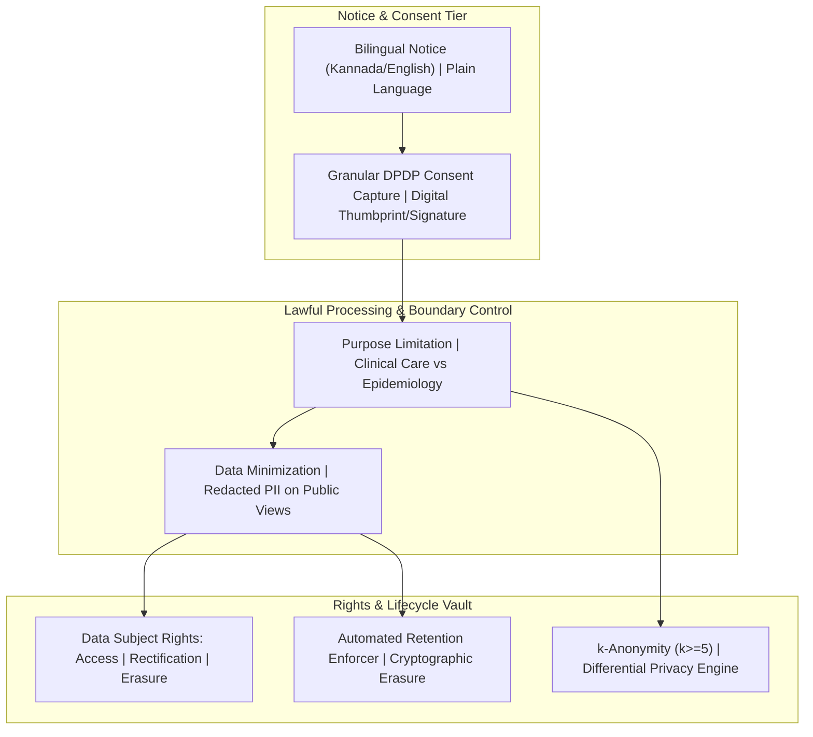

# Privacy & Data Protection Requirements Baseline: Namma Clinic Digital Health Platform

| Metadata Attribute | Formal Specification |
| :--- | :--- |
| **Document Identifier** | `DOC-REQ-008-PRIV` |
| **Document Title** | Privacy & Data Protection Requirements Baseline |
| **Project Code** | `NAMMA-CLINIC-PLATFORM-2026` |
| **Requirement Type** | `Privacy Requirement` |
| **Specification Range** | `PRIV-001 through PRIV-050` (Exactly 50 unique requirements) |
| **Target Baseline** | `v1.0.0-PROD-BASELINE` |
| **Lifecycle Status** | `APPROVED & BASELINED` |
| **Target Facility Scope** | 183 Primary Namma Clinics across 8 BBMP Administrative Zones |
| **Lead Clinical Authority** | Chief Health Officer (CHO), BBMP Health Department |
| **Lead Technical Authority**| Principal Solutions Architect, Kushagramati Analytics Consortium |
| **Upstream Baselines** | [`00-project-baseline/`](../00-project-baseline/) \| [`01-project-management/`](../01-project-management/) |
| **Related Specification**| [`03-non-functional-requirements.md`](./03-non-functional-requirements.md) \| [`07-security-requirements.md`](./07-security-requirements.md) |

## 1. Executive Summary & Domain Governance Framework
This specification defines the authoritative, implementation-ready privacy and data protection requirements baseline for the Namma Clinic Digital Health Platform across 183 primary urban healthcare centers in Greater Bengaluru. Comprising 50 comprehensive privacy specifications (`PRIV-001` through `PRIV-050`), this document operationalizes the legal and ethical mandates of India's Digital Personal Data Protection (DPDP) Act 2023, the DISHA guidelines, and the National Health Authority (NHA) ABDM consent framework.

Every privacy requirement establishes an explicit lawful basis for processing, purposeful data minimization bounds, strict retention and automatic purging schedules, granular patient consent mechanisms, data subject rights (access, correction, erasure, withdrawal), and privacy-preserving de-identification/k-anonymity for public health epidemiology.

## 2. Architecture & Domain Conceptual Framework
The following architectural topology illustrates the functional interactions, security boundaries, and data flows governing this domain across Namma Clinic's 183 primary healthcare centers in Greater Bengaluru:



## 3. Master Privacy Requirement Inventory Table (PRIV-001 through PRIV-050)
| Requirement ID | Title | DPDP Domain | Priority | Lawful Processing Basis | Enforced Privacy Control | Audit Evidence |
| :--- | :--- | :--- | :--- | :--- | :--- | :---: |
| [`PRIV-001`](#priv-001) | **Digital Personal Data Protection (DPDP) Act Notice** | `Digital Personal Data Protection (DPDP)` | `MUST` | DPDP Act 2023 Sec 5... | Display bilingual notice explaining coll... | Consent notice audit log... |
| [`PRIV-002`](#priv-002) | **Explicit Consent Capture & Cryptographic Persistence** | `Digital Personal Data Protection (DPDP)` | `MUST` | DPDP Act 2023 Sec 6... | Capture explicit affirmative consent wit... | Cryptographic consent artifact... |
| [`PRIV-003`](#priv-003) | **Granular Purpose Limitation Enforcement** | `Digital Personal Data Protection (DPDP)` | `MUST` | DPDP Act 2023 Sec 4... | Restrict health data processing strictly... | API purpose validation log... |
| [`PRIV-004`](#priv-004) | **Data Minimization in Patient Registration** | `Digital Personal Data Protection (DPDP)` | `MUST` | DPDP Act 2023 Sec 4... | Eliminate collection of non-essential at... | Registration schema inspection... |
| [`PRIV-005`](#priv-005) | **Right to Access Personal Health Data** | `Digital Personal Data Protection (DPDP)` | `MUST` | DPDP Act 2023 Sec 11... | Provide citizen with access to complete ... | Citizen record export receipt... |
| [`PRIV-006`](#priv-006) | **Right to Correction of Demographic Records** | `Digital Personal Data Protection (DPDP)` | `MUST` | DPDP Act 2023 Sec 12... | Allow citizen to request correction of i... | Correction audit log with befo... |
| [`PRIV-007`](#priv-007) | **Statutory Medical Retention vs Deletion Boundary** | `Digital Personal Data Protection (DPDP)` | `MUST` | NMC Regulations 2002 & DPDP Sec 8... | Retain medical treatment records for man... | Statutory retention policy doc... |
| [`PRIV-008`](#priv-008) | **Soft-Deletion & Tombstoning Architecture** | `Digital Personal Data Protection (DPDP)` | `MUST` | DPDP Act 2023 Sec 8... | Enforce soft-deletion with metadata tomb... | Tombstone record audit log in ... |
| [`PRIV-009`](#priv-009) | **Consent Withdrawal Workflow Execution** | `Digital Personal Data Protection (DPDP)` | `MUST` | DPDP Act 2023 Sec 6... | Halt non-essential communications (SMS r... | Consent revocation transaction... |
| [`PRIV-010`](#priv-010) | **Nominee Designation for Incapacitated Citizens** | `Digital Personal Data Protection (DPDP)` | `MUST` | DPDP Act 2023 Sec 14... | Support designation of legal nominee to ... | Nominee registration record ar... |
| [`PRIV-011`](#priv-011) | **Children's Health Data Parental Consent Verification** | `Digital Personal Data Protection (DPDP)` | `MUST` | DPDP Act 2023 Sec 9... | Require verifiable parental/guardian con... | Parental consent verification ... |
| [`PRIV-012`](#priv-012) | **Ban on Commercial Behavioral Tracking of Children** | `Digital Personal Data Protection (DPDP)` | `MUST` | DPDP Act 2023 Sec 9... | Zero behavioral tracking, profiling, or ... | Static code audit verifying ze... |
| [`PRIV-013`](#priv-013) | **Data Protection Officer (DPO) Independent Oversight** | `Digital Personal Data Protection (DPDP)` | `MUST` | DPDP Act 2023 Sec 10... | Designate certified BBMP Data Protection... | DPO appointment order and char... |
| [`PRIV-014`](#priv-014) | **Data Protection Impact Assessment (DPIA) Requirement** | `Digital Personal Data Protection (DPDP)` | `MUST` | DPDP Act 2023 Sec 10... | Conduct formal DPIA before introducing n... | Ratified DPIA document for pla... |
| [`PRIV-015`](#priv-015) | **Mandatory 72-Hour Data Breach Notification to Board** | `Digital Personal Data Protection (DPDP)` | `MUST` | DPDP Act 2023 Sec 8... | Notify Data Protection Board of India an... | Breach notification protocol a... |
| [`PRIV-016`](#priv-016) | **Incident Severity Classification & Impact Assessment** | `Digital Personal Data Protection (DPDP)` | `MUST` | DPDP Rules Draft 2024... | Classify privacy incidents into Low, Mod... | Incident classification matrix... |
| [`PRIV-017`](#priv-017) | **De-Identification via k-Anonymity (k>=5) for Analytics** | `Digital Personal Data Protection (DPDP)` | `MUST` | Privacy-by-Design Best Practice... | Enforce k-anonymity (k>=5) and l-diversi... | ARX anonymization verification... |
| [`PRIV-018`](#priv-018) | **Differential Privacy in Syndromic Surveillance Heatmaps** | `Digital Personal Data Protection (DPDP)` | `MUST` | DPDP Privacy Engineering... | Inject calibrated Laplacian noise into p... | Differential privacy epsilon p... |
| [`PRIV-019`](#priv-019) | **Automated Direct Identifier Masking in Training Data** | `Digital Personal Data Protection (DPDP)` | `MUST` | DPDP Act Sec 4 & ISO 27701... | Strip all 18 direct HIPAA/DPDP identifie... | De-identification pipeline aud... |
| [`PRIV-020`](#priv-020) | **Data Minimization in Physical Thermal Printouts** | `Digital Personal Data Protection (DPDP)` | `MUST` | DPDP Principle of Minimization... | Mask middle digits of mobile number (`XX... | Thermal print slip inspection ... |
| [`PRIV-021`](#priv-021) | **Public Display Board Patient Privacy Guard** | `Digital Personal Data Protection (DPDP)` | `MUST` | DPDP Privacy-by-Default... | Waiting hall TV displays shall display o... | Waiting display screenshot aud... |
| [`PRIV-022`](#priv-022) | **Bilingual Privacy Notice Accessibility** | `Digital Personal Data Protection (DPDP)` | `MUST` | DPDP Act Sec 5... | Display physical Kannada and English pri... | Physical clinic signage compli... |
| [`PRIV-023`](#priv-023) | **Grievance Redressal Mechanism via BBMP Sahaaya 2.0** | `Digital Personal Data Protection (DPDP)` | `MUST` | DPDP Act Sec 13... | Provide accessible portal for citizens t... | Sahaaya privacy complaint inte... |
| [`PRIV-024`](#priv-024) | **Privacy-by-Design Default Configurations** | `Digital Personal Data Protection (DPDP)` | `MUST` | DPDP Act Sec 8... | Configure all new user accounts and syst... | Default system configuration a... |
| [`PRIV-025`](#priv-025) | **Third-Party Data Processor Contractual Obligations** | `Digital Personal Data Protection (DPDP)` | `MUST` | DPDP Act Sec 8... | Bind all IT vendors and cloud providers ... | Signed Data Processor Agreemen... |
| [`PRIV-026`](#priv-026) | **Cross-Border Health Data Transfer Absolute Prohibition** | `Digital Personal Data Protection (DPDP)` | `MUST` | DPDP Act Sec 16 & MeitY Guidelines... | Prohibit storage or processing of munici... | AWS Mumbai data center residen... |
| [`PRIV-027`](#priv-027) | **Aadhaar Number Zero Persistence Invariant** | `Digital Personal Data Protection (DPDP)` | `MUST` | Aadhaar Act 2016 & DPDP Act... | Never store raw 12-digit Aadhaar numbers... | Database schema audit showing ... |
| [`PRIV-028`](#priv-028) | **Biometric Template Encryption & Non-Extractability** | `Digital Personal Data Protection (DPDP)` | `MUST` | Aadhaar / DPDP Biometric Standards... | Store staff fingerprint biometric templa... | Biometric storage cryptographi... |
| [`PRIV-029`](#priv-029) | **Temporary Staff Session Access Revocation on Transfer** | `Digital Personal Data Protection (DPDP)` | `MUST` | DPDP Least Privilege... | Instantly revoke clinic-level data acces... | HRMS transfer event auto-revoc... |
| [`PRIV-030`](#priv-030) | **Secondary Referral Data Minimization Envelope** | `Digital Personal Data Protection (DPDP)` | `MUST` | DPDP Purpose Bounding... | Include only relevant clinical transfer ... | Referral QR payload schema ins... |
| [`PRIV-031`](#priv-031) | **Periodic Annual Privacy Compliance Audit** | `Digital Personal Data Protection (DPDP)` | `MUST` | DPDP Act Sec 10... | Conduct independent annual privacy audit... | Annual privacy audit report ar... |
| [`PRIV-032`](#priv-032) | **Restricted Access to Sensitive Reproductive & Mental Health Notes** | `Digital Personal Data Protection (DPDP)` | `MUST` | Medical Termination of Pregnancy Ac... | Restrict access to abortion, psychiatric... | Database authorization policy ... |
| [`PRIV-033`](#priv-033) | **Privacy Awareness Training for Frontline Staff** | `Digital Personal Data Protection (DPDP)` | `MUST` | DPDP Organizational Measures... | Mandate annual certified privacy trainin... | Staff training completion regi... |
| [`PRIV-034`](#priv-034) | **Citizen Identity Verification Before Record Disclosure** | `Digital Personal Data Protection (DPDP)` | `MUST` | DPDP Prevention of Impersonation... | Verify citizen identity via mobile OTP o... | Record disclosure authorizatio... |
| [`PRIV-035`](#priv-035) | **Automated Encryption Key Segregation Across Clinics** | `Digital Personal Data Protection (DPDP)` | `MUST` | Cryptographic Isolation Best Practi... | Segregate data encryption keys so compro... | KMS key hierarchy documentatio... |
| [`PRIV-036`](#priv-036) | **Lawful Interception & Subpoena Compliance Protocol** | `Digital Personal Data Protection (DPDP)` | `MUST` | CrPC / BNSS Judicial Process... | Execute formal protocol for releasing pa... | Legal disclosure register in B... |
| [`PRIV-037`](#priv-037) | **Automated Deletion of Stale Temporary Offline Caches** | `Digital Personal Data Protection (DPDP)` | `MUST` | DPDP Storage Limitation... | Automatically purge temporary IndexedDB ... | Client cache pruning telemetry... |
| [`PRIV-038`](#priv-038) | **Privacy Policy URL Disclosure in Public Web Footer** | `Digital Personal Data Protection (DPDP)` | `MUST` | DPDP Act Sec 5... | Provide clickable link to full municipal... | Web page footer inspection rep... |
| [`PRIV-039`](#priv-039) | **Prohibition of Secondary Commercial Exploitation** | `Digital Personal Data Protection (DPDP)` | `MUST` | DPDP Act Sec 4... | Strict contractual and statutory ban on ... | Municipal executive resolution... |
| [`PRIV-040`](#priv-040) | **Restricted Access to Diagnostic Photos & Attachments** | `Digital Personal Data Protection (DPDP)` | `MUST` | DPDP Access Control... | Enforce time-limited pre-signed URLs (va... | S3 pre-signed URL generator au... |
| [`PRIV-041`](#priv-041) | **Pseudonymized Patient Identification in Research Logs** | `Digital Personal Data Protection (DPDP)` | `MUST` | Privacy-by-Design Standard... | Replace patient UHID with cryptographica... | DuckDB analytical query log in... |
| [`PRIV-042`](#priv-042) | **Data Protection Board Inquiries Cooperation Mandate** | `Digital Personal Data Protection (DPDP)` | `MUST` | DPDP Act Sec 28... | Designate formal legal liaison protocol ... | Board liaison procedure docume... |
| [`PRIV-043`](#priv-043) | **Patient Right to Portability via ABDM FHIR Exchange** | `Digital Personal Data Protection (DPDP)` | `MUST` | ABDM / DPDP Interoperability... | Allow citizen to export health records i... | FHIR export validation test lo... |
| [`PRIV-044`](#priv-044) | **Internal Whistleblower Protection for Privacy Breaches** | `Digital Personal Data Protection (DPDP)` | `MUST` | BBMP Vigilance Bylaws... | Protect staff members reporting illegal ... | Whistleblower intake portal do... |
| [`PRIV-045`](#priv-045) | **Clean Desk & Unattended Screen Privacy Policy** | `Digital Personal Data Protection (DPDP)` | `MUST` | ISO 27701 Physical Security... | Mandate physical locking of paper record... | Facility compliance inspection... |
| [`PRIV-046`](#priv-046) | **Encrypted Cloud Database Backup Storage & Purging** | `Digital Personal Data Protection (DPDP)` | `MUST` | DPDP Retention Standards... | Encrypt database backup files with AES-2... | AWS S3 backup lifecycle rule v... |
| [`PRIV-047`](#priv-047) | **Prohibition of Third-Party Tracking Pixels & Analytics** | `Digital Personal Data Protection (DPDP)` | `MUST` | DPDP Privacy-by-Default... | Zero Google Analytics, Facebook Pixel, o... | Static asset audit verifying z... |
| [`PRIV-048`](#priv-048) | **Specialized Consent for Maternal & Infant HIV Screening** | `Digital Personal Data Protection (DPDP)` | `MUST` | National AIDS Control Organization ... | Require pre-test and post-test counselin... | NACO consent form scan in pati... |
| [`PRIV-049`](#priv-049) | **Audit Log Access Restriction to Authorized Audit Officers** | `Digital Personal Data Protection (DPDP)` | `MUST` | DPDP Audit Confidentiality... | Audit logs shall be accessible solely to... | Audit log query authorization ... |
| [`PRIV-050`](#priv-050) | **Comprehensive Privacy Governance Legal Review Sign-Off** | `Digital Personal Data Protection (DPDP)` | `MUST` | DPDP Statutory Compliance... | Execute formal sign-off by BBMP Legal Di... | Signed legal review certificat... |

## 4. Comprehensive Privacy Requirement Specifications (PRIV-001 through PRIV-050)
This section establishes the exhaustive engineering, clinical, operational, and architectural specifications for each of the 50 requirements committed for the production baseline.

### 4.1 PRIV-001: Digital Personal Data Protection (DPDP) Act Notice

| Specification Attribute | Formal Engineering Definition |
| :--- | :--- |
| **Requirement ID** | `PRIV-001` |
| **Requirement Title** | Digital Personal Data Protection (DPDP) Act Notice |
| **Requirement Statement**| The platform SHALL enforce digital personal data protection (dpdp) act notice under the notice & transparency principle (CONFIRMED REQUIREMENT) by display bilingual notice explaining collection purpose in kannada and english before registration.. |
| **Requirement Type** | `Privacy Requirement` |
| **Priority Level** | `MUST` (Rationale: Statutory privacy requirement under India Digital Personal Data Protection Act 2023.) |
| **Business Value** | Ensures citizen trust, legal protection, and constitutional privacy rights. |
| **Engineering Rationale**| Upholds Notice & Transparency per DPDP Act 2023. |
| **Primary Actor** | `Data Protection Officer` |
| **Target User Persona** | [`PERSONA-001`](../01-project-management/07-user-personas.md#persona-001) |
| **Accountable Role** | [`ROLE-008`](../01-project-management/08-role-and-responsibility-matrix.md#role-008) |
| **Key Stakeholder** | [`STAKEHOLDER-008`](../01-project-management/06-stakeholders.md#stakeholder-008) |
| **Trigger Condition** | Collection, processing, sharing, or retrieval of citizen personal data. |
| **System Preconditions** | Patient registration or encounter workflow active. |
| **Input Specifications** | Citizen demographic details, medical history, or consent artifacts. |
| **Validation Rules** | Evaluated against DPDP Act 2023 statutory guidelines and BBMP legal policy. |
| **Postconditions** | Citizen health data processed strictly within lawful consent boundaries. |
| **State Mutations** | Updates consent ledger and privacy audit records. |
| **Associated Rules** | Business: [`BRULE-001`](./04-business-rules.md#brule-001) \| Clinical: [`N/A — privacy governance requirement`](./05-clinical-rules.md#n/a — privacy governance requirement) \| Operational: [`OR-001`](./06-operational-rules.md#or-001) |
| **Security & Privacy** | Security: `SECR-014: AES-256 field encryption and access control.` \| Privacy: `Core privacy requirement `PRIV-001` under DPDP Act 2023.` |
| **Data & Audit** | Data: `Data minimization and retention limits enforced.` \| Audit: `Consent notice audit log` |
| **Offline & Sync** | Offline: `Consent captured offline in IndexedDB and replayed to central DPO registry.` \| Sync: `Encrypted sync payloads preserve privacy tags during transit.` |
| **Quality Expectations**| Perf: `Privacy validation adds < 5ms to form processing.` \| Avail: `Privacy controls active on 100% of citizen-facing touchpoints.` |
| **Localization & A11y**| Loc: `All consent notices fully rendered in Kannada and English.` \| A11y: `Audio and visual presentation of privacy terms for low-literacy citizens.` |
| **Failure & Recovery** | Failure: Fail-closed; withhold data processing if valid consent cannot be verified. \| Recovery: Prompt staff to re-present bilingual consent notice to citizen. |
| **Observability** | Logging: `Structured JSON log with consent_id, purpose, and timestamp.` \| Metrics: `Prometheus counter `namma_clinic_priv_consents_total{req_id="PRIV-001"}`.` |
| **Upstream Traceability**| Obj: [`OBJECTIVE-001`](../01-project-management/02-project-vision-and-objectives.md#objective-001) \| Scope: [`INSCOPE-001`](../01-project-management/04-in-scope.md#inscope-001) \| Risk: [`RISK-001`](../01-project-management/12-project-risks.md#risk-001) |
| **Downstream Planning** | Epic: `PLANNED-EPIC-001` \| Feature: `PLANNED-FEATURE-001` \| API: `PLANNED-API-001` \| DB: `PLANNED-DB-001` \| Test: `PLANNED-TEST-701` |

#### 4.1.1 Operational Execution Protocol & Frontline Workflow
- **Continuous Operational Workflow:**
  1. Citizen interacts with health service touchpoint.
  2. Privacy notice presented in clear Kannada and English.
  3. Explicit consent recorded with purpose limitation: Display bilingual notice explaining collection purpose in Kannada and English before registration..
  4. Data encrypted and restricted strictly to authorized clinical roles.
  5. Compliance audit artifact committed: Consent notice audit log.
- **Degraded State Fallback Path:** If citizen requests consent withdrawal or data correction, execute statutory rights workflow.
- **Exception Breach & Incident Escalation Path:** If unlawful processing attempt detected, system blocks data export and notifies BBMP DPO.

#### 4.1.2 Technical Invariants & Operational Contract
- **DPDP Act Principle:** Notice & Transparency
- **Legal Classification:** CONFIRMED REQUIREMENT
- **Enforced Privacy Control:** Display bilingual notice explaining collection purpose in Kannada and English before registration.
- **Lawful Processing Basis:** DPDP Act 2023 Sec 5
- **Data Subject Rights Impact:** Right to be informed
- **Audit Evidence Record:** Consent notice audit log

#### 4.1.3 Executable BDD Acceptance Scenarios
```gherkin
Feature: PRIV-001 - Digital Personal Data Protection (DPDP) Act Notice
  As a Data Protection Officer
  I require system enforcement of digital personal data protection (dpdp) act notice
  In order to ensure municipal healthcare compliance and operational integrity

  Scenario: Happy Path Execution for PRIV-001
    Given the Data Protection Officer is authenticated and clinic terminal is operational
    When the user submits a valid request for digital personal data protection (dpdp) act notice
    Then the system successfully commits the transaction and emits an audit event

  Scenario: Input Validation and Schema Guard for PRIV-001
    Given the Data Protection Officer attempts to submit an incomplete or malformed payload for digital personal data protection (dpdp) act notice
    When the request fails TypeBox schema or domain constraint validation
    Then the system rejects the input with HTTP 400 and highlights invalid fields in Kannada and English

  Scenario: RBAC and Security Access Control for PRIV-001
    Given an unauthenticated or unauthorized role attempts to invoke digital personal data protection (dpdp) act notice
    When the bearer JWT token is missing, expired, or lacks necessary RBAC permission
    Then the system denies execution with HTTP 403 Forbidden and records a security telemetry alert

  Scenario: Offline Autonomous Execution for PRIV-001
    Given the clinic WAN network is completely severed during digital personal data protection (dpdp) act notice
    When the operator confirms the local transaction on the workstation
    Then the mutation is persisted to Dexie.js IndexedDB with a UUIDv7 and queued for background replay

  Scenario: Network Recovery and Idempotent Sync for PRIV-001
    Given the clinic workstation reconnects to the BBMP municipal health WAN
    When the background sync daemon processes the pending mutation queue
    Then all buffered transactions for PRIV-001 synchronize idempotently with zero data loss
```

#### 4.1.4 Verification Protocol & Quality Sign-Off
- **Verification Method:** Automated Privacy Compliance Audit & Legal Review
- **Automated Test Suite:** `PLANNED-TEST-701` (Privacy & Data Protection Test) targeting 100% verification gate compliance.
- **Related Internal Requirements:** `SECR-001`, `BRULE-001`
- **Dependencies & Blocking Constraints:** SECR-014 | Constraints: Clinical care retention laws supersede citizen deletion requests.
- **Architectural Assumptions & Open Questions:** Assumption: BBMP Health Department appointed certified Data Protection Officer. | Open Question: Awaiting final rules notification under DPDP Act from Ministry of Electronics and IT.

---

### 4.2 PRIV-002: Explicit Consent Capture & Cryptographic Persistence

| Specification Attribute | Formal Engineering Definition |
| :--- | :--- |
| **Requirement ID** | `PRIV-002` |
| **Requirement Title** | Explicit Consent Capture & Cryptographic Persistence |
| **Requirement Statement**| The platform SHALL enforce explicit consent capture & cryptographic persistence under the consent architecture principle (CONFIRMED REQUIREMENT) by capture explicit affirmative consent with cryptographic timestamp and store in worm ledger.. |
| **Requirement Type** | `Privacy Requirement` |
| **Priority Level** | `MUST` (Rationale: Statutory privacy requirement under India Digital Personal Data Protection Act 2023.) |
| **Business Value** | Ensures citizen trust, legal protection, and constitutional privacy rights. |
| **Engineering Rationale**| Upholds Consent Architecture per DPDP Act 2023. |
| **Primary Actor** | `Data Protection Officer` |
| **Target User Persona** | [`PERSONA-002`](../01-project-management/07-user-personas.md#persona-002) |
| **Accountable Role** | [`ROLE-008`](../01-project-management/08-role-and-responsibility-matrix.md#role-008) |
| **Key Stakeholder** | [`STAKEHOLDER-008`](../01-project-management/06-stakeholders.md#stakeholder-008) |
| **Trigger Condition** | Collection, processing, sharing, or retrieval of citizen personal data. |
| **System Preconditions** | Patient registration or encounter workflow active. |
| **Input Specifications** | Citizen demographic details, medical history, or consent artifacts. |
| **Validation Rules** | Evaluated against DPDP Act 2023 statutory guidelines and BBMP legal policy. |
| **Postconditions** | Citizen health data processed strictly within lawful consent boundaries. |
| **State Mutations** | Updates consent ledger and privacy audit records. |
| **Associated Rules** | Business: [`BRULE-002`](./04-business-rules.md#brule-002) \| Clinical: [`N/A — privacy governance requirement`](./05-clinical-rules.md#n/a — privacy governance requirement) \| Operational: [`OR-002`](./06-operational-rules.md#or-002) |
| **Security & Privacy** | Security: `SECR-014: AES-256 field encryption and access control.` \| Privacy: `Core privacy requirement `PRIV-002` under DPDP Act 2023.` |
| **Data & Audit** | Data: `Data minimization and retention limits enforced.` \| Audit: `Cryptographic consent artifact` |
| **Offline & Sync** | Offline: `Consent captured offline in IndexedDB and replayed to central DPO registry.` \| Sync: `Encrypted sync payloads preserve privacy tags during transit.` |
| **Quality Expectations**| Perf: `Privacy validation adds < 5ms to form processing.` \| Avail: `Privacy controls active on 100% of citizen-facing touchpoints.` |
| **Localization & A11y**| Loc: `All consent notices fully rendered in Kannada and English.` \| A11y: `Audio and visual presentation of privacy terms for low-literacy citizens.` |
| **Failure & Recovery** | Failure: Fail-closed; withhold data processing if valid consent cannot be verified. \| Recovery: Prompt staff to re-present bilingual consent notice to citizen. |
| **Observability** | Logging: `Structured JSON log with consent_id, purpose, and timestamp.` \| Metrics: `Prometheus counter `namma_clinic_priv_consents_total{req_id="PRIV-002"}`.` |
| **Upstream Traceability**| Obj: [`OBJECTIVE-002`](../01-project-management/02-project-vision-and-objectives.md#objective-002) \| Scope: [`INSCOPE-002`](../01-project-management/04-in-scope.md#inscope-002) \| Risk: [`RISK-002`](../01-project-management/12-project-risks.md#risk-002) |
| **Downstream Planning** | Epic: `PLANNED-EPIC-002` \| Feature: `PLANNED-FEATURE-002` \| API: `PLANNED-API-002` \| DB: `PLANNED-DB-002` \| Test: `PLANNED-TEST-702` |

#### 4.2.1 Operational Execution Protocol & Frontline Workflow
- **Continuous Operational Workflow:**
  1. Citizen interacts with health service touchpoint.
  2. Privacy notice presented in clear Kannada and English.
  3. Explicit consent recorded with purpose limitation: Capture explicit affirmative consent with cryptographic timestamp and store in WORM ledger..
  4. Data encrypted and restricted strictly to authorized clinical roles.
  5. Compliance audit artifact committed: Cryptographic consent artifact.
- **Degraded State Fallback Path:** If citizen requests consent withdrawal or data correction, execute statutory rights workflow.
- **Exception Breach & Incident Escalation Path:** If unlawful processing attempt detected, system blocks data export and notifies BBMP DPO.

#### 4.2.2 Technical Invariants & Operational Contract
- **DPDP Act Principle:** Consent Architecture
- **Legal Classification:** CONFIRMED REQUIREMENT
- **Enforced Privacy Control:** Capture explicit affirmative consent with cryptographic timestamp and store in WORM ledger.
- **Lawful Processing Basis:** DPDP Act 2023 Sec 6
- **Data Subject Rights Impact:** Right to consent freely
- **Audit Evidence Record:** Cryptographic consent artifact

#### 4.2.3 Executable BDD Acceptance Scenarios
```gherkin
Feature: PRIV-002 - Explicit Consent Capture & Cryptographic Persistence
  As a Data Protection Officer
  I require system enforcement of explicit consent capture & cryptographic persistence
  In order to ensure municipal healthcare compliance and operational integrity

  Scenario: Happy Path Execution for PRIV-002
    Given the Data Protection Officer is authenticated and clinic terminal is operational
    When the user submits a valid request for explicit consent capture & cryptographic persistence
    Then the system successfully commits the transaction and emits an audit event

  Scenario: Input Validation and Schema Guard for PRIV-002
    Given the Data Protection Officer attempts to submit an incomplete or malformed payload for explicit consent capture & cryptographic persistence
    When the request fails TypeBox schema or domain constraint validation
    Then the system rejects the input with HTTP 400 and highlights invalid fields in Kannada and English

  Scenario: RBAC and Security Access Control for PRIV-002
    Given an unauthenticated or unauthorized role attempts to invoke explicit consent capture & cryptographic persistence
    When the bearer JWT token is missing, expired, or lacks necessary RBAC permission
    Then the system denies execution with HTTP 403 Forbidden and records a security telemetry alert

  Scenario: Offline Autonomous Execution for PRIV-002
    Given the clinic WAN network is completely severed during explicit consent capture & cryptographic persistence
    When the operator confirms the local transaction on the workstation
    Then the mutation is persisted to Dexie.js IndexedDB with a UUIDv7 and queued for background replay

  Scenario: Network Recovery and Idempotent Sync for PRIV-002
    Given the clinic workstation reconnects to the BBMP municipal health WAN
    When the background sync daemon processes the pending mutation queue
    Then all buffered transactions for PRIV-002 synchronize idempotently with zero data loss
```

#### 4.2.4 Verification Protocol & Quality Sign-Off
- **Verification Method:** Automated Privacy Compliance Audit & Legal Review
- **Automated Test Suite:** `PLANNED-TEST-702` (Privacy & Data Protection Test) targeting 100% verification gate compliance.
- **Related Internal Requirements:** `SECR-002`, `BRULE-002`
- **Dependencies & Blocking Constraints:** SECR-014 | Constraints: Clinical care retention laws supersede citizen deletion requests.
- **Architectural Assumptions & Open Questions:** Assumption: BBMP Health Department appointed certified Data Protection Officer. | Open Question: Awaiting final rules notification under DPDP Act from Ministry of Electronics and IT.

---

### 4.3 PRIV-003: Granular Purpose Limitation Enforcement

| Specification Attribute | Formal Engineering Definition |
| :--- | :--- |
| **Requirement ID** | `PRIV-003` |
| **Requirement Title** | Granular Purpose Limitation Enforcement |
| **Requirement Statement**| The platform SHALL enforce granular purpose limitation enforcement under the purpose limitation principle (CONFIRMED REQUIREMENT) by restrict health data processing strictly to direct patient clinical care and statutory public health.. |
| **Requirement Type** | `Privacy Requirement` |
| **Priority Level** | `MUST` (Rationale: Statutory privacy requirement under India Digital Personal Data Protection Act 2023.) |
| **Business Value** | Ensures citizen trust, legal protection, and constitutional privacy rights. |
| **Engineering Rationale**| Upholds Purpose Limitation per DPDP Act 2023. |
| **Primary Actor** | `Data Protection Officer` |
| **Target User Persona** | [`PERSONA-003`](../01-project-management/07-user-personas.md#persona-003) |
| **Accountable Role** | [`ROLE-008`](../01-project-management/08-role-and-responsibility-matrix.md#role-008) |
| **Key Stakeholder** | [`STAKEHOLDER-008`](../01-project-management/06-stakeholders.md#stakeholder-008) |
| **Trigger Condition** | Collection, processing, sharing, or retrieval of citizen personal data. |
| **System Preconditions** | Patient registration or encounter workflow active. |
| **Input Specifications** | Citizen demographic details, medical history, or consent artifacts. |
| **Validation Rules** | Evaluated against DPDP Act 2023 statutory guidelines and BBMP legal policy. |
| **Postconditions** | Citizen health data processed strictly within lawful consent boundaries. |
| **State Mutations** | Updates consent ledger and privacy audit records. |
| **Associated Rules** | Business: [`BRULE-003`](./04-business-rules.md#brule-003) \| Clinical: [`N/A — privacy governance requirement`](./05-clinical-rules.md#n/a — privacy governance requirement) \| Operational: [`OR-003`](./06-operational-rules.md#or-003) |
| **Security & Privacy** | Security: `SECR-014: AES-256 field encryption and access control.` \| Privacy: `Core privacy requirement `PRIV-003` under DPDP Act 2023.` |
| **Data & Audit** | Data: `Data minimization and retention limits enforced.` \| Audit: `API purpose validation log` |
| **Offline & Sync** | Offline: `Consent captured offline in IndexedDB and replayed to central DPO registry.` \| Sync: `Encrypted sync payloads preserve privacy tags during transit.` |
| **Quality Expectations**| Perf: `Privacy validation adds < 5ms to form processing.` \| Avail: `Privacy controls active on 100% of citizen-facing touchpoints.` |
| **Localization & A11y**| Loc: `All consent notices fully rendered in Kannada and English.` \| A11y: `Audio and visual presentation of privacy terms for low-literacy citizens.` |
| **Failure & Recovery** | Failure: Fail-closed; withhold data processing if valid consent cannot be verified. \| Recovery: Prompt staff to re-present bilingual consent notice to citizen. |
| **Observability** | Logging: `Structured JSON log with consent_id, purpose, and timestamp.` \| Metrics: `Prometheus counter `namma_clinic_priv_consents_total{req_id="PRIV-003"}`.` |
| **Upstream Traceability**| Obj: [`OBJECTIVE-003`](../01-project-management/02-project-vision-and-objectives.md#objective-003) \| Scope: [`INSCOPE-003`](../01-project-management/04-in-scope.md#inscope-003) \| Risk: [`RISK-003`](../01-project-management/12-project-risks.md#risk-003) |
| **Downstream Planning** | Epic: `PLANNED-EPIC-003` \| Feature: `PLANNED-FEATURE-003` \| API: `PLANNED-API-003` \| DB: `PLANNED-DB-003` \| Test: `PLANNED-TEST-703` |

#### 4.3.1 Operational Execution Protocol & Frontline Workflow
- **Continuous Operational Workflow:**
  1. Citizen interacts with health service touchpoint.
  2. Privacy notice presented in clear Kannada and English.
  3. Explicit consent recorded with purpose limitation: Restrict health data processing strictly to direct patient clinical care and statutory public health..
  4. Data encrypted and restricted strictly to authorized clinical roles.
  5. Compliance audit artifact committed: API purpose validation log.
- **Degraded State Fallback Path:** If citizen requests consent withdrawal or data correction, execute statutory rights workflow.
- **Exception Breach & Incident Escalation Path:** If unlawful processing attempt detected, system blocks data export and notifies BBMP DPO.

#### 4.3.2 Technical Invariants & Operational Contract
- **DPDP Act Principle:** Purpose Limitation
- **Legal Classification:** CONFIRMED REQUIREMENT
- **Enforced Privacy Control:** Restrict health data processing strictly to direct patient clinical care and statutory public health.
- **Lawful Processing Basis:** DPDP Act 2023 Sec 4
- **Data Subject Rights Impact:** Purpose bounding
- **Audit Evidence Record:** API purpose validation log

#### 4.3.3 Executable BDD Acceptance Scenarios
```gherkin
Feature: PRIV-003 - Granular Purpose Limitation Enforcement
  As a Data Protection Officer
  I require system enforcement of granular purpose limitation enforcement
  In order to ensure municipal healthcare compliance and operational integrity

  Scenario: Happy Path Execution for PRIV-003
    Given the Data Protection Officer is authenticated and clinic terminal is operational
    When the user submits a valid request for granular purpose limitation enforcement
    Then the system successfully commits the transaction and emits an audit event

  Scenario: Input Validation and Schema Guard for PRIV-003
    Given the Data Protection Officer attempts to submit an incomplete or malformed payload for granular purpose limitation enforcement
    When the request fails TypeBox schema or domain constraint validation
    Then the system rejects the input with HTTP 400 and highlights invalid fields in Kannada and English

  Scenario: RBAC and Security Access Control for PRIV-003
    Given an unauthenticated or unauthorized role attempts to invoke granular purpose limitation enforcement
    When the bearer JWT token is missing, expired, or lacks necessary RBAC permission
    Then the system denies execution with HTTP 403 Forbidden and records a security telemetry alert

  Scenario: Offline Autonomous Execution for PRIV-003
    Given the clinic WAN network is completely severed during granular purpose limitation enforcement
    When the operator confirms the local transaction on the workstation
    Then the mutation is persisted to Dexie.js IndexedDB with a UUIDv7 and queued for background replay

  Scenario: Network Recovery and Idempotent Sync for PRIV-003
    Given the clinic workstation reconnects to the BBMP municipal health WAN
    When the background sync daemon processes the pending mutation queue
    Then all buffered transactions for PRIV-003 synchronize idempotently with zero data loss
```

#### 4.3.4 Verification Protocol & Quality Sign-Off
- **Verification Method:** Automated Privacy Compliance Audit & Legal Review
- **Automated Test Suite:** `PLANNED-TEST-703` (Privacy & Data Protection Test) targeting 100% verification gate compliance.
- **Related Internal Requirements:** `SECR-003`, `BRULE-003`
- **Dependencies & Blocking Constraints:** SECR-014 | Constraints: Clinical care retention laws supersede citizen deletion requests.
- **Architectural Assumptions & Open Questions:** Assumption: BBMP Health Department appointed certified Data Protection Officer. | Open Question: Awaiting final rules notification under DPDP Act from Ministry of Electronics and IT.

---

### 4.4 PRIV-004: Data Minimization in Patient Registration

| Specification Attribute | Formal Engineering Definition |
| :--- | :--- |
| **Requirement ID** | `PRIV-004` |
| **Requirement Title** | Data Minimization in Patient Registration |
| **Requirement Statement**| The platform SHALL enforce data minimization in patient registration under the data minimization principle (CONFIRMED REQUIREMENT) by eliminate collection of non-essential attributes (religion, caste, income, political opinions).. |
| **Requirement Type** | `Privacy Requirement` |
| **Priority Level** | `MUST` (Rationale: Statutory privacy requirement under India Digital Personal Data Protection Act 2023.) |
| **Business Value** | Ensures citizen trust, legal protection, and constitutional privacy rights. |
| **Engineering Rationale**| Upholds Data Minimization per DPDP Act 2023. |
| **Primary Actor** | `Data Protection Officer` |
| **Target User Persona** | [`PERSONA-004`](../01-project-management/07-user-personas.md#persona-004) |
| **Accountable Role** | [`ROLE-008`](../01-project-management/08-role-and-responsibility-matrix.md#role-008) |
| **Key Stakeholder** | [`STAKEHOLDER-008`](../01-project-management/06-stakeholders.md#stakeholder-008) |
| **Trigger Condition** | Collection, processing, sharing, or retrieval of citizen personal data. |
| **System Preconditions** | Patient registration or encounter workflow active. |
| **Input Specifications** | Citizen demographic details, medical history, or consent artifacts. |
| **Validation Rules** | Evaluated against DPDP Act 2023 statutory guidelines and BBMP legal policy. |
| **Postconditions** | Citizen health data processed strictly within lawful consent boundaries. |
| **State Mutations** | Updates consent ledger and privacy audit records. |
| **Associated Rules** | Business: [`BRULE-004`](./04-business-rules.md#brule-004) \| Clinical: [`N/A — privacy governance requirement`](./05-clinical-rules.md#n/a — privacy governance requirement) \| Operational: [`OR-004`](./06-operational-rules.md#or-004) |
| **Security & Privacy** | Security: `SECR-014: AES-256 field encryption and access control.` \| Privacy: `Core privacy requirement `PRIV-004` under DPDP Act 2023.` |
| **Data & Audit** | Data: `Data minimization and retention limits enforced.` \| Audit: `Registration schema inspection report` |
| **Offline & Sync** | Offline: `Consent captured offline in IndexedDB and replayed to central DPO registry.` \| Sync: `Encrypted sync payloads preserve privacy tags during transit.` |
| **Quality Expectations**| Perf: `Privacy validation adds < 5ms to form processing.` \| Avail: `Privacy controls active on 100% of citizen-facing touchpoints.` |
| **Localization & A11y**| Loc: `All consent notices fully rendered in Kannada and English.` \| A11y: `Audio and visual presentation of privacy terms for low-literacy citizens.` |
| **Failure & Recovery** | Failure: Fail-closed; withhold data processing if valid consent cannot be verified. \| Recovery: Prompt staff to re-present bilingual consent notice to citizen. |
| **Observability** | Logging: `Structured JSON log with consent_id, purpose, and timestamp.` \| Metrics: `Prometheus counter `namma_clinic_priv_consents_total{req_id="PRIV-004"}`.` |
| **Upstream Traceability**| Obj: [`OBJECTIVE-004`](../01-project-management/02-project-vision-and-objectives.md#objective-004) \| Scope: [`INSCOPE-004`](../01-project-management/04-in-scope.md#inscope-004) \| Risk: [`RISK-004`](../01-project-management/12-project-risks.md#risk-004) |
| **Downstream Planning** | Epic: `PLANNED-EPIC-004` \| Feature: `PLANNED-FEATURE-004` \| API: `PLANNED-API-004` \| DB: `PLANNED-DB-004` \| Test: `PLANNED-TEST-704` |

#### 4.4.1 Operational Execution Protocol & Frontline Workflow
- **Continuous Operational Workflow:**
  1. Citizen interacts with health service touchpoint.
  2. Privacy notice presented in clear Kannada and English.
  3. Explicit consent recorded with purpose limitation: Eliminate collection of non-essential attributes (religion, caste, income, political opinions)..
  4. Data encrypted and restricted strictly to authorized clinical roles.
  5. Compliance audit artifact committed: Registration schema inspection report.
- **Degraded State Fallback Path:** If citizen requests consent withdrawal or data correction, execute statutory rights workflow.
- **Exception Breach & Incident Escalation Path:** If unlawful processing attempt detected, system blocks data export and notifies BBMP DPO.

#### 4.4.2 Technical Invariants & Operational Contract
- **DPDP Act Principle:** Data Minimization
- **Legal Classification:** CONFIRMED REQUIREMENT
- **Enforced Privacy Control:** Eliminate collection of non-essential attributes (religion, caste, income, political opinions).
- **Lawful Processing Basis:** DPDP Act 2023 Sec 4
- **Data Subject Rights Impact:** Right to privacy
- **Audit Evidence Record:** Registration schema inspection report

#### 4.4.3 Executable BDD Acceptance Scenarios
```gherkin
Feature: PRIV-004 - Data Minimization in Patient Registration
  As a Data Protection Officer
  I require system enforcement of data minimization in patient registration
  In order to ensure municipal healthcare compliance and operational integrity

  Scenario: Happy Path Execution for PRIV-004
    Given the Data Protection Officer is authenticated and clinic terminal is operational
    When the user submits a valid request for data minimization in patient registration
    Then the system successfully commits the transaction and emits an audit event

  Scenario: Input Validation and Schema Guard for PRIV-004
    Given the Data Protection Officer attempts to submit an incomplete or malformed payload for data minimization in patient registration
    When the request fails TypeBox schema or domain constraint validation
    Then the system rejects the input with HTTP 400 and highlights invalid fields in Kannada and English

  Scenario: RBAC and Security Access Control for PRIV-004
    Given an unauthenticated or unauthorized role attempts to invoke data minimization in patient registration
    When the bearer JWT token is missing, expired, or lacks necessary RBAC permission
    Then the system denies execution with HTTP 403 Forbidden and records a security telemetry alert

  Scenario: Offline Autonomous Execution for PRIV-004
    Given the clinic WAN network is completely severed during data minimization in patient registration
    When the operator confirms the local transaction on the workstation
    Then the mutation is persisted to Dexie.js IndexedDB with a UUIDv7 and queued for background replay

  Scenario: Network Recovery and Idempotent Sync for PRIV-004
    Given the clinic workstation reconnects to the BBMP municipal health WAN
    When the background sync daemon processes the pending mutation queue
    Then all buffered transactions for PRIV-004 synchronize idempotently with zero data loss
```

#### 4.4.4 Verification Protocol & Quality Sign-Off
- **Verification Method:** Automated Privacy Compliance Audit & Legal Review
- **Automated Test Suite:** `PLANNED-TEST-704` (Privacy & Data Protection Test) targeting 100% verification gate compliance.
- **Related Internal Requirements:** `SECR-004`, `BRULE-004`
- **Dependencies & Blocking Constraints:** SECR-014 | Constraints: Clinical care retention laws supersede citizen deletion requests.
- **Architectural Assumptions & Open Questions:** Assumption: BBMP Health Department appointed certified Data Protection Officer. | Open Question: Awaiting final rules notification under DPDP Act from Ministry of Electronics and IT.

---

### 4.5 PRIV-005: Right to Access Personal Health Data

| Specification Attribute | Formal Engineering Definition |
| :--- | :--- |
| **Requirement ID** | `PRIV-005` |
| **Requirement Title** | Right to Access Personal Health Data |
| **Requirement Statement**| The platform SHALL enforce right to access personal health data under the data subject rights principle (CONFIRMED REQUIREMENT) by provide citizen with access to complete longitudinal clinical encounter history upon request.. |
| **Requirement Type** | `Privacy Requirement` |
| **Priority Level** | `MUST` (Rationale: Statutory privacy requirement under India Digital Personal Data Protection Act 2023.) |
| **Business Value** | Ensures citizen trust, legal protection, and constitutional privacy rights. |
| **Engineering Rationale**| Upholds Data Subject Rights per DPDP Act 2023. |
| **Primary Actor** | `Data Protection Officer` |
| **Target User Persona** | [`PERSONA-005`](../01-project-management/07-user-personas.md#persona-005) |
| **Accountable Role** | [`ROLE-008`](../01-project-management/08-role-and-responsibility-matrix.md#role-008) |
| **Key Stakeholder** | [`STAKEHOLDER-008`](../01-project-management/06-stakeholders.md#stakeholder-008) |
| **Trigger Condition** | Collection, processing, sharing, or retrieval of citizen personal data. |
| **System Preconditions** | Patient registration or encounter workflow active. |
| **Input Specifications** | Citizen demographic details, medical history, or consent artifacts. |
| **Validation Rules** | Evaluated against DPDP Act 2023 statutory guidelines and BBMP legal policy. |
| **Postconditions** | Citizen health data processed strictly within lawful consent boundaries. |
| **State Mutations** | Updates consent ledger and privacy audit records. |
| **Associated Rules** | Business: [`BRULE-005`](./04-business-rules.md#brule-005) \| Clinical: [`N/A — privacy governance requirement`](./05-clinical-rules.md#n/a — privacy governance requirement) \| Operational: [`OR-005`](./06-operational-rules.md#or-005) |
| **Security & Privacy** | Security: `SECR-014: AES-256 field encryption and access control.` \| Privacy: `Core privacy requirement `PRIV-005` under DPDP Act 2023.` |
| **Data & Audit** | Data: `Data minimization and retention limits enforced.` \| Audit: `Citizen record export receipt` |
| **Offline & Sync** | Offline: `Consent captured offline in IndexedDB and replayed to central DPO registry.` \| Sync: `Encrypted sync payloads preserve privacy tags during transit.` |
| **Quality Expectations**| Perf: `Privacy validation adds < 5ms to form processing.` \| Avail: `Privacy controls active on 100% of citizen-facing touchpoints.` |
| **Localization & A11y**| Loc: `All consent notices fully rendered in Kannada and English.` \| A11y: `Audio and visual presentation of privacy terms for low-literacy citizens.` |
| **Failure & Recovery** | Failure: Fail-closed; withhold data processing if valid consent cannot be verified. \| Recovery: Prompt staff to re-present bilingual consent notice to citizen. |
| **Observability** | Logging: `Structured JSON log with consent_id, purpose, and timestamp.` \| Metrics: `Prometheus counter `namma_clinic_priv_consents_total{req_id="PRIV-005"}`.` |
| **Upstream Traceability**| Obj: [`OBJECTIVE-005`](../01-project-management/02-project-vision-and-objectives.md#objective-005) \| Scope: [`INSCOPE-005`](../01-project-management/04-in-scope.md#inscope-005) \| Risk: [`RISK-005`](../01-project-management/12-project-risks.md#risk-005) |
| **Downstream Planning** | Epic: `PLANNED-EPIC-005` \| Feature: `PLANNED-FEATURE-005` \| API: `PLANNED-API-005` \| DB: `PLANNED-DB-005` \| Test: `PLANNED-TEST-705` |

#### 4.5.1 Operational Execution Protocol & Frontline Workflow
- **Continuous Operational Workflow:**
  1. Citizen interacts with health service touchpoint.
  2. Privacy notice presented in clear Kannada and English.
  3. Explicit consent recorded with purpose limitation: Provide citizen with access to complete longitudinal clinical encounter history upon request..
  4. Data encrypted and restricted strictly to authorized clinical roles.
  5. Compliance audit artifact committed: Citizen record export receipt.
- **Degraded State Fallback Path:** If citizen requests consent withdrawal or data correction, execute statutory rights workflow.
- **Exception Breach & Incident Escalation Path:** If unlawful processing attempt detected, system blocks data export and notifies BBMP DPO.

#### 4.5.2 Technical Invariants & Operational Contract
- **DPDP Act Principle:** Data Subject Rights
- **Legal Classification:** CONFIRMED REQUIREMENT
- **Enforced Privacy Control:** Provide citizen with access to complete longitudinal clinical encounter history upon request.
- **Lawful Processing Basis:** DPDP Act 2023 Sec 11
- **Data Subject Rights Impact:** Right to access
- **Audit Evidence Record:** Citizen record export receipt

#### 4.5.3 Executable BDD Acceptance Scenarios
```gherkin
Feature: PRIV-005 - Right to Access Personal Health Data
  As a Data Protection Officer
  I require system enforcement of right to access personal health data
  In order to ensure municipal healthcare compliance and operational integrity

  Scenario: Happy Path Execution for PRIV-005
    Given the Data Protection Officer is authenticated and clinic terminal is operational
    When the user submits a valid request for right to access personal health data
    Then the system successfully commits the transaction and emits an audit event

  Scenario: Input Validation and Schema Guard for PRIV-005
    Given the Data Protection Officer attempts to submit an incomplete or malformed payload for right to access personal health data
    When the request fails TypeBox schema or domain constraint validation
    Then the system rejects the input with HTTP 400 and highlights invalid fields in Kannada and English

  Scenario: RBAC and Security Access Control for PRIV-005
    Given an unauthenticated or unauthorized role attempts to invoke right to access personal health data
    When the bearer JWT token is missing, expired, or lacks necessary RBAC permission
    Then the system denies execution with HTTP 403 Forbidden and records a security telemetry alert

  Scenario: Offline Autonomous Execution for PRIV-005
    Given the clinic WAN network is completely severed during right to access personal health data
    When the operator confirms the local transaction on the workstation
    Then the mutation is persisted to Dexie.js IndexedDB with a UUIDv7 and queued for background replay

  Scenario: Network Recovery and Idempotent Sync for PRIV-005
    Given the clinic workstation reconnects to the BBMP municipal health WAN
    When the background sync daemon processes the pending mutation queue
    Then all buffered transactions for PRIV-005 synchronize idempotently with zero data loss
```

#### 4.5.4 Verification Protocol & Quality Sign-Off
- **Verification Method:** Automated Privacy Compliance Audit & Legal Review
- **Automated Test Suite:** `PLANNED-TEST-705` (Privacy & Data Protection Test) targeting 100% verification gate compliance.
- **Related Internal Requirements:** `SECR-005`, `BRULE-005`
- **Dependencies & Blocking Constraints:** SECR-014 | Constraints: Clinical care retention laws supersede citizen deletion requests.
- **Architectural Assumptions & Open Questions:** Assumption: BBMP Health Department appointed certified Data Protection Officer. | Open Question: Awaiting final rules notification under DPDP Act from Ministry of Electronics and IT.

---

### 4.6 PRIV-006: Right to Correction of Demographic Records

| Specification Attribute | Formal Engineering Definition |
| :--- | :--- |
| **Requirement ID** | `PRIV-006` |
| **Requirement Title** | Right to Correction of Demographic Records |
| **Requirement Statement**| The platform SHALL enforce right to correction of demographic records under the data subject rights principle (CONFIRMED REQUIREMENT) by allow citizen to request correction of inaccurate name, age, phone number, or address.. |
| **Requirement Type** | `Privacy Requirement` |
| **Priority Level** | `MUST` (Rationale: Statutory privacy requirement under India Digital Personal Data Protection Act 2023.) |
| **Business Value** | Ensures citizen trust, legal protection, and constitutional privacy rights. |
| **Engineering Rationale**| Upholds Data Subject Rights per DPDP Act 2023. |
| **Primary Actor** | `Data Protection Officer` |
| **Target User Persona** | [`PERSONA-006`](../01-project-management/07-user-personas.md#persona-006) |
| **Accountable Role** | [`ROLE-008`](../01-project-management/08-role-and-responsibility-matrix.md#role-008) |
| **Key Stakeholder** | [`STAKEHOLDER-008`](../01-project-management/06-stakeholders.md#stakeholder-008) |
| **Trigger Condition** | Collection, processing, sharing, or retrieval of citizen personal data. |
| **System Preconditions** | Patient registration or encounter workflow active. |
| **Input Specifications** | Citizen demographic details, medical history, or consent artifacts. |
| **Validation Rules** | Evaluated against DPDP Act 2023 statutory guidelines and BBMP legal policy. |
| **Postconditions** | Citizen health data processed strictly within lawful consent boundaries. |
| **State Mutations** | Updates consent ledger and privacy audit records. |
| **Associated Rules** | Business: [`BRULE-006`](./04-business-rules.md#brule-006) \| Clinical: [`N/A — privacy governance requirement`](./05-clinical-rules.md#n/a — privacy governance requirement) \| Operational: [`OR-006`](./06-operational-rules.md#or-006) |
| **Security & Privacy** | Security: `SECR-014: AES-256 field encryption and access control.` \| Privacy: `Core privacy requirement `PRIV-006` under DPDP Act 2023.` |
| **Data & Audit** | Data: `Data minimization and retention limits enforced.` \| Audit: `Correction audit log with before/after diff` |
| **Offline & Sync** | Offline: `Consent captured offline in IndexedDB and replayed to central DPO registry.` \| Sync: `Encrypted sync payloads preserve privacy tags during transit.` |
| **Quality Expectations**| Perf: `Privacy validation adds < 5ms to form processing.` \| Avail: `Privacy controls active on 100% of citizen-facing touchpoints.` |
| **Localization & A11y**| Loc: `All consent notices fully rendered in Kannada and English.` \| A11y: `Audio and visual presentation of privacy terms for low-literacy citizens.` |
| **Failure & Recovery** | Failure: Fail-closed; withhold data processing if valid consent cannot be verified. \| Recovery: Prompt staff to re-present bilingual consent notice to citizen. |
| **Observability** | Logging: `Structured JSON log with consent_id, purpose, and timestamp.` \| Metrics: `Prometheus counter `namma_clinic_priv_consents_total{req_id="PRIV-006"}`.` |
| **Upstream Traceability**| Obj: [`OBJECTIVE-006`](../01-project-management/02-project-vision-and-objectives.md#objective-006) \| Scope: [`INSCOPE-006`](../01-project-management/04-in-scope.md#inscope-006) \| Risk: [`RISK-006`](../01-project-management/12-project-risks.md#risk-006) |
| **Downstream Planning** | Epic: `PLANNED-EPIC-006` \| Feature: `PLANNED-FEATURE-006` \| API: `PLANNED-API-006` \| DB: `PLANNED-DB-006` \| Test: `PLANNED-TEST-706` |

#### 4.6.1 Operational Execution Protocol & Frontline Workflow
- **Continuous Operational Workflow:**
  1. Citizen interacts with health service touchpoint.
  2. Privacy notice presented in clear Kannada and English.
  3. Explicit consent recorded with purpose limitation: Allow citizen to request correction of inaccurate name, age, phone number, or address..
  4. Data encrypted and restricted strictly to authorized clinical roles.
  5. Compliance audit artifact committed: Correction audit log with before/after diff.
- **Degraded State Fallback Path:** If citizen requests consent withdrawal or data correction, execute statutory rights workflow.
- **Exception Breach & Incident Escalation Path:** If unlawful processing attempt detected, system blocks data export and notifies BBMP DPO.

#### 4.6.2 Technical Invariants & Operational Contract
- **DPDP Act Principle:** Data Subject Rights
- **Legal Classification:** CONFIRMED REQUIREMENT
- **Enforced Privacy Control:** Allow citizen to request correction of inaccurate name, age, phone number, or address.
- **Lawful Processing Basis:** DPDP Act 2023 Sec 12
- **Data Subject Rights Impact:** Right to correction
- **Audit Evidence Record:** Correction audit log with before/after diff

#### 4.6.3 Executable BDD Acceptance Scenarios
```gherkin
Feature: PRIV-006 - Right to Correction of Demographic Records
  As a Data Protection Officer
  I require system enforcement of right to correction of demographic records
  In order to ensure municipal healthcare compliance and operational integrity

  Scenario: Happy Path Execution for PRIV-006
    Given the Data Protection Officer is authenticated and clinic terminal is operational
    When the user submits a valid request for right to correction of demographic records
    Then the system successfully commits the transaction and emits an audit event

  Scenario: Input Validation and Schema Guard for PRIV-006
    Given the Data Protection Officer attempts to submit an incomplete or malformed payload for right to correction of demographic records
    When the request fails TypeBox schema or domain constraint validation
    Then the system rejects the input with HTTP 400 and highlights invalid fields in Kannada and English

  Scenario: RBAC and Security Access Control for PRIV-006
    Given an unauthenticated or unauthorized role attempts to invoke right to correction of demographic records
    When the bearer JWT token is missing, expired, or lacks necessary RBAC permission
    Then the system denies execution with HTTP 403 Forbidden and records a security telemetry alert

  Scenario: Offline Autonomous Execution for PRIV-006
    Given the clinic WAN network is completely severed during right to correction of demographic records
    When the operator confirms the local transaction on the workstation
    Then the mutation is persisted to Dexie.js IndexedDB with a UUIDv7 and queued for background replay

  Scenario: Network Recovery and Idempotent Sync for PRIV-006
    Given the clinic workstation reconnects to the BBMP municipal health WAN
    When the background sync daemon processes the pending mutation queue
    Then all buffered transactions for PRIV-006 synchronize idempotently with zero data loss
```

#### 4.6.4 Verification Protocol & Quality Sign-Off
- **Verification Method:** Automated Privacy Compliance Audit & Legal Review
- **Automated Test Suite:** `PLANNED-TEST-706` (Privacy & Data Protection Test) targeting 100% verification gate compliance.
- **Related Internal Requirements:** `SECR-006`, `BRULE-006`
- **Dependencies & Blocking Constraints:** SECR-014 | Constraints: Clinical care retention laws supersede citizen deletion requests.
- **Architectural Assumptions & Open Questions:** Assumption: BBMP Health Department appointed certified Data Protection Officer. | Open Question: Awaiting final rules notification under DPDP Act from Ministry of Electronics and IT.

---

### 4.7 PRIV-007: Statutory Medical Retention vs Deletion Boundary

| Specification Attribute | Formal Engineering Definition |
| :--- | :--- |
| **Requirement ID** | `PRIV-007` |
| **Requirement Title** | Statutory Medical Retention vs Deletion Boundary |
| **Requirement Statement**| The platform SHALL enforce statutory medical retention vs deletion boundary under the storage limitation principle (PROJECT INTERPRETATION) by retain medical treatment records for mandatory 10-year period despite consent withdrawal per nmc.. |
| **Requirement Type** | `Privacy Requirement` |
| **Priority Level** | `MUST` (Rationale: Statutory privacy requirement under India Digital Personal Data Protection Act 2023.) |
| **Business Value** | Ensures citizen trust, legal protection, and constitutional privacy rights. |
| **Engineering Rationale**| Upholds Storage Limitation per DPDP Act 2023. |
| **Primary Actor** | `Data Protection Officer` |
| **Target User Persona** | [`PERSONA-007`](../01-project-management/07-user-personas.md#persona-007) |
| **Accountable Role** | [`ROLE-008`](../01-project-management/08-role-and-responsibility-matrix.md#role-008) |
| **Key Stakeholder** | [`STAKEHOLDER-008`](../01-project-management/06-stakeholders.md#stakeholder-008) |
| **Trigger Condition** | Collection, processing, sharing, or retrieval of citizen personal data. |
| **System Preconditions** | Patient registration or encounter workflow active. |
| **Input Specifications** | Citizen demographic details, medical history, or consent artifacts. |
| **Validation Rules** | Evaluated against DPDP Act 2023 statutory guidelines and BBMP legal policy. |
| **Postconditions** | Citizen health data processed strictly within lawful consent boundaries. |
| **State Mutations** | Updates consent ledger and privacy audit records. |
| **Associated Rules** | Business: [`BRULE-007`](./04-business-rules.md#brule-007) \| Clinical: [`N/A — privacy governance requirement`](./05-clinical-rules.md#n/a — privacy governance requirement) \| Operational: [`OR-007`](./06-operational-rules.md#or-007) |
| **Security & Privacy** | Security: `SECR-014: AES-256 field encryption and access control.` \| Privacy: `Core privacy requirement `PRIV-007` under DPDP Act 2023.` |
| **Data & Audit** | Data: `Data minimization and retention limits enforced.` \| Audit: `Statutory retention policy documentation` |
| **Offline & Sync** | Offline: `Consent captured offline in IndexedDB and replayed to central DPO registry.` \| Sync: `Encrypted sync payloads preserve privacy tags during transit.` |
| **Quality Expectations**| Perf: `Privacy validation adds < 5ms to form processing.` \| Avail: `Privacy controls active on 100% of citizen-facing touchpoints.` |
| **Localization & A11y**| Loc: `All consent notices fully rendered in Kannada and English.` \| A11y: `Audio and visual presentation of privacy terms for low-literacy citizens.` |
| **Failure & Recovery** | Failure: Fail-closed; withhold data processing if valid consent cannot be verified. \| Recovery: Prompt staff to re-present bilingual consent notice to citizen. |
| **Observability** | Logging: `Structured JSON log with consent_id, purpose, and timestamp.` \| Metrics: `Prometheus counter `namma_clinic_priv_consents_total{req_id="PRIV-007"}`.` |
| **Upstream Traceability**| Obj: [`OBJECTIVE-007`](../01-project-management/02-project-vision-and-objectives.md#objective-007) \| Scope: [`INSCOPE-007`](../01-project-management/04-in-scope.md#inscope-007) \| Risk: [`RISK-007`](../01-project-management/12-project-risks.md#risk-007) |
| **Downstream Planning** | Epic: `PLANNED-EPIC-007` \| Feature: `PLANNED-FEATURE-007` \| API: `PLANNED-API-007` \| DB: `PLANNED-DB-007` \| Test: `PLANNED-TEST-707` |

#### 4.7.1 Operational Execution Protocol & Frontline Workflow
- **Continuous Operational Workflow:**
  1. Citizen interacts with health service touchpoint.
  2. Privacy notice presented in clear Kannada and English.
  3. Explicit consent recorded with purpose limitation: Retain medical treatment records for mandatory 10-year period despite consent withdrawal per NMC..
  4. Data encrypted and restricted strictly to authorized clinical roles.
  5. Compliance audit artifact committed: Statutory retention policy documentation.
- **Degraded State Fallback Path:** If citizen requests consent withdrawal or data correction, execute statutory rights workflow.
- **Exception Breach & Incident Escalation Path:** If unlawful processing attempt detected, system blocks data export and notifies BBMP DPO.

#### 4.7.2 Technical Invariants & Operational Contract
- **DPDP Act Principle:** Storage Limitation
- **Legal Classification:** PROJECT INTERPRETATION
- **Enforced Privacy Control:** Retain medical treatment records for mandatory 10-year period despite consent withdrawal per NMC.
- **Lawful Processing Basis:** NMC Regulations 2002 & DPDP Sec 8
- **Data Subject Rights Impact:** Retention boundary
- **Audit Evidence Record:** Statutory retention policy documentation

#### 4.7.3 Executable BDD Acceptance Scenarios
```gherkin
Feature: PRIV-007 - Statutory Medical Retention vs Deletion Boundary
  As a Data Protection Officer
  I require system enforcement of statutory medical retention vs deletion boundary
  In order to ensure municipal healthcare compliance and operational integrity

  Scenario: Happy Path Execution for PRIV-007
    Given the Data Protection Officer is authenticated and clinic terminal is operational
    When the user submits a valid request for statutory medical retention vs deletion boundary
    Then the system successfully commits the transaction and emits an audit event

  Scenario: Input Validation and Schema Guard for PRIV-007
    Given the Data Protection Officer attempts to submit an incomplete or malformed payload for statutory medical retention vs deletion boundary
    When the request fails TypeBox schema or domain constraint validation
    Then the system rejects the input with HTTP 400 and highlights invalid fields in Kannada and English

  Scenario: RBAC and Security Access Control for PRIV-007
    Given an unauthenticated or unauthorized role attempts to invoke statutory medical retention vs deletion boundary
    When the bearer JWT token is missing, expired, or lacks necessary RBAC permission
    Then the system denies execution with HTTP 403 Forbidden and records a security telemetry alert

  Scenario: Offline Autonomous Execution for PRIV-007
    Given the clinic WAN network is completely severed during statutory medical retention vs deletion boundary
    When the operator confirms the local transaction on the workstation
    Then the mutation is persisted to Dexie.js IndexedDB with a UUIDv7 and queued for background replay

  Scenario: Network Recovery and Idempotent Sync for PRIV-007
    Given the clinic workstation reconnects to the BBMP municipal health WAN
    When the background sync daemon processes the pending mutation queue
    Then all buffered transactions for PRIV-007 synchronize idempotently with zero data loss
```

#### 4.7.4 Verification Protocol & Quality Sign-Off
- **Verification Method:** Automated Privacy Compliance Audit & Legal Review
- **Automated Test Suite:** `PLANNED-TEST-707` (Privacy & Data Protection Test) targeting 100% verification gate compliance.
- **Related Internal Requirements:** `SECR-007`, `BRULE-007`
- **Dependencies & Blocking Constraints:** SECR-014 | Constraints: Clinical care retention laws supersede citizen deletion requests.
- **Architectural Assumptions & Open Questions:** Assumption: BBMP Health Department appointed certified Data Protection Officer. | Open Question: Awaiting final rules notification under DPDP Act from Ministry of Electronics and IT.

---

### 4.8 PRIV-008: Soft-Deletion & Tombstoning Architecture

| Specification Attribute | Formal Engineering Definition |
| :--- | :--- |
| **Requirement ID** | `PRIV-008` |
| **Requirement Title** | Soft-Deletion & Tombstoning Architecture |
| **Requirement Statement**| The platform SHALL enforce soft-deletion & tombstoning architecture under the storage limitation principle (CONFIRMED REQUIREMENT) by enforce soft-deletion with metadata tombstone; prohibit unlogged hard database row deletes.. |
| **Requirement Type** | `Privacy Requirement` |
| **Priority Level** | `MUST` (Rationale: Statutory privacy requirement under India Digital Personal Data Protection Act 2023.) |
| **Business Value** | Ensures citizen trust, legal protection, and constitutional privacy rights. |
| **Engineering Rationale**| Upholds Storage Limitation per DPDP Act 2023. |
| **Primary Actor** | `Data Protection Officer` |
| **Target User Persona** | [`PERSONA-008`](../01-project-management/07-user-personas.md#persona-008) |
| **Accountable Role** | [`ROLE-008`](../01-project-management/08-role-and-responsibility-matrix.md#role-008) |
| **Key Stakeholder** | [`STAKEHOLDER-008`](../01-project-management/06-stakeholders.md#stakeholder-008) |
| **Trigger Condition** | Collection, processing, sharing, or retrieval of citizen personal data. |
| **System Preconditions** | Patient registration or encounter workflow active. |
| **Input Specifications** | Citizen demographic details, medical history, or consent artifacts. |
| **Validation Rules** | Evaluated against DPDP Act 2023 statutory guidelines and BBMP legal policy. |
| **Postconditions** | Citizen health data processed strictly within lawful consent boundaries. |
| **State Mutations** | Updates consent ledger and privacy audit records. |
| **Associated Rules** | Business: [`BRULE-008`](./04-business-rules.md#brule-008) \| Clinical: [`N/A — privacy governance requirement`](./05-clinical-rules.md#n/a — privacy governance requirement) \| Operational: [`OR-008`](./06-operational-rules.md#or-008) |
| **Security & Privacy** | Security: `SECR-014: AES-256 field encryption and access control.` \| Privacy: `Core privacy requirement `PRIV-008` under DPDP Act 2023.` |
| **Data & Audit** | Data: `Data minimization and retention limits enforced.` \| Audit: `Tombstone record audit log in PostgreSQL` |
| **Offline & Sync** | Offline: `Consent captured offline in IndexedDB and replayed to central DPO registry.` \| Sync: `Encrypted sync payloads preserve privacy tags during transit.` |
| **Quality Expectations**| Perf: `Privacy validation adds < 5ms to form processing.` \| Avail: `Privacy controls active on 100% of citizen-facing touchpoints.` |
| **Localization & A11y**| Loc: `All consent notices fully rendered in Kannada and English.` \| A11y: `Audio and visual presentation of privacy terms for low-literacy citizens.` |
| **Failure & Recovery** | Failure: Fail-closed; withhold data processing if valid consent cannot be verified. \| Recovery: Prompt staff to re-present bilingual consent notice to citizen. |
| **Observability** | Logging: `Structured JSON log with consent_id, purpose, and timestamp.` \| Metrics: `Prometheus counter `namma_clinic_priv_consents_total{req_id="PRIV-008"}`.` |
| **Upstream Traceability**| Obj: [`OBJECTIVE-008`](../01-project-management/02-project-vision-and-objectives.md#objective-008) \| Scope: [`INSCOPE-008`](../01-project-management/04-in-scope.md#inscope-008) \| Risk: [`RISK-008`](../01-project-management/12-project-risks.md#risk-008) |
| **Downstream Planning** | Epic: `PLANNED-EPIC-008` \| Feature: `PLANNED-FEATURE-008` \| API: `PLANNED-API-008` \| DB: `PLANNED-DB-008` \| Test: `PLANNED-TEST-708` |

#### 4.8.1 Operational Execution Protocol & Frontline Workflow
- **Continuous Operational Workflow:**
  1. Citizen interacts with health service touchpoint.
  2. Privacy notice presented in clear Kannada and English.
  3. Explicit consent recorded with purpose limitation: Enforce soft-deletion with metadata tombstone; prohibit unlogged hard database row deletes..
  4. Data encrypted and restricted strictly to authorized clinical roles.
  5. Compliance audit artifact committed: Tombstone record audit log in PostgreSQL.
- **Degraded State Fallback Path:** If citizen requests consent withdrawal or data correction, execute statutory rights workflow.
- **Exception Breach & Incident Escalation Path:** If unlawful processing attempt detected, system blocks data export and notifies BBMP DPO.

#### 4.8.2 Technical Invariants & Operational Contract
- **DPDP Act Principle:** Storage Limitation
- **Legal Classification:** CONFIRMED REQUIREMENT
- **Enforced Privacy Control:** Enforce soft-deletion with metadata tombstone; prohibit unlogged hard database row deletes.
- **Lawful Processing Basis:** DPDP Act 2023 Sec 8
- **Data Subject Rights Impact:** Auditability
- **Audit Evidence Record:** Tombstone record audit log in PostgreSQL

#### 4.8.3 Executable BDD Acceptance Scenarios
```gherkin
Feature: PRIV-008 - Soft-Deletion & Tombstoning Architecture
  As a Data Protection Officer
  I require system enforcement of soft-deletion & tombstoning architecture
  In order to ensure municipal healthcare compliance and operational integrity

  Scenario: Happy Path Execution for PRIV-008
    Given the Data Protection Officer is authenticated and clinic terminal is operational
    When the user submits a valid request for soft-deletion & tombstoning architecture
    Then the system successfully commits the transaction and emits an audit event

  Scenario: Input Validation and Schema Guard for PRIV-008
    Given the Data Protection Officer attempts to submit an incomplete or malformed payload for soft-deletion & tombstoning architecture
    When the request fails TypeBox schema or domain constraint validation
    Then the system rejects the input with HTTP 400 and highlights invalid fields in Kannada and English

  Scenario: RBAC and Security Access Control for PRIV-008
    Given an unauthenticated or unauthorized role attempts to invoke soft-deletion & tombstoning architecture
    When the bearer JWT token is missing, expired, or lacks necessary RBAC permission
    Then the system denies execution with HTTP 403 Forbidden and records a security telemetry alert

  Scenario: Offline Autonomous Execution for PRIV-008
    Given the clinic WAN network is completely severed during soft-deletion & tombstoning architecture
    When the operator confirms the local transaction on the workstation
    Then the mutation is persisted to Dexie.js IndexedDB with a UUIDv7 and queued for background replay

  Scenario: Network Recovery and Idempotent Sync for PRIV-008
    Given the clinic workstation reconnects to the BBMP municipal health WAN
    When the background sync daemon processes the pending mutation queue
    Then all buffered transactions for PRIV-008 synchronize idempotently with zero data loss
```

#### 4.8.4 Verification Protocol & Quality Sign-Off
- **Verification Method:** Automated Privacy Compliance Audit & Legal Review
- **Automated Test Suite:** `PLANNED-TEST-708` (Privacy & Data Protection Test) targeting 100% verification gate compliance.
- **Related Internal Requirements:** `SECR-008`, `BRULE-008`
- **Dependencies & Blocking Constraints:** SECR-014 | Constraints: Clinical care retention laws supersede citizen deletion requests.
- **Architectural Assumptions & Open Questions:** Assumption: BBMP Health Department appointed certified Data Protection Officer. | Open Question: Awaiting final rules notification under DPDP Act from Ministry of Electronics and IT.

---

### 4.9 PRIV-009: Consent Withdrawal Workflow Execution

| Specification Attribute | Formal Engineering Definition |
| :--- | :--- |
| **Requirement ID** | `PRIV-009` |
| **Requirement Title** | Consent Withdrawal Workflow Execution |
| **Requirement Statement**| The platform SHALL enforce consent withdrawal workflow execution under the data subject rights principle (CONFIRMED REQUIREMENT) by halt non-essential communications (sms reminders, analytics) upon citizen consent revocation.. |
| **Requirement Type** | `Privacy Requirement` |
| **Priority Level** | `MUST` (Rationale: Statutory privacy requirement under India Digital Personal Data Protection Act 2023.) |
| **Business Value** | Ensures citizen trust, legal protection, and constitutional privacy rights. |
| **Engineering Rationale**| Upholds Data Subject Rights per DPDP Act 2023. |
| **Primary Actor** | `Data Protection Officer` |
| **Target User Persona** | [`PERSONA-009`](../01-project-management/07-user-personas.md#persona-009) |
| **Accountable Role** | [`ROLE-008`](../01-project-management/08-role-and-responsibility-matrix.md#role-008) |
| **Key Stakeholder** | [`STAKEHOLDER-008`](../01-project-management/06-stakeholders.md#stakeholder-008) |
| **Trigger Condition** | Collection, processing, sharing, or retrieval of citizen personal data. |
| **System Preconditions** | Patient registration or encounter workflow active. |
| **Input Specifications** | Citizen demographic details, medical history, or consent artifacts. |
| **Validation Rules** | Evaluated against DPDP Act 2023 statutory guidelines and BBMP legal policy. |
| **Postconditions** | Citizen health data processed strictly within lawful consent boundaries. |
| **State Mutations** | Updates consent ledger and privacy audit records. |
| **Associated Rules** | Business: [`BRULE-009`](./04-business-rules.md#brule-009) \| Clinical: [`N/A — privacy governance requirement`](./05-clinical-rules.md#n/a — privacy governance requirement) \| Operational: [`OR-009`](./06-operational-rules.md#or-009) |
| **Security & Privacy** | Security: `SECR-014: AES-256 field encryption and access control.` \| Privacy: `Core privacy requirement `PRIV-009` under DPDP Act 2023.` |
| **Data & Audit** | Data: `Data minimization and retention limits enforced.` \| Audit: `Consent revocation transaction journal` |
| **Offline & Sync** | Offline: `Consent captured offline in IndexedDB and replayed to central DPO registry.` \| Sync: `Encrypted sync payloads preserve privacy tags during transit.` |
| **Quality Expectations**| Perf: `Privacy validation adds < 5ms to form processing.` \| Avail: `Privacy controls active on 100% of citizen-facing touchpoints.` |
| **Localization & A11y**| Loc: `All consent notices fully rendered in Kannada and English.` \| A11y: `Audio and visual presentation of privacy terms for low-literacy citizens.` |
| **Failure & Recovery** | Failure: Fail-closed; withhold data processing if valid consent cannot be verified. \| Recovery: Prompt staff to re-present bilingual consent notice to citizen. |
| **Observability** | Logging: `Structured JSON log with consent_id, purpose, and timestamp.` \| Metrics: `Prometheus counter `namma_clinic_priv_consents_total{req_id="PRIV-009"}`.` |
| **Upstream Traceability**| Obj: [`OBJECTIVE-009`](../01-project-management/02-project-vision-and-objectives.md#objective-009) \| Scope: [`INSCOPE-009`](../01-project-management/04-in-scope.md#inscope-009) \| Risk: [`RISK-009`](../01-project-management/12-project-risks.md#risk-009) |
| **Downstream Planning** | Epic: `PLANNED-EPIC-009` \| Feature: `PLANNED-FEATURE-009` \| API: `PLANNED-API-009` \| DB: `PLANNED-DB-009` \| Test: `PLANNED-TEST-709` |

#### 4.9.1 Operational Execution Protocol & Frontline Workflow
- **Continuous Operational Workflow:**
  1. Citizen interacts with health service touchpoint.
  2. Privacy notice presented in clear Kannada and English.
  3. Explicit consent recorded with purpose limitation: Halt non-essential communications (SMS reminders, analytics) upon citizen consent revocation..
  4. Data encrypted and restricted strictly to authorized clinical roles.
  5. Compliance audit artifact committed: Consent revocation transaction journal.
- **Degraded State Fallback Path:** If citizen requests consent withdrawal or data correction, execute statutory rights workflow.
- **Exception Breach & Incident Escalation Path:** If unlawful processing attempt detected, system blocks data export and notifies BBMP DPO.

#### 4.9.2 Technical Invariants & Operational Contract
- **DPDP Act Principle:** Data Subject Rights
- **Legal Classification:** CONFIRMED REQUIREMENT
- **Enforced Privacy Control:** Halt non-essential communications (SMS reminders, analytics) upon citizen consent revocation.
- **Lawful Processing Basis:** DPDP Act 2023 Sec 6
- **Data Subject Rights Impact:** Right to withdraw consent
- **Audit Evidence Record:** Consent revocation transaction journal

#### 4.9.3 Executable BDD Acceptance Scenarios
```gherkin
Feature: PRIV-009 - Consent Withdrawal Workflow Execution
  As a Data Protection Officer
  I require system enforcement of consent withdrawal workflow execution
  In order to ensure municipal healthcare compliance and operational integrity

  Scenario: Happy Path Execution for PRIV-009
    Given the Data Protection Officer is authenticated and clinic terminal is operational
    When the user submits a valid request for consent withdrawal workflow execution
    Then the system successfully commits the transaction and emits an audit event

  Scenario: Input Validation and Schema Guard for PRIV-009
    Given the Data Protection Officer attempts to submit an incomplete or malformed payload for consent withdrawal workflow execution
    When the request fails TypeBox schema or domain constraint validation
    Then the system rejects the input with HTTP 400 and highlights invalid fields in Kannada and English

  Scenario: RBAC and Security Access Control for PRIV-009
    Given an unauthenticated or unauthorized role attempts to invoke consent withdrawal workflow execution
    When the bearer JWT token is missing, expired, or lacks necessary RBAC permission
    Then the system denies execution with HTTP 403 Forbidden and records a security telemetry alert

  Scenario: Offline Autonomous Execution for PRIV-009
    Given the clinic WAN network is completely severed during consent withdrawal workflow execution
    When the operator confirms the local transaction on the workstation
    Then the mutation is persisted to Dexie.js IndexedDB with a UUIDv7 and queued for background replay

  Scenario: Network Recovery and Idempotent Sync for PRIV-009
    Given the clinic workstation reconnects to the BBMP municipal health WAN
    When the background sync daemon processes the pending mutation queue
    Then all buffered transactions for PRIV-009 synchronize idempotently with zero data loss
```

#### 4.9.4 Verification Protocol & Quality Sign-Off
- **Verification Method:** Automated Privacy Compliance Audit & Legal Review
- **Automated Test Suite:** `PLANNED-TEST-709` (Privacy & Data Protection Test) targeting 100% verification gate compliance.
- **Related Internal Requirements:** `SECR-009`, `BRULE-009`
- **Dependencies & Blocking Constraints:** SECR-014 | Constraints: Clinical care retention laws supersede citizen deletion requests.
- **Architectural Assumptions & Open Questions:** Assumption: BBMP Health Department appointed certified Data Protection Officer. | Open Question: Awaiting final rules notification under DPDP Act from Ministry of Electronics and IT.

---

### 4.10 PRIV-010: Nominee Designation for Incapacitated Citizens

| Specification Attribute | Formal Engineering Definition |
| :--- | :--- |
| **Requirement ID** | `PRIV-010` |
| **Requirement Title** | Nominee Designation for Incapacitated Citizens |
| **Requirement Statement**| The platform SHALL enforce nominee designation for incapacitated citizens under the data subject rights principle (CONFIRMED REQUIREMENT) by support designation of legal nominee to exercise privacy rights upon death or incapacity.. |
| **Requirement Type** | `Privacy Requirement` |
| **Priority Level** | `MUST` (Rationale: Statutory privacy requirement under India Digital Personal Data Protection Act 2023.) |
| **Business Value** | Ensures citizen trust, legal protection, and constitutional privacy rights. |
| **Engineering Rationale**| Upholds Data Subject Rights per DPDP Act 2023. |
| **Primary Actor** | `Data Protection Officer` |
| **Target User Persona** | [`PERSONA-010`](../01-project-management/07-user-personas.md#persona-010) |
| **Accountable Role** | [`ROLE-008`](../01-project-management/08-role-and-responsibility-matrix.md#role-008) |
| **Key Stakeholder** | [`STAKEHOLDER-008`](../01-project-management/06-stakeholders.md#stakeholder-008) |
| **Trigger Condition** | Collection, processing, sharing, or retrieval of citizen personal data. |
| **System Preconditions** | Patient registration or encounter workflow active. |
| **Input Specifications** | Citizen demographic details, medical history, or consent artifacts. |
| **Validation Rules** | Evaluated against DPDP Act 2023 statutory guidelines and BBMP legal policy. |
| **Postconditions** | Citizen health data processed strictly within lawful consent boundaries. |
| **State Mutations** | Updates consent ledger and privacy audit records. |
| **Associated Rules** | Business: [`BRULE-010`](./04-business-rules.md#brule-010) \| Clinical: [`N/A — privacy governance requirement`](./05-clinical-rules.md#n/a — privacy governance requirement) \| Operational: [`OR-010`](./06-operational-rules.md#or-010) |
| **Security & Privacy** | Security: `SECR-014: AES-256 field encryption and access control.` \| Privacy: `Core privacy requirement `PRIV-010` under DPDP Act 2023.` |
| **Data & Audit** | Data: `Data minimization and retention limits enforced.` \| Audit: `Nominee registration record artifact` |
| **Offline & Sync** | Offline: `Consent captured offline in IndexedDB and replayed to central DPO registry.` \| Sync: `Encrypted sync payloads preserve privacy tags during transit.` |
| **Quality Expectations**| Perf: `Privacy validation adds < 5ms to form processing.` \| Avail: `Privacy controls active on 100% of citizen-facing touchpoints.` |
| **Localization & A11y**| Loc: `All consent notices fully rendered in Kannada and English.` \| A11y: `Audio and visual presentation of privacy terms for low-literacy citizens.` |
| **Failure & Recovery** | Failure: Fail-closed; withhold data processing if valid consent cannot be verified. \| Recovery: Prompt staff to re-present bilingual consent notice to citizen. |
| **Observability** | Logging: `Structured JSON log with consent_id, purpose, and timestamp.` \| Metrics: `Prometheus counter `namma_clinic_priv_consents_total{req_id="PRIV-010"}`.` |
| **Upstream Traceability**| Obj: [`OBJECTIVE-010`](../01-project-management/02-project-vision-and-objectives.md#objective-010) \| Scope: [`INSCOPE-010`](../01-project-management/04-in-scope.md#inscope-010) \| Risk: [`RISK-010`](../01-project-management/12-project-risks.md#risk-010) |
| **Downstream Planning** | Epic: `PLANNED-EPIC-010` \| Feature: `PLANNED-FEATURE-010` \| API: `PLANNED-API-010` \| DB: `PLANNED-DB-010` \| Test: `PLANNED-TEST-710` |

#### 4.10.1 Operational Execution Protocol & Frontline Workflow
- **Continuous Operational Workflow:**
  1. Citizen interacts with health service touchpoint.
  2. Privacy notice presented in clear Kannada and English.
  3. Explicit consent recorded with purpose limitation: Support designation of legal nominee to exercise privacy rights upon death or incapacity..
  4. Data encrypted and restricted strictly to authorized clinical roles.
  5. Compliance audit artifact committed: Nominee registration record artifact.
- **Degraded State Fallback Path:** If citizen requests consent withdrawal or data correction, execute statutory rights workflow.
- **Exception Breach & Incident Escalation Path:** If unlawful processing attempt detected, system blocks data export and notifies BBMP DPO.

#### 4.10.2 Technical Invariants & Operational Contract
- **DPDP Act Principle:** Data Subject Rights
- **Legal Classification:** CONFIRMED REQUIREMENT
- **Enforced Privacy Control:** Support designation of legal nominee to exercise privacy rights upon death or incapacity.
- **Lawful Processing Basis:** DPDP Act 2023 Sec 14
- **Data Subject Rights Impact:** Right of nomination
- **Audit Evidence Record:** Nominee registration record artifact

#### 4.10.3 Executable BDD Acceptance Scenarios
```gherkin
Feature: PRIV-010 - Nominee Designation for Incapacitated Citizens
  As a Data Protection Officer
  I require system enforcement of nominee designation for incapacitated citizens
  In order to ensure municipal healthcare compliance and operational integrity

  Scenario: Happy Path Execution for PRIV-010
    Given the Data Protection Officer is authenticated and clinic terminal is operational
    When the user submits a valid request for nominee designation for incapacitated citizens
    Then the system successfully commits the transaction and emits an audit event

  Scenario: Input Validation and Schema Guard for PRIV-010
    Given the Data Protection Officer attempts to submit an incomplete or malformed payload for nominee designation for incapacitated citizens
    When the request fails TypeBox schema or domain constraint validation
    Then the system rejects the input with HTTP 400 and highlights invalid fields in Kannada and English

  Scenario: RBAC and Security Access Control for PRIV-010
    Given an unauthenticated or unauthorized role attempts to invoke nominee designation for incapacitated citizens
    When the bearer JWT token is missing, expired, or lacks necessary RBAC permission
    Then the system denies execution with HTTP 403 Forbidden and records a security telemetry alert

  Scenario: Offline Autonomous Execution for PRIV-010
    Given the clinic WAN network is completely severed during nominee designation for incapacitated citizens
    When the operator confirms the local transaction on the workstation
    Then the mutation is persisted to Dexie.js IndexedDB with a UUIDv7 and queued for background replay

  Scenario: Network Recovery and Idempotent Sync for PRIV-010
    Given the clinic workstation reconnects to the BBMP municipal health WAN
    When the background sync daemon processes the pending mutation queue
    Then all buffered transactions for PRIV-010 synchronize idempotently with zero data loss
```

#### 4.10.4 Verification Protocol & Quality Sign-Off
- **Verification Method:** Automated Privacy Compliance Audit & Legal Review
- **Automated Test Suite:** `PLANNED-TEST-710` (Privacy & Data Protection Test) targeting 100% verification gate compliance.
- **Related Internal Requirements:** `SECR-010`, `BRULE-010`
- **Dependencies & Blocking Constraints:** SECR-014 | Constraints: Clinical care retention laws supersede citizen deletion requests.
- **Architectural Assumptions & Open Questions:** Assumption: BBMP Health Department appointed certified Data Protection Officer. | Open Question: Awaiting final rules notification under DPDP Act from Ministry of Electronics and IT.

---

### 4.11 PRIV-011: Children's Health Data Parental Consent Verification

| Specification Attribute | Formal Engineering Definition |
| :--- | :--- |
| **Requirement ID** | `PRIV-011` |
| **Requirement Title** | Children's Health Data Parental Consent Verification |
| **Requirement Statement**| The platform SHALL enforce children's health data parental consent verification under the children's privacy principle (CONFIRMED REQUIREMENT) by require verifiable parental/guardian consent before registering minors under 18 years.. |
| **Requirement Type** | `Privacy Requirement` |
| **Priority Level** | `MUST` (Rationale: Statutory privacy requirement under India Digital Personal Data Protection Act 2023.) |
| **Business Value** | Ensures citizen trust, legal protection, and constitutional privacy rights. |
| **Engineering Rationale**| Upholds Children's Privacy per DPDP Act 2023. |
| **Primary Actor** | `Data Protection Officer` |
| **Target User Persona** | [`PERSONA-011`](../01-project-management/07-user-personas.md#persona-011) |
| **Accountable Role** | [`ROLE-008`](../01-project-management/08-role-and-responsibility-matrix.md#role-008) |
| **Key Stakeholder** | [`STAKEHOLDER-008`](../01-project-management/06-stakeholders.md#stakeholder-008) |
| **Trigger Condition** | Collection, processing, sharing, or retrieval of citizen personal data. |
| **System Preconditions** | Patient registration or encounter workflow active. |
| **Input Specifications** | Citizen demographic details, medical history, or consent artifacts. |
| **Validation Rules** | Evaluated against DPDP Act 2023 statutory guidelines and BBMP legal policy. |
| **Postconditions** | Citizen health data processed strictly within lawful consent boundaries. |
| **State Mutations** | Updates consent ledger and privacy audit records. |
| **Associated Rules** | Business: [`BRULE-011`](./04-business-rules.md#brule-011) \| Clinical: [`N/A — privacy governance requirement`](./05-clinical-rules.md#n/a — privacy governance requirement) \| Operational: [`OR-011`](./06-operational-rules.md#or-011) |
| **Security & Privacy** | Security: `SECR-014: AES-256 field encryption and access control.` \| Privacy: `Core privacy requirement `PRIV-011` under DPDP Act 2023.` |
| **Data & Audit** | Data: `Data minimization and retention limits enforced.` \| Audit: `Parental consent verification record` |
| **Offline & Sync** | Offline: `Consent captured offline in IndexedDB and replayed to central DPO registry.` \| Sync: `Encrypted sync payloads preserve privacy tags during transit.` |
| **Quality Expectations**| Perf: `Privacy validation adds < 5ms to form processing.` \| Avail: `Privacy controls active on 100% of citizen-facing touchpoints.` |
| **Localization & A11y**| Loc: `All consent notices fully rendered in Kannada and English.` \| A11y: `Audio and visual presentation of privacy terms for low-literacy citizens.` |
| **Failure & Recovery** | Failure: Fail-closed; withhold data processing if valid consent cannot be verified. \| Recovery: Prompt staff to re-present bilingual consent notice to citizen. |
| **Observability** | Logging: `Structured JSON log with consent_id, purpose, and timestamp.` \| Metrics: `Prometheus counter `namma_clinic_priv_consents_total{req_id="PRIV-011"}`.` |
| **Upstream Traceability**| Obj: [`OBJECTIVE-011`](../01-project-management/02-project-vision-and-objectives.md#objective-011) \| Scope: [`INSCOPE-011`](../01-project-management/04-in-scope.md#inscope-011) \| Risk: [`RISK-011`](../01-project-management/12-project-risks.md#risk-011) |
| **Downstream Planning** | Epic: `PLANNED-EPIC-011` \| Feature: `PLANNED-FEATURE-011` \| API: `PLANNED-API-011` \| DB: `PLANNED-DB-011` \| Test: `PLANNED-TEST-711` |

#### 4.11.1 Operational Execution Protocol & Frontline Workflow
- **Continuous Operational Workflow:**
  1. Citizen interacts with health service touchpoint.
  2. Privacy notice presented in clear Kannada and English.
  3. Explicit consent recorded with purpose limitation: Require verifiable parental/guardian consent before registering minors under 18 years..
  4. Data encrypted and restricted strictly to authorized clinical roles.
  5. Compliance audit artifact committed: Parental consent verification record.
- **Degraded State Fallback Path:** If citizen requests consent withdrawal or data correction, execute statutory rights workflow.
- **Exception Breach & Incident Escalation Path:** If unlawful processing attempt detected, system blocks data export and notifies BBMP DPO.

#### 4.11.2 Technical Invariants & Operational Contract
- **DPDP Act Principle:** Children's Privacy
- **Legal Classification:** CONFIRMED REQUIREMENT
- **Enforced Privacy Control:** Require verifiable parental/guardian consent before registering minors under 18 years.
- **Lawful Processing Basis:** DPDP Act 2023 Sec 9
- **Data Subject Rights Impact:** Child data protection
- **Audit Evidence Record:** Parental consent verification record

#### 4.11.3 Executable BDD Acceptance Scenarios
```gherkin
Feature: PRIV-011 - Children's Health Data Parental Consent Verification
  As a Data Protection Officer
  I require system enforcement of children's health data parental consent verification
  In order to ensure municipal healthcare compliance and operational integrity

  Scenario: Happy Path Execution for PRIV-011
    Given the Data Protection Officer is authenticated and clinic terminal is operational
    When the user submits a valid request for children's health data parental consent verification
    Then the system successfully commits the transaction and emits an audit event

  Scenario: Input Validation and Schema Guard for PRIV-011
    Given the Data Protection Officer attempts to submit an incomplete or malformed payload for children's health data parental consent verification
    When the request fails TypeBox schema or domain constraint validation
    Then the system rejects the input with HTTP 400 and highlights invalid fields in Kannada and English

  Scenario: RBAC and Security Access Control for PRIV-011
    Given an unauthenticated or unauthorized role attempts to invoke children's health data parental consent verification
    When the bearer JWT token is missing, expired, or lacks necessary RBAC permission
    Then the system denies execution with HTTP 403 Forbidden and records a security telemetry alert

  Scenario: Offline Autonomous Execution for PRIV-011
    Given the clinic WAN network is completely severed during children's health data parental consent verification
    When the operator confirms the local transaction on the workstation
    Then the mutation is persisted to Dexie.js IndexedDB with a UUIDv7 and queued for background replay

  Scenario: Network Recovery and Idempotent Sync for PRIV-011
    Given the clinic workstation reconnects to the BBMP municipal health WAN
    When the background sync daemon processes the pending mutation queue
    Then all buffered transactions for PRIV-011 synchronize idempotently with zero data loss
```

#### 4.11.4 Verification Protocol & Quality Sign-Off
- **Verification Method:** Automated Privacy Compliance Audit & Legal Review
- **Automated Test Suite:** `PLANNED-TEST-711` (Privacy & Data Protection Test) targeting 100% verification gate compliance.
- **Related Internal Requirements:** `SECR-011`, `BRULE-011`
- **Dependencies & Blocking Constraints:** SECR-014 | Constraints: Clinical care retention laws supersede citizen deletion requests.
- **Architectural Assumptions & Open Questions:** Assumption: BBMP Health Department appointed certified Data Protection Officer. | Open Question: Awaiting final rules notification under DPDP Act from Ministry of Electronics and IT.

---

### 4.12 PRIV-012: Ban on Commercial Behavioral Tracking of Children

| Specification Attribute | Formal Engineering Definition |
| :--- | :--- |
| **Requirement ID** | `PRIV-012` |
| **Requirement Title** | Ban on Commercial Behavioral Tracking of Children |
| **Requirement Statement**| The platform SHALL enforce ban on commercial behavioral tracking of children under the children's privacy principle (CONFIRMED REQUIREMENT) by zero behavioral tracking, profiling, or targeted advertisement directed at minor patients.. |
| **Requirement Type** | `Privacy Requirement` |
| **Priority Level** | `MUST` (Rationale: Statutory privacy requirement under India Digital Personal Data Protection Act 2023.) |
| **Business Value** | Ensures citizen trust, legal protection, and constitutional privacy rights. |
| **Engineering Rationale**| Upholds Children's Privacy per DPDP Act 2023. |
| **Primary Actor** | `Data Protection Officer` |
| **Target User Persona** | [`PERSONA-012`](../01-project-management/07-user-personas.md#persona-012) |
| **Accountable Role** | [`ROLE-008`](../01-project-management/08-role-and-responsibility-matrix.md#role-008) |
| **Key Stakeholder** | [`STAKEHOLDER-008`](../01-project-management/06-stakeholders.md#stakeholder-008) |
| **Trigger Condition** | Collection, processing, sharing, or retrieval of citizen personal data. |
| **System Preconditions** | Patient registration or encounter workflow active. |
| **Input Specifications** | Citizen demographic details, medical history, or consent artifacts. |
| **Validation Rules** | Evaluated against DPDP Act 2023 statutory guidelines and BBMP legal policy. |
| **Postconditions** | Citizen health data processed strictly within lawful consent boundaries. |
| **State Mutations** | Updates consent ledger and privacy audit records. |
| **Associated Rules** | Business: [`BRULE-012`](./04-business-rules.md#brule-012) \| Clinical: [`N/A — privacy governance requirement`](./05-clinical-rules.md#n/a — privacy governance requirement) \| Operational: [`OR-012`](./06-operational-rules.md#or-012) |
| **Security & Privacy** | Security: `SECR-014: AES-256 field encryption and access control.` \| Privacy: `Core privacy requirement `PRIV-012` under DPDP Act 2023.` |
| **Data & Audit** | Data: `Data minimization and retention limits enforced.` \| Audit: `Static code audit verifying zero tracking scripts` |
| **Offline & Sync** | Offline: `Consent captured offline in IndexedDB and replayed to central DPO registry.` \| Sync: `Encrypted sync payloads preserve privacy tags during transit.` |
| **Quality Expectations**| Perf: `Privacy validation adds < 5ms to form processing.` \| Avail: `Privacy controls active on 100% of citizen-facing touchpoints.` |
| **Localization & A11y**| Loc: `All consent notices fully rendered in Kannada and English.` \| A11y: `Audio and visual presentation of privacy terms for low-literacy citizens.` |
| **Failure & Recovery** | Failure: Fail-closed; withhold data processing if valid consent cannot be verified. \| Recovery: Prompt staff to re-present bilingual consent notice to citizen. |
| **Observability** | Logging: `Structured JSON log with consent_id, purpose, and timestamp.` \| Metrics: `Prometheus counter `namma_clinic_priv_consents_total{req_id="PRIV-012"}`.` |
| **Upstream Traceability**| Obj: [`OBJECTIVE-012`](../01-project-management/02-project-vision-and-objectives.md#objective-012) \| Scope: [`INSCOPE-012`](../01-project-management/04-in-scope.md#inscope-012) \| Risk: [`RISK-012`](../01-project-management/12-project-risks.md#risk-012) |
| **Downstream Planning** | Epic: `PLANNED-EPIC-012` \| Feature: `PLANNED-FEATURE-012` \| API: `PLANNED-API-012` \| DB: `PLANNED-DB-012` \| Test: `PLANNED-TEST-712` |

#### 4.12.1 Operational Execution Protocol & Frontline Workflow
- **Continuous Operational Workflow:**
  1. Citizen interacts with health service touchpoint.
  2. Privacy notice presented in clear Kannada and English.
  3. Explicit consent recorded with purpose limitation: Zero behavioral tracking, profiling, or targeted advertisement directed at minor patients..
  4. Data encrypted and restricted strictly to authorized clinical roles.
  5. Compliance audit artifact committed: Static code audit verifying zero tracking scripts.
- **Degraded State Fallback Path:** If citizen requests consent withdrawal or data correction, execute statutory rights workflow.
- **Exception Breach & Incident Escalation Path:** If unlawful processing attempt detected, system blocks data export and notifies BBMP DPO.

#### 4.12.2 Technical Invariants & Operational Contract
- **DPDP Act Principle:** Children's Privacy
- **Legal Classification:** CONFIRMED REQUIREMENT
- **Enforced Privacy Control:** Zero behavioral tracking, profiling, or targeted advertisement directed at minor patients.
- **Lawful Processing Basis:** DPDP Act 2023 Sec 9
- **Data Subject Rights Impact:** Absolute protection
- **Audit Evidence Record:** Static code audit verifying zero tracking scripts

#### 4.12.3 Executable BDD Acceptance Scenarios
```gherkin
Feature: PRIV-012 - Ban on Commercial Behavioral Tracking of Children
  As a Data Protection Officer
  I require system enforcement of ban on commercial behavioral tracking of children
  In order to ensure municipal healthcare compliance and operational integrity

  Scenario: Happy Path Execution for PRIV-012
    Given the Data Protection Officer is authenticated and clinic terminal is operational
    When the user submits a valid request for ban on commercial behavioral tracking of children
    Then the system successfully commits the transaction and emits an audit event

  Scenario: Input Validation and Schema Guard for PRIV-012
    Given the Data Protection Officer attempts to submit an incomplete or malformed payload for ban on commercial behavioral tracking of children
    When the request fails TypeBox schema or domain constraint validation
    Then the system rejects the input with HTTP 400 and highlights invalid fields in Kannada and English

  Scenario: RBAC and Security Access Control for PRIV-012
    Given an unauthenticated or unauthorized role attempts to invoke ban on commercial behavioral tracking of children
    When the bearer JWT token is missing, expired, or lacks necessary RBAC permission
    Then the system denies execution with HTTP 403 Forbidden and records a security telemetry alert

  Scenario: Offline Autonomous Execution for PRIV-012
    Given the clinic WAN network is completely severed during ban on commercial behavioral tracking of children
    When the operator confirms the local transaction on the workstation
    Then the mutation is persisted to Dexie.js IndexedDB with a UUIDv7 and queued for background replay

  Scenario: Network Recovery and Idempotent Sync for PRIV-012
    Given the clinic workstation reconnects to the BBMP municipal health WAN
    When the background sync daemon processes the pending mutation queue
    Then all buffered transactions for PRIV-012 synchronize idempotently with zero data loss
```

#### 4.12.4 Verification Protocol & Quality Sign-Off
- **Verification Method:** Automated Privacy Compliance Audit & Legal Review
- **Automated Test Suite:** `PLANNED-TEST-712` (Privacy & Data Protection Test) targeting 100% verification gate compliance.
- **Related Internal Requirements:** `SECR-012`, `BRULE-012`
- **Dependencies & Blocking Constraints:** SECR-014 | Constraints: Clinical care retention laws supersede citizen deletion requests.
- **Architectural Assumptions & Open Questions:** Assumption: BBMP Health Department appointed certified Data Protection Officer. | Open Question: Awaiting final rules notification under DPDP Act from Ministry of Electronics and IT.

---

### 4.13 PRIV-013: Data Protection Officer (DPO) Independent Oversight

| Specification Attribute | Formal Engineering Definition |
| :--- | :--- |
| **Requirement ID** | `PRIV-013` |
| **Requirement Title** | Data Protection Officer (DPO) Independent Oversight |
| **Requirement Statement**| The platform SHALL enforce data protection officer (dpo) independent oversight under the accountability principle (CONFIRMED REQUIREMENT) by designate certified bbmp data protection officer with direct reporting to commissioner.. |
| **Requirement Type** | `Privacy Requirement` |
| **Priority Level** | `MUST` (Rationale: Statutory privacy requirement under India Digital Personal Data Protection Act 2023.) |
| **Business Value** | Ensures citizen trust, legal protection, and constitutional privacy rights. |
| **Engineering Rationale**| Upholds Accountability per DPDP Act 2023. |
| **Primary Actor** | `Data Protection Officer` |
| **Target User Persona** | [`PERSONA-013`](../01-project-management/07-user-personas.md#persona-013) |
| **Accountable Role** | [`ROLE-008`](../01-project-management/08-role-and-responsibility-matrix.md#role-008) |
| **Key Stakeholder** | [`STAKEHOLDER-008`](../01-project-management/06-stakeholders.md#stakeholder-008) |
| **Trigger Condition** | Collection, processing, sharing, or retrieval of citizen personal data. |
| **System Preconditions** | Patient registration or encounter workflow active. |
| **Input Specifications** | Citizen demographic details, medical history, or consent artifacts. |
| **Validation Rules** | Evaluated against DPDP Act 2023 statutory guidelines and BBMP legal policy. |
| **Postconditions** | Citizen health data processed strictly within lawful consent boundaries. |
| **State Mutations** | Updates consent ledger and privacy audit records. |
| **Associated Rules** | Business: [`BRULE-013`](./04-business-rules.md#brule-013) \| Clinical: [`N/A — privacy governance requirement`](./05-clinical-rules.md#n/a — privacy governance requirement) \| Operational: [`OR-013`](./06-operational-rules.md#or-013) |
| **Security & Privacy** | Security: `SECR-014: AES-256 field encryption and access control.` \| Privacy: `Core privacy requirement `PRIV-013` under DPDP Act 2023.` |
| **Data & Audit** | Data: `Data minimization and retention limits enforced.` \| Audit: `DPO appointment order and charter` |
| **Offline & Sync** | Offline: `Consent captured offline in IndexedDB and replayed to central DPO registry.` \| Sync: `Encrypted sync payloads preserve privacy tags during transit.` |
| **Quality Expectations**| Perf: `Privacy validation adds < 5ms to form processing.` \| Avail: `Privacy controls active on 100% of citizen-facing touchpoints.` |
| **Localization & A11y**| Loc: `All consent notices fully rendered in Kannada and English.` \| A11y: `Audio and visual presentation of privacy terms for low-literacy citizens.` |
| **Failure & Recovery** | Failure: Fail-closed; withhold data processing if valid consent cannot be verified. \| Recovery: Prompt staff to re-present bilingual consent notice to citizen. |
| **Observability** | Logging: `Structured JSON log with consent_id, purpose, and timestamp.` \| Metrics: `Prometheus counter `namma_clinic_priv_consents_total{req_id="PRIV-013"}`.` |
| **Upstream Traceability**| Obj: [`OBJECTIVE-013`](../01-project-management/02-project-vision-and-objectives.md#objective-013) \| Scope: [`INSCOPE-013`](../01-project-management/04-in-scope.md#inscope-013) \| Risk: [`RISK-013`](../01-project-management/12-project-risks.md#risk-013) |
| **Downstream Planning** | Epic: `PLANNED-EPIC-013` \| Feature: `PLANNED-FEATURE-013` \| API: `PLANNED-API-013` \| DB: `PLANNED-DB-013` \| Test: `PLANNED-TEST-713` |

#### 4.13.1 Operational Execution Protocol & Frontline Workflow
- **Continuous Operational Workflow:**
  1. Citizen interacts with health service touchpoint.
  2. Privacy notice presented in clear Kannada and English.
  3. Explicit consent recorded with purpose limitation: Designate certified BBMP Data Protection Officer with direct reporting to Commissioner..
  4. Data encrypted and restricted strictly to authorized clinical roles.
  5. Compliance audit artifact committed: DPO appointment order and charter.
- **Degraded State Fallback Path:** If citizen requests consent withdrawal or data correction, execute statutory rights workflow.
- **Exception Breach & Incident Escalation Path:** If unlawful processing attempt detected, system blocks data export and notifies BBMP DPO.

#### 4.13.2 Technical Invariants & Operational Contract
- **DPDP Act Principle:** Accountability
- **Legal Classification:** CONFIRMED REQUIREMENT
- **Enforced Privacy Control:** Designate certified BBMP Data Protection Officer with direct reporting to Commissioner.
- **Lawful Processing Basis:** DPDP Act 2023 Sec 10
- **Data Subject Rights Impact:** Governance accountability
- **Audit Evidence Record:** DPO appointment order and charter

#### 4.13.3 Executable BDD Acceptance Scenarios
```gherkin
Feature: PRIV-013 - Data Protection Officer (DPO) Independent Oversight
  As a Data Protection Officer
  I require system enforcement of data protection officer (dpo) independent oversight
  In order to ensure municipal healthcare compliance and operational integrity

  Scenario: Happy Path Execution for PRIV-013
    Given the Data Protection Officer is authenticated and clinic terminal is operational
    When the user submits a valid request for data protection officer (dpo) independent oversight
    Then the system successfully commits the transaction and emits an audit event

  Scenario: Input Validation and Schema Guard for PRIV-013
    Given the Data Protection Officer attempts to submit an incomplete or malformed payload for data protection officer (dpo) independent oversight
    When the request fails TypeBox schema or domain constraint validation
    Then the system rejects the input with HTTP 400 and highlights invalid fields in Kannada and English

  Scenario: RBAC and Security Access Control for PRIV-013
    Given an unauthenticated or unauthorized role attempts to invoke data protection officer (dpo) independent oversight
    When the bearer JWT token is missing, expired, or lacks necessary RBAC permission
    Then the system denies execution with HTTP 403 Forbidden and records a security telemetry alert

  Scenario: Offline Autonomous Execution for PRIV-013
    Given the clinic WAN network is completely severed during data protection officer (dpo) independent oversight
    When the operator confirms the local transaction on the workstation
    Then the mutation is persisted to Dexie.js IndexedDB with a UUIDv7 and queued for background replay

  Scenario: Network Recovery and Idempotent Sync for PRIV-013
    Given the clinic workstation reconnects to the BBMP municipal health WAN
    When the background sync daemon processes the pending mutation queue
    Then all buffered transactions for PRIV-013 synchronize idempotently with zero data loss
```

#### 4.13.4 Verification Protocol & Quality Sign-Off
- **Verification Method:** Automated Privacy Compliance Audit & Legal Review
- **Automated Test Suite:** `PLANNED-TEST-713` (Privacy & Data Protection Test) targeting 100% verification gate compliance.
- **Related Internal Requirements:** `SECR-013`, `BRULE-013`
- **Dependencies & Blocking Constraints:** SECR-014 | Constraints: Clinical care retention laws supersede citizen deletion requests.
- **Architectural Assumptions & Open Questions:** Assumption: BBMP Health Department appointed certified Data Protection Officer. | Open Question: Awaiting final rules notification under DPDP Act from Ministry of Electronics and IT.

---

### 4.14 PRIV-014: Data Protection Impact Assessment (DPIA) Requirement

| Specification Attribute | Formal Engineering Definition |
| :--- | :--- |
| **Requirement ID** | `PRIV-014` |
| **Requirement Title** | Data Protection Impact Assessment (DPIA) Requirement |
| **Requirement Statement**| The platform SHALL enforce data protection impact assessment (dpia) requirement under the accountability principle (CONFIRMED REQUIREMENT) by conduct formal dpia before introducing new biometric, ai, or surveillance features.. |
| **Requirement Type** | `Privacy Requirement` |
| **Priority Level** | `MUST` (Rationale: Statutory privacy requirement under India Digital Personal Data Protection Act 2023.) |
| **Business Value** | Ensures citizen trust, legal protection, and constitutional privacy rights. |
| **Engineering Rationale**| Upholds Accountability per DPDP Act 2023. |
| **Primary Actor** | `Data Protection Officer` |
| **Target User Persona** | [`PERSONA-014`](../01-project-management/07-user-personas.md#persona-014) |
| **Accountable Role** | [`ROLE-008`](../01-project-management/08-role-and-responsibility-matrix.md#role-008) |
| **Key Stakeholder** | [`STAKEHOLDER-008`](../01-project-management/06-stakeholders.md#stakeholder-008) |
| **Trigger Condition** | Collection, processing, sharing, or retrieval of citizen personal data. |
| **System Preconditions** | Patient registration or encounter workflow active. |
| **Input Specifications** | Citizen demographic details, medical history, or consent artifacts. |
| **Validation Rules** | Evaluated against DPDP Act 2023 statutory guidelines and BBMP legal policy. |
| **Postconditions** | Citizen health data processed strictly within lawful consent boundaries. |
| **State Mutations** | Updates consent ledger and privacy audit records. |
| **Associated Rules** | Business: [`BRULE-014`](./04-business-rules.md#brule-014) \| Clinical: [`N/A — privacy governance requirement`](./05-clinical-rules.md#n/a — privacy governance requirement) \| Operational: [`OR-014`](./06-operational-rules.md#or-014) |
| **Security & Privacy** | Security: `SECR-014: AES-256 field encryption and access control.` \| Privacy: `Core privacy requirement `PRIV-014` under DPDP Act 2023.` |
| **Data & Audit** | Data: `Data minimization and retention limits enforced.` \| Audit: `Ratified DPIA document for platform baseline` |
| **Offline & Sync** | Offline: `Consent captured offline in IndexedDB and replayed to central DPO registry.` \| Sync: `Encrypted sync payloads preserve privacy tags during transit.` |
| **Quality Expectations**| Perf: `Privacy validation adds < 5ms to form processing.` \| Avail: `Privacy controls active on 100% of citizen-facing touchpoints.` |
| **Localization & A11y**| Loc: `All consent notices fully rendered in Kannada and English.` \| A11y: `Audio and visual presentation of privacy terms for low-literacy citizens.` |
| **Failure & Recovery** | Failure: Fail-closed; withhold data processing if valid consent cannot be verified. \| Recovery: Prompt staff to re-present bilingual consent notice to citizen. |
| **Observability** | Logging: `Structured JSON log with consent_id, purpose, and timestamp.` \| Metrics: `Prometheus counter `namma_clinic_priv_consents_total{req_id="PRIV-014"}`.` |
| **Upstream Traceability**| Obj: [`OBJECTIVE-014`](../01-project-management/02-project-vision-and-objectives.md#objective-014) \| Scope: [`INSCOPE-014`](../01-project-management/04-in-scope.md#inscope-014) \| Risk: [`RISK-014`](../01-project-management/12-project-risks.md#risk-014) |
| **Downstream Planning** | Epic: `PLANNED-EPIC-014` \| Feature: `PLANNED-FEATURE-014` \| API: `PLANNED-API-014` \| DB: `PLANNED-DB-014` \| Test: `PLANNED-TEST-714` |

#### 4.14.1 Operational Execution Protocol & Frontline Workflow
- **Continuous Operational Workflow:**
  1. Citizen interacts with health service touchpoint.
  2. Privacy notice presented in clear Kannada and English.
  3. Explicit consent recorded with purpose limitation: Conduct formal DPIA before introducing new biometric, AI, or surveillance features..
  4. Data encrypted and restricted strictly to authorized clinical roles.
  5. Compliance audit artifact committed: Ratified DPIA document for platform baseline.
- **Degraded State Fallback Path:** If citizen requests consent withdrawal or data correction, execute statutory rights workflow.
- **Exception Breach & Incident Escalation Path:** If unlawful processing attempt detected, system blocks data export and notifies BBMP DPO.

#### 4.14.2 Technical Invariants & Operational Contract
- **DPDP Act Principle:** Accountability
- **Legal Classification:** CONFIRMED REQUIREMENT
- **Enforced Privacy Control:** Conduct formal DPIA before introducing new biometric, AI, or surveillance features.
- **Lawful Processing Basis:** DPDP Act 2023 Sec 10
- **Data Subject Rights Impact:** Preventive privacy
- **Audit Evidence Record:** Ratified DPIA document for platform baseline

#### 4.14.3 Executable BDD Acceptance Scenarios
```gherkin
Feature: PRIV-014 - Data Protection Impact Assessment (DPIA) Requirement
  As a Data Protection Officer
  I require system enforcement of data protection impact assessment (dpia) requirement
  In order to ensure municipal healthcare compliance and operational integrity

  Scenario: Happy Path Execution for PRIV-014
    Given the Data Protection Officer is authenticated and clinic terminal is operational
    When the user submits a valid request for data protection impact assessment (dpia) requirement
    Then the system successfully commits the transaction and emits an audit event

  Scenario: Input Validation and Schema Guard for PRIV-014
    Given the Data Protection Officer attempts to submit an incomplete or malformed payload for data protection impact assessment (dpia) requirement
    When the request fails TypeBox schema or domain constraint validation
    Then the system rejects the input with HTTP 400 and highlights invalid fields in Kannada and English

  Scenario: RBAC and Security Access Control for PRIV-014
    Given an unauthenticated or unauthorized role attempts to invoke data protection impact assessment (dpia) requirement
    When the bearer JWT token is missing, expired, or lacks necessary RBAC permission
    Then the system denies execution with HTTP 403 Forbidden and records a security telemetry alert

  Scenario: Offline Autonomous Execution for PRIV-014
    Given the clinic WAN network is completely severed during data protection impact assessment (dpia) requirement
    When the operator confirms the local transaction on the workstation
    Then the mutation is persisted to Dexie.js IndexedDB with a UUIDv7 and queued for background replay

  Scenario: Network Recovery and Idempotent Sync for PRIV-014
    Given the clinic workstation reconnects to the BBMP municipal health WAN
    When the background sync daemon processes the pending mutation queue
    Then all buffered transactions for PRIV-014 synchronize idempotently with zero data loss
```

#### 4.14.4 Verification Protocol & Quality Sign-Off
- **Verification Method:** Automated Privacy Compliance Audit & Legal Review
- **Automated Test Suite:** `PLANNED-TEST-714` (Privacy & Data Protection Test) targeting 100% verification gate compliance.
- **Related Internal Requirements:** `SECR-014`, `BRULE-014`
- **Dependencies & Blocking Constraints:** SECR-014 | Constraints: Clinical care retention laws supersede citizen deletion requests.
- **Architectural Assumptions & Open Questions:** Assumption: BBMP Health Department appointed certified Data Protection Officer. | Open Question: Awaiting final rules notification under DPDP Act from Ministry of Electronics and IT.

---

### 4.15 PRIV-015: Mandatory 72-Hour Data Breach Notification to Board

| Specification Attribute | Formal Engineering Definition |
| :--- | :--- |
| **Requirement ID** | `PRIV-015` |
| **Requirement Title** | Mandatory 72-Hour Data Breach Notification to Board |
| **Requirement Statement**| The platform SHALL enforce mandatory 72-hour data breach notification to board under the breach notification principle (CONFIRMED REQUIREMENT) by notify data protection board of india and affected citizens within 72 hours of personal data breach.. |
| **Requirement Type** | `Privacy Requirement` |
| **Priority Level** | `MUST` (Rationale: Statutory privacy requirement under India Digital Personal Data Protection Act 2023.) |
| **Business Value** | Ensures citizen trust, legal protection, and constitutional privacy rights. |
| **Engineering Rationale**| Upholds Breach Notification per DPDP Act 2023. |
| **Primary Actor** | `Data Protection Officer` |
| **Target User Persona** | [`PERSONA-015`](../01-project-management/07-user-personas.md#persona-015) |
| **Accountable Role** | [`ROLE-008`](../01-project-management/08-role-and-responsibility-matrix.md#role-008) |
| **Key Stakeholder** | [`STAKEHOLDER-008`](../01-project-management/06-stakeholders.md#stakeholder-008) |
| **Trigger Condition** | Collection, processing, sharing, or retrieval of citizen personal data. |
| **System Preconditions** | Patient registration or encounter workflow active. |
| **Input Specifications** | Citizen demographic details, medical history, or consent artifacts. |
| **Validation Rules** | Evaluated against DPDP Act 2023 statutory guidelines and BBMP legal policy. |
| **Postconditions** | Citizen health data processed strictly within lawful consent boundaries. |
| **State Mutations** | Updates consent ledger and privacy audit records. |
| **Associated Rules** | Business: [`BRULE-015`](./04-business-rules.md#brule-015) \| Clinical: [`N/A — privacy governance requirement`](./05-clinical-rules.md#n/a — privacy governance requirement) \| Operational: [`OR-015`](./06-operational-rules.md#or-015) |
| **Security & Privacy** | Security: `SECR-014: AES-256 field encryption and access control.` \| Privacy: `Core privacy requirement `PRIV-015` under DPDP Act 2023.` |
| **Data & Audit** | Data: `Data minimization and retention limits enforced.` \| Audit: `Breach notification protocol and test report` |
| **Offline & Sync** | Offline: `Consent captured offline in IndexedDB and replayed to central DPO registry.` \| Sync: `Encrypted sync payloads preserve privacy tags during transit.` |
| **Quality Expectations**| Perf: `Privacy validation adds < 5ms to form processing.` \| Avail: `Privacy controls active on 100% of citizen-facing touchpoints.` |
| **Localization & A11y**| Loc: `All consent notices fully rendered in Kannada and English.` \| A11y: `Audio and visual presentation of privacy terms for low-literacy citizens.` |
| **Failure & Recovery** | Failure: Fail-closed; withhold data processing if valid consent cannot be verified. \| Recovery: Prompt staff to re-present bilingual consent notice to citizen. |
| **Observability** | Logging: `Structured JSON log with consent_id, purpose, and timestamp.` \| Metrics: `Prometheus counter `namma_clinic_priv_consents_total{req_id="PRIV-015"}`.` |
| **Upstream Traceability**| Obj: [`OBJECTIVE-015`](../01-project-management/02-project-vision-and-objectives.md#objective-015) \| Scope: [`INSCOPE-015`](../01-project-management/04-in-scope.md#inscope-015) \| Risk: [`RISK-015`](../01-project-management/12-project-risks.md#risk-015) |
| **Downstream Planning** | Epic: `PLANNED-EPIC-015` \| Feature: `PLANNED-FEATURE-015` \| API: `PLANNED-API-015` \| DB: `PLANNED-DB-015` \| Test: `PLANNED-TEST-715` |

#### 4.15.1 Operational Execution Protocol & Frontline Workflow
- **Continuous Operational Workflow:**
  1. Citizen interacts with health service touchpoint.
  2. Privacy notice presented in clear Kannada and English.
  3. Explicit consent recorded with purpose limitation: Notify Data Protection Board of India and affected citizens within 72 hours of personal data breach..
  4. Data encrypted and restricted strictly to authorized clinical roles.
  5. Compliance audit artifact committed: Breach notification protocol and test report.
- **Degraded State Fallback Path:** If citizen requests consent withdrawal or data correction, execute statutory rights workflow.
- **Exception Breach & Incident Escalation Path:** If unlawful processing attempt detected, system blocks data export and notifies BBMP DPO.

#### 4.15.2 Technical Invariants & Operational Contract
- **DPDP Act Principle:** Breach Notification
- **Legal Classification:** CONFIRMED REQUIREMENT
- **Enforced Privacy Control:** Notify Data Protection Board of India and affected citizens within 72 hours of personal data breach.
- **Lawful Processing Basis:** DPDP Act 2023 Sec 8
- **Data Subject Rights Impact:** Breach transparency
- **Audit Evidence Record:** Breach notification protocol and test report

#### 4.15.3 Executable BDD Acceptance Scenarios
```gherkin
Feature: PRIV-015 - Mandatory 72-Hour Data Breach Notification to Board
  As a Data Protection Officer
  I require system enforcement of mandatory 72-hour data breach notification to board
  In order to ensure municipal healthcare compliance and operational integrity

  Scenario: Happy Path Execution for PRIV-015
    Given the Data Protection Officer is authenticated and clinic terminal is operational
    When the user submits a valid request for mandatory 72-hour data breach notification to board
    Then the system successfully commits the transaction and emits an audit event

  Scenario: Input Validation and Schema Guard for PRIV-015
    Given the Data Protection Officer attempts to submit an incomplete or malformed payload for mandatory 72-hour data breach notification to board
    When the request fails TypeBox schema or domain constraint validation
    Then the system rejects the input with HTTP 400 and highlights invalid fields in Kannada and English

  Scenario: RBAC and Security Access Control for PRIV-015
    Given an unauthenticated or unauthorized role attempts to invoke mandatory 72-hour data breach notification to board
    When the bearer JWT token is missing, expired, or lacks necessary RBAC permission
    Then the system denies execution with HTTP 403 Forbidden and records a security telemetry alert

  Scenario: Offline Autonomous Execution for PRIV-015
    Given the clinic WAN network is completely severed during mandatory 72-hour data breach notification to board
    When the operator confirms the local transaction on the workstation
    Then the mutation is persisted to Dexie.js IndexedDB with a UUIDv7 and queued for background replay

  Scenario: Network Recovery and Idempotent Sync for PRIV-015
    Given the clinic workstation reconnects to the BBMP municipal health WAN
    When the background sync daemon processes the pending mutation queue
    Then all buffered transactions for PRIV-015 synchronize idempotently with zero data loss
```

#### 4.15.4 Verification Protocol & Quality Sign-Off
- **Verification Method:** Automated Privacy Compliance Audit & Legal Review
- **Automated Test Suite:** `PLANNED-TEST-715` (Privacy & Data Protection Test) targeting 100% verification gate compliance.
- **Related Internal Requirements:** `SECR-015`, `BRULE-015`
- **Dependencies & Blocking Constraints:** SECR-014 | Constraints: Clinical care retention laws supersede citizen deletion requests.
- **Architectural Assumptions & Open Questions:** Assumption: BBMP Health Department appointed certified Data Protection Officer. | Open Question: Awaiting final rules notification under DPDP Act from Ministry of Electronics and IT.

---

### 4.16 PRIV-016: Incident Severity Classification & Impact Assessment

| Specification Attribute | Formal Engineering Definition |
| :--- | :--- |
| **Requirement ID** | `PRIV-016` |
| **Requirement Title** | Incident Severity Classification & Impact Assessment |
| **Requirement Statement**| The platform SHALL enforce incident severity classification & impact assessment under the breach management principle (PROJECT INTERPRETATION) by classify privacy incidents into low, moderate, high, critical based on records exposed.. |
| **Requirement Type** | `Privacy Requirement` |
| **Priority Level** | `MUST` (Rationale: Statutory privacy requirement under India Digital Personal Data Protection Act 2023.) |
| **Business Value** | Ensures citizen trust, legal protection, and constitutional privacy rights. |
| **Engineering Rationale**| Upholds Breach Management per DPDP Act 2023. |
| **Primary Actor** | `Data Protection Officer` |
| **Target User Persona** | [`PERSONA-016`](../01-project-management/07-user-personas.md#persona-016) |
| **Accountable Role** | [`ROLE-008`](../01-project-management/08-role-and-responsibility-matrix.md#role-008) |
| **Key Stakeholder** | [`STAKEHOLDER-008`](../01-project-management/06-stakeholders.md#stakeholder-008) |
| **Trigger Condition** | Collection, processing, sharing, or retrieval of citizen personal data. |
| **System Preconditions** | Patient registration or encounter workflow active. |
| **Input Specifications** | Citizen demographic details, medical history, or consent artifacts. |
| **Validation Rules** | Evaluated against DPDP Act 2023 statutory guidelines and BBMP legal policy. |
| **Postconditions** | Citizen health data processed strictly within lawful consent boundaries. |
| **State Mutations** | Updates consent ledger and privacy audit records. |
| **Associated Rules** | Business: [`BRULE-016`](./04-business-rules.md#brule-016) \| Clinical: [`N/A — privacy governance requirement`](./05-clinical-rules.md#n/a — privacy governance requirement) \| Operational: [`OR-016`](./06-operational-rules.md#or-016) |
| **Security & Privacy** | Security: `SECR-014: AES-256 field encryption and access control.` \| Privacy: `Core privacy requirement `PRIV-016` under DPDP Act 2023.` |
| **Data & Audit** | Data: `Data minimization and retention limits enforced.` \| Audit: `Incident classification matrix document` |
| **Offline & Sync** | Offline: `Consent captured offline in IndexedDB and replayed to central DPO registry.` \| Sync: `Encrypted sync payloads preserve privacy tags during transit.` |
| **Quality Expectations**| Perf: `Privacy validation adds < 5ms to form processing.` \| Avail: `Privacy controls active on 100% of citizen-facing touchpoints.` |
| **Localization & A11y**| Loc: `All consent notices fully rendered in Kannada and English.` \| A11y: `Audio and visual presentation of privacy terms for low-literacy citizens.` |
| **Failure & Recovery** | Failure: Fail-closed; withhold data processing if valid consent cannot be verified. \| Recovery: Prompt staff to re-present bilingual consent notice to citizen. |
| **Observability** | Logging: `Structured JSON log with consent_id, purpose, and timestamp.` \| Metrics: `Prometheus counter `namma_clinic_priv_consents_total{req_id="PRIV-016"}`.` |
| **Upstream Traceability**| Obj: [`OBJECTIVE-016`](../01-project-management/02-project-vision-and-objectives.md#objective-016) \| Scope: [`INSCOPE-016`](../01-project-management/04-in-scope.md#inscope-016) \| Risk: [`RISK-016`](../01-project-management/12-project-risks.md#risk-016) |
| **Downstream Planning** | Epic: `PLANNED-EPIC-016` \| Feature: `PLANNED-FEATURE-016` \| API: `PLANNED-API-016` \| DB: `PLANNED-DB-016` \| Test: `PLANNED-TEST-716` |

#### 4.16.1 Operational Execution Protocol & Frontline Workflow
- **Continuous Operational Workflow:**
  1. Citizen interacts with health service touchpoint.
  2. Privacy notice presented in clear Kannada and English.
  3. Explicit consent recorded with purpose limitation: Classify privacy incidents into Low, Moderate, High, Critical based on records exposed..
  4. Data encrypted and restricted strictly to authorized clinical roles.
  5. Compliance audit artifact committed: Incident classification matrix document.
- **Degraded State Fallback Path:** If citizen requests consent withdrawal or data correction, execute statutory rights workflow.
- **Exception Breach & Incident Escalation Path:** If unlawful processing attempt detected, system blocks data export and notifies BBMP DPO.

#### 4.16.2 Technical Invariants & Operational Contract
- **DPDP Act Principle:** Breach Management
- **Legal Classification:** PROJECT INTERPRETATION
- **Enforced Privacy Control:** Classify privacy incidents into Low, Moderate, High, Critical based on records exposed.
- **Lawful Processing Basis:** DPDP Rules Draft 2024
- **Data Subject Rights Impact:** Proportional response
- **Audit Evidence Record:** Incident classification matrix document

#### 4.16.3 Executable BDD Acceptance Scenarios
```gherkin
Feature: PRIV-016 - Incident Severity Classification & Impact Assessment
  As a Data Protection Officer
  I require system enforcement of incident severity classification & impact assessment
  In order to ensure municipal healthcare compliance and operational integrity

  Scenario: Happy Path Execution for PRIV-016
    Given the Data Protection Officer is authenticated and clinic terminal is operational
    When the user submits a valid request for incident severity classification & impact assessment
    Then the system successfully commits the transaction and emits an audit event

  Scenario: Input Validation and Schema Guard for PRIV-016
    Given the Data Protection Officer attempts to submit an incomplete or malformed payload for incident severity classification & impact assessment
    When the request fails TypeBox schema or domain constraint validation
    Then the system rejects the input with HTTP 400 and highlights invalid fields in Kannada and English

  Scenario: RBAC and Security Access Control for PRIV-016
    Given an unauthenticated or unauthorized role attempts to invoke incident severity classification & impact assessment
    When the bearer JWT token is missing, expired, or lacks necessary RBAC permission
    Then the system denies execution with HTTP 403 Forbidden and records a security telemetry alert

  Scenario: Offline Autonomous Execution for PRIV-016
    Given the clinic WAN network is completely severed during incident severity classification & impact assessment
    When the operator confirms the local transaction on the workstation
    Then the mutation is persisted to Dexie.js IndexedDB with a UUIDv7 and queued for background replay

  Scenario: Network Recovery and Idempotent Sync for PRIV-016
    Given the clinic workstation reconnects to the BBMP municipal health WAN
    When the background sync daemon processes the pending mutation queue
    Then all buffered transactions for PRIV-016 synchronize idempotently with zero data loss
```

#### 4.16.4 Verification Protocol & Quality Sign-Off
- **Verification Method:** Automated Privacy Compliance Audit & Legal Review
- **Automated Test Suite:** `PLANNED-TEST-716` (Privacy & Data Protection Test) targeting 100% verification gate compliance.
- **Related Internal Requirements:** `SECR-016`, `BRULE-016`
- **Dependencies & Blocking Constraints:** SECR-014 | Constraints: Clinical care retention laws supersede citizen deletion requests.
- **Architectural Assumptions & Open Questions:** Assumption: BBMP Health Department appointed certified Data Protection Officer. | Open Question: Awaiting final rules notification under DPDP Act from Ministry of Electronics and IT.

---

### 4.17 PRIV-017: De-Identification via k-Anonymity (k>=5) for Analytics

| Specification Attribute | Formal Engineering Definition |
| :--- | :--- |
| **Requirement ID** | `PRIV-017` |
| **Requirement Title** | De-Identification via k-Anonymity (k>=5) for Analytics |
| **Requirement Statement**| The platform SHALL enforce de-identification via k-anonymity (k>=5) for analytics under the privacy engineering principle (CONFIRMED REQUIREMENT) by enforce k-anonymity (k>=5) and l-diversity on all exported public health analytical datasets.. |
| **Requirement Type** | `Privacy Requirement` |
| **Priority Level** | `MUST` (Rationale: Statutory privacy requirement under India Digital Personal Data Protection Act 2023.) |
| **Business Value** | Ensures citizen trust, legal protection, and constitutional privacy rights. |
| **Engineering Rationale**| Upholds Privacy Engineering per DPDP Act 2023. |
| **Primary Actor** | `Data Protection Officer` |
| **Target User Persona** | [`PERSONA-017`](../01-project-management/07-user-personas.md#persona-017) |
| **Accountable Role** | [`ROLE-008`](../01-project-management/08-role-and-responsibility-matrix.md#role-008) |
| **Key Stakeholder** | [`STAKEHOLDER-008`](../01-project-management/06-stakeholders.md#stakeholder-008) |
| **Trigger Condition** | Collection, processing, sharing, or retrieval of citizen personal data. |
| **System Preconditions** | Patient registration or encounter workflow active. |
| **Input Specifications** | Citizen demographic details, medical history, or consent artifacts. |
| **Validation Rules** | Evaluated against DPDP Act 2023 statutory guidelines and BBMP legal policy. |
| **Postconditions** | Citizen health data processed strictly within lawful consent boundaries. |
| **State Mutations** | Updates consent ledger and privacy audit records. |
| **Associated Rules** | Business: [`BRULE-017`](./04-business-rules.md#brule-017) \| Clinical: [`N/A — privacy governance requirement`](./05-clinical-rules.md#n/a — privacy governance requirement) \| Operational: [`OR-017`](./06-operational-rules.md#or-017) |
| **Security & Privacy** | Security: `SECR-014: AES-256 field encryption and access control.` \| Privacy: `Core privacy requirement `PRIV-017` under DPDP Act 2023.` |
| **Data & Audit** | Data: `Data minimization and retention limits enforced.` \| Audit: `ARX anonymization verification report` |
| **Offline & Sync** | Offline: `Consent captured offline in IndexedDB and replayed to central DPO registry.` \| Sync: `Encrypted sync payloads preserve privacy tags during transit.` |
| **Quality Expectations**| Perf: `Privacy validation adds < 5ms to form processing.` \| Avail: `Privacy controls active on 100% of citizen-facing touchpoints.` |
| **Localization & A11y**| Loc: `All consent notices fully rendered in Kannada and English.` \| A11y: `Audio and visual presentation of privacy terms for low-literacy citizens.` |
| **Failure & Recovery** | Failure: Fail-closed; withhold data processing if valid consent cannot be verified. \| Recovery: Prompt staff to re-present bilingual consent notice to citizen. |
| **Observability** | Logging: `Structured JSON log with consent_id, purpose, and timestamp.` \| Metrics: `Prometheus counter `namma_clinic_priv_consents_total{req_id="PRIV-017"}`.` |
| **Upstream Traceability**| Obj: [`OBJECTIVE-017`](../01-project-management/02-project-vision-and-objectives.md#objective-017) \| Scope: [`INSCOPE-017`](../01-project-management/04-in-scope.md#inscope-017) \| Risk: [`RISK-017`](../01-project-management/12-project-risks.md#risk-017) |
| **Downstream Planning** | Epic: `PLANNED-EPIC-017` \| Feature: `PLANNED-FEATURE-017` \| API: `PLANNED-API-017` \| DB: `PLANNED-DB-017` \| Test: `PLANNED-TEST-717` |

#### 4.17.1 Operational Execution Protocol & Frontline Workflow
- **Continuous Operational Workflow:**
  1. Citizen interacts with health service touchpoint.
  2. Privacy notice presented in clear Kannada and English.
  3. Explicit consent recorded with purpose limitation: Enforce k-anonymity (k>=5) and l-diversity on all exported public health analytical datasets..
  4. Data encrypted and restricted strictly to authorized clinical roles.
  5. Compliance audit artifact committed: ARX anonymization verification report.
- **Degraded State Fallback Path:** If citizen requests consent withdrawal or data correction, execute statutory rights workflow.
- **Exception Breach & Incident Escalation Path:** If unlawful processing attempt detected, system blocks data export and notifies BBMP DPO.

#### 4.17.2 Technical Invariants & Operational Contract
- **DPDP Act Principle:** Privacy Engineering
- **Legal Classification:** CONFIRMED REQUIREMENT
- **Enforced Privacy Control:** Enforce k-anonymity (k>=5) and l-diversity on all exported public health analytical datasets.
- **Lawful Processing Basis:** Privacy-by-Design Best Practice
- **Data Subject Rights Impact:** Re-identification defense
- **Audit Evidence Record:** ARX anonymization verification report

#### 4.17.3 Executable BDD Acceptance Scenarios
```gherkin
Feature: PRIV-017 - De-Identification via k-Anonymity (k>=5) for Analytics
  As a Data Protection Officer
  I require system enforcement of de-identification via k-anonymity (k>=5) for analytics
  In order to ensure municipal healthcare compliance and operational integrity

  Scenario: Happy Path Execution for PRIV-017
    Given the Data Protection Officer is authenticated and clinic terminal is operational
    When the user submits a valid request for de-identification via k-anonymity (k>=5) for analytics
    Then the system successfully commits the transaction and emits an audit event

  Scenario: Input Validation and Schema Guard for PRIV-017
    Given the Data Protection Officer attempts to submit an incomplete or malformed payload for de-identification via k-anonymity (k>=5) for analytics
    When the request fails TypeBox schema or domain constraint validation
    Then the system rejects the input with HTTP 400 and highlights invalid fields in Kannada and English

  Scenario: RBAC and Security Access Control for PRIV-017
    Given an unauthenticated or unauthorized role attempts to invoke de-identification via k-anonymity (k>=5) for analytics
    When the bearer JWT token is missing, expired, or lacks necessary RBAC permission
    Then the system denies execution with HTTP 403 Forbidden and records a security telemetry alert

  Scenario: Offline Autonomous Execution for PRIV-017
    Given the clinic WAN network is completely severed during de-identification via k-anonymity (k>=5) for analytics
    When the operator confirms the local transaction on the workstation
    Then the mutation is persisted to Dexie.js IndexedDB with a UUIDv7 and queued for background replay

  Scenario: Network Recovery and Idempotent Sync for PRIV-017
    Given the clinic workstation reconnects to the BBMP municipal health WAN
    When the background sync daemon processes the pending mutation queue
    Then all buffered transactions for PRIV-017 synchronize idempotently with zero data loss
```

#### 4.17.4 Verification Protocol & Quality Sign-Off
- **Verification Method:** Automated Privacy Compliance Audit & Legal Review
- **Automated Test Suite:** `PLANNED-TEST-717` (Privacy & Data Protection Test) targeting 100% verification gate compliance.
- **Related Internal Requirements:** `SECR-017`, `BRULE-017`
- **Dependencies & Blocking Constraints:** SECR-014 | Constraints: Clinical care retention laws supersede citizen deletion requests.
- **Architectural Assumptions & Open Questions:** Assumption: BBMP Health Department appointed certified Data Protection Officer. | Open Question: Awaiting final rules notification under DPDP Act from Ministry of Electronics and IT.

---

### 4.18 PRIV-018: Differential Privacy in Syndromic Surveillance Heatmaps

| Specification Attribute | Formal Engineering Definition |
| :--- | :--- |
| **Requirement ID** | `PRIV-018` |
| **Requirement Title** | Differential Privacy in Syndromic Surveillance Heatmaps |
| **Requirement Statement**| The platform SHALL enforce differential privacy in syndromic surveillance heatmaps under the privacy engineering principle (PROJECT INTERPRETATION) by inject calibrated laplacian noise into public ward-level fever maps to prevent household identification.. |
| **Requirement Type** | `Privacy Requirement` |
| **Priority Level** | `MUST` (Rationale: Statutory privacy requirement under India Digital Personal Data Protection Act 2023.) |
| **Business Value** | Ensures citizen trust, legal protection, and constitutional privacy rights. |
| **Engineering Rationale**| Upholds Privacy Engineering per DPDP Act 2023. |
| **Primary Actor** | `Data Protection Officer` |
| **Target User Persona** | [`PERSONA-018`](../01-project-management/07-user-personas.md#persona-018) |
| **Accountable Role** | [`ROLE-008`](../01-project-management/08-role-and-responsibility-matrix.md#role-008) |
| **Key Stakeholder** | [`STAKEHOLDER-008`](../01-project-management/06-stakeholders.md#stakeholder-008) |
| **Trigger Condition** | Collection, processing, sharing, or retrieval of citizen personal data. |
| **System Preconditions** | Patient registration or encounter workflow active. |
| **Input Specifications** | Citizen demographic details, medical history, or consent artifacts. |
| **Validation Rules** | Evaluated against DPDP Act 2023 statutory guidelines and BBMP legal policy. |
| **Postconditions** | Citizen health data processed strictly within lawful consent boundaries. |
| **State Mutations** | Updates consent ledger and privacy audit records. |
| **Associated Rules** | Business: [`BRULE-018`](./04-business-rules.md#brule-018) \| Clinical: [`N/A — privacy governance requirement`](./05-clinical-rules.md#n/a — privacy governance requirement) \| Operational: [`OR-018`](./06-operational-rules.md#or-018) |
| **Security & Privacy** | Security: `SECR-014: AES-256 field encryption and access control.` \| Privacy: `Core privacy requirement `PRIV-018` under DPDP Act 2023.` |
| **Data & Audit** | Data: `Data minimization and retention limits enforced.` \| Audit: `Differential privacy epsilon parameter log` |
| **Offline & Sync** | Offline: `Consent captured offline in IndexedDB and replayed to central DPO registry.` \| Sync: `Encrypted sync payloads preserve privacy tags during transit.` |
| **Quality Expectations**| Perf: `Privacy validation adds < 5ms to form processing.` \| Avail: `Privacy controls active on 100% of citizen-facing touchpoints.` |
| **Localization & A11y**| Loc: `All consent notices fully rendered in Kannada and English.` \| A11y: `Audio and visual presentation of privacy terms for low-literacy citizens.` |
| **Failure & Recovery** | Failure: Fail-closed; withhold data processing if valid consent cannot be verified. \| Recovery: Prompt staff to re-present bilingual consent notice to citizen. |
| **Observability** | Logging: `Structured JSON log with consent_id, purpose, and timestamp.` \| Metrics: `Prometheus counter `namma_clinic_priv_consents_total{req_id="PRIV-018"}`.` |
| **Upstream Traceability**| Obj: [`OBJECTIVE-018`](../01-project-management/02-project-vision-and-objectives.md#objective-018) \| Scope: [`INSCOPE-018`](../01-project-management/04-in-scope.md#inscope-018) \| Risk: [`RISK-018`](../01-project-management/12-project-risks.md#risk-018) |
| **Downstream Planning** | Epic: `PLANNED-EPIC-018` \| Feature: `PLANNED-FEATURE-018` \| API: `PLANNED-API-018` \| DB: `PLANNED-DB-018` \| Test: `PLANNED-TEST-718` |

#### 4.18.1 Operational Execution Protocol & Frontline Workflow
- **Continuous Operational Workflow:**
  1. Citizen interacts with health service touchpoint.
  2. Privacy notice presented in clear Kannada and English.
  3. Explicit consent recorded with purpose limitation: Inject calibrated Laplacian noise into public ward-level fever maps to prevent household identification..
  4. Data encrypted and restricted strictly to authorized clinical roles.
  5. Compliance audit artifact committed: Differential privacy epsilon parameter log.
- **Degraded State Fallback Path:** If citizen requests consent withdrawal or data correction, execute statutory rights workflow.
- **Exception Breach & Incident Escalation Path:** If unlawful processing attempt detected, system blocks data export and notifies BBMP DPO.

#### 4.18.2 Technical Invariants & Operational Contract
- **DPDP Act Principle:** Privacy Engineering
- **Legal Classification:** PROJECT INTERPRETATION
- **Enforced Privacy Control:** Inject calibrated Laplacian noise into public ward-level fever maps to prevent household identification.
- **Lawful Processing Basis:** DPDP Privacy Engineering
- **Data Subject Rights Impact:** Spatial privacy
- **Audit Evidence Record:** Differential privacy epsilon parameter log

#### 4.18.3 Executable BDD Acceptance Scenarios
```gherkin
Feature: PRIV-018 - Differential Privacy in Syndromic Surveillance Heatmaps
  As a Data Protection Officer
  I require system enforcement of differential privacy in syndromic surveillance heatmaps
  In order to ensure municipal healthcare compliance and operational integrity

  Scenario: Happy Path Execution for PRIV-018
    Given the Data Protection Officer is authenticated and clinic terminal is operational
    When the user submits a valid request for differential privacy in syndromic surveillance heatmaps
    Then the system successfully commits the transaction and emits an audit event

  Scenario: Input Validation and Schema Guard for PRIV-018
    Given the Data Protection Officer attempts to submit an incomplete or malformed payload for differential privacy in syndromic surveillance heatmaps
    When the request fails TypeBox schema or domain constraint validation
    Then the system rejects the input with HTTP 400 and highlights invalid fields in Kannada and English

  Scenario: RBAC and Security Access Control for PRIV-018
    Given an unauthenticated or unauthorized role attempts to invoke differential privacy in syndromic surveillance heatmaps
    When the bearer JWT token is missing, expired, or lacks necessary RBAC permission
    Then the system denies execution with HTTP 403 Forbidden and records a security telemetry alert

  Scenario: Offline Autonomous Execution for PRIV-018
    Given the clinic WAN network is completely severed during differential privacy in syndromic surveillance heatmaps
    When the operator confirms the local transaction on the workstation
    Then the mutation is persisted to Dexie.js IndexedDB with a UUIDv7 and queued for background replay

  Scenario: Network Recovery and Idempotent Sync for PRIV-018
    Given the clinic workstation reconnects to the BBMP municipal health WAN
    When the background sync daemon processes the pending mutation queue
    Then all buffered transactions for PRIV-018 synchronize idempotently with zero data loss
```

#### 4.18.4 Verification Protocol & Quality Sign-Off
- **Verification Method:** Automated Privacy Compliance Audit & Legal Review
- **Automated Test Suite:** `PLANNED-TEST-718` (Privacy & Data Protection Test) targeting 100% verification gate compliance.
- **Related Internal Requirements:** `SECR-018`, `BRULE-018`
- **Dependencies & Blocking Constraints:** SECR-014 | Constraints: Clinical care retention laws supersede citizen deletion requests.
- **Architectural Assumptions & Open Questions:** Assumption: BBMP Health Department appointed certified Data Protection Officer. | Open Question: Awaiting final rules notification under DPDP Act from Ministry of Electronics and IT.

---

### 4.19 PRIV-019: Automated Direct Identifier Masking in Training Data

| Specification Attribute | Formal Engineering Definition |
| :--- | :--- |
| **Requirement ID** | `PRIV-019` |
| **Requirement Title** | Automated Direct Identifier Masking in Training Data |
| **Requirement Statement**| The platform SHALL enforce automated direct identifier masking in training data under the ai data governance principle (CONFIRMED REQUIREMENT) by strip all 18 direct hipaa/dpdp identifiers before compiling ai model training sets.. |
| **Requirement Type** | `Privacy Requirement` |
| **Priority Level** | `MUST` (Rationale: Statutory privacy requirement under India Digital Personal Data Protection Act 2023.) |
| **Business Value** | Ensures citizen trust, legal protection, and constitutional privacy rights. |
| **Engineering Rationale**| Upholds AI Data Governance per DPDP Act 2023. |
| **Primary Actor** | `Data Protection Officer` |
| **Target User Persona** | [`PERSONA-019`](../01-project-management/07-user-personas.md#persona-019) |
| **Accountable Role** | [`ROLE-008`](../01-project-management/08-role-and-responsibility-matrix.md#role-008) |
| **Key Stakeholder** | [`STAKEHOLDER-008`](../01-project-management/06-stakeholders.md#stakeholder-008) |
| **Trigger Condition** | Collection, processing, sharing, or retrieval of citizen personal data. |
| **System Preconditions** | Patient registration or encounter workflow active. |
| **Input Specifications** | Citizen demographic details, medical history, or consent artifacts. |
| **Validation Rules** | Evaluated against DPDP Act 2023 statutory guidelines and BBMP legal policy. |
| **Postconditions** | Citizen health data processed strictly within lawful consent boundaries. |
| **State Mutations** | Updates consent ledger and privacy audit records. |
| **Associated Rules** | Business: [`BRULE-019`](./04-business-rules.md#brule-019) \| Clinical: [`N/A — privacy governance requirement`](./05-clinical-rules.md#n/a — privacy governance requirement) \| Operational: [`OR-019`](./06-operational-rules.md#or-019) |
| **Security & Privacy** | Security: `SECR-014: AES-256 field encryption and access control.` \| Privacy: `Core privacy requirement `PRIV-019` under DPDP Act 2023.` |
| **Data & Audit** | Data: `Data minimization and retention limits enforced.` \| Audit: `De-identification pipeline audit journal` |
| **Offline & Sync** | Offline: `Consent captured offline in IndexedDB and replayed to central DPO registry.` \| Sync: `Encrypted sync payloads preserve privacy tags during transit.` |
| **Quality Expectations**| Perf: `Privacy validation adds < 5ms to form processing.` \| Avail: `Privacy controls active on 100% of citizen-facing touchpoints.` |
| **Localization & A11y**| Loc: `All consent notices fully rendered in Kannada and English.` \| A11y: `Audio and visual presentation of privacy terms for low-literacy citizens.` |
| **Failure & Recovery** | Failure: Fail-closed; withhold data processing if valid consent cannot be verified. \| Recovery: Prompt staff to re-present bilingual consent notice to citizen. |
| **Observability** | Logging: `Structured JSON log with consent_id, purpose, and timestamp.` \| Metrics: `Prometheus counter `namma_clinic_priv_consents_total{req_id="PRIV-019"}`.` |
| **Upstream Traceability**| Obj: [`OBJECTIVE-019`](../01-project-management/02-project-vision-and-objectives.md#objective-019) \| Scope: [`INSCOPE-019`](../01-project-management/04-in-scope.md#inscope-019) \| Risk: [`RISK-019`](../01-project-management/12-project-risks.md#risk-019) |
| **Downstream Planning** | Epic: `PLANNED-EPIC-019` \| Feature: `PLANNED-FEATURE-019` \| API: `PLANNED-API-019` \| DB: `PLANNED-DB-019` \| Test: `PLANNED-TEST-719` |

#### 4.19.1 Operational Execution Protocol & Frontline Workflow
- **Continuous Operational Workflow:**
  1. Citizen interacts with health service touchpoint.
  2. Privacy notice presented in clear Kannada and English.
  3. Explicit consent recorded with purpose limitation: Strip all 18 direct HIPAA/DPDP identifiers before compiling AI model training sets..
  4. Data encrypted and restricted strictly to authorized clinical roles.
  5. Compliance audit artifact committed: De-identification pipeline audit journal.
- **Degraded State Fallback Path:** If citizen requests consent withdrawal or data correction, execute statutory rights workflow.
- **Exception Breach & Incident Escalation Path:** If unlawful processing attempt detected, system blocks data export and notifies BBMP DPO.

#### 4.19.2 Technical Invariants & Operational Contract
- **DPDP Act Principle:** AI Data Governance
- **Legal Classification:** CONFIRMED REQUIREMENT
- **Enforced Privacy Control:** Strip all 18 direct HIPAA/DPDP identifiers before compiling AI model training sets.
- **Lawful Processing Basis:** DPDP Act Sec 4 & ISO 27701
- **Data Subject Rights Impact:** Training data privacy
- **Audit Evidence Record:** De-identification pipeline audit journal

#### 4.19.3 Executable BDD Acceptance Scenarios
```gherkin
Feature: PRIV-019 - Automated Direct Identifier Masking in Training Data
  As a Data Protection Officer
  I require system enforcement of automated direct identifier masking in training data
  In order to ensure municipal healthcare compliance and operational integrity

  Scenario: Happy Path Execution for PRIV-019
    Given the Data Protection Officer is authenticated and clinic terminal is operational
    When the user submits a valid request for automated direct identifier masking in training data
    Then the system successfully commits the transaction and emits an audit event

  Scenario: Input Validation and Schema Guard for PRIV-019
    Given the Data Protection Officer attempts to submit an incomplete or malformed payload for automated direct identifier masking in training data
    When the request fails TypeBox schema or domain constraint validation
    Then the system rejects the input with HTTP 400 and highlights invalid fields in Kannada and English

  Scenario: RBAC and Security Access Control for PRIV-019
    Given an unauthenticated or unauthorized role attempts to invoke automated direct identifier masking in training data
    When the bearer JWT token is missing, expired, or lacks necessary RBAC permission
    Then the system denies execution with HTTP 403 Forbidden and records a security telemetry alert

  Scenario: Offline Autonomous Execution for PRIV-019
    Given the clinic WAN network is completely severed during automated direct identifier masking in training data
    When the operator confirms the local transaction on the workstation
    Then the mutation is persisted to Dexie.js IndexedDB with a UUIDv7 and queued for background replay

  Scenario: Network Recovery and Idempotent Sync for PRIV-019
    Given the clinic workstation reconnects to the BBMP municipal health WAN
    When the background sync daemon processes the pending mutation queue
    Then all buffered transactions for PRIV-019 synchronize idempotently with zero data loss
```

#### 4.19.4 Verification Protocol & Quality Sign-Off
- **Verification Method:** Automated Privacy Compliance Audit & Legal Review
- **Automated Test Suite:** `PLANNED-TEST-719` (Privacy & Data Protection Test) targeting 100% verification gate compliance.
- **Related Internal Requirements:** `SECR-019`, `BRULE-019`
- **Dependencies & Blocking Constraints:** SECR-014 | Constraints: Clinical care retention laws supersede citizen deletion requests.
- **Architectural Assumptions & Open Questions:** Assumption: BBMP Health Department appointed certified Data Protection Officer. | Open Question: Awaiting final rules notification under DPDP Act from Ministry of Electronics and IT.

---

### 4.20 PRIV-020: Data Minimization in Physical Thermal Printouts

| Specification Attribute | Formal Engineering Definition |
| :--- | :--- |
| **Requirement ID** | `PRIV-020` |
| **Requirement Title** | Data Minimization in Physical Thermal Printouts |
| **Requirement Statement**| The platform SHALL enforce data minimization in physical thermal printouts under the data minimization principle (CONFIRMED REQUIREMENT) by mask middle digits of mobile number (`xxxxxx1234`) and print minimal diagnosis on visit slips.. |
| **Requirement Type** | `Privacy Requirement` |
| **Priority Level** | `MUST` (Rationale: Statutory privacy requirement under India Digital Personal Data Protection Act 2023.) |
| **Business Value** | Ensures citizen trust, legal protection, and constitutional privacy rights. |
| **Engineering Rationale**| Upholds Data Minimization per DPDP Act 2023. |
| **Primary Actor** | `Data Protection Officer` |
| **Target User Persona** | [`PERSONA-020`](../01-project-management/07-user-personas.md#persona-020) |
| **Accountable Role** | [`ROLE-008`](../01-project-management/08-role-and-responsibility-matrix.md#role-008) |
| **Key Stakeholder** | [`STAKEHOLDER-008`](../01-project-management/06-stakeholders.md#stakeholder-008) |
| **Trigger Condition** | Collection, processing, sharing, or retrieval of citizen personal data. |
| **System Preconditions** | Patient registration or encounter workflow active. |
| **Input Specifications** | Citizen demographic details, medical history, or consent artifacts. |
| **Validation Rules** | Evaluated against DPDP Act 2023 statutory guidelines and BBMP legal policy. |
| **Postconditions** | Citizen health data processed strictly within lawful consent boundaries. |
| **State Mutations** | Updates consent ledger and privacy audit records. |
| **Associated Rules** | Business: [`BRULE-020`](./04-business-rules.md#brule-020) \| Clinical: [`N/A — privacy governance requirement`](./05-clinical-rules.md#n/a — privacy governance requirement) \| Operational: [`OR-020`](./06-operational-rules.md#or-020) |
| **Security & Privacy** | Security: `SECR-014: AES-256 field encryption and access control.` \| Privacy: `Core privacy requirement `PRIV-020` under DPDP Act 2023.` |
| **Data & Audit** | Data: `Data minimization and retention limits enforced.` \| Audit: `Thermal print slip inspection report` |
| **Offline & Sync** | Offline: `Consent captured offline in IndexedDB and replayed to central DPO registry.` \| Sync: `Encrypted sync payloads preserve privacy tags during transit.` |
| **Quality Expectations**| Perf: `Privacy validation adds < 5ms to form processing.` \| Avail: `Privacy controls active on 100% of citizen-facing touchpoints.` |
| **Localization & A11y**| Loc: `All consent notices fully rendered in Kannada and English.` \| A11y: `Audio and visual presentation of privacy terms for low-literacy citizens.` |
| **Failure & Recovery** | Failure: Fail-closed; withhold data processing if valid consent cannot be verified. \| Recovery: Prompt staff to re-present bilingual consent notice to citizen. |
| **Observability** | Logging: `Structured JSON log with consent_id, purpose, and timestamp.` \| Metrics: `Prometheus counter `namma_clinic_priv_consents_total{req_id="PRIV-020"}`.` |
| **Upstream Traceability**| Obj: [`OBJECTIVE-020`](../01-project-management/02-project-vision-and-objectives.md#objective-020) \| Scope: [`INSCOPE-020`](../01-project-management/04-in-scope.md#inscope-020) \| Risk: [`RISK-020`](../01-project-management/12-project-risks.md#risk-020) |
| **Downstream Planning** | Epic: `PLANNED-EPIC-020` \| Feature: `PLANNED-FEATURE-020` \| API: `PLANNED-API-020` \| DB: `PLANNED-DB-020` \| Test: `PLANNED-TEST-720` |

#### 4.20.1 Operational Execution Protocol & Frontline Workflow
- **Continuous Operational Workflow:**
  1. Citizen interacts with health service touchpoint.
  2. Privacy notice presented in clear Kannada and English.
  3. Explicit consent recorded with purpose limitation: Mask middle digits of mobile number (`XXXXXX1234`) and print minimal diagnosis on visit slips..
  4. Data encrypted and restricted strictly to authorized clinical roles.
  5. Compliance audit artifact committed: Thermal print slip inspection report.
- **Degraded State Fallback Path:** If citizen requests consent withdrawal or data correction, execute statutory rights workflow.
- **Exception Breach & Incident Escalation Path:** If unlawful processing attempt detected, system blocks data export and notifies BBMP DPO.

#### 4.20.2 Technical Invariants & Operational Contract
- **DPDP Act Principle:** Data Minimization
- **Legal Classification:** CONFIRMED REQUIREMENT
- **Enforced Privacy Control:** Mask middle digits of mobile number (`XXXXXX1234`) and print minimal diagnosis on visit slips.
- **Lawful Processing Basis:** DPDP Principle of Minimization
- **Data Subject Rights Impact:** Physical privacy
- **Audit Evidence Record:** Thermal print slip inspection report

#### 4.20.3 Executable BDD Acceptance Scenarios
```gherkin
Feature: PRIV-020 - Data Minimization in Physical Thermal Printouts
  As a Data Protection Officer
  I require system enforcement of data minimization in physical thermal printouts
  In order to ensure municipal healthcare compliance and operational integrity

  Scenario: Happy Path Execution for PRIV-020
    Given the Data Protection Officer is authenticated and clinic terminal is operational
    When the user submits a valid request for data minimization in physical thermal printouts
    Then the system successfully commits the transaction and emits an audit event

  Scenario: Input Validation and Schema Guard for PRIV-020
    Given the Data Protection Officer attempts to submit an incomplete or malformed payload for data minimization in physical thermal printouts
    When the request fails TypeBox schema or domain constraint validation
    Then the system rejects the input with HTTP 400 and highlights invalid fields in Kannada and English

  Scenario: RBAC and Security Access Control for PRIV-020
    Given an unauthenticated or unauthorized role attempts to invoke data minimization in physical thermal printouts
    When the bearer JWT token is missing, expired, or lacks necessary RBAC permission
    Then the system denies execution with HTTP 403 Forbidden and records a security telemetry alert

  Scenario: Offline Autonomous Execution for PRIV-020
    Given the clinic WAN network is completely severed during data minimization in physical thermal printouts
    When the operator confirms the local transaction on the workstation
    Then the mutation is persisted to Dexie.js IndexedDB with a UUIDv7 and queued for background replay

  Scenario: Network Recovery and Idempotent Sync for PRIV-020
    Given the clinic workstation reconnects to the BBMP municipal health WAN
    When the background sync daemon processes the pending mutation queue
    Then all buffered transactions for PRIV-020 synchronize idempotently with zero data loss
```

#### 4.20.4 Verification Protocol & Quality Sign-Off
- **Verification Method:** Automated Privacy Compliance Audit & Legal Review
- **Automated Test Suite:** `PLANNED-TEST-720` (Privacy & Data Protection Test) targeting 100% verification gate compliance.
- **Related Internal Requirements:** `SECR-020`, `BRULE-020`
- **Dependencies & Blocking Constraints:** SECR-014 | Constraints: Clinical care retention laws supersede citizen deletion requests.
- **Architectural Assumptions & Open Questions:** Assumption: BBMP Health Department appointed certified Data Protection Officer. | Open Question: Awaiting final rules notification under DPDP Act from Ministry of Electronics and IT.

---

### 4.21 PRIV-021: Public Display Board Patient Privacy Guard

| Specification Attribute | Formal Engineering Definition |
| :--- | :--- |
| **Requirement ID** | `PRIV-021` |
| **Requirement Title** | Public Display Board Patient Privacy Guard |
| **Requirement Statement**| The platform SHALL enforce public display board patient privacy guard under the privacy-by-default principle (CONFIRMED REQUIREMENT) by waiting hall tv displays shall display only token number; never display patient name or diagnosis.. |
| **Requirement Type** | `Privacy Requirement` |
| **Priority Level** | `MUST` (Rationale: Statutory privacy requirement under India Digital Personal Data Protection Act 2023.) |
| **Business Value** | Ensures citizen trust, legal protection, and constitutional privacy rights. |
| **Engineering Rationale**| Upholds Privacy-by-Default per DPDP Act 2023. |
| **Primary Actor** | `Data Protection Officer` |
| **Target User Persona** | [`PERSONA-021`](../01-project-management/07-user-personas.md#persona-021) |
| **Accountable Role** | [`ROLE-008`](../01-project-management/08-role-and-responsibility-matrix.md#role-008) |
| **Key Stakeholder** | [`STAKEHOLDER-008`](../01-project-management/06-stakeholders.md#stakeholder-008) |
| **Trigger Condition** | Collection, processing, sharing, or retrieval of citizen personal data. |
| **System Preconditions** | Patient registration or encounter workflow active. |
| **Input Specifications** | Citizen demographic details, medical history, or consent artifacts. |
| **Validation Rules** | Evaluated against DPDP Act 2023 statutory guidelines and BBMP legal policy. |
| **Postconditions** | Citizen health data processed strictly within lawful consent boundaries. |
| **State Mutations** | Updates consent ledger and privacy audit records. |
| **Associated Rules** | Business: [`BRULE-021`](./04-business-rules.md#brule-021) \| Clinical: [`N/A — privacy governance requirement`](./05-clinical-rules.md#n/a — privacy governance requirement) \| Operational: [`OR-021`](./06-operational-rules.md#or-021) |
| **Security & Privacy** | Security: `SECR-014: AES-256 field encryption and access control.` \| Privacy: `Core privacy requirement `PRIV-021` under DPDP Act 2023.` |
| **Data & Audit** | Data: `Data minimization and retention limits enforced.` \| Audit: `Waiting display screenshot audit` |
| **Offline & Sync** | Offline: `Consent captured offline in IndexedDB and replayed to central DPO registry.` \| Sync: `Encrypted sync payloads preserve privacy tags during transit.` |
| **Quality Expectations**| Perf: `Privacy validation adds < 5ms to form processing.` \| Avail: `Privacy controls active on 100% of citizen-facing touchpoints.` |
| **Localization & A11y**| Loc: `All consent notices fully rendered in Kannada and English.` \| A11y: `Audio and visual presentation of privacy terms for low-literacy citizens.` |
| **Failure & Recovery** | Failure: Fail-closed; withhold data processing if valid consent cannot be verified. \| Recovery: Prompt staff to re-present bilingual consent notice to citizen. |
| **Observability** | Logging: `Structured JSON log with consent_id, purpose, and timestamp.` \| Metrics: `Prometheus counter `namma_clinic_priv_consents_total{req_id="PRIV-021"}`.` |
| **Upstream Traceability**| Obj: [`OBJECTIVE-021`](../01-project-management/02-project-vision-and-objectives.md#objective-021) \| Scope: [`INSCOPE-021`](../01-project-management/04-in-scope.md#inscope-021) \| Risk: [`RISK-021`](../01-project-management/12-project-risks.md#risk-021) |
| **Downstream Planning** | Epic: `PLANNED-EPIC-021` \| Feature: `PLANNED-FEATURE-021` \| API: `PLANNED-API-021` \| DB: `PLANNED-DB-021` \| Test: `PLANNED-TEST-721` |

#### 4.21.1 Operational Execution Protocol & Frontline Workflow
- **Continuous Operational Workflow:**
  1. Citizen interacts with health service touchpoint.
  2. Privacy notice presented in clear Kannada and English.
  3. Explicit consent recorded with purpose limitation: Waiting hall TV displays shall display only Token Number; never display patient name or diagnosis..
  4. Data encrypted and restricted strictly to authorized clinical roles.
  5. Compliance audit artifact committed: Waiting display screenshot audit.
- **Degraded State Fallback Path:** If citizen requests consent withdrawal or data correction, execute statutory rights workflow.
- **Exception Breach & Incident Escalation Path:** If unlawful processing attempt detected, system blocks data export and notifies BBMP DPO.

#### 4.21.2 Technical Invariants & Operational Contract
- **DPDP Act Principle:** Privacy-by-Default
- **Legal Classification:** CONFIRMED REQUIREMENT
- **Enforced Privacy Control:** Waiting hall TV displays shall display only Token Number; never display patient name or diagnosis.
- **Lawful Processing Basis:** DPDP Privacy-by-Default
- **Data Subject Rights Impact:** Public confidentiality
- **Audit Evidence Record:** Waiting display screenshot audit

#### 4.21.3 Executable BDD Acceptance Scenarios
```gherkin
Feature: PRIV-021 - Public Display Board Patient Privacy Guard
  As a Data Protection Officer
  I require system enforcement of public display board patient privacy guard
  In order to ensure municipal healthcare compliance and operational integrity

  Scenario: Happy Path Execution for PRIV-021
    Given the Data Protection Officer is authenticated and clinic terminal is operational
    When the user submits a valid request for public display board patient privacy guard
    Then the system successfully commits the transaction and emits an audit event

  Scenario: Input Validation and Schema Guard for PRIV-021
    Given the Data Protection Officer attempts to submit an incomplete or malformed payload for public display board patient privacy guard
    When the request fails TypeBox schema or domain constraint validation
    Then the system rejects the input with HTTP 400 and highlights invalid fields in Kannada and English

  Scenario: RBAC and Security Access Control for PRIV-021
    Given an unauthenticated or unauthorized role attempts to invoke public display board patient privacy guard
    When the bearer JWT token is missing, expired, or lacks necessary RBAC permission
    Then the system denies execution with HTTP 403 Forbidden and records a security telemetry alert

  Scenario: Offline Autonomous Execution for PRIV-021
    Given the clinic WAN network is completely severed during public display board patient privacy guard
    When the operator confirms the local transaction on the workstation
    Then the mutation is persisted to Dexie.js IndexedDB with a UUIDv7 and queued for background replay

  Scenario: Network Recovery and Idempotent Sync for PRIV-021
    Given the clinic workstation reconnects to the BBMP municipal health WAN
    When the background sync daemon processes the pending mutation queue
    Then all buffered transactions for PRIV-021 synchronize idempotently with zero data loss
```

#### 4.21.4 Verification Protocol & Quality Sign-Off
- **Verification Method:** Automated Privacy Compliance Audit & Legal Review
- **Automated Test Suite:** `PLANNED-TEST-721` (Privacy & Data Protection Test) targeting 100% verification gate compliance.
- **Related Internal Requirements:** `SECR-021`, `BRULE-021`
- **Dependencies & Blocking Constraints:** SECR-014 | Constraints: Clinical care retention laws supersede citizen deletion requests.
- **Architectural Assumptions & Open Questions:** Assumption: BBMP Health Department appointed certified Data Protection Officer. | Open Question: Awaiting final rules notification under DPDP Act from Ministry of Electronics and IT.

---

### 4.22 PRIV-022: Bilingual Privacy Notice Accessibility

| Specification Attribute | Formal Engineering Definition |
| :--- | :--- |
| **Requirement ID** | `PRIV-022` |
| **Requirement Title** | Bilingual Privacy Notice Accessibility |
| **Requirement Statement**| The platform SHALL enforce bilingual privacy notice accessibility under the transparency principle (CONFIRMED REQUIREMENT) by display physical kannada and english privacy notice placards at clinic entrance and registration desks.. |
| **Requirement Type** | `Privacy Requirement` |
| **Priority Level** | `MUST` (Rationale: Statutory privacy requirement under India Digital Personal Data Protection Act 2023.) |
| **Business Value** | Ensures citizen trust, legal protection, and constitutional privacy rights. |
| **Engineering Rationale**| Upholds Transparency per DPDP Act 2023. |
| **Primary Actor** | `Data Protection Officer` |
| **Target User Persona** | [`PERSONA-022`](../01-project-management/07-user-personas.md#persona-022) |
| **Accountable Role** | [`ROLE-008`](../01-project-management/08-role-and-responsibility-matrix.md#role-008) |
| **Key Stakeholder** | [`STAKEHOLDER-008`](../01-project-management/06-stakeholders.md#stakeholder-008) |
| **Trigger Condition** | Collection, processing, sharing, or retrieval of citizen personal data. |
| **System Preconditions** | Patient registration or encounter workflow active. |
| **Input Specifications** | Citizen demographic details, medical history, or consent artifacts. |
| **Validation Rules** | Evaluated against DPDP Act 2023 statutory guidelines and BBMP legal policy. |
| **Postconditions** | Citizen health data processed strictly within lawful consent boundaries. |
| **State Mutations** | Updates consent ledger and privacy audit records. |
| **Associated Rules** | Business: [`BRULE-022`](./04-business-rules.md#brule-022) \| Clinical: [`N/A — privacy governance requirement`](./05-clinical-rules.md#n/a — privacy governance requirement) \| Operational: [`OR-022`](./06-operational-rules.md#or-022) |
| **Security & Privacy** | Security: `SECR-014: AES-256 field encryption and access control.` \| Privacy: `Core privacy requirement `PRIV-022` under DPDP Act 2023.` |
| **Data & Audit** | Data: `Data minimization and retention limits enforced.` \| Audit: `Physical clinic signage compliance photos` |
| **Offline & Sync** | Offline: `Consent captured offline in IndexedDB and replayed to central DPO registry.` \| Sync: `Encrypted sync payloads preserve privacy tags during transit.` |
| **Quality Expectations**| Perf: `Privacy validation adds < 5ms to form processing.` \| Avail: `Privacy controls active on 100% of citizen-facing touchpoints.` |
| **Localization & A11y**| Loc: `All consent notices fully rendered in Kannada and English.` \| A11y: `Audio and visual presentation of privacy terms for low-literacy citizens.` |
| **Failure & Recovery** | Failure: Fail-closed; withhold data processing if valid consent cannot be verified. \| Recovery: Prompt staff to re-present bilingual consent notice to citizen. |
| **Observability** | Logging: `Structured JSON log with consent_id, purpose, and timestamp.` \| Metrics: `Prometheus counter `namma_clinic_priv_consents_total{req_id="PRIV-022"}`.` |
| **Upstream Traceability**| Obj: [`OBJECTIVE-022`](../01-project-management/02-project-vision-and-objectives.md#objective-022) \| Scope: [`INSCOPE-022`](../01-project-management/04-in-scope.md#inscope-022) \| Risk: [`RISK-022`](../01-project-management/12-project-risks.md#risk-022) |
| **Downstream Planning** | Epic: `PLANNED-EPIC-022` \| Feature: `PLANNED-FEATURE-022` \| API: `PLANNED-API-022` \| DB: `PLANNED-DB-022` \| Test: `PLANNED-TEST-722` |

#### 4.22.1 Operational Execution Protocol & Frontline Workflow
- **Continuous Operational Workflow:**
  1. Citizen interacts with health service touchpoint.
  2. Privacy notice presented in clear Kannada and English.
  3. Explicit consent recorded with purpose limitation: Display physical Kannada and English privacy notice placards at clinic entrance and registration desks..
  4. Data encrypted and restricted strictly to authorized clinical roles.
  5. Compliance audit artifact committed: Physical clinic signage compliance photos.
- **Degraded State Fallback Path:** If citizen requests consent withdrawal or data correction, execute statutory rights workflow.
- **Exception Breach & Incident Escalation Path:** If unlawful processing attempt detected, system blocks data export and notifies BBMP DPO.

#### 4.22.2 Technical Invariants & Operational Contract
- **DPDP Act Principle:** Transparency
- **Legal Classification:** CONFIRMED REQUIREMENT
- **Enforced Privacy Control:** Display physical Kannada and English privacy notice placards at clinic entrance and registration desks.
- **Lawful Processing Basis:** DPDP Act Sec 5
- **Data Subject Rights Impact:** Citizen awareness
- **Audit Evidence Record:** Physical clinic signage compliance photos

#### 4.22.3 Executable BDD Acceptance Scenarios
```gherkin
Feature: PRIV-022 - Bilingual Privacy Notice Accessibility
  As a Data Protection Officer
  I require system enforcement of bilingual privacy notice accessibility
  In order to ensure municipal healthcare compliance and operational integrity

  Scenario: Happy Path Execution for PRIV-022
    Given the Data Protection Officer is authenticated and clinic terminal is operational
    When the user submits a valid request for bilingual privacy notice accessibility
    Then the system successfully commits the transaction and emits an audit event

  Scenario: Input Validation and Schema Guard for PRIV-022
    Given the Data Protection Officer attempts to submit an incomplete or malformed payload for bilingual privacy notice accessibility
    When the request fails TypeBox schema or domain constraint validation
    Then the system rejects the input with HTTP 400 and highlights invalid fields in Kannada and English

  Scenario: RBAC and Security Access Control for PRIV-022
    Given an unauthenticated or unauthorized role attempts to invoke bilingual privacy notice accessibility
    When the bearer JWT token is missing, expired, or lacks necessary RBAC permission
    Then the system denies execution with HTTP 403 Forbidden and records a security telemetry alert

  Scenario: Offline Autonomous Execution for PRIV-022
    Given the clinic WAN network is completely severed during bilingual privacy notice accessibility
    When the operator confirms the local transaction on the workstation
    Then the mutation is persisted to Dexie.js IndexedDB with a UUIDv7 and queued for background replay

  Scenario: Network Recovery and Idempotent Sync for PRIV-022
    Given the clinic workstation reconnects to the BBMP municipal health WAN
    When the background sync daemon processes the pending mutation queue
    Then all buffered transactions for PRIV-022 synchronize idempotently with zero data loss
```

#### 4.22.4 Verification Protocol & Quality Sign-Off
- **Verification Method:** Automated Privacy Compliance Audit & Legal Review
- **Automated Test Suite:** `PLANNED-TEST-722` (Privacy & Data Protection Test) targeting 100% verification gate compliance.
- **Related Internal Requirements:** `SECR-022`, `BRULE-022`
- **Dependencies & Blocking Constraints:** SECR-014 | Constraints: Clinical care retention laws supersede citizen deletion requests.
- **Architectural Assumptions & Open Questions:** Assumption: BBMP Health Department appointed certified Data Protection Officer. | Open Question: Awaiting final rules notification under DPDP Act from Ministry of Electronics and IT.

---

### 4.23 PRIV-023: Grievance Redressal Mechanism via BBMP Sahaaya 2.0

| Specification Attribute | Formal Engineering Definition |
| :--- | :--- |
| **Requirement ID** | `PRIV-023` |
| **Requirement Title** | Grievance Redressal Mechanism via BBMP Sahaaya 2.0 |
| **Requirement Statement**| The platform SHALL enforce grievance redressal mechanism via bbmp sahaaya 2.0 under the data subject rights principle (CONFIRMED REQUIREMENT) by provide accessible portal for citizens to register privacy complaints, resolved within 7 days.. |
| **Requirement Type** | `Privacy Requirement` |
| **Priority Level** | `MUST` (Rationale: Statutory privacy requirement under India Digital Personal Data Protection Act 2023.) |
| **Business Value** | Ensures citizen trust, legal protection, and constitutional privacy rights. |
| **Engineering Rationale**| Upholds Data Subject Rights per DPDP Act 2023. |
| **Primary Actor** | `Data Protection Officer` |
| **Target User Persona** | [`PERSONA-023`](../01-project-management/07-user-personas.md#persona-023) |
| **Accountable Role** | [`ROLE-008`](../01-project-management/08-role-and-responsibility-matrix.md#role-008) |
| **Key Stakeholder** | [`STAKEHOLDER-008`](../01-project-management/06-stakeholders.md#stakeholder-008) |
| **Trigger Condition** | Collection, processing, sharing, or retrieval of citizen personal data. |
| **System Preconditions** | Patient registration or encounter workflow active. |
| **Input Specifications** | Citizen demographic details, medical history, or consent artifacts. |
| **Validation Rules** | Evaluated against DPDP Act 2023 statutory guidelines and BBMP legal policy. |
| **Postconditions** | Citizen health data processed strictly within lawful consent boundaries. |
| **State Mutations** | Updates consent ledger and privacy audit records. |
| **Associated Rules** | Business: [`BRULE-023`](./04-business-rules.md#brule-023) \| Clinical: [`N/A — privacy governance requirement`](./05-clinical-rules.md#n/a — privacy governance requirement) \| Operational: [`OR-023`](./06-operational-rules.md#or-023) |
| **Security & Privacy** | Security: `SECR-014: AES-256 field encryption and access control.` \| Privacy: `Core privacy requirement `PRIV-023` under DPDP Act 2023.` |
| **Data & Audit** | Data: `Data minimization and retention limits enforced.` \| Audit: `Sahaaya privacy complaint integration log` |
| **Offline & Sync** | Offline: `Consent captured offline in IndexedDB and replayed to central DPO registry.` \| Sync: `Encrypted sync payloads preserve privacy tags during transit.` |
| **Quality Expectations**| Perf: `Privacy validation adds < 5ms to form processing.` \| Avail: `Privacy controls active on 100% of citizen-facing touchpoints.` |
| **Localization & A11y**| Loc: `All consent notices fully rendered in Kannada and English.` \| A11y: `Audio and visual presentation of privacy terms for low-literacy citizens.` |
| **Failure & Recovery** | Failure: Fail-closed; withhold data processing if valid consent cannot be verified. \| Recovery: Prompt staff to re-present bilingual consent notice to citizen. |
| **Observability** | Logging: `Structured JSON log with consent_id, purpose, and timestamp.` \| Metrics: `Prometheus counter `namma_clinic_priv_consents_total{req_id="PRIV-023"}`.` |
| **Upstream Traceability**| Obj: [`OBJECTIVE-023`](../01-project-management/02-project-vision-and-objectives.md#objective-023) \| Scope: [`INSCOPE-023`](../01-project-management/04-in-scope.md#inscope-023) \| Risk: [`RISK-023`](../01-project-management/12-project-risks.md#risk-023) |
| **Downstream Planning** | Epic: `PLANNED-EPIC-023` \| Feature: `PLANNED-FEATURE-023` \| API: `PLANNED-API-023` \| DB: `PLANNED-DB-023` \| Test: `PLANNED-TEST-723` |

#### 4.23.1 Operational Execution Protocol & Frontline Workflow
- **Continuous Operational Workflow:**
  1. Citizen interacts with health service touchpoint.
  2. Privacy notice presented in clear Kannada and English.
  3. Explicit consent recorded with purpose limitation: Provide accessible portal for citizens to register privacy complaints, resolved within 7 days..
  4. Data encrypted and restricted strictly to authorized clinical roles.
  5. Compliance audit artifact committed: Sahaaya privacy complaint integration log.
- **Degraded State Fallback Path:** If citizen requests consent withdrawal or data correction, execute statutory rights workflow.
- **Exception Breach & Incident Escalation Path:** If unlawful processing attempt detected, system blocks data export and notifies BBMP DPO.

#### 4.23.2 Technical Invariants & Operational Contract
- **DPDP Act Principle:** Data Subject Rights
- **Legal Classification:** CONFIRMED REQUIREMENT
- **Enforced Privacy Control:** Provide accessible portal for citizens to register privacy complaints, resolved within 7 days.
- **Lawful Processing Basis:** DPDP Act Sec 13
- **Data Subject Rights Impact:** Right to grievance redressal
- **Audit Evidence Record:** Sahaaya privacy complaint integration log

#### 4.23.3 Executable BDD Acceptance Scenarios
```gherkin
Feature: PRIV-023 - Grievance Redressal Mechanism via BBMP Sahaaya 2.0
  As a Data Protection Officer
  I require system enforcement of grievance redressal mechanism via bbmp sahaaya 2.0
  In order to ensure municipal healthcare compliance and operational integrity

  Scenario: Happy Path Execution for PRIV-023
    Given the Data Protection Officer is authenticated and clinic terminal is operational
    When the user submits a valid request for grievance redressal mechanism via bbmp sahaaya 2.0
    Then the system successfully commits the transaction and emits an audit event

  Scenario: Input Validation and Schema Guard for PRIV-023
    Given the Data Protection Officer attempts to submit an incomplete or malformed payload for grievance redressal mechanism via bbmp sahaaya 2.0
    When the request fails TypeBox schema or domain constraint validation
    Then the system rejects the input with HTTP 400 and highlights invalid fields in Kannada and English

  Scenario: RBAC and Security Access Control for PRIV-023
    Given an unauthenticated or unauthorized role attempts to invoke grievance redressal mechanism via bbmp sahaaya 2.0
    When the bearer JWT token is missing, expired, or lacks necessary RBAC permission
    Then the system denies execution with HTTP 403 Forbidden and records a security telemetry alert

  Scenario: Offline Autonomous Execution for PRIV-023
    Given the clinic WAN network is completely severed during grievance redressal mechanism via bbmp sahaaya 2.0
    When the operator confirms the local transaction on the workstation
    Then the mutation is persisted to Dexie.js IndexedDB with a UUIDv7 and queued for background replay

  Scenario: Network Recovery and Idempotent Sync for PRIV-023
    Given the clinic workstation reconnects to the BBMP municipal health WAN
    When the background sync daemon processes the pending mutation queue
    Then all buffered transactions for PRIV-023 synchronize idempotently with zero data loss
```

#### 4.23.4 Verification Protocol & Quality Sign-Off
- **Verification Method:** Automated Privacy Compliance Audit & Legal Review
- **Automated Test Suite:** `PLANNED-TEST-723` (Privacy & Data Protection Test) targeting 100% verification gate compliance.
- **Related Internal Requirements:** `SECR-023`, `BRULE-023`
- **Dependencies & Blocking Constraints:** SECR-014 | Constraints: Clinical care retention laws supersede citizen deletion requests.
- **Architectural Assumptions & Open Questions:** Assumption: BBMP Health Department appointed certified Data Protection Officer. | Open Question: Awaiting final rules notification under DPDP Act from Ministry of Electronics and IT.

---

### 4.24 PRIV-024: Privacy-by-Design Default Configurations

| Specification Attribute | Formal Engineering Definition |
| :--- | :--- |
| **Requirement ID** | `PRIV-024` |
| **Requirement Title** | Privacy-by-Design Default Configurations |
| **Requirement Statement**| The platform SHALL enforce privacy-by-design default configurations under the privacy engineering principle (CONFIRMED REQUIREMENT) by configure all new user accounts and system modules with strictest privacy settings by default.. |
| **Requirement Type** | `Privacy Requirement` |
| **Priority Level** | `MUST` (Rationale: Statutory privacy requirement under India Digital Personal Data Protection Act 2023.) |
| **Business Value** | Ensures citizen trust, legal protection, and constitutional privacy rights. |
| **Engineering Rationale**| Upholds Privacy Engineering per DPDP Act 2023. |
| **Primary Actor** | `Data Protection Officer` |
| **Target User Persona** | [`PERSONA-024`](../01-project-management/07-user-personas.md#persona-024) |
| **Accountable Role** | [`ROLE-008`](../01-project-management/08-role-and-responsibility-matrix.md#role-008) |
| **Key Stakeholder** | [`STAKEHOLDER-008`](../01-project-management/06-stakeholders.md#stakeholder-008) |
| **Trigger Condition** | Collection, processing, sharing, or retrieval of citizen personal data. |
| **System Preconditions** | Patient registration or encounter workflow active. |
| **Input Specifications** | Citizen demographic details, medical history, or consent artifacts. |
| **Validation Rules** | Evaluated against DPDP Act 2023 statutory guidelines and BBMP legal policy. |
| **Postconditions** | Citizen health data processed strictly within lawful consent boundaries. |
| **State Mutations** | Updates consent ledger and privacy audit records. |
| **Associated Rules** | Business: [`BRULE-024`](./04-business-rules.md#brule-024) \| Clinical: [`N/A — privacy governance requirement`](./05-clinical-rules.md#n/a — privacy governance requirement) \| Operational: [`OR-024`](./06-operational-rules.md#or-024) |
| **Security & Privacy** | Security: `SECR-014: AES-256 field encryption and access control.` \| Privacy: `Core privacy requirement `PRIV-024` under DPDP Act 2023.` |
| **Data & Audit** | Data: `Data minimization and retention limits enforced.` \| Audit: `Default system configuration audit` |
| **Offline & Sync** | Offline: `Consent captured offline in IndexedDB and replayed to central DPO registry.` \| Sync: `Encrypted sync payloads preserve privacy tags during transit.` |
| **Quality Expectations**| Perf: `Privacy validation adds < 5ms to form processing.` \| Avail: `Privacy controls active on 100% of citizen-facing touchpoints.` |
| **Localization & A11y**| Loc: `All consent notices fully rendered in Kannada and English.` \| A11y: `Audio and visual presentation of privacy terms for low-literacy citizens.` |
| **Failure & Recovery** | Failure: Fail-closed; withhold data processing if valid consent cannot be verified. \| Recovery: Prompt staff to re-present bilingual consent notice to citizen. |
| **Observability** | Logging: `Structured JSON log with consent_id, purpose, and timestamp.` \| Metrics: `Prometheus counter `namma_clinic_priv_consents_total{req_id="PRIV-024"}`.` |
| **Upstream Traceability**| Obj: [`OBJECTIVE-024`](../01-project-management/02-project-vision-and-objectives.md#objective-024) \| Scope: [`INSCOPE-024`](../01-project-management/04-in-scope.md#inscope-024) \| Risk: [`RISK-024`](../01-project-management/12-project-risks.md#risk-024) |
| **Downstream Planning** | Epic: `PLANNED-EPIC-024` \| Feature: `PLANNED-FEATURE-024` \| API: `PLANNED-API-024` \| DB: `PLANNED-DB-024` \| Test: `PLANNED-TEST-724` |

#### 4.24.1 Operational Execution Protocol & Frontline Workflow
- **Continuous Operational Workflow:**
  1. Citizen interacts with health service touchpoint.
  2. Privacy notice presented in clear Kannada and English.
  3. Explicit consent recorded with purpose limitation: Configure all new user accounts and system modules with strictest privacy settings by default..
  4. Data encrypted and restricted strictly to authorized clinical roles.
  5. Compliance audit artifact committed: Default system configuration audit.
- **Degraded State Fallback Path:** If citizen requests consent withdrawal or data correction, execute statutory rights workflow.
- **Exception Breach & Incident Escalation Path:** If unlawful processing attempt detected, system blocks data export and notifies BBMP DPO.

#### 4.24.2 Technical Invariants & Operational Contract
- **DPDP Act Principle:** Privacy Engineering
- **Legal Classification:** CONFIRMED REQUIREMENT
- **Enforced Privacy Control:** Configure all new user accounts and system modules with strictest privacy settings by default.
- **Lawful Processing Basis:** DPDP Act Sec 8
- **Data Subject Rights Impact:** Privacy-by-default
- **Audit Evidence Record:** Default system configuration audit

#### 4.24.3 Executable BDD Acceptance Scenarios
```gherkin
Feature: PRIV-024 - Privacy-by-Design Default Configurations
  As a Data Protection Officer
  I require system enforcement of privacy-by-design default configurations
  In order to ensure municipal healthcare compliance and operational integrity

  Scenario: Happy Path Execution for PRIV-024
    Given the Data Protection Officer is authenticated and clinic terminal is operational
    When the user submits a valid request for privacy-by-design default configurations
    Then the system successfully commits the transaction and emits an audit event

  Scenario: Input Validation and Schema Guard for PRIV-024
    Given the Data Protection Officer attempts to submit an incomplete or malformed payload for privacy-by-design default configurations
    When the request fails TypeBox schema or domain constraint validation
    Then the system rejects the input with HTTP 400 and highlights invalid fields in Kannada and English

  Scenario: RBAC and Security Access Control for PRIV-024
    Given an unauthenticated or unauthorized role attempts to invoke privacy-by-design default configurations
    When the bearer JWT token is missing, expired, or lacks necessary RBAC permission
    Then the system denies execution with HTTP 403 Forbidden and records a security telemetry alert

  Scenario: Offline Autonomous Execution for PRIV-024
    Given the clinic WAN network is completely severed during privacy-by-design default configurations
    When the operator confirms the local transaction on the workstation
    Then the mutation is persisted to Dexie.js IndexedDB with a UUIDv7 and queued for background replay

  Scenario: Network Recovery and Idempotent Sync for PRIV-024
    Given the clinic workstation reconnects to the BBMP municipal health WAN
    When the background sync daemon processes the pending mutation queue
    Then all buffered transactions for PRIV-024 synchronize idempotently with zero data loss
```

#### 4.24.4 Verification Protocol & Quality Sign-Off
- **Verification Method:** Automated Privacy Compliance Audit & Legal Review
- **Automated Test Suite:** `PLANNED-TEST-724` (Privacy & Data Protection Test) targeting 100% verification gate compliance.
- **Related Internal Requirements:** `SECR-024`, `BRULE-024`
- **Dependencies & Blocking Constraints:** SECR-014 | Constraints: Clinical care retention laws supersede citizen deletion requests.
- **Architectural Assumptions & Open Questions:** Assumption: BBMP Health Department appointed certified Data Protection Officer. | Open Question: Awaiting final rules notification under DPDP Act from Ministry of Electronics and IT.

---

### 4.25 PRIV-025: Third-Party Data Processor Contractual Obligations

| Specification Attribute | Formal Engineering Definition |
| :--- | :--- |
| **Requirement ID** | `PRIV-025` |
| **Requirement Title** | Third-Party Data Processor Contractual Obligations |
| **Requirement Statement**| The platform SHALL enforce third-party data processor contractual obligations under the accountability principle (CONFIRMED REQUIREMENT) by bind all it vendors and cloud providers to formal data processor agreements with audit rights.. |
| **Requirement Type** | `Privacy Requirement` |
| **Priority Level** | `MUST` (Rationale: Statutory privacy requirement under India Digital Personal Data Protection Act 2023.) |
| **Business Value** | Ensures citizen trust, legal protection, and constitutional privacy rights. |
| **Engineering Rationale**| Upholds Accountability per DPDP Act 2023. |
| **Primary Actor** | `Data Protection Officer` |
| **Target User Persona** | [`PERSONA-025`](../01-project-management/07-user-personas.md#persona-025) |
| **Accountable Role** | [`ROLE-008`](../01-project-management/08-role-and-responsibility-matrix.md#role-008) |
| **Key Stakeholder** | [`STAKEHOLDER-008`](../01-project-management/06-stakeholders.md#stakeholder-008) |
| **Trigger Condition** | Collection, processing, sharing, or retrieval of citizen personal data. |
| **System Preconditions** | Patient registration or encounter workflow active. |
| **Input Specifications** | Citizen demographic details, medical history, or consent artifacts. |
| **Validation Rules** | Evaluated against DPDP Act 2023 statutory guidelines and BBMP legal policy. |
| **Postconditions** | Citizen health data processed strictly within lawful consent boundaries. |
| **State Mutations** | Updates consent ledger and privacy audit records. |
| **Associated Rules** | Business: [`BRULE-025`](./04-business-rules.md#brule-025) \| Clinical: [`N/A — privacy governance requirement`](./05-clinical-rules.md#n/a — privacy governance requirement) \| Operational: [`OR-025`](./06-operational-rules.md#or-025) |
| **Security & Privacy** | Security: `SECR-014: AES-256 field encryption and access control.` \| Privacy: `Core privacy requirement `PRIV-025` under DPDP Act 2023.` |
| **Data & Audit** | Data: `Data minimization and retention limits enforced.` \| Audit: `Signed Data Processor Agreement contracts` |
| **Offline & Sync** | Offline: `Consent captured offline in IndexedDB and replayed to central DPO registry.` \| Sync: `Encrypted sync payloads preserve privacy tags during transit.` |
| **Quality Expectations**| Perf: `Privacy validation adds < 5ms to form processing.` \| Avail: `Privacy controls active on 100% of citizen-facing touchpoints.` |
| **Localization & A11y**| Loc: `All consent notices fully rendered in Kannada and English.` \| A11y: `Audio and visual presentation of privacy terms for low-literacy citizens.` |
| **Failure & Recovery** | Failure: Fail-closed; withhold data processing if valid consent cannot be verified. \| Recovery: Prompt staff to re-present bilingual consent notice to citizen. |
| **Observability** | Logging: `Structured JSON log with consent_id, purpose, and timestamp.` \| Metrics: `Prometheus counter `namma_clinic_priv_consents_total{req_id="PRIV-025"}`.` |
| **Upstream Traceability**| Obj: [`OBJECTIVE-025`](../01-project-management/02-project-vision-and-objectives.md#objective-025) \| Scope: [`INSCOPE-025`](../01-project-management/04-in-scope.md#inscope-025) \| Risk: [`RISK-025`](../01-project-management/12-project-risks.md#risk-025) |
| **Downstream Planning** | Epic: `PLANNED-EPIC-025` \| Feature: `PLANNED-FEATURE-025` \| API: `PLANNED-API-025` \| DB: `PLANNED-DB-025` \| Test: `PLANNED-TEST-725` |

#### 4.25.1 Operational Execution Protocol & Frontline Workflow
- **Continuous Operational Workflow:**
  1. Citizen interacts with health service touchpoint.
  2. Privacy notice presented in clear Kannada and English.
  3. Explicit consent recorded with purpose limitation: Bind all IT vendors and cloud providers to formal Data Processor Agreements with audit rights..
  4. Data encrypted and restricted strictly to authorized clinical roles.
  5. Compliance audit artifact committed: Signed Data Processor Agreement contracts.
- **Degraded State Fallback Path:** If citizen requests consent withdrawal or data correction, execute statutory rights workflow.
- **Exception Breach & Incident Escalation Path:** If unlawful processing attempt detected, system blocks data export and notifies BBMP DPO.

#### 4.25.2 Technical Invariants & Operational Contract
- **DPDP Act Principle:** Accountability
- **Legal Classification:** CONFIRMED REQUIREMENT
- **Enforced Privacy Control:** Bind all IT vendors and cloud providers to formal Data Processor Agreements with audit rights.
- **Lawful Processing Basis:** DPDP Act Sec 8
- **Data Subject Rights Impact:** Supply chain privacy
- **Audit Evidence Record:** Signed Data Processor Agreement contracts

#### 4.25.3 Executable BDD Acceptance Scenarios
```gherkin
Feature: PRIV-025 - Third-Party Data Processor Contractual Obligations
  As a Data Protection Officer
  I require system enforcement of third-party data processor contractual obligations
  In order to ensure municipal healthcare compliance and operational integrity

  Scenario: Happy Path Execution for PRIV-025
    Given the Data Protection Officer is authenticated and clinic terminal is operational
    When the user submits a valid request for third-party data processor contractual obligations
    Then the system successfully commits the transaction and emits an audit event

  Scenario: Input Validation and Schema Guard for PRIV-025
    Given the Data Protection Officer attempts to submit an incomplete or malformed payload for third-party data processor contractual obligations
    When the request fails TypeBox schema or domain constraint validation
    Then the system rejects the input with HTTP 400 and highlights invalid fields in Kannada and English

  Scenario: RBAC and Security Access Control for PRIV-025
    Given an unauthenticated or unauthorized role attempts to invoke third-party data processor contractual obligations
    When the bearer JWT token is missing, expired, or lacks necessary RBAC permission
    Then the system denies execution with HTTP 403 Forbidden and records a security telemetry alert

  Scenario: Offline Autonomous Execution for PRIV-025
    Given the clinic WAN network is completely severed during third-party data processor contractual obligations
    When the operator confirms the local transaction on the workstation
    Then the mutation is persisted to Dexie.js IndexedDB with a UUIDv7 and queued for background replay

  Scenario: Network Recovery and Idempotent Sync for PRIV-025
    Given the clinic workstation reconnects to the BBMP municipal health WAN
    When the background sync daemon processes the pending mutation queue
    Then all buffered transactions for PRIV-025 synchronize idempotently with zero data loss
```

#### 4.25.4 Verification Protocol & Quality Sign-Off
- **Verification Method:** Automated Privacy Compliance Audit & Legal Review
- **Automated Test Suite:** `PLANNED-TEST-725` (Privacy & Data Protection Test) targeting 100% verification gate compliance.
- **Related Internal Requirements:** `SECR-025`, `BRULE-025`
- **Dependencies & Blocking Constraints:** SECR-014 | Constraints: Clinical care retention laws supersede citizen deletion requests.
- **Architectural Assumptions & Open Questions:** Assumption: BBMP Health Department appointed certified Data Protection Officer. | Open Question: Awaiting final rules notification under DPDP Act from Ministry of Electronics and IT.

---

### 4.26 PRIV-026: Cross-Border Health Data Transfer Absolute Prohibition

| Specification Attribute | Formal Engineering Definition |
| :--- | :--- |
| **Requirement ID** | `PRIV-026` |
| **Requirement Title** | Cross-Border Health Data Transfer Absolute Prohibition |
| **Requirement Statement**| The platform SHALL enforce cross-border health data transfer absolute prohibition under the sovereignty principle (CONFIRMED REQUIREMENT) by prohibit storage or processing of municipal personal health data outside sovereign indian territory.. |
| **Requirement Type** | `Privacy Requirement` |
| **Priority Level** | `MUST` (Rationale: Statutory privacy requirement under India Digital Personal Data Protection Act 2023.) |
| **Business Value** | Ensures citizen trust, legal protection, and constitutional privacy rights. |
| **Engineering Rationale**| Upholds Sovereignty per DPDP Act 2023. |
| **Primary Actor** | `Data Protection Officer` |
| **Target User Persona** | [`PERSONA-026`](../01-project-management/07-user-personas.md#persona-026) |
| **Accountable Role** | [`ROLE-008`](../01-project-management/08-role-and-responsibility-matrix.md#role-008) |
| **Key Stakeholder** | [`STAKEHOLDER-008`](../01-project-management/06-stakeholders.md#stakeholder-008) |
| **Trigger Condition** | Collection, processing, sharing, or retrieval of citizen personal data. |
| **System Preconditions** | Patient registration or encounter workflow active. |
| **Input Specifications** | Citizen demographic details, medical history, or consent artifacts. |
| **Validation Rules** | Evaluated against DPDP Act 2023 statutory guidelines and BBMP legal policy. |
| **Postconditions** | Citizen health data processed strictly within lawful consent boundaries. |
| **State Mutations** | Updates consent ledger and privacy audit records. |
| **Associated Rules** | Business: [`BRULE-026`](./04-business-rules.md#brule-026) \| Clinical: [`N/A — privacy governance requirement`](./05-clinical-rules.md#n/a — privacy governance requirement) \| Operational: [`OR-026`](./06-operational-rules.md#or-026) |
| **Security & Privacy** | Security: `SECR-014: AES-256 field encryption and access control.` \| Privacy: `Core privacy requirement `PRIV-026` under DPDP Act 2023.` |
| **Data & Audit** | Data: `Data minimization and retention limits enforced.` \| Audit: `AWS Mumbai data center residency audit` |
| **Offline & Sync** | Offline: `Consent captured offline in IndexedDB and replayed to central DPO registry.` \| Sync: `Encrypted sync payloads preserve privacy tags during transit.` |
| **Quality Expectations**| Perf: `Privacy validation adds < 5ms to form processing.` \| Avail: `Privacy controls active on 100% of citizen-facing touchpoints.` |
| **Localization & A11y**| Loc: `All consent notices fully rendered in Kannada and English.` \| A11y: `Audio and visual presentation of privacy terms for low-literacy citizens.` |
| **Failure & Recovery** | Failure: Fail-closed; withhold data processing if valid consent cannot be verified. \| Recovery: Prompt staff to re-present bilingual consent notice to citizen. |
| **Observability** | Logging: `Structured JSON log with consent_id, purpose, and timestamp.` \| Metrics: `Prometheus counter `namma_clinic_priv_consents_total{req_id="PRIV-026"}`.` |
| **Upstream Traceability**| Obj: [`OBJECTIVE-026`](../01-project-management/02-project-vision-and-objectives.md#objective-026) \| Scope: [`INSCOPE-026`](../01-project-management/04-in-scope.md#inscope-026) \| Risk: [`RISK-026`](../01-project-management/12-project-risks.md#risk-026) |
| **Downstream Planning** | Epic: `PLANNED-EPIC-026` \| Feature: `PLANNED-FEATURE-026` \| API: `PLANNED-API-026` \| DB: `PLANNED-DB-026` \| Test: `PLANNED-TEST-726` |

#### 4.26.1 Operational Execution Protocol & Frontline Workflow
- **Continuous Operational Workflow:**
  1. Citizen interacts with health service touchpoint.
  2. Privacy notice presented in clear Kannada and English.
  3. Explicit consent recorded with purpose limitation: Prohibit storage or processing of municipal personal health data outside sovereign Indian territory..
  4. Data encrypted and restricted strictly to authorized clinical roles.
  5. Compliance audit artifact committed: AWS Mumbai data center residency audit.
- **Degraded State Fallback Path:** If citizen requests consent withdrawal or data correction, execute statutory rights workflow.
- **Exception Breach & Incident Escalation Path:** If unlawful processing attempt detected, system blocks data export and notifies BBMP DPO.

#### 4.26.2 Technical Invariants & Operational Contract
- **DPDP Act Principle:** Sovereignty
- **Legal Classification:** CONFIRMED REQUIREMENT
- **Enforced Privacy Control:** Prohibit storage or processing of municipal personal health data outside sovereign Indian territory.
- **Lawful Processing Basis:** DPDP Act Sec 16 & MeitY Guidelines
- **Data Subject Rights Impact:** National data sovereignty
- **Audit Evidence Record:** AWS Mumbai data center residency audit

#### 4.26.3 Executable BDD Acceptance Scenarios
```gherkin
Feature: PRIV-026 - Cross-Border Health Data Transfer Absolute Prohibition
  As a Data Protection Officer
  I require system enforcement of cross-border health data transfer absolute prohibition
  In order to ensure municipal healthcare compliance and operational integrity

  Scenario: Happy Path Execution for PRIV-026
    Given the Data Protection Officer is authenticated and clinic terminal is operational
    When the user submits a valid request for cross-border health data transfer absolute prohibition
    Then the system successfully commits the transaction and emits an audit event

  Scenario: Input Validation and Schema Guard for PRIV-026
    Given the Data Protection Officer attempts to submit an incomplete or malformed payload for cross-border health data transfer absolute prohibition
    When the request fails TypeBox schema or domain constraint validation
    Then the system rejects the input with HTTP 400 and highlights invalid fields in Kannada and English

  Scenario: RBAC and Security Access Control for PRIV-026
    Given an unauthenticated or unauthorized role attempts to invoke cross-border health data transfer absolute prohibition
    When the bearer JWT token is missing, expired, or lacks necessary RBAC permission
    Then the system denies execution with HTTP 403 Forbidden and records a security telemetry alert

  Scenario: Offline Autonomous Execution for PRIV-026
    Given the clinic WAN network is completely severed during cross-border health data transfer absolute prohibition
    When the operator confirms the local transaction on the workstation
    Then the mutation is persisted to Dexie.js IndexedDB with a UUIDv7 and queued for background replay

  Scenario: Network Recovery and Idempotent Sync for PRIV-026
    Given the clinic workstation reconnects to the BBMP municipal health WAN
    When the background sync daemon processes the pending mutation queue
    Then all buffered transactions for PRIV-026 synchronize idempotently with zero data loss
```

#### 4.26.4 Verification Protocol & Quality Sign-Off
- **Verification Method:** Automated Privacy Compliance Audit & Legal Review
- **Automated Test Suite:** `PLANNED-TEST-726` (Privacy & Data Protection Test) targeting 100% verification gate compliance.
- **Related Internal Requirements:** `SECR-026`, `BRULE-026`
- **Dependencies & Blocking Constraints:** SECR-014 | Constraints: Clinical care retention laws supersede citizen deletion requests.
- **Architectural Assumptions & Open Questions:** Assumption: BBMP Health Department appointed certified Data Protection Officer. | Open Question: Awaiting final rules notification under DPDP Act from Ministry of Electronics and IT.

---

### 4.27 PRIV-027: Aadhaar Number Zero Persistence Invariant

| Specification Attribute | Formal Engineering Definition |
| :--- | :--- |
| **Requirement ID** | `PRIV-027` |
| **Requirement Title** | Aadhaar Number Zero Persistence Invariant |
| **Requirement Statement**| The platform SHALL enforce aadhaar number zero persistence invariant under the statutory compliance principle (CONFIRMED REQUIREMENT) by never store raw 12-digit aadhaar numbers; store only abdm-issued 14-digit abha and token.. |
| **Requirement Type** | `Privacy Requirement` |
| **Priority Level** | `MUST` (Rationale: Statutory privacy requirement under India Digital Personal Data Protection Act 2023.) |
| **Business Value** | Ensures citizen trust, legal protection, and constitutional privacy rights. |
| **Engineering Rationale**| Upholds Statutory Compliance per DPDP Act 2023. |
| **Primary Actor** | `Data Protection Officer` |
| **Target User Persona** | [`PERSONA-027`](../01-project-management/07-user-personas.md#persona-027) |
| **Accountable Role** | [`ROLE-008`](../01-project-management/08-role-and-responsibility-matrix.md#role-008) |
| **Key Stakeholder** | [`STAKEHOLDER-008`](../01-project-management/06-stakeholders.md#stakeholder-008) |
| **Trigger Condition** | Collection, processing, sharing, or retrieval of citizen personal data. |
| **System Preconditions** | Patient registration or encounter workflow active. |
| **Input Specifications** | Citizen demographic details, medical history, or consent artifacts. |
| **Validation Rules** | Evaluated against DPDP Act 2023 statutory guidelines and BBMP legal policy. |
| **Postconditions** | Citizen health data processed strictly within lawful consent boundaries. |
| **State Mutations** | Updates consent ledger and privacy audit records. |
| **Associated Rules** | Business: [`BRULE-027`](./04-business-rules.md#brule-027) \| Clinical: [`N/A — privacy governance requirement`](./05-clinical-rules.md#n/a — privacy governance requirement) \| Operational: [`OR-027`](./06-operational-rules.md#or-027) |
| **Security & Privacy** | Security: `SECR-014: AES-256 field encryption and access control.` \| Privacy: `Core privacy requirement `PRIV-027` under DPDP Act 2023.` |
| **Data & Audit** | Data: `Data minimization and retention limits enforced.` \| Audit: `Database schema audit showing zero Aadhaar columns` |
| **Offline & Sync** | Offline: `Consent captured offline in IndexedDB and replayed to central DPO registry.` \| Sync: `Encrypted sync payloads preserve privacy tags during transit.` |
| **Quality Expectations**| Perf: `Privacy validation adds < 5ms to form processing.` \| Avail: `Privacy controls active on 100% of citizen-facing touchpoints.` |
| **Localization & A11y**| Loc: `All consent notices fully rendered in Kannada and English.` \| A11y: `Audio and visual presentation of privacy terms for low-literacy citizens.` |
| **Failure & Recovery** | Failure: Fail-closed; withhold data processing if valid consent cannot be verified. \| Recovery: Prompt staff to re-present bilingual consent notice to citizen. |
| **Observability** | Logging: `Structured JSON log with consent_id, purpose, and timestamp.` \| Metrics: `Prometheus counter `namma_clinic_priv_consents_total{req_id="PRIV-027"}`.` |
| **Upstream Traceability**| Obj: [`OBJECTIVE-027`](../01-project-management/02-project-vision-and-objectives.md#objective-027) \| Scope: [`INSCOPE-027`](../01-project-management/04-in-scope.md#inscope-027) \| Risk: [`RISK-027`](../01-project-management/12-project-risks.md#risk-027) |
| **Downstream Planning** | Epic: `PLANNED-EPIC-027` \| Feature: `PLANNED-FEATURE-027` \| API: `PLANNED-API-027` \| DB: `PLANNED-DB-027` \| Test: `PLANNED-TEST-727` |

#### 4.27.1 Operational Execution Protocol & Frontline Workflow
- **Continuous Operational Workflow:**
  1. Citizen interacts with health service touchpoint.
  2. Privacy notice presented in clear Kannada and English.
  3. Explicit consent recorded with purpose limitation: Never store raw 12-digit Aadhaar numbers; store only ABDM-issued 14-digit ABHA and token..
  4. Data encrypted and restricted strictly to authorized clinical roles.
  5. Compliance audit artifact committed: Database schema audit showing zero Aadhaar columns.
- **Degraded State Fallback Path:** If citizen requests consent withdrawal or data correction, execute statutory rights workflow.
- **Exception Breach & Incident Escalation Path:** If unlawful processing attempt detected, system blocks data export and notifies BBMP DPO.

#### 4.27.2 Technical Invariants & Operational Contract
- **DPDP Act Principle:** Statutory Compliance
- **Legal Classification:** CONFIRMED REQUIREMENT
- **Enforced Privacy Control:** Never store raw 12-digit Aadhaar numbers; store only ABDM-issued 14-digit ABHA and token.
- **Lawful Processing Basis:** Aadhaar Act 2016 & DPDP Act
- **Data Subject Rights Impact:** Statutory identity protection
- **Audit Evidence Record:** Database schema audit showing zero Aadhaar columns

#### 4.27.3 Executable BDD Acceptance Scenarios
```gherkin
Feature: PRIV-027 - Aadhaar Number Zero Persistence Invariant
  As a Data Protection Officer
  I require system enforcement of aadhaar number zero persistence invariant
  In order to ensure municipal healthcare compliance and operational integrity

  Scenario: Happy Path Execution for PRIV-027
    Given the Data Protection Officer is authenticated and clinic terminal is operational
    When the user submits a valid request for aadhaar number zero persistence invariant
    Then the system successfully commits the transaction and emits an audit event

  Scenario: Input Validation and Schema Guard for PRIV-027
    Given the Data Protection Officer attempts to submit an incomplete or malformed payload for aadhaar number zero persistence invariant
    When the request fails TypeBox schema or domain constraint validation
    Then the system rejects the input with HTTP 400 and highlights invalid fields in Kannada and English

  Scenario: RBAC and Security Access Control for PRIV-027
    Given an unauthenticated or unauthorized role attempts to invoke aadhaar number zero persistence invariant
    When the bearer JWT token is missing, expired, or lacks necessary RBAC permission
    Then the system denies execution with HTTP 403 Forbidden and records a security telemetry alert

  Scenario: Offline Autonomous Execution for PRIV-027
    Given the clinic WAN network is completely severed during aadhaar number zero persistence invariant
    When the operator confirms the local transaction on the workstation
    Then the mutation is persisted to Dexie.js IndexedDB with a UUIDv7 and queued for background replay

  Scenario: Network Recovery and Idempotent Sync for PRIV-027
    Given the clinic workstation reconnects to the BBMP municipal health WAN
    When the background sync daemon processes the pending mutation queue
    Then all buffered transactions for PRIV-027 synchronize idempotently with zero data loss
```

#### 4.27.4 Verification Protocol & Quality Sign-Off
- **Verification Method:** Automated Privacy Compliance Audit & Legal Review
- **Automated Test Suite:** `PLANNED-TEST-727` (Privacy & Data Protection Test) targeting 100% verification gate compliance.
- **Related Internal Requirements:** `SECR-027`, `BRULE-027`
- **Dependencies & Blocking Constraints:** SECR-014 | Constraints: Clinical care retention laws supersede citizen deletion requests.
- **Architectural Assumptions & Open Questions:** Assumption: BBMP Health Department appointed certified Data Protection Officer. | Open Question: Awaiting final rules notification under DPDP Act from Ministry of Electronics and IT.

---

### 4.28 PRIV-028: Biometric Template Encryption & Non-Extractability

| Specification Attribute | Formal Engineering Definition |
| :--- | :--- |
| **Requirement ID** | `PRIV-028` |
| **Requirement Title** | Biometric Template Encryption & Non-Extractability |
| **Requirement Statement**| The platform SHALL enforce biometric template encryption & non-extractability under the biometric safety principle (CONFIRMED REQUIREMENT) by store staff fingerprint biometric templates as encrypted non-invertible mathematical representations.. |
| **Requirement Type** | `Privacy Requirement` |
| **Priority Level** | `MUST` (Rationale: Statutory privacy requirement under India Digital Personal Data Protection Act 2023.) |
| **Business Value** | Ensures citizen trust, legal protection, and constitutional privacy rights. |
| **Engineering Rationale**| Upholds Biometric Safety per DPDP Act 2023. |
| **Primary Actor** | `Data Protection Officer` |
| **Target User Persona** | [`PERSONA-028`](../01-project-management/07-user-personas.md#persona-028) |
| **Accountable Role** | [`ROLE-008`](../01-project-management/08-role-and-responsibility-matrix.md#role-008) |
| **Key Stakeholder** | [`STAKEHOLDER-008`](../01-project-management/06-stakeholders.md#stakeholder-008) |
| **Trigger Condition** | Collection, processing, sharing, or retrieval of citizen personal data. |
| **System Preconditions** | Patient registration or encounter workflow active. |
| **Input Specifications** | Citizen demographic details, medical history, or consent artifacts. |
| **Validation Rules** | Evaluated against DPDP Act 2023 statutory guidelines and BBMP legal policy. |
| **Postconditions** | Citizen health data processed strictly within lawful consent boundaries. |
| **State Mutations** | Updates consent ledger and privacy audit records. |
| **Associated Rules** | Business: [`BRULE-028`](./04-business-rules.md#brule-028) \| Clinical: [`N/A — privacy governance requirement`](./05-clinical-rules.md#n/a — privacy governance requirement) \| Operational: [`OR-028`](./06-operational-rules.md#or-028) |
| **Security & Privacy** | Security: `SECR-014: AES-256 field encryption and access control.` \| Privacy: `Core privacy requirement `PRIV-028` under DPDP Act 2023.` |
| **Data & Audit** | Data: `Data minimization and retention limits enforced.` \| Audit: `Biometric storage cryptographic review` |
| **Offline & Sync** | Offline: `Consent captured offline in IndexedDB and replayed to central DPO registry.` \| Sync: `Encrypted sync payloads preserve privacy tags during transit.` |
| **Quality Expectations**| Perf: `Privacy validation adds < 5ms to form processing.` \| Avail: `Privacy controls active on 100% of citizen-facing touchpoints.` |
| **Localization & A11y**| Loc: `All consent notices fully rendered in Kannada and English.` \| A11y: `Audio and visual presentation of privacy terms for low-literacy citizens.` |
| **Failure & Recovery** | Failure: Fail-closed; withhold data processing if valid consent cannot be verified. \| Recovery: Prompt staff to re-present bilingual consent notice to citizen. |
| **Observability** | Logging: `Structured JSON log with consent_id, purpose, and timestamp.` \| Metrics: `Prometheus counter `namma_clinic_priv_consents_total{req_id="PRIV-028"}`.` |
| **Upstream Traceability**| Obj: [`OBJECTIVE-028`](../01-project-management/02-project-vision-and-objectives.md#objective-028) \| Scope: [`INSCOPE-028`](../01-project-management/04-in-scope.md#inscope-028) \| Risk: [`RISK-028`](../01-project-management/12-project-risks.md#risk-028) |
| **Downstream Planning** | Epic: `PLANNED-EPIC-028` \| Feature: `PLANNED-FEATURE-028` \| API: `PLANNED-API-028` \| DB: `PLANNED-DB-028` \| Test: `PLANNED-TEST-728` |

#### 4.28.1 Operational Execution Protocol & Frontline Workflow
- **Continuous Operational Workflow:**
  1. Citizen interacts with health service touchpoint.
  2. Privacy notice presented in clear Kannada and English.
  3. Explicit consent recorded with purpose limitation: Store staff fingerprint biometric templates as encrypted non-invertible mathematical representations..
  4. Data encrypted and restricted strictly to authorized clinical roles.
  5. Compliance audit artifact committed: Biometric storage cryptographic review.
- **Degraded State Fallback Path:** If citizen requests consent withdrawal or data correction, execute statutory rights workflow.
- **Exception Breach & Incident Escalation Path:** If unlawful processing attempt detected, system blocks data export and notifies BBMP DPO.

#### 4.28.2 Technical Invariants & Operational Contract
- **DPDP Act Principle:** Biometric Safety
- **Legal Classification:** CONFIRMED REQUIREMENT
- **Enforced Privacy Control:** Store staff fingerprint biometric templates as encrypted non-invertible mathematical representations.
- **Lawful Processing Basis:** Aadhaar / DPDP Biometric Standards
- **Data Subject Rights Impact:** Biometric integrity
- **Audit Evidence Record:** Biometric storage cryptographic review

#### 4.28.3 Executable BDD Acceptance Scenarios
```gherkin
Feature: PRIV-028 - Biometric Template Encryption & Non-Extractability
  As a Data Protection Officer
  I require system enforcement of biometric template encryption & non-extractability
  In order to ensure municipal healthcare compliance and operational integrity

  Scenario: Happy Path Execution for PRIV-028
    Given the Data Protection Officer is authenticated and clinic terminal is operational
    When the user submits a valid request for biometric template encryption & non-extractability
    Then the system successfully commits the transaction and emits an audit event

  Scenario: Input Validation and Schema Guard for PRIV-028
    Given the Data Protection Officer attempts to submit an incomplete or malformed payload for biometric template encryption & non-extractability
    When the request fails TypeBox schema or domain constraint validation
    Then the system rejects the input with HTTP 400 and highlights invalid fields in Kannada and English

  Scenario: RBAC and Security Access Control for PRIV-028
    Given an unauthenticated or unauthorized role attempts to invoke biometric template encryption & non-extractability
    When the bearer JWT token is missing, expired, or lacks necessary RBAC permission
    Then the system denies execution with HTTP 403 Forbidden and records a security telemetry alert

  Scenario: Offline Autonomous Execution for PRIV-028
    Given the clinic WAN network is completely severed during biometric template encryption & non-extractability
    When the operator confirms the local transaction on the workstation
    Then the mutation is persisted to Dexie.js IndexedDB with a UUIDv7 and queued for background replay

  Scenario: Network Recovery and Idempotent Sync for PRIV-028
    Given the clinic workstation reconnects to the BBMP municipal health WAN
    When the background sync daemon processes the pending mutation queue
    Then all buffered transactions for PRIV-028 synchronize idempotently with zero data loss
```

#### 4.28.4 Verification Protocol & Quality Sign-Off
- **Verification Method:** Automated Privacy Compliance Audit & Legal Review
- **Automated Test Suite:** `PLANNED-TEST-728` (Privacy & Data Protection Test) targeting 100% verification gate compliance.
- **Related Internal Requirements:** `SECR-028`, `BRULE-028`
- **Dependencies & Blocking Constraints:** SECR-014 | Constraints: Clinical care retention laws supersede citizen deletion requests.
- **Architectural Assumptions & Open Questions:** Assumption: BBMP Health Department appointed certified Data Protection Officer. | Open Question: Awaiting final rules notification under DPDP Act from Ministry of Electronics and IT.

---

### 4.29 PRIV-029: Temporary Staff Session Access Revocation on Transfer

| Specification Attribute | Formal Engineering Definition |
| :--- | :--- |
| **Requirement ID** | `PRIV-029` |
| **Requirement Title** | Temporary Staff Session Access Revocation on Transfer |
| **Requirement Statement**| The platform SHALL enforce temporary staff session access revocation on transfer under the access control principle (CONFIRMED REQUIREMENT) by instantly revoke clinic-level data access when staff member is transferred to another ward.. |
| **Requirement Type** | `Privacy Requirement` |
| **Priority Level** | `MUST` (Rationale: Statutory privacy requirement under India Digital Personal Data Protection Act 2023.) |
| **Business Value** | Ensures citizen trust, legal protection, and constitutional privacy rights. |
| **Engineering Rationale**| Upholds Access Control per DPDP Act 2023. |
| **Primary Actor** | `Data Protection Officer` |
| **Target User Persona** | [`PERSONA-029`](../01-project-management/07-user-personas.md#persona-029) |
| **Accountable Role** | [`ROLE-008`](../01-project-management/08-role-and-responsibility-matrix.md#role-008) |
| **Key Stakeholder** | [`STAKEHOLDER-008`](../01-project-management/06-stakeholders.md#stakeholder-008) |
| **Trigger Condition** | Collection, processing, sharing, or retrieval of citizen personal data. |
| **System Preconditions** | Patient registration or encounter workflow active. |
| **Input Specifications** | Citizen demographic details, medical history, or consent artifacts. |
| **Validation Rules** | Evaluated against DPDP Act 2023 statutory guidelines and BBMP legal policy. |
| **Postconditions** | Citizen health data processed strictly within lawful consent boundaries. |
| **State Mutations** | Updates consent ledger and privacy audit records. |
| **Associated Rules** | Business: [`BRULE-029`](./04-business-rules.md#brule-029) \| Clinical: [`N/A — privacy governance requirement`](./05-clinical-rules.md#n/a — privacy governance requirement) \| Operational: [`OR-029`](./06-operational-rules.md#or-029) |
| **Security & Privacy** | Security: `SECR-014: AES-256 field encryption and access control.` \| Privacy: `Core privacy requirement `PRIV-029` under DPDP Act 2023.` |
| **Data & Audit** | Data: `Data minimization and retention limits enforced.` \| Audit: `HRMS transfer event auto-revocation log` |
| **Offline & Sync** | Offline: `Consent captured offline in IndexedDB and replayed to central DPO registry.` \| Sync: `Encrypted sync payloads preserve privacy tags during transit.` |
| **Quality Expectations**| Perf: `Privacy validation adds < 5ms to form processing.` \| Avail: `Privacy controls active on 100% of citizen-facing touchpoints.` |
| **Localization & A11y**| Loc: `All consent notices fully rendered in Kannada and English.` \| A11y: `Audio and visual presentation of privacy terms for low-literacy citizens.` |
| **Failure & Recovery** | Failure: Fail-closed; withhold data processing if valid consent cannot be verified. \| Recovery: Prompt staff to re-present bilingual consent notice to citizen. |
| **Observability** | Logging: `Structured JSON log with consent_id, purpose, and timestamp.` \| Metrics: `Prometheus counter `namma_clinic_priv_consents_total{req_id="PRIV-029"}`.` |
| **Upstream Traceability**| Obj: [`OBJECTIVE-029`](../01-project-management/02-project-vision-and-objectives.md#objective-029) \| Scope: [`INSCOPE-029`](../01-project-management/04-in-scope.md#inscope-029) \| Risk: [`RISK-029`](../01-project-management/12-project-risks.md#risk-029) |
| **Downstream Planning** | Epic: `PLANNED-EPIC-029` \| Feature: `PLANNED-FEATURE-029` \| API: `PLANNED-API-029` \| DB: `PLANNED-DB-029` \| Test: `PLANNED-TEST-729` |

#### 4.29.1 Operational Execution Protocol & Frontline Workflow
- **Continuous Operational Workflow:**
  1. Citizen interacts with health service touchpoint.
  2. Privacy notice presented in clear Kannada and English.
  3. Explicit consent recorded with purpose limitation: Instantly revoke clinic-level data access when staff member is transferred to another ward..
  4. Data encrypted and restricted strictly to authorized clinical roles.
  5. Compliance audit artifact committed: HRMS transfer event auto-revocation log.
- **Degraded State Fallback Path:** If citizen requests consent withdrawal or data correction, execute statutory rights workflow.
- **Exception Breach & Incident Escalation Path:** If unlawful processing attempt detected, system blocks data export and notifies BBMP DPO.

#### 4.29.2 Technical Invariants & Operational Contract
- **DPDP Act Principle:** Access Control
- **Legal Classification:** CONFIRMED REQUIREMENT
- **Enforced Privacy Control:** Instantly revoke clinic-level data access when staff member is transferred to another ward.
- **Lawful Processing Basis:** DPDP Least Privilege
- **Data Subject Rights Impact:** Unauthorized access defense
- **Audit Evidence Record:** HRMS transfer event auto-revocation log

#### 4.29.3 Executable BDD Acceptance Scenarios
```gherkin
Feature: PRIV-029 - Temporary Staff Session Access Revocation on Transfer
  As a Data Protection Officer
  I require system enforcement of temporary staff session access revocation on transfer
  In order to ensure municipal healthcare compliance and operational integrity

  Scenario: Happy Path Execution for PRIV-029
    Given the Data Protection Officer is authenticated and clinic terminal is operational
    When the user submits a valid request for temporary staff session access revocation on transfer
    Then the system successfully commits the transaction and emits an audit event

  Scenario: Input Validation and Schema Guard for PRIV-029
    Given the Data Protection Officer attempts to submit an incomplete or malformed payload for temporary staff session access revocation on transfer
    When the request fails TypeBox schema or domain constraint validation
    Then the system rejects the input with HTTP 400 and highlights invalid fields in Kannada and English

  Scenario: RBAC and Security Access Control for PRIV-029
    Given an unauthenticated or unauthorized role attempts to invoke temporary staff session access revocation on transfer
    When the bearer JWT token is missing, expired, or lacks necessary RBAC permission
    Then the system denies execution with HTTP 403 Forbidden and records a security telemetry alert

  Scenario: Offline Autonomous Execution for PRIV-029
    Given the clinic WAN network is completely severed during temporary staff session access revocation on transfer
    When the operator confirms the local transaction on the workstation
    Then the mutation is persisted to Dexie.js IndexedDB with a UUIDv7 and queued for background replay

  Scenario: Network Recovery and Idempotent Sync for PRIV-029
    Given the clinic workstation reconnects to the BBMP municipal health WAN
    When the background sync daemon processes the pending mutation queue
    Then all buffered transactions for PRIV-029 synchronize idempotently with zero data loss
```

#### 4.29.4 Verification Protocol & Quality Sign-Off
- **Verification Method:** Automated Privacy Compliance Audit & Legal Review
- **Automated Test Suite:** `PLANNED-TEST-729` (Privacy & Data Protection Test) targeting 100% verification gate compliance.
- **Related Internal Requirements:** `SECR-029`, `BRULE-029`
- **Dependencies & Blocking Constraints:** SECR-014 | Constraints: Clinical care retention laws supersede citizen deletion requests.
- **Architectural Assumptions & Open Questions:** Assumption: BBMP Health Department appointed certified Data Protection Officer. | Open Question: Awaiting final rules notification under DPDP Act from Ministry of Electronics and IT.

---

### 4.30 PRIV-030: Secondary Referral Data Minimization Envelope

| Specification Attribute | Formal Engineering Definition |
| :--- | :--- |
| **Requirement ID** | `PRIV-030` |
| **Requirement Title** | Secondary Referral Data Minimization Envelope |
| **Requirement Statement**| The platform SHALL enforce secondary referral data minimization envelope under the data sharing principle (CONFIRMED REQUIREMENT) by include only relevant clinical transfer data in secondary hospital referral qr code summaries.. |
| **Requirement Type** | `Privacy Requirement` |
| **Priority Level** | `MUST` (Rationale: Statutory privacy requirement under India Digital Personal Data Protection Act 2023.) |
| **Business Value** | Ensures citizen trust, legal protection, and constitutional privacy rights. |
| **Engineering Rationale**| Upholds Data Sharing per DPDP Act 2023. |
| **Primary Actor** | `Data Protection Officer` |
| **Target User Persona** | [`PERSONA-030`](../01-project-management/07-user-personas.md#persona-030) |
| **Accountable Role** | [`ROLE-008`](../01-project-management/08-role-and-responsibility-matrix.md#role-008) |
| **Key Stakeholder** | [`STAKEHOLDER-008`](../01-project-management/06-stakeholders.md#stakeholder-008) |
| **Trigger Condition** | Collection, processing, sharing, or retrieval of citizen personal data. |
| **System Preconditions** | Patient registration or encounter workflow active. |
| **Input Specifications** | Citizen demographic details, medical history, or consent artifacts. |
| **Validation Rules** | Evaluated against DPDP Act 2023 statutory guidelines and BBMP legal policy. |
| **Postconditions** | Citizen health data processed strictly within lawful consent boundaries. |
| **State Mutations** | Updates consent ledger and privacy audit records. |
| **Associated Rules** | Business: [`BRULE-030`](./04-business-rules.md#brule-030) \| Clinical: [`N/A — privacy governance requirement`](./05-clinical-rules.md#n/a — privacy governance requirement) \| Operational: [`OR-030`](./06-operational-rules.md#or-030) |
| **Security & Privacy** | Security: `SECR-014: AES-256 field encryption and access control.` \| Privacy: `Core privacy requirement `PRIV-030` under DPDP Act 2023.` |
| **Data & Audit** | Data: `Data minimization and retention limits enforced.` \| Audit: `Referral QR payload schema inspection` |
| **Offline & Sync** | Offline: `Consent captured offline in IndexedDB and replayed to central DPO registry.` \| Sync: `Encrypted sync payloads preserve privacy tags during transit.` |
| **Quality Expectations**| Perf: `Privacy validation adds < 5ms to form processing.` \| Avail: `Privacy controls active on 100% of citizen-facing touchpoints.` |
| **Localization & A11y**| Loc: `All consent notices fully rendered in Kannada and English.` \| A11y: `Audio and visual presentation of privacy terms for low-literacy citizens.` |
| **Failure & Recovery** | Failure: Fail-closed; withhold data processing if valid consent cannot be verified. \| Recovery: Prompt staff to re-present bilingual consent notice to citizen. |
| **Observability** | Logging: `Structured JSON log with consent_id, purpose, and timestamp.` \| Metrics: `Prometheus counter `namma_clinic_priv_consents_total{req_id="PRIV-030"}`.` |
| **Upstream Traceability**| Obj: [`OBJECTIVE-030`](../01-project-management/02-project-vision-and-objectives.md#objective-030) \| Scope: [`INSCOPE-030`](../01-project-management/04-in-scope.md#inscope-030) \| Risk: [`RISK-030`](../01-project-management/12-project-risks.md#risk-030) |
| **Downstream Planning** | Epic: `PLANNED-EPIC-030` \| Feature: `PLANNED-FEATURE-030` \| API: `PLANNED-API-030` \| DB: `PLANNED-DB-030` \| Test: `PLANNED-TEST-730` |

#### 4.30.1 Operational Execution Protocol & Frontline Workflow
- **Continuous Operational Workflow:**
  1. Citizen interacts with health service touchpoint.
  2. Privacy notice presented in clear Kannada and English.
  3. Explicit consent recorded with purpose limitation: Include only relevant clinical transfer data in secondary hospital referral QR code summaries..
  4. Data encrypted and restricted strictly to authorized clinical roles.
  5. Compliance audit artifact committed: Referral QR payload schema inspection.
- **Degraded State Fallback Path:** If citizen requests consent withdrawal or data correction, execute statutory rights workflow.
- **Exception Breach & Incident Escalation Path:** If unlawful processing attempt detected, system blocks data export and notifies BBMP DPO.

#### 4.30.2 Technical Invariants & Operational Contract
- **DPDP Act Principle:** Data Sharing
- **Legal Classification:** CONFIRMED REQUIREMENT
- **Enforced Privacy Control:** Include only relevant clinical transfer data in secondary hospital referral QR code summaries.
- **Lawful Processing Basis:** DPDP Purpose Bounding
- **Data Subject Rights Impact:** Referral confidentiality
- **Audit Evidence Record:** Referral QR payload schema inspection

#### 4.30.3 Executable BDD Acceptance Scenarios
```gherkin
Feature: PRIV-030 - Secondary Referral Data Minimization Envelope
  As a Data Protection Officer
  I require system enforcement of secondary referral data minimization envelope
  In order to ensure municipal healthcare compliance and operational integrity

  Scenario: Happy Path Execution for PRIV-030
    Given the Data Protection Officer is authenticated and clinic terminal is operational
    When the user submits a valid request for secondary referral data minimization envelope
    Then the system successfully commits the transaction and emits an audit event

  Scenario: Input Validation and Schema Guard for PRIV-030
    Given the Data Protection Officer attempts to submit an incomplete or malformed payload for secondary referral data minimization envelope
    When the request fails TypeBox schema or domain constraint validation
    Then the system rejects the input with HTTP 400 and highlights invalid fields in Kannada and English

  Scenario: RBAC and Security Access Control for PRIV-030
    Given an unauthenticated or unauthorized role attempts to invoke secondary referral data minimization envelope
    When the bearer JWT token is missing, expired, or lacks necessary RBAC permission
    Then the system denies execution with HTTP 403 Forbidden and records a security telemetry alert

  Scenario: Offline Autonomous Execution for PRIV-030
    Given the clinic WAN network is completely severed during secondary referral data minimization envelope
    When the operator confirms the local transaction on the workstation
    Then the mutation is persisted to Dexie.js IndexedDB with a UUIDv7 and queued for background replay

  Scenario: Network Recovery and Idempotent Sync for PRIV-030
    Given the clinic workstation reconnects to the BBMP municipal health WAN
    When the background sync daemon processes the pending mutation queue
    Then all buffered transactions for PRIV-030 synchronize idempotently with zero data loss
```

#### 4.30.4 Verification Protocol & Quality Sign-Off
- **Verification Method:** Automated Privacy Compliance Audit & Legal Review
- **Automated Test Suite:** `PLANNED-TEST-730` (Privacy & Data Protection Test) targeting 100% verification gate compliance.
- **Related Internal Requirements:** `SECR-030`, `BRULE-030`
- **Dependencies & Blocking Constraints:** SECR-014 | Constraints: Clinical care retention laws supersede citizen deletion requests.
- **Architectural Assumptions & Open Questions:** Assumption: BBMP Health Department appointed certified Data Protection Officer. | Open Question: Awaiting final rules notification under DPDP Act from Ministry of Electronics and IT.

---

### 4.31 PRIV-031: Periodic Annual Privacy Compliance Audit

| Specification Attribute | Formal Engineering Definition |
| :--- | :--- |
| **Requirement ID** | `PRIV-031` |
| **Requirement Title** | Periodic Annual Privacy Compliance Audit |
| **Requirement Statement**| The platform SHALL enforce periodic annual privacy compliance audit under the accountability principle (CONFIRMED REQUIREMENT) by conduct independent annual privacy audit by certified third-party privacy auditor.. |
| **Requirement Type** | `Privacy Requirement` |
| **Priority Level** | `MUST` (Rationale: Statutory privacy requirement under India Digital Personal Data Protection Act 2023.) |
| **Business Value** | Ensures citizen trust, legal protection, and constitutional privacy rights. |
| **Engineering Rationale**| Upholds Accountability per DPDP Act 2023. |
| **Primary Actor** | `Data Protection Officer` |
| **Target User Persona** | [`PERSONA-031`](../01-project-management/07-user-personas.md#persona-031) |
| **Accountable Role** | [`ROLE-008`](../01-project-management/08-role-and-responsibility-matrix.md#role-008) |
| **Key Stakeholder** | [`STAKEHOLDER-008`](../01-project-management/06-stakeholders.md#stakeholder-008) |
| **Trigger Condition** | Collection, processing, sharing, or retrieval of citizen personal data. |
| **System Preconditions** | Patient registration or encounter workflow active. |
| **Input Specifications** | Citizen demographic details, medical history, or consent artifacts. |
| **Validation Rules** | Evaluated against DPDP Act 2023 statutory guidelines and BBMP legal policy. |
| **Postconditions** | Citizen health data processed strictly within lawful consent boundaries. |
| **State Mutations** | Updates consent ledger and privacy audit records. |
| **Associated Rules** | Business: [`BRULE-031`](./04-business-rules.md#brule-031) \| Clinical: [`N/A — privacy governance requirement`](./05-clinical-rules.md#n/a — privacy governance requirement) \| Operational: [`OR-031`](./06-operational-rules.md#or-031) |
| **Security & Privacy** | Security: `SECR-014: AES-256 field encryption and access control.` \| Privacy: `Core privacy requirement `PRIV-031` under DPDP Act 2023.` |
| **Data & Audit** | Data: `Data minimization and retention limits enforced.` \| Audit: `Annual privacy audit report artifact` |
| **Offline & Sync** | Offline: `Consent captured offline in IndexedDB and replayed to central DPO registry.` \| Sync: `Encrypted sync payloads preserve privacy tags during transit.` |
| **Quality Expectations**| Perf: `Privacy validation adds < 5ms to form processing.` \| Avail: `Privacy controls active on 100% of citizen-facing touchpoints.` |
| **Localization & A11y**| Loc: `All consent notices fully rendered in Kannada and English.` \| A11y: `Audio and visual presentation of privacy terms for low-literacy citizens.` |
| **Failure & Recovery** | Failure: Fail-closed; withhold data processing if valid consent cannot be verified. \| Recovery: Prompt staff to re-present bilingual consent notice to citizen. |
| **Observability** | Logging: `Structured JSON log with consent_id, purpose, and timestamp.` \| Metrics: `Prometheus counter `namma_clinic_priv_consents_total{req_id="PRIV-031"}`.` |
| **Upstream Traceability**| Obj: [`OBJECTIVE-031`](../01-project-management/02-project-vision-and-objectives.md#objective-031) \| Scope: [`INSCOPE-031`](../01-project-management/04-in-scope.md#inscope-031) \| Risk: [`RISK-031`](../01-project-management/12-project-risks.md#risk-031) |
| **Downstream Planning** | Epic: `PLANNED-EPIC-001` \| Feature: `PLANNED-FEATURE-031` \| API: `PLANNED-API-031` \| DB: `PLANNED-DB-031` \| Test: `PLANNED-TEST-731` |

#### 4.31.1 Operational Execution Protocol & Frontline Workflow
- **Continuous Operational Workflow:**
  1. Citizen interacts with health service touchpoint.
  2. Privacy notice presented in clear Kannada and English.
  3. Explicit consent recorded with purpose limitation: Conduct independent annual privacy audit by certified third-party privacy auditor..
  4. Data encrypted and restricted strictly to authorized clinical roles.
  5. Compliance audit artifact committed: Annual privacy audit report artifact.
- **Degraded State Fallback Path:** If citizen requests consent withdrawal or data correction, execute statutory rights workflow.
- **Exception Breach & Incident Escalation Path:** If unlawful processing attempt detected, system blocks data export and notifies BBMP DPO.

#### 4.31.2 Technical Invariants & Operational Contract
- **DPDP Act Principle:** Accountability
- **Legal Classification:** CONFIRMED REQUIREMENT
- **Enforced Privacy Control:** Conduct independent annual privacy audit by certified third-party privacy auditor.
- **Lawful Processing Basis:** DPDP Act Sec 10
- **Data Subject Rights Impact:** Statutory compliance
- **Audit Evidence Record:** Annual privacy audit report artifact

#### 4.31.3 Executable BDD Acceptance Scenarios
```gherkin
Feature: PRIV-031 - Periodic Annual Privacy Compliance Audit
  As a Data Protection Officer
  I require system enforcement of periodic annual privacy compliance audit
  In order to ensure municipal healthcare compliance and operational integrity

  Scenario: Happy Path Execution for PRIV-031
    Given the Data Protection Officer is authenticated and clinic terminal is operational
    When the user submits a valid request for periodic annual privacy compliance audit
    Then the system successfully commits the transaction and emits an audit event

  Scenario: Input Validation and Schema Guard for PRIV-031
    Given the Data Protection Officer attempts to submit an incomplete or malformed payload for periodic annual privacy compliance audit
    When the request fails TypeBox schema or domain constraint validation
    Then the system rejects the input with HTTP 400 and highlights invalid fields in Kannada and English

  Scenario: RBAC and Security Access Control for PRIV-031
    Given an unauthenticated or unauthorized role attempts to invoke periodic annual privacy compliance audit
    When the bearer JWT token is missing, expired, or lacks necessary RBAC permission
    Then the system denies execution with HTTP 403 Forbidden and records a security telemetry alert

  Scenario: Offline Autonomous Execution for PRIV-031
    Given the clinic WAN network is completely severed during periodic annual privacy compliance audit
    When the operator confirms the local transaction on the workstation
    Then the mutation is persisted to Dexie.js IndexedDB with a UUIDv7 and queued for background replay

  Scenario: Network Recovery and Idempotent Sync for PRIV-031
    Given the clinic workstation reconnects to the BBMP municipal health WAN
    When the background sync daemon processes the pending mutation queue
    Then all buffered transactions for PRIV-031 synchronize idempotently with zero data loss
```

#### 4.31.4 Verification Protocol & Quality Sign-Off
- **Verification Method:** Automated Privacy Compliance Audit & Legal Review
- **Automated Test Suite:** `PLANNED-TEST-731` (Privacy & Data Protection Test) targeting 100% verification gate compliance.
- **Related Internal Requirements:** `SECR-031`, `BRULE-031`
- **Dependencies & Blocking Constraints:** SECR-014 | Constraints: Clinical care retention laws supersede citizen deletion requests.
- **Architectural Assumptions & Open Questions:** Assumption: BBMP Health Department appointed certified Data Protection Officer. | Open Question: Awaiting final rules notification under DPDP Act from Ministry of Electronics and IT.

---

### 4.32 PRIV-032: Restricted Access to Sensitive Reproductive & Mental Health Notes

| Specification Attribute | Formal Engineering Definition |
| :--- | :--- |
| **Requirement ID** | `PRIV-032` |
| **Requirement Title** | Restricted Access to Sensitive Reproductive & Mental Health Notes |
| **Requirement Statement**| The platform SHALL enforce restricted access to sensitive reproductive & mental health notes under the confidentiality principle (CONFIRMED REQUIREMENT) by restrict access to abortion, psychiatric, and hiv records strictly to attending medical officer.. |
| **Requirement Type** | `Privacy Requirement` |
| **Priority Level** | `MUST` (Rationale: Statutory privacy requirement under India Digital Personal Data Protection Act 2023.) |
| **Business Value** | Ensures citizen trust, legal protection, and constitutional privacy rights. |
| **Engineering Rationale**| Upholds Confidentiality per DPDP Act 2023. |
| **Primary Actor** | `Data Protection Officer` |
| **Target User Persona** | [`PERSONA-032`](../01-project-management/07-user-personas.md#persona-032) |
| **Accountable Role** | [`ROLE-008`](../01-project-management/08-role-and-responsibility-matrix.md#role-008) |
| **Key Stakeholder** | [`STAKEHOLDER-008`](../01-project-management/06-stakeholders.md#stakeholder-008) |
| **Trigger Condition** | Collection, processing, sharing, or retrieval of citizen personal data. |
| **System Preconditions** | Patient registration or encounter workflow active. |
| **Input Specifications** | Citizen demographic details, medical history, or consent artifacts. |
| **Validation Rules** | Evaluated against DPDP Act 2023 statutory guidelines and BBMP legal policy. |
| **Postconditions** | Citizen health data processed strictly within lawful consent boundaries. |
| **State Mutations** | Updates consent ledger and privacy audit records. |
| **Associated Rules** | Business: [`BRULE-032`](./04-business-rules.md#brule-032) \| Clinical: [`N/A — privacy governance requirement`](./05-clinical-rules.md#n/a — privacy governance requirement) \| Operational: [`OR-032`](./06-operational-rules.md#or-032) |
| **Security & Privacy** | Security: `SECR-014: AES-256 field encryption and access control.` \| Privacy: `Core privacy requirement `PRIV-032` under DPDP Act 2023.` |
| **Data & Audit** | Data: `Data minimization and retention limits enforced.` \| Audit: `Database authorization policy check for sensitive rows` |
| **Offline & Sync** | Offline: `Consent captured offline in IndexedDB and replayed to central DPO registry.` \| Sync: `Encrypted sync payloads preserve privacy tags during transit.` |
| **Quality Expectations**| Perf: `Privacy validation adds < 5ms to form processing.` \| Avail: `Privacy controls active on 100% of citizen-facing touchpoints.` |
| **Localization & A11y**| Loc: `All consent notices fully rendered in Kannada and English.` \| A11y: `Audio and visual presentation of privacy terms for low-literacy citizens.` |
| **Failure & Recovery** | Failure: Fail-closed; withhold data processing if valid consent cannot be verified. \| Recovery: Prompt staff to re-present bilingual consent notice to citizen. |
| **Observability** | Logging: `Structured JSON log with consent_id, purpose, and timestamp.` \| Metrics: `Prometheus counter `namma_clinic_priv_consents_total{req_id="PRIV-032"}`.` |
| **Upstream Traceability**| Obj: [`OBJECTIVE-032`](../01-project-management/02-project-vision-and-objectives.md#objective-032) \| Scope: [`INSCOPE-032`](../01-project-management/04-in-scope.md#inscope-032) \| Risk: [`RISK-032`](../01-project-management/12-project-risks.md#risk-032) |
| **Downstream Planning** | Epic: `PLANNED-EPIC-002` \| Feature: `PLANNED-FEATURE-032` \| API: `PLANNED-API-032` \| DB: `PLANNED-DB-032` \| Test: `PLANNED-TEST-732` |

#### 4.32.1 Operational Execution Protocol & Frontline Workflow
- **Continuous Operational Workflow:**
  1. Citizen interacts with health service touchpoint.
  2. Privacy notice presented in clear Kannada and English.
  3. Explicit consent recorded with purpose limitation: Restrict access to abortion, psychiatric, and HIV records strictly to attending Medical Officer..
  4. Data encrypted and restricted strictly to authorized clinical roles.
  5. Compliance audit artifact committed: Database authorization policy check for sensitive rows.
- **Degraded State Fallback Path:** If citizen requests consent withdrawal or data correction, execute statutory rights workflow.
- **Exception Breach & Incident Escalation Path:** If unlawful processing attempt detected, system blocks data export and notifies BBMP DPO.

#### 4.32.2 Technical Invariants & Operational Contract
- **DPDP Act Principle:** Confidentiality
- **Legal Classification:** CONFIRMED REQUIREMENT
- **Enforced Privacy Control:** Restrict access to abortion, psychiatric, and HIV records strictly to attending Medical Officer.
- **Lawful Processing Basis:** Medical Termination of Pregnancy Act & DPDP
- **Data Subject Rights Impact:** Specialized medical privacy
- **Audit Evidence Record:** Database authorization policy check for sensitive rows

#### 4.32.3 Executable BDD Acceptance Scenarios
```gherkin
Feature: PRIV-032 - Restricted Access to Sensitive Reproductive & Mental Health Notes
  As a Data Protection Officer
  I require system enforcement of restricted access to sensitive reproductive & mental health notes
  In order to ensure municipal healthcare compliance and operational integrity

  Scenario: Happy Path Execution for PRIV-032
    Given the Data Protection Officer is authenticated and clinic terminal is operational
    When the user submits a valid request for restricted access to sensitive reproductive & mental health notes
    Then the system successfully commits the transaction and emits an audit event

  Scenario: Input Validation and Schema Guard for PRIV-032
    Given the Data Protection Officer attempts to submit an incomplete or malformed payload for restricted access to sensitive reproductive & mental health notes
    When the request fails TypeBox schema or domain constraint validation
    Then the system rejects the input with HTTP 400 and highlights invalid fields in Kannada and English

  Scenario: RBAC and Security Access Control for PRIV-032
    Given an unauthenticated or unauthorized role attempts to invoke restricted access to sensitive reproductive & mental health notes
    When the bearer JWT token is missing, expired, or lacks necessary RBAC permission
    Then the system denies execution with HTTP 403 Forbidden and records a security telemetry alert

  Scenario: Offline Autonomous Execution for PRIV-032
    Given the clinic WAN network is completely severed during restricted access to sensitive reproductive & mental health notes
    When the operator confirms the local transaction on the workstation
    Then the mutation is persisted to Dexie.js IndexedDB with a UUIDv7 and queued for background replay

  Scenario: Network Recovery and Idempotent Sync for PRIV-032
    Given the clinic workstation reconnects to the BBMP municipal health WAN
    When the background sync daemon processes the pending mutation queue
    Then all buffered transactions for PRIV-032 synchronize idempotently with zero data loss
```

#### 4.32.4 Verification Protocol & Quality Sign-Off
- **Verification Method:** Automated Privacy Compliance Audit & Legal Review
- **Automated Test Suite:** `PLANNED-TEST-732` (Privacy & Data Protection Test) targeting 100% verification gate compliance.
- **Related Internal Requirements:** `SECR-032`, `BRULE-032`
- **Dependencies & Blocking Constraints:** SECR-014 | Constraints: Clinical care retention laws supersede citizen deletion requests.
- **Architectural Assumptions & Open Questions:** Assumption: BBMP Health Department appointed certified Data Protection Officer. | Open Question: Awaiting final rules notification under DPDP Act from Ministry of Electronics and IT.

---

### 4.33 PRIV-033: Privacy Awareness Training for Frontline Staff

| Specification Attribute | Formal Engineering Definition |
| :--- | :--- |
| **Requirement ID** | `PRIV-033` |
| **Requirement Title** | Privacy Awareness Training for Frontline Staff |
| **Requirement Statement**| The platform SHALL enforce privacy awareness training for frontline staff under the human governance principle (CONFIRMED REQUIREMENT) by mandate annual certified privacy training for all doctors, nurses, and deos on dpdp act rules.. |
| **Requirement Type** | `Privacy Requirement` |
| **Priority Level** | `MUST` (Rationale: Statutory privacy requirement under India Digital Personal Data Protection Act 2023.) |
| **Business Value** | Ensures citizen trust, legal protection, and constitutional privacy rights. |
| **Engineering Rationale**| Upholds Human Governance per DPDP Act 2023. |
| **Primary Actor** | `Data Protection Officer` |
| **Target User Persona** | [`PERSONA-033`](../01-project-management/07-user-personas.md#persona-033) |
| **Accountable Role** | [`ROLE-008`](../01-project-management/08-role-and-responsibility-matrix.md#role-008) |
| **Key Stakeholder** | [`STAKEHOLDER-008`](../01-project-management/06-stakeholders.md#stakeholder-008) |
| **Trigger Condition** | Collection, processing, sharing, or retrieval of citizen personal data. |
| **System Preconditions** | Patient registration or encounter workflow active. |
| **Input Specifications** | Citizen demographic details, medical history, or consent artifacts. |
| **Validation Rules** | Evaluated against DPDP Act 2023 statutory guidelines and BBMP legal policy. |
| **Postconditions** | Citizen health data processed strictly within lawful consent boundaries. |
| **State Mutations** | Updates consent ledger and privacy audit records. |
| **Associated Rules** | Business: [`BRULE-033`](./04-business-rules.md#brule-033) \| Clinical: [`N/A — privacy governance requirement`](./05-clinical-rules.md#n/a — privacy governance requirement) \| Operational: [`OR-033`](./06-operational-rules.md#or-033) |
| **Security & Privacy** | Security: `SECR-014: AES-256 field encryption and access control.` \| Privacy: `Core privacy requirement `PRIV-033` under DPDP Act 2023.` |
| **Data & Audit** | Data: `Data minimization and retention limits enforced.` \| Audit: `Staff training completion register` |
| **Offline & Sync** | Offline: `Consent captured offline in IndexedDB and replayed to central DPO registry.` \| Sync: `Encrypted sync payloads preserve privacy tags during transit.` |
| **Quality Expectations**| Perf: `Privacy validation adds < 5ms to form processing.` \| Avail: `Privacy controls active on 100% of citizen-facing touchpoints.` |
| **Localization & A11y**| Loc: `All consent notices fully rendered in Kannada and English.` \| A11y: `Audio and visual presentation of privacy terms for low-literacy citizens.` |
| **Failure & Recovery** | Failure: Fail-closed; withhold data processing if valid consent cannot be verified. \| Recovery: Prompt staff to re-present bilingual consent notice to citizen. |
| **Observability** | Logging: `Structured JSON log with consent_id, purpose, and timestamp.` \| Metrics: `Prometheus counter `namma_clinic_priv_consents_total{req_id="PRIV-033"}`.` |
| **Upstream Traceability**| Obj: [`OBJECTIVE-033`](../01-project-management/02-project-vision-and-objectives.md#objective-033) \| Scope: [`INSCOPE-033`](../01-project-management/04-in-scope.md#inscope-033) \| Risk: [`RISK-033`](../01-project-management/12-project-risks.md#risk-033) |
| **Downstream Planning** | Epic: `PLANNED-EPIC-003` \| Feature: `PLANNED-FEATURE-033` \| API: `PLANNED-API-033` \| DB: `PLANNED-DB-033` \| Test: `PLANNED-TEST-733` |

#### 4.33.1 Operational Execution Protocol & Frontline Workflow
- **Continuous Operational Workflow:**
  1. Citizen interacts with health service touchpoint.
  2. Privacy notice presented in clear Kannada and English.
  3. Explicit consent recorded with purpose limitation: Mandate annual certified privacy training for all doctors, nurses, and DEOs on DPDP Act rules..
  4. Data encrypted and restricted strictly to authorized clinical roles.
  5. Compliance audit artifact committed: Staff training completion register.
- **Degraded State Fallback Path:** If citizen requests consent withdrawal or data correction, execute statutory rights workflow.
- **Exception Breach & Incident Escalation Path:** If unlawful processing attempt detected, system blocks data export and notifies BBMP DPO.

#### 4.33.2 Technical Invariants & Operational Contract
- **DPDP Act Principle:** Human Governance
- **Legal Classification:** CONFIRMED REQUIREMENT
- **Enforced Privacy Control:** Mandate annual certified privacy training for all doctors, nurses, and DEOs on DPDP Act rules.
- **Lawful Processing Basis:** DPDP Organizational Measures
- **Data Subject Rights Impact:** Frontline discipline
- **Audit Evidence Record:** Staff training completion register

#### 4.33.3 Executable BDD Acceptance Scenarios
```gherkin
Feature: PRIV-033 - Privacy Awareness Training for Frontline Staff
  As a Data Protection Officer
  I require system enforcement of privacy awareness training for frontline staff
  In order to ensure municipal healthcare compliance and operational integrity

  Scenario: Happy Path Execution for PRIV-033
    Given the Data Protection Officer is authenticated and clinic terminal is operational
    When the user submits a valid request for privacy awareness training for frontline staff
    Then the system successfully commits the transaction and emits an audit event

  Scenario: Input Validation and Schema Guard for PRIV-033
    Given the Data Protection Officer attempts to submit an incomplete or malformed payload for privacy awareness training for frontline staff
    When the request fails TypeBox schema or domain constraint validation
    Then the system rejects the input with HTTP 400 and highlights invalid fields in Kannada and English

  Scenario: RBAC and Security Access Control for PRIV-033
    Given an unauthenticated or unauthorized role attempts to invoke privacy awareness training for frontline staff
    When the bearer JWT token is missing, expired, or lacks necessary RBAC permission
    Then the system denies execution with HTTP 403 Forbidden and records a security telemetry alert

  Scenario: Offline Autonomous Execution for PRIV-033
    Given the clinic WAN network is completely severed during privacy awareness training for frontline staff
    When the operator confirms the local transaction on the workstation
    Then the mutation is persisted to Dexie.js IndexedDB with a UUIDv7 and queued for background replay

  Scenario: Network Recovery and Idempotent Sync for PRIV-033
    Given the clinic workstation reconnects to the BBMP municipal health WAN
    When the background sync daemon processes the pending mutation queue
    Then all buffered transactions for PRIV-033 synchronize idempotently with zero data loss
```

#### 4.33.4 Verification Protocol & Quality Sign-Off
- **Verification Method:** Automated Privacy Compliance Audit & Legal Review
- **Automated Test Suite:** `PLANNED-TEST-733` (Privacy & Data Protection Test) targeting 100% verification gate compliance.
- **Related Internal Requirements:** `SECR-033`, `BRULE-033`
- **Dependencies & Blocking Constraints:** SECR-014 | Constraints: Clinical care retention laws supersede citizen deletion requests.
- **Architectural Assumptions & Open Questions:** Assumption: BBMP Health Department appointed certified Data Protection Officer. | Open Question: Awaiting final rules notification under DPDP Act from Ministry of Electronics and IT.

---

### 4.34 PRIV-034: Citizen Identity Verification Before Record Disclosure

| Specification Attribute | Formal Engineering Definition |
| :--- | :--- |
| **Requirement ID** | `PRIV-034` |
| **Requirement Title** | Citizen Identity Verification Before Record Disclosure |
| **Requirement Statement**| The platform SHALL enforce citizen identity verification before record disclosure under the authentication principle (CONFIRMED REQUIREMENT) by verify citizen identity via mobile otp or biometric check before issuing historic medical copies.. |
| **Requirement Type** | `Privacy Requirement` |
| **Priority Level** | `MUST` (Rationale: Statutory privacy requirement under India Digital Personal Data Protection Act 2023.) |
| **Business Value** | Ensures citizen trust, legal protection, and constitutional privacy rights. |
| **Engineering Rationale**| Upholds Authentication per DPDP Act 2023. |
| **Primary Actor** | `Data Protection Officer` |
| **Target User Persona** | [`PERSONA-034`](../01-project-management/07-user-personas.md#persona-034) |
| **Accountable Role** | [`ROLE-008`](../01-project-management/08-role-and-responsibility-matrix.md#role-008) |
| **Key Stakeholder** | [`STAKEHOLDER-008`](../01-project-management/06-stakeholders.md#stakeholder-008) |
| **Trigger Condition** | Collection, processing, sharing, or retrieval of citizen personal data. |
| **System Preconditions** | Patient registration or encounter workflow active. |
| **Input Specifications** | Citizen demographic details, medical history, or consent artifacts. |
| **Validation Rules** | Evaluated against DPDP Act 2023 statutory guidelines and BBMP legal policy. |
| **Postconditions** | Citizen health data processed strictly within lawful consent boundaries. |
| **State Mutations** | Updates consent ledger and privacy audit records. |
| **Associated Rules** | Business: [`BRULE-034`](./04-business-rules.md#brule-034) \| Clinical: [`N/A — privacy governance requirement`](./05-clinical-rules.md#n/a — privacy governance requirement) \| Operational: [`OR-034`](./06-operational-rules.md#or-034) |
| **Security & Privacy** | Security: `SECR-014: AES-256 field encryption and access control.` \| Privacy: `Core privacy requirement `PRIV-034` under DPDP Act 2023.` |
| **Data & Audit** | Data: `Data minimization and retention limits enforced.` \| Audit: `Record disclosure authorization audit log` |
| **Offline & Sync** | Offline: `Consent captured offline in IndexedDB and replayed to central DPO registry.` \| Sync: `Encrypted sync payloads preserve privacy tags during transit.` |
| **Quality Expectations**| Perf: `Privacy validation adds < 5ms to form processing.` \| Avail: `Privacy controls active on 100% of citizen-facing touchpoints.` |
| **Localization & A11y**| Loc: `All consent notices fully rendered in Kannada and English.` \| A11y: `Audio and visual presentation of privacy terms for low-literacy citizens.` |
| **Failure & Recovery** | Failure: Fail-closed; withhold data processing if valid consent cannot be verified. \| Recovery: Prompt staff to re-present bilingual consent notice to citizen. |
| **Observability** | Logging: `Structured JSON log with consent_id, purpose, and timestamp.` \| Metrics: `Prometheus counter `namma_clinic_priv_consents_total{req_id="PRIV-034"}`.` |
| **Upstream Traceability**| Obj: [`OBJECTIVE-034`](../01-project-management/02-project-vision-and-objectives.md#objective-034) \| Scope: [`INSCOPE-034`](../01-project-management/04-in-scope.md#inscope-034) \| Risk: [`RISK-034`](../01-project-management/12-project-risks.md#risk-034) |
| **Downstream Planning** | Epic: `PLANNED-EPIC-004` \| Feature: `PLANNED-FEATURE-034` \| API: `PLANNED-API-034` \| DB: `PLANNED-DB-034` \| Test: `PLANNED-TEST-734` |

#### 4.34.1 Operational Execution Protocol & Frontline Workflow
- **Continuous Operational Workflow:**
  1. Citizen interacts with health service touchpoint.
  2. Privacy notice presented in clear Kannada and English.
  3. Explicit consent recorded with purpose limitation: Verify citizen identity via mobile OTP or biometric check before issuing historic medical copies..
  4. Data encrypted and restricted strictly to authorized clinical roles.
  5. Compliance audit artifact committed: Record disclosure authorization audit log.
- **Degraded State Fallback Path:** If citizen requests consent withdrawal or data correction, execute statutory rights workflow.
- **Exception Breach & Incident Escalation Path:** If unlawful processing attempt detected, system blocks data export and notifies BBMP DPO.

#### 4.34.2 Technical Invariants & Operational Contract
- **DPDP Act Principle:** Authentication
- **Legal Classification:** CONFIRMED REQUIREMENT
- **Enforced Privacy Control:** Verify citizen identity via mobile OTP or biometric check before issuing historic medical copies.
- **Lawful Processing Basis:** DPDP Prevention of Impersonation
- **Data Subject Rights Impact:** Fraud defense
- **Audit Evidence Record:** Record disclosure authorization audit log

#### 4.34.3 Executable BDD Acceptance Scenarios
```gherkin
Feature: PRIV-034 - Citizen Identity Verification Before Record Disclosure
  As a Data Protection Officer
  I require system enforcement of citizen identity verification before record disclosure
  In order to ensure municipal healthcare compliance and operational integrity

  Scenario: Happy Path Execution for PRIV-034
    Given the Data Protection Officer is authenticated and clinic terminal is operational
    When the user submits a valid request for citizen identity verification before record disclosure
    Then the system successfully commits the transaction and emits an audit event

  Scenario: Input Validation and Schema Guard for PRIV-034
    Given the Data Protection Officer attempts to submit an incomplete or malformed payload for citizen identity verification before record disclosure
    When the request fails TypeBox schema or domain constraint validation
    Then the system rejects the input with HTTP 400 and highlights invalid fields in Kannada and English

  Scenario: RBAC and Security Access Control for PRIV-034
    Given an unauthenticated or unauthorized role attempts to invoke citizen identity verification before record disclosure
    When the bearer JWT token is missing, expired, or lacks necessary RBAC permission
    Then the system denies execution with HTTP 403 Forbidden and records a security telemetry alert

  Scenario: Offline Autonomous Execution for PRIV-034
    Given the clinic WAN network is completely severed during citizen identity verification before record disclosure
    When the operator confirms the local transaction on the workstation
    Then the mutation is persisted to Dexie.js IndexedDB with a UUIDv7 and queued for background replay

  Scenario: Network Recovery and Idempotent Sync for PRIV-034
    Given the clinic workstation reconnects to the BBMP municipal health WAN
    When the background sync daemon processes the pending mutation queue
    Then all buffered transactions for PRIV-034 synchronize idempotently with zero data loss
```

#### 4.34.4 Verification Protocol & Quality Sign-Off
- **Verification Method:** Automated Privacy Compliance Audit & Legal Review
- **Automated Test Suite:** `PLANNED-TEST-734` (Privacy & Data Protection Test) targeting 100% verification gate compliance.
- **Related Internal Requirements:** `SECR-034`, `BRULE-034`
- **Dependencies & Blocking Constraints:** SECR-014 | Constraints: Clinical care retention laws supersede citizen deletion requests.
- **Architectural Assumptions & Open Questions:** Assumption: BBMP Health Department appointed certified Data Protection Officer. | Open Question: Awaiting final rules notification under DPDP Act from Ministry of Electronics and IT.

---

### 4.35 PRIV-035: Automated Encryption Key Segregation Across Clinics

| Specification Attribute | Formal Engineering Definition |
| :--- | :--- |
| **Requirement ID** | `PRIV-035` |
| **Requirement Title** | Automated Encryption Key Segregation Across Clinics |
| **Requirement Statement**| The platform SHALL enforce automated encryption key segregation across clinics under the privacy engineering principle (IMPLEMENTATION ASSUMPTION) by segregate data encryption keys so compromise of one clinic does not compromise other facilities.. |
| **Requirement Type** | `Privacy Requirement` |
| **Priority Level** | `MUST` (Rationale: Statutory privacy requirement under India Digital Personal Data Protection Act 2023.) |
| **Business Value** | Ensures citizen trust, legal protection, and constitutional privacy rights. |
| **Engineering Rationale**| Upholds Privacy Engineering per DPDP Act 2023. |
| **Primary Actor** | `Data Protection Officer` |
| **Target User Persona** | [`PERSONA-035`](../01-project-management/07-user-personas.md#persona-035) |
| **Accountable Role** | [`ROLE-008`](../01-project-management/08-role-and-responsibility-matrix.md#role-008) |
| **Key Stakeholder** | [`STAKEHOLDER-008`](../01-project-management/06-stakeholders.md#stakeholder-008) |
| **Trigger Condition** | Collection, processing, sharing, or retrieval of citizen personal data. |
| **System Preconditions** | Patient registration or encounter workflow active. |
| **Input Specifications** | Citizen demographic details, medical history, or consent artifacts. |
| **Validation Rules** | Evaluated against DPDP Act 2023 statutory guidelines and BBMP legal policy. |
| **Postconditions** | Citizen health data processed strictly within lawful consent boundaries. |
| **State Mutations** | Updates consent ledger and privacy audit records. |
| **Associated Rules** | Business: [`BRULE-035`](./04-business-rules.md#brule-035) \| Clinical: [`N/A — privacy governance requirement`](./05-clinical-rules.md#n/a — privacy governance requirement) \| Operational: [`OR-035`](./06-operational-rules.md#or-035) |
| **Security & Privacy** | Security: `SECR-014: AES-256 field encryption and access control.` \| Privacy: `Core privacy requirement `PRIV-035` under DPDP Act 2023.` |
| **Data & Audit** | Data: `Data minimization and retention limits enforced.` \| Audit: `KMS key hierarchy documentation` |
| **Offline & Sync** | Offline: `Consent captured offline in IndexedDB and replayed to central DPO registry.` \| Sync: `Encrypted sync payloads preserve privacy tags during transit.` |
| **Quality Expectations**| Perf: `Privacy validation adds < 5ms to form processing.` \| Avail: `Privacy controls active on 100% of citizen-facing touchpoints.` |
| **Localization & A11y**| Loc: `All consent notices fully rendered in Kannada and English.` \| A11y: `Audio and visual presentation of privacy terms for low-literacy citizens.` |
| **Failure & Recovery** | Failure: Fail-closed; withhold data processing if valid consent cannot be verified. \| Recovery: Prompt staff to re-present bilingual consent notice to citizen. |
| **Observability** | Logging: `Structured JSON log with consent_id, purpose, and timestamp.` \| Metrics: `Prometheus counter `namma_clinic_priv_consents_total{req_id="PRIV-035"}`.` |
| **Upstream Traceability**| Obj: [`OBJECTIVE-035`](../01-project-management/02-project-vision-and-objectives.md#objective-035) \| Scope: [`INSCOPE-035`](../01-project-management/04-in-scope.md#inscope-035) \| Risk: [`RISK-035`](../01-project-management/12-project-risks.md#risk-035) |
| **Downstream Planning** | Epic: `PLANNED-EPIC-005` \| Feature: `PLANNED-FEATURE-035` \| API: `PLANNED-API-035` \| DB: `PLANNED-DB-035` \| Test: `PLANNED-TEST-735` |

#### 4.35.1 Operational Execution Protocol & Frontline Workflow
- **Continuous Operational Workflow:**
  1. Citizen interacts with health service touchpoint.
  2. Privacy notice presented in clear Kannada and English.
  3. Explicit consent recorded with purpose limitation: Segregate data encryption keys so compromise of one clinic does not compromise other facilities..
  4. Data encrypted and restricted strictly to authorized clinical roles.
  5. Compliance audit artifact committed: KMS key hierarchy documentation.
- **Degraded State Fallback Path:** If citizen requests consent withdrawal or data correction, execute statutory rights workflow.
- **Exception Breach & Incident Escalation Path:** If unlawful processing attempt detected, system blocks data export and notifies BBMP DPO.

#### 4.35.2 Technical Invariants & Operational Contract
- **DPDP Act Principle:** Privacy Engineering
- **Legal Classification:** IMPLEMENTATION ASSUMPTION
- **Enforced Privacy Control:** Segregate data encryption keys so compromise of one clinic does not compromise other facilities.
- **Lawful Processing Basis:** Cryptographic Isolation Best Practice
- **Data Subject Rights Impact:** Compartmentalization
- **Audit Evidence Record:** KMS key hierarchy documentation

#### 4.35.3 Executable BDD Acceptance Scenarios
```gherkin
Feature: PRIV-035 - Automated Encryption Key Segregation Across Clinics
  As a Data Protection Officer
  I require system enforcement of automated encryption key segregation across clinics
  In order to ensure municipal healthcare compliance and operational integrity

  Scenario: Happy Path Execution for PRIV-035
    Given the Data Protection Officer is authenticated and clinic terminal is operational
    When the user submits a valid request for automated encryption key segregation across clinics
    Then the system successfully commits the transaction and emits an audit event

  Scenario: Input Validation and Schema Guard for PRIV-035
    Given the Data Protection Officer attempts to submit an incomplete or malformed payload for automated encryption key segregation across clinics
    When the request fails TypeBox schema or domain constraint validation
    Then the system rejects the input with HTTP 400 and highlights invalid fields in Kannada and English

  Scenario: RBAC and Security Access Control for PRIV-035
    Given an unauthenticated or unauthorized role attempts to invoke automated encryption key segregation across clinics
    When the bearer JWT token is missing, expired, or lacks necessary RBAC permission
    Then the system denies execution with HTTP 403 Forbidden and records a security telemetry alert

  Scenario: Offline Autonomous Execution for PRIV-035
    Given the clinic WAN network is completely severed during automated encryption key segregation across clinics
    When the operator confirms the local transaction on the workstation
    Then the mutation is persisted to Dexie.js IndexedDB with a UUIDv7 and queued for background replay

  Scenario: Network Recovery and Idempotent Sync for PRIV-035
    Given the clinic workstation reconnects to the BBMP municipal health WAN
    When the background sync daemon processes the pending mutation queue
    Then all buffered transactions for PRIV-035 synchronize idempotently with zero data loss
```

#### 4.35.4 Verification Protocol & Quality Sign-Off
- **Verification Method:** Automated Privacy Compliance Audit & Legal Review
- **Automated Test Suite:** `PLANNED-TEST-735` (Privacy & Data Protection Test) targeting 100% verification gate compliance.
- **Related Internal Requirements:** `SECR-035`, `BRULE-035`
- **Dependencies & Blocking Constraints:** SECR-014 | Constraints: Clinical care retention laws supersede citizen deletion requests.
- **Architectural Assumptions & Open Questions:** Assumption: BBMP Health Department appointed certified Data Protection Officer. | Open Question: Awaiting final rules notification under DPDP Act from Ministry of Electronics and IT.

---

### 4.36 PRIV-036: Lawful Interception & Subpoena Compliance Protocol

| Specification Attribute | Formal Engineering Definition |
| :--- | :--- |
| **Requirement ID** | `PRIV-036` |
| **Requirement Title** | Lawful Interception & Subpoena Compliance Protocol |
| **Requirement Statement**| The platform SHALL enforce lawful interception & subpoena compliance protocol under the legal compliance principle (LEGAL REVIEW REQUIRED) by execute formal protocol for releasing patient records under valid court subpoena or judicial warrant.. |
| **Requirement Type** | `Privacy Requirement` |
| **Priority Level** | `MUST` (Rationale: Statutory privacy requirement under India Digital Personal Data Protection Act 2023.) |
| **Business Value** | Ensures citizen trust, legal protection, and constitutional privacy rights. |
| **Engineering Rationale**| Upholds Legal Compliance per DPDP Act 2023. |
| **Primary Actor** | `Data Protection Officer` |
| **Target User Persona** | [`PERSONA-001`](../01-project-management/07-user-personas.md#persona-001) |
| **Accountable Role** | [`ROLE-008`](../01-project-management/08-role-and-responsibility-matrix.md#role-008) |
| **Key Stakeholder** | [`STAKEHOLDER-008`](../01-project-management/06-stakeholders.md#stakeholder-008) |
| **Trigger Condition** | Collection, processing, sharing, or retrieval of citizen personal data. |
| **System Preconditions** | Patient registration or encounter workflow active. |
| **Input Specifications** | Citizen demographic details, medical history, or consent artifacts. |
| **Validation Rules** | Evaluated against DPDP Act 2023 statutory guidelines and BBMP legal policy. |
| **Postconditions** | Citizen health data processed strictly within lawful consent boundaries. |
| **State Mutations** | Updates consent ledger and privacy audit records. |
| **Associated Rules** | Business: [`BRULE-036`](./04-business-rules.md#brule-036) \| Clinical: [`N/A — privacy governance requirement`](./05-clinical-rules.md#n/a — privacy governance requirement) \| Operational: [`OR-036`](./06-operational-rules.md#or-036) |
| **Security & Privacy** | Security: `SECR-014: AES-256 field encryption and access control.` \| Privacy: `Core privacy requirement `PRIV-036` under DPDP Act 2023.` |
| **Data & Audit** | Data: `Data minimization and retention limits enforced.` \| Audit: `Legal disclosure register in BBMP Legal Cell` |
| **Offline & Sync** | Offline: `Consent captured offline in IndexedDB and replayed to central DPO registry.` \| Sync: `Encrypted sync payloads preserve privacy tags during transit.` |
| **Quality Expectations**| Perf: `Privacy validation adds < 5ms to form processing.` \| Avail: `Privacy controls active on 100% of citizen-facing touchpoints.` |
| **Localization & A11y**| Loc: `All consent notices fully rendered in Kannada and English.` \| A11y: `Audio and visual presentation of privacy terms for low-literacy citizens.` |
| **Failure & Recovery** | Failure: Fail-closed; withhold data processing if valid consent cannot be verified. \| Recovery: Prompt staff to re-present bilingual consent notice to citizen. |
| **Observability** | Logging: `Structured JSON log with consent_id, purpose, and timestamp.` \| Metrics: `Prometheus counter `namma_clinic_priv_consents_total{req_id="PRIV-036"}`.` |
| **Upstream Traceability**| Obj: [`OBJECTIVE-036`](../01-project-management/02-project-vision-and-objectives.md#objective-036) \| Scope: [`INSCOPE-036`](../01-project-management/04-in-scope.md#inscope-036) \| Risk: [`RISK-036`](../01-project-management/12-project-risks.md#risk-036) |
| **Downstream Planning** | Epic: `PLANNED-EPIC-006` \| Feature: `PLANNED-FEATURE-036` \| API: `PLANNED-API-036` \| DB: `PLANNED-DB-036` \| Test: `PLANNED-TEST-736` |

#### 4.36.1 Operational Execution Protocol & Frontline Workflow
- **Continuous Operational Workflow:**
  1. Citizen interacts with health service touchpoint.
  2. Privacy notice presented in clear Kannada and English.
  3. Explicit consent recorded with purpose limitation: Execute formal protocol for releasing patient records under valid court subpoena or judicial warrant..
  4. Data encrypted and restricted strictly to authorized clinical roles.
  5. Compliance audit artifact committed: Legal disclosure register in BBMP Legal Cell.
- **Degraded State Fallback Path:** If citizen requests consent withdrawal or data correction, execute statutory rights workflow.
- **Exception Breach & Incident Escalation Path:** If unlawful processing attempt detected, system blocks data export and notifies BBMP DPO.

#### 4.36.2 Technical Invariants & Operational Contract
- **DPDP Act Principle:** Legal Compliance
- **Legal Classification:** LEGAL REVIEW REQUIRED
- **Enforced Privacy Control:** Execute formal protocol for releasing patient records under valid court subpoena or judicial warrant.
- **Lawful Processing Basis:** CrPC / BNSS Judicial Process
- **Data Subject Rights Impact:** Lawful disclosure
- **Audit Evidence Record:** Legal disclosure register in BBMP Legal Cell

#### 4.36.3 Executable BDD Acceptance Scenarios
```gherkin
Feature: PRIV-036 - Lawful Interception & Subpoena Compliance Protocol
  As a Data Protection Officer
  I require system enforcement of lawful interception & subpoena compliance protocol
  In order to ensure municipal healthcare compliance and operational integrity

  Scenario: Happy Path Execution for PRIV-036
    Given the Data Protection Officer is authenticated and clinic terminal is operational
    When the user submits a valid request for lawful interception & subpoena compliance protocol
    Then the system successfully commits the transaction and emits an audit event

  Scenario: Input Validation and Schema Guard for PRIV-036
    Given the Data Protection Officer attempts to submit an incomplete or malformed payload for lawful interception & subpoena compliance protocol
    When the request fails TypeBox schema or domain constraint validation
    Then the system rejects the input with HTTP 400 and highlights invalid fields in Kannada and English

  Scenario: RBAC and Security Access Control for PRIV-036
    Given an unauthenticated or unauthorized role attempts to invoke lawful interception & subpoena compliance protocol
    When the bearer JWT token is missing, expired, or lacks necessary RBAC permission
    Then the system denies execution with HTTP 403 Forbidden and records a security telemetry alert

  Scenario: Offline Autonomous Execution for PRIV-036
    Given the clinic WAN network is completely severed during lawful interception & subpoena compliance protocol
    When the operator confirms the local transaction on the workstation
    Then the mutation is persisted to Dexie.js IndexedDB with a UUIDv7 and queued for background replay

  Scenario: Network Recovery and Idempotent Sync for PRIV-036
    Given the clinic workstation reconnects to the BBMP municipal health WAN
    When the background sync daemon processes the pending mutation queue
    Then all buffered transactions for PRIV-036 synchronize idempotently with zero data loss
```

#### 4.36.4 Verification Protocol & Quality Sign-Off
- **Verification Method:** Automated Privacy Compliance Audit & Legal Review
- **Automated Test Suite:** `PLANNED-TEST-736` (Privacy & Data Protection Test) targeting 100% verification gate compliance.
- **Related Internal Requirements:** `SECR-036`, `BRULE-036`
- **Dependencies & Blocking Constraints:** SECR-014 | Constraints: Clinical care retention laws supersede citizen deletion requests.
- **Architectural Assumptions & Open Questions:** Assumption: BBMP Health Department appointed certified Data Protection Officer. | Open Question: Awaiting final rules notification under DPDP Act from Ministry of Electronics and IT.

---

### 4.37 PRIV-037: Automated Deletion of Stale Temporary Offline Caches

| Specification Attribute | Formal Engineering Definition |
| :--- | :--- |
| **Requirement ID** | `PRIV-037` |
| **Requirement Title** | Automated Deletion of Stale Temporary Offline Caches |
| **Requirement Statement**| The platform SHALL enforce automated deletion of stale temporary offline caches under the storage limitation principle (CONFIRMED REQUIREMENT) by automatically purge temporary indexeddb browser cache after 30 days of confirmed cloud sync.. |
| **Requirement Type** | `Privacy Requirement` |
| **Priority Level** | `MUST` (Rationale: Statutory privacy requirement under India Digital Personal Data Protection Act 2023.) |
| **Business Value** | Ensures citizen trust, legal protection, and constitutional privacy rights. |
| **Engineering Rationale**| Upholds Storage Limitation per DPDP Act 2023. |
| **Primary Actor** | `Data Protection Officer` |
| **Target User Persona** | [`PERSONA-002`](../01-project-management/07-user-personas.md#persona-002) |
| **Accountable Role** | [`ROLE-008`](../01-project-management/08-role-and-responsibility-matrix.md#role-008) |
| **Key Stakeholder** | [`STAKEHOLDER-008`](../01-project-management/06-stakeholders.md#stakeholder-008) |
| **Trigger Condition** | Collection, processing, sharing, or retrieval of citizen personal data. |
| **System Preconditions** | Patient registration or encounter workflow active. |
| **Input Specifications** | Citizen demographic details, medical history, or consent artifacts. |
| **Validation Rules** | Evaluated against DPDP Act 2023 statutory guidelines and BBMP legal policy. |
| **Postconditions** | Citizen health data processed strictly within lawful consent boundaries. |
| **State Mutations** | Updates consent ledger and privacy audit records. |
| **Associated Rules** | Business: [`BRULE-037`](./04-business-rules.md#brule-037) \| Clinical: [`N/A — privacy governance requirement`](./05-clinical-rules.md#n/a — privacy governance requirement) \| Operational: [`OR-037`](./06-operational-rules.md#or-037) |
| **Security & Privacy** | Security: `SECR-014: AES-256 field encryption and access control.` \| Privacy: `Core privacy requirement `PRIV-037` under DPDP Act 2023.` |
| **Data & Audit** | Data: `Data minimization and retention limits enforced.` \| Audit: `Client cache pruning telemetry log` |
| **Offline & Sync** | Offline: `Consent captured offline in IndexedDB and replayed to central DPO registry.` \| Sync: `Encrypted sync payloads preserve privacy tags during transit.` |
| **Quality Expectations**| Perf: `Privacy validation adds < 5ms to form processing.` \| Avail: `Privacy controls active on 100% of citizen-facing touchpoints.` |
| **Localization & A11y**| Loc: `All consent notices fully rendered in Kannada and English.` \| A11y: `Audio and visual presentation of privacy terms for low-literacy citizens.` |
| **Failure & Recovery** | Failure: Fail-closed; withhold data processing if valid consent cannot be verified. \| Recovery: Prompt staff to re-present bilingual consent notice to citizen. |
| **Observability** | Logging: `Structured JSON log with consent_id, purpose, and timestamp.` \| Metrics: `Prometheus counter `namma_clinic_priv_consents_total{req_id="PRIV-037"}`.` |
| **Upstream Traceability**| Obj: [`OBJECTIVE-037`](../01-project-management/02-project-vision-and-objectives.md#objective-037) \| Scope: [`INSCOPE-037`](../01-project-management/04-in-scope.md#inscope-037) \| Risk: [`RISK-037`](../01-project-management/12-project-risks.md#risk-037) |
| **Downstream Planning** | Epic: `PLANNED-EPIC-007` \| Feature: `PLANNED-FEATURE-037` \| API: `PLANNED-API-037` \| DB: `PLANNED-DB-037` \| Test: `PLANNED-TEST-737` |

#### 4.37.1 Operational Execution Protocol & Frontline Workflow
- **Continuous Operational Workflow:**
  1. Citizen interacts with health service touchpoint.
  2. Privacy notice presented in clear Kannada and English.
  3. Explicit consent recorded with purpose limitation: Automatically purge temporary IndexedDB browser cache after 30 days of confirmed cloud sync..
  4. Data encrypted and restricted strictly to authorized clinical roles.
  5. Compliance audit artifact committed: Client cache pruning telemetry log.
- **Degraded State Fallback Path:** If citizen requests consent withdrawal or data correction, execute statutory rights workflow.
- **Exception Breach & Incident Escalation Path:** If unlawful processing attempt detected, system blocks data export and notifies BBMP DPO.

#### 4.37.2 Technical Invariants & Operational Contract
- **DPDP Act Principle:** Storage Limitation
- **Legal Classification:** CONFIRMED REQUIREMENT
- **Enforced Privacy Control:** Automatically purge temporary IndexedDB browser cache after 30 days of confirmed cloud sync.
- **Lawful Processing Basis:** DPDP Storage Limitation
- **Data Subject Rights Impact:** Local risk reduction
- **Audit Evidence Record:** Client cache pruning telemetry log

#### 4.37.3 Executable BDD Acceptance Scenarios
```gherkin
Feature: PRIV-037 - Automated Deletion of Stale Temporary Offline Caches
  As a Data Protection Officer
  I require system enforcement of automated deletion of stale temporary offline caches
  In order to ensure municipal healthcare compliance and operational integrity

  Scenario: Happy Path Execution for PRIV-037
    Given the Data Protection Officer is authenticated and clinic terminal is operational
    When the user submits a valid request for automated deletion of stale temporary offline caches
    Then the system successfully commits the transaction and emits an audit event

  Scenario: Input Validation and Schema Guard for PRIV-037
    Given the Data Protection Officer attempts to submit an incomplete or malformed payload for automated deletion of stale temporary offline caches
    When the request fails TypeBox schema or domain constraint validation
    Then the system rejects the input with HTTP 400 and highlights invalid fields in Kannada and English

  Scenario: RBAC and Security Access Control for PRIV-037
    Given an unauthenticated or unauthorized role attempts to invoke automated deletion of stale temporary offline caches
    When the bearer JWT token is missing, expired, or lacks necessary RBAC permission
    Then the system denies execution with HTTP 403 Forbidden and records a security telemetry alert

  Scenario: Offline Autonomous Execution for PRIV-037
    Given the clinic WAN network is completely severed during automated deletion of stale temporary offline caches
    When the operator confirms the local transaction on the workstation
    Then the mutation is persisted to Dexie.js IndexedDB with a UUIDv7 and queued for background replay

  Scenario: Network Recovery and Idempotent Sync for PRIV-037
    Given the clinic workstation reconnects to the BBMP municipal health WAN
    When the background sync daemon processes the pending mutation queue
    Then all buffered transactions for PRIV-037 synchronize idempotently with zero data loss
```

#### 4.37.4 Verification Protocol & Quality Sign-Off
- **Verification Method:** Automated Privacy Compliance Audit & Legal Review
- **Automated Test Suite:** `PLANNED-TEST-737` (Privacy & Data Protection Test) targeting 100% verification gate compliance.
- **Related Internal Requirements:** `SECR-037`, `BRULE-037`
- **Dependencies & Blocking Constraints:** SECR-014 | Constraints: Clinical care retention laws supersede citizen deletion requests.
- **Architectural Assumptions & Open Questions:** Assumption: BBMP Health Department appointed certified Data Protection Officer. | Open Question: Awaiting final rules notification under DPDP Act from Ministry of Electronics and IT.

---

### 4.38 PRIV-038: Privacy Policy URL Disclosure in Public Web Footer

| Specification Attribute | Formal Engineering Definition |
| :--- | :--- |
| **Requirement ID** | `PRIV-038` |
| **Requirement Title** | Privacy Policy URL Disclosure in Public Web Footer |
| **Requirement Statement**| The platform SHALL enforce privacy policy url disclosure in public web footer under the transparency principle (CONFIRMED REQUIREMENT) by provide clickable link to full municipal health privacy policy across all web portals.. |
| **Requirement Type** | `Privacy Requirement` |
| **Priority Level** | `MUST` (Rationale: Statutory privacy requirement under India Digital Personal Data Protection Act 2023.) |
| **Business Value** | Ensures citizen trust, legal protection, and constitutional privacy rights. |
| **Engineering Rationale**| Upholds Transparency per DPDP Act 2023. |
| **Primary Actor** | `Data Protection Officer` |
| **Target User Persona** | [`PERSONA-003`](../01-project-management/07-user-personas.md#persona-003) |
| **Accountable Role** | [`ROLE-008`](../01-project-management/08-role-and-responsibility-matrix.md#role-008) |
| **Key Stakeholder** | [`STAKEHOLDER-008`](../01-project-management/06-stakeholders.md#stakeholder-008) |
| **Trigger Condition** | Collection, processing, sharing, or retrieval of citizen personal data. |
| **System Preconditions** | Patient registration or encounter workflow active. |
| **Input Specifications** | Citizen demographic details, medical history, or consent artifacts. |
| **Validation Rules** | Evaluated against DPDP Act 2023 statutory guidelines and BBMP legal policy. |
| **Postconditions** | Citizen health data processed strictly within lawful consent boundaries. |
| **State Mutations** | Updates consent ledger and privacy audit records. |
| **Associated Rules** | Business: [`BRULE-038`](./04-business-rules.md#brule-038) \| Clinical: [`N/A — privacy governance requirement`](./05-clinical-rules.md#n/a — privacy governance requirement) \| Operational: [`OR-038`](./06-operational-rules.md#or-038) |
| **Security & Privacy** | Security: `SECR-014: AES-256 field encryption and access control.` \| Privacy: `Core privacy requirement `PRIV-038` under DPDP Act 2023.` |
| **Data & Audit** | Data: `Data minimization and retention limits enforced.` \| Audit: `Web page footer inspection report` |
| **Offline & Sync** | Offline: `Consent captured offline in IndexedDB and replayed to central DPO registry.` \| Sync: `Encrypted sync payloads preserve privacy tags during transit.` |
| **Quality Expectations**| Perf: `Privacy validation adds < 5ms to form processing.` \| Avail: `Privacy controls active on 100% of citizen-facing touchpoints.` |
| **Localization & A11y**| Loc: `All consent notices fully rendered in Kannada and English.` \| A11y: `Audio and visual presentation of privacy terms for low-literacy citizens.` |
| **Failure & Recovery** | Failure: Fail-closed; withhold data processing if valid consent cannot be verified. \| Recovery: Prompt staff to re-present bilingual consent notice to citizen. |
| **Observability** | Logging: `Structured JSON log with consent_id, purpose, and timestamp.` \| Metrics: `Prometheus counter `namma_clinic_priv_consents_total{req_id="PRIV-038"}`.` |
| **Upstream Traceability**| Obj: [`OBJECTIVE-038`](../01-project-management/02-project-vision-and-objectives.md#objective-038) \| Scope: [`INSCOPE-038`](../01-project-management/04-in-scope.md#inscope-038) \| Risk: [`RISK-038`](../01-project-management/12-project-risks.md#risk-038) |
| **Downstream Planning** | Epic: `PLANNED-EPIC-008` \| Feature: `PLANNED-FEATURE-038` \| API: `PLANNED-API-038` \| DB: `PLANNED-DB-038` \| Test: `PLANNED-TEST-738` |

#### 4.38.1 Operational Execution Protocol & Frontline Workflow
- **Continuous Operational Workflow:**
  1. Citizen interacts with health service touchpoint.
  2. Privacy notice presented in clear Kannada and English.
  3. Explicit consent recorded with purpose limitation: Provide clickable link to full municipal health privacy policy across all web portals..
  4. Data encrypted and restricted strictly to authorized clinical roles.
  5. Compliance audit artifact committed: Web page footer inspection report.
- **Degraded State Fallback Path:** If citizen requests consent withdrawal or data correction, execute statutory rights workflow.
- **Exception Breach & Incident Escalation Path:** If unlawful processing attempt detected, system blocks data export and notifies BBMP DPO.

#### 4.38.2 Technical Invariants & Operational Contract
- **DPDP Act Principle:** Transparency
- **Legal Classification:** CONFIRMED REQUIREMENT
- **Enforced Privacy Control:** Provide clickable link to full municipal health privacy policy across all web portals.
- **Lawful Processing Basis:** DPDP Act Sec 5
- **Data Subject Rights Impact:** Public awareness
- **Audit Evidence Record:** Web page footer inspection report

#### 4.38.3 Executable BDD Acceptance Scenarios
```gherkin
Feature: PRIV-038 - Privacy Policy URL Disclosure in Public Web Footer
  As a Data Protection Officer
  I require system enforcement of privacy policy url disclosure in public web footer
  In order to ensure municipal healthcare compliance and operational integrity

  Scenario: Happy Path Execution for PRIV-038
    Given the Data Protection Officer is authenticated and clinic terminal is operational
    When the user submits a valid request for privacy policy url disclosure in public web footer
    Then the system successfully commits the transaction and emits an audit event

  Scenario: Input Validation and Schema Guard for PRIV-038
    Given the Data Protection Officer attempts to submit an incomplete or malformed payload for privacy policy url disclosure in public web footer
    When the request fails TypeBox schema or domain constraint validation
    Then the system rejects the input with HTTP 400 and highlights invalid fields in Kannada and English

  Scenario: RBAC and Security Access Control for PRIV-038
    Given an unauthenticated or unauthorized role attempts to invoke privacy policy url disclosure in public web footer
    When the bearer JWT token is missing, expired, or lacks necessary RBAC permission
    Then the system denies execution with HTTP 403 Forbidden and records a security telemetry alert

  Scenario: Offline Autonomous Execution for PRIV-038
    Given the clinic WAN network is completely severed during privacy policy url disclosure in public web footer
    When the operator confirms the local transaction on the workstation
    Then the mutation is persisted to Dexie.js IndexedDB with a UUIDv7 and queued for background replay

  Scenario: Network Recovery and Idempotent Sync for PRIV-038
    Given the clinic workstation reconnects to the BBMP municipal health WAN
    When the background sync daemon processes the pending mutation queue
    Then all buffered transactions for PRIV-038 synchronize idempotently with zero data loss
```

#### 4.38.4 Verification Protocol & Quality Sign-Off
- **Verification Method:** Automated Privacy Compliance Audit & Legal Review
- **Automated Test Suite:** `PLANNED-TEST-738` (Privacy & Data Protection Test) targeting 100% verification gate compliance.
- **Related Internal Requirements:** `SECR-038`, `BRULE-038`
- **Dependencies & Blocking Constraints:** SECR-014 | Constraints: Clinical care retention laws supersede citizen deletion requests.
- **Architectural Assumptions & Open Questions:** Assumption: BBMP Health Department appointed certified Data Protection Officer. | Open Question: Awaiting final rules notification under DPDP Act from Ministry of Electronics and IT.

---

### 4.39 PRIV-039: Prohibition of Secondary Commercial Exploitation

| Specification Attribute | Formal Engineering Definition |
| :--- | :--- |
| **Requirement ID** | `PRIV-039` |
| **Requirement Title** | Prohibition of Secondary Commercial Exploitation |
| **Requirement Statement**| The platform SHALL enforce prohibition of secondary commercial exploitation under the purpose limitation principle (CONFIRMED REQUIREMENT) by strict contractual and statutory ban on monetization or sale of citizen health datasets.. |
| **Requirement Type** | `Privacy Requirement` |
| **Priority Level** | `MUST` (Rationale: Statutory privacy requirement under India Digital Personal Data Protection Act 2023.) |
| **Business Value** | Ensures citizen trust, legal protection, and constitutional privacy rights. |
| **Engineering Rationale**| Upholds Purpose Limitation per DPDP Act 2023. |
| **Primary Actor** | `Data Protection Officer` |
| **Target User Persona** | [`PERSONA-004`](../01-project-management/07-user-personas.md#persona-004) |
| **Accountable Role** | [`ROLE-008`](../01-project-management/08-role-and-responsibility-matrix.md#role-008) |
| **Key Stakeholder** | [`STAKEHOLDER-008`](../01-project-management/06-stakeholders.md#stakeholder-008) |
| **Trigger Condition** | Collection, processing, sharing, or retrieval of citizen personal data. |
| **System Preconditions** | Patient registration or encounter workflow active. |
| **Input Specifications** | Citizen demographic details, medical history, or consent artifacts. |
| **Validation Rules** | Evaluated against DPDP Act 2023 statutory guidelines and BBMP legal policy. |
| **Postconditions** | Citizen health data processed strictly within lawful consent boundaries. |
| **State Mutations** | Updates consent ledger and privacy audit records. |
| **Associated Rules** | Business: [`BRULE-039`](./04-business-rules.md#brule-039) \| Clinical: [`N/A — privacy governance requirement`](./05-clinical-rules.md#n/a — privacy governance requirement) \| Operational: [`OR-039`](./06-operational-rules.md#or-039) |
| **Security & Privacy** | Security: `SECR-014: AES-256 field encryption and access control.` \| Privacy: `Core privacy requirement `PRIV-039` under DPDP Act 2023.` |
| **Data & Audit** | Data: `Data minimization and retention limits enforced.` \| Audit: `Municipal executive resolution against data sale` |
| **Offline & Sync** | Offline: `Consent captured offline in IndexedDB and replayed to central DPO registry.` \| Sync: `Encrypted sync payloads preserve privacy tags during transit.` |
| **Quality Expectations**| Perf: `Privacy validation adds < 5ms to form processing.` \| Avail: `Privacy controls active on 100% of citizen-facing touchpoints.` |
| **Localization & A11y**| Loc: `All consent notices fully rendered in Kannada and English.` \| A11y: `Audio and visual presentation of privacy terms for low-literacy citizens.` |
| **Failure & Recovery** | Failure: Fail-closed; withhold data processing if valid consent cannot be verified. \| Recovery: Prompt staff to re-present bilingual consent notice to citizen. |
| **Observability** | Logging: `Structured JSON log with consent_id, purpose, and timestamp.` \| Metrics: `Prometheus counter `namma_clinic_priv_consents_total{req_id="PRIV-039"}`.` |
| **Upstream Traceability**| Obj: [`OBJECTIVE-039`](../01-project-management/02-project-vision-and-objectives.md#objective-039) \| Scope: [`INSCOPE-039`](../01-project-management/04-in-scope.md#inscope-039) \| Risk: [`RISK-039`](../01-project-management/12-project-risks.md#risk-039) |
| **Downstream Planning** | Epic: `PLANNED-EPIC-009` \| Feature: `PLANNED-FEATURE-039` \| API: `PLANNED-API-039` \| DB: `PLANNED-DB-039` \| Test: `PLANNED-TEST-739` |

#### 4.39.1 Operational Execution Protocol & Frontline Workflow
- **Continuous Operational Workflow:**
  1. Citizen interacts with health service touchpoint.
  2. Privacy notice presented in clear Kannada and English.
  3. Explicit consent recorded with purpose limitation: Strict contractual and statutory ban on monetization or sale of citizen health datasets..
  4. Data encrypted and restricted strictly to authorized clinical roles.
  5. Compliance audit artifact committed: Municipal executive resolution against data sale.
- **Degraded State Fallback Path:** If citizen requests consent withdrawal or data correction, execute statutory rights workflow.
- **Exception Breach & Incident Escalation Path:** If unlawful processing attempt detected, system blocks data export and notifies BBMP DPO.

#### 4.39.2 Technical Invariants & Operational Contract
- **DPDP Act Principle:** Purpose Limitation
- **Legal Classification:** CONFIRMED REQUIREMENT
- **Enforced Privacy Control:** Strict contractual and statutory ban on monetization or sale of citizen health datasets.
- **Lawful Processing Basis:** DPDP Act Sec 4
- **Data Subject Rights Impact:** Public trust
- **Audit Evidence Record:** Municipal executive resolution against data sale

#### 4.39.3 Executable BDD Acceptance Scenarios
```gherkin
Feature: PRIV-039 - Prohibition of Secondary Commercial Exploitation
  As a Data Protection Officer
  I require system enforcement of prohibition of secondary commercial exploitation
  In order to ensure municipal healthcare compliance and operational integrity

  Scenario: Happy Path Execution for PRIV-039
    Given the Data Protection Officer is authenticated and clinic terminal is operational
    When the user submits a valid request for prohibition of secondary commercial exploitation
    Then the system successfully commits the transaction and emits an audit event

  Scenario: Input Validation and Schema Guard for PRIV-039
    Given the Data Protection Officer attempts to submit an incomplete or malformed payload for prohibition of secondary commercial exploitation
    When the request fails TypeBox schema or domain constraint validation
    Then the system rejects the input with HTTP 400 and highlights invalid fields in Kannada and English

  Scenario: RBAC and Security Access Control for PRIV-039
    Given an unauthenticated or unauthorized role attempts to invoke prohibition of secondary commercial exploitation
    When the bearer JWT token is missing, expired, or lacks necessary RBAC permission
    Then the system denies execution with HTTP 403 Forbidden and records a security telemetry alert

  Scenario: Offline Autonomous Execution for PRIV-039
    Given the clinic WAN network is completely severed during prohibition of secondary commercial exploitation
    When the operator confirms the local transaction on the workstation
    Then the mutation is persisted to Dexie.js IndexedDB with a UUIDv7 and queued for background replay

  Scenario: Network Recovery and Idempotent Sync for PRIV-039
    Given the clinic workstation reconnects to the BBMP municipal health WAN
    When the background sync daemon processes the pending mutation queue
    Then all buffered transactions for PRIV-039 synchronize idempotently with zero data loss
```

#### 4.39.4 Verification Protocol & Quality Sign-Off
- **Verification Method:** Automated Privacy Compliance Audit & Legal Review
- **Automated Test Suite:** `PLANNED-TEST-739` (Privacy & Data Protection Test) targeting 100% verification gate compliance.
- **Related Internal Requirements:** `SECR-039`, `BRULE-039`
- **Dependencies & Blocking Constraints:** SECR-014 | Constraints: Clinical care retention laws supersede citizen deletion requests.
- **Architectural Assumptions & Open Questions:** Assumption: BBMP Health Department appointed certified Data Protection Officer. | Open Question: Awaiting final rules notification under DPDP Act from Ministry of Electronics and IT.

---

### 4.40 PRIV-040: Restricted Access to Diagnostic Photos & Attachments

| Specification Attribute | Formal Engineering Definition |
| :--- | :--- |
| **Requirement ID** | `PRIV-040` |
| **Requirement Title** | Restricted Access to Diagnostic Photos & Attachments |
| **Requirement Statement**| The platform SHALL enforce restricted access to diagnostic photos & attachments under the confidentiality principle (CONFIRMED REQUIREMENT) by enforce time-limited pre-signed urls (valid max 15 mins) for viewing clinical attachment images.. |
| **Requirement Type** | `Privacy Requirement` |
| **Priority Level** | `MUST` (Rationale: Statutory privacy requirement under India Digital Personal Data Protection Act 2023.) |
| **Business Value** | Ensures citizen trust, legal protection, and constitutional privacy rights. |
| **Engineering Rationale**| Upholds Confidentiality per DPDP Act 2023. |
| **Primary Actor** | `Data Protection Officer` |
| **Target User Persona** | [`PERSONA-005`](../01-project-management/07-user-personas.md#persona-005) |
| **Accountable Role** | [`ROLE-008`](../01-project-management/08-role-and-responsibility-matrix.md#role-008) |
| **Key Stakeholder** | [`STAKEHOLDER-008`](../01-project-management/06-stakeholders.md#stakeholder-008) |
| **Trigger Condition** | Collection, processing, sharing, or retrieval of citizen personal data. |
| **System Preconditions** | Patient registration or encounter workflow active. |
| **Input Specifications** | Citizen demographic details, medical history, or consent artifacts. |
| **Validation Rules** | Evaluated against DPDP Act 2023 statutory guidelines and BBMP legal policy. |
| **Postconditions** | Citizen health data processed strictly within lawful consent boundaries. |
| **State Mutations** | Updates consent ledger and privacy audit records. |
| **Associated Rules** | Business: [`BRULE-040`](./04-business-rules.md#brule-040) \| Clinical: [`N/A — privacy governance requirement`](./05-clinical-rules.md#n/a — privacy governance requirement) \| Operational: [`OR-040`](./06-operational-rules.md#or-040) |
| **Security & Privacy** | Security: `SECR-014: AES-256 field encryption and access control.` \| Privacy: `Core privacy requirement `PRIV-040` under DPDP Act 2023.` |
| **Data & Audit** | Data: `Data minimization and retention limits enforced.` \| Audit: `S3 pre-signed URL generator audit log` |
| **Offline & Sync** | Offline: `Consent captured offline in IndexedDB and replayed to central DPO registry.` \| Sync: `Encrypted sync payloads preserve privacy tags during transit.` |
| **Quality Expectations**| Perf: `Privacy validation adds < 5ms to form processing.` \| Avail: `Privacy controls active on 100% of citizen-facing touchpoints.` |
| **Localization & A11y**| Loc: `All consent notices fully rendered in Kannada and English.` \| A11y: `Audio and visual presentation of privacy terms for low-literacy citizens.` |
| **Failure & Recovery** | Failure: Fail-closed; withhold data processing if valid consent cannot be verified. \| Recovery: Prompt staff to re-present bilingual consent notice to citizen. |
| **Observability** | Logging: `Structured JSON log with consent_id, purpose, and timestamp.` \| Metrics: `Prometheus counter `namma_clinic_priv_consents_total{req_id="PRIV-040"}`.` |
| **Upstream Traceability**| Obj: [`OBJECTIVE-040`](../01-project-management/02-project-vision-and-objectives.md#objective-040) \| Scope: [`INSCOPE-040`](../01-project-management/04-in-scope.md#inscope-040) \| Risk: [`RISK-040`](../01-project-management/12-project-risks.md#risk-040) |
| **Downstream Planning** | Epic: `PLANNED-EPIC-010` \| Feature: `PLANNED-FEATURE-040` \| API: `PLANNED-API-040` \| DB: `PLANNED-DB-040` \| Test: `PLANNED-TEST-740` |

#### 4.40.1 Operational Execution Protocol & Frontline Workflow
- **Continuous Operational Workflow:**
  1. Citizen interacts with health service touchpoint.
  2. Privacy notice presented in clear Kannada and English.
  3. Explicit consent recorded with purpose limitation: Enforce time-limited pre-signed URLs (valid max 15 mins) for viewing clinical attachment images..
  4. Data encrypted and restricted strictly to authorized clinical roles.
  5. Compliance audit artifact committed: S3 pre-signed URL generator audit log.
- **Degraded State Fallback Path:** If citizen requests consent withdrawal or data correction, execute statutory rights workflow.
- **Exception Breach & Incident Escalation Path:** If unlawful processing attempt detected, system blocks data export and notifies BBMP DPO.

#### 4.40.2 Technical Invariants & Operational Contract
- **DPDP Act Principle:** Confidentiality
- **Legal Classification:** CONFIRMED REQUIREMENT
- **Enforced Privacy Control:** Enforce time-limited pre-signed URLs (valid max 15 mins) for viewing clinical attachment images.
- **Lawful Processing Basis:** DPDP Access Control
- **Data Subject Rights Impact:** Attachment security
- **Audit Evidence Record:** S3 pre-signed URL generator audit log

#### 4.40.3 Executable BDD Acceptance Scenarios
```gherkin
Feature: PRIV-040 - Restricted Access to Diagnostic Photos & Attachments
  As a Data Protection Officer
  I require system enforcement of restricted access to diagnostic photos & attachments
  In order to ensure municipal healthcare compliance and operational integrity

  Scenario: Happy Path Execution for PRIV-040
    Given the Data Protection Officer is authenticated and clinic terminal is operational
    When the user submits a valid request for restricted access to diagnostic photos & attachments
    Then the system successfully commits the transaction and emits an audit event

  Scenario: Input Validation and Schema Guard for PRIV-040
    Given the Data Protection Officer attempts to submit an incomplete or malformed payload for restricted access to diagnostic photos & attachments
    When the request fails TypeBox schema or domain constraint validation
    Then the system rejects the input with HTTP 400 and highlights invalid fields in Kannada and English

  Scenario: RBAC and Security Access Control for PRIV-040
    Given an unauthenticated or unauthorized role attempts to invoke restricted access to diagnostic photos & attachments
    When the bearer JWT token is missing, expired, or lacks necessary RBAC permission
    Then the system denies execution with HTTP 403 Forbidden and records a security telemetry alert

  Scenario: Offline Autonomous Execution for PRIV-040
    Given the clinic WAN network is completely severed during restricted access to diagnostic photos & attachments
    When the operator confirms the local transaction on the workstation
    Then the mutation is persisted to Dexie.js IndexedDB with a UUIDv7 and queued for background replay

  Scenario: Network Recovery and Idempotent Sync for PRIV-040
    Given the clinic workstation reconnects to the BBMP municipal health WAN
    When the background sync daemon processes the pending mutation queue
    Then all buffered transactions for PRIV-040 synchronize idempotently with zero data loss
```

#### 4.40.4 Verification Protocol & Quality Sign-Off
- **Verification Method:** Automated Privacy Compliance Audit & Legal Review
- **Automated Test Suite:** `PLANNED-TEST-740` (Privacy & Data Protection Test) targeting 100% verification gate compliance.
- **Related Internal Requirements:** `SECR-040`, `BRULE-040`
- **Dependencies & Blocking Constraints:** SECR-014 | Constraints: Clinical care retention laws supersede citizen deletion requests.
- **Architectural Assumptions & Open Questions:** Assumption: BBMP Health Department appointed certified Data Protection Officer. | Open Question: Awaiting final rules notification under DPDP Act from Ministry of Electronics and IT.

---

### 4.41 PRIV-041: Pseudonymized Patient Identification in Research Logs

| Specification Attribute | Formal Engineering Definition |
| :--- | :--- |
| **Requirement ID** | `PRIV-041` |
| **Requirement Title** | Pseudonymized Patient Identification in Research Logs |
| **Requirement Statement**| The platform SHALL enforce pseudonymized patient identification in research logs under the privacy engineering principle (CONFIRMED REQUIREMENT) by replace patient uhid with cryptographically salted pseudo-identifier in analytical query logs.. |
| **Requirement Type** | `Privacy Requirement` |
| **Priority Level** | `MUST` (Rationale: Statutory privacy requirement under India Digital Personal Data Protection Act 2023.) |
| **Business Value** | Ensures citizen trust, legal protection, and constitutional privacy rights. |
| **Engineering Rationale**| Upholds Privacy Engineering per DPDP Act 2023. |
| **Primary Actor** | `Data Protection Officer` |
| **Target User Persona** | [`PERSONA-006`](../01-project-management/07-user-personas.md#persona-006) |
| **Accountable Role** | [`ROLE-008`](../01-project-management/08-role-and-responsibility-matrix.md#role-008) |
| **Key Stakeholder** | [`STAKEHOLDER-008`](../01-project-management/06-stakeholders.md#stakeholder-008) |
| **Trigger Condition** | Collection, processing, sharing, or retrieval of citizen personal data. |
| **System Preconditions** | Patient registration or encounter workflow active. |
| **Input Specifications** | Citizen demographic details, medical history, or consent artifacts. |
| **Validation Rules** | Evaluated against DPDP Act 2023 statutory guidelines and BBMP legal policy. |
| **Postconditions** | Citizen health data processed strictly within lawful consent boundaries. |
| **State Mutations** | Updates consent ledger and privacy audit records. |
| **Associated Rules** | Business: [`BRULE-041`](./04-business-rules.md#brule-041) \| Clinical: [`N/A — privacy governance requirement`](./05-clinical-rules.md#n/a — privacy governance requirement) \| Operational: [`OR-041`](./06-operational-rules.md#or-041) |
| **Security & Privacy** | Security: `SECR-014: AES-256 field encryption and access control.` \| Privacy: `Core privacy requirement `PRIV-041` under DPDP Act 2023.` |
| **Data & Audit** | Data: `Data minimization and retention limits enforced.` \| Audit: `DuckDB analytical query log inspection` |
| **Offline & Sync** | Offline: `Consent captured offline in IndexedDB and replayed to central DPO registry.` \| Sync: `Encrypted sync payloads preserve privacy tags during transit.` |
| **Quality Expectations**| Perf: `Privacy validation adds < 5ms to form processing.` \| Avail: `Privacy controls active on 100% of citizen-facing touchpoints.` |
| **Localization & A11y**| Loc: `All consent notices fully rendered in Kannada and English.` \| A11y: `Audio and visual presentation of privacy terms for low-literacy citizens.` |
| **Failure & Recovery** | Failure: Fail-closed; withhold data processing if valid consent cannot be verified. \| Recovery: Prompt staff to re-present bilingual consent notice to citizen. |
| **Observability** | Logging: `Structured JSON log with consent_id, purpose, and timestamp.` \| Metrics: `Prometheus counter `namma_clinic_priv_consents_total{req_id="PRIV-041"}`.` |
| **Upstream Traceability**| Obj: [`OBJECTIVE-001`](../01-project-management/02-project-vision-and-objectives.md#objective-001) \| Scope: [`INSCOPE-041`](../01-project-management/04-in-scope.md#inscope-041) \| Risk: [`RISK-041`](../01-project-management/12-project-risks.md#risk-041) |
| **Downstream Planning** | Epic: `PLANNED-EPIC-011` \| Feature: `PLANNED-FEATURE-041` \| API: `PLANNED-API-041` \| DB: `PLANNED-DB-001` \| Test: `PLANNED-TEST-741` |

#### 4.41.1 Operational Execution Protocol & Frontline Workflow
- **Continuous Operational Workflow:**
  1. Citizen interacts with health service touchpoint.
  2. Privacy notice presented in clear Kannada and English.
  3. Explicit consent recorded with purpose limitation: Replace patient UHID with cryptographically salted pseudo-identifier in analytical query logs..
  4. Data encrypted and restricted strictly to authorized clinical roles.
  5. Compliance audit artifact committed: DuckDB analytical query log inspection.
- **Degraded State Fallback Path:** If citizen requests consent withdrawal or data correction, execute statutory rights workflow.
- **Exception Breach & Incident Escalation Path:** If unlawful processing attempt detected, system blocks data export and notifies BBMP DPO.

#### 4.41.2 Technical Invariants & Operational Contract
- **DPDP Act Principle:** Privacy Engineering
- **Legal Classification:** CONFIRMED REQUIREMENT
- **Enforced Privacy Control:** Replace patient UHID with cryptographically salted pseudo-identifier in analytical query logs.
- **Lawful Processing Basis:** Privacy-by-Design Standard
- **Data Subject Rights Impact:** Research anonymity
- **Audit Evidence Record:** DuckDB analytical query log inspection

#### 4.41.3 Executable BDD Acceptance Scenarios
```gherkin
Feature: PRIV-041 - Pseudonymized Patient Identification in Research Logs
  As a Data Protection Officer
  I require system enforcement of pseudonymized patient identification in research logs
  In order to ensure municipal healthcare compliance and operational integrity

  Scenario: Happy Path Execution for PRIV-041
    Given the Data Protection Officer is authenticated and clinic terminal is operational
    When the user submits a valid request for pseudonymized patient identification in research logs
    Then the system successfully commits the transaction and emits an audit event

  Scenario: Input Validation and Schema Guard for PRIV-041
    Given the Data Protection Officer attempts to submit an incomplete or malformed payload for pseudonymized patient identification in research logs
    When the request fails TypeBox schema or domain constraint validation
    Then the system rejects the input with HTTP 400 and highlights invalid fields in Kannada and English

  Scenario: RBAC and Security Access Control for PRIV-041
    Given an unauthenticated or unauthorized role attempts to invoke pseudonymized patient identification in research logs
    When the bearer JWT token is missing, expired, or lacks necessary RBAC permission
    Then the system denies execution with HTTP 403 Forbidden and records a security telemetry alert

  Scenario: Offline Autonomous Execution for PRIV-041
    Given the clinic WAN network is completely severed during pseudonymized patient identification in research logs
    When the operator confirms the local transaction on the workstation
    Then the mutation is persisted to Dexie.js IndexedDB with a UUIDv7 and queued for background replay

  Scenario: Network Recovery and Idempotent Sync for PRIV-041
    Given the clinic workstation reconnects to the BBMP municipal health WAN
    When the background sync daemon processes the pending mutation queue
    Then all buffered transactions for PRIV-041 synchronize idempotently with zero data loss
```

#### 4.41.4 Verification Protocol & Quality Sign-Off
- **Verification Method:** Automated Privacy Compliance Audit & Legal Review
- **Automated Test Suite:** `PLANNED-TEST-741` (Privacy & Data Protection Test) targeting 100% verification gate compliance.
- **Related Internal Requirements:** `SECR-041`, `BRULE-041`
- **Dependencies & Blocking Constraints:** SECR-014 | Constraints: Clinical care retention laws supersede citizen deletion requests.
- **Architectural Assumptions & Open Questions:** Assumption: BBMP Health Department appointed certified Data Protection Officer. | Open Question: Awaiting final rules notification under DPDP Act from Ministry of Electronics and IT.

---

### 4.42 PRIV-042: Data Protection Board Inquiries Cooperation Mandate

| Specification Attribute | Formal Engineering Definition |
| :--- | :--- |
| **Requirement ID** | `PRIV-042` |
| **Requirement Title** | Data Protection Board Inquiries Cooperation Mandate |
| **Requirement Statement**| The platform SHALL enforce data protection board inquiries cooperation mandate under the statutory compliance principle (CONFIRMED REQUIREMENT) by designate formal legal liaison protocol to respond to data protection board notices within 48 hours.. |
| **Requirement Type** | `Privacy Requirement` |
| **Priority Level** | `MUST` (Rationale: Statutory privacy requirement under India Digital Personal Data Protection Act 2023.) |
| **Business Value** | Ensures citizen trust, legal protection, and constitutional privacy rights. |
| **Engineering Rationale**| Upholds Statutory Compliance per DPDP Act 2023. |
| **Primary Actor** | `Data Protection Officer` |
| **Target User Persona** | [`PERSONA-007`](../01-project-management/07-user-personas.md#persona-007) |
| **Accountable Role** | [`ROLE-008`](../01-project-management/08-role-and-responsibility-matrix.md#role-008) |
| **Key Stakeholder** | [`STAKEHOLDER-008`](../01-project-management/06-stakeholders.md#stakeholder-008) |
| **Trigger Condition** | Collection, processing, sharing, or retrieval of citizen personal data. |
| **System Preconditions** | Patient registration or encounter workflow active. |
| **Input Specifications** | Citizen demographic details, medical history, or consent artifacts. |
| **Validation Rules** | Evaluated against DPDP Act 2023 statutory guidelines and BBMP legal policy. |
| **Postconditions** | Citizen health data processed strictly within lawful consent boundaries. |
| **State Mutations** | Updates consent ledger and privacy audit records. |
| **Associated Rules** | Business: [`BRULE-042`](./04-business-rules.md#brule-042) \| Clinical: [`N/A — privacy governance requirement`](./05-clinical-rules.md#n/a — privacy governance requirement) \| Operational: [`OR-042`](./06-operational-rules.md#or-042) |
| **Security & Privacy** | Security: `SECR-014: AES-256 field encryption and access control.` \| Privacy: `Core privacy requirement `PRIV-042` under DPDP Act 2023.` |
| **Data & Audit** | Data: `Data minimization and retention limits enforced.` \| Audit: `Board liaison procedure documentation` |
| **Offline & Sync** | Offline: `Consent captured offline in IndexedDB and replayed to central DPO registry.` \| Sync: `Encrypted sync payloads preserve privacy tags during transit.` |
| **Quality Expectations**| Perf: `Privacy validation adds < 5ms to form processing.` \| Avail: `Privacy controls active on 100% of citizen-facing touchpoints.` |
| **Localization & A11y**| Loc: `All consent notices fully rendered in Kannada and English.` \| A11y: `Audio and visual presentation of privacy terms for low-literacy citizens.` |
| **Failure & Recovery** | Failure: Fail-closed; withhold data processing if valid consent cannot be verified. \| Recovery: Prompt staff to re-present bilingual consent notice to citizen. |
| **Observability** | Logging: `Structured JSON log with consent_id, purpose, and timestamp.` \| Metrics: `Prometheus counter `namma_clinic_priv_consents_total{req_id="PRIV-042"}`.` |
| **Upstream Traceability**| Obj: [`OBJECTIVE-002`](../01-project-management/02-project-vision-and-objectives.md#objective-002) \| Scope: [`INSCOPE-042`](../01-project-management/04-in-scope.md#inscope-042) \| Risk: [`RISK-042`](../01-project-management/12-project-risks.md#risk-042) |
| **Downstream Planning** | Epic: `PLANNED-EPIC-012` \| Feature: `PLANNED-FEATURE-042` \| API: `PLANNED-API-042` \| DB: `PLANNED-DB-002` \| Test: `PLANNED-TEST-742` |

#### 4.42.1 Operational Execution Protocol & Frontline Workflow
- **Continuous Operational Workflow:**
  1. Citizen interacts with health service touchpoint.
  2. Privacy notice presented in clear Kannada and English.
  3. Explicit consent recorded with purpose limitation: Designate formal legal liaison protocol to respond to Data Protection Board notices within 48 hours..
  4. Data encrypted and restricted strictly to authorized clinical roles.
  5. Compliance audit artifact committed: Board liaison procedure documentation.
- **Degraded State Fallback Path:** If citizen requests consent withdrawal or data correction, execute statutory rights workflow.
- **Exception Breach & Incident Escalation Path:** If unlawful processing attempt detected, system blocks data export and notifies BBMP DPO.

#### 4.42.2 Technical Invariants & Operational Contract
- **DPDP Act Principle:** Statutory Compliance
- **Legal Classification:** CONFIRMED REQUIREMENT
- **Enforced Privacy Control:** Designate formal legal liaison protocol to respond to Data Protection Board notices within 48 hours.
- **Lawful Processing Basis:** DPDP Act Sec 28
- **Data Subject Rights Impact:** Statutory cooperation
- **Audit Evidence Record:** Board liaison procedure documentation

#### 4.42.3 Executable BDD Acceptance Scenarios
```gherkin
Feature: PRIV-042 - Data Protection Board Inquiries Cooperation Mandate
  As a Data Protection Officer
  I require system enforcement of data protection board inquiries cooperation mandate
  In order to ensure municipal healthcare compliance and operational integrity

  Scenario: Happy Path Execution for PRIV-042
    Given the Data Protection Officer is authenticated and clinic terminal is operational
    When the user submits a valid request for data protection board inquiries cooperation mandate
    Then the system successfully commits the transaction and emits an audit event

  Scenario: Input Validation and Schema Guard for PRIV-042
    Given the Data Protection Officer attempts to submit an incomplete or malformed payload for data protection board inquiries cooperation mandate
    When the request fails TypeBox schema or domain constraint validation
    Then the system rejects the input with HTTP 400 and highlights invalid fields in Kannada and English

  Scenario: RBAC and Security Access Control for PRIV-042
    Given an unauthenticated or unauthorized role attempts to invoke data protection board inquiries cooperation mandate
    When the bearer JWT token is missing, expired, or lacks necessary RBAC permission
    Then the system denies execution with HTTP 403 Forbidden and records a security telemetry alert

  Scenario: Offline Autonomous Execution for PRIV-042
    Given the clinic WAN network is completely severed during data protection board inquiries cooperation mandate
    When the operator confirms the local transaction on the workstation
    Then the mutation is persisted to Dexie.js IndexedDB with a UUIDv7 and queued for background replay

  Scenario: Network Recovery and Idempotent Sync for PRIV-042
    Given the clinic workstation reconnects to the BBMP municipal health WAN
    When the background sync daemon processes the pending mutation queue
    Then all buffered transactions for PRIV-042 synchronize idempotently with zero data loss
```

#### 4.42.4 Verification Protocol & Quality Sign-Off
- **Verification Method:** Automated Privacy Compliance Audit & Legal Review
- **Automated Test Suite:** `PLANNED-TEST-742` (Privacy & Data Protection Test) targeting 100% verification gate compliance.
- **Related Internal Requirements:** `SECR-042`, `BRULE-042`
- **Dependencies & Blocking Constraints:** SECR-014 | Constraints: Clinical care retention laws supersede citizen deletion requests.
- **Architectural Assumptions & Open Questions:** Assumption: BBMP Health Department appointed certified Data Protection Officer. | Open Question: Awaiting final rules notification under DPDP Act from Ministry of Electronics and IT.

---

### 4.43 PRIV-043: Patient Right to Portability via ABDM FHIR Exchange

| Specification Attribute | Formal Engineering Definition |
| :--- | :--- |
| **Requirement ID** | `PRIV-043` |
| **Requirement Title** | Patient Right to Portability via ABDM FHIR Exchange |
| **Requirement Statement**| The platform SHALL enforce patient right to portability via abdm fhir exchange under the data subject rights principle (PROJECT INTERPRETATION) by allow citizen to export health records in standardized abdm fhir r4 json format.. |
| **Requirement Type** | `Privacy Requirement` |
| **Priority Level** | `MUST` (Rationale: Statutory privacy requirement under India Digital Personal Data Protection Act 2023.) |
| **Business Value** | Ensures citizen trust, legal protection, and constitutional privacy rights. |
| **Engineering Rationale**| Upholds Data Subject Rights per DPDP Act 2023. |
| **Primary Actor** | `Data Protection Officer` |
| **Target User Persona** | [`PERSONA-008`](../01-project-management/07-user-personas.md#persona-008) |
| **Accountable Role** | [`ROLE-008`](../01-project-management/08-role-and-responsibility-matrix.md#role-008) |
| **Key Stakeholder** | [`STAKEHOLDER-008`](../01-project-management/06-stakeholders.md#stakeholder-008) |
| **Trigger Condition** | Collection, processing, sharing, or retrieval of citizen personal data. |
| **System Preconditions** | Patient registration or encounter workflow active. |
| **Input Specifications** | Citizen demographic details, medical history, or consent artifacts. |
| **Validation Rules** | Evaluated against DPDP Act 2023 statutory guidelines and BBMP legal policy. |
| **Postconditions** | Citizen health data processed strictly within lawful consent boundaries. |
| **State Mutations** | Updates consent ledger and privacy audit records. |
| **Associated Rules** | Business: [`BRULE-043`](./04-business-rules.md#brule-043) \| Clinical: [`N/A — privacy governance requirement`](./05-clinical-rules.md#n/a — privacy governance requirement) \| Operational: [`OR-043`](./06-operational-rules.md#or-043) |
| **Security & Privacy** | Security: `SECR-014: AES-256 field encryption and access control.` \| Privacy: `Core privacy requirement `PRIV-043` under DPDP Act 2023.` |
| **Data & Audit** | Data: `Data minimization and retention limits enforced.` \| Audit: `FHIR export validation test log` |
| **Offline & Sync** | Offline: `Consent captured offline in IndexedDB and replayed to central DPO registry.` \| Sync: `Encrypted sync payloads preserve privacy tags during transit.` |
| **Quality Expectations**| Perf: `Privacy validation adds < 5ms to form processing.` \| Avail: `Privacy controls active on 100% of citizen-facing touchpoints.` |
| **Localization & A11y**| Loc: `All consent notices fully rendered in Kannada and English.` \| A11y: `Audio and visual presentation of privacy terms for low-literacy citizens.` |
| **Failure & Recovery** | Failure: Fail-closed; withhold data processing if valid consent cannot be verified. \| Recovery: Prompt staff to re-present bilingual consent notice to citizen. |
| **Observability** | Logging: `Structured JSON log with consent_id, purpose, and timestamp.` \| Metrics: `Prometheus counter `namma_clinic_priv_consents_total{req_id="PRIV-043"}`.` |
| **Upstream Traceability**| Obj: [`OBJECTIVE-003`](../01-project-management/02-project-vision-and-objectives.md#objective-003) \| Scope: [`INSCOPE-043`](../01-project-management/04-in-scope.md#inscope-043) \| Risk: [`RISK-043`](../01-project-management/12-project-risks.md#risk-043) |
| **Downstream Planning** | Epic: `PLANNED-EPIC-013` \| Feature: `PLANNED-FEATURE-043` \| API: `PLANNED-API-043` \| DB: `PLANNED-DB-003` \| Test: `PLANNED-TEST-743` |

#### 4.43.1 Operational Execution Protocol & Frontline Workflow
- **Continuous Operational Workflow:**
  1. Citizen interacts with health service touchpoint.
  2. Privacy notice presented in clear Kannada and English.
  3. Explicit consent recorded with purpose limitation: Allow citizen to export health records in standardized ABDM FHIR R4 JSON format..
  4. Data encrypted and restricted strictly to authorized clinical roles.
  5. Compliance audit artifact committed: FHIR export validation test log.
- **Degraded State Fallback Path:** If citizen requests consent withdrawal or data correction, execute statutory rights workflow.
- **Exception Breach & Incident Escalation Path:** If unlawful processing attempt detected, system blocks data export and notifies BBMP DPO.

#### 4.43.2 Technical Invariants & Operational Contract
- **DPDP Act Principle:** Data Subject Rights
- **Legal Classification:** PROJECT INTERPRETATION
- **Enforced Privacy Control:** Allow citizen to export health records in standardized ABDM FHIR R4 JSON format.
- **Lawful Processing Basis:** ABDM / DPDP Interoperability
- **Data Subject Rights Impact:** Data portability
- **Audit Evidence Record:** FHIR export validation test log

#### 4.43.3 Executable BDD Acceptance Scenarios
```gherkin
Feature: PRIV-043 - Patient Right to Portability via ABDM FHIR Exchange
  As a Data Protection Officer
  I require system enforcement of patient right to portability via abdm fhir exchange
  In order to ensure municipal healthcare compliance and operational integrity

  Scenario: Happy Path Execution for PRIV-043
    Given the Data Protection Officer is authenticated and clinic terminal is operational
    When the user submits a valid request for patient right to portability via abdm fhir exchange
    Then the system successfully commits the transaction and emits an audit event

  Scenario: Input Validation and Schema Guard for PRIV-043
    Given the Data Protection Officer attempts to submit an incomplete or malformed payload for patient right to portability via abdm fhir exchange
    When the request fails TypeBox schema or domain constraint validation
    Then the system rejects the input with HTTP 400 and highlights invalid fields in Kannada and English

  Scenario: RBAC and Security Access Control for PRIV-043
    Given an unauthenticated or unauthorized role attempts to invoke patient right to portability via abdm fhir exchange
    When the bearer JWT token is missing, expired, or lacks necessary RBAC permission
    Then the system denies execution with HTTP 403 Forbidden and records a security telemetry alert

  Scenario: Offline Autonomous Execution for PRIV-043
    Given the clinic WAN network is completely severed during patient right to portability via abdm fhir exchange
    When the operator confirms the local transaction on the workstation
    Then the mutation is persisted to Dexie.js IndexedDB with a UUIDv7 and queued for background replay

  Scenario: Network Recovery and Idempotent Sync for PRIV-043
    Given the clinic workstation reconnects to the BBMP municipal health WAN
    When the background sync daemon processes the pending mutation queue
    Then all buffered transactions for PRIV-043 synchronize idempotently with zero data loss
```

#### 4.43.4 Verification Protocol & Quality Sign-Off
- **Verification Method:** Automated Privacy Compliance Audit & Legal Review
- **Automated Test Suite:** `PLANNED-TEST-743` (Privacy & Data Protection Test) targeting 100% verification gate compliance.
- **Related Internal Requirements:** `SECR-043`, `BRULE-043`
- **Dependencies & Blocking Constraints:** SECR-014 | Constraints: Clinical care retention laws supersede citizen deletion requests.
- **Architectural Assumptions & Open Questions:** Assumption: BBMP Health Department appointed certified Data Protection Officer. | Open Question: Awaiting final rules notification under DPDP Act from Ministry of Electronics and IT.

---

### 4.44 PRIV-044: Internal Whistleblower Protection for Privacy Breaches

| Specification Attribute | Formal Engineering Definition |
| :--- | :--- |
| **Requirement ID** | `PRIV-044` |
| **Requirement Title** | Internal Whistleblower Protection for Privacy Breaches |
| **Requirement Statement**| The platform SHALL enforce internal whistleblower protection for privacy breaches under the organizational governance principle (PROJECT INTERPRETATION) by protect staff members reporting illegal data leaks or privacy violations from retaliatory action.. |
| **Requirement Type** | `Privacy Requirement` |
| **Priority Level** | `MUST` (Rationale: Statutory privacy requirement under India Digital Personal Data Protection Act 2023.) |
| **Business Value** | Ensures citizen trust, legal protection, and constitutional privacy rights. |
| **Engineering Rationale**| Upholds Organizational Governance per DPDP Act 2023. |
| **Primary Actor** | `Data Protection Officer` |
| **Target User Persona** | [`PERSONA-009`](../01-project-management/07-user-personas.md#persona-009) |
| **Accountable Role** | [`ROLE-008`](../01-project-management/08-role-and-responsibility-matrix.md#role-008) |
| **Key Stakeholder** | [`STAKEHOLDER-008`](../01-project-management/06-stakeholders.md#stakeholder-008) |
| **Trigger Condition** | Collection, processing, sharing, or retrieval of citizen personal data. |
| **System Preconditions** | Patient registration or encounter workflow active. |
| **Input Specifications** | Citizen demographic details, medical history, or consent artifacts. |
| **Validation Rules** | Evaluated against DPDP Act 2023 statutory guidelines and BBMP legal policy. |
| **Postconditions** | Citizen health data processed strictly within lawful consent boundaries. |
| **State Mutations** | Updates consent ledger and privacy audit records. |
| **Associated Rules** | Business: [`BRULE-044`](./04-business-rules.md#brule-044) \| Clinical: [`N/A — privacy governance requirement`](./05-clinical-rules.md#n/a — privacy governance requirement) \| Operational: [`OR-044`](./06-operational-rules.md#or-044) |
| **Security & Privacy** | Security: `SECR-014: AES-256 field encryption and access control.` \| Privacy: `Core privacy requirement `PRIV-044` under DPDP Act 2023.` |
| **Data & Audit** | Data: `Data minimization and retention limits enforced.` \| Audit: `Whistleblower intake portal documentation` |
| **Offline & Sync** | Offline: `Consent captured offline in IndexedDB and replayed to central DPO registry.` \| Sync: `Encrypted sync payloads preserve privacy tags during transit.` |
| **Quality Expectations**| Perf: `Privacy validation adds < 5ms to form processing.` \| Avail: `Privacy controls active on 100% of citizen-facing touchpoints.` |
| **Localization & A11y**| Loc: `All consent notices fully rendered in Kannada and English.` \| A11y: `Audio and visual presentation of privacy terms for low-literacy citizens.` |
| **Failure & Recovery** | Failure: Fail-closed; withhold data processing if valid consent cannot be verified. \| Recovery: Prompt staff to re-present bilingual consent notice to citizen. |
| **Observability** | Logging: `Structured JSON log with consent_id, purpose, and timestamp.` \| Metrics: `Prometheus counter `namma_clinic_priv_consents_total{req_id="PRIV-044"}`.` |
| **Upstream Traceability**| Obj: [`OBJECTIVE-004`](../01-project-management/02-project-vision-and-objectives.md#objective-004) \| Scope: [`INSCOPE-044`](../01-project-management/04-in-scope.md#inscope-044) \| Risk: [`RISK-044`](../01-project-management/12-project-risks.md#risk-044) |
| **Downstream Planning** | Epic: `PLANNED-EPIC-014` \| Feature: `PLANNED-FEATURE-044` \| API: `PLANNED-API-044` \| DB: `PLANNED-DB-004` \| Test: `PLANNED-TEST-744` |

#### 4.44.1 Operational Execution Protocol & Frontline Workflow
- **Continuous Operational Workflow:**
  1. Citizen interacts with health service touchpoint.
  2. Privacy notice presented in clear Kannada and English.
  3. Explicit consent recorded with purpose limitation: Protect staff members reporting illegal data leaks or privacy violations from retaliatory action..
  4. Data encrypted and restricted strictly to authorized clinical roles.
  5. Compliance audit artifact committed: Whistleblower intake portal documentation.
- **Degraded State Fallback Path:** If citizen requests consent withdrawal or data correction, execute statutory rights workflow.
- **Exception Breach & Incident Escalation Path:** If unlawful processing attempt detected, system blocks data export and notifies BBMP DPO.

#### 4.44.2 Technical Invariants & Operational Contract
- **DPDP Act Principle:** Organizational Governance
- **Legal Classification:** PROJECT INTERPRETATION
- **Enforced Privacy Control:** Protect staff members reporting illegal data leaks or privacy violations from retaliatory action.
- **Lawful Processing Basis:** BBMP Vigilance Bylaws
- **Data Subject Rights Impact:** Internal accountability
- **Audit Evidence Record:** Whistleblower intake portal documentation

#### 4.44.3 Executable BDD Acceptance Scenarios
```gherkin
Feature: PRIV-044 - Internal Whistleblower Protection for Privacy Breaches
  As a Data Protection Officer
  I require system enforcement of internal whistleblower protection for privacy breaches
  In order to ensure municipal healthcare compliance and operational integrity

  Scenario: Happy Path Execution for PRIV-044
    Given the Data Protection Officer is authenticated and clinic terminal is operational
    When the user submits a valid request for internal whistleblower protection for privacy breaches
    Then the system successfully commits the transaction and emits an audit event

  Scenario: Input Validation and Schema Guard for PRIV-044
    Given the Data Protection Officer attempts to submit an incomplete or malformed payload for internal whistleblower protection for privacy breaches
    When the request fails TypeBox schema or domain constraint validation
    Then the system rejects the input with HTTP 400 and highlights invalid fields in Kannada and English

  Scenario: RBAC and Security Access Control for PRIV-044
    Given an unauthenticated or unauthorized role attempts to invoke internal whistleblower protection for privacy breaches
    When the bearer JWT token is missing, expired, or lacks necessary RBAC permission
    Then the system denies execution with HTTP 403 Forbidden and records a security telemetry alert

  Scenario: Offline Autonomous Execution for PRIV-044
    Given the clinic WAN network is completely severed during internal whistleblower protection for privacy breaches
    When the operator confirms the local transaction on the workstation
    Then the mutation is persisted to Dexie.js IndexedDB with a UUIDv7 and queued for background replay

  Scenario: Network Recovery and Idempotent Sync for PRIV-044
    Given the clinic workstation reconnects to the BBMP municipal health WAN
    When the background sync daemon processes the pending mutation queue
    Then all buffered transactions for PRIV-044 synchronize idempotently with zero data loss
```

#### 4.44.4 Verification Protocol & Quality Sign-Off
- **Verification Method:** Automated Privacy Compliance Audit & Legal Review
- **Automated Test Suite:** `PLANNED-TEST-744` (Privacy & Data Protection Test) targeting 100% verification gate compliance.
- **Related Internal Requirements:** `SECR-044`, `BRULE-044`
- **Dependencies & Blocking Constraints:** SECR-014 | Constraints: Clinical care retention laws supersede citizen deletion requests.
- **Architectural Assumptions & Open Questions:** Assumption: BBMP Health Department appointed certified Data Protection Officer. | Open Question: Awaiting final rules notification under DPDP Act from Ministry of Electronics and IT.

---

### 4.45 PRIV-045: Clean Desk & Unattended Screen Privacy Policy

| Specification Attribute | Formal Engineering Definition |
| :--- | :--- |
| **Requirement ID** | `PRIV-045` |
| **Requirement Title** | Clean Desk & Unattended Screen Privacy Policy |
| **Requirement Statement**| The platform SHALL enforce clean desk & unattended screen privacy policy under the physical privacy principle (CONFIRMED REQUIREMENT) by mandate physical locking of paper records and automatic screen locking on all clinic counters.. |
| **Requirement Type** | `Privacy Requirement` |
| **Priority Level** | `MUST` (Rationale: Statutory privacy requirement under India Digital Personal Data Protection Act 2023.) |
| **Business Value** | Ensures citizen trust, legal protection, and constitutional privacy rights. |
| **Engineering Rationale**| Upholds Physical Privacy per DPDP Act 2023. |
| **Primary Actor** | `Data Protection Officer` |
| **Target User Persona** | [`PERSONA-010`](../01-project-management/07-user-personas.md#persona-010) |
| **Accountable Role** | [`ROLE-008`](../01-project-management/08-role-and-responsibility-matrix.md#role-008) |
| **Key Stakeholder** | [`STAKEHOLDER-008`](../01-project-management/06-stakeholders.md#stakeholder-008) |
| **Trigger Condition** | Collection, processing, sharing, or retrieval of citizen personal data. |
| **System Preconditions** | Patient registration or encounter workflow active. |
| **Input Specifications** | Citizen demographic details, medical history, or consent artifacts. |
| **Validation Rules** | Evaluated against DPDP Act 2023 statutory guidelines and BBMP legal policy. |
| **Postconditions** | Citizen health data processed strictly within lawful consent boundaries. |
| **State Mutations** | Updates consent ledger and privacy audit records. |
| **Associated Rules** | Business: [`BRULE-045`](./04-business-rules.md#brule-045) \| Clinical: [`N/A — privacy governance requirement`](./05-clinical-rules.md#n/a — privacy governance requirement) \| Operational: [`OR-045`](./06-operational-rules.md#or-045) |
| **Security & Privacy** | Security: `SECR-014: AES-256 field encryption and access control.` \| Privacy: `Core privacy requirement `PRIV-045` under DPDP Act 2023.` |
| **Data & Audit** | Data: `Data minimization and retention limits enforced.` \| Audit: `Facility compliance inspection reports` |
| **Offline & Sync** | Offline: `Consent captured offline in IndexedDB and replayed to central DPO registry.` \| Sync: `Encrypted sync payloads preserve privacy tags during transit.` |
| **Quality Expectations**| Perf: `Privacy validation adds < 5ms to form processing.` \| Avail: `Privacy controls active on 100% of citizen-facing touchpoints.` |
| **Localization & A11y**| Loc: `All consent notices fully rendered in Kannada and English.` \| A11y: `Audio and visual presentation of privacy terms for low-literacy citizens.` |
| **Failure & Recovery** | Failure: Fail-closed; withhold data processing if valid consent cannot be verified. \| Recovery: Prompt staff to re-present bilingual consent notice to citizen. |
| **Observability** | Logging: `Structured JSON log with consent_id, purpose, and timestamp.` \| Metrics: `Prometheus counter `namma_clinic_priv_consents_total{req_id="PRIV-045"}`.` |
| **Upstream Traceability**| Obj: [`OBJECTIVE-005`](../01-project-management/02-project-vision-and-objectives.md#objective-005) \| Scope: [`INSCOPE-045`](../01-project-management/04-in-scope.md#inscope-045) \| Risk: [`RISK-045`](../01-project-management/12-project-risks.md#risk-045) |
| **Downstream Planning** | Epic: `PLANNED-EPIC-015` \| Feature: `PLANNED-FEATURE-045` \| API: `PLANNED-API-045` \| DB: `PLANNED-DB-005` \| Test: `PLANNED-TEST-745` |

#### 4.45.1 Operational Execution Protocol & Frontline Workflow
- **Continuous Operational Workflow:**
  1. Citizen interacts with health service touchpoint.
  2. Privacy notice presented in clear Kannada and English.
  3. Explicit consent recorded with purpose limitation: Mandate physical locking of paper records and automatic screen locking on all clinic counters..
  4. Data encrypted and restricted strictly to authorized clinical roles.
  5. Compliance audit artifact committed: Facility compliance inspection reports.
- **Degraded State Fallback Path:** If citizen requests consent withdrawal or data correction, execute statutory rights workflow.
- **Exception Breach & Incident Escalation Path:** If unlawful processing attempt detected, system blocks data export and notifies BBMP DPO.

#### 4.45.2 Technical Invariants & Operational Contract
- **DPDP Act Principle:** Physical Privacy
- **Legal Classification:** CONFIRMED REQUIREMENT
- **Enforced Privacy Control:** Mandate physical locking of paper records and automatic screen locking on all clinic counters.
- **Lawful Processing Basis:** ISO 27701 Physical Security
- **Data Subject Rights Impact:** Physical privacy
- **Audit Evidence Record:** Facility compliance inspection reports

#### 4.45.3 Executable BDD Acceptance Scenarios
```gherkin
Feature: PRIV-045 - Clean Desk & Unattended Screen Privacy Policy
  As a Data Protection Officer
  I require system enforcement of clean desk & unattended screen privacy policy
  In order to ensure municipal healthcare compliance and operational integrity

  Scenario: Happy Path Execution for PRIV-045
    Given the Data Protection Officer is authenticated and clinic terminal is operational
    When the user submits a valid request for clean desk & unattended screen privacy policy
    Then the system successfully commits the transaction and emits an audit event

  Scenario: Input Validation and Schema Guard for PRIV-045
    Given the Data Protection Officer attempts to submit an incomplete or malformed payload for clean desk & unattended screen privacy policy
    When the request fails TypeBox schema or domain constraint validation
    Then the system rejects the input with HTTP 400 and highlights invalid fields in Kannada and English

  Scenario: RBAC and Security Access Control for PRIV-045
    Given an unauthenticated or unauthorized role attempts to invoke clean desk & unattended screen privacy policy
    When the bearer JWT token is missing, expired, or lacks necessary RBAC permission
    Then the system denies execution with HTTP 403 Forbidden and records a security telemetry alert

  Scenario: Offline Autonomous Execution for PRIV-045
    Given the clinic WAN network is completely severed during clean desk & unattended screen privacy policy
    When the operator confirms the local transaction on the workstation
    Then the mutation is persisted to Dexie.js IndexedDB with a UUIDv7 and queued for background replay

  Scenario: Network Recovery and Idempotent Sync for PRIV-045
    Given the clinic workstation reconnects to the BBMP municipal health WAN
    When the background sync daemon processes the pending mutation queue
    Then all buffered transactions for PRIV-045 synchronize idempotently with zero data loss
```

#### 4.45.4 Verification Protocol & Quality Sign-Off
- **Verification Method:** Automated Privacy Compliance Audit & Legal Review
- **Automated Test Suite:** `PLANNED-TEST-745` (Privacy & Data Protection Test) targeting 100% verification gate compliance.
- **Related Internal Requirements:** `SECR-045`, `BRULE-045`
- **Dependencies & Blocking Constraints:** SECR-014 | Constraints: Clinical care retention laws supersede citizen deletion requests.
- **Architectural Assumptions & Open Questions:** Assumption: BBMP Health Department appointed certified Data Protection Officer. | Open Question: Awaiting final rules notification under DPDP Act from Ministry of Electronics and IT.

---

### 4.46 PRIV-046: Encrypted Cloud Database Backup Storage & Purging

| Specification Attribute | Formal Engineering Definition |
| :--- | :--- |
| **Requirement ID** | `PRIV-046` |
| **Requirement Title** | Encrypted Cloud Database Backup Storage & Purging |
| **Requirement Statement**| The platform SHALL enforce encrypted cloud database backup storage & purging under the storage limitation principle (CONFIRMED REQUIREMENT) by encrypt database backup files with aes-256 and purge archived snapshots after 365 days.. |
| **Requirement Type** | `Privacy Requirement` |
| **Priority Level** | `MUST` (Rationale: Statutory privacy requirement under India Digital Personal Data Protection Act 2023.) |
| **Business Value** | Ensures citizen trust, legal protection, and constitutional privacy rights. |
| **Engineering Rationale**| Upholds Storage Limitation per DPDP Act 2023. |
| **Primary Actor** | `Data Protection Officer` |
| **Target User Persona** | [`PERSONA-011`](../01-project-management/07-user-personas.md#persona-011) |
| **Accountable Role** | [`ROLE-008`](../01-project-management/08-role-and-responsibility-matrix.md#role-008) |
| **Key Stakeholder** | [`STAKEHOLDER-008`](../01-project-management/06-stakeholders.md#stakeholder-008) |
| **Trigger Condition** | Collection, processing, sharing, or retrieval of citizen personal data. |
| **System Preconditions** | Patient registration or encounter workflow active. |
| **Input Specifications** | Citizen demographic details, medical history, or consent artifacts. |
| **Validation Rules** | Evaluated against DPDP Act 2023 statutory guidelines and BBMP legal policy. |
| **Postconditions** | Citizen health data processed strictly within lawful consent boundaries. |
| **State Mutations** | Updates consent ledger and privacy audit records. |
| **Associated Rules** | Business: [`BRULE-046`](./04-business-rules.md#brule-046) \| Clinical: [`N/A — privacy governance requirement`](./05-clinical-rules.md#n/a — privacy governance requirement) \| Operational: [`OR-046`](./06-operational-rules.md#or-046) |
| **Security & Privacy** | Security: `SECR-014: AES-256 field encryption and access control.` \| Privacy: `Core privacy requirement `PRIV-046` under DPDP Act 2023.` |
| **Data & Audit** | Data: `Data minimization and retention limits enforced.` \| Audit: `AWS S3 backup lifecycle rule verification` |
| **Offline & Sync** | Offline: `Consent captured offline in IndexedDB and replayed to central DPO registry.` \| Sync: `Encrypted sync payloads preserve privacy tags during transit.` |
| **Quality Expectations**| Perf: `Privacy validation adds < 5ms to form processing.` \| Avail: `Privacy controls active on 100% of citizen-facing touchpoints.` |
| **Localization & A11y**| Loc: `All consent notices fully rendered in Kannada and English.` \| A11y: `Audio and visual presentation of privacy terms for low-literacy citizens.` |
| **Failure & Recovery** | Failure: Fail-closed; withhold data processing if valid consent cannot be verified. \| Recovery: Prompt staff to re-present bilingual consent notice to citizen. |
| **Observability** | Logging: `Structured JSON log with consent_id, purpose, and timestamp.` \| Metrics: `Prometheus counter `namma_clinic_priv_consents_total{req_id="PRIV-046"}`.` |
| **Upstream Traceability**| Obj: [`OBJECTIVE-006`](../01-project-management/02-project-vision-and-objectives.md#objective-006) \| Scope: [`INSCOPE-046`](../01-project-management/04-in-scope.md#inscope-046) \| Risk: [`RISK-046`](../01-project-management/12-project-risks.md#risk-046) |
| **Downstream Planning** | Epic: `PLANNED-EPIC-016` \| Feature: `PLANNED-FEATURE-046` \| API: `PLANNED-API-046` \| DB: `PLANNED-DB-006` \| Test: `PLANNED-TEST-746` |

#### 4.46.1 Operational Execution Protocol & Frontline Workflow
- **Continuous Operational Workflow:**
  1. Citizen interacts with health service touchpoint.
  2. Privacy notice presented in clear Kannada and English.
  3. Explicit consent recorded with purpose limitation: Encrypt database backup files with AES-256 and purge archived snapshots after 365 days..
  4. Data encrypted and restricted strictly to authorized clinical roles.
  5. Compliance audit artifact committed: AWS S3 backup lifecycle rule verification.
- **Degraded State Fallback Path:** If citizen requests consent withdrawal or data correction, execute statutory rights workflow.
- **Exception Breach & Incident Escalation Path:** If unlawful processing attempt detected, system blocks data export and notifies BBMP DPO.

#### 4.46.2 Technical Invariants & Operational Contract
- **DPDP Act Principle:** Storage Limitation
- **Legal Classification:** CONFIRMED REQUIREMENT
- **Enforced Privacy Control:** Encrypt database backup files with AES-256 and purge archived snapshots after 365 days.
- **Lawful Processing Basis:** DPDP Retention Standards
- **Data Subject Rights Impact:** Backup privacy
- **Audit Evidence Record:** AWS S3 backup lifecycle rule verification

#### 4.46.3 Executable BDD Acceptance Scenarios
```gherkin
Feature: PRIV-046 - Encrypted Cloud Database Backup Storage & Purging
  As a Data Protection Officer
  I require system enforcement of encrypted cloud database backup storage & purging
  In order to ensure municipal healthcare compliance and operational integrity

  Scenario: Happy Path Execution for PRIV-046
    Given the Data Protection Officer is authenticated and clinic terminal is operational
    When the user submits a valid request for encrypted cloud database backup storage & purging
    Then the system successfully commits the transaction and emits an audit event

  Scenario: Input Validation and Schema Guard for PRIV-046
    Given the Data Protection Officer attempts to submit an incomplete or malformed payload for encrypted cloud database backup storage & purging
    When the request fails TypeBox schema or domain constraint validation
    Then the system rejects the input with HTTP 400 and highlights invalid fields in Kannada and English

  Scenario: RBAC and Security Access Control for PRIV-046
    Given an unauthenticated or unauthorized role attempts to invoke encrypted cloud database backup storage & purging
    When the bearer JWT token is missing, expired, or lacks necessary RBAC permission
    Then the system denies execution with HTTP 403 Forbidden and records a security telemetry alert

  Scenario: Offline Autonomous Execution for PRIV-046
    Given the clinic WAN network is completely severed during encrypted cloud database backup storage & purging
    When the operator confirms the local transaction on the workstation
    Then the mutation is persisted to Dexie.js IndexedDB with a UUIDv7 and queued for background replay

  Scenario: Network Recovery and Idempotent Sync for PRIV-046
    Given the clinic workstation reconnects to the BBMP municipal health WAN
    When the background sync daemon processes the pending mutation queue
    Then all buffered transactions for PRIV-046 synchronize idempotently with zero data loss
```

#### 4.46.4 Verification Protocol & Quality Sign-Off
- **Verification Method:** Automated Privacy Compliance Audit & Legal Review
- **Automated Test Suite:** `PLANNED-TEST-746` (Privacy & Data Protection Test) targeting 100% verification gate compliance.
- **Related Internal Requirements:** `SECR-046`, `BRULE-046`
- **Dependencies & Blocking Constraints:** SECR-014 | Constraints: Clinical care retention laws supersede citizen deletion requests.
- **Architectural Assumptions & Open Questions:** Assumption: BBMP Health Department appointed certified Data Protection Officer. | Open Question: Awaiting final rules notification under DPDP Act from Ministry of Electronics and IT.

---

### 4.47 PRIV-047: Prohibition of Third-Party Tracking Pixels & Analytics

| Specification Attribute | Formal Engineering Definition |
| :--- | :--- |
| **Requirement ID** | `PRIV-047` |
| **Requirement Title** | Prohibition of Third-Party Tracking Pixels & Analytics |
| **Requirement Statement**| The platform SHALL enforce prohibition of third-party tracking pixels & analytics under the privacy-by-default principle (CONFIRMED REQUIREMENT) by zero google analytics, facebook pixel, or commercial telemetry trackers in municipal platform.. |
| **Requirement Type** | `Privacy Requirement` |
| **Priority Level** | `MUST` (Rationale: Statutory privacy requirement under India Digital Personal Data Protection Act 2023.) |
| **Business Value** | Ensures citizen trust, legal protection, and constitutional privacy rights. |
| **Engineering Rationale**| Upholds Privacy-by-Default per DPDP Act 2023. |
| **Primary Actor** | `Data Protection Officer` |
| **Target User Persona** | [`PERSONA-012`](../01-project-management/07-user-personas.md#persona-012) |
| **Accountable Role** | [`ROLE-008`](../01-project-management/08-role-and-responsibility-matrix.md#role-008) |
| **Key Stakeholder** | [`STAKEHOLDER-008`](../01-project-management/06-stakeholders.md#stakeholder-008) |
| **Trigger Condition** | Collection, processing, sharing, or retrieval of citizen personal data. |
| **System Preconditions** | Patient registration or encounter workflow active. |
| **Input Specifications** | Citizen demographic details, medical history, or consent artifacts. |
| **Validation Rules** | Evaluated against DPDP Act 2023 statutory guidelines and BBMP legal policy. |
| **Postconditions** | Citizen health data processed strictly within lawful consent boundaries. |
| **State Mutations** | Updates consent ledger and privacy audit records. |
| **Associated Rules** | Business: [`BRULE-047`](./04-business-rules.md#brule-047) \| Clinical: [`N/A — privacy governance requirement`](./05-clinical-rules.md#n/a — privacy governance requirement) \| Operational: [`OR-047`](./06-operational-rules.md#or-047) |
| **Security & Privacy** | Security: `SECR-014: AES-256 field encryption and access control.` \| Privacy: `Core privacy requirement `PRIV-047` under DPDP Act 2023.` |
| **Data & Audit** | Data: `Data minimization and retention limits enforced.` \| Audit: `Static asset audit verifying zero external tracking scripts` |
| **Offline & Sync** | Offline: `Consent captured offline in IndexedDB and replayed to central DPO registry.` \| Sync: `Encrypted sync payloads preserve privacy tags during transit.` |
| **Quality Expectations**| Perf: `Privacy validation adds < 5ms to form processing.` \| Avail: `Privacy controls active on 100% of citizen-facing touchpoints.` |
| **Localization & A11y**| Loc: `All consent notices fully rendered in Kannada and English.` \| A11y: `Audio and visual presentation of privacy terms for low-literacy citizens.` |
| **Failure & Recovery** | Failure: Fail-closed; withhold data processing if valid consent cannot be verified. \| Recovery: Prompt staff to re-present bilingual consent notice to citizen. |
| **Observability** | Logging: `Structured JSON log with consent_id, purpose, and timestamp.` \| Metrics: `Prometheus counter `namma_clinic_priv_consents_total{req_id="PRIV-047"}`.` |
| **Upstream Traceability**| Obj: [`OBJECTIVE-007`](../01-project-management/02-project-vision-and-objectives.md#objective-007) \| Scope: [`INSCOPE-047`](../01-project-management/04-in-scope.md#inscope-047) \| Risk: [`RISK-047`](../01-project-management/12-project-risks.md#risk-047) |
| **Downstream Planning** | Epic: `PLANNED-EPIC-017` \| Feature: `PLANNED-FEATURE-047` \| API: `PLANNED-API-047` \| DB: `PLANNED-DB-007` \| Test: `PLANNED-TEST-747` |

#### 4.47.1 Operational Execution Protocol & Frontline Workflow
- **Continuous Operational Workflow:**
  1. Citizen interacts with health service touchpoint.
  2. Privacy notice presented in clear Kannada and English.
  3. Explicit consent recorded with purpose limitation: Zero Google Analytics, Facebook Pixel, or commercial telemetry trackers in municipal platform..
  4. Data encrypted and restricted strictly to authorized clinical roles.
  5. Compliance audit artifact committed: Static asset audit verifying zero external tracking scripts.
- **Degraded State Fallback Path:** If citizen requests consent withdrawal or data correction, execute statutory rights workflow.
- **Exception Breach & Incident Escalation Path:** If unlawful processing attempt detected, system blocks data export and notifies BBMP DPO.

#### 4.47.2 Technical Invariants & Operational Contract
- **DPDP Act Principle:** Privacy-by-Default
- **Legal Classification:** CONFIRMED REQUIREMENT
- **Enforced Privacy Control:** Zero Google Analytics, Facebook Pixel, or commercial telemetry trackers in municipal platform.
- **Lawful Processing Basis:** DPDP Privacy-by-Default
- **Data Subject Rights Impact:** Absolute non-tracking
- **Audit Evidence Record:** Static asset audit verifying zero external tracking scripts

#### 4.47.3 Executable BDD Acceptance Scenarios
```gherkin
Feature: PRIV-047 - Prohibition of Third-Party Tracking Pixels & Analytics
  As a Data Protection Officer
  I require system enforcement of prohibition of third-party tracking pixels & analytics
  In order to ensure municipal healthcare compliance and operational integrity

  Scenario: Happy Path Execution for PRIV-047
    Given the Data Protection Officer is authenticated and clinic terminal is operational
    When the user submits a valid request for prohibition of third-party tracking pixels & analytics
    Then the system successfully commits the transaction and emits an audit event

  Scenario: Input Validation and Schema Guard for PRIV-047
    Given the Data Protection Officer attempts to submit an incomplete or malformed payload for prohibition of third-party tracking pixels & analytics
    When the request fails TypeBox schema or domain constraint validation
    Then the system rejects the input with HTTP 400 and highlights invalid fields in Kannada and English

  Scenario: RBAC and Security Access Control for PRIV-047
    Given an unauthenticated or unauthorized role attempts to invoke prohibition of third-party tracking pixels & analytics
    When the bearer JWT token is missing, expired, or lacks necessary RBAC permission
    Then the system denies execution with HTTP 403 Forbidden and records a security telemetry alert

  Scenario: Offline Autonomous Execution for PRIV-047
    Given the clinic WAN network is completely severed during prohibition of third-party tracking pixels & analytics
    When the operator confirms the local transaction on the workstation
    Then the mutation is persisted to Dexie.js IndexedDB with a UUIDv7 and queued for background replay

  Scenario: Network Recovery and Idempotent Sync for PRIV-047
    Given the clinic workstation reconnects to the BBMP municipal health WAN
    When the background sync daemon processes the pending mutation queue
    Then all buffered transactions for PRIV-047 synchronize idempotently with zero data loss
```

#### 4.47.4 Verification Protocol & Quality Sign-Off
- **Verification Method:** Automated Privacy Compliance Audit & Legal Review
- **Automated Test Suite:** `PLANNED-TEST-747` (Privacy & Data Protection Test) targeting 100% verification gate compliance.
- **Related Internal Requirements:** `SECR-047`, `BRULE-047`
- **Dependencies & Blocking Constraints:** SECR-014 | Constraints: Clinical care retention laws supersede citizen deletion requests.
- **Architectural Assumptions & Open Questions:** Assumption: BBMP Health Department appointed certified Data Protection Officer. | Open Question: Awaiting final rules notification under DPDP Act from Ministry of Electronics and IT.

---

### 4.48 PRIV-048: Specialized Consent for Maternal & Infant HIV Screening

| Specification Attribute | Formal Engineering Definition |
| :--- | :--- |
| **Requirement ID** | `PRIV-048` |
| **Requirement Title** | Specialized Consent for Maternal & Infant HIV Screening |
| **Requirement Statement**| The platform SHALL enforce specialized consent for maternal & infant hiv screening under the specialized consent principle (CONFIRMED REQUIREMENT) by require pre-test and post-test counseling with explicit written consent for voluntary hiv screening.. |
| **Requirement Type** | `Privacy Requirement` |
| **Priority Level** | `MUST` (Rationale: Statutory privacy requirement under India Digital Personal Data Protection Act 2023.) |
| **Business Value** | Ensures citizen trust, legal protection, and constitutional privacy rights. |
| **Engineering Rationale**| Upholds Specialized Consent per DPDP Act 2023. |
| **Primary Actor** | `Data Protection Officer` |
| **Target User Persona** | [`PERSONA-013`](../01-project-management/07-user-personas.md#persona-013) |
| **Accountable Role** | [`ROLE-008`](../01-project-management/08-role-and-responsibility-matrix.md#role-008) |
| **Key Stakeholder** | [`STAKEHOLDER-008`](../01-project-management/06-stakeholders.md#stakeholder-008) |
| **Trigger Condition** | Collection, processing, sharing, or retrieval of citizen personal data. |
| **System Preconditions** | Patient registration or encounter workflow active. |
| **Input Specifications** | Citizen demographic details, medical history, or consent artifacts. |
| **Validation Rules** | Evaluated against DPDP Act 2023 statutory guidelines and BBMP legal policy. |
| **Postconditions** | Citizen health data processed strictly within lawful consent boundaries. |
| **State Mutations** | Updates consent ledger and privacy audit records. |
| **Associated Rules** | Business: [`BRULE-048`](./04-business-rules.md#brule-048) \| Clinical: [`N/A — privacy governance requirement`](./05-clinical-rules.md#n/a — privacy governance requirement) \| Operational: [`OR-048`](./06-operational-rules.md#or-048) |
| **Security & Privacy** | Security: `SECR-014: AES-256 field encryption and access control.` \| Privacy: `Core privacy requirement `PRIV-048` under DPDP Act 2023.` |
| **Data & Audit** | Data: `Data minimization and retention limits enforced.` \| Audit: `NACO consent form scan in patient EMR` |
| **Offline & Sync** | Offline: `Consent captured offline in IndexedDB and replayed to central DPO registry.` \| Sync: `Encrypted sync payloads preserve privacy tags during transit.` |
| **Quality Expectations**| Perf: `Privacy validation adds < 5ms to form processing.` \| Avail: `Privacy controls active on 100% of citizen-facing touchpoints.` |
| **Localization & A11y**| Loc: `All consent notices fully rendered in Kannada and English.` \| A11y: `Audio and visual presentation of privacy terms for low-literacy citizens.` |
| **Failure & Recovery** | Failure: Fail-closed; withhold data processing if valid consent cannot be verified. \| Recovery: Prompt staff to re-present bilingual consent notice to citizen. |
| **Observability** | Logging: `Structured JSON log with consent_id, purpose, and timestamp.` \| Metrics: `Prometheus counter `namma_clinic_priv_consents_total{req_id="PRIV-048"}`.` |
| **Upstream Traceability**| Obj: [`OBJECTIVE-008`](../01-project-management/02-project-vision-and-objectives.md#objective-008) \| Scope: [`INSCOPE-048`](../01-project-management/04-in-scope.md#inscope-048) \| Risk: [`RISK-048`](../01-project-management/12-project-risks.md#risk-048) |
| **Downstream Planning** | Epic: `PLANNED-EPIC-018` \| Feature: `PLANNED-FEATURE-048` \| API: `PLANNED-API-048` \| DB: `PLANNED-DB-008` \| Test: `PLANNED-TEST-748` |

#### 4.48.1 Operational Execution Protocol & Frontline Workflow
- **Continuous Operational Workflow:**
  1. Citizen interacts with health service touchpoint.
  2. Privacy notice presented in clear Kannada and English.
  3. Explicit consent recorded with purpose limitation: Require pre-test and post-test counseling with explicit written consent for voluntary HIV screening..
  4. Data encrypted and restricted strictly to authorized clinical roles.
  5. Compliance audit artifact committed: NACO consent form scan in patient EMR.
- **Degraded State Fallback Path:** If citizen requests consent withdrawal or data correction, execute statutory rights workflow.
- **Exception Breach & Incident Escalation Path:** If unlawful processing attempt detected, system blocks data export and notifies BBMP DPO.

#### 4.48.2 Technical Invariants & Operational Contract
- **DPDP Act Principle:** Specialized Consent
- **Legal Classification:** CONFIRMED REQUIREMENT
- **Enforced Privacy Control:** Require pre-test and post-test counseling with explicit written consent for voluntary HIV screening.
- **Lawful Processing Basis:** National AIDS Control Organization (NACO)
- **Data Subject Rights Impact:** Specialized consent
- **Audit Evidence Record:** NACO consent form scan in patient EMR

#### 4.48.3 Executable BDD Acceptance Scenarios
```gherkin
Feature: PRIV-048 - Specialized Consent for Maternal & Infant HIV Screening
  As a Data Protection Officer
  I require system enforcement of specialized consent for maternal & infant hiv screening
  In order to ensure municipal healthcare compliance and operational integrity

  Scenario: Happy Path Execution for PRIV-048
    Given the Data Protection Officer is authenticated and clinic terminal is operational
    When the user submits a valid request for specialized consent for maternal & infant hiv screening
    Then the system successfully commits the transaction and emits an audit event

  Scenario: Input Validation and Schema Guard for PRIV-048
    Given the Data Protection Officer attempts to submit an incomplete or malformed payload for specialized consent for maternal & infant hiv screening
    When the request fails TypeBox schema or domain constraint validation
    Then the system rejects the input with HTTP 400 and highlights invalid fields in Kannada and English

  Scenario: RBAC and Security Access Control for PRIV-048
    Given an unauthenticated or unauthorized role attempts to invoke specialized consent for maternal & infant hiv screening
    When the bearer JWT token is missing, expired, or lacks necessary RBAC permission
    Then the system denies execution with HTTP 403 Forbidden and records a security telemetry alert

  Scenario: Offline Autonomous Execution for PRIV-048
    Given the clinic WAN network is completely severed during specialized consent for maternal & infant hiv screening
    When the operator confirms the local transaction on the workstation
    Then the mutation is persisted to Dexie.js IndexedDB with a UUIDv7 and queued for background replay

  Scenario: Network Recovery and Idempotent Sync for PRIV-048
    Given the clinic workstation reconnects to the BBMP municipal health WAN
    When the background sync daemon processes the pending mutation queue
    Then all buffered transactions for PRIV-048 synchronize idempotently with zero data loss
```

#### 4.48.4 Verification Protocol & Quality Sign-Off
- **Verification Method:** Automated Privacy Compliance Audit & Legal Review
- **Automated Test Suite:** `PLANNED-TEST-748` (Privacy & Data Protection Test) targeting 100% verification gate compliance.
- **Related Internal Requirements:** `SECR-048`, `BRULE-048`
- **Dependencies & Blocking Constraints:** SECR-014 | Constraints: Clinical care retention laws supersede citizen deletion requests.
- **Architectural Assumptions & Open Questions:** Assumption: BBMP Health Department appointed certified Data Protection Officer. | Open Question: Awaiting final rules notification under DPDP Act from Ministry of Electronics and IT.

---

### 4.49 PRIV-049: Audit Log Access Restriction to Authorized Audit Officers

| Specification Attribute | Formal Engineering Definition |
| :--- | :--- |
| **Requirement ID** | `PRIV-049` |
| **Requirement Title** | Audit Log Access Restriction to Authorized Audit Officers |
| **Requirement Statement**| The platform SHALL enforce audit log access restriction to authorized audit officers under the access control principle (CONFIRMED REQUIREMENT) by audit logs shall be accessible solely to designated bbmp municipal audit officers.. |
| **Requirement Type** | `Privacy Requirement` |
| **Priority Level** | `MUST` (Rationale: Statutory privacy requirement under India Digital Personal Data Protection Act 2023.) |
| **Business Value** | Ensures citizen trust, legal protection, and constitutional privacy rights. |
| **Engineering Rationale**| Upholds Access Control per DPDP Act 2023. |
| **Primary Actor** | `Data Protection Officer` |
| **Target User Persona** | [`PERSONA-014`](../01-project-management/07-user-personas.md#persona-014) |
| **Accountable Role** | [`ROLE-008`](../01-project-management/08-role-and-responsibility-matrix.md#role-008) |
| **Key Stakeholder** | [`STAKEHOLDER-008`](../01-project-management/06-stakeholders.md#stakeholder-008) |
| **Trigger Condition** | Collection, processing, sharing, or retrieval of citizen personal data. |
| **System Preconditions** | Patient registration or encounter workflow active. |
| **Input Specifications** | Citizen demographic details, medical history, or consent artifacts. |
| **Validation Rules** | Evaluated against DPDP Act 2023 statutory guidelines and BBMP legal policy. |
| **Postconditions** | Citizen health data processed strictly within lawful consent boundaries. |
| **State Mutations** | Updates consent ledger and privacy audit records. |
| **Associated Rules** | Business: [`BRULE-049`](./04-business-rules.md#brule-049) \| Clinical: [`N/A — privacy governance requirement`](./05-clinical-rules.md#n/a — privacy governance requirement) \| Operational: [`OR-049`](./06-operational-rules.md#or-049) |
| **Security & Privacy** | Security: `SECR-014: AES-256 field encryption and access control.` \| Privacy: `Core privacy requirement `PRIV-049` under DPDP Act 2023.` |
| **Data & Audit** | Data: `Data minimization and retention limits enforced.` \| Audit: `Audit log query authorization inspection` |
| **Offline & Sync** | Offline: `Consent captured offline in IndexedDB and replayed to central DPO registry.` \| Sync: `Encrypted sync payloads preserve privacy tags during transit.` |
| **Quality Expectations**| Perf: `Privacy validation adds < 5ms to form processing.` \| Avail: `Privacy controls active on 100% of citizen-facing touchpoints.` |
| **Localization & A11y**| Loc: `All consent notices fully rendered in Kannada and English.` \| A11y: `Audio and visual presentation of privacy terms for low-literacy citizens.` |
| **Failure & Recovery** | Failure: Fail-closed; withhold data processing if valid consent cannot be verified. \| Recovery: Prompt staff to re-present bilingual consent notice to citizen. |
| **Observability** | Logging: `Structured JSON log with consent_id, purpose, and timestamp.` \| Metrics: `Prometheus counter `namma_clinic_priv_consents_total{req_id="PRIV-049"}`.` |
| **Upstream Traceability**| Obj: [`OBJECTIVE-009`](../01-project-management/02-project-vision-and-objectives.md#objective-009) \| Scope: [`INSCOPE-049`](../01-project-management/04-in-scope.md#inscope-049) \| Risk: [`RISK-049`](../01-project-management/12-project-risks.md#risk-049) |
| **Downstream Planning** | Epic: `PLANNED-EPIC-019` \| Feature: `PLANNED-FEATURE-049` \| API: `PLANNED-API-049` \| DB: `PLANNED-DB-009` \| Test: `PLANNED-TEST-749` |

#### 4.49.1 Operational Execution Protocol & Frontline Workflow
- **Continuous Operational Workflow:**
  1. Citizen interacts with health service touchpoint.
  2. Privacy notice presented in clear Kannada and English.
  3. Explicit consent recorded with purpose limitation: Audit logs shall be accessible solely to designated BBMP Municipal Audit Officers..
  4. Data encrypted and restricted strictly to authorized clinical roles.
  5. Compliance audit artifact committed: Audit log query authorization inspection.
- **Degraded State Fallback Path:** If citizen requests consent withdrawal or data correction, execute statutory rights workflow.
- **Exception Breach & Incident Escalation Path:** If unlawful processing attempt detected, system blocks data export and notifies BBMP DPO.

#### 4.49.2 Technical Invariants & Operational Contract
- **DPDP Act Principle:** Access Control
- **Legal Classification:** CONFIRMED REQUIREMENT
- **Enforced Privacy Control:** Audit logs shall be accessible solely to designated BBMP Municipal Audit Officers.
- **Lawful Processing Basis:** DPDP Audit Confidentiality
- **Data Subject Rights Impact:** Log privacy
- **Audit Evidence Record:** Audit log query authorization inspection

#### 4.49.3 Executable BDD Acceptance Scenarios
```gherkin
Feature: PRIV-049 - Audit Log Access Restriction to Authorized Audit Officers
  As a Data Protection Officer
  I require system enforcement of audit log access restriction to authorized audit officers
  In order to ensure municipal healthcare compliance and operational integrity

  Scenario: Happy Path Execution for PRIV-049
    Given the Data Protection Officer is authenticated and clinic terminal is operational
    When the user submits a valid request for audit log access restriction to authorized audit officers
    Then the system successfully commits the transaction and emits an audit event

  Scenario: Input Validation and Schema Guard for PRIV-049
    Given the Data Protection Officer attempts to submit an incomplete or malformed payload for audit log access restriction to authorized audit officers
    When the request fails TypeBox schema or domain constraint validation
    Then the system rejects the input with HTTP 400 and highlights invalid fields in Kannada and English

  Scenario: RBAC and Security Access Control for PRIV-049
    Given an unauthenticated or unauthorized role attempts to invoke audit log access restriction to authorized audit officers
    When the bearer JWT token is missing, expired, or lacks necessary RBAC permission
    Then the system denies execution with HTTP 403 Forbidden and records a security telemetry alert

  Scenario: Offline Autonomous Execution for PRIV-049
    Given the clinic WAN network is completely severed during audit log access restriction to authorized audit officers
    When the operator confirms the local transaction on the workstation
    Then the mutation is persisted to Dexie.js IndexedDB with a UUIDv7 and queued for background replay

  Scenario: Network Recovery and Idempotent Sync for PRIV-049
    Given the clinic workstation reconnects to the BBMP municipal health WAN
    When the background sync daemon processes the pending mutation queue
    Then all buffered transactions for PRIV-049 synchronize idempotently with zero data loss
```

#### 4.49.4 Verification Protocol & Quality Sign-Off
- **Verification Method:** Automated Privacy Compliance Audit & Legal Review
- **Automated Test Suite:** `PLANNED-TEST-749` (Privacy & Data Protection Test) targeting 100% verification gate compliance.
- **Related Internal Requirements:** `SECR-049`, `BRULE-049`
- **Dependencies & Blocking Constraints:** SECR-014 | Constraints: Clinical care retention laws supersede citizen deletion requests.
- **Architectural Assumptions & Open Questions:** Assumption: BBMP Health Department appointed certified Data Protection Officer. | Open Question: Awaiting final rules notification under DPDP Act from Ministry of Electronics and IT.

---

### 4.50 PRIV-050: Comprehensive Privacy Governance Legal Review Sign-Off

| Specification Attribute | Formal Engineering Definition |
| :--- | :--- |
| **Requirement ID** | `PRIV-050` |
| **Requirement Title** | Comprehensive Privacy Governance Legal Review Sign-Off |
| **Requirement Statement**| The platform SHALL enforce comprehensive privacy governance legal review sign-off under the governance principle (LEGAL REVIEW REQUIRED) by execute formal sign-off by bbmp legal directorate ratifying complete platform privacy model.. |
| **Requirement Type** | `Privacy Requirement` |
| **Priority Level** | `MUST` (Rationale: Statutory privacy requirement under India Digital Personal Data Protection Act 2023.) |
| **Business Value** | Ensures citizen trust, legal protection, and constitutional privacy rights. |
| **Engineering Rationale**| Upholds Governance per DPDP Act 2023. |
| **Primary Actor** | `Data Protection Officer` |
| **Target User Persona** | [`PERSONA-015`](../01-project-management/07-user-personas.md#persona-015) |
| **Accountable Role** | [`ROLE-008`](../01-project-management/08-role-and-responsibility-matrix.md#role-008) |
| **Key Stakeholder** | [`STAKEHOLDER-008`](../01-project-management/06-stakeholders.md#stakeholder-008) |
| **Trigger Condition** | Collection, processing, sharing, or retrieval of citizen personal data. |
| **System Preconditions** | Patient registration or encounter workflow active. |
| **Input Specifications** | Citizen demographic details, medical history, or consent artifacts. |
| **Validation Rules** | Evaluated against DPDP Act 2023 statutory guidelines and BBMP legal policy. |
| **Postconditions** | Citizen health data processed strictly within lawful consent boundaries. |
| **State Mutations** | Updates consent ledger and privacy audit records. |
| **Associated Rules** | Business: [`BRULE-050`](./04-business-rules.md#brule-050) \| Clinical: [`N/A — privacy governance requirement`](./05-clinical-rules.md#n/a — privacy governance requirement) \| Operational: [`OR-050`](./06-operational-rules.md#or-050) |
| **Security & Privacy** | Security: `SECR-014: AES-256 field encryption and access control.` \| Privacy: `Core privacy requirement `PRIV-050` under DPDP Act 2023.` |
| **Data & Audit** | Data: `Data minimization and retention limits enforced.` \| Audit: `Signed legal review certificate artifact` |
| **Offline & Sync** | Offline: `Consent captured offline in IndexedDB and replayed to central DPO registry.` \| Sync: `Encrypted sync payloads preserve privacy tags during transit.` |
| **Quality Expectations**| Perf: `Privacy validation adds < 5ms to form processing.` \| Avail: `Privacy controls active on 100% of citizen-facing touchpoints.` |
| **Localization & A11y**| Loc: `All consent notices fully rendered in Kannada and English.` \| A11y: `Audio and visual presentation of privacy terms for low-literacy citizens.` |
| **Failure & Recovery** | Failure: Fail-closed; withhold data processing if valid consent cannot be verified. \| Recovery: Prompt staff to re-present bilingual consent notice to citizen. |
| **Observability** | Logging: `Structured JSON log with consent_id, purpose, and timestamp.` \| Metrics: `Prometheus counter `namma_clinic_priv_consents_total{req_id="PRIV-050"}`.` |
| **Upstream Traceability**| Obj: [`OBJECTIVE-010`](../01-project-management/02-project-vision-and-objectives.md#objective-010) \| Scope: [`INSCOPE-050`](../01-project-management/04-in-scope.md#inscope-050) \| Risk: [`RISK-050`](../01-project-management/12-project-risks.md#risk-050) |
| **Downstream Planning** | Epic: `PLANNED-EPIC-020` \| Feature: `PLANNED-FEATURE-050` \| API: `PLANNED-API-050` \| DB: `PLANNED-DB-010` \| Test: `PLANNED-TEST-750` |

#### 4.50.1 Operational Execution Protocol & Frontline Workflow
- **Continuous Operational Workflow:**
  1. Citizen interacts with health service touchpoint.
  2. Privacy notice presented in clear Kannada and English.
  3. Explicit consent recorded with purpose limitation: Execute formal sign-off by BBMP Legal Directorate ratifying complete platform privacy model..
  4. Data encrypted and restricted strictly to authorized clinical roles.
  5. Compliance audit artifact committed: Signed legal review certificate artifact.
- **Degraded State Fallback Path:** If citizen requests consent withdrawal or data correction, execute statutory rights workflow.
- **Exception Breach & Incident Escalation Path:** If unlawful processing attempt detected, system blocks data export and notifies BBMP DPO.

#### 4.50.2 Technical Invariants & Operational Contract
- **DPDP Act Principle:** Governance
- **Legal Classification:** LEGAL REVIEW REQUIRED
- **Enforced Privacy Control:** Execute formal sign-off by BBMP Legal Directorate ratifying complete platform privacy model.
- **Lawful Processing Basis:** DPDP Statutory Compliance
- **Data Subject Rights Impact:** Legal ratification
- **Audit Evidence Record:** Signed legal review certificate artifact

#### 4.50.3 Executable BDD Acceptance Scenarios
```gherkin
Feature: PRIV-050 - Comprehensive Privacy Governance Legal Review Sign-Off
  As a Data Protection Officer
  I require system enforcement of comprehensive privacy governance legal review sign-off
  In order to ensure municipal healthcare compliance and operational integrity

  Scenario: Happy Path Execution for PRIV-050
    Given the Data Protection Officer is authenticated and clinic terminal is operational
    When the user submits a valid request for comprehensive privacy governance legal review sign-off
    Then the system successfully commits the transaction and emits an audit event

  Scenario: Input Validation and Schema Guard for PRIV-050
    Given the Data Protection Officer attempts to submit an incomplete or malformed payload for comprehensive privacy governance legal review sign-off
    When the request fails TypeBox schema or domain constraint validation
    Then the system rejects the input with HTTP 400 and highlights invalid fields in Kannada and English

  Scenario: RBAC and Security Access Control for PRIV-050
    Given an unauthenticated or unauthorized role attempts to invoke comprehensive privacy governance legal review sign-off
    When the bearer JWT token is missing, expired, or lacks necessary RBAC permission
    Then the system denies execution with HTTP 403 Forbidden and records a security telemetry alert

  Scenario: Offline Autonomous Execution for PRIV-050
    Given the clinic WAN network is completely severed during comprehensive privacy governance legal review sign-off
    When the operator confirms the local transaction on the workstation
    Then the mutation is persisted to Dexie.js IndexedDB with a UUIDv7 and queued for background replay

  Scenario: Network Recovery and Idempotent Sync for PRIV-050
    Given the clinic workstation reconnects to the BBMP municipal health WAN
    When the background sync daemon processes the pending mutation queue
    Then all buffered transactions for PRIV-050 synchronize idempotently with zero data loss
```

#### 4.50.4 Verification Protocol & Quality Sign-Off
- **Verification Method:** Automated Privacy Compliance Audit & Legal Review
- **Automated Test Suite:** `PLANNED-TEST-750` (Privacy & Data Protection Test) targeting 100% verification gate compliance.
- **Related Internal Requirements:** `SECR-050`, `BRULE-050`
- **Dependencies & Blocking Constraints:** SECR-014 | Constraints: Clinical care retention laws supersede citizen deletion requests.
- **Architectural Assumptions & Open Questions:** Assumption: BBMP Health Department appointed certified Data Protection Officer. | Open Question: Awaiting final rules notification under DPDP Act from Ministry of Electronics and IT.

---

## 5. End-to-End Cross-Baseline Traceability Matrix
Complete relational mapping linking each Privacy Requirement upstream to Project Management charters and downstream to planned engineering quality gates:

| Requirement ID | Upstream Objective | Upstream Scope Ref | Upstream Risk Ref | Accountable Role | Downstream Planned Epic | Downstream Test ID | Verification Method |
| :--- | :--- | :--- | :--- | :--- | :--- | :--- | :--- |
| [`PRIV-001`](#priv-001) | [`OBJECTIVE-001`](../01-project-management/02-project-vision-and-objectives.md#objective-001) | [`INSCOPE-001`](../01-project-management/04-in-scope.md#inscope-001) | [`RISK-001`](../01-project-management/12-project-risks.md#risk-001) | ROLE-008 | `PLANNED-EPIC-001` | `PLANNED-TEST-701` | Automated Privacy Compliance A... |
| [`PRIV-002`](#priv-002) | [`OBJECTIVE-002`](../01-project-management/02-project-vision-and-objectives.md#objective-002) | [`INSCOPE-002`](../01-project-management/04-in-scope.md#inscope-002) | [`RISK-002`](../01-project-management/12-project-risks.md#risk-002) | ROLE-008 | `PLANNED-EPIC-002` | `PLANNED-TEST-702` | Automated Privacy Compliance A... |
| [`PRIV-003`](#priv-003) | [`OBJECTIVE-003`](../01-project-management/02-project-vision-and-objectives.md#objective-003) | [`INSCOPE-003`](../01-project-management/04-in-scope.md#inscope-003) | [`RISK-003`](../01-project-management/12-project-risks.md#risk-003) | ROLE-008 | `PLANNED-EPIC-003` | `PLANNED-TEST-703` | Automated Privacy Compliance A... |
| [`PRIV-004`](#priv-004) | [`OBJECTIVE-004`](../01-project-management/02-project-vision-and-objectives.md#objective-004) | [`INSCOPE-004`](../01-project-management/04-in-scope.md#inscope-004) | [`RISK-004`](../01-project-management/12-project-risks.md#risk-004) | ROLE-008 | `PLANNED-EPIC-004` | `PLANNED-TEST-704` | Automated Privacy Compliance A... |
| [`PRIV-005`](#priv-005) | [`OBJECTIVE-005`](../01-project-management/02-project-vision-and-objectives.md#objective-005) | [`INSCOPE-005`](../01-project-management/04-in-scope.md#inscope-005) | [`RISK-005`](../01-project-management/12-project-risks.md#risk-005) | ROLE-008 | `PLANNED-EPIC-005` | `PLANNED-TEST-705` | Automated Privacy Compliance A... |
| [`PRIV-006`](#priv-006) | [`OBJECTIVE-006`](../01-project-management/02-project-vision-and-objectives.md#objective-006) | [`INSCOPE-006`](../01-project-management/04-in-scope.md#inscope-006) | [`RISK-006`](../01-project-management/12-project-risks.md#risk-006) | ROLE-008 | `PLANNED-EPIC-006` | `PLANNED-TEST-706` | Automated Privacy Compliance A... |
| [`PRIV-007`](#priv-007) | [`OBJECTIVE-007`](../01-project-management/02-project-vision-and-objectives.md#objective-007) | [`INSCOPE-007`](../01-project-management/04-in-scope.md#inscope-007) | [`RISK-007`](../01-project-management/12-project-risks.md#risk-007) | ROLE-008 | `PLANNED-EPIC-007` | `PLANNED-TEST-707` | Automated Privacy Compliance A... |
| [`PRIV-008`](#priv-008) | [`OBJECTIVE-008`](../01-project-management/02-project-vision-and-objectives.md#objective-008) | [`INSCOPE-008`](../01-project-management/04-in-scope.md#inscope-008) | [`RISK-008`](../01-project-management/12-project-risks.md#risk-008) | ROLE-008 | `PLANNED-EPIC-008` | `PLANNED-TEST-708` | Automated Privacy Compliance A... |
| [`PRIV-009`](#priv-009) | [`OBJECTIVE-009`](../01-project-management/02-project-vision-and-objectives.md#objective-009) | [`INSCOPE-009`](../01-project-management/04-in-scope.md#inscope-009) | [`RISK-009`](../01-project-management/12-project-risks.md#risk-009) | ROLE-008 | `PLANNED-EPIC-009` | `PLANNED-TEST-709` | Automated Privacy Compliance A... |
| [`PRIV-010`](#priv-010) | [`OBJECTIVE-010`](../01-project-management/02-project-vision-and-objectives.md#objective-010) | [`INSCOPE-010`](../01-project-management/04-in-scope.md#inscope-010) | [`RISK-010`](../01-project-management/12-project-risks.md#risk-010) | ROLE-008 | `PLANNED-EPIC-010` | `PLANNED-TEST-710` | Automated Privacy Compliance A... |
| [`PRIV-011`](#priv-011) | [`OBJECTIVE-011`](../01-project-management/02-project-vision-and-objectives.md#objective-011) | [`INSCOPE-011`](../01-project-management/04-in-scope.md#inscope-011) | [`RISK-011`](../01-project-management/12-project-risks.md#risk-011) | ROLE-008 | `PLANNED-EPIC-011` | `PLANNED-TEST-711` | Automated Privacy Compliance A... |
| [`PRIV-012`](#priv-012) | [`OBJECTIVE-012`](../01-project-management/02-project-vision-and-objectives.md#objective-012) | [`INSCOPE-012`](../01-project-management/04-in-scope.md#inscope-012) | [`RISK-012`](../01-project-management/12-project-risks.md#risk-012) | ROLE-008 | `PLANNED-EPIC-012` | `PLANNED-TEST-712` | Automated Privacy Compliance A... |
| [`PRIV-013`](#priv-013) | [`OBJECTIVE-013`](../01-project-management/02-project-vision-and-objectives.md#objective-013) | [`INSCOPE-013`](../01-project-management/04-in-scope.md#inscope-013) | [`RISK-013`](../01-project-management/12-project-risks.md#risk-013) | ROLE-008 | `PLANNED-EPIC-013` | `PLANNED-TEST-713` | Automated Privacy Compliance A... |
| [`PRIV-014`](#priv-014) | [`OBJECTIVE-014`](../01-project-management/02-project-vision-and-objectives.md#objective-014) | [`INSCOPE-014`](../01-project-management/04-in-scope.md#inscope-014) | [`RISK-014`](../01-project-management/12-project-risks.md#risk-014) | ROLE-008 | `PLANNED-EPIC-014` | `PLANNED-TEST-714` | Automated Privacy Compliance A... |
| [`PRIV-015`](#priv-015) | [`OBJECTIVE-015`](../01-project-management/02-project-vision-and-objectives.md#objective-015) | [`INSCOPE-015`](../01-project-management/04-in-scope.md#inscope-015) | [`RISK-015`](../01-project-management/12-project-risks.md#risk-015) | ROLE-008 | `PLANNED-EPIC-015` | `PLANNED-TEST-715` | Automated Privacy Compliance A... |
| [`PRIV-016`](#priv-016) | [`OBJECTIVE-016`](../01-project-management/02-project-vision-and-objectives.md#objective-016) | [`INSCOPE-016`](../01-project-management/04-in-scope.md#inscope-016) | [`RISK-016`](../01-project-management/12-project-risks.md#risk-016) | ROLE-008 | `PLANNED-EPIC-016` | `PLANNED-TEST-716` | Automated Privacy Compliance A... |
| [`PRIV-017`](#priv-017) | [`OBJECTIVE-017`](../01-project-management/02-project-vision-and-objectives.md#objective-017) | [`INSCOPE-017`](../01-project-management/04-in-scope.md#inscope-017) | [`RISK-017`](../01-project-management/12-project-risks.md#risk-017) | ROLE-008 | `PLANNED-EPIC-017` | `PLANNED-TEST-717` | Automated Privacy Compliance A... |
| [`PRIV-018`](#priv-018) | [`OBJECTIVE-018`](../01-project-management/02-project-vision-and-objectives.md#objective-018) | [`INSCOPE-018`](../01-project-management/04-in-scope.md#inscope-018) | [`RISK-018`](../01-project-management/12-project-risks.md#risk-018) | ROLE-008 | `PLANNED-EPIC-018` | `PLANNED-TEST-718` | Automated Privacy Compliance A... |
| [`PRIV-019`](#priv-019) | [`OBJECTIVE-019`](../01-project-management/02-project-vision-and-objectives.md#objective-019) | [`INSCOPE-019`](../01-project-management/04-in-scope.md#inscope-019) | [`RISK-019`](../01-project-management/12-project-risks.md#risk-019) | ROLE-008 | `PLANNED-EPIC-019` | `PLANNED-TEST-719` | Automated Privacy Compliance A... |
| [`PRIV-020`](#priv-020) | [`OBJECTIVE-020`](../01-project-management/02-project-vision-and-objectives.md#objective-020) | [`INSCOPE-020`](../01-project-management/04-in-scope.md#inscope-020) | [`RISK-020`](../01-project-management/12-project-risks.md#risk-020) | ROLE-008 | `PLANNED-EPIC-020` | `PLANNED-TEST-720` | Automated Privacy Compliance A... |
| [`PRIV-021`](#priv-021) | [`OBJECTIVE-021`](../01-project-management/02-project-vision-and-objectives.md#objective-021) | [`INSCOPE-021`](../01-project-management/04-in-scope.md#inscope-021) | [`RISK-021`](../01-project-management/12-project-risks.md#risk-021) | ROLE-008 | `PLANNED-EPIC-021` | `PLANNED-TEST-721` | Automated Privacy Compliance A... |
| [`PRIV-022`](#priv-022) | [`OBJECTIVE-022`](../01-project-management/02-project-vision-and-objectives.md#objective-022) | [`INSCOPE-022`](../01-project-management/04-in-scope.md#inscope-022) | [`RISK-022`](../01-project-management/12-project-risks.md#risk-022) | ROLE-008 | `PLANNED-EPIC-022` | `PLANNED-TEST-722` | Automated Privacy Compliance A... |
| [`PRIV-023`](#priv-023) | [`OBJECTIVE-023`](../01-project-management/02-project-vision-and-objectives.md#objective-023) | [`INSCOPE-023`](../01-project-management/04-in-scope.md#inscope-023) | [`RISK-023`](../01-project-management/12-project-risks.md#risk-023) | ROLE-008 | `PLANNED-EPIC-023` | `PLANNED-TEST-723` | Automated Privacy Compliance A... |
| [`PRIV-024`](#priv-024) | [`OBJECTIVE-024`](../01-project-management/02-project-vision-and-objectives.md#objective-024) | [`INSCOPE-024`](../01-project-management/04-in-scope.md#inscope-024) | [`RISK-024`](../01-project-management/12-project-risks.md#risk-024) | ROLE-008 | `PLANNED-EPIC-024` | `PLANNED-TEST-724` | Automated Privacy Compliance A... |
| [`PRIV-025`](#priv-025) | [`OBJECTIVE-025`](../01-project-management/02-project-vision-and-objectives.md#objective-025) | [`INSCOPE-025`](../01-project-management/04-in-scope.md#inscope-025) | [`RISK-025`](../01-project-management/12-project-risks.md#risk-025) | ROLE-008 | `PLANNED-EPIC-025` | `PLANNED-TEST-725` | Automated Privacy Compliance A... |
| [`PRIV-026`](#priv-026) | [`OBJECTIVE-026`](../01-project-management/02-project-vision-and-objectives.md#objective-026) | [`INSCOPE-026`](../01-project-management/04-in-scope.md#inscope-026) | [`RISK-026`](../01-project-management/12-project-risks.md#risk-026) | ROLE-008 | `PLANNED-EPIC-026` | `PLANNED-TEST-726` | Automated Privacy Compliance A... |
| [`PRIV-027`](#priv-027) | [`OBJECTIVE-027`](../01-project-management/02-project-vision-and-objectives.md#objective-027) | [`INSCOPE-027`](../01-project-management/04-in-scope.md#inscope-027) | [`RISK-027`](../01-project-management/12-project-risks.md#risk-027) | ROLE-008 | `PLANNED-EPIC-027` | `PLANNED-TEST-727` | Automated Privacy Compliance A... |
| [`PRIV-028`](#priv-028) | [`OBJECTIVE-028`](../01-project-management/02-project-vision-and-objectives.md#objective-028) | [`INSCOPE-028`](../01-project-management/04-in-scope.md#inscope-028) | [`RISK-028`](../01-project-management/12-project-risks.md#risk-028) | ROLE-008 | `PLANNED-EPIC-028` | `PLANNED-TEST-728` | Automated Privacy Compliance A... |
| [`PRIV-029`](#priv-029) | [`OBJECTIVE-029`](../01-project-management/02-project-vision-and-objectives.md#objective-029) | [`INSCOPE-029`](../01-project-management/04-in-scope.md#inscope-029) | [`RISK-029`](../01-project-management/12-project-risks.md#risk-029) | ROLE-008 | `PLANNED-EPIC-029` | `PLANNED-TEST-729` | Automated Privacy Compliance A... |
| [`PRIV-030`](#priv-030) | [`OBJECTIVE-030`](../01-project-management/02-project-vision-and-objectives.md#objective-030) | [`INSCOPE-030`](../01-project-management/04-in-scope.md#inscope-030) | [`RISK-030`](../01-project-management/12-project-risks.md#risk-030) | ROLE-008 | `PLANNED-EPIC-030` | `PLANNED-TEST-730` | Automated Privacy Compliance A... |
| [`PRIV-031`](#priv-031) | [`OBJECTIVE-031`](../01-project-management/02-project-vision-and-objectives.md#objective-031) | [`INSCOPE-031`](../01-project-management/04-in-scope.md#inscope-031) | [`RISK-031`](../01-project-management/12-project-risks.md#risk-031) | ROLE-008 | `PLANNED-EPIC-001` | `PLANNED-TEST-731` | Automated Privacy Compliance A... |
| [`PRIV-032`](#priv-032) | [`OBJECTIVE-032`](../01-project-management/02-project-vision-and-objectives.md#objective-032) | [`INSCOPE-032`](../01-project-management/04-in-scope.md#inscope-032) | [`RISK-032`](../01-project-management/12-project-risks.md#risk-032) | ROLE-008 | `PLANNED-EPIC-002` | `PLANNED-TEST-732` | Automated Privacy Compliance A... |
| [`PRIV-033`](#priv-033) | [`OBJECTIVE-033`](../01-project-management/02-project-vision-and-objectives.md#objective-033) | [`INSCOPE-033`](../01-project-management/04-in-scope.md#inscope-033) | [`RISK-033`](../01-project-management/12-project-risks.md#risk-033) | ROLE-008 | `PLANNED-EPIC-003` | `PLANNED-TEST-733` | Automated Privacy Compliance A... |
| [`PRIV-034`](#priv-034) | [`OBJECTIVE-034`](../01-project-management/02-project-vision-and-objectives.md#objective-034) | [`INSCOPE-034`](../01-project-management/04-in-scope.md#inscope-034) | [`RISK-034`](../01-project-management/12-project-risks.md#risk-034) | ROLE-008 | `PLANNED-EPIC-004` | `PLANNED-TEST-734` | Automated Privacy Compliance A... |
| [`PRIV-035`](#priv-035) | [`OBJECTIVE-035`](../01-project-management/02-project-vision-and-objectives.md#objective-035) | [`INSCOPE-035`](../01-project-management/04-in-scope.md#inscope-035) | [`RISK-035`](../01-project-management/12-project-risks.md#risk-035) | ROLE-008 | `PLANNED-EPIC-005` | `PLANNED-TEST-735` | Automated Privacy Compliance A... |
| [`PRIV-036`](#priv-036) | [`OBJECTIVE-036`](../01-project-management/02-project-vision-and-objectives.md#objective-036) | [`INSCOPE-036`](../01-project-management/04-in-scope.md#inscope-036) | [`RISK-036`](../01-project-management/12-project-risks.md#risk-036) | ROLE-008 | `PLANNED-EPIC-006` | `PLANNED-TEST-736` | Automated Privacy Compliance A... |
| [`PRIV-037`](#priv-037) | [`OBJECTIVE-037`](../01-project-management/02-project-vision-and-objectives.md#objective-037) | [`INSCOPE-037`](../01-project-management/04-in-scope.md#inscope-037) | [`RISK-037`](../01-project-management/12-project-risks.md#risk-037) | ROLE-008 | `PLANNED-EPIC-007` | `PLANNED-TEST-737` | Automated Privacy Compliance A... |
| [`PRIV-038`](#priv-038) | [`OBJECTIVE-038`](../01-project-management/02-project-vision-and-objectives.md#objective-038) | [`INSCOPE-038`](../01-project-management/04-in-scope.md#inscope-038) | [`RISK-038`](../01-project-management/12-project-risks.md#risk-038) | ROLE-008 | `PLANNED-EPIC-008` | `PLANNED-TEST-738` | Automated Privacy Compliance A... |
| [`PRIV-039`](#priv-039) | [`OBJECTIVE-039`](../01-project-management/02-project-vision-and-objectives.md#objective-039) | [`INSCOPE-039`](../01-project-management/04-in-scope.md#inscope-039) | [`RISK-039`](../01-project-management/12-project-risks.md#risk-039) | ROLE-008 | `PLANNED-EPIC-009` | `PLANNED-TEST-739` | Automated Privacy Compliance A... |
| [`PRIV-040`](#priv-040) | [`OBJECTIVE-040`](../01-project-management/02-project-vision-and-objectives.md#objective-040) | [`INSCOPE-040`](../01-project-management/04-in-scope.md#inscope-040) | [`RISK-040`](../01-project-management/12-project-risks.md#risk-040) | ROLE-008 | `PLANNED-EPIC-010` | `PLANNED-TEST-740` | Automated Privacy Compliance A... |
| [`PRIV-041`](#priv-041) | [`OBJECTIVE-001`](../01-project-management/02-project-vision-and-objectives.md#objective-001) | [`INSCOPE-041`](../01-project-management/04-in-scope.md#inscope-041) | [`RISK-041`](../01-project-management/12-project-risks.md#risk-041) | ROLE-008 | `PLANNED-EPIC-011` | `PLANNED-TEST-741` | Automated Privacy Compliance A... |
| [`PRIV-042`](#priv-042) | [`OBJECTIVE-002`](../01-project-management/02-project-vision-and-objectives.md#objective-002) | [`INSCOPE-042`](../01-project-management/04-in-scope.md#inscope-042) | [`RISK-042`](../01-project-management/12-project-risks.md#risk-042) | ROLE-008 | `PLANNED-EPIC-012` | `PLANNED-TEST-742` | Automated Privacy Compliance A... |
| [`PRIV-043`](#priv-043) | [`OBJECTIVE-003`](../01-project-management/02-project-vision-and-objectives.md#objective-003) | [`INSCOPE-043`](../01-project-management/04-in-scope.md#inscope-043) | [`RISK-043`](../01-project-management/12-project-risks.md#risk-043) | ROLE-008 | `PLANNED-EPIC-013` | `PLANNED-TEST-743` | Automated Privacy Compliance A... |
| [`PRIV-044`](#priv-044) | [`OBJECTIVE-004`](../01-project-management/02-project-vision-and-objectives.md#objective-004) | [`INSCOPE-044`](../01-project-management/04-in-scope.md#inscope-044) | [`RISK-044`](../01-project-management/12-project-risks.md#risk-044) | ROLE-008 | `PLANNED-EPIC-014` | `PLANNED-TEST-744` | Automated Privacy Compliance A... |
| [`PRIV-045`](#priv-045) | [`OBJECTIVE-005`](../01-project-management/02-project-vision-and-objectives.md#objective-005) | [`INSCOPE-045`](../01-project-management/04-in-scope.md#inscope-045) | [`RISK-045`](../01-project-management/12-project-risks.md#risk-045) | ROLE-008 | `PLANNED-EPIC-015` | `PLANNED-TEST-745` | Automated Privacy Compliance A... |
| [`PRIV-046`](#priv-046) | [`OBJECTIVE-006`](../01-project-management/02-project-vision-and-objectives.md#objective-006) | [`INSCOPE-046`](../01-project-management/04-in-scope.md#inscope-046) | [`RISK-046`](../01-project-management/12-project-risks.md#risk-046) | ROLE-008 | `PLANNED-EPIC-016` | `PLANNED-TEST-746` | Automated Privacy Compliance A... |
| [`PRIV-047`](#priv-047) | [`OBJECTIVE-007`](../01-project-management/02-project-vision-and-objectives.md#objective-007) | [`INSCOPE-047`](../01-project-management/04-in-scope.md#inscope-047) | [`RISK-047`](../01-project-management/12-project-risks.md#risk-047) | ROLE-008 | `PLANNED-EPIC-017` | `PLANNED-TEST-747` | Automated Privacy Compliance A... |
| [`PRIV-048`](#priv-048) | [`OBJECTIVE-008`](../01-project-management/02-project-vision-and-objectives.md#objective-008) | [`INSCOPE-048`](../01-project-management/04-in-scope.md#inscope-048) | [`RISK-048`](../01-project-management/12-project-risks.md#risk-048) | ROLE-008 | `PLANNED-EPIC-018` | `PLANNED-TEST-748` | Automated Privacy Compliance A... |
| [`PRIV-049`](#priv-049) | [`OBJECTIVE-009`](../01-project-management/02-project-vision-and-objectives.md#objective-009) | [`INSCOPE-049`](../01-project-management/04-in-scope.md#inscope-049) | [`RISK-049`](../01-project-management/12-project-risks.md#risk-049) | ROLE-008 | `PLANNED-EPIC-019` | `PLANNED-TEST-749` | Automated Privacy Compliance A... |
| [`PRIV-050`](#priv-050) | [`OBJECTIVE-010`](../01-project-management/02-project-vision-and-objectives.md#objective-010) | [`INSCOPE-050`](../01-project-management/04-in-scope.md#inscope-050) | [`RISK-050`](../01-project-management/12-project-risks.md#risk-050) | ROLE-008 | `PLANNED-EPIC-020` | `PLANNED-TEST-750` | Automated Privacy Compliance A... |

## 6. Governance, Quality Gate & Regulatory Sign-Off
This Privacy Requirements Specification defines the binding privacy standard for the Namma Clinic Platform. All data pipelines, client-side caching stores, and analytical views are audited continuously for compliance with DPDP Act 2023 regulations. Any data schema changes introducing new PII elements require formal sign-off by the Data Protection Officer (DPO).
