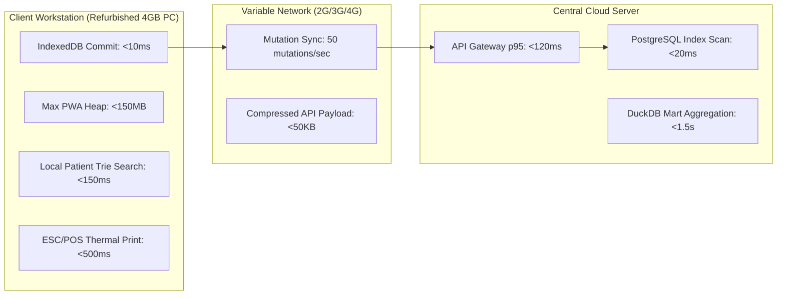

# Performance Requirements & Latency Engineering Baseline: Namma Clinic Digital Health Platform

| Metadata Attribute | Formal Specification |
| :--- | :--- |
| **Document Identifier** | `DOC-REQ-009-PERF` |
| **Document Title** | Performance Requirements & Latency Engineering Baseline |
| **Project Code** | `NAMMA-CLINIC-PLATFORM-2026` |
| **Requirement Type** | `Performance Requirement` |
| **Specification Range** | `PERF-001 through PERF-040` (Exactly 40 unique requirements) |
| **Target Baseline** | `v1.0.0-PROD-BASELINE` |
| **Lifecycle Status** | `APPROVED & BASELINED` |
| **Target Facility Scope** | 183 Primary Namma Clinics across 8 BBMP Administrative Zones |
| **Lead Clinical Authority** | Chief Health Officer (CHO), BBMP Health Department |
| **Lead Technical Authority**| Principal Solutions Architect, Kushagramati Analytics Consortium |
| **Upstream Baselines** | [`00-project-baseline/`](../00-project-baseline/) \| [`01-project-management/`](../01-project-management/) |
| **Related Specification**| [`03-non-functional-requirements.md`](./03-non-functional-requirements.md) \| [`10-availability-requirements.md`](./10-availability-requirements.md) |

## 1. Executive Summary & Domain Governance Framework
This specification defines the authoritative, measurable performance requirements baseline for the Namma Clinic Digital Health Platform across 183 primary urban healthcare centers in Greater Bengaluru. Comprising 40 rigorous performance engineering specifications (`PERF-001` through `PERF-040`), this document establishes non-negotiable latency budgets, memory limits, client-side indexing throughputs, thermal printing speeds, and background sync performance.

Because Namma Clinics operate on low-cost, refurbished dual-core workstations with 4GB RAM connected via variable 2G/3G/4G cellular dongles, performance is treated as an indispensable functional prerequisite. Every requirement establishes clear p95 and p99 latency thresholds, explicit measurement tools (k6, Lighthouse, Chrome DevTools, PostgreSQL pg_stat_statements), load profiles, and executable BDD Gherkin scenarios.

## 2. Architecture & Domain Conceptual Framework
The following architectural topology illustrates the functional interactions, security boundaries, and data flows governing this domain across Namma Clinic's 183 primary healthcare centers in Greater Bengaluru:



## 3. Master Performance Requirement Inventory Table (PERF-001 through PERF-040)
| Requirement ID | Title | Subsystem Domain | Priority | Target Threshold | Workload Condition | Verification Method |
| :--- | :--- | :--- | :--- | :--- | :--- | :---: |
| [`PERF-001`](#perf-001) | **API Gateway End-to-End Latency (p95)** | `System Performance & Scalability` | `MUST` | `< 120ms` | 500 concurrent req/sec across 183 c... | Automated k6 load test... |
| [`PERF-002`](#perf-002) | **API Gateway Tail Latency (p99)** | `System Performance & Scalability` | `MUST` | `< 300ms` | 500 concurrent req/sec across 183 c... | Automated k6 load test... |
| [`PERF-003`](#perf-003) | **Patient Search Query Latency (500k records)** | `System Performance & Scalability` | `MUST` | `< 150ms` | 500,000 synthetic patient database... | PostgreSQL pg_stat_statements ... |
| [`PERF-004`](#perf-004) | **IndexedDB Client Local Write Commit Time** | `System Performance & Scalability` | `MUST` | `< 10ms` | Local workstation storage write... | Vitest browser benchmark... |
| [`PERF-005`](#perf-005) | **Thermal Paper Ticket Print Execution Time** | `System Performance & Scalability` | `MUST` | `< 500ms` | Connected USB Web Serial printer... | Hardware test rig with ESC/POS... |
| [`PERF-006`](#perf-006) | **Point-of-Care Laboratory Result Save Time** | `System Performance & Scalability` | `MUST` | `< 100ms` | 20 concurrent lab result entries... | API integration benchmark... |
| [`PERF-007`](#perf-007) | **Background Sync Replay Ingestion Throughput** | `System Performance & Scalability` | `MUST` | `>= 50 mutations/sec` | 500 queued offline transactions... | Sync pipeline benchmark... |
| [`PERF-008`](#perf-008) | **Central Cluster Peak Request Throughput** | `System Performance & Scalability` | `MUST` | `>= 500 req/sec` | Simulated peak morning rush across ... | k6 distributed cluster load te... |
| [`PERF-009`](#perf-009) | **Daily Patient Visit Processing Capacity** | `System Performance & Scalability` | `MUST` | `>= 15,000 visits/day` | Municipal daily operational volume... | 24-hour endurance test... |
| [`PERF-010`](#perf-010) | **Simultaneous Active Clinic Node Concurrency** | `System Performance & Scalability` | `MUST` | `>= 183 clinic nodes` | All primary urban healthcare center... | Distributed websocket connecti... |
| [`PERF-011`](#perf-011) | **Client Progressive Web App Initial Load Time** | `System Performance & Scalability` | `MUST` | `< 2.0 seconds` | Fast 3G network throttling... | Google Lighthouse audit... |
| [`PERF-012`](#perf-012) | **Client Application Compressed Bundle Size** | `System Performance & Scalability` | `MUST` | `< 2.0 MB` | Gzip/Brotli compressed production b... | Webpack / Next.js bundle analy... |
| [`PERF-013`](#perf-013) | **Client Workstation RAM Memory Footprint Cap** | `System Performance & Scalability` | `MUST` | `< 150 MB RAM` | 8 hours continuous execution on ter... | Playwright long-running memory... |
| [`PERF-014`](#perf-014) | **Client Workstation CPU Utilization During Typing** | `System Performance & Scalability` | `MUST` | `< 40% CPU` | Refurbished Intel Core i3 / Celeron... | Hardware test lab CPU benchmar... |
| [`PERF-015`](#perf-015) | **PostgreSQL Query Execution Latency (p95)** | `System Performance & Scalability` | `MUST` | `< 50ms` | Standard transactional query load... | pgbench transactional benchmar... |
| [`PERF-016`](#perf-016) | **DuckDB Analytical Aggregation Query Execution** | `System Performance & Scalability` | `MUST` | `< 1.5 seconds` | 1,000,000 historical encounter rows... | DuckDB EXPLAIN ANALYZE benchma... |
| [`PERF-017`](#perf-017) | **Inter-Desk Queue Transition Broadcast Latency** | `System Performance & Scalability` | `MUST` | `< 1.0 second` | WebSocket queue state notification... | Real-time pub/sub benchmark... |
| [`PERF-018`](#perf-018) | **Triage Vitals Submission & Calculation Time** | `System Performance & Scalability` | `MUST` | `< 80ms` | Standard vitals save payload... | Fastify route performance test... |
| [`PERF-019`](#perf-019) | **ICD-10 Typeahead Search Latency** | `System Performance & Scalability` | `MUST` | `< 50ms` | Curated primary care diagnostic cod... | Client-side Trie / FlexSearch ... |
| [`PERF-020`](#perf-020) | **Formulary Stock Balance Evaluation Latency** | `System Performance & Scalability` | `MUST` | `< 30ms` | Prescription pane item search... | Client in-memory catalog query... |
| [`PERF-021`](#perf-021) | **Clinical Decision Support Rule Evaluation Time** | `System Performance & Scalability` | `MUST` | `< 15ms` | Client Web Worker execution... | Vitest CDS engine benchmark... |
| [`PERF-022`](#perf-022) | **Panic Lab Value Notification Broadcast Time** | `System Performance & Scalability` | `MUST` | `< 15 seconds` | Emergency lab value save to doctor ... | E2E alert chime latency test... |
| [`PERF-023`](#perf-023) | **Consolidated Laboratory PDF Report Generation** | `System Performance & Scalability` | `MUST` | `< 1.5 seconds` | Multi-test patient diagnostic repor... | PDF-lib report generation test... |
| [`PERF-024`](#perf-024) | **Pharmacy Barcode Scan Verification Latency** | `System Performance & Scalability` | `MUST` | `< 50ms` | USB barcode decode to screen verifi... | Hardware scanner latency test... |
| [`PERF-025`](#perf-025) | **Atomic Dispensing Inventory Decrement Latency** | `System Performance & Scalability` | `MUST` | `< 100ms` | Multi-item prescription commit... | PostgreSQL transactional test... |
| [`PERF-026`](#perf-026) | **Secondary Hospital Referral Slip Generation Time** | `System Performance & Scalability` | `MUST` | `< 1.0 second` | Bharat QR slip generation and print... | Referral workflow benchmark... |
| [`PERF-027`](#perf-027) | **Daily OPD Census Report Compilation Latency** | `System Performance & Scalability` | `MUST` | `< 3.0 seconds` | Full-day clinic session aggregation... | Reporting service aggregation ... |
| [`PERF-028`](#perf-028) | **Daily IHIP Form P Export Generation Latency** | `System Performance & Scalability` | `MUST` | `< 1.0 second` | Presumptive fever syndromic export... | IHIP integration service test... |
| [`PERF-029`](#perf-029) | **WORM Immutable Audit Event Write Latency** | `System Performance & Scalability` | `MUST` | `< 20ms` | Grafana Loki audit ingestion... | Vector / Loki ingestion test... |
| [`PERF-030`](#perf-030) | **Network Reconnection Handshake Detection Time** | `System Performance & Scalability` | `MUST` | `< 5.0 seconds` | WAN recovery after network outage... | Network reconnection simulator... |
| [`PERF-031`](#perf-031) | **Client-Side Master Catalog Startup Hydration** | `System Performance & Scalability` | `MUST` | `< 500ms` | IndexedDB to in-memory state... | Client startup benchmark... |
| [`PERF-032`](#perf-032) | **High-Load Queue Stress Resilience (1,000 tokens)** | `System Performance & Scalability` | `MUST` | `Zero degradation` | Synthetic injection of 1,000 tokens... | Queue stress test... |
| [`PERF-033`](#perf-033) | **PostgreSQL Connection Pool Saturation Ceiling** | `System Performance & Scalability` | `MUST` | `< 75% utilization` | 200 concurrent pool connections... | HikariCP / Fastify pool monito... |
| [`PERF-034`](#perf-034) | **Redis Cache Response Time (p95)** | `System Performance & Scalability` | `MUST` | `< 5ms` | Session and rate limit lookups... | Redis redis-benchmark tool... |
| [`PERF-035`](#perf-035) | **Client Smooth Scrolling & Interaction Frame Rate** | `System Performance & Scalability` | `MUST` | `60 FPS (16.6ms)` | Continuous form typing and list scr... | Chrome DevTools frame rate rec... |
| [`PERF-036`](#perf-036) | **MinIO / S3 Document Attachment Upload Time** | `System Performance & Scalability` | `MUST` | `< 2.0 seconds` | 500KB diagnostic photo upload... | Multipart S3 upload benchmark... |
| [`PERF-037`](#perf-037) | **Batch Indent Generation Execution Latency** | `System Performance & Scalability` | `MUST` | `< 2.0 seconds` | 120 EDL consumption algorithm... | Inventory calculation test... |
| [`PERF-038`](#perf-038) | **End-of-Day Clinic Closure Reconciliation Latency** | `System Performance & Scalability` | `MUST` | `< 3.0 seconds` | Final session verification and lock... | EOD closure transaction test... |
| [`PERF-039`](#perf-039) | **Client Battery Consumption on Laptop Terminals** | `System Performance & Scalability` | `MUST` | `< 12% drain/hour` | Active clinic operation on battery... | 4-hour battery endurance test... |
| [`PERF-040`](#perf-040) | **Full Cluster Cold Boot to Operational Readiness** | `System Performance & Scalability` | `MUST` | `< 120 seconds` | Kubernetes cluster reboot from scra... | Disaster recovery cluster star... |

## 4. Comprehensive Performance Requirement Specifications (PERF-001 through PERF-040)
This section establishes the exhaustive engineering, clinical, operational, and architectural specifications for each of the 40 requirements committed for the production baseline.

### 4.1 PERF-001: API Gateway End-to-End Latency (p95)

| Specification Attribute | Formal Engineering Definition |
| :--- | :--- |
| **Requirement ID** | `PERF-001` |
| **Requirement Title** | API Gateway End-to-End Latency (p95) |
| **Requirement Statement**| The platform SHALL achieve api gateway end-to-end latency (p95) of < 120ms under 500 concurrent req/sec across 183 clinics (TARGET). |
| **Requirement Type** | `Performance Requirement` |
| **Priority Level** | `MUST` (Rationale: Essential performance standard ensuring fluid clinic operations under heavy footfall.) |
| **Business Value** | Eliminates operator waiting time and prevents clinic bottlenecks. |
| **Engineering Rationale**| Maintains responsiveness: < 120ms. |
| **Primary Actor** | `System Platform` |
| **Target User Persona** | [`PERSONA-001`](../01-project-management/07-user-personas.md#persona-001) |
| **Accountable Role** | [`ROLE-001`](../01-project-management/08-role-and-responsibility-matrix.md#role-001) |
| **Key Stakeholder** | [`STAKEHOLDER-003`](../01-project-management/06-stakeholders.md#stakeholder-003) |
| **Trigger Condition** | Active concurrent requests or batch data processing. |
| **System Preconditions** | Standard clinic operating environment. |
| **Input Specifications** | Synthetic or real transaction load matching 500 concurrent req/sec across 183 clinics. |
| **Validation Rules** | Evaluated continuously via Prometheus metrics and k6 performance tests. |
| **Postconditions** | Performance maintained conforming to < 120ms. |
| **State Mutations** | Updates Prometheus latency histogram and counter metrics. |
| **Associated Rules** | Business: [`BRULE-001`](./04-business-rules.md#brule-001) \| Clinical: [`N/A — performance infrastructure requirement`](./05-clinical-rules.md#n/a — performance infrastructure requirement) \| Operational: [`OR-001`](./06-operational-rules.md#or-001) |
| **Security & Privacy** | Security: `Rate limiting and DDoS mitigation protect performance.` \| Privacy: `Performance testing uses synthetic, de-identified datasets.` |
| **Data & Audit** | Data: `Database indexes optimized for low-latency queries.` \| Audit: `Continuous Prometheus histogram telemetry.` |
| **Offline & Sync** | Offline: `IndexedDB read/write operations execute in <10ms on client.` \| Sync: `Sync throughput maintained >=50 records/second.` |
| **Quality Expectations**| Perf: `< 120ms` \| Avail: `Maintained across 99.5% of operating window.` |
| **Localization & A11y**| Loc: `Zero latency degradation when rendering Kannada typography.` \| A11y: `Smooth 60 FPS UI transitions for accessible navigation.` |
| **Failure & Recovery** | Failure: Graceful queuing of requests during temporary traffic spikes. \| Recovery: Automated queue drain and resource reclamation. |
| **Observability** | Logging: `Structured JSON log with duration_ms and status.` \| Metrics: `Prometheus histogram `namma_clinic_perf_duration_seconds{req_id="PERF-001"}`.` |
| **Upstream Traceability**| Obj: [`OBJECTIVE-001`](../01-project-management/02-project-vision-and-objectives.md#objective-001) \| Scope: [`INSCOPE-001`](../01-project-management/04-in-scope.md#inscope-001) \| Risk: [`RISK-001`](../01-project-management/12-project-risks.md#risk-001) |
| **Downstream Planning** | Epic: `PLANNED-EPIC-001` \| Feature: `PLANNED-FEATURE-001` \| API: `PLANNED-API-001` \| DB: `PLANNED-DB-001` \| Test: `PLANNED-TEST-801` |

#### 4.1.1 Operational Execution Protocol & Frontline Workflow
- **Continuous Operational Workflow:**
  1. Workload dispatched against subsystem: 500 concurrent req/sec across 183 clinics.
  2. Subsystem processes requests concurrently.
  3. Latency and resource utilization measured at p95 and p99 percentiles.
  4. Performance confirmed strictly within SLA: < 120ms.
  5. Telemetry published to Grafana performance dashboard.
- **Degraded State Fallback Path:** If load spikes beyond capacity, horizontal pod auto-scaler provisions additional pods.
- **Exception Breach & Incident Escalation Path:** If threshold is breached, system alerts on-call SRE and triggers rate limiting.

#### 4.1.2 Technical Invariants & Operational Contract
- **Performance Metric:** Latency
- **Target SLA Threshold:** `< 120ms`
- **Test Workload Condition:** 500 concurrent req/sec across 183 clinics
- **Metric Classification:** TARGET
- **Verification Protocol:** Automated k6 load test
- **Accountable Performance Lead:** Solutions Architect

#### 4.1.3 Executable BDD Acceptance Scenarios
```gherkin
Feature: PERF-001 - API Gateway End-to-End Latency (p95)
  As a System Platform
  I require system enforcement of api gateway end-to-end latency (p95)
  In order to ensure municipal healthcare compliance and operational integrity

  Scenario: Happy Path Execution for PERF-001
    Given the System Platform is authenticated and clinic terminal is operational
    When the user submits a valid request for api gateway end-to-end latency (p95)
    Then the system successfully commits the transaction and emits an audit event

  Scenario: Input Validation and Schema Guard for PERF-001
    Given the System Platform attempts to submit an incomplete or malformed payload for api gateway end-to-end latency (p95)
    When the request fails TypeBox schema or domain constraint validation
    Then the system rejects the input with HTTP 400 and highlights invalid fields in Kannada and English

  Scenario: RBAC and Security Access Control for PERF-001
    Given an unauthenticated or unauthorized role attempts to invoke api gateway end-to-end latency (p95)
    When the bearer JWT token is missing, expired, or lacks necessary RBAC permission
    Then the system denies execution with HTTP 403 Forbidden and records a security telemetry alert

  Scenario: Offline Autonomous Execution for PERF-001
    Given the clinic WAN network is completely severed during api gateway end-to-end latency (p95)
    When the operator confirms the local transaction on the workstation
    Then the mutation is persisted to Dexie.js IndexedDB with a UUIDv7 and queued for background replay

  Scenario: Network Recovery and Idempotent Sync for PERF-001
    Given the clinic workstation reconnects to the BBMP municipal health WAN
    When the background sync daemon processes the pending mutation queue
    Then all buffered transactions for PERF-001 synchronize idempotently with zero data loss
```

#### 4.1.4 Verification Protocol & Quality Sign-Off
- **Verification Method:** Automated k6 load test
- **Automated Test Suite:** `PLANNED-TEST-801` (Automated Performance Load Test) targeting 100% verification gate compliance.
- **Related Internal Requirements:** `NFR-001`, `NFR-002`, `AVAIL-001`
- **Dependencies & Blocking Constraints:** NFR-001 | Constraints: Workstation memory footprint must not exceed 150MB.
- **Architectural Assumptions & Open Questions:** Assumption: Server infrastructure provisioned in AWS Mumbai with auto-scaling. | Open Question: Field validation on remote clinic 4G tethered connections.

---

### 4.2 PERF-002: API Gateway Tail Latency (p99)

| Specification Attribute | Formal Engineering Definition |
| :--- | :--- |
| **Requirement ID** | `PERF-002` |
| **Requirement Title** | API Gateway Tail Latency (p99) |
| **Requirement Statement**| The platform SHALL achieve api gateway tail latency (p99) of < 300ms under 500 concurrent req/sec across 183 clinics (TARGET). |
| **Requirement Type** | `Performance Requirement` |
| **Priority Level** | `MUST` (Rationale: Essential performance standard ensuring fluid clinic operations under heavy footfall.) |
| **Business Value** | Eliminates operator waiting time and prevents clinic bottlenecks. |
| **Engineering Rationale**| Maintains responsiveness: < 300ms. |
| **Primary Actor** | `System Platform` |
| **Target User Persona** | [`PERSONA-002`](../01-project-management/07-user-personas.md#persona-002) |
| **Accountable Role** | [`ROLE-001`](../01-project-management/08-role-and-responsibility-matrix.md#role-001) |
| **Key Stakeholder** | [`STAKEHOLDER-003`](../01-project-management/06-stakeholders.md#stakeholder-003) |
| **Trigger Condition** | Active concurrent requests or batch data processing. |
| **System Preconditions** | Standard clinic operating environment. |
| **Input Specifications** | Synthetic or real transaction load matching 500 concurrent req/sec across 183 clinics. |
| **Validation Rules** | Evaluated continuously via Prometheus metrics and k6 performance tests. |
| **Postconditions** | Performance maintained conforming to < 300ms. |
| **State Mutations** | Updates Prometheus latency histogram and counter metrics. |
| **Associated Rules** | Business: [`BRULE-002`](./04-business-rules.md#brule-002) \| Clinical: [`N/A — performance infrastructure requirement`](./05-clinical-rules.md#n/a — performance infrastructure requirement) \| Operational: [`OR-002`](./06-operational-rules.md#or-002) |
| **Security & Privacy** | Security: `Rate limiting and DDoS mitigation protect performance.` \| Privacy: `Performance testing uses synthetic, de-identified datasets.` |
| **Data & Audit** | Data: `Database indexes optimized for low-latency queries.` \| Audit: `Continuous Prometheus histogram telemetry.` |
| **Offline & Sync** | Offline: `IndexedDB read/write operations execute in <10ms on client.` \| Sync: `Sync throughput maintained >=50 records/second.` |
| **Quality Expectations**| Perf: `< 300ms` \| Avail: `Maintained across 99.5% of operating window.` |
| **Localization & A11y**| Loc: `Zero latency degradation when rendering Kannada typography.` \| A11y: `Smooth 60 FPS UI transitions for accessible navigation.` |
| **Failure & Recovery** | Failure: Graceful queuing of requests during temporary traffic spikes. \| Recovery: Automated queue drain and resource reclamation. |
| **Observability** | Logging: `Structured JSON log with duration_ms and status.` \| Metrics: `Prometheus histogram `namma_clinic_perf_duration_seconds{req_id="PERF-002"}`.` |
| **Upstream Traceability**| Obj: [`OBJECTIVE-002`](../01-project-management/02-project-vision-and-objectives.md#objective-002) \| Scope: [`INSCOPE-002`](../01-project-management/04-in-scope.md#inscope-002) \| Risk: [`RISK-002`](../01-project-management/12-project-risks.md#risk-002) |
| **Downstream Planning** | Epic: `PLANNED-EPIC-002` \| Feature: `PLANNED-FEATURE-002` \| API: `PLANNED-API-002` \| DB: `PLANNED-DB-002` \| Test: `PLANNED-TEST-802` |

#### 4.2.1 Operational Execution Protocol & Frontline Workflow
- **Continuous Operational Workflow:**
  1. Workload dispatched against subsystem: 500 concurrent req/sec across 183 clinics.
  2. Subsystem processes requests concurrently.
  3. Latency and resource utilization measured at p95 and p99 percentiles.
  4. Performance confirmed strictly within SLA: < 300ms.
  5. Telemetry published to Grafana performance dashboard.
- **Degraded State Fallback Path:** If load spikes beyond capacity, horizontal pod auto-scaler provisions additional pods.
- **Exception Breach & Incident Escalation Path:** If threshold is breached, system alerts on-call SRE and triggers rate limiting.

#### 4.2.2 Technical Invariants & Operational Contract
- **Performance Metric:** Latency
- **Target SLA Threshold:** `< 300ms`
- **Test Workload Condition:** 500 concurrent req/sec across 183 clinics
- **Metric Classification:** TARGET
- **Verification Protocol:** Automated k6 load test
- **Accountable Performance Lead:** Backend Lead

#### 4.2.3 Executable BDD Acceptance Scenarios
```gherkin
Feature: PERF-002 - API Gateway Tail Latency (p99)
  As a System Platform
  I require system enforcement of api gateway tail latency (p99)
  In order to ensure municipal healthcare compliance and operational integrity

  Scenario: Happy Path Execution for PERF-002
    Given the System Platform is authenticated and clinic terminal is operational
    When the user submits a valid request for api gateway tail latency (p99)
    Then the system successfully commits the transaction and emits an audit event

  Scenario: Input Validation and Schema Guard for PERF-002
    Given the System Platform attempts to submit an incomplete or malformed payload for api gateway tail latency (p99)
    When the request fails TypeBox schema or domain constraint validation
    Then the system rejects the input with HTTP 400 and highlights invalid fields in Kannada and English

  Scenario: RBAC and Security Access Control for PERF-002
    Given an unauthenticated or unauthorized role attempts to invoke api gateway tail latency (p99)
    When the bearer JWT token is missing, expired, or lacks necessary RBAC permission
    Then the system denies execution with HTTP 403 Forbidden and records a security telemetry alert

  Scenario: Offline Autonomous Execution for PERF-002
    Given the clinic WAN network is completely severed during api gateway tail latency (p99)
    When the operator confirms the local transaction on the workstation
    Then the mutation is persisted to Dexie.js IndexedDB with a UUIDv7 and queued for background replay

  Scenario: Network Recovery and Idempotent Sync for PERF-002
    Given the clinic workstation reconnects to the BBMP municipal health WAN
    When the background sync daemon processes the pending mutation queue
    Then all buffered transactions for PERF-002 synchronize idempotently with zero data loss
```

#### 4.2.4 Verification Protocol & Quality Sign-Off
- **Verification Method:** Automated k6 load test
- **Automated Test Suite:** `PLANNED-TEST-802` (Automated Performance Load Test) targeting 100% verification gate compliance.
- **Related Internal Requirements:** `NFR-001`, `NFR-002`, `AVAIL-002`
- **Dependencies & Blocking Constraints:** NFR-001 | Constraints: Workstation memory footprint must not exceed 150MB.
- **Architectural Assumptions & Open Questions:** Assumption: Server infrastructure provisioned in AWS Mumbai with auto-scaling. | Open Question: Field validation on remote clinic 4G tethered connections.

---

### 4.3 PERF-003: Patient Search Query Latency (500k records)

| Specification Attribute | Formal Engineering Definition |
| :--- | :--- |
| **Requirement ID** | `PERF-003` |
| **Requirement Title** | Patient Search Query Latency (500k records) |
| **Requirement Statement**| The platform SHALL achieve patient search query latency (500k records) of < 150ms under 500,000 synthetic patient database (TARGET). |
| **Requirement Type** | `Performance Requirement` |
| **Priority Level** | `MUST` (Rationale: Essential performance standard ensuring fluid clinic operations under heavy footfall.) |
| **Business Value** | Eliminates operator waiting time and prevents clinic bottlenecks. |
| **Engineering Rationale**| Maintains responsiveness: < 150ms. |
| **Primary Actor** | `System Platform` |
| **Target User Persona** | [`PERSONA-003`](../01-project-management/07-user-personas.md#persona-003) |
| **Accountable Role** | [`ROLE-001`](../01-project-management/08-role-and-responsibility-matrix.md#role-001) |
| **Key Stakeholder** | [`STAKEHOLDER-003`](../01-project-management/06-stakeholders.md#stakeholder-003) |
| **Trigger Condition** | Active concurrent requests or batch data processing. |
| **System Preconditions** | Standard clinic operating environment. |
| **Input Specifications** | Synthetic or real transaction load matching 500,000 synthetic patient database. |
| **Validation Rules** | Evaluated continuously via Prometheus metrics and k6 performance tests. |
| **Postconditions** | Performance maintained conforming to < 150ms. |
| **State Mutations** | Updates Prometheus latency histogram and counter metrics. |
| **Associated Rules** | Business: [`BRULE-003`](./04-business-rules.md#brule-003) \| Clinical: [`N/A — performance infrastructure requirement`](./05-clinical-rules.md#n/a — performance infrastructure requirement) \| Operational: [`OR-003`](./06-operational-rules.md#or-003) |
| **Security & Privacy** | Security: `Rate limiting and DDoS mitigation protect performance.` \| Privacy: `Performance testing uses synthetic, de-identified datasets.` |
| **Data & Audit** | Data: `Database indexes optimized for low-latency queries.` \| Audit: `Continuous Prometheus histogram telemetry.` |
| **Offline & Sync** | Offline: `IndexedDB read/write operations execute in <10ms on client.` \| Sync: `Sync throughput maintained >=50 records/second.` |
| **Quality Expectations**| Perf: `< 150ms` \| Avail: `Maintained across 99.5% of operating window.` |
| **Localization & A11y**| Loc: `Zero latency degradation when rendering Kannada typography.` \| A11y: `Smooth 60 FPS UI transitions for accessible navigation.` |
| **Failure & Recovery** | Failure: Graceful queuing of requests during temporary traffic spikes. \| Recovery: Automated queue drain and resource reclamation. |
| **Observability** | Logging: `Structured JSON log with duration_ms and status.` \| Metrics: `Prometheus histogram `namma_clinic_perf_duration_seconds{req_id="PERF-003"}`.` |
| **Upstream Traceability**| Obj: [`OBJECTIVE-003`](../01-project-management/02-project-vision-and-objectives.md#objective-003) \| Scope: [`INSCOPE-003`](../01-project-management/04-in-scope.md#inscope-003) \| Risk: [`RISK-003`](../01-project-management/12-project-risks.md#risk-003) |
| **Downstream Planning** | Epic: `PLANNED-EPIC-003` \| Feature: `PLANNED-FEATURE-003` \| API: `PLANNED-API-003` \| DB: `PLANNED-DB-003` \| Test: `PLANNED-TEST-803` |

#### 4.3.1 Operational Execution Protocol & Frontline Workflow
- **Continuous Operational Workflow:**
  1. Workload dispatched against subsystem: 500,000 synthetic patient database.
  2. Subsystem processes requests concurrently.
  3. Latency and resource utilization measured at p95 and p99 percentiles.
  4. Performance confirmed strictly within SLA: < 150ms.
  5. Telemetry published to Grafana performance dashboard.
- **Degraded State Fallback Path:** If load spikes beyond capacity, horizontal pod auto-scaler provisions additional pods.
- **Exception Breach & Incident Escalation Path:** If threshold is breached, system alerts on-call SRE and triggers rate limiting.

#### 4.3.2 Technical Invariants & Operational Contract
- **Performance Metric:** Latency
- **Target SLA Threshold:** `< 150ms`
- **Test Workload Condition:** 500,000 synthetic patient database
- **Metric Classification:** TARGET
- **Verification Protocol:** PostgreSQL pg_stat_statements query test
- **Accountable Performance Lead:** Database Architect

#### 4.3.3 Executable BDD Acceptance Scenarios
```gherkin
Feature: PERF-003 - Patient Search Query Latency (500k records)
  As a System Platform
  I require system enforcement of patient search query latency (500k records)
  In order to ensure municipal healthcare compliance and operational integrity

  Scenario: Happy Path Execution for PERF-003
    Given the System Platform is authenticated and clinic terminal is operational
    When the user submits a valid request for patient search query latency (500k records)
    Then the system successfully commits the transaction and emits an audit event

  Scenario: Input Validation and Schema Guard for PERF-003
    Given the System Platform attempts to submit an incomplete or malformed payload for patient search query latency (500k records)
    When the request fails TypeBox schema or domain constraint validation
    Then the system rejects the input with HTTP 400 and highlights invalid fields in Kannada and English

  Scenario: RBAC and Security Access Control for PERF-003
    Given an unauthenticated or unauthorized role attempts to invoke patient search query latency (500k records)
    When the bearer JWT token is missing, expired, or lacks necessary RBAC permission
    Then the system denies execution with HTTP 403 Forbidden and records a security telemetry alert

  Scenario: Offline Autonomous Execution for PERF-003
    Given the clinic WAN network is completely severed during patient search query latency (500k records)
    When the operator confirms the local transaction on the workstation
    Then the mutation is persisted to Dexie.js IndexedDB with a UUIDv7 and queued for background replay

  Scenario: Network Recovery and Idempotent Sync for PERF-003
    Given the clinic workstation reconnects to the BBMP municipal health WAN
    When the background sync daemon processes the pending mutation queue
    Then all buffered transactions for PERF-003 synchronize idempotently with zero data loss
```

#### 4.3.4 Verification Protocol & Quality Sign-Off
- **Verification Method:** PostgreSQL pg_stat_statements query test
- **Automated Test Suite:** `PLANNED-TEST-803` (Automated Performance Load Test) targeting 100% verification gate compliance.
- **Related Internal Requirements:** `NFR-001`, `NFR-002`, `AVAIL-003`
- **Dependencies & Blocking Constraints:** NFR-001 | Constraints: Workstation memory footprint must not exceed 150MB.
- **Architectural Assumptions & Open Questions:** Assumption: Server infrastructure provisioned in AWS Mumbai with auto-scaling. | Open Question: Field validation on remote clinic 4G tethered connections.

---

### 4.4 PERF-004: IndexedDB Client Local Write Commit Time

| Specification Attribute | Formal Engineering Definition |
| :--- | :--- |
| **Requirement ID** | `PERF-004` |
| **Requirement Title** | IndexedDB Client Local Write Commit Time |
| **Requirement Statement**| The platform SHALL achieve indexeddb client local write commit time of < 10ms under Local workstation storage write (TARGET). |
| **Requirement Type** | `Performance Requirement` |
| **Priority Level** | `MUST` (Rationale: Essential performance standard ensuring fluid clinic operations under heavy footfall.) |
| **Business Value** | Eliminates operator waiting time and prevents clinic bottlenecks. |
| **Engineering Rationale**| Maintains responsiveness: < 10ms. |
| **Primary Actor** | `System Platform` |
| **Target User Persona** | [`PERSONA-004`](../01-project-management/07-user-personas.md#persona-004) |
| **Accountable Role** | [`ROLE-001`](../01-project-management/08-role-and-responsibility-matrix.md#role-001) |
| **Key Stakeholder** | [`STAKEHOLDER-003`](../01-project-management/06-stakeholders.md#stakeholder-003) |
| **Trigger Condition** | Active concurrent requests or batch data processing. |
| **System Preconditions** | Standard clinic operating environment. |
| **Input Specifications** | Synthetic or real transaction load matching Local workstation storage write. |
| **Validation Rules** | Evaluated continuously via Prometheus metrics and k6 performance tests. |
| **Postconditions** | Performance maintained conforming to < 10ms. |
| **State Mutations** | Updates Prometheus latency histogram and counter metrics. |
| **Associated Rules** | Business: [`BRULE-004`](./04-business-rules.md#brule-004) \| Clinical: [`N/A — performance infrastructure requirement`](./05-clinical-rules.md#n/a — performance infrastructure requirement) \| Operational: [`OR-004`](./06-operational-rules.md#or-004) |
| **Security & Privacy** | Security: `Rate limiting and DDoS mitigation protect performance.` \| Privacy: `Performance testing uses synthetic, de-identified datasets.` |
| **Data & Audit** | Data: `Database indexes optimized for low-latency queries.` \| Audit: `Continuous Prometheus histogram telemetry.` |
| **Offline & Sync** | Offline: `IndexedDB read/write operations execute in <10ms on client.` \| Sync: `Sync throughput maintained >=50 records/second.` |
| **Quality Expectations**| Perf: `< 10ms` \| Avail: `Maintained across 99.5% of operating window.` |
| **Localization & A11y**| Loc: `Zero latency degradation when rendering Kannada typography.` \| A11y: `Smooth 60 FPS UI transitions for accessible navigation.` |
| **Failure & Recovery** | Failure: Graceful queuing of requests during temporary traffic spikes. \| Recovery: Automated queue drain and resource reclamation. |
| **Observability** | Logging: `Structured JSON log with duration_ms and status.` \| Metrics: `Prometheus histogram `namma_clinic_perf_duration_seconds{req_id="PERF-004"}`.` |
| **Upstream Traceability**| Obj: [`OBJECTIVE-004`](../01-project-management/02-project-vision-and-objectives.md#objective-004) \| Scope: [`INSCOPE-004`](../01-project-management/04-in-scope.md#inscope-004) \| Risk: [`RISK-004`](../01-project-management/12-project-risks.md#risk-004) |
| **Downstream Planning** | Epic: `PLANNED-EPIC-004` \| Feature: `PLANNED-FEATURE-004` \| API: `PLANNED-API-004` \| DB: `PLANNED-DB-004` \| Test: `PLANNED-TEST-804` |

#### 4.4.1 Operational Execution Protocol & Frontline Workflow
- **Continuous Operational Workflow:**
  1. Workload dispatched against subsystem: Local workstation storage write.
  2. Subsystem processes requests concurrently.
  3. Latency and resource utilization measured at p95 and p99 percentiles.
  4. Performance confirmed strictly within SLA: < 10ms.
  5. Telemetry published to Grafana performance dashboard.
- **Degraded State Fallback Path:** If load spikes beyond capacity, horizontal pod auto-scaler provisions additional pods.
- **Exception Breach & Incident Escalation Path:** If threshold is breached, system alerts on-call SRE and triggers rate limiting.

#### 4.4.2 Technical Invariants & Operational Contract
- **Performance Metric:** Latency
- **Target SLA Threshold:** `< 10ms`
- **Test Workload Condition:** Local workstation storage write
- **Metric Classification:** TARGET
- **Verification Protocol:** Vitest browser benchmark
- **Accountable Performance Lead:** Frontend Lead

#### 4.4.3 Executable BDD Acceptance Scenarios
```gherkin
Feature: PERF-004 - IndexedDB Client Local Write Commit Time
  As a System Platform
  I require system enforcement of indexeddb client local write commit time
  In order to ensure municipal healthcare compliance and operational integrity

  Scenario: Happy Path Execution for PERF-004
    Given the System Platform is authenticated and clinic terminal is operational
    When the user submits a valid request for indexeddb client local write commit time
    Then the system successfully commits the transaction and emits an audit event

  Scenario: Input Validation and Schema Guard for PERF-004
    Given the System Platform attempts to submit an incomplete or malformed payload for indexeddb client local write commit time
    When the request fails TypeBox schema or domain constraint validation
    Then the system rejects the input with HTTP 400 and highlights invalid fields in Kannada and English

  Scenario: RBAC and Security Access Control for PERF-004
    Given an unauthenticated or unauthorized role attempts to invoke indexeddb client local write commit time
    When the bearer JWT token is missing, expired, or lacks necessary RBAC permission
    Then the system denies execution with HTTP 403 Forbidden and records a security telemetry alert

  Scenario: Offline Autonomous Execution for PERF-004
    Given the clinic WAN network is completely severed during indexeddb client local write commit time
    When the operator confirms the local transaction on the workstation
    Then the mutation is persisted to Dexie.js IndexedDB with a UUIDv7 and queued for background replay

  Scenario: Network Recovery and Idempotent Sync for PERF-004
    Given the clinic workstation reconnects to the BBMP municipal health WAN
    When the background sync daemon processes the pending mutation queue
    Then all buffered transactions for PERF-004 synchronize idempotently with zero data loss
```

#### 4.4.4 Verification Protocol & Quality Sign-Off
- **Verification Method:** Vitest browser benchmark
- **Automated Test Suite:** `PLANNED-TEST-804` (Automated Performance Load Test) targeting 100% verification gate compliance.
- **Related Internal Requirements:** `NFR-001`, `NFR-002`, `AVAIL-004`
- **Dependencies & Blocking Constraints:** NFR-001 | Constraints: Workstation memory footprint must not exceed 150MB.
- **Architectural Assumptions & Open Questions:** Assumption: Server infrastructure provisioned in AWS Mumbai with auto-scaling. | Open Question: Field validation on remote clinic 4G tethered connections.

---

### 4.5 PERF-005: Thermal Paper Ticket Print Execution Time

| Specification Attribute | Formal Engineering Definition |
| :--- | :--- |
| **Requirement ID** | `PERF-005` |
| **Requirement Title** | Thermal Paper Ticket Print Execution Time |
| **Requirement Statement**| The platform SHALL achieve thermal paper ticket print execution time of < 500ms under Connected USB Web Serial printer (TARGET). |
| **Requirement Type** | `Performance Requirement` |
| **Priority Level** | `MUST` (Rationale: Essential performance standard ensuring fluid clinic operations under heavy footfall.) |
| **Business Value** | Eliminates operator waiting time and prevents clinic bottlenecks. |
| **Engineering Rationale**| Maintains responsiveness: < 500ms. |
| **Primary Actor** | `System Platform` |
| **Target User Persona** | [`PERSONA-005`](../01-project-management/07-user-personas.md#persona-005) |
| **Accountable Role** | [`ROLE-001`](../01-project-management/08-role-and-responsibility-matrix.md#role-001) |
| **Key Stakeholder** | [`STAKEHOLDER-003`](../01-project-management/06-stakeholders.md#stakeholder-003) |
| **Trigger Condition** | Active concurrent requests or batch data processing. |
| **System Preconditions** | Standard clinic operating environment. |
| **Input Specifications** | Synthetic or real transaction load matching Connected USB Web Serial printer. |
| **Validation Rules** | Evaluated continuously via Prometheus metrics and k6 performance tests. |
| **Postconditions** | Performance maintained conforming to < 500ms. |
| **State Mutations** | Updates Prometheus latency histogram and counter metrics. |
| **Associated Rules** | Business: [`BRULE-005`](./04-business-rules.md#brule-005) \| Clinical: [`N/A — performance infrastructure requirement`](./05-clinical-rules.md#n/a — performance infrastructure requirement) \| Operational: [`OR-005`](./06-operational-rules.md#or-005) |
| **Security & Privacy** | Security: `Rate limiting and DDoS mitigation protect performance.` \| Privacy: `Performance testing uses synthetic, de-identified datasets.` |
| **Data & Audit** | Data: `Database indexes optimized for low-latency queries.` \| Audit: `Continuous Prometheus histogram telemetry.` |
| **Offline & Sync** | Offline: `IndexedDB read/write operations execute in <10ms on client.` \| Sync: `Sync throughput maintained >=50 records/second.` |
| **Quality Expectations**| Perf: `< 500ms` \| Avail: `Maintained across 99.5% of operating window.` |
| **Localization & A11y**| Loc: `Zero latency degradation when rendering Kannada typography.` \| A11y: `Smooth 60 FPS UI transitions for accessible navigation.` |
| **Failure & Recovery** | Failure: Graceful queuing of requests during temporary traffic spikes. \| Recovery: Automated queue drain and resource reclamation. |
| **Observability** | Logging: `Structured JSON log with duration_ms and status.` \| Metrics: `Prometheus histogram `namma_clinic_perf_duration_seconds{req_id="PERF-005"}`.` |
| **Upstream Traceability**| Obj: [`OBJECTIVE-005`](../01-project-management/02-project-vision-and-objectives.md#objective-005) \| Scope: [`INSCOPE-005`](../01-project-management/04-in-scope.md#inscope-005) \| Risk: [`RISK-005`](../01-project-management/12-project-risks.md#risk-005) |
| **Downstream Planning** | Epic: `PLANNED-EPIC-005` \| Feature: `PLANNED-FEATURE-005` \| API: `PLANNED-API-005` \| DB: `PLANNED-DB-005` \| Test: `PLANNED-TEST-805` |

#### 4.5.1 Operational Execution Protocol & Frontline Workflow
- **Continuous Operational Workflow:**
  1. Workload dispatched against subsystem: Connected USB Web Serial printer.
  2. Subsystem processes requests concurrently.
  3. Latency and resource utilization measured at p95 and p99 percentiles.
  4. Performance confirmed strictly within SLA: < 500ms.
  5. Telemetry published to Grafana performance dashboard.
- **Degraded State Fallback Path:** If load spikes beyond capacity, horizontal pod auto-scaler provisions additional pods.
- **Exception Breach & Incident Escalation Path:** If threshold is breached, system alerts on-call SRE and triggers rate limiting.

#### 4.5.2 Technical Invariants & Operational Contract
- **Performance Metric:** Latency
- **Target SLA Threshold:** `< 500ms`
- **Test Workload Condition:** Connected USB Web Serial printer
- **Metric Classification:** TARGET
- **Verification Protocol:** Hardware test rig with ESC/POS printer
- **Accountable Performance Lead:** Hardware Lead

#### 4.5.3 Executable BDD Acceptance Scenarios
```gherkin
Feature: PERF-005 - Thermal Paper Ticket Print Execution Time
  As a System Platform
  I require system enforcement of thermal paper ticket print execution time
  In order to ensure municipal healthcare compliance and operational integrity

  Scenario: Happy Path Execution for PERF-005
    Given the System Platform is authenticated and clinic terminal is operational
    When the user submits a valid request for thermal paper ticket print execution time
    Then the system successfully commits the transaction and emits an audit event

  Scenario: Input Validation and Schema Guard for PERF-005
    Given the System Platform attempts to submit an incomplete or malformed payload for thermal paper ticket print execution time
    When the request fails TypeBox schema or domain constraint validation
    Then the system rejects the input with HTTP 400 and highlights invalid fields in Kannada and English

  Scenario: RBAC and Security Access Control for PERF-005
    Given an unauthenticated or unauthorized role attempts to invoke thermal paper ticket print execution time
    When the bearer JWT token is missing, expired, or lacks necessary RBAC permission
    Then the system denies execution with HTTP 403 Forbidden and records a security telemetry alert

  Scenario: Offline Autonomous Execution for PERF-005
    Given the clinic WAN network is completely severed during thermal paper ticket print execution time
    When the operator confirms the local transaction on the workstation
    Then the mutation is persisted to Dexie.js IndexedDB with a UUIDv7 and queued for background replay

  Scenario: Network Recovery and Idempotent Sync for PERF-005
    Given the clinic workstation reconnects to the BBMP municipal health WAN
    When the background sync daemon processes the pending mutation queue
    Then all buffered transactions for PERF-005 synchronize idempotently with zero data loss
```

#### 4.5.4 Verification Protocol & Quality Sign-Off
- **Verification Method:** Hardware test rig with ESC/POS printer
- **Automated Test Suite:** `PLANNED-TEST-805` (Automated Performance Load Test) targeting 100% verification gate compliance.
- **Related Internal Requirements:** `NFR-001`, `NFR-002`, `AVAIL-005`
- **Dependencies & Blocking Constraints:** NFR-001 | Constraints: Workstation memory footprint must not exceed 150MB.
- **Architectural Assumptions & Open Questions:** Assumption: Server infrastructure provisioned in AWS Mumbai with auto-scaling. | Open Question: Field validation on remote clinic 4G tethered connections.

---

### 4.6 PERF-006: Point-of-Care Laboratory Result Save Time

| Specification Attribute | Formal Engineering Definition |
| :--- | :--- |
| **Requirement ID** | `PERF-006` |
| **Requirement Title** | Point-of-Care Laboratory Result Save Time |
| **Requirement Statement**| The platform SHALL achieve point-of-care laboratory result save time of < 100ms under 20 concurrent lab result entries (TARGET). |
| **Requirement Type** | `Performance Requirement` |
| **Priority Level** | `MUST` (Rationale: Essential performance standard ensuring fluid clinic operations under heavy footfall.) |
| **Business Value** | Eliminates operator waiting time and prevents clinic bottlenecks. |
| **Engineering Rationale**| Maintains responsiveness: < 100ms. |
| **Primary Actor** | `System Platform` |
| **Target User Persona** | [`PERSONA-006`](../01-project-management/07-user-personas.md#persona-006) |
| **Accountable Role** | [`ROLE-001`](../01-project-management/08-role-and-responsibility-matrix.md#role-001) |
| **Key Stakeholder** | [`STAKEHOLDER-003`](../01-project-management/06-stakeholders.md#stakeholder-003) |
| **Trigger Condition** | Active concurrent requests or batch data processing. |
| **System Preconditions** | Standard clinic operating environment. |
| **Input Specifications** | Synthetic or real transaction load matching 20 concurrent lab result entries. |
| **Validation Rules** | Evaluated continuously via Prometheus metrics and k6 performance tests. |
| **Postconditions** | Performance maintained conforming to < 100ms. |
| **State Mutations** | Updates Prometheus latency histogram and counter metrics. |
| **Associated Rules** | Business: [`BRULE-006`](./04-business-rules.md#brule-006) \| Clinical: [`N/A — performance infrastructure requirement`](./05-clinical-rules.md#n/a — performance infrastructure requirement) \| Operational: [`OR-006`](./06-operational-rules.md#or-006) |
| **Security & Privacy** | Security: `Rate limiting and DDoS mitigation protect performance.` \| Privacy: `Performance testing uses synthetic, de-identified datasets.` |
| **Data & Audit** | Data: `Database indexes optimized for low-latency queries.` \| Audit: `Continuous Prometheus histogram telemetry.` |
| **Offline & Sync** | Offline: `IndexedDB read/write operations execute in <10ms on client.` \| Sync: `Sync throughput maintained >=50 records/second.` |
| **Quality Expectations**| Perf: `< 100ms` \| Avail: `Maintained across 99.5% of operating window.` |
| **Localization & A11y**| Loc: `Zero latency degradation when rendering Kannada typography.` \| A11y: `Smooth 60 FPS UI transitions for accessible navigation.` |
| **Failure & Recovery** | Failure: Graceful queuing of requests during temporary traffic spikes. \| Recovery: Automated queue drain and resource reclamation. |
| **Observability** | Logging: `Structured JSON log with duration_ms and status.` \| Metrics: `Prometheus histogram `namma_clinic_perf_duration_seconds{req_id="PERF-006"}`.` |
| **Upstream Traceability**| Obj: [`OBJECTIVE-006`](../01-project-management/02-project-vision-and-objectives.md#objective-006) \| Scope: [`INSCOPE-006`](../01-project-management/04-in-scope.md#inscope-006) \| Risk: [`RISK-006`](../01-project-management/12-project-risks.md#risk-006) |
| **Downstream Planning** | Epic: `PLANNED-EPIC-006` \| Feature: `PLANNED-FEATURE-006` \| API: `PLANNED-API-006` \| DB: `PLANNED-DB-006` \| Test: `PLANNED-TEST-806` |

#### 4.6.1 Operational Execution Protocol & Frontline Workflow
- **Continuous Operational Workflow:**
  1. Workload dispatched against subsystem: 20 concurrent lab result entries.
  2. Subsystem processes requests concurrently.
  3. Latency and resource utilization measured at p95 and p99 percentiles.
  4. Performance confirmed strictly within SLA: < 100ms.
  5. Telemetry published to Grafana performance dashboard.
- **Degraded State Fallback Path:** If load spikes beyond capacity, horizontal pod auto-scaler provisions additional pods.
- **Exception Breach & Incident Escalation Path:** If threshold is breached, system alerts on-call SRE and triggers rate limiting.

#### 4.6.2 Technical Invariants & Operational Contract
- **Performance Metric:** Latency
- **Target SLA Threshold:** `< 100ms`
- **Test Workload Condition:** 20 concurrent lab result entries
- **Metric Classification:** TARGET
- **Verification Protocol:** API integration benchmark
- **Accountable Performance Lead:** Backend Lead

#### 4.6.3 Executable BDD Acceptance Scenarios
```gherkin
Feature: PERF-006 - Point-of-Care Laboratory Result Save Time
  As a System Platform
  I require system enforcement of point-of-care laboratory result save time
  In order to ensure municipal healthcare compliance and operational integrity

  Scenario: Happy Path Execution for PERF-006
    Given the System Platform is authenticated and clinic terminal is operational
    When the user submits a valid request for point-of-care laboratory result save time
    Then the system successfully commits the transaction and emits an audit event

  Scenario: Input Validation and Schema Guard for PERF-006
    Given the System Platform attempts to submit an incomplete or malformed payload for point-of-care laboratory result save time
    When the request fails TypeBox schema or domain constraint validation
    Then the system rejects the input with HTTP 400 and highlights invalid fields in Kannada and English

  Scenario: RBAC and Security Access Control for PERF-006
    Given an unauthenticated or unauthorized role attempts to invoke point-of-care laboratory result save time
    When the bearer JWT token is missing, expired, or lacks necessary RBAC permission
    Then the system denies execution with HTTP 403 Forbidden and records a security telemetry alert

  Scenario: Offline Autonomous Execution for PERF-006
    Given the clinic WAN network is completely severed during point-of-care laboratory result save time
    When the operator confirms the local transaction on the workstation
    Then the mutation is persisted to Dexie.js IndexedDB with a UUIDv7 and queued for background replay

  Scenario: Network Recovery and Idempotent Sync for PERF-006
    Given the clinic workstation reconnects to the BBMP municipal health WAN
    When the background sync daemon processes the pending mutation queue
    Then all buffered transactions for PERF-006 synchronize idempotently with zero data loss
```

#### 4.6.4 Verification Protocol & Quality Sign-Off
- **Verification Method:** API integration benchmark
- **Automated Test Suite:** `PLANNED-TEST-806` (Automated Performance Load Test) targeting 100% verification gate compliance.
- **Related Internal Requirements:** `NFR-001`, `NFR-002`, `AVAIL-006`
- **Dependencies & Blocking Constraints:** NFR-001 | Constraints: Workstation memory footprint must not exceed 150MB.
- **Architectural Assumptions & Open Questions:** Assumption: Server infrastructure provisioned in AWS Mumbai with auto-scaling. | Open Question: Field validation on remote clinic 4G tethered connections.

---

### 4.7 PERF-007: Background Sync Replay Ingestion Throughput

| Specification Attribute | Formal Engineering Definition |
| :--- | :--- |
| **Requirement ID** | `PERF-007` |
| **Requirement Title** | Background Sync Replay Ingestion Throughput |
| **Requirement Statement**| The platform SHALL achieve background sync replay ingestion throughput of >= 50 mutations/sec under 500 queued offline transactions (TARGET). |
| **Requirement Type** | `Performance Requirement` |
| **Priority Level** | `MUST` (Rationale: Essential performance standard ensuring fluid clinic operations under heavy footfall.) |
| **Business Value** | Eliminates operator waiting time and prevents clinic bottlenecks. |
| **Engineering Rationale**| Maintains responsiveness: >= 50 mutations/sec. |
| **Primary Actor** | `System Platform` |
| **Target User Persona** | [`PERSONA-007`](../01-project-management/07-user-personas.md#persona-007) |
| **Accountable Role** | [`ROLE-001`](../01-project-management/08-role-and-responsibility-matrix.md#role-001) |
| **Key Stakeholder** | [`STAKEHOLDER-003`](../01-project-management/06-stakeholders.md#stakeholder-003) |
| **Trigger Condition** | Active concurrent requests or batch data processing. |
| **System Preconditions** | Standard clinic operating environment. |
| **Input Specifications** | Synthetic or real transaction load matching 500 queued offline transactions. |
| **Validation Rules** | Evaluated continuously via Prometheus metrics and k6 performance tests. |
| **Postconditions** | Performance maintained conforming to >= 50 mutations/sec. |
| **State Mutations** | Updates Prometheus latency histogram and counter metrics. |
| **Associated Rules** | Business: [`BRULE-007`](./04-business-rules.md#brule-007) \| Clinical: [`N/A — performance infrastructure requirement`](./05-clinical-rules.md#n/a — performance infrastructure requirement) \| Operational: [`OR-007`](./06-operational-rules.md#or-007) |
| **Security & Privacy** | Security: `Rate limiting and DDoS mitigation protect performance.` \| Privacy: `Performance testing uses synthetic, de-identified datasets.` |
| **Data & Audit** | Data: `Database indexes optimized for low-latency queries.` \| Audit: `Continuous Prometheus histogram telemetry.` |
| **Offline & Sync** | Offline: `IndexedDB read/write operations execute in <10ms on client.` \| Sync: `Sync throughput maintained >=50 records/second.` |
| **Quality Expectations**| Perf: `>= 50 mutations/sec` \| Avail: `Maintained across 99.5% of operating window.` |
| **Localization & A11y**| Loc: `Zero latency degradation when rendering Kannada typography.` \| A11y: `Smooth 60 FPS UI transitions for accessible navigation.` |
| **Failure & Recovery** | Failure: Graceful queuing of requests during temporary traffic spikes. \| Recovery: Automated queue drain and resource reclamation. |
| **Observability** | Logging: `Structured JSON log with duration_ms and status.` \| Metrics: `Prometheus histogram `namma_clinic_perf_duration_seconds{req_id="PERF-007"}`.` |
| **Upstream Traceability**| Obj: [`OBJECTIVE-007`](../01-project-management/02-project-vision-and-objectives.md#objective-007) \| Scope: [`INSCOPE-007`](../01-project-management/04-in-scope.md#inscope-007) \| Risk: [`RISK-007`](../01-project-management/12-project-risks.md#risk-007) |
| **Downstream Planning** | Epic: `PLANNED-EPIC-007` \| Feature: `PLANNED-FEATURE-007` \| API: `PLANNED-API-007` \| DB: `PLANNED-DB-007` \| Test: `PLANNED-TEST-807` |

#### 4.7.1 Operational Execution Protocol & Frontline Workflow
- **Continuous Operational Workflow:**
  1. Workload dispatched against subsystem: 500 queued offline transactions.
  2. Subsystem processes requests concurrently.
  3. Latency and resource utilization measured at p95 and p99 percentiles.
  4. Performance confirmed strictly within SLA: >= 50 mutations/sec.
  5. Telemetry published to Grafana performance dashboard.
- **Degraded State Fallback Path:** If load spikes beyond capacity, horizontal pod auto-scaler provisions additional pods.
- **Exception Breach & Incident Escalation Path:** If threshold is breached, system alerts on-call SRE and triggers rate limiting.

#### 4.7.2 Technical Invariants & Operational Contract
- **Performance Metric:** Throughput
- **Target SLA Threshold:** `>= 50 mutations/sec`
- **Test Workload Condition:** 500 queued offline transactions
- **Metric Classification:** TARGET
- **Verification Protocol:** Sync pipeline benchmark
- **Accountable Performance Lead:** Sync Architect

#### 4.7.3 Executable BDD Acceptance Scenarios
```gherkin
Feature: PERF-007 - Background Sync Replay Ingestion Throughput
  As a System Platform
  I require system enforcement of background sync replay ingestion throughput
  In order to ensure municipal healthcare compliance and operational integrity

  Scenario: Happy Path Execution for PERF-007
    Given the System Platform is authenticated and clinic terminal is operational
    When the user submits a valid request for background sync replay ingestion throughput
    Then the system successfully commits the transaction and emits an audit event

  Scenario: Input Validation and Schema Guard for PERF-007
    Given the System Platform attempts to submit an incomplete or malformed payload for background sync replay ingestion throughput
    When the request fails TypeBox schema or domain constraint validation
    Then the system rejects the input with HTTP 400 and highlights invalid fields in Kannada and English

  Scenario: RBAC and Security Access Control for PERF-007
    Given an unauthenticated or unauthorized role attempts to invoke background sync replay ingestion throughput
    When the bearer JWT token is missing, expired, or lacks necessary RBAC permission
    Then the system denies execution with HTTP 403 Forbidden and records a security telemetry alert

  Scenario: Offline Autonomous Execution for PERF-007
    Given the clinic WAN network is completely severed during background sync replay ingestion throughput
    When the operator confirms the local transaction on the workstation
    Then the mutation is persisted to Dexie.js IndexedDB with a UUIDv7 and queued for background replay

  Scenario: Network Recovery and Idempotent Sync for PERF-007
    Given the clinic workstation reconnects to the BBMP municipal health WAN
    When the background sync daemon processes the pending mutation queue
    Then all buffered transactions for PERF-007 synchronize idempotently with zero data loss
```

#### 4.7.4 Verification Protocol & Quality Sign-Off
- **Verification Method:** Sync pipeline benchmark
- **Automated Test Suite:** `PLANNED-TEST-807` (Automated Performance Load Test) targeting 100% verification gate compliance.
- **Related Internal Requirements:** `NFR-001`, `NFR-002`, `AVAIL-007`
- **Dependencies & Blocking Constraints:** NFR-001 | Constraints: Workstation memory footprint must not exceed 150MB.
- **Architectural Assumptions & Open Questions:** Assumption: Server infrastructure provisioned in AWS Mumbai with auto-scaling. | Open Question: Field validation on remote clinic 4G tethered connections.

---

### 4.8 PERF-008: Central Cluster Peak Request Throughput

| Specification Attribute | Formal Engineering Definition |
| :--- | :--- |
| **Requirement ID** | `PERF-008` |
| **Requirement Title** | Central Cluster Peak Request Throughput |
| **Requirement Statement**| The platform SHALL achieve central cluster peak request throughput of >= 500 req/sec under Simulated peak morning rush across 183 clinics (TARGET). |
| **Requirement Type** | `Performance Requirement` |
| **Priority Level** | `MUST` (Rationale: Essential performance standard ensuring fluid clinic operations under heavy footfall.) |
| **Business Value** | Eliminates operator waiting time and prevents clinic bottlenecks. |
| **Engineering Rationale**| Maintains responsiveness: >= 500 req/sec. |
| **Primary Actor** | `System Platform` |
| **Target User Persona** | [`PERSONA-008`](../01-project-management/07-user-personas.md#persona-008) |
| **Accountable Role** | [`ROLE-001`](../01-project-management/08-role-and-responsibility-matrix.md#role-001) |
| **Key Stakeholder** | [`STAKEHOLDER-003`](../01-project-management/06-stakeholders.md#stakeholder-003) |
| **Trigger Condition** | Active concurrent requests or batch data processing. |
| **System Preconditions** | Standard clinic operating environment. |
| **Input Specifications** | Synthetic or real transaction load matching Simulated peak morning rush across 183 clinics. |
| **Validation Rules** | Evaluated continuously via Prometheus metrics and k6 performance tests. |
| **Postconditions** | Performance maintained conforming to >= 500 req/sec. |
| **State Mutations** | Updates Prometheus latency histogram and counter metrics. |
| **Associated Rules** | Business: [`BRULE-008`](./04-business-rules.md#brule-008) \| Clinical: [`N/A — performance infrastructure requirement`](./05-clinical-rules.md#n/a — performance infrastructure requirement) \| Operational: [`OR-008`](./06-operational-rules.md#or-008) |
| **Security & Privacy** | Security: `Rate limiting and DDoS mitigation protect performance.` \| Privacy: `Performance testing uses synthetic, de-identified datasets.` |
| **Data & Audit** | Data: `Database indexes optimized for low-latency queries.` \| Audit: `Continuous Prometheus histogram telemetry.` |
| **Offline & Sync** | Offline: `IndexedDB read/write operations execute in <10ms on client.` \| Sync: `Sync throughput maintained >=50 records/second.` |
| **Quality Expectations**| Perf: `>= 500 req/sec` \| Avail: `Maintained across 99.5% of operating window.` |
| **Localization & A11y**| Loc: `Zero latency degradation when rendering Kannada typography.` \| A11y: `Smooth 60 FPS UI transitions for accessible navigation.` |
| **Failure & Recovery** | Failure: Graceful queuing of requests during temporary traffic spikes. \| Recovery: Automated queue drain and resource reclamation. |
| **Observability** | Logging: `Structured JSON log with duration_ms and status.` \| Metrics: `Prometheus histogram `namma_clinic_perf_duration_seconds{req_id="PERF-008"}`.` |
| **Upstream Traceability**| Obj: [`OBJECTIVE-008`](../01-project-management/02-project-vision-and-objectives.md#objective-008) \| Scope: [`INSCOPE-008`](../01-project-management/04-in-scope.md#inscope-008) \| Risk: [`RISK-008`](../01-project-management/12-project-risks.md#risk-008) |
| **Downstream Planning** | Epic: `PLANNED-EPIC-008` \| Feature: `PLANNED-FEATURE-008` \| API: `PLANNED-API-008` \| DB: `PLANNED-DB-008` \| Test: `PLANNED-TEST-808` |

#### 4.8.1 Operational Execution Protocol & Frontline Workflow
- **Continuous Operational Workflow:**
  1. Workload dispatched against subsystem: Simulated peak morning rush across 183 clinics.
  2. Subsystem processes requests concurrently.
  3. Latency and resource utilization measured at p95 and p99 percentiles.
  4. Performance confirmed strictly within SLA: >= 500 req/sec.
  5. Telemetry published to Grafana performance dashboard.
- **Degraded State Fallback Path:** If load spikes beyond capacity, horizontal pod auto-scaler provisions additional pods.
- **Exception Breach & Incident Escalation Path:** If threshold is breached, system alerts on-call SRE and triggers rate limiting.

#### 4.8.2 Technical Invariants & Operational Contract
- **Performance Metric:** Throughput
- **Target SLA Threshold:** `>= 500 req/sec`
- **Test Workload Condition:** Simulated peak morning rush across 183 clinics
- **Metric Classification:** TARGET
- **Verification Protocol:** k6 distributed cluster load test
- **Accountable Performance Lead:** DevOps Lead

#### 4.8.3 Executable BDD Acceptance Scenarios
```gherkin
Feature: PERF-008 - Central Cluster Peak Request Throughput
  As a System Platform
  I require system enforcement of central cluster peak request throughput
  In order to ensure municipal healthcare compliance and operational integrity

  Scenario: Happy Path Execution for PERF-008
    Given the System Platform is authenticated and clinic terminal is operational
    When the user submits a valid request for central cluster peak request throughput
    Then the system successfully commits the transaction and emits an audit event

  Scenario: Input Validation and Schema Guard for PERF-008
    Given the System Platform attempts to submit an incomplete or malformed payload for central cluster peak request throughput
    When the request fails TypeBox schema or domain constraint validation
    Then the system rejects the input with HTTP 400 and highlights invalid fields in Kannada and English

  Scenario: RBAC and Security Access Control for PERF-008
    Given an unauthenticated or unauthorized role attempts to invoke central cluster peak request throughput
    When the bearer JWT token is missing, expired, or lacks necessary RBAC permission
    Then the system denies execution with HTTP 403 Forbidden and records a security telemetry alert

  Scenario: Offline Autonomous Execution for PERF-008
    Given the clinic WAN network is completely severed during central cluster peak request throughput
    When the operator confirms the local transaction on the workstation
    Then the mutation is persisted to Dexie.js IndexedDB with a UUIDv7 and queued for background replay

  Scenario: Network Recovery and Idempotent Sync for PERF-008
    Given the clinic workstation reconnects to the BBMP municipal health WAN
    When the background sync daemon processes the pending mutation queue
    Then all buffered transactions for PERF-008 synchronize idempotently with zero data loss
```

#### 4.8.4 Verification Protocol & Quality Sign-Off
- **Verification Method:** k6 distributed cluster load test
- **Automated Test Suite:** `PLANNED-TEST-808` (Automated Performance Load Test) targeting 100% verification gate compliance.
- **Related Internal Requirements:** `NFR-001`, `NFR-002`, `AVAIL-008`
- **Dependencies & Blocking Constraints:** NFR-001 | Constraints: Workstation memory footprint must not exceed 150MB.
- **Architectural Assumptions & Open Questions:** Assumption: Server infrastructure provisioned in AWS Mumbai with auto-scaling. | Open Question: Field validation on remote clinic 4G tethered connections.

---

### 4.9 PERF-009: Daily Patient Visit Processing Capacity

| Specification Attribute | Formal Engineering Definition |
| :--- | :--- |
| **Requirement ID** | `PERF-009` |
| **Requirement Title** | Daily Patient Visit Processing Capacity |
| **Requirement Statement**| The platform SHALL achieve daily patient visit processing capacity of >= 15,000 visits/day under Municipal daily operational volume (TARGET). |
| **Requirement Type** | `Performance Requirement` |
| **Priority Level** | `MUST` (Rationale: Essential performance standard ensuring fluid clinic operations under heavy footfall.) |
| **Business Value** | Eliminates operator waiting time and prevents clinic bottlenecks. |
| **Engineering Rationale**| Maintains responsiveness: >= 15,000 visits/day. |
| **Primary Actor** | `System Platform` |
| **Target User Persona** | [`PERSONA-009`](../01-project-management/07-user-personas.md#persona-009) |
| **Accountable Role** | [`ROLE-001`](../01-project-management/08-role-and-responsibility-matrix.md#role-001) |
| **Key Stakeholder** | [`STAKEHOLDER-003`](../01-project-management/06-stakeholders.md#stakeholder-003) |
| **Trigger Condition** | Active concurrent requests or batch data processing. |
| **System Preconditions** | Standard clinic operating environment. |
| **Input Specifications** | Synthetic or real transaction load matching Municipal daily operational volume. |
| **Validation Rules** | Evaluated continuously via Prometheus metrics and k6 performance tests. |
| **Postconditions** | Performance maintained conforming to >= 15,000 visits/day. |
| **State Mutations** | Updates Prometheus latency histogram and counter metrics. |
| **Associated Rules** | Business: [`BRULE-009`](./04-business-rules.md#brule-009) \| Clinical: [`N/A — performance infrastructure requirement`](./05-clinical-rules.md#n/a — performance infrastructure requirement) \| Operational: [`OR-009`](./06-operational-rules.md#or-009) |
| **Security & Privacy** | Security: `Rate limiting and DDoS mitigation protect performance.` \| Privacy: `Performance testing uses synthetic, de-identified datasets.` |
| **Data & Audit** | Data: `Database indexes optimized for low-latency queries.` \| Audit: `Continuous Prometheus histogram telemetry.` |
| **Offline & Sync** | Offline: `IndexedDB read/write operations execute in <10ms on client.` \| Sync: `Sync throughput maintained >=50 records/second.` |
| **Quality Expectations**| Perf: `>= 15,000 visits/day` \| Avail: `Maintained across 99.5% of operating window.` |
| **Localization & A11y**| Loc: `Zero latency degradation when rendering Kannada typography.` \| A11y: `Smooth 60 FPS UI transitions for accessible navigation.` |
| **Failure & Recovery** | Failure: Graceful queuing of requests during temporary traffic spikes. \| Recovery: Automated queue drain and resource reclamation. |
| **Observability** | Logging: `Structured JSON log with duration_ms and status.` \| Metrics: `Prometheus histogram `namma_clinic_perf_duration_seconds{req_id="PERF-009"}`.` |
| **Upstream Traceability**| Obj: [`OBJECTIVE-009`](../01-project-management/02-project-vision-and-objectives.md#objective-009) \| Scope: [`INSCOPE-009`](../01-project-management/04-in-scope.md#inscope-009) \| Risk: [`RISK-009`](../01-project-management/12-project-risks.md#risk-009) |
| **Downstream Planning** | Epic: `PLANNED-EPIC-009` \| Feature: `PLANNED-FEATURE-009` \| API: `PLANNED-API-009` \| DB: `PLANNED-DB-009` \| Test: `PLANNED-TEST-809` |

#### 4.9.1 Operational Execution Protocol & Frontline Workflow
- **Continuous Operational Workflow:**
  1. Workload dispatched against subsystem: Municipal daily operational volume.
  2. Subsystem processes requests concurrently.
  3. Latency and resource utilization measured at p95 and p99 percentiles.
  4. Performance confirmed strictly within SLA: >= 15,000 visits/day.
  5. Telemetry published to Grafana performance dashboard.
- **Degraded State Fallback Path:** If load spikes beyond capacity, horizontal pod auto-scaler provisions additional pods.
- **Exception Breach & Incident Escalation Path:** If threshold is breached, system alerts on-call SRE and triggers rate limiting.

#### 4.9.2 Technical Invariants & Operational Contract
- **Performance Metric:** Capacity
- **Target SLA Threshold:** `>= 15,000 visits/day`
- **Test Workload Condition:** Municipal daily operational volume
- **Metric Classification:** TARGET
- **Verification Protocol:** 24-hour endurance test
- **Accountable Performance Lead:** Solutions Architect

#### 4.9.3 Executable BDD Acceptance Scenarios
```gherkin
Feature: PERF-009 - Daily Patient Visit Processing Capacity
  As a System Platform
  I require system enforcement of daily patient visit processing capacity
  In order to ensure municipal healthcare compliance and operational integrity

  Scenario: Happy Path Execution for PERF-009
    Given the System Platform is authenticated and clinic terminal is operational
    When the user submits a valid request for daily patient visit processing capacity
    Then the system successfully commits the transaction and emits an audit event

  Scenario: Input Validation and Schema Guard for PERF-009
    Given the System Platform attempts to submit an incomplete or malformed payload for daily patient visit processing capacity
    When the request fails TypeBox schema or domain constraint validation
    Then the system rejects the input with HTTP 400 and highlights invalid fields in Kannada and English

  Scenario: RBAC and Security Access Control for PERF-009
    Given an unauthenticated or unauthorized role attempts to invoke daily patient visit processing capacity
    When the bearer JWT token is missing, expired, or lacks necessary RBAC permission
    Then the system denies execution with HTTP 403 Forbidden and records a security telemetry alert

  Scenario: Offline Autonomous Execution for PERF-009
    Given the clinic WAN network is completely severed during daily patient visit processing capacity
    When the operator confirms the local transaction on the workstation
    Then the mutation is persisted to Dexie.js IndexedDB with a UUIDv7 and queued for background replay

  Scenario: Network Recovery and Idempotent Sync for PERF-009
    Given the clinic workstation reconnects to the BBMP municipal health WAN
    When the background sync daemon processes the pending mutation queue
    Then all buffered transactions for PERF-009 synchronize idempotently with zero data loss
```

#### 4.9.4 Verification Protocol & Quality Sign-Off
- **Verification Method:** 24-hour endurance test
- **Automated Test Suite:** `PLANNED-TEST-809` (Automated Performance Load Test) targeting 100% verification gate compliance.
- **Related Internal Requirements:** `NFR-001`, `NFR-002`, `AVAIL-009`
- **Dependencies & Blocking Constraints:** NFR-001 | Constraints: Workstation memory footprint must not exceed 150MB.
- **Architectural Assumptions & Open Questions:** Assumption: Server infrastructure provisioned in AWS Mumbai with auto-scaling. | Open Question: Field validation on remote clinic 4G tethered connections.

---

### 4.10 PERF-010: Simultaneous Active Clinic Node Concurrency

| Specification Attribute | Formal Engineering Definition |
| :--- | :--- |
| **Requirement ID** | `PERF-010` |
| **Requirement Title** | Simultaneous Active Clinic Node Concurrency |
| **Requirement Statement**| The platform SHALL achieve simultaneous active clinic node concurrency of >= 183 clinic nodes under All primary urban healthcare centers (TARGET). |
| **Requirement Type** | `Performance Requirement` |
| **Priority Level** | `MUST` (Rationale: Essential performance standard ensuring fluid clinic operations under heavy footfall.) |
| **Business Value** | Eliminates operator waiting time and prevents clinic bottlenecks. |
| **Engineering Rationale**| Maintains responsiveness: >= 183 clinic nodes. |
| **Primary Actor** | `System Platform` |
| **Target User Persona** | [`PERSONA-010`](../01-project-management/07-user-personas.md#persona-010) |
| **Accountable Role** | [`ROLE-001`](../01-project-management/08-role-and-responsibility-matrix.md#role-001) |
| **Key Stakeholder** | [`STAKEHOLDER-003`](../01-project-management/06-stakeholders.md#stakeholder-003) |
| **Trigger Condition** | Active concurrent requests or batch data processing. |
| **System Preconditions** | Standard clinic operating environment. |
| **Input Specifications** | Synthetic or real transaction load matching All primary urban healthcare centers. |
| **Validation Rules** | Evaluated continuously via Prometheus metrics and k6 performance tests. |
| **Postconditions** | Performance maintained conforming to >= 183 clinic nodes. |
| **State Mutations** | Updates Prometheus latency histogram and counter metrics. |
| **Associated Rules** | Business: [`BRULE-010`](./04-business-rules.md#brule-010) \| Clinical: [`N/A — performance infrastructure requirement`](./05-clinical-rules.md#n/a — performance infrastructure requirement) \| Operational: [`OR-010`](./06-operational-rules.md#or-010) |
| **Security & Privacy** | Security: `Rate limiting and DDoS mitigation protect performance.` \| Privacy: `Performance testing uses synthetic, de-identified datasets.` |
| **Data & Audit** | Data: `Database indexes optimized for low-latency queries.` \| Audit: `Continuous Prometheus histogram telemetry.` |
| **Offline & Sync** | Offline: `IndexedDB read/write operations execute in <10ms on client.` \| Sync: `Sync throughput maintained >=50 records/second.` |
| **Quality Expectations**| Perf: `>= 183 clinic nodes` \| Avail: `Maintained across 99.5% of operating window.` |
| **Localization & A11y**| Loc: `Zero latency degradation when rendering Kannada typography.` \| A11y: `Smooth 60 FPS UI transitions for accessible navigation.` |
| **Failure & Recovery** | Failure: Graceful queuing of requests during temporary traffic spikes. \| Recovery: Automated queue drain and resource reclamation. |
| **Observability** | Logging: `Structured JSON log with duration_ms and status.` \| Metrics: `Prometheus histogram `namma_clinic_perf_duration_seconds{req_id="PERF-010"}`.` |
| **Upstream Traceability**| Obj: [`OBJECTIVE-010`](../01-project-management/02-project-vision-and-objectives.md#objective-010) \| Scope: [`INSCOPE-010`](../01-project-management/04-in-scope.md#inscope-010) \| Risk: [`RISK-010`](../01-project-management/12-project-risks.md#risk-010) |
| **Downstream Planning** | Epic: `PLANNED-EPIC-010` \| Feature: `PLANNED-FEATURE-010` \| API: `PLANNED-API-010` \| DB: `PLANNED-DB-010` \| Test: `PLANNED-TEST-810` |

#### 4.10.1 Operational Execution Protocol & Frontline Workflow
- **Continuous Operational Workflow:**
  1. Workload dispatched against subsystem: All primary urban healthcare centers.
  2. Subsystem processes requests concurrently.
  3. Latency and resource utilization measured at p95 and p99 percentiles.
  4. Performance confirmed strictly within SLA: >= 183 clinic nodes.
  5. Telemetry published to Grafana performance dashboard.
- **Degraded State Fallback Path:** If load spikes beyond capacity, horizontal pod auto-scaler provisions additional pods.
- **Exception Breach & Incident Escalation Path:** If threshold is breached, system alerts on-call SRE and triggers rate limiting.

#### 4.10.2 Technical Invariants & Operational Contract
- **Performance Metric:** Concurrency
- **Target SLA Threshold:** `>= 183 clinic nodes`
- **Test Workload Condition:** All primary urban healthcare centers
- **Metric Classification:** TARGET
- **Verification Protocol:** Distributed websocket connection test
- **Accountable Performance Lead:** Cloud Architect

#### 4.10.3 Executable BDD Acceptance Scenarios
```gherkin
Feature: PERF-010 - Simultaneous Active Clinic Node Concurrency
  As a System Platform
  I require system enforcement of simultaneous active clinic node concurrency
  In order to ensure municipal healthcare compliance and operational integrity

  Scenario: Happy Path Execution for PERF-010
    Given the System Platform is authenticated and clinic terminal is operational
    When the user submits a valid request for simultaneous active clinic node concurrency
    Then the system successfully commits the transaction and emits an audit event

  Scenario: Input Validation and Schema Guard for PERF-010
    Given the System Platform attempts to submit an incomplete or malformed payload for simultaneous active clinic node concurrency
    When the request fails TypeBox schema or domain constraint validation
    Then the system rejects the input with HTTP 400 and highlights invalid fields in Kannada and English

  Scenario: RBAC and Security Access Control for PERF-010
    Given an unauthenticated or unauthorized role attempts to invoke simultaneous active clinic node concurrency
    When the bearer JWT token is missing, expired, or lacks necessary RBAC permission
    Then the system denies execution with HTTP 403 Forbidden and records a security telemetry alert

  Scenario: Offline Autonomous Execution for PERF-010
    Given the clinic WAN network is completely severed during simultaneous active clinic node concurrency
    When the operator confirms the local transaction on the workstation
    Then the mutation is persisted to Dexie.js IndexedDB with a UUIDv7 and queued for background replay

  Scenario: Network Recovery and Idempotent Sync for PERF-010
    Given the clinic workstation reconnects to the BBMP municipal health WAN
    When the background sync daemon processes the pending mutation queue
    Then all buffered transactions for PERF-010 synchronize idempotently with zero data loss
```

#### 4.10.4 Verification Protocol & Quality Sign-Off
- **Verification Method:** Distributed websocket connection test
- **Automated Test Suite:** `PLANNED-TEST-810` (Automated Performance Load Test) targeting 100% verification gate compliance.
- **Related Internal Requirements:** `NFR-001`, `NFR-002`, `AVAIL-010`
- **Dependencies & Blocking Constraints:** NFR-001 | Constraints: Workstation memory footprint must not exceed 150MB.
- **Architectural Assumptions & Open Questions:** Assumption: Server infrastructure provisioned in AWS Mumbai with auto-scaling. | Open Question: Field validation on remote clinic 4G tethered connections.

---

### 4.11 PERF-011: Client Progressive Web App Initial Load Time

| Specification Attribute | Formal Engineering Definition |
| :--- | :--- |
| **Requirement ID** | `PERF-011` |
| **Requirement Title** | Client Progressive Web App Initial Load Time |
| **Requirement Statement**| The platform SHALL achieve client progressive web app initial load time of < 2.0 seconds under Fast 3G network throttling (TARGET). |
| **Requirement Type** | `Performance Requirement` |
| **Priority Level** | `MUST` (Rationale: Essential performance standard ensuring fluid clinic operations under heavy footfall.) |
| **Business Value** | Eliminates operator waiting time and prevents clinic bottlenecks. |
| **Engineering Rationale**| Maintains responsiveness: < 2.0 seconds. |
| **Primary Actor** | `System Platform` |
| **Target User Persona** | [`PERSONA-011`](../01-project-management/07-user-personas.md#persona-011) |
| **Accountable Role** | [`ROLE-001`](../01-project-management/08-role-and-responsibility-matrix.md#role-001) |
| **Key Stakeholder** | [`STAKEHOLDER-003`](../01-project-management/06-stakeholders.md#stakeholder-003) |
| **Trigger Condition** | Active concurrent requests or batch data processing. |
| **System Preconditions** | Standard clinic operating environment. |
| **Input Specifications** | Synthetic or real transaction load matching Fast 3G network throttling. |
| **Validation Rules** | Evaluated continuously via Prometheus metrics and k6 performance tests. |
| **Postconditions** | Performance maintained conforming to < 2.0 seconds. |
| **State Mutations** | Updates Prometheus latency histogram and counter metrics. |
| **Associated Rules** | Business: [`BRULE-011`](./04-business-rules.md#brule-011) \| Clinical: [`N/A — performance infrastructure requirement`](./05-clinical-rules.md#n/a — performance infrastructure requirement) \| Operational: [`OR-011`](./06-operational-rules.md#or-011) |
| **Security & Privacy** | Security: `Rate limiting and DDoS mitigation protect performance.` \| Privacy: `Performance testing uses synthetic, de-identified datasets.` |
| **Data & Audit** | Data: `Database indexes optimized for low-latency queries.` \| Audit: `Continuous Prometheus histogram telemetry.` |
| **Offline & Sync** | Offline: `IndexedDB read/write operations execute in <10ms on client.` \| Sync: `Sync throughput maintained >=50 records/second.` |
| **Quality Expectations**| Perf: `< 2.0 seconds` \| Avail: `Maintained across 99.5% of operating window.` |
| **Localization & A11y**| Loc: `Zero latency degradation when rendering Kannada typography.` \| A11y: `Smooth 60 FPS UI transitions for accessible navigation.` |
| **Failure & Recovery** | Failure: Graceful queuing of requests during temporary traffic spikes. \| Recovery: Automated queue drain and resource reclamation. |
| **Observability** | Logging: `Structured JSON log with duration_ms and status.` \| Metrics: `Prometheus histogram `namma_clinic_perf_duration_seconds{req_id="PERF-011"}`.` |
| **Upstream Traceability**| Obj: [`OBJECTIVE-011`](../01-project-management/02-project-vision-and-objectives.md#objective-011) \| Scope: [`INSCOPE-011`](../01-project-management/04-in-scope.md#inscope-011) \| Risk: [`RISK-011`](../01-project-management/12-project-risks.md#risk-011) |
| **Downstream Planning** | Epic: `PLANNED-EPIC-011` \| Feature: `PLANNED-FEATURE-011` \| API: `PLANNED-API-011` \| DB: `PLANNED-DB-011` \| Test: `PLANNED-TEST-811` |

#### 4.11.1 Operational Execution Protocol & Frontline Workflow
- **Continuous Operational Workflow:**
  1. Workload dispatched against subsystem: Fast 3G network throttling.
  2. Subsystem processes requests concurrently.
  3. Latency and resource utilization measured at p95 and p99 percentiles.
  4. Performance confirmed strictly within SLA: < 2.0 seconds.
  5. Telemetry published to Grafana performance dashboard.
- **Degraded State Fallback Path:** If load spikes beyond capacity, horizontal pod auto-scaler provisions additional pods.
- **Exception Breach & Incident Escalation Path:** If threshold is breached, system alerts on-call SRE and triggers rate limiting.

#### 4.11.2 Technical Invariants & Operational Contract
- **Performance Metric:** Startup
- **Target SLA Threshold:** `< 2.0 seconds`
- **Test Workload Condition:** Fast 3G network throttling
- **Metric Classification:** TARGET
- **Verification Protocol:** Google Lighthouse audit
- **Accountable Performance Lead:** Frontend Lead

#### 4.11.3 Executable BDD Acceptance Scenarios
```gherkin
Feature: PERF-011 - Client Progressive Web App Initial Load Time
  As a System Platform
  I require system enforcement of client progressive web app initial load time
  In order to ensure municipal healthcare compliance and operational integrity

  Scenario: Happy Path Execution for PERF-011
    Given the System Platform is authenticated and clinic terminal is operational
    When the user submits a valid request for client progressive web app initial load time
    Then the system successfully commits the transaction and emits an audit event

  Scenario: Input Validation and Schema Guard for PERF-011
    Given the System Platform attempts to submit an incomplete or malformed payload for client progressive web app initial load time
    When the request fails TypeBox schema or domain constraint validation
    Then the system rejects the input with HTTP 400 and highlights invalid fields in Kannada and English

  Scenario: RBAC and Security Access Control for PERF-011
    Given an unauthenticated or unauthorized role attempts to invoke client progressive web app initial load time
    When the bearer JWT token is missing, expired, or lacks necessary RBAC permission
    Then the system denies execution with HTTP 403 Forbidden and records a security telemetry alert

  Scenario: Offline Autonomous Execution for PERF-011
    Given the clinic WAN network is completely severed during client progressive web app initial load time
    When the operator confirms the local transaction on the workstation
    Then the mutation is persisted to Dexie.js IndexedDB with a UUIDv7 and queued for background replay

  Scenario: Network Recovery and Idempotent Sync for PERF-011
    Given the clinic workstation reconnects to the BBMP municipal health WAN
    When the background sync daemon processes the pending mutation queue
    Then all buffered transactions for PERF-011 synchronize idempotently with zero data loss
```

#### 4.11.4 Verification Protocol & Quality Sign-Off
- **Verification Method:** Google Lighthouse audit
- **Automated Test Suite:** `PLANNED-TEST-811` (Automated Performance Load Test) targeting 100% verification gate compliance.
- **Related Internal Requirements:** `NFR-001`, `NFR-002`, `AVAIL-011`
- **Dependencies & Blocking Constraints:** NFR-001 | Constraints: Workstation memory footprint must not exceed 150MB.
- **Architectural Assumptions & Open Questions:** Assumption: Server infrastructure provisioned in AWS Mumbai with auto-scaling. | Open Question: Field validation on remote clinic 4G tethered connections.

---

### 4.12 PERF-012: Client Application Compressed Bundle Size

| Specification Attribute | Formal Engineering Definition |
| :--- | :--- |
| **Requirement ID** | `PERF-012` |
| **Requirement Title** | Client Application Compressed Bundle Size |
| **Requirement Statement**| The platform SHALL achieve client application compressed bundle size of < 2.0 MB under Gzip/Brotli compressed production build (TARGET). |
| **Requirement Type** | `Performance Requirement` |
| **Priority Level** | `MUST` (Rationale: Essential performance standard ensuring fluid clinic operations under heavy footfall.) |
| **Business Value** | Eliminates operator waiting time and prevents clinic bottlenecks. |
| **Engineering Rationale**| Maintains responsiveness: < 2.0 MB. |
| **Primary Actor** | `System Platform` |
| **Target User Persona** | [`PERSONA-012`](../01-project-management/07-user-personas.md#persona-012) |
| **Accountable Role** | [`ROLE-001`](../01-project-management/08-role-and-responsibility-matrix.md#role-001) |
| **Key Stakeholder** | [`STAKEHOLDER-003`](../01-project-management/06-stakeholders.md#stakeholder-003) |
| **Trigger Condition** | Active concurrent requests or batch data processing. |
| **System Preconditions** | Standard clinic operating environment. |
| **Input Specifications** | Synthetic or real transaction load matching Gzip/Brotli compressed production build. |
| **Validation Rules** | Evaluated continuously via Prometheus metrics and k6 performance tests. |
| **Postconditions** | Performance maintained conforming to < 2.0 MB. |
| **State Mutations** | Updates Prometheus latency histogram and counter metrics. |
| **Associated Rules** | Business: [`BRULE-012`](./04-business-rules.md#brule-012) \| Clinical: [`N/A — performance infrastructure requirement`](./05-clinical-rules.md#n/a — performance infrastructure requirement) \| Operational: [`OR-012`](./06-operational-rules.md#or-012) |
| **Security & Privacy** | Security: `Rate limiting and DDoS mitigation protect performance.` \| Privacy: `Performance testing uses synthetic, de-identified datasets.` |
| **Data & Audit** | Data: `Database indexes optimized for low-latency queries.` \| Audit: `Continuous Prometheus histogram telemetry.` |
| **Offline & Sync** | Offline: `IndexedDB read/write operations execute in <10ms on client.` \| Sync: `Sync throughput maintained >=50 records/second.` |
| **Quality Expectations**| Perf: `< 2.0 MB` \| Avail: `Maintained across 99.5% of operating window.` |
| **Localization & A11y**| Loc: `Zero latency degradation when rendering Kannada typography.` \| A11y: `Smooth 60 FPS UI transitions for accessible navigation.` |
| **Failure & Recovery** | Failure: Graceful queuing of requests during temporary traffic spikes. \| Recovery: Automated queue drain and resource reclamation. |
| **Observability** | Logging: `Structured JSON log with duration_ms and status.` \| Metrics: `Prometheus histogram `namma_clinic_perf_duration_seconds{req_id="PERF-012"}`.` |
| **Upstream Traceability**| Obj: [`OBJECTIVE-012`](../01-project-management/02-project-vision-and-objectives.md#objective-012) \| Scope: [`INSCOPE-012`](../01-project-management/04-in-scope.md#inscope-012) \| Risk: [`RISK-012`](../01-project-management/12-project-risks.md#risk-012) |
| **Downstream Planning** | Epic: `PLANNED-EPIC-012` \| Feature: `PLANNED-FEATURE-012` \| API: `PLANNED-API-012` \| DB: `PLANNED-DB-012` \| Test: `PLANNED-TEST-812` |

#### 4.12.1 Operational Execution Protocol & Frontline Workflow
- **Continuous Operational Workflow:**
  1. Workload dispatched against subsystem: Gzip/Brotli compressed production build.
  2. Subsystem processes requests concurrently.
  3. Latency and resource utilization measured at p95 and p99 percentiles.
  4. Performance confirmed strictly within SLA: < 2.0 MB.
  5. Telemetry published to Grafana performance dashboard.
- **Degraded State Fallback Path:** If load spikes beyond capacity, horizontal pod auto-scaler provisions additional pods.
- **Exception Breach & Incident Escalation Path:** If threshold is breached, system alerts on-call SRE and triggers rate limiting.

#### 4.12.2 Technical Invariants & Operational Contract
- **Performance Metric:** Footprint
- **Target SLA Threshold:** `< 2.0 MB`
- **Test Workload Condition:** Gzip/Brotli compressed production build
- **Metric Classification:** TARGET
- **Verification Protocol:** Webpack / Next.js bundle analyzer
- **Accountable Performance Lead:** Frontend Architect

#### 4.12.3 Executable BDD Acceptance Scenarios
```gherkin
Feature: PERF-012 - Client Application Compressed Bundle Size
  As a System Platform
  I require system enforcement of client application compressed bundle size
  In order to ensure municipal healthcare compliance and operational integrity

  Scenario: Happy Path Execution for PERF-012
    Given the System Platform is authenticated and clinic terminal is operational
    When the user submits a valid request for client application compressed bundle size
    Then the system successfully commits the transaction and emits an audit event

  Scenario: Input Validation and Schema Guard for PERF-012
    Given the System Platform attempts to submit an incomplete or malformed payload for client application compressed bundle size
    When the request fails TypeBox schema or domain constraint validation
    Then the system rejects the input with HTTP 400 and highlights invalid fields in Kannada and English

  Scenario: RBAC and Security Access Control for PERF-012
    Given an unauthenticated or unauthorized role attempts to invoke client application compressed bundle size
    When the bearer JWT token is missing, expired, or lacks necessary RBAC permission
    Then the system denies execution with HTTP 403 Forbidden and records a security telemetry alert

  Scenario: Offline Autonomous Execution for PERF-012
    Given the clinic WAN network is completely severed during client application compressed bundle size
    When the operator confirms the local transaction on the workstation
    Then the mutation is persisted to Dexie.js IndexedDB with a UUIDv7 and queued for background replay

  Scenario: Network Recovery and Idempotent Sync for PERF-012
    Given the clinic workstation reconnects to the BBMP municipal health WAN
    When the background sync daemon processes the pending mutation queue
    Then all buffered transactions for PERF-012 synchronize idempotently with zero data loss
```

#### 4.12.4 Verification Protocol & Quality Sign-Off
- **Verification Method:** Webpack / Next.js bundle analyzer
- **Automated Test Suite:** `PLANNED-TEST-812` (Automated Performance Load Test) targeting 100% verification gate compliance.
- **Related Internal Requirements:** `NFR-001`, `NFR-002`, `AVAIL-012`
- **Dependencies & Blocking Constraints:** NFR-001 | Constraints: Workstation memory footprint must not exceed 150MB.
- **Architectural Assumptions & Open Questions:** Assumption: Server infrastructure provisioned in AWS Mumbai with auto-scaling. | Open Question: Field validation on remote clinic 4G tethered connections.

---

### 4.13 PERF-013: Client Workstation RAM Memory Footprint Cap

| Specification Attribute | Formal Engineering Definition |
| :--- | :--- |
| **Requirement ID** | `PERF-013` |
| **Requirement Title** | Client Workstation RAM Memory Footprint Cap |
| **Requirement Statement**| The platform SHALL achieve client workstation ram memory footprint cap of < 150 MB RAM under 8 hours continuous execution on terminal (TARGET). |
| **Requirement Type** | `Performance Requirement` |
| **Priority Level** | `MUST` (Rationale: Essential performance standard ensuring fluid clinic operations under heavy footfall.) |
| **Business Value** | Eliminates operator waiting time and prevents clinic bottlenecks. |
| **Engineering Rationale**| Maintains responsiveness: < 150 MB RAM. |
| **Primary Actor** | `System Platform` |
| **Target User Persona** | [`PERSONA-013`](../01-project-management/07-user-personas.md#persona-013) |
| **Accountable Role** | [`ROLE-001`](../01-project-management/08-role-and-responsibility-matrix.md#role-001) |
| **Key Stakeholder** | [`STAKEHOLDER-003`](../01-project-management/06-stakeholders.md#stakeholder-003) |
| **Trigger Condition** | Active concurrent requests or batch data processing. |
| **System Preconditions** | Standard clinic operating environment. |
| **Input Specifications** | Synthetic or real transaction load matching 8 hours continuous execution on terminal. |
| **Validation Rules** | Evaluated continuously via Prometheus metrics and k6 performance tests. |
| **Postconditions** | Performance maintained conforming to < 150 MB RAM. |
| **State Mutations** | Updates Prometheus latency histogram and counter metrics. |
| **Associated Rules** | Business: [`BRULE-013`](./04-business-rules.md#brule-013) \| Clinical: [`N/A — performance infrastructure requirement`](./05-clinical-rules.md#n/a — performance infrastructure requirement) \| Operational: [`OR-013`](./06-operational-rules.md#or-013) |
| **Security & Privacy** | Security: `Rate limiting and DDoS mitigation protect performance.` \| Privacy: `Performance testing uses synthetic, de-identified datasets.` |
| **Data & Audit** | Data: `Database indexes optimized for low-latency queries.` \| Audit: `Continuous Prometheus histogram telemetry.` |
| **Offline & Sync** | Offline: `IndexedDB read/write operations execute in <10ms on client.` \| Sync: `Sync throughput maintained >=50 records/second.` |
| **Quality Expectations**| Perf: `< 150 MB RAM` \| Avail: `Maintained across 99.5% of operating window.` |
| **Localization & A11y**| Loc: `Zero latency degradation when rendering Kannada typography.` \| A11y: `Smooth 60 FPS UI transitions for accessible navigation.` |
| **Failure & Recovery** | Failure: Graceful queuing of requests during temporary traffic spikes. \| Recovery: Automated queue drain and resource reclamation. |
| **Observability** | Logging: `Structured JSON log with duration_ms and status.` \| Metrics: `Prometheus histogram `namma_clinic_perf_duration_seconds{req_id="PERF-013"}`.` |
| **Upstream Traceability**| Obj: [`OBJECTIVE-013`](../01-project-management/02-project-vision-and-objectives.md#objective-013) \| Scope: [`INSCOPE-013`](../01-project-management/04-in-scope.md#inscope-013) \| Risk: [`RISK-013`](../01-project-management/12-project-risks.md#risk-013) |
| **Downstream Planning** | Epic: `PLANNED-EPIC-013` \| Feature: `PLANNED-FEATURE-013` \| API: `PLANNED-API-013` \| DB: `PLANNED-DB-013` \| Test: `PLANNED-TEST-813` |

#### 4.13.1 Operational Execution Protocol & Frontline Workflow
- **Continuous Operational Workflow:**
  1. Workload dispatched against subsystem: 8 hours continuous execution on terminal.
  2. Subsystem processes requests concurrently.
  3. Latency and resource utilization measured at p95 and p99 percentiles.
  4. Performance confirmed strictly within SLA: < 150 MB RAM.
  5. Telemetry published to Grafana performance dashboard.
- **Degraded State Fallback Path:** If load spikes beyond capacity, horizontal pod auto-scaler provisions additional pods.
- **Exception Breach & Incident Escalation Path:** If threshold is breached, system alerts on-call SRE and triggers rate limiting.

#### 4.13.2 Technical Invariants & Operational Contract
- **Performance Metric:** Memory
- **Target SLA Threshold:** `< 150 MB RAM`
- **Test Workload Condition:** 8 hours continuous execution on terminal
- **Metric Classification:** TARGET
- **Verification Protocol:** Playwright long-running memory heap test
- **Accountable Performance Lead:** Frontend Lead

#### 4.13.3 Executable BDD Acceptance Scenarios
```gherkin
Feature: PERF-013 - Client Workstation RAM Memory Footprint Cap
  As a System Platform
  I require system enforcement of client workstation ram memory footprint cap
  In order to ensure municipal healthcare compliance and operational integrity

  Scenario: Happy Path Execution for PERF-013
    Given the System Platform is authenticated and clinic terminal is operational
    When the user submits a valid request for client workstation ram memory footprint cap
    Then the system successfully commits the transaction and emits an audit event

  Scenario: Input Validation and Schema Guard for PERF-013
    Given the System Platform attempts to submit an incomplete or malformed payload for client workstation ram memory footprint cap
    When the request fails TypeBox schema or domain constraint validation
    Then the system rejects the input with HTTP 400 and highlights invalid fields in Kannada and English

  Scenario: RBAC and Security Access Control for PERF-013
    Given an unauthenticated or unauthorized role attempts to invoke client workstation ram memory footprint cap
    When the bearer JWT token is missing, expired, or lacks necessary RBAC permission
    Then the system denies execution with HTTP 403 Forbidden and records a security telemetry alert

  Scenario: Offline Autonomous Execution for PERF-013
    Given the clinic WAN network is completely severed during client workstation ram memory footprint cap
    When the operator confirms the local transaction on the workstation
    Then the mutation is persisted to Dexie.js IndexedDB with a UUIDv7 and queued for background replay

  Scenario: Network Recovery and Idempotent Sync for PERF-013
    Given the clinic workstation reconnects to the BBMP municipal health WAN
    When the background sync daemon processes the pending mutation queue
    Then all buffered transactions for PERF-013 synchronize idempotently with zero data loss
```

#### 4.13.4 Verification Protocol & Quality Sign-Off
- **Verification Method:** Playwright long-running memory heap test
- **Automated Test Suite:** `PLANNED-TEST-813` (Automated Performance Load Test) targeting 100% verification gate compliance.
- **Related Internal Requirements:** `NFR-001`, `NFR-002`, `AVAIL-013`
- **Dependencies & Blocking Constraints:** NFR-001 | Constraints: Workstation memory footprint must not exceed 150MB.
- **Architectural Assumptions & Open Questions:** Assumption: Server infrastructure provisioned in AWS Mumbai with auto-scaling. | Open Question: Field validation on remote clinic 4G tethered connections.

---

### 4.14 PERF-014: Client Workstation CPU Utilization During Typing

| Specification Attribute | Formal Engineering Definition |
| :--- | :--- |
| **Requirement ID** | `PERF-014` |
| **Requirement Title** | Client Workstation CPU Utilization During Typing |
| **Requirement Statement**| The platform SHALL achieve client workstation cpu utilization during typing of < 40% CPU under Refurbished Intel Core i3 / Celeron PC (TARGET). |
| **Requirement Type** | `Performance Requirement` |
| **Priority Level** | `MUST` (Rationale: Essential performance standard ensuring fluid clinic operations under heavy footfall.) |
| **Business Value** | Eliminates operator waiting time and prevents clinic bottlenecks. |
| **Engineering Rationale**| Maintains responsiveness: < 40% CPU. |
| **Primary Actor** | `System Platform` |
| **Target User Persona** | [`PERSONA-014`](../01-project-management/07-user-personas.md#persona-014) |
| **Accountable Role** | [`ROLE-001`](../01-project-management/08-role-and-responsibility-matrix.md#role-001) |
| **Key Stakeholder** | [`STAKEHOLDER-003`](../01-project-management/06-stakeholders.md#stakeholder-003) |
| **Trigger Condition** | Active concurrent requests or batch data processing. |
| **System Preconditions** | Standard clinic operating environment. |
| **Input Specifications** | Synthetic or real transaction load matching Refurbished Intel Core i3 / Celeron PC. |
| **Validation Rules** | Evaluated continuously via Prometheus metrics and k6 performance tests. |
| **Postconditions** | Performance maintained conforming to < 40% CPU. |
| **State Mutations** | Updates Prometheus latency histogram and counter metrics. |
| **Associated Rules** | Business: [`BRULE-014`](./04-business-rules.md#brule-014) \| Clinical: [`N/A — performance infrastructure requirement`](./05-clinical-rules.md#n/a — performance infrastructure requirement) \| Operational: [`OR-014`](./06-operational-rules.md#or-014) |
| **Security & Privacy** | Security: `Rate limiting and DDoS mitigation protect performance.` \| Privacy: `Performance testing uses synthetic, de-identified datasets.` |
| **Data & Audit** | Data: `Database indexes optimized for low-latency queries.` \| Audit: `Continuous Prometheus histogram telemetry.` |
| **Offline & Sync** | Offline: `IndexedDB read/write operations execute in <10ms on client.` \| Sync: `Sync throughput maintained >=50 records/second.` |
| **Quality Expectations**| Perf: `< 40% CPU` \| Avail: `Maintained across 99.5% of operating window.` |
| **Localization & A11y**| Loc: `Zero latency degradation when rendering Kannada typography.` \| A11y: `Smooth 60 FPS UI transitions for accessible navigation.` |
| **Failure & Recovery** | Failure: Graceful queuing of requests during temporary traffic spikes. \| Recovery: Automated queue drain and resource reclamation. |
| **Observability** | Logging: `Structured JSON log with duration_ms and status.` \| Metrics: `Prometheus histogram `namma_clinic_perf_duration_seconds{req_id="PERF-014"}`.` |
| **Upstream Traceability**| Obj: [`OBJECTIVE-014`](../01-project-management/02-project-vision-and-objectives.md#objective-014) \| Scope: [`INSCOPE-014`](../01-project-management/04-in-scope.md#inscope-014) \| Risk: [`RISK-014`](../01-project-management/12-project-risks.md#risk-014) |
| **Downstream Planning** | Epic: `PLANNED-EPIC-014` \| Feature: `PLANNED-FEATURE-014` \| API: `PLANNED-API-014` \| DB: `PLANNED-DB-014` \| Test: `PLANNED-TEST-814` |

#### 4.14.1 Operational Execution Protocol & Frontline Workflow
- **Continuous Operational Workflow:**
  1. Workload dispatched against subsystem: Refurbished Intel Core i3 / Celeron PC.
  2. Subsystem processes requests concurrently.
  3. Latency and resource utilization measured at p95 and p99 percentiles.
  4. Performance confirmed strictly within SLA: < 40% CPU.
  5. Telemetry published to Grafana performance dashboard.
- **Degraded State Fallback Path:** If load spikes beyond capacity, horizontal pod auto-scaler provisions additional pods.
- **Exception Breach & Incident Escalation Path:** If threshold is breached, system alerts on-call SRE and triggers rate limiting.

#### 4.14.2 Technical Invariants & Operational Contract
- **Performance Metric:** CPU
- **Target SLA Threshold:** `< 40% CPU`
- **Test Workload Condition:** Refurbished Intel Core i3 / Celeron PC
- **Metric Classification:** TARGET
- **Verification Protocol:** Hardware test lab CPU benchmarking
- **Accountable Performance Lead:** Hardware Lead

#### 4.14.3 Executable BDD Acceptance Scenarios
```gherkin
Feature: PERF-014 - Client Workstation CPU Utilization During Typing
  As a System Platform
  I require system enforcement of client workstation cpu utilization during typing
  In order to ensure municipal healthcare compliance and operational integrity

  Scenario: Happy Path Execution for PERF-014
    Given the System Platform is authenticated and clinic terminal is operational
    When the user submits a valid request for client workstation cpu utilization during typing
    Then the system successfully commits the transaction and emits an audit event

  Scenario: Input Validation and Schema Guard for PERF-014
    Given the System Platform attempts to submit an incomplete or malformed payload for client workstation cpu utilization during typing
    When the request fails TypeBox schema or domain constraint validation
    Then the system rejects the input with HTTP 400 and highlights invalid fields in Kannada and English

  Scenario: RBAC and Security Access Control for PERF-014
    Given an unauthenticated or unauthorized role attempts to invoke client workstation cpu utilization during typing
    When the bearer JWT token is missing, expired, or lacks necessary RBAC permission
    Then the system denies execution with HTTP 403 Forbidden and records a security telemetry alert

  Scenario: Offline Autonomous Execution for PERF-014
    Given the clinic WAN network is completely severed during client workstation cpu utilization during typing
    When the operator confirms the local transaction on the workstation
    Then the mutation is persisted to Dexie.js IndexedDB with a UUIDv7 and queued for background replay

  Scenario: Network Recovery and Idempotent Sync for PERF-014
    Given the clinic workstation reconnects to the BBMP municipal health WAN
    When the background sync daemon processes the pending mutation queue
    Then all buffered transactions for PERF-014 synchronize idempotently with zero data loss
```

#### 4.14.4 Verification Protocol & Quality Sign-Off
- **Verification Method:** Hardware test lab CPU benchmarking
- **Automated Test Suite:** `PLANNED-TEST-814` (Automated Performance Load Test) targeting 100% verification gate compliance.
- **Related Internal Requirements:** `NFR-001`, `NFR-002`, `AVAIL-014`
- **Dependencies & Blocking Constraints:** NFR-001 | Constraints: Workstation memory footprint must not exceed 150MB.
- **Architectural Assumptions & Open Questions:** Assumption: Server infrastructure provisioned in AWS Mumbai with auto-scaling. | Open Question: Field validation on remote clinic 4G tethered connections.

---

### 4.15 PERF-015: PostgreSQL Query Execution Latency (p95)

| Specification Attribute | Formal Engineering Definition |
| :--- | :--- |
| **Requirement ID** | `PERF-015` |
| **Requirement Title** | PostgreSQL Query Execution Latency (p95) |
| **Requirement Statement**| The platform SHALL achieve postgresql query execution latency (p95) of < 50ms under Standard transactional query load (TARGET). |
| **Requirement Type** | `Performance Requirement` |
| **Priority Level** | `MUST` (Rationale: Essential performance standard ensuring fluid clinic operations under heavy footfall.) |
| **Business Value** | Eliminates operator waiting time and prevents clinic bottlenecks. |
| **Engineering Rationale**| Maintains responsiveness: < 50ms. |
| **Primary Actor** | `System Platform` |
| **Target User Persona** | [`PERSONA-015`](../01-project-management/07-user-personas.md#persona-015) |
| **Accountable Role** | [`ROLE-001`](../01-project-management/08-role-and-responsibility-matrix.md#role-001) |
| **Key Stakeholder** | [`STAKEHOLDER-003`](../01-project-management/06-stakeholders.md#stakeholder-003) |
| **Trigger Condition** | Active concurrent requests or batch data processing. |
| **System Preconditions** | Standard clinic operating environment. |
| **Input Specifications** | Synthetic or real transaction load matching Standard transactional query load. |
| **Validation Rules** | Evaluated continuously via Prometheus metrics and k6 performance tests. |
| **Postconditions** | Performance maintained conforming to < 50ms. |
| **State Mutations** | Updates Prometheus latency histogram and counter metrics. |
| **Associated Rules** | Business: [`BRULE-015`](./04-business-rules.md#brule-015) \| Clinical: [`N/A — performance infrastructure requirement`](./05-clinical-rules.md#n/a — performance infrastructure requirement) \| Operational: [`OR-015`](./06-operational-rules.md#or-015) |
| **Security & Privacy** | Security: `Rate limiting and DDoS mitigation protect performance.` \| Privacy: `Performance testing uses synthetic, de-identified datasets.` |
| **Data & Audit** | Data: `Database indexes optimized for low-latency queries.` \| Audit: `Continuous Prometheus histogram telemetry.` |
| **Offline & Sync** | Offline: `IndexedDB read/write operations execute in <10ms on client.` \| Sync: `Sync throughput maintained >=50 records/second.` |
| **Quality Expectations**| Perf: `< 50ms` \| Avail: `Maintained across 99.5% of operating window.` |
| **Localization & A11y**| Loc: `Zero latency degradation when rendering Kannada typography.` \| A11y: `Smooth 60 FPS UI transitions for accessible navigation.` |
| **Failure & Recovery** | Failure: Graceful queuing of requests during temporary traffic spikes. \| Recovery: Automated queue drain and resource reclamation. |
| **Observability** | Logging: `Structured JSON log with duration_ms and status.` \| Metrics: `Prometheus histogram `namma_clinic_perf_duration_seconds{req_id="PERF-015"}`.` |
| **Upstream Traceability**| Obj: [`OBJECTIVE-015`](../01-project-management/02-project-vision-and-objectives.md#objective-015) \| Scope: [`INSCOPE-015`](../01-project-management/04-in-scope.md#inscope-015) \| Risk: [`RISK-015`](../01-project-management/12-project-risks.md#risk-015) |
| **Downstream Planning** | Epic: `PLANNED-EPIC-015` \| Feature: `PLANNED-FEATURE-015` \| API: `PLANNED-API-015` \| DB: `PLANNED-DB-015` \| Test: `PLANNED-TEST-815` |

#### 4.15.1 Operational Execution Protocol & Frontline Workflow
- **Continuous Operational Workflow:**
  1. Workload dispatched against subsystem: Standard transactional query load.
  2. Subsystem processes requests concurrently.
  3. Latency and resource utilization measured at p95 and p99 percentiles.
  4. Performance confirmed strictly within SLA: < 50ms.
  5. Telemetry published to Grafana performance dashboard.
- **Degraded State Fallback Path:** If load spikes beyond capacity, horizontal pod auto-scaler provisions additional pods.
- **Exception Breach & Incident Escalation Path:** If threshold is breached, system alerts on-call SRE and triggers rate limiting.

#### 4.15.2 Technical Invariants & Operational Contract
- **Performance Metric:** Latency
- **Target SLA Threshold:** `< 50ms`
- **Test Workload Condition:** Standard transactional query load
- **Metric Classification:** TARGET
- **Verification Protocol:** pgbench transactional benchmark
- **Accountable Performance Lead:** Database Administrator

#### 4.15.3 Executable BDD Acceptance Scenarios
```gherkin
Feature: PERF-015 - PostgreSQL Query Execution Latency (p95)
  As a System Platform
  I require system enforcement of postgresql query execution latency (p95)
  In order to ensure municipal healthcare compliance and operational integrity

  Scenario: Happy Path Execution for PERF-015
    Given the System Platform is authenticated and clinic terminal is operational
    When the user submits a valid request for postgresql query execution latency (p95)
    Then the system successfully commits the transaction and emits an audit event

  Scenario: Input Validation and Schema Guard for PERF-015
    Given the System Platform attempts to submit an incomplete or malformed payload for postgresql query execution latency (p95)
    When the request fails TypeBox schema or domain constraint validation
    Then the system rejects the input with HTTP 400 and highlights invalid fields in Kannada and English

  Scenario: RBAC and Security Access Control for PERF-015
    Given an unauthenticated or unauthorized role attempts to invoke postgresql query execution latency (p95)
    When the bearer JWT token is missing, expired, or lacks necessary RBAC permission
    Then the system denies execution with HTTP 403 Forbidden and records a security telemetry alert

  Scenario: Offline Autonomous Execution for PERF-015
    Given the clinic WAN network is completely severed during postgresql query execution latency (p95)
    When the operator confirms the local transaction on the workstation
    Then the mutation is persisted to Dexie.js IndexedDB with a UUIDv7 and queued for background replay

  Scenario: Network Recovery and Idempotent Sync for PERF-015
    Given the clinic workstation reconnects to the BBMP municipal health WAN
    When the background sync daemon processes the pending mutation queue
    Then all buffered transactions for PERF-015 synchronize idempotently with zero data loss
```

#### 4.15.4 Verification Protocol & Quality Sign-Off
- **Verification Method:** pgbench transactional benchmark
- **Automated Test Suite:** `PLANNED-TEST-815` (Automated Performance Load Test) targeting 100% verification gate compliance.
- **Related Internal Requirements:** `NFR-001`, `NFR-002`, `AVAIL-015`
- **Dependencies & Blocking Constraints:** NFR-001 | Constraints: Workstation memory footprint must not exceed 150MB.
- **Architectural Assumptions & Open Questions:** Assumption: Server infrastructure provisioned in AWS Mumbai with auto-scaling. | Open Question: Field validation on remote clinic 4G tethered connections.

---

### 4.16 PERF-016: DuckDB Analytical Aggregation Query Execution

| Specification Attribute | Formal Engineering Definition |
| :--- | :--- |
| **Requirement ID** | `PERF-016` |
| **Requirement Title** | DuckDB Analytical Aggregation Query Execution |
| **Requirement Statement**| The platform SHALL achieve duckdb analytical aggregation query execution of < 1.5 seconds under 1,000,000 historical encounter rows (TARGET). |
| **Requirement Type** | `Performance Requirement` |
| **Priority Level** | `MUST` (Rationale: Essential performance standard ensuring fluid clinic operations under heavy footfall.) |
| **Business Value** | Eliminates operator waiting time and prevents clinic bottlenecks. |
| **Engineering Rationale**| Maintains responsiveness: < 1.5 seconds. |
| **Primary Actor** | `System Platform` |
| **Target User Persona** | [`PERSONA-016`](../01-project-management/07-user-personas.md#persona-016) |
| **Accountable Role** | [`ROLE-001`](../01-project-management/08-role-and-responsibility-matrix.md#role-001) |
| **Key Stakeholder** | [`STAKEHOLDER-003`](../01-project-management/06-stakeholders.md#stakeholder-003) |
| **Trigger Condition** | Active concurrent requests or batch data processing. |
| **System Preconditions** | Standard clinic operating environment. |
| **Input Specifications** | Synthetic or real transaction load matching 1,000,000 historical encounter rows. |
| **Validation Rules** | Evaluated continuously via Prometheus metrics and k6 performance tests. |
| **Postconditions** | Performance maintained conforming to < 1.5 seconds. |
| **State Mutations** | Updates Prometheus latency histogram and counter metrics. |
| **Associated Rules** | Business: [`BRULE-016`](./04-business-rules.md#brule-016) \| Clinical: [`N/A — performance infrastructure requirement`](./05-clinical-rules.md#n/a — performance infrastructure requirement) \| Operational: [`OR-016`](./06-operational-rules.md#or-016) |
| **Security & Privacy** | Security: `Rate limiting and DDoS mitigation protect performance.` \| Privacy: `Performance testing uses synthetic, de-identified datasets.` |
| **Data & Audit** | Data: `Database indexes optimized for low-latency queries.` \| Audit: `Continuous Prometheus histogram telemetry.` |
| **Offline & Sync** | Offline: `IndexedDB read/write operations execute in <10ms on client.` \| Sync: `Sync throughput maintained >=50 records/second.` |
| **Quality Expectations**| Perf: `< 1.5 seconds` \| Avail: `Maintained across 99.5% of operating window.` |
| **Localization & A11y**| Loc: `Zero latency degradation when rendering Kannada typography.` \| A11y: `Smooth 60 FPS UI transitions for accessible navigation.` |
| **Failure & Recovery** | Failure: Graceful queuing of requests during temporary traffic spikes. \| Recovery: Automated queue drain and resource reclamation. |
| **Observability** | Logging: `Structured JSON log with duration_ms and status.` \| Metrics: `Prometheus histogram `namma_clinic_perf_duration_seconds{req_id="PERF-016"}`.` |
| **Upstream Traceability**| Obj: [`OBJECTIVE-016`](../01-project-management/02-project-vision-and-objectives.md#objective-016) \| Scope: [`INSCOPE-016`](../01-project-management/04-in-scope.md#inscope-016) \| Risk: [`RISK-016`](../01-project-management/12-project-risks.md#risk-016) |
| **Downstream Planning** | Epic: `PLANNED-EPIC-016` \| Feature: `PLANNED-FEATURE-016` \| API: `PLANNED-API-016` \| DB: `PLANNED-DB-016` \| Test: `PLANNED-TEST-816` |

#### 4.16.1 Operational Execution Protocol & Frontline Workflow
- **Continuous Operational Workflow:**
  1. Workload dispatched against subsystem: 1,000,000 historical encounter rows.
  2. Subsystem processes requests concurrently.
  3. Latency and resource utilization measured at p95 and p99 percentiles.
  4. Performance confirmed strictly within SLA: < 1.5 seconds.
  5. Telemetry published to Grafana performance dashboard.
- **Degraded State Fallback Path:** If load spikes beyond capacity, horizontal pod auto-scaler provisions additional pods.
- **Exception Breach & Incident Escalation Path:** If threshold is breached, system alerts on-call SRE and triggers rate limiting.

#### 4.16.2 Technical Invariants & Operational Contract
- **Performance Metric:** Latency
- **Target SLA Threshold:** `< 1.5 seconds`
- **Test Workload Condition:** 1,000,000 historical encounter rows
- **Metric Classification:** TARGET
- **Verification Protocol:** DuckDB EXPLAIN ANALYZE benchmark
- **Accountable Performance Lead:** Data Engineer

#### 4.16.3 Executable BDD Acceptance Scenarios
```gherkin
Feature: PERF-016 - DuckDB Analytical Aggregation Query Execution
  As a System Platform
  I require system enforcement of duckdb analytical aggregation query execution
  In order to ensure municipal healthcare compliance and operational integrity

  Scenario: Happy Path Execution for PERF-016
    Given the System Platform is authenticated and clinic terminal is operational
    When the user submits a valid request for duckdb analytical aggregation query execution
    Then the system successfully commits the transaction and emits an audit event

  Scenario: Input Validation and Schema Guard for PERF-016
    Given the System Platform attempts to submit an incomplete or malformed payload for duckdb analytical aggregation query execution
    When the request fails TypeBox schema or domain constraint validation
    Then the system rejects the input with HTTP 400 and highlights invalid fields in Kannada and English

  Scenario: RBAC and Security Access Control for PERF-016
    Given an unauthenticated or unauthorized role attempts to invoke duckdb analytical aggregation query execution
    When the bearer JWT token is missing, expired, or lacks necessary RBAC permission
    Then the system denies execution with HTTP 403 Forbidden and records a security telemetry alert

  Scenario: Offline Autonomous Execution for PERF-016
    Given the clinic WAN network is completely severed during duckdb analytical aggregation query execution
    When the operator confirms the local transaction on the workstation
    Then the mutation is persisted to Dexie.js IndexedDB with a UUIDv7 and queued for background replay

  Scenario: Network Recovery and Idempotent Sync for PERF-016
    Given the clinic workstation reconnects to the BBMP municipal health WAN
    When the background sync daemon processes the pending mutation queue
    Then all buffered transactions for PERF-016 synchronize idempotently with zero data loss
```

#### 4.16.4 Verification Protocol & Quality Sign-Off
- **Verification Method:** DuckDB EXPLAIN ANALYZE benchmark
- **Automated Test Suite:** `PLANNED-TEST-816` (Automated Performance Load Test) targeting 100% verification gate compliance.
- **Related Internal Requirements:** `NFR-001`, `NFR-002`, `AVAIL-016`
- **Dependencies & Blocking Constraints:** NFR-001 | Constraints: Workstation memory footprint must not exceed 150MB.
- **Architectural Assumptions & Open Questions:** Assumption: Server infrastructure provisioned in AWS Mumbai with auto-scaling. | Open Question: Field validation on remote clinic 4G tethered connections.

---

### 4.17 PERF-017: Inter-Desk Queue Transition Broadcast Latency

| Specification Attribute | Formal Engineering Definition |
| :--- | :--- |
| **Requirement ID** | `PERF-017` |
| **Requirement Title** | Inter-Desk Queue Transition Broadcast Latency |
| **Requirement Statement**| The platform SHALL achieve inter-desk queue transition broadcast latency of < 1.0 second under WebSocket queue state notification (TARGET). |
| **Requirement Type** | `Performance Requirement` |
| **Priority Level** | `MUST` (Rationale: Essential performance standard ensuring fluid clinic operations under heavy footfall.) |
| **Business Value** | Eliminates operator waiting time and prevents clinic bottlenecks. |
| **Engineering Rationale**| Maintains responsiveness: < 1.0 second. |
| **Primary Actor** | `System Platform` |
| **Target User Persona** | [`PERSONA-017`](../01-project-management/07-user-personas.md#persona-017) |
| **Accountable Role** | [`ROLE-001`](../01-project-management/08-role-and-responsibility-matrix.md#role-001) |
| **Key Stakeholder** | [`STAKEHOLDER-003`](../01-project-management/06-stakeholders.md#stakeholder-003) |
| **Trigger Condition** | Active concurrent requests or batch data processing. |
| **System Preconditions** | Standard clinic operating environment. |
| **Input Specifications** | Synthetic or real transaction load matching WebSocket queue state notification. |
| **Validation Rules** | Evaluated continuously via Prometheus metrics and k6 performance tests. |
| **Postconditions** | Performance maintained conforming to < 1.0 second. |
| **State Mutations** | Updates Prometheus latency histogram and counter metrics. |
| **Associated Rules** | Business: [`BRULE-017`](./04-business-rules.md#brule-017) \| Clinical: [`N/A — performance infrastructure requirement`](./05-clinical-rules.md#n/a — performance infrastructure requirement) \| Operational: [`OR-017`](./06-operational-rules.md#or-017) |
| **Security & Privacy** | Security: `Rate limiting and DDoS mitigation protect performance.` \| Privacy: `Performance testing uses synthetic, de-identified datasets.` |
| **Data & Audit** | Data: `Database indexes optimized for low-latency queries.` \| Audit: `Continuous Prometheus histogram telemetry.` |
| **Offline & Sync** | Offline: `IndexedDB read/write operations execute in <10ms on client.` \| Sync: `Sync throughput maintained >=50 records/second.` |
| **Quality Expectations**| Perf: `< 1.0 second` \| Avail: `Maintained across 99.5% of operating window.` |
| **Localization & A11y**| Loc: `Zero latency degradation when rendering Kannada typography.` \| A11y: `Smooth 60 FPS UI transitions for accessible navigation.` |
| **Failure & Recovery** | Failure: Graceful queuing of requests during temporary traffic spikes. \| Recovery: Automated queue drain and resource reclamation. |
| **Observability** | Logging: `Structured JSON log with duration_ms and status.` \| Metrics: `Prometheus histogram `namma_clinic_perf_duration_seconds{req_id="PERF-017"}`.` |
| **Upstream Traceability**| Obj: [`OBJECTIVE-017`](../01-project-management/02-project-vision-and-objectives.md#objective-017) \| Scope: [`INSCOPE-017`](../01-project-management/04-in-scope.md#inscope-017) \| Risk: [`RISK-017`](../01-project-management/12-project-risks.md#risk-017) |
| **Downstream Planning** | Epic: `PLANNED-EPIC-017` \| Feature: `PLANNED-FEATURE-017` \| API: `PLANNED-API-017` \| DB: `PLANNED-DB-017` \| Test: `PLANNED-TEST-817` |

#### 4.17.1 Operational Execution Protocol & Frontline Workflow
- **Continuous Operational Workflow:**
  1. Workload dispatched against subsystem: WebSocket queue state notification.
  2. Subsystem processes requests concurrently.
  3. Latency and resource utilization measured at p95 and p99 percentiles.
  4. Performance confirmed strictly within SLA: < 1.0 second.
  5. Telemetry published to Grafana performance dashboard.
- **Degraded State Fallback Path:** If load spikes beyond capacity, horizontal pod auto-scaler provisions additional pods.
- **Exception Breach & Incident Escalation Path:** If threshold is breached, system alerts on-call SRE and triggers rate limiting.

#### 4.17.2 Technical Invariants & Operational Contract
- **Performance Metric:** Latency
- **Target SLA Threshold:** `< 1.0 second`
- **Test Workload Condition:** WebSocket queue state notification
- **Metric Classification:** TARGET
- **Verification Protocol:** Real-time pub/sub benchmark
- **Accountable Performance Lead:** Backend Lead

#### 4.17.3 Executable BDD Acceptance Scenarios
```gherkin
Feature: PERF-017 - Inter-Desk Queue Transition Broadcast Latency
  As a System Platform
  I require system enforcement of inter-desk queue transition broadcast latency
  In order to ensure municipal healthcare compliance and operational integrity

  Scenario: Happy Path Execution for PERF-017
    Given the System Platform is authenticated and clinic terminal is operational
    When the user submits a valid request for inter-desk queue transition broadcast latency
    Then the system successfully commits the transaction and emits an audit event

  Scenario: Input Validation and Schema Guard for PERF-017
    Given the System Platform attempts to submit an incomplete or malformed payload for inter-desk queue transition broadcast latency
    When the request fails TypeBox schema or domain constraint validation
    Then the system rejects the input with HTTP 400 and highlights invalid fields in Kannada and English

  Scenario: RBAC and Security Access Control for PERF-017
    Given an unauthenticated or unauthorized role attempts to invoke inter-desk queue transition broadcast latency
    When the bearer JWT token is missing, expired, or lacks necessary RBAC permission
    Then the system denies execution with HTTP 403 Forbidden and records a security telemetry alert

  Scenario: Offline Autonomous Execution for PERF-017
    Given the clinic WAN network is completely severed during inter-desk queue transition broadcast latency
    When the operator confirms the local transaction on the workstation
    Then the mutation is persisted to Dexie.js IndexedDB with a UUIDv7 and queued for background replay

  Scenario: Network Recovery and Idempotent Sync for PERF-017
    Given the clinic workstation reconnects to the BBMP municipal health WAN
    When the background sync daemon processes the pending mutation queue
    Then all buffered transactions for PERF-017 synchronize idempotently with zero data loss
```

#### 4.17.4 Verification Protocol & Quality Sign-Off
- **Verification Method:** Real-time pub/sub benchmark
- **Automated Test Suite:** `PLANNED-TEST-817` (Automated Performance Load Test) targeting 100% verification gate compliance.
- **Related Internal Requirements:** `NFR-001`, `NFR-002`, `AVAIL-017`
- **Dependencies & Blocking Constraints:** NFR-001 | Constraints: Workstation memory footprint must not exceed 150MB.
- **Architectural Assumptions & Open Questions:** Assumption: Server infrastructure provisioned in AWS Mumbai with auto-scaling. | Open Question: Field validation on remote clinic 4G tethered connections.

---

### 4.18 PERF-018: Triage Vitals Submission & Calculation Time

| Specification Attribute | Formal Engineering Definition |
| :--- | :--- |
| **Requirement ID** | `PERF-018` |
| **Requirement Title** | Triage Vitals Submission & Calculation Time |
| **Requirement Statement**| The platform SHALL achieve triage vitals submission & calculation time of < 80ms under Standard vitals save payload (TARGET). |
| **Requirement Type** | `Performance Requirement` |
| **Priority Level** | `MUST` (Rationale: Essential performance standard ensuring fluid clinic operations under heavy footfall.) |
| **Business Value** | Eliminates operator waiting time and prevents clinic bottlenecks. |
| **Engineering Rationale**| Maintains responsiveness: < 80ms. |
| **Primary Actor** | `System Platform` |
| **Target User Persona** | [`PERSONA-018`](../01-project-management/07-user-personas.md#persona-018) |
| **Accountable Role** | [`ROLE-001`](../01-project-management/08-role-and-responsibility-matrix.md#role-001) |
| **Key Stakeholder** | [`STAKEHOLDER-003`](../01-project-management/06-stakeholders.md#stakeholder-003) |
| **Trigger Condition** | Active concurrent requests or batch data processing. |
| **System Preconditions** | Standard clinic operating environment. |
| **Input Specifications** | Synthetic or real transaction load matching Standard vitals save payload. |
| **Validation Rules** | Evaluated continuously via Prometheus metrics and k6 performance tests. |
| **Postconditions** | Performance maintained conforming to < 80ms. |
| **State Mutations** | Updates Prometheus latency histogram and counter metrics. |
| **Associated Rules** | Business: [`BRULE-018`](./04-business-rules.md#brule-018) \| Clinical: [`N/A — performance infrastructure requirement`](./05-clinical-rules.md#n/a — performance infrastructure requirement) \| Operational: [`OR-018`](./06-operational-rules.md#or-018) |
| **Security & Privacy** | Security: `Rate limiting and DDoS mitigation protect performance.` \| Privacy: `Performance testing uses synthetic, de-identified datasets.` |
| **Data & Audit** | Data: `Database indexes optimized for low-latency queries.` \| Audit: `Continuous Prometheus histogram telemetry.` |
| **Offline & Sync** | Offline: `IndexedDB read/write operations execute in <10ms on client.` \| Sync: `Sync throughput maintained >=50 records/second.` |
| **Quality Expectations**| Perf: `< 80ms` \| Avail: `Maintained across 99.5% of operating window.` |
| **Localization & A11y**| Loc: `Zero latency degradation when rendering Kannada typography.` \| A11y: `Smooth 60 FPS UI transitions for accessible navigation.` |
| **Failure & Recovery** | Failure: Graceful queuing of requests during temporary traffic spikes. \| Recovery: Automated queue drain and resource reclamation. |
| **Observability** | Logging: `Structured JSON log with duration_ms and status.` \| Metrics: `Prometheus histogram `namma_clinic_perf_duration_seconds{req_id="PERF-018"}`.` |
| **Upstream Traceability**| Obj: [`OBJECTIVE-018`](../01-project-management/02-project-vision-and-objectives.md#objective-018) \| Scope: [`INSCOPE-018`](../01-project-management/04-in-scope.md#inscope-018) \| Risk: [`RISK-018`](../01-project-management/12-project-risks.md#risk-018) |
| **Downstream Planning** | Epic: `PLANNED-EPIC-018` \| Feature: `PLANNED-FEATURE-018` \| API: `PLANNED-API-018` \| DB: `PLANNED-DB-018` \| Test: `PLANNED-TEST-818` |

#### 4.18.1 Operational Execution Protocol & Frontline Workflow
- **Continuous Operational Workflow:**
  1. Workload dispatched against subsystem: Standard vitals save payload.
  2. Subsystem processes requests concurrently.
  3. Latency and resource utilization measured at p95 and p99 percentiles.
  4. Performance confirmed strictly within SLA: < 80ms.
  5. Telemetry published to Grafana performance dashboard.
- **Degraded State Fallback Path:** If load spikes beyond capacity, horizontal pod auto-scaler provisions additional pods.
- **Exception Breach & Incident Escalation Path:** If threshold is breached, system alerts on-call SRE and triggers rate limiting.

#### 4.18.2 Technical Invariants & Operational Contract
- **Performance Metric:** Latency
- **Target SLA Threshold:** `< 80ms`
- **Test Workload Condition:** Standard vitals save payload
- **Metric Classification:** TARGET
- **Verification Protocol:** Fastify route performance test
- **Accountable Performance Lead:** Backend Lead

#### 4.18.3 Executable BDD Acceptance Scenarios
```gherkin
Feature: PERF-018 - Triage Vitals Submission & Calculation Time
  As a System Platform
  I require system enforcement of triage vitals submission & calculation time
  In order to ensure municipal healthcare compliance and operational integrity

  Scenario: Happy Path Execution for PERF-018
    Given the System Platform is authenticated and clinic terminal is operational
    When the user submits a valid request for triage vitals submission & calculation time
    Then the system successfully commits the transaction and emits an audit event

  Scenario: Input Validation and Schema Guard for PERF-018
    Given the System Platform attempts to submit an incomplete or malformed payload for triage vitals submission & calculation time
    When the request fails TypeBox schema or domain constraint validation
    Then the system rejects the input with HTTP 400 and highlights invalid fields in Kannada and English

  Scenario: RBAC and Security Access Control for PERF-018
    Given an unauthenticated or unauthorized role attempts to invoke triage vitals submission & calculation time
    When the bearer JWT token is missing, expired, or lacks necessary RBAC permission
    Then the system denies execution with HTTP 403 Forbidden and records a security telemetry alert

  Scenario: Offline Autonomous Execution for PERF-018
    Given the clinic WAN network is completely severed during triage vitals submission & calculation time
    When the operator confirms the local transaction on the workstation
    Then the mutation is persisted to Dexie.js IndexedDB with a UUIDv7 and queued for background replay

  Scenario: Network Recovery and Idempotent Sync for PERF-018
    Given the clinic workstation reconnects to the BBMP municipal health WAN
    When the background sync daemon processes the pending mutation queue
    Then all buffered transactions for PERF-018 synchronize idempotently with zero data loss
```

#### 4.18.4 Verification Protocol & Quality Sign-Off
- **Verification Method:** Fastify route performance test
- **Automated Test Suite:** `PLANNED-TEST-818` (Automated Performance Load Test) targeting 100% verification gate compliance.
- **Related Internal Requirements:** `NFR-001`, `NFR-002`, `AVAIL-018`
- **Dependencies & Blocking Constraints:** NFR-001 | Constraints: Workstation memory footprint must not exceed 150MB.
- **Architectural Assumptions & Open Questions:** Assumption: Server infrastructure provisioned in AWS Mumbai with auto-scaling. | Open Question: Field validation on remote clinic 4G tethered connections.

---

### 4.19 PERF-019: ICD-10 Typeahead Search Latency

| Specification Attribute | Formal Engineering Definition |
| :--- | :--- |
| **Requirement ID** | `PERF-019` |
| **Requirement Title** | ICD-10 Typeahead Search Latency |
| **Requirement Statement**| The platform SHALL achieve icd-10 typeahead search latency of < 50ms under Curated primary care diagnostic codes (TARGET). |
| **Requirement Type** | `Performance Requirement` |
| **Priority Level** | `MUST` (Rationale: Essential performance standard ensuring fluid clinic operations under heavy footfall.) |
| **Business Value** | Eliminates operator waiting time and prevents clinic bottlenecks. |
| **Engineering Rationale**| Maintains responsiveness: < 50ms. |
| **Primary Actor** | `System Platform` |
| **Target User Persona** | [`PERSONA-019`](../01-project-management/07-user-personas.md#persona-019) |
| **Accountable Role** | [`ROLE-001`](../01-project-management/08-role-and-responsibility-matrix.md#role-001) |
| **Key Stakeholder** | [`STAKEHOLDER-003`](../01-project-management/06-stakeholders.md#stakeholder-003) |
| **Trigger Condition** | Active concurrent requests or batch data processing. |
| **System Preconditions** | Standard clinic operating environment. |
| **Input Specifications** | Synthetic or real transaction load matching Curated primary care diagnostic codes. |
| **Validation Rules** | Evaluated continuously via Prometheus metrics and k6 performance tests. |
| **Postconditions** | Performance maintained conforming to < 50ms. |
| **State Mutations** | Updates Prometheus latency histogram and counter metrics. |
| **Associated Rules** | Business: [`BRULE-019`](./04-business-rules.md#brule-019) \| Clinical: [`N/A — performance infrastructure requirement`](./05-clinical-rules.md#n/a — performance infrastructure requirement) \| Operational: [`OR-019`](./06-operational-rules.md#or-019) |
| **Security & Privacy** | Security: `Rate limiting and DDoS mitigation protect performance.` \| Privacy: `Performance testing uses synthetic, de-identified datasets.` |
| **Data & Audit** | Data: `Database indexes optimized for low-latency queries.` \| Audit: `Continuous Prometheus histogram telemetry.` |
| **Offline & Sync** | Offline: `IndexedDB read/write operations execute in <10ms on client.` \| Sync: `Sync throughput maintained >=50 records/second.` |
| **Quality Expectations**| Perf: `< 50ms` \| Avail: `Maintained across 99.5% of operating window.` |
| **Localization & A11y**| Loc: `Zero latency degradation when rendering Kannada typography.` \| A11y: `Smooth 60 FPS UI transitions for accessible navigation.` |
| **Failure & Recovery** | Failure: Graceful queuing of requests during temporary traffic spikes. \| Recovery: Automated queue drain and resource reclamation. |
| **Observability** | Logging: `Structured JSON log with duration_ms and status.` \| Metrics: `Prometheus histogram `namma_clinic_perf_duration_seconds{req_id="PERF-019"}`.` |
| **Upstream Traceability**| Obj: [`OBJECTIVE-019`](../01-project-management/02-project-vision-and-objectives.md#objective-019) \| Scope: [`INSCOPE-019`](../01-project-management/04-in-scope.md#inscope-019) \| Risk: [`RISK-019`](../01-project-management/12-project-risks.md#risk-019) |
| **Downstream Planning** | Epic: `PLANNED-EPIC-019` \| Feature: `PLANNED-FEATURE-019` \| API: `PLANNED-API-019` \| DB: `PLANNED-DB-019` \| Test: `PLANNED-TEST-819` |

#### 4.19.1 Operational Execution Protocol & Frontline Workflow
- **Continuous Operational Workflow:**
  1. Workload dispatched against subsystem: Curated primary care diagnostic codes.
  2. Subsystem processes requests concurrently.
  3. Latency and resource utilization measured at p95 and p99 percentiles.
  4. Performance confirmed strictly within SLA: < 50ms.
  5. Telemetry published to Grafana performance dashboard.
- **Degraded State Fallback Path:** If load spikes beyond capacity, horizontal pod auto-scaler provisions additional pods.
- **Exception Breach & Incident Escalation Path:** If threshold is breached, system alerts on-call SRE and triggers rate limiting.

#### 4.19.2 Technical Invariants & Operational Contract
- **Performance Metric:** Latency
- **Target SLA Threshold:** `< 50ms`
- **Test Workload Condition:** Curated primary care diagnostic codes
- **Metric Classification:** TARGET
- **Verification Protocol:** Client-side Trie / FlexSearch benchmark
- **Accountable Performance Lead:** Frontend Lead

#### 4.19.3 Executable BDD Acceptance Scenarios
```gherkin
Feature: PERF-019 - ICD-10 Typeahead Search Latency
  As a System Platform
  I require system enforcement of icd-10 typeahead search latency
  In order to ensure municipal healthcare compliance and operational integrity

  Scenario: Happy Path Execution for PERF-019
    Given the System Platform is authenticated and clinic terminal is operational
    When the user submits a valid request for icd-10 typeahead search latency
    Then the system successfully commits the transaction and emits an audit event

  Scenario: Input Validation and Schema Guard for PERF-019
    Given the System Platform attempts to submit an incomplete or malformed payload for icd-10 typeahead search latency
    When the request fails TypeBox schema or domain constraint validation
    Then the system rejects the input with HTTP 400 and highlights invalid fields in Kannada and English

  Scenario: RBAC and Security Access Control for PERF-019
    Given an unauthenticated or unauthorized role attempts to invoke icd-10 typeahead search latency
    When the bearer JWT token is missing, expired, or lacks necessary RBAC permission
    Then the system denies execution with HTTP 403 Forbidden and records a security telemetry alert

  Scenario: Offline Autonomous Execution for PERF-019
    Given the clinic WAN network is completely severed during icd-10 typeahead search latency
    When the operator confirms the local transaction on the workstation
    Then the mutation is persisted to Dexie.js IndexedDB with a UUIDv7 and queued for background replay

  Scenario: Network Recovery and Idempotent Sync for PERF-019
    Given the clinic workstation reconnects to the BBMP municipal health WAN
    When the background sync daemon processes the pending mutation queue
    Then all buffered transactions for PERF-019 synchronize idempotently with zero data loss
```

#### 4.19.4 Verification Protocol & Quality Sign-Off
- **Verification Method:** Client-side Trie / FlexSearch benchmark
- **Automated Test Suite:** `PLANNED-TEST-819` (Automated Performance Load Test) targeting 100% verification gate compliance.
- **Related Internal Requirements:** `NFR-001`, `NFR-002`, `AVAIL-019`
- **Dependencies & Blocking Constraints:** NFR-001 | Constraints: Workstation memory footprint must not exceed 150MB.
- **Architectural Assumptions & Open Questions:** Assumption: Server infrastructure provisioned in AWS Mumbai with auto-scaling. | Open Question: Field validation on remote clinic 4G tethered connections.

---

### 4.20 PERF-020: Formulary Stock Balance Evaluation Latency

| Specification Attribute | Formal Engineering Definition |
| :--- | :--- |
| **Requirement ID** | `PERF-020` |
| **Requirement Title** | Formulary Stock Balance Evaluation Latency |
| **Requirement Statement**| The platform SHALL achieve formulary stock balance evaluation latency of < 30ms under Prescription pane item search (TARGET). |
| **Requirement Type** | `Performance Requirement` |
| **Priority Level** | `MUST` (Rationale: Essential performance standard ensuring fluid clinic operations under heavy footfall.) |
| **Business Value** | Eliminates operator waiting time and prevents clinic bottlenecks. |
| **Engineering Rationale**| Maintains responsiveness: < 30ms. |
| **Primary Actor** | `System Platform` |
| **Target User Persona** | [`PERSONA-020`](../01-project-management/07-user-personas.md#persona-020) |
| **Accountable Role** | [`ROLE-001`](../01-project-management/08-role-and-responsibility-matrix.md#role-001) |
| **Key Stakeholder** | [`STAKEHOLDER-003`](../01-project-management/06-stakeholders.md#stakeholder-003) |
| **Trigger Condition** | Active concurrent requests or batch data processing. |
| **System Preconditions** | Standard clinic operating environment. |
| **Input Specifications** | Synthetic or real transaction load matching Prescription pane item search. |
| **Validation Rules** | Evaluated continuously via Prometheus metrics and k6 performance tests. |
| **Postconditions** | Performance maintained conforming to < 30ms. |
| **State Mutations** | Updates Prometheus latency histogram and counter metrics. |
| **Associated Rules** | Business: [`BRULE-020`](./04-business-rules.md#brule-020) \| Clinical: [`N/A — performance infrastructure requirement`](./05-clinical-rules.md#n/a — performance infrastructure requirement) \| Operational: [`OR-020`](./06-operational-rules.md#or-020) |
| **Security & Privacy** | Security: `Rate limiting and DDoS mitigation protect performance.` \| Privacy: `Performance testing uses synthetic, de-identified datasets.` |
| **Data & Audit** | Data: `Database indexes optimized for low-latency queries.` \| Audit: `Continuous Prometheus histogram telemetry.` |
| **Offline & Sync** | Offline: `IndexedDB read/write operations execute in <10ms on client.` \| Sync: `Sync throughput maintained >=50 records/second.` |
| **Quality Expectations**| Perf: `< 30ms` \| Avail: `Maintained across 99.5% of operating window.` |
| **Localization & A11y**| Loc: `Zero latency degradation when rendering Kannada typography.` \| A11y: `Smooth 60 FPS UI transitions for accessible navigation.` |
| **Failure & Recovery** | Failure: Graceful queuing of requests during temporary traffic spikes. \| Recovery: Automated queue drain and resource reclamation. |
| **Observability** | Logging: `Structured JSON log with duration_ms and status.` \| Metrics: `Prometheus histogram `namma_clinic_perf_duration_seconds{req_id="PERF-020"}`.` |
| **Upstream Traceability**| Obj: [`OBJECTIVE-020`](../01-project-management/02-project-vision-and-objectives.md#objective-020) \| Scope: [`INSCOPE-020`](../01-project-management/04-in-scope.md#inscope-020) \| Risk: [`RISK-020`](../01-project-management/12-project-risks.md#risk-020) |
| **Downstream Planning** | Epic: `PLANNED-EPIC-020` \| Feature: `PLANNED-FEATURE-020` \| API: `PLANNED-API-020` \| DB: `PLANNED-DB-020` \| Test: `PLANNED-TEST-820` |

#### 4.20.1 Operational Execution Protocol & Frontline Workflow
- **Continuous Operational Workflow:**
  1. Workload dispatched against subsystem: Prescription pane item search.
  2. Subsystem processes requests concurrently.
  3. Latency and resource utilization measured at p95 and p99 percentiles.
  4. Performance confirmed strictly within SLA: < 30ms.
  5. Telemetry published to Grafana performance dashboard.
- **Degraded State Fallback Path:** If load spikes beyond capacity, horizontal pod auto-scaler provisions additional pods.
- **Exception Breach & Incident Escalation Path:** If threshold is breached, system alerts on-call SRE and triggers rate limiting.

#### 4.20.2 Technical Invariants & Operational Contract
- **Performance Metric:** Latency
- **Target SLA Threshold:** `< 30ms`
- **Test Workload Condition:** Prescription pane item search
- **Metric Classification:** TARGET
- **Verification Protocol:** Client in-memory catalog query
- **Accountable Performance Lead:** Frontend Lead

#### 4.20.3 Executable BDD Acceptance Scenarios
```gherkin
Feature: PERF-020 - Formulary Stock Balance Evaluation Latency
  As a System Platform
  I require system enforcement of formulary stock balance evaluation latency
  In order to ensure municipal healthcare compliance and operational integrity

  Scenario: Happy Path Execution for PERF-020
    Given the System Platform is authenticated and clinic terminal is operational
    When the user submits a valid request for formulary stock balance evaluation latency
    Then the system successfully commits the transaction and emits an audit event

  Scenario: Input Validation and Schema Guard for PERF-020
    Given the System Platform attempts to submit an incomplete or malformed payload for formulary stock balance evaluation latency
    When the request fails TypeBox schema or domain constraint validation
    Then the system rejects the input with HTTP 400 and highlights invalid fields in Kannada and English

  Scenario: RBAC and Security Access Control for PERF-020
    Given an unauthenticated or unauthorized role attempts to invoke formulary stock balance evaluation latency
    When the bearer JWT token is missing, expired, or lacks necessary RBAC permission
    Then the system denies execution with HTTP 403 Forbidden and records a security telemetry alert

  Scenario: Offline Autonomous Execution for PERF-020
    Given the clinic WAN network is completely severed during formulary stock balance evaluation latency
    When the operator confirms the local transaction on the workstation
    Then the mutation is persisted to Dexie.js IndexedDB with a UUIDv7 and queued for background replay

  Scenario: Network Recovery and Idempotent Sync for PERF-020
    Given the clinic workstation reconnects to the BBMP municipal health WAN
    When the background sync daemon processes the pending mutation queue
    Then all buffered transactions for PERF-020 synchronize idempotently with zero data loss
```

#### 4.20.4 Verification Protocol & Quality Sign-Off
- **Verification Method:** Client in-memory catalog query
- **Automated Test Suite:** `PLANNED-TEST-820` (Automated Performance Load Test) targeting 100% verification gate compliance.
- **Related Internal Requirements:** `NFR-001`, `NFR-002`, `AVAIL-020`
- **Dependencies & Blocking Constraints:** NFR-001 | Constraints: Workstation memory footprint must not exceed 150MB.
- **Architectural Assumptions & Open Questions:** Assumption: Server infrastructure provisioned in AWS Mumbai with auto-scaling. | Open Question: Field validation on remote clinic 4G tethered connections.

---

### 4.21 PERF-021: Clinical Decision Support Rule Evaluation Time

| Specification Attribute | Formal Engineering Definition |
| :--- | :--- |
| **Requirement ID** | `PERF-021` |
| **Requirement Title** | Clinical Decision Support Rule Evaluation Time |
| **Requirement Statement**| The platform SHALL achieve clinical decision support rule evaluation time of < 15ms under Client Web Worker execution (TARGET). |
| **Requirement Type** | `Performance Requirement` |
| **Priority Level** | `MUST` (Rationale: Essential performance standard ensuring fluid clinic operations under heavy footfall.) |
| **Business Value** | Eliminates operator waiting time and prevents clinic bottlenecks. |
| **Engineering Rationale**| Maintains responsiveness: < 15ms. |
| **Primary Actor** | `System Platform` |
| **Target User Persona** | [`PERSONA-021`](../01-project-management/07-user-personas.md#persona-021) |
| **Accountable Role** | [`ROLE-001`](../01-project-management/08-role-and-responsibility-matrix.md#role-001) |
| **Key Stakeholder** | [`STAKEHOLDER-003`](../01-project-management/06-stakeholders.md#stakeholder-003) |
| **Trigger Condition** | Active concurrent requests or batch data processing. |
| **System Preconditions** | Standard clinic operating environment. |
| **Input Specifications** | Synthetic or real transaction load matching Client Web Worker execution. |
| **Validation Rules** | Evaluated continuously via Prometheus metrics and k6 performance tests. |
| **Postconditions** | Performance maintained conforming to < 15ms. |
| **State Mutations** | Updates Prometheus latency histogram and counter metrics. |
| **Associated Rules** | Business: [`BRULE-021`](./04-business-rules.md#brule-021) \| Clinical: [`N/A — performance infrastructure requirement`](./05-clinical-rules.md#n/a — performance infrastructure requirement) \| Operational: [`OR-021`](./06-operational-rules.md#or-021) |
| **Security & Privacy** | Security: `Rate limiting and DDoS mitigation protect performance.` \| Privacy: `Performance testing uses synthetic, de-identified datasets.` |
| **Data & Audit** | Data: `Database indexes optimized for low-latency queries.` \| Audit: `Continuous Prometheus histogram telemetry.` |
| **Offline & Sync** | Offline: `IndexedDB read/write operations execute in <10ms on client.` \| Sync: `Sync throughput maintained >=50 records/second.` |
| **Quality Expectations**| Perf: `< 15ms` \| Avail: `Maintained across 99.5% of operating window.` |
| **Localization & A11y**| Loc: `Zero latency degradation when rendering Kannada typography.` \| A11y: `Smooth 60 FPS UI transitions for accessible navigation.` |
| **Failure & Recovery** | Failure: Graceful queuing of requests during temporary traffic spikes. \| Recovery: Automated queue drain and resource reclamation. |
| **Observability** | Logging: `Structured JSON log with duration_ms and status.` \| Metrics: `Prometheus histogram `namma_clinic_perf_duration_seconds{req_id="PERF-021"}`.` |
| **Upstream Traceability**| Obj: [`OBJECTIVE-021`](../01-project-management/02-project-vision-and-objectives.md#objective-021) \| Scope: [`INSCOPE-021`](../01-project-management/04-in-scope.md#inscope-021) \| Risk: [`RISK-021`](../01-project-management/12-project-risks.md#risk-021) |
| **Downstream Planning** | Epic: `PLANNED-EPIC-021` \| Feature: `PLANNED-FEATURE-021` \| API: `PLANNED-API-021` \| DB: `PLANNED-DB-021` \| Test: `PLANNED-TEST-821` |

#### 4.21.1 Operational Execution Protocol & Frontline Workflow
- **Continuous Operational Workflow:**
  1. Workload dispatched against subsystem: Client Web Worker execution.
  2. Subsystem processes requests concurrently.
  3. Latency and resource utilization measured at p95 and p99 percentiles.
  4. Performance confirmed strictly within SLA: < 15ms.
  5. Telemetry published to Grafana performance dashboard.
- **Degraded State Fallback Path:** If load spikes beyond capacity, horizontal pod auto-scaler provisions additional pods.
- **Exception Breach & Incident Escalation Path:** If threshold is breached, system alerts on-call SRE and triggers rate limiting.

#### 4.21.2 Technical Invariants & Operational Contract
- **Performance Metric:** Latency
- **Target SLA Threshold:** `< 15ms`
- **Test Workload Condition:** Client Web Worker execution
- **Metric Classification:** TARGET
- **Verification Protocol:** Vitest CDS engine benchmark
- **Accountable Performance Lead:** Solutions Architect

#### 4.21.3 Executable BDD Acceptance Scenarios
```gherkin
Feature: PERF-021 - Clinical Decision Support Rule Evaluation Time
  As a System Platform
  I require system enforcement of clinical decision support rule evaluation time
  In order to ensure municipal healthcare compliance and operational integrity

  Scenario: Happy Path Execution for PERF-021
    Given the System Platform is authenticated and clinic terminal is operational
    When the user submits a valid request for clinical decision support rule evaluation time
    Then the system successfully commits the transaction and emits an audit event

  Scenario: Input Validation and Schema Guard for PERF-021
    Given the System Platform attempts to submit an incomplete or malformed payload for clinical decision support rule evaluation time
    When the request fails TypeBox schema or domain constraint validation
    Then the system rejects the input with HTTP 400 and highlights invalid fields in Kannada and English

  Scenario: RBAC and Security Access Control for PERF-021
    Given an unauthenticated or unauthorized role attempts to invoke clinical decision support rule evaluation time
    When the bearer JWT token is missing, expired, or lacks necessary RBAC permission
    Then the system denies execution with HTTP 403 Forbidden and records a security telemetry alert

  Scenario: Offline Autonomous Execution for PERF-021
    Given the clinic WAN network is completely severed during clinical decision support rule evaluation time
    When the operator confirms the local transaction on the workstation
    Then the mutation is persisted to Dexie.js IndexedDB with a UUIDv7 and queued for background replay

  Scenario: Network Recovery and Idempotent Sync for PERF-021
    Given the clinic workstation reconnects to the BBMP municipal health WAN
    When the background sync daemon processes the pending mutation queue
    Then all buffered transactions for PERF-021 synchronize idempotently with zero data loss
```

#### 4.21.4 Verification Protocol & Quality Sign-Off
- **Verification Method:** Vitest CDS engine benchmark
- **Automated Test Suite:** `PLANNED-TEST-821` (Automated Performance Load Test) targeting 100% verification gate compliance.
- **Related Internal Requirements:** `NFR-001`, `NFR-002`, `AVAIL-021`
- **Dependencies & Blocking Constraints:** NFR-001 | Constraints: Workstation memory footprint must not exceed 150MB.
- **Architectural Assumptions & Open Questions:** Assumption: Server infrastructure provisioned in AWS Mumbai with auto-scaling. | Open Question: Field validation on remote clinic 4G tethered connections.

---

### 4.22 PERF-022: Panic Lab Value Notification Broadcast Time

| Specification Attribute | Formal Engineering Definition |
| :--- | :--- |
| **Requirement ID** | `PERF-022` |
| **Requirement Title** | Panic Lab Value Notification Broadcast Time |
| **Requirement Statement**| The platform SHALL achieve panic lab value notification broadcast time of < 15 seconds under Emergency lab value save to doctor screen (TARGET). |
| **Requirement Type** | `Performance Requirement` |
| **Priority Level** | `MUST` (Rationale: Essential performance standard ensuring fluid clinic operations under heavy footfall.) |
| **Business Value** | Eliminates operator waiting time and prevents clinic bottlenecks. |
| **Engineering Rationale**| Maintains responsiveness: < 15 seconds. |
| **Primary Actor** | `System Platform` |
| **Target User Persona** | [`PERSONA-022`](../01-project-management/07-user-personas.md#persona-022) |
| **Accountable Role** | [`ROLE-001`](../01-project-management/08-role-and-responsibility-matrix.md#role-001) |
| **Key Stakeholder** | [`STAKEHOLDER-003`](../01-project-management/06-stakeholders.md#stakeholder-003) |
| **Trigger Condition** | Active concurrent requests or batch data processing. |
| **System Preconditions** | Standard clinic operating environment. |
| **Input Specifications** | Synthetic or real transaction load matching Emergency lab value save to doctor screen. |
| **Validation Rules** | Evaluated continuously via Prometheus metrics and k6 performance tests. |
| **Postconditions** | Performance maintained conforming to < 15 seconds. |
| **State Mutations** | Updates Prometheus latency histogram and counter metrics. |
| **Associated Rules** | Business: [`BRULE-022`](./04-business-rules.md#brule-022) \| Clinical: [`N/A — performance infrastructure requirement`](./05-clinical-rules.md#n/a — performance infrastructure requirement) \| Operational: [`OR-022`](./06-operational-rules.md#or-022) |
| **Security & Privacy** | Security: `Rate limiting and DDoS mitigation protect performance.` \| Privacy: `Performance testing uses synthetic, de-identified datasets.` |
| **Data & Audit** | Data: `Database indexes optimized for low-latency queries.` \| Audit: `Continuous Prometheus histogram telemetry.` |
| **Offline & Sync** | Offline: `IndexedDB read/write operations execute in <10ms on client.` \| Sync: `Sync throughput maintained >=50 records/second.` |
| **Quality Expectations**| Perf: `< 15 seconds` \| Avail: `Maintained across 99.5% of operating window.` |
| **Localization & A11y**| Loc: `Zero latency degradation when rendering Kannada typography.` \| A11y: `Smooth 60 FPS UI transitions for accessible navigation.` |
| **Failure & Recovery** | Failure: Graceful queuing of requests during temporary traffic spikes. \| Recovery: Automated queue drain and resource reclamation. |
| **Observability** | Logging: `Structured JSON log with duration_ms and status.` \| Metrics: `Prometheus histogram `namma_clinic_perf_duration_seconds{req_id="PERF-022"}`.` |
| **Upstream Traceability**| Obj: [`OBJECTIVE-022`](../01-project-management/02-project-vision-and-objectives.md#objective-022) \| Scope: [`INSCOPE-022`](../01-project-management/04-in-scope.md#inscope-022) \| Risk: [`RISK-022`](../01-project-management/12-project-risks.md#risk-022) |
| **Downstream Planning** | Epic: `PLANNED-EPIC-022` \| Feature: `PLANNED-FEATURE-022` \| API: `PLANNED-API-022` \| DB: `PLANNED-DB-022` \| Test: `PLANNED-TEST-822` |

#### 4.22.1 Operational Execution Protocol & Frontline Workflow
- **Continuous Operational Workflow:**
  1. Workload dispatched against subsystem: Emergency lab value save to doctor screen.
  2. Subsystem processes requests concurrently.
  3. Latency and resource utilization measured at p95 and p99 percentiles.
  4. Performance confirmed strictly within SLA: < 15 seconds.
  5. Telemetry published to Grafana performance dashboard.
- **Degraded State Fallback Path:** If load spikes beyond capacity, horizontal pod auto-scaler provisions additional pods.
- **Exception Breach & Incident Escalation Path:** If threshold is breached, system alerts on-call SRE and triggers rate limiting.

#### 4.22.2 Technical Invariants & Operational Contract
- **Performance Metric:** Latency
- **Target SLA Threshold:** `< 15 seconds`
- **Test Workload Condition:** Emergency lab value save to doctor screen
- **Metric Classification:** TARGET
- **Verification Protocol:** E2E alert chime latency test
- **Accountable Performance Lead:** QA Lead

#### 4.22.3 Executable BDD Acceptance Scenarios
```gherkin
Feature: PERF-022 - Panic Lab Value Notification Broadcast Time
  As a System Platform
  I require system enforcement of panic lab value notification broadcast time
  In order to ensure municipal healthcare compliance and operational integrity

  Scenario: Happy Path Execution for PERF-022
    Given the System Platform is authenticated and clinic terminal is operational
    When the user submits a valid request for panic lab value notification broadcast time
    Then the system successfully commits the transaction and emits an audit event

  Scenario: Input Validation and Schema Guard for PERF-022
    Given the System Platform attempts to submit an incomplete or malformed payload for panic lab value notification broadcast time
    When the request fails TypeBox schema or domain constraint validation
    Then the system rejects the input with HTTP 400 and highlights invalid fields in Kannada and English

  Scenario: RBAC and Security Access Control for PERF-022
    Given an unauthenticated or unauthorized role attempts to invoke panic lab value notification broadcast time
    When the bearer JWT token is missing, expired, or lacks necessary RBAC permission
    Then the system denies execution with HTTP 403 Forbidden and records a security telemetry alert

  Scenario: Offline Autonomous Execution for PERF-022
    Given the clinic WAN network is completely severed during panic lab value notification broadcast time
    When the operator confirms the local transaction on the workstation
    Then the mutation is persisted to Dexie.js IndexedDB with a UUIDv7 and queued for background replay

  Scenario: Network Recovery and Idempotent Sync for PERF-022
    Given the clinic workstation reconnects to the BBMP municipal health WAN
    When the background sync daemon processes the pending mutation queue
    Then all buffered transactions for PERF-022 synchronize idempotently with zero data loss
```

#### 4.22.4 Verification Protocol & Quality Sign-Off
- **Verification Method:** E2E alert chime latency test
- **Automated Test Suite:** `PLANNED-TEST-822` (Automated Performance Load Test) targeting 100% verification gate compliance.
- **Related Internal Requirements:** `NFR-001`, `NFR-002`, `AVAIL-022`
- **Dependencies & Blocking Constraints:** NFR-001 | Constraints: Workstation memory footprint must not exceed 150MB.
- **Architectural Assumptions & Open Questions:** Assumption: Server infrastructure provisioned in AWS Mumbai with auto-scaling. | Open Question: Field validation on remote clinic 4G tethered connections.

---

### 4.23 PERF-023: Consolidated Laboratory PDF Report Generation

| Specification Attribute | Formal Engineering Definition |
| :--- | :--- |
| **Requirement ID** | `PERF-023` |
| **Requirement Title** | Consolidated Laboratory PDF Report Generation |
| **Requirement Statement**| The platform SHALL achieve consolidated laboratory pdf report generation of < 1.5 seconds under Multi-test patient diagnostic report (TARGET). |
| **Requirement Type** | `Performance Requirement` |
| **Priority Level** | `MUST` (Rationale: Essential performance standard ensuring fluid clinic operations under heavy footfall.) |
| **Business Value** | Eliminates operator waiting time and prevents clinic bottlenecks. |
| **Engineering Rationale**| Maintains responsiveness: < 1.5 seconds. |
| **Primary Actor** | `System Platform` |
| **Target User Persona** | [`PERSONA-023`](../01-project-management/07-user-personas.md#persona-023) |
| **Accountable Role** | [`ROLE-001`](../01-project-management/08-role-and-responsibility-matrix.md#role-001) |
| **Key Stakeholder** | [`STAKEHOLDER-003`](../01-project-management/06-stakeholders.md#stakeholder-003) |
| **Trigger Condition** | Active concurrent requests or batch data processing. |
| **System Preconditions** | Standard clinic operating environment. |
| **Input Specifications** | Synthetic or real transaction load matching Multi-test patient diagnostic report. |
| **Validation Rules** | Evaluated continuously via Prometheus metrics and k6 performance tests. |
| **Postconditions** | Performance maintained conforming to < 1.5 seconds. |
| **State Mutations** | Updates Prometheus latency histogram and counter metrics. |
| **Associated Rules** | Business: [`BRULE-023`](./04-business-rules.md#brule-023) \| Clinical: [`N/A — performance infrastructure requirement`](./05-clinical-rules.md#n/a — performance infrastructure requirement) \| Operational: [`OR-023`](./06-operational-rules.md#or-023) |
| **Security & Privacy** | Security: `Rate limiting and DDoS mitigation protect performance.` \| Privacy: `Performance testing uses synthetic, de-identified datasets.` |
| **Data & Audit** | Data: `Database indexes optimized for low-latency queries.` \| Audit: `Continuous Prometheus histogram telemetry.` |
| **Offline & Sync** | Offline: `IndexedDB read/write operations execute in <10ms on client.` \| Sync: `Sync throughput maintained >=50 records/second.` |
| **Quality Expectations**| Perf: `< 1.5 seconds` \| Avail: `Maintained across 99.5% of operating window.` |
| **Localization & A11y**| Loc: `Zero latency degradation when rendering Kannada typography.` \| A11y: `Smooth 60 FPS UI transitions for accessible navigation.` |
| **Failure & Recovery** | Failure: Graceful queuing of requests during temporary traffic spikes. \| Recovery: Automated queue drain and resource reclamation. |
| **Observability** | Logging: `Structured JSON log with duration_ms and status.` \| Metrics: `Prometheus histogram `namma_clinic_perf_duration_seconds{req_id="PERF-023"}`.` |
| **Upstream Traceability**| Obj: [`OBJECTIVE-023`](../01-project-management/02-project-vision-and-objectives.md#objective-023) \| Scope: [`INSCOPE-023`](../01-project-management/04-in-scope.md#inscope-023) \| Risk: [`RISK-023`](../01-project-management/12-project-risks.md#risk-023) |
| **Downstream Planning** | Epic: `PLANNED-EPIC-023` \| Feature: `PLANNED-FEATURE-023` \| API: `PLANNED-API-023` \| DB: `PLANNED-DB-023` \| Test: `PLANNED-TEST-823` |

#### 4.23.1 Operational Execution Protocol & Frontline Workflow
- **Continuous Operational Workflow:**
  1. Workload dispatched against subsystem: Multi-test patient diagnostic report.
  2. Subsystem processes requests concurrently.
  3. Latency and resource utilization measured at p95 and p99 percentiles.
  4. Performance confirmed strictly within SLA: < 1.5 seconds.
  5. Telemetry published to Grafana performance dashboard.
- **Degraded State Fallback Path:** If load spikes beyond capacity, horizontal pod auto-scaler provisions additional pods.
- **Exception Breach & Incident Escalation Path:** If threshold is breached, system alerts on-call SRE and triggers rate limiting.

#### 4.23.2 Technical Invariants & Operational Contract
- **Performance Metric:** Latency
- **Target SLA Threshold:** `< 1.5 seconds`
- **Test Workload Condition:** Multi-test patient diagnostic report
- **Metric Classification:** TARGET
- **Verification Protocol:** PDF-lib report generation test
- **Accountable Performance Lead:** Backend Lead

#### 4.23.3 Executable BDD Acceptance Scenarios
```gherkin
Feature: PERF-023 - Consolidated Laboratory PDF Report Generation
  As a System Platform
  I require system enforcement of consolidated laboratory pdf report generation
  In order to ensure municipal healthcare compliance and operational integrity

  Scenario: Happy Path Execution for PERF-023
    Given the System Platform is authenticated and clinic terminal is operational
    When the user submits a valid request for consolidated laboratory pdf report generation
    Then the system successfully commits the transaction and emits an audit event

  Scenario: Input Validation and Schema Guard for PERF-023
    Given the System Platform attempts to submit an incomplete or malformed payload for consolidated laboratory pdf report generation
    When the request fails TypeBox schema or domain constraint validation
    Then the system rejects the input with HTTP 400 and highlights invalid fields in Kannada and English

  Scenario: RBAC and Security Access Control for PERF-023
    Given an unauthenticated or unauthorized role attempts to invoke consolidated laboratory pdf report generation
    When the bearer JWT token is missing, expired, or lacks necessary RBAC permission
    Then the system denies execution with HTTP 403 Forbidden and records a security telemetry alert

  Scenario: Offline Autonomous Execution for PERF-023
    Given the clinic WAN network is completely severed during consolidated laboratory pdf report generation
    When the operator confirms the local transaction on the workstation
    Then the mutation is persisted to Dexie.js IndexedDB with a UUIDv7 and queued for background replay

  Scenario: Network Recovery and Idempotent Sync for PERF-023
    Given the clinic workstation reconnects to the BBMP municipal health WAN
    When the background sync daemon processes the pending mutation queue
    Then all buffered transactions for PERF-023 synchronize idempotently with zero data loss
```

#### 4.23.4 Verification Protocol & Quality Sign-Off
- **Verification Method:** PDF-lib report generation test
- **Automated Test Suite:** `PLANNED-TEST-823` (Automated Performance Load Test) targeting 100% verification gate compliance.
- **Related Internal Requirements:** `NFR-001`, `NFR-002`, `AVAIL-023`
- **Dependencies & Blocking Constraints:** NFR-001 | Constraints: Workstation memory footprint must not exceed 150MB.
- **Architectural Assumptions & Open Questions:** Assumption: Server infrastructure provisioned in AWS Mumbai with auto-scaling. | Open Question: Field validation on remote clinic 4G tethered connections.

---

### 4.24 PERF-024: Pharmacy Barcode Scan Verification Latency

| Specification Attribute | Formal Engineering Definition |
| :--- | :--- |
| **Requirement ID** | `PERF-024` |
| **Requirement Title** | Pharmacy Barcode Scan Verification Latency |
| **Requirement Statement**| The platform SHALL achieve pharmacy barcode scan verification latency of < 50ms under USB barcode decode to screen verification (TARGET). |
| **Requirement Type** | `Performance Requirement` |
| **Priority Level** | `MUST` (Rationale: Essential performance standard ensuring fluid clinic operations under heavy footfall.) |
| **Business Value** | Eliminates operator waiting time and prevents clinic bottlenecks. |
| **Engineering Rationale**| Maintains responsiveness: < 50ms. |
| **Primary Actor** | `System Platform` |
| **Target User Persona** | [`PERSONA-024`](../01-project-management/07-user-personas.md#persona-024) |
| **Accountable Role** | [`ROLE-001`](../01-project-management/08-role-and-responsibility-matrix.md#role-001) |
| **Key Stakeholder** | [`STAKEHOLDER-003`](../01-project-management/06-stakeholders.md#stakeholder-003) |
| **Trigger Condition** | Active concurrent requests or batch data processing. |
| **System Preconditions** | Standard clinic operating environment. |
| **Input Specifications** | Synthetic or real transaction load matching USB barcode decode to screen verification. |
| **Validation Rules** | Evaluated continuously via Prometheus metrics and k6 performance tests. |
| **Postconditions** | Performance maintained conforming to < 50ms. |
| **State Mutations** | Updates Prometheus latency histogram and counter metrics. |
| **Associated Rules** | Business: [`BRULE-024`](./04-business-rules.md#brule-024) \| Clinical: [`N/A — performance infrastructure requirement`](./05-clinical-rules.md#n/a — performance infrastructure requirement) \| Operational: [`OR-024`](./06-operational-rules.md#or-024) |
| **Security & Privacy** | Security: `Rate limiting and DDoS mitigation protect performance.` \| Privacy: `Performance testing uses synthetic, de-identified datasets.` |
| **Data & Audit** | Data: `Database indexes optimized for low-latency queries.` \| Audit: `Continuous Prometheus histogram telemetry.` |
| **Offline & Sync** | Offline: `IndexedDB read/write operations execute in <10ms on client.` \| Sync: `Sync throughput maintained >=50 records/second.` |
| **Quality Expectations**| Perf: `< 50ms` \| Avail: `Maintained across 99.5% of operating window.` |
| **Localization & A11y**| Loc: `Zero latency degradation when rendering Kannada typography.` \| A11y: `Smooth 60 FPS UI transitions for accessible navigation.` |
| **Failure & Recovery** | Failure: Graceful queuing of requests during temporary traffic spikes. \| Recovery: Automated queue drain and resource reclamation. |
| **Observability** | Logging: `Structured JSON log with duration_ms and status.` \| Metrics: `Prometheus histogram `namma_clinic_perf_duration_seconds{req_id="PERF-024"}`.` |
| **Upstream Traceability**| Obj: [`OBJECTIVE-024`](../01-project-management/02-project-vision-and-objectives.md#objective-024) \| Scope: [`INSCOPE-024`](../01-project-management/04-in-scope.md#inscope-024) \| Risk: [`RISK-024`](../01-project-management/12-project-risks.md#risk-024) |
| **Downstream Planning** | Epic: `PLANNED-EPIC-024` \| Feature: `PLANNED-FEATURE-024` \| API: `PLANNED-API-024` \| DB: `PLANNED-DB-024` \| Test: `PLANNED-TEST-824` |

#### 4.24.1 Operational Execution Protocol & Frontline Workflow
- **Continuous Operational Workflow:**
  1. Workload dispatched against subsystem: USB barcode decode to screen verification.
  2. Subsystem processes requests concurrently.
  3. Latency and resource utilization measured at p95 and p99 percentiles.
  4. Performance confirmed strictly within SLA: < 50ms.
  5. Telemetry published to Grafana performance dashboard.
- **Degraded State Fallback Path:** If load spikes beyond capacity, horizontal pod auto-scaler provisions additional pods.
- **Exception Breach & Incident Escalation Path:** If threshold is breached, system alerts on-call SRE and triggers rate limiting.

#### 4.24.2 Technical Invariants & Operational Contract
- **Performance Metric:** Latency
- **Target SLA Threshold:** `< 50ms`
- **Test Workload Condition:** USB barcode decode to screen verification
- **Metric Classification:** TARGET
- **Verification Protocol:** Hardware scanner latency test
- **Accountable Performance Lead:** Hardware Lead

#### 4.24.3 Executable BDD Acceptance Scenarios
```gherkin
Feature: PERF-024 - Pharmacy Barcode Scan Verification Latency
  As a System Platform
  I require system enforcement of pharmacy barcode scan verification latency
  In order to ensure municipal healthcare compliance and operational integrity

  Scenario: Happy Path Execution for PERF-024
    Given the System Platform is authenticated and clinic terminal is operational
    When the user submits a valid request for pharmacy barcode scan verification latency
    Then the system successfully commits the transaction and emits an audit event

  Scenario: Input Validation and Schema Guard for PERF-024
    Given the System Platform attempts to submit an incomplete or malformed payload for pharmacy barcode scan verification latency
    When the request fails TypeBox schema or domain constraint validation
    Then the system rejects the input with HTTP 400 and highlights invalid fields in Kannada and English

  Scenario: RBAC and Security Access Control for PERF-024
    Given an unauthenticated or unauthorized role attempts to invoke pharmacy barcode scan verification latency
    When the bearer JWT token is missing, expired, or lacks necessary RBAC permission
    Then the system denies execution with HTTP 403 Forbidden and records a security telemetry alert

  Scenario: Offline Autonomous Execution for PERF-024
    Given the clinic WAN network is completely severed during pharmacy barcode scan verification latency
    When the operator confirms the local transaction on the workstation
    Then the mutation is persisted to Dexie.js IndexedDB with a UUIDv7 and queued for background replay

  Scenario: Network Recovery and Idempotent Sync for PERF-024
    Given the clinic workstation reconnects to the BBMP municipal health WAN
    When the background sync daemon processes the pending mutation queue
    Then all buffered transactions for PERF-024 synchronize idempotently with zero data loss
```

#### 4.24.4 Verification Protocol & Quality Sign-Off
- **Verification Method:** Hardware scanner latency test
- **Automated Test Suite:** `PLANNED-TEST-824` (Automated Performance Load Test) targeting 100% verification gate compliance.
- **Related Internal Requirements:** `NFR-001`, `NFR-002`, `AVAIL-024`
- **Dependencies & Blocking Constraints:** NFR-001 | Constraints: Workstation memory footprint must not exceed 150MB.
- **Architectural Assumptions & Open Questions:** Assumption: Server infrastructure provisioned in AWS Mumbai with auto-scaling. | Open Question: Field validation on remote clinic 4G tethered connections.

---

### 4.25 PERF-025: Atomic Dispensing Inventory Decrement Latency

| Specification Attribute | Formal Engineering Definition |
| :--- | :--- |
| **Requirement ID** | `PERF-025` |
| **Requirement Title** | Atomic Dispensing Inventory Decrement Latency |
| **Requirement Statement**| The platform SHALL achieve atomic dispensing inventory decrement latency of < 100ms under Multi-item prescription commit (TARGET). |
| **Requirement Type** | `Performance Requirement` |
| **Priority Level** | `MUST` (Rationale: Essential performance standard ensuring fluid clinic operations under heavy footfall.) |
| **Business Value** | Eliminates operator waiting time and prevents clinic bottlenecks. |
| **Engineering Rationale**| Maintains responsiveness: < 100ms. |
| **Primary Actor** | `System Platform` |
| **Target User Persona** | [`PERSONA-025`](../01-project-management/07-user-personas.md#persona-025) |
| **Accountable Role** | [`ROLE-001`](../01-project-management/08-role-and-responsibility-matrix.md#role-001) |
| **Key Stakeholder** | [`STAKEHOLDER-003`](../01-project-management/06-stakeholders.md#stakeholder-003) |
| **Trigger Condition** | Active concurrent requests or batch data processing. |
| **System Preconditions** | Standard clinic operating environment. |
| **Input Specifications** | Synthetic or real transaction load matching Multi-item prescription commit. |
| **Validation Rules** | Evaluated continuously via Prometheus metrics and k6 performance tests. |
| **Postconditions** | Performance maintained conforming to < 100ms. |
| **State Mutations** | Updates Prometheus latency histogram and counter metrics. |
| **Associated Rules** | Business: [`BRULE-025`](./04-business-rules.md#brule-025) \| Clinical: [`N/A — performance infrastructure requirement`](./05-clinical-rules.md#n/a — performance infrastructure requirement) \| Operational: [`OR-025`](./06-operational-rules.md#or-025) |
| **Security & Privacy** | Security: `Rate limiting and DDoS mitigation protect performance.` \| Privacy: `Performance testing uses synthetic, de-identified datasets.` |
| **Data & Audit** | Data: `Database indexes optimized for low-latency queries.` \| Audit: `Continuous Prometheus histogram telemetry.` |
| **Offline & Sync** | Offline: `IndexedDB read/write operations execute in <10ms on client.` \| Sync: `Sync throughput maintained >=50 records/second.` |
| **Quality Expectations**| Perf: `< 100ms` \| Avail: `Maintained across 99.5% of operating window.` |
| **Localization & A11y**| Loc: `Zero latency degradation when rendering Kannada typography.` \| A11y: `Smooth 60 FPS UI transitions for accessible navigation.` |
| **Failure & Recovery** | Failure: Graceful queuing of requests during temporary traffic spikes. \| Recovery: Automated queue drain and resource reclamation. |
| **Observability** | Logging: `Structured JSON log with duration_ms and status.` \| Metrics: `Prometheus histogram `namma_clinic_perf_duration_seconds{req_id="PERF-025"}`.` |
| **Upstream Traceability**| Obj: [`OBJECTIVE-025`](../01-project-management/02-project-vision-and-objectives.md#objective-025) \| Scope: [`INSCOPE-025`](../01-project-management/04-in-scope.md#inscope-025) \| Risk: [`RISK-025`](../01-project-management/12-project-risks.md#risk-025) |
| **Downstream Planning** | Epic: `PLANNED-EPIC-025` \| Feature: `PLANNED-FEATURE-025` \| API: `PLANNED-API-025` \| DB: `PLANNED-DB-025` \| Test: `PLANNED-TEST-825` |

#### 4.25.1 Operational Execution Protocol & Frontline Workflow
- **Continuous Operational Workflow:**
  1. Workload dispatched against subsystem: Multi-item prescription commit.
  2. Subsystem processes requests concurrently.
  3. Latency and resource utilization measured at p95 and p99 percentiles.
  4. Performance confirmed strictly within SLA: < 100ms.
  5. Telemetry published to Grafana performance dashboard.
- **Degraded State Fallback Path:** If load spikes beyond capacity, horizontal pod auto-scaler provisions additional pods.
- **Exception Breach & Incident Escalation Path:** If threshold is breached, system alerts on-call SRE and triggers rate limiting.

#### 4.25.2 Technical Invariants & Operational Contract
- **Performance Metric:** Latency
- **Target SLA Threshold:** `< 100ms`
- **Test Workload Condition:** Multi-item prescription commit
- **Metric Classification:** TARGET
- **Verification Protocol:** PostgreSQL transactional test
- **Accountable Performance Lead:** Database Architect

#### 4.25.3 Executable BDD Acceptance Scenarios
```gherkin
Feature: PERF-025 - Atomic Dispensing Inventory Decrement Latency
  As a System Platform
  I require system enforcement of atomic dispensing inventory decrement latency
  In order to ensure municipal healthcare compliance and operational integrity

  Scenario: Happy Path Execution for PERF-025
    Given the System Platform is authenticated and clinic terminal is operational
    When the user submits a valid request for atomic dispensing inventory decrement latency
    Then the system successfully commits the transaction and emits an audit event

  Scenario: Input Validation and Schema Guard for PERF-025
    Given the System Platform attempts to submit an incomplete or malformed payload for atomic dispensing inventory decrement latency
    When the request fails TypeBox schema or domain constraint validation
    Then the system rejects the input with HTTP 400 and highlights invalid fields in Kannada and English

  Scenario: RBAC and Security Access Control for PERF-025
    Given an unauthenticated or unauthorized role attempts to invoke atomic dispensing inventory decrement latency
    When the bearer JWT token is missing, expired, or lacks necessary RBAC permission
    Then the system denies execution with HTTP 403 Forbidden and records a security telemetry alert

  Scenario: Offline Autonomous Execution for PERF-025
    Given the clinic WAN network is completely severed during atomic dispensing inventory decrement latency
    When the operator confirms the local transaction on the workstation
    Then the mutation is persisted to Dexie.js IndexedDB with a UUIDv7 and queued for background replay

  Scenario: Network Recovery and Idempotent Sync for PERF-025
    Given the clinic workstation reconnects to the BBMP municipal health WAN
    When the background sync daemon processes the pending mutation queue
    Then all buffered transactions for PERF-025 synchronize idempotently with zero data loss
```

#### 4.25.4 Verification Protocol & Quality Sign-Off
- **Verification Method:** PostgreSQL transactional test
- **Automated Test Suite:** `PLANNED-TEST-825` (Automated Performance Load Test) targeting 100% verification gate compliance.
- **Related Internal Requirements:** `NFR-001`, `NFR-002`, `AVAIL-025`
- **Dependencies & Blocking Constraints:** NFR-001 | Constraints: Workstation memory footprint must not exceed 150MB.
- **Architectural Assumptions & Open Questions:** Assumption: Server infrastructure provisioned in AWS Mumbai with auto-scaling. | Open Question: Field validation on remote clinic 4G tethered connections.

---

### 4.26 PERF-026: Secondary Hospital Referral Slip Generation Time

| Specification Attribute | Formal Engineering Definition |
| :--- | :--- |
| **Requirement ID** | `PERF-026` |
| **Requirement Title** | Secondary Hospital Referral Slip Generation Time |
| **Requirement Statement**| The platform SHALL achieve secondary hospital referral slip generation time of < 1.0 second under Bharat QR slip generation and print (TARGET). |
| **Requirement Type** | `Performance Requirement` |
| **Priority Level** | `MUST` (Rationale: Essential performance standard ensuring fluid clinic operations under heavy footfall.) |
| **Business Value** | Eliminates operator waiting time and prevents clinic bottlenecks. |
| **Engineering Rationale**| Maintains responsiveness: < 1.0 second. |
| **Primary Actor** | `System Platform` |
| **Target User Persona** | [`PERSONA-026`](../01-project-management/07-user-personas.md#persona-026) |
| **Accountable Role** | [`ROLE-001`](../01-project-management/08-role-and-responsibility-matrix.md#role-001) |
| **Key Stakeholder** | [`STAKEHOLDER-003`](../01-project-management/06-stakeholders.md#stakeholder-003) |
| **Trigger Condition** | Active concurrent requests or batch data processing. |
| **System Preconditions** | Standard clinic operating environment. |
| **Input Specifications** | Synthetic or real transaction load matching Bharat QR slip generation and print. |
| **Validation Rules** | Evaluated continuously via Prometheus metrics and k6 performance tests. |
| **Postconditions** | Performance maintained conforming to < 1.0 second. |
| **State Mutations** | Updates Prometheus latency histogram and counter metrics. |
| **Associated Rules** | Business: [`BRULE-026`](./04-business-rules.md#brule-026) \| Clinical: [`N/A — performance infrastructure requirement`](./05-clinical-rules.md#n/a — performance infrastructure requirement) \| Operational: [`OR-026`](./06-operational-rules.md#or-026) |
| **Security & Privacy** | Security: `Rate limiting and DDoS mitigation protect performance.` \| Privacy: `Performance testing uses synthetic, de-identified datasets.` |
| **Data & Audit** | Data: `Database indexes optimized for low-latency queries.` \| Audit: `Continuous Prometheus histogram telemetry.` |
| **Offline & Sync** | Offline: `IndexedDB read/write operations execute in <10ms on client.` \| Sync: `Sync throughput maintained >=50 records/second.` |
| **Quality Expectations**| Perf: `< 1.0 second` \| Avail: `Maintained across 99.5% of operating window.` |
| **Localization & A11y**| Loc: `Zero latency degradation when rendering Kannada typography.` \| A11y: `Smooth 60 FPS UI transitions for accessible navigation.` |
| **Failure & Recovery** | Failure: Graceful queuing of requests during temporary traffic spikes. \| Recovery: Automated queue drain and resource reclamation. |
| **Observability** | Logging: `Structured JSON log with duration_ms and status.` \| Metrics: `Prometheus histogram `namma_clinic_perf_duration_seconds{req_id="PERF-026"}`.` |
| **Upstream Traceability**| Obj: [`OBJECTIVE-026`](../01-project-management/02-project-vision-and-objectives.md#objective-026) \| Scope: [`INSCOPE-026`](../01-project-management/04-in-scope.md#inscope-026) \| Risk: [`RISK-026`](../01-project-management/12-project-risks.md#risk-026) |
| **Downstream Planning** | Epic: `PLANNED-EPIC-026` \| Feature: `PLANNED-FEATURE-026` \| API: `PLANNED-API-026` \| DB: `PLANNED-DB-026` \| Test: `PLANNED-TEST-826` |

#### 4.26.1 Operational Execution Protocol & Frontline Workflow
- **Continuous Operational Workflow:**
  1. Workload dispatched against subsystem: Bharat QR slip generation and print.
  2. Subsystem processes requests concurrently.
  3. Latency and resource utilization measured at p95 and p99 percentiles.
  4. Performance confirmed strictly within SLA: < 1.0 second.
  5. Telemetry published to Grafana performance dashboard.
- **Degraded State Fallback Path:** If load spikes beyond capacity, horizontal pod auto-scaler provisions additional pods.
- **Exception Breach & Incident Escalation Path:** If threshold is breached, system alerts on-call SRE and triggers rate limiting.

#### 4.26.2 Technical Invariants & Operational Contract
- **Performance Metric:** Latency
- **Target SLA Threshold:** `< 1.0 second`
- **Test Workload Condition:** Bharat QR slip generation and print
- **Metric Classification:** TARGET
- **Verification Protocol:** Referral workflow benchmark
- **Accountable Performance Lead:** Frontend Lead

#### 4.26.3 Executable BDD Acceptance Scenarios
```gherkin
Feature: PERF-026 - Secondary Hospital Referral Slip Generation Time
  As a System Platform
  I require system enforcement of secondary hospital referral slip generation time
  In order to ensure municipal healthcare compliance and operational integrity

  Scenario: Happy Path Execution for PERF-026
    Given the System Platform is authenticated and clinic terminal is operational
    When the user submits a valid request for secondary hospital referral slip generation time
    Then the system successfully commits the transaction and emits an audit event

  Scenario: Input Validation and Schema Guard for PERF-026
    Given the System Platform attempts to submit an incomplete or malformed payload for secondary hospital referral slip generation time
    When the request fails TypeBox schema or domain constraint validation
    Then the system rejects the input with HTTP 400 and highlights invalid fields in Kannada and English

  Scenario: RBAC and Security Access Control for PERF-026
    Given an unauthenticated or unauthorized role attempts to invoke secondary hospital referral slip generation time
    When the bearer JWT token is missing, expired, or lacks necessary RBAC permission
    Then the system denies execution with HTTP 403 Forbidden and records a security telemetry alert

  Scenario: Offline Autonomous Execution for PERF-026
    Given the clinic WAN network is completely severed during secondary hospital referral slip generation time
    When the operator confirms the local transaction on the workstation
    Then the mutation is persisted to Dexie.js IndexedDB with a UUIDv7 and queued for background replay

  Scenario: Network Recovery and Idempotent Sync for PERF-026
    Given the clinic workstation reconnects to the BBMP municipal health WAN
    When the background sync daemon processes the pending mutation queue
    Then all buffered transactions for PERF-026 synchronize idempotently with zero data loss
```

#### 4.26.4 Verification Protocol & Quality Sign-Off
- **Verification Method:** Referral workflow benchmark
- **Automated Test Suite:** `PLANNED-TEST-826` (Automated Performance Load Test) targeting 100% verification gate compliance.
- **Related Internal Requirements:** `NFR-001`, `NFR-002`, `AVAIL-026`
- **Dependencies & Blocking Constraints:** NFR-001 | Constraints: Workstation memory footprint must not exceed 150MB.
- **Architectural Assumptions & Open Questions:** Assumption: Server infrastructure provisioned in AWS Mumbai with auto-scaling. | Open Question: Field validation on remote clinic 4G tethered connections.

---

### 4.27 PERF-027: Daily OPD Census Report Compilation Latency

| Specification Attribute | Formal Engineering Definition |
| :--- | :--- |
| **Requirement ID** | `PERF-027` |
| **Requirement Title** | Daily OPD Census Report Compilation Latency |
| **Requirement Statement**| The platform SHALL achieve daily opd census report compilation latency of < 3.0 seconds under Full-day clinic session aggregation (TARGET). |
| **Requirement Type** | `Performance Requirement` |
| **Priority Level** | `MUST` (Rationale: Essential performance standard ensuring fluid clinic operations under heavy footfall.) |
| **Business Value** | Eliminates operator waiting time and prevents clinic bottlenecks. |
| **Engineering Rationale**| Maintains responsiveness: < 3.0 seconds. |
| **Primary Actor** | `System Platform` |
| **Target User Persona** | [`PERSONA-027`](../01-project-management/07-user-personas.md#persona-027) |
| **Accountable Role** | [`ROLE-001`](../01-project-management/08-role-and-responsibility-matrix.md#role-001) |
| **Key Stakeholder** | [`STAKEHOLDER-003`](../01-project-management/06-stakeholders.md#stakeholder-003) |
| **Trigger Condition** | Active concurrent requests or batch data processing. |
| **System Preconditions** | Standard clinic operating environment. |
| **Input Specifications** | Synthetic or real transaction load matching Full-day clinic session aggregation. |
| **Validation Rules** | Evaluated continuously via Prometheus metrics and k6 performance tests. |
| **Postconditions** | Performance maintained conforming to < 3.0 seconds. |
| **State Mutations** | Updates Prometheus latency histogram and counter metrics. |
| **Associated Rules** | Business: [`BRULE-027`](./04-business-rules.md#brule-027) \| Clinical: [`N/A — performance infrastructure requirement`](./05-clinical-rules.md#n/a — performance infrastructure requirement) \| Operational: [`OR-027`](./06-operational-rules.md#or-027) |
| **Security & Privacy** | Security: `Rate limiting and DDoS mitigation protect performance.` \| Privacy: `Performance testing uses synthetic, de-identified datasets.` |
| **Data & Audit** | Data: `Database indexes optimized for low-latency queries.` \| Audit: `Continuous Prometheus histogram telemetry.` |
| **Offline & Sync** | Offline: `IndexedDB read/write operations execute in <10ms on client.` \| Sync: `Sync throughput maintained >=50 records/second.` |
| **Quality Expectations**| Perf: `< 3.0 seconds` \| Avail: `Maintained across 99.5% of operating window.` |
| **Localization & A11y**| Loc: `Zero latency degradation when rendering Kannada typography.` \| A11y: `Smooth 60 FPS UI transitions for accessible navigation.` |
| **Failure & Recovery** | Failure: Graceful queuing of requests during temporary traffic spikes. \| Recovery: Automated queue drain and resource reclamation. |
| **Observability** | Logging: `Structured JSON log with duration_ms and status.` \| Metrics: `Prometheus histogram `namma_clinic_perf_duration_seconds{req_id="PERF-027"}`.` |
| **Upstream Traceability**| Obj: [`OBJECTIVE-027`](../01-project-management/02-project-vision-and-objectives.md#objective-027) \| Scope: [`INSCOPE-027`](../01-project-management/04-in-scope.md#inscope-027) \| Risk: [`RISK-027`](../01-project-management/12-project-risks.md#risk-027) |
| **Downstream Planning** | Epic: `PLANNED-EPIC-027` \| Feature: `PLANNED-FEATURE-027` \| API: `PLANNED-API-027` \| DB: `PLANNED-DB-027` \| Test: `PLANNED-TEST-827` |

#### 4.27.1 Operational Execution Protocol & Frontline Workflow
- **Continuous Operational Workflow:**
  1. Workload dispatched against subsystem: Full-day clinic session aggregation.
  2. Subsystem processes requests concurrently.
  3. Latency and resource utilization measured at p95 and p99 percentiles.
  4. Performance confirmed strictly within SLA: < 3.0 seconds.
  5. Telemetry published to Grafana performance dashboard.
- **Degraded State Fallback Path:** If load spikes beyond capacity, horizontal pod auto-scaler provisions additional pods.
- **Exception Breach & Incident Escalation Path:** If threshold is breached, system alerts on-call SRE and triggers rate limiting.

#### 4.27.2 Technical Invariants & Operational Contract
- **Performance Metric:** Latency
- **Target SLA Threshold:** `< 3.0 seconds`
- **Test Workload Condition:** Full-day clinic session aggregation
- **Metric Classification:** TARGET
- **Verification Protocol:** Reporting service aggregation test
- **Accountable Performance Lead:** Data Engineer

#### 4.27.3 Executable BDD Acceptance Scenarios
```gherkin
Feature: PERF-027 - Daily OPD Census Report Compilation Latency
  As a System Platform
  I require system enforcement of daily opd census report compilation latency
  In order to ensure municipal healthcare compliance and operational integrity

  Scenario: Happy Path Execution for PERF-027
    Given the System Platform is authenticated and clinic terminal is operational
    When the user submits a valid request for daily opd census report compilation latency
    Then the system successfully commits the transaction and emits an audit event

  Scenario: Input Validation and Schema Guard for PERF-027
    Given the System Platform attempts to submit an incomplete or malformed payload for daily opd census report compilation latency
    When the request fails TypeBox schema or domain constraint validation
    Then the system rejects the input with HTTP 400 and highlights invalid fields in Kannada and English

  Scenario: RBAC and Security Access Control for PERF-027
    Given an unauthenticated or unauthorized role attempts to invoke daily opd census report compilation latency
    When the bearer JWT token is missing, expired, or lacks necessary RBAC permission
    Then the system denies execution with HTTP 403 Forbidden and records a security telemetry alert

  Scenario: Offline Autonomous Execution for PERF-027
    Given the clinic WAN network is completely severed during daily opd census report compilation latency
    When the operator confirms the local transaction on the workstation
    Then the mutation is persisted to Dexie.js IndexedDB with a UUIDv7 and queued for background replay

  Scenario: Network Recovery and Idempotent Sync for PERF-027
    Given the clinic workstation reconnects to the BBMP municipal health WAN
    When the background sync daemon processes the pending mutation queue
    Then all buffered transactions for PERF-027 synchronize idempotently with zero data loss
```

#### 4.27.4 Verification Protocol & Quality Sign-Off
- **Verification Method:** Reporting service aggregation test
- **Automated Test Suite:** `PLANNED-TEST-827` (Automated Performance Load Test) targeting 100% verification gate compliance.
- **Related Internal Requirements:** `NFR-001`, `NFR-002`, `AVAIL-027`
- **Dependencies & Blocking Constraints:** NFR-001 | Constraints: Workstation memory footprint must not exceed 150MB.
- **Architectural Assumptions & Open Questions:** Assumption: Server infrastructure provisioned in AWS Mumbai with auto-scaling. | Open Question: Field validation on remote clinic 4G tethered connections.

---

### 4.28 PERF-028: Daily IHIP Form P Export Generation Latency

| Specification Attribute | Formal Engineering Definition |
| :--- | :--- |
| **Requirement ID** | `PERF-028` |
| **Requirement Title** | Daily IHIP Form P Export Generation Latency |
| **Requirement Statement**| The platform SHALL achieve daily ihip form p export generation latency of < 1.0 second under Presumptive fever syndromic export (TARGET). |
| **Requirement Type** | `Performance Requirement` |
| **Priority Level** | `MUST` (Rationale: Essential performance standard ensuring fluid clinic operations under heavy footfall.) |
| **Business Value** | Eliminates operator waiting time and prevents clinic bottlenecks. |
| **Engineering Rationale**| Maintains responsiveness: < 1.0 second. |
| **Primary Actor** | `System Platform` |
| **Target User Persona** | [`PERSONA-028`](../01-project-management/07-user-personas.md#persona-028) |
| **Accountable Role** | [`ROLE-001`](../01-project-management/08-role-and-responsibility-matrix.md#role-001) |
| **Key Stakeholder** | [`STAKEHOLDER-003`](../01-project-management/06-stakeholders.md#stakeholder-003) |
| **Trigger Condition** | Active concurrent requests or batch data processing. |
| **System Preconditions** | Standard clinic operating environment. |
| **Input Specifications** | Synthetic or real transaction load matching Presumptive fever syndromic export. |
| **Validation Rules** | Evaluated continuously via Prometheus metrics and k6 performance tests. |
| **Postconditions** | Performance maintained conforming to < 1.0 second. |
| **State Mutations** | Updates Prometheus latency histogram and counter metrics. |
| **Associated Rules** | Business: [`BRULE-028`](./04-business-rules.md#brule-028) \| Clinical: [`N/A — performance infrastructure requirement`](./05-clinical-rules.md#n/a — performance infrastructure requirement) \| Operational: [`OR-028`](./06-operational-rules.md#or-028) |
| **Security & Privacy** | Security: `Rate limiting and DDoS mitigation protect performance.` \| Privacy: `Performance testing uses synthetic, de-identified datasets.` |
| **Data & Audit** | Data: `Database indexes optimized for low-latency queries.` \| Audit: `Continuous Prometheus histogram telemetry.` |
| **Offline & Sync** | Offline: `IndexedDB read/write operations execute in <10ms on client.` \| Sync: `Sync throughput maintained >=50 records/second.` |
| **Quality Expectations**| Perf: `< 1.0 second` \| Avail: `Maintained across 99.5% of operating window.` |
| **Localization & A11y**| Loc: `Zero latency degradation when rendering Kannada typography.` \| A11y: `Smooth 60 FPS UI transitions for accessible navigation.` |
| **Failure & Recovery** | Failure: Graceful queuing of requests during temporary traffic spikes. \| Recovery: Automated queue drain and resource reclamation. |
| **Observability** | Logging: `Structured JSON log with duration_ms and status.` \| Metrics: `Prometheus histogram `namma_clinic_perf_duration_seconds{req_id="PERF-028"}`.` |
| **Upstream Traceability**| Obj: [`OBJECTIVE-028`](../01-project-management/02-project-vision-and-objectives.md#objective-028) \| Scope: [`INSCOPE-028`](../01-project-management/04-in-scope.md#inscope-028) \| Risk: [`RISK-028`](../01-project-management/12-project-risks.md#risk-028) |
| **Downstream Planning** | Epic: `PLANNED-EPIC-028` \| Feature: `PLANNED-FEATURE-028` \| API: `PLANNED-API-028` \| DB: `PLANNED-DB-028` \| Test: `PLANNED-TEST-828` |

#### 4.28.1 Operational Execution Protocol & Frontline Workflow
- **Continuous Operational Workflow:**
  1. Workload dispatched against subsystem: Presumptive fever syndromic export.
  2. Subsystem processes requests concurrently.
  3. Latency and resource utilization measured at p95 and p99 percentiles.
  4. Performance confirmed strictly within SLA: < 1.0 second.
  5. Telemetry published to Grafana performance dashboard.
- **Degraded State Fallback Path:** If load spikes beyond capacity, horizontal pod auto-scaler provisions additional pods.
- **Exception Breach & Incident Escalation Path:** If threshold is breached, system alerts on-call SRE and triggers rate limiting.

#### 4.28.2 Technical Invariants & Operational Contract
- **Performance Metric:** Latency
- **Target SLA Threshold:** `< 1.0 second`
- **Test Workload Condition:** Presumptive fever syndromic export
- **Metric Classification:** TARGET
- **Verification Protocol:** IHIP integration service test
- **Accountable Performance Lead:** Integration Lead

#### 4.28.3 Executable BDD Acceptance Scenarios
```gherkin
Feature: PERF-028 - Daily IHIP Form P Export Generation Latency
  As a System Platform
  I require system enforcement of daily ihip form p export generation latency
  In order to ensure municipal healthcare compliance and operational integrity

  Scenario: Happy Path Execution for PERF-028
    Given the System Platform is authenticated and clinic terminal is operational
    When the user submits a valid request for daily ihip form p export generation latency
    Then the system successfully commits the transaction and emits an audit event

  Scenario: Input Validation and Schema Guard for PERF-028
    Given the System Platform attempts to submit an incomplete or malformed payload for daily ihip form p export generation latency
    When the request fails TypeBox schema or domain constraint validation
    Then the system rejects the input with HTTP 400 and highlights invalid fields in Kannada and English

  Scenario: RBAC and Security Access Control for PERF-028
    Given an unauthenticated or unauthorized role attempts to invoke daily ihip form p export generation latency
    When the bearer JWT token is missing, expired, or lacks necessary RBAC permission
    Then the system denies execution with HTTP 403 Forbidden and records a security telemetry alert

  Scenario: Offline Autonomous Execution for PERF-028
    Given the clinic WAN network is completely severed during daily ihip form p export generation latency
    When the operator confirms the local transaction on the workstation
    Then the mutation is persisted to Dexie.js IndexedDB with a UUIDv7 and queued for background replay

  Scenario: Network Recovery and Idempotent Sync for PERF-028
    Given the clinic workstation reconnects to the BBMP municipal health WAN
    When the background sync daemon processes the pending mutation queue
    Then all buffered transactions for PERF-028 synchronize idempotently with zero data loss
```

#### 4.28.4 Verification Protocol & Quality Sign-Off
- **Verification Method:** IHIP integration service test
- **Automated Test Suite:** `PLANNED-TEST-828` (Automated Performance Load Test) targeting 100% verification gate compliance.
- **Related Internal Requirements:** `NFR-001`, `NFR-002`, `AVAIL-028`
- **Dependencies & Blocking Constraints:** NFR-001 | Constraints: Workstation memory footprint must not exceed 150MB.
- **Architectural Assumptions & Open Questions:** Assumption: Server infrastructure provisioned in AWS Mumbai with auto-scaling. | Open Question: Field validation on remote clinic 4G tethered connections.

---

### 4.29 PERF-029: WORM Immutable Audit Event Write Latency

| Specification Attribute | Formal Engineering Definition |
| :--- | :--- |
| **Requirement ID** | `PERF-029` |
| **Requirement Title** | WORM Immutable Audit Event Write Latency |
| **Requirement Statement**| The platform SHALL achieve worm immutable audit event write latency of < 20ms under Grafana Loki audit ingestion (TARGET). |
| **Requirement Type** | `Performance Requirement` |
| **Priority Level** | `MUST` (Rationale: Essential performance standard ensuring fluid clinic operations under heavy footfall.) |
| **Business Value** | Eliminates operator waiting time and prevents clinic bottlenecks. |
| **Engineering Rationale**| Maintains responsiveness: < 20ms. |
| **Primary Actor** | `System Platform` |
| **Target User Persona** | [`PERSONA-029`](../01-project-management/07-user-personas.md#persona-029) |
| **Accountable Role** | [`ROLE-001`](../01-project-management/08-role-and-responsibility-matrix.md#role-001) |
| **Key Stakeholder** | [`STAKEHOLDER-003`](../01-project-management/06-stakeholders.md#stakeholder-003) |
| **Trigger Condition** | Active concurrent requests or batch data processing. |
| **System Preconditions** | Standard clinic operating environment. |
| **Input Specifications** | Synthetic or real transaction load matching Grafana Loki audit ingestion. |
| **Validation Rules** | Evaluated continuously via Prometheus metrics and k6 performance tests. |
| **Postconditions** | Performance maintained conforming to < 20ms. |
| **State Mutations** | Updates Prometheus latency histogram and counter metrics. |
| **Associated Rules** | Business: [`BRULE-029`](./04-business-rules.md#brule-029) \| Clinical: [`N/A — performance infrastructure requirement`](./05-clinical-rules.md#n/a — performance infrastructure requirement) \| Operational: [`OR-029`](./06-operational-rules.md#or-029) |
| **Security & Privacy** | Security: `Rate limiting and DDoS mitigation protect performance.` \| Privacy: `Performance testing uses synthetic, de-identified datasets.` |
| **Data & Audit** | Data: `Database indexes optimized for low-latency queries.` \| Audit: `Continuous Prometheus histogram telemetry.` |
| **Offline & Sync** | Offline: `IndexedDB read/write operations execute in <10ms on client.` \| Sync: `Sync throughput maintained >=50 records/second.` |
| **Quality Expectations**| Perf: `< 20ms` \| Avail: `Maintained across 99.5% of operating window.` |
| **Localization & A11y**| Loc: `Zero latency degradation when rendering Kannada typography.` \| A11y: `Smooth 60 FPS UI transitions for accessible navigation.` |
| **Failure & Recovery** | Failure: Graceful queuing of requests during temporary traffic spikes. \| Recovery: Automated queue drain and resource reclamation. |
| **Observability** | Logging: `Structured JSON log with duration_ms and status.` \| Metrics: `Prometheus histogram `namma_clinic_perf_duration_seconds{req_id="PERF-029"}`.` |
| **Upstream Traceability**| Obj: [`OBJECTIVE-029`](../01-project-management/02-project-vision-and-objectives.md#objective-029) \| Scope: [`INSCOPE-029`](../01-project-management/04-in-scope.md#inscope-029) \| Risk: [`RISK-029`](../01-project-management/12-project-risks.md#risk-029) |
| **Downstream Planning** | Epic: `PLANNED-EPIC-029` \| Feature: `PLANNED-FEATURE-029` \| API: `PLANNED-API-029` \| DB: `PLANNED-DB-029` \| Test: `PLANNED-TEST-829` |

#### 4.29.1 Operational Execution Protocol & Frontline Workflow
- **Continuous Operational Workflow:**
  1. Workload dispatched against subsystem: Grafana Loki audit ingestion.
  2. Subsystem processes requests concurrently.
  3. Latency and resource utilization measured at p95 and p99 percentiles.
  4. Performance confirmed strictly within SLA: < 20ms.
  5. Telemetry published to Grafana performance dashboard.
- **Degraded State Fallback Path:** If load spikes beyond capacity, horizontal pod auto-scaler provisions additional pods.
- **Exception Breach & Incident Escalation Path:** If threshold is breached, system alerts on-call SRE and triggers rate limiting.

#### 4.29.2 Technical Invariants & Operational Contract
- **Performance Metric:** Latency
- **Target SLA Threshold:** `< 20ms`
- **Test Workload Condition:** Grafana Loki audit ingestion
- **Metric Classification:** TARGET
- **Verification Protocol:** Vector / Loki ingestion test
- **Accountable Performance Lead:** DevOps Lead

#### 4.29.3 Executable BDD Acceptance Scenarios
```gherkin
Feature: PERF-029 - WORM Immutable Audit Event Write Latency
  As a System Platform
  I require system enforcement of worm immutable audit event write latency
  In order to ensure municipal healthcare compliance and operational integrity

  Scenario: Happy Path Execution for PERF-029
    Given the System Platform is authenticated and clinic terminal is operational
    When the user submits a valid request for worm immutable audit event write latency
    Then the system successfully commits the transaction and emits an audit event

  Scenario: Input Validation and Schema Guard for PERF-029
    Given the System Platform attempts to submit an incomplete or malformed payload for worm immutable audit event write latency
    When the request fails TypeBox schema or domain constraint validation
    Then the system rejects the input with HTTP 400 and highlights invalid fields in Kannada and English

  Scenario: RBAC and Security Access Control for PERF-029
    Given an unauthenticated or unauthorized role attempts to invoke worm immutable audit event write latency
    When the bearer JWT token is missing, expired, or lacks necessary RBAC permission
    Then the system denies execution with HTTP 403 Forbidden and records a security telemetry alert

  Scenario: Offline Autonomous Execution for PERF-029
    Given the clinic WAN network is completely severed during worm immutable audit event write latency
    When the operator confirms the local transaction on the workstation
    Then the mutation is persisted to Dexie.js IndexedDB with a UUIDv7 and queued for background replay

  Scenario: Network Recovery and Idempotent Sync for PERF-029
    Given the clinic workstation reconnects to the BBMP municipal health WAN
    When the background sync daemon processes the pending mutation queue
    Then all buffered transactions for PERF-029 synchronize idempotently with zero data loss
```

#### 4.29.4 Verification Protocol & Quality Sign-Off
- **Verification Method:** Vector / Loki ingestion test
- **Automated Test Suite:** `PLANNED-TEST-829` (Automated Performance Load Test) targeting 100% verification gate compliance.
- **Related Internal Requirements:** `NFR-001`, `NFR-002`, `AVAIL-029`
- **Dependencies & Blocking Constraints:** NFR-001 | Constraints: Workstation memory footprint must not exceed 150MB.
- **Architectural Assumptions & Open Questions:** Assumption: Server infrastructure provisioned in AWS Mumbai with auto-scaling. | Open Question: Field validation on remote clinic 4G tethered connections.

---

### 4.30 PERF-030: Network Reconnection Handshake Detection Time

| Specification Attribute | Formal Engineering Definition |
| :--- | :--- |
| **Requirement ID** | `PERF-030` |
| **Requirement Title** | Network Reconnection Handshake Detection Time |
| **Requirement Statement**| The platform SHALL achieve network reconnection handshake detection time of < 5.0 seconds under WAN recovery after network outage (TARGET). |
| **Requirement Type** | `Performance Requirement` |
| **Priority Level** | `MUST` (Rationale: Essential performance standard ensuring fluid clinic operations under heavy footfall.) |
| **Business Value** | Eliminates operator waiting time and prevents clinic bottlenecks. |
| **Engineering Rationale**| Maintains responsiveness: < 5.0 seconds. |
| **Primary Actor** | `System Platform` |
| **Target User Persona** | [`PERSONA-030`](../01-project-management/07-user-personas.md#persona-030) |
| **Accountable Role** | [`ROLE-001`](../01-project-management/08-role-and-responsibility-matrix.md#role-001) |
| **Key Stakeholder** | [`STAKEHOLDER-003`](../01-project-management/06-stakeholders.md#stakeholder-003) |
| **Trigger Condition** | Active concurrent requests or batch data processing. |
| **System Preconditions** | Standard clinic operating environment. |
| **Input Specifications** | Synthetic or real transaction load matching WAN recovery after network outage. |
| **Validation Rules** | Evaluated continuously via Prometheus metrics and k6 performance tests. |
| **Postconditions** | Performance maintained conforming to < 5.0 seconds. |
| **State Mutations** | Updates Prometheus latency histogram and counter metrics. |
| **Associated Rules** | Business: [`BRULE-030`](./04-business-rules.md#brule-030) \| Clinical: [`N/A — performance infrastructure requirement`](./05-clinical-rules.md#n/a — performance infrastructure requirement) \| Operational: [`OR-030`](./06-operational-rules.md#or-030) |
| **Security & Privacy** | Security: `Rate limiting and DDoS mitigation protect performance.` \| Privacy: `Performance testing uses synthetic, de-identified datasets.` |
| **Data & Audit** | Data: `Database indexes optimized for low-latency queries.` \| Audit: `Continuous Prometheus histogram telemetry.` |
| **Offline & Sync** | Offline: `IndexedDB read/write operations execute in <10ms on client.` \| Sync: `Sync throughput maintained >=50 records/second.` |
| **Quality Expectations**| Perf: `< 5.0 seconds` \| Avail: `Maintained across 99.5% of operating window.` |
| **Localization & A11y**| Loc: `Zero latency degradation when rendering Kannada typography.` \| A11y: `Smooth 60 FPS UI transitions for accessible navigation.` |
| **Failure & Recovery** | Failure: Graceful queuing of requests during temporary traffic spikes. \| Recovery: Automated queue drain and resource reclamation. |
| **Observability** | Logging: `Structured JSON log with duration_ms and status.` \| Metrics: `Prometheus histogram `namma_clinic_perf_duration_seconds{req_id="PERF-030"}`.` |
| **Upstream Traceability**| Obj: [`OBJECTIVE-030`](../01-project-management/02-project-vision-and-objectives.md#objective-030) \| Scope: [`INSCOPE-030`](../01-project-management/04-in-scope.md#inscope-030) \| Risk: [`RISK-030`](../01-project-management/12-project-risks.md#risk-030) |
| **Downstream Planning** | Epic: `PLANNED-EPIC-030` \| Feature: `PLANNED-FEATURE-030` \| API: `PLANNED-API-030` \| DB: `PLANNED-DB-030` \| Test: `PLANNED-TEST-830` |

#### 4.30.1 Operational Execution Protocol & Frontline Workflow
- **Continuous Operational Workflow:**
  1. Workload dispatched against subsystem: WAN recovery after network outage.
  2. Subsystem processes requests concurrently.
  3. Latency and resource utilization measured at p95 and p99 percentiles.
  4. Performance confirmed strictly within SLA: < 5.0 seconds.
  5. Telemetry published to Grafana performance dashboard.
- **Degraded State Fallback Path:** If load spikes beyond capacity, horizontal pod auto-scaler provisions additional pods.
- **Exception Breach & Incident Escalation Path:** If threshold is breached, system alerts on-call SRE and triggers rate limiting.

#### 4.30.2 Technical Invariants & Operational Contract
- **Performance Metric:** Latency
- **Target SLA Threshold:** `< 5.0 seconds`
- **Test Workload Condition:** WAN recovery after network outage
- **Metric Classification:** TARGET
- **Verification Protocol:** Network reconnection simulator
- **Accountable Performance Lead:** Sync Architect

#### 4.30.3 Executable BDD Acceptance Scenarios
```gherkin
Feature: PERF-030 - Network Reconnection Handshake Detection Time
  As a System Platform
  I require system enforcement of network reconnection handshake detection time
  In order to ensure municipal healthcare compliance and operational integrity

  Scenario: Happy Path Execution for PERF-030
    Given the System Platform is authenticated and clinic terminal is operational
    When the user submits a valid request for network reconnection handshake detection time
    Then the system successfully commits the transaction and emits an audit event

  Scenario: Input Validation and Schema Guard for PERF-030
    Given the System Platform attempts to submit an incomplete or malformed payload for network reconnection handshake detection time
    When the request fails TypeBox schema or domain constraint validation
    Then the system rejects the input with HTTP 400 and highlights invalid fields in Kannada and English

  Scenario: RBAC and Security Access Control for PERF-030
    Given an unauthenticated or unauthorized role attempts to invoke network reconnection handshake detection time
    When the bearer JWT token is missing, expired, or lacks necessary RBAC permission
    Then the system denies execution with HTTP 403 Forbidden and records a security telemetry alert

  Scenario: Offline Autonomous Execution for PERF-030
    Given the clinic WAN network is completely severed during network reconnection handshake detection time
    When the operator confirms the local transaction on the workstation
    Then the mutation is persisted to Dexie.js IndexedDB with a UUIDv7 and queued for background replay

  Scenario: Network Recovery and Idempotent Sync for PERF-030
    Given the clinic workstation reconnects to the BBMP municipal health WAN
    When the background sync daemon processes the pending mutation queue
    Then all buffered transactions for PERF-030 synchronize idempotently with zero data loss
```

#### 4.30.4 Verification Protocol & Quality Sign-Off
- **Verification Method:** Network reconnection simulator
- **Automated Test Suite:** `PLANNED-TEST-830` (Automated Performance Load Test) targeting 100% verification gate compliance.
- **Related Internal Requirements:** `NFR-001`, `NFR-002`, `AVAIL-030`
- **Dependencies & Blocking Constraints:** NFR-001 | Constraints: Workstation memory footprint must not exceed 150MB.
- **Architectural Assumptions & Open Questions:** Assumption: Server infrastructure provisioned in AWS Mumbai with auto-scaling. | Open Question: Field validation on remote clinic 4G tethered connections.

---

### 4.31 PERF-031: Client-Side Master Catalog Startup Hydration

| Specification Attribute | Formal Engineering Definition |
| :--- | :--- |
| **Requirement ID** | `PERF-031` |
| **Requirement Title** | Client-Side Master Catalog Startup Hydration |
| **Requirement Statement**| The platform SHALL achieve client-side master catalog startup hydration of < 500ms under IndexedDB to in-memory state (TARGET). |
| **Requirement Type** | `Performance Requirement` |
| **Priority Level** | `MUST` (Rationale: Essential performance standard ensuring fluid clinic operations under heavy footfall.) |
| **Business Value** | Eliminates operator waiting time and prevents clinic bottlenecks. |
| **Engineering Rationale**| Maintains responsiveness: < 500ms. |
| **Primary Actor** | `System Platform` |
| **Target User Persona** | [`PERSONA-031`](../01-project-management/07-user-personas.md#persona-031) |
| **Accountable Role** | [`ROLE-001`](../01-project-management/08-role-and-responsibility-matrix.md#role-001) |
| **Key Stakeholder** | [`STAKEHOLDER-003`](../01-project-management/06-stakeholders.md#stakeholder-003) |
| **Trigger Condition** | Active concurrent requests or batch data processing. |
| **System Preconditions** | Standard clinic operating environment. |
| **Input Specifications** | Synthetic or real transaction load matching IndexedDB to in-memory state. |
| **Validation Rules** | Evaluated continuously via Prometheus metrics and k6 performance tests. |
| **Postconditions** | Performance maintained conforming to < 500ms. |
| **State Mutations** | Updates Prometheus latency histogram and counter metrics. |
| **Associated Rules** | Business: [`BRULE-031`](./04-business-rules.md#brule-031) \| Clinical: [`N/A — performance infrastructure requirement`](./05-clinical-rules.md#n/a — performance infrastructure requirement) \| Operational: [`OR-031`](./06-operational-rules.md#or-031) |
| **Security & Privacy** | Security: `Rate limiting and DDoS mitigation protect performance.` \| Privacy: `Performance testing uses synthetic, de-identified datasets.` |
| **Data & Audit** | Data: `Database indexes optimized for low-latency queries.` \| Audit: `Continuous Prometheus histogram telemetry.` |
| **Offline & Sync** | Offline: `IndexedDB read/write operations execute in <10ms on client.` \| Sync: `Sync throughput maintained >=50 records/second.` |
| **Quality Expectations**| Perf: `< 500ms` \| Avail: `Maintained across 99.5% of operating window.` |
| **Localization & A11y**| Loc: `Zero latency degradation when rendering Kannada typography.` \| A11y: `Smooth 60 FPS UI transitions for accessible navigation.` |
| **Failure & Recovery** | Failure: Graceful queuing of requests during temporary traffic spikes. \| Recovery: Automated queue drain and resource reclamation. |
| **Observability** | Logging: `Structured JSON log with duration_ms and status.` \| Metrics: `Prometheus histogram `namma_clinic_perf_duration_seconds{req_id="PERF-031"}`.` |
| **Upstream Traceability**| Obj: [`OBJECTIVE-031`](../01-project-management/02-project-vision-and-objectives.md#objective-031) \| Scope: [`INSCOPE-031`](../01-project-management/04-in-scope.md#inscope-031) \| Risk: [`RISK-031`](../01-project-management/12-project-risks.md#risk-031) |
| **Downstream Planning** | Epic: `PLANNED-EPIC-001` \| Feature: `PLANNED-FEATURE-031` \| API: `PLANNED-API-031` \| DB: `PLANNED-DB-031` \| Test: `PLANNED-TEST-831` |

#### 4.31.1 Operational Execution Protocol & Frontline Workflow
- **Continuous Operational Workflow:**
  1. Workload dispatched against subsystem: IndexedDB to in-memory state.
  2. Subsystem processes requests concurrently.
  3. Latency and resource utilization measured at p95 and p99 percentiles.
  4. Performance confirmed strictly within SLA: < 500ms.
  5. Telemetry published to Grafana performance dashboard.
- **Degraded State Fallback Path:** If load spikes beyond capacity, horizontal pod auto-scaler provisions additional pods.
- **Exception Breach & Incident Escalation Path:** If threshold is breached, system alerts on-call SRE and triggers rate limiting.

#### 4.31.2 Technical Invariants & Operational Contract
- **Performance Metric:** Startup
- **Target SLA Threshold:** `< 500ms`
- **Test Workload Condition:** IndexedDB to in-memory state
- **Metric Classification:** TARGET
- **Verification Protocol:** Client startup benchmark
- **Accountable Performance Lead:** Frontend Lead

#### 4.31.3 Executable BDD Acceptance Scenarios
```gherkin
Feature: PERF-031 - Client-Side Master Catalog Startup Hydration
  As a System Platform
  I require system enforcement of client-side master catalog startup hydration
  In order to ensure municipal healthcare compliance and operational integrity

  Scenario: Happy Path Execution for PERF-031
    Given the System Platform is authenticated and clinic terminal is operational
    When the user submits a valid request for client-side master catalog startup hydration
    Then the system successfully commits the transaction and emits an audit event

  Scenario: Input Validation and Schema Guard for PERF-031
    Given the System Platform attempts to submit an incomplete or malformed payload for client-side master catalog startup hydration
    When the request fails TypeBox schema or domain constraint validation
    Then the system rejects the input with HTTP 400 and highlights invalid fields in Kannada and English

  Scenario: RBAC and Security Access Control for PERF-031
    Given an unauthenticated or unauthorized role attempts to invoke client-side master catalog startup hydration
    When the bearer JWT token is missing, expired, or lacks necessary RBAC permission
    Then the system denies execution with HTTP 403 Forbidden and records a security telemetry alert

  Scenario: Offline Autonomous Execution for PERF-031
    Given the clinic WAN network is completely severed during client-side master catalog startup hydration
    When the operator confirms the local transaction on the workstation
    Then the mutation is persisted to Dexie.js IndexedDB with a UUIDv7 and queued for background replay

  Scenario: Network Recovery and Idempotent Sync for PERF-031
    Given the clinic workstation reconnects to the BBMP municipal health WAN
    When the background sync daemon processes the pending mutation queue
    Then all buffered transactions for PERF-031 synchronize idempotently with zero data loss
```

#### 4.31.4 Verification Protocol & Quality Sign-Off
- **Verification Method:** Client startup benchmark
- **Automated Test Suite:** `PLANNED-TEST-831` (Automated Performance Load Test) targeting 100% verification gate compliance.
- **Related Internal Requirements:** `NFR-001`, `NFR-002`, `AVAIL-031`
- **Dependencies & Blocking Constraints:** NFR-001 | Constraints: Workstation memory footprint must not exceed 150MB.
- **Architectural Assumptions & Open Questions:** Assumption: Server infrastructure provisioned in AWS Mumbai with auto-scaling. | Open Question: Field validation on remote clinic 4G tethered connections.

---

### 4.32 PERF-032: High-Load Queue Stress Resilience (1,000 tokens)

| Specification Attribute | Formal Engineering Definition |
| :--- | :--- |
| **Requirement ID** | `PERF-032` |
| **Requirement Title** | High-Load Queue Stress Resilience (1,000 tokens) |
| **Requirement Statement**| The platform SHALL achieve high-load queue stress resilience (1,000 tokens) of Zero degradation under Synthetic injection of 1,000 tokens (PROPOSED). |
| **Requirement Type** | `Performance Requirement` |
| **Priority Level** | `MUST` (Rationale: Essential performance standard ensuring fluid clinic operations under heavy footfall.) |
| **Business Value** | Eliminates operator waiting time and prevents clinic bottlenecks. |
| **Engineering Rationale**| Maintains responsiveness: Zero degradation. |
| **Primary Actor** | `System Platform` |
| **Target User Persona** | [`PERSONA-032`](../01-project-management/07-user-personas.md#persona-032) |
| **Accountable Role** | [`ROLE-001`](../01-project-management/08-role-and-responsibility-matrix.md#role-001) |
| **Key Stakeholder** | [`STAKEHOLDER-003`](../01-project-management/06-stakeholders.md#stakeholder-003) |
| **Trigger Condition** | Active concurrent requests or batch data processing. |
| **System Preconditions** | Standard clinic operating environment. |
| **Input Specifications** | Synthetic or real transaction load matching Synthetic injection of 1,000 tokens. |
| **Validation Rules** | Evaluated continuously via Prometheus metrics and k6 performance tests. |
| **Postconditions** | Performance maintained conforming to Zero degradation. |
| **State Mutations** | Updates Prometheus latency histogram and counter metrics. |
| **Associated Rules** | Business: [`BRULE-032`](./04-business-rules.md#brule-032) \| Clinical: [`N/A — performance infrastructure requirement`](./05-clinical-rules.md#n/a — performance infrastructure requirement) \| Operational: [`OR-032`](./06-operational-rules.md#or-032) |
| **Security & Privacy** | Security: `Rate limiting and DDoS mitigation protect performance.` \| Privacy: `Performance testing uses synthetic, de-identified datasets.` |
| **Data & Audit** | Data: `Database indexes optimized for low-latency queries.` \| Audit: `Continuous Prometheus histogram telemetry.` |
| **Offline & Sync** | Offline: `IndexedDB read/write operations execute in <10ms on client.` \| Sync: `Sync throughput maintained >=50 records/second.` |
| **Quality Expectations**| Perf: `Zero degradation` \| Avail: `Maintained across 99.5% of operating window.` |
| **Localization & A11y**| Loc: `Zero latency degradation when rendering Kannada typography.` \| A11y: `Smooth 60 FPS UI transitions for accessible navigation.` |
| **Failure & Recovery** | Failure: Graceful queuing of requests during temporary traffic spikes. \| Recovery: Automated queue drain and resource reclamation. |
| **Observability** | Logging: `Structured JSON log with duration_ms and status.` \| Metrics: `Prometheus histogram `namma_clinic_perf_duration_seconds{req_id="PERF-032"}`.` |
| **Upstream Traceability**| Obj: [`OBJECTIVE-032`](../01-project-management/02-project-vision-and-objectives.md#objective-032) \| Scope: [`INSCOPE-032`](../01-project-management/04-in-scope.md#inscope-032) \| Risk: [`RISK-032`](../01-project-management/12-project-risks.md#risk-032) |
| **Downstream Planning** | Epic: `PLANNED-EPIC-002` \| Feature: `PLANNED-FEATURE-032` \| API: `PLANNED-API-032` \| DB: `PLANNED-DB-032` \| Test: `PLANNED-TEST-832` |

#### 4.32.1 Operational Execution Protocol & Frontline Workflow
- **Continuous Operational Workflow:**
  1. Workload dispatched against subsystem: Synthetic injection of 1,000 tokens.
  2. Subsystem processes requests concurrently.
  3. Latency and resource utilization measured at p95 and p99 percentiles.
  4. Performance confirmed strictly within SLA: Zero degradation.
  5. Telemetry published to Grafana performance dashboard.
- **Degraded State Fallback Path:** If load spikes beyond capacity, horizontal pod auto-scaler provisions additional pods.
- **Exception Breach & Incident Escalation Path:** If threshold is breached, system alerts on-call SRE and triggers rate limiting.

#### 4.32.2 Technical Invariants & Operational Contract
- **Performance Metric:** Capacity
- **Target SLA Threshold:** `Zero degradation`
- **Test Workload Condition:** Synthetic injection of 1,000 tokens
- **Metric Classification:** PROPOSED
- **Verification Protocol:** Queue stress test
- **Accountable Performance Lead:** QA Lead

#### 4.32.3 Executable BDD Acceptance Scenarios
```gherkin
Feature: PERF-032 - High-Load Queue Stress Resilience (1,000 tokens)
  As a System Platform
  I require system enforcement of high-load queue stress resilience (1,000 tokens)
  In order to ensure municipal healthcare compliance and operational integrity

  Scenario: Happy Path Execution for PERF-032
    Given the System Platform is authenticated and clinic terminal is operational
    When the user submits a valid request for high-load queue stress resilience (1,000 tokens)
    Then the system successfully commits the transaction and emits an audit event

  Scenario: Input Validation and Schema Guard for PERF-032
    Given the System Platform attempts to submit an incomplete or malformed payload for high-load queue stress resilience (1,000 tokens)
    When the request fails TypeBox schema or domain constraint validation
    Then the system rejects the input with HTTP 400 and highlights invalid fields in Kannada and English

  Scenario: RBAC and Security Access Control for PERF-032
    Given an unauthenticated or unauthorized role attempts to invoke high-load queue stress resilience (1,000 tokens)
    When the bearer JWT token is missing, expired, or lacks necessary RBAC permission
    Then the system denies execution with HTTP 403 Forbidden and records a security telemetry alert

  Scenario: Offline Autonomous Execution for PERF-032
    Given the clinic WAN network is completely severed during high-load queue stress resilience (1,000 tokens)
    When the operator confirms the local transaction on the workstation
    Then the mutation is persisted to Dexie.js IndexedDB with a UUIDv7 and queued for background replay

  Scenario: Network Recovery and Idempotent Sync for PERF-032
    Given the clinic workstation reconnects to the BBMP municipal health WAN
    When the background sync daemon processes the pending mutation queue
    Then all buffered transactions for PERF-032 synchronize idempotently with zero data loss
```

#### 4.32.4 Verification Protocol & Quality Sign-Off
- **Verification Method:** Queue stress test
- **Automated Test Suite:** `PLANNED-TEST-832` (Automated Performance Load Test) targeting 100% verification gate compliance.
- **Related Internal Requirements:** `NFR-001`, `NFR-002`, `AVAIL-032`
- **Dependencies & Blocking Constraints:** NFR-001 | Constraints: Workstation memory footprint must not exceed 150MB.
- **Architectural Assumptions & Open Questions:** Assumption: Server infrastructure provisioned in AWS Mumbai with auto-scaling. | Open Question: Field validation on remote clinic 4G tethered connections.

---

### 4.33 PERF-033: PostgreSQL Connection Pool Saturation Ceiling

| Specification Attribute | Formal Engineering Definition |
| :--- | :--- |
| **Requirement ID** | `PERF-033` |
| **Requirement Title** | PostgreSQL Connection Pool Saturation Ceiling |
| **Requirement Statement**| The platform SHALL achieve postgresql connection pool saturation ceiling of < 75% utilization under 200 concurrent pool connections (TARGET). |
| **Requirement Type** | `Performance Requirement` |
| **Priority Level** | `MUST` (Rationale: Essential performance standard ensuring fluid clinic operations under heavy footfall.) |
| **Business Value** | Eliminates operator waiting time and prevents clinic bottlenecks. |
| **Engineering Rationale**| Maintains responsiveness: < 75% utilization. |
| **Primary Actor** | `System Platform` |
| **Target User Persona** | [`PERSONA-033`](../01-project-management/07-user-personas.md#persona-033) |
| **Accountable Role** | [`ROLE-001`](../01-project-management/08-role-and-responsibility-matrix.md#role-001) |
| **Key Stakeholder** | [`STAKEHOLDER-003`](../01-project-management/06-stakeholders.md#stakeholder-003) |
| **Trigger Condition** | Active concurrent requests or batch data processing. |
| **System Preconditions** | Standard clinic operating environment. |
| **Input Specifications** | Synthetic or real transaction load matching 200 concurrent pool connections. |
| **Validation Rules** | Evaluated continuously via Prometheus metrics and k6 performance tests. |
| **Postconditions** | Performance maintained conforming to < 75% utilization. |
| **State Mutations** | Updates Prometheus latency histogram and counter metrics. |
| **Associated Rules** | Business: [`BRULE-033`](./04-business-rules.md#brule-033) \| Clinical: [`N/A — performance infrastructure requirement`](./05-clinical-rules.md#n/a — performance infrastructure requirement) \| Operational: [`OR-033`](./06-operational-rules.md#or-033) |
| **Security & Privacy** | Security: `Rate limiting and DDoS mitigation protect performance.` \| Privacy: `Performance testing uses synthetic, de-identified datasets.` |
| **Data & Audit** | Data: `Database indexes optimized for low-latency queries.` \| Audit: `Continuous Prometheus histogram telemetry.` |
| **Offline & Sync** | Offline: `IndexedDB read/write operations execute in <10ms on client.` \| Sync: `Sync throughput maintained >=50 records/second.` |
| **Quality Expectations**| Perf: `< 75% utilization` \| Avail: `Maintained across 99.5% of operating window.` |
| **Localization & A11y**| Loc: `Zero latency degradation when rendering Kannada typography.` \| A11y: `Smooth 60 FPS UI transitions for accessible navigation.` |
| **Failure & Recovery** | Failure: Graceful queuing of requests during temporary traffic spikes. \| Recovery: Automated queue drain and resource reclamation. |
| **Observability** | Logging: `Structured JSON log with duration_ms and status.` \| Metrics: `Prometheus histogram `namma_clinic_perf_duration_seconds{req_id="PERF-033"}`.` |
| **Upstream Traceability**| Obj: [`OBJECTIVE-033`](../01-project-management/02-project-vision-and-objectives.md#objective-033) \| Scope: [`INSCOPE-033`](../01-project-management/04-in-scope.md#inscope-033) \| Risk: [`RISK-033`](../01-project-management/12-project-risks.md#risk-033) |
| **Downstream Planning** | Epic: `PLANNED-EPIC-003` \| Feature: `PLANNED-FEATURE-033` \| API: `PLANNED-API-033` \| DB: `PLANNED-DB-033` \| Test: `PLANNED-TEST-833` |

#### 4.33.1 Operational Execution Protocol & Frontline Workflow
- **Continuous Operational Workflow:**
  1. Workload dispatched against subsystem: 200 concurrent pool connections.
  2. Subsystem processes requests concurrently.
  3. Latency and resource utilization measured at p95 and p99 percentiles.
  4. Performance confirmed strictly within SLA: < 75% utilization.
  5. Telemetry published to Grafana performance dashboard.
- **Degraded State Fallback Path:** If load spikes beyond capacity, horizontal pod auto-scaler provisions additional pods.
- **Exception Breach & Incident Escalation Path:** If threshold is breached, system alerts on-call SRE and triggers rate limiting.

#### 4.33.2 Technical Invariants & Operational Contract
- **Performance Metric:** Capacity
- **Target SLA Threshold:** `< 75% utilization`
- **Test Workload Condition:** 200 concurrent pool connections
- **Metric Classification:** TARGET
- **Verification Protocol:** HikariCP / Fastify pool monitor
- **Accountable Performance Lead:** Database Administrator

#### 4.33.3 Executable BDD Acceptance Scenarios
```gherkin
Feature: PERF-033 - PostgreSQL Connection Pool Saturation Ceiling
  As a System Platform
  I require system enforcement of postgresql connection pool saturation ceiling
  In order to ensure municipal healthcare compliance and operational integrity

  Scenario: Happy Path Execution for PERF-033
    Given the System Platform is authenticated and clinic terminal is operational
    When the user submits a valid request for postgresql connection pool saturation ceiling
    Then the system successfully commits the transaction and emits an audit event

  Scenario: Input Validation and Schema Guard for PERF-033
    Given the System Platform attempts to submit an incomplete or malformed payload for postgresql connection pool saturation ceiling
    When the request fails TypeBox schema or domain constraint validation
    Then the system rejects the input with HTTP 400 and highlights invalid fields in Kannada and English

  Scenario: RBAC and Security Access Control for PERF-033
    Given an unauthenticated or unauthorized role attempts to invoke postgresql connection pool saturation ceiling
    When the bearer JWT token is missing, expired, or lacks necessary RBAC permission
    Then the system denies execution with HTTP 403 Forbidden and records a security telemetry alert

  Scenario: Offline Autonomous Execution for PERF-033
    Given the clinic WAN network is completely severed during postgresql connection pool saturation ceiling
    When the operator confirms the local transaction on the workstation
    Then the mutation is persisted to Dexie.js IndexedDB with a UUIDv7 and queued for background replay

  Scenario: Network Recovery and Idempotent Sync for PERF-033
    Given the clinic workstation reconnects to the BBMP municipal health WAN
    When the background sync daemon processes the pending mutation queue
    Then all buffered transactions for PERF-033 synchronize idempotently with zero data loss
```

#### 4.33.4 Verification Protocol & Quality Sign-Off
- **Verification Method:** HikariCP / Fastify pool monitor
- **Automated Test Suite:** `PLANNED-TEST-833` (Automated Performance Load Test) targeting 100% verification gate compliance.
- **Related Internal Requirements:** `NFR-001`, `NFR-002`, `AVAIL-033`
- **Dependencies & Blocking Constraints:** NFR-001 | Constraints: Workstation memory footprint must not exceed 150MB.
- **Architectural Assumptions & Open Questions:** Assumption: Server infrastructure provisioned in AWS Mumbai with auto-scaling. | Open Question: Field validation on remote clinic 4G tethered connections.

---

### 4.34 PERF-034: Redis Cache Response Time (p95)

| Specification Attribute | Formal Engineering Definition |
| :--- | :--- |
| **Requirement ID** | `PERF-034` |
| **Requirement Title** | Redis Cache Response Time (p95) |
| **Requirement Statement**| The platform SHALL achieve redis cache response time (p95) of < 5ms under Session and rate limit lookups (TARGET). |
| **Requirement Type** | `Performance Requirement` |
| **Priority Level** | `MUST` (Rationale: Essential performance standard ensuring fluid clinic operations under heavy footfall.) |
| **Business Value** | Eliminates operator waiting time and prevents clinic bottlenecks. |
| **Engineering Rationale**| Maintains responsiveness: < 5ms. |
| **Primary Actor** | `System Platform` |
| **Target User Persona** | [`PERSONA-034`](../01-project-management/07-user-personas.md#persona-034) |
| **Accountable Role** | [`ROLE-001`](../01-project-management/08-role-and-responsibility-matrix.md#role-001) |
| **Key Stakeholder** | [`STAKEHOLDER-003`](../01-project-management/06-stakeholders.md#stakeholder-003) |
| **Trigger Condition** | Active concurrent requests or batch data processing. |
| **System Preconditions** | Standard clinic operating environment. |
| **Input Specifications** | Synthetic or real transaction load matching Session and rate limit lookups. |
| **Validation Rules** | Evaluated continuously via Prometheus metrics and k6 performance tests. |
| **Postconditions** | Performance maintained conforming to < 5ms. |
| **State Mutations** | Updates Prometheus latency histogram and counter metrics. |
| **Associated Rules** | Business: [`BRULE-034`](./04-business-rules.md#brule-034) \| Clinical: [`N/A — performance infrastructure requirement`](./05-clinical-rules.md#n/a — performance infrastructure requirement) \| Operational: [`OR-034`](./06-operational-rules.md#or-034) |
| **Security & Privacy** | Security: `Rate limiting and DDoS mitigation protect performance.` \| Privacy: `Performance testing uses synthetic, de-identified datasets.` |
| **Data & Audit** | Data: `Database indexes optimized for low-latency queries.` \| Audit: `Continuous Prometheus histogram telemetry.` |
| **Offline & Sync** | Offline: `IndexedDB read/write operations execute in <10ms on client.` \| Sync: `Sync throughput maintained >=50 records/second.` |
| **Quality Expectations**| Perf: `< 5ms` \| Avail: `Maintained across 99.5% of operating window.` |
| **Localization & A11y**| Loc: `Zero latency degradation when rendering Kannada typography.` \| A11y: `Smooth 60 FPS UI transitions for accessible navigation.` |
| **Failure & Recovery** | Failure: Graceful queuing of requests during temporary traffic spikes. \| Recovery: Automated queue drain and resource reclamation. |
| **Observability** | Logging: `Structured JSON log with duration_ms and status.` \| Metrics: `Prometheus histogram `namma_clinic_perf_duration_seconds{req_id="PERF-034"}`.` |
| **Upstream Traceability**| Obj: [`OBJECTIVE-034`](../01-project-management/02-project-vision-and-objectives.md#objective-034) \| Scope: [`INSCOPE-034`](../01-project-management/04-in-scope.md#inscope-034) \| Risk: [`RISK-034`](../01-project-management/12-project-risks.md#risk-034) |
| **Downstream Planning** | Epic: `PLANNED-EPIC-004` \| Feature: `PLANNED-FEATURE-034` \| API: `PLANNED-API-034` \| DB: `PLANNED-DB-034` \| Test: `PLANNED-TEST-834` |

#### 4.34.1 Operational Execution Protocol & Frontline Workflow
- **Continuous Operational Workflow:**
  1. Workload dispatched against subsystem: Session and rate limit lookups.
  2. Subsystem processes requests concurrently.
  3. Latency and resource utilization measured at p95 and p99 percentiles.
  4. Performance confirmed strictly within SLA: < 5ms.
  5. Telemetry published to Grafana performance dashboard.
- **Degraded State Fallback Path:** If load spikes beyond capacity, horizontal pod auto-scaler provisions additional pods.
- **Exception Breach & Incident Escalation Path:** If threshold is breached, system alerts on-call SRE and triggers rate limiting.

#### 4.34.2 Technical Invariants & Operational Contract
- **Performance Metric:** Latency
- **Target SLA Threshold:** `< 5ms`
- **Test Workload Condition:** Session and rate limit lookups
- **Metric Classification:** TARGET
- **Verification Protocol:** Redis redis-benchmark tool
- **Accountable Performance Lead:** DevOps Lead

#### 4.34.3 Executable BDD Acceptance Scenarios
```gherkin
Feature: PERF-034 - Redis Cache Response Time (p95)
  As a System Platform
  I require system enforcement of redis cache response time (p95)
  In order to ensure municipal healthcare compliance and operational integrity

  Scenario: Happy Path Execution for PERF-034
    Given the System Platform is authenticated and clinic terminal is operational
    When the user submits a valid request for redis cache response time (p95)
    Then the system successfully commits the transaction and emits an audit event

  Scenario: Input Validation and Schema Guard for PERF-034
    Given the System Platform attempts to submit an incomplete or malformed payload for redis cache response time (p95)
    When the request fails TypeBox schema or domain constraint validation
    Then the system rejects the input with HTTP 400 and highlights invalid fields in Kannada and English

  Scenario: RBAC and Security Access Control for PERF-034
    Given an unauthenticated or unauthorized role attempts to invoke redis cache response time (p95)
    When the bearer JWT token is missing, expired, or lacks necessary RBAC permission
    Then the system denies execution with HTTP 403 Forbidden and records a security telemetry alert

  Scenario: Offline Autonomous Execution for PERF-034
    Given the clinic WAN network is completely severed during redis cache response time (p95)
    When the operator confirms the local transaction on the workstation
    Then the mutation is persisted to Dexie.js IndexedDB with a UUIDv7 and queued for background replay

  Scenario: Network Recovery and Idempotent Sync for PERF-034
    Given the clinic workstation reconnects to the BBMP municipal health WAN
    When the background sync daemon processes the pending mutation queue
    Then all buffered transactions for PERF-034 synchronize idempotently with zero data loss
```

#### 4.34.4 Verification Protocol & Quality Sign-Off
- **Verification Method:** Redis redis-benchmark tool
- **Automated Test Suite:** `PLANNED-TEST-834` (Automated Performance Load Test) targeting 100% verification gate compliance.
- **Related Internal Requirements:** `NFR-001`, `NFR-002`, `AVAIL-034`
- **Dependencies & Blocking Constraints:** NFR-001 | Constraints: Workstation memory footprint must not exceed 150MB.
- **Architectural Assumptions & Open Questions:** Assumption: Server infrastructure provisioned in AWS Mumbai with auto-scaling. | Open Question: Field validation on remote clinic 4G tethered connections.

---

### 4.35 PERF-035: Client Smooth Scrolling & Interaction Frame Rate

| Specification Attribute | Formal Engineering Definition |
| :--- | :--- |
| **Requirement ID** | `PERF-035` |
| **Requirement Title** | Client Smooth Scrolling & Interaction Frame Rate |
| **Requirement Statement**| The platform SHALL achieve client smooth scrolling & interaction frame rate of 60 FPS (16.6ms) under Continuous form typing and list scrolling (TARGET). |
| **Requirement Type** | `Performance Requirement` |
| **Priority Level** | `MUST` (Rationale: Essential performance standard ensuring fluid clinic operations under heavy footfall.) |
| **Business Value** | Eliminates operator waiting time and prevents clinic bottlenecks. |
| **Engineering Rationale**| Maintains responsiveness: 60 FPS (16.6ms). |
| **Primary Actor** | `System Platform` |
| **Target User Persona** | [`PERSONA-035`](../01-project-management/07-user-personas.md#persona-035) |
| **Accountable Role** | [`ROLE-001`](../01-project-management/08-role-and-responsibility-matrix.md#role-001) |
| **Key Stakeholder** | [`STAKEHOLDER-003`](../01-project-management/06-stakeholders.md#stakeholder-003) |
| **Trigger Condition** | Active concurrent requests or batch data processing. |
| **System Preconditions** | Standard clinic operating environment. |
| **Input Specifications** | Synthetic or real transaction load matching Continuous form typing and list scrolling. |
| **Validation Rules** | Evaluated continuously via Prometheus metrics and k6 performance tests. |
| **Postconditions** | Performance maintained conforming to 60 FPS (16.6ms). |
| **State Mutations** | Updates Prometheus latency histogram and counter metrics. |
| **Associated Rules** | Business: [`BRULE-035`](./04-business-rules.md#brule-035) \| Clinical: [`N/A — performance infrastructure requirement`](./05-clinical-rules.md#n/a — performance infrastructure requirement) \| Operational: [`OR-035`](./06-operational-rules.md#or-035) |
| **Security & Privacy** | Security: `Rate limiting and DDoS mitigation protect performance.` \| Privacy: `Performance testing uses synthetic, de-identified datasets.` |
| **Data & Audit** | Data: `Database indexes optimized for low-latency queries.` \| Audit: `Continuous Prometheus histogram telemetry.` |
| **Offline & Sync** | Offline: `IndexedDB read/write operations execute in <10ms on client.` \| Sync: `Sync throughput maintained >=50 records/second.` |
| **Quality Expectations**| Perf: `60 FPS (16.6ms)` \| Avail: `Maintained across 99.5% of operating window.` |
| **Localization & A11y**| Loc: `Zero latency degradation when rendering Kannada typography.` \| A11y: `Smooth 60 FPS UI transitions for accessible navigation.` |
| **Failure & Recovery** | Failure: Graceful queuing of requests during temporary traffic spikes. \| Recovery: Automated queue drain and resource reclamation. |
| **Observability** | Logging: `Structured JSON log with duration_ms and status.` \| Metrics: `Prometheus histogram `namma_clinic_perf_duration_seconds{req_id="PERF-035"}`.` |
| **Upstream Traceability**| Obj: [`OBJECTIVE-035`](../01-project-management/02-project-vision-and-objectives.md#objective-035) \| Scope: [`INSCOPE-035`](../01-project-management/04-in-scope.md#inscope-035) \| Risk: [`RISK-035`](../01-project-management/12-project-risks.md#risk-035) |
| **Downstream Planning** | Epic: `PLANNED-EPIC-005` \| Feature: `PLANNED-FEATURE-035` \| API: `PLANNED-API-035` \| DB: `PLANNED-DB-035` \| Test: `PLANNED-TEST-835` |

#### 4.35.1 Operational Execution Protocol & Frontline Workflow
- **Continuous Operational Workflow:**
  1. Workload dispatched against subsystem: Continuous form typing and list scrolling.
  2. Subsystem processes requests concurrently.
  3. Latency and resource utilization measured at p95 and p99 percentiles.
  4. Performance confirmed strictly within SLA: 60 FPS (16.6ms).
  5. Telemetry published to Grafana performance dashboard.
- **Degraded State Fallback Path:** If load spikes beyond capacity, horizontal pod auto-scaler provisions additional pods.
- **Exception Breach & Incident Escalation Path:** If threshold is breached, system alerts on-call SRE and triggers rate limiting.

#### 4.35.2 Technical Invariants & Operational Contract
- **Performance Metric:** Framerate
- **Target SLA Threshold:** `60 FPS (16.6ms)`
- **Test Workload Condition:** Continuous form typing and list scrolling
- **Metric Classification:** TARGET
- **Verification Protocol:** Chrome DevTools frame rate recording
- **Accountable Performance Lead:** UI Architect

#### 4.35.3 Executable BDD Acceptance Scenarios
```gherkin
Feature: PERF-035 - Client Smooth Scrolling & Interaction Frame Rate
  As a System Platform
  I require system enforcement of client smooth scrolling & interaction frame rate
  In order to ensure municipal healthcare compliance and operational integrity

  Scenario: Happy Path Execution for PERF-035
    Given the System Platform is authenticated and clinic terminal is operational
    When the user submits a valid request for client smooth scrolling & interaction frame rate
    Then the system successfully commits the transaction and emits an audit event

  Scenario: Input Validation and Schema Guard for PERF-035
    Given the System Platform attempts to submit an incomplete or malformed payload for client smooth scrolling & interaction frame rate
    When the request fails TypeBox schema or domain constraint validation
    Then the system rejects the input with HTTP 400 and highlights invalid fields in Kannada and English

  Scenario: RBAC and Security Access Control for PERF-035
    Given an unauthenticated or unauthorized role attempts to invoke client smooth scrolling & interaction frame rate
    When the bearer JWT token is missing, expired, or lacks necessary RBAC permission
    Then the system denies execution with HTTP 403 Forbidden and records a security telemetry alert

  Scenario: Offline Autonomous Execution for PERF-035
    Given the clinic WAN network is completely severed during client smooth scrolling & interaction frame rate
    When the operator confirms the local transaction on the workstation
    Then the mutation is persisted to Dexie.js IndexedDB with a UUIDv7 and queued for background replay

  Scenario: Network Recovery and Idempotent Sync for PERF-035
    Given the clinic workstation reconnects to the BBMP municipal health WAN
    When the background sync daemon processes the pending mutation queue
    Then all buffered transactions for PERF-035 synchronize idempotently with zero data loss
```

#### 4.35.4 Verification Protocol & Quality Sign-Off
- **Verification Method:** Chrome DevTools frame rate recording
- **Automated Test Suite:** `PLANNED-TEST-835` (Automated Performance Load Test) targeting 100% verification gate compliance.
- **Related Internal Requirements:** `NFR-001`, `NFR-002`, `AVAIL-035`
- **Dependencies & Blocking Constraints:** NFR-001 | Constraints: Workstation memory footprint must not exceed 150MB.
- **Architectural Assumptions & Open Questions:** Assumption: Server infrastructure provisioned in AWS Mumbai with auto-scaling. | Open Question: Field validation on remote clinic 4G tethered connections.

---

### 4.36 PERF-036: MinIO / S3 Document Attachment Upload Time

| Specification Attribute | Formal Engineering Definition |
| :--- | :--- |
| **Requirement ID** | `PERF-036` |
| **Requirement Title** | MinIO / S3 Document Attachment Upload Time |
| **Requirement Statement**| The platform SHALL achieve minio / s3 document attachment upload time of < 2.0 seconds under 500KB diagnostic photo upload (TARGET). |
| **Requirement Type** | `Performance Requirement` |
| **Priority Level** | `MUST` (Rationale: Essential performance standard ensuring fluid clinic operations under heavy footfall.) |
| **Business Value** | Eliminates operator waiting time and prevents clinic bottlenecks. |
| **Engineering Rationale**| Maintains responsiveness: < 2.0 seconds. |
| **Primary Actor** | `System Platform` |
| **Target User Persona** | [`PERSONA-001`](../01-project-management/07-user-personas.md#persona-001) |
| **Accountable Role** | [`ROLE-001`](../01-project-management/08-role-and-responsibility-matrix.md#role-001) |
| **Key Stakeholder** | [`STAKEHOLDER-003`](../01-project-management/06-stakeholders.md#stakeholder-003) |
| **Trigger Condition** | Active concurrent requests or batch data processing. |
| **System Preconditions** | Standard clinic operating environment. |
| **Input Specifications** | Synthetic or real transaction load matching 500KB diagnostic photo upload. |
| **Validation Rules** | Evaluated continuously via Prometheus metrics and k6 performance tests. |
| **Postconditions** | Performance maintained conforming to < 2.0 seconds. |
| **State Mutations** | Updates Prometheus latency histogram and counter metrics. |
| **Associated Rules** | Business: [`BRULE-036`](./04-business-rules.md#brule-036) \| Clinical: [`N/A — performance infrastructure requirement`](./05-clinical-rules.md#n/a — performance infrastructure requirement) \| Operational: [`OR-036`](./06-operational-rules.md#or-036) |
| **Security & Privacy** | Security: `Rate limiting and DDoS mitigation protect performance.` \| Privacy: `Performance testing uses synthetic, de-identified datasets.` |
| **Data & Audit** | Data: `Database indexes optimized for low-latency queries.` \| Audit: `Continuous Prometheus histogram telemetry.` |
| **Offline & Sync** | Offline: `IndexedDB read/write operations execute in <10ms on client.` \| Sync: `Sync throughput maintained >=50 records/second.` |
| **Quality Expectations**| Perf: `< 2.0 seconds` \| Avail: `Maintained across 99.5% of operating window.` |
| **Localization & A11y**| Loc: `Zero latency degradation when rendering Kannada typography.` \| A11y: `Smooth 60 FPS UI transitions for accessible navigation.` |
| **Failure & Recovery** | Failure: Graceful queuing of requests during temporary traffic spikes. \| Recovery: Automated queue drain and resource reclamation. |
| **Observability** | Logging: `Structured JSON log with duration_ms and status.` \| Metrics: `Prometheus histogram `namma_clinic_perf_duration_seconds{req_id="PERF-036"}`.` |
| **Upstream Traceability**| Obj: [`OBJECTIVE-036`](../01-project-management/02-project-vision-and-objectives.md#objective-036) \| Scope: [`INSCOPE-036`](../01-project-management/04-in-scope.md#inscope-036) \| Risk: [`RISK-036`](../01-project-management/12-project-risks.md#risk-036) |
| **Downstream Planning** | Epic: `PLANNED-EPIC-006` \| Feature: `PLANNED-FEATURE-036` \| API: `PLANNED-API-036` \| DB: `PLANNED-DB-036` \| Test: `PLANNED-TEST-836` |

#### 4.36.1 Operational Execution Protocol & Frontline Workflow
- **Continuous Operational Workflow:**
  1. Workload dispatched against subsystem: 500KB diagnostic photo upload.
  2. Subsystem processes requests concurrently.
  3. Latency and resource utilization measured at p95 and p99 percentiles.
  4. Performance confirmed strictly within SLA: < 2.0 seconds.
  5. Telemetry published to Grafana performance dashboard.
- **Degraded State Fallback Path:** If load spikes beyond capacity, horizontal pod auto-scaler provisions additional pods.
- **Exception Breach & Incident Escalation Path:** If threshold is breached, system alerts on-call SRE and triggers rate limiting.

#### 4.36.2 Technical Invariants & Operational Contract
- **Performance Metric:** Latency
- **Target SLA Threshold:** `< 2.0 seconds`
- **Test Workload Condition:** 500KB diagnostic photo upload
- **Metric Classification:** TARGET
- **Verification Protocol:** Multipart S3 upload benchmark
- **Accountable Performance Lead:** Cloud Architect

#### 4.36.3 Executable BDD Acceptance Scenarios
```gherkin
Feature: PERF-036 - MinIO / S3 Document Attachment Upload Time
  As a System Platform
  I require system enforcement of minio / s3 document attachment upload time
  In order to ensure municipal healthcare compliance and operational integrity

  Scenario: Happy Path Execution for PERF-036
    Given the System Platform is authenticated and clinic terminal is operational
    When the user submits a valid request for minio / s3 document attachment upload time
    Then the system successfully commits the transaction and emits an audit event

  Scenario: Input Validation and Schema Guard for PERF-036
    Given the System Platform attempts to submit an incomplete or malformed payload for minio / s3 document attachment upload time
    When the request fails TypeBox schema or domain constraint validation
    Then the system rejects the input with HTTP 400 and highlights invalid fields in Kannada and English

  Scenario: RBAC and Security Access Control for PERF-036
    Given an unauthenticated or unauthorized role attempts to invoke minio / s3 document attachment upload time
    When the bearer JWT token is missing, expired, or lacks necessary RBAC permission
    Then the system denies execution with HTTP 403 Forbidden and records a security telemetry alert

  Scenario: Offline Autonomous Execution for PERF-036
    Given the clinic WAN network is completely severed during minio / s3 document attachment upload time
    When the operator confirms the local transaction on the workstation
    Then the mutation is persisted to Dexie.js IndexedDB with a UUIDv7 and queued for background replay

  Scenario: Network Recovery and Idempotent Sync for PERF-036
    Given the clinic workstation reconnects to the BBMP municipal health WAN
    When the background sync daemon processes the pending mutation queue
    Then all buffered transactions for PERF-036 synchronize idempotently with zero data loss
```

#### 4.36.4 Verification Protocol & Quality Sign-Off
- **Verification Method:** Multipart S3 upload benchmark
- **Automated Test Suite:** `PLANNED-TEST-836` (Automated Performance Load Test) targeting 100% verification gate compliance.
- **Related Internal Requirements:** `NFR-001`, `NFR-002`, `AVAIL-036`
- **Dependencies & Blocking Constraints:** NFR-001 | Constraints: Workstation memory footprint must not exceed 150MB.
- **Architectural Assumptions & Open Questions:** Assumption: Server infrastructure provisioned in AWS Mumbai with auto-scaling. | Open Question: Field validation on remote clinic 4G tethered connections.

---

### 4.37 PERF-037: Batch Indent Generation Execution Latency

| Specification Attribute | Formal Engineering Definition |
| :--- | :--- |
| **Requirement ID** | `PERF-037` |
| **Requirement Title** | Batch Indent Generation Execution Latency |
| **Requirement Statement**| The platform SHALL achieve batch indent generation execution latency of < 2.0 seconds under 120 EDL consumption algorithm (TARGET). |
| **Requirement Type** | `Performance Requirement` |
| **Priority Level** | `MUST` (Rationale: Essential performance standard ensuring fluid clinic operations under heavy footfall.) |
| **Business Value** | Eliminates operator waiting time and prevents clinic bottlenecks. |
| **Engineering Rationale**| Maintains responsiveness: < 2.0 seconds. |
| **Primary Actor** | `System Platform` |
| **Target User Persona** | [`PERSONA-002`](../01-project-management/07-user-personas.md#persona-002) |
| **Accountable Role** | [`ROLE-001`](../01-project-management/08-role-and-responsibility-matrix.md#role-001) |
| **Key Stakeholder** | [`STAKEHOLDER-003`](../01-project-management/06-stakeholders.md#stakeholder-003) |
| **Trigger Condition** | Active concurrent requests or batch data processing. |
| **System Preconditions** | Standard clinic operating environment. |
| **Input Specifications** | Synthetic or real transaction load matching 120 EDL consumption algorithm. |
| **Validation Rules** | Evaluated continuously via Prometheus metrics and k6 performance tests. |
| **Postconditions** | Performance maintained conforming to < 2.0 seconds. |
| **State Mutations** | Updates Prometheus latency histogram and counter metrics. |
| **Associated Rules** | Business: [`BRULE-037`](./04-business-rules.md#brule-037) \| Clinical: [`N/A — performance infrastructure requirement`](./05-clinical-rules.md#n/a — performance infrastructure requirement) \| Operational: [`OR-037`](./06-operational-rules.md#or-037) |
| **Security & Privacy** | Security: `Rate limiting and DDoS mitigation protect performance.` \| Privacy: `Performance testing uses synthetic, de-identified datasets.` |
| **Data & Audit** | Data: `Database indexes optimized for low-latency queries.` \| Audit: `Continuous Prometheus histogram telemetry.` |
| **Offline & Sync** | Offline: `IndexedDB read/write operations execute in <10ms on client.` \| Sync: `Sync throughput maintained >=50 records/second.` |
| **Quality Expectations**| Perf: `< 2.0 seconds` \| Avail: `Maintained across 99.5% of operating window.` |
| **Localization & A11y**| Loc: `Zero latency degradation when rendering Kannada typography.` \| A11y: `Smooth 60 FPS UI transitions for accessible navigation.` |
| **Failure & Recovery** | Failure: Graceful queuing of requests during temporary traffic spikes. \| Recovery: Automated queue drain and resource reclamation. |
| **Observability** | Logging: `Structured JSON log with duration_ms and status.` \| Metrics: `Prometheus histogram `namma_clinic_perf_duration_seconds{req_id="PERF-037"}`.` |
| **Upstream Traceability**| Obj: [`OBJECTIVE-037`](../01-project-management/02-project-vision-and-objectives.md#objective-037) \| Scope: [`INSCOPE-037`](../01-project-management/04-in-scope.md#inscope-037) \| Risk: [`RISK-037`](../01-project-management/12-project-risks.md#risk-037) |
| **Downstream Planning** | Epic: `PLANNED-EPIC-007` \| Feature: `PLANNED-FEATURE-037` \| API: `PLANNED-API-037` \| DB: `PLANNED-DB-037` \| Test: `PLANNED-TEST-837` |

#### 4.37.1 Operational Execution Protocol & Frontline Workflow
- **Continuous Operational Workflow:**
  1. Workload dispatched against subsystem: 120 EDL consumption algorithm.
  2. Subsystem processes requests concurrently.
  3. Latency and resource utilization measured at p95 and p99 percentiles.
  4. Performance confirmed strictly within SLA: < 2.0 seconds.
  5. Telemetry published to Grafana performance dashboard.
- **Degraded State Fallback Path:** If load spikes beyond capacity, horizontal pod auto-scaler provisions additional pods.
- **Exception Breach & Incident Escalation Path:** If threshold is breached, system alerts on-call SRE and triggers rate limiting.

#### 4.37.2 Technical Invariants & Operational Contract
- **Performance Metric:** Latency
- **Target SLA Threshold:** `< 2.0 seconds`
- **Test Workload Condition:** 120 EDL consumption algorithm
- **Metric Classification:** TARGET
- **Verification Protocol:** Inventory calculation test
- **Accountable Performance Lead:** Backend Lead

#### 4.37.3 Executable BDD Acceptance Scenarios
```gherkin
Feature: PERF-037 - Batch Indent Generation Execution Latency
  As a System Platform
  I require system enforcement of batch indent generation execution latency
  In order to ensure municipal healthcare compliance and operational integrity

  Scenario: Happy Path Execution for PERF-037
    Given the System Platform is authenticated and clinic terminal is operational
    When the user submits a valid request for batch indent generation execution latency
    Then the system successfully commits the transaction and emits an audit event

  Scenario: Input Validation and Schema Guard for PERF-037
    Given the System Platform attempts to submit an incomplete or malformed payload for batch indent generation execution latency
    When the request fails TypeBox schema or domain constraint validation
    Then the system rejects the input with HTTP 400 and highlights invalid fields in Kannada and English

  Scenario: RBAC and Security Access Control for PERF-037
    Given an unauthenticated or unauthorized role attempts to invoke batch indent generation execution latency
    When the bearer JWT token is missing, expired, or lacks necessary RBAC permission
    Then the system denies execution with HTTP 403 Forbidden and records a security telemetry alert

  Scenario: Offline Autonomous Execution for PERF-037
    Given the clinic WAN network is completely severed during batch indent generation execution latency
    When the operator confirms the local transaction on the workstation
    Then the mutation is persisted to Dexie.js IndexedDB with a UUIDv7 and queued for background replay

  Scenario: Network Recovery and Idempotent Sync for PERF-037
    Given the clinic workstation reconnects to the BBMP municipal health WAN
    When the background sync daemon processes the pending mutation queue
    Then all buffered transactions for PERF-037 synchronize idempotently with zero data loss
```

#### 4.37.4 Verification Protocol & Quality Sign-Off
- **Verification Method:** Inventory calculation test
- **Automated Test Suite:** `PLANNED-TEST-837` (Automated Performance Load Test) targeting 100% verification gate compliance.
- **Related Internal Requirements:** `NFR-001`, `NFR-002`, `AVAIL-037`
- **Dependencies & Blocking Constraints:** NFR-001 | Constraints: Workstation memory footprint must not exceed 150MB.
- **Architectural Assumptions & Open Questions:** Assumption: Server infrastructure provisioned in AWS Mumbai with auto-scaling. | Open Question: Field validation on remote clinic 4G tethered connections.

---

### 4.38 PERF-038: End-of-Day Clinic Closure Reconciliation Latency

| Specification Attribute | Formal Engineering Definition |
| :--- | :--- |
| **Requirement ID** | `PERF-038` |
| **Requirement Title** | End-of-Day Clinic Closure Reconciliation Latency |
| **Requirement Statement**| The platform SHALL achieve end-of-day clinic closure reconciliation latency of < 3.0 seconds under Final session verification and locking (TARGET). |
| **Requirement Type** | `Performance Requirement` |
| **Priority Level** | `MUST` (Rationale: Essential performance standard ensuring fluid clinic operations under heavy footfall.) |
| **Business Value** | Eliminates operator waiting time and prevents clinic bottlenecks. |
| **Engineering Rationale**| Maintains responsiveness: < 3.0 seconds. |
| **Primary Actor** | `System Platform` |
| **Target User Persona** | [`PERSONA-003`](../01-project-management/07-user-personas.md#persona-003) |
| **Accountable Role** | [`ROLE-001`](../01-project-management/08-role-and-responsibility-matrix.md#role-001) |
| **Key Stakeholder** | [`STAKEHOLDER-003`](../01-project-management/06-stakeholders.md#stakeholder-003) |
| **Trigger Condition** | Active concurrent requests or batch data processing. |
| **System Preconditions** | Standard clinic operating environment. |
| **Input Specifications** | Synthetic or real transaction load matching Final session verification and locking. |
| **Validation Rules** | Evaluated continuously via Prometheus metrics and k6 performance tests. |
| **Postconditions** | Performance maintained conforming to < 3.0 seconds. |
| **State Mutations** | Updates Prometheus latency histogram and counter metrics. |
| **Associated Rules** | Business: [`BRULE-038`](./04-business-rules.md#brule-038) \| Clinical: [`N/A — performance infrastructure requirement`](./05-clinical-rules.md#n/a — performance infrastructure requirement) \| Operational: [`OR-038`](./06-operational-rules.md#or-038) |
| **Security & Privacy** | Security: `Rate limiting and DDoS mitigation protect performance.` \| Privacy: `Performance testing uses synthetic, de-identified datasets.` |
| **Data & Audit** | Data: `Database indexes optimized for low-latency queries.` \| Audit: `Continuous Prometheus histogram telemetry.` |
| **Offline & Sync** | Offline: `IndexedDB read/write operations execute in <10ms on client.` \| Sync: `Sync throughput maintained >=50 records/second.` |
| **Quality Expectations**| Perf: `< 3.0 seconds` \| Avail: `Maintained across 99.5% of operating window.` |
| **Localization & A11y**| Loc: `Zero latency degradation when rendering Kannada typography.` \| A11y: `Smooth 60 FPS UI transitions for accessible navigation.` |
| **Failure & Recovery** | Failure: Graceful queuing of requests during temporary traffic spikes. \| Recovery: Automated queue drain and resource reclamation. |
| **Observability** | Logging: `Structured JSON log with duration_ms and status.` \| Metrics: `Prometheus histogram `namma_clinic_perf_duration_seconds{req_id="PERF-038"}`.` |
| **Upstream Traceability**| Obj: [`OBJECTIVE-038`](../01-project-management/02-project-vision-and-objectives.md#objective-038) \| Scope: [`INSCOPE-038`](../01-project-management/04-in-scope.md#inscope-038) \| Risk: [`RISK-038`](../01-project-management/12-project-risks.md#risk-038) |
| **Downstream Planning** | Epic: `PLANNED-EPIC-008` \| Feature: `PLANNED-FEATURE-038` \| API: `PLANNED-API-038` \| DB: `PLANNED-DB-038` \| Test: `PLANNED-TEST-838` |

#### 4.38.1 Operational Execution Protocol & Frontline Workflow
- **Continuous Operational Workflow:**
  1. Workload dispatched against subsystem: Final session verification and locking.
  2. Subsystem processes requests concurrently.
  3. Latency and resource utilization measured at p95 and p99 percentiles.
  4. Performance confirmed strictly within SLA: < 3.0 seconds.
  5. Telemetry published to Grafana performance dashboard.
- **Degraded State Fallback Path:** If load spikes beyond capacity, horizontal pod auto-scaler provisions additional pods.
- **Exception Breach & Incident Escalation Path:** If threshold is breached, system alerts on-call SRE and triggers rate limiting.

#### 4.38.2 Technical Invariants & Operational Contract
- **Performance Metric:** Latency
- **Target SLA Threshold:** `< 3.0 seconds`
- **Test Workload Condition:** Final session verification and locking
- **Metric Classification:** TARGET
- **Verification Protocol:** EOD closure transaction test
- **Accountable Performance Lead:** Backend Lead

#### 4.38.3 Executable BDD Acceptance Scenarios
```gherkin
Feature: PERF-038 - End-of-Day Clinic Closure Reconciliation Latency
  As a System Platform
  I require system enforcement of end-of-day clinic closure reconciliation latency
  In order to ensure municipal healthcare compliance and operational integrity

  Scenario: Happy Path Execution for PERF-038
    Given the System Platform is authenticated and clinic terminal is operational
    When the user submits a valid request for end-of-day clinic closure reconciliation latency
    Then the system successfully commits the transaction and emits an audit event

  Scenario: Input Validation and Schema Guard for PERF-038
    Given the System Platform attempts to submit an incomplete or malformed payload for end-of-day clinic closure reconciliation latency
    When the request fails TypeBox schema or domain constraint validation
    Then the system rejects the input with HTTP 400 and highlights invalid fields in Kannada and English

  Scenario: RBAC and Security Access Control for PERF-038
    Given an unauthenticated or unauthorized role attempts to invoke end-of-day clinic closure reconciliation latency
    When the bearer JWT token is missing, expired, or lacks necessary RBAC permission
    Then the system denies execution with HTTP 403 Forbidden and records a security telemetry alert

  Scenario: Offline Autonomous Execution for PERF-038
    Given the clinic WAN network is completely severed during end-of-day clinic closure reconciliation latency
    When the operator confirms the local transaction on the workstation
    Then the mutation is persisted to Dexie.js IndexedDB with a UUIDv7 and queued for background replay

  Scenario: Network Recovery and Idempotent Sync for PERF-038
    Given the clinic workstation reconnects to the BBMP municipal health WAN
    When the background sync daemon processes the pending mutation queue
    Then all buffered transactions for PERF-038 synchronize idempotently with zero data loss
```

#### 4.38.4 Verification Protocol & Quality Sign-Off
- **Verification Method:** EOD closure transaction test
- **Automated Test Suite:** `PLANNED-TEST-838` (Automated Performance Load Test) targeting 100% verification gate compliance.
- **Related Internal Requirements:** `NFR-001`, `NFR-002`, `AVAIL-038`
- **Dependencies & Blocking Constraints:** NFR-001 | Constraints: Workstation memory footprint must not exceed 150MB.
- **Architectural Assumptions & Open Questions:** Assumption: Server infrastructure provisioned in AWS Mumbai with auto-scaling. | Open Question: Field validation on remote clinic 4G tethered connections.

---

### 4.39 PERF-039: Client Battery Consumption on Laptop Terminals

| Specification Attribute | Formal Engineering Definition |
| :--- | :--- |
| **Requirement ID** | `PERF-039` |
| **Requirement Title** | Client Battery Consumption on Laptop Terminals |
| **Requirement Statement**| The platform SHALL achieve client battery consumption on laptop terminals of < 12% drain/hour under Active clinic operation on battery (ASSUMPTION). |
| **Requirement Type** | `Performance Requirement` |
| **Priority Level** | `MUST` (Rationale: Essential performance standard ensuring fluid clinic operations under heavy footfall.) |
| **Business Value** | Eliminates operator waiting time and prevents clinic bottlenecks. |
| **Engineering Rationale**| Maintains responsiveness: < 12% drain/hour. |
| **Primary Actor** | `System Platform` |
| **Target User Persona** | [`PERSONA-004`](../01-project-management/07-user-personas.md#persona-004) |
| **Accountable Role** | [`ROLE-001`](../01-project-management/08-role-and-responsibility-matrix.md#role-001) |
| **Key Stakeholder** | [`STAKEHOLDER-003`](../01-project-management/06-stakeholders.md#stakeholder-003) |
| **Trigger Condition** | Active concurrent requests or batch data processing. |
| **System Preconditions** | Standard clinic operating environment. |
| **Input Specifications** | Synthetic or real transaction load matching Active clinic operation on battery. |
| **Validation Rules** | Evaluated continuously via Prometheus metrics and k6 performance tests. |
| **Postconditions** | Performance maintained conforming to < 12% drain/hour. |
| **State Mutations** | Updates Prometheus latency histogram and counter metrics. |
| **Associated Rules** | Business: [`BRULE-039`](./04-business-rules.md#brule-039) \| Clinical: [`N/A — performance infrastructure requirement`](./05-clinical-rules.md#n/a — performance infrastructure requirement) \| Operational: [`OR-039`](./06-operational-rules.md#or-039) |
| **Security & Privacy** | Security: `Rate limiting and DDoS mitigation protect performance.` \| Privacy: `Performance testing uses synthetic, de-identified datasets.` |
| **Data & Audit** | Data: `Database indexes optimized for low-latency queries.` \| Audit: `Continuous Prometheus histogram telemetry.` |
| **Offline & Sync** | Offline: `IndexedDB read/write operations execute in <10ms on client.` \| Sync: `Sync throughput maintained >=50 records/second.` |
| **Quality Expectations**| Perf: `< 12% drain/hour` \| Avail: `Maintained across 99.5% of operating window.` |
| **Localization & A11y**| Loc: `Zero latency degradation when rendering Kannada typography.` \| A11y: `Smooth 60 FPS UI transitions for accessible navigation.` |
| **Failure & Recovery** | Failure: Graceful queuing of requests during temporary traffic spikes. \| Recovery: Automated queue drain and resource reclamation. |
| **Observability** | Logging: `Structured JSON log with duration_ms and status.` \| Metrics: `Prometheus histogram `namma_clinic_perf_duration_seconds{req_id="PERF-039"}`.` |
| **Upstream Traceability**| Obj: [`OBJECTIVE-039`](../01-project-management/02-project-vision-and-objectives.md#objective-039) \| Scope: [`INSCOPE-039`](../01-project-management/04-in-scope.md#inscope-039) \| Risk: [`RISK-039`](../01-project-management/12-project-risks.md#risk-039) |
| **Downstream Planning** | Epic: `PLANNED-EPIC-009` \| Feature: `PLANNED-FEATURE-039` \| API: `PLANNED-API-039` \| DB: `PLANNED-DB-039` \| Test: `PLANNED-TEST-839` |

#### 4.39.1 Operational Execution Protocol & Frontline Workflow
- **Continuous Operational Workflow:**
  1. Workload dispatched against subsystem: Active clinic operation on battery.
  2. Subsystem processes requests concurrently.
  3. Latency and resource utilization measured at p95 and p99 percentiles.
  4. Performance confirmed strictly within SLA: < 12% drain/hour.
  5. Telemetry published to Grafana performance dashboard.
- **Degraded State Fallback Path:** If load spikes beyond capacity, horizontal pod auto-scaler provisions additional pods.
- **Exception Breach & Incident Escalation Path:** If threshold is breached, system alerts on-call SRE and triggers rate limiting.

#### 4.39.2 Technical Invariants & Operational Contract
- **Performance Metric:** Efficiency
- **Target SLA Threshold:** `< 12% drain/hour`
- **Test Workload Condition:** Active clinic operation on battery
- **Metric Classification:** ASSUMPTION
- **Verification Protocol:** 4-hour battery endurance test
- **Accountable Performance Lead:** Hardware Lead

#### 4.39.3 Executable BDD Acceptance Scenarios
```gherkin
Feature: PERF-039 - Client Battery Consumption on Laptop Terminals
  As a System Platform
  I require system enforcement of client battery consumption on laptop terminals
  In order to ensure municipal healthcare compliance and operational integrity

  Scenario: Happy Path Execution for PERF-039
    Given the System Platform is authenticated and clinic terminal is operational
    When the user submits a valid request for client battery consumption on laptop terminals
    Then the system successfully commits the transaction and emits an audit event

  Scenario: Input Validation and Schema Guard for PERF-039
    Given the System Platform attempts to submit an incomplete or malformed payload for client battery consumption on laptop terminals
    When the request fails TypeBox schema or domain constraint validation
    Then the system rejects the input with HTTP 400 and highlights invalid fields in Kannada and English

  Scenario: RBAC and Security Access Control for PERF-039
    Given an unauthenticated or unauthorized role attempts to invoke client battery consumption on laptop terminals
    When the bearer JWT token is missing, expired, or lacks necessary RBAC permission
    Then the system denies execution with HTTP 403 Forbidden and records a security telemetry alert

  Scenario: Offline Autonomous Execution for PERF-039
    Given the clinic WAN network is completely severed during client battery consumption on laptop terminals
    When the operator confirms the local transaction on the workstation
    Then the mutation is persisted to Dexie.js IndexedDB with a UUIDv7 and queued for background replay

  Scenario: Network Recovery and Idempotent Sync for PERF-039
    Given the clinic workstation reconnects to the BBMP municipal health WAN
    When the background sync daemon processes the pending mutation queue
    Then all buffered transactions for PERF-039 synchronize idempotently with zero data loss
```

#### 4.39.4 Verification Protocol & Quality Sign-Off
- **Verification Method:** 4-hour battery endurance test
- **Automated Test Suite:** `PLANNED-TEST-839` (Automated Performance Load Test) targeting 100% verification gate compliance.
- **Related Internal Requirements:** `NFR-001`, `NFR-002`, `AVAIL-039`
- **Dependencies & Blocking Constraints:** NFR-001 | Constraints: Workstation memory footprint must not exceed 150MB.
- **Architectural Assumptions & Open Questions:** Assumption: Server infrastructure provisioned in AWS Mumbai with auto-scaling. | Open Question: Field validation on remote clinic 4G tethered connections.

---

### 4.40 PERF-040: Full Cluster Cold Boot to Operational Readiness

| Specification Attribute | Formal Engineering Definition |
| :--- | :--- |
| **Requirement ID** | `PERF-040` |
| **Requirement Title** | Full Cluster Cold Boot to Operational Readiness |
| **Requirement Statement**| The platform SHALL achieve full cluster cold boot to operational readiness of < 120 seconds under Kubernetes cluster reboot from scratch (TARGET). |
| **Requirement Type** | `Performance Requirement` |
| **Priority Level** | `MUST` (Rationale: Essential performance standard ensuring fluid clinic operations under heavy footfall.) |
| **Business Value** | Eliminates operator waiting time and prevents clinic bottlenecks. |
| **Engineering Rationale**| Maintains responsiveness: < 120 seconds. |
| **Primary Actor** | `System Platform` |
| **Target User Persona** | [`PERSONA-005`](../01-project-management/07-user-personas.md#persona-005) |
| **Accountable Role** | [`ROLE-001`](../01-project-management/08-role-and-responsibility-matrix.md#role-001) |
| **Key Stakeholder** | [`STAKEHOLDER-003`](../01-project-management/06-stakeholders.md#stakeholder-003) |
| **Trigger Condition** | Active concurrent requests or batch data processing. |
| **System Preconditions** | Standard clinic operating environment. |
| **Input Specifications** | Synthetic or real transaction load matching Kubernetes cluster reboot from scratch. |
| **Validation Rules** | Evaluated continuously via Prometheus metrics and k6 performance tests. |
| **Postconditions** | Performance maintained conforming to < 120 seconds. |
| **State Mutations** | Updates Prometheus latency histogram and counter metrics. |
| **Associated Rules** | Business: [`BRULE-040`](./04-business-rules.md#brule-040) \| Clinical: [`N/A — performance infrastructure requirement`](./05-clinical-rules.md#n/a — performance infrastructure requirement) \| Operational: [`OR-040`](./06-operational-rules.md#or-040) |
| **Security & Privacy** | Security: `Rate limiting and DDoS mitigation protect performance.` \| Privacy: `Performance testing uses synthetic, de-identified datasets.` |
| **Data & Audit** | Data: `Database indexes optimized for low-latency queries.` \| Audit: `Continuous Prometheus histogram telemetry.` |
| **Offline & Sync** | Offline: `IndexedDB read/write operations execute in <10ms on client.` \| Sync: `Sync throughput maintained >=50 records/second.` |
| **Quality Expectations**| Perf: `< 120 seconds` \| Avail: `Maintained across 99.5% of operating window.` |
| **Localization & A11y**| Loc: `Zero latency degradation when rendering Kannada typography.` \| A11y: `Smooth 60 FPS UI transitions for accessible navigation.` |
| **Failure & Recovery** | Failure: Graceful queuing of requests during temporary traffic spikes. \| Recovery: Automated queue drain and resource reclamation. |
| **Observability** | Logging: `Structured JSON log with duration_ms and status.` \| Metrics: `Prometheus histogram `namma_clinic_perf_duration_seconds{req_id="PERF-040"}`.` |
| **Upstream Traceability**| Obj: [`OBJECTIVE-040`](../01-project-management/02-project-vision-and-objectives.md#objective-040) \| Scope: [`INSCOPE-040`](../01-project-management/04-in-scope.md#inscope-040) \| Risk: [`RISK-040`](../01-project-management/12-project-risks.md#risk-040) |
| **Downstream Planning** | Epic: `PLANNED-EPIC-010` \| Feature: `PLANNED-FEATURE-040` \| API: `PLANNED-API-040` \| DB: `PLANNED-DB-040` \| Test: `PLANNED-TEST-840` |

#### 4.40.1 Operational Execution Protocol & Frontline Workflow
- **Continuous Operational Workflow:**
  1. Workload dispatched against subsystem: Kubernetes cluster reboot from scratch.
  2. Subsystem processes requests concurrently.
  3. Latency and resource utilization measured at p95 and p99 percentiles.
  4. Performance confirmed strictly within SLA: < 120 seconds.
  5. Telemetry published to Grafana performance dashboard.
- **Degraded State Fallback Path:** If load spikes beyond capacity, horizontal pod auto-scaler provisions additional pods.
- **Exception Breach & Incident Escalation Path:** If threshold is breached, system alerts on-call SRE and triggers rate limiting.

#### 4.40.2 Technical Invariants & Operational Contract
- **Performance Metric:** Startup
- **Target SLA Threshold:** `< 120 seconds`
- **Test Workload Condition:** Kubernetes cluster reboot from scratch
- **Metric Classification:** TARGET
- **Verification Protocol:** Disaster recovery cluster startup test
- **Accountable Performance Lead:** DevOps Lead

#### 4.40.3 Executable BDD Acceptance Scenarios
```gherkin
Feature: PERF-040 - Full Cluster Cold Boot to Operational Readiness
  As a System Platform
  I require system enforcement of full cluster cold boot to operational readiness
  In order to ensure municipal healthcare compliance and operational integrity

  Scenario: Happy Path Execution for PERF-040
    Given the System Platform is authenticated and clinic terminal is operational
    When the user submits a valid request for full cluster cold boot to operational readiness
    Then the system successfully commits the transaction and emits an audit event

  Scenario: Input Validation and Schema Guard for PERF-040
    Given the System Platform attempts to submit an incomplete or malformed payload for full cluster cold boot to operational readiness
    When the request fails TypeBox schema or domain constraint validation
    Then the system rejects the input with HTTP 400 and highlights invalid fields in Kannada and English

  Scenario: RBAC and Security Access Control for PERF-040
    Given an unauthenticated or unauthorized role attempts to invoke full cluster cold boot to operational readiness
    When the bearer JWT token is missing, expired, or lacks necessary RBAC permission
    Then the system denies execution with HTTP 403 Forbidden and records a security telemetry alert

  Scenario: Offline Autonomous Execution for PERF-040
    Given the clinic WAN network is completely severed during full cluster cold boot to operational readiness
    When the operator confirms the local transaction on the workstation
    Then the mutation is persisted to Dexie.js IndexedDB with a UUIDv7 and queued for background replay

  Scenario: Network Recovery and Idempotent Sync for PERF-040
    Given the clinic workstation reconnects to the BBMP municipal health WAN
    When the background sync daemon processes the pending mutation queue
    Then all buffered transactions for PERF-040 synchronize idempotently with zero data loss
```

#### 4.40.4 Verification Protocol & Quality Sign-Off
- **Verification Method:** Disaster recovery cluster startup test
- **Automated Test Suite:** `PLANNED-TEST-840` (Automated Performance Load Test) targeting 100% verification gate compliance.
- **Related Internal Requirements:** `NFR-001`, `NFR-002`, `AVAIL-040`
- **Dependencies & Blocking Constraints:** NFR-001 | Constraints: Workstation memory footprint must not exceed 150MB.
- **Architectural Assumptions & Open Questions:** Assumption: Server infrastructure provisioned in AWS Mumbai with auto-scaling. | Open Question: Field validation on remote clinic 4G tethered connections.

---

## 5. End-to-End Cross-Baseline Traceability Matrix
Complete relational mapping linking each Performance Requirement upstream to Project Management charters and downstream to planned engineering quality gates:

| Requirement ID | Upstream Objective | Upstream Scope Ref | Upstream Risk Ref | Accountable Role | Downstream Planned Epic | Downstream Test ID | Verification Method |
| :--- | :--- | :--- | :--- | :--- | :--- | :--- | :--- |
| [`PERF-001`](#perf-001) | [`OBJECTIVE-001`](../01-project-management/02-project-vision-and-objectives.md#objective-001) | [`INSCOPE-001`](../01-project-management/04-in-scope.md#inscope-001) | [`RISK-001`](../01-project-management/12-project-risks.md#risk-001) | Solutions Architect | `PLANNED-EPIC-001` | `PLANNED-TEST-801` | Automated k6 load test... |
| [`PERF-002`](#perf-002) | [`OBJECTIVE-002`](../01-project-management/02-project-vision-and-objectives.md#objective-002) | [`INSCOPE-002`](../01-project-management/04-in-scope.md#inscope-002) | [`RISK-002`](../01-project-management/12-project-risks.md#risk-002) | Backend Lead | `PLANNED-EPIC-002` | `PLANNED-TEST-802` | Automated k6 load test... |
| [`PERF-003`](#perf-003) | [`OBJECTIVE-003`](../01-project-management/02-project-vision-and-objectives.md#objective-003) | [`INSCOPE-003`](../01-project-management/04-in-scope.md#inscope-003) | [`RISK-003`](../01-project-management/12-project-risks.md#risk-003) | Database Architect | `PLANNED-EPIC-003` | `PLANNED-TEST-803` | PostgreSQL pg_stat_statements ... |
| [`PERF-004`](#perf-004) | [`OBJECTIVE-004`](../01-project-management/02-project-vision-and-objectives.md#objective-004) | [`INSCOPE-004`](../01-project-management/04-in-scope.md#inscope-004) | [`RISK-004`](../01-project-management/12-project-risks.md#risk-004) | Frontend Lead | `PLANNED-EPIC-004` | `PLANNED-TEST-804` | Vitest browser benchmark... |
| [`PERF-005`](#perf-005) | [`OBJECTIVE-005`](../01-project-management/02-project-vision-and-objectives.md#objective-005) | [`INSCOPE-005`](../01-project-management/04-in-scope.md#inscope-005) | [`RISK-005`](../01-project-management/12-project-risks.md#risk-005) | Hardware Lead | `PLANNED-EPIC-005` | `PLANNED-TEST-805` | Hardware test rig with ESC/POS... |
| [`PERF-006`](#perf-006) | [`OBJECTIVE-006`](../01-project-management/02-project-vision-and-objectives.md#objective-006) | [`INSCOPE-006`](../01-project-management/04-in-scope.md#inscope-006) | [`RISK-006`](../01-project-management/12-project-risks.md#risk-006) | Backend Lead | `PLANNED-EPIC-006` | `PLANNED-TEST-806` | API integration benchmark... |
| [`PERF-007`](#perf-007) | [`OBJECTIVE-007`](../01-project-management/02-project-vision-and-objectives.md#objective-007) | [`INSCOPE-007`](../01-project-management/04-in-scope.md#inscope-007) | [`RISK-007`](../01-project-management/12-project-risks.md#risk-007) | Sync Architect | `PLANNED-EPIC-007` | `PLANNED-TEST-807` | Sync pipeline benchmark... |
| [`PERF-008`](#perf-008) | [`OBJECTIVE-008`](../01-project-management/02-project-vision-and-objectives.md#objective-008) | [`INSCOPE-008`](../01-project-management/04-in-scope.md#inscope-008) | [`RISK-008`](../01-project-management/12-project-risks.md#risk-008) | DevOps Lead | `PLANNED-EPIC-008` | `PLANNED-TEST-808` | k6 distributed cluster load te... |
| [`PERF-009`](#perf-009) | [`OBJECTIVE-009`](../01-project-management/02-project-vision-and-objectives.md#objective-009) | [`INSCOPE-009`](../01-project-management/04-in-scope.md#inscope-009) | [`RISK-009`](../01-project-management/12-project-risks.md#risk-009) | Solutions Architect | `PLANNED-EPIC-009` | `PLANNED-TEST-809` | 24-hour endurance test... |
| [`PERF-010`](#perf-010) | [`OBJECTIVE-010`](../01-project-management/02-project-vision-and-objectives.md#objective-010) | [`INSCOPE-010`](../01-project-management/04-in-scope.md#inscope-010) | [`RISK-010`](../01-project-management/12-project-risks.md#risk-010) | Cloud Architect | `PLANNED-EPIC-010` | `PLANNED-TEST-810` | Distributed websocket connecti... |
| [`PERF-011`](#perf-011) | [`OBJECTIVE-011`](../01-project-management/02-project-vision-and-objectives.md#objective-011) | [`INSCOPE-011`](../01-project-management/04-in-scope.md#inscope-011) | [`RISK-011`](../01-project-management/12-project-risks.md#risk-011) | Frontend Lead | `PLANNED-EPIC-011` | `PLANNED-TEST-811` | Google Lighthouse audit... |
| [`PERF-012`](#perf-012) | [`OBJECTIVE-012`](../01-project-management/02-project-vision-and-objectives.md#objective-012) | [`INSCOPE-012`](../01-project-management/04-in-scope.md#inscope-012) | [`RISK-012`](../01-project-management/12-project-risks.md#risk-012) | Frontend Architect | `PLANNED-EPIC-012` | `PLANNED-TEST-812` | Webpack / Next.js bundle analy... |
| [`PERF-013`](#perf-013) | [`OBJECTIVE-013`](../01-project-management/02-project-vision-and-objectives.md#objective-013) | [`INSCOPE-013`](../01-project-management/04-in-scope.md#inscope-013) | [`RISK-013`](../01-project-management/12-project-risks.md#risk-013) | Frontend Lead | `PLANNED-EPIC-013` | `PLANNED-TEST-813` | Playwright long-running memory... |
| [`PERF-014`](#perf-014) | [`OBJECTIVE-014`](../01-project-management/02-project-vision-and-objectives.md#objective-014) | [`INSCOPE-014`](../01-project-management/04-in-scope.md#inscope-014) | [`RISK-014`](../01-project-management/12-project-risks.md#risk-014) | Hardware Lead | `PLANNED-EPIC-014` | `PLANNED-TEST-814` | Hardware test lab CPU benchmar... |
| [`PERF-015`](#perf-015) | [`OBJECTIVE-015`](../01-project-management/02-project-vision-and-objectives.md#objective-015) | [`INSCOPE-015`](../01-project-management/04-in-scope.md#inscope-015) | [`RISK-015`](../01-project-management/12-project-risks.md#risk-015) | Database Administrator | `PLANNED-EPIC-015` | `PLANNED-TEST-815` | pgbench transactional benchmar... |
| [`PERF-016`](#perf-016) | [`OBJECTIVE-016`](../01-project-management/02-project-vision-and-objectives.md#objective-016) | [`INSCOPE-016`](../01-project-management/04-in-scope.md#inscope-016) | [`RISK-016`](../01-project-management/12-project-risks.md#risk-016) | Data Engineer | `PLANNED-EPIC-016` | `PLANNED-TEST-816` | DuckDB EXPLAIN ANALYZE benchma... |
| [`PERF-017`](#perf-017) | [`OBJECTIVE-017`](../01-project-management/02-project-vision-and-objectives.md#objective-017) | [`INSCOPE-017`](../01-project-management/04-in-scope.md#inscope-017) | [`RISK-017`](../01-project-management/12-project-risks.md#risk-017) | Backend Lead | `PLANNED-EPIC-017` | `PLANNED-TEST-817` | Real-time pub/sub benchmark... |
| [`PERF-018`](#perf-018) | [`OBJECTIVE-018`](../01-project-management/02-project-vision-and-objectives.md#objective-018) | [`INSCOPE-018`](../01-project-management/04-in-scope.md#inscope-018) | [`RISK-018`](../01-project-management/12-project-risks.md#risk-018) | Backend Lead | `PLANNED-EPIC-018` | `PLANNED-TEST-818` | Fastify route performance test... |
| [`PERF-019`](#perf-019) | [`OBJECTIVE-019`](../01-project-management/02-project-vision-and-objectives.md#objective-019) | [`INSCOPE-019`](../01-project-management/04-in-scope.md#inscope-019) | [`RISK-019`](../01-project-management/12-project-risks.md#risk-019) | Frontend Lead | `PLANNED-EPIC-019` | `PLANNED-TEST-819` | Client-side Trie / FlexSearch ... |
| [`PERF-020`](#perf-020) | [`OBJECTIVE-020`](../01-project-management/02-project-vision-and-objectives.md#objective-020) | [`INSCOPE-020`](../01-project-management/04-in-scope.md#inscope-020) | [`RISK-020`](../01-project-management/12-project-risks.md#risk-020) | Frontend Lead | `PLANNED-EPIC-020` | `PLANNED-TEST-820` | Client in-memory catalog query... |
| [`PERF-021`](#perf-021) | [`OBJECTIVE-021`](../01-project-management/02-project-vision-and-objectives.md#objective-021) | [`INSCOPE-021`](../01-project-management/04-in-scope.md#inscope-021) | [`RISK-021`](../01-project-management/12-project-risks.md#risk-021) | Solutions Architect | `PLANNED-EPIC-021` | `PLANNED-TEST-821` | Vitest CDS engine benchmark... |
| [`PERF-022`](#perf-022) | [`OBJECTIVE-022`](../01-project-management/02-project-vision-and-objectives.md#objective-022) | [`INSCOPE-022`](../01-project-management/04-in-scope.md#inscope-022) | [`RISK-022`](../01-project-management/12-project-risks.md#risk-022) | QA Lead | `PLANNED-EPIC-022` | `PLANNED-TEST-822` | E2E alert chime latency test... |
| [`PERF-023`](#perf-023) | [`OBJECTIVE-023`](../01-project-management/02-project-vision-and-objectives.md#objective-023) | [`INSCOPE-023`](../01-project-management/04-in-scope.md#inscope-023) | [`RISK-023`](../01-project-management/12-project-risks.md#risk-023) | Backend Lead | `PLANNED-EPIC-023` | `PLANNED-TEST-823` | PDF-lib report generation test... |
| [`PERF-024`](#perf-024) | [`OBJECTIVE-024`](../01-project-management/02-project-vision-and-objectives.md#objective-024) | [`INSCOPE-024`](../01-project-management/04-in-scope.md#inscope-024) | [`RISK-024`](../01-project-management/12-project-risks.md#risk-024) | Hardware Lead | `PLANNED-EPIC-024` | `PLANNED-TEST-824` | Hardware scanner latency test... |
| [`PERF-025`](#perf-025) | [`OBJECTIVE-025`](../01-project-management/02-project-vision-and-objectives.md#objective-025) | [`INSCOPE-025`](../01-project-management/04-in-scope.md#inscope-025) | [`RISK-025`](../01-project-management/12-project-risks.md#risk-025) | Database Architect | `PLANNED-EPIC-025` | `PLANNED-TEST-825` | PostgreSQL transactional test... |
| [`PERF-026`](#perf-026) | [`OBJECTIVE-026`](../01-project-management/02-project-vision-and-objectives.md#objective-026) | [`INSCOPE-026`](../01-project-management/04-in-scope.md#inscope-026) | [`RISK-026`](../01-project-management/12-project-risks.md#risk-026) | Frontend Lead | `PLANNED-EPIC-026` | `PLANNED-TEST-826` | Referral workflow benchmark... |
| [`PERF-027`](#perf-027) | [`OBJECTIVE-027`](../01-project-management/02-project-vision-and-objectives.md#objective-027) | [`INSCOPE-027`](../01-project-management/04-in-scope.md#inscope-027) | [`RISK-027`](../01-project-management/12-project-risks.md#risk-027) | Data Engineer | `PLANNED-EPIC-027` | `PLANNED-TEST-827` | Reporting service aggregation ... |
| [`PERF-028`](#perf-028) | [`OBJECTIVE-028`](../01-project-management/02-project-vision-and-objectives.md#objective-028) | [`INSCOPE-028`](../01-project-management/04-in-scope.md#inscope-028) | [`RISK-028`](../01-project-management/12-project-risks.md#risk-028) | Integration Lead | `PLANNED-EPIC-028` | `PLANNED-TEST-828` | IHIP integration service test... |
| [`PERF-029`](#perf-029) | [`OBJECTIVE-029`](../01-project-management/02-project-vision-and-objectives.md#objective-029) | [`INSCOPE-029`](../01-project-management/04-in-scope.md#inscope-029) | [`RISK-029`](../01-project-management/12-project-risks.md#risk-029) | DevOps Lead | `PLANNED-EPIC-029` | `PLANNED-TEST-829` | Vector / Loki ingestion test... |
| [`PERF-030`](#perf-030) | [`OBJECTIVE-030`](../01-project-management/02-project-vision-and-objectives.md#objective-030) | [`INSCOPE-030`](../01-project-management/04-in-scope.md#inscope-030) | [`RISK-030`](../01-project-management/12-project-risks.md#risk-030) | Sync Architect | `PLANNED-EPIC-030` | `PLANNED-TEST-830` | Network reconnection simulator... |
| [`PERF-031`](#perf-031) | [`OBJECTIVE-031`](../01-project-management/02-project-vision-and-objectives.md#objective-031) | [`INSCOPE-031`](../01-project-management/04-in-scope.md#inscope-031) | [`RISK-031`](../01-project-management/12-project-risks.md#risk-031) | Frontend Lead | `PLANNED-EPIC-001` | `PLANNED-TEST-831` | Client startup benchmark... |
| [`PERF-032`](#perf-032) | [`OBJECTIVE-032`](../01-project-management/02-project-vision-and-objectives.md#objective-032) | [`INSCOPE-032`](../01-project-management/04-in-scope.md#inscope-032) | [`RISK-032`](../01-project-management/12-project-risks.md#risk-032) | QA Lead | `PLANNED-EPIC-002` | `PLANNED-TEST-832` | Queue stress test... |
| [`PERF-033`](#perf-033) | [`OBJECTIVE-033`](../01-project-management/02-project-vision-and-objectives.md#objective-033) | [`INSCOPE-033`](../01-project-management/04-in-scope.md#inscope-033) | [`RISK-033`](../01-project-management/12-project-risks.md#risk-033) | Database Administrator | `PLANNED-EPIC-003` | `PLANNED-TEST-833` | HikariCP / Fastify pool monito... |
| [`PERF-034`](#perf-034) | [`OBJECTIVE-034`](../01-project-management/02-project-vision-and-objectives.md#objective-034) | [`INSCOPE-034`](../01-project-management/04-in-scope.md#inscope-034) | [`RISK-034`](../01-project-management/12-project-risks.md#risk-034) | DevOps Lead | `PLANNED-EPIC-004` | `PLANNED-TEST-834` | Redis redis-benchmark tool... |
| [`PERF-035`](#perf-035) | [`OBJECTIVE-035`](../01-project-management/02-project-vision-and-objectives.md#objective-035) | [`INSCOPE-035`](../01-project-management/04-in-scope.md#inscope-035) | [`RISK-035`](../01-project-management/12-project-risks.md#risk-035) | UI Architect | `PLANNED-EPIC-005` | `PLANNED-TEST-835` | Chrome DevTools frame rate rec... |
| [`PERF-036`](#perf-036) | [`OBJECTIVE-036`](../01-project-management/02-project-vision-and-objectives.md#objective-036) | [`INSCOPE-036`](../01-project-management/04-in-scope.md#inscope-036) | [`RISK-036`](../01-project-management/12-project-risks.md#risk-036) | Cloud Architect | `PLANNED-EPIC-006` | `PLANNED-TEST-836` | Multipart S3 upload benchmark... |
| [`PERF-037`](#perf-037) | [`OBJECTIVE-037`](../01-project-management/02-project-vision-and-objectives.md#objective-037) | [`INSCOPE-037`](../01-project-management/04-in-scope.md#inscope-037) | [`RISK-037`](../01-project-management/12-project-risks.md#risk-037) | Backend Lead | `PLANNED-EPIC-007` | `PLANNED-TEST-837` | Inventory calculation test... |
| [`PERF-038`](#perf-038) | [`OBJECTIVE-038`](../01-project-management/02-project-vision-and-objectives.md#objective-038) | [`INSCOPE-038`](../01-project-management/04-in-scope.md#inscope-038) | [`RISK-038`](../01-project-management/12-project-risks.md#risk-038) | Backend Lead | `PLANNED-EPIC-008` | `PLANNED-TEST-838` | EOD closure transaction test... |
| [`PERF-039`](#perf-039) | [`OBJECTIVE-039`](../01-project-management/02-project-vision-and-objectives.md#objective-039) | [`INSCOPE-039`](../01-project-management/04-in-scope.md#inscope-039) | [`RISK-039`](../01-project-management/12-project-risks.md#risk-039) | Hardware Lead | `PLANNED-EPIC-009` | `PLANNED-TEST-839` | 4-hour battery endurance test... |
| [`PERF-040`](#perf-040) | [`OBJECTIVE-040`](../01-project-management/02-project-vision-and-objectives.md#objective-040) | [`INSCOPE-040`](../01-project-management/04-in-scope.md#inscope-040) | [`RISK-040`](../01-project-management/12-project-risks.md#risk-040) | DevOps Lead | `PLANNED-EPIC-010` | `PLANNED-TEST-840` | Disaster recovery cluster star... |

## 6. Governance, Quality Gate & Regulatory Sign-Off
This Performance Requirements Specification constitutes the binding technical contract for system responsiveness. Automated load tests run nightly via k6 to prevent performance regressions from entering production bundles. Any pull request introducing >10% latency regression is automatically blocked by CI performance quality gates.
