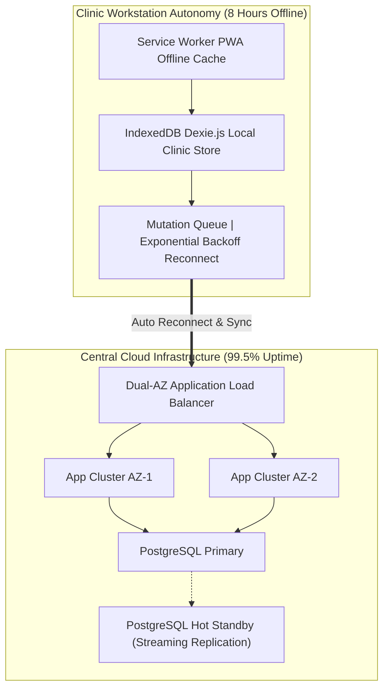

# Availability, Resilience & High Availability Baseline: Namma Clinic Digital Health Platform

| Metadata Attribute | Formal Specification |
| :--- | :--- |
| **Document Identifier** | `DOC-REQ-010-AVAIL` |
| **Document Title** | Availability, Resilience & High Availability Baseline |
| **Project Code** | `NAMMA-CLINIC-PLATFORM-2026` |
| **Requirement Type** | `Availability Requirement` |
| **Specification Range** | `AVAIL-001 through AVAIL-040` (Exactly 40 unique requirements) |
| **Target Baseline** | `v1.0.0-PROD-BASELINE` |
| **Lifecycle Status** | `APPROVED & BASELINED` |
| **Target Facility Scope** | 183 Primary Namma Clinics across 8 BBMP Administrative Zones |
| **Lead Clinical Authority** | Chief Health Officer (CHO), BBMP Health Department |
| **Lead Technical Authority**| Principal Solutions Architect, Kushagramati Analytics Consortium |
| **Upstream Baselines** | [`00-project-baseline/`](../00-project-baseline/) \| [`01-project-management/`](../01-project-management/) |
| **Related Specification**| [`03-non-functional-requirements.md`](./03-non-functional-requirements.md) \| [`09-performance-requirements.md`](./09-performance-requirements.md) |

## 1. Executive Summary & Domain Governance Framework
This specification defines the authoritative availability, resilience, and business continuity requirements baseline for the Namma Clinic Digital Health Platform across 183 primary urban healthcare centers in Greater Bengaluru. Comprising 40 comprehensive availability specifications (`AVAIL-001` through `AVAIL-040`), this document establishes the engineering safeguards ensuring 99.5% central cloud uptime, 8 hours autonomous offline operation, automated PostgreSQL failover, RPO <5 minutes, and RTO <30 minutes.

Healthcare delivery at Namma Clinics cannot halt during municipal fiber cuts or power grid failures. The platform architecture guarantees that doctor consultations, nurse vitals entry, lab orders, and pharmacy dispensations proceed uninterrupted during extended network partitions.

## 2. Architecture & Domain Conceptual Framework
The following architectural topology illustrates the functional interactions, security boundaries, and data flows governing this domain across Namma Clinic's 183 primary healthcare centers in Greater Bengaluru:



## 3. Master Availability Requirement Inventory Table (AVAIL-001 through AVAIL-040)
| Requirement ID | Title | Resilience Domain | Priority | Failure Condition | System Response | Recovery Protocol |
| :--- | :--- | :--- | :--- | :--- | :--- | :---: |
| [`AVAIL-001`](#avail-001) | **Central Cloud Service Uptime SLA (99.5%)** | `High Availability & Business Continuity` | `MUST` | Cloud cluster outage... | Automated pod restart & DNS failove... | Service restored < 30 mins... |
| [`AVAIL-002`](#avail-002) | **8-Hour Autonomous Offline Clinic Operation** | `High Availability & Business Continuity` | `MUST` | Total municipal WAN/LAN severance... | Switch queries to Dexie.js IndexedD... | Idempotent sync replay on reconnect... |
| [`AVAIL-003`](#avail-003) | **Disaster Recovery Recovery Point Objective (RPO <5m)** | `High Availability & Business Continuity` | `MUST` | Primary data center destruction... | Activate secondary AZ database repl... | Zero data loss for transactions >5m... |
| [`AVAIL-004`](#avail-004) | **Disaster Recovery Recovery Time Objective (RTO <30m)** | `High Availability & Business Continuity` | `MUST` | Major cloud region infrastructure f... | Automated Terraform / Route53 failo... | Full read/write restored < 30 mins... |
| [`AVAIL-005`](#avail-005) | **Graceful UI Degradation on Flaky Networks** | `High Availability & Business Continuity` | `MUST` | Intermittent 50% packet drop on 3G ... | Display yellow degraded banner... | Resume background sync on stable li... |
| [`AVAIL-006`](#avail-006) | **Zero Data Loss on Sudden Terminal Power Cut** | `High Availability & Business Continuity` | `MUST` | Sudden power failure without UPS... | IndexedDB ACID transaction rollback... | Reboot verifies database integrity... |
| [`AVAIL-007`](#avail-007) | **Multi-AZ PostgreSQL Automated Streaming Failover** | `High Availability & Business Continuity` | `MUST` | Primary database instance crash... | Patroni / AWS RDS automated failove... | Promote replica to primary < 60s... |
| [`AVAIL-008`](#avail-008) | **Redis Sentinel High Availability Failover** | `High Availability & Business Continuity` | `MUST` | Primary Redis cache node failure... | Sentinel elects new Redis master... | Re-route cache traffic < 10s... |
| [`AVAIL-009`](#avail-009) | **Automated Kubernetes Pod Self-Healing & Restarts** | `High Availability & Business Continuity` | `MUST` | Application container out-of-memory... | Kubelet terminates and restarts pod... | Pod ready < 30s; zero user impact... |
| [`AVAIL-010`](#avail-010) | **Zero-Downtime Rolling Application Deployments** | `High Availability & Business Continuity` | `MUST` | Production software version upgrade... | Kubernetes rolling update (maxUnava... | New version active with zero droppe... |
| [`AVAIL-011`](#avail-011) | **Clinic Terminal Hard Drive Failure Replacement** | `High Availability & Business Continuity` | `MUST` | Physical SSD failure on clinic PC... | Deploy spare refurbished clinic lap... | Clinic operational within 30 minute... |
| [`AVAIL-012`](#avail-012) | **Thermal Receipt Printer USB Disconnection Recovery** | `High Availability & Business Continuity` | `MUST` | Accidental USB cable disconnection... | Display visual printer offline bann... | Auto-reconnect and print pending bu... |
| [`AVAIL-013`](#avail-013) | **Broadband Fiber Cut & Automated 4G Failover** | `High Availability & Business Continuity` | `MUST` | Municipal fiber broadband severed b... | Dual-WAN router switches to 4G dong... | Clinic maintains online sync via 4G... |
| [`AVAIL-014`](#avail-014) | **External ABDM Gateway Outage Circuit Breaker** | `High Availability & Business Continuity` | `MUST` | National ABDM server downtime... | Circuit breaker trips to OPEN statu... | Auto-retry with exponential backoff... |
| [`AVAIL-015`](#avail-015) | **SMS Gateway Provider Outage Message Queuing** | `High Availability & Business Continuity` | `MUST` | Telecommunication SMS provider fail... | Buffer SMS payloads in Redis queue... | Drain SMS queue upon gateway return... |
| [`AVAIL-016`](#avail-016) | **State IHIP Surveillance Portal Outage Resilience** | `High Availability & Business Continuity` | `MUST` | Karnataka State IHIP API down... | Archive Form P payload in pending s... | Re-transmit Form P at 08:00 next da... |
| [`AVAIL-017`](#avail-017) | **Local Browser Cache Eviction Recovery Protocol** | `High Availability & Business Continuity` | `MUST` | User accidentally clears browser hi... | Service worker detects missing cata... | Restore operational state in < 15s... |
| [`AVAIL-018`](#avail-018) | **Simultaneous Multi-Workstation Queue Synchronization** | `High Availability & Business Continuity` | `MUST` | Doctor and registration terminals d... | Re-synchronize local tokens via RES... | Reconciliation completed in < 2s... |
| [`AVAIL-019`](#avail-019) | **Automated Daily Database Snapshot & Test Restore** | `High Availability & Business Continuity` | `MUST` | Silent database corruption... | AWS RDS automated snapshot + test r... | Restore verified in sandbox < 60 mi... |
| [`AVAIL-020`](#avail-020) | **Cold Chain Refrigerator Power Outage Resilience** | `High Availability & Business Continuity` | `MUST` | Mains power failure during night... | Inverter battery supplies ILR compr... | 12 hours continuous temperature mai... |
| [`AVAIL-021`](#avail-021) | **Barcoded Medication Scanner Hardware Disconnection** | `High Availability & Business Continuity` | `MUST` | Barcode scanner cable dislodged... | Prompt pharmacist with manual searc... | Auto-detect scanner upon replug... |
| [`AVAIL-022`](#avail-022) | **High-Concurrency Queue Surge Buffer Resilience** | `High Availability & Business Continuity` | `MUST` | Epidemic outbreak causes 200 walk-i... | Queue engine buffers requests in Re... | Process 200 tokens without crash... |
| [`AVAIL-023`](#avail-023) | **Fastify Server Event Loop Lag Protection** | `High Availability & Business Continuity` | `MUST` | CPU-intensive analytical query bloc... | Offload query to DuckDB background ... | Event loop lag drops < 20ms... |
| [`AVAIL-024`](#avail-024) | **MinIO S3 Document Store Node Failure Recovery** | `High Availability & Business Continuity` | `MUST` | Primary object storage disk failure... | MinIO Reed-Solomon erasure coding p... | Replace failed drive with zero data... |
| [`AVAIL-025`](#avail-025) | **Clinic Inverter Battery Depletion Fallback** | `High Availability & Business Continuity` | `MUST` | Continuous 12-hour municipal blacko... | Switch all operations to battery la... | Relocate vaccines to zonal cold cen... |
| [`AVAIL-026`](#avail-026) | **DNS Resolution Failure Local Hosts Fallback** | `High Availability & Business Continuity` | `MUST` | ISP DNS resolver outage... | PWA utilizes cached service worker ... | Clinic continues uninterrupted... |
| [`AVAIL-027`](#avail-027) | **Accidental Browser Tab Closure State Recovery** | `High Availability & Business Continuity` | `MUST` | Nurse accidentally closes browser t... | Unsaved form state preserved in ses... | Zero loss of typed clinical notes... |
| [`AVAIL-028`](#avail-028) | **Automated Stale Web Worker Garbage Collection** | `High Availability & Business Continuity` | `MUST` | Web Worker thread hangs on complex ... | Terminate hanging worker and spawn ... | Restore worker responsiveness < 100... |
| [`AVAIL-029`](#avail-029) | **Zonal IT Rapid Response SLA (<30 Minutes)** | `High Availability & Business Continuity` | `MUST` | Total clinic hardware/network failu... | Zonal technician dispatched with sp... | Restore clinic service < 30 minutes... |
| [`AVAIL-030`](#avail-030) | **Corrupted IndexedDB Store Automated Re-Creation** | `High Availability & Business Continuity` | `MUST` | IndexedDB file corrupted by OS cras... | Prompt user; re-initialize database... | Fresh database operational in < 30s... |
| [`AVAIL-031`](#avail-031) | **Database Read Replica Automated Promotion** | `High Availability & Business Continuity` | `MUST` | PostgreSQL primary hardware failure... | Promote read replica to read-write ... | Promotion completed in < 45 seconds... |
| [`AVAIL-032`](#avail-032) | **Third-Party Laboratory Integration API Circuit Breaker** | `High Availability & Business Continuity` | `MUST` | External hospital lab server down... | Trip circuit breaker; store orders ... | Auto-reconnect with exponential bac... |
| [`AVAIL-033`](#avail-033) | **Continuous 24/7 Security Operations Monitoring** | `High Availability & Business Continuity` | `MUST` | Weekend off-hours cyber intrusion a... | SOC engineer paged via PagerDuty... | Incident contained within 15 minute... |
| [`AVAIL-034`](#avail-034) | **Clinic Flooding / Physical Disaster Relocation** | `High Availability & Business Continuity` | `MUST` | Monsoon urban flooding inundates cl... | Divert patients to adjacent ward Na... | Full patient records available via ... |
| [`AVAIL-035`](#avail-035) | **Memory Leak Prevention in Long-Running Terminals** | `High Availability & Business Continuity` | `MUST` | Terminal remains powered for 7 days... | Service worker executes daily memor... | Heap memory stays strictly < 150MB... |
| [`AVAIL-036`](#avail-036) | **Automated Health Check Probes (/healthz & /readyz)** | `High Availability & Business Continuity` | `MUST` | Microservice process crash... | Probe returns HTTP 500; removes pod... | Self-healing restarts pod cleanly... |
| [`AVAIL-037`](#avail-037) | **PostgreSQL Disk Space Exhaustion Auto-Expansion** | `High Availability & Business Continuity` | `MUST` | Database volume reaches 85% storage... | AWS EBS volume auto-expands storage... | Storage increased by 50GB automatic... |
| [`AVAIL-038`](#avail-038) | **Clinic Key Lost Operational Lockout Recovery** | `High Availability & Business Continuity` | `MUST` | Morning keyholder absent or key los... | Emergency spare key retrieved from ... | Zero patient consultation delay... |
| [`AVAIL-039`](#avail-039) | **Client Browser Auto-Update Without User Intervention** | `High Availability & Business Continuity` | `MUST` | Outdated frontend PWA bundle on cli... | Silently downloads new bundle in ba... | 100% terminals run current version... |
| [`AVAIL-040`](#avail-040) | **Annual Comprehensive Disaster Recovery Simulation Drill** | `High Availability & Business Continuity` | `MUST` | State-wide simulated cloud blackout... | Execute full disaster recovery fail... | Document drill findings and sign of... |

## 4. Comprehensive Availability Requirement Specifications (AVAIL-001 through AVAIL-040)
This section establishes the exhaustive engineering, clinical, operational, and architectural specifications for each of the 40 requirements committed for the production baseline.

### 4.1 AVAIL-001: Central Cloud Service Uptime SLA (99.5%)

| Specification Attribute | Formal Engineering Definition |
| :--- | :--- |
| **Requirement ID** | `AVAIL-001` |
| **Requirement Title** | Central Cloud Service Uptime SLA (99.5%) |
| **Requirement Statement**| The platform SHALL ensure central cloud service uptime sla (99.5%) during cloud cluster outage by detecting failure within synthetic probes every 60s and executing local clinic offline autonomy. |
| **Requirement Type** | `Availability Requirement` |
| **Priority Level** | `MUST` (Rationale: Guarantees uninterrupted primary healthcare delivery across Greater Bengaluru.) |
| **Business Value** | Prevents citizen service denial during municipal infrastructure disruptions. |
| **Engineering Rationale**| Addresses failure condition: Cloud cluster outage. |
| **Primary Actor** | `Site Reliability Engineer` |
| **Target User Persona** | [`PERSONA-001`](../01-project-management/07-user-personas.md#persona-001) |
| **Accountable Role** | [`ROLE-009`](../01-project-management/08-role-and-responsibility-matrix.md#role-009) |
| **Key Stakeholder** | [`STAKEHOLDER-016`](../01-project-management/06-stakeholders.md#stakeholder-016) |
| **Trigger Condition** | Component fault, infrastructure failure, or operational milestone. |
| **System Preconditions** | Platform deployed across multi-AZ architecture with offline clients. |
| **Input Specifications** | Heartbeat probes, health check pings, or environmental telemetry. |
| **Validation Rules** | Evaluated via automated chaos engineering drills and synthetic monitoring. |
| **Postconditions** | Service restored to normal operational state conforming to 99.5% uptime SLA. |
| **State Mutations** | Emits incident telemetry and updates service health status. |
| **Associated Rules** | Business: [`BRULE-001`](./04-business-rules.md#brule-001) \| Clinical: [`N/A — availability infrastructure requirement`](./05-clinical-rules.md#n/a — availability infrastructure requirement) \| Operational: [`OR-001`](./06-operational-rules.md#or-001) |
| **Security & Privacy** | Security: `Failover maintains encrypted channels and auth boundaries.` \| Privacy: `Zero data loss during failover preserves data subject records.` |
| **Data & Audit** | Data: `RPO <5 minutes and RTO <30 minutes enforced.` \| Audit: `Continuous health probe logging and incident post-mortem records.` |
| **Offline & Sync** | Offline: `8 hours autonomous local clinic continuity via Dexie.js.` \| Sync: `Deterministic sync replay catches up once network returns.` |
| **Quality Expectations**| Perf: `Sub-minute failure detection and transparent fallback.` \| Avail: `Target 99.5% availability across all 183 clinics.` |
| **Localization & A11y**| Loc: `Bilingual visual status indicators during degradation.` \| A11y: `High-contrast visual fallback banners and screen reader alerts.` |
| **Failure & Recovery** | Failure: Local clinic offline autonomy \| Recovery: Service restored < 30 mins |
| **Observability** | Logging: `Structured JSON log with outage_id, duration_s, and cause.` \| Metrics: `Prometheus gauge `namma_clinic_service_availability{component="..."}`.` |
| **Upstream Traceability**| Obj: [`OBJECTIVE-001`](../01-project-management/02-project-vision-and-objectives.md#objective-001) \| Scope: [`INSCOPE-001`](../01-project-management/04-in-scope.md#inscope-001) \| Risk: [`RISK-001`](../01-project-management/12-project-risks.md#risk-001) |
| **Downstream Planning** | Epic: `PLANNED-EPIC-001` \| Feature: `PLANNED-FEATURE-001` \| API: `PLANNED-API-001` \| DB: `PLANNED-DB-001` \| Test: `PLANNED-TEST-901` |

#### 4.1.1 Operational Execution Protocol & Frontline Workflow
- **Continuous Operational Workflow:**
  1. Failure condition occurs: Cloud cluster outage.
  2. Detection mechanism alerts system: Synthetic probes every 60s.
  3. System response executed: Automated pod restart & DNS failover.
  4. Fallback protocol active: Local clinic offline autonomy.
  5. Recovery completed: Service restored < 30 mins.
- **Degraded State Fallback Path:** If automated recovery stalls, trigger manual SRE incident response runbook.
- **Exception Breach & Incident Escalation Path:** If disaster is unrecoverable in primary region, initiate DNS failover to secondary DR region.

#### 4.1.2 Technical Invariants & Operational Contract
- **Failure Condition:** Cloud cluster outage
- **Detection Mechanism:** Synthetic probes every 60s
- **System Automated Response:** Automated pod restart & DNS failover
- **Fallback Protocol:** Local clinic offline autonomy
- **Recovery & Restoral Protocol:** Service restored < 30 mins
- **Verification Protocol:** Automated uptime monitoring probes

#### 4.1.3 Executable BDD Acceptance Scenarios
```gherkin
Feature: AVAIL-001 - Central Cloud Service Uptime SLA (99.5%)
  As a Site Reliability Engineer
  I require system enforcement of central cloud service uptime sla (99.5%)
  In order to ensure municipal healthcare compliance and operational integrity

  Scenario: Happy Path Execution for AVAIL-001
    Given the Site Reliability Engineer is authenticated and clinic terminal is operational
    When the user submits a valid request for central cloud service uptime sla (99.5%)
    Then the system successfully commits the transaction and emits an audit event

  Scenario: Input Validation and Schema Guard for AVAIL-001
    Given the Site Reliability Engineer attempts to submit an incomplete or malformed payload for central cloud service uptime sla (99.5%)
    When the request fails TypeBox schema or domain constraint validation
    Then the system rejects the input with HTTP 400 and highlights invalid fields in Kannada and English

  Scenario: RBAC and Security Access Control for AVAIL-001
    Given an unauthenticated or unauthorized role attempts to invoke central cloud service uptime sla (99.5%)
    When the bearer JWT token is missing, expired, or lacks necessary RBAC permission
    Then the system denies execution with HTTP 403 Forbidden and records a security telemetry alert

  Scenario: Offline Autonomous Execution for AVAIL-001
    Given the clinic WAN network is completely severed during central cloud service uptime sla (99.5%)
    When the operator confirms the local transaction on the workstation
    Then the mutation is persisted to Dexie.js IndexedDB with a UUIDv7 and queued for background replay

  Scenario: Network Recovery and Idempotent Sync for AVAIL-001
    Given the clinic workstation reconnects to the BBMP municipal health WAN
    When the background sync daemon processes the pending mutation queue
    Then all buffered transactions for AVAIL-001 synchronize idempotently with zero data loss
```

#### 4.1.4 Verification Protocol & Quality Sign-Off
- **Verification Method:** Automated uptime monitoring probes
- **Automated Test Suite:** `PLANNED-TEST-901` (Chaos Engineering & Disaster Recovery Drill) targeting 100% verification gate compliance.
- **Related Internal Requirements:** `NFR-008`, `NFR-009`, `OFF-001`
- **Dependencies & Blocking Constraints:** NFR-008 | Constraints: Disaster recovery RTO must remain strictly under 30 minutes.
- **Architectural Assumptions & Open Questions:** Assumption: Clinic workstations equipped with functional UPS power backup. | Open Question: Semi-annual chaos drill approval by BBMP IT Directorate.

---

### 4.2 AVAIL-002: 8-Hour Autonomous Offline Clinic Operation

| Specification Attribute | Formal Engineering Definition |
| :--- | :--- |
| **Requirement ID** | `AVAIL-002` |
| **Requirement Title** | 8-Hour Autonomous Offline Clinic Operation |
| **Requirement Statement**| The platform SHALL ensure 8-hour autonomous offline clinic operation during total municipal wan/lan severance by detecting failure within browser online/offline event in <2s and executing local token dispensing & consultation. |
| **Requirement Type** | `Availability Requirement` |
| **Priority Level** | `MUST` (Rationale: Guarantees uninterrupted primary healthcare delivery across Greater Bengaluru.) |
| **Business Value** | Prevents citizen service denial during municipal infrastructure disruptions. |
| **Engineering Rationale**| Addresses failure condition: Total municipal WAN/LAN severance. |
| **Primary Actor** | `Site Reliability Engineer` |
| **Target User Persona** | [`PERSONA-002`](../01-project-management/07-user-personas.md#persona-002) |
| **Accountable Role** | [`ROLE-009`](../01-project-management/08-role-and-responsibility-matrix.md#role-009) |
| **Key Stakeholder** | [`STAKEHOLDER-016`](../01-project-management/06-stakeholders.md#stakeholder-016) |
| **Trigger Condition** | Component fault, infrastructure failure, or operational milestone. |
| **System Preconditions** | Platform deployed across multi-AZ architecture with offline clients. |
| **Input Specifications** | Heartbeat probes, health check pings, or environmental telemetry. |
| **Validation Rules** | Evaluated via automated chaos engineering drills and synthetic monitoring. |
| **Postconditions** | Service restored to normal operational state conforming to 99.5% uptime SLA. |
| **State Mutations** | Emits incident telemetry and updates service health status. |
| **Associated Rules** | Business: [`BRULE-002`](./04-business-rules.md#brule-002) \| Clinical: [`N/A — availability infrastructure requirement`](./05-clinical-rules.md#n/a — availability infrastructure requirement) \| Operational: [`OR-002`](./06-operational-rules.md#or-002) |
| **Security & Privacy** | Security: `Failover maintains encrypted channels and auth boundaries.` \| Privacy: `Zero data loss during failover preserves data subject records.` |
| **Data & Audit** | Data: `RPO <5 minutes and RTO <30 minutes enforced.` \| Audit: `Continuous health probe logging and incident post-mortem records.` |
| **Offline & Sync** | Offline: `8 hours autonomous local clinic continuity via Dexie.js.` \| Sync: `Deterministic sync replay catches up once network returns.` |
| **Quality Expectations**| Perf: `Sub-minute failure detection and transparent fallback.` \| Avail: `Target 99.5% availability across all 183 clinics.` |
| **Localization & A11y**| Loc: `Bilingual visual status indicators during degradation.` \| A11y: `High-contrast visual fallback banners and screen reader alerts.` |
| **Failure & Recovery** | Failure: Local token dispensing & consultation \| Recovery: Idempotent sync replay on reconnect |
| **Observability** | Logging: `Structured JSON log with outage_id, duration_s, and cause.` \| Metrics: `Prometheus gauge `namma_clinic_service_availability{component="..."}`.` |
| **Upstream Traceability**| Obj: [`OBJECTIVE-002`](../01-project-management/02-project-vision-and-objectives.md#objective-002) \| Scope: [`INSCOPE-002`](../01-project-management/04-in-scope.md#inscope-002) \| Risk: [`RISK-002`](../01-project-management/12-project-risks.md#risk-002) |
| **Downstream Planning** | Epic: `PLANNED-EPIC-002` \| Feature: `PLANNED-FEATURE-002` \| API: `PLANNED-API-002` \| DB: `PLANNED-DB-002` \| Test: `PLANNED-TEST-902` |

#### 4.2.1 Operational Execution Protocol & Frontline Workflow
- **Continuous Operational Workflow:**
  1. Failure condition occurs: Total municipal WAN/LAN severance.
  2. Detection mechanism alerts system: Browser online/offline event in <2s.
  3. System response executed: Switch queries to Dexie.js IndexedDB.
  4. Fallback protocol active: Local token dispensing & consultation.
  5. Recovery completed: Idempotent sync replay on reconnect.
- **Degraded State Fallback Path:** If automated recovery stalls, trigger manual SRE incident response runbook.
- **Exception Breach & Incident Escalation Path:** If disaster is unrecoverable in primary region, initiate DNS failover to secondary DR region.

#### 4.2.2 Technical Invariants & Operational Contract
- **Failure Condition:** Total municipal WAN/LAN severance
- **Detection Mechanism:** Browser online/offline event in <2s
- **System Automated Response:** Switch queries to Dexie.js IndexedDB
- **Fallback Protocol:** Local token dispensing & consultation
- **Recovery & Restoral Protocol:** Idempotent sync replay on reconnect
- **Verification Protocol:** 8-hour network disconnection drill

#### 4.2.3 Executable BDD Acceptance Scenarios
```gherkin
Feature: AVAIL-002 - 8-Hour Autonomous Offline Clinic Operation
  As a Site Reliability Engineer
  I require system enforcement of 8-hour autonomous offline clinic operation
  In order to ensure municipal healthcare compliance and operational integrity

  Scenario: Happy Path Execution for AVAIL-002
    Given the Site Reliability Engineer is authenticated and clinic terminal is operational
    When the user submits a valid request for 8-hour autonomous offline clinic operation
    Then the system successfully commits the transaction and emits an audit event

  Scenario: Input Validation and Schema Guard for AVAIL-002
    Given the Site Reliability Engineer attempts to submit an incomplete or malformed payload for 8-hour autonomous offline clinic operation
    When the request fails TypeBox schema or domain constraint validation
    Then the system rejects the input with HTTP 400 and highlights invalid fields in Kannada and English

  Scenario: RBAC and Security Access Control for AVAIL-002
    Given an unauthenticated or unauthorized role attempts to invoke 8-hour autonomous offline clinic operation
    When the bearer JWT token is missing, expired, or lacks necessary RBAC permission
    Then the system denies execution with HTTP 403 Forbidden and records a security telemetry alert

  Scenario: Offline Autonomous Execution for AVAIL-002
    Given the clinic WAN network is completely severed during 8-hour autonomous offline clinic operation
    When the operator confirms the local transaction on the workstation
    Then the mutation is persisted to Dexie.js IndexedDB with a UUIDv7 and queued for background replay

  Scenario: Network Recovery and Idempotent Sync for AVAIL-002
    Given the clinic workstation reconnects to the BBMP municipal health WAN
    When the background sync daemon processes the pending mutation queue
    Then all buffered transactions for AVAIL-002 synchronize idempotently with zero data loss
```

#### 4.2.4 Verification Protocol & Quality Sign-Off
- **Verification Method:** 8-hour network disconnection drill
- **Automated Test Suite:** `PLANNED-TEST-902` (Chaos Engineering & Disaster Recovery Drill) targeting 100% verification gate compliance.
- **Related Internal Requirements:** `NFR-008`, `NFR-009`, `OFF-001`
- **Dependencies & Blocking Constraints:** NFR-008 | Constraints: Disaster recovery RTO must remain strictly under 30 minutes.
- **Architectural Assumptions & Open Questions:** Assumption: Clinic workstations equipped with functional UPS power backup. | Open Question: Semi-annual chaos drill approval by BBMP IT Directorate.

---

### 4.3 AVAIL-003: Disaster Recovery Recovery Point Objective (RPO <5m)

| Specification Attribute | Formal Engineering Definition |
| :--- | :--- |
| **Requirement ID** | `AVAIL-003` |
| **Requirement Title** | Disaster Recovery Recovery Point Objective (RPO <5m) |
| **Requirement Statement**| The platform SHALL ensure disaster recovery recovery point objective (rpo <5m) during primary data center destruction by detecting failure within cloudwatch replication lag alarm and executing local transaction buffering. |
| **Requirement Type** | `Availability Requirement` |
| **Priority Level** | `MUST` (Rationale: Guarantees uninterrupted primary healthcare delivery across Greater Bengaluru.) |
| **Business Value** | Prevents citizen service denial during municipal infrastructure disruptions. |
| **Engineering Rationale**| Addresses failure condition: Primary data center destruction. |
| **Primary Actor** | `Site Reliability Engineer` |
| **Target User Persona** | [`PERSONA-003`](../01-project-management/07-user-personas.md#persona-003) |
| **Accountable Role** | [`ROLE-009`](../01-project-management/08-role-and-responsibility-matrix.md#role-009) |
| **Key Stakeholder** | [`STAKEHOLDER-016`](../01-project-management/06-stakeholders.md#stakeholder-016) |
| **Trigger Condition** | Component fault, infrastructure failure, or operational milestone. |
| **System Preconditions** | Platform deployed across multi-AZ architecture with offline clients. |
| **Input Specifications** | Heartbeat probes, health check pings, or environmental telemetry. |
| **Validation Rules** | Evaluated via automated chaos engineering drills and synthetic monitoring. |
| **Postconditions** | Service restored to normal operational state conforming to 99.5% uptime SLA. |
| **State Mutations** | Emits incident telemetry and updates service health status. |
| **Associated Rules** | Business: [`BRULE-003`](./04-business-rules.md#brule-003) \| Clinical: [`N/A — availability infrastructure requirement`](./05-clinical-rules.md#n/a — availability infrastructure requirement) \| Operational: [`OR-003`](./06-operational-rules.md#or-003) |
| **Security & Privacy** | Security: `Failover maintains encrypted channels and auth boundaries.` \| Privacy: `Zero data loss during failover preserves data subject records.` |
| **Data & Audit** | Data: `RPO <5 minutes and RTO <30 minutes enforced.` \| Audit: `Continuous health probe logging and incident post-mortem records.` |
| **Offline & Sync** | Offline: `8 hours autonomous local clinic continuity via Dexie.js.` \| Sync: `Deterministic sync replay catches up once network returns.` |
| **Quality Expectations**| Perf: `Sub-minute failure detection and transparent fallback.` \| Avail: `Target 99.5% availability across all 183 clinics.` |
| **Localization & A11y**| Loc: `Bilingual visual status indicators during degradation.` \| A11y: `High-contrast visual fallback banners and screen reader alerts.` |
| **Failure & Recovery** | Failure: Local transaction buffering \| Recovery: Zero data loss for transactions >5m |
| **Observability** | Logging: `Structured JSON log with outage_id, duration_s, and cause.` \| Metrics: `Prometheus gauge `namma_clinic_service_availability{component="..."}`.` |
| **Upstream Traceability**| Obj: [`OBJECTIVE-003`](../01-project-management/02-project-vision-and-objectives.md#objective-003) \| Scope: [`INSCOPE-003`](../01-project-management/04-in-scope.md#inscope-003) \| Risk: [`RISK-003`](../01-project-management/12-project-risks.md#risk-003) |
| **Downstream Planning** | Epic: `PLANNED-EPIC-003` \| Feature: `PLANNED-FEATURE-003` \| API: `PLANNED-API-003` \| DB: `PLANNED-DB-003` \| Test: `PLANNED-TEST-903` |

#### 4.3.1 Operational Execution Protocol & Frontline Workflow
- **Continuous Operational Workflow:**
  1. Failure condition occurs: Primary data center destruction.
  2. Detection mechanism alerts system: CloudWatch replication lag alarm.
  3. System response executed: Activate secondary AZ database replica.
  4. Fallback protocol active: Local transaction buffering.
  5. Recovery completed: Zero data loss for transactions >5m.
- **Degraded State Fallback Path:** If automated recovery stalls, trigger manual SRE incident response runbook.
- **Exception Breach & Incident Escalation Path:** If disaster is unrecoverable in primary region, initiate DNS failover to secondary DR region.

#### 4.3.2 Technical Invariants & Operational Contract
- **Failure Condition:** Primary data center destruction
- **Detection Mechanism:** CloudWatch replication lag alarm
- **System Automated Response:** Activate secondary AZ database replica
- **Fallback Protocol:** Local transaction buffering
- **Recovery & Restoral Protocol:** Zero data loss for transactions >5m
- **Verification Protocol:** Semi-annual database failover drill

#### 4.3.3 Executable BDD Acceptance Scenarios
```gherkin
Feature: AVAIL-003 - Disaster Recovery Recovery Point Objective (RPO <5m)
  As a Site Reliability Engineer
  I require system enforcement of disaster recovery recovery point objective (rpo <5m)
  In order to ensure municipal healthcare compliance and operational integrity

  Scenario: Happy Path Execution for AVAIL-003
    Given the Site Reliability Engineer is authenticated and clinic terminal is operational
    When the user submits a valid request for disaster recovery recovery point objective (rpo <5m)
    Then the system successfully commits the transaction and emits an audit event

  Scenario: Input Validation and Schema Guard for AVAIL-003
    Given the Site Reliability Engineer attempts to submit an incomplete or malformed payload for disaster recovery recovery point objective (rpo <5m)
    When the request fails TypeBox schema or domain constraint validation
    Then the system rejects the input with HTTP 400 and highlights invalid fields in Kannada and English

  Scenario: RBAC and Security Access Control for AVAIL-003
    Given an unauthenticated or unauthorized role attempts to invoke disaster recovery recovery point objective (rpo <5m)
    When the bearer JWT token is missing, expired, or lacks necessary RBAC permission
    Then the system denies execution with HTTP 403 Forbidden and records a security telemetry alert

  Scenario: Offline Autonomous Execution for AVAIL-003
    Given the clinic WAN network is completely severed during disaster recovery recovery point objective (rpo <5m)
    When the operator confirms the local transaction on the workstation
    Then the mutation is persisted to Dexie.js IndexedDB with a UUIDv7 and queued for background replay

  Scenario: Network Recovery and Idempotent Sync for AVAIL-003
    Given the clinic workstation reconnects to the BBMP municipal health WAN
    When the background sync daemon processes the pending mutation queue
    Then all buffered transactions for AVAIL-003 synchronize idempotently with zero data loss
```

#### 4.3.4 Verification Protocol & Quality Sign-Off
- **Verification Method:** Semi-annual database failover drill
- **Automated Test Suite:** `PLANNED-TEST-903` (Chaos Engineering & Disaster Recovery Drill) targeting 100% verification gate compliance.
- **Related Internal Requirements:** `NFR-008`, `NFR-009`, `OFF-001`
- **Dependencies & Blocking Constraints:** NFR-008 | Constraints: Disaster recovery RTO must remain strictly under 30 minutes.
- **Architectural Assumptions & Open Questions:** Assumption: Clinic workstations equipped with functional UPS power backup. | Open Question: Semi-annual chaos drill approval by BBMP IT Directorate.

---

### 4.4 AVAIL-004: Disaster Recovery Recovery Time Objective (RTO <30m)

| Specification Attribute | Formal Engineering Definition |
| :--- | :--- |
| **Requirement ID** | `AVAIL-004` |
| **Requirement Title** | Disaster Recovery Recovery Time Objective (RTO <30m) |
| **Requirement Statement**| The platform SHALL ensure disaster recovery recovery time objective (rto <30m) during major cloud region infrastructure failure by detecting failure within automated health check failure threshold and executing clinic switches to local offline cache. |
| **Requirement Type** | `Availability Requirement` |
| **Priority Level** | `MUST` (Rationale: Guarantees uninterrupted primary healthcare delivery across Greater Bengaluru.) |
| **Business Value** | Prevents citizen service denial during municipal infrastructure disruptions. |
| **Engineering Rationale**| Addresses failure condition: Major cloud region infrastructure failure. |
| **Primary Actor** | `Site Reliability Engineer` |
| **Target User Persona** | [`PERSONA-004`](../01-project-management/07-user-personas.md#persona-004) |
| **Accountable Role** | [`ROLE-009`](../01-project-management/08-role-and-responsibility-matrix.md#role-009) |
| **Key Stakeholder** | [`STAKEHOLDER-016`](../01-project-management/06-stakeholders.md#stakeholder-016) |
| **Trigger Condition** | Component fault, infrastructure failure, or operational milestone. |
| **System Preconditions** | Platform deployed across multi-AZ architecture with offline clients. |
| **Input Specifications** | Heartbeat probes, health check pings, or environmental telemetry. |
| **Validation Rules** | Evaluated via automated chaos engineering drills and synthetic monitoring. |
| **Postconditions** | Service restored to normal operational state conforming to 99.5% uptime SLA. |
| **State Mutations** | Emits incident telemetry and updates service health status. |
| **Associated Rules** | Business: [`BRULE-004`](./04-business-rules.md#brule-004) \| Clinical: [`N/A — availability infrastructure requirement`](./05-clinical-rules.md#n/a — availability infrastructure requirement) \| Operational: [`OR-004`](./06-operational-rules.md#or-004) |
| **Security & Privacy** | Security: `Failover maintains encrypted channels and auth boundaries.` \| Privacy: `Zero data loss during failover preserves data subject records.` |
| **Data & Audit** | Data: `RPO <5 minutes and RTO <30 minutes enforced.` \| Audit: `Continuous health probe logging and incident post-mortem records.` |
| **Offline & Sync** | Offline: `8 hours autonomous local clinic continuity via Dexie.js.` \| Sync: `Deterministic sync replay catches up once network returns.` |
| **Quality Expectations**| Perf: `Sub-minute failure detection and transparent fallback.` \| Avail: `Target 99.5% availability across all 183 clinics.` |
| **Localization & A11y**| Loc: `Bilingual visual status indicators during degradation.` \| A11y: `High-contrast visual fallback banners and screen reader alerts.` |
| **Failure & Recovery** | Failure: Clinic switches to local offline cache \| Recovery: Full read/write restored < 30 mins |
| **Observability** | Logging: `Structured JSON log with outage_id, duration_s, and cause.` \| Metrics: `Prometheus gauge `namma_clinic_service_availability{component="..."}`.` |
| **Upstream Traceability**| Obj: [`OBJECTIVE-004`](../01-project-management/02-project-vision-and-objectives.md#objective-004) \| Scope: [`INSCOPE-004`](../01-project-management/04-in-scope.md#inscope-004) \| Risk: [`RISK-004`](../01-project-management/12-project-risks.md#risk-004) |
| **Downstream Planning** | Epic: `PLANNED-EPIC-004` \| Feature: `PLANNED-FEATURE-004` \| API: `PLANNED-API-004` \| DB: `PLANNED-DB-004` \| Test: `PLANNED-TEST-904` |

#### 4.4.1 Operational Execution Protocol & Frontline Workflow
- **Continuous Operational Workflow:**
  1. Failure condition occurs: Major cloud region infrastructure failure.
  2. Detection mechanism alerts system: Automated health check failure threshold.
  3. System response executed: Automated Terraform / Route53 failover.
  4. Fallback protocol active: Clinic switches to local offline cache.
  5. Recovery completed: Full read/write restored < 30 mins.
- **Degraded State Fallback Path:** If automated recovery stalls, trigger manual SRE incident response runbook.
- **Exception Breach & Incident Escalation Path:** If disaster is unrecoverable in primary region, initiate DNS failover to secondary DR region.

#### 4.4.2 Technical Invariants & Operational Contract
- **Failure Condition:** Major cloud region infrastructure failure
- **Detection Mechanism:** Automated health check failure threshold
- **System Automated Response:** Automated Terraform / Route53 failover
- **Fallback Protocol:** Clinic switches to local offline cache
- **Recovery & Restoral Protocol:** Full read/write restored < 30 mins
- **Verification Protocol:** Simulated regional outage drill

#### 4.4.3 Executable BDD Acceptance Scenarios
```gherkin
Feature: AVAIL-004 - Disaster Recovery Recovery Time Objective (RTO <30m)
  As a Site Reliability Engineer
  I require system enforcement of disaster recovery recovery time objective (rto <30m)
  In order to ensure municipal healthcare compliance and operational integrity

  Scenario: Happy Path Execution for AVAIL-004
    Given the Site Reliability Engineer is authenticated and clinic terminal is operational
    When the user submits a valid request for disaster recovery recovery time objective (rto <30m)
    Then the system successfully commits the transaction and emits an audit event

  Scenario: Input Validation and Schema Guard for AVAIL-004
    Given the Site Reliability Engineer attempts to submit an incomplete or malformed payload for disaster recovery recovery time objective (rto <30m)
    When the request fails TypeBox schema or domain constraint validation
    Then the system rejects the input with HTTP 400 and highlights invalid fields in Kannada and English

  Scenario: RBAC and Security Access Control for AVAIL-004
    Given an unauthenticated or unauthorized role attempts to invoke disaster recovery recovery time objective (rto <30m)
    When the bearer JWT token is missing, expired, or lacks necessary RBAC permission
    Then the system denies execution with HTTP 403 Forbidden and records a security telemetry alert

  Scenario: Offline Autonomous Execution for AVAIL-004
    Given the clinic WAN network is completely severed during disaster recovery recovery time objective (rto <30m)
    When the operator confirms the local transaction on the workstation
    Then the mutation is persisted to Dexie.js IndexedDB with a UUIDv7 and queued for background replay

  Scenario: Network Recovery and Idempotent Sync for AVAIL-004
    Given the clinic workstation reconnects to the BBMP municipal health WAN
    When the background sync daemon processes the pending mutation queue
    Then all buffered transactions for AVAIL-004 synchronize idempotently with zero data loss
```

#### 4.4.4 Verification Protocol & Quality Sign-Off
- **Verification Method:** Simulated regional outage drill
- **Automated Test Suite:** `PLANNED-TEST-904` (Chaos Engineering & Disaster Recovery Drill) targeting 100% verification gate compliance.
- **Related Internal Requirements:** `NFR-008`, `NFR-009`, `OFF-001`
- **Dependencies & Blocking Constraints:** NFR-008 | Constraints: Disaster recovery RTO must remain strictly under 30 minutes.
- **Architectural Assumptions & Open Questions:** Assumption: Clinic workstations equipped with functional UPS power backup. | Open Question: Semi-annual chaos drill approval by BBMP IT Directorate.

---

### 4.5 AVAIL-005: Graceful UI Degradation on Flaky Networks

| Specification Attribute | Formal Engineering Definition |
| :--- | :--- |
| **Requirement ID** | `AVAIL-005` |
| **Requirement Title** | Graceful UI Degradation on Flaky Networks |
| **Requirement Statement**| The platform SHALL ensure graceful ui degradation on flaky networks during intermittent 50% packet drop on 3g dongle by detecting failure within network probe latency > 2000ms and executing queue mutations locally; throttle pings. |
| **Requirement Type** | `Availability Requirement` |
| **Priority Level** | `MUST` (Rationale: Guarantees uninterrupted primary healthcare delivery across Greater Bengaluru.) |
| **Business Value** | Prevents citizen service denial during municipal infrastructure disruptions. |
| **Engineering Rationale**| Addresses failure condition: Intermittent 50% packet drop on 3G dongle. |
| **Primary Actor** | `Site Reliability Engineer` |
| **Target User Persona** | [`PERSONA-005`](../01-project-management/07-user-personas.md#persona-005) |
| **Accountable Role** | [`ROLE-009`](../01-project-management/08-role-and-responsibility-matrix.md#role-009) |
| **Key Stakeholder** | [`STAKEHOLDER-016`](../01-project-management/06-stakeholders.md#stakeholder-016) |
| **Trigger Condition** | Component fault, infrastructure failure, or operational milestone. |
| **System Preconditions** | Platform deployed across multi-AZ architecture with offline clients. |
| **Input Specifications** | Heartbeat probes, health check pings, or environmental telemetry. |
| **Validation Rules** | Evaluated via automated chaos engineering drills and synthetic monitoring. |
| **Postconditions** | Service restored to normal operational state conforming to 99.5% uptime SLA. |
| **State Mutations** | Emits incident telemetry and updates service health status. |
| **Associated Rules** | Business: [`BRULE-005`](./04-business-rules.md#brule-005) \| Clinical: [`N/A — availability infrastructure requirement`](./05-clinical-rules.md#n/a — availability infrastructure requirement) \| Operational: [`OR-005`](./06-operational-rules.md#or-005) |
| **Security & Privacy** | Security: `Failover maintains encrypted channels and auth boundaries.` \| Privacy: `Zero data loss during failover preserves data subject records.` |
| **Data & Audit** | Data: `RPO <5 minutes and RTO <30 minutes enforced.` \| Audit: `Continuous health probe logging and incident post-mortem records.` |
| **Offline & Sync** | Offline: `8 hours autonomous local clinic continuity via Dexie.js.` \| Sync: `Deterministic sync replay catches up once network returns.` |
| **Quality Expectations**| Perf: `Sub-minute failure detection and transparent fallback.` \| Avail: `Target 99.5% availability across all 183 clinics.` |
| **Localization & A11y**| Loc: `Bilingual visual status indicators during degradation.` \| A11y: `High-contrast visual fallback banners and screen reader alerts.` |
| **Failure & Recovery** | Failure: Queue mutations locally; throttle pings \| Recovery: Resume background sync on stable link |
| **Observability** | Logging: `Structured JSON log with outage_id, duration_s, and cause.` \| Metrics: `Prometheus gauge `namma_clinic_service_availability{component="..."}`.` |
| **Upstream Traceability**| Obj: [`OBJECTIVE-005`](../01-project-management/02-project-vision-and-objectives.md#objective-005) \| Scope: [`INSCOPE-005`](../01-project-management/04-in-scope.md#inscope-005) \| Risk: [`RISK-005`](../01-project-management/12-project-risks.md#risk-005) |
| **Downstream Planning** | Epic: `PLANNED-EPIC-005` \| Feature: `PLANNED-FEATURE-005` \| API: `PLANNED-API-005` \| DB: `PLANNED-DB-005` \| Test: `PLANNED-TEST-905` |

#### 4.5.1 Operational Execution Protocol & Frontline Workflow
- **Continuous Operational Workflow:**
  1. Failure condition occurs: Intermittent 50% packet drop on 3G dongle.
  2. Detection mechanism alerts system: Network probe latency > 2000ms.
  3. System response executed: Display yellow degraded banner.
  4. Fallback protocol active: Queue mutations locally; throttle pings.
  5. Recovery completed: Resume background sync on stable link.
- **Degraded State Fallback Path:** If automated recovery stalls, trigger manual SRE incident response runbook.
- **Exception Breach & Incident Escalation Path:** If disaster is unrecoverable in primary region, initiate DNS failover to secondary DR region.

#### 4.5.2 Technical Invariants & Operational Contract
- **Failure Condition:** Intermittent 50% packet drop on 3G dongle
- **Detection Mechanism:** Network probe latency > 2000ms
- **System Automated Response:** Display yellow degraded banner
- **Fallback Protocol:** Queue mutations locally; throttle pings
- **Recovery & Restoral Protocol:** Resume background sync on stable link
- **Verification Protocol:** Network throttling test in Playwright

#### 4.5.3 Executable BDD Acceptance Scenarios
```gherkin
Feature: AVAIL-005 - Graceful UI Degradation on Flaky Networks
  As a Site Reliability Engineer
  I require system enforcement of graceful ui degradation on flaky networks
  In order to ensure municipal healthcare compliance and operational integrity

  Scenario: Happy Path Execution for AVAIL-005
    Given the Site Reliability Engineer is authenticated and clinic terminal is operational
    When the user submits a valid request for graceful ui degradation on flaky networks
    Then the system successfully commits the transaction and emits an audit event

  Scenario: Input Validation and Schema Guard for AVAIL-005
    Given the Site Reliability Engineer attempts to submit an incomplete or malformed payload for graceful ui degradation on flaky networks
    When the request fails TypeBox schema or domain constraint validation
    Then the system rejects the input with HTTP 400 and highlights invalid fields in Kannada and English

  Scenario: RBAC and Security Access Control for AVAIL-005
    Given an unauthenticated or unauthorized role attempts to invoke graceful ui degradation on flaky networks
    When the bearer JWT token is missing, expired, or lacks necessary RBAC permission
    Then the system denies execution with HTTP 403 Forbidden and records a security telemetry alert

  Scenario: Offline Autonomous Execution for AVAIL-005
    Given the clinic WAN network is completely severed during graceful ui degradation on flaky networks
    When the operator confirms the local transaction on the workstation
    Then the mutation is persisted to Dexie.js IndexedDB with a UUIDv7 and queued for background replay

  Scenario: Network Recovery and Idempotent Sync for AVAIL-005
    Given the clinic workstation reconnects to the BBMP municipal health WAN
    When the background sync daemon processes the pending mutation queue
    Then all buffered transactions for AVAIL-005 synchronize idempotently with zero data loss
```

#### 4.5.4 Verification Protocol & Quality Sign-Off
- **Verification Method:** Network throttling test in Playwright
- **Automated Test Suite:** `PLANNED-TEST-905` (Chaos Engineering & Disaster Recovery Drill) targeting 100% verification gate compliance.
- **Related Internal Requirements:** `NFR-008`, `NFR-009`, `OFF-001`
- **Dependencies & Blocking Constraints:** NFR-008 | Constraints: Disaster recovery RTO must remain strictly under 30 minutes.
- **Architectural Assumptions & Open Questions:** Assumption: Clinic workstations equipped with functional UPS power backup. | Open Question: Semi-annual chaos drill approval by BBMP IT Directorate.

---

### 4.6 AVAIL-006: Zero Data Loss on Sudden Terminal Power Cut

| Specification Attribute | Formal Engineering Definition |
| :--- | :--- |
| **Requirement ID** | `AVAIL-006` |
| **Requirement Title** | Zero Data Loss on Sudden Terminal Power Cut |
| **Requirement Statement**| The platform SHALL ensure zero data loss on sudden terminal power cut during sudden power failure without ups by detecting failure within os sudden termination and executing uncommitted input preserved in draft. |
| **Requirement Type** | `Availability Requirement` |
| **Priority Level** | `MUST` (Rationale: Guarantees uninterrupted primary healthcare delivery across Greater Bengaluru.) |
| **Business Value** | Prevents citizen service denial during municipal infrastructure disruptions. |
| **Engineering Rationale**| Addresses failure condition: Sudden power failure without UPS. |
| **Primary Actor** | `Site Reliability Engineer` |
| **Target User Persona** | [`PERSONA-006`](../01-project-management/07-user-personas.md#persona-006) |
| **Accountable Role** | [`ROLE-009`](../01-project-management/08-role-and-responsibility-matrix.md#role-009) |
| **Key Stakeholder** | [`STAKEHOLDER-016`](../01-project-management/06-stakeholders.md#stakeholder-016) |
| **Trigger Condition** | Component fault, infrastructure failure, or operational milestone. |
| **System Preconditions** | Platform deployed across multi-AZ architecture with offline clients. |
| **Input Specifications** | Heartbeat probes, health check pings, or environmental telemetry. |
| **Validation Rules** | Evaluated via automated chaos engineering drills and synthetic monitoring. |
| **Postconditions** | Service restored to normal operational state conforming to 99.5% uptime SLA. |
| **State Mutations** | Emits incident telemetry and updates service health status. |
| **Associated Rules** | Business: [`BRULE-006`](./04-business-rules.md#brule-006) \| Clinical: [`N/A — availability infrastructure requirement`](./05-clinical-rules.md#n/a — availability infrastructure requirement) \| Operational: [`OR-006`](./06-operational-rules.md#or-006) |
| **Security & Privacy** | Security: `Failover maintains encrypted channels and auth boundaries.` \| Privacy: `Zero data loss during failover preserves data subject records.` |
| **Data & Audit** | Data: `RPO <5 minutes and RTO <30 minutes enforced.` \| Audit: `Continuous health probe logging and incident post-mortem records.` |
| **Offline & Sync** | Offline: `8 hours autonomous local clinic continuity via Dexie.js.` \| Sync: `Deterministic sync replay catches up once network returns.` |
| **Quality Expectations**| Perf: `Sub-minute failure detection and transparent fallback.` \| Avail: `Target 99.5% availability across all 183 clinics.` |
| **Localization & A11y**| Loc: `Bilingual visual status indicators during degradation.` \| A11y: `High-contrast visual fallback banners and screen reader alerts.` |
| **Failure & Recovery** | Failure: Uncommitted input preserved in draft \| Recovery: Reboot verifies database integrity |
| **Observability** | Logging: `Structured JSON log with outage_id, duration_s, and cause.` \| Metrics: `Prometheus gauge `namma_clinic_service_availability{component="..."}`.` |
| **Upstream Traceability**| Obj: [`OBJECTIVE-006`](../01-project-management/02-project-vision-and-objectives.md#objective-006) \| Scope: [`INSCOPE-006`](../01-project-management/04-in-scope.md#inscope-006) \| Risk: [`RISK-006`](../01-project-management/12-project-risks.md#risk-006) |
| **Downstream Planning** | Epic: `PLANNED-EPIC-006` \| Feature: `PLANNED-FEATURE-006` \| API: `PLANNED-API-006` \| DB: `PLANNED-DB-006` \| Test: `PLANNED-TEST-906` |

#### 4.6.1 Operational Execution Protocol & Frontline Workflow
- **Continuous Operational Workflow:**
  1. Failure condition occurs: Sudden power failure without UPS.
  2. Detection mechanism alerts system: OS sudden termination.
  3. System response executed: IndexedDB ACID transaction rollback.
  4. Fallback protocol active: Uncommitted input preserved in draft.
  5. Recovery completed: Reboot verifies database integrity.
- **Degraded State Fallback Path:** If automated recovery stalls, trigger manual SRE incident response runbook.
- **Exception Breach & Incident Escalation Path:** If disaster is unrecoverable in primary region, initiate DNS failover to secondary DR region.

#### 4.6.2 Technical Invariants & Operational Contract
- **Failure Condition:** Sudden power failure without UPS
- **Detection Mechanism:** OS sudden termination
- **System Automated Response:** IndexedDB ACID transaction rollback
- **Fallback Protocol:** Uncommitted input preserved in draft
- **Recovery & Restoral Protocol:** Reboot verifies database integrity
- **Verification Protocol:** Power cut test rig disconnecting AC power

#### 4.6.3 Executable BDD Acceptance Scenarios
```gherkin
Feature: AVAIL-006 - Zero Data Loss on Sudden Terminal Power Cut
  As a Site Reliability Engineer
  I require system enforcement of zero data loss on sudden terminal power cut
  In order to ensure municipal healthcare compliance and operational integrity

  Scenario: Happy Path Execution for AVAIL-006
    Given the Site Reliability Engineer is authenticated and clinic terminal is operational
    When the user submits a valid request for zero data loss on sudden terminal power cut
    Then the system successfully commits the transaction and emits an audit event

  Scenario: Input Validation and Schema Guard for AVAIL-006
    Given the Site Reliability Engineer attempts to submit an incomplete or malformed payload for zero data loss on sudden terminal power cut
    When the request fails TypeBox schema or domain constraint validation
    Then the system rejects the input with HTTP 400 and highlights invalid fields in Kannada and English

  Scenario: RBAC and Security Access Control for AVAIL-006
    Given an unauthenticated or unauthorized role attempts to invoke zero data loss on sudden terminal power cut
    When the bearer JWT token is missing, expired, or lacks necessary RBAC permission
    Then the system denies execution with HTTP 403 Forbidden and records a security telemetry alert

  Scenario: Offline Autonomous Execution for AVAIL-006
    Given the clinic WAN network is completely severed during zero data loss on sudden terminal power cut
    When the operator confirms the local transaction on the workstation
    Then the mutation is persisted to Dexie.js IndexedDB with a UUIDv7 and queued for background replay

  Scenario: Network Recovery and Idempotent Sync for AVAIL-006
    Given the clinic workstation reconnects to the BBMP municipal health WAN
    When the background sync daemon processes the pending mutation queue
    Then all buffered transactions for AVAIL-006 synchronize idempotently with zero data loss
```

#### 4.6.4 Verification Protocol & Quality Sign-Off
- **Verification Method:** Power cut test rig disconnecting AC power
- **Automated Test Suite:** `PLANNED-TEST-906` (Chaos Engineering & Disaster Recovery Drill) targeting 100% verification gate compliance.
- **Related Internal Requirements:** `NFR-008`, `NFR-009`, `OFF-001`
- **Dependencies & Blocking Constraints:** NFR-008 | Constraints: Disaster recovery RTO must remain strictly under 30 minutes.
- **Architectural Assumptions & Open Questions:** Assumption: Clinic workstations equipped with functional UPS power backup. | Open Question: Semi-annual chaos drill approval by BBMP IT Directorate.

---

### 4.7 AVAIL-007: Multi-AZ PostgreSQL Automated Streaming Failover

| Specification Attribute | Formal Engineering Definition |
| :--- | :--- |
| **Requirement ID** | `AVAIL-007` |
| **Requirement Title** | Multi-AZ PostgreSQL Automated Streaming Failover |
| **Requirement Statement**| The platform SHALL ensure multi-az postgresql automated streaming failover during primary database instance crash by detecting failure within postgresql heartbeat monitor and executing read-only queue buffering for 60s. |
| **Requirement Type** | `Availability Requirement` |
| **Priority Level** | `MUST` (Rationale: Guarantees uninterrupted primary healthcare delivery across Greater Bengaluru.) |
| **Business Value** | Prevents citizen service denial during municipal infrastructure disruptions. |
| **Engineering Rationale**| Addresses failure condition: Primary database instance crash. |
| **Primary Actor** | `Site Reliability Engineer` |
| **Target User Persona** | [`PERSONA-007`](../01-project-management/07-user-personas.md#persona-007) |
| **Accountable Role** | [`ROLE-009`](../01-project-management/08-role-and-responsibility-matrix.md#role-009) |
| **Key Stakeholder** | [`STAKEHOLDER-016`](../01-project-management/06-stakeholders.md#stakeholder-016) |
| **Trigger Condition** | Component fault, infrastructure failure, or operational milestone. |
| **System Preconditions** | Platform deployed across multi-AZ architecture with offline clients. |
| **Input Specifications** | Heartbeat probes, health check pings, or environmental telemetry. |
| **Validation Rules** | Evaluated via automated chaos engineering drills and synthetic monitoring. |
| **Postconditions** | Service restored to normal operational state conforming to 99.5% uptime SLA. |
| **State Mutations** | Emits incident telemetry and updates service health status. |
| **Associated Rules** | Business: [`BRULE-007`](./04-business-rules.md#brule-007) \| Clinical: [`N/A — availability infrastructure requirement`](./05-clinical-rules.md#n/a — availability infrastructure requirement) \| Operational: [`OR-007`](./06-operational-rules.md#or-007) |
| **Security & Privacy** | Security: `Failover maintains encrypted channels and auth boundaries.` \| Privacy: `Zero data loss during failover preserves data subject records.` |
| **Data & Audit** | Data: `RPO <5 minutes and RTO <30 minutes enforced.` \| Audit: `Continuous health probe logging and incident post-mortem records.` |
| **Offline & Sync** | Offline: `8 hours autonomous local clinic continuity via Dexie.js.` \| Sync: `Deterministic sync replay catches up once network returns.` |
| **Quality Expectations**| Perf: `Sub-minute failure detection and transparent fallback.` \| Avail: `Target 99.5% availability across all 183 clinics.` |
| **Localization & A11y**| Loc: `Bilingual visual status indicators during degradation.` \| A11y: `High-contrast visual fallback banners and screen reader alerts.` |
| **Failure & Recovery** | Failure: Read-only queue buffering for 60s \| Recovery: Promote replica to primary < 60s |
| **Observability** | Logging: `Structured JSON log with outage_id, duration_s, and cause.` \| Metrics: `Prometheus gauge `namma_clinic_service_availability{component="..."}`.` |
| **Upstream Traceability**| Obj: [`OBJECTIVE-007`](../01-project-management/02-project-vision-and-objectives.md#objective-007) \| Scope: [`INSCOPE-007`](../01-project-management/04-in-scope.md#inscope-007) \| Risk: [`RISK-007`](../01-project-management/12-project-risks.md#risk-007) |
| **Downstream Planning** | Epic: `PLANNED-EPIC-007` \| Feature: `PLANNED-FEATURE-007` \| API: `PLANNED-API-007` \| DB: `PLANNED-DB-007` \| Test: `PLANNED-TEST-907` |

#### 4.7.1 Operational Execution Protocol & Frontline Workflow
- **Continuous Operational Workflow:**
  1. Failure condition occurs: Primary database instance crash.
  2. Detection mechanism alerts system: PostgreSQL heartbeat monitor.
  3. System response executed: Patroni / AWS RDS automated failover.
  4. Fallback protocol active: Read-only queue buffering for 60s.
  5. Recovery completed: Promote replica to primary < 60s.
- **Degraded State Fallback Path:** If automated recovery stalls, trigger manual SRE incident response runbook.
- **Exception Breach & Incident Escalation Path:** If disaster is unrecoverable in primary region, initiate DNS failover to secondary DR region.

#### 4.7.2 Technical Invariants & Operational Contract
- **Failure Condition:** Primary database instance crash
- **Detection Mechanism:** PostgreSQL heartbeat monitor
- **System Automated Response:** Patroni / AWS RDS automated failover
- **Fallback Protocol:** Read-only queue buffering for 60s
- **Recovery & Restoral Protocol:** Promote replica to primary < 60s
- **Verification Protocol:** Database instance kill test

#### 4.7.3 Executable BDD Acceptance Scenarios
```gherkin
Feature: AVAIL-007 - Multi-AZ PostgreSQL Automated Streaming Failover
  As a Site Reliability Engineer
  I require system enforcement of multi-az postgresql automated streaming failover
  In order to ensure municipal healthcare compliance and operational integrity

  Scenario: Happy Path Execution for AVAIL-007
    Given the Site Reliability Engineer is authenticated and clinic terminal is operational
    When the user submits a valid request for multi-az postgresql automated streaming failover
    Then the system successfully commits the transaction and emits an audit event

  Scenario: Input Validation and Schema Guard for AVAIL-007
    Given the Site Reliability Engineer attempts to submit an incomplete or malformed payload for multi-az postgresql automated streaming failover
    When the request fails TypeBox schema or domain constraint validation
    Then the system rejects the input with HTTP 400 and highlights invalid fields in Kannada and English

  Scenario: RBAC and Security Access Control for AVAIL-007
    Given an unauthenticated or unauthorized role attempts to invoke multi-az postgresql automated streaming failover
    When the bearer JWT token is missing, expired, or lacks necessary RBAC permission
    Then the system denies execution with HTTP 403 Forbidden and records a security telemetry alert

  Scenario: Offline Autonomous Execution for AVAIL-007
    Given the clinic WAN network is completely severed during multi-az postgresql automated streaming failover
    When the operator confirms the local transaction on the workstation
    Then the mutation is persisted to Dexie.js IndexedDB with a UUIDv7 and queued for background replay

  Scenario: Network Recovery and Idempotent Sync for AVAIL-007
    Given the clinic workstation reconnects to the BBMP municipal health WAN
    When the background sync daemon processes the pending mutation queue
    Then all buffered transactions for AVAIL-007 synchronize idempotently with zero data loss
```

#### 4.7.4 Verification Protocol & Quality Sign-Off
- **Verification Method:** Database instance kill test
- **Automated Test Suite:** `PLANNED-TEST-907` (Chaos Engineering & Disaster Recovery Drill) targeting 100% verification gate compliance.
- **Related Internal Requirements:** `NFR-008`, `NFR-009`, `OFF-001`
- **Dependencies & Blocking Constraints:** NFR-008 | Constraints: Disaster recovery RTO must remain strictly under 30 minutes.
- **Architectural Assumptions & Open Questions:** Assumption: Clinic workstations equipped with functional UPS power backup. | Open Question: Semi-annual chaos drill approval by BBMP IT Directorate.

---

### 4.8 AVAIL-008: Redis Sentinel High Availability Failover

| Specification Attribute | Formal Engineering Definition |
| :--- | :--- |
| **Requirement ID** | `AVAIL-008` |
| **Requirement Title** | Redis Sentinel High Availability Failover |
| **Requirement Statement**| The platform SHALL ensure redis sentinel high availability failover during primary redis cache node failure by detecting failure within sentinel quorum ping failure and executing temporary direct database fallback. |
| **Requirement Type** | `Availability Requirement` |
| **Priority Level** | `MUST` (Rationale: Guarantees uninterrupted primary healthcare delivery across Greater Bengaluru.) |
| **Business Value** | Prevents citizen service denial during municipal infrastructure disruptions. |
| **Engineering Rationale**| Addresses failure condition: Primary Redis cache node failure. |
| **Primary Actor** | `Site Reliability Engineer` |
| **Target User Persona** | [`PERSONA-008`](../01-project-management/07-user-personas.md#persona-008) |
| **Accountable Role** | [`ROLE-009`](../01-project-management/08-role-and-responsibility-matrix.md#role-009) |
| **Key Stakeholder** | [`STAKEHOLDER-016`](../01-project-management/06-stakeholders.md#stakeholder-016) |
| **Trigger Condition** | Component fault, infrastructure failure, or operational milestone. |
| **System Preconditions** | Platform deployed across multi-AZ architecture with offline clients. |
| **Input Specifications** | Heartbeat probes, health check pings, or environmental telemetry. |
| **Validation Rules** | Evaluated via automated chaos engineering drills and synthetic monitoring. |
| **Postconditions** | Service restored to normal operational state conforming to 99.5% uptime SLA. |
| **State Mutations** | Emits incident telemetry and updates service health status. |
| **Associated Rules** | Business: [`BRULE-008`](./04-business-rules.md#brule-008) \| Clinical: [`N/A — availability infrastructure requirement`](./05-clinical-rules.md#n/a — availability infrastructure requirement) \| Operational: [`OR-008`](./06-operational-rules.md#or-008) |
| **Security & Privacy** | Security: `Failover maintains encrypted channels and auth boundaries.` \| Privacy: `Zero data loss during failover preserves data subject records.` |
| **Data & Audit** | Data: `RPO <5 minutes and RTO <30 minutes enforced.` \| Audit: `Continuous health probe logging and incident post-mortem records.` |
| **Offline & Sync** | Offline: `8 hours autonomous local clinic continuity via Dexie.js.` \| Sync: `Deterministic sync replay catches up once network returns.` |
| **Quality Expectations**| Perf: `Sub-minute failure detection and transparent fallback.` \| Avail: `Target 99.5% availability across all 183 clinics.` |
| **Localization & A11y**| Loc: `Bilingual visual status indicators during degradation.` \| A11y: `High-contrast visual fallback banners and screen reader alerts.` |
| **Failure & Recovery** | Failure: Temporary direct database fallback \| Recovery: Re-route cache traffic < 10s |
| **Observability** | Logging: `Structured JSON log with outage_id, duration_s, and cause.` \| Metrics: `Prometheus gauge `namma_clinic_service_availability{component="..."}`.` |
| **Upstream Traceability**| Obj: [`OBJECTIVE-008`](../01-project-management/02-project-vision-and-objectives.md#objective-008) \| Scope: [`INSCOPE-008`](../01-project-management/04-in-scope.md#inscope-008) \| Risk: [`RISK-008`](../01-project-management/12-project-risks.md#risk-008) |
| **Downstream Planning** | Epic: `PLANNED-EPIC-008` \| Feature: `PLANNED-FEATURE-008` \| API: `PLANNED-API-008` \| DB: `PLANNED-DB-008` \| Test: `PLANNED-TEST-908` |

#### 4.8.1 Operational Execution Protocol & Frontline Workflow
- **Continuous Operational Workflow:**
  1. Failure condition occurs: Primary Redis cache node failure.
  2. Detection mechanism alerts system: Sentinel quorum ping failure.
  3. System response executed: Sentinel elects new Redis master.
  4. Fallback protocol active: Temporary direct database fallback.
  5. Recovery completed: Re-route cache traffic < 10s.
- **Degraded State Fallback Path:** If automated recovery stalls, trigger manual SRE incident response runbook.
- **Exception Breach & Incident Escalation Path:** If disaster is unrecoverable in primary region, initiate DNS failover to secondary DR region.

#### 4.8.2 Technical Invariants & Operational Contract
- **Failure Condition:** Primary Redis cache node failure
- **Detection Mechanism:** Sentinel quorum ping failure
- **System Automated Response:** Sentinel elects new Redis master
- **Fallback Protocol:** Temporary direct database fallback
- **Recovery & Restoral Protocol:** Re-route cache traffic < 10s
- **Verification Protocol:** Redis node kill test

#### 4.8.3 Executable BDD Acceptance Scenarios
```gherkin
Feature: AVAIL-008 - Redis Sentinel High Availability Failover
  As a Site Reliability Engineer
  I require system enforcement of redis sentinel high availability failover
  In order to ensure municipal healthcare compliance and operational integrity

  Scenario: Happy Path Execution for AVAIL-008
    Given the Site Reliability Engineer is authenticated and clinic terminal is operational
    When the user submits a valid request for redis sentinel high availability failover
    Then the system successfully commits the transaction and emits an audit event

  Scenario: Input Validation and Schema Guard for AVAIL-008
    Given the Site Reliability Engineer attempts to submit an incomplete or malformed payload for redis sentinel high availability failover
    When the request fails TypeBox schema or domain constraint validation
    Then the system rejects the input with HTTP 400 and highlights invalid fields in Kannada and English

  Scenario: RBAC and Security Access Control for AVAIL-008
    Given an unauthenticated or unauthorized role attempts to invoke redis sentinel high availability failover
    When the bearer JWT token is missing, expired, or lacks necessary RBAC permission
    Then the system denies execution with HTTP 403 Forbidden and records a security telemetry alert

  Scenario: Offline Autonomous Execution for AVAIL-008
    Given the clinic WAN network is completely severed during redis sentinel high availability failover
    When the operator confirms the local transaction on the workstation
    Then the mutation is persisted to Dexie.js IndexedDB with a UUIDv7 and queued for background replay

  Scenario: Network Recovery and Idempotent Sync for AVAIL-008
    Given the clinic workstation reconnects to the BBMP municipal health WAN
    When the background sync daemon processes the pending mutation queue
    Then all buffered transactions for AVAIL-008 synchronize idempotently with zero data loss
```

#### 4.8.4 Verification Protocol & Quality Sign-Off
- **Verification Method:** Redis node kill test
- **Automated Test Suite:** `PLANNED-TEST-908` (Chaos Engineering & Disaster Recovery Drill) targeting 100% verification gate compliance.
- **Related Internal Requirements:** `NFR-008`, `NFR-009`, `OFF-001`
- **Dependencies & Blocking Constraints:** NFR-008 | Constraints: Disaster recovery RTO must remain strictly under 30 minutes.
- **Architectural Assumptions & Open Questions:** Assumption: Clinic workstations equipped with functional UPS power backup. | Open Question: Semi-annual chaos drill approval by BBMP IT Directorate.

---

### 4.9 AVAIL-009: Automated Kubernetes Pod Self-Healing & Restarts

| Specification Attribute | Formal Engineering Definition |
| :--- | :--- |
| **Requirement ID** | `AVAIL-009` |
| **Requirement Title** | Automated Kubernetes Pod Self-Healing & Restarts |
| **Requirement Statement**| The platform SHALL ensure automated kubernetes pod self-healing & restarts during application container out-of-memory crash by detecting failure within kubernetes liveness probe failure and executing traffic routed to surviving replicas. |
| **Requirement Type** | `Availability Requirement` |
| **Priority Level** | `MUST` (Rationale: Guarantees uninterrupted primary healthcare delivery across Greater Bengaluru.) |
| **Business Value** | Prevents citizen service denial during municipal infrastructure disruptions. |
| **Engineering Rationale**| Addresses failure condition: Application container out-of-memory crash. |
| **Primary Actor** | `Site Reliability Engineer` |
| **Target User Persona** | [`PERSONA-009`](../01-project-management/07-user-personas.md#persona-009) |
| **Accountable Role** | [`ROLE-009`](../01-project-management/08-role-and-responsibility-matrix.md#role-009) |
| **Key Stakeholder** | [`STAKEHOLDER-016`](../01-project-management/06-stakeholders.md#stakeholder-016) |
| **Trigger Condition** | Component fault, infrastructure failure, or operational milestone. |
| **System Preconditions** | Platform deployed across multi-AZ architecture with offline clients. |
| **Input Specifications** | Heartbeat probes, health check pings, or environmental telemetry. |
| **Validation Rules** | Evaluated via automated chaos engineering drills and synthetic monitoring. |
| **Postconditions** | Service restored to normal operational state conforming to 99.5% uptime SLA. |
| **State Mutations** | Emits incident telemetry and updates service health status. |
| **Associated Rules** | Business: [`BRULE-009`](./04-business-rules.md#brule-009) \| Clinical: [`N/A — availability infrastructure requirement`](./05-clinical-rules.md#n/a — availability infrastructure requirement) \| Operational: [`OR-009`](./06-operational-rules.md#or-009) |
| **Security & Privacy** | Security: `Failover maintains encrypted channels and auth boundaries.` \| Privacy: `Zero data loss during failover preserves data subject records.` |
| **Data & Audit** | Data: `RPO <5 minutes and RTO <30 minutes enforced.` \| Audit: `Continuous health probe logging and incident post-mortem records.` |
| **Offline & Sync** | Offline: `8 hours autonomous local clinic continuity via Dexie.js.` \| Sync: `Deterministic sync replay catches up once network returns.` |
| **Quality Expectations**| Perf: `Sub-minute failure detection and transparent fallback.` \| Avail: `Target 99.5% availability across all 183 clinics.` |
| **Localization & A11y**| Loc: `Bilingual visual status indicators during degradation.` \| A11y: `High-contrast visual fallback banners and screen reader alerts.` |
| **Failure & Recovery** | Failure: Traffic routed to surviving replicas \| Recovery: Pod ready < 30s; zero user impact |
| **Observability** | Logging: `Structured JSON log with outage_id, duration_s, and cause.` \| Metrics: `Prometheus gauge `namma_clinic_service_availability{component="..."}`.` |
| **Upstream Traceability**| Obj: [`OBJECTIVE-009`](../01-project-management/02-project-vision-and-objectives.md#objective-009) \| Scope: [`INSCOPE-009`](../01-project-management/04-in-scope.md#inscope-009) \| Risk: [`RISK-009`](../01-project-management/12-project-risks.md#risk-009) |
| **Downstream Planning** | Epic: `PLANNED-EPIC-009` \| Feature: `PLANNED-FEATURE-009` \| API: `PLANNED-API-009` \| DB: `PLANNED-DB-009` \| Test: `PLANNED-TEST-909` |

#### 4.9.1 Operational Execution Protocol & Frontline Workflow
- **Continuous Operational Workflow:**
  1. Failure condition occurs: Application container out-of-memory crash.
  2. Detection mechanism alerts system: Kubernetes liveness probe failure.
  3. System response executed: Kubelet terminates and restarts pod.
  4. Fallback protocol active: Traffic routed to surviving replicas.
  5. Recovery completed: Pod ready < 30s; zero user impact.
- **Degraded State Fallback Path:** If automated recovery stalls, trigger manual SRE incident response runbook.
- **Exception Breach & Incident Escalation Path:** If disaster is unrecoverable in primary region, initiate DNS failover to secondary DR region.

#### 4.9.2 Technical Invariants & Operational Contract
- **Failure Condition:** Application container out-of-memory crash
- **Detection Mechanism:** Kubernetes liveness probe failure
- **System Automated Response:** Kubelet terminates and restarts pod
- **Fallback Protocol:** Traffic routed to surviving replicas
- **Recovery & Restoral Protocol:** Pod ready < 30s; zero user impact
- **Verification Protocol:** Simulated container OOM kill drill

#### 4.9.3 Executable BDD Acceptance Scenarios
```gherkin
Feature: AVAIL-009 - Automated Kubernetes Pod Self-Healing & Restarts
  As a Site Reliability Engineer
  I require system enforcement of automated kubernetes pod self-healing & restarts
  In order to ensure municipal healthcare compliance and operational integrity

  Scenario: Happy Path Execution for AVAIL-009
    Given the Site Reliability Engineer is authenticated and clinic terminal is operational
    When the user submits a valid request for automated kubernetes pod self-healing & restarts
    Then the system successfully commits the transaction and emits an audit event

  Scenario: Input Validation and Schema Guard for AVAIL-009
    Given the Site Reliability Engineer attempts to submit an incomplete or malformed payload for automated kubernetes pod self-healing & restarts
    When the request fails TypeBox schema or domain constraint validation
    Then the system rejects the input with HTTP 400 and highlights invalid fields in Kannada and English

  Scenario: RBAC and Security Access Control for AVAIL-009
    Given an unauthenticated or unauthorized role attempts to invoke automated kubernetes pod self-healing & restarts
    When the bearer JWT token is missing, expired, or lacks necessary RBAC permission
    Then the system denies execution with HTTP 403 Forbidden and records a security telemetry alert

  Scenario: Offline Autonomous Execution for AVAIL-009
    Given the clinic WAN network is completely severed during automated kubernetes pod self-healing & restarts
    When the operator confirms the local transaction on the workstation
    Then the mutation is persisted to Dexie.js IndexedDB with a UUIDv7 and queued for background replay

  Scenario: Network Recovery and Idempotent Sync for AVAIL-009
    Given the clinic workstation reconnects to the BBMP municipal health WAN
    When the background sync daemon processes the pending mutation queue
    Then all buffered transactions for AVAIL-009 synchronize idempotently with zero data loss
```

#### 4.9.4 Verification Protocol & Quality Sign-Off
- **Verification Method:** Simulated container OOM kill drill
- **Automated Test Suite:** `PLANNED-TEST-909` (Chaos Engineering & Disaster Recovery Drill) targeting 100% verification gate compliance.
- **Related Internal Requirements:** `NFR-008`, `NFR-009`, `OFF-001`
- **Dependencies & Blocking Constraints:** NFR-008 | Constraints: Disaster recovery RTO must remain strictly under 30 minutes.
- **Architectural Assumptions & Open Questions:** Assumption: Clinic workstations equipped with functional UPS power backup. | Open Question: Semi-annual chaos drill approval by BBMP IT Directorate.

---

### 4.10 AVAIL-010: Zero-Downtime Rolling Application Deployments

| Specification Attribute | Formal Engineering Definition |
| :--- | :--- |
| **Requirement ID** | `AVAIL-010` |
| **Requirement Title** | Zero-Downtime Rolling Application Deployments |
| **Requirement Statement**| The platform SHALL ensure zero-downtime rolling application deployments during production software version upgrade by detecting failure within ci/cd deployment trigger and executing surviving pods handle active sessions. |
| **Requirement Type** | `Availability Requirement` |
| **Priority Level** | `MUST` (Rationale: Guarantees uninterrupted primary healthcare delivery across Greater Bengaluru.) |
| **Business Value** | Prevents citizen service denial during municipal infrastructure disruptions. |
| **Engineering Rationale**| Addresses failure condition: Production software version upgrade. |
| **Primary Actor** | `Site Reliability Engineer` |
| **Target User Persona** | [`PERSONA-010`](../01-project-management/07-user-personas.md#persona-010) |
| **Accountable Role** | [`ROLE-009`](../01-project-management/08-role-and-responsibility-matrix.md#role-009) |
| **Key Stakeholder** | [`STAKEHOLDER-016`](../01-project-management/06-stakeholders.md#stakeholder-016) |
| **Trigger Condition** | Component fault, infrastructure failure, or operational milestone. |
| **System Preconditions** | Platform deployed across multi-AZ architecture with offline clients. |
| **Input Specifications** | Heartbeat probes, health check pings, or environmental telemetry. |
| **Validation Rules** | Evaluated via automated chaos engineering drills and synthetic monitoring. |
| **Postconditions** | Service restored to normal operational state conforming to 99.5% uptime SLA. |
| **State Mutations** | Emits incident telemetry and updates service health status. |
| **Associated Rules** | Business: [`BRULE-010`](./04-business-rules.md#brule-010) \| Clinical: [`N/A — availability infrastructure requirement`](./05-clinical-rules.md#n/a — availability infrastructure requirement) \| Operational: [`OR-010`](./06-operational-rules.md#or-010) |
| **Security & Privacy** | Security: `Failover maintains encrypted channels and auth boundaries.` \| Privacy: `Zero data loss during failover preserves data subject records.` |
| **Data & Audit** | Data: `RPO <5 minutes and RTO <30 minutes enforced.` \| Audit: `Continuous health probe logging and incident post-mortem records.` |
| **Offline & Sync** | Offline: `8 hours autonomous local clinic continuity via Dexie.js.` \| Sync: `Deterministic sync replay catches up once network returns.` |
| **Quality Expectations**| Perf: `Sub-minute failure detection and transparent fallback.` \| Avail: `Target 99.5% availability across all 183 clinics.` |
| **Localization & A11y**| Loc: `Bilingual visual status indicators during degradation.` \| A11y: `High-contrast visual fallback banners and screen reader alerts.` |
| **Failure & Recovery** | Failure: Surviving pods handle active sessions \| Recovery: New version active with zero dropped reqs |
| **Observability** | Logging: `Structured JSON log with outage_id, duration_s, and cause.` \| Metrics: `Prometheus gauge `namma_clinic_service_availability{component="..."}`.` |
| **Upstream Traceability**| Obj: [`OBJECTIVE-010`](../01-project-management/02-project-vision-and-objectives.md#objective-010) \| Scope: [`INSCOPE-010`](../01-project-management/04-in-scope.md#inscope-010) \| Risk: [`RISK-010`](../01-project-management/12-project-risks.md#risk-010) |
| **Downstream Planning** | Epic: `PLANNED-EPIC-010` \| Feature: `PLANNED-FEATURE-010` \| API: `PLANNED-API-010` \| DB: `PLANNED-DB-010` \| Test: `PLANNED-TEST-910` |

#### 4.10.1 Operational Execution Protocol & Frontline Workflow
- **Continuous Operational Workflow:**
  1. Failure condition occurs: Production software version upgrade.
  2. Detection mechanism alerts system: CI/CD deployment trigger.
  3. System response executed: Kubernetes rolling update (maxUnavailable=0).
  4. Fallback protocol active: Surviving pods handle active sessions.
  5. Recovery completed: New version active with zero dropped reqs.
- **Degraded State Fallback Path:** If automated recovery stalls, trigger manual SRE incident response runbook.
- **Exception Breach & Incident Escalation Path:** If disaster is unrecoverable in primary region, initiate DNS failover to secondary DR region.

#### 4.10.2 Technical Invariants & Operational Contract
- **Failure Condition:** Production software version upgrade
- **Detection Mechanism:** CI/CD deployment trigger
- **System Automated Response:** Kubernetes rolling update (maxUnavailable=0)
- **Fallback Protocol:** Surviving pods handle active sessions
- **Recovery & Restoral Protocol:** New version active with zero dropped reqs
- **Verification Protocol:** Rolling update under 200 req/sec load

#### 4.10.3 Executable BDD Acceptance Scenarios
```gherkin
Feature: AVAIL-010 - Zero-Downtime Rolling Application Deployments
  As a Site Reliability Engineer
  I require system enforcement of zero-downtime rolling application deployments
  In order to ensure municipal healthcare compliance and operational integrity

  Scenario: Happy Path Execution for AVAIL-010
    Given the Site Reliability Engineer is authenticated and clinic terminal is operational
    When the user submits a valid request for zero-downtime rolling application deployments
    Then the system successfully commits the transaction and emits an audit event

  Scenario: Input Validation and Schema Guard for AVAIL-010
    Given the Site Reliability Engineer attempts to submit an incomplete or malformed payload for zero-downtime rolling application deployments
    When the request fails TypeBox schema or domain constraint validation
    Then the system rejects the input with HTTP 400 and highlights invalid fields in Kannada and English

  Scenario: RBAC and Security Access Control for AVAIL-010
    Given an unauthenticated or unauthorized role attempts to invoke zero-downtime rolling application deployments
    When the bearer JWT token is missing, expired, or lacks necessary RBAC permission
    Then the system denies execution with HTTP 403 Forbidden and records a security telemetry alert

  Scenario: Offline Autonomous Execution for AVAIL-010
    Given the clinic WAN network is completely severed during zero-downtime rolling application deployments
    When the operator confirms the local transaction on the workstation
    Then the mutation is persisted to Dexie.js IndexedDB with a UUIDv7 and queued for background replay

  Scenario: Network Recovery and Idempotent Sync for AVAIL-010
    Given the clinic workstation reconnects to the BBMP municipal health WAN
    When the background sync daemon processes the pending mutation queue
    Then all buffered transactions for AVAIL-010 synchronize idempotently with zero data loss
```

#### 4.10.4 Verification Protocol & Quality Sign-Off
- **Verification Method:** Rolling update under 200 req/sec load
- **Automated Test Suite:** `PLANNED-TEST-910` (Chaos Engineering & Disaster Recovery Drill) targeting 100% verification gate compliance.
- **Related Internal Requirements:** `NFR-008`, `NFR-009`, `OFF-001`
- **Dependencies & Blocking Constraints:** NFR-008 | Constraints: Disaster recovery RTO must remain strictly under 30 minutes.
- **Architectural Assumptions & Open Questions:** Assumption: Clinic workstations equipped with functional UPS power backup. | Open Question: Semi-annual chaos drill approval by BBMP IT Directorate.

---

### 4.11 AVAIL-011: Clinic Terminal Hard Drive Failure Replacement

| Specification Attribute | Formal Engineering Definition |
| :--- | :--- |
| **Requirement ID** | `AVAIL-011` |
| **Requirement Title** | Clinic Terminal Hard Drive Failure Replacement |
| **Requirement Statement**| The platform SHALL ensure clinic terminal hard drive failure replacement during physical ssd failure on clinic pc by detecting failure within terminal unbootable and executing local indexeddb restored from cloud. |
| **Requirement Type** | `Availability Requirement` |
| **Priority Level** | `MUST` (Rationale: Guarantees uninterrupted primary healthcare delivery across Greater Bengaluru.) |
| **Business Value** | Prevents citizen service denial during municipal infrastructure disruptions. |
| **Engineering Rationale**| Addresses failure condition: Physical SSD failure on clinic PC. |
| **Primary Actor** | `Site Reliability Engineer` |
| **Target User Persona** | [`PERSONA-011`](../01-project-management/07-user-personas.md#persona-011) |
| **Accountable Role** | [`ROLE-009`](../01-project-management/08-role-and-responsibility-matrix.md#role-009) |
| **Key Stakeholder** | [`STAKEHOLDER-016`](../01-project-management/06-stakeholders.md#stakeholder-016) |
| **Trigger Condition** | Component fault, infrastructure failure, or operational milestone. |
| **System Preconditions** | Platform deployed across multi-AZ architecture with offline clients. |
| **Input Specifications** | Heartbeat probes, health check pings, or environmental telemetry. |
| **Validation Rules** | Evaluated via automated chaos engineering drills and synthetic monitoring. |
| **Postconditions** | Service restored to normal operational state conforming to 99.5% uptime SLA. |
| **State Mutations** | Emits incident telemetry and updates service health status. |
| **Associated Rules** | Business: [`BRULE-011`](./04-business-rules.md#brule-011) \| Clinical: [`N/A — availability infrastructure requirement`](./05-clinical-rules.md#n/a — availability infrastructure requirement) \| Operational: [`OR-011`](./06-operational-rules.md#or-011) |
| **Security & Privacy** | Security: `Failover maintains encrypted channels and auth boundaries.` \| Privacy: `Zero data loss during failover preserves data subject records.` |
| **Data & Audit** | Data: `RPO <5 minutes and RTO <30 minutes enforced.` \| Audit: `Continuous health probe logging and incident post-mortem records.` |
| **Offline & Sync** | Offline: `8 hours autonomous local clinic continuity via Dexie.js.` \| Sync: `Deterministic sync replay catches up once network returns.` |
| **Quality Expectations**| Perf: `Sub-minute failure detection and transparent fallback.` \| Avail: `Target 99.5% availability across all 183 clinics.` |
| **Localization & A11y**| Loc: `Bilingual visual status indicators during degradation.` \| A11y: `High-contrast visual fallback banners and screen reader alerts.` |
| **Failure & Recovery** | Failure: Local IndexedDB restored from cloud \| Recovery: Clinic operational within 30 minutes |
| **Observability** | Logging: `Structured JSON log with outage_id, duration_s, and cause.` \| Metrics: `Prometheus gauge `namma_clinic_service_availability{component="..."}`.` |
| **Upstream Traceability**| Obj: [`OBJECTIVE-011`](../01-project-management/02-project-vision-and-objectives.md#objective-011) \| Scope: [`INSCOPE-011`](../01-project-management/04-in-scope.md#inscope-011) \| Risk: [`RISK-011`](../01-project-management/12-project-risks.md#risk-011) |
| **Downstream Planning** | Epic: `PLANNED-EPIC-011` \| Feature: `PLANNED-FEATURE-011` \| API: `PLANNED-API-011` \| DB: `PLANNED-DB-011` \| Test: `PLANNED-TEST-911` |

#### 4.11.1 Operational Execution Protocol & Frontline Workflow
- **Continuous Operational Workflow:**
  1. Failure condition occurs: Physical SSD failure on clinic PC.
  2. Detection mechanism alerts system: Terminal unbootable.
  3. System response executed: Deploy spare refurbished clinic laptop.
  4. Fallback protocol active: Local IndexedDB restored from cloud.
  5. Recovery completed: Clinic operational within 30 minutes.
- **Degraded State Fallback Path:** If automated recovery stalls, trigger manual SRE incident response runbook.
- **Exception Breach & Incident Escalation Path:** If disaster is unrecoverable in primary region, initiate DNS failover to secondary DR region.

#### 4.11.2 Technical Invariants & Operational Contract
- **Failure Condition:** Physical SSD failure on clinic PC
- **Detection Mechanism:** Terminal unbootable
- **System Automated Response:** Deploy spare refurbished clinic laptop
- **Fallback Protocol:** Local IndexedDB restored from cloud
- **Recovery & Restoral Protocol:** Clinic operational within 30 minutes
- **Verification Protocol:** Hardware swap drill at pilot clinic

#### 4.11.3 Executable BDD Acceptance Scenarios
```gherkin
Feature: AVAIL-011 - Clinic Terminal Hard Drive Failure Replacement
  As a Site Reliability Engineer
  I require system enforcement of clinic terminal hard drive failure replacement
  In order to ensure municipal healthcare compliance and operational integrity

  Scenario: Happy Path Execution for AVAIL-011
    Given the Site Reliability Engineer is authenticated and clinic terminal is operational
    When the user submits a valid request for clinic terminal hard drive failure replacement
    Then the system successfully commits the transaction and emits an audit event

  Scenario: Input Validation and Schema Guard for AVAIL-011
    Given the Site Reliability Engineer attempts to submit an incomplete or malformed payload for clinic terminal hard drive failure replacement
    When the request fails TypeBox schema or domain constraint validation
    Then the system rejects the input with HTTP 400 and highlights invalid fields in Kannada and English

  Scenario: RBAC and Security Access Control for AVAIL-011
    Given an unauthenticated or unauthorized role attempts to invoke clinic terminal hard drive failure replacement
    When the bearer JWT token is missing, expired, or lacks necessary RBAC permission
    Then the system denies execution with HTTP 403 Forbidden and records a security telemetry alert

  Scenario: Offline Autonomous Execution for AVAIL-011
    Given the clinic WAN network is completely severed during clinic terminal hard drive failure replacement
    When the operator confirms the local transaction on the workstation
    Then the mutation is persisted to Dexie.js IndexedDB with a UUIDv7 and queued for background replay

  Scenario: Network Recovery and Idempotent Sync for AVAIL-011
    Given the clinic workstation reconnects to the BBMP municipal health WAN
    When the background sync daemon processes the pending mutation queue
    Then all buffered transactions for AVAIL-011 synchronize idempotently with zero data loss
```

#### 4.11.4 Verification Protocol & Quality Sign-Off
- **Verification Method:** Hardware swap drill at pilot clinic
- **Automated Test Suite:** `PLANNED-TEST-911` (Chaos Engineering & Disaster Recovery Drill) targeting 100% verification gate compliance.
- **Related Internal Requirements:** `NFR-008`, `NFR-009`, `OFF-001`
- **Dependencies & Blocking Constraints:** NFR-008 | Constraints: Disaster recovery RTO must remain strictly under 30 minutes.
- **Architectural Assumptions & Open Questions:** Assumption: Clinic workstations equipped with functional UPS power backup. | Open Question: Semi-annual chaos drill approval by BBMP IT Directorate.

---

### 4.12 AVAIL-012: Thermal Receipt Printer USB Disconnection Recovery

| Specification Attribute | Formal Engineering Definition |
| :--- | :--- |
| **Requirement ID** | `AVAIL-012` |
| **Requirement Title** | Thermal Receipt Printer USB Disconnection Recovery |
| **Requirement Statement**| The platform SHALL ensure thermal receipt printer usb disconnection recovery during accidental usb cable disconnection by detecting failure within web serial port disconnect event and executing buffer print jobs in local memory. |
| **Requirement Type** | `Availability Requirement` |
| **Priority Level** | `MUST` (Rationale: Guarantees uninterrupted primary healthcare delivery across Greater Bengaluru.) |
| **Business Value** | Prevents citizen service denial during municipal infrastructure disruptions. |
| **Engineering Rationale**| Addresses failure condition: Accidental USB cable disconnection. |
| **Primary Actor** | `Site Reliability Engineer` |
| **Target User Persona** | [`PERSONA-012`](../01-project-management/07-user-personas.md#persona-012) |
| **Accountable Role** | [`ROLE-009`](../01-project-management/08-role-and-responsibility-matrix.md#role-009) |
| **Key Stakeholder** | [`STAKEHOLDER-016`](../01-project-management/06-stakeholders.md#stakeholder-016) |
| **Trigger Condition** | Component fault, infrastructure failure, or operational milestone. |
| **System Preconditions** | Platform deployed across multi-AZ architecture with offline clients. |
| **Input Specifications** | Heartbeat probes, health check pings, or environmental telemetry. |
| **Validation Rules** | Evaluated via automated chaos engineering drills and synthetic monitoring. |
| **Postconditions** | Service restored to normal operational state conforming to 99.5% uptime SLA. |
| **State Mutations** | Emits incident telemetry and updates service health status. |
| **Associated Rules** | Business: [`BRULE-012`](./04-business-rules.md#brule-012) \| Clinical: [`N/A — availability infrastructure requirement`](./05-clinical-rules.md#n/a — availability infrastructure requirement) \| Operational: [`OR-012`](./06-operational-rules.md#or-012) |
| **Security & Privacy** | Security: `Failover maintains encrypted channels and auth boundaries.` \| Privacy: `Zero data loss during failover preserves data subject records.` |
| **Data & Audit** | Data: `RPO <5 minutes and RTO <30 minutes enforced.` \| Audit: `Continuous health probe logging and incident post-mortem records.` |
| **Offline & Sync** | Offline: `8 hours autonomous local clinic continuity via Dexie.js.` \| Sync: `Deterministic sync replay catches up once network returns.` |
| **Quality Expectations**| Perf: `Sub-minute failure detection and transparent fallback.` \| Avail: `Target 99.5% availability across all 183 clinics.` |
| **Localization & A11y**| Loc: `Bilingual visual status indicators during degradation.` \| A11y: `High-contrast visual fallback banners and screen reader alerts.` |
| **Failure & Recovery** | Failure: Buffer print jobs in local memory \| Recovery: Auto-reconnect and print pending buffer |
| **Observability** | Logging: `Structured JSON log with outage_id, duration_s, and cause.` \| Metrics: `Prometheus gauge `namma_clinic_service_availability{component="..."}`.` |
| **Upstream Traceability**| Obj: [`OBJECTIVE-012`](../01-project-management/02-project-vision-and-objectives.md#objective-012) \| Scope: [`INSCOPE-012`](../01-project-management/04-in-scope.md#inscope-012) \| Risk: [`RISK-012`](../01-project-management/12-project-risks.md#risk-012) |
| **Downstream Planning** | Epic: `PLANNED-EPIC-012` \| Feature: `PLANNED-FEATURE-012` \| API: `PLANNED-API-012` \| DB: `PLANNED-DB-012` \| Test: `PLANNED-TEST-912` |

#### 4.12.1 Operational Execution Protocol & Frontline Workflow
- **Continuous Operational Workflow:**
  1. Failure condition occurs: Accidental USB cable disconnection.
  2. Detection mechanism alerts system: Web Serial port disconnect event.
  3. System response executed: Display visual printer offline banner.
  4. Fallback protocol active: Buffer print jobs in local memory.
  5. Recovery completed: Auto-reconnect and print pending buffer.
- **Degraded State Fallback Path:** If automated recovery stalls, trigger manual SRE incident response runbook.
- **Exception Breach & Incident Escalation Path:** If disaster is unrecoverable in primary region, initiate DNS failover to secondary DR region.

#### 4.12.2 Technical Invariants & Operational Contract
- **Failure Condition:** Accidental USB cable disconnection
- **Detection Mechanism:** Web Serial port disconnect event
- **System Automated Response:** Display visual printer offline banner
- **Fallback Protocol:** Buffer print jobs in local memory
- **Recovery & Restoral Protocol:** Auto-reconnect and print pending buffer
- **Verification Protocol:** Physical USB disconnect/reconnect test

#### 4.12.3 Executable BDD Acceptance Scenarios
```gherkin
Feature: AVAIL-012 - Thermal Receipt Printer USB Disconnection Recovery
  As a Site Reliability Engineer
  I require system enforcement of thermal receipt printer usb disconnection recovery
  In order to ensure municipal healthcare compliance and operational integrity

  Scenario: Happy Path Execution for AVAIL-012
    Given the Site Reliability Engineer is authenticated and clinic terminal is operational
    When the user submits a valid request for thermal receipt printer usb disconnection recovery
    Then the system successfully commits the transaction and emits an audit event

  Scenario: Input Validation and Schema Guard for AVAIL-012
    Given the Site Reliability Engineer attempts to submit an incomplete or malformed payload for thermal receipt printer usb disconnection recovery
    When the request fails TypeBox schema or domain constraint validation
    Then the system rejects the input with HTTP 400 and highlights invalid fields in Kannada and English

  Scenario: RBAC and Security Access Control for AVAIL-012
    Given an unauthenticated or unauthorized role attempts to invoke thermal receipt printer usb disconnection recovery
    When the bearer JWT token is missing, expired, or lacks necessary RBAC permission
    Then the system denies execution with HTTP 403 Forbidden and records a security telemetry alert

  Scenario: Offline Autonomous Execution for AVAIL-012
    Given the clinic WAN network is completely severed during thermal receipt printer usb disconnection recovery
    When the operator confirms the local transaction on the workstation
    Then the mutation is persisted to Dexie.js IndexedDB with a UUIDv7 and queued for background replay

  Scenario: Network Recovery and Idempotent Sync for AVAIL-012
    Given the clinic workstation reconnects to the BBMP municipal health WAN
    When the background sync daemon processes the pending mutation queue
    Then all buffered transactions for AVAIL-012 synchronize idempotently with zero data loss
```

#### 4.12.4 Verification Protocol & Quality Sign-Off
- **Verification Method:** Physical USB disconnect/reconnect test
- **Automated Test Suite:** `PLANNED-TEST-912` (Chaos Engineering & Disaster Recovery Drill) targeting 100% verification gate compliance.
- **Related Internal Requirements:** `NFR-008`, `NFR-009`, `OFF-001`
- **Dependencies & Blocking Constraints:** NFR-008 | Constraints: Disaster recovery RTO must remain strictly under 30 minutes.
- **Architectural Assumptions & Open Questions:** Assumption: Clinic workstations equipped with functional UPS power backup. | Open Question: Semi-annual chaos drill approval by BBMP IT Directorate.

---

### 4.13 AVAIL-013: Broadband Fiber Cut & Automated 4G Failover

| Specification Attribute | Formal Engineering Definition |
| :--- | :--- |
| **Requirement ID** | `AVAIL-013` |
| **Requirement Title** | Broadband Fiber Cut & Automated 4G Failover |
| **Requirement Statement**| The platform SHALL ensure broadband fiber cut & automated 4g failover during municipal fiber broadband severed by roadwork by detecting failure within gateway wan interface down and executing seamless traffic routing < 5 seconds. |
| **Requirement Type** | `Availability Requirement` |
| **Priority Level** | `MUST` (Rationale: Guarantees uninterrupted primary healthcare delivery across Greater Bengaluru.) |
| **Business Value** | Prevents citizen service denial during municipal infrastructure disruptions. |
| **Engineering Rationale**| Addresses failure condition: Municipal fiber broadband severed by roadwork. |
| **Primary Actor** | `Site Reliability Engineer` |
| **Target User Persona** | [`PERSONA-013`](../01-project-management/07-user-personas.md#persona-013) |
| **Accountable Role** | [`ROLE-009`](../01-project-management/08-role-and-responsibility-matrix.md#role-009) |
| **Key Stakeholder** | [`STAKEHOLDER-016`](../01-project-management/06-stakeholders.md#stakeholder-016) |
| **Trigger Condition** | Component fault, infrastructure failure, or operational milestone. |
| **System Preconditions** | Platform deployed across multi-AZ architecture with offline clients. |
| **Input Specifications** | Heartbeat probes, health check pings, or environmental telemetry. |
| **Validation Rules** | Evaluated via automated chaos engineering drills and synthetic monitoring. |
| **Postconditions** | Service restored to normal operational state conforming to 99.5% uptime SLA. |
| **State Mutations** | Emits incident telemetry and updates service health status. |
| **Associated Rules** | Business: [`BRULE-013`](./04-business-rules.md#brule-013) \| Clinical: [`N/A — availability infrastructure requirement`](./05-clinical-rules.md#n/a — availability infrastructure requirement) \| Operational: [`OR-013`](./06-operational-rules.md#or-013) |
| **Security & Privacy** | Security: `Failover maintains encrypted channels and auth boundaries.` \| Privacy: `Zero data loss during failover preserves data subject records.` |
| **Data & Audit** | Data: `RPO <5 minutes and RTO <30 minutes enforced.` \| Audit: `Continuous health probe logging and incident post-mortem records.` |
| **Offline & Sync** | Offline: `8 hours autonomous local clinic continuity via Dexie.js.` \| Sync: `Deterministic sync replay catches up once network returns.` |
| **Quality Expectations**| Perf: `Sub-minute failure detection and transparent fallback.` \| Avail: `Target 99.5% availability across all 183 clinics.` |
| **Localization & A11y**| Loc: `Bilingual visual status indicators during degradation.` \| A11y: `High-contrast visual fallback banners and screen reader alerts.` |
| **Failure & Recovery** | Failure: Seamless traffic routing < 5 seconds \| Recovery: Clinic maintains online sync via 4G |
| **Observability** | Logging: `Structured JSON log with outage_id, duration_s, and cause.` \| Metrics: `Prometheus gauge `namma_clinic_service_availability{component="..."}`.` |
| **Upstream Traceability**| Obj: [`OBJECTIVE-013`](../01-project-management/02-project-vision-and-objectives.md#objective-013) \| Scope: [`INSCOPE-013`](../01-project-management/04-in-scope.md#inscope-013) \| Risk: [`RISK-013`](../01-project-management/12-project-risks.md#risk-013) |
| **Downstream Planning** | Epic: `PLANNED-EPIC-013` \| Feature: `PLANNED-FEATURE-013` \| API: `PLANNED-API-013` \| DB: `PLANNED-DB-013` \| Test: `PLANNED-TEST-913` |

#### 4.13.1 Operational Execution Protocol & Frontline Workflow
- **Continuous Operational Workflow:**
  1. Failure condition occurs: Municipal fiber broadband severed by roadwork.
  2. Detection mechanism alerts system: Gateway WAN interface down.
  3. System response executed: Dual-WAN router switches to 4G dongle.
  4. Fallback protocol active: Seamless traffic routing < 5 seconds.
  5. Recovery completed: Clinic maintains online sync via 4G.
- **Degraded State Fallback Path:** If automated recovery stalls, trigger manual SRE incident response runbook.
- **Exception Breach & Incident Escalation Path:** If disaster is unrecoverable in primary region, initiate DNS failover to secondary DR region.

#### 4.13.2 Technical Invariants & Operational Contract
- **Failure Condition:** Municipal fiber broadband severed by roadwork
- **Detection Mechanism:** Gateway WAN interface down
- **System Automated Response:** Dual-WAN router switches to 4G dongle
- **Fallback Protocol:** Seamless traffic routing < 5 seconds
- **Recovery & Restoral Protocol:** Clinic maintains online sync via 4G
- **Verification Protocol:** Physical WAN fiber disconnection test

#### 4.13.3 Executable BDD Acceptance Scenarios
```gherkin
Feature: AVAIL-013 - Broadband Fiber Cut & Automated 4G Failover
  As a Site Reliability Engineer
  I require system enforcement of broadband fiber cut & automated 4g failover
  In order to ensure municipal healthcare compliance and operational integrity

  Scenario: Happy Path Execution for AVAIL-013
    Given the Site Reliability Engineer is authenticated and clinic terminal is operational
    When the user submits a valid request for broadband fiber cut & automated 4g failover
    Then the system successfully commits the transaction and emits an audit event

  Scenario: Input Validation and Schema Guard for AVAIL-013
    Given the Site Reliability Engineer attempts to submit an incomplete or malformed payload for broadband fiber cut & automated 4g failover
    When the request fails TypeBox schema or domain constraint validation
    Then the system rejects the input with HTTP 400 and highlights invalid fields in Kannada and English

  Scenario: RBAC and Security Access Control for AVAIL-013
    Given an unauthenticated or unauthorized role attempts to invoke broadband fiber cut & automated 4g failover
    When the bearer JWT token is missing, expired, or lacks necessary RBAC permission
    Then the system denies execution with HTTP 403 Forbidden and records a security telemetry alert

  Scenario: Offline Autonomous Execution for AVAIL-013
    Given the clinic WAN network is completely severed during broadband fiber cut & automated 4g failover
    When the operator confirms the local transaction on the workstation
    Then the mutation is persisted to Dexie.js IndexedDB with a UUIDv7 and queued for background replay

  Scenario: Network Recovery and Idempotent Sync for AVAIL-013
    Given the clinic workstation reconnects to the BBMP municipal health WAN
    When the background sync daemon processes the pending mutation queue
    Then all buffered transactions for AVAIL-013 synchronize idempotently with zero data loss
```

#### 4.13.4 Verification Protocol & Quality Sign-Off
- **Verification Method:** Physical WAN fiber disconnection test
- **Automated Test Suite:** `PLANNED-TEST-913` (Chaos Engineering & Disaster Recovery Drill) targeting 100% verification gate compliance.
- **Related Internal Requirements:** `NFR-008`, `NFR-009`, `OFF-001`
- **Dependencies & Blocking Constraints:** NFR-008 | Constraints: Disaster recovery RTO must remain strictly under 30 minutes.
- **Architectural Assumptions & Open Questions:** Assumption: Clinic workstations equipped with functional UPS power backup. | Open Question: Semi-annual chaos drill approval by BBMP IT Directorate.

---

### 4.14 AVAIL-014: External ABDM Gateway Outage Circuit Breaker

| Specification Attribute | Formal Engineering Definition |
| :--- | :--- |
| **Requirement ID** | `AVAIL-014` |
| **Requirement Title** | External ABDM Gateway Outage Circuit Breaker |
| **Requirement Statement**| The platform SHALL ensure external abdm gateway outage circuit breaker during national abdm server downtime by detecting failure within 5 consecutive api timeouts and executing bypass abha verification; queue records. |
| **Requirement Type** | `Availability Requirement` |
| **Priority Level** | `MUST` (Rationale: Guarantees uninterrupted primary healthcare delivery across Greater Bengaluru.) |
| **Business Value** | Prevents citizen service denial during municipal infrastructure disruptions. |
| **Engineering Rationale**| Addresses failure condition: National ABDM server downtime. |
| **Primary Actor** | `Site Reliability Engineer` |
| **Target User Persona** | [`PERSONA-014`](../01-project-management/07-user-personas.md#persona-014) |
| **Accountable Role** | [`ROLE-009`](../01-project-management/08-role-and-responsibility-matrix.md#role-009) |
| **Key Stakeholder** | [`STAKEHOLDER-016`](../01-project-management/06-stakeholders.md#stakeholder-016) |
| **Trigger Condition** | Component fault, infrastructure failure, or operational milestone. |
| **System Preconditions** | Platform deployed across multi-AZ architecture with offline clients. |
| **Input Specifications** | Heartbeat probes, health check pings, or environmental telemetry. |
| **Validation Rules** | Evaluated via automated chaos engineering drills and synthetic monitoring. |
| **Postconditions** | Service restored to normal operational state conforming to 99.5% uptime SLA. |
| **State Mutations** | Emits incident telemetry and updates service health status. |
| **Associated Rules** | Business: [`BRULE-014`](./04-business-rules.md#brule-014) \| Clinical: [`N/A — availability infrastructure requirement`](./05-clinical-rules.md#n/a — availability infrastructure requirement) \| Operational: [`OR-014`](./06-operational-rules.md#or-014) |
| **Security & Privacy** | Security: `Failover maintains encrypted channels and auth boundaries.` \| Privacy: `Zero data loss during failover preserves data subject records.` |
| **Data & Audit** | Data: `RPO <5 minutes and RTO <30 minutes enforced.` \| Audit: `Continuous health probe logging and incident post-mortem records.` |
| **Offline & Sync** | Offline: `8 hours autonomous local clinic continuity via Dexie.js.` \| Sync: `Deterministic sync replay catches up once network returns.` |
| **Quality Expectations**| Perf: `Sub-minute failure detection and transparent fallback.` \| Avail: `Target 99.5% availability across all 183 clinics.` |
| **Localization & A11y**| Loc: `Bilingual visual status indicators during degradation.` \| A11y: `High-contrast visual fallback banners and screen reader alerts.` |
| **Failure & Recovery** | Failure: Bypass ABHA verification; queue records \| Recovery: Auto-retry with exponential backoff |
| **Observability** | Logging: `Structured JSON log with outage_id, duration_s, and cause.` \| Metrics: `Prometheus gauge `namma_clinic_service_availability{component="..."}`.` |
| **Upstream Traceability**| Obj: [`OBJECTIVE-014`](../01-project-management/02-project-vision-and-objectives.md#objective-014) \| Scope: [`INSCOPE-014`](../01-project-management/04-in-scope.md#inscope-014) \| Risk: [`RISK-014`](../01-project-management/12-project-risks.md#risk-014) |
| **Downstream Planning** | Epic: `PLANNED-EPIC-014` \| Feature: `PLANNED-FEATURE-014` \| API: `PLANNED-API-014` \| DB: `PLANNED-DB-014` \| Test: `PLANNED-TEST-914` |

#### 4.14.1 Operational Execution Protocol & Frontline Workflow
- **Continuous Operational Workflow:**
  1. Failure condition occurs: National ABDM server downtime.
  2. Detection mechanism alerts system: 5 consecutive API timeouts.
  3. System response executed: Circuit breaker trips to OPEN status.
  4. Fallback protocol active: Bypass ABHA verification; queue records.
  5. Recovery completed: Auto-retry with exponential backoff.
- **Degraded State Fallback Path:** If automated recovery stalls, trigger manual SRE incident response runbook.
- **Exception Breach & Incident Escalation Path:** If disaster is unrecoverable in primary region, initiate DNS failover to secondary DR region.

#### 4.14.2 Technical Invariants & Operational Contract
- **Failure Condition:** National ABDM server downtime
- **Detection Mechanism:** 5 consecutive API timeouts
- **System Automated Response:** Circuit breaker trips to OPEN status
- **Fallback Protocol:** Bypass ABHA verification; queue records
- **Recovery & Restoral Protocol:** Auto-retry with exponential backoff
- **Verification Protocol:** Simulated ABDM gateway outage drill

#### 4.14.3 Executable BDD Acceptance Scenarios
```gherkin
Feature: AVAIL-014 - External ABDM Gateway Outage Circuit Breaker
  As a Site Reliability Engineer
  I require system enforcement of external abdm gateway outage circuit breaker
  In order to ensure municipal healthcare compliance and operational integrity

  Scenario: Happy Path Execution for AVAIL-014
    Given the Site Reliability Engineer is authenticated and clinic terminal is operational
    When the user submits a valid request for external abdm gateway outage circuit breaker
    Then the system successfully commits the transaction and emits an audit event

  Scenario: Input Validation and Schema Guard for AVAIL-014
    Given the Site Reliability Engineer attempts to submit an incomplete or malformed payload for external abdm gateway outage circuit breaker
    When the request fails TypeBox schema or domain constraint validation
    Then the system rejects the input with HTTP 400 and highlights invalid fields in Kannada and English

  Scenario: RBAC and Security Access Control for AVAIL-014
    Given an unauthenticated or unauthorized role attempts to invoke external abdm gateway outage circuit breaker
    When the bearer JWT token is missing, expired, or lacks necessary RBAC permission
    Then the system denies execution with HTTP 403 Forbidden and records a security telemetry alert

  Scenario: Offline Autonomous Execution for AVAIL-014
    Given the clinic WAN network is completely severed during external abdm gateway outage circuit breaker
    When the operator confirms the local transaction on the workstation
    Then the mutation is persisted to Dexie.js IndexedDB with a UUIDv7 and queued for background replay

  Scenario: Network Recovery and Idempotent Sync for AVAIL-014
    Given the clinic workstation reconnects to the BBMP municipal health WAN
    When the background sync daemon processes the pending mutation queue
    Then all buffered transactions for AVAIL-014 synchronize idempotently with zero data loss
```

#### 4.14.4 Verification Protocol & Quality Sign-Off
- **Verification Method:** Simulated ABDM gateway outage drill
- **Automated Test Suite:** `PLANNED-TEST-914` (Chaos Engineering & Disaster Recovery Drill) targeting 100% verification gate compliance.
- **Related Internal Requirements:** `NFR-008`, `NFR-009`, `OFF-001`
- **Dependencies & Blocking Constraints:** NFR-008 | Constraints: Disaster recovery RTO must remain strictly under 30 minutes.
- **Architectural Assumptions & Open Questions:** Assumption: Clinic workstations equipped with functional UPS power backup. | Open Question: Semi-annual chaos drill approval by BBMP IT Directorate.

---

### 4.15 AVAIL-015: SMS Gateway Provider Outage Message Queuing

| Specification Attribute | Formal Engineering Definition |
| :--- | :--- |
| **Requirement ID** | `AVAIL-015` |
| **Requirement Title** | SMS Gateway Provider Outage Message Queuing |
| **Requirement Statement**| The platform SHALL ensure sms gateway provider outage message queuing during telecommunication sms provider failure by detecting failure within sms delivery api returns http 500 and executing display printable slip as fallback. |
| **Requirement Type** | `Availability Requirement` |
| **Priority Level** | `MUST` (Rationale: Guarantees uninterrupted primary healthcare delivery across Greater Bengaluru.) |
| **Business Value** | Prevents citizen service denial during municipal infrastructure disruptions. |
| **Engineering Rationale**| Addresses failure condition: Telecommunication SMS provider failure. |
| **Primary Actor** | `Site Reliability Engineer` |
| **Target User Persona** | [`PERSONA-015`](../01-project-management/07-user-personas.md#persona-015) |
| **Accountable Role** | [`ROLE-009`](../01-project-management/08-role-and-responsibility-matrix.md#role-009) |
| **Key Stakeholder** | [`STAKEHOLDER-016`](../01-project-management/06-stakeholders.md#stakeholder-016) |
| **Trigger Condition** | Component fault, infrastructure failure, or operational milestone. |
| **System Preconditions** | Platform deployed across multi-AZ architecture with offline clients. |
| **Input Specifications** | Heartbeat probes, health check pings, or environmental telemetry. |
| **Validation Rules** | Evaluated via automated chaos engineering drills and synthetic monitoring. |
| **Postconditions** | Service restored to normal operational state conforming to 99.5% uptime SLA. |
| **State Mutations** | Emits incident telemetry and updates service health status. |
| **Associated Rules** | Business: [`BRULE-015`](./04-business-rules.md#brule-015) \| Clinical: [`N/A — availability infrastructure requirement`](./05-clinical-rules.md#n/a — availability infrastructure requirement) \| Operational: [`OR-015`](./06-operational-rules.md#or-015) |
| **Security & Privacy** | Security: `Failover maintains encrypted channels and auth boundaries.` \| Privacy: `Zero data loss during failover preserves data subject records.` |
| **Data & Audit** | Data: `RPO <5 minutes and RTO <30 minutes enforced.` \| Audit: `Continuous health probe logging and incident post-mortem records.` |
| **Offline & Sync** | Offline: `8 hours autonomous local clinic continuity via Dexie.js.` \| Sync: `Deterministic sync replay catches up once network returns.` |
| **Quality Expectations**| Perf: `Sub-minute failure detection and transparent fallback.` \| Avail: `Target 99.5% availability across all 183 clinics.` |
| **Localization & A11y**| Loc: `Bilingual visual status indicators during degradation.` \| A11y: `High-contrast visual fallback banners and screen reader alerts.` |
| **Failure & Recovery** | Failure: Display printable slip as fallback \| Recovery: Drain SMS queue upon gateway return |
| **Observability** | Logging: `Structured JSON log with outage_id, duration_s, and cause.` \| Metrics: `Prometheus gauge `namma_clinic_service_availability{component="..."}`.` |
| **Upstream Traceability**| Obj: [`OBJECTIVE-015`](../01-project-management/02-project-vision-and-objectives.md#objective-015) \| Scope: [`INSCOPE-015`](../01-project-management/04-in-scope.md#inscope-015) \| Risk: [`RISK-015`](../01-project-management/12-project-risks.md#risk-015) |
| **Downstream Planning** | Epic: `PLANNED-EPIC-015` \| Feature: `PLANNED-FEATURE-015` \| API: `PLANNED-API-015` \| DB: `PLANNED-DB-015` \| Test: `PLANNED-TEST-915` |

#### 4.15.1 Operational Execution Protocol & Frontline Workflow
- **Continuous Operational Workflow:**
  1. Failure condition occurs: Telecommunication SMS provider failure.
  2. Detection mechanism alerts system: SMS delivery API returns HTTP 500.
  3. System response executed: Buffer SMS payloads in Redis queue.
  4. Fallback protocol active: Display printable slip as fallback.
  5. Recovery completed: Drain SMS queue upon gateway return.
- **Degraded State Fallback Path:** If automated recovery stalls, trigger manual SRE incident response runbook.
- **Exception Breach & Incident Escalation Path:** If disaster is unrecoverable in primary region, initiate DNS failover to secondary DR region.

#### 4.15.2 Technical Invariants & Operational Contract
- **Failure Condition:** Telecommunication SMS provider failure
- **Detection Mechanism:** SMS delivery API returns HTTP 500
- **System Automated Response:** Buffer SMS payloads in Redis queue
- **Fallback Protocol:** Display printable slip as fallback
- **Recovery & Restoral Protocol:** Drain SMS queue upon gateway return
- **Verification Protocol:** SMS gateway outage injection test

#### 4.15.3 Executable BDD Acceptance Scenarios
```gherkin
Feature: AVAIL-015 - SMS Gateway Provider Outage Message Queuing
  As a Site Reliability Engineer
  I require system enforcement of sms gateway provider outage message queuing
  In order to ensure municipal healthcare compliance and operational integrity

  Scenario: Happy Path Execution for AVAIL-015
    Given the Site Reliability Engineer is authenticated and clinic terminal is operational
    When the user submits a valid request for sms gateway provider outage message queuing
    Then the system successfully commits the transaction and emits an audit event

  Scenario: Input Validation and Schema Guard for AVAIL-015
    Given the Site Reliability Engineer attempts to submit an incomplete or malformed payload for sms gateway provider outage message queuing
    When the request fails TypeBox schema or domain constraint validation
    Then the system rejects the input with HTTP 400 and highlights invalid fields in Kannada and English

  Scenario: RBAC and Security Access Control for AVAIL-015
    Given an unauthenticated or unauthorized role attempts to invoke sms gateway provider outage message queuing
    When the bearer JWT token is missing, expired, or lacks necessary RBAC permission
    Then the system denies execution with HTTP 403 Forbidden and records a security telemetry alert

  Scenario: Offline Autonomous Execution for AVAIL-015
    Given the clinic WAN network is completely severed during sms gateway provider outage message queuing
    When the operator confirms the local transaction on the workstation
    Then the mutation is persisted to Dexie.js IndexedDB with a UUIDv7 and queued for background replay

  Scenario: Network Recovery and Idempotent Sync for AVAIL-015
    Given the clinic workstation reconnects to the BBMP municipal health WAN
    When the background sync daemon processes the pending mutation queue
    Then all buffered transactions for AVAIL-015 synchronize idempotently with zero data loss
```

#### 4.15.4 Verification Protocol & Quality Sign-Off
- **Verification Method:** SMS gateway outage injection test
- **Automated Test Suite:** `PLANNED-TEST-915` (Chaos Engineering & Disaster Recovery Drill) targeting 100% verification gate compliance.
- **Related Internal Requirements:** `NFR-008`, `NFR-009`, `OFF-001`
- **Dependencies & Blocking Constraints:** NFR-008 | Constraints: Disaster recovery RTO must remain strictly under 30 minutes.
- **Architectural Assumptions & Open Questions:** Assumption: Clinic workstations equipped with functional UPS power backup. | Open Question: Semi-annual chaos drill approval by BBMP IT Directorate.

---

### 4.16 AVAIL-016: State IHIP Surveillance Portal Outage Resilience

| Specification Attribute | Formal Engineering Definition |
| :--- | :--- |
| **Requirement ID** | `AVAIL-016` |
| **Requirement Title** | State IHIP Surveillance Portal Outage Resilience |
| **Requirement Statement**| The platform SHALL ensure state ihip surveillance portal outage resilience during karnataka state ihip api down by detecting failure within daily 18:00 form p submission fails and executing retain signed pdf census locally. |
| **Requirement Type** | `Availability Requirement` |
| **Priority Level** | `MUST` (Rationale: Guarantees uninterrupted primary healthcare delivery across Greater Bengaluru.) |
| **Business Value** | Prevents citizen service denial during municipal infrastructure disruptions. |
| **Engineering Rationale**| Addresses failure condition: Karnataka State IHIP API down. |
| **Primary Actor** | `Site Reliability Engineer` |
| **Target User Persona** | [`PERSONA-016`](../01-project-management/07-user-personas.md#persona-016) |
| **Accountable Role** | [`ROLE-009`](../01-project-management/08-role-and-responsibility-matrix.md#role-009) |
| **Key Stakeholder** | [`STAKEHOLDER-016`](../01-project-management/06-stakeholders.md#stakeholder-016) |
| **Trigger Condition** | Component fault, infrastructure failure, or operational milestone. |
| **System Preconditions** | Platform deployed across multi-AZ architecture with offline clients. |
| **Input Specifications** | Heartbeat probes, health check pings, or environmental telemetry. |
| **Validation Rules** | Evaluated via automated chaos engineering drills and synthetic monitoring. |
| **Postconditions** | Service restored to normal operational state conforming to 99.5% uptime SLA. |
| **State Mutations** | Emits incident telemetry and updates service health status. |
| **Associated Rules** | Business: [`BRULE-016`](./04-business-rules.md#brule-016) \| Clinical: [`N/A — availability infrastructure requirement`](./05-clinical-rules.md#n/a — availability infrastructure requirement) \| Operational: [`OR-016`](./06-operational-rules.md#or-016) |
| **Security & Privacy** | Security: `Failover maintains encrypted channels and auth boundaries.` \| Privacy: `Zero data loss during failover preserves data subject records.` |
| **Data & Audit** | Data: `RPO <5 minutes and RTO <30 minutes enforced.` \| Audit: `Continuous health probe logging and incident post-mortem records.` |
| **Offline & Sync** | Offline: `8 hours autonomous local clinic continuity via Dexie.js.` \| Sync: `Deterministic sync replay catches up once network returns.` |
| **Quality Expectations**| Perf: `Sub-minute failure detection and transparent fallback.` \| Avail: `Target 99.5% availability across all 183 clinics.` |
| **Localization & A11y**| Loc: `Bilingual visual status indicators during degradation.` \| A11y: `High-contrast visual fallback banners and screen reader alerts.` |
| **Failure & Recovery** | Failure: Retain signed PDF census locally \| Recovery: Re-transmit Form P at 08:00 next day |
| **Observability** | Logging: `Structured JSON log with outage_id, duration_s, and cause.` \| Metrics: `Prometheus gauge `namma_clinic_service_availability{component="..."}`.` |
| **Upstream Traceability**| Obj: [`OBJECTIVE-016`](../01-project-management/02-project-vision-and-objectives.md#objective-016) \| Scope: [`INSCOPE-016`](../01-project-management/04-in-scope.md#inscope-016) \| Risk: [`RISK-016`](../01-project-management/12-project-risks.md#risk-016) |
| **Downstream Planning** | Epic: `PLANNED-EPIC-016` \| Feature: `PLANNED-FEATURE-016` \| API: `PLANNED-API-016` \| DB: `PLANNED-DB-016` \| Test: `PLANNED-TEST-916` |

#### 4.16.1 Operational Execution Protocol & Frontline Workflow
- **Continuous Operational Workflow:**
  1. Failure condition occurs: Karnataka State IHIP API down.
  2. Detection mechanism alerts system: Daily 18:00 Form P submission fails.
  3. System response executed: Archive Form P payload in pending store.
  4. Fallback protocol active: Retain signed PDF census locally.
  5. Recovery completed: Re-transmit Form P at 08:00 next day.
- **Degraded State Fallback Path:** If automated recovery stalls, trigger manual SRE incident response runbook.
- **Exception Breach & Incident Escalation Path:** If disaster is unrecoverable in primary region, initiate DNS failover to secondary DR region.

#### 4.16.2 Technical Invariants & Operational Contract
- **Failure Condition:** Karnataka State IHIP API down
- **Detection Mechanism:** Daily 18:00 Form P submission fails
- **System Automated Response:** Archive Form P payload in pending store
- **Fallback Protocol:** Retain signed PDF census locally
- **Recovery & Restoral Protocol:** Re-transmit Form P at 08:00 next day
- **Verification Protocol:** IHIP API failure simulation test

#### 4.16.3 Executable BDD Acceptance Scenarios
```gherkin
Feature: AVAIL-016 - State IHIP Surveillance Portal Outage Resilience
  As a Site Reliability Engineer
  I require system enforcement of state ihip surveillance portal outage resilience
  In order to ensure municipal healthcare compliance and operational integrity

  Scenario: Happy Path Execution for AVAIL-016
    Given the Site Reliability Engineer is authenticated and clinic terminal is operational
    When the user submits a valid request for state ihip surveillance portal outage resilience
    Then the system successfully commits the transaction and emits an audit event

  Scenario: Input Validation and Schema Guard for AVAIL-016
    Given the Site Reliability Engineer attempts to submit an incomplete or malformed payload for state ihip surveillance portal outage resilience
    When the request fails TypeBox schema or domain constraint validation
    Then the system rejects the input with HTTP 400 and highlights invalid fields in Kannada and English

  Scenario: RBAC and Security Access Control for AVAIL-016
    Given an unauthenticated or unauthorized role attempts to invoke state ihip surveillance portal outage resilience
    When the bearer JWT token is missing, expired, or lacks necessary RBAC permission
    Then the system denies execution with HTTP 403 Forbidden and records a security telemetry alert

  Scenario: Offline Autonomous Execution for AVAIL-016
    Given the clinic WAN network is completely severed during state ihip surveillance portal outage resilience
    When the operator confirms the local transaction on the workstation
    Then the mutation is persisted to Dexie.js IndexedDB with a UUIDv7 and queued for background replay

  Scenario: Network Recovery and Idempotent Sync for AVAIL-016
    Given the clinic workstation reconnects to the BBMP municipal health WAN
    When the background sync daemon processes the pending mutation queue
    Then all buffered transactions for AVAIL-016 synchronize idempotently with zero data loss
```

#### 4.16.4 Verification Protocol & Quality Sign-Off
- **Verification Method:** IHIP API failure simulation test
- **Automated Test Suite:** `PLANNED-TEST-916` (Chaos Engineering & Disaster Recovery Drill) targeting 100% verification gate compliance.
- **Related Internal Requirements:** `NFR-008`, `NFR-009`, `OFF-001`
- **Dependencies & Blocking Constraints:** NFR-008 | Constraints: Disaster recovery RTO must remain strictly under 30 minutes.
- **Architectural Assumptions & Open Questions:** Assumption: Clinic workstations equipped with functional UPS power backup. | Open Question: Semi-annual chaos drill approval by BBMP IT Directorate.

---

### 4.17 AVAIL-017: Local Browser Cache Eviction Recovery Protocol

| Specification Attribute | Formal Engineering Definition |
| :--- | :--- |
| **Requirement ID** | `AVAIL-017` |
| **Requirement Title** | Local Browser Cache Eviction Recovery Protocol |
| **Requirement Statement**| The platform SHALL ensure local browser cache eviction recovery protocol during user accidentally clears browser history by detecting failure within indexeddb empty on application launch and executing re-hydrate master catalogs from cloud. |
| **Requirement Type** | `Availability Requirement` |
| **Priority Level** | `MUST` (Rationale: Guarantees uninterrupted primary healthcare delivery across Greater Bengaluru.) |
| **Business Value** | Prevents citizen service denial during municipal infrastructure disruptions. |
| **Engineering Rationale**| Addresses failure condition: User accidentally clears browser history. |
| **Primary Actor** | `Site Reliability Engineer` |
| **Target User Persona** | [`PERSONA-017`](../01-project-management/07-user-personas.md#persona-017) |
| **Accountable Role** | [`ROLE-009`](../01-project-management/08-role-and-responsibility-matrix.md#role-009) |
| **Key Stakeholder** | [`STAKEHOLDER-016`](../01-project-management/06-stakeholders.md#stakeholder-016) |
| **Trigger Condition** | Component fault, infrastructure failure, or operational milestone. |
| **System Preconditions** | Platform deployed across multi-AZ architecture with offline clients. |
| **Input Specifications** | Heartbeat probes, health check pings, or environmental telemetry. |
| **Validation Rules** | Evaluated via automated chaos engineering drills and synthetic monitoring. |
| **Postconditions** | Service restored to normal operational state conforming to 99.5% uptime SLA. |
| **State Mutations** | Emits incident telemetry and updates service health status. |
| **Associated Rules** | Business: [`BRULE-017`](./04-business-rules.md#brule-017) \| Clinical: [`N/A — availability infrastructure requirement`](./05-clinical-rules.md#n/a — availability infrastructure requirement) \| Operational: [`OR-017`](./06-operational-rules.md#or-017) |
| **Security & Privacy** | Security: `Failover maintains encrypted channels and auth boundaries.` \| Privacy: `Zero data loss during failover preserves data subject records.` |
| **Data & Audit** | Data: `RPO <5 minutes and RTO <30 minutes enforced.` \| Audit: `Continuous health probe logging and incident post-mortem records.` |
| **Offline & Sync** | Offline: `8 hours autonomous local clinic continuity via Dexie.js.` \| Sync: `Deterministic sync replay catches up once network returns.` |
| **Quality Expectations**| Perf: `Sub-minute failure detection and transparent fallback.` \| Avail: `Target 99.5% availability across all 183 clinics.` |
| **Localization & A11y**| Loc: `Bilingual visual status indicators during degradation.` \| A11y: `High-contrast visual fallback banners and screen reader alerts.` |
| **Failure & Recovery** | Failure: Re-hydrate master catalogs from cloud \| Recovery: Restore operational state in < 15s |
| **Observability** | Logging: `Structured JSON log with outage_id, duration_s, and cause.` \| Metrics: `Prometheus gauge `namma_clinic_service_availability{component="..."}`.` |
| **Upstream Traceability**| Obj: [`OBJECTIVE-017`](../01-project-management/02-project-vision-and-objectives.md#objective-017) \| Scope: [`INSCOPE-017`](../01-project-management/04-in-scope.md#inscope-017) \| Risk: [`RISK-017`](../01-project-management/12-project-risks.md#risk-017) |
| **Downstream Planning** | Epic: `PLANNED-EPIC-017` \| Feature: `PLANNED-FEATURE-017` \| API: `PLANNED-API-017` \| DB: `PLANNED-DB-017` \| Test: `PLANNED-TEST-917` |

#### 4.17.1 Operational Execution Protocol & Frontline Workflow
- **Continuous Operational Workflow:**
  1. Failure condition occurs: User accidentally clears browser history.
  2. Detection mechanism alerts system: IndexedDB empty on application launch.
  3. System response executed: Service worker detects missing catalogs.
  4. Fallback protocol active: Re-hydrate master catalogs from cloud.
  5. Recovery completed: Restore operational state in < 15s.
- **Degraded State Fallback Path:** If automated recovery stalls, trigger manual SRE incident response runbook.
- **Exception Breach & Incident Escalation Path:** If disaster is unrecoverable in primary region, initiate DNS failover to secondary DR region.

#### 4.17.2 Technical Invariants & Operational Contract
- **Failure Condition:** User accidentally clears browser history
- **Detection Mechanism:** IndexedDB empty on application launch
- **System Automated Response:** Service worker detects missing catalogs
- **Fallback Protocol:** Re-hydrate master catalogs from cloud
- **Recovery & Restoral Protocol:** Restore operational state in < 15s
- **Verification Protocol:** Browser cache wipe simulation test

#### 4.17.3 Executable BDD Acceptance Scenarios
```gherkin
Feature: AVAIL-017 - Local Browser Cache Eviction Recovery Protocol
  As a Site Reliability Engineer
  I require system enforcement of local browser cache eviction recovery protocol
  In order to ensure municipal healthcare compliance and operational integrity

  Scenario: Happy Path Execution for AVAIL-017
    Given the Site Reliability Engineer is authenticated and clinic terminal is operational
    When the user submits a valid request for local browser cache eviction recovery protocol
    Then the system successfully commits the transaction and emits an audit event

  Scenario: Input Validation and Schema Guard for AVAIL-017
    Given the Site Reliability Engineer attempts to submit an incomplete or malformed payload for local browser cache eviction recovery protocol
    When the request fails TypeBox schema or domain constraint validation
    Then the system rejects the input with HTTP 400 and highlights invalid fields in Kannada and English

  Scenario: RBAC and Security Access Control for AVAIL-017
    Given an unauthenticated or unauthorized role attempts to invoke local browser cache eviction recovery protocol
    When the bearer JWT token is missing, expired, or lacks necessary RBAC permission
    Then the system denies execution with HTTP 403 Forbidden and records a security telemetry alert

  Scenario: Offline Autonomous Execution for AVAIL-017
    Given the clinic WAN network is completely severed during local browser cache eviction recovery protocol
    When the operator confirms the local transaction on the workstation
    Then the mutation is persisted to Dexie.js IndexedDB with a UUIDv7 and queued for background replay

  Scenario: Network Recovery and Idempotent Sync for AVAIL-017
    Given the clinic workstation reconnects to the BBMP municipal health WAN
    When the background sync daemon processes the pending mutation queue
    Then all buffered transactions for AVAIL-017 synchronize idempotently with zero data loss
```

#### 4.17.4 Verification Protocol & Quality Sign-Off
- **Verification Method:** Browser cache wipe simulation test
- **Automated Test Suite:** `PLANNED-TEST-917` (Chaos Engineering & Disaster Recovery Drill) targeting 100% verification gate compliance.
- **Related Internal Requirements:** `NFR-008`, `NFR-009`, `OFF-001`
- **Dependencies & Blocking Constraints:** NFR-008 | Constraints: Disaster recovery RTO must remain strictly under 30 minutes.
- **Architectural Assumptions & Open Questions:** Assumption: Clinic workstations equipped with functional UPS power backup. | Open Question: Semi-annual chaos drill approval by BBMP IT Directorate.

---

### 4.18 AVAIL-018: Simultaneous Multi-Workstation Queue Synchronization

| Specification Attribute | Formal Engineering Definition |
| :--- | :--- |
| **Requirement ID** | `AVAIL-018` |
| **Requirement Title** | Simultaneous Multi-Workstation Queue Synchronization |
| **Requirement Statement**| The platform SHALL ensure simultaneous multi-workstation queue synchronization during doctor and registration terminals diverge by detecting failure within websocket reconnect sync signal and executing display consolidated queue state. |
| **Requirement Type** | `Availability Requirement` |
| **Priority Level** | `MUST` (Rationale: Guarantees uninterrupted primary healthcare delivery across Greater Bengaluru.) |
| **Business Value** | Prevents citizen service denial during municipal infrastructure disruptions. |
| **Engineering Rationale**| Addresses failure condition: Doctor and registration terminals diverge. |
| **Primary Actor** | `Site Reliability Engineer` |
| **Target User Persona** | [`PERSONA-018`](../01-project-management/07-user-personas.md#persona-018) |
| **Accountable Role** | [`ROLE-009`](../01-project-management/08-role-and-responsibility-matrix.md#role-009) |
| **Key Stakeholder** | [`STAKEHOLDER-016`](../01-project-management/06-stakeholders.md#stakeholder-016) |
| **Trigger Condition** | Component fault, infrastructure failure, or operational milestone. |
| **System Preconditions** | Platform deployed across multi-AZ architecture with offline clients. |
| **Input Specifications** | Heartbeat probes, health check pings, or environmental telemetry. |
| **Validation Rules** | Evaluated via automated chaos engineering drills and synthetic monitoring. |
| **Postconditions** | Service restored to normal operational state conforming to 99.5% uptime SLA. |
| **State Mutations** | Emits incident telemetry and updates service health status. |
| **Associated Rules** | Business: [`BRULE-018`](./04-business-rules.md#brule-018) \| Clinical: [`N/A — availability infrastructure requirement`](./05-clinical-rules.md#n/a — availability infrastructure requirement) \| Operational: [`OR-018`](./06-operational-rules.md#or-018) |
| **Security & Privacy** | Security: `Failover maintains encrypted channels and auth boundaries.` \| Privacy: `Zero data loss during failover preserves data subject records.` |
| **Data & Audit** | Data: `RPO <5 minutes and RTO <30 minutes enforced.` \| Audit: `Continuous health probe logging and incident post-mortem records.` |
| **Offline & Sync** | Offline: `8 hours autonomous local clinic continuity via Dexie.js.` \| Sync: `Deterministic sync replay catches up once network returns.` |
| **Quality Expectations**| Perf: `Sub-minute failure detection and transparent fallback.` \| Avail: `Target 99.5% availability across all 183 clinics.` |
| **Localization & A11y**| Loc: `Bilingual visual status indicators during degradation.` \| A11y: `High-contrast visual fallback banners and screen reader alerts.` |
| **Failure & Recovery** | Failure: Display consolidated queue state \| Recovery: Reconciliation completed in < 2s |
| **Observability** | Logging: `Structured JSON log with outage_id, duration_s, and cause.` \| Metrics: `Prometheus gauge `namma_clinic_service_availability{component="..."}`.` |
| **Upstream Traceability**| Obj: [`OBJECTIVE-018`](../01-project-management/02-project-vision-and-objectives.md#objective-018) \| Scope: [`INSCOPE-018`](../01-project-management/04-in-scope.md#inscope-018) \| Risk: [`RISK-018`](../01-project-management/12-project-risks.md#risk-018) |
| **Downstream Planning** | Epic: `PLANNED-EPIC-018` \| Feature: `PLANNED-FEATURE-018` \| API: `PLANNED-API-018` \| DB: `PLANNED-DB-018` \| Test: `PLANNED-TEST-918` |

#### 4.18.1 Operational Execution Protocol & Frontline Workflow
- **Continuous Operational Workflow:**
  1. Failure condition occurs: Doctor and registration terminals diverge.
  2. Detection mechanism alerts system: WebSocket reconnect sync signal.
  3. System response executed: Re-synchronize local tokens via REST delta.
  4. Fallback protocol active: Display consolidated queue state.
  5. Recovery completed: Reconciliation completed in < 2s.
- **Degraded State Fallback Path:** If automated recovery stalls, trigger manual SRE incident response runbook.
- **Exception Breach & Incident Escalation Path:** If disaster is unrecoverable in primary region, initiate DNS failover to secondary DR region.

#### 4.18.2 Technical Invariants & Operational Contract
- **Failure Condition:** Doctor and registration terminals diverge
- **Detection Mechanism:** WebSocket reconnect sync signal
- **System Automated Response:** Re-synchronize local tokens via REST delta
- **Fallback Protocol:** Display consolidated queue state
- **Recovery & Restoral Protocol:** Reconciliation completed in < 2s
- **Verification Protocol:** Multi-terminal queue divergence test

#### 4.18.3 Executable BDD Acceptance Scenarios
```gherkin
Feature: AVAIL-018 - Simultaneous Multi-Workstation Queue Synchronization
  As a Site Reliability Engineer
  I require system enforcement of simultaneous multi-workstation queue synchronization
  In order to ensure municipal healthcare compliance and operational integrity

  Scenario: Happy Path Execution for AVAIL-018
    Given the Site Reliability Engineer is authenticated and clinic terminal is operational
    When the user submits a valid request for simultaneous multi-workstation queue synchronization
    Then the system successfully commits the transaction and emits an audit event

  Scenario: Input Validation and Schema Guard for AVAIL-018
    Given the Site Reliability Engineer attempts to submit an incomplete or malformed payload for simultaneous multi-workstation queue synchronization
    When the request fails TypeBox schema or domain constraint validation
    Then the system rejects the input with HTTP 400 and highlights invalid fields in Kannada and English

  Scenario: RBAC and Security Access Control for AVAIL-018
    Given an unauthenticated or unauthorized role attempts to invoke simultaneous multi-workstation queue synchronization
    When the bearer JWT token is missing, expired, or lacks necessary RBAC permission
    Then the system denies execution with HTTP 403 Forbidden and records a security telemetry alert

  Scenario: Offline Autonomous Execution for AVAIL-018
    Given the clinic WAN network is completely severed during simultaneous multi-workstation queue synchronization
    When the operator confirms the local transaction on the workstation
    Then the mutation is persisted to Dexie.js IndexedDB with a UUIDv7 and queued for background replay

  Scenario: Network Recovery and Idempotent Sync for AVAIL-018
    Given the clinic workstation reconnects to the BBMP municipal health WAN
    When the background sync daemon processes the pending mutation queue
    Then all buffered transactions for AVAIL-018 synchronize idempotently with zero data loss
```

#### 4.18.4 Verification Protocol & Quality Sign-Off
- **Verification Method:** Multi-terminal queue divergence test
- **Automated Test Suite:** `PLANNED-TEST-918` (Chaos Engineering & Disaster Recovery Drill) targeting 100% verification gate compliance.
- **Related Internal Requirements:** `NFR-008`, `NFR-009`, `OFF-001`
- **Dependencies & Blocking Constraints:** NFR-008 | Constraints: Disaster recovery RTO must remain strictly under 30 minutes.
- **Architectural Assumptions & Open Questions:** Assumption: Clinic workstations equipped with functional UPS power backup. | Open Question: Semi-annual chaos drill approval by BBMP IT Directorate.

---

### 4.19 AVAIL-019: Automated Daily Database Snapshot & Test Restore

| Specification Attribute | Formal Engineering Definition |
| :--- | :--- |
| **Requirement ID** | `AVAIL-019` |
| **Requirement Title** | Automated Daily Database Snapshot & Test Restore |
| **Requirement Statement**| The platform SHALL ensure automated daily database snapshot & test restore during silent database corruption by detecting failure within daily 02:00 ist cron trigger and executing read-only replica for analytics. |
| **Requirement Type** | `Availability Requirement` |
| **Priority Level** | `MUST` (Rationale: Guarantees uninterrupted primary healthcare delivery across Greater Bengaluru.) |
| **Business Value** | Prevents citizen service denial during municipal infrastructure disruptions. |
| **Engineering Rationale**| Addresses failure condition: Silent database corruption. |
| **Primary Actor** | `Site Reliability Engineer` |
| **Target User Persona** | [`PERSONA-019`](../01-project-management/07-user-personas.md#persona-019) |
| **Accountable Role** | [`ROLE-009`](../01-project-management/08-role-and-responsibility-matrix.md#role-009) |
| **Key Stakeholder** | [`STAKEHOLDER-016`](../01-project-management/06-stakeholders.md#stakeholder-016) |
| **Trigger Condition** | Component fault, infrastructure failure, or operational milestone. |
| **System Preconditions** | Platform deployed across multi-AZ architecture with offline clients. |
| **Input Specifications** | Heartbeat probes, health check pings, or environmental telemetry. |
| **Validation Rules** | Evaluated via automated chaos engineering drills and synthetic monitoring. |
| **Postconditions** | Service restored to normal operational state conforming to 99.5% uptime SLA. |
| **State Mutations** | Emits incident telemetry and updates service health status. |
| **Associated Rules** | Business: [`BRULE-019`](./04-business-rules.md#brule-019) \| Clinical: [`N/A — availability infrastructure requirement`](./05-clinical-rules.md#n/a — availability infrastructure requirement) \| Operational: [`OR-019`](./06-operational-rules.md#or-019) |
| **Security & Privacy** | Security: `Failover maintains encrypted channels and auth boundaries.` \| Privacy: `Zero data loss during failover preserves data subject records.` |
| **Data & Audit** | Data: `RPO <5 minutes and RTO <30 minutes enforced.` \| Audit: `Continuous health probe logging and incident post-mortem records.` |
| **Offline & Sync** | Offline: `8 hours autonomous local clinic continuity via Dexie.js.` \| Sync: `Deterministic sync replay catches up once network returns.` |
| **Quality Expectations**| Perf: `Sub-minute failure detection and transparent fallback.` \| Avail: `Target 99.5% availability across all 183 clinics.` |
| **Localization & A11y**| Loc: `Bilingual visual status indicators during degradation.` \| A11y: `High-contrast visual fallback banners and screen reader alerts.` |
| **Failure & Recovery** | Failure: Read-only replica for analytics \| Recovery: Restore verified in sandbox < 60 mins |
| **Observability** | Logging: `Structured JSON log with outage_id, duration_s, and cause.` \| Metrics: `Prometheus gauge `namma_clinic_service_availability{component="..."}`.` |
| **Upstream Traceability**| Obj: [`OBJECTIVE-019`](../01-project-management/02-project-vision-and-objectives.md#objective-019) \| Scope: [`INSCOPE-019`](../01-project-management/04-in-scope.md#inscope-019) \| Risk: [`RISK-019`](../01-project-management/12-project-risks.md#risk-019) |
| **Downstream Planning** | Epic: `PLANNED-EPIC-019` \| Feature: `PLANNED-FEATURE-019` \| API: `PLANNED-API-019` \| DB: `PLANNED-DB-019` \| Test: `PLANNED-TEST-919` |

#### 4.19.1 Operational Execution Protocol & Frontline Workflow
- **Continuous Operational Workflow:**
  1. Failure condition occurs: Silent database corruption.
  2. Detection mechanism alerts system: Daily 02:00 IST cron trigger.
  3. System response executed: AWS RDS automated snapshot + test restore.
  4. Fallback protocol active: Read-only replica for analytics.
  5. Recovery completed: Restore verified in sandbox < 60 mins.
- **Degraded State Fallback Path:** If automated recovery stalls, trigger manual SRE incident response runbook.
- **Exception Breach & Incident Escalation Path:** If disaster is unrecoverable in primary region, initiate DNS failover to secondary DR region.

#### 4.19.2 Technical Invariants & Operational Contract
- **Failure Condition:** Silent database corruption
- **Detection Mechanism:** Daily 02:00 IST cron trigger
- **System Automated Response:** AWS RDS automated snapshot + test restore
- **Fallback Protocol:** Read-only replica for analytics
- **Recovery & Restoral Protocol:** Restore verified in sandbox < 60 mins
- **Verification Protocol:** Automated sandbox restore verification

#### 4.19.3 Executable BDD Acceptance Scenarios
```gherkin
Feature: AVAIL-019 - Automated Daily Database Snapshot & Test Restore
  As a Site Reliability Engineer
  I require system enforcement of automated daily database snapshot & test restore
  In order to ensure municipal healthcare compliance and operational integrity

  Scenario: Happy Path Execution for AVAIL-019
    Given the Site Reliability Engineer is authenticated and clinic terminal is operational
    When the user submits a valid request for automated daily database snapshot & test restore
    Then the system successfully commits the transaction and emits an audit event

  Scenario: Input Validation and Schema Guard for AVAIL-019
    Given the Site Reliability Engineer attempts to submit an incomplete or malformed payload for automated daily database snapshot & test restore
    When the request fails TypeBox schema or domain constraint validation
    Then the system rejects the input with HTTP 400 and highlights invalid fields in Kannada and English

  Scenario: RBAC and Security Access Control for AVAIL-019
    Given an unauthenticated or unauthorized role attempts to invoke automated daily database snapshot & test restore
    When the bearer JWT token is missing, expired, or lacks necessary RBAC permission
    Then the system denies execution with HTTP 403 Forbidden and records a security telemetry alert

  Scenario: Offline Autonomous Execution for AVAIL-019
    Given the clinic WAN network is completely severed during automated daily database snapshot & test restore
    When the operator confirms the local transaction on the workstation
    Then the mutation is persisted to Dexie.js IndexedDB with a UUIDv7 and queued for background replay

  Scenario: Network Recovery and Idempotent Sync for AVAIL-019
    Given the clinic workstation reconnects to the BBMP municipal health WAN
    When the background sync daemon processes the pending mutation queue
    Then all buffered transactions for AVAIL-019 synchronize idempotently with zero data loss
```

#### 4.19.4 Verification Protocol & Quality Sign-Off
- **Verification Method:** Automated sandbox restore verification
- **Automated Test Suite:** `PLANNED-TEST-919` (Chaos Engineering & Disaster Recovery Drill) targeting 100% verification gate compliance.
- **Related Internal Requirements:** `NFR-008`, `NFR-009`, `OFF-001`
- **Dependencies & Blocking Constraints:** NFR-008 | Constraints: Disaster recovery RTO must remain strictly under 30 minutes.
- **Architectural Assumptions & Open Questions:** Assumption: Clinic workstations equipped with functional UPS power backup. | Open Question: Semi-annual chaos drill approval by BBMP IT Directorate.

---

### 4.20 AVAIL-020: Cold Chain Refrigerator Power Outage Resilience

| Specification Attribute | Formal Engineering Definition |
| :--- | :--- |
| **Requirement ID** | `AVAIL-020` |
| **Requirement Title** | Cold Chain Refrigerator Power Outage Resilience |
| **Requirement Statement**| The platform SHALL ensure cold chain refrigerator power outage resilience during mains power failure during night by detecting failure within ilr internal temperature sensor and executing pre-conditioned cold packs maintain +2-8c. |
| **Requirement Type** | `Availability Requirement` |
| **Priority Level** | `MUST` (Rationale: Guarantees uninterrupted primary healthcare delivery across Greater Bengaluru.) |
| **Business Value** | Prevents citizen service denial during municipal infrastructure disruptions. |
| **Engineering Rationale**| Addresses failure condition: Mains power failure during night. |
| **Primary Actor** | `Site Reliability Engineer` |
| **Target User Persona** | [`PERSONA-020`](../01-project-management/07-user-personas.md#persona-020) |
| **Accountable Role** | [`ROLE-009`](../01-project-management/08-role-and-responsibility-matrix.md#role-009) |
| **Key Stakeholder** | [`STAKEHOLDER-016`](../01-project-management/06-stakeholders.md#stakeholder-016) |
| **Trigger Condition** | Component fault, infrastructure failure, or operational milestone. |
| **System Preconditions** | Platform deployed across multi-AZ architecture with offline clients. |
| **Input Specifications** | Heartbeat probes, health check pings, or environmental telemetry. |
| **Validation Rules** | Evaluated via automated chaos engineering drills and synthetic monitoring. |
| **Postconditions** | Service restored to normal operational state conforming to 99.5% uptime SLA. |
| **State Mutations** | Emits incident telemetry and updates service health status. |
| **Associated Rules** | Business: [`BRULE-020`](./04-business-rules.md#brule-020) \| Clinical: [`N/A — availability infrastructure requirement`](./05-clinical-rules.md#n/a — availability infrastructure requirement) \| Operational: [`OR-020`](./06-operational-rules.md#or-020) |
| **Security & Privacy** | Security: `Failover maintains encrypted channels and auth boundaries.` \| Privacy: `Zero data loss during failover preserves data subject records.` |
| **Data & Audit** | Data: `RPO <5 minutes and RTO <30 minutes enforced.` \| Audit: `Continuous health probe logging and incident post-mortem records.` |
| **Offline & Sync** | Offline: `8 hours autonomous local clinic continuity via Dexie.js.` \| Sync: `Deterministic sync replay catches up once network returns.` |
| **Quality Expectations**| Perf: `Sub-minute failure detection and transparent fallback.` \| Avail: `Target 99.5% availability across all 183 clinics.` |
| **Localization & A11y**| Loc: `Bilingual visual status indicators during degradation.` \| A11y: `High-contrast visual fallback banners and screen reader alerts.` |
| **Failure & Recovery** | Failure: Pre-conditioned cold packs maintain +2-8C \| Recovery: 12 hours continuous temperature maintenance |
| **Observability** | Logging: `Structured JSON log with outage_id, duration_s, and cause.` \| Metrics: `Prometheus gauge `namma_clinic_service_availability{component="..."}`.` |
| **Upstream Traceability**| Obj: [`OBJECTIVE-020`](../01-project-management/02-project-vision-and-objectives.md#objective-020) \| Scope: [`INSCOPE-020`](../01-project-management/04-in-scope.md#inscope-020) \| Risk: [`RISK-020`](../01-project-management/12-project-risks.md#risk-020) |
| **Downstream Planning** | Epic: `PLANNED-EPIC-020` \| Feature: `PLANNED-FEATURE-020` \| API: `PLANNED-API-020` \| DB: `PLANNED-DB-020` \| Test: `PLANNED-TEST-920` |

#### 4.20.1 Operational Execution Protocol & Frontline Workflow
- **Continuous Operational Workflow:**
  1. Failure condition occurs: Mains power failure during night.
  2. Detection mechanism alerts system: ILR internal temperature sensor.
  3. System response executed: Inverter battery supplies ILR compressor.
  4. Fallback protocol active: Pre-conditioned cold packs maintain +2-8C.
  5. Recovery completed: 12 hours continuous temperature maintenance.
- **Degraded State Fallback Path:** If automated recovery stalls, trigger manual SRE incident response runbook.
- **Exception Breach & Incident Escalation Path:** If disaster is unrecoverable in primary region, initiate DNS failover to secondary DR region.

#### 4.20.2 Technical Invariants & Operational Contract
- **Failure Condition:** Mains power failure during night
- **Detection Mechanism:** ILR internal temperature sensor
- **System Automated Response:** Inverter battery supplies ILR compressor
- **Fallback Protocol:** Pre-conditioned cold packs maintain +2-8C
- **Recovery & Restoral Protocol:** 12 hours continuous temperature maintenance
- **Verification Protocol:** Simulated 8-hour clinic power cutoff

#### 4.20.3 Executable BDD Acceptance Scenarios
```gherkin
Feature: AVAIL-020 - Cold Chain Refrigerator Power Outage Resilience
  As a Site Reliability Engineer
  I require system enforcement of cold chain refrigerator power outage resilience
  In order to ensure municipal healthcare compliance and operational integrity

  Scenario: Happy Path Execution for AVAIL-020
    Given the Site Reliability Engineer is authenticated and clinic terminal is operational
    When the user submits a valid request for cold chain refrigerator power outage resilience
    Then the system successfully commits the transaction and emits an audit event

  Scenario: Input Validation and Schema Guard for AVAIL-020
    Given the Site Reliability Engineer attempts to submit an incomplete or malformed payload for cold chain refrigerator power outage resilience
    When the request fails TypeBox schema or domain constraint validation
    Then the system rejects the input with HTTP 400 and highlights invalid fields in Kannada and English

  Scenario: RBAC and Security Access Control for AVAIL-020
    Given an unauthenticated or unauthorized role attempts to invoke cold chain refrigerator power outage resilience
    When the bearer JWT token is missing, expired, or lacks necessary RBAC permission
    Then the system denies execution with HTTP 403 Forbidden and records a security telemetry alert

  Scenario: Offline Autonomous Execution for AVAIL-020
    Given the clinic WAN network is completely severed during cold chain refrigerator power outage resilience
    When the operator confirms the local transaction on the workstation
    Then the mutation is persisted to Dexie.js IndexedDB with a UUIDv7 and queued for background replay

  Scenario: Network Recovery and Idempotent Sync for AVAIL-020
    Given the clinic workstation reconnects to the BBMP municipal health WAN
    When the background sync daemon processes the pending mutation queue
    Then all buffered transactions for AVAIL-020 synchronize idempotently with zero data loss
```

#### 4.20.4 Verification Protocol & Quality Sign-Off
- **Verification Method:** Simulated 8-hour clinic power cutoff
- **Automated Test Suite:** `PLANNED-TEST-920` (Chaos Engineering & Disaster Recovery Drill) targeting 100% verification gate compliance.
- **Related Internal Requirements:** `NFR-008`, `NFR-009`, `OFF-001`
- **Dependencies & Blocking Constraints:** NFR-008 | Constraints: Disaster recovery RTO must remain strictly under 30 minutes.
- **Architectural Assumptions & Open Questions:** Assumption: Clinic workstations equipped with functional UPS power backup. | Open Question: Semi-annual chaos drill approval by BBMP IT Directorate.

---

### 4.21 AVAIL-021: Barcoded Medication Scanner Hardware Disconnection

| Specification Attribute | Formal Engineering Definition |
| :--- | :--- |
| **Requirement ID** | `AVAIL-021` |
| **Requirement Title** | Barcoded Medication Scanner Hardware Disconnection |
| **Requirement Statement**| The platform SHALL ensure barcoded medication scanner hardware disconnection during barcode scanner cable dislodged by detecting failure within usb input failure and executing allow manual batch selection with warning. |
| **Requirement Type** | `Availability Requirement` |
| **Priority Level** | `MUST` (Rationale: Guarantees uninterrupted primary healthcare delivery across Greater Bengaluru.) |
| **Business Value** | Prevents citizen service denial during municipal infrastructure disruptions. |
| **Engineering Rationale**| Addresses failure condition: Barcode scanner cable dislodged. |
| **Primary Actor** | `Site Reliability Engineer` |
| **Target User Persona** | [`PERSONA-021`](../01-project-management/07-user-personas.md#persona-021) |
| **Accountable Role** | [`ROLE-009`](../01-project-management/08-role-and-responsibility-matrix.md#role-009) |
| **Key Stakeholder** | [`STAKEHOLDER-016`](../01-project-management/06-stakeholders.md#stakeholder-016) |
| **Trigger Condition** | Component fault, infrastructure failure, or operational milestone. |
| **System Preconditions** | Platform deployed across multi-AZ architecture with offline clients. |
| **Input Specifications** | Heartbeat probes, health check pings, or environmental telemetry. |
| **Validation Rules** | Evaluated via automated chaos engineering drills and synthetic monitoring. |
| **Postconditions** | Service restored to normal operational state conforming to 99.5% uptime SLA. |
| **State Mutations** | Emits incident telemetry and updates service health status. |
| **Associated Rules** | Business: [`BRULE-021`](./04-business-rules.md#brule-021) \| Clinical: [`N/A — availability infrastructure requirement`](./05-clinical-rules.md#n/a — availability infrastructure requirement) \| Operational: [`OR-021`](./06-operational-rules.md#or-021) |
| **Security & Privacy** | Security: `Failover maintains encrypted channels and auth boundaries.` \| Privacy: `Zero data loss during failover preserves data subject records.` |
| **Data & Audit** | Data: `RPO <5 minutes and RTO <30 minutes enforced.` \| Audit: `Continuous health probe logging and incident post-mortem records.` |
| **Offline & Sync** | Offline: `8 hours autonomous local clinic continuity via Dexie.js.` \| Sync: `Deterministic sync replay catches up once network returns.` |
| **Quality Expectations**| Perf: `Sub-minute failure detection and transparent fallback.` \| Avail: `Target 99.5% availability across all 183 clinics.` |
| **Localization & A11y**| Loc: `Bilingual visual status indicators during degradation.` \| A11y: `High-contrast visual fallback banners and screen reader alerts.` |
| **Failure & Recovery** | Failure: Allow manual batch selection with warning \| Recovery: Auto-detect scanner upon replug |
| **Observability** | Logging: `Structured JSON log with outage_id, duration_s, and cause.` \| Metrics: `Prometheus gauge `namma_clinic_service_availability{component="..."}`.` |
| **Upstream Traceability**| Obj: [`OBJECTIVE-021`](../01-project-management/02-project-vision-and-objectives.md#objective-021) \| Scope: [`INSCOPE-021`](../01-project-management/04-in-scope.md#inscope-021) \| Risk: [`RISK-021`](../01-project-management/12-project-risks.md#risk-021) |
| **Downstream Planning** | Epic: `PLANNED-EPIC-021` \| Feature: `PLANNED-FEATURE-021` \| API: `PLANNED-API-021` \| DB: `PLANNED-DB-021` \| Test: `PLANNED-TEST-921` |

#### 4.21.1 Operational Execution Protocol & Frontline Workflow
- **Continuous Operational Workflow:**
  1. Failure condition occurs: Barcode scanner cable dislodged.
  2. Detection mechanism alerts system: USB input failure.
  3. System response executed: Prompt pharmacist with manual search fallback.
  4. Fallback protocol active: Allow manual batch selection with warning.
  5. Recovery completed: Auto-detect scanner upon replug.
- **Degraded State Fallback Path:** If automated recovery stalls, trigger manual SRE incident response runbook.
- **Exception Breach & Incident Escalation Path:** If disaster is unrecoverable in primary region, initiate DNS failover to secondary DR region.

#### 4.21.2 Technical Invariants & Operational Contract
- **Failure Condition:** Barcode scanner cable dislodged
- **Detection Mechanism:** USB input failure
- **System Automated Response:** Prompt pharmacist with manual search fallback
- **Fallback Protocol:** Allow manual batch selection with warning
- **Recovery & Restoral Protocol:** Auto-detect scanner upon replug
- **Verification Protocol:** Physical scanner disconnect test

#### 4.21.3 Executable BDD Acceptance Scenarios
```gherkin
Feature: AVAIL-021 - Barcoded Medication Scanner Hardware Disconnection
  As a Site Reliability Engineer
  I require system enforcement of barcoded medication scanner hardware disconnection
  In order to ensure municipal healthcare compliance and operational integrity

  Scenario: Happy Path Execution for AVAIL-021
    Given the Site Reliability Engineer is authenticated and clinic terminal is operational
    When the user submits a valid request for barcoded medication scanner hardware disconnection
    Then the system successfully commits the transaction and emits an audit event

  Scenario: Input Validation and Schema Guard for AVAIL-021
    Given the Site Reliability Engineer attempts to submit an incomplete or malformed payload for barcoded medication scanner hardware disconnection
    When the request fails TypeBox schema or domain constraint validation
    Then the system rejects the input with HTTP 400 and highlights invalid fields in Kannada and English

  Scenario: RBAC and Security Access Control for AVAIL-021
    Given an unauthenticated or unauthorized role attempts to invoke barcoded medication scanner hardware disconnection
    When the bearer JWT token is missing, expired, or lacks necessary RBAC permission
    Then the system denies execution with HTTP 403 Forbidden and records a security telemetry alert

  Scenario: Offline Autonomous Execution for AVAIL-021
    Given the clinic WAN network is completely severed during barcoded medication scanner hardware disconnection
    When the operator confirms the local transaction on the workstation
    Then the mutation is persisted to Dexie.js IndexedDB with a UUIDv7 and queued for background replay

  Scenario: Network Recovery and Idempotent Sync for AVAIL-021
    Given the clinic workstation reconnects to the BBMP municipal health WAN
    When the background sync daemon processes the pending mutation queue
    Then all buffered transactions for AVAIL-021 synchronize idempotently with zero data loss
```

#### 4.21.4 Verification Protocol & Quality Sign-Off
- **Verification Method:** Physical scanner disconnect test
- **Automated Test Suite:** `PLANNED-TEST-921` (Chaos Engineering & Disaster Recovery Drill) targeting 100% verification gate compliance.
- **Related Internal Requirements:** `NFR-008`, `NFR-009`, `OFF-001`
- **Dependencies & Blocking Constraints:** NFR-008 | Constraints: Disaster recovery RTO must remain strictly under 30 minutes.
- **Architectural Assumptions & Open Questions:** Assumption: Clinic workstations equipped with functional UPS power backup. | Open Question: Semi-annual chaos drill approval by BBMP IT Directorate.

---

### 4.22 AVAIL-022: High-Concurrency Queue Surge Buffer Resilience

| Specification Attribute | Formal Engineering Definition |
| :--- | :--- |
| **Requirement ID** | `AVAIL-022` |
| **Requirement Title** | High-Concurrency Queue Surge Buffer Resilience |
| **Requirement Statement**| The platform SHALL ensure high-concurrency queue surge buffer resilience during epidemic outbreak causes 200 walk-ins by detecting failure within queue token rate exceeds 5/min and executing distribute tokens smoothly without lag. |
| **Requirement Type** | `Availability Requirement` |
| **Priority Level** | `MUST` (Rationale: Guarantees uninterrupted primary healthcare delivery across Greater Bengaluru.) |
| **Business Value** | Prevents citizen service denial during municipal infrastructure disruptions. |
| **Engineering Rationale**| Addresses failure condition: Epidemic outbreak causes 200 walk-ins. |
| **Primary Actor** | `Site Reliability Engineer` |
| **Target User Persona** | [`PERSONA-022`](../01-project-management/07-user-personas.md#persona-022) |
| **Accountable Role** | [`ROLE-009`](../01-project-management/08-role-and-responsibility-matrix.md#role-009) |
| **Key Stakeholder** | [`STAKEHOLDER-016`](../01-project-management/06-stakeholders.md#stakeholder-016) |
| **Trigger Condition** | Component fault, infrastructure failure, or operational milestone. |
| **System Preconditions** | Platform deployed across multi-AZ architecture with offline clients. |
| **Input Specifications** | Heartbeat probes, health check pings, or environmental telemetry. |
| **Validation Rules** | Evaluated via automated chaos engineering drills and synthetic monitoring. |
| **Postconditions** | Service restored to normal operational state conforming to 99.5% uptime SLA. |
| **State Mutations** | Emits incident telemetry and updates service health status. |
| **Associated Rules** | Business: [`BRULE-022`](./04-business-rules.md#brule-022) \| Clinical: [`N/A — availability infrastructure requirement`](./05-clinical-rules.md#n/a — availability infrastructure requirement) \| Operational: [`OR-022`](./06-operational-rules.md#or-022) |
| **Security & Privacy** | Security: `Failover maintains encrypted channels and auth boundaries.` \| Privacy: `Zero data loss during failover preserves data subject records.` |
| **Data & Audit** | Data: `RPO <5 minutes and RTO <30 minutes enforced.` \| Audit: `Continuous health probe logging and incident post-mortem records.` |
| **Offline & Sync** | Offline: `8 hours autonomous local clinic continuity via Dexie.js.` \| Sync: `Deterministic sync replay catches up once network returns.` |
| **Quality Expectations**| Perf: `Sub-minute failure detection and transparent fallback.` \| Avail: `Target 99.5% availability across all 183 clinics.` |
| **Localization & A11y**| Loc: `Bilingual visual status indicators during degradation.` \| A11y: `High-contrast visual fallback banners and screen reader alerts.` |
| **Failure & Recovery** | Failure: Distribute tokens smoothly without lag \| Recovery: Process 200 tokens without crash |
| **Observability** | Logging: `Structured JSON log with outage_id, duration_s, and cause.` \| Metrics: `Prometheus gauge `namma_clinic_service_availability{component="..."}`.` |
| **Upstream Traceability**| Obj: [`OBJECTIVE-022`](../01-project-management/02-project-vision-and-objectives.md#objective-022) \| Scope: [`INSCOPE-022`](../01-project-management/04-in-scope.md#inscope-022) \| Risk: [`RISK-022`](../01-project-management/12-project-risks.md#risk-022) |
| **Downstream Planning** | Epic: `PLANNED-EPIC-022` \| Feature: `PLANNED-FEATURE-022` \| API: `PLANNED-API-022` \| DB: `PLANNED-DB-022` \| Test: `PLANNED-TEST-922` |

#### 4.22.1 Operational Execution Protocol & Frontline Workflow
- **Continuous Operational Workflow:**
  1. Failure condition occurs: Epidemic outbreak causes 200 walk-ins.
  2. Detection mechanism alerts system: Queue token rate exceeds 5/min.
  3. System response executed: Queue engine buffers requests in Redis.
  4. Fallback protocol active: Distribute tokens smoothly without lag.
  5. Recovery completed: Process 200 tokens without crash.
- **Degraded State Fallback Path:** If automated recovery stalls, trigger manual SRE incident response runbook.
- **Exception Breach & Incident Escalation Path:** If disaster is unrecoverable in primary region, initiate DNS failover to secondary DR region.

#### 4.22.2 Technical Invariants & Operational Contract
- **Failure Condition:** Epidemic outbreak causes 200 walk-ins
- **Detection Mechanism:** Queue token rate exceeds 5/min
- **System Automated Response:** Queue engine buffers requests in Redis
- **Fallback Protocol:** Distribute tokens smoothly without lag
- **Recovery & Restoral Protocol:** Process 200 tokens without crash
- **Verification Protocol:** k6 queue spike load test

#### 4.22.3 Executable BDD Acceptance Scenarios
```gherkin
Feature: AVAIL-022 - High-Concurrency Queue Surge Buffer Resilience
  As a Site Reliability Engineer
  I require system enforcement of high-concurrency queue surge buffer resilience
  In order to ensure municipal healthcare compliance and operational integrity

  Scenario: Happy Path Execution for AVAIL-022
    Given the Site Reliability Engineer is authenticated and clinic terminal is operational
    When the user submits a valid request for high-concurrency queue surge buffer resilience
    Then the system successfully commits the transaction and emits an audit event

  Scenario: Input Validation and Schema Guard for AVAIL-022
    Given the Site Reliability Engineer attempts to submit an incomplete or malformed payload for high-concurrency queue surge buffer resilience
    When the request fails TypeBox schema or domain constraint validation
    Then the system rejects the input with HTTP 400 and highlights invalid fields in Kannada and English

  Scenario: RBAC and Security Access Control for AVAIL-022
    Given an unauthenticated or unauthorized role attempts to invoke high-concurrency queue surge buffer resilience
    When the bearer JWT token is missing, expired, or lacks necessary RBAC permission
    Then the system denies execution with HTTP 403 Forbidden and records a security telemetry alert

  Scenario: Offline Autonomous Execution for AVAIL-022
    Given the clinic WAN network is completely severed during high-concurrency queue surge buffer resilience
    When the operator confirms the local transaction on the workstation
    Then the mutation is persisted to Dexie.js IndexedDB with a UUIDv7 and queued for background replay

  Scenario: Network Recovery and Idempotent Sync for AVAIL-022
    Given the clinic workstation reconnects to the BBMP municipal health WAN
    When the background sync daemon processes the pending mutation queue
    Then all buffered transactions for AVAIL-022 synchronize idempotently with zero data loss
```

#### 4.22.4 Verification Protocol & Quality Sign-Off
- **Verification Method:** k6 queue spike load test
- **Automated Test Suite:** `PLANNED-TEST-922` (Chaos Engineering & Disaster Recovery Drill) targeting 100% verification gate compliance.
- **Related Internal Requirements:** `NFR-008`, `NFR-009`, `OFF-001`
- **Dependencies & Blocking Constraints:** NFR-008 | Constraints: Disaster recovery RTO must remain strictly under 30 minutes.
- **Architectural Assumptions & Open Questions:** Assumption: Clinic workstations equipped with functional UPS power backup. | Open Question: Semi-annual chaos drill approval by BBMP IT Directorate.

---

### 4.23 AVAIL-023: Fastify Server Event Loop Lag Protection

| Specification Attribute | Formal Engineering Definition |
| :--- | :--- |
| **Requirement ID** | `AVAIL-023` |
| **Requirement Title** | Fastify Server Event Loop Lag Protection |
| **Requirement Statement**| The platform SHALL ensure fastify server event loop lag protection during cpu-intensive analytical query blocks thread by detecting failure within node.js event loop lag > 100ms and executing maintain api responsiveness for triage. |
| **Requirement Type** | `Availability Requirement` |
| **Priority Level** | `MUST` (Rationale: Guarantees uninterrupted primary healthcare delivery across Greater Bengaluru.) |
| **Business Value** | Prevents citizen service denial during municipal infrastructure disruptions. |
| **Engineering Rationale**| Addresses failure condition: CPU-intensive analytical query blocks thread. |
| **Primary Actor** | `Site Reliability Engineer` |
| **Target User Persona** | [`PERSONA-023`](../01-project-management/07-user-personas.md#persona-023) |
| **Accountable Role** | [`ROLE-009`](../01-project-management/08-role-and-responsibility-matrix.md#role-009) |
| **Key Stakeholder** | [`STAKEHOLDER-016`](../01-project-management/06-stakeholders.md#stakeholder-016) |
| **Trigger Condition** | Component fault, infrastructure failure, or operational milestone. |
| **System Preconditions** | Platform deployed across multi-AZ architecture with offline clients. |
| **Input Specifications** | Heartbeat probes, health check pings, or environmental telemetry. |
| **Validation Rules** | Evaluated via automated chaos engineering drills and synthetic monitoring. |
| **Postconditions** | Service restored to normal operational state conforming to 99.5% uptime SLA. |
| **State Mutations** | Emits incident telemetry and updates service health status. |
| **Associated Rules** | Business: [`BRULE-023`](./04-business-rules.md#brule-023) \| Clinical: [`N/A — availability infrastructure requirement`](./05-clinical-rules.md#n/a — availability infrastructure requirement) \| Operational: [`OR-023`](./06-operational-rules.md#or-023) |
| **Security & Privacy** | Security: `Failover maintains encrypted channels and auth boundaries.` \| Privacy: `Zero data loss during failover preserves data subject records.` |
| **Data & Audit** | Data: `RPO <5 minutes and RTO <30 minutes enforced.` \| Audit: `Continuous health probe logging and incident post-mortem records.` |
| **Offline & Sync** | Offline: `8 hours autonomous local clinic continuity via Dexie.js.` \| Sync: `Deterministic sync replay catches up once network returns.` |
| **Quality Expectations**| Perf: `Sub-minute failure detection and transparent fallback.` \| Avail: `Target 99.5% availability across all 183 clinics.` |
| **Localization & A11y**| Loc: `Bilingual visual status indicators during degradation.` \| A11y: `High-contrast visual fallback banners and screen reader alerts.` |
| **Failure & Recovery** | Failure: Maintain API responsiveness for triage \| Recovery: Event loop lag drops < 20ms |
| **Observability** | Logging: `Structured JSON log with outage_id, duration_s, and cause.` \| Metrics: `Prometheus gauge `namma_clinic_service_availability{component="..."}`.` |
| **Upstream Traceability**| Obj: [`OBJECTIVE-023`](../01-project-management/02-project-vision-and-objectives.md#objective-023) \| Scope: [`INSCOPE-023`](../01-project-management/04-in-scope.md#inscope-023) \| Risk: [`RISK-023`](../01-project-management/12-project-risks.md#risk-023) |
| **Downstream Planning** | Epic: `PLANNED-EPIC-023` \| Feature: `PLANNED-FEATURE-023` \| API: `PLANNED-API-023` \| DB: `PLANNED-DB-023` \| Test: `PLANNED-TEST-923` |

#### 4.23.1 Operational Execution Protocol & Frontline Workflow
- **Continuous Operational Workflow:**
  1. Failure condition occurs: CPU-intensive analytical query blocks thread.
  2. Detection mechanism alerts system: Node.js event loop lag > 100ms.
  3. System response executed: Offload query to DuckDB background worker.
  4. Fallback protocol active: Maintain API responsiveness for triage.
  5. Recovery completed: Event loop lag drops < 20ms.
- **Degraded State Fallback Path:** If automated recovery stalls, trigger manual SRE incident response runbook.
- **Exception Breach & Incident Escalation Path:** If disaster is unrecoverable in primary region, initiate DNS failover to secondary DR region.

#### 4.23.2 Technical Invariants & Operational Contract
- **Failure Condition:** CPU-intensive analytical query blocks thread
- **Detection Mechanism:** Node.js event loop lag > 100ms
- **System Automated Response:** Offload query to DuckDB background worker
- **Fallback Protocol:** Maintain API responsiveness for triage
- **Recovery & Restoral Protocol:** Event loop lag drops < 20ms
- **Verification Protocol:** Event loop monitor latency test

#### 4.23.3 Executable BDD Acceptance Scenarios
```gherkin
Feature: AVAIL-023 - Fastify Server Event Loop Lag Protection
  As a Site Reliability Engineer
  I require system enforcement of fastify server event loop lag protection
  In order to ensure municipal healthcare compliance and operational integrity

  Scenario: Happy Path Execution for AVAIL-023
    Given the Site Reliability Engineer is authenticated and clinic terminal is operational
    When the user submits a valid request for fastify server event loop lag protection
    Then the system successfully commits the transaction and emits an audit event

  Scenario: Input Validation and Schema Guard for AVAIL-023
    Given the Site Reliability Engineer attempts to submit an incomplete or malformed payload for fastify server event loop lag protection
    When the request fails TypeBox schema or domain constraint validation
    Then the system rejects the input with HTTP 400 and highlights invalid fields in Kannada and English

  Scenario: RBAC and Security Access Control for AVAIL-023
    Given an unauthenticated or unauthorized role attempts to invoke fastify server event loop lag protection
    When the bearer JWT token is missing, expired, or lacks necessary RBAC permission
    Then the system denies execution with HTTP 403 Forbidden and records a security telemetry alert

  Scenario: Offline Autonomous Execution for AVAIL-023
    Given the clinic WAN network is completely severed during fastify server event loop lag protection
    When the operator confirms the local transaction on the workstation
    Then the mutation is persisted to Dexie.js IndexedDB with a UUIDv7 and queued for background replay

  Scenario: Network Recovery and Idempotent Sync for AVAIL-023
    Given the clinic workstation reconnects to the BBMP municipal health WAN
    When the background sync daemon processes the pending mutation queue
    Then all buffered transactions for AVAIL-023 synchronize idempotently with zero data loss
```

#### 4.23.4 Verification Protocol & Quality Sign-Off
- **Verification Method:** Event loop monitor latency test
- **Automated Test Suite:** `PLANNED-TEST-923` (Chaos Engineering & Disaster Recovery Drill) targeting 100% verification gate compliance.
- **Related Internal Requirements:** `NFR-008`, `NFR-009`, `OFF-001`
- **Dependencies & Blocking Constraints:** NFR-008 | Constraints: Disaster recovery RTO must remain strictly under 30 minutes.
- **Architectural Assumptions & Open Questions:** Assumption: Clinic workstations equipped with functional UPS power backup. | Open Question: Semi-annual chaos drill approval by BBMP IT Directorate.

---

### 4.24 AVAIL-024: MinIO S3 Document Store Node Failure Recovery

| Specification Attribute | Formal Engineering Definition |
| :--- | :--- |
| **Requirement ID** | `AVAIL-024` |
| **Requirement Title** | MinIO S3 Document Store Node Failure Recovery |
| **Requirement Statement**| The platform SHALL ensure minio s3 document store node failure recovery during primary object storage disk failure by detecting failure within minio drive health alert and executing serve documents from parity drives. |
| **Requirement Type** | `Availability Requirement` |
| **Priority Level** | `MUST` (Rationale: Guarantees uninterrupted primary healthcare delivery across Greater Bengaluru.) |
| **Business Value** | Prevents citizen service denial during municipal infrastructure disruptions. |
| **Engineering Rationale**| Addresses failure condition: Primary object storage disk failure. |
| **Primary Actor** | `Site Reliability Engineer` |
| **Target User Persona** | [`PERSONA-024`](../01-project-management/07-user-personas.md#persona-024) |
| **Accountable Role** | [`ROLE-009`](../01-project-management/08-role-and-responsibility-matrix.md#role-009) |
| **Key Stakeholder** | [`STAKEHOLDER-016`](../01-project-management/06-stakeholders.md#stakeholder-016) |
| **Trigger Condition** | Component fault, infrastructure failure, or operational milestone. |
| **System Preconditions** | Platform deployed across multi-AZ architecture with offline clients. |
| **Input Specifications** | Heartbeat probes, health check pings, or environmental telemetry. |
| **Validation Rules** | Evaluated via automated chaos engineering drills and synthetic monitoring. |
| **Postconditions** | Service restored to normal operational state conforming to 99.5% uptime SLA. |
| **State Mutations** | Emits incident telemetry and updates service health status. |
| **Associated Rules** | Business: [`BRULE-024`](./04-business-rules.md#brule-024) \| Clinical: [`N/A — availability infrastructure requirement`](./05-clinical-rules.md#n/a — availability infrastructure requirement) \| Operational: [`OR-024`](./06-operational-rules.md#or-024) |
| **Security & Privacy** | Security: `Failover maintains encrypted channels and auth boundaries.` \| Privacy: `Zero data loss during failover preserves data subject records.` |
| **Data & Audit** | Data: `RPO <5 minutes and RTO <30 minutes enforced.` \| Audit: `Continuous health probe logging and incident post-mortem records.` |
| **Offline & Sync** | Offline: `8 hours autonomous local clinic continuity via Dexie.js.` \| Sync: `Deterministic sync replay catches up once network returns.` |
| **Quality Expectations**| Perf: `Sub-minute failure detection and transparent fallback.` \| Avail: `Target 99.5% availability across all 183 clinics.` |
| **Localization & A11y**| Loc: `Bilingual visual status indicators during degradation.` \| A11y: `High-contrast visual fallback banners and screen reader alerts.` |
| **Failure & Recovery** | Failure: Serve documents from parity drives \| Recovery: Replace failed drive with zero data loss |
| **Observability** | Logging: `Structured JSON log with outage_id, duration_s, and cause.` \| Metrics: `Prometheus gauge `namma_clinic_service_availability{component="..."}`.` |
| **Upstream Traceability**| Obj: [`OBJECTIVE-024`](../01-project-management/02-project-vision-and-objectives.md#objective-024) \| Scope: [`INSCOPE-024`](../01-project-management/04-in-scope.md#inscope-024) \| Risk: [`RISK-024`](../01-project-management/12-project-risks.md#risk-024) |
| **Downstream Planning** | Epic: `PLANNED-EPIC-024` \| Feature: `PLANNED-FEATURE-024` \| API: `PLANNED-API-024` \| DB: `PLANNED-DB-024` \| Test: `PLANNED-TEST-924` |

#### 4.24.1 Operational Execution Protocol & Frontline Workflow
- **Continuous Operational Workflow:**
  1. Failure condition occurs: Primary object storage disk failure.
  2. Detection mechanism alerts system: MinIO drive health alert.
  3. System response executed: MinIO Reed-Solomon erasure coding parity.
  4. Fallback protocol active: Serve documents from parity drives.
  5. Recovery completed: Replace failed drive with zero data loss.
- **Degraded State Fallback Path:** If automated recovery stalls, trigger manual SRE incident response runbook.
- **Exception Breach & Incident Escalation Path:** If disaster is unrecoverable in primary region, initiate DNS failover to secondary DR region.

#### 4.24.2 Technical Invariants & Operational Contract
- **Failure Condition:** Primary object storage disk failure
- **Detection Mechanism:** MinIO drive health alert
- **System Automated Response:** MinIO Reed-Solomon erasure coding parity
- **Fallback Protocol:** Serve documents from parity drives
- **Recovery & Restoral Protocol:** Replace failed drive with zero data loss
- **Verification Protocol:** MinIO drive failure simulation

#### 4.24.3 Executable BDD Acceptance Scenarios
```gherkin
Feature: AVAIL-024 - MinIO S3 Document Store Node Failure Recovery
  As a Site Reliability Engineer
  I require system enforcement of minio s3 document store node failure recovery
  In order to ensure municipal healthcare compliance and operational integrity

  Scenario: Happy Path Execution for AVAIL-024
    Given the Site Reliability Engineer is authenticated and clinic terminal is operational
    When the user submits a valid request for minio s3 document store node failure recovery
    Then the system successfully commits the transaction and emits an audit event

  Scenario: Input Validation and Schema Guard for AVAIL-024
    Given the Site Reliability Engineer attempts to submit an incomplete or malformed payload for minio s3 document store node failure recovery
    When the request fails TypeBox schema or domain constraint validation
    Then the system rejects the input with HTTP 400 and highlights invalid fields in Kannada and English

  Scenario: RBAC and Security Access Control for AVAIL-024
    Given an unauthenticated or unauthorized role attempts to invoke minio s3 document store node failure recovery
    When the bearer JWT token is missing, expired, or lacks necessary RBAC permission
    Then the system denies execution with HTTP 403 Forbidden and records a security telemetry alert

  Scenario: Offline Autonomous Execution for AVAIL-024
    Given the clinic WAN network is completely severed during minio s3 document store node failure recovery
    When the operator confirms the local transaction on the workstation
    Then the mutation is persisted to Dexie.js IndexedDB with a UUIDv7 and queued for background replay

  Scenario: Network Recovery and Idempotent Sync for AVAIL-024
    Given the clinic workstation reconnects to the BBMP municipal health WAN
    When the background sync daemon processes the pending mutation queue
    Then all buffered transactions for AVAIL-024 synchronize idempotently with zero data loss
```

#### 4.24.4 Verification Protocol & Quality Sign-Off
- **Verification Method:** MinIO drive failure simulation
- **Automated Test Suite:** `PLANNED-TEST-924` (Chaos Engineering & Disaster Recovery Drill) targeting 100% verification gate compliance.
- **Related Internal Requirements:** `NFR-008`, `NFR-009`, `OFF-001`
- **Dependencies & Blocking Constraints:** NFR-008 | Constraints: Disaster recovery RTO must remain strictly under 30 minutes.
- **Architectural Assumptions & Open Questions:** Assumption: Clinic workstations equipped with functional UPS power backup. | Open Question: Semi-annual chaos drill approval by BBMP IT Directorate.

---

### 4.25 AVAIL-025: Clinic Inverter Battery Depletion Fallback

| Specification Attribute | Formal Engineering Definition |
| :--- | :--- |
| **Requirement ID** | `AVAIL-025` |
| **Requirement Title** | Clinic Inverter Battery Depletion Fallback |
| **Requirement Statement**| The platform SHALL ensure clinic inverter battery depletion fallback during continuous 12-hour municipal blackout by detecting failure within inverter low-voltage buzzer alarm and executing preserve essential care on mobile pwa. |
| **Requirement Type** | `Availability Requirement` |
| **Priority Level** | `MUST` (Rationale: Guarantees uninterrupted primary healthcare delivery across Greater Bengaluru.) |
| **Business Value** | Prevents citizen service denial during municipal infrastructure disruptions. |
| **Engineering Rationale**| Addresses failure condition: Continuous 12-hour municipal blackout. |
| **Primary Actor** | `Site Reliability Engineer` |
| **Target User Persona** | [`PERSONA-025`](../01-project-management/07-user-personas.md#persona-025) |
| **Accountable Role** | [`ROLE-009`](../01-project-management/08-role-and-responsibility-matrix.md#role-009) |
| **Key Stakeholder** | [`STAKEHOLDER-016`](../01-project-management/06-stakeholders.md#stakeholder-016) |
| **Trigger Condition** | Component fault, infrastructure failure, or operational milestone. |
| **System Preconditions** | Platform deployed across multi-AZ architecture with offline clients. |
| **Input Specifications** | Heartbeat probes, health check pings, or environmental telemetry. |
| **Validation Rules** | Evaluated via automated chaos engineering drills and synthetic monitoring. |
| **Postconditions** | Service restored to normal operational state conforming to 99.5% uptime SLA. |
| **State Mutations** | Emits incident telemetry and updates service health status. |
| **Associated Rules** | Business: [`BRULE-025`](./04-business-rules.md#brule-025) \| Clinical: [`N/A — availability infrastructure requirement`](./05-clinical-rules.md#n/a — availability infrastructure requirement) \| Operational: [`OR-025`](./06-operational-rules.md#or-025) |
| **Security & Privacy** | Security: `Failover maintains encrypted channels and auth boundaries.` \| Privacy: `Zero data loss during failover preserves data subject records.` |
| **Data & Audit** | Data: `RPO <5 minutes and RTO <30 minutes enforced.` \| Audit: `Continuous health probe logging and incident post-mortem records.` |
| **Offline & Sync** | Offline: `8 hours autonomous local clinic continuity via Dexie.js.` \| Sync: `Deterministic sync replay catches up once network returns.` |
| **Quality Expectations**| Perf: `Sub-minute failure detection and transparent fallback.` \| Avail: `Target 99.5% availability across all 183 clinics.` |
| **Localization & A11y**| Loc: `Bilingual visual status indicators during degradation.` \| A11y: `High-contrast visual fallback banners and screen reader alerts.` |
| **Failure & Recovery** | Failure: Preserve essential care on mobile PWA \| Recovery: Relocate vaccines to zonal cold center |
| **Observability** | Logging: `Structured JSON log with outage_id, duration_s, and cause.` \| Metrics: `Prometheus gauge `namma_clinic_service_availability{component="..."}`.` |
| **Upstream Traceability**| Obj: [`OBJECTIVE-025`](../01-project-management/02-project-vision-and-objectives.md#objective-025) \| Scope: [`INSCOPE-025`](../01-project-management/04-in-scope.md#inscope-025) \| Risk: [`RISK-025`](../01-project-management/12-project-risks.md#risk-025) |
| **Downstream Planning** | Epic: `PLANNED-EPIC-025` \| Feature: `PLANNED-FEATURE-025` \| API: `PLANNED-API-025` \| DB: `PLANNED-DB-025` \| Test: `PLANNED-TEST-925` |

#### 4.25.1 Operational Execution Protocol & Frontline Workflow
- **Continuous Operational Workflow:**
  1. Failure condition occurs: Continuous 12-hour municipal blackout.
  2. Detection mechanism alerts system: Inverter low-voltage buzzer alarm.
  3. System response executed: Switch all operations to battery laptop.
  4. Fallback protocol active: Preserve essential care on mobile PWA.
  5. Recovery completed: Relocate vaccines to zonal cold center.
- **Degraded State Fallback Path:** If automated recovery stalls, trigger manual SRE incident response runbook.
- **Exception Breach & Incident Escalation Path:** If disaster is unrecoverable in primary region, initiate DNS failover to secondary DR region.

#### 4.25.2 Technical Invariants & Operational Contract
- **Failure Condition:** Continuous 12-hour municipal blackout
- **Detection Mechanism:** Inverter low-voltage buzzer alarm
- **System Automated Response:** Switch all operations to battery laptop
- **Fallback Protocol:** Preserve essential care on mobile PWA
- **Recovery & Restoral Protocol:** Relocate vaccines to zonal cold center
- **Verification Protocol:** Inverter depletion drill

#### 4.25.3 Executable BDD Acceptance Scenarios
```gherkin
Feature: AVAIL-025 - Clinic Inverter Battery Depletion Fallback
  As a Site Reliability Engineer
  I require system enforcement of clinic inverter battery depletion fallback
  In order to ensure municipal healthcare compliance and operational integrity

  Scenario: Happy Path Execution for AVAIL-025
    Given the Site Reliability Engineer is authenticated and clinic terminal is operational
    When the user submits a valid request for clinic inverter battery depletion fallback
    Then the system successfully commits the transaction and emits an audit event

  Scenario: Input Validation and Schema Guard for AVAIL-025
    Given the Site Reliability Engineer attempts to submit an incomplete or malformed payload for clinic inverter battery depletion fallback
    When the request fails TypeBox schema or domain constraint validation
    Then the system rejects the input with HTTP 400 and highlights invalid fields in Kannada and English

  Scenario: RBAC and Security Access Control for AVAIL-025
    Given an unauthenticated or unauthorized role attempts to invoke clinic inverter battery depletion fallback
    When the bearer JWT token is missing, expired, or lacks necessary RBAC permission
    Then the system denies execution with HTTP 403 Forbidden and records a security telemetry alert

  Scenario: Offline Autonomous Execution for AVAIL-025
    Given the clinic WAN network is completely severed during clinic inverter battery depletion fallback
    When the operator confirms the local transaction on the workstation
    Then the mutation is persisted to Dexie.js IndexedDB with a UUIDv7 and queued for background replay

  Scenario: Network Recovery and Idempotent Sync for AVAIL-025
    Given the clinic workstation reconnects to the BBMP municipal health WAN
    When the background sync daemon processes the pending mutation queue
    Then all buffered transactions for AVAIL-025 synchronize idempotently with zero data loss
```

#### 4.25.4 Verification Protocol & Quality Sign-Off
- **Verification Method:** Inverter depletion drill
- **Automated Test Suite:** `PLANNED-TEST-925` (Chaos Engineering & Disaster Recovery Drill) targeting 100% verification gate compliance.
- **Related Internal Requirements:** `NFR-008`, `NFR-009`, `OFF-001`
- **Dependencies & Blocking Constraints:** NFR-008 | Constraints: Disaster recovery RTO must remain strictly under 30 minutes.
- **Architectural Assumptions & Open Questions:** Assumption: Clinic workstations equipped with functional UPS power backup. | Open Question: Semi-annual chaos drill approval by BBMP IT Directorate.

---

### 4.26 AVAIL-026: DNS Resolution Failure Local Hosts Fallback

| Specification Attribute | Formal Engineering Definition |
| :--- | :--- |
| **Requirement ID** | `AVAIL-026` |
| **Requirement Title** | DNS Resolution Failure Local Hosts Fallback |
| **Requirement Statement**| The platform SHALL ensure dns resolution failure local hosts fallback during isp dns resolver outage by detecting failure within dns resolution returns nxdomain and executing zero reliance on external dns lookups. |
| **Requirement Type** | `Availability Requirement` |
| **Priority Level** | `MUST` (Rationale: Guarantees uninterrupted primary healthcare delivery across Greater Bengaluru.) |
| **Business Value** | Prevents citizen service denial during municipal infrastructure disruptions. |
| **Engineering Rationale**| Addresses failure condition: ISP DNS resolver outage. |
| **Primary Actor** | `Site Reliability Engineer` |
| **Target User Persona** | [`PERSONA-026`](../01-project-management/07-user-personas.md#persona-026) |
| **Accountable Role** | [`ROLE-009`](../01-project-management/08-role-and-responsibility-matrix.md#role-009) |
| **Key Stakeholder** | [`STAKEHOLDER-016`](../01-project-management/06-stakeholders.md#stakeholder-016) |
| **Trigger Condition** | Component fault, infrastructure failure, or operational milestone. |
| **System Preconditions** | Platform deployed across multi-AZ architecture with offline clients. |
| **Input Specifications** | Heartbeat probes, health check pings, or environmental telemetry. |
| **Validation Rules** | Evaluated via automated chaos engineering drills and synthetic monitoring. |
| **Postconditions** | Service restored to normal operational state conforming to 99.5% uptime SLA. |
| **State Mutations** | Emits incident telemetry and updates service health status. |
| **Associated Rules** | Business: [`BRULE-026`](./04-business-rules.md#brule-026) \| Clinical: [`N/A — availability infrastructure requirement`](./05-clinical-rules.md#n/a — availability infrastructure requirement) \| Operational: [`OR-026`](./06-operational-rules.md#or-026) |
| **Security & Privacy** | Security: `Failover maintains encrypted channels and auth boundaries.` \| Privacy: `Zero data loss during failover preserves data subject records.` |
| **Data & Audit** | Data: `RPO <5 minutes and RTO <30 minutes enforced.` \| Audit: `Continuous health probe logging and incident post-mortem records.` |
| **Offline & Sync** | Offline: `8 hours autonomous local clinic continuity via Dexie.js.` \| Sync: `Deterministic sync replay catches up once network returns.` |
| **Quality Expectations**| Perf: `Sub-minute failure detection and transparent fallback.` \| Avail: `Target 99.5% availability across all 183 clinics.` |
| **Localization & A11y**| Loc: `Bilingual visual status indicators during degradation.` \| A11y: `High-contrast visual fallback banners and screen reader alerts.` |
| **Failure & Recovery** | Failure: Zero reliance on external DNS lookups \| Recovery: Clinic continues uninterrupted |
| **Observability** | Logging: `Structured JSON log with outage_id, duration_s, and cause.` \| Metrics: `Prometheus gauge `namma_clinic_service_availability{component="..."}`.` |
| **Upstream Traceability**| Obj: [`OBJECTIVE-026`](../01-project-management/02-project-vision-and-objectives.md#objective-026) \| Scope: [`INSCOPE-026`](../01-project-management/04-in-scope.md#inscope-026) \| Risk: [`RISK-026`](../01-project-management/12-project-risks.md#risk-026) |
| **Downstream Planning** | Epic: `PLANNED-EPIC-026` \| Feature: `PLANNED-FEATURE-026` \| API: `PLANNED-API-026` \| DB: `PLANNED-DB-026` \| Test: `PLANNED-TEST-926` |

#### 4.26.1 Operational Execution Protocol & Frontline Workflow
- **Continuous Operational Workflow:**
  1. Failure condition occurs: ISP DNS resolver outage.
  2. Detection mechanism alerts system: DNS resolution returns NXDOMAIN.
  3. System response executed: PWA utilizes cached service worker routes.
  4. Fallback protocol active: Zero reliance on external DNS lookups.
  5. Recovery completed: Clinic continues uninterrupted.
- **Degraded State Fallback Path:** If automated recovery stalls, trigger manual SRE incident response runbook.
- **Exception Breach & Incident Escalation Path:** If disaster is unrecoverable in primary region, initiate DNS failover to secondary DR region.

#### 4.26.2 Technical Invariants & Operational Contract
- **Failure Condition:** ISP DNS resolver outage
- **Detection Mechanism:** DNS resolution returns NXDOMAIN
- **System Automated Response:** PWA utilizes cached service worker routes
- **Fallback Protocol:** Zero reliance on external DNS lookups
- **Recovery & Restoral Protocol:** Clinic continues uninterrupted
- **Verification Protocol:** DNS resolution failure injection test

#### 4.26.3 Executable BDD Acceptance Scenarios
```gherkin
Feature: AVAIL-026 - DNS Resolution Failure Local Hosts Fallback
  As a Site Reliability Engineer
  I require system enforcement of dns resolution failure local hosts fallback
  In order to ensure municipal healthcare compliance and operational integrity

  Scenario: Happy Path Execution for AVAIL-026
    Given the Site Reliability Engineer is authenticated and clinic terminal is operational
    When the user submits a valid request for dns resolution failure local hosts fallback
    Then the system successfully commits the transaction and emits an audit event

  Scenario: Input Validation and Schema Guard for AVAIL-026
    Given the Site Reliability Engineer attempts to submit an incomplete or malformed payload for dns resolution failure local hosts fallback
    When the request fails TypeBox schema or domain constraint validation
    Then the system rejects the input with HTTP 400 and highlights invalid fields in Kannada and English

  Scenario: RBAC and Security Access Control for AVAIL-026
    Given an unauthenticated or unauthorized role attempts to invoke dns resolution failure local hosts fallback
    When the bearer JWT token is missing, expired, or lacks necessary RBAC permission
    Then the system denies execution with HTTP 403 Forbidden and records a security telemetry alert

  Scenario: Offline Autonomous Execution for AVAIL-026
    Given the clinic WAN network is completely severed during dns resolution failure local hosts fallback
    When the operator confirms the local transaction on the workstation
    Then the mutation is persisted to Dexie.js IndexedDB with a UUIDv7 and queued for background replay

  Scenario: Network Recovery and Idempotent Sync for AVAIL-026
    Given the clinic workstation reconnects to the BBMP municipal health WAN
    When the background sync daemon processes the pending mutation queue
    Then all buffered transactions for AVAIL-026 synchronize idempotently with zero data loss
```

#### 4.26.4 Verification Protocol & Quality Sign-Off
- **Verification Method:** DNS resolution failure injection test
- **Automated Test Suite:** `PLANNED-TEST-926` (Chaos Engineering & Disaster Recovery Drill) targeting 100% verification gate compliance.
- **Related Internal Requirements:** `NFR-008`, `NFR-009`, `OFF-001`
- **Dependencies & Blocking Constraints:** NFR-008 | Constraints: Disaster recovery RTO must remain strictly under 30 minutes.
- **Architectural Assumptions & Open Questions:** Assumption: Clinic workstations equipped with functional UPS power backup. | Open Question: Semi-annual chaos drill approval by BBMP IT Directorate.

---

### 4.27 AVAIL-027: Accidental Browser Tab Closure State Recovery

| Specification Attribute | Formal Engineering Definition |
| :--- | :--- |
| **Requirement ID** | `AVAIL-027` |
| **Requirement Title** | Accidental Browser Tab Closure State Recovery |
| **Requirement Statement**| The platform SHALL ensure accidental browser tab closure state recovery during nurse accidentally closes browser tab by detecting failure within browser window close event and executing re-open restores exact patient chart. |
| **Requirement Type** | `Availability Requirement` |
| **Priority Level** | `MUST` (Rationale: Guarantees uninterrupted primary healthcare delivery across Greater Bengaluru.) |
| **Business Value** | Prevents citizen service denial during municipal infrastructure disruptions. |
| **Engineering Rationale**| Addresses failure condition: Nurse accidentally closes browser tab. |
| **Primary Actor** | `Site Reliability Engineer` |
| **Target User Persona** | [`PERSONA-027`](../01-project-management/07-user-personas.md#persona-027) |
| **Accountable Role** | [`ROLE-009`](../01-project-management/08-role-and-responsibility-matrix.md#role-009) |
| **Key Stakeholder** | [`STAKEHOLDER-016`](../01-project-management/06-stakeholders.md#stakeholder-016) |
| **Trigger Condition** | Component fault, infrastructure failure, or operational milestone. |
| **System Preconditions** | Platform deployed across multi-AZ architecture with offline clients. |
| **Input Specifications** | Heartbeat probes, health check pings, or environmental telemetry. |
| **Validation Rules** | Evaluated via automated chaos engineering drills and synthetic monitoring. |
| **Postconditions** | Service restored to normal operational state conforming to 99.5% uptime SLA. |
| **State Mutations** | Emits incident telemetry and updates service health status. |
| **Associated Rules** | Business: [`BRULE-027`](./04-business-rules.md#brule-027) \| Clinical: [`N/A — availability infrastructure requirement`](./05-clinical-rules.md#n/a — availability infrastructure requirement) \| Operational: [`OR-027`](./06-operational-rules.md#or-027) |
| **Security & Privacy** | Security: `Failover maintains encrypted channels and auth boundaries.` \| Privacy: `Zero data loss during failover preserves data subject records.` |
| **Data & Audit** | Data: `RPO <5 minutes and RTO <30 minutes enforced.` \| Audit: `Continuous health probe logging and incident post-mortem records.` |
| **Offline & Sync** | Offline: `8 hours autonomous local clinic continuity via Dexie.js.` \| Sync: `Deterministic sync replay catches up once network returns.` |
| **Quality Expectations**| Perf: `Sub-minute failure detection and transparent fallback.` \| Avail: `Target 99.5% availability across all 183 clinics.` |
| **Localization & A11y**| Loc: `Bilingual visual status indicators during degradation.` \| A11y: `High-contrast visual fallback banners and screen reader alerts.` |
| **Failure & Recovery** | Failure: Re-open restores exact patient chart \| Recovery: Zero loss of typed clinical notes |
| **Observability** | Logging: `Structured JSON log with outage_id, duration_s, and cause.` \| Metrics: `Prometheus gauge `namma_clinic_service_availability{component="..."}`.` |
| **Upstream Traceability**| Obj: [`OBJECTIVE-027`](../01-project-management/02-project-vision-and-objectives.md#objective-027) \| Scope: [`INSCOPE-027`](../01-project-management/04-in-scope.md#inscope-027) \| Risk: [`RISK-027`](../01-project-management/12-project-risks.md#risk-027) |
| **Downstream Planning** | Epic: `PLANNED-EPIC-027` \| Feature: `PLANNED-FEATURE-027` \| API: `PLANNED-API-027` \| DB: `PLANNED-DB-027` \| Test: `PLANNED-TEST-927` |

#### 4.27.1 Operational Execution Protocol & Frontline Workflow
- **Continuous Operational Workflow:**
  1. Failure condition occurs: Nurse accidentally closes browser tab.
  2. Detection mechanism alerts system: Browser window close event.
  3. System response executed: Unsaved form state preserved in sessionStorage.
  4. Fallback protocol active: Re-open restores exact patient chart.
  5. Recovery completed: Zero loss of typed clinical notes.
- **Degraded State Fallback Path:** If automated recovery stalls, trigger manual SRE incident response runbook.
- **Exception Breach & Incident Escalation Path:** If disaster is unrecoverable in primary region, initiate DNS failover to secondary DR region.

#### 4.27.2 Technical Invariants & Operational Contract
- **Failure Condition:** Nurse accidentally closes browser tab
- **Detection Mechanism:** Browser window close event
- **System Automated Response:** Unsaved form state preserved in sessionStorage
- **Fallback Protocol:** Re-open restores exact patient chart
- **Recovery & Restoral Protocol:** Zero loss of typed clinical notes
- **Verification Protocol:** Browser tab close/re-open test

#### 4.27.3 Executable BDD Acceptance Scenarios
```gherkin
Feature: AVAIL-027 - Accidental Browser Tab Closure State Recovery
  As a Site Reliability Engineer
  I require system enforcement of accidental browser tab closure state recovery
  In order to ensure municipal healthcare compliance and operational integrity

  Scenario: Happy Path Execution for AVAIL-027
    Given the Site Reliability Engineer is authenticated and clinic terminal is operational
    When the user submits a valid request for accidental browser tab closure state recovery
    Then the system successfully commits the transaction and emits an audit event

  Scenario: Input Validation and Schema Guard for AVAIL-027
    Given the Site Reliability Engineer attempts to submit an incomplete or malformed payload for accidental browser tab closure state recovery
    When the request fails TypeBox schema or domain constraint validation
    Then the system rejects the input with HTTP 400 and highlights invalid fields in Kannada and English

  Scenario: RBAC and Security Access Control for AVAIL-027
    Given an unauthenticated or unauthorized role attempts to invoke accidental browser tab closure state recovery
    When the bearer JWT token is missing, expired, or lacks necessary RBAC permission
    Then the system denies execution with HTTP 403 Forbidden and records a security telemetry alert

  Scenario: Offline Autonomous Execution for AVAIL-027
    Given the clinic WAN network is completely severed during accidental browser tab closure state recovery
    When the operator confirms the local transaction on the workstation
    Then the mutation is persisted to Dexie.js IndexedDB with a UUIDv7 and queued for background replay

  Scenario: Network Recovery and Idempotent Sync for AVAIL-027
    Given the clinic workstation reconnects to the BBMP municipal health WAN
    When the background sync daemon processes the pending mutation queue
    Then all buffered transactions for AVAIL-027 synchronize idempotently with zero data loss
```

#### 4.27.4 Verification Protocol & Quality Sign-Off
- **Verification Method:** Browser tab close/re-open test
- **Automated Test Suite:** `PLANNED-TEST-927` (Chaos Engineering & Disaster Recovery Drill) targeting 100% verification gate compliance.
- **Related Internal Requirements:** `NFR-008`, `NFR-009`, `OFF-001`
- **Dependencies & Blocking Constraints:** NFR-008 | Constraints: Disaster recovery RTO must remain strictly under 30 minutes.
- **Architectural Assumptions & Open Questions:** Assumption: Clinic workstations equipped with functional UPS power backup. | Open Question: Semi-annual chaos drill approval by BBMP IT Directorate.

---

### 4.28 AVAIL-028: Automated Stale Web Worker Garbage Collection

| Specification Attribute | Formal Engineering Definition |
| :--- | :--- |
| **Requirement ID** | `AVAIL-028` |
| **Requirement Title** | Automated Stale Web Worker Garbage Collection |
| **Requirement Statement**| The platform SHALL ensure automated stale web worker garbage collection during web worker thread hangs on complex rule by detecting failure within worker timeout after 5000ms and executing return default rule evaluation with alert. |
| **Requirement Type** | `Availability Requirement` |
| **Priority Level** | `MUST` (Rationale: Guarantees uninterrupted primary healthcare delivery across Greater Bengaluru.) |
| **Business Value** | Prevents citizen service denial during municipal infrastructure disruptions. |
| **Engineering Rationale**| Addresses failure condition: Web Worker thread hangs on complex rule. |
| **Primary Actor** | `Site Reliability Engineer` |
| **Target User Persona** | [`PERSONA-028`](../01-project-management/07-user-personas.md#persona-028) |
| **Accountable Role** | [`ROLE-009`](../01-project-management/08-role-and-responsibility-matrix.md#role-009) |
| **Key Stakeholder** | [`STAKEHOLDER-016`](../01-project-management/06-stakeholders.md#stakeholder-016) |
| **Trigger Condition** | Component fault, infrastructure failure, or operational milestone. |
| **System Preconditions** | Platform deployed across multi-AZ architecture with offline clients. |
| **Input Specifications** | Heartbeat probes, health check pings, or environmental telemetry. |
| **Validation Rules** | Evaluated via automated chaos engineering drills and synthetic monitoring. |
| **Postconditions** | Service restored to normal operational state conforming to 99.5% uptime SLA. |
| **State Mutations** | Emits incident telemetry and updates service health status. |
| **Associated Rules** | Business: [`BRULE-028`](./04-business-rules.md#brule-028) \| Clinical: [`N/A — availability infrastructure requirement`](./05-clinical-rules.md#n/a — availability infrastructure requirement) \| Operational: [`OR-028`](./06-operational-rules.md#or-028) |
| **Security & Privacy** | Security: `Failover maintains encrypted channels and auth boundaries.` \| Privacy: `Zero data loss during failover preserves data subject records.` |
| **Data & Audit** | Data: `RPO <5 minutes and RTO <30 minutes enforced.` \| Audit: `Continuous health probe logging and incident post-mortem records.` |
| **Offline & Sync** | Offline: `8 hours autonomous local clinic continuity via Dexie.js.` \| Sync: `Deterministic sync replay catches up once network returns.` |
| **Quality Expectations**| Perf: `Sub-minute failure detection and transparent fallback.` \| Avail: `Target 99.5% availability across all 183 clinics.` |
| **Localization & A11y**| Loc: `Bilingual visual status indicators during degradation.` \| A11y: `High-contrast visual fallback banners and screen reader alerts.` |
| **Failure & Recovery** | Failure: Return default rule evaluation with alert \| Recovery: Restore worker responsiveness < 100ms |
| **Observability** | Logging: `Structured JSON log with outage_id, duration_s, and cause.` \| Metrics: `Prometheus gauge `namma_clinic_service_availability{component="..."}`.` |
| **Upstream Traceability**| Obj: [`OBJECTIVE-028`](../01-project-management/02-project-vision-and-objectives.md#objective-028) \| Scope: [`INSCOPE-028`](../01-project-management/04-in-scope.md#inscope-028) \| Risk: [`RISK-028`](../01-project-management/12-project-risks.md#risk-028) |
| **Downstream Planning** | Epic: `PLANNED-EPIC-028` \| Feature: `PLANNED-FEATURE-028` \| API: `PLANNED-API-028` \| DB: `PLANNED-DB-028` \| Test: `PLANNED-TEST-928` |

#### 4.28.1 Operational Execution Protocol & Frontline Workflow
- **Continuous Operational Workflow:**
  1. Failure condition occurs: Web Worker thread hangs on complex rule.
  2. Detection mechanism alerts system: Worker timeout after 5000ms.
  3. System response executed: Terminate hanging worker and spawn fresh.
  4. Fallback protocol active: Return default rule evaluation with alert.
  5. Recovery completed: Restore worker responsiveness < 100ms.
- **Degraded State Fallback Path:** If automated recovery stalls, trigger manual SRE incident response runbook.
- **Exception Breach & Incident Escalation Path:** If disaster is unrecoverable in primary region, initiate DNS failover to secondary DR region.

#### 4.28.2 Technical Invariants & Operational Contract
- **Failure Condition:** Web Worker thread hangs on complex rule
- **Detection Mechanism:** Worker timeout after 5000ms
- **System Automated Response:** Terminate hanging worker and spawn fresh
- **Fallback Protocol:** Return default rule evaluation with alert
- **Recovery & Restoral Protocol:** Restore worker responsiveness < 100ms
- **Verification Protocol:** Hanging worker termination test

#### 4.28.3 Executable BDD Acceptance Scenarios
```gherkin
Feature: AVAIL-028 - Automated Stale Web Worker Garbage Collection
  As a Site Reliability Engineer
  I require system enforcement of automated stale web worker garbage collection
  In order to ensure municipal healthcare compliance and operational integrity

  Scenario: Happy Path Execution for AVAIL-028
    Given the Site Reliability Engineer is authenticated and clinic terminal is operational
    When the user submits a valid request for automated stale web worker garbage collection
    Then the system successfully commits the transaction and emits an audit event

  Scenario: Input Validation and Schema Guard for AVAIL-028
    Given the Site Reliability Engineer attempts to submit an incomplete or malformed payload for automated stale web worker garbage collection
    When the request fails TypeBox schema or domain constraint validation
    Then the system rejects the input with HTTP 400 and highlights invalid fields in Kannada and English

  Scenario: RBAC and Security Access Control for AVAIL-028
    Given an unauthenticated or unauthorized role attempts to invoke automated stale web worker garbage collection
    When the bearer JWT token is missing, expired, or lacks necessary RBAC permission
    Then the system denies execution with HTTP 403 Forbidden and records a security telemetry alert

  Scenario: Offline Autonomous Execution for AVAIL-028
    Given the clinic WAN network is completely severed during automated stale web worker garbage collection
    When the operator confirms the local transaction on the workstation
    Then the mutation is persisted to Dexie.js IndexedDB with a UUIDv7 and queued for background replay

  Scenario: Network Recovery and Idempotent Sync for AVAIL-028
    Given the clinic workstation reconnects to the BBMP municipal health WAN
    When the background sync daemon processes the pending mutation queue
    Then all buffered transactions for AVAIL-028 synchronize idempotently with zero data loss
```

#### 4.28.4 Verification Protocol & Quality Sign-Off
- **Verification Method:** Hanging worker termination test
- **Automated Test Suite:** `PLANNED-TEST-928` (Chaos Engineering & Disaster Recovery Drill) targeting 100% verification gate compliance.
- **Related Internal Requirements:** `NFR-008`, `NFR-009`, `OFF-001`
- **Dependencies & Blocking Constraints:** NFR-008 | Constraints: Disaster recovery RTO must remain strictly under 30 minutes.
- **Architectural Assumptions & Open Questions:** Assumption: Clinic workstations equipped with functional UPS power backup. | Open Question: Semi-annual chaos drill approval by BBMP IT Directorate.

---

### 4.29 AVAIL-029: Zonal IT Rapid Response SLA (<30 Minutes)

| Specification Attribute | Formal Engineering Definition |
| :--- | :--- |
| **Requirement ID** | `AVAIL-029` |
| **Requirement Title** | Zonal IT Rapid Response SLA (<30 Minutes) |
| **Requirement Statement**| The platform SHALL ensure zonal it rapid response sla (<30 minutes) during total clinic hardware/network failure by detecting failure within staff logs emergency ticket to bbmp it and executing deploy backup equipment on site. |
| **Requirement Type** | `Availability Requirement` |
| **Priority Level** | `MUST` (Rationale: Guarantees uninterrupted primary healthcare delivery across Greater Bengaluru.) |
| **Business Value** | Prevents citizen service denial during municipal infrastructure disruptions. |
| **Engineering Rationale**| Addresses failure condition: Total clinic hardware/network failure. |
| **Primary Actor** | `Site Reliability Engineer` |
| **Target User Persona** | [`PERSONA-029`](../01-project-management/07-user-personas.md#persona-029) |
| **Accountable Role** | [`ROLE-009`](../01-project-management/08-role-and-responsibility-matrix.md#role-009) |
| **Key Stakeholder** | [`STAKEHOLDER-016`](../01-project-management/06-stakeholders.md#stakeholder-016) |
| **Trigger Condition** | Component fault, infrastructure failure, or operational milestone. |
| **System Preconditions** | Platform deployed across multi-AZ architecture with offline clients. |
| **Input Specifications** | Heartbeat probes, health check pings, or environmental telemetry. |
| **Validation Rules** | Evaluated via automated chaos engineering drills and synthetic monitoring. |
| **Postconditions** | Service restored to normal operational state conforming to 99.5% uptime SLA. |
| **State Mutations** | Emits incident telemetry and updates service health status. |
| **Associated Rules** | Business: [`BRULE-029`](./04-business-rules.md#brule-029) \| Clinical: [`N/A — availability infrastructure requirement`](./05-clinical-rules.md#n/a — availability infrastructure requirement) \| Operational: [`OR-029`](./06-operational-rules.md#or-029) |
| **Security & Privacy** | Security: `Failover maintains encrypted channels and auth boundaries.` \| Privacy: `Zero data loss during failover preserves data subject records.` |
| **Data & Audit** | Data: `RPO <5 minutes and RTO <30 minutes enforced.` \| Audit: `Continuous health probe logging and incident post-mortem records.` |
| **Offline & Sync** | Offline: `8 hours autonomous local clinic continuity via Dexie.js.` \| Sync: `Deterministic sync replay catches up once network returns.` |
| **Quality Expectations**| Perf: `Sub-minute failure detection and transparent fallback.` \| Avail: `Target 99.5% availability across all 183 clinics.` |
| **Localization & A11y**| Loc: `Bilingual visual status indicators during degradation.` \| A11y: `High-contrast visual fallback banners and screen reader alerts.` |
| **Failure & Recovery** | Failure: Deploy backup equipment on site \| Recovery: Restore clinic service < 30 minutes |
| **Observability** | Logging: `Structured JSON log with outage_id, duration_s, and cause.` \| Metrics: `Prometheus gauge `namma_clinic_service_availability{component="..."}`.` |
| **Upstream Traceability**| Obj: [`OBJECTIVE-029`](../01-project-management/02-project-vision-and-objectives.md#objective-029) \| Scope: [`INSCOPE-029`](../01-project-management/04-in-scope.md#inscope-029) \| Risk: [`RISK-029`](../01-project-management/12-project-risks.md#risk-029) |
| **Downstream Planning** | Epic: `PLANNED-EPIC-029` \| Feature: `PLANNED-FEATURE-029` \| API: `PLANNED-API-029` \| DB: `PLANNED-DB-029` \| Test: `PLANNED-TEST-929` |

#### 4.29.1 Operational Execution Protocol & Frontline Workflow
- **Continuous Operational Workflow:**
  1. Failure condition occurs: Total clinic hardware/network failure.
  2. Detection mechanism alerts system: Staff logs emergency ticket to BBMP IT.
  3. System response executed: Zonal technician dispatched with spare PC.
  4. Fallback protocol active: Deploy backup equipment on site.
  5. Recovery completed: Restore clinic service < 30 minutes.
- **Degraded State Fallback Path:** If automated recovery stalls, trigger manual SRE incident response runbook.
- **Exception Breach & Incident Escalation Path:** If disaster is unrecoverable in primary region, initiate DNS failover to secondary DR region.

#### 4.29.2 Technical Invariants & Operational Contract
- **Failure Condition:** Total clinic hardware/network failure
- **Detection Mechanism:** Staff logs emergency ticket to BBMP IT
- **System Automated Response:** Zonal technician dispatched with spare PC
- **Fallback Protocol:** Deploy backup equipment on site
- **Recovery & Restoral Protocol:** Restore clinic service < 30 minutes
- **Verification Protocol:** Monthly helpdesk SLA compliance audit

#### 4.29.3 Executable BDD Acceptance Scenarios
```gherkin
Feature: AVAIL-029 - Zonal IT Rapid Response SLA (<30 Minutes)
  As a Site Reliability Engineer
  I require system enforcement of zonal it rapid response sla (<30 minutes)
  In order to ensure municipal healthcare compliance and operational integrity

  Scenario: Happy Path Execution for AVAIL-029
    Given the Site Reliability Engineer is authenticated and clinic terminal is operational
    When the user submits a valid request for zonal it rapid response sla (<30 minutes)
    Then the system successfully commits the transaction and emits an audit event

  Scenario: Input Validation and Schema Guard for AVAIL-029
    Given the Site Reliability Engineer attempts to submit an incomplete or malformed payload for zonal it rapid response sla (<30 minutes)
    When the request fails TypeBox schema or domain constraint validation
    Then the system rejects the input with HTTP 400 and highlights invalid fields in Kannada and English

  Scenario: RBAC and Security Access Control for AVAIL-029
    Given an unauthenticated or unauthorized role attempts to invoke zonal it rapid response sla (<30 minutes)
    When the bearer JWT token is missing, expired, or lacks necessary RBAC permission
    Then the system denies execution with HTTP 403 Forbidden and records a security telemetry alert

  Scenario: Offline Autonomous Execution for AVAIL-029
    Given the clinic WAN network is completely severed during zonal it rapid response sla (<30 minutes)
    When the operator confirms the local transaction on the workstation
    Then the mutation is persisted to Dexie.js IndexedDB with a UUIDv7 and queued for background replay

  Scenario: Network Recovery and Idempotent Sync for AVAIL-029
    Given the clinic workstation reconnects to the BBMP municipal health WAN
    When the background sync daemon processes the pending mutation queue
    Then all buffered transactions for AVAIL-029 synchronize idempotently with zero data loss
```

#### 4.29.4 Verification Protocol & Quality Sign-Off
- **Verification Method:** Monthly helpdesk SLA compliance audit
- **Automated Test Suite:** `PLANNED-TEST-929` (Chaos Engineering & Disaster Recovery Drill) targeting 100% verification gate compliance.
- **Related Internal Requirements:** `NFR-008`, `NFR-009`, `OFF-001`
- **Dependencies & Blocking Constraints:** NFR-008 | Constraints: Disaster recovery RTO must remain strictly under 30 minutes.
- **Architectural Assumptions & Open Questions:** Assumption: Clinic workstations equipped with functional UPS power backup. | Open Question: Semi-annual chaos drill approval by BBMP IT Directorate.

---

### 4.30 AVAIL-030: Corrupted IndexedDB Store Automated Re-Creation

| Specification Attribute | Formal Engineering Definition |
| :--- | :--- |
| **Requirement ID** | `AVAIL-030` |
| **Requirement Title** | Corrupted IndexedDB Store Automated Re-Creation |
| **Requirement Statement**| The platform SHALL ensure corrupted indexeddb store automated re-creation during indexeddb file corrupted by os crash by detecting failure within dexie open failure exception and executing re-hydrate master catalogs from cloud. |
| **Requirement Type** | `Availability Requirement` |
| **Priority Level** | `MUST` (Rationale: Guarantees uninterrupted primary healthcare delivery across Greater Bengaluru.) |
| **Business Value** | Prevents citizen service denial during municipal infrastructure disruptions. |
| **Engineering Rationale**| Addresses failure condition: IndexedDB file corrupted by OS crash. |
| **Primary Actor** | `Site Reliability Engineer` |
| **Target User Persona** | [`PERSONA-030`](../01-project-management/07-user-personas.md#persona-030) |
| **Accountable Role** | [`ROLE-009`](../01-project-management/08-role-and-responsibility-matrix.md#role-009) |
| **Key Stakeholder** | [`STAKEHOLDER-016`](../01-project-management/06-stakeholders.md#stakeholder-016) |
| **Trigger Condition** | Component fault, infrastructure failure, or operational milestone. |
| **System Preconditions** | Platform deployed across multi-AZ architecture with offline clients. |
| **Input Specifications** | Heartbeat probes, health check pings, or environmental telemetry. |
| **Validation Rules** | Evaluated via automated chaos engineering drills and synthetic monitoring. |
| **Postconditions** | Service restored to normal operational state conforming to 99.5% uptime SLA. |
| **State Mutations** | Emits incident telemetry and updates service health status. |
| **Associated Rules** | Business: [`BRULE-030`](./04-business-rules.md#brule-030) \| Clinical: [`N/A — availability infrastructure requirement`](./05-clinical-rules.md#n/a — availability infrastructure requirement) \| Operational: [`OR-030`](./06-operational-rules.md#or-030) |
| **Security & Privacy** | Security: `Failover maintains encrypted channels and auth boundaries.` \| Privacy: `Zero data loss during failover preserves data subject records.` |
| **Data & Audit** | Data: `RPO <5 minutes and RTO <30 minutes enforced.` \| Audit: `Continuous health probe logging and incident post-mortem records.` |
| **Offline & Sync** | Offline: `8 hours autonomous local clinic continuity via Dexie.js.` \| Sync: `Deterministic sync replay catches up once network returns.` |
| **Quality Expectations**| Perf: `Sub-minute failure detection and transparent fallback.` \| Avail: `Target 99.5% availability across all 183 clinics.` |
| **Localization & A11y**| Loc: `Bilingual visual status indicators during degradation.` \| A11y: `High-contrast visual fallback banners and screen reader alerts.` |
| **Failure & Recovery** | Failure: Re-hydrate master catalogs from cloud \| Recovery: Fresh database operational in < 30s |
| **Observability** | Logging: `Structured JSON log with outage_id, duration_s, and cause.` \| Metrics: `Prometheus gauge `namma_clinic_service_availability{component="..."}`.` |
| **Upstream Traceability**| Obj: [`OBJECTIVE-030`](../01-project-management/02-project-vision-and-objectives.md#objective-030) \| Scope: [`INSCOPE-030`](../01-project-management/04-in-scope.md#inscope-030) \| Risk: [`RISK-030`](../01-project-management/12-project-risks.md#risk-030) |
| **Downstream Planning** | Epic: `PLANNED-EPIC-030` \| Feature: `PLANNED-FEATURE-030` \| API: `PLANNED-API-030` \| DB: `PLANNED-DB-030` \| Test: `PLANNED-TEST-930` |

#### 4.30.1 Operational Execution Protocol & Frontline Workflow
- **Continuous Operational Workflow:**
  1. Failure condition occurs: IndexedDB file corrupted by OS crash.
  2. Detection mechanism alerts system: Dexie open failure exception.
  3. System response executed: Prompt user; re-initialize database schema.
  4. Fallback protocol active: Re-hydrate master catalogs from cloud.
  5. Recovery completed: Fresh database operational in < 30s.
- **Degraded State Fallback Path:** If automated recovery stalls, trigger manual SRE incident response runbook.
- **Exception Breach & Incident Escalation Path:** If disaster is unrecoverable in primary region, initiate DNS failover to secondary DR region.

#### 4.30.2 Technical Invariants & Operational Contract
- **Failure Condition:** IndexedDB file corrupted by OS crash
- **Detection Mechanism:** Dexie open failure exception
- **System Automated Response:** Prompt user; re-initialize database schema
- **Fallback Protocol:** Re-hydrate master catalogs from cloud
- **Recovery & Restoral Protocol:** Fresh database operational in < 30s
- **Verification Protocol:** Corrupted IndexedDB recovery test

#### 4.30.3 Executable BDD Acceptance Scenarios
```gherkin
Feature: AVAIL-030 - Corrupted IndexedDB Store Automated Re-Creation
  As a Site Reliability Engineer
  I require system enforcement of corrupted indexeddb store automated re-creation
  In order to ensure municipal healthcare compliance and operational integrity

  Scenario: Happy Path Execution for AVAIL-030
    Given the Site Reliability Engineer is authenticated and clinic terminal is operational
    When the user submits a valid request for corrupted indexeddb store automated re-creation
    Then the system successfully commits the transaction and emits an audit event

  Scenario: Input Validation and Schema Guard for AVAIL-030
    Given the Site Reliability Engineer attempts to submit an incomplete or malformed payload for corrupted indexeddb store automated re-creation
    When the request fails TypeBox schema or domain constraint validation
    Then the system rejects the input with HTTP 400 and highlights invalid fields in Kannada and English

  Scenario: RBAC and Security Access Control for AVAIL-030
    Given an unauthenticated or unauthorized role attempts to invoke corrupted indexeddb store automated re-creation
    When the bearer JWT token is missing, expired, or lacks necessary RBAC permission
    Then the system denies execution with HTTP 403 Forbidden and records a security telemetry alert

  Scenario: Offline Autonomous Execution for AVAIL-030
    Given the clinic WAN network is completely severed during corrupted indexeddb store automated re-creation
    When the operator confirms the local transaction on the workstation
    Then the mutation is persisted to Dexie.js IndexedDB with a UUIDv7 and queued for background replay

  Scenario: Network Recovery and Idempotent Sync for AVAIL-030
    Given the clinic workstation reconnects to the BBMP municipal health WAN
    When the background sync daemon processes the pending mutation queue
    Then all buffered transactions for AVAIL-030 synchronize idempotently with zero data loss
```

#### 4.30.4 Verification Protocol & Quality Sign-Off
- **Verification Method:** Corrupted IndexedDB recovery test
- **Automated Test Suite:** `PLANNED-TEST-930` (Chaos Engineering & Disaster Recovery Drill) targeting 100% verification gate compliance.
- **Related Internal Requirements:** `NFR-008`, `NFR-009`, `OFF-001`
- **Dependencies & Blocking Constraints:** NFR-008 | Constraints: Disaster recovery RTO must remain strictly under 30 minutes.
- **Architectural Assumptions & Open Questions:** Assumption: Clinic workstations equipped with functional UPS power backup. | Open Question: Semi-annual chaos drill approval by BBMP IT Directorate.

---

### 4.31 AVAIL-031: Database Read Replica Automated Promotion

| Specification Attribute | Formal Engineering Definition |
| :--- | :--- |
| **Requirement ID** | `AVAIL-031` |
| **Requirement Title** | Database Read Replica Automated Promotion |
| **Requirement Statement**| The platform SHALL ensure database read replica automated promotion during postgresql primary hardware failure by detecting failure within patroni consensus leader election and executing re-route backend connection pool. |
| **Requirement Type** | `Availability Requirement` |
| **Priority Level** | `MUST` (Rationale: Guarantees uninterrupted primary healthcare delivery across Greater Bengaluru.) |
| **Business Value** | Prevents citizen service denial during municipal infrastructure disruptions. |
| **Engineering Rationale**| Addresses failure condition: PostgreSQL primary hardware failure. |
| **Primary Actor** | `Site Reliability Engineer` |
| **Target User Persona** | [`PERSONA-031`](../01-project-management/07-user-personas.md#persona-031) |
| **Accountable Role** | [`ROLE-009`](../01-project-management/08-role-and-responsibility-matrix.md#role-009) |
| **Key Stakeholder** | [`STAKEHOLDER-016`](../01-project-management/06-stakeholders.md#stakeholder-016) |
| **Trigger Condition** | Component fault, infrastructure failure, or operational milestone. |
| **System Preconditions** | Platform deployed across multi-AZ architecture with offline clients. |
| **Input Specifications** | Heartbeat probes, health check pings, or environmental telemetry. |
| **Validation Rules** | Evaluated via automated chaos engineering drills and synthetic monitoring. |
| **Postconditions** | Service restored to normal operational state conforming to 99.5% uptime SLA. |
| **State Mutations** | Emits incident telemetry and updates service health status. |
| **Associated Rules** | Business: [`BRULE-031`](./04-business-rules.md#brule-031) \| Clinical: [`N/A — availability infrastructure requirement`](./05-clinical-rules.md#n/a — availability infrastructure requirement) \| Operational: [`OR-031`](./06-operational-rules.md#or-031) |
| **Security & Privacy** | Security: `Failover maintains encrypted channels and auth boundaries.` \| Privacy: `Zero data loss during failover preserves data subject records.` |
| **Data & Audit** | Data: `RPO <5 minutes and RTO <30 minutes enforced.` \| Audit: `Continuous health probe logging and incident post-mortem records.` |
| **Offline & Sync** | Offline: `8 hours autonomous local clinic continuity via Dexie.js.` \| Sync: `Deterministic sync replay catches up once network returns.` |
| **Quality Expectations**| Perf: `Sub-minute failure detection and transparent fallback.` \| Avail: `Target 99.5% availability across all 183 clinics.` |
| **Localization & A11y**| Loc: `Bilingual visual status indicators during degradation.` \| A11y: `High-contrast visual fallback banners and screen reader alerts.` |
| **Failure & Recovery** | Failure: Re-route backend connection pool \| Recovery: Promotion completed in < 45 seconds |
| **Observability** | Logging: `Structured JSON log with outage_id, duration_s, and cause.` \| Metrics: `Prometheus gauge `namma_clinic_service_availability{component="..."}`.` |
| **Upstream Traceability**| Obj: [`OBJECTIVE-031`](../01-project-management/02-project-vision-and-objectives.md#objective-031) \| Scope: [`INSCOPE-031`](../01-project-management/04-in-scope.md#inscope-031) \| Risk: [`RISK-031`](../01-project-management/12-project-risks.md#risk-031) |
| **Downstream Planning** | Epic: `PLANNED-EPIC-001` \| Feature: `PLANNED-FEATURE-031` \| API: `PLANNED-API-031` \| DB: `PLANNED-DB-031` \| Test: `PLANNED-TEST-931` |

#### 4.31.1 Operational Execution Protocol & Frontline Workflow
- **Continuous Operational Workflow:**
  1. Failure condition occurs: PostgreSQL primary hardware failure.
  2. Detection mechanism alerts system: Patroni consensus leader election.
  3. System response executed: Promote read replica to read-write primary.
  4. Fallback protocol active: Re-route backend connection pool.
  5. Recovery completed: Promotion completed in < 45 seconds.
- **Degraded State Fallback Path:** If automated recovery stalls, trigger manual SRE incident response runbook.
- **Exception Breach & Incident Escalation Path:** If disaster is unrecoverable in primary region, initiate DNS failover to secondary DR region.

#### 4.31.2 Technical Invariants & Operational Contract
- **Failure Condition:** PostgreSQL primary hardware failure
- **Detection Mechanism:** Patroni consensus leader election
- **System Automated Response:** Promote read replica to read-write primary
- **Fallback Protocol:** Re-route backend connection pool
- **Recovery & Restoral Protocol:** Promotion completed in < 45 seconds
- **Verification Protocol:** Patroni leader failover drill

#### 4.31.3 Executable BDD Acceptance Scenarios
```gherkin
Feature: AVAIL-031 - Database Read Replica Automated Promotion
  As a Site Reliability Engineer
  I require system enforcement of database read replica automated promotion
  In order to ensure municipal healthcare compliance and operational integrity

  Scenario: Happy Path Execution for AVAIL-031
    Given the Site Reliability Engineer is authenticated and clinic terminal is operational
    When the user submits a valid request for database read replica automated promotion
    Then the system successfully commits the transaction and emits an audit event

  Scenario: Input Validation and Schema Guard for AVAIL-031
    Given the Site Reliability Engineer attempts to submit an incomplete or malformed payload for database read replica automated promotion
    When the request fails TypeBox schema or domain constraint validation
    Then the system rejects the input with HTTP 400 and highlights invalid fields in Kannada and English

  Scenario: RBAC and Security Access Control for AVAIL-031
    Given an unauthenticated or unauthorized role attempts to invoke database read replica automated promotion
    When the bearer JWT token is missing, expired, or lacks necessary RBAC permission
    Then the system denies execution with HTTP 403 Forbidden and records a security telemetry alert

  Scenario: Offline Autonomous Execution for AVAIL-031
    Given the clinic WAN network is completely severed during database read replica automated promotion
    When the operator confirms the local transaction on the workstation
    Then the mutation is persisted to Dexie.js IndexedDB with a UUIDv7 and queued for background replay

  Scenario: Network Recovery and Idempotent Sync for AVAIL-031
    Given the clinic workstation reconnects to the BBMP municipal health WAN
    When the background sync daemon processes the pending mutation queue
    Then all buffered transactions for AVAIL-031 synchronize idempotently with zero data loss
```

#### 4.31.4 Verification Protocol & Quality Sign-Off
- **Verification Method:** Patroni leader failover drill
- **Automated Test Suite:** `PLANNED-TEST-931` (Chaos Engineering & Disaster Recovery Drill) targeting 100% verification gate compliance.
- **Related Internal Requirements:** `NFR-008`, `NFR-009`, `OFF-001`
- **Dependencies & Blocking Constraints:** NFR-008 | Constraints: Disaster recovery RTO must remain strictly under 30 minutes.
- **Architectural Assumptions & Open Questions:** Assumption: Clinic workstations equipped with functional UPS power backup. | Open Question: Semi-annual chaos drill approval by BBMP IT Directorate.

---

### 4.32 AVAIL-032: Third-Party Laboratory Integration API Circuit Breaker

| Specification Attribute | Formal Engineering Definition |
| :--- | :--- |
| **Requirement ID** | `AVAIL-032` |
| **Requirement Title** | Third-Party Laboratory Integration API Circuit Breaker |
| **Requirement Statement**| The platform SHALL ensure third-party laboratory integration api circuit breaker during external hospital lab server down by detecting failure within 3 consecutive http 504 gateway timeouts and executing queue specimen manifests for batch transmission. |
| **Requirement Type** | `Availability Requirement` |
| **Priority Level** | `MUST` (Rationale: Guarantees uninterrupted primary healthcare delivery across Greater Bengaluru.) |
| **Business Value** | Prevents citizen service denial during municipal infrastructure disruptions. |
| **Engineering Rationale**| Addresses failure condition: External hospital lab server down. |
| **Primary Actor** | `Site Reliability Engineer` |
| **Target User Persona** | [`PERSONA-032`](../01-project-management/07-user-personas.md#persona-032) |
| **Accountable Role** | [`ROLE-009`](../01-project-management/08-role-and-responsibility-matrix.md#role-009) |
| **Key Stakeholder** | [`STAKEHOLDER-016`](../01-project-management/06-stakeholders.md#stakeholder-016) |
| **Trigger Condition** | Component fault, infrastructure failure, or operational milestone. |
| **System Preconditions** | Platform deployed across multi-AZ architecture with offline clients. |
| **Input Specifications** | Heartbeat probes, health check pings, or environmental telemetry. |
| **Validation Rules** | Evaluated via automated chaos engineering drills and synthetic monitoring. |
| **Postconditions** | Service restored to normal operational state conforming to 99.5% uptime SLA. |
| **State Mutations** | Emits incident telemetry and updates service health status. |
| **Associated Rules** | Business: [`BRULE-032`](./04-business-rules.md#brule-032) \| Clinical: [`N/A — availability infrastructure requirement`](./05-clinical-rules.md#n/a — availability infrastructure requirement) \| Operational: [`OR-032`](./06-operational-rules.md#or-032) |
| **Security & Privacy** | Security: `Failover maintains encrypted channels and auth boundaries.` \| Privacy: `Zero data loss during failover preserves data subject records.` |
| **Data & Audit** | Data: `RPO <5 minutes and RTO <30 minutes enforced.` \| Audit: `Continuous health probe logging and incident post-mortem records.` |
| **Offline & Sync** | Offline: `8 hours autonomous local clinic continuity via Dexie.js.` \| Sync: `Deterministic sync replay catches up once network returns.` |
| **Quality Expectations**| Perf: `Sub-minute failure detection and transparent fallback.` \| Avail: `Target 99.5% availability across all 183 clinics.` |
| **Localization & A11y**| Loc: `Bilingual visual status indicators during degradation.` \| A11y: `High-contrast visual fallback banners and screen reader alerts.` |
| **Failure & Recovery** | Failure: Queue specimen manifests for batch transmission \| Recovery: Auto-reconnect with exponential backoff |
| **Observability** | Logging: `Structured JSON log with outage_id, duration_s, and cause.` \| Metrics: `Prometheus gauge `namma_clinic_service_availability{component="..."}`.` |
| **Upstream Traceability**| Obj: [`OBJECTIVE-032`](../01-project-management/02-project-vision-and-objectives.md#objective-032) \| Scope: [`INSCOPE-032`](../01-project-management/04-in-scope.md#inscope-032) \| Risk: [`RISK-032`](../01-project-management/12-project-risks.md#risk-032) |
| **Downstream Planning** | Epic: `PLANNED-EPIC-002` \| Feature: `PLANNED-FEATURE-032` \| API: `PLANNED-API-032` \| DB: `PLANNED-DB-032` \| Test: `PLANNED-TEST-932` |

#### 4.32.1 Operational Execution Protocol & Frontline Workflow
- **Continuous Operational Workflow:**
  1. Failure condition occurs: External hospital lab server down.
  2. Detection mechanism alerts system: 3 consecutive HTTP 504 Gateway Timeouts.
  3. System response executed: Trip circuit breaker; store orders locally.
  4. Fallback protocol active: Queue specimen manifests for batch transmission.
  5. Recovery completed: Auto-reconnect with exponential backoff.
- **Degraded State Fallback Path:** If automated recovery stalls, trigger manual SRE incident response runbook.
- **Exception Breach & Incident Escalation Path:** If disaster is unrecoverable in primary region, initiate DNS failover to secondary DR region.

#### 4.32.2 Technical Invariants & Operational Contract
- **Failure Condition:** External hospital lab server down
- **Detection Mechanism:** 3 consecutive HTTP 504 Gateway Timeouts
- **System Automated Response:** Trip circuit breaker; store orders locally
- **Fallback Protocol:** Queue specimen manifests for batch transmission
- **Recovery & Restoral Protocol:** Auto-reconnect with exponential backoff
- **Verification Protocol:** External lab timeout test

#### 4.32.3 Executable BDD Acceptance Scenarios
```gherkin
Feature: AVAIL-032 - Third-Party Laboratory Integration API Circuit Breaker
  As a Site Reliability Engineer
  I require system enforcement of third-party laboratory integration api circuit breaker
  In order to ensure municipal healthcare compliance and operational integrity

  Scenario: Happy Path Execution for AVAIL-032
    Given the Site Reliability Engineer is authenticated and clinic terminal is operational
    When the user submits a valid request for third-party laboratory integration api circuit breaker
    Then the system successfully commits the transaction and emits an audit event

  Scenario: Input Validation and Schema Guard for AVAIL-032
    Given the Site Reliability Engineer attempts to submit an incomplete or malformed payload for third-party laboratory integration api circuit breaker
    When the request fails TypeBox schema or domain constraint validation
    Then the system rejects the input with HTTP 400 and highlights invalid fields in Kannada and English

  Scenario: RBAC and Security Access Control for AVAIL-032
    Given an unauthenticated or unauthorized role attempts to invoke third-party laboratory integration api circuit breaker
    When the bearer JWT token is missing, expired, or lacks necessary RBAC permission
    Then the system denies execution with HTTP 403 Forbidden and records a security telemetry alert

  Scenario: Offline Autonomous Execution for AVAIL-032
    Given the clinic WAN network is completely severed during third-party laboratory integration api circuit breaker
    When the operator confirms the local transaction on the workstation
    Then the mutation is persisted to Dexie.js IndexedDB with a UUIDv7 and queued for background replay

  Scenario: Network Recovery and Idempotent Sync for AVAIL-032
    Given the clinic workstation reconnects to the BBMP municipal health WAN
    When the background sync daemon processes the pending mutation queue
    Then all buffered transactions for AVAIL-032 synchronize idempotently with zero data loss
```

#### 4.32.4 Verification Protocol & Quality Sign-Off
- **Verification Method:** External lab timeout test
- **Automated Test Suite:** `PLANNED-TEST-932` (Chaos Engineering & Disaster Recovery Drill) targeting 100% verification gate compliance.
- **Related Internal Requirements:** `NFR-008`, `NFR-009`, `OFF-001`
- **Dependencies & Blocking Constraints:** NFR-008 | Constraints: Disaster recovery RTO must remain strictly under 30 minutes.
- **Architectural Assumptions & Open Questions:** Assumption: Clinic workstations equipped with functional UPS power backup. | Open Question: Semi-annual chaos drill approval by BBMP IT Directorate.

---

### 4.33 AVAIL-033: Continuous 24/7 Security Operations Monitoring

| Specification Attribute | Formal Engineering Definition |
| :--- | :--- |
| **Requirement ID** | `AVAIL-033` |
| **Requirement Title** | Continuous 24/7 Security Operations Monitoring |
| **Requirement Statement**| The platform SHALL ensure continuous 24/7 security operations monitoring during weekend off-hours cyber intrusion attempt by detecting failure within siem automated threat detection and executing automated ip block and session revoke. |
| **Requirement Type** | `Availability Requirement` |
| **Priority Level** | `MUST` (Rationale: Guarantees uninterrupted primary healthcare delivery across Greater Bengaluru.) |
| **Business Value** | Prevents citizen service denial during municipal infrastructure disruptions. |
| **Engineering Rationale**| Addresses failure condition: Weekend off-hours cyber intrusion attempt. |
| **Primary Actor** | `Site Reliability Engineer` |
| **Target User Persona** | [`PERSONA-033`](../01-project-management/07-user-personas.md#persona-033) |
| **Accountable Role** | [`ROLE-009`](../01-project-management/08-role-and-responsibility-matrix.md#role-009) |
| **Key Stakeholder** | [`STAKEHOLDER-016`](../01-project-management/06-stakeholders.md#stakeholder-016) |
| **Trigger Condition** | Component fault, infrastructure failure, or operational milestone. |
| **System Preconditions** | Platform deployed across multi-AZ architecture with offline clients. |
| **Input Specifications** | Heartbeat probes, health check pings, or environmental telemetry. |
| **Validation Rules** | Evaluated via automated chaos engineering drills and synthetic monitoring. |
| **Postconditions** | Service restored to normal operational state conforming to 99.5% uptime SLA. |
| **State Mutations** | Emits incident telemetry and updates service health status. |
| **Associated Rules** | Business: [`BRULE-033`](./04-business-rules.md#brule-033) \| Clinical: [`N/A — availability infrastructure requirement`](./05-clinical-rules.md#n/a — availability infrastructure requirement) \| Operational: [`OR-033`](./06-operational-rules.md#or-033) |
| **Security & Privacy** | Security: `Failover maintains encrypted channels and auth boundaries.` \| Privacy: `Zero data loss during failover preserves data subject records.` |
| **Data & Audit** | Data: `RPO <5 minutes and RTO <30 minutes enforced.` \| Audit: `Continuous health probe logging and incident post-mortem records.` |
| **Offline & Sync** | Offline: `8 hours autonomous local clinic continuity via Dexie.js.` \| Sync: `Deterministic sync replay catches up once network returns.` |
| **Quality Expectations**| Perf: `Sub-minute failure detection and transparent fallback.` \| Avail: `Target 99.5% availability across all 183 clinics.` |
| **Localization & A11y**| Loc: `Bilingual visual status indicators during degradation.` \| A11y: `High-contrast visual fallback banners and screen reader alerts.` |
| **Failure & Recovery** | Failure: Automated IP block and session revoke \| Recovery: Incident contained within 15 minutes |
| **Observability** | Logging: `Structured JSON log with outage_id, duration_s, and cause.` \| Metrics: `Prometheus gauge `namma_clinic_service_availability{component="..."}`.` |
| **Upstream Traceability**| Obj: [`OBJECTIVE-033`](../01-project-management/02-project-vision-and-objectives.md#objective-033) \| Scope: [`INSCOPE-033`](../01-project-management/04-in-scope.md#inscope-033) \| Risk: [`RISK-033`](../01-project-management/12-project-risks.md#risk-033) |
| **Downstream Planning** | Epic: `PLANNED-EPIC-003` \| Feature: `PLANNED-FEATURE-033` \| API: `PLANNED-API-033` \| DB: `PLANNED-DB-033` \| Test: `PLANNED-TEST-933` |

#### 4.33.1 Operational Execution Protocol & Frontline Workflow
- **Continuous Operational Workflow:**
  1. Failure condition occurs: Weekend off-hours cyber intrusion attempt.
  2. Detection mechanism alerts system: SIEM automated threat detection.
  3. System response executed: SOC engineer paged via PagerDuty.
  4. Fallback protocol active: Automated IP block and session revoke.
  5. Recovery completed: Incident contained within 15 minutes.
- **Degraded State Fallback Path:** If automated recovery stalls, trigger manual SRE incident response runbook.
- **Exception Breach & Incident Escalation Path:** If disaster is unrecoverable in primary region, initiate DNS failover to secondary DR region.

#### 4.33.2 Technical Invariants & Operational Contract
- **Failure Condition:** Weekend off-hours cyber intrusion attempt
- **Detection Mechanism:** SIEM automated threat detection
- **System Automated Response:** SOC engineer paged via PagerDuty
- **Fallback Protocol:** Automated IP block and session revoke
- **Recovery & Restoral Protocol:** Incident contained within 15 minutes
- **Verification Protocol:** After-hours security simulation drill

#### 4.33.3 Executable BDD Acceptance Scenarios
```gherkin
Feature: AVAIL-033 - Continuous 24/7 Security Operations Monitoring
  As a Site Reliability Engineer
  I require system enforcement of continuous 24/7 security operations monitoring
  In order to ensure municipal healthcare compliance and operational integrity

  Scenario: Happy Path Execution for AVAIL-033
    Given the Site Reliability Engineer is authenticated and clinic terminal is operational
    When the user submits a valid request for continuous 24/7 security operations monitoring
    Then the system successfully commits the transaction and emits an audit event

  Scenario: Input Validation and Schema Guard for AVAIL-033
    Given the Site Reliability Engineer attempts to submit an incomplete or malformed payload for continuous 24/7 security operations monitoring
    When the request fails TypeBox schema or domain constraint validation
    Then the system rejects the input with HTTP 400 and highlights invalid fields in Kannada and English

  Scenario: RBAC and Security Access Control for AVAIL-033
    Given an unauthenticated or unauthorized role attempts to invoke continuous 24/7 security operations monitoring
    When the bearer JWT token is missing, expired, or lacks necessary RBAC permission
    Then the system denies execution with HTTP 403 Forbidden and records a security telemetry alert

  Scenario: Offline Autonomous Execution for AVAIL-033
    Given the clinic WAN network is completely severed during continuous 24/7 security operations monitoring
    When the operator confirms the local transaction on the workstation
    Then the mutation is persisted to Dexie.js IndexedDB with a UUIDv7 and queued for background replay

  Scenario: Network Recovery and Idempotent Sync for AVAIL-033
    Given the clinic workstation reconnects to the BBMP municipal health WAN
    When the background sync daemon processes the pending mutation queue
    Then all buffered transactions for AVAIL-033 synchronize idempotently with zero data loss
```

#### 4.33.4 Verification Protocol & Quality Sign-Off
- **Verification Method:** After-hours security simulation drill
- **Automated Test Suite:** `PLANNED-TEST-933` (Chaos Engineering & Disaster Recovery Drill) targeting 100% verification gate compliance.
- **Related Internal Requirements:** `NFR-008`, `NFR-009`, `OFF-001`
- **Dependencies & Blocking Constraints:** NFR-008 | Constraints: Disaster recovery RTO must remain strictly under 30 minutes.
- **Architectural Assumptions & Open Questions:** Assumption: Clinic workstations equipped with functional UPS power backup. | Open Question: Semi-annual chaos drill approval by BBMP IT Directorate.

---

### 4.34 AVAIL-034: Clinic Flooding / Physical Disaster Relocation

| Specification Attribute | Formal Engineering Definition |
| :--- | :--- |
| **Requirement ID** | `AVAIL-034` |
| **Requirement Title** | Clinic Flooding / Physical Disaster Relocation |
| **Requirement Statement**| The platform SHALL ensure clinic flooding / physical disaster relocation during monsoon urban flooding inundates clinic by detecting failure within zho emergency facility closure order and executing staff log into destination clinic terminals. |
| **Requirement Type** | `Availability Requirement` |
| **Priority Level** | `MUST` (Rationale: Guarantees uninterrupted primary healthcare delivery across Greater Bengaluru.) |
| **Business Value** | Prevents citizen service denial during municipal infrastructure disruptions. |
| **Engineering Rationale**| Addresses failure condition: Monsoon urban flooding inundates clinic. |
| **Primary Actor** | `Site Reliability Engineer` |
| **Target User Persona** | [`PERSONA-034`](../01-project-management/07-user-personas.md#persona-034) |
| **Accountable Role** | [`ROLE-009`](../01-project-management/08-role-and-responsibility-matrix.md#role-009) |
| **Key Stakeholder** | [`STAKEHOLDER-016`](../01-project-management/06-stakeholders.md#stakeholder-016) |
| **Trigger Condition** | Component fault, infrastructure failure, or operational milestone. |
| **System Preconditions** | Platform deployed across multi-AZ architecture with offline clients. |
| **Input Specifications** | Heartbeat probes, health check pings, or environmental telemetry. |
| **Validation Rules** | Evaluated via automated chaos engineering drills and synthetic monitoring. |
| **Postconditions** | Service restored to normal operational state conforming to 99.5% uptime SLA. |
| **State Mutations** | Emits incident telemetry and updates service health status. |
| **Associated Rules** | Business: [`BRULE-034`](./04-business-rules.md#brule-034) \| Clinical: [`N/A — availability infrastructure requirement`](./05-clinical-rules.md#n/a — availability infrastructure requirement) \| Operational: [`OR-034`](./06-operational-rules.md#or-034) |
| **Security & Privacy** | Security: `Failover maintains encrypted channels and auth boundaries.` \| Privacy: `Zero data loss during failover preserves data subject records.` |
| **Data & Audit** | Data: `RPO <5 minutes and RTO <30 minutes enforced.` \| Audit: `Continuous health probe logging and incident post-mortem records.` |
| **Offline & Sync** | Offline: `8 hours autonomous local clinic continuity via Dexie.js.` \| Sync: `Deterministic sync replay catches up once network returns.` |
| **Quality Expectations**| Perf: `Sub-minute failure detection and transparent fallback.` \| Avail: `Target 99.5% availability across all 183 clinics.` |
| **Localization & A11y**| Loc: `Bilingual visual status indicators during degradation.` \| A11y: `High-contrast visual fallback banners and screen reader alerts.` |
| **Failure & Recovery** | Failure: Staff log into destination clinic terminals \| Recovery: Full patient records available via cloud |
| **Observability** | Logging: `Structured JSON log with outage_id, duration_s, and cause.` \| Metrics: `Prometheus gauge `namma_clinic_service_availability{component="..."}`.` |
| **Upstream Traceability**| Obj: [`OBJECTIVE-034`](../01-project-management/02-project-vision-and-objectives.md#objective-034) \| Scope: [`INSCOPE-034`](../01-project-management/04-in-scope.md#inscope-034) \| Risk: [`RISK-034`](../01-project-management/12-project-risks.md#risk-034) |
| **Downstream Planning** | Epic: `PLANNED-EPIC-004` \| Feature: `PLANNED-FEATURE-034` \| API: `PLANNED-API-034` \| DB: `PLANNED-DB-034` \| Test: `PLANNED-TEST-934` |

#### 4.34.1 Operational Execution Protocol & Frontline Workflow
- **Continuous Operational Workflow:**
  1. Failure condition occurs: Monsoon urban flooding inundates clinic.
  2. Detection mechanism alerts system: ZHO emergency facility closure order.
  3. System response executed: Divert patients to adjacent ward Namma Clinic.
  4. Fallback protocol active: Staff log into destination clinic terminals.
  5. Recovery completed: Full patient records available via cloud.
- **Degraded State Fallback Path:** If automated recovery stalls, trigger manual SRE incident response runbook.
- **Exception Breach & Incident Escalation Path:** If disaster is unrecoverable in primary region, initiate DNS failover to secondary DR region.

#### 4.34.2 Technical Invariants & Operational Contract
- **Failure Condition:** Monsoon urban flooding inundates clinic
- **Detection Mechanism:** ZHO emergency facility closure order
- **System Automated Response:** Divert patients to adjacent ward Namma Clinic
- **Fallback Protocol:** Staff log into destination clinic terminals
- **Recovery & Restoral Protocol:** Full patient records available via cloud
- **Verification Protocol:** Disaster divert simulation drill

#### 4.34.3 Executable BDD Acceptance Scenarios
```gherkin
Feature: AVAIL-034 - Clinic Flooding / Physical Disaster Relocation
  As a Site Reliability Engineer
  I require system enforcement of clinic flooding / physical disaster relocation
  In order to ensure municipal healthcare compliance and operational integrity

  Scenario: Happy Path Execution for AVAIL-034
    Given the Site Reliability Engineer is authenticated and clinic terminal is operational
    When the user submits a valid request for clinic flooding / physical disaster relocation
    Then the system successfully commits the transaction and emits an audit event

  Scenario: Input Validation and Schema Guard for AVAIL-034
    Given the Site Reliability Engineer attempts to submit an incomplete or malformed payload for clinic flooding / physical disaster relocation
    When the request fails TypeBox schema or domain constraint validation
    Then the system rejects the input with HTTP 400 and highlights invalid fields in Kannada and English

  Scenario: RBAC and Security Access Control for AVAIL-034
    Given an unauthenticated or unauthorized role attempts to invoke clinic flooding / physical disaster relocation
    When the bearer JWT token is missing, expired, or lacks necessary RBAC permission
    Then the system denies execution with HTTP 403 Forbidden and records a security telemetry alert

  Scenario: Offline Autonomous Execution for AVAIL-034
    Given the clinic WAN network is completely severed during clinic flooding / physical disaster relocation
    When the operator confirms the local transaction on the workstation
    Then the mutation is persisted to Dexie.js IndexedDB with a UUIDv7 and queued for background replay

  Scenario: Network Recovery and Idempotent Sync for AVAIL-034
    Given the clinic workstation reconnects to the BBMP municipal health WAN
    When the background sync daemon processes the pending mutation queue
    Then all buffered transactions for AVAIL-034 synchronize idempotently with zero data loss
```

#### 4.34.4 Verification Protocol & Quality Sign-Off
- **Verification Method:** Disaster divert simulation drill
- **Automated Test Suite:** `PLANNED-TEST-934` (Chaos Engineering & Disaster Recovery Drill) targeting 100% verification gate compliance.
- **Related Internal Requirements:** `NFR-008`, `NFR-009`, `OFF-001`
- **Dependencies & Blocking Constraints:** NFR-008 | Constraints: Disaster recovery RTO must remain strictly under 30 minutes.
- **Architectural Assumptions & Open Questions:** Assumption: Clinic workstations equipped with functional UPS power backup. | Open Question: Semi-annual chaos drill approval by BBMP IT Directorate.

---

### 4.35 AVAIL-035: Memory Leak Prevention in Long-Running Terminals

| Specification Attribute | Formal Engineering Definition |
| :--- | :--- |
| **Requirement ID** | `AVAIL-035` |
| **Requirement Title** | Memory Leak Prevention in Long-Running Terminals |
| **Requirement Statement**| The platform SHALL ensure memory leak prevention in long-running terminals during terminal remains powered for 7 days by detecting failure within memory leak in event listener and executing clear detached dom trees and timers. |
| **Requirement Type** | `Availability Requirement` |
| **Priority Level** | `MUST` (Rationale: Guarantees uninterrupted primary healthcare delivery across Greater Bengaluru.) |
| **Business Value** | Prevents citizen service denial during municipal infrastructure disruptions. |
| **Engineering Rationale**| Addresses failure condition: Terminal remains powered for 7 days. |
| **Primary Actor** | `Site Reliability Engineer` |
| **Target User Persona** | [`PERSONA-035`](../01-project-management/07-user-personas.md#persona-035) |
| **Accountable Role** | [`ROLE-009`](../01-project-management/08-role-and-responsibility-matrix.md#role-009) |
| **Key Stakeholder** | [`STAKEHOLDER-016`](../01-project-management/06-stakeholders.md#stakeholder-016) |
| **Trigger Condition** | Component fault, infrastructure failure, or operational milestone. |
| **System Preconditions** | Platform deployed across multi-AZ architecture with offline clients. |
| **Input Specifications** | Heartbeat probes, health check pings, or environmental telemetry. |
| **Validation Rules** | Evaluated via automated chaos engineering drills and synthetic monitoring. |
| **Postconditions** | Service restored to normal operational state conforming to 99.5% uptime SLA. |
| **State Mutations** | Emits incident telemetry and updates service health status. |
| **Associated Rules** | Business: [`BRULE-035`](./04-business-rules.md#brule-035) \| Clinical: [`N/A — availability infrastructure requirement`](./05-clinical-rules.md#n/a — availability infrastructure requirement) \| Operational: [`OR-035`](./06-operational-rules.md#or-035) |
| **Security & Privacy** | Security: `Failover maintains encrypted channels and auth boundaries.` \| Privacy: `Zero data loss during failover preserves data subject records.` |
| **Data & Audit** | Data: `RPO <5 minutes and RTO <30 minutes enforced.` \| Audit: `Continuous health probe logging and incident post-mortem records.` |
| **Offline & Sync** | Offline: `8 hours autonomous local clinic continuity via Dexie.js.` \| Sync: `Deterministic sync replay catches up once network returns.` |
| **Quality Expectations**| Perf: `Sub-minute failure detection and transparent fallback.` \| Avail: `Target 99.5% availability across all 183 clinics.` |
| **Localization & A11y**| Loc: `Bilingual visual status indicators during degradation.` \| A11y: `High-contrast visual fallback banners and screen reader alerts.` |
| **Failure & Recovery** | Failure: Clear detached DOM trees and timers \| Recovery: Heap memory stays strictly < 150MB |
| **Observability** | Logging: `Structured JSON log with outage_id, duration_s, and cause.` \| Metrics: `Prometheus gauge `namma_clinic_service_availability{component="..."}`.` |
| **Upstream Traceability**| Obj: [`OBJECTIVE-035`](../01-project-management/02-project-vision-and-objectives.md#objective-035) \| Scope: [`INSCOPE-035`](../01-project-management/04-in-scope.md#inscope-035) \| Risk: [`RISK-035`](../01-project-management/12-project-risks.md#risk-035) |
| **Downstream Planning** | Epic: `PLANNED-EPIC-005` \| Feature: `PLANNED-FEATURE-035` \| API: `PLANNED-API-035` \| DB: `PLANNED-DB-035` \| Test: `PLANNED-TEST-935` |

#### 4.35.1 Operational Execution Protocol & Frontline Workflow
- **Continuous Operational Workflow:**
  1. Failure condition occurs: Terminal remains powered for 7 days.
  2. Detection mechanism alerts system: Memory leak in event listener.
  3. System response executed: Service worker executes daily memory reset.
  4. Fallback protocol active: Clear detached DOM trees and timers.
  5. Recovery completed: Heap memory stays strictly < 150MB.
- **Degraded State Fallback Path:** If automated recovery stalls, trigger manual SRE incident response runbook.
- **Exception Breach & Incident Escalation Path:** If disaster is unrecoverable in primary region, initiate DNS failover to secondary DR region.

#### 4.35.2 Technical Invariants & Operational Contract
- **Failure Condition:** Terminal remains powered for 7 days
- **Detection Mechanism:** Memory leak in event listener
- **System Automated Response:** Service worker executes daily memory reset
- **Fallback Protocol:** Clear detached DOM trees and timers
- **Recovery & Restoral Protocol:** Heap memory stays strictly < 150MB
- **Verification Protocol:** 7-day simulated memory soak test

#### 4.35.3 Executable BDD Acceptance Scenarios
```gherkin
Feature: AVAIL-035 - Memory Leak Prevention in Long-Running Terminals
  As a Site Reliability Engineer
  I require system enforcement of memory leak prevention in long-running terminals
  In order to ensure municipal healthcare compliance and operational integrity

  Scenario: Happy Path Execution for AVAIL-035
    Given the Site Reliability Engineer is authenticated and clinic terminal is operational
    When the user submits a valid request for memory leak prevention in long-running terminals
    Then the system successfully commits the transaction and emits an audit event

  Scenario: Input Validation and Schema Guard for AVAIL-035
    Given the Site Reliability Engineer attempts to submit an incomplete or malformed payload for memory leak prevention in long-running terminals
    When the request fails TypeBox schema or domain constraint validation
    Then the system rejects the input with HTTP 400 and highlights invalid fields in Kannada and English

  Scenario: RBAC and Security Access Control for AVAIL-035
    Given an unauthenticated or unauthorized role attempts to invoke memory leak prevention in long-running terminals
    When the bearer JWT token is missing, expired, or lacks necessary RBAC permission
    Then the system denies execution with HTTP 403 Forbidden and records a security telemetry alert

  Scenario: Offline Autonomous Execution for AVAIL-035
    Given the clinic WAN network is completely severed during memory leak prevention in long-running terminals
    When the operator confirms the local transaction on the workstation
    Then the mutation is persisted to Dexie.js IndexedDB with a UUIDv7 and queued for background replay

  Scenario: Network Recovery and Idempotent Sync for AVAIL-035
    Given the clinic workstation reconnects to the BBMP municipal health WAN
    When the background sync daemon processes the pending mutation queue
    Then all buffered transactions for AVAIL-035 synchronize idempotently with zero data loss
```

#### 4.35.4 Verification Protocol & Quality Sign-Off
- **Verification Method:** 7-day simulated memory soak test
- **Automated Test Suite:** `PLANNED-TEST-935` (Chaos Engineering & Disaster Recovery Drill) targeting 100% verification gate compliance.
- **Related Internal Requirements:** `NFR-008`, `NFR-009`, `OFF-001`
- **Dependencies & Blocking Constraints:** NFR-008 | Constraints: Disaster recovery RTO must remain strictly under 30 minutes.
- **Architectural Assumptions & Open Questions:** Assumption: Clinic workstations equipped with functional UPS power backup. | Open Question: Semi-annual chaos drill approval by BBMP IT Directorate.

---

### 4.36 AVAIL-036: Automated Health Check Probes (/healthz & /readyz)

| Specification Attribute | Formal Engineering Definition |
| :--- | :--- |
| **Requirement ID** | `AVAIL-036` |
| **Requirement Title** | Automated Health Check Probes (/healthz & /readyz) |
| **Requirement Statement**| The platform SHALL ensure automated health check probes (/healthz & /readyz) during microservice process crash by detecting failure within kubernetes http get probes every 10s and executing traffic re-routed to healthy pods. |
| **Requirement Type** | `Availability Requirement` |
| **Priority Level** | `MUST` (Rationale: Guarantees uninterrupted primary healthcare delivery across Greater Bengaluru.) |
| **Business Value** | Prevents citizen service denial during municipal infrastructure disruptions. |
| **Engineering Rationale**| Addresses failure condition: Microservice process crash. |
| **Primary Actor** | `Site Reliability Engineer` |
| **Target User Persona** | [`PERSONA-001`](../01-project-management/07-user-personas.md#persona-001) |
| **Accountable Role** | [`ROLE-009`](../01-project-management/08-role-and-responsibility-matrix.md#role-009) |
| **Key Stakeholder** | [`STAKEHOLDER-016`](../01-project-management/06-stakeholders.md#stakeholder-016) |
| **Trigger Condition** | Component fault, infrastructure failure, or operational milestone. |
| **System Preconditions** | Platform deployed across multi-AZ architecture with offline clients. |
| **Input Specifications** | Heartbeat probes, health check pings, or environmental telemetry. |
| **Validation Rules** | Evaluated via automated chaos engineering drills and synthetic monitoring. |
| **Postconditions** | Service restored to normal operational state conforming to 99.5% uptime SLA. |
| **State Mutations** | Emits incident telemetry and updates service health status. |
| **Associated Rules** | Business: [`BRULE-036`](./04-business-rules.md#brule-036) \| Clinical: [`N/A — availability infrastructure requirement`](./05-clinical-rules.md#n/a — availability infrastructure requirement) \| Operational: [`OR-036`](./06-operational-rules.md#or-036) |
| **Security & Privacy** | Security: `Failover maintains encrypted channels and auth boundaries.` \| Privacy: `Zero data loss during failover preserves data subject records.` |
| **Data & Audit** | Data: `RPO <5 minutes and RTO <30 minutes enforced.` \| Audit: `Continuous health probe logging and incident post-mortem records.` |
| **Offline & Sync** | Offline: `8 hours autonomous local clinic continuity via Dexie.js.` \| Sync: `Deterministic sync replay catches up once network returns.` |
| **Quality Expectations**| Perf: `Sub-minute failure detection and transparent fallback.` \| Avail: `Target 99.5% availability across all 183 clinics.` |
| **Localization & A11y**| Loc: `Bilingual visual status indicators during degradation.` \| A11y: `High-contrast visual fallback banners and screen reader alerts.` |
| **Failure & Recovery** | Failure: Traffic re-routed to healthy pods \| Recovery: Self-healing restarts pod cleanly |
| **Observability** | Logging: `Structured JSON log with outage_id, duration_s, and cause.` \| Metrics: `Prometheus gauge `namma_clinic_service_availability{component="..."}`.` |
| **Upstream Traceability**| Obj: [`OBJECTIVE-036`](../01-project-management/02-project-vision-and-objectives.md#objective-036) \| Scope: [`INSCOPE-036`](../01-project-management/04-in-scope.md#inscope-036) \| Risk: [`RISK-036`](../01-project-management/12-project-risks.md#risk-036) |
| **Downstream Planning** | Epic: `PLANNED-EPIC-006` \| Feature: `PLANNED-FEATURE-036` \| API: `PLANNED-API-036` \| DB: `PLANNED-DB-036` \| Test: `PLANNED-TEST-936` |

#### 4.36.1 Operational Execution Protocol & Frontline Workflow
- **Continuous Operational Workflow:**
  1. Failure condition occurs: Microservice process crash.
  2. Detection mechanism alerts system: Kubernetes HTTP GET probes every 10s.
  3. System response executed: Probe returns HTTP 500; removes pod from service.
  4. Fallback protocol active: Traffic re-routed to healthy pods.
  5. Recovery completed: Self-healing restarts pod cleanly.
- **Degraded State Fallback Path:** If automated recovery stalls, trigger manual SRE incident response runbook.
- **Exception Breach & Incident Escalation Path:** If disaster is unrecoverable in primary region, initiate DNS failover to secondary DR region.

#### 4.36.2 Technical Invariants & Operational Contract
- **Failure Condition:** Microservice process crash
- **Detection Mechanism:** Kubernetes HTTP GET probes every 10s
- **System Automated Response:** Probe returns HTTP 500; removes pod from service
- **Fallback Protocol:** Traffic re-routed to healthy pods
- **Recovery & Restoral Protocol:** Self-healing restarts pod cleanly
- **Verification Protocol:** Kubernetes health probe integration test

#### 4.36.3 Executable BDD Acceptance Scenarios
```gherkin
Feature: AVAIL-036 - Automated Health Check Probes (/healthz & /readyz)
  As a Site Reliability Engineer
  I require system enforcement of automated health check probes (/healthz & /readyz)
  In order to ensure municipal healthcare compliance and operational integrity

  Scenario: Happy Path Execution for AVAIL-036
    Given the Site Reliability Engineer is authenticated and clinic terminal is operational
    When the user submits a valid request for automated health check probes (/healthz & /readyz)
    Then the system successfully commits the transaction and emits an audit event

  Scenario: Input Validation and Schema Guard for AVAIL-036
    Given the Site Reliability Engineer attempts to submit an incomplete or malformed payload for automated health check probes (/healthz & /readyz)
    When the request fails TypeBox schema or domain constraint validation
    Then the system rejects the input with HTTP 400 and highlights invalid fields in Kannada and English

  Scenario: RBAC and Security Access Control for AVAIL-036
    Given an unauthenticated or unauthorized role attempts to invoke automated health check probes (/healthz & /readyz)
    When the bearer JWT token is missing, expired, or lacks necessary RBAC permission
    Then the system denies execution with HTTP 403 Forbidden and records a security telemetry alert

  Scenario: Offline Autonomous Execution for AVAIL-036
    Given the clinic WAN network is completely severed during automated health check probes (/healthz & /readyz)
    When the operator confirms the local transaction on the workstation
    Then the mutation is persisted to Dexie.js IndexedDB with a UUIDv7 and queued for background replay

  Scenario: Network Recovery and Idempotent Sync for AVAIL-036
    Given the clinic workstation reconnects to the BBMP municipal health WAN
    When the background sync daemon processes the pending mutation queue
    Then all buffered transactions for AVAIL-036 synchronize idempotently with zero data loss
```

#### 4.36.4 Verification Protocol & Quality Sign-Off
- **Verification Method:** Kubernetes health probe integration test
- **Automated Test Suite:** `PLANNED-TEST-936` (Chaos Engineering & Disaster Recovery Drill) targeting 100% verification gate compliance.
- **Related Internal Requirements:** `NFR-008`, `NFR-009`, `OFF-001`
- **Dependencies & Blocking Constraints:** NFR-008 | Constraints: Disaster recovery RTO must remain strictly under 30 minutes.
- **Architectural Assumptions & Open Questions:** Assumption: Clinic workstations equipped with functional UPS power backup. | Open Question: Semi-annual chaos drill approval by BBMP IT Directorate.

---

### 4.37 AVAIL-037: PostgreSQL Disk Space Exhaustion Auto-Expansion

| Specification Attribute | Formal Engineering Definition |
| :--- | :--- |
| **Requirement ID** | `AVAIL-037` |
| **Requirement Title** | PostgreSQL Disk Space Exhaustion Auto-Expansion |
| **Requirement Statement**| The platform SHALL ensure postgresql disk space exhaustion auto-expansion during database volume reaches 85% storage by detecting failure within cloudwatch storage alert and executing continuous database writes without pause. |
| **Requirement Type** | `Availability Requirement` |
| **Priority Level** | `MUST` (Rationale: Guarantees uninterrupted primary healthcare delivery across Greater Bengaluru.) |
| **Business Value** | Prevents citizen service denial during municipal infrastructure disruptions. |
| **Engineering Rationale**| Addresses failure condition: Database volume reaches 85% storage. |
| **Primary Actor** | `Site Reliability Engineer` |
| **Target User Persona** | [`PERSONA-002`](../01-project-management/07-user-personas.md#persona-002) |
| **Accountable Role** | [`ROLE-009`](../01-project-management/08-role-and-responsibility-matrix.md#role-009) |
| **Key Stakeholder** | [`STAKEHOLDER-016`](../01-project-management/06-stakeholders.md#stakeholder-016) |
| **Trigger Condition** | Component fault, infrastructure failure, or operational milestone. |
| **System Preconditions** | Platform deployed across multi-AZ architecture with offline clients. |
| **Input Specifications** | Heartbeat probes, health check pings, or environmental telemetry. |
| **Validation Rules** | Evaluated via automated chaos engineering drills and synthetic monitoring. |
| **Postconditions** | Service restored to normal operational state conforming to 99.5% uptime SLA. |
| **State Mutations** | Emits incident telemetry and updates service health status. |
| **Associated Rules** | Business: [`BRULE-037`](./04-business-rules.md#brule-037) \| Clinical: [`N/A — availability infrastructure requirement`](./05-clinical-rules.md#n/a — availability infrastructure requirement) \| Operational: [`OR-037`](./06-operational-rules.md#or-037) |
| **Security & Privacy** | Security: `Failover maintains encrypted channels and auth boundaries.` \| Privacy: `Zero data loss during failover preserves data subject records.` |
| **Data & Audit** | Data: `RPO <5 minutes and RTO <30 minutes enforced.` \| Audit: `Continuous health probe logging and incident post-mortem records.` |
| **Offline & Sync** | Offline: `8 hours autonomous local clinic continuity via Dexie.js.` \| Sync: `Deterministic sync replay catches up once network returns.` |
| **Quality Expectations**| Perf: `Sub-minute failure detection and transparent fallback.` \| Avail: `Target 99.5% availability across all 183 clinics.` |
| **Localization & A11y**| Loc: `Bilingual visual status indicators during degradation.` \| A11y: `High-contrast visual fallback banners and screen reader alerts.` |
| **Failure & Recovery** | Failure: Continuous database writes without pause \| Recovery: Storage increased by 50GB automatically |
| **Observability** | Logging: `Structured JSON log with outage_id, duration_s, and cause.` \| Metrics: `Prometheus gauge `namma_clinic_service_availability{component="..."}`.` |
| **Upstream Traceability**| Obj: [`OBJECTIVE-037`](../01-project-management/02-project-vision-and-objectives.md#objective-037) \| Scope: [`INSCOPE-037`](../01-project-management/04-in-scope.md#inscope-037) \| Risk: [`RISK-037`](../01-project-management/12-project-risks.md#risk-037) |
| **Downstream Planning** | Epic: `PLANNED-EPIC-007` \| Feature: `PLANNED-FEATURE-037` \| API: `PLANNED-API-037` \| DB: `PLANNED-DB-037` \| Test: `PLANNED-TEST-937` |

#### 4.37.1 Operational Execution Protocol & Frontline Workflow
- **Continuous Operational Workflow:**
  1. Failure condition occurs: Database volume reaches 85% storage.
  2. Detection mechanism alerts system: CloudWatch storage alert.
  3. System response executed: AWS EBS volume auto-expands storage.
  4. Fallback protocol active: Continuous database writes without pause.
  5. Recovery completed: Storage increased by 50GB automatically.
- **Degraded State Fallback Path:** If automated recovery stalls, trigger manual SRE incident response runbook.
- **Exception Breach & Incident Escalation Path:** If disaster is unrecoverable in primary region, initiate DNS failover to secondary DR region.

#### 4.37.2 Technical Invariants & Operational Contract
- **Failure Condition:** Database volume reaches 85% storage
- **Detection Mechanism:** CloudWatch storage alert
- **System Automated Response:** AWS EBS volume auto-expands storage
- **Fallback Protocol:** Continuous database writes without pause
- **Recovery & Restoral Protocol:** Storage increased by 50GB automatically
- **Verification Protocol:** EBS volume auto-scaling drill

#### 4.37.3 Executable BDD Acceptance Scenarios
```gherkin
Feature: AVAIL-037 - PostgreSQL Disk Space Exhaustion Auto-Expansion
  As a Site Reliability Engineer
  I require system enforcement of postgresql disk space exhaustion auto-expansion
  In order to ensure municipal healthcare compliance and operational integrity

  Scenario: Happy Path Execution for AVAIL-037
    Given the Site Reliability Engineer is authenticated and clinic terminal is operational
    When the user submits a valid request for postgresql disk space exhaustion auto-expansion
    Then the system successfully commits the transaction and emits an audit event

  Scenario: Input Validation and Schema Guard for AVAIL-037
    Given the Site Reliability Engineer attempts to submit an incomplete or malformed payload for postgresql disk space exhaustion auto-expansion
    When the request fails TypeBox schema or domain constraint validation
    Then the system rejects the input with HTTP 400 and highlights invalid fields in Kannada and English

  Scenario: RBAC and Security Access Control for AVAIL-037
    Given an unauthenticated or unauthorized role attempts to invoke postgresql disk space exhaustion auto-expansion
    When the bearer JWT token is missing, expired, or lacks necessary RBAC permission
    Then the system denies execution with HTTP 403 Forbidden and records a security telemetry alert

  Scenario: Offline Autonomous Execution for AVAIL-037
    Given the clinic WAN network is completely severed during postgresql disk space exhaustion auto-expansion
    When the operator confirms the local transaction on the workstation
    Then the mutation is persisted to Dexie.js IndexedDB with a UUIDv7 and queued for background replay

  Scenario: Network Recovery and Idempotent Sync for AVAIL-037
    Given the clinic workstation reconnects to the BBMP municipal health WAN
    When the background sync daemon processes the pending mutation queue
    Then all buffered transactions for AVAIL-037 synchronize idempotently with zero data loss
```

#### 4.37.4 Verification Protocol & Quality Sign-Off
- **Verification Method:** EBS volume auto-scaling drill
- **Automated Test Suite:** `PLANNED-TEST-937` (Chaos Engineering & Disaster Recovery Drill) targeting 100% verification gate compliance.
- **Related Internal Requirements:** `NFR-008`, `NFR-009`, `OFF-001`
- **Dependencies & Blocking Constraints:** NFR-008 | Constraints: Disaster recovery RTO must remain strictly under 30 minutes.
- **Architectural Assumptions & Open Questions:** Assumption: Clinic workstations equipped with functional UPS power backup. | Open Question: Semi-annual chaos drill approval by BBMP IT Directorate.

---

### 4.38 AVAIL-038: Clinic Key Lost Operational Lockout Recovery

| Specification Attribute | Formal Engineering Definition |
| :--- | :--- |
| **Requirement ID** | `AVAIL-038` |
| **Requirement Title** | Clinic Key Lost Operational Lockout Recovery |
| **Requirement Statement**| The platform SHALL ensure clinic key lost operational lockout recovery during morning keyholder absent or key lost by detecting failure within 08:30 ist opening delay and executing facility opened before 09:00 ist. |
| **Requirement Type** | `Availability Requirement` |
| **Priority Level** | `MUST` (Rationale: Guarantees uninterrupted primary healthcare delivery across Greater Bengaluru.) |
| **Business Value** | Prevents citizen service denial during municipal infrastructure disruptions. |
| **Engineering Rationale**| Addresses failure condition: Morning keyholder absent or key lost. |
| **Primary Actor** | `Site Reliability Engineer` |
| **Target User Persona** | [`PERSONA-003`](../01-project-management/07-user-personas.md#persona-003) |
| **Accountable Role** | [`ROLE-009`](../01-project-management/08-role-and-responsibility-matrix.md#role-009) |
| **Key Stakeholder** | [`STAKEHOLDER-016`](../01-project-management/06-stakeholders.md#stakeholder-016) |
| **Trigger Condition** | Component fault, infrastructure failure, or operational milestone. |
| **System Preconditions** | Platform deployed across multi-AZ architecture with offline clients. |
| **Input Specifications** | Heartbeat probes, health check pings, or environmental telemetry. |
| **Validation Rules** | Evaluated via automated chaos engineering drills and synthetic monitoring. |
| **Postconditions** | Service restored to normal operational state conforming to 99.5% uptime SLA. |
| **State Mutations** | Emits incident telemetry and updates service health status. |
| **Associated Rules** | Business: [`BRULE-038`](./04-business-rules.md#brule-038) \| Clinical: [`N/A — availability infrastructure requirement`](./05-clinical-rules.md#n/a — availability infrastructure requirement) \| Operational: [`OR-038`](./06-operational-rules.md#or-038) |
| **Security & Privacy** | Security: `Failover maintains encrypted channels and auth boundaries.` \| Privacy: `Zero data loss during failover preserves data subject records.` |
| **Data & Audit** | Data: `RPO <5 minutes and RTO <30 minutes enforced.` \| Audit: `Continuous health probe logging and incident post-mortem records.` |
| **Offline & Sync** | Offline: `8 hours autonomous local clinic continuity via Dexie.js.` \| Sync: `Deterministic sync replay catches up once network returns.` |
| **Quality Expectations**| Perf: `Sub-minute failure detection and transparent fallback.` \| Avail: `Target 99.5% availability across all 183 clinics.` |
| **Localization & A11y**| Loc: `Bilingual visual status indicators during degradation.` \| A11y: `High-contrast visual fallback banners and screen reader alerts.` |
| **Failure & Recovery** | Failure: Facility opened before 09:00 IST \| Recovery: Zero patient consultation delay |
| **Observability** | Logging: `Structured JSON log with outage_id, duration_s, and cause.` \| Metrics: `Prometheus gauge `namma_clinic_service_availability{component="..."}`.` |
| **Upstream Traceability**| Obj: [`OBJECTIVE-038`](../01-project-management/02-project-vision-and-objectives.md#objective-038) \| Scope: [`INSCOPE-038`](../01-project-management/04-in-scope.md#inscope-038) \| Risk: [`RISK-038`](../01-project-management/12-project-risks.md#risk-038) |
| **Downstream Planning** | Epic: `PLANNED-EPIC-008` \| Feature: `PLANNED-FEATURE-038` \| API: `PLANNED-API-038` \| DB: `PLANNED-DB-038` \| Test: `PLANNED-TEST-938` |

#### 4.38.1 Operational Execution Protocol & Frontline Workflow
- **Continuous Operational Workflow:**
  1. Failure condition occurs: Morning keyholder absent or key lost.
  2. Detection mechanism alerts system: 08:30 IST opening delay.
  3. System response executed: Emergency spare key retrieved from ZHO office.
  4. Fallback protocol active: Facility opened before 09:00 IST.
  5. Recovery completed: Zero patient consultation delay.
- **Degraded State Fallback Path:** If automated recovery stalls, trigger manual SRE incident response runbook.
- **Exception Breach & Incident Escalation Path:** If disaster is unrecoverable in primary region, initiate DNS failover to secondary DR region.

#### 4.38.2 Technical Invariants & Operational Contract
- **Failure Condition:** Morning keyholder absent or key lost
- **Detection Mechanism:** 08:30 IST opening delay
- **System Automated Response:** Emergency spare key retrieved from ZHO office
- **Fallback Protocol:** Facility opened before 09:00 IST
- **Recovery & Restoral Protocol:** Zero patient consultation delay
- **Verification Protocol:** Physical facility access protocol test

#### 4.38.3 Executable BDD Acceptance Scenarios
```gherkin
Feature: AVAIL-038 - Clinic Key Lost Operational Lockout Recovery
  As a Site Reliability Engineer
  I require system enforcement of clinic key lost operational lockout recovery
  In order to ensure municipal healthcare compliance and operational integrity

  Scenario: Happy Path Execution for AVAIL-038
    Given the Site Reliability Engineer is authenticated and clinic terminal is operational
    When the user submits a valid request for clinic key lost operational lockout recovery
    Then the system successfully commits the transaction and emits an audit event

  Scenario: Input Validation and Schema Guard for AVAIL-038
    Given the Site Reliability Engineer attempts to submit an incomplete or malformed payload for clinic key lost operational lockout recovery
    When the request fails TypeBox schema or domain constraint validation
    Then the system rejects the input with HTTP 400 and highlights invalid fields in Kannada and English

  Scenario: RBAC and Security Access Control for AVAIL-038
    Given an unauthenticated or unauthorized role attempts to invoke clinic key lost operational lockout recovery
    When the bearer JWT token is missing, expired, or lacks necessary RBAC permission
    Then the system denies execution with HTTP 403 Forbidden and records a security telemetry alert

  Scenario: Offline Autonomous Execution for AVAIL-038
    Given the clinic WAN network is completely severed during clinic key lost operational lockout recovery
    When the operator confirms the local transaction on the workstation
    Then the mutation is persisted to Dexie.js IndexedDB with a UUIDv7 and queued for background replay

  Scenario: Network Recovery and Idempotent Sync for AVAIL-038
    Given the clinic workstation reconnects to the BBMP municipal health WAN
    When the background sync daemon processes the pending mutation queue
    Then all buffered transactions for AVAIL-038 synchronize idempotently with zero data loss
```

#### 4.38.4 Verification Protocol & Quality Sign-Off
- **Verification Method:** Physical facility access protocol test
- **Automated Test Suite:** `PLANNED-TEST-938` (Chaos Engineering & Disaster Recovery Drill) targeting 100% verification gate compliance.
- **Related Internal Requirements:** `NFR-008`, `NFR-009`, `OFF-001`
- **Dependencies & Blocking Constraints:** NFR-008 | Constraints: Disaster recovery RTO must remain strictly under 30 minutes.
- **Architectural Assumptions & Open Questions:** Assumption: Clinic workstations equipped with functional UPS power backup. | Open Question: Semi-annual chaos drill approval by BBMP IT Directorate.

---

### 4.39 AVAIL-039: Client Browser Auto-Update Without User Intervention

| Specification Attribute | Formal Engineering Definition |
| :--- | :--- |
| **Requirement ID** | `AVAIL-039` |
| **Requirement Title** | Client Browser Auto-Update Without User Intervention |
| **Requirement Statement**| The platform SHALL ensure client browser auto-update without user intervention during outdated frontend pwa bundle on client by detecting failure within service worker detects new release tag and executing prompts 1-click reload or updates overnight. |
| **Requirement Type** | `Availability Requirement` |
| **Priority Level** | `MUST` (Rationale: Guarantees uninterrupted primary healthcare delivery across Greater Bengaluru.) |
| **Business Value** | Prevents citizen service denial during municipal infrastructure disruptions. |
| **Engineering Rationale**| Addresses failure condition: Outdated frontend PWA bundle on client. |
| **Primary Actor** | `Site Reliability Engineer` |
| **Target User Persona** | [`PERSONA-004`](../01-project-management/07-user-personas.md#persona-004) |
| **Accountable Role** | [`ROLE-009`](../01-project-management/08-role-and-responsibility-matrix.md#role-009) |
| **Key Stakeholder** | [`STAKEHOLDER-016`](../01-project-management/06-stakeholders.md#stakeholder-016) |
| **Trigger Condition** | Component fault, infrastructure failure, or operational milestone. |
| **System Preconditions** | Platform deployed across multi-AZ architecture with offline clients. |
| **Input Specifications** | Heartbeat probes, health check pings, or environmental telemetry. |
| **Validation Rules** | Evaluated via automated chaos engineering drills and synthetic monitoring. |
| **Postconditions** | Service restored to normal operational state conforming to 99.5% uptime SLA. |
| **State Mutations** | Emits incident telemetry and updates service health status. |
| **Associated Rules** | Business: [`BRULE-039`](./04-business-rules.md#brule-039) \| Clinical: [`N/A — availability infrastructure requirement`](./05-clinical-rules.md#n/a — availability infrastructure requirement) \| Operational: [`OR-039`](./06-operational-rules.md#or-039) |
| **Security & Privacy** | Security: `Failover maintains encrypted channels and auth boundaries.` \| Privacy: `Zero data loss during failover preserves data subject records.` |
| **Data & Audit** | Data: `RPO <5 minutes and RTO <30 minutes enforced.` \| Audit: `Continuous health probe logging and incident post-mortem records.` |
| **Offline & Sync** | Offline: `8 hours autonomous local clinic continuity via Dexie.js.` \| Sync: `Deterministic sync replay catches up once network returns.` |
| **Quality Expectations**| Perf: `Sub-minute failure detection and transparent fallback.` \| Avail: `Target 99.5% availability across all 183 clinics.` |
| **Localization & A11y**| Loc: `Bilingual visual status indicators during degradation.` \| A11y: `High-contrast visual fallback banners and screen reader alerts.` |
| **Failure & Recovery** | Failure: Prompts 1-click reload or updates overnight \| Recovery: 100% terminals run current version |
| **Observability** | Logging: `Structured JSON log with outage_id, duration_s, and cause.` \| Metrics: `Prometheus gauge `namma_clinic_service_availability{component="..."}`.` |
| **Upstream Traceability**| Obj: [`OBJECTIVE-039`](../01-project-management/02-project-vision-and-objectives.md#objective-039) \| Scope: [`INSCOPE-039`](../01-project-management/04-in-scope.md#inscope-039) \| Risk: [`RISK-039`](../01-project-management/12-project-risks.md#risk-039) |
| **Downstream Planning** | Epic: `PLANNED-EPIC-009` \| Feature: `PLANNED-FEATURE-039` \| API: `PLANNED-API-039` \| DB: `PLANNED-DB-039` \| Test: `PLANNED-TEST-939` |

#### 4.39.1 Operational Execution Protocol & Frontline Workflow
- **Continuous Operational Workflow:**
  1. Failure condition occurs: Outdated frontend PWA bundle on client.
  2. Detection mechanism alerts system: Service worker detects new release tag.
  3. System response executed: Silently downloads new bundle in background.
  4. Fallback protocol active: Prompts 1-click reload or updates overnight.
  5. Recovery completed: 100% terminals run current version.
- **Degraded State Fallback Path:** If automated recovery stalls, trigger manual SRE incident response runbook.
- **Exception Breach & Incident Escalation Path:** If disaster is unrecoverable in primary region, initiate DNS failover to secondary DR region.

#### 4.39.2 Technical Invariants & Operational Contract
- **Failure Condition:** Outdated frontend PWA bundle on client
- **Detection Mechanism:** Service worker detects new release tag
- **System Automated Response:** Silently downloads new bundle in background
- **Fallback Protocol:** Prompts 1-click reload or updates overnight
- **Recovery & Restoral Protocol:** 100% terminals run current version
- **Verification Protocol:** Service worker update integration test

#### 4.39.3 Executable BDD Acceptance Scenarios
```gherkin
Feature: AVAIL-039 - Client Browser Auto-Update Without User Intervention
  As a Site Reliability Engineer
  I require system enforcement of client browser auto-update without user intervention
  In order to ensure municipal healthcare compliance and operational integrity

  Scenario: Happy Path Execution for AVAIL-039
    Given the Site Reliability Engineer is authenticated and clinic terminal is operational
    When the user submits a valid request for client browser auto-update without user intervention
    Then the system successfully commits the transaction and emits an audit event

  Scenario: Input Validation and Schema Guard for AVAIL-039
    Given the Site Reliability Engineer attempts to submit an incomplete or malformed payload for client browser auto-update without user intervention
    When the request fails TypeBox schema or domain constraint validation
    Then the system rejects the input with HTTP 400 and highlights invalid fields in Kannada and English

  Scenario: RBAC and Security Access Control for AVAIL-039
    Given an unauthenticated or unauthorized role attempts to invoke client browser auto-update without user intervention
    When the bearer JWT token is missing, expired, or lacks necessary RBAC permission
    Then the system denies execution with HTTP 403 Forbidden and records a security telemetry alert

  Scenario: Offline Autonomous Execution for AVAIL-039
    Given the clinic WAN network is completely severed during client browser auto-update without user intervention
    When the operator confirms the local transaction on the workstation
    Then the mutation is persisted to Dexie.js IndexedDB with a UUIDv7 and queued for background replay

  Scenario: Network Recovery and Idempotent Sync for AVAIL-039
    Given the clinic workstation reconnects to the BBMP municipal health WAN
    When the background sync daemon processes the pending mutation queue
    Then all buffered transactions for AVAIL-039 synchronize idempotently with zero data loss
```

#### 4.39.4 Verification Protocol & Quality Sign-Off
- **Verification Method:** Service worker update integration test
- **Automated Test Suite:** `PLANNED-TEST-939` (Chaos Engineering & Disaster Recovery Drill) targeting 100% verification gate compliance.
- **Related Internal Requirements:** `NFR-008`, `NFR-009`, `OFF-001`
- **Dependencies & Blocking Constraints:** NFR-008 | Constraints: Disaster recovery RTO must remain strictly under 30 minutes.
- **Architectural Assumptions & Open Questions:** Assumption: Clinic workstations equipped with functional UPS power backup. | Open Question: Semi-annual chaos drill approval by BBMP IT Directorate.

---

### 4.40 AVAIL-040: Annual Comprehensive Disaster Recovery Simulation Drill

| Specification Attribute | Formal Engineering Definition |
| :--- | :--- |
| **Requirement ID** | `AVAIL-040` |
| **Requirement Title** | Annual Comprehensive Disaster Recovery Simulation Drill |
| **Requirement Statement**| The platform SHALL ensure annual comprehensive disaster recovery simulation drill during state-wide simulated cloud blackout by detecting failure within bbmp it directorate annual drill order and executing validate all 183 clinics maintain service. |
| **Requirement Type** | `Availability Requirement` |
| **Priority Level** | `MUST` (Rationale: Guarantees uninterrupted primary healthcare delivery across Greater Bengaluru.) |
| **Business Value** | Prevents citizen service denial during municipal infrastructure disruptions. |
| **Engineering Rationale**| Addresses failure condition: State-wide simulated cloud blackout. |
| **Primary Actor** | `Site Reliability Engineer` |
| **Target User Persona** | [`PERSONA-005`](../01-project-management/07-user-personas.md#persona-005) |
| **Accountable Role** | [`ROLE-009`](../01-project-management/08-role-and-responsibility-matrix.md#role-009) |
| **Key Stakeholder** | [`STAKEHOLDER-016`](../01-project-management/06-stakeholders.md#stakeholder-016) |
| **Trigger Condition** | Component fault, infrastructure failure, or operational milestone. |
| **System Preconditions** | Platform deployed across multi-AZ architecture with offline clients. |
| **Input Specifications** | Heartbeat probes, health check pings, or environmental telemetry. |
| **Validation Rules** | Evaluated via automated chaos engineering drills and synthetic monitoring. |
| **Postconditions** | Service restored to normal operational state conforming to 99.5% uptime SLA. |
| **State Mutations** | Emits incident telemetry and updates service health status. |
| **Associated Rules** | Business: [`BRULE-040`](./04-business-rules.md#brule-040) \| Clinical: [`N/A — availability infrastructure requirement`](./05-clinical-rules.md#n/a — availability infrastructure requirement) \| Operational: [`OR-040`](./06-operational-rules.md#or-040) |
| **Security & Privacy** | Security: `Failover maintains encrypted channels and auth boundaries.` \| Privacy: `Zero data loss during failover preserves data subject records.` |
| **Data & Audit** | Data: `RPO <5 minutes and RTO <30 minutes enforced.` \| Audit: `Continuous health probe logging and incident post-mortem records.` |
| **Offline & Sync** | Offline: `8 hours autonomous local clinic continuity via Dexie.js.` \| Sync: `Deterministic sync replay catches up once network returns.` |
| **Quality Expectations**| Perf: `Sub-minute failure detection and transparent fallback.` \| Avail: `Target 99.5% availability across all 183 clinics.` |
| **Localization & A11y**| Loc: `Bilingual visual status indicators during degradation.` \| A11y: `High-contrast visual fallback banners and screen reader alerts.` |
| **Failure & Recovery** | Failure: Validate all 183 clinics maintain service \| Recovery: Document drill findings and sign off |
| **Observability** | Logging: `Structured JSON log with outage_id, duration_s, and cause.` \| Metrics: `Prometheus gauge `namma_clinic_service_availability{component="..."}`.` |
| **Upstream Traceability**| Obj: [`OBJECTIVE-040`](../01-project-management/02-project-vision-and-objectives.md#objective-040) \| Scope: [`INSCOPE-040`](../01-project-management/04-in-scope.md#inscope-040) \| Risk: [`RISK-040`](../01-project-management/12-project-risks.md#risk-040) |
| **Downstream Planning** | Epic: `PLANNED-EPIC-010` \| Feature: `PLANNED-FEATURE-040` \| API: `PLANNED-API-040` \| DB: `PLANNED-DB-040` \| Test: `PLANNED-TEST-940` |

#### 4.40.1 Operational Execution Protocol & Frontline Workflow
- **Continuous Operational Workflow:**
  1. Failure condition occurs: State-wide simulated cloud blackout.
  2. Detection mechanism alerts system: BBMP IT Directorate annual drill order.
  3. System response executed: Execute full disaster recovery failover.
  4. Fallback protocol active: Validate all 183 clinics maintain service.
  5. Recovery completed: Document drill findings and sign off.
- **Degraded State Fallback Path:** If automated recovery stalls, trigger manual SRE incident response runbook.
- **Exception Breach & Incident Escalation Path:** If disaster is unrecoverable in primary region, initiate DNS failover to secondary DR region.

#### 4.40.2 Technical Invariants & Operational Contract
- **Failure Condition:** State-wide simulated cloud blackout
- **Detection Mechanism:** BBMP IT Directorate annual drill order
- **System Automated Response:** Execute full disaster recovery failover
- **Fallback Protocol:** Validate all 183 clinics maintain service
- **Recovery & Restoral Protocol:** Document drill findings and sign off
- **Verification Protocol:** Annual disaster recovery audit sign-off

#### 4.40.3 Executable BDD Acceptance Scenarios
```gherkin
Feature: AVAIL-040 - Annual Comprehensive Disaster Recovery Simulation Drill
  As a Site Reliability Engineer
  I require system enforcement of annual comprehensive disaster recovery simulation drill
  In order to ensure municipal healthcare compliance and operational integrity

  Scenario: Happy Path Execution for AVAIL-040
    Given the Site Reliability Engineer is authenticated and clinic terminal is operational
    When the user submits a valid request for annual comprehensive disaster recovery simulation drill
    Then the system successfully commits the transaction and emits an audit event

  Scenario: Input Validation and Schema Guard for AVAIL-040
    Given the Site Reliability Engineer attempts to submit an incomplete or malformed payload for annual comprehensive disaster recovery simulation drill
    When the request fails TypeBox schema or domain constraint validation
    Then the system rejects the input with HTTP 400 and highlights invalid fields in Kannada and English

  Scenario: RBAC and Security Access Control for AVAIL-040
    Given an unauthenticated or unauthorized role attempts to invoke annual comprehensive disaster recovery simulation drill
    When the bearer JWT token is missing, expired, or lacks necessary RBAC permission
    Then the system denies execution with HTTP 403 Forbidden and records a security telemetry alert

  Scenario: Offline Autonomous Execution for AVAIL-040
    Given the clinic WAN network is completely severed during annual comprehensive disaster recovery simulation drill
    When the operator confirms the local transaction on the workstation
    Then the mutation is persisted to Dexie.js IndexedDB with a UUIDv7 and queued for background replay

  Scenario: Network Recovery and Idempotent Sync for AVAIL-040
    Given the clinic workstation reconnects to the BBMP municipal health WAN
    When the background sync daemon processes the pending mutation queue
    Then all buffered transactions for AVAIL-040 synchronize idempotently with zero data loss
```

#### 4.40.4 Verification Protocol & Quality Sign-Off
- **Verification Method:** Annual disaster recovery audit sign-off
- **Automated Test Suite:** `PLANNED-TEST-940` (Chaos Engineering & Disaster Recovery Drill) targeting 100% verification gate compliance.
- **Related Internal Requirements:** `NFR-008`, `NFR-009`, `OFF-001`
- **Dependencies & Blocking Constraints:** NFR-008 | Constraints: Disaster recovery RTO must remain strictly under 30 minutes.
- **Architectural Assumptions & Open Questions:** Assumption: Clinic workstations equipped with functional UPS power backup. | Open Question: Semi-annual chaos drill approval by BBMP IT Directorate.

---

## 5. End-to-End Cross-Baseline Traceability Matrix
Complete relational mapping linking each Availability Requirement upstream to Project Management charters and downstream to planned engineering quality gates:

| Requirement ID | Upstream Objective | Upstream Scope Ref | Upstream Risk Ref | Accountable Role | Downstream Planned Epic | Downstream Test ID | Verification Method |
| :--- | :--- | :--- | :--- | :--- | :--- | :--- | :--- |
| [`AVAIL-001`](#avail-001) | [`OBJECTIVE-001`](../01-project-management/02-project-vision-and-objectives.md#objective-001) | [`INSCOPE-001`](../01-project-management/04-in-scope.md#inscope-001) | [`RISK-001`](../01-project-management/12-project-risks.md#risk-001) | ROLE-009 | `PLANNED-EPIC-001` | `PLANNED-TEST-901` | Automated uptime monitoring pr... |
| [`AVAIL-002`](#avail-002) | [`OBJECTIVE-002`](../01-project-management/02-project-vision-and-objectives.md#objective-002) | [`INSCOPE-002`](../01-project-management/04-in-scope.md#inscope-002) | [`RISK-002`](../01-project-management/12-project-risks.md#risk-002) | ROLE-009 | `PLANNED-EPIC-002` | `PLANNED-TEST-902` | 8-hour network disconnection d... |
| [`AVAIL-003`](#avail-003) | [`OBJECTIVE-003`](../01-project-management/02-project-vision-and-objectives.md#objective-003) | [`INSCOPE-003`](../01-project-management/04-in-scope.md#inscope-003) | [`RISK-003`](../01-project-management/12-project-risks.md#risk-003) | ROLE-009 | `PLANNED-EPIC-003` | `PLANNED-TEST-903` | Semi-annual database failover ... |
| [`AVAIL-004`](#avail-004) | [`OBJECTIVE-004`](../01-project-management/02-project-vision-and-objectives.md#objective-004) | [`INSCOPE-004`](../01-project-management/04-in-scope.md#inscope-004) | [`RISK-004`](../01-project-management/12-project-risks.md#risk-004) | ROLE-009 | `PLANNED-EPIC-004` | `PLANNED-TEST-904` | Simulated regional outage dril... |
| [`AVAIL-005`](#avail-005) | [`OBJECTIVE-005`](../01-project-management/02-project-vision-and-objectives.md#objective-005) | [`INSCOPE-005`](../01-project-management/04-in-scope.md#inscope-005) | [`RISK-005`](../01-project-management/12-project-risks.md#risk-005) | ROLE-009 | `PLANNED-EPIC-005` | `PLANNED-TEST-905` | Network throttling test in Pla... |
| [`AVAIL-006`](#avail-006) | [`OBJECTIVE-006`](../01-project-management/02-project-vision-and-objectives.md#objective-006) | [`INSCOPE-006`](../01-project-management/04-in-scope.md#inscope-006) | [`RISK-006`](../01-project-management/12-project-risks.md#risk-006) | ROLE-009 | `PLANNED-EPIC-006` | `PLANNED-TEST-906` | Power cut test rig disconnecti... |
| [`AVAIL-007`](#avail-007) | [`OBJECTIVE-007`](../01-project-management/02-project-vision-and-objectives.md#objective-007) | [`INSCOPE-007`](../01-project-management/04-in-scope.md#inscope-007) | [`RISK-007`](../01-project-management/12-project-risks.md#risk-007) | ROLE-009 | `PLANNED-EPIC-007` | `PLANNED-TEST-907` | Database instance kill test... |
| [`AVAIL-008`](#avail-008) | [`OBJECTIVE-008`](../01-project-management/02-project-vision-and-objectives.md#objective-008) | [`INSCOPE-008`](../01-project-management/04-in-scope.md#inscope-008) | [`RISK-008`](../01-project-management/12-project-risks.md#risk-008) | ROLE-009 | `PLANNED-EPIC-008` | `PLANNED-TEST-908` | Redis node kill test... |
| [`AVAIL-009`](#avail-009) | [`OBJECTIVE-009`](../01-project-management/02-project-vision-and-objectives.md#objective-009) | [`INSCOPE-009`](../01-project-management/04-in-scope.md#inscope-009) | [`RISK-009`](../01-project-management/12-project-risks.md#risk-009) | ROLE-009 | `PLANNED-EPIC-009` | `PLANNED-TEST-909` | Simulated container OOM kill d... |
| [`AVAIL-010`](#avail-010) | [`OBJECTIVE-010`](../01-project-management/02-project-vision-and-objectives.md#objective-010) | [`INSCOPE-010`](../01-project-management/04-in-scope.md#inscope-010) | [`RISK-010`](../01-project-management/12-project-risks.md#risk-010) | ROLE-009 | `PLANNED-EPIC-010` | `PLANNED-TEST-910` | Rolling update under 200 req/s... |
| [`AVAIL-011`](#avail-011) | [`OBJECTIVE-011`](../01-project-management/02-project-vision-and-objectives.md#objective-011) | [`INSCOPE-011`](../01-project-management/04-in-scope.md#inscope-011) | [`RISK-011`](../01-project-management/12-project-risks.md#risk-011) | ROLE-009 | `PLANNED-EPIC-011` | `PLANNED-TEST-911` | Hardware swap drill at pilot c... |
| [`AVAIL-012`](#avail-012) | [`OBJECTIVE-012`](../01-project-management/02-project-vision-and-objectives.md#objective-012) | [`INSCOPE-012`](../01-project-management/04-in-scope.md#inscope-012) | [`RISK-012`](../01-project-management/12-project-risks.md#risk-012) | ROLE-009 | `PLANNED-EPIC-012` | `PLANNED-TEST-912` | Physical USB disconnect/reconn... |
| [`AVAIL-013`](#avail-013) | [`OBJECTIVE-013`](../01-project-management/02-project-vision-and-objectives.md#objective-013) | [`INSCOPE-013`](../01-project-management/04-in-scope.md#inscope-013) | [`RISK-013`](../01-project-management/12-project-risks.md#risk-013) | ROLE-009 | `PLANNED-EPIC-013` | `PLANNED-TEST-913` | Physical WAN fiber disconnecti... |
| [`AVAIL-014`](#avail-014) | [`OBJECTIVE-014`](../01-project-management/02-project-vision-and-objectives.md#objective-014) | [`INSCOPE-014`](../01-project-management/04-in-scope.md#inscope-014) | [`RISK-014`](../01-project-management/12-project-risks.md#risk-014) | ROLE-009 | `PLANNED-EPIC-014` | `PLANNED-TEST-914` | Simulated ABDM gateway outage ... |
| [`AVAIL-015`](#avail-015) | [`OBJECTIVE-015`](../01-project-management/02-project-vision-and-objectives.md#objective-015) | [`INSCOPE-015`](../01-project-management/04-in-scope.md#inscope-015) | [`RISK-015`](../01-project-management/12-project-risks.md#risk-015) | ROLE-009 | `PLANNED-EPIC-015` | `PLANNED-TEST-915` | SMS gateway outage injection t... |
| [`AVAIL-016`](#avail-016) | [`OBJECTIVE-016`](../01-project-management/02-project-vision-and-objectives.md#objective-016) | [`INSCOPE-016`](../01-project-management/04-in-scope.md#inscope-016) | [`RISK-016`](../01-project-management/12-project-risks.md#risk-016) | ROLE-009 | `PLANNED-EPIC-016` | `PLANNED-TEST-916` | IHIP API failure simulation te... |
| [`AVAIL-017`](#avail-017) | [`OBJECTIVE-017`](../01-project-management/02-project-vision-and-objectives.md#objective-017) | [`INSCOPE-017`](../01-project-management/04-in-scope.md#inscope-017) | [`RISK-017`](../01-project-management/12-project-risks.md#risk-017) | ROLE-009 | `PLANNED-EPIC-017` | `PLANNED-TEST-917` | Browser cache wipe simulation ... |
| [`AVAIL-018`](#avail-018) | [`OBJECTIVE-018`](../01-project-management/02-project-vision-and-objectives.md#objective-018) | [`INSCOPE-018`](../01-project-management/04-in-scope.md#inscope-018) | [`RISK-018`](../01-project-management/12-project-risks.md#risk-018) | ROLE-009 | `PLANNED-EPIC-018` | `PLANNED-TEST-918` | Multi-terminal queue divergenc... |
| [`AVAIL-019`](#avail-019) | [`OBJECTIVE-019`](../01-project-management/02-project-vision-and-objectives.md#objective-019) | [`INSCOPE-019`](../01-project-management/04-in-scope.md#inscope-019) | [`RISK-019`](../01-project-management/12-project-risks.md#risk-019) | ROLE-009 | `PLANNED-EPIC-019` | `PLANNED-TEST-919` | Automated sandbox restore veri... |
| [`AVAIL-020`](#avail-020) | [`OBJECTIVE-020`](../01-project-management/02-project-vision-and-objectives.md#objective-020) | [`INSCOPE-020`](../01-project-management/04-in-scope.md#inscope-020) | [`RISK-020`](../01-project-management/12-project-risks.md#risk-020) | ROLE-009 | `PLANNED-EPIC-020` | `PLANNED-TEST-920` | Simulated 8-hour clinic power ... |
| [`AVAIL-021`](#avail-021) | [`OBJECTIVE-021`](../01-project-management/02-project-vision-and-objectives.md#objective-021) | [`INSCOPE-021`](../01-project-management/04-in-scope.md#inscope-021) | [`RISK-021`](../01-project-management/12-project-risks.md#risk-021) | ROLE-009 | `PLANNED-EPIC-021` | `PLANNED-TEST-921` | Physical scanner disconnect te... |
| [`AVAIL-022`](#avail-022) | [`OBJECTIVE-022`](../01-project-management/02-project-vision-and-objectives.md#objective-022) | [`INSCOPE-022`](../01-project-management/04-in-scope.md#inscope-022) | [`RISK-022`](../01-project-management/12-project-risks.md#risk-022) | ROLE-009 | `PLANNED-EPIC-022` | `PLANNED-TEST-922` | k6 queue spike load test... |
| [`AVAIL-023`](#avail-023) | [`OBJECTIVE-023`](../01-project-management/02-project-vision-and-objectives.md#objective-023) | [`INSCOPE-023`](../01-project-management/04-in-scope.md#inscope-023) | [`RISK-023`](../01-project-management/12-project-risks.md#risk-023) | ROLE-009 | `PLANNED-EPIC-023` | `PLANNED-TEST-923` | Event loop monitor latency tes... |
| [`AVAIL-024`](#avail-024) | [`OBJECTIVE-024`](../01-project-management/02-project-vision-and-objectives.md#objective-024) | [`INSCOPE-024`](../01-project-management/04-in-scope.md#inscope-024) | [`RISK-024`](../01-project-management/12-project-risks.md#risk-024) | ROLE-009 | `PLANNED-EPIC-024` | `PLANNED-TEST-924` | MinIO drive failure simulation... |
| [`AVAIL-025`](#avail-025) | [`OBJECTIVE-025`](../01-project-management/02-project-vision-and-objectives.md#objective-025) | [`INSCOPE-025`](../01-project-management/04-in-scope.md#inscope-025) | [`RISK-025`](../01-project-management/12-project-risks.md#risk-025) | ROLE-009 | `PLANNED-EPIC-025` | `PLANNED-TEST-925` | Inverter depletion drill... |
| [`AVAIL-026`](#avail-026) | [`OBJECTIVE-026`](../01-project-management/02-project-vision-and-objectives.md#objective-026) | [`INSCOPE-026`](../01-project-management/04-in-scope.md#inscope-026) | [`RISK-026`](../01-project-management/12-project-risks.md#risk-026) | ROLE-009 | `PLANNED-EPIC-026` | `PLANNED-TEST-926` | DNS resolution failure injecti... |
| [`AVAIL-027`](#avail-027) | [`OBJECTIVE-027`](../01-project-management/02-project-vision-and-objectives.md#objective-027) | [`INSCOPE-027`](../01-project-management/04-in-scope.md#inscope-027) | [`RISK-027`](../01-project-management/12-project-risks.md#risk-027) | ROLE-009 | `PLANNED-EPIC-027` | `PLANNED-TEST-927` | Browser tab close/re-open test... |
| [`AVAIL-028`](#avail-028) | [`OBJECTIVE-028`](../01-project-management/02-project-vision-and-objectives.md#objective-028) | [`INSCOPE-028`](../01-project-management/04-in-scope.md#inscope-028) | [`RISK-028`](../01-project-management/12-project-risks.md#risk-028) | ROLE-009 | `PLANNED-EPIC-028` | `PLANNED-TEST-928` | Hanging worker termination tes... |
| [`AVAIL-029`](#avail-029) | [`OBJECTIVE-029`](../01-project-management/02-project-vision-and-objectives.md#objective-029) | [`INSCOPE-029`](../01-project-management/04-in-scope.md#inscope-029) | [`RISK-029`](../01-project-management/12-project-risks.md#risk-029) | ROLE-009 | `PLANNED-EPIC-029` | `PLANNED-TEST-929` | Monthly helpdesk SLA complianc... |
| [`AVAIL-030`](#avail-030) | [`OBJECTIVE-030`](../01-project-management/02-project-vision-and-objectives.md#objective-030) | [`INSCOPE-030`](../01-project-management/04-in-scope.md#inscope-030) | [`RISK-030`](../01-project-management/12-project-risks.md#risk-030) | ROLE-009 | `PLANNED-EPIC-030` | `PLANNED-TEST-930` | Corrupted IndexedDB recovery t... |
| [`AVAIL-031`](#avail-031) | [`OBJECTIVE-031`](../01-project-management/02-project-vision-and-objectives.md#objective-031) | [`INSCOPE-031`](../01-project-management/04-in-scope.md#inscope-031) | [`RISK-031`](../01-project-management/12-project-risks.md#risk-031) | ROLE-009 | `PLANNED-EPIC-001` | `PLANNED-TEST-931` | Patroni leader failover drill... |
| [`AVAIL-032`](#avail-032) | [`OBJECTIVE-032`](../01-project-management/02-project-vision-and-objectives.md#objective-032) | [`INSCOPE-032`](../01-project-management/04-in-scope.md#inscope-032) | [`RISK-032`](../01-project-management/12-project-risks.md#risk-032) | ROLE-009 | `PLANNED-EPIC-002` | `PLANNED-TEST-932` | External lab timeout test... |
| [`AVAIL-033`](#avail-033) | [`OBJECTIVE-033`](../01-project-management/02-project-vision-and-objectives.md#objective-033) | [`INSCOPE-033`](../01-project-management/04-in-scope.md#inscope-033) | [`RISK-033`](../01-project-management/12-project-risks.md#risk-033) | ROLE-009 | `PLANNED-EPIC-003` | `PLANNED-TEST-933` | After-hours security simulatio... |
| [`AVAIL-034`](#avail-034) | [`OBJECTIVE-034`](../01-project-management/02-project-vision-and-objectives.md#objective-034) | [`INSCOPE-034`](../01-project-management/04-in-scope.md#inscope-034) | [`RISK-034`](../01-project-management/12-project-risks.md#risk-034) | ROLE-009 | `PLANNED-EPIC-004` | `PLANNED-TEST-934` | Disaster divert simulation dri... |
| [`AVAIL-035`](#avail-035) | [`OBJECTIVE-035`](../01-project-management/02-project-vision-and-objectives.md#objective-035) | [`INSCOPE-035`](../01-project-management/04-in-scope.md#inscope-035) | [`RISK-035`](../01-project-management/12-project-risks.md#risk-035) | ROLE-009 | `PLANNED-EPIC-005` | `PLANNED-TEST-935` | 7-day simulated memory soak te... |
| [`AVAIL-036`](#avail-036) | [`OBJECTIVE-036`](../01-project-management/02-project-vision-and-objectives.md#objective-036) | [`INSCOPE-036`](../01-project-management/04-in-scope.md#inscope-036) | [`RISK-036`](../01-project-management/12-project-risks.md#risk-036) | ROLE-009 | `PLANNED-EPIC-006` | `PLANNED-TEST-936` | Kubernetes health probe integr... |
| [`AVAIL-037`](#avail-037) | [`OBJECTIVE-037`](../01-project-management/02-project-vision-and-objectives.md#objective-037) | [`INSCOPE-037`](../01-project-management/04-in-scope.md#inscope-037) | [`RISK-037`](../01-project-management/12-project-risks.md#risk-037) | ROLE-009 | `PLANNED-EPIC-007` | `PLANNED-TEST-937` | EBS volume auto-scaling drill... |
| [`AVAIL-038`](#avail-038) | [`OBJECTIVE-038`](../01-project-management/02-project-vision-and-objectives.md#objective-038) | [`INSCOPE-038`](../01-project-management/04-in-scope.md#inscope-038) | [`RISK-038`](../01-project-management/12-project-risks.md#risk-038) | ROLE-009 | `PLANNED-EPIC-008` | `PLANNED-TEST-938` | Physical facility access proto... |
| [`AVAIL-039`](#avail-039) | [`OBJECTIVE-039`](../01-project-management/02-project-vision-and-objectives.md#objective-039) | [`INSCOPE-039`](../01-project-management/04-in-scope.md#inscope-039) | [`RISK-039`](../01-project-management/12-project-risks.md#risk-039) | ROLE-009 | `PLANNED-EPIC-009` | `PLANNED-TEST-939` | Service worker update integrat... |
| [`AVAIL-040`](#avail-040) | [`OBJECTIVE-040`](../01-project-management/02-project-vision-and-objectives.md#objective-040) | [`INSCOPE-040`](../01-project-management/04-in-scope.md#inscope-040) | [`RISK-040`](../01-project-management/12-project-risks.md#risk-040) | ROLE-009 | `PLANNED-EPIC-010` | `PLANNED-TEST-940` | Annual disaster recovery audit... |

## 6. Governance, Quality Gate & Regulatory Sign-Off
This Availability Requirements Specification defines the binding operational resilience contract. Monthly automated chaos engineering drills and daily backup restoration validations ensure the platform meets its 99.5% uptime and sub-30-minute RTO guarantees. Any architecture changes compromising high availability or offline autonomy require formal sign-off by the SRE Lead and Municipal Health Officer.
