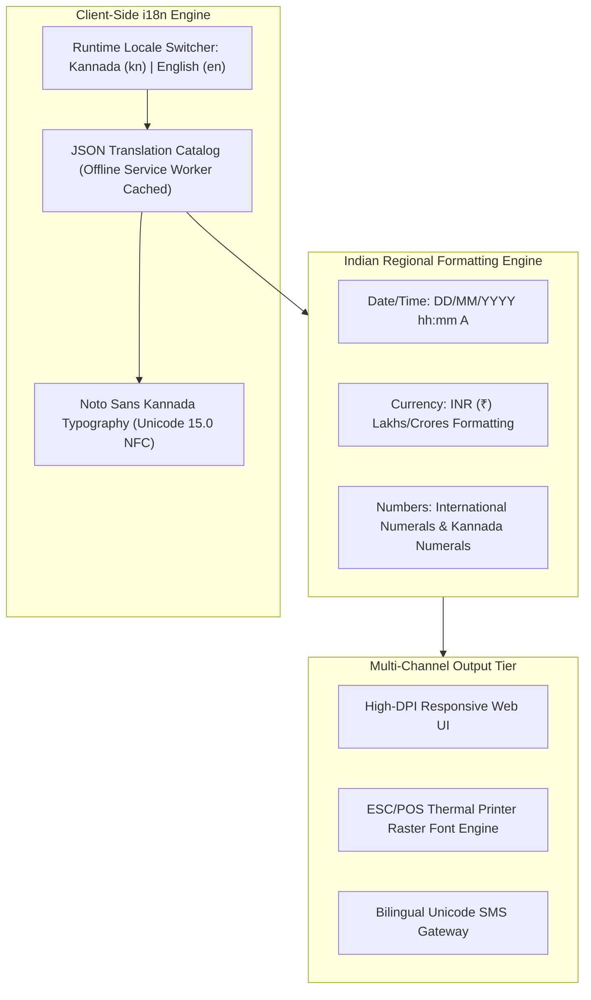

# Localization & Language Equity Requirements Baseline: Namma Clinic Digital Health Platform

| Metadata Attribute | Formal Specification |
| :--- | :--- |
| **Document Identifier** | `DOC-REQ-011-LOC` |
| **Document Title** | Localization & Language Equity Requirements Baseline |
| **Project Code** | `NAMMA-CLINIC-PLATFORM-2026` |
| **Requirement Type** | `Localization Requirement` |
| **Specification Range** | `LOC-001 through LOC-040` (Exactly 40 unique requirements) |
| **Target Baseline** | `v1.0.0-PROD-BASELINE` |
| **Lifecycle Status** | `APPROVED & BASELINED` |
| **Target Facility Scope** | 183 Primary Namma Clinics across 8 BBMP Administrative Zones |
| **Lead Clinical Authority** | Chief Health Officer (CHO), BBMP Health Department |
| **Lead Technical Authority**| Principal Solutions Architect, Kushagramati Analytics Consortium |
| **Upstream Baselines** | [`00-project-baseline/`](../00-project-baseline/) \| [`01-project-management/`](../01-project-management/) |
| **Related Specification**| [`03-non-functional-requirements.md`](./03-non-functional-requirements.md) \| [`12-accessibility-requirements.md`](./12-accessibility-requirements.md) |

## 1. Executive Summary & Domain Governance Framework
This specification defines the comprehensive localization and linguistic equity requirements baseline for the Namma Clinic Digital Health Platform across 183 primary urban healthcare centers in Greater Bengaluru. Comprising 40 detailed localization specifications (`LOC-001` through `LOC-040`), this document guarantees 100% bilingual parity between Kannada (ಕನ್ನಡ) and English across all clinical and administrative interfaces.

Frontline healthcare delivery in Bengaluru relies heavily on auxiliary nurses, pharmacists, and lab technicians who communicate primarily in Kannada. The platform treats Kannada localization not as an optional cosmetic overlay, but as a core functional prerequisite for patient safety, clinical accuracy, and operational dignity. Every requirement defines strict Unicode normalization (Unicode 15.0 NFC), Noto Sans Kannada rendering, bilingual thermal printing, and translation governance.

## 2. Architecture & Domain Conceptual Framework
The following architectural topology illustrates the functional interactions, security boundaries, and data flows governing this domain across Namma Clinic's 183 primary healthcare centers in Greater Bengaluru:



## 3. Master Localization Requirement Inventory Table (LOC-001 through LOC-040)
| Requirement ID | Title | UI Context Domain | Standard Applied | Kannada Sample | English Parallel | Translation Owner |
| :--- | :--- | :--- | :--- | :--- | :--- | :---: |
| [`LOC-001`](#loc-001) | **Dual-Language UI Toggle (Kannada & English)** | `Global Navigation Header` | `ISO 639-1 ('kn', 'en')` | **ಕನ್ನಡ** | English | Localization Lead |
| [`LOC-002`](#loc-002) | **Unicode UTF-8 Normalization (NFC Standard)** | `Text Input & Storage` | `Unicode 15.0 NFC` | **ನೋಂದಣಿ** | Registration | Frontend Architect |
| [`LOC-003`](#loc-003) | **Noto Sans Kannada Web Font Integration** | `Global Typography` | `OpenType WOFF2` | **ಆರೋಗ್ಯ ಕೇಂದ್ರ** | Health Center | UI Designer |
| [`LOC-004`](#loc-004) | **Standard Indian Date Formatting (DD/MM/YYYY)** | `Clinical Dates` | `Indian Locale Standard` | **04/09/2026** | 04/09/2026 | Frontend Lead |
| [`LOC-005`](#loc-005) | **24-Hour Military Time Display (HH:mm)** | `Timestamps` | `ISO 8601 24h` | **14:30** | 14:30 | Frontend Lead |
| [`LOC-006`](#loc-006) | **Indian Numbering System Formatting** | `Census & Counts` | `Lakhs & Crores` | **1,50,000** | 1,50,000 | Data Engineer |
| [`LOC-007`](#loc-007) | **Indian Rupee Currency Formatting (INR ₹)** | `Pharmacy Billing` | `RBI Currency Symbol` | **₹ 0.00 (ಉಚಿತ)** | ₹ 0.00 (Free) | Frontend Lead |
| [`LOC-008`](#loc-008) | **Front Desk Patient Registration Form Labels** | `Registration Desk` | `Department of Health Glossary` | **ರೋಗಿಯ ಹೆಸರು, ವಯಸ್ಸು, ಲಿಂಗ** | Patient Name, Age, Gender | Localization Coordinator |
| [`LOC-009`](#loc-009) | **Emergency Triage & Vital Signs Labels** | `Nursing Station` | `Primary Care Nursing Terminology` | **ರಕ್ತದೊತ್ತಡ, ನಾಡಿ ಬಡಿತ** | Blood Pressure, Pulse Rate | Clinical Reviewer |
| [`LOC-010`](#loc-010) | **Top 30 Primary Care Chief Complaint Chips** | `Doctor Consultation` | `Karnataka Health Clinical Glossary` | **ಜ್ವರ, ಕೆಮ್ಮು, ತಲೆನೋವು, ಭೇದಿ** | Fever, Cough, Headache, Diarrhea | Medical Officer |
| [`LOC-011`](#loc-011) | **ICD-10 Diagnostic Description Context Chips** | `Doctor Consultation` | `WHO ICD-10 Primary Care` | **ಅಧಿಕ ರಕ್ತದೊತ್ತಡ (I10)** | Essential Hypertension (I10) | Medical Officer |
| [`LOC-012`](#loc-012) | **Karnataka 120 EDL Medicine Generic Names** | `Pharmacy Formulary` | `Karnataka EDL 2022` | **ಪ್ಯಾರಸಿಟಮಾಲ್, ಅಮ್ಲೋಡಿಪಿನ್** | Paracetamol, Amlodipine | Chief Pharmacist |
| [`LOC-013`](#loc-013) | **Medication Dosage Administration Instructions** | `Prescription & Slip` | `Standard Dispensing Vocabulary` | **ಊಟದ ನಂತರ ದಿನಕ್ಕೆ ಎರಡು ಬಾರಿ** | Twice daily after food | Pharmacist |
| [`LOC-014`](#loc-014) | **Thermal Printer Bitmap Kannada Font Rendering** | `ESC/POS Thermal Slips` | `Thermal Raster Bitmap` | **ನಮ್ಮ ಕ್ಲಿನಿಕ್ ಟೋಕನ್** | Namma Clinic Token | Hardware Lead |
| [`LOC-015`](#loc-015) | **14 Point-of-Care Laboratory Test Names** | `Laboratory Bench` | `Diagnostic Master Catalog` | **ರಕ್ತದಲ್ಲಿನ ಸಕ್ಕರೆ, ಡೆಂಗ್ಯೂ ಪರೀಕ್ಷೆ** | Blood Glucose, Dengue Rapid | Lab Technician |
| [`LOC-016`](#loc-016) | **Laboratory Result Units & Normal Ranges** | `Lab Diagnostic Reports` | `SI Metric Units` | **ಗ್ರಾಂ/ಡೆಸಿಲೀಟರ್ (12.0 - 15.0)** | g/dL (12.0 - 15.0) | Lab Coordinator |
| [`LOC-017`](#loc-017) | **Secondary Hospital Referral Slips & Reasons** | `Referrals Desk` | `BBMP Referral Protocols` | **ಮೇಲ್ದರ್ಜೆಯ ಆಸ್ಪತ್ರೆಗೆ ಉಲ್ಲೇಖ** | Referral to Secondary Hospital | Medical Officer |
| [`LOC-018`](#loc-018) | **Maternal Antenatal Care (ANC) Milestone Labels** | `MCH Registry` | `National Health Mission Kannada` | **ಗರ್ಭಿಣಿ ನೋಂದಣಿ, 1ನೇ ಭೇಟಿ** | ANC Registration, Visit 1 | Staff Nurse |
| [`LOC-019`](#loc-019) | **Pediatric Growth & Malnutrition Screening Terms** | `Child Health Station` | `WHO Growth Standards` | **ತೀವ್ರ ಅಪೌಷ್ಟಿಕತೆ (SAM)** | Severe Acute Malnutrition | Staff Nurse |
| [`LOC-020`](#loc-020) | **Digital Personal Data Protection Consent Notice** | `Registration Desk` | `DPDP Act Kannada Legal Translation` | **ನಿಮ್ಮ ಆರೋಗ್ಯ ಮಾಹಿತಿಯ ಗೌಪ್ಯತೆ** | Privacy of your health data | BBMP Legal Cell |
| [`LOC-021`](#loc-021) | **System Validation Error Messages** | `Form Inputs` | `User Experience Error Catalog` | **ದಯವಿಟ್ಟು ಮಾನ್ಯವಾದ ದೂರವಾಣಿ ಸಂಖ್ಯೆ ನಮೂದಿಸಿ** | Please enter a valid phone number | Frontend Lead |
| [`LOC-022`](#loc-022) | **Critical Clinical Safety Alert Warning Banners** | `Doctor Consultation` | `Emergency Medical Terminology` | **ತುರ್ತು ಎಚ್ಚರಿಕೆ: ತೀವ್ರ ರಕ್ತದೊತ್ತಡ** | Critical Alert: Hypertensive Crisis | Clinical Reviewer |
| [`LOC-023`](#loc-023) | **Automated SMS Prescription Link Templates** | `SMS Gateway` | `TRAI DLT Kannada Templates` | **ನಿಮ್ಮ ಔಷಧ ಚೀಟಿ ವೀಕ್ಷಿಸಲು ಕ್ಲಿಕ್ ಮಾಡಿ** | Click to view your prescription | Communications Lead |
| [`LOC-024`](#loc-024) | **Waiting Room Token Display Audio Announcements** | `Queue Display System` | `Kannada Text-to-Speech` | **ಟೋಕನ್ ಸಂಖ್ಯೆ 12 ಕೊಠಡಿ 1ಕ್ಕೆ ಬನ್ನಿ** | Token number 12 proceed to Room 1 | Accessibility Lead |
| [`LOC-025`](#loc-025) | **Kannada Phonetic Keyboard (Baraha / InScript)** | `Text Input Forms` | `Kannada Keyboard Driver Standard` | **Baraha / InScript layout** | QWERTY layout | Frontend Lead |
| [`LOC-026`](#loc-026) | **Phonetic Patient Name Search Normalization** | `Search Engine` | `Metaphone / Soundex for Kannada` | **ಮಹೇಶ್ / ಮಹೇಶ** | Mahesh / Mahesha | Database Architect |
| [`LOC-027`](#loc-027) | **Alphabetical Sorting by Kannada Aksharamale** | `Patient & Drug Lists` | `Kannada Unicode Collation` | **ಅ, ಆ, ಇ, ಈ... ಕ, ಖ, ಗ** | A, B, C, D... X, Y, Z | Database Architect |
| [`LOC-028`](#loc-028) | **Daily Clinic Closure & Operational Checklist** | `Administration Desk` | `SOP Kannada Translation` | **ದಿನದ ಅಂತ್ಯದ ಪರಿಶೀಲನಾ ಪಟ್ಟಿ** | End of Day Checklist | Operations Manager |
| [`LOC-029`](#loc-029) | **Biomedical Waste Color-Coding Bin Instructions** | `Facility Sanitation` | `BMW Rules Kannada Signage` | **ಹಳದಿ: ಸೋಂಕಿತ ತ್ಯಾಜ್ಯ** | Yellow: Infectious Waste | Staff Nurse |
| [`LOC-030`](#loc-030) | **Vaccine Cold Chain Temperature Log Labels** | `Immunization Desk` | `Cold Chain Operational Glossary` | **ಶೈತ್ಯಾಗಾರದ ತಾಪಮಾನ (+2C ರಿಂದ +8C)** | ILR Temperature (+2C to +8C) | Staff Nurse |
| [`LOC-031`](#loc-031) | **Adverse Drug Reaction Reporting Forms** | `Pharmacovigilance` | `PvPI Kannada Clinical Guidelines` | **ಔಷಧದ ಅಡ್ಡಪರಿಣಾಮ ವರದಿ** | Adverse Drug Reaction Report | Pharmacist |
| [`LOC-032`](#loc-032) | **Public Grievance Redressal (Sahaaya) Categories** | `Citizen Feedback` | `BBMP Sahaaya Taxonomy` | **ಸಿಬ್ಬಂದಿ ನಡವಳಿಕೆ, ಔಷಧ ಕೊರತೆ** | Staff Behavior, Medicine Stockout | Grievance Officer |
| [`LOC-033`](#loc-033) | **Lifestyle Counseling & Dietary Advice Chips** | `Doctor Consultation` | `NCD Preventive Guidelines` | **ಉಪ್ಪು ಕಡಿಮೆ ಸೇವಿಸಿ, ವ್ಯಾಯಾಮ ಮಾಡಿ** | Reduce salt intake, exercise daily | Medical Officer |
| [`LOC-034`](#loc-034) | **Mental Health (PHQ-9 / e-Manas) Screening Questions** | `Clinical Consultation` | `NIMHANS Kannada PHQ-9` | **ಕಳೆದ 2 ವಾರಗಳಲ್ಲಿ ಬೇಸರ ಅಥವಾ ನಿರಾಶೆ** | Feeling down or hopeless over past 2 weeks | Medical Officer |
| [`LOC-035`](#loc-035) | **Tuberculosis Symptom Screening Questions** | `Presumptive TB Desk` | `National TB Elimination Kannada` | **2 ವಾರಕ್ಕಿಂತ ಹೆಚ್ಚು ಕಾಲದ ಕೆಮ್ಮು** | Cough for more than 2 weeks | Medical Officer |
| [`LOC-036`](#loc-036) | **Preventive Cancer Screening Exam Forms** | `NCD Screening Room` | `NPCDCS Kannada Guidelines` | **ಬಾಯಿಯ ತಪಾಸಣೆ, ಸ್ತನ ತಪಾಸಣೆ** | Oral cavity exam, Clinical breast exam | Staff Nurse |
| [`LOC-037`](#loc-037) | **Daily OPD Census Report Summary Table Headers** | `Supervisory Reports` | `BBMP HMIS Standard` | **ಒಟ್ಟು ರೋಗಿಗಳು, ಹೊಸ ರೋಗಿಗಳು** | Total Patients, New Patients | Data Analyst |
| [`LOC-038`](#loc-038) | **Municipal Public Health Notice Posters** | `Waiting Hall Displays` | `BBMP Health Directorate` | **ಸೊಳ್ಳೆ ನಿಯಂತ್ರಣ, ಡೆಂಗ್ಯೂ ಮುನ್ನೆಚ್ಚರಿಕೆ** | Mosquito control, Dengue prevention | Public Health Lead |
| [`LOC-039`](#loc-039) | **Translation Quality Assurance & Sign-Off Process** | `Governance` | `BBMP Translation Review Board` | **ಅಧಿಕೃತ ಭಾಷಾಂತರ ಅನುಮೋದನೆ** | Official Translation Approval | BBMP Nodal Officer |
| [`LOC-040`](#loc-040) | **Zero Untranslated English String Automated Gate** | `Build Pipeline` | `i18n Completeness Invariant` | **100% ಭಾಷಾಂತರ ಪೂರ್ಣ** | 100% Translation Complete | QA Lead |

## 4. Comprehensive Localization Requirement Specifications (LOC-001 through LOC-040)
This section establishes the exhaustive engineering, clinical, operational, and architectural specifications for each of the 40 requirements committed for the production baseline.

### 4.1 LOC-001: Dual-Language UI Toggle (Kannada & English)

| Specification Attribute | Formal Engineering Definition |
| :--- | :--- |
| **Requirement ID** | `LOC-001` |
| **Requirement Title** | Dual-Language UI Toggle (Kannada & English) |
| **Requirement Statement**| The platform SHALL support dual-language ui toggle (kannada & english) across global navigation header adhering to ISO 639-1 ('kn', 'en'), rendering e.g. 'ಕನ್ನಡ' / 'English'. |
| **Requirement Type** | `Localization Requirement` |
| **Priority Level** | `MUST` (Rationale: Mandatory language equity ensuring Kannada-speaking frontline staff operate seamlessly.) |
| **Business Value** | Empowers local auxiliary healthcare workers and prevents data entry misunderstandings. |
| **Engineering Rationale**| Context: Global Navigation Header per ISO 639-1 ('kn', 'en'). |
| **Primary Actor** | `Localization Coordinator` |
| **Target User Persona** | [`PERSONA-001`](../01-project-management/07-user-personas.md#persona-001) |
| **Accountable Role** | [`ROLE-003`](../01-project-management/08-role-and-responsibility-matrix.md#role-003) |
| **Key Stakeholder** | [`STAKEHOLDER-010`](../01-project-management/06-stakeholders.md#stakeholder-010) |
| **Trigger Condition** | UI rendering, language toggle, printing, or report export. |
| **System Preconditions** | Supported browser loaded with Unicode Noto Sans Kannada fonts. |
| **Input Specifications** | Locale selection code (kn or en), dynamic patient strings, or static keys. |
| **Validation Rules** | Evaluated against Unicode 15.0 NFC normalization and translation catalog. |
| **Postconditions** | User interface displays 100% grammatically correct localized strings. |
| **State Mutations** | Updates user locale preference cookie and re-renders active UI views. |
| **Associated Rules** | Business: [`BRULE-001`](./04-business-rules.md#brule-001) \| Clinical: [`N/A — localization presentation requirement`](./05-clinical-rules.md#n/a — localization presentation requirement) \| Operational: [`OR-001`](./06-operational-rules.md#or-001) |
| **Security & Privacy** | Security: `Input sanitization prevents Unicode homograph attacks.` \| Privacy: `Consent notices fully rendered in verified Kannada text.` |
| **Data & Audit** | Data: `UTF-8 encoding enforced across all database tables.` \| Audit: `Static key translation completeness audits.` |
| **Offline & Sync** | Offline: `Translation dictionaries bundled client-side in PWA for full offline use.` \| Sync: `Database stores canonical UTF-8 text with language tags.` |
| **Quality Expectations**| Perf: `Instant locale toggle in < 50ms with zero network request.` \| Avail: `100% bilingual availability across all 17 clinic workflows.` |
| **Localization & A11y**| Loc: `100% complete Kannada localization.` \| A11y: `Compatible with Kannada screen reader synthesizers.` |
| **Failure & Recovery** | Failure: Fallback to standard English terms with zero application crash. \| Recovery: Reload translation catalog bundle on next app startup. |
| **Observability** | Logging: `Structured JSON log with locale, missing_keys_count, and screen.` \| Metrics: `Prometheus counter `namma_clinic_loc_toggles_total{locale="kn"|"en"}`.` |
| **Upstream Traceability**| Obj: [`OBJECTIVE-001`](../01-project-management/02-project-vision-and-objectives.md#objective-001) \| Scope: [`INSCOPE-001`](../01-project-management/04-in-scope.md#inscope-001) \| Risk: [`RISK-001`](../01-project-management/12-project-risks.md#risk-001) |
| **Downstream Planning** | Epic: `PLANNED-EPIC-001` \| Feature: `PLANNED-FEATURE-001` \| API: `PLANNED-API-001` \| DB: `PLANNED-DB-001` \| Test: `PLANNED-TEST-1001` |

#### 4.1.1 Operational Execution Protocol & Frontline Workflow
- **Continuous Operational Workflow:**
  1. User selects locale or application loads clinic default (kn).
  2. i18n engine resolves translation keys from localized bundle.
  3. Kannada typography rendered using Noto Sans Kannada: ಕನ್ನಡ.
  4. English parallel available instantly via runtime toggle: English.
  5. Thermal printer formats bitmap font commands for ESC/POS output.
- **Degraded State Fallback Path:** If specific medical term lacks direct Kannada equivalent, render codified English with Kannada phonetic chip.
- **Exception Breach & Incident Escalation Path:** If missing key detected, fallback to English with localized missing-key warning in development.

#### 4.1.2 Technical Invariants & Operational Contract
- **UI Context / Domain:** Global Navigation Header
- **Standard Applied:** ISO 639-1 ('kn', 'en')
- **Canonical Kannada Sample:** **ಕನ್ನಡ**
- **English Parallel Sample:** English
- **Translation Owner:** Localization Lead
- **Verification Protocol:** Automated UI toggle test

#### 4.1.3 Executable BDD Acceptance Scenarios
```gherkin
Feature: LOC-001 - Dual-Language UI Toggle (Kannada & English)
  As a Localization Coordinator
  I require system enforcement of dual-language ui toggle (kannada & english)
  In order to ensure municipal healthcare compliance and operational integrity

  Scenario: Happy Path Execution for LOC-001
    Given the Localization Coordinator is authenticated and clinic terminal is operational
    When the user submits a valid request for dual-language ui toggle (kannada & english)
    Then the system successfully commits the transaction and emits an audit event

  Scenario: Input Validation and Schema Guard for LOC-001
    Given the Localization Coordinator attempts to submit an incomplete or malformed payload for dual-language ui toggle (kannada & english)
    When the request fails TypeBox schema or domain constraint validation
    Then the system rejects the input with HTTP 400 and highlights invalid fields in Kannada and English

  Scenario: RBAC and Security Access Control for LOC-001
    Given an unauthenticated or unauthorized role attempts to invoke dual-language ui toggle (kannada & english)
    When the bearer JWT token is missing, expired, or lacks necessary RBAC permission
    Then the system denies execution with HTTP 403 Forbidden and records a security telemetry alert

  Scenario: Offline Autonomous Execution for LOC-001
    Given the clinic WAN network is completely severed during dual-language ui toggle (kannada & english)
    When the operator confirms the local transaction on the workstation
    Then the mutation is persisted to Dexie.js IndexedDB with a UUIDv7 and queued for background replay

  Scenario: Network Recovery and Idempotent Sync for LOC-001
    Given the clinic workstation reconnects to the BBMP municipal health WAN
    When the background sync daemon processes the pending mutation queue
    Then all buffered transactions for LOC-001 synchronize idempotently with zero data loss
```

#### 4.1.4 Verification Protocol & Quality Sign-Off
- **Verification Method:** Automated UI toggle test
- **Automated Test Suite:** `PLANNED-TEST-1001` (Automated i18n Key Coverage & Visual Regression Test) targeting 100% verification gate compliance.
- **Related Internal Requirements:** `NFR-023`, `NFR-024`, `A11Y-001`
- **Dependencies & Blocking Constraints:** NFR-023 | Constraints: No hardcoded English strings permitted anywhere in source code.
- **Architectural Assumptions & Open Questions:** Assumption: Noto Sans Kannada font loaded locally in PWA service worker cache. | Open Question: Validation of Kannada medical terms by Kannada Development Authority panel.

---

### 4.2 LOC-002: Unicode UTF-8 Normalization (NFC Standard)

| Specification Attribute | Formal Engineering Definition |
| :--- | :--- |
| **Requirement ID** | `LOC-002` |
| **Requirement Title** | Unicode UTF-8 Normalization (NFC Standard) |
| **Requirement Statement**| The platform SHALL support unicode utf-8 normalization (nfc standard) across text input & storage adhering to Unicode 15.0 NFC, rendering e.g. 'ನೋಂದಣಿ' / 'Registration'. |
| **Requirement Type** | `Localization Requirement` |
| **Priority Level** | `MUST` (Rationale: Mandatory language equity ensuring Kannada-speaking frontline staff operate seamlessly.) |
| **Business Value** | Empowers local auxiliary healthcare workers and prevents data entry misunderstandings. |
| **Engineering Rationale**| Context: Text Input & Storage per Unicode 15.0 NFC. |
| **Primary Actor** | `Localization Coordinator` |
| **Target User Persona** | [`PERSONA-002`](../01-project-management/07-user-personas.md#persona-002) |
| **Accountable Role** | [`ROLE-003`](../01-project-management/08-role-and-responsibility-matrix.md#role-003) |
| **Key Stakeholder** | [`STAKEHOLDER-010`](../01-project-management/06-stakeholders.md#stakeholder-010) |
| **Trigger Condition** | UI rendering, language toggle, printing, or report export. |
| **System Preconditions** | Supported browser loaded with Unicode Noto Sans Kannada fonts. |
| **Input Specifications** | Locale selection code (kn or en), dynamic patient strings, or static keys. |
| **Validation Rules** | Evaluated against Unicode 15.0 NFC normalization and translation catalog. |
| **Postconditions** | User interface displays 100% grammatically correct localized strings. |
| **State Mutations** | Updates user locale preference cookie and re-renders active UI views. |
| **Associated Rules** | Business: [`BRULE-002`](./04-business-rules.md#brule-002) \| Clinical: [`N/A — localization presentation requirement`](./05-clinical-rules.md#n/a — localization presentation requirement) \| Operational: [`OR-002`](./06-operational-rules.md#or-002) |
| **Security & Privacy** | Security: `Input sanitization prevents Unicode homograph attacks.` \| Privacy: `Consent notices fully rendered in verified Kannada text.` |
| **Data & Audit** | Data: `UTF-8 encoding enforced across all database tables.` \| Audit: `Static key translation completeness audits.` |
| **Offline & Sync** | Offline: `Translation dictionaries bundled client-side in PWA for full offline use.` \| Sync: `Database stores canonical UTF-8 text with language tags.` |
| **Quality Expectations**| Perf: `Instant locale toggle in < 50ms with zero network request.` \| Avail: `100% bilingual availability across all 17 clinic workflows.` |
| **Localization & A11y**| Loc: `100% complete Kannada localization.` \| A11y: `Compatible with Kannada screen reader synthesizers.` |
| **Failure & Recovery** | Failure: Fallback to standard English terms with zero application crash. \| Recovery: Reload translation catalog bundle on next app startup. |
| **Observability** | Logging: `Structured JSON log with locale, missing_keys_count, and screen.` \| Metrics: `Prometheus counter `namma_clinic_loc_toggles_total{locale="kn"|"en"}`.` |
| **Upstream Traceability**| Obj: [`OBJECTIVE-002`](../01-project-management/02-project-vision-and-objectives.md#objective-002) \| Scope: [`INSCOPE-002`](../01-project-management/04-in-scope.md#inscope-002) \| Risk: [`RISK-002`](../01-project-management/12-project-risks.md#risk-002) |
| **Downstream Planning** | Epic: `PLANNED-EPIC-002` \| Feature: `PLANNED-FEATURE-002` \| API: `PLANNED-API-002` \| DB: `PLANNED-DB-002` \| Test: `PLANNED-TEST-1002` |

#### 4.2.1 Operational Execution Protocol & Frontline Workflow
- **Continuous Operational Workflow:**
  1. User selects locale or application loads clinic default (kn).
  2. i18n engine resolves translation keys from localized bundle.
  3. Kannada typography rendered using Noto Sans Kannada: ನೋಂದಣಿ.
  4. English parallel available instantly via runtime toggle: Registration.
  5. Thermal printer formats bitmap font commands for ESC/POS output.
- **Degraded State Fallback Path:** If specific medical term lacks direct Kannada equivalent, render codified English with Kannada phonetic chip.
- **Exception Breach & Incident Escalation Path:** If missing key detected, fallback to English with localized missing-key warning in development.

#### 4.2.2 Technical Invariants & Operational Contract
- **UI Context / Domain:** Text Input & Storage
- **Standard Applied:** Unicode 15.0 NFC
- **Canonical Kannada Sample:** **ನೋಂದಣಿ**
- **English Parallel Sample:** Registration
- **Translation Owner:** Frontend Architect
- **Verification Protocol:** Unicode normalization unit test

#### 4.2.3 Executable BDD Acceptance Scenarios
```gherkin
Feature: LOC-002 - Unicode UTF-8 Normalization (NFC Standard)
  As a Localization Coordinator
  I require system enforcement of unicode utf-8 normalization (nfc standard)
  In order to ensure municipal healthcare compliance and operational integrity

  Scenario: Happy Path Execution for LOC-002
    Given the Localization Coordinator is authenticated and clinic terminal is operational
    When the user submits a valid request for unicode utf-8 normalization (nfc standard)
    Then the system successfully commits the transaction and emits an audit event

  Scenario: Input Validation and Schema Guard for LOC-002
    Given the Localization Coordinator attempts to submit an incomplete or malformed payload for unicode utf-8 normalization (nfc standard)
    When the request fails TypeBox schema or domain constraint validation
    Then the system rejects the input with HTTP 400 and highlights invalid fields in Kannada and English

  Scenario: RBAC and Security Access Control for LOC-002
    Given an unauthenticated or unauthorized role attempts to invoke unicode utf-8 normalization (nfc standard)
    When the bearer JWT token is missing, expired, or lacks necessary RBAC permission
    Then the system denies execution with HTTP 403 Forbidden and records a security telemetry alert

  Scenario: Offline Autonomous Execution for LOC-002
    Given the clinic WAN network is completely severed during unicode utf-8 normalization (nfc standard)
    When the operator confirms the local transaction on the workstation
    Then the mutation is persisted to Dexie.js IndexedDB with a UUIDv7 and queued for background replay

  Scenario: Network Recovery and Idempotent Sync for LOC-002
    Given the clinic workstation reconnects to the BBMP municipal health WAN
    When the background sync daemon processes the pending mutation queue
    Then all buffered transactions for LOC-002 synchronize idempotently with zero data loss
```

#### 4.2.4 Verification Protocol & Quality Sign-Off
- **Verification Method:** Unicode normalization unit test
- **Automated Test Suite:** `PLANNED-TEST-1002` (Automated i18n Key Coverage & Visual Regression Test) targeting 100% verification gate compliance.
- **Related Internal Requirements:** `NFR-023`, `NFR-024`, `A11Y-002`
- **Dependencies & Blocking Constraints:** NFR-023 | Constraints: No hardcoded English strings permitted anywhere in source code.
- **Architectural Assumptions & Open Questions:** Assumption: Noto Sans Kannada font loaded locally in PWA service worker cache. | Open Question: Validation of Kannada medical terms by Kannada Development Authority panel.

---

### 4.3 LOC-003: Noto Sans Kannada Web Font Integration

| Specification Attribute | Formal Engineering Definition |
| :--- | :--- |
| **Requirement ID** | `LOC-003` |
| **Requirement Title** | Noto Sans Kannada Web Font Integration |
| **Requirement Statement**| The platform SHALL support noto sans kannada web font integration across global typography adhering to OpenType WOFF2, rendering e.g. 'ಆರೋಗ್ಯ ಕೇಂದ್ರ' / 'Health Center'. |
| **Requirement Type** | `Localization Requirement` |
| **Priority Level** | `MUST` (Rationale: Mandatory language equity ensuring Kannada-speaking frontline staff operate seamlessly.) |
| **Business Value** | Empowers local auxiliary healthcare workers and prevents data entry misunderstandings. |
| **Engineering Rationale**| Context: Global Typography per OpenType WOFF2. |
| **Primary Actor** | `Localization Coordinator` |
| **Target User Persona** | [`PERSONA-003`](../01-project-management/07-user-personas.md#persona-003) |
| **Accountable Role** | [`ROLE-003`](../01-project-management/08-role-and-responsibility-matrix.md#role-003) |
| **Key Stakeholder** | [`STAKEHOLDER-010`](../01-project-management/06-stakeholders.md#stakeholder-010) |
| **Trigger Condition** | UI rendering, language toggle, printing, or report export. |
| **System Preconditions** | Supported browser loaded with Unicode Noto Sans Kannada fonts. |
| **Input Specifications** | Locale selection code (kn or en), dynamic patient strings, or static keys. |
| **Validation Rules** | Evaluated against Unicode 15.0 NFC normalization and translation catalog. |
| **Postconditions** | User interface displays 100% grammatically correct localized strings. |
| **State Mutations** | Updates user locale preference cookie and re-renders active UI views. |
| **Associated Rules** | Business: [`BRULE-003`](./04-business-rules.md#brule-003) \| Clinical: [`N/A — localization presentation requirement`](./05-clinical-rules.md#n/a — localization presentation requirement) \| Operational: [`OR-003`](./06-operational-rules.md#or-003) |
| **Security & Privacy** | Security: `Input sanitization prevents Unicode homograph attacks.` \| Privacy: `Consent notices fully rendered in verified Kannada text.` |
| **Data & Audit** | Data: `UTF-8 encoding enforced across all database tables.` \| Audit: `Static key translation completeness audits.` |
| **Offline & Sync** | Offline: `Translation dictionaries bundled client-side in PWA for full offline use.` \| Sync: `Database stores canonical UTF-8 text with language tags.` |
| **Quality Expectations**| Perf: `Instant locale toggle in < 50ms with zero network request.` \| Avail: `100% bilingual availability across all 17 clinic workflows.` |
| **Localization & A11y**| Loc: `100% complete Kannada localization.` \| A11y: `Compatible with Kannada screen reader synthesizers.` |
| **Failure & Recovery** | Failure: Fallback to standard English terms with zero application crash. \| Recovery: Reload translation catalog bundle on next app startup. |
| **Observability** | Logging: `Structured JSON log with locale, missing_keys_count, and screen.` \| Metrics: `Prometheus counter `namma_clinic_loc_toggles_total{locale="kn"|"en"}`.` |
| **Upstream Traceability**| Obj: [`OBJECTIVE-003`](../01-project-management/02-project-vision-and-objectives.md#objective-003) \| Scope: [`INSCOPE-003`](../01-project-management/04-in-scope.md#inscope-003) \| Risk: [`RISK-003`](../01-project-management/12-project-risks.md#risk-003) |
| **Downstream Planning** | Epic: `PLANNED-EPIC-003` \| Feature: `PLANNED-FEATURE-003` \| API: `PLANNED-API-003` \| DB: `PLANNED-DB-003` \| Test: `PLANNED-TEST-1003` |

#### 4.3.1 Operational Execution Protocol & Frontline Workflow
- **Continuous Operational Workflow:**
  1. User selects locale or application loads clinic default (kn).
  2. i18n engine resolves translation keys from localized bundle.
  3. Kannada typography rendered using Noto Sans Kannada: ಆರೋಗ್ಯ ಕೇಂದ್ರ.
  4. English parallel available instantly via runtime toggle: Health Center.
  5. Thermal printer formats bitmap font commands for ESC/POS output.
- **Degraded State Fallback Path:** If specific medical term lacks direct Kannada equivalent, render codified English with Kannada phonetic chip.
- **Exception Breach & Incident Escalation Path:** If missing key detected, fallback to English with localized missing-key warning in development.

#### 4.3.2 Technical Invariants & Operational Contract
- **UI Context / Domain:** Global Typography
- **Standard Applied:** OpenType WOFF2
- **Canonical Kannada Sample:** **ಆರೋಗ್ಯ ಕೇಂದ್ರ**
- **English Parallel Sample:** Health Center
- **Translation Owner:** UI Designer
- **Verification Protocol:** Font render regression test

#### 4.3.3 Executable BDD Acceptance Scenarios
```gherkin
Feature: LOC-003 - Noto Sans Kannada Web Font Integration
  As a Localization Coordinator
  I require system enforcement of noto sans kannada web font integration
  In order to ensure municipal healthcare compliance and operational integrity

  Scenario: Happy Path Execution for LOC-003
    Given the Localization Coordinator is authenticated and clinic terminal is operational
    When the user submits a valid request for noto sans kannada web font integration
    Then the system successfully commits the transaction and emits an audit event

  Scenario: Input Validation and Schema Guard for LOC-003
    Given the Localization Coordinator attempts to submit an incomplete or malformed payload for noto sans kannada web font integration
    When the request fails TypeBox schema or domain constraint validation
    Then the system rejects the input with HTTP 400 and highlights invalid fields in Kannada and English

  Scenario: RBAC and Security Access Control for LOC-003
    Given an unauthenticated or unauthorized role attempts to invoke noto sans kannada web font integration
    When the bearer JWT token is missing, expired, or lacks necessary RBAC permission
    Then the system denies execution with HTTP 403 Forbidden and records a security telemetry alert

  Scenario: Offline Autonomous Execution for LOC-003
    Given the clinic WAN network is completely severed during noto sans kannada web font integration
    When the operator confirms the local transaction on the workstation
    Then the mutation is persisted to Dexie.js IndexedDB with a UUIDv7 and queued for background replay

  Scenario: Network Recovery and Idempotent Sync for LOC-003
    Given the clinic workstation reconnects to the BBMP municipal health WAN
    When the background sync daemon processes the pending mutation queue
    Then all buffered transactions for LOC-003 synchronize idempotently with zero data loss
```

#### 4.3.4 Verification Protocol & Quality Sign-Off
- **Verification Method:** Font render regression test
- **Automated Test Suite:** `PLANNED-TEST-1003` (Automated i18n Key Coverage & Visual Regression Test) targeting 100% verification gate compliance.
- **Related Internal Requirements:** `NFR-023`, `NFR-024`, `A11Y-003`
- **Dependencies & Blocking Constraints:** NFR-023 | Constraints: No hardcoded English strings permitted anywhere in source code.
- **Architectural Assumptions & Open Questions:** Assumption: Noto Sans Kannada font loaded locally in PWA service worker cache. | Open Question: Validation of Kannada medical terms by Kannada Development Authority panel.

---

### 4.4 LOC-004: Standard Indian Date Formatting (DD/MM/YYYY)

| Specification Attribute | Formal Engineering Definition |
| :--- | :--- |
| **Requirement ID** | `LOC-004` |
| **Requirement Title** | Standard Indian Date Formatting (DD/MM/YYYY) |
| **Requirement Statement**| The platform SHALL support standard indian date formatting (dd/mm/yyyy) across clinical dates adhering to Indian Locale Standard, rendering e.g. '04/09/2026' / '04/09/2026'. |
| **Requirement Type** | `Localization Requirement` |
| **Priority Level** | `MUST` (Rationale: Mandatory language equity ensuring Kannada-speaking frontline staff operate seamlessly.) |
| **Business Value** | Empowers local auxiliary healthcare workers and prevents data entry misunderstandings. |
| **Engineering Rationale**| Context: Clinical Dates per Indian Locale Standard. |
| **Primary Actor** | `Localization Coordinator` |
| **Target User Persona** | [`PERSONA-004`](../01-project-management/07-user-personas.md#persona-004) |
| **Accountable Role** | [`ROLE-003`](../01-project-management/08-role-and-responsibility-matrix.md#role-003) |
| **Key Stakeholder** | [`STAKEHOLDER-010`](../01-project-management/06-stakeholders.md#stakeholder-010) |
| **Trigger Condition** | UI rendering, language toggle, printing, or report export. |
| **System Preconditions** | Supported browser loaded with Unicode Noto Sans Kannada fonts. |
| **Input Specifications** | Locale selection code (kn or en), dynamic patient strings, or static keys. |
| **Validation Rules** | Evaluated against Unicode 15.0 NFC normalization and translation catalog. |
| **Postconditions** | User interface displays 100% grammatically correct localized strings. |
| **State Mutations** | Updates user locale preference cookie and re-renders active UI views. |
| **Associated Rules** | Business: [`BRULE-004`](./04-business-rules.md#brule-004) \| Clinical: [`N/A — localization presentation requirement`](./05-clinical-rules.md#n/a — localization presentation requirement) \| Operational: [`OR-004`](./06-operational-rules.md#or-004) |
| **Security & Privacy** | Security: `Input sanitization prevents Unicode homograph attacks.` \| Privacy: `Consent notices fully rendered in verified Kannada text.` |
| **Data & Audit** | Data: `UTF-8 encoding enforced across all database tables.` \| Audit: `Static key translation completeness audits.` |
| **Offline & Sync** | Offline: `Translation dictionaries bundled client-side in PWA for full offline use.` \| Sync: `Database stores canonical UTF-8 text with language tags.` |
| **Quality Expectations**| Perf: `Instant locale toggle in < 50ms with zero network request.` \| Avail: `100% bilingual availability across all 17 clinic workflows.` |
| **Localization & A11y**| Loc: `100% complete Kannada localization.` \| A11y: `Compatible with Kannada screen reader synthesizers.` |
| **Failure & Recovery** | Failure: Fallback to standard English terms with zero application crash. \| Recovery: Reload translation catalog bundle on next app startup. |
| **Observability** | Logging: `Structured JSON log with locale, missing_keys_count, and screen.` \| Metrics: `Prometheus counter `namma_clinic_loc_toggles_total{locale="kn"|"en"}`.` |
| **Upstream Traceability**| Obj: [`OBJECTIVE-004`](../01-project-management/02-project-vision-and-objectives.md#objective-004) \| Scope: [`INSCOPE-004`](../01-project-management/04-in-scope.md#inscope-004) \| Risk: [`RISK-004`](../01-project-management/12-project-risks.md#risk-004) |
| **Downstream Planning** | Epic: `PLANNED-EPIC-004` \| Feature: `PLANNED-FEATURE-004` \| API: `PLANNED-API-004` \| DB: `PLANNED-DB-004` \| Test: `PLANNED-TEST-1004` |

#### 4.4.1 Operational Execution Protocol & Frontline Workflow
- **Continuous Operational Workflow:**
  1. User selects locale or application loads clinic default (kn).
  2. i18n engine resolves translation keys from localized bundle.
  3. Kannada typography rendered using Noto Sans Kannada: 04/09/2026.
  4. English parallel available instantly via runtime toggle: 04/09/2026.
  5. Thermal printer formats bitmap font commands for ESC/POS output.
- **Degraded State Fallback Path:** If specific medical term lacks direct Kannada equivalent, render codified English with Kannada phonetic chip.
- **Exception Breach & Incident Escalation Path:** If missing key detected, fallback to English with localized missing-key warning in development.

#### 4.4.2 Technical Invariants & Operational Contract
- **UI Context / Domain:** Clinical Dates
- **Standard Applied:** Indian Locale Standard
- **Canonical Kannada Sample:** **04/09/2026**
- **English Parallel Sample:** 04/09/2026
- **Translation Owner:** Frontend Lead
- **Verification Protocol:** Date formatting unit test

#### 4.4.3 Executable BDD Acceptance Scenarios
```gherkin
Feature: LOC-004 - Standard Indian Date Formatting (DD/MM/YYYY)
  As a Localization Coordinator
  I require system enforcement of standard indian date formatting (dd/mm/yyyy)
  In order to ensure municipal healthcare compliance and operational integrity

  Scenario: Happy Path Execution for LOC-004
    Given the Localization Coordinator is authenticated and clinic terminal is operational
    When the user submits a valid request for standard indian date formatting (dd/mm/yyyy)
    Then the system successfully commits the transaction and emits an audit event

  Scenario: Input Validation and Schema Guard for LOC-004
    Given the Localization Coordinator attempts to submit an incomplete or malformed payload for standard indian date formatting (dd/mm/yyyy)
    When the request fails TypeBox schema or domain constraint validation
    Then the system rejects the input with HTTP 400 and highlights invalid fields in Kannada and English

  Scenario: RBAC and Security Access Control for LOC-004
    Given an unauthenticated or unauthorized role attempts to invoke standard indian date formatting (dd/mm/yyyy)
    When the bearer JWT token is missing, expired, or lacks necessary RBAC permission
    Then the system denies execution with HTTP 403 Forbidden and records a security telemetry alert

  Scenario: Offline Autonomous Execution for LOC-004
    Given the clinic WAN network is completely severed during standard indian date formatting (dd/mm/yyyy)
    When the operator confirms the local transaction on the workstation
    Then the mutation is persisted to Dexie.js IndexedDB with a UUIDv7 and queued for background replay

  Scenario: Network Recovery and Idempotent Sync for LOC-004
    Given the clinic workstation reconnects to the BBMP municipal health WAN
    When the background sync daemon processes the pending mutation queue
    Then all buffered transactions for LOC-004 synchronize idempotently with zero data loss
```

#### 4.4.4 Verification Protocol & Quality Sign-Off
- **Verification Method:** Date formatting unit test
- **Automated Test Suite:** `PLANNED-TEST-1004` (Automated i18n Key Coverage & Visual Regression Test) targeting 100% verification gate compliance.
- **Related Internal Requirements:** `NFR-023`, `NFR-024`, `A11Y-004`
- **Dependencies & Blocking Constraints:** NFR-023 | Constraints: No hardcoded English strings permitted anywhere in source code.
- **Architectural Assumptions & Open Questions:** Assumption: Noto Sans Kannada font loaded locally in PWA service worker cache. | Open Question: Validation of Kannada medical terms by Kannada Development Authority panel.

---

### 4.5 LOC-005: 24-Hour Military Time Display (HH:mm)

| Specification Attribute | Formal Engineering Definition |
| :--- | :--- |
| **Requirement ID** | `LOC-005` |
| **Requirement Title** | 24-Hour Military Time Display (HH:mm) |
| **Requirement Statement**| The platform SHALL support 24-hour military time display (hh:mm) across timestamps adhering to ISO 8601 24h, rendering e.g. '14:30' / '14:30'. |
| **Requirement Type** | `Localization Requirement` |
| **Priority Level** | `MUST` (Rationale: Mandatory language equity ensuring Kannada-speaking frontline staff operate seamlessly.) |
| **Business Value** | Empowers local auxiliary healthcare workers and prevents data entry misunderstandings. |
| **Engineering Rationale**| Context: Timestamps per ISO 8601 24h. |
| **Primary Actor** | `Localization Coordinator` |
| **Target User Persona** | [`PERSONA-005`](../01-project-management/07-user-personas.md#persona-005) |
| **Accountable Role** | [`ROLE-003`](../01-project-management/08-role-and-responsibility-matrix.md#role-003) |
| **Key Stakeholder** | [`STAKEHOLDER-010`](../01-project-management/06-stakeholders.md#stakeholder-010) |
| **Trigger Condition** | UI rendering, language toggle, printing, or report export. |
| **System Preconditions** | Supported browser loaded with Unicode Noto Sans Kannada fonts. |
| **Input Specifications** | Locale selection code (kn or en), dynamic patient strings, or static keys. |
| **Validation Rules** | Evaluated against Unicode 15.0 NFC normalization and translation catalog. |
| **Postconditions** | User interface displays 100% grammatically correct localized strings. |
| **State Mutations** | Updates user locale preference cookie and re-renders active UI views. |
| **Associated Rules** | Business: [`BRULE-005`](./04-business-rules.md#brule-005) \| Clinical: [`N/A — localization presentation requirement`](./05-clinical-rules.md#n/a — localization presentation requirement) \| Operational: [`OR-005`](./06-operational-rules.md#or-005) |
| **Security & Privacy** | Security: `Input sanitization prevents Unicode homograph attacks.` \| Privacy: `Consent notices fully rendered in verified Kannada text.` |
| **Data & Audit** | Data: `UTF-8 encoding enforced across all database tables.` \| Audit: `Static key translation completeness audits.` |
| **Offline & Sync** | Offline: `Translation dictionaries bundled client-side in PWA for full offline use.` \| Sync: `Database stores canonical UTF-8 text with language tags.` |
| **Quality Expectations**| Perf: `Instant locale toggle in < 50ms with zero network request.` \| Avail: `100% bilingual availability across all 17 clinic workflows.` |
| **Localization & A11y**| Loc: `100% complete Kannada localization.` \| A11y: `Compatible with Kannada screen reader synthesizers.` |
| **Failure & Recovery** | Failure: Fallback to standard English terms with zero application crash. \| Recovery: Reload translation catalog bundle on next app startup. |
| **Observability** | Logging: `Structured JSON log with locale, missing_keys_count, and screen.` \| Metrics: `Prometheus counter `namma_clinic_loc_toggles_total{locale="kn"|"en"}`.` |
| **Upstream Traceability**| Obj: [`OBJECTIVE-005`](../01-project-management/02-project-vision-and-objectives.md#objective-005) \| Scope: [`INSCOPE-005`](../01-project-management/04-in-scope.md#inscope-005) \| Risk: [`RISK-005`](../01-project-management/12-project-risks.md#risk-005) |
| **Downstream Planning** | Epic: `PLANNED-EPIC-005` \| Feature: `PLANNED-FEATURE-005` \| API: `PLANNED-API-005` \| DB: `PLANNED-DB-005` \| Test: `PLANNED-TEST-1005` |

#### 4.5.1 Operational Execution Protocol & Frontline Workflow
- **Continuous Operational Workflow:**
  1. User selects locale or application loads clinic default (kn).
  2. i18n engine resolves translation keys from localized bundle.
  3. Kannada typography rendered using Noto Sans Kannada: 14:30.
  4. English parallel available instantly via runtime toggle: 14:30.
  5. Thermal printer formats bitmap font commands for ESC/POS output.
- **Degraded State Fallback Path:** If specific medical term lacks direct Kannada equivalent, render codified English with Kannada phonetic chip.
- **Exception Breach & Incident Escalation Path:** If missing key detected, fallback to English with localized missing-key warning in development.

#### 4.5.2 Technical Invariants & Operational Contract
- **UI Context / Domain:** Timestamps
- **Standard Applied:** ISO 8601 24h
- **Canonical Kannada Sample:** **14:30**
- **English Parallel Sample:** 14:30
- **Translation Owner:** Frontend Lead
- **Verification Protocol:** Time formatting unit test

#### 4.5.3 Executable BDD Acceptance Scenarios
```gherkin
Feature: LOC-005 - 24-Hour Military Time Display (HH:mm)
  As a Localization Coordinator
  I require system enforcement of 24-hour military time display (hh:mm)
  In order to ensure municipal healthcare compliance and operational integrity

  Scenario: Happy Path Execution for LOC-005
    Given the Localization Coordinator is authenticated and clinic terminal is operational
    When the user submits a valid request for 24-hour military time display (hh:mm)
    Then the system successfully commits the transaction and emits an audit event

  Scenario: Input Validation and Schema Guard for LOC-005
    Given the Localization Coordinator attempts to submit an incomplete or malformed payload for 24-hour military time display (hh:mm)
    When the request fails TypeBox schema or domain constraint validation
    Then the system rejects the input with HTTP 400 and highlights invalid fields in Kannada and English

  Scenario: RBAC and Security Access Control for LOC-005
    Given an unauthenticated or unauthorized role attempts to invoke 24-hour military time display (hh:mm)
    When the bearer JWT token is missing, expired, or lacks necessary RBAC permission
    Then the system denies execution with HTTP 403 Forbidden and records a security telemetry alert

  Scenario: Offline Autonomous Execution for LOC-005
    Given the clinic WAN network is completely severed during 24-hour military time display (hh:mm)
    When the operator confirms the local transaction on the workstation
    Then the mutation is persisted to Dexie.js IndexedDB with a UUIDv7 and queued for background replay

  Scenario: Network Recovery and Idempotent Sync for LOC-005
    Given the clinic workstation reconnects to the BBMP municipal health WAN
    When the background sync daemon processes the pending mutation queue
    Then all buffered transactions for LOC-005 synchronize idempotently with zero data loss
```

#### 4.5.4 Verification Protocol & Quality Sign-Off
- **Verification Method:** Time formatting unit test
- **Automated Test Suite:** `PLANNED-TEST-1005` (Automated i18n Key Coverage & Visual Regression Test) targeting 100% verification gate compliance.
- **Related Internal Requirements:** `NFR-023`, `NFR-024`, `A11Y-005`
- **Dependencies & Blocking Constraints:** NFR-023 | Constraints: No hardcoded English strings permitted anywhere in source code.
- **Architectural Assumptions & Open Questions:** Assumption: Noto Sans Kannada font loaded locally in PWA service worker cache. | Open Question: Validation of Kannada medical terms by Kannada Development Authority panel.

---

### 4.6 LOC-006: Indian Numbering System Formatting

| Specification Attribute | Formal Engineering Definition |
| :--- | :--- |
| **Requirement ID** | `LOC-006` |
| **Requirement Title** | Indian Numbering System Formatting |
| **Requirement Statement**| The platform SHALL support indian numbering system formatting across census & counts adhering to Lakhs & Crores, rendering e.g. '1,50,000' / '1,50,000'. |
| **Requirement Type** | `Localization Requirement` |
| **Priority Level** | `MUST` (Rationale: Mandatory language equity ensuring Kannada-speaking frontline staff operate seamlessly.) |
| **Business Value** | Empowers local auxiliary healthcare workers and prevents data entry misunderstandings. |
| **Engineering Rationale**| Context: Census & Counts per Lakhs & Crores. |
| **Primary Actor** | `Localization Coordinator` |
| **Target User Persona** | [`PERSONA-006`](../01-project-management/07-user-personas.md#persona-006) |
| **Accountable Role** | [`ROLE-003`](../01-project-management/08-role-and-responsibility-matrix.md#role-003) |
| **Key Stakeholder** | [`STAKEHOLDER-010`](../01-project-management/06-stakeholders.md#stakeholder-010) |
| **Trigger Condition** | UI rendering, language toggle, printing, or report export. |
| **System Preconditions** | Supported browser loaded with Unicode Noto Sans Kannada fonts. |
| **Input Specifications** | Locale selection code (kn or en), dynamic patient strings, or static keys. |
| **Validation Rules** | Evaluated against Unicode 15.0 NFC normalization and translation catalog. |
| **Postconditions** | User interface displays 100% grammatically correct localized strings. |
| **State Mutations** | Updates user locale preference cookie and re-renders active UI views. |
| **Associated Rules** | Business: [`BRULE-006`](./04-business-rules.md#brule-006) \| Clinical: [`N/A — localization presentation requirement`](./05-clinical-rules.md#n/a — localization presentation requirement) \| Operational: [`OR-006`](./06-operational-rules.md#or-006) |
| **Security & Privacy** | Security: `Input sanitization prevents Unicode homograph attacks.` \| Privacy: `Consent notices fully rendered in verified Kannada text.` |
| **Data & Audit** | Data: `UTF-8 encoding enforced across all database tables.` \| Audit: `Static key translation completeness audits.` |
| **Offline & Sync** | Offline: `Translation dictionaries bundled client-side in PWA for full offline use.` \| Sync: `Database stores canonical UTF-8 text with language tags.` |
| **Quality Expectations**| Perf: `Instant locale toggle in < 50ms with zero network request.` \| Avail: `100% bilingual availability across all 17 clinic workflows.` |
| **Localization & A11y**| Loc: `100% complete Kannada localization.` \| A11y: `Compatible with Kannada screen reader synthesizers.` |
| **Failure & Recovery** | Failure: Fallback to standard English terms with zero application crash. \| Recovery: Reload translation catalog bundle on next app startup. |
| **Observability** | Logging: `Structured JSON log with locale, missing_keys_count, and screen.` \| Metrics: `Prometheus counter `namma_clinic_loc_toggles_total{locale="kn"|"en"}`.` |
| **Upstream Traceability**| Obj: [`OBJECTIVE-006`](../01-project-management/02-project-vision-and-objectives.md#objective-006) \| Scope: [`INSCOPE-006`](../01-project-management/04-in-scope.md#inscope-006) \| Risk: [`RISK-006`](../01-project-management/12-project-risks.md#risk-006) |
| **Downstream Planning** | Epic: `PLANNED-EPIC-006` \| Feature: `PLANNED-FEATURE-006` \| API: `PLANNED-API-006` \| DB: `PLANNED-DB-006` \| Test: `PLANNED-TEST-1006` |

#### 4.6.1 Operational Execution Protocol & Frontline Workflow
- **Continuous Operational Workflow:**
  1. User selects locale or application loads clinic default (kn).
  2. i18n engine resolves translation keys from localized bundle.
  3. Kannada typography rendered using Noto Sans Kannada: 1,50,000.
  4. English parallel available instantly via runtime toggle: 1,50,000.
  5. Thermal printer formats bitmap font commands for ESC/POS output.
- **Degraded State Fallback Path:** If specific medical term lacks direct Kannada equivalent, render codified English with Kannada phonetic chip.
- **Exception Breach & Incident Escalation Path:** If missing key detected, fallback to English with localized missing-key warning in development.

#### 4.6.2 Technical Invariants & Operational Contract
- **UI Context / Domain:** Census & Counts
- **Standard Applied:** Lakhs & Crores
- **Canonical Kannada Sample:** **1,50,000**
- **English Parallel Sample:** 1,50,000
- **Translation Owner:** Data Engineer
- **Verification Protocol:** Number formatting unit test

#### 4.6.3 Executable BDD Acceptance Scenarios
```gherkin
Feature: LOC-006 - Indian Numbering System Formatting
  As a Localization Coordinator
  I require system enforcement of indian numbering system formatting
  In order to ensure municipal healthcare compliance and operational integrity

  Scenario: Happy Path Execution for LOC-006
    Given the Localization Coordinator is authenticated and clinic terminal is operational
    When the user submits a valid request for indian numbering system formatting
    Then the system successfully commits the transaction and emits an audit event

  Scenario: Input Validation and Schema Guard for LOC-006
    Given the Localization Coordinator attempts to submit an incomplete or malformed payload for indian numbering system formatting
    When the request fails TypeBox schema or domain constraint validation
    Then the system rejects the input with HTTP 400 and highlights invalid fields in Kannada and English

  Scenario: RBAC and Security Access Control for LOC-006
    Given an unauthenticated or unauthorized role attempts to invoke indian numbering system formatting
    When the bearer JWT token is missing, expired, or lacks necessary RBAC permission
    Then the system denies execution with HTTP 403 Forbidden and records a security telemetry alert

  Scenario: Offline Autonomous Execution for LOC-006
    Given the clinic WAN network is completely severed during indian numbering system formatting
    When the operator confirms the local transaction on the workstation
    Then the mutation is persisted to Dexie.js IndexedDB with a UUIDv7 and queued for background replay

  Scenario: Network Recovery and Idempotent Sync for LOC-006
    Given the clinic workstation reconnects to the BBMP municipal health WAN
    When the background sync daemon processes the pending mutation queue
    Then all buffered transactions for LOC-006 synchronize idempotently with zero data loss
```

#### 4.6.4 Verification Protocol & Quality Sign-Off
- **Verification Method:** Number formatting unit test
- **Automated Test Suite:** `PLANNED-TEST-1006` (Automated i18n Key Coverage & Visual Regression Test) targeting 100% verification gate compliance.
- **Related Internal Requirements:** `NFR-023`, `NFR-024`, `A11Y-006`
- **Dependencies & Blocking Constraints:** NFR-023 | Constraints: No hardcoded English strings permitted anywhere in source code.
- **Architectural Assumptions & Open Questions:** Assumption: Noto Sans Kannada font loaded locally in PWA service worker cache. | Open Question: Validation of Kannada medical terms by Kannada Development Authority panel.

---

### 4.7 LOC-007: Indian Rupee Currency Formatting (INR ₹)

| Specification Attribute | Formal Engineering Definition |
| :--- | :--- |
| **Requirement ID** | `LOC-007` |
| **Requirement Title** | Indian Rupee Currency Formatting (INR ₹) |
| **Requirement Statement**| The platform SHALL support indian rupee currency formatting (inr ₹) across pharmacy billing adhering to RBI Currency Symbol, rendering e.g. '₹ 0.00 (ಉಚಿತ)' / '₹ 0.00 (Free)'. |
| **Requirement Type** | `Localization Requirement` |
| **Priority Level** | `MUST` (Rationale: Mandatory language equity ensuring Kannada-speaking frontline staff operate seamlessly.) |
| **Business Value** | Empowers local auxiliary healthcare workers and prevents data entry misunderstandings. |
| **Engineering Rationale**| Context: Pharmacy Billing per RBI Currency Symbol. |
| **Primary Actor** | `Localization Coordinator` |
| **Target User Persona** | [`PERSONA-007`](../01-project-management/07-user-personas.md#persona-007) |
| **Accountable Role** | [`ROLE-003`](../01-project-management/08-role-and-responsibility-matrix.md#role-003) |
| **Key Stakeholder** | [`STAKEHOLDER-010`](../01-project-management/06-stakeholders.md#stakeholder-010) |
| **Trigger Condition** | UI rendering, language toggle, printing, or report export. |
| **System Preconditions** | Supported browser loaded with Unicode Noto Sans Kannada fonts. |
| **Input Specifications** | Locale selection code (kn or en), dynamic patient strings, or static keys. |
| **Validation Rules** | Evaluated against Unicode 15.0 NFC normalization and translation catalog. |
| **Postconditions** | User interface displays 100% grammatically correct localized strings. |
| **State Mutations** | Updates user locale preference cookie and re-renders active UI views. |
| **Associated Rules** | Business: [`BRULE-007`](./04-business-rules.md#brule-007) \| Clinical: [`N/A — localization presentation requirement`](./05-clinical-rules.md#n/a — localization presentation requirement) \| Operational: [`OR-007`](./06-operational-rules.md#or-007) |
| **Security & Privacy** | Security: `Input sanitization prevents Unicode homograph attacks.` \| Privacy: `Consent notices fully rendered in verified Kannada text.` |
| **Data & Audit** | Data: `UTF-8 encoding enforced across all database tables.` \| Audit: `Static key translation completeness audits.` |
| **Offline & Sync** | Offline: `Translation dictionaries bundled client-side in PWA for full offline use.` \| Sync: `Database stores canonical UTF-8 text with language tags.` |
| **Quality Expectations**| Perf: `Instant locale toggle in < 50ms with zero network request.` \| Avail: `100% bilingual availability across all 17 clinic workflows.` |
| **Localization & A11y**| Loc: `100% complete Kannada localization.` \| A11y: `Compatible with Kannada screen reader synthesizers.` |
| **Failure & Recovery** | Failure: Fallback to standard English terms with zero application crash. \| Recovery: Reload translation catalog bundle on next app startup. |
| **Observability** | Logging: `Structured JSON log with locale, missing_keys_count, and screen.` \| Metrics: `Prometheus counter `namma_clinic_loc_toggles_total{locale="kn"|"en"}`.` |
| **Upstream Traceability**| Obj: [`OBJECTIVE-007`](../01-project-management/02-project-vision-and-objectives.md#objective-007) \| Scope: [`INSCOPE-007`](../01-project-management/04-in-scope.md#inscope-007) \| Risk: [`RISK-007`](../01-project-management/12-project-risks.md#risk-007) |
| **Downstream Planning** | Epic: `PLANNED-EPIC-007` \| Feature: `PLANNED-FEATURE-007` \| API: `PLANNED-API-007` \| DB: `PLANNED-DB-007` \| Test: `PLANNED-TEST-1007` |

#### 4.7.1 Operational Execution Protocol & Frontline Workflow
- **Continuous Operational Workflow:**
  1. User selects locale or application loads clinic default (kn).
  2. i18n engine resolves translation keys from localized bundle.
  3. Kannada typography rendered using Noto Sans Kannada: ₹ 0.00 (ಉಚಿತ).
  4. English parallel available instantly via runtime toggle: ₹ 0.00 (Free).
  5. Thermal printer formats bitmap font commands for ESC/POS output.
- **Degraded State Fallback Path:** If specific medical term lacks direct Kannada equivalent, render codified English with Kannada phonetic chip.
- **Exception Breach & Incident Escalation Path:** If missing key detected, fallback to English with localized missing-key warning in development.

#### 4.7.2 Technical Invariants & Operational Contract
- **UI Context / Domain:** Pharmacy Billing
- **Standard Applied:** RBI Currency Symbol
- **Canonical Kannada Sample:** **₹ 0.00 (ಉಚಿತ)**
- **English Parallel Sample:** ₹ 0.00 (Free)
- **Translation Owner:** Frontend Lead
- **Verification Protocol:** Currency formatting unit test

#### 4.7.3 Executable BDD Acceptance Scenarios
```gherkin
Feature: LOC-007 - Indian Rupee Currency Formatting (INR ₹)
  As a Localization Coordinator
  I require system enforcement of indian rupee currency formatting (inr ₹)
  In order to ensure municipal healthcare compliance and operational integrity

  Scenario: Happy Path Execution for LOC-007
    Given the Localization Coordinator is authenticated and clinic terminal is operational
    When the user submits a valid request for indian rupee currency formatting (inr ₹)
    Then the system successfully commits the transaction and emits an audit event

  Scenario: Input Validation and Schema Guard for LOC-007
    Given the Localization Coordinator attempts to submit an incomplete or malformed payload for indian rupee currency formatting (inr ₹)
    When the request fails TypeBox schema or domain constraint validation
    Then the system rejects the input with HTTP 400 and highlights invalid fields in Kannada and English

  Scenario: RBAC and Security Access Control for LOC-007
    Given an unauthenticated or unauthorized role attempts to invoke indian rupee currency formatting (inr ₹)
    When the bearer JWT token is missing, expired, or lacks necessary RBAC permission
    Then the system denies execution with HTTP 403 Forbidden and records a security telemetry alert

  Scenario: Offline Autonomous Execution for LOC-007
    Given the clinic WAN network is completely severed during indian rupee currency formatting (inr ₹)
    When the operator confirms the local transaction on the workstation
    Then the mutation is persisted to Dexie.js IndexedDB with a UUIDv7 and queued for background replay

  Scenario: Network Recovery and Idempotent Sync for LOC-007
    Given the clinic workstation reconnects to the BBMP municipal health WAN
    When the background sync daemon processes the pending mutation queue
    Then all buffered transactions for LOC-007 synchronize idempotently with zero data loss
```

#### 4.7.4 Verification Protocol & Quality Sign-Off
- **Verification Method:** Currency formatting unit test
- **Automated Test Suite:** `PLANNED-TEST-1007` (Automated i18n Key Coverage & Visual Regression Test) targeting 100% verification gate compliance.
- **Related Internal Requirements:** `NFR-023`, `NFR-024`, `A11Y-007`
- **Dependencies & Blocking Constraints:** NFR-023 | Constraints: No hardcoded English strings permitted anywhere in source code.
- **Architectural Assumptions & Open Questions:** Assumption: Noto Sans Kannada font loaded locally in PWA service worker cache. | Open Question: Validation of Kannada medical terms by Kannada Development Authority panel.

---

### 4.8 LOC-008: Front Desk Patient Registration Form Labels

| Specification Attribute | Formal Engineering Definition |
| :--- | :--- |
| **Requirement ID** | `LOC-008` |
| **Requirement Title** | Front Desk Patient Registration Form Labels |
| **Requirement Statement**| The platform SHALL support front desk patient registration form labels across registration desk adhering to Department of Health Glossary, rendering e.g. 'ರೋಗಿಯ ಹೆಸರು, ವಯಸ್ಸು, ಲಿಂಗ' / 'Patient Name, Age, Gender'. |
| **Requirement Type** | `Localization Requirement` |
| **Priority Level** | `MUST` (Rationale: Mandatory language equity ensuring Kannada-speaking frontline staff operate seamlessly.) |
| **Business Value** | Empowers local auxiliary healthcare workers and prevents data entry misunderstandings. |
| **Engineering Rationale**| Context: Registration Desk per Department of Health Glossary. |
| **Primary Actor** | `Localization Coordinator` |
| **Target User Persona** | [`PERSONA-008`](../01-project-management/07-user-personas.md#persona-008) |
| **Accountable Role** | [`ROLE-003`](../01-project-management/08-role-and-responsibility-matrix.md#role-003) |
| **Key Stakeholder** | [`STAKEHOLDER-010`](../01-project-management/06-stakeholders.md#stakeholder-010) |
| **Trigger Condition** | UI rendering, language toggle, printing, or report export. |
| **System Preconditions** | Supported browser loaded with Unicode Noto Sans Kannada fonts. |
| **Input Specifications** | Locale selection code (kn or en), dynamic patient strings, or static keys. |
| **Validation Rules** | Evaluated against Unicode 15.0 NFC normalization and translation catalog. |
| **Postconditions** | User interface displays 100% grammatically correct localized strings. |
| **State Mutations** | Updates user locale preference cookie and re-renders active UI views. |
| **Associated Rules** | Business: [`BRULE-008`](./04-business-rules.md#brule-008) \| Clinical: [`N/A — localization presentation requirement`](./05-clinical-rules.md#n/a — localization presentation requirement) \| Operational: [`OR-008`](./06-operational-rules.md#or-008) |
| **Security & Privacy** | Security: `Input sanitization prevents Unicode homograph attacks.` \| Privacy: `Consent notices fully rendered in verified Kannada text.` |
| **Data & Audit** | Data: `UTF-8 encoding enforced across all database tables.` \| Audit: `Static key translation completeness audits.` |
| **Offline & Sync** | Offline: `Translation dictionaries bundled client-side in PWA for full offline use.` \| Sync: `Database stores canonical UTF-8 text with language tags.` |
| **Quality Expectations**| Perf: `Instant locale toggle in < 50ms with zero network request.` \| Avail: `100% bilingual availability across all 17 clinic workflows.` |
| **Localization & A11y**| Loc: `100% complete Kannada localization.` \| A11y: `Compatible with Kannada screen reader synthesizers.` |
| **Failure & Recovery** | Failure: Fallback to standard English terms with zero application crash. \| Recovery: Reload translation catalog bundle on next app startup. |
| **Observability** | Logging: `Structured JSON log with locale, missing_keys_count, and screen.` \| Metrics: `Prometheus counter `namma_clinic_loc_toggles_total{locale="kn"|"en"}`.` |
| **Upstream Traceability**| Obj: [`OBJECTIVE-008`](../01-project-management/02-project-vision-and-objectives.md#objective-008) \| Scope: [`INSCOPE-008`](../01-project-management/04-in-scope.md#inscope-008) \| Risk: [`RISK-008`](../01-project-management/12-project-risks.md#risk-008) |
| **Downstream Planning** | Epic: `PLANNED-EPIC-008` \| Feature: `PLANNED-FEATURE-008` \| API: `PLANNED-API-008` \| DB: `PLANNED-DB-008` \| Test: `PLANNED-TEST-1008` |

#### 4.8.1 Operational Execution Protocol & Frontline Workflow
- **Continuous Operational Workflow:**
  1. User selects locale or application loads clinic default (kn).
  2. i18n engine resolves translation keys from localized bundle.
  3. Kannada typography rendered using Noto Sans Kannada: ರೋಗಿಯ ಹೆಸರು, ವಯಸ್ಸು, ಲಿಂಗ.
  4. English parallel available instantly via runtime toggle: Patient Name, Age, Gender.
  5. Thermal printer formats bitmap font commands for ESC/POS output.
- **Degraded State Fallback Path:** If specific medical term lacks direct Kannada equivalent, render codified English with Kannada phonetic chip.
- **Exception Breach & Incident Escalation Path:** If missing key detected, fallback to English with localized missing-key warning in development.

#### 4.8.2 Technical Invariants & Operational Contract
- **UI Context / Domain:** Registration Desk
- **Standard Applied:** Department of Health Glossary
- **Canonical Kannada Sample:** **ರೋಗಿಯ ಹೆಸರು, ವಯಸ್ಸು, ಲಿಂಗ**
- **English Parallel Sample:** Patient Name, Age, Gender
- **Translation Owner:** Localization Coordinator
- **Verification Protocol:** i18n key audit

#### 4.8.3 Executable BDD Acceptance Scenarios
```gherkin
Feature: LOC-008 - Front Desk Patient Registration Form Labels
  As a Localization Coordinator
  I require system enforcement of front desk patient registration form labels
  In order to ensure municipal healthcare compliance and operational integrity

  Scenario: Happy Path Execution for LOC-008
    Given the Localization Coordinator is authenticated and clinic terminal is operational
    When the user submits a valid request for front desk patient registration form labels
    Then the system successfully commits the transaction and emits an audit event

  Scenario: Input Validation and Schema Guard for LOC-008
    Given the Localization Coordinator attempts to submit an incomplete or malformed payload for front desk patient registration form labels
    When the request fails TypeBox schema or domain constraint validation
    Then the system rejects the input with HTTP 400 and highlights invalid fields in Kannada and English

  Scenario: RBAC and Security Access Control for LOC-008
    Given an unauthenticated or unauthorized role attempts to invoke front desk patient registration form labels
    When the bearer JWT token is missing, expired, or lacks necessary RBAC permission
    Then the system denies execution with HTTP 403 Forbidden and records a security telemetry alert

  Scenario: Offline Autonomous Execution for LOC-008
    Given the clinic WAN network is completely severed during front desk patient registration form labels
    When the operator confirms the local transaction on the workstation
    Then the mutation is persisted to Dexie.js IndexedDB with a UUIDv7 and queued for background replay

  Scenario: Network Recovery and Idempotent Sync for LOC-008
    Given the clinic workstation reconnects to the BBMP municipal health WAN
    When the background sync daemon processes the pending mutation queue
    Then all buffered transactions for LOC-008 synchronize idempotently with zero data loss
```

#### 4.8.4 Verification Protocol & Quality Sign-Off
- **Verification Method:** i18n key audit
- **Automated Test Suite:** `PLANNED-TEST-1008` (Automated i18n Key Coverage & Visual Regression Test) targeting 100% verification gate compliance.
- **Related Internal Requirements:** `NFR-023`, `NFR-024`, `A11Y-008`
- **Dependencies & Blocking Constraints:** NFR-023 | Constraints: No hardcoded English strings permitted anywhere in source code.
- **Architectural Assumptions & Open Questions:** Assumption: Noto Sans Kannada font loaded locally in PWA service worker cache. | Open Question: Validation of Kannada medical terms by Kannada Development Authority panel.

---

### 4.9 LOC-009: Emergency Triage & Vital Signs Labels

| Specification Attribute | Formal Engineering Definition |
| :--- | :--- |
| **Requirement ID** | `LOC-009` |
| **Requirement Title** | Emergency Triage & Vital Signs Labels |
| **Requirement Statement**| The platform SHALL support emergency triage & vital signs labels across nursing station adhering to Primary Care Nursing Terminology, rendering e.g. 'ರಕ್ತದೊತ್ತಡ, ನಾಡಿ ಬಡಿತ' / 'Blood Pressure, Pulse Rate'. |
| **Requirement Type** | `Localization Requirement` |
| **Priority Level** | `MUST` (Rationale: Mandatory language equity ensuring Kannada-speaking frontline staff operate seamlessly.) |
| **Business Value** | Empowers local auxiliary healthcare workers and prevents data entry misunderstandings. |
| **Engineering Rationale**| Context: Nursing Station per Primary Care Nursing Terminology. |
| **Primary Actor** | `Localization Coordinator` |
| **Target User Persona** | [`PERSONA-009`](../01-project-management/07-user-personas.md#persona-009) |
| **Accountable Role** | [`ROLE-003`](../01-project-management/08-role-and-responsibility-matrix.md#role-003) |
| **Key Stakeholder** | [`STAKEHOLDER-010`](../01-project-management/06-stakeholders.md#stakeholder-010) |
| **Trigger Condition** | UI rendering, language toggle, printing, or report export. |
| **System Preconditions** | Supported browser loaded with Unicode Noto Sans Kannada fonts. |
| **Input Specifications** | Locale selection code (kn or en), dynamic patient strings, or static keys. |
| **Validation Rules** | Evaluated against Unicode 15.0 NFC normalization and translation catalog. |
| **Postconditions** | User interface displays 100% grammatically correct localized strings. |
| **State Mutations** | Updates user locale preference cookie and re-renders active UI views. |
| **Associated Rules** | Business: [`BRULE-009`](./04-business-rules.md#brule-009) \| Clinical: [`N/A — localization presentation requirement`](./05-clinical-rules.md#n/a — localization presentation requirement) \| Operational: [`OR-009`](./06-operational-rules.md#or-009) |
| **Security & Privacy** | Security: `Input sanitization prevents Unicode homograph attacks.` \| Privacy: `Consent notices fully rendered in verified Kannada text.` |
| **Data & Audit** | Data: `UTF-8 encoding enforced across all database tables.` \| Audit: `Static key translation completeness audits.` |
| **Offline & Sync** | Offline: `Translation dictionaries bundled client-side in PWA for full offline use.` \| Sync: `Database stores canonical UTF-8 text with language tags.` |
| **Quality Expectations**| Perf: `Instant locale toggle in < 50ms with zero network request.` \| Avail: `100% bilingual availability across all 17 clinic workflows.` |
| **Localization & A11y**| Loc: `100% complete Kannada localization.` \| A11y: `Compatible with Kannada screen reader synthesizers.` |
| **Failure & Recovery** | Failure: Fallback to standard English terms with zero application crash. \| Recovery: Reload translation catalog bundle on next app startup. |
| **Observability** | Logging: `Structured JSON log with locale, missing_keys_count, and screen.` \| Metrics: `Prometheus counter `namma_clinic_loc_toggles_total{locale="kn"|"en"}`.` |
| **Upstream Traceability**| Obj: [`OBJECTIVE-009`](../01-project-management/02-project-vision-and-objectives.md#objective-009) \| Scope: [`INSCOPE-009`](../01-project-management/04-in-scope.md#inscope-009) \| Risk: [`RISK-009`](../01-project-management/12-project-risks.md#risk-009) |
| **Downstream Planning** | Epic: `PLANNED-EPIC-009` \| Feature: `PLANNED-FEATURE-009` \| API: `PLANNED-API-009` \| DB: `PLANNED-DB-009` \| Test: `PLANNED-TEST-1009` |

#### 4.9.1 Operational Execution Protocol & Frontline Workflow
- **Continuous Operational Workflow:**
  1. User selects locale or application loads clinic default (kn).
  2. i18n engine resolves translation keys from localized bundle.
  3. Kannada typography rendered using Noto Sans Kannada: ರಕ್ತದೊತ್ತಡ, ನಾಡಿ ಬಡಿತ.
  4. English parallel available instantly via runtime toggle: Blood Pressure, Pulse Rate.
  5. Thermal printer formats bitmap font commands for ESC/POS output.
- **Degraded State Fallback Path:** If specific medical term lacks direct Kannada equivalent, render codified English with Kannada phonetic chip.
- **Exception Breach & Incident Escalation Path:** If missing key detected, fallback to English with localized missing-key warning in development.

#### 4.9.2 Technical Invariants & Operational Contract
- **UI Context / Domain:** Nursing Station
- **Standard Applied:** Primary Care Nursing Terminology
- **Canonical Kannada Sample:** **ರಕ್ತದೊತ್ತಡ, ನಾಡಿ ಬಡಿತ**
- **English Parallel Sample:** Blood Pressure, Pulse Rate
- **Translation Owner:** Clinical Reviewer
- **Verification Protocol:** i18n key audit

#### 4.9.3 Executable BDD Acceptance Scenarios
```gherkin
Feature: LOC-009 - Emergency Triage & Vital Signs Labels
  As a Localization Coordinator
  I require system enforcement of emergency triage & vital signs labels
  In order to ensure municipal healthcare compliance and operational integrity

  Scenario: Happy Path Execution for LOC-009
    Given the Localization Coordinator is authenticated and clinic terminal is operational
    When the user submits a valid request for emergency triage & vital signs labels
    Then the system successfully commits the transaction and emits an audit event

  Scenario: Input Validation and Schema Guard for LOC-009
    Given the Localization Coordinator attempts to submit an incomplete or malformed payload for emergency triage & vital signs labels
    When the request fails TypeBox schema or domain constraint validation
    Then the system rejects the input with HTTP 400 and highlights invalid fields in Kannada and English

  Scenario: RBAC and Security Access Control for LOC-009
    Given an unauthenticated or unauthorized role attempts to invoke emergency triage & vital signs labels
    When the bearer JWT token is missing, expired, or lacks necessary RBAC permission
    Then the system denies execution with HTTP 403 Forbidden and records a security telemetry alert

  Scenario: Offline Autonomous Execution for LOC-009
    Given the clinic WAN network is completely severed during emergency triage & vital signs labels
    When the operator confirms the local transaction on the workstation
    Then the mutation is persisted to Dexie.js IndexedDB with a UUIDv7 and queued for background replay

  Scenario: Network Recovery and Idempotent Sync for LOC-009
    Given the clinic workstation reconnects to the BBMP municipal health WAN
    When the background sync daemon processes the pending mutation queue
    Then all buffered transactions for LOC-009 synchronize idempotently with zero data loss
```

#### 4.9.4 Verification Protocol & Quality Sign-Off
- **Verification Method:** i18n key audit
- **Automated Test Suite:** `PLANNED-TEST-1009` (Automated i18n Key Coverage & Visual Regression Test) targeting 100% verification gate compliance.
- **Related Internal Requirements:** `NFR-023`, `NFR-024`, `A11Y-009`
- **Dependencies & Blocking Constraints:** NFR-023 | Constraints: No hardcoded English strings permitted anywhere in source code.
- **Architectural Assumptions & Open Questions:** Assumption: Noto Sans Kannada font loaded locally in PWA service worker cache. | Open Question: Validation of Kannada medical terms by Kannada Development Authority panel.

---

### 4.10 LOC-010: Top 30 Primary Care Chief Complaint Chips

| Specification Attribute | Formal Engineering Definition |
| :--- | :--- |
| **Requirement ID** | `LOC-010` |
| **Requirement Title** | Top 30 Primary Care Chief Complaint Chips |
| **Requirement Statement**| The platform SHALL support top 30 primary care chief complaint chips across doctor consultation adhering to Karnataka Health Clinical Glossary, rendering e.g. 'ಜ್ವರ, ಕೆಮ್ಮು, ತಲೆನೋವು, ಭೇದಿ' / 'Fever, Cough, Headache, Diarrhea'. |
| **Requirement Type** | `Localization Requirement` |
| **Priority Level** | `MUST` (Rationale: Mandatory language equity ensuring Kannada-speaking frontline staff operate seamlessly.) |
| **Business Value** | Empowers local auxiliary healthcare workers and prevents data entry misunderstandings. |
| **Engineering Rationale**| Context: Doctor Consultation per Karnataka Health Clinical Glossary. |
| **Primary Actor** | `Localization Coordinator` |
| **Target User Persona** | [`PERSONA-010`](../01-project-management/07-user-personas.md#persona-010) |
| **Accountable Role** | [`ROLE-003`](../01-project-management/08-role-and-responsibility-matrix.md#role-003) |
| **Key Stakeholder** | [`STAKEHOLDER-010`](../01-project-management/06-stakeholders.md#stakeholder-010) |
| **Trigger Condition** | UI rendering, language toggle, printing, or report export. |
| **System Preconditions** | Supported browser loaded with Unicode Noto Sans Kannada fonts. |
| **Input Specifications** | Locale selection code (kn or en), dynamic patient strings, or static keys. |
| **Validation Rules** | Evaluated against Unicode 15.0 NFC normalization and translation catalog. |
| **Postconditions** | User interface displays 100% grammatically correct localized strings. |
| **State Mutations** | Updates user locale preference cookie and re-renders active UI views. |
| **Associated Rules** | Business: [`BRULE-010`](./04-business-rules.md#brule-010) \| Clinical: [`N/A — localization presentation requirement`](./05-clinical-rules.md#n/a — localization presentation requirement) \| Operational: [`OR-010`](./06-operational-rules.md#or-010) |
| **Security & Privacy** | Security: `Input sanitization prevents Unicode homograph attacks.` \| Privacy: `Consent notices fully rendered in verified Kannada text.` |
| **Data & Audit** | Data: `UTF-8 encoding enforced across all database tables.` \| Audit: `Static key translation completeness audits.` |
| **Offline & Sync** | Offline: `Translation dictionaries bundled client-side in PWA for full offline use.` \| Sync: `Database stores canonical UTF-8 text with language tags.` |
| **Quality Expectations**| Perf: `Instant locale toggle in < 50ms with zero network request.` \| Avail: `100% bilingual availability across all 17 clinic workflows.` |
| **Localization & A11y**| Loc: `100% complete Kannada localization.` \| A11y: `Compatible with Kannada screen reader synthesizers.` |
| **Failure & Recovery** | Failure: Fallback to standard English terms with zero application crash. \| Recovery: Reload translation catalog bundle on next app startup. |
| **Observability** | Logging: `Structured JSON log with locale, missing_keys_count, and screen.` \| Metrics: `Prometheus counter `namma_clinic_loc_toggles_total{locale="kn"|"en"}`.` |
| **Upstream Traceability**| Obj: [`OBJECTIVE-010`](../01-project-management/02-project-vision-and-objectives.md#objective-010) \| Scope: [`INSCOPE-010`](../01-project-management/04-in-scope.md#inscope-010) \| Risk: [`RISK-010`](../01-project-management/12-project-risks.md#risk-010) |
| **Downstream Planning** | Epic: `PLANNED-EPIC-010` \| Feature: `PLANNED-FEATURE-010` \| API: `PLANNED-API-010` \| DB: `PLANNED-DB-010` \| Test: `PLANNED-TEST-1010` |

#### 4.10.1 Operational Execution Protocol & Frontline Workflow
- **Continuous Operational Workflow:**
  1. User selects locale or application loads clinic default (kn).
  2. i18n engine resolves translation keys from localized bundle.
  3. Kannada typography rendered using Noto Sans Kannada: ಜ್ವರ, ಕೆಮ್ಮು, ತಲೆನೋವು, ಭೇದಿ.
  4. English parallel available instantly via runtime toggle: Fever, Cough, Headache, Diarrhea.
  5. Thermal printer formats bitmap font commands for ESC/POS output.
- **Degraded State Fallback Path:** If specific medical term lacks direct Kannada equivalent, render codified English with Kannada phonetic chip.
- **Exception Breach & Incident Escalation Path:** If missing key detected, fallback to English with localized missing-key warning in development.

#### 4.10.2 Technical Invariants & Operational Contract
- **UI Context / Domain:** Doctor Consultation
- **Standard Applied:** Karnataka Health Clinical Glossary
- **Canonical Kannada Sample:** **ಜ್ವರ, ಕೆಮ್ಮು, ತಲೆನೋವು, ಭೇದಿ**
- **English Parallel Sample:** Fever, Cough, Headache, Diarrhea
- **Translation Owner:** Medical Officer
- **Verification Protocol:** Clinical vocabulary review

#### 4.10.3 Executable BDD Acceptance Scenarios
```gherkin
Feature: LOC-010 - Top 30 Primary Care Chief Complaint Chips
  As a Localization Coordinator
  I require system enforcement of top 30 primary care chief complaint chips
  In order to ensure municipal healthcare compliance and operational integrity

  Scenario: Happy Path Execution for LOC-010
    Given the Localization Coordinator is authenticated and clinic terminal is operational
    When the user submits a valid request for top 30 primary care chief complaint chips
    Then the system successfully commits the transaction and emits an audit event

  Scenario: Input Validation and Schema Guard for LOC-010
    Given the Localization Coordinator attempts to submit an incomplete or malformed payload for top 30 primary care chief complaint chips
    When the request fails TypeBox schema or domain constraint validation
    Then the system rejects the input with HTTP 400 and highlights invalid fields in Kannada and English

  Scenario: RBAC and Security Access Control for LOC-010
    Given an unauthenticated or unauthorized role attempts to invoke top 30 primary care chief complaint chips
    When the bearer JWT token is missing, expired, or lacks necessary RBAC permission
    Then the system denies execution with HTTP 403 Forbidden and records a security telemetry alert

  Scenario: Offline Autonomous Execution for LOC-010
    Given the clinic WAN network is completely severed during top 30 primary care chief complaint chips
    When the operator confirms the local transaction on the workstation
    Then the mutation is persisted to Dexie.js IndexedDB with a UUIDv7 and queued for background replay

  Scenario: Network Recovery and Idempotent Sync for LOC-010
    Given the clinic workstation reconnects to the BBMP municipal health WAN
    When the background sync daemon processes the pending mutation queue
    Then all buffered transactions for LOC-010 synchronize idempotently with zero data loss
```

#### 4.10.4 Verification Protocol & Quality Sign-Off
- **Verification Method:** Clinical vocabulary review
- **Automated Test Suite:** `PLANNED-TEST-1010` (Automated i18n Key Coverage & Visual Regression Test) targeting 100% verification gate compliance.
- **Related Internal Requirements:** `NFR-023`, `NFR-024`, `A11Y-010`
- **Dependencies & Blocking Constraints:** NFR-023 | Constraints: No hardcoded English strings permitted anywhere in source code.
- **Architectural Assumptions & Open Questions:** Assumption: Noto Sans Kannada font loaded locally in PWA service worker cache. | Open Question: Validation of Kannada medical terms by Kannada Development Authority panel.

---

### 4.11 LOC-011: ICD-10 Diagnostic Description Context Chips

| Specification Attribute | Formal Engineering Definition |
| :--- | :--- |
| **Requirement ID** | `LOC-011` |
| **Requirement Title** | ICD-10 Diagnostic Description Context Chips |
| **Requirement Statement**| The platform SHALL support icd-10 diagnostic description context chips across doctor consultation adhering to WHO ICD-10 Primary Care, rendering e.g. 'ಅಧಿಕ ರಕ್ತದೊತ್ತಡ (I10)' / 'Essential Hypertension (I10)'. |
| **Requirement Type** | `Localization Requirement` |
| **Priority Level** | `MUST` (Rationale: Mandatory language equity ensuring Kannada-speaking frontline staff operate seamlessly.) |
| **Business Value** | Empowers local auxiliary healthcare workers and prevents data entry misunderstandings. |
| **Engineering Rationale**| Context: Doctor Consultation per WHO ICD-10 Primary Care. |
| **Primary Actor** | `Localization Coordinator` |
| **Target User Persona** | [`PERSONA-011`](../01-project-management/07-user-personas.md#persona-011) |
| **Accountable Role** | [`ROLE-003`](../01-project-management/08-role-and-responsibility-matrix.md#role-003) |
| **Key Stakeholder** | [`STAKEHOLDER-010`](../01-project-management/06-stakeholders.md#stakeholder-010) |
| **Trigger Condition** | UI rendering, language toggle, printing, or report export. |
| **System Preconditions** | Supported browser loaded with Unicode Noto Sans Kannada fonts. |
| **Input Specifications** | Locale selection code (kn or en), dynamic patient strings, or static keys. |
| **Validation Rules** | Evaluated against Unicode 15.0 NFC normalization and translation catalog. |
| **Postconditions** | User interface displays 100% grammatically correct localized strings. |
| **State Mutations** | Updates user locale preference cookie and re-renders active UI views. |
| **Associated Rules** | Business: [`BRULE-011`](./04-business-rules.md#brule-011) \| Clinical: [`N/A — localization presentation requirement`](./05-clinical-rules.md#n/a — localization presentation requirement) \| Operational: [`OR-011`](./06-operational-rules.md#or-011) |
| **Security & Privacy** | Security: `Input sanitization prevents Unicode homograph attacks.` \| Privacy: `Consent notices fully rendered in verified Kannada text.` |
| **Data & Audit** | Data: `UTF-8 encoding enforced across all database tables.` \| Audit: `Static key translation completeness audits.` |
| **Offline & Sync** | Offline: `Translation dictionaries bundled client-side in PWA for full offline use.` \| Sync: `Database stores canonical UTF-8 text with language tags.` |
| **Quality Expectations**| Perf: `Instant locale toggle in < 50ms with zero network request.` \| Avail: `100% bilingual availability across all 17 clinic workflows.` |
| **Localization & A11y**| Loc: `100% complete Kannada localization.` \| A11y: `Compatible with Kannada screen reader synthesizers.` |
| **Failure & Recovery** | Failure: Fallback to standard English terms with zero application crash. \| Recovery: Reload translation catalog bundle on next app startup. |
| **Observability** | Logging: `Structured JSON log with locale, missing_keys_count, and screen.` \| Metrics: `Prometheus counter `namma_clinic_loc_toggles_total{locale="kn"|"en"}`.` |
| **Upstream Traceability**| Obj: [`OBJECTIVE-011`](../01-project-management/02-project-vision-and-objectives.md#objective-011) \| Scope: [`INSCOPE-011`](../01-project-management/04-in-scope.md#inscope-011) \| Risk: [`RISK-011`](../01-project-management/12-project-risks.md#risk-011) |
| **Downstream Planning** | Epic: `PLANNED-EPIC-011` \| Feature: `PLANNED-FEATURE-011` \| API: `PLANNED-API-011` \| DB: `PLANNED-DB-011` \| Test: `PLANNED-TEST-1011` |

#### 4.11.1 Operational Execution Protocol & Frontline Workflow
- **Continuous Operational Workflow:**
  1. User selects locale or application loads clinic default (kn).
  2. i18n engine resolves translation keys from localized bundle.
  3. Kannada typography rendered using Noto Sans Kannada: ಅಧಿಕ ರಕ್ತದೊತ್ತಡ (I10).
  4. English parallel available instantly via runtime toggle: Essential Hypertension (I10).
  5. Thermal printer formats bitmap font commands for ESC/POS output.
- **Degraded State Fallback Path:** If specific medical term lacks direct Kannada equivalent, render codified English with Kannada phonetic chip.
- **Exception Breach & Incident Escalation Path:** If missing key detected, fallback to English with localized missing-key warning in development.

#### 4.11.2 Technical Invariants & Operational Contract
- **UI Context / Domain:** Doctor Consultation
- **Standard Applied:** WHO ICD-10 Primary Care
- **Canonical Kannada Sample:** **ಅಧಿಕ ರಕ್ತದೊತ್ತಡ (I10)**
- **English Parallel Sample:** Essential Hypertension (I10)
- **Translation Owner:** Medical Officer
- **Verification Protocol:** Clinical vocabulary review

#### 4.11.3 Executable BDD Acceptance Scenarios
```gherkin
Feature: LOC-011 - ICD-10 Diagnostic Description Context Chips
  As a Localization Coordinator
  I require system enforcement of icd-10 diagnostic description context chips
  In order to ensure municipal healthcare compliance and operational integrity

  Scenario: Happy Path Execution for LOC-011
    Given the Localization Coordinator is authenticated and clinic terminal is operational
    When the user submits a valid request for icd-10 diagnostic description context chips
    Then the system successfully commits the transaction and emits an audit event

  Scenario: Input Validation and Schema Guard for LOC-011
    Given the Localization Coordinator attempts to submit an incomplete or malformed payload for icd-10 diagnostic description context chips
    When the request fails TypeBox schema or domain constraint validation
    Then the system rejects the input with HTTP 400 and highlights invalid fields in Kannada and English

  Scenario: RBAC and Security Access Control for LOC-011
    Given an unauthenticated or unauthorized role attempts to invoke icd-10 diagnostic description context chips
    When the bearer JWT token is missing, expired, or lacks necessary RBAC permission
    Then the system denies execution with HTTP 403 Forbidden and records a security telemetry alert

  Scenario: Offline Autonomous Execution for LOC-011
    Given the clinic WAN network is completely severed during icd-10 diagnostic description context chips
    When the operator confirms the local transaction on the workstation
    Then the mutation is persisted to Dexie.js IndexedDB with a UUIDv7 and queued for background replay

  Scenario: Network Recovery and Idempotent Sync for LOC-011
    Given the clinic workstation reconnects to the BBMP municipal health WAN
    When the background sync daemon processes the pending mutation queue
    Then all buffered transactions for LOC-011 synchronize idempotently with zero data loss
```

#### 4.11.4 Verification Protocol & Quality Sign-Off
- **Verification Method:** Clinical vocabulary review
- **Automated Test Suite:** `PLANNED-TEST-1011` (Automated i18n Key Coverage & Visual Regression Test) targeting 100% verification gate compliance.
- **Related Internal Requirements:** `NFR-023`, `NFR-024`, `A11Y-011`
- **Dependencies & Blocking Constraints:** NFR-023 | Constraints: No hardcoded English strings permitted anywhere in source code.
- **Architectural Assumptions & Open Questions:** Assumption: Noto Sans Kannada font loaded locally in PWA service worker cache. | Open Question: Validation of Kannada medical terms by Kannada Development Authority panel.

---

### 4.12 LOC-012: Karnataka 120 EDL Medicine Generic Names

| Specification Attribute | Formal Engineering Definition |
| :--- | :--- |
| **Requirement ID** | `LOC-012` |
| **Requirement Title** | Karnataka 120 EDL Medicine Generic Names |
| **Requirement Statement**| The platform SHALL support karnataka 120 edl medicine generic names across pharmacy formulary adhering to Karnataka EDL 2022, rendering e.g. 'ಪ್ಯಾರಸಿಟಮಾಲ್, ಅಮ್ಲೋಡಿಪಿನ್' / 'Paracetamol, Amlodipine'. |
| **Requirement Type** | `Localization Requirement` |
| **Priority Level** | `MUST` (Rationale: Mandatory language equity ensuring Kannada-speaking frontline staff operate seamlessly.) |
| **Business Value** | Empowers local auxiliary healthcare workers and prevents data entry misunderstandings. |
| **Engineering Rationale**| Context: Pharmacy Formulary per Karnataka EDL 2022. |
| **Primary Actor** | `Localization Coordinator` |
| **Target User Persona** | [`PERSONA-012`](../01-project-management/07-user-personas.md#persona-012) |
| **Accountable Role** | [`ROLE-003`](../01-project-management/08-role-and-responsibility-matrix.md#role-003) |
| **Key Stakeholder** | [`STAKEHOLDER-010`](../01-project-management/06-stakeholders.md#stakeholder-010) |
| **Trigger Condition** | UI rendering, language toggle, printing, or report export. |
| **System Preconditions** | Supported browser loaded with Unicode Noto Sans Kannada fonts. |
| **Input Specifications** | Locale selection code (kn or en), dynamic patient strings, or static keys. |
| **Validation Rules** | Evaluated against Unicode 15.0 NFC normalization and translation catalog. |
| **Postconditions** | User interface displays 100% grammatically correct localized strings. |
| **State Mutations** | Updates user locale preference cookie and re-renders active UI views. |
| **Associated Rules** | Business: [`BRULE-012`](./04-business-rules.md#brule-012) \| Clinical: [`N/A — localization presentation requirement`](./05-clinical-rules.md#n/a — localization presentation requirement) \| Operational: [`OR-012`](./06-operational-rules.md#or-012) |
| **Security & Privacy** | Security: `Input sanitization prevents Unicode homograph attacks.` \| Privacy: `Consent notices fully rendered in verified Kannada text.` |
| **Data & Audit** | Data: `UTF-8 encoding enforced across all database tables.` \| Audit: `Static key translation completeness audits.` |
| **Offline & Sync** | Offline: `Translation dictionaries bundled client-side in PWA for full offline use.` \| Sync: `Database stores canonical UTF-8 text with language tags.` |
| **Quality Expectations**| Perf: `Instant locale toggle in < 50ms with zero network request.` \| Avail: `100% bilingual availability across all 17 clinic workflows.` |
| **Localization & A11y**| Loc: `100% complete Kannada localization.` \| A11y: `Compatible with Kannada screen reader synthesizers.` |
| **Failure & Recovery** | Failure: Fallback to standard English terms with zero application crash. \| Recovery: Reload translation catalog bundle on next app startup. |
| **Observability** | Logging: `Structured JSON log with locale, missing_keys_count, and screen.` \| Metrics: `Prometheus counter `namma_clinic_loc_toggles_total{locale="kn"|"en"}`.` |
| **Upstream Traceability**| Obj: [`OBJECTIVE-012`](../01-project-management/02-project-vision-and-objectives.md#objective-012) \| Scope: [`INSCOPE-012`](../01-project-management/04-in-scope.md#inscope-012) \| Risk: [`RISK-012`](../01-project-management/12-project-risks.md#risk-012) |
| **Downstream Planning** | Epic: `PLANNED-EPIC-012` \| Feature: `PLANNED-FEATURE-012` \| API: `PLANNED-API-012` \| DB: `PLANNED-DB-012` \| Test: `PLANNED-TEST-1012` |

#### 4.12.1 Operational Execution Protocol & Frontline Workflow
- **Continuous Operational Workflow:**
  1. User selects locale or application loads clinic default (kn).
  2. i18n engine resolves translation keys from localized bundle.
  3. Kannada typography rendered using Noto Sans Kannada: ಪ್ಯಾರಸಿಟಮಾಲ್, ಅಮ್ಲೋಡಿಪಿನ್.
  4. English parallel available instantly via runtime toggle: Paracetamol, Amlodipine.
  5. Thermal printer formats bitmap font commands for ESC/POS output.
- **Degraded State Fallback Path:** If specific medical term lacks direct Kannada equivalent, render codified English with Kannada phonetic chip.
- **Exception Breach & Incident Escalation Path:** If missing key detected, fallback to English with localized missing-key warning in development.

#### 4.12.2 Technical Invariants & Operational Contract
- **UI Context / Domain:** Pharmacy Formulary
- **Standard Applied:** Karnataka EDL 2022
- **Canonical Kannada Sample:** **ಪ್ಯಾರಸಿಟಮಾಲ್, ಅಮ್ಲೋಡಿಪಿನ್**
- **English Parallel Sample:** Paracetamol, Amlodipine
- **Translation Owner:** Chief Pharmacist
- **Verification Protocol:** Formulary audit

#### 4.12.3 Executable BDD Acceptance Scenarios
```gherkin
Feature: LOC-012 - Karnataka 120 EDL Medicine Generic Names
  As a Localization Coordinator
  I require system enforcement of karnataka 120 edl medicine generic names
  In order to ensure municipal healthcare compliance and operational integrity

  Scenario: Happy Path Execution for LOC-012
    Given the Localization Coordinator is authenticated and clinic terminal is operational
    When the user submits a valid request for karnataka 120 edl medicine generic names
    Then the system successfully commits the transaction and emits an audit event

  Scenario: Input Validation and Schema Guard for LOC-012
    Given the Localization Coordinator attempts to submit an incomplete or malformed payload for karnataka 120 edl medicine generic names
    When the request fails TypeBox schema or domain constraint validation
    Then the system rejects the input with HTTP 400 and highlights invalid fields in Kannada and English

  Scenario: RBAC and Security Access Control for LOC-012
    Given an unauthenticated or unauthorized role attempts to invoke karnataka 120 edl medicine generic names
    When the bearer JWT token is missing, expired, or lacks necessary RBAC permission
    Then the system denies execution with HTTP 403 Forbidden and records a security telemetry alert

  Scenario: Offline Autonomous Execution for LOC-012
    Given the clinic WAN network is completely severed during karnataka 120 edl medicine generic names
    When the operator confirms the local transaction on the workstation
    Then the mutation is persisted to Dexie.js IndexedDB with a UUIDv7 and queued for background replay

  Scenario: Network Recovery and Idempotent Sync for LOC-012
    Given the clinic workstation reconnects to the BBMP municipal health WAN
    When the background sync daemon processes the pending mutation queue
    Then all buffered transactions for LOC-012 synchronize idempotently with zero data loss
```

#### 4.12.4 Verification Protocol & Quality Sign-Off
- **Verification Method:** Formulary audit
- **Automated Test Suite:** `PLANNED-TEST-1012` (Automated i18n Key Coverage & Visual Regression Test) targeting 100% verification gate compliance.
- **Related Internal Requirements:** `NFR-023`, `NFR-024`, `A11Y-012`
- **Dependencies & Blocking Constraints:** NFR-023 | Constraints: No hardcoded English strings permitted anywhere in source code.
- **Architectural Assumptions & Open Questions:** Assumption: Noto Sans Kannada font loaded locally in PWA service worker cache. | Open Question: Validation of Kannada medical terms by Kannada Development Authority panel.

---

### 4.13 LOC-013: Medication Dosage Administration Instructions

| Specification Attribute | Formal Engineering Definition |
| :--- | :--- |
| **Requirement ID** | `LOC-013` |
| **Requirement Title** | Medication Dosage Administration Instructions |
| **Requirement Statement**| The platform SHALL support medication dosage administration instructions across prescription & slip adhering to Standard Dispensing Vocabulary, rendering e.g. 'ಊಟದ ನಂತರ ದಿನಕ್ಕೆ ಎರಡು ಬಾರಿ' / 'Twice daily after food'. |
| **Requirement Type** | `Localization Requirement` |
| **Priority Level** | `MUST` (Rationale: Mandatory language equity ensuring Kannada-speaking frontline staff operate seamlessly.) |
| **Business Value** | Empowers local auxiliary healthcare workers and prevents data entry misunderstandings. |
| **Engineering Rationale**| Context: Prescription & Slip per Standard Dispensing Vocabulary. |
| **Primary Actor** | `Localization Coordinator` |
| **Target User Persona** | [`PERSONA-013`](../01-project-management/07-user-personas.md#persona-013) |
| **Accountable Role** | [`ROLE-003`](../01-project-management/08-role-and-responsibility-matrix.md#role-003) |
| **Key Stakeholder** | [`STAKEHOLDER-010`](../01-project-management/06-stakeholders.md#stakeholder-010) |
| **Trigger Condition** | UI rendering, language toggle, printing, or report export. |
| **System Preconditions** | Supported browser loaded with Unicode Noto Sans Kannada fonts. |
| **Input Specifications** | Locale selection code (kn or en), dynamic patient strings, or static keys. |
| **Validation Rules** | Evaluated against Unicode 15.0 NFC normalization and translation catalog. |
| **Postconditions** | User interface displays 100% grammatically correct localized strings. |
| **State Mutations** | Updates user locale preference cookie and re-renders active UI views. |
| **Associated Rules** | Business: [`BRULE-013`](./04-business-rules.md#brule-013) \| Clinical: [`N/A — localization presentation requirement`](./05-clinical-rules.md#n/a — localization presentation requirement) \| Operational: [`OR-013`](./06-operational-rules.md#or-013) |
| **Security & Privacy** | Security: `Input sanitization prevents Unicode homograph attacks.` \| Privacy: `Consent notices fully rendered in verified Kannada text.` |
| **Data & Audit** | Data: `UTF-8 encoding enforced across all database tables.` \| Audit: `Static key translation completeness audits.` |
| **Offline & Sync** | Offline: `Translation dictionaries bundled client-side in PWA for full offline use.` \| Sync: `Database stores canonical UTF-8 text with language tags.` |
| **Quality Expectations**| Perf: `Instant locale toggle in < 50ms with zero network request.` \| Avail: `100% bilingual availability across all 17 clinic workflows.` |
| **Localization & A11y**| Loc: `100% complete Kannada localization.` \| A11y: `Compatible with Kannada screen reader synthesizers.` |
| **Failure & Recovery** | Failure: Fallback to standard English terms with zero application crash. \| Recovery: Reload translation catalog bundle on next app startup. |
| **Observability** | Logging: `Structured JSON log with locale, missing_keys_count, and screen.` \| Metrics: `Prometheus counter `namma_clinic_loc_toggles_total{locale="kn"|"en"}`.` |
| **Upstream Traceability**| Obj: [`OBJECTIVE-013`](../01-project-management/02-project-vision-and-objectives.md#objective-013) \| Scope: [`INSCOPE-013`](../01-project-management/04-in-scope.md#inscope-013) \| Risk: [`RISK-013`](../01-project-management/12-project-risks.md#risk-013) |
| **Downstream Planning** | Epic: `PLANNED-EPIC-013` \| Feature: `PLANNED-FEATURE-013` \| API: `PLANNED-API-013` \| DB: `PLANNED-DB-013` \| Test: `PLANNED-TEST-1013` |

#### 4.13.1 Operational Execution Protocol & Frontline Workflow
- **Continuous Operational Workflow:**
  1. User selects locale or application loads clinic default (kn).
  2. i18n engine resolves translation keys from localized bundle.
  3. Kannada typography rendered using Noto Sans Kannada: ಊಟದ ನಂತರ ದಿನಕ್ಕೆ ಎರಡು ಬಾರಿ.
  4. English parallel available instantly via runtime toggle: Twice daily after food.
  5. Thermal printer formats bitmap font commands for ESC/POS output.
- **Degraded State Fallback Path:** If specific medical term lacks direct Kannada equivalent, render codified English with Kannada phonetic chip.
- **Exception Breach & Incident Escalation Path:** If missing key detected, fallback to English with localized missing-key warning in development.

#### 4.13.2 Technical Invariants & Operational Contract
- **UI Context / Domain:** Prescription & Slip
- **Standard Applied:** Standard Dispensing Vocabulary
- **Canonical Kannada Sample:** **ಊಟದ ನಂತರ ದಿನಕ್ಕೆ ಎರಡು ಬಾರಿ**
- **English Parallel Sample:** Twice daily after food
- **Translation Owner:** Pharmacist
- **Verification Protocol:** Prescription printing audit

#### 4.13.3 Executable BDD Acceptance Scenarios
```gherkin
Feature: LOC-013 - Medication Dosage Administration Instructions
  As a Localization Coordinator
  I require system enforcement of medication dosage administration instructions
  In order to ensure municipal healthcare compliance and operational integrity

  Scenario: Happy Path Execution for LOC-013
    Given the Localization Coordinator is authenticated and clinic terminal is operational
    When the user submits a valid request for medication dosage administration instructions
    Then the system successfully commits the transaction and emits an audit event

  Scenario: Input Validation and Schema Guard for LOC-013
    Given the Localization Coordinator attempts to submit an incomplete or malformed payload for medication dosage administration instructions
    When the request fails TypeBox schema or domain constraint validation
    Then the system rejects the input with HTTP 400 and highlights invalid fields in Kannada and English

  Scenario: RBAC and Security Access Control for LOC-013
    Given an unauthenticated or unauthorized role attempts to invoke medication dosage administration instructions
    When the bearer JWT token is missing, expired, or lacks necessary RBAC permission
    Then the system denies execution with HTTP 403 Forbidden and records a security telemetry alert

  Scenario: Offline Autonomous Execution for LOC-013
    Given the clinic WAN network is completely severed during medication dosage administration instructions
    When the operator confirms the local transaction on the workstation
    Then the mutation is persisted to Dexie.js IndexedDB with a UUIDv7 and queued for background replay

  Scenario: Network Recovery and Idempotent Sync for LOC-013
    Given the clinic workstation reconnects to the BBMP municipal health WAN
    When the background sync daemon processes the pending mutation queue
    Then all buffered transactions for LOC-013 synchronize idempotently with zero data loss
```

#### 4.13.4 Verification Protocol & Quality Sign-Off
- **Verification Method:** Prescription printing audit
- **Automated Test Suite:** `PLANNED-TEST-1013` (Automated i18n Key Coverage & Visual Regression Test) targeting 100% verification gate compliance.
- **Related Internal Requirements:** `NFR-023`, `NFR-024`, `A11Y-013`
- **Dependencies & Blocking Constraints:** NFR-023 | Constraints: No hardcoded English strings permitted anywhere in source code.
- **Architectural Assumptions & Open Questions:** Assumption: Noto Sans Kannada font loaded locally in PWA service worker cache. | Open Question: Validation of Kannada medical terms by Kannada Development Authority panel.

---

### 4.14 LOC-014: Thermal Printer Bitmap Kannada Font Rendering

| Specification Attribute | Formal Engineering Definition |
| :--- | :--- |
| **Requirement ID** | `LOC-014` |
| **Requirement Title** | Thermal Printer Bitmap Kannada Font Rendering |
| **Requirement Statement**| The platform SHALL support thermal printer bitmap kannada font rendering across esc/pos thermal slips adhering to Thermal Raster Bitmap, rendering e.g. 'ನಮ್ಮ ಕ್ಲಿನಿಕ್ ಟೋಕನ್' / 'Namma Clinic Token'. |
| **Requirement Type** | `Localization Requirement` |
| **Priority Level** | `MUST` (Rationale: Mandatory language equity ensuring Kannada-speaking frontline staff operate seamlessly.) |
| **Business Value** | Empowers local auxiliary healthcare workers and prevents data entry misunderstandings. |
| **Engineering Rationale**| Context: ESC/POS Thermal Slips per Thermal Raster Bitmap. |
| **Primary Actor** | `Localization Coordinator` |
| **Target User Persona** | [`PERSONA-014`](../01-project-management/07-user-personas.md#persona-014) |
| **Accountable Role** | [`ROLE-003`](../01-project-management/08-role-and-responsibility-matrix.md#role-003) |
| **Key Stakeholder** | [`STAKEHOLDER-010`](../01-project-management/06-stakeholders.md#stakeholder-010) |
| **Trigger Condition** | UI rendering, language toggle, printing, or report export. |
| **System Preconditions** | Supported browser loaded with Unicode Noto Sans Kannada fonts. |
| **Input Specifications** | Locale selection code (kn or en), dynamic patient strings, or static keys. |
| **Validation Rules** | Evaluated against Unicode 15.0 NFC normalization and translation catalog. |
| **Postconditions** | User interface displays 100% grammatically correct localized strings. |
| **State Mutations** | Updates user locale preference cookie and re-renders active UI views. |
| **Associated Rules** | Business: [`BRULE-014`](./04-business-rules.md#brule-014) \| Clinical: [`N/A — localization presentation requirement`](./05-clinical-rules.md#n/a — localization presentation requirement) \| Operational: [`OR-014`](./06-operational-rules.md#or-014) |
| **Security & Privacy** | Security: `Input sanitization prevents Unicode homograph attacks.` \| Privacy: `Consent notices fully rendered in verified Kannada text.` |
| **Data & Audit** | Data: `UTF-8 encoding enforced across all database tables.` \| Audit: `Static key translation completeness audits.` |
| **Offline & Sync** | Offline: `Translation dictionaries bundled client-side in PWA for full offline use.` \| Sync: `Database stores canonical UTF-8 text with language tags.` |
| **Quality Expectations**| Perf: `Instant locale toggle in < 50ms with zero network request.` \| Avail: `100% bilingual availability across all 17 clinic workflows.` |
| **Localization & A11y**| Loc: `100% complete Kannada localization.` \| A11y: `Compatible with Kannada screen reader synthesizers.` |
| **Failure & Recovery** | Failure: Fallback to standard English terms with zero application crash. \| Recovery: Reload translation catalog bundle on next app startup. |
| **Observability** | Logging: `Structured JSON log with locale, missing_keys_count, and screen.` \| Metrics: `Prometheus counter `namma_clinic_loc_toggles_total{locale="kn"|"en"}`.` |
| **Upstream Traceability**| Obj: [`OBJECTIVE-014`](../01-project-management/02-project-vision-and-objectives.md#objective-014) \| Scope: [`INSCOPE-014`](../01-project-management/04-in-scope.md#inscope-014) \| Risk: [`RISK-014`](../01-project-management/12-project-risks.md#risk-014) |
| **Downstream Planning** | Epic: `PLANNED-EPIC-014` \| Feature: `PLANNED-FEATURE-014` \| API: `PLANNED-API-014` \| DB: `PLANNED-DB-014` \| Test: `PLANNED-TEST-1014` |

#### 4.14.1 Operational Execution Protocol & Frontline Workflow
- **Continuous Operational Workflow:**
  1. User selects locale or application loads clinic default (kn).
  2. i18n engine resolves translation keys from localized bundle.
  3. Kannada typography rendered using Noto Sans Kannada: ನಮ್ಮ ಕ್ಲಿನಿಕ್ ಟೋಕನ್.
  4. English parallel available instantly via runtime toggle: Namma Clinic Token.
  5. Thermal printer formats bitmap font commands for ESC/POS output.
- **Degraded State Fallback Path:** If specific medical term lacks direct Kannada equivalent, render codified English with Kannada phonetic chip.
- **Exception Breach & Incident Escalation Path:** If missing key detected, fallback to English with localized missing-key warning in development.

#### 4.14.2 Technical Invariants & Operational Contract
- **UI Context / Domain:** ESC/POS Thermal Slips
- **Standard Applied:** Thermal Raster Bitmap
- **Canonical Kannada Sample:** **ನಮ್ಮ ಕ್ಲಿನಿಕ್ ಟೋಕನ್**
- **English Parallel Sample:** Namma Clinic Token
- **Translation Owner:** Hardware Lead
- **Verification Protocol:** Physical print audit

#### 4.14.3 Executable BDD Acceptance Scenarios
```gherkin
Feature: LOC-014 - Thermal Printer Bitmap Kannada Font Rendering
  As a Localization Coordinator
  I require system enforcement of thermal printer bitmap kannada font rendering
  In order to ensure municipal healthcare compliance and operational integrity

  Scenario: Happy Path Execution for LOC-014
    Given the Localization Coordinator is authenticated and clinic terminal is operational
    When the user submits a valid request for thermal printer bitmap kannada font rendering
    Then the system successfully commits the transaction and emits an audit event

  Scenario: Input Validation and Schema Guard for LOC-014
    Given the Localization Coordinator attempts to submit an incomplete or malformed payload for thermal printer bitmap kannada font rendering
    When the request fails TypeBox schema or domain constraint validation
    Then the system rejects the input with HTTP 400 and highlights invalid fields in Kannada and English

  Scenario: RBAC and Security Access Control for LOC-014
    Given an unauthenticated or unauthorized role attempts to invoke thermal printer bitmap kannada font rendering
    When the bearer JWT token is missing, expired, or lacks necessary RBAC permission
    Then the system denies execution with HTTP 403 Forbidden and records a security telemetry alert

  Scenario: Offline Autonomous Execution for LOC-014
    Given the clinic WAN network is completely severed during thermal printer bitmap kannada font rendering
    When the operator confirms the local transaction on the workstation
    Then the mutation is persisted to Dexie.js IndexedDB with a UUIDv7 and queued for background replay

  Scenario: Network Recovery and Idempotent Sync for LOC-014
    Given the clinic workstation reconnects to the BBMP municipal health WAN
    When the background sync daemon processes the pending mutation queue
    Then all buffered transactions for LOC-014 synchronize idempotently with zero data loss
```

#### 4.14.4 Verification Protocol & Quality Sign-Off
- **Verification Method:** Physical print audit
- **Automated Test Suite:** `PLANNED-TEST-1014` (Automated i18n Key Coverage & Visual Regression Test) targeting 100% verification gate compliance.
- **Related Internal Requirements:** `NFR-023`, `NFR-024`, `A11Y-014`
- **Dependencies & Blocking Constraints:** NFR-023 | Constraints: No hardcoded English strings permitted anywhere in source code.
- **Architectural Assumptions & Open Questions:** Assumption: Noto Sans Kannada font loaded locally in PWA service worker cache. | Open Question: Validation of Kannada medical terms by Kannada Development Authority panel.

---

### 4.15 LOC-015: 14 Point-of-Care Laboratory Test Names

| Specification Attribute | Formal Engineering Definition |
| :--- | :--- |
| **Requirement ID** | `LOC-015` |
| **Requirement Title** | 14 Point-of-Care Laboratory Test Names |
| **Requirement Statement**| The platform SHALL support 14 point-of-care laboratory test names across laboratory bench adhering to Diagnostic Master Catalog, rendering e.g. 'ರಕ್ತದಲ್ಲಿನ ಸಕ್ಕರೆ, ಡೆಂಗ್ಯೂ ಪರೀಕ್ಷೆ' / 'Blood Glucose, Dengue Rapid'. |
| **Requirement Type** | `Localization Requirement` |
| **Priority Level** | `MUST` (Rationale: Mandatory language equity ensuring Kannada-speaking frontline staff operate seamlessly.) |
| **Business Value** | Empowers local auxiliary healthcare workers and prevents data entry misunderstandings. |
| **Engineering Rationale**| Context: Laboratory Bench per Diagnostic Master Catalog. |
| **Primary Actor** | `Localization Coordinator` |
| **Target User Persona** | [`PERSONA-015`](../01-project-management/07-user-personas.md#persona-015) |
| **Accountable Role** | [`ROLE-003`](../01-project-management/08-role-and-responsibility-matrix.md#role-003) |
| **Key Stakeholder** | [`STAKEHOLDER-010`](../01-project-management/06-stakeholders.md#stakeholder-010) |
| **Trigger Condition** | UI rendering, language toggle, printing, or report export. |
| **System Preconditions** | Supported browser loaded with Unicode Noto Sans Kannada fonts. |
| **Input Specifications** | Locale selection code (kn or en), dynamic patient strings, or static keys. |
| **Validation Rules** | Evaluated against Unicode 15.0 NFC normalization and translation catalog. |
| **Postconditions** | User interface displays 100% grammatically correct localized strings. |
| **State Mutations** | Updates user locale preference cookie and re-renders active UI views. |
| **Associated Rules** | Business: [`BRULE-015`](./04-business-rules.md#brule-015) \| Clinical: [`N/A — localization presentation requirement`](./05-clinical-rules.md#n/a — localization presentation requirement) \| Operational: [`OR-015`](./06-operational-rules.md#or-015) |
| **Security & Privacy** | Security: `Input sanitization prevents Unicode homograph attacks.` \| Privacy: `Consent notices fully rendered in verified Kannada text.` |
| **Data & Audit** | Data: `UTF-8 encoding enforced across all database tables.` \| Audit: `Static key translation completeness audits.` |
| **Offline & Sync** | Offline: `Translation dictionaries bundled client-side in PWA for full offline use.` \| Sync: `Database stores canonical UTF-8 text with language tags.` |
| **Quality Expectations**| Perf: `Instant locale toggle in < 50ms with zero network request.` \| Avail: `100% bilingual availability across all 17 clinic workflows.` |
| **Localization & A11y**| Loc: `100% complete Kannada localization.` \| A11y: `Compatible with Kannada screen reader synthesizers.` |
| **Failure & Recovery** | Failure: Fallback to standard English terms with zero application crash. \| Recovery: Reload translation catalog bundle on next app startup. |
| **Observability** | Logging: `Structured JSON log with locale, missing_keys_count, and screen.` \| Metrics: `Prometheus counter `namma_clinic_loc_toggles_total{locale="kn"|"en"}`.` |
| **Upstream Traceability**| Obj: [`OBJECTIVE-015`](../01-project-management/02-project-vision-and-objectives.md#objective-015) \| Scope: [`INSCOPE-015`](../01-project-management/04-in-scope.md#inscope-015) \| Risk: [`RISK-015`](../01-project-management/12-project-risks.md#risk-015) |
| **Downstream Planning** | Epic: `PLANNED-EPIC-015` \| Feature: `PLANNED-FEATURE-015` \| API: `PLANNED-API-015` \| DB: `PLANNED-DB-015` \| Test: `PLANNED-TEST-1015` |

#### 4.15.1 Operational Execution Protocol & Frontline Workflow
- **Continuous Operational Workflow:**
  1. User selects locale or application loads clinic default (kn).
  2. i18n engine resolves translation keys from localized bundle.
  3. Kannada typography rendered using Noto Sans Kannada: ರಕ್ತದಲ್ಲಿನ ಸಕ್ಕರೆ, ಡೆಂಗ್ಯೂ ಪರೀಕ್ಷೆ.
  4. English parallel available instantly via runtime toggle: Blood Glucose, Dengue Rapid.
  5. Thermal printer formats bitmap font commands for ESC/POS output.
- **Degraded State Fallback Path:** If specific medical term lacks direct Kannada equivalent, render codified English with Kannada phonetic chip.
- **Exception Breach & Incident Escalation Path:** If missing key detected, fallback to English with localized missing-key warning in development.

#### 4.15.2 Technical Invariants & Operational Contract
- **UI Context / Domain:** Laboratory Bench
- **Standard Applied:** Diagnostic Master Catalog
- **Canonical Kannada Sample:** **ರಕ್ತದಲ್ಲಿನ ಸಕ್ಕರೆ, ಡೆಂಗ್ಯೂ ಪರೀಕ್ಷೆ**
- **English Parallel Sample:** Blood Glucose, Dengue Rapid
- **Translation Owner:** Lab Technician
- **Verification Protocol:** Lab vocabulary audit

#### 4.15.3 Executable BDD Acceptance Scenarios
```gherkin
Feature: LOC-015 - 14 Point-of-Care Laboratory Test Names
  As a Localization Coordinator
  I require system enforcement of 14 point-of-care laboratory test names
  In order to ensure municipal healthcare compliance and operational integrity

  Scenario: Happy Path Execution for LOC-015
    Given the Localization Coordinator is authenticated and clinic terminal is operational
    When the user submits a valid request for 14 point-of-care laboratory test names
    Then the system successfully commits the transaction and emits an audit event

  Scenario: Input Validation and Schema Guard for LOC-015
    Given the Localization Coordinator attempts to submit an incomplete or malformed payload for 14 point-of-care laboratory test names
    When the request fails TypeBox schema or domain constraint validation
    Then the system rejects the input with HTTP 400 and highlights invalid fields in Kannada and English

  Scenario: RBAC and Security Access Control for LOC-015
    Given an unauthenticated or unauthorized role attempts to invoke 14 point-of-care laboratory test names
    When the bearer JWT token is missing, expired, or lacks necessary RBAC permission
    Then the system denies execution with HTTP 403 Forbidden and records a security telemetry alert

  Scenario: Offline Autonomous Execution for LOC-015
    Given the clinic WAN network is completely severed during 14 point-of-care laboratory test names
    When the operator confirms the local transaction on the workstation
    Then the mutation is persisted to Dexie.js IndexedDB with a UUIDv7 and queued for background replay

  Scenario: Network Recovery and Idempotent Sync for LOC-015
    Given the clinic workstation reconnects to the BBMP municipal health WAN
    When the background sync daemon processes the pending mutation queue
    Then all buffered transactions for LOC-015 synchronize idempotently with zero data loss
```

#### 4.15.4 Verification Protocol & Quality Sign-Off
- **Verification Method:** Lab vocabulary audit
- **Automated Test Suite:** `PLANNED-TEST-1015` (Automated i18n Key Coverage & Visual Regression Test) targeting 100% verification gate compliance.
- **Related Internal Requirements:** `NFR-023`, `NFR-024`, `A11Y-015`
- **Dependencies & Blocking Constraints:** NFR-023 | Constraints: No hardcoded English strings permitted anywhere in source code.
- **Architectural Assumptions & Open Questions:** Assumption: Noto Sans Kannada font loaded locally in PWA service worker cache. | Open Question: Validation of Kannada medical terms by Kannada Development Authority panel.

---

### 4.16 LOC-016: Laboratory Result Units & Normal Ranges

| Specification Attribute | Formal Engineering Definition |
| :--- | :--- |
| **Requirement ID** | `LOC-016` |
| **Requirement Title** | Laboratory Result Units & Normal Ranges |
| **Requirement Statement**| The platform SHALL support laboratory result units & normal ranges across lab diagnostic reports adhering to SI Metric Units, rendering e.g. 'ಗ್ರಾಂ/ಡೆಸಿಲೀಟರ್ (12.0 - 15.0)' / 'g/dL (12.0 - 15.0)'. |
| **Requirement Type** | `Localization Requirement` |
| **Priority Level** | `MUST` (Rationale: Mandatory language equity ensuring Kannada-speaking frontline staff operate seamlessly.) |
| **Business Value** | Empowers local auxiliary healthcare workers and prevents data entry misunderstandings. |
| **Engineering Rationale**| Context: Lab Diagnostic Reports per SI Metric Units. |
| **Primary Actor** | `Localization Coordinator` |
| **Target User Persona** | [`PERSONA-016`](../01-project-management/07-user-personas.md#persona-016) |
| **Accountable Role** | [`ROLE-003`](../01-project-management/08-role-and-responsibility-matrix.md#role-003) |
| **Key Stakeholder** | [`STAKEHOLDER-010`](../01-project-management/06-stakeholders.md#stakeholder-010) |
| **Trigger Condition** | UI rendering, language toggle, printing, or report export. |
| **System Preconditions** | Supported browser loaded with Unicode Noto Sans Kannada fonts. |
| **Input Specifications** | Locale selection code (kn or en), dynamic patient strings, or static keys. |
| **Validation Rules** | Evaluated against Unicode 15.0 NFC normalization and translation catalog. |
| **Postconditions** | User interface displays 100% grammatically correct localized strings. |
| **State Mutations** | Updates user locale preference cookie and re-renders active UI views. |
| **Associated Rules** | Business: [`BRULE-016`](./04-business-rules.md#brule-016) \| Clinical: [`N/A — localization presentation requirement`](./05-clinical-rules.md#n/a — localization presentation requirement) \| Operational: [`OR-016`](./06-operational-rules.md#or-016) |
| **Security & Privacy** | Security: `Input sanitization prevents Unicode homograph attacks.` \| Privacy: `Consent notices fully rendered in verified Kannada text.` |
| **Data & Audit** | Data: `UTF-8 encoding enforced across all database tables.` \| Audit: `Static key translation completeness audits.` |
| **Offline & Sync** | Offline: `Translation dictionaries bundled client-side in PWA for full offline use.` \| Sync: `Database stores canonical UTF-8 text with language tags.` |
| **Quality Expectations**| Perf: `Instant locale toggle in < 50ms with zero network request.` \| Avail: `100% bilingual availability across all 17 clinic workflows.` |
| **Localization & A11y**| Loc: `100% complete Kannada localization.` \| A11y: `Compatible with Kannada screen reader synthesizers.` |
| **Failure & Recovery** | Failure: Fallback to standard English terms with zero application crash. \| Recovery: Reload translation catalog bundle on next app startup. |
| **Observability** | Logging: `Structured JSON log with locale, missing_keys_count, and screen.` \| Metrics: `Prometheus counter `namma_clinic_loc_toggles_total{locale="kn"|"en"}`.` |
| **Upstream Traceability**| Obj: [`OBJECTIVE-016`](../01-project-management/02-project-vision-and-objectives.md#objective-016) \| Scope: [`INSCOPE-016`](../01-project-management/04-in-scope.md#inscope-016) \| Risk: [`RISK-016`](../01-project-management/12-project-risks.md#risk-016) |
| **Downstream Planning** | Epic: `PLANNED-EPIC-016` \| Feature: `PLANNED-FEATURE-016` \| API: `PLANNED-API-016` \| DB: `PLANNED-DB-016` \| Test: `PLANNED-TEST-1016` |

#### 4.16.1 Operational Execution Protocol & Frontline Workflow
- **Continuous Operational Workflow:**
  1. User selects locale or application loads clinic default (kn).
  2. i18n engine resolves translation keys from localized bundle.
  3. Kannada typography rendered using Noto Sans Kannada: ಗ್ರಾಂ/ಡೆಸಿಲೀಟರ್ (12.0 - 15.0).
  4. English parallel available instantly via runtime toggle: g/dL (12.0 - 15.0).
  5. Thermal printer formats bitmap font commands for ESC/POS output.
- **Degraded State Fallback Path:** If specific medical term lacks direct Kannada equivalent, render codified English with Kannada phonetic chip.
- **Exception Breach & Incident Escalation Path:** If missing key detected, fallback to English with localized missing-key warning in development.

#### 4.16.2 Technical Invariants & Operational Contract
- **UI Context / Domain:** Lab Diagnostic Reports
- **Standard Applied:** SI Metric Units
- **Canonical Kannada Sample:** **ಗ್ರಾಂ/ಡೆಸಿಲೀಟರ್ (12.0 - 15.0)**
- **English Parallel Sample:** g/dL (12.0 - 15.0)
- **Translation Owner:** Lab Coordinator
- **Verification Protocol:** Lab report test

#### 4.16.3 Executable BDD Acceptance Scenarios
```gherkin
Feature: LOC-016 - Laboratory Result Units & Normal Ranges
  As a Localization Coordinator
  I require system enforcement of laboratory result units & normal ranges
  In order to ensure municipal healthcare compliance and operational integrity

  Scenario: Happy Path Execution for LOC-016
    Given the Localization Coordinator is authenticated and clinic terminal is operational
    When the user submits a valid request for laboratory result units & normal ranges
    Then the system successfully commits the transaction and emits an audit event

  Scenario: Input Validation and Schema Guard for LOC-016
    Given the Localization Coordinator attempts to submit an incomplete or malformed payload for laboratory result units & normal ranges
    When the request fails TypeBox schema or domain constraint validation
    Then the system rejects the input with HTTP 400 and highlights invalid fields in Kannada and English

  Scenario: RBAC and Security Access Control for LOC-016
    Given an unauthenticated or unauthorized role attempts to invoke laboratory result units & normal ranges
    When the bearer JWT token is missing, expired, or lacks necessary RBAC permission
    Then the system denies execution with HTTP 403 Forbidden and records a security telemetry alert

  Scenario: Offline Autonomous Execution for LOC-016
    Given the clinic WAN network is completely severed during laboratory result units & normal ranges
    When the operator confirms the local transaction on the workstation
    Then the mutation is persisted to Dexie.js IndexedDB with a UUIDv7 and queued for background replay

  Scenario: Network Recovery and Idempotent Sync for LOC-016
    Given the clinic workstation reconnects to the BBMP municipal health WAN
    When the background sync daemon processes the pending mutation queue
    Then all buffered transactions for LOC-016 synchronize idempotently with zero data loss
```

#### 4.16.4 Verification Protocol & Quality Sign-Off
- **Verification Method:** Lab report test
- **Automated Test Suite:** `PLANNED-TEST-1016` (Automated i18n Key Coverage & Visual Regression Test) targeting 100% verification gate compliance.
- **Related Internal Requirements:** `NFR-023`, `NFR-024`, `A11Y-016`
- **Dependencies & Blocking Constraints:** NFR-023 | Constraints: No hardcoded English strings permitted anywhere in source code.
- **Architectural Assumptions & Open Questions:** Assumption: Noto Sans Kannada font loaded locally in PWA service worker cache. | Open Question: Validation of Kannada medical terms by Kannada Development Authority panel.

---

### 4.17 LOC-017: Secondary Hospital Referral Slips & Reasons

| Specification Attribute | Formal Engineering Definition |
| :--- | :--- |
| **Requirement ID** | `LOC-017` |
| **Requirement Title** | Secondary Hospital Referral Slips & Reasons |
| **Requirement Statement**| The platform SHALL support secondary hospital referral slips & reasons across referrals desk adhering to BBMP Referral Protocols, rendering e.g. 'ಮೇಲ್ದರ್ಜೆಯ ಆಸ್ಪತ್ರೆಗೆ ಉಲ್ಲೇಖ' / 'Referral to Secondary Hospital'. |
| **Requirement Type** | `Localization Requirement` |
| **Priority Level** | `MUST` (Rationale: Mandatory language equity ensuring Kannada-speaking frontline staff operate seamlessly.) |
| **Business Value** | Empowers local auxiliary healthcare workers and prevents data entry misunderstandings. |
| **Engineering Rationale**| Context: Referrals Desk per BBMP Referral Protocols. |
| **Primary Actor** | `Localization Coordinator` |
| **Target User Persona** | [`PERSONA-017`](../01-project-management/07-user-personas.md#persona-017) |
| **Accountable Role** | [`ROLE-003`](../01-project-management/08-role-and-responsibility-matrix.md#role-003) |
| **Key Stakeholder** | [`STAKEHOLDER-010`](../01-project-management/06-stakeholders.md#stakeholder-010) |
| **Trigger Condition** | UI rendering, language toggle, printing, or report export. |
| **System Preconditions** | Supported browser loaded with Unicode Noto Sans Kannada fonts. |
| **Input Specifications** | Locale selection code (kn or en), dynamic patient strings, or static keys. |
| **Validation Rules** | Evaluated against Unicode 15.0 NFC normalization and translation catalog. |
| **Postconditions** | User interface displays 100% grammatically correct localized strings. |
| **State Mutations** | Updates user locale preference cookie and re-renders active UI views. |
| **Associated Rules** | Business: [`BRULE-017`](./04-business-rules.md#brule-017) \| Clinical: [`N/A — localization presentation requirement`](./05-clinical-rules.md#n/a — localization presentation requirement) \| Operational: [`OR-017`](./06-operational-rules.md#or-017) |
| **Security & Privacy** | Security: `Input sanitization prevents Unicode homograph attacks.` \| Privacy: `Consent notices fully rendered in verified Kannada text.` |
| **Data & Audit** | Data: `UTF-8 encoding enforced across all database tables.` \| Audit: `Static key translation completeness audits.` |
| **Offline & Sync** | Offline: `Translation dictionaries bundled client-side in PWA for full offline use.` \| Sync: `Database stores canonical UTF-8 text with language tags.` |
| **Quality Expectations**| Perf: `Instant locale toggle in < 50ms with zero network request.` \| Avail: `100% bilingual availability across all 17 clinic workflows.` |
| **Localization & A11y**| Loc: `100% complete Kannada localization.` \| A11y: `Compatible with Kannada screen reader synthesizers.` |
| **Failure & Recovery** | Failure: Fallback to standard English terms with zero application crash. \| Recovery: Reload translation catalog bundle on next app startup. |
| **Observability** | Logging: `Structured JSON log with locale, missing_keys_count, and screen.` \| Metrics: `Prometheus counter `namma_clinic_loc_toggles_total{locale="kn"|"en"}`.` |
| **Upstream Traceability**| Obj: [`OBJECTIVE-017`](../01-project-management/02-project-vision-and-objectives.md#objective-017) \| Scope: [`INSCOPE-017`](../01-project-management/04-in-scope.md#inscope-017) \| Risk: [`RISK-017`](../01-project-management/12-project-risks.md#risk-017) |
| **Downstream Planning** | Epic: `PLANNED-EPIC-017` \| Feature: `PLANNED-FEATURE-017` \| API: `PLANNED-API-017` \| DB: `PLANNED-DB-017` \| Test: `PLANNED-TEST-1017` |

#### 4.17.1 Operational Execution Protocol & Frontline Workflow
- **Continuous Operational Workflow:**
  1. User selects locale or application loads clinic default (kn).
  2. i18n engine resolves translation keys from localized bundle.
  3. Kannada typography rendered using Noto Sans Kannada: ಮೇಲ್ದರ್ಜೆಯ ಆಸ್ಪತ್ರೆಗೆ ಉಲ್ಲೇಖ.
  4. English parallel available instantly via runtime toggle: Referral to Secondary Hospital.
  5. Thermal printer formats bitmap font commands for ESC/POS output.
- **Degraded State Fallback Path:** If specific medical term lacks direct Kannada equivalent, render codified English with Kannada phonetic chip.
- **Exception Breach & Incident Escalation Path:** If missing key detected, fallback to English with localized missing-key warning in development.

#### 4.17.2 Technical Invariants & Operational Contract
- **UI Context / Domain:** Referrals Desk
- **Standard Applied:** BBMP Referral Protocols
- **Canonical Kannada Sample:** **ಮೇಲ್ದರ್ಜೆಯ ಆಸ್ಪತ್ರೆಗೆ ಉಲ್ಲೇಖ**
- **English Parallel Sample:** Referral to Secondary Hospital
- **Translation Owner:** Medical Officer
- **Verification Protocol:** Referral slip audit

#### 4.17.3 Executable BDD Acceptance Scenarios
```gherkin
Feature: LOC-017 - Secondary Hospital Referral Slips & Reasons
  As a Localization Coordinator
  I require system enforcement of secondary hospital referral slips & reasons
  In order to ensure municipal healthcare compliance and operational integrity

  Scenario: Happy Path Execution for LOC-017
    Given the Localization Coordinator is authenticated and clinic terminal is operational
    When the user submits a valid request for secondary hospital referral slips & reasons
    Then the system successfully commits the transaction and emits an audit event

  Scenario: Input Validation and Schema Guard for LOC-017
    Given the Localization Coordinator attempts to submit an incomplete or malformed payload for secondary hospital referral slips & reasons
    When the request fails TypeBox schema or domain constraint validation
    Then the system rejects the input with HTTP 400 and highlights invalid fields in Kannada and English

  Scenario: RBAC and Security Access Control for LOC-017
    Given an unauthenticated or unauthorized role attempts to invoke secondary hospital referral slips & reasons
    When the bearer JWT token is missing, expired, or lacks necessary RBAC permission
    Then the system denies execution with HTTP 403 Forbidden and records a security telemetry alert

  Scenario: Offline Autonomous Execution for LOC-017
    Given the clinic WAN network is completely severed during secondary hospital referral slips & reasons
    When the operator confirms the local transaction on the workstation
    Then the mutation is persisted to Dexie.js IndexedDB with a UUIDv7 and queued for background replay

  Scenario: Network Recovery and Idempotent Sync for LOC-017
    Given the clinic workstation reconnects to the BBMP municipal health WAN
    When the background sync daemon processes the pending mutation queue
    Then all buffered transactions for LOC-017 synchronize idempotently with zero data loss
```

#### 4.17.4 Verification Protocol & Quality Sign-Off
- **Verification Method:** Referral slip audit
- **Automated Test Suite:** `PLANNED-TEST-1017` (Automated i18n Key Coverage & Visual Regression Test) targeting 100% verification gate compliance.
- **Related Internal Requirements:** `NFR-023`, `NFR-024`, `A11Y-017`
- **Dependencies & Blocking Constraints:** NFR-023 | Constraints: No hardcoded English strings permitted anywhere in source code.
- **Architectural Assumptions & Open Questions:** Assumption: Noto Sans Kannada font loaded locally in PWA service worker cache. | Open Question: Validation of Kannada medical terms by Kannada Development Authority panel.

---

### 4.18 LOC-018: Maternal Antenatal Care (ANC) Milestone Labels

| Specification Attribute | Formal Engineering Definition |
| :--- | :--- |
| **Requirement ID** | `LOC-018` |
| **Requirement Title** | Maternal Antenatal Care (ANC) Milestone Labels |
| **Requirement Statement**| The platform SHALL support maternal antenatal care (anc) milestone labels across mch registry adhering to National Health Mission Kannada, rendering e.g. 'ಗರ್ಭಿಣಿ ನೋಂದಣಿ, 1ನೇ ಭೇಟಿ' / 'ANC Registration, Visit 1'. |
| **Requirement Type** | `Localization Requirement` |
| **Priority Level** | `MUST` (Rationale: Mandatory language equity ensuring Kannada-speaking frontline staff operate seamlessly.) |
| **Business Value** | Empowers local auxiliary healthcare workers and prevents data entry misunderstandings. |
| **Engineering Rationale**| Context: MCH Registry per National Health Mission Kannada. |
| **Primary Actor** | `Localization Coordinator` |
| **Target User Persona** | [`PERSONA-018`](../01-project-management/07-user-personas.md#persona-018) |
| **Accountable Role** | [`ROLE-003`](../01-project-management/08-role-and-responsibility-matrix.md#role-003) |
| **Key Stakeholder** | [`STAKEHOLDER-010`](../01-project-management/06-stakeholders.md#stakeholder-010) |
| **Trigger Condition** | UI rendering, language toggle, printing, or report export. |
| **System Preconditions** | Supported browser loaded with Unicode Noto Sans Kannada fonts. |
| **Input Specifications** | Locale selection code (kn or en), dynamic patient strings, or static keys. |
| **Validation Rules** | Evaluated against Unicode 15.0 NFC normalization and translation catalog. |
| **Postconditions** | User interface displays 100% grammatically correct localized strings. |
| **State Mutations** | Updates user locale preference cookie and re-renders active UI views. |
| **Associated Rules** | Business: [`BRULE-018`](./04-business-rules.md#brule-018) \| Clinical: [`N/A — localization presentation requirement`](./05-clinical-rules.md#n/a — localization presentation requirement) \| Operational: [`OR-018`](./06-operational-rules.md#or-018) |
| **Security & Privacy** | Security: `Input sanitization prevents Unicode homograph attacks.` \| Privacy: `Consent notices fully rendered in verified Kannada text.` |
| **Data & Audit** | Data: `UTF-8 encoding enforced across all database tables.` \| Audit: `Static key translation completeness audits.` |
| **Offline & Sync** | Offline: `Translation dictionaries bundled client-side in PWA for full offline use.` \| Sync: `Database stores canonical UTF-8 text with language tags.` |
| **Quality Expectations**| Perf: `Instant locale toggle in < 50ms with zero network request.` \| Avail: `100% bilingual availability across all 17 clinic workflows.` |
| **Localization & A11y**| Loc: `100% complete Kannada localization.` \| A11y: `Compatible with Kannada screen reader synthesizers.` |
| **Failure & Recovery** | Failure: Fallback to standard English terms with zero application crash. \| Recovery: Reload translation catalog bundle on next app startup. |
| **Observability** | Logging: `Structured JSON log with locale, missing_keys_count, and screen.` \| Metrics: `Prometheus counter `namma_clinic_loc_toggles_total{locale="kn"|"en"}`.` |
| **Upstream Traceability**| Obj: [`OBJECTIVE-018`](../01-project-management/02-project-vision-and-objectives.md#objective-018) \| Scope: [`INSCOPE-018`](../01-project-management/04-in-scope.md#inscope-018) \| Risk: [`RISK-018`](../01-project-management/12-project-risks.md#risk-018) |
| **Downstream Planning** | Epic: `PLANNED-EPIC-018` \| Feature: `PLANNED-FEATURE-018` \| API: `PLANNED-API-018` \| DB: `PLANNED-DB-018` \| Test: `PLANNED-TEST-1018` |

#### 4.18.1 Operational Execution Protocol & Frontline Workflow
- **Continuous Operational Workflow:**
  1. User selects locale or application loads clinic default (kn).
  2. i18n engine resolves translation keys from localized bundle.
  3. Kannada typography rendered using Noto Sans Kannada: ಗರ್ಭಿಣಿ ನೋಂದಣಿ, 1ನೇ ಭೇಟಿ.
  4. English parallel available instantly via runtime toggle: ANC Registration, Visit 1.
  5. Thermal printer formats bitmap font commands for ESC/POS output.
- **Degraded State Fallback Path:** If specific medical term lacks direct Kannada equivalent, render codified English with Kannada phonetic chip.
- **Exception Breach & Incident Escalation Path:** If missing key detected, fallback to English with localized missing-key warning in development.

#### 4.18.2 Technical Invariants & Operational Contract
- **UI Context / Domain:** MCH Registry
- **Standard Applied:** National Health Mission Kannada
- **Canonical Kannada Sample:** **ಗರ್ಭಿಣಿ ನೋಂದಣಿ, 1ನೇ ಭೇಟಿ**
- **English Parallel Sample:** ANC Registration, Visit 1
- **Translation Owner:** Staff Nurse
- **Verification Protocol:** MCH terminology audit

#### 4.18.3 Executable BDD Acceptance Scenarios
```gherkin
Feature: LOC-018 - Maternal Antenatal Care (ANC) Milestone Labels
  As a Localization Coordinator
  I require system enforcement of maternal antenatal care (anc) milestone labels
  In order to ensure municipal healthcare compliance and operational integrity

  Scenario: Happy Path Execution for LOC-018
    Given the Localization Coordinator is authenticated and clinic terminal is operational
    When the user submits a valid request for maternal antenatal care (anc) milestone labels
    Then the system successfully commits the transaction and emits an audit event

  Scenario: Input Validation and Schema Guard for LOC-018
    Given the Localization Coordinator attempts to submit an incomplete or malformed payload for maternal antenatal care (anc) milestone labels
    When the request fails TypeBox schema or domain constraint validation
    Then the system rejects the input with HTTP 400 and highlights invalid fields in Kannada and English

  Scenario: RBAC and Security Access Control for LOC-018
    Given an unauthenticated or unauthorized role attempts to invoke maternal antenatal care (anc) milestone labels
    When the bearer JWT token is missing, expired, or lacks necessary RBAC permission
    Then the system denies execution with HTTP 403 Forbidden and records a security telemetry alert

  Scenario: Offline Autonomous Execution for LOC-018
    Given the clinic WAN network is completely severed during maternal antenatal care (anc) milestone labels
    When the operator confirms the local transaction on the workstation
    Then the mutation is persisted to Dexie.js IndexedDB with a UUIDv7 and queued for background replay

  Scenario: Network Recovery and Idempotent Sync for LOC-018
    Given the clinic workstation reconnects to the BBMP municipal health WAN
    When the background sync daemon processes the pending mutation queue
    Then all buffered transactions for LOC-018 synchronize idempotently with zero data loss
```

#### 4.18.4 Verification Protocol & Quality Sign-Off
- **Verification Method:** MCH terminology audit
- **Automated Test Suite:** `PLANNED-TEST-1018` (Automated i18n Key Coverage & Visual Regression Test) targeting 100% verification gate compliance.
- **Related Internal Requirements:** `NFR-023`, `NFR-024`, `A11Y-018`
- **Dependencies & Blocking Constraints:** NFR-023 | Constraints: No hardcoded English strings permitted anywhere in source code.
- **Architectural Assumptions & Open Questions:** Assumption: Noto Sans Kannada font loaded locally in PWA service worker cache. | Open Question: Validation of Kannada medical terms by Kannada Development Authority panel.

---

### 4.19 LOC-019: Pediatric Growth & Malnutrition Screening Terms

| Specification Attribute | Formal Engineering Definition |
| :--- | :--- |
| **Requirement ID** | `LOC-019` |
| **Requirement Title** | Pediatric Growth & Malnutrition Screening Terms |
| **Requirement Statement**| The platform SHALL support pediatric growth & malnutrition screening terms across child health station adhering to WHO Growth Standards, rendering e.g. 'ತೀವ್ರ ಅಪೌಷ್ಟಿಕತೆ (SAM)' / 'Severe Acute Malnutrition'. |
| **Requirement Type** | `Localization Requirement` |
| **Priority Level** | `MUST` (Rationale: Mandatory language equity ensuring Kannada-speaking frontline staff operate seamlessly.) |
| **Business Value** | Empowers local auxiliary healthcare workers and prevents data entry misunderstandings. |
| **Engineering Rationale**| Context: Child Health Station per WHO Growth Standards. |
| **Primary Actor** | `Localization Coordinator` |
| **Target User Persona** | [`PERSONA-019`](../01-project-management/07-user-personas.md#persona-019) |
| **Accountable Role** | [`ROLE-003`](../01-project-management/08-role-and-responsibility-matrix.md#role-003) |
| **Key Stakeholder** | [`STAKEHOLDER-010`](../01-project-management/06-stakeholders.md#stakeholder-010) |
| **Trigger Condition** | UI rendering, language toggle, printing, or report export. |
| **System Preconditions** | Supported browser loaded with Unicode Noto Sans Kannada fonts. |
| **Input Specifications** | Locale selection code (kn or en), dynamic patient strings, or static keys. |
| **Validation Rules** | Evaluated against Unicode 15.0 NFC normalization and translation catalog. |
| **Postconditions** | User interface displays 100% grammatically correct localized strings. |
| **State Mutations** | Updates user locale preference cookie and re-renders active UI views. |
| **Associated Rules** | Business: [`BRULE-019`](./04-business-rules.md#brule-019) \| Clinical: [`N/A — localization presentation requirement`](./05-clinical-rules.md#n/a — localization presentation requirement) \| Operational: [`OR-019`](./06-operational-rules.md#or-019) |
| **Security & Privacy** | Security: `Input sanitization prevents Unicode homograph attacks.` \| Privacy: `Consent notices fully rendered in verified Kannada text.` |
| **Data & Audit** | Data: `UTF-8 encoding enforced across all database tables.` \| Audit: `Static key translation completeness audits.` |
| **Offline & Sync** | Offline: `Translation dictionaries bundled client-side in PWA for full offline use.` \| Sync: `Database stores canonical UTF-8 text with language tags.` |
| **Quality Expectations**| Perf: `Instant locale toggle in < 50ms with zero network request.` \| Avail: `100% bilingual availability across all 17 clinic workflows.` |
| **Localization & A11y**| Loc: `100% complete Kannada localization.` \| A11y: `Compatible with Kannada screen reader synthesizers.` |
| **Failure & Recovery** | Failure: Fallback to standard English terms with zero application crash. \| Recovery: Reload translation catalog bundle on next app startup. |
| **Observability** | Logging: `Structured JSON log with locale, missing_keys_count, and screen.` \| Metrics: `Prometheus counter `namma_clinic_loc_toggles_total{locale="kn"|"en"}`.` |
| **Upstream Traceability**| Obj: [`OBJECTIVE-019`](../01-project-management/02-project-vision-and-objectives.md#objective-019) \| Scope: [`INSCOPE-019`](../01-project-management/04-in-scope.md#inscope-019) \| Risk: [`RISK-019`](../01-project-management/12-project-risks.md#risk-019) |
| **Downstream Planning** | Epic: `PLANNED-EPIC-019` \| Feature: `PLANNED-FEATURE-019` \| API: `PLANNED-API-019` \| DB: `PLANNED-DB-019` \| Test: `PLANNED-TEST-1019` |

#### 4.19.1 Operational Execution Protocol & Frontline Workflow
- **Continuous Operational Workflow:**
  1. User selects locale or application loads clinic default (kn).
  2. i18n engine resolves translation keys from localized bundle.
  3. Kannada typography rendered using Noto Sans Kannada: ತೀವ್ರ ಅಪೌಷ್ಟಿಕತೆ (SAM).
  4. English parallel available instantly via runtime toggle: Severe Acute Malnutrition.
  5. Thermal printer formats bitmap font commands for ESC/POS output.
- **Degraded State Fallback Path:** If specific medical term lacks direct Kannada equivalent, render codified English with Kannada phonetic chip.
- **Exception Breach & Incident Escalation Path:** If missing key detected, fallback to English with localized missing-key warning in development.

#### 4.19.2 Technical Invariants & Operational Contract
- **UI Context / Domain:** Child Health Station
- **Standard Applied:** WHO Growth Standards
- **Canonical Kannada Sample:** **ತೀವ್ರ ಅಪೌಷ್ಟಿಕತೆ (SAM)**
- **English Parallel Sample:** Severe Acute Malnutrition
- **Translation Owner:** Staff Nurse
- **Verification Protocol:** Pediatric audit

#### 4.19.3 Executable BDD Acceptance Scenarios
```gherkin
Feature: LOC-019 - Pediatric Growth & Malnutrition Screening Terms
  As a Localization Coordinator
  I require system enforcement of pediatric growth & malnutrition screening terms
  In order to ensure municipal healthcare compliance and operational integrity

  Scenario: Happy Path Execution for LOC-019
    Given the Localization Coordinator is authenticated and clinic terminal is operational
    When the user submits a valid request for pediatric growth & malnutrition screening terms
    Then the system successfully commits the transaction and emits an audit event

  Scenario: Input Validation and Schema Guard for LOC-019
    Given the Localization Coordinator attempts to submit an incomplete or malformed payload for pediatric growth & malnutrition screening terms
    When the request fails TypeBox schema or domain constraint validation
    Then the system rejects the input with HTTP 400 and highlights invalid fields in Kannada and English

  Scenario: RBAC and Security Access Control for LOC-019
    Given an unauthenticated or unauthorized role attempts to invoke pediatric growth & malnutrition screening terms
    When the bearer JWT token is missing, expired, or lacks necessary RBAC permission
    Then the system denies execution with HTTP 403 Forbidden and records a security telemetry alert

  Scenario: Offline Autonomous Execution for LOC-019
    Given the clinic WAN network is completely severed during pediatric growth & malnutrition screening terms
    When the operator confirms the local transaction on the workstation
    Then the mutation is persisted to Dexie.js IndexedDB with a UUIDv7 and queued for background replay

  Scenario: Network Recovery and Idempotent Sync for LOC-019
    Given the clinic workstation reconnects to the BBMP municipal health WAN
    When the background sync daemon processes the pending mutation queue
    Then all buffered transactions for LOC-019 synchronize idempotently with zero data loss
```

#### 4.19.4 Verification Protocol & Quality Sign-Off
- **Verification Method:** Pediatric audit
- **Automated Test Suite:** `PLANNED-TEST-1019` (Automated i18n Key Coverage & Visual Regression Test) targeting 100% verification gate compliance.
- **Related Internal Requirements:** `NFR-023`, `NFR-024`, `A11Y-019`
- **Dependencies & Blocking Constraints:** NFR-023 | Constraints: No hardcoded English strings permitted anywhere in source code.
- **Architectural Assumptions & Open Questions:** Assumption: Noto Sans Kannada font loaded locally in PWA service worker cache. | Open Question: Validation of Kannada medical terms by Kannada Development Authority panel.

---

### 4.20 LOC-020: Digital Personal Data Protection Consent Notice

| Specification Attribute | Formal Engineering Definition |
| :--- | :--- |
| **Requirement ID** | `LOC-020` |
| **Requirement Title** | Digital Personal Data Protection Consent Notice |
| **Requirement Statement**| The platform SHALL support digital personal data protection consent notice across registration desk adhering to DPDP Act Kannada Legal Translation, rendering e.g. 'ನಿಮ್ಮ ಆರೋಗ್ಯ ಮಾಹಿತಿಯ ಗೌಪ್ಯತೆ' / 'Privacy of your health data'. |
| **Requirement Type** | `Localization Requirement` |
| **Priority Level** | `MUST` (Rationale: Mandatory language equity ensuring Kannada-speaking frontline staff operate seamlessly.) |
| **Business Value** | Empowers local auxiliary healthcare workers and prevents data entry misunderstandings. |
| **Engineering Rationale**| Context: Registration Desk per DPDP Act Kannada Legal Translation. |
| **Primary Actor** | `Localization Coordinator` |
| **Target User Persona** | [`PERSONA-020`](../01-project-management/07-user-personas.md#persona-020) |
| **Accountable Role** | [`ROLE-003`](../01-project-management/08-role-and-responsibility-matrix.md#role-003) |
| **Key Stakeholder** | [`STAKEHOLDER-010`](../01-project-management/06-stakeholders.md#stakeholder-010) |
| **Trigger Condition** | UI rendering, language toggle, printing, or report export. |
| **System Preconditions** | Supported browser loaded with Unicode Noto Sans Kannada fonts. |
| **Input Specifications** | Locale selection code (kn or en), dynamic patient strings, or static keys. |
| **Validation Rules** | Evaluated against Unicode 15.0 NFC normalization and translation catalog. |
| **Postconditions** | User interface displays 100% grammatically correct localized strings. |
| **State Mutations** | Updates user locale preference cookie and re-renders active UI views. |
| **Associated Rules** | Business: [`BRULE-020`](./04-business-rules.md#brule-020) \| Clinical: [`N/A — localization presentation requirement`](./05-clinical-rules.md#n/a — localization presentation requirement) \| Operational: [`OR-020`](./06-operational-rules.md#or-020) |
| **Security & Privacy** | Security: `Input sanitization prevents Unicode homograph attacks.` \| Privacy: `Consent notices fully rendered in verified Kannada text.` |
| **Data & Audit** | Data: `UTF-8 encoding enforced across all database tables.` \| Audit: `Static key translation completeness audits.` |
| **Offline & Sync** | Offline: `Translation dictionaries bundled client-side in PWA for full offline use.` \| Sync: `Database stores canonical UTF-8 text with language tags.` |
| **Quality Expectations**| Perf: `Instant locale toggle in < 50ms with zero network request.` \| Avail: `100% bilingual availability across all 17 clinic workflows.` |
| **Localization & A11y**| Loc: `100% complete Kannada localization.` \| A11y: `Compatible with Kannada screen reader synthesizers.` |
| **Failure & Recovery** | Failure: Fallback to standard English terms with zero application crash. \| Recovery: Reload translation catalog bundle on next app startup. |
| **Observability** | Logging: `Structured JSON log with locale, missing_keys_count, and screen.` \| Metrics: `Prometheus counter `namma_clinic_loc_toggles_total{locale="kn"|"en"}`.` |
| **Upstream Traceability**| Obj: [`OBJECTIVE-020`](../01-project-management/02-project-vision-and-objectives.md#objective-020) \| Scope: [`INSCOPE-020`](../01-project-management/04-in-scope.md#inscope-020) \| Risk: [`RISK-020`](../01-project-management/12-project-risks.md#risk-020) |
| **Downstream Planning** | Epic: `PLANNED-EPIC-020` \| Feature: `PLANNED-FEATURE-020` \| API: `PLANNED-API-020` \| DB: `PLANNED-DB-020` \| Test: `PLANNED-TEST-1020` |

#### 4.20.1 Operational Execution Protocol & Frontline Workflow
- **Continuous Operational Workflow:**
  1. User selects locale or application loads clinic default (kn).
  2. i18n engine resolves translation keys from localized bundle.
  3. Kannada typography rendered using Noto Sans Kannada: ನಿಮ್ಮ ಆರೋಗ್ಯ ಮಾಹಿತಿಯ ಗೌಪ್ಯತೆ.
  4. English parallel available instantly via runtime toggle: Privacy of your health data.
  5. Thermal printer formats bitmap font commands for ESC/POS output.
- **Degraded State Fallback Path:** If specific medical term lacks direct Kannada equivalent, render codified English with Kannada phonetic chip.
- **Exception Breach & Incident Escalation Path:** If missing key detected, fallback to English with localized missing-key warning in development.

#### 4.20.2 Technical Invariants & Operational Contract
- **UI Context / Domain:** Registration Desk
- **Standard Applied:** DPDP Act Kannada Legal Translation
- **Canonical Kannada Sample:** **ನಿಮ್ಮ ಆರೋಗ್ಯ ಮಾಹಿತಿಯ ಗೌಪ್ಯತೆ**
- **English Parallel Sample:** Privacy of your health data
- **Translation Owner:** BBMP Legal Cell
- **Verification Protocol:** Legal translation review

#### 4.20.3 Executable BDD Acceptance Scenarios
```gherkin
Feature: LOC-020 - Digital Personal Data Protection Consent Notice
  As a Localization Coordinator
  I require system enforcement of digital personal data protection consent notice
  In order to ensure municipal healthcare compliance and operational integrity

  Scenario: Happy Path Execution for LOC-020
    Given the Localization Coordinator is authenticated and clinic terminal is operational
    When the user submits a valid request for digital personal data protection consent notice
    Then the system successfully commits the transaction and emits an audit event

  Scenario: Input Validation and Schema Guard for LOC-020
    Given the Localization Coordinator attempts to submit an incomplete or malformed payload for digital personal data protection consent notice
    When the request fails TypeBox schema or domain constraint validation
    Then the system rejects the input with HTTP 400 and highlights invalid fields in Kannada and English

  Scenario: RBAC and Security Access Control for LOC-020
    Given an unauthenticated or unauthorized role attempts to invoke digital personal data protection consent notice
    When the bearer JWT token is missing, expired, or lacks necessary RBAC permission
    Then the system denies execution with HTTP 403 Forbidden and records a security telemetry alert

  Scenario: Offline Autonomous Execution for LOC-020
    Given the clinic WAN network is completely severed during digital personal data protection consent notice
    When the operator confirms the local transaction on the workstation
    Then the mutation is persisted to Dexie.js IndexedDB with a UUIDv7 and queued for background replay

  Scenario: Network Recovery and Idempotent Sync for LOC-020
    Given the clinic workstation reconnects to the BBMP municipal health WAN
    When the background sync daemon processes the pending mutation queue
    Then all buffered transactions for LOC-020 synchronize idempotently with zero data loss
```

#### 4.20.4 Verification Protocol & Quality Sign-Off
- **Verification Method:** Legal translation review
- **Automated Test Suite:** `PLANNED-TEST-1020` (Automated i18n Key Coverage & Visual Regression Test) targeting 100% verification gate compliance.
- **Related Internal Requirements:** `NFR-023`, `NFR-024`, `A11Y-020`
- **Dependencies & Blocking Constraints:** NFR-023 | Constraints: No hardcoded English strings permitted anywhere in source code.
- **Architectural Assumptions & Open Questions:** Assumption: Noto Sans Kannada font loaded locally in PWA service worker cache. | Open Question: Validation of Kannada medical terms by Kannada Development Authority panel.

---

### 4.21 LOC-021: System Validation Error Messages

| Specification Attribute | Formal Engineering Definition |
| :--- | :--- |
| **Requirement ID** | `LOC-021` |
| **Requirement Title** | System Validation Error Messages |
| **Requirement Statement**| The platform SHALL support system validation error messages across form inputs adhering to User Experience Error Catalog, rendering e.g. 'ದಯವಿಟ್ಟು ಮಾನ್ಯವಾದ ದೂರವಾಣಿ ಸಂಖ್ಯೆ ನಮೂದಿಸಿ' / 'Please enter a valid phone number'. |
| **Requirement Type** | `Localization Requirement` |
| **Priority Level** | `MUST` (Rationale: Mandatory language equity ensuring Kannada-speaking frontline staff operate seamlessly.) |
| **Business Value** | Empowers local auxiliary healthcare workers and prevents data entry misunderstandings. |
| **Engineering Rationale**| Context: Form Inputs per User Experience Error Catalog. |
| **Primary Actor** | `Localization Coordinator` |
| **Target User Persona** | [`PERSONA-021`](../01-project-management/07-user-personas.md#persona-021) |
| **Accountable Role** | [`ROLE-003`](../01-project-management/08-role-and-responsibility-matrix.md#role-003) |
| **Key Stakeholder** | [`STAKEHOLDER-010`](../01-project-management/06-stakeholders.md#stakeholder-010) |
| **Trigger Condition** | UI rendering, language toggle, printing, or report export. |
| **System Preconditions** | Supported browser loaded with Unicode Noto Sans Kannada fonts. |
| **Input Specifications** | Locale selection code (kn or en), dynamic patient strings, or static keys. |
| **Validation Rules** | Evaluated against Unicode 15.0 NFC normalization and translation catalog. |
| **Postconditions** | User interface displays 100% grammatically correct localized strings. |
| **State Mutations** | Updates user locale preference cookie and re-renders active UI views. |
| **Associated Rules** | Business: [`BRULE-021`](./04-business-rules.md#brule-021) \| Clinical: [`N/A — localization presentation requirement`](./05-clinical-rules.md#n/a — localization presentation requirement) \| Operational: [`OR-021`](./06-operational-rules.md#or-021) |
| **Security & Privacy** | Security: `Input sanitization prevents Unicode homograph attacks.` \| Privacy: `Consent notices fully rendered in verified Kannada text.` |
| **Data & Audit** | Data: `UTF-8 encoding enforced across all database tables.` \| Audit: `Static key translation completeness audits.` |
| **Offline & Sync** | Offline: `Translation dictionaries bundled client-side in PWA for full offline use.` \| Sync: `Database stores canonical UTF-8 text with language tags.` |
| **Quality Expectations**| Perf: `Instant locale toggle in < 50ms with zero network request.` \| Avail: `100% bilingual availability across all 17 clinic workflows.` |
| **Localization & A11y**| Loc: `100% complete Kannada localization.` \| A11y: `Compatible with Kannada screen reader synthesizers.` |
| **Failure & Recovery** | Failure: Fallback to standard English terms with zero application crash. \| Recovery: Reload translation catalog bundle on next app startup. |
| **Observability** | Logging: `Structured JSON log with locale, missing_keys_count, and screen.` \| Metrics: `Prometheus counter `namma_clinic_loc_toggles_total{locale="kn"|"en"}`.` |
| **Upstream Traceability**| Obj: [`OBJECTIVE-021`](../01-project-management/02-project-vision-and-objectives.md#objective-021) \| Scope: [`INSCOPE-021`](../01-project-management/04-in-scope.md#inscope-021) \| Risk: [`RISK-021`](../01-project-management/12-project-risks.md#risk-021) |
| **Downstream Planning** | Epic: `PLANNED-EPIC-021` \| Feature: `PLANNED-FEATURE-021` \| API: `PLANNED-API-021` \| DB: `PLANNED-DB-021` \| Test: `PLANNED-TEST-1021` |

#### 4.21.1 Operational Execution Protocol & Frontline Workflow
- **Continuous Operational Workflow:**
  1. User selects locale or application loads clinic default (kn).
  2. i18n engine resolves translation keys from localized bundle.
  3. Kannada typography rendered using Noto Sans Kannada: ದಯವಿಟ್ಟು ಮಾನ್ಯವಾದ ದೂರವಾಣಿ ಸಂಖ್ಯೆ ನಮೂದಿಸಿ.
  4. English parallel available instantly via runtime toggle: Please enter a valid phone number.
  5. Thermal printer formats bitmap font commands for ESC/POS output.
- **Degraded State Fallback Path:** If specific medical term lacks direct Kannada equivalent, render codified English with Kannada phonetic chip.
- **Exception Breach & Incident Escalation Path:** If missing key detected, fallback to English with localized missing-key warning in development.

#### 4.21.2 Technical Invariants & Operational Contract
- **UI Context / Domain:** Form Inputs
- **Standard Applied:** User Experience Error Catalog
- **Canonical Kannada Sample:** **ದಯವಿಟ್ಟು ಮಾನ್ಯವಾದ ದೂರವಾಣಿ ಸಂಖ್ಯೆ ನಮೂದಿಸಿ**
- **English Parallel Sample:** Please enter a valid phone number
- **Translation Owner:** Frontend Lead
- **Verification Protocol:** Form validation test

#### 4.21.3 Executable BDD Acceptance Scenarios
```gherkin
Feature: LOC-021 - System Validation Error Messages
  As a Localization Coordinator
  I require system enforcement of system validation error messages
  In order to ensure municipal healthcare compliance and operational integrity

  Scenario: Happy Path Execution for LOC-021
    Given the Localization Coordinator is authenticated and clinic terminal is operational
    When the user submits a valid request for system validation error messages
    Then the system successfully commits the transaction and emits an audit event

  Scenario: Input Validation and Schema Guard for LOC-021
    Given the Localization Coordinator attempts to submit an incomplete or malformed payload for system validation error messages
    When the request fails TypeBox schema or domain constraint validation
    Then the system rejects the input with HTTP 400 and highlights invalid fields in Kannada and English

  Scenario: RBAC and Security Access Control for LOC-021
    Given an unauthenticated or unauthorized role attempts to invoke system validation error messages
    When the bearer JWT token is missing, expired, or lacks necessary RBAC permission
    Then the system denies execution with HTTP 403 Forbidden and records a security telemetry alert

  Scenario: Offline Autonomous Execution for LOC-021
    Given the clinic WAN network is completely severed during system validation error messages
    When the operator confirms the local transaction on the workstation
    Then the mutation is persisted to Dexie.js IndexedDB with a UUIDv7 and queued for background replay

  Scenario: Network Recovery and Idempotent Sync for LOC-021
    Given the clinic workstation reconnects to the BBMP municipal health WAN
    When the background sync daemon processes the pending mutation queue
    Then all buffered transactions for LOC-021 synchronize idempotently with zero data loss
```

#### 4.21.4 Verification Protocol & Quality Sign-Off
- **Verification Method:** Form validation test
- **Automated Test Suite:** `PLANNED-TEST-1021` (Automated i18n Key Coverage & Visual Regression Test) targeting 100% verification gate compliance.
- **Related Internal Requirements:** `NFR-023`, `NFR-024`, `A11Y-021`
- **Dependencies & Blocking Constraints:** NFR-023 | Constraints: No hardcoded English strings permitted anywhere in source code.
- **Architectural Assumptions & Open Questions:** Assumption: Noto Sans Kannada font loaded locally in PWA service worker cache. | Open Question: Validation of Kannada medical terms by Kannada Development Authority panel.

---

### 4.22 LOC-022: Critical Clinical Safety Alert Warning Banners

| Specification Attribute | Formal Engineering Definition |
| :--- | :--- |
| **Requirement ID** | `LOC-022` |
| **Requirement Title** | Critical Clinical Safety Alert Warning Banners |
| **Requirement Statement**| The platform SHALL support critical clinical safety alert warning banners across doctor consultation adhering to Emergency Medical Terminology, rendering e.g. 'ತುರ್ತು ಎಚ್ಚರಿಕೆ: ತೀವ್ರ ರಕ್ತದೊತ್ತಡ' / 'Critical Alert: Hypertensive Crisis'. |
| **Requirement Type** | `Localization Requirement` |
| **Priority Level** | `MUST` (Rationale: Mandatory language equity ensuring Kannada-speaking frontline staff operate seamlessly.) |
| **Business Value** | Empowers local auxiliary healthcare workers and prevents data entry misunderstandings. |
| **Engineering Rationale**| Context: Doctor Consultation per Emergency Medical Terminology. |
| **Primary Actor** | `Localization Coordinator` |
| **Target User Persona** | [`PERSONA-022`](../01-project-management/07-user-personas.md#persona-022) |
| **Accountable Role** | [`ROLE-003`](../01-project-management/08-role-and-responsibility-matrix.md#role-003) |
| **Key Stakeholder** | [`STAKEHOLDER-010`](../01-project-management/06-stakeholders.md#stakeholder-010) |
| **Trigger Condition** | UI rendering, language toggle, printing, or report export. |
| **System Preconditions** | Supported browser loaded with Unicode Noto Sans Kannada fonts. |
| **Input Specifications** | Locale selection code (kn or en), dynamic patient strings, or static keys. |
| **Validation Rules** | Evaluated against Unicode 15.0 NFC normalization and translation catalog. |
| **Postconditions** | User interface displays 100% grammatically correct localized strings. |
| **State Mutations** | Updates user locale preference cookie and re-renders active UI views. |
| **Associated Rules** | Business: [`BRULE-022`](./04-business-rules.md#brule-022) \| Clinical: [`N/A — localization presentation requirement`](./05-clinical-rules.md#n/a — localization presentation requirement) \| Operational: [`OR-022`](./06-operational-rules.md#or-022) |
| **Security & Privacy** | Security: `Input sanitization prevents Unicode homograph attacks.` \| Privacy: `Consent notices fully rendered in verified Kannada text.` |
| **Data & Audit** | Data: `UTF-8 encoding enforced across all database tables.` \| Audit: `Static key translation completeness audits.` |
| **Offline & Sync** | Offline: `Translation dictionaries bundled client-side in PWA for full offline use.` \| Sync: `Database stores canonical UTF-8 text with language tags.` |
| **Quality Expectations**| Perf: `Instant locale toggle in < 50ms with zero network request.` \| Avail: `100% bilingual availability across all 17 clinic workflows.` |
| **Localization & A11y**| Loc: `100% complete Kannada localization.` \| A11y: `Compatible with Kannada screen reader synthesizers.` |
| **Failure & Recovery** | Failure: Fallback to standard English terms with zero application crash. \| Recovery: Reload translation catalog bundle on next app startup. |
| **Observability** | Logging: `Structured JSON log with locale, missing_keys_count, and screen.` \| Metrics: `Prometheus counter `namma_clinic_loc_toggles_total{locale="kn"|"en"}`.` |
| **Upstream Traceability**| Obj: [`OBJECTIVE-022`](../01-project-management/02-project-vision-and-objectives.md#objective-022) \| Scope: [`INSCOPE-022`](../01-project-management/04-in-scope.md#inscope-022) \| Risk: [`RISK-022`](../01-project-management/12-project-risks.md#risk-022) |
| **Downstream Planning** | Epic: `PLANNED-EPIC-022` \| Feature: `PLANNED-FEATURE-022` \| API: `PLANNED-API-022` \| DB: `PLANNED-DB-022` \| Test: `PLANNED-TEST-1022` |

#### 4.22.1 Operational Execution Protocol & Frontline Workflow
- **Continuous Operational Workflow:**
  1. User selects locale or application loads clinic default (kn).
  2. i18n engine resolves translation keys from localized bundle.
  3. Kannada typography rendered using Noto Sans Kannada: ತುರ್ತು ಎಚ್ಚರಿಕೆ: ತೀವ್ರ ರಕ್ತದೊತ್ತಡ.
  4. English parallel available instantly via runtime toggle: Critical Alert: Hypertensive Crisis.
  5. Thermal printer formats bitmap font commands for ESC/POS output.
- **Degraded State Fallback Path:** If specific medical term lacks direct Kannada equivalent, render codified English with Kannada phonetic chip.
- **Exception Breach & Incident Escalation Path:** If missing key detected, fallback to English with localized missing-key warning in development.

#### 4.22.2 Technical Invariants & Operational Contract
- **UI Context / Domain:** Doctor Consultation
- **Standard Applied:** Emergency Medical Terminology
- **Canonical Kannada Sample:** **ತುರ್ತು ಎಚ್ಚರಿಕೆ: ತೀವ್ರ ರಕ್ತದೊತ್ತಡ**
- **English Parallel Sample:** Critical Alert: Hypertensive Crisis
- **Translation Owner:** Clinical Reviewer
- **Verification Protocol:** Safety alert audit

#### 4.22.3 Executable BDD Acceptance Scenarios
```gherkin
Feature: LOC-022 - Critical Clinical Safety Alert Warning Banners
  As a Localization Coordinator
  I require system enforcement of critical clinical safety alert warning banners
  In order to ensure municipal healthcare compliance and operational integrity

  Scenario: Happy Path Execution for LOC-022
    Given the Localization Coordinator is authenticated and clinic terminal is operational
    When the user submits a valid request for critical clinical safety alert warning banners
    Then the system successfully commits the transaction and emits an audit event

  Scenario: Input Validation and Schema Guard for LOC-022
    Given the Localization Coordinator attempts to submit an incomplete or malformed payload for critical clinical safety alert warning banners
    When the request fails TypeBox schema or domain constraint validation
    Then the system rejects the input with HTTP 400 and highlights invalid fields in Kannada and English

  Scenario: RBAC and Security Access Control for LOC-022
    Given an unauthenticated or unauthorized role attempts to invoke critical clinical safety alert warning banners
    When the bearer JWT token is missing, expired, or lacks necessary RBAC permission
    Then the system denies execution with HTTP 403 Forbidden and records a security telemetry alert

  Scenario: Offline Autonomous Execution for LOC-022
    Given the clinic WAN network is completely severed during critical clinical safety alert warning banners
    When the operator confirms the local transaction on the workstation
    Then the mutation is persisted to Dexie.js IndexedDB with a UUIDv7 and queued for background replay

  Scenario: Network Recovery and Idempotent Sync for LOC-022
    Given the clinic workstation reconnects to the BBMP municipal health WAN
    When the background sync daemon processes the pending mutation queue
    Then all buffered transactions for LOC-022 synchronize idempotently with zero data loss
```

#### 4.22.4 Verification Protocol & Quality Sign-Off
- **Verification Method:** Safety alert audit
- **Automated Test Suite:** `PLANNED-TEST-1022` (Automated i18n Key Coverage & Visual Regression Test) targeting 100% verification gate compliance.
- **Related Internal Requirements:** `NFR-023`, `NFR-024`, `A11Y-022`
- **Dependencies & Blocking Constraints:** NFR-023 | Constraints: No hardcoded English strings permitted anywhere in source code.
- **Architectural Assumptions & Open Questions:** Assumption: Noto Sans Kannada font loaded locally in PWA service worker cache. | Open Question: Validation of Kannada medical terms by Kannada Development Authority panel.

---

### 4.23 LOC-023: Automated SMS Prescription Link Templates

| Specification Attribute | Formal Engineering Definition |
| :--- | :--- |
| **Requirement ID** | `LOC-023` |
| **Requirement Title** | Automated SMS Prescription Link Templates |
| **Requirement Statement**| The platform SHALL support automated sms prescription link templates across sms gateway adhering to TRAI DLT Kannada Templates, rendering e.g. 'ನಿಮ್ಮ ಔಷಧ ಚೀಟಿ ವೀಕ್ಷಿಸಲು ಕ್ಲಿಕ್ ಮಾಡಿ' / 'Click to view your prescription'. |
| **Requirement Type** | `Localization Requirement` |
| **Priority Level** | `MUST` (Rationale: Mandatory language equity ensuring Kannada-speaking frontline staff operate seamlessly.) |
| **Business Value** | Empowers local auxiliary healthcare workers and prevents data entry misunderstandings. |
| **Engineering Rationale**| Context: SMS Gateway per TRAI DLT Kannada Templates. |
| **Primary Actor** | `Localization Coordinator` |
| **Target User Persona** | [`PERSONA-023`](../01-project-management/07-user-personas.md#persona-023) |
| **Accountable Role** | [`ROLE-003`](../01-project-management/08-role-and-responsibility-matrix.md#role-003) |
| **Key Stakeholder** | [`STAKEHOLDER-010`](../01-project-management/06-stakeholders.md#stakeholder-010) |
| **Trigger Condition** | UI rendering, language toggle, printing, or report export. |
| **System Preconditions** | Supported browser loaded with Unicode Noto Sans Kannada fonts. |
| **Input Specifications** | Locale selection code (kn or en), dynamic patient strings, or static keys. |
| **Validation Rules** | Evaluated against Unicode 15.0 NFC normalization and translation catalog. |
| **Postconditions** | User interface displays 100% grammatically correct localized strings. |
| **State Mutations** | Updates user locale preference cookie and re-renders active UI views. |
| **Associated Rules** | Business: [`BRULE-023`](./04-business-rules.md#brule-023) \| Clinical: [`N/A — localization presentation requirement`](./05-clinical-rules.md#n/a — localization presentation requirement) \| Operational: [`OR-023`](./06-operational-rules.md#or-023) |
| **Security & Privacy** | Security: `Input sanitization prevents Unicode homograph attacks.` \| Privacy: `Consent notices fully rendered in verified Kannada text.` |
| **Data & Audit** | Data: `UTF-8 encoding enforced across all database tables.` \| Audit: `Static key translation completeness audits.` |
| **Offline & Sync** | Offline: `Translation dictionaries bundled client-side in PWA for full offline use.` \| Sync: `Database stores canonical UTF-8 text with language tags.` |
| **Quality Expectations**| Perf: `Instant locale toggle in < 50ms with zero network request.` \| Avail: `100% bilingual availability across all 17 clinic workflows.` |
| **Localization & A11y**| Loc: `100% complete Kannada localization.` \| A11y: `Compatible with Kannada screen reader synthesizers.` |
| **Failure & Recovery** | Failure: Fallback to standard English terms with zero application crash. \| Recovery: Reload translation catalog bundle on next app startup. |
| **Observability** | Logging: `Structured JSON log with locale, missing_keys_count, and screen.` \| Metrics: `Prometheus counter `namma_clinic_loc_toggles_total{locale="kn"|"en"}`.` |
| **Upstream Traceability**| Obj: [`OBJECTIVE-023`](../01-project-management/02-project-vision-and-objectives.md#objective-023) \| Scope: [`INSCOPE-023`](../01-project-management/04-in-scope.md#inscope-023) \| Risk: [`RISK-023`](../01-project-management/12-project-risks.md#risk-023) |
| **Downstream Planning** | Epic: `PLANNED-EPIC-023` \| Feature: `PLANNED-FEATURE-023` \| API: `PLANNED-API-023` \| DB: `PLANNED-DB-023` \| Test: `PLANNED-TEST-1023` |

#### 4.23.1 Operational Execution Protocol & Frontline Workflow
- **Continuous Operational Workflow:**
  1. User selects locale or application loads clinic default (kn).
  2. i18n engine resolves translation keys from localized bundle.
  3. Kannada typography rendered using Noto Sans Kannada: ನಿಮ್ಮ ಔಷಧ ಚೀಟಿ ವೀಕ್ಷಿಸಲು ಕ್ಲಿಕ್ ಮಾಡಿ.
  4. English parallel available instantly via runtime toggle: Click to view your prescription.
  5. Thermal printer formats bitmap font commands for ESC/POS output.
- **Degraded State Fallback Path:** If specific medical term lacks direct Kannada equivalent, render codified English with Kannada phonetic chip.
- **Exception Breach & Incident Escalation Path:** If missing key detected, fallback to English with localized missing-key warning in development.

#### 4.23.2 Technical Invariants & Operational Contract
- **UI Context / Domain:** SMS Gateway
- **Standard Applied:** TRAI DLT Kannada Templates
- **Canonical Kannada Sample:** **ನಿಮ್ಮ ಔಷಧ ಚೀಟಿ ವೀಕ್ಷಿಸಲು ಕ್ಲಿಕ್ ಮಾಡಿ**
- **English Parallel Sample:** Click to view your prescription
- **Translation Owner:** Communications Lead
- **Verification Protocol:** SMS gateway integration test

#### 4.23.3 Executable BDD Acceptance Scenarios
```gherkin
Feature: LOC-023 - Automated SMS Prescription Link Templates
  As a Localization Coordinator
  I require system enforcement of automated sms prescription link templates
  In order to ensure municipal healthcare compliance and operational integrity

  Scenario: Happy Path Execution for LOC-023
    Given the Localization Coordinator is authenticated and clinic terminal is operational
    When the user submits a valid request for automated sms prescription link templates
    Then the system successfully commits the transaction and emits an audit event

  Scenario: Input Validation and Schema Guard for LOC-023
    Given the Localization Coordinator attempts to submit an incomplete or malformed payload for automated sms prescription link templates
    When the request fails TypeBox schema or domain constraint validation
    Then the system rejects the input with HTTP 400 and highlights invalid fields in Kannada and English

  Scenario: RBAC and Security Access Control for LOC-023
    Given an unauthenticated or unauthorized role attempts to invoke automated sms prescription link templates
    When the bearer JWT token is missing, expired, or lacks necessary RBAC permission
    Then the system denies execution with HTTP 403 Forbidden and records a security telemetry alert

  Scenario: Offline Autonomous Execution for LOC-023
    Given the clinic WAN network is completely severed during automated sms prescription link templates
    When the operator confirms the local transaction on the workstation
    Then the mutation is persisted to Dexie.js IndexedDB with a UUIDv7 and queued for background replay

  Scenario: Network Recovery and Idempotent Sync for LOC-023
    Given the clinic workstation reconnects to the BBMP municipal health WAN
    When the background sync daemon processes the pending mutation queue
    Then all buffered transactions for LOC-023 synchronize idempotently with zero data loss
```

#### 4.23.4 Verification Protocol & Quality Sign-Off
- **Verification Method:** SMS gateway integration test
- **Automated Test Suite:** `PLANNED-TEST-1023` (Automated i18n Key Coverage & Visual Regression Test) targeting 100% verification gate compliance.
- **Related Internal Requirements:** `NFR-023`, `NFR-024`, `A11Y-023`
- **Dependencies & Blocking Constraints:** NFR-023 | Constraints: No hardcoded English strings permitted anywhere in source code.
- **Architectural Assumptions & Open Questions:** Assumption: Noto Sans Kannada font loaded locally in PWA service worker cache. | Open Question: Validation of Kannada medical terms by Kannada Development Authority panel.

---

### 4.24 LOC-024: Waiting Room Token Display Audio Announcements

| Specification Attribute | Formal Engineering Definition |
| :--- | :--- |
| **Requirement ID** | `LOC-024` |
| **Requirement Title** | Waiting Room Token Display Audio Announcements |
| **Requirement Statement**| The platform SHALL support waiting room token display audio announcements across queue display system adhering to Kannada Text-to-Speech, rendering e.g. 'ಟೋಕನ್ ಸಂಖ್ಯೆ 12 ಕೊಠಡಿ 1ಕ್ಕೆ ಬನ್ನಿ' / 'Token number 12 proceed to Room 1'. |
| **Requirement Type** | `Localization Requirement` |
| **Priority Level** | `MUST` (Rationale: Mandatory language equity ensuring Kannada-speaking frontline staff operate seamlessly.) |
| **Business Value** | Empowers local auxiliary healthcare workers and prevents data entry misunderstandings. |
| **Engineering Rationale**| Context: Queue Display System per Kannada Text-to-Speech. |
| **Primary Actor** | `Localization Coordinator` |
| **Target User Persona** | [`PERSONA-024`](../01-project-management/07-user-personas.md#persona-024) |
| **Accountable Role** | [`ROLE-003`](../01-project-management/08-role-and-responsibility-matrix.md#role-003) |
| **Key Stakeholder** | [`STAKEHOLDER-010`](../01-project-management/06-stakeholders.md#stakeholder-010) |
| **Trigger Condition** | UI rendering, language toggle, printing, or report export. |
| **System Preconditions** | Supported browser loaded with Unicode Noto Sans Kannada fonts. |
| **Input Specifications** | Locale selection code (kn or en), dynamic patient strings, or static keys. |
| **Validation Rules** | Evaluated against Unicode 15.0 NFC normalization and translation catalog. |
| **Postconditions** | User interface displays 100% grammatically correct localized strings. |
| **State Mutations** | Updates user locale preference cookie and re-renders active UI views. |
| **Associated Rules** | Business: [`BRULE-024`](./04-business-rules.md#brule-024) \| Clinical: [`N/A — localization presentation requirement`](./05-clinical-rules.md#n/a — localization presentation requirement) \| Operational: [`OR-024`](./06-operational-rules.md#or-024) |
| **Security & Privacy** | Security: `Input sanitization prevents Unicode homograph attacks.` \| Privacy: `Consent notices fully rendered in verified Kannada text.` |
| **Data & Audit** | Data: `UTF-8 encoding enforced across all database tables.` \| Audit: `Static key translation completeness audits.` |
| **Offline & Sync** | Offline: `Translation dictionaries bundled client-side in PWA for full offline use.` \| Sync: `Database stores canonical UTF-8 text with language tags.` |
| **Quality Expectations**| Perf: `Instant locale toggle in < 50ms with zero network request.` \| Avail: `100% bilingual availability across all 17 clinic workflows.` |
| **Localization & A11y**| Loc: `100% complete Kannada localization.` \| A11y: `Compatible with Kannada screen reader synthesizers.` |
| **Failure & Recovery** | Failure: Fallback to standard English terms with zero application crash. \| Recovery: Reload translation catalog bundle on next app startup. |
| **Observability** | Logging: `Structured JSON log with locale, missing_keys_count, and screen.` \| Metrics: `Prometheus counter `namma_clinic_loc_toggles_total{locale="kn"|"en"}`.` |
| **Upstream Traceability**| Obj: [`OBJECTIVE-024`](../01-project-management/02-project-vision-and-objectives.md#objective-024) \| Scope: [`INSCOPE-024`](../01-project-management/04-in-scope.md#inscope-024) \| Risk: [`RISK-024`](../01-project-management/12-project-risks.md#risk-024) |
| **Downstream Planning** | Epic: `PLANNED-EPIC-024` \| Feature: `PLANNED-FEATURE-024` \| API: `PLANNED-API-024` \| DB: `PLANNED-DB-024` \| Test: `PLANNED-TEST-1024` |

#### 4.24.1 Operational Execution Protocol & Frontline Workflow
- **Continuous Operational Workflow:**
  1. User selects locale or application loads clinic default (kn).
  2. i18n engine resolves translation keys from localized bundle.
  3. Kannada typography rendered using Noto Sans Kannada: ಟೋಕನ್ ಸಂಖ್ಯೆ 12 ಕೊಠಡಿ 1ಕ್ಕೆ ಬನ್ನಿ.
  4. English parallel available instantly via runtime toggle: Token number 12 proceed to Room 1.
  5. Thermal printer formats bitmap font commands for ESC/POS output.
- **Degraded State Fallback Path:** If specific medical term lacks direct Kannada equivalent, render codified English with Kannada phonetic chip.
- **Exception Breach & Incident Escalation Path:** If missing key detected, fallback to English with localized missing-key warning in development.

#### 4.24.2 Technical Invariants & Operational Contract
- **UI Context / Domain:** Queue Display System
- **Standard Applied:** Kannada Text-to-Speech
- **Canonical Kannada Sample:** **ಟೋಕನ್ ಸಂಖ್ಯೆ 12 ಕೊಠಡಿ 1ಕ್ಕೆ ಬನ್ನಿ**
- **English Parallel Sample:** Token number 12 proceed to Room 1
- **Translation Owner:** Accessibility Lead
- **Verification Protocol:** Audio announcement test

#### 4.24.3 Executable BDD Acceptance Scenarios
```gherkin
Feature: LOC-024 - Waiting Room Token Display Audio Announcements
  As a Localization Coordinator
  I require system enforcement of waiting room token display audio announcements
  In order to ensure municipal healthcare compliance and operational integrity

  Scenario: Happy Path Execution for LOC-024
    Given the Localization Coordinator is authenticated and clinic terminal is operational
    When the user submits a valid request for waiting room token display audio announcements
    Then the system successfully commits the transaction and emits an audit event

  Scenario: Input Validation and Schema Guard for LOC-024
    Given the Localization Coordinator attempts to submit an incomplete or malformed payload for waiting room token display audio announcements
    When the request fails TypeBox schema or domain constraint validation
    Then the system rejects the input with HTTP 400 and highlights invalid fields in Kannada and English

  Scenario: RBAC and Security Access Control for LOC-024
    Given an unauthenticated or unauthorized role attempts to invoke waiting room token display audio announcements
    When the bearer JWT token is missing, expired, or lacks necessary RBAC permission
    Then the system denies execution with HTTP 403 Forbidden and records a security telemetry alert

  Scenario: Offline Autonomous Execution for LOC-024
    Given the clinic WAN network is completely severed during waiting room token display audio announcements
    When the operator confirms the local transaction on the workstation
    Then the mutation is persisted to Dexie.js IndexedDB with a UUIDv7 and queued for background replay

  Scenario: Network Recovery and Idempotent Sync for LOC-024
    Given the clinic workstation reconnects to the BBMP municipal health WAN
    When the background sync daemon processes the pending mutation queue
    Then all buffered transactions for LOC-024 synchronize idempotently with zero data loss
```

#### 4.24.4 Verification Protocol & Quality Sign-Off
- **Verification Method:** Audio announcement test
- **Automated Test Suite:** `PLANNED-TEST-1024` (Automated i18n Key Coverage & Visual Regression Test) targeting 100% verification gate compliance.
- **Related Internal Requirements:** `NFR-023`, `NFR-024`, `A11Y-024`
- **Dependencies & Blocking Constraints:** NFR-023 | Constraints: No hardcoded English strings permitted anywhere in source code.
- **Architectural Assumptions & Open Questions:** Assumption: Noto Sans Kannada font loaded locally in PWA service worker cache. | Open Question: Validation of Kannada medical terms by Kannada Development Authority panel.

---

### 4.25 LOC-025: Kannada Phonetic Keyboard (Baraha / InScript)

| Specification Attribute | Formal Engineering Definition |
| :--- | :--- |
| **Requirement ID** | `LOC-025` |
| **Requirement Title** | Kannada Phonetic Keyboard (Baraha / InScript) |
| **Requirement Statement**| The platform SHALL support kannada phonetic keyboard (baraha / inscript) across text input forms adhering to Kannada Keyboard Driver Standard, rendering e.g. 'Baraha / InScript layout' / 'QWERTY layout'. |
| **Requirement Type** | `Localization Requirement` |
| **Priority Level** | `MUST` (Rationale: Mandatory language equity ensuring Kannada-speaking frontline staff operate seamlessly.) |
| **Business Value** | Empowers local auxiliary healthcare workers and prevents data entry misunderstandings. |
| **Engineering Rationale**| Context: Text Input Forms per Kannada Keyboard Driver Standard. |
| **Primary Actor** | `Localization Coordinator` |
| **Target User Persona** | [`PERSONA-025`](../01-project-management/07-user-personas.md#persona-025) |
| **Accountable Role** | [`ROLE-003`](../01-project-management/08-role-and-responsibility-matrix.md#role-003) |
| **Key Stakeholder** | [`STAKEHOLDER-010`](../01-project-management/06-stakeholders.md#stakeholder-010) |
| **Trigger Condition** | UI rendering, language toggle, printing, or report export. |
| **System Preconditions** | Supported browser loaded with Unicode Noto Sans Kannada fonts. |
| **Input Specifications** | Locale selection code (kn or en), dynamic patient strings, or static keys. |
| **Validation Rules** | Evaluated against Unicode 15.0 NFC normalization and translation catalog. |
| **Postconditions** | User interface displays 100% grammatically correct localized strings. |
| **State Mutations** | Updates user locale preference cookie and re-renders active UI views. |
| **Associated Rules** | Business: [`BRULE-025`](./04-business-rules.md#brule-025) \| Clinical: [`N/A — localization presentation requirement`](./05-clinical-rules.md#n/a — localization presentation requirement) \| Operational: [`OR-025`](./06-operational-rules.md#or-025) |
| **Security & Privacy** | Security: `Input sanitization prevents Unicode homograph attacks.` \| Privacy: `Consent notices fully rendered in verified Kannada text.` |
| **Data & Audit** | Data: `UTF-8 encoding enforced across all database tables.` \| Audit: `Static key translation completeness audits.` |
| **Offline & Sync** | Offline: `Translation dictionaries bundled client-side in PWA for full offline use.` \| Sync: `Database stores canonical UTF-8 text with language tags.` |
| **Quality Expectations**| Perf: `Instant locale toggle in < 50ms with zero network request.` \| Avail: `100% bilingual availability across all 17 clinic workflows.` |
| **Localization & A11y**| Loc: `100% complete Kannada localization.` \| A11y: `Compatible with Kannada screen reader synthesizers.` |
| **Failure & Recovery** | Failure: Fallback to standard English terms with zero application crash. \| Recovery: Reload translation catalog bundle on next app startup. |
| **Observability** | Logging: `Structured JSON log with locale, missing_keys_count, and screen.` \| Metrics: `Prometheus counter `namma_clinic_loc_toggles_total{locale="kn"|"en"}`.` |
| **Upstream Traceability**| Obj: [`OBJECTIVE-025`](../01-project-management/02-project-vision-and-objectives.md#objective-025) \| Scope: [`INSCOPE-025`](../01-project-management/04-in-scope.md#inscope-025) \| Risk: [`RISK-025`](../01-project-management/12-project-risks.md#risk-025) |
| **Downstream Planning** | Epic: `PLANNED-EPIC-025` \| Feature: `PLANNED-FEATURE-025` \| API: `PLANNED-API-025` \| DB: `PLANNED-DB-025` \| Test: `PLANNED-TEST-1025` |

#### 4.25.1 Operational Execution Protocol & Frontline Workflow
- **Continuous Operational Workflow:**
  1. User selects locale or application loads clinic default (kn).
  2. i18n engine resolves translation keys from localized bundle.
  3. Kannada typography rendered using Noto Sans Kannada: Baraha / InScript layout.
  4. English parallel available instantly via runtime toggle: QWERTY layout.
  5. Thermal printer formats bitmap font commands for ESC/POS output.
- **Degraded State Fallback Path:** If specific medical term lacks direct Kannada equivalent, render codified English with Kannada phonetic chip.
- **Exception Breach & Incident Escalation Path:** If missing key detected, fallback to English with localized missing-key warning in development.

#### 4.25.2 Technical Invariants & Operational Contract
- **UI Context / Domain:** Text Input Forms
- **Standard Applied:** Kannada Keyboard Driver Standard
- **Canonical Kannada Sample:** **Baraha / InScript layout**
- **English Parallel Sample:** QWERTY layout
- **Translation Owner:** Frontend Lead
- **Verification Protocol:** Keyboard input test

#### 4.25.3 Executable BDD Acceptance Scenarios
```gherkin
Feature: LOC-025 - Kannada Phonetic Keyboard (Baraha / InScript)
  As a Localization Coordinator
  I require system enforcement of kannada phonetic keyboard (baraha / inscript)
  In order to ensure municipal healthcare compliance and operational integrity

  Scenario: Happy Path Execution for LOC-025
    Given the Localization Coordinator is authenticated and clinic terminal is operational
    When the user submits a valid request for kannada phonetic keyboard (baraha / inscript)
    Then the system successfully commits the transaction and emits an audit event

  Scenario: Input Validation and Schema Guard for LOC-025
    Given the Localization Coordinator attempts to submit an incomplete or malformed payload for kannada phonetic keyboard (baraha / inscript)
    When the request fails TypeBox schema or domain constraint validation
    Then the system rejects the input with HTTP 400 and highlights invalid fields in Kannada and English

  Scenario: RBAC and Security Access Control for LOC-025
    Given an unauthenticated or unauthorized role attempts to invoke kannada phonetic keyboard (baraha / inscript)
    When the bearer JWT token is missing, expired, or lacks necessary RBAC permission
    Then the system denies execution with HTTP 403 Forbidden and records a security telemetry alert

  Scenario: Offline Autonomous Execution for LOC-025
    Given the clinic WAN network is completely severed during kannada phonetic keyboard (baraha / inscript)
    When the operator confirms the local transaction on the workstation
    Then the mutation is persisted to Dexie.js IndexedDB with a UUIDv7 and queued for background replay

  Scenario: Network Recovery and Idempotent Sync for LOC-025
    Given the clinic workstation reconnects to the BBMP municipal health WAN
    When the background sync daemon processes the pending mutation queue
    Then all buffered transactions for LOC-025 synchronize idempotently with zero data loss
```

#### 4.25.4 Verification Protocol & Quality Sign-Off
- **Verification Method:** Keyboard input test
- **Automated Test Suite:** `PLANNED-TEST-1025` (Automated i18n Key Coverage & Visual Regression Test) targeting 100% verification gate compliance.
- **Related Internal Requirements:** `NFR-023`, `NFR-024`, `A11Y-025`
- **Dependencies & Blocking Constraints:** NFR-023 | Constraints: No hardcoded English strings permitted anywhere in source code.
- **Architectural Assumptions & Open Questions:** Assumption: Noto Sans Kannada font loaded locally in PWA service worker cache. | Open Question: Validation of Kannada medical terms by Kannada Development Authority panel.

---

### 4.26 LOC-026: Phonetic Patient Name Search Normalization

| Specification Attribute | Formal Engineering Definition |
| :--- | :--- |
| **Requirement ID** | `LOC-026` |
| **Requirement Title** | Phonetic Patient Name Search Normalization |
| **Requirement Statement**| The platform SHALL support phonetic patient name search normalization across search engine adhering to Metaphone / Soundex for Kannada, rendering e.g. 'ಮಹೇಶ್ / ಮಹೇಶ' / 'Mahesh / Mahesha'. |
| **Requirement Type** | `Localization Requirement` |
| **Priority Level** | `MUST` (Rationale: Mandatory language equity ensuring Kannada-speaking frontline staff operate seamlessly.) |
| **Business Value** | Empowers local auxiliary healthcare workers and prevents data entry misunderstandings. |
| **Engineering Rationale**| Context: Search Engine per Metaphone / Soundex for Kannada. |
| **Primary Actor** | `Localization Coordinator` |
| **Target User Persona** | [`PERSONA-026`](../01-project-management/07-user-personas.md#persona-026) |
| **Accountable Role** | [`ROLE-003`](../01-project-management/08-role-and-responsibility-matrix.md#role-003) |
| **Key Stakeholder** | [`STAKEHOLDER-010`](../01-project-management/06-stakeholders.md#stakeholder-010) |
| **Trigger Condition** | UI rendering, language toggle, printing, or report export. |
| **System Preconditions** | Supported browser loaded with Unicode Noto Sans Kannada fonts. |
| **Input Specifications** | Locale selection code (kn or en), dynamic patient strings, or static keys. |
| **Validation Rules** | Evaluated against Unicode 15.0 NFC normalization and translation catalog. |
| **Postconditions** | User interface displays 100% grammatically correct localized strings. |
| **State Mutations** | Updates user locale preference cookie and re-renders active UI views. |
| **Associated Rules** | Business: [`BRULE-026`](./04-business-rules.md#brule-026) \| Clinical: [`N/A — localization presentation requirement`](./05-clinical-rules.md#n/a — localization presentation requirement) \| Operational: [`OR-026`](./06-operational-rules.md#or-026) |
| **Security & Privacy** | Security: `Input sanitization prevents Unicode homograph attacks.` \| Privacy: `Consent notices fully rendered in verified Kannada text.` |
| **Data & Audit** | Data: `UTF-8 encoding enforced across all database tables.` \| Audit: `Static key translation completeness audits.` |
| **Offline & Sync** | Offline: `Translation dictionaries bundled client-side in PWA for full offline use.` \| Sync: `Database stores canonical UTF-8 text with language tags.` |
| **Quality Expectations**| Perf: `Instant locale toggle in < 50ms with zero network request.` \| Avail: `100% bilingual availability across all 17 clinic workflows.` |
| **Localization & A11y**| Loc: `100% complete Kannada localization.` \| A11y: `Compatible with Kannada screen reader synthesizers.` |
| **Failure & Recovery** | Failure: Fallback to standard English terms with zero application crash. \| Recovery: Reload translation catalog bundle on next app startup. |
| **Observability** | Logging: `Structured JSON log with locale, missing_keys_count, and screen.` \| Metrics: `Prometheus counter `namma_clinic_loc_toggles_total{locale="kn"|"en"}`.` |
| **Upstream Traceability**| Obj: [`OBJECTIVE-026`](../01-project-management/02-project-vision-and-objectives.md#objective-026) \| Scope: [`INSCOPE-026`](../01-project-management/04-in-scope.md#inscope-026) \| Risk: [`RISK-026`](../01-project-management/12-project-risks.md#risk-026) |
| **Downstream Planning** | Epic: `PLANNED-EPIC-026` \| Feature: `PLANNED-FEATURE-026` \| API: `PLANNED-API-026` \| DB: `PLANNED-DB-026` \| Test: `PLANNED-TEST-1026` |

#### 4.26.1 Operational Execution Protocol & Frontline Workflow
- **Continuous Operational Workflow:**
  1. User selects locale or application loads clinic default (kn).
  2. i18n engine resolves translation keys from localized bundle.
  3. Kannada typography rendered using Noto Sans Kannada: ಮಹೇಶ್ / ಮಹೇಶ.
  4. English parallel available instantly via runtime toggle: Mahesh / Mahesha.
  5. Thermal printer formats bitmap font commands for ESC/POS output.
- **Degraded State Fallback Path:** If specific medical term lacks direct Kannada equivalent, render codified English with Kannada phonetic chip.
- **Exception Breach & Incident Escalation Path:** If missing key detected, fallback to English with localized missing-key warning in development.

#### 4.26.2 Technical Invariants & Operational Contract
- **UI Context / Domain:** Search Engine
- **Standard Applied:** Metaphone / Soundex for Kannada
- **Canonical Kannada Sample:** **ಮಹೇಶ್ / ಮಹೇಶ**
- **English Parallel Sample:** Mahesh / Mahesha
- **Translation Owner:** Database Architect
- **Verification Protocol:** Phonetic search benchmark

#### 4.26.3 Executable BDD Acceptance Scenarios
```gherkin
Feature: LOC-026 - Phonetic Patient Name Search Normalization
  As a Localization Coordinator
  I require system enforcement of phonetic patient name search normalization
  In order to ensure municipal healthcare compliance and operational integrity

  Scenario: Happy Path Execution for LOC-026
    Given the Localization Coordinator is authenticated and clinic terminal is operational
    When the user submits a valid request for phonetic patient name search normalization
    Then the system successfully commits the transaction and emits an audit event

  Scenario: Input Validation and Schema Guard for LOC-026
    Given the Localization Coordinator attempts to submit an incomplete or malformed payload for phonetic patient name search normalization
    When the request fails TypeBox schema or domain constraint validation
    Then the system rejects the input with HTTP 400 and highlights invalid fields in Kannada and English

  Scenario: RBAC and Security Access Control for LOC-026
    Given an unauthenticated or unauthorized role attempts to invoke phonetic patient name search normalization
    When the bearer JWT token is missing, expired, or lacks necessary RBAC permission
    Then the system denies execution with HTTP 403 Forbidden and records a security telemetry alert

  Scenario: Offline Autonomous Execution for LOC-026
    Given the clinic WAN network is completely severed during phonetic patient name search normalization
    When the operator confirms the local transaction on the workstation
    Then the mutation is persisted to Dexie.js IndexedDB with a UUIDv7 and queued for background replay

  Scenario: Network Recovery and Idempotent Sync for LOC-026
    Given the clinic workstation reconnects to the BBMP municipal health WAN
    When the background sync daemon processes the pending mutation queue
    Then all buffered transactions for LOC-026 synchronize idempotently with zero data loss
```

#### 4.26.4 Verification Protocol & Quality Sign-Off
- **Verification Method:** Phonetic search benchmark
- **Automated Test Suite:** `PLANNED-TEST-1026` (Automated i18n Key Coverage & Visual Regression Test) targeting 100% verification gate compliance.
- **Related Internal Requirements:** `NFR-023`, `NFR-024`, `A11Y-026`
- **Dependencies & Blocking Constraints:** NFR-023 | Constraints: No hardcoded English strings permitted anywhere in source code.
- **Architectural Assumptions & Open Questions:** Assumption: Noto Sans Kannada font loaded locally in PWA service worker cache. | Open Question: Validation of Kannada medical terms by Kannada Development Authority panel.

---

### 4.27 LOC-027: Alphabetical Sorting by Kannada Aksharamale

| Specification Attribute | Formal Engineering Definition |
| :--- | :--- |
| **Requirement ID** | `LOC-027` |
| **Requirement Title** | Alphabetical Sorting by Kannada Aksharamale |
| **Requirement Statement**| The platform SHALL support alphabetical sorting by kannada aksharamale across patient & drug lists adhering to Kannada Unicode Collation, rendering e.g. 'ಅ, ಆ, ಇ, ಈ... ಕ, ಖ, ಗ' / 'A, B, C, D... X, Y, Z'. |
| **Requirement Type** | `Localization Requirement` |
| **Priority Level** | `MUST` (Rationale: Mandatory language equity ensuring Kannada-speaking frontline staff operate seamlessly.) |
| **Business Value** | Empowers local auxiliary healthcare workers and prevents data entry misunderstandings. |
| **Engineering Rationale**| Context: Patient & Drug Lists per Kannada Unicode Collation. |
| **Primary Actor** | `Localization Coordinator` |
| **Target User Persona** | [`PERSONA-027`](../01-project-management/07-user-personas.md#persona-027) |
| **Accountable Role** | [`ROLE-003`](../01-project-management/08-role-and-responsibility-matrix.md#role-003) |
| **Key Stakeholder** | [`STAKEHOLDER-010`](../01-project-management/06-stakeholders.md#stakeholder-010) |
| **Trigger Condition** | UI rendering, language toggle, printing, or report export. |
| **System Preconditions** | Supported browser loaded with Unicode Noto Sans Kannada fonts. |
| **Input Specifications** | Locale selection code (kn or en), dynamic patient strings, or static keys. |
| **Validation Rules** | Evaluated against Unicode 15.0 NFC normalization and translation catalog. |
| **Postconditions** | User interface displays 100% grammatically correct localized strings. |
| **State Mutations** | Updates user locale preference cookie and re-renders active UI views. |
| **Associated Rules** | Business: [`BRULE-027`](./04-business-rules.md#brule-027) \| Clinical: [`N/A — localization presentation requirement`](./05-clinical-rules.md#n/a — localization presentation requirement) \| Operational: [`OR-027`](./06-operational-rules.md#or-027) |
| **Security & Privacy** | Security: `Input sanitization prevents Unicode homograph attacks.` \| Privacy: `Consent notices fully rendered in verified Kannada text.` |
| **Data & Audit** | Data: `UTF-8 encoding enforced across all database tables.` \| Audit: `Static key translation completeness audits.` |
| **Offline & Sync** | Offline: `Translation dictionaries bundled client-side in PWA for full offline use.` \| Sync: `Database stores canonical UTF-8 text with language tags.` |
| **Quality Expectations**| Perf: `Instant locale toggle in < 50ms with zero network request.` \| Avail: `100% bilingual availability across all 17 clinic workflows.` |
| **Localization & A11y**| Loc: `100% complete Kannada localization.` \| A11y: `Compatible with Kannada screen reader synthesizers.` |
| **Failure & Recovery** | Failure: Fallback to standard English terms with zero application crash. \| Recovery: Reload translation catalog bundle on next app startup. |
| **Observability** | Logging: `Structured JSON log with locale, missing_keys_count, and screen.` \| Metrics: `Prometheus counter `namma_clinic_loc_toggles_total{locale="kn"|"en"}`.` |
| **Upstream Traceability**| Obj: [`OBJECTIVE-027`](../01-project-management/02-project-vision-and-objectives.md#objective-027) \| Scope: [`INSCOPE-027`](../01-project-management/04-in-scope.md#inscope-027) \| Risk: [`RISK-027`](../01-project-management/12-project-risks.md#risk-027) |
| **Downstream Planning** | Epic: `PLANNED-EPIC-027` \| Feature: `PLANNED-FEATURE-027` \| API: `PLANNED-API-027` \| DB: `PLANNED-DB-027` \| Test: `PLANNED-TEST-1027` |

#### 4.27.1 Operational Execution Protocol & Frontline Workflow
- **Continuous Operational Workflow:**
  1. User selects locale or application loads clinic default (kn).
  2. i18n engine resolves translation keys from localized bundle.
  3. Kannada typography rendered using Noto Sans Kannada: ಅ, ಆ, ಇ, ಈ... ಕ, ಖ, ಗ.
  4. English parallel available instantly via runtime toggle: A, B, C, D... X, Y, Z.
  5. Thermal printer formats bitmap font commands for ESC/POS output.
- **Degraded State Fallback Path:** If specific medical term lacks direct Kannada equivalent, render codified English with Kannada phonetic chip.
- **Exception Breach & Incident Escalation Path:** If missing key detected, fallback to English with localized missing-key warning in development.

#### 4.27.2 Technical Invariants & Operational Contract
- **UI Context / Domain:** Patient & Drug Lists
- **Standard Applied:** Kannada Unicode Collation
- **Canonical Kannada Sample:** **ಅ, ಆ, ಇ, ಈ... ಕ, ಖ, ಗ**
- **English Parallel Sample:** A, B, C, D... X, Y, Z
- **Translation Owner:** Database Architect
- **Verification Protocol:** Collation sorting test

#### 4.27.3 Executable BDD Acceptance Scenarios
```gherkin
Feature: LOC-027 - Alphabetical Sorting by Kannada Aksharamale
  As a Localization Coordinator
  I require system enforcement of alphabetical sorting by kannada aksharamale
  In order to ensure municipal healthcare compliance and operational integrity

  Scenario: Happy Path Execution for LOC-027
    Given the Localization Coordinator is authenticated and clinic terminal is operational
    When the user submits a valid request for alphabetical sorting by kannada aksharamale
    Then the system successfully commits the transaction and emits an audit event

  Scenario: Input Validation and Schema Guard for LOC-027
    Given the Localization Coordinator attempts to submit an incomplete or malformed payload for alphabetical sorting by kannada aksharamale
    When the request fails TypeBox schema or domain constraint validation
    Then the system rejects the input with HTTP 400 and highlights invalid fields in Kannada and English

  Scenario: RBAC and Security Access Control for LOC-027
    Given an unauthenticated or unauthorized role attempts to invoke alphabetical sorting by kannada aksharamale
    When the bearer JWT token is missing, expired, or lacks necessary RBAC permission
    Then the system denies execution with HTTP 403 Forbidden and records a security telemetry alert

  Scenario: Offline Autonomous Execution for LOC-027
    Given the clinic WAN network is completely severed during alphabetical sorting by kannada aksharamale
    When the operator confirms the local transaction on the workstation
    Then the mutation is persisted to Dexie.js IndexedDB with a UUIDv7 and queued for background replay

  Scenario: Network Recovery and Idempotent Sync for LOC-027
    Given the clinic workstation reconnects to the BBMP municipal health WAN
    When the background sync daemon processes the pending mutation queue
    Then all buffered transactions for LOC-027 synchronize idempotently with zero data loss
```

#### 4.27.4 Verification Protocol & Quality Sign-Off
- **Verification Method:** Collation sorting test
- **Automated Test Suite:** `PLANNED-TEST-1027` (Automated i18n Key Coverage & Visual Regression Test) targeting 100% verification gate compliance.
- **Related Internal Requirements:** `NFR-023`, `NFR-024`, `A11Y-027`
- **Dependencies & Blocking Constraints:** NFR-023 | Constraints: No hardcoded English strings permitted anywhere in source code.
- **Architectural Assumptions & Open Questions:** Assumption: Noto Sans Kannada font loaded locally in PWA service worker cache. | Open Question: Validation of Kannada medical terms by Kannada Development Authority panel.

---

### 4.28 LOC-028: Daily Clinic Closure & Operational Checklist

| Specification Attribute | Formal Engineering Definition |
| :--- | :--- |
| **Requirement ID** | `LOC-028` |
| **Requirement Title** | Daily Clinic Closure & Operational Checklist |
| **Requirement Statement**| The platform SHALL support daily clinic closure & operational checklist across administration desk adhering to SOP Kannada Translation, rendering e.g. 'ದಿನದ ಅಂತ್ಯದ ಪರಿಶೀಲನಾ ಪಟ್ಟಿ' / 'End of Day Checklist'. |
| **Requirement Type** | `Localization Requirement` |
| **Priority Level** | `MUST` (Rationale: Mandatory language equity ensuring Kannada-speaking frontline staff operate seamlessly.) |
| **Business Value** | Empowers local auxiliary healthcare workers and prevents data entry misunderstandings. |
| **Engineering Rationale**| Context: Administration Desk per SOP Kannada Translation. |
| **Primary Actor** | `Localization Coordinator` |
| **Target User Persona** | [`PERSONA-028`](../01-project-management/07-user-personas.md#persona-028) |
| **Accountable Role** | [`ROLE-003`](../01-project-management/08-role-and-responsibility-matrix.md#role-003) |
| **Key Stakeholder** | [`STAKEHOLDER-010`](../01-project-management/06-stakeholders.md#stakeholder-010) |
| **Trigger Condition** | UI rendering, language toggle, printing, or report export. |
| **System Preconditions** | Supported browser loaded with Unicode Noto Sans Kannada fonts. |
| **Input Specifications** | Locale selection code (kn or en), dynamic patient strings, or static keys. |
| **Validation Rules** | Evaluated against Unicode 15.0 NFC normalization and translation catalog. |
| **Postconditions** | User interface displays 100% grammatically correct localized strings. |
| **State Mutations** | Updates user locale preference cookie and re-renders active UI views. |
| **Associated Rules** | Business: [`BRULE-028`](./04-business-rules.md#brule-028) \| Clinical: [`N/A — localization presentation requirement`](./05-clinical-rules.md#n/a — localization presentation requirement) \| Operational: [`OR-028`](./06-operational-rules.md#or-028) |
| **Security & Privacy** | Security: `Input sanitization prevents Unicode homograph attacks.` \| Privacy: `Consent notices fully rendered in verified Kannada text.` |
| **Data & Audit** | Data: `UTF-8 encoding enforced across all database tables.` \| Audit: `Static key translation completeness audits.` |
| **Offline & Sync** | Offline: `Translation dictionaries bundled client-side in PWA for full offline use.` \| Sync: `Database stores canonical UTF-8 text with language tags.` |
| **Quality Expectations**| Perf: `Instant locale toggle in < 50ms with zero network request.` \| Avail: `100% bilingual availability across all 17 clinic workflows.` |
| **Localization & A11y**| Loc: `100% complete Kannada localization.` \| A11y: `Compatible with Kannada screen reader synthesizers.` |
| **Failure & Recovery** | Failure: Fallback to standard English terms with zero application crash. \| Recovery: Reload translation catalog bundle on next app startup. |
| **Observability** | Logging: `Structured JSON log with locale, missing_keys_count, and screen.` \| Metrics: `Prometheus counter `namma_clinic_loc_toggles_total{locale="kn"|"en"}`.` |
| **Upstream Traceability**| Obj: [`OBJECTIVE-028`](../01-project-management/02-project-vision-and-objectives.md#objective-028) \| Scope: [`INSCOPE-028`](../01-project-management/04-in-scope.md#inscope-028) \| Risk: [`RISK-028`](../01-project-management/12-project-risks.md#risk-028) |
| **Downstream Planning** | Epic: `PLANNED-EPIC-028` \| Feature: `PLANNED-FEATURE-028` \| API: `PLANNED-API-028` \| DB: `PLANNED-DB-028` \| Test: `PLANNED-TEST-1028` |

#### 4.28.1 Operational Execution Protocol & Frontline Workflow
- **Continuous Operational Workflow:**
  1. User selects locale or application loads clinic default (kn).
  2. i18n engine resolves translation keys from localized bundle.
  3. Kannada typography rendered using Noto Sans Kannada: ದಿನದ ಅಂತ್ಯದ ಪರಿಶೀಲನಾ ಪಟ್ಟಿ.
  4. English parallel available instantly via runtime toggle: End of Day Checklist.
  5. Thermal printer formats bitmap font commands for ESC/POS output.
- **Degraded State Fallback Path:** If specific medical term lacks direct Kannada equivalent, render codified English with Kannada phonetic chip.
- **Exception Breach & Incident Escalation Path:** If missing key detected, fallback to English with localized missing-key warning in development.

#### 4.28.2 Technical Invariants & Operational Contract
- **UI Context / Domain:** Administration Desk
- **Standard Applied:** SOP Kannada Translation
- **Canonical Kannada Sample:** **ದಿನದ ಅಂತ್ಯದ ಪರಿಶೀಲನಾ ಪಟ್ಟಿ**
- **English Parallel Sample:** End of Day Checklist
- **Translation Owner:** Operations Manager
- **Verification Protocol:** Checklist audit

#### 4.28.3 Executable BDD Acceptance Scenarios
```gherkin
Feature: LOC-028 - Daily Clinic Closure & Operational Checklist
  As a Localization Coordinator
  I require system enforcement of daily clinic closure & operational checklist
  In order to ensure municipal healthcare compliance and operational integrity

  Scenario: Happy Path Execution for LOC-028
    Given the Localization Coordinator is authenticated and clinic terminal is operational
    When the user submits a valid request for daily clinic closure & operational checklist
    Then the system successfully commits the transaction and emits an audit event

  Scenario: Input Validation and Schema Guard for LOC-028
    Given the Localization Coordinator attempts to submit an incomplete or malformed payload for daily clinic closure & operational checklist
    When the request fails TypeBox schema or domain constraint validation
    Then the system rejects the input with HTTP 400 and highlights invalid fields in Kannada and English

  Scenario: RBAC and Security Access Control for LOC-028
    Given an unauthenticated or unauthorized role attempts to invoke daily clinic closure & operational checklist
    When the bearer JWT token is missing, expired, or lacks necessary RBAC permission
    Then the system denies execution with HTTP 403 Forbidden and records a security telemetry alert

  Scenario: Offline Autonomous Execution for LOC-028
    Given the clinic WAN network is completely severed during daily clinic closure & operational checklist
    When the operator confirms the local transaction on the workstation
    Then the mutation is persisted to Dexie.js IndexedDB with a UUIDv7 and queued for background replay

  Scenario: Network Recovery and Idempotent Sync for LOC-028
    Given the clinic workstation reconnects to the BBMP municipal health WAN
    When the background sync daemon processes the pending mutation queue
    Then all buffered transactions for LOC-028 synchronize idempotently with zero data loss
```

#### 4.28.4 Verification Protocol & Quality Sign-Off
- **Verification Method:** Checklist audit
- **Automated Test Suite:** `PLANNED-TEST-1028` (Automated i18n Key Coverage & Visual Regression Test) targeting 100% verification gate compliance.
- **Related Internal Requirements:** `NFR-023`, `NFR-024`, `A11Y-028`
- **Dependencies & Blocking Constraints:** NFR-023 | Constraints: No hardcoded English strings permitted anywhere in source code.
- **Architectural Assumptions & Open Questions:** Assumption: Noto Sans Kannada font loaded locally in PWA service worker cache. | Open Question: Validation of Kannada medical terms by Kannada Development Authority panel.

---

### 4.29 LOC-029: Biomedical Waste Color-Coding Bin Instructions

| Specification Attribute | Formal Engineering Definition |
| :--- | :--- |
| **Requirement ID** | `LOC-029` |
| **Requirement Title** | Biomedical Waste Color-Coding Bin Instructions |
| **Requirement Statement**| The platform SHALL support biomedical waste color-coding bin instructions across facility sanitation adhering to BMW Rules Kannada Signage, rendering e.g. 'ಹಳದಿ: ಸೋಂಕಿತ ತ್ಯಾಜ್ಯ' / 'Yellow: Infectious Waste'. |
| **Requirement Type** | `Localization Requirement` |
| **Priority Level** | `MUST` (Rationale: Mandatory language equity ensuring Kannada-speaking frontline staff operate seamlessly.) |
| **Business Value** | Empowers local auxiliary healthcare workers and prevents data entry misunderstandings. |
| **Engineering Rationale**| Context: Facility Sanitation per BMW Rules Kannada Signage. |
| **Primary Actor** | `Localization Coordinator` |
| **Target User Persona** | [`PERSONA-029`](../01-project-management/07-user-personas.md#persona-029) |
| **Accountable Role** | [`ROLE-003`](../01-project-management/08-role-and-responsibility-matrix.md#role-003) |
| **Key Stakeholder** | [`STAKEHOLDER-010`](../01-project-management/06-stakeholders.md#stakeholder-010) |
| **Trigger Condition** | UI rendering, language toggle, printing, or report export. |
| **System Preconditions** | Supported browser loaded with Unicode Noto Sans Kannada fonts. |
| **Input Specifications** | Locale selection code (kn or en), dynamic patient strings, or static keys. |
| **Validation Rules** | Evaluated against Unicode 15.0 NFC normalization and translation catalog. |
| **Postconditions** | User interface displays 100% grammatically correct localized strings. |
| **State Mutations** | Updates user locale preference cookie and re-renders active UI views. |
| **Associated Rules** | Business: [`BRULE-029`](./04-business-rules.md#brule-029) \| Clinical: [`N/A — localization presentation requirement`](./05-clinical-rules.md#n/a — localization presentation requirement) \| Operational: [`OR-029`](./06-operational-rules.md#or-029) |
| **Security & Privacy** | Security: `Input sanitization prevents Unicode homograph attacks.` \| Privacy: `Consent notices fully rendered in verified Kannada text.` |
| **Data & Audit** | Data: `UTF-8 encoding enforced across all database tables.` \| Audit: `Static key translation completeness audits.` |
| **Offline & Sync** | Offline: `Translation dictionaries bundled client-side in PWA for full offline use.` \| Sync: `Database stores canonical UTF-8 text with language tags.` |
| **Quality Expectations**| Perf: `Instant locale toggle in < 50ms with zero network request.` \| Avail: `100% bilingual availability across all 17 clinic workflows.` |
| **Localization & A11y**| Loc: `100% complete Kannada localization.` \| A11y: `Compatible with Kannada screen reader synthesizers.` |
| **Failure & Recovery** | Failure: Fallback to standard English terms with zero application crash. \| Recovery: Reload translation catalog bundle on next app startup. |
| **Observability** | Logging: `Structured JSON log with locale, missing_keys_count, and screen.` \| Metrics: `Prometheus counter `namma_clinic_loc_toggles_total{locale="kn"|"en"}`.` |
| **Upstream Traceability**| Obj: [`OBJECTIVE-029`](../01-project-management/02-project-vision-and-objectives.md#objective-029) \| Scope: [`INSCOPE-029`](../01-project-management/04-in-scope.md#inscope-029) \| Risk: [`RISK-029`](../01-project-management/12-project-risks.md#risk-029) |
| **Downstream Planning** | Epic: `PLANNED-EPIC-029` \| Feature: `PLANNED-FEATURE-029` \| API: `PLANNED-API-029` \| DB: `PLANNED-DB-029` \| Test: `PLANNED-TEST-1029` |

#### 4.29.1 Operational Execution Protocol & Frontline Workflow
- **Continuous Operational Workflow:**
  1. User selects locale or application loads clinic default (kn).
  2. i18n engine resolves translation keys from localized bundle.
  3. Kannada typography rendered using Noto Sans Kannada: ಹಳದಿ: ಸೋಂಕಿತ ತ್ಯಾಜ್ಯ.
  4. English parallel available instantly via runtime toggle: Yellow: Infectious Waste.
  5. Thermal printer formats bitmap font commands for ESC/POS output.
- **Degraded State Fallback Path:** If specific medical term lacks direct Kannada equivalent, render codified English with Kannada phonetic chip.
- **Exception Breach & Incident Escalation Path:** If missing key detected, fallback to English with localized missing-key warning in development.

#### 4.29.2 Technical Invariants & Operational Contract
- **UI Context / Domain:** Facility Sanitation
- **Standard Applied:** BMW Rules Kannada Signage
- **Canonical Kannada Sample:** **ಹಳದಿ: ಸೋಂಕಿತ ತ್ಯಾಜ್ಯ**
- **English Parallel Sample:** Yellow: Infectious Waste
- **Translation Owner:** Staff Nurse
- **Verification Protocol:** Sanitation audit

#### 4.29.3 Executable BDD Acceptance Scenarios
```gherkin
Feature: LOC-029 - Biomedical Waste Color-Coding Bin Instructions
  As a Localization Coordinator
  I require system enforcement of biomedical waste color-coding bin instructions
  In order to ensure municipal healthcare compliance and operational integrity

  Scenario: Happy Path Execution for LOC-029
    Given the Localization Coordinator is authenticated and clinic terminal is operational
    When the user submits a valid request for biomedical waste color-coding bin instructions
    Then the system successfully commits the transaction and emits an audit event

  Scenario: Input Validation and Schema Guard for LOC-029
    Given the Localization Coordinator attempts to submit an incomplete or malformed payload for biomedical waste color-coding bin instructions
    When the request fails TypeBox schema or domain constraint validation
    Then the system rejects the input with HTTP 400 and highlights invalid fields in Kannada and English

  Scenario: RBAC and Security Access Control for LOC-029
    Given an unauthenticated or unauthorized role attempts to invoke biomedical waste color-coding bin instructions
    When the bearer JWT token is missing, expired, or lacks necessary RBAC permission
    Then the system denies execution with HTTP 403 Forbidden and records a security telemetry alert

  Scenario: Offline Autonomous Execution for LOC-029
    Given the clinic WAN network is completely severed during biomedical waste color-coding bin instructions
    When the operator confirms the local transaction on the workstation
    Then the mutation is persisted to Dexie.js IndexedDB with a UUIDv7 and queued for background replay

  Scenario: Network Recovery and Idempotent Sync for LOC-029
    Given the clinic workstation reconnects to the BBMP municipal health WAN
    When the background sync daemon processes the pending mutation queue
    Then all buffered transactions for LOC-029 synchronize idempotently with zero data loss
```

#### 4.29.4 Verification Protocol & Quality Sign-Off
- **Verification Method:** Sanitation audit
- **Automated Test Suite:** `PLANNED-TEST-1029` (Automated i18n Key Coverage & Visual Regression Test) targeting 100% verification gate compliance.
- **Related Internal Requirements:** `NFR-023`, `NFR-024`, `A11Y-029`
- **Dependencies & Blocking Constraints:** NFR-023 | Constraints: No hardcoded English strings permitted anywhere in source code.
- **Architectural Assumptions & Open Questions:** Assumption: Noto Sans Kannada font loaded locally in PWA service worker cache. | Open Question: Validation of Kannada medical terms by Kannada Development Authority panel.

---

### 4.30 LOC-030: Vaccine Cold Chain Temperature Log Labels

| Specification Attribute | Formal Engineering Definition |
| :--- | :--- |
| **Requirement ID** | `LOC-030` |
| **Requirement Title** | Vaccine Cold Chain Temperature Log Labels |
| **Requirement Statement**| The platform SHALL support vaccine cold chain temperature log labels across immunization desk adhering to Cold Chain Operational Glossary, rendering e.g. 'ಶೈತ್ಯಾಗಾರದ ತಾಪಮಾನ (+2C ರಿಂದ +8C)' / 'ILR Temperature (+2C to +8C)'. |
| **Requirement Type** | `Localization Requirement` |
| **Priority Level** | `MUST` (Rationale: Mandatory language equity ensuring Kannada-speaking frontline staff operate seamlessly.) |
| **Business Value** | Empowers local auxiliary healthcare workers and prevents data entry misunderstandings. |
| **Engineering Rationale**| Context: Immunization Desk per Cold Chain Operational Glossary. |
| **Primary Actor** | `Localization Coordinator` |
| **Target User Persona** | [`PERSONA-030`](../01-project-management/07-user-personas.md#persona-030) |
| **Accountable Role** | [`ROLE-003`](../01-project-management/08-role-and-responsibility-matrix.md#role-003) |
| **Key Stakeholder** | [`STAKEHOLDER-010`](../01-project-management/06-stakeholders.md#stakeholder-010) |
| **Trigger Condition** | UI rendering, language toggle, printing, or report export. |
| **System Preconditions** | Supported browser loaded with Unicode Noto Sans Kannada fonts. |
| **Input Specifications** | Locale selection code (kn or en), dynamic patient strings, or static keys. |
| **Validation Rules** | Evaluated against Unicode 15.0 NFC normalization and translation catalog. |
| **Postconditions** | User interface displays 100% grammatically correct localized strings. |
| **State Mutations** | Updates user locale preference cookie and re-renders active UI views. |
| **Associated Rules** | Business: [`BRULE-030`](./04-business-rules.md#brule-030) \| Clinical: [`N/A — localization presentation requirement`](./05-clinical-rules.md#n/a — localization presentation requirement) \| Operational: [`OR-030`](./06-operational-rules.md#or-030) |
| **Security & Privacy** | Security: `Input sanitization prevents Unicode homograph attacks.` \| Privacy: `Consent notices fully rendered in verified Kannada text.` |
| **Data & Audit** | Data: `UTF-8 encoding enforced across all database tables.` \| Audit: `Static key translation completeness audits.` |
| **Offline & Sync** | Offline: `Translation dictionaries bundled client-side in PWA for full offline use.` \| Sync: `Database stores canonical UTF-8 text with language tags.` |
| **Quality Expectations**| Perf: `Instant locale toggle in < 50ms with zero network request.` \| Avail: `100% bilingual availability across all 17 clinic workflows.` |
| **Localization & A11y**| Loc: `100% complete Kannada localization.` \| A11y: `Compatible with Kannada screen reader synthesizers.` |
| **Failure & Recovery** | Failure: Fallback to standard English terms with zero application crash. \| Recovery: Reload translation catalog bundle on next app startup. |
| **Observability** | Logging: `Structured JSON log with locale, missing_keys_count, and screen.` \| Metrics: `Prometheus counter `namma_clinic_loc_toggles_total{locale="kn"|"en"}`.` |
| **Upstream Traceability**| Obj: [`OBJECTIVE-030`](../01-project-management/02-project-vision-and-objectives.md#objective-030) \| Scope: [`INSCOPE-030`](../01-project-management/04-in-scope.md#inscope-030) \| Risk: [`RISK-030`](../01-project-management/12-project-risks.md#risk-030) |
| **Downstream Planning** | Epic: `PLANNED-EPIC-030` \| Feature: `PLANNED-FEATURE-030` \| API: `PLANNED-API-030` \| DB: `PLANNED-DB-030` \| Test: `PLANNED-TEST-1030` |

#### 4.30.1 Operational Execution Protocol & Frontline Workflow
- **Continuous Operational Workflow:**
  1. User selects locale or application loads clinic default (kn).
  2. i18n engine resolves translation keys from localized bundle.
  3. Kannada typography rendered using Noto Sans Kannada: ಶೈತ್ಯಾಗಾರದ ತಾಪಮಾನ (+2C ರಿಂದ +8C).
  4. English parallel available instantly via runtime toggle: ILR Temperature (+2C to +8C).
  5. Thermal printer formats bitmap font commands for ESC/POS output.
- **Degraded State Fallback Path:** If specific medical term lacks direct Kannada equivalent, render codified English with Kannada phonetic chip.
- **Exception Breach & Incident Escalation Path:** If missing key detected, fallback to English with localized missing-key warning in development.

#### 4.30.2 Technical Invariants & Operational Contract
- **UI Context / Domain:** Immunization Desk
- **Standard Applied:** Cold Chain Operational Glossary
- **Canonical Kannada Sample:** **ಶೈತ್ಯಾಗಾರದ ತಾಪಮಾನ (+2C ರಿಂದ +8C)**
- **English Parallel Sample:** ILR Temperature (+2C to +8C)
- **Translation Owner:** Staff Nurse
- **Verification Protocol:** Cold chain log audit

#### 4.30.3 Executable BDD Acceptance Scenarios
```gherkin
Feature: LOC-030 - Vaccine Cold Chain Temperature Log Labels
  As a Localization Coordinator
  I require system enforcement of vaccine cold chain temperature log labels
  In order to ensure municipal healthcare compliance and operational integrity

  Scenario: Happy Path Execution for LOC-030
    Given the Localization Coordinator is authenticated and clinic terminal is operational
    When the user submits a valid request for vaccine cold chain temperature log labels
    Then the system successfully commits the transaction and emits an audit event

  Scenario: Input Validation and Schema Guard for LOC-030
    Given the Localization Coordinator attempts to submit an incomplete or malformed payload for vaccine cold chain temperature log labels
    When the request fails TypeBox schema or domain constraint validation
    Then the system rejects the input with HTTP 400 and highlights invalid fields in Kannada and English

  Scenario: RBAC and Security Access Control for LOC-030
    Given an unauthenticated or unauthorized role attempts to invoke vaccine cold chain temperature log labels
    When the bearer JWT token is missing, expired, or lacks necessary RBAC permission
    Then the system denies execution with HTTP 403 Forbidden and records a security telemetry alert

  Scenario: Offline Autonomous Execution for LOC-030
    Given the clinic WAN network is completely severed during vaccine cold chain temperature log labels
    When the operator confirms the local transaction on the workstation
    Then the mutation is persisted to Dexie.js IndexedDB with a UUIDv7 and queued for background replay

  Scenario: Network Recovery and Idempotent Sync for LOC-030
    Given the clinic workstation reconnects to the BBMP municipal health WAN
    When the background sync daemon processes the pending mutation queue
    Then all buffered transactions for LOC-030 synchronize idempotently with zero data loss
```

#### 4.30.4 Verification Protocol & Quality Sign-Off
- **Verification Method:** Cold chain log audit
- **Automated Test Suite:** `PLANNED-TEST-1030` (Automated i18n Key Coverage & Visual Regression Test) targeting 100% verification gate compliance.
- **Related Internal Requirements:** `NFR-023`, `NFR-024`, `A11Y-030`
- **Dependencies & Blocking Constraints:** NFR-023 | Constraints: No hardcoded English strings permitted anywhere in source code.
- **Architectural Assumptions & Open Questions:** Assumption: Noto Sans Kannada font loaded locally in PWA service worker cache. | Open Question: Validation of Kannada medical terms by Kannada Development Authority panel.

---

### 4.31 LOC-031: Adverse Drug Reaction Reporting Forms

| Specification Attribute | Formal Engineering Definition |
| :--- | :--- |
| **Requirement ID** | `LOC-031` |
| **Requirement Title** | Adverse Drug Reaction Reporting Forms |
| **Requirement Statement**| The platform SHALL support adverse drug reaction reporting forms across pharmacovigilance adhering to PvPI Kannada Clinical Guidelines, rendering e.g. 'ಔಷಧದ ಅಡ್ಡಪರಿಣಾಮ ವರದಿ' / 'Adverse Drug Reaction Report'. |
| **Requirement Type** | `Localization Requirement` |
| **Priority Level** | `MUST` (Rationale: Mandatory language equity ensuring Kannada-speaking frontline staff operate seamlessly.) |
| **Business Value** | Empowers local auxiliary healthcare workers and prevents data entry misunderstandings. |
| **Engineering Rationale**| Context: Pharmacovigilance per PvPI Kannada Clinical Guidelines. |
| **Primary Actor** | `Localization Coordinator` |
| **Target User Persona** | [`PERSONA-031`](../01-project-management/07-user-personas.md#persona-031) |
| **Accountable Role** | [`ROLE-003`](../01-project-management/08-role-and-responsibility-matrix.md#role-003) |
| **Key Stakeholder** | [`STAKEHOLDER-010`](../01-project-management/06-stakeholders.md#stakeholder-010) |
| **Trigger Condition** | UI rendering, language toggle, printing, or report export. |
| **System Preconditions** | Supported browser loaded with Unicode Noto Sans Kannada fonts. |
| **Input Specifications** | Locale selection code (kn or en), dynamic patient strings, or static keys. |
| **Validation Rules** | Evaluated against Unicode 15.0 NFC normalization and translation catalog. |
| **Postconditions** | User interface displays 100% grammatically correct localized strings. |
| **State Mutations** | Updates user locale preference cookie and re-renders active UI views. |
| **Associated Rules** | Business: [`BRULE-031`](./04-business-rules.md#brule-031) \| Clinical: [`N/A — localization presentation requirement`](./05-clinical-rules.md#n/a — localization presentation requirement) \| Operational: [`OR-031`](./06-operational-rules.md#or-031) |
| **Security & Privacy** | Security: `Input sanitization prevents Unicode homograph attacks.` \| Privacy: `Consent notices fully rendered in verified Kannada text.` |
| **Data & Audit** | Data: `UTF-8 encoding enforced across all database tables.` \| Audit: `Static key translation completeness audits.` |
| **Offline & Sync** | Offline: `Translation dictionaries bundled client-side in PWA for full offline use.` \| Sync: `Database stores canonical UTF-8 text with language tags.` |
| **Quality Expectations**| Perf: `Instant locale toggle in < 50ms with zero network request.` \| Avail: `100% bilingual availability across all 17 clinic workflows.` |
| **Localization & A11y**| Loc: `100% complete Kannada localization.` \| A11y: `Compatible with Kannada screen reader synthesizers.` |
| **Failure & Recovery** | Failure: Fallback to standard English terms with zero application crash. \| Recovery: Reload translation catalog bundle on next app startup. |
| **Observability** | Logging: `Structured JSON log with locale, missing_keys_count, and screen.` \| Metrics: `Prometheus counter `namma_clinic_loc_toggles_total{locale="kn"|"en"}`.` |
| **Upstream Traceability**| Obj: [`OBJECTIVE-031`](../01-project-management/02-project-vision-and-objectives.md#objective-031) \| Scope: [`INSCOPE-031`](../01-project-management/04-in-scope.md#inscope-031) \| Risk: [`RISK-031`](../01-project-management/12-project-risks.md#risk-031) |
| **Downstream Planning** | Epic: `PLANNED-EPIC-001` \| Feature: `PLANNED-FEATURE-031` \| API: `PLANNED-API-031` \| DB: `PLANNED-DB-031` \| Test: `PLANNED-TEST-1031` |

#### 4.31.1 Operational Execution Protocol & Frontline Workflow
- **Continuous Operational Workflow:**
  1. User selects locale or application loads clinic default (kn).
  2. i18n engine resolves translation keys from localized bundle.
  3. Kannada typography rendered using Noto Sans Kannada: ಔಷಧದ ಅಡ್ಡಪರಿಣಾಮ ವರದಿ.
  4. English parallel available instantly via runtime toggle: Adverse Drug Reaction Report.
  5. Thermal printer formats bitmap font commands for ESC/POS output.
- **Degraded State Fallback Path:** If specific medical term lacks direct Kannada equivalent, render codified English with Kannada phonetic chip.
- **Exception Breach & Incident Escalation Path:** If missing key detected, fallback to English with localized missing-key warning in development.

#### 4.31.2 Technical Invariants & Operational Contract
- **UI Context / Domain:** Pharmacovigilance
- **Standard Applied:** PvPI Kannada Clinical Guidelines
- **Canonical Kannada Sample:** **ಔಷಧದ ಅಡ್ಡಪರಿಣಾಮ ವರದಿ**
- **English Parallel Sample:** Adverse Drug Reaction Report
- **Translation Owner:** Pharmacist
- **Verification Protocol:** Pharmacovigilance audit

#### 4.31.3 Executable BDD Acceptance Scenarios
```gherkin
Feature: LOC-031 - Adverse Drug Reaction Reporting Forms
  As a Localization Coordinator
  I require system enforcement of adverse drug reaction reporting forms
  In order to ensure municipal healthcare compliance and operational integrity

  Scenario: Happy Path Execution for LOC-031
    Given the Localization Coordinator is authenticated and clinic terminal is operational
    When the user submits a valid request for adverse drug reaction reporting forms
    Then the system successfully commits the transaction and emits an audit event

  Scenario: Input Validation and Schema Guard for LOC-031
    Given the Localization Coordinator attempts to submit an incomplete or malformed payload for adverse drug reaction reporting forms
    When the request fails TypeBox schema or domain constraint validation
    Then the system rejects the input with HTTP 400 and highlights invalid fields in Kannada and English

  Scenario: RBAC and Security Access Control for LOC-031
    Given an unauthenticated or unauthorized role attempts to invoke adverse drug reaction reporting forms
    When the bearer JWT token is missing, expired, or lacks necessary RBAC permission
    Then the system denies execution with HTTP 403 Forbidden and records a security telemetry alert

  Scenario: Offline Autonomous Execution for LOC-031
    Given the clinic WAN network is completely severed during adverse drug reaction reporting forms
    When the operator confirms the local transaction on the workstation
    Then the mutation is persisted to Dexie.js IndexedDB with a UUIDv7 and queued for background replay

  Scenario: Network Recovery and Idempotent Sync for LOC-031
    Given the clinic workstation reconnects to the BBMP municipal health WAN
    When the background sync daemon processes the pending mutation queue
    Then all buffered transactions for LOC-031 synchronize idempotently with zero data loss
```

#### 4.31.4 Verification Protocol & Quality Sign-Off
- **Verification Method:** Pharmacovigilance audit
- **Automated Test Suite:** `PLANNED-TEST-1031` (Automated i18n Key Coverage & Visual Regression Test) targeting 100% verification gate compliance.
- **Related Internal Requirements:** `NFR-023`, `NFR-024`, `A11Y-031`
- **Dependencies & Blocking Constraints:** NFR-023 | Constraints: No hardcoded English strings permitted anywhere in source code.
- **Architectural Assumptions & Open Questions:** Assumption: Noto Sans Kannada font loaded locally in PWA service worker cache. | Open Question: Validation of Kannada medical terms by Kannada Development Authority panel.

---

### 4.32 LOC-032: Public Grievance Redressal (Sahaaya) Categories

| Specification Attribute | Formal Engineering Definition |
| :--- | :--- |
| **Requirement ID** | `LOC-032` |
| **Requirement Title** | Public Grievance Redressal (Sahaaya) Categories |
| **Requirement Statement**| The platform SHALL support public grievance redressal (sahaaya) categories across citizen feedback adhering to BBMP Sahaaya Taxonomy, rendering e.g. 'ಸಿಬ್ಬಂದಿ ನಡವಳಿಕೆ, ಔಷಧ ಕೊರತೆ' / 'Staff Behavior, Medicine Stockout'. |
| **Requirement Type** | `Localization Requirement` |
| **Priority Level** | `MUST` (Rationale: Mandatory language equity ensuring Kannada-speaking frontline staff operate seamlessly.) |
| **Business Value** | Empowers local auxiliary healthcare workers and prevents data entry misunderstandings. |
| **Engineering Rationale**| Context: Citizen Feedback per BBMP Sahaaya Taxonomy. |
| **Primary Actor** | `Localization Coordinator` |
| **Target User Persona** | [`PERSONA-032`](../01-project-management/07-user-personas.md#persona-032) |
| **Accountable Role** | [`ROLE-003`](../01-project-management/08-role-and-responsibility-matrix.md#role-003) |
| **Key Stakeholder** | [`STAKEHOLDER-010`](../01-project-management/06-stakeholders.md#stakeholder-010) |
| **Trigger Condition** | UI rendering, language toggle, printing, or report export. |
| **System Preconditions** | Supported browser loaded with Unicode Noto Sans Kannada fonts. |
| **Input Specifications** | Locale selection code (kn or en), dynamic patient strings, or static keys. |
| **Validation Rules** | Evaluated against Unicode 15.0 NFC normalization and translation catalog. |
| **Postconditions** | User interface displays 100% grammatically correct localized strings. |
| **State Mutations** | Updates user locale preference cookie and re-renders active UI views. |
| **Associated Rules** | Business: [`BRULE-032`](./04-business-rules.md#brule-032) \| Clinical: [`N/A — localization presentation requirement`](./05-clinical-rules.md#n/a — localization presentation requirement) \| Operational: [`OR-032`](./06-operational-rules.md#or-032) |
| **Security & Privacy** | Security: `Input sanitization prevents Unicode homograph attacks.` \| Privacy: `Consent notices fully rendered in verified Kannada text.` |
| **Data & Audit** | Data: `UTF-8 encoding enforced across all database tables.` \| Audit: `Static key translation completeness audits.` |
| **Offline & Sync** | Offline: `Translation dictionaries bundled client-side in PWA for full offline use.` \| Sync: `Database stores canonical UTF-8 text with language tags.` |
| **Quality Expectations**| Perf: `Instant locale toggle in < 50ms with zero network request.` \| Avail: `100% bilingual availability across all 17 clinic workflows.` |
| **Localization & A11y**| Loc: `100% complete Kannada localization.` \| A11y: `Compatible with Kannada screen reader synthesizers.` |
| **Failure & Recovery** | Failure: Fallback to standard English terms with zero application crash. \| Recovery: Reload translation catalog bundle on next app startup. |
| **Observability** | Logging: `Structured JSON log with locale, missing_keys_count, and screen.` \| Metrics: `Prometheus counter `namma_clinic_loc_toggles_total{locale="kn"|"en"}`.` |
| **Upstream Traceability**| Obj: [`OBJECTIVE-032`](../01-project-management/02-project-vision-and-objectives.md#objective-032) \| Scope: [`INSCOPE-032`](../01-project-management/04-in-scope.md#inscope-032) \| Risk: [`RISK-032`](../01-project-management/12-project-risks.md#risk-032) |
| **Downstream Planning** | Epic: `PLANNED-EPIC-002` \| Feature: `PLANNED-FEATURE-032` \| API: `PLANNED-API-032` \| DB: `PLANNED-DB-032` \| Test: `PLANNED-TEST-1032` |

#### 4.32.1 Operational Execution Protocol & Frontline Workflow
- **Continuous Operational Workflow:**
  1. User selects locale or application loads clinic default (kn).
  2. i18n engine resolves translation keys from localized bundle.
  3. Kannada typography rendered using Noto Sans Kannada: ಸಿಬ್ಬಂದಿ ನಡವಳಿಕೆ, ಔಷಧ ಕೊರತೆ.
  4. English parallel available instantly via runtime toggle: Staff Behavior, Medicine Stockout.
  5. Thermal printer formats bitmap font commands for ESC/POS output.
- **Degraded State Fallback Path:** If specific medical term lacks direct Kannada equivalent, render codified English with Kannada phonetic chip.
- **Exception Breach & Incident Escalation Path:** If missing key detected, fallback to English with localized missing-key warning in development.

#### 4.32.2 Technical Invariants & Operational Contract
- **UI Context / Domain:** Citizen Feedback
- **Standard Applied:** BBMP Sahaaya Taxonomy
- **Canonical Kannada Sample:** **ಸಿಬ್ಬಂದಿ ನಡವಳಿಕೆ, ಔಷಧ ಕೊರತೆ**
- **English Parallel Sample:** Staff Behavior, Medicine Stockout
- **Translation Owner:** Grievance Officer
- **Verification Protocol:** Feedback portal test

#### 4.32.3 Executable BDD Acceptance Scenarios
```gherkin
Feature: LOC-032 - Public Grievance Redressal (Sahaaya) Categories
  As a Localization Coordinator
  I require system enforcement of public grievance redressal (sahaaya) categories
  In order to ensure municipal healthcare compliance and operational integrity

  Scenario: Happy Path Execution for LOC-032
    Given the Localization Coordinator is authenticated and clinic terminal is operational
    When the user submits a valid request for public grievance redressal (sahaaya) categories
    Then the system successfully commits the transaction and emits an audit event

  Scenario: Input Validation and Schema Guard for LOC-032
    Given the Localization Coordinator attempts to submit an incomplete or malformed payload for public grievance redressal (sahaaya) categories
    When the request fails TypeBox schema or domain constraint validation
    Then the system rejects the input with HTTP 400 and highlights invalid fields in Kannada and English

  Scenario: RBAC and Security Access Control for LOC-032
    Given an unauthenticated or unauthorized role attempts to invoke public grievance redressal (sahaaya) categories
    When the bearer JWT token is missing, expired, or lacks necessary RBAC permission
    Then the system denies execution with HTTP 403 Forbidden and records a security telemetry alert

  Scenario: Offline Autonomous Execution for LOC-032
    Given the clinic WAN network is completely severed during public grievance redressal (sahaaya) categories
    When the operator confirms the local transaction on the workstation
    Then the mutation is persisted to Dexie.js IndexedDB with a UUIDv7 and queued for background replay

  Scenario: Network Recovery and Idempotent Sync for LOC-032
    Given the clinic workstation reconnects to the BBMP municipal health WAN
    When the background sync daemon processes the pending mutation queue
    Then all buffered transactions for LOC-032 synchronize idempotently with zero data loss
```

#### 4.32.4 Verification Protocol & Quality Sign-Off
- **Verification Method:** Feedback portal test
- **Automated Test Suite:** `PLANNED-TEST-1032` (Automated i18n Key Coverage & Visual Regression Test) targeting 100% verification gate compliance.
- **Related Internal Requirements:** `NFR-023`, `NFR-024`, `A11Y-032`
- **Dependencies & Blocking Constraints:** NFR-023 | Constraints: No hardcoded English strings permitted anywhere in source code.
- **Architectural Assumptions & Open Questions:** Assumption: Noto Sans Kannada font loaded locally in PWA service worker cache. | Open Question: Validation of Kannada medical terms by Kannada Development Authority panel.

---

### 4.33 LOC-033: Lifestyle Counseling & Dietary Advice Chips

| Specification Attribute | Formal Engineering Definition |
| :--- | :--- |
| **Requirement ID** | `LOC-033` |
| **Requirement Title** | Lifestyle Counseling & Dietary Advice Chips |
| **Requirement Statement**| The platform SHALL support lifestyle counseling & dietary advice chips across doctor consultation adhering to NCD Preventive Guidelines, rendering e.g. 'ಉಪ್ಪು ಕಡಿಮೆ ಸೇವಿಸಿ, ವ್ಯಾಯಾಮ ಮಾಡಿ' / 'Reduce salt intake, exercise daily'. |
| **Requirement Type** | `Localization Requirement` |
| **Priority Level** | `MUST` (Rationale: Mandatory language equity ensuring Kannada-speaking frontline staff operate seamlessly.) |
| **Business Value** | Empowers local auxiliary healthcare workers and prevents data entry misunderstandings. |
| **Engineering Rationale**| Context: Doctor Consultation per NCD Preventive Guidelines. |
| **Primary Actor** | `Localization Coordinator` |
| **Target User Persona** | [`PERSONA-033`](../01-project-management/07-user-personas.md#persona-033) |
| **Accountable Role** | [`ROLE-003`](../01-project-management/08-role-and-responsibility-matrix.md#role-003) |
| **Key Stakeholder** | [`STAKEHOLDER-010`](../01-project-management/06-stakeholders.md#stakeholder-010) |
| **Trigger Condition** | UI rendering, language toggle, printing, or report export. |
| **System Preconditions** | Supported browser loaded with Unicode Noto Sans Kannada fonts. |
| **Input Specifications** | Locale selection code (kn or en), dynamic patient strings, or static keys. |
| **Validation Rules** | Evaluated against Unicode 15.0 NFC normalization and translation catalog. |
| **Postconditions** | User interface displays 100% grammatically correct localized strings. |
| **State Mutations** | Updates user locale preference cookie and re-renders active UI views. |
| **Associated Rules** | Business: [`BRULE-033`](./04-business-rules.md#brule-033) \| Clinical: [`N/A — localization presentation requirement`](./05-clinical-rules.md#n/a — localization presentation requirement) \| Operational: [`OR-033`](./06-operational-rules.md#or-033) |
| **Security & Privacy** | Security: `Input sanitization prevents Unicode homograph attacks.` \| Privacy: `Consent notices fully rendered in verified Kannada text.` |
| **Data & Audit** | Data: `UTF-8 encoding enforced across all database tables.` \| Audit: `Static key translation completeness audits.` |
| **Offline & Sync** | Offline: `Translation dictionaries bundled client-side in PWA for full offline use.` \| Sync: `Database stores canonical UTF-8 text with language tags.` |
| **Quality Expectations**| Perf: `Instant locale toggle in < 50ms with zero network request.` \| Avail: `100% bilingual availability across all 17 clinic workflows.` |
| **Localization & A11y**| Loc: `100% complete Kannada localization.` \| A11y: `Compatible with Kannada screen reader synthesizers.` |
| **Failure & Recovery** | Failure: Fallback to standard English terms with zero application crash. \| Recovery: Reload translation catalog bundle on next app startup. |
| **Observability** | Logging: `Structured JSON log with locale, missing_keys_count, and screen.` \| Metrics: `Prometheus counter `namma_clinic_loc_toggles_total{locale="kn"|"en"}`.` |
| **Upstream Traceability**| Obj: [`OBJECTIVE-033`](../01-project-management/02-project-vision-and-objectives.md#objective-033) \| Scope: [`INSCOPE-033`](../01-project-management/04-in-scope.md#inscope-033) \| Risk: [`RISK-033`](../01-project-management/12-project-risks.md#risk-033) |
| **Downstream Planning** | Epic: `PLANNED-EPIC-003` \| Feature: `PLANNED-FEATURE-033` \| API: `PLANNED-API-033` \| DB: `PLANNED-DB-033` \| Test: `PLANNED-TEST-1033` |

#### 4.33.1 Operational Execution Protocol & Frontline Workflow
- **Continuous Operational Workflow:**
  1. User selects locale or application loads clinic default (kn).
  2. i18n engine resolves translation keys from localized bundle.
  3. Kannada typography rendered using Noto Sans Kannada: ಉಪ್ಪು ಕಡಿಮೆ ಸೇವಿಸಿ, ವ್ಯಾಯಾಮ ಮಾಡಿ.
  4. English parallel available instantly via runtime toggle: Reduce salt intake, exercise daily.
  5. Thermal printer formats bitmap font commands for ESC/POS output.
- **Degraded State Fallback Path:** If specific medical term lacks direct Kannada equivalent, render codified English with Kannada phonetic chip.
- **Exception Breach & Incident Escalation Path:** If missing key detected, fallback to English with localized missing-key warning in development.

#### 4.33.2 Technical Invariants & Operational Contract
- **UI Context / Domain:** Doctor Consultation
- **Standard Applied:** NCD Preventive Guidelines
- **Canonical Kannada Sample:** **ಉಪ್ಪು ಕಡಿಮೆ ಸೇವಿಸಿ, ವ್ಯಾಯಾಮ ಮಾಡಿ**
- **English Parallel Sample:** Reduce salt intake, exercise daily
- **Translation Owner:** Medical Officer
- **Verification Protocol:** Preventive counseling audit

#### 4.33.3 Executable BDD Acceptance Scenarios
```gherkin
Feature: LOC-033 - Lifestyle Counseling & Dietary Advice Chips
  As a Localization Coordinator
  I require system enforcement of lifestyle counseling & dietary advice chips
  In order to ensure municipal healthcare compliance and operational integrity

  Scenario: Happy Path Execution for LOC-033
    Given the Localization Coordinator is authenticated and clinic terminal is operational
    When the user submits a valid request for lifestyle counseling & dietary advice chips
    Then the system successfully commits the transaction and emits an audit event

  Scenario: Input Validation and Schema Guard for LOC-033
    Given the Localization Coordinator attempts to submit an incomplete or malformed payload for lifestyle counseling & dietary advice chips
    When the request fails TypeBox schema or domain constraint validation
    Then the system rejects the input with HTTP 400 and highlights invalid fields in Kannada and English

  Scenario: RBAC and Security Access Control for LOC-033
    Given an unauthenticated or unauthorized role attempts to invoke lifestyle counseling & dietary advice chips
    When the bearer JWT token is missing, expired, or lacks necessary RBAC permission
    Then the system denies execution with HTTP 403 Forbidden and records a security telemetry alert

  Scenario: Offline Autonomous Execution for LOC-033
    Given the clinic WAN network is completely severed during lifestyle counseling & dietary advice chips
    When the operator confirms the local transaction on the workstation
    Then the mutation is persisted to Dexie.js IndexedDB with a UUIDv7 and queued for background replay

  Scenario: Network Recovery and Idempotent Sync for LOC-033
    Given the clinic workstation reconnects to the BBMP municipal health WAN
    When the background sync daemon processes the pending mutation queue
    Then all buffered transactions for LOC-033 synchronize idempotently with zero data loss
```

#### 4.33.4 Verification Protocol & Quality Sign-Off
- **Verification Method:** Preventive counseling audit
- **Automated Test Suite:** `PLANNED-TEST-1033` (Automated i18n Key Coverage & Visual Regression Test) targeting 100% verification gate compliance.
- **Related Internal Requirements:** `NFR-023`, `NFR-024`, `A11Y-033`
- **Dependencies & Blocking Constraints:** NFR-023 | Constraints: No hardcoded English strings permitted anywhere in source code.
- **Architectural Assumptions & Open Questions:** Assumption: Noto Sans Kannada font loaded locally in PWA service worker cache. | Open Question: Validation of Kannada medical terms by Kannada Development Authority panel.

---

### 4.34 LOC-034: Mental Health (PHQ-9 / e-Manas) Screening Questions

| Specification Attribute | Formal Engineering Definition |
| :--- | :--- |
| **Requirement ID** | `LOC-034` |
| **Requirement Title** | Mental Health (PHQ-9 / e-Manas) Screening Questions |
| **Requirement Statement**| The platform SHALL support mental health (phq-9 / e-manas) screening questions across clinical consultation adhering to NIMHANS Kannada PHQ-9, rendering e.g. 'ಕಳೆದ 2 ವಾರಗಳಲ್ಲಿ ಬೇಸರ ಅಥವಾ ನಿರಾಶೆ' / 'Feeling down or hopeless over past 2 weeks'. |
| **Requirement Type** | `Localization Requirement` |
| **Priority Level** | `MUST` (Rationale: Mandatory language equity ensuring Kannada-speaking frontline staff operate seamlessly.) |
| **Business Value** | Empowers local auxiliary healthcare workers and prevents data entry misunderstandings. |
| **Engineering Rationale**| Context: Clinical Consultation per NIMHANS Kannada PHQ-9. |
| **Primary Actor** | `Localization Coordinator` |
| **Target User Persona** | [`PERSONA-034`](../01-project-management/07-user-personas.md#persona-034) |
| **Accountable Role** | [`ROLE-003`](../01-project-management/08-role-and-responsibility-matrix.md#role-003) |
| **Key Stakeholder** | [`STAKEHOLDER-010`](../01-project-management/06-stakeholders.md#stakeholder-010) |
| **Trigger Condition** | UI rendering, language toggle, printing, or report export. |
| **System Preconditions** | Supported browser loaded with Unicode Noto Sans Kannada fonts. |
| **Input Specifications** | Locale selection code (kn or en), dynamic patient strings, or static keys. |
| **Validation Rules** | Evaluated against Unicode 15.0 NFC normalization and translation catalog. |
| **Postconditions** | User interface displays 100% grammatically correct localized strings. |
| **State Mutations** | Updates user locale preference cookie and re-renders active UI views. |
| **Associated Rules** | Business: [`BRULE-034`](./04-business-rules.md#brule-034) \| Clinical: [`N/A — localization presentation requirement`](./05-clinical-rules.md#n/a — localization presentation requirement) \| Operational: [`OR-034`](./06-operational-rules.md#or-034) |
| **Security & Privacy** | Security: `Input sanitization prevents Unicode homograph attacks.` \| Privacy: `Consent notices fully rendered in verified Kannada text.` |
| **Data & Audit** | Data: `UTF-8 encoding enforced across all database tables.` \| Audit: `Static key translation completeness audits.` |
| **Offline & Sync** | Offline: `Translation dictionaries bundled client-side in PWA for full offline use.` \| Sync: `Database stores canonical UTF-8 text with language tags.` |
| **Quality Expectations**| Perf: `Instant locale toggle in < 50ms with zero network request.` \| Avail: `100% bilingual availability across all 17 clinic workflows.` |
| **Localization & A11y**| Loc: `100% complete Kannada localization.` \| A11y: `Compatible with Kannada screen reader synthesizers.` |
| **Failure & Recovery** | Failure: Fallback to standard English terms with zero application crash. \| Recovery: Reload translation catalog bundle on next app startup. |
| **Observability** | Logging: `Structured JSON log with locale, missing_keys_count, and screen.` \| Metrics: `Prometheus counter `namma_clinic_loc_toggles_total{locale="kn"|"en"}`.` |
| **Upstream Traceability**| Obj: [`OBJECTIVE-034`](../01-project-management/02-project-vision-and-objectives.md#objective-034) \| Scope: [`INSCOPE-034`](../01-project-management/04-in-scope.md#inscope-034) \| Risk: [`RISK-034`](../01-project-management/12-project-risks.md#risk-034) |
| **Downstream Planning** | Epic: `PLANNED-EPIC-004` \| Feature: `PLANNED-FEATURE-034` \| API: `PLANNED-API-034` \| DB: `PLANNED-DB-034` \| Test: `PLANNED-TEST-1034` |

#### 4.34.1 Operational Execution Protocol & Frontline Workflow
- **Continuous Operational Workflow:**
  1. User selects locale or application loads clinic default (kn).
  2. i18n engine resolves translation keys from localized bundle.
  3. Kannada typography rendered using Noto Sans Kannada: ಕಳೆದ 2 ವಾರಗಳಲ್ಲಿ ಬೇಸರ ಅಥವಾ ನಿರಾಶೆ.
  4. English parallel available instantly via runtime toggle: Feeling down or hopeless over past 2 weeks.
  5. Thermal printer formats bitmap font commands for ESC/POS output.
- **Degraded State Fallback Path:** If specific medical term lacks direct Kannada equivalent, render codified English with Kannada phonetic chip.
- **Exception Breach & Incident Escalation Path:** If missing key detected, fallback to English with localized missing-key warning in development.

#### 4.34.2 Technical Invariants & Operational Contract
- **UI Context / Domain:** Clinical Consultation
- **Standard Applied:** NIMHANS Kannada PHQ-9
- **Canonical Kannada Sample:** **ಕಳೆದ 2 ವಾರಗಳಲ್ಲಿ ಬೇಸರ ಅಥವಾ ನಿರಾಶೆ**
- **English Parallel Sample:** Feeling down or hopeless over past 2 weeks
- **Translation Owner:** Medical Officer
- **Verification Protocol:** NIMHANS clinical review

#### 4.34.3 Executable BDD Acceptance Scenarios
```gherkin
Feature: LOC-034 - Mental Health (PHQ-9 / e-Manas) Screening Questions
  As a Localization Coordinator
  I require system enforcement of mental health (phq-9 / e-manas) screening questions
  In order to ensure municipal healthcare compliance and operational integrity

  Scenario: Happy Path Execution for LOC-034
    Given the Localization Coordinator is authenticated and clinic terminal is operational
    When the user submits a valid request for mental health (phq-9 / e-manas) screening questions
    Then the system successfully commits the transaction and emits an audit event

  Scenario: Input Validation and Schema Guard for LOC-034
    Given the Localization Coordinator attempts to submit an incomplete or malformed payload for mental health (phq-9 / e-manas) screening questions
    When the request fails TypeBox schema or domain constraint validation
    Then the system rejects the input with HTTP 400 and highlights invalid fields in Kannada and English

  Scenario: RBAC and Security Access Control for LOC-034
    Given an unauthenticated or unauthorized role attempts to invoke mental health (phq-9 / e-manas) screening questions
    When the bearer JWT token is missing, expired, or lacks necessary RBAC permission
    Then the system denies execution with HTTP 403 Forbidden and records a security telemetry alert

  Scenario: Offline Autonomous Execution for LOC-034
    Given the clinic WAN network is completely severed during mental health (phq-9 / e-manas) screening questions
    When the operator confirms the local transaction on the workstation
    Then the mutation is persisted to Dexie.js IndexedDB with a UUIDv7 and queued for background replay

  Scenario: Network Recovery and Idempotent Sync for LOC-034
    Given the clinic workstation reconnects to the BBMP municipal health WAN
    When the background sync daemon processes the pending mutation queue
    Then all buffered transactions for LOC-034 synchronize idempotently with zero data loss
```

#### 4.34.4 Verification Protocol & Quality Sign-Off
- **Verification Method:** NIMHANS clinical review
- **Automated Test Suite:** `PLANNED-TEST-1034` (Automated i18n Key Coverage & Visual Regression Test) targeting 100% verification gate compliance.
- **Related Internal Requirements:** `NFR-023`, `NFR-024`, `A11Y-034`
- **Dependencies & Blocking Constraints:** NFR-023 | Constraints: No hardcoded English strings permitted anywhere in source code.
- **Architectural Assumptions & Open Questions:** Assumption: Noto Sans Kannada font loaded locally in PWA service worker cache. | Open Question: Validation of Kannada medical terms by Kannada Development Authority panel.

---

### 4.35 LOC-035: Tuberculosis Symptom Screening Questions

| Specification Attribute | Formal Engineering Definition |
| :--- | :--- |
| **Requirement ID** | `LOC-035` |
| **Requirement Title** | Tuberculosis Symptom Screening Questions |
| **Requirement Statement**| The platform SHALL support tuberculosis symptom screening questions across presumptive tb desk adhering to National TB Elimination Kannada, rendering e.g. '2 ವಾರಕ್ಕಿಂತ ಹೆಚ್ಚು ಕಾಲದ ಕೆಮ್ಮು' / 'Cough for more than 2 weeks'. |
| **Requirement Type** | `Localization Requirement` |
| **Priority Level** | `MUST` (Rationale: Mandatory language equity ensuring Kannada-speaking frontline staff operate seamlessly.) |
| **Business Value** | Empowers local auxiliary healthcare workers and prevents data entry misunderstandings. |
| **Engineering Rationale**| Context: Presumptive TB Desk per National TB Elimination Kannada. |
| **Primary Actor** | `Localization Coordinator` |
| **Target User Persona** | [`PERSONA-035`](../01-project-management/07-user-personas.md#persona-035) |
| **Accountable Role** | [`ROLE-003`](../01-project-management/08-role-and-responsibility-matrix.md#role-003) |
| **Key Stakeholder** | [`STAKEHOLDER-010`](../01-project-management/06-stakeholders.md#stakeholder-010) |
| **Trigger Condition** | UI rendering, language toggle, printing, or report export. |
| **System Preconditions** | Supported browser loaded with Unicode Noto Sans Kannada fonts. |
| **Input Specifications** | Locale selection code (kn or en), dynamic patient strings, or static keys. |
| **Validation Rules** | Evaluated against Unicode 15.0 NFC normalization and translation catalog. |
| **Postconditions** | User interface displays 100% grammatically correct localized strings. |
| **State Mutations** | Updates user locale preference cookie and re-renders active UI views. |
| **Associated Rules** | Business: [`BRULE-035`](./04-business-rules.md#brule-035) \| Clinical: [`N/A — localization presentation requirement`](./05-clinical-rules.md#n/a — localization presentation requirement) \| Operational: [`OR-035`](./06-operational-rules.md#or-035) |
| **Security & Privacy** | Security: `Input sanitization prevents Unicode homograph attacks.` \| Privacy: `Consent notices fully rendered in verified Kannada text.` |
| **Data & Audit** | Data: `UTF-8 encoding enforced across all database tables.` \| Audit: `Static key translation completeness audits.` |
| **Offline & Sync** | Offline: `Translation dictionaries bundled client-side in PWA for full offline use.` \| Sync: `Database stores canonical UTF-8 text with language tags.` |
| **Quality Expectations**| Perf: `Instant locale toggle in < 50ms with zero network request.` \| Avail: `100% bilingual availability across all 17 clinic workflows.` |
| **Localization & A11y**| Loc: `100% complete Kannada localization.` \| A11y: `Compatible with Kannada screen reader synthesizers.` |
| **Failure & Recovery** | Failure: Fallback to standard English terms with zero application crash. \| Recovery: Reload translation catalog bundle on next app startup. |
| **Observability** | Logging: `Structured JSON log with locale, missing_keys_count, and screen.` \| Metrics: `Prometheus counter `namma_clinic_loc_toggles_total{locale="kn"|"en"}`.` |
| **Upstream Traceability**| Obj: [`OBJECTIVE-035`](../01-project-management/02-project-vision-and-objectives.md#objective-035) \| Scope: [`INSCOPE-035`](../01-project-management/04-in-scope.md#inscope-035) \| Risk: [`RISK-035`](../01-project-management/12-project-risks.md#risk-035) |
| **Downstream Planning** | Epic: `PLANNED-EPIC-005` \| Feature: `PLANNED-FEATURE-035` \| API: `PLANNED-API-035` \| DB: `PLANNED-DB-035` \| Test: `PLANNED-TEST-1035` |

#### 4.35.1 Operational Execution Protocol & Frontline Workflow
- **Continuous Operational Workflow:**
  1. User selects locale or application loads clinic default (kn).
  2. i18n engine resolves translation keys from localized bundle.
  3. Kannada typography rendered using Noto Sans Kannada: 2 ವಾರಕ್ಕಿಂತ ಹೆಚ್ಚು ಕಾಲದ ಕೆಮ್ಮು.
  4. English parallel available instantly via runtime toggle: Cough for more than 2 weeks.
  5. Thermal printer formats bitmap font commands for ESC/POS output.
- **Degraded State Fallback Path:** If specific medical term lacks direct Kannada equivalent, render codified English with Kannada phonetic chip.
- **Exception Breach & Incident Escalation Path:** If missing key detected, fallback to English with localized missing-key warning in development.

#### 4.35.2 Technical Invariants & Operational Contract
- **UI Context / Domain:** Presumptive TB Desk
- **Standard Applied:** National TB Elimination Kannada
- **Canonical Kannada Sample:** **2 ವಾರಕ್ಕಿಂತ ಹೆಚ್ಚು ಕಾಲದ ಕೆಮ್ಮು**
- **English Parallel Sample:** Cough for more than 2 weeks
- **Translation Owner:** Medical Officer
- **Verification Protocol:** NTEP glossary audit

#### 4.35.3 Executable BDD Acceptance Scenarios
```gherkin
Feature: LOC-035 - Tuberculosis Symptom Screening Questions
  As a Localization Coordinator
  I require system enforcement of tuberculosis symptom screening questions
  In order to ensure municipal healthcare compliance and operational integrity

  Scenario: Happy Path Execution for LOC-035
    Given the Localization Coordinator is authenticated and clinic terminal is operational
    When the user submits a valid request for tuberculosis symptom screening questions
    Then the system successfully commits the transaction and emits an audit event

  Scenario: Input Validation and Schema Guard for LOC-035
    Given the Localization Coordinator attempts to submit an incomplete or malformed payload for tuberculosis symptom screening questions
    When the request fails TypeBox schema or domain constraint validation
    Then the system rejects the input with HTTP 400 and highlights invalid fields in Kannada and English

  Scenario: RBAC and Security Access Control for LOC-035
    Given an unauthenticated or unauthorized role attempts to invoke tuberculosis symptom screening questions
    When the bearer JWT token is missing, expired, or lacks necessary RBAC permission
    Then the system denies execution with HTTP 403 Forbidden and records a security telemetry alert

  Scenario: Offline Autonomous Execution for LOC-035
    Given the clinic WAN network is completely severed during tuberculosis symptom screening questions
    When the operator confirms the local transaction on the workstation
    Then the mutation is persisted to Dexie.js IndexedDB with a UUIDv7 and queued for background replay

  Scenario: Network Recovery and Idempotent Sync for LOC-035
    Given the clinic workstation reconnects to the BBMP municipal health WAN
    When the background sync daemon processes the pending mutation queue
    Then all buffered transactions for LOC-035 synchronize idempotently with zero data loss
```

#### 4.35.4 Verification Protocol & Quality Sign-Off
- **Verification Method:** NTEP glossary audit
- **Automated Test Suite:** `PLANNED-TEST-1035` (Automated i18n Key Coverage & Visual Regression Test) targeting 100% verification gate compliance.
- **Related Internal Requirements:** `NFR-023`, `NFR-024`, `A11Y-035`
- **Dependencies & Blocking Constraints:** NFR-023 | Constraints: No hardcoded English strings permitted anywhere in source code.
- **Architectural Assumptions & Open Questions:** Assumption: Noto Sans Kannada font loaded locally in PWA service worker cache. | Open Question: Validation of Kannada medical terms by Kannada Development Authority panel.

---

### 4.36 LOC-036: Preventive Cancer Screening Exam Forms

| Specification Attribute | Formal Engineering Definition |
| :--- | :--- |
| **Requirement ID** | `LOC-036` |
| **Requirement Title** | Preventive Cancer Screening Exam Forms |
| **Requirement Statement**| The platform SHALL support preventive cancer screening exam forms across ncd screening room adhering to NPCDCS Kannada Guidelines, rendering e.g. 'ಬಾಯಿಯ ತಪಾಸಣೆ, ಸ್ತನ ತಪಾಸಣೆ' / 'Oral cavity exam, Clinical breast exam'. |
| **Requirement Type** | `Localization Requirement` |
| **Priority Level** | `MUST` (Rationale: Mandatory language equity ensuring Kannada-speaking frontline staff operate seamlessly.) |
| **Business Value** | Empowers local auxiliary healthcare workers and prevents data entry misunderstandings. |
| **Engineering Rationale**| Context: NCD Screening Room per NPCDCS Kannada Guidelines. |
| **Primary Actor** | `Localization Coordinator` |
| **Target User Persona** | [`PERSONA-001`](../01-project-management/07-user-personas.md#persona-001) |
| **Accountable Role** | [`ROLE-003`](../01-project-management/08-role-and-responsibility-matrix.md#role-003) |
| **Key Stakeholder** | [`STAKEHOLDER-010`](../01-project-management/06-stakeholders.md#stakeholder-010) |
| **Trigger Condition** | UI rendering, language toggle, printing, or report export. |
| **System Preconditions** | Supported browser loaded with Unicode Noto Sans Kannada fonts. |
| **Input Specifications** | Locale selection code (kn or en), dynamic patient strings, or static keys. |
| **Validation Rules** | Evaluated against Unicode 15.0 NFC normalization and translation catalog. |
| **Postconditions** | User interface displays 100% grammatically correct localized strings. |
| **State Mutations** | Updates user locale preference cookie and re-renders active UI views. |
| **Associated Rules** | Business: [`BRULE-036`](./04-business-rules.md#brule-036) \| Clinical: [`N/A — localization presentation requirement`](./05-clinical-rules.md#n/a — localization presentation requirement) \| Operational: [`OR-036`](./06-operational-rules.md#or-036) |
| **Security & Privacy** | Security: `Input sanitization prevents Unicode homograph attacks.` \| Privacy: `Consent notices fully rendered in verified Kannada text.` |
| **Data & Audit** | Data: `UTF-8 encoding enforced across all database tables.` \| Audit: `Static key translation completeness audits.` |
| **Offline & Sync** | Offline: `Translation dictionaries bundled client-side in PWA for full offline use.` \| Sync: `Database stores canonical UTF-8 text with language tags.` |
| **Quality Expectations**| Perf: `Instant locale toggle in < 50ms with zero network request.` \| Avail: `100% bilingual availability across all 17 clinic workflows.` |
| **Localization & A11y**| Loc: `100% complete Kannada localization.` \| A11y: `Compatible with Kannada screen reader synthesizers.` |
| **Failure & Recovery** | Failure: Fallback to standard English terms with zero application crash. \| Recovery: Reload translation catalog bundle on next app startup. |
| **Observability** | Logging: `Structured JSON log with locale, missing_keys_count, and screen.` \| Metrics: `Prometheus counter `namma_clinic_loc_toggles_total{locale="kn"|"en"}`.` |
| **Upstream Traceability**| Obj: [`OBJECTIVE-036`](../01-project-management/02-project-vision-and-objectives.md#objective-036) \| Scope: [`INSCOPE-036`](../01-project-management/04-in-scope.md#inscope-036) \| Risk: [`RISK-036`](../01-project-management/12-project-risks.md#risk-036) |
| **Downstream Planning** | Epic: `PLANNED-EPIC-006` \| Feature: `PLANNED-FEATURE-036` \| API: `PLANNED-API-036` \| DB: `PLANNED-DB-036` \| Test: `PLANNED-TEST-1036` |

#### 4.36.1 Operational Execution Protocol & Frontline Workflow
- **Continuous Operational Workflow:**
  1. User selects locale or application loads clinic default (kn).
  2. i18n engine resolves translation keys from localized bundle.
  3. Kannada typography rendered using Noto Sans Kannada: ಬಾಯಿಯ ತಪಾಸಣೆ, ಸ್ತನ ತಪಾಸಣೆ.
  4. English parallel available instantly via runtime toggle: Oral cavity exam, Clinical breast exam.
  5. Thermal printer formats bitmap font commands for ESC/POS output.
- **Degraded State Fallback Path:** If specific medical term lacks direct Kannada equivalent, render codified English with Kannada phonetic chip.
- **Exception Breach & Incident Escalation Path:** If missing key detected, fallback to English with localized missing-key warning in development.

#### 4.36.2 Technical Invariants & Operational Contract
- **UI Context / Domain:** NCD Screening Room
- **Standard Applied:** NPCDCS Kannada Guidelines
- **Canonical Kannada Sample:** **ಬಾಯಿಯ ತಪಾಸಣೆ, ಸ್ತನ ತಪಾಸಣೆ**
- **English Parallel Sample:** Oral cavity exam, Clinical breast exam
- **Translation Owner:** Staff Nurse
- **Verification Protocol:** Preventive oncology audit

#### 4.36.3 Executable BDD Acceptance Scenarios
```gherkin
Feature: LOC-036 - Preventive Cancer Screening Exam Forms
  As a Localization Coordinator
  I require system enforcement of preventive cancer screening exam forms
  In order to ensure municipal healthcare compliance and operational integrity

  Scenario: Happy Path Execution for LOC-036
    Given the Localization Coordinator is authenticated and clinic terminal is operational
    When the user submits a valid request for preventive cancer screening exam forms
    Then the system successfully commits the transaction and emits an audit event

  Scenario: Input Validation and Schema Guard for LOC-036
    Given the Localization Coordinator attempts to submit an incomplete or malformed payload for preventive cancer screening exam forms
    When the request fails TypeBox schema or domain constraint validation
    Then the system rejects the input with HTTP 400 and highlights invalid fields in Kannada and English

  Scenario: RBAC and Security Access Control for LOC-036
    Given an unauthenticated or unauthorized role attempts to invoke preventive cancer screening exam forms
    When the bearer JWT token is missing, expired, or lacks necessary RBAC permission
    Then the system denies execution with HTTP 403 Forbidden and records a security telemetry alert

  Scenario: Offline Autonomous Execution for LOC-036
    Given the clinic WAN network is completely severed during preventive cancer screening exam forms
    When the operator confirms the local transaction on the workstation
    Then the mutation is persisted to Dexie.js IndexedDB with a UUIDv7 and queued for background replay

  Scenario: Network Recovery and Idempotent Sync for LOC-036
    Given the clinic workstation reconnects to the BBMP municipal health WAN
    When the background sync daemon processes the pending mutation queue
    Then all buffered transactions for LOC-036 synchronize idempotently with zero data loss
```

#### 4.36.4 Verification Protocol & Quality Sign-Off
- **Verification Method:** Preventive oncology audit
- **Automated Test Suite:** `PLANNED-TEST-1036` (Automated i18n Key Coverage & Visual Regression Test) targeting 100% verification gate compliance.
- **Related Internal Requirements:** `NFR-023`, `NFR-024`, `A11Y-036`
- **Dependencies & Blocking Constraints:** NFR-023 | Constraints: No hardcoded English strings permitted anywhere in source code.
- **Architectural Assumptions & Open Questions:** Assumption: Noto Sans Kannada font loaded locally in PWA service worker cache. | Open Question: Validation of Kannada medical terms by Kannada Development Authority panel.

---

### 4.37 LOC-037: Daily OPD Census Report Summary Table Headers

| Specification Attribute | Formal Engineering Definition |
| :--- | :--- |
| **Requirement ID** | `LOC-037` |
| **Requirement Title** | Daily OPD Census Report Summary Table Headers |
| **Requirement Statement**| The platform SHALL support daily opd census report summary table headers across supervisory reports adhering to BBMP HMIS Standard, rendering e.g. 'ಒಟ್ಟು ರೋಗಿಗಳು, ಹೊಸ ರೋಗಿಗಳು' / 'Total Patients, New Patients'. |
| **Requirement Type** | `Localization Requirement` |
| **Priority Level** | `MUST` (Rationale: Mandatory language equity ensuring Kannada-speaking frontline staff operate seamlessly.) |
| **Business Value** | Empowers local auxiliary healthcare workers and prevents data entry misunderstandings. |
| **Engineering Rationale**| Context: Supervisory Reports per BBMP HMIS Standard. |
| **Primary Actor** | `Localization Coordinator` |
| **Target User Persona** | [`PERSONA-002`](../01-project-management/07-user-personas.md#persona-002) |
| **Accountable Role** | [`ROLE-003`](../01-project-management/08-role-and-responsibility-matrix.md#role-003) |
| **Key Stakeholder** | [`STAKEHOLDER-010`](../01-project-management/06-stakeholders.md#stakeholder-010) |
| **Trigger Condition** | UI rendering, language toggle, printing, or report export. |
| **System Preconditions** | Supported browser loaded with Unicode Noto Sans Kannada fonts. |
| **Input Specifications** | Locale selection code (kn or en), dynamic patient strings, or static keys. |
| **Validation Rules** | Evaluated against Unicode 15.0 NFC normalization and translation catalog. |
| **Postconditions** | User interface displays 100% grammatically correct localized strings. |
| **State Mutations** | Updates user locale preference cookie and re-renders active UI views. |
| **Associated Rules** | Business: [`BRULE-037`](./04-business-rules.md#brule-037) \| Clinical: [`N/A — localization presentation requirement`](./05-clinical-rules.md#n/a — localization presentation requirement) \| Operational: [`OR-037`](./06-operational-rules.md#or-037) |
| **Security & Privacy** | Security: `Input sanitization prevents Unicode homograph attacks.` \| Privacy: `Consent notices fully rendered in verified Kannada text.` |
| **Data & Audit** | Data: `UTF-8 encoding enforced across all database tables.` \| Audit: `Static key translation completeness audits.` |
| **Offline & Sync** | Offline: `Translation dictionaries bundled client-side in PWA for full offline use.` \| Sync: `Database stores canonical UTF-8 text with language tags.` |
| **Quality Expectations**| Perf: `Instant locale toggle in < 50ms with zero network request.` \| Avail: `100% bilingual availability across all 17 clinic workflows.` |
| **Localization & A11y**| Loc: `100% complete Kannada localization.` \| A11y: `Compatible with Kannada screen reader synthesizers.` |
| **Failure & Recovery** | Failure: Fallback to standard English terms with zero application crash. \| Recovery: Reload translation catalog bundle on next app startup. |
| **Observability** | Logging: `Structured JSON log with locale, missing_keys_count, and screen.` \| Metrics: `Prometheus counter `namma_clinic_loc_toggles_total{locale="kn"|"en"}`.` |
| **Upstream Traceability**| Obj: [`OBJECTIVE-037`](../01-project-management/02-project-vision-and-objectives.md#objective-037) \| Scope: [`INSCOPE-037`](../01-project-management/04-in-scope.md#inscope-037) \| Risk: [`RISK-037`](../01-project-management/12-project-risks.md#risk-037) |
| **Downstream Planning** | Epic: `PLANNED-EPIC-007` \| Feature: `PLANNED-FEATURE-037` \| API: `PLANNED-API-037` \| DB: `PLANNED-DB-037` \| Test: `PLANNED-TEST-1037` |

#### 4.37.1 Operational Execution Protocol & Frontline Workflow
- **Continuous Operational Workflow:**
  1. User selects locale or application loads clinic default (kn).
  2. i18n engine resolves translation keys from localized bundle.
  3. Kannada typography rendered using Noto Sans Kannada: ಒಟ್ಟು ರೋಗಿಗಳು, ಹೊಸ ರೋಗಿಗಳು.
  4. English parallel available instantly via runtime toggle: Total Patients, New Patients.
  5. Thermal printer formats bitmap font commands for ESC/POS output.
- **Degraded State Fallback Path:** If specific medical term lacks direct Kannada equivalent, render codified English with Kannada phonetic chip.
- **Exception Breach & Incident Escalation Path:** If missing key detected, fallback to English with localized missing-key warning in development.

#### 4.37.2 Technical Invariants & Operational Contract
- **UI Context / Domain:** Supervisory Reports
- **Standard Applied:** BBMP HMIS Standard
- **Canonical Kannada Sample:** **ಒಟ್ಟು ರೋಗಿಗಳು, ಹೊಸ ರೋಗಿಗಳು**
- **English Parallel Sample:** Total Patients, New Patients
- **Translation Owner:** Data Analyst
- **Verification Protocol:** Report header audit

#### 4.37.3 Executable BDD Acceptance Scenarios
```gherkin
Feature: LOC-037 - Daily OPD Census Report Summary Table Headers
  As a Localization Coordinator
  I require system enforcement of daily opd census report summary table headers
  In order to ensure municipal healthcare compliance and operational integrity

  Scenario: Happy Path Execution for LOC-037
    Given the Localization Coordinator is authenticated and clinic terminal is operational
    When the user submits a valid request for daily opd census report summary table headers
    Then the system successfully commits the transaction and emits an audit event

  Scenario: Input Validation and Schema Guard for LOC-037
    Given the Localization Coordinator attempts to submit an incomplete or malformed payload for daily opd census report summary table headers
    When the request fails TypeBox schema or domain constraint validation
    Then the system rejects the input with HTTP 400 and highlights invalid fields in Kannada and English

  Scenario: RBAC and Security Access Control for LOC-037
    Given an unauthenticated or unauthorized role attempts to invoke daily opd census report summary table headers
    When the bearer JWT token is missing, expired, or lacks necessary RBAC permission
    Then the system denies execution with HTTP 403 Forbidden and records a security telemetry alert

  Scenario: Offline Autonomous Execution for LOC-037
    Given the clinic WAN network is completely severed during daily opd census report summary table headers
    When the operator confirms the local transaction on the workstation
    Then the mutation is persisted to Dexie.js IndexedDB with a UUIDv7 and queued for background replay

  Scenario: Network Recovery and Idempotent Sync for LOC-037
    Given the clinic workstation reconnects to the BBMP municipal health WAN
    When the background sync daemon processes the pending mutation queue
    Then all buffered transactions for LOC-037 synchronize idempotently with zero data loss
```

#### 4.37.4 Verification Protocol & Quality Sign-Off
- **Verification Method:** Report header audit
- **Automated Test Suite:** `PLANNED-TEST-1037` (Automated i18n Key Coverage & Visual Regression Test) targeting 100% verification gate compliance.
- **Related Internal Requirements:** `NFR-023`, `NFR-024`, `A11Y-037`
- **Dependencies & Blocking Constraints:** NFR-023 | Constraints: No hardcoded English strings permitted anywhere in source code.
- **Architectural Assumptions & Open Questions:** Assumption: Noto Sans Kannada font loaded locally in PWA service worker cache. | Open Question: Validation of Kannada medical terms by Kannada Development Authority panel.

---

### 4.38 LOC-038: Municipal Public Health Notice Posters

| Specification Attribute | Formal Engineering Definition |
| :--- | :--- |
| **Requirement ID** | `LOC-038` |
| **Requirement Title** | Municipal Public Health Notice Posters |
| **Requirement Statement**| The platform SHALL support municipal public health notice posters across waiting hall displays adhering to BBMP Health Directorate, rendering e.g. 'ಸೊಳ್ಳೆ ನಿಯಂತ್ರಣ, ಡೆಂಗ್ಯೂ ಮುನ್ನೆಚ್ಚರಿಕೆ' / 'Mosquito control, Dengue prevention'. |
| **Requirement Type** | `Localization Requirement` |
| **Priority Level** | `MUST` (Rationale: Mandatory language equity ensuring Kannada-speaking frontline staff operate seamlessly.) |
| **Business Value** | Empowers local auxiliary healthcare workers and prevents data entry misunderstandings. |
| **Engineering Rationale**| Context: Waiting Hall Displays per BBMP Health Directorate. |
| **Primary Actor** | `Localization Coordinator` |
| **Target User Persona** | [`PERSONA-003`](../01-project-management/07-user-personas.md#persona-003) |
| **Accountable Role** | [`ROLE-003`](../01-project-management/08-role-and-responsibility-matrix.md#role-003) |
| **Key Stakeholder** | [`STAKEHOLDER-010`](../01-project-management/06-stakeholders.md#stakeholder-010) |
| **Trigger Condition** | UI rendering, language toggle, printing, or report export. |
| **System Preconditions** | Supported browser loaded with Unicode Noto Sans Kannada fonts. |
| **Input Specifications** | Locale selection code (kn or en), dynamic patient strings, or static keys. |
| **Validation Rules** | Evaluated against Unicode 15.0 NFC normalization and translation catalog. |
| **Postconditions** | User interface displays 100% grammatically correct localized strings. |
| **State Mutations** | Updates user locale preference cookie and re-renders active UI views. |
| **Associated Rules** | Business: [`BRULE-038`](./04-business-rules.md#brule-038) \| Clinical: [`N/A — localization presentation requirement`](./05-clinical-rules.md#n/a — localization presentation requirement) \| Operational: [`OR-038`](./06-operational-rules.md#or-038) |
| **Security & Privacy** | Security: `Input sanitization prevents Unicode homograph attacks.` \| Privacy: `Consent notices fully rendered in verified Kannada text.` |
| **Data & Audit** | Data: `UTF-8 encoding enforced across all database tables.` \| Audit: `Static key translation completeness audits.` |
| **Offline & Sync** | Offline: `Translation dictionaries bundled client-side in PWA for full offline use.` \| Sync: `Database stores canonical UTF-8 text with language tags.` |
| **Quality Expectations**| Perf: `Instant locale toggle in < 50ms with zero network request.` \| Avail: `100% bilingual availability across all 17 clinic workflows.` |
| **Localization & A11y**| Loc: `100% complete Kannada localization.` \| A11y: `Compatible with Kannada screen reader synthesizers.` |
| **Failure & Recovery** | Failure: Fallback to standard English terms with zero application crash. \| Recovery: Reload translation catalog bundle on next app startup. |
| **Observability** | Logging: `Structured JSON log with locale, missing_keys_count, and screen.` \| Metrics: `Prometheus counter `namma_clinic_loc_toggles_total{locale="kn"|"en"}`.` |
| **Upstream Traceability**| Obj: [`OBJECTIVE-038`](../01-project-management/02-project-vision-and-objectives.md#objective-038) \| Scope: [`INSCOPE-038`](../01-project-management/04-in-scope.md#inscope-038) \| Risk: [`RISK-038`](../01-project-management/12-project-risks.md#risk-038) |
| **Downstream Planning** | Epic: `PLANNED-EPIC-008` \| Feature: `PLANNED-FEATURE-038` \| API: `PLANNED-API-038` \| DB: `PLANNED-DB-038` \| Test: `PLANNED-TEST-1038` |

#### 4.38.1 Operational Execution Protocol & Frontline Workflow
- **Continuous Operational Workflow:**
  1. User selects locale or application loads clinic default (kn).
  2. i18n engine resolves translation keys from localized bundle.
  3. Kannada typography rendered using Noto Sans Kannada: ಸೊಳ್ಳೆ ನಿಯಂತ್ರಣ, ಡೆಂಗ್ಯೂ ಮುನ್ನೆಚ್ಚರಿಕೆ.
  4. English parallel available instantly via runtime toggle: Mosquito control, Dengue prevention.
  5. Thermal printer formats bitmap font commands for ESC/POS output.
- **Degraded State Fallback Path:** If specific medical term lacks direct Kannada equivalent, render codified English with Kannada phonetic chip.
- **Exception Breach & Incident Escalation Path:** If missing key detected, fallback to English with localized missing-key warning in development.

#### 4.38.2 Technical Invariants & Operational Contract
- **UI Context / Domain:** Waiting Hall Displays
- **Standard Applied:** BBMP Health Directorate
- **Canonical Kannada Sample:** **ಸೊಳ್ಳೆ ನಿಯಂತ್ರಣ, ಡೆಂಗ್ಯೂ ಮುನ್ನೆಚ್ಚರಿಕೆ**
- **English Parallel Sample:** Mosquito control, Dengue prevention
- **Translation Owner:** Public Health Lead
- **Verification Protocol:** Signage review

#### 4.38.3 Executable BDD Acceptance Scenarios
```gherkin
Feature: LOC-038 - Municipal Public Health Notice Posters
  As a Localization Coordinator
  I require system enforcement of municipal public health notice posters
  In order to ensure municipal healthcare compliance and operational integrity

  Scenario: Happy Path Execution for LOC-038
    Given the Localization Coordinator is authenticated and clinic terminal is operational
    When the user submits a valid request for municipal public health notice posters
    Then the system successfully commits the transaction and emits an audit event

  Scenario: Input Validation and Schema Guard for LOC-038
    Given the Localization Coordinator attempts to submit an incomplete or malformed payload for municipal public health notice posters
    When the request fails TypeBox schema or domain constraint validation
    Then the system rejects the input with HTTP 400 and highlights invalid fields in Kannada and English

  Scenario: RBAC and Security Access Control for LOC-038
    Given an unauthenticated or unauthorized role attempts to invoke municipal public health notice posters
    When the bearer JWT token is missing, expired, or lacks necessary RBAC permission
    Then the system denies execution with HTTP 403 Forbidden and records a security telemetry alert

  Scenario: Offline Autonomous Execution for LOC-038
    Given the clinic WAN network is completely severed during municipal public health notice posters
    When the operator confirms the local transaction on the workstation
    Then the mutation is persisted to Dexie.js IndexedDB with a UUIDv7 and queued for background replay

  Scenario: Network Recovery and Idempotent Sync for LOC-038
    Given the clinic workstation reconnects to the BBMP municipal health WAN
    When the background sync daemon processes the pending mutation queue
    Then all buffered transactions for LOC-038 synchronize idempotently with zero data loss
```

#### 4.38.4 Verification Protocol & Quality Sign-Off
- **Verification Method:** Signage review
- **Automated Test Suite:** `PLANNED-TEST-1038` (Automated i18n Key Coverage & Visual Regression Test) targeting 100% verification gate compliance.
- **Related Internal Requirements:** `NFR-023`, `NFR-024`, `A11Y-038`
- **Dependencies & Blocking Constraints:** NFR-023 | Constraints: No hardcoded English strings permitted anywhere in source code.
- **Architectural Assumptions & Open Questions:** Assumption: Noto Sans Kannada font loaded locally in PWA service worker cache. | Open Question: Validation of Kannada medical terms by Kannada Development Authority panel.

---

### 4.39 LOC-039: Translation Quality Assurance & Sign-Off Process

| Specification Attribute | Formal Engineering Definition |
| :--- | :--- |
| **Requirement ID** | `LOC-039` |
| **Requirement Title** | Translation Quality Assurance & Sign-Off Process |
| **Requirement Statement**| The platform SHALL support translation quality assurance & sign-off process across governance adhering to BBMP Translation Review Board, rendering e.g. 'ಅಧಿಕೃತ ಭಾಷಾಂತರ ಅನುಮೋದನೆ' / 'Official Translation Approval'. |
| **Requirement Type** | `Localization Requirement` |
| **Priority Level** | `MUST` (Rationale: Mandatory language equity ensuring Kannada-speaking frontline staff operate seamlessly.) |
| **Business Value** | Empowers local auxiliary healthcare workers and prevents data entry misunderstandings. |
| **Engineering Rationale**| Context: Governance per BBMP Translation Review Board. |
| **Primary Actor** | `Localization Coordinator` |
| **Target User Persona** | [`PERSONA-004`](../01-project-management/07-user-personas.md#persona-004) |
| **Accountable Role** | [`ROLE-003`](../01-project-management/08-role-and-responsibility-matrix.md#role-003) |
| **Key Stakeholder** | [`STAKEHOLDER-010`](../01-project-management/06-stakeholders.md#stakeholder-010) |
| **Trigger Condition** | UI rendering, language toggle, printing, or report export. |
| **System Preconditions** | Supported browser loaded with Unicode Noto Sans Kannada fonts. |
| **Input Specifications** | Locale selection code (kn or en), dynamic patient strings, or static keys. |
| **Validation Rules** | Evaluated against Unicode 15.0 NFC normalization and translation catalog. |
| **Postconditions** | User interface displays 100% grammatically correct localized strings. |
| **State Mutations** | Updates user locale preference cookie and re-renders active UI views. |
| **Associated Rules** | Business: [`BRULE-039`](./04-business-rules.md#brule-039) \| Clinical: [`N/A — localization presentation requirement`](./05-clinical-rules.md#n/a — localization presentation requirement) \| Operational: [`OR-039`](./06-operational-rules.md#or-039) |
| **Security & Privacy** | Security: `Input sanitization prevents Unicode homograph attacks.` \| Privacy: `Consent notices fully rendered in verified Kannada text.` |
| **Data & Audit** | Data: `UTF-8 encoding enforced across all database tables.` \| Audit: `Static key translation completeness audits.` |
| **Offline & Sync** | Offline: `Translation dictionaries bundled client-side in PWA for full offline use.` \| Sync: `Database stores canonical UTF-8 text with language tags.` |
| **Quality Expectations**| Perf: `Instant locale toggle in < 50ms with zero network request.` \| Avail: `100% bilingual availability across all 17 clinic workflows.` |
| **Localization & A11y**| Loc: `100% complete Kannada localization.` \| A11y: `Compatible with Kannada screen reader synthesizers.` |
| **Failure & Recovery** | Failure: Fallback to standard English terms with zero application crash. \| Recovery: Reload translation catalog bundle on next app startup. |
| **Observability** | Logging: `Structured JSON log with locale, missing_keys_count, and screen.` \| Metrics: `Prometheus counter `namma_clinic_loc_toggles_total{locale="kn"|"en"}`.` |
| **Upstream Traceability**| Obj: [`OBJECTIVE-039`](../01-project-management/02-project-vision-and-objectives.md#objective-039) \| Scope: [`INSCOPE-039`](../01-project-management/04-in-scope.md#inscope-039) \| Risk: [`RISK-039`](../01-project-management/12-project-risks.md#risk-039) |
| **Downstream Planning** | Epic: `PLANNED-EPIC-009` \| Feature: `PLANNED-FEATURE-039` \| API: `PLANNED-API-039` \| DB: `PLANNED-DB-039` \| Test: `PLANNED-TEST-1039` |

#### 4.39.1 Operational Execution Protocol & Frontline Workflow
- **Continuous Operational Workflow:**
  1. User selects locale or application loads clinic default (kn).
  2. i18n engine resolves translation keys from localized bundle.
  3. Kannada typography rendered using Noto Sans Kannada: ಅಧಿಕೃತ ಭಾಷಾಂತರ ಅನುಮೋದನೆ.
  4. English parallel available instantly via runtime toggle: Official Translation Approval.
  5. Thermal printer formats bitmap font commands for ESC/POS output.
- **Degraded State Fallback Path:** If specific medical term lacks direct Kannada equivalent, render codified English with Kannada phonetic chip.
- **Exception Breach & Incident Escalation Path:** If missing key detected, fallback to English with localized missing-key warning in development.

#### 4.39.2 Technical Invariants & Operational Contract
- **UI Context / Domain:** Governance
- **Standard Applied:** BBMP Translation Review Board
- **Canonical Kannada Sample:** **ಅಧಿಕೃತ ಭಾಷಾಂತರ ಅನುಮೋದನೆ**
- **English Parallel Sample:** Official Translation Approval
- **Translation Owner:** BBMP Nodal Officer
- **Verification Protocol:** Review board minutes

#### 4.39.3 Executable BDD Acceptance Scenarios
```gherkin
Feature: LOC-039 - Translation Quality Assurance & Sign-Off Process
  As a Localization Coordinator
  I require system enforcement of translation quality assurance & sign-off process
  In order to ensure municipal healthcare compliance and operational integrity

  Scenario: Happy Path Execution for LOC-039
    Given the Localization Coordinator is authenticated and clinic terminal is operational
    When the user submits a valid request for translation quality assurance & sign-off process
    Then the system successfully commits the transaction and emits an audit event

  Scenario: Input Validation and Schema Guard for LOC-039
    Given the Localization Coordinator attempts to submit an incomplete or malformed payload for translation quality assurance & sign-off process
    When the request fails TypeBox schema or domain constraint validation
    Then the system rejects the input with HTTP 400 and highlights invalid fields in Kannada and English

  Scenario: RBAC and Security Access Control for LOC-039
    Given an unauthenticated or unauthorized role attempts to invoke translation quality assurance & sign-off process
    When the bearer JWT token is missing, expired, or lacks necessary RBAC permission
    Then the system denies execution with HTTP 403 Forbidden and records a security telemetry alert

  Scenario: Offline Autonomous Execution for LOC-039
    Given the clinic WAN network is completely severed during translation quality assurance & sign-off process
    When the operator confirms the local transaction on the workstation
    Then the mutation is persisted to Dexie.js IndexedDB with a UUIDv7 and queued for background replay

  Scenario: Network Recovery and Idempotent Sync for LOC-039
    Given the clinic workstation reconnects to the BBMP municipal health WAN
    When the background sync daemon processes the pending mutation queue
    Then all buffered transactions for LOC-039 synchronize idempotently with zero data loss
```

#### 4.39.4 Verification Protocol & Quality Sign-Off
- **Verification Method:** Review board minutes
- **Automated Test Suite:** `PLANNED-TEST-1039` (Automated i18n Key Coverage & Visual Regression Test) targeting 100% verification gate compliance.
- **Related Internal Requirements:** `NFR-023`, `NFR-024`, `A11Y-039`
- **Dependencies & Blocking Constraints:** NFR-023 | Constraints: No hardcoded English strings permitted anywhere in source code.
- **Architectural Assumptions & Open Questions:** Assumption: Noto Sans Kannada font loaded locally in PWA service worker cache. | Open Question: Validation of Kannada medical terms by Kannada Development Authority panel.

---

### 4.40 LOC-040: Zero Untranslated English String Automated Gate

| Specification Attribute | Formal Engineering Definition |
| :--- | :--- |
| **Requirement ID** | `LOC-040` |
| **Requirement Title** | Zero Untranslated English String Automated Gate |
| **Requirement Statement**| The platform SHALL support zero untranslated english string automated gate across build pipeline adhering to i18n Completeness Invariant, rendering e.g. '100% ಭಾಷಾಂತರ ಪೂರ್ಣ' / '100% Translation Complete'. |
| **Requirement Type** | `Localization Requirement` |
| **Priority Level** | `MUST` (Rationale: Mandatory language equity ensuring Kannada-speaking frontline staff operate seamlessly.) |
| **Business Value** | Empowers local auxiliary healthcare workers and prevents data entry misunderstandings. |
| **Engineering Rationale**| Context: Build Pipeline per i18n Completeness Invariant. |
| **Primary Actor** | `Localization Coordinator` |
| **Target User Persona** | [`PERSONA-005`](../01-project-management/07-user-personas.md#persona-005) |
| **Accountable Role** | [`ROLE-003`](../01-project-management/08-role-and-responsibility-matrix.md#role-003) |
| **Key Stakeholder** | [`STAKEHOLDER-010`](../01-project-management/06-stakeholders.md#stakeholder-010) |
| **Trigger Condition** | UI rendering, language toggle, printing, or report export. |
| **System Preconditions** | Supported browser loaded with Unicode Noto Sans Kannada fonts. |
| **Input Specifications** | Locale selection code (kn or en), dynamic patient strings, or static keys. |
| **Validation Rules** | Evaluated against Unicode 15.0 NFC normalization and translation catalog. |
| **Postconditions** | User interface displays 100% grammatically correct localized strings. |
| **State Mutations** | Updates user locale preference cookie and re-renders active UI views. |
| **Associated Rules** | Business: [`BRULE-040`](./04-business-rules.md#brule-040) \| Clinical: [`N/A — localization presentation requirement`](./05-clinical-rules.md#n/a — localization presentation requirement) \| Operational: [`OR-040`](./06-operational-rules.md#or-040) |
| **Security & Privacy** | Security: `Input sanitization prevents Unicode homograph attacks.` \| Privacy: `Consent notices fully rendered in verified Kannada text.` |
| **Data & Audit** | Data: `UTF-8 encoding enforced across all database tables.` \| Audit: `Static key translation completeness audits.` |
| **Offline & Sync** | Offline: `Translation dictionaries bundled client-side in PWA for full offline use.` \| Sync: `Database stores canonical UTF-8 text with language tags.` |
| **Quality Expectations**| Perf: `Instant locale toggle in < 50ms with zero network request.` \| Avail: `100% bilingual availability across all 17 clinic workflows.` |
| **Localization & A11y**| Loc: `100% complete Kannada localization.` \| A11y: `Compatible with Kannada screen reader synthesizers.` |
| **Failure & Recovery** | Failure: Fallback to standard English terms with zero application crash. \| Recovery: Reload translation catalog bundle on next app startup. |
| **Observability** | Logging: `Structured JSON log with locale, missing_keys_count, and screen.` \| Metrics: `Prometheus counter `namma_clinic_loc_toggles_total{locale="kn"|"en"}`.` |
| **Upstream Traceability**| Obj: [`OBJECTIVE-040`](../01-project-management/02-project-vision-and-objectives.md#objective-040) \| Scope: [`INSCOPE-040`](../01-project-management/04-in-scope.md#inscope-040) \| Risk: [`RISK-040`](../01-project-management/12-project-risks.md#risk-040) |
| **Downstream Planning** | Epic: `PLANNED-EPIC-010` \| Feature: `PLANNED-FEATURE-040` \| API: `PLANNED-API-040` \| DB: `PLANNED-DB-040` \| Test: `PLANNED-TEST-1040` |

#### 4.40.1 Operational Execution Protocol & Frontline Workflow
- **Continuous Operational Workflow:**
  1. User selects locale or application loads clinic default (kn).
  2. i18n engine resolves translation keys from localized bundle.
  3. Kannada typography rendered using Noto Sans Kannada: 100% ಭಾಷಾಂತರ ಪೂರ್ಣ.
  4. English parallel available instantly via runtime toggle: 100% Translation Complete.
  5. Thermal printer formats bitmap font commands for ESC/POS output.
- **Degraded State Fallback Path:** If specific medical term lacks direct Kannada equivalent, render codified English with Kannada phonetic chip.
- **Exception Breach & Incident Escalation Path:** If missing key detected, fallback to English with localized missing-key warning in development.

#### 4.40.2 Technical Invariants & Operational Contract
- **UI Context / Domain:** Build Pipeline
- **Standard Applied:** i18n Completeness Invariant
- **Canonical Kannada Sample:** **100% ಭಾಷಾಂತರ ಪೂರ್ಣ**
- **English Parallel Sample:** 100% Translation Complete
- **Translation Owner:** QA Lead
- **Verification Protocol:** Automated CI i18n scanner

#### 4.40.3 Executable BDD Acceptance Scenarios
```gherkin
Feature: LOC-040 - Zero Untranslated English String Automated Gate
  As a Localization Coordinator
  I require system enforcement of zero untranslated english string automated gate
  In order to ensure municipal healthcare compliance and operational integrity

  Scenario: Happy Path Execution for LOC-040
    Given the Localization Coordinator is authenticated and clinic terminal is operational
    When the user submits a valid request for zero untranslated english string automated gate
    Then the system successfully commits the transaction and emits an audit event

  Scenario: Input Validation and Schema Guard for LOC-040
    Given the Localization Coordinator attempts to submit an incomplete or malformed payload for zero untranslated english string automated gate
    When the request fails TypeBox schema or domain constraint validation
    Then the system rejects the input with HTTP 400 and highlights invalid fields in Kannada and English

  Scenario: RBAC and Security Access Control for LOC-040
    Given an unauthenticated or unauthorized role attempts to invoke zero untranslated english string automated gate
    When the bearer JWT token is missing, expired, or lacks necessary RBAC permission
    Then the system denies execution with HTTP 403 Forbidden and records a security telemetry alert

  Scenario: Offline Autonomous Execution for LOC-040
    Given the clinic WAN network is completely severed during zero untranslated english string automated gate
    When the operator confirms the local transaction on the workstation
    Then the mutation is persisted to Dexie.js IndexedDB with a UUIDv7 and queued for background replay

  Scenario: Network Recovery and Idempotent Sync for LOC-040
    Given the clinic workstation reconnects to the BBMP municipal health WAN
    When the background sync daemon processes the pending mutation queue
    Then all buffered transactions for LOC-040 synchronize idempotently with zero data loss
```

#### 4.40.4 Verification Protocol & Quality Sign-Off
- **Verification Method:** Automated CI i18n scanner
- **Automated Test Suite:** `PLANNED-TEST-1040` (Automated i18n Key Coverage & Visual Regression Test) targeting 100% verification gate compliance.
- **Related Internal Requirements:** `NFR-023`, `NFR-024`, `A11Y-040`
- **Dependencies & Blocking Constraints:** NFR-023 | Constraints: No hardcoded English strings permitted anywhere in source code.
- **Architectural Assumptions & Open Questions:** Assumption: Noto Sans Kannada font loaded locally in PWA service worker cache. | Open Question: Validation of Kannada medical terms by Kannada Development Authority panel.

---

## 5. End-to-End Cross-Baseline Traceability Matrix
Complete relational mapping linking each Localization Requirement upstream to Project Management charters and downstream to planned engineering quality gates:

| Requirement ID | Upstream Objective | Upstream Scope Ref | Upstream Risk Ref | Accountable Role | Downstream Planned Epic | Downstream Test ID | Verification Method |
| :--- | :--- | :--- | :--- | :--- | :--- | :--- | :--- |
| [`LOC-001`](#loc-001) | [`OBJECTIVE-001`](../01-project-management/02-project-vision-and-objectives.md#objective-001) | [`INSCOPE-001`](../01-project-management/04-in-scope.md#inscope-001) | [`RISK-001`](../01-project-management/12-project-risks.md#risk-001) | Localization Lead | `PLANNED-EPIC-001` | `PLANNED-TEST-1001` | Automated UI toggle test... |
| [`LOC-002`](#loc-002) | [`OBJECTIVE-002`](../01-project-management/02-project-vision-and-objectives.md#objective-002) | [`INSCOPE-002`](../01-project-management/04-in-scope.md#inscope-002) | [`RISK-002`](../01-project-management/12-project-risks.md#risk-002) | Frontend Architect | `PLANNED-EPIC-002` | `PLANNED-TEST-1002` | Unicode normalization unit tes... |
| [`LOC-003`](#loc-003) | [`OBJECTIVE-003`](../01-project-management/02-project-vision-and-objectives.md#objective-003) | [`INSCOPE-003`](../01-project-management/04-in-scope.md#inscope-003) | [`RISK-003`](../01-project-management/12-project-risks.md#risk-003) | UI Designer | `PLANNED-EPIC-003` | `PLANNED-TEST-1003` | Font render regression test... |
| [`LOC-004`](#loc-004) | [`OBJECTIVE-004`](../01-project-management/02-project-vision-and-objectives.md#objective-004) | [`INSCOPE-004`](../01-project-management/04-in-scope.md#inscope-004) | [`RISK-004`](../01-project-management/12-project-risks.md#risk-004) | Frontend Lead | `PLANNED-EPIC-004` | `PLANNED-TEST-1004` | Date formatting unit test... |
| [`LOC-005`](#loc-005) | [`OBJECTIVE-005`](../01-project-management/02-project-vision-and-objectives.md#objective-005) | [`INSCOPE-005`](../01-project-management/04-in-scope.md#inscope-005) | [`RISK-005`](../01-project-management/12-project-risks.md#risk-005) | Frontend Lead | `PLANNED-EPIC-005` | `PLANNED-TEST-1005` | Time formatting unit test... |
| [`LOC-006`](#loc-006) | [`OBJECTIVE-006`](../01-project-management/02-project-vision-and-objectives.md#objective-006) | [`INSCOPE-006`](../01-project-management/04-in-scope.md#inscope-006) | [`RISK-006`](../01-project-management/12-project-risks.md#risk-006) | Data Engineer | `PLANNED-EPIC-006` | `PLANNED-TEST-1006` | Number formatting unit test... |
| [`LOC-007`](#loc-007) | [`OBJECTIVE-007`](../01-project-management/02-project-vision-and-objectives.md#objective-007) | [`INSCOPE-007`](../01-project-management/04-in-scope.md#inscope-007) | [`RISK-007`](../01-project-management/12-project-risks.md#risk-007) | Frontend Lead | `PLANNED-EPIC-007` | `PLANNED-TEST-1007` | Currency formatting unit test... |
| [`LOC-008`](#loc-008) | [`OBJECTIVE-008`](../01-project-management/02-project-vision-and-objectives.md#objective-008) | [`INSCOPE-008`](../01-project-management/04-in-scope.md#inscope-008) | [`RISK-008`](../01-project-management/12-project-risks.md#risk-008) | Localization Coordinator | `PLANNED-EPIC-008` | `PLANNED-TEST-1008` | i18n key audit... |
| [`LOC-009`](#loc-009) | [`OBJECTIVE-009`](../01-project-management/02-project-vision-and-objectives.md#objective-009) | [`INSCOPE-009`](../01-project-management/04-in-scope.md#inscope-009) | [`RISK-009`](../01-project-management/12-project-risks.md#risk-009) | Clinical Reviewer | `PLANNED-EPIC-009` | `PLANNED-TEST-1009` | i18n key audit... |
| [`LOC-010`](#loc-010) | [`OBJECTIVE-010`](../01-project-management/02-project-vision-and-objectives.md#objective-010) | [`INSCOPE-010`](../01-project-management/04-in-scope.md#inscope-010) | [`RISK-010`](../01-project-management/12-project-risks.md#risk-010) | Medical Officer | `PLANNED-EPIC-010` | `PLANNED-TEST-1010` | Clinical vocabulary review... |
| [`LOC-011`](#loc-011) | [`OBJECTIVE-011`](../01-project-management/02-project-vision-and-objectives.md#objective-011) | [`INSCOPE-011`](../01-project-management/04-in-scope.md#inscope-011) | [`RISK-011`](../01-project-management/12-project-risks.md#risk-011) | Medical Officer | `PLANNED-EPIC-011` | `PLANNED-TEST-1011` | Clinical vocabulary review... |
| [`LOC-012`](#loc-012) | [`OBJECTIVE-012`](../01-project-management/02-project-vision-and-objectives.md#objective-012) | [`INSCOPE-012`](../01-project-management/04-in-scope.md#inscope-012) | [`RISK-012`](../01-project-management/12-project-risks.md#risk-012) | Chief Pharmacist | `PLANNED-EPIC-012` | `PLANNED-TEST-1012` | Formulary audit... |
| [`LOC-013`](#loc-013) | [`OBJECTIVE-013`](../01-project-management/02-project-vision-and-objectives.md#objective-013) | [`INSCOPE-013`](../01-project-management/04-in-scope.md#inscope-013) | [`RISK-013`](../01-project-management/12-project-risks.md#risk-013) | Pharmacist | `PLANNED-EPIC-013` | `PLANNED-TEST-1013` | Prescription printing audit... |
| [`LOC-014`](#loc-014) | [`OBJECTIVE-014`](../01-project-management/02-project-vision-and-objectives.md#objective-014) | [`INSCOPE-014`](../01-project-management/04-in-scope.md#inscope-014) | [`RISK-014`](../01-project-management/12-project-risks.md#risk-014) | Hardware Lead | `PLANNED-EPIC-014` | `PLANNED-TEST-1014` | Physical print audit... |
| [`LOC-015`](#loc-015) | [`OBJECTIVE-015`](../01-project-management/02-project-vision-and-objectives.md#objective-015) | [`INSCOPE-015`](../01-project-management/04-in-scope.md#inscope-015) | [`RISK-015`](../01-project-management/12-project-risks.md#risk-015) | Lab Technician | `PLANNED-EPIC-015` | `PLANNED-TEST-1015` | Lab vocabulary audit... |
| [`LOC-016`](#loc-016) | [`OBJECTIVE-016`](../01-project-management/02-project-vision-and-objectives.md#objective-016) | [`INSCOPE-016`](../01-project-management/04-in-scope.md#inscope-016) | [`RISK-016`](../01-project-management/12-project-risks.md#risk-016) | Lab Coordinator | `PLANNED-EPIC-016` | `PLANNED-TEST-1016` | Lab report test... |
| [`LOC-017`](#loc-017) | [`OBJECTIVE-017`](../01-project-management/02-project-vision-and-objectives.md#objective-017) | [`INSCOPE-017`](../01-project-management/04-in-scope.md#inscope-017) | [`RISK-017`](../01-project-management/12-project-risks.md#risk-017) | Medical Officer | `PLANNED-EPIC-017` | `PLANNED-TEST-1017` | Referral slip audit... |
| [`LOC-018`](#loc-018) | [`OBJECTIVE-018`](../01-project-management/02-project-vision-and-objectives.md#objective-018) | [`INSCOPE-018`](../01-project-management/04-in-scope.md#inscope-018) | [`RISK-018`](../01-project-management/12-project-risks.md#risk-018) | Staff Nurse | `PLANNED-EPIC-018` | `PLANNED-TEST-1018` | MCH terminology audit... |
| [`LOC-019`](#loc-019) | [`OBJECTIVE-019`](../01-project-management/02-project-vision-and-objectives.md#objective-019) | [`INSCOPE-019`](../01-project-management/04-in-scope.md#inscope-019) | [`RISK-019`](../01-project-management/12-project-risks.md#risk-019) | Staff Nurse | `PLANNED-EPIC-019` | `PLANNED-TEST-1019` | Pediatric audit... |
| [`LOC-020`](#loc-020) | [`OBJECTIVE-020`](../01-project-management/02-project-vision-and-objectives.md#objective-020) | [`INSCOPE-020`](../01-project-management/04-in-scope.md#inscope-020) | [`RISK-020`](../01-project-management/12-project-risks.md#risk-020) | BBMP Legal Cell | `PLANNED-EPIC-020` | `PLANNED-TEST-1020` | Legal translation review... |
| [`LOC-021`](#loc-021) | [`OBJECTIVE-021`](../01-project-management/02-project-vision-and-objectives.md#objective-021) | [`INSCOPE-021`](../01-project-management/04-in-scope.md#inscope-021) | [`RISK-021`](../01-project-management/12-project-risks.md#risk-021) | Frontend Lead | `PLANNED-EPIC-021` | `PLANNED-TEST-1021` | Form validation test... |
| [`LOC-022`](#loc-022) | [`OBJECTIVE-022`](../01-project-management/02-project-vision-and-objectives.md#objective-022) | [`INSCOPE-022`](../01-project-management/04-in-scope.md#inscope-022) | [`RISK-022`](../01-project-management/12-project-risks.md#risk-022) | Clinical Reviewer | `PLANNED-EPIC-022` | `PLANNED-TEST-1022` | Safety alert audit... |
| [`LOC-023`](#loc-023) | [`OBJECTIVE-023`](../01-project-management/02-project-vision-and-objectives.md#objective-023) | [`INSCOPE-023`](../01-project-management/04-in-scope.md#inscope-023) | [`RISK-023`](../01-project-management/12-project-risks.md#risk-023) | Communications Lead | `PLANNED-EPIC-023` | `PLANNED-TEST-1023` | SMS gateway integration test... |
| [`LOC-024`](#loc-024) | [`OBJECTIVE-024`](../01-project-management/02-project-vision-and-objectives.md#objective-024) | [`INSCOPE-024`](../01-project-management/04-in-scope.md#inscope-024) | [`RISK-024`](../01-project-management/12-project-risks.md#risk-024) | Accessibility Lead | `PLANNED-EPIC-024` | `PLANNED-TEST-1024` | Audio announcement test... |
| [`LOC-025`](#loc-025) | [`OBJECTIVE-025`](../01-project-management/02-project-vision-and-objectives.md#objective-025) | [`INSCOPE-025`](../01-project-management/04-in-scope.md#inscope-025) | [`RISK-025`](../01-project-management/12-project-risks.md#risk-025) | Frontend Lead | `PLANNED-EPIC-025` | `PLANNED-TEST-1025` | Keyboard input test... |
| [`LOC-026`](#loc-026) | [`OBJECTIVE-026`](../01-project-management/02-project-vision-and-objectives.md#objective-026) | [`INSCOPE-026`](../01-project-management/04-in-scope.md#inscope-026) | [`RISK-026`](../01-project-management/12-project-risks.md#risk-026) | Database Architect | `PLANNED-EPIC-026` | `PLANNED-TEST-1026` | Phonetic search benchmark... |
| [`LOC-027`](#loc-027) | [`OBJECTIVE-027`](../01-project-management/02-project-vision-and-objectives.md#objective-027) | [`INSCOPE-027`](../01-project-management/04-in-scope.md#inscope-027) | [`RISK-027`](../01-project-management/12-project-risks.md#risk-027) | Database Architect | `PLANNED-EPIC-027` | `PLANNED-TEST-1027` | Collation sorting test... |
| [`LOC-028`](#loc-028) | [`OBJECTIVE-028`](../01-project-management/02-project-vision-and-objectives.md#objective-028) | [`INSCOPE-028`](../01-project-management/04-in-scope.md#inscope-028) | [`RISK-028`](../01-project-management/12-project-risks.md#risk-028) | Operations Manager | `PLANNED-EPIC-028` | `PLANNED-TEST-1028` | Checklist audit... |
| [`LOC-029`](#loc-029) | [`OBJECTIVE-029`](../01-project-management/02-project-vision-and-objectives.md#objective-029) | [`INSCOPE-029`](../01-project-management/04-in-scope.md#inscope-029) | [`RISK-029`](../01-project-management/12-project-risks.md#risk-029) | Staff Nurse | `PLANNED-EPIC-029` | `PLANNED-TEST-1029` | Sanitation audit... |
| [`LOC-030`](#loc-030) | [`OBJECTIVE-030`](../01-project-management/02-project-vision-and-objectives.md#objective-030) | [`INSCOPE-030`](../01-project-management/04-in-scope.md#inscope-030) | [`RISK-030`](../01-project-management/12-project-risks.md#risk-030) | Staff Nurse | `PLANNED-EPIC-030` | `PLANNED-TEST-1030` | Cold chain log audit... |
| [`LOC-031`](#loc-031) | [`OBJECTIVE-031`](../01-project-management/02-project-vision-and-objectives.md#objective-031) | [`INSCOPE-031`](../01-project-management/04-in-scope.md#inscope-031) | [`RISK-031`](../01-project-management/12-project-risks.md#risk-031) | Pharmacist | `PLANNED-EPIC-001` | `PLANNED-TEST-1031` | Pharmacovigilance audit... |
| [`LOC-032`](#loc-032) | [`OBJECTIVE-032`](../01-project-management/02-project-vision-and-objectives.md#objective-032) | [`INSCOPE-032`](../01-project-management/04-in-scope.md#inscope-032) | [`RISK-032`](../01-project-management/12-project-risks.md#risk-032) | Grievance Officer | `PLANNED-EPIC-002` | `PLANNED-TEST-1032` | Feedback portal test... |
| [`LOC-033`](#loc-033) | [`OBJECTIVE-033`](../01-project-management/02-project-vision-and-objectives.md#objective-033) | [`INSCOPE-033`](../01-project-management/04-in-scope.md#inscope-033) | [`RISK-033`](../01-project-management/12-project-risks.md#risk-033) | Medical Officer | `PLANNED-EPIC-003` | `PLANNED-TEST-1033` | Preventive counseling audit... |
| [`LOC-034`](#loc-034) | [`OBJECTIVE-034`](../01-project-management/02-project-vision-and-objectives.md#objective-034) | [`INSCOPE-034`](../01-project-management/04-in-scope.md#inscope-034) | [`RISK-034`](../01-project-management/12-project-risks.md#risk-034) | Medical Officer | `PLANNED-EPIC-004` | `PLANNED-TEST-1034` | NIMHANS clinical review... |
| [`LOC-035`](#loc-035) | [`OBJECTIVE-035`](../01-project-management/02-project-vision-and-objectives.md#objective-035) | [`INSCOPE-035`](../01-project-management/04-in-scope.md#inscope-035) | [`RISK-035`](../01-project-management/12-project-risks.md#risk-035) | Medical Officer | `PLANNED-EPIC-005` | `PLANNED-TEST-1035` | NTEP glossary audit... |
| [`LOC-036`](#loc-036) | [`OBJECTIVE-036`](../01-project-management/02-project-vision-and-objectives.md#objective-036) | [`INSCOPE-036`](../01-project-management/04-in-scope.md#inscope-036) | [`RISK-036`](../01-project-management/12-project-risks.md#risk-036) | Staff Nurse | `PLANNED-EPIC-006` | `PLANNED-TEST-1036` | Preventive oncology audit... |
| [`LOC-037`](#loc-037) | [`OBJECTIVE-037`](../01-project-management/02-project-vision-and-objectives.md#objective-037) | [`INSCOPE-037`](../01-project-management/04-in-scope.md#inscope-037) | [`RISK-037`](../01-project-management/12-project-risks.md#risk-037) | Data Analyst | `PLANNED-EPIC-007` | `PLANNED-TEST-1037` | Report header audit... |
| [`LOC-038`](#loc-038) | [`OBJECTIVE-038`](../01-project-management/02-project-vision-and-objectives.md#objective-038) | [`INSCOPE-038`](../01-project-management/04-in-scope.md#inscope-038) | [`RISK-038`](../01-project-management/12-project-risks.md#risk-038) | Public Health Lead | `PLANNED-EPIC-008` | `PLANNED-TEST-1038` | Signage review... |
| [`LOC-039`](#loc-039) | [`OBJECTIVE-039`](../01-project-management/02-project-vision-and-objectives.md#objective-039) | [`INSCOPE-039`](../01-project-management/04-in-scope.md#inscope-039) | [`RISK-039`](../01-project-management/12-project-risks.md#risk-039) | BBMP Nodal Officer | `PLANNED-EPIC-009` | `PLANNED-TEST-1039` | Review board minutes... |
| [`LOC-040`](#loc-040) | [`OBJECTIVE-040`](../01-project-management/02-project-vision-and-objectives.md#objective-040) | [`INSCOPE-040`](../01-project-management/04-in-scope.md#inscope-040) | [`RISK-040`](../01-project-management/12-project-risks.md#risk-040) | QA Lead | `PLANNED-EPIC-010` | `PLANNED-TEST-1040` | Automated CI i18n scanner... |

## 6. Governance, Quality Gate & Regulatory Sign-Off
This Localization Requirements Specification guarantees language equity across Greater Bengaluru's municipal clinics. All translation bundles undergo review by certified Kannada linguists before promotion to production. Zero hardcoded English strings or unlocalized UI components are allowed in production builds.
