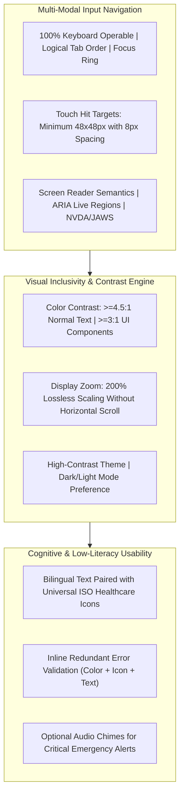

# Accessibility & Universal Usability Requirements Baseline: Namma Clinic Digital Health Platform

| Metadata Attribute | Formal Specification |
| :--- | :--- |
| **Document Identifier** | `DOC-REQ-012-A11Y` |
| **Document Title** | Accessibility & Universal Usability Requirements Baseline |
| **Project Code** | `NAMMA-CLINIC-PLATFORM-2026` |
| **Requirement Type** | `Accessibility Requirement` |
| **Specification Range** | `A11Y-001 through A11Y-040` (Exactly 40 unique requirements) |
| **Target Baseline** | `v1.0.0-PROD-BASELINE` |
| **Lifecycle Status** | `APPROVED & BASELINED` |
| **Target Facility Scope** | 183 Primary Namma Clinics across 8 BBMP Administrative Zones |
| **Lead Clinical Authority** | Chief Health Officer (CHO), BBMP Health Department |
| **Lead Technical Authority**| Principal Solutions Architect, Kushagramati Analytics Consortium |
| **Upstream Baselines** | [`00-project-baseline/`](../00-project-baseline/) \| [`01-project-management/`](../01-project-management/) |
| **Related Specification**| [`03-non-functional-requirements.md`](./03-non-functional-requirements.md) \| [`11-localization-requirements.md`](./11-localization-requirements.md) |

## 1. Executive Summary & Domain Governance Framework
This specification defines the comprehensive accessibility and universal usability requirements baseline for the Namma Clinic Digital Health Platform across 183 primary urban healthcare centers in Greater Bengaluru. Comprising 40 detailed accessibility specifications (`A11Y-001` through `A11Y-040`), this document operationalizes the Web Content Accessibility Guidelines (WCAG) 2.1 Level AA standards and complies with the Rights of Persons with Disabilities (RPwD) Act 2016.

Healthcare workers operating in fast-paced municipal clinics encounter diverse physical environments, low-cost reflective monitors, keyboard-only workstations, and varying degrees of physical and sensory capabilities. Elderly citizens and persons with disabilities also visit clinics daily. The platform enforces high contrast ratios (4.5:1 text, 7:1 enhanced), complete keyboard navigability with visible focus indicators, screen reader ARIA semantic compatibility, touch targets >=48x48px, and low-literacy iconographic aids.

## 2. Architecture & Domain Conceptual Framework
The following architectural topology illustrates the functional interactions, security boundaries, and data flows governing this domain across Namma Clinic's 183 primary healthcare centers in Greater Bengaluru:



## 3. Master Accessibility Requirement Inventory Table (A11Y-001 through A11Y-040)
| Requirement ID | Title | WCAG SC | Target User Group | Design Implementation | Verification Tool | Owner |
| :--- | :--- | :--- | :--- | :--- | :--- | :---: |
| [`A11Y-001`](#a11y-001) | **Minimum Color Contrast Ratio for Normal Text** | `WCAG 2.1 SC 1.4.3` | Low vision & elderly staff | Enforce 4.5:1 contrast for all text... | Lighthouse & axe-core aut... | UI Designer |
| [`A11Y-002`](#a11y-002) | **Minimum Color Contrast Ratio for Large Text** | `WCAG 2.1 SC 1.4.3` | Low vision & elderly staff | Enforce 3:1 contrast for headings >... | Lighthouse & axe-core aut... | UI Designer |
| [`A11Y-003`](#a11y-003) | **Non-Text Contrast for UI Components & Icons** | `WCAG 2.1 SC 1.4.11` | Low vision staff | Enforce 3:1 contrast for button bor... | axe-core automated scan... | UI Designer |
| [`A11Y-004`](#a11y-004) | **100% Keyboard Operability Without Mouse** | `WCAG 2.1 SC 2.1.1` | Motor impaired staff | All clickable elements, forms, and ... | Playwright keyboard navig... | Frontend Lead |
| [`A11Y-005`](#a11y-005) | **Zero Keyboard Trap States Across Modals** | `WCAG 2.1 SC 2.1.2` | Keyboard-only users | Focus trap inside dialogs releases ... | Automated focus trap test... | Frontend Lead |
| [`A11Y-006`](#a11y-006) | **Distinct 2px Solid Visual Focus Indicator Ring** | `WCAG 2.1 SC 2.4.7` | Keyboard navigators | Active element displays high-contra... | Visual regression test... | UI Designer |
| [`A11Y-007`](#a11y-007) | **Logical and Predictable Tab Traversal Order** | `WCAG 2.1 SC 2.4.3` | Cognitive & motor impaired | Tab order strictly follows visual l... | Automated tab order audit... | Frontend Lead |
| [`A11Y-008`](#a11y-008) | **Global Keyboard Shortcuts for High-Frequency Actions** | `WCAG 2.1 SC 2.1.4` | Power users & motor impaired | Global Alt+N (New Token), Alt+V (Vi... | Shortcut execution integr... | Frontend Architect |
| [`A11Y-009`](#a11y-009) | **Minimum 48x48 CSS Pixel Interactive Touch Targets** | `WCAG 2.1 SC 2.5.5` | Touchscreen laptop users & tremors | Buttons, chips, checkboxes, and tab... | Playwright bounding box t... | UI Designer |
| [`A11Y-010`](#a11y-010) | **Touch Target Spacing Minimum Separation (8px)** | `WCAG 2.1 SC 2.5.8` | Motor impaired users | Maintain at least 8px visual margin... | CSS layout regression tes... | UI Designer |
| [`A11Y-011`](#a11y-011) | **Semantic HTML5 Heading Structure (Single h1)** | `WCAG 2.1 SC 1.3.1` | Screen reader navigators | Strict heading hierarchy: single `<... | HTML semantic validator i... | Frontend Lead |
| [`A11Y-012`](#a11y-012) | **ARIA Landmarks for Primary Page Regions** | `WCAG 2.1 SC 1.3.1` | Screen reader navigators | Page structured with `<header role=... | axe-core landmark scan... | Frontend Lead |
| [`A11Y-013`](#a11y-013) | **Descriptive ARIA Labels on All Icon Buttons** | `WCAG 2.1 SC 4.1.2` | Screen reader users | All icon-only buttons include descr... | axe-core button name scan... | Frontend Lead |
| [`A11Y-014`](#a11y-014) | **ARIA Live Regions for Panic Alerts & Chimes** | `WCAG 2.1 SC 4.1.3` | Blind & visually impaired staff | Emergency alerts and panic lab valu... | Screen reader automation ... | Accessibility Lead |
| [`A11Y-015`](#a11y-015) | **ARIA Live Regions for Queue State Updates** | `WCAG 2.1 SC 4.1.3` | Screen reader users | Token status changes and caller ann... | Screen reader automation ... | Accessibility Lead |
| [`A11Y-016`](#a11y-016) | **Explicit Association of Form Inputs with Labels** | `WCAG 2.1 SC 3.3.2` | Screen reader users & cognitive | All form inputs bound to `<label fo... | axe-core form label audit... | Frontend Lead |
| [`A11Y-017`](#a11y-017) | **Inline Accessible Form Validation & Error Messaging** | `WCAG 2.1 SC 3.3.1` | All users, cognitive impaired | Errors highlighted with `aria-inval... | Playwright error state te... | Frontend Lead |
| [`A11Y-018`](#a11y-018) | **Non-Color-Dependent Error & State Encoding** | `WCAG 2.1 SC 1.4.1` | Color blind staff (8% males) | States communicate through icons an... | Monochrome visual inspect... | UI Designer |
| [`A11Y-019`](#a11y-019) | **Zoom and Responsive Reflow up to 200%** | `WCAG 2.1 SC 1.4.4` | Low vision staff | Layout reflows cleanly without hori... | Playwright 200% zoom refl... | UI Architect |
| [`A11Y-020`](#a11y-020) | **Text Spacing and Line Height Overrides** | `WCAG 2.1 SC 1.4.12` | Dyslexic & low vision staff | Supports line height 1.5x, letter s... | Stylus text spacing audit... | UI Designer |
| [`A11Y-021`](#a11y-021) | **High-Contrast Dark & Light Theme Modes** | `WCAG 2.1 SC 1.4.3` | Photophobic & low vision staff | Provide high-contrast dark theme mo... | Theme switcher automated ... | UI Designer |
| [`A11Y-022`](#a11y-022) | **Motion Reduction Preference (`prefers-reduced-motion`)** | `WCAG 2.1 SC 2.3.3` | Vestibular disorder staff | Disable smooth scrolling, sliding t... | CSS media query automated... | UI Designer |
| [`A11Y-023`](#a11y-023) | **Descriptive Screen Titles & Breadcrumbs** | `WCAG 2.1 SC 2.4.2` | Cognitive & screen reader | Document `<title>` updates dynamica... | Playwright document title... | Frontend Lead |
| [`A11Y-024`](#a11y-024) | **Skip to Main Content Bypass Block Link** | `WCAG 2.1 SC 2.4.1` | Keyboard navigators | Provide hidden 'Skip to main conten... | Automated skip link test... | Frontend Lead |
| [`A11Y-025`](#a11y-025) | **Accessible Data Tables with `<th>` and `scope`** | `WCAG 2.1 SC 1.3.1` | Screen reader navigators | Inventory and queue tables markup h... | axe-core table markup sca... | Frontend Lead |
| [`A11Y-026`](#a11y-026) | **ARIA Expanded States for Accordions & Dropdowns** | `WCAG 2.1 SC 4.1.2` | Screen reader users | Collapsible panels and dropdowns to... | Playwright dropdown test... | Frontend Lead |
| [`A11Y-027`](#a11y-027) | **Audible Audio Chimes for Critical Red-Flag Alerts** | `WCAG 2.1 SC 1.4.2` | Multitasking staff & low vision | Distinct audible dual-tone chime so... | Audio synthesizer integra... | Accessibility Lead |
| [`A11Y-028`](#a11y-028) | **Audio Volume Control & Mute Toggle for Chimes** | `WCAG 2.1 SC 1.4.2` | Hearing sensitive staff | Dedicated volume slider and mute to... | Settings UI integration t... | Frontend Lead |
| [`A11Y-029`](#a11y-029) | **Icon-Assisted Navigation for Low-Literacy Staff** | `Usability Guidance` | Auxiliary staff with low literacy | Every navigation tab and button pai... | Visual icon inventory aud... | UI Designer |
| [`A11Y-030`](#a11y-030) | **Simplified Plain Language Tooltips & Helpers** | `WCAG 2.1 SC 3.1.5` | Low literacy staff | Technical clinical inputs include p... | Tooltip content review... | Localization Lead |
| [`A11Y-031`](#a11y-031) | **Sufficient Time Limits for Form Inactivity** | `WCAG 2.1 SC 2.2.1` | Cognitive & motor impaired | Form inputs preserved during 15-min... | Playwright session timer ... | Frontend Lead |
| [`A11Y-032`](#a11y-032) | **Confirmation Dialogs for Irreversible Actions** | `WCAG 2.1 SC 3.3.4` | All users, motor tremors | Irreversible actions (quarantine ba... | Playwright confirmation m... | Frontend Lead |
| [`A11Y-033`](#a11y-033) | **Virtual Keyboard Compatibility on Touchscreens** | `WCAG 2.1 SC 2.1.1` | Tablet and touchscreen laptop users | Forms adjust scroll offset so activ... | Touchscreen simulator tes... | Frontend Lead |
| [`A11Y-034`](#a11y-034) | **NVDA and Windows Narrator Compatibility Verification** | `Assistive Technology Support` | Blind healthcare workers | Validate full clinical workflow fro... | Manual screen reader eval... | Accessibility Lead |
| [`A11Y-035`](#a11y-035) | **Speech Synthesis Voice Support for Kannada TTS** | `Assistive Technology Support` | Kannada-speaking blind users | Integrate with Microsoft Heera / eS... | Kannada TTS playback audi... | Accessibility Lead |
| [`A11Y-036`](#a11y-036) | **Zero Content Flashing / Strobe Elimination** | `WCAG 2.1 SC 2.3.1` | Photosensitive epilepsy staff | Zero visual elements flash more tha... | PEAT photosensitive seizu... | UI Designer |
| [`A11Y-037`](#a11y-037) | **High-Legibility Font Family & Anti-Aliasing** | `Typography` | Low vision & dyslexic staff | Render clean sans-serif typography ... | Typography rendering audi... | UI Designer |
| [`A11Y-038`](#a11y-038) | **Dynamic Text Resizing Without Truncation** | `WCAG 2.1 SC 1.4.4` | Elderly staff using font scaling | Card titles and table cells expand ... | CSS flexbox/grid stress t... | UI Architect |
| [`A11Y-039`](#a11y-039) | **Accessibility Feedback Submission Channel** | `User Governance` | Disabled healthcare workers | Dedicated 'Accessibility Feedback' ... | Feedback form integration... | Accessibility Officer |
| [`A11Y-040`](#a11y-040) | **Zero Automated axe-core Accessibility Violations Gate** | `CI/CD Quality Gate` | All users with disabilities | CI pipeline runs automated axe-core... | axe-core CI pipeline buil... | QA Lead |

## 4. Comprehensive Accessibility Requirement Specifications (A11Y-001 through A11Y-040)
This section establishes the exhaustive engineering, clinical, operational, and architectural specifications for each of the 40 requirements committed for the production baseline.

### 4.1 A11Y-001: Minimum Color Contrast Ratio for Normal Text

| Specification Attribute | Formal Engineering Definition |
| :--- | :--- |
| **Requirement ID** | `A11Y-001` |
| **Requirement Title** | Minimum Color Contrast Ratio for Normal Text |
| **Requirement Statement**| The platform SHALL enforce minimum color contrast ratio for normal text adhering to WCAG 2.1 SC 1.4.3 (Contrast (Minimum) Level AA) by enforce 4.5:1 contrast for all text against backgrounds via vanilla css tokens.. |
| **Requirement Type** | `Accessibility Requirement` |
| **Priority Level** | `MUST` (Rationale: Mandatory accessibility compliance under WCAG 2.1 Level AA and Indian RPwD Act 2016.) |
| **Business Value** | Ensures full usability for disabled healthcare workers and frail citizens. |
| **Engineering Rationale**| Conforms to WCAG 2.1 SC 1.4.3: Contrast (Minimum) Level AA. |
| **Primary Actor** | `Frontline Staff with Assistive Needs` |
| **Target User Persona** | [`PERSONA-001`](../01-project-management/07-user-personas.md#persona-001) |
| **Accountable Role** | [`ROLE-002`](../01-project-management/08-role-and-responsibility-matrix.md#role-002) |
| **Key Stakeholder** | [`STAKEHOLDER-010`](../01-project-management/06-stakeholders.md#stakeholder-010) |
| **Trigger Condition** | User navigation, screen reader interaction, or low-vision display scaling. |
| **System Preconditions** | UI loaded in modern browser with keyboard or assistive technology. |
| **Input Specifications** | Keyboard keystrokes (Tab, Enter, Space), screen reader virtual cursor, touch events. |
| **Validation Rules** | Evaluated using axe-core automated audit and manual assistive technology testing. |
| **Postconditions** | User interface operable by individuals with diverse visual, motor, and cognitive abilities. |
| **State Mutations** | Updates client accessibility preferences (contrast mode, font scale). |
| **Associated Rules** | Business: [`BRULE-001`](./04-business-rules.md#brule-001) \| Clinical: [`N/A — accessibility usability requirement`](./05-clinical-rules.md#n/a — accessibility usability requirement) \| Operational: [`OR-001`](./06-operational-rules.md#or-001) |
| **Security & Privacy** | Security: `Accessibility features do not bypass authentication or session locks.` \| Privacy: `Screen reader audio output does not announce sensitive PII across public rooms.` |
| **Data & Audit** | Data: `Accessibility preferences saved locally in browser localStorage.` \| Audit: `Automated axe-core compliance test reports.` |
| **Offline & Sync** | Offline: `Accessibility styles and keyboard handlers bundled client-side for full offline use.` \| Sync: `Zero network impact; entirely client-side CSS and DOM structure.` |
| **Quality Expectations**| Perf: `Accessible DOM traversal executes at 60 FPS.` \| Avail: `100% accessible interface across all 183 clinic installations.` |
| **Localization & A11y**| Loc: `ARIA labels translated accurately into Kannada and English.` \| A11y: `WCAG 2.1 Level AA conformance.` |
| **Failure & Recovery** | Failure: Graceful fallback to standard browser keyboard navigation. \| Recovery: Reset focus to document body if focused element unmounts. |
| **Observability** | Logging: `Structured JSON log with accessibility_mode and client_agent.` \| Metrics: `Prometheus counter `namma_clinic_a11y_violations_total{req_id="A11Y-001"}`.` |
| **Upstream Traceability**| Obj: [`OBJECTIVE-001`](../01-project-management/02-project-vision-and-objectives.md#objective-001) \| Scope: [`INSCOPE-001`](../01-project-management/04-in-scope.md#inscope-001) \| Risk: [`RISK-001`](../01-project-management/12-project-risks.md#risk-001) |
| **Downstream Planning** | Epic: `PLANNED-EPIC-001` \| Feature: `PLANNED-FEATURE-001` \| API: `PLANNED-API-001` \| DB: `PLANNED-DB-001` \| Test: `PLANNED-TEST-1101` |

#### 4.1.1 Operational Execution Protocol & Frontline Workflow
- **Continuous Operational Workflow:**
  1. User navigates interactive workflow using keyboard or assistive tech.
  2. System displays high-contrast visible focus ring: Enforce 4.5:1 contrast for all text against backgrounds via Vanilla CSS tokens..
  3. Screen reader announces semantic roles, states, and emergency alerts.
  4. Interactive hit targets maintain minimum 48x48px touch boundaries.
  5. Workflow completed with zero reliance on mouse or fine motor skills.
- **Degraded State Fallback Path:** If high-contrast theme selected, apply maximum contrast color tokens (>=7:1 ratio).
- **Exception Breach & Incident Escalation Path:** If accessibility violation detected during CI build, axe-core blocks deployment.

#### 4.1.2 Technical Invariants & Operational Contract
- **WCAG Success Criteria:** WCAG 2.1 SC 1.4.3: Contrast (Minimum) Level AA
- **Target Beneficiary User Group:** Low vision & elderly staff
- **Design Implementation Pattern:** Enforce 4.5:1 contrast for all text against backgrounds via Vanilla CSS tokens.
- **Verification Tooling:** Lighthouse & axe-core automated audit
- **Accountable Accessibility Lead:** UI Designer

#### 4.1.3 Executable BDD Acceptance Scenarios
```gherkin
Feature: A11Y-001 - Minimum Color Contrast Ratio for Normal Text
  As a Frontline Staff with Assistive Needs
  I require system enforcement of minimum color contrast ratio for normal text
  In order to ensure municipal healthcare compliance and operational integrity

  Scenario: Happy Path Execution for A11Y-001
    Given the Frontline Staff with Assistive Needs is authenticated and clinic terminal is operational
    When the user submits a valid request for minimum color contrast ratio for normal text
    Then the system successfully commits the transaction and emits an audit event

  Scenario: Input Validation and Schema Guard for A11Y-001
    Given the Frontline Staff with Assistive Needs attempts to submit an incomplete or malformed payload for minimum color contrast ratio for normal text
    When the request fails TypeBox schema or domain constraint validation
    Then the system rejects the input with HTTP 400 and highlights invalid fields in Kannada and English

  Scenario: RBAC and Security Access Control for A11Y-001
    Given an unauthenticated or unauthorized role attempts to invoke minimum color contrast ratio for normal text
    When the bearer JWT token is missing, expired, or lacks necessary RBAC permission
    Then the system denies execution with HTTP 403 Forbidden and records a security telemetry alert

  Scenario: Offline Autonomous Execution for A11Y-001
    Given the clinic WAN network is completely severed during minimum color contrast ratio for normal text
    When the operator confirms the local transaction on the workstation
    Then the mutation is persisted to Dexie.js IndexedDB with a UUIDv7 and queued for background replay

  Scenario: Network Recovery and Idempotent Sync for A11Y-001
    Given the clinic workstation reconnects to the BBMP municipal health WAN
    When the background sync daemon processes the pending mutation queue
    Then all buffered transactions for A11Y-001 synchronize idempotently with zero data loss
```

#### 4.1.4 Verification Protocol & Quality Sign-Off
- **Verification Method:** Lighthouse & axe-core automated audit
- **Automated Test Suite:** `PLANNED-TEST-1101` (Automated axe-core Accessibility Audit & NVDA Screen Reader Test) targeting 100% verification gate compliance.
- **Related Internal Requirements:** `NFR-026`, `NFR-027`, `LOC-001`
- **Dependencies & Blocking Constraints:** NFR-026 | Constraints: Focus indicator rings must not be suppressed via `outline: none` CSS rules.
- **Architectural Assumptions & Open Questions:** Assumption: Clinic workstations equipped with functional audio speakers for chime alerts. | Open Question: Dry-run evaluation with BBMP Disabled Welfare Association representatives.

---

### 4.2 A11Y-002: Minimum Color Contrast Ratio for Large Text

| Specification Attribute | Formal Engineering Definition |
| :--- | :--- |
| **Requirement ID** | `A11Y-002` |
| **Requirement Title** | Minimum Color Contrast Ratio for Large Text |
| **Requirement Statement**| The platform SHALL enforce minimum color contrast ratio for large text adhering to WCAG 2.1 SC 1.4.3 (Contrast (Minimum) Level AA) by enforce 3:1 contrast for headings >=18pt or bold >=14pt against backgrounds.. |
| **Requirement Type** | `Accessibility Requirement` |
| **Priority Level** | `MUST` (Rationale: Mandatory accessibility compliance under WCAG 2.1 Level AA and Indian RPwD Act 2016.) |
| **Business Value** | Ensures full usability for disabled healthcare workers and frail citizens. |
| **Engineering Rationale**| Conforms to WCAG 2.1 SC 1.4.3: Contrast (Minimum) Level AA. |
| **Primary Actor** | `Frontline Staff with Assistive Needs` |
| **Target User Persona** | [`PERSONA-002`](../01-project-management/07-user-personas.md#persona-002) |
| **Accountable Role** | [`ROLE-002`](../01-project-management/08-role-and-responsibility-matrix.md#role-002) |
| **Key Stakeholder** | [`STAKEHOLDER-010`](../01-project-management/06-stakeholders.md#stakeholder-010) |
| **Trigger Condition** | User navigation, screen reader interaction, or low-vision display scaling. |
| **System Preconditions** | UI loaded in modern browser with keyboard or assistive technology. |
| **Input Specifications** | Keyboard keystrokes (Tab, Enter, Space), screen reader virtual cursor, touch events. |
| **Validation Rules** | Evaluated using axe-core automated audit and manual assistive technology testing. |
| **Postconditions** | User interface operable by individuals with diverse visual, motor, and cognitive abilities. |
| **State Mutations** | Updates client accessibility preferences (contrast mode, font scale). |
| **Associated Rules** | Business: [`BRULE-002`](./04-business-rules.md#brule-002) \| Clinical: [`N/A — accessibility usability requirement`](./05-clinical-rules.md#n/a — accessibility usability requirement) \| Operational: [`OR-002`](./06-operational-rules.md#or-002) |
| **Security & Privacy** | Security: `Accessibility features do not bypass authentication or session locks.` \| Privacy: `Screen reader audio output does not announce sensitive PII across public rooms.` |
| **Data & Audit** | Data: `Accessibility preferences saved locally in browser localStorage.` \| Audit: `Automated axe-core compliance test reports.` |
| **Offline & Sync** | Offline: `Accessibility styles and keyboard handlers bundled client-side for full offline use.` \| Sync: `Zero network impact; entirely client-side CSS and DOM structure.` |
| **Quality Expectations**| Perf: `Accessible DOM traversal executes at 60 FPS.` \| Avail: `100% accessible interface across all 183 clinic installations.` |
| **Localization & A11y**| Loc: `ARIA labels translated accurately into Kannada and English.` \| A11y: `WCAG 2.1 Level AA conformance.` |
| **Failure & Recovery** | Failure: Graceful fallback to standard browser keyboard navigation. \| Recovery: Reset focus to document body if focused element unmounts. |
| **Observability** | Logging: `Structured JSON log with accessibility_mode and client_agent.` \| Metrics: `Prometheus counter `namma_clinic_a11y_violations_total{req_id="A11Y-002"}`.` |
| **Upstream Traceability**| Obj: [`OBJECTIVE-002`](../01-project-management/02-project-vision-and-objectives.md#objective-002) \| Scope: [`INSCOPE-002`](../01-project-management/04-in-scope.md#inscope-002) \| Risk: [`RISK-002`](../01-project-management/12-project-risks.md#risk-002) |
| **Downstream Planning** | Epic: `PLANNED-EPIC-002` \| Feature: `PLANNED-FEATURE-002` \| API: `PLANNED-API-002` \| DB: `PLANNED-DB-002` \| Test: `PLANNED-TEST-1102` |

#### 4.2.1 Operational Execution Protocol & Frontline Workflow
- **Continuous Operational Workflow:**
  1. User navigates interactive workflow using keyboard or assistive tech.
  2. System displays high-contrast visible focus ring: Enforce 3:1 contrast for headings >=18pt or bold >=14pt against backgrounds..
  3. Screen reader announces semantic roles, states, and emergency alerts.
  4. Interactive hit targets maintain minimum 48x48px touch boundaries.
  5. Workflow completed with zero reliance on mouse or fine motor skills.
- **Degraded State Fallback Path:** If high-contrast theme selected, apply maximum contrast color tokens (>=7:1 ratio).
- **Exception Breach & Incident Escalation Path:** If accessibility violation detected during CI build, axe-core blocks deployment.

#### 4.2.2 Technical Invariants & Operational Contract
- **WCAG Success Criteria:** WCAG 2.1 SC 1.4.3: Contrast (Minimum) Level AA
- **Target Beneficiary User Group:** Low vision & elderly staff
- **Design Implementation Pattern:** Enforce 3:1 contrast for headings >=18pt or bold >=14pt against backgrounds.
- **Verification Tooling:** Lighthouse & axe-core automated audit
- **Accountable Accessibility Lead:** UI Designer

#### 4.2.3 Executable BDD Acceptance Scenarios
```gherkin
Feature: A11Y-002 - Minimum Color Contrast Ratio for Large Text
  As a Frontline Staff with Assistive Needs
  I require system enforcement of minimum color contrast ratio for large text
  In order to ensure municipal healthcare compliance and operational integrity

  Scenario: Happy Path Execution for A11Y-002
    Given the Frontline Staff with Assistive Needs is authenticated and clinic terminal is operational
    When the user submits a valid request for minimum color contrast ratio for large text
    Then the system successfully commits the transaction and emits an audit event

  Scenario: Input Validation and Schema Guard for A11Y-002
    Given the Frontline Staff with Assistive Needs attempts to submit an incomplete or malformed payload for minimum color contrast ratio for large text
    When the request fails TypeBox schema or domain constraint validation
    Then the system rejects the input with HTTP 400 and highlights invalid fields in Kannada and English

  Scenario: RBAC and Security Access Control for A11Y-002
    Given an unauthenticated or unauthorized role attempts to invoke minimum color contrast ratio for large text
    When the bearer JWT token is missing, expired, or lacks necessary RBAC permission
    Then the system denies execution with HTTP 403 Forbidden and records a security telemetry alert

  Scenario: Offline Autonomous Execution for A11Y-002
    Given the clinic WAN network is completely severed during minimum color contrast ratio for large text
    When the operator confirms the local transaction on the workstation
    Then the mutation is persisted to Dexie.js IndexedDB with a UUIDv7 and queued for background replay

  Scenario: Network Recovery and Idempotent Sync for A11Y-002
    Given the clinic workstation reconnects to the BBMP municipal health WAN
    When the background sync daemon processes the pending mutation queue
    Then all buffered transactions for A11Y-002 synchronize idempotently with zero data loss
```

#### 4.2.4 Verification Protocol & Quality Sign-Off
- **Verification Method:** Lighthouse & axe-core automated audit
- **Automated Test Suite:** `PLANNED-TEST-1102` (Automated axe-core Accessibility Audit & NVDA Screen Reader Test) targeting 100% verification gate compliance.
- **Related Internal Requirements:** `NFR-026`, `NFR-027`, `LOC-002`
- **Dependencies & Blocking Constraints:** NFR-026 | Constraints: Focus indicator rings must not be suppressed via `outline: none` CSS rules.
- **Architectural Assumptions & Open Questions:** Assumption: Clinic workstations equipped with functional audio speakers for chime alerts. | Open Question: Dry-run evaluation with BBMP Disabled Welfare Association representatives.

---

### 4.3 A11Y-003: Non-Text Contrast for UI Components & Icons

| Specification Attribute | Formal Engineering Definition |
| :--- | :--- |
| **Requirement ID** | `A11Y-003` |
| **Requirement Title** | Non-Text Contrast for UI Components & Icons |
| **Requirement Statement**| The platform SHALL enforce non-text contrast for ui components & icons adhering to WCAG 2.1 SC 1.4.11 (Non-text Contrast Level AA) by enforce 3:1 contrast for button borders, input outlines, and clinical icons.. |
| **Requirement Type** | `Accessibility Requirement` |
| **Priority Level** | `MUST` (Rationale: Mandatory accessibility compliance under WCAG 2.1 Level AA and Indian RPwD Act 2016.) |
| **Business Value** | Ensures full usability for disabled healthcare workers and frail citizens. |
| **Engineering Rationale**| Conforms to WCAG 2.1 SC 1.4.11: Non-text Contrast Level AA. |
| **Primary Actor** | `Frontline Staff with Assistive Needs` |
| **Target User Persona** | [`PERSONA-003`](../01-project-management/07-user-personas.md#persona-003) |
| **Accountable Role** | [`ROLE-002`](../01-project-management/08-role-and-responsibility-matrix.md#role-002) |
| **Key Stakeholder** | [`STAKEHOLDER-010`](../01-project-management/06-stakeholders.md#stakeholder-010) |
| **Trigger Condition** | User navigation, screen reader interaction, or low-vision display scaling. |
| **System Preconditions** | UI loaded in modern browser with keyboard or assistive technology. |
| **Input Specifications** | Keyboard keystrokes (Tab, Enter, Space), screen reader virtual cursor, touch events. |
| **Validation Rules** | Evaluated using axe-core automated audit and manual assistive technology testing. |
| **Postconditions** | User interface operable by individuals with diverse visual, motor, and cognitive abilities. |
| **State Mutations** | Updates client accessibility preferences (contrast mode, font scale). |
| **Associated Rules** | Business: [`BRULE-003`](./04-business-rules.md#brule-003) \| Clinical: [`N/A — accessibility usability requirement`](./05-clinical-rules.md#n/a — accessibility usability requirement) \| Operational: [`OR-003`](./06-operational-rules.md#or-003) |
| **Security & Privacy** | Security: `Accessibility features do not bypass authentication or session locks.` \| Privacy: `Screen reader audio output does not announce sensitive PII across public rooms.` |
| **Data & Audit** | Data: `Accessibility preferences saved locally in browser localStorage.` \| Audit: `Automated axe-core compliance test reports.` |
| **Offline & Sync** | Offline: `Accessibility styles and keyboard handlers bundled client-side for full offline use.` \| Sync: `Zero network impact; entirely client-side CSS and DOM structure.` |
| **Quality Expectations**| Perf: `Accessible DOM traversal executes at 60 FPS.` \| Avail: `100% accessible interface across all 183 clinic installations.` |
| **Localization & A11y**| Loc: `ARIA labels translated accurately into Kannada and English.` \| A11y: `WCAG 2.1 Level AA conformance.` |
| **Failure & Recovery** | Failure: Graceful fallback to standard browser keyboard navigation. \| Recovery: Reset focus to document body if focused element unmounts. |
| **Observability** | Logging: `Structured JSON log with accessibility_mode and client_agent.` \| Metrics: `Prometheus counter `namma_clinic_a11y_violations_total{req_id="A11Y-003"}`.` |
| **Upstream Traceability**| Obj: [`OBJECTIVE-003`](../01-project-management/02-project-vision-and-objectives.md#objective-003) \| Scope: [`INSCOPE-003`](../01-project-management/04-in-scope.md#inscope-003) \| Risk: [`RISK-003`](../01-project-management/12-project-risks.md#risk-003) |
| **Downstream Planning** | Epic: `PLANNED-EPIC-003` \| Feature: `PLANNED-FEATURE-003` \| API: `PLANNED-API-003` \| DB: `PLANNED-DB-003` \| Test: `PLANNED-TEST-1103` |

#### 4.3.1 Operational Execution Protocol & Frontline Workflow
- **Continuous Operational Workflow:**
  1. User navigates interactive workflow using keyboard or assistive tech.
  2. System displays high-contrast visible focus ring: Enforce 3:1 contrast for button borders, input outlines, and clinical icons..
  3. Screen reader announces semantic roles, states, and emergency alerts.
  4. Interactive hit targets maintain minimum 48x48px touch boundaries.
  5. Workflow completed with zero reliance on mouse or fine motor skills.
- **Degraded State Fallback Path:** If high-contrast theme selected, apply maximum contrast color tokens (>=7:1 ratio).
- **Exception Breach & Incident Escalation Path:** If accessibility violation detected during CI build, axe-core blocks deployment.

#### 4.3.2 Technical Invariants & Operational Contract
- **WCAG Success Criteria:** WCAG 2.1 SC 1.4.11: Non-text Contrast Level AA
- **Target Beneficiary User Group:** Low vision staff
- **Design Implementation Pattern:** Enforce 3:1 contrast for button borders, input outlines, and clinical icons.
- **Verification Tooling:** axe-core automated scan
- **Accountable Accessibility Lead:** UI Designer

#### 4.3.3 Executable BDD Acceptance Scenarios
```gherkin
Feature: A11Y-003 - Non-Text Contrast for UI Components & Icons
  As a Frontline Staff with Assistive Needs
  I require system enforcement of non-text contrast for ui components & icons
  In order to ensure municipal healthcare compliance and operational integrity

  Scenario: Happy Path Execution for A11Y-003
    Given the Frontline Staff with Assistive Needs is authenticated and clinic terminal is operational
    When the user submits a valid request for non-text contrast for ui components & icons
    Then the system successfully commits the transaction and emits an audit event

  Scenario: Input Validation and Schema Guard for A11Y-003
    Given the Frontline Staff with Assistive Needs attempts to submit an incomplete or malformed payload for non-text contrast for ui components & icons
    When the request fails TypeBox schema or domain constraint validation
    Then the system rejects the input with HTTP 400 and highlights invalid fields in Kannada and English

  Scenario: RBAC and Security Access Control for A11Y-003
    Given an unauthenticated or unauthorized role attempts to invoke non-text contrast for ui components & icons
    When the bearer JWT token is missing, expired, or lacks necessary RBAC permission
    Then the system denies execution with HTTP 403 Forbidden and records a security telemetry alert

  Scenario: Offline Autonomous Execution for A11Y-003
    Given the clinic WAN network is completely severed during non-text contrast for ui components & icons
    When the operator confirms the local transaction on the workstation
    Then the mutation is persisted to Dexie.js IndexedDB with a UUIDv7 and queued for background replay

  Scenario: Network Recovery and Idempotent Sync for A11Y-003
    Given the clinic workstation reconnects to the BBMP municipal health WAN
    When the background sync daemon processes the pending mutation queue
    Then all buffered transactions for A11Y-003 synchronize idempotently with zero data loss
```

#### 4.3.4 Verification Protocol & Quality Sign-Off
- **Verification Method:** axe-core automated scan
- **Automated Test Suite:** `PLANNED-TEST-1103` (Automated axe-core Accessibility Audit & NVDA Screen Reader Test) targeting 100% verification gate compliance.
- **Related Internal Requirements:** `NFR-026`, `NFR-027`, `LOC-003`
- **Dependencies & Blocking Constraints:** NFR-026 | Constraints: Focus indicator rings must not be suppressed via `outline: none` CSS rules.
- **Architectural Assumptions & Open Questions:** Assumption: Clinic workstations equipped with functional audio speakers for chime alerts. | Open Question: Dry-run evaluation with BBMP Disabled Welfare Association representatives.

---

### 4.4 A11Y-004: 100% Keyboard Operability Without Mouse

| Specification Attribute | Formal Engineering Definition |
| :--- | :--- |
| **Requirement ID** | `A11Y-004` |
| **Requirement Title** | 100% Keyboard Operability Without Mouse |
| **Requirement Statement**| The platform SHALL enforce 100% keyboard operability without mouse adhering to WCAG 2.1 SC 2.1.1 (Keyboard Level A) by all clickable elements, forms, and tabs operable via tab, enter, space, and arrow keys.. |
| **Requirement Type** | `Accessibility Requirement` |
| **Priority Level** | `MUST` (Rationale: Mandatory accessibility compliance under WCAG 2.1 Level AA and Indian RPwD Act 2016.) |
| **Business Value** | Ensures full usability for disabled healthcare workers and frail citizens. |
| **Engineering Rationale**| Conforms to WCAG 2.1 SC 2.1.1: Keyboard Level A. |
| **Primary Actor** | `Frontline Staff with Assistive Needs` |
| **Target User Persona** | [`PERSONA-004`](../01-project-management/07-user-personas.md#persona-004) |
| **Accountable Role** | [`ROLE-002`](../01-project-management/08-role-and-responsibility-matrix.md#role-002) |
| **Key Stakeholder** | [`STAKEHOLDER-010`](../01-project-management/06-stakeholders.md#stakeholder-010) |
| **Trigger Condition** | User navigation, screen reader interaction, or low-vision display scaling. |
| **System Preconditions** | UI loaded in modern browser with keyboard or assistive technology. |
| **Input Specifications** | Keyboard keystrokes (Tab, Enter, Space), screen reader virtual cursor, touch events. |
| **Validation Rules** | Evaluated using axe-core automated audit and manual assistive technology testing. |
| **Postconditions** | User interface operable by individuals with diverse visual, motor, and cognitive abilities. |
| **State Mutations** | Updates client accessibility preferences (contrast mode, font scale). |
| **Associated Rules** | Business: [`BRULE-004`](./04-business-rules.md#brule-004) \| Clinical: [`N/A — accessibility usability requirement`](./05-clinical-rules.md#n/a — accessibility usability requirement) \| Operational: [`OR-004`](./06-operational-rules.md#or-004) |
| **Security & Privacy** | Security: `Accessibility features do not bypass authentication or session locks.` \| Privacy: `Screen reader audio output does not announce sensitive PII across public rooms.` |
| **Data & Audit** | Data: `Accessibility preferences saved locally in browser localStorage.` \| Audit: `Automated axe-core compliance test reports.` |
| **Offline & Sync** | Offline: `Accessibility styles and keyboard handlers bundled client-side for full offline use.` \| Sync: `Zero network impact; entirely client-side CSS and DOM structure.` |
| **Quality Expectations**| Perf: `Accessible DOM traversal executes at 60 FPS.` \| Avail: `100% accessible interface across all 183 clinic installations.` |
| **Localization & A11y**| Loc: `ARIA labels translated accurately into Kannada and English.` \| A11y: `WCAG 2.1 Level AA conformance.` |
| **Failure & Recovery** | Failure: Graceful fallback to standard browser keyboard navigation. \| Recovery: Reset focus to document body if focused element unmounts. |
| **Observability** | Logging: `Structured JSON log with accessibility_mode and client_agent.` \| Metrics: `Prometheus counter `namma_clinic_a11y_violations_total{req_id="A11Y-004"}`.` |
| **Upstream Traceability**| Obj: [`OBJECTIVE-004`](../01-project-management/02-project-vision-and-objectives.md#objective-004) \| Scope: [`INSCOPE-004`](../01-project-management/04-in-scope.md#inscope-004) \| Risk: [`RISK-004`](../01-project-management/12-project-risks.md#risk-004) |
| **Downstream Planning** | Epic: `PLANNED-EPIC-004` \| Feature: `PLANNED-FEATURE-004` \| API: `PLANNED-API-004` \| DB: `PLANNED-DB-004` \| Test: `PLANNED-TEST-1104` |

#### 4.4.1 Operational Execution Protocol & Frontline Workflow
- **Continuous Operational Workflow:**
  1. User navigates interactive workflow using keyboard or assistive tech.
  2. System displays high-contrast visible focus ring: All clickable elements, forms, and tabs operable via Tab, Enter, Space, and Arrow keys..
  3. Screen reader announces semantic roles, states, and emergency alerts.
  4. Interactive hit targets maintain minimum 48x48px touch boundaries.
  5. Workflow completed with zero reliance on mouse or fine motor skills.
- **Degraded State Fallback Path:** If high-contrast theme selected, apply maximum contrast color tokens (>=7:1 ratio).
- **Exception Breach & Incident Escalation Path:** If accessibility violation detected during CI build, axe-core blocks deployment.

#### 4.4.2 Technical Invariants & Operational Contract
- **WCAG Success Criteria:** WCAG 2.1 SC 2.1.1: Keyboard Level A
- **Target Beneficiary User Group:** Motor impaired staff
- **Design Implementation Pattern:** All clickable elements, forms, and tabs operable via Tab, Enter, Space, and Arrow keys.
- **Verification Tooling:** Playwright keyboard navigation test
- **Accountable Accessibility Lead:** Frontend Lead

#### 4.4.3 Executable BDD Acceptance Scenarios
```gherkin
Feature: A11Y-004 - 100% Keyboard Operability Without Mouse
  As a Frontline Staff with Assistive Needs
  I require system enforcement of 100% keyboard operability without mouse
  In order to ensure municipal healthcare compliance and operational integrity

  Scenario: Happy Path Execution for A11Y-004
    Given the Frontline Staff with Assistive Needs is authenticated and clinic terminal is operational
    When the user submits a valid request for 100% keyboard operability without mouse
    Then the system successfully commits the transaction and emits an audit event

  Scenario: Input Validation and Schema Guard for A11Y-004
    Given the Frontline Staff with Assistive Needs attempts to submit an incomplete or malformed payload for 100% keyboard operability without mouse
    When the request fails TypeBox schema or domain constraint validation
    Then the system rejects the input with HTTP 400 and highlights invalid fields in Kannada and English

  Scenario: RBAC and Security Access Control for A11Y-004
    Given an unauthenticated or unauthorized role attempts to invoke 100% keyboard operability without mouse
    When the bearer JWT token is missing, expired, or lacks necessary RBAC permission
    Then the system denies execution with HTTP 403 Forbidden and records a security telemetry alert

  Scenario: Offline Autonomous Execution for A11Y-004
    Given the clinic WAN network is completely severed during 100% keyboard operability without mouse
    When the operator confirms the local transaction on the workstation
    Then the mutation is persisted to Dexie.js IndexedDB with a UUIDv7 and queued for background replay

  Scenario: Network Recovery and Idempotent Sync for A11Y-004
    Given the clinic workstation reconnects to the BBMP municipal health WAN
    When the background sync daemon processes the pending mutation queue
    Then all buffered transactions for A11Y-004 synchronize idempotently with zero data loss
```

#### 4.4.4 Verification Protocol & Quality Sign-Off
- **Verification Method:** Playwright keyboard navigation test
- **Automated Test Suite:** `PLANNED-TEST-1104` (Automated axe-core Accessibility Audit & NVDA Screen Reader Test) targeting 100% verification gate compliance.
- **Related Internal Requirements:** `NFR-026`, `NFR-027`, `LOC-004`
- **Dependencies & Blocking Constraints:** NFR-026 | Constraints: Focus indicator rings must not be suppressed via `outline: none` CSS rules.
- **Architectural Assumptions & Open Questions:** Assumption: Clinic workstations equipped with functional audio speakers for chime alerts. | Open Question: Dry-run evaluation with BBMP Disabled Welfare Association representatives.

---

### 4.5 A11Y-005: Zero Keyboard Trap States Across Modals

| Specification Attribute | Formal Engineering Definition |
| :--- | :--- |
| **Requirement ID** | `A11Y-005` |
| **Requirement Title** | Zero Keyboard Trap States Across Modals |
| **Requirement Statement**| The platform SHALL enforce zero keyboard trap states across modals adhering to WCAG 2.1 SC 2.1.2 (No Keyboard Trap Level A) by focus trap inside dialogs releases cleanly upon pressing escape or clicking close.. |
| **Requirement Type** | `Accessibility Requirement` |
| **Priority Level** | `MUST` (Rationale: Mandatory accessibility compliance under WCAG 2.1 Level AA and Indian RPwD Act 2016.) |
| **Business Value** | Ensures full usability for disabled healthcare workers and frail citizens. |
| **Engineering Rationale**| Conforms to WCAG 2.1 SC 2.1.2: No Keyboard Trap Level A. |
| **Primary Actor** | `Frontline Staff with Assistive Needs` |
| **Target User Persona** | [`PERSONA-005`](../01-project-management/07-user-personas.md#persona-005) |
| **Accountable Role** | [`ROLE-002`](../01-project-management/08-role-and-responsibility-matrix.md#role-002) |
| **Key Stakeholder** | [`STAKEHOLDER-010`](../01-project-management/06-stakeholders.md#stakeholder-010) |
| **Trigger Condition** | User navigation, screen reader interaction, or low-vision display scaling. |
| **System Preconditions** | UI loaded in modern browser with keyboard or assistive technology. |
| **Input Specifications** | Keyboard keystrokes (Tab, Enter, Space), screen reader virtual cursor, touch events. |
| **Validation Rules** | Evaluated using axe-core automated audit and manual assistive technology testing. |
| **Postconditions** | User interface operable by individuals with diverse visual, motor, and cognitive abilities. |
| **State Mutations** | Updates client accessibility preferences (contrast mode, font scale). |
| **Associated Rules** | Business: [`BRULE-005`](./04-business-rules.md#brule-005) \| Clinical: [`N/A — accessibility usability requirement`](./05-clinical-rules.md#n/a — accessibility usability requirement) \| Operational: [`OR-005`](./06-operational-rules.md#or-005) |
| **Security & Privacy** | Security: `Accessibility features do not bypass authentication or session locks.` \| Privacy: `Screen reader audio output does not announce sensitive PII across public rooms.` |
| **Data & Audit** | Data: `Accessibility preferences saved locally in browser localStorage.` \| Audit: `Automated axe-core compliance test reports.` |
| **Offline & Sync** | Offline: `Accessibility styles and keyboard handlers bundled client-side for full offline use.` \| Sync: `Zero network impact; entirely client-side CSS and DOM structure.` |
| **Quality Expectations**| Perf: `Accessible DOM traversal executes at 60 FPS.` \| Avail: `100% accessible interface across all 183 clinic installations.` |
| **Localization & A11y**| Loc: `ARIA labels translated accurately into Kannada and English.` \| A11y: `WCAG 2.1 Level AA conformance.` |
| **Failure & Recovery** | Failure: Graceful fallback to standard browser keyboard navigation. \| Recovery: Reset focus to document body if focused element unmounts. |
| **Observability** | Logging: `Structured JSON log with accessibility_mode and client_agent.` \| Metrics: `Prometheus counter `namma_clinic_a11y_violations_total{req_id="A11Y-005"}`.` |
| **Upstream Traceability**| Obj: [`OBJECTIVE-005`](../01-project-management/02-project-vision-and-objectives.md#objective-005) \| Scope: [`INSCOPE-005`](../01-project-management/04-in-scope.md#inscope-005) \| Risk: [`RISK-005`](../01-project-management/12-project-risks.md#risk-005) |
| **Downstream Planning** | Epic: `PLANNED-EPIC-005` \| Feature: `PLANNED-FEATURE-005` \| API: `PLANNED-API-005` \| DB: `PLANNED-DB-005` \| Test: `PLANNED-TEST-1105` |

#### 4.5.1 Operational Execution Protocol & Frontline Workflow
- **Continuous Operational Workflow:**
  1. User navigates interactive workflow using keyboard or assistive tech.
  2. System displays high-contrast visible focus ring: Focus trap inside dialogs releases cleanly upon pressing Escape or clicking Close..
  3. Screen reader announces semantic roles, states, and emergency alerts.
  4. Interactive hit targets maintain minimum 48x48px touch boundaries.
  5. Workflow completed with zero reliance on mouse or fine motor skills.
- **Degraded State Fallback Path:** If high-contrast theme selected, apply maximum contrast color tokens (>=7:1 ratio).
- **Exception Breach & Incident Escalation Path:** If accessibility violation detected during CI build, axe-core blocks deployment.

#### 4.5.2 Technical Invariants & Operational Contract
- **WCAG Success Criteria:** WCAG 2.1 SC 2.1.2: No Keyboard Trap Level A
- **Target Beneficiary User Group:** Keyboard-only users
- **Design Implementation Pattern:** Focus trap inside dialogs releases cleanly upon pressing Escape or clicking Close.
- **Verification Tooling:** Automated focus trap test
- **Accountable Accessibility Lead:** Frontend Lead

#### 4.5.3 Executable BDD Acceptance Scenarios
```gherkin
Feature: A11Y-005 - Zero Keyboard Trap States Across Modals
  As a Frontline Staff with Assistive Needs
  I require system enforcement of zero keyboard trap states across modals
  In order to ensure municipal healthcare compliance and operational integrity

  Scenario: Happy Path Execution for A11Y-005
    Given the Frontline Staff with Assistive Needs is authenticated and clinic terminal is operational
    When the user submits a valid request for zero keyboard trap states across modals
    Then the system successfully commits the transaction and emits an audit event

  Scenario: Input Validation and Schema Guard for A11Y-005
    Given the Frontline Staff with Assistive Needs attempts to submit an incomplete or malformed payload for zero keyboard trap states across modals
    When the request fails TypeBox schema or domain constraint validation
    Then the system rejects the input with HTTP 400 and highlights invalid fields in Kannada and English

  Scenario: RBAC and Security Access Control for A11Y-005
    Given an unauthenticated or unauthorized role attempts to invoke zero keyboard trap states across modals
    When the bearer JWT token is missing, expired, or lacks necessary RBAC permission
    Then the system denies execution with HTTP 403 Forbidden and records a security telemetry alert

  Scenario: Offline Autonomous Execution for A11Y-005
    Given the clinic WAN network is completely severed during zero keyboard trap states across modals
    When the operator confirms the local transaction on the workstation
    Then the mutation is persisted to Dexie.js IndexedDB with a UUIDv7 and queued for background replay

  Scenario: Network Recovery and Idempotent Sync for A11Y-005
    Given the clinic workstation reconnects to the BBMP municipal health WAN
    When the background sync daemon processes the pending mutation queue
    Then all buffered transactions for A11Y-005 synchronize idempotently with zero data loss
```

#### 4.5.4 Verification Protocol & Quality Sign-Off
- **Verification Method:** Automated focus trap test
- **Automated Test Suite:** `PLANNED-TEST-1105` (Automated axe-core Accessibility Audit & NVDA Screen Reader Test) targeting 100% verification gate compliance.
- **Related Internal Requirements:** `NFR-026`, `NFR-027`, `LOC-005`
- **Dependencies & Blocking Constraints:** NFR-026 | Constraints: Focus indicator rings must not be suppressed via `outline: none` CSS rules.
- **Architectural Assumptions & Open Questions:** Assumption: Clinic workstations equipped with functional audio speakers for chime alerts. | Open Question: Dry-run evaluation with BBMP Disabled Welfare Association representatives.

---

### 4.6 A11Y-006: Distinct 2px Solid Visual Focus Indicator Ring

| Specification Attribute | Formal Engineering Definition |
| :--- | :--- |
| **Requirement ID** | `A11Y-006` |
| **Requirement Title** | Distinct 2px Solid Visual Focus Indicator Ring |
| **Requirement Statement**| The platform SHALL enforce distinct 2px solid visual focus indicator ring adhering to WCAG 2.1 SC 2.4.7 (Focus Visible Level AA) by active element displays high-contrast 2px solid cyan/blue outline with 2px offset.. |
| **Requirement Type** | `Accessibility Requirement` |
| **Priority Level** | `MUST` (Rationale: Mandatory accessibility compliance under WCAG 2.1 Level AA and Indian RPwD Act 2016.) |
| **Business Value** | Ensures full usability for disabled healthcare workers and frail citizens. |
| **Engineering Rationale**| Conforms to WCAG 2.1 SC 2.4.7: Focus Visible Level AA. |
| **Primary Actor** | `Frontline Staff with Assistive Needs` |
| **Target User Persona** | [`PERSONA-006`](../01-project-management/07-user-personas.md#persona-006) |
| **Accountable Role** | [`ROLE-002`](../01-project-management/08-role-and-responsibility-matrix.md#role-002) |
| **Key Stakeholder** | [`STAKEHOLDER-010`](../01-project-management/06-stakeholders.md#stakeholder-010) |
| **Trigger Condition** | User navigation, screen reader interaction, or low-vision display scaling. |
| **System Preconditions** | UI loaded in modern browser with keyboard or assistive technology. |
| **Input Specifications** | Keyboard keystrokes (Tab, Enter, Space), screen reader virtual cursor, touch events. |
| **Validation Rules** | Evaluated using axe-core automated audit and manual assistive technology testing. |
| **Postconditions** | User interface operable by individuals with diverse visual, motor, and cognitive abilities. |
| **State Mutations** | Updates client accessibility preferences (contrast mode, font scale). |
| **Associated Rules** | Business: [`BRULE-006`](./04-business-rules.md#brule-006) \| Clinical: [`N/A — accessibility usability requirement`](./05-clinical-rules.md#n/a — accessibility usability requirement) \| Operational: [`OR-006`](./06-operational-rules.md#or-006) |
| **Security & Privacy** | Security: `Accessibility features do not bypass authentication or session locks.` \| Privacy: `Screen reader audio output does not announce sensitive PII across public rooms.` |
| **Data & Audit** | Data: `Accessibility preferences saved locally in browser localStorage.` \| Audit: `Automated axe-core compliance test reports.` |
| **Offline & Sync** | Offline: `Accessibility styles and keyboard handlers bundled client-side for full offline use.` \| Sync: `Zero network impact; entirely client-side CSS and DOM structure.` |
| **Quality Expectations**| Perf: `Accessible DOM traversal executes at 60 FPS.` \| Avail: `100% accessible interface across all 183 clinic installations.` |
| **Localization & A11y**| Loc: `ARIA labels translated accurately into Kannada and English.` \| A11y: `WCAG 2.1 Level AA conformance.` |
| **Failure & Recovery** | Failure: Graceful fallback to standard browser keyboard navigation. \| Recovery: Reset focus to document body if focused element unmounts. |
| **Observability** | Logging: `Structured JSON log with accessibility_mode and client_agent.` \| Metrics: `Prometheus counter `namma_clinic_a11y_violations_total{req_id="A11Y-006"}`.` |
| **Upstream Traceability**| Obj: [`OBJECTIVE-006`](../01-project-management/02-project-vision-and-objectives.md#objective-006) \| Scope: [`INSCOPE-006`](../01-project-management/04-in-scope.md#inscope-006) \| Risk: [`RISK-006`](../01-project-management/12-project-risks.md#risk-006) |
| **Downstream Planning** | Epic: `PLANNED-EPIC-006` \| Feature: `PLANNED-FEATURE-006` \| API: `PLANNED-API-006` \| DB: `PLANNED-DB-006` \| Test: `PLANNED-TEST-1106` |

#### 4.6.1 Operational Execution Protocol & Frontline Workflow
- **Continuous Operational Workflow:**
  1. User navigates interactive workflow using keyboard or assistive tech.
  2. System displays high-contrast visible focus ring: Active element displays high-contrast 2px solid cyan/blue outline with 2px offset..
  3. Screen reader announces semantic roles, states, and emergency alerts.
  4. Interactive hit targets maintain minimum 48x48px touch boundaries.
  5. Workflow completed with zero reliance on mouse or fine motor skills.
- **Degraded State Fallback Path:** If high-contrast theme selected, apply maximum contrast color tokens (>=7:1 ratio).
- **Exception Breach & Incident Escalation Path:** If accessibility violation detected during CI build, axe-core blocks deployment.

#### 4.6.2 Technical Invariants & Operational Contract
- **WCAG Success Criteria:** WCAG 2.1 SC 2.4.7: Focus Visible Level AA
- **Target Beneficiary User Group:** Keyboard navigators
- **Design Implementation Pattern:** Active element displays high-contrast 2px solid cyan/blue outline with 2px offset.
- **Verification Tooling:** Visual regression test
- **Accountable Accessibility Lead:** UI Designer

#### 4.6.3 Executable BDD Acceptance Scenarios
```gherkin
Feature: A11Y-006 - Distinct 2px Solid Visual Focus Indicator Ring
  As a Frontline Staff with Assistive Needs
  I require system enforcement of distinct 2px solid visual focus indicator ring
  In order to ensure municipal healthcare compliance and operational integrity

  Scenario: Happy Path Execution for A11Y-006
    Given the Frontline Staff with Assistive Needs is authenticated and clinic terminal is operational
    When the user submits a valid request for distinct 2px solid visual focus indicator ring
    Then the system successfully commits the transaction and emits an audit event

  Scenario: Input Validation and Schema Guard for A11Y-006
    Given the Frontline Staff with Assistive Needs attempts to submit an incomplete or malformed payload for distinct 2px solid visual focus indicator ring
    When the request fails TypeBox schema or domain constraint validation
    Then the system rejects the input with HTTP 400 and highlights invalid fields in Kannada and English

  Scenario: RBAC and Security Access Control for A11Y-006
    Given an unauthenticated or unauthorized role attempts to invoke distinct 2px solid visual focus indicator ring
    When the bearer JWT token is missing, expired, or lacks necessary RBAC permission
    Then the system denies execution with HTTP 403 Forbidden and records a security telemetry alert

  Scenario: Offline Autonomous Execution for A11Y-006
    Given the clinic WAN network is completely severed during distinct 2px solid visual focus indicator ring
    When the operator confirms the local transaction on the workstation
    Then the mutation is persisted to Dexie.js IndexedDB with a UUIDv7 and queued for background replay

  Scenario: Network Recovery and Idempotent Sync for A11Y-006
    Given the clinic workstation reconnects to the BBMP municipal health WAN
    When the background sync daemon processes the pending mutation queue
    Then all buffered transactions for A11Y-006 synchronize idempotently with zero data loss
```

#### 4.6.4 Verification Protocol & Quality Sign-Off
- **Verification Method:** Visual regression test
- **Automated Test Suite:** `PLANNED-TEST-1106` (Automated axe-core Accessibility Audit & NVDA Screen Reader Test) targeting 100% verification gate compliance.
- **Related Internal Requirements:** `NFR-026`, `NFR-027`, `LOC-006`
- **Dependencies & Blocking Constraints:** NFR-026 | Constraints: Focus indicator rings must not be suppressed via `outline: none` CSS rules.
- **Architectural Assumptions & Open Questions:** Assumption: Clinic workstations equipped with functional audio speakers for chime alerts. | Open Question: Dry-run evaluation with BBMP Disabled Welfare Association representatives.

---

### 4.7 A11Y-007: Logical and Predictable Tab Traversal Order

| Specification Attribute | Formal Engineering Definition |
| :--- | :--- |
| **Requirement ID** | `A11Y-007` |
| **Requirement Title** | Logical and Predictable Tab Traversal Order |
| **Requirement Statement**| The platform SHALL enforce logical and predictable tab traversal order adhering to WCAG 2.1 SC 2.4.3 (Focus Order Level A) by tab order strictly follows visual left-to-right, top-to-bottom reading sequence.. |
| **Requirement Type** | `Accessibility Requirement` |
| **Priority Level** | `MUST` (Rationale: Mandatory accessibility compliance under WCAG 2.1 Level AA and Indian RPwD Act 2016.) |
| **Business Value** | Ensures full usability for disabled healthcare workers and frail citizens. |
| **Engineering Rationale**| Conforms to WCAG 2.1 SC 2.4.3: Focus Order Level A. |
| **Primary Actor** | `Frontline Staff with Assistive Needs` |
| **Target User Persona** | [`PERSONA-007`](../01-project-management/07-user-personas.md#persona-007) |
| **Accountable Role** | [`ROLE-002`](../01-project-management/08-role-and-responsibility-matrix.md#role-002) |
| **Key Stakeholder** | [`STAKEHOLDER-010`](../01-project-management/06-stakeholders.md#stakeholder-010) |
| **Trigger Condition** | User navigation, screen reader interaction, or low-vision display scaling. |
| **System Preconditions** | UI loaded in modern browser with keyboard or assistive technology. |
| **Input Specifications** | Keyboard keystrokes (Tab, Enter, Space), screen reader virtual cursor, touch events. |
| **Validation Rules** | Evaluated using axe-core automated audit and manual assistive technology testing. |
| **Postconditions** | User interface operable by individuals with diverse visual, motor, and cognitive abilities. |
| **State Mutations** | Updates client accessibility preferences (contrast mode, font scale). |
| **Associated Rules** | Business: [`BRULE-007`](./04-business-rules.md#brule-007) \| Clinical: [`N/A — accessibility usability requirement`](./05-clinical-rules.md#n/a — accessibility usability requirement) \| Operational: [`OR-007`](./06-operational-rules.md#or-007) |
| **Security & Privacy** | Security: `Accessibility features do not bypass authentication or session locks.` \| Privacy: `Screen reader audio output does not announce sensitive PII across public rooms.` |
| **Data & Audit** | Data: `Accessibility preferences saved locally in browser localStorage.` \| Audit: `Automated axe-core compliance test reports.` |
| **Offline & Sync** | Offline: `Accessibility styles and keyboard handlers bundled client-side for full offline use.` \| Sync: `Zero network impact; entirely client-side CSS and DOM structure.` |
| **Quality Expectations**| Perf: `Accessible DOM traversal executes at 60 FPS.` \| Avail: `100% accessible interface across all 183 clinic installations.` |
| **Localization & A11y**| Loc: `ARIA labels translated accurately into Kannada and English.` \| A11y: `WCAG 2.1 Level AA conformance.` |
| **Failure & Recovery** | Failure: Graceful fallback to standard browser keyboard navigation. \| Recovery: Reset focus to document body if focused element unmounts. |
| **Observability** | Logging: `Structured JSON log with accessibility_mode and client_agent.` \| Metrics: `Prometheus counter `namma_clinic_a11y_violations_total{req_id="A11Y-007"}`.` |
| **Upstream Traceability**| Obj: [`OBJECTIVE-007`](../01-project-management/02-project-vision-and-objectives.md#objective-007) \| Scope: [`INSCOPE-007`](../01-project-management/04-in-scope.md#inscope-007) \| Risk: [`RISK-007`](../01-project-management/12-project-risks.md#risk-007) |
| **Downstream Planning** | Epic: `PLANNED-EPIC-007` \| Feature: `PLANNED-FEATURE-007` \| API: `PLANNED-API-007` \| DB: `PLANNED-DB-007` \| Test: `PLANNED-TEST-1107` |

#### 4.7.1 Operational Execution Protocol & Frontline Workflow
- **Continuous Operational Workflow:**
  1. User navigates interactive workflow using keyboard or assistive tech.
  2. System displays high-contrast visible focus ring: Tab order strictly follows visual left-to-right, top-to-bottom reading sequence..
  3. Screen reader announces semantic roles, states, and emergency alerts.
  4. Interactive hit targets maintain minimum 48x48px touch boundaries.
  5. Workflow completed with zero reliance on mouse or fine motor skills.
- **Degraded State Fallback Path:** If high-contrast theme selected, apply maximum contrast color tokens (>=7:1 ratio).
- **Exception Breach & Incident Escalation Path:** If accessibility violation detected during CI build, axe-core blocks deployment.

#### 4.7.2 Technical Invariants & Operational Contract
- **WCAG Success Criteria:** WCAG 2.1 SC 2.4.3: Focus Order Level A
- **Target Beneficiary User Group:** Cognitive & motor impaired
- **Design Implementation Pattern:** Tab order strictly follows visual left-to-right, top-to-bottom reading sequence.
- **Verification Tooling:** Automated tab order audit script
- **Accountable Accessibility Lead:** Frontend Lead

#### 4.7.3 Executable BDD Acceptance Scenarios
```gherkin
Feature: A11Y-007 - Logical and Predictable Tab Traversal Order
  As a Frontline Staff with Assistive Needs
  I require system enforcement of logical and predictable tab traversal order
  In order to ensure municipal healthcare compliance and operational integrity

  Scenario: Happy Path Execution for A11Y-007
    Given the Frontline Staff with Assistive Needs is authenticated and clinic terminal is operational
    When the user submits a valid request for logical and predictable tab traversal order
    Then the system successfully commits the transaction and emits an audit event

  Scenario: Input Validation and Schema Guard for A11Y-007
    Given the Frontline Staff with Assistive Needs attempts to submit an incomplete or malformed payload for logical and predictable tab traversal order
    When the request fails TypeBox schema or domain constraint validation
    Then the system rejects the input with HTTP 400 and highlights invalid fields in Kannada and English

  Scenario: RBAC and Security Access Control for A11Y-007
    Given an unauthenticated or unauthorized role attempts to invoke logical and predictable tab traversal order
    When the bearer JWT token is missing, expired, or lacks necessary RBAC permission
    Then the system denies execution with HTTP 403 Forbidden and records a security telemetry alert

  Scenario: Offline Autonomous Execution for A11Y-007
    Given the clinic WAN network is completely severed during logical and predictable tab traversal order
    When the operator confirms the local transaction on the workstation
    Then the mutation is persisted to Dexie.js IndexedDB with a UUIDv7 and queued for background replay

  Scenario: Network Recovery and Idempotent Sync for A11Y-007
    Given the clinic workstation reconnects to the BBMP municipal health WAN
    When the background sync daemon processes the pending mutation queue
    Then all buffered transactions for A11Y-007 synchronize idempotently with zero data loss
```

#### 4.7.4 Verification Protocol & Quality Sign-Off
- **Verification Method:** Automated tab order audit script
- **Automated Test Suite:** `PLANNED-TEST-1107` (Automated axe-core Accessibility Audit & NVDA Screen Reader Test) targeting 100% verification gate compliance.
- **Related Internal Requirements:** `NFR-026`, `NFR-027`, `LOC-007`
- **Dependencies & Blocking Constraints:** NFR-026 | Constraints: Focus indicator rings must not be suppressed via `outline: none` CSS rules.
- **Architectural Assumptions & Open Questions:** Assumption: Clinic workstations equipped with functional audio speakers for chime alerts. | Open Question: Dry-run evaluation with BBMP Disabled Welfare Association representatives.

---

### 4.8 A11Y-008: Global Keyboard Shortcuts for High-Frequency Actions

| Specification Attribute | Formal Engineering Definition |
| :--- | :--- |
| **Requirement ID** | `A11Y-008` |
| **Requirement Title** | Global Keyboard Shortcuts for High-Frequency Actions |
| **Requirement Statement**| The platform SHALL enforce global keyboard shortcuts for high-frequency actions adhering to WCAG 2.1 SC 2.1.4 (Character Key Shortcuts Level A) by global alt+n (new token), alt+v (vitals), alt+p (prescribe), alt+s (save) with remap option.. |
| **Requirement Type** | `Accessibility Requirement` |
| **Priority Level** | `MUST` (Rationale: Mandatory accessibility compliance under WCAG 2.1 Level AA and Indian RPwD Act 2016.) |
| **Business Value** | Ensures full usability for disabled healthcare workers and frail citizens. |
| **Engineering Rationale**| Conforms to WCAG 2.1 SC 2.1.4: Character Key Shortcuts Level A. |
| **Primary Actor** | `Frontline Staff with Assistive Needs` |
| **Target User Persona** | [`PERSONA-008`](../01-project-management/07-user-personas.md#persona-008) |
| **Accountable Role** | [`ROLE-002`](../01-project-management/08-role-and-responsibility-matrix.md#role-002) |
| **Key Stakeholder** | [`STAKEHOLDER-010`](../01-project-management/06-stakeholders.md#stakeholder-010) |
| **Trigger Condition** | User navigation, screen reader interaction, or low-vision display scaling. |
| **System Preconditions** | UI loaded in modern browser with keyboard or assistive technology. |
| **Input Specifications** | Keyboard keystrokes (Tab, Enter, Space), screen reader virtual cursor, touch events. |
| **Validation Rules** | Evaluated using axe-core automated audit and manual assistive technology testing. |
| **Postconditions** | User interface operable by individuals with diverse visual, motor, and cognitive abilities. |
| **State Mutations** | Updates client accessibility preferences (contrast mode, font scale). |
| **Associated Rules** | Business: [`BRULE-008`](./04-business-rules.md#brule-008) \| Clinical: [`N/A — accessibility usability requirement`](./05-clinical-rules.md#n/a — accessibility usability requirement) \| Operational: [`OR-008`](./06-operational-rules.md#or-008) |
| **Security & Privacy** | Security: `Accessibility features do not bypass authentication or session locks.` \| Privacy: `Screen reader audio output does not announce sensitive PII across public rooms.` |
| **Data & Audit** | Data: `Accessibility preferences saved locally in browser localStorage.` \| Audit: `Automated axe-core compliance test reports.` |
| **Offline & Sync** | Offline: `Accessibility styles and keyboard handlers bundled client-side for full offline use.` \| Sync: `Zero network impact; entirely client-side CSS and DOM structure.` |
| **Quality Expectations**| Perf: `Accessible DOM traversal executes at 60 FPS.` \| Avail: `100% accessible interface across all 183 clinic installations.` |
| **Localization & A11y**| Loc: `ARIA labels translated accurately into Kannada and English.` \| A11y: `WCAG 2.1 Level AA conformance.` |
| **Failure & Recovery** | Failure: Graceful fallback to standard browser keyboard navigation. \| Recovery: Reset focus to document body if focused element unmounts. |
| **Observability** | Logging: `Structured JSON log with accessibility_mode and client_agent.` \| Metrics: `Prometheus counter `namma_clinic_a11y_violations_total{req_id="A11Y-008"}`.` |
| **Upstream Traceability**| Obj: [`OBJECTIVE-008`](../01-project-management/02-project-vision-and-objectives.md#objective-008) \| Scope: [`INSCOPE-008`](../01-project-management/04-in-scope.md#inscope-008) \| Risk: [`RISK-008`](../01-project-management/12-project-risks.md#risk-008) |
| **Downstream Planning** | Epic: `PLANNED-EPIC-008` \| Feature: `PLANNED-FEATURE-008` \| API: `PLANNED-API-008` \| DB: `PLANNED-DB-008` \| Test: `PLANNED-TEST-1108` |

#### 4.8.1 Operational Execution Protocol & Frontline Workflow
- **Continuous Operational Workflow:**
  1. User navigates interactive workflow using keyboard or assistive tech.
  2. System displays high-contrast visible focus ring: Global Alt+N (New Token), Alt+V (Vitals), Alt+P (Prescribe), Alt+S (Save) with remap option..
  3. Screen reader announces semantic roles, states, and emergency alerts.
  4. Interactive hit targets maintain minimum 48x48px touch boundaries.
  5. Workflow completed with zero reliance on mouse or fine motor skills.
- **Degraded State Fallback Path:** If high-contrast theme selected, apply maximum contrast color tokens (>=7:1 ratio).
- **Exception Breach & Incident Escalation Path:** If accessibility violation detected during CI build, axe-core blocks deployment.

#### 4.8.2 Technical Invariants & Operational Contract
- **WCAG Success Criteria:** WCAG 2.1 SC 2.1.4: Character Key Shortcuts Level A
- **Target Beneficiary User Group:** Power users & motor impaired
- **Design Implementation Pattern:** Global Alt+N (New Token), Alt+V (Vitals), Alt+P (Prescribe), Alt+S (Save) with remap option.
- **Verification Tooling:** Shortcut execution integration test
- **Accountable Accessibility Lead:** Frontend Architect

#### 4.8.3 Executable BDD Acceptance Scenarios
```gherkin
Feature: A11Y-008 - Global Keyboard Shortcuts for High-Frequency Actions
  As a Frontline Staff with Assistive Needs
  I require system enforcement of global keyboard shortcuts for high-frequency actions
  In order to ensure municipal healthcare compliance and operational integrity

  Scenario: Happy Path Execution for A11Y-008
    Given the Frontline Staff with Assistive Needs is authenticated and clinic terminal is operational
    When the user submits a valid request for global keyboard shortcuts for high-frequency actions
    Then the system successfully commits the transaction and emits an audit event

  Scenario: Input Validation and Schema Guard for A11Y-008
    Given the Frontline Staff with Assistive Needs attempts to submit an incomplete or malformed payload for global keyboard shortcuts for high-frequency actions
    When the request fails TypeBox schema or domain constraint validation
    Then the system rejects the input with HTTP 400 and highlights invalid fields in Kannada and English

  Scenario: RBAC and Security Access Control for A11Y-008
    Given an unauthenticated or unauthorized role attempts to invoke global keyboard shortcuts for high-frequency actions
    When the bearer JWT token is missing, expired, or lacks necessary RBAC permission
    Then the system denies execution with HTTP 403 Forbidden and records a security telemetry alert

  Scenario: Offline Autonomous Execution for A11Y-008
    Given the clinic WAN network is completely severed during global keyboard shortcuts for high-frequency actions
    When the operator confirms the local transaction on the workstation
    Then the mutation is persisted to Dexie.js IndexedDB with a UUIDv7 and queued for background replay

  Scenario: Network Recovery and Idempotent Sync for A11Y-008
    Given the clinic workstation reconnects to the BBMP municipal health WAN
    When the background sync daemon processes the pending mutation queue
    Then all buffered transactions for A11Y-008 synchronize idempotently with zero data loss
```

#### 4.8.4 Verification Protocol & Quality Sign-Off
- **Verification Method:** Shortcut execution integration test
- **Automated Test Suite:** `PLANNED-TEST-1108` (Automated axe-core Accessibility Audit & NVDA Screen Reader Test) targeting 100% verification gate compliance.
- **Related Internal Requirements:** `NFR-026`, `NFR-027`, `LOC-008`
- **Dependencies & Blocking Constraints:** NFR-026 | Constraints: Focus indicator rings must not be suppressed via `outline: none` CSS rules.
- **Architectural Assumptions & Open Questions:** Assumption: Clinic workstations equipped with functional audio speakers for chime alerts. | Open Question: Dry-run evaluation with BBMP Disabled Welfare Association representatives.

---

### 4.9 A11Y-009: Minimum 48x48 CSS Pixel Interactive Touch Targets

| Specification Attribute | Formal Engineering Definition |
| :--- | :--- |
| **Requirement ID** | `A11Y-009` |
| **Requirement Title** | Minimum 48x48 CSS Pixel Interactive Touch Targets |
| **Requirement Statement**| The platform SHALL enforce minimum 48x48 css pixel interactive touch targets adhering to WCAG 2.1 SC 2.5.5 (Target Size Level AAA (Adopted AA)) by buttons, chips, checkboxes, and tabs maintain minimum bounding box of 48x48px.. |
| **Requirement Type** | `Accessibility Requirement` |
| **Priority Level** | `MUST` (Rationale: Mandatory accessibility compliance under WCAG 2.1 Level AA and Indian RPwD Act 2016.) |
| **Business Value** | Ensures full usability for disabled healthcare workers and frail citizens. |
| **Engineering Rationale**| Conforms to WCAG 2.1 SC 2.5.5: Target Size Level AAA (Adopted AA). |
| **Primary Actor** | `Frontline Staff with Assistive Needs` |
| **Target User Persona** | [`PERSONA-009`](../01-project-management/07-user-personas.md#persona-009) |
| **Accountable Role** | [`ROLE-002`](../01-project-management/08-role-and-responsibility-matrix.md#role-002) |
| **Key Stakeholder** | [`STAKEHOLDER-010`](../01-project-management/06-stakeholders.md#stakeholder-010) |
| **Trigger Condition** | User navigation, screen reader interaction, or low-vision display scaling. |
| **System Preconditions** | UI loaded in modern browser with keyboard or assistive technology. |
| **Input Specifications** | Keyboard keystrokes (Tab, Enter, Space), screen reader virtual cursor, touch events. |
| **Validation Rules** | Evaluated using axe-core automated audit and manual assistive technology testing. |
| **Postconditions** | User interface operable by individuals with diverse visual, motor, and cognitive abilities. |
| **State Mutations** | Updates client accessibility preferences (contrast mode, font scale). |
| **Associated Rules** | Business: [`BRULE-009`](./04-business-rules.md#brule-009) \| Clinical: [`N/A — accessibility usability requirement`](./05-clinical-rules.md#n/a — accessibility usability requirement) \| Operational: [`OR-009`](./06-operational-rules.md#or-009) |
| **Security & Privacy** | Security: `Accessibility features do not bypass authentication or session locks.` \| Privacy: `Screen reader audio output does not announce sensitive PII across public rooms.` |
| **Data & Audit** | Data: `Accessibility preferences saved locally in browser localStorage.` \| Audit: `Automated axe-core compliance test reports.` |
| **Offline & Sync** | Offline: `Accessibility styles and keyboard handlers bundled client-side for full offline use.` \| Sync: `Zero network impact; entirely client-side CSS and DOM structure.` |
| **Quality Expectations**| Perf: `Accessible DOM traversal executes at 60 FPS.` \| Avail: `100% accessible interface across all 183 clinic installations.` |
| **Localization & A11y**| Loc: `ARIA labels translated accurately into Kannada and English.` \| A11y: `WCAG 2.1 Level AA conformance.` |
| **Failure & Recovery** | Failure: Graceful fallback to standard browser keyboard navigation. \| Recovery: Reset focus to document body if focused element unmounts. |
| **Observability** | Logging: `Structured JSON log with accessibility_mode and client_agent.` \| Metrics: `Prometheus counter `namma_clinic_a11y_violations_total{req_id="A11Y-009"}`.` |
| **Upstream Traceability**| Obj: [`OBJECTIVE-009`](../01-project-management/02-project-vision-and-objectives.md#objective-009) \| Scope: [`INSCOPE-009`](../01-project-management/04-in-scope.md#inscope-009) \| Risk: [`RISK-009`](../01-project-management/12-project-risks.md#risk-009) |
| **Downstream Planning** | Epic: `PLANNED-EPIC-009` \| Feature: `PLANNED-FEATURE-009` \| API: `PLANNED-API-009` \| DB: `PLANNED-DB-009` \| Test: `PLANNED-TEST-1109` |

#### 4.9.1 Operational Execution Protocol & Frontline Workflow
- **Continuous Operational Workflow:**
  1. User navigates interactive workflow using keyboard or assistive tech.
  2. System displays high-contrast visible focus ring: Buttons, chips, checkboxes, and tabs maintain minimum bounding box of 48x48px..
  3. Screen reader announces semantic roles, states, and emergency alerts.
  4. Interactive hit targets maintain minimum 48x48px touch boundaries.
  5. Workflow completed with zero reliance on mouse or fine motor skills.
- **Degraded State Fallback Path:** If high-contrast theme selected, apply maximum contrast color tokens (>=7:1 ratio).
- **Exception Breach & Incident Escalation Path:** If accessibility violation detected during CI build, axe-core blocks deployment.

#### 4.9.2 Technical Invariants & Operational Contract
- **WCAG Success Criteria:** WCAG 2.1 SC 2.5.5: Target Size Level AAA (Adopted AA)
- **Target Beneficiary User Group:** Touchscreen laptop users & tremors
- **Design Implementation Pattern:** Buttons, chips, checkboxes, and tabs maintain minimum bounding box of 48x48px.
- **Verification Tooling:** Playwright bounding box test
- **Accountable Accessibility Lead:** UI Designer

#### 4.9.3 Executable BDD Acceptance Scenarios
```gherkin
Feature: A11Y-009 - Minimum 48x48 CSS Pixel Interactive Touch Targets
  As a Frontline Staff with Assistive Needs
  I require system enforcement of minimum 48x48 css pixel interactive touch targets
  In order to ensure municipal healthcare compliance and operational integrity

  Scenario: Happy Path Execution for A11Y-009
    Given the Frontline Staff with Assistive Needs is authenticated and clinic terminal is operational
    When the user submits a valid request for minimum 48x48 css pixel interactive touch targets
    Then the system successfully commits the transaction and emits an audit event

  Scenario: Input Validation and Schema Guard for A11Y-009
    Given the Frontline Staff with Assistive Needs attempts to submit an incomplete or malformed payload for minimum 48x48 css pixel interactive touch targets
    When the request fails TypeBox schema or domain constraint validation
    Then the system rejects the input with HTTP 400 and highlights invalid fields in Kannada and English

  Scenario: RBAC and Security Access Control for A11Y-009
    Given an unauthenticated or unauthorized role attempts to invoke minimum 48x48 css pixel interactive touch targets
    When the bearer JWT token is missing, expired, or lacks necessary RBAC permission
    Then the system denies execution with HTTP 403 Forbidden and records a security telemetry alert

  Scenario: Offline Autonomous Execution for A11Y-009
    Given the clinic WAN network is completely severed during minimum 48x48 css pixel interactive touch targets
    When the operator confirms the local transaction on the workstation
    Then the mutation is persisted to Dexie.js IndexedDB with a UUIDv7 and queued for background replay

  Scenario: Network Recovery and Idempotent Sync for A11Y-009
    Given the clinic workstation reconnects to the BBMP municipal health WAN
    When the background sync daemon processes the pending mutation queue
    Then all buffered transactions for A11Y-009 synchronize idempotently with zero data loss
```

#### 4.9.4 Verification Protocol & Quality Sign-Off
- **Verification Method:** Playwright bounding box test
- **Automated Test Suite:** `PLANNED-TEST-1109` (Automated axe-core Accessibility Audit & NVDA Screen Reader Test) targeting 100% verification gate compliance.
- **Related Internal Requirements:** `NFR-026`, `NFR-027`, `LOC-009`
- **Dependencies & Blocking Constraints:** NFR-026 | Constraints: Focus indicator rings must not be suppressed via `outline: none` CSS rules.
- **Architectural Assumptions & Open Questions:** Assumption: Clinic workstations equipped with functional audio speakers for chime alerts. | Open Question: Dry-run evaluation with BBMP Disabled Welfare Association representatives.

---

### 4.10 A11Y-010: Touch Target Spacing Minimum Separation (8px)

| Specification Attribute | Formal Engineering Definition |
| :--- | :--- |
| **Requirement ID** | `A11Y-010` |
| **Requirement Title** | Touch Target Spacing Minimum Separation (8px) |
| **Requirement Statement**| The platform SHALL enforce touch target spacing minimum separation (8px) adhering to WCAG 2.1 SC 2.5.8 (Target Spacing Level AA) by maintain at least 8px visual margin between adjacent clickable chips and buttons.. |
| **Requirement Type** | `Accessibility Requirement` |
| **Priority Level** | `MUST` (Rationale: Mandatory accessibility compliance under WCAG 2.1 Level AA and Indian RPwD Act 2016.) |
| **Business Value** | Ensures full usability for disabled healthcare workers and frail citizens. |
| **Engineering Rationale**| Conforms to WCAG 2.1 SC 2.5.8: Target Spacing Level AA. |
| **Primary Actor** | `Frontline Staff with Assistive Needs` |
| **Target User Persona** | [`PERSONA-010`](../01-project-management/07-user-personas.md#persona-010) |
| **Accountable Role** | [`ROLE-002`](../01-project-management/08-role-and-responsibility-matrix.md#role-002) |
| **Key Stakeholder** | [`STAKEHOLDER-010`](../01-project-management/06-stakeholders.md#stakeholder-010) |
| **Trigger Condition** | User navigation, screen reader interaction, or low-vision display scaling. |
| **System Preconditions** | UI loaded in modern browser with keyboard or assistive technology. |
| **Input Specifications** | Keyboard keystrokes (Tab, Enter, Space), screen reader virtual cursor, touch events. |
| **Validation Rules** | Evaluated using axe-core automated audit and manual assistive technology testing. |
| **Postconditions** | User interface operable by individuals with diverse visual, motor, and cognitive abilities. |
| **State Mutations** | Updates client accessibility preferences (contrast mode, font scale). |
| **Associated Rules** | Business: [`BRULE-010`](./04-business-rules.md#brule-010) \| Clinical: [`N/A — accessibility usability requirement`](./05-clinical-rules.md#n/a — accessibility usability requirement) \| Operational: [`OR-010`](./06-operational-rules.md#or-010) |
| **Security & Privacy** | Security: `Accessibility features do not bypass authentication or session locks.` \| Privacy: `Screen reader audio output does not announce sensitive PII across public rooms.` |
| **Data & Audit** | Data: `Accessibility preferences saved locally in browser localStorage.` \| Audit: `Automated axe-core compliance test reports.` |
| **Offline & Sync** | Offline: `Accessibility styles and keyboard handlers bundled client-side for full offline use.` \| Sync: `Zero network impact; entirely client-side CSS and DOM structure.` |
| **Quality Expectations**| Perf: `Accessible DOM traversal executes at 60 FPS.` \| Avail: `100% accessible interface across all 183 clinic installations.` |
| **Localization & A11y**| Loc: `ARIA labels translated accurately into Kannada and English.` \| A11y: `WCAG 2.1 Level AA conformance.` |
| **Failure & Recovery** | Failure: Graceful fallback to standard browser keyboard navigation. \| Recovery: Reset focus to document body if focused element unmounts. |
| **Observability** | Logging: `Structured JSON log with accessibility_mode and client_agent.` \| Metrics: `Prometheus counter `namma_clinic_a11y_violations_total{req_id="A11Y-010"}`.` |
| **Upstream Traceability**| Obj: [`OBJECTIVE-010`](../01-project-management/02-project-vision-and-objectives.md#objective-010) \| Scope: [`INSCOPE-010`](../01-project-management/04-in-scope.md#inscope-010) \| Risk: [`RISK-010`](../01-project-management/12-project-risks.md#risk-010) |
| **Downstream Planning** | Epic: `PLANNED-EPIC-010` \| Feature: `PLANNED-FEATURE-010` \| API: `PLANNED-API-010` \| DB: `PLANNED-DB-010` \| Test: `PLANNED-TEST-1110` |

#### 4.10.1 Operational Execution Protocol & Frontline Workflow
- **Continuous Operational Workflow:**
  1. User navigates interactive workflow using keyboard or assistive tech.
  2. System displays high-contrast visible focus ring: Maintain at least 8px visual margin between adjacent clickable chips and buttons..
  3. Screen reader announces semantic roles, states, and emergency alerts.
  4. Interactive hit targets maintain minimum 48x48px touch boundaries.
  5. Workflow completed with zero reliance on mouse or fine motor skills.
- **Degraded State Fallback Path:** If high-contrast theme selected, apply maximum contrast color tokens (>=7:1 ratio).
- **Exception Breach & Incident Escalation Path:** If accessibility violation detected during CI build, axe-core blocks deployment.

#### 4.10.2 Technical Invariants & Operational Contract
- **WCAG Success Criteria:** WCAG 2.1 SC 2.5.8: Target Spacing Level AA
- **Target Beneficiary User Group:** Motor impaired users
- **Design Implementation Pattern:** Maintain at least 8px visual margin between adjacent clickable chips and buttons.
- **Verification Tooling:** CSS layout regression test
- **Accountable Accessibility Lead:** UI Designer

#### 4.10.3 Executable BDD Acceptance Scenarios
```gherkin
Feature: A11Y-010 - Touch Target Spacing Minimum Separation (8px)
  As a Frontline Staff with Assistive Needs
  I require system enforcement of touch target spacing minimum separation (8px)
  In order to ensure municipal healthcare compliance and operational integrity

  Scenario: Happy Path Execution for A11Y-010
    Given the Frontline Staff with Assistive Needs is authenticated and clinic terminal is operational
    When the user submits a valid request for touch target spacing minimum separation (8px)
    Then the system successfully commits the transaction and emits an audit event

  Scenario: Input Validation and Schema Guard for A11Y-010
    Given the Frontline Staff with Assistive Needs attempts to submit an incomplete or malformed payload for touch target spacing minimum separation (8px)
    When the request fails TypeBox schema or domain constraint validation
    Then the system rejects the input with HTTP 400 and highlights invalid fields in Kannada and English

  Scenario: RBAC and Security Access Control for A11Y-010
    Given an unauthenticated or unauthorized role attempts to invoke touch target spacing minimum separation (8px)
    When the bearer JWT token is missing, expired, or lacks necessary RBAC permission
    Then the system denies execution with HTTP 403 Forbidden and records a security telemetry alert

  Scenario: Offline Autonomous Execution for A11Y-010
    Given the clinic WAN network is completely severed during touch target spacing minimum separation (8px)
    When the operator confirms the local transaction on the workstation
    Then the mutation is persisted to Dexie.js IndexedDB with a UUIDv7 and queued for background replay

  Scenario: Network Recovery and Idempotent Sync for A11Y-010
    Given the clinic workstation reconnects to the BBMP municipal health WAN
    When the background sync daemon processes the pending mutation queue
    Then all buffered transactions for A11Y-010 synchronize idempotently with zero data loss
```

#### 4.10.4 Verification Protocol & Quality Sign-Off
- **Verification Method:** CSS layout regression test
- **Automated Test Suite:** `PLANNED-TEST-1110` (Automated axe-core Accessibility Audit & NVDA Screen Reader Test) targeting 100% verification gate compliance.
- **Related Internal Requirements:** `NFR-026`, `NFR-027`, `LOC-010`
- **Dependencies & Blocking Constraints:** NFR-026 | Constraints: Focus indicator rings must not be suppressed via `outline: none` CSS rules.
- **Architectural Assumptions & Open Questions:** Assumption: Clinic workstations equipped with functional audio speakers for chime alerts. | Open Question: Dry-run evaluation with BBMP Disabled Welfare Association representatives.

---

### 4.11 A11Y-011: Semantic HTML5 Heading Structure (Single h1)

| Specification Attribute | Formal Engineering Definition |
| :--- | :--- |
| **Requirement ID** | `A11Y-011` |
| **Requirement Title** | Semantic HTML5 Heading Structure (Single h1) |
| **Requirement Statement**| The platform SHALL enforce semantic html5 heading structure (single h1) adhering to WCAG 2.1 SC 1.3.1 (Info and Relationships Level A) by strict heading hierarchy: single `<h1>` per page, sequential `<h2>` and `<h3>` without skipping levels.. |
| **Requirement Type** | `Accessibility Requirement` |
| **Priority Level** | `MUST` (Rationale: Mandatory accessibility compliance under WCAG 2.1 Level AA and Indian RPwD Act 2016.) |
| **Business Value** | Ensures full usability for disabled healthcare workers and frail citizens. |
| **Engineering Rationale**| Conforms to WCAG 2.1 SC 1.3.1: Info and Relationships Level A. |
| **Primary Actor** | `Frontline Staff with Assistive Needs` |
| **Target User Persona** | [`PERSONA-011`](../01-project-management/07-user-personas.md#persona-011) |
| **Accountable Role** | [`ROLE-002`](../01-project-management/08-role-and-responsibility-matrix.md#role-002) |
| **Key Stakeholder** | [`STAKEHOLDER-010`](../01-project-management/06-stakeholders.md#stakeholder-010) |
| **Trigger Condition** | User navigation, screen reader interaction, or low-vision display scaling. |
| **System Preconditions** | UI loaded in modern browser with keyboard or assistive technology. |
| **Input Specifications** | Keyboard keystrokes (Tab, Enter, Space), screen reader virtual cursor, touch events. |
| **Validation Rules** | Evaluated using axe-core automated audit and manual assistive technology testing. |
| **Postconditions** | User interface operable by individuals with diverse visual, motor, and cognitive abilities. |
| **State Mutations** | Updates client accessibility preferences (contrast mode, font scale). |
| **Associated Rules** | Business: [`BRULE-011`](./04-business-rules.md#brule-011) \| Clinical: [`N/A — accessibility usability requirement`](./05-clinical-rules.md#n/a — accessibility usability requirement) \| Operational: [`OR-011`](./06-operational-rules.md#or-011) |
| **Security & Privacy** | Security: `Accessibility features do not bypass authentication or session locks.` \| Privacy: `Screen reader audio output does not announce sensitive PII across public rooms.` |
| **Data & Audit** | Data: `Accessibility preferences saved locally in browser localStorage.` \| Audit: `Automated axe-core compliance test reports.` |
| **Offline & Sync** | Offline: `Accessibility styles and keyboard handlers bundled client-side for full offline use.` \| Sync: `Zero network impact; entirely client-side CSS and DOM structure.` |
| **Quality Expectations**| Perf: `Accessible DOM traversal executes at 60 FPS.` \| Avail: `100% accessible interface across all 183 clinic installations.` |
| **Localization & A11y**| Loc: `ARIA labels translated accurately into Kannada and English.` \| A11y: `WCAG 2.1 Level AA conformance.` |
| **Failure & Recovery** | Failure: Graceful fallback to standard browser keyboard navigation. \| Recovery: Reset focus to document body if focused element unmounts. |
| **Observability** | Logging: `Structured JSON log with accessibility_mode and client_agent.` \| Metrics: `Prometheus counter `namma_clinic_a11y_violations_total{req_id="A11Y-011"}`.` |
| **Upstream Traceability**| Obj: [`OBJECTIVE-011`](../01-project-management/02-project-vision-and-objectives.md#objective-011) \| Scope: [`INSCOPE-011`](../01-project-management/04-in-scope.md#inscope-011) \| Risk: [`RISK-011`](../01-project-management/12-project-risks.md#risk-011) |
| **Downstream Planning** | Epic: `PLANNED-EPIC-011` \| Feature: `PLANNED-FEATURE-011` \| API: `PLANNED-API-011` \| DB: `PLANNED-DB-011` \| Test: `PLANNED-TEST-1111` |

#### 4.11.1 Operational Execution Protocol & Frontline Workflow
- **Continuous Operational Workflow:**
  1. User navigates interactive workflow using keyboard or assistive tech.
  2. System displays high-contrast visible focus ring: Strict heading hierarchy: single `<h1>` per page, sequential `<h2>` and `<h3>` without skipping levels..
  3. Screen reader announces semantic roles, states, and emergency alerts.
  4. Interactive hit targets maintain minimum 48x48px touch boundaries.
  5. Workflow completed with zero reliance on mouse or fine motor skills.
- **Degraded State Fallback Path:** If high-contrast theme selected, apply maximum contrast color tokens (>=7:1 ratio).
- **Exception Breach & Incident Escalation Path:** If accessibility violation detected during CI build, axe-core blocks deployment.

#### 4.11.2 Technical Invariants & Operational Contract
- **WCAG Success Criteria:** WCAG 2.1 SC 1.3.1: Info and Relationships Level A
- **Target Beneficiary User Group:** Screen reader navigators
- **Design Implementation Pattern:** Strict heading hierarchy: single `<h1>` per page, sequential `<h2>` and `<h3>` without skipping levels.
- **Verification Tooling:** HTML semantic validator in CI
- **Accountable Accessibility Lead:** Frontend Lead

#### 4.11.3 Executable BDD Acceptance Scenarios
```gherkin
Feature: A11Y-011 - Semantic HTML5 Heading Structure (Single h1)
  As a Frontline Staff with Assistive Needs
  I require system enforcement of semantic html5 heading structure (single h1)
  In order to ensure municipal healthcare compliance and operational integrity

  Scenario: Happy Path Execution for A11Y-011
    Given the Frontline Staff with Assistive Needs is authenticated and clinic terminal is operational
    When the user submits a valid request for semantic html5 heading structure (single h1)
    Then the system successfully commits the transaction and emits an audit event

  Scenario: Input Validation and Schema Guard for A11Y-011
    Given the Frontline Staff with Assistive Needs attempts to submit an incomplete or malformed payload for semantic html5 heading structure (single h1)
    When the request fails TypeBox schema or domain constraint validation
    Then the system rejects the input with HTTP 400 and highlights invalid fields in Kannada and English

  Scenario: RBAC and Security Access Control for A11Y-011
    Given an unauthenticated or unauthorized role attempts to invoke semantic html5 heading structure (single h1)
    When the bearer JWT token is missing, expired, or lacks necessary RBAC permission
    Then the system denies execution with HTTP 403 Forbidden and records a security telemetry alert

  Scenario: Offline Autonomous Execution for A11Y-011
    Given the clinic WAN network is completely severed during semantic html5 heading structure (single h1)
    When the operator confirms the local transaction on the workstation
    Then the mutation is persisted to Dexie.js IndexedDB with a UUIDv7 and queued for background replay

  Scenario: Network Recovery and Idempotent Sync for A11Y-011
    Given the clinic workstation reconnects to the BBMP municipal health WAN
    When the background sync daemon processes the pending mutation queue
    Then all buffered transactions for A11Y-011 synchronize idempotently with zero data loss
```

#### 4.11.4 Verification Protocol & Quality Sign-Off
- **Verification Method:** HTML semantic validator in CI
- **Automated Test Suite:** `PLANNED-TEST-1111` (Automated axe-core Accessibility Audit & NVDA Screen Reader Test) targeting 100% verification gate compliance.
- **Related Internal Requirements:** `NFR-026`, `NFR-027`, `LOC-011`
- **Dependencies & Blocking Constraints:** NFR-026 | Constraints: Focus indicator rings must not be suppressed via `outline: none` CSS rules.
- **Architectural Assumptions & Open Questions:** Assumption: Clinic workstations equipped with functional audio speakers for chime alerts. | Open Question: Dry-run evaluation with BBMP Disabled Welfare Association representatives.

---

### 4.12 A11Y-012: ARIA Landmarks for Primary Page Regions

| Specification Attribute | Formal Engineering Definition |
| :--- | :--- |
| **Requirement ID** | `A11Y-012` |
| **Requirement Title** | ARIA Landmarks for Primary Page Regions |
| **Requirement Statement**| The platform SHALL enforce aria landmarks for primary page regions adhering to WCAG 2.1 SC 1.3.1 (Landmark Roles Level A) by page structured with `<header role='banner'>`, `<nav role='navigation'>`, `<main>`, `<footer>`.. |
| **Requirement Type** | `Accessibility Requirement` |
| **Priority Level** | `MUST` (Rationale: Mandatory accessibility compliance under WCAG 2.1 Level AA and Indian RPwD Act 2016.) |
| **Business Value** | Ensures full usability for disabled healthcare workers and frail citizens. |
| **Engineering Rationale**| Conforms to WCAG 2.1 SC 1.3.1: Landmark Roles Level A. |
| **Primary Actor** | `Frontline Staff with Assistive Needs` |
| **Target User Persona** | [`PERSONA-012`](../01-project-management/07-user-personas.md#persona-012) |
| **Accountable Role** | [`ROLE-002`](../01-project-management/08-role-and-responsibility-matrix.md#role-002) |
| **Key Stakeholder** | [`STAKEHOLDER-010`](../01-project-management/06-stakeholders.md#stakeholder-010) |
| **Trigger Condition** | User navigation, screen reader interaction, or low-vision display scaling. |
| **System Preconditions** | UI loaded in modern browser with keyboard or assistive technology. |
| **Input Specifications** | Keyboard keystrokes (Tab, Enter, Space), screen reader virtual cursor, touch events. |
| **Validation Rules** | Evaluated using axe-core automated audit and manual assistive technology testing. |
| **Postconditions** | User interface operable by individuals with diverse visual, motor, and cognitive abilities. |
| **State Mutations** | Updates client accessibility preferences (contrast mode, font scale). |
| **Associated Rules** | Business: [`BRULE-012`](./04-business-rules.md#brule-012) \| Clinical: [`N/A — accessibility usability requirement`](./05-clinical-rules.md#n/a — accessibility usability requirement) \| Operational: [`OR-012`](./06-operational-rules.md#or-012) |
| **Security & Privacy** | Security: `Accessibility features do not bypass authentication or session locks.` \| Privacy: `Screen reader audio output does not announce sensitive PII across public rooms.` |
| **Data & Audit** | Data: `Accessibility preferences saved locally in browser localStorage.` \| Audit: `Automated axe-core compliance test reports.` |
| **Offline & Sync** | Offline: `Accessibility styles and keyboard handlers bundled client-side for full offline use.` \| Sync: `Zero network impact; entirely client-side CSS and DOM structure.` |
| **Quality Expectations**| Perf: `Accessible DOM traversal executes at 60 FPS.` \| Avail: `100% accessible interface across all 183 clinic installations.` |
| **Localization & A11y**| Loc: `ARIA labels translated accurately into Kannada and English.` \| A11y: `WCAG 2.1 Level AA conformance.` |
| **Failure & Recovery** | Failure: Graceful fallback to standard browser keyboard navigation. \| Recovery: Reset focus to document body if focused element unmounts. |
| **Observability** | Logging: `Structured JSON log with accessibility_mode and client_agent.` \| Metrics: `Prometheus counter `namma_clinic_a11y_violations_total{req_id="A11Y-012"}`.` |
| **Upstream Traceability**| Obj: [`OBJECTIVE-012`](../01-project-management/02-project-vision-and-objectives.md#objective-012) \| Scope: [`INSCOPE-012`](../01-project-management/04-in-scope.md#inscope-012) \| Risk: [`RISK-012`](../01-project-management/12-project-risks.md#risk-012) |
| **Downstream Planning** | Epic: `PLANNED-EPIC-012` \| Feature: `PLANNED-FEATURE-012` \| API: `PLANNED-API-012` \| DB: `PLANNED-DB-012` \| Test: `PLANNED-TEST-1112` |

#### 4.12.1 Operational Execution Protocol & Frontline Workflow
- **Continuous Operational Workflow:**
  1. User navigates interactive workflow using keyboard or assistive tech.
  2. System displays high-contrast visible focus ring: Page structured with `<header role='banner'>`, `<nav role='navigation'>`, `<main>`, `<footer>`..
  3. Screen reader announces semantic roles, states, and emergency alerts.
  4. Interactive hit targets maintain minimum 48x48px touch boundaries.
  5. Workflow completed with zero reliance on mouse or fine motor skills.
- **Degraded State Fallback Path:** If high-contrast theme selected, apply maximum contrast color tokens (>=7:1 ratio).
- **Exception Breach & Incident Escalation Path:** If accessibility violation detected during CI build, axe-core blocks deployment.

#### 4.12.2 Technical Invariants & Operational Contract
- **WCAG Success Criteria:** WCAG 2.1 SC 1.3.1: Landmark Roles Level A
- **Target Beneficiary User Group:** Screen reader navigators
- **Design Implementation Pattern:** Page structured with `<header role='banner'>`, `<nav role='navigation'>`, `<main>`, `<footer>`.
- **Verification Tooling:** axe-core landmark scan
- **Accountable Accessibility Lead:** Frontend Lead

#### 4.12.3 Executable BDD Acceptance Scenarios
```gherkin
Feature: A11Y-012 - ARIA Landmarks for Primary Page Regions
  As a Frontline Staff with Assistive Needs
  I require system enforcement of aria landmarks for primary page regions
  In order to ensure municipal healthcare compliance and operational integrity

  Scenario: Happy Path Execution for A11Y-012
    Given the Frontline Staff with Assistive Needs is authenticated and clinic terminal is operational
    When the user submits a valid request for aria landmarks for primary page regions
    Then the system successfully commits the transaction and emits an audit event

  Scenario: Input Validation and Schema Guard for A11Y-012
    Given the Frontline Staff with Assistive Needs attempts to submit an incomplete or malformed payload for aria landmarks for primary page regions
    When the request fails TypeBox schema or domain constraint validation
    Then the system rejects the input with HTTP 400 and highlights invalid fields in Kannada and English

  Scenario: RBAC and Security Access Control for A11Y-012
    Given an unauthenticated or unauthorized role attempts to invoke aria landmarks for primary page regions
    When the bearer JWT token is missing, expired, or lacks necessary RBAC permission
    Then the system denies execution with HTTP 403 Forbidden and records a security telemetry alert

  Scenario: Offline Autonomous Execution for A11Y-012
    Given the clinic WAN network is completely severed during aria landmarks for primary page regions
    When the operator confirms the local transaction on the workstation
    Then the mutation is persisted to Dexie.js IndexedDB with a UUIDv7 and queued for background replay

  Scenario: Network Recovery and Idempotent Sync for A11Y-012
    Given the clinic workstation reconnects to the BBMP municipal health WAN
    When the background sync daemon processes the pending mutation queue
    Then all buffered transactions for A11Y-012 synchronize idempotently with zero data loss
```

#### 4.12.4 Verification Protocol & Quality Sign-Off
- **Verification Method:** axe-core landmark scan
- **Automated Test Suite:** `PLANNED-TEST-1112` (Automated axe-core Accessibility Audit & NVDA Screen Reader Test) targeting 100% verification gate compliance.
- **Related Internal Requirements:** `NFR-026`, `NFR-027`, `LOC-012`
- **Dependencies & Blocking Constraints:** NFR-026 | Constraints: Focus indicator rings must not be suppressed via `outline: none` CSS rules.
- **Architectural Assumptions & Open Questions:** Assumption: Clinic workstations equipped with functional audio speakers for chime alerts. | Open Question: Dry-run evaluation with BBMP Disabled Welfare Association representatives.

---

### 4.13 A11Y-013: Descriptive ARIA Labels on All Icon Buttons

| Specification Attribute | Formal Engineering Definition |
| :--- | :--- |
| **Requirement ID** | `A11Y-013` |
| **Requirement Title** | Descriptive ARIA Labels on All Icon Buttons |
| **Requirement Statement**| The platform SHALL enforce descriptive aria labels on all icon buttons adhering to WCAG 2.1 SC 4.1.2 (Name, Role, Value Level A) by all icon-only buttons include descriptive `aria-label` (e.g. `aria-label='print opd token'`).. |
| **Requirement Type** | `Accessibility Requirement` |
| **Priority Level** | `MUST` (Rationale: Mandatory accessibility compliance under WCAG 2.1 Level AA and Indian RPwD Act 2016.) |
| **Business Value** | Ensures full usability for disabled healthcare workers and frail citizens. |
| **Engineering Rationale**| Conforms to WCAG 2.1 SC 4.1.2: Name, Role, Value Level A. |
| **Primary Actor** | `Frontline Staff with Assistive Needs` |
| **Target User Persona** | [`PERSONA-013`](../01-project-management/07-user-personas.md#persona-013) |
| **Accountable Role** | [`ROLE-002`](../01-project-management/08-role-and-responsibility-matrix.md#role-002) |
| **Key Stakeholder** | [`STAKEHOLDER-010`](../01-project-management/06-stakeholders.md#stakeholder-010) |
| **Trigger Condition** | User navigation, screen reader interaction, or low-vision display scaling. |
| **System Preconditions** | UI loaded in modern browser with keyboard or assistive technology. |
| **Input Specifications** | Keyboard keystrokes (Tab, Enter, Space), screen reader virtual cursor, touch events. |
| **Validation Rules** | Evaluated using axe-core automated audit and manual assistive technology testing. |
| **Postconditions** | User interface operable by individuals with diverse visual, motor, and cognitive abilities. |
| **State Mutations** | Updates client accessibility preferences (contrast mode, font scale). |
| **Associated Rules** | Business: [`BRULE-013`](./04-business-rules.md#brule-013) \| Clinical: [`N/A — accessibility usability requirement`](./05-clinical-rules.md#n/a — accessibility usability requirement) \| Operational: [`OR-013`](./06-operational-rules.md#or-013) |
| **Security & Privacy** | Security: `Accessibility features do not bypass authentication or session locks.` \| Privacy: `Screen reader audio output does not announce sensitive PII across public rooms.` |
| **Data & Audit** | Data: `Accessibility preferences saved locally in browser localStorage.` \| Audit: `Automated axe-core compliance test reports.` |
| **Offline & Sync** | Offline: `Accessibility styles and keyboard handlers bundled client-side for full offline use.` \| Sync: `Zero network impact; entirely client-side CSS and DOM structure.` |
| **Quality Expectations**| Perf: `Accessible DOM traversal executes at 60 FPS.` \| Avail: `100% accessible interface across all 183 clinic installations.` |
| **Localization & A11y**| Loc: `ARIA labels translated accurately into Kannada and English.` \| A11y: `WCAG 2.1 Level AA conformance.` |
| **Failure & Recovery** | Failure: Graceful fallback to standard browser keyboard navigation. \| Recovery: Reset focus to document body if focused element unmounts. |
| **Observability** | Logging: `Structured JSON log with accessibility_mode and client_agent.` \| Metrics: `Prometheus counter `namma_clinic_a11y_violations_total{req_id="A11Y-013"}`.` |
| **Upstream Traceability**| Obj: [`OBJECTIVE-013`](../01-project-management/02-project-vision-and-objectives.md#objective-013) \| Scope: [`INSCOPE-013`](../01-project-management/04-in-scope.md#inscope-013) \| Risk: [`RISK-013`](../01-project-management/12-project-risks.md#risk-013) |
| **Downstream Planning** | Epic: `PLANNED-EPIC-013` \| Feature: `PLANNED-FEATURE-013` \| API: `PLANNED-API-013` \| DB: `PLANNED-DB-013` \| Test: `PLANNED-TEST-1113` |

#### 4.13.1 Operational Execution Protocol & Frontline Workflow
- **Continuous Operational Workflow:**
  1. User navigates interactive workflow using keyboard or assistive tech.
  2. System displays high-contrast visible focus ring: All icon-only buttons include descriptive `aria-label` (e.g. `aria-label='Print OPD Token'`)..
  3. Screen reader announces semantic roles, states, and emergency alerts.
  4. Interactive hit targets maintain minimum 48x48px touch boundaries.
  5. Workflow completed with zero reliance on mouse or fine motor skills.
- **Degraded State Fallback Path:** If high-contrast theme selected, apply maximum contrast color tokens (>=7:1 ratio).
- **Exception Breach & Incident Escalation Path:** If accessibility violation detected during CI build, axe-core blocks deployment.

#### 4.13.2 Technical Invariants & Operational Contract
- **WCAG Success Criteria:** WCAG 2.1 SC 4.1.2: Name, Role, Value Level A
- **Target Beneficiary User Group:** Screen reader users
- **Design Implementation Pattern:** All icon-only buttons include descriptive `aria-label` (e.g. `aria-label='Print OPD Token'`).
- **Verification Tooling:** axe-core button name scan
- **Accountable Accessibility Lead:** Frontend Lead

#### 4.13.3 Executable BDD Acceptance Scenarios
```gherkin
Feature: A11Y-013 - Descriptive ARIA Labels on All Icon Buttons
  As a Frontline Staff with Assistive Needs
  I require system enforcement of descriptive aria labels on all icon buttons
  In order to ensure municipal healthcare compliance and operational integrity

  Scenario: Happy Path Execution for A11Y-013
    Given the Frontline Staff with Assistive Needs is authenticated and clinic terminal is operational
    When the user submits a valid request for descriptive aria labels on all icon buttons
    Then the system successfully commits the transaction and emits an audit event

  Scenario: Input Validation and Schema Guard for A11Y-013
    Given the Frontline Staff with Assistive Needs attempts to submit an incomplete or malformed payload for descriptive aria labels on all icon buttons
    When the request fails TypeBox schema or domain constraint validation
    Then the system rejects the input with HTTP 400 and highlights invalid fields in Kannada and English

  Scenario: RBAC and Security Access Control for A11Y-013
    Given an unauthenticated or unauthorized role attempts to invoke descriptive aria labels on all icon buttons
    When the bearer JWT token is missing, expired, or lacks necessary RBAC permission
    Then the system denies execution with HTTP 403 Forbidden and records a security telemetry alert

  Scenario: Offline Autonomous Execution for A11Y-013
    Given the clinic WAN network is completely severed during descriptive aria labels on all icon buttons
    When the operator confirms the local transaction on the workstation
    Then the mutation is persisted to Dexie.js IndexedDB with a UUIDv7 and queued for background replay

  Scenario: Network Recovery and Idempotent Sync for A11Y-013
    Given the clinic workstation reconnects to the BBMP municipal health WAN
    When the background sync daemon processes the pending mutation queue
    Then all buffered transactions for A11Y-013 synchronize idempotently with zero data loss
```

#### 4.13.4 Verification Protocol & Quality Sign-Off
- **Verification Method:** axe-core button name scan
- **Automated Test Suite:** `PLANNED-TEST-1113` (Automated axe-core Accessibility Audit & NVDA Screen Reader Test) targeting 100% verification gate compliance.
- **Related Internal Requirements:** `NFR-026`, `NFR-027`, `LOC-013`
- **Dependencies & Blocking Constraints:** NFR-026 | Constraints: Focus indicator rings must not be suppressed via `outline: none` CSS rules.
- **Architectural Assumptions & Open Questions:** Assumption: Clinic workstations equipped with functional audio speakers for chime alerts. | Open Question: Dry-run evaluation with BBMP Disabled Welfare Association representatives.

---

### 4.14 A11Y-014: ARIA Live Regions for Panic Alerts & Chimes

| Specification Attribute | Formal Engineering Definition |
| :--- | :--- |
| **Requirement ID** | `A11Y-014` |
| **Requirement Title** | ARIA Live Regions for Panic Alerts & Chimes |
| **Requirement Statement**| The platform SHALL enforce aria live regions for panic alerts & chimes adhering to WCAG 2.1 SC 4.1.3 (Status Messages Level AA) by emergency alerts and panic lab values announced immediately via `aria-live='assertive'`.. |
| **Requirement Type** | `Accessibility Requirement` |
| **Priority Level** | `MUST` (Rationale: Mandatory accessibility compliance under WCAG 2.1 Level AA and Indian RPwD Act 2016.) |
| **Business Value** | Ensures full usability for disabled healthcare workers and frail citizens. |
| **Engineering Rationale**| Conforms to WCAG 2.1 SC 4.1.3: Status Messages Level AA. |
| **Primary Actor** | `Frontline Staff with Assistive Needs` |
| **Target User Persona** | [`PERSONA-014`](../01-project-management/07-user-personas.md#persona-014) |
| **Accountable Role** | [`ROLE-002`](../01-project-management/08-role-and-responsibility-matrix.md#role-002) |
| **Key Stakeholder** | [`STAKEHOLDER-010`](../01-project-management/06-stakeholders.md#stakeholder-010) |
| **Trigger Condition** | User navigation, screen reader interaction, or low-vision display scaling. |
| **System Preconditions** | UI loaded in modern browser with keyboard or assistive technology. |
| **Input Specifications** | Keyboard keystrokes (Tab, Enter, Space), screen reader virtual cursor, touch events. |
| **Validation Rules** | Evaluated using axe-core automated audit and manual assistive technology testing. |
| **Postconditions** | User interface operable by individuals with diverse visual, motor, and cognitive abilities. |
| **State Mutations** | Updates client accessibility preferences (contrast mode, font scale). |
| **Associated Rules** | Business: [`BRULE-014`](./04-business-rules.md#brule-014) \| Clinical: [`N/A — accessibility usability requirement`](./05-clinical-rules.md#n/a — accessibility usability requirement) \| Operational: [`OR-014`](./06-operational-rules.md#or-014) |
| **Security & Privacy** | Security: `Accessibility features do not bypass authentication or session locks.` \| Privacy: `Screen reader audio output does not announce sensitive PII across public rooms.` |
| **Data & Audit** | Data: `Accessibility preferences saved locally in browser localStorage.` \| Audit: `Automated axe-core compliance test reports.` |
| **Offline & Sync** | Offline: `Accessibility styles and keyboard handlers bundled client-side for full offline use.` \| Sync: `Zero network impact; entirely client-side CSS and DOM structure.` |
| **Quality Expectations**| Perf: `Accessible DOM traversal executes at 60 FPS.` \| Avail: `100% accessible interface across all 183 clinic installations.` |
| **Localization & A11y**| Loc: `ARIA labels translated accurately into Kannada and English.` \| A11y: `WCAG 2.1 Level AA conformance.` |
| **Failure & Recovery** | Failure: Graceful fallback to standard browser keyboard navigation. \| Recovery: Reset focus to document body if focused element unmounts. |
| **Observability** | Logging: `Structured JSON log with accessibility_mode and client_agent.` \| Metrics: `Prometheus counter `namma_clinic_a11y_violations_total{req_id="A11Y-014"}`.` |
| **Upstream Traceability**| Obj: [`OBJECTIVE-014`](../01-project-management/02-project-vision-and-objectives.md#objective-014) \| Scope: [`INSCOPE-014`](../01-project-management/04-in-scope.md#inscope-014) \| Risk: [`RISK-014`](../01-project-management/12-project-risks.md#risk-014) |
| **Downstream Planning** | Epic: `PLANNED-EPIC-014` \| Feature: `PLANNED-FEATURE-014` \| API: `PLANNED-API-014` \| DB: `PLANNED-DB-014` \| Test: `PLANNED-TEST-1114` |

#### 4.14.1 Operational Execution Protocol & Frontline Workflow
- **Continuous Operational Workflow:**
  1. User navigates interactive workflow using keyboard or assistive tech.
  2. System displays high-contrast visible focus ring: Emergency alerts and panic lab values announced immediately via `aria-live='assertive'`..
  3. Screen reader announces semantic roles, states, and emergency alerts.
  4. Interactive hit targets maintain minimum 48x48px touch boundaries.
  5. Workflow completed with zero reliance on mouse or fine motor skills.
- **Degraded State Fallback Path:** If high-contrast theme selected, apply maximum contrast color tokens (>=7:1 ratio).
- **Exception Breach & Incident Escalation Path:** If accessibility violation detected during CI build, axe-core blocks deployment.

#### 4.14.2 Technical Invariants & Operational Contract
- **WCAG Success Criteria:** WCAG 2.1 SC 4.1.3: Status Messages Level AA
- **Target Beneficiary User Group:** Blind & visually impaired staff
- **Design Implementation Pattern:** Emergency alerts and panic lab values announced immediately via `aria-live='assertive'`.
- **Verification Tooling:** Screen reader automation test
- **Accountable Accessibility Lead:** Accessibility Lead

#### 4.14.3 Executable BDD Acceptance Scenarios
```gherkin
Feature: A11Y-014 - ARIA Live Regions for Panic Alerts & Chimes
  As a Frontline Staff with Assistive Needs
  I require system enforcement of aria live regions for panic alerts & chimes
  In order to ensure municipal healthcare compliance and operational integrity

  Scenario: Happy Path Execution for A11Y-014
    Given the Frontline Staff with Assistive Needs is authenticated and clinic terminal is operational
    When the user submits a valid request for aria live regions for panic alerts & chimes
    Then the system successfully commits the transaction and emits an audit event

  Scenario: Input Validation and Schema Guard for A11Y-014
    Given the Frontline Staff with Assistive Needs attempts to submit an incomplete or malformed payload for aria live regions for panic alerts & chimes
    When the request fails TypeBox schema or domain constraint validation
    Then the system rejects the input with HTTP 400 and highlights invalid fields in Kannada and English

  Scenario: RBAC and Security Access Control for A11Y-014
    Given an unauthenticated or unauthorized role attempts to invoke aria live regions for panic alerts & chimes
    When the bearer JWT token is missing, expired, or lacks necessary RBAC permission
    Then the system denies execution with HTTP 403 Forbidden and records a security telemetry alert

  Scenario: Offline Autonomous Execution for A11Y-014
    Given the clinic WAN network is completely severed during aria live regions for panic alerts & chimes
    When the operator confirms the local transaction on the workstation
    Then the mutation is persisted to Dexie.js IndexedDB with a UUIDv7 and queued for background replay

  Scenario: Network Recovery and Idempotent Sync for A11Y-014
    Given the clinic workstation reconnects to the BBMP municipal health WAN
    When the background sync daemon processes the pending mutation queue
    Then all buffered transactions for A11Y-014 synchronize idempotently with zero data loss
```

#### 4.14.4 Verification Protocol & Quality Sign-Off
- **Verification Method:** Screen reader automation test
- **Automated Test Suite:** `PLANNED-TEST-1114` (Automated axe-core Accessibility Audit & NVDA Screen Reader Test) targeting 100% verification gate compliance.
- **Related Internal Requirements:** `NFR-026`, `NFR-027`, `LOC-014`
- **Dependencies & Blocking Constraints:** NFR-026 | Constraints: Focus indicator rings must not be suppressed via `outline: none` CSS rules.
- **Architectural Assumptions & Open Questions:** Assumption: Clinic workstations equipped with functional audio speakers for chime alerts. | Open Question: Dry-run evaluation with BBMP Disabled Welfare Association representatives.

---

### 4.15 A11Y-015: ARIA Live Regions for Queue State Updates

| Specification Attribute | Formal Engineering Definition |
| :--- | :--- |
| **Requirement ID** | `A11Y-015` |
| **Requirement Title** | ARIA Live Regions for Queue State Updates |
| **Requirement Statement**| The platform SHALL enforce aria live regions for queue state updates adhering to WCAG 2.1 SC 4.1.3 (Status Messages Level AA) by token status changes and caller announcements announced via `aria-live='polite'`.. |
| **Requirement Type** | `Accessibility Requirement` |
| **Priority Level** | `MUST` (Rationale: Mandatory accessibility compliance under WCAG 2.1 Level AA and Indian RPwD Act 2016.) |
| **Business Value** | Ensures full usability for disabled healthcare workers and frail citizens. |
| **Engineering Rationale**| Conforms to WCAG 2.1 SC 4.1.3: Status Messages Level AA. |
| **Primary Actor** | `Frontline Staff with Assistive Needs` |
| **Target User Persona** | [`PERSONA-015`](../01-project-management/07-user-personas.md#persona-015) |
| **Accountable Role** | [`ROLE-002`](../01-project-management/08-role-and-responsibility-matrix.md#role-002) |
| **Key Stakeholder** | [`STAKEHOLDER-010`](../01-project-management/06-stakeholders.md#stakeholder-010) |
| **Trigger Condition** | User navigation, screen reader interaction, or low-vision display scaling. |
| **System Preconditions** | UI loaded in modern browser with keyboard or assistive technology. |
| **Input Specifications** | Keyboard keystrokes (Tab, Enter, Space), screen reader virtual cursor, touch events. |
| **Validation Rules** | Evaluated using axe-core automated audit and manual assistive technology testing. |
| **Postconditions** | User interface operable by individuals with diverse visual, motor, and cognitive abilities. |
| **State Mutations** | Updates client accessibility preferences (contrast mode, font scale). |
| **Associated Rules** | Business: [`BRULE-015`](./04-business-rules.md#brule-015) \| Clinical: [`N/A — accessibility usability requirement`](./05-clinical-rules.md#n/a — accessibility usability requirement) \| Operational: [`OR-015`](./06-operational-rules.md#or-015) |
| **Security & Privacy** | Security: `Accessibility features do not bypass authentication or session locks.` \| Privacy: `Screen reader audio output does not announce sensitive PII across public rooms.` |
| **Data & Audit** | Data: `Accessibility preferences saved locally in browser localStorage.` \| Audit: `Automated axe-core compliance test reports.` |
| **Offline & Sync** | Offline: `Accessibility styles and keyboard handlers bundled client-side for full offline use.` \| Sync: `Zero network impact; entirely client-side CSS and DOM structure.` |
| **Quality Expectations**| Perf: `Accessible DOM traversal executes at 60 FPS.` \| Avail: `100% accessible interface across all 183 clinic installations.` |
| **Localization & A11y**| Loc: `ARIA labels translated accurately into Kannada and English.` \| A11y: `WCAG 2.1 Level AA conformance.` |
| **Failure & Recovery** | Failure: Graceful fallback to standard browser keyboard navigation. \| Recovery: Reset focus to document body if focused element unmounts. |
| **Observability** | Logging: `Structured JSON log with accessibility_mode and client_agent.` \| Metrics: `Prometheus counter `namma_clinic_a11y_violations_total{req_id="A11Y-015"}`.` |
| **Upstream Traceability**| Obj: [`OBJECTIVE-015`](../01-project-management/02-project-vision-and-objectives.md#objective-015) \| Scope: [`INSCOPE-015`](../01-project-management/04-in-scope.md#inscope-015) \| Risk: [`RISK-015`](../01-project-management/12-project-risks.md#risk-015) |
| **Downstream Planning** | Epic: `PLANNED-EPIC-015` \| Feature: `PLANNED-FEATURE-015` \| API: `PLANNED-API-015` \| DB: `PLANNED-DB-015` \| Test: `PLANNED-TEST-1115` |

#### 4.15.1 Operational Execution Protocol & Frontline Workflow
- **Continuous Operational Workflow:**
  1. User navigates interactive workflow using keyboard or assistive tech.
  2. System displays high-contrast visible focus ring: Token status changes and caller announcements announced via `aria-live='polite'`..
  3. Screen reader announces semantic roles, states, and emergency alerts.
  4. Interactive hit targets maintain minimum 48x48px touch boundaries.
  5. Workflow completed with zero reliance on mouse or fine motor skills.
- **Degraded State Fallback Path:** If high-contrast theme selected, apply maximum contrast color tokens (>=7:1 ratio).
- **Exception Breach & Incident Escalation Path:** If accessibility violation detected during CI build, axe-core blocks deployment.

#### 4.15.2 Technical Invariants & Operational Contract
- **WCAG Success Criteria:** WCAG 2.1 SC 4.1.3: Status Messages Level AA
- **Target Beneficiary User Group:** Screen reader users
- **Design Implementation Pattern:** Token status changes and caller announcements announced via `aria-live='polite'`.
- **Verification Tooling:** Screen reader automation test
- **Accountable Accessibility Lead:** Accessibility Lead

#### 4.15.3 Executable BDD Acceptance Scenarios
```gherkin
Feature: A11Y-015 - ARIA Live Regions for Queue State Updates
  As a Frontline Staff with Assistive Needs
  I require system enforcement of aria live regions for queue state updates
  In order to ensure municipal healthcare compliance and operational integrity

  Scenario: Happy Path Execution for A11Y-015
    Given the Frontline Staff with Assistive Needs is authenticated and clinic terminal is operational
    When the user submits a valid request for aria live regions for queue state updates
    Then the system successfully commits the transaction and emits an audit event

  Scenario: Input Validation and Schema Guard for A11Y-015
    Given the Frontline Staff with Assistive Needs attempts to submit an incomplete or malformed payload for aria live regions for queue state updates
    When the request fails TypeBox schema or domain constraint validation
    Then the system rejects the input with HTTP 400 and highlights invalid fields in Kannada and English

  Scenario: RBAC and Security Access Control for A11Y-015
    Given an unauthenticated or unauthorized role attempts to invoke aria live regions for queue state updates
    When the bearer JWT token is missing, expired, or lacks necessary RBAC permission
    Then the system denies execution with HTTP 403 Forbidden and records a security telemetry alert

  Scenario: Offline Autonomous Execution for A11Y-015
    Given the clinic WAN network is completely severed during aria live regions for queue state updates
    When the operator confirms the local transaction on the workstation
    Then the mutation is persisted to Dexie.js IndexedDB with a UUIDv7 and queued for background replay

  Scenario: Network Recovery and Idempotent Sync for A11Y-015
    Given the clinic workstation reconnects to the BBMP municipal health WAN
    When the background sync daemon processes the pending mutation queue
    Then all buffered transactions for A11Y-015 synchronize idempotently with zero data loss
```

#### 4.15.4 Verification Protocol & Quality Sign-Off
- **Verification Method:** Screen reader automation test
- **Automated Test Suite:** `PLANNED-TEST-1115` (Automated axe-core Accessibility Audit & NVDA Screen Reader Test) targeting 100% verification gate compliance.
- **Related Internal Requirements:** `NFR-026`, `NFR-027`, `LOC-015`
- **Dependencies & Blocking Constraints:** NFR-026 | Constraints: Focus indicator rings must not be suppressed via `outline: none` CSS rules.
- **Architectural Assumptions & Open Questions:** Assumption: Clinic workstations equipped with functional audio speakers for chime alerts. | Open Question: Dry-run evaluation with BBMP Disabled Welfare Association representatives.

---

### 4.16 A11Y-016: Explicit Association of Form Inputs with Labels

| Specification Attribute | Formal Engineering Definition |
| :--- | :--- |
| **Requirement ID** | `A11Y-016` |
| **Requirement Title** | Explicit Association of Form Inputs with Labels |
| **Requirement Statement**| The platform SHALL enforce explicit association of form inputs with labels adhering to WCAG 2.1 SC 3.3.2 (Labels or Instructions Level A) by all form inputs bound to `<label for='id'>`; zero unlabelled text boxes or selects.. |
| **Requirement Type** | `Accessibility Requirement` |
| **Priority Level** | `MUST` (Rationale: Mandatory accessibility compliance under WCAG 2.1 Level AA and Indian RPwD Act 2016.) |
| **Business Value** | Ensures full usability for disabled healthcare workers and frail citizens. |
| **Engineering Rationale**| Conforms to WCAG 2.1 SC 3.3.2: Labels or Instructions Level A. |
| **Primary Actor** | `Frontline Staff with Assistive Needs` |
| **Target User Persona** | [`PERSONA-016`](../01-project-management/07-user-personas.md#persona-016) |
| **Accountable Role** | [`ROLE-002`](../01-project-management/08-role-and-responsibility-matrix.md#role-002) |
| **Key Stakeholder** | [`STAKEHOLDER-010`](../01-project-management/06-stakeholders.md#stakeholder-010) |
| **Trigger Condition** | User navigation, screen reader interaction, or low-vision display scaling. |
| **System Preconditions** | UI loaded in modern browser with keyboard or assistive technology. |
| **Input Specifications** | Keyboard keystrokes (Tab, Enter, Space), screen reader virtual cursor, touch events. |
| **Validation Rules** | Evaluated using axe-core automated audit and manual assistive technology testing. |
| **Postconditions** | User interface operable by individuals with diverse visual, motor, and cognitive abilities. |
| **State Mutations** | Updates client accessibility preferences (contrast mode, font scale). |
| **Associated Rules** | Business: [`BRULE-016`](./04-business-rules.md#brule-016) \| Clinical: [`N/A — accessibility usability requirement`](./05-clinical-rules.md#n/a — accessibility usability requirement) \| Operational: [`OR-016`](./06-operational-rules.md#or-016) |
| **Security & Privacy** | Security: `Accessibility features do not bypass authentication or session locks.` \| Privacy: `Screen reader audio output does not announce sensitive PII across public rooms.` |
| **Data & Audit** | Data: `Accessibility preferences saved locally in browser localStorage.` \| Audit: `Automated axe-core compliance test reports.` |
| **Offline & Sync** | Offline: `Accessibility styles and keyboard handlers bundled client-side for full offline use.` \| Sync: `Zero network impact; entirely client-side CSS and DOM structure.` |
| **Quality Expectations**| Perf: `Accessible DOM traversal executes at 60 FPS.` \| Avail: `100% accessible interface across all 183 clinic installations.` |
| **Localization & A11y**| Loc: `ARIA labels translated accurately into Kannada and English.` \| A11y: `WCAG 2.1 Level AA conformance.` |
| **Failure & Recovery** | Failure: Graceful fallback to standard browser keyboard navigation. \| Recovery: Reset focus to document body if focused element unmounts. |
| **Observability** | Logging: `Structured JSON log with accessibility_mode and client_agent.` \| Metrics: `Prometheus counter `namma_clinic_a11y_violations_total{req_id="A11Y-016"}`.` |
| **Upstream Traceability**| Obj: [`OBJECTIVE-016`](../01-project-management/02-project-vision-and-objectives.md#objective-016) \| Scope: [`INSCOPE-016`](../01-project-management/04-in-scope.md#inscope-016) \| Risk: [`RISK-016`](../01-project-management/12-project-risks.md#risk-016) |
| **Downstream Planning** | Epic: `PLANNED-EPIC-016` \| Feature: `PLANNED-FEATURE-016` \| API: `PLANNED-API-016` \| DB: `PLANNED-DB-016` \| Test: `PLANNED-TEST-1116` |

#### 4.16.1 Operational Execution Protocol & Frontline Workflow
- **Continuous Operational Workflow:**
  1. User navigates interactive workflow using keyboard or assistive tech.
  2. System displays high-contrast visible focus ring: All form inputs bound to `<label for='id'>`; zero unlabelled text boxes or selects..
  3. Screen reader announces semantic roles, states, and emergency alerts.
  4. Interactive hit targets maintain minimum 48x48px touch boundaries.
  5. Workflow completed with zero reliance on mouse or fine motor skills.
- **Degraded State Fallback Path:** If high-contrast theme selected, apply maximum contrast color tokens (>=7:1 ratio).
- **Exception Breach & Incident Escalation Path:** If accessibility violation detected during CI build, axe-core blocks deployment.

#### 4.16.2 Technical Invariants & Operational Contract
- **WCAG Success Criteria:** WCAG 2.1 SC 3.3.2: Labels or Instructions Level A
- **Target Beneficiary User Group:** Screen reader users & cognitive
- **Design Implementation Pattern:** All form inputs bound to `<label for='id'>`; zero unlabelled text boxes or selects.
- **Verification Tooling:** axe-core form label audit
- **Accountable Accessibility Lead:** Frontend Lead

#### 4.16.3 Executable BDD Acceptance Scenarios
```gherkin
Feature: A11Y-016 - Explicit Association of Form Inputs with Labels
  As a Frontline Staff with Assistive Needs
  I require system enforcement of explicit association of form inputs with labels
  In order to ensure municipal healthcare compliance and operational integrity

  Scenario: Happy Path Execution for A11Y-016
    Given the Frontline Staff with Assistive Needs is authenticated and clinic terminal is operational
    When the user submits a valid request for explicit association of form inputs with labels
    Then the system successfully commits the transaction and emits an audit event

  Scenario: Input Validation and Schema Guard for A11Y-016
    Given the Frontline Staff with Assistive Needs attempts to submit an incomplete or malformed payload for explicit association of form inputs with labels
    When the request fails TypeBox schema or domain constraint validation
    Then the system rejects the input with HTTP 400 and highlights invalid fields in Kannada and English

  Scenario: RBAC and Security Access Control for A11Y-016
    Given an unauthenticated or unauthorized role attempts to invoke explicit association of form inputs with labels
    When the bearer JWT token is missing, expired, or lacks necessary RBAC permission
    Then the system denies execution with HTTP 403 Forbidden and records a security telemetry alert

  Scenario: Offline Autonomous Execution for A11Y-016
    Given the clinic WAN network is completely severed during explicit association of form inputs with labels
    When the operator confirms the local transaction on the workstation
    Then the mutation is persisted to Dexie.js IndexedDB with a UUIDv7 and queued for background replay

  Scenario: Network Recovery and Idempotent Sync for A11Y-016
    Given the clinic workstation reconnects to the BBMP municipal health WAN
    When the background sync daemon processes the pending mutation queue
    Then all buffered transactions for A11Y-016 synchronize idempotently with zero data loss
```

#### 4.16.4 Verification Protocol & Quality Sign-Off
- **Verification Method:** axe-core form label audit
- **Automated Test Suite:** `PLANNED-TEST-1116` (Automated axe-core Accessibility Audit & NVDA Screen Reader Test) targeting 100% verification gate compliance.
- **Related Internal Requirements:** `NFR-026`, `NFR-027`, `LOC-016`
- **Dependencies & Blocking Constraints:** NFR-026 | Constraints: Focus indicator rings must not be suppressed via `outline: none` CSS rules.
- **Architectural Assumptions & Open Questions:** Assumption: Clinic workstations equipped with functional audio speakers for chime alerts. | Open Question: Dry-run evaluation with BBMP Disabled Welfare Association representatives.

---

### 4.17 A11Y-017: Inline Accessible Form Validation & Error Messaging

| Specification Attribute | Formal Engineering Definition |
| :--- | :--- |
| **Requirement ID** | `A11Y-017` |
| **Requirement Title** | Inline Accessible Form Validation & Error Messaging |
| **Requirement Statement**| The platform SHALL enforce inline accessible form validation & error messaging adhering to WCAG 2.1 SC 3.3.1 (Error Identification Level A) by errors highlighted with `aria-invalid='true'`, red border, and error text linked via `aria-describedby`.. |
| **Requirement Type** | `Accessibility Requirement` |
| **Priority Level** | `MUST` (Rationale: Mandatory accessibility compliance under WCAG 2.1 Level AA and Indian RPwD Act 2016.) |
| **Business Value** | Ensures full usability for disabled healthcare workers and frail citizens. |
| **Engineering Rationale**| Conforms to WCAG 2.1 SC 3.3.1: Error Identification Level A. |
| **Primary Actor** | `Frontline Staff with Assistive Needs` |
| **Target User Persona** | [`PERSONA-017`](../01-project-management/07-user-personas.md#persona-017) |
| **Accountable Role** | [`ROLE-002`](../01-project-management/08-role-and-responsibility-matrix.md#role-002) |
| **Key Stakeholder** | [`STAKEHOLDER-010`](../01-project-management/06-stakeholders.md#stakeholder-010) |
| **Trigger Condition** | User navigation, screen reader interaction, or low-vision display scaling. |
| **System Preconditions** | UI loaded in modern browser with keyboard or assistive technology. |
| **Input Specifications** | Keyboard keystrokes (Tab, Enter, Space), screen reader virtual cursor, touch events. |
| **Validation Rules** | Evaluated using axe-core automated audit and manual assistive technology testing. |
| **Postconditions** | User interface operable by individuals with diverse visual, motor, and cognitive abilities. |
| **State Mutations** | Updates client accessibility preferences (contrast mode, font scale). |
| **Associated Rules** | Business: [`BRULE-017`](./04-business-rules.md#brule-017) \| Clinical: [`N/A — accessibility usability requirement`](./05-clinical-rules.md#n/a — accessibility usability requirement) \| Operational: [`OR-017`](./06-operational-rules.md#or-017) |
| **Security & Privacy** | Security: `Accessibility features do not bypass authentication or session locks.` \| Privacy: `Screen reader audio output does not announce sensitive PII across public rooms.` |
| **Data & Audit** | Data: `Accessibility preferences saved locally in browser localStorage.` \| Audit: `Automated axe-core compliance test reports.` |
| **Offline & Sync** | Offline: `Accessibility styles and keyboard handlers bundled client-side for full offline use.` \| Sync: `Zero network impact; entirely client-side CSS and DOM structure.` |
| **Quality Expectations**| Perf: `Accessible DOM traversal executes at 60 FPS.` \| Avail: `100% accessible interface across all 183 clinic installations.` |
| **Localization & A11y**| Loc: `ARIA labels translated accurately into Kannada and English.` \| A11y: `WCAG 2.1 Level AA conformance.` |
| **Failure & Recovery** | Failure: Graceful fallback to standard browser keyboard navigation. \| Recovery: Reset focus to document body if focused element unmounts. |
| **Observability** | Logging: `Structured JSON log with accessibility_mode and client_agent.` \| Metrics: `Prometheus counter `namma_clinic_a11y_violations_total{req_id="A11Y-017"}`.` |
| **Upstream Traceability**| Obj: [`OBJECTIVE-017`](../01-project-management/02-project-vision-and-objectives.md#objective-017) \| Scope: [`INSCOPE-017`](../01-project-management/04-in-scope.md#inscope-017) \| Risk: [`RISK-017`](../01-project-management/12-project-risks.md#risk-017) |
| **Downstream Planning** | Epic: `PLANNED-EPIC-017` \| Feature: `PLANNED-FEATURE-017` \| API: `PLANNED-API-017` \| DB: `PLANNED-DB-017` \| Test: `PLANNED-TEST-1117` |

#### 4.17.1 Operational Execution Protocol & Frontline Workflow
- **Continuous Operational Workflow:**
  1. User navigates interactive workflow using keyboard or assistive tech.
  2. System displays high-contrast visible focus ring: Errors highlighted with `aria-invalid='true'`, red border, and error text linked via `aria-describedby`..
  3. Screen reader announces semantic roles, states, and emergency alerts.
  4. Interactive hit targets maintain minimum 48x48px touch boundaries.
  5. Workflow completed with zero reliance on mouse or fine motor skills.
- **Degraded State Fallback Path:** If high-contrast theme selected, apply maximum contrast color tokens (>=7:1 ratio).
- **Exception Breach & Incident Escalation Path:** If accessibility violation detected during CI build, axe-core blocks deployment.

#### 4.17.2 Technical Invariants & Operational Contract
- **WCAG Success Criteria:** WCAG 2.1 SC 3.3.1: Error Identification Level A
- **Target Beneficiary User Group:** All users, cognitive impaired
- **Design Implementation Pattern:** Errors highlighted with `aria-invalid='true'`, red border, and error text linked via `aria-describedby`.
- **Verification Tooling:** Playwright error state test
- **Accountable Accessibility Lead:** Frontend Lead

#### 4.17.3 Executable BDD Acceptance Scenarios
```gherkin
Feature: A11Y-017 - Inline Accessible Form Validation & Error Messaging
  As a Frontline Staff with Assistive Needs
  I require system enforcement of inline accessible form validation & error messaging
  In order to ensure municipal healthcare compliance and operational integrity

  Scenario: Happy Path Execution for A11Y-017
    Given the Frontline Staff with Assistive Needs is authenticated and clinic terminal is operational
    When the user submits a valid request for inline accessible form validation & error messaging
    Then the system successfully commits the transaction and emits an audit event

  Scenario: Input Validation and Schema Guard for A11Y-017
    Given the Frontline Staff with Assistive Needs attempts to submit an incomplete or malformed payload for inline accessible form validation & error messaging
    When the request fails TypeBox schema or domain constraint validation
    Then the system rejects the input with HTTP 400 and highlights invalid fields in Kannada and English

  Scenario: RBAC and Security Access Control for A11Y-017
    Given an unauthenticated or unauthorized role attempts to invoke inline accessible form validation & error messaging
    When the bearer JWT token is missing, expired, or lacks necessary RBAC permission
    Then the system denies execution with HTTP 403 Forbidden and records a security telemetry alert

  Scenario: Offline Autonomous Execution for A11Y-017
    Given the clinic WAN network is completely severed during inline accessible form validation & error messaging
    When the operator confirms the local transaction on the workstation
    Then the mutation is persisted to Dexie.js IndexedDB with a UUIDv7 and queued for background replay

  Scenario: Network Recovery and Idempotent Sync for A11Y-017
    Given the clinic workstation reconnects to the BBMP municipal health WAN
    When the background sync daemon processes the pending mutation queue
    Then all buffered transactions for A11Y-017 synchronize idempotently with zero data loss
```

#### 4.17.4 Verification Protocol & Quality Sign-Off
- **Verification Method:** Playwright error state test
- **Automated Test Suite:** `PLANNED-TEST-1117` (Automated axe-core Accessibility Audit & NVDA Screen Reader Test) targeting 100% verification gate compliance.
- **Related Internal Requirements:** `NFR-026`, `NFR-027`, `LOC-017`
- **Dependencies & Blocking Constraints:** NFR-026 | Constraints: Focus indicator rings must not be suppressed via `outline: none` CSS rules.
- **Architectural Assumptions & Open Questions:** Assumption: Clinic workstations equipped with functional audio speakers for chime alerts. | Open Question: Dry-run evaluation with BBMP Disabled Welfare Association representatives.

---

### 4.18 A11Y-018: Non-Color-Dependent Error & State Encoding

| Specification Attribute | Formal Engineering Definition |
| :--- | :--- |
| **Requirement ID** | `A11Y-018` |
| **Requirement Title** | Non-Color-Dependent Error & State Encoding |
| **Requirement Statement**| The platform SHALL enforce non-color-dependent error & state encoding adhering to WCAG 2.1 SC 1.4.1 (Use of Color Level A) by states communicate through icons and text badges, not solely through red/green colors.. |
| **Requirement Type** | `Accessibility Requirement` |
| **Priority Level** | `MUST` (Rationale: Mandatory accessibility compliance under WCAG 2.1 Level AA and Indian RPwD Act 2016.) |
| **Business Value** | Ensures full usability for disabled healthcare workers and frail citizens. |
| **Engineering Rationale**| Conforms to WCAG 2.1 SC 1.4.1: Use of Color Level A. |
| **Primary Actor** | `Frontline Staff with Assistive Needs` |
| **Target User Persona** | [`PERSONA-018`](../01-project-management/07-user-personas.md#persona-018) |
| **Accountable Role** | [`ROLE-002`](../01-project-management/08-role-and-responsibility-matrix.md#role-002) |
| **Key Stakeholder** | [`STAKEHOLDER-010`](../01-project-management/06-stakeholders.md#stakeholder-010) |
| **Trigger Condition** | User navigation, screen reader interaction, or low-vision display scaling. |
| **System Preconditions** | UI loaded in modern browser with keyboard or assistive technology. |
| **Input Specifications** | Keyboard keystrokes (Tab, Enter, Space), screen reader virtual cursor, touch events. |
| **Validation Rules** | Evaluated using axe-core automated audit and manual assistive technology testing. |
| **Postconditions** | User interface operable by individuals with diverse visual, motor, and cognitive abilities. |
| **State Mutations** | Updates client accessibility preferences (contrast mode, font scale). |
| **Associated Rules** | Business: [`BRULE-018`](./04-business-rules.md#brule-018) \| Clinical: [`N/A — accessibility usability requirement`](./05-clinical-rules.md#n/a — accessibility usability requirement) \| Operational: [`OR-018`](./06-operational-rules.md#or-018) |
| **Security & Privacy** | Security: `Accessibility features do not bypass authentication or session locks.` \| Privacy: `Screen reader audio output does not announce sensitive PII across public rooms.` |
| **Data & Audit** | Data: `Accessibility preferences saved locally in browser localStorage.` \| Audit: `Automated axe-core compliance test reports.` |
| **Offline & Sync** | Offline: `Accessibility styles and keyboard handlers bundled client-side for full offline use.` \| Sync: `Zero network impact; entirely client-side CSS and DOM structure.` |
| **Quality Expectations**| Perf: `Accessible DOM traversal executes at 60 FPS.` \| Avail: `100% accessible interface across all 183 clinic installations.` |
| **Localization & A11y**| Loc: `ARIA labels translated accurately into Kannada and English.` \| A11y: `WCAG 2.1 Level AA conformance.` |
| **Failure & Recovery** | Failure: Graceful fallback to standard browser keyboard navigation. \| Recovery: Reset focus to document body if focused element unmounts. |
| **Observability** | Logging: `Structured JSON log with accessibility_mode and client_agent.` \| Metrics: `Prometheus counter `namma_clinic_a11y_violations_total{req_id="A11Y-018"}`.` |
| **Upstream Traceability**| Obj: [`OBJECTIVE-018`](../01-project-management/02-project-vision-and-objectives.md#objective-018) \| Scope: [`INSCOPE-018`](../01-project-management/04-in-scope.md#inscope-018) \| Risk: [`RISK-018`](../01-project-management/12-project-risks.md#risk-018) |
| **Downstream Planning** | Epic: `PLANNED-EPIC-018` \| Feature: `PLANNED-FEATURE-018` \| API: `PLANNED-API-018` \| DB: `PLANNED-DB-018` \| Test: `PLANNED-TEST-1118` |

#### 4.18.1 Operational Execution Protocol & Frontline Workflow
- **Continuous Operational Workflow:**
  1. User navigates interactive workflow using keyboard or assistive tech.
  2. System displays high-contrast visible focus ring: States communicate through icons and text badges, not solely through red/green colors..
  3. Screen reader announces semantic roles, states, and emergency alerts.
  4. Interactive hit targets maintain minimum 48x48px touch boundaries.
  5. Workflow completed with zero reliance on mouse or fine motor skills.
- **Degraded State Fallback Path:** If high-contrast theme selected, apply maximum contrast color tokens (>=7:1 ratio).
- **Exception Breach & Incident Escalation Path:** If accessibility violation detected during CI build, axe-core blocks deployment.

#### 4.18.2 Technical Invariants & Operational Contract
- **WCAG Success Criteria:** WCAG 2.1 SC 1.4.1: Use of Color Level A
- **Target Beneficiary User Group:** Color blind staff (8% males)
- **Design Implementation Pattern:** States communicate through icons and text badges, not solely through red/green colors.
- **Verification Tooling:** Monochrome visual inspection test
- **Accountable Accessibility Lead:** UI Designer

#### 4.18.3 Executable BDD Acceptance Scenarios
```gherkin
Feature: A11Y-018 - Non-Color-Dependent Error & State Encoding
  As a Frontline Staff with Assistive Needs
  I require system enforcement of non-color-dependent error & state encoding
  In order to ensure municipal healthcare compliance and operational integrity

  Scenario: Happy Path Execution for A11Y-018
    Given the Frontline Staff with Assistive Needs is authenticated and clinic terminal is operational
    When the user submits a valid request for non-color-dependent error & state encoding
    Then the system successfully commits the transaction and emits an audit event

  Scenario: Input Validation and Schema Guard for A11Y-018
    Given the Frontline Staff with Assistive Needs attempts to submit an incomplete or malformed payload for non-color-dependent error & state encoding
    When the request fails TypeBox schema or domain constraint validation
    Then the system rejects the input with HTTP 400 and highlights invalid fields in Kannada and English

  Scenario: RBAC and Security Access Control for A11Y-018
    Given an unauthenticated or unauthorized role attempts to invoke non-color-dependent error & state encoding
    When the bearer JWT token is missing, expired, or lacks necessary RBAC permission
    Then the system denies execution with HTTP 403 Forbidden and records a security telemetry alert

  Scenario: Offline Autonomous Execution for A11Y-018
    Given the clinic WAN network is completely severed during non-color-dependent error & state encoding
    When the operator confirms the local transaction on the workstation
    Then the mutation is persisted to Dexie.js IndexedDB with a UUIDv7 and queued for background replay

  Scenario: Network Recovery and Idempotent Sync for A11Y-018
    Given the clinic workstation reconnects to the BBMP municipal health WAN
    When the background sync daemon processes the pending mutation queue
    Then all buffered transactions for A11Y-018 synchronize idempotently with zero data loss
```

#### 4.18.4 Verification Protocol & Quality Sign-Off
- **Verification Method:** Monochrome visual inspection test
- **Automated Test Suite:** `PLANNED-TEST-1118` (Automated axe-core Accessibility Audit & NVDA Screen Reader Test) targeting 100% verification gate compliance.
- **Related Internal Requirements:** `NFR-026`, `NFR-027`, `LOC-018`
- **Dependencies & Blocking Constraints:** NFR-026 | Constraints: Focus indicator rings must not be suppressed via `outline: none` CSS rules.
- **Architectural Assumptions & Open Questions:** Assumption: Clinic workstations equipped with functional audio speakers for chime alerts. | Open Question: Dry-run evaluation with BBMP Disabled Welfare Association representatives.

---

### 4.19 A11Y-019: Zoom and Responsive Reflow up to 200%

| Specification Attribute | Formal Engineering Definition |
| :--- | :--- |
| **Requirement ID** | `A11Y-019` |
| **Requirement Title** | Zoom and Responsive Reflow up to 200% |
| **Requirement Statement**| The platform SHALL enforce zoom and responsive reflow up to 200% adhering to WCAG 2.1 SC 1.4.4 (Resize Text Level AA) by layout reflows cleanly without horizontal scrollbars or truncated text at 200% zoom.. |
| **Requirement Type** | `Accessibility Requirement` |
| **Priority Level** | `MUST` (Rationale: Mandatory accessibility compliance under WCAG 2.1 Level AA and Indian RPwD Act 2016.) |
| **Business Value** | Ensures full usability for disabled healthcare workers and frail citizens. |
| **Engineering Rationale**| Conforms to WCAG 2.1 SC 1.4.4: Resize Text Level AA. |
| **Primary Actor** | `Frontline Staff with Assistive Needs` |
| **Target User Persona** | [`PERSONA-019`](../01-project-management/07-user-personas.md#persona-019) |
| **Accountable Role** | [`ROLE-002`](../01-project-management/08-role-and-responsibility-matrix.md#role-002) |
| **Key Stakeholder** | [`STAKEHOLDER-010`](../01-project-management/06-stakeholders.md#stakeholder-010) |
| **Trigger Condition** | User navigation, screen reader interaction, or low-vision display scaling. |
| **System Preconditions** | UI loaded in modern browser with keyboard or assistive technology. |
| **Input Specifications** | Keyboard keystrokes (Tab, Enter, Space), screen reader virtual cursor, touch events. |
| **Validation Rules** | Evaluated using axe-core automated audit and manual assistive technology testing. |
| **Postconditions** | User interface operable by individuals with diverse visual, motor, and cognitive abilities. |
| **State Mutations** | Updates client accessibility preferences (contrast mode, font scale). |
| **Associated Rules** | Business: [`BRULE-019`](./04-business-rules.md#brule-019) \| Clinical: [`N/A — accessibility usability requirement`](./05-clinical-rules.md#n/a — accessibility usability requirement) \| Operational: [`OR-019`](./06-operational-rules.md#or-019) |
| **Security & Privacy** | Security: `Accessibility features do not bypass authentication or session locks.` \| Privacy: `Screen reader audio output does not announce sensitive PII across public rooms.` |
| **Data & Audit** | Data: `Accessibility preferences saved locally in browser localStorage.` \| Audit: `Automated axe-core compliance test reports.` |
| **Offline & Sync** | Offline: `Accessibility styles and keyboard handlers bundled client-side for full offline use.` \| Sync: `Zero network impact; entirely client-side CSS and DOM structure.` |
| **Quality Expectations**| Perf: `Accessible DOM traversal executes at 60 FPS.` \| Avail: `100% accessible interface across all 183 clinic installations.` |
| **Localization & A11y**| Loc: `ARIA labels translated accurately into Kannada and English.` \| A11y: `WCAG 2.1 Level AA conformance.` |
| **Failure & Recovery** | Failure: Graceful fallback to standard browser keyboard navigation. \| Recovery: Reset focus to document body if focused element unmounts. |
| **Observability** | Logging: `Structured JSON log with accessibility_mode and client_agent.` \| Metrics: `Prometheus counter `namma_clinic_a11y_violations_total{req_id="A11Y-019"}`.` |
| **Upstream Traceability**| Obj: [`OBJECTIVE-019`](../01-project-management/02-project-vision-and-objectives.md#objective-019) \| Scope: [`INSCOPE-019`](../01-project-management/04-in-scope.md#inscope-019) \| Risk: [`RISK-019`](../01-project-management/12-project-risks.md#risk-019) |
| **Downstream Planning** | Epic: `PLANNED-EPIC-019` \| Feature: `PLANNED-FEATURE-019` \| API: `PLANNED-API-019` \| DB: `PLANNED-DB-019` \| Test: `PLANNED-TEST-1119` |

#### 4.19.1 Operational Execution Protocol & Frontline Workflow
- **Continuous Operational Workflow:**
  1. User navigates interactive workflow using keyboard or assistive tech.
  2. System displays high-contrast visible focus ring: Layout reflows cleanly without horizontal scrollbars or truncated text at 200% zoom..
  3. Screen reader announces semantic roles, states, and emergency alerts.
  4. Interactive hit targets maintain minimum 48x48px touch boundaries.
  5. Workflow completed with zero reliance on mouse or fine motor skills.
- **Degraded State Fallback Path:** If high-contrast theme selected, apply maximum contrast color tokens (>=7:1 ratio).
- **Exception Breach & Incident Escalation Path:** If accessibility violation detected during CI build, axe-core blocks deployment.

#### 4.19.2 Technical Invariants & Operational Contract
- **WCAG Success Criteria:** WCAG 2.1 SC 1.4.4: Resize Text Level AA
- **Target Beneficiary User Group:** Low vision staff
- **Design Implementation Pattern:** Layout reflows cleanly without horizontal scrollbars or truncated text at 200% zoom.
- **Verification Tooling:** Playwright 200% zoom reflow test
- **Accountable Accessibility Lead:** UI Architect

#### 4.19.3 Executable BDD Acceptance Scenarios
```gherkin
Feature: A11Y-019 - Zoom and Responsive Reflow up to 200%
  As a Frontline Staff with Assistive Needs
  I require system enforcement of zoom and responsive reflow up to 200%
  In order to ensure municipal healthcare compliance and operational integrity

  Scenario: Happy Path Execution for A11Y-019
    Given the Frontline Staff with Assistive Needs is authenticated and clinic terminal is operational
    When the user submits a valid request for zoom and responsive reflow up to 200%
    Then the system successfully commits the transaction and emits an audit event

  Scenario: Input Validation and Schema Guard for A11Y-019
    Given the Frontline Staff with Assistive Needs attempts to submit an incomplete or malformed payload for zoom and responsive reflow up to 200%
    When the request fails TypeBox schema or domain constraint validation
    Then the system rejects the input with HTTP 400 and highlights invalid fields in Kannada and English

  Scenario: RBAC and Security Access Control for A11Y-019
    Given an unauthenticated or unauthorized role attempts to invoke zoom and responsive reflow up to 200%
    When the bearer JWT token is missing, expired, or lacks necessary RBAC permission
    Then the system denies execution with HTTP 403 Forbidden and records a security telemetry alert

  Scenario: Offline Autonomous Execution for A11Y-019
    Given the clinic WAN network is completely severed during zoom and responsive reflow up to 200%
    When the operator confirms the local transaction on the workstation
    Then the mutation is persisted to Dexie.js IndexedDB with a UUIDv7 and queued for background replay

  Scenario: Network Recovery and Idempotent Sync for A11Y-019
    Given the clinic workstation reconnects to the BBMP municipal health WAN
    When the background sync daemon processes the pending mutation queue
    Then all buffered transactions for A11Y-019 synchronize idempotently with zero data loss
```

#### 4.19.4 Verification Protocol & Quality Sign-Off
- **Verification Method:** Playwright 200% zoom reflow test
- **Automated Test Suite:** `PLANNED-TEST-1119` (Automated axe-core Accessibility Audit & NVDA Screen Reader Test) targeting 100% verification gate compliance.
- **Related Internal Requirements:** `NFR-026`, `NFR-027`, `LOC-019`
- **Dependencies & Blocking Constraints:** NFR-026 | Constraints: Focus indicator rings must not be suppressed via `outline: none` CSS rules.
- **Architectural Assumptions & Open Questions:** Assumption: Clinic workstations equipped with functional audio speakers for chime alerts. | Open Question: Dry-run evaluation with BBMP Disabled Welfare Association representatives.

---

### 4.20 A11Y-020: Text Spacing and Line Height Overrides

| Specification Attribute | Formal Engineering Definition |
| :--- | :--- |
| **Requirement ID** | `A11Y-020` |
| **Requirement Title** | Text Spacing and Line Height Overrides |
| **Requirement Statement**| The platform SHALL enforce text spacing and line height overrides adhering to WCAG 2.1 SC 1.4.12 (Text Spacing Level AA) by supports line height 1.5x, letter spacing 0.12em, word spacing 0.16em without text clipping.. |
| **Requirement Type** | `Accessibility Requirement` |
| **Priority Level** | `MUST` (Rationale: Mandatory accessibility compliance under WCAG 2.1 Level AA and Indian RPwD Act 2016.) |
| **Business Value** | Ensures full usability for disabled healthcare workers and frail citizens. |
| **Engineering Rationale**| Conforms to WCAG 2.1 SC 1.4.12: Text Spacing Level AA. |
| **Primary Actor** | `Frontline Staff with Assistive Needs` |
| **Target User Persona** | [`PERSONA-020`](../01-project-management/07-user-personas.md#persona-020) |
| **Accountable Role** | [`ROLE-002`](../01-project-management/08-role-and-responsibility-matrix.md#role-002) |
| **Key Stakeholder** | [`STAKEHOLDER-010`](../01-project-management/06-stakeholders.md#stakeholder-010) |
| **Trigger Condition** | User navigation, screen reader interaction, or low-vision display scaling. |
| **System Preconditions** | UI loaded in modern browser with keyboard or assistive technology. |
| **Input Specifications** | Keyboard keystrokes (Tab, Enter, Space), screen reader virtual cursor, touch events. |
| **Validation Rules** | Evaluated using axe-core automated audit and manual assistive technology testing. |
| **Postconditions** | User interface operable by individuals with diverse visual, motor, and cognitive abilities. |
| **State Mutations** | Updates client accessibility preferences (contrast mode, font scale). |
| **Associated Rules** | Business: [`BRULE-020`](./04-business-rules.md#brule-020) \| Clinical: [`N/A — accessibility usability requirement`](./05-clinical-rules.md#n/a — accessibility usability requirement) \| Operational: [`OR-020`](./06-operational-rules.md#or-020) |
| **Security & Privacy** | Security: `Accessibility features do not bypass authentication or session locks.` \| Privacy: `Screen reader audio output does not announce sensitive PII across public rooms.` |
| **Data & Audit** | Data: `Accessibility preferences saved locally in browser localStorage.` \| Audit: `Automated axe-core compliance test reports.` |
| **Offline & Sync** | Offline: `Accessibility styles and keyboard handlers bundled client-side for full offline use.` \| Sync: `Zero network impact; entirely client-side CSS and DOM structure.` |
| **Quality Expectations**| Perf: `Accessible DOM traversal executes at 60 FPS.` \| Avail: `100% accessible interface across all 183 clinic installations.` |
| **Localization & A11y**| Loc: `ARIA labels translated accurately into Kannada and English.` \| A11y: `WCAG 2.1 Level AA conformance.` |
| **Failure & Recovery** | Failure: Graceful fallback to standard browser keyboard navigation. \| Recovery: Reset focus to document body if focused element unmounts. |
| **Observability** | Logging: `Structured JSON log with accessibility_mode and client_agent.` \| Metrics: `Prometheus counter `namma_clinic_a11y_violations_total{req_id="A11Y-020"}`.` |
| **Upstream Traceability**| Obj: [`OBJECTIVE-020`](../01-project-management/02-project-vision-and-objectives.md#objective-020) \| Scope: [`INSCOPE-020`](../01-project-management/04-in-scope.md#inscope-020) \| Risk: [`RISK-020`](../01-project-management/12-project-risks.md#risk-020) |
| **Downstream Planning** | Epic: `PLANNED-EPIC-020` \| Feature: `PLANNED-FEATURE-020` \| API: `PLANNED-API-020` \| DB: `PLANNED-DB-020` \| Test: `PLANNED-TEST-1120` |

#### 4.20.1 Operational Execution Protocol & Frontline Workflow
- **Continuous Operational Workflow:**
  1. User navigates interactive workflow using keyboard or assistive tech.
  2. System displays high-contrast visible focus ring: Supports line height 1.5x, letter spacing 0.12em, word spacing 0.16em without text clipping..
  3. Screen reader announces semantic roles, states, and emergency alerts.
  4. Interactive hit targets maintain minimum 48x48px touch boundaries.
  5. Workflow completed with zero reliance on mouse or fine motor skills.
- **Degraded State Fallback Path:** If high-contrast theme selected, apply maximum contrast color tokens (>=7:1 ratio).
- **Exception Breach & Incident Escalation Path:** If accessibility violation detected during CI build, axe-core blocks deployment.

#### 4.20.2 Technical Invariants & Operational Contract
- **WCAG Success Criteria:** WCAG 2.1 SC 1.4.12: Text Spacing Level AA
- **Target Beneficiary User Group:** Dyslexic & low vision staff
- **Design Implementation Pattern:** Supports line height 1.5x, letter spacing 0.12em, word spacing 0.16em without text clipping.
- **Verification Tooling:** Stylus text spacing audit script
- **Accountable Accessibility Lead:** UI Designer

#### 4.20.3 Executable BDD Acceptance Scenarios
```gherkin
Feature: A11Y-020 - Text Spacing and Line Height Overrides
  As a Frontline Staff with Assistive Needs
  I require system enforcement of text spacing and line height overrides
  In order to ensure municipal healthcare compliance and operational integrity

  Scenario: Happy Path Execution for A11Y-020
    Given the Frontline Staff with Assistive Needs is authenticated and clinic terminal is operational
    When the user submits a valid request for text spacing and line height overrides
    Then the system successfully commits the transaction and emits an audit event

  Scenario: Input Validation and Schema Guard for A11Y-020
    Given the Frontline Staff with Assistive Needs attempts to submit an incomplete or malformed payload for text spacing and line height overrides
    When the request fails TypeBox schema or domain constraint validation
    Then the system rejects the input with HTTP 400 and highlights invalid fields in Kannada and English

  Scenario: RBAC and Security Access Control for A11Y-020
    Given an unauthenticated or unauthorized role attempts to invoke text spacing and line height overrides
    When the bearer JWT token is missing, expired, or lacks necessary RBAC permission
    Then the system denies execution with HTTP 403 Forbidden and records a security telemetry alert

  Scenario: Offline Autonomous Execution for A11Y-020
    Given the clinic WAN network is completely severed during text spacing and line height overrides
    When the operator confirms the local transaction on the workstation
    Then the mutation is persisted to Dexie.js IndexedDB with a UUIDv7 and queued for background replay

  Scenario: Network Recovery and Idempotent Sync for A11Y-020
    Given the clinic workstation reconnects to the BBMP municipal health WAN
    When the background sync daemon processes the pending mutation queue
    Then all buffered transactions for A11Y-020 synchronize idempotently with zero data loss
```

#### 4.20.4 Verification Protocol & Quality Sign-Off
- **Verification Method:** Stylus text spacing audit script
- **Automated Test Suite:** `PLANNED-TEST-1120` (Automated axe-core Accessibility Audit & NVDA Screen Reader Test) targeting 100% verification gate compliance.
- **Related Internal Requirements:** `NFR-026`, `NFR-027`, `LOC-020`
- **Dependencies & Blocking Constraints:** NFR-026 | Constraints: Focus indicator rings must not be suppressed via `outline: none` CSS rules.
- **Architectural Assumptions & Open Questions:** Assumption: Clinic workstations equipped with functional audio speakers for chime alerts. | Open Question: Dry-run evaluation with BBMP Disabled Welfare Association representatives.

---

### 4.21 A11Y-021: High-Contrast Dark & Light Theme Modes

| Specification Attribute | Formal Engineering Definition |
| :--- | :--- |
| **Requirement ID** | `A11Y-021` |
| **Requirement Title** | High-Contrast Dark & Light Theme Modes |
| **Requirement Statement**| The platform SHALL enforce high-contrast dark & light theme modes adhering to WCAG 2.1 SC 1.4.3 (Theme Adaptability Level AA) by provide high-contrast dark theme mode with contrast ratios >=7:1 using css variables.. |
| **Requirement Type** | `Accessibility Requirement` |
| **Priority Level** | `MUST` (Rationale: Mandatory accessibility compliance under WCAG 2.1 Level AA and Indian RPwD Act 2016.) |
| **Business Value** | Ensures full usability for disabled healthcare workers and frail citizens. |
| **Engineering Rationale**| Conforms to WCAG 2.1 SC 1.4.3: Theme Adaptability Level AA. |
| **Primary Actor** | `Frontline Staff with Assistive Needs` |
| **Target User Persona** | [`PERSONA-021`](../01-project-management/07-user-personas.md#persona-021) |
| **Accountable Role** | [`ROLE-002`](../01-project-management/08-role-and-responsibility-matrix.md#role-002) |
| **Key Stakeholder** | [`STAKEHOLDER-010`](../01-project-management/06-stakeholders.md#stakeholder-010) |
| **Trigger Condition** | User navigation, screen reader interaction, or low-vision display scaling. |
| **System Preconditions** | UI loaded in modern browser with keyboard or assistive technology. |
| **Input Specifications** | Keyboard keystrokes (Tab, Enter, Space), screen reader virtual cursor, touch events. |
| **Validation Rules** | Evaluated using axe-core automated audit and manual assistive technology testing. |
| **Postconditions** | User interface operable by individuals with diverse visual, motor, and cognitive abilities. |
| **State Mutations** | Updates client accessibility preferences (contrast mode, font scale). |
| **Associated Rules** | Business: [`BRULE-021`](./04-business-rules.md#brule-021) \| Clinical: [`N/A — accessibility usability requirement`](./05-clinical-rules.md#n/a — accessibility usability requirement) \| Operational: [`OR-021`](./06-operational-rules.md#or-021) |
| **Security & Privacy** | Security: `Accessibility features do not bypass authentication or session locks.` \| Privacy: `Screen reader audio output does not announce sensitive PII across public rooms.` |
| **Data & Audit** | Data: `Accessibility preferences saved locally in browser localStorage.` \| Audit: `Automated axe-core compliance test reports.` |
| **Offline & Sync** | Offline: `Accessibility styles and keyboard handlers bundled client-side for full offline use.` \| Sync: `Zero network impact; entirely client-side CSS and DOM structure.` |
| **Quality Expectations**| Perf: `Accessible DOM traversal executes at 60 FPS.` \| Avail: `100% accessible interface across all 183 clinic installations.` |
| **Localization & A11y**| Loc: `ARIA labels translated accurately into Kannada and English.` \| A11y: `WCAG 2.1 Level AA conformance.` |
| **Failure & Recovery** | Failure: Graceful fallback to standard browser keyboard navigation. \| Recovery: Reset focus to document body if focused element unmounts. |
| **Observability** | Logging: `Structured JSON log with accessibility_mode and client_agent.` \| Metrics: `Prometheus counter `namma_clinic_a11y_violations_total{req_id="A11Y-021"}`.` |
| **Upstream Traceability**| Obj: [`OBJECTIVE-021`](../01-project-management/02-project-vision-and-objectives.md#objective-021) \| Scope: [`INSCOPE-021`](../01-project-management/04-in-scope.md#inscope-021) \| Risk: [`RISK-021`](../01-project-management/12-project-risks.md#risk-021) |
| **Downstream Planning** | Epic: `PLANNED-EPIC-021` \| Feature: `PLANNED-FEATURE-021` \| API: `PLANNED-API-021` \| DB: `PLANNED-DB-021` \| Test: `PLANNED-TEST-1121` |

#### 4.21.1 Operational Execution Protocol & Frontline Workflow
- **Continuous Operational Workflow:**
  1. User navigates interactive workflow using keyboard or assistive tech.
  2. System displays high-contrast visible focus ring: Provide high-contrast dark theme mode with contrast ratios >=7:1 using CSS variables..
  3. Screen reader announces semantic roles, states, and emergency alerts.
  4. Interactive hit targets maintain minimum 48x48px touch boundaries.
  5. Workflow completed with zero reliance on mouse or fine motor skills.
- **Degraded State Fallback Path:** If high-contrast theme selected, apply maximum contrast color tokens (>=7:1 ratio).
- **Exception Breach & Incident Escalation Path:** If accessibility violation detected during CI build, axe-core blocks deployment.

#### 4.21.2 Technical Invariants & Operational Contract
- **WCAG Success Criteria:** WCAG 2.1 SC 1.4.3: Theme Adaptability Level AA
- **Target Beneficiary User Group:** Photophobic & low vision staff
- **Design Implementation Pattern:** Provide high-contrast dark theme mode with contrast ratios >=7:1 using CSS variables.
- **Verification Tooling:** Theme switcher automated test
- **Accountable Accessibility Lead:** UI Designer

#### 4.21.3 Executable BDD Acceptance Scenarios
```gherkin
Feature: A11Y-021 - High-Contrast Dark & Light Theme Modes
  As a Frontline Staff with Assistive Needs
  I require system enforcement of high-contrast dark & light theme modes
  In order to ensure municipal healthcare compliance and operational integrity

  Scenario: Happy Path Execution for A11Y-021
    Given the Frontline Staff with Assistive Needs is authenticated and clinic terminal is operational
    When the user submits a valid request for high-contrast dark & light theme modes
    Then the system successfully commits the transaction and emits an audit event

  Scenario: Input Validation and Schema Guard for A11Y-021
    Given the Frontline Staff with Assistive Needs attempts to submit an incomplete or malformed payload for high-contrast dark & light theme modes
    When the request fails TypeBox schema or domain constraint validation
    Then the system rejects the input with HTTP 400 and highlights invalid fields in Kannada and English

  Scenario: RBAC and Security Access Control for A11Y-021
    Given an unauthenticated or unauthorized role attempts to invoke high-contrast dark & light theme modes
    When the bearer JWT token is missing, expired, or lacks necessary RBAC permission
    Then the system denies execution with HTTP 403 Forbidden and records a security telemetry alert

  Scenario: Offline Autonomous Execution for A11Y-021
    Given the clinic WAN network is completely severed during high-contrast dark & light theme modes
    When the operator confirms the local transaction on the workstation
    Then the mutation is persisted to Dexie.js IndexedDB with a UUIDv7 and queued for background replay

  Scenario: Network Recovery and Idempotent Sync for A11Y-021
    Given the clinic workstation reconnects to the BBMP municipal health WAN
    When the background sync daemon processes the pending mutation queue
    Then all buffered transactions for A11Y-021 synchronize idempotently with zero data loss
```

#### 4.21.4 Verification Protocol & Quality Sign-Off
- **Verification Method:** Theme switcher automated test
- **Automated Test Suite:** `PLANNED-TEST-1121` (Automated axe-core Accessibility Audit & NVDA Screen Reader Test) targeting 100% verification gate compliance.
- **Related Internal Requirements:** `NFR-026`, `NFR-027`, `LOC-021`
- **Dependencies & Blocking Constraints:** NFR-026 | Constraints: Focus indicator rings must not be suppressed via `outline: none` CSS rules.
- **Architectural Assumptions & Open Questions:** Assumption: Clinic workstations equipped with functional audio speakers for chime alerts. | Open Question: Dry-run evaluation with BBMP Disabled Welfare Association representatives.

---

### 4.22 A11Y-022: Motion Reduction Preference (`prefers-reduced-motion`)

| Specification Attribute | Formal Engineering Definition |
| :--- | :--- |
| **Requirement ID** | `A11Y-022` |
| **Requirement Title** | Motion Reduction Preference (`prefers-reduced-motion`) |
| **Requirement Statement**| The platform SHALL enforce motion reduction preference (`prefers-reduced-motion`) adhering to WCAG 2.1 SC 2.3.3 (Animation from Interactions Level AAA) by disable smooth scrolling, sliding trays, and bouncing chimes when os prefers reduced motion.. |
| **Requirement Type** | `Accessibility Requirement` |
| **Priority Level** | `MUST` (Rationale: Mandatory accessibility compliance under WCAG 2.1 Level AA and Indian RPwD Act 2016.) |
| **Business Value** | Ensures full usability for disabled healthcare workers and frail citizens. |
| **Engineering Rationale**| Conforms to WCAG 2.1 SC 2.3.3: Animation from Interactions Level AAA. |
| **Primary Actor** | `Frontline Staff with Assistive Needs` |
| **Target User Persona** | [`PERSONA-022`](../01-project-management/07-user-personas.md#persona-022) |
| **Accountable Role** | [`ROLE-002`](../01-project-management/08-role-and-responsibility-matrix.md#role-002) |
| **Key Stakeholder** | [`STAKEHOLDER-010`](../01-project-management/06-stakeholders.md#stakeholder-010) |
| **Trigger Condition** | User navigation, screen reader interaction, or low-vision display scaling. |
| **System Preconditions** | UI loaded in modern browser with keyboard or assistive technology. |
| **Input Specifications** | Keyboard keystrokes (Tab, Enter, Space), screen reader virtual cursor, touch events. |
| **Validation Rules** | Evaluated using axe-core automated audit and manual assistive technology testing. |
| **Postconditions** | User interface operable by individuals with diverse visual, motor, and cognitive abilities. |
| **State Mutations** | Updates client accessibility preferences (contrast mode, font scale). |
| **Associated Rules** | Business: [`BRULE-022`](./04-business-rules.md#brule-022) \| Clinical: [`N/A — accessibility usability requirement`](./05-clinical-rules.md#n/a — accessibility usability requirement) \| Operational: [`OR-022`](./06-operational-rules.md#or-022) |
| **Security & Privacy** | Security: `Accessibility features do not bypass authentication or session locks.` \| Privacy: `Screen reader audio output does not announce sensitive PII across public rooms.` |
| **Data & Audit** | Data: `Accessibility preferences saved locally in browser localStorage.` \| Audit: `Automated axe-core compliance test reports.` |
| **Offline & Sync** | Offline: `Accessibility styles and keyboard handlers bundled client-side for full offline use.` \| Sync: `Zero network impact; entirely client-side CSS and DOM structure.` |
| **Quality Expectations**| Perf: `Accessible DOM traversal executes at 60 FPS.` \| Avail: `100% accessible interface across all 183 clinic installations.` |
| **Localization & A11y**| Loc: `ARIA labels translated accurately into Kannada and English.` \| A11y: `WCAG 2.1 Level AA conformance.` |
| **Failure & Recovery** | Failure: Graceful fallback to standard browser keyboard navigation. \| Recovery: Reset focus to document body if focused element unmounts. |
| **Observability** | Logging: `Structured JSON log with accessibility_mode and client_agent.` \| Metrics: `Prometheus counter `namma_clinic_a11y_violations_total{req_id="A11Y-022"}`.` |
| **Upstream Traceability**| Obj: [`OBJECTIVE-022`](../01-project-management/02-project-vision-and-objectives.md#objective-022) \| Scope: [`INSCOPE-022`](../01-project-management/04-in-scope.md#inscope-022) \| Risk: [`RISK-022`](../01-project-management/12-project-risks.md#risk-022) |
| **Downstream Planning** | Epic: `PLANNED-EPIC-022` \| Feature: `PLANNED-FEATURE-022` \| API: `PLANNED-API-022` \| DB: `PLANNED-DB-022` \| Test: `PLANNED-TEST-1122` |

#### 4.22.1 Operational Execution Protocol & Frontline Workflow
- **Continuous Operational Workflow:**
  1. User navigates interactive workflow using keyboard or assistive tech.
  2. System displays high-contrast visible focus ring: Disable smooth scrolling, sliding trays, and bouncing chimes when OS prefers reduced motion..
  3. Screen reader announces semantic roles, states, and emergency alerts.
  4. Interactive hit targets maintain minimum 48x48px touch boundaries.
  5. Workflow completed with zero reliance on mouse or fine motor skills.
- **Degraded State Fallback Path:** If high-contrast theme selected, apply maximum contrast color tokens (>=7:1 ratio).
- **Exception Breach & Incident Escalation Path:** If accessibility violation detected during CI build, axe-core blocks deployment.

#### 4.22.2 Technical Invariants & Operational Contract
- **WCAG Success Criteria:** WCAG 2.1 SC 2.3.3: Animation from Interactions Level AAA
- **Target Beneficiary User Group:** Vestibular disorder staff
- **Design Implementation Pattern:** Disable smooth scrolling, sliding trays, and bouncing chimes when OS prefers reduced motion.
- **Verification Tooling:** CSS media query automated test
- **Accountable Accessibility Lead:** UI Designer

#### 4.22.3 Executable BDD Acceptance Scenarios
```gherkin
Feature: A11Y-022 - Motion Reduction Preference (`prefers-reduced-motion`)
  As a Frontline Staff with Assistive Needs
  I require system enforcement of motion reduction preference (`prefers-reduced-motion`)
  In order to ensure municipal healthcare compliance and operational integrity

  Scenario: Happy Path Execution for A11Y-022
    Given the Frontline Staff with Assistive Needs is authenticated and clinic terminal is operational
    When the user submits a valid request for motion reduction preference (`prefers-reduced-motion`)
    Then the system successfully commits the transaction and emits an audit event

  Scenario: Input Validation and Schema Guard for A11Y-022
    Given the Frontline Staff with Assistive Needs attempts to submit an incomplete or malformed payload for motion reduction preference (`prefers-reduced-motion`)
    When the request fails TypeBox schema or domain constraint validation
    Then the system rejects the input with HTTP 400 and highlights invalid fields in Kannada and English

  Scenario: RBAC and Security Access Control for A11Y-022
    Given an unauthenticated or unauthorized role attempts to invoke motion reduction preference (`prefers-reduced-motion`)
    When the bearer JWT token is missing, expired, or lacks necessary RBAC permission
    Then the system denies execution with HTTP 403 Forbidden and records a security telemetry alert

  Scenario: Offline Autonomous Execution for A11Y-022
    Given the clinic WAN network is completely severed during motion reduction preference (`prefers-reduced-motion`)
    When the operator confirms the local transaction on the workstation
    Then the mutation is persisted to Dexie.js IndexedDB with a UUIDv7 and queued for background replay

  Scenario: Network Recovery and Idempotent Sync for A11Y-022
    Given the clinic workstation reconnects to the BBMP municipal health WAN
    When the background sync daemon processes the pending mutation queue
    Then all buffered transactions for A11Y-022 synchronize idempotently with zero data loss
```

#### 4.22.4 Verification Protocol & Quality Sign-Off
- **Verification Method:** CSS media query automated test
- **Automated Test Suite:** `PLANNED-TEST-1122` (Automated axe-core Accessibility Audit & NVDA Screen Reader Test) targeting 100% verification gate compliance.
- **Related Internal Requirements:** `NFR-026`, `NFR-027`, `LOC-022`
- **Dependencies & Blocking Constraints:** NFR-026 | Constraints: Focus indicator rings must not be suppressed via `outline: none` CSS rules.
- **Architectural Assumptions & Open Questions:** Assumption: Clinic workstations equipped with functional audio speakers for chime alerts. | Open Question: Dry-run evaluation with BBMP Disabled Welfare Association representatives.

---

### 4.23 A11Y-023: Descriptive Screen Titles & Breadcrumbs

| Specification Attribute | Formal Engineering Definition |
| :--- | :--- |
| **Requirement ID** | `A11Y-023` |
| **Requirement Title** | Descriptive Screen Titles & Breadcrumbs |
| **Requirement Statement**| The platform SHALL enforce descriptive screen titles & breadcrumbs adhering to WCAG 2.1 SC 2.4.2 (Page Titled Level A) by document `<title>` updates dynamically to reflect active desk module (e.g. 'triage - namma clinic').. |
| **Requirement Type** | `Accessibility Requirement` |
| **Priority Level** | `MUST` (Rationale: Mandatory accessibility compliance under WCAG 2.1 Level AA and Indian RPwD Act 2016.) |
| **Business Value** | Ensures full usability for disabled healthcare workers and frail citizens. |
| **Engineering Rationale**| Conforms to WCAG 2.1 SC 2.4.2: Page Titled Level A. |
| **Primary Actor** | `Frontline Staff with Assistive Needs` |
| **Target User Persona** | [`PERSONA-023`](../01-project-management/07-user-personas.md#persona-023) |
| **Accountable Role** | [`ROLE-002`](../01-project-management/08-role-and-responsibility-matrix.md#role-002) |
| **Key Stakeholder** | [`STAKEHOLDER-010`](../01-project-management/06-stakeholders.md#stakeholder-010) |
| **Trigger Condition** | User navigation, screen reader interaction, or low-vision display scaling. |
| **System Preconditions** | UI loaded in modern browser with keyboard or assistive technology. |
| **Input Specifications** | Keyboard keystrokes (Tab, Enter, Space), screen reader virtual cursor, touch events. |
| **Validation Rules** | Evaluated using axe-core automated audit and manual assistive technology testing. |
| **Postconditions** | User interface operable by individuals with diverse visual, motor, and cognitive abilities. |
| **State Mutations** | Updates client accessibility preferences (contrast mode, font scale). |
| **Associated Rules** | Business: [`BRULE-023`](./04-business-rules.md#brule-023) \| Clinical: [`N/A — accessibility usability requirement`](./05-clinical-rules.md#n/a — accessibility usability requirement) \| Operational: [`OR-023`](./06-operational-rules.md#or-023) |
| **Security & Privacy** | Security: `Accessibility features do not bypass authentication or session locks.` \| Privacy: `Screen reader audio output does not announce sensitive PII across public rooms.` |
| **Data & Audit** | Data: `Accessibility preferences saved locally in browser localStorage.` \| Audit: `Automated axe-core compliance test reports.` |
| **Offline & Sync** | Offline: `Accessibility styles and keyboard handlers bundled client-side for full offline use.` \| Sync: `Zero network impact; entirely client-side CSS and DOM structure.` |
| **Quality Expectations**| Perf: `Accessible DOM traversal executes at 60 FPS.` \| Avail: `100% accessible interface across all 183 clinic installations.` |
| **Localization & A11y**| Loc: `ARIA labels translated accurately into Kannada and English.` \| A11y: `WCAG 2.1 Level AA conformance.` |
| **Failure & Recovery** | Failure: Graceful fallback to standard browser keyboard navigation. \| Recovery: Reset focus to document body if focused element unmounts. |
| **Observability** | Logging: `Structured JSON log with accessibility_mode and client_agent.` \| Metrics: `Prometheus counter `namma_clinic_a11y_violations_total{req_id="A11Y-023"}`.` |
| **Upstream Traceability**| Obj: [`OBJECTIVE-023`](../01-project-management/02-project-vision-and-objectives.md#objective-023) \| Scope: [`INSCOPE-023`](../01-project-management/04-in-scope.md#inscope-023) \| Risk: [`RISK-023`](../01-project-management/12-project-risks.md#risk-023) |
| **Downstream Planning** | Epic: `PLANNED-EPIC-023` \| Feature: `PLANNED-FEATURE-023` \| API: `PLANNED-API-023` \| DB: `PLANNED-DB-023` \| Test: `PLANNED-TEST-1123` |

#### 4.23.1 Operational Execution Protocol & Frontline Workflow
- **Continuous Operational Workflow:**
  1. User navigates interactive workflow using keyboard or assistive tech.
  2. System displays high-contrast visible focus ring: Document `<title>` updates dynamically to reflect active desk module (e.g. 'Triage - Namma Clinic')..
  3. Screen reader announces semantic roles, states, and emergency alerts.
  4. Interactive hit targets maintain minimum 48x48px touch boundaries.
  5. Workflow completed with zero reliance on mouse or fine motor skills.
- **Degraded State Fallback Path:** If high-contrast theme selected, apply maximum contrast color tokens (>=7:1 ratio).
- **Exception Breach & Incident Escalation Path:** If accessibility violation detected during CI build, axe-core blocks deployment.

#### 4.23.2 Technical Invariants & Operational Contract
- **WCAG Success Criteria:** WCAG 2.1 SC 2.4.2: Page Titled Level A
- **Target Beneficiary User Group:** Cognitive & screen reader
- **Design Implementation Pattern:** Document `<title>` updates dynamically to reflect active desk module (e.g. 'Triage - Namma Clinic').
- **Verification Tooling:** Playwright document title test
- **Accountable Accessibility Lead:** Frontend Lead

#### 4.23.3 Executable BDD Acceptance Scenarios
```gherkin
Feature: A11Y-023 - Descriptive Screen Titles & Breadcrumbs
  As a Frontline Staff with Assistive Needs
  I require system enforcement of descriptive screen titles & breadcrumbs
  In order to ensure municipal healthcare compliance and operational integrity

  Scenario: Happy Path Execution for A11Y-023
    Given the Frontline Staff with Assistive Needs is authenticated and clinic terminal is operational
    When the user submits a valid request for descriptive screen titles & breadcrumbs
    Then the system successfully commits the transaction and emits an audit event

  Scenario: Input Validation and Schema Guard for A11Y-023
    Given the Frontline Staff with Assistive Needs attempts to submit an incomplete or malformed payload for descriptive screen titles & breadcrumbs
    When the request fails TypeBox schema or domain constraint validation
    Then the system rejects the input with HTTP 400 and highlights invalid fields in Kannada and English

  Scenario: RBAC and Security Access Control for A11Y-023
    Given an unauthenticated or unauthorized role attempts to invoke descriptive screen titles & breadcrumbs
    When the bearer JWT token is missing, expired, or lacks necessary RBAC permission
    Then the system denies execution with HTTP 403 Forbidden and records a security telemetry alert

  Scenario: Offline Autonomous Execution for A11Y-023
    Given the clinic WAN network is completely severed during descriptive screen titles & breadcrumbs
    When the operator confirms the local transaction on the workstation
    Then the mutation is persisted to Dexie.js IndexedDB with a UUIDv7 and queued for background replay

  Scenario: Network Recovery and Idempotent Sync for A11Y-023
    Given the clinic workstation reconnects to the BBMP municipal health WAN
    When the background sync daemon processes the pending mutation queue
    Then all buffered transactions for A11Y-023 synchronize idempotently with zero data loss
```

#### 4.23.4 Verification Protocol & Quality Sign-Off
- **Verification Method:** Playwright document title test
- **Automated Test Suite:** `PLANNED-TEST-1123` (Automated axe-core Accessibility Audit & NVDA Screen Reader Test) targeting 100% verification gate compliance.
- **Related Internal Requirements:** `NFR-026`, `NFR-027`, `LOC-023`
- **Dependencies & Blocking Constraints:** NFR-026 | Constraints: Focus indicator rings must not be suppressed via `outline: none` CSS rules.
- **Architectural Assumptions & Open Questions:** Assumption: Clinic workstations equipped with functional audio speakers for chime alerts. | Open Question: Dry-run evaluation with BBMP Disabled Welfare Association representatives.

---

### 4.24 A11Y-024: Skip to Main Content Bypass Block Link

| Specification Attribute | Formal Engineering Definition |
| :--- | :--- |
| **Requirement ID** | `A11Y-024` |
| **Requirement Title** | Skip to Main Content Bypass Block Link |
| **Requirement Statement**| The platform SHALL enforce skip to main content bypass block link adhering to WCAG 2.1 SC 2.4.1 (Bypass Blocks Level A) by provide hidden 'skip to main content' anchor link visible on focus at top of page.. |
| **Requirement Type** | `Accessibility Requirement` |
| **Priority Level** | `MUST` (Rationale: Mandatory accessibility compliance under WCAG 2.1 Level AA and Indian RPwD Act 2016.) |
| **Business Value** | Ensures full usability for disabled healthcare workers and frail citizens. |
| **Engineering Rationale**| Conforms to WCAG 2.1 SC 2.4.1: Bypass Blocks Level A. |
| **Primary Actor** | `Frontline Staff with Assistive Needs` |
| **Target User Persona** | [`PERSONA-024`](../01-project-management/07-user-personas.md#persona-024) |
| **Accountable Role** | [`ROLE-002`](../01-project-management/08-role-and-responsibility-matrix.md#role-002) |
| **Key Stakeholder** | [`STAKEHOLDER-010`](../01-project-management/06-stakeholders.md#stakeholder-010) |
| **Trigger Condition** | User navigation, screen reader interaction, or low-vision display scaling. |
| **System Preconditions** | UI loaded in modern browser with keyboard or assistive technology. |
| **Input Specifications** | Keyboard keystrokes (Tab, Enter, Space), screen reader virtual cursor, touch events. |
| **Validation Rules** | Evaluated using axe-core automated audit and manual assistive technology testing. |
| **Postconditions** | User interface operable by individuals with diverse visual, motor, and cognitive abilities. |
| **State Mutations** | Updates client accessibility preferences (contrast mode, font scale). |
| **Associated Rules** | Business: [`BRULE-024`](./04-business-rules.md#brule-024) \| Clinical: [`N/A — accessibility usability requirement`](./05-clinical-rules.md#n/a — accessibility usability requirement) \| Operational: [`OR-024`](./06-operational-rules.md#or-024) |
| **Security & Privacy** | Security: `Accessibility features do not bypass authentication or session locks.` \| Privacy: `Screen reader audio output does not announce sensitive PII across public rooms.` |
| **Data & Audit** | Data: `Accessibility preferences saved locally in browser localStorage.` \| Audit: `Automated axe-core compliance test reports.` |
| **Offline & Sync** | Offline: `Accessibility styles and keyboard handlers bundled client-side for full offline use.` \| Sync: `Zero network impact; entirely client-side CSS and DOM structure.` |
| **Quality Expectations**| Perf: `Accessible DOM traversal executes at 60 FPS.` \| Avail: `100% accessible interface across all 183 clinic installations.` |
| **Localization & A11y**| Loc: `ARIA labels translated accurately into Kannada and English.` \| A11y: `WCAG 2.1 Level AA conformance.` |
| **Failure & Recovery** | Failure: Graceful fallback to standard browser keyboard navigation. \| Recovery: Reset focus to document body if focused element unmounts. |
| **Observability** | Logging: `Structured JSON log with accessibility_mode and client_agent.` \| Metrics: `Prometheus counter `namma_clinic_a11y_violations_total{req_id="A11Y-024"}`.` |
| **Upstream Traceability**| Obj: [`OBJECTIVE-024`](../01-project-management/02-project-vision-and-objectives.md#objective-024) \| Scope: [`INSCOPE-024`](../01-project-management/04-in-scope.md#inscope-024) \| Risk: [`RISK-024`](../01-project-management/12-project-risks.md#risk-024) |
| **Downstream Planning** | Epic: `PLANNED-EPIC-024` \| Feature: `PLANNED-FEATURE-024` \| API: `PLANNED-API-024` \| DB: `PLANNED-DB-024` \| Test: `PLANNED-TEST-1124` |

#### 4.24.1 Operational Execution Protocol & Frontline Workflow
- **Continuous Operational Workflow:**
  1. User navigates interactive workflow using keyboard or assistive tech.
  2. System displays high-contrast visible focus ring: Provide hidden 'Skip to main content' anchor link visible on focus at top of page..
  3. Screen reader announces semantic roles, states, and emergency alerts.
  4. Interactive hit targets maintain minimum 48x48px touch boundaries.
  5. Workflow completed with zero reliance on mouse or fine motor skills.
- **Degraded State Fallback Path:** If high-contrast theme selected, apply maximum contrast color tokens (>=7:1 ratio).
- **Exception Breach & Incident Escalation Path:** If accessibility violation detected during CI build, axe-core blocks deployment.

#### 4.24.2 Technical Invariants & Operational Contract
- **WCAG Success Criteria:** WCAG 2.1 SC 2.4.1: Bypass Blocks Level A
- **Target Beneficiary User Group:** Keyboard navigators
- **Design Implementation Pattern:** Provide hidden 'Skip to main content' anchor link visible on focus at top of page.
- **Verification Tooling:** Automated skip link test
- **Accountable Accessibility Lead:** Frontend Lead

#### 4.24.3 Executable BDD Acceptance Scenarios
```gherkin
Feature: A11Y-024 - Skip to Main Content Bypass Block Link
  As a Frontline Staff with Assistive Needs
  I require system enforcement of skip to main content bypass block link
  In order to ensure municipal healthcare compliance and operational integrity

  Scenario: Happy Path Execution for A11Y-024
    Given the Frontline Staff with Assistive Needs is authenticated and clinic terminal is operational
    When the user submits a valid request for skip to main content bypass block link
    Then the system successfully commits the transaction and emits an audit event

  Scenario: Input Validation and Schema Guard for A11Y-024
    Given the Frontline Staff with Assistive Needs attempts to submit an incomplete or malformed payload for skip to main content bypass block link
    When the request fails TypeBox schema or domain constraint validation
    Then the system rejects the input with HTTP 400 and highlights invalid fields in Kannada and English

  Scenario: RBAC and Security Access Control for A11Y-024
    Given an unauthenticated or unauthorized role attempts to invoke skip to main content bypass block link
    When the bearer JWT token is missing, expired, or lacks necessary RBAC permission
    Then the system denies execution with HTTP 403 Forbidden and records a security telemetry alert

  Scenario: Offline Autonomous Execution for A11Y-024
    Given the clinic WAN network is completely severed during skip to main content bypass block link
    When the operator confirms the local transaction on the workstation
    Then the mutation is persisted to Dexie.js IndexedDB with a UUIDv7 and queued for background replay

  Scenario: Network Recovery and Idempotent Sync for A11Y-024
    Given the clinic workstation reconnects to the BBMP municipal health WAN
    When the background sync daemon processes the pending mutation queue
    Then all buffered transactions for A11Y-024 synchronize idempotently with zero data loss
```

#### 4.24.4 Verification Protocol & Quality Sign-Off
- **Verification Method:** Automated skip link test
- **Automated Test Suite:** `PLANNED-TEST-1124` (Automated axe-core Accessibility Audit & NVDA Screen Reader Test) targeting 100% verification gate compliance.
- **Related Internal Requirements:** `NFR-026`, `NFR-027`, `LOC-024`
- **Dependencies & Blocking Constraints:** NFR-026 | Constraints: Focus indicator rings must not be suppressed via `outline: none` CSS rules.
- **Architectural Assumptions & Open Questions:** Assumption: Clinic workstations equipped with functional audio speakers for chime alerts. | Open Question: Dry-run evaluation with BBMP Disabled Welfare Association representatives.

---

### 4.25 A11Y-025: Accessible Data Tables with `<th>` and `scope`

| Specification Attribute | Formal Engineering Definition |
| :--- | :--- |
| **Requirement ID** | `A11Y-025` |
| **Requirement Title** | Accessible Data Tables with `<th>` and `scope` |
| **Requirement Statement**| The platform SHALL enforce accessible data tables with `<th>` and `scope` adhering to WCAG 2.1 SC 1.3.1 (Table Markup Level A) by inventory and queue tables markup headers with `<th scope='col'>` and `<th scope='row'>`.. |
| **Requirement Type** | `Accessibility Requirement` |
| **Priority Level** | `MUST` (Rationale: Mandatory accessibility compliance under WCAG 2.1 Level AA and Indian RPwD Act 2016.) |
| **Business Value** | Ensures full usability for disabled healthcare workers and frail citizens. |
| **Engineering Rationale**| Conforms to WCAG 2.1 SC 1.3.1: Table Markup Level A. |
| **Primary Actor** | `Frontline Staff with Assistive Needs` |
| **Target User Persona** | [`PERSONA-025`](../01-project-management/07-user-personas.md#persona-025) |
| **Accountable Role** | [`ROLE-002`](../01-project-management/08-role-and-responsibility-matrix.md#role-002) |
| **Key Stakeholder** | [`STAKEHOLDER-010`](../01-project-management/06-stakeholders.md#stakeholder-010) |
| **Trigger Condition** | User navigation, screen reader interaction, or low-vision display scaling. |
| **System Preconditions** | UI loaded in modern browser with keyboard or assistive technology. |
| **Input Specifications** | Keyboard keystrokes (Tab, Enter, Space), screen reader virtual cursor, touch events. |
| **Validation Rules** | Evaluated using axe-core automated audit and manual assistive technology testing. |
| **Postconditions** | User interface operable by individuals with diverse visual, motor, and cognitive abilities. |
| **State Mutations** | Updates client accessibility preferences (contrast mode, font scale). |
| **Associated Rules** | Business: [`BRULE-025`](./04-business-rules.md#brule-025) \| Clinical: [`N/A — accessibility usability requirement`](./05-clinical-rules.md#n/a — accessibility usability requirement) \| Operational: [`OR-025`](./06-operational-rules.md#or-025) |
| **Security & Privacy** | Security: `Accessibility features do not bypass authentication or session locks.` \| Privacy: `Screen reader audio output does not announce sensitive PII across public rooms.` |
| **Data & Audit** | Data: `Accessibility preferences saved locally in browser localStorage.` \| Audit: `Automated axe-core compliance test reports.` |
| **Offline & Sync** | Offline: `Accessibility styles and keyboard handlers bundled client-side for full offline use.` \| Sync: `Zero network impact; entirely client-side CSS and DOM structure.` |
| **Quality Expectations**| Perf: `Accessible DOM traversal executes at 60 FPS.` \| Avail: `100% accessible interface across all 183 clinic installations.` |
| **Localization & A11y**| Loc: `ARIA labels translated accurately into Kannada and English.` \| A11y: `WCAG 2.1 Level AA conformance.` |
| **Failure & Recovery** | Failure: Graceful fallback to standard browser keyboard navigation. \| Recovery: Reset focus to document body if focused element unmounts. |
| **Observability** | Logging: `Structured JSON log with accessibility_mode and client_agent.` \| Metrics: `Prometheus counter `namma_clinic_a11y_violations_total{req_id="A11Y-025"}`.` |
| **Upstream Traceability**| Obj: [`OBJECTIVE-025`](../01-project-management/02-project-vision-and-objectives.md#objective-025) \| Scope: [`INSCOPE-025`](../01-project-management/04-in-scope.md#inscope-025) \| Risk: [`RISK-025`](../01-project-management/12-project-risks.md#risk-025) |
| **Downstream Planning** | Epic: `PLANNED-EPIC-025` \| Feature: `PLANNED-FEATURE-025` \| API: `PLANNED-API-025` \| DB: `PLANNED-DB-025` \| Test: `PLANNED-TEST-1125` |

#### 4.25.1 Operational Execution Protocol & Frontline Workflow
- **Continuous Operational Workflow:**
  1. User navigates interactive workflow using keyboard or assistive tech.
  2. System displays high-contrast visible focus ring: Inventory and queue tables markup headers with `<th scope='col'>` and `<th scope='row'>`..
  3. Screen reader announces semantic roles, states, and emergency alerts.
  4. Interactive hit targets maintain minimum 48x48px touch boundaries.
  5. Workflow completed with zero reliance on mouse or fine motor skills.
- **Degraded State Fallback Path:** If high-contrast theme selected, apply maximum contrast color tokens (>=7:1 ratio).
- **Exception Breach & Incident Escalation Path:** If accessibility violation detected during CI build, axe-core blocks deployment.

#### 4.25.2 Technical Invariants & Operational Contract
- **WCAG Success Criteria:** WCAG 2.1 SC 1.3.1: Table Markup Level A
- **Target Beneficiary User Group:** Screen reader navigators
- **Design Implementation Pattern:** Inventory and queue tables markup headers with `<th scope='col'>` and `<th scope='row'>`.
- **Verification Tooling:** axe-core table markup scan
- **Accountable Accessibility Lead:** Frontend Lead

#### 4.25.3 Executable BDD Acceptance Scenarios
```gherkin
Feature: A11Y-025 - Accessible Data Tables with `<th>` and `scope`
  As a Frontline Staff with Assistive Needs
  I require system enforcement of accessible data tables with `<th>` and `scope`
  In order to ensure municipal healthcare compliance and operational integrity

  Scenario: Happy Path Execution for A11Y-025
    Given the Frontline Staff with Assistive Needs is authenticated and clinic terminal is operational
    When the user submits a valid request for accessible data tables with `<th>` and `scope`
    Then the system successfully commits the transaction and emits an audit event

  Scenario: Input Validation and Schema Guard for A11Y-025
    Given the Frontline Staff with Assistive Needs attempts to submit an incomplete or malformed payload for accessible data tables with `<th>` and `scope`
    When the request fails TypeBox schema or domain constraint validation
    Then the system rejects the input with HTTP 400 and highlights invalid fields in Kannada and English

  Scenario: RBAC and Security Access Control for A11Y-025
    Given an unauthenticated or unauthorized role attempts to invoke accessible data tables with `<th>` and `scope`
    When the bearer JWT token is missing, expired, or lacks necessary RBAC permission
    Then the system denies execution with HTTP 403 Forbidden and records a security telemetry alert

  Scenario: Offline Autonomous Execution for A11Y-025
    Given the clinic WAN network is completely severed during accessible data tables with `<th>` and `scope`
    When the operator confirms the local transaction on the workstation
    Then the mutation is persisted to Dexie.js IndexedDB with a UUIDv7 and queued for background replay

  Scenario: Network Recovery and Idempotent Sync for A11Y-025
    Given the clinic workstation reconnects to the BBMP municipal health WAN
    When the background sync daemon processes the pending mutation queue
    Then all buffered transactions for A11Y-025 synchronize idempotently with zero data loss
```

#### 4.25.4 Verification Protocol & Quality Sign-Off
- **Verification Method:** axe-core table markup scan
- **Automated Test Suite:** `PLANNED-TEST-1125` (Automated axe-core Accessibility Audit & NVDA Screen Reader Test) targeting 100% verification gate compliance.
- **Related Internal Requirements:** `NFR-026`, `NFR-027`, `LOC-025`
- **Dependencies & Blocking Constraints:** NFR-026 | Constraints: Focus indicator rings must not be suppressed via `outline: none` CSS rules.
- **Architectural Assumptions & Open Questions:** Assumption: Clinic workstations equipped with functional audio speakers for chime alerts. | Open Question: Dry-run evaluation with BBMP Disabled Welfare Association representatives.

---

### 4.26 A11Y-026: ARIA Expanded States for Accordions & Dropdowns

| Specification Attribute | Formal Engineering Definition |
| :--- | :--- |
| **Requirement ID** | `A11Y-026` |
| **Requirement Title** | ARIA Expanded States for Accordions & Dropdowns |
| **Requirement Statement**| The platform SHALL enforce aria expanded states for accordions & dropdowns adhering to WCAG 2.1 SC 4.1.2 (Name, Role, Value Level A) by collapsible panels and dropdowns toggle `aria-expanded='true/false'` and `aria-controls`.. |
| **Requirement Type** | `Accessibility Requirement` |
| **Priority Level** | `MUST` (Rationale: Mandatory accessibility compliance under WCAG 2.1 Level AA and Indian RPwD Act 2016.) |
| **Business Value** | Ensures full usability for disabled healthcare workers and frail citizens. |
| **Engineering Rationale**| Conforms to WCAG 2.1 SC 4.1.2: Name, Role, Value Level A. |
| **Primary Actor** | `Frontline Staff with Assistive Needs` |
| **Target User Persona** | [`PERSONA-026`](../01-project-management/07-user-personas.md#persona-026) |
| **Accountable Role** | [`ROLE-002`](../01-project-management/08-role-and-responsibility-matrix.md#role-002) |
| **Key Stakeholder** | [`STAKEHOLDER-010`](../01-project-management/06-stakeholders.md#stakeholder-010) |
| **Trigger Condition** | User navigation, screen reader interaction, or low-vision display scaling. |
| **System Preconditions** | UI loaded in modern browser with keyboard or assistive technology. |
| **Input Specifications** | Keyboard keystrokes (Tab, Enter, Space), screen reader virtual cursor, touch events. |
| **Validation Rules** | Evaluated using axe-core automated audit and manual assistive technology testing. |
| **Postconditions** | User interface operable by individuals with diverse visual, motor, and cognitive abilities. |
| **State Mutations** | Updates client accessibility preferences (contrast mode, font scale). |
| **Associated Rules** | Business: [`BRULE-026`](./04-business-rules.md#brule-026) \| Clinical: [`N/A — accessibility usability requirement`](./05-clinical-rules.md#n/a — accessibility usability requirement) \| Operational: [`OR-026`](./06-operational-rules.md#or-026) |
| **Security & Privacy** | Security: `Accessibility features do not bypass authentication or session locks.` \| Privacy: `Screen reader audio output does not announce sensitive PII across public rooms.` |
| **Data & Audit** | Data: `Accessibility preferences saved locally in browser localStorage.` \| Audit: `Automated axe-core compliance test reports.` |
| **Offline & Sync** | Offline: `Accessibility styles and keyboard handlers bundled client-side for full offline use.` \| Sync: `Zero network impact; entirely client-side CSS and DOM structure.` |
| **Quality Expectations**| Perf: `Accessible DOM traversal executes at 60 FPS.` \| Avail: `100% accessible interface across all 183 clinic installations.` |
| **Localization & A11y**| Loc: `ARIA labels translated accurately into Kannada and English.` \| A11y: `WCAG 2.1 Level AA conformance.` |
| **Failure & Recovery** | Failure: Graceful fallback to standard browser keyboard navigation. \| Recovery: Reset focus to document body if focused element unmounts. |
| **Observability** | Logging: `Structured JSON log with accessibility_mode and client_agent.` \| Metrics: `Prometheus counter `namma_clinic_a11y_violations_total{req_id="A11Y-026"}`.` |
| **Upstream Traceability**| Obj: [`OBJECTIVE-026`](../01-project-management/02-project-vision-and-objectives.md#objective-026) \| Scope: [`INSCOPE-026`](../01-project-management/04-in-scope.md#inscope-026) \| Risk: [`RISK-026`](../01-project-management/12-project-risks.md#risk-026) |
| **Downstream Planning** | Epic: `PLANNED-EPIC-026` \| Feature: `PLANNED-FEATURE-026` \| API: `PLANNED-API-026` \| DB: `PLANNED-DB-026` \| Test: `PLANNED-TEST-1126` |

#### 4.26.1 Operational Execution Protocol & Frontline Workflow
- **Continuous Operational Workflow:**
  1. User navigates interactive workflow using keyboard or assistive tech.
  2. System displays high-contrast visible focus ring: Collapsible panels and dropdowns toggle `aria-expanded='true/false'` and `aria-controls`..
  3. Screen reader announces semantic roles, states, and emergency alerts.
  4. Interactive hit targets maintain minimum 48x48px touch boundaries.
  5. Workflow completed with zero reliance on mouse or fine motor skills.
- **Degraded State Fallback Path:** If high-contrast theme selected, apply maximum contrast color tokens (>=7:1 ratio).
- **Exception Breach & Incident Escalation Path:** If accessibility violation detected during CI build, axe-core blocks deployment.

#### 4.26.2 Technical Invariants & Operational Contract
- **WCAG Success Criteria:** WCAG 2.1 SC 4.1.2: Name, Role, Value Level A
- **Target Beneficiary User Group:** Screen reader users
- **Design Implementation Pattern:** Collapsible panels and dropdowns toggle `aria-expanded='true/false'` and `aria-controls`.
- **Verification Tooling:** Playwright dropdown test
- **Accountable Accessibility Lead:** Frontend Lead

#### 4.26.3 Executable BDD Acceptance Scenarios
```gherkin
Feature: A11Y-026 - ARIA Expanded States for Accordions & Dropdowns
  As a Frontline Staff with Assistive Needs
  I require system enforcement of aria expanded states for accordions & dropdowns
  In order to ensure municipal healthcare compliance and operational integrity

  Scenario: Happy Path Execution for A11Y-026
    Given the Frontline Staff with Assistive Needs is authenticated and clinic terminal is operational
    When the user submits a valid request for aria expanded states for accordions & dropdowns
    Then the system successfully commits the transaction and emits an audit event

  Scenario: Input Validation and Schema Guard for A11Y-026
    Given the Frontline Staff with Assistive Needs attempts to submit an incomplete or malformed payload for aria expanded states for accordions & dropdowns
    When the request fails TypeBox schema or domain constraint validation
    Then the system rejects the input with HTTP 400 and highlights invalid fields in Kannada and English

  Scenario: RBAC and Security Access Control for A11Y-026
    Given an unauthenticated or unauthorized role attempts to invoke aria expanded states for accordions & dropdowns
    When the bearer JWT token is missing, expired, or lacks necessary RBAC permission
    Then the system denies execution with HTTP 403 Forbidden and records a security telemetry alert

  Scenario: Offline Autonomous Execution for A11Y-026
    Given the clinic WAN network is completely severed during aria expanded states for accordions & dropdowns
    When the operator confirms the local transaction on the workstation
    Then the mutation is persisted to Dexie.js IndexedDB with a UUIDv7 and queued for background replay

  Scenario: Network Recovery and Idempotent Sync for A11Y-026
    Given the clinic workstation reconnects to the BBMP municipal health WAN
    When the background sync daemon processes the pending mutation queue
    Then all buffered transactions for A11Y-026 synchronize idempotently with zero data loss
```

#### 4.26.4 Verification Protocol & Quality Sign-Off
- **Verification Method:** Playwright dropdown test
- **Automated Test Suite:** `PLANNED-TEST-1126` (Automated axe-core Accessibility Audit & NVDA Screen Reader Test) targeting 100% verification gate compliance.
- **Related Internal Requirements:** `NFR-026`, `NFR-027`, `LOC-026`
- **Dependencies & Blocking Constraints:** NFR-026 | Constraints: Focus indicator rings must not be suppressed via `outline: none` CSS rules.
- **Architectural Assumptions & Open Questions:** Assumption: Clinic workstations equipped with functional audio speakers for chime alerts. | Open Question: Dry-run evaluation with BBMP Disabled Welfare Association representatives.

---

### 4.27 A11Y-027: Audible Audio Chimes for Critical Red-Flag Alerts

| Specification Attribute | Formal Engineering Definition |
| :--- | :--- |
| **Requirement ID** | `A11Y-027` |
| **Requirement Title** | Audible Audio Chimes for Critical Red-Flag Alerts |
| **Requirement Statement**| The platform SHALL enforce audible audio chimes for critical red-flag alerts adhering to WCAG 2.1 SC 1.4.2 (Audio Control Level A) by distinct audible dual-tone chime sounds when red-flag triage vital or panic lab is received.. |
| **Requirement Type** | `Accessibility Requirement` |
| **Priority Level** | `MUST` (Rationale: Mandatory accessibility compliance under WCAG 2.1 Level AA and Indian RPwD Act 2016.) |
| **Business Value** | Ensures full usability for disabled healthcare workers and frail citizens. |
| **Engineering Rationale**| Conforms to WCAG 2.1 SC 1.4.2: Audio Control Level A. |
| **Primary Actor** | `Frontline Staff with Assistive Needs` |
| **Target User Persona** | [`PERSONA-027`](../01-project-management/07-user-personas.md#persona-027) |
| **Accountable Role** | [`ROLE-002`](../01-project-management/08-role-and-responsibility-matrix.md#role-002) |
| **Key Stakeholder** | [`STAKEHOLDER-010`](../01-project-management/06-stakeholders.md#stakeholder-010) |
| **Trigger Condition** | User navigation, screen reader interaction, or low-vision display scaling. |
| **System Preconditions** | UI loaded in modern browser with keyboard or assistive technology. |
| **Input Specifications** | Keyboard keystrokes (Tab, Enter, Space), screen reader virtual cursor, touch events. |
| **Validation Rules** | Evaluated using axe-core automated audit and manual assistive technology testing. |
| **Postconditions** | User interface operable by individuals with diverse visual, motor, and cognitive abilities. |
| **State Mutations** | Updates client accessibility preferences (contrast mode, font scale). |
| **Associated Rules** | Business: [`BRULE-027`](./04-business-rules.md#brule-027) \| Clinical: [`N/A — accessibility usability requirement`](./05-clinical-rules.md#n/a — accessibility usability requirement) \| Operational: [`OR-027`](./06-operational-rules.md#or-027) |
| **Security & Privacy** | Security: `Accessibility features do not bypass authentication or session locks.` \| Privacy: `Screen reader audio output does not announce sensitive PII across public rooms.` |
| **Data & Audit** | Data: `Accessibility preferences saved locally in browser localStorage.` \| Audit: `Automated axe-core compliance test reports.` |
| **Offline & Sync** | Offline: `Accessibility styles and keyboard handlers bundled client-side for full offline use.` \| Sync: `Zero network impact; entirely client-side CSS and DOM structure.` |
| **Quality Expectations**| Perf: `Accessible DOM traversal executes at 60 FPS.` \| Avail: `100% accessible interface across all 183 clinic installations.` |
| **Localization & A11y**| Loc: `ARIA labels translated accurately into Kannada and English.` \| A11y: `WCAG 2.1 Level AA conformance.` |
| **Failure & Recovery** | Failure: Graceful fallback to standard browser keyboard navigation. \| Recovery: Reset focus to document body if focused element unmounts. |
| **Observability** | Logging: `Structured JSON log with accessibility_mode and client_agent.` \| Metrics: `Prometheus counter `namma_clinic_a11y_violations_total{req_id="A11Y-027"}`.` |
| **Upstream Traceability**| Obj: [`OBJECTIVE-027`](../01-project-management/02-project-vision-and-objectives.md#objective-027) \| Scope: [`INSCOPE-027`](../01-project-management/04-in-scope.md#inscope-027) \| Risk: [`RISK-027`](../01-project-management/12-project-risks.md#risk-027) |
| **Downstream Planning** | Epic: `PLANNED-EPIC-027` \| Feature: `PLANNED-FEATURE-027` \| API: `PLANNED-API-027` \| DB: `PLANNED-DB-027` \| Test: `PLANNED-TEST-1127` |

#### 4.27.1 Operational Execution Protocol & Frontline Workflow
- **Continuous Operational Workflow:**
  1. User navigates interactive workflow using keyboard or assistive tech.
  2. System displays high-contrast visible focus ring: Distinct audible dual-tone chime sounds when red-flag triage vital or panic lab is received..
  3. Screen reader announces semantic roles, states, and emergency alerts.
  4. Interactive hit targets maintain minimum 48x48px touch boundaries.
  5. Workflow completed with zero reliance on mouse or fine motor skills.
- **Degraded State Fallback Path:** If high-contrast theme selected, apply maximum contrast color tokens (>=7:1 ratio).
- **Exception Breach & Incident Escalation Path:** If accessibility violation detected during CI build, axe-core blocks deployment.

#### 4.27.2 Technical Invariants & Operational Contract
- **WCAG Success Criteria:** WCAG 2.1 SC 1.4.2: Audio Control Level A
- **Target Beneficiary User Group:** Multitasking staff & low vision
- **Design Implementation Pattern:** Distinct audible dual-tone chime sounds when red-flag triage vital or panic lab is received.
- **Verification Tooling:** Audio synthesizer integration test
- **Accountable Accessibility Lead:** Accessibility Lead

#### 4.27.3 Executable BDD Acceptance Scenarios
```gherkin
Feature: A11Y-027 - Audible Audio Chimes for Critical Red-Flag Alerts
  As a Frontline Staff with Assistive Needs
  I require system enforcement of audible audio chimes for critical red-flag alerts
  In order to ensure municipal healthcare compliance and operational integrity

  Scenario: Happy Path Execution for A11Y-027
    Given the Frontline Staff with Assistive Needs is authenticated and clinic terminal is operational
    When the user submits a valid request for audible audio chimes for critical red-flag alerts
    Then the system successfully commits the transaction and emits an audit event

  Scenario: Input Validation and Schema Guard for A11Y-027
    Given the Frontline Staff with Assistive Needs attempts to submit an incomplete or malformed payload for audible audio chimes for critical red-flag alerts
    When the request fails TypeBox schema or domain constraint validation
    Then the system rejects the input with HTTP 400 and highlights invalid fields in Kannada and English

  Scenario: RBAC and Security Access Control for A11Y-027
    Given an unauthenticated or unauthorized role attempts to invoke audible audio chimes for critical red-flag alerts
    When the bearer JWT token is missing, expired, or lacks necessary RBAC permission
    Then the system denies execution with HTTP 403 Forbidden and records a security telemetry alert

  Scenario: Offline Autonomous Execution for A11Y-027
    Given the clinic WAN network is completely severed during audible audio chimes for critical red-flag alerts
    When the operator confirms the local transaction on the workstation
    Then the mutation is persisted to Dexie.js IndexedDB with a UUIDv7 and queued for background replay

  Scenario: Network Recovery and Idempotent Sync for A11Y-027
    Given the clinic workstation reconnects to the BBMP municipal health WAN
    When the background sync daemon processes the pending mutation queue
    Then all buffered transactions for A11Y-027 synchronize idempotently with zero data loss
```

#### 4.27.4 Verification Protocol & Quality Sign-Off
- **Verification Method:** Audio synthesizer integration test
- **Automated Test Suite:** `PLANNED-TEST-1127` (Automated axe-core Accessibility Audit & NVDA Screen Reader Test) targeting 100% verification gate compliance.
- **Related Internal Requirements:** `NFR-026`, `NFR-027`, `LOC-027`
- **Dependencies & Blocking Constraints:** NFR-026 | Constraints: Focus indicator rings must not be suppressed via `outline: none` CSS rules.
- **Architectural Assumptions & Open Questions:** Assumption: Clinic workstations equipped with functional audio speakers for chime alerts. | Open Question: Dry-run evaluation with BBMP Disabled Welfare Association representatives.

---

### 4.28 A11Y-028: Audio Volume Control & Mute Toggle for Chimes

| Specification Attribute | Formal Engineering Definition |
| :--- | :--- |
| **Requirement ID** | `A11Y-028` |
| **Requirement Title** | Audio Volume Control & Mute Toggle for Chimes |
| **Requirement Statement**| The platform SHALL enforce audio volume control & mute toggle for chimes adhering to WCAG 2.1 SC 1.4.2 (Audio Control Level A) by dedicated volume slider and mute toggle in settings (visual alert remains active).. |
| **Requirement Type** | `Accessibility Requirement` |
| **Priority Level** | `MUST` (Rationale: Mandatory accessibility compliance under WCAG 2.1 Level AA and Indian RPwD Act 2016.) |
| **Business Value** | Ensures full usability for disabled healthcare workers and frail citizens. |
| **Engineering Rationale**| Conforms to WCAG 2.1 SC 1.4.2: Audio Control Level A. |
| **Primary Actor** | `Frontline Staff with Assistive Needs` |
| **Target User Persona** | [`PERSONA-028`](../01-project-management/07-user-personas.md#persona-028) |
| **Accountable Role** | [`ROLE-002`](../01-project-management/08-role-and-responsibility-matrix.md#role-002) |
| **Key Stakeholder** | [`STAKEHOLDER-010`](../01-project-management/06-stakeholders.md#stakeholder-010) |
| **Trigger Condition** | User navigation, screen reader interaction, or low-vision display scaling. |
| **System Preconditions** | UI loaded in modern browser with keyboard or assistive technology. |
| **Input Specifications** | Keyboard keystrokes (Tab, Enter, Space), screen reader virtual cursor, touch events. |
| **Validation Rules** | Evaluated using axe-core automated audit and manual assistive technology testing. |
| **Postconditions** | User interface operable by individuals with diverse visual, motor, and cognitive abilities. |
| **State Mutations** | Updates client accessibility preferences (contrast mode, font scale). |
| **Associated Rules** | Business: [`BRULE-028`](./04-business-rules.md#brule-028) \| Clinical: [`N/A — accessibility usability requirement`](./05-clinical-rules.md#n/a — accessibility usability requirement) \| Operational: [`OR-028`](./06-operational-rules.md#or-028) |
| **Security & Privacy** | Security: `Accessibility features do not bypass authentication or session locks.` \| Privacy: `Screen reader audio output does not announce sensitive PII across public rooms.` |
| **Data & Audit** | Data: `Accessibility preferences saved locally in browser localStorage.` \| Audit: `Automated axe-core compliance test reports.` |
| **Offline & Sync** | Offline: `Accessibility styles and keyboard handlers bundled client-side for full offline use.` \| Sync: `Zero network impact; entirely client-side CSS and DOM structure.` |
| **Quality Expectations**| Perf: `Accessible DOM traversal executes at 60 FPS.` \| Avail: `100% accessible interface across all 183 clinic installations.` |
| **Localization & A11y**| Loc: `ARIA labels translated accurately into Kannada and English.` \| A11y: `WCAG 2.1 Level AA conformance.` |
| **Failure & Recovery** | Failure: Graceful fallback to standard browser keyboard navigation. \| Recovery: Reset focus to document body if focused element unmounts. |
| **Observability** | Logging: `Structured JSON log with accessibility_mode and client_agent.` \| Metrics: `Prometheus counter `namma_clinic_a11y_violations_total{req_id="A11Y-028"}`.` |
| **Upstream Traceability**| Obj: [`OBJECTIVE-028`](../01-project-management/02-project-vision-and-objectives.md#objective-028) \| Scope: [`INSCOPE-028`](../01-project-management/04-in-scope.md#inscope-028) \| Risk: [`RISK-028`](../01-project-management/12-project-risks.md#risk-028) |
| **Downstream Planning** | Epic: `PLANNED-EPIC-028` \| Feature: `PLANNED-FEATURE-028` \| API: `PLANNED-API-028` \| DB: `PLANNED-DB-028` \| Test: `PLANNED-TEST-1128` |

#### 4.28.1 Operational Execution Protocol & Frontline Workflow
- **Continuous Operational Workflow:**
  1. User navigates interactive workflow using keyboard or assistive tech.
  2. System displays high-contrast visible focus ring: Dedicated volume slider and mute toggle in settings (visual alert remains active)..
  3. Screen reader announces semantic roles, states, and emergency alerts.
  4. Interactive hit targets maintain minimum 48x48px touch boundaries.
  5. Workflow completed with zero reliance on mouse or fine motor skills.
- **Degraded State Fallback Path:** If high-contrast theme selected, apply maximum contrast color tokens (>=7:1 ratio).
- **Exception Breach & Incident Escalation Path:** If accessibility violation detected during CI build, axe-core blocks deployment.

#### 4.28.2 Technical Invariants & Operational Contract
- **WCAG Success Criteria:** WCAG 2.1 SC 1.4.2: Audio Control Level A
- **Target Beneficiary User Group:** Hearing sensitive staff
- **Design Implementation Pattern:** Dedicated volume slider and mute toggle in settings (visual alert remains active).
- **Verification Tooling:** Settings UI integration test
- **Accountable Accessibility Lead:** Frontend Lead

#### 4.28.3 Executable BDD Acceptance Scenarios
```gherkin
Feature: A11Y-028 - Audio Volume Control & Mute Toggle for Chimes
  As a Frontline Staff with Assistive Needs
  I require system enforcement of audio volume control & mute toggle for chimes
  In order to ensure municipal healthcare compliance and operational integrity

  Scenario: Happy Path Execution for A11Y-028
    Given the Frontline Staff with Assistive Needs is authenticated and clinic terminal is operational
    When the user submits a valid request for audio volume control & mute toggle for chimes
    Then the system successfully commits the transaction and emits an audit event

  Scenario: Input Validation and Schema Guard for A11Y-028
    Given the Frontline Staff with Assistive Needs attempts to submit an incomplete or malformed payload for audio volume control & mute toggle for chimes
    When the request fails TypeBox schema or domain constraint validation
    Then the system rejects the input with HTTP 400 and highlights invalid fields in Kannada and English

  Scenario: RBAC and Security Access Control for A11Y-028
    Given an unauthenticated or unauthorized role attempts to invoke audio volume control & mute toggle for chimes
    When the bearer JWT token is missing, expired, or lacks necessary RBAC permission
    Then the system denies execution with HTTP 403 Forbidden and records a security telemetry alert

  Scenario: Offline Autonomous Execution for A11Y-028
    Given the clinic WAN network is completely severed during audio volume control & mute toggle for chimes
    When the operator confirms the local transaction on the workstation
    Then the mutation is persisted to Dexie.js IndexedDB with a UUIDv7 and queued for background replay

  Scenario: Network Recovery and Idempotent Sync for A11Y-028
    Given the clinic workstation reconnects to the BBMP municipal health WAN
    When the background sync daemon processes the pending mutation queue
    Then all buffered transactions for A11Y-028 synchronize idempotently with zero data loss
```

#### 4.28.4 Verification Protocol & Quality Sign-Off
- **Verification Method:** Settings UI integration test
- **Automated Test Suite:** `PLANNED-TEST-1128` (Automated axe-core Accessibility Audit & NVDA Screen Reader Test) targeting 100% verification gate compliance.
- **Related Internal Requirements:** `NFR-026`, `NFR-027`, `LOC-028`
- **Dependencies & Blocking Constraints:** NFR-026 | Constraints: Focus indicator rings must not be suppressed via `outline: none` CSS rules.
- **Architectural Assumptions & Open Questions:** Assumption: Clinic workstations equipped with functional audio speakers for chime alerts. | Open Question: Dry-run evaluation with BBMP Disabled Welfare Association representatives.

---

### 4.29 A11Y-029: Icon-Assisted Navigation for Low-Literacy Staff

| Specification Attribute | Formal Engineering Definition |
| :--- | :--- |
| **Requirement ID** | `A11Y-029` |
| **Requirement Title** | Icon-Assisted Navigation for Low-Literacy Staff |
| **Requirement Statement**| The platform SHALL enforce icon-assisted navigation for low-literacy staff adhering to Usability Guidance (Cognitive Usability Level AA) by every navigation tab and button paired with high-recognition svg icon (stethoscope, pill, syringe).. |
| **Requirement Type** | `Accessibility Requirement` |
| **Priority Level** | `MUST` (Rationale: Mandatory accessibility compliance under WCAG 2.1 Level AA and Indian RPwD Act 2016.) |
| **Business Value** | Ensures full usability for disabled healthcare workers and frail citizens. |
| **Engineering Rationale**| Conforms to Usability Guidance: Cognitive Usability Level AA. |
| **Primary Actor** | `Frontline Staff with Assistive Needs` |
| **Target User Persona** | [`PERSONA-029`](../01-project-management/07-user-personas.md#persona-029) |
| **Accountable Role** | [`ROLE-002`](../01-project-management/08-role-and-responsibility-matrix.md#role-002) |
| **Key Stakeholder** | [`STAKEHOLDER-010`](../01-project-management/06-stakeholders.md#stakeholder-010) |
| **Trigger Condition** | User navigation, screen reader interaction, or low-vision display scaling. |
| **System Preconditions** | UI loaded in modern browser with keyboard or assistive technology. |
| **Input Specifications** | Keyboard keystrokes (Tab, Enter, Space), screen reader virtual cursor, touch events. |
| **Validation Rules** | Evaluated using axe-core automated audit and manual assistive technology testing. |
| **Postconditions** | User interface operable by individuals with diverse visual, motor, and cognitive abilities. |
| **State Mutations** | Updates client accessibility preferences (contrast mode, font scale). |
| **Associated Rules** | Business: [`BRULE-029`](./04-business-rules.md#brule-029) \| Clinical: [`N/A — accessibility usability requirement`](./05-clinical-rules.md#n/a — accessibility usability requirement) \| Operational: [`OR-029`](./06-operational-rules.md#or-029) |
| **Security & Privacy** | Security: `Accessibility features do not bypass authentication or session locks.` \| Privacy: `Screen reader audio output does not announce sensitive PII across public rooms.` |
| **Data & Audit** | Data: `Accessibility preferences saved locally in browser localStorage.` \| Audit: `Automated axe-core compliance test reports.` |
| **Offline & Sync** | Offline: `Accessibility styles and keyboard handlers bundled client-side for full offline use.` \| Sync: `Zero network impact; entirely client-side CSS and DOM structure.` |
| **Quality Expectations**| Perf: `Accessible DOM traversal executes at 60 FPS.` \| Avail: `100% accessible interface across all 183 clinic installations.` |
| **Localization & A11y**| Loc: `ARIA labels translated accurately into Kannada and English.` \| A11y: `WCAG 2.1 Level AA conformance.` |
| **Failure & Recovery** | Failure: Graceful fallback to standard browser keyboard navigation. \| Recovery: Reset focus to document body if focused element unmounts. |
| **Observability** | Logging: `Structured JSON log with accessibility_mode and client_agent.` \| Metrics: `Prometheus counter `namma_clinic_a11y_violations_total{req_id="A11Y-029"}`.` |
| **Upstream Traceability**| Obj: [`OBJECTIVE-029`](../01-project-management/02-project-vision-and-objectives.md#objective-029) \| Scope: [`INSCOPE-029`](../01-project-management/04-in-scope.md#inscope-029) \| Risk: [`RISK-029`](../01-project-management/12-project-risks.md#risk-029) |
| **Downstream Planning** | Epic: `PLANNED-EPIC-029` \| Feature: `PLANNED-FEATURE-029` \| API: `PLANNED-API-029` \| DB: `PLANNED-DB-029` \| Test: `PLANNED-TEST-1129` |

#### 4.29.1 Operational Execution Protocol & Frontline Workflow
- **Continuous Operational Workflow:**
  1. User navigates interactive workflow using keyboard or assistive tech.
  2. System displays high-contrast visible focus ring: Every navigation tab and button paired with high-recognition SVG icon (Stethoscope, Pill, Syringe)..
  3. Screen reader announces semantic roles, states, and emergency alerts.
  4. Interactive hit targets maintain minimum 48x48px touch boundaries.
  5. Workflow completed with zero reliance on mouse or fine motor skills.
- **Degraded State Fallback Path:** If high-contrast theme selected, apply maximum contrast color tokens (>=7:1 ratio).
- **Exception Breach & Incident Escalation Path:** If accessibility violation detected during CI build, axe-core blocks deployment.

#### 4.29.2 Technical Invariants & Operational Contract
- **WCAG Success Criteria:** Usability Guidance: Cognitive Usability Level AA
- **Target Beneficiary User Group:** Auxiliary staff with low literacy
- **Design Implementation Pattern:** Every navigation tab and button paired with high-recognition SVG icon (Stethoscope, Pill, Syringe).
- **Verification Tooling:** Visual icon inventory audit
- **Accountable Accessibility Lead:** UI Designer

#### 4.29.3 Executable BDD Acceptance Scenarios
```gherkin
Feature: A11Y-029 - Icon-Assisted Navigation for Low-Literacy Staff
  As a Frontline Staff with Assistive Needs
  I require system enforcement of icon-assisted navigation for low-literacy staff
  In order to ensure municipal healthcare compliance and operational integrity

  Scenario: Happy Path Execution for A11Y-029
    Given the Frontline Staff with Assistive Needs is authenticated and clinic terminal is operational
    When the user submits a valid request for icon-assisted navigation for low-literacy staff
    Then the system successfully commits the transaction and emits an audit event

  Scenario: Input Validation and Schema Guard for A11Y-029
    Given the Frontline Staff with Assistive Needs attempts to submit an incomplete or malformed payload for icon-assisted navigation for low-literacy staff
    When the request fails TypeBox schema or domain constraint validation
    Then the system rejects the input with HTTP 400 and highlights invalid fields in Kannada and English

  Scenario: RBAC and Security Access Control for A11Y-029
    Given an unauthenticated or unauthorized role attempts to invoke icon-assisted navigation for low-literacy staff
    When the bearer JWT token is missing, expired, or lacks necessary RBAC permission
    Then the system denies execution with HTTP 403 Forbidden and records a security telemetry alert

  Scenario: Offline Autonomous Execution for A11Y-029
    Given the clinic WAN network is completely severed during icon-assisted navigation for low-literacy staff
    When the operator confirms the local transaction on the workstation
    Then the mutation is persisted to Dexie.js IndexedDB with a UUIDv7 and queued for background replay

  Scenario: Network Recovery and Idempotent Sync for A11Y-029
    Given the clinic workstation reconnects to the BBMP municipal health WAN
    When the background sync daemon processes the pending mutation queue
    Then all buffered transactions for A11Y-029 synchronize idempotently with zero data loss
```

#### 4.29.4 Verification Protocol & Quality Sign-Off
- **Verification Method:** Visual icon inventory audit
- **Automated Test Suite:** `PLANNED-TEST-1129` (Automated axe-core Accessibility Audit & NVDA Screen Reader Test) targeting 100% verification gate compliance.
- **Related Internal Requirements:** `NFR-026`, `NFR-027`, `LOC-029`
- **Dependencies & Blocking Constraints:** NFR-026 | Constraints: Focus indicator rings must not be suppressed via `outline: none` CSS rules.
- **Architectural Assumptions & Open Questions:** Assumption: Clinic workstations equipped with functional audio speakers for chime alerts. | Open Question: Dry-run evaluation with BBMP Disabled Welfare Association representatives.

---

### 4.30 A11Y-030: Simplified Plain Language Tooltips & Helpers

| Specification Attribute | Formal Engineering Definition |
| :--- | :--- |
| **Requirement ID** | `A11Y-030` |
| **Requirement Title** | Simplified Plain Language Tooltips & Helpers |
| **Requirement Statement**| The platform SHALL enforce simplified plain language tooltips & helpers adhering to WCAG 2.1 SC 3.1.5 (Reading Level Level AAA (Adopted AA)) by technical clinical inputs include plain language tooltip explanations in kannada and english.. |
| **Requirement Type** | `Accessibility Requirement` |
| **Priority Level** | `MUST` (Rationale: Mandatory accessibility compliance under WCAG 2.1 Level AA and Indian RPwD Act 2016.) |
| **Business Value** | Ensures full usability for disabled healthcare workers and frail citizens. |
| **Engineering Rationale**| Conforms to WCAG 2.1 SC 3.1.5: Reading Level Level AAA (Adopted AA). |
| **Primary Actor** | `Frontline Staff with Assistive Needs` |
| **Target User Persona** | [`PERSONA-030`](../01-project-management/07-user-personas.md#persona-030) |
| **Accountable Role** | [`ROLE-002`](../01-project-management/08-role-and-responsibility-matrix.md#role-002) |
| **Key Stakeholder** | [`STAKEHOLDER-010`](../01-project-management/06-stakeholders.md#stakeholder-010) |
| **Trigger Condition** | User navigation, screen reader interaction, or low-vision display scaling. |
| **System Preconditions** | UI loaded in modern browser with keyboard or assistive technology. |
| **Input Specifications** | Keyboard keystrokes (Tab, Enter, Space), screen reader virtual cursor, touch events. |
| **Validation Rules** | Evaluated using axe-core automated audit and manual assistive technology testing. |
| **Postconditions** | User interface operable by individuals with diverse visual, motor, and cognitive abilities. |
| **State Mutations** | Updates client accessibility preferences (contrast mode, font scale). |
| **Associated Rules** | Business: [`BRULE-030`](./04-business-rules.md#brule-030) \| Clinical: [`N/A — accessibility usability requirement`](./05-clinical-rules.md#n/a — accessibility usability requirement) \| Operational: [`OR-030`](./06-operational-rules.md#or-030) |
| **Security & Privacy** | Security: `Accessibility features do not bypass authentication or session locks.` \| Privacy: `Screen reader audio output does not announce sensitive PII across public rooms.` |
| **Data & Audit** | Data: `Accessibility preferences saved locally in browser localStorage.` \| Audit: `Automated axe-core compliance test reports.` |
| **Offline & Sync** | Offline: `Accessibility styles and keyboard handlers bundled client-side for full offline use.` \| Sync: `Zero network impact; entirely client-side CSS and DOM structure.` |
| **Quality Expectations**| Perf: `Accessible DOM traversal executes at 60 FPS.` \| Avail: `100% accessible interface across all 183 clinic installations.` |
| **Localization & A11y**| Loc: `ARIA labels translated accurately into Kannada and English.` \| A11y: `WCAG 2.1 Level AA conformance.` |
| **Failure & Recovery** | Failure: Graceful fallback to standard browser keyboard navigation. \| Recovery: Reset focus to document body if focused element unmounts. |
| **Observability** | Logging: `Structured JSON log with accessibility_mode and client_agent.` \| Metrics: `Prometheus counter `namma_clinic_a11y_violations_total{req_id="A11Y-030"}`.` |
| **Upstream Traceability**| Obj: [`OBJECTIVE-030`](../01-project-management/02-project-vision-and-objectives.md#objective-030) \| Scope: [`INSCOPE-030`](../01-project-management/04-in-scope.md#inscope-030) \| Risk: [`RISK-030`](../01-project-management/12-project-risks.md#risk-030) |
| **Downstream Planning** | Epic: `PLANNED-EPIC-030` \| Feature: `PLANNED-FEATURE-030` \| API: `PLANNED-API-030` \| DB: `PLANNED-DB-030` \| Test: `PLANNED-TEST-1130` |

#### 4.30.1 Operational Execution Protocol & Frontline Workflow
- **Continuous Operational Workflow:**
  1. User navigates interactive workflow using keyboard or assistive tech.
  2. System displays high-contrast visible focus ring: Technical clinical inputs include plain language tooltip explanations in Kannada and English..
  3. Screen reader announces semantic roles, states, and emergency alerts.
  4. Interactive hit targets maintain minimum 48x48px touch boundaries.
  5. Workflow completed with zero reliance on mouse or fine motor skills.
- **Degraded State Fallback Path:** If high-contrast theme selected, apply maximum contrast color tokens (>=7:1 ratio).
- **Exception Breach & Incident Escalation Path:** If accessibility violation detected during CI build, axe-core blocks deployment.

#### 4.30.2 Technical Invariants & Operational Contract
- **WCAG Success Criteria:** WCAG 2.1 SC 3.1.5: Reading Level Level AAA (Adopted AA)
- **Target Beneficiary User Group:** Low literacy staff
- **Design Implementation Pattern:** Technical clinical inputs include plain language tooltip explanations in Kannada and English.
- **Verification Tooling:** Tooltip content review
- **Accountable Accessibility Lead:** Localization Lead

#### 4.30.3 Executable BDD Acceptance Scenarios
```gherkin
Feature: A11Y-030 - Simplified Plain Language Tooltips & Helpers
  As a Frontline Staff with Assistive Needs
  I require system enforcement of simplified plain language tooltips & helpers
  In order to ensure municipal healthcare compliance and operational integrity

  Scenario: Happy Path Execution for A11Y-030
    Given the Frontline Staff with Assistive Needs is authenticated and clinic terminal is operational
    When the user submits a valid request for simplified plain language tooltips & helpers
    Then the system successfully commits the transaction and emits an audit event

  Scenario: Input Validation and Schema Guard for A11Y-030
    Given the Frontline Staff with Assistive Needs attempts to submit an incomplete or malformed payload for simplified plain language tooltips & helpers
    When the request fails TypeBox schema or domain constraint validation
    Then the system rejects the input with HTTP 400 and highlights invalid fields in Kannada and English

  Scenario: RBAC and Security Access Control for A11Y-030
    Given an unauthenticated or unauthorized role attempts to invoke simplified plain language tooltips & helpers
    When the bearer JWT token is missing, expired, or lacks necessary RBAC permission
    Then the system denies execution with HTTP 403 Forbidden and records a security telemetry alert

  Scenario: Offline Autonomous Execution for A11Y-030
    Given the clinic WAN network is completely severed during simplified plain language tooltips & helpers
    When the operator confirms the local transaction on the workstation
    Then the mutation is persisted to Dexie.js IndexedDB with a UUIDv7 and queued for background replay

  Scenario: Network Recovery and Idempotent Sync for A11Y-030
    Given the clinic workstation reconnects to the BBMP municipal health WAN
    When the background sync daemon processes the pending mutation queue
    Then all buffered transactions for A11Y-030 synchronize idempotently with zero data loss
```

#### 4.30.4 Verification Protocol & Quality Sign-Off
- **Verification Method:** Tooltip content review
- **Automated Test Suite:** `PLANNED-TEST-1130` (Automated axe-core Accessibility Audit & NVDA Screen Reader Test) targeting 100% verification gate compliance.
- **Related Internal Requirements:** `NFR-026`, `NFR-027`, `LOC-030`
- **Dependencies & Blocking Constraints:** NFR-026 | Constraints: Focus indicator rings must not be suppressed via `outline: none` CSS rules.
- **Architectural Assumptions & Open Questions:** Assumption: Clinic workstations equipped with functional audio speakers for chime alerts. | Open Question: Dry-run evaluation with BBMP Disabled Welfare Association representatives.

---

### 4.31 A11Y-031: Sufficient Time Limits for Form Inactivity

| Specification Attribute | Formal Engineering Definition |
| :--- | :--- |
| **Requirement ID** | `A11Y-031` |
| **Requirement Title** | Sufficient Time Limits for Form Inactivity |
| **Requirement Statement**| The platform SHALL enforce sufficient time limits for form inactivity adhering to WCAG 2.1 SC 2.2.1 (Timing Adjustable Level A) by form inputs preserved during 15-minute inactivity window; 60s warning before screen locks.. |
| **Requirement Type** | `Accessibility Requirement` |
| **Priority Level** | `MUST` (Rationale: Mandatory accessibility compliance under WCAG 2.1 Level AA and Indian RPwD Act 2016.) |
| **Business Value** | Ensures full usability for disabled healthcare workers and frail citizens. |
| **Engineering Rationale**| Conforms to WCAG 2.1 SC 2.2.1: Timing Adjustable Level A. |
| **Primary Actor** | `Frontline Staff with Assistive Needs` |
| **Target User Persona** | [`PERSONA-031`](../01-project-management/07-user-personas.md#persona-031) |
| **Accountable Role** | [`ROLE-002`](../01-project-management/08-role-and-responsibility-matrix.md#role-002) |
| **Key Stakeholder** | [`STAKEHOLDER-010`](../01-project-management/06-stakeholders.md#stakeholder-010) |
| **Trigger Condition** | User navigation, screen reader interaction, or low-vision display scaling. |
| **System Preconditions** | UI loaded in modern browser with keyboard or assistive technology. |
| **Input Specifications** | Keyboard keystrokes (Tab, Enter, Space), screen reader virtual cursor, touch events. |
| **Validation Rules** | Evaluated using axe-core automated audit and manual assistive technology testing. |
| **Postconditions** | User interface operable by individuals with diverse visual, motor, and cognitive abilities. |
| **State Mutations** | Updates client accessibility preferences (contrast mode, font scale). |
| **Associated Rules** | Business: [`BRULE-031`](./04-business-rules.md#brule-031) \| Clinical: [`N/A — accessibility usability requirement`](./05-clinical-rules.md#n/a — accessibility usability requirement) \| Operational: [`OR-031`](./06-operational-rules.md#or-031) |
| **Security & Privacy** | Security: `Accessibility features do not bypass authentication or session locks.` \| Privacy: `Screen reader audio output does not announce sensitive PII across public rooms.` |
| **Data & Audit** | Data: `Accessibility preferences saved locally in browser localStorage.` \| Audit: `Automated axe-core compliance test reports.` |
| **Offline & Sync** | Offline: `Accessibility styles and keyboard handlers bundled client-side for full offline use.` \| Sync: `Zero network impact; entirely client-side CSS and DOM structure.` |
| **Quality Expectations**| Perf: `Accessible DOM traversal executes at 60 FPS.` \| Avail: `100% accessible interface across all 183 clinic installations.` |
| **Localization & A11y**| Loc: `ARIA labels translated accurately into Kannada and English.` \| A11y: `WCAG 2.1 Level AA conformance.` |
| **Failure & Recovery** | Failure: Graceful fallback to standard browser keyboard navigation. \| Recovery: Reset focus to document body if focused element unmounts. |
| **Observability** | Logging: `Structured JSON log with accessibility_mode and client_agent.` \| Metrics: `Prometheus counter `namma_clinic_a11y_violations_total{req_id="A11Y-031"}`.` |
| **Upstream Traceability**| Obj: [`OBJECTIVE-031`](../01-project-management/02-project-vision-and-objectives.md#objective-031) \| Scope: [`INSCOPE-031`](../01-project-management/04-in-scope.md#inscope-031) \| Risk: [`RISK-031`](../01-project-management/12-project-risks.md#risk-031) |
| **Downstream Planning** | Epic: `PLANNED-EPIC-001` \| Feature: `PLANNED-FEATURE-031` \| API: `PLANNED-API-031` \| DB: `PLANNED-DB-031` \| Test: `PLANNED-TEST-1131` |

#### 4.31.1 Operational Execution Protocol & Frontline Workflow
- **Continuous Operational Workflow:**
  1. User navigates interactive workflow using keyboard or assistive tech.
  2. System displays high-contrast visible focus ring: Form inputs preserved during 15-minute inactivity window; 60s warning before screen locks..
  3. Screen reader announces semantic roles, states, and emergency alerts.
  4. Interactive hit targets maintain minimum 48x48px touch boundaries.
  5. Workflow completed with zero reliance on mouse or fine motor skills.
- **Degraded State Fallback Path:** If high-contrast theme selected, apply maximum contrast color tokens (>=7:1 ratio).
- **Exception Breach & Incident Escalation Path:** If accessibility violation detected during CI build, axe-core blocks deployment.

#### 4.31.2 Technical Invariants & Operational Contract
- **WCAG Success Criteria:** WCAG 2.1 SC 2.2.1: Timing Adjustable Level A
- **Target Beneficiary User Group:** Cognitive & motor impaired
- **Design Implementation Pattern:** Form inputs preserved during 15-minute inactivity window; 60s warning before screen locks.
- **Verification Tooling:** Playwright session timer test
- **Accountable Accessibility Lead:** Frontend Lead

#### 4.31.3 Executable BDD Acceptance Scenarios
```gherkin
Feature: A11Y-031 - Sufficient Time Limits for Form Inactivity
  As a Frontline Staff with Assistive Needs
  I require system enforcement of sufficient time limits for form inactivity
  In order to ensure municipal healthcare compliance and operational integrity

  Scenario: Happy Path Execution for A11Y-031
    Given the Frontline Staff with Assistive Needs is authenticated and clinic terminal is operational
    When the user submits a valid request for sufficient time limits for form inactivity
    Then the system successfully commits the transaction and emits an audit event

  Scenario: Input Validation and Schema Guard for A11Y-031
    Given the Frontline Staff with Assistive Needs attempts to submit an incomplete or malformed payload for sufficient time limits for form inactivity
    When the request fails TypeBox schema or domain constraint validation
    Then the system rejects the input with HTTP 400 and highlights invalid fields in Kannada and English

  Scenario: RBAC and Security Access Control for A11Y-031
    Given an unauthenticated or unauthorized role attempts to invoke sufficient time limits for form inactivity
    When the bearer JWT token is missing, expired, or lacks necessary RBAC permission
    Then the system denies execution with HTTP 403 Forbidden and records a security telemetry alert

  Scenario: Offline Autonomous Execution for A11Y-031
    Given the clinic WAN network is completely severed during sufficient time limits for form inactivity
    When the operator confirms the local transaction on the workstation
    Then the mutation is persisted to Dexie.js IndexedDB with a UUIDv7 and queued for background replay

  Scenario: Network Recovery and Idempotent Sync for A11Y-031
    Given the clinic workstation reconnects to the BBMP municipal health WAN
    When the background sync daemon processes the pending mutation queue
    Then all buffered transactions for A11Y-031 synchronize idempotently with zero data loss
```

#### 4.31.4 Verification Protocol & Quality Sign-Off
- **Verification Method:** Playwright session timer test
- **Automated Test Suite:** `PLANNED-TEST-1131` (Automated axe-core Accessibility Audit & NVDA Screen Reader Test) targeting 100% verification gate compliance.
- **Related Internal Requirements:** `NFR-026`, `NFR-027`, `LOC-031`
- **Dependencies & Blocking Constraints:** NFR-026 | Constraints: Focus indicator rings must not be suppressed via `outline: none` CSS rules.
- **Architectural Assumptions & Open Questions:** Assumption: Clinic workstations equipped with functional audio speakers for chime alerts. | Open Question: Dry-run evaluation with BBMP Disabled Welfare Association representatives.

---

### 4.32 A11Y-032: Confirmation Dialogs for Irreversible Actions

| Specification Attribute | Formal Engineering Definition |
| :--- | :--- |
| **Requirement ID** | `A11Y-032` |
| **Requirement Title** | Confirmation Dialogs for Irreversible Actions |
| **Requirement Statement**| The platform SHALL enforce confirmation dialogs for irreversible actions adhering to WCAG 2.1 SC 3.3.4 (Error Prevention (Legal/Data) Level AA) by irreversible actions (quarantine batch, cancel visit) require explicit two-step confirmation modal.. |
| **Requirement Type** | `Accessibility Requirement` |
| **Priority Level** | `MUST` (Rationale: Mandatory accessibility compliance under WCAG 2.1 Level AA and Indian RPwD Act 2016.) |
| **Business Value** | Ensures full usability for disabled healthcare workers and frail citizens. |
| **Engineering Rationale**| Conforms to WCAG 2.1 SC 3.3.4: Error Prevention (Legal/Data) Level AA. |
| **Primary Actor** | `Frontline Staff with Assistive Needs` |
| **Target User Persona** | [`PERSONA-032`](../01-project-management/07-user-personas.md#persona-032) |
| **Accountable Role** | [`ROLE-002`](../01-project-management/08-role-and-responsibility-matrix.md#role-002) |
| **Key Stakeholder** | [`STAKEHOLDER-010`](../01-project-management/06-stakeholders.md#stakeholder-010) |
| **Trigger Condition** | User navigation, screen reader interaction, or low-vision display scaling. |
| **System Preconditions** | UI loaded in modern browser with keyboard or assistive technology. |
| **Input Specifications** | Keyboard keystrokes (Tab, Enter, Space), screen reader virtual cursor, touch events. |
| **Validation Rules** | Evaluated using axe-core automated audit and manual assistive technology testing. |
| **Postconditions** | User interface operable by individuals with diverse visual, motor, and cognitive abilities. |
| **State Mutations** | Updates client accessibility preferences (contrast mode, font scale). |
| **Associated Rules** | Business: [`BRULE-032`](./04-business-rules.md#brule-032) \| Clinical: [`N/A — accessibility usability requirement`](./05-clinical-rules.md#n/a — accessibility usability requirement) \| Operational: [`OR-032`](./06-operational-rules.md#or-032) |
| **Security & Privacy** | Security: `Accessibility features do not bypass authentication or session locks.` \| Privacy: `Screen reader audio output does not announce sensitive PII across public rooms.` |
| **Data & Audit** | Data: `Accessibility preferences saved locally in browser localStorage.` \| Audit: `Automated axe-core compliance test reports.` |
| **Offline & Sync** | Offline: `Accessibility styles and keyboard handlers bundled client-side for full offline use.` \| Sync: `Zero network impact; entirely client-side CSS and DOM structure.` |
| **Quality Expectations**| Perf: `Accessible DOM traversal executes at 60 FPS.` \| Avail: `100% accessible interface across all 183 clinic installations.` |
| **Localization & A11y**| Loc: `ARIA labels translated accurately into Kannada and English.` \| A11y: `WCAG 2.1 Level AA conformance.` |
| **Failure & Recovery** | Failure: Graceful fallback to standard browser keyboard navigation. \| Recovery: Reset focus to document body if focused element unmounts. |
| **Observability** | Logging: `Structured JSON log with accessibility_mode and client_agent.` \| Metrics: `Prometheus counter `namma_clinic_a11y_violations_total{req_id="A11Y-032"}`.` |
| **Upstream Traceability**| Obj: [`OBJECTIVE-032`](../01-project-management/02-project-vision-and-objectives.md#objective-032) \| Scope: [`INSCOPE-032`](../01-project-management/04-in-scope.md#inscope-032) \| Risk: [`RISK-032`](../01-project-management/12-project-risks.md#risk-032) |
| **Downstream Planning** | Epic: `PLANNED-EPIC-002` \| Feature: `PLANNED-FEATURE-032` \| API: `PLANNED-API-032` \| DB: `PLANNED-DB-032` \| Test: `PLANNED-TEST-1132` |

#### 4.32.1 Operational Execution Protocol & Frontline Workflow
- **Continuous Operational Workflow:**
  1. User navigates interactive workflow using keyboard or assistive tech.
  2. System displays high-contrast visible focus ring: Irreversible actions (quarantine batch, cancel visit) require explicit two-step confirmation modal..
  3. Screen reader announces semantic roles, states, and emergency alerts.
  4. Interactive hit targets maintain minimum 48x48px touch boundaries.
  5. Workflow completed with zero reliance on mouse or fine motor skills.
- **Degraded State Fallback Path:** If high-contrast theme selected, apply maximum contrast color tokens (>=7:1 ratio).
- **Exception Breach & Incident Escalation Path:** If accessibility violation detected during CI build, axe-core blocks deployment.

#### 4.32.2 Technical Invariants & Operational Contract
- **WCAG Success Criteria:** WCAG 2.1 SC 3.3.4: Error Prevention (Legal/Data) Level AA
- **Target Beneficiary User Group:** All users, motor tremors
- **Design Implementation Pattern:** Irreversible actions (quarantine batch, cancel visit) require explicit two-step confirmation modal.
- **Verification Tooling:** Playwright confirmation modal test
- **Accountable Accessibility Lead:** Frontend Lead

#### 4.32.3 Executable BDD Acceptance Scenarios
```gherkin
Feature: A11Y-032 - Confirmation Dialogs for Irreversible Actions
  As a Frontline Staff with Assistive Needs
  I require system enforcement of confirmation dialogs for irreversible actions
  In order to ensure municipal healthcare compliance and operational integrity

  Scenario: Happy Path Execution for A11Y-032
    Given the Frontline Staff with Assistive Needs is authenticated and clinic terminal is operational
    When the user submits a valid request for confirmation dialogs for irreversible actions
    Then the system successfully commits the transaction and emits an audit event

  Scenario: Input Validation and Schema Guard for A11Y-032
    Given the Frontline Staff with Assistive Needs attempts to submit an incomplete or malformed payload for confirmation dialogs for irreversible actions
    When the request fails TypeBox schema or domain constraint validation
    Then the system rejects the input with HTTP 400 and highlights invalid fields in Kannada and English

  Scenario: RBAC and Security Access Control for A11Y-032
    Given an unauthenticated or unauthorized role attempts to invoke confirmation dialogs for irreversible actions
    When the bearer JWT token is missing, expired, or lacks necessary RBAC permission
    Then the system denies execution with HTTP 403 Forbidden and records a security telemetry alert

  Scenario: Offline Autonomous Execution for A11Y-032
    Given the clinic WAN network is completely severed during confirmation dialogs for irreversible actions
    When the operator confirms the local transaction on the workstation
    Then the mutation is persisted to Dexie.js IndexedDB with a UUIDv7 and queued for background replay

  Scenario: Network Recovery and Idempotent Sync for A11Y-032
    Given the clinic workstation reconnects to the BBMP municipal health WAN
    When the background sync daemon processes the pending mutation queue
    Then all buffered transactions for A11Y-032 synchronize idempotently with zero data loss
```

#### 4.32.4 Verification Protocol & Quality Sign-Off
- **Verification Method:** Playwright confirmation modal test
- **Automated Test Suite:** `PLANNED-TEST-1132` (Automated axe-core Accessibility Audit & NVDA Screen Reader Test) targeting 100% verification gate compliance.
- **Related Internal Requirements:** `NFR-026`, `NFR-027`, `LOC-032`
- **Dependencies & Blocking Constraints:** NFR-026 | Constraints: Focus indicator rings must not be suppressed via `outline: none` CSS rules.
- **Architectural Assumptions & Open Questions:** Assumption: Clinic workstations equipped with functional audio speakers for chime alerts. | Open Question: Dry-run evaluation with BBMP Disabled Welfare Association representatives.

---

### 4.33 A11Y-033: Virtual Keyboard Compatibility on Touchscreens

| Specification Attribute | Formal Engineering Definition |
| :--- | :--- |
| **Requirement ID** | `A11Y-033` |
| **Requirement Title** | Virtual Keyboard Compatibility on Touchscreens |
| **Requirement Statement**| The platform SHALL enforce virtual keyboard compatibility on touchscreens adhering to WCAG 2.1 SC 2.1.1 (On-Screen Keyboard Level A) by forms adjust scroll offset so active input remains visible above virtual software keyboard.. |
| **Requirement Type** | `Accessibility Requirement` |
| **Priority Level** | `MUST` (Rationale: Mandatory accessibility compliance under WCAG 2.1 Level AA and Indian RPwD Act 2016.) |
| **Business Value** | Ensures full usability for disabled healthcare workers and frail citizens. |
| **Engineering Rationale**| Conforms to WCAG 2.1 SC 2.1.1: On-Screen Keyboard Level A. |
| **Primary Actor** | `Frontline Staff with Assistive Needs` |
| **Target User Persona** | [`PERSONA-033`](../01-project-management/07-user-personas.md#persona-033) |
| **Accountable Role** | [`ROLE-002`](../01-project-management/08-role-and-responsibility-matrix.md#role-002) |
| **Key Stakeholder** | [`STAKEHOLDER-010`](../01-project-management/06-stakeholders.md#stakeholder-010) |
| **Trigger Condition** | User navigation, screen reader interaction, or low-vision display scaling. |
| **System Preconditions** | UI loaded in modern browser with keyboard or assistive technology. |
| **Input Specifications** | Keyboard keystrokes (Tab, Enter, Space), screen reader virtual cursor, touch events. |
| **Validation Rules** | Evaluated using axe-core automated audit and manual assistive technology testing. |
| **Postconditions** | User interface operable by individuals with diverse visual, motor, and cognitive abilities. |
| **State Mutations** | Updates client accessibility preferences (contrast mode, font scale). |
| **Associated Rules** | Business: [`BRULE-033`](./04-business-rules.md#brule-033) \| Clinical: [`N/A — accessibility usability requirement`](./05-clinical-rules.md#n/a — accessibility usability requirement) \| Operational: [`OR-033`](./06-operational-rules.md#or-033) |
| **Security & Privacy** | Security: `Accessibility features do not bypass authentication or session locks.` \| Privacy: `Screen reader audio output does not announce sensitive PII across public rooms.` |
| **Data & Audit** | Data: `Accessibility preferences saved locally in browser localStorage.` \| Audit: `Automated axe-core compliance test reports.` |
| **Offline & Sync** | Offline: `Accessibility styles and keyboard handlers bundled client-side for full offline use.` \| Sync: `Zero network impact; entirely client-side CSS and DOM structure.` |
| **Quality Expectations**| Perf: `Accessible DOM traversal executes at 60 FPS.` \| Avail: `100% accessible interface across all 183 clinic installations.` |
| **Localization & A11y**| Loc: `ARIA labels translated accurately into Kannada and English.` \| A11y: `WCAG 2.1 Level AA conformance.` |
| **Failure & Recovery** | Failure: Graceful fallback to standard browser keyboard navigation. \| Recovery: Reset focus to document body if focused element unmounts. |
| **Observability** | Logging: `Structured JSON log with accessibility_mode and client_agent.` \| Metrics: `Prometheus counter `namma_clinic_a11y_violations_total{req_id="A11Y-033"}`.` |
| **Upstream Traceability**| Obj: [`OBJECTIVE-033`](../01-project-management/02-project-vision-and-objectives.md#objective-033) \| Scope: [`INSCOPE-033`](../01-project-management/04-in-scope.md#inscope-033) \| Risk: [`RISK-033`](../01-project-management/12-project-risks.md#risk-033) |
| **Downstream Planning** | Epic: `PLANNED-EPIC-003` \| Feature: `PLANNED-FEATURE-033` \| API: `PLANNED-API-033` \| DB: `PLANNED-DB-033` \| Test: `PLANNED-TEST-1133` |

#### 4.33.1 Operational Execution Protocol & Frontline Workflow
- **Continuous Operational Workflow:**
  1. User navigates interactive workflow using keyboard or assistive tech.
  2. System displays high-contrast visible focus ring: Forms adjust scroll offset so active input remains visible above virtual software keyboard..
  3. Screen reader announces semantic roles, states, and emergency alerts.
  4. Interactive hit targets maintain minimum 48x48px touch boundaries.
  5. Workflow completed with zero reliance on mouse or fine motor skills.
- **Degraded State Fallback Path:** If high-contrast theme selected, apply maximum contrast color tokens (>=7:1 ratio).
- **Exception Breach & Incident Escalation Path:** If accessibility violation detected during CI build, axe-core blocks deployment.

#### 4.33.2 Technical Invariants & Operational Contract
- **WCAG Success Criteria:** WCAG 2.1 SC 2.1.1: On-Screen Keyboard Level A
- **Target Beneficiary User Group:** Tablet and touchscreen laptop users
- **Design Implementation Pattern:** Forms adjust scroll offset so active input remains visible above virtual software keyboard.
- **Verification Tooling:** Touchscreen simulator test
- **Accountable Accessibility Lead:** Frontend Lead

#### 4.33.3 Executable BDD Acceptance Scenarios
```gherkin
Feature: A11Y-033 - Virtual Keyboard Compatibility on Touchscreens
  As a Frontline Staff with Assistive Needs
  I require system enforcement of virtual keyboard compatibility on touchscreens
  In order to ensure municipal healthcare compliance and operational integrity

  Scenario: Happy Path Execution for A11Y-033
    Given the Frontline Staff with Assistive Needs is authenticated and clinic terminal is operational
    When the user submits a valid request for virtual keyboard compatibility on touchscreens
    Then the system successfully commits the transaction and emits an audit event

  Scenario: Input Validation and Schema Guard for A11Y-033
    Given the Frontline Staff with Assistive Needs attempts to submit an incomplete or malformed payload for virtual keyboard compatibility on touchscreens
    When the request fails TypeBox schema or domain constraint validation
    Then the system rejects the input with HTTP 400 and highlights invalid fields in Kannada and English

  Scenario: RBAC and Security Access Control for A11Y-033
    Given an unauthenticated or unauthorized role attempts to invoke virtual keyboard compatibility on touchscreens
    When the bearer JWT token is missing, expired, or lacks necessary RBAC permission
    Then the system denies execution with HTTP 403 Forbidden and records a security telemetry alert

  Scenario: Offline Autonomous Execution for A11Y-033
    Given the clinic WAN network is completely severed during virtual keyboard compatibility on touchscreens
    When the operator confirms the local transaction on the workstation
    Then the mutation is persisted to Dexie.js IndexedDB with a UUIDv7 and queued for background replay

  Scenario: Network Recovery and Idempotent Sync for A11Y-033
    Given the clinic workstation reconnects to the BBMP municipal health WAN
    When the background sync daemon processes the pending mutation queue
    Then all buffered transactions for A11Y-033 synchronize idempotently with zero data loss
```

#### 4.33.4 Verification Protocol & Quality Sign-Off
- **Verification Method:** Touchscreen simulator test
- **Automated Test Suite:** `PLANNED-TEST-1133` (Automated axe-core Accessibility Audit & NVDA Screen Reader Test) targeting 100% verification gate compliance.
- **Related Internal Requirements:** `NFR-026`, `NFR-027`, `LOC-033`
- **Dependencies & Blocking Constraints:** NFR-026 | Constraints: Focus indicator rings must not be suppressed via `outline: none` CSS rules.
- **Architectural Assumptions & Open Questions:** Assumption: Clinic workstations equipped with functional audio speakers for chime alerts. | Open Question: Dry-run evaluation with BBMP Disabled Welfare Association representatives.

---

### 4.34 A11Y-034: NVDA and Windows Narrator Compatibility Verification

| Specification Attribute | Formal Engineering Definition |
| :--- | :--- |
| **Requirement ID** | `A11Y-034` |
| **Requirement Title** | NVDA and Windows Narrator Compatibility Verification |
| **Requirement Statement**| The platform SHALL enforce nvda and windows narrator compatibility verification adhering to Assistive Technology Support (Screen Reader Level AA) by validate full clinical workflow from login to dispensing using nvda 2024 and windows narrator.. |
| **Requirement Type** | `Accessibility Requirement` |
| **Priority Level** | `MUST` (Rationale: Mandatory accessibility compliance under WCAG 2.1 Level AA and Indian RPwD Act 2016.) |
| **Business Value** | Ensures full usability for disabled healthcare workers and frail citizens. |
| **Engineering Rationale**| Conforms to Assistive Technology Support: Screen Reader Level AA. |
| **Primary Actor** | `Frontline Staff with Assistive Needs` |
| **Target User Persona** | [`PERSONA-034`](../01-project-management/07-user-personas.md#persona-034) |
| **Accountable Role** | [`ROLE-002`](../01-project-management/08-role-and-responsibility-matrix.md#role-002) |
| **Key Stakeholder** | [`STAKEHOLDER-010`](../01-project-management/06-stakeholders.md#stakeholder-010) |
| **Trigger Condition** | User navigation, screen reader interaction, or low-vision display scaling. |
| **System Preconditions** | UI loaded in modern browser with keyboard or assistive technology. |
| **Input Specifications** | Keyboard keystrokes (Tab, Enter, Space), screen reader virtual cursor, touch events. |
| **Validation Rules** | Evaluated using axe-core automated audit and manual assistive technology testing. |
| **Postconditions** | User interface operable by individuals with diverse visual, motor, and cognitive abilities. |
| **State Mutations** | Updates client accessibility preferences (contrast mode, font scale). |
| **Associated Rules** | Business: [`BRULE-034`](./04-business-rules.md#brule-034) \| Clinical: [`N/A — accessibility usability requirement`](./05-clinical-rules.md#n/a — accessibility usability requirement) \| Operational: [`OR-034`](./06-operational-rules.md#or-034) |
| **Security & Privacy** | Security: `Accessibility features do not bypass authentication or session locks.` \| Privacy: `Screen reader audio output does not announce sensitive PII across public rooms.` |
| **Data & Audit** | Data: `Accessibility preferences saved locally in browser localStorage.` \| Audit: `Automated axe-core compliance test reports.` |
| **Offline & Sync** | Offline: `Accessibility styles and keyboard handlers bundled client-side for full offline use.` \| Sync: `Zero network impact; entirely client-side CSS and DOM structure.` |
| **Quality Expectations**| Perf: `Accessible DOM traversal executes at 60 FPS.` \| Avail: `100% accessible interface across all 183 clinic installations.` |
| **Localization & A11y**| Loc: `ARIA labels translated accurately into Kannada and English.` \| A11y: `WCAG 2.1 Level AA conformance.` |
| **Failure & Recovery** | Failure: Graceful fallback to standard browser keyboard navigation. \| Recovery: Reset focus to document body if focused element unmounts. |
| **Observability** | Logging: `Structured JSON log with accessibility_mode and client_agent.` \| Metrics: `Prometheus counter `namma_clinic_a11y_violations_total{req_id="A11Y-034"}`.` |
| **Upstream Traceability**| Obj: [`OBJECTIVE-034`](../01-project-management/02-project-vision-and-objectives.md#objective-034) \| Scope: [`INSCOPE-034`](../01-project-management/04-in-scope.md#inscope-034) \| Risk: [`RISK-034`](../01-project-management/12-project-risks.md#risk-034) |
| **Downstream Planning** | Epic: `PLANNED-EPIC-004` \| Feature: `PLANNED-FEATURE-034` \| API: `PLANNED-API-034` \| DB: `PLANNED-DB-034` \| Test: `PLANNED-TEST-1134` |

#### 4.34.1 Operational Execution Protocol & Frontline Workflow
- **Continuous Operational Workflow:**
  1. User navigates interactive workflow using keyboard or assistive tech.
  2. System displays high-contrast visible focus ring: Validate full clinical workflow from login to dispensing using NVDA 2024 and Windows Narrator..
  3. Screen reader announces semantic roles, states, and emergency alerts.
  4. Interactive hit targets maintain minimum 48x48px touch boundaries.
  5. Workflow completed with zero reliance on mouse or fine motor skills.
- **Degraded State Fallback Path:** If high-contrast theme selected, apply maximum contrast color tokens (>=7:1 ratio).
- **Exception Breach & Incident Escalation Path:** If accessibility violation detected during CI build, axe-core blocks deployment.

#### 4.34.2 Technical Invariants & Operational Contract
- **WCAG Success Criteria:** Assistive Technology Support: Screen Reader Level AA
- **Target Beneficiary User Group:** Blind healthcare workers
- **Design Implementation Pattern:** Validate full clinical workflow from login to dispensing using NVDA 2024 and Windows Narrator.
- **Verification Tooling:** Manual screen reader evaluation
- **Accountable Accessibility Lead:** Accessibility Lead

#### 4.34.3 Executable BDD Acceptance Scenarios
```gherkin
Feature: A11Y-034 - NVDA and Windows Narrator Compatibility Verification
  As a Frontline Staff with Assistive Needs
  I require system enforcement of nvda and windows narrator compatibility verification
  In order to ensure municipal healthcare compliance and operational integrity

  Scenario: Happy Path Execution for A11Y-034
    Given the Frontline Staff with Assistive Needs is authenticated and clinic terminal is operational
    When the user submits a valid request for nvda and windows narrator compatibility verification
    Then the system successfully commits the transaction and emits an audit event

  Scenario: Input Validation and Schema Guard for A11Y-034
    Given the Frontline Staff with Assistive Needs attempts to submit an incomplete or malformed payload for nvda and windows narrator compatibility verification
    When the request fails TypeBox schema or domain constraint validation
    Then the system rejects the input with HTTP 400 and highlights invalid fields in Kannada and English

  Scenario: RBAC and Security Access Control for A11Y-034
    Given an unauthenticated or unauthorized role attempts to invoke nvda and windows narrator compatibility verification
    When the bearer JWT token is missing, expired, or lacks necessary RBAC permission
    Then the system denies execution with HTTP 403 Forbidden and records a security telemetry alert

  Scenario: Offline Autonomous Execution for A11Y-034
    Given the clinic WAN network is completely severed during nvda and windows narrator compatibility verification
    When the operator confirms the local transaction on the workstation
    Then the mutation is persisted to Dexie.js IndexedDB with a UUIDv7 and queued for background replay

  Scenario: Network Recovery and Idempotent Sync for A11Y-034
    Given the clinic workstation reconnects to the BBMP municipal health WAN
    When the background sync daemon processes the pending mutation queue
    Then all buffered transactions for A11Y-034 synchronize idempotently with zero data loss
```

#### 4.34.4 Verification Protocol & Quality Sign-Off
- **Verification Method:** Manual screen reader evaluation
- **Automated Test Suite:** `PLANNED-TEST-1134` (Automated axe-core Accessibility Audit & NVDA Screen Reader Test) targeting 100% verification gate compliance.
- **Related Internal Requirements:** `NFR-026`, `NFR-027`, `LOC-034`
- **Dependencies & Blocking Constraints:** NFR-026 | Constraints: Focus indicator rings must not be suppressed via `outline: none` CSS rules.
- **Architectural Assumptions & Open Questions:** Assumption: Clinic workstations equipped with functional audio speakers for chime alerts. | Open Question: Dry-run evaluation with BBMP Disabled Welfare Association representatives.

---

### 4.35 A11Y-035: Speech Synthesis Voice Support for Kannada TTS

| Specification Attribute | Formal Engineering Definition |
| :--- | :--- |
| **Requirement ID** | `A11Y-035` |
| **Requirement Title** | Speech Synthesis Voice Support for Kannada TTS |
| **Requirement Statement**| The platform SHALL enforce speech synthesis voice support for kannada tts adhering to Assistive Technology Support (Bilingual TTS Level AA) by integrate with microsoft heera / espeak kannada speech synthesis engines.. |
| **Requirement Type** | `Accessibility Requirement` |
| **Priority Level** | `MUST` (Rationale: Mandatory accessibility compliance under WCAG 2.1 Level AA and Indian RPwD Act 2016.) |
| **Business Value** | Ensures full usability for disabled healthcare workers and frail citizens. |
| **Engineering Rationale**| Conforms to Assistive Technology Support: Bilingual TTS Level AA. |
| **Primary Actor** | `Frontline Staff with Assistive Needs` |
| **Target User Persona** | [`PERSONA-035`](../01-project-management/07-user-personas.md#persona-035) |
| **Accountable Role** | [`ROLE-002`](../01-project-management/08-role-and-responsibility-matrix.md#role-002) |
| **Key Stakeholder** | [`STAKEHOLDER-010`](../01-project-management/06-stakeholders.md#stakeholder-010) |
| **Trigger Condition** | User navigation, screen reader interaction, or low-vision display scaling. |
| **System Preconditions** | UI loaded in modern browser with keyboard or assistive technology. |
| **Input Specifications** | Keyboard keystrokes (Tab, Enter, Space), screen reader virtual cursor, touch events. |
| **Validation Rules** | Evaluated using axe-core automated audit and manual assistive technology testing. |
| **Postconditions** | User interface operable by individuals with diverse visual, motor, and cognitive abilities. |
| **State Mutations** | Updates client accessibility preferences (contrast mode, font scale). |
| **Associated Rules** | Business: [`BRULE-035`](./04-business-rules.md#brule-035) \| Clinical: [`N/A — accessibility usability requirement`](./05-clinical-rules.md#n/a — accessibility usability requirement) \| Operational: [`OR-035`](./06-operational-rules.md#or-035) |
| **Security & Privacy** | Security: `Accessibility features do not bypass authentication or session locks.` \| Privacy: `Screen reader audio output does not announce sensitive PII across public rooms.` |
| **Data & Audit** | Data: `Accessibility preferences saved locally in browser localStorage.` \| Audit: `Automated axe-core compliance test reports.` |
| **Offline & Sync** | Offline: `Accessibility styles and keyboard handlers bundled client-side for full offline use.` \| Sync: `Zero network impact; entirely client-side CSS and DOM structure.` |
| **Quality Expectations**| Perf: `Accessible DOM traversal executes at 60 FPS.` \| Avail: `100% accessible interface across all 183 clinic installations.` |
| **Localization & A11y**| Loc: `ARIA labels translated accurately into Kannada and English.` \| A11y: `WCAG 2.1 Level AA conformance.` |
| **Failure & Recovery** | Failure: Graceful fallback to standard browser keyboard navigation. \| Recovery: Reset focus to document body if focused element unmounts. |
| **Observability** | Logging: `Structured JSON log with accessibility_mode and client_agent.` \| Metrics: `Prometheus counter `namma_clinic_a11y_violations_total{req_id="A11Y-035"}`.` |
| **Upstream Traceability**| Obj: [`OBJECTIVE-035`](../01-project-management/02-project-vision-and-objectives.md#objective-035) \| Scope: [`INSCOPE-035`](../01-project-management/04-in-scope.md#inscope-035) \| Risk: [`RISK-035`](../01-project-management/12-project-risks.md#risk-035) |
| **Downstream Planning** | Epic: `PLANNED-EPIC-005` \| Feature: `PLANNED-FEATURE-035` \| API: `PLANNED-API-035` \| DB: `PLANNED-DB-035` \| Test: `PLANNED-TEST-1135` |

#### 4.35.1 Operational Execution Protocol & Frontline Workflow
- **Continuous Operational Workflow:**
  1. User navigates interactive workflow using keyboard or assistive tech.
  2. System displays high-contrast visible focus ring: Integrate with Microsoft Heera / eSpeak Kannada speech synthesis engines..
  3. Screen reader announces semantic roles, states, and emergency alerts.
  4. Interactive hit targets maintain minimum 48x48px touch boundaries.
  5. Workflow completed with zero reliance on mouse or fine motor skills.
- **Degraded State Fallback Path:** If high-contrast theme selected, apply maximum contrast color tokens (>=7:1 ratio).
- **Exception Breach & Incident Escalation Path:** If accessibility violation detected during CI build, axe-core blocks deployment.

#### 4.35.2 Technical Invariants & Operational Contract
- **WCAG Success Criteria:** Assistive Technology Support: Bilingual TTS Level AA
- **Target Beneficiary User Group:** Kannada-speaking blind users
- **Design Implementation Pattern:** Integrate with Microsoft Heera / eSpeak Kannada speech synthesis engines.
- **Verification Tooling:** Kannada TTS playback audit
- **Accountable Accessibility Lead:** Accessibility Lead

#### 4.35.3 Executable BDD Acceptance Scenarios
```gherkin
Feature: A11Y-035 - Speech Synthesis Voice Support for Kannada TTS
  As a Frontline Staff with Assistive Needs
  I require system enforcement of speech synthesis voice support for kannada tts
  In order to ensure municipal healthcare compliance and operational integrity

  Scenario: Happy Path Execution for A11Y-035
    Given the Frontline Staff with Assistive Needs is authenticated and clinic terminal is operational
    When the user submits a valid request for speech synthesis voice support for kannada tts
    Then the system successfully commits the transaction and emits an audit event

  Scenario: Input Validation and Schema Guard for A11Y-035
    Given the Frontline Staff with Assistive Needs attempts to submit an incomplete or malformed payload for speech synthesis voice support for kannada tts
    When the request fails TypeBox schema or domain constraint validation
    Then the system rejects the input with HTTP 400 and highlights invalid fields in Kannada and English

  Scenario: RBAC and Security Access Control for A11Y-035
    Given an unauthenticated or unauthorized role attempts to invoke speech synthesis voice support for kannada tts
    When the bearer JWT token is missing, expired, or lacks necessary RBAC permission
    Then the system denies execution with HTTP 403 Forbidden and records a security telemetry alert

  Scenario: Offline Autonomous Execution for A11Y-035
    Given the clinic WAN network is completely severed during speech synthesis voice support for kannada tts
    When the operator confirms the local transaction on the workstation
    Then the mutation is persisted to Dexie.js IndexedDB with a UUIDv7 and queued for background replay

  Scenario: Network Recovery and Idempotent Sync for A11Y-035
    Given the clinic workstation reconnects to the BBMP municipal health WAN
    When the background sync daemon processes the pending mutation queue
    Then all buffered transactions for A11Y-035 synchronize idempotently with zero data loss
```

#### 4.35.4 Verification Protocol & Quality Sign-Off
- **Verification Method:** Kannada TTS playback audit
- **Automated Test Suite:** `PLANNED-TEST-1135` (Automated axe-core Accessibility Audit & NVDA Screen Reader Test) targeting 100% verification gate compliance.
- **Related Internal Requirements:** `NFR-026`, `NFR-027`, `LOC-035`
- **Dependencies & Blocking Constraints:** NFR-026 | Constraints: Focus indicator rings must not be suppressed via `outline: none` CSS rules.
- **Architectural Assumptions & Open Questions:** Assumption: Clinic workstations equipped with functional audio speakers for chime alerts. | Open Question: Dry-run evaluation with BBMP Disabled Welfare Association representatives.

---

### 4.36 A11Y-036: Zero Content Flashing / Strobe Elimination

| Specification Attribute | Formal Engineering Definition |
| :--- | :--- |
| **Requirement ID** | `A11Y-036` |
| **Requirement Title** | Zero Content Flashing / Strobe Elimination |
| **Requirement Statement**| The platform SHALL enforce zero content flashing / strobe elimination adhering to WCAG 2.1 SC 2.3.1 (Three Flashes or Below Level A) by zero visual elements flash more than 3 times in any 1-second period.. |
| **Requirement Type** | `Accessibility Requirement` |
| **Priority Level** | `MUST` (Rationale: Mandatory accessibility compliance under WCAG 2.1 Level AA and Indian RPwD Act 2016.) |
| **Business Value** | Ensures full usability for disabled healthcare workers and frail citizens. |
| **Engineering Rationale**| Conforms to WCAG 2.1 SC 2.3.1: Three Flashes or Below Level A. |
| **Primary Actor** | `Frontline Staff with Assistive Needs` |
| **Target User Persona** | [`PERSONA-001`](../01-project-management/07-user-personas.md#persona-001) |
| **Accountable Role** | [`ROLE-002`](../01-project-management/08-role-and-responsibility-matrix.md#role-002) |
| **Key Stakeholder** | [`STAKEHOLDER-010`](../01-project-management/06-stakeholders.md#stakeholder-010) |
| **Trigger Condition** | User navigation, screen reader interaction, or low-vision display scaling. |
| **System Preconditions** | UI loaded in modern browser with keyboard or assistive technology. |
| **Input Specifications** | Keyboard keystrokes (Tab, Enter, Space), screen reader virtual cursor, touch events. |
| **Validation Rules** | Evaluated using axe-core automated audit and manual assistive technology testing. |
| **Postconditions** | User interface operable by individuals with diverse visual, motor, and cognitive abilities. |
| **State Mutations** | Updates client accessibility preferences (contrast mode, font scale). |
| **Associated Rules** | Business: [`BRULE-036`](./04-business-rules.md#brule-036) \| Clinical: [`N/A — accessibility usability requirement`](./05-clinical-rules.md#n/a — accessibility usability requirement) \| Operational: [`OR-036`](./06-operational-rules.md#or-036) |
| **Security & Privacy** | Security: `Accessibility features do not bypass authentication or session locks.` \| Privacy: `Screen reader audio output does not announce sensitive PII across public rooms.` |
| **Data & Audit** | Data: `Accessibility preferences saved locally in browser localStorage.` \| Audit: `Automated axe-core compliance test reports.` |
| **Offline & Sync** | Offline: `Accessibility styles and keyboard handlers bundled client-side for full offline use.` \| Sync: `Zero network impact; entirely client-side CSS and DOM structure.` |
| **Quality Expectations**| Perf: `Accessible DOM traversal executes at 60 FPS.` \| Avail: `100% accessible interface across all 183 clinic installations.` |
| **Localization & A11y**| Loc: `ARIA labels translated accurately into Kannada and English.` \| A11y: `WCAG 2.1 Level AA conformance.` |
| **Failure & Recovery** | Failure: Graceful fallback to standard browser keyboard navigation. \| Recovery: Reset focus to document body if focused element unmounts. |
| **Observability** | Logging: `Structured JSON log with accessibility_mode and client_agent.` \| Metrics: `Prometheus counter `namma_clinic_a11y_violations_total{req_id="A11Y-036"}`.` |
| **Upstream Traceability**| Obj: [`OBJECTIVE-036`](../01-project-management/02-project-vision-and-objectives.md#objective-036) \| Scope: [`INSCOPE-036`](../01-project-management/04-in-scope.md#inscope-036) \| Risk: [`RISK-036`](../01-project-management/12-project-risks.md#risk-036) |
| **Downstream Planning** | Epic: `PLANNED-EPIC-006` \| Feature: `PLANNED-FEATURE-036` \| API: `PLANNED-API-036` \| DB: `PLANNED-DB-036` \| Test: `PLANNED-TEST-1136` |

#### 4.36.1 Operational Execution Protocol & Frontline Workflow
- **Continuous Operational Workflow:**
  1. User navigates interactive workflow using keyboard or assistive tech.
  2. System displays high-contrast visible focus ring: Zero visual elements flash more than 3 times in any 1-second period..
  3. Screen reader announces semantic roles, states, and emergency alerts.
  4. Interactive hit targets maintain minimum 48x48px touch boundaries.
  5. Workflow completed with zero reliance on mouse or fine motor skills.
- **Degraded State Fallback Path:** If high-contrast theme selected, apply maximum contrast color tokens (>=7:1 ratio).
- **Exception Breach & Incident Escalation Path:** If accessibility violation detected during CI build, axe-core blocks deployment.

#### 4.36.2 Technical Invariants & Operational Contract
- **WCAG Success Criteria:** WCAG 2.1 SC 2.3.1: Three Flashes or Below Level A
- **Target Beneficiary User Group:** Photosensitive epilepsy staff
- **Design Implementation Pattern:** Zero visual elements flash more than 3 times in any 1-second period.
- **Verification Tooling:** PEAT photosensitive seizure test
- **Accountable Accessibility Lead:** UI Designer

#### 4.36.3 Executable BDD Acceptance Scenarios
```gherkin
Feature: A11Y-036 - Zero Content Flashing / Strobe Elimination
  As a Frontline Staff with Assistive Needs
  I require system enforcement of zero content flashing / strobe elimination
  In order to ensure municipal healthcare compliance and operational integrity

  Scenario: Happy Path Execution for A11Y-036
    Given the Frontline Staff with Assistive Needs is authenticated and clinic terminal is operational
    When the user submits a valid request for zero content flashing / strobe elimination
    Then the system successfully commits the transaction and emits an audit event

  Scenario: Input Validation and Schema Guard for A11Y-036
    Given the Frontline Staff with Assistive Needs attempts to submit an incomplete or malformed payload for zero content flashing / strobe elimination
    When the request fails TypeBox schema or domain constraint validation
    Then the system rejects the input with HTTP 400 and highlights invalid fields in Kannada and English

  Scenario: RBAC and Security Access Control for A11Y-036
    Given an unauthenticated or unauthorized role attempts to invoke zero content flashing / strobe elimination
    When the bearer JWT token is missing, expired, or lacks necessary RBAC permission
    Then the system denies execution with HTTP 403 Forbidden and records a security telemetry alert

  Scenario: Offline Autonomous Execution for A11Y-036
    Given the clinic WAN network is completely severed during zero content flashing / strobe elimination
    When the operator confirms the local transaction on the workstation
    Then the mutation is persisted to Dexie.js IndexedDB with a UUIDv7 and queued for background replay

  Scenario: Network Recovery and Idempotent Sync for A11Y-036
    Given the clinic workstation reconnects to the BBMP municipal health WAN
    When the background sync daemon processes the pending mutation queue
    Then all buffered transactions for A11Y-036 synchronize idempotently with zero data loss
```

#### 4.36.4 Verification Protocol & Quality Sign-Off
- **Verification Method:** PEAT photosensitive seizure test
- **Automated Test Suite:** `PLANNED-TEST-1136` (Automated axe-core Accessibility Audit & NVDA Screen Reader Test) targeting 100% verification gate compliance.
- **Related Internal Requirements:** `NFR-026`, `NFR-027`, `LOC-036`
- **Dependencies & Blocking Constraints:** NFR-026 | Constraints: Focus indicator rings must not be suppressed via `outline: none` CSS rules.
- **Architectural Assumptions & Open Questions:** Assumption: Clinic workstations equipped with functional audio speakers for chime alerts. | Open Question: Dry-run evaluation with BBMP Disabled Welfare Association representatives.

---

### 4.37 A11Y-037: High-Legibility Font Family & Anti-Aliasing

| Specification Attribute | Formal Engineering Definition |
| :--- | :--- |
| **Requirement ID** | `A11Y-037` |
| **Requirement Title** | High-Legibility Font Family & Anti-Aliasing |
| **Requirement Statement**| The platform SHALL enforce high-legibility font family & anti-aliasing adhering to Typography (Legibility Standards Level AA) by render clean sans-serif typography with subpixel font smoothing and high x-height.. |
| **Requirement Type** | `Accessibility Requirement` |
| **Priority Level** | `MUST` (Rationale: Mandatory accessibility compliance under WCAG 2.1 Level AA and Indian RPwD Act 2016.) |
| **Business Value** | Ensures full usability for disabled healthcare workers and frail citizens. |
| **Engineering Rationale**| Conforms to Typography: Legibility Standards Level AA. |
| **Primary Actor** | `Frontline Staff with Assistive Needs` |
| **Target User Persona** | [`PERSONA-002`](../01-project-management/07-user-personas.md#persona-002) |
| **Accountable Role** | [`ROLE-002`](../01-project-management/08-role-and-responsibility-matrix.md#role-002) |
| **Key Stakeholder** | [`STAKEHOLDER-010`](../01-project-management/06-stakeholders.md#stakeholder-010) |
| **Trigger Condition** | User navigation, screen reader interaction, or low-vision display scaling. |
| **System Preconditions** | UI loaded in modern browser with keyboard or assistive technology. |
| **Input Specifications** | Keyboard keystrokes (Tab, Enter, Space), screen reader virtual cursor, touch events. |
| **Validation Rules** | Evaluated using axe-core automated audit and manual assistive technology testing. |
| **Postconditions** | User interface operable by individuals with diverse visual, motor, and cognitive abilities. |
| **State Mutations** | Updates client accessibility preferences (contrast mode, font scale). |
| **Associated Rules** | Business: [`BRULE-037`](./04-business-rules.md#brule-037) \| Clinical: [`N/A — accessibility usability requirement`](./05-clinical-rules.md#n/a — accessibility usability requirement) \| Operational: [`OR-037`](./06-operational-rules.md#or-037) |
| **Security & Privacy** | Security: `Accessibility features do not bypass authentication or session locks.` \| Privacy: `Screen reader audio output does not announce sensitive PII across public rooms.` |
| **Data & Audit** | Data: `Accessibility preferences saved locally in browser localStorage.` \| Audit: `Automated axe-core compliance test reports.` |
| **Offline & Sync** | Offline: `Accessibility styles and keyboard handlers bundled client-side for full offline use.` \| Sync: `Zero network impact; entirely client-side CSS and DOM structure.` |
| **Quality Expectations**| Perf: `Accessible DOM traversal executes at 60 FPS.` \| Avail: `100% accessible interface across all 183 clinic installations.` |
| **Localization & A11y**| Loc: `ARIA labels translated accurately into Kannada and English.` \| A11y: `WCAG 2.1 Level AA conformance.` |
| **Failure & Recovery** | Failure: Graceful fallback to standard browser keyboard navigation. \| Recovery: Reset focus to document body if focused element unmounts. |
| **Observability** | Logging: `Structured JSON log with accessibility_mode and client_agent.` \| Metrics: `Prometheus counter `namma_clinic_a11y_violations_total{req_id="A11Y-037"}`.` |
| **Upstream Traceability**| Obj: [`OBJECTIVE-037`](../01-project-management/02-project-vision-and-objectives.md#objective-037) \| Scope: [`INSCOPE-037`](../01-project-management/04-in-scope.md#inscope-037) \| Risk: [`RISK-037`](../01-project-management/12-project-risks.md#risk-037) |
| **Downstream Planning** | Epic: `PLANNED-EPIC-007` \| Feature: `PLANNED-FEATURE-037` \| API: `PLANNED-API-037` \| DB: `PLANNED-DB-037` \| Test: `PLANNED-TEST-1137` |

#### 4.37.1 Operational Execution Protocol & Frontline Workflow
- **Continuous Operational Workflow:**
  1. User navigates interactive workflow using keyboard or assistive tech.
  2. System displays high-contrast visible focus ring: Render clean sans-serif typography with subpixel font smoothing and high x-height..
  3. Screen reader announces semantic roles, states, and emergency alerts.
  4. Interactive hit targets maintain minimum 48x48px touch boundaries.
  5. Workflow completed with zero reliance on mouse or fine motor skills.
- **Degraded State Fallback Path:** If high-contrast theme selected, apply maximum contrast color tokens (>=7:1 ratio).
- **Exception Breach & Incident Escalation Path:** If accessibility violation detected during CI build, axe-core blocks deployment.

#### 4.37.2 Technical Invariants & Operational Contract
- **WCAG Success Criteria:** Typography: Legibility Standards Level AA
- **Target Beneficiary User Group:** Low vision & dyslexic staff
- **Design Implementation Pattern:** Render clean sans-serif typography with subpixel font smoothing and high x-height.
- **Verification Tooling:** Typography rendering audit
- **Accountable Accessibility Lead:** UI Designer

#### 4.37.3 Executable BDD Acceptance Scenarios
```gherkin
Feature: A11Y-037 - High-Legibility Font Family & Anti-Aliasing
  As a Frontline Staff with Assistive Needs
  I require system enforcement of high-legibility font family & anti-aliasing
  In order to ensure municipal healthcare compliance and operational integrity

  Scenario: Happy Path Execution for A11Y-037
    Given the Frontline Staff with Assistive Needs is authenticated and clinic terminal is operational
    When the user submits a valid request for high-legibility font family & anti-aliasing
    Then the system successfully commits the transaction and emits an audit event

  Scenario: Input Validation and Schema Guard for A11Y-037
    Given the Frontline Staff with Assistive Needs attempts to submit an incomplete or malformed payload for high-legibility font family & anti-aliasing
    When the request fails TypeBox schema or domain constraint validation
    Then the system rejects the input with HTTP 400 and highlights invalid fields in Kannada and English

  Scenario: RBAC and Security Access Control for A11Y-037
    Given an unauthenticated or unauthorized role attempts to invoke high-legibility font family & anti-aliasing
    When the bearer JWT token is missing, expired, or lacks necessary RBAC permission
    Then the system denies execution with HTTP 403 Forbidden and records a security telemetry alert

  Scenario: Offline Autonomous Execution for A11Y-037
    Given the clinic WAN network is completely severed during high-legibility font family & anti-aliasing
    When the operator confirms the local transaction on the workstation
    Then the mutation is persisted to Dexie.js IndexedDB with a UUIDv7 and queued for background replay

  Scenario: Network Recovery and Idempotent Sync for A11Y-037
    Given the clinic workstation reconnects to the BBMP municipal health WAN
    When the background sync daemon processes the pending mutation queue
    Then all buffered transactions for A11Y-037 synchronize idempotently with zero data loss
```

#### 4.37.4 Verification Protocol & Quality Sign-Off
- **Verification Method:** Typography rendering audit
- **Automated Test Suite:** `PLANNED-TEST-1137` (Automated axe-core Accessibility Audit & NVDA Screen Reader Test) targeting 100% verification gate compliance.
- **Related Internal Requirements:** `NFR-026`, `NFR-027`, `LOC-037`
- **Dependencies & Blocking Constraints:** NFR-026 | Constraints: Focus indicator rings must not be suppressed via `outline: none` CSS rules.
- **Architectural Assumptions & Open Questions:** Assumption: Clinic workstations equipped with functional audio speakers for chime alerts. | Open Question: Dry-run evaluation with BBMP Disabled Welfare Association representatives.

---

### 4.38 A11Y-038: Dynamic Text Resizing Without Truncation

| Specification Attribute | Formal Engineering Definition |
| :--- | :--- |
| **Requirement ID** | `A11Y-038` |
| **Requirement Title** | Dynamic Text Resizing Without Truncation |
| **Requirement Statement**| The platform SHALL enforce dynamic text resizing without truncation adhering to WCAG 2.1 SC 1.4.4 (Resize Text Level AA) by card titles and table cells expand vertically when user enlarges os default font scale.. |
| **Requirement Type** | `Accessibility Requirement` |
| **Priority Level** | `MUST` (Rationale: Mandatory accessibility compliance under WCAG 2.1 Level AA and Indian RPwD Act 2016.) |
| **Business Value** | Ensures full usability for disabled healthcare workers and frail citizens. |
| **Engineering Rationale**| Conforms to WCAG 2.1 SC 1.4.4: Resize Text Level AA. |
| **Primary Actor** | `Frontline Staff with Assistive Needs` |
| **Target User Persona** | [`PERSONA-003`](../01-project-management/07-user-personas.md#persona-003) |
| **Accountable Role** | [`ROLE-002`](../01-project-management/08-role-and-responsibility-matrix.md#role-002) |
| **Key Stakeholder** | [`STAKEHOLDER-010`](../01-project-management/06-stakeholders.md#stakeholder-010) |
| **Trigger Condition** | User navigation, screen reader interaction, or low-vision display scaling. |
| **System Preconditions** | UI loaded in modern browser with keyboard or assistive technology. |
| **Input Specifications** | Keyboard keystrokes (Tab, Enter, Space), screen reader virtual cursor, touch events. |
| **Validation Rules** | Evaluated using axe-core automated audit and manual assistive technology testing. |
| **Postconditions** | User interface operable by individuals with diverse visual, motor, and cognitive abilities. |
| **State Mutations** | Updates client accessibility preferences (contrast mode, font scale). |
| **Associated Rules** | Business: [`BRULE-038`](./04-business-rules.md#brule-038) \| Clinical: [`N/A — accessibility usability requirement`](./05-clinical-rules.md#n/a — accessibility usability requirement) \| Operational: [`OR-038`](./06-operational-rules.md#or-038) |
| **Security & Privacy** | Security: `Accessibility features do not bypass authentication or session locks.` \| Privacy: `Screen reader audio output does not announce sensitive PII across public rooms.` |
| **Data & Audit** | Data: `Accessibility preferences saved locally in browser localStorage.` \| Audit: `Automated axe-core compliance test reports.` |
| **Offline & Sync** | Offline: `Accessibility styles and keyboard handlers bundled client-side for full offline use.` \| Sync: `Zero network impact; entirely client-side CSS and DOM structure.` |
| **Quality Expectations**| Perf: `Accessible DOM traversal executes at 60 FPS.` \| Avail: `100% accessible interface across all 183 clinic installations.` |
| **Localization & A11y**| Loc: `ARIA labels translated accurately into Kannada and English.` \| A11y: `WCAG 2.1 Level AA conformance.` |
| **Failure & Recovery** | Failure: Graceful fallback to standard browser keyboard navigation. \| Recovery: Reset focus to document body if focused element unmounts. |
| **Observability** | Logging: `Structured JSON log with accessibility_mode and client_agent.` \| Metrics: `Prometheus counter `namma_clinic_a11y_violations_total{req_id="A11Y-038"}`.` |
| **Upstream Traceability**| Obj: [`OBJECTIVE-038`](../01-project-management/02-project-vision-and-objectives.md#objective-038) \| Scope: [`INSCOPE-038`](../01-project-management/04-in-scope.md#inscope-038) \| Risk: [`RISK-038`](../01-project-management/12-project-risks.md#risk-038) |
| **Downstream Planning** | Epic: `PLANNED-EPIC-008` \| Feature: `PLANNED-FEATURE-038` \| API: `PLANNED-API-038` \| DB: `PLANNED-DB-038` \| Test: `PLANNED-TEST-1138` |

#### 4.38.1 Operational Execution Protocol & Frontline Workflow
- **Continuous Operational Workflow:**
  1. User navigates interactive workflow using keyboard or assistive tech.
  2. System displays high-contrast visible focus ring: Card titles and table cells expand vertically when user enlarges OS default font scale..
  3. Screen reader announces semantic roles, states, and emergency alerts.
  4. Interactive hit targets maintain minimum 48x48px touch boundaries.
  5. Workflow completed with zero reliance on mouse or fine motor skills.
- **Degraded State Fallback Path:** If high-contrast theme selected, apply maximum contrast color tokens (>=7:1 ratio).
- **Exception Breach & Incident Escalation Path:** If accessibility violation detected during CI build, axe-core blocks deployment.

#### 4.38.2 Technical Invariants & Operational Contract
- **WCAG Success Criteria:** WCAG 2.1 SC 1.4.4: Resize Text Level AA
- **Target Beneficiary User Group:** Elderly staff using font scaling
- **Design Implementation Pattern:** Card titles and table cells expand vertically when user enlarges OS default font scale.
- **Verification Tooling:** CSS flexbox/grid stress test
- **Accountable Accessibility Lead:** UI Architect

#### 4.38.3 Executable BDD Acceptance Scenarios
```gherkin
Feature: A11Y-038 - Dynamic Text Resizing Without Truncation
  As a Frontline Staff with Assistive Needs
  I require system enforcement of dynamic text resizing without truncation
  In order to ensure municipal healthcare compliance and operational integrity

  Scenario: Happy Path Execution for A11Y-038
    Given the Frontline Staff with Assistive Needs is authenticated and clinic terminal is operational
    When the user submits a valid request for dynamic text resizing without truncation
    Then the system successfully commits the transaction and emits an audit event

  Scenario: Input Validation and Schema Guard for A11Y-038
    Given the Frontline Staff with Assistive Needs attempts to submit an incomplete or malformed payload for dynamic text resizing without truncation
    When the request fails TypeBox schema or domain constraint validation
    Then the system rejects the input with HTTP 400 and highlights invalid fields in Kannada and English

  Scenario: RBAC and Security Access Control for A11Y-038
    Given an unauthenticated or unauthorized role attempts to invoke dynamic text resizing without truncation
    When the bearer JWT token is missing, expired, or lacks necessary RBAC permission
    Then the system denies execution with HTTP 403 Forbidden and records a security telemetry alert

  Scenario: Offline Autonomous Execution for A11Y-038
    Given the clinic WAN network is completely severed during dynamic text resizing without truncation
    When the operator confirms the local transaction on the workstation
    Then the mutation is persisted to Dexie.js IndexedDB with a UUIDv7 and queued for background replay

  Scenario: Network Recovery and Idempotent Sync for A11Y-038
    Given the clinic workstation reconnects to the BBMP municipal health WAN
    When the background sync daemon processes the pending mutation queue
    Then all buffered transactions for A11Y-038 synchronize idempotently with zero data loss
```

#### 4.38.4 Verification Protocol & Quality Sign-Off
- **Verification Method:** CSS flexbox/grid stress test
- **Automated Test Suite:** `PLANNED-TEST-1138` (Automated axe-core Accessibility Audit & NVDA Screen Reader Test) targeting 100% verification gate compliance.
- **Related Internal Requirements:** `NFR-026`, `NFR-027`, `LOC-038`
- **Dependencies & Blocking Constraints:** NFR-026 | Constraints: Focus indicator rings must not be suppressed via `outline: none` CSS rules.
- **Architectural Assumptions & Open Questions:** Assumption: Clinic workstations equipped with functional audio speakers for chime alerts. | Open Question: Dry-run evaluation with BBMP Disabled Welfare Association representatives.

---

### 4.39 A11Y-039: Accessibility Feedback Submission Channel

| Specification Attribute | Formal Engineering Definition |
| :--- | :--- |
| **Requirement ID** | `A11Y-039` |
| **Requirement Title** | Accessibility Feedback Submission Channel |
| **Requirement Statement**| The platform SHALL enforce accessibility feedback submission channel adhering to User Governance (Citizen Feedback Level AA) by dedicated 'accessibility feedback' link in footer to report assistive technology barriers.. |
| **Requirement Type** | `Accessibility Requirement` |
| **Priority Level** | `MUST` (Rationale: Mandatory accessibility compliance under WCAG 2.1 Level AA and Indian RPwD Act 2016.) |
| **Business Value** | Ensures full usability for disabled healthcare workers and frail citizens. |
| **Engineering Rationale**| Conforms to User Governance: Citizen Feedback Level AA. |
| **Primary Actor** | `Frontline Staff with Assistive Needs` |
| **Target User Persona** | [`PERSONA-004`](../01-project-management/07-user-personas.md#persona-004) |
| **Accountable Role** | [`ROLE-002`](../01-project-management/08-role-and-responsibility-matrix.md#role-002) |
| **Key Stakeholder** | [`STAKEHOLDER-010`](../01-project-management/06-stakeholders.md#stakeholder-010) |
| **Trigger Condition** | User navigation, screen reader interaction, or low-vision display scaling. |
| **System Preconditions** | UI loaded in modern browser with keyboard or assistive technology. |
| **Input Specifications** | Keyboard keystrokes (Tab, Enter, Space), screen reader virtual cursor, touch events. |
| **Validation Rules** | Evaluated using axe-core automated audit and manual assistive technology testing. |
| **Postconditions** | User interface operable by individuals with diverse visual, motor, and cognitive abilities. |
| **State Mutations** | Updates client accessibility preferences (contrast mode, font scale). |
| **Associated Rules** | Business: [`BRULE-039`](./04-business-rules.md#brule-039) \| Clinical: [`N/A — accessibility usability requirement`](./05-clinical-rules.md#n/a — accessibility usability requirement) \| Operational: [`OR-039`](./06-operational-rules.md#or-039) |
| **Security & Privacy** | Security: `Accessibility features do not bypass authentication or session locks.` \| Privacy: `Screen reader audio output does not announce sensitive PII across public rooms.` |
| **Data & Audit** | Data: `Accessibility preferences saved locally in browser localStorage.` \| Audit: `Automated axe-core compliance test reports.` |
| **Offline & Sync** | Offline: `Accessibility styles and keyboard handlers bundled client-side for full offline use.` \| Sync: `Zero network impact; entirely client-side CSS and DOM structure.` |
| **Quality Expectations**| Perf: `Accessible DOM traversal executes at 60 FPS.` \| Avail: `100% accessible interface across all 183 clinic installations.` |
| **Localization & A11y**| Loc: `ARIA labels translated accurately into Kannada and English.` \| A11y: `WCAG 2.1 Level AA conformance.` |
| **Failure & Recovery** | Failure: Graceful fallback to standard browser keyboard navigation. \| Recovery: Reset focus to document body if focused element unmounts. |
| **Observability** | Logging: `Structured JSON log with accessibility_mode and client_agent.` \| Metrics: `Prometheus counter `namma_clinic_a11y_violations_total{req_id="A11Y-039"}`.` |
| **Upstream Traceability**| Obj: [`OBJECTIVE-039`](../01-project-management/02-project-vision-and-objectives.md#objective-039) \| Scope: [`INSCOPE-039`](../01-project-management/04-in-scope.md#inscope-039) \| Risk: [`RISK-039`](../01-project-management/12-project-risks.md#risk-039) |
| **Downstream Planning** | Epic: `PLANNED-EPIC-009` \| Feature: `PLANNED-FEATURE-039` \| API: `PLANNED-API-039` \| DB: `PLANNED-DB-039` \| Test: `PLANNED-TEST-1139` |

#### 4.39.1 Operational Execution Protocol & Frontline Workflow
- **Continuous Operational Workflow:**
  1. User navigates interactive workflow using keyboard or assistive tech.
  2. System displays high-contrast visible focus ring: Dedicated 'Accessibility Feedback' link in footer to report assistive technology barriers..
  3. Screen reader announces semantic roles, states, and emergency alerts.
  4. Interactive hit targets maintain minimum 48x48px touch boundaries.
  5. Workflow completed with zero reliance on mouse or fine motor skills.
- **Degraded State Fallback Path:** If high-contrast theme selected, apply maximum contrast color tokens (>=7:1 ratio).
- **Exception Breach & Incident Escalation Path:** If accessibility violation detected during CI build, axe-core blocks deployment.

#### 4.39.2 Technical Invariants & Operational Contract
- **WCAG Success Criteria:** User Governance: Citizen Feedback Level AA
- **Target Beneficiary User Group:** Disabled healthcare workers
- **Design Implementation Pattern:** Dedicated 'Accessibility Feedback' link in footer to report assistive technology barriers.
- **Verification Tooling:** Feedback form integration test
- **Accountable Accessibility Lead:** Accessibility Officer

#### 4.39.3 Executable BDD Acceptance Scenarios
```gherkin
Feature: A11Y-039 - Accessibility Feedback Submission Channel
  As a Frontline Staff with Assistive Needs
  I require system enforcement of accessibility feedback submission channel
  In order to ensure municipal healthcare compliance and operational integrity

  Scenario: Happy Path Execution for A11Y-039
    Given the Frontline Staff with Assistive Needs is authenticated and clinic terminal is operational
    When the user submits a valid request for accessibility feedback submission channel
    Then the system successfully commits the transaction and emits an audit event

  Scenario: Input Validation and Schema Guard for A11Y-039
    Given the Frontline Staff with Assistive Needs attempts to submit an incomplete or malformed payload for accessibility feedback submission channel
    When the request fails TypeBox schema or domain constraint validation
    Then the system rejects the input with HTTP 400 and highlights invalid fields in Kannada and English

  Scenario: RBAC and Security Access Control for A11Y-039
    Given an unauthenticated or unauthorized role attempts to invoke accessibility feedback submission channel
    When the bearer JWT token is missing, expired, or lacks necessary RBAC permission
    Then the system denies execution with HTTP 403 Forbidden and records a security telemetry alert

  Scenario: Offline Autonomous Execution for A11Y-039
    Given the clinic WAN network is completely severed during accessibility feedback submission channel
    When the operator confirms the local transaction on the workstation
    Then the mutation is persisted to Dexie.js IndexedDB with a UUIDv7 and queued for background replay

  Scenario: Network Recovery and Idempotent Sync for A11Y-039
    Given the clinic workstation reconnects to the BBMP municipal health WAN
    When the background sync daemon processes the pending mutation queue
    Then all buffered transactions for A11Y-039 synchronize idempotently with zero data loss
```

#### 4.39.4 Verification Protocol & Quality Sign-Off
- **Verification Method:** Feedback form integration test
- **Automated Test Suite:** `PLANNED-TEST-1139` (Automated axe-core Accessibility Audit & NVDA Screen Reader Test) targeting 100% verification gate compliance.
- **Related Internal Requirements:** `NFR-026`, `NFR-027`, `LOC-039`
- **Dependencies & Blocking Constraints:** NFR-026 | Constraints: Focus indicator rings must not be suppressed via `outline: none` CSS rules.
- **Architectural Assumptions & Open Questions:** Assumption: Clinic workstations equipped with functional audio speakers for chime alerts. | Open Question: Dry-run evaluation with BBMP Disabled Welfare Association representatives.

---

### 4.40 A11Y-040: Zero Automated axe-core Accessibility Violations Gate

| Specification Attribute | Formal Engineering Definition |
| :--- | :--- |
| **Requirement ID** | `A11Y-040` |
| **Requirement Title** | Zero Automated axe-core Accessibility Violations Gate |
| **Requirement Statement**| The platform SHALL enforce zero automated axe-core accessibility violations gate adhering to CI/CD Quality Gate (Automated Compliance Level AA) by ci pipeline runs automated axe-core crawler blocking pull requests with any level a/aa violations.. |
| **Requirement Type** | `Accessibility Requirement` |
| **Priority Level** | `MUST` (Rationale: Mandatory accessibility compliance under WCAG 2.1 Level AA and Indian RPwD Act 2016.) |
| **Business Value** | Ensures full usability for disabled healthcare workers and frail citizens. |
| **Engineering Rationale**| Conforms to CI/CD Quality Gate: Automated Compliance Level AA. |
| **Primary Actor** | `Frontline Staff with Assistive Needs` |
| **Target User Persona** | [`PERSONA-005`](../01-project-management/07-user-personas.md#persona-005) |
| **Accountable Role** | [`ROLE-002`](../01-project-management/08-role-and-responsibility-matrix.md#role-002) |
| **Key Stakeholder** | [`STAKEHOLDER-010`](../01-project-management/06-stakeholders.md#stakeholder-010) |
| **Trigger Condition** | User navigation, screen reader interaction, or low-vision display scaling. |
| **System Preconditions** | UI loaded in modern browser with keyboard or assistive technology. |
| **Input Specifications** | Keyboard keystrokes (Tab, Enter, Space), screen reader virtual cursor, touch events. |
| **Validation Rules** | Evaluated using axe-core automated audit and manual assistive technology testing. |
| **Postconditions** | User interface operable by individuals with diverse visual, motor, and cognitive abilities. |
| **State Mutations** | Updates client accessibility preferences (contrast mode, font scale). |
| **Associated Rules** | Business: [`BRULE-040`](./04-business-rules.md#brule-040) \| Clinical: [`N/A — accessibility usability requirement`](./05-clinical-rules.md#n/a — accessibility usability requirement) \| Operational: [`OR-040`](./06-operational-rules.md#or-040) |
| **Security & Privacy** | Security: `Accessibility features do not bypass authentication or session locks.` \| Privacy: `Screen reader audio output does not announce sensitive PII across public rooms.` |
| **Data & Audit** | Data: `Accessibility preferences saved locally in browser localStorage.` \| Audit: `Automated axe-core compliance test reports.` |
| **Offline & Sync** | Offline: `Accessibility styles and keyboard handlers bundled client-side for full offline use.` \| Sync: `Zero network impact; entirely client-side CSS and DOM structure.` |
| **Quality Expectations**| Perf: `Accessible DOM traversal executes at 60 FPS.` \| Avail: `100% accessible interface across all 183 clinic installations.` |
| **Localization & A11y**| Loc: `ARIA labels translated accurately into Kannada and English.` \| A11y: `WCAG 2.1 Level AA conformance.` |
| **Failure & Recovery** | Failure: Graceful fallback to standard browser keyboard navigation. \| Recovery: Reset focus to document body if focused element unmounts. |
| **Observability** | Logging: `Structured JSON log with accessibility_mode and client_agent.` \| Metrics: `Prometheus counter `namma_clinic_a11y_violations_total{req_id="A11Y-040"}`.` |
| **Upstream Traceability**| Obj: [`OBJECTIVE-040`](../01-project-management/02-project-vision-and-objectives.md#objective-040) \| Scope: [`INSCOPE-040`](../01-project-management/04-in-scope.md#inscope-040) \| Risk: [`RISK-040`](../01-project-management/12-project-risks.md#risk-040) |
| **Downstream Planning** | Epic: `PLANNED-EPIC-010` \| Feature: `PLANNED-FEATURE-040` \| API: `PLANNED-API-040` \| DB: `PLANNED-DB-040` \| Test: `PLANNED-TEST-1140` |

#### 4.40.1 Operational Execution Protocol & Frontline Workflow
- **Continuous Operational Workflow:**
  1. User navigates interactive workflow using keyboard or assistive tech.
  2. System displays high-contrast visible focus ring: CI pipeline runs automated axe-core crawler blocking pull requests with any Level A/AA violations..
  3. Screen reader announces semantic roles, states, and emergency alerts.
  4. Interactive hit targets maintain minimum 48x48px touch boundaries.
  5. Workflow completed with zero reliance on mouse or fine motor skills.
- **Degraded State Fallback Path:** If high-contrast theme selected, apply maximum contrast color tokens (>=7:1 ratio).
- **Exception Breach & Incident Escalation Path:** If accessibility violation detected during CI build, axe-core blocks deployment.

#### 4.40.2 Technical Invariants & Operational Contract
- **WCAG Success Criteria:** CI/CD Quality Gate: Automated Compliance Level AA
- **Target Beneficiary User Group:** All users with disabilities
- **Design Implementation Pattern:** CI pipeline runs automated axe-core crawler blocking pull requests with any Level A/AA violations.
- **Verification Tooling:** axe-core CI pipeline build log
- **Accountable Accessibility Lead:** QA Lead

#### 4.40.3 Executable BDD Acceptance Scenarios
```gherkin
Feature: A11Y-040 - Zero Automated axe-core Accessibility Violations Gate
  As a Frontline Staff with Assistive Needs
  I require system enforcement of zero automated axe-core accessibility violations gate
  In order to ensure municipal healthcare compliance and operational integrity

  Scenario: Happy Path Execution for A11Y-040
    Given the Frontline Staff with Assistive Needs is authenticated and clinic terminal is operational
    When the user submits a valid request for zero automated axe-core accessibility violations gate
    Then the system successfully commits the transaction and emits an audit event

  Scenario: Input Validation and Schema Guard for A11Y-040
    Given the Frontline Staff with Assistive Needs attempts to submit an incomplete or malformed payload for zero automated axe-core accessibility violations gate
    When the request fails TypeBox schema or domain constraint validation
    Then the system rejects the input with HTTP 400 and highlights invalid fields in Kannada and English

  Scenario: RBAC and Security Access Control for A11Y-040
    Given an unauthenticated or unauthorized role attempts to invoke zero automated axe-core accessibility violations gate
    When the bearer JWT token is missing, expired, or lacks necessary RBAC permission
    Then the system denies execution with HTTP 403 Forbidden and records a security telemetry alert

  Scenario: Offline Autonomous Execution for A11Y-040
    Given the clinic WAN network is completely severed during zero automated axe-core accessibility violations gate
    When the operator confirms the local transaction on the workstation
    Then the mutation is persisted to Dexie.js IndexedDB with a UUIDv7 and queued for background replay

  Scenario: Network Recovery and Idempotent Sync for A11Y-040
    Given the clinic workstation reconnects to the BBMP municipal health WAN
    When the background sync daemon processes the pending mutation queue
    Then all buffered transactions for A11Y-040 synchronize idempotently with zero data loss
```

#### 4.40.4 Verification Protocol & Quality Sign-Off
- **Verification Method:** axe-core CI pipeline build log
- **Automated Test Suite:** `PLANNED-TEST-1140` (Automated axe-core Accessibility Audit & NVDA Screen Reader Test) targeting 100% verification gate compliance.
- **Related Internal Requirements:** `NFR-026`, `NFR-027`, `LOC-040`
- **Dependencies & Blocking Constraints:** NFR-026 | Constraints: Focus indicator rings must not be suppressed via `outline: none` CSS rules.
- **Architectural Assumptions & Open Questions:** Assumption: Clinic workstations equipped with functional audio speakers for chime alerts. | Open Question: Dry-run evaluation with BBMP Disabled Welfare Association representatives.

---

## 5. End-to-End Cross-Baseline Traceability Matrix
Complete relational mapping linking each Accessibility Requirement upstream to Project Management charters and downstream to planned engineering quality gates:

| Requirement ID | Upstream Objective | Upstream Scope Ref | Upstream Risk Ref | Accountable Role | Downstream Planned Epic | Downstream Test ID | Verification Method |
| :--- | :--- | :--- | :--- | :--- | :--- | :--- | :--- |
| [`A11Y-001`](#a11y-001) | [`OBJECTIVE-001`](../01-project-management/02-project-vision-and-objectives.md#objective-001) | [`INSCOPE-001`](../01-project-management/04-in-scope.md#inscope-001) | [`RISK-001`](../01-project-management/12-project-risks.md#risk-001) | UI Designer | `PLANNED-EPIC-001` | `PLANNED-TEST-1101` | Lighthouse & axe-core automate... |
| [`A11Y-002`](#a11y-002) | [`OBJECTIVE-002`](../01-project-management/02-project-vision-and-objectives.md#objective-002) | [`INSCOPE-002`](../01-project-management/04-in-scope.md#inscope-002) | [`RISK-002`](../01-project-management/12-project-risks.md#risk-002) | UI Designer | `PLANNED-EPIC-002` | `PLANNED-TEST-1102` | Lighthouse & axe-core automate... |
| [`A11Y-003`](#a11y-003) | [`OBJECTIVE-003`](../01-project-management/02-project-vision-and-objectives.md#objective-003) | [`INSCOPE-003`](../01-project-management/04-in-scope.md#inscope-003) | [`RISK-003`](../01-project-management/12-project-risks.md#risk-003) | UI Designer | `PLANNED-EPIC-003` | `PLANNED-TEST-1103` | axe-core automated scan... |
| [`A11Y-004`](#a11y-004) | [`OBJECTIVE-004`](../01-project-management/02-project-vision-and-objectives.md#objective-004) | [`INSCOPE-004`](../01-project-management/04-in-scope.md#inscope-004) | [`RISK-004`](../01-project-management/12-project-risks.md#risk-004) | Frontend Lead | `PLANNED-EPIC-004` | `PLANNED-TEST-1104` | Playwright keyboard navigation... |
| [`A11Y-005`](#a11y-005) | [`OBJECTIVE-005`](../01-project-management/02-project-vision-and-objectives.md#objective-005) | [`INSCOPE-005`](../01-project-management/04-in-scope.md#inscope-005) | [`RISK-005`](../01-project-management/12-project-risks.md#risk-005) | Frontend Lead | `PLANNED-EPIC-005` | `PLANNED-TEST-1105` | Automated focus trap test... |
| [`A11Y-006`](#a11y-006) | [`OBJECTIVE-006`](../01-project-management/02-project-vision-and-objectives.md#objective-006) | [`INSCOPE-006`](../01-project-management/04-in-scope.md#inscope-006) | [`RISK-006`](../01-project-management/12-project-risks.md#risk-006) | UI Designer | `PLANNED-EPIC-006` | `PLANNED-TEST-1106` | Visual regression test... |
| [`A11Y-007`](#a11y-007) | [`OBJECTIVE-007`](../01-project-management/02-project-vision-and-objectives.md#objective-007) | [`INSCOPE-007`](../01-project-management/04-in-scope.md#inscope-007) | [`RISK-007`](../01-project-management/12-project-risks.md#risk-007) | Frontend Lead | `PLANNED-EPIC-007` | `PLANNED-TEST-1107` | Automated tab order audit scri... |
| [`A11Y-008`](#a11y-008) | [`OBJECTIVE-008`](../01-project-management/02-project-vision-and-objectives.md#objective-008) | [`INSCOPE-008`](../01-project-management/04-in-scope.md#inscope-008) | [`RISK-008`](../01-project-management/12-project-risks.md#risk-008) | Frontend Architect | `PLANNED-EPIC-008` | `PLANNED-TEST-1108` | Shortcut execution integration... |
| [`A11Y-009`](#a11y-009) | [`OBJECTIVE-009`](../01-project-management/02-project-vision-and-objectives.md#objective-009) | [`INSCOPE-009`](../01-project-management/04-in-scope.md#inscope-009) | [`RISK-009`](../01-project-management/12-project-risks.md#risk-009) | UI Designer | `PLANNED-EPIC-009` | `PLANNED-TEST-1109` | Playwright bounding box test... |
| [`A11Y-010`](#a11y-010) | [`OBJECTIVE-010`](../01-project-management/02-project-vision-and-objectives.md#objective-010) | [`INSCOPE-010`](../01-project-management/04-in-scope.md#inscope-010) | [`RISK-010`](../01-project-management/12-project-risks.md#risk-010) | UI Designer | `PLANNED-EPIC-010` | `PLANNED-TEST-1110` | CSS layout regression test... |
| [`A11Y-011`](#a11y-011) | [`OBJECTIVE-011`](../01-project-management/02-project-vision-and-objectives.md#objective-011) | [`INSCOPE-011`](../01-project-management/04-in-scope.md#inscope-011) | [`RISK-011`](../01-project-management/12-project-risks.md#risk-011) | Frontend Lead | `PLANNED-EPIC-011` | `PLANNED-TEST-1111` | HTML semantic validator in CI... |
| [`A11Y-012`](#a11y-012) | [`OBJECTIVE-012`](../01-project-management/02-project-vision-and-objectives.md#objective-012) | [`INSCOPE-012`](../01-project-management/04-in-scope.md#inscope-012) | [`RISK-012`](../01-project-management/12-project-risks.md#risk-012) | Frontend Lead | `PLANNED-EPIC-012` | `PLANNED-TEST-1112` | axe-core landmark scan... |
| [`A11Y-013`](#a11y-013) | [`OBJECTIVE-013`](../01-project-management/02-project-vision-and-objectives.md#objective-013) | [`INSCOPE-013`](../01-project-management/04-in-scope.md#inscope-013) | [`RISK-013`](../01-project-management/12-project-risks.md#risk-013) | Frontend Lead | `PLANNED-EPIC-013` | `PLANNED-TEST-1113` | axe-core button name scan... |
| [`A11Y-014`](#a11y-014) | [`OBJECTIVE-014`](../01-project-management/02-project-vision-and-objectives.md#objective-014) | [`INSCOPE-014`](../01-project-management/04-in-scope.md#inscope-014) | [`RISK-014`](../01-project-management/12-project-risks.md#risk-014) | Accessibility Lead | `PLANNED-EPIC-014` | `PLANNED-TEST-1114` | Screen reader automation test... |
| [`A11Y-015`](#a11y-015) | [`OBJECTIVE-015`](../01-project-management/02-project-vision-and-objectives.md#objective-015) | [`INSCOPE-015`](../01-project-management/04-in-scope.md#inscope-015) | [`RISK-015`](../01-project-management/12-project-risks.md#risk-015) | Accessibility Lead | `PLANNED-EPIC-015` | `PLANNED-TEST-1115` | Screen reader automation test... |
| [`A11Y-016`](#a11y-016) | [`OBJECTIVE-016`](../01-project-management/02-project-vision-and-objectives.md#objective-016) | [`INSCOPE-016`](../01-project-management/04-in-scope.md#inscope-016) | [`RISK-016`](../01-project-management/12-project-risks.md#risk-016) | Frontend Lead | `PLANNED-EPIC-016` | `PLANNED-TEST-1116` | axe-core form label audit... |
| [`A11Y-017`](#a11y-017) | [`OBJECTIVE-017`](../01-project-management/02-project-vision-and-objectives.md#objective-017) | [`INSCOPE-017`](../01-project-management/04-in-scope.md#inscope-017) | [`RISK-017`](../01-project-management/12-project-risks.md#risk-017) | Frontend Lead | `PLANNED-EPIC-017` | `PLANNED-TEST-1117` | Playwright error state test... |
| [`A11Y-018`](#a11y-018) | [`OBJECTIVE-018`](../01-project-management/02-project-vision-and-objectives.md#objective-018) | [`INSCOPE-018`](../01-project-management/04-in-scope.md#inscope-018) | [`RISK-018`](../01-project-management/12-project-risks.md#risk-018) | UI Designer | `PLANNED-EPIC-018` | `PLANNED-TEST-1118` | Monochrome visual inspection t... |
| [`A11Y-019`](#a11y-019) | [`OBJECTIVE-019`](../01-project-management/02-project-vision-and-objectives.md#objective-019) | [`INSCOPE-019`](../01-project-management/04-in-scope.md#inscope-019) | [`RISK-019`](../01-project-management/12-project-risks.md#risk-019) | UI Architect | `PLANNED-EPIC-019` | `PLANNED-TEST-1119` | Playwright 200% zoom reflow te... |
| [`A11Y-020`](#a11y-020) | [`OBJECTIVE-020`](../01-project-management/02-project-vision-and-objectives.md#objective-020) | [`INSCOPE-020`](../01-project-management/04-in-scope.md#inscope-020) | [`RISK-020`](../01-project-management/12-project-risks.md#risk-020) | UI Designer | `PLANNED-EPIC-020` | `PLANNED-TEST-1120` | Stylus text spacing audit scri... |
| [`A11Y-021`](#a11y-021) | [`OBJECTIVE-021`](../01-project-management/02-project-vision-and-objectives.md#objective-021) | [`INSCOPE-021`](../01-project-management/04-in-scope.md#inscope-021) | [`RISK-021`](../01-project-management/12-project-risks.md#risk-021) | UI Designer | `PLANNED-EPIC-021` | `PLANNED-TEST-1121` | Theme switcher automated test... |
| [`A11Y-022`](#a11y-022) | [`OBJECTIVE-022`](../01-project-management/02-project-vision-and-objectives.md#objective-022) | [`INSCOPE-022`](../01-project-management/04-in-scope.md#inscope-022) | [`RISK-022`](../01-project-management/12-project-risks.md#risk-022) | UI Designer | `PLANNED-EPIC-022` | `PLANNED-TEST-1122` | CSS media query automated test... |
| [`A11Y-023`](#a11y-023) | [`OBJECTIVE-023`](../01-project-management/02-project-vision-and-objectives.md#objective-023) | [`INSCOPE-023`](../01-project-management/04-in-scope.md#inscope-023) | [`RISK-023`](../01-project-management/12-project-risks.md#risk-023) | Frontend Lead | `PLANNED-EPIC-023` | `PLANNED-TEST-1123` | Playwright document title test... |
| [`A11Y-024`](#a11y-024) | [`OBJECTIVE-024`](../01-project-management/02-project-vision-and-objectives.md#objective-024) | [`INSCOPE-024`](../01-project-management/04-in-scope.md#inscope-024) | [`RISK-024`](../01-project-management/12-project-risks.md#risk-024) | Frontend Lead | `PLANNED-EPIC-024` | `PLANNED-TEST-1124` | Automated skip link test... |
| [`A11Y-025`](#a11y-025) | [`OBJECTIVE-025`](../01-project-management/02-project-vision-and-objectives.md#objective-025) | [`INSCOPE-025`](../01-project-management/04-in-scope.md#inscope-025) | [`RISK-025`](../01-project-management/12-project-risks.md#risk-025) | Frontend Lead | `PLANNED-EPIC-025` | `PLANNED-TEST-1125` | axe-core table markup scan... |
| [`A11Y-026`](#a11y-026) | [`OBJECTIVE-026`](../01-project-management/02-project-vision-and-objectives.md#objective-026) | [`INSCOPE-026`](../01-project-management/04-in-scope.md#inscope-026) | [`RISK-026`](../01-project-management/12-project-risks.md#risk-026) | Frontend Lead | `PLANNED-EPIC-026` | `PLANNED-TEST-1126` | Playwright dropdown test... |
| [`A11Y-027`](#a11y-027) | [`OBJECTIVE-027`](../01-project-management/02-project-vision-and-objectives.md#objective-027) | [`INSCOPE-027`](../01-project-management/04-in-scope.md#inscope-027) | [`RISK-027`](../01-project-management/12-project-risks.md#risk-027) | Accessibility Lead | `PLANNED-EPIC-027` | `PLANNED-TEST-1127` | Audio synthesizer integration ... |
| [`A11Y-028`](#a11y-028) | [`OBJECTIVE-028`](../01-project-management/02-project-vision-and-objectives.md#objective-028) | [`INSCOPE-028`](../01-project-management/04-in-scope.md#inscope-028) | [`RISK-028`](../01-project-management/12-project-risks.md#risk-028) | Frontend Lead | `PLANNED-EPIC-028` | `PLANNED-TEST-1128` | Settings UI integration test... |
| [`A11Y-029`](#a11y-029) | [`OBJECTIVE-029`](../01-project-management/02-project-vision-and-objectives.md#objective-029) | [`INSCOPE-029`](../01-project-management/04-in-scope.md#inscope-029) | [`RISK-029`](../01-project-management/12-project-risks.md#risk-029) | UI Designer | `PLANNED-EPIC-029` | `PLANNED-TEST-1129` | Visual icon inventory audit... |
| [`A11Y-030`](#a11y-030) | [`OBJECTIVE-030`](../01-project-management/02-project-vision-and-objectives.md#objective-030) | [`INSCOPE-030`](../01-project-management/04-in-scope.md#inscope-030) | [`RISK-030`](../01-project-management/12-project-risks.md#risk-030) | Localization Lead | `PLANNED-EPIC-030` | `PLANNED-TEST-1130` | Tooltip content review... |
| [`A11Y-031`](#a11y-031) | [`OBJECTIVE-031`](../01-project-management/02-project-vision-and-objectives.md#objective-031) | [`INSCOPE-031`](../01-project-management/04-in-scope.md#inscope-031) | [`RISK-031`](../01-project-management/12-project-risks.md#risk-031) | Frontend Lead | `PLANNED-EPIC-001` | `PLANNED-TEST-1131` | Playwright session timer test... |
| [`A11Y-032`](#a11y-032) | [`OBJECTIVE-032`](../01-project-management/02-project-vision-and-objectives.md#objective-032) | [`INSCOPE-032`](../01-project-management/04-in-scope.md#inscope-032) | [`RISK-032`](../01-project-management/12-project-risks.md#risk-032) | Frontend Lead | `PLANNED-EPIC-002` | `PLANNED-TEST-1132` | Playwright confirmation modal ... |
| [`A11Y-033`](#a11y-033) | [`OBJECTIVE-033`](../01-project-management/02-project-vision-and-objectives.md#objective-033) | [`INSCOPE-033`](../01-project-management/04-in-scope.md#inscope-033) | [`RISK-033`](../01-project-management/12-project-risks.md#risk-033) | Frontend Lead | `PLANNED-EPIC-003` | `PLANNED-TEST-1133` | Touchscreen simulator test... |
| [`A11Y-034`](#a11y-034) | [`OBJECTIVE-034`](../01-project-management/02-project-vision-and-objectives.md#objective-034) | [`INSCOPE-034`](../01-project-management/04-in-scope.md#inscope-034) | [`RISK-034`](../01-project-management/12-project-risks.md#risk-034) | Accessibility Lead | `PLANNED-EPIC-004` | `PLANNED-TEST-1134` | Manual screen reader evaluatio... |
| [`A11Y-035`](#a11y-035) | [`OBJECTIVE-035`](../01-project-management/02-project-vision-and-objectives.md#objective-035) | [`INSCOPE-035`](../01-project-management/04-in-scope.md#inscope-035) | [`RISK-035`](../01-project-management/12-project-risks.md#risk-035) | Accessibility Lead | `PLANNED-EPIC-005` | `PLANNED-TEST-1135` | Kannada TTS playback audit... |
| [`A11Y-036`](#a11y-036) | [`OBJECTIVE-036`](../01-project-management/02-project-vision-and-objectives.md#objective-036) | [`INSCOPE-036`](../01-project-management/04-in-scope.md#inscope-036) | [`RISK-036`](../01-project-management/12-project-risks.md#risk-036) | UI Designer | `PLANNED-EPIC-006` | `PLANNED-TEST-1136` | PEAT photosensitive seizure te... |
| [`A11Y-037`](#a11y-037) | [`OBJECTIVE-037`](../01-project-management/02-project-vision-and-objectives.md#objective-037) | [`INSCOPE-037`](../01-project-management/04-in-scope.md#inscope-037) | [`RISK-037`](../01-project-management/12-project-risks.md#risk-037) | UI Designer | `PLANNED-EPIC-007` | `PLANNED-TEST-1137` | Typography rendering audit... |
| [`A11Y-038`](#a11y-038) | [`OBJECTIVE-038`](../01-project-management/02-project-vision-and-objectives.md#objective-038) | [`INSCOPE-038`](../01-project-management/04-in-scope.md#inscope-038) | [`RISK-038`](../01-project-management/12-project-risks.md#risk-038) | UI Architect | `PLANNED-EPIC-008` | `PLANNED-TEST-1138` | CSS flexbox/grid stress test... |
| [`A11Y-039`](#a11y-039) | [`OBJECTIVE-039`](../01-project-management/02-project-vision-and-objectives.md#objective-039) | [`INSCOPE-039`](../01-project-management/04-in-scope.md#inscope-039) | [`RISK-039`](../01-project-management/12-project-risks.md#risk-039) | Accessibility Officer | `PLANNED-EPIC-009` | `PLANNED-TEST-1139` | Feedback form integration test... |
| [`A11Y-040`](#a11y-040) | [`OBJECTIVE-040`](../01-project-management/02-project-vision-and-objectives.md#objective-040) | [`INSCOPE-040`](../01-project-management/04-in-scope.md#inscope-040) | [`RISK-040`](../01-project-management/12-project-risks.md#risk-040) | QA Lead | `PLANNED-EPIC-010` | `PLANNED-TEST-1140` | axe-core CI pipeline build log... |

## 6. Governance, Quality Gate & Regulatory Sign-Off
This Accessibility Requirements Specification establishes the binding universal usability contract. Pull requests must pass automated axe-core accessibility gates with zero violations prior to deployment approval. User testing with disabled healthcare workers and senior citizens is conducted quarterly.
