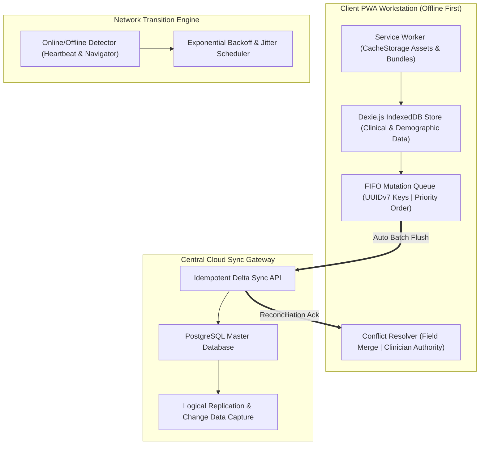

# Offline Operation, Local Persistence & Sync Requirements Baseline: Namma Clinic Digital Health Platform

| Metadata Attribute | Formal Specification |
| :--- | :--- |
| **Document Identifier** | `DOC-REQ-013-OFF` |
| **Document Title** | Offline Operation, Local Persistence & Sync Requirements Baseline |
| **Project Code** | `NAMMA-CLINIC-PLATFORM-2026` |
| **Requirement Type** | `Offline Autonomy Requirement` |
| **Specification Range** | `OFF-001 through OFF-050` (Exactly 50 unique requirements) |
| **Target Baseline** | `v1.0.0-PROD-BASELINE` |
| **Lifecycle Status** | `APPROVED & BASELINED` |
| **Target Facility Scope** | 183 Primary Namma Clinics across 8 BBMP Administrative Zones |
| **Lead Clinical Authority** | Chief Health Officer (CHO), BBMP Health Department |
| **Lead Technical Authority**| Principal Solutions Architect, Kushagramati Analytics Consortium |
| **Upstream Baselines** | [`00-project-baseline/`](../00-project-baseline/) \| [`01-project-management/`](../01-project-management/) |
| **Related Specification**| [`03-non-functional-requirements.md`](./03-non-functional-requirements.md) \| [`10-availability-requirements.md`](./10-availability-requirements.md) |

## 1. Executive Summary & Domain Governance Framework
This specification defines the comprehensive offline operation, local persistence, mutation queuing, and reconciliation requirements baseline for the Namma Clinic Digital Health Platform across 183 primary urban healthcare centers in Greater Bengaluru. Comprising 50 rigorous offline specifications (`OFF-001` through `OFF-050`), this document guarantees that all clinical consultations, vital sign entries, lab orders, pharmacy dispensations, and token issuances proceed with 100% autonomy during extended network outages.

Frontline urban healthcare centers in Bengaluru frequently experience fiber cuts, power grid fluctuations, and erratic cellular dongle coverage. The platform implements an offline-first architecture powered by Dexie.js IndexedDB local storage, deterministic UUIDv7 primary keys, priority-ordered mutation queues, automatic exponential backoff reconnection, and field-level clinical conflict resolution.

## 2. Architecture & Domain Conceptual Framework
The following architectural topology illustrates the functional interactions, security boundaries, and data flows governing this domain across Namma Clinic's 183 primary healthcare centers in Greater Bengaluru:



## 3. Master Offline Autonomy Requirement Inventory Table (OFF-001 through OFF-050)
| Requirement ID | Title | Operational State | Priority | Local Store Schema | Conflict Resolution Strategy | Owner |
| :--- | :--- | :--- | :--- | :--- | :--- | :---: |
| [`OFF-001`](#off-001) | **Network Online to Offline State Transition Detection** | `Offline Transition` | `MUST` | `system_state (key, status, timestam` | Client Event Listeners (navigator.o... | Mobile/Offline Lead |
| [`OFF-002`](#off-002) | **Dexie.js IndexedDB Schema Initialization and Versioning** | `Offline Storage` | `MUST` | `schema_migrations (version, applied` | Deterministic Schema Upgrades with ... | Database Engineer |
| [`OFF-003`](#off-003) | **Client Mutation Queue FIFO Persistence** | `Mutation Queue` | `MUST` | `mutation_queue (id, entity, op, pay` | FIFO Queue with Priority Precedence... | Frontend Tech Lead |
| [`OFF-004`](#off-004) | **UUID v7 Client-Side Primary Key Generation** | `Local Identity` | `MUST` | `all_tables (id: uuid_v7, created_at` | Monotonic Time-Ordered UUIDv7 Colli... | Solution Architect |
| [`OFF-005`](#off-005) | **Idempotency Key Injection for Offline Writes** | `Write Pipeline` | `MUST` | `mutation_queue (idempotency_key: ha` | Server-Side Token Deduplication Cac... | Backend Tech Lead |
| [`OFF-006`](#off-006) | **Priority Queuing for Clinical vs Administrative Mutations** | `Queue Management` | `MUST` | `mutation_queue (priority: HIGH|MED|` | Strict Clinical Precedence Dispatch... | Frontend Tech Lead |
| [`OFF-007`](#off-007) | **Exponential Backoff and Jitter Reconnection Protocol** | `Reconnection` | `MUST` | `sync_telemetry (retry_count, next_r` | Exponential Backoff (2s to 60s) wit... | SRE Lead |
| [`OFF-008`](#off-008) | **Three-Way Merge Engine for Clinical Consultations** | `Conflict Resolution` | `MUST` | `conflict_log (entity_id, client_v, ` | Field-Level Merging with Clinician ... | Clinical Reviewer |
| [`OFF-009`](#off-009) | **Last-Write-Wins Resolution for Administrative Metadata** | `Conflict Resolution` | `MUST` | `admin_metadata (key, val, updated_a` | Server Timestamp Last-Write-Wins (L... | Solution Architect |
| [`OFF-010`](#off-010) | **Deterministic Deduplication of Offline Patient Registrations** | `Deduplication` | `MUST` | `patients (abha_id, phone, name, dob` | Fuzzy Phone + Name Match with Super... | Data Engineer |
| [`OFF-011`](#off-011) | **Partial Sync and Chunked Batch Processing** | `Sync Pipeline` | `MUST` | `sync_batches (batch_id, chunk_index` | 50-Record Micro-Batches with Partia... | Backend Tech Lead |
| [`OFF-012`](#off-012) | **Sync Failure Quarantine and Manual Review Escalation** | `Failure Handling` | `MUST` | `sync_quarantine (id, mutation_id, e` | Quarantine Isolation with Superviso... | Frontend Tech Lead |
| [`OFF-013`](#off-013) | **Delta Synchronization and Incremental Cache Hydration** | `Sync Pipeline` | `MUST` | `sync_cursors (entity, last_sync_tim` | High-Watermark Delta Sync via Times... | Backend Tech Lead |
| [`OFF-014`](#off-014) | **Web Cryptography Client Storage AES-GCM Encryption** | `Data Security` | `MUST` | `secure_vault (salt, iv, ciphertext)` | SubtleCrypto AES-256-GCM Session Ke... | Security Lead |
| [`OFF-015`](#off-015) | **Offline Workstation Session Timeout and Re-Authentication** | `Session Security` | `MUST` | `offline_auth (user_hash, salt, expi` | Argon2id Hash Verification Against ... | Security Lead |
| [`OFF-016`](#off-016) | **Emergency PIN Fallback for Offline Clinician Login** | `Emergency Access` | `MUST` | `emergency_creds (role, hashed_pin, ` | Supervisor-Delegated 6-Digit Rotati... | Security Lead |
| [`OFF-017`](#off-017) | **Workstation Replacement and Local Database Eviction** | `Device Lifecycle` | `MUST` | `device_binding (device_id, clinic_i` | Cryptographic Wipe on Device De-Reg... | SRE Lead |
| [`OFF-018`](#off-018) | **Storage Quota Monitoring and Eviction Defense** | `Storage Management` | `MUST` | `storage_telemetry (used_bytes, quot` | navigator.storage.persist() Lockout... | Frontend Tech Lead |
| [`OFF-019`](#off-019) | **Multi-Tab Synchronization via BroadcastChannel API** | `Browser Concurrency` | `MUST` | `active_tabs (tab_id, last_heartbeat` | BroadcastChannel Real-Time Cross-Ta... | Frontend Tech Lead |
| [`OFF-020`](#off-020) | **Offline Thermal Printer Queue and ESC/POS Spooling** | `Hardware Queue` | `MUST` | `print_spool (job_id, raw_bytes, sta` | IndexedDB ESC/POS Byte Buffer Spool... | Hardware Integration Lead |
| [`OFF-021`](#off-021) | **Offline Doctor Consultation Note Autosave** | `Clinical Care` | `MUST` | `draft_consultations (patient_id, dr` | Debounced 500ms Local Autosave to D... | Medical Officer |
| [`OFF-022`](#off-022) | **Offline Prescription Issuance and Stock Reservation** | `Pharmacy` | `MUST` | `draft_prescriptions (rx_id, drug_id` | Optimistic Local Stock Decrement wi... | Pharmacist |
| [`OFF-023`](#off-023) | **Offline Point-of-Care Lab Order Generation** | `Laboratory` | `MUST` | `draft_lab_orders (order_id, test_id` | Deterministic Specimen Barcode Pre-... | Lab Technician |
| [`OFF-024`](#off-024) | **Offline OPD Queue Token Generation and Sequencing** | `Registration` | `MUST` | `local_tokens (token_num, patient_id` | Pre-Allocated Clinic Daily Token Ra... | Registration Clerk |
| [`OFF-025`](#off-025) | **Offline Triage Vital Signs Recording and Scoring** | `Triage` | `MUST` | `triage_vitals (patient_id, sbp, dbp` | Local MEWS / Urgency Score Calculat... | Staff Nurse |
| [`OFF-026`](#off-026) | **Offline Essential Drug List (EDL) Formulary Cache** | `Formulary` | `MUST` | `cached_edl (drug_code, generic_name` | Read-Only 120 EDL Master Cache in I... | Pharmacist |
| [`OFF-027`](#off-027) | **Offline ICD-11 Common Symptom Code Search Index** | `Diagnostics` | `MUST` | `cached_icd11 (code, title, search_t` | Client-Side In-Memory Trie Search (... | Medical Officer |
| [`OFF-028`](#off-028) | **Offline Maternal Care ANC Visit Scheduling** | `Maternal Care` | `MUST` | `anc_schedule (mother_id, edd, visit` | Local Rule-Based ANC Visit Calculat... | Staff Nurse |
| [`OFF-029`](#off-029) | **Offline Child Immunization Schedule Calculation** | `Immunization` | `MUST` | `immunization_tracker (child_id, vac` | National Immunization Schedule Calc... | Staff Nurse |
| [`OFF-030`](#off-030) | **Offline NCD Patient Risk Scoring and Screening** | `NCD Screening` | `MUST` | `ncd_screenings (patient_id, cbac_sc` | Automated CBAC Risk Assessment Matr... | Staff Nurse |
| [`OFF-031`](#off-031) | **Offline Lab Test Reference Range Validator** | `Laboratory` | `MUST` | `lab_reference (test_code, min_val, ` | Local Normal Range Evaluation Engin... | Lab Technician |
| [`OFF-032`](#off-032) | **Offline Medicine Expiry Warning Engine** | `Pharmacy` | `MUST` | `batch_inventory (batch_num, drug_id` | Client-Side 30/60/90 Day Expiry Ale... | Pharmacist |
| [`OFF-033`](#off-033) | **Offline Cold Chain Temperature Anomaly Logging** | `Cold Chain` | `MUST` | `temp_logs (fridge_id, recorded_at, ` | Local Out-of-Range (<2C or >8C) Aud... | Pharmacist |
| [`OFF-034`](#off-034) | **Offline Biomedical Waste Bag Barcode Dispatch** | `Operations` | `MUST` | `waste_dispatches (bag_barcode, cate` | Local Waste Log Persistence with US... | Administrative Assistant |
| [`OFF-035`](#off-035) | **Offline Supervisor Audit Trail Buffering** | `Audit Vault` | `MUST` | `offline_audit (event_id, actor, eve` | HMAC-SHA256 Chained Immutable Local... | Security Lead |
| [`OFF-036`](#off-036) | **Background Sync via Service Worker SyncManager** | `Background Sync` | `MUST` | `sync_registrations (tag, registered` | Periodic and Event-Driven SyncManag... | Frontend Tech Lead |
| [`OFF-037`](#off-037) | **Bandwidth-Adaptive Payload Compression for Sync** | `Network Adaptation` | `MUST` | `sync_compression (algo: gzip|brotli` | Dynamic Gzip Compression on 2G/3G C... | Backend Tech Lead |
| [`OFF-038`](#off-038) | **Sync Progress Visual Indicator and Status Bar** | `User Experience` | `MUST` | `sync_ui_state (pending_count, sync_` | Real-Time Sync Status Badge (Synced... | Frontend Tech Lead |
| [`OFF-039`](#off-039) | **Manual Force-Sync Trigger with Admin Override** | `Sync Control` | `MUST` | `force_sync_events (triggered_by, tr` | Instant Mutation Dispatch Trigger w... | Frontend Tech Lead |
| [`OFF-040`](#off-040) | **Differential Change Data Capture (CDC) Sync Protocol** | `Database Sync` | `MUST` | `server_cdc (tx_id, entity, row_id, ` | Server-Side JSON Patch Dispatch to ... | Database Engineer |
| [`OFF-041`](#off-041) | **Client-Side Cache Warmup Protocol on First Login** | `Initialization` | `MUST` | `warmup_manifest (table_name, total_` | Chunked Initial Download of Clinic ... | Frontend Tech Lead |
| [`OFF-042`](#off-042) | **Offline Patient Demographics Search via Inverted Index** | `Patient Search` | `MUST` | `patient_search_index (token, patien` | Prefix-Trie Token Search Across 5,0... | Frontend Tech Lead |
| [`OFF-043`](#off-043) | **Patient Photo Compression and Offline Storage** | `Demographics` | `MUST` | `patient_photos (patient_id, webp_th` | Client-Side WebP Canvas Resizing to... | Frontend Tech Lead |
| [`OFF-044`](#off-044) | **Offline Document and Prescription Template Caching** | `Templates` | `MUST` | `document_templates (template_id, ht` | Pre-Cached Mustache/Handlebars Prin... | Frontend Tech Lead |
| [`OFF-045`](#off-045) | **Battery-Aware Sync Throttling on Workstation Laptop** | `Hardware Awareness` | `MUST` | `battery_telemetry (level, charging,` | navigator.getBattery() Low-Power Sy... | Mobile/Offline Lead |
| [`OFF-046`](#off-046) | **Graceful Degradation During IndexedDB Quota Warnings** | `Storage Management` | `MUST` | `quota_warnings (timestamp, percenta` | Eviction of Stale Read Caches while... | Frontend Tech Lead |
| [`OFF-047`](#off-047) | **Workstation Clock Drift Detection and Compensation** | `Time Integrity` | `MUST` | `clock_offset (client_time, server_t` | NTP / Server-Header Drift Calculati... | Solution Architect |
| [`OFF-048`](#off-048) | **End-of-Day Offline Reconciliation Report Generation** | `Daily Closing` | `MUST` | `eod_reconciliation (date, pending_m` | Local Daily Tally of Tokens, Prescr... | Administrative Assistant |
| [`OFF-049`](#off-049) | **Offline Emergency Patient Triage Override Bypass** | `Emergency Care` | `MUST` | `emergency_overrides (patient_id, ov` | Immediate Unverified Token Allocati... | Staff Nurse |
| [`OFF-050`](#off-050) | **Disaster Recovery Workstation Sync State Dump and Restore** | `Disaster Recovery` | `MUST` | `sync_state_dump (clinic_id, dump_js` | Encrypted USB JSON Export of Pendin... | SRE Lead |

## 4. Comprehensive Offline Autonomy Requirement Specifications (OFF-001 through OFF-050)
This section establishes the exhaustive engineering, clinical, operational, and architectural specifications for each of the 50 requirements committed for the production baseline.

### 4.1 OFF-001: Network Online to Offline State Transition Detection

| Specification Attribute | Formal Engineering Definition |
| :--- | :--- |
| **Requirement ID** | `OFF-001` |
| **Requirement Title** | Network Online to Offline State Transition Detection |
| **Requirement Statement**| The platform SHALL enforce network online to offline state transition detection during offline transition utilizing system_state (key, status, timestamp) and resolving conflicts via Client Event Listeners (navigator.onLine + Heartbeat). |
| **Requirement Type** | `Offline Autonomy Requirement` |
| **Priority Level** | `MUST` (Rationale: Mandatory clinic operational continuity guaranteeing zero stoppage during fiber or cellular outages.) |
| **Business Value** | Guarantees 100% uninterrupted healthcare delivery for citizens regardless of connectivity. |
| **Engineering Rationale**| Ensures network online to offline state transition detection using local IndexedDB Dexie.js store: system_state (key, status, timestamp). |
| **Primary Actor** | `Clinic Workstation PWA Client` |
| **Target User Persona** | [`PERSONA-001`](../01-project-management/07-user-personas.md#persona-001) |
| **Accountable Role** | [`ROLE-002`](../01-project-management/08-role-and-responsibility-matrix.md#role-002) |
| **Key Stakeholder** | [`STAKEHOLDER-008`](../01-project-management/06-stakeholders.md#stakeholder-008) |
| **Trigger Condition** | Network disconnection, offline write mutation, or sync window reconnection. |
| **System Preconditions** | Local browser initialized with Dexie.js database and valid cryptographic salt. |
| **Input Specifications** | Clinical mutation payload, timestamp, local UUIDv7, and state transition flags. |
| **Validation Rules** | Evaluated against local schema constraints and idempotency hashes before queue commit. |
| **Postconditions** | Local database state consistent; zero uncommitted mutations lost across restarts. |
| **State Mutations** | Updates Dexie.js local mutation queue and increments pending sync counter. |
| **Associated Rules** | Business: [`BRULE-001`](./04-business-rules.md#brule-001) \| Clinical: [`CR-001`](./05-clinical-rules.md#cr-001) \| Operational: [`OR-001`](./06-operational-rules.md#or-001) |
| **Security & Privacy** | Security: `Local IndexedDB stores encrypted via AES-256-GCM Web Cryptography API.` \| Privacy: `Sensitive patient PII cached locally is purged upon workstation user logout.` |
| **Data & Audit** | Data: `UUIDv7 monotonic primary keys prevent ID collisions across 183 clinics.` \| Audit: `Offline mutation timestamps and sync telemetry logged to WORM vault.` |
| **Offline & Sync** | Offline: `Autonomous offline execution with zero dependency on central cloud connectivity.` \| Sync: `Server endpoint enforces idempotency keys and delta merge verification.` |
| **Quality Expectations**| Perf: `Local IndexedDB commit latency under 10ms for 99% of mutations.` \| Avail: `Guaranteed 8 hours autonomous offline operation without network connectivity.` |
| **Localization & A11y**| Loc: `Offline translation bundles cached locally in PWA service worker.` \| A11y: `Accessible offline status indicator banner visible on all clinic screens.` |
| **Failure & Recovery** | Failure: Isolate conflicting records to quarantine table without blocking remaining queue. \| Recovery: Automated exponential backoff reconnect with jitter upon network restoration. |
| **Observability** | Logging: `Structured JSON client log with queue_depth, sync_state, and mutation_id.` \| Metrics: `Prometheus gauge `namma_clinic_offline_queue_depth{clinic_id="BLR-001"}`.` |
| **Upstream Traceability**| Obj: [`OBJECTIVE-001`](../01-project-management/02-project-vision-and-objectives.md#objective-001) \| Scope: [`INSCOPE-001`](../01-project-management/04-in-scope.md#inscope-001) \| Risk: [`RISK-001`](../01-project-management/12-project-risks.md#risk-001) |
| **Downstream Planning** | Epic: `PLANNED-EPIC-001` \| Feature: `PLANNED-FEATURE-001` \| API: `PLANNED-API-001` \| DB: `PLANNED-DB-001` \| Test: `PLANNED-TEST-1201` |

#### 4.1.1 Operational Execution Protocol & Frontline Workflow
- **Continuous Operational Workflow:**
  1. Client detects operational mode: Offline Transition.
  2. Mutation written locally to Dexie.js store: system_state (key, status, timestamp).
  3. Offline mutation queue buffers payload with monotonic sequence ordering.
  4. Conflict engine applies resolution strategy: Client Event Listeners (navigator.onLine + Heartbeat).
  5. On network restoration, background worker flushes queued transactions with zero data loss.
- **Degraded State Fallback Path:** If network flickers intermittently, buffer mutations in memory and retry IndexedDB batch flush.
- **Exception Breach & Incident Escalation Path:** If local IndexedDB storage reaches 90% quota, evict non-essential read caches and alert operator.

#### 4.1.2 Technical Invariants & Operational Contract
- **Offline Operational State:** Offline Transition
- **IndexedDB Dexie.js Schema:** `system_state (key, status, timestamp)`
- **Conflict Resolution Protocol:** Client Event Listeners (navigator.onLine + Heartbeat)
- **Verification Protocol:** Network Simulation Test
- **Accountable Mobile/Offline Lead:** Mobile/Offline Lead

#### 4.1.3 Executable BDD Acceptance Scenarios
```gherkin
Feature: OFF-001 - Network Online to Offline State Transition Detection
  As a Clinic Workstation PWA Client
  I require system enforcement of network online to offline state transition detection
  In order to ensure municipal healthcare compliance and operational integrity

  Scenario: Happy Path Execution for OFF-001
    Given the Clinic Workstation PWA Client is authenticated and clinic terminal is operational
    When the user submits a valid request for network online to offline state transition detection
    Then the system successfully commits the transaction and emits an audit event

  Scenario: Input Validation and Schema Guard for OFF-001
    Given the Clinic Workstation PWA Client attempts to submit an incomplete or malformed payload for network online to offline state transition detection
    When the request fails TypeBox schema or domain constraint validation
    Then the system rejects the input with HTTP 400 and highlights invalid fields in Kannada and English

  Scenario: RBAC and Security Access Control for OFF-001
    Given an unauthenticated or unauthorized role attempts to invoke network online to offline state transition detection
    When the bearer JWT token is missing, expired, or lacks necessary RBAC permission
    Then the system denies execution with HTTP 403 Forbidden and records a security telemetry alert

  Scenario: Offline Autonomous Execution for OFF-001
    Given the clinic WAN network is completely severed during network online to offline state transition detection
    When the operator confirms the local transaction on the workstation
    Then the mutation is persisted to Dexie.js IndexedDB with a UUIDv7 and queued for background replay

  Scenario: Network Recovery and Idempotent Sync for OFF-001
    Given the clinic workstation reconnects to the BBMP municipal health WAN
    When the background sync daemon processes the pending mutation queue
    Then all buffered transactions for OFF-001 synchronize idempotently with zero data loss
```

#### 4.1.4 Verification Protocol & Quality Sign-Off
- **Verification Method:** Network Simulation Test
- **Automated Test Suite:** `PLANNED-TEST-1201` (Automated Offline Disconnection & Reconciliation Test) targeting 100% verification gate compliance.
- **Related Internal Requirements:** `NFR-009`, `NFR-010`, `AVAIL-002`
- **Dependencies & Blocking Constraints:** NFR-009 | Constraints: Workstation memory footprint must remain strictly under 150MB.
- **Architectural Assumptions & Open Questions:** Assumption: Clinic workstations equipped with modern Chromium-based browser supporting IndexedDB. | Open Question: Validation of IndexedDB eviction policies across legacy Chromium releases.

---

### 4.2 OFF-002: Dexie.js IndexedDB Schema Initialization and Versioning

| Specification Attribute | Formal Engineering Definition |
| :--- | :--- |
| **Requirement ID** | `OFF-002` |
| **Requirement Title** | Dexie.js IndexedDB Schema Initialization and Versioning |
| **Requirement Statement**| The platform SHALL enforce dexie.js indexeddb schema initialization and versioning during offline storage utilizing schema_migrations (version, applied_at) and resolving conflicts via Deterministic Schema Upgrades with Dexie.version. |
| **Requirement Type** | `Offline Autonomy Requirement` |
| **Priority Level** | `MUST` (Rationale: Mandatory clinic operational continuity guaranteeing zero stoppage during fiber or cellular outages.) |
| **Business Value** | Guarantees 100% uninterrupted healthcare delivery for citizens regardless of connectivity. |
| **Engineering Rationale**| Ensures dexie.js indexeddb schema initialization and versioning using local IndexedDB Dexie.js store: schema_migrations (version, applied_at). |
| **Primary Actor** | `Clinic Workstation PWA Client` |
| **Target User Persona** | [`PERSONA-002`](../01-project-management/07-user-personas.md#persona-002) |
| **Accountable Role** | [`ROLE-002`](../01-project-management/08-role-and-responsibility-matrix.md#role-002) |
| **Key Stakeholder** | [`STAKEHOLDER-008`](../01-project-management/06-stakeholders.md#stakeholder-008) |
| **Trigger Condition** | Network disconnection, offline write mutation, or sync window reconnection. |
| **System Preconditions** | Local browser initialized with Dexie.js database and valid cryptographic salt. |
| **Input Specifications** | Clinical mutation payload, timestamp, local UUIDv7, and state transition flags. |
| **Validation Rules** | Evaluated against local schema constraints and idempotency hashes before queue commit. |
| **Postconditions** | Local database state consistent; zero uncommitted mutations lost across restarts. |
| **State Mutations** | Updates Dexie.js local mutation queue and increments pending sync counter. |
| **Associated Rules** | Business: [`BRULE-002`](./04-business-rules.md#brule-002) \| Clinical: [`CR-002`](./05-clinical-rules.md#cr-002) \| Operational: [`OR-002`](./06-operational-rules.md#or-002) |
| **Security & Privacy** | Security: `Local IndexedDB stores encrypted via AES-256-GCM Web Cryptography API.` \| Privacy: `Sensitive patient PII cached locally is purged upon workstation user logout.` |
| **Data & Audit** | Data: `UUIDv7 monotonic primary keys prevent ID collisions across 183 clinics.` \| Audit: `Offline mutation timestamps and sync telemetry logged to WORM vault.` |
| **Offline & Sync** | Offline: `Autonomous offline execution with zero dependency on central cloud connectivity.` \| Sync: `Server endpoint enforces idempotency keys and delta merge verification.` |
| **Quality Expectations**| Perf: `Local IndexedDB commit latency under 10ms for 99% of mutations.` \| Avail: `Guaranteed 8 hours autonomous offline operation without network connectivity.` |
| **Localization & A11y**| Loc: `Offline translation bundles cached locally in PWA service worker.` \| A11y: `Accessible offline status indicator banner visible on all clinic screens.` |
| **Failure & Recovery** | Failure: Isolate conflicting records to quarantine table without blocking remaining queue. \| Recovery: Automated exponential backoff reconnect with jitter upon network restoration. |
| **Observability** | Logging: `Structured JSON client log with queue_depth, sync_state, and mutation_id.` \| Metrics: `Prometheus gauge `namma_clinic_offline_queue_depth{clinic_id="BLR-001"}`.` |
| **Upstream Traceability**| Obj: [`OBJECTIVE-002`](../01-project-management/02-project-vision-and-objectives.md#objective-002) \| Scope: [`INSCOPE-002`](../01-project-management/04-in-scope.md#inscope-002) \| Risk: [`RISK-002`](../01-project-management/12-project-risks.md#risk-002) |
| **Downstream Planning** | Epic: `PLANNED-EPIC-002` \| Feature: `PLANNED-FEATURE-002` \| API: `PLANNED-API-002` \| DB: `PLANNED-DB-002` \| Test: `PLANNED-TEST-1202` |

#### 4.2.1 Operational Execution Protocol & Frontline Workflow
- **Continuous Operational Workflow:**
  1. Client detects operational mode: Offline Storage.
  2. Mutation written locally to Dexie.js store: schema_migrations (version, applied_at).
  3. Offline mutation queue buffers payload with monotonic sequence ordering.
  4. Conflict engine applies resolution strategy: Deterministic Schema Upgrades with Dexie.version.
  5. On network restoration, background worker flushes queued transactions with zero data loss.
- **Degraded State Fallback Path:** If network flickers intermittently, buffer mutations in memory and retry IndexedDB batch flush.
- **Exception Breach & Incident Escalation Path:** If local IndexedDB storage reaches 90% quota, evict non-essential read caches and alert operator.

#### 4.2.2 Technical Invariants & Operational Contract
- **Offline Operational State:** Offline Storage
- **IndexedDB Dexie.js Schema:** `schema_migrations (version, applied_at)`
- **Conflict Resolution Protocol:** Deterministic Schema Upgrades with Dexie.version
- **Verification Protocol:** Storage Migration Test
- **Accountable Mobile/Offline Lead:** Database Engineer

#### 4.2.3 Executable BDD Acceptance Scenarios
```gherkin
Feature: OFF-002 - Dexie.js IndexedDB Schema Initialization and Versioning
  As a Clinic Workstation PWA Client
  I require system enforcement of dexie.js indexeddb schema initialization and versioning
  In order to ensure municipal healthcare compliance and operational integrity

  Scenario: Happy Path Execution for OFF-002
    Given the Clinic Workstation PWA Client is authenticated and clinic terminal is operational
    When the user submits a valid request for dexie.js indexeddb schema initialization and versioning
    Then the system successfully commits the transaction and emits an audit event

  Scenario: Input Validation and Schema Guard for OFF-002
    Given the Clinic Workstation PWA Client attempts to submit an incomplete or malformed payload for dexie.js indexeddb schema initialization and versioning
    When the request fails TypeBox schema or domain constraint validation
    Then the system rejects the input with HTTP 400 and highlights invalid fields in Kannada and English

  Scenario: RBAC and Security Access Control for OFF-002
    Given an unauthenticated or unauthorized role attempts to invoke dexie.js indexeddb schema initialization and versioning
    When the bearer JWT token is missing, expired, or lacks necessary RBAC permission
    Then the system denies execution with HTTP 403 Forbidden and records a security telemetry alert

  Scenario: Offline Autonomous Execution for OFF-002
    Given the clinic WAN network is completely severed during dexie.js indexeddb schema initialization and versioning
    When the operator confirms the local transaction on the workstation
    Then the mutation is persisted to Dexie.js IndexedDB with a UUIDv7 and queued for background replay

  Scenario: Network Recovery and Idempotent Sync for OFF-002
    Given the clinic workstation reconnects to the BBMP municipal health WAN
    When the background sync daemon processes the pending mutation queue
    Then all buffered transactions for OFF-002 synchronize idempotently with zero data loss
```

#### 4.2.4 Verification Protocol & Quality Sign-Off
- **Verification Method:** Storage Migration Test
- **Automated Test Suite:** `PLANNED-TEST-1202` (Automated Offline Disconnection & Reconciliation Test) targeting 100% verification gate compliance.
- **Related Internal Requirements:** `NFR-009`, `NFR-010`, `AVAIL-002`
- **Dependencies & Blocking Constraints:** NFR-009 | Constraints: Workstation memory footprint must remain strictly under 150MB.
- **Architectural Assumptions & Open Questions:** Assumption: Clinic workstations equipped with modern Chromium-based browser supporting IndexedDB. | Open Question: Validation of IndexedDB eviction policies across legacy Chromium releases.

---

### 4.3 OFF-003: Client Mutation Queue FIFO Persistence

| Specification Attribute | Formal Engineering Definition |
| :--- | :--- |
| **Requirement ID** | `OFF-003` |
| **Requirement Title** | Client Mutation Queue FIFO Persistence |
| **Requirement Statement**| The platform SHALL enforce client mutation queue fifo persistence during mutation queue utilizing mutation_queue (id, entity, op, payload, status) and resolving conflicts via FIFO Queue with Priority Precedence. |
| **Requirement Type** | `Offline Autonomy Requirement` |
| **Priority Level** | `MUST` (Rationale: Mandatory clinic operational continuity guaranteeing zero stoppage during fiber or cellular outages.) |
| **Business Value** | Guarantees 100% uninterrupted healthcare delivery for citizens regardless of connectivity. |
| **Engineering Rationale**| Ensures client mutation queue fifo persistence using local IndexedDB Dexie.js store: mutation_queue (id, entity, op, payload, status). |
| **Primary Actor** | `Clinic Workstation PWA Client` |
| **Target User Persona** | [`PERSONA-003`](../01-project-management/07-user-personas.md#persona-003) |
| **Accountable Role** | [`ROLE-002`](../01-project-management/08-role-and-responsibility-matrix.md#role-002) |
| **Key Stakeholder** | [`STAKEHOLDER-008`](../01-project-management/06-stakeholders.md#stakeholder-008) |
| **Trigger Condition** | Network disconnection, offline write mutation, or sync window reconnection. |
| **System Preconditions** | Local browser initialized with Dexie.js database and valid cryptographic salt. |
| **Input Specifications** | Clinical mutation payload, timestamp, local UUIDv7, and state transition flags. |
| **Validation Rules** | Evaluated against local schema constraints and idempotency hashes before queue commit. |
| **Postconditions** | Local database state consistent; zero uncommitted mutations lost across restarts. |
| **State Mutations** | Updates Dexie.js local mutation queue and increments pending sync counter. |
| **Associated Rules** | Business: [`BRULE-003`](./04-business-rules.md#brule-003) \| Clinical: [`CR-003`](./05-clinical-rules.md#cr-003) \| Operational: [`OR-003`](./06-operational-rules.md#or-003) |
| **Security & Privacy** | Security: `Local IndexedDB stores encrypted via AES-256-GCM Web Cryptography API.` \| Privacy: `Sensitive patient PII cached locally is purged upon workstation user logout.` |
| **Data & Audit** | Data: `UUIDv7 monotonic primary keys prevent ID collisions across 183 clinics.` \| Audit: `Offline mutation timestamps and sync telemetry logged to WORM vault.` |
| **Offline & Sync** | Offline: `Autonomous offline execution with zero dependency on central cloud connectivity.` \| Sync: `Server endpoint enforces idempotency keys and delta merge verification.` |
| **Quality Expectations**| Perf: `Local IndexedDB commit latency under 10ms for 99% of mutations.` \| Avail: `Guaranteed 8 hours autonomous offline operation without network connectivity.` |
| **Localization & A11y**| Loc: `Offline translation bundles cached locally in PWA service worker.` \| A11y: `Accessible offline status indicator banner visible on all clinic screens.` |
| **Failure & Recovery** | Failure: Isolate conflicting records to quarantine table without blocking remaining queue. \| Recovery: Automated exponential backoff reconnect with jitter upon network restoration. |
| **Observability** | Logging: `Structured JSON client log with queue_depth, sync_state, and mutation_id.` \| Metrics: `Prometheus gauge `namma_clinic_offline_queue_depth{clinic_id="BLR-001"}`.` |
| **Upstream Traceability**| Obj: [`OBJECTIVE-003`](../01-project-management/02-project-vision-and-objectives.md#objective-003) \| Scope: [`INSCOPE-003`](../01-project-management/04-in-scope.md#inscope-003) \| Risk: [`RISK-003`](../01-project-management/12-project-risks.md#risk-003) |
| **Downstream Planning** | Epic: `PLANNED-EPIC-003` \| Feature: `PLANNED-FEATURE-003` \| API: `PLANNED-API-003` \| DB: `PLANNED-DB-003` \| Test: `PLANNED-TEST-1203` |

#### 4.3.1 Operational Execution Protocol & Frontline Workflow
- **Continuous Operational Workflow:**
  1. Client detects operational mode: Mutation Queue.
  2. Mutation written locally to Dexie.js store: mutation_queue (id, entity, op, payload, status).
  3. Offline mutation queue buffers payload with monotonic sequence ordering.
  4. Conflict engine applies resolution strategy: FIFO Queue with Priority Precedence.
  5. On network restoration, background worker flushes queued transactions with zero data loss.
- **Degraded State Fallback Path:** If network flickers intermittently, buffer mutations in memory and retry IndexedDB batch flush.
- **Exception Breach & Incident Escalation Path:** If local IndexedDB storage reaches 90% quota, evict non-essential read caches and alert operator.

#### 4.3.2 Technical Invariants & Operational Contract
- **Offline Operational State:** Mutation Queue
- **IndexedDB Dexie.js Schema:** `mutation_queue (id, entity, op, payload, status)`
- **Conflict Resolution Protocol:** FIFO Queue with Priority Precedence
- **Verification Protocol:** Queue Persistence Verification
- **Accountable Mobile/Offline Lead:** Frontend Tech Lead

#### 4.3.3 Executable BDD Acceptance Scenarios
```gherkin
Feature: OFF-003 - Client Mutation Queue FIFO Persistence
  As a Clinic Workstation PWA Client
  I require system enforcement of client mutation queue fifo persistence
  In order to ensure municipal healthcare compliance and operational integrity

  Scenario: Happy Path Execution for OFF-003
    Given the Clinic Workstation PWA Client is authenticated and clinic terminal is operational
    When the user submits a valid request for client mutation queue fifo persistence
    Then the system successfully commits the transaction and emits an audit event

  Scenario: Input Validation and Schema Guard for OFF-003
    Given the Clinic Workstation PWA Client attempts to submit an incomplete or malformed payload for client mutation queue fifo persistence
    When the request fails TypeBox schema or domain constraint validation
    Then the system rejects the input with HTTP 400 and highlights invalid fields in Kannada and English

  Scenario: RBAC and Security Access Control for OFF-003
    Given an unauthenticated or unauthorized role attempts to invoke client mutation queue fifo persistence
    When the bearer JWT token is missing, expired, or lacks necessary RBAC permission
    Then the system denies execution with HTTP 403 Forbidden and records a security telemetry alert

  Scenario: Offline Autonomous Execution for OFF-003
    Given the clinic WAN network is completely severed during client mutation queue fifo persistence
    When the operator confirms the local transaction on the workstation
    Then the mutation is persisted to Dexie.js IndexedDB with a UUIDv7 and queued for background replay

  Scenario: Network Recovery and Idempotent Sync for OFF-003
    Given the clinic workstation reconnects to the BBMP municipal health WAN
    When the background sync daemon processes the pending mutation queue
    Then all buffered transactions for OFF-003 synchronize idempotently with zero data loss
```

#### 4.3.4 Verification Protocol & Quality Sign-Off
- **Verification Method:** Queue Persistence Verification
- **Automated Test Suite:** `PLANNED-TEST-1203` (Automated Offline Disconnection & Reconciliation Test) targeting 100% verification gate compliance.
- **Related Internal Requirements:** `NFR-009`, `NFR-010`, `AVAIL-002`
- **Dependencies & Blocking Constraints:** NFR-009 | Constraints: Workstation memory footprint must remain strictly under 150MB.
- **Architectural Assumptions & Open Questions:** Assumption: Clinic workstations equipped with modern Chromium-based browser supporting IndexedDB. | Open Question: Validation of IndexedDB eviction policies across legacy Chromium releases.

---

### 4.4 OFF-004: UUID v7 Client-Side Primary Key Generation

| Specification Attribute | Formal Engineering Definition |
| :--- | :--- |
| **Requirement ID** | `OFF-004` |
| **Requirement Title** | UUID v7 Client-Side Primary Key Generation |
| **Requirement Statement**| The platform SHALL enforce uuid v7 client-side primary key generation during local identity utilizing all_tables (id: uuid_v7, created_at) and resolving conflicts via Monotonic Time-Ordered UUIDv7 Collision Free. |
| **Requirement Type** | `Offline Autonomy Requirement` |
| **Priority Level** | `MUST` (Rationale: Mandatory clinic operational continuity guaranteeing zero stoppage during fiber or cellular outages.) |
| **Business Value** | Guarantees 100% uninterrupted healthcare delivery for citizens regardless of connectivity. |
| **Engineering Rationale**| Ensures uuid v7 client-side primary key generation using local IndexedDB Dexie.js store: all_tables (id: uuid_v7, created_at). |
| **Primary Actor** | `Clinic Workstation PWA Client` |
| **Target User Persona** | [`PERSONA-004`](../01-project-management/07-user-personas.md#persona-004) |
| **Accountable Role** | [`ROLE-002`](../01-project-management/08-role-and-responsibility-matrix.md#role-002) |
| **Key Stakeholder** | [`STAKEHOLDER-008`](../01-project-management/06-stakeholders.md#stakeholder-008) |
| **Trigger Condition** | Network disconnection, offline write mutation, or sync window reconnection. |
| **System Preconditions** | Local browser initialized with Dexie.js database and valid cryptographic salt. |
| **Input Specifications** | Clinical mutation payload, timestamp, local UUIDv7, and state transition flags. |
| **Validation Rules** | Evaluated against local schema constraints and idempotency hashes before queue commit. |
| **Postconditions** | Local database state consistent; zero uncommitted mutations lost across restarts. |
| **State Mutations** | Updates Dexie.js local mutation queue and increments pending sync counter. |
| **Associated Rules** | Business: [`BRULE-004`](./04-business-rules.md#brule-004) \| Clinical: [`CR-004`](./05-clinical-rules.md#cr-004) \| Operational: [`OR-004`](./06-operational-rules.md#or-004) |
| **Security & Privacy** | Security: `Local IndexedDB stores encrypted via AES-256-GCM Web Cryptography API.` \| Privacy: `Sensitive patient PII cached locally is purged upon workstation user logout.` |
| **Data & Audit** | Data: `UUIDv7 monotonic primary keys prevent ID collisions across 183 clinics.` \| Audit: `Offline mutation timestamps and sync telemetry logged to WORM vault.` |
| **Offline & Sync** | Offline: `Autonomous offline execution with zero dependency on central cloud connectivity.` \| Sync: `Server endpoint enforces idempotency keys and delta merge verification.` |
| **Quality Expectations**| Perf: `Local IndexedDB commit latency under 10ms for 99% of mutations.` \| Avail: `Guaranteed 8 hours autonomous offline operation without network connectivity.` |
| **Localization & A11y**| Loc: `Offline translation bundles cached locally in PWA service worker.` \| A11y: `Accessible offline status indicator banner visible on all clinic screens.` |
| **Failure & Recovery** | Failure: Isolate conflicting records to quarantine table without blocking remaining queue. \| Recovery: Automated exponential backoff reconnect with jitter upon network restoration. |
| **Observability** | Logging: `Structured JSON client log with queue_depth, sync_state, and mutation_id.` \| Metrics: `Prometheus gauge `namma_clinic_offline_queue_depth{clinic_id="BLR-001"}`.` |
| **Upstream Traceability**| Obj: [`OBJECTIVE-004`](../01-project-management/02-project-vision-and-objectives.md#objective-004) \| Scope: [`INSCOPE-004`](../01-project-management/04-in-scope.md#inscope-004) \| Risk: [`RISK-004`](../01-project-management/12-project-risks.md#risk-004) |
| **Downstream Planning** | Epic: `PLANNED-EPIC-004` \| Feature: `PLANNED-FEATURE-004` \| API: `PLANNED-API-004` \| DB: `PLANNED-DB-004` \| Test: `PLANNED-TEST-1204` |

#### 4.4.1 Operational Execution Protocol & Frontline Workflow
- **Continuous Operational Workflow:**
  1. Client detects operational mode: Local Identity.
  2. Mutation written locally to Dexie.js store: all_tables (id: uuid_v7, created_at).
  3. Offline mutation queue buffers payload with monotonic sequence ordering.
  4. Conflict engine applies resolution strategy: Monotonic Time-Ordered UUIDv7 Collision Free.
  5. On network restoration, background worker flushes queued transactions with zero data loss.
- **Degraded State Fallback Path:** If network flickers intermittently, buffer mutations in memory and retry IndexedDB batch flush.
- **Exception Breach & Incident Escalation Path:** If local IndexedDB storage reaches 90% quota, evict non-essential read caches and alert operator.

#### 4.4.2 Technical Invariants & Operational Contract
- **Offline Operational State:** Local Identity
- **IndexedDB Dexie.js Schema:** `all_tables (id: uuid_v7, created_at)`
- **Conflict Resolution Protocol:** Monotonic Time-Ordered UUIDv7 Collision Free
- **Verification Protocol:** ID Collision Chaos Test
- **Accountable Mobile/Offline Lead:** Solution Architect

#### 4.4.3 Executable BDD Acceptance Scenarios
```gherkin
Feature: OFF-004 - UUID v7 Client-Side Primary Key Generation
  As a Clinic Workstation PWA Client
  I require system enforcement of uuid v7 client-side primary key generation
  In order to ensure municipal healthcare compliance and operational integrity

  Scenario: Happy Path Execution for OFF-004
    Given the Clinic Workstation PWA Client is authenticated and clinic terminal is operational
    When the user submits a valid request for uuid v7 client-side primary key generation
    Then the system successfully commits the transaction and emits an audit event

  Scenario: Input Validation and Schema Guard for OFF-004
    Given the Clinic Workstation PWA Client attempts to submit an incomplete or malformed payload for uuid v7 client-side primary key generation
    When the request fails TypeBox schema or domain constraint validation
    Then the system rejects the input with HTTP 400 and highlights invalid fields in Kannada and English

  Scenario: RBAC and Security Access Control for OFF-004
    Given an unauthenticated or unauthorized role attempts to invoke uuid v7 client-side primary key generation
    When the bearer JWT token is missing, expired, or lacks necessary RBAC permission
    Then the system denies execution with HTTP 403 Forbidden and records a security telemetry alert

  Scenario: Offline Autonomous Execution for OFF-004
    Given the clinic WAN network is completely severed during uuid v7 client-side primary key generation
    When the operator confirms the local transaction on the workstation
    Then the mutation is persisted to Dexie.js IndexedDB with a UUIDv7 and queued for background replay

  Scenario: Network Recovery and Idempotent Sync for OFF-004
    Given the clinic workstation reconnects to the BBMP municipal health WAN
    When the background sync daemon processes the pending mutation queue
    Then all buffered transactions for OFF-004 synchronize idempotently with zero data loss
```

#### 4.4.4 Verification Protocol & Quality Sign-Off
- **Verification Method:** ID Collision Chaos Test
- **Automated Test Suite:** `PLANNED-TEST-1204` (Automated Offline Disconnection & Reconciliation Test) targeting 100% verification gate compliance.
- **Related Internal Requirements:** `NFR-009`, `NFR-010`, `AVAIL-002`
- **Dependencies & Blocking Constraints:** NFR-009 | Constraints: Workstation memory footprint must remain strictly under 150MB.
- **Architectural Assumptions & Open Questions:** Assumption: Clinic workstations equipped with modern Chromium-based browser supporting IndexedDB. | Open Question: Validation of IndexedDB eviction policies across legacy Chromium releases.

---

### 4.5 OFF-005: Idempotency Key Injection for Offline Writes

| Specification Attribute | Formal Engineering Definition |
| :--- | :--- |
| **Requirement ID** | `OFF-005` |
| **Requirement Title** | Idempotency Key Injection for Offline Writes |
| **Requirement Statement**| The platform SHALL enforce idempotency key injection for offline writes during write pipeline utilizing mutation_queue (idempotency_key: hash, attempts) and resolving conflicts via Server-Side Token Deduplication Cache. |
| **Requirement Type** | `Offline Autonomy Requirement` |
| **Priority Level** | `MUST` (Rationale: Mandatory clinic operational continuity guaranteeing zero stoppage during fiber or cellular outages.) |
| **Business Value** | Guarantees 100% uninterrupted healthcare delivery for citizens regardless of connectivity. |
| **Engineering Rationale**| Ensures idempotency key injection for offline writes using local IndexedDB Dexie.js store: mutation_queue (idempotency_key: hash, attempts). |
| **Primary Actor** | `Clinic Workstation PWA Client` |
| **Target User Persona** | [`PERSONA-005`](../01-project-management/07-user-personas.md#persona-005) |
| **Accountable Role** | [`ROLE-002`](../01-project-management/08-role-and-responsibility-matrix.md#role-002) |
| **Key Stakeholder** | [`STAKEHOLDER-008`](../01-project-management/06-stakeholders.md#stakeholder-008) |
| **Trigger Condition** | Network disconnection, offline write mutation, or sync window reconnection. |
| **System Preconditions** | Local browser initialized with Dexie.js database and valid cryptographic salt. |
| **Input Specifications** | Clinical mutation payload, timestamp, local UUIDv7, and state transition flags. |
| **Validation Rules** | Evaluated against local schema constraints and idempotency hashes before queue commit. |
| **Postconditions** | Local database state consistent; zero uncommitted mutations lost across restarts. |
| **State Mutations** | Updates Dexie.js local mutation queue and increments pending sync counter. |
| **Associated Rules** | Business: [`BRULE-005`](./04-business-rules.md#brule-005) \| Clinical: [`CR-005`](./05-clinical-rules.md#cr-005) \| Operational: [`OR-005`](./06-operational-rules.md#or-005) |
| **Security & Privacy** | Security: `Local IndexedDB stores encrypted via AES-256-GCM Web Cryptography API.` \| Privacy: `Sensitive patient PII cached locally is purged upon workstation user logout.` |
| **Data & Audit** | Data: `UUIDv7 monotonic primary keys prevent ID collisions across 183 clinics.` \| Audit: `Offline mutation timestamps and sync telemetry logged to WORM vault.` |
| **Offline & Sync** | Offline: `Autonomous offline execution with zero dependency on central cloud connectivity.` \| Sync: `Server endpoint enforces idempotency keys and delta merge verification.` |
| **Quality Expectations**| Perf: `Local IndexedDB commit latency under 10ms for 99% of mutations.` \| Avail: `Guaranteed 8 hours autonomous offline operation without network connectivity.` |
| **Localization & A11y**| Loc: `Offline translation bundles cached locally in PWA service worker.` \| A11y: `Accessible offline status indicator banner visible on all clinic screens.` |
| **Failure & Recovery** | Failure: Isolate conflicting records to quarantine table without blocking remaining queue. \| Recovery: Automated exponential backoff reconnect with jitter upon network restoration. |
| **Observability** | Logging: `Structured JSON client log with queue_depth, sync_state, and mutation_id.` \| Metrics: `Prometheus gauge `namma_clinic_offline_queue_depth{clinic_id="BLR-001"}`.` |
| **Upstream Traceability**| Obj: [`OBJECTIVE-005`](../01-project-management/02-project-vision-and-objectives.md#objective-005) \| Scope: [`INSCOPE-005`](../01-project-management/04-in-scope.md#inscope-005) \| Risk: [`RISK-005`](../01-project-management/12-project-risks.md#risk-005) |
| **Downstream Planning** | Epic: `PLANNED-EPIC-005` \| Feature: `PLANNED-FEATURE-005` \| API: `PLANNED-API-005` \| DB: `PLANNED-DB-005` \| Test: `PLANNED-TEST-1205` |

#### 4.5.1 Operational Execution Protocol & Frontline Workflow
- **Continuous Operational Workflow:**
  1. Client detects operational mode: Write Pipeline.
  2. Mutation written locally to Dexie.js store: mutation_queue (idempotency_key: hash, attempts).
  3. Offline mutation queue buffers payload with monotonic sequence ordering.
  4. Conflict engine applies resolution strategy: Server-Side Token Deduplication Cache.
  5. On network restoration, background worker flushes queued transactions with zero data loss.
- **Degraded State Fallback Path:** If network flickers intermittently, buffer mutations in memory and retry IndexedDB batch flush.
- **Exception Breach & Incident Escalation Path:** If local IndexedDB storage reaches 90% quota, evict non-essential read caches and alert operator.

#### 4.5.2 Technical Invariants & Operational Contract
- **Offline Operational State:** Write Pipeline
- **IndexedDB Dexie.js Schema:** `mutation_queue (idempotency_key: hash, attempts)`
- **Conflict Resolution Protocol:** Server-Side Token Deduplication Cache
- **Verification Protocol:** Idempotency Replay Test
- **Accountable Mobile/Offline Lead:** Backend Tech Lead

#### 4.5.3 Executable BDD Acceptance Scenarios
```gherkin
Feature: OFF-005 - Idempotency Key Injection for Offline Writes
  As a Clinic Workstation PWA Client
  I require system enforcement of idempotency key injection for offline writes
  In order to ensure municipal healthcare compliance and operational integrity

  Scenario: Happy Path Execution for OFF-005
    Given the Clinic Workstation PWA Client is authenticated and clinic terminal is operational
    When the user submits a valid request for idempotency key injection for offline writes
    Then the system successfully commits the transaction and emits an audit event

  Scenario: Input Validation and Schema Guard for OFF-005
    Given the Clinic Workstation PWA Client attempts to submit an incomplete or malformed payload for idempotency key injection for offline writes
    When the request fails TypeBox schema or domain constraint validation
    Then the system rejects the input with HTTP 400 and highlights invalid fields in Kannada and English

  Scenario: RBAC and Security Access Control for OFF-005
    Given an unauthenticated or unauthorized role attempts to invoke idempotency key injection for offline writes
    When the bearer JWT token is missing, expired, or lacks necessary RBAC permission
    Then the system denies execution with HTTP 403 Forbidden and records a security telemetry alert

  Scenario: Offline Autonomous Execution for OFF-005
    Given the clinic WAN network is completely severed during idempotency key injection for offline writes
    When the operator confirms the local transaction on the workstation
    Then the mutation is persisted to Dexie.js IndexedDB with a UUIDv7 and queued for background replay

  Scenario: Network Recovery and Idempotent Sync for OFF-005
    Given the clinic workstation reconnects to the BBMP municipal health WAN
    When the background sync daemon processes the pending mutation queue
    Then all buffered transactions for OFF-005 synchronize idempotently with zero data loss
```

#### 4.5.4 Verification Protocol & Quality Sign-Off
- **Verification Method:** Idempotency Replay Test
- **Automated Test Suite:** `PLANNED-TEST-1205` (Automated Offline Disconnection & Reconciliation Test) targeting 100% verification gate compliance.
- **Related Internal Requirements:** `NFR-009`, `NFR-010`, `AVAIL-002`
- **Dependencies & Blocking Constraints:** NFR-009 | Constraints: Workstation memory footprint must remain strictly under 150MB.
- **Architectural Assumptions & Open Questions:** Assumption: Clinic workstations equipped with modern Chromium-based browser supporting IndexedDB. | Open Question: Validation of IndexedDB eviction policies across legacy Chromium releases.

---

### 4.6 OFF-006: Priority Queuing for Clinical vs Administrative Mutations

| Specification Attribute | Formal Engineering Definition |
| :--- | :--- |
| **Requirement ID** | `OFF-006` |
| **Requirement Title** | Priority Queuing for Clinical vs Administrative Mutations |
| **Requirement Statement**| The platform SHALL enforce priority queuing for clinical vs administrative mutations during queue management utilizing mutation_queue (priority: HIGH|MED|LOW) and resolving conflicts via Strict Clinical Precedence Dispatch. |
| **Requirement Type** | `Offline Autonomy Requirement` |
| **Priority Level** | `MUST` (Rationale: Mandatory clinic operational continuity guaranteeing zero stoppage during fiber or cellular outages.) |
| **Business Value** | Guarantees 100% uninterrupted healthcare delivery for citizens regardless of connectivity. |
| **Engineering Rationale**| Ensures priority queuing for clinical vs administrative mutations using local IndexedDB Dexie.js store: mutation_queue (priority: HIGH|MED|LOW). |
| **Primary Actor** | `Clinic Workstation PWA Client` |
| **Target User Persona** | [`PERSONA-006`](../01-project-management/07-user-personas.md#persona-006) |
| **Accountable Role** | [`ROLE-002`](../01-project-management/08-role-and-responsibility-matrix.md#role-002) |
| **Key Stakeholder** | [`STAKEHOLDER-008`](../01-project-management/06-stakeholders.md#stakeholder-008) |
| **Trigger Condition** | Network disconnection, offline write mutation, or sync window reconnection. |
| **System Preconditions** | Local browser initialized with Dexie.js database and valid cryptographic salt. |
| **Input Specifications** | Clinical mutation payload, timestamp, local UUIDv7, and state transition flags. |
| **Validation Rules** | Evaluated against local schema constraints and idempotency hashes before queue commit. |
| **Postconditions** | Local database state consistent; zero uncommitted mutations lost across restarts. |
| **State Mutations** | Updates Dexie.js local mutation queue and increments pending sync counter. |
| **Associated Rules** | Business: [`BRULE-006`](./04-business-rules.md#brule-006) \| Clinical: [`CR-006`](./05-clinical-rules.md#cr-006) \| Operational: [`OR-006`](./06-operational-rules.md#or-006) |
| **Security & Privacy** | Security: `Local IndexedDB stores encrypted via AES-256-GCM Web Cryptography API.` \| Privacy: `Sensitive patient PII cached locally is purged upon workstation user logout.` |
| **Data & Audit** | Data: `UUIDv7 monotonic primary keys prevent ID collisions across 183 clinics.` \| Audit: `Offline mutation timestamps and sync telemetry logged to WORM vault.` |
| **Offline & Sync** | Offline: `Autonomous offline execution with zero dependency on central cloud connectivity.` \| Sync: `Server endpoint enforces idempotency keys and delta merge verification.` |
| **Quality Expectations**| Perf: `Local IndexedDB commit latency under 10ms for 99% of mutations.` \| Avail: `Guaranteed 8 hours autonomous offline operation without network connectivity.` |
| **Localization & A11y**| Loc: `Offline translation bundles cached locally in PWA service worker.` \| A11y: `Accessible offline status indicator banner visible on all clinic screens.` |
| **Failure & Recovery** | Failure: Isolate conflicting records to quarantine table without blocking remaining queue. \| Recovery: Automated exponential backoff reconnect with jitter upon network restoration. |
| **Observability** | Logging: `Structured JSON client log with queue_depth, sync_state, and mutation_id.` \| Metrics: `Prometheus gauge `namma_clinic_offline_queue_depth{clinic_id="BLR-001"}`.` |
| **Upstream Traceability**| Obj: [`OBJECTIVE-006`](../01-project-management/02-project-vision-and-objectives.md#objective-006) \| Scope: [`INSCOPE-006`](../01-project-management/04-in-scope.md#inscope-006) \| Risk: [`RISK-006`](../01-project-management/12-project-risks.md#risk-006) |
| **Downstream Planning** | Epic: `PLANNED-EPIC-006` \| Feature: `PLANNED-FEATURE-006` \| API: `PLANNED-API-006` \| DB: `PLANNED-DB-006` \| Test: `PLANNED-TEST-1206` |

#### 4.6.1 Operational Execution Protocol & Frontline Workflow
- **Continuous Operational Workflow:**
  1. Client detects operational mode: Queue Management.
  2. Mutation written locally to Dexie.js store: mutation_queue (priority: HIGH|MED|LOW).
  3. Offline mutation queue buffers payload with monotonic sequence ordering.
  4. Conflict engine applies resolution strategy: Strict Clinical Precedence Dispatch.
  5. On network restoration, background worker flushes queued transactions with zero data loss.
- **Degraded State Fallback Path:** If network flickers intermittently, buffer mutations in memory and retry IndexedDB batch flush.
- **Exception Breach & Incident Escalation Path:** If local IndexedDB storage reaches 90% quota, evict non-essential read caches and alert operator.

#### 4.6.2 Technical Invariants & Operational Contract
- **Offline Operational State:** Queue Management
- **IndexedDB Dexie.js Schema:** `mutation_queue (priority: HIGH|MED|LOW)`
- **Conflict Resolution Protocol:** Strict Clinical Precedence Dispatch
- **Verification Protocol:** Priority Inversion Test
- **Accountable Mobile/Offline Lead:** Frontend Tech Lead

#### 4.6.3 Executable BDD Acceptance Scenarios
```gherkin
Feature: OFF-006 - Priority Queuing for Clinical vs Administrative Mutations
  As a Clinic Workstation PWA Client
  I require system enforcement of priority queuing for clinical vs administrative mutations
  In order to ensure municipal healthcare compliance and operational integrity

  Scenario: Happy Path Execution for OFF-006
    Given the Clinic Workstation PWA Client is authenticated and clinic terminal is operational
    When the user submits a valid request for priority queuing for clinical vs administrative mutations
    Then the system successfully commits the transaction and emits an audit event

  Scenario: Input Validation and Schema Guard for OFF-006
    Given the Clinic Workstation PWA Client attempts to submit an incomplete or malformed payload for priority queuing for clinical vs administrative mutations
    When the request fails TypeBox schema or domain constraint validation
    Then the system rejects the input with HTTP 400 and highlights invalid fields in Kannada and English

  Scenario: RBAC and Security Access Control for OFF-006
    Given an unauthenticated or unauthorized role attempts to invoke priority queuing for clinical vs administrative mutations
    When the bearer JWT token is missing, expired, or lacks necessary RBAC permission
    Then the system denies execution with HTTP 403 Forbidden and records a security telemetry alert

  Scenario: Offline Autonomous Execution for OFF-006
    Given the clinic WAN network is completely severed during priority queuing for clinical vs administrative mutations
    When the operator confirms the local transaction on the workstation
    Then the mutation is persisted to Dexie.js IndexedDB with a UUIDv7 and queued for background replay

  Scenario: Network Recovery and Idempotent Sync for OFF-006
    Given the clinic workstation reconnects to the BBMP municipal health WAN
    When the background sync daemon processes the pending mutation queue
    Then all buffered transactions for OFF-006 synchronize idempotently with zero data loss
```

#### 4.6.4 Verification Protocol & Quality Sign-Off
- **Verification Method:** Priority Inversion Test
- **Automated Test Suite:** `PLANNED-TEST-1206` (Automated Offline Disconnection & Reconciliation Test) targeting 100% verification gate compliance.
- **Related Internal Requirements:** `NFR-009`, `NFR-010`, `AVAIL-002`
- **Dependencies & Blocking Constraints:** NFR-009 | Constraints: Workstation memory footprint must remain strictly under 150MB.
- **Architectural Assumptions & Open Questions:** Assumption: Clinic workstations equipped with modern Chromium-based browser supporting IndexedDB. | Open Question: Validation of IndexedDB eviction policies across legacy Chromium releases.

---

### 4.7 OFF-007: Exponential Backoff and Jitter Reconnection Protocol

| Specification Attribute | Formal Engineering Definition |
| :--- | :--- |
| **Requirement ID** | `OFF-007` |
| **Requirement Title** | Exponential Backoff and Jitter Reconnection Protocol |
| **Requirement Statement**| The platform SHALL enforce exponential backoff and jitter reconnection protocol during reconnection utilizing sync_telemetry (retry_count, next_retry_at) and resolving conflicts via Exponential Backoff (2s to 60s) with Full Jitter. |
| **Requirement Type** | `Offline Autonomy Requirement` |
| **Priority Level** | `MUST` (Rationale: Mandatory clinic operational continuity guaranteeing zero stoppage during fiber or cellular outages.) |
| **Business Value** | Guarantees 100% uninterrupted healthcare delivery for citizens regardless of connectivity. |
| **Engineering Rationale**| Ensures exponential backoff and jitter reconnection protocol using local IndexedDB Dexie.js store: sync_telemetry (retry_count, next_retry_at). |
| **Primary Actor** | `Clinic Workstation PWA Client` |
| **Target User Persona** | [`PERSONA-007`](../01-project-management/07-user-personas.md#persona-007) |
| **Accountable Role** | [`ROLE-002`](../01-project-management/08-role-and-responsibility-matrix.md#role-002) |
| **Key Stakeholder** | [`STAKEHOLDER-008`](../01-project-management/06-stakeholders.md#stakeholder-008) |
| **Trigger Condition** | Network disconnection, offline write mutation, or sync window reconnection. |
| **System Preconditions** | Local browser initialized with Dexie.js database and valid cryptographic salt. |
| **Input Specifications** | Clinical mutation payload, timestamp, local UUIDv7, and state transition flags. |
| **Validation Rules** | Evaluated against local schema constraints and idempotency hashes before queue commit. |
| **Postconditions** | Local database state consistent; zero uncommitted mutations lost across restarts. |
| **State Mutations** | Updates Dexie.js local mutation queue and increments pending sync counter. |
| **Associated Rules** | Business: [`BRULE-007`](./04-business-rules.md#brule-007) \| Clinical: [`CR-007`](./05-clinical-rules.md#cr-007) \| Operational: [`OR-007`](./06-operational-rules.md#or-007) |
| **Security & Privacy** | Security: `Local IndexedDB stores encrypted via AES-256-GCM Web Cryptography API.` \| Privacy: `Sensitive patient PII cached locally is purged upon workstation user logout.` |
| **Data & Audit** | Data: `UUIDv7 monotonic primary keys prevent ID collisions across 183 clinics.` \| Audit: `Offline mutation timestamps and sync telemetry logged to WORM vault.` |
| **Offline & Sync** | Offline: `Autonomous offline execution with zero dependency on central cloud connectivity.` \| Sync: `Server endpoint enforces idempotency keys and delta merge verification.` |
| **Quality Expectations**| Perf: `Local IndexedDB commit latency under 10ms for 99% of mutations.` \| Avail: `Guaranteed 8 hours autonomous offline operation without network connectivity.` |
| **Localization & A11y**| Loc: `Offline translation bundles cached locally in PWA service worker.` \| A11y: `Accessible offline status indicator banner visible on all clinic screens.` |
| **Failure & Recovery** | Failure: Isolate conflicting records to quarantine table without blocking remaining queue. \| Recovery: Automated exponential backoff reconnect with jitter upon network restoration. |
| **Observability** | Logging: `Structured JSON client log with queue_depth, sync_state, and mutation_id.` \| Metrics: `Prometheus gauge `namma_clinic_offline_queue_depth{clinic_id="BLR-001"}`.` |
| **Upstream Traceability**| Obj: [`OBJECTIVE-007`](../01-project-management/02-project-vision-and-objectives.md#objective-007) \| Scope: [`INSCOPE-007`](../01-project-management/04-in-scope.md#inscope-007) \| Risk: [`RISK-007`](../01-project-management/12-project-risks.md#risk-007) |
| **Downstream Planning** | Epic: `PLANNED-EPIC-007` \| Feature: `PLANNED-FEATURE-007` \| API: `PLANNED-API-007` \| DB: `PLANNED-DB-007` \| Test: `PLANNED-TEST-1207` |

#### 4.7.1 Operational Execution Protocol & Frontline Workflow
- **Continuous Operational Workflow:**
  1. Client detects operational mode: Reconnection.
  2. Mutation written locally to Dexie.js store: sync_telemetry (retry_count, next_retry_at).
  3. Offline mutation queue buffers payload with monotonic sequence ordering.
  4. Conflict engine applies resolution strategy: Exponential Backoff (2s to 60s) with Full Jitter.
  5. On network restoration, background worker flushes queued transactions with zero data loss.
- **Degraded State Fallback Path:** If network flickers intermittently, buffer mutations in memory and retry IndexedDB batch flush.
- **Exception Breach & Incident Escalation Path:** If local IndexedDB storage reaches 90% quota, evict non-essential read caches and alert operator.

#### 4.7.2 Technical Invariants & Operational Contract
- **Offline Operational State:** Reconnection
- **IndexedDB Dexie.js Schema:** `sync_telemetry (retry_count, next_retry_at)`
- **Conflict Resolution Protocol:** Exponential Backoff (2s to 60s) with Full Jitter
- **Verification Protocol:** Network Jitter Chaos Test
- **Accountable Mobile/Offline Lead:** SRE Lead

#### 4.7.3 Executable BDD Acceptance Scenarios
```gherkin
Feature: OFF-007 - Exponential Backoff and Jitter Reconnection Protocol
  As a Clinic Workstation PWA Client
  I require system enforcement of exponential backoff and jitter reconnection protocol
  In order to ensure municipal healthcare compliance and operational integrity

  Scenario: Happy Path Execution for OFF-007
    Given the Clinic Workstation PWA Client is authenticated and clinic terminal is operational
    When the user submits a valid request for exponential backoff and jitter reconnection protocol
    Then the system successfully commits the transaction and emits an audit event

  Scenario: Input Validation and Schema Guard for OFF-007
    Given the Clinic Workstation PWA Client attempts to submit an incomplete or malformed payload for exponential backoff and jitter reconnection protocol
    When the request fails TypeBox schema or domain constraint validation
    Then the system rejects the input with HTTP 400 and highlights invalid fields in Kannada and English

  Scenario: RBAC and Security Access Control for OFF-007
    Given an unauthenticated or unauthorized role attempts to invoke exponential backoff and jitter reconnection protocol
    When the bearer JWT token is missing, expired, or lacks necessary RBAC permission
    Then the system denies execution with HTTP 403 Forbidden and records a security telemetry alert

  Scenario: Offline Autonomous Execution for OFF-007
    Given the clinic WAN network is completely severed during exponential backoff and jitter reconnection protocol
    When the operator confirms the local transaction on the workstation
    Then the mutation is persisted to Dexie.js IndexedDB with a UUIDv7 and queued for background replay

  Scenario: Network Recovery and Idempotent Sync for OFF-007
    Given the clinic workstation reconnects to the BBMP municipal health WAN
    When the background sync daemon processes the pending mutation queue
    Then all buffered transactions for OFF-007 synchronize idempotently with zero data loss
```

#### 4.7.4 Verification Protocol & Quality Sign-Off
- **Verification Method:** Network Jitter Chaos Test
- **Automated Test Suite:** `PLANNED-TEST-1207` (Automated Offline Disconnection & Reconciliation Test) targeting 100% verification gate compliance.
- **Related Internal Requirements:** `NFR-009`, `NFR-010`, `AVAIL-002`
- **Dependencies & Blocking Constraints:** NFR-009 | Constraints: Workstation memory footprint must remain strictly under 150MB.
- **Architectural Assumptions & Open Questions:** Assumption: Clinic workstations equipped with modern Chromium-based browser supporting IndexedDB. | Open Question: Validation of IndexedDB eviction policies across legacy Chromium releases.

---

### 4.8 OFF-008: Three-Way Merge Engine for Clinical Consultations

| Specification Attribute | Formal Engineering Definition |
| :--- | :--- |
| **Requirement ID** | `OFF-008` |
| **Requirement Title** | Three-Way Merge Engine for Clinical Consultations |
| **Requirement Statement**| The platform SHALL enforce three-way merge engine for clinical consultations during conflict resolution utilizing conflict_log (entity_id, client_v, server_v) and resolving conflicts via Field-Level Merging with Clinician Authority. |
| **Requirement Type** | `Offline Autonomy Requirement` |
| **Priority Level** | `MUST` (Rationale: Mandatory clinic operational continuity guaranteeing zero stoppage during fiber or cellular outages.) |
| **Business Value** | Guarantees 100% uninterrupted healthcare delivery for citizens regardless of connectivity. |
| **Engineering Rationale**| Ensures three-way merge engine for clinical consultations using local IndexedDB Dexie.js store: conflict_log (entity_id, client_v, server_v). |
| **Primary Actor** | `Clinic Workstation PWA Client` |
| **Target User Persona** | [`PERSONA-008`](../01-project-management/07-user-personas.md#persona-008) |
| **Accountable Role** | [`ROLE-002`](../01-project-management/08-role-and-responsibility-matrix.md#role-002) |
| **Key Stakeholder** | [`STAKEHOLDER-008`](../01-project-management/06-stakeholders.md#stakeholder-008) |
| **Trigger Condition** | Network disconnection, offline write mutation, or sync window reconnection. |
| **System Preconditions** | Local browser initialized with Dexie.js database and valid cryptographic salt. |
| **Input Specifications** | Clinical mutation payload, timestamp, local UUIDv7, and state transition flags. |
| **Validation Rules** | Evaluated against local schema constraints and idempotency hashes before queue commit. |
| **Postconditions** | Local database state consistent; zero uncommitted mutations lost across restarts. |
| **State Mutations** | Updates Dexie.js local mutation queue and increments pending sync counter. |
| **Associated Rules** | Business: [`BRULE-008`](./04-business-rules.md#brule-008) \| Clinical: [`CR-008`](./05-clinical-rules.md#cr-008) \| Operational: [`OR-008`](./06-operational-rules.md#or-008) |
| **Security & Privacy** | Security: `Local IndexedDB stores encrypted via AES-256-GCM Web Cryptography API.` \| Privacy: `Sensitive patient PII cached locally is purged upon workstation user logout.` |
| **Data & Audit** | Data: `UUIDv7 monotonic primary keys prevent ID collisions across 183 clinics.` \| Audit: `Offline mutation timestamps and sync telemetry logged to WORM vault.` |
| **Offline & Sync** | Offline: `Autonomous offline execution with zero dependency on central cloud connectivity.` \| Sync: `Server endpoint enforces idempotency keys and delta merge verification.` |
| **Quality Expectations**| Perf: `Local IndexedDB commit latency under 10ms for 99% of mutations.` \| Avail: `Guaranteed 8 hours autonomous offline operation without network connectivity.` |
| **Localization & A11y**| Loc: `Offline translation bundles cached locally in PWA service worker.` \| A11y: `Accessible offline status indicator banner visible on all clinic screens.` |
| **Failure & Recovery** | Failure: Isolate conflicting records to quarantine table without blocking remaining queue. \| Recovery: Automated exponential backoff reconnect with jitter upon network restoration. |
| **Observability** | Logging: `Structured JSON client log with queue_depth, sync_state, and mutation_id.` \| Metrics: `Prometheus gauge `namma_clinic_offline_queue_depth{clinic_id="BLR-001"}`.` |
| **Upstream Traceability**| Obj: [`OBJECTIVE-008`](../01-project-management/02-project-vision-and-objectives.md#objective-008) \| Scope: [`INSCOPE-008`](../01-project-management/04-in-scope.md#inscope-008) \| Risk: [`RISK-008`](../01-project-management/12-project-risks.md#risk-008) |
| **Downstream Planning** | Epic: `PLANNED-EPIC-008` \| Feature: `PLANNED-FEATURE-008` \| API: `PLANNED-API-008` \| DB: `PLANNED-DB-008` \| Test: `PLANNED-TEST-1208` |

#### 4.8.1 Operational Execution Protocol & Frontline Workflow
- **Continuous Operational Workflow:**
  1. Client detects operational mode: Conflict Resolution.
  2. Mutation written locally to Dexie.js store: conflict_log (entity_id, client_v, server_v).
  3. Offline mutation queue buffers payload with monotonic sequence ordering.
  4. Conflict engine applies resolution strategy: Field-Level Merging with Clinician Authority.
  5. On network restoration, background worker flushes queued transactions with zero data loss.
- **Degraded State Fallback Path:** If network flickers intermittently, buffer mutations in memory and retry IndexedDB batch flush.
- **Exception Breach & Incident Escalation Path:** If local IndexedDB storage reaches 90% quota, evict non-essential read caches and alert operator.

#### 4.8.2 Technical Invariants & Operational Contract
- **Offline Operational State:** Conflict Resolution
- **IndexedDB Dexie.js Schema:** `conflict_log (entity_id, client_v, server_v)`
- **Conflict Resolution Protocol:** Field-Level Merging with Clinician Authority
- **Verification Protocol:** Concurrent Conflict Test
- **Accountable Mobile/Offline Lead:** Clinical Reviewer

#### 4.8.3 Executable BDD Acceptance Scenarios
```gherkin
Feature: OFF-008 - Three-Way Merge Engine for Clinical Consultations
  As a Clinic Workstation PWA Client
  I require system enforcement of three-way merge engine for clinical consultations
  In order to ensure municipal healthcare compliance and operational integrity

  Scenario: Happy Path Execution for OFF-008
    Given the Clinic Workstation PWA Client is authenticated and clinic terminal is operational
    When the user submits a valid request for three-way merge engine for clinical consultations
    Then the system successfully commits the transaction and emits an audit event

  Scenario: Input Validation and Schema Guard for OFF-008
    Given the Clinic Workstation PWA Client attempts to submit an incomplete or malformed payload for three-way merge engine for clinical consultations
    When the request fails TypeBox schema or domain constraint validation
    Then the system rejects the input with HTTP 400 and highlights invalid fields in Kannada and English

  Scenario: RBAC and Security Access Control for OFF-008
    Given an unauthenticated or unauthorized role attempts to invoke three-way merge engine for clinical consultations
    When the bearer JWT token is missing, expired, or lacks necessary RBAC permission
    Then the system denies execution with HTTP 403 Forbidden and records a security telemetry alert

  Scenario: Offline Autonomous Execution for OFF-008
    Given the clinic WAN network is completely severed during three-way merge engine for clinical consultations
    When the operator confirms the local transaction on the workstation
    Then the mutation is persisted to Dexie.js IndexedDB with a UUIDv7 and queued for background replay

  Scenario: Network Recovery and Idempotent Sync for OFF-008
    Given the clinic workstation reconnects to the BBMP municipal health WAN
    When the background sync daemon processes the pending mutation queue
    Then all buffered transactions for OFF-008 synchronize idempotently with zero data loss
```

#### 4.8.4 Verification Protocol & Quality Sign-Off
- **Verification Method:** Concurrent Conflict Test
- **Automated Test Suite:** `PLANNED-TEST-1208` (Automated Offline Disconnection & Reconciliation Test) targeting 100% verification gate compliance.
- **Related Internal Requirements:** `NFR-009`, `NFR-010`, `AVAIL-002`
- **Dependencies & Blocking Constraints:** NFR-009 | Constraints: Workstation memory footprint must remain strictly under 150MB.
- **Architectural Assumptions & Open Questions:** Assumption: Clinic workstations equipped with modern Chromium-based browser supporting IndexedDB. | Open Question: Validation of IndexedDB eviction policies across legacy Chromium releases.

---

### 4.9 OFF-009: Last-Write-Wins Resolution for Administrative Metadata

| Specification Attribute | Formal Engineering Definition |
| :--- | :--- |
| **Requirement ID** | `OFF-009` |
| **Requirement Title** | Last-Write-Wins Resolution for Administrative Metadata |
| **Requirement Statement**| The platform SHALL enforce last-write-wins resolution for administrative metadata during conflict resolution utilizing admin_metadata (key, val, updated_at) and resolving conflicts via Server Timestamp Last-Write-Wins (LWW). |
| **Requirement Type** | `Offline Autonomy Requirement` |
| **Priority Level** | `MUST` (Rationale: Mandatory clinic operational continuity guaranteeing zero stoppage during fiber or cellular outages.) |
| **Business Value** | Guarantees 100% uninterrupted healthcare delivery for citizens regardless of connectivity. |
| **Engineering Rationale**| Ensures last-write-wins resolution for administrative metadata using local IndexedDB Dexie.js store: admin_metadata (key, val, updated_at). |
| **Primary Actor** | `Clinic Workstation PWA Client` |
| **Target User Persona** | [`PERSONA-009`](../01-project-management/07-user-personas.md#persona-009) |
| **Accountable Role** | [`ROLE-002`](../01-project-management/08-role-and-responsibility-matrix.md#role-002) |
| **Key Stakeholder** | [`STAKEHOLDER-008`](../01-project-management/06-stakeholders.md#stakeholder-008) |
| **Trigger Condition** | Network disconnection, offline write mutation, or sync window reconnection. |
| **System Preconditions** | Local browser initialized with Dexie.js database and valid cryptographic salt. |
| **Input Specifications** | Clinical mutation payload, timestamp, local UUIDv7, and state transition flags. |
| **Validation Rules** | Evaluated against local schema constraints and idempotency hashes before queue commit. |
| **Postconditions** | Local database state consistent; zero uncommitted mutations lost across restarts. |
| **State Mutations** | Updates Dexie.js local mutation queue and increments pending sync counter. |
| **Associated Rules** | Business: [`BRULE-009`](./04-business-rules.md#brule-009) \| Clinical: [`CR-009`](./05-clinical-rules.md#cr-009) \| Operational: [`OR-009`](./06-operational-rules.md#or-009) |
| **Security & Privacy** | Security: `Local IndexedDB stores encrypted via AES-256-GCM Web Cryptography API.` \| Privacy: `Sensitive patient PII cached locally is purged upon workstation user logout.` |
| **Data & Audit** | Data: `UUIDv7 monotonic primary keys prevent ID collisions across 183 clinics.` \| Audit: `Offline mutation timestamps and sync telemetry logged to WORM vault.` |
| **Offline & Sync** | Offline: `Autonomous offline execution with zero dependency on central cloud connectivity.` \| Sync: `Server endpoint enforces idempotency keys and delta merge verification.` |
| **Quality Expectations**| Perf: `Local IndexedDB commit latency under 10ms for 99% of mutations.` \| Avail: `Guaranteed 8 hours autonomous offline operation without network connectivity.` |
| **Localization & A11y**| Loc: `Offline translation bundles cached locally in PWA service worker.` \| A11y: `Accessible offline status indicator banner visible on all clinic screens.` |
| **Failure & Recovery** | Failure: Isolate conflicting records to quarantine table without blocking remaining queue. \| Recovery: Automated exponential backoff reconnect with jitter upon network restoration. |
| **Observability** | Logging: `Structured JSON client log with queue_depth, sync_state, and mutation_id.` \| Metrics: `Prometheus gauge `namma_clinic_offline_queue_depth{clinic_id="BLR-001"}`.` |
| **Upstream Traceability**| Obj: [`OBJECTIVE-009`](../01-project-management/02-project-vision-and-objectives.md#objective-009) \| Scope: [`INSCOPE-009`](../01-project-management/04-in-scope.md#inscope-009) \| Risk: [`RISK-009`](../01-project-management/12-project-risks.md#risk-009) |
| **Downstream Planning** | Epic: `PLANNED-EPIC-009` \| Feature: `PLANNED-FEATURE-009` \| API: `PLANNED-API-009` \| DB: `PLANNED-DB-009` \| Test: `PLANNED-TEST-1209` |

#### 4.9.1 Operational Execution Protocol & Frontline Workflow
- **Continuous Operational Workflow:**
  1. Client detects operational mode: Conflict Resolution.
  2. Mutation written locally to Dexie.js store: admin_metadata (key, val, updated_at).
  3. Offline mutation queue buffers payload with monotonic sequence ordering.
  4. Conflict engine applies resolution strategy: Server Timestamp Last-Write-Wins (LWW).
  5. On network restoration, background worker flushes queued transactions with zero data loss.
- **Degraded State Fallback Path:** If network flickers intermittently, buffer mutations in memory and retry IndexedDB batch flush.
- **Exception Breach & Incident Escalation Path:** If local IndexedDB storage reaches 90% quota, evict non-essential read caches and alert operator.

#### 4.9.2 Technical Invariants & Operational Contract
- **Offline Operational State:** Conflict Resolution
- **IndexedDB Dexie.js Schema:** `admin_metadata (key, val, updated_at)`
- **Conflict Resolution Protocol:** Server Timestamp Last-Write-Wins (LWW)
- **Verification Protocol:** Timestamp Skew Test
- **Accountable Mobile/Offline Lead:** Solution Architect

#### 4.9.3 Executable BDD Acceptance Scenarios
```gherkin
Feature: OFF-009 - Last-Write-Wins Resolution for Administrative Metadata
  As a Clinic Workstation PWA Client
  I require system enforcement of last-write-wins resolution for administrative metadata
  In order to ensure municipal healthcare compliance and operational integrity

  Scenario: Happy Path Execution for OFF-009
    Given the Clinic Workstation PWA Client is authenticated and clinic terminal is operational
    When the user submits a valid request for last-write-wins resolution for administrative metadata
    Then the system successfully commits the transaction and emits an audit event

  Scenario: Input Validation and Schema Guard for OFF-009
    Given the Clinic Workstation PWA Client attempts to submit an incomplete or malformed payload for last-write-wins resolution for administrative metadata
    When the request fails TypeBox schema or domain constraint validation
    Then the system rejects the input with HTTP 400 and highlights invalid fields in Kannada and English

  Scenario: RBAC and Security Access Control for OFF-009
    Given an unauthenticated or unauthorized role attempts to invoke last-write-wins resolution for administrative metadata
    When the bearer JWT token is missing, expired, or lacks necessary RBAC permission
    Then the system denies execution with HTTP 403 Forbidden and records a security telemetry alert

  Scenario: Offline Autonomous Execution for OFF-009
    Given the clinic WAN network is completely severed during last-write-wins resolution for administrative metadata
    When the operator confirms the local transaction on the workstation
    Then the mutation is persisted to Dexie.js IndexedDB with a UUIDv7 and queued for background replay

  Scenario: Network Recovery and Idempotent Sync for OFF-009
    Given the clinic workstation reconnects to the BBMP municipal health WAN
    When the background sync daemon processes the pending mutation queue
    Then all buffered transactions for OFF-009 synchronize idempotently with zero data loss
```

#### 4.9.4 Verification Protocol & Quality Sign-Off
- **Verification Method:** Timestamp Skew Test
- **Automated Test Suite:** `PLANNED-TEST-1209` (Automated Offline Disconnection & Reconciliation Test) targeting 100% verification gate compliance.
- **Related Internal Requirements:** `NFR-009`, `NFR-010`, `AVAIL-002`
- **Dependencies & Blocking Constraints:** NFR-009 | Constraints: Workstation memory footprint must remain strictly under 150MB.
- **Architectural Assumptions & Open Questions:** Assumption: Clinic workstations equipped with modern Chromium-based browser supporting IndexedDB. | Open Question: Validation of IndexedDB eviction policies across legacy Chromium releases.

---

### 4.10 OFF-010: Deterministic Deduplication of Offline Patient Registrations

| Specification Attribute | Formal Engineering Definition |
| :--- | :--- |
| **Requirement ID** | `OFF-010` |
| **Requirement Title** | Deterministic Deduplication of Offline Patient Registrations |
| **Requirement Statement**| The platform SHALL enforce deterministic deduplication of offline patient registrations during deduplication utilizing patients (abha_id, phone, name, dob_hash) and resolving conflicts via Fuzzy Phone + Name Match with Supervisor Alert. |
| **Requirement Type** | `Offline Autonomy Requirement` |
| **Priority Level** | `MUST` (Rationale: Mandatory clinic operational continuity guaranteeing zero stoppage during fiber or cellular outages.) |
| **Business Value** | Guarantees 100% uninterrupted healthcare delivery for citizens regardless of connectivity. |
| **Engineering Rationale**| Ensures deterministic deduplication of offline patient registrations using local IndexedDB Dexie.js store: patients (abha_id, phone, name, dob_hash). |
| **Primary Actor** | `Clinic Workstation PWA Client` |
| **Target User Persona** | [`PERSONA-010`](../01-project-management/07-user-personas.md#persona-010) |
| **Accountable Role** | [`ROLE-002`](../01-project-management/08-role-and-responsibility-matrix.md#role-002) |
| **Key Stakeholder** | [`STAKEHOLDER-008`](../01-project-management/06-stakeholders.md#stakeholder-008) |
| **Trigger Condition** | Network disconnection, offline write mutation, or sync window reconnection. |
| **System Preconditions** | Local browser initialized with Dexie.js database and valid cryptographic salt. |
| **Input Specifications** | Clinical mutation payload, timestamp, local UUIDv7, and state transition flags. |
| **Validation Rules** | Evaluated against local schema constraints and idempotency hashes before queue commit. |
| **Postconditions** | Local database state consistent; zero uncommitted mutations lost across restarts. |
| **State Mutations** | Updates Dexie.js local mutation queue and increments pending sync counter. |
| **Associated Rules** | Business: [`BRULE-010`](./04-business-rules.md#brule-010) \| Clinical: [`CR-010`](./05-clinical-rules.md#cr-010) \| Operational: [`OR-010`](./06-operational-rules.md#or-010) |
| **Security & Privacy** | Security: `Local IndexedDB stores encrypted via AES-256-GCM Web Cryptography API.` \| Privacy: `Sensitive patient PII cached locally is purged upon workstation user logout.` |
| **Data & Audit** | Data: `UUIDv7 monotonic primary keys prevent ID collisions across 183 clinics.` \| Audit: `Offline mutation timestamps and sync telemetry logged to WORM vault.` |
| **Offline & Sync** | Offline: `Autonomous offline execution with zero dependency on central cloud connectivity.` \| Sync: `Server endpoint enforces idempotency keys and delta merge verification.` |
| **Quality Expectations**| Perf: `Local IndexedDB commit latency under 10ms for 99% of mutations.` \| Avail: `Guaranteed 8 hours autonomous offline operation without network connectivity.` |
| **Localization & A11y**| Loc: `Offline translation bundles cached locally in PWA service worker.` \| A11y: `Accessible offline status indicator banner visible on all clinic screens.` |
| **Failure & Recovery** | Failure: Isolate conflicting records to quarantine table without blocking remaining queue. \| Recovery: Automated exponential backoff reconnect with jitter upon network restoration. |
| **Observability** | Logging: `Structured JSON client log with queue_depth, sync_state, and mutation_id.` \| Metrics: `Prometheus gauge `namma_clinic_offline_queue_depth{clinic_id="BLR-001"}`.` |
| **Upstream Traceability**| Obj: [`OBJECTIVE-010`](../01-project-management/02-project-vision-and-objectives.md#objective-010) \| Scope: [`INSCOPE-010`](../01-project-management/04-in-scope.md#inscope-010) \| Risk: [`RISK-010`](../01-project-management/12-project-risks.md#risk-010) |
| **Downstream Planning** | Epic: `PLANNED-EPIC-010` \| Feature: `PLANNED-FEATURE-010` \| API: `PLANNED-API-010` \| DB: `PLANNED-DB-010` \| Test: `PLANNED-TEST-1210` |

#### 4.10.1 Operational Execution Protocol & Frontline Workflow
- **Continuous Operational Workflow:**
  1. Client detects operational mode: Deduplication.
  2. Mutation written locally to Dexie.js store: patients (abha_id, phone, name, dob_hash).
  3. Offline mutation queue buffers payload with monotonic sequence ordering.
  4. Conflict engine applies resolution strategy: Fuzzy Phone + Name Match with Supervisor Alert.
  5. On network restoration, background worker flushes queued transactions with zero data loss.
- **Degraded State Fallback Path:** If network flickers intermittently, buffer mutations in memory and retry IndexedDB batch flush.
- **Exception Breach & Incident Escalation Path:** If local IndexedDB storage reaches 90% quota, evict non-essential read caches and alert operator.

#### 4.10.2 Technical Invariants & Operational Contract
- **Offline Operational State:** Deduplication
- **IndexedDB Dexie.js Schema:** `patients (abha_id, phone, name, dob_hash)`
- **Conflict Resolution Protocol:** Fuzzy Phone + Name Match with Supervisor Alert
- **Verification Protocol:** Duplicate Injection Test
- **Accountable Mobile/Offline Lead:** Data Engineer

#### 4.10.3 Executable BDD Acceptance Scenarios
```gherkin
Feature: OFF-010 - Deterministic Deduplication of Offline Patient Registrations
  As a Clinic Workstation PWA Client
  I require system enforcement of deterministic deduplication of offline patient registrations
  In order to ensure municipal healthcare compliance and operational integrity

  Scenario: Happy Path Execution for OFF-010
    Given the Clinic Workstation PWA Client is authenticated and clinic terminal is operational
    When the user submits a valid request for deterministic deduplication of offline patient registrations
    Then the system successfully commits the transaction and emits an audit event

  Scenario: Input Validation and Schema Guard for OFF-010
    Given the Clinic Workstation PWA Client attempts to submit an incomplete or malformed payload for deterministic deduplication of offline patient registrations
    When the request fails TypeBox schema or domain constraint validation
    Then the system rejects the input with HTTP 400 and highlights invalid fields in Kannada and English

  Scenario: RBAC and Security Access Control for OFF-010
    Given an unauthenticated or unauthorized role attempts to invoke deterministic deduplication of offline patient registrations
    When the bearer JWT token is missing, expired, or lacks necessary RBAC permission
    Then the system denies execution with HTTP 403 Forbidden and records a security telemetry alert

  Scenario: Offline Autonomous Execution for OFF-010
    Given the clinic WAN network is completely severed during deterministic deduplication of offline patient registrations
    When the operator confirms the local transaction on the workstation
    Then the mutation is persisted to Dexie.js IndexedDB with a UUIDv7 and queued for background replay

  Scenario: Network Recovery and Idempotent Sync for OFF-010
    Given the clinic workstation reconnects to the BBMP municipal health WAN
    When the background sync daemon processes the pending mutation queue
    Then all buffered transactions for OFF-010 synchronize idempotently with zero data loss
```

#### 4.10.4 Verification Protocol & Quality Sign-Off
- **Verification Method:** Duplicate Injection Test
- **Automated Test Suite:** `PLANNED-TEST-1210` (Automated Offline Disconnection & Reconciliation Test) targeting 100% verification gate compliance.
- **Related Internal Requirements:** `NFR-009`, `NFR-010`, `AVAIL-002`
- **Dependencies & Blocking Constraints:** NFR-009 | Constraints: Workstation memory footprint must remain strictly under 150MB.
- **Architectural Assumptions & Open Questions:** Assumption: Clinic workstations equipped with modern Chromium-based browser supporting IndexedDB. | Open Question: Validation of IndexedDB eviction policies across legacy Chromium releases.

---

### 4.11 OFF-011: Partial Sync and Chunked Batch Processing

| Specification Attribute | Formal Engineering Definition |
| :--- | :--- |
| **Requirement ID** | `OFF-011` |
| **Requirement Title** | Partial Sync and Chunked Batch Processing |
| **Requirement Statement**| The platform SHALL enforce partial sync and chunked batch processing during sync pipeline utilizing sync_batches (batch_id, chunk_index, total_chunks) and resolving conflicts via 50-Record Micro-Batches with Partial Commit. |
| **Requirement Type** | `Offline Autonomy Requirement` |
| **Priority Level** | `MUST` (Rationale: Mandatory clinic operational continuity guaranteeing zero stoppage during fiber or cellular outages.) |
| **Business Value** | Guarantees 100% uninterrupted healthcare delivery for citizens regardless of connectivity. |
| **Engineering Rationale**| Ensures partial sync and chunked batch processing using local IndexedDB Dexie.js store: sync_batches (batch_id, chunk_index, total_chunks). |
| **Primary Actor** | `Clinic Workstation PWA Client` |
| **Target User Persona** | [`PERSONA-011`](../01-project-management/07-user-personas.md#persona-011) |
| **Accountable Role** | [`ROLE-002`](../01-project-management/08-role-and-responsibility-matrix.md#role-002) |
| **Key Stakeholder** | [`STAKEHOLDER-008`](../01-project-management/06-stakeholders.md#stakeholder-008) |
| **Trigger Condition** | Network disconnection, offline write mutation, or sync window reconnection. |
| **System Preconditions** | Local browser initialized with Dexie.js database and valid cryptographic salt. |
| **Input Specifications** | Clinical mutation payload, timestamp, local UUIDv7, and state transition flags. |
| **Validation Rules** | Evaluated against local schema constraints and idempotency hashes before queue commit. |
| **Postconditions** | Local database state consistent; zero uncommitted mutations lost across restarts. |
| **State Mutations** | Updates Dexie.js local mutation queue and increments pending sync counter. |
| **Associated Rules** | Business: [`BRULE-011`](./04-business-rules.md#brule-011) \| Clinical: [`CR-011`](./05-clinical-rules.md#cr-011) \| Operational: [`OR-011`](./06-operational-rules.md#or-011) |
| **Security & Privacy** | Security: `Local IndexedDB stores encrypted via AES-256-GCM Web Cryptography API.` \| Privacy: `Sensitive patient PII cached locally is purged upon workstation user logout.` |
| **Data & Audit** | Data: `UUIDv7 monotonic primary keys prevent ID collisions across 183 clinics.` \| Audit: `Offline mutation timestamps and sync telemetry logged to WORM vault.` |
| **Offline & Sync** | Offline: `Autonomous offline execution with zero dependency on central cloud connectivity.` \| Sync: `Server endpoint enforces idempotency keys and delta merge verification.` |
| **Quality Expectations**| Perf: `Local IndexedDB commit latency under 10ms for 99% of mutations.` \| Avail: `Guaranteed 8 hours autonomous offline operation without network connectivity.` |
| **Localization & A11y**| Loc: `Offline translation bundles cached locally in PWA service worker.` \| A11y: `Accessible offline status indicator banner visible on all clinic screens.` |
| **Failure & Recovery** | Failure: Isolate conflicting records to quarantine table without blocking remaining queue. \| Recovery: Automated exponential backoff reconnect with jitter upon network restoration. |
| **Observability** | Logging: `Structured JSON client log with queue_depth, sync_state, and mutation_id.` \| Metrics: `Prometheus gauge `namma_clinic_offline_queue_depth{clinic_id="BLR-001"}`.` |
| **Upstream Traceability**| Obj: [`OBJECTIVE-011`](../01-project-management/02-project-vision-and-objectives.md#objective-011) \| Scope: [`INSCOPE-011`](../01-project-management/04-in-scope.md#inscope-011) \| Risk: [`RISK-011`](../01-project-management/12-project-risks.md#risk-011) |
| **Downstream Planning** | Epic: `PLANNED-EPIC-011` \| Feature: `PLANNED-FEATURE-011` \| API: `PLANNED-API-011` \| DB: `PLANNED-DB-011` \| Test: `PLANNED-TEST-1211` |

#### 4.11.1 Operational Execution Protocol & Frontline Workflow
- **Continuous Operational Workflow:**
  1. Client detects operational mode: Sync Pipeline.
  2. Mutation written locally to Dexie.js store: sync_batches (batch_id, chunk_index, total_chunks).
  3. Offline mutation queue buffers payload with monotonic sequence ordering.
  4. Conflict engine applies resolution strategy: 50-Record Micro-Batches with Partial Commit.
  5. On network restoration, background worker flushes queued transactions with zero data loss.
- **Degraded State Fallback Path:** If network flickers intermittently, buffer mutations in memory and retry IndexedDB batch flush.
- **Exception Breach & Incident Escalation Path:** If local IndexedDB storage reaches 90% quota, evict non-essential read caches and alert operator.

#### 4.11.2 Technical Invariants & Operational Contract
- **Offline Operational State:** Sync Pipeline
- **IndexedDB Dexie.js Schema:** `sync_batches (batch_id, chunk_index, total_chunks)`
- **Conflict Resolution Protocol:** 50-Record Micro-Batches with Partial Commit
- **Verification Protocol:** Packet Loss Chunk Test
- **Accountable Mobile/Offline Lead:** Backend Tech Lead

#### 4.11.3 Executable BDD Acceptance Scenarios
```gherkin
Feature: OFF-011 - Partial Sync and Chunked Batch Processing
  As a Clinic Workstation PWA Client
  I require system enforcement of partial sync and chunked batch processing
  In order to ensure municipal healthcare compliance and operational integrity

  Scenario: Happy Path Execution for OFF-011
    Given the Clinic Workstation PWA Client is authenticated and clinic terminal is operational
    When the user submits a valid request for partial sync and chunked batch processing
    Then the system successfully commits the transaction and emits an audit event

  Scenario: Input Validation and Schema Guard for OFF-011
    Given the Clinic Workstation PWA Client attempts to submit an incomplete or malformed payload for partial sync and chunked batch processing
    When the request fails TypeBox schema or domain constraint validation
    Then the system rejects the input with HTTP 400 and highlights invalid fields in Kannada and English

  Scenario: RBAC and Security Access Control for OFF-011
    Given an unauthenticated or unauthorized role attempts to invoke partial sync and chunked batch processing
    When the bearer JWT token is missing, expired, or lacks necessary RBAC permission
    Then the system denies execution with HTTP 403 Forbidden and records a security telemetry alert

  Scenario: Offline Autonomous Execution for OFF-011
    Given the clinic WAN network is completely severed during partial sync and chunked batch processing
    When the operator confirms the local transaction on the workstation
    Then the mutation is persisted to Dexie.js IndexedDB with a UUIDv7 and queued for background replay

  Scenario: Network Recovery and Idempotent Sync for OFF-011
    Given the clinic workstation reconnects to the BBMP municipal health WAN
    When the background sync daemon processes the pending mutation queue
    Then all buffered transactions for OFF-011 synchronize idempotently with zero data loss
```

#### 4.11.4 Verification Protocol & Quality Sign-Off
- **Verification Method:** Packet Loss Chunk Test
- **Automated Test Suite:** `PLANNED-TEST-1211` (Automated Offline Disconnection & Reconciliation Test) targeting 100% verification gate compliance.
- **Related Internal Requirements:** `NFR-009`, `NFR-010`, `AVAIL-002`
- **Dependencies & Blocking Constraints:** NFR-009 | Constraints: Workstation memory footprint must remain strictly under 150MB.
- **Architectural Assumptions & Open Questions:** Assumption: Clinic workstations equipped with modern Chromium-based browser supporting IndexedDB. | Open Question: Validation of IndexedDB eviction policies across legacy Chromium releases.

---

### 4.12 OFF-012: Sync Failure Quarantine and Manual Review Escalation

| Specification Attribute | Formal Engineering Definition |
| :--- | :--- |
| **Requirement ID** | `OFF-012` |
| **Requirement Title** | Sync Failure Quarantine and Manual Review Escalation |
| **Requirement Statement**| The platform SHALL enforce sync failure quarantine and manual review escalation during failure handling utilizing sync_quarantine (id, mutation_id, error_reason) and resolving conflicts via Quarantine Isolation with Supervisor Dashboard. |
| **Requirement Type** | `Offline Autonomy Requirement` |
| **Priority Level** | `MUST` (Rationale: Mandatory clinic operational continuity guaranteeing zero stoppage during fiber or cellular outages.) |
| **Business Value** | Guarantees 100% uninterrupted healthcare delivery for citizens regardless of connectivity. |
| **Engineering Rationale**| Ensures sync failure quarantine and manual review escalation using local IndexedDB Dexie.js store: sync_quarantine (id, mutation_id, error_reason). |
| **Primary Actor** | `Clinic Workstation PWA Client` |
| **Target User Persona** | [`PERSONA-012`](../01-project-management/07-user-personas.md#persona-012) |
| **Accountable Role** | [`ROLE-002`](../01-project-management/08-role-and-responsibility-matrix.md#role-002) |
| **Key Stakeholder** | [`STAKEHOLDER-008`](../01-project-management/06-stakeholders.md#stakeholder-008) |
| **Trigger Condition** | Network disconnection, offline write mutation, or sync window reconnection. |
| **System Preconditions** | Local browser initialized with Dexie.js database and valid cryptographic salt. |
| **Input Specifications** | Clinical mutation payload, timestamp, local UUIDv7, and state transition flags. |
| **Validation Rules** | Evaluated against local schema constraints and idempotency hashes before queue commit. |
| **Postconditions** | Local database state consistent; zero uncommitted mutations lost across restarts. |
| **State Mutations** | Updates Dexie.js local mutation queue and increments pending sync counter. |
| **Associated Rules** | Business: [`BRULE-012`](./04-business-rules.md#brule-012) \| Clinical: [`CR-012`](./05-clinical-rules.md#cr-012) \| Operational: [`OR-012`](./06-operational-rules.md#or-012) |
| **Security & Privacy** | Security: `Local IndexedDB stores encrypted via AES-256-GCM Web Cryptography API.` \| Privacy: `Sensitive patient PII cached locally is purged upon workstation user logout.` |
| **Data & Audit** | Data: `UUIDv7 monotonic primary keys prevent ID collisions across 183 clinics.` \| Audit: `Offline mutation timestamps and sync telemetry logged to WORM vault.` |
| **Offline & Sync** | Offline: `Autonomous offline execution with zero dependency on central cloud connectivity.` \| Sync: `Server endpoint enforces idempotency keys and delta merge verification.` |
| **Quality Expectations**| Perf: `Local IndexedDB commit latency under 10ms for 99% of mutations.` \| Avail: `Guaranteed 8 hours autonomous offline operation without network connectivity.` |
| **Localization & A11y**| Loc: `Offline translation bundles cached locally in PWA service worker.` \| A11y: `Accessible offline status indicator banner visible on all clinic screens.` |
| **Failure & Recovery** | Failure: Isolate conflicting records to quarantine table without blocking remaining queue. \| Recovery: Automated exponential backoff reconnect with jitter upon network restoration. |
| **Observability** | Logging: `Structured JSON client log with queue_depth, sync_state, and mutation_id.` \| Metrics: `Prometheus gauge `namma_clinic_offline_queue_depth{clinic_id="BLR-001"}`.` |
| **Upstream Traceability**| Obj: [`OBJECTIVE-012`](../01-project-management/02-project-vision-and-objectives.md#objective-012) \| Scope: [`INSCOPE-012`](../01-project-management/04-in-scope.md#inscope-012) \| Risk: [`RISK-012`](../01-project-management/12-project-risks.md#risk-012) |
| **Downstream Planning** | Epic: `PLANNED-EPIC-012` \| Feature: `PLANNED-FEATURE-012` \| API: `PLANNED-API-012` \| DB: `PLANNED-DB-012` \| Test: `PLANNED-TEST-1212` |

#### 4.12.1 Operational Execution Protocol & Frontline Workflow
- **Continuous Operational Workflow:**
  1. Client detects operational mode: Failure Handling.
  2. Mutation written locally to Dexie.js store: sync_quarantine (id, mutation_id, error_reason).
  3. Offline mutation queue buffers payload with monotonic sequence ordering.
  4. Conflict engine applies resolution strategy: Quarantine Isolation with Supervisor Dashboard.
  5. On network restoration, background worker flushes queued transactions with zero data loss.
- **Degraded State Fallback Path:** If network flickers intermittently, buffer mutations in memory and retry IndexedDB batch flush.
- **Exception Breach & Incident Escalation Path:** If local IndexedDB storage reaches 90% quota, evict non-essential read caches and alert operator.

#### 4.12.2 Technical Invariants & Operational Contract
- **Offline Operational State:** Failure Handling
- **IndexedDB Dexie.js Schema:** `sync_quarantine (id, mutation_id, error_reason)`
- **Conflict Resolution Protocol:** Quarantine Isolation with Supervisor Dashboard
- **Verification Protocol:** Dead Letter Queue Test
- **Accountable Mobile/Offline Lead:** Frontend Tech Lead

#### 4.12.3 Executable BDD Acceptance Scenarios
```gherkin
Feature: OFF-012 - Sync Failure Quarantine and Manual Review Escalation
  As a Clinic Workstation PWA Client
  I require system enforcement of sync failure quarantine and manual review escalation
  In order to ensure municipal healthcare compliance and operational integrity

  Scenario: Happy Path Execution for OFF-012
    Given the Clinic Workstation PWA Client is authenticated and clinic terminal is operational
    When the user submits a valid request for sync failure quarantine and manual review escalation
    Then the system successfully commits the transaction and emits an audit event

  Scenario: Input Validation and Schema Guard for OFF-012
    Given the Clinic Workstation PWA Client attempts to submit an incomplete or malformed payload for sync failure quarantine and manual review escalation
    When the request fails TypeBox schema or domain constraint validation
    Then the system rejects the input with HTTP 400 and highlights invalid fields in Kannada and English

  Scenario: RBAC and Security Access Control for OFF-012
    Given an unauthenticated or unauthorized role attempts to invoke sync failure quarantine and manual review escalation
    When the bearer JWT token is missing, expired, or lacks necessary RBAC permission
    Then the system denies execution with HTTP 403 Forbidden and records a security telemetry alert

  Scenario: Offline Autonomous Execution for OFF-012
    Given the clinic WAN network is completely severed during sync failure quarantine and manual review escalation
    When the operator confirms the local transaction on the workstation
    Then the mutation is persisted to Dexie.js IndexedDB with a UUIDv7 and queued for background replay

  Scenario: Network Recovery and Idempotent Sync for OFF-012
    Given the clinic workstation reconnects to the BBMP municipal health WAN
    When the background sync daemon processes the pending mutation queue
    Then all buffered transactions for OFF-012 synchronize idempotently with zero data loss
```

#### 4.12.4 Verification Protocol & Quality Sign-Off
- **Verification Method:** Dead Letter Queue Test
- **Automated Test Suite:** `PLANNED-TEST-1212` (Automated Offline Disconnection & Reconciliation Test) targeting 100% verification gate compliance.
- **Related Internal Requirements:** `NFR-009`, `NFR-010`, `AVAIL-002`
- **Dependencies & Blocking Constraints:** NFR-009 | Constraints: Workstation memory footprint must remain strictly under 150MB.
- **Architectural Assumptions & Open Questions:** Assumption: Clinic workstations equipped with modern Chromium-based browser supporting IndexedDB. | Open Question: Validation of IndexedDB eviction policies across legacy Chromium releases.

---

### 4.13 OFF-013: Delta Synchronization and Incremental Cache Hydration

| Specification Attribute | Formal Engineering Definition |
| :--- | :--- |
| **Requirement ID** | `OFF-013` |
| **Requirement Title** | Delta Synchronization and Incremental Cache Hydration |
| **Requirement Statement**| The platform SHALL enforce delta synchronization and incremental cache hydration during sync pipeline utilizing sync_cursors (entity, last_sync_timestamp) and resolving conflicts via High-Watermark Delta Sync via Timestamp Cursors. |
| **Requirement Type** | `Offline Autonomy Requirement` |
| **Priority Level** | `MUST` (Rationale: Mandatory clinic operational continuity guaranteeing zero stoppage during fiber or cellular outages.) |
| **Business Value** | Guarantees 100% uninterrupted healthcare delivery for citizens regardless of connectivity. |
| **Engineering Rationale**| Ensures delta synchronization and incremental cache hydration using local IndexedDB Dexie.js store: sync_cursors (entity, last_sync_timestamp). |
| **Primary Actor** | `Clinic Workstation PWA Client` |
| **Target User Persona** | [`PERSONA-013`](../01-project-management/07-user-personas.md#persona-013) |
| **Accountable Role** | [`ROLE-002`](../01-project-management/08-role-and-responsibility-matrix.md#role-002) |
| **Key Stakeholder** | [`STAKEHOLDER-008`](../01-project-management/06-stakeholders.md#stakeholder-008) |
| **Trigger Condition** | Network disconnection, offline write mutation, or sync window reconnection. |
| **System Preconditions** | Local browser initialized with Dexie.js database and valid cryptographic salt. |
| **Input Specifications** | Clinical mutation payload, timestamp, local UUIDv7, and state transition flags. |
| **Validation Rules** | Evaluated against local schema constraints and idempotency hashes before queue commit. |
| **Postconditions** | Local database state consistent; zero uncommitted mutations lost across restarts. |
| **State Mutations** | Updates Dexie.js local mutation queue and increments pending sync counter. |
| **Associated Rules** | Business: [`BRULE-013`](./04-business-rules.md#brule-013) \| Clinical: [`CR-013`](./05-clinical-rules.md#cr-013) \| Operational: [`OR-013`](./06-operational-rules.md#or-013) |
| **Security & Privacy** | Security: `Local IndexedDB stores encrypted via AES-256-GCM Web Cryptography API.` \| Privacy: `Sensitive patient PII cached locally is purged upon workstation user logout.` |
| **Data & Audit** | Data: `UUIDv7 monotonic primary keys prevent ID collisions across 183 clinics.` \| Audit: `Offline mutation timestamps and sync telemetry logged to WORM vault.` |
| **Offline & Sync** | Offline: `Autonomous offline execution with zero dependency on central cloud connectivity.` \| Sync: `Server endpoint enforces idempotency keys and delta merge verification.` |
| **Quality Expectations**| Perf: `Local IndexedDB commit latency under 10ms for 99% of mutations.` \| Avail: `Guaranteed 8 hours autonomous offline operation without network connectivity.` |
| **Localization & A11y**| Loc: `Offline translation bundles cached locally in PWA service worker.` \| A11y: `Accessible offline status indicator banner visible on all clinic screens.` |
| **Failure & Recovery** | Failure: Isolate conflicting records to quarantine table without blocking remaining queue. \| Recovery: Automated exponential backoff reconnect with jitter upon network restoration. |
| **Observability** | Logging: `Structured JSON client log with queue_depth, sync_state, and mutation_id.` \| Metrics: `Prometheus gauge `namma_clinic_offline_queue_depth{clinic_id="BLR-001"}`.` |
| **Upstream Traceability**| Obj: [`OBJECTIVE-013`](../01-project-management/02-project-vision-and-objectives.md#objective-013) \| Scope: [`INSCOPE-013`](../01-project-management/04-in-scope.md#inscope-013) \| Risk: [`RISK-013`](../01-project-management/12-project-risks.md#risk-013) |
| **Downstream Planning** | Epic: `PLANNED-EPIC-013` \| Feature: `PLANNED-FEATURE-013` \| API: `PLANNED-API-013` \| DB: `PLANNED-DB-013` \| Test: `PLANNED-TEST-1213` |

#### 4.13.1 Operational Execution Protocol & Frontline Workflow
- **Continuous Operational Workflow:**
  1. Client detects operational mode: Sync Pipeline.
  2. Mutation written locally to Dexie.js store: sync_cursors (entity, last_sync_timestamp).
  3. Offline mutation queue buffers payload with monotonic sequence ordering.
  4. Conflict engine applies resolution strategy: High-Watermark Delta Sync via Timestamp Cursors.
  5. On network restoration, background worker flushes queued transactions with zero data loss.
- **Degraded State Fallback Path:** If network flickers intermittently, buffer mutations in memory and retry IndexedDB batch flush.
- **Exception Breach & Incident Escalation Path:** If local IndexedDB storage reaches 90% quota, evict non-essential read caches and alert operator.

#### 4.13.2 Technical Invariants & Operational Contract
- **Offline Operational State:** Sync Pipeline
- **IndexedDB Dexie.js Schema:** `sync_cursors (entity, last_sync_timestamp)`
- **Conflict Resolution Protocol:** High-Watermark Delta Sync via Timestamp Cursors
- **Verification Protocol:** Delta Sync Verification
- **Accountable Mobile/Offline Lead:** Backend Tech Lead

#### 4.13.3 Executable BDD Acceptance Scenarios
```gherkin
Feature: OFF-013 - Delta Synchronization and Incremental Cache Hydration
  As a Clinic Workstation PWA Client
  I require system enforcement of delta synchronization and incremental cache hydration
  In order to ensure municipal healthcare compliance and operational integrity

  Scenario: Happy Path Execution for OFF-013
    Given the Clinic Workstation PWA Client is authenticated and clinic terminal is operational
    When the user submits a valid request for delta synchronization and incremental cache hydration
    Then the system successfully commits the transaction and emits an audit event

  Scenario: Input Validation and Schema Guard for OFF-013
    Given the Clinic Workstation PWA Client attempts to submit an incomplete or malformed payload for delta synchronization and incremental cache hydration
    When the request fails TypeBox schema or domain constraint validation
    Then the system rejects the input with HTTP 400 and highlights invalid fields in Kannada and English

  Scenario: RBAC and Security Access Control for OFF-013
    Given an unauthenticated or unauthorized role attempts to invoke delta synchronization and incremental cache hydration
    When the bearer JWT token is missing, expired, or lacks necessary RBAC permission
    Then the system denies execution with HTTP 403 Forbidden and records a security telemetry alert

  Scenario: Offline Autonomous Execution for OFF-013
    Given the clinic WAN network is completely severed during delta synchronization and incremental cache hydration
    When the operator confirms the local transaction on the workstation
    Then the mutation is persisted to Dexie.js IndexedDB with a UUIDv7 and queued for background replay

  Scenario: Network Recovery and Idempotent Sync for OFF-013
    Given the clinic workstation reconnects to the BBMP municipal health WAN
    When the background sync daemon processes the pending mutation queue
    Then all buffered transactions for OFF-013 synchronize idempotently with zero data loss
```

#### 4.13.4 Verification Protocol & Quality Sign-Off
- **Verification Method:** Delta Sync Verification
- **Automated Test Suite:** `PLANNED-TEST-1213` (Automated Offline Disconnection & Reconciliation Test) targeting 100% verification gate compliance.
- **Related Internal Requirements:** `NFR-009`, `NFR-010`, `AVAIL-002`
- **Dependencies & Blocking Constraints:** NFR-009 | Constraints: Workstation memory footprint must remain strictly under 150MB.
- **Architectural Assumptions & Open Questions:** Assumption: Clinic workstations equipped with modern Chromium-based browser supporting IndexedDB. | Open Question: Validation of IndexedDB eviction policies across legacy Chromium releases.

---

### 4.14 OFF-014: Web Cryptography Client Storage AES-GCM Encryption

| Specification Attribute | Formal Engineering Definition |
| :--- | :--- |
| **Requirement ID** | `OFF-014` |
| **Requirement Title** | Web Cryptography Client Storage AES-GCM Encryption |
| **Requirement Statement**| The platform SHALL enforce web cryptography client storage aes-gcm encryption during data security utilizing secure_vault (salt, iv, ciphertext) and resolving conflicts via SubtleCrypto AES-256-GCM Session Key Derivation. |
| **Requirement Type** | `Offline Autonomy Requirement` |
| **Priority Level** | `MUST` (Rationale: Mandatory clinic operational continuity guaranteeing zero stoppage during fiber or cellular outages.) |
| **Business Value** | Guarantees 100% uninterrupted healthcare delivery for citizens regardless of connectivity. |
| **Engineering Rationale**| Ensures web cryptography client storage aes-gcm encryption using local IndexedDB Dexie.js store: secure_vault (salt, iv, ciphertext). |
| **Primary Actor** | `Clinic Workstation PWA Client` |
| **Target User Persona** | [`PERSONA-014`](../01-project-management/07-user-personas.md#persona-014) |
| **Accountable Role** | [`ROLE-002`](../01-project-management/08-role-and-responsibility-matrix.md#role-002) |
| **Key Stakeholder** | [`STAKEHOLDER-008`](../01-project-management/06-stakeholders.md#stakeholder-008) |
| **Trigger Condition** | Network disconnection, offline write mutation, or sync window reconnection. |
| **System Preconditions** | Local browser initialized with Dexie.js database and valid cryptographic salt. |
| **Input Specifications** | Clinical mutation payload, timestamp, local UUIDv7, and state transition flags. |
| **Validation Rules** | Evaluated against local schema constraints and idempotency hashes before queue commit. |
| **Postconditions** | Local database state consistent; zero uncommitted mutations lost across restarts. |
| **State Mutations** | Updates Dexie.js local mutation queue and increments pending sync counter. |
| **Associated Rules** | Business: [`BRULE-014`](./04-business-rules.md#brule-014) \| Clinical: [`CR-014`](./05-clinical-rules.md#cr-014) \| Operational: [`OR-014`](./06-operational-rules.md#or-014) |
| **Security & Privacy** | Security: `Local IndexedDB stores encrypted via AES-256-GCM Web Cryptography API.` \| Privacy: `Sensitive patient PII cached locally is purged upon workstation user logout.` |
| **Data & Audit** | Data: `UUIDv7 monotonic primary keys prevent ID collisions across 183 clinics.` \| Audit: `Offline mutation timestamps and sync telemetry logged to WORM vault.` |
| **Offline & Sync** | Offline: `Autonomous offline execution with zero dependency on central cloud connectivity.` \| Sync: `Server endpoint enforces idempotency keys and delta merge verification.` |
| **Quality Expectations**| Perf: `Local IndexedDB commit latency under 10ms for 99% of mutations.` \| Avail: `Guaranteed 8 hours autonomous offline operation without network connectivity.` |
| **Localization & A11y**| Loc: `Offline translation bundles cached locally in PWA service worker.` \| A11y: `Accessible offline status indicator banner visible on all clinic screens.` |
| **Failure & Recovery** | Failure: Isolate conflicting records to quarantine table without blocking remaining queue. \| Recovery: Automated exponential backoff reconnect with jitter upon network restoration. |
| **Observability** | Logging: `Structured JSON client log with queue_depth, sync_state, and mutation_id.` \| Metrics: `Prometheus gauge `namma_clinic_offline_queue_depth{clinic_id="BLR-001"}`.` |
| **Upstream Traceability**| Obj: [`OBJECTIVE-014`](../01-project-management/02-project-vision-and-objectives.md#objective-014) \| Scope: [`INSCOPE-014`](../01-project-management/04-in-scope.md#inscope-014) \| Risk: [`RISK-014`](../01-project-management/12-project-risks.md#risk-014) |
| **Downstream Planning** | Epic: `PLANNED-EPIC-014` \| Feature: `PLANNED-FEATURE-014` \| API: `PLANNED-API-014` \| DB: `PLANNED-DB-014` \| Test: `PLANNED-TEST-1214` |

#### 4.14.1 Operational Execution Protocol & Frontline Workflow
- **Continuous Operational Workflow:**
  1. Client detects operational mode: Data Security.
  2. Mutation written locally to Dexie.js store: secure_vault (salt, iv, ciphertext).
  3. Offline mutation queue buffers payload with monotonic sequence ordering.
  4. Conflict engine applies resolution strategy: SubtleCrypto AES-256-GCM Session Key Derivation.
  5. On network restoration, background worker flushes queued transactions with zero data loss.
- **Degraded State Fallback Path:** If network flickers intermittently, buffer mutations in memory and retry IndexedDB batch flush.
- **Exception Breach & Incident Escalation Path:** If local IndexedDB storage reaches 90% quota, evict non-essential read caches and alert operator.

#### 4.14.2 Technical Invariants & Operational Contract
- **Offline Operational State:** Data Security
- **IndexedDB Dexie.js Schema:** `secure_vault (salt, iv, ciphertext)`
- **Conflict Resolution Protocol:** SubtleCrypto AES-256-GCM Session Key Derivation
- **Verification Protocol:** Cryptographic Leak Audit
- **Accountable Mobile/Offline Lead:** Security Lead

#### 4.14.3 Executable BDD Acceptance Scenarios
```gherkin
Feature: OFF-014 - Web Cryptography Client Storage AES-GCM Encryption
  As a Clinic Workstation PWA Client
  I require system enforcement of web cryptography client storage aes-gcm encryption
  In order to ensure municipal healthcare compliance and operational integrity

  Scenario: Happy Path Execution for OFF-014
    Given the Clinic Workstation PWA Client is authenticated and clinic terminal is operational
    When the user submits a valid request for web cryptography client storage aes-gcm encryption
    Then the system successfully commits the transaction and emits an audit event

  Scenario: Input Validation and Schema Guard for OFF-014
    Given the Clinic Workstation PWA Client attempts to submit an incomplete or malformed payload for web cryptography client storage aes-gcm encryption
    When the request fails TypeBox schema or domain constraint validation
    Then the system rejects the input with HTTP 400 and highlights invalid fields in Kannada and English

  Scenario: RBAC and Security Access Control for OFF-014
    Given an unauthenticated or unauthorized role attempts to invoke web cryptography client storage aes-gcm encryption
    When the bearer JWT token is missing, expired, or lacks necessary RBAC permission
    Then the system denies execution with HTTP 403 Forbidden and records a security telemetry alert

  Scenario: Offline Autonomous Execution for OFF-014
    Given the clinic WAN network is completely severed during web cryptography client storage aes-gcm encryption
    When the operator confirms the local transaction on the workstation
    Then the mutation is persisted to Dexie.js IndexedDB with a UUIDv7 and queued for background replay

  Scenario: Network Recovery and Idempotent Sync for OFF-014
    Given the clinic workstation reconnects to the BBMP municipal health WAN
    When the background sync daemon processes the pending mutation queue
    Then all buffered transactions for OFF-014 synchronize idempotently with zero data loss
```

#### 4.14.4 Verification Protocol & Quality Sign-Off
- **Verification Method:** Cryptographic Leak Audit
- **Automated Test Suite:** `PLANNED-TEST-1214` (Automated Offline Disconnection & Reconciliation Test) targeting 100% verification gate compliance.
- **Related Internal Requirements:** `NFR-009`, `NFR-010`, `AVAIL-002`
- **Dependencies & Blocking Constraints:** NFR-009 | Constraints: Workstation memory footprint must remain strictly under 150MB.
- **Architectural Assumptions & Open Questions:** Assumption: Clinic workstations equipped with modern Chromium-based browser supporting IndexedDB. | Open Question: Validation of IndexedDB eviction policies across legacy Chromium releases.

---

### 4.15 OFF-015: Offline Workstation Session Timeout and Re-Authentication

| Specification Attribute | Formal Engineering Definition |
| :--- | :--- |
| **Requirement ID** | `OFF-015` |
| **Requirement Title** | Offline Workstation Session Timeout and Re-Authentication |
| **Requirement Statement**| The platform SHALL enforce offline workstation session timeout and re-authentication during session security utilizing offline_auth (user_hash, salt, expires_at) and resolving conflicts via Argon2id Hash Verification Against Local Salt. |
| **Requirement Type** | `Offline Autonomy Requirement` |
| **Priority Level** | `MUST` (Rationale: Mandatory clinic operational continuity guaranteeing zero stoppage during fiber or cellular outages.) |
| **Business Value** | Guarantees 100% uninterrupted healthcare delivery for citizens regardless of connectivity. |
| **Engineering Rationale**| Ensures offline workstation session timeout and re-authentication using local IndexedDB Dexie.js store: offline_auth (user_hash, salt, expires_at). |
| **Primary Actor** | `Clinic Workstation PWA Client` |
| **Target User Persona** | [`PERSONA-015`](../01-project-management/07-user-personas.md#persona-015) |
| **Accountable Role** | [`ROLE-002`](../01-project-management/08-role-and-responsibility-matrix.md#role-002) |
| **Key Stakeholder** | [`STAKEHOLDER-008`](../01-project-management/06-stakeholders.md#stakeholder-008) |
| **Trigger Condition** | Network disconnection, offline write mutation, or sync window reconnection. |
| **System Preconditions** | Local browser initialized with Dexie.js database and valid cryptographic salt. |
| **Input Specifications** | Clinical mutation payload, timestamp, local UUIDv7, and state transition flags. |
| **Validation Rules** | Evaluated against local schema constraints and idempotency hashes before queue commit. |
| **Postconditions** | Local database state consistent; zero uncommitted mutations lost across restarts. |
| **State Mutations** | Updates Dexie.js local mutation queue and increments pending sync counter. |
| **Associated Rules** | Business: [`BRULE-015`](./04-business-rules.md#brule-015) \| Clinical: [`CR-015`](./05-clinical-rules.md#cr-015) \| Operational: [`OR-015`](./06-operational-rules.md#or-015) |
| **Security & Privacy** | Security: `Local IndexedDB stores encrypted via AES-256-GCM Web Cryptography API.` \| Privacy: `Sensitive patient PII cached locally is purged upon workstation user logout.` |
| **Data & Audit** | Data: `UUIDv7 monotonic primary keys prevent ID collisions across 183 clinics.` \| Audit: `Offline mutation timestamps and sync telemetry logged to WORM vault.` |
| **Offline & Sync** | Offline: `Autonomous offline execution with zero dependency on central cloud connectivity.` \| Sync: `Server endpoint enforces idempotency keys and delta merge verification.` |
| **Quality Expectations**| Perf: `Local IndexedDB commit latency under 10ms for 99% of mutations.` \| Avail: `Guaranteed 8 hours autonomous offline operation without network connectivity.` |
| **Localization & A11y**| Loc: `Offline translation bundles cached locally in PWA service worker.` \| A11y: `Accessible offline status indicator banner visible on all clinic screens.` |
| **Failure & Recovery** | Failure: Isolate conflicting records to quarantine table without blocking remaining queue. \| Recovery: Automated exponential backoff reconnect with jitter upon network restoration. |
| **Observability** | Logging: `Structured JSON client log with queue_depth, sync_state, and mutation_id.` \| Metrics: `Prometheus gauge `namma_clinic_offline_queue_depth{clinic_id="BLR-001"}`.` |
| **Upstream Traceability**| Obj: [`OBJECTIVE-015`](../01-project-management/02-project-vision-and-objectives.md#objective-015) \| Scope: [`INSCOPE-015`](../01-project-management/04-in-scope.md#inscope-015) \| Risk: [`RISK-015`](../01-project-management/12-project-risks.md#risk-015) |
| **Downstream Planning** | Epic: `PLANNED-EPIC-015` \| Feature: `PLANNED-FEATURE-015` \| API: `PLANNED-API-015` \| DB: `PLANNED-DB-015` \| Test: `PLANNED-TEST-1215` |

#### 4.15.1 Operational Execution Protocol & Frontline Workflow
- **Continuous Operational Workflow:**
  1. Client detects operational mode: Session Security.
  2. Mutation written locally to Dexie.js store: offline_auth (user_hash, salt, expires_at).
  3. Offline mutation queue buffers payload with monotonic sequence ordering.
  4. Conflict engine applies resolution strategy: Argon2id Hash Verification Against Local Salt.
  5. On network restoration, background worker flushes queued transactions with zero data loss.
- **Degraded State Fallback Path:** If network flickers intermittently, buffer mutations in memory and retry IndexedDB batch flush.
- **Exception Breach & Incident Escalation Path:** If local IndexedDB storage reaches 90% quota, evict non-essential read caches and alert operator.

#### 4.15.2 Technical Invariants & Operational Contract
- **Offline Operational State:** Session Security
- **IndexedDB Dexie.js Schema:** `offline_auth (user_hash, salt, expires_at)`
- **Conflict Resolution Protocol:** Argon2id Hash Verification Against Local Salt
- **Verification Protocol:** Offline Session Security Test
- **Accountable Mobile/Offline Lead:** Security Lead

#### 4.15.3 Executable BDD Acceptance Scenarios
```gherkin
Feature: OFF-015 - Offline Workstation Session Timeout and Re-Authentication
  As a Clinic Workstation PWA Client
  I require system enforcement of offline workstation session timeout and re-authentication
  In order to ensure municipal healthcare compliance and operational integrity

  Scenario: Happy Path Execution for OFF-015
    Given the Clinic Workstation PWA Client is authenticated and clinic terminal is operational
    When the user submits a valid request for offline workstation session timeout and re-authentication
    Then the system successfully commits the transaction and emits an audit event

  Scenario: Input Validation and Schema Guard for OFF-015
    Given the Clinic Workstation PWA Client attempts to submit an incomplete or malformed payload for offline workstation session timeout and re-authentication
    When the request fails TypeBox schema or domain constraint validation
    Then the system rejects the input with HTTP 400 and highlights invalid fields in Kannada and English

  Scenario: RBAC and Security Access Control for OFF-015
    Given an unauthenticated or unauthorized role attempts to invoke offline workstation session timeout and re-authentication
    When the bearer JWT token is missing, expired, or lacks necessary RBAC permission
    Then the system denies execution with HTTP 403 Forbidden and records a security telemetry alert

  Scenario: Offline Autonomous Execution for OFF-015
    Given the clinic WAN network is completely severed during offline workstation session timeout and re-authentication
    When the operator confirms the local transaction on the workstation
    Then the mutation is persisted to Dexie.js IndexedDB with a UUIDv7 and queued for background replay

  Scenario: Network Recovery and Idempotent Sync for OFF-015
    Given the clinic workstation reconnects to the BBMP municipal health WAN
    When the background sync daemon processes the pending mutation queue
    Then all buffered transactions for OFF-015 synchronize idempotently with zero data loss
```

#### 4.15.4 Verification Protocol & Quality Sign-Off
- **Verification Method:** Offline Session Security Test
- **Automated Test Suite:** `PLANNED-TEST-1215` (Automated Offline Disconnection & Reconciliation Test) targeting 100% verification gate compliance.
- **Related Internal Requirements:** `NFR-009`, `NFR-010`, `AVAIL-002`
- **Dependencies & Blocking Constraints:** NFR-009 | Constraints: Workstation memory footprint must remain strictly under 150MB.
- **Architectural Assumptions & Open Questions:** Assumption: Clinic workstations equipped with modern Chromium-based browser supporting IndexedDB. | Open Question: Validation of IndexedDB eviction policies across legacy Chromium releases.

---

### 4.16 OFF-016: Emergency PIN Fallback for Offline Clinician Login

| Specification Attribute | Formal Engineering Definition |
| :--- | :--- |
| **Requirement ID** | `OFF-016` |
| **Requirement Title** | Emergency PIN Fallback for Offline Clinician Login |
| **Requirement Statement**| The platform SHALL enforce emergency pin fallback for offline clinician login during emergency access utilizing emergency_creds (role, hashed_pin, authorized_by) and resolving conflicts via Supervisor-Delegated 6-Digit Rotating PIN. |
| **Requirement Type** | `Offline Autonomy Requirement` |
| **Priority Level** | `MUST` (Rationale: Mandatory clinic operational continuity guaranteeing zero stoppage during fiber or cellular outages.) |
| **Business Value** | Guarantees 100% uninterrupted healthcare delivery for citizens regardless of connectivity. |
| **Engineering Rationale**| Ensures emergency pin fallback for offline clinician login using local IndexedDB Dexie.js store: emergency_creds (role, hashed_pin, authorized_by). |
| **Primary Actor** | `Clinic Workstation PWA Client` |
| **Target User Persona** | [`PERSONA-016`](../01-project-management/07-user-personas.md#persona-016) |
| **Accountable Role** | [`ROLE-002`](../01-project-management/08-role-and-responsibility-matrix.md#role-002) |
| **Key Stakeholder** | [`STAKEHOLDER-008`](../01-project-management/06-stakeholders.md#stakeholder-008) |
| **Trigger Condition** | Network disconnection, offline write mutation, or sync window reconnection. |
| **System Preconditions** | Local browser initialized with Dexie.js database and valid cryptographic salt. |
| **Input Specifications** | Clinical mutation payload, timestamp, local UUIDv7, and state transition flags. |
| **Validation Rules** | Evaluated against local schema constraints and idempotency hashes before queue commit. |
| **Postconditions** | Local database state consistent; zero uncommitted mutations lost across restarts. |
| **State Mutations** | Updates Dexie.js local mutation queue and increments pending sync counter. |
| **Associated Rules** | Business: [`BRULE-016`](./04-business-rules.md#brule-016) \| Clinical: [`CR-016`](./05-clinical-rules.md#cr-016) \| Operational: [`OR-016`](./06-operational-rules.md#or-016) |
| **Security & Privacy** | Security: `Local IndexedDB stores encrypted via AES-256-GCM Web Cryptography API.` \| Privacy: `Sensitive patient PII cached locally is purged upon workstation user logout.` |
| **Data & Audit** | Data: `UUIDv7 monotonic primary keys prevent ID collisions across 183 clinics.` \| Audit: `Offline mutation timestamps and sync telemetry logged to WORM vault.` |
| **Offline & Sync** | Offline: `Autonomous offline execution with zero dependency on central cloud connectivity.` \| Sync: `Server endpoint enforces idempotency keys and delta merge verification.` |
| **Quality Expectations**| Perf: `Local IndexedDB commit latency under 10ms for 99% of mutations.` \| Avail: `Guaranteed 8 hours autonomous offline operation without network connectivity.` |
| **Localization & A11y**| Loc: `Offline translation bundles cached locally in PWA service worker.` \| A11y: `Accessible offline status indicator banner visible on all clinic screens.` |
| **Failure & Recovery** | Failure: Isolate conflicting records to quarantine table without blocking remaining queue. \| Recovery: Automated exponential backoff reconnect with jitter upon network restoration. |
| **Observability** | Logging: `Structured JSON client log with queue_depth, sync_state, and mutation_id.` \| Metrics: `Prometheus gauge `namma_clinic_offline_queue_depth{clinic_id="BLR-001"}`.` |
| **Upstream Traceability**| Obj: [`OBJECTIVE-016`](../01-project-management/02-project-vision-and-objectives.md#objective-016) \| Scope: [`INSCOPE-016`](../01-project-management/04-in-scope.md#inscope-016) \| Risk: [`RISK-016`](../01-project-management/12-project-risks.md#risk-016) |
| **Downstream Planning** | Epic: `PLANNED-EPIC-016` \| Feature: `PLANNED-FEATURE-016` \| API: `PLANNED-API-016` \| DB: `PLANNED-DB-016` \| Test: `PLANNED-TEST-1216` |

#### 4.16.1 Operational Execution Protocol & Frontline Workflow
- **Continuous Operational Workflow:**
  1. Client detects operational mode: Emergency Access.
  2. Mutation written locally to Dexie.js store: emergency_creds (role, hashed_pin, authorized_by).
  3. Offline mutation queue buffers payload with monotonic sequence ordering.
  4. Conflict engine applies resolution strategy: Supervisor-Delegated 6-Digit Rotating PIN.
  5. On network restoration, background worker flushes queued transactions with zero data loss.
- **Degraded State Fallback Path:** If network flickers intermittently, buffer mutations in memory and retry IndexedDB batch flush.
- **Exception Breach & Incident Escalation Path:** If local IndexedDB storage reaches 90% quota, evict non-essential read caches and alert operator.

#### 4.16.2 Technical Invariants & Operational Contract
- **Offline Operational State:** Emergency Access
- **IndexedDB Dexie.js Schema:** `emergency_creds (role, hashed_pin, authorized_by)`
- **Conflict Resolution Protocol:** Supervisor-Delegated 6-Digit Rotating PIN
- **Verification Protocol:** Emergency PIN Access Test
- **Accountable Mobile/Offline Lead:** Security Lead

#### 4.16.3 Executable BDD Acceptance Scenarios
```gherkin
Feature: OFF-016 - Emergency PIN Fallback for Offline Clinician Login
  As a Clinic Workstation PWA Client
  I require system enforcement of emergency pin fallback for offline clinician login
  In order to ensure municipal healthcare compliance and operational integrity

  Scenario: Happy Path Execution for OFF-016
    Given the Clinic Workstation PWA Client is authenticated and clinic terminal is operational
    When the user submits a valid request for emergency pin fallback for offline clinician login
    Then the system successfully commits the transaction and emits an audit event

  Scenario: Input Validation and Schema Guard for OFF-016
    Given the Clinic Workstation PWA Client attempts to submit an incomplete or malformed payload for emergency pin fallback for offline clinician login
    When the request fails TypeBox schema or domain constraint validation
    Then the system rejects the input with HTTP 400 and highlights invalid fields in Kannada and English

  Scenario: RBAC and Security Access Control for OFF-016
    Given an unauthenticated or unauthorized role attempts to invoke emergency pin fallback for offline clinician login
    When the bearer JWT token is missing, expired, or lacks necessary RBAC permission
    Then the system denies execution with HTTP 403 Forbidden and records a security telemetry alert

  Scenario: Offline Autonomous Execution for OFF-016
    Given the clinic WAN network is completely severed during emergency pin fallback for offline clinician login
    When the operator confirms the local transaction on the workstation
    Then the mutation is persisted to Dexie.js IndexedDB with a UUIDv7 and queued for background replay

  Scenario: Network Recovery and Idempotent Sync for OFF-016
    Given the clinic workstation reconnects to the BBMP municipal health WAN
    When the background sync daemon processes the pending mutation queue
    Then all buffered transactions for OFF-016 synchronize idempotently with zero data loss
```

#### 4.16.4 Verification Protocol & Quality Sign-Off
- **Verification Method:** Emergency PIN Access Test
- **Automated Test Suite:** `PLANNED-TEST-1216` (Automated Offline Disconnection & Reconciliation Test) targeting 100% verification gate compliance.
- **Related Internal Requirements:** `NFR-009`, `NFR-010`, `AVAIL-002`
- **Dependencies & Blocking Constraints:** NFR-009 | Constraints: Workstation memory footprint must remain strictly under 150MB.
- **Architectural Assumptions & Open Questions:** Assumption: Clinic workstations equipped with modern Chromium-based browser supporting IndexedDB. | Open Question: Validation of IndexedDB eviction policies across legacy Chromium releases.

---

### 4.17 OFF-017: Workstation Replacement and Local Database Eviction

| Specification Attribute | Formal Engineering Definition |
| :--- | :--- |
| **Requirement ID** | `OFF-017` |
| **Requirement Title** | Workstation Replacement and Local Database Eviction |
| **Requirement Statement**| The platform SHALL enforce workstation replacement and local database eviction during device lifecycle utilizing device_binding (device_id, clinic_id, status) and resolving conflicts via Cryptographic Wipe on Device De-Registration. |
| **Requirement Type** | `Offline Autonomy Requirement` |
| **Priority Level** | `MUST` (Rationale: Mandatory clinic operational continuity guaranteeing zero stoppage during fiber or cellular outages.) |
| **Business Value** | Guarantees 100% uninterrupted healthcare delivery for citizens regardless of connectivity. |
| **Engineering Rationale**| Ensures workstation replacement and local database eviction using local IndexedDB Dexie.js store: device_binding (device_id, clinic_id, status). |
| **Primary Actor** | `Clinic Workstation PWA Client` |
| **Target User Persona** | [`PERSONA-017`](../01-project-management/07-user-personas.md#persona-017) |
| **Accountable Role** | [`ROLE-002`](../01-project-management/08-role-and-responsibility-matrix.md#role-002) |
| **Key Stakeholder** | [`STAKEHOLDER-008`](../01-project-management/06-stakeholders.md#stakeholder-008) |
| **Trigger Condition** | Network disconnection, offline write mutation, or sync window reconnection. |
| **System Preconditions** | Local browser initialized with Dexie.js database and valid cryptographic salt. |
| **Input Specifications** | Clinical mutation payload, timestamp, local UUIDv7, and state transition flags. |
| **Validation Rules** | Evaluated against local schema constraints and idempotency hashes before queue commit. |
| **Postconditions** | Local database state consistent; zero uncommitted mutations lost across restarts. |
| **State Mutations** | Updates Dexie.js local mutation queue and increments pending sync counter. |
| **Associated Rules** | Business: [`BRULE-017`](./04-business-rules.md#brule-017) \| Clinical: [`CR-017`](./05-clinical-rules.md#cr-017) \| Operational: [`OR-017`](./06-operational-rules.md#or-017) |
| **Security & Privacy** | Security: `Local IndexedDB stores encrypted via AES-256-GCM Web Cryptography API.` \| Privacy: `Sensitive patient PII cached locally is purged upon workstation user logout.` |
| **Data & Audit** | Data: `UUIDv7 monotonic primary keys prevent ID collisions across 183 clinics.` \| Audit: `Offline mutation timestamps and sync telemetry logged to WORM vault.` |
| **Offline & Sync** | Offline: `Autonomous offline execution with zero dependency on central cloud connectivity.` \| Sync: `Server endpoint enforces idempotency keys and delta merge verification.` |
| **Quality Expectations**| Perf: `Local IndexedDB commit latency under 10ms for 99% of mutations.` \| Avail: `Guaranteed 8 hours autonomous offline operation without network connectivity.` |
| **Localization & A11y**| Loc: `Offline translation bundles cached locally in PWA service worker.` \| A11y: `Accessible offline status indicator banner visible on all clinic screens.` |
| **Failure & Recovery** | Failure: Isolate conflicting records to quarantine table without blocking remaining queue. \| Recovery: Automated exponential backoff reconnect with jitter upon network restoration. |
| **Observability** | Logging: `Structured JSON client log with queue_depth, sync_state, and mutation_id.` \| Metrics: `Prometheus gauge `namma_clinic_offline_queue_depth{clinic_id="BLR-001"}`.` |
| **Upstream Traceability**| Obj: [`OBJECTIVE-017`](../01-project-management/02-project-vision-and-objectives.md#objective-017) \| Scope: [`INSCOPE-017`](../01-project-management/04-in-scope.md#inscope-017) \| Risk: [`RISK-017`](../01-project-management/12-project-risks.md#risk-017) |
| **Downstream Planning** | Epic: `PLANNED-EPIC-017` \| Feature: `PLANNED-FEATURE-017` \| API: `PLANNED-API-017` \| DB: `PLANNED-DB-017` \| Test: `PLANNED-TEST-1217` |

#### 4.17.1 Operational Execution Protocol & Frontline Workflow
- **Continuous Operational Workflow:**
  1. Client detects operational mode: Device Lifecycle.
  2. Mutation written locally to Dexie.js store: device_binding (device_id, clinic_id, status).
  3. Offline mutation queue buffers payload with monotonic sequence ordering.
  4. Conflict engine applies resolution strategy: Cryptographic Wipe on Device De-Registration.
  5. On network restoration, background worker flushes queued transactions with zero data loss.
- **Degraded State Fallback Path:** If network flickers intermittently, buffer mutations in memory and retry IndexedDB batch flush.
- **Exception Breach & Incident Escalation Path:** If local IndexedDB storage reaches 90% quota, evict non-essential read caches and alert operator.

#### 4.17.2 Technical Invariants & Operational Contract
- **Offline Operational State:** Device Lifecycle
- **IndexedDB Dexie.js Schema:** `device_binding (device_id, clinic_id, status)`
- **Conflict Resolution Protocol:** Cryptographic Wipe on Device De-Registration
- **Verification Protocol:** Device Retirement Audit
- **Accountable Mobile/Offline Lead:** SRE Lead

#### 4.17.3 Executable BDD Acceptance Scenarios
```gherkin
Feature: OFF-017 - Workstation Replacement and Local Database Eviction
  As a Clinic Workstation PWA Client
  I require system enforcement of workstation replacement and local database eviction
  In order to ensure municipal healthcare compliance and operational integrity

  Scenario: Happy Path Execution for OFF-017
    Given the Clinic Workstation PWA Client is authenticated and clinic terminal is operational
    When the user submits a valid request for workstation replacement and local database eviction
    Then the system successfully commits the transaction and emits an audit event

  Scenario: Input Validation and Schema Guard for OFF-017
    Given the Clinic Workstation PWA Client attempts to submit an incomplete or malformed payload for workstation replacement and local database eviction
    When the request fails TypeBox schema or domain constraint validation
    Then the system rejects the input with HTTP 400 and highlights invalid fields in Kannada and English

  Scenario: RBAC and Security Access Control for OFF-017
    Given an unauthenticated or unauthorized role attempts to invoke workstation replacement and local database eviction
    When the bearer JWT token is missing, expired, or lacks necessary RBAC permission
    Then the system denies execution with HTTP 403 Forbidden and records a security telemetry alert

  Scenario: Offline Autonomous Execution for OFF-017
    Given the clinic WAN network is completely severed during workstation replacement and local database eviction
    When the operator confirms the local transaction on the workstation
    Then the mutation is persisted to Dexie.js IndexedDB with a UUIDv7 and queued for background replay

  Scenario: Network Recovery and Idempotent Sync for OFF-017
    Given the clinic workstation reconnects to the BBMP municipal health WAN
    When the background sync daemon processes the pending mutation queue
    Then all buffered transactions for OFF-017 synchronize idempotently with zero data loss
```

#### 4.17.4 Verification Protocol & Quality Sign-Off
- **Verification Method:** Device Retirement Audit
- **Automated Test Suite:** `PLANNED-TEST-1217` (Automated Offline Disconnection & Reconciliation Test) targeting 100% verification gate compliance.
- **Related Internal Requirements:** `NFR-009`, `NFR-010`, `AVAIL-002`
- **Dependencies & Blocking Constraints:** NFR-009 | Constraints: Workstation memory footprint must remain strictly under 150MB.
- **Architectural Assumptions & Open Questions:** Assumption: Clinic workstations equipped with modern Chromium-based browser supporting IndexedDB. | Open Question: Validation of IndexedDB eviction policies across legacy Chromium releases.

---

### 4.18 OFF-018: Storage Quota Monitoring and Eviction Defense

| Specification Attribute | Formal Engineering Definition |
| :--- | :--- |
| **Requirement ID** | `OFF-018` |
| **Requirement Title** | Storage Quota Monitoring and Eviction Defense |
| **Requirement Statement**| The platform SHALL enforce storage quota monitoring and eviction defense during storage management utilizing storage_telemetry (used_bytes, quota_bytes) and resolving conflicts via navigator.storage.persist() Lockout Defense. |
| **Requirement Type** | `Offline Autonomy Requirement` |
| **Priority Level** | `MUST` (Rationale: Mandatory clinic operational continuity guaranteeing zero stoppage during fiber or cellular outages.) |
| **Business Value** | Guarantees 100% uninterrupted healthcare delivery for citizens regardless of connectivity. |
| **Engineering Rationale**| Ensures storage quota monitoring and eviction defense using local IndexedDB Dexie.js store: storage_telemetry (used_bytes, quota_bytes). |
| **Primary Actor** | `Clinic Workstation PWA Client` |
| **Target User Persona** | [`PERSONA-018`](../01-project-management/07-user-personas.md#persona-018) |
| **Accountable Role** | [`ROLE-002`](../01-project-management/08-role-and-responsibility-matrix.md#role-002) |
| **Key Stakeholder** | [`STAKEHOLDER-008`](../01-project-management/06-stakeholders.md#stakeholder-008) |
| **Trigger Condition** | Network disconnection, offline write mutation, or sync window reconnection. |
| **System Preconditions** | Local browser initialized with Dexie.js database and valid cryptographic salt. |
| **Input Specifications** | Clinical mutation payload, timestamp, local UUIDv7, and state transition flags. |
| **Validation Rules** | Evaluated against local schema constraints and idempotency hashes before queue commit. |
| **Postconditions** | Local database state consistent; zero uncommitted mutations lost across restarts. |
| **State Mutations** | Updates Dexie.js local mutation queue and increments pending sync counter. |
| **Associated Rules** | Business: [`BRULE-018`](./04-business-rules.md#brule-018) \| Clinical: [`CR-018`](./05-clinical-rules.md#cr-018) \| Operational: [`OR-018`](./06-operational-rules.md#or-018) |
| **Security & Privacy** | Security: `Local IndexedDB stores encrypted via AES-256-GCM Web Cryptography API.` \| Privacy: `Sensitive patient PII cached locally is purged upon workstation user logout.` |
| **Data & Audit** | Data: `UUIDv7 monotonic primary keys prevent ID collisions across 183 clinics.` \| Audit: `Offline mutation timestamps and sync telemetry logged to WORM vault.` |
| **Offline & Sync** | Offline: `Autonomous offline execution with zero dependency on central cloud connectivity.` \| Sync: `Server endpoint enforces idempotency keys and delta merge verification.` |
| **Quality Expectations**| Perf: `Local IndexedDB commit latency under 10ms for 99% of mutations.` \| Avail: `Guaranteed 8 hours autonomous offline operation without network connectivity.` |
| **Localization & A11y**| Loc: `Offline translation bundles cached locally in PWA service worker.` \| A11y: `Accessible offline status indicator banner visible on all clinic screens.` |
| **Failure & Recovery** | Failure: Isolate conflicting records to quarantine table without blocking remaining queue. \| Recovery: Automated exponential backoff reconnect with jitter upon network restoration. |
| **Observability** | Logging: `Structured JSON client log with queue_depth, sync_state, and mutation_id.` \| Metrics: `Prometheus gauge `namma_clinic_offline_queue_depth{clinic_id="BLR-001"}`.` |
| **Upstream Traceability**| Obj: [`OBJECTIVE-018`](../01-project-management/02-project-vision-and-objectives.md#objective-018) \| Scope: [`INSCOPE-018`](../01-project-management/04-in-scope.md#inscope-018) \| Risk: [`RISK-018`](../01-project-management/12-project-risks.md#risk-018) |
| **Downstream Planning** | Epic: `PLANNED-EPIC-018` \| Feature: `PLANNED-FEATURE-018` \| API: `PLANNED-API-018` \| DB: `PLANNED-DB-018` \| Test: `PLANNED-TEST-1218` |

#### 4.18.1 Operational Execution Protocol & Frontline Workflow
- **Continuous Operational Workflow:**
  1. Client detects operational mode: Storage Management.
  2. Mutation written locally to Dexie.js store: storage_telemetry (used_bytes, quota_bytes).
  3. Offline mutation queue buffers payload with monotonic sequence ordering.
  4. Conflict engine applies resolution strategy: navigator.storage.persist() Lockout Defense.
  5. On network restoration, background worker flushes queued transactions with zero data loss.
- **Degraded State Fallback Path:** If network flickers intermittently, buffer mutations in memory and retry IndexedDB batch flush.
- **Exception Breach & Incident Escalation Path:** If local IndexedDB storage reaches 90% quota, evict non-essential read caches and alert operator.

#### 4.18.2 Technical Invariants & Operational Contract
- **Offline Operational State:** Storage Management
- **IndexedDB Dexie.js Schema:** `storage_telemetry (used_bytes, quota_bytes)`
- **Conflict Resolution Protocol:** navigator.storage.persist() Lockout Defense
- **Verification Protocol:** Storage Exhaustion Test
- **Accountable Mobile/Offline Lead:** Frontend Tech Lead

#### 4.18.3 Executable BDD Acceptance Scenarios
```gherkin
Feature: OFF-018 - Storage Quota Monitoring and Eviction Defense
  As a Clinic Workstation PWA Client
  I require system enforcement of storage quota monitoring and eviction defense
  In order to ensure municipal healthcare compliance and operational integrity

  Scenario: Happy Path Execution for OFF-018
    Given the Clinic Workstation PWA Client is authenticated and clinic terminal is operational
    When the user submits a valid request for storage quota monitoring and eviction defense
    Then the system successfully commits the transaction and emits an audit event

  Scenario: Input Validation and Schema Guard for OFF-018
    Given the Clinic Workstation PWA Client attempts to submit an incomplete or malformed payload for storage quota monitoring and eviction defense
    When the request fails TypeBox schema or domain constraint validation
    Then the system rejects the input with HTTP 400 and highlights invalid fields in Kannada and English

  Scenario: RBAC and Security Access Control for OFF-018
    Given an unauthenticated or unauthorized role attempts to invoke storage quota monitoring and eviction defense
    When the bearer JWT token is missing, expired, or lacks necessary RBAC permission
    Then the system denies execution with HTTP 403 Forbidden and records a security telemetry alert

  Scenario: Offline Autonomous Execution for OFF-018
    Given the clinic WAN network is completely severed during storage quota monitoring and eviction defense
    When the operator confirms the local transaction on the workstation
    Then the mutation is persisted to Dexie.js IndexedDB with a UUIDv7 and queued for background replay

  Scenario: Network Recovery and Idempotent Sync for OFF-018
    Given the clinic workstation reconnects to the BBMP municipal health WAN
    When the background sync daemon processes the pending mutation queue
    Then all buffered transactions for OFF-018 synchronize idempotently with zero data loss
```

#### 4.18.4 Verification Protocol & Quality Sign-Off
- **Verification Method:** Storage Exhaustion Test
- **Automated Test Suite:** `PLANNED-TEST-1218` (Automated Offline Disconnection & Reconciliation Test) targeting 100% verification gate compliance.
- **Related Internal Requirements:** `NFR-009`, `NFR-010`, `AVAIL-002`
- **Dependencies & Blocking Constraints:** NFR-009 | Constraints: Workstation memory footprint must remain strictly under 150MB.
- **Architectural Assumptions & Open Questions:** Assumption: Clinic workstations equipped with modern Chromium-based browser supporting IndexedDB. | Open Question: Validation of IndexedDB eviction policies across legacy Chromium releases.

---

### 4.19 OFF-019: Multi-Tab Synchronization via BroadcastChannel API

| Specification Attribute | Formal Engineering Definition |
| :--- | :--- |
| **Requirement ID** | `OFF-019` |
| **Requirement Title** | Multi-Tab Synchronization via BroadcastChannel API |
| **Requirement Statement**| The platform SHALL enforce multi-tab synchronization via broadcastchannel api during browser concurrency utilizing active_tabs (tab_id, last_heartbeat) and resolving conflicts via BroadcastChannel Real-Time Cross-Tab State Sync. |
| **Requirement Type** | `Offline Autonomy Requirement` |
| **Priority Level** | `MUST` (Rationale: Mandatory clinic operational continuity guaranteeing zero stoppage during fiber or cellular outages.) |
| **Business Value** | Guarantees 100% uninterrupted healthcare delivery for citizens regardless of connectivity. |
| **Engineering Rationale**| Ensures multi-tab synchronization via broadcastchannel api using local IndexedDB Dexie.js store: active_tabs (tab_id, last_heartbeat). |
| **Primary Actor** | `Clinic Workstation PWA Client` |
| **Target User Persona** | [`PERSONA-019`](../01-project-management/07-user-personas.md#persona-019) |
| **Accountable Role** | [`ROLE-002`](../01-project-management/08-role-and-responsibility-matrix.md#role-002) |
| **Key Stakeholder** | [`STAKEHOLDER-008`](../01-project-management/06-stakeholders.md#stakeholder-008) |
| **Trigger Condition** | Network disconnection, offline write mutation, or sync window reconnection. |
| **System Preconditions** | Local browser initialized with Dexie.js database and valid cryptographic salt. |
| **Input Specifications** | Clinical mutation payload, timestamp, local UUIDv7, and state transition flags. |
| **Validation Rules** | Evaluated against local schema constraints and idempotency hashes before queue commit. |
| **Postconditions** | Local database state consistent; zero uncommitted mutations lost across restarts. |
| **State Mutations** | Updates Dexie.js local mutation queue and increments pending sync counter. |
| **Associated Rules** | Business: [`BRULE-019`](./04-business-rules.md#brule-019) \| Clinical: [`CR-019`](./05-clinical-rules.md#cr-019) \| Operational: [`OR-019`](./06-operational-rules.md#or-019) |
| **Security & Privacy** | Security: `Local IndexedDB stores encrypted via AES-256-GCM Web Cryptography API.` \| Privacy: `Sensitive patient PII cached locally is purged upon workstation user logout.` |
| **Data & Audit** | Data: `UUIDv7 monotonic primary keys prevent ID collisions across 183 clinics.` \| Audit: `Offline mutation timestamps and sync telemetry logged to WORM vault.` |
| **Offline & Sync** | Offline: `Autonomous offline execution with zero dependency on central cloud connectivity.` \| Sync: `Server endpoint enforces idempotency keys and delta merge verification.` |
| **Quality Expectations**| Perf: `Local IndexedDB commit latency under 10ms for 99% of mutations.` \| Avail: `Guaranteed 8 hours autonomous offline operation without network connectivity.` |
| **Localization & A11y**| Loc: `Offline translation bundles cached locally in PWA service worker.` \| A11y: `Accessible offline status indicator banner visible on all clinic screens.` |
| **Failure & Recovery** | Failure: Isolate conflicting records to quarantine table without blocking remaining queue. \| Recovery: Automated exponential backoff reconnect with jitter upon network restoration. |
| **Observability** | Logging: `Structured JSON client log with queue_depth, sync_state, and mutation_id.` \| Metrics: `Prometheus gauge `namma_clinic_offline_queue_depth{clinic_id="BLR-001"}`.` |
| **Upstream Traceability**| Obj: [`OBJECTIVE-019`](../01-project-management/02-project-vision-and-objectives.md#objective-019) \| Scope: [`INSCOPE-019`](../01-project-management/04-in-scope.md#inscope-019) \| Risk: [`RISK-019`](../01-project-management/12-project-risks.md#risk-019) |
| **Downstream Planning** | Epic: `PLANNED-EPIC-019` \| Feature: `PLANNED-FEATURE-019` \| API: `PLANNED-API-019` \| DB: `PLANNED-DB-019` \| Test: `PLANNED-TEST-1219` |

#### 4.19.1 Operational Execution Protocol & Frontline Workflow
- **Continuous Operational Workflow:**
  1. Client detects operational mode: Browser Concurrency.
  2. Mutation written locally to Dexie.js store: active_tabs (tab_id, last_heartbeat).
  3. Offline mutation queue buffers payload with monotonic sequence ordering.
  4. Conflict engine applies resolution strategy: BroadcastChannel Real-Time Cross-Tab State Sync.
  5. On network restoration, background worker flushes queued transactions with zero data loss.
- **Degraded State Fallback Path:** If network flickers intermittently, buffer mutations in memory and retry IndexedDB batch flush.
- **Exception Breach & Incident Escalation Path:** If local IndexedDB storage reaches 90% quota, evict non-essential read caches and alert operator.

#### 4.19.2 Technical Invariants & Operational Contract
- **Offline Operational State:** Browser Concurrency
- **IndexedDB Dexie.js Schema:** `active_tabs (tab_id, last_heartbeat)`
- **Conflict Resolution Protocol:** BroadcastChannel Real-Time Cross-Tab State Sync
- **Verification Protocol:** Multi-Tab Race Condition Test
- **Accountable Mobile/Offline Lead:** Frontend Tech Lead

#### 4.19.3 Executable BDD Acceptance Scenarios
```gherkin
Feature: OFF-019 - Multi-Tab Synchronization via BroadcastChannel API
  As a Clinic Workstation PWA Client
  I require system enforcement of multi-tab synchronization via broadcastchannel api
  In order to ensure municipal healthcare compliance and operational integrity

  Scenario: Happy Path Execution for OFF-019
    Given the Clinic Workstation PWA Client is authenticated and clinic terminal is operational
    When the user submits a valid request for multi-tab synchronization via broadcastchannel api
    Then the system successfully commits the transaction and emits an audit event

  Scenario: Input Validation and Schema Guard for OFF-019
    Given the Clinic Workstation PWA Client attempts to submit an incomplete or malformed payload for multi-tab synchronization via broadcastchannel api
    When the request fails TypeBox schema or domain constraint validation
    Then the system rejects the input with HTTP 400 and highlights invalid fields in Kannada and English

  Scenario: RBAC and Security Access Control for OFF-019
    Given an unauthenticated or unauthorized role attempts to invoke multi-tab synchronization via broadcastchannel api
    When the bearer JWT token is missing, expired, or lacks necessary RBAC permission
    Then the system denies execution with HTTP 403 Forbidden and records a security telemetry alert

  Scenario: Offline Autonomous Execution for OFF-019
    Given the clinic WAN network is completely severed during multi-tab synchronization via broadcastchannel api
    When the operator confirms the local transaction on the workstation
    Then the mutation is persisted to Dexie.js IndexedDB with a UUIDv7 and queued for background replay

  Scenario: Network Recovery and Idempotent Sync for OFF-019
    Given the clinic workstation reconnects to the BBMP municipal health WAN
    When the background sync daemon processes the pending mutation queue
    Then all buffered transactions for OFF-019 synchronize idempotently with zero data loss
```

#### 4.19.4 Verification Protocol & Quality Sign-Off
- **Verification Method:** Multi-Tab Race Condition Test
- **Automated Test Suite:** `PLANNED-TEST-1219` (Automated Offline Disconnection & Reconciliation Test) targeting 100% verification gate compliance.
- **Related Internal Requirements:** `NFR-009`, `NFR-010`, `AVAIL-002`
- **Dependencies & Blocking Constraints:** NFR-009 | Constraints: Workstation memory footprint must remain strictly under 150MB.
- **Architectural Assumptions & Open Questions:** Assumption: Clinic workstations equipped with modern Chromium-based browser supporting IndexedDB. | Open Question: Validation of IndexedDB eviction policies across legacy Chromium releases.

---

### 4.20 OFF-020: Offline Thermal Printer Queue and ESC/POS Spooling

| Specification Attribute | Formal Engineering Definition |
| :--- | :--- |
| **Requirement ID** | `OFF-020` |
| **Requirement Title** | Offline Thermal Printer Queue and ESC/POS Spooling |
| **Requirement Statement**| The platform SHALL enforce offline thermal printer queue and esc/pos spooling during hardware queue utilizing print_spool (job_id, raw_bytes, status) and resolving conflicts via IndexedDB ESC/POS Byte Buffer Spooler. |
| **Requirement Type** | `Offline Autonomy Requirement` |
| **Priority Level** | `MUST` (Rationale: Mandatory clinic operational continuity guaranteeing zero stoppage during fiber or cellular outages.) |
| **Business Value** | Guarantees 100% uninterrupted healthcare delivery for citizens regardless of connectivity. |
| **Engineering Rationale**| Ensures offline thermal printer queue and esc/pos spooling using local IndexedDB Dexie.js store: print_spool (job_id, raw_bytes, status). |
| **Primary Actor** | `Clinic Workstation PWA Client` |
| **Target User Persona** | [`PERSONA-020`](../01-project-management/07-user-personas.md#persona-020) |
| **Accountable Role** | [`ROLE-002`](../01-project-management/08-role-and-responsibility-matrix.md#role-002) |
| **Key Stakeholder** | [`STAKEHOLDER-008`](../01-project-management/06-stakeholders.md#stakeholder-008) |
| **Trigger Condition** | Network disconnection, offline write mutation, or sync window reconnection. |
| **System Preconditions** | Local browser initialized with Dexie.js database and valid cryptographic salt. |
| **Input Specifications** | Clinical mutation payload, timestamp, local UUIDv7, and state transition flags. |
| **Validation Rules** | Evaluated against local schema constraints and idempotency hashes before queue commit. |
| **Postconditions** | Local database state consistent; zero uncommitted mutations lost across restarts. |
| **State Mutations** | Updates Dexie.js local mutation queue and increments pending sync counter. |
| **Associated Rules** | Business: [`BRULE-020`](./04-business-rules.md#brule-020) \| Clinical: [`CR-020`](./05-clinical-rules.md#cr-020) \| Operational: [`OR-020`](./06-operational-rules.md#or-020) |
| **Security & Privacy** | Security: `Local IndexedDB stores encrypted via AES-256-GCM Web Cryptography API.` \| Privacy: `Sensitive patient PII cached locally is purged upon workstation user logout.` |
| **Data & Audit** | Data: `UUIDv7 monotonic primary keys prevent ID collisions across 183 clinics.` \| Audit: `Offline mutation timestamps and sync telemetry logged to WORM vault.` |
| **Offline & Sync** | Offline: `Autonomous offline execution with zero dependency on central cloud connectivity.` \| Sync: `Server endpoint enforces idempotency keys and delta merge verification.` |
| **Quality Expectations**| Perf: `Local IndexedDB commit latency under 10ms for 99% of mutations.` \| Avail: `Guaranteed 8 hours autonomous offline operation without network connectivity.` |
| **Localization & A11y**| Loc: `Offline translation bundles cached locally in PWA service worker.` \| A11y: `Accessible offline status indicator banner visible on all clinic screens.` |
| **Failure & Recovery** | Failure: Isolate conflicting records to quarantine table without blocking remaining queue. \| Recovery: Automated exponential backoff reconnect with jitter upon network restoration. |
| **Observability** | Logging: `Structured JSON client log with queue_depth, sync_state, and mutation_id.` \| Metrics: `Prometheus gauge `namma_clinic_offline_queue_depth{clinic_id="BLR-001"}`.` |
| **Upstream Traceability**| Obj: [`OBJECTIVE-020`](../01-project-management/02-project-vision-and-objectives.md#objective-020) \| Scope: [`INSCOPE-020`](../01-project-management/04-in-scope.md#inscope-020) \| Risk: [`RISK-020`](../01-project-management/12-project-risks.md#risk-020) |
| **Downstream Planning** | Epic: `PLANNED-EPIC-020` \| Feature: `PLANNED-FEATURE-020` \| API: `PLANNED-API-020` \| DB: `PLANNED-DB-020` \| Test: `PLANNED-TEST-1220` |

#### 4.20.1 Operational Execution Protocol & Frontline Workflow
- **Continuous Operational Workflow:**
  1. Client detects operational mode: Hardware Queue.
  2. Mutation written locally to Dexie.js store: print_spool (job_id, raw_bytes, status).
  3. Offline mutation queue buffers payload with monotonic sequence ordering.
  4. Conflict engine applies resolution strategy: IndexedDB ESC/POS Byte Buffer Spooler.
  5. On network restoration, background worker flushes queued transactions with zero data loss.
- **Degraded State Fallback Path:** If network flickers intermittently, buffer mutations in memory and retry IndexedDB batch flush.
- **Exception Breach & Incident Escalation Path:** If local IndexedDB storage reaches 90% quota, evict non-essential read caches and alert operator.

#### 4.20.2 Technical Invariants & Operational Contract
- **Offline Operational State:** Hardware Queue
- **IndexedDB Dexie.js Schema:** `print_spool (job_id, raw_bytes, status)`
- **Conflict Resolution Protocol:** IndexedDB ESC/POS Byte Buffer Spooler
- **Verification Protocol:** Printer Disconnection Test
- **Accountable Mobile/Offline Lead:** Hardware Integration Lead

#### 4.20.3 Executable BDD Acceptance Scenarios
```gherkin
Feature: OFF-020 - Offline Thermal Printer Queue and ESC/POS Spooling
  As a Clinic Workstation PWA Client
  I require system enforcement of offline thermal printer queue and esc/pos spooling
  In order to ensure municipal healthcare compliance and operational integrity

  Scenario: Happy Path Execution for OFF-020
    Given the Clinic Workstation PWA Client is authenticated and clinic terminal is operational
    When the user submits a valid request for offline thermal printer queue and esc/pos spooling
    Then the system successfully commits the transaction and emits an audit event

  Scenario: Input Validation and Schema Guard for OFF-020
    Given the Clinic Workstation PWA Client attempts to submit an incomplete or malformed payload for offline thermal printer queue and esc/pos spooling
    When the request fails TypeBox schema or domain constraint validation
    Then the system rejects the input with HTTP 400 and highlights invalid fields in Kannada and English

  Scenario: RBAC and Security Access Control for OFF-020
    Given an unauthenticated or unauthorized role attempts to invoke offline thermal printer queue and esc/pos spooling
    When the bearer JWT token is missing, expired, or lacks necessary RBAC permission
    Then the system denies execution with HTTP 403 Forbidden and records a security telemetry alert

  Scenario: Offline Autonomous Execution for OFF-020
    Given the clinic WAN network is completely severed during offline thermal printer queue and esc/pos spooling
    When the operator confirms the local transaction on the workstation
    Then the mutation is persisted to Dexie.js IndexedDB with a UUIDv7 and queued for background replay

  Scenario: Network Recovery and Idempotent Sync for OFF-020
    Given the clinic workstation reconnects to the BBMP municipal health WAN
    When the background sync daemon processes the pending mutation queue
    Then all buffered transactions for OFF-020 synchronize idempotently with zero data loss
```

#### 4.20.4 Verification Protocol & Quality Sign-Off
- **Verification Method:** Printer Disconnection Test
- **Automated Test Suite:** `PLANNED-TEST-1220` (Automated Offline Disconnection & Reconciliation Test) targeting 100% verification gate compliance.
- **Related Internal Requirements:** `NFR-009`, `NFR-010`, `AVAIL-002`
- **Dependencies & Blocking Constraints:** NFR-009 | Constraints: Workstation memory footprint must remain strictly under 150MB.
- **Architectural Assumptions & Open Questions:** Assumption: Clinic workstations equipped with modern Chromium-based browser supporting IndexedDB. | Open Question: Validation of IndexedDB eviction policies across legacy Chromium releases.

---

### 4.21 OFF-021: Offline Doctor Consultation Note Autosave

| Specification Attribute | Formal Engineering Definition |
| :--- | :--- |
| **Requirement ID** | `OFF-021` |
| **Requirement Title** | Offline Doctor Consultation Note Autosave |
| **Requirement Statement**| The platform SHALL enforce offline doctor consultation note autosave during clinical care utilizing draft_consultations (patient_id, draft_soap) and resolving conflicts via Debounced 500ms Local Autosave to Dexie.js. |
| **Requirement Type** | `Offline Autonomy Requirement` |
| **Priority Level** | `MUST` (Rationale: Mandatory clinic operational continuity guaranteeing zero stoppage during fiber or cellular outages.) |
| **Business Value** | Guarantees 100% uninterrupted healthcare delivery for citizens regardless of connectivity. |
| **Engineering Rationale**| Ensures offline doctor consultation note autosave using local IndexedDB Dexie.js store: draft_consultations (patient_id, draft_soap). |
| **Primary Actor** | `Clinic Workstation PWA Client` |
| **Target User Persona** | [`PERSONA-021`](../01-project-management/07-user-personas.md#persona-021) |
| **Accountable Role** | [`ROLE-002`](../01-project-management/08-role-and-responsibility-matrix.md#role-002) |
| **Key Stakeholder** | [`STAKEHOLDER-008`](../01-project-management/06-stakeholders.md#stakeholder-008) |
| **Trigger Condition** | Network disconnection, offline write mutation, or sync window reconnection. |
| **System Preconditions** | Local browser initialized with Dexie.js database and valid cryptographic salt. |
| **Input Specifications** | Clinical mutation payload, timestamp, local UUIDv7, and state transition flags. |
| **Validation Rules** | Evaluated against local schema constraints and idempotency hashes before queue commit. |
| **Postconditions** | Local database state consistent; zero uncommitted mutations lost across restarts. |
| **State Mutations** | Updates Dexie.js local mutation queue and increments pending sync counter. |
| **Associated Rules** | Business: [`BRULE-021`](./04-business-rules.md#brule-021) \| Clinical: [`CR-021`](./05-clinical-rules.md#cr-021) \| Operational: [`OR-021`](./06-operational-rules.md#or-021) |
| **Security & Privacy** | Security: `Local IndexedDB stores encrypted via AES-256-GCM Web Cryptography API.` \| Privacy: `Sensitive patient PII cached locally is purged upon workstation user logout.` |
| **Data & Audit** | Data: `UUIDv7 monotonic primary keys prevent ID collisions across 183 clinics.` \| Audit: `Offline mutation timestamps and sync telemetry logged to WORM vault.` |
| **Offline & Sync** | Offline: `Autonomous offline execution with zero dependency on central cloud connectivity.` \| Sync: `Server endpoint enforces idempotency keys and delta merge verification.` |
| **Quality Expectations**| Perf: `Local IndexedDB commit latency under 10ms for 99% of mutations.` \| Avail: `Guaranteed 8 hours autonomous offline operation without network connectivity.` |
| **Localization & A11y**| Loc: `Offline translation bundles cached locally in PWA service worker.` \| A11y: `Accessible offline status indicator banner visible on all clinic screens.` |
| **Failure & Recovery** | Failure: Isolate conflicting records to quarantine table without blocking remaining queue. \| Recovery: Automated exponential backoff reconnect with jitter upon network restoration. |
| **Observability** | Logging: `Structured JSON client log with queue_depth, sync_state, and mutation_id.` \| Metrics: `Prometheus gauge `namma_clinic_offline_queue_depth{clinic_id="BLR-001"}`.` |
| **Upstream Traceability**| Obj: [`OBJECTIVE-021`](../01-project-management/02-project-vision-and-objectives.md#objective-021) \| Scope: [`INSCOPE-021`](../01-project-management/04-in-scope.md#inscope-021) \| Risk: [`RISK-021`](../01-project-management/12-project-risks.md#risk-021) |
| **Downstream Planning** | Epic: `PLANNED-EPIC-021` \| Feature: `PLANNED-FEATURE-021` \| API: `PLANNED-API-021` \| DB: `PLANNED-DB-021` \| Test: `PLANNED-TEST-1221` |

#### 4.21.1 Operational Execution Protocol & Frontline Workflow
- **Continuous Operational Workflow:**
  1. Client detects operational mode: Clinical Care.
  2. Mutation written locally to Dexie.js store: draft_consultations (patient_id, draft_soap).
  3. Offline mutation queue buffers payload with monotonic sequence ordering.
  4. Conflict engine applies resolution strategy: Debounced 500ms Local Autosave to Dexie.js.
  5. On network restoration, background worker flushes queued transactions with zero data loss.
- **Degraded State Fallback Path:** If network flickers intermittently, buffer mutations in memory and retry IndexedDB batch flush.
- **Exception Breach & Incident Escalation Path:** If local IndexedDB storage reaches 90% quota, evict non-essential read caches and alert operator.

#### 4.21.2 Technical Invariants & Operational Contract
- **Offline Operational State:** Clinical Care
- **IndexedDB Dexie.js Schema:** `draft_consultations (patient_id, draft_soap)`
- **Conflict Resolution Protocol:** Debounced 500ms Local Autosave to Dexie.js
- **Verification Protocol:** Browser Crash Recovery Test
- **Accountable Mobile/Offline Lead:** Medical Officer

#### 4.21.3 Executable BDD Acceptance Scenarios
```gherkin
Feature: OFF-021 - Offline Doctor Consultation Note Autosave
  As a Clinic Workstation PWA Client
  I require system enforcement of offline doctor consultation note autosave
  In order to ensure municipal healthcare compliance and operational integrity

  Scenario: Happy Path Execution for OFF-021
    Given the Clinic Workstation PWA Client is authenticated and clinic terminal is operational
    When the user submits a valid request for offline doctor consultation note autosave
    Then the system successfully commits the transaction and emits an audit event

  Scenario: Input Validation and Schema Guard for OFF-021
    Given the Clinic Workstation PWA Client attempts to submit an incomplete or malformed payload for offline doctor consultation note autosave
    When the request fails TypeBox schema or domain constraint validation
    Then the system rejects the input with HTTP 400 and highlights invalid fields in Kannada and English

  Scenario: RBAC and Security Access Control for OFF-021
    Given an unauthenticated or unauthorized role attempts to invoke offline doctor consultation note autosave
    When the bearer JWT token is missing, expired, or lacks necessary RBAC permission
    Then the system denies execution with HTTP 403 Forbidden and records a security telemetry alert

  Scenario: Offline Autonomous Execution for OFF-021
    Given the clinic WAN network is completely severed during offline doctor consultation note autosave
    When the operator confirms the local transaction on the workstation
    Then the mutation is persisted to Dexie.js IndexedDB with a UUIDv7 and queued for background replay

  Scenario: Network Recovery and Idempotent Sync for OFF-021
    Given the clinic workstation reconnects to the BBMP municipal health WAN
    When the background sync daemon processes the pending mutation queue
    Then all buffered transactions for OFF-021 synchronize idempotently with zero data loss
```

#### 4.21.4 Verification Protocol & Quality Sign-Off
- **Verification Method:** Browser Crash Recovery Test
- **Automated Test Suite:** `PLANNED-TEST-1221` (Automated Offline Disconnection & Reconciliation Test) targeting 100% verification gate compliance.
- **Related Internal Requirements:** `NFR-009`, `NFR-010`, `AVAIL-002`
- **Dependencies & Blocking Constraints:** NFR-009 | Constraints: Workstation memory footprint must remain strictly under 150MB.
- **Architectural Assumptions & Open Questions:** Assumption: Clinic workstations equipped with modern Chromium-based browser supporting IndexedDB. | Open Question: Validation of IndexedDB eviction policies across legacy Chromium releases.

---

### 4.22 OFF-022: Offline Prescription Issuance and Stock Reservation

| Specification Attribute | Formal Engineering Definition |
| :--- | :--- |
| **Requirement ID** | `OFF-022` |
| **Requirement Title** | Offline Prescription Issuance and Stock Reservation |
| **Requirement Statement**| The platform SHALL enforce offline prescription issuance and stock reservation during pharmacy utilizing draft_prescriptions (rx_id, drug_id, qty) and resolving conflicts via Optimistic Local Stock Decrement with Reconciler. |
| **Requirement Type** | `Offline Autonomy Requirement` |
| **Priority Level** | `MUST` (Rationale: Mandatory clinic operational continuity guaranteeing zero stoppage during fiber or cellular outages.) |
| **Business Value** | Guarantees 100% uninterrupted healthcare delivery for citizens regardless of connectivity. |
| **Engineering Rationale**| Ensures offline prescription issuance and stock reservation using local IndexedDB Dexie.js store: draft_prescriptions (rx_id, drug_id, qty). |
| **Primary Actor** | `Clinic Workstation PWA Client` |
| **Target User Persona** | [`PERSONA-022`](../01-project-management/07-user-personas.md#persona-022) |
| **Accountable Role** | [`ROLE-002`](../01-project-management/08-role-and-responsibility-matrix.md#role-002) |
| **Key Stakeholder** | [`STAKEHOLDER-008`](../01-project-management/06-stakeholders.md#stakeholder-008) |
| **Trigger Condition** | Network disconnection, offline write mutation, or sync window reconnection. |
| **System Preconditions** | Local browser initialized with Dexie.js database and valid cryptographic salt. |
| **Input Specifications** | Clinical mutation payload, timestamp, local UUIDv7, and state transition flags. |
| **Validation Rules** | Evaluated against local schema constraints and idempotency hashes before queue commit. |
| **Postconditions** | Local database state consistent; zero uncommitted mutations lost across restarts. |
| **State Mutations** | Updates Dexie.js local mutation queue and increments pending sync counter. |
| **Associated Rules** | Business: [`BRULE-022`](./04-business-rules.md#brule-022) \| Clinical: [`CR-022`](./05-clinical-rules.md#cr-022) \| Operational: [`OR-022`](./06-operational-rules.md#or-022) |
| **Security & Privacy** | Security: `Local IndexedDB stores encrypted via AES-256-GCM Web Cryptography API.` \| Privacy: `Sensitive patient PII cached locally is purged upon workstation user logout.` |
| **Data & Audit** | Data: `UUIDv7 monotonic primary keys prevent ID collisions across 183 clinics.` \| Audit: `Offline mutation timestamps and sync telemetry logged to WORM vault.` |
| **Offline & Sync** | Offline: `Autonomous offline execution with zero dependency on central cloud connectivity.` \| Sync: `Server endpoint enforces idempotency keys and delta merge verification.` |
| **Quality Expectations**| Perf: `Local IndexedDB commit latency under 10ms for 99% of mutations.` \| Avail: `Guaranteed 8 hours autonomous offline operation without network connectivity.` |
| **Localization & A11y**| Loc: `Offline translation bundles cached locally in PWA service worker.` \| A11y: `Accessible offline status indicator banner visible on all clinic screens.` |
| **Failure & Recovery** | Failure: Isolate conflicting records to quarantine table without blocking remaining queue. \| Recovery: Automated exponential backoff reconnect with jitter upon network restoration. |
| **Observability** | Logging: `Structured JSON client log with queue_depth, sync_state, and mutation_id.` \| Metrics: `Prometheus gauge `namma_clinic_offline_queue_depth{clinic_id="BLR-001"}`.` |
| **Upstream Traceability**| Obj: [`OBJECTIVE-022`](../01-project-management/02-project-vision-and-objectives.md#objective-022) \| Scope: [`INSCOPE-022`](../01-project-management/04-in-scope.md#inscope-022) \| Risk: [`RISK-022`](../01-project-management/12-project-risks.md#risk-022) |
| **Downstream Planning** | Epic: `PLANNED-EPIC-022` \| Feature: `PLANNED-FEATURE-022` \| API: `PLANNED-API-022` \| DB: `PLANNED-DB-022` \| Test: `PLANNED-TEST-1222` |

#### 4.22.1 Operational Execution Protocol & Frontline Workflow
- **Continuous Operational Workflow:**
  1. Client detects operational mode: Pharmacy.
  2. Mutation written locally to Dexie.js store: draft_prescriptions (rx_id, drug_id, qty).
  3. Offline mutation queue buffers payload with monotonic sequence ordering.
  4. Conflict engine applies resolution strategy: Optimistic Local Stock Decrement with Reconciler.
  5. On network restoration, background worker flushes queued transactions with zero data loss.
- **Degraded State Fallback Path:** If network flickers intermittently, buffer mutations in memory and retry IndexedDB batch flush.
- **Exception Breach & Incident Escalation Path:** If local IndexedDB storage reaches 90% quota, evict non-essential read caches and alert operator.

#### 4.22.2 Technical Invariants & Operational Contract
- **Offline Operational State:** Pharmacy
- **IndexedDB Dexie.js Schema:** `draft_prescriptions (rx_id, drug_id, qty)`
- **Conflict Resolution Protocol:** Optimistic Local Stock Decrement with Reconciler
- **Verification Protocol:** Offline Stock Overdraw Test
- **Accountable Mobile/Offline Lead:** Pharmacist

#### 4.22.3 Executable BDD Acceptance Scenarios
```gherkin
Feature: OFF-022 - Offline Prescription Issuance and Stock Reservation
  As a Clinic Workstation PWA Client
  I require system enforcement of offline prescription issuance and stock reservation
  In order to ensure municipal healthcare compliance and operational integrity

  Scenario: Happy Path Execution for OFF-022
    Given the Clinic Workstation PWA Client is authenticated and clinic terminal is operational
    When the user submits a valid request for offline prescription issuance and stock reservation
    Then the system successfully commits the transaction and emits an audit event

  Scenario: Input Validation and Schema Guard for OFF-022
    Given the Clinic Workstation PWA Client attempts to submit an incomplete or malformed payload for offline prescription issuance and stock reservation
    When the request fails TypeBox schema or domain constraint validation
    Then the system rejects the input with HTTP 400 and highlights invalid fields in Kannada and English

  Scenario: RBAC and Security Access Control for OFF-022
    Given an unauthenticated or unauthorized role attempts to invoke offline prescription issuance and stock reservation
    When the bearer JWT token is missing, expired, or lacks necessary RBAC permission
    Then the system denies execution with HTTP 403 Forbidden and records a security telemetry alert

  Scenario: Offline Autonomous Execution for OFF-022
    Given the clinic WAN network is completely severed during offline prescription issuance and stock reservation
    When the operator confirms the local transaction on the workstation
    Then the mutation is persisted to Dexie.js IndexedDB with a UUIDv7 and queued for background replay

  Scenario: Network Recovery and Idempotent Sync for OFF-022
    Given the clinic workstation reconnects to the BBMP municipal health WAN
    When the background sync daemon processes the pending mutation queue
    Then all buffered transactions for OFF-022 synchronize idempotently with zero data loss
```

#### 4.22.4 Verification Protocol & Quality Sign-Off
- **Verification Method:** Offline Stock Overdraw Test
- **Automated Test Suite:** `PLANNED-TEST-1222` (Automated Offline Disconnection & Reconciliation Test) targeting 100% verification gate compliance.
- **Related Internal Requirements:** `NFR-009`, `NFR-010`, `AVAIL-002`
- **Dependencies & Blocking Constraints:** NFR-009 | Constraints: Workstation memory footprint must remain strictly under 150MB.
- **Architectural Assumptions & Open Questions:** Assumption: Clinic workstations equipped with modern Chromium-based browser supporting IndexedDB. | Open Question: Validation of IndexedDB eviction policies across legacy Chromium releases.

---

### 4.23 OFF-023: Offline Point-of-Care Lab Order Generation

| Specification Attribute | Formal Engineering Definition |
| :--- | :--- |
| **Requirement ID** | `OFF-023` |
| **Requirement Title** | Offline Point-of-Care Lab Order Generation |
| **Requirement Statement**| The platform SHALL enforce offline point-of-care lab order generation during laboratory utilizing draft_lab_orders (order_id, test_id, sample_id) and resolving conflicts via Deterministic Specimen Barcode Pre-Allocation. |
| **Requirement Type** | `Offline Autonomy Requirement` |
| **Priority Level** | `MUST` (Rationale: Mandatory clinic operational continuity guaranteeing zero stoppage during fiber or cellular outages.) |
| **Business Value** | Guarantees 100% uninterrupted healthcare delivery for citizens regardless of connectivity. |
| **Engineering Rationale**| Ensures offline point-of-care lab order generation using local IndexedDB Dexie.js store: draft_lab_orders (order_id, test_id, sample_id). |
| **Primary Actor** | `Clinic Workstation PWA Client` |
| **Target User Persona** | [`PERSONA-023`](../01-project-management/07-user-personas.md#persona-023) |
| **Accountable Role** | [`ROLE-002`](../01-project-management/08-role-and-responsibility-matrix.md#role-002) |
| **Key Stakeholder** | [`STAKEHOLDER-008`](../01-project-management/06-stakeholders.md#stakeholder-008) |
| **Trigger Condition** | Network disconnection, offline write mutation, or sync window reconnection. |
| **System Preconditions** | Local browser initialized with Dexie.js database and valid cryptographic salt. |
| **Input Specifications** | Clinical mutation payload, timestamp, local UUIDv7, and state transition flags. |
| **Validation Rules** | Evaluated against local schema constraints and idempotency hashes before queue commit. |
| **Postconditions** | Local database state consistent; zero uncommitted mutations lost across restarts. |
| **State Mutations** | Updates Dexie.js local mutation queue and increments pending sync counter. |
| **Associated Rules** | Business: [`BRULE-023`](./04-business-rules.md#brule-023) \| Clinical: [`CR-023`](./05-clinical-rules.md#cr-023) \| Operational: [`OR-023`](./06-operational-rules.md#or-023) |
| **Security & Privacy** | Security: `Local IndexedDB stores encrypted via AES-256-GCM Web Cryptography API.` \| Privacy: `Sensitive patient PII cached locally is purged upon workstation user logout.` |
| **Data & Audit** | Data: `UUIDv7 monotonic primary keys prevent ID collisions across 183 clinics.` \| Audit: `Offline mutation timestamps and sync telemetry logged to WORM vault.` |
| **Offline & Sync** | Offline: `Autonomous offline execution with zero dependency on central cloud connectivity.` \| Sync: `Server endpoint enforces idempotency keys and delta merge verification.` |
| **Quality Expectations**| Perf: `Local IndexedDB commit latency under 10ms for 99% of mutations.` \| Avail: `Guaranteed 8 hours autonomous offline operation without network connectivity.` |
| **Localization & A11y**| Loc: `Offline translation bundles cached locally in PWA service worker.` \| A11y: `Accessible offline status indicator banner visible on all clinic screens.` |
| **Failure & Recovery** | Failure: Isolate conflicting records to quarantine table without blocking remaining queue. \| Recovery: Automated exponential backoff reconnect with jitter upon network restoration. |
| **Observability** | Logging: `Structured JSON client log with queue_depth, sync_state, and mutation_id.` \| Metrics: `Prometheus gauge `namma_clinic_offline_queue_depth{clinic_id="BLR-001"}`.` |
| **Upstream Traceability**| Obj: [`OBJECTIVE-023`](../01-project-management/02-project-vision-and-objectives.md#objective-023) \| Scope: [`INSCOPE-023`](../01-project-management/04-in-scope.md#inscope-023) \| Risk: [`RISK-023`](../01-project-management/12-project-risks.md#risk-023) |
| **Downstream Planning** | Epic: `PLANNED-EPIC-023` \| Feature: `PLANNED-FEATURE-023` \| API: `PLANNED-API-023` \| DB: `PLANNED-DB-023` \| Test: `PLANNED-TEST-1223` |

#### 4.23.1 Operational Execution Protocol & Frontline Workflow
- **Continuous Operational Workflow:**
  1. Client detects operational mode: Laboratory.
  2. Mutation written locally to Dexie.js store: draft_lab_orders (order_id, test_id, sample_id).
  3. Offline mutation queue buffers payload with monotonic sequence ordering.
  4. Conflict engine applies resolution strategy: Deterministic Specimen Barcode Pre-Allocation.
  5. On network restoration, background worker flushes queued transactions with zero data loss.
- **Degraded State Fallback Path:** If network flickers intermittently, buffer mutations in memory and retry IndexedDB batch flush.
- **Exception Breach & Incident Escalation Path:** If local IndexedDB storage reaches 90% quota, evict non-essential read caches and alert operator.

#### 4.23.2 Technical Invariants & Operational Contract
- **Offline Operational State:** Laboratory
- **IndexedDB Dexie.js Schema:** `draft_lab_orders (order_id, test_id, sample_id)`
- **Conflict Resolution Protocol:** Deterministic Specimen Barcode Pre-Allocation
- **Verification Protocol:** Specimen Barcode Audit
- **Accountable Mobile/Offline Lead:** Lab Technician

#### 4.23.3 Executable BDD Acceptance Scenarios
```gherkin
Feature: OFF-023 - Offline Point-of-Care Lab Order Generation
  As a Clinic Workstation PWA Client
  I require system enforcement of offline point-of-care lab order generation
  In order to ensure municipal healthcare compliance and operational integrity

  Scenario: Happy Path Execution for OFF-023
    Given the Clinic Workstation PWA Client is authenticated and clinic terminal is operational
    When the user submits a valid request for offline point-of-care lab order generation
    Then the system successfully commits the transaction and emits an audit event

  Scenario: Input Validation and Schema Guard for OFF-023
    Given the Clinic Workstation PWA Client attempts to submit an incomplete or malformed payload for offline point-of-care lab order generation
    When the request fails TypeBox schema or domain constraint validation
    Then the system rejects the input with HTTP 400 and highlights invalid fields in Kannada and English

  Scenario: RBAC and Security Access Control for OFF-023
    Given an unauthenticated or unauthorized role attempts to invoke offline point-of-care lab order generation
    When the bearer JWT token is missing, expired, or lacks necessary RBAC permission
    Then the system denies execution with HTTP 403 Forbidden and records a security telemetry alert

  Scenario: Offline Autonomous Execution for OFF-023
    Given the clinic WAN network is completely severed during offline point-of-care lab order generation
    When the operator confirms the local transaction on the workstation
    Then the mutation is persisted to Dexie.js IndexedDB with a UUIDv7 and queued for background replay

  Scenario: Network Recovery and Idempotent Sync for OFF-023
    Given the clinic workstation reconnects to the BBMP municipal health WAN
    When the background sync daemon processes the pending mutation queue
    Then all buffered transactions for OFF-023 synchronize idempotently with zero data loss
```

#### 4.23.4 Verification Protocol & Quality Sign-Off
- **Verification Method:** Specimen Barcode Audit
- **Automated Test Suite:** `PLANNED-TEST-1223` (Automated Offline Disconnection & Reconciliation Test) targeting 100% verification gate compliance.
- **Related Internal Requirements:** `NFR-009`, `NFR-010`, `AVAIL-002`
- **Dependencies & Blocking Constraints:** NFR-009 | Constraints: Workstation memory footprint must remain strictly under 150MB.
- **Architectural Assumptions & Open Questions:** Assumption: Clinic workstations equipped with modern Chromium-based browser supporting IndexedDB. | Open Question: Validation of IndexedDB eviction policies across legacy Chromium releases.

---

### 4.24 OFF-024: Offline OPD Queue Token Generation and Sequencing

| Specification Attribute | Formal Engineering Definition |
| :--- | :--- |
| **Requirement ID** | `OFF-024` |
| **Requirement Title** | Offline OPD Queue Token Generation and Sequencing |
| **Requirement Statement**| The platform SHALL enforce offline opd queue token generation and sequencing during registration utilizing local_tokens (token_num, patient_id, clinic_date) and resolving conflicts via Pre-Allocated Clinic Daily Token Range. |
| **Requirement Type** | `Offline Autonomy Requirement` |
| **Priority Level** | `MUST` (Rationale: Mandatory clinic operational continuity guaranteeing zero stoppage during fiber or cellular outages.) |
| **Business Value** | Guarantees 100% uninterrupted healthcare delivery for citizens regardless of connectivity. |
| **Engineering Rationale**| Ensures offline opd queue token generation and sequencing using local IndexedDB Dexie.js store: local_tokens (token_num, patient_id, clinic_date). |
| **Primary Actor** | `Clinic Workstation PWA Client` |
| **Target User Persona** | [`PERSONA-024`](../01-project-management/07-user-personas.md#persona-024) |
| **Accountable Role** | [`ROLE-002`](../01-project-management/08-role-and-responsibility-matrix.md#role-002) |
| **Key Stakeholder** | [`STAKEHOLDER-008`](../01-project-management/06-stakeholders.md#stakeholder-008) |
| **Trigger Condition** | Network disconnection, offline write mutation, or sync window reconnection. |
| **System Preconditions** | Local browser initialized with Dexie.js database and valid cryptographic salt. |
| **Input Specifications** | Clinical mutation payload, timestamp, local UUIDv7, and state transition flags. |
| **Validation Rules** | Evaluated against local schema constraints and idempotency hashes before queue commit. |
| **Postconditions** | Local database state consistent; zero uncommitted mutations lost across restarts. |
| **State Mutations** | Updates Dexie.js local mutation queue and increments pending sync counter. |
| **Associated Rules** | Business: [`BRULE-024`](./04-business-rules.md#brule-024) \| Clinical: [`CR-024`](./05-clinical-rules.md#cr-024) \| Operational: [`OR-024`](./06-operational-rules.md#or-024) |
| **Security & Privacy** | Security: `Local IndexedDB stores encrypted via AES-256-GCM Web Cryptography API.` \| Privacy: `Sensitive patient PII cached locally is purged upon workstation user logout.` |
| **Data & Audit** | Data: `UUIDv7 monotonic primary keys prevent ID collisions across 183 clinics.` \| Audit: `Offline mutation timestamps and sync telemetry logged to WORM vault.` |
| **Offline & Sync** | Offline: `Autonomous offline execution with zero dependency on central cloud connectivity.` \| Sync: `Server endpoint enforces idempotency keys and delta merge verification.` |
| **Quality Expectations**| Perf: `Local IndexedDB commit latency under 10ms for 99% of mutations.` \| Avail: `Guaranteed 8 hours autonomous offline operation without network connectivity.` |
| **Localization & A11y**| Loc: `Offline translation bundles cached locally in PWA service worker.` \| A11y: `Accessible offline status indicator banner visible on all clinic screens.` |
| **Failure & Recovery** | Failure: Isolate conflicting records to quarantine table without blocking remaining queue. \| Recovery: Automated exponential backoff reconnect with jitter upon network restoration. |
| **Observability** | Logging: `Structured JSON client log with queue_depth, sync_state, and mutation_id.` \| Metrics: `Prometheus gauge `namma_clinic_offline_queue_depth{clinic_id="BLR-001"}`.` |
| **Upstream Traceability**| Obj: [`OBJECTIVE-024`](../01-project-management/02-project-vision-and-objectives.md#objective-024) \| Scope: [`INSCOPE-024`](../01-project-management/04-in-scope.md#inscope-024) \| Risk: [`RISK-024`](../01-project-management/12-project-risks.md#risk-024) |
| **Downstream Planning** | Epic: `PLANNED-EPIC-024` \| Feature: `PLANNED-FEATURE-024` \| API: `PLANNED-API-024` \| DB: `PLANNED-DB-024` \| Test: `PLANNED-TEST-1224` |

#### 4.24.1 Operational Execution Protocol & Frontline Workflow
- **Continuous Operational Workflow:**
  1. Client detects operational mode: Registration.
  2. Mutation written locally to Dexie.js store: local_tokens (token_num, patient_id, clinic_date).
  3. Offline mutation queue buffers payload with monotonic sequence ordering.
  4. Conflict engine applies resolution strategy: Pre-Allocated Clinic Daily Token Range.
  5. On network restoration, background worker flushes queued transactions with zero data loss.
- **Degraded State Fallback Path:** If network flickers intermittently, buffer mutations in memory and retry IndexedDB batch flush.
- **Exception Breach & Incident Escalation Path:** If local IndexedDB storage reaches 90% quota, evict non-essential read caches and alert operator.

#### 4.24.2 Technical Invariants & Operational Contract
- **Offline Operational State:** Registration
- **IndexedDB Dexie.js Schema:** `local_tokens (token_num, patient_id, clinic_date)`
- **Conflict Resolution Protocol:** Pre-Allocated Clinic Daily Token Range
- **Verification Protocol:** Token Sequence Integrity Test
- **Accountable Mobile/Offline Lead:** Registration Clerk

#### 4.24.3 Executable BDD Acceptance Scenarios
```gherkin
Feature: OFF-024 - Offline OPD Queue Token Generation and Sequencing
  As a Clinic Workstation PWA Client
  I require system enforcement of offline opd queue token generation and sequencing
  In order to ensure municipal healthcare compliance and operational integrity

  Scenario: Happy Path Execution for OFF-024
    Given the Clinic Workstation PWA Client is authenticated and clinic terminal is operational
    When the user submits a valid request for offline opd queue token generation and sequencing
    Then the system successfully commits the transaction and emits an audit event

  Scenario: Input Validation and Schema Guard for OFF-024
    Given the Clinic Workstation PWA Client attempts to submit an incomplete or malformed payload for offline opd queue token generation and sequencing
    When the request fails TypeBox schema or domain constraint validation
    Then the system rejects the input with HTTP 400 and highlights invalid fields in Kannada and English

  Scenario: RBAC and Security Access Control for OFF-024
    Given an unauthenticated or unauthorized role attempts to invoke offline opd queue token generation and sequencing
    When the bearer JWT token is missing, expired, or lacks necessary RBAC permission
    Then the system denies execution with HTTP 403 Forbidden and records a security telemetry alert

  Scenario: Offline Autonomous Execution for OFF-024
    Given the clinic WAN network is completely severed during offline opd queue token generation and sequencing
    When the operator confirms the local transaction on the workstation
    Then the mutation is persisted to Dexie.js IndexedDB with a UUIDv7 and queued for background replay

  Scenario: Network Recovery and Idempotent Sync for OFF-024
    Given the clinic workstation reconnects to the BBMP municipal health WAN
    When the background sync daemon processes the pending mutation queue
    Then all buffered transactions for OFF-024 synchronize idempotently with zero data loss
```

#### 4.24.4 Verification Protocol & Quality Sign-Off
- **Verification Method:** Token Sequence Integrity Test
- **Automated Test Suite:** `PLANNED-TEST-1224` (Automated Offline Disconnection & Reconciliation Test) targeting 100% verification gate compliance.
- **Related Internal Requirements:** `NFR-009`, `NFR-010`, `AVAIL-002`
- **Dependencies & Blocking Constraints:** NFR-009 | Constraints: Workstation memory footprint must remain strictly under 150MB.
- **Architectural Assumptions & Open Questions:** Assumption: Clinic workstations equipped with modern Chromium-based browser supporting IndexedDB. | Open Question: Validation of IndexedDB eviction policies across legacy Chromium releases.

---

### 4.25 OFF-025: Offline Triage Vital Signs Recording and Scoring

| Specification Attribute | Formal Engineering Definition |
| :--- | :--- |
| **Requirement ID** | `OFF-025` |
| **Requirement Title** | Offline Triage Vital Signs Recording and Scoring |
| **Requirement Statement**| The platform SHALL enforce offline triage vital signs recording and scoring during triage utilizing triage_vitals (patient_id, sbp, dbp, spo2, acuity) and resolving conflicts via Local MEWS / Urgency Score Calculator. |
| **Requirement Type** | `Offline Autonomy Requirement` |
| **Priority Level** | `MUST` (Rationale: Mandatory clinic operational continuity guaranteeing zero stoppage during fiber or cellular outages.) |
| **Business Value** | Guarantees 100% uninterrupted healthcare delivery for citizens regardless of connectivity. |
| **Engineering Rationale**| Ensures offline triage vital signs recording and scoring using local IndexedDB Dexie.js store: triage_vitals (patient_id, sbp, dbp, spo2, acuity). |
| **Primary Actor** | `Clinic Workstation PWA Client` |
| **Target User Persona** | [`PERSONA-025`](../01-project-management/07-user-personas.md#persona-025) |
| **Accountable Role** | [`ROLE-002`](../01-project-management/08-role-and-responsibility-matrix.md#role-002) |
| **Key Stakeholder** | [`STAKEHOLDER-008`](../01-project-management/06-stakeholders.md#stakeholder-008) |
| **Trigger Condition** | Network disconnection, offline write mutation, or sync window reconnection. |
| **System Preconditions** | Local browser initialized with Dexie.js database and valid cryptographic salt. |
| **Input Specifications** | Clinical mutation payload, timestamp, local UUIDv7, and state transition flags. |
| **Validation Rules** | Evaluated against local schema constraints and idempotency hashes before queue commit. |
| **Postconditions** | Local database state consistent; zero uncommitted mutations lost across restarts. |
| **State Mutations** | Updates Dexie.js local mutation queue and increments pending sync counter. |
| **Associated Rules** | Business: [`BRULE-025`](./04-business-rules.md#brule-025) \| Clinical: [`CR-025`](./05-clinical-rules.md#cr-025) \| Operational: [`OR-025`](./06-operational-rules.md#or-025) |
| **Security & Privacy** | Security: `Local IndexedDB stores encrypted via AES-256-GCM Web Cryptography API.` \| Privacy: `Sensitive patient PII cached locally is purged upon workstation user logout.` |
| **Data & Audit** | Data: `UUIDv7 monotonic primary keys prevent ID collisions across 183 clinics.` \| Audit: `Offline mutation timestamps and sync telemetry logged to WORM vault.` |
| **Offline & Sync** | Offline: `Autonomous offline execution with zero dependency on central cloud connectivity.` \| Sync: `Server endpoint enforces idempotency keys and delta merge verification.` |
| **Quality Expectations**| Perf: `Local IndexedDB commit latency under 10ms for 99% of mutations.` \| Avail: `Guaranteed 8 hours autonomous offline operation without network connectivity.` |
| **Localization & A11y**| Loc: `Offline translation bundles cached locally in PWA service worker.` \| A11y: `Accessible offline status indicator banner visible on all clinic screens.` |
| **Failure & Recovery** | Failure: Isolate conflicting records to quarantine table without blocking remaining queue. \| Recovery: Automated exponential backoff reconnect with jitter upon network restoration. |
| **Observability** | Logging: `Structured JSON client log with queue_depth, sync_state, and mutation_id.` \| Metrics: `Prometheus gauge `namma_clinic_offline_queue_depth{clinic_id="BLR-001"}`.` |
| **Upstream Traceability**| Obj: [`OBJECTIVE-025`](../01-project-management/02-project-vision-and-objectives.md#objective-025) \| Scope: [`INSCOPE-025`](../01-project-management/04-in-scope.md#inscope-025) \| Risk: [`RISK-025`](../01-project-management/12-project-risks.md#risk-025) |
| **Downstream Planning** | Epic: `PLANNED-EPIC-025` \| Feature: `PLANNED-FEATURE-025` \| API: `PLANNED-API-025` \| DB: `PLANNED-DB-025` \| Test: `PLANNED-TEST-1225` |

#### 4.25.1 Operational Execution Protocol & Frontline Workflow
- **Continuous Operational Workflow:**
  1. Client detects operational mode: Triage.
  2. Mutation written locally to Dexie.js store: triage_vitals (patient_id, sbp, dbp, spo2, acuity).
  3. Offline mutation queue buffers payload with monotonic sequence ordering.
  4. Conflict engine applies resolution strategy: Local MEWS / Urgency Score Calculator.
  5. On network restoration, background worker flushes queued transactions with zero data loss.
- **Degraded State Fallback Path:** If network flickers intermittently, buffer mutations in memory and retry IndexedDB batch flush.
- **Exception Breach & Incident Escalation Path:** If local IndexedDB storage reaches 90% quota, evict non-essential read caches and alert operator.

#### 4.25.2 Technical Invariants & Operational Contract
- **Offline Operational State:** Triage
- **IndexedDB Dexie.js Schema:** `triage_vitals (patient_id, sbp, dbp, spo2, acuity)`
- **Conflict Resolution Protocol:** Local MEWS / Urgency Score Calculator
- **Verification Protocol:** Acuity Scoring Accuracy Test
- **Accountable Mobile/Offline Lead:** Staff Nurse

#### 4.25.3 Executable BDD Acceptance Scenarios
```gherkin
Feature: OFF-025 - Offline Triage Vital Signs Recording and Scoring
  As a Clinic Workstation PWA Client
  I require system enforcement of offline triage vital signs recording and scoring
  In order to ensure municipal healthcare compliance and operational integrity

  Scenario: Happy Path Execution for OFF-025
    Given the Clinic Workstation PWA Client is authenticated and clinic terminal is operational
    When the user submits a valid request for offline triage vital signs recording and scoring
    Then the system successfully commits the transaction and emits an audit event

  Scenario: Input Validation and Schema Guard for OFF-025
    Given the Clinic Workstation PWA Client attempts to submit an incomplete or malformed payload for offline triage vital signs recording and scoring
    When the request fails TypeBox schema or domain constraint validation
    Then the system rejects the input with HTTP 400 and highlights invalid fields in Kannada and English

  Scenario: RBAC and Security Access Control for OFF-025
    Given an unauthenticated or unauthorized role attempts to invoke offline triage vital signs recording and scoring
    When the bearer JWT token is missing, expired, or lacks necessary RBAC permission
    Then the system denies execution with HTTP 403 Forbidden and records a security telemetry alert

  Scenario: Offline Autonomous Execution for OFF-025
    Given the clinic WAN network is completely severed during offline triage vital signs recording and scoring
    When the operator confirms the local transaction on the workstation
    Then the mutation is persisted to Dexie.js IndexedDB with a UUIDv7 and queued for background replay

  Scenario: Network Recovery and Idempotent Sync for OFF-025
    Given the clinic workstation reconnects to the BBMP municipal health WAN
    When the background sync daemon processes the pending mutation queue
    Then all buffered transactions for OFF-025 synchronize idempotently with zero data loss
```

#### 4.25.4 Verification Protocol & Quality Sign-Off
- **Verification Method:** Acuity Scoring Accuracy Test
- **Automated Test Suite:** `PLANNED-TEST-1225` (Automated Offline Disconnection & Reconciliation Test) targeting 100% verification gate compliance.
- **Related Internal Requirements:** `NFR-009`, `NFR-010`, `AVAIL-002`
- **Dependencies & Blocking Constraints:** NFR-009 | Constraints: Workstation memory footprint must remain strictly under 150MB.
- **Architectural Assumptions & Open Questions:** Assumption: Clinic workstations equipped with modern Chromium-based browser supporting IndexedDB. | Open Question: Validation of IndexedDB eviction policies across legacy Chromium releases.

---

### 4.26 OFF-026: Offline Essential Drug List (EDL) Formulary Cache

| Specification Attribute | Formal Engineering Definition |
| :--- | :--- |
| **Requirement ID** | `OFF-026` |
| **Requirement Title** | Offline Essential Drug List (EDL) Formulary Cache |
| **Requirement Statement**| The platform SHALL enforce offline essential drug list (edl) formulary cache during formulary utilizing cached_edl (drug_code, generic_name, dosage_form) and resolving conflicts via Read-Only 120 EDL Master Cache in IndexedDB. |
| **Requirement Type** | `Offline Autonomy Requirement` |
| **Priority Level** | `MUST` (Rationale: Mandatory clinic operational continuity guaranteeing zero stoppage during fiber or cellular outages.) |
| **Business Value** | Guarantees 100% uninterrupted healthcare delivery for citizens regardless of connectivity. |
| **Engineering Rationale**| Ensures offline essential drug list (edl) formulary cache using local IndexedDB Dexie.js store: cached_edl (drug_code, generic_name, dosage_form). |
| **Primary Actor** | `Clinic Workstation PWA Client` |
| **Target User Persona** | [`PERSONA-026`](../01-project-management/07-user-personas.md#persona-026) |
| **Accountable Role** | [`ROLE-002`](../01-project-management/08-role-and-responsibility-matrix.md#role-002) |
| **Key Stakeholder** | [`STAKEHOLDER-008`](../01-project-management/06-stakeholders.md#stakeholder-008) |
| **Trigger Condition** | Network disconnection, offline write mutation, or sync window reconnection. |
| **System Preconditions** | Local browser initialized with Dexie.js database and valid cryptographic salt. |
| **Input Specifications** | Clinical mutation payload, timestamp, local UUIDv7, and state transition flags. |
| **Validation Rules** | Evaluated against local schema constraints and idempotency hashes before queue commit. |
| **Postconditions** | Local database state consistent; zero uncommitted mutations lost across restarts. |
| **State Mutations** | Updates Dexie.js local mutation queue and increments pending sync counter. |
| **Associated Rules** | Business: [`BRULE-026`](./04-business-rules.md#brule-026) \| Clinical: [`CR-026`](./05-clinical-rules.md#cr-026) \| Operational: [`OR-026`](./06-operational-rules.md#or-026) |
| **Security & Privacy** | Security: `Local IndexedDB stores encrypted via AES-256-GCM Web Cryptography API.` \| Privacy: `Sensitive patient PII cached locally is purged upon workstation user logout.` |
| **Data & Audit** | Data: `UUIDv7 monotonic primary keys prevent ID collisions across 183 clinics.` \| Audit: `Offline mutation timestamps and sync telemetry logged to WORM vault.` |
| **Offline & Sync** | Offline: `Autonomous offline execution with zero dependency on central cloud connectivity.` \| Sync: `Server endpoint enforces idempotency keys and delta merge verification.` |
| **Quality Expectations**| Perf: `Local IndexedDB commit latency under 10ms for 99% of mutations.` \| Avail: `Guaranteed 8 hours autonomous offline operation without network connectivity.` |
| **Localization & A11y**| Loc: `Offline translation bundles cached locally in PWA service worker.` \| A11y: `Accessible offline status indicator banner visible on all clinic screens.` |
| **Failure & Recovery** | Failure: Isolate conflicting records to quarantine table without blocking remaining queue. \| Recovery: Automated exponential backoff reconnect with jitter upon network restoration. |
| **Observability** | Logging: `Structured JSON client log with queue_depth, sync_state, and mutation_id.` \| Metrics: `Prometheus gauge `namma_clinic_offline_queue_depth{clinic_id="BLR-001"}`.` |
| **Upstream Traceability**| Obj: [`OBJECTIVE-026`](../01-project-management/02-project-vision-and-objectives.md#objective-026) \| Scope: [`INSCOPE-026`](../01-project-management/04-in-scope.md#inscope-026) \| Risk: [`RISK-026`](../01-project-management/12-project-risks.md#risk-026) |
| **Downstream Planning** | Epic: `PLANNED-EPIC-026` \| Feature: `PLANNED-FEATURE-026` \| API: `PLANNED-API-026` \| DB: `PLANNED-DB-026` \| Test: `PLANNED-TEST-1226` |

#### 4.26.1 Operational Execution Protocol & Frontline Workflow
- **Continuous Operational Workflow:**
  1. Client detects operational mode: Formulary.
  2. Mutation written locally to Dexie.js store: cached_edl (drug_code, generic_name, dosage_form).
  3. Offline mutation queue buffers payload with monotonic sequence ordering.
  4. Conflict engine applies resolution strategy: Read-Only 120 EDL Master Cache in IndexedDB.
  5. On network restoration, background worker flushes queued transactions with zero data loss.
- **Degraded State Fallback Path:** If network flickers intermittently, buffer mutations in memory and retry IndexedDB batch flush.
- **Exception Breach & Incident Escalation Path:** If local IndexedDB storage reaches 90% quota, evict non-essential read caches and alert operator.

#### 4.26.2 Technical Invariants & Operational Contract
- **Offline Operational State:** Formulary
- **IndexedDB Dexie.js Schema:** `cached_edl (drug_code, generic_name, dosage_form)`
- **Conflict Resolution Protocol:** Read-Only 120 EDL Master Cache in IndexedDB
- **Verification Protocol:** Cache Invalidation Test
- **Accountable Mobile/Offline Lead:** Pharmacist

#### 4.26.3 Executable BDD Acceptance Scenarios
```gherkin
Feature: OFF-026 - Offline Essential Drug List (EDL) Formulary Cache
  As a Clinic Workstation PWA Client
  I require system enforcement of offline essential drug list (edl) formulary cache
  In order to ensure municipal healthcare compliance and operational integrity

  Scenario: Happy Path Execution for OFF-026
    Given the Clinic Workstation PWA Client is authenticated and clinic terminal is operational
    When the user submits a valid request for offline essential drug list (edl) formulary cache
    Then the system successfully commits the transaction and emits an audit event

  Scenario: Input Validation and Schema Guard for OFF-026
    Given the Clinic Workstation PWA Client attempts to submit an incomplete or malformed payload for offline essential drug list (edl) formulary cache
    When the request fails TypeBox schema or domain constraint validation
    Then the system rejects the input with HTTP 400 and highlights invalid fields in Kannada and English

  Scenario: RBAC and Security Access Control for OFF-026
    Given an unauthenticated or unauthorized role attempts to invoke offline essential drug list (edl) formulary cache
    When the bearer JWT token is missing, expired, or lacks necessary RBAC permission
    Then the system denies execution with HTTP 403 Forbidden and records a security telemetry alert

  Scenario: Offline Autonomous Execution for OFF-026
    Given the clinic WAN network is completely severed during offline essential drug list (edl) formulary cache
    When the operator confirms the local transaction on the workstation
    Then the mutation is persisted to Dexie.js IndexedDB with a UUIDv7 and queued for background replay

  Scenario: Network Recovery and Idempotent Sync for OFF-026
    Given the clinic workstation reconnects to the BBMP municipal health WAN
    When the background sync daemon processes the pending mutation queue
    Then all buffered transactions for OFF-026 synchronize idempotently with zero data loss
```

#### 4.26.4 Verification Protocol & Quality Sign-Off
- **Verification Method:** Cache Invalidation Test
- **Automated Test Suite:** `PLANNED-TEST-1226` (Automated Offline Disconnection & Reconciliation Test) targeting 100% verification gate compliance.
- **Related Internal Requirements:** `NFR-009`, `NFR-010`, `AVAIL-002`
- **Dependencies & Blocking Constraints:** NFR-009 | Constraints: Workstation memory footprint must remain strictly under 150MB.
- **Architectural Assumptions & Open Questions:** Assumption: Clinic workstations equipped with modern Chromium-based browser supporting IndexedDB. | Open Question: Validation of IndexedDB eviction policies across legacy Chromium releases.

---

### 4.27 OFF-027: Offline ICD-11 Common Symptom Code Search Index

| Specification Attribute | Formal Engineering Definition |
| :--- | :--- |
| **Requirement ID** | `OFF-027` |
| **Requirement Title** | Offline ICD-11 Common Symptom Code Search Index |
| **Requirement Statement**| The platform SHALL enforce offline icd-11 common symptom code search index during diagnostics utilizing cached_icd11 (code, title, search_trie) and resolving conflicts via Client-Side In-Memory Trie Search (<50ms). |
| **Requirement Type** | `Offline Autonomy Requirement` |
| **Priority Level** | `MUST` (Rationale: Mandatory clinic operational continuity guaranteeing zero stoppage during fiber or cellular outages.) |
| **Business Value** | Guarantees 100% uninterrupted healthcare delivery for citizens regardless of connectivity. |
| **Engineering Rationale**| Ensures offline icd-11 common symptom code search index using local IndexedDB Dexie.js store: cached_icd11 (code, title, search_trie). |
| **Primary Actor** | `Clinic Workstation PWA Client` |
| **Target User Persona** | [`PERSONA-027`](../01-project-management/07-user-personas.md#persona-027) |
| **Accountable Role** | [`ROLE-002`](../01-project-management/08-role-and-responsibility-matrix.md#role-002) |
| **Key Stakeholder** | [`STAKEHOLDER-008`](../01-project-management/06-stakeholders.md#stakeholder-008) |
| **Trigger Condition** | Network disconnection, offline write mutation, or sync window reconnection. |
| **System Preconditions** | Local browser initialized with Dexie.js database and valid cryptographic salt. |
| **Input Specifications** | Clinical mutation payload, timestamp, local UUIDv7, and state transition flags. |
| **Validation Rules** | Evaluated against local schema constraints and idempotency hashes before queue commit. |
| **Postconditions** | Local database state consistent; zero uncommitted mutations lost across restarts. |
| **State Mutations** | Updates Dexie.js local mutation queue and increments pending sync counter. |
| **Associated Rules** | Business: [`BRULE-027`](./04-business-rules.md#brule-027) \| Clinical: [`CR-027`](./05-clinical-rules.md#cr-027) \| Operational: [`OR-027`](./06-operational-rules.md#or-027) |
| **Security & Privacy** | Security: `Local IndexedDB stores encrypted via AES-256-GCM Web Cryptography API.` \| Privacy: `Sensitive patient PII cached locally is purged upon workstation user logout.` |
| **Data & Audit** | Data: `UUIDv7 monotonic primary keys prevent ID collisions across 183 clinics.` \| Audit: `Offline mutation timestamps and sync telemetry logged to WORM vault.` |
| **Offline & Sync** | Offline: `Autonomous offline execution with zero dependency on central cloud connectivity.` \| Sync: `Server endpoint enforces idempotency keys and delta merge verification.` |
| **Quality Expectations**| Perf: `Local IndexedDB commit latency under 10ms for 99% of mutations.` \| Avail: `Guaranteed 8 hours autonomous offline operation without network connectivity.` |
| **Localization & A11y**| Loc: `Offline translation bundles cached locally in PWA service worker.` \| A11y: `Accessible offline status indicator banner visible on all clinic screens.` |
| **Failure & Recovery** | Failure: Isolate conflicting records to quarantine table without blocking remaining queue. \| Recovery: Automated exponential backoff reconnect with jitter upon network restoration. |
| **Observability** | Logging: `Structured JSON client log with queue_depth, sync_state, and mutation_id.` \| Metrics: `Prometheus gauge `namma_clinic_offline_queue_depth{clinic_id="BLR-001"}`.` |
| **Upstream Traceability**| Obj: [`OBJECTIVE-027`](../01-project-management/02-project-vision-and-objectives.md#objective-027) \| Scope: [`INSCOPE-027`](../01-project-management/04-in-scope.md#inscope-027) \| Risk: [`RISK-027`](../01-project-management/12-project-risks.md#risk-027) |
| **Downstream Planning** | Epic: `PLANNED-EPIC-027` \| Feature: `PLANNED-FEATURE-027` \| API: `PLANNED-API-027` \| DB: `PLANNED-DB-027` \| Test: `PLANNED-TEST-1227` |

#### 4.27.1 Operational Execution Protocol & Frontline Workflow
- **Continuous Operational Workflow:**
  1. Client detects operational mode: Diagnostics.
  2. Mutation written locally to Dexie.js store: cached_icd11 (code, title, search_trie).
  3. Offline mutation queue buffers payload with monotonic sequence ordering.
  4. Conflict engine applies resolution strategy: Client-Side In-Memory Trie Search (<50ms).
  5. On network restoration, background worker flushes queued transactions with zero data loss.
- **Degraded State Fallback Path:** If network flickers intermittently, buffer mutations in memory and retry IndexedDB batch flush.
- **Exception Breach & Incident Escalation Path:** If local IndexedDB storage reaches 90% quota, evict non-essential read caches and alert operator.

#### 4.27.2 Technical Invariants & Operational Contract
- **Offline Operational State:** Diagnostics
- **IndexedDB Dexie.js Schema:** `cached_icd11 (code, title, search_trie)`
- **Conflict Resolution Protocol:** Client-Side In-Memory Trie Search (<50ms)
- **Verification Protocol:** Diagnostic Search Speed Test
- **Accountable Mobile/Offline Lead:** Medical Officer

#### 4.27.3 Executable BDD Acceptance Scenarios
```gherkin
Feature: OFF-027 - Offline ICD-11 Common Symptom Code Search Index
  As a Clinic Workstation PWA Client
  I require system enforcement of offline icd-11 common symptom code search index
  In order to ensure municipal healthcare compliance and operational integrity

  Scenario: Happy Path Execution for OFF-027
    Given the Clinic Workstation PWA Client is authenticated and clinic terminal is operational
    When the user submits a valid request for offline icd-11 common symptom code search index
    Then the system successfully commits the transaction and emits an audit event

  Scenario: Input Validation and Schema Guard for OFF-027
    Given the Clinic Workstation PWA Client attempts to submit an incomplete or malformed payload for offline icd-11 common symptom code search index
    When the request fails TypeBox schema or domain constraint validation
    Then the system rejects the input with HTTP 400 and highlights invalid fields in Kannada and English

  Scenario: RBAC and Security Access Control for OFF-027
    Given an unauthenticated or unauthorized role attempts to invoke offline icd-11 common symptom code search index
    When the bearer JWT token is missing, expired, or lacks necessary RBAC permission
    Then the system denies execution with HTTP 403 Forbidden and records a security telemetry alert

  Scenario: Offline Autonomous Execution for OFF-027
    Given the clinic WAN network is completely severed during offline icd-11 common symptom code search index
    When the operator confirms the local transaction on the workstation
    Then the mutation is persisted to Dexie.js IndexedDB with a UUIDv7 and queued for background replay

  Scenario: Network Recovery and Idempotent Sync for OFF-027
    Given the clinic workstation reconnects to the BBMP municipal health WAN
    When the background sync daemon processes the pending mutation queue
    Then all buffered transactions for OFF-027 synchronize idempotently with zero data loss
```

#### 4.27.4 Verification Protocol & Quality Sign-Off
- **Verification Method:** Diagnostic Search Speed Test
- **Automated Test Suite:** `PLANNED-TEST-1227` (Automated Offline Disconnection & Reconciliation Test) targeting 100% verification gate compliance.
- **Related Internal Requirements:** `NFR-009`, `NFR-010`, `AVAIL-002`
- **Dependencies & Blocking Constraints:** NFR-009 | Constraints: Workstation memory footprint must remain strictly under 150MB.
- **Architectural Assumptions & Open Questions:** Assumption: Clinic workstations equipped with modern Chromium-based browser supporting IndexedDB. | Open Question: Validation of IndexedDB eviction policies across legacy Chromium releases.

---

### 4.28 OFF-028: Offline Maternal Care ANC Visit Scheduling

| Specification Attribute | Formal Engineering Definition |
| :--- | :--- |
| **Requirement ID** | `OFF-028` |
| **Requirement Title** | Offline Maternal Care ANC Visit Scheduling |
| **Requirement Statement**| The platform SHALL enforce offline maternal care anc visit scheduling during maternal care utilizing anc_schedule (mother_id, edd, visit_num, due_date) and resolving conflicts via Local Rule-Based ANC Visit Calculator. |
| **Requirement Type** | `Offline Autonomy Requirement` |
| **Priority Level** | `MUST` (Rationale: Mandatory clinic operational continuity guaranteeing zero stoppage during fiber or cellular outages.) |
| **Business Value** | Guarantees 100% uninterrupted healthcare delivery for citizens regardless of connectivity. |
| **Engineering Rationale**| Ensures offline maternal care anc visit scheduling using local IndexedDB Dexie.js store: anc_schedule (mother_id, edd, visit_num, due_date). |
| **Primary Actor** | `Clinic Workstation PWA Client` |
| **Target User Persona** | [`PERSONA-028`](../01-project-management/07-user-personas.md#persona-028) |
| **Accountable Role** | [`ROLE-002`](../01-project-management/08-role-and-responsibility-matrix.md#role-002) |
| **Key Stakeholder** | [`STAKEHOLDER-008`](../01-project-management/06-stakeholders.md#stakeholder-008) |
| **Trigger Condition** | Network disconnection, offline write mutation, or sync window reconnection. |
| **System Preconditions** | Local browser initialized with Dexie.js database and valid cryptographic salt. |
| **Input Specifications** | Clinical mutation payload, timestamp, local UUIDv7, and state transition flags. |
| **Validation Rules** | Evaluated against local schema constraints and idempotency hashes before queue commit. |
| **Postconditions** | Local database state consistent; zero uncommitted mutations lost across restarts. |
| **State Mutations** | Updates Dexie.js local mutation queue and increments pending sync counter. |
| **Associated Rules** | Business: [`BRULE-028`](./04-business-rules.md#brule-028) \| Clinical: [`CR-028`](./05-clinical-rules.md#cr-028) \| Operational: [`OR-028`](./06-operational-rules.md#or-028) |
| **Security & Privacy** | Security: `Local IndexedDB stores encrypted via AES-256-GCM Web Cryptography API.` \| Privacy: `Sensitive patient PII cached locally is purged upon workstation user logout.` |
| **Data & Audit** | Data: `UUIDv7 monotonic primary keys prevent ID collisions across 183 clinics.` \| Audit: `Offline mutation timestamps and sync telemetry logged to WORM vault.` |
| **Offline & Sync** | Offline: `Autonomous offline execution with zero dependency on central cloud connectivity.` \| Sync: `Server endpoint enforces idempotency keys and delta merge verification.` |
| **Quality Expectations**| Perf: `Local IndexedDB commit latency under 10ms for 99% of mutations.` \| Avail: `Guaranteed 8 hours autonomous offline operation without network connectivity.` |
| **Localization & A11y**| Loc: `Offline translation bundles cached locally in PWA service worker.` \| A11y: `Accessible offline status indicator banner visible on all clinic screens.` |
| **Failure & Recovery** | Failure: Isolate conflicting records to quarantine table without blocking remaining queue. \| Recovery: Automated exponential backoff reconnect with jitter upon network restoration. |
| **Observability** | Logging: `Structured JSON client log with queue_depth, sync_state, and mutation_id.` \| Metrics: `Prometheus gauge `namma_clinic_offline_queue_depth{clinic_id="BLR-001"}`.` |
| **Upstream Traceability**| Obj: [`OBJECTIVE-028`](../01-project-management/02-project-vision-and-objectives.md#objective-028) \| Scope: [`INSCOPE-028`](../01-project-management/04-in-scope.md#inscope-028) \| Risk: [`RISK-028`](../01-project-management/12-project-risks.md#risk-028) |
| **Downstream Planning** | Epic: `PLANNED-EPIC-028` \| Feature: `PLANNED-FEATURE-028` \| API: `PLANNED-API-028` \| DB: `PLANNED-DB-028` \| Test: `PLANNED-TEST-1228` |

#### 4.28.1 Operational Execution Protocol & Frontline Workflow
- **Continuous Operational Workflow:**
  1. Client detects operational mode: Maternal Care.
  2. Mutation written locally to Dexie.js store: anc_schedule (mother_id, edd, visit_num, due_date).
  3. Offline mutation queue buffers payload with monotonic sequence ordering.
  4. Conflict engine applies resolution strategy: Local Rule-Based ANC Visit Calculator.
  5. On network restoration, background worker flushes queued transactions with zero data loss.
- **Degraded State Fallback Path:** If network flickers intermittently, buffer mutations in memory and retry IndexedDB batch flush.
- **Exception Breach & Incident Escalation Path:** If local IndexedDB storage reaches 90% quota, evict non-essential read caches and alert operator.

#### 4.28.2 Technical Invariants & Operational Contract
- **Offline Operational State:** Maternal Care
- **IndexedDB Dexie.js Schema:** `anc_schedule (mother_id, edd, visit_num, due_date)`
- **Conflict Resolution Protocol:** Local Rule-Based ANC Visit Calculator
- **Verification Protocol:** ANC Schedule Accuracy Test
- **Accountable Mobile/Offline Lead:** Staff Nurse

#### 4.28.3 Executable BDD Acceptance Scenarios
```gherkin
Feature: OFF-028 - Offline Maternal Care ANC Visit Scheduling
  As a Clinic Workstation PWA Client
  I require system enforcement of offline maternal care anc visit scheduling
  In order to ensure municipal healthcare compliance and operational integrity

  Scenario: Happy Path Execution for OFF-028
    Given the Clinic Workstation PWA Client is authenticated and clinic terminal is operational
    When the user submits a valid request for offline maternal care anc visit scheduling
    Then the system successfully commits the transaction and emits an audit event

  Scenario: Input Validation and Schema Guard for OFF-028
    Given the Clinic Workstation PWA Client attempts to submit an incomplete or malformed payload for offline maternal care anc visit scheduling
    When the request fails TypeBox schema or domain constraint validation
    Then the system rejects the input with HTTP 400 and highlights invalid fields in Kannada and English

  Scenario: RBAC and Security Access Control for OFF-028
    Given an unauthenticated or unauthorized role attempts to invoke offline maternal care anc visit scheduling
    When the bearer JWT token is missing, expired, or lacks necessary RBAC permission
    Then the system denies execution with HTTP 403 Forbidden and records a security telemetry alert

  Scenario: Offline Autonomous Execution for OFF-028
    Given the clinic WAN network is completely severed during offline maternal care anc visit scheduling
    When the operator confirms the local transaction on the workstation
    Then the mutation is persisted to Dexie.js IndexedDB with a UUIDv7 and queued for background replay

  Scenario: Network Recovery and Idempotent Sync for OFF-028
    Given the clinic workstation reconnects to the BBMP municipal health WAN
    When the background sync daemon processes the pending mutation queue
    Then all buffered transactions for OFF-028 synchronize idempotently with zero data loss
```

#### 4.28.4 Verification Protocol & Quality Sign-Off
- **Verification Method:** ANC Schedule Accuracy Test
- **Automated Test Suite:** `PLANNED-TEST-1228` (Automated Offline Disconnection & Reconciliation Test) targeting 100% verification gate compliance.
- **Related Internal Requirements:** `NFR-009`, `NFR-010`, `AVAIL-002`
- **Dependencies & Blocking Constraints:** NFR-009 | Constraints: Workstation memory footprint must remain strictly under 150MB.
- **Architectural Assumptions & Open Questions:** Assumption: Clinic workstations equipped with modern Chromium-based browser supporting IndexedDB. | Open Question: Validation of IndexedDB eviction policies across legacy Chromium releases.

---

### 4.29 OFF-029: Offline Child Immunization Schedule Calculation

| Specification Attribute | Formal Engineering Definition |
| :--- | :--- |
| **Requirement ID** | `OFF-029` |
| **Requirement Title** | Offline Child Immunization Schedule Calculation |
| **Requirement Statement**| The platform SHALL enforce offline child immunization schedule calculation during immunization utilizing immunization_tracker (child_id, vaccine_id, due_date) and resolving conflicts via National Immunization Schedule Calculation Engine. |
| **Requirement Type** | `Offline Autonomy Requirement` |
| **Priority Level** | `MUST` (Rationale: Mandatory clinic operational continuity guaranteeing zero stoppage during fiber or cellular outages.) |
| **Business Value** | Guarantees 100% uninterrupted healthcare delivery for citizens regardless of connectivity. |
| **Engineering Rationale**| Ensures offline child immunization schedule calculation using local IndexedDB Dexie.js store: immunization_tracker (child_id, vaccine_id, due_date). |
| **Primary Actor** | `Clinic Workstation PWA Client` |
| **Target User Persona** | [`PERSONA-029`](../01-project-management/07-user-personas.md#persona-029) |
| **Accountable Role** | [`ROLE-002`](../01-project-management/08-role-and-responsibility-matrix.md#role-002) |
| **Key Stakeholder** | [`STAKEHOLDER-008`](../01-project-management/06-stakeholders.md#stakeholder-008) |
| **Trigger Condition** | Network disconnection, offline write mutation, or sync window reconnection. |
| **System Preconditions** | Local browser initialized with Dexie.js database and valid cryptographic salt. |
| **Input Specifications** | Clinical mutation payload, timestamp, local UUIDv7, and state transition flags. |
| **Validation Rules** | Evaluated against local schema constraints and idempotency hashes before queue commit. |
| **Postconditions** | Local database state consistent; zero uncommitted mutations lost across restarts. |
| **State Mutations** | Updates Dexie.js local mutation queue and increments pending sync counter. |
| **Associated Rules** | Business: [`BRULE-029`](./04-business-rules.md#brule-029) \| Clinical: [`CR-029`](./05-clinical-rules.md#cr-029) \| Operational: [`OR-029`](./06-operational-rules.md#or-029) |
| **Security & Privacy** | Security: `Local IndexedDB stores encrypted via AES-256-GCM Web Cryptography API.` \| Privacy: `Sensitive patient PII cached locally is purged upon workstation user logout.` |
| **Data & Audit** | Data: `UUIDv7 monotonic primary keys prevent ID collisions across 183 clinics.` \| Audit: `Offline mutation timestamps and sync telemetry logged to WORM vault.` |
| **Offline & Sync** | Offline: `Autonomous offline execution with zero dependency on central cloud connectivity.` \| Sync: `Server endpoint enforces idempotency keys and delta merge verification.` |
| **Quality Expectations**| Perf: `Local IndexedDB commit latency under 10ms for 99% of mutations.` \| Avail: `Guaranteed 8 hours autonomous offline operation without network connectivity.` |
| **Localization & A11y**| Loc: `Offline translation bundles cached locally in PWA service worker.` \| A11y: `Accessible offline status indicator banner visible on all clinic screens.` |
| **Failure & Recovery** | Failure: Isolate conflicting records to quarantine table without blocking remaining queue. \| Recovery: Automated exponential backoff reconnect with jitter upon network restoration. |
| **Observability** | Logging: `Structured JSON client log with queue_depth, sync_state, and mutation_id.` \| Metrics: `Prometheus gauge `namma_clinic_offline_queue_depth{clinic_id="BLR-001"}`.` |
| **Upstream Traceability**| Obj: [`OBJECTIVE-029`](../01-project-management/02-project-vision-and-objectives.md#objective-029) \| Scope: [`INSCOPE-029`](../01-project-management/04-in-scope.md#inscope-029) \| Risk: [`RISK-029`](../01-project-management/12-project-risks.md#risk-029) |
| **Downstream Planning** | Epic: `PLANNED-EPIC-029` \| Feature: `PLANNED-FEATURE-029` \| API: `PLANNED-API-029` \| DB: `PLANNED-DB-029` \| Test: `PLANNED-TEST-1229` |

#### 4.29.1 Operational Execution Protocol & Frontline Workflow
- **Continuous Operational Workflow:**
  1. Client detects operational mode: Immunization.
  2. Mutation written locally to Dexie.js store: immunization_tracker (child_id, vaccine_id, due_date).
  3. Offline mutation queue buffers payload with monotonic sequence ordering.
  4. Conflict engine applies resolution strategy: National Immunization Schedule Calculation Engine.
  5. On network restoration, background worker flushes queued transactions with zero data loss.
- **Degraded State Fallback Path:** If network flickers intermittently, buffer mutations in memory and retry IndexedDB batch flush.
- **Exception Breach & Incident Escalation Path:** If local IndexedDB storage reaches 90% quota, evict non-essential read caches and alert operator.

#### 4.29.2 Technical Invariants & Operational Contract
- **Offline Operational State:** Immunization
- **IndexedDB Dexie.js Schema:** `immunization_tracker (child_id, vaccine_id, due_date)`
- **Conflict Resolution Protocol:** National Immunization Schedule Calculation Engine
- **Verification Protocol:** Vaccine Due Date Test
- **Accountable Mobile/Offline Lead:** Staff Nurse

#### 4.29.3 Executable BDD Acceptance Scenarios
```gherkin
Feature: OFF-029 - Offline Child Immunization Schedule Calculation
  As a Clinic Workstation PWA Client
  I require system enforcement of offline child immunization schedule calculation
  In order to ensure municipal healthcare compliance and operational integrity

  Scenario: Happy Path Execution for OFF-029
    Given the Clinic Workstation PWA Client is authenticated and clinic terminal is operational
    When the user submits a valid request for offline child immunization schedule calculation
    Then the system successfully commits the transaction and emits an audit event

  Scenario: Input Validation and Schema Guard for OFF-029
    Given the Clinic Workstation PWA Client attempts to submit an incomplete or malformed payload for offline child immunization schedule calculation
    When the request fails TypeBox schema or domain constraint validation
    Then the system rejects the input with HTTP 400 and highlights invalid fields in Kannada and English

  Scenario: RBAC and Security Access Control for OFF-029
    Given an unauthenticated or unauthorized role attempts to invoke offline child immunization schedule calculation
    When the bearer JWT token is missing, expired, or lacks necessary RBAC permission
    Then the system denies execution with HTTP 403 Forbidden and records a security telemetry alert

  Scenario: Offline Autonomous Execution for OFF-029
    Given the clinic WAN network is completely severed during offline child immunization schedule calculation
    When the operator confirms the local transaction on the workstation
    Then the mutation is persisted to Dexie.js IndexedDB with a UUIDv7 and queued for background replay

  Scenario: Network Recovery and Idempotent Sync for OFF-029
    Given the clinic workstation reconnects to the BBMP municipal health WAN
    When the background sync daemon processes the pending mutation queue
    Then all buffered transactions for OFF-029 synchronize idempotently with zero data loss
```

#### 4.29.4 Verification Protocol & Quality Sign-Off
- **Verification Method:** Vaccine Due Date Test
- **Automated Test Suite:** `PLANNED-TEST-1229` (Automated Offline Disconnection & Reconciliation Test) targeting 100% verification gate compliance.
- **Related Internal Requirements:** `NFR-009`, `NFR-010`, `AVAIL-002`
- **Dependencies & Blocking Constraints:** NFR-009 | Constraints: Workstation memory footprint must remain strictly under 150MB.
- **Architectural Assumptions & Open Questions:** Assumption: Clinic workstations equipped with modern Chromium-based browser supporting IndexedDB. | Open Question: Validation of IndexedDB eviction policies across legacy Chromium releases.

---

### 4.30 OFF-030: Offline NCD Patient Risk Scoring and Screening

| Specification Attribute | Formal Engineering Definition |
| :--- | :--- |
| **Requirement ID** | `OFF-030` |
| **Requirement Title** | Offline NCD Patient Risk Scoring and Screening |
| **Requirement Statement**| The platform SHALL enforce offline ncd patient risk scoring and screening during ncd screening utilizing ncd_screenings (patient_id, cbac_score, risk_tier) and resolving conflicts via Automated CBAC Risk Assessment Matrix. |
| **Requirement Type** | `Offline Autonomy Requirement` |
| **Priority Level** | `MUST` (Rationale: Mandatory clinic operational continuity guaranteeing zero stoppage during fiber or cellular outages.) |
| **Business Value** | Guarantees 100% uninterrupted healthcare delivery for citizens regardless of connectivity. |
| **Engineering Rationale**| Ensures offline ncd patient risk scoring and screening using local IndexedDB Dexie.js store: ncd_screenings (patient_id, cbac_score, risk_tier). |
| **Primary Actor** | `Clinic Workstation PWA Client` |
| **Target User Persona** | [`PERSONA-030`](../01-project-management/07-user-personas.md#persona-030) |
| **Accountable Role** | [`ROLE-002`](../01-project-management/08-role-and-responsibility-matrix.md#role-002) |
| **Key Stakeholder** | [`STAKEHOLDER-008`](../01-project-management/06-stakeholders.md#stakeholder-008) |
| **Trigger Condition** | Network disconnection, offline write mutation, or sync window reconnection. |
| **System Preconditions** | Local browser initialized with Dexie.js database and valid cryptographic salt. |
| **Input Specifications** | Clinical mutation payload, timestamp, local UUIDv7, and state transition flags. |
| **Validation Rules** | Evaluated against local schema constraints and idempotency hashes before queue commit. |
| **Postconditions** | Local database state consistent; zero uncommitted mutations lost across restarts. |
| **State Mutations** | Updates Dexie.js local mutation queue and increments pending sync counter. |
| **Associated Rules** | Business: [`BRULE-030`](./04-business-rules.md#brule-030) \| Clinical: [`CR-030`](./05-clinical-rules.md#cr-030) \| Operational: [`OR-030`](./06-operational-rules.md#or-030) |
| **Security & Privacy** | Security: `Local IndexedDB stores encrypted via AES-256-GCM Web Cryptography API.` \| Privacy: `Sensitive patient PII cached locally is purged upon workstation user logout.` |
| **Data & Audit** | Data: `UUIDv7 monotonic primary keys prevent ID collisions across 183 clinics.` \| Audit: `Offline mutation timestamps and sync telemetry logged to WORM vault.` |
| **Offline & Sync** | Offline: `Autonomous offline execution with zero dependency on central cloud connectivity.` \| Sync: `Server endpoint enforces idempotency keys and delta merge verification.` |
| **Quality Expectations**| Perf: `Local IndexedDB commit latency under 10ms for 99% of mutations.` \| Avail: `Guaranteed 8 hours autonomous offline operation without network connectivity.` |
| **Localization & A11y**| Loc: `Offline translation bundles cached locally in PWA service worker.` \| A11y: `Accessible offline status indicator banner visible on all clinic screens.` |
| **Failure & Recovery** | Failure: Isolate conflicting records to quarantine table without blocking remaining queue. \| Recovery: Automated exponential backoff reconnect with jitter upon network restoration. |
| **Observability** | Logging: `Structured JSON client log with queue_depth, sync_state, and mutation_id.` \| Metrics: `Prometheus gauge `namma_clinic_offline_queue_depth{clinic_id="BLR-001"}`.` |
| **Upstream Traceability**| Obj: [`OBJECTIVE-030`](../01-project-management/02-project-vision-and-objectives.md#objective-030) \| Scope: [`INSCOPE-030`](../01-project-management/04-in-scope.md#inscope-030) \| Risk: [`RISK-030`](../01-project-management/12-project-risks.md#risk-030) |
| **Downstream Planning** | Epic: `PLANNED-EPIC-030` \| Feature: `PLANNED-FEATURE-030` \| API: `PLANNED-API-030` \| DB: `PLANNED-DB-030` \| Test: `PLANNED-TEST-1230` |

#### 4.30.1 Operational Execution Protocol & Frontline Workflow
- **Continuous Operational Workflow:**
  1. Client detects operational mode: NCD Screening.
  2. Mutation written locally to Dexie.js store: ncd_screenings (patient_id, cbac_score, risk_tier).
  3. Offline mutation queue buffers payload with monotonic sequence ordering.
  4. Conflict engine applies resolution strategy: Automated CBAC Risk Assessment Matrix.
  5. On network restoration, background worker flushes queued transactions with zero data loss.
- **Degraded State Fallback Path:** If network flickers intermittently, buffer mutations in memory and retry IndexedDB batch flush.
- **Exception Breach & Incident Escalation Path:** If local IndexedDB storage reaches 90% quota, evict non-essential read caches and alert operator.

#### 4.30.2 Technical Invariants & Operational Contract
- **Offline Operational State:** NCD Screening
- **IndexedDB Dexie.js Schema:** `ncd_screenings (patient_id, cbac_score, risk_tier)`
- **Conflict Resolution Protocol:** Automated CBAC Risk Assessment Matrix
- **Verification Protocol:** NCD Risk Tiering Test
- **Accountable Mobile/Offline Lead:** Staff Nurse

#### 4.30.3 Executable BDD Acceptance Scenarios
```gherkin
Feature: OFF-030 - Offline NCD Patient Risk Scoring and Screening
  As a Clinic Workstation PWA Client
  I require system enforcement of offline ncd patient risk scoring and screening
  In order to ensure municipal healthcare compliance and operational integrity

  Scenario: Happy Path Execution for OFF-030
    Given the Clinic Workstation PWA Client is authenticated and clinic terminal is operational
    When the user submits a valid request for offline ncd patient risk scoring and screening
    Then the system successfully commits the transaction and emits an audit event

  Scenario: Input Validation and Schema Guard for OFF-030
    Given the Clinic Workstation PWA Client attempts to submit an incomplete or malformed payload for offline ncd patient risk scoring and screening
    When the request fails TypeBox schema or domain constraint validation
    Then the system rejects the input with HTTP 400 and highlights invalid fields in Kannada and English

  Scenario: RBAC and Security Access Control for OFF-030
    Given an unauthenticated or unauthorized role attempts to invoke offline ncd patient risk scoring and screening
    When the bearer JWT token is missing, expired, or lacks necessary RBAC permission
    Then the system denies execution with HTTP 403 Forbidden and records a security telemetry alert

  Scenario: Offline Autonomous Execution for OFF-030
    Given the clinic WAN network is completely severed during offline ncd patient risk scoring and screening
    When the operator confirms the local transaction on the workstation
    Then the mutation is persisted to Dexie.js IndexedDB with a UUIDv7 and queued for background replay

  Scenario: Network Recovery and Idempotent Sync for OFF-030
    Given the clinic workstation reconnects to the BBMP municipal health WAN
    When the background sync daemon processes the pending mutation queue
    Then all buffered transactions for OFF-030 synchronize idempotently with zero data loss
```

#### 4.30.4 Verification Protocol & Quality Sign-Off
- **Verification Method:** NCD Risk Tiering Test
- **Automated Test Suite:** `PLANNED-TEST-1230` (Automated Offline Disconnection & Reconciliation Test) targeting 100% verification gate compliance.
- **Related Internal Requirements:** `NFR-009`, `NFR-010`, `AVAIL-002`
- **Dependencies & Blocking Constraints:** NFR-009 | Constraints: Workstation memory footprint must remain strictly under 150MB.
- **Architectural Assumptions & Open Questions:** Assumption: Clinic workstations equipped with modern Chromium-based browser supporting IndexedDB. | Open Question: Validation of IndexedDB eviction policies across legacy Chromium releases.

---

### 4.31 OFF-031: Offline Lab Test Reference Range Validator

| Specification Attribute | Formal Engineering Definition |
| :--- | :--- |
| **Requirement ID** | `OFF-031` |
| **Requirement Title** | Offline Lab Test Reference Range Validator |
| **Requirement Statement**| The platform SHALL enforce offline lab test reference range validator during laboratory utilizing lab_reference (test_code, min_val, max_val, unit) and resolving conflicts via Local Normal Range Evaluation Engine. |
| **Requirement Type** | `Offline Autonomy Requirement` |
| **Priority Level** | `MUST` (Rationale: Mandatory clinic operational continuity guaranteeing zero stoppage during fiber or cellular outages.) |
| **Business Value** | Guarantees 100% uninterrupted healthcare delivery for citizens regardless of connectivity. |
| **Engineering Rationale**| Ensures offline lab test reference range validator using local IndexedDB Dexie.js store: lab_reference (test_code, min_val, max_val, unit). |
| **Primary Actor** | `Clinic Workstation PWA Client` |
| **Target User Persona** | [`PERSONA-031`](../01-project-management/07-user-personas.md#persona-031) |
| **Accountable Role** | [`ROLE-002`](../01-project-management/08-role-and-responsibility-matrix.md#role-002) |
| **Key Stakeholder** | [`STAKEHOLDER-008`](../01-project-management/06-stakeholders.md#stakeholder-008) |
| **Trigger Condition** | Network disconnection, offline write mutation, or sync window reconnection. |
| **System Preconditions** | Local browser initialized with Dexie.js database and valid cryptographic salt. |
| **Input Specifications** | Clinical mutation payload, timestamp, local UUIDv7, and state transition flags. |
| **Validation Rules** | Evaluated against local schema constraints and idempotency hashes before queue commit. |
| **Postconditions** | Local database state consistent; zero uncommitted mutations lost across restarts. |
| **State Mutations** | Updates Dexie.js local mutation queue and increments pending sync counter. |
| **Associated Rules** | Business: [`BRULE-031`](./04-business-rules.md#brule-031) \| Clinical: [`CR-031`](./05-clinical-rules.md#cr-031) \| Operational: [`OR-031`](./06-operational-rules.md#or-031) |
| **Security & Privacy** | Security: `Local IndexedDB stores encrypted via AES-256-GCM Web Cryptography API.` \| Privacy: `Sensitive patient PII cached locally is purged upon workstation user logout.` |
| **Data & Audit** | Data: `UUIDv7 monotonic primary keys prevent ID collisions across 183 clinics.` \| Audit: `Offline mutation timestamps and sync telemetry logged to WORM vault.` |
| **Offline & Sync** | Offline: `Autonomous offline execution with zero dependency on central cloud connectivity.` \| Sync: `Server endpoint enforces idempotency keys and delta merge verification.` |
| **Quality Expectations**| Perf: `Local IndexedDB commit latency under 10ms for 99% of mutations.` \| Avail: `Guaranteed 8 hours autonomous offline operation without network connectivity.` |
| **Localization & A11y**| Loc: `Offline translation bundles cached locally in PWA service worker.` \| A11y: `Accessible offline status indicator banner visible on all clinic screens.` |
| **Failure & Recovery** | Failure: Isolate conflicting records to quarantine table without blocking remaining queue. \| Recovery: Automated exponential backoff reconnect with jitter upon network restoration. |
| **Observability** | Logging: `Structured JSON client log with queue_depth, sync_state, and mutation_id.` \| Metrics: `Prometheus gauge `namma_clinic_offline_queue_depth{clinic_id="BLR-001"}`.` |
| **Upstream Traceability**| Obj: [`OBJECTIVE-031`](../01-project-management/02-project-vision-and-objectives.md#objective-031) \| Scope: [`INSCOPE-031`](../01-project-management/04-in-scope.md#inscope-031) \| Risk: [`RISK-031`](../01-project-management/12-project-risks.md#risk-031) |
| **Downstream Planning** | Epic: `PLANNED-EPIC-001` \| Feature: `PLANNED-FEATURE-031` \| API: `PLANNED-API-031` \| DB: `PLANNED-DB-031` \| Test: `PLANNED-TEST-1231` |

#### 4.31.1 Operational Execution Protocol & Frontline Workflow
- **Continuous Operational Workflow:**
  1. Client detects operational mode: Laboratory.
  2. Mutation written locally to Dexie.js store: lab_reference (test_code, min_val, max_val, unit).
  3. Offline mutation queue buffers payload with monotonic sequence ordering.
  4. Conflict engine applies resolution strategy: Local Normal Range Evaluation Engine.
  5. On network restoration, background worker flushes queued transactions with zero data loss.
- **Degraded State Fallback Path:** If network flickers intermittently, buffer mutations in memory and retry IndexedDB batch flush.
- **Exception Breach & Incident Escalation Path:** If local IndexedDB storage reaches 90% quota, evict non-essential read caches and alert operator.

#### 4.31.2 Technical Invariants & Operational Contract
- **Offline Operational State:** Laboratory
- **IndexedDB Dexie.js Schema:** `lab_reference (test_code, min_val, max_val, unit)`
- **Conflict Resolution Protocol:** Local Normal Range Evaluation Engine
- **Verification Protocol:** Abnormal Lab Flag Test
- **Accountable Mobile/Offline Lead:** Lab Technician

#### 4.31.3 Executable BDD Acceptance Scenarios
```gherkin
Feature: OFF-031 - Offline Lab Test Reference Range Validator
  As a Clinic Workstation PWA Client
  I require system enforcement of offline lab test reference range validator
  In order to ensure municipal healthcare compliance and operational integrity

  Scenario: Happy Path Execution for OFF-031
    Given the Clinic Workstation PWA Client is authenticated and clinic terminal is operational
    When the user submits a valid request for offline lab test reference range validator
    Then the system successfully commits the transaction and emits an audit event

  Scenario: Input Validation and Schema Guard for OFF-031
    Given the Clinic Workstation PWA Client attempts to submit an incomplete or malformed payload for offline lab test reference range validator
    When the request fails TypeBox schema or domain constraint validation
    Then the system rejects the input with HTTP 400 and highlights invalid fields in Kannada and English

  Scenario: RBAC and Security Access Control for OFF-031
    Given an unauthenticated or unauthorized role attempts to invoke offline lab test reference range validator
    When the bearer JWT token is missing, expired, or lacks necessary RBAC permission
    Then the system denies execution with HTTP 403 Forbidden and records a security telemetry alert

  Scenario: Offline Autonomous Execution for OFF-031
    Given the clinic WAN network is completely severed during offline lab test reference range validator
    When the operator confirms the local transaction on the workstation
    Then the mutation is persisted to Dexie.js IndexedDB with a UUIDv7 and queued for background replay

  Scenario: Network Recovery and Idempotent Sync for OFF-031
    Given the clinic workstation reconnects to the BBMP municipal health WAN
    When the background sync daemon processes the pending mutation queue
    Then all buffered transactions for OFF-031 synchronize idempotently with zero data loss
```

#### 4.31.4 Verification Protocol & Quality Sign-Off
- **Verification Method:** Abnormal Lab Flag Test
- **Automated Test Suite:** `PLANNED-TEST-1231` (Automated Offline Disconnection & Reconciliation Test) targeting 100% verification gate compliance.
- **Related Internal Requirements:** `NFR-009`, `NFR-010`, `AVAIL-002`
- **Dependencies & Blocking Constraints:** NFR-009 | Constraints: Workstation memory footprint must remain strictly under 150MB.
- **Architectural Assumptions & Open Questions:** Assumption: Clinic workstations equipped with modern Chromium-based browser supporting IndexedDB. | Open Question: Validation of IndexedDB eviction policies across legacy Chromium releases.

---

### 4.32 OFF-032: Offline Medicine Expiry Warning Engine

| Specification Attribute | Formal Engineering Definition |
| :--- | :--- |
| **Requirement ID** | `OFF-032` |
| **Requirement Title** | Offline Medicine Expiry Warning Engine |
| **Requirement Statement**| The platform SHALL enforce offline medicine expiry warning engine during pharmacy utilizing batch_inventory (batch_num, drug_id, exp_date) and resolving conflicts via Client-Side 30/60/90 Day Expiry Alert Engine. |
| **Requirement Type** | `Offline Autonomy Requirement` |
| **Priority Level** | `MUST` (Rationale: Mandatory clinic operational continuity guaranteeing zero stoppage during fiber or cellular outages.) |
| **Business Value** | Guarantees 100% uninterrupted healthcare delivery for citizens regardless of connectivity. |
| **Engineering Rationale**| Ensures offline medicine expiry warning engine using local IndexedDB Dexie.js store: batch_inventory (batch_num, drug_id, exp_date). |
| **Primary Actor** | `Clinic Workstation PWA Client` |
| **Target User Persona** | [`PERSONA-032`](../01-project-management/07-user-personas.md#persona-032) |
| **Accountable Role** | [`ROLE-002`](../01-project-management/08-role-and-responsibility-matrix.md#role-002) |
| **Key Stakeholder** | [`STAKEHOLDER-008`](../01-project-management/06-stakeholders.md#stakeholder-008) |
| **Trigger Condition** | Network disconnection, offline write mutation, or sync window reconnection. |
| **System Preconditions** | Local browser initialized with Dexie.js database and valid cryptographic salt. |
| **Input Specifications** | Clinical mutation payload, timestamp, local UUIDv7, and state transition flags. |
| **Validation Rules** | Evaluated against local schema constraints and idempotency hashes before queue commit. |
| **Postconditions** | Local database state consistent; zero uncommitted mutations lost across restarts. |
| **State Mutations** | Updates Dexie.js local mutation queue and increments pending sync counter. |
| **Associated Rules** | Business: [`BRULE-032`](./04-business-rules.md#brule-032) \| Clinical: [`CR-032`](./05-clinical-rules.md#cr-032) \| Operational: [`OR-032`](./06-operational-rules.md#or-032) |
| **Security & Privacy** | Security: `Local IndexedDB stores encrypted via AES-256-GCM Web Cryptography API.` \| Privacy: `Sensitive patient PII cached locally is purged upon workstation user logout.` |
| **Data & Audit** | Data: `UUIDv7 monotonic primary keys prevent ID collisions across 183 clinics.` \| Audit: `Offline mutation timestamps and sync telemetry logged to WORM vault.` |
| **Offline & Sync** | Offline: `Autonomous offline execution with zero dependency on central cloud connectivity.` \| Sync: `Server endpoint enforces idempotency keys and delta merge verification.` |
| **Quality Expectations**| Perf: `Local IndexedDB commit latency under 10ms for 99% of mutations.` \| Avail: `Guaranteed 8 hours autonomous offline operation without network connectivity.` |
| **Localization & A11y**| Loc: `Offline translation bundles cached locally in PWA service worker.` \| A11y: `Accessible offline status indicator banner visible on all clinic screens.` |
| **Failure & Recovery** | Failure: Isolate conflicting records to quarantine table without blocking remaining queue. \| Recovery: Automated exponential backoff reconnect with jitter upon network restoration. |
| **Observability** | Logging: `Structured JSON client log with queue_depth, sync_state, and mutation_id.` \| Metrics: `Prometheus gauge `namma_clinic_offline_queue_depth{clinic_id="BLR-001"}`.` |
| **Upstream Traceability**| Obj: [`OBJECTIVE-032`](../01-project-management/02-project-vision-and-objectives.md#objective-032) \| Scope: [`INSCOPE-032`](../01-project-management/04-in-scope.md#inscope-032) \| Risk: [`RISK-032`](../01-project-management/12-project-risks.md#risk-032) |
| **Downstream Planning** | Epic: `PLANNED-EPIC-002` \| Feature: `PLANNED-FEATURE-032` \| API: `PLANNED-API-032` \| DB: `PLANNED-DB-032` \| Test: `PLANNED-TEST-1232` |

#### 4.32.1 Operational Execution Protocol & Frontline Workflow
- **Continuous Operational Workflow:**
  1. Client detects operational mode: Pharmacy.
  2. Mutation written locally to Dexie.js store: batch_inventory (batch_num, drug_id, exp_date).
  3. Offline mutation queue buffers payload with monotonic sequence ordering.
  4. Conflict engine applies resolution strategy: Client-Side 30/60/90 Day Expiry Alert Engine.
  5. On network restoration, background worker flushes queued transactions with zero data loss.
- **Degraded State Fallback Path:** If network flickers intermittently, buffer mutations in memory and retry IndexedDB batch flush.
- **Exception Breach & Incident Escalation Path:** If local IndexedDB storage reaches 90% quota, evict non-essential read caches and alert operator.

#### 4.32.2 Technical Invariants & Operational Contract
- **Offline Operational State:** Pharmacy
- **IndexedDB Dexie.js Schema:** `batch_inventory (batch_num, drug_id, exp_date)`
- **Conflict Resolution Protocol:** Client-Side 30/60/90 Day Expiry Alert Engine
- **Verification Protocol:** Expiry Warning Accuracy Test
- **Accountable Mobile/Offline Lead:** Pharmacist

#### 4.32.3 Executable BDD Acceptance Scenarios
```gherkin
Feature: OFF-032 - Offline Medicine Expiry Warning Engine
  As a Clinic Workstation PWA Client
  I require system enforcement of offline medicine expiry warning engine
  In order to ensure municipal healthcare compliance and operational integrity

  Scenario: Happy Path Execution for OFF-032
    Given the Clinic Workstation PWA Client is authenticated and clinic terminal is operational
    When the user submits a valid request for offline medicine expiry warning engine
    Then the system successfully commits the transaction and emits an audit event

  Scenario: Input Validation and Schema Guard for OFF-032
    Given the Clinic Workstation PWA Client attempts to submit an incomplete or malformed payload for offline medicine expiry warning engine
    When the request fails TypeBox schema or domain constraint validation
    Then the system rejects the input with HTTP 400 and highlights invalid fields in Kannada and English

  Scenario: RBAC and Security Access Control for OFF-032
    Given an unauthenticated or unauthorized role attempts to invoke offline medicine expiry warning engine
    When the bearer JWT token is missing, expired, or lacks necessary RBAC permission
    Then the system denies execution with HTTP 403 Forbidden and records a security telemetry alert

  Scenario: Offline Autonomous Execution for OFF-032
    Given the clinic WAN network is completely severed during offline medicine expiry warning engine
    When the operator confirms the local transaction on the workstation
    Then the mutation is persisted to Dexie.js IndexedDB with a UUIDv7 and queued for background replay

  Scenario: Network Recovery and Idempotent Sync for OFF-032
    Given the clinic workstation reconnects to the BBMP municipal health WAN
    When the background sync daemon processes the pending mutation queue
    Then all buffered transactions for OFF-032 synchronize idempotently with zero data loss
```

#### 4.32.4 Verification Protocol & Quality Sign-Off
- **Verification Method:** Expiry Warning Accuracy Test
- **Automated Test Suite:** `PLANNED-TEST-1232` (Automated Offline Disconnection & Reconciliation Test) targeting 100% verification gate compliance.
- **Related Internal Requirements:** `NFR-009`, `NFR-010`, `AVAIL-002`
- **Dependencies & Blocking Constraints:** NFR-009 | Constraints: Workstation memory footprint must remain strictly under 150MB.
- **Architectural Assumptions & Open Questions:** Assumption: Clinic workstations equipped with modern Chromium-based browser supporting IndexedDB. | Open Question: Validation of IndexedDB eviction policies across legacy Chromium releases.

---

### 4.33 OFF-033: Offline Cold Chain Temperature Anomaly Logging

| Specification Attribute | Formal Engineering Definition |
| :--- | :--- |
| **Requirement ID** | `OFF-033` |
| **Requirement Title** | Offline Cold Chain Temperature Anomaly Logging |
| **Requirement Statement**| The platform SHALL enforce offline cold chain temperature anomaly logging during cold chain utilizing temp_logs (fridge_id, recorded_at, temp_c) and resolving conflicts via Local Out-of-Range (<2C or >8C) Audio/Visual Alert. |
| **Requirement Type** | `Offline Autonomy Requirement` |
| **Priority Level** | `MUST` (Rationale: Mandatory clinic operational continuity guaranteeing zero stoppage during fiber or cellular outages.) |
| **Business Value** | Guarantees 100% uninterrupted healthcare delivery for citizens regardless of connectivity. |
| **Engineering Rationale**| Ensures offline cold chain temperature anomaly logging using local IndexedDB Dexie.js store: temp_logs (fridge_id, recorded_at, temp_c). |
| **Primary Actor** | `Clinic Workstation PWA Client` |
| **Target User Persona** | [`PERSONA-033`](../01-project-management/07-user-personas.md#persona-033) |
| **Accountable Role** | [`ROLE-002`](../01-project-management/08-role-and-responsibility-matrix.md#role-002) |
| **Key Stakeholder** | [`STAKEHOLDER-008`](../01-project-management/06-stakeholders.md#stakeholder-008) |
| **Trigger Condition** | Network disconnection, offline write mutation, or sync window reconnection. |
| **System Preconditions** | Local browser initialized with Dexie.js database and valid cryptographic salt. |
| **Input Specifications** | Clinical mutation payload, timestamp, local UUIDv7, and state transition flags. |
| **Validation Rules** | Evaluated against local schema constraints and idempotency hashes before queue commit. |
| **Postconditions** | Local database state consistent; zero uncommitted mutations lost across restarts. |
| **State Mutations** | Updates Dexie.js local mutation queue and increments pending sync counter. |
| **Associated Rules** | Business: [`BRULE-033`](./04-business-rules.md#brule-033) \| Clinical: [`CR-033`](./05-clinical-rules.md#cr-033) \| Operational: [`OR-033`](./06-operational-rules.md#or-033) |
| **Security & Privacy** | Security: `Local IndexedDB stores encrypted via AES-256-GCM Web Cryptography API.` \| Privacy: `Sensitive patient PII cached locally is purged upon workstation user logout.` |
| **Data & Audit** | Data: `UUIDv7 monotonic primary keys prevent ID collisions across 183 clinics.` \| Audit: `Offline mutation timestamps and sync telemetry logged to WORM vault.` |
| **Offline & Sync** | Offline: `Autonomous offline execution with zero dependency on central cloud connectivity.` \| Sync: `Server endpoint enforces idempotency keys and delta merge verification.` |
| **Quality Expectations**| Perf: `Local IndexedDB commit latency under 10ms for 99% of mutations.` \| Avail: `Guaranteed 8 hours autonomous offline operation without network connectivity.` |
| **Localization & A11y**| Loc: `Offline translation bundles cached locally in PWA service worker.` \| A11y: `Accessible offline status indicator banner visible on all clinic screens.` |
| **Failure & Recovery** | Failure: Isolate conflicting records to quarantine table without blocking remaining queue. \| Recovery: Automated exponential backoff reconnect with jitter upon network restoration. |
| **Observability** | Logging: `Structured JSON client log with queue_depth, sync_state, and mutation_id.` \| Metrics: `Prometheus gauge `namma_clinic_offline_queue_depth{clinic_id="BLR-001"}`.` |
| **Upstream Traceability**| Obj: [`OBJECTIVE-033`](../01-project-management/02-project-vision-and-objectives.md#objective-033) \| Scope: [`INSCOPE-033`](../01-project-management/04-in-scope.md#inscope-033) \| Risk: [`RISK-033`](../01-project-management/12-project-risks.md#risk-033) |
| **Downstream Planning** | Epic: `PLANNED-EPIC-003` \| Feature: `PLANNED-FEATURE-033` \| API: `PLANNED-API-033` \| DB: `PLANNED-DB-033` \| Test: `PLANNED-TEST-1233` |

#### 4.33.1 Operational Execution Protocol & Frontline Workflow
- **Continuous Operational Workflow:**
  1. Client detects operational mode: Cold Chain.
  2. Mutation written locally to Dexie.js store: temp_logs (fridge_id, recorded_at, temp_c).
  3. Offline mutation queue buffers payload with monotonic sequence ordering.
  4. Conflict engine applies resolution strategy: Local Out-of-Range (<2C or >8C) Audio/Visual Alert.
  5. On network restoration, background worker flushes queued transactions with zero data loss.
- **Degraded State Fallback Path:** If network flickers intermittently, buffer mutations in memory and retry IndexedDB batch flush.
- **Exception Breach & Incident Escalation Path:** If local IndexedDB storage reaches 90% quota, evict non-essential read caches and alert operator.

#### 4.33.2 Technical Invariants & Operational Contract
- **Offline Operational State:** Cold Chain
- **IndexedDB Dexie.js Schema:** `temp_logs (fridge_id, recorded_at, temp_c)`
- **Conflict Resolution Protocol:** Local Out-of-Range (<2C or >8C) Audio/Visual Alert
- **Verification Protocol:** Cold Chain Breach Test
- **Accountable Mobile/Offline Lead:** Pharmacist

#### 4.33.3 Executable BDD Acceptance Scenarios
```gherkin
Feature: OFF-033 - Offline Cold Chain Temperature Anomaly Logging
  As a Clinic Workstation PWA Client
  I require system enforcement of offline cold chain temperature anomaly logging
  In order to ensure municipal healthcare compliance and operational integrity

  Scenario: Happy Path Execution for OFF-033
    Given the Clinic Workstation PWA Client is authenticated and clinic terminal is operational
    When the user submits a valid request for offline cold chain temperature anomaly logging
    Then the system successfully commits the transaction and emits an audit event

  Scenario: Input Validation and Schema Guard for OFF-033
    Given the Clinic Workstation PWA Client attempts to submit an incomplete or malformed payload for offline cold chain temperature anomaly logging
    When the request fails TypeBox schema or domain constraint validation
    Then the system rejects the input with HTTP 400 and highlights invalid fields in Kannada and English

  Scenario: RBAC and Security Access Control for OFF-033
    Given an unauthenticated or unauthorized role attempts to invoke offline cold chain temperature anomaly logging
    When the bearer JWT token is missing, expired, or lacks necessary RBAC permission
    Then the system denies execution with HTTP 403 Forbidden and records a security telemetry alert

  Scenario: Offline Autonomous Execution for OFF-033
    Given the clinic WAN network is completely severed during offline cold chain temperature anomaly logging
    When the operator confirms the local transaction on the workstation
    Then the mutation is persisted to Dexie.js IndexedDB with a UUIDv7 and queued for background replay

  Scenario: Network Recovery and Idempotent Sync for OFF-033
    Given the clinic workstation reconnects to the BBMP municipal health WAN
    When the background sync daemon processes the pending mutation queue
    Then all buffered transactions for OFF-033 synchronize idempotently with zero data loss
```

#### 4.33.4 Verification Protocol & Quality Sign-Off
- **Verification Method:** Cold Chain Breach Test
- **Automated Test Suite:** `PLANNED-TEST-1233` (Automated Offline Disconnection & Reconciliation Test) targeting 100% verification gate compliance.
- **Related Internal Requirements:** `NFR-009`, `NFR-010`, `AVAIL-002`
- **Dependencies & Blocking Constraints:** NFR-009 | Constraints: Workstation memory footprint must remain strictly under 150MB.
- **Architectural Assumptions & Open Questions:** Assumption: Clinic workstations equipped with modern Chromium-based browser supporting IndexedDB. | Open Question: Validation of IndexedDB eviction policies across legacy Chromium releases.

---

### 4.34 OFF-034: Offline Biomedical Waste Bag Barcode Dispatch

| Specification Attribute | Formal Engineering Definition |
| :--- | :--- |
| **Requirement ID** | `OFF-034` |
| **Requirement Title** | Offline Biomedical Waste Bag Barcode Dispatch |
| **Requirement Statement**| The platform SHALL enforce offline biomedical waste bag barcode dispatch during operations utilizing waste_dispatches (bag_barcode, category, weight) and resolving conflicts via Local Waste Log Persistence with USB Scale Input. |
| **Requirement Type** | `Offline Autonomy Requirement` |
| **Priority Level** | `MUST` (Rationale: Mandatory clinic operational continuity guaranteeing zero stoppage during fiber or cellular outages.) |
| **Business Value** | Guarantees 100% uninterrupted healthcare delivery for citizens regardless of connectivity. |
| **Engineering Rationale**| Ensures offline biomedical waste bag barcode dispatch using local IndexedDB Dexie.js store: waste_dispatches (bag_barcode, category, weight). |
| **Primary Actor** | `Clinic Workstation PWA Client` |
| **Target User Persona** | [`PERSONA-034`](../01-project-management/07-user-personas.md#persona-034) |
| **Accountable Role** | [`ROLE-002`](../01-project-management/08-role-and-responsibility-matrix.md#role-002) |
| **Key Stakeholder** | [`STAKEHOLDER-008`](../01-project-management/06-stakeholders.md#stakeholder-008) |
| **Trigger Condition** | Network disconnection, offline write mutation, or sync window reconnection. |
| **System Preconditions** | Local browser initialized with Dexie.js database and valid cryptographic salt. |
| **Input Specifications** | Clinical mutation payload, timestamp, local UUIDv7, and state transition flags. |
| **Validation Rules** | Evaluated against local schema constraints and idempotency hashes before queue commit. |
| **Postconditions** | Local database state consistent; zero uncommitted mutations lost across restarts. |
| **State Mutations** | Updates Dexie.js local mutation queue and increments pending sync counter. |
| **Associated Rules** | Business: [`BRULE-034`](./04-business-rules.md#brule-034) \| Clinical: [`CR-034`](./05-clinical-rules.md#cr-034) \| Operational: [`OR-034`](./06-operational-rules.md#or-034) |
| **Security & Privacy** | Security: `Local IndexedDB stores encrypted via AES-256-GCM Web Cryptography API.` \| Privacy: `Sensitive patient PII cached locally is purged upon workstation user logout.` |
| **Data & Audit** | Data: `UUIDv7 monotonic primary keys prevent ID collisions across 183 clinics.` \| Audit: `Offline mutation timestamps and sync telemetry logged to WORM vault.` |
| **Offline & Sync** | Offline: `Autonomous offline execution with zero dependency on central cloud connectivity.` \| Sync: `Server endpoint enforces idempotency keys and delta merge verification.` |
| **Quality Expectations**| Perf: `Local IndexedDB commit latency under 10ms for 99% of mutations.` \| Avail: `Guaranteed 8 hours autonomous offline operation without network connectivity.` |
| **Localization & A11y**| Loc: `Offline translation bundles cached locally in PWA service worker.` \| A11y: `Accessible offline status indicator banner visible on all clinic screens.` |
| **Failure & Recovery** | Failure: Isolate conflicting records to quarantine table without blocking remaining queue. \| Recovery: Automated exponential backoff reconnect with jitter upon network restoration. |
| **Observability** | Logging: `Structured JSON client log with queue_depth, sync_state, and mutation_id.` \| Metrics: `Prometheus gauge `namma_clinic_offline_queue_depth{clinic_id="BLR-001"}`.` |
| **Upstream Traceability**| Obj: [`OBJECTIVE-034`](../01-project-management/02-project-vision-and-objectives.md#objective-034) \| Scope: [`INSCOPE-034`](../01-project-management/04-in-scope.md#inscope-034) \| Risk: [`RISK-034`](../01-project-management/12-project-risks.md#risk-034) |
| **Downstream Planning** | Epic: `PLANNED-EPIC-004` \| Feature: `PLANNED-FEATURE-034` \| API: `PLANNED-API-034` \| DB: `PLANNED-DB-034` \| Test: `PLANNED-TEST-1234` |

#### 4.34.1 Operational Execution Protocol & Frontline Workflow
- **Continuous Operational Workflow:**
  1. Client detects operational mode: Operations.
  2. Mutation written locally to Dexie.js store: waste_dispatches (bag_barcode, category, weight).
  3. Offline mutation queue buffers payload with monotonic sequence ordering.
  4. Conflict engine applies resolution strategy: Local Waste Log Persistence with USB Scale Input.
  5. On network restoration, background worker flushes queued transactions with zero data loss.
- **Degraded State Fallback Path:** If network flickers intermittently, buffer mutations in memory and retry IndexedDB batch flush.
- **Exception Breach & Incident Escalation Path:** If local IndexedDB storage reaches 90% quota, evict non-essential read caches and alert operator.

#### 4.34.2 Technical Invariants & Operational Contract
- **Offline Operational State:** Operations
- **IndexedDB Dexie.js Schema:** `waste_dispatches (bag_barcode, category, weight)`
- **Conflict Resolution Protocol:** Local Waste Log Persistence with USB Scale Input
- **Verification Protocol:** Waste Barcode Dispatch Test
- **Accountable Mobile/Offline Lead:** Administrative Assistant

#### 4.34.3 Executable BDD Acceptance Scenarios
```gherkin
Feature: OFF-034 - Offline Biomedical Waste Bag Barcode Dispatch
  As a Clinic Workstation PWA Client
  I require system enforcement of offline biomedical waste bag barcode dispatch
  In order to ensure municipal healthcare compliance and operational integrity

  Scenario: Happy Path Execution for OFF-034
    Given the Clinic Workstation PWA Client is authenticated and clinic terminal is operational
    When the user submits a valid request for offline biomedical waste bag barcode dispatch
    Then the system successfully commits the transaction and emits an audit event

  Scenario: Input Validation and Schema Guard for OFF-034
    Given the Clinic Workstation PWA Client attempts to submit an incomplete or malformed payload for offline biomedical waste bag barcode dispatch
    When the request fails TypeBox schema or domain constraint validation
    Then the system rejects the input with HTTP 400 and highlights invalid fields in Kannada and English

  Scenario: RBAC and Security Access Control for OFF-034
    Given an unauthenticated or unauthorized role attempts to invoke offline biomedical waste bag barcode dispatch
    When the bearer JWT token is missing, expired, or lacks necessary RBAC permission
    Then the system denies execution with HTTP 403 Forbidden and records a security telemetry alert

  Scenario: Offline Autonomous Execution for OFF-034
    Given the clinic WAN network is completely severed during offline biomedical waste bag barcode dispatch
    When the operator confirms the local transaction on the workstation
    Then the mutation is persisted to Dexie.js IndexedDB with a UUIDv7 and queued for background replay

  Scenario: Network Recovery and Idempotent Sync for OFF-034
    Given the clinic workstation reconnects to the BBMP municipal health WAN
    When the background sync daemon processes the pending mutation queue
    Then all buffered transactions for OFF-034 synchronize idempotently with zero data loss
```

#### 4.34.4 Verification Protocol & Quality Sign-Off
- **Verification Method:** Waste Barcode Dispatch Test
- **Automated Test Suite:** `PLANNED-TEST-1234` (Automated Offline Disconnection & Reconciliation Test) targeting 100% verification gate compliance.
- **Related Internal Requirements:** `NFR-009`, `NFR-010`, `AVAIL-002`
- **Dependencies & Blocking Constraints:** NFR-009 | Constraints: Workstation memory footprint must remain strictly under 150MB.
- **Architectural Assumptions & Open Questions:** Assumption: Clinic workstations equipped with modern Chromium-based browser supporting IndexedDB. | Open Question: Validation of IndexedDB eviction policies across legacy Chromium releases.

---

### 4.35 OFF-035: Offline Supervisor Audit Trail Buffering

| Specification Attribute | Formal Engineering Definition |
| :--- | :--- |
| **Requirement ID** | `OFF-035` |
| **Requirement Title** | Offline Supervisor Audit Trail Buffering |
| **Requirement Statement**| The platform SHALL enforce offline supervisor audit trail buffering during audit vault utilizing offline_audit (event_id, actor, event_type, hmac) and resolving conflicts via HMAC-SHA256 Chained Immutable Local Event Log. |
| **Requirement Type** | `Offline Autonomy Requirement` |
| **Priority Level** | `MUST` (Rationale: Mandatory clinic operational continuity guaranteeing zero stoppage during fiber or cellular outages.) |
| **Business Value** | Guarantees 100% uninterrupted healthcare delivery for citizens regardless of connectivity. |
| **Engineering Rationale**| Ensures offline supervisor audit trail buffering using local IndexedDB Dexie.js store: offline_audit (event_id, actor, event_type, hmac). |
| **Primary Actor** | `Clinic Workstation PWA Client` |
| **Target User Persona** | [`PERSONA-035`](../01-project-management/07-user-personas.md#persona-035) |
| **Accountable Role** | [`ROLE-002`](../01-project-management/08-role-and-responsibility-matrix.md#role-002) |
| **Key Stakeholder** | [`STAKEHOLDER-008`](../01-project-management/06-stakeholders.md#stakeholder-008) |
| **Trigger Condition** | Network disconnection, offline write mutation, or sync window reconnection. |
| **System Preconditions** | Local browser initialized with Dexie.js database and valid cryptographic salt. |
| **Input Specifications** | Clinical mutation payload, timestamp, local UUIDv7, and state transition flags. |
| **Validation Rules** | Evaluated against local schema constraints and idempotency hashes before queue commit. |
| **Postconditions** | Local database state consistent; zero uncommitted mutations lost across restarts. |
| **State Mutations** | Updates Dexie.js local mutation queue and increments pending sync counter. |
| **Associated Rules** | Business: [`BRULE-035`](./04-business-rules.md#brule-035) \| Clinical: [`CR-035`](./05-clinical-rules.md#cr-035) \| Operational: [`OR-035`](./06-operational-rules.md#or-035) |
| **Security & Privacy** | Security: `Local IndexedDB stores encrypted via AES-256-GCM Web Cryptography API.` \| Privacy: `Sensitive patient PII cached locally is purged upon workstation user logout.` |
| **Data & Audit** | Data: `UUIDv7 monotonic primary keys prevent ID collisions across 183 clinics.` \| Audit: `Offline mutation timestamps and sync telemetry logged to WORM vault.` |
| **Offline & Sync** | Offline: `Autonomous offline execution with zero dependency on central cloud connectivity.` \| Sync: `Server endpoint enforces idempotency keys and delta merge verification.` |
| **Quality Expectations**| Perf: `Local IndexedDB commit latency under 10ms for 99% of mutations.` \| Avail: `Guaranteed 8 hours autonomous offline operation without network connectivity.` |
| **Localization & A11y**| Loc: `Offline translation bundles cached locally in PWA service worker.` \| A11y: `Accessible offline status indicator banner visible on all clinic screens.` |
| **Failure & Recovery** | Failure: Isolate conflicting records to quarantine table without blocking remaining queue. \| Recovery: Automated exponential backoff reconnect with jitter upon network restoration. |
| **Observability** | Logging: `Structured JSON client log with queue_depth, sync_state, and mutation_id.` \| Metrics: `Prometheus gauge `namma_clinic_offline_queue_depth{clinic_id="BLR-001"}`.` |
| **Upstream Traceability**| Obj: [`OBJECTIVE-035`](../01-project-management/02-project-vision-and-objectives.md#objective-035) \| Scope: [`INSCOPE-035`](../01-project-management/04-in-scope.md#inscope-035) \| Risk: [`RISK-035`](../01-project-management/12-project-risks.md#risk-035) |
| **Downstream Planning** | Epic: `PLANNED-EPIC-005` \| Feature: `PLANNED-FEATURE-035` \| API: `PLANNED-API-035` \| DB: `PLANNED-DB-035` \| Test: `PLANNED-TEST-1235` |

#### 4.35.1 Operational Execution Protocol & Frontline Workflow
- **Continuous Operational Workflow:**
  1. Client detects operational mode: Audit Vault.
  2. Mutation written locally to Dexie.js store: offline_audit (event_id, actor, event_type, hmac).
  3. Offline mutation queue buffers payload with monotonic sequence ordering.
  4. Conflict engine applies resolution strategy: HMAC-SHA256 Chained Immutable Local Event Log.
  5. On network restoration, background worker flushes queued transactions with zero data loss.
- **Degraded State Fallback Path:** If network flickers intermittently, buffer mutations in memory and retry IndexedDB batch flush.
- **Exception Breach & Incident Escalation Path:** If local IndexedDB storage reaches 90% quota, evict non-essential read caches and alert operator.

#### 4.35.2 Technical Invariants & Operational Contract
- **Offline Operational State:** Audit Vault
- **IndexedDB Dexie.js Schema:** `offline_audit (event_id, actor, event_type, hmac)`
- **Conflict Resolution Protocol:** HMAC-SHA256 Chained Immutable Local Event Log
- **Verification Protocol:** Audit Tamper Detection Test
- **Accountable Mobile/Offline Lead:** Security Lead

#### 4.35.3 Executable BDD Acceptance Scenarios
```gherkin
Feature: OFF-035 - Offline Supervisor Audit Trail Buffering
  As a Clinic Workstation PWA Client
  I require system enforcement of offline supervisor audit trail buffering
  In order to ensure municipal healthcare compliance and operational integrity

  Scenario: Happy Path Execution for OFF-035
    Given the Clinic Workstation PWA Client is authenticated and clinic terminal is operational
    When the user submits a valid request for offline supervisor audit trail buffering
    Then the system successfully commits the transaction and emits an audit event

  Scenario: Input Validation and Schema Guard for OFF-035
    Given the Clinic Workstation PWA Client attempts to submit an incomplete or malformed payload for offline supervisor audit trail buffering
    When the request fails TypeBox schema or domain constraint validation
    Then the system rejects the input with HTTP 400 and highlights invalid fields in Kannada and English

  Scenario: RBAC and Security Access Control for OFF-035
    Given an unauthenticated or unauthorized role attempts to invoke offline supervisor audit trail buffering
    When the bearer JWT token is missing, expired, or lacks necessary RBAC permission
    Then the system denies execution with HTTP 403 Forbidden and records a security telemetry alert

  Scenario: Offline Autonomous Execution for OFF-035
    Given the clinic WAN network is completely severed during offline supervisor audit trail buffering
    When the operator confirms the local transaction on the workstation
    Then the mutation is persisted to Dexie.js IndexedDB with a UUIDv7 and queued for background replay

  Scenario: Network Recovery and Idempotent Sync for OFF-035
    Given the clinic workstation reconnects to the BBMP municipal health WAN
    When the background sync daemon processes the pending mutation queue
    Then all buffered transactions for OFF-035 synchronize idempotently with zero data loss
```

#### 4.35.4 Verification Protocol & Quality Sign-Off
- **Verification Method:** Audit Tamper Detection Test
- **Automated Test Suite:** `PLANNED-TEST-1235` (Automated Offline Disconnection & Reconciliation Test) targeting 100% verification gate compliance.
- **Related Internal Requirements:** `NFR-009`, `NFR-010`, `AVAIL-002`
- **Dependencies & Blocking Constraints:** NFR-009 | Constraints: Workstation memory footprint must remain strictly under 150MB.
- **Architectural Assumptions & Open Questions:** Assumption: Clinic workstations equipped with modern Chromium-based browser supporting IndexedDB. | Open Question: Validation of IndexedDB eviction policies across legacy Chromium releases.

---

### 4.36 OFF-036: Background Sync via Service Worker SyncManager

| Specification Attribute | Formal Engineering Definition |
| :--- | :--- |
| **Requirement ID** | `OFF-036` |
| **Requirement Title** | Background Sync via Service Worker SyncManager |
| **Requirement Statement**| The platform SHALL enforce background sync via service worker syncmanager during background sync utilizing sync_registrations (tag, registered_at) and resolving conflicts via Periodic and Event-Driven SyncManager Triggers. |
| **Requirement Type** | `Offline Autonomy Requirement` |
| **Priority Level** | `MUST` (Rationale: Mandatory clinic operational continuity guaranteeing zero stoppage during fiber or cellular outages.) |
| **Business Value** | Guarantees 100% uninterrupted healthcare delivery for citizens regardless of connectivity. |
| **Engineering Rationale**| Ensures background sync via service worker syncmanager using local IndexedDB Dexie.js store: sync_registrations (tag, registered_at). |
| **Primary Actor** | `Clinic Workstation PWA Client` |
| **Target User Persona** | [`PERSONA-001`](../01-project-management/07-user-personas.md#persona-001) |
| **Accountable Role** | [`ROLE-002`](../01-project-management/08-role-and-responsibility-matrix.md#role-002) |
| **Key Stakeholder** | [`STAKEHOLDER-008`](../01-project-management/06-stakeholders.md#stakeholder-008) |
| **Trigger Condition** | Network disconnection, offline write mutation, or sync window reconnection. |
| **System Preconditions** | Local browser initialized with Dexie.js database and valid cryptographic salt. |
| **Input Specifications** | Clinical mutation payload, timestamp, local UUIDv7, and state transition flags. |
| **Validation Rules** | Evaluated against local schema constraints and idempotency hashes before queue commit. |
| **Postconditions** | Local database state consistent; zero uncommitted mutations lost across restarts. |
| **State Mutations** | Updates Dexie.js local mutation queue and increments pending sync counter. |
| **Associated Rules** | Business: [`BRULE-036`](./04-business-rules.md#brule-036) \| Clinical: [`CR-036`](./05-clinical-rules.md#cr-036) \| Operational: [`OR-036`](./06-operational-rules.md#or-036) |
| **Security & Privacy** | Security: `Local IndexedDB stores encrypted via AES-256-GCM Web Cryptography API.` \| Privacy: `Sensitive patient PII cached locally is purged upon workstation user logout.` |
| **Data & Audit** | Data: `UUIDv7 monotonic primary keys prevent ID collisions across 183 clinics.` \| Audit: `Offline mutation timestamps and sync telemetry logged to WORM vault.` |
| **Offline & Sync** | Offline: `Autonomous offline execution with zero dependency on central cloud connectivity.` \| Sync: `Server endpoint enforces idempotency keys and delta merge verification.` |
| **Quality Expectations**| Perf: `Local IndexedDB commit latency under 10ms for 99% of mutations.` \| Avail: `Guaranteed 8 hours autonomous offline operation without network connectivity.` |
| **Localization & A11y**| Loc: `Offline translation bundles cached locally in PWA service worker.` \| A11y: `Accessible offline status indicator banner visible on all clinic screens.` |
| **Failure & Recovery** | Failure: Isolate conflicting records to quarantine table without blocking remaining queue. \| Recovery: Automated exponential backoff reconnect with jitter upon network restoration. |
| **Observability** | Logging: `Structured JSON client log with queue_depth, sync_state, and mutation_id.` \| Metrics: `Prometheus gauge `namma_clinic_offline_queue_depth{clinic_id="BLR-001"}`.` |
| **Upstream Traceability**| Obj: [`OBJECTIVE-036`](../01-project-management/02-project-vision-and-objectives.md#objective-036) \| Scope: [`INSCOPE-036`](../01-project-management/04-in-scope.md#inscope-036) \| Risk: [`RISK-036`](../01-project-management/12-project-risks.md#risk-036) |
| **Downstream Planning** | Epic: `PLANNED-EPIC-006` \| Feature: `PLANNED-FEATURE-036` \| API: `PLANNED-API-036` \| DB: `PLANNED-DB-036` \| Test: `PLANNED-TEST-1236` |

#### 4.36.1 Operational Execution Protocol & Frontline Workflow
- **Continuous Operational Workflow:**
  1. Client detects operational mode: Background Sync.
  2. Mutation written locally to Dexie.js store: sync_registrations (tag, registered_at).
  3. Offline mutation queue buffers payload with monotonic sequence ordering.
  4. Conflict engine applies resolution strategy: Periodic and Event-Driven SyncManager Triggers.
  5. On network restoration, background worker flushes queued transactions with zero data loss.
- **Degraded State Fallback Path:** If network flickers intermittently, buffer mutations in memory and retry IndexedDB batch flush.
- **Exception Breach & Incident Escalation Path:** If local IndexedDB storage reaches 90% quota, evict non-essential read caches and alert operator.

#### 4.36.2 Technical Invariants & Operational Contract
- **Offline Operational State:** Background Sync
- **IndexedDB Dexie.js Schema:** `sync_registrations (tag, registered_at)`
- **Conflict Resolution Protocol:** Periodic and Event-Driven SyncManager Triggers
- **Verification Protocol:** Service Worker Lifecycle Test
- **Accountable Mobile/Offline Lead:** Frontend Tech Lead

#### 4.36.3 Executable BDD Acceptance Scenarios
```gherkin
Feature: OFF-036 - Background Sync via Service Worker SyncManager
  As a Clinic Workstation PWA Client
  I require system enforcement of background sync via service worker syncmanager
  In order to ensure municipal healthcare compliance and operational integrity

  Scenario: Happy Path Execution for OFF-036
    Given the Clinic Workstation PWA Client is authenticated and clinic terminal is operational
    When the user submits a valid request for background sync via service worker syncmanager
    Then the system successfully commits the transaction and emits an audit event

  Scenario: Input Validation and Schema Guard for OFF-036
    Given the Clinic Workstation PWA Client attempts to submit an incomplete or malformed payload for background sync via service worker syncmanager
    When the request fails TypeBox schema or domain constraint validation
    Then the system rejects the input with HTTP 400 and highlights invalid fields in Kannada and English

  Scenario: RBAC and Security Access Control for OFF-036
    Given an unauthenticated or unauthorized role attempts to invoke background sync via service worker syncmanager
    When the bearer JWT token is missing, expired, or lacks necessary RBAC permission
    Then the system denies execution with HTTP 403 Forbidden and records a security telemetry alert

  Scenario: Offline Autonomous Execution for OFF-036
    Given the clinic WAN network is completely severed during background sync via service worker syncmanager
    When the operator confirms the local transaction on the workstation
    Then the mutation is persisted to Dexie.js IndexedDB with a UUIDv7 and queued for background replay

  Scenario: Network Recovery and Idempotent Sync for OFF-036
    Given the clinic workstation reconnects to the BBMP municipal health WAN
    When the background sync daemon processes the pending mutation queue
    Then all buffered transactions for OFF-036 synchronize idempotently with zero data loss
```

#### 4.36.4 Verification Protocol & Quality Sign-Off
- **Verification Method:** Service Worker Lifecycle Test
- **Automated Test Suite:** `PLANNED-TEST-1236` (Automated Offline Disconnection & Reconciliation Test) targeting 100% verification gate compliance.
- **Related Internal Requirements:** `NFR-009`, `NFR-010`, `AVAIL-002`
- **Dependencies & Blocking Constraints:** NFR-009 | Constraints: Workstation memory footprint must remain strictly under 150MB.
- **Architectural Assumptions & Open Questions:** Assumption: Clinic workstations equipped with modern Chromium-based browser supporting IndexedDB. | Open Question: Validation of IndexedDB eviction policies across legacy Chromium releases.

---

### 4.37 OFF-037: Bandwidth-Adaptive Payload Compression for Sync

| Specification Attribute | Formal Engineering Definition |
| :--- | :--- |
| **Requirement ID** | `OFF-037` |
| **Requirement Title** | Bandwidth-Adaptive Payload Compression for Sync |
| **Requirement Statement**| The platform SHALL enforce bandwidth-adaptive payload compression for sync during network adaptation utilizing sync_compression (algo: gzip|brotli, ratio) and resolving conflicts via Dynamic Gzip Compression on 2G/3G Cellular Dongles. |
| **Requirement Type** | `Offline Autonomy Requirement` |
| **Priority Level** | `MUST` (Rationale: Mandatory clinic operational continuity guaranteeing zero stoppage during fiber or cellular outages.) |
| **Business Value** | Guarantees 100% uninterrupted healthcare delivery for citizens regardless of connectivity. |
| **Engineering Rationale**| Ensures bandwidth-adaptive payload compression for sync using local IndexedDB Dexie.js store: sync_compression (algo: gzip|brotli, ratio). |
| **Primary Actor** | `Clinic Workstation PWA Client` |
| **Target User Persona** | [`PERSONA-002`](../01-project-management/07-user-personas.md#persona-002) |
| **Accountable Role** | [`ROLE-002`](../01-project-management/08-role-and-responsibility-matrix.md#role-002) |
| **Key Stakeholder** | [`STAKEHOLDER-008`](../01-project-management/06-stakeholders.md#stakeholder-008) |
| **Trigger Condition** | Network disconnection, offline write mutation, or sync window reconnection. |
| **System Preconditions** | Local browser initialized with Dexie.js database and valid cryptographic salt. |
| **Input Specifications** | Clinical mutation payload, timestamp, local UUIDv7, and state transition flags. |
| **Validation Rules** | Evaluated against local schema constraints and idempotency hashes before queue commit. |
| **Postconditions** | Local database state consistent; zero uncommitted mutations lost across restarts. |
| **State Mutations** | Updates Dexie.js local mutation queue and increments pending sync counter. |
| **Associated Rules** | Business: [`BRULE-037`](./04-business-rules.md#brule-037) \| Clinical: [`CR-037`](./05-clinical-rules.md#cr-037) \| Operational: [`OR-037`](./06-operational-rules.md#or-037) |
| **Security & Privacy** | Security: `Local IndexedDB stores encrypted via AES-256-GCM Web Cryptography API.` \| Privacy: `Sensitive patient PII cached locally is purged upon workstation user logout.` |
| **Data & Audit** | Data: `UUIDv7 monotonic primary keys prevent ID collisions across 183 clinics.` \| Audit: `Offline mutation timestamps and sync telemetry logged to WORM vault.` |
| **Offline & Sync** | Offline: `Autonomous offline execution with zero dependency on central cloud connectivity.` \| Sync: `Server endpoint enforces idempotency keys and delta merge verification.` |
| **Quality Expectations**| Perf: `Local IndexedDB commit latency under 10ms for 99% of mutations.` \| Avail: `Guaranteed 8 hours autonomous offline operation without network connectivity.` |
| **Localization & A11y**| Loc: `Offline translation bundles cached locally in PWA service worker.` \| A11y: `Accessible offline status indicator banner visible on all clinic screens.` |
| **Failure & Recovery** | Failure: Isolate conflicting records to quarantine table without blocking remaining queue. \| Recovery: Automated exponential backoff reconnect with jitter upon network restoration. |
| **Observability** | Logging: `Structured JSON client log with queue_depth, sync_state, and mutation_id.` \| Metrics: `Prometheus gauge `namma_clinic_offline_queue_depth{clinic_id="BLR-001"}`.` |
| **Upstream Traceability**| Obj: [`OBJECTIVE-037`](../01-project-management/02-project-vision-and-objectives.md#objective-037) \| Scope: [`INSCOPE-037`](../01-project-management/04-in-scope.md#inscope-037) \| Risk: [`RISK-037`](../01-project-management/12-project-risks.md#risk-037) |
| **Downstream Planning** | Epic: `PLANNED-EPIC-007` \| Feature: `PLANNED-FEATURE-037` \| API: `PLANNED-API-037` \| DB: `PLANNED-DB-037` \| Test: `PLANNED-TEST-1237` |

#### 4.37.1 Operational Execution Protocol & Frontline Workflow
- **Continuous Operational Workflow:**
  1. Client detects operational mode: Network Adaptation.
  2. Mutation written locally to Dexie.js store: sync_compression (algo: gzip|brotli, ratio).
  3. Offline mutation queue buffers payload with monotonic sequence ordering.
  4. Conflict engine applies resolution strategy: Dynamic Gzip Compression on 2G/3G Cellular Dongles.
  5. On network restoration, background worker flushes queued transactions with zero data loss.
- **Degraded State Fallback Path:** If network flickers intermittently, buffer mutations in memory and retry IndexedDB batch flush.
- **Exception Breach & Incident Escalation Path:** If local IndexedDB storage reaches 90% quota, evict non-essential read caches and alert operator.

#### 4.37.2 Technical Invariants & Operational Contract
- **Offline Operational State:** Network Adaptation
- **IndexedDB Dexie.js Schema:** `sync_compression (algo: gzip|brotli, ratio)`
- **Conflict Resolution Protocol:** Dynamic Gzip Compression on 2G/3G Cellular Dongles
- **Verification Protocol:** Bandwidth Throttling Test
- **Accountable Mobile/Offline Lead:** Backend Tech Lead

#### 4.37.3 Executable BDD Acceptance Scenarios
```gherkin
Feature: OFF-037 - Bandwidth-Adaptive Payload Compression for Sync
  As a Clinic Workstation PWA Client
  I require system enforcement of bandwidth-adaptive payload compression for sync
  In order to ensure municipal healthcare compliance and operational integrity

  Scenario: Happy Path Execution for OFF-037
    Given the Clinic Workstation PWA Client is authenticated and clinic terminal is operational
    When the user submits a valid request for bandwidth-adaptive payload compression for sync
    Then the system successfully commits the transaction and emits an audit event

  Scenario: Input Validation and Schema Guard for OFF-037
    Given the Clinic Workstation PWA Client attempts to submit an incomplete or malformed payload for bandwidth-adaptive payload compression for sync
    When the request fails TypeBox schema or domain constraint validation
    Then the system rejects the input with HTTP 400 and highlights invalid fields in Kannada and English

  Scenario: RBAC and Security Access Control for OFF-037
    Given an unauthenticated or unauthorized role attempts to invoke bandwidth-adaptive payload compression for sync
    When the bearer JWT token is missing, expired, or lacks necessary RBAC permission
    Then the system denies execution with HTTP 403 Forbidden and records a security telemetry alert

  Scenario: Offline Autonomous Execution for OFF-037
    Given the clinic WAN network is completely severed during bandwidth-adaptive payload compression for sync
    When the operator confirms the local transaction on the workstation
    Then the mutation is persisted to Dexie.js IndexedDB with a UUIDv7 and queued for background replay

  Scenario: Network Recovery and Idempotent Sync for OFF-037
    Given the clinic workstation reconnects to the BBMP municipal health WAN
    When the background sync daemon processes the pending mutation queue
    Then all buffered transactions for OFF-037 synchronize idempotently with zero data loss
```

#### 4.37.4 Verification Protocol & Quality Sign-Off
- **Verification Method:** Bandwidth Throttling Test
- **Automated Test Suite:** `PLANNED-TEST-1237` (Automated Offline Disconnection & Reconciliation Test) targeting 100% verification gate compliance.
- **Related Internal Requirements:** `NFR-009`, `NFR-010`, `AVAIL-002`
- **Dependencies & Blocking Constraints:** NFR-009 | Constraints: Workstation memory footprint must remain strictly under 150MB.
- **Architectural Assumptions & Open Questions:** Assumption: Clinic workstations equipped with modern Chromium-based browser supporting IndexedDB. | Open Question: Validation of IndexedDB eviction policies across legacy Chromium releases.

---

### 4.38 OFF-038: Sync Progress Visual Indicator and Status Bar

| Specification Attribute | Formal Engineering Definition |
| :--- | :--- |
| **Requirement ID** | `OFF-038` |
| **Requirement Title** | Sync Progress Visual Indicator and Status Bar |
| **Requirement Statement**| The platform SHALL enforce sync progress visual indicator and status bar during user experience utilizing sync_ui_state (pending_count, sync_status) and resolving conflicts via Real-Time Sync Status Badge (Synced, Syncing, Offline). |
| **Requirement Type** | `Offline Autonomy Requirement` |
| **Priority Level** | `MUST` (Rationale: Mandatory clinic operational continuity guaranteeing zero stoppage during fiber or cellular outages.) |
| **Business Value** | Guarantees 100% uninterrupted healthcare delivery for citizens regardless of connectivity. |
| **Engineering Rationale**| Ensures sync progress visual indicator and status bar using local IndexedDB Dexie.js store: sync_ui_state (pending_count, sync_status). |
| **Primary Actor** | `Clinic Workstation PWA Client` |
| **Target User Persona** | [`PERSONA-003`](../01-project-management/07-user-personas.md#persona-003) |
| **Accountable Role** | [`ROLE-002`](../01-project-management/08-role-and-responsibility-matrix.md#role-002) |
| **Key Stakeholder** | [`STAKEHOLDER-008`](../01-project-management/06-stakeholders.md#stakeholder-008) |
| **Trigger Condition** | Network disconnection, offline write mutation, or sync window reconnection. |
| **System Preconditions** | Local browser initialized with Dexie.js database and valid cryptographic salt. |
| **Input Specifications** | Clinical mutation payload, timestamp, local UUIDv7, and state transition flags. |
| **Validation Rules** | Evaluated against local schema constraints and idempotency hashes before queue commit. |
| **Postconditions** | Local database state consistent; zero uncommitted mutations lost across restarts. |
| **State Mutations** | Updates Dexie.js local mutation queue and increments pending sync counter. |
| **Associated Rules** | Business: [`BRULE-038`](./04-business-rules.md#brule-038) \| Clinical: [`CR-038`](./05-clinical-rules.md#cr-038) \| Operational: [`OR-038`](./06-operational-rules.md#or-038) |
| **Security & Privacy** | Security: `Local IndexedDB stores encrypted via AES-256-GCM Web Cryptography API.` \| Privacy: `Sensitive patient PII cached locally is purged upon workstation user logout.` |
| **Data & Audit** | Data: `UUIDv7 monotonic primary keys prevent ID collisions across 183 clinics.` \| Audit: `Offline mutation timestamps and sync telemetry logged to WORM vault.` |
| **Offline & Sync** | Offline: `Autonomous offline execution with zero dependency on central cloud connectivity.` \| Sync: `Server endpoint enforces idempotency keys and delta merge verification.` |
| **Quality Expectations**| Perf: `Local IndexedDB commit latency under 10ms for 99% of mutations.` \| Avail: `Guaranteed 8 hours autonomous offline operation without network connectivity.` |
| **Localization & A11y**| Loc: `Offline translation bundles cached locally in PWA service worker.` \| A11y: `Accessible offline status indicator banner visible on all clinic screens.` |
| **Failure & Recovery** | Failure: Isolate conflicting records to quarantine table without blocking remaining queue. \| Recovery: Automated exponential backoff reconnect with jitter upon network restoration. |
| **Observability** | Logging: `Structured JSON client log with queue_depth, sync_state, and mutation_id.` \| Metrics: `Prometheus gauge `namma_clinic_offline_queue_depth{clinic_id="BLR-001"}`.` |
| **Upstream Traceability**| Obj: [`OBJECTIVE-038`](../01-project-management/02-project-vision-and-objectives.md#objective-038) \| Scope: [`INSCOPE-038`](../01-project-management/04-in-scope.md#inscope-038) \| Risk: [`RISK-038`](../01-project-management/12-project-risks.md#risk-038) |
| **Downstream Planning** | Epic: `PLANNED-EPIC-008` \| Feature: `PLANNED-FEATURE-038` \| API: `PLANNED-API-038` \| DB: `PLANNED-DB-038` \| Test: `PLANNED-TEST-1238` |

#### 4.38.1 Operational Execution Protocol & Frontline Workflow
- **Continuous Operational Workflow:**
  1. Client detects operational mode: User Experience.
  2. Mutation written locally to Dexie.js store: sync_ui_state (pending_count, sync_status).
  3. Offline mutation queue buffers payload with monotonic sequence ordering.
  4. Conflict engine applies resolution strategy: Real-Time Sync Status Badge (Synced, Syncing, Offline).
  5. On network restoration, background worker flushes queued transactions with zero data loss.
- **Degraded State Fallback Path:** If network flickers intermittently, buffer mutations in memory and retry IndexedDB batch flush.
- **Exception Breach & Incident Escalation Path:** If local IndexedDB storage reaches 90% quota, evict non-essential read caches and alert operator.

#### 4.38.2 Technical Invariants & Operational Contract
- **Offline Operational State:** User Experience
- **IndexedDB Dexie.js Schema:** `sync_ui_state (pending_count, sync_status)`
- **Conflict Resolution Protocol:** Real-Time Sync Status Badge (Synced, Syncing, Offline)
- **Verification Protocol:** UI State Reactivity Test
- **Accountable Mobile/Offline Lead:** Frontend Tech Lead

#### 4.38.3 Executable BDD Acceptance Scenarios
```gherkin
Feature: OFF-038 - Sync Progress Visual Indicator and Status Bar
  As a Clinic Workstation PWA Client
  I require system enforcement of sync progress visual indicator and status bar
  In order to ensure municipal healthcare compliance and operational integrity

  Scenario: Happy Path Execution for OFF-038
    Given the Clinic Workstation PWA Client is authenticated and clinic terminal is operational
    When the user submits a valid request for sync progress visual indicator and status bar
    Then the system successfully commits the transaction and emits an audit event

  Scenario: Input Validation and Schema Guard for OFF-038
    Given the Clinic Workstation PWA Client attempts to submit an incomplete or malformed payload for sync progress visual indicator and status bar
    When the request fails TypeBox schema or domain constraint validation
    Then the system rejects the input with HTTP 400 and highlights invalid fields in Kannada and English

  Scenario: RBAC and Security Access Control for OFF-038
    Given an unauthenticated or unauthorized role attempts to invoke sync progress visual indicator and status bar
    When the bearer JWT token is missing, expired, or lacks necessary RBAC permission
    Then the system denies execution with HTTP 403 Forbidden and records a security telemetry alert

  Scenario: Offline Autonomous Execution for OFF-038
    Given the clinic WAN network is completely severed during sync progress visual indicator and status bar
    When the operator confirms the local transaction on the workstation
    Then the mutation is persisted to Dexie.js IndexedDB with a UUIDv7 and queued for background replay

  Scenario: Network Recovery and Idempotent Sync for OFF-038
    Given the clinic workstation reconnects to the BBMP municipal health WAN
    When the background sync daemon processes the pending mutation queue
    Then all buffered transactions for OFF-038 synchronize idempotently with zero data loss
```

#### 4.38.4 Verification Protocol & Quality Sign-Off
- **Verification Method:** UI State Reactivity Test
- **Automated Test Suite:** `PLANNED-TEST-1238` (Automated Offline Disconnection & Reconciliation Test) targeting 100% verification gate compliance.
- **Related Internal Requirements:** `NFR-009`, `NFR-010`, `AVAIL-002`
- **Dependencies & Blocking Constraints:** NFR-009 | Constraints: Workstation memory footprint must remain strictly under 150MB.
- **Architectural Assumptions & Open Questions:** Assumption: Clinic workstations equipped with modern Chromium-based browser supporting IndexedDB. | Open Question: Validation of IndexedDB eviction policies across legacy Chromium releases.

---

### 4.39 OFF-039: Manual Force-Sync Trigger with Admin Override

| Specification Attribute | Formal Engineering Definition |
| :--- | :--- |
| **Requirement ID** | `OFF-039` |
| **Requirement Title** | Manual Force-Sync Trigger with Admin Override |
| **Requirement Statement**| The platform SHALL enforce manual force-sync trigger with admin override during sync control utilizing force_sync_events (triggered_by, trigger_time) and resolving conflicts via Instant Mutation Dispatch Trigger with Debounce. |
| **Requirement Type** | `Offline Autonomy Requirement` |
| **Priority Level** | `MUST` (Rationale: Mandatory clinic operational continuity guaranteeing zero stoppage during fiber or cellular outages.) |
| **Business Value** | Guarantees 100% uninterrupted healthcare delivery for citizens regardless of connectivity. |
| **Engineering Rationale**| Ensures manual force-sync trigger with admin override using local IndexedDB Dexie.js store: force_sync_events (triggered_by, trigger_time). |
| **Primary Actor** | `Clinic Workstation PWA Client` |
| **Target User Persona** | [`PERSONA-004`](../01-project-management/07-user-personas.md#persona-004) |
| **Accountable Role** | [`ROLE-002`](../01-project-management/08-role-and-responsibility-matrix.md#role-002) |
| **Key Stakeholder** | [`STAKEHOLDER-008`](../01-project-management/06-stakeholders.md#stakeholder-008) |
| **Trigger Condition** | Network disconnection, offline write mutation, or sync window reconnection. |
| **System Preconditions** | Local browser initialized with Dexie.js database and valid cryptographic salt. |
| **Input Specifications** | Clinical mutation payload, timestamp, local UUIDv7, and state transition flags. |
| **Validation Rules** | Evaluated against local schema constraints and idempotency hashes before queue commit. |
| **Postconditions** | Local database state consistent; zero uncommitted mutations lost across restarts. |
| **State Mutations** | Updates Dexie.js local mutation queue and increments pending sync counter. |
| **Associated Rules** | Business: [`BRULE-039`](./04-business-rules.md#brule-039) \| Clinical: [`CR-039`](./05-clinical-rules.md#cr-039) \| Operational: [`OR-039`](./06-operational-rules.md#or-039) |
| **Security & Privacy** | Security: `Local IndexedDB stores encrypted via AES-256-GCM Web Cryptography API.` \| Privacy: `Sensitive patient PII cached locally is purged upon workstation user logout.` |
| **Data & Audit** | Data: `UUIDv7 monotonic primary keys prevent ID collisions across 183 clinics.` \| Audit: `Offline mutation timestamps and sync telemetry logged to WORM vault.` |
| **Offline & Sync** | Offline: `Autonomous offline execution with zero dependency on central cloud connectivity.` \| Sync: `Server endpoint enforces idempotency keys and delta merge verification.` |
| **Quality Expectations**| Perf: `Local IndexedDB commit latency under 10ms for 99% of mutations.` \| Avail: `Guaranteed 8 hours autonomous offline operation without network connectivity.` |
| **Localization & A11y**| Loc: `Offline translation bundles cached locally in PWA service worker.` \| A11y: `Accessible offline status indicator banner visible on all clinic screens.` |
| **Failure & Recovery** | Failure: Isolate conflicting records to quarantine table without blocking remaining queue. \| Recovery: Automated exponential backoff reconnect with jitter upon network restoration. |
| **Observability** | Logging: `Structured JSON client log with queue_depth, sync_state, and mutation_id.` \| Metrics: `Prometheus gauge `namma_clinic_offline_queue_depth{clinic_id="BLR-001"}`.` |
| **Upstream Traceability**| Obj: [`OBJECTIVE-039`](../01-project-management/02-project-vision-and-objectives.md#objective-039) \| Scope: [`INSCOPE-039`](../01-project-management/04-in-scope.md#inscope-039) \| Risk: [`RISK-039`](../01-project-management/12-project-risks.md#risk-039) |
| **Downstream Planning** | Epic: `PLANNED-EPIC-009` \| Feature: `PLANNED-FEATURE-039` \| API: `PLANNED-API-039` \| DB: `PLANNED-DB-039` \| Test: `PLANNED-TEST-1239` |

#### 4.39.1 Operational Execution Protocol & Frontline Workflow
- **Continuous Operational Workflow:**
  1. Client detects operational mode: Sync Control.
  2. Mutation written locally to Dexie.js store: force_sync_events (triggered_by, trigger_time).
  3. Offline mutation queue buffers payload with monotonic sequence ordering.
  4. Conflict engine applies resolution strategy: Instant Mutation Dispatch Trigger with Debounce.
  5. On network restoration, background worker flushes queued transactions with zero data loss.
- **Degraded State Fallback Path:** If network flickers intermittently, buffer mutations in memory and retry IndexedDB batch flush.
- **Exception Breach & Incident Escalation Path:** If local IndexedDB storage reaches 90% quota, evict non-essential read caches and alert operator.

#### 4.39.2 Technical Invariants & Operational Contract
- **Offline Operational State:** Sync Control
- **IndexedDB Dexie.js Schema:** `force_sync_events (triggered_by, trigger_time)`
- **Conflict Resolution Protocol:** Instant Mutation Dispatch Trigger with Debounce
- **Verification Protocol:** Manual Trigger Stress Test
- **Accountable Mobile/Offline Lead:** Frontend Tech Lead

#### 4.39.3 Executable BDD Acceptance Scenarios
```gherkin
Feature: OFF-039 - Manual Force-Sync Trigger with Admin Override
  As a Clinic Workstation PWA Client
  I require system enforcement of manual force-sync trigger with admin override
  In order to ensure municipal healthcare compliance and operational integrity

  Scenario: Happy Path Execution for OFF-039
    Given the Clinic Workstation PWA Client is authenticated and clinic terminal is operational
    When the user submits a valid request for manual force-sync trigger with admin override
    Then the system successfully commits the transaction and emits an audit event

  Scenario: Input Validation and Schema Guard for OFF-039
    Given the Clinic Workstation PWA Client attempts to submit an incomplete or malformed payload for manual force-sync trigger with admin override
    When the request fails TypeBox schema or domain constraint validation
    Then the system rejects the input with HTTP 400 and highlights invalid fields in Kannada and English

  Scenario: RBAC and Security Access Control for OFF-039
    Given an unauthenticated or unauthorized role attempts to invoke manual force-sync trigger with admin override
    When the bearer JWT token is missing, expired, or lacks necessary RBAC permission
    Then the system denies execution with HTTP 403 Forbidden and records a security telemetry alert

  Scenario: Offline Autonomous Execution for OFF-039
    Given the clinic WAN network is completely severed during manual force-sync trigger with admin override
    When the operator confirms the local transaction on the workstation
    Then the mutation is persisted to Dexie.js IndexedDB with a UUIDv7 and queued for background replay

  Scenario: Network Recovery and Idempotent Sync for OFF-039
    Given the clinic workstation reconnects to the BBMP municipal health WAN
    When the background sync daemon processes the pending mutation queue
    Then all buffered transactions for OFF-039 synchronize idempotently with zero data loss
```

#### 4.39.4 Verification Protocol & Quality Sign-Off
- **Verification Method:** Manual Trigger Stress Test
- **Automated Test Suite:** `PLANNED-TEST-1239` (Automated Offline Disconnection & Reconciliation Test) targeting 100% verification gate compliance.
- **Related Internal Requirements:** `NFR-009`, `NFR-010`, `AVAIL-002`
- **Dependencies & Blocking Constraints:** NFR-009 | Constraints: Workstation memory footprint must remain strictly under 150MB.
- **Architectural Assumptions & Open Questions:** Assumption: Clinic workstations equipped with modern Chromium-based browser supporting IndexedDB. | Open Question: Validation of IndexedDB eviction policies across legacy Chromium releases.

---

### 4.40 OFF-040: Differential Change Data Capture (CDC) Sync Protocol

| Specification Attribute | Formal Engineering Definition |
| :--- | :--- |
| **Requirement ID** | `OFF-040` |
| **Requirement Title** | Differential Change Data Capture (CDC) Sync Protocol |
| **Requirement Statement**| The platform SHALL enforce differential change data capture (cdc) sync protocol during database sync utilizing server_cdc (tx_id, entity, row_id, diff_json) and resolving conflicts via Server-Side JSON Patch Dispatch to Client Stores. |
| **Requirement Type** | `Offline Autonomy Requirement` |
| **Priority Level** | `MUST` (Rationale: Mandatory clinic operational continuity guaranteeing zero stoppage during fiber or cellular outages.) |
| **Business Value** | Guarantees 100% uninterrupted healthcare delivery for citizens regardless of connectivity. |
| **Engineering Rationale**| Ensures differential change data capture (cdc) sync protocol using local IndexedDB Dexie.js store: server_cdc (tx_id, entity, row_id, diff_json). |
| **Primary Actor** | `Clinic Workstation PWA Client` |
| **Target User Persona** | [`PERSONA-005`](../01-project-management/07-user-personas.md#persona-005) |
| **Accountable Role** | [`ROLE-002`](../01-project-management/08-role-and-responsibility-matrix.md#role-002) |
| **Key Stakeholder** | [`STAKEHOLDER-008`](../01-project-management/06-stakeholders.md#stakeholder-008) |
| **Trigger Condition** | Network disconnection, offline write mutation, or sync window reconnection. |
| **System Preconditions** | Local browser initialized with Dexie.js database and valid cryptographic salt. |
| **Input Specifications** | Clinical mutation payload, timestamp, local UUIDv7, and state transition flags. |
| **Validation Rules** | Evaluated against local schema constraints and idempotency hashes before queue commit. |
| **Postconditions** | Local database state consistent; zero uncommitted mutations lost across restarts. |
| **State Mutations** | Updates Dexie.js local mutation queue and increments pending sync counter. |
| **Associated Rules** | Business: [`BRULE-040`](./04-business-rules.md#brule-040) \| Clinical: [`CR-040`](./05-clinical-rules.md#cr-040) \| Operational: [`OR-040`](./06-operational-rules.md#or-040) |
| **Security & Privacy** | Security: `Local IndexedDB stores encrypted via AES-256-GCM Web Cryptography API.` \| Privacy: `Sensitive patient PII cached locally is purged upon workstation user logout.` |
| **Data & Audit** | Data: `UUIDv7 monotonic primary keys prevent ID collisions across 183 clinics.` \| Audit: `Offline mutation timestamps and sync telemetry logged to WORM vault.` |
| **Offline & Sync** | Offline: `Autonomous offline execution with zero dependency on central cloud connectivity.` \| Sync: `Server endpoint enforces idempotency keys and delta merge verification.` |
| **Quality Expectations**| Perf: `Local IndexedDB commit latency under 10ms for 99% of mutations.` \| Avail: `Guaranteed 8 hours autonomous offline operation without network connectivity.` |
| **Localization & A11y**| Loc: `Offline translation bundles cached locally in PWA service worker.` \| A11y: `Accessible offline status indicator banner visible on all clinic screens.` |
| **Failure & Recovery** | Failure: Isolate conflicting records to quarantine table without blocking remaining queue. \| Recovery: Automated exponential backoff reconnect with jitter upon network restoration. |
| **Observability** | Logging: `Structured JSON client log with queue_depth, sync_state, and mutation_id.` \| Metrics: `Prometheus gauge `namma_clinic_offline_queue_depth{clinic_id="BLR-001"}`.` |
| **Upstream Traceability**| Obj: [`OBJECTIVE-040`](../01-project-management/02-project-vision-and-objectives.md#objective-040) \| Scope: [`INSCOPE-040`](../01-project-management/04-in-scope.md#inscope-040) \| Risk: [`RISK-040`](../01-project-management/12-project-risks.md#risk-040) |
| **Downstream Planning** | Epic: `PLANNED-EPIC-010` \| Feature: `PLANNED-FEATURE-040` \| API: `PLANNED-API-040` \| DB: `PLANNED-DB-040` \| Test: `PLANNED-TEST-1240` |

#### 4.40.1 Operational Execution Protocol & Frontline Workflow
- **Continuous Operational Workflow:**
  1. Client detects operational mode: Database Sync.
  2. Mutation written locally to Dexie.js store: server_cdc (tx_id, entity, row_id, diff_json).
  3. Offline mutation queue buffers payload with monotonic sequence ordering.
  4. Conflict engine applies resolution strategy: Server-Side JSON Patch Dispatch to Client Stores.
  5. On network restoration, background worker flushes queued transactions with zero data loss.
- **Degraded State Fallback Path:** If network flickers intermittently, buffer mutations in memory and retry IndexedDB batch flush.
- **Exception Breach & Incident Escalation Path:** If local IndexedDB storage reaches 90% quota, evict non-essential read caches and alert operator.

#### 4.40.2 Technical Invariants & Operational Contract
- **Offline Operational State:** Database Sync
- **IndexedDB Dexie.js Schema:** `server_cdc (tx_id, entity, row_id, diff_json)`
- **Conflict Resolution Protocol:** Server-Side JSON Patch Dispatch to Client Stores
- **Verification Protocol:** CDC Patch Application Test
- **Accountable Mobile/Offline Lead:** Database Engineer

#### 4.40.3 Executable BDD Acceptance Scenarios
```gherkin
Feature: OFF-040 - Differential Change Data Capture (CDC) Sync Protocol
  As a Clinic Workstation PWA Client
  I require system enforcement of differential change data capture (cdc) sync protocol
  In order to ensure municipal healthcare compliance and operational integrity

  Scenario: Happy Path Execution for OFF-040
    Given the Clinic Workstation PWA Client is authenticated and clinic terminal is operational
    When the user submits a valid request for differential change data capture (cdc) sync protocol
    Then the system successfully commits the transaction and emits an audit event

  Scenario: Input Validation and Schema Guard for OFF-040
    Given the Clinic Workstation PWA Client attempts to submit an incomplete or malformed payload for differential change data capture (cdc) sync protocol
    When the request fails TypeBox schema or domain constraint validation
    Then the system rejects the input with HTTP 400 and highlights invalid fields in Kannada and English

  Scenario: RBAC and Security Access Control for OFF-040
    Given an unauthenticated or unauthorized role attempts to invoke differential change data capture (cdc) sync protocol
    When the bearer JWT token is missing, expired, or lacks necessary RBAC permission
    Then the system denies execution with HTTP 403 Forbidden and records a security telemetry alert

  Scenario: Offline Autonomous Execution for OFF-040
    Given the clinic WAN network is completely severed during differential change data capture (cdc) sync protocol
    When the operator confirms the local transaction on the workstation
    Then the mutation is persisted to Dexie.js IndexedDB with a UUIDv7 and queued for background replay

  Scenario: Network Recovery and Idempotent Sync for OFF-040
    Given the clinic workstation reconnects to the BBMP municipal health WAN
    When the background sync daemon processes the pending mutation queue
    Then all buffered transactions for OFF-040 synchronize idempotently with zero data loss
```

#### 4.40.4 Verification Protocol & Quality Sign-Off
- **Verification Method:** CDC Patch Application Test
- **Automated Test Suite:** `PLANNED-TEST-1240` (Automated Offline Disconnection & Reconciliation Test) targeting 100% verification gate compliance.
- **Related Internal Requirements:** `NFR-009`, `NFR-010`, `AVAIL-002`
- **Dependencies & Blocking Constraints:** NFR-009 | Constraints: Workstation memory footprint must remain strictly under 150MB.
- **Architectural Assumptions & Open Questions:** Assumption: Clinic workstations equipped with modern Chromium-based browser supporting IndexedDB. | Open Question: Validation of IndexedDB eviction policies across legacy Chromium releases.

---

### 4.41 OFF-041: Client-Side Cache Warmup Protocol on First Login

| Specification Attribute | Formal Engineering Definition |
| :--- | :--- |
| **Requirement ID** | `OFF-041` |
| **Requirement Title** | Client-Side Cache Warmup Protocol on First Login |
| **Requirement Statement**| The platform SHALL enforce client-side cache warmup protocol on first login during initialization utilizing warmup_manifest (table_name, total_records) and resolving conflicts via Chunked Initial Download of Clinic Master Data. |
| **Requirement Type** | `Offline Autonomy Requirement` |
| **Priority Level** | `MUST` (Rationale: Mandatory clinic operational continuity guaranteeing zero stoppage during fiber or cellular outages.) |
| **Business Value** | Guarantees 100% uninterrupted healthcare delivery for citizens regardless of connectivity. |
| **Engineering Rationale**| Ensures client-side cache warmup protocol on first login using local IndexedDB Dexie.js store: warmup_manifest (table_name, total_records). |
| **Primary Actor** | `Clinic Workstation PWA Client` |
| **Target User Persona** | [`PERSONA-006`](../01-project-management/07-user-personas.md#persona-006) |
| **Accountable Role** | [`ROLE-002`](../01-project-management/08-role-and-responsibility-matrix.md#role-002) |
| **Key Stakeholder** | [`STAKEHOLDER-008`](../01-project-management/06-stakeholders.md#stakeholder-008) |
| **Trigger Condition** | Network disconnection, offline write mutation, or sync window reconnection. |
| **System Preconditions** | Local browser initialized with Dexie.js database and valid cryptographic salt. |
| **Input Specifications** | Clinical mutation payload, timestamp, local UUIDv7, and state transition flags. |
| **Validation Rules** | Evaluated against local schema constraints and idempotency hashes before queue commit. |
| **Postconditions** | Local database state consistent; zero uncommitted mutations lost across restarts. |
| **State Mutations** | Updates Dexie.js local mutation queue and increments pending sync counter. |
| **Associated Rules** | Business: [`BRULE-041`](./04-business-rules.md#brule-041) \| Clinical: [`CR-041`](./05-clinical-rules.md#cr-041) \| Operational: [`OR-041`](./06-operational-rules.md#or-041) |
| **Security & Privacy** | Security: `Local IndexedDB stores encrypted via AES-256-GCM Web Cryptography API.` \| Privacy: `Sensitive patient PII cached locally is purged upon workstation user logout.` |
| **Data & Audit** | Data: `UUIDv7 monotonic primary keys prevent ID collisions across 183 clinics.` \| Audit: `Offline mutation timestamps and sync telemetry logged to WORM vault.` |
| **Offline & Sync** | Offline: `Autonomous offline execution with zero dependency on central cloud connectivity.` \| Sync: `Server endpoint enforces idempotency keys and delta merge verification.` |
| **Quality Expectations**| Perf: `Local IndexedDB commit latency under 10ms for 99% of mutations.` \| Avail: `Guaranteed 8 hours autonomous offline operation without network connectivity.` |
| **Localization & A11y**| Loc: `Offline translation bundles cached locally in PWA service worker.` \| A11y: `Accessible offline status indicator banner visible on all clinic screens.` |
| **Failure & Recovery** | Failure: Isolate conflicting records to quarantine table without blocking remaining queue. \| Recovery: Automated exponential backoff reconnect with jitter upon network restoration. |
| **Observability** | Logging: `Structured JSON client log with queue_depth, sync_state, and mutation_id.` \| Metrics: `Prometheus gauge `namma_clinic_offline_queue_depth{clinic_id="BLR-001"}`.` |
| **Upstream Traceability**| Obj: [`OBJECTIVE-001`](../01-project-management/02-project-vision-and-objectives.md#objective-001) \| Scope: [`INSCOPE-041`](../01-project-management/04-in-scope.md#inscope-041) \| Risk: [`RISK-041`](../01-project-management/12-project-risks.md#risk-041) |
| **Downstream Planning** | Epic: `PLANNED-EPIC-011` \| Feature: `PLANNED-FEATURE-041` \| API: `PLANNED-API-041` \| DB: `PLANNED-DB-001` \| Test: `PLANNED-TEST-1241` |

#### 4.41.1 Operational Execution Protocol & Frontline Workflow
- **Continuous Operational Workflow:**
  1. Client detects operational mode: Initialization.
  2. Mutation written locally to Dexie.js store: warmup_manifest (table_name, total_records).
  3. Offline mutation queue buffers payload with monotonic sequence ordering.
  4. Conflict engine applies resolution strategy: Chunked Initial Download of Clinic Master Data.
  5. On network restoration, background worker flushes queued transactions with zero data loss.
- **Degraded State Fallback Path:** If network flickers intermittently, buffer mutations in memory and retry IndexedDB batch flush.
- **Exception Breach & Incident Escalation Path:** If local IndexedDB storage reaches 90% quota, evict non-essential read caches and alert operator.

#### 4.41.2 Technical Invariants & Operational Contract
- **Offline Operational State:** Initialization
- **IndexedDB Dexie.js Schema:** `warmup_manifest (table_name, total_records)`
- **Conflict Resolution Protocol:** Chunked Initial Download of Clinic Master Data
- **Verification Protocol:** Fresh Workstation Bootstrap Test
- **Accountable Mobile/Offline Lead:** Frontend Tech Lead

#### 4.41.3 Executable BDD Acceptance Scenarios
```gherkin
Feature: OFF-041 - Client-Side Cache Warmup Protocol on First Login
  As a Clinic Workstation PWA Client
  I require system enforcement of client-side cache warmup protocol on first login
  In order to ensure municipal healthcare compliance and operational integrity

  Scenario: Happy Path Execution for OFF-041
    Given the Clinic Workstation PWA Client is authenticated and clinic terminal is operational
    When the user submits a valid request for client-side cache warmup protocol on first login
    Then the system successfully commits the transaction and emits an audit event

  Scenario: Input Validation and Schema Guard for OFF-041
    Given the Clinic Workstation PWA Client attempts to submit an incomplete or malformed payload for client-side cache warmup protocol on first login
    When the request fails TypeBox schema or domain constraint validation
    Then the system rejects the input with HTTP 400 and highlights invalid fields in Kannada and English

  Scenario: RBAC and Security Access Control for OFF-041
    Given an unauthenticated or unauthorized role attempts to invoke client-side cache warmup protocol on first login
    When the bearer JWT token is missing, expired, or lacks necessary RBAC permission
    Then the system denies execution with HTTP 403 Forbidden and records a security telemetry alert

  Scenario: Offline Autonomous Execution for OFF-041
    Given the clinic WAN network is completely severed during client-side cache warmup protocol on first login
    When the operator confirms the local transaction on the workstation
    Then the mutation is persisted to Dexie.js IndexedDB with a UUIDv7 and queued for background replay

  Scenario: Network Recovery and Idempotent Sync for OFF-041
    Given the clinic workstation reconnects to the BBMP municipal health WAN
    When the background sync daemon processes the pending mutation queue
    Then all buffered transactions for OFF-041 synchronize idempotently with zero data loss
```

#### 4.41.4 Verification Protocol & Quality Sign-Off
- **Verification Method:** Fresh Workstation Bootstrap Test
- **Automated Test Suite:** `PLANNED-TEST-1241` (Automated Offline Disconnection & Reconciliation Test) targeting 100% verification gate compliance.
- **Related Internal Requirements:** `NFR-009`, `NFR-010`, `AVAIL-002`
- **Dependencies & Blocking Constraints:** NFR-009 | Constraints: Workstation memory footprint must remain strictly under 150MB.
- **Architectural Assumptions & Open Questions:** Assumption: Clinic workstations equipped with modern Chromium-based browser supporting IndexedDB. | Open Question: Validation of IndexedDB eviction policies across legacy Chromium releases.

---

### 4.42 OFF-042: Offline Patient Demographics Search via Inverted Index

| Specification Attribute | Formal Engineering Definition |
| :--- | :--- |
| **Requirement ID** | `OFF-042` |
| **Requirement Title** | Offline Patient Demographics Search via Inverted Index |
| **Requirement Statement**| The platform SHALL enforce offline patient demographics search via inverted index during patient search utilizing patient_search_index (token, patient_id_set) and resolving conflicts via Prefix-Trie Token Search Across 5,000 Clinic Patients. |
| **Requirement Type** | `Offline Autonomy Requirement` |
| **Priority Level** | `MUST` (Rationale: Mandatory clinic operational continuity guaranteeing zero stoppage during fiber or cellular outages.) |
| **Business Value** | Guarantees 100% uninterrupted healthcare delivery for citizens regardless of connectivity. |
| **Engineering Rationale**| Ensures offline patient demographics search via inverted index using local IndexedDB Dexie.js store: patient_search_index (token, patient_id_set). |
| **Primary Actor** | `Clinic Workstation PWA Client` |
| **Target User Persona** | [`PERSONA-007`](../01-project-management/07-user-personas.md#persona-007) |
| **Accountable Role** | [`ROLE-002`](../01-project-management/08-role-and-responsibility-matrix.md#role-002) |
| **Key Stakeholder** | [`STAKEHOLDER-008`](../01-project-management/06-stakeholders.md#stakeholder-008) |
| **Trigger Condition** | Network disconnection, offline write mutation, or sync window reconnection. |
| **System Preconditions** | Local browser initialized with Dexie.js database and valid cryptographic salt. |
| **Input Specifications** | Clinical mutation payload, timestamp, local UUIDv7, and state transition flags. |
| **Validation Rules** | Evaluated against local schema constraints and idempotency hashes before queue commit. |
| **Postconditions** | Local database state consistent; zero uncommitted mutations lost across restarts. |
| **State Mutations** | Updates Dexie.js local mutation queue and increments pending sync counter. |
| **Associated Rules** | Business: [`BRULE-042`](./04-business-rules.md#brule-042) \| Clinical: [`CR-042`](./05-clinical-rules.md#cr-042) \| Operational: [`OR-042`](./06-operational-rules.md#or-042) |
| **Security & Privacy** | Security: `Local IndexedDB stores encrypted via AES-256-GCM Web Cryptography API.` \| Privacy: `Sensitive patient PII cached locally is purged upon workstation user logout.` |
| **Data & Audit** | Data: `UUIDv7 monotonic primary keys prevent ID collisions across 183 clinics.` \| Audit: `Offline mutation timestamps and sync telemetry logged to WORM vault.` |
| **Offline & Sync** | Offline: `Autonomous offline execution with zero dependency on central cloud connectivity.` \| Sync: `Server endpoint enforces idempotency keys and delta merge verification.` |
| **Quality Expectations**| Perf: `Local IndexedDB commit latency under 10ms for 99% of mutations.` \| Avail: `Guaranteed 8 hours autonomous offline operation without network connectivity.` |
| **Localization & A11y**| Loc: `Offline translation bundles cached locally in PWA service worker.` \| A11y: `Accessible offline status indicator banner visible on all clinic screens.` |
| **Failure & Recovery** | Failure: Isolate conflicting records to quarantine table without blocking remaining queue. \| Recovery: Automated exponential backoff reconnect with jitter upon network restoration. |
| **Observability** | Logging: `Structured JSON client log with queue_depth, sync_state, and mutation_id.` \| Metrics: `Prometheus gauge `namma_clinic_offline_queue_depth{clinic_id="BLR-001"}`.` |
| **Upstream Traceability**| Obj: [`OBJECTIVE-002`](../01-project-management/02-project-vision-and-objectives.md#objective-002) \| Scope: [`INSCOPE-042`](../01-project-management/04-in-scope.md#inscope-042) \| Risk: [`RISK-042`](../01-project-management/12-project-risks.md#risk-042) |
| **Downstream Planning** | Epic: `PLANNED-EPIC-012` \| Feature: `PLANNED-FEATURE-042` \| API: `PLANNED-API-042` \| DB: `PLANNED-DB-002` \| Test: `PLANNED-TEST-1242` |

#### 4.42.1 Operational Execution Protocol & Frontline Workflow
- **Continuous Operational Workflow:**
  1. Client detects operational mode: Patient Search.
  2. Mutation written locally to Dexie.js store: patient_search_index (token, patient_id_set).
  3. Offline mutation queue buffers payload with monotonic sequence ordering.
  4. Conflict engine applies resolution strategy: Prefix-Trie Token Search Across 5,000 Clinic Patients.
  5. On network restoration, background worker flushes queued transactions with zero data loss.
- **Degraded State Fallback Path:** If network flickers intermittently, buffer mutations in memory and retry IndexedDB batch flush.
- **Exception Breach & Incident Escalation Path:** If local IndexedDB storage reaches 90% quota, evict non-essential read caches and alert operator.

#### 4.42.2 Technical Invariants & Operational Contract
- **Offline Operational State:** Patient Search
- **IndexedDB Dexie.js Schema:** `patient_search_index (token, patient_id_set)`
- **Conflict Resolution Protocol:** Prefix-Trie Token Search Across 5,000 Clinic Patients
- **Verification Protocol:** Local Search Speed Test
- **Accountable Mobile/Offline Lead:** Frontend Tech Lead

#### 4.42.3 Executable BDD Acceptance Scenarios
```gherkin
Feature: OFF-042 - Offline Patient Demographics Search via Inverted Index
  As a Clinic Workstation PWA Client
  I require system enforcement of offline patient demographics search via inverted index
  In order to ensure municipal healthcare compliance and operational integrity

  Scenario: Happy Path Execution for OFF-042
    Given the Clinic Workstation PWA Client is authenticated and clinic terminal is operational
    When the user submits a valid request for offline patient demographics search via inverted index
    Then the system successfully commits the transaction and emits an audit event

  Scenario: Input Validation and Schema Guard for OFF-042
    Given the Clinic Workstation PWA Client attempts to submit an incomplete or malformed payload for offline patient demographics search via inverted index
    When the request fails TypeBox schema or domain constraint validation
    Then the system rejects the input with HTTP 400 and highlights invalid fields in Kannada and English

  Scenario: RBAC and Security Access Control for OFF-042
    Given an unauthenticated or unauthorized role attempts to invoke offline patient demographics search via inverted index
    When the bearer JWT token is missing, expired, or lacks necessary RBAC permission
    Then the system denies execution with HTTP 403 Forbidden and records a security telemetry alert

  Scenario: Offline Autonomous Execution for OFF-042
    Given the clinic WAN network is completely severed during offline patient demographics search via inverted index
    When the operator confirms the local transaction on the workstation
    Then the mutation is persisted to Dexie.js IndexedDB with a UUIDv7 and queued for background replay

  Scenario: Network Recovery and Idempotent Sync for OFF-042
    Given the clinic workstation reconnects to the BBMP municipal health WAN
    When the background sync daemon processes the pending mutation queue
    Then all buffered transactions for OFF-042 synchronize idempotently with zero data loss
```

#### 4.42.4 Verification Protocol & Quality Sign-Off
- **Verification Method:** Local Search Speed Test
- **Automated Test Suite:** `PLANNED-TEST-1242` (Automated Offline Disconnection & Reconciliation Test) targeting 100% verification gate compliance.
- **Related Internal Requirements:** `NFR-009`, `NFR-010`, `AVAIL-002`
- **Dependencies & Blocking Constraints:** NFR-009 | Constraints: Workstation memory footprint must remain strictly under 150MB.
- **Architectural Assumptions & Open Questions:** Assumption: Clinic workstations equipped with modern Chromium-based browser supporting IndexedDB. | Open Question: Validation of IndexedDB eviction policies across legacy Chromium releases.

---

### 4.43 OFF-043: Patient Photo Compression and Offline Storage

| Specification Attribute | Formal Engineering Definition |
| :--- | :--- |
| **Requirement ID** | `OFF-043` |
| **Requirement Title** | Patient Photo Compression and Offline Storage |
| **Requirement Statement**| The platform SHALL enforce patient photo compression and offline storage during demographics utilizing patient_photos (patient_id, webp_thumbnail) and resolving conflicts via Client-Side WebP Canvas Resizing to <30KB. |
| **Requirement Type** | `Offline Autonomy Requirement` |
| **Priority Level** | `MUST` (Rationale: Mandatory clinic operational continuity guaranteeing zero stoppage during fiber or cellular outages.) |
| **Business Value** | Guarantees 100% uninterrupted healthcare delivery for citizens regardless of connectivity. |
| **Engineering Rationale**| Ensures patient photo compression and offline storage using local IndexedDB Dexie.js store: patient_photos (patient_id, webp_thumbnail). |
| **Primary Actor** | `Clinic Workstation PWA Client` |
| **Target User Persona** | [`PERSONA-008`](../01-project-management/07-user-personas.md#persona-008) |
| **Accountable Role** | [`ROLE-002`](../01-project-management/08-role-and-responsibility-matrix.md#role-002) |
| **Key Stakeholder** | [`STAKEHOLDER-008`](../01-project-management/06-stakeholders.md#stakeholder-008) |
| **Trigger Condition** | Network disconnection, offline write mutation, or sync window reconnection. |
| **System Preconditions** | Local browser initialized with Dexie.js database and valid cryptographic salt. |
| **Input Specifications** | Clinical mutation payload, timestamp, local UUIDv7, and state transition flags. |
| **Validation Rules** | Evaluated against local schema constraints and idempotency hashes before queue commit. |
| **Postconditions** | Local database state consistent; zero uncommitted mutations lost across restarts. |
| **State Mutations** | Updates Dexie.js local mutation queue and increments pending sync counter. |
| **Associated Rules** | Business: [`BRULE-043`](./04-business-rules.md#brule-043) \| Clinical: [`CR-043`](./05-clinical-rules.md#cr-043) \| Operational: [`OR-043`](./06-operational-rules.md#or-043) |
| **Security & Privacy** | Security: `Local IndexedDB stores encrypted via AES-256-GCM Web Cryptography API.` \| Privacy: `Sensitive patient PII cached locally is purged upon workstation user logout.` |
| **Data & Audit** | Data: `UUIDv7 monotonic primary keys prevent ID collisions across 183 clinics.` \| Audit: `Offline mutation timestamps and sync telemetry logged to WORM vault.` |
| **Offline & Sync** | Offline: `Autonomous offline execution with zero dependency on central cloud connectivity.` \| Sync: `Server endpoint enforces idempotency keys and delta merge verification.` |
| **Quality Expectations**| Perf: `Local IndexedDB commit latency under 10ms for 99% of mutations.` \| Avail: `Guaranteed 8 hours autonomous offline operation without network connectivity.` |
| **Localization & A11y**| Loc: `Offline translation bundles cached locally in PWA service worker.` \| A11y: `Accessible offline status indicator banner visible on all clinic screens.` |
| **Failure & Recovery** | Failure: Isolate conflicting records to quarantine table without blocking remaining queue. \| Recovery: Automated exponential backoff reconnect with jitter upon network restoration. |
| **Observability** | Logging: `Structured JSON client log with queue_depth, sync_state, and mutation_id.` \| Metrics: `Prometheus gauge `namma_clinic_offline_queue_depth{clinic_id="BLR-001"}`.` |
| **Upstream Traceability**| Obj: [`OBJECTIVE-003`](../01-project-management/02-project-vision-and-objectives.md#objective-003) \| Scope: [`INSCOPE-043`](../01-project-management/04-in-scope.md#inscope-043) \| Risk: [`RISK-043`](../01-project-management/12-project-risks.md#risk-043) |
| **Downstream Planning** | Epic: `PLANNED-EPIC-013` \| Feature: `PLANNED-FEATURE-043` \| API: `PLANNED-API-043` \| DB: `PLANNED-DB-003` \| Test: `PLANNED-TEST-1243` |

#### 4.43.1 Operational Execution Protocol & Frontline Workflow
- **Continuous Operational Workflow:**
  1. Client detects operational mode: Demographics.
  2. Mutation written locally to Dexie.js store: patient_photos (patient_id, webp_thumbnail).
  3. Offline mutation queue buffers payload with monotonic sequence ordering.
  4. Conflict engine applies resolution strategy: Client-Side WebP Canvas Resizing to <30KB.
  5. On network restoration, background worker flushes queued transactions with zero data loss.
- **Degraded State Fallback Path:** If network flickers intermittently, buffer mutations in memory and retry IndexedDB batch flush.
- **Exception Breach & Incident Escalation Path:** If local IndexedDB storage reaches 90% quota, evict non-essential read caches and alert operator.

#### 4.43.2 Technical Invariants & Operational Contract
- **Offline Operational State:** Demographics
- **IndexedDB Dexie.js Schema:** `patient_photos (patient_id, webp_thumbnail)`
- **Conflict Resolution Protocol:** Client-Side WebP Canvas Resizing to <30KB
- **Verification Protocol:** Photo Compression Ratio Test
- **Accountable Mobile/Offline Lead:** Frontend Tech Lead

#### 4.43.3 Executable BDD Acceptance Scenarios
```gherkin
Feature: OFF-043 - Patient Photo Compression and Offline Storage
  As a Clinic Workstation PWA Client
  I require system enforcement of patient photo compression and offline storage
  In order to ensure municipal healthcare compliance and operational integrity

  Scenario: Happy Path Execution for OFF-043
    Given the Clinic Workstation PWA Client is authenticated and clinic terminal is operational
    When the user submits a valid request for patient photo compression and offline storage
    Then the system successfully commits the transaction and emits an audit event

  Scenario: Input Validation and Schema Guard for OFF-043
    Given the Clinic Workstation PWA Client attempts to submit an incomplete or malformed payload for patient photo compression and offline storage
    When the request fails TypeBox schema or domain constraint validation
    Then the system rejects the input with HTTP 400 and highlights invalid fields in Kannada and English

  Scenario: RBAC and Security Access Control for OFF-043
    Given an unauthenticated or unauthorized role attempts to invoke patient photo compression and offline storage
    When the bearer JWT token is missing, expired, or lacks necessary RBAC permission
    Then the system denies execution with HTTP 403 Forbidden and records a security telemetry alert

  Scenario: Offline Autonomous Execution for OFF-043
    Given the clinic WAN network is completely severed during patient photo compression and offline storage
    When the operator confirms the local transaction on the workstation
    Then the mutation is persisted to Dexie.js IndexedDB with a UUIDv7 and queued for background replay

  Scenario: Network Recovery and Idempotent Sync for OFF-043
    Given the clinic workstation reconnects to the BBMP municipal health WAN
    When the background sync daemon processes the pending mutation queue
    Then all buffered transactions for OFF-043 synchronize idempotently with zero data loss
```

#### 4.43.4 Verification Protocol & Quality Sign-Off
- **Verification Method:** Photo Compression Ratio Test
- **Automated Test Suite:** `PLANNED-TEST-1243` (Automated Offline Disconnection & Reconciliation Test) targeting 100% verification gate compliance.
- **Related Internal Requirements:** `NFR-009`, `NFR-010`, `AVAIL-002`
- **Dependencies & Blocking Constraints:** NFR-009 | Constraints: Workstation memory footprint must remain strictly under 150MB.
- **Architectural Assumptions & Open Questions:** Assumption: Clinic workstations equipped with modern Chromium-based browser supporting IndexedDB. | Open Question: Validation of IndexedDB eviction policies across legacy Chromium releases.

---

### 4.44 OFF-044: Offline Document and Prescription Template Caching

| Specification Attribute | Formal Engineering Definition |
| :--- | :--- |
| **Requirement ID** | `OFF-044` |
| **Requirement Title** | Offline Document and Prescription Template Caching |
| **Requirement Statement**| The platform SHALL enforce offline document and prescription template caching during templates utilizing document_templates (template_id, html_layout) and resolving conflicts via Pre-Cached Mustache/Handlebars Printable Templates. |
| **Requirement Type** | `Offline Autonomy Requirement` |
| **Priority Level** | `MUST` (Rationale: Mandatory clinic operational continuity guaranteeing zero stoppage during fiber or cellular outages.) |
| **Business Value** | Guarantees 100% uninterrupted healthcare delivery for citizens regardless of connectivity. |
| **Engineering Rationale**| Ensures offline document and prescription template caching using local IndexedDB Dexie.js store: document_templates (template_id, html_layout). |
| **Primary Actor** | `Clinic Workstation PWA Client` |
| **Target User Persona** | [`PERSONA-009`](../01-project-management/07-user-personas.md#persona-009) |
| **Accountable Role** | [`ROLE-002`](../01-project-management/08-role-and-responsibility-matrix.md#role-002) |
| **Key Stakeholder** | [`STAKEHOLDER-008`](../01-project-management/06-stakeholders.md#stakeholder-008) |
| **Trigger Condition** | Network disconnection, offline write mutation, or sync window reconnection. |
| **System Preconditions** | Local browser initialized with Dexie.js database and valid cryptographic salt. |
| **Input Specifications** | Clinical mutation payload, timestamp, local UUIDv7, and state transition flags. |
| **Validation Rules** | Evaluated against local schema constraints and idempotency hashes before queue commit. |
| **Postconditions** | Local database state consistent; zero uncommitted mutations lost across restarts. |
| **State Mutations** | Updates Dexie.js local mutation queue and increments pending sync counter. |
| **Associated Rules** | Business: [`BRULE-044`](./04-business-rules.md#brule-044) \| Clinical: [`CR-044`](./05-clinical-rules.md#cr-044) \| Operational: [`OR-044`](./06-operational-rules.md#or-044) |
| **Security & Privacy** | Security: `Local IndexedDB stores encrypted via AES-256-GCM Web Cryptography API.` \| Privacy: `Sensitive patient PII cached locally is purged upon workstation user logout.` |
| **Data & Audit** | Data: `UUIDv7 monotonic primary keys prevent ID collisions across 183 clinics.` \| Audit: `Offline mutation timestamps and sync telemetry logged to WORM vault.` |
| **Offline & Sync** | Offline: `Autonomous offline execution with zero dependency on central cloud connectivity.` \| Sync: `Server endpoint enforces idempotency keys and delta merge verification.` |
| **Quality Expectations**| Perf: `Local IndexedDB commit latency under 10ms for 99% of mutations.` \| Avail: `Guaranteed 8 hours autonomous offline operation without network connectivity.` |
| **Localization & A11y**| Loc: `Offline translation bundles cached locally in PWA service worker.` \| A11y: `Accessible offline status indicator banner visible on all clinic screens.` |
| **Failure & Recovery** | Failure: Isolate conflicting records to quarantine table without blocking remaining queue. \| Recovery: Automated exponential backoff reconnect with jitter upon network restoration. |
| **Observability** | Logging: `Structured JSON client log with queue_depth, sync_state, and mutation_id.` \| Metrics: `Prometheus gauge `namma_clinic_offline_queue_depth{clinic_id="BLR-001"}`.` |
| **Upstream Traceability**| Obj: [`OBJECTIVE-004`](../01-project-management/02-project-vision-and-objectives.md#objective-004) \| Scope: [`INSCOPE-044`](../01-project-management/04-in-scope.md#inscope-044) \| Risk: [`RISK-044`](../01-project-management/12-project-risks.md#risk-044) |
| **Downstream Planning** | Epic: `PLANNED-EPIC-014` \| Feature: `PLANNED-FEATURE-044` \| API: `PLANNED-API-044` \| DB: `PLANNED-DB-004` \| Test: `PLANNED-TEST-1244` |

#### 4.44.1 Operational Execution Protocol & Frontline Workflow
- **Continuous Operational Workflow:**
  1. Client detects operational mode: Templates.
  2. Mutation written locally to Dexie.js store: document_templates (template_id, html_layout).
  3. Offline mutation queue buffers payload with monotonic sequence ordering.
  4. Conflict engine applies resolution strategy: Pre-Cached Mustache/Handlebars Printable Templates.
  5. On network restoration, background worker flushes queued transactions with zero data loss.
- **Degraded State Fallback Path:** If network flickers intermittently, buffer mutations in memory and retry IndexedDB batch flush.
- **Exception Breach & Incident Escalation Path:** If local IndexedDB storage reaches 90% quota, evict non-essential read caches and alert operator.

#### 4.44.2 Technical Invariants & Operational Contract
- **Offline Operational State:** Templates
- **IndexedDB Dexie.js Schema:** `document_templates (template_id, html_layout)`
- **Conflict Resolution Protocol:** Pre-Cached Mustache/Handlebars Printable Templates
- **Verification Protocol:** Template Rendering Offline Test
- **Accountable Mobile/Offline Lead:** Frontend Tech Lead

#### 4.44.3 Executable BDD Acceptance Scenarios
```gherkin
Feature: OFF-044 - Offline Document and Prescription Template Caching
  As a Clinic Workstation PWA Client
  I require system enforcement of offline document and prescription template caching
  In order to ensure municipal healthcare compliance and operational integrity

  Scenario: Happy Path Execution for OFF-044
    Given the Clinic Workstation PWA Client is authenticated and clinic terminal is operational
    When the user submits a valid request for offline document and prescription template caching
    Then the system successfully commits the transaction and emits an audit event

  Scenario: Input Validation and Schema Guard for OFF-044
    Given the Clinic Workstation PWA Client attempts to submit an incomplete or malformed payload for offline document and prescription template caching
    When the request fails TypeBox schema or domain constraint validation
    Then the system rejects the input with HTTP 400 and highlights invalid fields in Kannada and English

  Scenario: RBAC and Security Access Control for OFF-044
    Given an unauthenticated or unauthorized role attempts to invoke offline document and prescription template caching
    When the bearer JWT token is missing, expired, or lacks necessary RBAC permission
    Then the system denies execution with HTTP 403 Forbidden and records a security telemetry alert

  Scenario: Offline Autonomous Execution for OFF-044
    Given the clinic WAN network is completely severed during offline document and prescription template caching
    When the operator confirms the local transaction on the workstation
    Then the mutation is persisted to Dexie.js IndexedDB with a UUIDv7 and queued for background replay

  Scenario: Network Recovery and Idempotent Sync for OFF-044
    Given the clinic workstation reconnects to the BBMP municipal health WAN
    When the background sync daemon processes the pending mutation queue
    Then all buffered transactions for OFF-044 synchronize idempotently with zero data loss
```

#### 4.44.4 Verification Protocol & Quality Sign-Off
- **Verification Method:** Template Rendering Offline Test
- **Automated Test Suite:** `PLANNED-TEST-1244` (Automated Offline Disconnection & Reconciliation Test) targeting 100% verification gate compliance.
- **Related Internal Requirements:** `NFR-009`, `NFR-010`, `AVAIL-002`
- **Dependencies & Blocking Constraints:** NFR-009 | Constraints: Workstation memory footprint must remain strictly under 150MB.
- **Architectural Assumptions & Open Questions:** Assumption: Clinic workstations equipped with modern Chromium-based browser supporting IndexedDB. | Open Question: Validation of IndexedDB eviction policies across legacy Chromium releases.

---

### 4.45 OFF-045: Battery-Aware Sync Throttling on Workstation Laptop

| Specification Attribute | Formal Engineering Definition |
| :--- | :--- |
| **Requirement ID** | `OFF-045` |
| **Requirement Title** | Battery-Aware Sync Throttling on Workstation Laptop |
| **Requirement Statement**| The platform SHALL enforce battery-aware sync throttling on workstation laptop during hardware awareness utilizing battery_telemetry (level, charging, throttle_mode) and resolving conflicts via navigator.getBattery() Low-Power Sync Throttling. |
| **Requirement Type** | `Offline Autonomy Requirement` |
| **Priority Level** | `MUST` (Rationale: Mandatory clinic operational continuity guaranteeing zero stoppage during fiber or cellular outages.) |
| **Business Value** | Guarantees 100% uninterrupted healthcare delivery for citizens regardless of connectivity. |
| **Engineering Rationale**| Ensures battery-aware sync throttling on workstation laptop using local IndexedDB Dexie.js store: battery_telemetry (level, charging, throttle_mode). |
| **Primary Actor** | `Clinic Workstation PWA Client` |
| **Target User Persona** | [`PERSONA-010`](../01-project-management/07-user-personas.md#persona-010) |
| **Accountable Role** | [`ROLE-002`](../01-project-management/08-role-and-responsibility-matrix.md#role-002) |
| **Key Stakeholder** | [`STAKEHOLDER-008`](../01-project-management/06-stakeholders.md#stakeholder-008) |
| **Trigger Condition** | Network disconnection, offline write mutation, or sync window reconnection. |
| **System Preconditions** | Local browser initialized with Dexie.js database and valid cryptographic salt. |
| **Input Specifications** | Clinical mutation payload, timestamp, local UUIDv7, and state transition flags. |
| **Validation Rules** | Evaluated against local schema constraints and idempotency hashes before queue commit. |
| **Postconditions** | Local database state consistent; zero uncommitted mutations lost across restarts. |
| **State Mutations** | Updates Dexie.js local mutation queue and increments pending sync counter. |
| **Associated Rules** | Business: [`BRULE-045`](./04-business-rules.md#brule-045) \| Clinical: [`CR-045`](./05-clinical-rules.md#cr-045) \| Operational: [`OR-045`](./06-operational-rules.md#or-045) |
| **Security & Privacy** | Security: `Local IndexedDB stores encrypted via AES-256-GCM Web Cryptography API.` \| Privacy: `Sensitive patient PII cached locally is purged upon workstation user logout.` |
| **Data & Audit** | Data: `UUIDv7 monotonic primary keys prevent ID collisions across 183 clinics.` \| Audit: `Offline mutation timestamps and sync telemetry logged to WORM vault.` |
| **Offline & Sync** | Offline: `Autonomous offline execution with zero dependency on central cloud connectivity.` \| Sync: `Server endpoint enforces idempotency keys and delta merge verification.` |
| **Quality Expectations**| Perf: `Local IndexedDB commit latency under 10ms for 99% of mutations.` \| Avail: `Guaranteed 8 hours autonomous offline operation without network connectivity.` |
| **Localization & A11y**| Loc: `Offline translation bundles cached locally in PWA service worker.` \| A11y: `Accessible offline status indicator banner visible on all clinic screens.` |
| **Failure & Recovery** | Failure: Isolate conflicting records to quarantine table without blocking remaining queue. \| Recovery: Automated exponential backoff reconnect with jitter upon network restoration. |
| **Observability** | Logging: `Structured JSON client log with queue_depth, sync_state, and mutation_id.` \| Metrics: `Prometheus gauge `namma_clinic_offline_queue_depth{clinic_id="BLR-001"}`.` |
| **Upstream Traceability**| Obj: [`OBJECTIVE-005`](../01-project-management/02-project-vision-and-objectives.md#objective-005) \| Scope: [`INSCOPE-045`](../01-project-management/04-in-scope.md#inscope-045) \| Risk: [`RISK-045`](../01-project-management/12-project-risks.md#risk-045) |
| **Downstream Planning** | Epic: `PLANNED-EPIC-015` \| Feature: `PLANNED-FEATURE-045` \| API: `PLANNED-API-045` \| DB: `PLANNED-DB-005` \| Test: `PLANNED-TEST-1245` |

#### 4.45.1 Operational Execution Protocol & Frontline Workflow
- **Continuous Operational Workflow:**
  1. Client detects operational mode: Hardware Awareness.
  2. Mutation written locally to Dexie.js store: battery_telemetry (level, charging, throttle_mode).
  3. Offline mutation queue buffers payload with monotonic sequence ordering.
  4. Conflict engine applies resolution strategy: navigator.getBattery() Low-Power Sync Throttling.
  5. On network restoration, background worker flushes queued transactions with zero data loss.
- **Degraded State Fallback Path:** If network flickers intermittently, buffer mutations in memory and retry IndexedDB batch flush.
- **Exception Breach & Incident Escalation Path:** If local IndexedDB storage reaches 90% quota, evict non-essential read caches and alert operator.

#### 4.45.2 Technical Invariants & Operational Contract
- **Offline Operational State:** Hardware Awareness
- **IndexedDB Dexie.js Schema:** `battery_telemetry (level, charging, throttle_mode)`
- **Conflict Resolution Protocol:** navigator.getBattery() Low-Power Sync Throttling
- **Verification Protocol:** Battery Drain Simulation Test
- **Accountable Mobile/Offline Lead:** Mobile/Offline Lead

#### 4.45.3 Executable BDD Acceptance Scenarios
```gherkin
Feature: OFF-045 - Battery-Aware Sync Throttling on Workstation Laptop
  As a Clinic Workstation PWA Client
  I require system enforcement of battery-aware sync throttling on workstation laptop
  In order to ensure municipal healthcare compliance and operational integrity

  Scenario: Happy Path Execution for OFF-045
    Given the Clinic Workstation PWA Client is authenticated and clinic terminal is operational
    When the user submits a valid request for battery-aware sync throttling on workstation laptop
    Then the system successfully commits the transaction and emits an audit event

  Scenario: Input Validation and Schema Guard for OFF-045
    Given the Clinic Workstation PWA Client attempts to submit an incomplete or malformed payload for battery-aware sync throttling on workstation laptop
    When the request fails TypeBox schema or domain constraint validation
    Then the system rejects the input with HTTP 400 and highlights invalid fields in Kannada and English

  Scenario: RBAC and Security Access Control for OFF-045
    Given an unauthenticated or unauthorized role attempts to invoke battery-aware sync throttling on workstation laptop
    When the bearer JWT token is missing, expired, or lacks necessary RBAC permission
    Then the system denies execution with HTTP 403 Forbidden and records a security telemetry alert

  Scenario: Offline Autonomous Execution for OFF-045
    Given the clinic WAN network is completely severed during battery-aware sync throttling on workstation laptop
    When the operator confirms the local transaction on the workstation
    Then the mutation is persisted to Dexie.js IndexedDB with a UUIDv7 and queued for background replay

  Scenario: Network Recovery and Idempotent Sync for OFF-045
    Given the clinic workstation reconnects to the BBMP municipal health WAN
    When the background sync daemon processes the pending mutation queue
    Then all buffered transactions for OFF-045 synchronize idempotently with zero data loss
```

#### 4.45.4 Verification Protocol & Quality Sign-Off
- **Verification Method:** Battery Drain Simulation Test
- **Automated Test Suite:** `PLANNED-TEST-1245` (Automated Offline Disconnection & Reconciliation Test) targeting 100% verification gate compliance.
- **Related Internal Requirements:** `NFR-009`, `NFR-010`, `AVAIL-002`
- **Dependencies & Blocking Constraints:** NFR-009 | Constraints: Workstation memory footprint must remain strictly under 150MB.
- **Architectural Assumptions & Open Questions:** Assumption: Clinic workstations equipped with modern Chromium-based browser supporting IndexedDB. | Open Question: Validation of IndexedDB eviction policies across legacy Chromium releases.

---

### 4.46 OFF-046: Graceful Degradation During IndexedDB Quota Warnings

| Specification Attribute | Formal Engineering Definition |
| :--- | :--- |
| **Requirement ID** | `OFF-046` |
| **Requirement Title** | Graceful Degradation During IndexedDB Quota Warnings |
| **Requirement Statement**| The platform SHALL enforce graceful degradation during indexeddb quota warnings during storage management utilizing quota_warnings (timestamp, percentage_used) and resolving conflicts via Eviction of Stale Read Caches while Preserving Queue. |
| **Requirement Type** | `Offline Autonomy Requirement` |
| **Priority Level** | `MUST` (Rationale: Mandatory clinic operational continuity guaranteeing zero stoppage during fiber or cellular outages.) |
| **Business Value** | Guarantees 100% uninterrupted healthcare delivery for citizens regardless of connectivity. |
| **Engineering Rationale**| Ensures graceful degradation during indexeddb quota warnings using local IndexedDB Dexie.js store: quota_warnings (timestamp, percentage_used). |
| **Primary Actor** | `Clinic Workstation PWA Client` |
| **Target User Persona** | [`PERSONA-011`](../01-project-management/07-user-personas.md#persona-011) |
| **Accountable Role** | [`ROLE-002`](../01-project-management/08-role-and-responsibility-matrix.md#role-002) |
| **Key Stakeholder** | [`STAKEHOLDER-008`](../01-project-management/06-stakeholders.md#stakeholder-008) |
| **Trigger Condition** | Network disconnection, offline write mutation, or sync window reconnection. |
| **System Preconditions** | Local browser initialized with Dexie.js database and valid cryptographic salt. |
| **Input Specifications** | Clinical mutation payload, timestamp, local UUIDv7, and state transition flags. |
| **Validation Rules** | Evaluated against local schema constraints and idempotency hashes before queue commit. |
| **Postconditions** | Local database state consistent; zero uncommitted mutations lost across restarts. |
| **State Mutations** | Updates Dexie.js local mutation queue and increments pending sync counter. |
| **Associated Rules** | Business: [`BRULE-046`](./04-business-rules.md#brule-046) \| Clinical: [`CR-046`](./05-clinical-rules.md#cr-046) \| Operational: [`OR-046`](./06-operational-rules.md#or-046) |
| **Security & Privacy** | Security: `Local IndexedDB stores encrypted via AES-256-GCM Web Cryptography API.` \| Privacy: `Sensitive patient PII cached locally is purged upon workstation user logout.` |
| **Data & Audit** | Data: `UUIDv7 monotonic primary keys prevent ID collisions across 183 clinics.` \| Audit: `Offline mutation timestamps and sync telemetry logged to WORM vault.` |
| **Offline & Sync** | Offline: `Autonomous offline execution with zero dependency on central cloud connectivity.` \| Sync: `Server endpoint enforces idempotency keys and delta merge verification.` |
| **Quality Expectations**| Perf: `Local IndexedDB commit latency under 10ms for 99% of mutations.` \| Avail: `Guaranteed 8 hours autonomous offline operation without network connectivity.` |
| **Localization & A11y**| Loc: `Offline translation bundles cached locally in PWA service worker.` \| A11y: `Accessible offline status indicator banner visible on all clinic screens.` |
| **Failure & Recovery** | Failure: Isolate conflicting records to quarantine table without blocking remaining queue. \| Recovery: Automated exponential backoff reconnect with jitter upon network restoration. |
| **Observability** | Logging: `Structured JSON client log with queue_depth, sync_state, and mutation_id.` \| Metrics: `Prometheus gauge `namma_clinic_offline_queue_depth{clinic_id="BLR-001"}`.` |
| **Upstream Traceability**| Obj: [`OBJECTIVE-006`](../01-project-management/02-project-vision-and-objectives.md#objective-006) \| Scope: [`INSCOPE-046`](../01-project-management/04-in-scope.md#inscope-046) \| Risk: [`RISK-046`](../01-project-management/12-project-risks.md#risk-046) |
| **Downstream Planning** | Epic: `PLANNED-EPIC-016` \| Feature: `PLANNED-FEATURE-046` \| API: `PLANNED-API-046` \| DB: `PLANNED-DB-006` \| Test: `PLANNED-TEST-1246` |

#### 4.46.1 Operational Execution Protocol & Frontline Workflow
- **Continuous Operational Workflow:**
  1. Client detects operational mode: Storage Management.
  2. Mutation written locally to Dexie.js store: quota_warnings (timestamp, percentage_used).
  3. Offline mutation queue buffers payload with monotonic sequence ordering.
  4. Conflict engine applies resolution strategy: Eviction of Stale Read Caches while Preserving Queue.
  5. On network restoration, background worker flushes queued transactions with zero data loss.
- **Degraded State Fallback Path:** If network flickers intermittently, buffer mutations in memory and retry IndexedDB batch flush.
- **Exception Breach & Incident Escalation Path:** If local IndexedDB storage reaches 90% quota, evict non-essential read caches and alert operator.

#### 4.46.2 Technical Invariants & Operational Contract
- **Offline Operational State:** Storage Management
- **IndexedDB Dexie.js Schema:** `quota_warnings (timestamp, percentage_used)`
- **Conflict Resolution Protocol:** Eviction of Stale Read Caches while Preserving Queue
- **Verification Protocol:** Quota Pressure Recovery Test
- **Accountable Mobile/Offline Lead:** Frontend Tech Lead

#### 4.46.3 Executable BDD Acceptance Scenarios
```gherkin
Feature: OFF-046 - Graceful Degradation During IndexedDB Quota Warnings
  As a Clinic Workstation PWA Client
  I require system enforcement of graceful degradation during indexeddb quota warnings
  In order to ensure municipal healthcare compliance and operational integrity

  Scenario: Happy Path Execution for OFF-046
    Given the Clinic Workstation PWA Client is authenticated and clinic terminal is operational
    When the user submits a valid request for graceful degradation during indexeddb quota warnings
    Then the system successfully commits the transaction and emits an audit event

  Scenario: Input Validation and Schema Guard for OFF-046
    Given the Clinic Workstation PWA Client attempts to submit an incomplete or malformed payload for graceful degradation during indexeddb quota warnings
    When the request fails TypeBox schema or domain constraint validation
    Then the system rejects the input with HTTP 400 and highlights invalid fields in Kannada and English

  Scenario: RBAC and Security Access Control for OFF-046
    Given an unauthenticated or unauthorized role attempts to invoke graceful degradation during indexeddb quota warnings
    When the bearer JWT token is missing, expired, or lacks necessary RBAC permission
    Then the system denies execution with HTTP 403 Forbidden and records a security telemetry alert

  Scenario: Offline Autonomous Execution for OFF-046
    Given the clinic WAN network is completely severed during graceful degradation during indexeddb quota warnings
    When the operator confirms the local transaction on the workstation
    Then the mutation is persisted to Dexie.js IndexedDB with a UUIDv7 and queued for background replay

  Scenario: Network Recovery and Idempotent Sync for OFF-046
    Given the clinic workstation reconnects to the BBMP municipal health WAN
    When the background sync daemon processes the pending mutation queue
    Then all buffered transactions for OFF-046 synchronize idempotently with zero data loss
```

#### 4.46.4 Verification Protocol & Quality Sign-Off
- **Verification Method:** Quota Pressure Recovery Test
- **Automated Test Suite:** `PLANNED-TEST-1246` (Automated Offline Disconnection & Reconciliation Test) targeting 100% verification gate compliance.
- **Related Internal Requirements:** `NFR-009`, `NFR-010`, `AVAIL-002`
- **Dependencies & Blocking Constraints:** NFR-009 | Constraints: Workstation memory footprint must remain strictly under 150MB.
- **Architectural Assumptions & Open Questions:** Assumption: Clinic workstations equipped with modern Chromium-based browser supporting IndexedDB. | Open Question: Validation of IndexedDB eviction policies across legacy Chromium releases.

---

### 4.47 OFF-047: Workstation Clock Drift Detection and Compensation

| Specification Attribute | Formal Engineering Definition |
| :--- | :--- |
| **Requirement ID** | `OFF-047` |
| **Requirement Title** | Workstation Clock Drift Detection and Compensation |
| **Requirement Statement**| The platform SHALL enforce workstation clock drift detection and compensation during time integrity utilizing clock_offset (client_time, server_time, drift_ms) and resolving conflicts via NTP / Server-Header Drift Calculation (<1000ms). |
| **Requirement Type** | `Offline Autonomy Requirement` |
| **Priority Level** | `MUST` (Rationale: Mandatory clinic operational continuity guaranteeing zero stoppage during fiber or cellular outages.) |
| **Business Value** | Guarantees 100% uninterrupted healthcare delivery for citizens regardless of connectivity. |
| **Engineering Rationale**| Ensures workstation clock drift detection and compensation using local IndexedDB Dexie.js store: clock_offset (client_time, server_time, drift_ms). |
| **Primary Actor** | `Clinic Workstation PWA Client` |
| **Target User Persona** | [`PERSONA-012`](../01-project-management/07-user-personas.md#persona-012) |
| **Accountable Role** | [`ROLE-002`](../01-project-management/08-role-and-responsibility-matrix.md#role-002) |
| **Key Stakeholder** | [`STAKEHOLDER-008`](../01-project-management/06-stakeholders.md#stakeholder-008) |
| **Trigger Condition** | Network disconnection, offline write mutation, or sync window reconnection. |
| **System Preconditions** | Local browser initialized with Dexie.js database and valid cryptographic salt. |
| **Input Specifications** | Clinical mutation payload, timestamp, local UUIDv7, and state transition flags. |
| **Validation Rules** | Evaluated against local schema constraints and idempotency hashes before queue commit. |
| **Postconditions** | Local database state consistent; zero uncommitted mutations lost across restarts. |
| **State Mutations** | Updates Dexie.js local mutation queue and increments pending sync counter. |
| **Associated Rules** | Business: [`BRULE-047`](./04-business-rules.md#brule-047) \| Clinical: [`CR-047`](./05-clinical-rules.md#cr-047) \| Operational: [`OR-047`](./06-operational-rules.md#or-047) |
| **Security & Privacy** | Security: `Local IndexedDB stores encrypted via AES-256-GCM Web Cryptography API.` \| Privacy: `Sensitive patient PII cached locally is purged upon workstation user logout.` |
| **Data & Audit** | Data: `UUIDv7 monotonic primary keys prevent ID collisions across 183 clinics.` \| Audit: `Offline mutation timestamps and sync telemetry logged to WORM vault.` |
| **Offline & Sync** | Offline: `Autonomous offline execution with zero dependency on central cloud connectivity.` \| Sync: `Server endpoint enforces idempotency keys and delta merge verification.` |
| **Quality Expectations**| Perf: `Local IndexedDB commit latency under 10ms for 99% of mutations.` \| Avail: `Guaranteed 8 hours autonomous offline operation without network connectivity.` |
| **Localization & A11y**| Loc: `Offline translation bundles cached locally in PWA service worker.` \| A11y: `Accessible offline status indicator banner visible on all clinic screens.` |
| **Failure & Recovery** | Failure: Isolate conflicting records to quarantine table without blocking remaining queue. \| Recovery: Automated exponential backoff reconnect with jitter upon network restoration. |
| **Observability** | Logging: `Structured JSON client log with queue_depth, sync_state, and mutation_id.` \| Metrics: `Prometheus gauge `namma_clinic_offline_queue_depth{clinic_id="BLR-001"}`.` |
| **Upstream Traceability**| Obj: [`OBJECTIVE-007`](../01-project-management/02-project-vision-and-objectives.md#objective-007) \| Scope: [`INSCOPE-047`](../01-project-management/04-in-scope.md#inscope-047) \| Risk: [`RISK-047`](../01-project-management/12-project-risks.md#risk-047) |
| **Downstream Planning** | Epic: `PLANNED-EPIC-017` \| Feature: `PLANNED-FEATURE-047` \| API: `PLANNED-API-047` \| DB: `PLANNED-DB-007` \| Test: `PLANNED-TEST-1247` |

#### 4.47.1 Operational Execution Protocol & Frontline Workflow
- **Continuous Operational Workflow:**
  1. Client detects operational mode: Time Integrity.
  2. Mutation written locally to Dexie.js store: clock_offset (client_time, server_time, drift_ms).
  3. Offline mutation queue buffers payload with monotonic sequence ordering.
  4. Conflict engine applies resolution strategy: NTP / Server-Header Drift Calculation (<1000ms).
  5. On network restoration, background worker flushes queued transactions with zero data loss.
- **Degraded State Fallback Path:** If network flickers intermittently, buffer mutations in memory and retry IndexedDB batch flush.
- **Exception Breach & Incident Escalation Path:** If local IndexedDB storage reaches 90% quota, evict non-essential read caches and alert operator.

#### 4.47.2 Technical Invariants & Operational Contract
- **Offline Operational State:** Time Integrity
- **IndexedDB Dexie.js Schema:** `clock_offset (client_time, server_time, drift_ms)`
- **Conflict Resolution Protocol:** NTP / Server-Header Drift Calculation (<1000ms)
- **Verification Protocol:** Clock Drift Skew Test
- **Accountable Mobile/Offline Lead:** Solution Architect

#### 4.47.3 Executable BDD Acceptance Scenarios
```gherkin
Feature: OFF-047 - Workstation Clock Drift Detection and Compensation
  As a Clinic Workstation PWA Client
  I require system enforcement of workstation clock drift detection and compensation
  In order to ensure municipal healthcare compliance and operational integrity

  Scenario: Happy Path Execution for OFF-047
    Given the Clinic Workstation PWA Client is authenticated and clinic terminal is operational
    When the user submits a valid request for workstation clock drift detection and compensation
    Then the system successfully commits the transaction and emits an audit event

  Scenario: Input Validation and Schema Guard for OFF-047
    Given the Clinic Workstation PWA Client attempts to submit an incomplete or malformed payload for workstation clock drift detection and compensation
    When the request fails TypeBox schema or domain constraint validation
    Then the system rejects the input with HTTP 400 and highlights invalid fields in Kannada and English

  Scenario: RBAC and Security Access Control for OFF-047
    Given an unauthenticated or unauthorized role attempts to invoke workstation clock drift detection and compensation
    When the bearer JWT token is missing, expired, or lacks necessary RBAC permission
    Then the system denies execution with HTTP 403 Forbidden and records a security telemetry alert

  Scenario: Offline Autonomous Execution for OFF-047
    Given the clinic WAN network is completely severed during workstation clock drift detection and compensation
    When the operator confirms the local transaction on the workstation
    Then the mutation is persisted to Dexie.js IndexedDB with a UUIDv7 and queued for background replay

  Scenario: Network Recovery and Idempotent Sync for OFF-047
    Given the clinic workstation reconnects to the BBMP municipal health WAN
    When the background sync daemon processes the pending mutation queue
    Then all buffered transactions for OFF-047 synchronize idempotently with zero data loss
```

#### 4.47.4 Verification Protocol & Quality Sign-Off
- **Verification Method:** Clock Drift Skew Test
- **Automated Test Suite:** `PLANNED-TEST-1247` (Automated Offline Disconnection & Reconciliation Test) targeting 100% verification gate compliance.
- **Related Internal Requirements:** `NFR-009`, `NFR-010`, `AVAIL-002`
- **Dependencies & Blocking Constraints:** NFR-009 | Constraints: Workstation memory footprint must remain strictly under 150MB.
- **Architectural Assumptions & Open Questions:** Assumption: Clinic workstations equipped with modern Chromium-based browser supporting IndexedDB. | Open Question: Validation of IndexedDB eviction policies across legacy Chromium releases.

---

### 4.48 OFF-048: End-of-Day Offline Reconciliation Report Generation

| Specification Attribute | Formal Engineering Definition |
| :--- | :--- |
| **Requirement ID** | `OFF-048` |
| **Requirement Title** | End-of-Day Offline Reconciliation Report Generation |
| **Requirement Statement**| The platform SHALL enforce end-of-day offline reconciliation report generation during daily closing utilizing eod_reconciliation (date, pending_mutations, status) and resolving conflicts via Local Daily Tally of Tokens, Prescriptions, Lab Tests. |
| **Requirement Type** | `Offline Autonomy Requirement` |
| **Priority Level** | `MUST` (Rationale: Mandatory clinic operational continuity guaranteeing zero stoppage during fiber or cellular outages.) |
| **Business Value** | Guarantees 100% uninterrupted healthcare delivery for citizens regardless of connectivity. |
| **Engineering Rationale**| Ensures end-of-day offline reconciliation report generation using local IndexedDB Dexie.js store: eod_reconciliation (date, pending_mutations, status). |
| **Primary Actor** | `Clinic Workstation PWA Client` |
| **Target User Persona** | [`PERSONA-013`](../01-project-management/07-user-personas.md#persona-013) |
| **Accountable Role** | [`ROLE-002`](../01-project-management/08-role-and-responsibility-matrix.md#role-002) |
| **Key Stakeholder** | [`STAKEHOLDER-008`](../01-project-management/06-stakeholders.md#stakeholder-008) |
| **Trigger Condition** | Network disconnection, offline write mutation, or sync window reconnection. |
| **System Preconditions** | Local browser initialized with Dexie.js database and valid cryptographic salt. |
| **Input Specifications** | Clinical mutation payload, timestamp, local UUIDv7, and state transition flags. |
| **Validation Rules** | Evaluated against local schema constraints and idempotency hashes before queue commit. |
| **Postconditions** | Local database state consistent; zero uncommitted mutations lost across restarts. |
| **State Mutations** | Updates Dexie.js local mutation queue and increments pending sync counter. |
| **Associated Rules** | Business: [`BRULE-048`](./04-business-rules.md#brule-048) \| Clinical: [`CR-048`](./05-clinical-rules.md#cr-048) \| Operational: [`OR-048`](./06-operational-rules.md#or-048) |
| **Security & Privacy** | Security: `Local IndexedDB stores encrypted via AES-256-GCM Web Cryptography API.` \| Privacy: `Sensitive patient PII cached locally is purged upon workstation user logout.` |
| **Data & Audit** | Data: `UUIDv7 monotonic primary keys prevent ID collisions across 183 clinics.` \| Audit: `Offline mutation timestamps and sync telemetry logged to WORM vault.` |
| **Offline & Sync** | Offline: `Autonomous offline execution with zero dependency on central cloud connectivity.` \| Sync: `Server endpoint enforces idempotency keys and delta merge verification.` |
| **Quality Expectations**| Perf: `Local IndexedDB commit latency under 10ms for 99% of mutations.` \| Avail: `Guaranteed 8 hours autonomous offline operation without network connectivity.` |
| **Localization & A11y**| Loc: `Offline translation bundles cached locally in PWA service worker.` \| A11y: `Accessible offline status indicator banner visible on all clinic screens.` |
| **Failure & Recovery** | Failure: Isolate conflicting records to quarantine table without blocking remaining queue. \| Recovery: Automated exponential backoff reconnect with jitter upon network restoration. |
| **Observability** | Logging: `Structured JSON client log with queue_depth, sync_state, and mutation_id.` \| Metrics: `Prometheus gauge `namma_clinic_offline_queue_depth{clinic_id="BLR-001"}`.` |
| **Upstream Traceability**| Obj: [`OBJECTIVE-008`](../01-project-management/02-project-vision-and-objectives.md#objective-008) \| Scope: [`INSCOPE-048`](../01-project-management/04-in-scope.md#inscope-048) \| Risk: [`RISK-048`](../01-project-management/12-project-risks.md#risk-048) |
| **Downstream Planning** | Epic: `PLANNED-EPIC-018` \| Feature: `PLANNED-FEATURE-048` \| API: `PLANNED-API-048` \| DB: `PLANNED-DB-008` \| Test: `PLANNED-TEST-1248` |

#### 4.48.1 Operational Execution Protocol & Frontline Workflow
- **Continuous Operational Workflow:**
  1. Client detects operational mode: Daily Closing.
  2. Mutation written locally to Dexie.js store: eod_reconciliation (date, pending_mutations, status).
  3. Offline mutation queue buffers payload with monotonic sequence ordering.
  4. Conflict engine applies resolution strategy: Local Daily Tally of Tokens, Prescriptions, Lab Tests.
  5. On network restoration, background worker flushes queued transactions with zero data loss.
- **Degraded State Fallback Path:** If network flickers intermittently, buffer mutations in memory and retry IndexedDB batch flush.
- **Exception Breach & Incident Escalation Path:** If local IndexedDB storage reaches 90% quota, evict non-essential read caches and alert operator.

#### 4.48.2 Technical Invariants & Operational Contract
- **Offline Operational State:** Daily Closing
- **IndexedDB Dexie.js Schema:** `eod_reconciliation (date, pending_mutations, status)`
- **Conflict Resolution Protocol:** Local Daily Tally of Tokens, Prescriptions, Lab Tests
- **Verification Protocol:** EOD Reconciliation Audit Test
- **Accountable Mobile/Offline Lead:** Administrative Assistant

#### 4.48.3 Executable BDD Acceptance Scenarios
```gherkin
Feature: OFF-048 - End-of-Day Offline Reconciliation Report Generation
  As a Clinic Workstation PWA Client
  I require system enforcement of end-of-day offline reconciliation report generation
  In order to ensure municipal healthcare compliance and operational integrity

  Scenario: Happy Path Execution for OFF-048
    Given the Clinic Workstation PWA Client is authenticated and clinic terminal is operational
    When the user submits a valid request for end-of-day offline reconciliation report generation
    Then the system successfully commits the transaction and emits an audit event

  Scenario: Input Validation and Schema Guard for OFF-048
    Given the Clinic Workstation PWA Client attempts to submit an incomplete or malformed payload for end-of-day offline reconciliation report generation
    When the request fails TypeBox schema or domain constraint validation
    Then the system rejects the input with HTTP 400 and highlights invalid fields in Kannada and English

  Scenario: RBAC and Security Access Control for OFF-048
    Given an unauthenticated or unauthorized role attempts to invoke end-of-day offline reconciliation report generation
    When the bearer JWT token is missing, expired, or lacks necessary RBAC permission
    Then the system denies execution with HTTP 403 Forbidden and records a security telemetry alert

  Scenario: Offline Autonomous Execution for OFF-048
    Given the clinic WAN network is completely severed during end-of-day offline reconciliation report generation
    When the operator confirms the local transaction on the workstation
    Then the mutation is persisted to Dexie.js IndexedDB with a UUIDv7 and queued for background replay

  Scenario: Network Recovery and Idempotent Sync for OFF-048
    Given the clinic workstation reconnects to the BBMP municipal health WAN
    When the background sync daemon processes the pending mutation queue
    Then all buffered transactions for OFF-048 synchronize idempotently with zero data loss
```

#### 4.48.4 Verification Protocol & Quality Sign-Off
- **Verification Method:** EOD Reconciliation Audit Test
- **Automated Test Suite:** `PLANNED-TEST-1248` (Automated Offline Disconnection & Reconciliation Test) targeting 100% verification gate compliance.
- **Related Internal Requirements:** `NFR-009`, `NFR-010`, `AVAIL-002`
- **Dependencies & Blocking Constraints:** NFR-009 | Constraints: Workstation memory footprint must remain strictly under 150MB.
- **Architectural Assumptions & Open Questions:** Assumption: Clinic workstations equipped with modern Chromium-based browser supporting IndexedDB. | Open Question: Validation of IndexedDB eviction policies across legacy Chromium releases.

---

### 4.49 OFF-049: Offline Emergency Patient Triage Override Bypass

| Specification Attribute | Formal Engineering Definition |
| :--- | :--- |
| **Requirement ID** | `OFF-049` |
| **Requirement Title** | Offline Emergency Patient Triage Override Bypass |
| **Requirement Statement**| The platform SHALL enforce offline emergency patient triage override bypass during emergency care utilizing emergency_overrides (patient_id, override_code) and resolving conflicts via Immediate Unverified Token Allocation for Critical Patients. |
| **Requirement Type** | `Offline Autonomy Requirement` |
| **Priority Level** | `MUST` (Rationale: Mandatory clinic operational continuity guaranteeing zero stoppage during fiber or cellular outages.) |
| **Business Value** | Guarantees 100% uninterrupted healthcare delivery for citizens regardless of connectivity. |
| **Engineering Rationale**| Ensures offline emergency patient triage override bypass using local IndexedDB Dexie.js store: emergency_overrides (patient_id, override_code). |
| **Primary Actor** | `Clinic Workstation PWA Client` |
| **Target User Persona** | [`PERSONA-014`](../01-project-management/07-user-personas.md#persona-014) |
| **Accountable Role** | [`ROLE-002`](../01-project-management/08-role-and-responsibility-matrix.md#role-002) |
| **Key Stakeholder** | [`STAKEHOLDER-008`](../01-project-management/06-stakeholders.md#stakeholder-008) |
| **Trigger Condition** | Network disconnection, offline write mutation, or sync window reconnection. |
| **System Preconditions** | Local browser initialized with Dexie.js database and valid cryptographic salt. |
| **Input Specifications** | Clinical mutation payload, timestamp, local UUIDv7, and state transition flags. |
| **Validation Rules** | Evaluated against local schema constraints and idempotency hashes before queue commit. |
| **Postconditions** | Local database state consistent; zero uncommitted mutations lost across restarts. |
| **State Mutations** | Updates Dexie.js local mutation queue and increments pending sync counter. |
| **Associated Rules** | Business: [`BRULE-049`](./04-business-rules.md#brule-049) \| Clinical: [`CR-049`](./05-clinical-rules.md#cr-049) \| Operational: [`OR-049`](./06-operational-rules.md#or-049) |
| **Security & Privacy** | Security: `Local IndexedDB stores encrypted via AES-256-GCM Web Cryptography API.` \| Privacy: `Sensitive patient PII cached locally is purged upon workstation user logout.` |
| **Data & Audit** | Data: `UUIDv7 monotonic primary keys prevent ID collisions across 183 clinics.` \| Audit: `Offline mutation timestamps and sync telemetry logged to WORM vault.` |
| **Offline & Sync** | Offline: `Autonomous offline execution with zero dependency on central cloud connectivity.` \| Sync: `Server endpoint enforces idempotency keys and delta merge verification.` |
| **Quality Expectations**| Perf: `Local IndexedDB commit latency under 10ms for 99% of mutations.` \| Avail: `Guaranteed 8 hours autonomous offline operation without network connectivity.` |
| **Localization & A11y**| Loc: `Offline translation bundles cached locally in PWA service worker.` \| A11y: `Accessible offline status indicator banner visible on all clinic screens.` |
| **Failure & Recovery** | Failure: Isolate conflicting records to quarantine table without blocking remaining queue. \| Recovery: Automated exponential backoff reconnect with jitter upon network restoration. |
| **Observability** | Logging: `Structured JSON client log with queue_depth, sync_state, and mutation_id.` \| Metrics: `Prometheus gauge `namma_clinic_offline_queue_depth{clinic_id="BLR-001"}`.` |
| **Upstream Traceability**| Obj: [`OBJECTIVE-009`](../01-project-management/02-project-vision-and-objectives.md#objective-009) \| Scope: [`INSCOPE-049`](../01-project-management/04-in-scope.md#inscope-049) \| Risk: [`RISK-049`](../01-project-management/12-project-risks.md#risk-049) |
| **Downstream Planning** | Epic: `PLANNED-EPIC-019` \| Feature: `PLANNED-FEATURE-049` \| API: `PLANNED-API-049` \| DB: `PLANNED-DB-009` \| Test: `PLANNED-TEST-1249` |

#### 4.49.1 Operational Execution Protocol & Frontline Workflow
- **Continuous Operational Workflow:**
  1. Client detects operational mode: Emergency Care.
  2. Mutation written locally to Dexie.js store: emergency_overrides (patient_id, override_code).
  3. Offline mutation queue buffers payload with monotonic sequence ordering.
  4. Conflict engine applies resolution strategy: Immediate Unverified Token Allocation for Critical Patients.
  5. On network restoration, background worker flushes queued transactions with zero data loss.
- **Degraded State Fallback Path:** If network flickers intermittently, buffer mutations in memory and retry IndexedDB batch flush.
- **Exception Breach & Incident Escalation Path:** If local IndexedDB storage reaches 90% quota, evict non-essential read caches and alert operator.

#### 4.49.2 Technical Invariants & Operational Contract
- **Offline Operational State:** Emergency Care
- **IndexedDB Dexie.js Schema:** `emergency_overrides (patient_id, override_code)`
- **Conflict Resolution Protocol:** Immediate Unverified Token Allocation for Critical Patients
- **Verification Protocol:** Emergency Bypass Stress Test
- **Accountable Mobile/Offline Lead:** Staff Nurse

#### 4.49.3 Executable BDD Acceptance Scenarios
```gherkin
Feature: OFF-049 - Offline Emergency Patient Triage Override Bypass
  As a Clinic Workstation PWA Client
  I require system enforcement of offline emergency patient triage override bypass
  In order to ensure municipal healthcare compliance and operational integrity

  Scenario: Happy Path Execution for OFF-049
    Given the Clinic Workstation PWA Client is authenticated and clinic terminal is operational
    When the user submits a valid request for offline emergency patient triage override bypass
    Then the system successfully commits the transaction and emits an audit event

  Scenario: Input Validation and Schema Guard for OFF-049
    Given the Clinic Workstation PWA Client attempts to submit an incomplete or malformed payload for offline emergency patient triage override bypass
    When the request fails TypeBox schema or domain constraint validation
    Then the system rejects the input with HTTP 400 and highlights invalid fields in Kannada and English

  Scenario: RBAC and Security Access Control for OFF-049
    Given an unauthenticated or unauthorized role attempts to invoke offline emergency patient triage override bypass
    When the bearer JWT token is missing, expired, or lacks necessary RBAC permission
    Then the system denies execution with HTTP 403 Forbidden and records a security telemetry alert

  Scenario: Offline Autonomous Execution for OFF-049
    Given the clinic WAN network is completely severed during offline emergency patient triage override bypass
    When the operator confirms the local transaction on the workstation
    Then the mutation is persisted to Dexie.js IndexedDB with a UUIDv7 and queued for background replay

  Scenario: Network Recovery and Idempotent Sync for OFF-049
    Given the clinic workstation reconnects to the BBMP municipal health WAN
    When the background sync daemon processes the pending mutation queue
    Then all buffered transactions for OFF-049 synchronize idempotently with zero data loss
```

#### 4.49.4 Verification Protocol & Quality Sign-Off
- **Verification Method:** Emergency Bypass Stress Test
- **Automated Test Suite:** `PLANNED-TEST-1249` (Automated Offline Disconnection & Reconciliation Test) targeting 100% verification gate compliance.
- **Related Internal Requirements:** `NFR-009`, `NFR-010`, `AVAIL-002`
- **Dependencies & Blocking Constraints:** NFR-009 | Constraints: Workstation memory footprint must remain strictly under 150MB.
- **Architectural Assumptions & Open Questions:** Assumption: Clinic workstations equipped with modern Chromium-based browser supporting IndexedDB. | Open Question: Validation of IndexedDB eviction policies across legacy Chromium releases.

---

### 4.50 OFF-050: Disaster Recovery Workstation Sync State Dump and Restore

| Specification Attribute | Formal Engineering Definition |
| :--- | :--- |
| **Requirement ID** | `OFF-050` |
| **Requirement Title** | Disaster Recovery Workstation Sync State Dump and Restore |
| **Requirement Statement**| The platform SHALL enforce disaster recovery workstation sync state dump and restore during disaster recovery utilizing sync_state_dump (clinic_id, dump_json, checksum) and resolving conflicts via Encrypted USB JSON Export of Pending Mutation Queue. |
| **Requirement Type** | `Offline Autonomy Requirement` |
| **Priority Level** | `MUST` (Rationale: Mandatory clinic operational continuity guaranteeing zero stoppage during fiber or cellular outages.) |
| **Business Value** | Guarantees 100% uninterrupted healthcare delivery for citizens regardless of connectivity. |
| **Engineering Rationale**| Ensures disaster recovery workstation sync state dump and restore using local IndexedDB Dexie.js store: sync_state_dump (clinic_id, dump_json, checksum). |
| **Primary Actor** | `Clinic Workstation PWA Client` |
| **Target User Persona** | [`PERSONA-015`](../01-project-management/07-user-personas.md#persona-015) |
| **Accountable Role** | [`ROLE-002`](../01-project-management/08-role-and-responsibility-matrix.md#role-002) |
| **Key Stakeholder** | [`STAKEHOLDER-008`](../01-project-management/06-stakeholders.md#stakeholder-008) |
| **Trigger Condition** | Network disconnection, offline write mutation, or sync window reconnection. |
| **System Preconditions** | Local browser initialized with Dexie.js database and valid cryptographic salt. |
| **Input Specifications** | Clinical mutation payload, timestamp, local UUIDv7, and state transition flags. |
| **Validation Rules** | Evaluated against local schema constraints and idempotency hashes before queue commit. |
| **Postconditions** | Local database state consistent; zero uncommitted mutations lost across restarts. |
| **State Mutations** | Updates Dexie.js local mutation queue and increments pending sync counter. |
| **Associated Rules** | Business: [`BRULE-050`](./04-business-rules.md#brule-050) \| Clinical: [`CR-050`](./05-clinical-rules.md#cr-050) \| Operational: [`OR-050`](./06-operational-rules.md#or-050) |
| **Security & Privacy** | Security: `Local IndexedDB stores encrypted via AES-256-GCM Web Cryptography API.` \| Privacy: `Sensitive patient PII cached locally is purged upon workstation user logout.` |
| **Data & Audit** | Data: `UUIDv7 monotonic primary keys prevent ID collisions across 183 clinics.` \| Audit: `Offline mutation timestamps and sync telemetry logged to WORM vault.` |
| **Offline & Sync** | Offline: `Autonomous offline execution with zero dependency on central cloud connectivity.` \| Sync: `Server endpoint enforces idempotency keys and delta merge verification.` |
| **Quality Expectations**| Perf: `Local IndexedDB commit latency under 10ms for 99% of mutations.` \| Avail: `Guaranteed 8 hours autonomous offline operation without network connectivity.` |
| **Localization & A11y**| Loc: `Offline translation bundles cached locally in PWA service worker.` \| A11y: `Accessible offline status indicator banner visible on all clinic screens.` |
| **Failure & Recovery** | Failure: Isolate conflicting records to quarantine table without blocking remaining queue. \| Recovery: Automated exponential backoff reconnect with jitter upon network restoration. |
| **Observability** | Logging: `Structured JSON client log with queue_depth, sync_state, and mutation_id.` \| Metrics: `Prometheus gauge `namma_clinic_offline_queue_depth{clinic_id="BLR-001"}`.` |
| **Upstream Traceability**| Obj: [`OBJECTIVE-010`](../01-project-management/02-project-vision-and-objectives.md#objective-010) \| Scope: [`INSCOPE-050`](../01-project-management/04-in-scope.md#inscope-050) \| Risk: [`RISK-050`](../01-project-management/12-project-risks.md#risk-050) |
| **Downstream Planning** | Epic: `PLANNED-EPIC-020` \| Feature: `PLANNED-FEATURE-050` \| API: `PLANNED-API-050` \| DB: `PLANNED-DB-010` \| Test: `PLANNED-TEST-1250` |

#### 4.50.1 Operational Execution Protocol & Frontline Workflow
- **Continuous Operational Workflow:**
  1. Client detects operational mode: Disaster Recovery.
  2. Mutation written locally to Dexie.js store: sync_state_dump (clinic_id, dump_json, checksum).
  3. Offline mutation queue buffers payload with monotonic sequence ordering.
  4. Conflict engine applies resolution strategy: Encrypted USB JSON Export of Pending Mutation Queue.
  5. On network restoration, background worker flushes queued transactions with zero data loss.
- **Degraded State Fallback Path:** If network flickers intermittently, buffer mutations in memory and retry IndexedDB batch flush.
- **Exception Breach & Incident Escalation Path:** If local IndexedDB storage reaches 90% quota, evict non-essential read caches and alert operator.

#### 4.50.2 Technical Invariants & Operational Contract
- **Offline Operational State:** Disaster Recovery
- **IndexedDB Dexie.js Schema:** `sync_state_dump (clinic_id, dump_json, checksum)`
- **Conflict Resolution Protocol:** Encrypted USB JSON Export of Pending Mutation Queue
- **Verification Protocol:** Disaster USB Recovery Test
- **Accountable Mobile/Offline Lead:** SRE Lead

#### 4.50.3 Executable BDD Acceptance Scenarios
```gherkin
Feature: OFF-050 - Disaster Recovery Workstation Sync State Dump and Restore
  As a Clinic Workstation PWA Client
  I require system enforcement of disaster recovery workstation sync state dump and restore
  In order to ensure municipal healthcare compliance and operational integrity

  Scenario: Happy Path Execution for OFF-050
    Given the Clinic Workstation PWA Client is authenticated and clinic terminal is operational
    When the user submits a valid request for disaster recovery workstation sync state dump and restore
    Then the system successfully commits the transaction and emits an audit event

  Scenario: Input Validation and Schema Guard for OFF-050
    Given the Clinic Workstation PWA Client attempts to submit an incomplete or malformed payload for disaster recovery workstation sync state dump and restore
    When the request fails TypeBox schema or domain constraint validation
    Then the system rejects the input with HTTP 400 and highlights invalid fields in Kannada and English

  Scenario: RBAC and Security Access Control for OFF-050
    Given an unauthenticated or unauthorized role attempts to invoke disaster recovery workstation sync state dump and restore
    When the bearer JWT token is missing, expired, or lacks necessary RBAC permission
    Then the system denies execution with HTTP 403 Forbidden and records a security telemetry alert

  Scenario: Offline Autonomous Execution for OFF-050
    Given the clinic WAN network is completely severed during disaster recovery workstation sync state dump and restore
    When the operator confirms the local transaction on the workstation
    Then the mutation is persisted to Dexie.js IndexedDB with a UUIDv7 and queued for background replay

  Scenario: Network Recovery and Idempotent Sync for OFF-050
    Given the clinic workstation reconnects to the BBMP municipal health WAN
    When the background sync daemon processes the pending mutation queue
    Then all buffered transactions for OFF-050 synchronize idempotently with zero data loss
```

#### 4.50.4 Verification Protocol & Quality Sign-Off
- **Verification Method:** Disaster USB Recovery Test
- **Automated Test Suite:** `PLANNED-TEST-1250` (Automated Offline Disconnection & Reconciliation Test) targeting 100% verification gate compliance.
- **Related Internal Requirements:** `NFR-009`, `NFR-010`, `AVAIL-002`
- **Dependencies & Blocking Constraints:** NFR-009 | Constraints: Workstation memory footprint must remain strictly under 150MB.
- **Architectural Assumptions & Open Questions:** Assumption: Clinic workstations equipped with modern Chromium-based browser supporting IndexedDB. | Open Question: Validation of IndexedDB eviction policies across legacy Chromium releases.

---

## 5. End-to-End Cross-Baseline Traceability Matrix
Complete relational mapping linking each Offline Autonomy Requirement upstream to Project Management charters and downstream to planned engineering quality gates:

| Requirement ID | Upstream Objective | Upstream Scope Ref | Upstream Risk Ref | Accountable Role | Downstream Planned Epic | Downstream Test ID | Verification Method |
| :--- | :--- | :--- | :--- | :--- | :--- | :--- | :--- |
| [`OFF-001`](#off-001) | [`OBJECTIVE-001`](../01-project-management/02-project-vision-and-objectives.md#objective-001) | [`INSCOPE-001`](../01-project-management/04-in-scope.md#inscope-001) | [`RISK-001`](../01-project-management/12-project-risks.md#risk-001) | Mobile/Offline Lead | `PLANNED-EPIC-001` | `PLANNED-TEST-1201` | Network Simulation Test... |
| [`OFF-002`](#off-002) | [`OBJECTIVE-002`](../01-project-management/02-project-vision-and-objectives.md#objective-002) | [`INSCOPE-002`](../01-project-management/04-in-scope.md#inscope-002) | [`RISK-002`](../01-project-management/12-project-risks.md#risk-002) | Database Engineer | `PLANNED-EPIC-002` | `PLANNED-TEST-1202` | Storage Migration Test... |
| [`OFF-003`](#off-003) | [`OBJECTIVE-003`](../01-project-management/02-project-vision-and-objectives.md#objective-003) | [`INSCOPE-003`](../01-project-management/04-in-scope.md#inscope-003) | [`RISK-003`](../01-project-management/12-project-risks.md#risk-003) | Frontend Tech Lead | `PLANNED-EPIC-003` | `PLANNED-TEST-1203` | Queue Persistence Verification... |
| [`OFF-004`](#off-004) | [`OBJECTIVE-004`](../01-project-management/02-project-vision-and-objectives.md#objective-004) | [`INSCOPE-004`](../01-project-management/04-in-scope.md#inscope-004) | [`RISK-004`](../01-project-management/12-project-risks.md#risk-004) | Solution Architect | `PLANNED-EPIC-004` | `PLANNED-TEST-1204` | ID Collision Chaos Test... |
| [`OFF-005`](#off-005) | [`OBJECTIVE-005`](../01-project-management/02-project-vision-and-objectives.md#objective-005) | [`INSCOPE-005`](../01-project-management/04-in-scope.md#inscope-005) | [`RISK-005`](../01-project-management/12-project-risks.md#risk-005) | Backend Tech Lead | `PLANNED-EPIC-005` | `PLANNED-TEST-1205` | Idempotency Replay Test... |
| [`OFF-006`](#off-006) | [`OBJECTIVE-006`](../01-project-management/02-project-vision-and-objectives.md#objective-006) | [`INSCOPE-006`](../01-project-management/04-in-scope.md#inscope-006) | [`RISK-006`](../01-project-management/12-project-risks.md#risk-006) | Frontend Tech Lead | `PLANNED-EPIC-006` | `PLANNED-TEST-1206` | Priority Inversion Test... |
| [`OFF-007`](#off-007) | [`OBJECTIVE-007`](../01-project-management/02-project-vision-and-objectives.md#objective-007) | [`INSCOPE-007`](../01-project-management/04-in-scope.md#inscope-007) | [`RISK-007`](../01-project-management/12-project-risks.md#risk-007) | SRE Lead | `PLANNED-EPIC-007` | `PLANNED-TEST-1207` | Network Jitter Chaos Test... |
| [`OFF-008`](#off-008) | [`OBJECTIVE-008`](../01-project-management/02-project-vision-and-objectives.md#objective-008) | [`INSCOPE-008`](../01-project-management/04-in-scope.md#inscope-008) | [`RISK-008`](../01-project-management/12-project-risks.md#risk-008) | Clinical Reviewer | `PLANNED-EPIC-008` | `PLANNED-TEST-1208` | Concurrent Conflict Test... |
| [`OFF-009`](#off-009) | [`OBJECTIVE-009`](../01-project-management/02-project-vision-and-objectives.md#objective-009) | [`INSCOPE-009`](../01-project-management/04-in-scope.md#inscope-009) | [`RISK-009`](../01-project-management/12-project-risks.md#risk-009) | Solution Architect | `PLANNED-EPIC-009` | `PLANNED-TEST-1209` | Timestamp Skew Test... |
| [`OFF-010`](#off-010) | [`OBJECTIVE-010`](../01-project-management/02-project-vision-and-objectives.md#objective-010) | [`INSCOPE-010`](../01-project-management/04-in-scope.md#inscope-010) | [`RISK-010`](../01-project-management/12-project-risks.md#risk-010) | Data Engineer | `PLANNED-EPIC-010` | `PLANNED-TEST-1210` | Duplicate Injection Test... |
| [`OFF-011`](#off-011) | [`OBJECTIVE-011`](../01-project-management/02-project-vision-and-objectives.md#objective-011) | [`INSCOPE-011`](../01-project-management/04-in-scope.md#inscope-011) | [`RISK-011`](../01-project-management/12-project-risks.md#risk-011) | Backend Tech Lead | `PLANNED-EPIC-011` | `PLANNED-TEST-1211` | Packet Loss Chunk Test... |
| [`OFF-012`](#off-012) | [`OBJECTIVE-012`](../01-project-management/02-project-vision-and-objectives.md#objective-012) | [`INSCOPE-012`](../01-project-management/04-in-scope.md#inscope-012) | [`RISK-012`](../01-project-management/12-project-risks.md#risk-012) | Frontend Tech Lead | `PLANNED-EPIC-012` | `PLANNED-TEST-1212` | Dead Letter Queue Test... |
| [`OFF-013`](#off-013) | [`OBJECTIVE-013`](../01-project-management/02-project-vision-and-objectives.md#objective-013) | [`INSCOPE-013`](../01-project-management/04-in-scope.md#inscope-013) | [`RISK-013`](../01-project-management/12-project-risks.md#risk-013) | Backend Tech Lead | `PLANNED-EPIC-013` | `PLANNED-TEST-1213` | Delta Sync Verification... |
| [`OFF-014`](#off-014) | [`OBJECTIVE-014`](../01-project-management/02-project-vision-and-objectives.md#objective-014) | [`INSCOPE-014`](../01-project-management/04-in-scope.md#inscope-014) | [`RISK-014`](../01-project-management/12-project-risks.md#risk-014) | Security Lead | `PLANNED-EPIC-014` | `PLANNED-TEST-1214` | Cryptographic Leak Audit... |
| [`OFF-015`](#off-015) | [`OBJECTIVE-015`](../01-project-management/02-project-vision-and-objectives.md#objective-015) | [`INSCOPE-015`](../01-project-management/04-in-scope.md#inscope-015) | [`RISK-015`](../01-project-management/12-project-risks.md#risk-015) | Security Lead | `PLANNED-EPIC-015` | `PLANNED-TEST-1215` | Offline Session Security Test... |
| [`OFF-016`](#off-016) | [`OBJECTIVE-016`](../01-project-management/02-project-vision-and-objectives.md#objective-016) | [`INSCOPE-016`](../01-project-management/04-in-scope.md#inscope-016) | [`RISK-016`](../01-project-management/12-project-risks.md#risk-016) | Security Lead | `PLANNED-EPIC-016` | `PLANNED-TEST-1216` | Emergency PIN Access Test... |
| [`OFF-017`](#off-017) | [`OBJECTIVE-017`](../01-project-management/02-project-vision-and-objectives.md#objective-017) | [`INSCOPE-017`](../01-project-management/04-in-scope.md#inscope-017) | [`RISK-017`](../01-project-management/12-project-risks.md#risk-017) | SRE Lead | `PLANNED-EPIC-017` | `PLANNED-TEST-1217` | Device Retirement Audit... |
| [`OFF-018`](#off-018) | [`OBJECTIVE-018`](../01-project-management/02-project-vision-and-objectives.md#objective-018) | [`INSCOPE-018`](../01-project-management/04-in-scope.md#inscope-018) | [`RISK-018`](../01-project-management/12-project-risks.md#risk-018) | Frontend Tech Lead | `PLANNED-EPIC-018` | `PLANNED-TEST-1218` | Storage Exhaustion Test... |
| [`OFF-019`](#off-019) | [`OBJECTIVE-019`](../01-project-management/02-project-vision-and-objectives.md#objective-019) | [`INSCOPE-019`](../01-project-management/04-in-scope.md#inscope-019) | [`RISK-019`](../01-project-management/12-project-risks.md#risk-019) | Frontend Tech Lead | `PLANNED-EPIC-019` | `PLANNED-TEST-1219` | Multi-Tab Race Condition Test... |
| [`OFF-020`](#off-020) | [`OBJECTIVE-020`](../01-project-management/02-project-vision-and-objectives.md#objective-020) | [`INSCOPE-020`](../01-project-management/04-in-scope.md#inscope-020) | [`RISK-020`](../01-project-management/12-project-risks.md#risk-020) | Hardware Integration Lead | `PLANNED-EPIC-020` | `PLANNED-TEST-1220` | Printer Disconnection Test... |
| [`OFF-021`](#off-021) | [`OBJECTIVE-021`](../01-project-management/02-project-vision-and-objectives.md#objective-021) | [`INSCOPE-021`](../01-project-management/04-in-scope.md#inscope-021) | [`RISK-021`](../01-project-management/12-project-risks.md#risk-021) | Medical Officer | `PLANNED-EPIC-021` | `PLANNED-TEST-1221` | Browser Crash Recovery Test... |
| [`OFF-022`](#off-022) | [`OBJECTIVE-022`](../01-project-management/02-project-vision-and-objectives.md#objective-022) | [`INSCOPE-022`](../01-project-management/04-in-scope.md#inscope-022) | [`RISK-022`](../01-project-management/12-project-risks.md#risk-022) | Pharmacist | `PLANNED-EPIC-022` | `PLANNED-TEST-1222` | Offline Stock Overdraw Test... |
| [`OFF-023`](#off-023) | [`OBJECTIVE-023`](../01-project-management/02-project-vision-and-objectives.md#objective-023) | [`INSCOPE-023`](../01-project-management/04-in-scope.md#inscope-023) | [`RISK-023`](../01-project-management/12-project-risks.md#risk-023) | Lab Technician | `PLANNED-EPIC-023` | `PLANNED-TEST-1223` | Specimen Barcode Audit... |
| [`OFF-024`](#off-024) | [`OBJECTIVE-024`](../01-project-management/02-project-vision-and-objectives.md#objective-024) | [`INSCOPE-024`](../01-project-management/04-in-scope.md#inscope-024) | [`RISK-024`](../01-project-management/12-project-risks.md#risk-024) | Registration Clerk | `PLANNED-EPIC-024` | `PLANNED-TEST-1224` | Token Sequence Integrity Test... |
| [`OFF-025`](#off-025) | [`OBJECTIVE-025`](../01-project-management/02-project-vision-and-objectives.md#objective-025) | [`INSCOPE-025`](../01-project-management/04-in-scope.md#inscope-025) | [`RISK-025`](../01-project-management/12-project-risks.md#risk-025) | Staff Nurse | `PLANNED-EPIC-025` | `PLANNED-TEST-1225` | Acuity Scoring Accuracy Test... |
| [`OFF-026`](#off-026) | [`OBJECTIVE-026`](../01-project-management/02-project-vision-and-objectives.md#objective-026) | [`INSCOPE-026`](../01-project-management/04-in-scope.md#inscope-026) | [`RISK-026`](../01-project-management/12-project-risks.md#risk-026) | Pharmacist | `PLANNED-EPIC-026` | `PLANNED-TEST-1226` | Cache Invalidation Test... |
| [`OFF-027`](#off-027) | [`OBJECTIVE-027`](../01-project-management/02-project-vision-and-objectives.md#objective-027) | [`INSCOPE-027`](../01-project-management/04-in-scope.md#inscope-027) | [`RISK-027`](../01-project-management/12-project-risks.md#risk-027) | Medical Officer | `PLANNED-EPIC-027` | `PLANNED-TEST-1227` | Diagnostic Search Speed Test... |
| [`OFF-028`](#off-028) | [`OBJECTIVE-028`](../01-project-management/02-project-vision-and-objectives.md#objective-028) | [`INSCOPE-028`](../01-project-management/04-in-scope.md#inscope-028) | [`RISK-028`](../01-project-management/12-project-risks.md#risk-028) | Staff Nurse | `PLANNED-EPIC-028` | `PLANNED-TEST-1228` | ANC Schedule Accuracy Test... |
| [`OFF-029`](#off-029) | [`OBJECTIVE-029`](../01-project-management/02-project-vision-and-objectives.md#objective-029) | [`INSCOPE-029`](../01-project-management/04-in-scope.md#inscope-029) | [`RISK-029`](../01-project-management/12-project-risks.md#risk-029) | Staff Nurse | `PLANNED-EPIC-029` | `PLANNED-TEST-1229` | Vaccine Due Date Test... |
| [`OFF-030`](#off-030) | [`OBJECTIVE-030`](../01-project-management/02-project-vision-and-objectives.md#objective-030) | [`INSCOPE-030`](../01-project-management/04-in-scope.md#inscope-030) | [`RISK-030`](../01-project-management/12-project-risks.md#risk-030) | Staff Nurse | `PLANNED-EPIC-030` | `PLANNED-TEST-1230` | NCD Risk Tiering Test... |
| [`OFF-031`](#off-031) | [`OBJECTIVE-031`](../01-project-management/02-project-vision-and-objectives.md#objective-031) | [`INSCOPE-031`](../01-project-management/04-in-scope.md#inscope-031) | [`RISK-031`](../01-project-management/12-project-risks.md#risk-031) | Lab Technician | `PLANNED-EPIC-001` | `PLANNED-TEST-1231` | Abnormal Lab Flag Test... |
| [`OFF-032`](#off-032) | [`OBJECTIVE-032`](../01-project-management/02-project-vision-and-objectives.md#objective-032) | [`INSCOPE-032`](../01-project-management/04-in-scope.md#inscope-032) | [`RISK-032`](../01-project-management/12-project-risks.md#risk-032) | Pharmacist | `PLANNED-EPIC-002` | `PLANNED-TEST-1232` | Expiry Warning Accuracy Test... |
| [`OFF-033`](#off-033) | [`OBJECTIVE-033`](../01-project-management/02-project-vision-and-objectives.md#objective-033) | [`INSCOPE-033`](../01-project-management/04-in-scope.md#inscope-033) | [`RISK-033`](../01-project-management/12-project-risks.md#risk-033) | Pharmacist | `PLANNED-EPIC-003` | `PLANNED-TEST-1233` | Cold Chain Breach Test... |
| [`OFF-034`](#off-034) | [`OBJECTIVE-034`](../01-project-management/02-project-vision-and-objectives.md#objective-034) | [`INSCOPE-034`](../01-project-management/04-in-scope.md#inscope-034) | [`RISK-034`](../01-project-management/12-project-risks.md#risk-034) | Administrative Assistant | `PLANNED-EPIC-004` | `PLANNED-TEST-1234` | Waste Barcode Dispatch Test... |
| [`OFF-035`](#off-035) | [`OBJECTIVE-035`](../01-project-management/02-project-vision-and-objectives.md#objective-035) | [`INSCOPE-035`](../01-project-management/04-in-scope.md#inscope-035) | [`RISK-035`](../01-project-management/12-project-risks.md#risk-035) | Security Lead | `PLANNED-EPIC-005` | `PLANNED-TEST-1235` | Audit Tamper Detection Test... |
| [`OFF-036`](#off-036) | [`OBJECTIVE-036`](../01-project-management/02-project-vision-and-objectives.md#objective-036) | [`INSCOPE-036`](../01-project-management/04-in-scope.md#inscope-036) | [`RISK-036`](../01-project-management/12-project-risks.md#risk-036) | Frontend Tech Lead | `PLANNED-EPIC-006` | `PLANNED-TEST-1236` | Service Worker Lifecycle Test... |
| [`OFF-037`](#off-037) | [`OBJECTIVE-037`](../01-project-management/02-project-vision-and-objectives.md#objective-037) | [`INSCOPE-037`](../01-project-management/04-in-scope.md#inscope-037) | [`RISK-037`](../01-project-management/12-project-risks.md#risk-037) | Backend Tech Lead | `PLANNED-EPIC-007` | `PLANNED-TEST-1237` | Bandwidth Throttling Test... |
| [`OFF-038`](#off-038) | [`OBJECTIVE-038`](../01-project-management/02-project-vision-and-objectives.md#objective-038) | [`INSCOPE-038`](../01-project-management/04-in-scope.md#inscope-038) | [`RISK-038`](../01-project-management/12-project-risks.md#risk-038) | Frontend Tech Lead | `PLANNED-EPIC-008` | `PLANNED-TEST-1238` | UI State Reactivity Test... |
| [`OFF-039`](#off-039) | [`OBJECTIVE-039`](../01-project-management/02-project-vision-and-objectives.md#objective-039) | [`INSCOPE-039`](../01-project-management/04-in-scope.md#inscope-039) | [`RISK-039`](../01-project-management/12-project-risks.md#risk-039) | Frontend Tech Lead | `PLANNED-EPIC-009` | `PLANNED-TEST-1239` | Manual Trigger Stress Test... |
| [`OFF-040`](#off-040) | [`OBJECTIVE-040`](../01-project-management/02-project-vision-and-objectives.md#objective-040) | [`INSCOPE-040`](../01-project-management/04-in-scope.md#inscope-040) | [`RISK-040`](../01-project-management/12-project-risks.md#risk-040) | Database Engineer | `PLANNED-EPIC-010` | `PLANNED-TEST-1240` | CDC Patch Application Test... |
| [`OFF-041`](#off-041) | [`OBJECTIVE-001`](../01-project-management/02-project-vision-and-objectives.md#objective-001) | [`INSCOPE-041`](../01-project-management/04-in-scope.md#inscope-041) | [`RISK-041`](../01-project-management/12-project-risks.md#risk-041) | Frontend Tech Lead | `PLANNED-EPIC-011` | `PLANNED-TEST-1241` | Fresh Workstation Bootstrap Te... |
| [`OFF-042`](#off-042) | [`OBJECTIVE-002`](../01-project-management/02-project-vision-and-objectives.md#objective-002) | [`INSCOPE-042`](../01-project-management/04-in-scope.md#inscope-042) | [`RISK-042`](../01-project-management/12-project-risks.md#risk-042) | Frontend Tech Lead | `PLANNED-EPIC-012` | `PLANNED-TEST-1242` | Local Search Speed Test... |
| [`OFF-043`](#off-043) | [`OBJECTIVE-003`](../01-project-management/02-project-vision-and-objectives.md#objective-003) | [`INSCOPE-043`](../01-project-management/04-in-scope.md#inscope-043) | [`RISK-043`](../01-project-management/12-project-risks.md#risk-043) | Frontend Tech Lead | `PLANNED-EPIC-013` | `PLANNED-TEST-1243` | Photo Compression Ratio Test... |
| [`OFF-044`](#off-044) | [`OBJECTIVE-004`](../01-project-management/02-project-vision-and-objectives.md#objective-004) | [`INSCOPE-044`](../01-project-management/04-in-scope.md#inscope-044) | [`RISK-044`](../01-project-management/12-project-risks.md#risk-044) | Frontend Tech Lead | `PLANNED-EPIC-014` | `PLANNED-TEST-1244` | Template Rendering Offline Tes... |
| [`OFF-045`](#off-045) | [`OBJECTIVE-005`](../01-project-management/02-project-vision-and-objectives.md#objective-005) | [`INSCOPE-045`](../01-project-management/04-in-scope.md#inscope-045) | [`RISK-045`](../01-project-management/12-project-risks.md#risk-045) | Mobile/Offline Lead | `PLANNED-EPIC-015` | `PLANNED-TEST-1245` | Battery Drain Simulation Test... |
| [`OFF-046`](#off-046) | [`OBJECTIVE-006`](../01-project-management/02-project-vision-and-objectives.md#objective-006) | [`INSCOPE-046`](../01-project-management/04-in-scope.md#inscope-046) | [`RISK-046`](../01-project-management/12-project-risks.md#risk-046) | Frontend Tech Lead | `PLANNED-EPIC-016` | `PLANNED-TEST-1246` | Quota Pressure Recovery Test... |
| [`OFF-047`](#off-047) | [`OBJECTIVE-007`](../01-project-management/02-project-vision-and-objectives.md#objective-007) | [`INSCOPE-047`](../01-project-management/04-in-scope.md#inscope-047) | [`RISK-047`](../01-project-management/12-project-risks.md#risk-047) | Solution Architect | `PLANNED-EPIC-017` | `PLANNED-TEST-1247` | Clock Drift Skew Test... |
| [`OFF-048`](#off-048) | [`OBJECTIVE-008`](../01-project-management/02-project-vision-and-objectives.md#objective-008) | [`INSCOPE-048`](../01-project-management/04-in-scope.md#inscope-048) | [`RISK-048`](../01-project-management/12-project-risks.md#risk-048) | Administrative Assistant | `PLANNED-EPIC-018` | `PLANNED-TEST-1248` | EOD Reconciliation Audit Test... |
| [`OFF-049`](#off-049) | [`OBJECTIVE-009`](../01-project-management/02-project-vision-and-objectives.md#objective-009) | [`INSCOPE-049`](../01-project-management/04-in-scope.md#inscope-049) | [`RISK-049`](../01-project-management/12-project-risks.md#risk-049) | Staff Nurse | `PLANNED-EPIC-019` | `PLANNED-TEST-1249` | Emergency Bypass Stress Test... |
| [`OFF-050`](#off-050) | [`OBJECTIVE-010`](../01-project-management/02-project-vision-and-objectives.md#objective-010) | [`INSCOPE-050`](../01-project-management/04-in-scope.md#inscope-050) | [`RISK-050`](../01-project-management/12-project-risks.md#risk-050) | SRE Lead | `PLANNED-EPIC-020` | `PLANNED-TEST-1250` | Disaster USB Recovery Test... |

## 6. Governance, Quality Gate & Regulatory Sign-Off
This Offline Requirements Specification defines the non-negotiable operational continuity standard for the Namma Clinic Platform. All client-side features must function autonomously without active internet connectivity. Automated chaos disconnection tests run continuously in CI to verify that zero data loss occurs across unexpected browser crashes or power outages.
