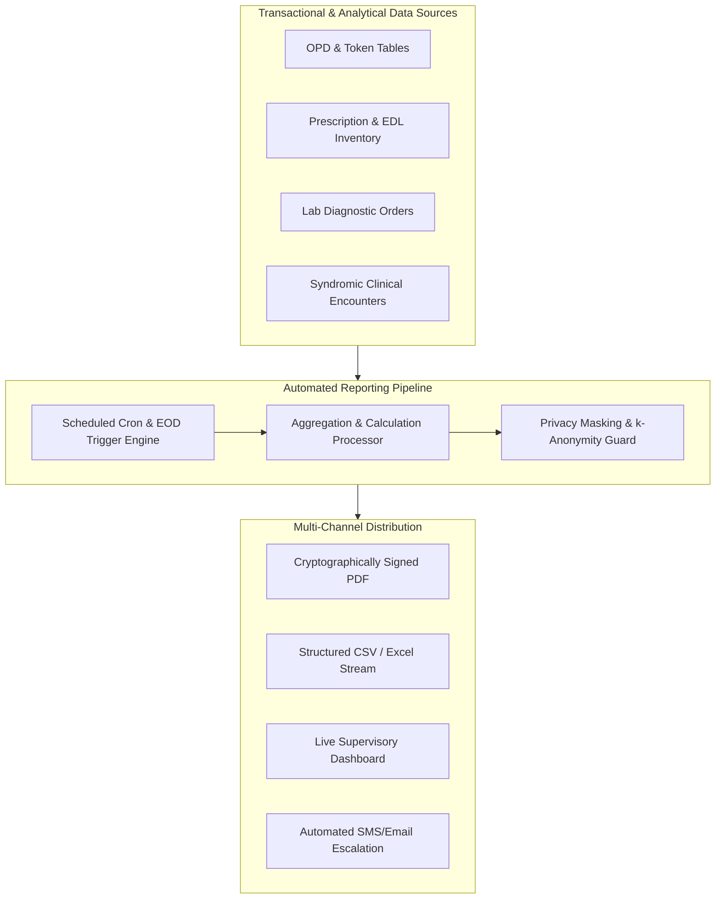

# Reporting Requirements & Statutory Health Register Baseline: Namma Clinic Digital Health Platform

| Metadata Attribute | Formal Specification |
| :--- | :--- |
| **Document Identifier** | `DOC-REQ-014-REP` |
| **Document Title** | Reporting Requirements & Statutory Health Register Baseline |
| **Project Code** | `NAMMA-CLINIC-PLATFORM-2026` |
| **Requirement Type** | `Reporting Requirement` |
| **Specification Range** | `REP-001 through REP-050` (Exactly 50 unique requirements) |
| **Target Baseline** | `v1.0.0-PROD-BASELINE` |
| **Lifecycle Status** | `APPROVED & BASELINED` |
| **Target Facility Scope** | 183 Primary Namma Clinics across 8 BBMP Administrative Zones |
| **Lead Clinical Authority** | Chief Health Officer (CHO), BBMP Health Department |
| **Lead Technical Authority**| Principal Solutions Architect, Kushagramati Analytics Consortium |
| **Upstream Baselines** | [`00-project-baseline/`](../00-project-baseline/) \| [`01-project-management/`](../01-project-management/) |
| **Related Specification**| [`02-functional-requirements.md`](./02-functional-requirements.md) \| [`15-analytics-requirements.md`](./15-analytics-requirements.md) |

## 1. Executive Summary & Domain Governance Framework
This specification defines the comprehensive operational, clinical, inventory, epidemiological, and statutory reporting requirements baseline for the Namma Clinic Digital Health Platform across 183 primary urban healthcare centers in Greater Bengaluru. Comprising 50 exhaustive reporting specifications (`REP-001` through `REP-050`), this document establishes the automated calculation formulas, aggregation cadences, export formats (PDF, CSV, Excel), and RBAC access permissions for all municipal health oversight workflows.

From daily OPD footfall and 120 Essential Drug List (EDL) stockout escalations to statutory IHIP Form P syndromic surveillance and monthly BBMP Form M consolidation, every report is designed to guarantee administrative transparency, clinical auditability, and public health accountability.

## 2. Architecture & Domain Conceptual Framework
The following architectural topology illustrates the functional interactions, security boundaries, and data flows governing this domain across Namma Clinic's 183 primary healthcare centers in Greater Bengaluru:



## 3. Master Reporting Requirement Inventory Table (REP-001 through REP-050)
| Requirement ID | Title | Reporting Cadence | Priority | Target Audience | Export Formats | Owner |
| :--- | :--- | :--- | :--- | :--- | :--- | :---: |
| [`REP-001`](#rep-001) | **Daily OPD Registration and Patient Footfall Census** | `Daily (End-of-Day)` | `MUST` | Clinic Supervisor & MO... | `PDF, CSV, On-Screen` | Registration Clerk |
| [`REP-002`](#rep-002) | **OPD Token Turnaround Time and Patient Wait Times** | `Daily & Monthly` | `MUST` | Medical Officer & BBMP Health ... | `PDF, CSV, On-Screen` | Administrative Assistant |
| [`REP-003`](#rep-003) | **Triage Acuity Distribution and Emergency Escalation Log** | `Daily` | `MUST` | Staff Nurse & Medical Officer... | `PDF, CSV` | Staff Nurse |
| [`REP-004`](#rep-004) | **Doctor Consultation Workload and Daily Throughput** | `Daily & Weekly` | `MUST` | Chief Medical Officer & BBMP H... | `PDF, CSV` | Medical Officer |
| [`REP-005`](#rep-005) | **Prescription Pattern and Rational Drug Use Adherence** | `Monthly` | `MUST` | Medical Officer & State Formul... | `PDF, CSV` | Pharmacist |
| [`REP-006`](#rep-006) | **120 Essential Drug List (EDL) Daily Consumption Ledger** | `Daily (Automated 17:00)` | `MUST` | Pharmacist & Central Medical S... | `PDF, CSV, Excel` | Pharmacist |
| [`REP-007`](#rep-007) | **Stockout and Critical Buffer Depletion Alert Report** | `Real-Time / Daily` | `MUST` | Pharmacist & District Health O... | `PDF, CSV, SMS Alert` | Pharmacist |
| [`REP-008`](#rep-008) | **Medicine Batch Expiry Trajectory (30, 60, 90 Days)** | `Weekly` | `MUST` | Pharmacist & Warehouse Manager... | `PDF, CSV` | Pharmacist |
| [`REP-009`](#rep-009) | **Pharmacy Stock Adjustment and Discrepancy Reconciliation** | `Monthly` | `MUST` | Auditor & Clinic In-Charge MO... | `PDF, CSV` | Pharmacist |
| [`REP-010`](#rep-010) | **Point-of-Care Lab Diagnostic Test Order Volume** | `Daily & Monthly` | `MUST` | Lab Technician & Pathologist... | `PDF, CSV` | Lab Technician |
| [`REP-011`](#rep-011) | **Critical Abnormal Lab Value Escalation and Turnaround Log** | `Daily` | `MUST` | Medical Officer & Lab Technici... | `PDF, CSV` | Lab Technician |
| [`REP-012`](#rep-012) | **Diagnostic Reagent Consumption and Wastage Ledger** | `Weekly` | `MUST` | Lab Technician & Central Procu... | `PDF, CSV` | Lab Technician |
| [`REP-013`](#rep-013) | **Specialist Referral Outward Dispatch and Destination Roster** | `Weekly & Monthly` | `MUST` | Medical Officer & Secondary Ho... | `PDF, CSV` | Medical Officer |
| [`REP-014`](#rep-014) | **Referral Closure Rate and Patient Feedback Summary** | `Monthly` | `MUST` | BBMP Health Directorate... | `PDF, CSV` | Administrative Assistant |
| [`REP-015`](#rep-015) | **High-Risk Antenatal Care (ANC) Tracking Register** | `Weekly` | `MUST` | Staff Nurse & RCH Officer... | `PDF, CSV` | Staff Nurse |
| [`REP-016`](#rep-016) | **Childhood Immunization Coverage and Dropout Defaulter List** | `Monthly` | `MUST` | Staff Nurse & Urban Immunizati... | `PDF, CSV` | Staff Nurse |
| [`REP-017`](#rep-017) | **Hypertension Screening and Longitudinal Care Continuum** | `Monthly` | `MUST` | Medical Officer & NCD Program ... | `PDF, CSV` | Staff Nurse |
| [`REP-018`](#rep-018) | **Type 2 Diabetes Glycemic Control and Follow-Up Register** | `Monthly` | `MUST` | Medical Officer & NCD Program ... | `PDF, CSV` | Staff Nurse |
| [`REP-019`](#rep-019) | **Chronic Kidney Disease (CKD) Urine Protein Screening Census** | `Quarterly` | `MUST` | NCD Specialist & State Epidemi... | `PDF, CSV` | Medical Officer |
| [`REP-020`](#rep-020) | **Integrated Disease Surveillance Programme (IHIP Form P Daily)** | `Daily (Automated 18:00)` | `MUST` | District Surveillance Officer ... | `CSV, XML, JSON` | Epidemiologist |
| [`REP-021`](#rep-021) | **Acute Diarrheal Disease (ADD) Spatial Cluster Alert Report** | `Real-Time / Daily` | `MUST` | BBMP Chief Health Officer & Wa... | `PDF, CSV, GIS Map` | Epidemiologist |
| [`REP-022`](#rep-022) | **Acute Respiratory Infection (ARI) and Influenza-Like Illness Log** | `Daily` | `MUST` | District Surveillance Officer... | `PDF, CSV` | Epidemiologist |
| [`REP-023`](#rep-023) | **Animal Bite and Anti-Rabies Vaccine (ARV) Regimen Tracker** | `Weekly` | `MUST` | Public Health Inspector & Stat... | `PDF, CSV` | Pharmacist |
| [`REP-024`](#rep-024) | **Adverse Events Following Immunization (AEFI) Rapid Report** | `Immediate (<2 Hours)` | `MUST` | State AEFI Committee & WHO Lia... | `PDF, Secure Email` | Medical Officer |
| [`REP-025`](#rep-025) | **Clinic Staff Attendance and Shift Roster Adherence Log** | `Monthly` | `MUST` | Clinic In-Charge MO & BBMP Adm... | `PDF, CSV` | Administrative Assistant |
| [`REP-026`](#rep-026) | **Clinic Operating Hours and Service Continuity Audit** | `Monthly` | `MUST` | BBMP Vigilance Directorate... | `PDF, CSV` | SRE Lead |
| [`REP-027`](#rep-027) | **Patient Queue Waiting Time Distribution by Ward Percentile** | `Monthly` | `MUST` | Urban Health Planning Director... | `PDF, CSV` | Data Analyst |
| [`REP-028`](#rep-028) | **Vaccine Cold Chain Temperature Excursion Log (ILR/Freezer)** | `Weekly` | `MUST` | Cold Chain Handler & Logistics... | `PDF, CSV` | Pharmacist |
| [`REP-029`](#rep-029) | **Biomedical Waste Category-Wise Daily Disposal Log** | `Daily & Monthly` | `MUST` | Pollution Control Board & Heal... | `PDF, CSV` | Administrative Assistant |
| [`REP-030`](#rep-030) | **Patient Satisfaction and Citizen Grievance Census** | `Monthly` | `MUST` | Quality Assurance Cell & Munic... | `PDF, CSV` | Administrative Assistant |
| [`REP-031`](#rep-031) | **Teleconsultation Case Roster and Specialist Recommendation Log** | `Weekly` | `MUST` | Medical Officer & e-Sanjeevani... | `PDF, CSV` | Medical Officer |
| [`REP-032`](#rep-032) | **e-Manas Community Mental Health Screening and Referral Census** | `Monthly` | `MUST` | State Mental Health Authority... | `PDF, CSV` | Medical Officer |
| [`REP-033`](#rep-033) | **Janani Suraksha Yojana (JSY) Institutional Incentive Register** | `Monthly` | `MUST` | RCH Program Officer & Accounts... | `PDF, CSV` | Staff Nurse |
| [`REP-034`](#rep-034) | **Monthly Municipal Health Department Form M Aggregated Report** | `Monthly (3rd of Month)` | `MUST` | BBMP Health Directorate & NHM ... | `PDF, CSV, Excel` | Medical Officer |
| [`REP-035`](#rep-035) | **Ward-Level Primary Healthcare Equity and Vulnerability Index** | `Quarterly` | `MUST` | Municipal Commissioner & Urban... | `PDF, CSV, GIS Layer` | Data Analyst |
| [`REP-036`](#rep-036) | **Clinic Consumables and Diagnostic Kits Utilization Report** | `Monthly` | `MUST` | Central Stores & Clinic In-Cha... | `PDF, CSV` | Lab Technician |
| [`REP-037`](#rep-037) | **Emergency Life-Saving Drug Stockout Immediate Escalation** | `Real-Time` | `MUST` | Zonal Health Officer & Central... | `PDF, SMS, Email` | Pharmacist |
| [`REP-038`](#rep-038) | **Offline Mutation Queue Sync Latency and Backlog Audit** | `Daily` | `MUST` | SRE Lead & IT Directorate... | `PDF, CSV` | SRE Lead |
| [`REP-039`](#rep-039) | **System User Access Audit and Privileged Role Action Log** | `Monthly` | `MUST` | Information Security Officer (... | `PDF, Encrypted CSV` | Security Lead |
| [`REP-040`](#rep-040) | **Security Incident, Failed Login, and Threat Block Report** | `Weekly` | `MUST` | CERT-In Coordinator & CISO... | `PDF, Encrypted CSV` | Security Lead |
| [`REP-041`](#rep-041) | **DPDP Act Patient Consent Revocation and Erasure Audit** | `Monthly` | `MUST` | Data Protection Officer (DPO)... | `PDF, Encrypted CSV` | Privacy Lead / DPO |
| [`REP-042`](#rep-042) | **Pharmacy Dispensation vs Doctor Prescription Variance Audit** | `Monthly` | `MUST` | Drug Inspector & Medical Offic... | `PDF, CSV` | Pharmacist |
| [`REP-043`](#rep-043) | **Tuberculosis Presumptive Case Referral and Nikshay Sync Report** | `Weekly` | `MUST` | District TB Officer (DTO)... | `PDF, CSV` | Staff Nurse |
| [`REP-044`](#rep-044) | **Dengue and Chikungunya Vector-Borne Serology Log** | `Weekly` | `MUST` | Vector-Borne Disease Control O... | `PDF, CSV` | Lab Technician |
| [`REP-045`](#rep-045) | **Oral, Cervical, and Breast Cancer Early Detection Census** | `Monthly` | `MUST` | Non-Communicable Disease Cell... | `PDF, CSV` | Staff Nurse |
| [`REP-046`](#rep-046) | **Geriatric Vulnerability and Bedridden Patient Home Care Log** | `Monthly` | `MUST` | Elderly Welfare Directorate... | `PDF, CSV` | Staff Nurse |
| [`REP-047`](#rep-047) | **Community-Based Assessment Checklist (CBAC) Ward Census** | `Monthly` | `MUST` | ASHA Coordinator & Staff Nurse... | `PDF, CSV` | Staff Nurse |
| [`REP-048`](#rep-048) | **BBMP Health Commissioner Executive Key Indicator Summary** | `Weekly (Monday 08:00)` | `MUST` | Municipal Health Commissioner... | `PDF, Executive One-P` | Solution Architect |
| [`REP-049`](#rep-049) | **De-Identified Public Health Research Open Data Extract** | `Monthly` | `MUST` | Public Health Researchers & IC... | `CSV, JSON, Parquet` | Data Protection Officer |
| [`REP-050`](#rep-050) | **Comprehensive Annual Health Platform Operations Audit** | `Annual` | `MUST` | State Health Department & Comp... | `PDF Bound Report, CS` | Project Director |

## 4. Comprehensive Reporting Requirement Specifications (REP-001 through REP-050)
This section establishes the exhaustive engineering, clinical, operational, and architectural specifications for each of the 50 requirements committed for the production baseline.

### 4.1 REP-001: Daily OPD Registration and Patient Footfall Census

| Specification Attribute | Formal Engineering Definition |
| :--- | :--- |
| **Requirement ID** | `REP-001` |
| **Requirement Title** | Daily OPD Registration and Patient Footfall Census |
| **Requirement Statement**| The platform SHALL generate daily opd registration and patient footfall census on a daily (end-of-day) cadence for Clinic Supervisor & MO, aggregating data from patients, opd_tokens, triage_vitals, exportable as PDF, CSV, On-Screen. |
| **Requirement Type** | `Reporting Requirement` |
| **Priority Level** | `MUST` (Rationale: Essential operational and statutory reporting mandated by municipal health authorities.) |
| **Business Value** | Ensures administrative accountability, clinical auditability, and regulatory compliance. |
| **Engineering Rationale**| Cadence: Daily (End-of-Day); Target Audience: Clinic Supervisor & MO; Data Sources: patients, opd_tokens, triage_vitals. |
| **Primary Actor** | `Registration Clerk` |
| **Target User Persona** | [`PERSONA-001`](../01-project-management/07-user-personas.md#persona-001) |
| **Accountable Role** | [`ROLE-001`](../01-project-management/08-role-and-responsibility-matrix.md#role-001) |
| **Key Stakeholder** | [`STAKEHOLDER-004`](../01-project-management/06-stakeholders.md#stakeholder-004) |
| **Trigger Condition** | Scheduled cron job, end-of-day trigger, or authorized supervisor export request. |
| **System Preconditions** | Relevant transactional tables populated; user possesses authenticated reporting role. |
| **Input Specifications** | Date range filter, clinic identifier, ward boundaries, and export format parameter. |
| **Validation Rules** | Evaluated against query date bounds and RBAC reporting permission scope. |
| **Postconditions** | Report successfully generated, checksum validated, and access event logged to audit vault. |
| **State Mutations** | Records report export event in audit log with user_id, report_id, and row_count. |
| **Associated Rules** | Business: [`BRULE-001`](./04-business-rules.md#brule-001) \| Clinical: [`CR-001`](./05-clinical-rules.md#cr-001) \| Operational: [`OR-001`](./06-operational-rules.md#or-001) |
| **Security & Privacy** | Security: `RBAC restricts patient-level identifiable exports to authorized Medical Officers.` \| Privacy: `Publicly shared reports automatically apply k-anonymity (k>=5) suppression.` |
| **Data & Audit** | Data: `Queries execute against read-replica or DuckDB mart to protect OLTP performance.` \| Audit: `All report generation and export events recorded in immutable WORM audit log.` |
| **Offline & Sync** | Offline: `Local daily summary reports generated from IndexedDB store during offline periods.` \| Sync: `Central reports reflect consolidated municipal data upon clinic sync completion.` |
| **Quality Expectations**| Perf: `Standard daily report generation completed in < 2.0 seconds.` \| Avail: `100% daily reporting availability across all operational clinics.` |
| **Localization & A11y**| Loc: `Report headers and numerical summaries fully localized in Kannada and English.` \| A11y: `Generated HTML reports conform to WCAG 2.1 Level AA table structure.` |
| **Failure & Recovery** | Failure: Display localized error message with retry button if query times out. \| Recovery: Resume aborted PDF generation from background worker task queue. |
| **Observability** | Logging: `Structured JSON log with report_id, execution_time_ms, and row_count.` \| Metrics: `Prometheus counter `namma_clinic_reports_generated_total{report="REP-001"}`.` |
| **Upstream Traceability**| Obj: [`OBJECTIVE-001`](../01-project-management/02-project-vision-and-objectives.md#objective-001) \| Scope: [`INSCOPE-001`](../01-project-management/04-in-scope.md#inscope-001) \| Risk: [`RISK-001`](../01-project-management/12-project-risks.md#risk-001) |
| **Downstream Planning** | Epic: `PLANNED-EPIC-001` \| Feature: `PLANNED-FEATURE-001` \| API: `PLANNED-API-001` \| DB: `PLANNED-DB-001` \| Test: `PLANNED-TEST-1301` |

#### 4.1.1 Operational Execution Protocol & Frontline Workflow
- **Continuous Operational Workflow:**
  1. User or scheduled cron triggers report generation: Daily OPD Registration and Patient Footfall Census.
  2. Report engine queries data sources: patients, opd_tokens, triage_vitals.
  3. Applies calculation formulas and aggregation rules across date range.
  4. Formats structured document according to selected format: PDF, CSV, On-Screen.
  5. Dispatches output to user interface or persists to secure report repository.
- **Degraded State Fallback Path:** If report exceeds 10,000 rows, stream CSV chunked download to prevent memory spikes.
- **Exception Breach & Incident Escalation Path:** If source database unavailable, return cached previous-day report with explicit staleness banner.

#### 4.1.2 Technical Invariants & Operational Contract
- **Reporting Cadence / Frequency:** Daily (End-of-Day)
- **Target Operational Audience:** Clinic Supervisor & MO
- **Underlying Data Sources:** `patients, opd_tokens, triage_vitals`
- **Supported Export Formats:** PDF, CSV, On-Screen
- **Verification Protocol:** Automated Report Output & Data Reconciliation Test
- **Accountable Reporting Owner:** Registration Clerk

#### 4.1.3 Executable BDD Acceptance Scenarios
```gherkin
Feature: REP-001 - Daily OPD Registration and Patient Footfall Census
  As a Registration Clerk
  I require system enforcement of daily opd registration and patient footfall census
  In order to ensure municipal healthcare compliance and operational integrity

  Scenario: Happy Path Execution for REP-001
    Given the Registration Clerk is authenticated and clinic terminal is operational
    When the user submits a valid request for daily opd registration and patient footfall census
    Then the system successfully commits the transaction and emits an audit event

  Scenario: Input Validation and Schema Guard for REP-001
    Given the Registration Clerk attempts to submit an incomplete or malformed payload for daily opd registration and patient footfall census
    When the request fails TypeBox schema or domain constraint validation
    Then the system rejects the input with HTTP 400 and highlights invalid fields in Kannada and English

  Scenario: RBAC and Security Access Control for REP-001
    Given an unauthenticated or unauthorized role attempts to invoke daily opd registration and patient footfall census
    When the bearer JWT token is missing, expired, or lacks necessary RBAC permission
    Then the system denies execution with HTTP 403 Forbidden and records a security telemetry alert

  Scenario: Offline Autonomous Execution for REP-001
    Given the clinic WAN network is completely severed during daily opd registration and patient footfall census
    When the operator confirms the local transaction on the workstation
    Then the mutation is persisted to Dexie.js IndexedDB with a UUIDv7 and queued for background replay

  Scenario: Network Recovery and Idempotent Sync for REP-001
    Given the clinic workstation reconnects to the BBMP municipal health WAN
    When the background sync daemon processes the pending mutation queue
    Then all buffered transactions for REP-001 synchronize idempotently with zero data loss
```

#### 4.1.4 Verification Protocol & Quality Sign-Off
- **Verification Method:** Automated Report Output & Data Reconciliation Test
- **Automated Test Suite:** `PLANNED-TEST-1301` (Automated Report Generation & Data Integrity Test) targeting 100% verification gate compliance.
- **Related Internal Requirements:** `FR-035`, `NFR-031`, `ANL-001`
- **Dependencies & Blocking Constraints:** FR-035 | Constraints: Heavy reporting queries must never degrade frontline consultation responsiveness.
- **Architectural Assumptions & Open Questions:** Assumption: Clinic workstations equipped with standard PDF reader and printer drivers. | Open Question: Final approval of municipal Form M template fields by BBMP Health Department.

---

### 4.2 REP-002: OPD Token Turnaround Time and Patient Wait Times

| Specification Attribute | Formal Engineering Definition |
| :--- | :--- |
| **Requirement ID** | `REP-002` |
| **Requirement Title** | OPD Token Turnaround Time and Patient Wait Times |
| **Requirement Statement**| The platform SHALL generate opd token turnaround time and patient wait times on a daily & monthly cadence for Medical Officer & BBMP Health Directorate, aggregating data from opd_tokens, consultation_records, exportable as PDF, CSV, On-Screen. |
| **Requirement Type** | `Reporting Requirement` |
| **Priority Level** | `MUST` (Rationale: Essential operational and statutory reporting mandated by municipal health authorities.) |
| **Business Value** | Ensures administrative accountability, clinical auditability, and regulatory compliance. |
| **Engineering Rationale**| Cadence: Daily & Monthly; Target Audience: Medical Officer & BBMP Health Directorate; Data Sources: opd_tokens, consultation_records. |
| **Primary Actor** | `Administrative Assistant` |
| **Target User Persona** | [`PERSONA-002`](../01-project-management/07-user-personas.md#persona-002) |
| **Accountable Role** | [`ROLE-001`](../01-project-management/08-role-and-responsibility-matrix.md#role-001) |
| **Key Stakeholder** | [`STAKEHOLDER-004`](../01-project-management/06-stakeholders.md#stakeholder-004) |
| **Trigger Condition** | Scheduled cron job, end-of-day trigger, or authorized supervisor export request. |
| **System Preconditions** | Relevant transactional tables populated; user possesses authenticated reporting role. |
| **Input Specifications** | Date range filter, clinic identifier, ward boundaries, and export format parameter. |
| **Validation Rules** | Evaluated against query date bounds and RBAC reporting permission scope. |
| **Postconditions** | Report successfully generated, checksum validated, and access event logged to audit vault. |
| **State Mutations** | Records report export event in audit log with user_id, report_id, and row_count. |
| **Associated Rules** | Business: [`BRULE-002`](./04-business-rules.md#brule-002) \| Clinical: [`CR-002`](./05-clinical-rules.md#cr-002) \| Operational: [`OR-002`](./06-operational-rules.md#or-002) |
| **Security & Privacy** | Security: `RBAC restricts patient-level identifiable exports to authorized Medical Officers.` \| Privacy: `Publicly shared reports automatically apply k-anonymity (k>=5) suppression.` |
| **Data & Audit** | Data: `Queries execute against read-replica or DuckDB mart to protect OLTP performance.` \| Audit: `All report generation and export events recorded in immutable WORM audit log.` |
| **Offline & Sync** | Offline: `Local daily summary reports generated from IndexedDB store during offline periods.` \| Sync: `Central reports reflect consolidated municipal data upon clinic sync completion.` |
| **Quality Expectations**| Perf: `Standard daily report generation completed in < 2.0 seconds.` \| Avail: `100% daily reporting availability across all operational clinics.` |
| **Localization & A11y**| Loc: `Report headers and numerical summaries fully localized in Kannada and English.` \| A11y: `Generated HTML reports conform to WCAG 2.1 Level AA table structure.` |
| **Failure & Recovery** | Failure: Display localized error message with retry button if query times out. \| Recovery: Resume aborted PDF generation from background worker task queue. |
| **Observability** | Logging: `Structured JSON log with report_id, execution_time_ms, and row_count.` \| Metrics: `Prometheus counter `namma_clinic_reports_generated_total{report="REP-002"}`.` |
| **Upstream Traceability**| Obj: [`OBJECTIVE-002`](../01-project-management/02-project-vision-and-objectives.md#objective-002) \| Scope: [`INSCOPE-002`](../01-project-management/04-in-scope.md#inscope-002) \| Risk: [`RISK-002`](../01-project-management/12-project-risks.md#risk-002) |
| **Downstream Planning** | Epic: `PLANNED-EPIC-002` \| Feature: `PLANNED-FEATURE-002` \| API: `PLANNED-API-002` \| DB: `PLANNED-DB-002` \| Test: `PLANNED-TEST-1302` |

#### 4.2.1 Operational Execution Protocol & Frontline Workflow
- **Continuous Operational Workflow:**
  1. User or scheduled cron triggers report generation: OPD Token Turnaround Time and Patient Wait Times.
  2. Report engine queries data sources: opd_tokens, consultation_records.
  3. Applies calculation formulas and aggregation rules across date range.
  4. Formats structured document according to selected format: PDF, CSV, On-Screen.
  5. Dispatches output to user interface or persists to secure report repository.
- **Degraded State Fallback Path:** If report exceeds 10,000 rows, stream CSV chunked download to prevent memory spikes.
- **Exception Breach & Incident Escalation Path:** If source database unavailable, return cached previous-day report with explicit staleness banner.

#### 4.2.2 Technical Invariants & Operational Contract
- **Reporting Cadence / Frequency:** Daily & Monthly
- **Target Operational Audience:** Medical Officer & BBMP Health Directorate
- **Underlying Data Sources:** `opd_tokens, consultation_records`
- **Supported Export Formats:** PDF, CSV, On-Screen
- **Verification Protocol:** Automated Report Output & Data Reconciliation Test
- **Accountable Reporting Owner:** Administrative Assistant

#### 4.2.3 Executable BDD Acceptance Scenarios
```gherkin
Feature: REP-002 - OPD Token Turnaround Time and Patient Wait Times
  As a Administrative Assistant
  I require system enforcement of opd token turnaround time and patient wait times
  In order to ensure municipal healthcare compliance and operational integrity

  Scenario: Happy Path Execution for REP-002
    Given the Administrative Assistant is authenticated and clinic terminal is operational
    When the user submits a valid request for opd token turnaround time and patient wait times
    Then the system successfully commits the transaction and emits an audit event

  Scenario: Input Validation and Schema Guard for REP-002
    Given the Administrative Assistant attempts to submit an incomplete or malformed payload for opd token turnaround time and patient wait times
    When the request fails TypeBox schema or domain constraint validation
    Then the system rejects the input with HTTP 400 and highlights invalid fields in Kannada and English

  Scenario: RBAC and Security Access Control for REP-002
    Given an unauthenticated or unauthorized role attempts to invoke opd token turnaround time and patient wait times
    When the bearer JWT token is missing, expired, or lacks necessary RBAC permission
    Then the system denies execution with HTTP 403 Forbidden and records a security telemetry alert

  Scenario: Offline Autonomous Execution for REP-002
    Given the clinic WAN network is completely severed during opd token turnaround time and patient wait times
    When the operator confirms the local transaction on the workstation
    Then the mutation is persisted to Dexie.js IndexedDB with a UUIDv7 and queued for background replay

  Scenario: Network Recovery and Idempotent Sync for REP-002
    Given the clinic workstation reconnects to the BBMP municipal health WAN
    When the background sync daemon processes the pending mutation queue
    Then all buffered transactions for REP-002 synchronize idempotently with zero data loss
```

#### 4.2.4 Verification Protocol & Quality Sign-Off
- **Verification Method:** Automated Report Output & Data Reconciliation Test
- **Automated Test Suite:** `PLANNED-TEST-1302` (Automated Report Generation & Data Integrity Test) targeting 100% verification gate compliance.
- **Related Internal Requirements:** `FR-035`, `NFR-031`, `ANL-001`
- **Dependencies & Blocking Constraints:** FR-035 | Constraints: Heavy reporting queries must never degrade frontline consultation responsiveness.
- **Architectural Assumptions & Open Questions:** Assumption: Clinic workstations equipped with standard PDF reader and printer drivers. | Open Question: Final approval of municipal Form M template fields by BBMP Health Department.

---

### 4.3 REP-003: Triage Acuity Distribution and Emergency Escalation Log

| Specification Attribute | Formal Engineering Definition |
| :--- | :--- |
| **Requirement ID** | `REP-003` |
| **Requirement Title** | Triage Acuity Distribution and Emergency Escalation Log |
| **Requirement Statement**| The platform SHALL generate triage acuity distribution and emergency escalation log on a daily cadence for Staff Nurse & Medical Officer, aggregating data from triage_vitals, clinical_escalations, exportable as PDF, CSV. |
| **Requirement Type** | `Reporting Requirement` |
| **Priority Level** | `MUST` (Rationale: Essential operational and statutory reporting mandated by municipal health authorities.) |
| **Business Value** | Ensures administrative accountability, clinical auditability, and regulatory compliance. |
| **Engineering Rationale**| Cadence: Daily; Target Audience: Staff Nurse & Medical Officer; Data Sources: triage_vitals, clinical_escalations. |
| **Primary Actor** | `Staff Nurse` |
| **Target User Persona** | [`PERSONA-003`](../01-project-management/07-user-personas.md#persona-003) |
| **Accountable Role** | [`ROLE-001`](../01-project-management/08-role-and-responsibility-matrix.md#role-001) |
| **Key Stakeholder** | [`STAKEHOLDER-004`](../01-project-management/06-stakeholders.md#stakeholder-004) |
| **Trigger Condition** | Scheduled cron job, end-of-day trigger, or authorized supervisor export request. |
| **System Preconditions** | Relevant transactional tables populated; user possesses authenticated reporting role. |
| **Input Specifications** | Date range filter, clinic identifier, ward boundaries, and export format parameter. |
| **Validation Rules** | Evaluated against query date bounds and RBAC reporting permission scope. |
| **Postconditions** | Report successfully generated, checksum validated, and access event logged to audit vault. |
| **State Mutations** | Records report export event in audit log with user_id, report_id, and row_count. |
| **Associated Rules** | Business: [`BRULE-003`](./04-business-rules.md#brule-003) \| Clinical: [`CR-003`](./05-clinical-rules.md#cr-003) \| Operational: [`OR-003`](./06-operational-rules.md#or-003) |
| **Security & Privacy** | Security: `RBAC restricts patient-level identifiable exports to authorized Medical Officers.` \| Privacy: `Publicly shared reports automatically apply k-anonymity (k>=5) suppression.` |
| **Data & Audit** | Data: `Queries execute against read-replica or DuckDB mart to protect OLTP performance.` \| Audit: `All report generation and export events recorded in immutable WORM audit log.` |
| **Offline & Sync** | Offline: `Local daily summary reports generated from IndexedDB store during offline periods.` \| Sync: `Central reports reflect consolidated municipal data upon clinic sync completion.` |
| **Quality Expectations**| Perf: `Standard daily report generation completed in < 2.0 seconds.` \| Avail: `100% daily reporting availability across all operational clinics.` |
| **Localization & A11y**| Loc: `Report headers and numerical summaries fully localized in Kannada and English.` \| A11y: `Generated HTML reports conform to WCAG 2.1 Level AA table structure.` |
| **Failure & Recovery** | Failure: Display localized error message with retry button if query times out. \| Recovery: Resume aborted PDF generation from background worker task queue. |
| **Observability** | Logging: `Structured JSON log with report_id, execution_time_ms, and row_count.` \| Metrics: `Prometheus counter `namma_clinic_reports_generated_total{report="REP-003"}`.` |
| **Upstream Traceability**| Obj: [`OBJECTIVE-003`](../01-project-management/02-project-vision-and-objectives.md#objective-003) \| Scope: [`INSCOPE-003`](../01-project-management/04-in-scope.md#inscope-003) \| Risk: [`RISK-003`](../01-project-management/12-project-risks.md#risk-003) |
| **Downstream Planning** | Epic: `PLANNED-EPIC-003` \| Feature: `PLANNED-FEATURE-003` \| API: `PLANNED-API-003` \| DB: `PLANNED-DB-003` \| Test: `PLANNED-TEST-1303` |

#### 4.3.1 Operational Execution Protocol & Frontline Workflow
- **Continuous Operational Workflow:**
  1. User or scheduled cron triggers report generation: Triage Acuity Distribution and Emergency Escalation Log.
  2. Report engine queries data sources: triage_vitals, clinical_escalations.
  3. Applies calculation formulas and aggregation rules across date range.
  4. Formats structured document according to selected format: PDF, CSV.
  5. Dispatches output to user interface or persists to secure report repository.
- **Degraded State Fallback Path:** If report exceeds 10,000 rows, stream CSV chunked download to prevent memory spikes.
- **Exception Breach & Incident Escalation Path:** If source database unavailable, return cached previous-day report with explicit staleness banner.

#### 4.3.2 Technical Invariants & Operational Contract
- **Reporting Cadence / Frequency:** Daily
- **Target Operational Audience:** Staff Nurse & Medical Officer
- **Underlying Data Sources:** `triage_vitals, clinical_escalations`
- **Supported Export Formats:** PDF, CSV
- **Verification Protocol:** Automated Report Output & Data Reconciliation Test
- **Accountable Reporting Owner:** Staff Nurse

#### 4.3.3 Executable BDD Acceptance Scenarios
```gherkin
Feature: REP-003 - Triage Acuity Distribution and Emergency Escalation Log
  As a Staff Nurse
  I require system enforcement of triage acuity distribution and emergency escalation log
  In order to ensure municipal healthcare compliance and operational integrity

  Scenario: Happy Path Execution for REP-003
    Given the Staff Nurse is authenticated and clinic terminal is operational
    When the user submits a valid request for triage acuity distribution and emergency escalation log
    Then the system successfully commits the transaction and emits an audit event

  Scenario: Input Validation and Schema Guard for REP-003
    Given the Staff Nurse attempts to submit an incomplete or malformed payload for triage acuity distribution and emergency escalation log
    When the request fails TypeBox schema or domain constraint validation
    Then the system rejects the input with HTTP 400 and highlights invalid fields in Kannada and English

  Scenario: RBAC and Security Access Control for REP-003
    Given an unauthenticated or unauthorized role attempts to invoke triage acuity distribution and emergency escalation log
    When the bearer JWT token is missing, expired, or lacks necessary RBAC permission
    Then the system denies execution with HTTP 403 Forbidden and records a security telemetry alert

  Scenario: Offline Autonomous Execution for REP-003
    Given the clinic WAN network is completely severed during triage acuity distribution and emergency escalation log
    When the operator confirms the local transaction on the workstation
    Then the mutation is persisted to Dexie.js IndexedDB with a UUIDv7 and queued for background replay

  Scenario: Network Recovery and Idempotent Sync for REP-003
    Given the clinic workstation reconnects to the BBMP municipal health WAN
    When the background sync daemon processes the pending mutation queue
    Then all buffered transactions for REP-003 synchronize idempotently with zero data loss
```

#### 4.3.4 Verification Protocol & Quality Sign-Off
- **Verification Method:** Automated Report Output & Data Reconciliation Test
- **Automated Test Suite:** `PLANNED-TEST-1303` (Automated Report Generation & Data Integrity Test) targeting 100% verification gate compliance.
- **Related Internal Requirements:** `FR-035`, `NFR-031`, `ANL-001`
- **Dependencies & Blocking Constraints:** FR-035 | Constraints: Heavy reporting queries must never degrade frontline consultation responsiveness.
- **Architectural Assumptions & Open Questions:** Assumption: Clinic workstations equipped with standard PDF reader and printer drivers. | Open Question: Final approval of municipal Form M template fields by BBMP Health Department.

---

### 4.4 REP-004: Doctor Consultation Workload and Daily Throughput

| Specification Attribute | Formal Engineering Definition |
| :--- | :--- |
| **Requirement ID** | `REP-004` |
| **Requirement Title** | Doctor Consultation Workload and Daily Throughput |
| **Requirement Statement**| The platform SHALL generate doctor consultation workload and daily throughput on a daily & weekly cadence for Chief Medical Officer & BBMP Health Officer, aggregating data from consultation_records, doctor_roster, exportable as PDF, CSV. |
| **Requirement Type** | `Reporting Requirement` |
| **Priority Level** | `MUST` (Rationale: Essential operational and statutory reporting mandated by municipal health authorities.) |
| **Business Value** | Ensures administrative accountability, clinical auditability, and regulatory compliance. |
| **Engineering Rationale**| Cadence: Daily & Weekly; Target Audience: Chief Medical Officer & BBMP Health Officer; Data Sources: consultation_records, doctor_roster. |
| **Primary Actor** | `Medical Officer` |
| **Target User Persona** | [`PERSONA-004`](../01-project-management/07-user-personas.md#persona-004) |
| **Accountable Role** | [`ROLE-001`](../01-project-management/08-role-and-responsibility-matrix.md#role-001) |
| **Key Stakeholder** | [`STAKEHOLDER-004`](../01-project-management/06-stakeholders.md#stakeholder-004) |
| **Trigger Condition** | Scheduled cron job, end-of-day trigger, or authorized supervisor export request. |
| **System Preconditions** | Relevant transactional tables populated; user possesses authenticated reporting role. |
| **Input Specifications** | Date range filter, clinic identifier, ward boundaries, and export format parameter. |
| **Validation Rules** | Evaluated against query date bounds and RBAC reporting permission scope. |
| **Postconditions** | Report successfully generated, checksum validated, and access event logged to audit vault. |
| **State Mutations** | Records report export event in audit log with user_id, report_id, and row_count. |
| **Associated Rules** | Business: [`BRULE-004`](./04-business-rules.md#brule-004) \| Clinical: [`CR-004`](./05-clinical-rules.md#cr-004) \| Operational: [`OR-004`](./06-operational-rules.md#or-004) |
| **Security & Privacy** | Security: `RBAC restricts patient-level identifiable exports to authorized Medical Officers.` \| Privacy: `Publicly shared reports automatically apply k-anonymity (k>=5) suppression.` |
| **Data & Audit** | Data: `Queries execute against read-replica or DuckDB mart to protect OLTP performance.` \| Audit: `All report generation and export events recorded in immutable WORM audit log.` |
| **Offline & Sync** | Offline: `Local daily summary reports generated from IndexedDB store during offline periods.` \| Sync: `Central reports reflect consolidated municipal data upon clinic sync completion.` |
| **Quality Expectations**| Perf: `Standard daily report generation completed in < 2.0 seconds.` \| Avail: `100% daily reporting availability across all operational clinics.` |
| **Localization & A11y**| Loc: `Report headers and numerical summaries fully localized in Kannada and English.` \| A11y: `Generated HTML reports conform to WCAG 2.1 Level AA table structure.` |
| **Failure & Recovery** | Failure: Display localized error message with retry button if query times out. \| Recovery: Resume aborted PDF generation from background worker task queue. |
| **Observability** | Logging: `Structured JSON log with report_id, execution_time_ms, and row_count.` \| Metrics: `Prometheus counter `namma_clinic_reports_generated_total{report="REP-004"}`.` |
| **Upstream Traceability**| Obj: [`OBJECTIVE-004`](../01-project-management/02-project-vision-and-objectives.md#objective-004) \| Scope: [`INSCOPE-004`](../01-project-management/04-in-scope.md#inscope-004) \| Risk: [`RISK-004`](../01-project-management/12-project-risks.md#risk-004) |
| **Downstream Planning** | Epic: `PLANNED-EPIC-004` \| Feature: `PLANNED-FEATURE-004` \| API: `PLANNED-API-004` \| DB: `PLANNED-DB-004` \| Test: `PLANNED-TEST-1304` |

#### 4.4.1 Operational Execution Protocol & Frontline Workflow
- **Continuous Operational Workflow:**
  1. User or scheduled cron triggers report generation: Doctor Consultation Workload and Daily Throughput.
  2. Report engine queries data sources: consultation_records, doctor_roster.
  3. Applies calculation formulas and aggregation rules across date range.
  4. Formats structured document according to selected format: PDF, CSV.
  5. Dispatches output to user interface or persists to secure report repository.
- **Degraded State Fallback Path:** If report exceeds 10,000 rows, stream CSV chunked download to prevent memory spikes.
- **Exception Breach & Incident Escalation Path:** If source database unavailable, return cached previous-day report with explicit staleness banner.

#### 4.4.2 Technical Invariants & Operational Contract
- **Reporting Cadence / Frequency:** Daily & Weekly
- **Target Operational Audience:** Chief Medical Officer & BBMP Health Officer
- **Underlying Data Sources:** `consultation_records, doctor_roster`
- **Supported Export Formats:** PDF, CSV
- **Verification Protocol:** Automated Report Output & Data Reconciliation Test
- **Accountable Reporting Owner:** Medical Officer

#### 4.4.3 Executable BDD Acceptance Scenarios
```gherkin
Feature: REP-004 - Doctor Consultation Workload and Daily Throughput
  As a Medical Officer
  I require system enforcement of doctor consultation workload and daily throughput
  In order to ensure municipal healthcare compliance and operational integrity

  Scenario: Happy Path Execution for REP-004
    Given the Medical Officer is authenticated and clinic terminal is operational
    When the user submits a valid request for doctor consultation workload and daily throughput
    Then the system successfully commits the transaction and emits an audit event

  Scenario: Input Validation and Schema Guard for REP-004
    Given the Medical Officer attempts to submit an incomplete or malformed payload for doctor consultation workload and daily throughput
    When the request fails TypeBox schema or domain constraint validation
    Then the system rejects the input with HTTP 400 and highlights invalid fields in Kannada and English

  Scenario: RBAC and Security Access Control for REP-004
    Given an unauthenticated or unauthorized role attempts to invoke doctor consultation workload and daily throughput
    When the bearer JWT token is missing, expired, or lacks necessary RBAC permission
    Then the system denies execution with HTTP 403 Forbidden and records a security telemetry alert

  Scenario: Offline Autonomous Execution for REP-004
    Given the clinic WAN network is completely severed during doctor consultation workload and daily throughput
    When the operator confirms the local transaction on the workstation
    Then the mutation is persisted to Dexie.js IndexedDB with a UUIDv7 and queued for background replay

  Scenario: Network Recovery and Idempotent Sync for REP-004
    Given the clinic workstation reconnects to the BBMP municipal health WAN
    When the background sync daemon processes the pending mutation queue
    Then all buffered transactions for REP-004 synchronize idempotently with zero data loss
```

#### 4.4.4 Verification Protocol & Quality Sign-Off
- **Verification Method:** Automated Report Output & Data Reconciliation Test
- **Automated Test Suite:** `PLANNED-TEST-1304` (Automated Report Generation & Data Integrity Test) targeting 100% verification gate compliance.
- **Related Internal Requirements:** `FR-035`, `NFR-031`, `ANL-001`
- **Dependencies & Blocking Constraints:** FR-035 | Constraints: Heavy reporting queries must never degrade frontline consultation responsiveness.
- **Architectural Assumptions & Open Questions:** Assumption: Clinic workstations equipped with standard PDF reader and printer drivers. | Open Question: Final approval of municipal Form M template fields by BBMP Health Department.

---

### 4.5 REP-005: Prescription Pattern and Rational Drug Use Adherence

| Specification Attribute | Formal Engineering Definition |
| :--- | :--- |
| **Requirement ID** | `REP-005` |
| **Requirement Title** | Prescription Pattern and Rational Drug Use Adherence |
| **Requirement Statement**| The platform SHALL generate prescription pattern and rational drug use adherence on a monthly cadence for Medical Officer & State Formulary Board, aggregating data from prescriptions, edl_formulary, exportable as PDF, CSV. |
| **Requirement Type** | `Reporting Requirement` |
| **Priority Level** | `MUST` (Rationale: Essential operational and statutory reporting mandated by municipal health authorities.) |
| **Business Value** | Ensures administrative accountability, clinical auditability, and regulatory compliance. |
| **Engineering Rationale**| Cadence: Monthly; Target Audience: Medical Officer & State Formulary Board; Data Sources: prescriptions, edl_formulary. |
| **Primary Actor** | `Pharmacist` |
| **Target User Persona** | [`PERSONA-005`](../01-project-management/07-user-personas.md#persona-005) |
| **Accountable Role** | [`ROLE-001`](../01-project-management/08-role-and-responsibility-matrix.md#role-001) |
| **Key Stakeholder** | [`STAKEHOLDER-004`](../01-project-management/06-stakeholders.md#stakeholder-004) |
| **Trigger Condition** | Scheduled cron job, end-of-day trigger, or authorized supervisor export request. |
| **System Preconditions** | Relevant transactional tables populated; user possesses authenticated reporting role. |
| **Input Specifications** | Date range filter, clinic identifier, ward boundaries, and export format parameter. |
| **Validation Rules** | Evaluated against query date bounds and RBAC reporting permission scope. |
| **Postconditions** | Report successfully generated, checksum validated, and access event logged to audit vault. |
| **State Mutations** | Records report export event in audit log with user_id, report_id, and row_count. |
| **Associated Rules** | Business: [`BRULE-005`](./04-business-rules.md#brule-005) \| Clinical: [`CR-005`](./05-clinical-rules.md#cr-005) \| Operational: [`OR-005`](./06-operational-rules.md#or-005) |
| **Security & Privacy** | Security: `RBAC restricts patient-level identifiable exports to authorized Medical Officers.` \| Privacy: `Publicly shared reports automatically apply k-anonymity (k>=5) suppression.` |
| **Data & Audit** | Data: `Queries execute against read-replica or DuckDB mart to protect OLTP performance.` \| Audit: `All report generation and export events recorded in immutable WORM audit log.` |
| **Offline & Sync** | Offline: `Local daily summary reports generated from IndexedDB store during offline periods.` \| Sync: `Central reports reflect consolidated municipal data upon clinic sync completion.` |
| **Quality Expectations**| Perf: `Standard daily report generation completed in < 2.0 seconds.` \| Avail: `100% daily reporting availability across all operational clinics.` |
| **Localization & A11y**| Loc: `Report headers and numerical summaries fully localized in Kannada and English.` \| A11y: `Generated HTML reports conform to WCAG 2.1 Level AA table structure.` |
| **Failure & Recovery** | Failure: Display localized error message with retry button if query times out. \| Recovery: Resume aborted PDF generation from background worker task queue. |
| **Observability** | Logging: `Structured JSON log with report_id, execution_time_ms, and row_count.` \| Metrics: `Prometheus counter `namma_clinic_reports_generated_total{report="REP-005"}`.` |
| **Upstream Traceability**| Obj: [`OBJECTIVE-005`](../01-project-management/02-project-vision-and-objectives.md#objective-005) \| Scope: [`INSCOPE-005`](../01-project-management/04-in-scope.md#inscope-005) \| Risk: [`RISK-005`](../01-project-management/12-project-risks.md#risk-005) |
| **Downstream Planning** | Epic: `PLANNED-EPIC-005` \| Feature: `PLANNED-FEATURE-005` \| API: `PLANNED-API-005` \| DB: `PLANNED-DB-005` \| Test: `PLANNED-TEST-1305` |

#### 4.5.1 Operational Execution Protocol & Frontline Workflow
- **Continuous Operational Workflow:**
  1. User or scheduled cron triggers report generation: Prescription Pattern and Rational Drug Use Adherence.
  2. Report engine queries data sources: prescriptions, edl_formulary.
  3. Applies calculation formulas and aggregation rules across date range.
  4. Formats structured document according to selected format: PDF, CSV.
  5. Dispatches output to user interface or persists to secure report repository.
- **Degraded State Fallback Path:** If report exceeds 10,000 rows, stream CSV chunked download to prevent memory spikes.
- **Exception Breach & Incident Escalation Path:** If source database unavailable, return cached previous-day report with explicit staleness banner.

#### 4.5.2 Technical Invariants & Operational Contract
- **Reporting Cadence / Frequency:** Monthly
- **Target Operational Audience:** Medical Officer & State Formulary Board
- **Underlying Data Sources:** `prescriptions, edl_formulary`
- **Supported Export Formats:** PDF, CSV
- **Verification Protocol:** Automated Report Output & Data Reconciliation Test
- **Accountable Reporting Owner:** Pharmacist

#### 4.5.3 Executable BDD Acceptance Scenarios
```gherkin
Feature: REP-005 - Prescription Pattern and Rational Drug Use Adherence
  As a Pharmacist
  I require system enforcement of prescription pattern and rational drug use adherence
  In order to ensure municipal healthcare compliance and operational integrity

  Scenario: Happy Path Execution for REP-005
    Given the Pharmacist is authenticated and clinic terminal is operational
    When the user submits a valid request for prescription pattern and rational drug use adherence
    Then the system successfully commits the transaction and emits an audit event

  Scenario: Input Validation and Schema Guard for REP-005
    Given the Pharmacist attempts to submit an incomplete or malformed payload for prescription pattern and rational drug use adherence
    When the request fails TypeBox schema or domain constraint validation
    Then the system rejects the input with HTTP 400 and highlights invalid fields in Kannada and English

  Scenario: RBAC and Security Access Control for REP-005
    Given an unauthenticated or unauthorized role attempts to invoke prescription pattern and rational drug use adherence
    When the bearer JWT token is missing, expired, or lacks necessary RBAC permission
    Then the system denies execution with HTTP 403 Forbidden and records a security telemetry alert

  Scenario: Offline Autonomous Execution for REP-005
    Given the clinic WAN network is completely severed during prescription pattern and rational drug use adherence
    When the operator confirms the local transaction on the workstation
    Then the mutation is persisted to Dexie.js IndexedDB with a UUIDv7 and queued for background replay

  Scenario: Network Recovery and Idempotent Sync for REP-005
    Given the clinic workstation reconnects to the BBMP municipal health WAN
    When the background sync daemon processes the pending mutation queue
    Then all buffered transactions for REP-005 synchronize idempotently with zero data loss
```

#### 4.5.4 Verification Protocol & Quality Sign-Off
- **Verification Method:** Automated Report Output & Data Reconciliation Test
- **Automated Test Suite:** `PLANNED-TEST-1305` (Automated Report Generation & Data Integrity Test) targeting 100% verification gate compliance.
- **Related Internal Requirements:** `FR-035`, `NFR-031`, `ANL-001`
- **Dependencies & Blocking Constraints:** FR-035 | Constraints: Heavy reporting queries must never degrade frontline consultation responsiveness.
- **Architectural Assumptions & Open Questions:** Assumption: Clinic workstations equipped with standard PDF reader and printer drivers. | Open Question: Final approval of municipal Form M template fields by BBMP Health Department.

---

### 4.6 REP-006: 120 Essential Drug List (EDL) Daily Consumption Ledger

| Specification Attribute | Formal Engineering Definition |
| :--- | :--- |
| **Requirement ID** | `REP-006` |
| **Requirement Title** | 120 Essential Drug List (EDL) Daily Consumption Ledger |
| **Requirement Statement**| The platform SHALL generate 120 essential drug list (edl) daily consumption ledger on a daily (automated 17:00) cadence for Pharmacist & Central Medical Stores, aggregating data from stock_dispensations, edl_inventory, exportable as PDF, CSV, Excel. |
| **Requirement Type** | `Reporting Requirement` |
| **Priority Level** | `MUST` (Rationale: Essential operational and statutory reporting mandated by municipal health authorities.) |
| **Business Value** | Ensures administrative accountability, clinical auditability, and regulatory compliance. |
| **Engineering Rationale**| Cadence: Daily (Automated 17:00); Target Audience: Pharmacist & Central Medical Stores; Data Sources: stock_dispensations, edl_inventory. |
| **Primary Actor** | `Pharmacist` |
| **Target User Persona** | [`PERSONA-006`](../01-project-management/07-user-personas.md#persona-006) |
| **Accountable Role** | [`ROLE-001`](../01-project-management/08-role-and-responsibility-matrix.md#role-001) |
| **Key Stakeholder** | [`STAKEHOLDER-004`](../01-project-management/06-stakeholders.md#stakeholder-004) |
| **Trigger Condition** | Scheduled cron job, end-of-day trigger, or authorized supervisor export request. |
| **System Preconditions** | Relevant transactional tables populated; user possesses authenticated reporting role. |
| **Input Specifications** | Date range filter, clinic identifier, ward boundaries, and export format parameter. |
| **Validation Rules** | Evaluated against query date bounds and RBAC reporting permission scope. |
| **Postconditions** | Report successfully generated, checksum validated, and access event logged to audit vault. |
| **State Mutations** | Records report export event in audit log with user_id, report_id, and row_count. |
| **Associated Rules** | Business: [`BRULE-006`](./04-business-rules.md#brule-006) \| Clinical: [`CR-006`](./05-clinical-rules.md#cr-006) \| Operational: [`OR-006`](./06-operational-rules.md#or-006) |
| **Security & Privacy** | Security: `RBAC restricts patient-level identifiable exports to authorized Medical Officers.` \| Privacy: `Publicly shared reports automatically apply k-anonymity (k>=5) suppression.` |
| **Data & Audit** | Data: `Queries execute against read-replica or DuckDB mart to protect OLTP performance.` \| Audit: `All report generation and export events recorded in immutable WORM audit log.` |
| **Offline & Sync** | Offline: `Local daily summary reports generated from IndexedDB store during offline periods.` \| Sync: `Central reports reflect consolidated municipal data upon clinic sync completion.` |
| **Quality Expectations**| Perf: `Standard daily report generation completed in < 2.0 seconds.` \| Avail: `100% daily reporting availability across all operational clinics.` |
| **Localization & A11y**| Loc: `Report headers and numerical summaries fully localized in Kannada and English.` \| A11y: `Generated HTML reports conform to WCAG 2.1 Level AA table structure.` |
| **Failure & Recovery** | Failure: Display localized error message with retry button if query times out. \| Recovery: Resume aborted PDF generation from background worker task queue. |
| **Observability** | Logging: `Structured JSON log with report_id, execution_time_ms, and row_count.` \| Metrics: `Prometheus counter `namma_clinic_reports_generated_total{report="REP-006"}`.` |
| **Upstream Traceability**| Obj: [`OBJECTIVE-006`](../01-project-management/02-project-vision-and-objectives.md#objective-006) \| Scope: [`INSCOPE-006`](../01-project-management/04-in-scope.md#inscope-006) \| Risk: [`RISK-006`](../01-project-management/12-project-risks.md#risk-006) |
| **Downstream Planning** | Epic: `PLANNED-EPIC-006` \| Feature: `PLANNED-FEATURE-006` \| API: `PLANNED-API-006` \| DB: `PLANNED-DB-006` \| Test: `PLANNED-TEST-1306` |

#### 4.6.1 Operational Execution Protocol & Frontline Workflow
- **Continuous Operational Workflow:**
  1. User or scheduled cron triggers report generation: 120 Essential Drug List (EDL) Daily Consumption Ledger.
  2. Report engine queries data sources: stock_dispensations, edl_inventory.
  3. Applies calculation formulas and aggregation rules across date range.
  4. Formats structured document according to selected format: PDF, CSV, Excel.
  5. Dispatches output to user interface or persists to secure report repository.
- **Degraded State Fallback Path:** If report exceeds 10,000 rows, stream CSV chunked download to prevent memory spikes.
- **Exception Breach & Incident Escalation Path:** If source database unavailable, return cached previous-day report with explicit staleness banner.

#### 4.6.2 Technical Invariants & Operational Contract
- **Reporting Cadence / Frequency:** Daily (Automated 17:00)
- **Target Operational Audience:** Pharmacist & Central Medical Stores
- **Underlying Data Sources:** `stock_dispensations, edl_inventory`
- **Supported Export Formats:** PDF, CSV, Excel
- **Verification Protocol:** Automated Report Output & Data Reconciliation Test
- **Accountable Reporting Owner:** Pharmacist

#### 4.6.3 Executable BDD Acceptance Scenarios
```gherkin
Feature: REP-006 - 120 Essential Drug List (EDL) Daily Consumption Ledger
  As a Pharmacist
  I require system enforcement of 120 essential drug list (edl) daily consumption ledger
  In order to ensure municipal healthcare compliance and operational integrity

  Scenario: Happy Path Execution for REP-006
    Given the Pharmacist is authenticated and clinic terminal is operational
    When the user submits a valid request for 120 essential drug list (edl) daily consumption ledger
    Then the system successfully commits the transaction and emits an audit event

  Scenario: Input Validation and Schema Guard for REP-006
    Given the Pharmacist attempts to submit an incomplete or malformed payload for 120 essential drug list (edl) daily consumption ledger
    When the request fails TypeBox schema or domain constraint validation
    Then the system rejects the input with HTTP 400 and highlights invalid fields in Kannada and English

  Scenario: RBAC and Security Access Control for REP-006
    Given an unauthenticated or unauthorized role attempts to invoke 120 essential drug list (edl) daily consumption ledger
    When the bearer JWT token is missing, expired, or lacks necessary RBAC permission
    Then the system denies execution with HTTP 403 Forbidden and records a security telemetry alert

  Scenario: Offline Autonomous Execution for REP-006
    Given the clinic WAN network is completely severed during 120 essential drug list (edl) daily consumption ledger
    When the operator confirms the local transaction on the workstation
    Then the mutation is persisted to Dexie.js IndexedDB with a UUIDv7 and queued for background replay

  Scenario: Network Recovery and Idempotent Sync for REP-006
    Given the clinic workstation reconnects to the BBMP municipal health WAN
    When the background sync daemon processes the pending mutation queue
    Then all buffered transactions for REP-006 synchronize idempotently with zero data loss
```

#### 4.6.4 Verification Protocol & Quality Sign-Off
- **Verification Method:** Automated Report Output & Data Reconciliation Test
- **Automated Test Suite:** `PLANNED-TEST-1306` (Automated Report Generation & Data Integrity Test) targeting 100% verification gate compliance.
- **Related Internal Requirements:** `FR-035`, `NFR-031`, `ANL-001`
- **Dependencies & Blocking Constraints:** FR-035 | Constraints: Heavy reporting queries must never degrade frontline consultation responsiveness.
- **Architectural Assumptions & Open Questions:** Assumption: Clinic workstations equipped with standard PDF reader and printer drivers. | Open Question: Final approval of municipal Form M template fields by BBMP Health Department.

---

### 4.7 REP-007: Stockout and Critical Buffer Depletion Alert Report

| Specification Attribute | Formal Engineering Definition |
| :--- | :--- |
| **Requirement ID** | `REP-007` |
| **Requirement Title** | Stockout and Critical Buffer Depletion Alert Report |
| **Requirement Statement**| The platform SHALL generate stockout and critical buffer depletion alert report on a real-time / daily cadence for Pharmacist & District Health Officer, aggregating data from inventory_balances, buffer_thresholds, exportable as PDF, CSV, SMS Alert. |
| **Requirement Type** | `Reporting Requirement` |
| **Priority Level** | `MUST` (Rationale: Essential operational and statutory reporting mandated by municipal health authorities.) |
| **Business Value** | Ensures administrative accountability, clinical auditability, and regulatory compliance. |
| **Engineering Rationale**| Cadence: Real-Time / Daily; Target Audience: Pharmacist & District Health Officer; Data Sources: inventory_balances, buffer_thresholds. |
| **Primary Actor** | `Pharmacist` |
| **Target User Persona** | [`PERSONA-007`](../01-project-management/07-user-personas.md#persona-007) |
| **Accountable Role** | [`ROLE-001`](../01-project-management/08-role-and-responsibility-matrix.md#role-001) |
| **Key Stakeholder** | [`STAKEHOLDER-004`](../01-project-management/06-stakeholders.md#stakeholder-004) |
| **Trigger Condition** | Scheduled cron job, end-of-day trigger, or authorized supervisor export request. |
| **System Preconditions** | Relevant transactional tables populated; user possesses authenticated reporting role. |
| **Input Specifications** | Date range filter, clinic identifier, ward boundaries, and export format parameter. |
| **Validation Rules** | Evaluated against query date bounds and RBAC reporting permission scope. |
| **Postconditions** | Report successfully generated, checksum validated, and access event logged to audit vault. |
| **State Mutations** | Records report export event in audit log with user_id, report_id, and row_count. |
| **Associated Rules** | Business: [`BRULE-007`](./04-business-rules.md#brule-007) \| Clinical: [`CR-007`](./05-clinical-rules.md#cr-007) \| Operational: [`OR-007`](./06-operational-rules.md#or-007) |
| **Security & Privacy** | Security: `RBAC restricts patient-level identifiable exports to authorized Medical Officers.` \| Privacy: `Publicly shared reports automatically apply k-anonymity (k>=5) suppression.` |
| **Data & Audit** | Data: `Queries execute against read-replica or DuckDB mart to protect OLTP performance.` \| Audit: `All report generation and export events recorded in immutable WORM audit log.` |
| **Offline & Sync** | Offline: `Local daily summary reports generated from IndexedDB store during offline periods.` \| Sync: `Central reports reflect consolidated municipal data upon clinic sync completion.` |
| **Quality Expectations**| Perf: `Standard daily report generation completed in < 2.0 seconds.` \| Avail: `100% daily reporting availability across all operational clinics.` |
| **Localization & A11y**| Loc: `Report headers and numerical summaries fully localized in Kannada and English.` \| A11y: `Generated HTML reports conform to WCAG 2.1 Level AA table structure.` |
| **Failure & Recovery** | Failure: Display localized error message with retry button if query times out. \| Recovery: Resume aborted PDF generation from background worker task queue. |
| **Observability** | Logging: `Structured JSON log with report_id, execution_time_ms, and row_count.` \| Metrics: `Prometheus counter `namma_clinic_reports_generated_total{report="REP-007"}`.` |
| **Upstream Traceability**| Obj: [`OBJECTIVE-007`](../01-project-management/02-project-vision-and-objectives.md#objective-007) \| Scope: [`INSCOPE-007`](../01-project-management/04-in-scope.md#inscope-007) \| Risk: [`RISK-007`](../01-project-management/12-project-risks.md#risk-007) |
| **Downstream Planning** | Epic: `PLANNED-EPIC-007` \| Feature: `PLANNED-FEATURE-007` \| API: `PLANNED-API-007` \| DB: `PLANNED-DB-007` \| Test: `PLANNED-TEST-1307` |

#### 4.7.1 Operational Execution Protocol & Frontline Workflow
- **Continuous Operational Workflow:**
  1. User or scheduled cron triggers report generation: Stockout and Critical Buffer Depletion Alert Report.
  2. Report engine queries data sources: inventory_balances, buffer_thresholds.
  3. Applies calculation formulas and aggregation rules across date range.
  4. Formats structured document according to selected format: PDF, CSV, SMS Alert.
  5. Dispatches output to user interface or persists to secure report repository.
- **Degraded State Fallback Path:** If report exceeds 10,000 rows, stream CSV chunked download to prevent memory spikes.
- **Exception Breach & Incident Escalation Path:** If source database unavailable, return cached previous-day report with explicit staleness banner.

#### 4.7.2 Technical Invariants & Operational Contract
- **Reporting Cadence / Frequency:** Real-Time / Daily
- **Target Operational Audience:** Pharmacist & District Health Officer
- **Underlying Data Sources:** `inventory_balances, buffer_thresholds`
- **Supported Export Formats:** PDF, CSV, SMS Alert
- **Verification Protocol:** Automated Report Output & Data Reconciliation Test
- **Accountable Reporting Owner:** Pharmacist

#### 4.7.3 Executable BDD Acceptance Scenarios
```gherkin
Feature: REP-007 - Stockout and Critical Buffer Depletion Alert Report
  As a Pharmacist
  I require system enforcement of stockout and critical buffer depletion alert report
  In order to ensure municipal healthcare compliance and operational integrity

  Scenario: Happy Path Execution for REP-007
    Given the Pharmacist is authenticated and clinic terminal is operational
    When the user submits a valid request for stockout and critical buffer depletion alert report
    Then the system successfully commits the transaction and emits an audit event

  Scenario: Input Validation and Schema Guard for REP-007
    Given the Pharmacist attempts to submit an incomplete or malformed payload for stockout and critical buffer depletion alert report
    When the request fails TypeBox schema or domain constraint validation
    Then the system rejects the input with HTTP 400 and highlights invalid fields in Kannada and English

  Scenario: RBAC and Security Access Control for REP-007
    Given an unauthenticated or unauthorized role attempts to invoke stockout and critical buffer depletion alert report
    When the bearer JWT token is missing, expired, or lacks necessary RBAC permission
    Then the system denies execution with HTTP 403 Forbidden and records a security telemetry alert

  Scenario: Offline Autonomous Execution for REP-007
    Given the clinic WAN network is completely severed during stockout and critical buffer depletion alert report
    When the operator confirms the local transaction on the workstation
    Then the mutation is persisted to Dexie.js IndexedDB with a UUIDv7 and queued for background replay

  Scenario: Network Recovery and Idempotent Sync for REP-007
    Given the clinic workstation reconnects to the BBMP municipal health WAN
    When the background sync daemon processes the pending mutation queue
    Then all buffered transactions for REP-007 synchronize idempotently with zero data loss
```

#### 4.7.4 Verification Protocol & Quality Sign-Off
- **Verification Method:** Automated Report Output & Data Reconciliation Test
- **Automated Test Suite:** `PLANNED-TEST-1307` (Automated Report Generation & Data Integrity Test) targeting 100% verification gate compliance.
- **Related Internal Requirements:** `FR-035`, `NFR-031`, `ANL-001`
- **Dependencies & Blocking Constraints:** FR-035 | Constraints: Heavy reporting queries must never degrade frontline consultation responsiveness.
- **Architectural Assumptions & Open Questions:** Assumption: Clinic workstations equipped with standard PDF reader and printer drivers. | Open Question: Final approval of municipal Form M template fields by BBMP Health Department.

---

### 4.8 REP-008: Medicine Batch Expiry Trajectory (30, 60, 90 Days)

| Specification Attribute | Formal Engineering Definition |
| :--- | :--- |
| **Requirement ID** | `REP-008` |
| **Requirement Title** | Medicine Batch Expiry Trajectory (30, 60, 90 Days) |
| **Requirement Statement**| The platform SHALL generate medicine batch expiry trajectory (30, 60, 90 days) on a weekly cadence for Pharmacist & Warehouse Manager, aggregating data from batch_inventory, procurement_orders, exportable as PDF, CSV. |
| **Requirement Type** | `Reporting Requirement` |
| **Priority Level** | `MUST` (Rationale: Essential operational and statutory reporting mandated by municipal health authorities.) |
| **Business Value** | Ensures administrative accountability, clinical auditability, and regulatory compliance. |
| **Engineering Rationale**| Cadence: Weekly; Target Audience: Pharmacist & Warehouse Manager; Data Sources: batch_inventory, procurement_orders. |
| **Primary Actor** | `Pharmacist` |
| **Target User Persona** | [`PERSONA-008`](../01-project-management/07-user-personas.md#persona-008) |
| **Accountable Role** | [`ROLE-001`](../01-project-management/08-role-and-responsibility-matrix.md#role-001) |
| **Key Stakeholder** | [`STAKEHOLDER-004`](../01-project-management/06-stakeholders.md#stakeholder-004) |
| **Trigger Condition** | Scheduled cron job, end-of-day trigger, or authorized supervisor export request. |
| **System Preconditions** | Relevant transactional tables populated; user possesses authenticated reporting role. |
| **Input Specifications** | Date range filter, clinic identifier, ward boundaries, and export format parameter. |
| **Validation Rules** | Evaluated against query date bounds and RBAC reporting permission scope. |
| **Postconditions** | Report successfully generated, checksum validated, and access event logged to audit vault. |
| **State Mutations** | Records report export event in audit log with user_id, report_id, and row_count. |
| **Associated Rules** | Business: [`BRULE-008`](./04-business-rules.md#brule-008) \| Clinical: [`CR-008`](./05-clinical-rules.md#cr-008) \| Operational: [`OR-008`](./06-operational-rules.md#or-008) |
| **Security & Privacy** | Security: `RBAC restricts patient-level identifiable exports to authorized Medical Officers.` \| Privacy: `Publicly shared reports automatically apply k-anonymity (k>=5) suppression.` |
| **Data & Audit** | Data: `Queries execute against read-replica or DuckDB mart to protect OLTP performance.` \| Audit: `All report generation and export events recorded in immutable WORM audit log.` |
| **Offline & Sync** | Offline: `Local daily summary reports generated from IndexedDB store during offline periods.` \| Sync: `Central reports reflect consolidated municipal data upon clinic sync completion.` |
| **Quality Expectations**| Perf: `Standard daily report generation completed in < 2.0 seconds.` \| Avail: `100% daily reporting availability across all operational clinics.` |
| **Localization & A11y**| Loc: `Report headers and numerical summaries fully localized in Kannada and English.` \| A11y: `Generated HTML reports conform to WCAG 2.1 Level AA table structure.` |
| **Failure & Recovery** | Failure: Display localized error message with retry button if query times out. \| Recovery: Resume aborted PDF generation from background worker task queue. |
| **Observability** | Logging: `Structured JSON log with report_id, execution_time_ms, and row_count.` \| Metrics: `Prometheus counter `namma_clinic_reports_generated_total{report="REP-008"}`.` |
| **Upstream Traceability**| Obj: [`OBJECTIVE-008`](../01-project-management/02-project-vision-and-objectives.md#objective-008) \| Scope: [`INSCOPE-008`](../01-project-management/04-in-scope.md#inscope-008) \| Risk: [`RISK-008`](../01-project-management/12-project-risks.md#risk-008) |
| **Downstream Planning** | Epic: `PLANNED-EPIC-008` \| Feature: `PLANNED-FEATURE-008` \| API: `PLANNED-API-008` \| DB: `PLANNED-DB-008` \| Test: `PLANNED-TEST-1308` |

#### 4.8.1 Operational Execution Protocol & Frontline Workflow
- **Continuous Operational Workflow:**
  1. User or scheduled cron triggers report generation: Medicine Batch Expiry Trajectory (30, 60, 90 Days).
  2. Report engine queries data sources: batch_inventory, procurement_orders.
  3. Applies calculation formulas and aggregation rules across date range.
  4. Formats structured document according to selected format: PDF, CSV.
  5. Dispatches output to user interface or persists to secure report repository.
- **Degraded State Fallback Path:** If report exceeds 10,000 rows, stream CSV chunked download to prevent memory spikes.
- **Exception Breach & Incident Escalation Path:** If source database unavailable, return cached previous-day report with explicit staleness banner.

#### 4.8.2 Technical Invariants & Operational Contract
- **Reporting Cadence / Frequency:** Weekly
- **Target Operational Audience:** Pharmacist & Warehouse Manager
- **Underlying Data Sources:** `batch_inventory, procurement_orders`
- **Supported Export Formats:** PDF, CSV
- **Verification Protocol:** Automated Report Output & Data Reconciliation Test
- **Accountable Reporting Owner:** Pharmacist

#### 4.8.3 Executable BDD Acceptance Scenarios
```gherkin
Feature: REP-008 - Medicine Batch Expiry Trajectory (30, 60, 90 Days)
  As a Pharmacist
  I require system enforcement of medicine batch expiry trajectory (30, 60, 90 days)
  In order to ensure municipal healthcare compliance and operational integrity

  Scenario: Happy Path Execution for REP-008
    Given the Pharmacist is authenticated and clinic terminal is operational
    When the user submits a valid request for medicine batch expiry trajectory (30, 60, 90 days)
    Then the system successfully commits the transaction and emits an audit event

  Scenario: Input Validation and Schema Guard for REP-008
    Given the Pharmacist attempts to submit an incomplete or malformed payload for medicine batch expiry trajectory (30, 60, 90 days)
    When the request fails TypeBox schema or domain constraint validation
    Then the system rejects the input with HTTP 400 and highlights invalid fields in Kannada and English

  Scenario: RBAC and Security Access Control for REP-008
    Given an unauthenticated or unauthorized role attempts to invoke medicine batch expiry trajectory (30, 60, 90 days)
    When the bearer JWT token is missing, expired, or lacks necessary RBAC permission
    Then the system denies execution with HTTP 403 Forbidden and records a security telemetry alert

  Scenario: Offline Autonomous Execution for REP-008
    Given the clinic WAN network is completely severed during medicine batch expiry trajectory (30, 60, 90 days)
    When the operator confirms the local transaction on the workstation
    Then the mutation is persisted to Dexie.js IndexedDB with a UUIDv7 and queued for background replay

  Scenario: Network Recovery and Idempotent Sync for REP-008
    Given the clinic workstation reconnects to the BBMP municipal health WAN
    When the background sync daemon processes the pending mutation queue
    Then all buffered transactions for REP-008 synchronize idempotently with zero data loss
```

#### 4.8.4 Verification Protocol & Quality Sign-Off
- **Verification Method:** Automated Report Output & Data Reconciliation Test
- **Automated Test Suite:** `PLANNED-TEST-1308` (Automated Report Generation & Data Integrity Test) targeting 100% verification gate compliance.
- **Related Internal Requirements:** `FR-035`, `NFR-031`, `ANL-001`
- **Dependencies & Blocking Constraints:** FR-035 | Constraints: Heavy reporting queries must never degrade frontline consultation responsiveness.
- **Architectural Assumptions & Open Questions:** Assumption: Clinic workstations equipped with standard PDF reader and printer drivers. | Open Question: Final approval of municipal Form M template fields by BBMP Health Department.

---

### 4.9 REP-009: Pharmacy Stock Adjustment and Discrepancy Reconciliation

| Specification Attribute | Formal Engineering Definition |
| :--- | :--- |
| **Requirement ID** | `REP-009` |
| **Requirement Title** | Pharmacy Stock Adjustment and Discrepancy Reconciliation |
| **Requirement Statement**| The platform SHALL generate pharmacy stock adjustment and discrepancy reconciliation on a monthly cadence for Auditor & Clinic In-Charge MO, aggregating data from stock_adjustments, physical_audit_logs, exportable as PDF, CSV. |
| **Requirement Type** | `Reporting Requirement` |
| **Priority Level** | `MUST` (Rationale: Essential operational and statutory reporting mandated by municipal health authorities.) |
| **Business Value** | Ensures administrative accountability, clinical auditability, and regulatory compliance. |
| **Engineering Rationale**| Cadence: Monthly; Target Audience: Auditor & Clinic In-Charge MO; Data Sources: stock_adjustments, physical_audit_logs. |
| **Primary Actor** | `Pharmacist` |
| **Target User Persona** | [`PERSONA-009`](../01-project-management/07-user-personas.md#persona-009) |
| **Accountable Role** | [`ROLE-001`](../01-project-management/08-role-and-responsibility-matrix.md#role-001) |
| **Key Stakeholder** | [`STAKEHOLDER-004`](../01-project-management/06-stakeholders.md#stakeholder-004) |
| **Trigger Condition** | Scheduled cron job, end-of-day trigger, or authorized supervisor export request. |
| **System Preconditions** | Relevant transactional tables populated; user possesses authenticated reporting role. |
| **Input Specifications** | Date range filter, clinic identifier, ward boundaries, and export format parameter. |
| **Validation Rules** | Evaluated against query date bounds and RBAC reporting permission scope. |
| **Postconditions** | Report successfully generated, checksum validated, and access event logged to audit vault. |
| **State Mutations** | Records report export event in audit log with user_id, report_id, and row_count. |
| **Associated Rules** | Business: [`BRULE-009`](./04-business-rules.md#brule-009) \| Clinical: [`CR-009`](./05-clinical-rules.md#cr-009) \| Operational: [`OR-009`](./06-operational-rules.md#or-009) |
| **Security & Privacy** | Security: `RBAC restricts patient-level identifiable exports to authorized Medical Officers.` \| Privacy: `Publicly shared reports automatically apply k-anonymity (k>=5) suppression.` |
| **Data & Audit** | Data: `Queries execute against read-replica or DuckDB mart to protect OLTP performance.` \| Audit: `All report generation and export events recorded in immutable WORM audit log.` |
| **Offline & Sync** | Offline: `Local daily summary reports generated from IndexedDB store during offline periods.` \| Sync: `Central reports reflect consolidated municipal data upon clinic sync completion.` |
| **Quality Expectations**| Perf: `Standard daily report generation completed in < 2.0 seconds.` \| Avail: `100% daily reporting availability across all operational clinics.` |
| **Localization & A11y**| Loc: `Report headers and numerical summaries fully localized in Kannada and English.` \| A11y: `Generated HTML reports conform to WCAG 2.1 Level AA table structure.` |
| **Failure & Recovery** | Failure: Display localized error message with retry button if query times out. \| Recovery: Resume aborted PDF generation from background worker task queue. |
| **Observability** | Logging: `Structured JSON log with report_id, execution_time_ms, and row_count.` \| Metrics: `Prometheus counter `namma_clinic_reports_generated_total{report="REP-009"}`.` |
| **Upstream Traceability**| Obj: [`OBJECTIVE-009`](../01-project-management/02-project-vision-and-objectives.md#objective-009) \| Scope: [`INSCOPE-009`](../01-project-management/04-in-scope.md#inscope-009) \| Risk: [`RISK-009`](../01-project-management/12-project-risks.md#risk-009) |
| **Downstream Planning** | Epic: `PLANNED-EPIC-009` \| Feature: `PLANNED-FEATURE-009` \| API: `PLANNED-API-009` \| DB: `PLANNED-DB-009` \| Test: `PLANNED-TEST-1309` |

#### 4.9.1 Operational Execution Protocol & Frontline Workflow
- **Continuous Operational Workflow:**
  1. User or scheduled cron triggers report generation: Pharmacy Stock Adjustment and Discrepancy Reconciliation.
  2. Report engine queries data sources: stock_adjustments, physical_audit_logs.
  3. Applies calculation formulas and aggregation rules across date range.
  4. Formats structured document according to selected format: PDF, CSV.
  5. Dispatches output to user interface or persists to secure report repository.
- **Degraded State Fallback Path:** If report exceeds 10,000 rows, stream CSV chunked download to prevent memory spikes.
- **Exception Breach & Incident Escalation Path:** If source database unavailable, return cached previous-day report with explicit staleness banner.

#### 4.9.2 Technical Invariants & Operational Contract
- **Reporting Cadence / Frequency:** Monthly
- **Target Operational Audience:** Auditor & Clinic In-Charge MO
- **Underlying Data Sources:** `stock_adjustments, physical_audit_logs`
- **Supported Export Formats:** PDF, CSV
- **Verification Protocol:** Automated Report Output & Data Reconciliation Test
- **Accountable Reporting Owner:** Pharmacist

#### 4.9.3 Executable BDD Acceptance Scenarios
```gherkin
Feature: REP-009 - Pharmacy Stock Adjustment and Discrepancy Reconciliation
  As a Pharmacist
  I require system enforcement of pharmacy stock adjustment and discrepancy reconciliation
  In order to ensure municipal healthcare compliance and operational integrity

  Scenario: Happy Path Execution for REP-009
    Given the Pharmacist is authenticated and clinic terminal is operational
    When the user submits a valid request for pharmacy stock adjustment and discrepancy reconciliation
    Then the system successfully commits the transaction and emits an audit event

  Scenario: Input Validation and Schema Guard for REP-009
    Given the Pharmacist attempts to submit an incomplete or malformed payload for pharmacy stock adjustment and discrepancy reconciliation
    When the request fails TypeBox schema or domain constraint validation
    Then the system rejects the input with HTTP 400 and highlights invalid fields in Kannada and English

  Scenario: RBAC and Security Access Control for REP-009
    Given an unauthenticated or unauthorized role attempts to invoke pharmacy stock adjustment and discrepancy reconciliation
    When the bearer JWT token is missing, expired, or lacks necessary RBAC permission
    Then the system denies execution with HTTP 403 Forbidden and records a security telemetry alert

  Scenario: Offline Autonomous Execution for REP-009
    Given the clinic WAN network is completely severed during pharmacy stock adjustment and discrepancy reconciliation
    When the operator confirms the local transaction on the workstation
    Then the mutation is persisted to Dexie.js IndexedDB with a UUIDv7 and queued for background replay

  Scenario: Network Recovery and Idempotent Sync for REP-009
    Given the clinic workstation reconnects to the BBMP municipal health WAN
    When the background sync daemon processes the pending mutation queue
    Then all buffered transactions for REP-009 synchronize idempotently with zero data loss
```

#### 4.9.4 Verification Protocol & Quality Sign-Off
- **Verification Method:** Automated Report Output & Data Reconciliation Test
- **Automated Test Suite:** `PLANNED-TEST-1309` (Automated Report Generation & Data Integrity Test) targeting 100% verification gate compliance.
- **Related Internal Requirements:** `FR-035`, `NFR-031`, `ANL-001`
- **Dependencies & Blocking Constraints:** FR-035 | Constraints: Heavy reporting queries must never degrade frontline consultation responsiveness.
- **Architectural Assumptions & Open Questions:** Assumption: Clinic workstations equipped with standard PDF reader and printer drivers. | Open Question: Final approval of municipal Form M template fields by BBMP Health Department.

---

### 4.10 REP-010: Point-of-Care Lab Diagnostic Test Order Volume

| Specification Attribute | Formal Engineering Definition |
| :--- | :--- |
| **Requirement ID** | `REP-010` |
| **Requirement Title** | Point-of-Care Lab Diagnostic Test Order Volume |
| **Requirement Statement**| The platform SHALL generate point-of-care lab diagnostic test order volume on a daily & monthly cadence for Lab Technician & Pathologist, aggregating data from lab_orders, diagnostic_catalog, exportable as PDF, CSV. |
| **Requirement Type** | `Reporting Requirement` |
| **Priority Level** | `MUST` (Rationale: Essential operational and statutory reporting mandated by municipal health authorities.) |
| **Business Value** | Ensures administrative accountability, clinical auditability, and regulatory compliance. |
| **Engineering Rationale**| Cadence: Daily & Monthly; Target Audience: Lab Technician & Pathologist; Data Sources: lab_orders, diagnostic_catalog. |
| **Primary Actor** | `Lab Technician` |
| **Target User Persona** | [`PERSONA-010`](../01-project-management/07-user-personas.md#persona-010) |
| **Accountable Role** | [`ROLE-001`](../01-project-management/08-role-and-responsibility-matrix.md#role-001) |
| **Key Stakeholder** | [`STAKEHOLDER-004`](../01-project-management/06-stakeholders.md#stakeholder-004) |
| **Trigger Condition** | Scheduled cron job, end-of-day trigger, or authorized supervisor export request. |
| **System Preconditions** | Relevant transactional tables populated; user possesses authenticated reporting role. |
| **Input Specifications** | Date range filter, clinic identifier, ward boundaries, and export format parameter. |
| **Validation Rules** | Evaluated against query date bounds and RBAC reporting permission scope. |
| **Postconditions** | Report successfully generated, checksum validated, and access event logged to audit vault. |
| **State Mutations** | Records report export event in audit log with user_id, report_id, and row_count. |
| **Associated Rules** | Business: [`BRULE-010`](./04-business-rules.md#brule-010) \| Clinical: [`CR-010`](./05-clinical-rules.md#cr-010) \| Operational: [`OR-010`](./06-operational-rules.md#or-010) |
| **Security & Privacy** | Security: `RBAC restricts patient-level identifiable exports to authorized Medical Officers.` \| Privacy: `Publicly shared reports automatically apply k-anonymity (k>=5) suppression.` |
| **Data & Audit** | Data: `Queries execute against read-replica or DuckDB mart to protect OLTP performance.` \| Audit: `All report generation and export events recorded in immutable WORM audit log.` |
| **Offline & Sync** | Offline: `Local daily summary reports generated from IndexedDB store during offline periods.` \| Sync: `Central reports reflect consolidated municipal data upon clinic sync completion.` |
| **Quality Expectations**| Perf: `Standard daily report generation completed in < 2.0 seconds.` \| Avail: `100% daily reporting availability across all operational clinics.` |
| **Localization & A11y**| Loc: `Report headers and numerical summaries fully localized in Kannada and English.` \| A11y: `Generated HTML reports conform to WCAG 2.1 Level AA table structure.` |
| **Failure & Recovery** | Failure: Display localized error message with retry button if query times out. \| Recovery: Resume aborted PDF generation from background worker task queue. |
| **Observability** | Logging: `Structured JSON log with report_id, execution_time_ms, and row_count.` \| Metrics: `Prometheus counter `namma_clinic_reports_generated_total{report="REP-010"}`.` |
| **Upstream Traceability**| Obj: [`OBJECTIVE-010`](../01-project-management/02-project-vision-and-objectives.md#objective-010) \| Scope: [`INSCOPE-010`](../01-project-management/04-in-scope.md#inscope-010) \| Risk: [`RISK-010`](../01-project-management/12-project-risks.md#risk-010) |
| **Downstream Planning** | Epic: `PLANNED-EPIC-010` \| Feature: `PLANNED-FEATURE-010` \| API: `PLANNED-API-010` \| DB: `PLANNED-DB-010` \| Test: `PLANNED-TEST-1310` |

#### 4.10.1 Operational Execution Protocol & Frontline Workflow
- **Continuous Operational Workflow:**
  1. User or scheduled cron triggers report generation: Point-of-Care Lab Diagnostic Test Order Volume.
  2. Report engine queries data sources: lab_orders, diagnostic_catalog.
  3. Applies calculation formulas and aggregation rules across date range.
  4. Formats structured document according to selected format: PDF, CSV.
  5. Dispatches output to user interface or persists to secure report repository.
- **Degraded State Fallback Path:** If report exceeds 10,000 rows, stream CSV chunked download to prevent memory spikes.
- **Exception Breach & Incident Escalation Path:** If source database unavailable, return cached previous-day report with explicit staleness banner.

#### 4.10.2 Technical Invariants & Operational Contract
- **Reporting Cadence / Frequency:** Daily & Monthly
- **Target Operational Audience:** Lab Technician & Pathologist
- **Underlying Data Sources:** `lab_orders, diagnostic_catalog`
- **Supported Export Formats:** PDF, CSV
- **Verification Protocol:** Automated Report Output & Data Reconciliation Test
- **Accountable Reporting Owner:** Lab Technician

#### 4.10.3 Executable BDD Acceptance Scenarios
```gherkin
Feature: REP-010 - Point-of-Care Lab Diagnostic Test Order Volume
  As a Lab Technician
  I require system enforcement of point-of-care lab diagnostic test order volume
  In order to ensure municipal healthcare compliance and operational integrity

  Scenario: Happy Path Execution for REP-010
    Given the Lab Technician is authenticated and clinic terminal is operational
    When the user submits a valid request for point-of-care lab diagnostic test order volume
    Then the system successfully commits the transaction and emits an audit event

  Scenario: Input Validation and Schema Guard for REP-010
    Given the Lab Technician attempts to submit an incomplete or malformed payload for point-of-care lab diagnostic test order volume
    When the request fails TypeBox schema or domain constraint validation
    Then the system rejects the input with HTTP 400 and highlights invalid fields in Kannada and English

  Scenario: RBAC and Security Access Control for REP-010
    Given an unauthenticated or unauthorized role attempts to invoke point-of-care lab diagnostic test order volume
    When the bearer JWT token is missing, expired, or lacks necessary RBAC permission
    Then the system denies execution with HTTP 403 Forbidden and records a security telemetry alert

  Scenario: Offline Autonomous Execution for REP-010
    Given the clinic WAN network is completely severed during point-of-care lab diagnostic test order volume
    When the operator confirms the local transaction on the workstation
    Then the mutation is persisted to Dexie.js IndexedDB with a UUIDv7 and queued for background replay

  Scenario: Network Recovery and Idempotent Sync for REP-010
    Given the clinic workstation reconnects to the BBMP municipal health WAN
    When the background sync daemon processes the pending mutation queue
    Then all buffered transactions for REP-010 synchronize idempotently with zero data loss
```

#### 4.10.4 Verification Protocol & Quality Sign-Off
- **Verification Method:** Automated Report Output & Data Reconciliation Test
- **Automated Test Suite:** `PLANNED-TEST-1310` (Automated Report Generation & Data Integrity Test) targeting 100% verification gate compliance.
- **Related Internal Requirements:** `FR-035`, `NFR-031`, `ANL-001`
- **Dependencies & Blocking Constraints:** FR-035 | Constraints: Heavy reporting queries must never degrade frontline consultation responsiveness.
- **Architectural Assumptions & Open Questions:** Assumption: Clinic workstations equipped with standard PDF reader and printer drivers. | Open Question: Final approval of municipal Form M template fields by BBMP Health Department.

---

### 4.11 REP-011: Critical Abnormal Lab Value Escalation and Turnaround Log

| Specification Attribute | Formal Engineering Definition |
| :--- | :--- |
| **Requirement ID** | `REP-011` |
| **Requirement Title** | Critical Abnormal Lab Value Escalation and Turnaround Log |
| **Requirement Statement**| The platform SHALL generate critical abnormal lab value escalation and turnaround log on a daily cadence for Medical Officer & Lab Technician, aggregating data from lab_results, critical_alerts, exportable as PDF, CSV. |
| **Requirement Type** | `Reporting Requirement` |
| **Priority Level** | `MUST` (Rationale: Essential operational and statutory reporting mandated by municipal health authorities.) |
| **Business Value** | Ensures administrative accountability, clinical auditability, and regulatory compliance. |
| **Engineering Rationale**| Cadence: Daily; Target Audience: Medical Officer & Lab Technician; Data Sources: lab_results, critical_alerts. |
| **Primary Actor** | `Lab Technician` |
| **Target User Persona** | [`PERSONA-011`](../01-project-management/07-user-personas.md#persona-011) |
| **Accountable Role** | [`ROLE-001`](../01-project-management/08-role-and-responsibility-matrix.md#role-001) |
| **Key Stakeholder** | [`STAKEHOLDER-004`](../01-project-management/06-stakeholders.md#stakeholder-004) |
| **Trigger Condition** | Scheduled cron job, end-of-day trigger, or authorized supervisor export request. |
| **System Preconditions** | Relevant transactional tables populated; user possesses authenticated reporting role. |
| **Input Specifications** | Date range filter, clinic identifier, ward boundaries, and export format parameter. |
| **Validation Rules** | Evaluated against query date bounds and RBAC reporting permission scope. |
| **Postconditions** | Report successfully generated, checksum validated, and access event logged to audit vault. |
| **State Mutations** | Records report export event in audit log with user_id, report_id, and row_count. |
| **Associated Rules** | Business: [`BRULE-011`](./04-business-rules.md#brule-011) \| Clinical: [`CR-011`](./05-clinical-rules.md#cr-011) \| Operational: [`OR-011`](./06-operational-rules.md#or-011) |
| **Security & Privacy** | Security: `RBAC restricts patient-level identifiable exports to authorized Medical Officers.` \| Privacy: `Publicly shared reports automatically apply k-anonymity (k>=5) suppression.` |
| **Data & Audit** | Data: `Queries execute against read-replica or DuckDB mart to protect OLTP performance.` \| Audit: `All report generation and export events recorded in immutable WORM audit log.` |
| **Offline & Sync** | Offline: `Local daily summary reports generated from IndexedDB store during offline periods.` \| Sync: `Central reports reflect consolidated municipal data upon clinic sync completion.` |
| **Quality Expectations**| Perf: `Standard daily report generation completed in < 2.0 seconds.` \| Avail: `100% daily reporting availability across all operational clinics.` |
| **Localization & A11y**| Loc: `Report headers and numerical summaries fully localized in Kannada and English.` \| A11y: `Generated HTML reports conform to WCAG 2.1 Level AA table structure.` |
| **Failure & Recovery** | Failure: Display localized error message with retry button if query times out. \| Recovery: Resume aborted PDF generation from background worker task queue. |
| **Observability** | Logging: `Structured JSON log with report_id, execution_time_ms, and row_count.` \| Metrics: `Prometheus counter `namma_clinic_reports_generated_total{report="REP-011"}`.` |
| **Upstream Traceability**| Obj: [`OBJECTIVE-011`](../01-project-management/02-project-vision-and-objectives.md#objective-011) \| Scope: [`INSCOPE-011`](../01-project-management/04-in-scope.md#inscope-011) \| Risk: [`RISK-011`](../01-project-management/12-project-risks.md#risk-011) |
| **Downstream Planning** | Epic: `PLANNED-EPIC-011` \| Feature: `PLANNED-FEATURE-011` \| API: `PLANNED-API-011` \| DB: `PLANNED-DB-011` \| Test: `PLANNED-TEST-1311` |

#### 4.11.1 Operational Execution Protocol & Frontline Workflow
- **Continuous Operational Workflow:**
  1. User or scheduled cron triggers report generation: Critical Abnormal Lab Value Escalation and Turnaround Log.
  2. Report engine queries data sources: lab_results, critical_alerts.
  3. Applies calculation formulas and aggregation rules across date range.
  4. Formats structured document according to selected format: PDF, CSV.
  5. Dispatches output to user interface or persists to secure report repository.
- **Degraded State Fallback Path:** If report exceeds 10,000 rows, stream CSV chunked download to prevent memory spikes.
- **Exception Breach & Incident Escalation Path:** If source database unavailable, return cached previous-day report with explicit staleness banner.

#### 4.11.2 Technical Invariants & Operational Contract
- **Reporting Cadence / Frequency:** Daily
- **Target Operational Audience:** Medical Officer & Lab Technician
- **Underlying Data Sources:** `lab_results, critical_alerts`
- **Supported Export Formats:** PDF, CSV
- **Verification Protocol:** Automated Report Output & Data Reconciliation Test
- **Accountable Reporting Owner:** Lab Technician

#### 4.11.3 Executable BDD Acceptance Scenarios
```gherkin
Feature: REP-011 - Critical Abnormal Lab Value Escalation and Turnaround Log
  As a Lab Technician
  I require system enforcement of critical abnormal lab value escalation and turnaround log
  In order to ensure municipal healthcare compliance and operational integrity

  Scenario: Happy Path Execution for REP-011
    Given the Lab Technician is authenticated and clinic terminal is operational
    When the user submits a valid request for critical abnormal lab value escalation and turnaround log
    Then the system successfully commits the transaction and emits an audit event

  Scenario: Input Validation and Schema Guard for REP-011
    Given the Lab Technician attempts to submit an incomplete or malformed payload for critical abnormal lab value escalation and turnaround log
    When the request fails TypeBox schema or domain constraint validation
    Then the system rejects the input with HTTP 400 and highlights invalid fields in Kannada and English

  Scenario: RBAC and Security Access Control for REP-011
    Given an unauthenticated or unauthorized role attempts to invoke critical abnormal lab value escalation and turnaround log
    When the bearer JWT token is missing, expired, or lacks necessary RBAC permission
    Then the system denies execution with HTTP 403 Forbidden and records a security telemetry alert

  Scenario: Offline Autonomous Execution for REP-011
    Given the clinic WAN network is completely severed during critical abnormal lab value escalation and turnaround log
    When the operator confirms the local transaction on the workstation
    Then the mutation is persisted to Dexie.js IndexedDB with a UUIDv7 and queued for background replay

  Scenario: Network Recovery and Idempotent Sync for REP-011
    Given the clinic workstation reconnects to the BBMP municipal health WAN
    When the background sync daemon processes the pending mutation queue
    Then all buffered transactions for REP-011 synchronize idempotently with zero data loss
```

#### 4.11.4 Verification Protocol & Quality Sign-Off
- **Verification Method:** Automated Report Output & Data Reconciliation Test
- **Automated Test Suite:** `PLANNED-TEST-1311` (Automated Report Generation & Data Integrity Test) targeting 100% verification gate compliance.
- **Related Internal Requirements:** `FR-035`, `NFR-031`, `ANL-001`
- **Dependencies & Blocking Constraints:** FR-035 | Constraints: Heavy reporting queries must never degrade frontline consultation responsiveness.
- **Architectural Assumptions & Open Questions:** Assumption: Clinic workstations equipped with standard PDF reader and printer drivers. | Open Question: Final approval of municipal Form M template fields by BBMP Health Department.

---

### 4.12 REP-012: Diagnostic Reagent Consumption and Wastage Ledger

| Specification Attribute | Formal Engineering Definition |
| :--- | :--- |
| **Requirement ID** | `REP-012` |
| **Requirement Title** | Diagnostic Reagent Consumption and Wastage Ledger |
| **Requirement Statement**| The platform SHALL generate diagnostic reagent consumption and wastage ledger on a weekly cadence for Lab Technician & Central Procurement, aggregating data from reagent_stocks, lab_orders, exportable as PDF, CSV. |
| **Requirement Type** | `Reporting Requirement` |
| **Priority Level** | `MUST` (Rationale: Essential operational and statutory reporting mandated by municipal health authorities.) |
| **Business Value** | Ensures administrative accountability, clinical auditability, and regulatory compliance. |
| **Engineering Rationale**| Cadence: Weekly; Target Audience: Lab Technician & Central Procurement; Data Sources: reagent_stocks, lab_orders. |
| **Primary Actor** | `Lab Technician` |
| **Target User Persona** | [`PERSONA-012`](../01-project-management/07-user-personas.md#persona-012) |
| **Accountable Role** | [`ROLE-001`](../01-project-management/08-role-and-responsibility-matrix.md#role-001) |
| **Key Stakeholder** | [`STAKEHOLDER-004`](../01-project-management/06-stakeholders.md#stakeholder-004) |
| **Trigger Condition** | Scheduled cron job, end-of-day trigger, or authorized supervisor export request. |
| **System Preconditions** | Relevant transactional tables populated; user possesses authenticated reporting role. |
| **Input Specifications** | Date range filter, clinic identifier, ward boundaries, and export format parameter. |
| **Validation Rules** | Evaluated against query date bounds and RBAC reporting permission scope. |
| **Postconditions** | Report successfully generated, checksum validated, and access event logged to audit vault. |
| **State Mutations** | Records report export event in audit log with user_id, report_id, and row_count. |
| **Associated Rules** | Business: [`BRULE-012`](./04-business-rules.md#brule-012) \| Clinical: [`CR-012`](./05-clinical-rules.md#cr-012) \| Operational: [`OR-012`](./06-operational-rules.md#or-012) |
| **Security & Privacy** | Security: `RBAC restricts patient-level identifiable exports to authorized Medical Officers.` \| Privacy: `Publicly shared reports automatically apply k-anonymity (k>=5) suppression.` |
| **Data & Audit** | Data: `Queries execute against read-replica or DuckDB mart to protect OLTP performance.` \| Audit: `All report generation and export events recorded in immutable WORM audit log.` |
| **Offline & Sync** | Offline: `Local daily summary reports generated from IndexedDB store during offline periods.` \| Sync: `Central reports reflect consolidated municipal data upon clinic sync completion.` |
| **Quality Expectations**| Perf: `Standard daily report generation completed in < 2.0 seconds.` \| Avail: `100% daily reporting availability across all operational clinics.` |
| **Localization & A11y**| Loc: `Report headers and numerical summaries fully localized in Kannada and English.` \| A11y: `Generated HTML reports conform to WCAG 2.1 Level AA table structure.` |
| **Failure & Recovery** | Failure: Display localized error message with retry button if query times out. \| Recovery: Resume aborted PDF generation from background worker task queue. |
| **Observability** | Logging: `Structured JSON log with report_id, execution_time_ms, and row_count.` \| Metrics: `Prometheus counter `namma_clinic_reports_generated_total{report="REP-012"}`.` |
| **Upstream Traceability**| Obj: [`OBJECTIVE-012`](../01-project-management/02-project-vision-and-objectives.md#objective-012) \| Scope: [`INSCOPE-012`](../01-project-management/04-in-scope.md#inscope-012) \| Risk: [`RISK-012`](../01-project-management/12-project-risks.md#risk-012) |
| **Downstream Planning** | Epic: `PLANNED-EPIC-012` \| Feature: `PLANNED-FEATURE-012` \| API: `PLANNED-API-012` \| DB: `PLANNED-DB-012` \| Test: `PLANNED-TEST-1312` |

#### 4.12.1 Operational Execution Protocol & Frontline Workflow
- **Continuous Operational Workflow:**
  1. User or scheduled cron triggers report generation: Diagnostic Reagent Consumption and Wastage Ledger.
  2. Report engine queries data sources: reagent_stocks, lab_orders.
  3. Applies calculation formulas and aggregation rules across date range.
  4. Formats structured document according to selected format: PDF, CSV.
  5. Dispatches output to user interface or persists to secure report repository.
- **Degraded State Fallback Path:** If report exceeds 10,000 rows, stream CSV chunked download to prevent memory spikes.
- **Exception Breach & Incident Escalation Path:** If source database unavailable, return cached previous-day report with explicit staleness banner.

#### 4.12.2 Technical Invariants & Operational Contract
- **Reporting Cadence / Frequency:** Weekly
- **Target Operational Audience:** Lab Technician & Central Procurement
- **Underlying Data Sources:** `reagent_stocks, lab_orders`
- **Supported Export Formats:** PDF, CSV
- **Verification Protocol:** Automated Report Output & Data Reconciliation Test
- **Accountable Reporting Owner:** Lab Technician

#### 4.12.3 Executable BDD Acceptance Scenarios
```gherkin
Feature: REP-012 - Diagnostic Reagent Consumption and Wastage Ledger
  As a Lab Technician
  I require system enforcement of diagnostic reagent consumption and wastage ledger
  In order to ensure municipal healthcare compliance and operational integrity

  Scenario: Happy Path Execution for REP-012
    Given the Lab Technician is authenticated and clinic terminal is operational
    When the user submits a valid request for diagnostic reagent consumption and wastage ledger
    Then the system successfully commits the transaction and emits an audit event

  Scenario: Input Validation and Schema Guard for REP-012
    Given the Lab Technician attempts to submit an incomplete or malformed payload for diagnostic reagent consumption and wastage ledger
    When the request fails TypeBox schema or domain constraint validation
    Then the system rejects the input with HTTP 400 and highlights invalid fields in Kannada and English

  Scenario: RBAC and Security Access Control for REP-012
    Given an unauthenticated or unauthorized role attempts to invoke diagnostic reagent consumption and wastage ledger
    When the bearer JWT token is missing, expired, or lacks necessary RBAC permission
    Then the system denies execution with HTTP 403 Forbidden and records a security telemetry alert

  Scenario: Offline Autonomous Execution for REP-012
    Given the clinic WAN network is completely severed during diagnostic reagent consumption and wastage ledger
    When the operator confirms the local transaction on the workstation
    Then the mutation is persisted to Dexie.js IndexedDB with a UUIDv7 and queued for background replay

  Scenario: Network Recovery and Idempotent Sync for REP-012
    Given the clinic workstation reconnects to the BBMP municipal health WAN
    When the background sync daemon processes the pending mutation queue
    Then all buffered transactions for REP-012 synchronize idempotently with zero data loss
```

#### 4.12.4 Verification Protocol & Quality Sign-Off
- **Verification Method:** Automated Report Output & Data Reconciliation Test
- **Automated Test Suite:** `PLANNED-TEST-1312` (Automated Report Generation & Data Integrity Test) targeting 100% verification gate compliance.
- **Related Internal Requirements:** `FR-035`, `NFR-031`, `ANL-001`
- **Dependencies & Blocking Constraints:** FR-035 | Constraints: Heavy reporting queries must never degrade frontline consultation responsiveness.
- **Architectural Assumptions & Open Questions:** Assumption: Clinic workstations equipped with standard PDF reader and printer drivers. | Open Question: Final approval of municipal Form M template fields by BBMP Health Department.

---

### 4.13 REP-013: Specialist Referral Outward Dispatch and Destination Roster

| Specification Attribute | Formal Engineering Definition |
| :--- | :--- |
| **Requirement ID** | `REP-013` |
| **Requirement Title** | Specialist Referral Outward Dispatch and Destination Roster |
| **Requirement Statement**| The platform SHALL generate specialist referral outward dispatch and destination roster on a weekly & monthly cadence for Medical Officer & Secondary Hospital Liaison, aggregating data from referrals, referral_facilities, exportable as PDF, CSV. |
| **Requirement Type** | `Reporting Requirement` |
| **Priority Level** | `MUST` (Rationale: Essential operational and statutory reporting mandated by municipal health authorities.) |
| **Business Value** | Ensures administrative accountability, clinical auditability, and regulatory compliance. |
| **Engineering Rationale**| Cadence: Weekly & Monthly; Target Audience: Medical Officer & Secondary Hospital Liaison; Data Sources: referrals, referral_facilities. |
| **Primary Actor** | `Medical Officer` |
| **Target User Persona** | [`PERSONA-013`](../01-project-management/07-user-personas.md#persona-013) |
| **Accountable Role** | [`ROLE-001`](../01-project-management/08-role-and-responsibility-matrix.md#role-001) |
| **Key Stakeholder** | [`STAKEHOLDER-004`](../01-project-management/06-stakeholders.md#stakeholder-004) |
| **Trigger Condition** | Scheduled cron job, end-of-day trigger, or authorized supervisor export request. |
| **System Preconditions** | Relevant transactional tables populated; user possesses authenticated reporting role. |
| **Input Specifications** | Date range filter, clinic identifier, ward boundaries, and export format parameter. |
| **Validation Rules** | Evaluated against query date bounds and RBAC reporting permission scope. |
| **Postconditions** | Report successfully generated, checksum validated, and access event logged to audit vault. |
| **State Mutations** | Records report export event in audit log with user_id, report_id, and row_count. |
| **Associated Rules** | Business: [`BRULE-013`](./04-business-rules.md#brule-013) \| Clinical: [`CR-013`](./05-clinical-rules.md#cr-013) \| Operational: [`OR-013`](./06-operational-rules.md#or-013) |
| **Security & Privacy** | Security: `RBAC restricts patient-level identifiable exports to authorized Medical Officers.` \| Privacy: `Publicly shared reports automatically apply k-anonymity (k>=5) suppression.` |
| **Data & Audit** | Data: `Queries execute against read-replica or DuckDB mart to protect OLTP performance.` \| Audit: `All report generation and export events recorded in immutable WORM audit log.` |
| **Offline & Sync** | Offline: `Local daily summary reports generated from IndexedDB store during offline periods.` \| Sync: `Central reports reflect consolidated municipal data upon clinic sync completion.` |
| **Quality Expectations**| Perf: `Standard daily report generation completed in < 2.0 seconds.` \| Avail: `100% daily reporting availability across all operational clinics.` |
| **Localization & A11y**| Loc: `Report headers and numerical summaries fully localized in Kannada and English.` \| A11y: `Generated HTML reports conform to WCAG 2.1 Level AA table structure.` |
| **Failure & Recovery** | Failure: Display localized error message with retry button if query times out. \| Recovery: Resume aborted PDF generation from background worker task queue. |
| **Observability** | Logging: `Structured JSON log with report_id, execution_time_ms, and row_count.` \| Metrics: `Prometheus counter `namma_clinic_reports_generated_total{report="REP-013"}`.` |
| **Upstream Traceability**| Obj: [`OBJECTIVE-013`](../01-project-management/02-project-vision-and-objectives.md#objective-013) \| Scope: [`INSCOPE-013`](../01-project-management/04-in-scope.md#inscope-013) \| Risk: [`RISK-013`](../01-project-management/12-project-risks.md#risk-013) |
| **Downstream Planning** | Epic: `PLANNED-EPIC-013` \| Feature: `PLANNED-FEATURE-013` \| API: `PLANNED-API-013` \| DB: `PLANNED-DB-013` \| Test: `PLANNED-TEST-1313` |

#### 4.13.1 Operational Execution Protocol & Frontline Workflow
- **Continuous Operational Workflow:**
  1. User or scheduled cron triggers report generation: Specialist Referral Outward Dispatch and Destination Roster.
  2. Report engine queries data sources: referrals, referral_facilities.
  3. Applies calculation formulas and aggregation rules across date range.
  4. Formats structured document according to selected format: PDF, CSV.
  5. Dispatches output to user interface or persists to secure report repository.
- **Degraded State Fallback Path:** If report exceeds 10,000 rows, stream CSV chunked download to prevent memory spikes.
- **Exception Breach & Incident Escalation Path:** If source database unavailable, return cached previous-day report with explicit staleness banner.

#### 4.13.2 Technical Invariants & Operational Contract
- **Reporting Cadence / Frequency:** Weekly & Monthly
- **Target Operational Audience:** Medical Officer & Secondary Hospital Liaison
- **Underlying Data Sources:** `referrals, referral_facilities`
- **Supported Export Formats:** PDF, CSV
- **Verification Protocol:** Automated Report Output & Data Reconciliation Test
- **Accountable Reporting Owner:** Medical Officer

#### 4.13.3 Executable BDD Acceptance Scenarios
```gherkin
Feature: REP-013 - Specialist Referral Outward Dispatch and Destination Roster
  As a Medical Officer
  I require system enforcement of specialist referral outward dispatch and destination roster
  In order to ensure municipal healthcare compliance and operational integrity

  Scenario: Happy Path Execution for REP-013
    Given the Medical Officer is authenticated and clinic terminal is operational
    When the user submits a valid request for specialist referral outward dispatch and destination roster
    Then the system successfully commits the transaction and emits an audit event

  Scenario: Input Validation and Schema Guard for REP-013
    Given the Medical Officer attempts to submit an incomplete or malformed payload for specialist referral outward dispatch and destination roster
    When the request fails TypeBox schema or domain constraint validation
    Then the system rejects the input with HTTP 400 and highlights invalid fields in Kannada and English

  Scenario: RBAC and Security Access Control for REP-013
    Given an unauthenticated or unauthorized role attempts to invoke specialist referral outward dispatch and destination roster
    When the bearer JWT token is missing, expired, or lacks necessary RBAC permission
    Then the system denies execution with HTTP 403 Forbidden and records a security telemetry alert

  Scenario: Offline Autonomous Execution for REP-013
    Given the clinic WAN network is completely severed during specialist referral outward dispatch and destination roster
    When the operator confirms the local transaction on the workstation
    Then the mutation is persisted to Dexie.js IndexedDB with a UUIDv7 and queued for background replay

  Scenario: Network Recovery and Idempotent Sync for REP-013
    Given the clinic workstation reconnects to the BBMP municipal health WAN
    When the background sync daemon processes the pending mutation queue
    Then all buffered transactions for REP-013 synchronize idempotently with zero data loss
```

#### 4.13.4 Verification Protocol & Quality Sign-Off
- **Verification Method:** Automated Report Output & Data Reconciliation Test
- **Automated Test Suite:** `PLANNED-TEST-1313` (Automated Report Generation & Data Integrity Test) targeting 100% verification gate compliance.
- **Related Internal Requirements:** `FR-035`, `NFR-031`, `ANL-001`
- **Dependencies & Blocking Constraints:** FR-035 | Constraints: Heavy reporting queries must never degrade frontline consultation responsiveness.
- **Architectural Assumptions & Open Questions:** Assumption: Clinic workstations equipped with standard PDF reader and printer drivers. | Open Question: Final approval of municipal Form M template fields by BBMP Health Department.

---

### 4.14 REP-014: Referral Closure Rate and Patient Feedback Summary

| Specification Attribute | Formal Engineering Definition |
| :--- | :--- |
| **Requirement ID** | `REP-014` |
| **Requirement Title** | Referral Closure Rate and Patient Feedback Summary |
| **Requirement Statement**| The platform SHALL generate referral closure rate and patient feedback summary on a monthly cadence for BBMP Health Directorate, aggregating data from referrals, referral_feedback, exportable as PDF, CSV. |
| **Requirement Type** | `Reporting Requirement` |
| **Priority Level** | `MUST` (Rationale: Essential operational and statutory reporting mandated by municipal health authorities.) |
| **Business Value** | Ensures administrative accountability, clinical auditability, and regulatory compliance. |
| **Engineering Rationale**| Cadence: Monthly; Target Audience: BBMP Health Directorate; Data Sources: referrals, referral_feedback. |
| **Primary Actor** | `Administrative Assistant` |
| **Target User Persona** | [`PERSONA-014`](../01-project-management/07-user-personas.md#persona-014) |
| **Accountable Role** | [`ROLE-001`](../01-project-management/08-role-and-responsibility-matrix.md#role-001) |
| **Key Stakeholder** | [`STAKEHOLDER-004`](../01-project-management/06-stakeholders.md#stakeholder-004) |
| **Trigger Condition** | Scheduled cron job, end-of-day trigger, or authorized supervisor export request. |
| **System Preconditions** | Relevant transactional tables populated; user possesses authenticated reporting role. |
| **Input Specifications** | Date range filter, clinic identifier, ward boundaries, and export format parameter. |
| **Validation Rules** | Evaluated against query date bounds and RBAC reporting permission scope. |
| **Postconditions** | Report successfully generated, checksum validated, and access event logged to audit vault. |
| **State Mutations** | Records report export event in audit log with user_id, report_id, and row_count. |
| **Associated Rules** | Business: [`BRULE-014`](./04-business-rules.md#brule-014) \| Clinical: [`CR-014`](./05-clinical-rules.md#cr-014) \| Operational: [`OR-014`](./06-operational-rules.md#or-014) |
| **Security & Privacy** | Security: `RBAC restricts patient-level identifiable exports to authorized Medical Officers.` \| Privacy: `Publicly shared reports automatically apply k-anonymity (k>=5) suppression.` |
| **Data & Audit** | Data: `Queries execute against read-replica or DuckDB mart to protect OLTP performance.` \| Audit: `All report generation and export events recorded in immutable WORM audit log.` |
| **Offline & Sync** | Offline: `Local daily summary reports generated from IndexedDB store during offline periods.` \| Sync: `Central reports reflect consolidated municipal data upon clinic sync completion.` |
| **Quality Expectations**| Perf: `Standard daily report generation completed in < 2.0 seconds.` \| Avail: `100% daily reporting availability across all operational clinics.` |
| **Localization & A11y**| Loc: `Report headers and numerical summaries fully localized in Kannada and English.` \| A11y: `Generated HTML reports conform to WCAG 2.1 Level AA table structure.` |
| **Failure & Recovery** | Failure: Display localized error message with retry button if query times out. \| Recovery: Resume aborted PDF generation from background worker task queue. |
| **Observability** | Logging: `Structured JSON log with report_id, execution_time_ms, and row_count.` \| Metrics: `Prometheus counter `namma_clinic_reports_generated_total{report="REP-014"}`.` |
| **Upstream Traceability**| Obj: [`OBJECTIVE-014`](../01-project-management/02-project-vision-and-objectives.md#objective-014) \| Scope: [`INSCOPE-014`](../01-project-management/04-in-scope.md#inscope-014) \| Risk: [`RISK-014`](../01-project-management/12-project-risks.md#risk-014) |
| **Downstream Planning** | Epic: `PLANNED-EPIC-014` \| Feature: `PLANNED-FEATURE-014` \| API: `PLANNED-API-014` \| DB: `PLANNED-DB-014` \| Test: `PLANNED-TEST-1314` |

#### 4.14.1 Operational Execution Protocol & Frontline Workflow
- **Continuous Operational Workflow:**
  1. User or scheduled cron triggers report generation: Referral Closure Rate and Patient Feedback Summary.
  2. Report engine queries data sources: referrals, referral_feedback.
  3. Applies calculation formulas and aggregation rules across date range.
  4. Formats structured document according to selected format: PDF, CSV.
  5. Dispatches output to user interface or persists to secure report repository.
- **Degraded State Fallback Path:** If report exceeds 10,000 rows, stream CSV chunked download to prevent memory spikes.
- **Exception Breach & Incident Escalation Path:** If source database unavailable, return cached previous-day report with explicit staleness banner.

#### 4.14.2 Technical Invariants & Operational Contract
- **Reporting Cadence / Frequency:** Monthly
- **Target Operational Audience:** BBMP Health Directorate
- **Underlying Data Sources:** `referrals, referral_feedback`
- **Supported Export Formats:** PDF, CSV
- **Verification Protocol:** Automated Report Output & Data Reconciliation Test
- **Accountable Reporting Owner:** Administrative Assistant

#### 4.14.3 Executable BDD Acceptance Scenarios
```gherkin
Feature: REP-014 - Referral Closure Rate and Patient Feedback Summary
  As a Administrative Assistant
  I require system enforcement of referral closure rate and patient feedback summary
  In order to ensure municipal healthcare compliance and operational integrity

  Scenario: Happy Path Execution for REP-014
    Given the Administrative Assistant is authenticated and clinic terminal is operational
    When the user submits a valid request for referral closure rate and patient feedback summary
    Then the system successfully commits the transaction and emits an audit event

  Scenario: Input Validation and Schema Guard for REP-014
    Given the Administrative Assistant attempts to submit an incomplete or malformed payload for referral closure rate and patient feedback summary
    When the request fails TypeBox schema or domain constraint validation
    Then the system rejects the input with HTTP 400 and highlights invalid fields in Kannada and English

  Scenario: RBAC and Security Access Control for REP-014
    Given an unauthenticated or unauthorized role attempts to invoke referral closure rate and patient feedback summary
    When the bearer JWT token is missing, expired, or lacks necessary RBAC permission
    Then the system denies execution with HTTP 403 Forbidden and records a security telemetry alert

  Scenario: Offline Autonomous Execution for REP-014
    Given the clinic WAN network is completely severed during referral closure rate and patient feedback summary
    When the operator confirms the local transaction on the workstation
    Then the mutation is persisted to Dexie.js IndexedDB with a UUIDv7 and queued for background replay

  Scenario: Network Recovery and Idempotent Sync for REP-014
    Given the clinic workstation reconnects to the BBMP municipal health WAN
    When the background sync daemon processes the pending mutation queue
    Then all buffered transactions for REP-014 synchronize idempotently with zero data loss
```

#### 4.14.4 Verification Protocol & Quality Sign-Off
- **Verification Method:** Automated Report Output & Data Reconciliation Test
- **Automated Test Suite:** `PLANNED-TEST-1314` (Automated Report Generation & Data Integrity Test) targeting 100% verification gate compliance.
- **Related Internal Requirements:** `FR-035`, `NFR-031`, `ANL-001`
- **Dependencies & Blocking Constraints:** FR-035 | Constraints: Heavy reporting queries must never degrade frontline consultation responsiveness.
- **Architectural Assumptions & Open Questions:** Assumption: Clinic workstations equipped with standard PDF reader and printer drivers. | Open Question: Final approval of municipal Form M template fields by BBMP Health Department.

---

### 4.15 REP-015: High-Risk Antenatal Care (ANC) Tracking Register

| Specification Attribute | Formal Engineering Definition |
| :--- | :--- |
| **Requirement ID** | `REP-015` |
| **Requirement Title** | High-Risk Antenatal Care (ANC) Tracking Register |
| **Requirement Statement**| The platform SHALL generate high-risk antenatal care (anc) tracking register on a weekly cadence for Staff Nurse & RCH Officer, aggregating data from anc_registrations, maternal_risk_logs, exportable as PDF, CSV. |
| **Requirement Type** | `Reporting Requirement` |
| **Priority Level** | `MUST` (Rationale: Essential operational and statutory reporting mandated by municipal health authorities.) |
| **Business Value** | Ensures administrative accountability, clinical auditability, and regulatory compliance. |
| **Engineering Rationale**| Cadence: Weekly; Target Audience: Staff Nurse & RCH Officer; Data Sources: anc_registrations, maternal_risk_logs. |
| **Primary Actor** | `Staff Nurse` |
| **Target User Persona** | [`PERSONA-015`](../01-project-management/07-user-personas.md#persona-015) |
| **Accountable Role** | [`ROLE-001`](../01-project-management/08-role-and-responsibility-matrix.md#role-001) |
| **Key Stakeholder** | [`STAKEHOLDER-004`](../01-project-management/06-stakeholders.md#stakeholder-004) |
| **Trigger Condition** | Scheduled cron job, end-of-day trigger, or authorized supervisor export request. |
| **System Preconditions** | Relevant transactional tables populated; user possesses authenticated reporting role. |
| **Input Specifications** | Date range filter, clinic identifier, ward boundaries, and export format parameter. |
| **Validation Rules** | Evaluated against query date bounds and RBAC reporting permission scope. |
| **Postconditions** | Report successfully generated, checksum validated, and access event logged to audit vault. |
| **State Mutations** | Records report export event in audit log with user_id, report_id, and row_count. |
| **Associated Rules** | Business: [`BRULE-015`](./04-business-rules.md#brule-015) \| Clinical: [`CR-015`](./05-clinical-rules.md#cr-015) \| Operational: [`OR-015`](./06-operational-rules.md#or-015) |
| **Security & Privacy** | Security: `RBAC restricts patient-level identifiable exports to authorized Medical Officers.` \| Privacy: `Publicly shared reports automatically apply k-anonymity (k>=5) suppression.` |
| **Data & Audit** | Data: `Queries execute against read-replica or DuckDB mart to protect OLTP performance.` \| Audit: `All report generation and export events recorded in immutable WORM audit log.` |
| **Offline & Sync** | Offline: `Local daily summary reports generated from IndexedDB store during offline periods.` \| Sync: `Central reports reflect consolidated municipal data upon clinic sync completion.` |
| **Quality Expectations**| Perf: `Standard daily report generation completed in < 2.0 seconds.` \| Avail: `100% daily reporting availability across all operational clinics.` |
| **Localization & A11y**| Loc: `Report headers and numerical summaries fully localized in Kannada and English.` \| A11y: `Generated HTML reports conform to WCAG 2.1 Level AA table structure.` |
| **Failure & Recovery** | Failure: Display localized error message with retry button if query times out. \| Recovery: Resume aborted PDF generation from background worker task queue. |
| **Observability** | Logging: `Structured JSON log with report_id, execution_time_ms, and row_count.` \| Metrics: `Prometheus counter `namma_clinic_reports_generated_total{report="REP-015"}`.` |
| **Upstream Traceability**| Obj: [`OBJECTIVE-015`](../01-project-management/02-project-vision-and-objectives.md#objective-015) \| Scope: [`INSCOPE-015`](../01-project-management/04-in-scope.md#inscope-015) \| Risk: [`RISK-015`](../01-project-management/12-project-risks.md#risk-015) |
| **Downstream Planning** | Epic: `PLANNED-EPIC-015` \| Feature: `PLANNED-FEATURE-015` \| API: `PLANNED-API-015` \| DB: `PLANNED-DB-015` \| Test: `PLANNED-TEST-1315` |

#### 4.15.1 Operational Execution Protocol & Frontline Workflow
- **Continuous Operational Workflow:**
  1. User or scheduled cron triggers report generation: High-Risk Antenatal Care (ANC) Tracking Register.
  2. Report engine queries data sources: anc_registrations, maternal_risk_logs.
  3. Applies calculation formulas and aggregation rules across date range.
  4. Formats structured document according to selected format: PDF, CSV.
  5. Dispatches output to user interface or persists to secure report repository.
- **Degraded State Fallback Path:** If report exceeds 10,000 rows, stream CSV chunked download to prevent memory spikes.
- **Exception Breach & Incident Escalation Path:** If source database unavailable, return cached previous-day report with explicit staleness banner.

#### 4.15.2 Technical Invariants & Operational Contract
- **Reporting Cadence / Frequency:** Weekly
- **Target Operational Audience:** Staff Nurse & RCH Officer
- **Underlying Data Sources:** `anc_registrations, maternal_risk_logs`
- **Supported Export Formats:** PDF, CSV
- **Verification Protocol:** Automated Report Output & Data Reconciliation Test
- **Accountable Reporting Owner:** Staff Nurse

#### 4.15.3 Executable BDD Acceptance Scenarios
```gherkin
Feature: REP-015 - High-Risk Antenatal Care (ANC) Tracking Register
  As a Staff Nurse
  I require system enforcement of high-risk antenatal care (anc) tracking register
  In order to ensure municipal healthcare compliance and operational integrity

  Scenario: Happy Path Execution for REP-015
    Given the Staff Nurse is authenticated and clinic terminal is operational
    When the user submits a valid request for high-risk antenatal care (anc) tracking register
    Then the system successfully commits the transaction and emits an audit event

  Scenario: Input Validation and Schema Guard for REP-015
    Given the Staff Nurse attempts to submit an incomplete or malformed payload for high-risk antenatal care (anc) tracking register
    When the request fails TypeBox schema or domain constraint validation
    Then the system rejects the input with HTTP 400 and highlights invalid fields in Kannada and English

  Scenario: RBAC and Security Access Control for REP-015
    Given an unauthenticated or unauthorized role attempts to invoke high-risk antenatal care (anc) tracking register
    When the bearer JWT token is missing, expired, or lacks necessary RBAC permission
    Then the system denies execution with HTTP 403 Forbidden and records a security telemetry alert

  Scenario: Offline Autonomous Execution for REP-015
    Given the clinic WAN network is completely severed during high-risk antenatal care (anc) tracking register
    When the operator confirms the local transaction on the workstation
    Then the mutation is persisted to Dexie.js IndexedDB with a UUIDv7 and queued for background replay

  Scenario: Network Recovery and Idempotent Sync for REP-015
    Given the clinic workstation reconnects to the BBMP municipal health WAN
    When the background sync daemon processes the pending mutation queue
    Then all buffered transactions for REP-015 synchronize idempotently with zero data loss
```

#### 4.15.4 Verification Protocol & Quality Sign-Off
- **Verification Method:** Automated Report Output & Data Reconciliation Test
- **Automated Test Suite:** `PLANNED-TEST-1315` (Automated Report Generation & Data Integrity Test) targeting 100% verification gate compliance.
- **Related Internal Requirements:** `FR-035`, `NFR-031`, `ANL-001`
- **Dependencies & Blocking Constraints:** FR-035 | Constraints: Heavy reporting queries must never degrade frontline consultation responsiveness.
- **Architectural Assumptions & Open Questions:** Assumption: Clinic workstations equipped with standard PDF reader and printer drivers. | Open Question: Final approval of municipal Form M template fields by BBMP Health Department.

---

### 4.16 REP-016: Childhood Immunization Coverage and Dropout Defaulter List

| Specification Attribute | Formal Engineering Definition |
| :--- | :--- |
| **Requirement ID** | `REP-016` |
| **Requirement Title** | Childhood Immunization Coverage and Dropout Defaulter List |
| **Requirement Statement**| The platform SHALL generate childhood immunization coverage and dropout defaulter list on a monthly cadence for Staff Nurse & Urban Immunization Officer, aggregating data from immunization_records, defaulter_tracking, exportable as PDF, CSV. |
| **Requirement Type** | `Reporting Requirement` |
| **Priority Level** | `MUST` (Rationale: Essential operational and statutory reporting mandated by municipal health authorities.) |
| **Business Value** | Ensures administrative accountability, clinical auditability, and regulatory compliance. |
| **Engineering Rationale**| Cadence: Monthly; Target Audience: Staff Nurse & Urban Immunization Officer; Data Sources: immunization_records, defaulter_tracking. |
| **Primary Actor** | `Staff Nurse` |
| **Target User Persona** | [`PERSONA-016`](../01-project-management/07-user-personas.md#persona-016) |
| **Accountable Role** | [`ROLE-001`](../01-project-management/08-role-and-responsibility-matrix.md#role-001) |
| **Key Stakeholder** | [`STAKEHOLDER-004`](../01-project-management/06-stakeholders.md#stakeholder-004) |
| **Trigger Condition** | Scheduled cron job, end-of-day trigger, or authorized supervisor export request. |
| **System Preconditions** | Relevant transactional tables populated; user possesses authenticated reporting role. |
| **Input Specifications** | Date range filter, clinic identifier, ward boundaries, and export format parameter. |
| **Validation Rules** | Evaluated against query date bounds and RBAC reporting permission scope. |
| **Postconditions** | Report successfully generated, checksum validated, and access event logged to audit vault. |
| **State Mutations** | Records report export event in audit log with user_id, report_id, and row_count. |
| **Associated Rules** | Business: [`BRULE-016`](./04-business-rules.md#brule-016) \| Clinical: [`CR-016`](./05-clinical-rules.md#cr-016) \| Operational: [`OR-016`](./06-operational-rules.md#or-016) |
| **Security & Privacy** | Security: `RBAC restricts patient-level identifiable exports to authorized Medical Officers.` \| Privacy: `Publicly shared reports automatically apply k-anonymity (k>=5) suppression.` |
| **Data & Audit** | Data: `Queries execute against read-replica or DuckDB mart to protect OLTP performance.` \| Audit: `All report generation and export events recorded in immutable WORM audit log.` |
| **Offline & Sync** | Offline: `Local daily summary reports generated from IndexedDB store during offline periods.` \| Sync: `Central reports reflect consolidated municipal data upon clinic sync completion.` |
| **Quality Expectations**| Perf: `Standard daily report generation completed in < 2.0 seconds.` \| Avail: `100% daily reporting availability across all operational clinics.` |
| **Localization & A11y**| Loc: `Report headers and numerical summaries fully localized in Kannada and English.` \| A11y: `Generated HTML reports conform to WCAG 2.1 Level AA table structure.` |
| **Failure & Recovery** | Failure: Display localized error message with retry button if query times out. \| Recovery: Resume aborted PDF generation from background worker task queue. |
| **Observability** | Logging: `Structured JSON log with report_id, execution_time_ms, and row_count.` \| Metrics: `Prometheus counter `namma_clinic_reports_generated_total{report="REP-016"}`.` |
| **Upstream Traceability**| Obj: [`OBJECTIVE-016`](../01-project-management/02-project-vision-and-objectives.md#objective-016) \| Scope: [`INSCOPE-016`](../01-project-management/04-in-scope.md#inscope-016) \| Risk: [`RISK-016`](../01-project-management/12-project-risks.md#risk-016) |
| **Downstream Planning** | Epic: `PLANNED-EPIC-016` \| Feature: `PLANNED-FEATURE-016` \| API: `PLANNED-API-016` \| DB: `PLANNED-DB-016` \| Test: `PLANNED-TEST-1316` |

#### 4.16.1 Operational Execution Protocol & Frontline Workflow
- **Continuous Operational Workflow:**
  1. User or scheduled cron triggers report generation: Childhood Immunization Coverage and Dropout Defaulter List.
  2. Report engine queries data sources: immunization_records, defaulter_tracking.
  3. Applies calculation formulas and aggregation rules across date range.
  4. Formats structured document according to selected format: PDF, CSV.
  5. Dispatches output to user interface or persists to secure report repository.
- **Degraded State Fallback Path:** If report exceeds 10,000 rows, stream CSV chunked download to prevent memory spikes.
- **Exception Breach & Incident Escalation Path:** If source database unavailable, return cached previous-day report with explicit staleness banner.

#### 4.16.2 Technical Invariants & Operational Contract
- **Reporting Cadence / Frequency:** Monthly
- **Target Operational Audience:** Staff Nurse & Urban Immunization Officer
- **Underlying Data Sources:** `immunization_records, defaulter_tracking`
- **Supported Export Formats:** PDF, CSV
- **Verification Protocol:** Automated Report Output & Data Reconciliation Test
- **Accountable Reporting Owner:** Staff Nurse

#### 4.16.3 Executable BDD Acceptance Scenarios
```gherkin
Feature: REP-016 - Childhood Immunization Coverage and Dropout Defaulter List
  As a Staff Nurse
  I require system enforcement of childhood immunization coverage and dropout defaulter list
  In order to ensure municipal healthcare compliance and operational integrity

  Scenario: Happy Path Execution for REP-016
    Given the Staff Nurse is authenticated and clinic terminal is operational
    When the user submits a valid request for childhood immunization coverage and dropout defaulter list
    Then the system successfully commits the transaction and emits an audit event

  Scenario: Input Validation and Schema Guard for REP-016
    Given the Staff Nurse attempts to submit an incomplete or malformed payload for childhood immunization coverage and dropout defaulter list
    When the request fails TypeBox schema or domain constraint validation
    Then the system rejects the input with HTTP 400 and highlights invalid fields in Kannada and English

  Scenario: RBAC and Security Access Control for REP-016
    Given an unauthenticated or unauthorized role attempts to invoke childhood immunization coverage and dropout defaulter list
    When the bearer JWT token is missing, expired, or lacks necessary RBAC permission
    Then the system denies execution with HTTP 403 Forbidden and records a security telemetry alert

  Scenario: Offline Autonomous Execution for REP-016
    Given the clinic WAN network is completely severed during childhood immunization coverage and dropout defaulter list
    When the operator confirms the local transaction on the workstation
    Then the mutation is persisted to Dexie.js IndexedDB with a UUIDv7 and queued for background replay

  Scenario: Network Recovery and Idempotent Sync for REP-016
    Given the clinic workstation reconnects to the BBMP municipal health WAN
    When the background sync daemon processes the pending mutation queue
    Then all buffered transactions for REP-016 synchronize idempotently with zero data loss
```

#### 4.16.4 Verification Protocol & Quality Sign-Off
- **Verification Method:** Automated Report Output & Data Reconciliation Test
- **Automated Test Suite:** `PLANNED-TEST-1316` (Automated Report Generation & Data Integrity Test) targeting 100% verification gate compliance.
- **Related Internal Requirements:** `FR-035`, `NFR-031`, `ANL-001`
- **Dependencies & Blocking Constraints:** FR-035 | Constraints: Heavy reporting queries must never degrade frontline consultation responsiveness.
- **Architectural Assumptions & Open Questions:** Assumption: Clinic workstations equipped with standard PDF reader and printer drivers. | Open Question: Final approval of municipal Form M template fields by BBMP Health Department.

---

### 4.17 REP-017: Hypertension Screening and Longitudinal Care Continuum

| Specification Attribute | Formal Engineering Definition |
| :--- | :--- |
| **Requirement ID** | `REP-017` |
| **Requirement Title** | Hypertension Screening and Longitudinal Care Continuum |
| **Requirement Statement**| The platform SHALL generate hypertension screening and longitudinal care continuum on a monthly cadence for Medical Officer & NCD Program Officer, aggregating data from ncd_screenings, blood_pressure_logs, exportable as PDF, CSV. |
| **Requirement Type** | `Reporting Requirement` |
| **Priority Level** | `MUST` (Rationale: Essential operational and statutory reporting mandated by municipal health authorities.) |
| **Business Value** | Ensures administrative accountability, clinical auditability, and regulatory compliance. |
| **Engineering Rationale**| Cadence: Monthly; Target Audience: Medical Officer & NCD Program Officer; Data Sources: ncd_screenings, blood_pressure_logs. |
| **Primary Actor** | `Staff Nurse` |
| **Target User Persona** | [`PERSONA-017`](../01-project-management/07-user-personas.md#persona-017) |
| **Accountable Role** | [`ROLE-001`](../01-project-management/08-role-and-responsibility-matrix.md#role-001) |
| **Key Stakeholder** | [`STAKEHOLDER-004`](../01-project-management/06-stakeholders.md#stakeholder-004) |
| **Trigger Condition** | Scheduled cron job, end-of-day trigger, or authorized supervisor export request. |
| **System Preconditions** | Relevant transactional tables populated; user possesses authenticated reporting role. |
| **Input Specifications** | Date range filter, clinic identifier, ward boundaries, and export format parameter. |
| **Validation Rules** | Evaluated against query date bounds and RBAC reporting permission scope. |
| **Postconditions** | Report successfully generated, checksum validated, and access event logged to audit vault. |
| **State Mutations** | Records report export event in audit log with user_id, report_id, and row_count. |
| **Associated Rules** | Business: [`BRULE-017`](./04-business-rules.md#brule-017) \| Clinical: [`CR-017`](./05-clinical-rules.md#cr-017) \| Operational: [`OR-017`](./06-operational-rules.md#or-017) |
| **Security & Privacy** | Security: `RBAC restricts patient-level identifiable exports to authorized Medical Officers.` \| Privacy: `Publicly shared reports automatically apply k-anonymity (k>=5) suppression.` |
| **Data & Audit** | Data: `Queries execute against read-replica or DuckDB mart to protect OLTP performance.` \| Audit: `All report generation and export events recorded in immutable WORM audit log.` |
| **Offline & Sync** | Offline: `Local daily summary reports generated from IndexedDB store during offline periods.` \| Sync: `Central reports reflect consolidated municipal data upon clinic sync completion.` |
| **Quality Expectations**| Perf: `Standard daily report generation completed in < 2.0 seconds.` \| Avail: `100% daily reporting availability across all operational clinics.` |
| **Localization & A11y**| Loc: `Report headers and numerical summaries fully localized in Kannada and English.` \| A11y: `Generated HTML reports conform to WCAG 2.1 Level AA table structure.` |
| **Failure & Recovery** | Failure: Display localized error message with retry button if query times out. \| Recovery: Resume aborted PDF generation from background worker task queue. |
| **Observability** | Logging: `Structured JSON log with report_id, execution_time_ms, and row_count.` \| Metrics: `Prometheus counter `namma_clinic_reports_generated_total{report="REP-017"}`.` |
| **Upstream Traceability**| Obj: [`OBJECTIVE-017`](../01-project-management/02-project-vision-and-objectives.md#objective-017) \| Scope: [`INSCOPE-017`](../01-project-management/04-in-scope.md#inscope-017) \| Risk: [`RISK-017`](../01-project-management/12-project-risks.md#risk-017) |
| **Downstream Planning** | Epic: `PLANNED-EPIC-017` \| Feature: `PLANNED-FEATURE-017` \| API: `PLANNED-API-017` \| DB: `PLANNED-DB-017` \| Test: `PLANNED-TEST-1317` |

#### 4.17.1 Operational Execution Protocol & Frontline Workflow
- **Continuous Operational Workflow:**
  1. User or scheduled cron triggers report generation: Hypertension Screening and Longitudinal Care Continuum.
  2. Report engine queries data sources: ncd_screenings, blood_pressure_logs.
  3. Applies calculation formulas and aggregation rules across date range.
  4. Formats structured document according to selected format: PDF, CSV.
  5. Dispatches output to user interface or persists to secure report repository.
- **Degraded State Fallback Path:** If report exceeds 10,000 rows, stream CSV chunked download to prevent memory spikes.
- **Exception Breach & Incident Escalation Path:** If source database unavailable, return cached previous-day report with explicit staleness banner.

#### 4.17.2 Technical Invariants & Operational Contract
- **Reporting Cadence / Frequency:** Monthly
- **Target Operational Audience:** Medical Officer & NCD Program Officer
- **Underlying Data Sources:** `ncd_screenings, blood_pressure_logs`
- **Supported Export Formats:** PDF, CSV
- **Verification Protocol:** Automated Report Output & Data Reconciliation Test
- **Accountable Reporting Owner:** Staff Nurse

#### 4.17.3 Executable BDD Acceptance Scenarios
```gherkin
Feature: REP-017 - Hypertension Screening and Longitudinal Care Continuum
  As a Staff Nurse
  I require system enforcement of hypertension screening and longitudinal care continuum
  In order to ensure municipal healthcare compliance and operational integrity

  Scenario: Happy Path Execution for REP-017
    Given the Staff Nurse is authenticated and clinic terminal is operational
    When the user submits a valid request for hypertension screening and longitudinal care continuum
    Then the system successfully commits the transaction and emits an audit event

  Scenario: Input Validation and Schema Guard for REP-017
    Given the Staff Nurse attempts to submit an incomplete or malformed payload for hypertension screening and longitudinal care continuum
    When the request fails TypeBox schema or domain constraint validation
    Then the system rejects the input with HTTP 400 and highlights invalid fields in Kannada and English

  Scenario: RBAC and Security Access Control for REP-017
    Given an unauthenticated or unauthorized role attempts to invoke hypertension screening and longitudinal care continuum
    When the bearer JWT token is missing, expired, or lacks necessary RBAC permission
    Then the system denies execution with HTTP 403 Forbidden and records a security telemetry alert

  Scenario: Offline Autonomous Execution for REP-017
    Given the clinic WAN network is completely severed during hypertension screening and longitudinal care continuum
    When the operator confirms the local transaction on the workstation
    Then the mutation is persisted to Dexie.js IndexedDB with a UUIDv7 and queued for background replay

  Scenario: Network Recovery and Idempotent Sync for REP-017
    Given the clinic workstation reconnects to the BBMP municipal health WAN
    When the background sync daemon processes the pending mutation queue
    Then all buffered transactions for REP-017 synchronize idempotently with zero data loss
```

#### 4.17.4 Verification Protocol & Quality Sign-Off
- **Verification Method:** Automated Report Output & Data Reconciliation Test
- **Automated Test Suite:** `PLANNED-TEST-1317` (Automated Report Generation & Data Integrity Test) targeting 100% verification gate compliance.
- **Related Internal Requirements:** `FR-035`, `NFR-031`, `ANL-001`
- **Dependencies & Blocking Constraints:** FR-035 | Constraints: Heavy reporting queries must never degrade frontline consultation responsiveness.
- **Architectural Assumptions & Open Questions:** Assumption: Clinic workstations equipped with standard PDF reader and printer drivers. | Open Question: Final approval of municipal Form M template fields by BBMP Health Department.

---

### 4.18 REP-018: Type 2 Diabetes Glycemic Control and Follow-Up Register

| Specification Attribute | Formal Engineering Definition |
| :--- | :--- |
| **Requirement ID** | `REP-018` |
| **Requirement Title** | Type 2 Diabetes Glycemic Control and Follow-Up Register |
| **Requirement Statement**| The platform SHALL generate type 2 diabetes glycemic control and follow-up register on a monthly cadence for Medical Officer & NCD Program Officer, aggregating data from ncd_screenings, glucose_logs, prescriptions, exportable as PDF, CSV. |
| **Requirement Type** | `Reporting Requirement` |
| **Priority Level** | `MUST` (Rationale: Essential operational and statutory reporting mandated by municipal health authorities.) |
| **Business Value** | Ensures administrative accountability, clinical auditability, and regulatory compliance. |
| **Engineering Rationale**| Cadence: Monthly; Target Audience: Medical Officer & NCD Program Officer; Data Sources: ncd_screenings, glucose_logs, prescriptions. |
| **Primary Actor** | `Staff Nurse` |
| **Target User Persona** | [`PERSONA-018`](../01-project-management/07-user-personas.md#persona-018) |
| **Accountable Role** | [`ROLE-001`](../01-project-management/08-role-and-responsibility-matrix.md#role-001) |
| **Key Stakeholder** | [`STAKEHOLDER-004`](../01-project-management/06-stakeholders.md#stakeholder-004) |
| **Trigger Condition** | Scheduled cron job, end-of-day trigger, or authorized supervisor export request. |
| **System Preconditions** | Relevant transactional tables populated; user possesses authenticated reporting role. |
| **Input Specifications** | Date range filter, clinic identifier, ward boundaries, and export format parameter. |
| **Validation Rules** | Evaluated against query date bounds and RBAC reporting permission scope. |
| **Postconditions** | Report successfully generated, checksum validated, and access event logged to audit vault. |
| **State Mutations** | Records report export event in audit log with user_id, report_id, and row_count. |
| **Associated Rules** | Business: [`BRULE-018`](./04-business-rules.md#brule-018) \| Clinical: [`CR-018`](./05-clinical-rules.md#cr-018) \| Operational: [`OR-018`](./06-operational-rules.md#or-018) |
| **Security & Privacy** | Security: `RBAC restricts patient-level identifiable exports to authorized Medical Officers.` \| Privacy: `Publicly shared reports automatically apply k-anonymity (k>=5) suppression.` |
| **Data & Audit** | Data: `Queries execute against read-replica or DuckDB mart to protect OLTP performance.` \| Audit: `All report generation and export events recorded in immutable WORM audit log.` |
| **Offline & Sync** | Offline: `Local daily summary reports generated from IndexedDB store during offline periods.` \| Sync: `Central reports reflect consolidated municipal data upon clinic sync completion.` |
| **Quality Expectations**| Perf: `Standard daily report generation completed in < 2.0 seconds.` \| Avail: `100% daily reporting availability across all operational clinics.` |
| **Localization & A11y**| Loc: `Report headers and numerical summaries fully localized in Kannada and English.` \| A11y: `Generated HTML reports conform to WCAG 2.1 Level AA table structure.` |
| **Failure & Recovery** | Failure: Display localized error message with retry button if query times out. \| Recovery: Resume aborted PDF generation from background worker task queue. |
| **Observability** | Logging: `Structured JSON log with report_id, execution_time_ms, and row_count.` \| Metrics: `Prometheus counter `namma_clinic_reports_generated_total{report="REP-018"}`.` |
| **Upstream Traceability**| Obj: [`OBJECTIVE-018`](../01-project-management/02-project-vision-and-objectives.md#objective-018) \| Scope: [`INSCOPE-018`](../01-project-management/04-in-scope.md#inscope-018) \| Risk: [`RISK-018`](../01-project-management/12-project-risks.md#risk-018) |
| **Downstream Planning** | Epic: `PLANNED-EPIC-018` \| Feature: `PLANNED-FEATURE-018` \| API: `PLANNED-API-018` \| DB: `PLANNED-DB-018` \| Test: `PLANNED-TEST-1318` |

#### 4.18.1 Operational Execution Protocol & Frontline Workflow
- **Continuous Operational Workflow:**
  1. User or scheduled cron triggers report generation: Type 2 Diabetes Glycemic Control and Follow-Up Register.
  2. Report engine queries data sources: ncd_screenings, glucose_logs, prescriptions.
  3. Applies calculation formulas and aggregation rules across date range.
  4. Formats structured document according to selected format: PDF, CSV.
  5. Dispatches output to user interface or persists to secure report repository.
- **Degraded State Fallback Path:** If report exceeds 10,000 rows, stream CSV chunked download to prevent memory spikes.
- **Exception Breach & Incident Escalation Path:** If source database unavailable, return cached previous-day report with explicit staleness banner.

#### 4.18.2 Technical Invariants & Operational Contract
- **Reporting Cadence / Frequency:** Monthly
- **Target Operational Audience:** Medical Officer & NCD Program Officer
- **Underlying Data Sources:** `ncd_screenings, glucose_logs, prescriptions`
- **Supported Export Formats:** PDF, CSV
- **Verification Protocol:** Automated Report Output & Data Reconciliation Test
- **Accountable Reporting Owner:** Staff Nurse

#### 4.18.3 Executable BDD Acceptance Scenarios
```gherkin
Feature: REP-018 - Type 2 Diabetes Glycemic Control and Follow-Up Register
  As a Staff Nurse
  I require system enforcement of type 2 diabetes glycemic control and follow-up register
  In order to ensure municipal healthcare compliance and operational integrity

  Scenario: Happy Path Execution for REP-018
    Given the Staff Nurse is authenticated and clinic terminal is operational
    When the user submits a valid request for type 2 diabetes glycemic control and follow-up register
    Then the system successfully commits the transaction and emits an audit event

  Scenario: Input Validation and Schema Guard for REP-018
    Given the Staff Nurse attempts to submit an incomplete or malformed payload for type 2 diabetes glycemic control and follow-up register
    When the request fails TypeBox schema or domain constraint validation
    Then the system rejects the input with HTTP 400 and highlights invalid fields in Kannada and English

  Scenario: RBAC and Security Access Control for REP-018
    Given an unauthenticated or unauthorized role attempts to invoke type 2 diabetes glycemic control and follow-up register
    When the bearer JWT token is missing, expired, or lacks necessary RBAC permission
    Then the system denies execution with HTTP 403 Forbidden and records a security telemetry alert

  Scenario: Offline Autonomous Execution for REP-018
    Given the clinic WAN network is completely severed during type 2 diabetes glycemic control and follow-up register
    When the operator confirms the local transaction on the workstation
    Then the mutation is persisted to Dexie.js IndexedDB with a UUIDv7 and queued for background replay

  Scenario: Network Recovery and Idempotent Sync for REP-018
    Given the clinic workstation reconnects to the BBMP municipal health WAN
    When the background sync daemon processes the pending mutation queue
    Then all buffered transactions for REP-018 synchronize idempotently with zero data loss
```

#### 4.18.4 Verification Protocol & Quality Sign-Off
- **Verification Method:** Automated Report Output & Data Reconciliation Test
- **Automated Test Suite:** `PLANNED-TEST-1318` (Automated Report Generation & Data Integrity Test) targeting 100% verification gate compliance.
- **Related Internal Requirements:** `FR-035`, `NFR-031`, `ANL-001`
- **Dependencies & Blocking Constraints:** FR-035 | Constraints: Heavy reporting queries must never degrade frontline consultation responsiveness.
- **Architectural Assumptions & Open Questions:** Assumption: Clinic workstations equipped with standard PDF reader and printer drivers. | Open Question: Final approval of municipal Form M template fields by BBMP Health Department.

---

### 4.19 REP-019: Chronic Kidney Disease (CKD) Urine Protein Screening Census

| Specification Attribute | Formal Engineering Definition |
| :--- | :--- |
| **Requirement ID** | `REP-019` |
| **Requirement Title** | Chronic Kidney Disease (CKD) Urine Protein Screening Census |
| **Requirement Statement**| The platform SHALL generate chronic kidney disease (ckd) urine protein screening census on a quarterly cadence for NCD Specialist & State Epidemiologist, aggregating data from lab_results, ncd_screenings, exportable as PDF, CSV. |
| **Requirement Type** | `Reporting Requirement` |
| **Priority Level** | `MUST` (Rationale: Essential operational and statutory reporting mandated by municipal health authorities.) |
| **Business Value** | Ensures administrative accountability, clinical auditability, and regulatory compliance. |
| **Engineering Rationale**| Cadence: Quarterly; Target Audience: NCD Specialist & State Epidemiologist; Data Sources: lab_results, ncd_screenings. |
| **Primary Actor** | `Medical Officer` |
| **Target User Persona** | [`PERSONA-019`](../01-project-management/07-user-personas.md#persona-019) |
| **Accountable Role** | [`ROLE-001`](../01-project-management/08-role-and-responsibility-matrix.md#role-001) |
| **Key Stakeholder** | [`STAKEHOLDER-004`](../01-project-management/06-stakeholders.md#stakeholder-004) |
| **Trigger Condition** | Scheduled cron job, end-of-day trigger, or authorized supervisor export request. |
| **System Preconditions** | Relevant transactional tables populated; user possesses authenticated reporting role. |
| **Input Specifications** | Date range filter, clinic identifier, ward boundaries, and export format parameter. |
| **Validation Rules** | Evaluated against query date bounds and RBAC reporting permission scope. |
| **Postconditions** | Report successfully generated, checksum validated, and access event logged to audit vault. |
| **State Mutations** | Records report export event in audit log with user_id, report_id, and row_count. |
| **Associated Rules** | Business: [`BRULE-019`](./04-business-rules.md#brule-019) \| Clinical: [`CR-019`](./05-clinical-rules.md#cr-019) \| Operational: [`OR-019`](./06-operational-rules.md#or-019) |
| **Security & Privacy** | Security: `RBAC restricts patient-level identifiable exports to authorized Medical Officers.` \| Privacy: `Publicly shared reports automatically apply k-anonymity (k>=5) suppression.` |
| **Data & Audit** | Data: `Queries execute against read-replica or DuckDB mart to protect OLTP performance.` \| Audit: `All report generation and export events recorded in immutable WORM audit log.` |
| **Offline & Sync** | Offline: `Local daily summary reports generated from IndexedDB store during offline periods.` \| Sync: `Central reports reflect consolidated municipal data upon clinic sync completion.` |
| **Quality Expectations**| Perf: `Standard daily report generation completed in < 2.0 seconds.` \| Avail: `100% daily reporting availability across all operational clinics.` |
| **Localization & A11y**| Loc: `Report headers and numerical summaries fully localized in Kannada and English.` \| A11y: `Generated HTML reports conform to WCAG 2.1 Level AA table structure.` |
| **Failure & Recovery** | Failure: Display localized error message with retry button if query times out. \| Recovery: Resume aborted PDF generation from background worker task queue. |
| **Observability** | Logging: `Structured JSON log with report_id, execution_time_ms, and row_count.` \| Metrics: `Prometheus counter `namma_clinic_reports_generated_total{report="REP-019"}`.` |
| **Upstream Traceability**| Obj: [`OBJECTIVE-019`](../01-project-management/02-project-vision-and-objectives.md#objective-019) \| Scope: [`INSCOPE-019`](../01-project-management/04-in-scope.md#inscope-019) \| Risk: [`RISK-019`](../01-project-management/12-project-risks.md#risk-019) |
| **Downstream Planning** | Epic: `PLANNED-EPIC-019` \| Feature: `PLANNED-FEATURE-019` \| API: `PLANNED-API-019` \| DB: `PLANNED-DB-019` \| Test: `PLANNED-TEST-1319` |

#### 4.19.1 Operational Execution Protocol & Frontline Workflow
- **Continuous Operational Workflow:**
  1. User or scheduled cron triggers report generation: Chronic Kidney Disease (CKD) Urine Protein Screening Census.
  2. Report engine queries data sources: lab_results, ncd_screenings.
  3. Applies calculation formulas and aggregation rules across date range.
  4. Formats structured document according to selected format: PDF, CSV.
  5. Dispatches output to user interface or persists to secure report repository.
- **Degraded State Fallback Path:** If report exceeds 10,000 rows, stream CSV chunked download to prevent memory spikes.
- **Exception Breach & Incident Escalation Path:** If source database unavailable, return cached previous-day report with explicit staleness banner.

#### 4.19.2 Technical Invariants & Operational Contract
- **Reporting Cadence / Frequency:** Quarterly
- **Target Operational Audience:** NCD Specialist & State Epidemiologist
- **Underlying Data Sources:** `lab_results, ncd_screenings`
- **Supported Export Formats:** PDF, CSV
- **Verification Protocol:** Automated Report Output & Data Reconciliation Test
- **Accountable Reporting Owner:** Medical Officer

#### 4.19.3 Executable BDD Acceptance Scenarios
```gherkin
Feature: REP-019 - Chronic Kidney Disease (CKD) Urine Protein Screening Census
  As a Medical Officer
  I require system enforcement of chronic kidney disease (ckd) urine protein screening census
  In order to ensure municipal healthcare compliance and operational integrity

  Scenario: Happy Path Execution for REP-019
    Given the Medical Officer is authenticated and clinic terminal is operational
    When the user submits a valid request for chronic kidney disease (ckd) urine protein screening census
    Then the system successfully commits the transaction and emits an audit event

  Scenario: Input Validation and Schema Guard for REP-019
    Given the Medical Officer attempts to submit an incomplete or malformed payload for chronic kidney disease (ckd) urine protein screening census
    When the request fails TypeBox schema or domain constraint validation
    Then the system rejects the input with HTTP 400 and highlights invalid fields in Kannada and English

  Scenario: RBAC and Security Access Control for REP-019
    Given an unauthenticated or unauthorized role attempts to invoke chronic kidney disease (ckd) urine protein screening census
    When the bearer JWT token is missing, expired, or lacks necessary RBAC permission
    Then the system denies execution with HTTP 403 Forbidden and records a security telemetry alert

  Scenario: Offline Autonomous Execution for REP-019
    Given the clinic WAN network is completely severed during chronic kidney disease (ckd) urine protein screening census
    When the operator confirms the local transaction on the workstation
    Then the mutation is persisted to Dexie.js IndexedDB with a UUIDv7 and queued for background replay

  Scenario: Network Recovery and Idempotent Sync for REP-019
    Given the clinic workstation reconnects to the BBMP municipal health WAN
    When the background sync daemon processes the pending mutation queue
    Then all buffered transactions for REP-019 synchronize idempotently with zero data loss
```

#### 4.19.4 Verification Protocol & Quality Sign-Off
- **Verification Method:** Automated Report Output & Data Reconciliation Test
- **Automated Test Suite:** `PLANNED-TEST-1319` (Automated Report Generation & Data Integrity Test) targeting 100% verification gate compliance.
- **Related Internal Requirements:** `FR-035`, `NFR-031`, `ANL-001`
- **Dependencies & Blocking Constraints:** FR-035 | Constraints: Heavy reporting queries must never degrade frontline consultation responsiveness.
- **Architectural Assumptions & Open Questions:** Assumption: Clinic workstations equipped with standard PDF reader and printer drivers. | Open Question: Final approval of municipal Form M template fields by BBMP Health Department.

---

### 4.20 REP-020: Integrated Disease Surveillance Programme (IHIP Form P Daily)

| Specification Attribute | Formal Engineering Definition |
| :--- | :--- |
| **Requirement ID** | `REP-020` |
| **Requirement Title** | Integrated Disease Surveillance Programme (IHIP Form P Daily) |
| **Requirement Statement**| The platform SHALL generate integrated disease surveillance programme (ihip form p daily) on a daily (automated 18:00) cadence for District Surveillance Officer & NCDC, aggregating data from consultation_records, icd11_diagnoses, exportable as CSV, XML, JSON. |
| **Requirement Type** | `Reporting Requirement` |
| **Priority Level** | `MUST` (Rationale: Essential operational and statutory reporting mandated by municipal health authorities.) |
| **Business Value** | Ensures administrative accountability, clinical auditability, and regulatory compliance. |
| **Engineering Rationale**| Cadence: Daily (Automated 18:00); Target Audience: District Surveillance Officer & NCDC; Data Sources: consultation_records, icd11_diagnoses. |
| **Primary Actor** | `Epidemiologist` |
| **Target User Persona** | [`PERSONA-020`](../01-project-management/07-user-personas.md#persona-020) |
| **Accountable Role** | [`ROLE-001`](../01-project-management/08-role-and-responsibility-matrix.md#role-001) |
| **Key Stakeholder** | [`STAKEHOLDER-004`](../01-project-management/06-stakeholders.md#stakeholder-004) |
| **Trigger Condition** | Scheduled cron job, end-of-day trigger, or authorized supervisor export request. |
| **System Preconditions** | Relevant transactional tables populated; user possesses authenticated reporting role. |
| **Input Specifications** | Date range filter, clinic identifier, ward boundaries, and export format parameter. |
| **Validation Rules** | Evaluated against query date bounds and RBAC reporting permission scope. |
| **Postconditions** | Report successfully generated, checksum validated, and access event logged to audit vault. |
| **State Mutations** | Records report export event in audit log with user_id, report_id, and row_count. |
| **Associated Rules** | Business: [`BRULE-020`](./04-business-rules.md#brule-020) \| Clinical: [`CR-020`](./05-clinical-rules.md#cr-020) \| Operational: [`OR-020`](./06-operational-rules.md#or-020) |
| **Security & Privacy** | Security: `RBAC restricts patient-level identifiable exports to authorized Medical Officers.` \| Privacy: `Publicly shared reports automatically apply k-anonymity (k>=5) suppression.` |
| **Data & Audit** | Data: `Queries execute against read-replica or DuckDB mart to protect OLTP performance.` \| Audit: `All report generation and export events recorded in immutable WORM audit log.` |
| **Offline & Sync** | Offline: `Local daily summary reports generated from IndexedDB store during offline periods.` \| Sync: `Central reports reflect consolidated municipal data upon clinic sync completion.` |
| **Quality Expectations**| Perf: `Standard daily report generation completed in < 2.0 seconds.` \| Avail: `100% daily reporting availability across all operational clinics.` |
| **Localization & A11y**| Loc: `Report headers and numerical summaries fully localized in Kannada and English.` \| A11y: `Generated HTML reports conform to WCAG 2.1 Level AA table structure.` |
| **Failure & Recovery** | Failure: Display localized error message with retry button if query times out. \| Recovery: Resume aborted PDF generation from background worker task queue. |
| **Observability** | Logging: `Structured JSON log with report_id, execution_time_ms, and row_count.` \| Metrics: `Prometheus counter `namma_clinic_reports_generated_total{report="REP-020"}`.` |
| **Upstream Traceability**| Obj: [`OBJECTIVE-020`](../01-project-management/02-project-vision-and-objectives.md#objective-020) \| Scope: [`INSCOPE-020`](../01-project-management/04-in-scope.md#inscope-020) \| Risk: [`RISK-020`](../01-project-management/12-project-risks.md#risk-020) |
| **Downstream Planning** | Epic: `PLANNED-EPIC-020` \| Feature: `PLANNED-FEATURE-020` \| API: `PLANNED-API-020` \| DB: `PLANNED-DB-020` \| Test: `PLANNED-TEST-1320` |

#### 4.20.1 Operational Execution Protocol & Frontline Workflow
- **Continuous Operational Workflow:**
  1. User or scheduled cron triggers report generation: Integrated Disease Surveillance Programme (IHIP Form P Daily).
  2. Report engine queries data sources: consultation_records, icd11_diagnoses.
  3. Applies calculation formulas and aggregation rules across date range.
  4. Formats structured document according to selected format: CSV, XML, JSON.
  5. Dispatches output to user interface or persists to secure report repository.
- **Degraded State Fallback Path:** If report exceeds 10,000 rows, stream CSV chunked download to prevent memory spikes.
- **Exception Breach & Incident Escalation Path:** If source database unavailable, return cached previous-day report with explicit staleness banner.

#### 4.20.2 Technical Invariants & Operational Contract
- **Reporting Cadence / Frequency:** Daily (Automated 18:00)
- **Target Operational Audience:** District Surveillance Officer & NCDC
- **Underlying Data Sources:** `consultation_records, icd11_diagnoses`
- **Supported Export Formats:** CSV, XML, JSON
- **Verification Protocol:** Automated Report Output & Data Reconciliation Test
- **Accountable Reporting Owner:** Epidemiologist

#### 4.20.3 Executable BDD Acceptance Scenarios
```gherkin
Feature: REP-020 - Integrated Disease Surveillance Programme (IHIP Form P Daily)
  As a Epidemiologist
  I require system enforcement of integrated disease surveillance programme (ihip form p daily)
  In order to ensure municipal healthcare compliance and operational integrity

  Scenario: Happy Path Execution for REP-020
    Given the Epidemiologist is authenticated and clinic terminal is operational
    When the user submits a valid request for integrated disease surveillance programme (ihip form p daily)
    Then the system successfully commits the transaction and emits an audit event

  Scenario: Input Validation and Schema Guard for REP-020
    Given the Epidemiologist attempts to submit an incomplete or malformed payload for integrated disease surveillance programme (ihip form p daily)
    When the request fails TypeBox schema or domain constraint validation
    Then the system rejects the input with HTTP 400 and highlights invalid fields in Kannada and English

  Scenario: RBAC and Security Access Control for REP-020
    Given an unauthenticated or unauthorized role attempts to invoke integrated disease surveillance programme (ihip form p daily)
    When the bearer JWT token is missing, expired, or lacks necessary RBAC permission
    Then the system denies execution with HTTP 403 Forbidden and records a security telemetry alert

  Scenario: Offline Autonomous Execution for REP-020
    Given the clinic WAN network is completely severed during integrated disease surveillance programme (ihip form p daily)
    When the operator confirms the local transaction on the workstation
    Then the mutation is persisted to Dexie.js IndexedDB with a UUIDv7 and queued for background replay

  Scenario: Network Recovery and Idempotent Sync for REP-020
    Given the clinic workstation reconnects to the BBMP municipal health WAN
    When the background sync daemon processes the pending mutation queue
    Then all buffered transactions for REP-020 synchronize idempotently with zero data loss
```

#### 4.20.4 Verification Protocol & Quality Sign-Off
- **Verification Method:** Automated Report Output & Data Reconciliation Test
- **Automated Test Suite:** `PLANNED-TEST-1320` (Automated Report Generation & Data Integrity Test) targeting 100% verification gate compliance.
- **Related Internal Requirements:** `FR-035`, `NFR-031`, `ANL-001`
- **Dependencies & Blocking Constraints:** FR-035 | Constraints: Heavy reporting queries must never degrade frontline consultation responsiveness.
- **Architectural Assumptions & Open Questions:** Assumption: Clinic workstations equipped with standard PDF reader and printer drivers. | Open Question: Final approval of municipal Form M template fields by BBMP Health Department.

---

### 4.21 REP-021: Acute Diarrheal Disease (ADD) Spatial Cluster Alert Report

| Specification Attribute | Formal Engineering Definition |
| :--- | :--- |
| **Requirement ID** | `REP-021` |
| **Requirement Title** | Acute Diarrheal Disease (ADD) Spatial Cluster Alert Report |
| **Requirement Statement**| The platform SHALL generate acute diarrheal disease (add) spatial cluster alert report on a real-time / daily cadence for BBMP Chief Health Officer & Water Board, aggregating data from consultation_records, patient_addresses, exportable as PDF, CSV, GIS Map. |
| **Requirement Type** | `Reporting Requirement` |
| **Priority Level** | `MUST` (Rationale: Essential operational and statutory reporting mandated by municipal health authorities.) |
| **Business Value** | Ensures administrative accountability, clinical auditability, and regulatory compliance. |
| **Engineering Rationale**| Cadence: Real-Time / Daily; Target Audience: BBMP Chief Health Officer & Water Board; Data Sources: consultation_records, patient_addresses. |
| **Primary Actor** | `Epidemiologist` |
| **Target User Persona** | [`PERSONA-021`](../01-project-management/07-user-personas.md#persona-021) |
| **Accountable Role** | [`ROLE-001`](../01-project-management/08-role-and-responsibility-matrix.md#role-001) |
| **Key Stakeholder** | [`STAKEHOLDER-004`](../01-project-management/06-stakeholders.md#stakeholder-004) |
| **Trigger Condition** | Scheduled cron job, end-of-day trigger, or authorized supervisor export request. |
| **System Preconditions** | Relevant transactional tables populated; user possesses authenticated reporting role. |
| **Input Specifications** | Date range filter, clinic identifier, ward boundaries, and export format parameter. |
| **Validation Rules** | Evaluated against query date bounds and RBAC reporting permission scope. |
| **Postconditions** | Report successfully generated, checksum validated, and access event logged to audit vault. |
| **State Mutations** | Records report export event in audit log with user_id, report_id, and row_count. |
| **Associated Rules** | Business: [`BRULE-021`](./04-business-rules.md#brule-021) \| Clinical: [`CR-021`](./05-clinical-rules.md#cr-021) \| Operational: [`OR-021`](./06-operational-rules.md#or-021) |
| **Security & Privacy** | Security: `RBAC restricts patient-level identifiable exports to authorized Medical Officers.` \| Privacy: `Publicly shared reports automatically apply k-anonymity (k>=5) suppression.` |
| **Data & Audit** | Data: `Queries execute against read-replica or DuckDB mart to protect OLTP performance.` \| Audit: `All report generation and export events recorded in immutable WORM audit log.` |
| **Offline & Sync** | Offline: `Local daily summary reports generated from IndexedDB store during offline periods.` \| Sync: `Central reports reflect consolidated municipal data upon clinic sync completion.` |
| **Quality Expectations**| Perf: `Standard daily report generation completed in < 2.0 seconds.` \| Avail: `100% daily reporting availability across all operational clinics.` |
| **Localization & A11y**| Loc: `Report headers and numerical summaries fully localized in Kannada and English.` \| A11y: `Generated HTML reports conform to WCAG 2.1 Level AA table structure.` |
| **Failure & Recovery** | Failure: Display localized error message with retry button if query times out. \| Recovery: Resume aborted PDF generation from background worker task queue. |
| **Observability** | Logging: `Structured JSON log with report_id, execution_time_ms, and row_count.` \| Metrics: `Prometheus counter `namma_clinic_reports_generated_total{report="REP-021"}`.` |
| **Upstream Traceability**| Obj: [`OBJECTIVE-021`](../01-project-management/02-project-vision-and-objectives.md#objective-021) \| Scope: [`INSCOPE-021`](../01-project-management/04-in-scope.md#inscope-021) \| Risk: [`RISK-021`](../01-project-management/12-project-risks.md#risk-021) |
| **Downstream Planning** | Epic: `PLANNED-EPIC-021` \| Feature: `PLANNED-FEATURE-021` \| API: `PLANNED-API-021` \| DB: `PLANNED-DB-021` \| Test: `PLANNED-TEST-1321` |

#### 4.21.1 Operational Execution Protocol & Frontline Workflow
- **Continuous Operational Workflow:**
  1. User or scheduled cron triggers report generation: Acute Diarrheal Disease (ADD) Spatial Cluster Alert Report.
  2. Report engine queries data sources: consultation_records, patient_addresses.
  3. Applies calculation formulas and aggregation rules across date range.
  4. Formats structured document according to selected format: PDF, CSV, GIS Map.
  5. Dispatches output to user interface or persists to secure report repository.
- **Degraded State Fallback Path:** If report exceeds 10,000 rows, stream CSV chunked download to prevent memory spikes.
- **Exception Breach & Incident Escalation Path:** If source database unavailable, return cached previous-day report with explicit staleness banner.

#### 4.21.2 Technical Invariants & Operational Contract
- **Reporting Cadence / Frequency:** Real-Time / Daily
- **Target Operational Audience:** BBMP Chief Health Officer & Water Board
- **Underlying Data Sources:** `consultation_records, patient_addresses`
- **Supported Export Formats:** PDF, CSV, GIS Map
- **Verification Protocol:** Automated Report Output & Data Reconciliation Test
- **Accountable Reporting Owner:** Epidemiologist

#### 4.21.3 Executable BDD Acceptance Scenarios
```gherkin
Feature: REP-021 - Acute Diarrheal Disease (ADD) Spatial Cluster Alert Report
  As a Epidemiologist
  I require system enforcement of acute diarrheal disease (add) spatial cluster alert report
  In order to ensure municipal healthcare compliance and operational integrity

  Scenario: Happy Path Execution for REP-021
    Given the Epidemiologist is authenticated and clinic terminal is operational
    When the user submits a valid request for acute diarrheal disease (add) spatial cluster alert report
    Then the system successfully commits the transaction and emits an audit event

  Scenario: Input Validation and Schema Guard for REP-021
    Given the Epidemiologist attempts to submit an incomplete or malformed payload for acute diarrheal disease (add) spatial cluster alert report
    When the request fails TypeBox schema or domain constraint validation
    Then the system rejects the input with HTTP 400 and highlights invalid fields in Kannada and English

  Scenario: RBAC and Security Access Control for REP-021
    Given an unauthenticated or unauthorized role attempts to invoke acute diarrheal disease (add) spatial cluster alert report
    When the bearer JWT token is missing, expired, or lacks necessary RBAC permission
    Then the system denies execution with HTTP 403 Forbidden and records a security telemetry alert

  Scenario: Offline Autonomous Execution for REP-021
    Given the clinic WAN network is completely severed during acute diarrheal disease (add) spatial cluster alert report
    When the operator confirms the local transaction on the workstation
    Then the mutation is persisted to Dexie.js IndexedDB with a UUIDv7 and queued for background replay

  Scenario: Network Recovery and Idempotent Sync for REP-021
    Given the clinic workstation reconnects to the BBMP municipal health WAN
    When the background sync daemon processes the pending mutation queue
    Then all buffered transactions for REP-021 synchronize idempotently with zero data loss
```

#### 4.21.4 Verification Protocol & Quality Sign-Off
- **Verification Method:** Automated Report Output & Data Reconciliation Test
- **Automated Test Suite:** `PLANNED-TEST-1321` (Automated Report Generation & Data Integrity Test) targeting 100% verification gate compliance.
- **Related Internal Requirements:** `FR-035`, `NFR-031`, `ANL-001`
- **Dependencies & Blocking Constraints:** FR-035 | Constraints: Heavy reporting queries must never degrade frontline consultation responsiveness.
- **Architectural Assumptions & Open Questions:** Assumption: Clinic workstations equipped with standard PDF reader and printer drivers. | Open Question: Final approval of municipal Form M template fields by BBMP Health Department.

---

### 4.22 REP-022: Acute Respiratory Infection (ARI) and Influenza-Like Illness Log

| Specification Attribute | Formal Engineering Definition |
| :--- | :--- |
| **Requirement ID** | `REP-022` |
| **Requirement Title** | Acute Respiratory Infection (ARI) and Influenza-Like Illness Log |
| **Requirement Statement**| The platform SHALL generate acute respiratory infection (ari) and influenza-like illness log on a daily cadence for District Surveillance Officer, aggregating data from consultation_records, triage_vitals, exportable as PDF, CSV. |
| **Requirement Type** | `Reporting Requirement` |
| **Priority Level** | `MUST` (Rationale: Essential operational and statutory reporting mandated by municipal health authorities.) |
| **Business Value** | Ensures administrative accountability, clinical auditability, and regulatory compliance. |
| **Engineering Rationale**| Cadence: Daily; Target Audience: District Surveillance Officer; Data Sources: consultation_records, triage_vitals. |
| **Primary Actor** | `Epidemiologist` |
| **Target User Persona** | [`PERSONA-022`](../01-project-management/07-user-personas.md#persona-022) |
| **Accountable Role** | [`ROLE-001`](../01-project-management/08-role-and-responsibility-matrix.md#role-001) |
| **Key Stakeholder** | [`STAKEHOLDER-004`](../01-project-management/06-stakeholders.md#stakeholder-004) |
| **Trigger Condition** | Scheduled cron job, end-of-day trigger, or authorized supervisor export request. |
| **System Preconditions** | Relevant transactional tables populated; user possesses authenticated reporting role. |
| **Input Specifications** | Date range filter, clinic identifier, ward boundaries, and export format parameter. |
| **Validation Rules** | Evaluated against query date bounds and RBAC reporting permission scope. |
| **Postconditions** | Report successfully generated, checksum validated, and access event logged to audit vault. |
| **State Mutations** | Records report export event in audit log with user_id, report_id, and row_count. |
| **Associated Rules** | Business: [`BRULE-022`](./04-business-rules.md#brule-022) \| Clinical: [`CR-022`](./05-clinical-rules.md#cr-022) \| Operational: [`OR-022`](./06-operational-rules.md#or-022) |
| **Security & Privacy** | Security: `RBAC restricts patient-level identifiable exports to authorized Medical Officers.` \| Privacy: `Publicly shared reports automatically apply k-anonymity (k>=5) suppression.` |
| **Data & Audit** | Data: `Queries execute against read-replica or DuckDB mart to protect OLTP performance.` \| Audit: `All report generation and export events recorded in immutable WORM audit log.` |
| **Offline & Sync** | Offline: `Local daily summary reports generated from IndexedDB store during offline periods.` \| Sync: `Central reports reflect consolidated municipal data upon clinic sync completion.` |
| **Quality Expectations**| Perf: `Standard daily report generation completed in < 2.0 seconds.` \| Avail: `100% daily reporting availability across all operational clinics.` |
| **Localization & A11y**| Loc: `Report headers and numerical summaries fully localized in Kannada and English.` \| A11y: `Generated HTML reports conform to WCAG 2.1 Level AA table structure.` |
| **Failure & Recovery** | Failure: Display localized error message with retry button if query times out. \| Recovery: Resume aborted PDF generation from background worker task queue. |
| **Observability** | Logging: `Structured JSON log with report_id, execution_time_ms, and row_count.` \| Metrics: `Prometheus counter `namma_clinic_reports_generated_total{report="REP-022"}`.` |
| **Upstream Traceability**| Obj: [`OBJECTIVE-022`](../01-project-management/02-project-vision-and-objectives.md#objective-022) \| Scope: [`INSCOPE-022`](../01-project-management/04-in-scope.md#inscope-022) \| Risk: [`RISK-022`](../01-project-management/12-project-risks.md#risk-022) |
| **Downstream Planning** | Epic: `PLANNED-EPIC-022` \| Feature: `PLANNED-FEATURE-022` \| API: `PLANNED-API-022` \| DB: `PLANNED-DB-022` \| Test: `PLANNED-TEST-1322` |

#### 4.22.1 Operational Execution Protocol & Frontline Workflow
- **Continuous Operational Workflow:**
  1. User or scheduled cron triggers report generation: Acute Respiratory Infection (ARI) and Influenza-Like Illness Log.
  2. Report engine queries data sources: consultation_records, triage_vitals.
  3. Applies calculation formulas and aggregation rules across date range.
  4. Formats structured document according to selected format: PDF, CSV.
  5. Dispatches output to user interface or persists to secure report repository.
- **Degraded State Fallback Path:** If report exceeds 10,000 rows, stream CSV chunked download to prevent memory spikes.
- **Exception Breach & Incident Escalation Path:** If source database unavailable, return cached previous-day report with explicit staleness banner.

#### 4.22.2 Technical Invariants & Operational Contract
- **Reporting Cadence / Frequency:** Daily
- **Target Operational Audience:** District Surveillance Officer
- **Underlying Data Sources:** `consultation_records, triage_vitals`
- **Supported Export Formats:** PDF, CSV
- **Verification Protocol:** Automated Report Output & Data Reconciliation Test
- **Accountable Reporting Owner:** Epidemiologist

#### 4.22.3 Executable BDD Acceptance Scenarios
```gherkin
Feature: REP-022 - Acute Respiratory Infection (ARI) and Influenza-Like Illness Log
  As a Epidemiologist
  I require system enforcement of acute respiratory infection (ari) and influenza-like illness log
  In order to ensure municipal healthcare compliance and operational integrity

  Scenario: Happy Path Execution for REP-022
    Given the Epidemiologist is authenticated and clinic terminal is operational
    When the user submits a valid request for acute respiratory infection (ari) and influenza-like illness log
    Then the system successfully commits the transaction and emits an audit event

  Scenario: Input Validation and Schema Guard for REP-022
    Given the Epidemiologist attempts to submit an incomplete or malformed payload for acute respiratory infection (ari) and influenza-like illness log
    When the request fails TypeBox schema or domain constraint validation
    Then the system rejects the input with HTTP 400 and highlights invalid fields in Kannada and English

  Scenario: RBAC and Security Access Control for REP-022
    Given an unauthenticated or unauthorized role attempts to invoke acute respiratory infection (ari) and influenza-like illness log
    When the bearer JWT token is missing, expired, or lacks necessary RBAC permission
    Then the system denies execution with HTTP 403 Forbidden and records a security telemetry alert

  Scenario: Offline Autonomous Execution for REP-022
    Given the clinic WAN network is completely severed during acute respiratory infection (ari) and influenza-like illness log
    When the operator confirms the local transaction on the workstation
    Then the mutation is persisted to Dexie.js IndexedDB with a UUIDv7 and queued for background replay

  Scenario: Network Recovery and Idempotent Sync for REP-022
    Given the clinic workstation reconnects to the BBMP municipal health WAN
    When the background sync daemon processes the pending mutation queue
    Then all buffered transactions for REP-022 synchronize idempotently with zero data loss
```

#### 4.22.4 Verification Protocol & Quality Sign-Off
- **Verification Method:** Automated Report Output & Data Reconciliation Test
- **Automated Test Suite:** `PLANNED-TEST-1322` (Automated Report Generation & Data Integrity Test) targeting 100% verification gate compliance.
- **Related Internal Requirements:** `FR-035`, `NFR-031`, `ANL-001`
- **Dependencies & Blocking Constraints:** FR-035 | Constraints: Heavy reporting queries must never degrade frontline consultation responsiveness.
- **Architectural Assumptions & Open Questions:** Assumption: Clinic workstations equipped with standard PDF reader and printer drivers. | Open Question: Final approval of municipal Form M template fields by BBMP Health Department.

---

### 4.23 REP-023: Animal Bite and Anti-Rabies Vaccine (ARV) Regimen Tracker

| Specification Attribute | Formal Engineering Definition |
| :--- | :--- |
| **Requirement ID** | `REP-023` |
| **Requirement Title** | Animal Bite and Anti-Rabies Vaccine (ARV) Regimen Tracker |
| **Requirement Statement**| The platform SHALL generate animal bite and anti-rabies vaccine (arv) regimen tracker on a weekly cadence for Public Health Inspector & State Epidemiologist, aggregating data from bite_registrations, arv_dispensations, exportable as PDF, CSV. |
| **Requirement Type** | `Reporting Requirement` |
| **Priority Level** | `MUST` (Rationale: Essential operational and statutory reporting mandated by municipal health authorities.) |
| **Business Value** | Ensures administrative accountability, clinical auditability, and regulatory compliance. |
| **Engineering Rationale**| Cadence: Weekly; Target Audience: Public Health Inspector & State Epidemiologist; Data Sources: bite_registrations, arv_dispensations. |
| **Primary Actor** | `Pharmacist` |
| **Target User Persona** | [`PERSONA-023`](../01-project-management/07-user-personas.md#persona-023) |
| **Accountable Role** | [`ROLE-001`](../01-project-management/08-role-and-responsibility-matrix.md#role-001) |
| **Key Stakeholder** | [`STAKEHOLDER-004`](../01-project-management/06-stakeholders.md#stakeholder-004) |
| **Trigger Condition** | Scheduled cron job, end-of-day trigger, or authorized supervisor export request. |
| **System Preconditions** | Relevant transactional tables populated; user possesses authenticated reporting role. |
| **Input Specifications** | Date range filter, clinic identifier, ward boundaries, and export format parameter. |
| **Validation Rules** | Evaluated against query date bounds and RBAC reporting permission scope. |
| **Postconditions** | Report successfully generated, checksum validated, and access event logged to audit vault. |
| **State Mutations** | Records report export event in audit log with user_id, report_id, and row_count. |
| **Associated Rules** | Business: [`BRULE-023`](./04-business-rules.md#brule-023) \| Clinical: [`CR-023`](./05-clinical-rules.md#cr-023) \| Operational: [`OR-023`](./06-operational-rules.md#or-023) |
| **Security & Privacy** | Security: `RBAC restricts patient-level identifiable exports to authorized Medical Officers.` \| Privacy: `Publicly shared reports automatically apply k-anonymity (k>=5) suppression.` |
| **Data & Audit** | Data: `Queries execute against read-replica or DuckDB mart to protect OLTP performance.` \| Audit: `All report generation and export events recorded in immutable WORM audit log.` |
| **Offline & Sync** | Offline: `Local daily summary reports generated from IndexedDB store during offline periods.` \| Sync: `Central reports reflect consolidated municipal data upon clinic sync completion.` |
| **Quality Expectations**| Perf: `Standard daily report generation completed in < 2.0 seconds.` \| Avail: `100% daily reporting availability across all operational clinics.` |
| **Localization & A11y**| Loc: `Report headers and numerical summaries fully localized in Kannada and English.` \| A11y: `Generated HTML reports conform to WCAG 2.1 Level AA table structure.` |
| **Failure & Recovery** | Failure: Display localized error message with retry button if query times out. \| Recovery: Resume aborted PDF generation from background worker task queue. |
| **Observability** | Logging: `Structured JSON log with report_id, execution_time_ms, and row_count.` \| Metrics: `Prometheus counter `namma_clinic_reports_generated_total{report="REP-023"}`.` |
| **Upstream Traceability**| Obj: [`OBJECTIVE-023`](../01-project-management/02-project-vision-and-objectives.md#objective-023) \| Scope: [`INSCOPE-023`](../01-project-management/04-in-scope.md#inscope-023) \| Risk: [`RISK-023`](../01-project-management/12-project-risks.md#risk-023) |
| **Downstream Planning** | Epic: `PLANNED-EPIC-023` \| Feature: `PLANNED-FEATURE-023` \| API: `PLANNED-API-023` \| DB: `PLANNED-DB-023` \| Test: `PLANNED-TEST-1323` |

#### 4.23.1 Operational Execution Protocol & Frontline Workflow
- **Continuous Operational Workflow:**
  1. User or scheduled cron triggers report generation: Animal Bite and Anti-Rabies Vaccine (ARV) Regimen Tracker.
  2. Report engine queries data sources: bite_registrations, arv_dispensations.
  3. Applies calculation formulas and aggregation rules across date range.
  4. Formats structured document according to selected format: PDF, CSV.
  5. Dispatches output to user interface or persists to secure report repository.
- **Degraded State Fallback Path:** If report exceeds 10,000 rows, stream CSV chunked download to prevent memory spikes.
- **Exception Breach & Incident Escalation Path:** If source database unavailable, return cached previous-day report with explicit staleness banner.

#### 4.23.2 Technical Invariants & Operational Contract
- **Reporting Cadence / Frequency:** Weekly
- **Target Operational Audience:** Public Health Inspector & State Epidemiologist
- **Underlying Data Sources:** `bite_registrations, arv_dispensations`
- **Supported Export Formats:** PDF, CSV
- **Verification Protocol:** Automated Report Output & Data Reconciliation Test
- **Accountable Reporting Owner:** Pharmacist

#### 4.23.3 Executable BDD Acceptance Scenarios
```gherkin
Feature: REP-023 - Animal Bite and Anti-Rabies Vaccine (ARV) Regimen Tracker
  As a Pharmacist
  I require system enforcement of animal bite and anti-rabies vaccine (arv) regimen tracker
  In order to ensure municipal healthcare compliance and operational integrity

  Scenario: Happy Path Execution for REP-023
    Given the Pharmacist is authenticated and clinic terminal is operational
    When the user submits a valid request for animal bite and anti-rabies vaccine (arv) regimen tracker
    Then the system successfully commits the transaction and emits an audit event

  Scenario: Input Validation and Schema Guard for REP-023
    Given the Pharmacist attempts to submit an incomplete or malformed payload for animal bite and anti-rabies vaccine (arv) regimen tracker
    When the request fails TypeBox schema or domain constraint validation
    Then the system rejects the input with HTTP 400 and highlights invalid fields in Kannada and English

  Scenario: RBAC and Security Access Control for REP-023
    Given an unauthenticated or unauthorized role attempts to invoke animal bite and anti-rabies vaccine (arv) regimen tracker
    When the bearer JWT token is missing, expired, or lacks necessary RBAC permission
    Then the system denies execution with HTTP 403 Forbidden and records a security telemetry alert

  Scenario: Offline Autonomous Execution for REP-023
    Given the clinic WAN network is completely severed during animal bite and anti-rabies vaccine (arv) regimen tracker
    When the operator confirms the local transaction on the workstation
    Then the mutation is persisted to Dexie.js IndexedDB with a UUIDv7 and queued for background replay

  Scenario: Network Recovery and Idempotent Sync for REP-023
    Given the clinic workstation reconnects to the BBMP municipal health WAN
    When the background sync daemon processes the pending mutation queue
    Then all buffered transactions for REP-023 synchronize idempotently with zero data loss
```

#### 4.23.4 Verification Protocol & Quality Sign-Off
- **Verification Method:** Automated Report Output & Data Reconciliation Test
- **Automated Test Suite:** `PLANNED-TEST-1323` (Automated Report Generation & Data Integrity Test) targeting 100% verification gate compliance.
- **Related Internal Requirements:** `FR-035`, `NFR-031`, `ANL-001`
- **Dependencies & Blocking Constraints:** FR-035 | Constraints: Heavy reporting queries must never degrade frontline consultation responsiveness.
- **Architectural Assumptions & Open Questions:** Assumption: Clinic workstations equipped with standard PDF reader and printer drivers. | Open Question: Final approval of municipal Form M template fields by BBMP Health Department.

---

### 4.24 REP-024: Adverse Events Following Immunization (AEFI) Rapid Report

| Specification Attribute | Formal Engineering Definition |
| :--- | :--- |
| **Requirement ID** | `REP-024` |
| **Requirement Title** | Adverse Events Following Immunization (AEFI) Rapid Report |
| **Requirement Statement**| The platform SHALL generate adverse events following immunization (aefi) rapid report on a immediate (<2 hours) cadence for State AEFI Committee & WHO Liaison, aggregating data from aefi_reports, vaccine_batches, exportable as PDF, Secure Email. |
| **Requirement Type** | `Reporting Requirement` |
| **Priority Level** | `MUST` (Rationale: Essential operational and statutory reporting mandated by municipal health authorities.) |
| **Business Value** | Ensures administrative accountability, clinical auditability, and regulatory compliance. |
| **Engineering Rationale**| Cadence: Immediate (<2 Hours); Target Audience: State AEFI Committee & WHO Liaison; Data Sources: aefi_reports, vaccine_batches. |
| **Primary Actor** | `Medical Officer` |
| **Target User Persona** | [`PERSONA-024`](../01-project-management/07-user-personas.md#persona-024) |
| **Accountable Role** | [`ROLE-001`](../01-project-management/08-role-and-responsibility-matrix.md#role-001) |
| **Key Stakeholder** | [`STAKEHOLDER-004`](../01-project-management/06-stakeholders.md#stakeholder-004) |
| **Trigger Condition** | Scheduled cron job, end-of-day trigger, or authorized supervisor export request. |
| **System Preconditions** | Relevant transactional tables populated; user possesses authenticated reporting role. |
| **Input Specifications** | Date range filter, clinic identifier, ward boundaries, and export format parameter. |
| **Validation Rules** | Evaluated against query date bounds and RBAC reporting permission scope. |
| **Postconditions** | Report successfully generated, checksum validated, and access event logged to audit vault. |
| **State Mutations** | Records report export event in audit log with user_id, report_id, and row_count. |
| **Associated Rules** | Business: [`BRULE-024`](./04-business-rules.md#brule-024) \| Clinical: [`CR-024`](./05-clinical-rules.md#cr-024) \| Operational: [`OR-024`](./06-operational-rules.md#or-024) |
| **Security & Privacy** | Security: `RBAC restricts patient-level identifiable exports to authorized Medical Officers.` \| Privacy: `Publicly shared reports automatically apply k-anonymity (k>=5) suppression.` |
| **Data & Audit** | Data: `Queries execute against read-replica or DuckDB mart to protect OLTP performance.` \| Audit: `All report generation and export events recorded in immutable WORM audit log.` |
| **Offline & Sync** | Offline: `Local daily summary reports generated from IndexedDB store during offline periods.` \| Sync: `Central reports reflect consolidated municipal data upon clinic sync completion.` |
| **Quality Expectations**| Perf: `Standard daily report generation completed in < 2.0 seconds.` \| Avail: `100% daily reporting availability across all operational clinics.` |
| **Localization & A11y**| Loc: `Report headers and numerical summaries fully localized in Kannada and English.` \| A11y: `Generated HTML reports conform to WCAG 2.1 Level AA table structure.` |
| **Failure & Recovery** | Failure: Display localized error message with retry button if query times out. \| Recovery: Resume aborted PDF generation from background worker task queue. |
| **Observability** | Logging: `Structured JSON log with report_id, execution_time_ms, and row_count.` \| Metrics: `Prometheus counter `namma_clinic_reports_generated_total{report="REP-024"}`.` |
| **Upstream Traceability**| Obj: [`OBJECTIVE-024`](../01-project-management/02-project-vision-and-objectives.md#objective-024) \| Scope: [`INSCOPE-024`](../01-project-management/04-in-scope.md#inscope-024) \| Risk: [`RISK-024`](../01-project-management/12-project-risks.md#risk-024) |
| **Downstream Planning** | Epic: `PLANNED-EPIC-024` \| Feature: `PLANNED-FEATURE-024` \| API: `PLANNED-API-024` \| DB: `PLANNED-DB-024` \| Test: `PLANNED-TEST-1324` |

#### 4.24.1 Operational Execution Protocol & Frontline Workflow
- **Continuous Operational Workflow:**
  1. User or scheduled cron triggers report generation: Adverse Events Following Immunization (AEFI) Rapid Report.
  2. Report engine queries data sources: aefi_reports, vaccine_batches.
  3. Applies calculation formulas and aggregation rules across date range.
  4. Formats structured document according to selected format: PDF, Secure Email.
  5. Dispatches output to user interface or persists to secure report repository.
- **Degraded State Fallback Path:** If report exceeds 10,000 rows, stream CSV chunked download to prevent memory spikes.
- **Exception Breach & Incident Escalation Path:** If source database unavailable, return cached previous-day report with explicit staleness banner.

#### 4.24.2 Technical Invariants & Operational Contract
- **Reporting Cadence / Frequency:** Immediate (<2 Hours)
- **Target Operational Audience:** State AEFI Committee & WHO Liaison
- **Underlying Data Sources:** `aefi_reports, vaccine_batches`
- **Supported Export Formats:** PDF, Secure Email
- **Verification Protocol:** Automated Report Output & Data Reconciliation Test
- **Accountable Reporting Owner:** Medical Officer

#### 4.24.3 Executable BDD Acceptance Scenarios
```gherkin
Feature: REP-024 - Adverse Events Following Immunization (AEFI) Rapid Report
  As a Medical Officer
  I require system enforcement of adverse events following immunization (aefi) rapid report
  In order to ensure municipal healthcare compliance and operational integrity

  Scenario: Happy Path Execution for REP-024
    Given the Medical Officer is authenticated and clinic terminal is operational
    When the user submits a valid request for adverse events following immunization (aefi) rapid report
    Then the system successfully commits the transaction and emits an audit event

  Scenario: Input Validation and Schema Guard for REP-024
    Given the Medical Officer attempts to submit an incomplete or malformed payload for adverse events following immunization (aefi) rapid report
    When the request fails TypeBox schema or domain constraint validation
    Then the system rejects the input with HTTP 400 and highlights invalid fields in Kannada and English

  Scenario: RBAC and Security Access Control for REP-024
    Given an unauthenticated or unauthorized role attempts to invoke adverse events following immunization (aefi) rapid report
    When the bearer JWT token is missing, expired, or lacks necessary RBAC permission
    Then the system denies execution with HTTP 403 Forbidden and records a security telemetry alert

  Scenario: Offline Autonomous Execution for REP-024
    Given the clinic WAN network is completely severed during adverse events following immunization (aefi) rapid report
    When the operator confirms the local transaction on the workstation
    Then the mutation is persisted to Dexie.js IndexedDB with a UUIDv7 and queued for background replay

  Scenario: Network Recovery and Idempotent Sync for REP-024
    Given the clinic workstation reconnects to the BBMP municipal health WAN
    When the background sync daemon processes the pending mutation queue
    Then all buffered transactions for REP-024 synchronize idempotently with zero data loss
```

#### 4.24.4 Verification Protocol & Quality Sign-Off
- **Verification Method:** Automated Report Output & Data Reconciliation Test
- **Automated Test Suite:** `PLANNED-TEST-1324` (Automated Report Generation & Data Integrity Test) targeting 100% verification gate compliance.
- **Related Internal Requirements:** `FR-035`, `NFR-031`, `ANL-001`
- **Dependencies & Blocking Constraints:** FR-035 | Constraints: Heavy reporting queries must never degrade frontline consultation responsiveness.
- **Architectural Assumptions & Open Questions:** Assumption: Clinic workstations equipped with standard PDF reader and printer drivers. | Open Question: Final approval of municipal Form M template fields by BBMP Health Department.

---

### 4.25 REP-025: Clinic Staff Attendance and Shift Roster Adherence Log

| Specification Attribute | Formal Engineering Definition |
| :--- | :--- |
| **Requirement ID** | `REP-025` |
| **Requirement Title** | Clinic Staff Attendance and Shift Roster Adherence Log |
| **Requirement Statement**| The platform SHALL generate clinic staff attendance and shift roster adherence log on a monthly cadence for Clinic In-Charge MO & BBMP Admin, aggregating data from staff_attendance, roster_schedules, exportable as PDF, CSV. |
| **Requirement Type** | `Reporting Requirement` |
| **Priority Level** | `MUST` (Rationale: Essential operational and statutory reporting mandated by municipal health authorities.) |
| **Business Value** | Ensures administrative accountability, clinical auditability, and regulatory compliance. |
| **Engineering Rationale**| Cadence: Monthly; Target Audience: Clinic In-Charge MO & BBMP Admin; Data Sources: staff_attendance, roster_schedules. |
| **Primary Actor** | `Administrative Assistant` |
| **Target User Persona** | [`PERSONA-025`](../01-project-management/07-user-personas.md#persona-025) |
| **Accountable Role** | [`ROLE-001`](../01-project-management/08-role-and-responsibility-matrix.md#role-001) |
| **Key Stakeholder** | [`STAKEHOLDER-004`](../01-project-management/06-stakeholders.md#stakeholder-004) |
| **Trigger Condition** | Scheduled cron job, end-of-day trigger, or authorized supervisor export request. |
| **System Preconditions** | Relevant transactional tables populated; user possesses authenticated reporting role. |
| **Input Specifications** | Date range filter, clinic identifier, ward boundaries, and export format parameter. |
| **Validation Rules** | Evaluated against query date bounds and RBAC reporting permission scope. |
| **Postconditions** | Report successfully generated, checksum validated, and access event logged to audit vault. |
| **State Mutations** | Records report export event in audit log with user_id, report_id, and row_count. |
| **Associated Rules** | Business: [`BRULE-025`](./04-business-rules.md#brule-025) \| Clinical: [`CR-025`](./05-clinical-rules.md#cr-025) \| Operational: [`OR-025`](./06-operational-rules.md#or-025) |
| **Security & Privacy** | Security: `RBAC restricts patient-level identifiable exports to authorized Medical Officers.` \| Privacy: `Publicly shared reports automatically apply k-anonymity (k>=5) suppression.` |
| **Data & Audit** | Data: `Queries execute against read-replica or DuckDB mart to protect OLTP performance.` \| Audit: `All report generation and export events recorded in immutable WORM audit log.` |
| **Offline & Sync** | Offline: `Local daily summary reports generated from IndexedDB store during offline periods.` \| Sync: `Central reports reflect consolidated municipal data upon clinic sync completion.` |
| **Quality Expectations**| Perf: `Standard daily report generation completed in < 2.0 seconds.` \| Avail: `100% daily reporting availability across all operational clinics.` |
| **Localization & A11y**| Loc: `Report headers and numerical summaries fully localized in Kannada and English.` \| A11y: `Generated HTML reports conform to WCAG 2.1 Level AA table structure.` |
| **Failure & Recovery** | Failure: Display localized error message with retry button if query times out. \| Recovery: Resume aborted PDF generation from background worker task queue. |
| **Observability** | Logging: `Structured JSON log with report_id, execution_time_ms, and row_count.` \| Metrics: `Prometheus counter `namma_clinic_reports_generated_total{report="REP-025"}`.` |
| **Upstream Traceability**| Obj: [`OBJECTIVE-025`](../01-project-management/02-project-vision-and-objectives.md#objective-025) \| Scope: [`INSCOPE-025`](../01-project-management/04-in-scope.md#inscope-025) \| Risk: [`RISK-025`](../01-project-management/12-project-risks.md#risk-025) |
| **Downstream Planning** | Epic: `PLANNED-EPIC-025` \| Feature: `PLANNED-FEATURE-025` \| API: `PLANNED-API-025` \| DB: `PLANNED-DB-025` \| Test: `PLANNED-TEST-1325` |

#### 4.25.1 Operational Execution Protocol & Frontline Workflow
- **Continuous Operational Workflow:**
  1. User or scheduled cron triggers report generation: Clinic Staff Attendance and Shift Roster Adherence Log.
  2. Report engine queries data sources: staff_attendance, roster_schedules.
  3. Applies calculation formulas and aggregation rules across date range.
  4. Formats structured document according to selected format: PDF, CSV.
  5. Dispatches output to user interface or persists to secure report repository.
- **Degraded State Fallback Path:** If report exceeds 10,000 rows, stream CSV chunked download to prevent memory spikes.
- **Exception Breach & Incident Escalation Path:** If source database unavailable, return cached previous-day report with explicit staleness banner.

#### 4.25.2 Technical Invariants & Operational Contract
- **Reporting Cadence / Frequency:** Monthly
- **Target Operational Audience:** Clinic In-Charge MO & BBMP Admin
- **Underlying Data Sources:** `staff_attendance, roster_schedules`
- **Supported Export Formats:** PDF, CSV
- **Verification Protocol:** Automated Report Output & Data Reconciliation Test
- **Accountable Reporting Owner:** Administrative Assistant

#### 4.25.3 Executable BDD Acceptance Scenarios
```gherkin
Feature: REP-025 - Clinic Staff Attendance and Shift Roster Adherence Log
  As a Administrative Assistant
  I require system enforcement of clinic staff attendance and shift roster adherence log
  In order to ensure municipal healthcare compliance and operational integrity

  Scenario: Happy Path Execution for REP-025
    Given the Administrative Assistant is authenticated and clinic terminal is operational
    When the user submits a valid request for clinic staff attendance and shift roster adherence log
    Then the system successfully commits the transaction and emits an audit event

  Scenario: Input Validation and Schema Guard for REP-025
    Given the Administrative Assistant attempts to submit an incomplete or malformed payload for clinic staff attendance and shift roster adherence log
    When the request fails TypeBox schema or domain constraint validation
    Then the system rejects the input with HTTP 400 and highlights invalid fields in Kannada and English

  Scenario: RBAC and Security Access Control for REP-025
    Given an unauthenticated or unauthorized role attempts to invoke clinic staff attendance and shift roster adherence log
    When the bearer JWT token is missing, expired, or lacks necessary RBAC permission
    Then the system denies execution with HTTP 403 Forbidden and records a security telemetry alert

  Scenario: Offline Autonomous Execution for REP-025
    Given the clinic WAN network is completely severed during clinic staff attendance and shift roster adherence log
    When the operator confirms the local transaction on the workstation
    Then the mutation is persisted to Dexie.js IndexedDB with a UUIDv7 and queued for background replay

  Scenario: Network Recovery and Idempotent Sync for REP-025
    Given the clinic workstation reconnects to the BBMP municipal health WAN
    When the background sync daemon processes the pending mutation queue
    Then all buffered transactions for REP-025 synchronize idempotently with zero data loss
```

#### 4.25.4 Verification Protocol & Quality Sign-Off
- **Verification Method:** Automated Report Output & Data Reconciliation Test
- **Automated Test Suite:** `PLANNED-TEST-1325` (Automated Report Generation & Data Integrity Test) targeting 100% verification gate compliance.
- **Related Internal Requirements:** `FR-035`, `NFR-031`, `ANL-001`
- **Dependencies & Blocking Constraints:** FR-035 | Constraints: Heavy reporting queries must never degrade frontline consultation responsiveness.
- **Architectural Assumptions & Open Questions:** Assumption: Clinic workstations equipped with standard PDF reader and printer drivers. | Open Question: Final approval of municipal Form M template fields by BBMP Health Department.

---

### 4.26 REP-026: Clinic Operating Hours and Service Continuity Audit

| Specification Attribute | Formal Engineering Definition |
| :--- | :--- |
| **Requirement ID** | `REP-026` |
| **Requirement Title** | Clinic Operating Hours and Service Continuity Audit |
| **Requirement Statement**| The platform SHALL generate clinic operating hours and service continuity audit on a monthly cadence for BBMP Vigilance Directorate, aggregating data from audit_events, system_start_stop_logs, exportable as PDF, CSV. |
| **Requirement Type** | `Reporting Requirement` |
| **Priority Level** | `MUST` (Rationale: Essential operational and statutory reporting mandated by municipal health authorities.) |
| **Business Value** | Ensures administrative accountability, clinical auditability, and regulatory compliance. |
| **Engineering Rationale**| Cadence: Monthly; Target Audience: BBMP Vigilance Directorate; Data Sources: audit_events, system_start_stop_logs. |
| **Primary Actor** | `SRE Lead` |
| **Target User Persona** | [`PERSONA-026`](../01-project-management/07-user-personas.md#persona-026) |
| **Accountable Role** | [`ROLE-001`](../01-project-management/08-role-and-responsibility-matrix.md#role-001) |
| **Key Stakeholder** | [`STAKEHOLDER-004`](../01-project-management/06-stakeholders.md#stakeholder-004) |
| **Trigger Condition** | Scheduled cron job, end-of-day trigger, or authorized supervisor export request. |
| **System Preconditions** | Relevant transactional tables populated; user possesses authenticated reporting role. |
| **Input Specifications** | Date range filter, clinic identifier, ward boundaries, and export format parameter. |
| **Validation Rules** | Evaluated against query date bounds and RBAC reporting permission scope. |
| **Postconditions** | Report successfully generated, checksum validated, and access event logged to audit vault. |
| **State Mutations** | Records report export event in audit log with user_id, report_id, and row_count. |
| **Associated Rules** | Business: [`BRULE-026`](./04-business-rules.md#brule-026) \| Clinical: [`CR-026`](./05-clinical-rules.md#cr-026) \| Operational: [`OR-026`](./06-operational-rules.md#or-026) |
| **Security & Privacy** | Security: `RBAC restricts patient-level identifiable exports to authorized Medical Officers.` \| Privacy: `Publicly shared reports automatically apply k-anonymity (k>=5) suppression.` |
| **Data & Audit** | Data: `Queries execute against read-replica or DuckDB mart to protect OLTP performance.` \| Audit: `All report generation and export events recorded in immutable WORM audit log.` |
| **Offline & Sync** | Offline: `Local daily summary reports generated from IndexedDB store during offline periods.` \| Sync: `Central reports reflect consolidated municipal data upon clinic sync completion.` |
| **Quality Expectations**| Perf: `Standard daily report generation completed in < 2.0 seconds.` \| Avail: `100% daily reporting availability across all operational clinics.` |
| **Localization & A11y**| Loc: `Report headers and numerical summaries fully localized in Kannada and English.` \| A11y: `Generated HTML reports conform to WCAG 2.1 Level AA table structure.` |
| **Failure & Recovery** | Failure: Display localized error message with retry button if query times out. \| Recovery: Resume aborted PDF generation from background worker task queue. |
| **Observability** | Logging: `Structured JSON log with report_id, execution_time_ms, and row_count.` \| Metrics: `Prometheus counter `namma_clinic_reports_generated_total{report="REP-026"}`.` |
| **Upstream Traceability**| Obj: [`OBJECTIVE-026`](../01-project-management/02-project-vision-and-objectives.md#objective-026) \| Scope: [`INSCOPE-026`](../01-project-management/04-in-scope.md#inscope-026) \| Risk: [`RISK-026`](../01-project-management/12-project-risks.md#risk-026) |
| **Downstream Planning** | Epic: `PLANNED-EPIC-026` \| Feature: `PLANNED-FEATURE-026` \| API: `PLANNED-API-026` \| DB: `PLANNED-DB-026` \| Test: `PLANNED-TEST-1326` |

#### 4.26.1 Operational Execution Protocol & Frontline Workflow
- **Continuous Operational Workflow:**
  1. User or scheduled cron triggers report generation: Clinic Operating Hours and Service Continuity Audit.
  2. Report engine queries data sources: audit_events, system_start_stop_logs.
  3. Applies calculation formulas and aggregation rules across date range.
  4. Formats structured document according to selected format: PDF, CSV.
  5. Dispatches output to user interface or persists to secure report repository.
- **Degraded State Fallback Path:** If report exceeds 10,000 rows, stream CSV chunked download to prevent memory spikes.
- **Exception Breach & Incident Escalation Path:** If source database unavailable, return cached previous-day report with explicit staleness banner.

#### 4.26.2 Technical Invariants & Operational Contract
- **Reporting Cadence / Frequency:** Monthly
- **Target Operational Audience:** BBMP Vigilance Directorate
- **Underlying Data Sources:** `audit_events, system_start_stop_logs`
- **Supported Export Formats:** PDF, CSV
- **Verification Protocol:** Automated Report Output & Data Reconciliation Test
- **Accountable Reporting Owner:** SRE Lead

#### 4.26.3 Executable BDD Acceptance Scenarios
```gherkin
Feature: REP-026 - Clinic Operating Hours and Service Continuity Audit
  As a SRE Lead
  I require system enforcement of clinic operating hours and service continuity audit
  In order to ensure municipal healthcare compliance and operational integrity

  Scenario: Happy Path Execution for REP-026
    Given the SRE Lead is authenticated and clinic terminal is operational
    When the user submits a valid request for clinic operating hours and service continuity audit
    Then the system successfully commits the transaction and emits an audit event

  Scenario: Input Validation and Schema Guard for REP-026
    Given the SRE Lead attempts to submit an incomplete or malformed payload for clinic operating hours and service continuity audit
    When the request fails TypeBox schema or domain constraint validation
    Then the system rejects the input with HTTP 400 and highlights invalid fields in Kannada and English

  Scenario: RBAC and Security Access Control for REP-026
    Given an unauthenticated or unauthorized role attempts to invoke clinic operating hours and service continuity audit
    When the bearer JWT token is missing, expired, or lacks necessary RBAC permission
    Then the system denies execution with HTTP 403 Forbidden and records a security telemetry alert

  Scenario: Offline Autonomous Execution for REP-026
    Given the clinic WAN network is completely severed during clinic operating hours and service continuity audit
    When the operator confirms the local transaction on the workstation
    Then the mutation is persisted to Dexie.js IndexedDB with a UUIDv7 and queued for background replay

  Scenario: Network Recovery and Idempotent Sync for REP-026
    Given the clinic workstation reconnects to the BBMP municipal health WAN
    When the background sync daemon processes the pending mutation queue
    Then all buffered transactions for REP-026 synchronize idempotently with zero data loss
```

#### 4.26.4 Verification Protocol & Quality Sign-Off
- **Verification Method:** Automated Report Output & Data Reconciliation Test
- **Automated Test Suite:** `PLANNED-TEST-1326` (Automated Report Generation & Data Integrity Test) targeting 100% verification gate compliance.
- **Related Internal Requirements:** `FR-035`, `NFR-031`, `ANL-001`
- **Dependencies & Blocking Constraints:** FR-035 | Constraints: Heavy reporting queries must never degrade frontline consultation responsiveness.
- **Architectural Assumptions & Open Questions:** Assumption: Clinic workstations equipped with standard PDF reader and printer drivers. | Open Question: Final approval of municipal Form M template fields by BBMP Health Department.

---

### 4.27 REP-027: Patient Queue Waiting Time Distribution by Ward Percentile

| Specification Attribute | Formal Engineering Definition |
| :--- | :--- |
| **Requirement ID** | `REP-027` |
| **Requirement Title** | Patient Queue Waiting Time Distribution by Ward Percentile |
| **Requirement Statement**| The platform SHALL generate patient queue waiting time distribution by ward percentile on a monthly cadence for Urban Health Planning Directorate, aggregating data from opd_tokens, clinic_demographics, exportable as PDF, CSV. |
| **Requirement Type** | `Reporting Requirement` |
| **Priority Level** | `MUST` (Rationale: Essential operational and statutory reporting mandated by municipal health authorities.) |
| **Business Value** | Ensures administrative accountability, clinical auditability, and regulatory compliance. |
| **Engineering Rationale**| Cadence: Monthly; Target Audience: Urban Health Planning Directorate; Data Sources: opd_tokens, clinic_demographics. |
| **Primary Actor** | `Data Analyst` |
| **Target User Persona** | [`PERSONA-027`](../01-project-management/07-user-personas.md#persona-027) |
| **Accountable Role** | [`ROLE-001`](../01-project-management/08-role-and-responsibility-matrix.md#role-001) |
| **Key Stakeholder** | [`STAKEHOLDER-004`](../01-project-management/06-stakeholders.md#stakeholder-004) |
| **Trigger Condition** | Scheduled cron job, end-of-day trigger, or authorized supervisor export request. |
| **System Preconditions** | Relevant transactional tables populated; user possesses authenticated reporting role. |
| **Input Specifications** | Date range filter, clinic identifier, ward boundaries, and export format parameter. |
| **Validation Rules** | Evaluated against query date bounds and RBAC reporting permission scope. |
| **Postconditions** | Report successfully generated, checksum validated, and access event logged to audit vault. |
| **State Mutations** | Records report export event in audit log with user_id, report_id, and row_count. |
| **Associated Rules** | Business: [`BRULE-027`](./04-business-rules.md#brule-027) \| Clinical: [`CR-027`](./05-clinical-rules.md#cr-027) \| Operational: [`OR-027`](./06-operational-rules.md#or-027) |
| **Security & Privacy** | Security: `RBAC restricts patient-level identifiable exports to authorized Medical Officers.` \| Privacy: `Publicly shared reports automatically apply k-anonymity (k>=5) suppression.` |
| **Data & Audit** | Data: `Queries execute against read-replica or DuckDB mart to protect OLTP performance.` \| Audit: `All report generation and export events recorded in immutable WORM audit log.` |
| **Offline & Sync** | Offline: `Local daily summary reports generated from IndexedDB store during offline periods.` \| Sync: `Central reports reflect consolidated municipal data upon clinic sync completion.` |
| **Quality Expectations**| Perf: `Standard daily report generation completed in < 2.0 seconds.` \| Avail: `100% daily reporting availability across all operational clinics.` |
| **Localization & A11y**| Loc: `Report headers and numerical summaries fully localized in Kannada and English.` \| A11y: `Generated HTML reports conform to WCAG 2.1 Level AA table structure.` |
| **Failure & Recovery** | Failure: Display localized error message with retry button if query times out. \| Recovery: Resume aborted PDF generation from background worker task queue. |
| **Observability** | Logging: `Structured JSON log with report_id, execution_time_ms, and row_count.` \| Metrics: `Prometheus counter `namma_clinic_reports_generated_total{report="REP-027"}`.` |
| **Upstream Traceability**| Obj: [`OBJECTIVE-027`](../01-project-management/02-project-vision-and-objectives.md#objective-027) \| Scope: [`INSCOPE-027`](../01-project-management/04-in-scope.md#inscope-027) \| Risk: [`RISK-027`](../01-project-management/12-project-risks.md#risk-027) |
| **Downstream Planning** | Epic: `PLANNED-EPIC-027` \| Feature: `PLANNED-FEATURE-027` \| API: `PLANNED-API-027` \| DB: `PLANNED-DB-027` \| Test: `PLANNED-TEST-1327` |

#### 4.27.1 Operational Execution Protocol & Frontline Workflow
- **Continuous Operational Workflow:**
  1. User or scheduled cron triggers report generation: Patient Queue Waiting Time Distribution by Ward Percentile.
  2. Report engine queries data sources: opd_tokens, clinic_demographics.
  3. Applies calculation formulas and aggregation rules across date range.
  4. Formats structured document according to selected format: PDF, CSV.
  5. Dispatches output to user interface or persists to secure report repository.
- **Degraded State Fallback Path:** If report exceeds 10,000 rows, stream CSV chunked download to prevent memory spikes.
- **Exception Breach & Incident Escalation Path:** If source database unavailable, return cached previous-day report with explicit staleness banner.

#### 4.27.2 Technical Invariants & Operational Contract
- **Reporting Cadence / Frequency:** Monthly
- **Target Operational Audience:** Urban Health Planning Directorate
- **Underlying Data Sources:** `opd_tokens, clinic_demographics`
- **Supported Export Formats:** PDF, CSV
- **Verification Protocol:** Automated Report Output & Data Reconciliation Test
- **Accountable Reporting Owner:** Data Analyst

#### 4.27.3 Executable BDD Acceptance Scenarios
```gherkin
Feature: REP-027 - Patient Queue Waiting Time Distribution by Ward Percentile
  As a Data Analyst
  I require system enforcement of patient queue waiting time distribution by ward percentile
  In order to ensure municipal healthcare compliance and operational integrity

  Scenario: Happy Path Execution for REP-027
    Given the Data Analyst is authenticated and clinic terminal is operational
    When the user submits a valid request for patient queue waiting time distribution by ward percentile
    Then the system successfully commits the transaction and emits an audit event

  Scenario: Input Validation and Schema Guard for REP-027
    Given the Data Analyst attempts to submit an incomplete or malformed payload for patient queue waiting time distribution by ward percentile
    When the request fails TypeBox schema or domain constraint validation
    Then the system rejects the input with HTTP 400 and highlights invalid fields in Kannada and English

  Scenario: RBAC and Security Access Control for REP-027
    Given an unauthenticated or unauthorized role attempts to invoke patient queue waiting time distribution by ward percentile
    When the bearer JWT token is missing, expired, or lacks necessary RBAC permission
    Then the system denies execution with HTTP 403 Forbidden and records a security telemetry alert

  Scenario: Offline Autonomous Execution for REP-027
    Given the clinic WAN network is completely severed during patient queue waiting time distribution by ward percentile
    When the operator confirms the local transaction on the workstation
    Then the mutation is persisted to Dexie.js IndexedDB with a UUIDv7 and queued for background replay

  Scenario: Network Recovery and Idempotent Sync for REP-027
    Given the clinic workstation reconnects to the BBMP municipal health WAN
    When the background sync daemon processes the pending mutation queue
    Then all buffered transactions for REP-027 synchronize idempotently with zero data loss
```

#### 4.27.4 Verification Protocol & Quality Sign-Off
- **Verification Method:** Automated Report Output & Data Reconciliation Test
- **Automated Test Suite:** `PLANNED-TEST-1327` (Automated Report Generation & Data Integrity Test) targeting 100% verification gate compliance.
- **Related Internal Requirements:** `FR-035`, `NFR-031`, `ANL-001`
- **Dependencies & Blocking Constraints:** FR-035 | Constraints: Heavy reporting queries must never degrade frontline consultation responsiveness.
- **Architectural Assumptions & Open Questions:** Assumption: Clinic workstations equipped with standard PDF reader and printer drivers. | Open Question: Final approval of municipal Form M template fields by BBMP Health Department.

---

### 4.28 REP-028: Vaccine Cold Chain Temperature Excursion Log (ILR/Freezer)

| Specification Attribute | Formal Engineering Definition |
| :--- | :--- |
| **Requirement ID** | `REP-028` |
| **Requirement Title** | Vaccine Cold Chain Temperature Excursion Log (ILR/Freezer) |
| **Requirement Statement**| The platform SHALL generate vaccine cold chain temperature excursion log (ilr/freezer) on a weekly cadence for Cold Chain Handler & Logistics Officer, aggregating data from cold_chain_sensors, manual_temp_logs, exportable as PDF, CSV. |
| **Requirement Type** | `Reporting Requirement` |
| **Priority Level** | `MUST` (Rationale: Essential operational and statutory reporting mandated by municipal health authorities.) |
| **Business Value** | Ensures administrative accountability, clinical auditability, and regulatory compliance. |
| **Engineering Rationale**| Cadence: Weekly; Target Audience: Cold Chain Handler & Logistics Officer; Data Sources: cold_chain_sensors, manual_temp_logs. |
| **Primary Actor** | `Pharmacist` |
| **Target User Persona** | [`PERSONA-028`](../01-project-management/07-user-personas.md#persona-028) |
| **Accountable Role** | [`ROLE-001`](../01-project-management/08-role-and-responsibility-matrix.md#role-001) |
| **Key Stakeholder** | [`STAKEHOLDER-004`](../01-project-management/06-stakeholders.md#stakeholder-004) |
| **Trigger Condition** | Scheduled cron job, end-of-day trigger, or authorized supervisor export request. |
| **System Preconditions** | Relevant transactional tables populated; user possesses authenticated reporting role. |
| **Input Specifications** | Date range filter, clinic identifier, ward boundaries, and export format parameter. |
| **Validation Rules** | Evaluated against query date bounds and RBAC reporting permission scope. |
| **Postconditions** | Report successfully generated, checksum validated, and access event logged to audit vault. |
| **State Mutations** | Records report export event in audit log with user_id, report_id, and row_count. |
| **Associated Rules** | Business: [`BRULE-028`](./04-business-rules.md#brule-028) \| Clinical: [`CR-028`](./05-clinical-rules.md#cr-028) \| Operational: [`OR-028`](./06-operational-rules.md#or-028) |
| **Security & Privacy** | Security: `RBAC restricts patient-level identifiable exports to authorized Medical Officers.` \| Privacy: `Publicly shared reports automatically apply k-anonymity (k>=5) suppression.` |
| **Data & Audit** | Data: `Queries execute against read-replica or DuckDB mart to protect OLTP performance.` \| Audit: `All report generation and export events recorded in immutable WORM audit log.` |
| **Offline & Sync** | Offline: `Local daily summary reports generated from IndexedDB store during offline periods.` \| Sync: `Central reports reflect consolidated municipal data upon clinic sync completion.` |
| **Quality Expectations**| Perf: `Standard daily report generation completed in < 2.0 seconds.` \| Avail: `100% daily reporting availability across all operational clinics.` |
| **Localization & A11y**| Loc: `Report headers and numerical summaries fully localized in Kannada and English.` \| A11y: `Generated HTML reports conform to WCAG 2.1 Level AA table structure.` |
| **Failure & Recovery** | Failure: Display localized error message with retry button if query times out. \| Recovery: Resume aborted PDF generation from background worker task queue. |
| **Observability** | Logging: `Structured JSON log with report_id, execution_time_ms, and row_count.` \| Metrics: `Prometheus counter `namma_clinic_reports_generated_total{report="REP-028"}`.` |
| **Upstream Traceability**| Obj: [`OBJECTIVE-028`](../01-project-management/02-project-vision-and-objectives.md#objective-028) \| Scope: [`INSCOPE-028`](../01-project-management/04-in-scope.md#inscope-028) \| Risk: [`RISK-028`](../01-project-management/12-project-risks.md#risk-028) |
| **Downstream Planning** | Epic: `PLANNED-EPIC-028` \| Feature: `PLANNED-FEATURE-028` \| API: `PLANNED-API-028` \| DB: `PLANNED-DB-028` \| Test: `PLANNED-TEST-1328` |

#### 4.28.1 Operational Execution Protocol & Frontline Workflow
- **Continuous Operational Workflow:**
  1. User or scheduled cron triggers report generation: Vaccine Cold Chain Temperature Excursion Log (ILR/Freezer).
  2. Report engine queries data sources: cold_chain_sensors, manual_temp_logs.
  3. Applies calculation formulas and aggregation rules across date range.
  4. Formats structured document according to selected format: PDF, CSV.
  5. Dispatches output to user interface or persists to secure report repository.
- **Degraded State Fallback Path:** If report exceeds 10,000 rows, stream CSV chunked download to prevent memory spikes.
- **Exception Breach & Incident Escalation Path:** If source database unavailable, return cached previous-day report with explicit staleness banner.

#### 4.28.2 Technical Invariants & Operational Contract
- **Reporting Cadence / Frequency:** Weekly
- **Target Operational Audience:** Cold Chain Handler & Logistics Officer
- **Underlying Data Sources:** `cold_chain_sensors, manual_temp_logs`
- **Supported Export Formats:** PDF, CSV
- **Verification Protocol:** Automated Report Output & Data Reconciliation Test
- **Accountable Reporting Owner:** Pharmacist

#### 4.28.3 Executable BDD Acceptance Scenarios
```gherkin
Feature: REP-028 - Vaccine Cold Chain Temperature Excursion Log (ILR/Freezer)
  As a Pharmacist
  I require system enforcement of vaccine cold chain temperature excursion log (ilr/freezer)
  In order to ensure municipal healthcare compliance and operational integrity

  Scenario: Happy Path Execution for REP-028
    Given the Pharmacist is authenticated and clinic terminal is operational
    When the user submits a valid request for vaccine cold chain temperature excursion log (ilr/freezer)
    Then the system successfully commits the transaction and emits an audit event

  Scenario: Input Validation and Schema Guard for REP-028
    Given the Pharmacist attempts to submit an incomplete or malformed payload for vaccine cold chain temperature excursion log (ilr/freezer)
    When the request fails TypeBox schema or domain constraint validation
    Then the system rejects the input with HTTP 400 and highlights invalid fields in Kannada and English

  Scenario: RBAC and Security Access Control for REP-028
    Given an unauthenticated or unauthorized role attempts to invoke vaccine cold chain temperature excursion log (ilr/freezer)
    When the bearer JWT token is missing, expired, or lacks necessary RBAC permission
    Then the system denies execution with HTTP 403 Forbidden and records a security telemetry alert

  Scenario: Offline Autonomous Execution for REP-028
    Given the clinic WAN network is completely severed during vaccine cold chain temperature excursion log (ilr/freezer)
    When the operator confirms the local transaction on the workstation
    Then the mutation is persisted to Dexie.js IndexedDB with a UUIDv7 and queued for background replay

  Scenario: Network Recovery and Idempotent Sync for REP-028
    Given the clinic workstation reconnects to the BBMP municipal health WAN
    When the background sync daemon processes the pending mutation queue
    Then all buffered transactions for REP-028 synchronize idempotently with zero data loss
```

#### 4.28.4 Verification Protocol & Quality Sign-Off
- **Verification Method:** Automated Report Output & Data Reconciliation Test
- **Automated Test Suite:** `PLANNED-TEST-1328` (Automated Report Generation & Data Integrity Test) targeting 100% verification gate compliance.
- **Related Internal Requirements:** `FR-035`, `NFR-031`, `ANL-001`
- **Dependencies & Blocking Constraints:** FR-035 | Constraints: Heavy reporting queries must never degrade frontline consultation responsiveness.
- **Architectural Assumptions & Open Questions:** Assumption: Clinic workstations equipped with standard PDF reader and printer drivers. | Open Question: Final approval of municipal Form M template fields by BBMP Health Department.

---

### 4.29 REP-029: Biomedical Waste Category-Wise Daily Disposal Log

| Specification Attribute | Formal Engineering Definition |
| :--- | :--- |
| **Requirement ID** | `REP-029` |
| **Requirement Title** | Biomedical Waste Category-Wise Daily Disposal Log |
| **Requirement Statement**| The platform SHALL generate biomedical waste category-wise daily disposal log on a daily & monthly cadence for Pollution Control Board & Health Officer, aggregating data from waste_dispatches, barcode_scans, exportable as PDF, CSV. |
| **Requirement Type** | `Reporting Requirement` |
| **Priority Level** | `MUST` (Rationale: Essential operational and statutory reporting mandated by municipal health authorities.) |
| **Business Value** | Ensures administrative accountability, clinical auditability, and regulatory compliance. |
| **Engineering Rationale**| Cadence: Daily & Monthly; Target Audience: Pollution Control Board & Health Officer; Data Sources: waste_dispatches, barcode_scans. |
| **Primary Actor** | `Administrative Assistant` |
| **Target User Persona** | [`PERSONA-029`](../01-project-management/07-user-personas.md#persona-029) |
| **Accountable Role** | [`ROLE-001`](../01-project-management/08-role-and-responsibility-matrix.md#role-001) |
| **Key Stakeholder** | [`STAKEHOLDER-004`](../01-project-management/06-stakeholders.md#stakeholder-004) |
| **Trigger Condition** | Scheduled cron job, end-of-day trigger, or authorized supervisor export request. |
| **System Preconditions** | Relevant transactional tables populated; user possesses authenticated reporting role. |
| **Input Specifications** | Date range filter, clinic identifier, ward boundaries, and export format parameter. |
| **Validation Rules** | Evaluated against query date bounds and RBAC reporting permission scope. |
| **Postconditions** | Report successfully generated, checksum validated, and access event logged to audit vault. |
| **State Mutations** | Records report export event in audit log with user_id, report_id, and row_count. |
| **Associated Rules** | Business: [`BRULE-029`](./04-business-rules.md#brule-029) \| Clinical: [`CR-029`](./05-clinical-rules.md#cr-029) \| Operational: [`OR-029`](./06-operational-rules.md#or-029) |
| **Security & Privacy** | Security: `RBAC restricts patient-level identifiable exports to authorized Medical Officers.` \| Privacy: `Publicly shared reports automatically apply k-anonymity (k>=5) suppression.` |
| **Data & Audit** | Data: `Queries execute against read-replica or DuckDB mart to protect OLTP performance.` \| Audit: `All report generation and export events recorded in immutable WORM audit log.` |
| **Offline & Sync** | Offline: `Local daily summary reports generated from IndexedDB store during offline periods.` \| Sync: `Central reports reflect consolidated municipal data upon clinic sync completion.` |
| **Quality Expectations**| Perf: `Standard daily report generation completed in < 2.0 seconds.` \| Avail: `100% daily reporting availability across all operational clinics.` |
| **Localization & A11y**| Loc: `Report headers and numerical summaries fully localized in Kannada and English.` \| A11y: `Generated HTML reports conform to WCAG 2.1 Level AA table structure.` |
| **Failure & Recovery** | Failure: Display localized error message with retry button if query times out. \| Recovery: Resume aborted PDF generation from background worker task queue. |
| **Observability** | Logging: `Structured JSON log with report_id, execution_time_ms, and row_count.` \| Metrics: `Prometheus counter `namma_clinic_reports_generated_total{report="REP-029"}`.` |
| **Upstream Traceability**| Obj: [`OBJECTIVE-029`](../01-project-management/02-project-vision-and-objectives.md#objective-029) \| Scope: [`INSCOPE-029`](../01-project-management/04-in-scope.md#inscope-029) \| Risk: [`RISK-029`](../01-project-management/12-project-risks.md#risk-029) |
| **Downstream Planning** | Epic: `PLANNED-EPIC-029` \| Feature: `PLANNED-FEATURE-029` \| API: `PLANNED-API-029` \| DB: `PLANNED-DB-029` \| Test: `PLANNED-TEST-1329` |

#### 4.29.1 Operational Execution Protocol & Frontline Workflow
- **Continuous Operational Workflow:**
  1. User or scheduled cron triggers report generation: Biomedical Waste Category-Wise Daily Disposal Log.
  2. Report engine queries data sources: waste_dispatches, barcode_scans.
  3. Applies calculation formulas and aggregation rules across date range.
  4. Formats structured document according to selected format: PDF, CSV.
  5. Dispatches output to user interface or persists to secure report repository.
- **Degraded State Fallback Path:** If report exceeds 10,000 rows, stream CSV chunked download to prevent memory spikes.
- **Exception Breach & Incident Escalation Path:** If source database unavailable, return cached previous-day report with explicit staleness banner.

#### 4.29.2 Technical Invariants & Operational Contract
- **Reporting Cadence / Frequency:** Daily & Monthly
- **Target Operational Audience:** Pollution Control Board & Health Officer
- **Underlying Data Sources:** `waste_dispatches, barcode_scans`
- **Supported Export Formats:** PDF, CSV
- **Verification Protocol:** Automated Report Output & Data Reconciliation Test
- **Accountable Reporting Owner:** Administrative Assistant

#### 4.29.3 Executable BDD Acceptance Scenarios
```gherkin
Feature: REP-029 - Biomedical Waste Category-Wise Daily Disposal Log
  As a Administrative Assistant
  I require system enforcement of biomedical waste category-wise daily disposal log
  In order to ensure municipal healthcare compliance and operational integrity

  Scenario: Happy Path Execution for REP-029
    Given the Administrative Assistant is authenticated and clinic terminal is operational
    When the user submits a valid request for biomedical waste category-wise daily disposal log
    Then the system successfully commits the transaction and emits an audit event

  Scenario: Input Validation and Schema Guard for REP-029
    Given the Administrative Assistant attempts to submit an incomplete or malformed payload for biomedical waste category-wise daily disposal log
    When the request fails TypeBox schema or domain constraint validation
    Then the system rejects the input with HTTP 400 and highlights invalid fields in Kannada and English

  Scenario: RBAC and Security Access Control for REP-029
    Given an unauthenticated or unauthorized role attempts to invoke biomedical waste category-wise daily disposal log
    When the bearer JWT token is missing, expired, or lacks necessary RBAC permission
    Then the system denies execution with HTTP 403 Forbidden and records a security telemetry alert

  Scenario: Offline Autonomous Execution for REP-029
    Given the clinic WAN network is completely severed during biomedical waste category-wise daily disposal log
    When the operator confirms the local transaction on the workstation
    Then the mutation is persisted to Dexie.js IndexedDB with a UUIDv7 and queued for background replay

  Scenario: Network Recovery and Idempotent Sync for REP-029
    Given the clinic workstation reconnects to the BBMP municipal health WAN
    When the background sync daemon processes the pending mutation queue
    Then all buffered transactions for REP-029 synchronize idempotently with zero data loss
```

#### 4.29.4 Verification Protocol & Quality Sign-Off
- **Verification Method:** Automated Report Output & Data Reconciliation Test
- **Automated Test Suite:** `PLANNED-TEST-1329` (Automated Report Generation & Data Integrity Test) targeting 100% verification gate compliance.
- **Related Internal Requirements:** `FR-035`, `NFR-031`, `ANL-001`
- **Dependencies & Blocking Constraints:** FR-035 | Constraints: Heavy reporting queries must never degrade frontline consultation responsiveness.
- **Architectural Assumptions & Open Questions:** Assumption: Clinic workstations equipped with standard PDF reader and printer drivers. | Open Question: Final approval of municipal Form M template fields by BBMP Health Department.

---

### 4.30 REP-030: Patient Satisfaction and Citizen Grievance Census

| Specification Attribute | Formal Engineering Definition |
| :--- | :--- |
| **Requirement ID** | `REP-030` |
| **Requirement Title** | Patient Satisfaction and Citizen Grievance Census |
| **Requirement Statement**| The platform SHALL generate patient satisfaction and citizen grievance census on a monthly cadence for Quality Assurance Cell & Municipal Commissioner, aggregating data from patient_feedback, grievance_tickets, exportable as PDF, CSV. |
| **Requirement Type** | `Reporting Requirement` |
| **Priority Level** | `MUST` (Rationale: Essential operational and statutory reporting mandated by municipal health authorities.) |
| **Business Value** | Ensures administrative accountability, clinical auditability, and regulatory compliance. |
| **Engineering Rationale**| Cadence: Monthly; Target Audience: Quality Assurance Cell & Municipal Commissioner; Data Sources: patient_feedback, grievance_tickets. |
| **Primary Actor** | `Administrative Assistant` |
| **Target User Persona** | [`PERSONA-030`](../01-project-management/07-user-personas.md#persona-030) |
| **Accountable Role** | [`ROLE-001`](../01-project-management/08-role-and-responsibility-matrix.md#role-001) |
| **Key Stakeholder** | [`STAKEHOLDER-004`](../01-project-management/06-stakeholders.md#stakeholder-004) |
| **Trigger Condition** | Scheduled cron job, end-of-day trigger, or authorized supervisor export request. |
| **System Preconditions** | Relevant transactional tables populated; user possesses authenticated reporting role. |
| **Input Specifications** | Date range filter, clinic identifier, ward boundaries, and export format parameter. |
| **Validation Rules** | Evaluated against query date bounds and RBAC reporting permission scope. |
| **Postconditions** | Report successfully generated, checksum validated, and access event logged to audit vault. |
| **State Mutations** | Records report export event in audit log with user_id, report_id, and row_count. |
| **Associated Rules** | Business: [`BRULE-030`](./04-business-rules.md#brule-030) \| Clinical: [`CR-030`](./05-clinical-rules.md#cr-030) \| Operational: [`OR-030`](./06-operational-rules.md#or-030) |
| **Security & Privacy** | Security: `RBAC restricts patient-level identifiable exports to authorized Medical Officers.` \| Privacy: `Publicly shared reports automatically apply k-anonymity (k>=5) suppression.` |
| **Data & Audit** | Data: `Queries execute against read-replica or DuckDB mart to protect OLTP performance.` \| Audit: `All report generation and export events recorded in immutable WORM audit log.` |
| **Offline & Sync** | Offline: `Local daily summary reports generated from IndexedDB store during offline periods.` \| Sync: `Central reports reflect consolidated municipal data upon clinic sync completion.` |
| **Quality Expectations**| Perf: `Standard daily report generation completed in < 2.0 seconds.` \| Avail: `100% daily reporting availability across all operational clinics.` |
| **Localization & A11y**| Loc: `Report headers and numerical summaries fully localized in Kannada and English.` \| A11y: `Generated HTML reports conform to WCAG 2.1 Level AA table structure.` |
| **Failure & Recovery** | Failure: Display localized error message with retry button if query times out. \| Recovery: Resume aborted PDF generation from background worker task queue. |
| **Observability** | Logging: `Structured JSON log with report_id, execution_time_ms, and row_count.` \| Metrics: `Prometheus counter `namma_clinic_reports_generated_total{report="REP-030"}`.` |
| **Upstream Traceability**| Obj: [`OBJECTIVE-030`](../01-project-management/02-project-vision-and-objectives.md#objective-030) \| Scope: [`INSCOPE-030`](../01-project-management/04-in-scope.md#inscope-030) \| Risk: [`RISK-030`](../01-project-management/12-project-risks.md#risk-030) |
| **Downstream Planning** | Epic: `PLANNED-EPIC-030` \| Feature: `PLANNED-FEATURE-030` \| API: `PLANNED-API-030` \| DB: `PLANNED-DB-030` \| Test: `PLANNED-TEST-1330` |

#### 4.30.1 Operational Execution Protocol & Frontline Workflow
- **Continuous Operational Workflow:**
  1. User or scheduled cron triggers report generation: Patient Satisfaction and Citizen Grievance Census.
  2. Report engine queries data sources: patient_feedback, grievance_tickets.
  3. Applies calculation formulas and aggregation rules across date range.
  4. Formats structured document according to selected format: PDF, CSV.
  5. Dispatches output to user interface or persists to secure report repository.
- **Degraded State Fallback Path:** If report exceeds 10,000 rows, stream CSV chunked download to prevent memory spikes.
- **Exception Breach & Incident Escalation Path:** If source database unavailable, return cached previous-day report with explicit staleness banner.

#### 4.30.2 Technical Invariants & Operational Contract
- **Reporting Cadence / Frequency:** Monthly
- **Target Operational Audience:** Quality Assurance Cell & Municipal Commissioner
- **Underlying Data Sources:** `patient_feedback, grievance_tickets`
- **Supported Export Formats:** PDF, CSV
- **Verification Protocol:** Automated Report Output & Data Reconciliation Test
- **Accountable Reporting Owner:** Administrative Assistant

#### 4.30.3 Executable BDD Acceptance Scenarios
```gherkin
Feature: REP-030 - Patient Satisfaction and Citizen Grievance Census
  As a Administrative Assistant
  I require system enforcement of patient satisfaction and citizen grievance census
  In order to ensure municipal healthcare compliance and operational integrity

  Scenario: Happy Path Execution for REP-030
    Given the Administrative Assistant is authenticated and clinic terminal is operational
    When the user submits a valid request for patient satisfaction and citizen grievance census
    Then the system successfully commits the transaction and emits an audit event

  Scenario: Input Validation and Schema Guard for REP-030
    Given the Administrative Assistant attempts to submit an incomplete or malformed payload for patient satisfaction and citizen grievance census
    When the request fails TypeBox schema or domain constraint validation
    Then the system rejects the input with HTTP 400 and highlights invalid fields in Kannada and English

  Scenario: RBAC and Security Access Control for REP-030
    Given an unauthenticated or unauthorized role attempts to invoke patient satisfaction and citizen grievance census
    When the bearer JWT token is missing, expired, or lacks necessary RBAC permission
    Then the system denies execution with HTTP 403 Forbidden and records a security telemetry alert

  Scenario: Offline Autonomous Execution for REP-030
    Given the clinic WAN network is completely severed during patient satisfaction and citizen grievance census
    When the operator confirms the local transaction on the workstation
    Then the mutation is persisted to Dexie.js IndexedDB with a UUIDv7 and queued for background replay

  Scenario: Network Recovery and Idempotent Sync for REP-030
    Given the clinic workstation reconnects to the BBMP municipal health WAN
    When the background sync daemon processes the pending mutation queue
    Then all buffered transactions for REP-030 synchronize idempotently with zero data loss
```

#### 4.30.4 Verification Protocol & Quality Sign-Off
- **Verification Method:** Automated Report Output & Data Reconciliation Test
- **Automated Test Suite:** `PLANNED-TEST-1330` (Automated Report Generation & Data Integrity Test) targeting 100% verification gate compliance.
- **Related Internal Requirements:** `FR-035`, `NFR-031`, `ANL-001`
- **Dependencies & Blocking Constraints:** FR-035 | Constraints: Heavy reporting queries must never degrade frontline consultation responsiveness.
- **Architectural Assumptions & Open Questions:** Assumption: Clinic workstations equipped with standard PDF reader and printer drivers. | Open Question: Final approval of municipal Form M template fields by BBMP Health Department.

---

### 4.31 REP-031: Teleconsultation Case Roster and Specialist Recommendation Log

| Specification Attribute | Formal Engineering Definition |
| :--- | :--- |
| **Requirement ID** | `REP-031` |
| **Requirement Title** | Teleconsultation Case Roster and Specialist Recommendation Log |
| **Requirement Statement**| The platform SHALL generate teleconsultation case roster and specialist recommendation log on a weekly cadence for Medical Officer & e-Sanjeevani Coordinator, aggregating data from teleconsultations, specialist_notes, exportable as PDF, CSV. |
| **Requirement Type** | `Reporting Requirement` |
| **Priority Level** | `MUST` (Rationale: Essential operational and statutory reporting mandated by municipal health authorities.) |
| **Business Value** | Ensures administrative accountability, clinical auditability, and regulatory compliance. |
| **Engineering Rationale**| Cadence: Weekly; Target Audience: Medical Officer & e-Sanjeevani Coordinator; Data Sources: teleconsultations, specialist_notes. |
| **Primary Actor** | `Medical Officer` |
| **Target User Persona** | [`PERSONA-031`](../01-project-management/07-user-personas.md#persona-031) |
| **Accountable Role** | [`ROLE-001`](../01-project-management/08-role-and-responsibility-matrix.md#role-001) |
| **Key Stakeholder** | [`STAKEHOLDER-004`](../01-project-management/06-stakeholders.md#stakeholder-004) |
| **Trigger Condition** | Scheduled cron job, end-of-day trigger, or authorized supervisor export request. |
| **System Preconditions** | Relevant transactional tables populated; user possesses authenticated reporting role. |
| **Input Specifications** | Date range filter, clinic identifier, ward boundaries, and export format parameter. |
| **Validation Rules** | Evaluated against query date bounds and RBAC reporting permission scope. |
| **Postconditions** | Report successfully generated, checksum validated, and access event logged to audit vault. |
| **State Mutations** | Records report export event in audit log with user_id, report_id, and row_count. |
| **Associated Rules** | Business: [`BRULE-031`](./04-business-rules.md#brule-031) \| Clinical: [`CR-031`](./05-clinical-rules.md#cr-031) \| Operational: [`OR-031`](./06-operational-rules.md#or-031) |
| **Security & Privacy** | Security: `RBAC restricts patient-level identifiable exports to authorized Medical Officers.` \| Privacy: `Publicly shared reports automatically apply k-anonymity (k>=5) suppression.` |
| **Data & Audit** | Data: `Queries execute against read-replica or DuckDB mart to protect OLTP performance.` \| Audit: `All report generation and export events recorded in immutable WORM audit log.` |
| **Offline & Sync** | Offline: `Local daily summary reports generated from IndexedDB store during offline periods.` \| Sync: `Central reports reflect consolidated municipal data upon clinic sync completion.` |
| **Quality Expectations**| Perf: `Standard daily report generation completed in < 2.0 seconds.` \| Avail: `100% daily reporting availability across all operational clinics.` |
| **Localization & A11y**| Loc: `Report headers and numerical summaries fully localized in Kannada and English.` \| A11y: `Generated HTML reports conform to WCAG 2.1 Level AA table structure.` |
| **Failure & Recovery** | Failure: Display localized error message with retry button if query times out. \| Recovery: Resume aborted PDF generation from background worker task queue. |
| **Observability** | Logging: `Structured JSON log with report_id, execution_time_ms, and row_count.` \| Metrics: `Prometheus counter `namma_clinic_reports_generated_total{report="REP-031"}`.` |
| **Upstream Traceability**| Obj: [`OBJECTIVE-031`](../01-project-management/02-project-vision-and-objectives.md#objective-031) \| Scope: [`INSCOPE-031`](../01-project-management/04-in-scope.md#inscope-031) \| Risk: [`RISK-031`](../01-project-management/12-project-risks.md#risk-031) |
| **Downstream Planning** | Epic: `PLANNED-EPIC-001` \| Feature: `PLANNED-FEATURE-031` \| API: `PLANNED-API-031` \| DB: `PLANNED-DB-031` \| Test: `PLANNED-TEST-1331` |

#### 4.31.1 Operational Execution Protocol & Frontline Workflow
- **Continuous Operational Workflow:**
  1. User or scheduled cron triggers report generation: Teleconsultation Case Roster and Specialist Recommendation Log.
  2. Report engine queries data sources: teleconsultations, specialist_notes.
  3. Applies calculation formulas and aggregation rules across date range.
  4. Formats structured document according to selected format: PDF, CSV.
  5. Dispatches output to user interface or persists to secure report repository.
- **Degraded State Fallback Path:** If report exceeds 10,000 rows, stream CSV chunked download to prevent memory spikes.
- **Exception Breach & Incident Escalation Path:** If source database unavailable, return cached previous-day report with explicit staleness banner.

#### 4.31.2 Technical Invariants & Operational Contract
- **Reporting Cadence / Frequency:** Weekly
- **Target Operational Audience:** Medical Officer & e-Sanjeevani Coordinator
- **Underlying Data Sources:** `teleconsultations, specialist_notes`
- **Supported Export Formats:** PDF, CSV
- **Verification Protocol:** Automated Report Output & Data Reconciliation Test
- **Accountable Reporting Owner:** Medical Officer

#### 4.31.3 Executable BDD Acceptance Scenarios
```gherkin
Feature: REP-031 - Teleconsultation Case Roster and Specialist Recommendation Log
  As a Medical Officer
  I require system enforcement of teleconsultation case roster and specialist recommendation log
  In order to ensure municipal healthcare compliance and operational integrity

  Scenario: Happy Path Execution for REP-031
    Given the Medical Officer is authenticated and clinic terminal is operational
    When the user submits a valid request for teleconsultation case roster and specialist recommendation log
    Then the system successfully commits the transaction and emits an audit event

  Scenario: Input Validation and Schema Guard for REP-031
    Given the Medical Officer attempts to submit an incomplete or malformed payload for teleconsultation case roster and specialist recommendation log
    When the request fails TypeBox schema or domain constraint validation
    Then the system rejects the input with HTTP 400 and highlights invalid fields in Kannada and English

  Scenario: RBAC and Security Access Control for REP-031
    Given an unauthenticated or unauthorized role attempts to invoke teleconsultation case roster and specialist recommendation log
    When the bearer JWT token is missing, expired, or lacks necessary RBAC permission
    Then the system denies execution with HTTP 403 Forbidden and records a security telemetry alert

  Scenario: Offline Autonomous Execution for REP-031
    Given the clinic WAN network is completely severed during teleconsultation case roster and specialist recommendation log
    When the operator confirms the local transaction on the workstation
    Then the mutation is persisted to Dexie.js IndexedDB with a UUIDv7 and queued for background replay

  Scenario: Network Recovery and Idempotent Sync for REP-031
    Given the clinic workstation reconnects to the BBMP municipal health WAN
    When the background sync daemon processes the pending mutation queue
    Then all buffered transactions for REP-031 synchronize idempotently with zero data loss
```

#### 4.31.4 Verification Protocol & Quality Sign-Off
- **Verification Method:** Automated Report Output & Data Reconciliation Test
- **Automated Test Suite:** `PLANNED-TEST-1331` (Automated Report Generation & Data Integrity Test) targeting 100% verification gate compliance.
- **Related Internal Requirements:** `FR-035`, `NFR-031`, `ANL-001`
- **Dependencies & Blocking Constraints:** FR-035 | Constraints: Heavy reporting queries must never degrade frontline consultation responsiveness.
- **Architectural Assumptions & Open Questions:** Assumption: Clinic workstations equipped with standard PDF reader and printer drivers. | Open Question: Final approval of municipal Form M template fields by BBMP Health Department.

---

### 4.32 REP-032: e-Manas Community Mental Health Screening and Referral Census

| Specification Attribute | Formal Engineering Definition |
| :--- | :--- |
| **Requirement ID** | `REP-032` |
| **Requirement Title** | e-Manas Community Mental Health Screening and Referral Census |
| **Requirement Statement**| The platform SHALL generate e-manas community mental health screening and referral census on a monthly cadence for State Mental Health Authority, aggregating data from mental_health_screenings, referrals, exportable as PDF, CSV. |
| **Requirement Type** | `Reporting Requirement` |
| **Priority Level** | `MUST` (Rationale: Essential operational and statutory reporting mandated by municipal health authorities.) |
| **Business Value** | Ensures administrative accountability, clinical auditability, and regulatory compliance. |
| **Engineering Rationale**| Cadence: Monthly; Target Audience: State Mental Health Authority; Data Sources: mental_health_screenings, referrals. |
| **Primary Actor** | `Medical Officer` |
| **Target User Persona** | [`PERSONA-032`](../01-project-management/07-user-personas.md#persona-032) |
| **Accountable Role** | [`ROLE-001`](../01-project-management/08-role-and-responsibility-matrix.md#role-001) |
| **Key Stakeholder** | [`STAKEHOLDER-004`](../01-project-management/06-stakeholders.md#stakeholder-004) |
| **Trigger Condition** | Scheduled cron job, end-of-day trigger, or authorized supervisor export request. |
| **System Preconditions** | Relevant transactional tables populated; user possesses authenticated reporting role. |
| **Input Specifications** | Date range filter, clinic identifier, ward boundaries, and export format parameter. |
| **Validation Rules** | Evaluated against query date bounds and RBAC reporting permission scope. |
| **Postconditions** | Report successfully generated, checksum validated, and access event logged to audit vault. |
| **State Mutations** | Records report export event in audit log with user_id, report_id, and row_count. |
| **Associated Rules** | Business: [`BRULE-032`](./04-business-rules.md#brule-032) \| Clinical: [`CR-032`](./05-clinical-rules.md#cr-032) \| Operational: [`OR-032`](./06-operational-rules.md#or-032) |
| **Security & Privacy** | Security: `RBAC restricts patient-level identifiable exports to authorized Medical Officers.` \| Privacy: `Publicly shared reports automatically apply k-anonymity (k>=5) suppression.` |
| **Data & Audit** | Data: `Queries execute against read-replica or DuckDB mart to protect OLTP performance.` \| Audit: `All report generation and export events recorded in immutable WORM audit log.` |
| **Offline & Sync** | Offline: `Local daily summary reports generated from IndexedDB store during offline periods.` \| Sync: `Central reports reflect consolidated municipal data upon clinic sync completion.` |
| **Quality Expectations**| Perf: `Standard daily report generation completed in < 2.0 seconds.` \| Avail: `100% daily reporting availability across all operational clinics.` |
| **Localization & A11y**| Loc: `Report headers and numerical summaries fully localized in Kannada and English.` \| A11y: `Generated HTML reports conform to WCAG 2.1 Level AA table structure.` |
| **Failure & Recovery** | Failure: Display localized error message with retry button if query times out. \| Recovery: Resume aborted PDF generation from background worker task queue. |
| **Observability** | Logging: `Structured JSON log with report_id, execution_time_ms, and row_count.` \| Metrics: `Prometheus counter `namma_clinic_reports_generated_total{report="REP-032"}`.` |
| **Upstream Traceability**| Obj: [`OBJECTIVE-032`](../01-project-management/02-project-vision-and-objectives.md#objective-032) \| Scope: [`INSCOPE-032`](../01-project-management/04-in-scope.md#inscope-032) \| Risk: [`RISK-032`](../01-project-management/12-project-risks.md#risk-032) |
| **Downstream Planning** | Epic: `PLANNED-EPIC-002` \| Feature: `PLANNED-FEATURE-032` \| API: `PLANNED-API-032` \| DB: `PLANNED-DB-032` \| Test: `PLANNED-TEST-1332` |

#### 4.32.1 Operational Execution Protocol & Frontline Workflow
- **Continuous Operational Workflow:**
  1. User or scheduled cron triggers report generation: e-Manas Community Mental Health Screening and Referral Census.
  2. Report engine queries data sources: mental_health_screenings, referrals.
  3. Applies calculation formulas and aggregation rules across date range.
  4. Formats structured document according to selected format: PDF, CSV.
  5. Dispatches output to user interface or persists to secure report repository.
- **Degraded State Fallback Path:** If report exceeds 10,000 rows, stream CSV chunked download to prevent memory spikes.
- **Exception Breach & Incident Escalation Path:** If source database unavailable, return cached previous-day report with explicit staleness banner.

#### 4.32.2 Technical Invariants & Operational Contract
- **Reporting Cadence / Frequency:** Monthly
- **Target Operational Audience:** State Mental Health Authority
- **Underlying Data Sources:** `mental_health_screenings, referrals`
- **Supported Export Formats:** PDF, CSV
- **Verification Protocol:** Automated Report Output & Data Reconciliation Test
- **Accountable Reporting Owner:** Medical Officer

#### 4.32.3 Executable BDD Acceptance Scenarios
```gherkin
Feature: REP-032 - e-Manas Community Mental Health Screening and Referral Census
  As a Medical Officer
  I require system enforcement of e-manas community mental health screening and referral census
  In order to ensure municipal healthcare compliance and operational integrity

  Scenario: Happy Path Execution for REP-032
    Given the Medical Officer is authenticated and clinic terminal is operational
    When the user submits a valid request for e-manas community mental health screening and referral census
    Then the system successfully commits the transaction and emits an audit event

  Scenario: Input Validation and Schema Guard for REP-032
    Given the Medical Officer attempts to submit an incomplete or malformed payload for e-manas community mental health screening and referral census
    When the request fails TypeBox schema or domain constraint validation
    Then the system rejects the input with HTTP 400 and highlights invalid fields in Kannada and English

  Scenario: RBAC and Security Access Control for REP-032
    Given an unauthenticated or unauthorized role attempts to invoke e-manas community mental health screening and referral census
    When the bearer JWT token is missing, expired, or lacks necessary RBAC permission
    Then the system denies execution with HTTP 403 Forbidden and records a security telemetry alert

  Scenario: Offline Autonomous Execution for REP-032
    Given the clinic WAN network is completely severed during e-manas community mental health screening and referral census
    When the operator confirms the local transaction on the workstation
    Then the mutation is persisted to Dexie.js IndexedDB with a UUIDv7 and queued for background replay

  Scenario: Network Recovery and Idempotent Sync for REP-032
    Given the clinic workstation reconnects to the BBMP municipal health WAN
    When the background sync daemon processes the pending mutation queue
    Then all buffered transactions for REP-032 synchronize idempotently with zero data loss
```

#### 4.32.4 Verification Protocol & Quality Sign-Off
- **Verification Method:** Automated Report Output & Data Reconciliation Test
- **Automated Test Suite:** `PLANNED-TEST-1332` (Automated Report Generation & Data Integrity Test) targeting 100% verification gate compliance.
- **Related Internal Requirements:** `FR-035`, `NFR-031`, `ANL-001`
- **Dependencies & Blocking Constraints:** FR-035 | Constraints: Heavy reporting queries must never degrade frontline consultation responsiveness.
- **Architectural Assumptions & Open Questions:** Assumption: Clinic workstations equipped with standard PDF reader and printer drivers. | Open Question: Final approval of municipal Form M template fields by BBMP Health Department.

---

### 4.33 REP-033: Janani Suraksha Yojana (JSY) Institutional Incentive Register

| Specification Attribute | Formal Engineering Definition |
| :--- | :--- |
| **Requirement ID** | `REP-033` |
| **Requirement Title** | Janani Suraksha Yojana (JSY) Institutional Incentive Register |
| **Requirement Statement**| The platform SHALL generate janani suraksha yojana (jsy) institutional incentive register on a monthly cadence for RCH Program Officer & Accounts Lead, aggregating data from anc_registrations, bank_account_hashes, exportable as PDF, CSV. |
| **Requirement Type** | `Reporting Requirement` |
| **Priority Level** | `MUST` (Rationale: Essential operational and statutory reporting mandated by municipal health authorities.) |
| **Business Value** | Ensures administrative accountability, clinical auditability, and regulatory compliance. |
| **Engineering Rationale**| Cadence: Monthly; Target Audience: RCH Program Officer & Accounts Lead; Data Sources: anc_registrations, bank_account_hashes. |
| **Primary Actor** | `Staff Nurse` |
| **Target User Persona** | [`PERSONA-033`](../01-project-management/07-user-personas.md#persona-033) |
| **Accountable Role** | [`ROLE-001`](../01-project-management/08-role-and-responsibility-matrix.md#role-001) |
| **Key Stakeholder** | [`STAKEHOLDER-004`](../01-project-management/06-stakeholders.md#stakeholder-004) |
| **Trigger Condition** | Scheduled cron job, end-of-day trigger, or authorized supervisor export request. |
| **System Preconditions** | Relevant transactional tables populated; user possesses authenticated reporting role. |
| **Input Specifications** | Date range filter, clinic identifier, ward boundaries, and export format parameter. |
| **Validation Rules** | Evaluated against query date bounds and RBAC reporting permission scope. |
| **Postconditions** | Report successfully generated, checksum validated, and access event logged to audit vault. |
| **State Mutations** | Records report export event in audit log with user_id, report_id, and row_count. |
| **Associated Rules** | Business: [`BRULE-033`](./04-business-rules.md#brule-033) \| Clinical: [`CR-033`](./05-clinical-rules.md#cr-033) \| Operational: [`OR-033`](./06-operational-rules.md#or-033) |
| **Security & Privacy** | Security: `RBAC restricts patient-level identifiable exports to authorized Medical Officers.` \| Privacy: `Publicly shared reports automatically apply k-anonymity (k>=5) suppression.` |
| **Data & Audit** | Data: `Queries execute against read-replica or DuckDB mart to protect OLTP performance.` \| Audit: `All report generation and export events recorded in immutable WORM audit log.` |
| **Offline & Sync** | Offline: `Local daily summary reports generated from IndexedDB store during offline periods.` \| Sync: `Central reports reflect consolidated municipal data upon clinic sync completion.` |
| **Quality Expectations**| Perf: `Standard daily report generation completed in < 2.0 seconds.` \| Avail: `100% daily reporting availability across all operational clinics.` |
| **Localization & A11y**| Loc: `Report headers and numerical summaries fully localized in Kannada and English.` \| A11y: `Generated HTML reports conform to WCAG 2.1 Level AA table structure.` |
| **Failure & Recovery** | Failure: Display localized error message with retry button if query times out. \| Recovery: Resume aborted PDF generation from background worker task queue. |
| **Observability** | Logging: `Structured JSON log with report_id, execution_time_ms, and row_count.` \| Metrics: `Prometheus counter `namma_clinic_reports_generated_total{report="REP-033"}`.` |
| **Upstream Traceability**| Obj: [`OBJECTIVE-033`](../01-project-management/02-project-vision-and-objectives.md#objective-033) \| Scope: [`INSCOPE-033`](../01-project-management/04-in-scope.md#inscope-033) \| Risk: [`RISK-033`](../01-project-management/12-project-risks.md#risk-033) |
| **Downstream Planning** | Epic: `PLANNED-EPIC-003` \| Feature: `PLANNED-FEATURE-033` \| API: `PLANNED-API-033` \| DB: `PLANNED-DB-033` \| Test: `PLANNED-TEST-1333` |

#### 4.33.1 Operational Execution Protocol & Frontline Workflow
- **Continuous Operational Workflow:**
  1. User or scheduled cron triggers report generation: Janani Suraksha Yojana (JSY) Institutional Incentive Register.
  2. Report engine queries data sources: anc_registrations, bank_account_hashes.
  3. Applies calculation formulas and aggregation rules across date range.
  4. Formats structured document according to selected format: PDF, CSV.
  5. Dispatches output to user interface or persists to secure report repository.
- **Degraded State Fallback Path:** If report exceeds 10,000 rows, stream CSV chunked download to prevent memory spikes.
- **Exception Breach & Incident Escalation Path:** If source database unavailable, return cached previous-day report with explicit staleness banner.

#### 4.33.2 Technical Invariants & Operational Contract
- **Reporting Cadence / Frequency:** Monthly
- **Target Operational Audience:** RCH Program Officer & Accounts Lead
- **Underlying Data Sources:** `anc_registrations, bank_account_hashes`
- **Supported Export Formats:** PDF, CSV
- **Verification Protocol:** Automated Report Output & Data Reconciliation Test
- **Accountable Reporting Owner:** Staff Nurse

#### 4.33.3 Executable BDD Acceptance Scenarios
```gherkin
Feature: REP-033 - Janani Suraksha Yojana (JSY) Institutional Incentive Register
  As a Staff Nurse
  I require system enforcement of janani suraksha yojana (jsy) institutional incentive register
  In order to ensure municipal healthcare compliance and operational integrity

  Scenario: Happy Path Execution for REP-033
    Given the Staff Nurse is authenticated and clinic terminal is operational
    When the user submits a valid request for janani suraksha yojana (jsy) institutional incentive register
    Then the system successfully commits the transaction and emits an audit event

  Scenario: Input Validation and Schema Guard for REP-033
    Given the Staff Nurse attempts to submit an incomplete or malformed payload for janani suraksha yojana (jsy) institutional incentive register
    When the request fails TypeBox schema or domain constraint validation
    Then the system rejects the input with HTTP 400 and highlights invalid fields in Kannada and English

  Scenario: RBAC and Security Access Control for REP-033
    Given an unauthenticated or unauthorized role attempts to invoke janani suraksha yojana (jsy) institutional incentive register
    When the bearer JWT token is missing, expired, or lacks necessary RBAC permission
    Then the system denies execution with HTTP 403 Forbidden and records a security telemetry alert

  Scenario: Offline Autonomous Execution for REP-033
    Given the clinic WAN network is completely severed during janani suraksha yojana (jsy) institutional incentive register
    When the operator confirms the local transaction on the workstation
    Then the mutation is persisted to Dexie.js IndexedDB with a UUIDv7 and queued for background replay

  Scenario: Network Recovery and Idempotent Sync for REP-033
    Given the clinic workstation reconnects to the BBMP municipal health WAN
    When the background sync daemon processes the pending mutation queue
    Then all buffered transactions for REP-033 synchronize idempotently with zero data loss
```

#### 4.33.4 Verification Protocol & Quality Sign-Off
- **Verification Method:** Automated Report Output & Data Reconciliation Test
- **Automated Test Suite:** `PLANNED-TEST-1333` (Automated Report Generation & Data Integrity Test) targeting 100% verification gate compliance.
- **Related Internal Requirements:** `FR-035`, `NFR-031`, `ANL-001`
- **Dependencies & Blocking Constraints:** FR-035 | Constraints: Heavy reporting queries must never degrade frontline consultation responsiveness.
- **Architectural Assumptions & Open Questions:** Assumption: Clinic workstations equipped with standard PDF reader and printer drivers. | Open Question: Final approval of municipal Form M template fields by BBMP Health Department.

---

### 4.34 REP-034: Monthly Municipal Health Department Form M Aggregated Report

| Specification Attribute | Formal Engineering Definition |
| :--- | :--- |
| **Requirement ID** | `REP-034` |
| **Requirement Title** | Monthly Municipal Health Department Form M Aggregated Report |
| **Requirement Statement**| The platform SHALL generate monthly municipal health department form m aggregated report on a monthly (3rd of month) cadence for BBMP Health Directorate & NHM Directorate, aggregating data from opd_census, disease_mortality, stock_summary, exportable as PDF, CSV, Excel. |
| **Requirement Type** | `Reporting Requirement` |
| **Priority Level** | `MUST` (Rationale: Essential operational and statutory reporting mandated by municipal health authorities.) |
| **Business Value** | Ensures administrative accountability, clinical auditability, and regulatory compliance. |
| **Engineering Rationale**| Cadence: Monthly (3rd of Month); Target Audience: BBMP Health Directorate & NHM Directorate; Data Sources: opd_census, disease_mortality, stock_summary. |
| **Primary Actor** | `Medical Officer` |
| **Target User Persona** | [`PERSONA-034`](../01-project-management/07-user-personas.md#persona-034) |
| **Accountable Role** | [`ROLE-001`](../01-project-management/08-role-and-responsibility-matrix.md#role-001) |
| **Key Stakeholder** | [`STAKEHOLDER-004`](../01-project-management/06-stakeholders.md#stakeholder-004) |
| **Trigger Condition** | Scheduled cron job, end-of-day trigger, or authorized supervisor export request. |
| **System Preconditions** | Relevant transactional tables populated; user possesses authenticated reporting role. |
| **Input Specifications** | Date range filter, clinic identifier, ward boundaries, and export format parameter. |
| **Validation Rules** | Evaluated against query date bounds and RBAC reporting permission scope. |
| **Postconditions** | Report successfully generated, checksum validated, and access event logged to audit vault. |
| **State Mutations** | Records report export event in audit log with user_id, report_id, and row_count. |
| **Associated Rules** | Business: [`BRULE-034`](./04-business-rules.md#brule-034) \| Clinical: [`CR-034`](./05-clinical-rules.md#cr-034) \| Operational: [`OR-034`](./06-operational-rules.md#or-034) |
| **Security & Privacy** | Security: `RBAC restricts patient-level identifiable exports to authorized Medical Officers.` \| Privacy: `Publicly shared reports automatically apply k-anonymity (k>=5) suppression.` |
| **Data & Audit** | Data: `Queries execute against read-replica or DuckDB mart to protect OLTP performance.` \| Audit: `All report generation and export events recorded in immutable WORM audit log.` |
| **Offline & Sync** | Offline: `Local daily summary reports generated from IndexedDB store during offline periods.` \| Sync: `Central reports reflect consolidated municipal data upon clinic sync completion.` |
| **Quality Expectations**| Perf: `Standard daily report generation completed in < 2.0 seconds.` \| Avail: `100% daily reporting availability across all operational clinics.` |
| **Localization & A11y**| Loc: `Report headers and numerical summaries fully localized in Kannada and English.` \| A11y: `Generated HTML reports conform to WCAG 2.1 Level AA table structure.` |
| **Failure & Recovery** | Failure: Display localized error message with retry button if query times out. \| Recovery: Resume aborted PDF generation from background worker task queue. |
| **Observability** | Logging: `Structured JSON log with report_id, execution_time_ms, and row_count.` \| Metrics: `Prometheus counter `namma_clinic_reports_generated_total{report="REP-034"}`.` |
| **Upstream Traceability**| Obj: [`OBJECTIVE-034`](../01-project-management/02-project-vision-and-objectives.md#objective-034) \| Scope: [`INSCOPE-034`](../01-project-management/04-in-scope.md#inscope-034) \| Risk: [`RISK-034`](../01-project-management/12-project-risks.md#risk-034) |
| **Downstream Planning** | Epic: `PLANNED-EPIC-004` \| Feature: `PLANNED-FEATURE-034` \| API: `PLANNED-API-034` \| DB: `PLANNED-DB-034` \| Test: `PLANNED-TEST-1334` |

#### 4.34.1 Operational Execution Protocol & Frontline Workflow
- **Continuous Operational Workflow:**
  1. User or scheduled cron triggers report generation: Monthly Municipal Health Department Form M Aggregated Report.
  2. Report engine queries data sources: opd_census, disease_mortality, stock_summary.
  3. Applies calculation formulas and aggregation rules across date range.
  4. Formats structured document according to selected format: PDF, CSV, Excel.
  5. Dispatches output to user interface or persists to secure report repository.
- **Degraded State Fallback Path:** If report exceeds 10,000 rows, stream CSV chunked download to prevent memory spikes.
- **Exception Breach & Incident Escalation Path:** If source database unavailable, return cached previous-day report with explicit staleness banner.

#### 4.34.2 Technical Invariants & Operational Contract
- **Reporting Cadence / Frequency:** Monthly (3rd of Month)
- **Target Operational Audience:** BBMP Health Directorate & NHM Directorate
- **Underlying Data Sources:** `opd_census, disease_mortality, stock_summary`
- **Supported Export Formats:** PDF, CSV, Excel
- **Verification Protocol:** Automated Report Output & Data Reconciliation Test
- **Accountable Reporting Owner:** Medical Officer

#### 4.34.3 Executable BDD Acceptance Scenarios
```gherkin
Feature: REP-034 - Monthly Municipal Health Department Form M Aggregated Report
  As a Medical Officer
  I require system enforcement of monthly municipal health department form m aggregated report
  In order to ensure municipal healthcare compliance and operational integrity

  Scenario: Happy Path Execution for REP-034
    Given the Medical Officer is authenticated and clinic terminal is operational
    When the user submits a valid request for monthly municipal health department form m aggregated report
    Then the system successfully commits the transaction and emits an audit event

  Scenario: Input Validation and Schema Guard for REP-034
    Given the Medical Officer attempts to submit an incomplete or malformed payload for monthly municipal health department form m aggregated report
    When the request fails TypeBox schema or domain constraint validation
    Then the system rejects the input with HTTP 400 and highlights invalid fields in Kannada and English

  Scenario: RBAC and Security Access Control for REP-034
    Given an unauthenticated or unauthorized role attempts to invoke monthly municipal health department form m aggregated report
    When the bearer JWT token is missing, expired, or lacks necessary RBAC permission
    Then the system denies execution with HTTP 403 Forbidden and records a security telemetry alert

  Scenario: Offline Autonomous Execution for REP-034
    Given the clinic WAN network is completely severed during monthly municipal health department form m aggregated report
    When the operator confirms the local transaction on the workstation
    Then the mutation is persisted to Dexie.js IndexedDB with a UUIDv7 and queued for background replay

  Scenario: Network Recovery and Idempotent Sync for REP-034
    Given the clinic workstation reconnects to the BBMP municipal health WAN
    When the background sync daemon processes the pending mutation queue
    Then all buffered transactions for REP-034 synchronize idempotently with zero data loss
```

#### 4.34.4 Verification Protocol & Quality Sign-Off
- **Verification Method:** Automated Report Output & Data Reconciliation Test
- **Automated Test Suite:** `PLANNED-TEST-1334` (Automated Report Generation & Data Integrity Test) targeting 100% verification gate compliance.
- **Related Internal Requirements:** `FR-035`, `NFR-031`, `ANL-001`
- **Dependencies & Blocking Constraints:** FR-035 | Constraints: Heavy reporting queries must never degrade frontline consultation responsiveness.
- **Architectural Assumptions & Open Questions:** Assumption: Clinic workstations equipped with standard PDF reader and printer drivers. | Open Question: Final approval of municipal Form M template fields by BBMP Health Department.

---

### 4.35 REP-035: Ward-Level Primary Healthcare Equity and Vulnerability Index

| Specification Attribute | Formal Engineering Definition |
| :--- | :--- |
| **Requirement ID** | `REP-035` |
| **Requirement Title** | Ward-Level Primary Healthcare Equity and Vulnerability Index |
| **Requirement Statement**| The platform SHALL generate ward-level primary healthcare equity and vulnerability index on a quarterly cadence for Municipal Commissioner & Urban Planners, aggregating data from patient_footfall, ward_demographics, exportable as PDF, CSV, GIS Layer. |
| **Requirement Type** | `Reporting Requirement` |
| **Priority Level** | `MUST` (Rationale: Essential operational and statutory reporting mandated by municipal health authorities.) |
| **Business Value** | Ensures administrative accountability, clinical auditability, and regulatory compliance. |
| **Engineering Rationale**| Cadence: Quarterly; Target Audience: Municipal Commissioner & Urban Planners; Data Sources: patient_footfall, ward_demographics. |
| **Primary Actor** | `Data Analyst` |
| **Target User Persona** | [`PERSONA-035`](../01-project-management/07-user-personas.md#persona-035) |
| **Accountable Role** | [`ROLE-001`](../01-project-management/08-role-and-responsibility-matrix.md#role-001) |
| **Key Stakeholder** | [`STAKEHOLDER-004`](../01-project-management/06-stakeholders.md#stakeholder-004) |
| **Trigger Condition** | Scheduled cron job, end-of-day trigger, or authorized supervisor export request. |
| **System Preconditions** | Relevant transactional tables populated; user possesses authenticated reporting role. |
| **Input Specifications** | Date range filter, clinic identifier, ward boundaries, and export format parameter. |
| **Validation Rules** | Evaluated against query date bounds and RBAC reporting permission scope. |
| **Postconditions** | Report successfully generated, checksum validated, and access event logged to audit vault. |
| **State Mutations** | Records report export event in audit log with user_id, report_id, and row_count. |
| **Associated Rules** | Business: [`BRULE-035`](./04-business-rules.md#brule-035) \| Clinical: [`CR-035`](./05-clinical-rules.md#cr-035) \| Operational: [`OR-035`](./06-operational-rules.md#or-035) |
| **Security & Privacy** | Security: `RBAC restricts patient-level identifiable exports to authorized Medical Officers.` \| Privacy: `Publicly shared reports automatically apply k-anonymity (k>=5) suppression.` |
| **Data & Audit** | Data: `Queries execute against read-replica or DuckDB mart to protect OLTP performance.` \| Audit: `All report generation and export events recorded in immutable WORM audit log.` |
| **Offline & Sync** | Offline: `Local daily summary reports generated from IndexedDB store during offline periods.` \| Sync: `Central reports reflect consolidated municipal data upon clinic sync completion.` |
| **Quality Expectations**| Perf: `Standard daily report generation completed in < 2.0 seconds.` \| Avail: `100% daily reporting availability across all operational clinics.` |
| **Localization & A11y**| Loc: `Report headers and numerical summaries fully localized in Kannada and English.` \| A11y: `Generated HTML reports conform to WCAG 2.1 Level AA table structure.` |
| **Failure & Recovery** | Failure: Display localized error message with retry button if query times out. \| Recovery: Resume aborted PDF generation from background worker task queue. |
| **Observability** | Logging: `Structured JSON log with report_id, execution_time_ms, and row_count.` \| Metrics: `Prometheus counter `namma_clinic_reports_generated_total{report="REP-035"}`.` |
| **Upstream Traceability**| Obj: [`OBJECTIVE-035`](../01-project-management/02-project-vision-and-objectives.md#objective-035) \| Scope: [`INSCOPE-035`](../01-project-management/04-in-scope.md#inscope-035) \| Risk: [`RISK-035`](../01-project-management/12-project-risks.md#risk-035) |
| **Downstream Planning** | Epic: `PLANNED-EPIC-005` \| Feature: `PLANNED-FEATURE-035` \| API: `PLANNED-API-035` \| DB: `PLANNED-DB-035` \| Test: `PLANNED-TEST-1335` |

#### 4.35.1 Operational Execution Protocol & Frontline Workflow
- **Continuous Operational Workflow:**
  1. User or scheduled cron triggers report generation: Ward-Level Primary Healthcare Equity and Vulnerability Index.
  2. Report engine queries data sources: patient_footfall, ward_demographics.
  3. Applies calculation formulas and aggregation rules across date range.
  4. Formats structured document according to selected format: PDF, CSV, GIS Layer.
  5. Dispatches output to user interface or persists to secure report repository.
- **Degraded State Fallback Path:** If report exceeds 10,000 rows, stream CSV chunked download to prevent memory spikes.
- **Exception Breach & Incident Escalation Path:** If source database unavailable, return cached previous-day report with explicit staleness banner.

#### 4.35.2 Technical Invariants & Operational Contract
- **Reporting Cadence / Frequency:** Quarterly
- **Target Operational Audience:** Municipal Commissioner & Urban Planners
- **Underlying Data Sources:** `patient_footfall, ward_demographics`
- **Supported Export Formats:** PDF, CSV, GIS Layer
- **Verification Protocol:** Automated Report Output & Data Reconciliation Test
- **Accountable Reporting Owner:** Data Analyst

#### 4.35.3 Executable BDD Acceptance Scenarios
```gherkin
Feature: REP-035 - Ward-Level Primary Healthcare Equity and Vulnerability Index
  As a Data Analyst
  I require system enforcement of ward-level primary healthcare equity and vulnerability index
  In order to ensure municipal healthcare compliance and operational integrity

  Scenario: Happy Path Execution for REP-035
    Given the Data Analyst is authenticated and clinic terminal is operational
    When the user submits a valid request for ward-level primary healthcare equity and vulnerability index
    Then the system successfully commits the transaction and emits an audit event

  Scenario: Input Validation and Schema Guard for REP-035
    Given the Data Analyst attempts to submit an incomplete or malformed payload for ward-level primary healthcare equity and vulnerability index
    When the request fails TypeBox schema or domain constraint validation
    Then the system rejects the input with HTTP 400 and highlights invalid fields in Kannada and English

  Scenario: RBAC and Security Access Control for REP-035
    Given an unauthenticated or unauthorized role attempts to invoke ward-level primary healthcare equity and vulnerability index
    When the bearer JWT token is missing, expired, or lacks necessary RBAC permission
    Then the system denies execution with HTTP 403 Forbidden and records a security telemetry alert

  Scenario: Offline Autonomous Execution for REP-035
    Given the clinic WAN network is completely severed during ward-level primary healthcare equity and vulnerability index
    When the operator confirms the local transaction on the workstation
    Then the mutation is persisted to Dexie.js IndexedDB with a UUIDv7 and queued for background replay

  Scenario: Network Recovery and Idempotent Sync for REP-035
    Given the clinic workstation reconnects to the BBMP municipal health WAN
    When the background sync daemon processes the pending mutation queue
    Then all buffered transactions for REP-035 synchronize idempotently with zero data loss
```

#### 4.35.4 Verification Protocol & Quality Sign-Off
- **Verification Method:** Automated Report Output & Data Reconciliation Test
- **Automated Test Suite:** `PLANNED-TEST-1335` (Automated Report Generation & Data Integrity Test) targeting 100% verification gate compliance.
- **Related Internal Requirements:** `FR-035`, `NFR-031`, `ANL-001`
- **Dependencies & Blocking Constraints:** FR-035 | Constraints: Heavy reporting queries must never degrade frontline consultation responsiveness.
- **Architectural Assumptions & Open Questions:** Assumption: Clinic workstations equipped with standard PDF reader and printer drivers. | Open Question: Final approval of municipal Form M template fields by BBMP Health Department.

---

### 4.36 REP-036: Clinic Consumables and Diagnostic Kits Utilization Report

| Specification Attribute | Formal Engineering Definition |
| :--- | :--- |
| **Requirement ID** | `REP-036` |
| **Requirement Title** | Clinic Consumables and Diagnostic Kits Utilization Report |
| **Requirement Statement**| The platform SHALL generate clinic consumables and diagnostic kits utilization report on a monthly cadence for Central Stores & Clinic In-Charge, aggregating data from consumable_stocks, lab_orders, exportable as PDF, CSV. |
| **Requirement Type** | `Reporting Requirement` |
| **Priority Level** | `MUST` (Rationale: Essential operational and statutory reporting mandated by municipal health authorities.) |
| **Business Value** | Ensures administrative accountability, clinical auditability, and regulatory compliance. |
| **Engineering Rationale**| Cadence: Monthly; Target Audience: Central Stores & Clinic In-Charge; Data Sources: consumable_stocks, lab_orders. |
| **Primary Actor** | `Lab Technician` |
| **Target User Persona** | [`PERSONA-001`](../01-project-management/07-user-personas.md#persona-001) |
| **Accountable Role** | [`ROLE-001`](../01-project-management/08-role-and-responsibility-matrix.md#role-001) |
| **Key Stakeholder** | [`STAKEHOLDER-004`](../01-project-management/06-stakeholders.md#stakeholder-004) |
| **Trigger Condition** | Scheduled cron job, end-of-day trigger, or authorized supervisor export request. |
| **System Preconditions** | Relevant transactional tables populated; user possesses authenticated reporting role. |
| **Input Specifications** | Date range filter, clinic identifier, ward boundaries, and export format parameter. |
| **Validation Rules** | Evaluated against query date bounds and RBAC reporting permission scope. |
| **Postconditions** | Report successfully generated, checksum validated, and access event logged to audit vault. |
| **State Mutations** | Records report export event in audit log with user_id, report_id, and row_count. |
| **Associated Rules** | Business: [`BRULE-036`](./04-business-rules.md#brule-036) \| Clinical: [`CR-036`](./05-clinical-rules.md#cr-036) \| Operational: [`OR-036`](./06-operational-rules.md#or-036) |
| **Security & Privacy** | Security: `RBAC restricts patient-level identifiable exports to authorized Medical Officers.` \| Privacy: `Publicly shared reports automatically apply k-anonymity (k>=5) suppression.` |
| **Data & Audit** | Data: `Queries execute against read-replica or DuckDB mart to protect OLTP performance.` \| Audit: `All report generation and export events recorded in immutable WORM audit log.` |
| **Offline & Sync** | Offline: `Local daily summary reports generated from IndexedDB store during offline periods.` \| Sync: `Central reports reflect consolidated municipal data upon clinic sync completion.` |
| **Quality Expectations**| Perf: `Standard daily report generation completed in < 2.0 seconds.` \| Avail: `100% daily reporting availability across all operational clinics.` |
| **Localization & A11y**| Loc: `Report headers and numerical summaries fully localized in Kannada and English.` \| A11y: `Generated HTML reports conform to WCAG 2.1 Level AA table structure.` |
| **Failure & Recovery** | Failure: Display localized error message with retry button if query times out. \| Recovery: Resume aborted PDF generation from background worker task queue. |
| **Observability** | Logging: `Structured JSON log with report_id, execution_time_ms, and row_count.` \| Metrics: `Prometheus counter `namma_clinic_reports_generated_total{report="REP-036"}`.` |
| **Upstream Traceability**| Obj: [`OBJECTIVE-036`](../01-project-management/02-project-vision-and-objectives.md#objective-036) \| Scope: [`INSCOPE-036`](../01-project-management/04-in-scope.md#inscope-036) \| Risk: [`RISK-036`](../01-project-management/12-project-risks.md#risk-036) |
| **Downstream Planning** | Epic: `PLANNED-EPIC-006` \| Feature: `PLANNED-FEATURE-036` \| API: `PLANNED-API-036` \| DB: `PLANNED-DB-036` \| Test: `PLANNED-TEST-1336` |

#### 4.36.1 Operational Execution Protocol & Frontline Workflow
- **Continuous Operational Workflow:**
  1. User or scheduled cron triggers report generation: Clinic Consumables and Diagnostic Kits Utilization Report.
  2. Report engine queries data sources: consumable_stocks, lab_orders.
  3. Applies calculation formulas and aggregation rules across date range.
  4. Formats structured document according to selected format: PDF, CSV.
  5. Dispatches output to user interface or persists to secure report repository.
- **Degraded State Fallback Path:** If report exceeds 10,000 rows, stream CSV chunked download to prevent memory spikes.
- **Exception Breach & Incident Escalation Path:** If source database unavailable, return cached previous-day report with explicit staleness banner.

#### 4.36.2 Technical Invariants & Operational Contract
- **Reporting Cadence / Frequency:** Monthly
- **Target Operational Audience:** Central Stores & Clinic In-Charge
- **Underlying Data Sources:** `consumable_stocks, lab_orders`
- **Supported Export Formats:** PDF, CSV
- **Verification Protocol:** Automated Report Output & Data Reconciliation Test
- **Accountable Reporting Owner:** Lab Technician

#### 4.36.3 Executable BDD Acceptance Scenarios
```gherkin
Feature: REP-036 - Clinic Consumables and Diagnostic Kits Utilization Report
  As a Lab Technician
  I require system enforcement of clinic consumables and diagnostic kits utilization report
  In order to ensure municipal healthcare compliance and operational integrity

  Scenario: Happy Path Execution for REP-036
    Given the Lab Technician is authenticated and clinic terminal is operational
    When the user submits a valid request for clinic consumables and diagnostic kits utilization report
    Then the system successfully commits the transaction and emits an audit event

  Scenario: Input Validation and Schema Guard for REP-036
    Given the Lab Technician attempts to submit an incomplete or malformed payload for clinic consumables and diagnostic kits utilization report
    When the request fails TypeBox schema or domain constraint validation
    Then the system rejects the input with HTTP 400 and highlights invalid fields in Kannada and English

  Scenario: RBAC and Security Access Control for REP-036
    Given an unauthenticated or unauthorized role attempts to invoke clinic consumables and diagnostic kits utilization report
    When the bearer JWT token is missing, expired, or lacks necessary RBAC permission
    Then the system denies execution with HTTP 403 Forbidden and records a security telemetry alert

  Scenario: Offline Autonomous Execution for REP-036
    Given the clinic WAN network is completely severed during clinic consumables and diagnostic kits utilization report
    When the operator confirms the local transaction on the workstation
    Then the mutation is persisted to Dexie.js IndexedDB with a UUIDv7 and queued for background replay

  Scenario: Network Recovery and Idempotent Sync for REP-036
    Given the clinic workstation reconnects to the BBMP municipal health WAN
    When the background sync daemon processes the pending mutation queue
    Then all buffered transactions for REP-036 synchronize idempotently with zero data loss
```

#### 4.36.4 Verification Protocol & Quality Sign-Off
- **Verification Method:** Automated Report Output & Data Reconciliation Test
- **Automated Test Suite:** `PLANNED-TEST-1336` (Automated Report Generation & Data Integrity Test) targeting 100% verification gate compliance.
- **Related Internal Requirements:** `FR-035`, `NFR-031`, `ANL-001`
- **Dependencies & Blocking Constraints:** FR-035 | Constraints: Heavy reporting queries must never degrade frontline consultation responsiveness.
- **Architectural Assumptions & Open Questions:** Assumption: Clinic workstations equipped with standard PDF reader and printer drivers. | Open Question: Final approval of municipal Form M template fields by BBMP Health Department.

---

### 4.37 REP-037: Emergency Life-Saving Drug Stockout Immediate Escalation

| Specification Attribute | Formal Engineering Definition |
| :--- | :--- |
| **Requirement ID** | `REP-037` |
| **Requirement Title** | Emergency Life-Saving Drug Stockout Immediate Escalation |
| **Requirement Statement**| The platform SHALL generate emergency life-saving drug stockout immediate escalation on a real-time cadence for Zonal Health Officer & Central Drug Depot, aggregating data from stock_balances, emergency_formulary, exportable as PDF, SMS, Email. |
| **Requirement Type** | `Reporting Requirement` |
| **Priority Level** | `MUST` (Rationale: Essential operational and statutory reporting mandated by municipal health authorities.) |
| **Business Value** | Ensures administrative accountability, clinical auditability, and regulatory compliance. |
| **Engineering Rationale**| Cadence: Real-Time; Target Audience: Zonal Health Officer & Central Drug Depot; Data Sources: stock_balances, emergency_formulary. |
| **Primary Actor** | `Pharmacist` |
| **Target User Persona** | [`PERSONA-002`](../01-project-management/07-user-personas.md#persona-002) |
| **Accountable Role** | [`ROLE-001`](../01-project-management/08-role-and-responsibility-matrix.md#role-001) |
| **Key Stakeholder** | [`STAKEHOLDER-004`](../01-project-management/06-stakeholders.md#stakeholder-004) |
| **Trigger Condition** | Scheduled cron job, end-of-day trigger, or authorized supervisor export request. |
| **System Preconditions** | Relevant transactional tables populated; user possesses authenticated reporting role. |
| **Input Specifications** | Date range filter, clinic identifier, ward boundaries, and export format parameter. |
| **Validation Rules** | Evaluated against query date bounds and RBAC reporting permission scope. |
| **Postconditions** | Report successfully generated, checksum validated, and access event logged to audit vault. |
| **State Mutations** | Records report export event in audit log with user_id, report_id, and row_count. |
| **Associated Rules** | Business: [`BRULE-037`](./04-business-rules.md#brule-037) \| Clinical: [`CR-037`](./05-clinical-rules.md#cr-037) \| Operational: [`OR-037`](./06-operational-rules.md#or-037) |
| **Security & Privacy** | Security: `RBAC restricts patient-level identifiable exports to authorized Medical Officers.` \| Privacy: `Publicly shared reports automatically apply k-anonymity (k>=5) suppression.` |
| **Data & Audit** | Data: `Queries execute against read-replica or DuckDB mart to protect OLTP performance.` \| Audit: `All report generation and export events recorded in immutable WORM audit log.` |
| **Offline & Sync** | Offline: `Local daily summary reports generated from IndexedDB store during offline periods.` \| Sync: `Central reports reflect consolidated municipal data upon clinic sync completion.` |
| **Quality Expectations**| Perf: `Standard daily report generation completed in < 2.0 seconds.` \| Avail: `100% daily reporting availability across all operational clinics.` |
| **Localization & A11y**| Loc: `Report headers and numerical summaries fully localized in Kannada and English.` \| A11y: `Generated HTML reports conform to WCAG 2.1 Level AA table structure.` |
| **Failure & Recovery** | Failure: Display localized error message with retry button if query times out. \| Recovery: Resume aborted PDF generation from background worker task queue. |
| **Observability** | Logging: `Structured JSON log with report_id, execution_time_ms, and row_count.` \| Metrics: `Prometheus counter `namma_clinic_reports_generated_total{report="REP-037"}`.` |
| **Upstream Traceability**| Obj: [`OBJECTIVE-037`](../01-project-management/02-project-vision-and-objectives.md#objective-037) \| Scope: [`INSCOPE-037`](../01-project-management/04-in-scope.md#inscope-037) \| Risk: [`RISK-037`](../01-project-management/12-project-risks.md#risk-037) |
| **Downstream Planning** | Epic: `PLANNED-EPIC-007` \| Feature: `PLANNED-FEATURE-037` \| API: `PLANNED-API-037` \| DB: `PLANNED-DB-037` \| Test: `PLANNED-TEST-1337` |

#### 4.37.1 Operational Execution Protocol & Frontline Workflow
- **Continuous Operational Workflow:**
  1. User or scheduled cron triggers report generation: Emergency Life-Saving Drug Stockout Immediate Escalation.
  2. Report engine queries data sources: stock_balances, emergency_formulary.
  3. Applies calculation formulas and aggregation rules across date range.
  4. Formats structured document according to selected format: PDF, SMS, Email.
  5. Dispatches output to user interface or persists to secure report repository.
- **Degraded State Fallback Path:** If report exceeds 10,000 rows, stream CSV chunked download to prevent memory spikes.
- **Exception Breach & Incident Escalation Path:** If source database unavailable, return cached previous-day report with explicit staleness banner.

#### 4.37.2 Technical Invariants & Operational Contract
- **Reporting Cadence / Frequency:** Real-Time
- **Target Operational Audience:** Zonal Health Officer & Central Drug Depot
- **Underlying Data Sources:** `stock_balances, emergency_formulary`
- **Supported Export Formats:** PDF, SMS, Email
- **Verification Protocol:** Automated Report Output & Data Reconciliation Test
- **Accountable Reporting Owner:** Pharmacist

#### 4.37.3 Executable BDD Acceptance Scenarios
```gherkin
Feature: REP-037 - Emergency Life-Saving Drug Stockout Immediate Escalation
  As a Pharmacist
  I require system enforcement of emergency life-saving drug stockout immediate escalation
  In order to ensure municipal healthcare compliance and operational integrity

  Scenario: Happy Path Execution for REP-037
    Given the Pharmacist is authenticated and clinic terminal is operational
    When the user submits a valid request for emergency life-saving drug stockout immediate escalation
    Then the system successfully commits the transaction and emits an audit event

  Scenario: Input Validation and Schema Guard for REP-037
    Given the Pharmacist attempts to submit an incomplete or malformed payload for emergency life-saving drug stockout immediate escalation
    When the request fails TypeBox schema or domain constraint validation
    Then the system rejects the input with HTTP 400 and highlights invalid fields in Kannada and English

  Scenario: RBAC and Security Access Control for REP-037
    Given an unauthenticated or unauthorized role attempts to invoke emergency life-saving drug stockout immediate escalation
    When the bearer JWT token is missing, expired, or lacks necessary RBAC permission
    Then the system denies execution with HTTP 403 Forbidden and records a security telemetry alert

  Scenario: Offline Autonomous Execution for REP-037
    Given the clinic WAN network is completely severed during emergency life-saving drug stockout immediate escalation
    When the operator confirms the local transaction on the workstation
    Then the mutation is persisted to Dexie.js IndexedDB with a UUIDv7 and queued for background replay

  Scenario: Network Recovery and Idempotent Sync for REP-037
    Given the clinic workstation reconnects to the BBMP municipal health WAN
    When the background sync daemon processes the pending mutation queue
    Then all buffered transactions for REP-037 synchronize idempotently with zero data loss
```

#### 4.37.4 Verification Protocol & Quality Sign-Off
- **Verification Method:** Automated Report Output & Data Reconciliation Test
- **Automated Test Suite:** `PLANNED-TEST-1337` (Automated Report Generation & Data Integrity Test) targeting 100% verification gate compliance.
- **Related Internal Requirements:** `FR-035`, `NFR-031`, `ANL-001`
- **Dependencies & Blocking Constraints:** FR-035 | Constraints: Heavy reporting queries must never degrade frontline consultation responsiveness.
- **Architectural Assumptions & Open Questions:** Assumption: Clinic workstations equipped with standard PDF reader and printer drivers. | Open Question: Final approval of municipal Form M template fields by BBMP Health Department.

---

### 4.38 REP-038: Offline Mutation Queue Sync Latency and Backlog Audit

| Specification Attribute | Formal Engineering Definition |
| :--- | :--- |
| **Requirement ID** | `REP-038` |
| **Requirement Title** | Offline Mutation Queue Sync Latency and Backlog Audit |
| **Requirement Statement**| The platform SHALL generate offline mutation queue sync latency and backlog audit on a daily cadence for SRE Lead & IT Directorate, aggregating data from mutation_queue, sync_telemetry, exportable as PDF, CSV. |
| **Requirement Type** | `Reporting Requirement` |
| **Priority Level** | `MUST` (Rationale: Essential operational and statutory reporting mandated by municipal health authorities.) |
| **Business Value** | Ensures administrative accountability, clinical auditability, and regulatory compliance. |
| **Engineering Rationale**| Cadence: Daily; Target Audience: SRE Lead & IT Directorate; Data Sources: mutation_queue, sync_telemetry. |
| **Primary Actor** | `SRE Lead` |
| **Target User Persona** | [`PERSONA-003`](../01-project-management/07-user-personas.md#persona-003) |
| **Accountable Role** | [`ROLE-001`](../01-project-management/08-role-and-responsibility-matrix.md#role-001) |
| **Key Stakeholder** | [`STAKEHOLDER-004`](../01-project-management/06-stakeholders.md#stakeholder-004) |
| **Trigger Condition** | Scheduled cron job, end-of-day trigger, or authorized supervisor export request. |
| **System Preconditions** | Relevant transactional tables populated; user possesses authenticated reporting role. |
| **Input Specifications** | Date range filter, clinic identifier, ward boundaries, and export format parameter. |
| **Validation Rules** | Evaluated against query date bounds and RBAC reporting permission scope. |
| **Postconditions** | Report successfully generated, checksum validated, and access event logged to audit vault. |
| **State Mutations** | Records report export event in audit log with user_id, report_id, and row_count. |
| **Associated Rules** | Business: [`BRULE-038`](./04-business-rules.md#brule-038) \| Clinical: [`CR-038`](./05-clinical-rules.md#cr-038) \| Operational: [`OR-038`](./06-operational-rules.md#or-038) |
| **Security & Privacy** | Security: `RBAC restricts patient-level identifiable exports to authorized Medical Officers.` \| Privacy: `Publicly shared reports automatically apply k-anonymity (k>=5) suppression.` |
| **Data & Audit** | Data: `Queries execute against read-replica or DuckDB mart to protect OLTP performance.` \| Audit: `All report generation and export events recorded in immutable WORM audit log.` |
| **Offline & Sync** | Offline: `Local daily summary reports generated from IndexedDB store during offline periods.` \| Sync: `Central reports reflect consolidated municipal data upon clinic sync completion.` |
| **Quality Expectations**| Perf: `Standard daily report generation completed in < 2.0 seconds.` \| Avail: `100% daily reporting availability across all operational clinics.` |
| **Localization & A11y**| Loc: `Report headers and numerical summaries fully localized in Kannada and English.` \| A11y: `Generated HTML reports conform to WCAG 2.1 Level AA table structure.` |
| **Failure & Recovery** | Failure: Display localized error message with retry button if query times out. \| Recovery: Resume aborted PDF generation from background worker task queue. |
| **Observability** | Logging: `Structured JSON log with report_id, execution_time_ms, and row_count.` \| Metrics: `Prometheus counter `namma_clinic_reports_generated_total{report="REP-038"}`.` |
| **Upstream Traceability**| Obj: [`OBJECTIVE-038`](../01-project-management/02-project-vision-and-objectives.md#objective-038) \| Scope: [`INSCOPE-038`](../01-project-management/04-in-scope.md#inscope-038) \| Risk: [`RISK-038`](../01-project-management/12-project-risks.md#risk-038) |
| **Downstream Planning** | Epic: `PLANNED-EPIC-008` \| Feature: `PLANNED-FEATURE-038` \| API: `PLANNED-API-038` \| DB: `PLANNED-DB-038` \| Test: `PLANNED-TEST-1338` |

#### 4.38.1 Operational Execution Protocol & Frontline Workflow
- **Continuous Operational Workflow:**
  1. User or scheduled cron triggers report generation: Offline Mutation Queue Sync Latency and Backlog Audit.
  2. Report engine queries data sources: mutation_queue, sync_telemetry.
  3. Applies calculation formulas and aggregation rules across date range.
  4. Formats structured document according to selected format: PDF, CSV.
  5. Dispatches output to user interface or persists to secure report repository.
- **Degraded State Fallback Path:** If report exceeds 10,000 rows, stream CSV chunked download to prevent memory spikes.
- **Exception Breach & Incident Escalation Path:** If source database unavailable, return cached previous-day report with explicit staleness banner.

#### 4.38.2 Technical Invariants & Operational Contract
- **Reporting Cadence / Frequency:** Daily
- **Target Operational Audience:** SRE Lead & IT Directorate
- **Underlying Data Sources:** `mutation_queue, sync_telemetry`
- **Supported Export Formats:** PDF, CSV
- **Verification Protocol:** Automated Report Output & Data Reconciliation Test
- **Accountable Reporting Owner:** SRE Lead

#### 4.38.3 Executable BDD Acceptance Scenarios
```gherkin
Feature: REP-038 - Offline Mutation Queue Sync Latency and Backlog Audit
  As a SRE Lead
  I require system enforcement of offline mutation queue sync latency and backlog audit
  In order to ensure municipal healthcare compliance and operational integrity

  Scenario: Happy Path Execution for REP-038
    Given the SRE Lead is authenticated and clinic terminal is operational
    When the user submits a valid request for offline mutation queue sync latency and backlog audit
    Then the system successfully commits the transaction and emits an audit event

  Scenario: Input Validation and Schema Guard for REP-038
    Given the SRE Lead attempts to submit an incomplete or malformed payload for offline mutation queue sync latency and backlog audit
    When the request fails TypeBox schema or domain constraint validation
    Then the system rejects the input with HTTP 400 and highlights invalid fields in Kannada and English

  Scenario: RBAC and Security Access Control for REP-038
    Given an unauthenticated or unauthorized role attempts to invoke offline mutation queue sync latency and backlog audit
    When the bearer JWT token is missing, expired, or lacks necessary RBAC permission
    Then the system denies execution with HTTP 403 Forbidden and records a security telemetry alert

  Scenario: Offline Autonomous Execution for REP-038
    Given the clinic WAN network is completely severed during offline mutation queue sync latency and backlog audit
    When the operator confirms the local transaction on the workstation
    Then the mutation is persisted to Dexie.js IndexedDB with a UUIDv7 and queued for background replay

  Scenario: Network Recovery and Idempotent Sync for REP-038
    Given the clinic workstation reconnects to the BBMP municipal health WAN
    When the background sync daemon processes the pending mutation queue
    Then all buffered transactions for REP-038 synchronize idempotently with zero data loss
```

#### 4.38.4 Verification Protocol & Quality Sign-Off
- **Verification Method:** Automated Report Output & Data Reconciliation Test
- **Automated Test Suite:** `PLANNED-TEST-1338` (Automated Report Generation & Data Integrity Test) targeting 100% verification gate compliance.
- **Related Internal Requirements:** `FR-035`, `NFR-031`, `ANL-001`
- **Dependencies & Blocking Constraints:** FR-035 | Constraints: Heavy reporting queries must never degrade frontline consultation responsiveness.
- **Architectural Assumptions & Open Questions:** Assumption: Clinic workstations equipped with standard PDF reader and printer drivers. | Open Question: Final approval of municipal Form M template fields by BBMP Health Department.

---

### 4.39 REP-039: System User Access Audit and Privileged Role Action Log

| Specification Attribute | Formal Engineering Definition |
| :--- | :--- |
| **Requirement ID** | `REP-039` |
| **Requirement Title** | System User Access Audit and Privileged Role Action Log |
| **Requirement Statement**| The platform SHALL generate system user access audit and privileged role action log on a monthly cadence for Information Security Officer (CISO), aggregating data from audit_vault, user_sessions, exportable as PDF, Encrypted CSV. |
| **Requirement Type** | `Reporting Requirement` |
| **Priority Level** | `MUST` (Rationale: Essential operational and statutory reporting mandated by municipal health authorities.) |
| **Business Value** | Ensures administrative accountability, clinical auditability, and regulatory compliance. |
| **Engineering Rationale**| Cadence: Monthly; Target Audience: Information Security Officer (CISO); Data Sources: audit_vault, user_sessions. |
| **Primary Actor** | `Security Lead` |
| **Target User Persona** | [`PERSONA-004`](../01-project-management/07-user-personas.md#persona-004) |
| **Accountable Role** | [`ROLE-001`](../01-project-management/08-role-and-responsibility-matrix.md#role-001) |
| **Key Stakeholder** | [`STAKEHOLDER-004`](../01-project-management/06-stakeholders.md#stakeholder-004) |
| **Trigger Condition** | Scheduled cron job, end-of-day trigger, or authorized supervisor export request. |
| **System Preconditions** | Relevant transactional tables populated; user possesses authenticated reporting role. |
| **Input Specifications** | Date range filter, clinic identifier, ward boundaries, and export format parameter. |
| **Validation Rules** | Evaluated against query date bounds and RBAC reporting permission scope. |
| **Postconditions** | Report successfully generated, checksum validated, and access event logged to audit vault. |
| **State Mutations** | Records report export event in audit log with user_id, report_id, and row_count. |
| **Associated Rules** | Business: [`BRULE-039`](./04-business-rules.md#brule-039) \| Clinical: [`CR-039`](./05-clinical-rules.md#cr-039) \| Operational: [`OR-039`](./06-operational-rules.md#or-039) |
| **Security & Privacy** | Security: `RBAC restricts patient-level identifiable exports to authorized Medical Officers.` \| Privacy: `Publicly shared reports automatically apply k-anonymity (k>=5) suppression.` |
| **Data & Audit** | Data: `Queries execute against read-replica or DuckDB mart to protect OLTP performance.` \| Audit: `All report generation and export events recorded in immutable WORM audit log.` |
| **Offline & Sync** | Offline: `Local daily summary reports generated from IndexedDB store during offline periods.` \| Sync: `Central reports reflect consolidated municipal data upon clinic sync completion.` |
| **Quality Expectations**| Perf: `Standard daily report generation completed in < 2.0 seconds.` \| Avail: `100% daily reporting availability across all operational clinics.` |
| **Localization & A11y**| Loc: `Report headers and numerical summaries fully localized in Kannada and English.` \| A11y: `Generated HTML reports conform to WCAG 2.1 Level AA table structure.` |
| **Failure & Recovery** | Failure: Display localized error message with retry button if query times out. \| Recovery: Resume aborted PDF generation from background worker task queue. |
| **Observability** | Logging: `Structured JSON log with report_id, execution_time_ms, and row_count.` \| Metrics: `Prometheus counter `namma_clinic_reports_generated_total{report="REP-039"}`.` |
| **Upstream Traceability**| Obj: [`OBJECTIVE-039`](../01-project-management/02-project-vision-and-objectives.md#objective-039) \| Scope: [`INSCOPE-039`](../01-project-management/04-in-scope.md#inscope-039) \| Risk: [`RISK-039`](../01-project-management/12-project-risks.md#risk-039) |
| **Downstream Planning** | Epic: `PLANNED-EPIC-009` \| Feature: `PLANNED-FEATURE-039` \| API: `PLANNED-API-039` \| DB: `PLANNED-DB-039` \| Test: `PLANNED-TEST-1339` |

#### 4.39.1 Operational Execution Protocol & Frontline Workflow
- **Continuous Operational Workflow:**
  1. User or scheduled cron triggers report generation: System User Access Audit and Privileged Role Action Log.
  2. Report engine queries data sources: audit_vault, user_sessions.
  3. Applies calculation formulas and aggregation rules across date range.
  4. Formats structured document according to selected format: PDF, Encrypted CSV.
  5. Dispatches output to user interface or persists to secure report repository.
- **Degraded State Fallback Path:** If report exceeds 10,000 rows, stream CSV chunked download to prevent memory spikes.
- **Exception Breach & Incident Escalation Path:** If source database unavailable, return cached previous-day report with explicit staleness banner.

#### 4.39.2 Technical Invariants & Operational Contract
- **Reporting Cadence / Frequency:** Monthly
- **Target Operational Audience:** Information Security Officer (CISO)
- **Underlying Data Sources:** `audit_vault, user_sessions`
- **Supported Export Formats:** PDF, Encrypted CSV
- **Verification Protocol:** Automated Report Output & Data Reconciliation Test
- **Accountable Reporting Owner:** Security Lead

#### 4.39.3 Executable BDD Acceptance Scenarios
```gherkin
Feature: REP-039 - System User Access Audit and Privileged Role Action Log
  As a Security Lead
  I require system enforcement of system user access audit and privileged role action log
  In order to ensure municipal healthcare compliance and operational integrity

  Scenario: Happy Path Execution for REP-039
    Given the Security Lead is authenticated and clinic terminal is operational
    When the user submits a valid request for system user access audit and privileged role action log
    Then the system successfully commits the transaction and emits an audit event

  Scenario: Input Validation and Schema Guard for REP-039
    Given the Security Lead attempts to submit an incomplete or malformed payload for system user access audit and privileged role action log
    When the request fails TypeBox schema or domain constraint validation
    Then the system rejects the input with HTTP 400 and highlights invalid fields in Kannada and English

  Scenario: RBAC and Security Access Control for REP-039
    Given an unauthenticated or unauthorized role attempts to invoke system user access audit and privileged role action log
    When the bearer JWT token is missing, expired, or lacks necessary RBAC permission
    Then the system denies execution with HTTP 403 Forbidden and records a security telemetry alert

  Scenario: Offline Autonomous Execution for REP-039
    Given the clinic WAN network is completely severed during system user access audit and privileged role action log
    When the operator confirms the local transaction on the workstation
    Then the mutation is persisted to Dexie.js IndexedDB with a UUIDv7 and queued for background replay

  Scenario: Network Recovery and Idempotent Sync for REP-039
    Given the clinic workstation reconnects to the BBMP municipal health WAN
    When the background sync daemon processes the pending mutation queue
    Then all buffered transactions for REP-039 synchronize idempotently with zero data loss
```

#### 4.39.4 Verification Protocol & Quality Sign-Off
- **Verification Method:** Automated Report Output & Data Reconciliation Test
- **Automated Test Suite:** `PLANNED-TEST-1339` (Automated Report Generation & Data Integrity Test) targeting 100% verification gate compliance.
- **Related Internal Requirements:** `FR-035`, `NFR-031`, `ANL-001`
- **Dependencies & Blocking Constraints:** FR-035 | Constraints: Heavy reporting queries must never degrade frontline consultation responsiveness.
- **Architectural Assumptions & Open Questions:** Assumption: Clinic workstations equipped with standard PDF reader and printer drivers. | Open Question: Final approval of municipal Form M template fields by BBMP Health Department.

---

### 4.40 REP-040: Security Incident, Failed Login, and Threat Block Report

| Specification Attribute | Formal Engineering Definition |
| :--- | :--- |
| **Requirement ID** | `REP-040` |
| **Requirement Title** | Security Incident, Failed Login, and Threat Block Report |
| **Requirement Statement**| The platform SHALL generate security incident, failed login, and threat block report on a weekly cadence for CERT-In Coordinator & CISO, aggregating data from security_events, firewall_logs, exportable as PDF, Encrypted CSV. |
| **Requirement Type** | `Reporting Requirement` |
| **Priority Level** | `MUST` (Rationale: Essential operational and statutory reporting mandated by municipal health authorities.) |
| **Business Value** | Ensures administrative accountability, clinical auditability, and regulatory compliance. |
| **Engineering Rationale**| Cadence: Weekly; Target Audience: CERT-In Coordinator & CISO; Data Sources: security_events, firewall_logs. |
| **Primary Actor** | `Security Lead` |
| **Target User Persona** | [`PERSONA-005`](../01-project-management/07-user-personas.md#persona-005) |
| **Accountable Role** | [`ROLE-001`](../01-project-management/08-role-and-responsibility-matrix.md#role-001) |
| **Key Stakeholder** | [`STAKEHOLDER-004`](../01-project-management/06-stakeholders.md#stakeholder-004) |
| **Trigger Condition** | Scheduled cron job, end-of-day trigger, or authorized supervisor export request. |
| **System Preconditions** | Relevant transactional tables populated; user possesses authenticated reporting role. |
| **Input Specifications** | Date range filter, clinic identifier, ward boundaries, and export format parameter. |
| **Validation Rules** | Evaluated against query date bounds and RBAC reporting permission scope. |
| **Postconditions** | Report successfully generated, checksum validated, and access event logged to audit vault. |
| **State Mutations** | Records report export event in audit log with user_id, report_id, and row_count. |
| **Associated Rules** | Business: [`BRULE-040`](./04-business-rules.md#brule-040) \| Clinical: [`CR-040`](./05-clinical-rules.md#cr-040) \| Operational: [`OR-040`](./06-operational-rules.md#or-040) |
| **Security & Privacy** | Security: `RBAC restricts patient-level identifiable exports to authorized Medical Officers.` \| Privacy: `Publicly shared reports automatically apply k-anonymity (k>=5) suppression.` |
| **Data & Audit** | Data: `Queries execute against read-replica or DuckDB mart to protect OLTP performance.` \| Audit: `All report generation and export events recorded in immutable WORM audit log.` |
| **Offline & Sync** | Offline: `Local daily summary reports generated from IndexedDB store during offline periods.` \| Sync: `Central reports reflect consolidated municipal data upon clinic sync completion.` |
| **Quality Expectations**| Perf: `Standard daily report generation completed in < 2.0 seconds.` \| Avail: `100% daily reporting availability across all operational clinics.` |
| **Localization & A11y**| Loc: `Report headers and numerical summaries fully localized in Kannada and English.` \| A11y: `Generated HTML reports conform to WCAG 2.1 Level AA table structure.` |
| **Failure & Recovery** | Failure: Display localized error message with retry button if query times out. \| Recovery: Resume aborted PDF generation from background worker task queue. |
| **Observability** | Logging: `Structured JSON log with report_id, execution_time_ms, and row_count.` \| Metrics: `Prometheus counter `namma_clinic_reports_generated_total{report="REP-040"}`.` |
| **Upstream Traceability**| Obj: [`OBJECTIVE-040`](../01-project-management/02-project-vision-and-objectives.md#objective-040) \| Scope: [`INSCOPE-040`](../01-project-management/04-in-scope.md#inscope-040) \| Risk: [`RISK-040`](../01-project-management/12-project-risks.md#risk-040) |
| **Downstream Planning** | Epic: `PLANNED-EPIC-010` \| Feature: `PLANNED-FEATURE-040` \| API: `PLANNED-API-040` \| DB: `PLANNED-DB-040` \| Test: `PLANNED-TEST-1340` |

#### 4.40.1 Operational Execution Protocol & Frontline Workflow
- **Continuous Operational Workflow:**
  1. User or scheduled cron triggers report generation: Security Incident, Failed Login, and Threat Block Report.
  2. Report engine queries data sources: security_events, firewall_logs.
  3. Applies calculation formulas and aggregation rules across date range.
  4. Formats structured document according to selected format: PDF, Encrypted CSV.
  5. Dispatches output to user interface or persists to secure report repository.
- **Degraded State Fallback Path:** If report exceeds 10,000 rows, stream CSV chunked download to prevent memory spikes.
- **Exception Breach & Incident Escalation Path:** If source database unavailable, return cached previous-day report with explicit staleness banner.

#### 4.40.2 Technical Invariants & Operational Contract
- **Reporting Cadence / Frequency:** Weekly
- **Target Operational Audience:** CERT-In Coordinator & CISO
- **Underlying Data Sources:** `security_events, firewall_logs`
- **Supported Export Formats:** PDF, Encrypted CSV
- **Verification Protocol:** Automated Report Output & Data Reconciliation Test
- **Accountable Reporting Owner:** Security Lead

#### 4.40.3 Executable BDD Acceptance Scenarios
```gherkin
Feature: REP-040 - Security Incident, Failed Login, and Threat Block Report
  As a Security Lead
  I require system enforcement of security incident, failed login, and threat block report
  In order to ensure municipal healthcare compliance and operational integrity

  Scenario: Happy Path Execution for REP-040
    Given the Security Lead is authenticated and clinic terminal is operational
    When the user submits a valid request for security incident, failed login, and threat block report
    Then the system successfully commits the transaction and emits an audit event

  Scenario: Input Validation and Schema Guard for REP-040
    Given the Security Lead attempts to submit an incomplete or malformed payload for security incident, failed login, and threat block report
    When the request fails TypeBox schema or domain constraint validation
    Then the system rejects the input with HTTP 400 and highlights invalid fields in Kannada and English

  Scenario: RBAC and Security Access Control for REP-040
    Given an unauthenticated or unauthorized role attempts to invoke security incident, failed login, and threat block report
    When the bearer JWT token is missing, expired, or lacks necessary RBAC permission
    Then the system denies execution with HTTP 403 Forbidden and records a security telemetry alert

  Scenario: Offline Autonomous Execution for REP-040
    Given the clinic WAN network is completely severed during security incident, failed login, and threat block report
    When the operator confirms the local transaction on the workstation
    Then the mutation is persisted to Dexie.js IndexedDB with a UUIDv7 and queued for background replay

  Scenario: Network Recovery and Idempotent Sync for REP-040
    Given the clinic workstation reconnects to the BBMP municipal health WAN
    When the background sync daemon processes the pending mutation queue
    Then all buffered transactions for REP-040 synchronize idempotently with zero data loss
```

#### 4.40.4 Verification Protocol & Quality Sign-Off
- **Verification Method:** Automated Report Output & Data Reconciliation Test
- **Automated Test Suite:** `PLANNED-TEST-1340` (Automated Report Generation & Data Integrity Test) targeting 100% verification gate compliance.
- **Related Internal Requirements:** `FR-035`, `NFR-031`, `ANL-001`
- **Dependencies & Blocking Constraints:** FR-035 | Constraints: Heavy reporting queries must never degrade frontline consultation responsiveness.
- **Architectural Assumptions & Open Questions:** Assumption: Clinic workstations equipped with standard PDF reader and printer drivers. | Open Question: Final approval of municipal Form M template fields by BBMP Health Department.

---

### 4.41 REP-041: DPDP Act Patient Consent Revocation and Erasure Audit

| Specification Attribute | Formal Engineering Definition |
| :--- | :--- |
| **Requirement ID** | `REP-041` |
| **Requirement Title** | DPDP Act Patient Consent Revocation and Erasure Audit |
| **Requirement Statement**| The platform SHALL generate dpdp act patient consent revocation and erasure audit on a monthly cadence for Data Protection Officer (DPO), aggregating data from consent_audit_vault, erasure_tickets, exportable as PDF, Encrypted CSV. |
| **Requirement Type** | `Reporting Requirement` |
| **Priority Level** | `MUST` (Rationale: Essential operational and statutory reporting mandated by municipal health authorities.) |
| **Business Value** | Ensures administrative accountability, clinical auditability, and regulatory compliance. |
| **Engineering Rationale**| Cadence: Monthly; Target Audience: Data Protection Officer (DPO); Data Sources: consent_audit_vault, erasure_tickets. |
| **Primary Actor** | `Privacy Lead / DPO` |
| **Target User Persona** | [`PERSONA-006`](../01-project-management/07-user-personas.md#persona-006) |
| **Accountable Role** | [`ROLE-001`](../01-project-management/08-role-and-responsibility-matrix.md#role-001) |
| **Key Stakeholder** | [`STAKEHOLDER-004`](../01-project-management/06-stakeholders.md#stakeholder-004) |
| **Trigger Condition** | Scheduled cron job, end-of-day trigger, or authorized supervisor export request. |
| **System Preconditions** | Relevant transactional tables populated; user possesses authenticated reporting role. |
| **Input Specifications** | Date range filter, clinic identifier, ward boundaries, and export format parameter. |
| **Validation Rules** | Evaluated against query date bounds and RBAC reporting permission scope. |
| **Postconditions** | Report successfully generated, checksum validated, and access event logged to audit vault. |
| **State Mutations** | Records report export event in audit log with user_id, report_id, and row_count. |
| **Associated Rules** | Business: [`BRULE-041`](./04-business-rules.md#brule-041) \| Clinical: [`CR-041`](./05-clinical-rules.md#cr-041) \| Operational: [`OR-041`](./06-operational-rules.md#or-041) |
| **Security & Privacy** | Security: `RBAC restricts patient-level identifiable exports to authorized Medical Officers.` \| Privacy: `Publicly shared reports automatically apply k-anonymity (k>=5) suppression.` |
| **Data & Audit** | Data: `Queries execute against read-replica or DuckDB mart to protect OLTP performance.` \| Audit: `All report generation and export events recorded in immutable WORM audit log.` |
| **Offline & Sync** | Offline: `Local daily summary reports generated from IndexedDB store during offline periods.` \| Sync: `Central reports reflect consolidated municipal data upon clinic sync completion.` |
| **Quality Expectations**| Perf: `Standard daily report generation completed in < 2.0 seconds.` \| Avail: `100% daily reporting availability across all operational clinics.` |
| **Localization & A11y**| Loc: `Report headers and numerical summaries fully localized in Kannada and English.` \| A11y: `Generated HTML reports conform to WCAG 2.1 Level AA table structure.` |
| **Failure & Recovery** | Failure: Display localized error message with retry button if query times out. \| Recovery: Resume aborted PDF generation from background worker task queue. |
| **Observability** | Logging: `Structured JSON log with report_id, execution_time_ms, and row_count.` \| Metrics: `Prometheus counter `namma_clinic_reports_generated_total{report="REP-041"}`.` |
| **Upstream Traceability**| Obj: [`OBJECTIVE-001`](../01-project-management/02-project-vision-and-objectives.md#objective-001) \| Scope: [`INSCOPE-041`](../01-project-management/04-in-scope.md#inscope-041) \| Risk: [`RISK-041`](../01-project-management/12-project-risks.md#risk-041) |
| **Downstream Planning** | Epic: `PLANNED-EPIC-011` \| Feature: `PLANNED-FEATURE-041` \| API: `PLANNED-API-041` \| DB: `PLANNED-DB-001` \| Test: `PLANNED-TEST-1341` |

#### 4.41.1 Operational Execution Protocol & Frontline Workflow
- **Continuous Operational Workflow:**
  1. User or scheduled cron triggers report generation: DPDP Act Patient Consent Revocation and Erasure Audit.
  2. Report engine queries data sources: consent_audit_vault, erasure_tickets.
  3. Applies calculation formulas and aggregation rules across date range.
  4. Formats structured document according to selected format: PDF, Encrypted CSV.
  5. Dispatches output to user interface or persists to secure report repository.
- **Degraded State Fallback Path:** If report exceeds 10,000 rows, stream CSV chunked download to prevent memory spikes.
- **Exception Breach & Incident Escalation Path:** If source database unavailable, return cached previous-day report with explicit staleness banner.

#### 4.41.2 Technical Invariants & Operational Contract
- **Reporting Cadence / Frequency:** Monthly
- **Target Operational Audience:** Data Protection Officer (DPO)
- **Underlying Data Sources:** `consent_audit_vault, erasure_tickets`
- **Supported Export Formats:** PDF, Encrypted CSV
- **Verification Protocol:** Automated Report Output & Data Reconciliation Test
- **Accountable Reporting Owner:** Privacy Lead / DPO

#### 4.41.3 Executable BDD Acceptance Scenarios
```gherkin
Feature: REP-041 - DPDP Act Patient Consent Revocation and Erasure Audit
  As a Privacy Lead / DPO
  I require system enforcement of dpdp act patient consent revocation and erasure audit
  In order to ensure municipal healthcare compliance and operational integrity

  Scenario: Happy Path Execution for REP-041
    Given the Privacy Lead / DPO is authenticated and clinic terminal is operational
    When the user submits a valid request for dpdp act patient consent revocation and erasure audit
    Then the system successfully commits the transaction and emits an audit event

  Scenario: Input Validation and Schema Guard for REP-041
    Given the Privacy Lead / DPO attempts to submit an incomplete or malformed payload for dpdp act patient consent revocation and erasure audit
    When the request fails TypeBox schema or domain constraint validation
    Then the system rejects the input with HTTP 400 and highlights invalid fields in Kannada and English

  Scenario: RBAC and Security Access Control for REP-041
    Given an unauthenticated or unauthorized role attempts to invoke dpdp act patient consent revocation and erasure audit
    When the bearer JWT token is missing, expired, or lacks necessary RBAC permission
    Then the system denies execution with HTTP 403 Forbidden and records a security telemetry alert

  Scenario: Offline Autonomous Execution for REP-041
    Given the clinic WAN network is completely severed during dpdp act patient consent revocation and erasure audit
    When the operator confirms the local transaction on the workstation
    Then the mutation is persisted to Dexie.js IndexedDB with a UUIDv7 and queued for background replay

  Scenario: Network Recovery and Idempotent Sync for REP-041
    Given the clinic workstation reconnects to the BBMP municipal health WAN
    When the background sync daemon processes the pending mutation queue
    Then all buffered transactions for REP-041 synchronize idempotently with zero data loss
```

#### 4.41.4 Verification Protocol & Quality Sign-Off
- **Verification Method:** Automated Report Output & Data Reconciliation Test
- **Automated Test Suite:** `PLANNED-TEST-1341` (Automated Report Generation & Data Integrity Test) targeting 100% verification gate compliance.
- **Related Internal Requirements:** `FR-035`, `NFR-031`, `ANL-001`
- **Dependencies & Blocking Constraints:** FR-035 | Constraints: Heavy reporting queries must never degrade frontline consultation responsiveness.
- **Architectural Assumptions & Open Questions:** Assumption: Clinic workstations equipped with standard PDF reader and printer drivers. | Open Question: Final approval of municipal Form M template fields by BBMP Health Department.

---

### 4.42 REP-042: Pharmacy Dispensation vs Doctor Prescription Variance Audit

| Specification Attribute | Formal Engineering Definition |
| :--- | :--- |
| **Requirement ID** | `REP-042` |
| **Requirement Title** | Pharmacy Dispensation vs Doctor Prescription Variance Audit |
| **Requirement Statement**| The platform SHALL generate pharmacy dispensation vs doctor prescription variance audit on a monthly cadence for Drug Inspector & Medical Officer, aggregating data from prescriptions, dispensations, exportable as PDF, CSV. |
| **Requirement Type** | `Reporting Requirement` |
| **Priority Level** | `MUST` (Rationale: Essential operational and statutory reporting mandated by municipal health authorities.) |
| **Business Value** | Ensures administrative accountability, clinical auditability, and regulatory compliance. |
| **Engineering Rationale**| Cadence: Monthly; Target Audience: Drug Inspector & Medical Officer; Data Sources: prescriptions, dispensations. |
| **Primary Actor** | `Pharmacist` |
| **Target User Persona** | [`PERSONA-007`](../01-project-management/07-user-personas.md#persona-007) |
| **Accountable Role** | [`ROLE-001`](../01-project-management/08-role-and-responsibility-matrix.md#role-001) |
| **Key Stakeholder** | [`STAKEHOLDER-004`](../01-project-management/06-stakeholders.md#stakeholder-004) |
| **Trigger Condition** | Scheduled cron job, end-of-day trigger, or authorized supervisor export request. |
| **System Preconditions** | Relevant transactional tables populated; user possesses authenticated reporting role. |
| **Input Specifications** | Date range filter, clinic identifier, ward boundaries, and export format parameter. |
| **Validation Rules** | Evaluated against query date bounds and RBAC reporting permission scope. |
| **Postconditions** | Report successfully generated, checksum validated, and access event logged to audit vault. |
| **State Mutations** | Records report export event in audit log with user_id, report_id, and row_count. |
| **Associated Rules** | Business: [`BRULE-042`](./04-business-rules.md#brule-042) \| Clinical: [`CR-042`](./05-clinical-rules.md#cr-042) \| Operational: [`OR-042`](./06-operational-rules.md#or-042) |
| **Security & Privacy** | Security: `RBAC restricts patient-level identifiable exports to authorized Medical Officers.` \| Privacy: `Publicly shared reports automatically apply k-anonymity (k>=5) suppression.` |
| **Data & Audit** | Data: `Queries execute against read-replica or DuckDB mart to protect OLTP performance.` \| Audit: `All report generation and export events recorded in immutable WORM audit log.` |
| **Offline & Sync** | Offline: `Local daily summary reports generated from IndexedDB store during offline periods.` \| Sync: `Central reports reflect consolidated municipal data upon clinic sync completion.` |
| **Quality Expectations**| Perf: `Standard daily report generation completed in < 2.0 seconds.` \| Avail: `100% daily reporting availability across all operational clinics.` |
| **Localization & A11y**| Loc: `Report headers and numerical summaries fully localized in Kannada and English.` \| A11y: `Generated HTML reports conform to WCAG 2.1 Level AA table structure.` |
| **Failure & Recovery** | Failure: Display localized error message with retry button if query times out. \| Recovery: Resume aborted PDF generation from background worker task queue. |
| **Observability** | Logging: `Structured JSON log with report_id, execution_time_ms, and row_count.` \| Metrics: `Prometheus counter `namma_clinic_reports_generated_total{report="REP-042"}`.` |
| **Upstream Traceability**| Obj: [`OBJECTIVE-002`](../01-project-management/02-project-vision-and-objectives.md#objective-002) \| Scope: [`INSCOPE-042`](../01-project-management/04-in-scope.md#inscope-042) \| Risk: [`RISK-042`](../01-project-management/12-project-risks.md#risk-042) |
| **Downstream Planning** | Epic: `PLANNED-EPIC-012` \| Feature: `PLANNED-FEATURE-042` \| API: `PLANNED-API-042` \| DB: `PLANNED-DB-002` \| Test: `PLANNED-TEST-1342` |

#### 4.42.1 Operational Execution Protocol & Frontline Workflow
- **Continuous Operational Workflow:**
  1. User or scheduled cron triggers report generation: Pharmacy Dispensation vs Doctor Prescription Variance Audit.
  2. Report engine queries data sources: prescriptions, dispensations.
  3. Applies calculation formulas and aggregation rules across date range.
  4. Formats structured document according to selected format: PDF, CSV.
  5. Dispatches output to user interface or persists to secure report repository.
- **Degraded State Fallback Path:** If report exceeds 10,000 rows, stream CSV chunked download to prevent memory spikes.
- **Exception Breach & Incident Escalation Path:** If source database unavailable, return cached previous-day report with explicit staleness banner.

#### 4.42.2 Technical Invariants & Operational Contract
- **Reporting Cadence / Frequency:** Monthly
- **Target Operational Audience:** Drug Inspector & Medical Officer
- **Underlying Data Sources:** `prescriptions, dispensations`
- **Supported Export Formats:** PDF, CSV
- **Verification Protocol:** Automated Report Output & Data Reconciliation Test
- **Accountable Reporting Owner:** Pharmacist

#### 4.42.3 Executable BDD Acceptance Scenarios
```gherkin
Feature: REP-042 - Pharmacy Dispensation vs Doctor Prescription Variance Audit
  As a Pharmacist
  I require system enforcement of pharmacy dispensation vs doctor prescription variance audit
  In order to ensure municipal healthcare compliance and operational integrity

  Scenario: Happy Path Execution for REP-042
    Given the Pharmacist is authenticated and clinic terminal is operational
    When the user submits a valid request for pharmacy dispensation vs doctor prescription variance audit
    Then the system successfully commits the transaction and emits an audit event

  Scenario: Input Validation and Schema Guard for REP-042
    Given the Pharmacist attempts to submit an incomplete or malformed payload for pharmacy dispensation vs doctor prescription variance audit
    When the request fails TypeBox schema or domain constraint validation
    Then the system rejects the input with HTTP 400 and highlights invalid fields in Kannada and English

  Scenario: RBAC and Security Access Control for REP-042
    Given an unauthenticated or unauthorized role attempts to invoke pharmacy dispensation vs doctor prescription variance audit
    When the bearer JWT token is missing, expired, or lacks necessary RBAC permission
    Then the system denies execution with HTTP 403 Forbidden and records a security telemetry alert

  Scenario: Offline Autonomous Execution for REP-042
    Given the clinic WAN network is completely severed during pharmacy dispensation vs doctor prescription variance audit
    When the operator confirms the local transaction on the workstation
    Then the mutation is persisted to Dexie.js IndexedDB with a UUIDv7 and queued for background replay

  Scenario: Network Recovery and Idempotent Sync for REP-042
    Given the clinic workstation reconnects to the BBMP municipal health WAN
    When the background sync daemon processes the pending mutation queue
    Then all buffered transactions for REP-042 synchronize idempotently with zero data loss
```

#### 4.42.4 Verification Protocol & Quality Sign-Off
- **Verification Method:** Automated Report Output & Data Reconciliation Test
- **Automated Test Suite:** `PLANNED-TEST-1342` (Automated Report Generation & Data Integrity Test) targeting 100% verification gate compliance.
- **Related Internal Requirements:** `FR-035`, `NFR-031`, `ANL-001`
- **Dependencies & Blocking Constraints:** FR-035 | Constraints: Heavy reporting queries must never degrade frontline consultation responsiveness.
- **Architectural Assumptions & Open Questions:** Assumption: Clinic workstations equipped with standard PDF reader and printer drivers. | Open Question: Final approval of municipal Form M template fields by BBMP Health Department.

---

### 4.43 REP-043: Tuberculosis Presumptive Case Referral and Nikshay Sync Report

| Specification Attribute | Formal Engineering Definition |
| :--- | :--- |
| **Requirement ID** | `REP-043` |
| **Requirement Title** | Tuberculosis Presumptive Case Referral and Nikshay Sync Report |
| **Requirement Statement**| The platform SHALL generate tuberculosis presumptive case referral and nikshay sync report on a weekly cadence for District TB Officer (DTO), aggregating data from tb_screenings, nikshay_sync_logs, exportable as PDF, CSV. |
| **Requirement Type** | `Reporting Requirement` |
| **Priority Level** | `MUST` (Rationale: Essential operational and statutory reporting mandated by municipal health authorities.) |
| **Business Value** | Ensures administrative accountability, clinical auditability, and regulatory compliance. |
| **Engineering Rationale**| Cadence: Weekly; Target Audience: District TB Officer (DTO); Data Sources: tb_screenings, nikshay_sync_logs. |
| **Primary Actor** | `Staff Nurse` |
| **Target User Persona** | [`PERSONA-008`](../01-project-management/07-user-personas.md#persona-008) |
| **Accountable Role** | [`ROLE-001`](../01-project-management/08-role-and-responsibility-matrix.md#role-001) |
| **Key Stakeholder** | [`STAKEHOLDER-004`](../01-project-management/06-stakeholders.md#stakeholder-004) |
| **Trigger Condition** | Scheduled cron job, end-of-day trigger, or authorized supervisor export request. |
| **System Preconditions** | Relevant transactional tables populated; user possesses authenticated reporting role. |
| **Input Specifications** | Date range filter, clinic identifier, ward boundaries, and export format parameter. |
| **Validation Rules** | Evaluated against query date bounds and RBAC reporting permission scope. |
| **Postconditions** | Report successfully generated, checksum validated, and access event logged to audit vault. |
| **State Mutations** | Records report export event in audit log with user_id, report_id, and row_count. |
| **Associated Rules** | Business: [`BRULE-043`](./04-business-rules.md#brule-043) \| Clinical: [`CR-043`](./05-clinical-rules.md#cr-043) \| Operational: [`OR-043`](./06-operational-rules.md#or-043) |
| **Security & Privacy** | Security: `RBAC restricts patient-level identifiable exports to authorized Medical Officers.` \| Privacy: `Publicly shared reports automatically apply k-anonymity (k>=5) suppression.` |
| **Data & Audit** | Data: `Queries execute against read-replica or DuckDB mart to protect OLTP performance.` \| Audit: `All report generation and export events recorded in immutable WORM audit log.` |
| **Offline & Sync** | Offline: `Local daily summary reports generated from IndexedDB store during offline periods.` \| Sync: `Central reports reflect consolidated municipal data upon clinic sync completion.` |
| **Quality Expectations**| Perf: `Standard daily report generation completed in < 2.0 seconds.` \| Avail: `100% daily reporting availability across all operational clinics.` |
| **Localization & A11y**| Loc: `Report headers and numerical summaries fully localized in Kannada and English.` \| A11y: `Generated HTML reports conform to WCAG 2.1 Level AA table structure.` |
| **Failure & Recovery** | Failure: Display localized error message with retry button if query times out. \| Recovery: Resume aborted PDF generation from background worker task queue. |
| **Observability** | Logging: `Structured JSON log with report_id, execution_time_ms, and row_count.` \| Metrics: `Prometheus counter `namma_clinic_reports_generated_total{report="REP-043"}`.` |
| **Upstream Traceability**| Obj: [`OBJECTIVE-003`](../01-project-management/02-project-vision-and-objectives.md#objective-003) \| Scope: [`INSCOPE-043`](../01-project-management/04-in-scope.md#inscope-043) \| Risk: [`RISK-043`](../01-project-management/12-project-risks.md#risk-043) |
| **Downstream Planning** | Epic: `PLANNED-EPIC-013` \| Feature: `PLANNED-FEATURE-043` \| API: `PLANNED-API-043` \| DB: `PLANNED-DB-003` \| Test: `PLANNED-TEST-1343` |

#### 4.43.1 Operational Execution Protocol & Frontline Workflow
- **Continuous Operational Workflow:**
  1. User or scheduled cron triggers report generation: Tuberculosis Presumptive Case Referral and Nikshay Sync Report.
  2. Report engine queries data sources: tb_screenings, nikshay_sync_logs.
  3. Applies calculation formulas and aggregation rules across date range.
  4. Formats structured document according to selected format: PDF, CSV.
  5. Dispatches output to user interface or persists to secure report repository.
- **Degraded State Fallback Path:** If report exceeds 10,000 rows, stream CSV chunked download to prevent memory spikes.
- **Exception Breach & Incident Escalation Path:** If source database unavailable, return cached previous-day report with explicit staleness banner.

#### 4.43.2 Technical Invariants & Operational Contract
- **Reporting Cadence / Frequency:** Weekly
- **Target Operational Audience:** District TB Officer (DTO)
- **Underlying Data Sources:** `tb_screenings, nikshay_sync_logs`
- **Supported Export Formats:** PDF, CSV
- **Verification Protocol:** Automated Report Output & Data Reconciliation Test
- **Accountable Reporting Owner:** Staff Nurse

#### 4.43.3 Executable BDD Acceptance Scenarios
```gherkin
Feature: REP-043 - Tuberculosis Presumptive Case Referral and Nikshay Sync Report
  As a Staff Nurse
  I require system enforcement of tuberculosis presumptive case referral and nikshay sync report
  In order to ensure municipal healthcare compliance and operational integrity

  Scenario: Happy Path Execution for REP-043
    Given the Staff Nurse is authenticated and clinic terminal is operational
    When the user submits a valid request for tuberculosis presumptive case referral and nikshay sync report
    Then the system successfully commits the transaction and emits an audit event

  Scenario: Input Validation and Schema Guard for REP-043
    Given the Staff Nurse attempts to submit an incomplete or malformed payload for tuberculosis presumptive case referral and nikshay sync report
    When the request fails TypeBox schema or domain constraint validation
    Then the system rejects the input with HTTP 400 and highlights invalid fields in Kannada and English

  Scenario: RBAC and Security Access Control for REP-043
    Given an unauthenticated or unauthorized role attempts to invoke tuberculosis presumptive case referral and nikshay sync report
    When the bearer JWT token is missing, expired, or lacks necessary RBAC permission
    Then the system denies execution with HTTP 403 Forbidden and records a security telemetry alert

  Scenario: Offline Autonomous Execution for REP-043
    Given the clinic WAN network is completely severed during tuberculosis presumptive case referral and nikshay sync report
    When the operator confirms the local transaction on the workstation
    Then the mutation is persisted to Dexie.js IndexedDB with a UUIDv7 and queued for background replay

  Scenario: Network Recovery and Idempotent Sync for REP-043
    Given the clinic workstation reconnects to the BBMP municipal health WAN
    When the background sync daemon processes the pending mutation queue
    Then all buffered transactions for REP-043 synchronize idempotently with zero data loss
```

#### 4.43.4 Verification Protocol & Quality Sign-Off
- **Verification Method:** Automated Report Output & Data Reconciliation Test
- **Automated Test Suite:** `PLANNED-TEST-1343` (Automated Report Generation & Data Integrity Test) targeting 100% verification gate compliance.
- **Related Internal Requirements:** `FR-035`, `NFR-031`, `ANL-001`
- **Dependencies & Blocking Constraints:** FR-035 | Constraints: Heavy reporting queries must never degrade frontline consultation responsiveness.
- **Architectural Assumptions & Open Questions:** Assumption: Clinic workstations equipped with standard PDF reader and printer drivers. | Open Question: Final approval of municipal Form M template fields by BBMP Health Department.

---

### 4.44 REP-044: Dengue and Chikungunya Vector-Borne Serology Log

| Specification Attribute | Formal Engineering Definition |
| :--- | :--- |
| **Requirement ID** | `REP-044` |
| **Requirement Title** | Dengue and Chikungunya Vector-Borne Serology Log |
| **Requirement Statement**| The platform SHALL generate dengue and chikungunya vector-borne serology log on a weekly cadence for Vector-Borne Disease Control Officer, aggregating data from lab_orders, serology_results, exportable as PDF, CSV. |
| **Requirement Type** | `Reporting Requirement` |
| **Priority Level** | `MUST` (Rationale: Essential operational and statutory reporting mandated by municipal health authorities.) |
| **Business Value** | Ensures administrative accountability, clinical auditability, and regulatory compliance. |
| **Engineering Rationale**| Cadence: Weekly; Target Audience: Vector-Borne Disease Control Officer; Data Sources: lab_orders, serology_results. |
| **Primary Actor** | `Lab Technician` |
| **Target User Persona** | [`PERSONA-009`](../01-project-management/07-user-personas.md#persona-009) |
| **Accountable Role** | [`ROLE-001`](../01-project-management/08-role-and-responsibility-matrix.md#role-001) |
| **Key Stakeholder** | [`STAKEHOLDER-004`](../01-project-management/06-stakeholders.md#stakeholder-004) |
| **Trigger Condition** | Scheduled cron job, end-of-day trigger, or authorized supervisor export request. |
| **System Preconditions** | Relevant transactional tables populated; user possesses authenticated reporting role. |
| **Input Specifications** | Date range filter, clinic identifier, ward boundaries, and export format parameter. |
| **Validation Rules** | Evaluated against query date bounds and RBAC reporting permission scope. |
| **Postconditions** | Report successfully generated, checksum validated, and access event logged to audit vault. |
| **State Mutations** | Records report export event in audit log with user_id, report_id, and row_count. |
| **Associated Rules** | Business: [`BRULE-044`](./04-business-rules.md#brule-044) \| Clinical: [`CR-044`](./05-clinical-rules.md#cr-044) \| Operational: [`OR-044`](./06-operational-rules.md#or-044) |
| **Security & Privacy** | Security: `RBAC restricts patient-level identifiable exports to authorized Medical Officers.` \| Privacy: `Publicly shared reports automatically apply k-anonymity (k>=5) suppression.` |
| **Data & Audit** | Data: `Queries execute against read-replica or DuckDB mart to protect OLTP performance.` \| Audit: `All report generation and export events recorded in immutable WORM audit log.` |
| **Offline & Sync** | Offline: `Local daily summary reports generated from IndexedDB store during offline periods.` \| Sync: `Central reports reflect consolidated municipal data upon clinic sync completion.` |
| **Quality Expectations**| Perf: `Standard daily report generation completed in < 2.0 seconds.` \| Avail: `100% daily reporting availability across all operational clinics.` |
| **Localization & A11y**| Loc: `Report headers and numerical summaries fully localized in Kannada and English.` \| A11y: `Generated HTML reports conform to WCAG 2.1 Level AA table structure.` |
| **Failure & Recovery** | Failure: Display localized error message with retry button if query times out. \| Recovery: Resume aborted PDF generation from background worker task queue. |
| **Observability** | Logging: `Structured JSON log with report_id, execution_time_ms, and row_count.` \| Metrics: `Prometheus counter `namma_clinic_reports_generated_total{report="REP-044"}`.` |
| **Upstream Traceability**| Obj: [`OBJECTIVE-004`](../01-project-management/02-project-vision-and-objectives.md#objective-004) \| Scope: [`INSCOPE-044`](../01-project-management/04-in-scope.md#inscope-044) \| Risk: [`RISK-044`](../01-project-management/12-project-risks.md#risk-044) |
| **Downstream Planning** | Epic: `PLANNED-EPIC-014` \| Feature: `PLANNED-FEATURE-044` \| API: `PLANNED-API-044` \| DB: `PLANNED-DB-004` \| Test: `PLANNED-TEST-1344` |

#### 4.44.1 Operational Execution Protocol & Frontline Workflow
- **Continuous Operational Workflow:**
  1. User or scheduled cron triggers report generation: Dengue and Chikungunya Vector-Borne Serology Log.
  2. Report engine queries data sources: lab_orders, serology_results.
  3. Applies calculation formulas and aggregation rules across date range.
  4. Formats structured document according to selected format: PDF, CSV.
  5. Dispatches output to user interface or persists to secure report repository.
- **Degraded State Fallback Path:** If report exceeds 10,000 rows, stream CSV chunked download to prevent memory spikes.
- **Exception Breach & Incident Escalation Path:** If source database unavailable, return cached previous-day report with explicit staleness banner.

#### 4.44.2 Technical Invariants & Operational Contract
- **Reporting Cadence / Frequency:** Weekly
- **Target Operational Audience:** Vector-Borne Disease Control Officer
- **Underlying Data Sources:** `lab_orders, serology_results`
- **Supported Export Formats:** PDF, CSV
- **Verification Protocol:** Automated Report Output & Data Reconciliation Test
- **Accountable Reporting Owner:** Lab Technician

#### 4.44.3 Executable BDD Acceptance Scenarios
```gherkin
Feature: REP-044 - Dengue and Chikungunya Vector-Borne Serology Log
  As a Lab Technician
  I require system enforcement of dengue and chikungunya vector-borne serology log
  In order to ensure municipal healthcare compliance and operational integrity

  Scenario: Happy Path Execution for REP-044
    Given the Lab Technician is authenticated and clinic terminal is operational
    When the user submits a valid request for dengue and chikungunya vector-borne serology log
    Then the system successfully commits the transaction and emits an audit event

  Scenario: Input Validation and Schema Guard for REP-044
    Given the Lab Technician attempts to submit an incomplete or malformed payload for dengue and chikungunya vector-borne serology log
    When the request fails TypeBox schema or domain constraint validation
    Then the system rejects the input with HTTP 400 and highlights invalid fields in Kannada and English

  Scenario: RBAC and Security Access Control for REP-044
    Given an unauthenticated or unauthorized role attempts to invoke dengue and chikungunya vector-borne serology log
    When the bearer JWT token is missing, expired, or lacks necessary RBAC permission
    Then the system denies execution with HTTP 403 Forbidden and records a security telemetry alert

  Scenario: Offline Autonomous Execution for REP-044
    Given the clinic WAN network is completely severed during dengue and chikungunya vector-borne serology log
    When the operator confirms the local transaction on the workstation
    Then the mutation is persisted to Dexie.js IndexedDB with a UUIDv7 and queued for background replay

  Scenario: Network Recovery and Idempotent Sync for REP-044
    Given the clinic workstation reconnects to the BBMP municipal health WAN
    When the background sync daemon processes the pending mutation queue
    Then all buffered transactions for REP-044 synchronize idempotently with zero data loss
```

#### 4.44.4 Verification Protocol & Quality Sign-Off
- **Verification Method:** Automated Report Output & Data Reconciliation Test
- **Automated Test Suite:** `PLANNED-TEST-1344` (Automated Report Generation & Data Integrity Test) targeting 100% verification gate compliance.
- **Related Internal Requirements:** `FR-035`, `NFR-031`, `ANL-001`
- **Dependencies & Blocking Constraints:** FR-035 | Constraints: Heavy reporting queries must never degrade frontline consultation responsiveness.
- **Architectural Assumptions & Open Questions:** Assumption: Clinic workstations equipped with standard PDF reader and printer drivers. | Open Question: Final approval of municipal Form M template fields by BBMP Health Department.

---

### 4.45 REP-045: Oral, Cervical, and Breast Cancer Early Detection Census

| Specification Attribute | Formal Engineering Definition |
| :--- | :--- |
| **Requirement ID** | `REP-045` |
| **Requirement Title** | Oral, Cervical, and Breast Cancer Early Detection Census |
| **Requirement Statement**| The platform SHALL generate oral, cervical, and breast cancer early detection census on a monthly cadence for Non-Communicable Disease Cell, aggregating data from cancer_screenings, biopsy_referrals, exportable as PDF, CSV. |
| **Requirement Type** | `Reporting Requirement` |
| **Priority Level** | `MUST` (Rationale: Essential operational and statutory reporting mandated by municipal health authorities.) |
| **Business Value** | Ensures administrative accountability, clinical auditability, and regulatory compliance. |
| **Engineering Rationale**| Cadence: Monthly; Target Audience: Non-Communicable Disease Cell; Data Sources: cancer_screenings, biopsy_referrals. |
| **Primary Actor** | `Staff Nurse` |
| **Target User Persona** | [`PERSONA-010`](../01-project-management/07-user-personas.md#persona-010) |
| **Accountable Role** | [`ROLE-001`](../01-project-management/08-role-and-responsibility-matrix.md#role-001) |
| **Key Stakeholder** | [`STAKEHOLDER-004`](../01-project-management/06-stakeholders.md#stakeholder-004) |
| **Trigger Condition** | Scheduled cron job, end-of-day trigger, or authorized supervisor export request. |
| **System Preconditions** | Relevant transactional tables populated; user possesses authenticated reporting role. |
| **Input Specifications** | Date range filter, clinic identifier, ward boundaries, and export format parameter. |
| **Validation Rules** | Evaluated against query date bounds and RBAC reporting permission scope. |
| **Postconditions** | Report successfully generated, checksum validated, and access event logged to audit vault. |
| **State Mutations** | Records report export event in audit log with user_id, report_id, and row_count. |
| **Associated Rules** | Business: [`BRULE-045`](./04-business-rules.md#brule-045) \| Clinical: [`CR-045`](./05-clinical-rules.md#cr-045) \| Operational: [`OR-045`](./06-operational-rules.md#or-045) |
| **Security & Privacy** | Security: `RBAC restricts patient-level identifiable exports to authorized Medical Officers.` \| Privacy: `Publicly shared reports automatically apply k-anonymity (k>=5) suppression.` |
| **Data & Audit** | Data: `Queries execute against read-replica or DuckDB mart to protect OLTP performance.` \| Audit: `All report generation and export events recorded in immutable WORM audit log.` |
| **Offline & Sync** | Offline: `Local daily summary reports generated from IndexedDB store during offline periods.` \| Sync: `Central reports reflect consolidated municipal data upon clinic sync completion.` |
| **Quality Expectations**| Perf: `Standard daily report generation completed in < 2.0 seconds.` \| Avail: `100% daily reporting availability across all operational clinics.` |
| **Localization & A11y**| Loc: `Report headers and numerical summaries fully localized in Kannada and English.` \| A11y: `Generated HTML reports conform to WCAG 2.1 Level AA table structure.` |
| **Failure & Recovery** | Failure: Display localized error message with retry button if query times out. \| Recovery: Resume aborted PDF generation from background worker task queue. |
| **Observability** | Logging: `Structured JSON log with report_id, execution_time_ms, and row_count.` \| Metrics: `Prometheus counter `namma_clinic_reports_generated_total{report="REP-045"}`.` |
| **Upstream Traceability**| Obj: [`OBJECTIVE-005`](../01-project-management/02-project-vision-and-objectives.md#objective-005) \| Scope: [`INSCOPE-045`](../01-project-management/04-in-scope.md#inscope-045) \| Risk: [`RISK-045`](../01-project-management/12-project-risks.md#risk-045) |
| **Downstream Planning** | Epic: `PLANNED-EPIC-015` \| Feature: `PLANNED-FEATURE-045` \| API: `PLANNED-API-045` \| DB: `PLANNED-DB-005` \| Test: `PLANNED-TEST-1345` |

#### 4.45.1 Operational Execution Protocol & Frontline Workflow
- **Continuous Operational Workflow:**
  1. User or scheduled cron triggers report generation: Oral, Cervical, and Breast Cancer Early Detection Census.
  2. Report engine queries data sources: cancer_screenings, biopsy_referrals.
  3. Applies calculation formulas and aggregation rules across date range.
  4. Formats structured document according to selected format: PDF, CSV.
  5. Dispatches output to user interface or persists to secure report repository.
- **Degraded State Fallback Path:** If report exceeds 10,000 rows, stream CSV chunked download to prevent memory spikes.
- **Exception Breach & Incident Escalation Path:** If source database unavailable, return cached previous-day report with explicit staleness banner.

#### 4.45.2 Technical Invariants & Operational Contract
- **Reporting Cadence / Frequency:** Monthly
- **Target Operational Audience:** Non-Communicable Disease Cell
- **Underlying Data Sources:** `cancer_screenings, biopsy_referrals`
- **Supported Export Formats:** PDF, CSV
- **Verification Protocol:** Automated Report Output & Data Reconciliation Test
- **Accountable Reporting Owner:** Staff Nurse

#### 4.45.3 Executable BDD Acceptance Scenarios
```gherkin
Feature: REP-045 - Oral, Cervical, and Breast Cancer Early Detection Census
  As a Staff Nurse
  I require system enforcement of oral, cervical, and breast cancer early detection census
  In order to ensure municipal healthcare compliance and operational integrity

  Scenario: Happy Path Execution for REP-045
    Given the Staff Nurse is authenticated and clinic terminal is operational
    When the user submits a valid request for oral, cervical, and breast cancer early detection census
    Then the system successfully commits the transaction and emits an audit event

  Scenario: Input Validation and Schema Guard for REP-045
    Given the Staff Nurse attempts to submit an incomplete or malformed payload for oral, cervical, and breast cancer early detection census
    When the request fails TypeBox schema or domain constraint validation
    Then the system rejects the input with HTTP 400 and highlights invalid fields in Kannada and English

  Scenario: RBAC and Security Access Control for REP-045
    Given an unauthenticated or unauthorized role attempts to invoke oral, cervical, and breast cancer early detection census
    When the bearer JWT token is missing, expired, or lacks necessary RBAC permission
    Then the system denies execution with HTTP 403 Forbidden and records a security telemetry alert

  Scenario: Offline Autonomous Execution for REP-045
    Given the clinic WAN network is completely severed during oral, cervical, and breast cancer early detection census
    When the operator confirms the local transaction on the workstation
    Then the mutation is persisted to Dexie.js IndexedDB with a UUIDv7 and queued for background replay

  Scenario: Network Recovery and Idempotent Sync for REP-045
    Given the clinic workstation reconnects to the BBMP municipal health WAN
    When the background sync daemon processes the pending mutation queue
    Then all buffered transactions for REP-045 synchronize idempotently with zero data loss
```

#### 4.45.4 Verification Protocol & Quality Sign-Off
- **Verification Method:** Automated Report Output & Data Reconciliation Test
- **Automated Test Suite:** `PLANNED-TEST-1345` (Automated Report Generation & Data Integrity Test) targeting 100% verification gate compliance.
- **Related Internal Requirements:** `FR-035`, `NFR-031`, `ANL-001`
- **Dependencies & Blocking Constraints:** FR-035 | Constraints: Heavy reporting queries must never degrade frontline consultation responsiveness.
- **Architectural Assumptions & Open Questions:** Assumption: Clinic workstations equipped with standard PDF reader and printer drivers. | Open Question: Final approval of municipal Form M template fields by BBMP Health Department.

---

### 4.46 REP-046: Geriatric Vulnerability and Bedridden Patient Home Care Log

| Specification Attribute | Formal Engineering Definition |
| :--- | :--- |
| **Requirement ID** | `REP-046` |
| **Requirement Title** | Geriatric Vulnerability and Bedridden Patient Home Care Log |
| **Requirement Statement**| The platform SHALL generate geriatric vulnerability and bedridden patient home care log on a monthly cadence for Elderly Welfare Directorate, aggregating data from geriatric_assessments, asha_home_visits, exportable as PDF, CSV. |
| **Requirement Type** | `Reporting Requirement` |
| **Priority Level** | `MUST` (Rationale: Essential operational and statutory reporting mandated by municipal health authorities.) |
| **Business Value** | Ensures administrative accountability, clinical auditability, and regulatory compliance. |
| **Engineering Rationale**| Cadence: Monthly; Target Audience: Elderly Welfare Directorate; Data Sources: geriatric_assessments, asha_home_visits. |
| **Primary Actor** | `Staff Nurse` |
| **Target User Persona** | [`PERSONA-011`](../01-project-management/07-user-personas.md#persona-011) |
| **Accountable Role** | [`ROLE-001`](../01-project-management/08-role-and-responsibility-matrix.md#role-001) |
| **Key Stakeholder** | [`STAKEHOLDER-004`](../01-project-management/06-stakeholders.md#stakeholder-004) |
| **Trigger Condition** | Scheduled cron job, end-of-day trigger, or authorized supervisor export request. |
| **System Preconditions** | Relevant transactional tables populated; user possesses authenticated reporting role. |
| **Input Specifications** | Date range filter, clinic identifier, ward boundaries, and export format parameter. |
| **Validation Rules** | Evaluated against query date bounds and RBAC reporting permission scope. |
| **Postconditions** | Report successfully generated, checksum validated, and access event logged to audit vault. |
| **State Mutations** | Records report export event in audit log with user_id, report_id, and row_count. |
| **Associated Rules** | Business: [`BRULE-046`](./04-business-rules.md#brule-046) \| Clinical: [`CR-046`](./05-clinical-rules.md#cr-046) \| Operational: [`OR-046`](./06-operational-rules.md#or-046) |
| **Security & Privacy** | Security: `RBAC restricts patient-level identifiable exports to authorized Medical Officers.` \| Privacy: `Publicly shared reports automatically apply k-anonymity (k>=5) suppression.` |
| **Data & Audit** | Data: `Queries execute against read-replica or DuckDB mart to protect OLTP performance.` \| Audit: `All report generation and export events recorded in immutable WORM audit log.` |
| **Offline & Sync** | Offline: `Local daily summary reports generated from IndexedDB store during offline periods.` \| Sync: `Central reports reflect consolidated municipal data upon clinic sync completion.` |
| **Quality Expectations**| Perf: `Standard daily report generation completed in < 2.0 seconds.` \| Avail: `100% daily reporting availability across all operational clinics.` |
| **Localization & A11y**| Loc: `Report headers and numerical summaries fully localized in Kannada and English.` \| A11y: `Generated HTML reports conform to WCAG 2.1 Level AA table structure.` |
| **Failure & Recovery** | Failure: Display localized error message with retry button if query times out. \| Recovery: Resume aborted PDF generation from background worker task queue. |
| **Observability** | Logging: `Structured JSON log with report_id, execution_time_ms, and row_count.` \| Metrics: `Prometheus counter `namma_clinic_reports_generated_total{report="REP-046"}`.` |
| **Upstream Traceability**| Obj: [`OBJECTIVE-006`](../01-project-management/02-project-vision-and-objectives.md#objective-006) \| Scope: [`INSCOPE-046`](../01-project-management/04-in-scope.md#inscope-046) \| Risk: [`RISK-046`](../01-project-management/12-project-risks.md#risk-046) |
| **Downstream Planning** | Epic: `PLANNED-EPIC-016` \| Feature: `PLANNED-FEATURE-046` \| API: `PLANNED-API-046` \| DB: `PLANNED-DB-006` \| Test: `PLANNED-TEST-1346` |

#### 4.46.1 Operational Execution Protocol & Frontline Workflow
- **Continuous Operational Workflow:**
  1. User or scheduled cron triggers report generation: Geriatric Vulnerability and Bedridden Patient Home Care Log.
  2. Report engine queries data sources: geriatric_assessments, asha_home_visits.
  3. Applies calculation formulas and aggregation rules across date range.
  4. Formats structured document according to selected format: PDF, CSV.
  5. Dispatches output to user interface or persists to secure report repository.
- **Degraded State Fallback Path:** If report exceeds 10,000 rows, stream CSV chunked download to prevent memory spikes.
- **Exception Breach & Incident Escalation Path:** If source database unavailable, return cached previous-day report with explicit staleness banner.

#### 4.46.2 Technical Invariants & Operational Contract
- **Reporting Cadence / Frequency:** Monthly
- **Target Operational Audience:** Elderly Welfare Directorate
- **Underlying Data Sources:** `geriatric_assessments, asha_home_visits`
- **Supported Export Formats:** PDF, CSV
- **Verification Protocol:** Automated Report Output & Data Reconciliation Test
- **Accountable Reporting Owner:** Staff Nurse

#### 4.46.3 Executable BDD Acceptance Scenarios
```gherkin
Feature: REP-046 - Geriatric Vulnerability and Bedridden Patient Home Care Log
  As a Staff Nurse
  I require system enforcement of geriatric vulnerability and bedridden patient home care log
  In order to ensure municipal healthcare compliance and operational integrity

  Scenario: Happy Path Execution for REP-046
    Given the Staff Nurse is authenticated and clinic terminal is operational
    When the user submits a valid request for geriatric vulnerability and bedridden patient home care log
    Then the system successfully commits the transaction and emits an audit event

  Scenario: Input Validation and Schema Guard for REP-046
    Given the Staff Nurse attempts to submit an incomplete or malformed payload for geriatric vulnerability and bedridden patient home care log
    When the request fails TypeBox schema or domain constraint validation
    Then the system rejects the input with HTTP 400 and highlights invalid fields in Kannada and English

  Scenario: RBAC and Security Access Control for REP-046
    Given an unauthenticated or unauthorized role attempts to invoke geriatric vulnerability and bedridden patient home care log
    When the bearer JWT token is missing, expired, or lacks necessary RBAC permission
    Then the system denies execution with HTTP 403 Forbidden and records a security telemetry alert

  Scenario: Offline Autonomous Execution for REP-046
    Given the clinic WAN network is completely severed during geriatric vulnerability and bedridden patient home care log
    When the operator confirms the local transaction on the workstation
    Then the mutation is persisted to Dexie.js IndexedDB with a UUIDv7 and queued for background replay

  Scenario: Network Recovery and Idempotent Sync for REP-046
    Given the clinic workstation reconnects to the BBMP municipal health WAN
    When the background sync daemon processes the pending mutation queue
    Then all buffered transactions for REP-046 synchronize idempotently with zero data loss
```

#### 4.46.4 Verification Protocol & Quality Sign-Off
- **Verification Method:** Automated Report Output & Data Reconciliation Test
- **Automated Test Suite:** `PLANNED-TEST-1346` (Automated Report Generation & Data Integrity Test) targeting 100% verification gate compliance.
- **Related Internal Requirements:** `FR-035`, `NFR-031`, `ANL-001`
- **Dependencies & Blocking Constraints:** FR-035 | Constraints: Heavy reporting queries must never degrade frontline consultation responsiveness.
- **Architectural Assumptions & Open Questions:** Assumption: Clinic workstations equipped with standard PDF reader and printer drivers. | Open Question: Final approval of municipal Form M template fields by BBMP Health Department.

---

### 4.47 REP-047: Community-Based Assessment Checklist (CBAC) Ward Census

| Specification Attribute | Formal Engineering Definition |
| :--- | :--- |
| **Requirement ID** | `REP-047` |
| **Requirement Title** | Community-Based Assessment Checklist (CBAC) Ward Census |
| **Requirement Statement**| The platform SHALL generate community-based assessment checklist (cbac) ward census on a monthly cadence for ASHA Coordinator & Staff Nurse, aggregating data from cbac_forms, ncd_risk_scores, exportable as PDF, CSV. |
| **Requirement Type** | `Reporting Requirement` |
| **Priority Level** | `MUST` (Rationale: Essential operational and statutory reporting mandated by municipal health authorities.) |
| **Business Value** | Ensures administrative accountability, clinical auditability, and regulatory compliance. |
| **Engineering Rationale**| Cadence: Monthly; Target Audience: ASHA Coordinator & Staff Nurse; Data Sources: cbac_forms, ncd_risk_scores. |
| **Primary Actor** | `Staff Nurse` |
| **Target User Persona** | [`PERSONA-012`](../01-project-management/07-user-personas.md#persona-012) |
| **Accountable Role** | [`ROLE-001`](../01-project-management/08-role-and-responsibility-matrix.md#role-001) |
| **Key Stakeholder** | [`STAKEHOLDER-004`](../01-project-management/06-stakeholders.md#stakeholder-004) |
| **Trigger Condition** | Scheduled cron job, end-of-day trigger, or authorized supervisor export request. |
| **System Preconditions** | Relevant transactional tables populated; user possesses authenticated reporting role. |
| **Input Specifications** | Date range filter, clinic identifier, ward boundaries, and export format parameter. |
| **Validation Rules** | Evaluated against query date bounds and RBAC reporting permission scope. |
| **Postconditions** | Report successfully generated, checksum validated, and access event logged to audit vault. |
| **State Mutations** | Records report export event in audit log with user_id, report_id, and row_count. |
| **Associated Rules** | Business: [`BRULE-047`](./04-business-rules.md#brule-047) \| Clinical: [`CR-047`](./05-clinical-rules.md#cr-047) \| Operational: [`OR-047`](./06-operational-rules.md#or-047) |
| **Security & Privacy** | Security: `RBAC restricts patient-level identifiable exports to authorized Medical Officers.` \| Privacy: `Publicly shared reports automatically apply k-anonymity (k>=5) suppression.` |
| **Data & Audit** | Data: `Queries execute against read-replica or DuckDB mart to protect OLTP performance.` \| Audit: `All report generation and export events recorded in immutable WORM audit log.` |
| **Offline & Sync** | Offline: `Local daily summary reports generated from IndexedDB store during offline periods.` \| Sync: `Central reports reflect consolidated municipal data upon clinic sync completion.` |
| **Quality Expectations**| Perf: `Standard daily report generation completed in < 2.0 seconds.` \| Avail: `100% daily reporting availability across all operational clinics.` |
| **Localization & A11y**| Loc: `Report headers and numerical summaries fully localized in Kannada and English.` \| A11y: `Generated HTML reports conform to WCAG 2.1 Level AA table structure.` |
| **Failure & Recovery** | Failure: Display localized error message with retry button if query times out. \| Recovery: Resume aborted PDF generation from background worker task queue. |
| **Observability** | Logging: `Structured JSON log with report_id, execution_time_ms, and row_count.` \| Metrics: `Prometheus counter `namma_clinic_reports_generated_total{report="REP-047"}`.` |
| **Upstream Traceability**| Obj: [`OBJECTIVE-007`](../01-project-management/02-project-vision-and-objectives.md#objective-007) \| Scope: [`INSCOPE-047`](../01-project-management/04-in-scope.md#inscope-047) \| Risk: [`RISK-047`](../01-project-management/12-project-risks.md#risk-047) |
| **Downstream Planning** | Epic: `PLANNED-EPIC-017` \| Feature: `PLANNED-FEATURE-047` \| API: `PLANNED-API-047` \| DB: `PLANNED-DB-007` \| Test: `PLANNED-TEST-1347` |

#### 4.47.1 Operational Execution Protocol & Frontline Workflow
- **Continuous Operational Workflow:**
  1. User or scheduled cron triggers report generation: Community-Based Assessment Checklist (CBAC) Ward Census.
  2. Report engine queries data sources: cbac_forms, ncd_risk_scores.
  3. Applies calculation formulas and aggregation rules across date range.
  4. Formats structured document according to selected format: PDF, CSV.
  5. Dispatches output to user interface or persists to secure report repository.
- **Degraded State Fallback Path:** If report exceeds 10,000 rows, stream CSV chunked download to prevent memory spikes.
- **Exception Breach & Incident Escalation Path:** If source database unavailable, return cached previous-day report with explicit staleness banner.

#### 4.47.2 Technical Invariants & Operational Contract
- **Reporting Cadence / Frequency:** Monthly
- **Target Operational Audience:** ASHA Coordinator & Staff Nurse
- **Underlying Data Sources:** `cbac_forms, ncd_risk_scores`
- **Supported Export Formats:** PDF, CSV
- **Verification Protocol:** Automated Report Output & Data Reconciliation Test
- **Accountable Reporting Owner:** Staff Nurse

#### 4.47.3 Executable BDD Acceptance Scenarios
```gherkin
Feature: REP-047 - Community-Based Assessment Checklist (CBAC) Ward Census
  As a Staff Nurse
  I require system enforcement of community-based assessment checklist (cbac) ward census
  In order to ensure municipal healthcare compliance and operational integrity

  Scenario: Happy Path Execution for REP-047
    Given the Staff Nurse is authenticated and clinic terminal is operational
    When the user submits a valid request for community-based assessment checklist (cbac) ward census
    Then the system successfully commits the transaction and emits an audit event

  Scenario: Input Validation and Schema Guard for REP-047
    Given the Staff Nurse attempts to submit an incomplete or malformed payload for community-based assessment checklist (cbac) ward census
    When the request fails TypeBox schema or domain constraint validation
    Then the system rejects the input with HTTP 400 and highlights invalid fields in Kannada and English

  Scenario: RBAC and Security Access Control for REP-047
    Given an unauthenticated or unauthorized role attempts to invoke community-based assessment checklist (cbac) ward census
    When the bearer JWT token is missing, expired, or lacks necessary RBAC permission
    Then the system denies execution with HTTP 403 Forbidden and records a security telemetry alert

  Scenario: Offline Autonomous Execution for REP-047
    Given the clinic WAN network is completely severed during community-based assessment checklist (cbac) ward census
    When the operator confirms the local transaction on the workstation
    Then the mutation is persisted to Dexie.js IndexedDB with a UUIDv7 and queued for background replay

  Scenario: Network Recovery and Idempotent Sync for REP-047
    Given the clinic workstation reconnects to the BBMP municipal health WAN
    When the background sync daemon processes the pending mutation queue
    Then all buffered transactions for REP-047 synchronize idempotently with zero data loss
```

#### 4.47.4 Verification Protocol & Quality Sign-Off
- **Verification Method:** Automated Report Output & Data Reconciliation Test
- **Automated Test Suite:** `PLANNED-TEST-1347` (Automated Report Generation & Data Integrity Test) targeting 100% verification gate compliance.
- **Related Internal Requirements:** `FR-035`, `NFR-031`, `ANL-001`
- **Dependencies & Blocking Constraints:** FR-035 | Constraints: Heavy reporting queries must never degrade frontline consultation responsiveness.
- **Architectural Assumptions & Open Questions:** Assumption: Clinic workstations equipped with standard PDF reader and printer drivers. | Open Question: Final approval of municipal Form M template fields by BBMP Health Department.

---

### 4.48 REP-048: BBMP Health Commissioner Executive Key Indicator Summary

| Specification Attribute | Formal Engineering Definition |
| :--- | :--- |
| **Requirement ID** | `REP-048` |
| **Requirement Title** | BBMP Health Commissioner Executive Key Indicator Summary |
| **Requirement Statement**| The platform SHALL generate bbmp health commissioner executive key indicator summary on a weekly (monday 08:00) cadence for Municipal Health Commissioner, aggregating data from kpi_snapshots, municipal_totals, exportable as PDF, Executive One-Pager. |
| **Requirement Type** | `Reporting Requirement` |
| **Priority Level** | `MUST` (Rationale: Essential operational and statutory reporting mandated by municipal health authorities.) |
| **Business Value** | Ensures administrative accountability, clinical auditability, and regulatory compliance. |
| **Engineering Rationale**| Cadence: Weekly (Monday 08:00); Target Audience: Municipal Health Commissioner; Data Sources: kpi_snapshots, municipal_totals. |
| **Primary Actor** | `Solution Architect` |
| **Target User Persona** | [`PERSONA-013`](../01-project-management/07-user-personas.md#persona-013) |
| **Accountable Role** | [`ROLE-001`](../01-project-management/08-role-and-responsibility-matrix.md#role-001) |
| **Key Stakeholder** | [`STAKEHOLDER-004`](../01-project-management/06-stakeholders.md#stakeholder-004) |
| **Trigger Condition** | Scheduled cron job, end-of-day trigger, or authorized supervisor export request. |
| **System Preconditions** | Relevant transactional tables populated; user possesses authenticated reporting role. |
| **Input Specifications** | Date range filter, clinic identifier, ward boundaries, and export format parameter. |
| **Validation Rules** | Evaluated against query date bounds and RBAC reporting permission scope. |
| **Postconditions** | Report successfully generated, checksum validated, and access event logged to audit vault. |
| **State Mutations** | Records report export event in audit log with user_id, report_id, and row_count. |
| **Associated Rules** | Business: [`BRULE-048`](./04-business-rules.md#brule-048) \| Clinical: [`CR-048`](./05-clinical-rules.md#cr-048) \| Operational: [`OR-048`](./06-operational-rules.md#or-048) |
| **Security & Privacy** | Security: `RBAC restricts patient-level identifiable exports to authorized Medical Officers.` \| Privacy: `Publicly shared reports automatically apply k-anonymity (k>=5) suppression.` |
| **Data & Audit** | Data: `Queries execute against read-replica or DuckDB mart to protect OLTP performance.` \| Audit: `All report generation and export events recorded in immutable WORM audit log.` |
| **Offline & Sync** | Offline: `Local daily summary reports generated from IndexedDB store during offline periods.` \| Sync: `Central reports reflect consolidated municipal data upon clinic sync completion.` |
| **Quality Expectations**| Perf: `Standard daily report generation completed in < 2.0 seconds.` \| Avail: `100% daily reporting availability across all operational clinics.` |
| **Localization & A11y**| Loc: `Report headers and numerical summaries fully localized in Kannada and English.` \| A11y: `Generated HTML reports conform to WCAG 2.1 Level AA table structure.` |
| **Failure & Recovery** | Failure: Display localized error message with retry button if query times out. \| Recovery: Resume aborted PDF generation from background worker task queue. |
| **Observability** | Logging: `Structured JSON log with report_id, execution_time_ms, and row_count.` \| Metrics: `Prometheus counter `namma_clinic_reports_generated_total{report="REP-048"}`.` |
| **Upstream Traceability**| Obj: [`OBJECTIVE-008`](../01-project-management/02-project-vision-and-objectives.md#objective-008) \| Scope: [`INSCOPE-048`](../01-project-management/04-in-scope.md#inscope-048) \| Risk: [`RISK-048`](../01-project-management/12-project-risks.md#risk-048) |
| **Downstream Planning** | Epic: `PLANNED-EPIC-018` \| Feature: `PLANNED-FEATURE-048` \| API: `PLANNED-API-048` \| DB: `PLANNED-DB-008` \| Test: `PLANNED-TEST-1348` |

#### 4.48.1 Operational Execution Protocol & Frontline Workflow
- **Continuous Operational Workflow:**
  1. User or scheduled cron triggers report generation: BBMP Health Commissioner Executive Key Indicator Summary.
  2. Report engine queries data sources: kpi_snapshots, municipal_totals.
  3. Applies calculation formulas and aggregation rules across date range.
  4. Formats structured document according to selected format: PDF, Executive One-Pager.
  5. Dispatches output to user interface or persists to secure report repository.
- **Degraded State Fallback Path:** If report exceeds 10,000 rows, stream CSV chunked download to prevent memory spikes.
- **Exception Breach & Incident Escalation Path:** If source database unavailable, return cached previous-day report with explicit staleness banner.

#### 4.48.2 Technical Invariants & Operational Contract
- **Reporting Cadence / Frequency:** Weekly (Monday 08:00)
- **Target Operational Audience:** Municipal Health Commissioner
- **Underlying Data Sources:** `kpi_snapshots, municipal_totals`
- **Supported Export Formats:** PDF, Executive One-Pager
- **Verification Protocol:** Automated Report Output & Data Reconciliation Test
- **Accountable Reporting Owner:** Solution Architect

#### 4.48.3 Executable BDD Acceptance Scenarios
```gherkin
Feature: REP-048 - BBMP Health Commissioner Executive Key Indicator Summary
  As a Solution Architect
  I require system enforcement of bbmp health commissioner executive key indicator summary
  In order to ensure municipal healthcare compliance and operational integrity

  Scenario: Happy Path Execution for REP-048
    Given the Solution Architect is authenticated and clinic terminal is operational
    When the user submits a valid request for bbmp health commissioner executive key indicator summary
    Then the system successfully commits the transaction and emits an audit event

  Scenario: Input Validation and Schema Guard for REP-048
    Given the Solution Architect attempts to submit an incomplete or malformed payload for bbmp health commissioner executive key indicator summary
    When the request fails TypeBox schema or domain constraint validation
    Then the system rejects the input with HTTP 400 and highlights invalid fields in Kannada and English

  Scenario: RBAC and Security Access Control for REP-048
    Given an unauthenticated or unauthorized role attempts to invoke bbmp health commissioner executive key indicator summary
    When the bearer JWT token is missing, expired, or lacks necessary RBAC permission
    Then the system denies execution with HTTP 403 Forbidden and records a security telemetry alert

  Scenario: Offline Autonomous Execution for REP-048
    Given the clinic WAN network is completely severed during bbmp health commissioner executive key indicator summary
    When the operator confirms the local transaction on the workstation
    Then the mutation is persisted to Dexie.js IndexedDB with a UUIDv7 and queued for background replay

  Scenario: Network Recovery and Idempotent Sync for REP-048
    Given the clinic workstation reconnects to the BBMP municipal health WAN
    When the background sync daemon processes the pending mutation queue
    Then all buffered transactions for REP-048 synchronize idempotently with zero data loss
```

#### 4.48.4 Verification Protocol & Quality Sign-Off
- **Verification Method:** Automated Report Output & Data Reconciliation Test
- **Automated Test Suite:** `PLANNED-TEST-1348` (Automated Report Generation & Data Integrity Test) targeting 100% verification gate compliance.
- **Related Internal Requirements:** `FR-035`, `NFR-031`, `ANL-001`
- **Dependencies & Blocking Constraints:** FR-035 | Constraints: Heavy reporting queries must never degrade frontline consultation responsiveness.
- **Architectural Assumptions & Open Questions:** Assumption: Clinic workstations equipped with standard PDF reader and printer drivers. | Open Question: Final approval of municipal Form M template fields by BBMP Health Department.

---

### 4.49 REP-049: De-Identified Public Health Research Open Data Extract

| Specification Attribute | Formal Engineering Definition |
| :--- | :--- |
| **Requirement ID** | `REP-049` |
| **Requirement Title** | De-Identified Public Health Research Open Data Extract |
| **Requirement Statement**| The platform SHALL generate de-identified public health research open data extract on a monthly cadence for Public Health Researchers & ICMR, aggregating data from deidentified_consultations (k>=5), exportable as CSV, JSON, Parquet. |
| **Requirement Type** | `Reporting Requirement` |
| **Priority Level** | `MUST` (Rationale: Essential operational and statutory reporting mandated by municipal health authorities.) |
| **Business Value** | Ensures administrative accountability, clinical auditability, and regulatory compliance. |
| **Engineering Rationale**| Cadence: Monthly; Target Audience: Public Health Researchers & ICMR; Data Sources: deidentified_consultations (k>=5). |
| **Primary Actor** | `Data Protection Officer` |
| **Target User Persona** | [`PERSONA-014`](../01-project-management/07-user-personas.md#persona-014) |
| **Accountable Role** | [`ROLE-001`](../01-project-management/08-role-and-responsibility-matrix.md#role-001) |
| **Key Stakeholder** | [`STAKEHOLDER-004`](../01-project-management/06-stakeholders.md#stakeholder-004) |
| **Trigger Condition** | Scheduled cron job, end-of-day trigger, or authorized supervisor export request. |
| **System Preconditions** | Relevant transactional tables populated; user possesses authenticated reporting role. |
| **Input Specifications** | Date range filter, clinic identifier, ward boundaries, and export format parameter. |
| **Validation Rules** | Evaluated against query date bounds and RBAC reporting permission scope. |
| **Postconditions** | Report successfully generated, checksum validated, and access event logged to audit vault. |
| **State Mutations** | Records report export event in audit log with user_id, report_id, and row_count. |
| **Associated Rules** | Business: [`BRULE-049`](./04-business-rules.md#brule-049) \| Clinical: [`CR-049`](./05-clinical-rules.md#cr-049) \| Operational: [`OR-049`](./06-operational-rules.md#or-049) |
| **Security & Privacy** | Security: `RBAC restricts patient-level identifiable exports to authorized Medical Officers.` \| Privacy: `Publicly shared reports automatically apply k-anonymity (k>=5) suppression.` |
| **Data & Audit** | Data: `Queries execute against read-replica or DuckDB mart to protect OLTP performance.` \| Audit: `All report generation and export events recorded in immutable WORM audit log.` |
| **Offline & Sync** | Offline: `Local daily summary reports generated from IndexedDB store during offline periods.` \| Sync: `Central reports reflect consolidated municipal data upon clinic sync completion.` |
| **Quality Expectations**| Perf: `Standard daily report generation completed in < 2.0 seconds.` \| Avail: `100% daily reporting availability across all operational clinics.` |
| **Localization & A11y**| Loc: `Report headers and numerical summaries fully localized in Kannada and English.` \| A11y: `Generated HTML reports conform to WCAG 2.1 Level AA table structure.` |
| **Failure & Recovery** | Failure: Display localized error message with retry button if query times out. \| Recovery: Resume aborted PDF generation from background worker task queue. |
| **Observability** | Logging: `Structured JSON log with report_id, execution_time_ms, and row_count.` \| Metrics: `Prometheus counter `namma_clinic_reports_generated_total{report="REP-049"}`.` |
| **Upstream Traceability**| Obj: [`OBJECTIVE-009`](../01-project-management/02-project-vision-and-objectives.md#objective-009) \| Scope: [`INSCOPE-049`](../01-project-management/04-in-scope.md#inscope-049) \| Risk: [`RISK-049`](../01-project-management/12-project-risks.md#risk-049) |
| **Downstream Planning** | Epic: `PLANNED-EPIC-019` \| Feature: `PLANNED-FEATURE-049` \| API: `PLANNED-API-049` \| DB: `PLANNED-DB-009` \| Test: `PLANNED-TEST-1349` |

#### 4.49.1 Operational Execution Protocol & Frontline Workflow
- **Continuous Operational Workflow:**
  1. User or scheduled cron triggers report generation: De-Identified Public Health Research Open Data Extract.
  2. Report engine queries data sources: deidentified_consultations (k>=5).
  3. Applies calculation formulas and aggregation rules across date range.
  4. Formats structured document according to selected format: CSV, JSON, Parquet.
  5. Dispatches output to user interface or persists to secure report repository.
- **Degraded State Fallback Path:** If report exceeds 10,000 rows, stream CSV chunked download to prevent memory spikes.
- **Exception Breach & Incident Escalation Path:** If source database unavailable, return cached previous-day report with explicit staleness banner.

#### 4.49.2 Technical Invariants & Operational Contract
- **Reporting Cadence / Frequency:** Monthly
- **Target Operational Audience:** Public Health Researchers & ICMR
- **Underlying Data Sources:** `deidentified_consultations (k>=5)`
- **Supported Export Formats:** CSV, JSON, Parquet
- **Verification Protocol:** Automated Report Output & Data Reconciliation Test
- **Accountable Reporting Owner:** Data Protection Officer

#### 4.49.3 Executable BDD Acceptance Scenarios
```gherkin
Feature: REP-049 - De-Identified Public Health Research Open Data Extract
  As a Data Protection Officer
  I require system enforcement of de-identified public health research open data extract
  In order to ensure municipal healthcare compliance and operational integrity

  Scenario: Happy Path Execution for REP-049
    Given the Data Protection Officer is authenticated and clinic terminal is operational
    When the user submits a valid request for de-identified public health research open data extract
    Then the system successfully commits the transaction and emits an audit event

  Scenario: Input Validation and Schema Guard for REP-049
    Given the Data Protection Officer attempts to submit an incomplete or malformed payload for de-identified public health research open data extract
    When the request fails TypeBox schema or domain constraint validation
    Then the system rejects the input with HTTP 400 and highlights invalid fields in Kannada and English

  Scenario: RBAC and Security Access Control for REP-049
    Given an unauthenticated or unauthorized role attempts to invoke de-identified public health research open data extract
    When the bearer JWT token is missing, expired, or lacks necessary RBAC permission
    Then the system denies execution with HTTP 403 Forbidden and records a security telemetry alert

  Scenario: Offline Autonomous Execution for REP-049
    Given the clinic WAN network is completely severed during de-identified public health research open data extract
    When the operator confirms the local transaction on the workstation
    Then the mutation is persisted to Dexie.js IndexedDB with a UUIDv7 and queued for background replay

  Scenario: Network Recovery and Idempotent Sync for REP-049
    Given the clinic workstation reconnects to the BBMP municipal health WAN
    When the background sync daemon processes the pending mutation queue
    Then all buffered transactions for REP-049 synchronize idempotently with zero data loss
```

#### 4.49.4 Verification Protocol & Quality Sign-Off
- **Verification Method:** Automated Report Output & Data Reconciliation Test
- **Automated Test Suite:** `PLANNED-TEST-1349` (Automated Report Generation & Data Integrity Test) targeting 100% verification gate compliance.
- **Related Internal Requirements:** `FR-035`, `NFR-031`, `ANL-001`
- **Dependencies & Blocking Constraints:** FR-035 | Constraints: Heavy reporting queries must never degrade frontline consultation responsiveness.
- **Architectural Assumptions & Open Questions:** Assumption: Clinic workstations equipped with standard PDF reader and printer drivers. | Open Question: Final approval of municipal Form M template fields by BBMP Health Department.

---

### 4.50 REP-050: Comprehensive Annual Health Platform Operations Audit

| Specification Attribute | Formal Engineering Definition |
| :--- | :--- |
| **Requirement ID** | `REP-050` |
| **Requirement Title** | Comprehensive Annual Health Platform Operations Audit |
| **Requirement Statement**| The platform SHALL generate comprehensive annual health platform operations audit on a annual cadence for State Health Department & Comptroller, aggregating data from annual_aggregate_tables, fiscal_ledgers, exportable as PDF Bound Report, CSV. |
| **Requirement Type** | `Reporting Requirement` |
| **Priority Level** | `MUST` (Rationale: Essential operational and statutory reporting mandated by municipal health authorities.) |
| **Business Value** | Ensures administrative accountability, clinical auditability, and regulatory compliance. |
| **Engineering Rationale**| Cadence: Annual; Target Audience: State Health Department & Comptroller; Data Sources: annual_aggregate_tables, fiscal_ledgers. |
| **Primary Actor** | `Project Director` |
| **Target User Persona** | [`PERSONA-015`](../01-project-management/07-user-personas.md#persona-015) |
| **Accountable Role** | [`ROLE-001`](../01-project-management/08-role-and-responsibility-matrix.md#role-001) |
| **Key Stakeholder** | [`STAKEHOLDER-004`](../01-project-management/06-stakeholders.md#stakeholder-004) |
| **Trigger Condition** | Scheduled cron job, end-of-day trigger, or authorized supervisor export request. |
| **System Preconditions** | Relevant transactional tables populated; user possesses authenticated reporting role. |
| **Input Specifications** | Date range filter, clinic identifier, ward boundaries, and export format parameter. |
| **Validation Rules** | Evaluated against query date bounds and RBAC reporting permission scope. |
| **Postconditions** | Report successfully generated, checksum validated, and access event logged to audit vault. |
| **State Mutations** | Records report export event in audit log with user_id, report_id, and row_count. |
| **Associated Rules** | Business: [`BRULE-050`](./04-business-rules.md#brule-050) \| Clinical: [`CR-050`](./05-clinical-rules.md#cr-050) \| Operational: [`OR-050`](./06-operational-rules.md#or-050) |
| **Security & Privacy** | Security: `RBAC restricts patient-level identifiable exports to authorized Medical Officers.` \| Privacy: `Publicly shared reports automatically apply k-anonymity (k>=5) suppression.` |
| **Data & Audit** | Data: `Queries execute against read-replica or DuckDB mart to protect OLTP performance.` \| Audit: `All report generation and export events recorded in immutable WORM audit log.` |
| **Offline & Sync** | Offline: `Local daily summary reports generated from IndexedDB store during offline periods.` \| Sync: `Central reports reflect consolidated municipal data upon clinic sync completion.` |
| **Quality Expectations**| Perf: `Standard daily report generation completed in < 2.0 seconds.` \| Avail: `100% daily reporting availability across all operational clinics.` |
| **Localization & A11y**| Loc: `Report headers and numerical summaries fully localized in Kannada and English.` \| A11y: `Generated HTML reports conform to WCAG 2.1 Level AA table structure.` |
| **Failure & Recovery** | Failure: Display localized error message with retry button if query times out. \| Recovery: Resume aborted PDF generation from background worker task queue. |
| **Observability** | Logging: `Structured JSON log with report_id, execution_time_ms, and row_count.` \| Metrics: `Prometheus counter `namma_clinic_reports_generated_total{report="REP-050"}`.` |
| **Upstream Traceability**| Obj: [`OBJECTIVE-010`](../01-project-management/02-project-vision-and-objectives.md#objective-010) \| Scope: [`INSCOPE-050`](../01-project-management/04-in-scope.md#inscope-050) \| Risk: [`RISK-050`](../01-project-management/12-project-risks.md#risk-050) |
| **Downstream Planning** | Epic: `PLANNED-EPIC-020` \| Feature: `PLANNED-FEATURE-050` \| API: `PLANNED-API-050` \| DB: `PLANNED-DB-010` \| Test: `PLANNED-TEST-1350` |

#### 4.50.1 Operational Execution Protocol & Frontline Workflow
- **Continuous Operational Workflow:**
  1. User or scheduled cron triggers report generation: Comprehensive Annual Health Platform Operations Audit.
  2. Report engine queries data sources: annual_aggregate_tables, fiscal_ledgers.
  3. Applies calculation formulas and aggregation rules across date range.
  4. Formats structured document according to selected format: PDF Bound Report, CSV.
  5. Dispatches output to user interface or persists to secure report repository.
- **Degraded State Fallback Path:** If report exceeds 10,000 rows, stream CSV chunked download to prevent memory spikes.
- **Exception Breach & Incident Escalation Path:** If source database unavailable, return cached previous-day report with explicit staleness banner.

#### 4.50.2 Technical Invariants & Operational Contract
- **Reporting Cadence / Frequency:** Annual
- **Target Operational Audience:** State Health Department & Comptroller
- **Underlying Data Sources:** `annual_aggregate_tables, fiscal_ledgers`
- **Supported Export Formats:** PDF Bound Report, CSV
- **Verification Protocol:** Automated Report Output & Data Reconciliation Test
- **Accountable Reporting Owner:** Project Director

#### 4.50.3 Executable BDD Acceptance Scenarios
```gherkin
Feature: REP-050 - Comprehensive Annual Health Platform Operations Audit
  As a Project Director
  I require system enforcement of comprehensive annual health platform operations audit
  In order to ensure municipal healthcare compliance and operational integrity

  Scenario: Happy Path Execution for REP-050
    Given the Project Director is authenticated and clinic terminal is operational
    When the user submits a valid request for comprehensive annual health platform operations audit
    Then the system successfully commits the transaction and emits an audit event

  Scenario: Input Validation and Schema Guard for REP-050
    Given the Project Director attempts to submit an incomplete or malformed payload for comprehensive annual health platform operations audit
    When the request fails TypeBox schema or domain constraint validation
    Then the system rejects the input with HTTP 400 and highlights invalid fields in Kannada and English

  Scenario: RBAC and Security Access Control for REP-050
    Given an unauthenticated or unauthorized role attempts to invoke comprehensive annual health platform operations audit
    When the bearer JWT token is missing, expired, or lacks necessary RBAC permission
    Then the system denies execution with HTTP 403 Forbidden and records a security telemetry alert

  Scenario: Offline Autonomous Execution for REP-050
    Given the clinic WAN network is completely severed during comprehensive annual health platform operations audit
    When the operator confirms the local transaction on the workstation
    Then the mutation is persisted to Dexie.js IndexedDB with a UUIDv7 and queued for background replay

  Scenario: Network Recovery and Idempotent Sync for REP-050
    Given the clinic workstation reconnects to the BBMP municipal health WAN
    When the background sync daemon processes the pending mutation queue
    Then all buffered transactions for REP-050 synchronize idempotently with zero data loss
```

#### 4.50.4 Verification Protocol & Quality Sign-Off
- **Verification Method:** Automated Report Output & Data Reconciliation Test
- **Automated Test Suite:** `PLANNED-TEST-1350` (Automated Report Generation & Data Integrity Test) targeting 100% verification gate compliance.
- **Related Internal Requirements:** `FR-035`, `NFR-031`, `ANL-001`
- **Dependencies & Blocking Constraints:** FR-035 | Constraints: Heavy reporting queries must never degrade frontline consultation responsiveness.
- **Architectural Assumptions & Open Questions:** Assumption: Clinic workstations equipped with standard PDF reader and printer drivers. | Open Question: Final approval of municipal Form M template fields by BBMP Health Department.

---

## 5. End-to-End Cross-Baseline Traceability Matrix
Complete relational mapping linking each Reporting Requirement upstream to Project Management charters and downstream to planned engineering quality gates:

| Requirement ID | Upstream Objective | Upstream Scope Ref | Upstream Risk Ref | Accountable Role | Downstream Planned Epic | Downstream Test ID | Verification Method |
| :--- | :--- | :--- | :--- | :--- | :--- | :--- | :--- |
| [`REP-001`](#rep-001) | [`OBJECTIVE-001`](../01-project-management/02-project-vision-and-objectives.md#objective-001) | [`INSCOPE-001`](../01-project-management/04-in-scope.md#inscope-001) | [`RISK-001`](../01-project-management/12-project-risks.md#risk-001) | Registration Clerk | `PLANNED-EPIC-001` | `PLANNED-TEST-1301` | Automated Report Output & Data... |
| [`REP-002`](#rep-002) | [`OBJECTIVE-002`](../01-project-management/02-project-vision-and-objectives.md#objective-002) | [`INSCOPE-002`](../01-project-management/04-in-scope.md#inscope-002) | [`RISK-002`](../01-project-management/12-project-risks.md#risk-002) | Administrative Assistant | `PLANNED-EPIC-002` | `PLANNED-TEST-1302` | Automated Report Output & Data... |
| [`REP-003`](#rep-003) | [`OBJECTIVE-003`](../01-project-management/02-project-vision-and-objectives.md#objective-003) | [`INSCOPE-003`](../01-project-management/04-in-scope.md#inscope-003) | [`RISK-003`](../01-project-management/12-project-risks.md#risk-003) | Staff Nurse | `PLANNED-EPIC-003` | `PLANNED-TEST-1303` | Automated Report Output & Data... |
| [`REP-004`](#rep-004) | [`OBJECTIVE-004`](../01-project-management/02-project-vision-and-objectives.md#objective-004) | [`INSCOPE-004`](../01-project-management/04-in-scope.md#inscope-004) | [`RISK-004`](../01-project-management/12-project-risks.md#risk-004) | Medical Officer | `PLANNED-EPIC-004` | `PLANNED-TEST-1304` | Automated Report Output & Data... |
| [`REP-005`](#rep-005) | [`OBJECTIVE-005`](../01-project-management/02-project-vision-and-objectives.md#objective-005) | [`INSCOPE-005`](../01-project-management/04-in-scope.md#inscope-005) | [`RISK-005`](../01-project-management/12-project-risks.md#risk-005) | Pharmacist | `PLANNED-EPIC-005` | `PLANNED-TEST-1305` | Automated Report Output & Data... |
| [`REP-006`](#rep-006) | [`OBJECTIVE-006`](../01-project-management/02-project-vision-and-objectives.md#objective-006) | [`INSCOPE-006`](../01-project-management/04-in-scope.md#inscope-006) | [`RISK-006`](../01-project-management/12-project-risks.md#risk-006) | Pharmacist | `PLANNED-EPIC-006` | `PLANNED-TEST-1306` | Automated Report Output & Data... |
| [`REP-007`](#rep-007) | [`OBJECTIVE-007`](../01-project-management/02-project-vision-and-objectives.md#objective-007) | [`INSCOPE-007`](../01-project-management/04-in-scope.md#inscope-007) | [`RISK-007`](../01-project-management/12-project-risks.md#risk-007) | Pharmacist | `PLANNED-EPIC-007` | `PLANNED-TEST-1307` | Automated Report Output & Data... |
| [`REP-008`](#rep-008) | [`OBJECTIVE-008`](../01-project-management/02-project-vision-and-objectives.md#objective-008) | [`INSCOPE-008`](../01-project-management/04-in-scope.md#inscope-008) | [`RISK-008`](../01-project-management/12-project-risks.md#risk-008) | Pharmacist | `PLANNED-EPIC-008` | `PLANNED-TEST-1308` | Automated Report Output & Data... |
| [`REP-009`](#rep-009) | [`OBJECTIVE-009`](../01-project-management/02-project-vision-and-objectives.md#objective-009) | [`INSCOPE-009`](../01-project-management/04-in-scope.md#inscope-009) | [`RISK-009`](../01-project-management/12-project-risks.md#risk-009) | Pharmacist | `PLANNED-EPIC-009` | `PLANNED-TEST-1309` | Automated Report Output & Data... |
| [`REP-010`](#rep-010) | [`OBJECTIVE-010`](../01-project-management/02-project-vision-and-objectives.md#objective-010) | [`INSCOPE-010`](../01-project-management/04-in-scope.md#inscope-010) | [`RISK-010`](../01-project-management/12-project-risks.md#risk-010) | Lab Technician | `PLANNED-EPIC-010` | `PLANNED-TEST-1310` | Automated Report Output & Data... |
| [`REP-011`](#rep-011) | [`OBJECTIVE-011`](../01-project-management/02-project-vision-and-objectives.md#objective-011) | [`INSCOPE-011`](../01-project-management/04-in-scope.md#inscope-011) | [`RISK-011`](../01-project-management/12-project-risks.md#risk-011) | Lab Technician | `PLANNED-EPIC-011` | `PLANNED-TEST-1311` | Automated Report Output & Data... |
| [`REP-012`](#rep-012) | [`OBJECTIVE-012`](../01-project-management/02-project-vision-and-objectives.md#objective-012) | [`INSCOPE-012`](../01-project-management/04-in-scope.md#inscope-012) | [`RISK-012`](../01-project-management/12-project-risks.md#risk-012) | Lab Technician | `PLANNED-EPIC-012` | `PLANNED-TEST-1312` | Automated Report Output & Data... |
| [`REP-013`](#rep-013) | [`OBJECTIVE-013`](../01-project-management/02-project-vision-and-objectives.md#objective-013) | [`INSCOPE-013`](../01-project-management/04-in-scope.md#inscope-013) | [`RISK-013`](../01-project-management/12-project-risks.md#risk-013) | Medical Officer | `PLANNED-EPIC-013` | `PLANNED-TEST-1313` | Automated Report Output & Data... |
| [`REP-014`](#rep-014) | [`OBJECTIVE-014`](../01-project-management/02-project-vision-and-objectives.md#objective-014) | [`INSCOPE-014`](../01-project-management/04-in-scope.md#inscope-014) | [`RISK-014`](../01-project-management/12-project-risks.md#risk-014) | Administrative Assistant | `PLANNED-EPIC-014` | `PLANNED-TEST-1314` | Automated Report Output & Data... |
| [`REP-015`](#rep-015) | [`OBJECTIVE-015`](../01-project-management/02-project-vision-and-objectives.md#objective-015) | [`INSCOPE-015`](../01-project-management/04-in-scope.md#inscope-015) | [`RISK-015`](../01-project-management/12-project-risks.md#risk-015) | Staff Nurse | `PLANNED-EPIC-015` | `PLANNED-TEST-1315` | Automated Report Output & Data... |
| [`REP-016`](#rep-016) | [`OBJECTIVE-016`](../01-project-management/02-project-vision-and-objectives.md#objective-016) | [`INSCOPE-016`](../01-project-management/04-in-scope.md#inscope-016) | [`RISK-016`](../01-project-management/12-project-risks.md#risk-016) | Staff Nurse | `PLANNED-EPIC-016` | `PLANNED-TEST-1316` | Automated Report Output & Data... |
| [`REP-017`](#rep-017) | [`OBJECTIVE-017`](../01-project-management/02-project-vision-and-objectives.md#objective-017) | [`INSCOPE-017`](../01-project-management/04-in-scope.md#inscope-017) | [`RISK-017`](../01-project-management/12-project-risks.md#risk-017) | Staff Nurse | `PLANNED-EPIC-017` | `PLANNED-TEST-1317` | Automated Report Output & Data... |
| [`REP-018`](#rep-018) | [`OBJECTIVE-018`](../01-project-management/02-project-vision-and-objectives.md#objective-018) | [`INSCOPE-018`](../01-project-management/04-in-scope.md#inscope-018) | [`RISK-018`](../01-project-management/12-project-risks.md#risk-018) | Staff Nurse | `PLANNED-EPIC-018` | `PLANNED-TEST-1318` | Automated Report Output & Data... |
| [`REP-019`](#rep-019) | [`OBJECTIVE-019`](../01-project-management/02-project-vision-and-objectives.md#objective-019) | [`INSCOPE-019`](../01-project-management/04-in-scope.md#inscope-019) | [`RISK-019`](../01-project-management/12-project-risks.md#risk-019) | Medical Officer | `PLANNED-EPIC-019` | `PLANNED-TEST-1319` | Automated Report Output & Data... |
| [`REP-020`](#rep-020) | [`OBJECTIVE-020`](../01-project-management/02-project-vision-and-objectives.md#objective-020) | [`INSCOPE-020`](../01-project-management/04-in-scope.md#inscope-020) | [`RISK-020`](../01-project-management/12-project-risks.md#risk-020) | Epidemiologist | `PLANNED-EPIC-020` | `PLANNED-TEST-1320` | Automated Report Output & Data... |
| [`REP-021`](#rep-021) | [`OBJECTIVE-021`](../01-project-management/02-project-vision-and-objectives.md#objective-021) | [`INSCOPE-021`](../01-project-management/04-in-scope.md#inscope-021) | [`RISK-021`](../01-project-management/12-project-risks.md#risk-021) | Epidemiologist | `PLANNED-EPIC-021` | `PLANNED-TEST-1321` | Automated Report Output & Data... |
| [`REP-022`](#rep-022) | [`OBJECTIVE-022`](../01-project-management/02-project-vision-and-objectives.md#objective-022) | [`INSCOPE-022`](../01-project-management/04-in-scope.md#inscope-022) | [`RISK-022`](../01-project-management/12-project-risks.md#risk-022) | Epidemiologist | `PLANNED-EPIC-022` | `PLANNED-TEST-1322` | Automated Report Output & Data... |
| [`REP-023`](#rep-023) | [`OBJECTIVE-023`](../01-project-management/02-project-vision-and-objectives.md#objective-023) | [`INSCOPE-023`](../01-project-management/04-in-scope.md#inscope-023) | [`RISK-023`](../01-project-management/12-project-risks.md#risk-023) | Pharmacist | `PLANNED-EPIC-023` | `PLANNED-TEST-1323` | Automated Report Output & Data... |
| [`REP-024`](#rep-024) | [`OBJECTIVE-024`](../01-project-management/02-project-vision-and-objectives.md#objective-024) | [`INSCOPE-024`](../01-project-management/04-in-scope.md#inscope-024) | [`RISK-024`](../01-project-management/12-project-risks.md#risk-024) | Medical Officer | `PLANNED-EPIC-024` | `PLANNED-TEST-1324` | Automated Report Output & Data... |
| [`REP-025`](#rep-025) | [`OBJECTIVE-025`](../01-project-management/02-project-vision-and-objectives.md#objective-025) | [`INSCOPE-025`](../01-project-management/04-in-scope.md#inscope-025) | [`RISK-025`](../01-project-management/12-project-risks.md#risk-025) | Administrative Assistant | `PLANNED-EPIC-025` | `PLANNED-TEST-1325` | Automated Report Output & Data... |
| [`REP-026`](#rep-026) | [`OBJECTIVE-026`](../01-project-management/02-project-vision-and-objectives.md#objective-026) | [`INSCOPE-026`](../01-project-management/04-in-scope.md#inscope-026) | [`RISK-026`](../01-project-management/12-project-risks.md#risk-026) | SRE Lead | `PLANNED-EPIC-026` | `PLANNED-TEST-1326` | Automated Report Output & Data... |
| [`REP-027`](#rep-027) | [`OBJECTIVE-027`](../01-project-management/02-project-vision-and-objectives.md#objective-027) | [`INSCOPE-027`](../01-project-management/04-in-scope.md#inscope-027) | [`RISK-027`](../01-project-management/12-project-risks.md#risk-027) | Data Analyst | `PLANNED-EPIC-027` | `PLANNED-TEST-1327` | Automated Report Output & Data... |
| [`REP-028`](#rep-028) | [`OBJECTIVE-028`](../01-project-management/02-project-vision-and-objectives.md#objective-028) | [`INSCOPE-028`](../01-project-management/04-in-scope.md#inscope-028) | [`RISK-028`](../01-project-management/12-project-risks.md#risk-028) | Pharmacist | `PLANNED-EPIC-028` | `PLANNED-TEST-1328` | Automated Report Output & Data... |
| [`REP-029`](#rep-029) | [`OBJECTIVE-029`](../01-project-management/02-project-vision-and-objectives.md#objective-029) | [`INSCOPE-029`](../01-project-management/04-in-scope.md#inscope-029) | [`RISK-029`](../01-project-management/12-project-risks.md#risk-029) | Administrative Assistant | `PLANNED-EPIC-029` | `PLANNED-TEST-1329` | Automated Report Output & Data... |
| [`REP-030`](#rep-030) | [`OBJECTIVE-030`](../01-project-management/02-project-vision-and-objectives.md#objective-030) | [`INSCOPE-030`](../01-project-management/04-in-scope.md#inscope-030) | [`RISK-030`](../01-project-management/12-project-risks.md#risk-030) | Administrative Assistant | `PLANNED-EPIC-030` | `PLANNED-TEST-1330` | Automated Report Output & Data... |
| [`REP-031`](#rep-031) | [`OBJECTIVE-031`](../01-project-management/02-project-vision-and-objectives.md#objective-031) | [`INSCOPE-031`](../01-project-management/04-in-scope.md#inscope-031) | [`RISK-031`](../01-project-management/12-project-risks.md#risk-031) | Medical Officer | `PLANNED-EPIC-001` | `PLANNED-TEST-1331` | Automated Report Output & Data... |
| [`REP-032`](#rep-032) | [`OBJECTIVE-032`](../01-project-management/02-project-vision-and-objectives.md#objective-032) | [`INSCOPE-032`](../01-project-management/04-in-scope.md#inscope-032) | [`RISK-032`](../01-project-management/12-project-risks.md#risk-032) | Medical Officer | `PLANNED-EPIC-002` | `PLANNED-TEST-1332` | Automated Report Output & Data... |
| [`REP-033`](#rep-033) | [`OBJECTIVE-033`](../01-project-management/02-project-vision-and-objectives.md#objective-033) | [`INSCOPE-033`](../01-project-management/04-in-scope.md#inscope-033) | [`RISK-033`](../01-project-management/12-project-risks.md#risk-033) | Staff Nurse | `PLANNED-EPIC-003` | `PLANNED-TEST-1333` | Automated Report Output & Data... |
| [`REP-034`](#rep-034) | [`OBJECTIVE-034`](../01-project-management/02-project-vision-and-objectives.md#objective-034) | [`INSCOPE-034`](../01-project-management/04-in-scope.md#inscope-034) | [`RISK-034`](../01-project-management/12-project-risks.md#risk-034) | Medical Officer | `PLANNED-EPIC-004` | `PLANNED-TEST-1334` | Automated Report Output & Data... |
| [`REP-035`](#rep-035) | [`OBJECTIVE-035`](../01-project-management/02-project-vision-and-objectives.md#objective-035) | [`INSCOPE-035`](../01-project-management/04-in-scope.md#inscope-035) | [`RISK-035`](../01-project-management/12-project-risks.md#risk-035) | Data Analyst | `PLANNED-EPIC-005` | `PLANNED-TEST-1335` | Automated Report Output & Data... |
| [`REP-036`](#rep-036) | [`OBJECTIVE-036`](../01-project-management/02-project-vision-and-objectives.md#objective-036) | [`INSCOPE-036`](../01-project-management/04-in-scope.md#inscope-036) | [`RISK-036`](../01-project-management/12-project-risks.md#risk-036) | Lab Technician | `PLANNED-EPIC-006` | `PLANNED-TEST-1336` | Automated Report Output & Data... |
| [`REP-037`](#rep-037) | [`OBJECTIVE-037`](../01-project-management/02-project-vision-and-objectives.md#objective-037) | [`INSCOPE-037`](../01-project-management/04-in-scope.md#inscope-037) | [`RISK-037`](../01-project-management/12-project-risks.md#risk-037) | Pharmacist | `PLANNED-EPIC-007` | `PLANNED-TEST-1337` | Automated Report Output & Data... |
| [`REP-038`](#rep-038) | [`OBJECTIVE-038`](../01-project-management/02-project-vision-and-objectives.md#objective-038) | [`INSCOPE-038`](../01-project-management/04-in-scope.md#inscope-038) | [`RISK-038`](../01-project-management/12-project-risks.md#risk-038) | SRE Lead | `PLANNED-EPIC-008` | `PLANNED-TEST-1338` | Automated Report Output & Data... |
| [`REP-039`](#rep-039) | [`OBJECTIVE-039`](../01-project-management/02-project-vision-and-objectives.md#objective-039) | [`INSCOPE-039`](../01-project-management/04-in-scope.md#inscope-039) | [`RISK-039`](../01-project-management/12-project-risks.md#risk-039) | Security Lead | `PLANNED-EPIC-009` | `PLANNED-TEST-1339` | Automated Report Output & Data... |
| [`REP-040`](#rep-040) | [`OBJECTIVE-040`](../01-project-management/02-project-vision-and-objectives.md#objective-040) | [`INSCOPE-040`](../01-project-management/04-in-scope.md#inscope-040) | [`RISK-040`](../01-project-management/12-project-risks.md#risk-040) | Security Lead | `PLANNED-EPIC-010` | `PLANNED-TEST-1340` | Automated Report Output & Data... |
| [`REP-041`](#rep-041) | [`OBJECTIVE-001`](../01-project-management/02-project-vision-and-objectives.md#objective-001) | [`INSCOPE-041`](../01-project-management/04-in-scope.md#inscope-041) | [`RISK-041`](../01-project-management/12-project-risks.md#risk-041) | Privacy Lead / DPO | `PLANNED-EPIC-011` | `PLANNED-TEST-1341` | Automated Report Output & Data... |
| [`REP-042`](#rep-042) | [`OBJECTIVE-002`](../01-project-management/02-project-vision-and-objectives.md#objective-002) | [`INSCOPE-042`](../01-project-management/04-in-scope.md#inscope-042) | [`RISK-042`](../01-project-management/12-project-risks.md#risk-042) | Pharmacist | `PLANNED-EPIC-012` | `PLANNED-TEST-1342` | Automated Report Output & Data... |
| [`REP-043`](#rep-043) | [`OBJECTIVE-003`](../01-project-management/02-project-vision-and-objectives.md#objective-003) | [`INSCOPE-043`](../01-project-management/04-in-scope.md#inscope-043) | [`RISK-043`](../01-project-management/12-project-risks.md#risk-043) | Staff Nurse | `PLANNED-EPIC-013` | `PLANNED-TEST-1343` | Automated Report Output & Data... |
| [`REP-044`](#rep-044) | [`OBJECTIVE-004`](../01-project-management/02-project-vision-and-objectives.md#objective-004) | [`INSCOPE-044`](../01-project-management/04-in-scope.md#inscope-044) | [`RISK-044`](../01-project-management/12-project-risks.md#risk-044) | Lab Technician | `PLANNED-EPIC-014` | `PLANNED-TEST-1344` | Automated Report Output & Data... |
| [`REP-045`](#rep-045) | [`OBJECTIVE-005`](../01-project-management/02-project-vision-and-objectives.md#objective-005) | [`INSCOPE-045`](../01-project-management/04-in-scope.md#inscope-045) | [`RISK-045`](../01-project-management/12-project-risks.md#risk-045) | Staff Nurse | `PLANNED-EPIC-015` | `PLANNED-TEST-1345` | Automated Report Output & Data... |
| [`REP-046`](#rep-046) | [`OBJECTIVE-006`](../01-project-management/02-project-vision-and-objectives.md#objective-006) | [`INSCOPE-046`](../01-project-management/04-in-scope.md#inscope-046) | [`RISK-046`](../01-project-management/12-project-risks.md#risk-046) | Staff Nurse | `PLANNED-EPIC-016` | `PLANNED-TEST-1346` | Automated Report Output & Data... |
| [`REP-047`](#rep-047) | [`OBJECTIVE-007`](../01-project-management/02-project-vision-and-objectives.md#objective-007) | [`INSCOPE-047`](../01-project-management/04-in-scope.md#inscope-047) | [`RISK-047`](../01-project-management/12-project-risks.md#risk-047) | Staff Nurse | `PLANNED-EPIC-017` | `PLANNED-TEST-1347` | Automated Report Output & Data... |
| [`REP-048`](#rep-048) | [`OBJECTIVE-008`](../01-project-management/02-project-vision-and-objectives.md#objective-008) | [`INSCOPE-048`](../01-project-management/04-in-scope.md#inscope-048) | [`RISK-048`](../01-project-management/12-project-risks.md#risk-048) | Solution Architect | `PLANNED-EPIC-018` | `PLANNED-TEST-1348` | Automated Report Output & Data... |
| [`REP-049`](#rep-049) | [`OBJECTIVE-009`](../01-project-management/02-project-vision-and-objectives.md#objective-009) | [`INSCOPE-049`](../01-project-management/04-in-scope.md#inscope-049) | [`RISK-049`](../01-project-management/12-project-risks.md#risk-049) | Data Protection Officer | `PLANNED-EPIC-019` | `PLANNED-TEST-1349` | Automated Report Output & Data... |
| [`REP-050`](#rep-050) | [`OBJECTIVE-010`](../01-project-management/02-project-vision-and-objectives.md#objective-010) | [`INSCOPE-050`](../01-project-management/04-in-scope.md#inscope-050) | [`RISK-050`](../01-project-management/12-project-risks.md#risk-050) | Project Director | `PLANNED-EPIC-020` | `PLANNED-TEST-1350` | Automated Report Output & Data... |

## 6. Governance, Quality Gate & Regulatory Sign-Off
This Reporting Requirements Specification establishes the binding operational and statutory reporting baseline. All reporting aggregation queries are validated against daily physical audit tallies to guarantee 100% financial and inventory reconciliation. Any modifications to statutory report formats require prior approval from the BBMP Health Directorate.
